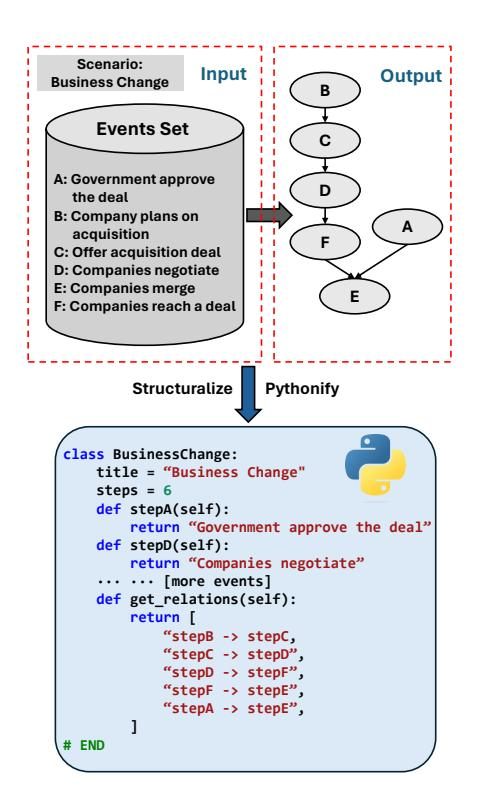
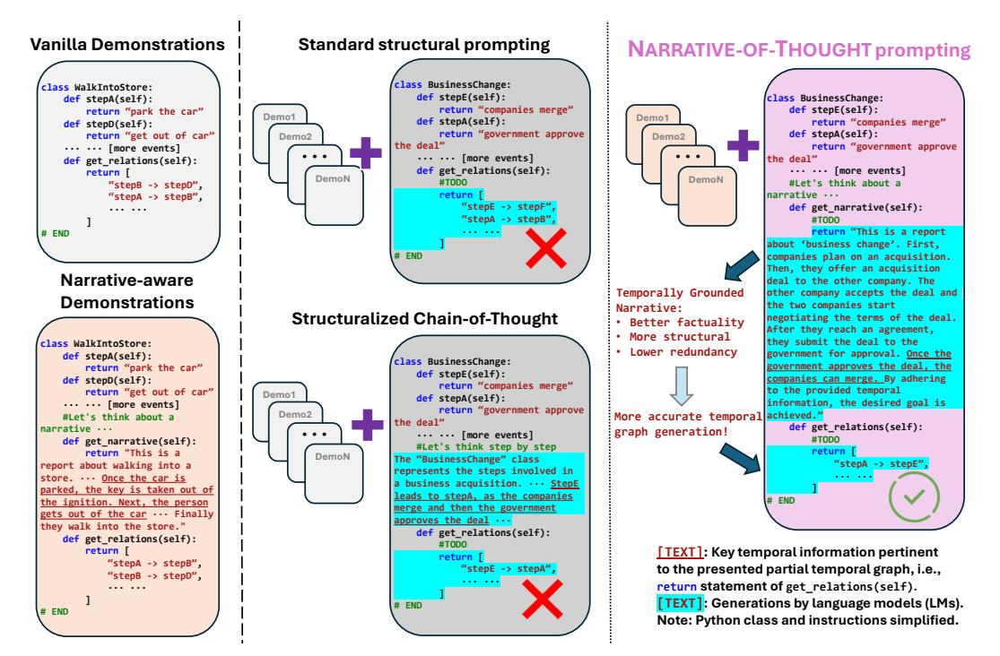
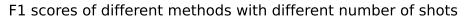
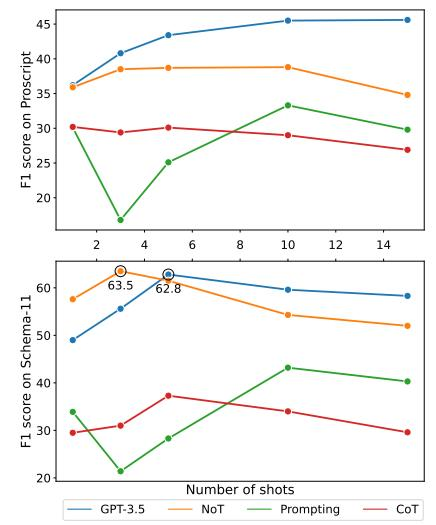
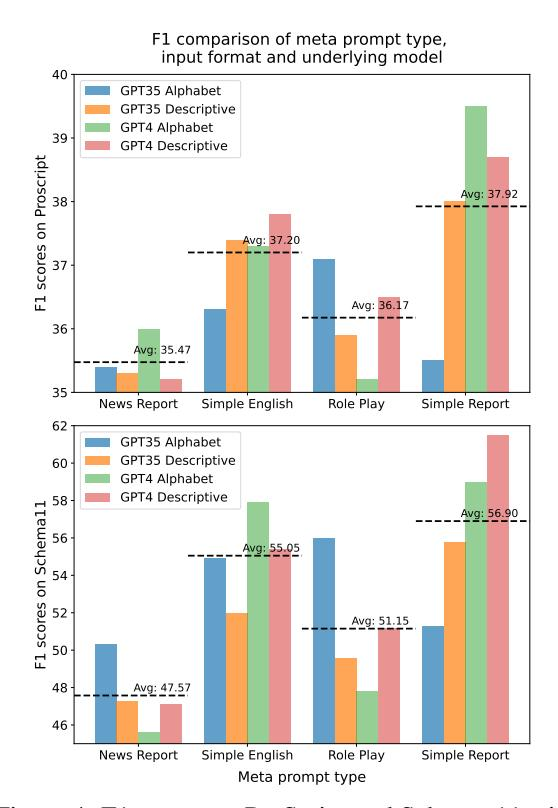
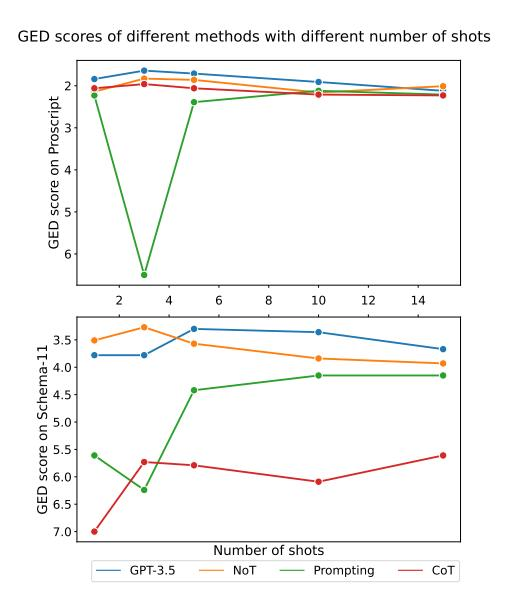
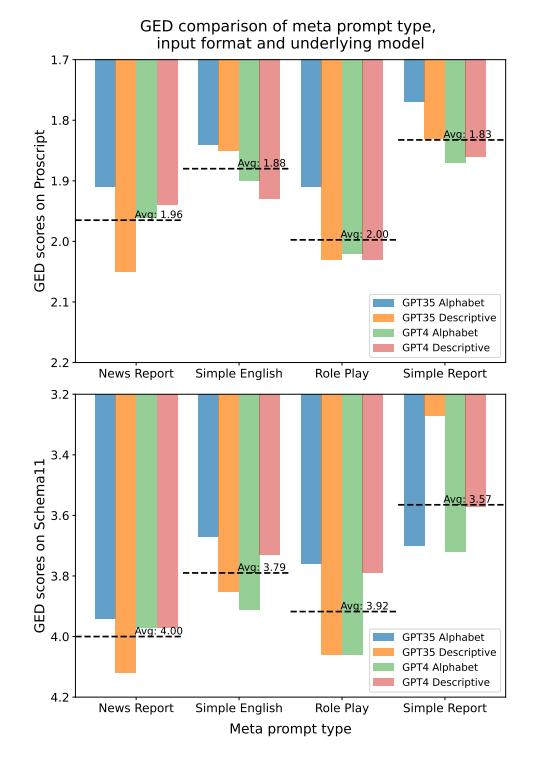
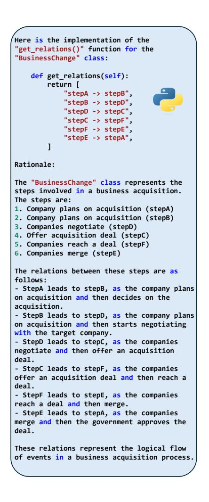
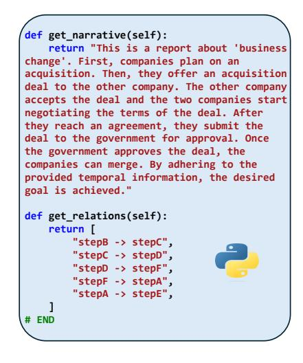

# NARRATIVE-OF-THOUGHT: Improving Temporal Reasoning of Large Language Models via Recounted Narratives

Xinliang Frederick Zhang<sup>1</sup> , Nick Beauchamp<sup>2</sup> , and Lu Wang<sup>1</sup>

<sup>1</sup>Computer Science and Engineering, University of Michigan, Ann Arbor, MI <sup>2</sup>Department of Political Science, Northeastern University, Boston, MA 1 {xlfzhang,wangluxy}@umich.edu, <sup>2</sup>n.beauchamp@northeastern.edu

### Abstract

Reasoning about time and temporal relations is an integral aspect of human cognition, essential for perceiving the world and navigating our experiences. Though large language models (LLMs) have demonstrated impressive performance in many reasoning tasks, temporal reasoning remains challenging due to its intrinsic complexity. In this work, we first study an essential task of temporal reasoning—temporal graph generation, to unveil LLMs' inherent, global reasoning capabilities. We show that this task presents great challenges even for the most powerful LLMs, such as GPT-3.5/4. We also notice a significant performance gap by small models (< 10B) that lag behind LLMs by 50%. Next, we study how to close this gap with a budget constraint, e.g., not using model finetuning. We propose a new prompting technique tailored for temporal reasoning, NARRATIVE-OF-THOUGHT (NOT), that first converts the events set to a Python class, then prompts a small model to generate a temporally grounded narrative, guiding the final generation of a temporal graph. Extensive experiments showcase the efficacy of NOT in improving various metrics. Notably, NOT attains the highest F1 on the Schema-11 evaluation set, while securing an overall F1 on par with GPT-3.5. NOT also achieves the best structural similarity across the board, even compared with GPT-3.5/4.[1](#page-0-0)

### 1 Introduction

Temporal reasoning is essential for humans to perceive the world, understand daily communications, and interpret the temporal aspects of experiences [\(Allen,](#page-10-0) [1983;](#page-10-0) [Nebel and Bürckert,](#page-12-0) [1995\)](#page-12-0). The recent advent of large language models (LLMs) has garnered substantial attention to their impressive performance in various reasoning tasks, such as arithmetic reasoning [\(Cobbe et al.,](#page-11-0) [2021;](#page-11-0) [Zhong](#page-14-0)

<span id="page-0-1"></span>

Figure 1: Task overview of temporal graph generation (TGG), where the input is a goal and a set of unordered events. In this work, to better unleash the pre-training power of LLMs trained with a mixture of text and code, we cast TGG as a code completion task.

[et al.,](#page-14-0) [2024\)](#page-14-0) and commonsense reasoning [\(Tal](#page-13-0)[mor et al.,](#page-13-0) [2019;](#page-13-0) [Anil et al.,](#page-10-1) [2023\)](#page-10-1). Nonetheless, few LLMs exist to handle temporal reasoning well [\(Wang and Zhao,](#page-14-1) [2023;](#page-14-1) [Chu et al.,](#page-11-1) [2023;](#page-11-1) [Chan](#page-10-2) [et al.,](#page-10-2) [2024\)](#page-10-2), due to the task's inherent complexity, mingled with implicit logical inference and the necessity for profound world knowledge.

To gain deeper insights, the research community mainly focuses on two ends along the spectrum: either a simple relation extraction task that orders a pair of events [\(UzZaman et al.,](#page-13-1) [2013;](#page-13-1) [Yuan et al.,](#page-14-2) [2023\)](#page-14-2), or a perplexing commonsense understanding task demanding multifaceted reasoning skills beyond the mere temporal aspect [\(Wenzel and Ja](#page-14-3)[towt,](#page-14-3) [2023;](#page-14-3) [Tan et al.,](#page-13-2) [2023;](#page-13-2) [Xiong et al.,](#page-14-4) [2024\)](#page-14-4).

<span id="page-0-0"></span><sup>1</sup>[Our code is available at](#page-14-0) [https://github.com/](https://github.com/launchnlp/NoT) [launchnlp/NoT](#page-14-0).

Worse still, the former is limited to a *local* scope spanning two adjacent sentences only and fails to account for the significance of *global* temporal relations, leading to overly optimistic results [\(Yuan and](#page-14-5) [Liu,](#page-14-5) [2022;](#page-14-5) [Wang and Zhao,](#page-14-1) [2023\)](#page-14-1). Therefore, neither setup provides a clear understanding of LLMs' true temporal reasoning abilities.

In this work, we aim to unveil the inherent, global temporal reasoning capabilities of LLMs, evaluating them in isolation *free from confounding factors*, and addressing the limitations of previous studies which only focused on local contexts. We first introduce a task of temporal graph generation (TGG; Figure [1\)](#page-0-1): Given a high-level goal[2](#page-1-0) T (e.g., business change) and a set of events V, the objective is to produce a temporal graph G(V, E) where a directed edge in E reveals the temporal order between events. Though this specific notion of TGG is new, many of its applications are not. In this work, we specifically study TGG in order to evaluate and improve the temporal reasoning capability, since TGG is deemed a major bottleneck when LLMs perform temporal reasoning. With TGG, we put forth the first research question.

RQ1: What is the temporal reasoning capability of popular LLMs? Prior work [\(Wang and](#page-14-1) [Zhao,](#page-14-1) [2023;](#page-14-1) [Chu et al.,](#page-11-1) [2023\)](#page-11-1) shows a huge gap between AI systems and human performance on various temporal understanding tasks. Additionally, there is a notable performance disparity between proprietary LLMs (e.g., GPT-4) and open-weights LLMs, particularly those with fewer than 10 billion parameters (henceforth, small LLMs). Our study on temporal reasoning reveals a similar trend and identifies the existence of both gaps, as demonstrated in Table [1.](#page-5-0) This further highlights the importance of an in-depth investigation of TGG, since the performance of downstream tasks (e.g., temporal commonsense understanding) is positively correlated with the inherent, global temporal reasoning capability. Observing the model deficiencies, we are motivated to *fill the gap between openweights, small LLMs and proprietary large models*. This is due to the fact that open-weights LLMs are generally more accessible, reproducible, and cost-effective to use [\(Chen et al.,](#page-10-3) [2023;](#page-10-3) [Zhou et al.,](#page-14-6) [2023\)](#page-14-6). In pursuit of this goal, we present the second research question.

RQ2: With a budget constraint (e.g., not allowing further training), how can small LLMs catch

up with large models like GPT-3.5/4? Given the constraint that no training will be used, we propose NARRATIVE-OF-THOUGHT (NOT), a special prompting technique tailored for temporal reasoning. This method capitalizes on the recent success of the Chain-of-Thought (CoT) technique [\(Wei](#page-14-7) [et al.,](#page-14-7) [2022b;](#page-14-7) [Kojima et al.,](#page-11-2) [2022\)](#page-11-2), found effective in solving complex reasoning tasks. To approach TGG, NOT produces a final temporal graph via first generating a *temporally grounded narrative*[3](#page-1-1) then sorting the input events topologically in reference to the recounted narrative. Inspired by [Madaan et al.](#page-12-1) [\(2022\)](#page-12-1); [Chen et al.](#page-11-3) [\(2022\)](#page-11-3); [Gao et al.](#page-11-4) [\(2023\)](#page-11-4), NOT also features structural representations by converting the input-output mapping to a Python class, and instructing the generation in code space. We further improve NOT by introducing high-quality reference narratives as part of few-shot demonstrations.

Extensive experiments across three evaluation benchmarks of diverse genres reveal six interesting findings: 1) small LLMs *struggle with temporal reasoning* even with few-shot examples; 2) *CoT is also ineffective at temporal reasoning*, in line with existing finding [\(Chu et al.,](#page-11-1) [2023\)](#page-11-1); 3) *GPT-4 sometimes falls off the throne due to alignment*, when answering sensitive queries; 4) NOT is a powerful tool to assist small LLMs to catch up with or even *surpass GPT-3.5*, and presents strong compatibility with various base LLMs; 5) *the temporally grounded narratives are significant in improving LLMs' temporal reasoning process*; 6) *AI systems are far from mastering temporal reasoning*, trailing the human baseline by 30 F1 points.

We also analyze the impact of shot numbers and perform a holistic evaluation of reference narratives in few-shot examples. 5-shot is found to be the sweet spot for temporal reasoning, after which the performance plateaus, likely due to long-context challenge. We identify three key characteristics of reference narratives for them to avail small LLMs most: conciseness, simplicity, and factuality.

### 2 Related Work

#### 2.1 Temporal Reasoning

This work is deeply rooted in a long-standing yet still challenging NLP domain—temporal reasoning [\(Allen,](#page-10-0) [1983;](#page-10-0) [Nebel and Bürckert,](#page-12-0) [1995\)](#page-12-0), which

<span id="page-1-0"></span><sup>2</sup>We use *goal* and *scenario* interchangeably.

<span id="page-1-1"></span><sup>3</sup> In our context, "temporally grounded" refers to events being organized and presented in a way that accurately reflects their temporal sequence or timeline.

involves extraction, representation and reasoning with time and events [\(Sanampudi and Kumari,](#page-13-3) [2010\)](#page-13-3). Depending on the cognitive complexity, temporal reasoning in NLP is studied at three levels: temporal expression detection, temporal relation extraction, and temporal graph generation. The simplest temporal expression detection task is to identify phrases in the text that convey temporal information [\(Setzer,](#page-13-4) [2001;](#page-13-4) [Mani et al.,](#page-12-2) [2001;](#page-12-2) [Pustejovsky et al.,](#page-13-5) [2003\)](#page-13-5), commonly known as TimeX. Further, under-specified TimeX is typically converted to explicit expressions (e.g., "summer 2024") through a process called time expression normalization [\(Verhagen et al.,](#page-13-6) [2010\)](#page-13-6).

Explicit TimeX is often absent in text, and events usually carry implicit temporal information. To bridge the gap, TempEval [\(Verhagen et al.,](#page-13-7) [2009;](#page-13-7) [UzZaman et al.,](#page-13-1) [2013\)](#page-13-1) is curated to support the study of temporal relation extraction, which aims to detect the temporal relation between two *events* in a document. The most common benchmarks, TBdense [\(Chambers et al.,](#page-10-4) [2014\)](#page-10-4) and MATRES [\(Ning](#page-12-3) [et al.,](#page-12-3) [2018\)](#page-12-3), have witnessed the technique evolution from LSTM [\(Dligach et al.,](#page-11-5) [2017\)](#page-11-5) and GNNaugmented BERT [\(Mathur et al.,](#page-12-4) [2021;](#page-12-4) [Wang et al.,](#page-13-8) [2022\)](#page-13-8), to LLMs prompting [\(Yuan et al.,](#page-14-2) [2023\)](#page-14-2). Yet, these benchmarks are limited by their *locality assumption*, where only pairs of events within a two-sentence window are annotated. Even in this simplified scenario of temporal relation extraction, ChatGPT perform poorly, trailing supervised systems by over 30% [\(Chan et al.,](#page-10-2) [2024\)](#page-10-2).

The most challenging task, contextualized temporal graph extraction, is defined as, given a document, generating a corresponding event-level temporal graph [\(UzZaman et al.,](#page-13-1) [2013;](#page-13-1) [Madaan](#page-12-5) [and Yang,](#page-12-5) [2021\)](#page-12-5). This task addresses the limitation of locality by priming models to comprehend the entire article and infer relationships even between distant events. Yet, this area is largely underinvestigated, partly due to the scarcity of available datasets. A similar task is script learning [\(Regneri](#page-13-9) [et al.,](#page-13-9) [2010;](#page-13-9) [Modi et al.,](#page-12-6) [2016;](#page-12-6) [Sakaguchi et al.,](#page-13-10) [2021\)](#page-13-10), which targets inducing a stereotypical progression of *complex* events [\(Schank and Abelson,](#page-13-11) [1975\)](#page-13-11), represented as a temporal graph of more *atomic* events. This task is usually approached by first extracting information snippets from a given document to build an instance graph, and then expanding the graph to generate a schematic graph using GNN [\(Li et al.,](#page-11-6) [2021;](#page-11-6) [Jin et al.,](#page-11-7) [2022\)](#page-11-7) or LLM prompting [\(Dror et al.,](#page-11-8) [2023\)](#page-11-8). Given the

remarkable similarities between these two tasks, we instead study a temporal reasoning task formulation that is *fundamental* to both, i.e., temporal graph generation. It differs from prior work in at least two dimensions: (1) a limited-context setting, where only abstract event descriptions are available, and (2) only a few training samples at hand, rendering fine-tuning techniques inapplicable. This motivates a *training-free assessment* of LLMs' *inherent, global* temporal reasoning capability.

#### <span id="page-2-0"></span>2.2 Chain-of-Thought and its Variants

Despite the strong problem-solving capability in the general domain [\(Wei et al.,](#page-14-8) [2022a\)](#page-14-8), LLMs struggle to address more complex reasoning tasks, such as commonsense understanding and arithmetic reasoning [\(Patel et al.,](#page-12-7) [2021;](#page-12-7) [Talmor et al.,](#page-13-12) [2021a;](#page-13-12) [Huang and Chang,](#page-11-9) [2023\)](#page-11-9). [Wei et al.](#page-14-7) [\(2022b\)](#page-14-7) first introduce the concept *Chain-of-Thought (CoT)* by decomposing multi-step problems into intermediate steps. [Kojima et al.](#page-11-2) [\(2022\)](#page-11-2) further adds a phrase *"Let's think step by step"* to perform zero-shot CoT. These studies underpin the CoT technique in enhancing LLMs' capability for complex reasoning.

Down the line, sophisticated prompting schemes are devised through *structuralization*. One approach is to extend the linear chain structure to Tree-of-Thoughts [\(Yao et al.,](#page-14-9) [2023\)](#page-14-9) and Graph-of-Thoughts [\(Besta et al.,](#page-10-5) [2024\)](#page-10-5), enabling expanded exploration space. The huge search space, however, results in a computational resource dilemma. On top of that, leveraging the deterministic execution to narrow the discrepancy between reasoning and final answer, PoT [\(Chen et al.,](#page-11-3) [2022\)](#page-11-3), PAL [\(Gao](#page-11-4) [et al.,](#page-11-4) [2023\)](#page-11-4) and Faithful CoT [\(Lyu et al.,](#page-12-8) [2023\)](#page-12-8) introduce programming languages to describe the reasoning process structurally. These methods are designed exclusively for solving mathematical reasoning and symbolic reasoning, where the reasoning process and computation can be decoupled. In contrast, for temporal reasoning, the reasoning process and the temporal sorting step are intrinsically interleaved. In fact, [Chu et al.](#page-11-1) [\(2023\)](#page-11-1) has attempted to apply CoT but proved unsuccessful.

Moreover, existing methods are mostly applied to generate intermediate rationales for *simple, atomic outputs*, usually in the format of multichoice options [\(Mihaylov et al.,](#page-12-9) [2018;](#page-12-9) [Talmor](#page-13-0) [et al.,](#page-13-0) [2019;](#page-13-0) [Liu et al.,](#page-11-10) [2020\)](#page-11-10), a number [\(Cobbe](#page-11-0) [et al.,](#page-11-0) [2021;](#page-11-0) [Hendrycks et al.,](#page-11-11) [2021\)](#page-11-11), or yes/no options [\(Talmor et al.,](#page-13-13) [2021b;](#page-13-13) [Wei et al.,](#page-14-8) [2022a\)](#page-14-8). Our work draws a clear distinction where our focus is

<span id="page-3-1"></span>

Figure 2: Overview of NARRATIVE-OF-THOUGHT (NOT), a prompting technique tailored for temporal reasoning. NOT improves the temporal graph by *recounting* a temporally grounded narrative. Also shown are comparisons with existing methods. Full example is in Figure [A4](#page-19-0) and NOT output is in Figure [A7.](#page-20-0)

on structural output generation, augmented with producing a rationale in the form of a compelling and pertinent narrative.[4](#page-3-0)

### 3 Method: NARRATIVE-OF-THOUGHT

Figure [2](#page-3-1) provides an overview of the proposed NARRATIVE-OF-THOUGHT (NOT) method, and draws a comparison against common prompting techniques. Overall, given a scenario and a set of events, NOT first converts the input into a Python class, then guides LLMs to produce a temporally grounded narrative by arranging events in the correct temporal order, leveraging LLMs' intrinsic temporal knowledge. Based on the *recounted* temporal relations articulated in the narrative, LLMs are instructed to sort events into a temporal graph. This section will discuss major components in detail: (1) structural representation, (2) NOT prompting template, and (3) narrative-aware demonstrations.

Structural Representation. Following prior work [\(Madaan et al.,](#page-12-1) [2022;](#page-12-1) [Chen et al.,](#page-11-3) [2022;](#page-11-3) [Gao](#page-11-4) [et al.,](#page-11-4) [2023\)](#page-11-4), we cast temporal reasoning as a code completion task. This design decision is motivated by the unordered nature of both event sets and temporal relation sets, making a structural representation the optimal choice. [Wang et al.](#page-13-15) [\(2023a\)](#page-13-15) also shows that combining structural event representations with LLMs trained with a mixture of text and code can unleash the full pretraining power. We extend this framing to handle cross-event structures. Specifically, a temporal graph is commonly presented in DOT format [\(Madaan and Yang,](#page-12-5) [2021;](#page-12-5) [Sakaguchi et al.,](#page-13-10) [2021\)](#page-13-10), the appearance of which lends itself naturally to the usage of coding format. Furthermore, code execution follows a clear, step-by-step logical flow, mirroring the process of reasoning. Bringing these aspects together results in an alignment between temporal graphs and code structure, facilitating the temporal reasoning process. Our further study on this phenomenon also reveals a strong positive correlation between coding capabilities and temporal reasoning, as documented in Appendix [E](#page-16-0) .

Concretely, each scenario is represented as a Python class. Each class encapsulates events as functions, where the function name is in the form of "step[A-Z]" such as "stepX", and the function body indicates the event description. The temporal graph is represented as a collection of pairwise temporal relations, enclosed within the return statement of "get\_relation()" function, marked by "TODO" for LLMs to implement.

<span id="page-3-0"></span><sup>4</sup>The significance of narrative in shaping human decisionmaking is well-studied [\(Piper et al.,](#page-13-14) [2021;](#page-13-14) [Emelin et al.,](#page-11-12) [2021;](#page-11-12) [Zhang et al.,](#page-14-10) [2024b\)](#page-14-10); we hypothesize machines are similarly influenced.

NARRATIVE-OF-THOUGHT (NOT). At inference time, NOT first prompts LLMs to produce a temporally grounded narrative using *Narrative Prompt*. Drawing on the generated narrative, LLMs proceed and complete generation in response to *Temporal Graph Prompt*. The entire generation process is in an end-to-end manner, ensuring that LLMs explicitly leverage the temporal relations articulated in the narrative to assist the generation of the final temporal graph. We provide a complete example in Appendix [C.](#page-16-1)

#### Narrative Prompt

# Let's think of a narrative to link aforementioned events in the correct temporal order. def get\_narrative(self): # TODO

#### Temporal Graph Prompt

def get\_relations(self): # TODO # END

Overall, NOT narrows the gap between pretraining and inference by allowing the LLM to unfold the narrative knowledge seen during pretraining. Concretely, our approach leverages LLMs' inherent strengths in *generating* and *comprehending* text for narrative and temporal graph generation, respectively. In contrast, directly mapping abstract events to a temporal graph is less effective, as such examples are rarely encountered during pre-training. Practically, generated narratives create imagined experiences to navigate, and reify implicit timelines, assisting reasoning over a series of events even without explicit timestamps provided in the text, which are crucial for tasks requiring temporal reasoning. By reading the *recounted* narrative, it becomes easier for the LLMs to construct an implicit timeline to guide event sorting, significantly reducing the reasoning complexity compared to generating temporal graphs from scratch (i.e., using abstract events alone).

Our NOT draws a clear distinction from the CoT prompting and its variants in four aspects. First, for CoT, a final answer cannot be easily extracted unless a post-hoc script is designed [\(Ko](#page-11-2)[jima et al.,](#page-11-2) [2022;](#page-11-2) [Wang et al.,](#page-14-11) [2023b;](#page-14-11) [Zheng et al.,](#page-14-12) [2024\)](#page-14-12), which can be sometimes error-prone, while the output of NOT is easy to obtain by parsing the get\_relations() function. Second, NOT produces final outputs in the structural space, while existing methods solely produce *simple, atomic*

*outputs* as discussed in [§2.2.](#page-2-0) Third, NOT produces final temporal graphs cost-effectively without external tools in an end-to-end fashion, unlike pipeline approaches which face error propagation and oversampling issues [\(Dror et al.,](#page-11-8) [2023\)](#page-11-8). Lastly, the generated rationales by CoTs are not necessarily grounded in real-world experience. In contrast, generated narratives by NOT are steered to be more *temporally grounded*, creating an imagined experience for LLMs to navigate, which is proved effective.

Narrative-aware Demonstrations. Existing studies [\(Brown et al.,](#page-10-6) [2020;](#page-10-6) [Wei et al.,](#page-14-8) [2022a\)](#page-14-8) have demonstrated that in-context demonstrations play a critical role in guiding LLMs to produce meaningful outputs. NOT is no exception, as Table [1](#page-5-0) reveals that even GPT-3.5 struggles with temporal reasoning in a zero-shot setting. Thus, few-shot examples are provided by default. For NOT to succeed, high-quality and relevant rehearsed narratives, termed *reference narratives*, need to be created and embedded in these demonstrations.

Capitalizing on the recent success of using LLMs to generate demonstrations [\(Yu et al.,](#page-14-13) [2023;](#page-14-13) [Li et al.,](#page-11-13) [2023\)](#page-11-13), we prompt GPT-3.5/4 to produce reference narratives. Concretely, for each demonstration, abstracted as G(V, E), we feed both V and E into GPT-3.5/4, using our designed reference narrative generation templates, dubbed *meta prompts*. In total, we create 4 types of meta prompts covering diverse genres like news and children's stories. Additionally, when feeding G(V, E) into GPT-3.5/4, we use two *input formats* to define a Python class (*alphabetical* like "stepX" in Figure [A8](#page-21-0) vs. descriptive like "pushPedal" in Figure [A9\)](#page-21-1). We later evaluate the usefulness of each meta prompt in [§5.2.](#page-7-0) Details of meta prompts are documented in Appendix [D.](#page-16-2)

### 4 Experiment

In this work, we focus on Temporal Graph Generation (TGG), an essential task of temporal reasoning. Here, we discuss datasets, experimental setup, baselines, and evaluation metrics. We provide additional implementation details in Appendix [A.](#page-16-3)

#### 4.1 Dataset

In line with the literature, we use ProScript [\(Sak](#page-13-10)[aguchi et al.,](#page-13-10) [2021\)](#page-13-10) as the major benchmark, where a temporal script is represented as a directed acyclic graph, which were collected from a diverse range of

<span id="page-5-0"></span>

| Method                    |      |          | Proscript |        |      | Schema-11                       |      |        |      | WikiHow Script |      |        |      | Avg.     |
|---------------------------|------|----------|-----------|--------|------|---------------------------------|------|--------|------|----------------|------|--------|------|----------|
|                           |      | F1↑ GED↓ | k(G)      | Cons.↑ |      | F1↑ GED↓                        | k(G) | Cons.↑ |      | F1↑ GED↓       | k(G) | Cons.↑ |      | F1↑ GED↓ |
|                           |      |          |           |        |      | Baselines                       |      |        |      |                |      |        |      |          |
| Random                    | 14.0 | 1.47     | 1.00      | 7.8    | 19.4 | 3.91                            | 1.00 | 7.8    | 14.2 | 0.06           | 1.00 | 8.8    | 15.9 | 1.81     |
| GPT-3.5 (0-shot)*         | 18.4 | 2.25     | 1.06      | 38.6   | 30.1 | 4.48                            | 1.27 | 30.2   | 17.2 | 2.80           | 1.11 | 40.8   | 21.9 | 3.18     |
| GPT-3.5                   | 43.4 | 1.71     | 1.07      | 38.8   | 62.8 | 3.30                            | 1.36 | 50.2   | 31.0 | 1.58           | 1.10 | 35.4   | 45.7 | 2.20     |
| GPT-4                     | 63.9 | 1.64     | 1.02      | 61.4   | 44.1 | 7.97                            | 0.64 | 46.3   | 43.0 | 1.71           | 1.04 | 48.5   | 50.3 | 3.77     |
|                           |      |          |           |        |      | GEMMA-7B (Mesnard et al., 2024) |      |        |      |                |      |        |      |          |
| Standard Prompting        | 19.7 | 2.35     | 1.02      | 20.4   | 27.8 | 5.03                            | 1.03 | 18.3   | 17.5 | 2.88           | 0.96 | 17.3   | 21.7 | 3.42     |
| Chain-of-Thought          | 20.0 | 2.35     | 1.01      | 20.0   | 26.4 | 5.03                            | 1.03 | 14.9   | 13.6 | 5.91           | 0.73 | 11.5   | 20.0 | 4.43     |
| NOT (no reference)        | 20.0 | 2.47     | 1.00      | 17.3   | 27.9 | 4.78                            | 1.09 | 18.1   | 15.2 | 5.03           | 0.81 | 13.9   | 21.0 | 4.09     |
| NOT (alphabetical meta)   | 21.8 | 2.48     | 1.00      | 18.3   | 36.0 | 4.84                            | 1.06 | 19.7   | 17.9 | 2.95           | 0.96 | 16.9   | 25.2 | 3.42     |
| NOT (descriptive meta)    | 21.3 | 2.60     | 0.99      | 17.8   | 34.8 | 5.00                            | 1.06 | 20.8   | 17.9 | 2.88           | 0.95 | 16.8   | 24.7 | 3.49     |
|                           |      |          |           |        |      | MISTRAL-7B (Jiang et al., 2023) |      |        |      |                |      |        |      |          |
| Standard Prompting        | 30.7 | 2.16     | 1.05      | 22.3   | 35.3 | 4.55                            | 1.12 | 29.1   | 22.5 | 2.09           | 1.11 | 18.9   | 29.5 | 2.93     |
| Chain-of-Thought          | 29.8 | 2.66     | 1.02      | 22.1   | 35.2 | 5.33                            | 0.94 | 30.5   | 20.5 | 2.59           | 1.10 | 17.4   | 28.5 | 3.53     |
| NOT (no reference)        | 32.5 | 3.04     | 0.95      | 19.4   | 42.3 | 5.27                            | 1.00 | 27.6   | 21.8 | 3.33           | 0.98 | 15.4   | 32.2 | 3.88     |
| NOT (alphabetical meta)   | 35.2 | 2.11     | 1.02      | 22.4   | 50.9 | 4.30                            | 1.03 | 36.1   | 21.7 | 2.49           | 1.04 | 14.8   | 35.9 | 2.97     |
| NOT (descriptive meta)    | 35.4 | 2.14     | 1.02      | 23.0   | 52.7 | 3.90                            | 1.06 | 32.5   | 22.1 | 2.53           | 1.04 | 15.1   | 36.7 | 2.86     |
| LLAMA3-8B (AI@Meta, 2024) |      |          |           |        |      |                                 |      |        |      |                |      |        |      |          |
| Standard Prompting        | 25.1 | 2.39     | 1.18      | 19.9   | 28.3 | 4.42                            | 1.24 | 19.9   | 20.6 | 1.17           | 1.07 | 21.2   | 24.7 | 2.66     |
| Chain-of-Thought          | 30.1 | 2.06     | 1.00      | 23.3   | 37.3 | 5.79                            | 0.85 | 23.5   | 22.6 | 0.99           | 1.02 | 24.3   | 30.0 | 2.95     |
| NOT (no reference)        | 35.5 | 1.88     | 1.00      | 25.3   | 52.6 | 3.18                            | 1.12 | 35.0   | 25.4 | 0.99           | 1.02 | 20.9   | 37.8 | 2.02     |
| NOT (alphabetical meta)   | 39.5 | 1.87     | 1.01      | 28.8   | 59.0 | 3.72                            | 1.12 | 39.1   | 26.3 | 1.01           | 1.03 | 22.5   | 41.6 | 2.20     |
| NOT (descriptive meta)    | 38.7 | 1.86     | 1.01      | 28.4   | 61.5 | 3.57                            | 1.09 | 45.6   | 26.5 | 1.04           | 1.03 | 22.3   | 42.2 | 2.16     |

Table 1: Main results of base LLMs and strong baselines on TGG evaluation benchmarks (average of 3 runs). For each base model, best results are bold, and NOT's variants better than both Standard Prompting and CoT are highlighted . NOT results that outperform 5-shot GPT-3.5 and GPT-4 are in blue . Results that meet both criteria

are in purple . On average, NOT boosts F1 metric over its base model by 16% to 71%, and sometimes improves the GED metric. NOT-augmented LLAMA3-8B achieves best overall F1 (63.5 F1 by 3-shot variant; Figure [3\)](#page-7-1) and GED results on Schema-11. Also, it only trails GPT-3.5 and GPT-4 by 8% and 14% on average, while yielding a lower average GED. Full results in Table [A1.](#page-15-0) \*By default, 5-shot examples are provided, unless otherwise noted.

sources including ROCStories [\(Mostafazadeh et al.,](#page-12-11) [2016\)](#page-12-11), Descript [\(Wanzare et al.,](#page-14-14) [2016\)](#page-14-14), and Virtual home [\(Puig et al.,](#page-13-16) [2018\)](#page-13-16). We also adopt two other datasets to enrich the evaluated genres and domains, and make necessary changes for the TGG task: 1) Schema-11 evaluation set [\(Dror et al.,](#page-11-8) [2023\)](#page-11-8), which contains human-curated event schemas for 11 newsworthy topics, such as *armed robbery* and *business change*; and 2) WikiHow Script corpus [\(Lyu et al.,](#page-12-12) [2021\)](#page-12-12), a collection of multilingual howto articles depicting necessary steps performed in sequence to achieve a high-level goal, covering a wide range of daily activities. Dataset statistics are included in Table [2,](#page-6-0) and we provide detailed dataset processing steps in Appendix [B.](#page-16-4)

#### <span id="page-5-1"></span>4.2 Setup

As our goal is to study the capability and generalizability of existing LLMs, and our NOT without any fine-tuning, we assume no access to large-scale training sets except for few-shot demonstrations. Therefore, all experiments are conducted in a 5 shot setting. We provide analysis on the impact of the shots numbers in [§5.2.](#page-7-0) We consider three

base models to spotlight the compatibility and versatility of NOT. We include very recent, strong LLMs, showing promising results on various reasoning tasks and code completion tasks, MISTRAL-7B [\(Jiang et al.,](#page-11-14) [2023\)](#page-11-14), GEMMA-7B [\(Mesnard et al.,](#page-12-10) [2024\)](#page-12-10), and LLAMA3-8B [\(AI@Meta,](#page-10-7) [2024\)](#page-10-7). For all base models, we use their instruction-fine-tuned versions for experiments.

Shown in Figure [2,](#page-3-1) we represent the event set as a suite of Python methods, by serializing the unordered event set. For each scenario, we randomly shuffle the input Python methods three times, and apply models to each shuffle with greedy decoding at inference. For NOT, we use *Simple Report*style narratives by GPT-4, which are generated by following instructions to produce concise reports based on provided event descriptions and relations (see style details in Table [A2\)](#page-17-0).

#### 4.3 Baselines

To showcase the effectiveness of NOT, for each base model we compare with standard structural prompting and structuralized chain-of-thought prompting (Figure [2\)](#page-3-1). We also remove reference

<span id="page-6-0"></span>

|                             | #scenarios | #events | Max #events | #temporal links | Event length | %Non-linear | Domain |
|-----------------------------|------------|---------|-------------|-----------------|--------------|-------------|--------|
| ProScrpt (Sakaguchi et al.) | 2,077      | 7.46    | 9           | 6.95            | 4.64         | 39%         | Daily  |
| Schema-11 (Dror et al.)     | 11         | 7.91    | 11          | 7.18            | 3.48         | 27%         | News   |
| WikiHow Script (Lyu et al.) | 2,991      | 8.37    | 20          | 7.37            | 9.63         | 0%          | Daily  |

Table 2: Basic statistics of evaluation datasets. Max #events indicate the maximum number of events for a scenario. Event length is defined as the number of words in the event description. %Non-linear tells the proportion of temporal graphs that contain at least one branch. Two domains are considered, *Daily* activity and *News* journalism.

narratives in demonstrations to highlight the importance of narrative-aware few-shot demonstrations, and conduct a holistic evaluation of reference narratives in [§5.2.](#page-7-0) We include a random baseline, where events are naively connected to form a *linear* temporal chain based on the order they appear in the input. We also experiment with two strong proprietary models, GPT-3.5[5](#page-6-1) and GPT-4 [\(OpenAI,](#page-12-13) [2023\)](#page-12-13) [6](#page-6-2) to help gauge the gap between AI systems and human-level performance.

#### 4.4 Evaluation Metrics

We denote the ground-truth and generated temporal graphs as G(V, E) and Gˆ(V, Eˆ), respectively. we compare both semantic and structural similarities between G and Gˆ, following prior work [\(Sakaguchi](#page-13-10) [et al.,](#page-13-10) [2021;](#page-13-10) [Madaan et al.,](#page-12-1) [2022\)](#page-12-1). To evaluate semantic similarity, we report *precision (P)* and *recall (R)*, defined as below, as well as *F1*.

$$
\text{Precision} = \frac{|\mathcal{E} \cap \hat{\mathcal{E}}|}{|\hat{\mathcal{E}}|} \quad \text{Recall} = \frac{|\mathcal{E} \cap \hat{\mathcal{E}}|}{|\mathcal{E}|}
$$

To assess structural similarities, we consider:

- *Graph Edit Distance* (*GED*; [Abu-Aisheh et al.,](#page-10-8) [2015\)](#page-10-8) calculates the minimum number of edits (node/edge removal/additions) to transform Gˆ to a graph isomorphic to G.
- *Graph Statistics*: fraction of the number of edges between Gˆ and G ( |E| ˆ |E|); the number of connected components in Gˆ, denoted as k(G). The goal is to bring both statistics closer to 1, additionally ensuring k(G) is at least 1.

We further calculate *Pair-wise Consistency* between Gˆ <sup>i</sup> and Gˆ <sup>j</sup> , where we compare generated graphs, based on two randomly shuffled inputs, and compute the proportion of common temporal links produced in both graphs, i.e., |E<sup>ˆ</sup> <sup>i</sup>∩Eˆ j | |Eˆ <sup>i</sup>∪Eˆ j | .

### 5 Results and Analyses

#### <span id="page-6-4"></span>5.1 Main Results

Major results are included in Table [1,](#page-5-0) and the full results (across all 7 metrics) can be found in Table [A1.](#page-15-0) Below are our major findings.

1) *With the few-shot setup, small LLMs are dramatically underperforming, reaching barely 50% of GPT-4's capabilities.* The three base models, whether using standard prompting or CoT, consistently under-perform GPT-4 and attain 40% to 60% of its average F1 scores. Among them, MISTRAL-7B achieves the highest F1 scores, while LLAMA3- 8B produces temporal graphs most similar to the ground truth, as measured by GED.

2) *Unlike many other reasoning tasks, CoT does not always work for temporal reasoning and sometimes degrades performance.* Unlike mathematical or logical reasoning [\(Wei et al.,](#page-14-7) [2022b\)](#page-14-7), CoT prompting does not necessarily enhance model performance on temporal reasoning tasks. Across all three base models, there is a notable degradation in F1 and GED scores with CoT, except for LLAMA3's F1 scores. This is not TGG-specific, but rather a common pattern across various temporal understanding tasks [\(Chu et al.,](#page-11-1) [2023\)](#page-11-1), highlighting the need for specialized approaches to temporal reasoning. Outputs by CoT are included in Figure [A6.](#page-20-1)

3) *GPT-4 is not always the champion, owing to the added safety layer.* GPT-4 implements safety measures through human-preference alignment [\(OpenAI,](#page-12-13) [2023\)](#page-12-13), which enhances model safety by prompting more cautious responses, potentially leading to performance drop [\(Bai et al.,](#page-10-9) [2022;](#page-10-9) [Bek](#page-10-10)[bayev et al.,](#page-10-10) [2023\)](#page-10-10). Especially on Schema-11, GPT-4 refrains from providing answers to sensitive scenarios like "bombing attacks",[7](#page-6-3) and thus fails to produce a valid temporal graph.

4) *With* NOT*, small LLMs can perform comparably to GPT-3.5, or even take the lead.* When equipped with NOT, the overall semantic correctness (F1) and structural similarity (GED) of the

<span id="page-6-1"></span><sup>5</sup> <https://chat.openai.com/>;

<span id="page-6-2"></span>gpt-35-turbo-16k-0613, training data up to Sept. 2021. 6 gpt-4-turbo-0125-preview, data up to Dec. 2023.

<span id="page-6-3"></span><sup>7</sup> In our experiments, we disabled content filtering.

|     |      | GEMMA-7B |      | MISTRAL-7B |      | LLAMA3-8B |
|-----|------|----------|------|------------|------|-----------|
|     | F1↑  | GED↓     | F1↑  | GED↓       | F1↑  | GED↓      |
| NOT | 21.8 | 2.48     | 35.4 | 2.14       | 39.5 | 1.87      |
| FT  | 68.6 | 1.63     | 71.2 | 1.38       | 71.9 | 1.40      |

Table 3: Performance comparison between NOT and fine-tuning (FT) on ProScript. GPT-4 achieves 63.9 F1 and 1.64 GED, both lagging behind fine-tuned LLMs.

generated temporal graphs are significantly enhanced, regardless of which base LLM is used. The average improvement of F1 over naively prompting the base model is between 16% to 71%. As the power of the base LLM grows, NOT demonstrates greater consistency in its outputs. Notably, with LLAMA3-8B, the strongest base LLM, NOT achieves an F1 score that is comparable to GPT-3.5 (42.2 vs. 45.7), and even outperforms GPT-3.5/4 on GED. These results demonstrate the potential of applying NOT in a wide range of temporal understanding tasks in future research.

5) *Recounting temporally grounded narrative is a prerequisite for LLMs to generate temporal graphs accurately.* Without high-quality reference narratives, LLMs struggle to generate temporally grounded narratives, leading to a detrimental impact on NOT-augmented GEMMA-7B (e.g., a 0.7 F1 drop and a 0.67 GED increase).

6) *LLMs, including the powerful GPT-4, lag far behind human-level performance in temporal reasoning.* The SOTA F1 score (by GPT-4) on ProScript is 63.9, whereas the human baseline F1 is 89.3 [\(Sakaguchi et al.,](#page-13-10) [2021\)](#page-13-10). While NOT has notably narrowed the gap between small and large LLMs, AI models have not mastered temporal reasoning yet, and further research efforts are needed for LLMs to match human performance.

Comparison with fine-tuned LLMs. To evaluate the performance gap between the NOT prompting technique and the computational-intense finetuning (FT) approach, we conduct a side experiment on the ProScript dataset. Specifically, each instruction-tuned base LLM is fine-tuned on the ProScript training set, utilizing LoRA [\(Hu et al.,](#page-11-15) [2022\)](#page-11-15) and mixed-precision training. We follow the same setting as in [§4.2](#page-5-1) where each training example is prepended with 5-shot demonstrations. While significant performance disparities between NOT and FT are observed across the board, the narrowing gap suggests the growing potential of NOT as the underlying LLM continues to evolve. Moreover, fine-tuned small LLMs consistently outperform the few-shot GPT-4, which is the best-performing gen-

<span id="page-7-1"></span>



Figure 3: F1 scores on ProScript and Schema-11 in relation to the number of shots in demonstrations. We identify the instability in the standard prompting, and the performance plateau after 5 shots.

eralist model on the ProScript dataset. This underscores the continued efficacy of FT in building specialized models, even in the era of LLMs.

#### <span id="page-7-0"></span>5.2 Further Studies on NOT

We conduct ablation studies using LLAMA3-8B, to explore the effect of the few-shot demonstrations and the recounted reference narratives.

Does the number of shots matter? Figure [3](#page-7-1) illustrates how F1 scores change with the number of shots in demonstrations. As can be seen, GPT-3.5 and NOT show resilience to changes in shot numbers after an initial sharp increase. The performance nearly stabilizes in the range of 5-10 shots, though a slight drop is observed later, presumably due to insufficient capability of long-context comprehension [\(Liu et al.,](#page-12-14) [2023;](#page-12-14) [Li et al.,](#page-11-16) [2024\)](#page-11-16). Of particular interest is the performance of NOT with 3 shots on Schema-11, outperforming the best variant of GPT-3.5 (F1 of 63.5 vs. 62.8). This further illustrates NOT's potential of boosting small LLMs in the long run. It is also noticeable that F1 scores of the standard prompting technique have a V-shape between 1-shot and 5-shot, highlighting its sensitiveness to in-context demonstrations.

We also display the GED scores in relation to number of shots in Figure [A1.](#page-17-1) We observe similar instability in the standard prompting technique, along with the performance plateau after 5 shots.

What characteristics define effective reference narratives? Given that reference narratives in

NOT are machine-generated, we aim to explore what qualities matter most for the TGG task. Here, the three variables influencing reference narratives are: (1) narrative generation model (GPT-3.5 vs. GPT-4), (2) input format (alphabetical vs. descriptive), and (3) 4 meta prompt types (varying degrees of factuality and readability). We show detailed meta prompts in Appendix [D.](#page-16-2)

Figure [4](#page-8-0) and Figure [A2](#page-17-2) show results of F1 and GED with varying meta prompts. Surprisingly, the choice of the generator does not significantly impact the graph quality, with average F1 scores of 36.4 for GPT-3.5 and 37.0 for GPT-4, and GED scores of 1.90 vs. 1.94. Similarly, there is no significant difference between alphabetical and descriptive input formats. The most *impactful* factor is the meta prompt type. Grouping performance bars by prompt type reveals a clear variance in model performance. Among the first three groups, *Simple English* narratives, i.e., good for 10-year-olds, stand out. This suggests that narratives should be simple and concise, as verbose ones are less effective. We find that *News Report* narratives prioritize procedural and factual content, minimizing distractions like descriptive settings or figurative language that can often be found in both fiction or non-fiction stories. We thus combine *Simple English* and *News Report* to leverage their strengths, dubbed *Simple Report*. In summary, we identify three key characteristics for quality reference narratives: *conciseness*, *simplicity* and *factuality*.

How faithful is the temporal graph to intermediate narratives? Here, we look into whether NOT-augmented LLMs are self-faithful, i.e., whether the narrative and the temporal graph align in terms of the temporal order of events. Higher self-faithfulness is crucial and desired, as misalignment would diminish the effort of generating a temporally grounded narrative.[8](#page-8-1)

Motivated by the recent success of using LLMs as judges [\(Zheng et al.,](#page-14-15) [2023;](#page-14-15) [Zhang et al.,](#page-14-16) [2024a\)](#page-14-16), we employ GPT-4 to assess the self-faithfulness of 600 randomly sampled outputs by NOT-augmented LLAMA3-8B. We prompt GPT-4 to perform a 5 way assessment and provide judgment rationales. Additionally, GPT-4 is instructed to count the temporal links in the temporal graphs and identify aligned temporal links for a sanity check. This helps humans capture the failure modes and make

<span id="page-8-0"></span>

Figure 4: F1 scores on ProScript and Schema-11 with different meta prompts. Average performance grouped by prompt type is also shown. Notably, using a *Simple Report*-style, GPT-4 generated narratives lead to the best score due to its conciseness, simplicity and factuality, which are essential qualities for a *high-quality* reference narrative.

necessary interventions. Based on automated responses and on-demand human inspections, we find a medium-to-high alignment of 72.8%. Details of templates and the inspection process are included in Appendix [F.](#page-18-0)

### 6 Conclusion

In this paper, we assess the inherent, global temporal reasoning capabilities of LLMs, by studying the core challenge of temporal reasoning temporal graph generation (TGG). To this end, we propose NARRATIVE-OF-THOUGHT (NOT), a novel prompting technique tailored for temporal reasoning. Concretely, with few-show narrativeaware demonstrations as references, NOT prompts LLMs to first generate a temporally grounded narrative and then sort the input events topologically into a temporal graph, by manipulating the generation in code space. Extensive experiments showcase NOT's effectiveness, demonstrated by its superior performance over GPT-3.5 on multiple metrics, as well as the compatibility of NOT with various LLMs.

<span id="page-8-1"></span><sup>8</sup> Faithfulness ̸= correctness. A faithful temporal graph may still contain logical errors from the generated narratives.

# Acknowledgments

This work is supported in part through Air Force Office of Scientific Research under grant FA9550- 22-1-0099, and computational resources and services provided by Advanced Research Computing (ARC), a division of Information and Technology Services (ITS) at the University of Michigan, Ann Arbor. We thank ARR reviewers for their valuable feedback.

# Limitations

Evaluation benchmarks. In this work, we have included three evaluation benchmarks, aiming to cover a diverse array of genres and domains. Yet, these three benchmarks cannot comprehensively represent the entire spectrum. For example, healthcare and biomedical [\(Alfattni et al.,](#page-10-11) [2020\)](#page-10-11) domains offer great opportunities to study temporal graph generation as well. In future research, we plan to extend NOT to more applications, and examine its true generalizability in the wild.

Human baseline comparison. The last finding we deliver in [§5.1](#page-6-4) might not hold for all benchmarks, as the human baseline comparison was conducted solely on the ProScript dataset. We will continue the endeavor of seeking participants to perform human evaluations on the other two datasets to enhance the credibility of our claim.

Scaling effect. While we recognize the value of investigating models of different sizes to explore the scaling effect of NOT, we did not pursue this for two reasons. First, one primary goal is to enable small LLMs (<10B parameters) to match the performance of larger ones like GPT-3.5/4 (RQ2). Second, among the three base models selected in this work, the open-weight Mistral only has a 7B version; while Gemma does have 2B and 7B versions, preliminary results showed that the 2B version yielded subpar performance (e.g., poor instructionfollowing, outputs are simply concatenations of events in the input order). As for LLAMA3 (8B vs. 70B), we couldn't produce results for 70B due to computational constraints.

GPU resources. The base LLMs used in this work are of 7 to 8 billions parameters. It is thus more time-consuming than traditionally small models like BERT [\(Devlin et al.,](#page-11-17) [2019\)](#page-11-17) at inference time, which in turn results in a higher carbon footprint. Specifically, we run each base LLM on 1

single NVIDIA A40 or NVIDIA L40 with significant CPU and memory resources. The combined inference time for each LLM on the three benchmarks ranges from 10 to 20 hours, depending on the configurations.

### References

- <span id="page-10-12"></span>Marah I Abdin, Sam Ade Jacobs, Ammar Ahmad Awan, Jyoti Aneja, Ahmed Awadallah, Hany Awadalla, Nguyen Bach, Amit Bahree, Arash Bakhtiari, Harkirat S. Behl, Alon Benhaim, Misha Bilenko, Johan Bjorck, Sébastien Bubeck, Martin Cai, Caio César Teodoro Mendes, Weizhu Chen, Vishrav Chaudhary, Parul Chopra, Allie Del Giorno, Gustavo de Rosa, Matthew Dixon, Ronen Eldan, Dan Iter, Amit Garg, Abhishek Goswami, Suriya Gunasekar, Emman Haider, Junheng Hao, Russell J. Hewett, Jamie Huynh, Mojan Javaheripi, Xin Jin, Piero Kauffmann, Nikos Karampatziakis, Dongwoo Kim, Mahoud Khademi, Lev Kurilenko, James R. Lee, Yin Tat Lee, Yuanzhi Li, Chen Liang, Weishung Liu, Eric Lin, Zeqi Lin, Piyush Madan, Arindam Mitra, Hardik Modi, Anh Nguyen, Brandon Norick, Barun Patra, Daniel Perez-Becker, Thomas Portet, Reid Pryzant, Heyang Qin, Marko Radmilac, Corby Rosset, Sambudha Roy, Olatunji Ruwase, Olli Saarikivi, Amin Saied, Adil Salim, Michael Santacroce, Shital Shah, Ning Shang, Hiteshi Sharma, Xia Song, Masahiro Tanaka, Xin Wang, Rachel Ward, Guanhua Wang, Philipp Witte, Michael Wyatt, Can Xu, Jiahang Xu, Sonali Yadav, Fan Yang, Ziyi Yang, Donghan Yu, Chengruidong Zhang, Cyril Zhang, Jianwen Zhang, Li Lyna Zhang, Yi Zhang, Yue Zhang, Yunan Zhang, and Xiren Zhou. 2024. [Phi-3 technical report: A](https://doi.org/10.48550/ARXIV.2404.14219) [highly capable language model locally on your phone.](https://doi.org/10.48550/ARXIV.2404.14219) *CoRR*, abs/2404.14219.
- <span id="page-10-8"></span>Zeina Abu-Aisheh, Romain Raveaux, Jean-Yves Ramel, and Patrick Martineau. 2015. An exact graph edit distance algorithm for solving pattern recognition problems. In *ICPRAM 2015 - Proceedings of the International Conference on Pattern Recognition Applications and Methods, Volume 1, Lisbon, Portugal, 10-12 January, 2015*, pages 271–278. SciTePress.

<span id="page-10-7"></span>AI@Meta. 2024. [Llama 3 model card.](https://github.com/meta-llama/llama3/blob/main/MODEL_CARD.md)

- <span id="page-10-11"></span>Ghada Alfattni, Niels Peek, and Goran Nenadic. 2020. [Extraction of temporal relations from clinical free](https://doi.org/10.1016/J.JBI.2020.103488) [text: A systematic review of current approaches.](https://doi.org/10.1016/J.JBI.2020.103488) *J. Biomed. Informatics*, 108:103488.
- <span id="page-10-0"></span>James F. Allen. 1983. [Maintaining knowledge about](https://doi.org/10.1145/182.358434) [temporal intervals.](https://doi.org/10.1145/182.358434) *Commun. ACM*, 26(11):832–843.
- <span id="page-10-1"></span>Rohan Anil, Andrew M. Dai, Orhan Firat, Melvin Johnson, Dmitry Lepikhin, Alexandre Passos, Siamak Shakeri, Emanuel Taropa, Paige Bailey, Zhifeng Chen, Eric Chu, Jonathan H. Clark, Laurent El Shafey, Yanping Huang, Kathy Meier-Hellstern, Gaurav Mishra, Erica Moreira, Mark Omernick, Kevin Robinson, Sebastian Ruder, Yi Tay, Kefan Xiao, Yuanzhong Xu, Yujing Zhang, Gustavo Hernández Ábrego, Junwhan Ahn, Jacob Austin, Paul Barham, Jan A. Botha, James Bradbury, Siddhartha Brahma, Kevin Brooks, Michele Catasta, Yong Cheng, Colin Cherry, Christopher A. Choquette-Choo, Aakanksha Chowdhery, Clément Crepy, Shachi Dave, Mostafa Dehghani, Sunipa Dev, Jacob Devlin, Mark Díaz,

Nan Du, Ethan Dyer, Vladimir Feinberg, Fangxiaoyu Feng, Vlad Fienber, Markus Freitag, Xavier Garcia, Sebastian Gehrmann, Lucas Gonzalez, and et al. 2023. [Palm 2 technical report.](https://doi.org/10.48550/ARXIV.2305.10403) *CoRR*, abs/2305.10403.

- <span id="page-10-9"></span>Yuntao Bai, Andy Jones, Kamal Ndousse, Amanda Askell, Anna Chen, Nova DasSarma, Dawn Drain, Stanislav Fort, Deep Ganguli, Tom Henighan, Nicholas Joseph, Saurav Kadavath, Jackson Kernion, Tom Conerly, Sheer El Showk, Nelson Elhage, Zac Hatfield-Dodds, Danny Hernandez, Tristan Hume, Scott Johnston, Shauna Kravec, Liane Lovitt, Neel Nanda, Catherine Olsson, Dario Amodei, Tom B. Brown, Jack Clark, Sam McCandlish, Chris Olah, Benjamin Mann, and Jared Kaplan. 2022. [Train](https://doi.org/10.48550/ARXIV.2204.05862)[ing a helpful and harmless assistant with rein](https://doi.org/10.48550/ARXIV.2204.05862)[forcement learning from human feedback.](https://doi.org/10.48550/ARXIV.2204.05862) *CoRR*, abs/2204.05862.
- <span id="page-10-10"></span>Aibek Bekbayev, Sungbae Chun, Yerzat Dulat, and James Yamazaki. 2023. [The poison of alignment.](https://doi.org/10.48550/ARXIV.2308.13449) *CoRR*, abs/2308.13449.
- <span id="page-10-5"></span>Maciej Besta, Nils Blach, Ales Kubicek, Robert Gerstenberger, Lukas Gianinazzi, Joanna Gajda, Tomasz Lehmann, Michał Podstawski, Hubert Niewiadomski, Piotr Nyczyk, and Torsten Hoefler. 2024. Graph of Thoughts: Solving Elaborate Problems with Large Language Models. *Proceedings of the AAAI Conference on Artificial Intelligence*, 38(16):17682–17690.
- <span id="page-10-6"></span>Tom B. Brown, Benjamin Mann, Nick Ryder, Melanie Subbiah, Jared Kaplan, Prafulla Dhariwal, Arvind Neelakantan, Pranav Shyam, Girish Sastry, Amanda Askell, Sandhini Agarwal, Ariel Herbert-Voss, Gretchen Krueger, Tom Henighan, Rewon Child, Aditya Ramesh, Daniel M. Ziegler, Jeffrey Wu, Clemens Winter, Christopher Hesse, Mark Chen, Eric Sigler, Mateusz Litwin, Scott Gray, Benjamin Chess, Jack Clark, Christopher Berner, Sam McCandlish, Alec Radford, Ilya Sutskever, and Dario Amodei. 2020. Language models are few-shot learners. In *Advances in Neural Information Processing Systems 33: Annual Conference on Neural Information Processing Systems 2020, NeurIPS 2020, December 6-12, 2020, virtual*.
- <span id="page-10-4"></span>Nathanael Chambers, Taylor Cassidy, Bill McDowell, and Steven Bethard. 2014. [Dense event ordering](https://doi.org/10.1162/tacl_a_00182) [with a multi-pass architecture.](https://doi.org/10.1162/tacl_a_00182) *Transactions of the Association for Computational Linguistics*, 2:273– 284.
- <span id="page-10-2"></span>Chunkit Chan, Cheng Jiayang, Weiqi Wang, Yuxin Jiang, Tianqing Fang, Xin Liu, and Yangqiu Song. 2024. [Exploring the potential of ChatGPT on sen](https://aclanthology.org/2024.findings-eacl.47)[tence level relations: A focus on temporal, causal,](https://aclanthology.org/2024.findings-eacl.47) [and discourse relations.](https://aclanthology.org/2024.findings-eacl.47) In *Findings of the Association for Computational Linguistics: EACL 2024*, pages 684–721, St. Julian's, Malta. Association for Computational Linguistics.
- <span id="page-10-3"></span>Hailin Chen, Fangkai Jiao, Xingxuan Li, Chengwei Qin, Mathieu Ravaut, Ruochen Zhao, Caiming Xiong, and

Shafiq Joty. 2023. [Chatgpt's one-year anniversary:](https://doi.org/10.48550/ARXIV.2311.16989) [Are open-source large language models catching up?](https://doi.org/10.48550/ARXIV.2311.16989) *CoRR*, abs/2311.16989.

- <span id="page-11-3"></span>Wenhu Chen, Xueguang Ma, Xinyi Wang, and William W. Cohen. 2022. [Program of thoughts](https://doi.org/10.48550/ARXIV.2211.12588) [prompting: Disentangling computation from rea](https://doi.org/10.48550/ARXIV.2211.12588)[soning for numerical reasoning tasks.](https://doi.org/10.48550/ARXIV.2211.12588) *CoRR*, abs/2211.12588.
- <span id="page-11-1"></span>Zheng Chu, Jingchang Chen, Qianglong Chen, Weijiang Yu, Haotian Wang, Ming Liu, and Bing Qin. 2023. [Timebench: A comprehensive evaluation of temporal](https://doi.org/10.48550/ARXIV.2311.17667) [reasoning abilities in large language models.](https://doi.org/10.48550/ARXIV.2311.17667) *CoRR*, abs/2311.17667.
- <span id="page-11-0"></span>Karl Cobbe, Vineet Kosaraju, Mohammad Bavarian, Mark Chen, Heewoo Jun, Lukasz Kaiser, Matthias Plappert, Jerry Tworek, Jacob Hilton, Reiichiro Nakano, Christopher Hesse, and John Schulman. 2021. [Training verifiers to solve math word prob](https://arxiv.org/abs/2110.14168)[lems.](https://arxiv.org/abs/2110.14168) *CoRR*, abs/2110.14168.
- <span id="page-11-17"></span>Jacob Devlin, Ming-Wei Chang, Kenton Lee, and Kristina Toutanova. 2019. [BERT: Pre-training of](https://doi.org/10.18653/v1/N19-1423) [deep bidirectional transformers for language under](https://doi.org/10.18653/v1/N19-1423)[standing.](https://doi.org/10.18653/v1/N19-1423) In *Proceedings of the 2019 Conference of the North American Chapter of the Association for Computational Linguistics: Human Language Technologies, Volume 1 (Long and Short Papers)*, pages 4171–4186, Minneapolis, Minnesota. Association for Computational Linguistics.
- <span id="page-11-5"></span>Dmitriy Dligach, Timothy Miller, Chen Lin, Steven Bethard, and Guergana Savova. 2017. [Neural tem](https://aclanthology.org/E17-2118)[poral relation extraction.](https://aclanthology.org/E17-2118) In *Proceedings of the 15th Conference of the European Chapter of the Association for Computational Linguistics: Volume 2, Short Papers*, pages 746–751, Valencia, Spain. Association for Computational Linguistics.
- <span id="page-11-8"></span>Rotem Dror, Haoyu Wang, and Dan Roth. 2023. [Zero](https://doi.org/10.18653/v1/2023.findings-eacl.53)[shot on-the-fly event schema induction.](https://doi.org/10.18653/v1/2023.findings-eacl.53) In *Findings of the Association for Computational Linguistics: EACL 2023*, pages 705–725, Dubrovnik, Croatia. Association for Computational Linguistics.
- <span id="page-11-12"></span>Denis Emelin, Ronan Le Bras, Jena D. Hwang, Maxwell Forbes, and Yejin Choi. 2021. [Moral stories: Situ](https://doi.org/10.18653/v1/2021.emnlp-main.54)[ated reasoning about norms, intents, actions, and](https://doi.org/10.18653/v1/2021.emnlp-main.54) [their consequences.](https://doi.org/10.18653/v1/2021.emnlp-main.54) In *Proceedings of the 2021 Conference on Empirical Methods in Natural Language Processing*, pages 698–718, Online and Punta Cana, Dominican Republic. Association for Computational Linguistics.
- <span id="page-11-4"></span>Luyu Gao, Aman Madaan, Shuyan Zhou, Uri Alon, Pengfei Liu, Yiming Yang, Jamie Callan, and Graham Neubig. 2023. [PAL: program-aided language](https://proceedings.mlr.press/v202/gao23f.html) [models.](https://proceedings.mlr.press/v202/gao23f.html) In *International Conference on Machine Learning, ICML 2023, 23-29 July 2023, Honolulu, Hawaii, USA*, volume 202 of *Proceedings of Machine Learning Research*, pages 10764–10799. PMLR.
- <span id="page-11-11"></span>Dan Hendrycks, Collin Burns, Saurav Kadavath, Akul Arora, Steven Basart, Eric Tang, Dawn Song, and

Jacob Steinhardt. 2021. [Measuring mathematical](https://datasets-benchmarks-proceedings.neurips.cc/paper_files/paper/2021/file/be83ab3ecd0db773eb2dc1b0a17836a1-Paper-round2.pdf) [problem solving with the math dataset.](https://datasets-benchmarks-proceedings.neurips.cc/paper_files/paper/2021/file/be83ab3ecd0db773eb2dc1b0a17836a1-Paper-round2.pdf) In *Proceedings of the Neural Information Processing Systems Track on Datasets and Benchmarks*, volume 1.

- <span id="page-11-15"></span>Edward J. Hu, Yelong Shen, Phillip Wallis, Zeyuan Allen-Zhu, Yuanzhi Li, Shean Wang, Lu Wang, and Weizhu Chen. 2022. [Lora: Low-rank adaptation of](https://openreview.net/forum?id=nZeVKeeFYf9) [large language models.](https://openreview.net/forum?id=nZeVKeeFYf9) In *The Tenth International Conference on Learning Representations, ICLR 2022, Virtual Event, April 25-29, 2022*. OpenReview.net.
- <span id="page-11-9"></span>Jie Huang and Kevin Chen-Chuan Chang. 2023. [To](https://doi.org/10.18653/v1/2023.findings-acl.67)[wards reasoning in large language models: A survey.](https://doi.org/10.18653/v1/2023.findings-acl.67) In *Findings of the Association for Computational Linguistics: ACL 2023*, pages 1049–1065, Toronto, Canada. Association for Computational Linguistics.
- <span id="page-11-14"></span>Albert Q. Jiang, Alexandre Sablayrolles, Arthur Mensch, Chris Bamford, Devendra Singh Chaplot, Diego de Las Casas, Florian Bressand, Gianna Lengyel, Guillaume Lample, Lucile Saulnier, Lélio Renard Lavaud, Marie-Anne Lachaux, Pierre Stock, Teven Le Scao, Thibaut Lavril, Thomas Wang, Timothée Lacroix, and William El Sayed. 2023. [Mistral](https://doi.org/10.48550/ARXIV.2310.06825) [7b.](https://doi.org/10.48550/ARXIV.2310.06825) *CoRR*, abs/2310.06825.
- <span id="page-11-7"></span>Xiaomeng Jin, Manling Li, and Heng Ji. 2022. [Event](https://doi.org/10.18653/v1/2022.naacl-main.147) [schema induction with double graph autoencoders.](https://doi.org/10.18653/v1/2022.naacl-main.147) In *Proceedings of the 2022 Conference of the North American Chapter of the Association for Computational Linguistics: Human Language Technologies*, pages 2013–2025, Seattle, United States. Association for Computational Linguistics.
- <span id="page-11-2"></span>Takeshi Kojima, Shixiang Shane Gu, Machel Reid, Yutaka Matsuo, and Yusuke Iwasawa. 2022. [Large lan](http://papers.nips.cc/paper_files/paper/2022/hash/8bb0d291acd4acf06ef112099c16f326-Abstract-Conference.html)[guage models are zero-shot reasoners.](http://papers.nips.cc/paper_files/paper/2022/hash/8bb0d291acd4acf06ef112099c16f326-Abstract-Conference.html) In *Advances in Neural Information Processing Systems 35: Annual Conference on Neural Information Processing Systems 2022, NeurIPS 2022, New Orleans, LA, USA, November 28 - December 9, 2022*.
- <span id="page-11-6"></span>Manling Li, Sha Li, Zhenhailong Wang, Lifu Huang, Kyunghyun Cho, Heng Ji, Jiawei Han, and Clare Voss. 2021. [The future is not one-dimensional: Com](https://doi.org/10.18653/v1/2021.emnlp-main.422)[plex event schema induction by graph modeling for](https://doi.org/10.18653/v1/2021.emnlp-main.422) [event prediction.](https://doi.org/10.18653/v1/2021.emnlp-main.422) In *Proceedings of the 2021 Conference on Empirical Methods in Natural Language Processing*, pages 5203–5215, Online and Punta Cana, Dominican Republic. Association for Computational Linguistics.
- <span id="page-11-13"></span>Rui Li, Guoyin Wang, and Jiwei Li. 2023. [Are human](https://doi.org/10.48550/ARXIV.2309.14681)[generated demonstrations necessary for in-context](https://doi.org/10.48550/ARXIV.2309.14681) [learning?](https://doi.org/10.48550/ARXIV.2309.14681) *CoRR*, abs/2309.14681.
- <span id="page-11-16"></span>Tianle Li, Ge Zhang, Quy Duc Do, Xiang Yue, and Wenhu Chen. 2024. [Long-context llms struggle with](https://doi.org/10.48550/ARXIV.2404.02060) [long in-context learning.](https://doi.org/10.48550/ARXIV.2404.02060) *CoRR*, abs/2404.02060.
- <span id="page-11-10"></span>Jian Liu, Leyang Cui, Hanmeng Liu, Dandan Huang, Yile Wang, and Yue Zhang. 2020. [Logiqa: A chal](https://doi.org/10.24963/IJCAI.2020/501)[lenge dataset for machine reading comprehension](https://doi.org/10.24963/IJCAI.2020/501) [with logical reasoning.](https://doi.org/10.24963/IJCAI.2020/501) In *Proceedings of the Twenty-Ninth International Joint Conference on Artificial Intelligence, IJCAI 2020*, pages 3622–3628. ijcai.org.

- <span id="page-12-14"></span>Nelson F. Liu, Kevin Lin, John Hewitt, Ashwin Paranjape, Michele Bevilacqua, Fabio Petroni, and Percy Liang. 2023. [Lost in the middle: How language](https://doi.org/10.48550/ARXIV.2307.03172) [models use long contexts.](https://doi.org/10.48550/ARXIV.2307.03172) *CoRR*, abs/2307.03172.
- <span id="page-12-8"></span>Qing Lyu, Shreya Havaldar, Adam Stein, Li Zhang, Delip Rao, Eric Wong, Marianna Apidianaki, and Chris Callison-Burch. 2023. [Faithful chain-of](https://doi.org/10.18653/v1/2023.ijcnlp-main.20)[thought reasoning.](https://doi.org/10.18653/v1/2023.ijcnlp-main.20) In *Proceedings of the 13th International Joint Conference on Natural Language Processing and the 3rd Conference of the Asia-Pacific Chapter of the Association for Computational Linguistics (Volume 1: Long Papers)*, pages 305–329, Nusa Dua, Bali. Association for Computational Linguistics.
- <span id="page-12-12"></span>Qing Lyu, Li Zhang, and Chris Callison-Burch. 2021. [Goal-oriented script construction.](https://doi.org/10.18653/v1/2021.inlg-1.19) In *Proceedings of the 14th International Conference on Natural Language Generation*, pages 184–200, Aberdeen, Scotland, UK. Association for Computational Linguistics.
- <span id="page-12-15"></span>Aman Madaan, Niket Tandon, Prakhar Gupta, Skyler Hallinan, Luyu Gao, Sarah Wiegreffe, Uri Alon, Nouha Dziri, Shrimai Prabhumoye, Yiming Yang, Shashank Gupta, Bodhisattwa Prasad Majumder, Katherine Hermann, Sean Welleck, Amir Yazdanbakhsh, and Peter Clark. 2023. [Self-refine: Itera](http://papers.nips.cc/paper_files/paper/2023/hash/91edff07232fb1b55a505a9e9f6c0ff3-Abstract-Conference.html)[tive refinement with self-feedback.](http://papers.nips.cc/paper_files/paper/2023/hash/91edff07232fb1b55a505a9e9f6c0ff3-Abstract-Conference.html) In *Advances in Neural Information Processing Systems 36: Annual Conference on Neural Information Processing Systems 2023, NeurIPS 2023, New Orleans, LA, USA, December 10 - 16, 2023*.
- <span id="page-12-5"></span>Aman Madaan and Yiming Yang. 2021. [Neural lan](https://doi.org/10.18653/v1/2021.naacl-main.67)[guage modeling for contextualized temporal graph](https://doi.org/10.18653/v1/2021.naacl-main.67) [generation.](https://doi.org/10.18653/v1/2021.naacl-main.67) In *Proceedings of the 2021 Conference of the North American Chapter of the Association for Computational Linguistics: Human Language Technologies*, pages 864–881, Online. Association for Computational Linguistics.
- <span id="page-12-1"></span>Aman Madaan, Shuyan Zhou, Uri Alon, Yiming Yang, and Graham Neubig. 2022. [Language models of code](https://doi.org/10.18653/v1/2022.emnlp-main.90) [are few-shot commonsense learners.](https://doi.org/10.18653/v1/2022.emnlp-main.90) In *Proceedings of the 2022 Conference on Empirical Methods in Natural Language Processing*, pages 1384–1403, Abu Dhabi, United Arab Emirates. Association for Computational Linguistics.
- <span id="page-12-2"></span>Inderjeet Mani, George Wilson, Lisa Ferro, and Beth Sundheim. 2001. [Guidelines for annotating temporal](https://aclanthology.org/H01-1031) [information.](https://aclanthology.org/H01-1031) In *Proceedings of the First International Conference on Human Language Technology Research*.
- <span id="page-12-4"></span>Puneet Mathur, Rajiv Jain, Franck Dernoncourt, Vlad Morariu, Quan Hung Tran, and Dinesh Manocha. 2021. [TIMERS: Document-level temporal relation](https://doi.org/10.18653/v1/2021.acl-short.67) [extraction.](https://doi.org/10.18653/v1/2021.acl-short.67) In *Proceedings of the 59th Annual Meeting of the Association for Computational Linguistics and the 11th International Joint Conference on Natural Language Processing (Volume 2: Short Papers)*, pages 524–533, Online. Association for Computational Linguistics.

- <span id="page-12-10"></span>Thomas Mesnard, Cassidy Hardin, Robert Dadashi, Surya Bhupatiraju, Shreya Pathak, Laurent Sifre, Morgane Rivière, Mihir Sanjay Kale, Juliette Love, Pouya Tafti, Léonard Hussenot, Aakanksha Chowdhery, Adam Roberts, Aditya Barua, Alex Botev, Alex Castro-Ros, Ambrose Slone, Amélie Héliou, Andrea Tacchetti, Anna Bulanova, Antonia Paterson, Beth Tsai, Bobak Shahriari, Charline Le Lan, Christopher A. Choquette-Choo, Clément Crepy, Daniel Cer, Daphne Ippolito, David Reid, Elena Buchatskaya, Eric Ni, Eric Noland, Geng Yan, George Tucker, George-Cristian Muraru, Grigory Rozhdestvenskiy, Henryk Michalewski, Ian Tenney, Ivan Grishchenko, Jacob Austin, James Keeling, Jane Labanowski, Jean-Baptiste Lespiau, Jeff Stanway, Jenny Brennan, Jeremy Chen, Johan Ferret, Justin Chiu, and et al. 2024. [Gemma: Open models based on gemini re](https://doi.org/10.48550/ARXIV.2403.08295)[search and technology.](https://doi.org/10.48550/ARXIV.2403.08295) *CoRR*, abs/2403.08295.
- <span id="page-12-9"></span>Todor Mihaylov, Peter Clark, Tushar Khot, and Ashish Sabharwal. 2018. [Can a suit of armor conduct elec](https://doi.org/10.18653/v1/D18-1260)[tricity? a new dataset for open book question an](https://doi.org/10.18653/v1/D18-1260)[swering.](https://doi.org/10.18653/v1/D18-1260) In *Proceedings of the 2018 Conference on Empirical Methods in Natural Language Processing*, pages 2381–2391, Brussels, Belgium. Association for Computational Linguistics.
- <span id="page-12-6"></span>Ashutosh Modi, Tatjana Anikina, Simon Ostermann, and Manfred Pinkal. 2016. [InScript: Narrative texts](https://aclanthology.org/L16-1555) [annotated with script information.](https://aclanthology.org/L16-1555) In *Proceedings of the Tenth International Conference on Language Resources and Evaluation (LREC'16)*, pages 3485– 3493, Portorož, Slovenia. European Language Resources Association (ELRA).
- <span id="page-12-11"></span>Nasrin Mostafazadeh, Nathanael Chambers, Xiaodong He, Devi Parikh, Dhruv Batra, Lucy Vanderwende, Pushmeet Kohli, and James Allen. 2016. [A corpus](https://doi.org/10.18653/v1/N16-1098) [and cloze evaluation for deeper understanding of](https://doi.org/10.18653/v1/N16-1098) [commonsense stories.](https://doi.org/10.18653/v1/N16-1098) In *Proceedings of the 2016 Conference of the North American Chapter of the Association for Computational Linguistics: Human Language Technologies*, pages 839–849, San Diego, California. Association for Computational Linguistics.
- <span id="page-12-0"></span>Bernhard Nebel and Hans-Jürgen Bürckert. 1995. [Rea](https://doi.org/10.1145/200836.200848)[soning about temporal relations: A maximal tractable](https://doi.org/10.1145/200836.200848) [subclass of allen's interval algebra.](https://doi.org/10.1145/200836.200848) *J. ACM*, 42(1):43– 66.
- <span id="page-12-3"></span>Qiang Ning, Hao Wu, and Dan Roth. 2018. [A multi](https://doi.org/10.18653/v1/P18-1122)[axis annotation scheme for event temporal relations.](https://doi.org/10.18653/v1/P18-1122) In *Proceedings of the 56th Annual Meeting of the Association for Computational Linguistics (Volume 1: Long Papers)*, pages 1318–1328, Melbourne, Australia. Association for Computational Linguistics.
- <span id="page-12-13"></span>OpenAI. 2023. [GPT-4 technical report.](https://doi.org/10.48550/ARXIV.2303.08774) *CoRR*, abs/2303.08774.
- <span id="page-12-7"></span>Arkil Patel, Satwik Bhattamishra, and Navin Goyal. 2021. [Are NLP models really able to solve simple](https://doi.org/10.18653/v1/2021.naacl-main.168) [math word problems?](https://doi.org/10.18653/v1/2021.naacl-main.168) In *Proceedings of the 2021 Conference of the North American Chapter of the*

*Association for Computational Linguistics: Human Language Technologies*, pages 2080–2094, Online. Association for Computational Linguistics.

- <span id="page-13-14"></span>Andrew Piper, Richard Jean So, and David Bamman. 2021. [Narrative theory for computational narrative](https://doi.org/10.18653/v1/2021.emnlp-main.26) [understanding.](https://doi.org/10.18653/v1/2021.emnlp-main.26) In *Proceedings of the 2021 Conference on Empirical Methods in Natural Language Processing*, pages 298–311, Online and Punta Cana, Dominican Republic. Association for Computational Linguistics.
- <span id="page-13-16"></span>Xavier Puig, Kevin Ra, Marko Boben, Jiaman Li, Tingwu Wang, Sanja Fidler, and Antonio Torralba. 2018. [Virtualhome: Simulating household activities](https://doi.org/10.1109/CVPR.2018.00886) [via programs.](https://doi.org/10.1109/CVPR.2018.00886) In *2018 IEEE Conference on Computer Vision and Pattern Recognition, CVPR 2018, Salt Lake City, UT, USA, June 18-22, 2018*, pages 8494–8502. Computer Vision Foundation / IEEE Computer Society.
- <span id="page-13-5"></span>James Pustejovsky, José M. Castaño, Robert Ingria, Roser Saurí, Robert J. Gaizauskas, Andrea Setzer, Graham Katz, and Dragomir R. Radev. 2003. Timeml: Robust specification of event and temporal expressions in text. In *New Directions in Question Answering, Papers from 2003 AAAI Spring Symposium, Stanford University, Stanford, CA, USA*, pages 28–34. AAAI Press.
- <span id="page-13-9"></span>Michaela Regneri, Alexander Koller, and Manfred Pinkal. 2010. [Learning script knowledge with web](https://aclanthology.org/P10-1100) [experiments.](https://aclanthology.org/P10-1100) In *Proceedings of the 48th Annual Meeting of the Association for Computational Linguistics*, pages 979–988, Uppsala, Sweden. Association for Computational Linguistics.
- <span id="page-13-10"></span>Keisuke Sakaguchi, Chandra Bhagavatula, Ronan Le Bras, Niket Tandon, Peter Clark, and Yejin Choi. 2021. [proScript: Partially ordered scripts generation.](https://doi.org/10.18653/v1/2021.findings-emnlp.184) In *Findings of the Association for Computational Linguistics: EMNLP 2021*, pages 2138–2149, Punta Cana, Dominican Republic. Association for Computational Linguistics.
- <span id="page-13-3"></span>Suresh Kumar Sanampudi and G. Vijaya Kumari. 2010. Temporal reasoning in natural language processing: A survey. *International Journal of Computer Applications*, 1:68–72.
- <span id="page-13-11"></span>Roger C. Schank and Robert P. Abelson. 1975. [Scripts,](http://ijcai.org/Proceedings/75/Papers/021.pdf) [plans and knowledge.](http://ijcai.org/Proceedings/75/Papers/021.pdf) In *Advance Papers of the Fourth International Joint Conference on Artificial Intelligence, Tbilisi, Georgia, USSR, September 3-8, 1975*, pages 151–157.
- <span id="page-13-4"></span>Andrea Setzer. 2001. *[Temporal information in newswire](https://ethos.bl.uk/OrderDetails.do?uin=uk.bl.ethos.247243) [articles : an annotation scheme and corpus study](https://ethos.bl.uk/OrderDetails.do?uin=uk.bl.ethos.247243)*. Ph.D. thesis, University of Sheffield, UK.
- <span id="page-13-0"></span>Alon Talmor, Jonathan Herzig, Nicholas Lourie, and Jonathan Berant. 2019. [CommonsenseQA: A ques](https://doi.org/10.18653/v1/N19-1421)[tion answering challenge targeting commonsense](https://doi.org/10.18653/v1/N19-1421) [knowledge.](https://doi.org/10.18653/v1/N19-1421) In *Proceedings of the 2019 Conference of the North American Chapter of the Association for*

*Computational Linguistics: Human Language Technologies, Volume 1 (Long and Short Papers)*, pages 4149–4158, Minneapolis, Minnesota. Association for Computational Linguistics.

- <span id="page-13-12"></span>Alon Talmor, Ori Yoran, Ronan Le Bras, Chandra Bhagavatula, Yoav Goldberg, Yejin Choi, and Jonathan Berant. 2021a. [Commonsenseqa 2.0: Exposing the](https://datasets-benchmarks-proceedings.neurips.cc/paper/2021/hash/3ef815416f775098fe977004015c6193-Abstract-round1.html) [limits of AI through gamification.](https://datasets-benchmarks-proceedings.neurips.cc/paper/2021/hash/3ef815416f775098fe977004015c6193-Abstract-round1.html) In *Proceedings of the Neural Information Processing Systems Track on Datasets and Benchmarks 1, NeurIPS Datasets and Benchmarks 2021, December 2021, virtual*.
- <span id="page-13-13"></span>Alon Talmor, Ori Yoran, Ronan Le Bras, Chandra Bhagavatula, Yoav Goldberg, Yejin Choi, and Jonathan Berant. 2021b. [Commonsenseqa 2.0: Exposing the](https://datasets-benchmarks-proceedings.neurips.cc/paper_files/paper/2021/file/3ef815416f775098fe977004015c6193-Paper-round1.pdf) [limits of ai through gamification.](https://datasets-benchmarks-proceedings.neurips.cc/paper_files/paper/2021/file/3ef815416f775098fe977004015c6193-Paper-round1.pdf) In *Proceedings of the Neural Information Processing Systems Track on Datasets and Benchmarks*, volume 1.
- <span id="page-13-2"></span>Qingyu Tan, Hwee Tou Ng, and Lidong Bing. 2023. [Towards benchmarking and improving the temporal](https://doi.org/10.18653/v1/2023.acl-long.828) [reasoning capability of large language models.](https://doi.org/10.18653/v1/2023.acl-long.828) In *Proceedings of the 61st Annual Meeting of the Association for Computational Linguistics (Volume 1: Long Papers)*, pages 14820–14835, Toronto, Canada. Association for Computational Linguistics.
- <span id="page-13-1"></span>Naushad UzZaman, Hector Llorens, Leon Derczynski, James Allen, Marc Verhagen, and James Pustejovsky. 2013. [SemEval-2013 task 1: TempEval-3: Evaluat](https://aclanthology.org/S13-2001)[ing time expressions, events, and temporal relations.](https://aclanthology.org/S13-2001) In *Second Joint Conference on Lexical and Computational Semantics (\*SEM), Volume 2: Proceedings of the Seventh International Workshop on Semantic Evaluation (SemEval 2013)*, pages 1–9, Atlanta, Georgia, USA. Association for Computational Linguistics.
- <span id="page-13-7"></span>Marc Verhagen, Robert J. Gaizauskas, Frank Schilder, Mark Hepple, Jessica L. Moszkowicz, and James Pustejovsky. 2009. The tempeval challenge: identifying temporal relations in text. *Language Resources and Evaluation*, 43:161–179.
- <span id="page-13-6"></span>Marc Verhagen, Roser Saurí, Tommaso Caselli, and James Pustejovsky. 2010. [SemEval-2010 task 13:](https://aclanthology.org/S10-1010) [TempEval-2.](https://aclanthology.org/S10-1010) In *Proceedings of the 5th International Workshop on Semantic Evaluation*, pages 57–62, Uppsala, Sweden. Association for Computational Linguistics.
- <span id="page-13-8"></span>Liang Wang, Peifeng Li, and Sheng Xu. 2022. [DCT](https://aclanthology.org/2022.coling-1.182)[centered temporal relation extraction.](https://aclanthology.org/2022.coling-1.182) In *Proceedings of the 29th International Conference on Computational Linguistics*, pages 2087–2097, Gyeongju, Republic of Korea. International Committee on Computational Linguistics.
- <span id="page-13-15"></span>Xingyao Wang, Sha Li, and Heng Ji. 2023a. [Code4Struct: Code generation for few-shot event](https://doi.org/10.18653/v1/2023.acl-long.202) [structure prediction.](https://doi.org/10.18653/v1/2023.acl-long.202) In *Proceedings of the 61st Annual Meeting of the Association for Computational Linguistics (Volume 1: Long Papers)*, pages 3640– 3663, Toronto, Canada. Association for Computational Linguistics.

- <span id="page-14-11"></span>Xuezhi Wang, Jason Wei, Dale Schuurmans, Quoc V. Le, Ed H. Chi, Sharan Narang, Aakanksha Chowdhery, and Denny Zhou. 2023b. [Self-consistency](https://openreview.net/pdf?id=1PL1NIMMrw) [improves chain of thought reasoning in language](https://openreview.net/pdf?id=1PL1NIMMrw) [models.](https://openreview.net/pdf?id=1PL1NIMMrw) In *The Eleventh International Conference on Learning Representations, ICLR 2023, Kigali, Rwanda, May 1-5, 2023*. OpenReview.net.
- <span id="page-14-1"></span>Yuqing Wang and Yun Zhao. 2023. [TRAM: benchmark](https://doi.org/10.48550/ARXIV.2310.00835)[ing temporal reasoning for large language models.](https://doi.org/10.48550/ARXIV.2310.00835) *CoRR*, abs/2310.00835.
- <span id="page-14-14"></span>Lilian D. A. Wanzare, Alessandra Zarcone, Stefan Thater, and Manfred Pinkal. 2016. [A crowdsourced](https://aclanthology.org/L16-1556) [database of event sequence descriptions for the acqui](https://aclanthology.org/L16-1556)[sition of high-quality script knowledge.](https://aclanthology.org/L16-1556) In *Proceedings of the Tenth International Conference on Language Resources and Evaluation (LREC'16)*, pages 3494–3501, Portorož, Slovenia. European Language Resources Association (ELRA).
- <span id="page-14-8"></span>Jason Wei, Yi Tay, Rishi Bommasani, Colin Raffel, Barret Zoph, Sebastian Borgeaud, Dani Yogatama, Maarten Bosma, Denny Zhou, Donald Metzler, Ed H. Chi, Tatsunori Hashimoto, Oriol Vinyals, Percy Liang, Jeff Dean, and William Fedus. 2022a. [Emer](https://openreview.net/forum?id=yzkSU5zdwD)[gent abilities of large language models.](https://openreview.net/forum?id=yzkSU5zdwD) *Trans. Mach. Learn. Res.*, 2022.
- <span id="page-14-7"></span>Jason Wei, Xuezhi Wang, Dale Schuurmans, Maarten Bosma, Brian Ichter, Fei Xia, Ed H. Chi, Quoc V. Le, and Denny Zhou. 2022b. [Chain-of-thought prompt](http://papers.nips.cc/paper_files/paper/2022/hash/9d5609613524ecf4f15af0f7b31abca4-Abstract-Conference.html)[ing elicits reasoning in large language models.](http://papers.nips.cc/paper_files/paper/2022/hash/9d5609613524ecf4f15af0f7b31abca4-Abstract-Conference.html) In *Advances in Neural Information Processing Systems 35: Annual Conference on Neural Information Processing Systems 2022, NeurIPS 2022, New Orleans, LA, USA, November 28 - December 9, 2022*.
- <span id="page-14-3"></span>Georg Wenzel and Adam Jatowt. 2023. [An overview](https://doi.org/10.48550/ARXIV.2308.00002) [of temporal commonsense reasoning and acquisition.](https://doi.org/10.48550/ARXIV.2308.00002) *CoRR*, abs/2308.00002.
- <span id="page-14-4"></span>Siheng Xiong, Ali Payani, Ramana Kompella, and Faramarz Fekri. 2024. [Large language models can learn](https://doi.org/10.48550/ARXIV.2401.06853) [temporal reasoning.](https://doi.org/10.48550/ARXIV.2401.06853) *CoRR*, abs/2401.06853.
- <span id="page-14-9"></span>Shunyu Yao, Dian Yu, Jeffrey Zhao, Izhak Shafran, Thomas L. Griffiths, Yuan Cao, and Karthik R Narasimhan. 2023. Tree of thoughts: Deliberate problem solving with large language models. In *Thirty-seventh Conference on Neural Information Processing Systems*.
- <span id="page-14-13"></span>Wenhao Yu, Dan Iter, Shuohang Wang, Yichong Xu, Mingxuan Ju, Soumya Sanyal, Chenguang Zhu, Michael Zeng, and Meng Jiang. 2023. [Generate](https://openreview.net/pdf?id=fB0hRu9GZUS) [rather than retrieve: Large language models are](https://openreview.net/pdf?id=fB0hRu9GZUS) [strong context generators.](https://openreview.net/pdf?id=fB0hRu9GZUS) In *The Eleventh International Conference on Learning Representations, ICLR 2023, Kigali, Rwanda, May 1-5, 2023*. Open-Review.net.
- <span id="page-14-2"></span>Chenhan Yuan, Qianqian Xie, and Sophia Ananiadou. 2023. [Zero-shot temporal relation extraction with](https://doi.org/10.18653/v1/2023.bionlp-1.7) [ChatGPT.](https://doi.org/10.18653/v1/2023.bionlp-1.7) In *The 22nd Workshop on Biomedical Natural Language Processing and BioNLP Shared*

*Tasks*, pages 92–102, Toronto, Canada. Association for Computational Linguistics.

- <span id="page-14-5"></span>Weizhe Yuan and Pengfei Liu. 2022. [restructured pre](https://doi.org/10.48550/ARXIV.2206.11147)[training.](https://doi.org/10.48550/ARXIV.2206.11147) *CoRR*, abs/2206.11147.
- <span id="page-14-16"></span>Xinliang Frederick Zhang, Carter Blum, Temma Choji, Shalin Shah, and Alakananda Vempala. 2024a. [UL-](https://doi.org/10.18653/v1/2024.findings-acl.487)[TRA: Unleash LLMs' potential for event argument](https://doi.org/10.18653/v1/2024.findings-acl.487) [extraction through hierarchical modeling and pair](https://doi.org/10.18653/v1/2024.findings-acl.487)[wise self-refinement.](https://doi.org/10.18653/v1/2024.findings-acl.487) In *Findings of the Association for Computational Linguistics ACL 2024*, pages 8172–8185, Bangkok, Thailand and virtual meeting. Association for Computational Linguistics.
- <span id="page-14-10"></span>Xinliang Frederick Zhang, Winston Wu, Nicholas Beauchamp, and Lu Wang. 2024b. [MOKA: Moral](https://aclanthology.org/2024.naacl-long.252) [knowledge augmentation for moral event extraction.](https://aclanthology.org/2024.naacl-long.252) In *Proceedings of the 2024 Conference of the North American Chapter of the Association for Computational Linguistics: Human Language Technologies (Volume 1: Long Papers)*, pages 4481–4502, Mexico City, Mexico. Association for Computational Linguistics.
- <span id="page-14-12"></span>Huaixiu Steven Zheng, Swaroop Mishra, Xinyun Chen, Heng-Tze Cheng, Ed H. Chi, Quoc V. Le, and Denny Zhou. 2024. [Take a step back: Evoking reasoning via](https://openreview.net/forum?id=3bq3jsvcQ1) [abstraction in large language models.](https://openreview.net/forum?id=3bq3jsvcQ1) In *The Twelfth International Conference on Learning Representations, ICLR 2024, Vienna, Austria, May 7-11, 2024*. OpenReview.net.
- <span id="page-14-15"></span>Lianmin Zheng, Wei-Lin Chiang, Ying Sheng, Siyuan Zhuang, Zhanghao Wu, Yonghao Zhuang, Zi Lin, Zhuohan Li, Dacheng Li, Eric P. Xing, Hao Zhang, Joseph E. Gonzalez, and Ion Stoica. 2023. [Judging](http://papers.nips.cc/paper_files/paper/2023/hash/91f18a1287b398d378ef22505bf41832-Abstract-Datasets_and_Benchmarks.html) [llm-as-a-judge with mt-bench and chatbot arena.](http://papers.nips.cc/paper_files/paper/2023/hash/91f18a1287b398d378ef22505bf41832-Abstract-Datasets_and_Benchmarks.html) In *Advances in Neural Information Processing Systems 36: Annual Conference on Neural Information Processing Systems 2023, NeurIPS 2023, New Orleans, LA, USA, December 10 - 16, 2023*.
- <span id="page-14-0"></span>Qihuang Zhong, Kang Wang, Ziyang Xu, Juhua Liu, Liang Ding, Bo Du, and Dacheng Tao. 2024. Achieving >97% on gsm8k: Deeply understanding the problems makes llms better solvers for math word problems. *arXiv preprint arXiv:2404.14963*.
- <span id="page-14-6"></span>Jianlong Zhou, Heimo Müller, Andreas Holzinger, and Fang Chen. 2023. [Ethical chatgpt: Concerns, chal](https://doi.org/10.48550/ARXIV.2305.10646)[lenges, and commandments.](https://doi.org/10.48550/ARXIV.2305.10646) *CoRR*, abs/2305.10646.

<span id="page-15-0"></span>

|                                                               |                              |                              |                              | Proscript                    |                              |                              |                             |                              |                              |                              | Schema-11                    |                              |                              |                             |                              |                              | WikiHow                      | Script                       |                              |                              |                             |                              | Avg                          |                              |                             |
|---------------------------------------------------------------|------------------------------|------------------------------|------------------------------|------------------------------|------------------------------|------------------------------|-----------------------------|------------------------------|------------------------------|------------------------------|------------------------------|------------------------------|------------------------------|-----------------------------|------------------------------|------------------------------|------------------------------|------------------------------|------------------------------|------------------------------|-----------------------------|------------------------------|------------------------------|------------------------------|-----------------------------|
| Method                                                        | P                            | R                            | F1                           | GED                          | E <br> E <br>ˆ<br>           | k(G)                         | Cons.                       | P                            | R                            | F1                           | GED                          | E <br> E <br>ˆ<br>           | k(G)                         | Cons.                       | P                            | R                            | F1                           | GED                          | E <br> E <br>ˆ<br>           | k(G)                         | Cons.                       | F1                           | GED                          | k(G)                         | Cons.                       |
|                                                               |                              |                              |                              |                              |                              |                              |                             |                              |                              |                              | Baselines                    |                              |                              |                             |                              |                              |                              |                              |                              |                              |                             |                              |                              |                              |                             |
| (0-shot)<br>Random<br>GPT-3.5<br>GPT-3.5<br>GPT-4             | 14.6<br>44.9<br>18.8<br>65.7 | 13.6<br>62.6<br>42.3<br>18.1 | 14.0<br>18.4<br>43.4<br>63.9 | 1.64<br>1.47<br>2.25<br>1.71 | 0.92<br>0.94<br>0.93<br>0.95 | 1.00<br>1.06<br>1.07<br>1.02 | 7.8<br>38.6<br>38.8<br>61.4 | 20.2<br>30.8<br>65.8<br>44.9 | 18.8<br>60.5<br>43.5<br>30.1 | 19.4<br>62.8<br>30.1<br>44.1 | 4.48<br>3.30<br>7.97<br>3.91 | 0.96<br>1.02<br>0.92<br>0.57 | 1.00<br>1.27<br>1.36<br>0.64 | 7.8<br>30.2<br>50.2<br>46.3 | 14.2<br>17.0<br>31.0<br>43.0 | 14.2<br>17.8<br>31.1<br>43.1 | 14.2<br>17.2<br>31.0<br>43.0 | 0.06<br>2.80<br>1.58<br>1.71 | 1.00<br>1.04<br>0.98<br>1.01 | 1.00<br>1.10<br>1.04<br>1.11 | 8.8<br>40.8<br>35.4<br>48.5 | 15.9<br>21.9<br>45.7<br>50.3 | 2.20<br>3.18<br>3.77<br>1.81 | 1.00<br>1.15<br>1.18<br>0.90 | 36.5<br>41.5<br>8.1<br>52.1 |
|                                                               |                              |                              |                              |                              |                              |                              |                             |                              |                              | GEMMA-7B                     | (Mesnard                     | et                           | al., 2024)                   |                             |                              |                              |                              |                              |                              |                              |                             |                              |                              |                              |                             |
| Prompting<br>Chain-of-Thought<br>Standard                     | 20.2<br>20.3                 | 19.4<br>19.9                 | 20.0<br>19.7                 | 2.35<br>2.35                 | 0.96<br>0.98                 | 1.02<br>1.01                 | 20.4<br>20.0                | 26.4<br>28.5                 | 26.4<br>27.6                 | 26.4<br>27.8                 | 5.03<br>5.03                 | 0.97<br>1.01                 | 1.03<br>1.03                 | 18.3<br>14.9                | 16.9<br>13.0                 | 18.5<br>14.5                 | 17.5<br>13.6                 | 2.88<br>5.91                 | 0.99<br>0.77                 | 0.96<br>0.73                 | 17.3<br>11.5                | 21.7<br>20.0                 | 3.42<br>4.43                 | 1.00<br>0.92                 | 18.7<br>15.5                |
| reference)<br>(no<br>NOT                                      | 20.5                         | 19.7                         | 20.0                         | 2.47                         | 0.95                         | 1.00                         | 17.3                        | 28.6                         | 27.4                         | 27.9                         | 4.78                         | 0.96                         | 1.09                         | 18.1                        | 14.6                         | 16.1                         | 15.2                         | 5.03                         | 0.80                         | 0.81                         | 13.9                        | 21.0                         | 4.09                         | 0.97                         | 16.4                        |
| meta)<br>meta)<br>(alphabetical<br>(descriptive<br>NOT<br>NOT | 22.4<br>21.9                 | 21.4<br>21.0                 | 21.8<br>21.3                 | 2.60<br>2.48                 | 0.94<br>0.95                 | 1.00<br>0.99                 | 18.3<br>17.8                | 36.9<br>35.0                 | 35.5<br>34.8                 | 36.0<br>34.8                 | 4.84<br>5.00                 | 0.95<br>0.98                 | 1.06<br>1.06                 | 19.7<br>20.8                | 17.2<br>17.1                 | 18.9<br>18.9                 | 17.9<br>17.9                 | 2.95<br>2.88                 | 0.96<br>0.96                 | 0.96<br>0.95                 | 16.9<br>16.8                | 25.2<br>24.7                 | 3.42<br>3.49                 | 1.00<br>1.01                 | 18.3<br>18.5                |
|                                                               |                              |                              |                              |                              |                              |                              |                             |                              |                              | MISTRAL-7B                   | (Jiang                       | et                           | al., 2023)                   |                             |                              |                              |                              |                              |                              |                              |                             |                              |                              |                              |                             |
| Prompting<br>Standard                                         | 31.7                         | 30.0                         | 30.7                         | 2.16                         | 0.94                         | 1.05                         | 22.3                        | 37.6                         | 33.7                         | 35.3                         | 4.55                         | 0.93                         | 1.12                         | 29.1                        | 22.3                         | 23.0                         | 22.5                         | 2.09                         | 1.02                         | 1.11                         | 18.9                        | 29.5                         | 2.93                         | 1.09                         | 23.4                        |
| Chain-of-Thought                                              | 30.7                         | 29.3                         | 29.8                         | 2.66                         | 0.92                         | 1.02                         | 22.1                        | 36.0                         | 34.6                         | 35.2                         | 5.33                         | 0.95                         | 0.94                         | 30.5                        | 20.9                         | 20.5                         | 20.5                         | 2.59                         | 0.99                         | 1.10                         | 17.4                        | 28.5                         | 3.53                         | 1.02                         | 23.3                        |
| meta)<br>reference)<br>(alphabetical<br>(no<br>NOT<br>NOT     | 33.4<br>35.9                 | 31.9<br>34.8                 | 35.2<br>32.5                 | 3.04<br>2.11                 | 0.96<br>0.89                 | 1.02<br>0.95                 | 19.4<br>22.4                | 44.0<br>52.8                 | 41.3<br>49.5                 | 42.3<br>50.9                 | 5.27<br>4.30                 | 0.86<br>0.95                 | 1.00<br>1.03                 | 27.6<br>36.1                | 21.7<br>21.4                 | 22.2<br>22.3                 | 21.8<br>21.7                 | 2.49<br>3.33                 | 0.96<br>0.91                 | 0.98<br>1.04                 | 15.4<br>14.8                | 32.2<br>35.9                 | 3.88<br>2.97                 | 0.98<br>1.03                 | 24.4<br>20.8                |
| meta)<br>(descriptive<br>NOT                                  | 36.2                         | 34.9                         | 35.4                         | 2.14                         | 0.96                         | 1.02                         | 23.0                        | 54.5                         | 51.4                         | 52.7                         | 3.90                         | 0.96                         | 1.06                         | 32.5                        | 21.8                         | 22.5                         | 22.1                         | 2.53                         | 0.95                         | 1.04                         | 15.1                        | 36.7                         | 2.86                         | 1.04                         | 23.5                        |
|                                                               |                              |                              |                              |                              |                              |                              |                             |                              |                              | LLAMA-8B                     | (AI@                         | Meta, 2024)                  |                              |                             |                              |                              |                              |                              |                              |                              |                             |                              |                              |                              |                             |
| Prompting<br>Chain-of-Thought<br>Standard                     | 27.3<br>30.1                 | 23.4<br>30.4                 | 25.1<br>30.1                 | 2.06<br>2.39                 | 1.00<br>0.85                 | 1.18<br>1.00                 | 19.9<br>23.3                | 38.0<br>30.8                 | 26.6<br>36.9                 | 28.3<br>37.3                 | 4.42<br>5.79                 | 0.83<br>0.91                 | 1.24<br>0.85                 | 19.9<br>23.5                | 21.5<br>21.9                 | 23.5<br>20.1                 | 20.6<br>22.6                 | 1.17<br>0.99                 | 0.97<br>1.05                 | 1.02<br>1.07                 | 21.2<br>24.3                | 24.7<br>30.0                 | 2.66<br>2.95                 | 1.16<br>0.96                 | 20.3<br>23.7                |
| reference)<br>(alphabetical<br>(no<br>NOT<br>NOT              | 40.4<br>36.7                 | 38.8<br>34.7                 | 35.5                         | 1.88<br>1.87                 | 0.93<br>0.95                 | 1.00                         | 25.3                        | 54.0<br>61.9                 | 51.6<br>56.8                 | 52.6<br>59.0                 | 3.18<br>3.72                 | 0.96<br>0.93                 | 1.12<br>1.12                 | 35.0<br>39.1                | 25.4                         | 25.6                         | 25.4<br>26.3                 | 0.99<br>1.01                 | 0.99<br>1.01                 | 1.02<br>1.03                 | 20.9<br>22.5                | 37.8<br>41.6                 | 2.02<br>2.20                 | 1.05<br>1.05                 | 27.1                        |
| meta)<br>meta)<br>(descriptive<br>NOT                         | 39.8                         | 38.0                         | 39.5<br>38.7                 | 1.86                         | 0.94                         | 1.01<br>1.01                 | 28.8<br>28.4                | 64.1                         | 59.6                         | 61.5                         | 3.57                         | 0.96                         | 1.09                         | 45.6                        | 26.2<br>25.9                 | 26.9<br>26.9                 | 26.5                         | 1.04                         | 1.00                         | 1.03                         | 22.3                        | 42.2                         | 2.16                         | 1.04                         | 32.1<br>30.1                |
| results<br>Full<br>A1:<br>Table                               | of                           | three                        | LL<br>base                   | Ms                           | select<br>and                | strong                       |                             | baselines                    | our<br>on                    | compiled                     | suite                        | of                           | TGG                          | evaluation                  |                              | benchmarks.                  | For                          | base<br>each                 | model,                       | best                         | results                     | are<br>ˆ                     | in bold.                     | For                          |                             |
| recall<br>(P),<br>precision                                   | (R),                         | and<br>F1                    |                              | Consistency                  | (Cons.).                     |                              | a higher                    | number                       | indicates                    |                              | a better                     | performance.                 | For                          | GED,                        | a lower                      |                              | number                       | indicates                    | a better                     | results.                     | For                         | E  ,<br>E                    | optimal<br>the               |                              |                             |

value is 1. For k(G), the best value is 1 and numbers smaller than 1 are not favored which indicates LLMs fail to generate a valid graph for some input scenarios. \*Unless otherwise noted, 5-shot demonstrations are provided.

## <span id="page-16-3"></span>A Additional Implementation Details

Few-shot Demonstration Selection. To construct the demonstration bank, we select 15 examples from the training set of ProScript, following [Madaan et al.](#page-12-15) [\(2023\)](#page-12-15). We do so because we expect to include non-linear temporal graph examples in our demonstrations, for which only ProScript can fulfill the requirement. Then, we use the same demonstrations as few-shot examples for experiments, regardless of the evaluation benchmark.

Model Cards. In this work, we have experimented with 3 base LLMs. Below lists the exact Huggingface model cards used in this work.

- GEMMA-7B: google/gemma-7b-it
- MISTRAL-7B: mistralai/Mistral-7B-Instruct-v0.2
- LLAMA3-8B: meta-llama/Meta-Llama-3-8B-Instruct

### <span id="page-16-4"></span>B Dataset Processing

This section documents the processing steps performed on Schema-11 and WikiHow Script to cater for the temporal reasoning task of our interest. We do not use any Python packages for dataset processing. Meanwhile, based on our inspection, we do not spot any offensive content in these three datasets.

Schema-11. In their original annotations, an event node is marked in arg0-trigger-arg<sup>1</sup> format, and we manually convert it to a natural sentence. We specifically adopt annotations under *schemas\_dan\_d* directory.

WikiHow Script corpus. The original dataset features multilingualism, while we only take their English portion for this study. Then, We only keep ordered how-to articles where steps are presented in chronological order. Lastly, we cap the maximum number of steps at 20, which reduces the corpus size from 3, 3035 to 2, 077.

### <span id="page-16-1"></span>C Complete Examples

Using the same example as in Figure [1](#page-0-1) and Figure [2,](#page-3-1) we show the complete examples (including generations by one base LLM, LLAMA3-8B) of Standard Prompting, CoT and NOT. We first show the input part of Standard Prompting and CoT in Figure [A3,](#page-19-1) and the input of NOT in Figure [A4.](#page-19-0) Outputs by Standard Prompting, CoT and NOT are displayed

in Figure [A5,](#page-20-2) Figure [A6](#page-20-1) and Figure [A7,](#page-20-0) respectively. As we can easily see, the output of Standard Prompting is completely wrong and fails to capture any correct temporal relation. Worse still, it even forms a loop. For the output of CoT, at least, it gets one temporal relation correct. However, the generated rationales are verbose, not to-the-point, and the mixture of natural language and programming language in the output might confuse the generation process as well. In contrast, the generated temporal graph by NOT captures most of the right temporal relations, yielding a high F1 score of 80 points, and a very low GED, which is just 1.

### <span id="page-16-2"></span>D Meta Prompt

This section discusses the major components of a meta prompt, used to generate reference narratives. As shown in Figure [A8](#page-21-0) and Figure [A9,](#page-21-1) a meta prompt consists of two parts: input (in Python programming language) and instruction (above and below the input). The input contains both V (event set) and E (temporal relation set), and the goal is to prompt LLMs to generate a high-quality *reference narrative*. The input has two formats: alphabetical (Figure [A8\)](#page-21-0) format where the function header is represented in the same fashion as in Figure [2,](#page-3-1) and descriptive (Figure [A9\)](#page-21-1) where the function header is the camel-cased version of the complete event description. The instruction part specifies how LLMs are supposed to carry out the narrative generation, reflecting different types and genres. Specifically, we designed four different instructions, listed in Table [A2.](#page-17-0) They are *News Report*, *Simple English*, *Role Play* and *Simple Report*, which is essentially a seamless combination of *News Report* and *Simple English*.

### <span id="page-16-0"></span>E Correlation Analysis

We start our empirical analysis by presenting performances on well-regarded coding benchmarks, HumanEval and MBPP, of the three selected base LLMs included in this work. Based on these results in Table [A4,](#page-18-1) the ranking is Mistral (1) < Gemma (2) < LLAMA3 (3), with the numbers in parentheses indicating their relative scores in this comparison.

Second, regarding instruction-following capability in code completion, we evaluated how well the models adhered to provided instructions (i.e., implementing the return statement of "get\_relations(self)"; Also see Figure [A3\)](#page-19-1). Model outputs are provided in Table [A5,](#page-22-0) Table [A6](#page-23-0) and

<span id="page-17-0"></span>

| Instruction Type | Detailed Instruction                                                                                                                                                                                                                                                                                                                                                                                                                                                                                                                                                                                                                                       |
|------------------|------------------------------------------------------------------------------------------------------------------------------------------------------------------------------------------------------------------------------------------------------------------------------------------------------------------------------------------------------------------------------------------------------------------------------------------------------------------------------------------------------------------------------------------------------------------------------------------------------------------------------------------------------------|
| News Report      | You are provided with a set of unordered event descriptions.<br>You are also provided with a set of event relations which instructs you how to temporally link a pair of events.<br>They are displayed as functions defined within a python class. \n<br>Your goal is to write a *news report* based on the provided event descriptions and event relations set.<br>The generated *news report* should adhere to the non-fiction genre.<br>Meanwhile, the generated *news report* should honor the provided temporal information. \n                                                                                                                       |
| Simple English   | You are provided with a set of unordered event descriptions.<br>You are also provided with a set of event relations which instructs you how to temporally link a pair of events.<br>They are displayed as functions defined within a python class. \n<br>Your goal is to write a *simple and concise story* based on the provided event descriptions and event relations set.<br>The generated *story* should be simple such that it can be understood by a 10-year-old child,<br>and it should be concise such that it can be written within a short paragraph.<br>Meanwhile, the generated *story* should honor the provided temporal information. \n    |
| Role Play        | You are provided with a set of unordered event descriptions.<br>You are also provided with a set of event relations which instructs you how to temporally link a pair of events.<br>They are displayed as functions defined within a python class. \n<br>Your goal is to write a *simple and concise story* based on the provided event descriptions and event relations set.<br>The generated *story* should honor the provided temporal information. \n<br>Now, imagine you are a character in the *story*.<br>Let's write a *story* that clearly depicts how you, as a character, experience the events, and how you react to them.                     |
| Simple Report    | You are provided with a set of unordered event descriptions.<br>You are also provided with a set of event relations which instructs you how to temporally link a pair of events.<br>They are displayed as functions defined within a python class. \n<br>Your goal is to write a *simple and concise report* based on the provided event descriptions and event relations set.<br>The generated *report* should be simple such that it can be understood by a 10-year-old child,<br>and it should be concise such that it can be written within a short paragraph.<br>Meanwhile, the generated *report* should honor the provided temporal information. \n |


<span id="page-17-1"></span>

<span id="page-17-2"></span>

Figure A1: GED scores on ProScript (top) and Schema-11 (bottom) in relation to the number of shots in demonstrations. We identify the instability in the standard prompting, and the performance plateau after 5 shots, along with a slight decline with even more shots.

Figure A2: GED scores on ProScript (top) and Schema-11 (bottom) with different meta prompts. Notably, a *Simple Report*-style, GPT-4 generated narrative leads to the best performance due to its conciseness, simplicity and factuality, which are essential qualities of a *highquality* reference narrative.

<span id="page-18-2"></span>The temporal graph is represented as a list of tuples, where each tuple contains two events. The first event happens before the second event, connected with '->'.\n Your task is to determine whether the narrative is faithful to the temporal graph.

The faithfulness is solely determined by whether the temporal relations in the temporal graph \*honor\* the chronological order among events in the narrative.\n How to make an assessment: If the temporal graph is completely faithful to the narrative, type 'yes'. If largely faithful with minor mistakes, type 'largely yes'. If largely not faithful with only a few temporal relations captured, type 'largely no'. If completely not faithful, type 'no'. For other cases, type 'ambivalent'.\n Your response should be in the following format:\n\n

"' Answer: yes/largely yes/ambivalent/largely no/no Rationale: <your rationale> Temporal links: <count the number of temporal links in the graph> Correct temporal links: <determine the number of \*correct\* temporal links> "'

Let's start!

Scenario: [SCENARIO] Events: [EVENTS] Narrative: [NARRATIVE] Temporal Graph: [TEMPORAL GRAPH]

Table A3: Template used to prompt GPT-4 for self-faithfulness checking. [·] are placeholders that will be replaced with real contents to be examined when prompted. <·> are also placeholders but are used to instruct GPT-4 what the output format should look like.

<span id="page-18-1"></span>

| Benchmark          | Gemma-7B | Mistral-7B | Llama3-8B |
|--------------------|----------|------------|-----------|
| HumanEval (0-shot) | 34.1     | 28.0       | 60.4      |
| MBPP (3-shot)      | 51.5     | 50.8       | 67.7      |
| Avg                | 42.8     | 39.4       | 64.1      |

Table A4: Select LLMs' performance on code generation tasks. Results are taken from [\(Abdin et al.,](#page-10-12) [2024\)](#page-10-12)

Table [A7.](#page-23-1) As can be seen, Mistral produces perfect outputs, while Gemma and LLAMA3 generate the entire class despite being explicitly instructed not to do so. Additionally, Gemma includes a lead phrase, which is also discouraged in the instruction. Therefore, the empirical ranking is Gemma (1) < LLAMA3 (2) < Mistral (3).

Combining these assessments, the overall ranking for code completion capability is Gemma (3) < Mistral (4) < LLAMA3 (5). This exactly aligns with their performance on our TGG task, suggesting a strong positive correlation between coding capabilities and temporal reasoning. We will continue to explore this relationship through more systematic and quantitative analyses in future work.

# <span id="page-18-0"></span>F Faithfulness Checking Details

Table [A3](#page-18-2) shows the template being used to prompt GPT-4 to produce a judgment. GPT-4 performs a 5-way assessment: yes, largely yes, ambivalent, largely no, and no, where yes means exact alignment while no means no alignment at all. With the counting puzzle as a sanity check, we find that GPT-4 does not count the number of temporal links wrong at all. We thus rely on the returned value of *correct temporal links* as a means to determine the failure mode. Before human inspection, the distribution among yes/largely yes/largely no/no

is 243/190/32/135, where GPT-4 does not output "ambivalent".

Faithfulness Checking Manual Inspection. We notice that there are 39 cases where the value of correct temporal links is 0, and 5 cases where GPT-4 refuses to produce a value. Thus, we manually look into these 44 cases. Among these 44 cases, we correct 4 of them. In one case, GPT-4's rationale is "Additionally, all other links, despite being in the correct order, are rendered incorrect due to the initial incorrect link." and GPT-4 marks 0 correct temporal links. However, as GPT-4 has discovered, all except for one link are actually correct, so we change the label from "no" to "yes". There are three cases where GPT-4 is not judging the faithfulness but instead the *correctness*. As we have noted in the main content, faithfulness is not the same as correctness. For example, one rationale is "Given the fundamental logical error in the sequence of dialing and answering, all links are considered incorrect in the context of real-world logic, despite matching the narrative's order" where the narrative mistakenly says "dialing the phone" happens after "answer the phone", so GPT-4 marks "no". Yet, as GPT-4 has also discovered that the temporal graph actually perfectly matches the generated narrative, we thus correct the label from "no" to yes. The aforementioned two cases are the ones where GPT-4 got stuck in this assessment task.

After human inspection, the final adjudicated distribution is 247/190/32/131. This leads to an alignment level of 72.8% where we consider both "yes" and "largely yes" as entailing *alignment*.

```
# *** Complete the class "WalkIntoStore" by 
implementing "get_relations()" function 
marked by #TODO. You should *ONLY* implement 
the function "get_relations()" and not 
generate anything else. Don't generate the 
entire class "BusinessChange". Don't 
generate comments. Your response must end in 
"# END".
# *** You are first given a set of 
demonstrations of how to implement the 
"get_relations()" function for different 
classes.
class WalkIntoStore:
   title = "walk into store"
   steps = 9
   def stepE(self):
       return "stop for red lights and stop 
signs"
   def stepC(self):
       return "shut car door and press lock 
button"
   def stepH(self):
       return "get in car and go to store"
   def stepG(self):
       return "pull into store driveway"
   def stepA(self):
       return "park the car"
   def stepB(self):
       return "take the key out of the 
ignition"
   def stepD(self):
       return "get out of the car"
   def stepI(self):
       return "walk into store"
   def stepF(self):
       return "push gas pedal to move 
vehicle"
   def get_relations(self):
       return [
           "stepF -> stepE",
           "stepE -> stepG",
           "stepG -> stepA",
           "stepB -> stepD",
           "stepA -> stepB",
           "stepD -> stepC",
           "stepC -> stepI",
           "stepH -> stepF",
       ]
# END
# *** Complete the class "BusinessChange" by 
implementing "get_relations()" function 
marked by #TODO. You should *ONLY* implement 
the function "get_relations()" and not 
generate anything else. Don't generate the 
entire class "BusinessChange". Don't 
generate comments. Your response must end in 
"# END".
class BusinessChange:
   title = "business change"
   steps = 6
   def stepC(self):
       return "offer acquisition deal"
   def stepF(self):
       return "companies reach a deal"
   def stepE(self):
       return "companies merge"
   def stepD(self):
       return "companies negotiate"
   def stepA(self):
       return "government approve the deal"
   def stepB(self):
       return "company plans on 
acquisition"
   def get_relations(self):
       #TODO
# END
```

Figure A3: Input for Standard Prompting with 1-shot demonstration. The input for CoT is almost identical to this one, except for an additional comment "Let's think step by step" added right above get\_relations(self)

<span id="page-19-0"></span>**# \*\*\* Complete the class "WalkIntoStore" by implementing "get\_relations()" function marked by #TODO. You should \*ONLY\* implement the function "get\_relations()" and not generate anything else. Don't generate the entire class "BusinessChange". Don't generate comments. Your response must end in "# END". # \*\*\* You are first given a set of demonstrations of how to implement the "get\_relations()" function for different classes. class WalkIntoStore: title = "walk into store" steps = 9 def stepE(self): return "stop for red lights and stop signs" def stepC(self): return "shut car door and press lock button" def stepH(self): return "get in car and go to store" def stepG(self): return "pull into store driveway" def stepA(self): return "park the car" def stepB(self): return "take the key out of the ignition" def stepD(self): return "get out of the car" def stepI(self): return "walk into store" def stepF(self): return "push gas pedal to move vehicle" #Let's think about a narrative to link aforementioned events in the correct temporal order. def get\_narrative(self): return "This is a report about walking into a store. First, someone gets in the car and starts to go to the store. While driving, they push the gas pedal to move the vehicle but stop for red lights and stop signs along the way. After safely navigating the roads, they pull into the store's driveway and then park the car. Once the car is parked, the key is taken out of the ignition. Next, the person gets out of the car and shuts the car door, pressing the lock button to ensure the car is locked. Finally, they walk into the store. By adhering to the provided temporal information, the desired goal is achieved." def get\_relations(self): return [ "stepF -> stepE", "stepE -> stepG", "stepG -> stepA", "stepB -> stepD", "stepA -> stepB", "stepD -> stepC", "stepC -> stepI", "stepH -> stepF", ] # END # \*\*\* Complete the class "BusinessChange" by implementing "get\_narrative()" and "get\_relations()" functions marked by #TODO. "get\_narrative()" serves as an auxiliary function facilitating the temporal cohesion of events. Essentially, it helps ensure the temporal accuracy of the predicted temporal graph produced in "get\_relations()", by explicitly constructing a coherent, temporally correct story involving all provided events. # You should \*ONLY\* implement the function "get\_narrative()" and "get\_relations()", but not generate anything else. Don't generate the entire class "BusinessChange". Don't generate comments. Your response must end in "# END". class BusinessChange: title = "business change" steps = 6 def stepC(self): return "offer acquisition deal" def stepF(self): return "companies reach a deal" def stepE(self): return "companies merge" def stepD(self): return "companies negotiate" def stepA(self): return "government approve the deal" def stepB(self): return "company plans on acquisition" #Let's think of a narrative to link aforementioned events in the correct temporal order. def get\_narrative(self): #TODO def get\_relations(self): #TODO # END**

Figure A4: Input for NOT with 1-shot demonstration including a high-quality reference narrative.

<span id="page-20-2"></span>

| [      |                   |  |
|--------|-------------------|--|
|        | "stepA -> stepB", |  |
|        | "stepB -> stepD", |  |
|        | "stepD -> stepE", |  |
|        | "stepE -> stepF", |  |
|        | "stepF -> stepC", |  |
|        | "stepC -> stepA", |  |
| ]# END |                   |  |
|        |                   |  |

Figure A5: Output by Standard Prompting.

<span id="page-20-1"></span>

<span id="page-20-0"></span>

Figure A7: Output by NOT.

Figure A6: Output by CoT.

```
You are provided with a set of unordered 
event descriptions. 
You are also provided with a set of event 
relations which instructs you how to 
temporally link a pair of events. 
They are displayed as functions defined 
within a python class. 
Your goal is to write a *simple and concise 
report* based on the provided event 
descriptions and event relations set. 
The generated *report* should be simple such 
that it can be understood by a 10-year-old 
child, and it should be concise such that it 
can be written within a short paragraph.
Meanwhile, the generated *report* should 
honor the provided temporal information. 
''' 
class WalkIntoStore:
   title = "walk into store"
   steps = 9
   def stepE(self):
       return "stop for red lights and stop 
signs"
   def stepC(self):
       return "shut car door and press lock 
button"
   def stepH(self):
       return "get in car and go to store"
   def stepG(self):
       return "pull into store driveway"
   def stepA(self):
       return "park the car"
   def stepB(self):
       return "take the key out of the 
ignition"
   def stepD(self):
       return "get out of the car"
   def stepI(self):
       return "walk into store"
   def stepF(self):
       return "push gas pedal to move 
vehicle"
   def get_relations(self):
       return [
           "stepF -> stepE",
           "stepE -> stepG",
           "stepG -> stepA",
           "stepB -> stepD",
           "stepA -> stepB",
           "stepD -> stepC",
           "stepC -> stepI",
           "stepH -> stepF",
       ]
'''Start your generation with "This is a report 
about walk into store". 
End your generation with this sentence: By 
adhering to the provided temporal 
information, the desired goal is achieved.
```

Figure A8: Meta prompt used to generate reference narrative, where the input format alphabetical and the meta prompt type is *Simple Report*.

```
You are provided with a set of unordered 
event descriptions. 
You are also provided with a set of event 
relations which instructs you how to 
temporally link a pair of events. Note, for 
example, "turnOffLight -> leaveClassroom" 
indicates that turnOffLight *must* happen 
before leaveClassroom. Observing the 
provided temporal relations is imporant! 
They are displayed as functions defined 
within a python class. 
Your goal is to write a *news report* based 
on the provided event descriptions and event 
relations set. 
The generated *news report* should adhere to 
the non-fiction genre. 
Meanwhile, the generated *news report* 
should honor the provided temporal 
information.
''' 
class WalkIntoStore:
   title = "walk into store"
   steps = 9
   def stopForRedLightsAndStopSigns(self):
       return "stop for red lights and stop 
signs"
   def shutCarDoorAndPressLockButton(self):
       return "shut car door and press lock 
button"
   def getInCarAndGoToStore(self):
       return "get in car and go to store"
   def pullIntoStoreDriveway(self):
       return "pull into store driveway"
   def parkTheCar(self):
       return "park the car"
   def takeTheKeyOutOfTheIgnition(self):
       return "take the key out of the 
ignition"
   def getOutOfTheCar(self):
       return "get out of the car"
   def walkIntoStore(self):
       return "walk into store"
   def pushGasPedalToMoveVehicle(self):
       return "push gas pedal to move 
vehicle"
   def get_relations(self):
       return [
           "pushGasPedalToMoveVehicle -> 
stopForRedLightsAndStopSigns",
           "stopForRedLightsAndStopSigns -> 
pullIntoStoreDriveway",
           "pullIntoStoreDriveway -> 
parkTheCar",
           "takeTheKeyOutOfTheIgnition -> 
getOutOfTheCar",
           "parkTheCar -> 
takeTheKeyOutOfTheIgnition",
           "getOutOfTheCar -> 
shutCarDoorAndPressLockButton",
           "shutCarDoorAndPressLockButton -
> walkIntoStore",
           "getInCarAndGoToStore -> 
pushGasPedalToMoveVehicle",
       ]
'''Start your generation with "This is a report 
about walk into store". 
End your generation with this sentence: By 
adhering to the provided temporal 
information, the desired goal is achieved.
```

Figure A9: Meta prompt used to generate reference narrative, where the input format descriptive and the meta prompt type is *News Report*.

```
Sure , here is the completed " get_relations () " function for the " BombingAttacks " class :
class BombingAttacks :
     title = " bombing ␣ attacks "
     steps = 10
    def stepA ( self ):
         return " people ␣ are ␣ killed "
    def stepF ( self ):
         return " person ␣ places ␣ bomb "
    def stepE ( self ):
         return " bomb ␣ explodes "
    def stepG ( self ):
         return " calls ␣ paramedics "
    def stepI ( self ):
         return " people ␣ are ␣ taken ␣ to ␣ hospital "
    def stepJ ( self ):
         return " paramedics ␣ arrive "
    def stepC ( self ):
         return " paramedics ␣ treat ␣ injured ␣ people "
    def stepH ( self ):
         return " person ␣ detonates ␣ bomb "
    def stepD ( self ):
         return " people ␣ are ␣ injured "
    def stepB ( self ):
         return " person ␣ plans ␣ an ␣ attack "
    def get_relations ( self ):
         return [
              " stepB ␣ ->␣ stepE " ,
              " stepE ␣ ->␣ stepJ " ,
              " stepJ ␣ ->␣ stepC " ,
              " stepC ␣ ->␣ stepG " ,
              " stepG ␣ ->␣ stepI " ,
              " stepI ␣ ->␣ stepH " ,
              " stepH ␣ ->␣ stepA " ,
              " stepA ␣ ->␣ stepD " ,
         ]
```

Table A5: GEMMA-7B's output.

```
class BombingAttacks :
     title = " bombing ␣ attacks "
     steps = 10
     def stepA ( self ):
          return " people ␣ are ␣ killed "
     def stepF ( self ):
          return " person ␣ places ␣ bomb "
     def stepE ( self ):
          return " bomb ␣ explodes "
     def stepG ( self ):
          return " calls ␣ paramedics "
     def stepI ( self ):
          return " people ␣ are ␣ taken ␣ to ␣ hospital "
     def stepJ ( self ):
          return " paramedics ␣ arrive "
     def stepC ( self ):
          return " paramedics ␣ treat ␣ injured ␣ people "
     def stepH ( self ):
          return " person ␣ detonates ␣ bomb "
     def stepD ( self ):
          return " people ␣ are ␣ injured "
     def stepB ( self ):
          return " person ␣ plans ␣ an ␣ attack "
     def get_relations ( self ):
          return [
               " stepB ␣ ->␣ stepH " ,
               " stepH ␣ ->␣ stepE " ,
               " stepE ␣ ->␣ stepD " ,
               " stepD ␣ ->␣ stepC " ,
               " stepC ␣ ->␣ stepJ " ,
               " stepJ ␣ ->␣ stepG " ,
               " stepG ␣ ->␣ stepI " ,
               " stepI ␣ ->␣ stepA " ,
               " stepF ␣ ->␣ stepH " ,
```

```
return [
     " stepB ␣ ->␣ stepF " ,
     " stepF ␣ ->␣ stepH " ,
     " stepH ␣ ->␣ stepA " ,
     " stepH ␣ ->␣ stepD " ,
     " stepD ␣ ->␣ stepG " ,
     " stepG ␣ ->␣ stepJ " ,
     " stepJ ␣ ->␣ stepC " ,
     " stepC ␣ ->␣ stepI " ,
     " stepI ␣ ->␣ stepA " ,
```

Table A7: MISTRAL-7B's output.

]

Table A6: LLAMA3-8B's output.

]