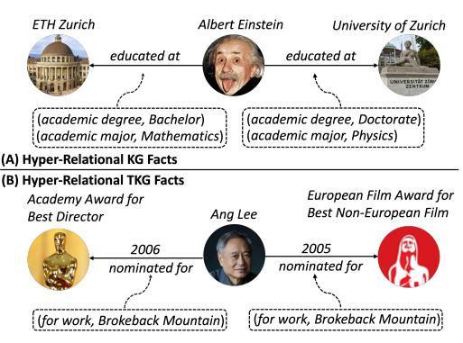
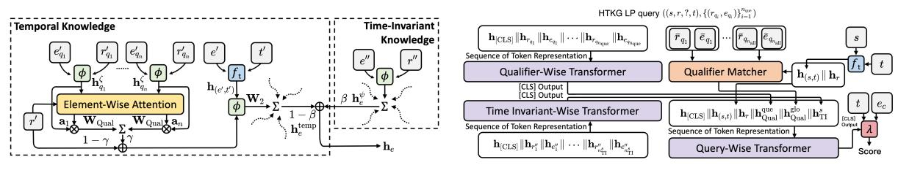
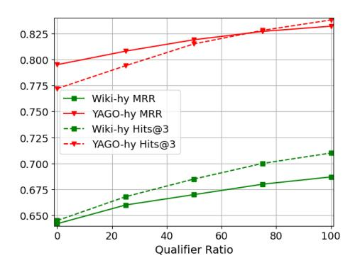
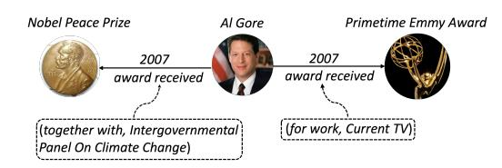

# Temporal Fact Reasoning over Hyper-Relational Knowledge Graphs

Zifeng Ding[\\*](#page-0-0)1,2,3 , Jingcheng Wu\*4 , Jingpei Wu1 , Yan Xia3,5 ,

> Bo Xiong[†](#page-0-0)4 , Volker Tresp†1

1LMU Munich 2University of Cambridge

3Munich Center for Machine Learning (MCML) 4University of Stuttgart

5Technical University of Munich

zd320@cam.ac.uk,

{jingpei.wu,tresp}@dbs.ifi.lmu.de,

{bo.xiong, jingcheng.wu}@ki.uni-stuttgart.de,

yan.xia@tum.de

# Abstract

Stemming from traditional knowledge graphs (KGs), hyper-relational KGs (HKGs) provide additional key-value pairs (i.e., qualifiers) for each KG fact that help to better restrict the fact validity. In recent years, there has been an increasing interest in studying graph reasoning over HKGs. Meanwhile, as discussed in recent works that focus on temporal KGs (TKGs), world knowledge is ever-evolving, making it important to reason over temporal facts in KGs. Previous mainstream benchmark HKGs do not explicitly specify temporal information for each HKG fact. Therefore, almost all existing HKG reasoning approaches do not devise any module specifically for temporal reasoning. To better study temporal fact reasoning over HKGs, we propose a new type of data structure named hyper-relational TKG (HTKG). Every fact in an HTKG is coupled with a timestamp explicitly indicating its time validity. We develop two new benchmark HTKG datasets, i.e., Wiki-hy and YAGO-hy, and propose an HTKG reasoning model that efficiently models hyper-relational temporal facts. To support future research on this topic, we open-source our datasets and model[1](#page-0-1) .

# 1 Introduction

Traditional knowledge graphs (KGs) represent world knowledge by storing a collection of facts in the form of triples. Each KG fact can be described as (s, r, o), where s, o are the subject and object entities of the fact and r denotes the relation between them. On top of traditional triple-based KGs, hyperrelational KGs (HKGs) are designed to introduce additional information into each triple-based fact (also known as primary triple in HKGs) by incorporating a number of key-value restrictions named as qualifiers [\(Zhang et al.,](#page-11-0) [2018;](#page-11-0) [Guan et al.,](#page-9-0) [2019;](#page-9-0)

Figure 1: Examples of HKG (A) and HTKG (B) facts. Contents inside dashed line squares denote qualifiers. We also provide another example of HTKG fact showcasing diverse sets of qualifiers in App. [A.](#page-12-0)

[Galkin et al.,](#page-9-1) [2020\)](#page-9-1). Compared with triple-based KGs, HKGs provide more complicated semantics. For example, in Fig. [1](#page-0-2) (A), the degree and major information of *Albert Einstein* is provided, which helps to differentiate between the facts regarding two universities attended by him.

Many reasoning approaches have been proposed for HKGs, e.g., [\(Wang et al.,](#page-11-1) [2021;](#page-11-1) [Xiong et al.,](#page-11-2) [2023b\)](#page-11-2), but unfortunately, they all assume that the hyper-relational facts are static. As discussed in recent works [\(Dasgupta et al.,](#page-8-0) [2018;](#page-8-0) [Ding et al.,](#page-9-2) [2022a\)](#page-9-2), world knowledge is ever-evolving. In temporal KGs, each fact is represented by a quadruple (s, r, o, t) with an additional timestamp specifying the time validity. Previous mainstream HKG benchmarks do not explicitly specify time validity for each HKG fact. This hinders the development of the reasoning systems that can effectively handle temporal dynamics within hyper-relational facts, and as a result, almost all existing HKG reasoning methods lack a dedicated module for temporal reasoning. Modeling temporal knowledge in HKGs is important as the temporal validity of a fact improves knowledge expressiveness and might be correlative to its qualifiers. A model should be

\*Equal contribution. Work done at LMU Munich.

†Corresponding author.

1 https://github.com/0sidewalkenforcer0/HypeTKG

expressive enough to model such correlation.

To better study temporal fact reasoning over HKGs, we propose a new type of data structure named hyper-relational TKG (HTKG, see formal definition in Sec. [2.1\)](#page-1-0). Every fact in an HTKG is defined in the form of ((s, r, o, t), {(rqi , eqi )} n i=1). (s, r, o, t) is its primary quadruple (i.e., primary fact, t is a timestamp denoting the valid time) and {(rqi , eqi )} n i=1 are a number of n augmented qualifiers. We illustrate an HTKG fact example in Fig. [1](#page-0-2) (B). The two awards *Ang Lee*was nominated for because of*Brokeback Mountain*can be differentiated considering the specified timestamps. An HTKG is composed solely of a collection of hyperrelational temporal facts so we use HTKGs to study temporal fact reasoning over HKGs. We construct two benchmark HTKGs Wiki-hy and YAGO-hy based on two traditional TKG benchmarks Wikidata11k [\(Jung et al.,](#page-9-3) [2021\)](#page-9-3) and YAGO1830 [\(Han](#page-9-4) [et al.,](#page-9-4) [2021a\)](#page-9-4).

Since previous HKG reasoning approaches pay little attention to temporal reasoning, they are not fit for modeling HTKGs. To this end, we develop a model to achieve link prediction (LP) over hyperrelational TKGs (HypeTKG) as follows: (1) We first devise a qualifier-attentional time-aware graph encoder (QATGE) that considers both temporal information and qualifiers in the graph aggregation process. (2) We then design a qualifier matching decoder (QMD). Given any HTKG LP query, QMD not only considers its own qualifiers, but also models all the qualifiers appearing in query subjectrelated facts[2](#page-1-1) . The motivation of QMD is that the evidence for LP not only is stored in the query qualifiers but also can be found in other subjectrelated facts. Compared with previous methods, HypeTKG is able to capture the correlation between temporal validity and qualifiers.

Another point worth noting is that some recent works have started to explore whether timeinvariant (TI) relational knowledge[3](#page-1-2) can help to enhance temporal fact reasoning on traditional TKGs [\(Li et al.,](#page-10-0) [2021,](#page-10-0) [2022;](#page-10-1) [Liu et al.,](#page-10-2) [2023\)](#page-10-2). This arouses our interest in studying whether TI relational facts are beneficial in HTKG reasoning. In our work, we mine the TI relational knowledge from the Wikidata KB. We pick out the facts that contain ten frequently mentioned TI relations, e.g.,*official lan-*

*guage*, and ensure that these facts remain valid within the whole time scopes of HTKGs. We adjust HypeTKG and create a model variant HypeTKGψ that dynamically controls the influence of TI information for better reasoning on temporal facts. We also provide a wide range of baselines with TI facts and benchmark their temporal fact LP performance on our proposed HTKGs.

To summarize, our contribution is three-folded: (1) We propose a new data structure HTKG that draws attention to temporal fact reasoning over HKGs and propose two corresponding benchmarks (Sec. [2.1](#page-1-0) and [3\)](#page-2-0). (2) We propose HypeTKG, a model specifically designed to reason over HTKGs. Experimental results show that HypeTKG performs well in temporal fact reasoning over HTKGs (Sec. [5.2\)](#page-5-0). (3) We study the influence of TI relational knowledge on HTKG reasoning and adapt HypeTKG to accommodate to TI information. We show that our model can benefit by carefully balancing the information between temporal and TI knowledge (Sec. [5.3\)](#page-6-0).

# 2 Preliminaries and Related Work

## 2.1 Definition and Problem Statement

Definition 1 (Hyper-Relational TKG). *Let* E*,* R*,*T*denote a set of entities, relations and timestamps*[4](#page-1-3) *, respectively. An HTKG*G*is a set of hyperrelational temporal facts. Each fact is denoted as* ((s, r, o, t), {(rqi , eqi )} n i=1)*, where*(s, r, o, t)*is its primary quadruple.*eqi ∈ E*and*rqi ∈ R*are the entity and relation in its*i*th qualifier*qi*, respectively.*n*is the number of qualifiers.*Definition 2 (Hyper-Relational TKG LP).*Let* G*tr be a ground-truth HTKG.* G*tr* = G*obs* ∪ G*un (*G*obs* ∩ G*un* = ∅*), where* G*obs is a set of observed HTKG facts and* G*un is a set of unobserved facts. Given* G*obs, HTKG LP aims to predict the missing entity in the LP query*((s, r, ?, t), {(rqi , eqi )} n i=1)*(or* ((?, r, o, t), {(rqi , eqi )} n i=1)*) derived from each fact in* G*un.*Following previous works on TKGs, e.g., [\(Han](#page-9-5) [et al.,](#page-9-5) [2021b\)](#page-9-5), for each fact, we create another fact ((o, r−1 , s, t), {(rqi , eqi )} n i=1) and add it to the graph, where r −1 denotes r's inverse relation. We derive an object entity prediction query from each fact and perform object prediction. Note that we follow [\(Galkin et al.,](#page-9-1) [2020\)](#page-9-1) and only predict missing entities in primary facts.

2Each query subject-related fact is a fact that takes the query subject as the subject entity of its primary quadruple.

3TI knowledge are represented with fact triples (s, r, o) (same as the facts in triple-based KGs) and are valid anytime.

4We decompose time periods into a series of timestamps following [\(Jin et al.,](#page-9-6) [2020\)](#page-9-6).

### 2 Related Work

Due to page limit, see App. [K](#page-16-0) for the detailed discussion of various previous methods.

Temporal Fact Reasoning on Traditional TKGs Extensive research has been conducted for TKG reasoning. Although traditional TKG facts have no qualifiers, each of them has a specified time identifier for temporal fact reasoning. A series of works develops time-aware score functions [\(Leblay and](#page-10-3) [Chekol,](#page-10-3) [2018;](#page-10-3) [Xu et al.,](#page-11-3) [2020;](#page-11-3) [Goel et al.,](#page-9-7) [2020;](#page-9-7) [Shao et al.,](#page-10-4) [2022;](#page-10-4) [Messner et al.,](#page-10-5) [2022;](#page-10-5) [Li et al.,](#page-10-6) [2023;](#page-10-6) [Pan et al.,](#page-10-7) [2024\)](#page-10-7) that compute plausibility scores of quadruple-based TKG facts based on various types of geometric operations. Some other methods employ neural structures, e.g., LSTM [\(Hochreiter and Schmidhuber,](#page-9-8) [1997\)](#page-9-8) or time-aware graph neural networks, to achieve temporal reasoning [\(Jin et al.,](#page-9-6) [2020;](#page-9-6) [Wu et al.,](#page-11-4) [2020;](#page-11-4) [Han et al.,](#page-9-5) [2021b;](#page-9-5) [Zhu et al.,](#page-11-5) [2021;](#page-11-5) [Li et al.,](#page-10-0) [2021;](#page-10-0) [Jung et al.,](#page-9-3) [2021;](#page-9-3) [Ding et al.,](#page-9-2) [2022a;](#page-9-2) [Li et al.,](#page-10-1) [2022;](#page-10-1) [Liu et al.,](#page-10-2) [2023;](#page-10-2) [Ding et al.,](#page-8-1) [2024\)](#page-8-1). There are two settings in TKG LP, i.e., interpolation and extrapolation. In extrapolation, to predict a fact happening at time t, models can only observe previous TKG facts before t, while such restriction is not imposed in interpolation. In our work, we only focus on the interpolated LP on HTKGs and leave extrapolation for future work.

Hyper-Relational KG Reasoning Mainstream HKG reasoning methods can be categorized into three types. The first type of works [\(Zhang et al.,](#page-11-0) [2018;](#page-11-0) [Liu et al.,](#page-10-8) [2020;](#page-10-8) [Fatemi et al.,](#page-9-9) [2020;](#page-9-9) [Di](#page-8-2) [et al.,](#page-8-2) [2021;](#page-8-2) [Wang et al.,](#page-11-6) [2023\)](#page-11-6) treats each hyperrelational fact as an n-ary fact represented with an n-tuple: rabs(e1, e2, ..., en), where n is the nonnegative arity of an abstract relation rabs [5](#page-2-1) representing the number of entities involved within rabs and e1, ..., en are the entities appearing in this n-ary fact. Although these methods show strong effectiveness, previous study [\(Galkin et al.,](#page-9-1) [2020\)](#page-9-1) has shown that the way of treating HKG facts as n-ary facts naturally loses the semantics of the original KG relations and would lead to a combinatorial explosion of relation types. The second type of works [\(Liu et al.,](#page-10-9) [2021;](#page-10-9) [Guan et al.,](#page-9-10) [2023\)](#page-9-10) transforms each hyper-relational fact into a set of key-value pairs: {(ri : ei)} n i=1. Formulating hyper-relational

facts into solely key-value pairs would also cause a problem that the relations from the primary fact triples and qualifiers cannot be fully distinguished [\(Galkin et al.,](#page-9-1) [2020\)](#page-9-1). To overcome the problems incurred in first two types of methods, recently, some works [\(Guan et al.,](#page-9-11) [2020;](#page-9-11) [Rosso et al.,](#page-10-10) [2020;](#page-10-10) [Galkin](#page-9-1) [et al.,](#page-9-1) [2020;](#page-9-1) [Wang et al.,](#page-11-1) [2021;](#page-11-1) [Xiong et al.,](#page-11-2) [2023b;](#page-11-2) [Chung et al.,](#page-8-3) [2023\)](#page-8-3) formulate each hyper-relational fact into a primary triple with a set of key-value qualifier pairs: {((s, r, o), {(rqi , eqi )} n i=1)}. This formulation distinguishes the primary fact triples and qualifiers, and meanwhile preserves the semantics of the original KG relations. While HKG reasoning methods perform well on HKG LP, none of them focuses on temporal reasoning because no temporal identifiers are explicitly specified in HKGs.

To draw attention to temporal fact reasoning over hyper-relational facts, a recent work [\(Hou et al.,](#page-9-12) [2023\)](#page-9-12) proposes n-tuple TKG (N-TKG), where each hyper-relational fact is represented with an n-tuple: (r, {ρi : ei} n i=1, t). n and t are the arity and the timestamp of the fact, respectively. ρi is the labeled role of the entity ei . r denotes fact type. Compared with HTKG, N-TKG has limitation: HTKGs explicitly separate primary facts with additional qualifiers, while N-TKGs mix all the entities from the primary facts and qualifiers and are unable to fully emphasize the importance of primary facts. Hou et al. also propose a model NE-Net for extrapolated LP on N-TKGs. It is not optimal for interpolation because it can only model the graph information before the prediction timestamp. See App. [K](#page-16-0) for more discussion.

# 3 Proposing New Benchmarks

We propose two HTKG benchmark datasets Wikihy and YAGO-hy. Wiki-hy contains HTKG facts extracted from Wikidata [\(Vrandecic and Krötzsch,](#page-11-7) [2014\)](#page-11-7), where they happen from year 1513 to 2020. YAGO-hy is constructed from the facts in YAGO3 [\(Mahdisoltani et al.,](#page-10-11) [2015\)](#page-10-11) and the time scope is from year 1830 to 2018. We use previous traditional TKG benchmarks Wikidata11k [\(Jung et al.,](#page-9-3) [2021\)](#page-9-3) and YAGO1830 [\(Han et al.,](#page-9-4) [2021a\)](#page-9-4) as bases and search for the qualifiers of their facts in Wikidata. We use the MediaWiki API[6](#page-2-2) to identify the quadruple-based TKG facts in Wikidata and extract all the qualifiers stated under the corresponding Wikidata statements. Since Wikidata11k is origi-

5Abstract relation rabs is derived from a combination of several KG relations by concatenating the relations in the primary triple and qualifiers [\(Galkin et al.,](#page-9-1) [2020\)](#page-9-1).

6 https://www.wikidata.org/w/api.php

| Dataset | Ntrain   | Nvalid  | Ntest   | Epri    | EQual  | Rpri | RQual |     | T    ∃ Qual | avg( Qual ) | Qual% | GTI    | ETI    |
|---------|----------|---------|---------|---------|--------|------|-------|-----|-------------|-------------|-------|--------|--------|
| Wiki-hy | 111, 252 | 13, 900 | 13, 926 | 11, 140 | 1, 642 | 92   | 44    | 508 | 26, 670     | 1.59        | 9.59% | 5, 360 | 3, 801 |
| YAGO-hy | 51, 193  | 10, 973 | 10, 977 | 10, 026 | 359    | 10   | 33    | 188 | 10, 214     | 1.10        | 6.98% | 7, 331 | 5, 782 |

Table 1: Dataset statistics. Ntrain/Nvalid/Ntest is the number of facts in the training/validation/test set. |Epri|/|Rpri|/|T | is the number of entities/relations/timestamps in primary quadruples. |EQual|/|RQual| is the number of additional entities/relations only existing in qualifiers. |∃ Qual|/Qual% is the number/the proportion of facts containing at least one qualifier. Complete sets of entities and relations are E = Epri ∪ EQual and R = Rpri ∪ RQual, respectively. ETI is the number of entities additionally introduced in TI facts GTI and ETI ∩ E = ∅.

nally extracted from Wikidata, we can directly find its relations and entities in this KB. YAGO1830's entities share the same pool as Wikidata but relation types are taken from*schema.org*. We map YAGO1830's relations to Wikidata's relations to enable fact matching (detailed mapping in App. [B\)](#page-12-1). We provide dataset statistics of both datasets in Table [1.](#page-3-0) Qualifier searching will include additional entities and relations. We include them in model training and evaluation. We augment quadruplebased TKG facts with their searched qualifiers. The facts without any searched qualifier will remain unchanged. All the facts in our datasets are based on English. We discuss why we use Wikidata-based but not other popular ICEWS-based TKGs to construct HTKGs in App. [C.](#page-12-2)

We explore TI knowledge as follows. We first find the top 400 frequent relations in Wikidata KB. Based on them, we then manually check each of them and pick out top 10 frequent relations that describe TI relationships among entities. The selected TI relations are *family name*, *native language*, *subclass of*, *official language*, *child*, *sibling*, *father*, *mother*, *ethnic group*, *country of origin*. We ensure that they are disjoint from the existing relations in the original HTKGs. Starting from the entities in our HTKGs, we search for their associated TI facts in Wikidata, where each of them corresponds to a selected TI relation. For example, for the YAGOhy entity *Emmy Award*, we take the facts such as (*Emmy Award*, *subclass of*, *television award*). As a result, we collect a set of facts denoted as GTI (GTI ∩ Gtr = ∅) for Wiki-hy and YAGO-hy. We allow models to use all of them for enhancing LP over temporal facts during train/valid/test. See Table [1](#page-3-0) for GTI statistics.

# 4 HypeTKG

HypeTKG consists of two parts, i.e., a qualifierattentional time-aware graph encoder (QATGE) and a qualifier matching decoder (QMD). To further learn from TI knowledge, we equip HypeTKG

with additional modules and develop a model variant HypeTKGψ (model structure shown in Fig. [2\)](#page-4-0).

# 1 Qualifier-Attentional Time-Aware Graph Encoder

QATGE learns a contextualized representation for every entity. Given an entity e, QATGE first finds its temporal neighbors from Gobs: Ne = {ζ} = {((e ′ , r′ , t′ ), {(r ′ qi , e′ qi )} n i=1)}, where each temporal neighbor ζ is derived from a fact ((e ′ , r′ , e, t′ ), {(r ′ qi , e′ qi )} n i=1) ∈ Gobs connecting to e. For each ζ, QATGE employs an attention-based module to model its qualifiers. It computes the representation h ζ qi for the i th qualifier qi of ζ with a function ϕ(·, ·).

$$
\mathbf{h}_{q_i}^{\zeta} = \phi(\mathbf{h}_{e'_{q_i}}, \mathbf{h}_{r'_{q_i}}) \n= \mathbf{W}_1(\mathbf{h}_{e'_{q_i}} || \mathbf{h}_{r'_{q_i}}) *f(\mathbf{h}_{e'_{q_i}}^{\mathbb{C}} \circ \mathbf{h}_{r'_{q_i}}^{\mathbb{C}})* (\mathbf{h}_{e'_{q_i}} \oplus \mathbf{h}_{r'_{q_i}}).
$$
\n(1)

he ′ qi ∈ R d and hr ′ qi ∈ R d denote the representations of the entity and relation in qi , respectively. ∥ means concatenation and W1 ∈ R d×2d is a weight matrix. h C e ′ qi ∈ C d 2 and h C r ′ qi ∈ C d 2 are the complex vectors mapped from he ′ qi and hr ′ qi . The real part of h C e ′ qi is the first half of he ′ qi and the imaginary part is the second half (see mapping explanation and example in App. [F\)](#page-13-0). ◦ is the Hadmard product on the complex space. f(·) : C d 2 → R d is a mapping function that maps the complex vectors back to the real vectors. ∗ and ⊕ are element-wise product and add operations, respectively. After getting {h ζ qi}, QATGE integrates the information from all of them by computing an attentional feature h ζ Qual related to the primary relation r ′ of ζ.

$$
\tilde{\mathbf{h}}_{q_i}^{\zeta} = (\mathbf{h}_{q_i}^{\zeta^{-1}} \mathbf{h}_{r'}) *\mathbf{w},
$$
\n
$$
\alpha_i[j] = \frac{\exp(\tilde{\mathbf{h}}_{q_i}^{\zeta}[j])}{\sum_{k=1}^{n} \exp(\tilde{\mathbf{h}}_{q_k}^{\zeta}[j])}; \ \mathbf{a}_i = [\alpha_i[1], ..., \alpha_i[d]]^{\top}, \ \ (2)
$$
\n
$$
\mathbf{h}_{\text{Qual}}^{\zeta} = \sum_{q_i} \mathbf{W}_{\text{Qual}}(\mathbf{a}_i* \mathbf{h}_{q_i}^{\zeta}).
$$

w ∈ R d is a trainable parameter. h˜ζ qi [j] denotes the j th element of h˜ζ qi . ai is an attention vector,

(a) Qualifier-attentional time-aware graph encoder (QATGE). (b) Qualifier matching decoder (QMD).

Figure 2: Model structure of HypeTKGψ. HypeTKGψ first uses QATGE to encode all the entities. It then uses QMD to compute score regarding every candidate entity ec ∈ E. Temporal information is considered in both QATGE and QMD for temporal reasoning. The structure of HypeTKG can be derived by excluding the components concerning TI facts. View with Sec. [4](#page-3-1) for better understanding. e ′′ 1 , ..., e′′ ns TI and r ′′ 1 , ..., r′′ ns TI are the entities and relations from a number of n s TI TI neighbors of query subject s, respectively.

where each of its element αi [j] denotes the attention score determining how important the j th element of the i th qualifier qi is in the j th element of h ζ Qual. The importance increases as the score rises. WQual ∈ R d×d is a weight matrix. h ζ Qual can be viewed as a parameter that adaptively selects the information highly-related to r ′ from all the qualifiers of ζ. To compute e's representation he, we aggregate over all its temporal neighbors in Ne with a gated structure.

$$
\mathbf{h}_e = \tfrac{1}{|\mathcal{N}_e|} \sum_{\zeta \in \mathcal{N}_e} \mathbf{W}_2 \phi \left( \mathbf{h}_{(e',t')}, \left( \gamma \mathbf{h}_{\text{qual}}^{\zeta} + (1 - \gamma) \mathbf{h}_{r'} \right) \right), \tag{3}
$$

where W2 ∈ R d×d is a weight matrix. γ is a trainable gate parameter controlling the amount of information taken from either the primary relation r ′ or the qualifiers. QATGE incorporates temporal information by learning a time-aware representation for each temporal neighbor's subject entity: h(e ′ ,t′) = ft(he ′∥ht ′). ft(·) : R 2d → R d is a layer of neural network. ht ′ = p 1/d[cos(ω1t ′ + ϕ1), . . . , cos(ωdt ′ + ϕd)], where ω1 . . . ωd and ϕ1 . . . ϕd are trainable parameters.

## 4.2 Qualifier Matching Decoder

QMD leverages the entity and relation representations encoded by QATGE for LP. Assume we want to predict the missing entity of the LP query ((s, r, ?, t), {(rqi , eqi )} nque i=1 ) (nque is the number of query qualifiers), QMD learns a query feature h que . QMD first models query qualifiers {(rqi , eqi )} nque i=1 with a qualifier-wise Transformer [\(Vaswani et al.,](#page-11-8) [2017\)](#page-11-8). Each query qualifier's entity and relation are treated as two tokens and concatenated as a sub-sequence for this qualifier. The classification ([CLS]) token is then concatenated with the query qualifier tokens as a sequence and input into the qualifier-wise Transformer, where the sequence

length is 2nque + 1. We take the output representation of the [CLS] token as the query qualifier feature h que Qual ∈ R d who contains comprehensive information from all query qualifiers. Apart from h que Qual, we also devise a qualifier matcher that further exploits additional supporting information from the qualifiers of other observed facts related to query subject s in Gobs. Qualifier matcher finds all the HTKG facts in Gobs where each of them takes s as the subject of its primary quadruple[7](#page-4-1) . It then collects all their qualifiers {(¯rql , e¯ql )} nall l=1 and computes a global qualifier feature

$$
\eta_l = \frac{\exp((\mathbf{W}_3(\mathbf{h}_{\bar{r}_{q_l}}||\mathbf{h}_{\bar{e}_{q_l}}))^{\top}(\mathbf{W}_4(\mathbf{h}_{(s,t)}||\mathbf{h}_{r})))}{\sum_{m=1}^{n_{all}} \exp((\mathbf{W}_3(\mathbf{h}_{\bar{r}_{q_m}}||\mathbf{h}_{\bar{e}_{q_m}}))^{\top}(\mathbf{W}_4(\mathbf{h}_{(s,t)}||\mathbf{h}_{r})))},
$$
\n
$$
\mathbf{h}_{\text{quad}}^{\text{glo}} = \sum_{q_l} \eta_l \mathbf{W}_3(\mathbf{h}_{\bar{r}_{q_l}}||\mathbf{h}_{\bar{e}_{q_l}}),
$$
\n(4)

where nall denotes the number of s-related qualifiers and W3,W4 ∈ R d×2d are weight matrices. h(s,t) = ft(hs∥ht). ηl is the attention score of the l th subject-related qualifier indicating its contribution to the LP query. Given h que Qual and h glo Qual (h glo Qual ∈ R d ), QMD uses another query-wise Transformer to compute a query feature. We concatenate the representation of another separate [CLS] token with h(s,t)∥hr∥h que Qual∥h glo Qual and input it into the query-wise Transformer. The output representation of this separate [CLS] token corresponds to h que ∈ R d . h que is used by QMD to compute a score for each candidate entity ec ∈ E

$$
\lambda(e_c) = (\mathbf{h}^{\text{que}} *\mathbf{h}_t)^\top \mathbf{W}_5 \mathbf{h}_{e_c}.
$$
 (5)

W5 ∈ R d×d is a score matrix. HypeTKG takes the candidate entity with the highest score as the predicted answer.

7We only consider subject-related qualifiers because we can only observe the subject entity in each LP query and we aim to find the additional qualifiers most related to the query.

### 3 Time-Invariant Knowledge Modeling

Previous sections discuss how HypeTKG performs HTKG LP without using TI knowledge. In this section, we discuss how we adapt HypeTKG to TI knowledge by developing a model variant HypeTKGψ. We first introduce another gated structure in QATGE to incorporate TI knowledge in the encoding process. We change Eq. [3](#page-4-2) to

$$
\mathbf{h}_{e}^{\text{temp}} = \frac{1}{|\mathcal{N}_{e}|} \sum_{\zeta \in \mathcal{N}_{e}} \mathbf{W}_{2} \phi \left( \mathbf{h}_{(e',t')}, \left( \gamma \mathbf{h}_{\text{Qual}}^{\zeta} + (1 - \gamma) \mathbf{h}_{r'} \right) \right),
$$

\n
$$
\mathbf{h}_{e}^{\psi} = \frac{1}{|\mathcal{N}_{e}^{\psi}|} \sum_{\zeta^{\psi} \in \mathcal{N}_{e}^{\psi}} \mathbf{W}^{\psi} \phi(\mathbf{h}_{e'',} \mathbf{h}_{r''}),
$$

\n
$$
\mathbf{h}_{e} = (1 - \beta) \mathbf{h}_{e}^{\text{temp}} + \beta \mathbf{h}_{e}^{\psi}.
$$
 (6)

β is a trainable parameter controlling the magnitude of TI information. N ψ e = {ζ ψ} = {(e ′′, r′′)|(e ′′, r′′, e) ∈ GTI} denotes e's TI neighbors derived from additional TI facts. h temp e and h ψ e contain the encoded temporal and TI information, respectively. In QMD, we incorporate TI knowledge when we compute the query feature h que. Same as how we model query qualifiers, we use a TI-wise Transformer to model s's TI neighbors and output a TI feature h s TI. We expand the input length of the query-wise Transformer and input h(s,t)∥hr∥h que Qual∥h glo Qual∥h s TI for computing h que . Note that we do not model TI neighbors of all |E| candidate entities in QMD because (1) this will incur excessive computational cost and (2) this part of information has been learned in QATGE.

#### 4 Parameter Learning

We minimize a binary cross-entropy (BCE) loss for learning model parameters. We take every fact in Gobs as a query fact δ and switch its object entity o to every other entity e ∈ (E \ {o}) to create |E| − 1 negative facts {δ −}. Our loss is defined as

$$
\mathcal{L} = \frac{1}{|\mathcal{G}_{\text{obs}}| \times |\mathcal{E}|} \sum_{\delta \in \mathcal{G}_{\text{obs}}} (l_{\delta} + \sum_{\delta} l_{\delta} - ). \quad (7)
$$

lδ = −yδ log(λ(δ)) − (1 − yδ) log(1 − λ(δ)), lδ− = −yδ− log(λ(δ −))−(1−yδ− ) log(1−λ(δ −)) denote the BCE of δ and δ −, respectively. yδ = 1 and yδ− = 0 because we want to simultaneously maximize λ(δ) and minimize λ(δ −). |Gobs| is the number of HTKG facts in Gobs.

# 5 Experiments

We do HTKG LP over Wiki-hy and YAGO-hy. We report HTKG LP results in Sec. [5.2.](#page-5-0) We study whether additional TI knowledge helps HTKG LP in Sec. [5.3.](#page-6-0) We do ablation studies and study the impact of the ratio of utilized qualifiers in Sec. [5.4.](#page-6-1) Finally, we present several case studies to show the effectiveness of leveraging TI knowledge and qualifier matcher for temporal fact reasoning over HTKGs in Sec. [5.5.](#page-7-0) We provide complexity analysis of our model in App. [D.](#page-12-3) We also study the impact of qualifier-augmented fact proportion and present it in App. [I.](#page-14-0)

## 1 Experimental Setting

We use two evaluation metrics, i.e., mean reciprocal rank (MRR) and Hits@1/3/10. We follow the filtering setting used in previous HKG reasoning works [\(Galkin et al.,](#page-9-1) [2020\)](#page-9-1). See App. [E](#page-13-1) for detailed explanations of evaluation metrics. We consider two types of baselines: (1) Traditional TKG interpolation methods[8](#page-5-1) , i.e., DE-SimplE [\(Goel et al.,](#page-9-7) [2020\)](#page-9-7), TeRo [\(Xu et al.,](#page-11-3) [2020\)](#page-11-3), T-GAP [\(Jung et al.,](#page-9-3) [2021\)](#page-9-3), BoxTE [\(Messner et al.,](#page-10-5) [2022\)](#page-10-5), TARGCN [\(Ding](#page-9-2) [et al.,](#page-9-2) [2022a\)](#page-9-2), TeAST [\(Li et al.,](#page-10-6) [2023\)](#page-10-6) and HGE [\(Pan et al.,](#page-10-7) [2024\)](#page-10-7). Since these methods have no way to model qualifiers, we neglect the qualifiers during implementation. (2) HKG reasoning methods, i.e., NaLP-Fix [\(Rosso et al.,](#page-10-10) [2020\)](#page-10-10), HINGE [\(Rosso](#page-10-10) [et al.,](#page-10-10) [2020\)](#page-10-10), HypE [\(Fatemi et al.,](#page-9-9) [2020\)](#page-9-9), StarE [\(Galkin et al.,](#page-9-1) [2020\)](#page-9-1), GRAN [\(Wang et al.,](#page-11-1) [2021\)](#page-11-1), HyconvE [\(Wang et al.,](#page-11-6) [2023\)](#page-11-6), ShrinkE [\(Xiong et al.,](#page-11-2) [2023b\)](#page-11-2) and HyNT [\(Chung et al.,](#page-8-3) [2023\)](#page-8-3). These methods cannot model temporal information in HTKGs. We make them neglect the timestamps during implementation. See App. [G](#page-13-2) for HypeTKG and baseline implementation details. Note that NE-Net [\(Hou et al.,](#page-9-12) [2023\)](#page-9-12) still has no existing software and data, so we are unable to directly compare it with HypeTKG here.

### 5.2 Comparative Study

We report the HTKG LP results of all methods in Table [2.](#page-6-2) We observe that HypeTKG outperforms all baselines and achieves state-of-the-art. We believe this is because (1) traditional TKG reasoning methods lose a large amount of semantic information by failing to model qualifiers (2) and previous HKG reasoning baselines cannot distinguish from different timestamps, which is key to temporal fact reasoning. We also observe that HypeTKGψ achieves even better results than the original model. We will have a more detailed discussion in Sec. [5.3.](#page-6-0)

8TKG extrapolation methods are not considered since we only study interpolated LP over HTKGs. Extrapolation methods are constrained to only use the graph information before each LP query, making them suboptimal for interpolation.

| Datasets       |       |       | WiKi-hy |             | YAGO-hy |       |       |       |  |
|----------------|-------|-------|---------|-------------|---------|-------|-------|-------|--|
| Model          | MRR   | H@1   | H@3     | H@10        | MRR     | H@1   | H@3   | H@10  |  |
| DE-SimplE      | 0.351 | 0.218 | 0.405   | 0.640       | 0.684   | 0.625 | 0.715 | 0.807 |  |
| TeRo           | 0.572 | 0.473 | 0.640   | 0.727       | 0.760   | 0.720 | 0.782 | 0.822 |  |
| T-GAP          | 0.588 | 0.486 | 0.651   | 0.726       | 0.773   | 0.736 | 0.800 | 0.835 |  |
| BoxTE          | 0.449 | 0.348 | 0.512   | 0.646       | 0.685   | 0.642 | 0.725 | 0.767 |  |
| TARGCN         | 0.589 | 0.498 | 0.652   | 0.733       | 0.769   | 0.742 | 0.772 | 0.817 |  |
| TeAST          | 0.601 | 0.507 | 0.669   | 0.761       | 0.794   | 0.763 | 0.817 | 0.844 |  |
| HGE            | 0.602 | 0.507 | 0.666   | 0.765       | 0.790   | 0.760 | 0.814 | 0.837 |  |
| NaLP-Fix       | 0.507 | 0.460 | 0.569   | 0.681       | 0.730   | 0.709 | 0.751 | 0.813 |  |
| HINGE          | 0.543 | 0.497 | 0.585   | 0.694       | 0.758   | 0.730 | 0.762 | 0.819 |  |
| HypE           | 0.624 | 0.604 | 0.631   | 0.658       | 0.800   | 0.785 | 0.799 | 0.830 |  |
| StarE          | 0.565 | 0.491 | 0.599   | 0.703       | 0.765   | 0.737 | 0.776 | 0.820 |  |
| GRAN           | 0.661 | 0.610 | 0.679   | 0.750       | 0.808   | 0.789 | 0.817 | 0.842 |  |
| HyconvE        | 0.641 | 0.600 | 0.656   | 0.729       | 0.771   | 0.754 | 0.782 | 0.811 |  |
| ShrinkE        | 0.669 | 0.593 | 0.703   | 0.789 0.808 |         | 0.782 | 0.824 | 0.852 |  |
| HyNT           | 0.537 | 0.444 | 0.587   | 0.723       | 0.763   | 0.724 | 0.787 | 0.836 |  |
| HypeTKG        | 0.687 | 0.633 | 0.710   | 0.789       | 0.832   | 0.817 | 0.838 | 0.857 |  |
| HypeTKGψ 0.693 |       | 0.642 | 0.715   | 0.792       | 0.842   | 0.821 | 0.839 | 0.858 |  |

Table 2: HTKG LP results. The best results without using TI facts are marked in bold. H@1/H@3/H@10 means Hits@1/Hits@3/Hits@10.

# 5.3 Do TI Relational Knowledge Help HTKG Reasoning?

We let HypeTKG and all baselines use the additional TI facts and report their temporal fact LP performance on Wiki-hy and YAGO-hy in Table [3.](#page-6-3) For the HKG approaches, we directly include these facts into our datasets. For traditional TKG reasoning approaches, we create a number of temporal facts for each TI fact along the whole timeline and include these temporal facts into the datasets. For example, let tmin/tmax denotes the minimum/maximum timestamp of an HTKG. We transform a TI fact (s, r, o) to {(s, r, o, tmin), ...,(s, r, o, tmax)}. Surprisingly, we observe that while HypeTKG constantly benefit from the additional TI relational knowledge, other baselines cannot. We attribute this to the following reasons: (1) TI facts introduce distributional shift. Baseline methods learn TI and temporal knowledge without distinguishing their difference, making them less focused on the temporal facts. (2) HypeTKG employs its gate-structured graph encoder that adaptively controls the amount of information from the TI facts. HypeTKG's decoder also uses Transformer to distinguish the importance of different TI facts. These two steps help HypeTKG to exploit the TI knowledge that is most beneficial in LP and discard the redundant information. We further study whether TI knowledge can improve reasoning on quadruple-based TKGs in App. [H.](#page-14-1)

## 5.4 Further Analysis

Ablation Study We conduct ablation studies to demonstrate the importance of different model com-

| Datasets  |         | WiKi-hy |        | YAGO-hy |       |        |  |
|-----------|---------|---------|--------|---------|-------|--------|--|
| Model     | w.o. TI | w. TI   | ∆ ↑    | w.o. TI | w. TI | ∆ ↑    |  |
| DE-SimplE | 0.351   | 0.326   | -0.025 | 0.684   | 0.643 | -0.041 |  |
| TeRo      | 0.572   | 0.553   | -0.019 | 0.760   | 0.742 | -0.018 |  |
| T-GAP     | 0.588   | 0.568   | -0.020 | 0.773   | 0.761 | -0.012 |  |
| BoxTE     | 0.449   | 0.409   | -0.040 | 0.685   | 0.670 | -0.015 |  |
| TARGCN    | 0.589   | 0.588   | -0.001 | 0.769   | 0.769 | 0.000  |  |
| TeAST     | 0.601   | 0.581   | -0.020 | 0.794   | 0.779 | -0.015 |  |
| HGE       | 0.602   | 0.592   | -0.010 | 0.790   | 0.780 | -0.010 |  |
| NaLP-Fix  | 0.507   | 0.504   | -0.003 | 0.730   | 0.728 | -0.002 |  |
| HINGE     | 0.543   | 0.535   | -0.008 | 0.758   | 0.754 | -0.004 |  |
| HypE      | 0.624   | 0.623   | -0.001 | 0.800   | 0.798 | -0.002 |  |
| StarE     | 0.565   | 0.547   | -0.018 | 0.765   | 0.758 | -0.007 |  |
| GRAN      | 0.661   | 0.667   | +0.006 | 0.808   | 0.794 | -0.014 |  |
| HyconvE   | 0.641   | 0.630   | -0.011 | 0.771   | 0.767 | -0.004 |  |
| ShrinkE   | 0.669   | 0.655   | -0.014 | 0.808   | 0.806 | -0.002 |  |
| HyNT      | 0.537   | 0.536   | -0.001 | 0.763   | 0.765 | +0.002 |  |
| HypeTKG   | 0.687   | 0.693   | +0.006 | 0.832   | 0.842 | +0.010 |  |

Table 3: MRR for all methods with (w. TI) and without (w.o. TI) TI facts. ∆ ↑ denotes the absolute improvement. Note that HypeTKG w. TI equals HypeTKGψ.

ponents of HypeTKG. In study A (Variant A), we neglect the qualifiers in all HTKG facts and do not include any qualifier learning component. In study B (Variant B), we remove qualifier attention in QATGE. In study C (Variant C), we remove the qualifier matcher in QMD. In study D (Variant D), we exclude time modeling modules and neglect timestamps in primary quadruples. From Table [4,](#page-6-4) we observe that learning qualifiers is essential in reasoning HTKGs. Both qualifier attention in QATGE and qualifier matcher contribute to qualifier modeling. We also find that modeling temporal information is essential for temporal fact reasoning.

|           |      | Setting |         | Wiki-hy |       |       | YAGO-hy |       |       |
|-----------|------|---------|---------|---------|-------|-------|---------|-------|-------|
| Model     | Time | Q Att   | Q Match | MRR     | H@1   | H@10  | MRR     | H@1   | H@10  |
| Variant A | ✓    | ✗       | ✗       | 0.642   | 0.569 | 0.775 | 0.795   | 0.770 | 0.841 |
| Variant B | ✓    | ✗       | ✓       | 0.671   | 0.616 | 0.777 | 0.826   | 0.811 | 0.856 |
| Variant C | ✓    | ✓       | ✗       | 0.671   | 0.615 | 0.777 | 0.803   | 0.781 | 0.842 |
| Variant D | ✗    | ✓       | ✓       | 0.652   | 0.597 | 0.751 | 0.792   | 0.769 | 0.835 |
| HypeTKG ✓ |      | ✓       | ✓       | 0.687   | 0.633 | 0.789 | 0.832   | 0.817 | 0.857 |

Table 4: Ablation studies. Q means qualifier.

Figure 3: HypeTKG performance with a varying ratio of used qualifiers.

| Case | Query                                                                        | Answer           | Subject-Related Qualifiers                                                                        | Attention Score                            |
|------|------------------------------------------------------------------------------|------------------|---------------------------------------------------------------------------------------------------|--------------------------------------------|
| A1   | ((Andrey Kolmogorov, award received, ?, 1941), ∅)                            | USSR State Prize | (country of citizenship, Soviet Union) (field of work, mathematics) (country, Soviet Union) | −1 9.39e −2 6.09e −10 2.61e |
| A2   | ((Andrey Kolmogorov, place of death, ?, 1987), {(country, Soviet Union)}) | Moscow           | (country of citizenship, Soviet Union) (field of work, mathematics) (country, Soviet Union) | 0.99 −21 1.64e −22 5.00e       |

Table 5: Case study A: cases for studying qualifier matcher.

| Case | Query                                                        | Prediction w. TI    | Prediction w.o. TI | Related TI Facts                                                                                                                           |
|------|--------------------------------------------------------------|---------------------|--------------------|--------------------------------------------------------------------------------------------------------------------------------------------|
| B1   | ((Pisa, country, ?, 1860), ∅)                                | Kingdom of Sardinia | Kingdom of Prussia | (Pisa, official language, Italian) (Kingdom of Sardinia, official language, Italian) (Kingdom of Prussia, official language, German) |
| B2   | ((AK, place of birth, ?, 1903), {(country, Russian Empire)}) | Tbilisi             | Moscow             | (AK, native language, Georgian) (Tbilisi, official language, Georgian)                                                                  |

Table 6: Case study B: cases for studying the effectiveness of TI relational knowledge. Prediction w./w.o. TI means the prediction result with/without using time-invariant facts.*AK*is the abbreviation of the entity*Aram Khachaturian*.

Impact of the Ratio of Utilized Qualifiers To further investigate the importance of learning qualifiers for reasoning hyper-relational temporal facts, we report HypeTKG's performance on Wiki-hy/YAGO-hy by using a varying ratio of utilized qualifiers. We implement HypeTKG on all Wiki-hy/YAGO-hy facts but randomly sample 0%/25%/50%/75%/100% of all the existing qualifiers during training and evaluation. From Fig. [3,](#page-6-5) we observe that HypeTKG achieves better results as the ratio increases, showing a positive correlation between its performance and the number of utilized qualifiers. This indicates that modeling qualifiers is beneficial for LP over temporal facts.

### 5 Case Studies

A: Effectiveness of Qualifier Matcher We do case studies to show how our qualifier matcher improves HTKG reasoning (Table [5\)](#page-7-1). HypeTKG ranks the ground truth missing entities in these cases as top 1. As discussed in Sec. [4.2,](#page-4-3) the qualifier matcher interprets the contribution of all the existing qualifiers related to the subject entity of the LP query with attention scores ηl . In Case A1, no qualifier is provided in the query for prediction. We find that qualifier matcher assigns a great attention score to the qualifier (*country of citizenship*, *Soviet Union*) from another fact. It can be taken as a hint to predict the ground truth missing entity *USSR State Prize*. This implies that to better reason the facts without qualifiers, our qualifier matcher can find the clues from other hyper-relational facts. In Case A2, we find that the qualifier matcher focuses more on the qualifiers from other facts but not from the query. Note

that the query qualifiers have been modeled with a query-specific qualifier feature h que Qual before computing the global qualifier feature. This indicates that our qualifier matcher can maximally extract information from the extra qualifiers rather than only focusing on the query qualifiers, enabling efficient information fusion. See App. [J](#page-15-0) for more case study details and one more case (A3) discussion.

B: Effectiveness of TI Knowledge We demonstrate how TI relational knowledge enhances HTKG reasoning with two cases (Table [6\)](#page-7-2). In both cases, HypeTKG achieves optimal prediction by leveraging TI knowledge, and makes mistakes without it. In B1, HypeTKG predicts the false answer *Kingdom of Prussia*without the support of TI facts. However, after considering them, HypeTKG manages to make accurate prediction because*Pisa*should share the same official language with the country that contains it. In B2, since both*Tbilisi*and*Moscow*belonged to*Russian Empire*in 1903, it is hard for HypeTKG to distinguish them during prediction without any further information. However, by knowing that*Aram Khachaturian*'s native language is same as the official language of *Tbilisi*, i.e., Georgian, HypeTKG can exclude the influence of *Moscow*because people speak Russian there.

# 6 Conclusion

In this work, we propose a new data structure named HTKG for studying temporal fact reasoning over HKGs. To reason HTKGs, we design a model HypeTKG that is able to simultaneously deal with temporal information and qualifiers. We benchmark HypeTKG and various previous HKG/TKG reasoning methods on two newlyconstructed datasets, i.e., Wiki-hy and YAGO-hy. We show that HypeTKG achieves superior performance on HTKG LP. Besides, we mine the TI relational knowledge from Wikidata KB and study whether it can benefit models on hyper-relational temporal fact reasoning. We find that temporal fact reasoning on HTKGs can be enhanced by carefully balancing the information between temporal and TI knowledge.

# 7 Limitations

One limitation of our work is that we have not explored qualifier prediction, i.e., predicting the missing elements in the qualifiers. We also have not considered another challenge in temporal fact reasoning, i.e., time prediction. We think our work can be the base of future studies on these two topics. Also, as we have only studied interpolated link prediction on HTKGs, developing HTKG extrapolation methods would also be an important direction in the future. Besides, given the growing interest in inductive learning on traditional TKGs (e.g., [\(Ding et al.,](#page-9-13) [2022b,](#page-9-13) [2023b](#page-9-14)[,a\)](#page-9-15), we believe it is equally important to explore inductive learning on HTKGs, which remains unaddressed in this work.

# Acknowledgement

This work has been funded by the Munich Center for Machine Learning and supported by the Federal Ministry of Education and Research and the State of Bavaria. Jingcheng Wu has been funded by the Deutsche Forschungsgemeinschaft (DFG, German Research Foundation) - SFB 1574 - Project number 471687386. The authors thank the International Max Planck Research School for Intelligent Systems (IMPRS-IS) for supporting Bo Xiong. This research has also been partially funded by Deutsche Forschungsgemeinschaft (DFG, German Research Foundation) under Germany's Excellence Strategy - EXC 2075 - 390740016, the Stuttgart Center for Simulation Science (SimTech), the European Union's Horizon 2020 research and the the Bundesministerium für Wirtschaft und Energie (BMWi), grant aggrement No. 01MK20008F.

# References

Ivana Balazevic, Carl Allen, and Timothy M. Hospedales. 2019. [Tucker: Tensor factorization for](https://doi.org/10.18653/v1/D19-1522) [knowledge graph completion.](https://doi.org/10.18653/v1/D19-1522) In*Proceedings of*

*the 2019 Conference on Empirical Methods in Natural Language Processing and the 9th International Joint Conference on Natural Language Processing, EMNLP-IJCNLP 2019, Hong Kong, China, November 3-7, 2019*, pages 5184–5193. Association for Computational Linguistics.

- Antoine Bordes, Nicolas Usunier, Alberto García-Durán, Jason Weston, and Oksana Yakhnenko. 2013. [Translating embeddings for modeling multi](https://proceedings.neurips.cc/paper/2013/hash/1cecc7a77928ca8133fa24680a88d2f9-Abstract.html)[relational data.](https://proceedings.neurips.cc/paper/2013/hash/1cecc7a77928ca8133fa24680a88d2f9-Abstract.html) In *Advances in Neural Information Processing Systems 26: 27th Annual Conference on Neural Information Processing Systems 2013. Proceedings of a meeting held December 5-8, 2013, Lake Tahoe, Nevada, United States*, pages 2787–2795.
- Elizabeth Boschee, Jennifer Lautenschlager, Sean O'Brien, Steve Shellman, James Starz, and Michael Ward. 2015. [ICEWS Coded Event Data.](https://doi.org/10.7910/DVN/28075)
- Zongsheng Cao, Qianqian Xu, Zhiyong Yang, Xiaochun Cao, and Qingming Huang. 2021. [Dual quaternion](https://ojs.aaai.org/index.php/AAAI/article/view/16850) [knowledge graph embeddings.](https://ojs.aaai.org/index.php/AAAI/article/view/16850) In *Thirty-Fifth AAAI Conference on Artificial Intelligence, AAAI 2021, Thirty-Third Conference on Innovative Applications of Artificial Intelligence, IAAI 2021, The Eleventh Symposium on Educational Advances in Artificial Intelligence, EAAI 2021, Virtual Event, February 2-9, 2021*, pages 6894–6902. AAAI Press.
- Chanyoung Chung, Jaejun Lee, and Joyce Jiyoung Whang. 2023. [Representation learning on hyper](https://doi.org/10.1145/3580305.3599490)[relational and numeric knowledge graphs with trans](https://doi.org/10.1145/3580305.3599490)[formers.](https://doi.org/10.1145/3580305.3599490) In *Proceedings of the 29th ACM SIGKDD Conference on Knowledge Discovery and Data Mining, KDD 2023, Long Beach, CA, USA, August 6-10, 2023*, pages 310–322. ACM.
- Shib Sankar Dasgupta, Swayambhu Nath Ray, and Partha P. Talukdar. 2018. [Hyte: Hyperplane-based](https://doi.org/10.18653/v1/d18-1225) [temporally aware knowledge graph embedding.](https://doi.org/10.18653/v1/d18-1225) In *Proceedings of the 2018 Conference on Empirical Methods in Natural Language Processing, Brussels, Belgium, October 31 - November 4, 2018*, pages 2001–2011. Association for Computational Linguistics.
- Shimin Di, Quanming Yao, and Lei Chen. 2021. [Search](https://doi.org/10.1145/3442381.3449853)[ing to sparsify tensor decomposition for n-ary rela](https://doi.org/10.1145/3442381.3449853)[tional data.](https://doi.org/10.1145/3442381.3449853) In *WWW '21: The Web Conference 2021, Virtual Event / Ljubljana, Slovenia, April 19-23, 2021*, pages 4043–4054. ACM / IW3C2.
- Zifeng Ding, Heling Cai, Jingpei Wu, Yunpu Ma, Ruotong Liao, Bo Xiong, and Volker Tresp. 2024. [zrllm:](https://doi.org/10.18653/V1/2024.NAACL-LONG.104) [Zero-shot relational learning on temporal knowledge](https://doi.org/10.18653/V1/2024.NAACL-LONG.104) [graphs with large language models.](https://doi.org/10.18653/V1/2024.NAACL-LONG.104) In *Proceedings of the 2024 Conference of the North American Chapter of the Association for Computational Linguistics: Human Language Technologies (Volume 1: Long Papers), NAACL 2024, Mexico City, Mexico, June 16-21, 2024*, pages 1877–1895. Association for Computational Linguistics.

- Zifeng Ding, Bailan He, Jingpei Wu, Yunpu Ma, Zhen Han, and Volker Tresp. 2023a. [Learning meta](https://doi.org/10.1109/IJCNN54540.2023.10191619)[representations of one-shot relations for temporal](https://doi.org/10.1109/IJCNN54540.2023.10191619) [knowledge graph link prediction.](https://doi.org/10.1109/IJCNN54540.2023.10191619) In *International Joint Conference on Neural Networks, IJCNN 2023, Gold Coast, Australia, June 18-23, 2023*, pages 1–10. IEEE.
- Zifeng Ding, Yunpu Ma, Bailan He, Zhen Han, and Volker Tresp. 2022a. [A simple but powerful graph](https://openreview.net/forum?id=DYG8RbgAIo) [encoder for temporal knowledge graph completion.](https://openreview.net/forum?id=DYG8RbgAIo) In *NeurIPS 2022 Temporal Graph Learning Workshop*.
- Zifeng Ding, Jingpei Wu, Bailan He, Yunpu Ma, Zhen Han, and Volker Tresp. 2022b. Few-shot inductive learning on temporal knowledge graphs using concept-aware information. In *4th Conference on Automated Knowledge Base Construction*.
- Zifeng Ding, Jingpei Wu, Zongyue Li, Yunpu Ma, and Volker Tresp. 2023b. [Improving few-shot in](https://doi.org/10.1007/978-3-031-43418-1_33)[ductive learning on temporal knowledge graphs us](https://doi.org/10.1007/978-3-031-43418-1_33)[ing confidence-augmented reinforcement learning.](https://doi.org/10.1007/978-3-031-43418-1_33) In *Machine Learning and Knowledge Discovery in Databases: Research Track - European Conference, ECML PKDD 2023, Turin, Italy, September 18-22, 2023, Proceedings, Part III*, volume 14171 of *Lecture Notes in Computer Science*, pages 550–566. Springer.
- Bahare Fatemi, Perouz Taslakian, David Vázquez, and David Poole. 2020. [Knowledge hypergraphs: Pre](https://doi.org/10.24963/ijcai.2020/303)[diction beyond binary relations.](https://doi.org/10.24963/ijcai.2020/303) In *Proceedings of the Twenty-Ninth International Joint Conference on Artificial Intelligence, IJCAI 2020*, pages 2191–2197. ijcai.org.
- Mikhail Galkin, Priyansh Trivedi, Gaurav Maheshwari, Ricardo Usbeck, and Jens Lehmann. 2020. [Message](https://doi.org/10.18653/v1/2020.emnlp-main.596) [passing for hyper-relational knowledge graphs.](https://doi.org/10.18653/v1/2020.emnlp-main.596) In *Proceedings of the 2020 Conference on Empirical Methods in Natural Language Processing, EMNLP 2020, Online, November 16-20, 2020*, pages 7346– 7359. Association for Computational Linguistics.
- Rishab Goel, Seyed Mehran Kazemi, Marcus Brubaker, and Pascal Poupart. 2020. [Diachronic embedding](https://aaai.org/ojs/index.php/AAAI/article/view/5815) [for temporal knowledge graph completion.](https://aaai.org/ojs/index.php/AAAI/article/view/5815) In *The Thirty-Fourth AAAI Conference on Artificial Intelligence, AAAI 2020, The Thirty-Second Innovative Applications of Artificial Intelligence Conference, IAAI 2020, The Tenth AAAI Symposium on Educational Advances in Artificial Intelligence, EAAI 2020, New York, NY, USA, February 7-12, 2020*, pages 3988– 3995. AAAI Press.
- Saiping Guan, Xiaolong Jin, Jiafeng Guo, Yuanzhuo Wang, and Xueqi Cheng. 2020. [Neuinfer: Knowl](https://doi.org/10.18653/v1/2020.acl-main.546)[edge inference on n-ary facts.](https://doi.org/10.18653/v1/2020.acl-main.546) In *Proceedings of the 58th Annual Meeting of the Association for Computational Linguistics, ACL 2020, Online, July 5-10, 2020*, pages 6141–6151. Association for Computational Linguistics.
- Saiping Guan, Xiaolong Jin, Jiafeng Guo, Yuanzhuo Wang, and Xueqi Cheng. 2023. [Link prediction on](https://doi.org/10.1109/TKDE.2021.3073483)

[n-ary relational data based on relatedness evaluation.](https://doi.org/10.1109/TKDE.2021.3073483) *IEEE Trans. Knowl. Data Eng.*, 35(1):672–685.

- Saiping Guan, Xiaolong Jin, Yuanzhuo Wang, and Xueqi Cheng. 2019. [Link prediction on n-ary re](https://doi.org/10.1145/3308558.3313414)[lational data.](https://doi.org/10.1145/3308558.3313414) In *The World Wide Web Conference, WWW 2019, San Francisco, CA, USA, May 13-17, 2019*, pages 583–593. ACM.
- Zhen Han, Peng Chen, Yunpu Ma, and Volker Tresp. 2021a. [Explainable subgraph reasoning for forecast](https://openreview.net/forum?id=pGIHq1m7PU)[ing on temporal knowledge graphs.](https://openreview.net/forum?id=pGIHq1m7PU) In *9th International Conference on Learning Representations, ICLR 2021, Virtual Event, Austria, May 3-7, 2021*. OpenReview.net.
- Zhen Han, Zifeng Ding, Yunpu Ma, Yujia Gu, and Volker Tresp. 2021b. [Learning neural ordinary equa](https://doi.org/10.18653/v1/2021.emnlp-main.658)[tions for forecasting future links on temporal knowl](https://doi.org/10.18653/v1/2021.emnlp-main.658)[edge graphs.](https://doi.org/10.18653/v1/2021.emnlp-main.658) In *Proceedings of the 2021 Conference on Empirical Methods in Natural Language Processing, EMNLP 2021, Virtual Event / Punta Cana, Dominican Republic, 7-11 November, 2021*, pages 8352– 8364. Association for Computational Linguistics.
- Sepp Hochreiter and Jürgen Schmidhuber. 1997. [Long](https://doi.org/10.1162/neco.1997.9.8.1735) [short-term memory.](https://doi.org/10.1162/neco.1997.9.8.1735) *Neural computation*, 9:1735– 80.
- Zhongni Hou, Xiaolong Jin, Zixuan Li, Long Bai, Saiping Guan, Yutao Zeng, Jiafeng Guo, and Xueqi Cheng. 2023. [Temporal knowledge graph reason](https://aclanthology.org/2023.findings-emnlp.77)[ing based on n-tuple modeling.](https://aclanthology.org/2023.findings-emnlp.77) In *Findings of the Association for Computational Linguistics: EMNLP 2023, Singapore, December 6-10, 2023*, pages 1090– 1100. Association for Computational Linguistics.
- Woojeong Jin, Meng Qu, Xisen Jin, and Xiang Ren. 2020. [Recurrent event network: Autoregressive struc](https://doi.org/10.18653/v1/2020.emnlp-main.541)[ture inferenceover temporal knowledge graphs.](https://doi.org/10.18653/v1/2020.emnlp-main.541) In *Proceedings of the 2020 Conference on Empirical Methods in Natural Language Processing, EMNLP 2020, Online, November 16-20, 2020*, pages 6669– 6683. Association for Computational Linguistics.
- Jaehun Jung, Jinhong Jung, and U Kang. 2021. [Learn](https://doi.org/10.1145/3447548.3467292)[ing to walk across time for interpretable temporal](https://doi.org/10.1145/3447548.3467292) [knowledge graph completion.](https://doi.org/10.1145/3447548.3467292) In *KDD '21: The 27th ACM SIGKDD Conference on Knowledge Discovery and Data Mining, Virtual Event, Singapore, August 14-18, 2021*, pages 786–795. ACM.
- Seyed Mehran Kazemi and David Poole. 2018. [Simple](https://proceedings.neurips.cc/paper/2018/hash/b2ab001909a8a6f04b51920306046ce5-Abstract.html) [embedding for link prediction in knowledge graphs.](https://proceedings.neurips.cc/paper/2018/hash/b2ab001909a8a6f04b51920306046ce5-Abstract.html) In *Advances in Neural Information Processing Systems 31: Annual Conference on Neural Information Processing Systems 2018, NeurIPS 2018, December 3-8, 2018, Montréal, Canada*, pages 4289–4300.
- Thomas N. Kipf and Max Welling. 2017. [Semi](https://openreview.net/forum?id=SJU4ayYgl)[supervised classification with graph convolutional](https://openreview.net/forum?id=SJU4ayYgl) [networks.](https://openreview.net/forum?id=SJU4ayYgl) In *5th International Conference on Learning Representations, ICLR 2017, Toulon, France, April 24-26, 2017, Conference Track Proceedings*. OpenReview.net.

- Julien Leblay and Melisachew Wudage Chekol. 2018. [Deriving validity time in knowledge graph.](https://doi.org/10.1145/3184558.3191639) In *Companion of the The Web Conference 2018 on The Web Conference 2018, WWW 2018, Lyon , France, April 23-27, 2018*, pages 1771–1776. ACM.
- Jiang Li, Xiangdong Su, and Guanglai Gao. 2023. [Teast: Temporal knowledge graph embedding via](https://doi.org/10.18653/V1/2023.ACL-LONG.862) [archimedean spiral timeline.](https://doi.org/10.18653/V1/2023.ACL-LONG.862) In *Proceedings of the 61st Annual Meeting of the Association for Computational Linguistics (Volume 1: Long Papers), ACL 2023, Toronto, Canada, July 9-14, 2023*, pages 15460–15474. Association for Computational Linguistics.
- Yujia Li, Shiliang Sun, and Jing Zhao. 2022. [Tirgn:](https://doi.org/10.24963/IJCAI.2022/299) [Time-guided recurrent graph network with local](https://doi.org/10.24963/IJCAI.2022/299)[global historical patterns for temporal knowledge](https://doi.org/10.24963/IJCAI.2022/299) [graph reasoning.](https://doi.org/10.24963/IJCAI.2022/299) In *Proceedings of the Thirty-First International Joint Conference on Artificial Intelligence, IJCAI 2022, Vienna, Austria, 23-29 July 2022*, pages 2152–2158. ijcai.org.
- Zixuan Li, Xiaolong Jin, Wei Li, Saiping Guan, Jiafeng Guo, Huawei Shen, Yuanzhuo Wang, and Xueqi Cheng. 2021. [Temporal knowledge graph reason](https://doi.org/10.1145/3404835.3462963)[ing based on evolutional representation learning.](https://doi.org/10.1145/3404835.3462963) In *SIGIR '21: The 44th International ACM SIGIR Conference on Research and Development in Information Retrieval, Virtual Event, Canada, July 11-15, 2021*, pages 408–417. ACM.
- Kangzheng Liu, Feng Zhao, Guandong Xu, Xianzhi Wang, and Hai Jin. 2023. [RETIA: relation-entity](https://doi.org/10.1109/ICDE55515.2023.00138) [twin-interact aggregation for temporal knowledge](https://doi.org/10.1109/ICDE55515.2023.00138) [graph extrapolation.](https://doi.org/10.1109/ICDE55515.2023.00138) In *39th IEEE International Conference on Data Engineering, ICDE 2023, Anaheim, CA, USA, April 3-7, 2023*, pages 1761–1774. IEEE.
- Yu Liu, Quanming Yao, and Yong Li. 2020. [Generaliz](https://doi.org/10.1145/3366423.3380188)[ing tensor decomposition for n-ary relational knowl](https://doi.org/10.1145/3366423.3380188)[edge bases.](https://doi.org/10.1145/3366423.3380188) In *WWW '20: The Web Conference 2020, Taipei, Taiwan, April 20-24, 2020*, pages 1104–1114. ACM / IW3C2.
- Yu Liu, Quanming Yao, and Yong Li. 2021. [Role-aware](https://doi.org/10.1145/3442381.3449874) [modeling for n-ary relational knowledge bases.](https://doi.org/10.1145/3442381.3449874) In *WWW '21: The Web Conference 2021, Virtual Event / Ljubljana, Slovenia, April 19-23, 2021*, pages 2660– 2671. ACM / IW3C2.
- Farzaneh Mahdisoltani, Joanna Biega, and Fabian M. Suchanek. 2015. [YAGO3: A knowledge base from](http://cidrdb.org/cidr2015/Papers/CIDR15_Paper1.pdf) [multilingual wikipedias.](http://cidrdb.org/cidr2015/Papers/CIDR15_Paper1.pdf) In *Seventh Biennial Conference on Innovative Data Systems Research, CIDR 2015, Asilomar, CA, USA, January 4-7, 2015, Online Proceedings*. www.cidrdb.org.
- Johannes Messner, Ralph Abboud, and ˙Ismail ˙Ilkan Ceylan. 2022. [Temporal knowledge graph comple](https://ojs.aaai.org/index.php/AAAI/article/view/20746)[tion using box embeddings.](https://ojs.aaai.org/index.php/AAAI/article/view/20746) In *Thirty-Sixth AAAI Conference on Artificial Intelligence, AAAI 2022, Thirty-Fourth Conference on Innovative Applications of Artificial Intelligence, IAAI 2022, The Twelveth*

*Symposium on Educational Advances in Artificial Intelligence, EAAI 2022 Virtual Event, February 22 - March 1, 2022*, pages 7779–7787. AAAI Press.

- Mojtaba Nayyeri, Bo Xiong, Majid Mohammadi, Mst. Mahfuja Akter, Mirza Mohtashim Alam, Jens Lehmann, and Steffen Staab. 2023. [Knowledge graph](https://doi.org/10.18653/V1/2023.FINDINGS-ACL.448) [embeddings using neural ito process: From multiple](https://doi.org/10.18653/V1/2023.FINDINGS-ACL.448) [walks to stochastic trajectories.](https://doi.org/10.18653/V1/2023.FINDINGS-ACL.448) In *Findings of the Association for Computational Linguistics: ACL 2023, Toronto, Canada, July 9-14, 2023*, pages 7165–7179. Association for Computational Linguistics.
- Jiaxin Pan, Mojtaba Nayyeri, Yinan Li, and Steffen Staab. 2024. [HGE: embedding temporal knowledge](https://doi.org/10.1609/AAAI.V38I8.28739) [graphs in a product space of heterogeneous geomet](https://doi.org/10.1609/AAAI.V38I8.28739)[ric subspaces.](https://doi.org/10.1609/AAAI.V38I8.28739) In *Thirty-Eighth AAAI Conference on Artificial Intelligence, AAAI 2024, Thirty-Sixth Conference on Innovative Applications of Artificial Intelligence, IAAI 2024, Fourteenth Symposium on Educational Advances in Artificial Intelligence, EAAI 2014, February 20-27, 2024, Vancouver, Canada*, pages 8913–8920. AAAI Press.
- Adam Paszke, Sam Gross, Francisco Massa, Adam Lerer, James Bradbury, Gregory Chanan, Trevor Killeen, Zeming Lin, Natalia Gimelshein, Luca Antiga, Alban Desmaison, Andreas Köpf, Edward Z. Yang, Zachary DeVito, Martin Raison, Alykhan Tejani, Sasank Chilamkurthy, Benoit Steiner, Lu Fang, Junjie Bai, and Soumith Chintala. 2019. [Pytorch: An](https://proceedings.neurips.cc/paper/2019/hash/bdbca288fee7f92f2bfa9f7012727740-Abstract.html) [imperative style, high-performance deep learning li](https://proceedings.neurips.cc/paper/2019/hash/bdbca288fee7f92f2bfa9f7012727740-Abstract.html)[brary.](https://proceedings.neurips.cc/paper/2019/hash/bdbca288fee7f92f2bfa9f7012727740-Abstract.html) In *Advances in Neural Information Processing Systems 32: Annual Conference on Neural Information Processing Systems 2019, NeurIPS 2019, December 8-14, 2019, Vancouver, BC, Canada*, pages 8024–8035.
- Paolo Rosso, Dingqi Yang, and Philippe Cudré-Mauroux. 2020. [Beyond triplets: Hyper-relational](https://doi.org/10.1145/3366423.3380257) [knowledge graph embedding for link prediction.](https://doi.org/10.1145/3366423.3380257) In *WWW '20: The Web Conference 2020, Taipei, Taiwan, April 20-24, 2020*, pages 1885–1896. ACM / IW3C2.
- Michael Sejr Schlichtkrull, Thomas N. Kipf, Peter Bloem, Rianne van den Berg, Ivan Titov, and Max Welling. 2018. [Modeling relational data with graph](https://doi.org/10.1007/978-3-319-93417-4_38) [convolutional networks.](https://doi.org/10.1007/978-3-319-93417-4_38) In *The Semantic Web - 15th International Conference, ESWC 2018, Heraklion, Crete, Greece, June 3-7, 2018, Proceedings*, volume 10843 of *Lecture Notes in Computer Science*, pages 593–607. Springer.
- Pengpeng Shao, Dawei Zhang, Guohua Yang, Jianhua Tao, Feihu Che, and Tong Liu. 2022. [Tucker](https://doi.org/10.1016/j.knosys.2021.107841) [decomposition-based temporal knowledge graph](https://doi.org/10.1016/j.knosys.2021.107841) [completion.](https://doi.org/10.1016/j.knosys.2021.107841) *Knowl. Based Syst.*, 238:107841.
- Zhiqing Sun, Zhi-Hong Deng, Jian-Yun Nie, and Jian Tang. 2019. [Rotate: Knowledge graph embedding](https://openreview.net/forum?id=HkgEQnRqYQ) [by relational rotation in complex space.](https://openreview.net/forum?id=HkgEQnRqYQ) In *7th International Conference on Learning Representations, ICLR 2019, New Orleans, LA, USA, May 6-9, 2019*. OpenReview.net.

- Théo Trouillon, Johannes Welbl, Sebastian Riedel, Éric Gaussier, and Guillaume Bouchard. 2016. [Com](http://proceedings.mlr.press/v48/trouillon16.html)[plex embeddings for simple link prediction.](http://proceedings.mlr.press/v48/trouillon16.html) In *Proceedings of the 33nd International Conference on Machine Learning, ICML 2016, New York City, NY, USA, June 19-24, 2016*, volume 48 of *JMLR Workshop and Conference Proceedings*, pages 2071–2080. JMLR.org.
- Shikhar Vashishth, Soumya Sanyal, Vikram Nitin, and Partha P. Talukdar. 2020. [Composition-based multi](https://openreview.net/forum?id=BylA_C4tPr)[relational graph convolutional networks.](https://openreview.net/forum?id=BylA_C4tPr) In *8th International Conference on Learning Representations, ICLR 2020, Addis Ababa, Ethiopia, April 26-30, 2020*. OpenReview.net.
- Ashish Vaswani, Noam Shazeer, Niki Parmar, Jakob Uszkoreit, Llion Jones, Aidan N. Gomez, Lukasz Kaiser, and Illia Polosukhin. 2017. [Attention is all](https://proceedings.neurips.cc/paper/2017/hash/3f5ee243547dee91fbd053c1c4a845aa-Abstract.html) [you need.](https://proceedings.neurips.cc/paper/2017/hash/3f5ee243547dee91fbd053c1c4a845aa-Abstract.html) In *Advances in Neural Information Processing Systems 30: Annual Conference on Neural Information Processing Systems 2017, December 4-9, 2017, Long Beach, CA, USA*, pages 5998–6008.
- Denny Vrandecic and Markus Krötzsch. 2014. [Wiki](https://doi.org/10.1145/2629489)[data: a free collaborative knowledgebase.](https://doi.org/10.1145/2629489) *Commun. ACM*, 57(10):78–85.
- Chenxu Wang, Xin Wang, Zhao Li, Zirui Chen, and Jianxin Li. 2023. [Hyconve: A novel embedding](https://doi.org/10.1145/3543507.3583256) [model for knowledge hypergraph link prediction with](https://doi.org/10.1145/3543507.3583256) [convolutional neural networks.](https://doi.org/10.1145/3543507.3583256) In *Proceedings of the ACM Web Conference 2023, WWW 2023, Austin, TX, USA, 30 April 2023 - 4 May 2023*, pages 188–198. ACM.
- Quan Wang, Haifeng Wang, Yajuan Lyu, and Yong Zhu. 2021. [Link prediction on n-ary relational facts: A](https://doi.org/10.18653/v1/2021.findings-acl.35) [graph-based approach.](https://doi.org/10.18653/v1/2021.findings-acl.35) In *Findings of the Association for Computational Linguistics: ACL/IJCNLP 2021, Online Event, August 1-6, 2021*, volume ACL/IJCNLP 2021 of *Findings of ACL*, pages 396– 407. Association for Computational Linguistics.
- Zhen Wang, Jianwen Zhang, Jianlin Feng, and Zheng Chen. 2014. [Knowledge graph embedding by trans](http://www.aaai.org/ocs/index.php/AAAI/AAAI14/paper/view/8531)[lating on hyperplanes.](http://www.aaai.org/ocs/index.php/AAAI/AAAI14/paper/view/8531) In *Proceedings of the Twenty-Eighth AAAI Conference on Artificial Intelligence, July 27 -31, 2014, Québec City, Québec, Canada*, pages 1112–1119. AAAI Press.
- Jiapeng Wu, Meng Cao, Jackie Chi Kit Cheung, and William L. Hamilton. 2020. [Temp: Temporal mes](https://doi.org/10.18653/v1/2020.emnlp-main.462)[sage passing for temporal knowledge graph com](https://doi.org/10.18653/v1/2020.emnlp-main.462)[pletion.](https://doi.org/10.18653/v1/2020.emnlp-main.462) In *Proceedings of the 2020 Conference on Empirical Methods in Natural Language Processing, EMNLP 2020, Online, November 16-20, 2020*, pages 5730–5746. Association for Computational Linguistics.
- Bo Xiong, Mojtaba Nayyeri, Daniel Daza, and Michael Cochez. 2023a. [Reasoning beyond triples: Recent](https://doi.org/10.1145/3583780.3615294) [advances in knowledge graph embeddings.](https://doi.org/10.1145/3583780.3615294) In *Proceedings of the 32nd ACM International Conference on Information and Knowledge Management, CIKM*

*2023, Birmingham, United Kingdom, October 21-25, 2023*, pages 5228–5231. ACM.

- Bo Xiong, Mojtaba Nayyeri, Linhao Luo, Zihao Wang, Shirui Pan, and Steffen Staab. 2024. [Neste: Model](https://doi.org/10.1609/AAAI.V38I8.28772)[ing nested relational structures for knowledge graph](https://doi.org/10.1609/AAAI.V38I8.28772) [reasoning.](https://doi.org/10.1609/AAAI.V38I8.28772) In *Thirty-Eighth AAAI Conference on Artificial Intelligence, AAAI 2024, Thirty-Sixth Conference on Innovative Applications of Artificial Intelligence, IAAI 2024, Fourteenth Symposium on Educational Advances in Artificial Intelligence, EAAI 2014, February 20-27, 2024, Vancouver, Canada*, pages 9205–9213. AAAI Press.
- Bo Xiong, Mojtaba Nayyeri, Shirui Pan, and Steffen Staab. 2023b. [Shrinking embeddings for hyper](https://doi.org/10.18653/V1/2023.ACL-LONG.743)[relational knowledge graphs.](https://doi.org/10.18653/V1/2023.ACL-LONG.743) In *Proceedings of the 61st Annual Meeting of the Association for Computational Linguistics (Volume 1: Long Papers), ACL 2023, Toronto, Canada, July 9-14, 2023*, pages 13306–13320. Association for Computational Linguistics.
- Bo Xiong, Nico Potyka, Trung-Kien Tran, Mojtaba Nayyeri, and Steffen Staab. 2022a. Faithful embeddings for el++ knowledge bases. In *International Semantic Web Conference*, pages 22–38. Springer.
- Bo Xiong, Shichao Zhu, Mojtaba Nayyeri, Chengjin Xu, Shirui Pan, Chuan Zhou, and Steffen Staab. 2022b. [Ultrahyperbolic knowledge graph embeddings.](https://doi.org/10.1145/3534678.3539333) In *KDD '22: The 28th ACM SIGKDD Conference on Knowledge Discovery and Data Mining, Washington, DC, USA, August 14 - 18, 2022*, pages 2130–2139. ACM.
- Chengjin Xu, Mojtaba Nayyeri, Fouad Alkhoury, Hamed Shariat Yazdi, and Jens Lehmann. 2020. [Tero:](https://doi.org/10.18653/v1/2020.coling-main.139) [A time-aware knowledge graph embedding via tem](https://doi.org/10.18653/v1/2020.coling-main.139)[poral rotation.](https://doi.org/10.18653/v1/2020.coling-main.139) In *Proceedings of the 28th International Conference on Computational Linguistics, COLING 2020, Barcelona, Spain (Online), December 8-13, 2020*, pages 1583–1593. International Committee on Computational Linguistics.
- Richong Zhang, Junpeng Li, Jiajie Mei, and Yongyi Mao. 2018. [Scalable instance reconstruction in](https://doi.org/10.1145/3178876.3186017) [knowledge bases via relatedness affiliated embed](https://doi.org/10.1145/3178876.3186017)[ding.](https://doi.org/10.1145/3178876.3186017) In *Proceedings of the 2018 World Wide Web Conference on World Wide Web, WWW 2018, Lyon, France, April 23-27, 2018*, pages 1185–1194. ACM.
- Shuai Zhang, Yi Tay, Lina Yao, and Qi Liu. 2019. [Quaternion knowledge graph embeddings.](https://proceedings.neurips.cc/paper/2019/hash/d961e9f236177d65d21100592edb0769-Abstract.html) In *Advances in Neural Information Processing Systems 32: Annual Conference on Neural Information Processing Systems 2019, NeurIPS 2019, December 8-14, 2019, Vancouver, BC, Canada*, pages 2731–2741.
- Cunchao Zhu, Muhao Chen, Changjun Fan, Guangquan Cheng, and Yan Zhang. 2021. [Learning from history:](https://ojs.aaai.org/index.php/AAAI/article/view/16604) [Modeling temporal knowledge graphs with sequen](https://ojs.aaai.org/index.php/AAAI/article/view/16604)[tial copy-generation networks.](https://ojs.aaai.org/index.php/AAAI/article/view/16604) In *Thirty-Fifth AAAI Conference on Artificial Intelligence, AAAI 2021, Thirty-Third Conference on Innovative Applications*

*of Artificial Intelligence, IAAI 2021, The Eleventh Symposium on Educational Advances in Artificial Intelligence, EAAI 2021, Virtual Event, February 2-9, 2021*, pages 4732–4740. AAAI Press.

# A Additional HTKG example

We provide an additional HTKG fact highlighting the diversity of qualifiers within distinct temporal facts happening at the same timestamp (Fig. [4\)](#page-12-4). The two awards *Al Gore*received in*2007*can be differentiated considering the coupled qualifiers.

Figure 4: Additional example of HTKG fact.

# B YAGO-hy Construction Details

We provide the relation mapping from YAGO1830 to Wikidata in Table [7.](#page-12-5) During matching, we carefully examine YAGO1830 facts and find that*playsFor*represents a person playing for a sports team, and*isAffiliatedTo*represents a person's political affiliation. Therefore, we map*playsFor*to*member of sports team*and*isAffiliatedTo*to*member of political party*. Besides, YAGO1830 is originally a TKG extrapolation dataset, we redistribute its facts and change it into an interpolation dataset before qualifier searching. We ensure that the proportions of the number of facts in train/valid/test sets of YAGO-hy conform to the corresponding sets in YAGO1830.

| YAGO Relation  | Wikidata Relation         | Wikidata Relation ID |
|----------------|---------------------------|----------------------|
| wasBornIn      | place of birth            | P19                  |
| diedIn         | place of death            | P20                  |
| worksAt        | employer                  | P108                 |
| playsFor       | member of sports team     | P54                  |
| hasWonPrize    | award received            | P166                 |
| isMarriedTo    | spouse                    | P26                  |
| owns           | owned by−1                | P127                 |
| graduatedFrom  | educated at               | P69                  |
| isAffiliatedTo | member of political party | P102                 |
| created        | notable work              | P800                 |

Table 7: Relation type mapping from YAGO1830 to Wikidata. *owned by*−1 denotes the inverse relation of *owns*

# C Why Not Construct ICEWS-Based HTKGs?

Integrated Crisis Early Warning System (ICEWS) [\(Boschee et al.,](#page-8-4) [2015\)](#page-8-4) is another popular KB for constructing quadruple-based TKGs. Hou et al. [\(Hou et al.,](#page-9-12) [2023\)](#page-9-12) use ICEWS to construct an N-TKG, i.e., NICE. We do not use ICEWS to construct HTKGs due to the following reasons. Different from Wikidata, every fact in ICEWS has no additional statements that can serve as qualifiers. To solve this problem, Hou et al. design rule templates on ICEWS relations and decompose the relation of each ICEWS quadruple-based fact into several parts. For example, an ICEWS-based fact (*Iran*, *express intent to provide humanitarian aid*, *Yemen*, t) will be transformed into:

(*express intent to cooperate*, *volunteer*:*Iran*, *cooperation target*:*Yemen*, *cooperation content*:*provide humanitarian aid*, t).

N-TKG assumes that this transformation brings auxiliary information into fact quadruples, however, we think the amount of additional information is highly limited. This is because the transformation from an ICEWS-based fact quadruple into an N-TKG fact does not consider any additional information source other than the original quadruple. In other words, the amount of information stored in an ICEWS-based fact quadruple is nearly the same as the amount carried by its n-tuple form. As discussed in previous works about HKGs, qualifiers are introduced to better restrict the fact validity and also increase the data expressiveness. Due to the lack of additional linked statements in ICEWS, it is not easy to construct meaningful HTKGs based on this KB.

# D Complexity Analysis

The time complexity of HypeTKG is the same as most of previous GNN-based TKG approaches, which is O(|T ||E| + |T ||R|), where T , E, and R are the number of timestamps, entities, and relations, respectively. Similarly, the memory complexity is O(|E|d + |R|d). The qualifier modeling modules, though requires additional computation, does not increase the time and memory complexity as qualifiers are also composed by entities and relations. As for HypeTKGψ, since it considers

time-invariant knowledge that introduces additional entities and relations, the time complexity becomes O(|T |(|E| + |ETI|) + |T |(|R| + |RTI|)) and the memory complexity is O((|E| + |ETI|)d + (|R| + |RTI|)d). |ETI| and |RTI| are the numbers of introduced new entities and relations in time-invariant facts, respectively.

# E Evaluation Metrics Details

MRR computes the mean of the reciprocal ranks for all test queries: 1 2Ntest P que 1 θque , where θque denotes the rank of the ground truth missing entity in the test query que. Note that for each fact in the test set, we derive two LP queries for both subject and object entity prediction, and therefore, the total number of test queries is 2Ntest. Hits@1/3/10 denotes the proportion of the test queries where ground truth entities are ranked as top 1/3/10.

# F Complex Vector Mapping Details

h C e ′ qi ∈ C d 2 and h C r ′ qi ∈ C d 2 are the complex vectors mapped from he ′ qi and hr ′ qi . The real part of h C e ′ qi is the first half of he ′ qi and the imaginary part is the second half, e.g., if he ′ qi = [6, 3]⊤ ∈ R 2 , then h C e ′ qi = [6 + 3√ −1]⊤ ∈ C 1 . h C r ′ qi [j] = cos(hr ′ qi [j])+√ −1 sin(hr ′ qi [ d 2 +j]), where h C r ′ qi [j] and hr ′ qi [ d 2 +j] denote the j th and ( d 2 +j) th element of h C r ′ qi and hr ′ qi , respectively.

# G Implementation Details

We implement all the experiments of HypeTKG and baselines with PyTorch [\(Paszke et al.,](#page-10-12) [2019\)](#page-10-12) on an NVIDIA A40 with 48GB memory and a 2.6GHZ AMD EPYC 7513 32-Core Processor. For HypeTKG, we set the batch size to 256 and use the Adam optimizer with an initial learning rate of 0.0001. We search hyperparameters following Table [8.](#page-13-3) For each dataset, we do 108 trials to try different hyperparameter settings. We run 100 epochs for each trial and compare their validation results. We choose the setting leading to the best validation result and take it as the best hyperparameter setting. The best hyperparameter setting is also stated in Table [8.](#page-13-3) Every result reported is the average result of five runs with different random seeds. The error bars are relatively small and are omitted. We report the total training time of our model until it reaches maximum performance in Table [9.](#page-13-4) We also specify

| Hyperparameter                   | Search Space    |
|----------------------------------|-----------------|
| # Layers of Aggregation in QATGE | {1, 2}          |
| Embedding Size                   | {100, 200, 300} |
| γ Initialization                 | {0.1, 0.2, 0.3} |
| β Initialization                 | {0.1, 0.2, 0.3} |

Table 8: Hyperparameter searching strategy. Optimal hyperparameters are marked in bold. The best hyperparameter settings of both datasets are the same.

| Datasets | YAGO-hy       | Wiki-hy       |  |
|----------|---------------|---------------|--|
| Model    | Training Time | Training Time |  |
| HypeTKG  | 37.53h        | 48.32h        |  |
| HypeTKGψ | 40.06h        | 51.72h        |  |

Table 9: Training time.

the GPU memory usage (Table [10\)](#page-13-5) and number of parameters (Table [11\)](#page-14-2).

| Datasets | YAGO-hy    | Wiki-hy    |  |
|----------|------------|------------|--|
| Model    | GPU Memory | GPU Memory |  |
| HypeTKG  | 9,514MB    | 30,858MB   |  |
| HypeTKGψ | 15,422MB   | 43,976MB   |  |

|  |  | Table 10: GPU memory usage. |  |
|--|--|-----------------------------|--|
|--|--|-----------------------------|--|

For baselines, we use the official open-sourced implementations of the following baseline methods, i.e., DE-SimplE[9](#page-13-6) , TeRo[10](#page-13-7), T-GAP[11](#page-13-8), BoxTE[12](#page-13-9) , TARGCN[13](#page-13-10), TeAST[14](#page-13-11), HGE[15](#page-13-12), HINGE[16](#page-13-13), HypE[17](#page-13-14) , StarE[18](#page-13-15), GRAN[19](#page-13-16), HyConvE[20](#page-13-17), ShrinkE[21](#page-13-18) and HyNT[22](#page-13-19). For NaLP-Fix, we use its faster implementation in the repository of HINGE. We use the default hyperparameters of all baselines for HTKG LP.

9 https://github.com/BorealisAI/de-simple

10https://github.com/soledad921/ATISE

11https://github.com/jaehunjung1/T-GAP

12https://github.com/JohannesMessner/BoxTE

13https://github.com/ZifengDing/TARGCN

14https://github.com/dellixx/TeAST

15https://github.com/NacyNiko/HGE

16https://github.com/eXascaleInfolab/HINGE\_code

17https://github.com/ServiceNow/HypE

18https://github.com/migalkin/StarE

19https://github.com/lrjconan/GRAN

20https://github.com/CarllllWang/HyConvE/tree/master

21https://github.com/xiongbo010/ShrinkE

22https://github.com/bdi-lab/HyNT

| Datasets | YAGO-hy    | Wiki-hy    |
|----------|------------|------------|
| Model    | # Param    | # Param    |
| HypeTKG  | 10,830,222 | 11,028,690 |
| HypeTKGψ | 13,075,246 | 13,274,314 |

Table 11: Number of parameters.

| Datasets         |     | WiKi-hy |         | YAGO-hy |        |         |  |
|------------------|-----|---------|---------|---------|--------|---------|--|
| Model            | MRR | Hits@1  | Hits@10 | MRR     | Hits@1 | Hits@10 |  |
| Variant Aψ 0.660 |     | 0.587   | 0.791   | 0.818   | 0.797  | 0.855   |  |

Table 12: TKG LP results with time-invariant knowledge.

# H Can TI Knowledge Improve Reasoning over Traditional TKGs?

To answer this question, we also enable Variant A (introduced in Sec. [5.4](#page-6-6) Ablation Study) to use TI facts and develop Variant Aψ. Since Variant A and A ψ do not model qualifiers, letting them perform HTKG LP equals doing LP over quadruple-based traditional TKGs. We report Variant Aψ's LP results in Table [12.](#page-14-3) By comparing them with Table [4,](#page-6-4) we find that our TI knowledge modeling components can also effectively enhance reasoning over traditional TKGs.

# I Impact of Qualifier-Augmented Fact Proportion.

To better quantify HypeTKG's power in learning qualifiers, we sample several datasets from Wikihy and YAGO-hy with different proportions of facts equipped with qualifiers. We experiment HypeTKG and its variants on these new datasets.

(100)/(66/(33) Dataset Construction We take Wiki-hy as example. We first pick out all the facts, where each of them has at least one qualifier, from Wiki-hy and construct Wiki-hy (100). We call it Wiki-hy (100) because 100% of its facts are equipped with qualifiers. Next, we keep Wikihy (100) and randomly sample an extra number of facts without any qualifier from the original Wikihy. We add these facts into Wiki-hy (100) until the proportion of the facts equipped with qualifiers reaches 66%. We call this new dataset Wikihy (66). Similarly, we further expand Wiki-hy (66) to Wiki-hy (33). YAGO-hy (100)/(66)/(33) follows the same policy. During the process of sampling extra quadruple-based facts, we put each sampled fact to the same set where it comes from.

For example, when we construct Wiki-hy (66), we keep Wiki-hy (100) unchanged and further sample quadruple-based facts from Wiki-hy. If a fact is sampled from the training set of Wiki-hy, then it will be put into the training set of Wikihy (66). For YAGO-hy, we construct YAGO-hy (100)/(66)/(33) in the same way. We keep the data example proportions of train/valid/test sets in Wiki-hy (100)/(66)/(33) same as the ones in Wikihy. YAGO-hy (100)/(66)/(33) follows the same policy. Table [13](#page-14-4) shows the dataset statistics of (100)/(66)/(33) datasets used to study the impact of qualifier-augmented fact proportion. As more quadruple-based facts are added, e.g. from (100) to (66), |Epri|/|Rpri| grows and some entities/relations only existed in qualifiers will appear in primary quadruples, leading to smaller |EQual|/|RQual|. This does not mean that (100)/(66)/(33) datasets share different pools of qualifier-augmented facts. Note that the proportions of facts with at least one qualifier in the original Wiki-hy and YAGO-hy are 9.59% and 6.98% (Table [1\)](#page-3-0), respectively, which are much smaller than 33%.

| Dataset      | Ntrain  | Nvalid | Ntest  | Epri    | EQual  | Rpri | RQual | T   |
|--------------|---------|--------|--------|---------|--------|------|-------|-----|
| Wiki-hy(100) | 21, 210 | 2, 764 | 2, 696 | 3, 392  | 1, 648 | 25   | 49    | 507 |
| Wiki-hy(66)  | 31, 815 | 4, 146 | 4, 044 | 8, 786  | 1, 643 | 58   | 47    | 507 |
| Wiki-hy(33)  | 63, 630 | 8, 292 | 8, 088 | 10, 656 | 1, 642 | 72   | 46    | 507 |
| YAGO-hy(100) | 7, 232  | 1, 530 | 1, 452 | 1, 739  | 414    | 9    | 33    | 187 |
| YAGO-hy(66)  | 10, 848 | 2, 295 | 2, 178 | 4, 844  | 392    | 10   | 33    | 188 |
| YAGO-hy(33)  | 21, 696 | 4, 590 | 4, 356 | 7, 339  | 378    | 10   | 33    | 188 |

Table 13: (100)/(66)/(33) dataset statistics.

Experiments We report the performance of HypeTKG and its first three variants on all created datasets in Table [14](#page-15-1) and [15.](#page-15-2) Regardless of the proportion of qualifier-augmented facts, we have two findings: (1) HypeTKG and Variant B & C benefit from qualifiers on all datasets, confirming the importance of learning qualifiers for reasoning hyper-relational temporal facts. (2) Variant B & C constantly underperform HypeTKG on all datasets, proving the effectiveness of both qualifier modeling components. Note that (100)/(66)/(33) datasets have different data distributions as the original datasets. Therefore, it is not meaningful to directly compare each model variant's performance among them (e.g., compare Variant A across Wikihy (100)/(66)/(33)). Our findings are based on different variants' performance on the same dataset (e.g., compare Variant A, B, C and HypeTKG on Wiki-hy(100)).

|           | Setting |       |       | Wiki-hy (33) |       |       | Wiki-hy (66) |       |       | Wiki-hy (100) |       |       |
|-----------|---------|-------|-------|--------------|-------|-------|--------------|-------|-------|---------------|-------|-------|
| Model     | Time    | Q Att | Match | MRR          | H@1   | H@10  | MRR          | H@1   | H@10  | MRR           | H@1   | H@10  |
| Variant A | ✓       | ✗     | ✗     | 0.499        | 0.420 | 0.624 | 0.522        | 0.457 | 0.622 | 0.629         | 0.562 | 0.739 |
| Variant B | ✓       | ✗     | ✓     | 0.520        | 0.462 | 0.626 | 0.570        | 0.528 | 0.638 | 0.669         | 0.622 | 0.749 |
| Variant C | ✓       | ✓     | ✗     | 0.519        | 0.461 | 0.622 | 0.567        | 0.524 | 0.639 | 0.662         | 0.607 | 0.749 |
| HypeTKG   | ✓       | ✓     | ✓     | 0.546        | 0.492 | 0.642 | 0.573        | 0.531 | 0.642 | 0.682         | 0.640 | 0.750 |

Table 14: Study of qualifier-augmented fact proportion on Wiki-hy.

|           | Setting |       |         | YAGO-hy (33) |       | YAGO-hy (66) |       |       | YAGO-hy (100) |       |       |       |
|-----------|---------|-------|---------|--------------|-------|--------------|-------|-------|---------------|-------|-------|-------|
| Model     | Time    | Q Att | Q Match | MRR          | H@1   | H@10         | MRR   | H@1   | H@10          | MRR   | H@1   | H@10  |
| Variant A | ✓       | ✗     | ✗       | 0.650        | 0.624 | 0.694        | 0.574 | 0.531 | 0.644         | 0.593 | 0.576 | 0.622 |
| Variant B | ✓       | ✗     | ✓       | 0.692        | 0.673 | 0.701        | 0.640 | 0.629 | 0.668         | 0.685 | 0.672 | 0.706 |
| Variant C | ✓       | ✓     | ✗       | 0.687        | 0.669 | 0.700        | 0.638 | 0.625 | 0.667         | 0.683 | 0.670 | 0.705 |
| HypeTKG   | ✓       | ✓     | ✓       | 0.696        | 0.678 | 0.703        | 0.645 | 0.632 | 0.669         | 0.688 | 0.676 | 0.712 |

Table 15: Study of qualifier-augmented fact proportion on YAGO-hy.

# J Case Study Details

A: Effectiveness of Qualifier Matcher We give an insight of how our qualifier matcher improves HTKG reasoning with three cases (Table [5\)](#page-7-1). HypeTKG ranks the ground truth missing entities in these cases as top 1 and achieves optimal prediction. As discussed in Sec. [4.2,](#page-4-3) we learn a global qualifier feature in the qualifier matcher by considering the contribution of all the existing qualifiers related to the subject entity of the LP query. Each qualifier is assigned an attention score ηl indicating its contribution. Note that numerous queries are derived from the facts that are without any qualifier. For example, in Case A1, no qualifier is provided in predicting which reward did *Andrey Kolmogorov*receive in 1941 (Case A1 and A2 are taken from YAGO-hy). HypeTKG extracts all the qualifiers related to*Andrey Kolmogorov* from other facts in YAGO-hy and computes the global qualifier feature based on them. We find that it assigns a great attention score to the qualifier (*country of citizenship*, *Soviet Union*) and this qualifier can directly be taken as a hint to predict the ground truth missing entity *USSR State Prize* since USSR is also interpreted as Soviet Union. We also find that (*field of work*, *mathematics*) is also dominant in the global qualifier feature. This is also reasonable because Andrey Kolmogorov was a mathematician and he was awarded USSR State Prize of mathematics in 1941. Compared with these two qualifiers, the last qualifier, i.e., {(*country*, *Soviet Union*)}), is not so important in prediction, and thus is assigned a low attention score by HypeTKG. Case A1 implies that to reason

the facts without qualifiers, i.e., quadruple-based facts, our qualifier matcher can find the clues from the subject-related qualifiers existing in other hyperrelational facts and support prediction. In Case A2, we find that the qualifier matcher focuses more on the qualifiers from other facts but not the one from the query. Note that the query qualifiers have been explicitly modeled with a query-specific qualifier feature h que Qual before computing the global qualifier feature. This indicates that our qualifier matcher can maximally extract important information from the extra qualifiers rather than only focusing on the query qualifiers, enabling efficient information fusion. Case A3 is taken from Wiki-hy. Since qualifier relations and primary relations have intersection, some extra subject-related qualifiers from other HTKG facts can directly indicate the answers to the queries. In Case A3, we observe that HypeTKG manages to recognize such qualifiers to improve prediction. This further proves that our qualifier matcher is able to help capture the correlation between qualifiers and temporal validity. To summarize, our qualifier matcher achieves reasoning enhancement by efficiently utilizing additional information from the extra qualifiers related to the query subject. B: Effectiveness of TI Knowledge We demon-

strate how TI relational knowledge enhances HTKG reasoning with two cases (Table [6\)](#page-7-2). In both cases, HypeTKG achieves optimal prediction (ranks ground truth answers as top 1) by leveraging TI knowledge, and makes mistakes without considering it. Case B1 is taken from Wikihy. In B1, HypeTKG predicts the false answer

| Case | Query                                                                        | Answer               | Subject-Related Qualifiers                                                                        | Attention Score                            |
|------|------------------------------------------------------------------------------|----------------------|---------------------------------------------------------------------------------------------------|--------------------------------------------|
| A1   | ((Andrey Kolmogorov, award received, ?, 1941), ∅)                            | USSR State Prize     | (country of citizenship, Soviet Union) (field of work, mathematics) (country, Soviet Union) | −1 9.39e −2 6.09e −10 2.61e |
| A2   | ((Andrey Kolmogorov, place of death, ?, 1987), {(country, Soviet Union)}) | Moscow               | (country of citizenship, Soviet Union) (field of work, mathematics) (country, Soviet Union) | 0.99 −21 1.64e −22 5.00e       |
| A3   | ((Wernher von Braun, academic degree, ?, 1934), ∅)                           | Doctor of Philosophy | (academic degree, Doctor of Philosophy) (academic major, physics )                             | 0.99 −10 6.00e                       |

Table 16: Case study A: cases for studying qualifier matcher.

| Case | Query                                                        | Prediction w. TI    | Prediction w.o. TI | Related TI Facts                                                                                                                           |
|------|--------------------------------------------------------------|---------------------|--------------------|--------------------------------------------------------------------------------------------------------------------------------------------|
| B1   | ((Pisa, country, ?, 1860), ∅)                                | Kingdom of Sardinia | Kingdom of Prussia | (Pisa, official language, Italian) (Kingdom of Sardinia, official language, Italian) (Kingdom of Prussia, official language, German) |
| B2   | ((AK, place of birth, ?, 1903), {(country, Russian Empire)}) | Tbilisi             | Moscow             | (AK, native language, Georgian) (Tbilisi, official language, Georgian)                                                                  |

Table 17: Case study B: cases for studying the effectiveness of TI relational knowledge. Prediction w./w.o. TI means the prediction result with/without using time-invariant facts. *AK*is the abbreviation of the entity*Aram Khachaturian*.

*Kingdom of Prussia*without the support of TI facts. However, after considering them, HypeTKG manages to make accurate prediction because*Pisa*should share the same official language with the country that contains it. Case B2 is taken from YAGO-hy. In B2, since both*Tbilisi*and*Moscow*belonged to*Russian Empire*in 1903, it is hard for HypeTKG to distinguish them during prediction without any further information. However, by knowing that*Aram Khachaturian*'s native language is same as the official language of *Tbilisi*, i.e., Georgian, HypeTKG can exclude the influence of *Moscow* because people speak Russian there. The presented cases illustrate how our model better reasons HTKGs with TI knowledge.

# K Related Work Details

## K.1 Traditional KG & TKG Reasoning

Extensive research has been conducted for KG reasoning. A series of works [\(Bordes et al.,](#page-8-5) [2013;](#page-8-5) [Trouillon et al.,](#page-11-9) [2016;](#page-11-9) [Sun et al.,](#page-10-13) [2019;](#page-10-13) [Zhang](#page-11-10) [et al.,](#page-11-10) [2019;](#page-11-10) [Cao et al.,](#page-8-6) [2021;](#page-8-6) [Xiong et al.,](#page-11-11) [2022b,](#page-11-11)[a;](#page-11-12) [Nayyeri et al.,](#page-10-14) [2023\)](#page-10-14) designs KG score functions that compute plausibility scores of triple-based KG facts, while another line of works [\(Schlichtkrull](#page-10-15) [et al.,](#page-10-15) [2018;](#page-10-15) [Vashishth et al.,](#page-11-13) [2020\)](#page-11-13) incorporates neural-based modules, e.g., graph neural network (GNN) [\(Kipf and Welling,](#page-9-16) [2017\)](#page-9-16), into score functions for learning better representations. On top of the existing KG score functions, some recent works develop time-aware score functions [\(Leblay](#page-10-3) [and Chekol,](#page-10-3) [2018;](#page-10-3) [Xu et al.,](#page-11-3) [2020;](#page-11-3) [Goel et al.,](#page-9-7) [2020;](#page-9-7)

[Shao et al.,](#page-10-4) [2022;](#page-10-4) [Messner et al.,](#page-10-5) [2022;](#page-10-5) [Li et al.,](#page-10-6) [2023;](#page-10-6) [Xiong et al.,](#page-11-14) [2023a;](#page-11-14) [Pan et al.,](#page-10-7) [2024\)](#page-10-7) that further model time information for reasoning over traditional TKGs. Another group of TKG reasoning methods employ neural structures. Some of them [\(Jin et al.,](#page-9-6) [2020;](#page-9-6) [Wu et al.,](#page-11-4) [2020;](#page-11-4) [Han et al.,](#page-9-5) [2021b;](#page-9-5) [Zhu et al.,](#page-11-5) [2021;](#page-11-5) [Li et al.,](#page-10-0) [2021,](#page-10-0) [2022;](#page-10-1) [Liu](#page-10-2) [et al.,](#page-10-2) [2023;](#page-10-2) [Ding et al.,](#page-8-1) [2024\)](#page-8-1) achieve temporal reasoning by first learning the entity and relation representations of each timestamp with GNNs and then using recurrent neural structures, e.g., LSTM [\(Hochreiter and Schmidhuber,](#page-9-8) [1997\)](#page-9-8), to compute time-aware representations. Other methods [\(Jung](#page-9-3) [et al.,](#page-9-3) [2021;](#page-9-3) [Han et al.,](#page-9-4) [2021a;](#page-9-4) [Ding et al.,](#page-9-2) [2022a\)](#page-9-2) develop time-aware relational graph encoders that directly perform graph aggregation based on the temporal facts sampled from different time. There are two settings in TKG LP, i.e., interpolation and extrapolation. In extrapolation, to predict a fact happening at time t, models can only observe previous TKG facts before t, while such restriction is not imposed in interpolation. Among the above mentioned works, [\(Leblay and Chekol,](#page-10-3) [2018;](#page-10-3) [Xu](#page-11-3) [et al.,](#page-11-3) [2020;](#page-11-3) [Goel et al.,](#page-9-7) [2020;](#page-9-7) [Shao et al.,](#page-10-4) [2022;](#page-10-4) [Messner et al.,](#page-10-5) [2022;](#page-10-5) [Wu et al.,](#page-11-4) [2020;](#page-11-4) [Jung et al.,](#page-9-3) [2021;](#page-9-3) [Ding et al.,](#page-9-2) [2022a;](#page-9-2) [Li et al.,](#page-10-6) [2023;](#page-10-6) [Xiong](#page-11-14) [et al.,](#page-11-14) [2023a;](#page-11-14) [Pan et al.,](#page-10-7) [2024\)](#page-10-7) are for interpolation and [\(Jin et al.,](#page-9-6) [2020;](#page-9-6) [Han et al.,](#page-9-5) [2021b;](#page-9-5) [Zhu et al.,](#page-11-5) [2021;](#page-11-5) [Li et al.,](#page-10-0) [2021;](#page-10-0) [Han et al.,](#page-9-4) [2021a;](#page-9-4) [Li et al.,](#page-10-1) [2022;](#page-10-1) [Liu et al.,](#page-10-2) [2023;](#page-10-2) [Ding et al.,](#page-8-1) [2024\)](#page-8-1) are for extrapolation. Traditional TKG reasoning methods cannot optimally reason over HTKG facts because they are unable to model qualifiers. In our work,

we only focus on the interpolated LP on HTKGs and leave extrapolation for future work.

### K.2 Hyper-Relational KG Reasoning

Mainstream HKG reasoning methods can be categorized into three types. The first type of works [\(Zhang et al.,](#page-11-0) [2018;](#page-11-0) [Liu et al.,](#page-10-8) [2020;](#page-10-8) [Fatemi et al.,](#page-9-9) [2020;](#page-9-9) [Di et al.,](#page-8-2) [2021;](#page-8-2) [Wang et al.,](#page-11-6) [2023\)](#page-11-6) treats each hyper-relational fact as an n-ary fact represented with an n-tuple: rabs(e1, e2, ..., en), where n is the non-negative arity of an abstract relation rabs representing the number of entities involved within rabs and e1, ..., en are the entities appearing in this n-ary fact. RAE [\(Zhang et al.,](#page-11-0) [2018\)](#page-11-0) generalizes traditional KG reasoning method TransH [\(Wang et al.,](#page-11-15) [2014\)](#page-11-15) to reasoning n-ary facts and improves performance by considering the relatedness among entities. Similarly, HypE [\(Fatemi et al.,](#page-9-9) [2020\)](#page-9-9) and GETD [\(Liu et al.,](#page-10-8) [2020\)](#page-10-8) derive the n-ary fact reasoning models by modifying traditional KG score functions SimplE [\(Kazemi and Poole,](#page-9-17) [2018\)](#page-9-17) and TuckER [\(Balazevic et al.,](#page-8-7) [2019\)](#page-8-7), respectively. S2S [\(Di et al.,](#page-8-2) [2021\)](#page-8-2) improves GETD by enabling reasoning over mixed-arity facts. HyConvE [\(Wang](#page-11-6) [et al.,](#page-11-6) [2023\)](#page-11-6) employs convolutional neural networks to perform 3D convolution capturing the deep interactions of entities and relations. Although these methods show strong effectiveness, the way of treating HKG facts as n-ary facts naturally loses the semantics of the original KG relations and would lead to a combinatorial explosion of relation types [\(Galkin et al.,](#page-9-1) [2020\)](#page-9-1). The second type of works [\(Liu et al.,](#page-10-9) [2021;](#page-10-9) [Guan et al.,](#page-9-10) [2023\)](#page-9-10) transforms each hyper-relational fact into a set of key-value pairs: {(ri : ei)} n i=1. RAM [\(Liu et al.,](#page-10-9) [2021\)](#page-10-9) introduces a role learning paradigm that models both the relatedness among different entity roles as well as the role-entity compatibility. NaLP [\(Guan](#page-9-10) [et al.,](#page-9-10) [2023\)](#page-9-10) captures the relatedness among all the ri : ei pairs by using neural networks. Formulating hyper-relational facts into solely key-value pairs would also cause a problem. The relations from the primary fact triples and qualifiers cannot be fully distinguished, and the semantic difference among them is ignored [\(Galkin et al.,](#page-9-1) [2020\)](#page-9-1). To overcome the problems incurred in first two types of methods, recently, some works [\(Guan et al.,](#page-9-11) [2020;](#page-9-11) [Rosso et al.,](#page-10-10) [2020;](#page-10-10) [Galkin et al.,](#page-9-1) [2020;](#page-9-1) [Wang et al.,](#page-11-1) [2021;](#page-11-1) [Xiong et al.,](#page-11-2) [2023b\)](#page-11-2) formulate each hyperrelational fact into a primary triple with a set of keyvalue qualifier pairs: {((s, r, o), {(rqi , eqi )} n i=1)}. NeuInfer [\(Guan et al.,](#page-9-11) [2020\)](#page-9-11) uses fully-connected

neural networks to separately model each primary triple and its qualifiers. HINGE [\(Rosso et al.,](#page-10-10) [2020\)](#page-10-10) adopts a convolutional framework that is iteratively applied on the qualifiers for information fusion. StarE [\(Galkin et al.,](#page-9-1) [2020\)](#page-9-1) develops a qualifieraware GNN which allows jointly modeling an arbitrary number of qualifiers with the primary triple relation. GRAN [\(Wang et al.,](#page-11-1) [2021\)](#page-11-1) models HKGs with edge-biased fully-connected attention. It uses separate edge biases for the relations in the primary triples and qualifiers to distinguish their semantic difference. ShrinkE [\(Xiong et al.,](#page-11-2) [2023b\)](#page-11-2) models each primary triple as a spatial-functional transformation from the primary subject to a relationspecific box and lets qualifiers shrink the box to narrow down the possible answer set. Based on them, NestE [\(Xiong et al.,](#page-11-16) [2024\)](#page-11-16) considers nested relational structure where a fact is composed of other facts. It focuses on nested facts that can be viewed as a generalization of hyper-relational facts.

A recent work [\(Hou et al.,](#page-9-12) [2023\)](#page-9-12) proposes a new type of TKG, i.e., n-tuple TKG (N-TKG), where each hyper-relational fact is represented with an n-tuple: (r, {ρi : ei} n i=1, t). n and t are the arity and the timestamp of the fact, respectively. ρi is the labeled role of the entity ei . r denotes fact type. Compared with HTKG, N-TKG has limitation: HTKGs explicitly separate primary facts with additional qualifiers, while N-TKGs mix all the entities from the primary facts and qualifiers and are unable to fully emphasize the importance of primary facts. Besides, N-TKGs pair each entity with a labeled role. A large proportion of roles are not directly extracted from the associated KBs and are manually created depending on the fact type (e.g., the proposed NICE dataset in [\(Hou et al.,](#page-9-12) [2023\)](#page-9-12)). In our work, qualifiers are directly taken from the Wikidata KB, which guarantees that all the additional information conforms to the original KB and requires no further effort of manual labeling. Another drawback of [\(Hou et al.,](#page-9-12) [2023\)](#page-9-12) is that the proposed NICE N-TKG dataset in this work is based on ICEWS KB. As discussed in App. [C,](#page-12-2) using ICEWS for constructing hyper-relational KGs does not fully align to the motivation of introducing qualifiers into traditional TKGs. Our proposed HTKGs are both based on Wikidata KB, which is much more meaningful. To achieve extrapolated LP over N-TKGs, [\(Hou et al.,](#page-9-12) [2023\)](#page-9-12) develops a model called NE-Net that jointly learns from historical temporal information and entity roles. NE-Net performs well on N-TKG extrapolation, but it is

not optimal for interpolation over hyper-relational facts because it is unable to encode the graph information after the timestamp of each LP query. Our proposed HTKG reasoning model HypeTKG is able to capture the temporal factual information along the whole timeline of HTKGs, serving as a more reasonable method for interpolated LP.
