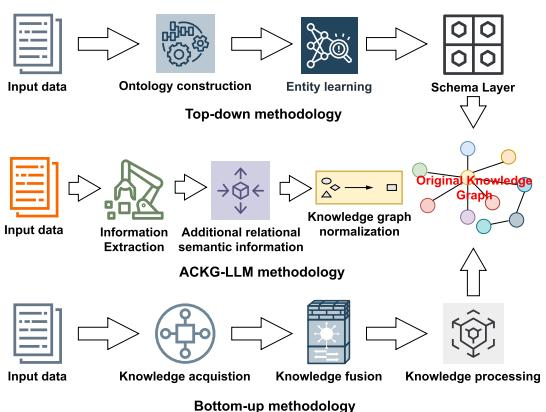
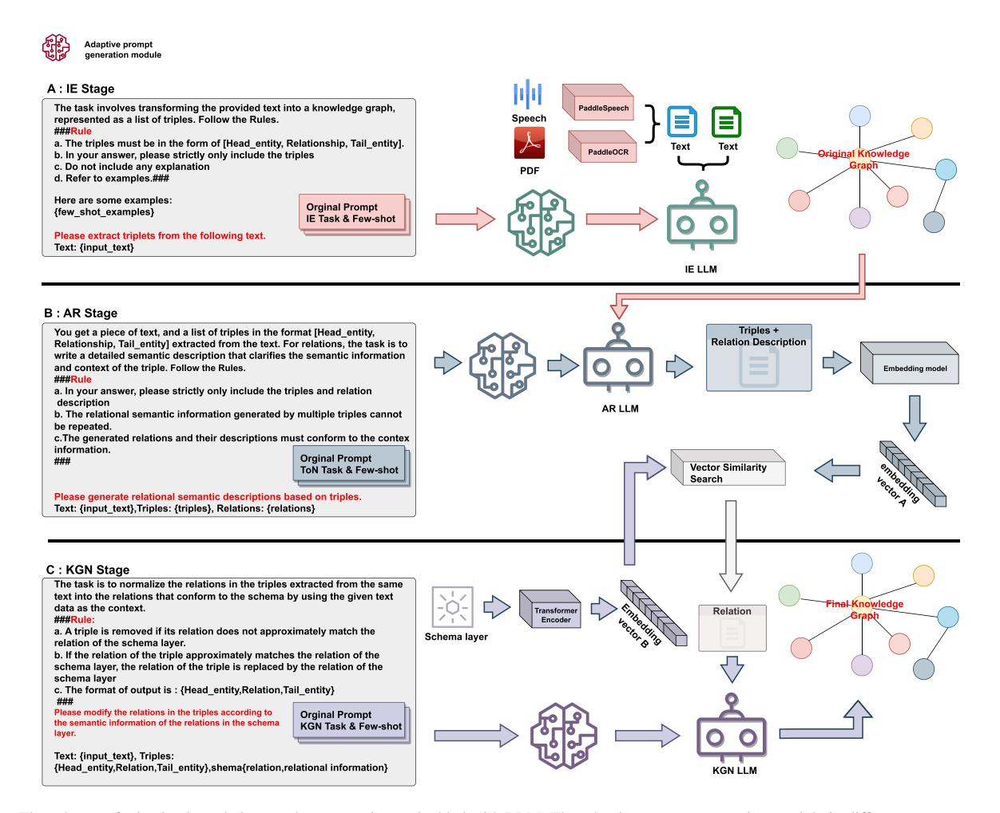
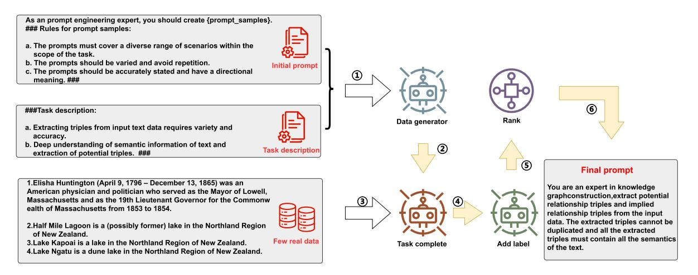
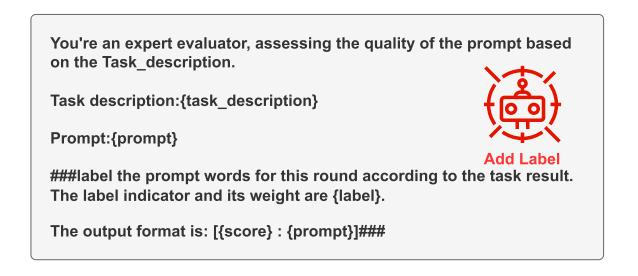
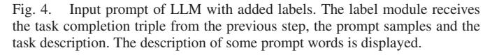
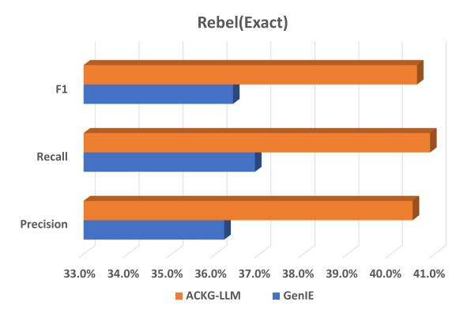
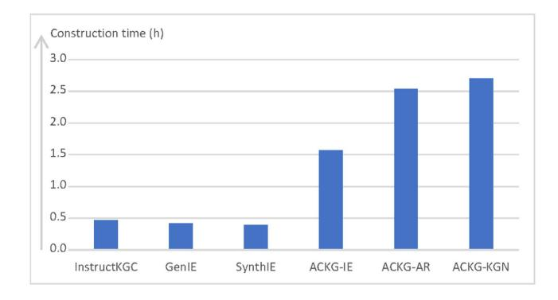
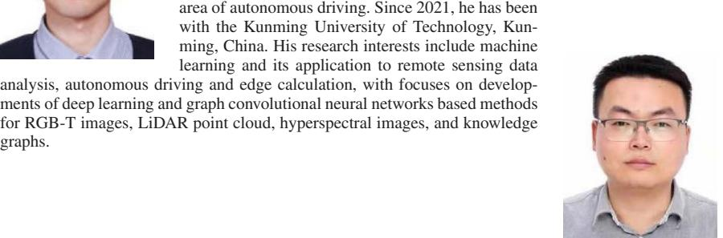
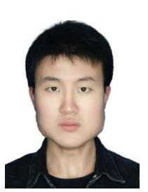

# An Adaptive Framework Embedded With LLM for Knowledge Graph Construction

Qingwang Wang *[,](https://orcid.org/0000-0001-5820-5357) Senior Member, IEEE*, Chaohui Li [,](https://orcid.org/0009-0008-3819-4839) Yi Liu, Qiubai Zhu [,](https://orcid.org/0009-0004-2587-5310) Jian Song *[,](https://orcid.org/0000-0001-6895-0385) Member, IEEE*, and Tao Shen *[,](https://orcid.org/0000-0003-1273-7950) Senior Member, IEEE*

*Abstract***—Knowledge graph construction is aimed at storing and representing the knowledge of the objective world in a structured form. Existing methods for automatic construction of knowledge graphs have problems such as difficulty in understanding potential semantics and low precision. The emergence of Large Language Models (LLMs) provides an effective way for automatic knowledge graph construction. However, using LLMs as automatic knowledge graph construction engines relies on the embedding of schema layers, which brings challenges to the input length of LLMs. In this paper, we present a framework for Adaptive Construction of Knowledge Graph by leveraging the exceptional generation capabilities of LLMs and the latent relational semantic information of triples, named ACKG-LLM. Our proposed framework divides the knowledge graph construction task into three subtasks within a unified pipeline: triple extraction of open information, additional relational semantic information embedding and knowledge graph normalization based on schemalevel embedding. The framework can construct knowledge graphs in different domains, making up for the defects of existing frameworks that need to retrain and fine-tune the internal model. Extensive experiments demonstrate that our proposed ACKG-LLM performs favorably against representative methods on the REBEL and WiKi-NRE datasets.**

*Index Terms***—Knowledge graph construction, schema layer, large language models, prompt engineering.**

#### I. INTRODUCTION

**K**NOWLEDGE graph (KG) is a structured representation and storage of knowledge. The nodes of KG represent entities, and edges connected with the nodes represent relations in the objective world [\[1\].](#page-10-0) Nodes and edges constitute the knowledge semantic network of the objective world. Therefore, efficiently constructing KG aids in knowledge discovery, reasoning, and it fosters the development of related fields, such as search

Received 21 August 2024; revised 1 November 2024 and 1 December 2024; accepted 1 December 2024. Date of publication 3 April 2025; date of current version 28 May 2025. This work was supported in part by the Major Science and Technology Projects in Yunnan Province under Grant 202302AG050009 and Grant 202302AB080014, in part by the Yunnan Fundamental Research Projects under Grant 202401AW070019, Grant 202301AV070003, and Grant 202101BE070001-008, and in part by the Youth Project of the National Natural Science Foundation of China under Grant 62201237. The guest editor coordinating the review of this article and approving it for publication was Prof. Wenguan Wang. *(Corresponding author: Tao Shen.)*

The authors are with the Faculty of Information Engineering and Automation, Kunming University of Science and Technology, Kunming 650500, China (e-mail: [wangqingwang@kust.edu.cn;](mailto:wangqingwang@kust.edu.cn) [20232204174@stu.kust.edu.cn;](mailto:20232204174@stu.kust.edu.cn) [liuyi11](mailto:liuyi11@stu.kust.edu.cn) [@stu.kust.edu.cn;](mailto:liuyi11@stu.kust.edu.cn) [20242104084@stu.kust.edu.cn;](mailto:20242104084@stu.kust.edu.cn) [songjian@kust.edu.cn;](mailto:songjian@kust.edu.cn) [shentao@kust.edu.cn\)](mailto:shentao@kust.edu.cn).

The code is available at<https://github.com/KustTeamWQW/ACKG-LLM> Digital Object Identifier 10.1109/TMM.2025.3557717

recommendation [\[2\],](#page-10-0) intelligent assistant [\[3\]](#page-10-0) and reasoned decision [\[4\].](#page-10-0)

- *Search recommendation:* In the era of Big Data, the generation of massive amounts of information makes it difficult to quickly and accurately access texts of interest [\[5\].](#page-10-0) Large amounts of content with a long-tail distribution are often difficult to discover. Early search methods rely on user input, indexing and literal matching to obtain results. However, such methods often fail to deliver precise answers. The quality of sorted and recalled results can be significantly improved [\[6\]](#page-10-0) by relying on KG for semantic expansion.
- *Intelligent assistant:* Artificial intelligence achieves user intent understanding and handles complex tasks [\[7\].](#page-10-0) KG provides semantic contexts that support intelligent interaction and dynamic knowledge updating [\[8\].](#page-10-0)
- *Reasoned decision:* KG supports more accurate and efficient decision through structured knowledge representation and semantic reasoning. For example, the financial sector uses KG for risk assessment and management [\[9\].](#page-10-0) KG can perform complex relational analyses and semantic reasoning to predict potential risks and assist financial institutions in making investment decisions and risk control.

In terms of logical structure, KG is organized into two distinct layers: the upper schema layer and the lower data layer. Typically, the methods of KG construction can be categorized into two methods: top-down and bottom-up. The top-down methods are to start from the design of the schema layer and subsequently populate the data layer. The bottom-up methods are to extract entities and relations from the data, and build the upper schema layer through a data-driven method, as shown in Fig. [1.](#page-1-0)

Table [I](#page-1-0) summarizes representative examples of KGs from around the world in terms of data sources, size, key features and application scenarios. Wikidata [\[10\]](#page-10-0) integrates structured knowledge from the Wikimedia projects through a collaborative multilingual method, supporting multiple languages. DBpedia [\[11\]](#page-10-0) focuses on extracting information from Wikipedia which is the largest multilingual Web encyclopedia with global identifiers and broad domain coverage. Yago [\[12\]](#page-10-0)integrates multiple data sources, including Wikipedia, WordNet and GeoNames, to establish entity relations and conceptual associations. BabelNet [\[13\]](#page-10-0) links Wikipedia to WordNet, the most commonly used English-language computational dictionary.

1520-9210 © 2025 IEEE. All rights reserved, including rights for text and data mining, and training of artificial intelligence and similar technologies. Personal use is permitted, but republication/redistribution requires IEEE permission. See https://www.ieee.org/publications/rights/index.html for more information.

| <b>KGs</b> <b>Data Sources</b> |                                    | <b>Size</b>                                    | <b>Key Features</b>                                                                                      | <b>Application Scenarios</b>                                                  |  |
|-----------------------------------|------------------------------------|------------------------------------------------|----------------------------------------------------------------------------------------------------------|-------------------------------------------------------------------------------|--|
| Wikidata [10]                     | Wiki media projects                | 25M+ entities. 70M+ statements              | Multilingual support, Freebase migration, Open dataset access                                      | Academic research. Knowledge graph development, Language translation    |  |
| DBpedia [11]                      | Wikipedia                          | $2.6M +$ entities                              | RDF entity descriptions, Domain coverage, Global identifiers                                       | Academic research. Data enrichment. Semantic web development            |  |
| Yago [12]                         | Wikipedia, WordNet. GeoNames | 4.59M+ entities. 24M+ triples               | Entity categories inference, WordNet integration, Spatiotemporal attributes                        | Multidisciplinary research, Ontology development, Entity categorization |  |
| BabelNet [13]                     | Multisource data                   | Multidomain knowledge graph                    | Multimodal data fusion. Advanced knowledge representation, High-dimensional vector space embedding | Academic research. AI innovation. Interdisciplinary studies             |  |
| Microsoft Concept Graph [15]   | Text, Multimedia data           | Rich knowledge representation                  | Concept extraction, Association modeling, Multilingual support                                     | Semantic understanding, Cross-language applications, Concept analysis   |  |
| IMGpedia [14]                     | Visual content. Dbpedia         | 5M+ content descriptors, $450M +$ relations | Deep image association with knowledge graph, Advanced retrieval and annotation                        | Image understanding, Computer vision, Semantic image analysis           |  |

TABLE I REPRESENTATIVE KNOWLEDGE GRAPHS

<!-- Image Description: The image displays three distinct methodologies for knowledge graph construction.  A top-down approach begins with input data, progresses through ontology construction and entity learning, culminating in a schema layer. A bottom-up approach starts similarly, but utilizes knowledge acquisition and fusion to reach knowledge processing.  Centrally, an ACKG-LLM methodology shows information extraction adding semantic information, followed by knowledge graph normalization, producing an "Original Knowledge Graph".  The figure uses flowchart-style diagrams to illustrate each step in the process. -->

Fig. 1. The different methods of knowledge graph construction. The input data of the top-down and bottom-up methods is textual data. The input data of ACKG-LLM can be text, speech or images.

IMGpedia [\[14\]](#page-10-0) deeply associates images and semantic knowledge to provide a powerful resource for the fields of image understanding and computer vision.

The early construction of KG necessitates manual labor, resulting in high costs and a lengthy cycle time, thereby presenting challenges for managing large-scale data. With advances in the deep learning [\[16\]](#page-10-0) methodologies, such as some of the graph convolution network (GCN) and pre-trained BERT model, KG construction task has been beginning to reduce labor costs and improve the accuracy of knowledge acquisition by the models' capabilities to effectively capture and represent complex relations within the data. The recent years have witnessed the remarkable potential of LLMs in various natural language processing tasks, including knowledge graph construction. However, several crucial challenges remain unresolved. These encompass limitations in effectively handling intricate relational information, difficulties in overlapping entities, and constraints imposed by fixed input length that may impede their performance on extensive and diverse datasets. Despite advancements in fine-tuning techniques [\[17\]](#page-10-0) and more sophisticated architectures, significant obstacles persist regarding the adaptability of LLMs across different domains and their ability to manage ambiguity within real-world data. Therefore, it remains challenging to construct KG based on LLMs.

Prompt engineering [\[5\]](#page-10-0) is a methodology for controlling the behavior of LLMs to achieve a specific result without changing the model parameters to solve the problem of illusion. There are two types of prompt design: hard prompt and soft prompt. Hard prompt is manually designed text with discrete input labels. Soft prompt is embedded in the prompt tuning process of the LLMs. The Soft prompt can be used instead of additional training data. The majority of current work is focused on the design of special prompt words with the objective of enhancing the accuracy and recall of downstream [\[18\].](#page-10-0) However, there are two problems with the construction of KGs based on LLMs and prompt engineering. First, the design of prompt words requires a lot of experiments and high costs. Second, the predefined schema layer needs to be embedded in the prompt templates, which puts high demands on the context length of the LLMs. To solve the above problems, we propose an Adaptive Construction of Knowledge Graph framework augmented by LLMs (ACKG-LLM). The adaptive prompt generation module (APG) is used to generate generalized prompt words and combine the three subtasks of ACKG-LLM: information extraction, adding additional relational semantic information and knowledge graph normalization.

The major contribution of this paper has three aspects:

- - We develop the ACKG-LLM: a framework of adaptive construction of knowledge graph based on LLMs to improve the generalisation of existing construction pipeline.
- - Based on LLMs, we design the prompts needed for constructing different knowledge graph tasks as a unified adaptive prompt generation module. This makes LLMs easier to be guided in knowledge graph construction tasks and reduces the labor cost and improves the accuracy of KG construction.

- We improve the accuracy of matching schema layer triples by predicting the relation hidden information based on LLMs. This opens a new door to make LLMs be effectively used in knowledge graph construction tasks.

## II. RELATED WORK

The KG construction focuses on extracting structural information from structured, semi-structured and unstructured text. Specifically, the extraction of triples from text plays an important role in the construction of large-scale KG. In this section, we present a review for KG construction based on traditional methods and introduce the works of KG construction based on LLMs.

#### *A. KG Construction Based on Traditional Methods*

KG construction based on traditional methods uses the advanced training strategy, the large scale of annotation and optimization of model structure to improve the accuracy of mining information to improve the construction accuracy. In the early development of KG construction, most works focus on extracting knowledge triples such as Knowitall [\[19\]](#page-10-0) and TextRunner [\[20\]](#page-10-0) from structured, semi-structured and unstructured text by predefined rules. Ren et al. [\[21\]](#page-10-0) obtained a method for extracting bi-directional extraction frames of triples using entity pairs obtained from two complementary directions. Bos et al. [\[22\]](#page-10-0) proposed commonsense transformer to learn to generate rich and naturally diverse commonsense description languages. Yu et al. [\[23\]](#page-10-0) proposed a relation extraction algorithm based on co-word analysis to extract categorical relations from semi-structured open labels. Lu et al. [\[24\]](#page-10-0) proposed a text-tostructure generation framework for modeling different information extraction tasks. Wei et al. [\[25\]](#page-10-0) introduced a cascading binary labeling framework (CasRel) derived from a well-founded problem formulation. Significant advances in pre-trained generative language models (e.g., T5 [\[26\]](#page-10-0) and BERT [\[27\]\)](#page-10-0) have attracted a lot of attention in order to apply to more complicated scenarios. Furthermore, the idea of embedding learnable controllers for memory management in graph networks can inspire future improvements to the ability of models to dynamically adjust the structure and content of knowledge graphs as they encounter new information [\[28\].](#page-10-0) Wang et al. [\[29\]](#page-10-0) proposed an attention graph neural network that can generalize to zero-shot tasks, which has potential applications in link prediction and entity classification of knowledge graphs. Incorporating such graph-based memory systems can lead to a more efficient and flexible knowledge graph construction framework, especially when dealing with sparse or evolving data. Fan et al. [\[30\]](#page-10-0) proposed a spatio-temporal graph neural network to explicitly represent diverse gaze interactions in social scenarios and infer atomic-level gaze communication through message passing. The knowledge graph constructed by the spatio-temporal graph neural network contains the potential possibility of temporal information. Qi et al. [\[31\]](#page-10-0) introduced Graph Parsing Neural Networks, a framework that fuses structural knowledge while being end-to-end differentiable. In the message-passing inference framework, GPNN iteratively computes the adjacency matrix and node labels. The framework provides implications for generating knowledge heterogeneous graph schemes. The superiority of these models or networks opens up new possibilities for KG construction.

Some recent works have framed the KG construction task as a sequence-to-sequence problem and generated relational triples in an end-to-end manner by fine-tuning these medium-sized language models[\[32\].](#page-10-0) This method not only streamlines the process by reducing the dependency on manually predefined rules but also enhances the adaptability of KG construction to various domains and languages. The SciNLP-KG framework [\[33\]](#page-10-0) was proposed to construct a large-scale NLP knowledge graph from the ACL paper collection, which can easily and automatically construct scientific NLP communities. Hao et al. [\[34\]](#page-10-0) used a method of using ontology for heterogeneous data integration to improve the association between mapping and remote sensing images using KG. Despite these advances, these methods often rely on model training and fine-tuning, and require reordering of the dataset for different domains. In contrast, the ACKG-LLM framework capitalizes on the prompt provided by large language models and evaluations, enabling seamless application across diverse domains without the need for extensive retraining. This adaptability not only enhances the efficiency of knowledge graph construction but also significantly augments the generality of the framework to effectively cater to specific domain requirements. For example, in the field of tin smelting, temperature and time are very critical industrial parameters that are crucial for downstream tasks. Therefore, in the design of prompt words, using the adaptive prompt generation module in the ACKG-LLM framework to redesign the prompt words will improve the accuracy of relevant parameters in the constructed knowledge graph, which will help to improve the performance of downstream practical tasks. Open information extraction in our proposed framework enhances the width of the initial KG. Additional relational semantic information is added to improve the matching accuracy of the initial KG to the schema layer. Knowledge graph normalization makes the final KG more consistent with the constraints of the schema layer.

# *B. KG Construction Based on LLMs*

KG construction based on LLMs pays attention to the construction of fine-tuning data and the optimization of prompt to improve the construction accuracy. The excellent generative capabilities of LLMs in recent studies [\[3\],](#page-10-0) [\[35\],](#page-10-0) [\[36\]](#page-10-0) have further advanced the development of prompt engineering based on generation of triples from LLMs. This development certainly provides us with a new perspective to understand and utilize LLMs. Although the GPT series of LLMs is effective [\[37\],](#page-10-0) constructing a KG requires a large number of calls and there is a high cost associated with using closed-source LLMs. We measured six representative open-source LLMs using the Massive Multitask Language Understanding (MMLU) dataset. The experimental results, shown in Table [II,](#page-3-0) show that except for the LLM with

| TABLE II                                                                                                                          |  |
|-----------------------------------------------------------------------------------------------------------------------------------|--|
| THE INFERENCE ACCURACY (%) OF 5 LLMS WITH 7 BILLION PARAMETER BRIGHTNESS LEVELS AND 1 LLM WITH 13 BILLION PARAMETER ON 38 DOMAINS |  |

|                                          | Alpaca-2- 13b-16k-hf | Lmsys/longchat- $7b-v1.5$      | Vicuna- $7b-v1.5$ | chatglm2- 6 b | Baichuan2- 7b-chat | Llama-2- 7b-chat-hf |
|------------------------------------------|-------------------------|-----------------------------------|----------------------|-----------------------------|-----------------------|------------------------|
|                                          |                         | <b>Nature Sciences</b>            |                      |                             |                       |                        |
| astronomy                                | 47.4                    | 30.3                              | 47.4                 | 52.6                        | 57.9                  | 47.4                   |
| clinical_knowledge                       | 57.4                    | 22.6                              | 55.1                 | 48.7                        | 55.5                  | 53.6                   |
| conceptual_physics                       | 38.7                    | 26.8                              | 45.1                 | 40.9                        | 49.8                  | 41.3                   |
| elementary_mathematics                   | 28.8                    | 20.4                              | 30.4                 | 34.1                        | 32.8                  | 31.0                   |
| math                                     | 31.6                    | 21.3                              | 30.9                 | 29.0                        | 34.0                  | 29.8                   |
| physics                                  | 36.7                    | 27.3                              | 36.7                 | 37.8                        | 42.7                  | 36.9                   |
| virology                                 | 40.4                    | 30.7                              | 42.2                 | 44.0                        | 49.4                  | 42.8                   |
| biology                                  | 55.9                    | 25.1                              | 54.2                 | 50.9                        | 61.9                  | 51.3                   |
| chemistry                                | 34.3                    | 25.4                              | 37.0                 | 38.9                        | 41.9                  | 33.7                   |
| nutrition                                | 55.2                    | 23.2                              | 57.5                 | 54.6                        | 57.2                  | 51                     |
| health                                   | 50.5                    | 22.4                              | 53.8                 | 46.2                        | 53.0                  | 48.5                   |
| avg_acc                                  | 43.4                    | 25.0                              | 44.6                 | 43.4                        | 48.7                  | 42.5                   |
|                                          |                         | <b>Engineering and Technology</b> |                      |                             |                       |                        |
| computer_security                        | 62.0                    | 29.0                              | 65.0                 | 55.0                        | 69.0                  | 57.0                   |
| machine_learning                         | 33.9                    | 24.1                              | 45.5                 | 41.1                        | 26.8                  | 31.2                   |
| !!!!!!!!!!!!!!!!!!!!!!!!!!!!!!!!!!!!!!!! | 49.0                    | 28.2                              | 49.3                 | 45.4                        | 47.6                  | 40.8                   |
| engineering                              | 51.0                    | 22.8                              | 44.8                 | 49.0                        | 50.3                  | 50.3                   |
| avg_acc                                  | 49.0                    | 26.0                              | 51.2                 | 47.6                        | 48.4                  | 44.8                   |
|                                          |                         | <b>Social Sciences</b>            |                      |                             |                       |                        |
| !!!!!!!!!!!!!!!!!!!!!!!!!!!!!!!!!!!!!!!! | 27.2                    | 20.2                              | 33.3                 | 27.2                        | 31.6                  | 36.8                   |
| economics                                | 45.3                    | 26.1                              | 45.6                 | 42.5                        | 49.2                  | 41.5                   |
| management                               | 66.0                    | 24.3                              | 68.0                 | 63.1                        | 57.9                  | 68.0                   |
| marketing                                | 79.5                    | 29.5                              | 75.6                 | 70.5                        | 79.9                  | 72.2                   |
| public_relations                         | 65.5                    | 20.9                              | 63.6                 | 55.5                        | 60.9                  | 53.6                   |
| security_studies                         | 57.6                    | 24.1                              | 63.3                 | 53.9                        | 60.0                  | 52.7                   |
| sociology                                | 65.2                    | 23.4                              | 67.2                 | 65.2                        | 71.6                  | 65.2                   |
|                                          | 71.0                    | 25.0                              | 76.0                 | 72.0                        |                       | 72.0                   |
| us_foreign_policy                        | 65.9                    | 23.3                              | 68.5                 | 58.5                        | 73.0                  | 60.8                   |
| politics                                 |                         |                                   |                      |                             | 68.1                  |                        |
| <b>business</b>                          | 70.5                    | 26.8                              | 68.9                 | 66.1                        | 72.1                  | 66.6                   |
| business_ethics                          | 54.0                    | 23.0                              | 54.0                 | 59.0                        | 55.0                  | 52.0                   |
| avg_acc                                  | 60.7                    | 24.2                              | 62.2                 | 57.6                        | 61.8                  | 58.3                   |
|                                          |                         | <b>Humanities</b>                 |                      |                             |                       |                        |
| philosophy                               | 59.5                    | 29.9                              | 58.2                 | 52.1                        | 61.4                  | 55.9                   |
| moral_disputes                           | 60.4                    | 25.4                              | 55.2                 | 52.6                        | 58.7                  | 52.3                   |
| moral_scenarios                          | 42.5                    | 24.7                              | 23.9                 | 25.8                        | 25.8                  | 23.5                   |
| history                                  | 61.5                    | 24.4                              | 65.1                 | 57.4                        | 67.6                  | 60.9                   |
| culture                                  | 59.9                    | 24.4                              | 65.4                 | 59.3                        | 68.4                  | 62.0                   |
| world_religions                          | 66.7                    | 31.0                              | 72.5                 | 52.6                        | 76.6                  | 73.7                   |
| prehistory                               | 54.3                    | 20.7                              | 56.2                 | 48.1                        | 63.3                  | 56.8                   |
| avg_acc                                  | 57.8                    | 25.8                              | 56.6                 | 49.7                        | 60.3                  | 55.0                   |
|                                          |                         | <b>Law and Ethics</b>             |                      |                             |                       |                        |
| jurisprudence                            | 64.8                    | 22.2                              | 57.4                 | 56.5                        | 71.3                  | 59.3                   |
| international_law                        | 67.8                    | 37.2                              | 58.7                 | 62.8                        | 69.4                  | 63.6                   |
| logical_fallacies                        | 55.8                    | 30.1                              | 54.0                 | 51.5                        | 63.8                  | 54.6                   |
| professional_law                         | 38.3                    | 26.4                              | 36.7                 | 36.2                        | 39.5                  | 34.9                   |
| law                                      | 42.0                    | 26.9                              | 39.5                 | 39.3                        | 43.5                  | 38.3                   |
| avg_acc                                  | 53.7                    | 28.6                              | 49.3                 | 49.3                        | 57.5                  | 50.1                   |

increased input length, the inference accuracy of other models in various domains reaches about 50%. The results prove the feasibility of using open-source LLMs to complete the task of KG construction. Recent research has shown that domain KG can be constructed based on LLMs. Chia et al. [\[38\]](#page-10-0) proposed to synthesize relational examples by prompting LMMs to generate structured text. Hu et al. [\[39\]](#page-10-0) proposed automatically extracts entities and relations from open-source threat intelligence and can map descriptions to tactics, techniques and procedures. Wei et al. [\[40\]](#page-10-0) proposed to extract triples by defining the task as a multi-round question and answer problem. InstructKGC is a dataset and inference framework for improving the information extraction capabilities of large language models [\[41\].](#page-10-0) GenIE is a generative sequence-to-sequence model and the representative model for REBEL and Wiki-NRE [\[42\].](#page-10-0) SynthIE proposes to use the LLM to generate synthetic data to improve the performance of the small model on the triple extraction task [\[43\].](#page-10-0) And in another study [\[44\],](#page-10-0) the task was redefined and treated as a code generation problem. KG construction based on LLMs relies on prompt engineering. Nevertheless, designing prompt words that can improve the accuracy of completing downstream tasks requires a lot of experiments. These methods usually rely on manually designed prompt words and may suffer from semantic inconsistency when dealing with long contexts or complex semantics. In contrast, our ACKG-LLM framework automatically generates prompt words suitable for different tasks through an adaptive prompt generation module, which greatly reduces the cost of manually designing prompt words and improves the accuracy and versatility of KG construction. For ambiguous entity relations, such as "I had a great time at KFC today." Here, "KFC" could refer to the company or the restaurant. ACKG-LLM employs a context learning that utilizes surrounding text and metadata to disambiguate entities. In this case, the framework analyzes prior context (e.g., mentions of "had a great time") and recognizes that "KFC" refers to the restaurant. The large language model uses context learning to construct triples to improve the accuracy of identifying ambiguous entity relations. For complex entity relations, such as "Elite Technology was founded in 2015 and had 500 employees." The existence of two identical head entities is "founded in" and "had" in this sentence, due to the design of the prompt rule of ACKG-LLM, which enables the identification of both relations.

Previous researches in order to make the KG conform to a predefined schema require embedding the schema layer in the prompt. These methods put forward high requirements on the input window length of LLMs. Hu et al. [\[45\]](#page-10-0) do not embed the pattern layer as a prompt word into the large language model, and match the knowledge graph generated by the large language model with the pattern layer information to avoid the problem of large language model input limitations. However, the constraints of the schema layer depend on the scale and semantics of the schema layer. We developed ACKG-LLM taking inspiration from EDC [\[45\]](#page-10-0) and AutoPrompt [\[46\],](#page-10-0) a module that automatically generates prompts using large language models. We improve the effect of constraints by adding additional relational semantic information based on LLMs and support multiple input data formats.

#### III. METHODOLOGY

In this section, we describe the ACKG-LLM framework. Given structured, semi-structured and unstructured data as input, ACKG-LLM extracts triples that conform to the schema layer constraints of the KG. Subsequently, a constrained KG is automatically constructed from the triples. Finally, we describe the adaptive prompt generation module to solve the problem of the high cost of designing effective prompt words.

#### *A. ACKG-LLM Framework*

The overall framework of ACKG-LLM is depicted in Fig. [2,](#page-5-0) which contains three stages: an information extraction (IE) stage to extract all implicit triples from the input data, an additional relation (AR) stage to increase the interpretability of triples and improve the accuracy of semantic constraint determination at the schema layer and a knowledge graph normalization (KGN) stage to construct a KG based on the schema.

In the IE stage, input data contains text, voice and image format. We use PaddleSpeech [\[47\]](#page-10-0) and PaddleOCR to convert voice and pdf to text. With the adaptive prompt generation module, the LLM extracts unconstrained triples from the input data. The extracted triples have the nature of implicit semantic information in the text. ACKG-LLM uses the full triples as the knowledge representation of the initial knowledge graph. Our goal is to mine the full potential knowledge from the text at this stage. In the AR stage, the adaptive prompt generation module generates prompts that add additional relational information to the triples. The LLM adds supplementary relational semantic descriptions to each triple based on rules in the pre-prompts. Subsequently, in order to perform similarity search with the relational semantic information of the schema layer in the third stage, the additional relational semantic information generated by LLM needs to be encoded into a high-dimensional vector through the embedding model. Similarity is measured by computing the dot product (matrix multiplication) between relational semantic information for triples embedding vector *A* and each embedding representation in schema relation embedding vector *B*. In the KGN stage, the relational semantic information of the schema layer is pre-encoded and the additional relational semantic information of the triples in the second stage is used for vector similarity search as follows:

$$
\cos(\alpha) = \frac{\text{AB}}{\|\text{A}\| \|\text{B}\|},\tag{1}
$$

where -A- = n i=1 ai 2, -B- = n i=1 bi 2. α is represent the angle between *A* and *B* in vector space. A = [a1, a2, . . .. . ., an], B = [b1, b2, . . .. . ., bn]. The vector similarity search module will score the relational semantic information of each schema layer and set a threshold *K* to obtain the top *K* relation that match the additional relational semantic information in the schema.

The knowledge graph schema layer is constructed in two steps. First, the core concepts and relations in the domain are

<!-- Image Description: This image depicts a three-stage natural language processing pipeline.  Stage A (IE) extracts triples (subject, predicate, object) from text using an IE LLM. Stage B (AR) augments these triples with semantic descriptions using an AR LLM and vector similarity search, generating embeddings. Stage C (KGN) normalizes relations in the triples to match a schema using a KGN LLM, producing a final knowledge graph. The diagram uses boxes to represent modules and arrows to indicate data flow.  Each stage includes a prompt and rules for the task. -->

Fig. 2. The schema of adaptive knowledge graph construction embedded with LLM. The adaptive prompt generation module in different stages represents the generation of prompt words for different tasks. In the IE phase, blue text indicates text data that was extracted from other components, and green text indicates that the input data was originally text data. In the AR stage, the vector similarity search module performs vector matching and scoring on the two inputs, and finally sorts to obtain the relations of the top *K* schema layers.

identified, usually through literature research, expert interviews, or statistical analysis. Then, the concepts are classified and hierarchized, and presented in A hierarchical structure of entity type-subtype, which ensures that there Is an inheritance logic such as is-a or part-of relation between concepts. ACKG-LLM is a knowledge graph construction process under the condition of having a schema layer. In order to verify the effectiveness of the framework, the construction of the schema layer in our later experiments is to manually extract the relational semantic information of the truth value in the whole data set as the schema layer.

The LLM constrains the triples containing additional relational semantic information based on the schema layer information. The semantic information at the schema layer is the standard for normalization. If the semantic information in the schema layer does not appear in the initial triple, that triple is deleted. If the semantic information in the initial triple is close to the semantic information in the schema layer, the relational information of the initial triple is replaced with the schema layer relational semantic information with the highest similarity. Finally, the final KG is constructed.

## *B. Adaptive Prompt Generation Module*

The adaptive prompt generation module belongs to the ACKG-LLM framework. In the ACKG-LLM framework, the adaptive prompt generation module inputs the generated prompt text into the LLM so that the LLM can better complete the tasks at different stages. The components of adaptive prompt generation module are depicted in Fig. [3.](#page-6-0) The module contains four components, they complete generalized data generation, execution, labeling scores and ranking tasks.

1) *Generalized data generation:* Input initial prompts and task goals to the LLM, which expands the initial prompts based on a predefined template for generating generalizability sample prompts. Both the initial input prompt and the task goal can be modified according to different domain requirements. For example, adding constraints to the initial prompt can change the structure of the generated data to a list, dictionary, or string. The initial prompt requires that the generated expanded prompts be as diverse and adversarial as possible. The prompt samples generated by the LLM conform to the schema requirements

<!-- Image Description: This flowchart depicts a prompt engineering process for knowledge graph construction.  It shows how initial and task descriptions are used by a data generator to produce prompts.  These prompts are then ranked, refined by adding labels, and finally yield a final prompt optimized for extracting relationship triples from text data.  The process incorporates both initial prompt engineering rules and a task description for accuracy and semantic understanding.  The example data provided consists of short descriptions of geographical locations. -->

Fig. 3. A diagrammatic representation of the module for adaptive prompt generation based on LLM.1 means that inputting the initial prompt and task description text into the Data generator;2 represents multiple relevant prompt examples generated;3 means that part of the real data to be processed is input to Task complete; 4 represents each result of task completion according to each prompts; 5 represents the prompts with the evaluation label; 6 represents the output action sorted according to the label.

of the predefined prompt. The adaptive prompt generation module in different stages of ACKG-LLM framework has different generalization data generation tasks. In IE stage, the generalization data generation component generates diverse triple extraction prompt samples from the input initial prompt and task description. In the AR stage, the generalization data generation component generates prompt examples that add semantic information about additional relations to the triples. In the KGN stage, the generalization data generation component generates prompt examples that normalize triples according to the semantic information of the schema layer.

- 2) *Task completion:* The generated prompt samples and a few pieces of real data are used as contexts and input the LLM to execute the task. According to the different stages of the adaptive prompt module in the ACKG-LLM framework, the tasks are different. In the IE stage, the LLM performs open information extraction tasks. The extraction result is all the triples of the text data, including all the text semantic information. In the AR stage, the LLM generates additional relational semantic information based on input triples and prompts. In the KGN stage, the LLM normalizes the extracted triples according to the rules of the prompts and partially extracted triples, additional relational semantic information, and schema layer semantic information.
- 3) *Labeling scores:* The generated prompts samples and the extracted triples (additional relational semantic information or normalized triples) are input as context to the LLM. The LLM judges the generated prompts based on the labels [\[48\]](#page-10-0) in the prompt is depicted in Fig. 4. The label can be redesigned according to different tasks and additional weights are added to ensure the effectiveness of the ranking results. A score is given for each generated prompt based on the judgment. Finally, the score and the prompt form a key-value output.

<!-- Image Description: This image presents instructions for a prompt evaluation task.  It outlines the process: an expert assesses a prompt's quality based on a task description, assigns a score and label indicating quality, and outputs the result in a specified format. A small icon depicts automated labeling.  The instructions define input (task description, prompt) and output (score, prompt, label) formats using curly braces for placeholders. -->

<!-- Image Description: Figure 4 describes the input prompt for a Large Language Model (LLM).  It details how a "label module" receives information from the previous processing step: a task completion triple, prompt samples, and the task description.  The figure's purpose is to illustrate the input structure, specifically highlighting the addition of labels to the LLM prompt and how contextual information is incorporated.  No diagrams or graphs are present; it is purely textual description. -->

4) *Ranking:* This component ranks the prompt samples according to the score of the generated prompts. The highest scoring generated prompt sample performs the task with the best overall results. This component simply sorts the [score-prompt] key-value pairs from the previous component and outputs the corresponding prompt based on the highest score. The highest scoring generated prompt sample is selected as the prompt for the ACKG-LLM framework.

#### IV. EXPERIMENTS

In this section, we firstly describe datasets and metrics in the experimental setup. Subsequently, we compare with representative methods. Finally, we do the ablation studies and analyse the causes.

#### *A. Datasets and Metrics*

1) *Datasets:* We evaluate our proposed ACKG-LLM on two bench-mark datasets: REBEL [\[49\]](#page-10-0) and Wiki-NRE [\[50\].](#page-10-0) REBEL has been constructed using abstracts from Wikipedia. The original test partition of REBEL contains 105,516 entries. The dataset comprises alignments

TABLE III THE RESULTS (%) OF OUR METHOD AND REPRESENTATIVE METHODS ON REBEL AND WIKI-NRE DATASETS

|                         |           | <b>REBEL</b> |       | Wiki-NRE  |        |       |
|-------------------------|-----------|--------------|-------|-----------|--------|-------|
|                         | Precision | Recall       | F1    | Precision | Recall | F1    |
| <b>InstructKGC</b> [41] | 12.66     | 13.46        | 12.95 | 10.86     | 12.80  | 11.57 |
| <b>GenIE</b> [42]       | 38.39     | 40.25        | 39.10 | 37.98     | 36.30  | 36.12 |
| <b>SynthIE</b> $[43]$   | 41.35     | 42.56        | 41.82 |           |        |       |
| <b>ACKG-LLM</b> (ours)  | 42.72     | 43.35        | 42.93 | 57.28     | 58.00  | 57.57 |

<!-- Image Description: This bar chart compares the performance of ACKG-LLM and GenIE models on a "Rebel (Exact)" task.  It displays precision, recall, and F1 scores for both models.  ACKG-LLM consistently outperforms GenIE across all three metrics, indicating higher accuracy and completeness in the task.  The chart visually represents the quantitative evaluation results, crucial for assessing the relative effectiveness of the two approaches. -->

Fig. 5. The results of ACKG-LLM and GenIE on REBEL dataset with exact match.

in sentences, hyperlinks to Wikipedia, and corresponding entities and relations in the knowledge base of the Web Knowledge Graph (Wikidata). Due to the limitation of computational resources, we randomly select 1000 text data as the test dataset. Subsequently, using Chatgpt4o to extract all relations in triples as the schema layer in order to validate the effectiveness of our pipeline.

- 2) *Metrics:* In this study, a token-based method is employed to compute precision, recall, and F1 scores for triples. Initially, the triple is constructed as the knowledge representation paradigm for KGs. Subsequently, all elements within the triples are designated as entities. Finally, precision, recall, and F1 scores are evaluated using a named entity evaluation-based method, which employs two distinct methods. Exact: the results and validation dataset are an exact match. Partial: the results and validation dataset are a partial match.
- 3) *Implementation Details:* We use Mistral-7b-v0.2 [\[51\]](#page-10-0) as the engine for all components. The adaptive prompt generation module for data generation, execution, label scoring, and ranking of LLM prompt templates is depicted in Figs. [3](#page-6-0) and [4.](#page-6-0) The three phases of the ACKG-LLM framework for the initial task prompts are depicted in Fig. [2.](#page-5-0) We find that the performance of the 4 b quantization method of Mistral-7b-v0.2 performs approximately as well as the 8 b quantization method in the ACKG-LLM framework. In the ACKG-LLM framework, we use 4 b quantization methods in all LLMs loadings.

Fig. 6. The results of our method and GenIE on Wiki-NRE dataset with exact match.

TABLE IV THE RESULTS (%) OF OUR METHOD AND GENIE ON REBEL AND WIKI-NRE DATASET WITH PARTIAL MATCH

|                 |           | <b>REBEL</b> |           | WiKi-NRE  |        |       |
|-----------------|-----------|--------------|-----------|-----------|--------|-------|
| Partial         | Precision |              | Recall F1 | Precision | Recall | F1    |
| GenIE [42]      | 38.39     | 40.25        | 39.10     | 37.98     | 36.30  | 36.12 |
| <b>ACKG-LLM</b> | 42.72     | 43.35        | 42.93     | 57.28     | 58.00  | 57.57 |

#### *B. Comparison With Representative Methods*

Figs. 5 and 6 compare the results of the representative method for KG construction on the Rebel and Wiki-NRE test dataset (all of these methods use common data enhancement strategies). Our method surpassess GenIE [\[42\]](#page-10-0) on REBEL and Wiki-NRE datasets. GenIE is a generative sequence-to-sequence model and the representative model for REBEL and Wiki-NRE. We compare the case of exact match and partial match, which is described in Table IV. The results show that ACKG-LLM has higher precision by 4.33%, recall by 3.1% and F1 score by 3.83% than GenIE. We compare our method with GenIE and show that the knowledge graph construction method based on unfine-tuned open source LLMs is better than the past knowledge graph construction method based on specially trained and fine-tuned pre-trained models. This suggests that ACKG-LLM has a stronger understanding of semantics and a wider breadth of knowledge than traditional models based on BART model [\[52\]](#page-11-0)

according to the prompt engineering in the task of automatic KG construction.

To validate the advancements of our work, we also compare it with other KG construction methods based on LLMs. For InstructKGC [\[41\],](#page-10-0) this is a framework for instructing fine-tuning LLMs to downstream tasks. We use a publicly available finetuned and trained LLM from this framework: Oneke. However, the triple extraction results on REBEL and Wiki-NRE datasets do not reflect the performance of the proposed model that has been fine-tuned on data from various KG construction subtasks. We analyze the output and find that the Oneke model under the InstructKGC framework has a good effect on identifying head entities and tail entities, but it has a poor effect on extracting corresponding relations. The reason for this result may be that the framework has no instruction design for the triple extraction task in the instruction. When we replicated InstructKGC using Oneke, we do not find the detailed design of few-shot for the triple extraction task. However, in the application domain of LLMs, few-shot is often classified in the scope of prompt engineering. For this reason, we believe that the comparison with Oneke cannot determine the advancement of our method.

We compare the best performing model on the REBEL dataset, which is SynthIE [\[43\].](#page-10-0) This work proposes to use the LLM to generate synthetic data to improve the performance of the small model on the triple extraction task. Experimental results show that our method outperforms SynthIE by 1.37%, 1.21% and 1.11% in precision, recall and F1 score respectively. We analyze the reasons in detail, there are a large number of redundant subjects and objects in the REBEL dataset. However, the SynthIE model trained on the training set and synthetic data can extract subjects and objects better than our method without fine-tuning on the dataset. The ACKG-LLM framework unifies knowledge graph construction schemes in different fields, but the precision of using multiple large language models is not high. Large language models that rely on prompt engineering still suffer from the illusion problem. Self-checking error correction is a promising solution. The experimental results are shown in Table [III.](#page-7-0)

#### *C. Ablation Studies*

We test the ACKG-LLM framework without the adaptive prompt generation module and the ACKG-LLM framework with the addition of the adaptive prompt generation module on the REBEL dataset. We find that the adaptive prompt generation module improves the interpretability of prompt engineering and reduces the time cost of manually designing prompts. In the task of KG construction, experimented with the exact method, the addition of the adaptive module improves the precision by 1.04%, recall by 1.03%, and F1 score by 1.01%. Experimented with the partial method, the addition of the adaptive prompt generation module improves the precision by 1.39%, recall by 1.32%, and F1 score by 1.36%. The adaptive prompt generation module improves the performance by 1% to 2% in the triple extraction task. For experiments with the same index and different evaluation methods, we find that this module improves the approximate value. The results are shown in Table V. We analyze the

TABLE V THE RESULTS (%) OF ABLATION EXPERIMENTS ON REBEL DATASET

|                    | <b>Exact</b> |       |                   | Partial                                |             |    |
|--------------------|--------------|-------|-------------------|----------------------------------------|-------------|----|
|                    |              |       |                   | Precision Recall F1   Precision Recall |             | F1 |
| ACKG-LLM (w/o APG) | 39.43        |       | 39.89 39.59 41.33 |                                        | 42.03 41.58 |    |
| <b>ACKG-LLM</b>    | 40.47        | 40.86 | 40.60 42.72       |                                        | 43.35 42.94 |    |

TABLE VI THE RESULTS (%) OF DIFFERENT LARGE LANGUAGE MODELS USED AS THE ENGINE FOR ACKG-LLM ON THE REBEL DATASET

|                            | REBEL     |        |       |
|----------------------------|-----------|--------|-------|
| <b>Partial</b>             | Precision | Recall | F1    |
| SynthIE                    | 41.35     | 42.56  | 41.82 |
| ACKG-LLM (Owen2-7B)        | 43.15     | 43.87  | 43.41 |
| ACKG-LLM (Mistral-7B-v0.2) | 42.72     | 43.35  | 42.93 |
| ACKG-LLM (Mistral-7B-v0.3) | 51.10     | 52.47  | 51.60 |

reasons for the improvement of the effect of adding the adaptive prompt generation module. First of all, manually designed tips rely on professional experience, but there is no unified evaluation standard. The module of adaptive prompt generation takes the pre-completion result as the benchmark, and the effectiveness of the reverse evaluation of the prompt enables the input prompt of ACKG-LLM to be preprocessed to improve the task relevance of the prompt. Secondly, in each stage of ACKG-LLM, an adaptive prompting module is set up to design different prompts for different tasks. It is better to use a local optimal prompt strategy than to complete the entire task with a single input prompt. Specifically, ACKG-LLM unifies the construction of knowledge graphs in different domains into three steps. The adaptive prompt generation module expands the initial number of triples through the prompt rules in the first stage, adds semantic information matching the pattern layer in the second stage, and improves the precision of relational semantic representation in the third stage. Finally, the three indicators of recall, precision and F1 scores are improved.

# *D. Performance Analysis Under Different Large Language Models*

We test the performance of different open-source large language models as the engine for ACKG-LLM on the REBEL dataset. The experiments set up a set of different series of large language models and different versions of the same series of large language models as a comparison. Experimented with the partial method, Qwen2-7B outperforms SynthIE by 1.8% in precision, 1.31% in recall and 1.59% in F1 score. When Mistral-7B-v0.3 model is used as the engine of ACKG-LLM, ACKG-LLM is 9.75% higher than SynthIE in precision, 9.91% higher than SynthIE in recall and 9.78% higher in F1 score. The experimental results are shown in Table VI.

According to our investigation, the vocabulary size of Mistral-7B-v0.2 is 32,000. Mistral-7B-v0.3 has a vocabulary size of

<!-- Image Description: The bar chart displays the construction time (in hours) for six different knowledge graph construction methods: InstructKGC, GenIE, SynthIE, ACKG-IE, ACKG-AR, and ACKG-KGN.  It shows a significant variation in construction times, with ACKG-KGN exhibiting the longest construction time and InstructKGC the shortest. The chart's purpose is to compare the efficiency of these methods. -->

Fig. 7. The inference overhead of different methods on REBEL dataset.

32,768. There are some tokens in the REBEL dataset that have poor recognition effect in Mistral-7b-v0.2. The vocabulary size has a strong influence on the generalization ability of the model. Qwen2-7B has a vocabulary size of 151,643, which is more than Mistral-7B-v0.3. However, the precision, recall and F1 score of Qwen2-7B are not as high as Mistral-7B-v0.3. We find that Mistral-7B-v0.3 cancels the sliding window mechanism compared to Mistral-7B-v0.2 and Qwen2-7B. Sliding Windows are used to process short input text when training large language models. Not using a sliding window means the model works on longer text sequences simultaneously, which improves the ability of model to understand context and generate more coherent responses. In contrast to vocabulary, training strategies can significantly affect the performance of large language models in triple extraction tasks.

#### *E. Computing Resource Analysis*

We compare the inference overhead of different methods in the process of knowledge graph construction on the REBEL dataset, as shown in Fig. 7. Experiments show that our propoesd ACKG-LLM framework consumes more overhead in each stage of inference compared with other methods. We analyze the experimental results from the perspective of whether LLM is used or not. Specifically, in terms of methods based on LLM, such as Oneke, InstructKGC extracts triples according to instructions, and most of the results are the embeddings of head and tail entities. Because only one LLM is used, the inference time is relatively fast. On the other hand, GenIE and SynthIE models trained on REBEL data perform well in triplet extraction. To ensure the fairness of the comparison experiments, we only compare the inference time without considering the training time. ACKG-LLM incurs huge computational overhead in the process of constructing knowledge graphs. The reason is not only the long time for generating embeddings of LLMs, but also the complexity of the framework using multiple LLMs and building multi-stage knowledge processing pipelines.

#### V. CONCLIUSION

In this paper, we present an adaptive KG construction based on LLMs. Our method decomposes KG construction into three stages: information extraction stage, additional relation stage and knowledge graph normalization stage. We explore the use of LLMs to enhance automatic knowledge graph construction, verifying the effectiveness of our approach on REBEL and WiKi-NRE datasets. Furthermore, the proposed method is extendable to other domain KG construction task. Although LLMs provide new possibilities for the construction of KG, prompt engineering is still not fully non-manual.

In future work, we plan to further explore the capabilities of our ACKG-LLM method in several directions:

- - Application to other knowledge graph related tasks: ACKG-LLM can be extended to more tasks, such as knowledge reasoning. For knowledge reasoning, we will implement the function of retrieving question-answering based on existing knowledge graphs in ACKG-LLM. Exploring an end-to-end knowledge graph construction framework will help to further validate its usefulness.
- - Optimizing the pre-prompt template of the adaptive prompt generation module: The current pre-prompt template we design can be further refined to better generate the effectiveness of prompts. Leveraging techniques from prompt engineering or automatic prompt generation can help to handle the complex knowledge graph construction tasks and improve the precision of inference.
- - Enhancing the scalability of the adaptive prompt generation module: We will use distributed or parallel processing architectures to handle larger data volumes, possibly leveraging cloud-based infrastructure or multi-GPU setups to improve throughput. In addition, integrating batching or caching strategies within the APG module can significantly reduce redundancy in prompt generation and evaluation, thus improving efficiency.
- - Ensemble of multi-modal large Models: The generalizations of purely large language models will be limited in the future. Integrating models such as Clip and Chatgpt-4o into ACKG-LLM is an effective means to improve the generality of the framework.
- - Fusion of latent semantic information: We will explore the impact of latent semantic information about entities and relations on large models' generation. Research on more efficient search and matching algorithm is helpful to improve the normalization effect of schema layer.
- - Embedding small models: Since large models suffer from high memory usage, it would be helpful to study the hybrid expert strategy of small and large models for generalization of our framework for the complex task of knowledge graph construction.
- - Low-resource knowledge graph construction: We will continue to develop data mining and knowledge representation techniques for low-resource domains. Firstly, the parameter knowledge of the large language model is used to perform data augmentation on the low-resource data. Secondly, the formal expression of hypergraph is used to enhance the representation of low-density relations.
- - Adaptive Prompt Tuning: The Adaptive Prompt Generation (APG) module will be further optimized to dynamically adjust prompts according to domain-specific prompts. For instance, the module could employ lightweight, domain-specific prompt adjustments using few-shot learning with in-domain examples to improve relevance without extensive fine-tuning.

- [1] L. Zhong, J. Wu, Q. Li, H. Peng, and X. Wu, "A comprehensive survey on automatic knowledge graph construction," *ACM Comput. Surv.*, vol. 56, no. 4, pp. 1–62, Nov. 2023.
- [2] H. Pan and X. Yang, "Intelligent recommendation method integrating knowledge graph and Bayesian network," *Soft Comput.*, vol. 27, no. 1, pp. 483–492, Jan. 2023.
- [3] P. Ni, R. Okhrati, S. Guan, and V. Chang, "Knowledge graph and deep learning-based text-to-graphQL model for intelligent medical consultation chatbot," *Inf. Syst. Front.*, vol. 26, no. 1, pp. 137–156, Feb. 2024.
- [4] R. Wang et al., "A knowledge graph-aided decision guidance method for product conceptual design," *J. Eng. Des.*, vol. 36, no. 2, pp. 216–255, Jul. 2024.
- [5] Z. Lu et al., "Personalized fashion recommendation with discrete content-based tensor factorization," *IEEE Trans. Multimedia*, vol. 25, pp. 5053–5064, Jun. 2022.
- [6] H. Mezni, D. Benslimane, and L. Bellatreche, "Context-aware service recommendation based on knowledge graph embedding," *IEEE Trans. Knowl. Data Eng.*, vol. 34, no. 11, pp. 5225–5238, Nov. 2022.
- [7] X. L. Dong, S. Moon, Y. E. Xu, K. Malik, and Z. Yu, "Towards next-generation intelligent assistants leveraging LLM techniques," in *Proc. 29th ACM SIGKDD Conf. Knowl. Discove. Data Mining*, 2023, pp. 5792–5793.
- [8] Y. Chen, Q. Fan, X. Yuan, Q. Zhang, and Y. Dong, "PGD-GP: A chinese named entity recognition model for constructing food safety standard knowledge graph," *IEEE Trans. Multimedia*, early access, Mar. 5, 2024, doi: [10.1109/TMM.2024.3373249.](https://dx.doi.org/10.1109/TMM.2024.3373249)
- [9] L. Guo, F. Yan, Y. Lu, M. Zhou, and T. Yang, "An automatic machining process decision-making system based on knowledge graph," *Int. J. Comput. Integr. Manuf.*, vol. 34, no. 12, pp. 1348–1369, Sep. 2021.
- [10] D. Vrandeˇci´c and M. Krötzsch, "Wikidata: A free collaborative knowledgebase," *Commun. ACM*, vol. 57, no. 10, pp. 78–85, Sep. 2014.
- [11] S. Auer et al., "DBpedia: A nucleus for a web of open data," in *Proc. 6th Int. Semantic Web 2nd Asian Conf. Asian Semantic Web Conf.*, 2007, pp. 722–735.
- [12] F. M. Suchanek, G. Kasneci, and G. Weikum, "Yago: A large ontology from wikipedia and wordnet," *J. Web Semant.*, vol. 6, no. 3, pp. 203–217, Sep. 2008.
- [13] H. Liu and P. Singh, "Commonsense reasoning in and over natural language," in *Knowl.-Based Intell. Inf. Eng. Syst.*, 2004, pp. 293–306.
- [14] S. Ferrada, B. Bustos, and A. Hogan, "IMGpedia: A linked dataset with content-based analysis of wikimedia images," in *ISWC*, 2017, pp. 84–93.
- [15] Z. Wang, H. Wang, J.-R. Wen, and Y. Xiao, "An inference approach to basic level of categorization," in *Proc. 24th ACM Int. Conf. Inf. Knowl. Manage.*, 2015, pp. 653–662.
- [16] Q. Lai et al., "Understanding more about human and machine attention in deep neural networks," *IEEE Trans. Multimedia*, vol. 23, pp. 2086–2099, 2021.
- [17] N. Ding et al., "Parameter-efficient fine-tuning of large-scale pre-trained language models,"*Nat. Mach. Intell.*, vol. 5, no. 3, pp. 220–235, Mar. 2023.
- [18] Y. Hua, S. Wang, S. Liu, A. Cai, and Q. Huang, "Cross-modal correlation learning by adaptive hierarchical semantic aggregation," *IEEE Trans. Multimedia*, vol. 18, no. 6, pp. 1201–1216, Jun. 2016.
- [19] O. Etzioni et al., "Web-scale information extraction in knowitall: (preliminary results)," in *Proc. 13th Int. Conf. World Wide We*, ser. WWW '04, 2004, pp. 100–110.
- [20] A. Yates et al., "TextRunner: Open information extraction on the web," in *NAACL-Demonstrations '07: Proc. Hum. Lang. Technol.: Annu. Conf. North Amer. Chapter Assoc. Computat. Linguistics: Demonstrations*, Apr. 2007, pp. 25–26.
- [21] F. Ren et al., "A simple but effective bidirectional framework for relational triple extraction," in *Proc. 15th ACM Int. Conf. Web Search Data Mining*, 2022, pp. 824–832.
- [22] A. Bosselut et al., "COMET: Commonsense transformers for automatic knowledge graph construction," in *Proc. 57th Annu. Meeting Assoc. Comput. Linguistics*, 2019, pp. 4762–4779.
- [23] H. Yu, H. Li, D.Mao, and Q. Cai, "A domain knowledge graph construction method based on wikipedia," *J. Inf. Sci*, vol. 47, no. 6, pp. 783–793, 2021.
- [24] Y. Lu et al., "Unified structure generation for universal information extraction," in *Proc. Assoc. Comput. Linguistics*, 2022, pp. 5755–5772.
- [25] Z. Wei, J. Su, Y. Wang, Y. Tian, and Y. Chang, "A novel cascade binary tagging framework for relational triple extraction," in*Proc. Assoc. Comput. Linguistics*, 2020, pp. 1476–1488.

- [26] C. Raffel et al., "Exploring the limits of transfer learning with a unified textto-text transformer," *J. Mach. Learn. Res.*, vol. 21, no. 1, pp. 5485–5551, Jan. 2020.
- [27] B. Qiao et al., "A joint model for entity and relation extraction based on bert," *Neural Comput. Appl.*, vol. 32, pp. 3471–348, Mar. 2022.
- [28] X. Lu et al., "Video object segmentation with episodic graph memory networks," in *Proc. Eur. Conf. Comput. Vis*. Springer, Aug. 2020, pp. 661–679.
- [29] W. Wang, X. Lu, J. Shen, D. J. Crandall, and L. Shao, "Zero-shot video object segmentation via attentive graph neural networks," in *Proc. IEEE Int. Conf. Comput. Vis*., 2019, pp. 9236–9245.
- [30] L. Fan, W. Wang, S. Huang, X. Tang, and S.-C. Zhu, "Understanding human gaze communication by spatio-temporal graph reasoning," in *Proc. IEEE Int. Conf. Comput. Vis*., 2019, pp. 5724–5733.
- [31] S. Qi, W. Wang, B. Jia, J. Shen, and S.-C. Zhu, "Learning human-object interactions by graph parsing neural networks," in *Proc. Eur. Conf. Comput. Vis*., 2018, pp. 401–417.
- [32] H. Ye, N. Zhang, H. Chen, and H. Chen, "Generative knowledge graph construction: A review," in *Proc. 2022 Conf. Empirical Methods Natural Lang. Process.*, 2022, pp. 1–17.
- [33] I. Mondal, Y. Hou, and C. Jochim, "End-to-end construction of NLP knowledge graph," in *Proc. Joint Conf. 59th Annu. Meeting Assoc. Comput. Linguistics 11th Int. Joint Conf. Natural Lang. Process.*, Aug. 2021, pp. 1885–1895.
- [34] X. Hao et al., "Construction and application of a knowledge graph,"*Remote Sens.*, vol. 13, no. 13, 2021, Art. no. 2511.
- [35] Y. Yu et al., "Large language model as attributed training data generator: A tale of diversity and bias," *NeurIPS*, vol. 36, pp. 55734–55784, 2024.
- [36] S. R. Cox, A. Abdul, and W. T. Ooi, "Prompting a large language model to generate diverse motivational messages: A comparison with humanwritten messages," in *Proc. 11th Int. Conf. Human-Agent Interact.*, 2023, pp. 378–380.
- [37] M. Yuan, G. Jia, and B.-K. Bao, "GPT-based knowledge guiding network for commonsense video captioning," *IEEE Trans. Multimedia*, vol. 26, pp. 5147–5158, 2024.
- [38] Y. K. Chia, L. Bing, S. Poria, and L. Si, "RelationPrompt: Leveraging prompts to generate synthetic data for zero-shot relation triplet extraction," in *Proc. ACL (Findings)*, 2022, pp. 45–57.
- [39] Y. Hu, F. Zou, J. Han, X. Sun, and Y. Wang, "LLM-TIKG: Threat intelligence knowledge graph construction utilizing large language model," *Comput. Secur.*, vol. 145, Oct. 2024, Art. no. 103999.
- [40] C. Yuan, Q. Xie, and S. Ananiadou, "Zero-shot temporal relation extraction with chatgpt," in *BioNLP-ST*, Jul. 2023, pp. 92–102.
- [41] H. Gui et al., "Instructie: A bilingual instruction-based information extraction dataset," in *Proc. Int. Semantic Web Conf.*, 2024, pp. 57–59.
- [42] M. Josifoski, N. De Cao, M. Peyrard, F. Petroni, and R.West, "GenIE: Generative information extraction," in *Proc. 2022 Conf. North Amer. Chapter Assoc. Computat. Linguistics: Hum. Lang. Technol.*, 2022, pp. 4626–4643.
- [43] M. Josifoski, M. Sakota, M. Peyrard, and R. West, "Exploiting asymmetry for synthetic training data generation: Synthie and the case of information extraction," in *Proc. Conf. Empir. Methods Natural Lang. Process.*, 2023, pp. 1555–1574.
- [44] Z. Bi et al., "CodeKGC: Code language model for generative knowledge graph construction," *ACM Trans. Asian Low Resour. Lang. Inf. Process.*, vol. 23, no. 3, pp. 1–16, Mar. 2024.
- [45] B. Zhang and H. Soh, "Extract, define, canonicalize: An LLM-based framework for knowledge graph construction," in *Proc. Conf. Empirical Methods Natural Lang. Process.*, 2024, pp. 9820–9836.
- [46] E. Levi, E. Brosh, and M. Friedmann, "Intent-based prompt calibration: Enhancing prompt optimization with synthetic boundary cases," in *Proc. Int. Conf. Learn. Representations*, 2024.
- [47] H. Zhang et al., "Paddlespeech: An easy-to-use all-in-one speech toolkit," in *Proc. 2022 Conf. North Amer. Chapter Assoc. Comput. Linguistics: Hum. Lang. Technol.: System Demonstrations*, 2022, pp. 114–123.
- [48] Y. Lu, S. Sirejiding, Y. Ding, C. Wang, and H. Lu, "Prompt guided transformer for multi-task dense prediction," *IEEE Trans. Multimedia*, vol. 26, pp. 6375–6385, 2024.
- [49] P.-L. H. Cabot and R. Navigli, "REBEL: Relation extraction by end-to-end language generation," in *Proc. EMNLP (Findings)*, 2021, pp. 2370–2381.
- [50] B. Distiawan, G. Weikum, J. Qi, and R. Zhang, "Neural relation extraction for knowledge base enrichment," in *Proc. Assoc. Comput. Linguistics*, 2019, pp. 229–240.
- [51] A. Q. Jiang et al., "Mistral 7B," 2023, *arXiv:2310.06825*.

**Qingwang Wang** (Senior Member, IEEE) received the B.E. and Ph.D. degrees in electronics and information engineering, and information and communication engineering from the Harbin Institute of Technology, Harbin, China, in 2014 and 2020, respectively. From 2020 to 2021, he was a Senior Engineer with Huawei Technology Company Ltd. in the

[52] M. Lewis et al., "BART: Denoising sequence-to-sequence pre-training for natural language generation, translation, and comprehension," in *Proc. Assoc. Comput. Linguistics*, 2020, pp. 7871–7880.

<!-- Image Description: That's not a technical image; it's a headshot photograph of a person.  It's likely an author photo included in an academic paper for identification purposes and has no technical content or diagrams.  There are no charts, graphs, equations, or illustrations present. -->

**Qiubai Zhu** received the B.E. degree in intelligent science and technology from Shenyang Ligong University, Shenyang, China, in 2024. He is currently working toward the M.E. degree in computer application technology with the Kunming University of Science and Technology, Kunming, China. His research interests include large language model, multi-modal model, and knowledge graph.

<!-- Image Description: The image contains two headshot photographs of the same individual, likely an author of the paper.  There are no diagrams, charts, graphs, or equations. The purpose is to provide a visual representation of the author and is presented alongside biographical information including research interests in machine learning, autonomous driving, and related data analysis methods. -->

**Jian Song** (Member, IEEE) received the B.E. degree in electronics information engineering from the Jiangxi University of Science and Technology, Ganzhou, China, and the Ph.D. degree in electromagnetic fields and microwave technology, the University of Electronic Science and Technology of China, Chengdu, China, in 2009 and 2015, respectively. From 2015 to 2019, he was an Algorithm Engineer with Huawei Technology Company Ltd. In 2019, he joined the Kunming University of Science and Technology, Kunming, China. His research interests in-

clude microwave engineering and image processing.

<!-- Image Description: That's not a technical image; it's a photograph of a person's face.  It's likely an author portrait included in an academic paper, serving no technical illustrative purpose related to the paper's core subject matter.  There are no diagrams, charts, graphs, equations, or technical illustrations present. -->

graphs.

**Chaohui Li** received the B.E. degree in software engineering from the Harbin University of Commerce, Harbin, China, in 2022. He is currently working toward the M.E. degree in software engineering with the Kunming University of Science and Technology, Kunming, China. His research interests include large language model, knowledge graph, and natural language processing.

<!-- Image Description: That's not a technical image; it's a photograph of a person, likely an author's headshot.  It contains no diagrams, charts, graphs, equations, or technical illustrations.  Its purpose within the academic paper is solely for identification and author attribution, not for conveying technical information. -->

**Yi Liu** received the B.E. degree in intelligent science and technology from Putian University, Putian, China, in 2023. She is currently working toward the M.E. degree in artificial intelligence with the Kunming University of Science and Technology, Kunming, China. Her research interests include knowledge reasoning and knowledge graph completion.

<!-- Image Description: That's not a technical image; it's a headshot photograph of a person, likely an author or contributor to the academic paper.  It contains no diagrams, charts, graphs, equations, or other technical illustrations.  The image's purpose is purely presentational, serving as an author portrait. -->

**Tao Shen** (Senior Member, IEEE) received the Ph.D. degree from the Illinois Institute of Technology, Chicago, IL, USA, in 2013. He is currently a Professor and the Dean of the Graduate School, Kunming University of Science and Technology, Kunming, China. He has authored or coauthored more than 50 papers in first-class SCI/EI and other internationally famous journals, and top international conferences in relevant research fields. His research interests include artificial intelligence, blockchain technology, and the Industrial Internet.