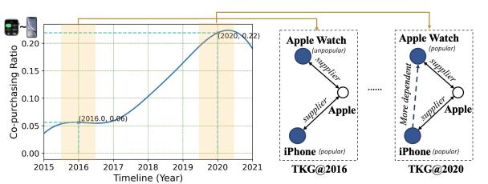
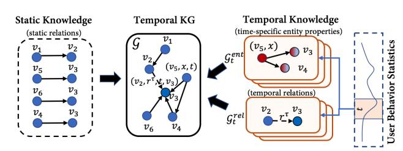
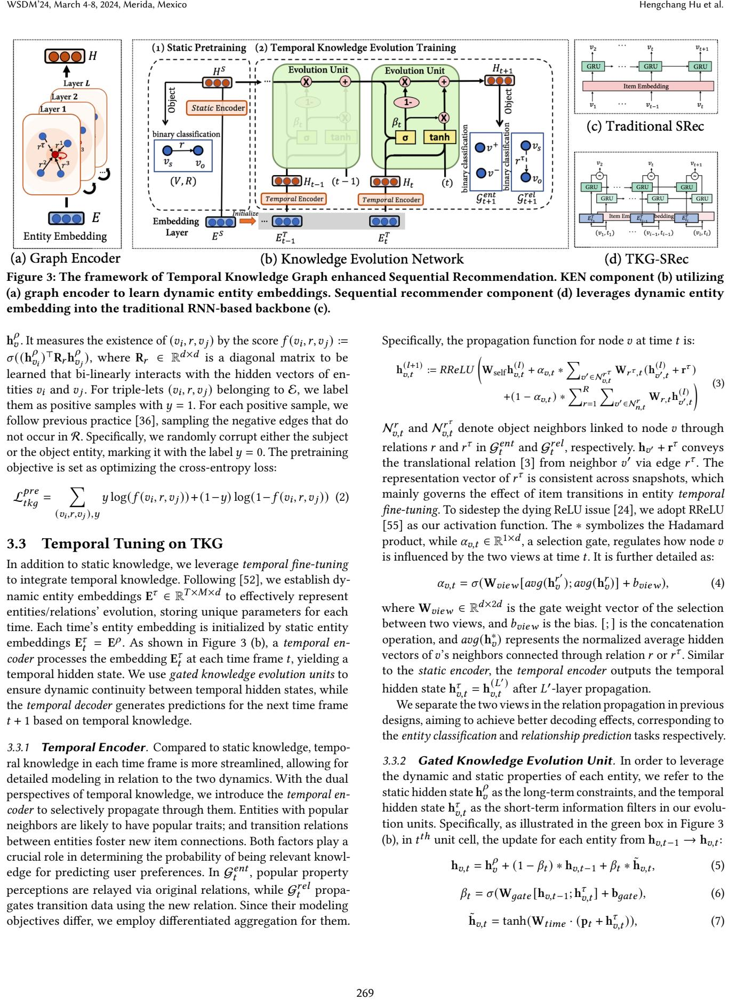
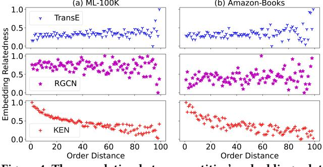

# User Behavior Enriched Temporal Knowledge Graphs for Sequential Recommendation

Hengchang Hu∗ hengchang.hu@u.nus.edu National University of Singapore Singapore

> Yong Liu liu.yong6@huawei.com Huawei Noah's Ark Lab Singapore

Wei Guo guowei67@huawei.com Huawei Noah's Ark Lab Singapore

Ruiming Tang tangruiming@huawei.com Huawei Noah's Ark Lab China

Min-Yen Kan† kanmy@comp.nus.edu.sg National University of Singapore Singapore

# ABSTRACT

Knowledge Graphs (KGs) enhance recommendations by providing external connectivity between items. However, there is limited research on distilling relevant knowledge in sequential recommendation, where item connections can change over time. To address this, we introduce the Temporal Knowledge Graph (TKG), which incorporates such dynamic features of user behaviors into the original KG while emphasizing sequential relationships. The TKG captures both patterns of entity dynamics (nodes) and structural dynamics (edges). Considering real-world applications with large-scale and rapidly evolving user behavior patterns, we propose an efficient twophase framework called TKG-SRec, which strengthens Sequential Rec-ommendation with Temporal KGs. In the first phase, we learn dynamic entity embeddings using our novel Knowledge Evolution Network (KEN) that brings together pretrained static knowledge with evolving temporal knowledge. In the second stage, downstream sequential recommender models utilize these time-specific dynamic entity embeddings with compatible neural backbones like GRUs, Transformers, and MLPs. From our extensive experiments over four datasets, TKG-SRec outperforms the current state-of-theart by a statistically significant 5% on average. Detailed analysis validates that such filtered temporal knowledge better adapts entity embedding for sequential recommendation. In summary, TKG-SRec provides an effective and efficient approach.

# CCS CONCEPTS

## • Information systems → Recommender systems.

∗Work done when the author is a research intern at Huawei Noah's Ark Lab, Singapore. †Min-Yen Kan and Rui Zhang are corresponding authors.

[This work is licensed under a Creative Commons Attribution](https://creativecommons.org/licenses/by/4.0/) [International 4.0 License.](https://creativecommons.org/licenses/by/4.0/)

WSDM '24, March 4th-8th, 2024, Mérida, Yucatán, Mexico © 2024 Copyright held by the owner/author(s). ACM ISBN 979-8-4007-0371-3/24/03. <https://doi.org/10.1145/3616855.3635762>

## KEYWORDS

Sequential Recommendation, Knowledge Graph

### ACM Reference Format:

Hengchang Hu, Wei Guo, Xu Liu, Yong Liu, Ruiming Tang, Rui Zhang, and Min-Yen Kan. 2024. User Behavior Enriched Temporal Knowledge Graphs for Sequential Recommendation. In Proceedings of the 17th ACM International Conference on Web Search and Data Mining (WSDM '24), March 4–8, 2024, Merida, Mexico. ACM, New York, NY, USA, [10](#page-9-0) pages. [https:](https://doi.org/10.1145/3616855.3635762) [//doi.org/10.1145/3616855.3635762](https://doi.org/10.1145/3616855.3635762)

Xu Liu liuxu@comp.nus.edu.sg National University of Singapore Singapore

> Rui Zhang† rayteam@yeah.net ruizhang.info China

#### 1 INTRODUCTION

Sequential Recommendation (SR) models how user preferences change across temporally-ordered item sequences, evolving from the use of Markov Chains [\[9\]](#page-8-0) and Recurrent Neural Networks [\[8,](#page-8-1) [13,](#page-8-2) [21\]](#page-8-3), to Transformers [\[18,](#page-8-4) [34,](#page-8-5) [46\]](#page-8-6). In SR tasks, knowledge graphs (KGs) serve as valuable auxiliary resources, providing additional information about items through external relationships to enhance recommendation accuracy and diversity [\[61\]](#page-9-1). However, KGs contain massive irrelevant knowledge (both entities and relationships) for specific recommendation tasks, weakening performance.

Distilling relevant knowledge is necessary [\[6,](#page-8-7) [49\]](#page-9-2), and existing methods fall into two categories: item-centric and user-centric. Item-centric methods disregard the role of users in knowledge filtering and focus only on the filtering by item relationships; e.g., RippleNet [\[41\]](#page-8-8) and KGAT [\[49\]](#page-9-2). In contrast, user-centric methods select adjacent entities favoring user-specific preferences, as demonstrated in KGNN-LS [\[43\]](#page-8-9), CKAN [\[50\]](#page-9-3), KGCN [\[45\]](#page-8-10). However, either item-centric or user-centric methods pose limitations for SR.

(1) The item-centric approach considers only those KG entities statically linked to an item as relevant ones [\[17\]](#page-8-11), overlooking entities derived from sequential user behaviors. However, sequential relevance is a strong signal in SR tasks. For example in Figure [1,](#page-1-0) while Apple Watch and iPhone are closely connected in the KG, itemcentric methods symmetrically treat them as relevant to each other. However, user behavior often shows an asymmetric sequence, like buying an iPhone before an Apple Watch. Ignoring this sequence

<!-- Image Description: This figure displays the evolution of co-purchasing ratios between iPhones and Apple Watches from 2015 to 2021, shown in a line graph. A rising trend is observed, with highlighted periods representing significant changes. Accompanying the graph are two network diagrams illustrating the supplier relationships between Apple, iPhones, and Apple Watches, at 2016 (weak relationship) and 2020 (stronger relationship). The diagrams visually represent the increased co-purchasing shown in the graph. -->

Figure 1: A TKG exploits the dynamic relations among entities: (left) the co-purchase of iPhone and Apple Watch rises in prominence over time; (right) resulting in the creation of a new dependency between the two entities in the TKG.

can lead to irrelevant recommendations, as a user who first buys an Apple Watch may not find an iPhone as immediately relevant. This motivates the need for SR methods that account for asymmetric sequential relationships in knowledge distillation.

(2) Existing user-centric methods rely on static user preferences for identifying relevant entities [\[43\]](#page-8-9). However, This approach falls short in SR contexts where user preferences evolve over time. Consider the example (Figure 1, right) regarding the proposition of "buying a digital watch after buying a mobile phone": a mere 6% of Apple Watches were sold for every iPhone sold in 2016, but this figure rose markedly to 22% in 2020 [\[2\]](#page-8-12) — clearly illustrating that relationships among entities change over time. While both items are connected in the original KG as they are supplied by Apple (static knowledge), their connectivity varies (temporal knowledge). In 2016, the connectivity between these two nodes is less relevant; but for users in 2020, it becomes more relevant in identifying user intentions. Hence, incorporating temporal knowledge is crucial for capturing these evolving relationships.

To tackle the above issues, we propose a behavior-centric approach, which introduces time-aware statistics of all user behaviors into existing KG, improving relevant knowledge identification. Specifically, we incorporate sequential relationships as constraints and emphasize the temporal dynamics of nodes and edges, which wax and wane in prominence. We term this time-aware behaviorinclusive KG as a Temporal Knowledge Graph (TKG).

How to construct the TKG? In real-world applications, the construction of temporal knowledge poses scalability issues when tracking each user's behavior at every timestamp. Including precise timestamps leads to an untenable computational complexity, and the distinct and varying levels of relevant knowledge across individual users make the creation of personalized TKGs cost-prohibitive. In our work, rather than treating time as a continuous feature, we break it down into discrete periods and monitor user behaviors during time intervals. We regard the information of nodes and edges in the original KG as static knowledge, and we use statistical features of user behaviors in each time period to select relevant temporal knowledge. As prior research [\[63\]](#page-9-4) has affirmed that popularity bias has a beneficial impact on improving overall recommendation accuracy, we choose popularity as a statistical feature [\[14\]](#page-8-13) — the item popularity as the node's feature, and the popular item–item transitions as the dynamic relations. Correspondingly, these two types of temporal knowledge capture the dynamicity exhibited in either its entities (i.e., nodes) or structure (i.e., edges).

How to model the TKG? Existing TKGs modeling methods primarily operate on small datasets [\[4\]](#page-8-14), making it inapplicable in

real-world recommendation scenarios, which must deal with large volumes of data. Additionally, they often neglect the evolving nature of real-world knowledge graphs [\[4\]](#page-8-14), which continually adapt to reflect changing user–item interactions. In our work, given the graphical nature of KGs, using a graph neural network to model them is a natural strategy [\[62\]](#page-9-5). Considering the vast scale of our TKG (containing millions of relations), it is not feasible to train it all at once. Therefore, we adopt pre-training, disentangling the modeling of static knowledge and temporal knowledge, processing them separately using distinct GCNs. Specifically, we employ a large pre-trained model to capture static knowledge, while smaller specialized models capture temporal knowledge within their respective time frames (here, the terms small and large are indicative of the volume of processed knowledge). And as real-world knowledge is continuously updated, we utilize selection gates to effectively merge temporal knowledge from different views into the static entity representation in an iterative fashion. We store the embeddings of each entity at every time point, allowing for rapid iteration and training in realistic scenarios that demand efficiency. 267 WSDM'24, March 4-8, 2024, Merida, Mexico Hengchang Hu et al.

We refer to our aforementioned TKG modeling method as Knowledge Evolution Network (KEN). It acts as an effective technique to distill relevant information given static/temporal knowledge from each time frame, providing better support for downstream SR tasks. We call our framework of TKG construction, TKG modeling, and downstream sequential modeling as Temporal Knowledge Graph enhanced Sequential Recommender (TKG-SRec). Extensive experimental results demonstrate that TKG-SRec establishes a new state-of-the-art for SR. Through a detailed study of our dynamic knowledge graph learning approach, we find that our modeling of dynamic user behavior filters many irrelevant relations from the knowledge graph. We also show that TKG-SRec is compatible with various wide-adopted sequential modeling methods: SASRec [\[18\]](#page-8-4) and FMLP-Rec [\[66\]](#page-9-6). Such broad adaptivity lends additional evidence that dynamic KG learning is a fruitful area for future work.

The main contributions of our work are summarized as follows: (i) To the best of our knowledge, we are the first to explore the temporal dynamicity of knowledge graphs in SR. We propose our TKG-SRec framework that exploits temporal knowledge to improve SR. (ii) We contribute KEN as the key component in our framework which models the TKG in an efficient manner. (iii) We conduct extensive experiments on four benchmark datasets, showing that our TKG-SRec consistently outperforms state-of-the-art methods. We validate the effectiveness of our KEN by integrating it with GRU, MLP, and Transformer-based instantiations.

#### 2 PROBLEM FORMULATION

The objective of sequential recommendation is to predict the next consumed item ∈ I for each user ∈ U, given his/her history sequence . The I and U are items set with volume and users set with volume . In a history sequence of length n, each element is a combination of an interacted item and its corresponding interaction time at that moment, denoted as = ( 1 , 1 ), · · · , ( , ). For brevity, the superscript will be dropped from the notation in the following. In this work, we propose to enhance sequential recommendation by further considering information from temporal knowledge graph, which is denoted as G = (V, R, E, E , X ). It

User Behavior Enriched Temporal Knowledge Graphs for Sequential Recommendation WSDM '24, March 4th-8th, 2024, Mérida, Yucatán, Mexico

links items directly or indirectly as an additional source of information. The node set V encompasses not only the set of items I (where each item can be viewed as a special type of entity ∈ V) but also the set of non-item entities. More clearly, G comprises:

- Static knowledge. The intrinsic edges E between these entities, known as static relations, are denoted by triple sets E : ( , , ). Here, is the subject entity, is the object entity and ∈ R is their relation. In our work, we preserve the original entity nodes and their static relations (such as "A is the director of B") in the knowledge graph as static knowledge.
- Temporal knowledge. There exist various temporal relations between entities, which are represented as quadruple-sets edges E : ( , , , ). Here, the variable denotes the index of the time frame, and the granularity of these time frames is determined based on the specific needs of the task. The notation ∈ R corresponds to a particular type of time-specific relation. Moreover, we also consider the temporal properties of entity nodes, denoted as X : (, , ), indicating holds property at time .

#### 3 METHODOLOGY

Our methodology is founded on constructing temporal knowledge from user behavior (§ 3.1). We then introduce the TKG-SRec framework, which operates in two phases: entity embedding learning on TKG (Phase-1, § 3.2 and § 3.3) and sequential modeling (Phase-2, § 3.4). In Phase-1, entity embeddings are first pretrained using static knowledge, followed by refinement with temporal knowledge. Phase-2 involves using a sequential model to predict user preferences with dynamic entity embeddings.

### 3.1 Temporal Knowledge Construction

For effective modeling of temporal knowledge, we divide it into time-indexed snapshots (Figure [2\)](#page-2-0) from two views. The two views (series of snapshots) encapsulate time-specific entity properties and temporal relations, modeled using statistical characteristics derived from user-item behaviors within specific time windows. We only use partitioned training records to construct TKGs, preventing data leakage. Details of constructing the two views follow.

⋄ Entity-dynamic view. In this work, we treat popularity statistics as properties for all entities, including items and non-items. To factor in popularity's temporal aspect, we introduce the entitydynamic view of the graph through a series of snapshots G : {G 1 , ..., G }. Each snapshot G captures entity properties (, , ′ ) at time ′ = . Here, signifies whether an entity is popular, determined by the top frequent item entities derived from user–item interactions in each timeframe. The ratio distills popular items from the long-tail popularity distribution. For seamless popularity propagation, in each snapshot, we include the -hop neighbors of popular entities, including non-item ones. For instance, assuming the time interval is in a year, if the iPhone was popular in 2019, its -hop entities (e.g., Apple Inc. for = 1) and their relation (e.g., "is produced by") are recorded in G 2019, highlighting both item and non-item entities that garnered user attention in 2019.

⋄ Structure-dynamic view. Leveraging existing designs [\[7,](#page-8-15) [53,](#page-9-7) [57\]](#page-9-8), we capture item-to-item transitions based on frequency, representing sequential dependencies within TKGs. These transitions lead

<!-- Image Description: The image illustrates a knowledge graph (KG) evolution process. It starts with a static knowledge graph representing static relations between nodes (v1-v6). This is transformed into a temporal KG, incorporating time-dependent entity properties and relations. The temporal KG is then decomposed into entity properties (Gentt) and relations (Grelt) across multiple time steps (t). A final component incorporates user behavior statistics. The diagram uses nodes and directed edges to visually represent entities and relationships, respectively. The color gradient in Gentt suggests time-varying node properties. -->

Figure 2: Temporal KGs construction from static knowledge and temporal knowledge. The solid arrows indicate static relations, and the dotted arrows indicate temporal relations.

to a series of snapshots, G : {G 1 , ..., G }, documenting finegrained relations between item entities over time. Each snapshot G depicts a directed mini graph with edges symbolizing interest transition relations (, , , ). In these snapshots, item entities can be either the source or the target of the transition relations. Focusing on first-order transitions between adjacent items in user sequences, denoted as , we include transition relations between item pairs that exceed the frequency threshold within the ℎ timeframe. For example, if there is a frequent pattern of users frequently buying AirPods right after (i.e., first-order) an iPhone in 2020, surpassing times, we include this directed link (iPhone, , 2020, AirPods) in the snapshot G 2020.

In summary, for temporal knowledge modeling (as depicted in Figure [2\)](#page-2-0), we introduce time-aware properties of entities into G and a new type of relation (referred to as interest transition) into G . These properties and relations are derived from user behavior statistics within the time frame , serving as hard constraints for distilling time-specific relevant knowledge. It's worth noting that in the previous examples, we used year as the time interval length ( − 1, ) for easier understanding. However, the time window length can be dynamically set. As the time window expands, the granularity of the partitioned snapshots becomes coarser. The total time span and the number of time windows partitioned can vary.

#### 2 Static Pretraining on TKG

The static knowledge denotes fixed relationships E between entities. Given its high connectivity and computational demand in real scenarios, we use a structurally simple graph encoder (i.e., static encoder) for its modeling. This encoder takes -dimensional entity embeddings E ∈ R × (randomly initialized) as input, processing them with a graph neural network. Designed for modeling varied relations in knowledge graphs, its propagation function for each entity node is as follows:

$$
\mathbf{h}_v^{(l+1)} := ReLU \left( \mathbf{W}_{\text{self}} \mathbf{h}_v^{(l)} + \sum_{r=1}^R \sum_{v' \in \mathcal{N}_v^r} \mathbf{W}_r \mathbf{h}_{v'}^{(l)} \right). \tag{1}
$$

Here, W ∈ R × is a self-loop transformation matrix; W ∈ R × is the transformation matrix w.r.t. each type of relation linking central node and neighbor node ′ ; The nodes' hidden representation h (0) := E is initialized from the entity embedding table. Through -layer propagation from = 0 to = , we take the hidden state from the final layer as its encoded representation of static knowledge, denoted as static hidden state h = h () .

During the static pretraining, we apply the scoring function of DistMult factorization [\[58\]](#page-9-9) that decodes the hidden representation

<!-- Image Description: Figure 3 presents a framework for Temporal Knowledge Graph enhanced Sequential Recommendation. (a) shows a graph encoder generating dynamic entity embeddings. (b) illustrates a knowledge evolution network incorporating these embeddings, using evolution units with gated mechanisms. (c) depicts a traditional sequential recommendation model, and (d) shows the proposed model (TKG-SRec) integrating the dynamic embeddings into (c). Equations (2)-(7) detail the loss function, propagation function, and gated unit updates. The figure’s purpose is to visually explain the architecture of the proposed model, highlighting its temporal dynamics. -->

Figure 3: The framework of Temporal Knowledge Graph enhanced Sequential Recommendation. KEN component (b) utilizing (a) graph encoder to learn dynamic entity embeddings. Sequential recommender component (d) leverages dynamic entity embedding into the traditional RNN-based backbone (c).

h (+1)

h . It measures the existence of ( , , ) by the score ( , , ) := ( (h ) ⊤R h ), where R ∈ R × is a diagonal matrix to be learned that bi-linearly interacts with the hidden vectors of entities and . For triple-lets ( , , ) belonging to E, we label them as positive samples with = 1. For each positive sample, we follow previous practice [\[36\]](#page-8-16), sampling the negative edges that do not occur in R. Specifically, we randomly corrupt either the subject or the object entity, marking it with the label = 0. The pretraining objective is set as optimizing the cross-entropy loss:

$$
\mathcal{L}_{tkg}^{pre} = \sum_{(v_i, r, v_j), y} y \log(f(v_i, r, v_j)) + (1 - y) \log(1 - f(v_i, r, v_j)) \tag{2}
$$

#### 3 Temporal Tuning on TKG

In addition to static knowledge, we leverage temporal fine-tuning to integrate temporal knowledge. Following [\[52\]](#page-9-10), we establish dynamic entity embeddings E ∈ R ×× to effectively represent entities/relations' evolution, storing unique parameters for each time. Each time's entity embedding is initialized by static entity embeddings E = E . As shown in Figure [3](#page-3-0) (b), a temporal encoder processes the embedding E at each time frame , yielding a temporal hidden state. We use gated knowledge evolution units to ensure dynamic continuity between temporal hidden states, while the temporal decoder generates predictions for the next time frame + 1 based on temporal knowledge.

3.3.1 Temporal Encoder. Compared to static knowledge, temporal knowledge in each time frame is more streamlined, allowing for detailed modeling in relation to the two dynamics. With the dual perspectives of temporal knowledge, we introduce the temporal encoder to selectively propagate through them. Entities with popular neighbors are likely to have popular traits; and transition relations between entities foster new item connections. Both factors play a crucial role in determining the probability of being relevant knowledge for predicting user preferences. In G , popular property perceptions are relayed via original relations, while G propagates transition data using the new relation. Since their modeling objectives differ, we employ differentiated aggregation for them. Specifically, the propagation function for node at time is:

$$
\begin{aligned} (l+1) &:= RReLU\left(\mathbf{W}_{\text{self}}\mathbf{h}_{v,t}^{(I)} + \alpha_{v,t} *\sum_{v' \in \mathcal{N}_{v,t}^{r^T}} \mathbf{W}_{r^T,t}(\mathbf{h}_{v',t}^{(I)} + \mathbf{r}^T) \right) \\ &+ (1 - \alpha_{v,t})* \sum_{r=1}^R \sum_{v' \in \mathcal{N}_{n,t}^r} \mathbf{W}_{r,t} \mathbf{h}_{v',t}^{(I)} \right) \end{aligned} \tag{3}
$$

N , and N , denote object neighbors linked to node through relations and in G and G , respectively. h ′ + r conveys the translational relation [\[3\]](#page-8-17) from neighbor ′ via edge . The representation vector of is consistent across snapshots, which mainly governs the effect of item transitions in entity temporal fine-tuning. To sidestep the dying ReLU issue [\[24\]](#page-8-18), we adopt RReLU [\[55\]](#page-9-11) as our activation function. The ∗ symbolizes the Hadamard product, while , ∈ R 1× , a selection gate, regulates how node is influenced by the two views at time . It is further detailed as:

$$
\alpha_{v,t} = \sigma(\mathbf{W}_{view}[avg(\mathbf{h}_v^{r'}); avg(\mathbf{h}_v^{r})] + b_{view}), \tag{4}
$$

where W ∈ R ×2 is the gate weight vector of the selection between two views, and is the bias. [; ] is the concatenation operation, and (h ∗ ) represents the normalized average hidden vectors of 's neighbors connected through relation or . Similar to the static encoder, the temporal encoder outputs the temporal hidden state h , = h ( ′ ) , after ′ -layer propagation.

We separate the two views in the relation propagation in previous designs, aiming to achieve better decoding effects, corresponding to the entity classification and relationship prediction tasks respectively.

3.3.2 Gated Knowledge Evolution Unit. In order to leverage the dynamic and static properties of each entity, we refer to the static hidden state h as the long-term constraints, and the temporal hidden state h , as the short-term information filters in our evolution units. Specifically, as illustrated in the green box in Figure [3](#page-3-0) (b), in ℎ unit cell, the update for each entity from h,−1 → h,:

$$
\mathbf{h}_{v,t} = \mathbf{h}_v^{\rho} + (1 - \beta_t) \cdot \mathbf{h}_{v,t-1} + \beta_t \cdot \tilde{\mathbf{h}}_{v,t},
$$
\n(5)

$$
\beta_t = \sigma(\mathbf{W}_{gate}[\mathbf{h}_{v,t-1}; \mathbf{h}_{v,t}^{\tau}] + \mathbf{b}_{gate}),
$$
\n(6)

$$
\tilde{\mathbf{h}}_{v,t} = \tanh(\mathbf{W}_{time} \cdot (\mathbf{p}_t + \mathbf{h}_{v,t}^{\tau})),\tag{7}
$$

In Equation [5,](#page-3-1) the evolution representation vector h, ∈ R combines three components: the static representation h , the previous time frame's representation h,−1, and the current frame's representation h˜ ,. The fusion vector ∈ R integrates h,−1 and h˜ ,, balancing long-term and short-term properties through elementwise production ∗. The fusion vector is activated by the gate weight matrix W ∈ R ×2 and bias term b ∈ R in equation [6.](#page-3-2) The long-term static representation serves as a connection to maintain awareness of the static knowledge within the evolution representation. The evolved representation h,0 initialized from the static entity embedding table. The absolute time information is incorporated into temporal hidden states via time positional embedding p in Equation [7,](#page-3-3) which is initialized from a separate positional embedding table, following the method outlined in [\[18\]](#page-8-4).

The entity evolution representation is updated iteratively from h,0 to h,, and used for decoding and predicting the time-aware properties in the snapshots G +1 and G +1 , which is detailed next.

3.3.3 Temporal Decoder & Training Targets. We have two objectives – entity classification and relation prediction – to guide the training of the temporal knowledge evolution.

The entity classification task aims to classify the properties (i.e., the popularity) of entities in the next time frame G +1 . To accomplish this, we utilize the evolved representation h, from time = 0 to = in the gated knowledge evolution units, along with an MLP decoder M for decoding. The probability of an entity being popular at time + 1 is calculated as (, + 1) = (M (h,)). For training, we create positive-negative pairs where ( + , , ) ∈ X represents positive entities + with the popularity property. We also randomly sample negative entities − to represent unpopular ones for pairwise training. The entity classification objective is optimized using the BPR loss [\[27\]](#page-8-19):

$$
\mathcal{L}_{t+1}^{Ent} = \sum -\log(q(v^+, t+1)) - \log(1 - q(v^-, t+1)).
$$
 (8)

The relation prediction task involves determining the existence of an interest transition relation in G +1 . To address this, we use ConvTransE [\[32\]](#page-8-20) as our relation decoder C, following the common practice of using graph decoders as score functions for relation prediction. We decode using the evolved representations h,. The probability of a quadruple ( , , + 1, ) existing is calculated as ( , , , + 1) = (r · C (h ,, h,)), where r represents the edge embedding. For training, positive quadruples ( , , , ) ∈ E are extracted from the TKG, marked as label = 1. And negative quadruples ( − , , , ), = 0 are sampled by replacing the subject entity. The classification criterion is the Binary Cross-Entropy loss.

$$
\mathcal{L}_{t+1}^{Rel} = \sum_{\{(v_s, r^{\tau}, t+1, v_o), y\}} y \log(g) + (1-y) \log(1-g). \tag{9}
$$

For better computational efficiency, we sample negative entities from all graph nodes for the entity classification task; and sample negative relations from the training batch (randomly choosing an edge from the batch) for the relation prediction task. The final target for the temporal tuning is defined as:

$$
\mathcal{L}_{tkg} = \sum_{t=1}^{T} \varphi \mathcal{L}_t^{Rel} + (1 - \varphi) \mathcal{L}_t^{Ent},
$$
\n(10)

The loss weight serves as a hyperparameter balancing impacts of both tasks. Through optimization, the learned entity embedding e , (from the temporal embedding table E ) intrinsically captures the distilled knowledge specific to a certain time.

#### 3.4 Entity-level Sequential Modeling in SR

A typical sequential recommender model (SRec) focuses on item sequential modeling, using history item representation for nextitem prediction. As shown in Figure [3.](#page-3-0)c, traditional SRec assigns item representation by randomly initialized embedding. For a better explanation, we employ GRU4Rec [\[13\]](#page-8-2) as our backbone in Phase-2, which is a straightforward yet powerful choice. Taking the traditional method, given a user's interaction sequence 1: : (1, 1) → · · · → (, ), GRU4Rec models it using GRU cells. At the ℎ position, the GRU cell processes the input of randomly initialized item embedding i and the hidden state from the previous GRU cell z−1, and then generate the hidden state for the next cell. Mathematically, z = (i, z−1). Beginning from = 1, the sequence representation is obtained by propagating through cells.

By contrast, the learned dynamic entity embeddings from Phase-1 can be regarded as leveraging distilled knowledge. The inclusion of user behavior serves to assist the training of temporal knowledge, enabling the hard constraints of more valuable information for each time period (while disregarding irrelevant information). To explore the efficacy of dynamic entity embeddings in enhancing item representation, we model them with another GRU, as shown:

$$
z'_n = GRU(\mathbf{e}_{i_n, t_n}^{\tau}, z'_{n-1}),\tag{11}
$$

where e , indicates the dynamic entity embedding of item at time . As shown in Figure [3.](#page-3-0)d, we leverage such entity-level modeling into item-level modeling through a linear combination layer B ( [; ′ ]). The final probability of recommending +1 is

$$
\hat{y}(i_{n+1}|s_{1:n}) = \mathcal{B}([z_n; z'_n])^\top \cdot [\mathbf{i}_{n+1}; \mathbf{e}_{i_{n+1}, t_{n+1}}^\tau] \tag{12}
$$

In order to better adapt the entity embeddings to SR, we don't freeze the dynamic entity embeddings, allowing them to be further fine-tuned. Finally, the ultimate objective is to minimize the loss between the predicted value ˆ and the true label .

#### 5 Complexity Analysis

Time complexity. Our TKG-SRec is a streamlined two-phase framework optimized for lightweight TKGs use. The enhanced entity embedding is directly applicable for online inference, making its time complexity equivalent to basic SR models. For training, the two-phase approach simplifies integration with a lower complexity ( + |E | + 2 ′ |E |), in contrast to the joint training's ( (|E | + 2 ′ |E |)). Here, is the maximum sequence length, is the user number, |E | and |E | are the average edge numbers of static relations and temporal relations in each snapshot. Most training time centers on the temporal knowledge evolution training with |E | + 2 ′ |E |. The parameter influences time granularity and training complexity. Nonetheless, real-world TKGs' vastness necessitates a balance.

Space complexity. In Phase-1, training dynamic entity embedding is memory-intensive for many GPUs. We address this using memory-saving strategies. Both in static pretraining and temporal tuning, we employ block-wise graph propagation, where neighbor node messages are propagated within small batched sub-graphs (known as blocks in DGL [\[47\]](#page-9-12). This method cuts GPU memory usage

from (2) to (20) during static pretraining, with being the average entity number in a batch and 20 is the default number of sampled neighbors for propagation. For temporal tuning's sub-graph sampling, nodes are selected from temporal snapshots G +1 and G +1 rather than the full knowledge graph. This reduces space complexity from (2) to ( Í =1 +1), where represents the number of entities in the -th snapshot. The entity count in each snapshot , is generally much less than the overall entity count .

#### 4 EXPERIMENTS

Datasets. We experiment on four public datasets including LastFM [\[30\]](#page-8-21), Amazon-books [\[12\]](#page-8-22), and MovieLens [\[10\]](#page-8-23) (with two volumes). The datasets include both user–item interactions and side knowledge. To avoid heavy computation, following the common preprocessing practice [\[11,](#page-8-24) [17,](#page-8-11) [28,](#page-8-25) [39\]](#page-8-26), we filter out the overly unpopular items and inactive users with fewer than 5 records. The KGs are initially constructed by Zhao et al. [\[64\]](#page-9-13), and we also eliminate entities from KGs that are too distant (more than 3 hops) from any of the item-linked entities. For the large LastFM, we follow the practice of Huang et al. [\[17\]](#page-8-11), only keeping the last year's interaction.

Evaluation Protocol. Following standard SR settings [\[15,](#page-8-27) [18\]](#page-8-4), we allocate 85% of each user's earlier interactions for training (which also derives temporal knowledge construction in § [3.1\)](#page-2-1) and the remaining 15% for testing. Unlike typical methods that sample negative items for evaluation [\[13,](#page-8-2) [18\]](#page-8-4), our model treats all nonselected items as negatives and pairs them with a single positive item in each sample. Our evaluation employs ranking-based metrics: Hit Ratio@k (HR@k), Normalized Discounted Cumulative Gain@k (NDCG@k), and Mean Reciprocal Rank@k (MRR@k), where k is the truncated length of recommendation list [\[33\]](#page-8-28).

Baselines. To verify the effectiveness of our proposed TKG-SRec, we compare it with two groups of models. (A) Sequential recommender baselines include Caser [\[35\]](#page-8-29) using vertical and horizontal CNNs to model short-term sequences (limited to the last 15 items to avoid gradient explosion); GRU4Rec [\[13\]](#page-8-2), SASRec [\[18\]](#page-8-4), and BERT4Rec [\[34\]](#page-8-5) utilizing GRU, Transformer, and BERT model to capture sequential patterns in user interaction histories; FMLP [\[66\]](#page-9-6) employing MLPs instead of multi-head attention in the Transformer framework for improved filtering; CL4SRec [\[54\]](#page-9-14) introducing sequence-based contrastive learning with unsupervised techniques; DuoRec [\[26\]](#page-8-30) further advancing contrastive embedding training with dropout masks and sample selection. (B) KG-based recommender baselines include KGAT [\[49\]](#page-9-2) capturing high-order item relationships using attention to weigh entity neighbors; GRU4RK extending GRU4Rec with dual GRUs for item and entity embeddings (which is pretrained using TransE [\[3\]](#page-8-17)); KSR [\[17\]](#page-8-11) combining a GRU-based system with knowledge-augmented memory networks. 271 WSDM'24, March 4-8, 2024, Merida, Mexico Hengchang Hu et al.

#### 1 Overall Recommendation accuracy

Table [1](#page-6-0) shows results from various models across four datasets. Our TKG-SRec outperforms other baselines, with relative improvements in brackets. Overall, this suggests that our work successfully distilled more useful dynamic knowledge for the SR task. Among the runner-up baselines, SASRec and FMLP are notable as effective

models trained solely on interactions, emphasizing the power of attention and filtering mechanisms in sequential modeling. Also, DuoRec's stellar performance on the LastFM dataset underscores the benefits of unsupervised augmentation for recommendation.

When compared to the standard SR models, the models that incorporates additional information from KGs exhibits improved accuracy. This is evident from the relatively better performance of GRU4RK and KSR on the MovieLens dataset. However, the margin is not substantial, partly because the knowledge graphs are not specifically designed for recommendation tasks. At times, the KGs even introduce noise which can harm recommendation accuracy, as seen when FMLP outperforms them without KG information on the ML and Amazon datasets. KGAT, while not specifically designed for the SR task and focusing only on collaborative signals, still shows comparable performance against other SR models. It further emphasizes the importance of distilling useful knowledge for improving more accurate recommendations.

Interestingly, we observed that the impact of TKG-SRec's improvement is less pronounced on the ML-1M dataset compared to other datasets. This is attributed to the smaller ratio of temporal relations (|E |) to static relations (|E |), with ML-1M having a ratio of 0.6M/4M, whereas datasets like Amazon-Books have a ratio of 0.4M/1M. Consequently, less information is derived from temporal properties and more from static ones.

#### 2 Ablation Study

In this section, we conduct a series of experiments to better understand the design rationality of our proposed framework.

4.2.1 On the superiority of KG modeling. In Table [2](#page-6-1) (left column), we measure the merits of various KG modeling methods – we contrast our static encoder (referred to as S.K.) with other commonly utilized KG embedding learning techniques – TransE and RESCAL. It's evident that our static encoder surpasses TransE and RESCAL across all four datasets, illustrating the efficacy of convolution in graph learning and the dependability of our pre-trained entity embeddings. Furthermore, we observe that relying solely on static knowledge results in a significant decrease in performance, which further confirms that knowledge distillation based solely on existing information is challenging to effectively apply in sequential tasks.

4.2.2 On the effect of TKG construction. In Table [2,](#page-6-1) we further analyze the impact of constructing each type of temporal knowledge separately: structure dynamics (T.K.) or entity dynamics (T.K.). Specifically, the temporal encoders propagate messages in the graph snapshot G or G and supervise the fine-tuning with relation prediction loss or entity classification loss. We observe that solely considering structure dynamics leads to a larger improvement over the base static encoder (↑8.2%) compared to utilizing entity dynamics (↑3.2%). The exception is the ML-1M dataset, where static information has a greater impact. As highlighted earlier, the sparse temporal knowledge in ML-1M could diminish its impact. Focusing only on a single type of temporal knowledge might further disrupt precise static modeling and obstruct effective knowledge distillation. Additionally, to verify the benefits of the evolution units, we replace them with a simple integration (h = h +h ) in equation [5](#page-3-1) (marked as w/o EU). We observe that the simple integration significantly

User Behavior Enriched Temporal Knowledge Graphs for Sequential Recommendation WSDM '24, March 4th-8th, 2024, Mérida, Yucatán, Mexico

|         | Metric                             | Caser                                | GRU4Rec                              | SASRec                               | BERT4Rec                             | FMLP                                 | CL4SRec                              | DuoRec                               | KGAT                                 | GRU4RK                               | KSR                                  | TKG-SRec                                                                             |
|---------|------------------------------------|--------------------------------------|--------------------------------------|--------------------------------------|--------------------------------------|--------------------------------------|--------------------------------------|--------------------------------------|--------------------------------------|--------------------------------------|--------------------------------------|--------------------------------------------------------------------------------------|
| ML-100K | HR@5 HR@10 NDCG@5            | 0.0469 0.0981 0.0285           | 0.0689 0.1368 0.0422           | 0.0710 0.1485 0.0446           | 0.0551 0.1209 0.0320           | 0.0764 0.1389 0.0481           | 0.0551 0.0870 0.0236           | 0.0615 0.123 0.0383            | 0.0718 0.1283 0.0433           | 0.0753 0.1357 0.0491           | 0.0700 0.1262 0.0463           | 0.0815† (+6.5%) 0.1516† (+2.0%) 0.0531† (+8.1%)                       |
|         | NDCG@10                            | 0.0449                               | 0.0642                               | 0.0692                               | 0.0532                               | 0.0683                               | 0.0392                               | 0.0579                               | 0.0615                               | 0.0685                               | 0.0644                               | 0.0734† (+7.1%)                                                                   |
| ML-1M   | HR@5 HR@10                      | 0.1375 0.2178                     | 0.1998 0.2659                     | 0.2025 0.2863                     | 0.1207 0.1955                     | 0.2010 0.2854                     | 0.0983 0.1558                     | 0.168 0.2526                      | 0.0801 0.1175                     | 0.2070 0.2874                     | 0.2005 0.2805                     | 0.2137† (+3.2%) 0.2987† (+3.8%)                                             |
|         | NDCG@5 NDCG@10                  | 0.0898 0.1156                     | 0.1289 0.1537                     | 0.1391 0.1663                     | 0.0912 0.1153                     | 0.1385 0.1657                     | 0.0687 0.0872                     | 0.1081 0.1354                     | 0.0570 0.0689                     | 0.1396 0.1656                     | 0.1399 0.1657                     | 0.1464† (+4.6%) 0.1719† (+3.7%)                                             |
| Amazon  | HR@5 HR@10 NDCG@5 NDCG@10 | 0.0260 0.0389 0.0180 0.0239 | 0.0362 0.0541 0.0241 0.0299 | 0.0441 0.0622 0.0309 0.0367 | 0.0360 0.0557 0.0257 0.0322 | 0.0457 0.0651 0.0287 0.0373 | 0.0215 0.035 0.0135 0.0178  | 0.0376 0.0564 0.0235 0.0295 | 0.0208 0.0368 0.0130 0.0182 | 0.0390 0.0533 0.0280 0.0326 | 0.0331 0.043 0.0249 0.0281  | 0.0489† (+7.0%) 0.0694† (+6.6%) 0.0308† (+7.3%) 0.0399† (+6.9%) |
| LastFM  | HR@5 HR@10 NDCG@5 NDCG@10 | 0.0686 0.1175 0.0424 0.0581 | 0.0575 0.0993 0.035 0.0483  | 0.0582 0.1048 0.0355 0.0503 | 0.0611 0.0944 0.0333 0.0458 | 0.0603 0.1041 0.0358 0.0508 | 0.0457 0.0802 0.0280 0.0391 | 0.0709 0.1176 0.0429 0.0579 | 0.0591 0.1021 0.0322 0.0490 | 0.0607 0.1007 0.0380 0.0509 | 0.0604 0.0878 0.0415 0.0504 | 0.0748† (+5.5%) 0.1143† (+2.8%) 0.0459† (+6.9%) 0.0617† (+5.0%) |

Table 1: Overall Performance. Bold text indicates best performance, underlined text indicates second best. † indicates a statistically significant level -value< 0.05 comparing TKG-SRec with the best baseline

|       |   | TransE | RESCAL | S.K.   | T.K.𝑟𝑒𝑙 | T.K.𝑒𝑛𝑡 | w/o EU | KEN    |
|-------|---|--------|--------|--------|---------|---------|--------|--------|
| ML-HK | H | 0.0651 | 0.0630 | 0.0681 | 0.0758  | 0.0755  | 0.0700 | 0.0813 |
|       | N | 0.0392 | 0.0388 | 0.0409 | 0.0458  | 0.0412  | 0.0453 | 0.0539 |
|       | M | 0.0282 | 0.0283 | 0.0292 | 0.0361  | 0.0298  | 0.0373 | 0.0476 |
| ML-1M | H | 0.1336 | 0.1324 | 0.2053 | 0.1997  | 0.1764  | 0.1614 | 0.2139 |
|       | N | 0.0880 | 0.0902 | 0.1416 | 0.1394  | 0.1134  | 0.1068 | 0.1466 |
|       | M | 0.0730 | 0.0763 | 0.1206 | 0.0941  | 0.0877  | 0.0890 | 0.1083 |
| Amaz. | H | 0.0289 | 0.0302 | 0.0351 | 0.0402  | 0.0369  | 0.0351 | 0.0489 |
|       | N | 0.0199 | 0.0211 | 0.0251 | 0.0307  | 0.0273  | 0.0268 | 0.0316 |
|       | M | 0.0170 | 0.0181 | 0.0218 | 0.0221  | 0.0204  | 0.0205 | 0.0227 |
| LFM   | H | 0.0547 | 0.0571 | 0.0586 | 0.0644  | 0.0651  | 0.0632 | 0.0798 |
|       | N | 0.0353 | 0.0349 | 0.0356 | 0.0429  | 0.0401  | 0.0411 | 0.0499 |
|       | M | 0.0290 | 0.0276 | 0.0282 | 0.0301  | 0.0314  | 0.0310 | 0.0370 |

Table 2: The ablation study results are presented with metrics (HR, NDCG, MRR)@5. ML-HK and Amaz. stand for ML-100K and Amazon-Books. The left column shows models using only static knowledge, while the middle column shows results with added temporal knowledge.

|       | M      | 0.0170           | 0.0181           | 0.0218                                                               | 0.0221           | 0.0204           | 0.0205           | 0.0227           | KEN |
|-------|--------|------------------|------------------|----------------------------------------------------------------------|------------------|------------------|------------------|------------------|-----|
|       | H      | 0.0547           | 0.0571           | 0.0586                                                               | 0.0644           | 0.0651           | 0.0632           | 0.0798           |     |
| LFM   | N M | 0.0353 0.0290 | 0.0349 0.0276 | 0.0356 0.0282                                                     | 0.0429 0.0301 | 0.0401 0.0314 | 0.0411 0.0310 | 0.0499 0.0370 |     |
|       |        |                  |                  |                                                                      |                  |                  |                  |                  |     |
|       |        |                  |                  | Table 2: The ablation study results are presented with metrics       |                  |                  |                  |                  |     |
|       |        |                  |                  | (HR, NDCG, MRR)@5. ML-HK and Amaz. stand for ML-100K                 |                  |                  |                  |                  |     |
|       |        |                  |                  | and Amazon-Books. The left column shows models using                 |                  |                  |                  |                  |     |
|       |        |                  |                  | only static knowledge, while the middle column shows re              |                  |                  |                  |                  |     |
|       |        |                  |                  | sults with added temporal knowledge.                                 |                  |                  |                  |                  |     |
|       |        |                  |                  |                                                                      |                  |                  |                  |                  |     |
|       |        |                  |                  |                                                                      |                  |                  |                  |                  |     |
|       |        | Model            |                  | Backbone                                                             |                  |                  | +TKG             |                  |     |
|       |        | & Data           | HR               | NDCG                                                                 | MRR              | HR               | NDCG             | MRR              |     |
|       |        | ML-HK            | 0.0689           | 0.0422                                                               | 0.0335           | 0.0753           | 0.0458           | 0.0361           |     |
|       | GRU    | ML-1M            | 0.1472           | 0.1003                                                               | 0.0922           | 0.2070           | 0.1396           | 0.1282           |     |
|       |        | Amaz.            | 0.0362           | 0.0241                                                               | 0.0202           | 0.0489           | 0.0396           | 0.0377           |     |
|       |        | ML-HK            | 0.0573           | 0.0352                                                               | 0.0279           | 0.0619           | 0.0377           | 0.0297           |     |
|       |        | ML-1M            | 0.1576           | 0.1006                                                               | 0.0925           | 0.2188           | 0.1422           | 0.1318           |     |
|       | SASRec | Amaz.            | 0.0441           | 0.0309                                                               | 0.0297           | 0.0459           | 0.0312           | 0.0303           |     |
|       |        | ML-HK            | 0.0764           | 0.0481                                                               | 0.0346           | 0.0668           | 0.0408           | 0.0324           |     |
|       | FMLP   | ML-1M            | 0.2010           | 0.1385                                                               | 0.1163           | 0.2013           | 0.1376           | 0.1179           |     |
|       |        | Amaz.            | 0.0457           | 0.0287                                                               | 0.0219           | 0.0463           | 0.0286           | 0.0223           |     |
|       |        |                  |                  | Table 3: Backbone compatibility analysis over four sequential        |                  |                  |                  |                  |     |
|       |        |                  |                  | datasets, evaluated with (HR, NDCG, MRR)@5.                          |                  |                  |                  |                  |     |
|       |        |                  |                  |                                                                      |                  |                  |                  |                  |     |
|       |        |                  |                  | underperforms KEN, confirming that taking static knowledge as        |                  |                  |                  |                  |     |
|       |        |                  |                  |                                                                      |                  |                  |                  |                  |     |
|       |        |                  |                  | soft constraints is a better approach to pretrain entity embeddings. |                  |                  |                  |                  |     |
| 4.2.3 |        |                  |                  | On the compatibility of sequential modeling methods. To as           |                  |                  |                  |                  |     |
|       |        |                  |                  | sess the general applicability of TKG-SRec, we employ pretrained     |                  |                  |                  |                  |     |
|       |        |                  |                  | TKG embeddings with various backbones and compare them to            |                  |                  |                  |                  |     |
|       |        |                  |                  |                                                                      |                  |                  |                  |                  |     |

Table 3: Backbone compatibility analysis over four sequential datasets, evaluated with (HR, NDCG, MRR)@5.

<!-- Image Description: The figure displays scatter plots comparing three knowledge graph embedding methods (TransE, RGCN, and KEN) across two datasets (ML-100K and Amazon-Books). Each plot shows "Embedding Relatedness" against "Order Distance". The y-axis represents the relatedness score, while the x-axis represents the distance between entities in a knowledge graph's traversal order. The plots illustrate how the relatedness score changes as the order distance increases for each embedding method and dataset. -->

Figure 4: The correlation between entities' embedding relatedness and their order distances in interaction sequences.

the original approach. We adapted SASRec and FMLP following the approach outlined in Section [3.4,](#page-4-0) incorporating entity-level embeddings into Transformer and MLP-based encoding layers, and combining these with item-level outcomes for final predictions. Both models integrate dynamic entity and positional embeddings.

From the results in Table [3,](#page-6-2) we observe that the GRU variant benefits the most from dynamic entity embedding, consistently delivering substantial improvements. SASRec also demonstrates improvement with fine-grained entity embeddings. However, it appears that the TKG's contribution to enhancing the FMLP is relatively marginal, with its performance even slightly declining on the ML-100K dataset. We interpret this as a result of our method's underlying principle as a noise filter and a remover of irrelevant knowledge, similar to filter-based models that operate filtering at the feature level. This characteristic leads to a modest enhancement of the FMLP, particularly in smaller datasets like ML-100K, where the limited size of the KG curtails the impact of knowledge filtering.

### 3 Effectiveness of Popularity-Based Statistics

In this study, popularity-based statistics are perceived as a means of noise reduction, emphasizing behavior patterns with higher confidence. In this section, we scrutinized the utility of using popularity as a statistic feature in SR for knowledge distillation. We gauged

the relevance of the distilled knowledge from the KG by examining the relatedness of sampled item entity embeddings (Figure [4\)](#page-6-3), where the relatedness is measured using cosine similarity. Smaller relatedness values indicate less relevance of the distilled knowledge for the recommendation task. In SR, it is commonly agreed that closer items in a sequence should have a stronger correlation, while distant items tend to have weaker relevance. We then assessed if the relatedness mirrored the average order distance in the interaction sequence, thereby indicating their SR adaptability.

We observed that TransE and RGCN derived entity embeddings failed to clearly correlate item order distance and embedding relatedness, revealing a gap in KG and SR information and that traditional approaches fail to distill relevant knowledge from TKG. Contrarily, our KEN offers less related embeddings for distant sequence items. With increasing KG size, the correlation between order distance and embedding similarity strengthens, despite more fluctuations in Amazon-Books. This underlines the difficulty of preserving KG's static structural information while distilling information to optimize SR, especially for larger KGs with more complex structures.

#### 4 Parameter Sensitivity

We first analyze the sensitivity of KEN to the number of GCN layers in both static Knowledge Graph encoder and temporal Knowledge Graph encoder ′ . In the sensitivity test, we fix other hyperparameters but only vary the combination of and ′ . As shown in Table [4,](#page-7-0) we find that the model performs poorly when both and ′ are equal to 4. It is because a large number of graph convolution layers would mix too many information from neighbors, which would over-cover the origin entity properties. TKG-SRec achieves the best performance when and ′ are 1 or 2 in the four datasets.

| (𝐿, 𝐿′ )                                               | (1, 1) | (1, 2) | (2, 1) | (2, 2) | (3, 3) | (4, 4) |  |  |  |
|-----------------------------------------------------------|--------|--------|--------|--------|--------|--------|--|--|--|
| ML-100K                                                   | 0.1082 | 0.1296 | 0.1433 | 0.1326 | 0.1029 | 0.1073 |  |  |  |
| ML-1M                                                     | 0.2041 | 0.2853 | 0.2764 | 0.2987 | 0.2650 | 0.1920 |  |  |  |
| Amazon-B.                                                 | 0.514  | 0.0694 | 0.0653 | 0.0647 | 0.0593 | 0.0588 |  |  |  |
| LastFM                                                    | 0.1014 | 0.1143 | 0.1078 | 0.1076 | 0.1012 | 0.1007 |  |  |  |
| ′ Table 4: R@10 w.r.t. the number of layers 𝐿 and 𝐿 |        |        |        |        |        |        |  |  |  |

We also investigate how the hidden size affects TKG-SRec performance. As shown in Table [5,](#page-7-1) it might increase model capacity with extra bits in hidden layers (where the performance improves with a rise in at the beginning). However, when is further raised, performance suffers as an overly large number of dimensions might cause overfitting. The range of 32 to 64 yields the best results.

| 𝑑            | 8      | 16     | 32     | 64     | 128    |
|--------------|--------|--------|--------|--------|--------|
| ML-100K      | 0.0974 | 0.1156 | 0.1275 | 0.1516 | 0.1328 |
| ML-1M        | 0.2188 | 0.2446 | 0.2543 | 0.2987 | 0.2914 |
| Amazon-Books | 0.0471 | 0.0668 | 0.0704 | 0.0697 | 0.0615 |
| LastFM       | 0.0918 | 0.1104 | 0.1243 | 0.1237 | 0.1185 |

|  |  |  |  |  |  |  |  | Table 5: R@10 w.r.t. the dimension of hidden layers 𝑑. |  |  |  |  |  |
|--|--|--|--|--|--|--|--|--------------------------------------------------------|--|--|--|--|--|
|--|--|--|--|--|--|--|--|--------------------------------------------------------|--|--|--|--|--|

#### 5 RELATED WORK

Knowledge Graph Completion is typically explored in static KGs, and common methods include translational models like TransE [\[3\]](#page-8-17), TransH [\[51\]](#page-9-15), and TransR [\[23\]](#page-8-31), which aim to embed nodes and relations using a scoring function; and propagation-based models use graph neural networks like GCNs [\[31\]](#page-8-32), RGCN [\[31\]](#page-8-32).

Further considering Temporal Knowledge Graph Completion task [\[4\]](#page-8-14), various techniques exist for integrating timestamps into TKGs. Tensor Decomposition [\[29\]](#page-8-33) simplifies the complex 4-way tensor (head, relation, timestamp, tail). Time Transformation [\[20\]](#page-8-34) interprets timestamps as transformations for entity and/or relation representation using time-specific functions. Studies on Dynamic TKG note that entity or relation representations evolve over time. Such approaches include merging static information with trend and seasonal data at specific times [\[56\]](#page-9-16) and capturing relations of concurrent facts through KG subgraph snapshots [\[22\]](#page-8-35). However, according to Cai et al. [\[4\]](#page-8-14), current TKG completion methods falter with larger, dynamic data. In our task of handling the application with dynamic user-item interaction data, we need efficient methods to address the ongoing changes in real-world knowledge graphs, discarding irrelevant knowledge and incorporating new data. 273 WSDM'24, March 4-8, 2024, Merida, Mexico Hengchang Hu et al.

KG-Augmented Recommendation employs two main approaches to utilize KGs: two-phase learning and joint learning. The former trains entity embedding before integrating it into the recommendation [\[16,](#page-8-36) [17,](#page-8-11) [42,](#page-8-37) [59\]](#page-9-17). The latter trains both entity and user/item embeddings together, either with a single [\[40,](#page-8-38) [61\]](#page-9-1) or multiple objectives [\[5,](#page-8-39) [44\]](#page-8-40). In addition, personalization in recommenders systems is advanced by incorporating user behaviors into KGs. RippleNet [\[41\]](#page-8-8) uses a memory-network model for unique user operations, and KGCN [\[45\]](#page-8-10) employs user-specific weights. TPRec [\[65\]](#page-9-18) further integrates time-aware user-item graphs into KGs.

SR specifically targets modeling users' sequential interests [\[15,](#page-8-27) [37,](#page-8-41) [60\]](#page-9-19). Enhancements in SR through KGs include KGIE [\[39\]](#page-8-26) for entity-level user interest modeling; KSR [\[17\]](#page-8-11) which integrates entity data with memory networks in recommendation systems; and KERL [\[48\]](#page-9-20) that applies knowledge-guided reinforcement learning. MKM-SR [\[25\]](#page-8-42) combines KGs with item sequences and user actions, and Chorus [\[38\]](#page-8-43) uses KGs to link items in SR. However, time-aware & dynamic KGs in SR remain unexplored. We propose to use the temporal knowledge graph to have time-aware user behaviors in KG modeling, filtering irrelevant knowledge out for SR.

#### 6 CONCLUSION AND FUTURE WORK

In our study, we enhance KGs by tracking dynamic user behaviors to create Temporal Knowledge Graphs (TKGs). The introduced temporal knowledge in TKGs focuses on two distinct facets: entityrelated and graph structure-related. Our novel KEN component filters information by leveraging both static and dynamic knowledge over time, leading to the development of the TKG-SRec framework, a novel approach for KG+SR. Our experiments show consistent effectiveness across various datasets and three backbones.

For future work, beyond merely treating behavior statistics as temporal knowledge, our framework can excel by additional factual data like product release dates. TKG-SRec sets a new paradigm for utilizing temporal knowledge in high-throughput recommendation systems. Additionally, adopting more sophisticated time modeling methods, like Time2Vec [\[19\]](#page-8-44) which captures periodicity, could further refine and improve the system's effectiveness.

#### ACKNOWLEDGMENTS

We thank the new deep learning computing framework Mind-Spore [\[1\]](#page-8-45) for the partial support of this work.

User Behavior Enriched Temporal Knowledge Graphs for Sequential Recommendation WSDM '24, March 4th-8th, 2024, Mérida, Yucatán, Mexico

# REFERENCES

- [1] 2020. MindSpore. https://www.mindspore.cn.
- [2] 2023. Apple Statistics. https://www.businessofapps.com/data/apple-statistics/. [3] Antoine Bordes, Nicolas Usunier, Alberto Garcia-Duran, Jason Weston, and Oksana Yakhnenko. 2013. Translating embeddings for modeling multi-relational
- data. Advances in neural information processing systems 26 (2013). [4] Borui Cai, Yong Xiang, Longxiang Gao, He Zhang, Yunfeng Li, and Jianxin Li. 2022. Temporal knowledge graph completion: A survey. arXiv preprint arXiv:2201.08236 (2022).
- [5] Yixin Cao, Xiang Wang, Xiangnan He, Zikun Hu, and Tat-Seng Chua. 2019. Unifying knowledge graph learning and recommendation: Towards a better understanding of user preferences. In The world wide web conference. 151–161.
- [6] Yankai Chen, Yaming Yang, Yujing Wang, Jing Bai, Xiangchen Song, and Irwin King. 2022. Attentive knowledge-aware graph convolutional networks with collaborative guidance for personalized recommendation. In 2022 IEEE 38th International Conference on Data Engineering (ICDE). IEEE, 299–311.
- [7] Yujuan Ding, Yunshan Ma, Wai Keung Wong, and Tat-Seng Chua. 2021. Leveraging Two Types of Global Graph for Sequential Fashion Recommendation. In Proceedings of the 2021 International Conference on Multimedia Retrieval. 73–81.
- [8] Tim Donkers, Benedikt Loepp, and Jürgen Ziegler. 2017. Sequential user-based recurrent neural network recommendations. In Proceedings of the eleventh ACM conference on recommender systems. 152–160.
- [9] Florent Garcin, Christos Dimitrakakis, and Boi Faltings. 2013. Personalized news recommendation with context trees. In Proceedings of the 7th ACM Conference on Recommender Systems. 105–112.
- [10] F Maxwell Harper and Joseph A Konstan. 2015. The movielens datasets: History and context. Acm transactions on interactive intelligent systems (tiis) 5, 4 (2015), 1–19.
- [11] Ruining He, Wang-Cheng Kang, and Julian McAuley. 2017. Translation-based recommendation. In Proceedings of the eleventh ACM conference on recommender systems. 161–169.
- [12] Ruining He and Julian McAuley. 2016. Ups and downs: Modeling the visual evolution of fashion trends with one-class collaborative filtering. In proceedings of the 25th international conference on world wide web. 507–517.
- [13] Balázs Hidasi, Alexandros Karatzoglou, Linas Baltrunas, and Domonkos Tikk. 2015. Session-based recommendations with recurrent neural networks. arXiv preprint arXiv:1511.06939 (2015).
- [14] Hengchang Hu, Yiming Cao, Zhankui He, Samson Tan, and Min-Yen Kan. 2023. Automatic Feature Fairness in Recommendation via Adversaries. In Proceedings of the 1st International ACM SIGIR Conference on Information Retrieval in the Asia Pacific.
- [15] Hengchang Hu, Wei Guo, Yong Liu, and Min-Yen Kan. 2023. Adaptive Multi-Modalities Fusion in Sequential Recommendation Systems. In Proceedings of the 32nd ACM International Conference on Information & Knowledge Management.
- [16] Hengchang Hu, Liangming Pan, Yiding Ran, and Min-Yen Kan. 2022. Modeling and Leveraging Prerequisite Context in Recommendation. In Workshop of Context-Aware Recommender System (CARS'22), in conjunction with the 16th 16th ACM Conference on Recommender Systems, RecSys.
- [17] Jin Huang, Wayne Xin Zhao, Hongjian Dou, Ji-Rong Wen, and Edward Y Chang. 2018. Improving sequential recommendation with knowledge-enhanced memory networks. In The 41st International ACM SIGIR Conference on Research & Development in Information Retrieval. 505–514.
- [18] Wang-Cheng Kang and Julian McAuley. 2018. Self-attentive sequential recommendation. In 2018 IEEE international conference on data mining (ICDM). IEEE, 197–206.
- [19] Seyed Mehran Kazemi, Rishab Goel, Sepehr Eghbali, Janahan Ramanan, Jaspreet Sahota, Sanjay Thakur, Stella Wu, Cathal Smyth, Pascal Poupart, and Marcus Brubaker. 2019. Time2vec: Learning a vector representation of time. arXiv preprint arXiv:1907.05321 (2019).
- [20] Julien Leblay and Melisachew Wudage Chekol. 2018. Deriving validity time in knowledge graph. In Companion Proceedings of the The Web Conference 2018. 1771–1776.
- [21] Jing Li, Pengjie Ren, Zhumin Chen, Zhaochun Ren, Tao Lian, and Jun Ma. 2017. Neural attentive session-based recommendation. In Proceedings of the 2017 ACM on Conference on Information and Knowledge Management. 1419–1428.
- [22] Zixuan Li, Xiaolong Jin, Wei Li, Saiping Guan, Jiafeng Guo, Huawei Shen, Yuanzhuo Wang, and Xueqi Cheng. 2021. Temporal knowledge graph reasoning based on evolutional representation learning. In Proceedings of the 44th International ACM SIGIR Conference on Research and Development in Information Retrieval. 408–417.
- [23] Yankai Lin, Zhiyuan Liu, Maosong Sun, Yang Liu, and Xuan Zhu. 2015. Learning entity and relation embeddings for knowledge graph completion. In Twenty-ninth AAAI conference on artificial intelligence.
- [24] Lu Lu, Yeonjong Shin, Yanhui Su, and George Em Karniadakis. 2019. Dying relu and initialization: Theory and numerical examples. arXiv preprint arXiv:1903.06733 (2019).

- [25] Wenjing Meng, Deqing Yang, and Yanghua Xiao. 2020. Incorporating user microbehaviors and item knowledge into multi-task learning for session-based recommendation. In Proceedings of the 43rd international ACM SIGIR conference on research and development in Information Retrieval. 1091–1100.
- [26] Ruihong Qiu, Zi Huang, Hongzhi Yin, and Zijian Wang. 2022. Contrastive learning for representation degeneration problem in sequential recommendation. In Proceedings of the Fifteenth ACM International Conference on Web Search and Data Mining. 813–823.
- [27] Steffen Rendle, Christoph Freudenthaler, Zeno Gantner, and Lars Schmidt-Thieme. 2012. BPR: Bayesian personalized ranking from implicit feedback. arXiv preprint arXiv:1205.2618 (2012).
- [28] Steffen Rendle, Christoph Freudenthaler, and Lars Schmidt-Thieme. 2010. Factorizing personalized markov chains for next-basket recommendation. In Proceedings of the 19th international conference on World wide web. 811–820.
- [29] Andrea Rossi, Denilson Barbosa, Donatella Firmani, Antonio Matinata, and Paolo Merialdo. 2021. Knowledge graph embedding for link prediction: A comparative analysis. ACM Transactions on Knowledge Discovery from Data (TKDD) 15, 2 (2021), 1–49.
- [30] Markus Schedl. 2016. The lfm-1b dataset for music retrieval and recommendation. In Proceedings of the 2016 ACM on international conference on multimedia retrieval. 103–110.
- [31] Michael Schlichtkrull, Thomas N Kipf, Peter Bloem, Rianne van den Berg, Ivan Titov, and Max Welling. 2018. Modeling relational data with graph convolutional networks. In European semantic web conference. Springer, 593–607.
- [32] Chao Shang, Yun Tang, Jing Huang, Jinbo Bi, Xiaodong He, and Bowen Zhou. 2019. End-to-end structure-aware convolutional networks for knowledge base completion. In Proceedings of the AAAI Conference on Artificial Intelligence, Vol. 33. 3060–3067.
- [33] Guy Shani and Asela Gunawardana. 2011. Evaluating recommendation systems. In Recommender systems handbook. Springer, 257–297.
- [34] Fei Sun, Jun Liu, Jian Wu, Changhua Pei, Xiao Lin, Wenwu Ou, and Peng Jiang. 2019. BERT4Rec: Sequential recommendation with bidirectional encoder representations from transformer. In Proceedings of the 28th ACM international conference on information and knowledge management. 1441–1450.
- [35] Jiaxi Tang and Ke Wang. 2018. Personalized top-n sequential recommendation via convolutional sequence embedding. In Proceedings of the eleventh ACM international conference on web search and data mining. 565–573.
- [36] Théo Trouillon, Johannes Welbl, Sebastian Riedel, Éric Gaussier, and Guillaume Bouchard. 2016. Complex embeddings for simple link prediction. In International conference on machine learning. PMLR, 2071–2080.
- [37] Chenyang Wang, Weizhi Ma, Min Zhang, Chong Chen, Yiqun Liu, and Shaoping Ma. 2020. Toward dynamic user intention: Temporal evolutionary effects of item relations in sequential recommendation. ACM Transactions on Information Systems (TOIS) 39, 2 (2020), 1–33.
- [38] Chenyang Wang, Min Zhang, Weizhi Ma, Yiqun Liu, and Shaoping Ma. 2020. Make it a chorus: knowledge-and time-aware item modeling for sequential recommendation. In Proceedings of the 43rd International ACM SIGIR conference on research and development in Information Retrieval. 109–118.
- [39] Chunyang Wang, Yanmin Zhu, Haobing Liu, Wenze Ma, Tianzi Zang, and Jiadi Yu. 2021. Enhancing user interest modeling with knowledge-enriched itemsets for sequential recommendation. In Proceedings of the 30th ACM International Conference on Information & Knowledge Management. 1889–1898.
- [40] Hongwei Wang, Fuzheng Zhang, Min Hou, Xing Xie, Minyi Guo, and Qi Liu. 2018. Shine: Signed heterogeneous information network embedding for sentiment link prediction. In Proceedings of the eleventh ACM international conference on web search and data mining. 592–600.
- [41] Hongwei Wang, Fuzheng Zhang, Jialin Wang, Miao Zhao, Wenjie Li, Xing Xie, and Minyi Guo. 2018. Ripplenet: Propagating user preferences on the knowledge graph for recommender systems. In Proceedings of the 27th ACM international conference on information and knowledge management. 417–426.
- [42] Hongwei Wang, Fuzheng Zhang, Xing Xie, and Minyi Guo. 2018. DKN: Deep knowledge-aware network for news recommendation. In Proceedings of the 2018 world wide web conference. 1835–1844.
- [43] Hongwei Wang, Fuzheng Zhang, Mengdi Zhang, Jure Leskovec, Miao Zhao, Wenjie Li, and Zhongyuan Wang. 2019. Knowledge-aware graph neural networks with label smoothness regularization for recommender systems. In Proceedings of the 25th ACM SIGKDD international conference on knowledge discovery & data mining. 968–977.
- [44] Hongwei Wang, Fuzheng Zhang, Miao Zhao, Wenjie Li, Xing Xie, and Minyi Guo. 2019. Multi-task feature learning for knowledge graph enhanced recommendation. In The world wide web conference. 2000–2010.
- [45] Hongwei Wang, Miao Zhao, Xing Xie, Wenjie Li, and Minyi Guo. 2019. Knowledge graph convolutional networks for recommender systems. In The world wide web conference. 3307–3313.
- [46] Jinpeng Wang, Ziyun Zeng, Yunxiao Wang, Yuting Wang, Xingyu Lu, Tianxiang Li, Jun Yuan, Rui Zhang, Hai-Tao Zheng, and Shu-Tao Xia. 2023. MISSRec: Pretraining and Transferring Multi-modal Interest-aware Sequence Representation

for Recommendation. In Proceedings of the 31st ACM International Conference on Multimedia. 6548–6557.

- [47] Minjie Wang, Da Zheng, Zihao Ye, Quan Gan, Mufei Li, Xiang Song, Jinjing Zhou, Chao Ma, Lingfan Yu, Yu Gai, et al. 2019. Deep graph library: A graphcentric, highly-performant package for graph neural networks. arXiv preprint arXiv:1909.01315 (2019). 275 WSDM'24, March 4-8, 2024, Merida, Mexico Hengchang Hu et al.
- [48] Pengfei Wang, Yu Fan, Long Xia, Wayne Xin Zhao, ShaoZhang Niu, and Jimmy Huang. 2020. KERL: A knowledge-guided reinforcement learning model for sequential recommendation. In Proceedings of the 43rd International ACM SIGIR conference on research and development in Information Retrieval. 209–218.
- [49] Xiang Wang, Xiangnan He, Yixin Cao, Meng Liu, and Tat-Seng Chua. 2019. Kgat: Knowledge graph attention network for recommendation. In Proceedings of the 25th ACM SIGKDD international conference on knowledge discovery & data mining. 950–958.
- [50] Ze Wang, Guangyan Lin, Huobin Tan, Qinghong Chen, and Xiyang Liu. 2020. CKAN: collaborative knowledge-aware attentive network for recommender systems. In Proceedings of the 43rd International ACM SIGIR conference on research and development in Information Retrieval. 219–228.
- [51] Zhen Wang, Jianwen Zhang, Jianlin Feng, and Zheng Chen. 2014. Knowledge graph embedding by translating on hyperplanes. In Proceedings of the AAAI conference on artificial intelligence, Vol. 28.
- [52] Jiapeng Wu, Meng Cao, Jackie Chi Kit Cheung, and William L Hamilton. 2020. Temp: Temporal message passing for temporal knowledge graph completion. arXiv preprint arXiv:2010.03526 (2020).
- [53] Shu Wu, Yuyuan Tang, Yanqiao Zhu, Liang Wang, Xing Xie, and Tieniu Tan. 2019. Session-based recommendation with graph neural networks. In Proceedings of the AAAI conference on artificial intelligence, Vol. 33. 346–353.
- [54] Xu Xie, Fei Sun, Zhaoyang Liu, Shiwen Wu, Jinyang Gao, Jiandong Zhang, Bolin Ding, and Bin Cui. 2022. Contrastive learning for sequential recommendation. In 2022 IEEE 38th International Conference on Data Engineering (ICDE). IEEE, 1259–1273.
- [55] Bing Xu, Naiyan Wang, Tianqi Chen, and Mu Li. 2015. Empirical evaluation of rectified activations in convolutional network. arXiv preprint arXiv:1505.00853 (2015).
- [56] Chenjin Xu, Mojtaba Nayyeri, Fouad Alkhoury, Hamed Yazdi, and Jens Lehmann. 2020. Temporal knowledge graph completion based on time series gaussian

embedding. In International Semantic Web Conference. Springer, 654–671.

- [57] Chengfeng Xu, Pengpeng Zhao, Yanchi Liu, Victor S Sheng, Jiajie Xu, Fuzhen Zhuang, Junhua Fang, and Xiaofang Zhou. 2019. Graph Contextualized Self-Attention Network for Session-based Recommendation.. In IJCAI, Vol. 19. 3940– 3946.
- [58] Bishan Yang, Wen-tau Yih, Xiaodong He, Jianfeng Gao, and Li Deng. 2014. Embedding entities and relations for learning and inference in knowledge bases. arXiv preprint arXiv:1412.6575 (2014).
- [59] Deqing Yang, Zikai Guo, Ziyi Wang, Juyang Jiang, Yanghua Xiao, and Wei Wang. 2018. A knowledge-enhanced deep recommendation framework incorporating gan-based models. In 2018 IEEE International Conference on Data Mining (ICDM). IEEE, 1368–1373.
- [60] Zeping Yu, Jianxun Lian, Ahmad Mahmoody, Gongshen Liu, and Xing Xie. 2019. Adaptive User Modeling with Long and Short-Term Preferences for Personalized Recommendation.. In IJCAI. 4213–4219.
- [61] Fuzheng Zhang, Nicholas Jing Yuan, Defu Lian, Xing Xie, and Wei-Ying Ma. 2016. Collaborative knowledge base embedding for recommender systems. In Proceedings of the 22nd ACM SIGKDD international conference on knowledge discovery and data mining. 353–362.
- [62] Rui Zhang, Bayu Distiawan Trisedya, Miao Li, Yong Jiang, and Jianzhong Qi. 2022. A benchmark and comprehensive survey on knowledge graph entity alignment via representation learning. The VLDB Journal 31, 5 (2022), 1143–1168.
- [63] Yang Zhang, Fuli Feng, Xiangnan He, Tianxin Wei, Chonggang Song, Guohui Ling, and Yongdong Zhang. 2021. Causal intervention for leveraging popularity bias in recommendation. In Proceedings of the 44th International ACM SIGIR Conference on Research and Development in Information Retrieval. 11–20.
- [64] Wayne Xin Zhao, Gaole He, Kunlin Yang, Hongjian Dou, Jin Huang, Siqi Ouyang, and Ji-Rong Wen. 2019. Kb4rec: A data set for linking knowledge bases with recommender systems. Data Intelligence 1, 2 (2019), 121–136.
- [65] Yuyue Zhao, Xiang Wang, Jiawei Chen, Yashen Wang, Wei Tang, Xiangnan He, and Haiyong Xie. 2021. Time-aware Path Reasoning on Knowledge Graph for Recommendation. ACM Transactions on Information Systems (TOIS) (2021).
- [66] Kun Zhou, Hui Yu, Wayne Xin Zhao, and Ji-Rong Wen. 2022. Filter-enhanced MLP is all you need for sequential recommendation. In Proceedings of the ACM Web Conference 2022. 2388–2399.
