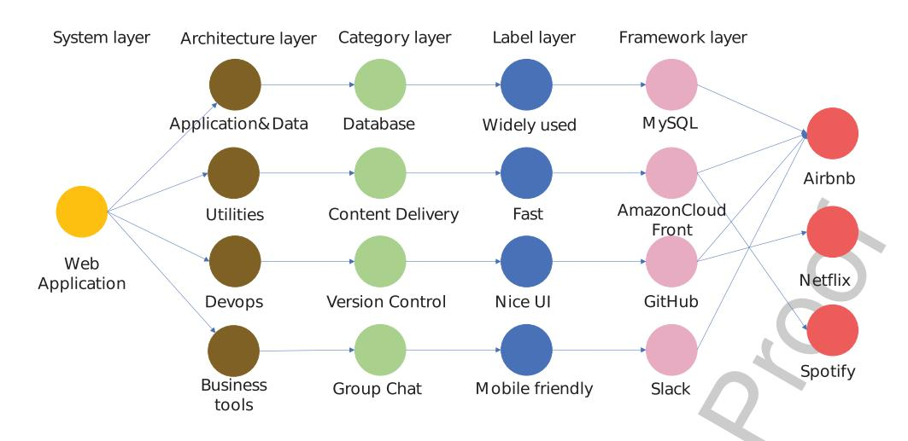
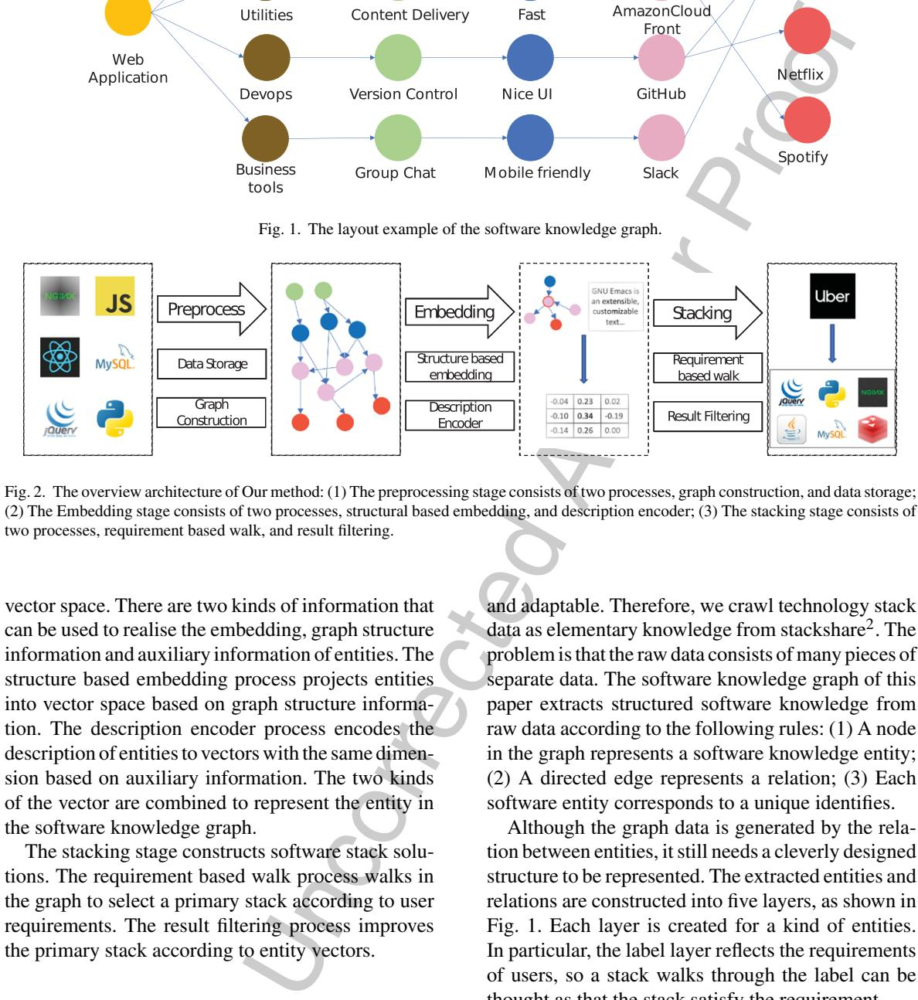
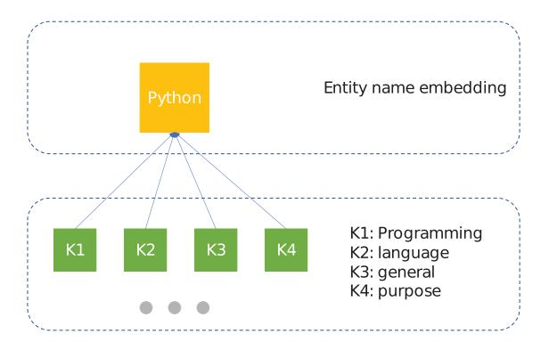
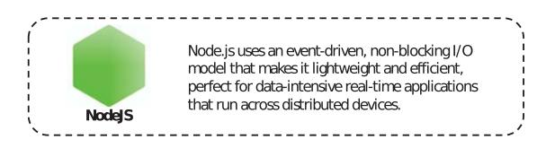
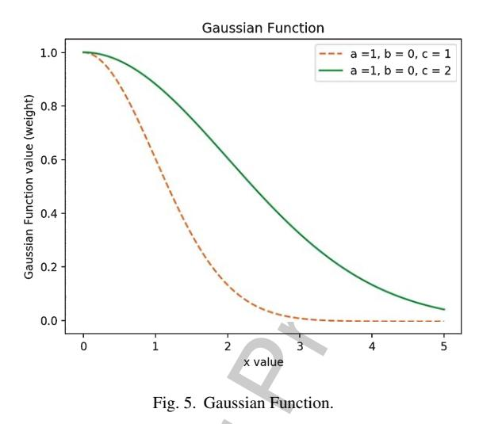
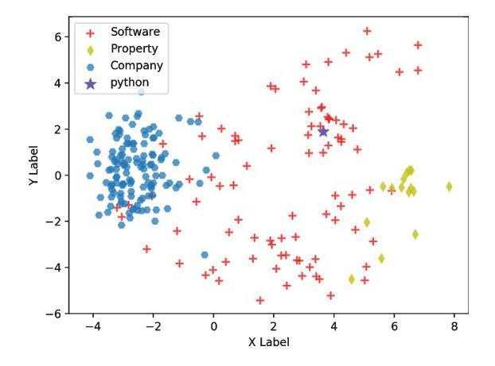
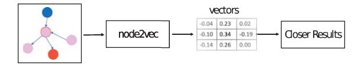
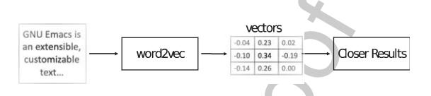
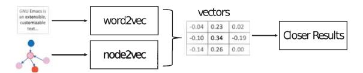
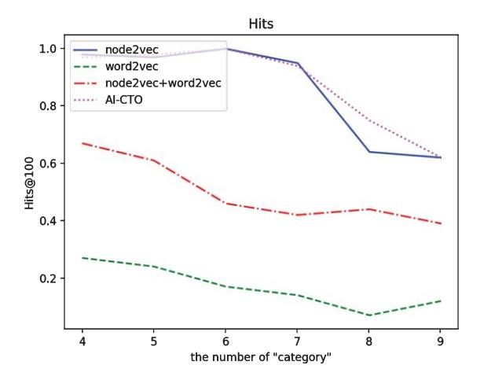

# AI-CTO: Knowledge graph for automated and dependable software stack solution

- Xiaoyun Xua, Jingzheng Wua*,*b*,*∗, Mutian Yanga*,*c , Tianyue Luoa*,*c , Qianru Mengd, Weiheng Lia 3
- and Yanjun Wua*,*b 4

- a 5 *Institute of Software, Chinese Academy of Sciences, China*- b 6*State Key Laboratory of Computer Science, Institute of Software, Chinese Academy of Sciences, China*- c 7*Beijing ZhongKeWeiLan Technology Co., Ltd, China*- d 8*Beijing Baidu, Inc, China*Uncorrected Author Proof**Abstract**. As the scale of software systems continues expanding, software architecture is receiving more and more attention as the blueprint for the complex software system. An outstanding architecture requires a lot of professional experience and expertise. In current practice, architects try to find solutions manually, which is time-consuming and error-prone because of the knowledge barrier between newcomers and experienced architects. The problem can be solved by easing the process of apply experience from prominent architects. To this end, this paper proposes a novel graph-embedding-based method, AI-CTO, to automatically suggest software stack solutions according to the knowledge and experience of prominent architects. Firstly, AI-CTO converts existing industry experience to knowledge, i.e., knowledge graph. Secondly, the knowledge graph is embedded in a low-dimensional vector space. Then, the entity vectors are used to predict valuable software stack solutions by an SVM model. We evaluate AI-CTO with two case studies and compare its solutions with the software stacks of large companies. The experiment results show that AI-CTO can find effective and correct stack solutions and it outperforms other baseline methods. 9 10 11 12 13 14 15 16 17 18 19

20 Keywords: Knowledge graph, graph embedding, software architecture

## 21 1. Introduction

 As the scale of software systems continues expand- ing, software architecture is receiving more and more attention as the blueprint for the complex soft- ware system. Software architecture establishes the link between requirements and implementation [1] and allows designers to infer the ability to meet requirements at the design phase. This field has been developing for more than 30 years and plays an important and ubiquitous role in contemporary indus- trial practice [2]. The quality of the system depends heavily on its design, i.e. architecture. According to a research report from the National Institute of Standards and Technology (NIST), more than 70% 34 of errors found in software testing are caused by 35 requirement acquisition or architecture design [3]. 36 The longer the errors exist in the system, the harder it 37 will be to find them, and the higher the cost of solv- 38 ing them. In summary, a good architecture makes the 39 software system more robust and reliable. 40

Software architecture can be divided into two lev- 41 els: architecture and design, but it is difficult to 42 clearly distinguish the boundary of them [4]. There- 43 fore, in this paper, the "architecture" is considered 44 to be elements of architectural styles. For exam- 45 ple, there are two basic elements of client-server 46 architectural style, the "client" and "server". Com- 47 mon architectural styles include pipes and filters, 48 data abstraction and object-oriented organisation, 49 event-based implicit invocation, abstract data types 50

∗Corresponding author. Jingzheng Wu, E-mail: [jingzheng08@](mailto:jingzheng08@{penalty -@M }iscas.ac.cn) iscas.ac.cn.

 or objects, layered system, business cycle, client- server model, etc [5]. The "design" is considered to be the process of choosing a development software for each element of architectural styles. For exam- ple, MySQL is software for the database element of an architectural style. However, due to the complex relationship between architectural style and software performance, it is difficult for architects to choose an appropriate style and design each component manu-60 ally.

 Motived by the above problem and challenge, this paper proposes a novel method, AI-CTO, to suggest software stack solutions. AI-CTO consists of three stages: Establishment of software knowledge graph; Embedding of the knowledge graph; Deriving of soft- ware stack solutions. The basic idea is extracting knowledge from a well-designed software graph to facilitate architecture tasks. As the relations among software entities can be reasonably represented by the knowledge graph, we firstly build the five-layer soft- ware graph: (1)Software system layer; (2) Software stack layer; (3) Software category layer; (4) Software label layer; (5) Software framework layer. These lay- ers represent the different type of entities in the graph, such as software and requirement labels. In addition, the company entities are not in these layers, because they are not elements of software stacks.

 For automated analysis of the architectural prob- lem, we intend to embed the entities in the software graph into a low-dimensional vector space. However, most of the previous researches about graph embed- ding just learned from structural triples [6–8], while there is rich semantic information that reflects fea- tures of the software, such as descriptions and names. Therefore, we propose a novel embedding method to combine the two kinds of information in the graph, i.e., structure information and description informa- tion. Our method takes the results of node2vec [8] as structure information and the embedding of software description text as description information.

 To derive the software stack solutions accord- ing to the requirements of architects, we propose a requirement-based-walk method to select a set of stack solutions, which satisfy the requirements. These preliminary stack solutions are further filtered by a Support Vector Machine (SVM) model. The feature vector of each stack is calculated by the embedding results. The SVM model is trained by the stack solu-tions of large companies.

100 According to the above ideas, we build the proto-101 type of AI-CTO. The software graph contains 11876 102 entities and 43269 relations, including 3175 software entities and 350 company entities. We set four base- 103 lines on two experiments to evaluate the correctness 104 and usage of AI-CTO. For the correctness exper- 105 iment, the results of AI-CTO are verified by real 106 software stacks. For the usage experiment, this exper- 107 iment counts the companies using the same stacks as 108 AI-CTO results. The results show that AI-CTO out- 109 performs other baselines and can suggest satisfactory 110 software stacks. 111

In summary, we make the following contributions 112 in this paper: 113

- − We introduce the concept of knowledge graph 114 to formally represent software entities and 115 requirements of architects, which converts 116 development experience to knowledge and 117 narrows the knowledge barrier between new- 118 comers and experienced architects. 119
- − We implement the prototype of AI-CTO to 120 extract effective software stack solutions from 121 the software knowledge graph. The method 122 makes full use of both the semantic information 123 of software descriptions and graph structure 124 information. The software stack solutions are 125 further filtered by an SVM model. 126
- − We present an extensive evaluation of AI-CTO. 127 The experiment results show that AI-CTO out- 128 performs other baseline methods. 129

Uncorrected Author Proof The rest of this paper is organised as follows. In 130 Section 2, we discuss the background information 131 needed to have a primary impression of the technolo- 132 gies used in our method. Section 3 details the software 133 stack solution method. The method is analysed and 134 evaluated in Section 4. Section 5 reports factors that 135 may affect experiment results. Section 6 discusses the 136 related work of our work. Finally, we summary this 137 paper in Section 7. 138

### 2. Background 139

This section discusses motivation, formalisation of 140 the problem in the selection space and notions about 141 knowledge graph. 142

### *2.1. Motivation*143

There is a phenomenon of inadequate utilisation of 144 existing knowledge and experience. Newcomers pos- 145 sess limited knowledge and experience [9, 10]. It is 146 difficult for them to choose an appropriate style and 147 design each component manually. In fact, according 148

 to the experience of our industrial partners, devel- ops tend to choose the technologies they are familiar with, which makes it harder for them to learn from experienced architects.

 In addition, the knowledge and experience of archi- tects are full of entities and relations, such as software, companies and dependencies among them, which is very similar to the concept of the knowledge graph. To facilitate the analysis in form of vectors, the graph is embedded into a continuous low-dimensional vector 159 space.

 The embedding process takes account of two kinds of features. The graph structure features reflect the space characteristic while the description features reflect the semantic information. Therefore, an SVM model is used to find the boundary of that.

#### 165*2.2. Problem definition*This problem can be explain by defining a selection space. Let*a*be a vector having elements*ai*in an architectural style, and*ai*corresponds to the design selections. The architectural vector*a*has*n*dimension. Let*d*be a Boolean vector having elements*dj*as each design selection, i.e.,*ai* = {*d*}. The design vector *d*has*m*dimension. A design element*dj*can be defined as either*dj*= 0 (do not choose it), or*dj*= 1 (choose it):

$$
|\Omega_{selection}| = \prod_{i=1}^{n} \{0, 1\}^{m_i} \tag{1}
$$

 The task for architects is choosing an option from the selection space. For example, the architecture of a simple web application usually consists of web server, client and database, i.e., the*a*has three elements. According to a technology stack website1 170 , the number of common development tools for web server, client and database are 25, 40 and 58, i.e.,*m*1 = 25*, m*2 = 40*, m*3 = 58. There is a total selec- tion space of *m*1 ∗ *m*2 ∗ *m*3(58000) options to select among, which is a large number for human develop- ers. As the full-stack tools, such as NodeJS, are not included in the example, the upper-bound of selection space is much higher in real-world situations.

# 179 *2.3. Knowledge graph in software engineering*

180 The knowledge graph efficiently stores objective 181 knowledge in form of triples. Each triple contains two entities and the relation between them. For example, 182 triple (*h, r, t*) contains a head node *h*, a relation *r*and a 183 tail node*t*. This kind of knowledge representation can 184 preferably reflect the relation information between 185 entities and it is useful for various domains [11]. With 186 the advancement of knowledge graph technologies in 187 recent years, some changes have taken place in this 188 field. One of them is that more and more researches 189 have shifted from a general-purpose knowledge graph 190 (GKG) to domain-specific knowledge graph (DKG). 191 GKG is built with general objective knowledge and 192 on a large scale, such as Google's Knowledge Graph 193 [12], NELL [13] and WikiData [14]. As one of 194 the most important features of GKG is the large 195 scale, automatic Information Acquisition technolo- 196 gies become a widely research topic [15–17]. 197

Uncorrected Author Proof DKG refers to knowledge graphs that are focused 198 on a specific field, such as software engineering. Soft- 199 ware knowledge graph contains not only software 200 but also related entities such as developers, logs and 201 documentation. For example, IntelliDE [18]imple- 202 ment the function of software text semantic search 203 based on a software knowledge graph, which con- 204 sists of information from source code files, version 205 control systems, mailing lists, issue tracking systems, 206 Microsoft Office and PDF documents, HTML-format 207 tutorials, API documentation, user forum posts, blogs 208 and online social question-answering pairs. 209

The software knowledge graph can be used to 210 solve different issues in software engineering, such 211 as design and analysis of functional requirements 212 [19], maintenance and testing of software [20] and 213 documentation for coding support [21]. 214

## 3. Proposed approach 215

Fig. 2 demonstrates the overview architecture of 216 the proposed approach, which contains three main 217 stages. 218

The preprocessing stage converts raw data to the 219 knowledge graph. The graph construction process 220 extracts entities and relations from raw data to build 221 a structured software knowledge graph. The raw data 222 comes from online sources and consists of software 223 tools, companies, software labels, etc, which is mas- 224 sive and disordered. Therefore, the data needs to be 225 cleaned in the data storage process. In addition, the 226 output of the graph construction process is stored into 227 the graph database in this process. 228

In the embedding stage, the software knowledge 229 graph is projected into a continuous low-dimensional 230

1<https://stackshare.io/stacks>

<!-- Image Description: This layered graph illustrates a web application's architecture. The leftmost yellow circle represents the web application, branching into layers of architecture (brown), categories (green), labels (blue), and frameworks (pink). Each layer shows specific components. Finally, the rightmost red circles represent applications (Airbnb, Netflix, Spotify) built using this architecture, highlighting dependencies across layers. The image visually depicts the system's structure and component relationships. -->

Fig. 1. The layout example of the software knowledge graph.

<!-- Image Description: Figure 1 shows a software knowledge graph layout example, illustrating relationships between software components (e.g., Web Application, DevOps, Netflix). Figure 2 depicts a three-stage method: preprocessing (graph construction and data storage), embedding (structure-based and description encoding, visualized with a matrix of vector values), and stacking (requirement-based walk and result filtering). The figures together illustrate the architecture for constructing and using a software knowledge graph to recommend software stacks. -->

Fig. 2. The overview architecture of Our method: (1) The preprocessing stage consists of two processes, graph construction, and data storage; (2) The Embedding stage consists of two processes, structural based embedding, and description encoder; (3) The stacking stage consists of two processes, requirement based walk, and result filtering.

 vector space. There are two kinds of information that can be used to realise the embedding, graph structure information and auxiliary information of entities. The structure based embedding process projects entities into vector space based on graph structure informa- tion. The description encoder process encodes the description of entities to vectors with the same dimen- sion based on auxiliary information. The two kinds of the vector are combined to represent the entity in the software knowledge graph.

 The stacking stage constructs software stack solu- tions. The requirement based walk process walks in the graph to select a primary stack according to user requirements. The result filtering process improves the primary stack according to entity vectors.

### 246 *3.1. Preprocessing*#### 247*3.1.1. Graph construction*248 One of our central hypotheses is that the technol-249 ogy stacks used by famous companies are efficient and adaptable. Therefore, we crawl technology stack 250 data as elementary knowledge from stackshare2. The 251 problem is that the raw data consists of many pieces of 252 separate data. The software knowledge graph of this 253 paper extracts structured software knowledge from 254 raw data according to the following rules: (1) A node 255 in the graph represents a software knowledge entity; 256 (2) A directed edge represents a relation; (3) Each 257 software entity corresponds to a unique identifies. 258

Although the graph data is generated by the rela- 259 tion between entities, it still needs a cleverly designed 260 structure to be represented. The extracted entities and 261 relations are constructed into five layers, as shown in 262 Fig. 1. Each layer is created for a kind of entities. 263 In particular, the label layer reflects the requirements 264 of users, so a stack walks through the label can be 265 thought as that the stack satisfy the requirement. 266

The software system layer contains the target sys- 267 tem or application which we want to build stack 268 for, such as a Web application. Following paragraphs 269 270 describe the structure and features of the rest of the 271 layers.

 The software stack layer consists of four entities, "Application&Data", "Utility", "Devops" and "Busi- ness tools". The four architecture items are used to organise a large number of software categories.

 The software category layer consists of various cat- egories of basic software items, such as databases, cloud hosting and full-stack frameworks. The soft- ware stack is built according to different categories in this layer. For example, a Web application basi- cally contains front-end framework, Web server and database. The stack for a Web application chooses one element from each of these three categories.

 The software label layer consists of the func- tion and performance labels, which are used to reflect the characteristic of elementary software items. Those labels are used to represent the require- ments of users. For example, developers tend to use high-performance tools, such as NodeJS. The "high- performance" is a performance label of NodeJS, and it represents the requirement of developers on perfor- mance. As the category layer and software framework layer is connected with the label layer, it is able to select a software that satisfies the multiple require-ments by walking in the graph.

 The software framework layer consists of elemen- tary software items, such as NodeJS, JavaScript and Python. In particular, software items used by famous companies connect to the corresponding company entities. This makes the stack used by famous com- panies different from others in embedded data so that our method can learn the technology features of famous companies.

## 304*3.1.2. Data storage*The output data of the graph construction process is imported into the graph database for succeeding tasks. According to features of the graph, we first build entities in the graph database and then associate them with relations. However, there are too many query operations with this method and it is ineffi- cient. We optimised the operation of importing. When building entities, a part of the entities that have known relations are directly constructed into triples, thus reducing the query operations when building rela- tions later. In addition, the software label data from stackshare is submitted by tool users, i.e. it is crowd- sourcing data. Not all labels in the data are valid, some of them are lack of support by developers. The top 60% of the labels are reserved.

###*3.2. Embedding* 319

The basic idea of our method is analysing software in a continuous low-dimensional space instead of doing that with the symbolic representation of triples. As shown in Equation 2, we proposed a new embedding method by combining two methods to embed entities into the vector space, i.e. structure based embedding (*Es*) and description encoder (*Ed*). The two methods simultaneously project entities into the same vector space, i.e., the dimensions of output are the same.

$$
E = E_s + E_d \tag{2}
$$

#### *3.2.1. Structure based embedding*320

Uncorrected Author Proof Due to the classical triple structure, the knowledge 321 graph can efficiently provide graph structure informa- 322 tion. According to the Skip-gram model [22], words 323 with similar meanings tend to appear in a similar 324 context. Similarly, an embedding vector of a node 325 is decided by its neighbourhoods. The embedding 326 normally consists of two steps, graph information 327 sampling and vector learning. The first step samples 328 the adjacent nodes by a biased random walk algo- 329 rithm. The second step learns the feature vectors of 330 nodes by the Skip-gram model. This process is imple- 331 mented based on node2vec [8]. The biased random 332 walk is to select representative nodes according to 333 different search strategies, such as the breadth-first 334 search (BFS) and the depth-first search (DFS). BFS 335 focuses on neighbouring nodes and characterises a 336 relatively local network representation. DFS reflects 337 the homogeneity between nodes at a higher level. 338 BFS can explore the structural properties of the graph, 339 while DFS can explore the similarity in content (sim- 340 ilarity between connected nodes). Nodes with similar 341 structures do not have to be connected, and may even 342 be far apart. 343

The problem is that node2vec does not distinguish 344 the categories of different nodes in the graph, we 345 avoid this problem by embedding the "category" in 346 the vector space as well. 347

####*3.2.2. Description encoder*348

For each software entity, there is a short description 349 that reflects the features and functions of the entity. 350 For example, Fig. 4 is the description of NodeJS. 351 The description encoder is built based on the hypoth- 352 esis that the keywords in the description are able to 353 summarise the main features of an entity. The embed- 354

<!-- Image Description: The image illustrates entity name embedding. A diagram shows "Python" (yellow box) at the top, connected to four green boxes labeled K1-K4. K1-K4 represent keywords ("Programming," "language," "general," "purpose") associated with Python. The diagram visually depicts how an entity name ("Python") is represented by related keywords in an embedding model. Ellipses (...) indicate further keywords. -->

Fig. 3. The keywords of a short description for an entity. The different distance between keywords and entity name will result in different weights for each keywords.

<!-- Image Description: The image is a box with a dashed border containing a green hexagonal Node.js logo and a textual description. The text explains that Node.js employs an event-driven, non-blocking I/O model, resulting in lightweight and efficient performance, particularly suitable for real-time, data-intensive applications distributed across multiple devices. The image serves to introduce Node.js and highlight its key architectural feature. -->

Fig. 4. The description of NodeJs.

 ding of each keyword is calculated by word2vec [22] model, which is trained on Wikipedia and all of the software descriptions. However, the keywords in a description should not be treated equally. Some key- words, such as the category of the entity, preferably represents the meaning of a description. For example, in the description of "Python is a general-purpose pro- gramming language created by Guido Van Rossum.", the word "programming" is more important than "purpose". Fig. 3 shows the relation between the entity and the keywords. The keywords are ranked by distances.

> To capture this feature, we take the embedding of entity name as an anchor point. The words closer to entity name have more weight. The description embedding of a entity is calculated by following equations:

$$
d_i = \prod_j^n \sqrt{(p_j - q_j)^2}
$$
 (3)

$$
w_i = f_g(d_i) \tag{4}
$$

$$
E_d = \sum_{i=1}^{k} e_i* w_i \tag{5}
$$

where *di*367 is the euclidean distance between the entity 368 and the*ith*keyword.*fg*is a function for calculating

<!-- Image Description: Figure 5 is a line graph depicting two Gaussian functions. The x-axis represents the input value, and the y-axis represents the function's value (weight). The graph shows how the function's shape changes with different parameter values (c=1 and c=2, with a=1 and b=0 held constant). The graph illustrates the effect of parameter 'c' on the Gaussian function's spread. -->

weights.*ei*is the embedding of the*ith*keyword.*Ed*369 is the description embedding of the entity, i.e., the 370 vectors of top k keywords are sum up to be the vector 371 of the entity. 372

Uncorrected Author Proof Inspired by the work of [23], this paper calculates the weights of keywords by Gauss Function, i.e., the weights increase with the decreasing distances between keywords and entity. As shown in Fig. 5, the results of Gauss Function are smooth and the range can be adjusted by the three parameters. Equation 6 shows the definition of Gauss Function, where*a, b*and*c*denote some real constants and decide the range of the weight. The*x*is the distance between a keyword and an entity,*f* (*x*) is the weight of the keyword corresponding to the entity. In this paper, the *a* value is always set to 1, so that the weight is ranged from 0 to 1. There is a maximum value when |*x*−*b*| = 0. The *b*value is always set to 0 so that the distance equals 0 when the maximum weight is obtained (distance is positive). The*c*value is the standard deviation and controls the "width" of the function. It is adjusted according to the maximum of distances for each entity.

$$
f(x) = ae^{-\frac{(x-b)^2}{2c^2}}
$$
 (6)

####*3.3. Stacking*373

####*3.3.1. Requirement based walk*374

The requirement based walk is proposed to find out 375 which category of software is needed by the architec- 376 ture. The basic idea is that popular categories are what 377 develops need. For example, the "Web Servers" cat- 378 egory is used by 3442 companies in our data and the 379

 "Graphic Design" category is used by 31 companies. Therefore, the "Web Servers" is considered as a cat- egory in the stack, while the "Graphic Design" may 383 not.

 Another key is to reflect the requirements of devel- opers. As mentioned in section Graph Construction, there is a software label layer in the knowledge graph, which consists of the function and performance labels. In this paper, those labels are considered as software requirements. However, there are too many labels in the graph, i.e. 7800 labels. It is meaningless to integrate all of the labels in the method. We set a threshold to filter out unimportant labels according to their weights. The weight of a label is calculated according to the number of people who agree it on the stackshare website. Software tools that satisfy the labels are selected to be the preliminary software stack. However, the number of tools in the prelimi- nary data is too large, which will be further filtered by a result filtering process. It is not better to directly select popular software or combination of popular software, but popular is just an important factor. It is also necessary to consider the relationship between software and company, software and software. The knowledge graph is to better reflect this relevance.

#### 405*3.3.2. Result filtering*The results of requirement based walk process is selected by requirement labels, but it can be further filtered according to relevance among software, com- panies, labels etc. According to the idea of embedding method, the vectors of popular software and less used software will be located in different areas in the vec- tor space. In addition, the software in a stack used by companies will be further closer. Therefore, con- sidering the small amount of data and improving generalisation performance, we implement an SVM classifier to find the boundary between good stacks and useless stacks. SVM does not need to rely on the whole data, it is important to find the support vector.

> The classifier finds a hyperplane*W*that separates two kinds of "points" with maximum margin. In this paper, the "points" are software stacks, which are classified valuable stack and worthless stacks. However, a software stack consists of multiple entities, each entity is represented as a vector. We simply use the average vector of all the entities in the stack to train the SVM classifier. The loss function is:

$$
L_i = \sum_{i \neq y_i} max(0, s_i - s_{y_i} + \triangle)
$$
 (7)

Table 1 The statistics of the software knowledge graph

| System | Stack | Category | Label | Framework | Company |
|--------|-------|----------|-------|-----------|---------|
| 1      | 4     | 546      | 7800  | 3175      | 350     |
|        |       |          |       |           |         |

$$
s_i = Wx_i \tag{8}
$$

The*si*is the score of corresponding sample*xi*. The 419 *W*is a weight matrix which represent the hyperplane. 420

#### 4. Evaluation 421

The AI-CTO method is evaluated with real data 422 from a famous technology exchange community3 to 423 answer the following research questions (RQs): 424

# RQ 1: Does AI-CTO find effective results? 425
**RQ 2: Does AI-CTO solutions use by enough**426**real users?**427

RQ 1 and RQ 2 examine the effectiveness of AI- 428 CTO. 429

##*4.1. Dataset*430

Uncorrected Author Proof We evaluate our method on real-world data from 431 stackshare. Stackshare provides data about how 432 famous companies build a software system. For 433 example, there are 35 tools used by Facebook. Table 434 2 lists 10 of them. The problem is that the items in the 435 data are discrete. Therefore, the data is converted to 436 a software knowledge graph, which contains 11876 437 entities and 43269 relations. In particular, the statis- 438 tics of the knowledge graph are listed in Table 1, and 439 each item corresponds to the five layers of the graph. 440

A graph database is used to facilitate the query and 441 storage in this experiment. The top five databases of 442 DB-Engines Ranking4 are Neo4j, Microsoft Azure 443 Cosmos DB, ArangoDB, OrientDB and Virtuoso. 444 Considering the storage model, query language and 445 other factors, Neo4j is chosen as a data storage tool 446 in our method. Neo4j natively supports the Property 447 Graph Model and has full ACID (Atomicity, Consis- 448 tency, Isolation and Durability) properties. 449

###*4.2. Baseline methods*450

To have an intuitive analysis of embedding results, 451 Principal component analysis (PCA) algorithm is 452 used to project vectors to 2-D, so that the embedding 453

3<https://stackshare.io/stacks>

4<https://db-engines.com/en/ranking/graph+dbms>

| Software tool | Category                |  |  |
|---------------|-------------------------|--|--|
| PHP           | Languages               |  |  |
| React         | Javascript UI Libraries |  |  |
| GraphQL       | Query Languages         |  |  |
| Memcached     | Databases               |  |  |
| Cassandra     | Databases               |  |  |
| Flux          | Javascript UI Librarie  |  |  |
| Tornado       | Frameworks (Full Stack) |  |  |
| HHVM          | Virtual Machine         |  |  |
| Relay         | Javascript UI Libraries |  |  |
| Yoga          | Javascript UI Libraries |  |  |

Table 2 Technology Stack of Facebook

<!-- Image Description: This scatter plot displays a 2D representation of data points categorized into four groups: Software (red plus signs), Property (yellow diamonds), Company (blue circles), and Python (purple stars). The X and Y axes represent unspecified variables. The plot likely illustrates the results of a dimensionality reduction or clustering technique, showing the relationships and separation between different data categories in the paper's context. -->

Fig. 6. The embedding results of "python" and related nodes, which are projected to 2d by PCA algorithm. The pink start is the "python" node.

 can be visualised. Fig. 6 is the 2-D projections of 128- D embeddings of the "python" and related nodes. The pink start is the "python" node. PCA was invented by Karl Pearson [24] in 1901, which is used to analyse the problem about how to retain more information while reducing the dimension of data. The method is mainly used to decompose the covariance matrix to obtain the principal components (i.e., eigenvectors) of the data and their weights (i.e., eigenvalue). The largest eigenvalue means that the largest variance is in the direction of corresponding eigenvector.

 The baselines are implemented to compare with AI-CTO from two points of view. One is the feature used in AI-CTO, i.e., the graph structure feature and the description feature. Another is the method used to form a stack. It is clear from Fig. 6 that nodes with high correlation will be closer to each other. There- fore, the basic idea for baselines to form a stack is calculating the distance between software in a stack.

<!-- Image Description: The image illustrates a node embedding process. A graph (left) is inputted into the `node2vec` algorithm. This generates a matrix of numerical vectors (center), representing each node. These vectors are then used to produce "Closer Results" (right), likely indicating improved similarity comparisons between nodes based on their vector embeddings. The diagram shows the workflow, not the internal workings of `node2vec`. -->

Fig. 7. Baseline One: the node2vec results and distance calculation.

<!-- Image Description: The image illustrates a text processing pipeline. Input text ("GNU Emacs is an extensible, customizable text...") is fed into a "word2vec" model, which outputs a vector representation (a 3x3 matrix of numerical values shown). This vector is then processed, leading to "Closer Results," suggesting improved results after applying the word2vec model. The diagram visually depicts the workflow and transformation of the input text into a numerical representation for further analysis. -->

Fig. 8. Baseline Two: the word2vec results and distance calculation.

####*4.2.1. Baseline one*473

The baseline one extracts graph structure informa- 474 tion to represent nodes in the software knowledge 475 graph. The basic idea of this model is that the closer 476 the two nodes are, the more relevant they are. Rele- 477 vant nodes are considered as good combination for 478 software development. 479

Uncorrected Author Proof The baseline one model takes embedding results 480 of node2vec as representations of nodes in the graph. 481 The requirement based walk process selects all pos- 482 sible software stacks from the graph to give a 483 preliminary software stack. However, there are too 484 many groups in the preliminary data. The model cal- 485 culates the Euclidean distances between node vectors 486 to filter irrelevant results out. Fig. 7 illustrates the 487 architecture of baseline one model. 488

####*4.2.2. Baseline two*489

The baseline two extracts semantic information to 490 represent nodes in the software knowledge graph. The 491 training data consists of Wikipedia texts and descrip- 492 tion texts from stackshare. The basic idea of this 493 model is as same as that in baseline one model, but 494 the representations of nodes are different. This model 495 also takes Euclidean distance as a metric to filter irrel- 496 evant results out. Fig. 8 illustrates the architecture of 497 the baseline two model. 498

####*4.2.3. Baseline three*499

The baseline three combines both graph structure 500 information and semantic information to represent 501 nodes. In other words, the baseline three model is the 502 combination of baseline one and baseline two. This 503 model also uses the same method to filter irrelevant 504 results out. Fig. 9 illustrates the architecture of the 505 baseline three model. 506

<!-- Image Description: The image illustrates a process of generating "Closer Results" using word embeddings. Text ("GNU Emacs is an extensible...") and a graph are inputted into "word2vec" and "node2vec" models, respectively. These models generate vector representations (a 3x3 matrix of numerical values is shown as an example). The combined vectors then produce improved results. The diagram depicts the workflow of the algorithm by showing the inputs, processing steps, and final output. -->

Fig. 9. Baseline Three: the graph structure + description text results and distance calculation.

#### 507*4.2.4. Our method*Our method combines both graph structure infor- mation and semantic information to represent nodes, which is the same as that in baseline three. However, while baseline three just takes Euclidean distance as a metric to filter irrelevant results out, our method implements an SVM model to predict whether a soft-ware stack is valuable or not.
**Training:**The SVM model is trained by positive and negative samples. The positive samples consist of software stack data of 350 famous companies, each stack of a company is a piece of a positive sample. The negative samples are generated with two predefined 520 rules:

- 521 − Single software. As a stack is a set of software, 522 single software will not be a positive sample.
- 523 − Stacks with unpopular software. Normally, the 524 developer tends to use popular software. There-525 fore, stacks with unpopular software are thought 526 as negative samples.

527 In addition, software in a stack is represented as vec-528 tors, so the stack is represented as the average of the 529 sum of all software vectors.

#### 530*4.3. The categories used in this experiment*To build a software stack, it is important to select appropriate categories. This problem solved by AI- CTO in two aspects. One is the number of companies using the category, which reflects the practicality. Another is the labels related to the category, which reflects the ability to meet user demand. Table 3 shows 536 the categories used in the evaluation of AI-CTO. As 537 the number of labels are too large, the table only 538 records the most weighted label. In fact, the label 539 is for software in the category, the heavier weights 540 mean the more users paying attention to this label, 541 i.e., user demand. 542

####*4.4. Evaluation with correctness*543
**Motivation:**To answer RQ1 (Does AI-CTO find 544 effective results?), the AI-CTO is evaluated with real- 545 world data from stackshare. The AI-CTO is built 546 by both graph structure and description text fea- 547 tures and predict valuable software tool with an SVM 548 model. This is different from the baseline one and 549 two. In addition, baseline three also integrate graph 550 structure and description text features, but it derives 551 valuable software tool by calculating the Euclidean 552 distance. In this experiment, we would like to inves- 553 tigate whether AI-CTO can outperform the baseline 554 methods. 555
**Metric:**We would like to perform the popular met- 556 ric, Hits@, in our experiment. For example, Hits@10 557 is the proportion of correct stack solutions ranked in 558 the top 10. 559

Uncorrected Author Proof**Results:**We test the correctness experiment on 560 three baseline methods and AI-CTO. As the mod- 561 els obtain a great deal of ranking results from the 562 selection space, we choose 20, 50, 100 as metrics 563 to evaluate the methods. According to the results 564 reported in Table 4, AI-CTO perform better than 565 all baseline methods in Hits@20, Hits@50 and 566 Hits@100. Fig. 10 shows the results of different 567 number of "category". The node2vec performs bet- 568 ter than word2vec, because the graph structure can 569 better reflect the distance feature compared with the 570 text feature. However, the description text features 571 are still helpful to distinguish the software entities. 572

| Table 3                                          |  |
|--------------------------------------------------|--|
| The categories used in the evaluation for AI-CTO |  |

| Category                  | Company num | Label                           | Label Weight |
|---------------------------|-------------|---------------------------------|--------------|
| Languages                 | 981         | Can be used on frontend/backend | 1600         |
| Databases                 | 501         | Document-oriented storage       | 789          |
| Javascript UI Libraries   | 355         | Cross-browser                   | 1300         |
| Javascript MVC Frameworks | 203         | Quick to develop                | 883          |
| In-Memory Databases       | 222         | Performance                     | 843          |
| Frameworks (Full Stack)   | 479         | Npm                             | 1300         |
| Web Servers               | 312         | High-performance http server    | 1400         |
| Microframeworks (Backend) | 106         | Simple                          | 322          |
| General Analytics         | 254         | Free                            | 1500         |

Table 4 The results of evaluation with correctness. 8 categories used

| Metric            | Hits@20 | Hits@50 | Hits@100 |
|-------------------|---------|---------|----------|
| node2vec          | 0.85    | 0.8     | 0.64     |
| word2vec          | 0.0     | 0.0     | 0.07     |
| node2vec+word2vec | 0.55    | 0.38    | 0.44     |
| AI-CTO            | 0.95    | 0.84    | 0.75     |

<!-- Image Description: The image displays a line graph comparing the performance of four methods (node2vec, word2vec, node2vec+word2vec, AI-CTO) for a Hits@100 metric. The x-axis represents the number of categories, and the y-axis shows the Hits@100 score. The graph illustrates how the performance of each method changes with varying numbers of categories. The purpose is to compare the effectiveness of different embedding methods in a categorization task. -->

Fig. 10. The hits results of different number of "category" in the stack.

Table 5 The results of evaluation with number of users. 8 categories used

| Metric            | top(20) | top(50) | top(100) |
|-------------------|---------|---------|----------|
| node2vec          | 45      | 92      | 137      |
| word2vec          | 0       | 0       | 7        |
| node2vec+word2vec | 11      | 22      | 51       |
| AI-CTO            | 49      | 94      | 157      |

#### 573*4.5. Evaluation with number of Users*

**Motivation:**This experiment is performed to answer RQ2 (Are the AI-CTO solutions used by real users?). We would like to investigate whether the solutions of AI-CTO are used by companies.

578**Metric:**We would like to perform the number of 579 users in this experiment. The top(x) means the num-580 ber of companies who use the top x stacks.
**Results:**According to the results reported in Table 5, AI-CTO perform better than all baseline methods in top20, top50 and top100. The solutions derived by AI-CTO are used by real users.

#### 5. Threats to validity 585

There are defects of AI-CTO, this section discusses 586 the threats to validity and why AI-CTO is still effec- 587 tive. 588

####*5.1. Treats to software categories*589

Uncorrected Author Proof The software stack is built based on the software 590 categories required by developers. For example, a 591 website application may need three kinds of tool, 592 front-end framework, web server and databases. The 593 stacking process selects three tools for the three kinds 594 of tool respectively. Therefore, an important task is 595 determining which categories are needed. Based on 596 the hypothesis that the more companies using this 597 category, the more important it is. AI-CTO choose 598 a category depending on the number of compa- 599 nies using it. Thus, the performance of our method 600 depends on the quality of the technology stack data. 601 In the future, we will try to analyse the characteristics 602 of the software category itself, and then compare it 603 with the results of AI-CTO. 604

####*5.2. Treats to dataset*605

As the dataset used in this paper is invariant, the 606 performance of AI-CTO may be affected when new 607 data is generated. However, companies do not adjust 608 their technology stacks frequently. As the idea of 609 AI-CTO is learning from the experience, the "old" 610 data is sufficient to verify the feasibility of AI-CTO. 611 In addition, it is hard to test the integrality of data 612 from stackshare, and it is unable to check whether 613 the technology stack of a company is complete on 614 stackshare. 615

#*5.3. Treats to software knowledge graph and*616*embedding*617

Usually, a knowledge graph consists of various 618 entities and relations, i.e., the classification of rela- 619 tions can be different. The different relation can 620 represent more information in a graph. The software 621 knowledge graph in this paper contains only one kind 622 of directed relation with weights. However, the rela- 623 tions in this graph do not include any attributes. As 624 a node is represented by its neighbourhoods, single 625 type of relations is capable to depict the information 626 in the embedding process. 627

## 628 6. Related work

### 629*6.1. Software architecture*Software architecture is the blueprint of a system. The architecture reflects the constrained relationships among software components, and those constraints most often come from the system requirements [25]. The modelling of software architecture greatly affects the development performance of practitioners [26]. The research about software architecture gains great attention since the nineties to deal with increasingly software design complexity [27, 28]. To formalise the architectural process, Architecture Description Language (ADL) is used to specify the software architectures precisely, such as Unified Modelling Language (UML) [29, 30], SystemC [31] and Acme5 642 [32]. However, there is not a final conclusion about what extent developers utilise software architecture technologies in software design [27]. In most cases, developers just find a design solution of the software system, but the reason of the solution reflects quality issues for the system [27, 33].

 In addition, it is difficult to clearly distinguish the boundary of architecture layer and design layer [4]. In this paper, the "architecture" is considered to be an element of architectural styles. The "design" is considered to be the process of choosing a develop- ment tool for each element of architectural styles. The AI-CTO convert the development experience of famous companies to knowledge, i.e., the software knowledge graph. Based on the knowledge, develop- ers choose development tools for each element in the architectural style, which is the software stack solu- tion. It is worth mentioning that the solution derives from the knowledge is interpretable.

#### 662*6.2. Graph embedding*

 Graphs exist widely in the real world [34], such as social media network, citation graph of research arti- cles, protein molecular structure graph, etc. These graphs contain valuable information that deserves to be analysed. Therefore, this field has received much attention in recent years. A significant num- ber of researches about graph analytics are proposed, such as personalised recommender system [35], entity/node classification [36], relation prediction [37], entity/node clustering [38], etc.

Uncorrected Author Proof Early technologies are built based on the symbolic 673 representation of graphs, i.e. triples. However, due 674 to the complex structure of graphs, these technolo- 675 gies are computationally inefficient when dealing 676 with large-scale graph [39]. To solve the problem, 677 graph embedding has been presented for embedding 678 entities and relations between them into a contin- 679 uous low-dimensional vector space [40]. In fact, 680 graph embedding overlaps in graph analytics [41] 681 and representation learning [42]. The purpose of 682 graph analytics is to extract valuable information 683 from graph data. Representation learning transforms 684 raw data into a form that can be effectively developed 685 by machine learning technologies. A common idea 686 is extracting normalised data from graphs by graph 687 analytics and applying representation learning to the 688 normalised data. For example, DeepWalk [43] gen- 689 erates sequence data (paths in the graph) which is 690 similar to text by limited random walk from input 691 graph and then uses the node id as a "word" to learn 692 the node vector with Skip-gram model. On the basis 693 of DeepWalk, node2vec [8] defines a bias random 694 walk and still uses Skip-gram to train. The walk mode 695 can be changed by adjusting the bias weights, thus 696 retaining different graph structure information, such 697 as walk modes of BFS and DFS. 698

There are also graph embedding technologies 699 using predefined graph structure as features. The 700 embedding work in TransE [6] is done by adjust- 701 ing the relation in a triple. For example, a triple 702 (*h, r, t*) holds means *Vectorh*+*Vectorr*≈*Vectort*. 703 This provides insights into how to build the energy 704 function, i.e. ||*h*+*r*−*t*||*l*1. Obviously, transE works 705 ineffectively on one-to-many and many-to-one rela- 706 tion problems. TransH [44] embeds h and t to 707 a vector space while embedding *r* to a hyper- 708 plane, i.e. (*h*→*h* ), (*t*→*t* ). The triple (*h, r, t*) 709 holds means *Vectorh*+*Vectorr*≈*Vectort*. More- 710 over, TransR [45], TranSparse [46], TransAt [47], 711 Adversarial Graph Embeddings [48], DELN [49], 712 JANE [50], MTNE [51], etc also presented efficient 713 methods to solve problems in this field. 714

####*6.3. Auxiliary information*715

The input data of graph embedding is diverse, such 716 as the whole graph, nodes, and edges. There can be 717 certain auxiliary information for nodes and edges, 718 such as text descriptions, attributes, labels, and etc, 719 which can be used to enhance the performance of 720 graph embedding. The challenge is how to incorpo- 721 rate the auxiliary information in graph embedding 722

5[http://www.cs.cmu.edu/](http://www.cs.cmu.edu/$~$acme/)∼acme/

723 model and how to combine it with graph structure 724 information.

 Xie et al. [39] propose two encoder, i.e. continuous bag-of-words and deep convolutional neural models, to transform semantics of entity description into vectors. They then define an energy function, i.e.*E*=*ES*+*ED*, to combine description-based representation and structure-based representation. *ES*is the energy function of TransE to represent the structure information.*ED*is the energy function of description-based representation and defined as:*ED*=*EDD*+*EDS*+*ESD*, where *EDD* = ||*Vectorhd*+*r*−*Vectortd*||.*Vectorhd*735 is the description-based representation of head node in the triple.*EDS*and*ESD*are analogous to that.

Uncorrected Author Proof Wang and Li [52] use rich context information in an external text corpus to assist in representation learning of the knowledge graph. Similar to distance supervision, they first annotate the entity back to the text corpus to obtain a co-occurrence network con- sisted of entity words and other important words. The network can be regarded as the link between the knowledge graph and the text information. The context of entities and relations is defined based on the network and integrated into the knowledge graph. Finally, the representation of entities and relations is learned by a translation model. Other auxiliary infor- mation is also used to improve the performance of graph embedding, such as relation [53], attribute [54], 752 etc.

#### 753 7. Conclusion and future work

 This paper proposes AI-CTO, a novel method to automatically suggest software stack solutions. The basic idea of AI-CTO is converting the development experience of famous companies to knowledge, i.e., software knowledge graph. The software stack solu- tions are derived from the knowledge. To reach this end, we embed the software knowledge graph to a low-dimensional vector space. In addition, we com- bine embedding of software descriptions to make the graph embedding more precisely. The evalua- tion of AI-CTO consists of two research question to analyse its effectiveness. The results show that AI-CTO can suggest effective solutions and outper- form other baselines. We will explore the following research directions in future: (1) It is possible to include more features for software, such as the code features of open-source software. (2) The descrip-tion encoder only considers software descriptions and name for embedding, while there are various infor- 772 mation, which is possible to be utilised in future. (3) 773 There are no attributes for relations in the software 774 knowledge graph. It is able to include more informa- 775 tion for relations between entities in future. 776

#### Acknowledgment 777

This work is supported by National Key R&D 778 Program of China (No. 2018YFB0803600) and 779 National Natural Science Foundation of China 780 (No. 61772507). 781
**References** 782

- [1] D. Garlan, Software architecture: a roadmap. In*Proceedings*783*of the Conference on the Future of Software Engineering*, 784 pages 91–101. Citeseer, (2000). 785
- [2] R. Capilla, A. Jansen, A. Tang, P. Avgeriou and M. Ali 786 Babar, 10 years of software architecture knowledge manage- 787 ment: Practice and future, *Journal of Systems and Software*788**116**(2016), 191–205. 789
- [3] G. Tassey, The economic impacts of inadequate infrastruc- 790 ture for software testing,*National Institute of Standards and*791*Technology, RTI Project* **7007**(011) (2002), 429–489. 792
- [4] M. Shaw, D. Garlan, et al., Software architecture, volume 793 101. prentice Hall Englewood Cliffs, (1996). 794
- [5] D. Garlan and M. Shaw, An introduction to software archi- 795 tecture. In *Advances in software engineering and knowledge*796*engineering*, pages 1–39. World Scientific, (1993). 797
- [6] A. Bordes, N. Usunier, A. Garcia-Duran, J. Weston 798 and O. Yakhnenko, Translating embeddings for modeling 799 multi-relational data, In *Advances in neural information*800*processing systems*(2013), pages 2787–2795. 801
- [7] D.Q. Nguyen, K. Sirts, L. Qu and M. Johnson, Stranse: 802 a novel embedding model of entities and relationships in 803 knowledge bases,*arXiv preprint arXiv:1606.08140*, (2016). 804
- [8] A. Grover and J. Leskovec, node2vec: Scalable feature 805 learning for networks. In *Proceedings of the 22nd ACM*806*SIGKDD international conference on Knowledge discovery*807*and data mining*, pages 855–864. ACM, (2016). 808
- [9] L. Ponzanelli, G. Bavota, M. Di Penta, R. Oliveto and M. 809 Lanza, Mining stackoverflow to turn the ide into a self- 810 confident programming prompter. In *Proceedings of the*811*11th Working Conference on Mining Software Repositories,*812*MSR*(2014), pages 102–111, New York, NY, USA, 2014. 813 ACM. 814
- [10] L. Ponzanelli, S. Scalabrino, G. Bavota, A. Mocci, R. 815 Oliveto, M. Di Penta and M. Lanza, Supporting soft- 816 ware developers with a holistic recommender system. In 817*2017 IEEE/ACM 39th International Conference on Soft-*818*ware Engineering (ICSE)*, pages 94–105. *IEEE*, (2017). 819
- [11] X. Zhao, Z. Xing, M.A. Kabir, N. Sawada, J. Li and S.-W. 820 Lin, Hdskg: Harvesting domain specific knowledge graph 821 from content of webpages. In *2017 IEEE 24th International*822*Conference on Software Analysis, Evolution and Reengi-*823*neering (SANER)*, pages 56–67. *IEEE*, (2017). 824

- 825 [12] A. Singhal, Introducing the knowledge graph: things, 826 not strings. [https://googleblog.blogspot.com/2012/](https://googleblog.blogspot.com/2012/05/introducing-knowledge-graph-things-not.html) 827 [05/introducing-knowledge-graph-things-not.html,](https://googleblog.blogspot.com/2012/05/introducing-knowledge-graph-things-not.html) May 16, 828 (2012). Accessed: August 4, 2019.
- 829 [13] A. Carlson, J. Betteridge, B. Kisiel, B. Settles, E.R. 830 Hruschka and T.M. Mitchell, Toward an architecture for 831 never-ending language learning, In *Twenty-Fourth AAAI*832*Conference on Artificial Intelligence*, (2010).
- 833 [14] D. Vrandeciˇ c and M. Kr ´ otzsch, Wikidata: A free collab- ¨ 834 orative knowledge base, *Communications of the ACM* **57**835 (2014), 78–85.
- 836 [15] F. Wu and D.S. Weld, Open information extraction using 837 wikipedia. In*Proceedings of the 48th annual meeting of the*838*association for computational linguistics*, pages 118–127. 839 Association for Computational Linguistics, (2010).
- 840 [16] M. Schmitz, R. Bart, S. Soderland, O. Etzioni, et al., Open 841 language learning for information extraction, In *Proceed-*842 *ings of the 2012 Joint Conference on Empirical Methods*843*in Natural Language Processing and Computational Nat-*844 *ural Language Learning*, pages 523–534. Association for 845 Computational Linguistics, (2012).
- 846 [17] A. Fader, S. Soderland and O. Etzioni, Identifying rela-847 tions for open information extraction, In *Proceedings of the*848*conference on empirical methods in natural language pro-*849 *cessing*, pages 1535–1545. Association for Computational 850 Linguistics, (2011).
- 851 [18] Z.-Q. Lin, B. Xie, Y.-Z. Zou, J.-F. Zhao, X.-D. Li, J. Wei, H.- 852 L. Sun and G. Yin, Intelligent development environment and 853 software knowledge graph, *Journal of Computer Science*854*and Technology* **32**(2) (2017), 242–249.
- 855 [19] H.S. Delugach, Specifying multiple-viewed software 856 requirements with conceptual graphs, *Journal of Systems*857*and Software* **19**(3) (1992), 207–224.
- 858 [20] H.-J. Happel and S. Seedorf, Applications of ontologies 859 in software engineering. In *Proc. of Workshop on Sematic*860*Web Enabled Software Engineering"(SWESE) on the ISWC*, 861 pages 5–9. Citeseer, (2006).
- 862 [21] R. Padhye, D. Mukherjee and V.S. Sinha, Api as a social 863 glue. In *Companion Proceedings of the 36th International*864*Conference on Software Engineering*, pages 516–519.*ACM*, 865 (2014).
- 866 [22] T. Mikolov, K. Chen, G. Corrado and J. Dean, Efficient 867 estimation of word representations in vector space, *arXiv*868*preprint arXiv:1301.3781*, (2013).
- 869 [23] Q. Zhong, H. Li, J. Li, G. Xie, J. Tang, L. Zhou and Y. Pan, 870 A gauss function based approach for unbalanced ontology 871 matching. In *Proceedings of the 2009 ACM SIGMOD Inter-*872 *national Conference on Management of Data, SIGMOD* 873 '*09*, pages 669–680, New York, NY, USA, (2009). ACM.
- 874 [24] K. Pearson, Liii. on lines and planes of closest fit to 875 systems of points in space, *The London, Edinburgh, and*876*Dublin Philosophical Magazine and Journal of Science*877**2**(11) (1901), 559–572.
- 878 [25] D.E. Perry and A.L. Wolf, Foundations for the study of soft-879 ware architecture, *SIGSOFT Softw Eng Notes* **17**(4) (1992), 880 40–52.
- 881 [26] M. Ozkaya and F. Erata, Understanding practitioners' 882 challenges on software modeling: A survey, *Journal of Com-*883 *puter Languages* **58**(2020), 100963.
- 884 [27] M. Ozkaya, What is software architecture to practitioners: A 885 survey, In*International Conference on Model-driven Engi-*886 *neering & Software Development*, (2017).
- 887 [28] M. Ozkaya and F. Erata, A survey on the practical use of uml 888 for different software architecture viewpoints, *Information*889*and Software Technology* **121**(2020),106275.

- [29] G. Booch, The unified modeling language user guide,*Pear-*890*son Education India*(2005). 891
- [30] M. Ozkaya, Are the uml modelling tools powerful enough 892 for practitioners? a literature review,*IET Software* **13**(16) 893 (2019), 338–354. 894
- [31] D.C. Black, J. Donovan, B. Bunton and A. Keist, System 895 C: From the ground up, volume **71**. *Springer Science &*896*Business Media*, (2009). 897
- [32] D. Garlan, R. Monroe and D. Wile, Acme: An architec- 898 ture description interchange language. In *Proceedings of*899*the 1997 Conference of the Centre for Advanced Studies*900*on Collaborative Research, CASCON '97*, pages 7–. IBM 901 Press, (1997). 902
- [33] H. van Vliet and A. Tang, Decision making in software 903 architecture, *Journal of Systems and Software* **117**(2016), 904 638–644. 905
- [34] H. Cai, V.W. Zheng and K.C.-C. Chang, A comprehen- 906 sive survey of graph embedding: Problems, techniques, and 907 applications,*IEEE Transactions on Knowledge and Data*908*Engineering* **30**(9) (2018), 1616–1637. 909
- [35] H. Wang, M. Zhao, X. Xie, W. Li and M. Guo, Knowledge 910 graph convolutional networks for recommender systems, In 911 *The World Wide Web Conference*, pages 3307–3313. ACM, 912 (2019). 913
- [36] X. Wang, P. Cui, J. Wang, J. Pei, W. Zhu and S. Yang, 914 Community preserving network embedding, In *Thirty-First*915*AAAI Conference on Artificial Intelligence*, (2017). 916
- [37] X. Wei, L. Xu, B. Cao and P.S. Yu, Cross view link predic- 917 tion by learning noise-resilient representation consensus, In 918 *Proceedings of the 26th International Conference on World*919*Wide Web*, pages 1611–1619. *International World Wide Web*920*Conferences Steering Committee*, (2017). 921
- [38] F. Nie, W. Zhu and X. Li, Unsupervised large graph 922 embedding, In *Thirty-first AAAI conference on artificial*923*intelligence*, (2017). 924
- [39] R. Xie, Z. Liu, J. Jia, H. Luan and M. Sun, Representa- 925 tion learning of knowledge graphs with entity descriptions, 926 In *Thirtieth AAAI Conference on Artificial Intelligence*, 927 (2016). 928
- Uncorrected Author Proof [40] X. Dong, E. Gabrilovich, G. Heitz, W. Horn, N. Lao, K. Mur- 929 phy, T. Strohmann, S. Sun and W. Zhang, Knowledge vault: 930 A web-scale approach to probabilistic knowledge fusion, In 931 *Proceedings of the 20th ACM SIGKDD international con-*932*ference on Knowledge discovery and data mining*, pages 933 601–610. ACM, (2014). 934
  - [41] N. Satish, N. Sundaram, M.M.A. Patwary, J. Seo, J. Park, 935 M.A. Hassaan, S. Sengupta, Z. Yin and P. Dubey, Navigating 936 the maze of graph analytics frameworks using massive graph 937 datasets, In*Proceedings of the 2014 ACM SIGMOD interna-*938*tional conference on Management of data*, pages 979–990. 939 ACM, (2014). 940
  - [42] Y. Bengio, A. Courville and P. Vincent, Representation 941 learning: A review and new perspectives, *IEEE transactions*942*on pattern analysis and machine intelligence*, **35**(8) (2013), 943 1798–1828. 944
  - [43] B. Perozzi, R. Al-Rfou and S. Skiena, Deepwalk: Online 945 learning of social representations. In *Proceedings of the*946*20th ACM SIGKDD international conference on Knowl-*947*edge discovery and data mining*, pages 701–710. ACM, 948 (2014). 949
  - [44] Z. Wang, J. Zhang, J. Feng and Z. Chen, Knowledge graph 950 embedding by translating on hyperplanes, In *Twenty-Eighth*951*AAAI conference on artificial intelligence*, (2014). 952
  - [45] Y. Lin, Z. Liu, M. Sun, Y. Liu and X. Zhu, Learning entity 953 and relation embeddings for knowledge graph completion, 954

955 In *Twenty-ninth AAAI conference on artificial intelligence*, 956 (2015).

- 957 [46] G. Ji, K. Liu, S. He and J. Zhao, Knowledge graph comple-958 tion with adaptive sparse transfer matrix, In *Thirtieth AAAI*959*Conference on Artificial Intelligence*, (2016).
- 960 [47] W. Qian, C. Fu, Y. Zhu, D. Cai and X. He, Translat-961 ing embeddings for knowledge graph completion with 962 relation attention mechanism, In *Proceedings of the*963*Twenty Seventh International Joint Conference on Artifi-*964 *cial Intelligence, IJCAI-18*, pages 4286–4292.*International*965*Joint Conferences on Artificial Intelligence Organization*, 966 **7**(2018).
- 967 [48] M. Khajehnejad, A.A. Rezaei, M. Babaei, J. Hoffmann, M. 968 Jalili and A. Weller, Adversarial graph embeddings for fair 969 influence maximization over social networks. In*Christian*970*Bessiere, editor, Proceedings of the Twenty-Ninth Interna-*971 *tional Joint Conference on Artificial Intelligence, IJCAI-20*, 972 pages 4306–4312. *International Joint Conferences on Arti-*973 *ficial Intelligence Organization*, **7** (2020). Special track on 974 AI for Comp Sust and Human well-being.
- 975 [49] H. Yang, L. Chen, M. Lei, L. Niu, C. Zhou and P. 976 Zhang, Discrete embedding for latent networks, In*Christian*977*Bessiere, editor, Proceedings of the Twenty-Ninth Interna-*978 *tional Joint Conference on Artificial Intelligence, IJCAI-20*, 979 pages 1223–1229. *International Joint Conferences on Arti-*- 980*ficial Intelligence Organization*, **7**(2020). Main track.

- [50] L. Yang, Y. Wang, J. Gu, C. Wang, X. Cao and Y. Guo, 981 Jane: Jointly adversarial network embedding. In*Christian*982*Bessiere, editor, Proceedings of the Twenty-Ninth Interna-*983*tional Joint Conference on Artificial Intelligence, IJCAI-20*, 984 pages 1381–1387. *International Joint Conferences on Arti-*985*ficial Intelligence Organization*, **7**(2020). Main track. 986
- Uncorrected Author Proof [51] H. Huang, Z. Fang, X. Wang, Y. Miao and H. Jin, 987 Motif-preserving temporal network embedding. In Chris- 988 tian Bessiere, editor,*Proceedings of the Twenty-Ninth*989*International Joint Conference on Artificial Intelligence,*990*IJCAI-20*, pages 1237–1243. *International Joint Confer-*991*ences on Artificial Intelligence Organization*, **7**(2020). 992 Main track. 993
  - [52] Z. Wang and J. Li, Text-enhanced representation learning 994 for knowledge graph. In*Proceedings of the Twenty-Fifth*995*International Joint Conference on Artificial Intelligence,*996*IJCAI'16*, pages 1293–1299. AAAI Press, (2016). 997
  - [53] B.D. Trisedya, G. Weikum, J. Qi and R. Zhang, Neural 998 relation extraction for knowledge base enrichment, In *Pro-*999*ceedings of the 57th Annual Meeting of the Association for*1000*Computational Linguistics*, pages 229–240, Florence, Italy, 1001 July (2019). *Association for Computational Linguistics*. 1002
  - [54] B.D. Trisedya, J. Qi and R. Zhang, Entity alignment between 1003 knowledge graphs using attribute embeddings, In *Proceed-*1004*ings of the AAAI Conference on Artificial Intelligence*, 1005 volume **33**, pages 297–304. (2019). 1006
