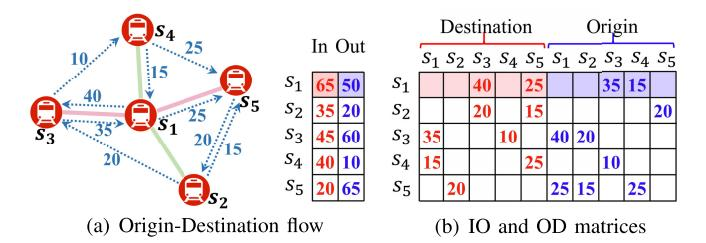
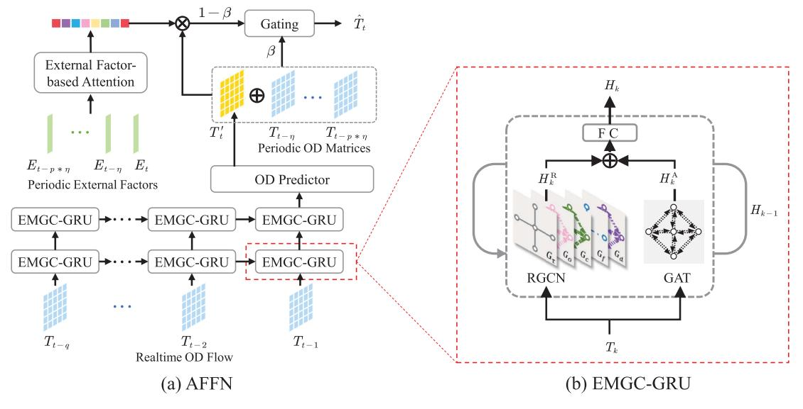
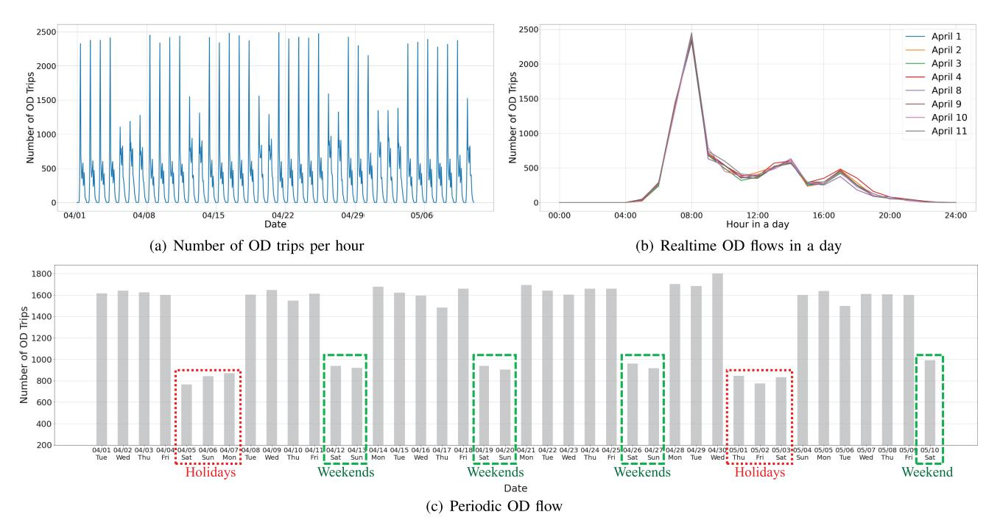
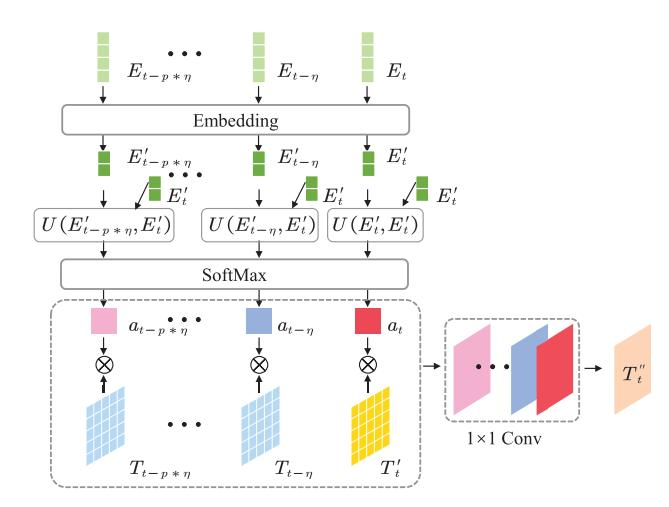
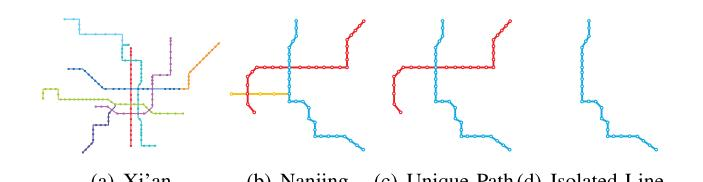
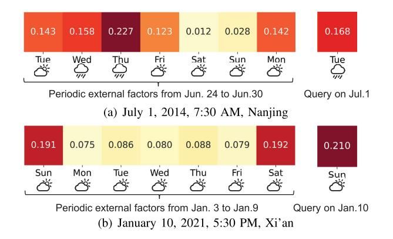
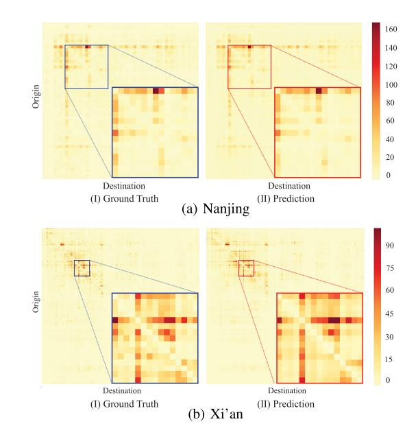
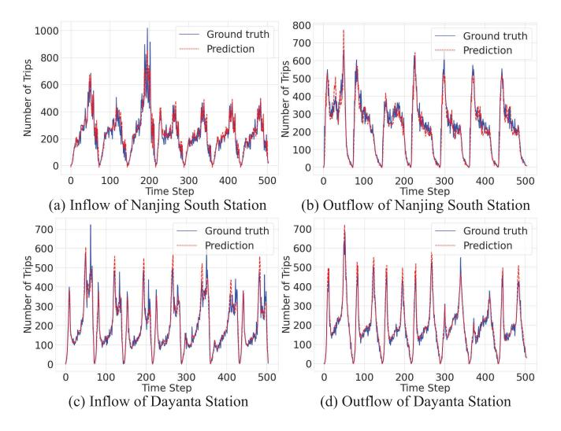
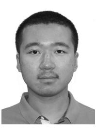
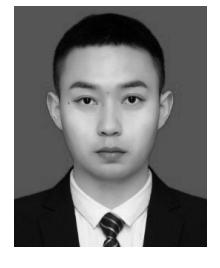

# Adaptive Feature Fusion Networks for Origin-Destination Passenger Flow Prediction in Metro Systems

Yuhang Xu [,](https://orcid.org/0000-0003-3253-2493) Yan Lyu, Guangwei Xiong, Shuyu Wang, Weiwei Wu [,](https://orcid.org/0000-0001-9172-6955) *Member, IEEE*, Helei Cui, *Member, IEEE*, and Junzhou Luo, *Member, IEEE*

*Abstract*— Accurately predicting Origin-Destination (OD) passenger flow can help metro service quality and efficiency. Existing works have focused on predicting incoming and outgoing flows for individual stations, while little attention was paid to OD prediction in metro systems. The challenges are that OD flows 1) have high temporal dynamics and complex spatial correlations, 2) are affected by external factors, and 3) have sparse and incomplete data slices. In this paper, we propose an Adaptive Feature Fusion Network (AFFN) to a) adaptively fuse spatial dependencies from multiple knowledge-based graphs and even hidden correlations between stations and b) accurately capture the periodic patterns of passenger flows based on the auto-learned impact from external factors. To deal with the incompleteness and sparsity of OD matrices, we extend AFFN to multi-task AFFN to predict the inflow and outflow of each station as a side-task to further improve OD prediction accuracy. We conducted extensive experiments on two real-world metro trip datasets collected in Nanjing and Xi'an, China. Evaluation results show that our AFFN and multi-task AFFN outperform the state-of-theart baseline techniques and AFFN variants in various accuracy metrics, demonstrating the effectiveness of AFFN and each of its key components in OD prediction.

*Index Terms*— Metro system, origin-destination flow prediction, adaptive feature fusion, multi-task.

#### I. INTRODUCTION

METRO is one of the most popular and efficient transportation in metropolitan cities. More than 50% commuters chose metro as their daily transportation in most cities. In Tokyo, New York, and Hong Kong, the proportion

Manuscript received 21 March 2022; revised 6 November 2022; accepted 12 January 2023. Date of publication 26 January 2023; date of current version 8 May 2023. This work was supported in part by the National Key Research and Development Program of China under Grant 2019YFB2102200; in part by the Natural Science Foundation of China under Grant 62232004, Grant 62102082, Grant 61632008, Grant 61902062, Grant 61672154, Grant 61972086, Grant 61932007, Grant 61806053, and Grant 61807008; in part by the Jiangsu Natural Science Foundation of China under Grant BK20210203, Grant BK20180356, and Grant BK20180369; in part by the Postgraduate Research and Practice Innovation Program of Jiangsu Province of China under Grant KYCX19\_0089; and in part by the Key Laboratory of Computer Network and Information Integration, Southeast University, Ministry of Education. The Associate Editor for this article was Q. Zhang. *(Yuhang Xu and Yan Lyu contributed equally to this work.) (Corresponding author: Weiwei Wu.)*

Yuhang Xu, Yan Lyu, Guangwei Xiong, Shuyu Wang, Weiwei Wu, and Junzhou Luo are with the School of Computer Science and Engineering, Southeast University, Nanjing 211189, China (e-mail: yuhang\_xu@ seu.edu.cn; lvyanly@seu.edu.cn; guangweixiong@seu.edu.cn; shywang@seu. edu.cn; weiweiwu@seu.edu.cn; jluo@seu.edu.cn).

Helei Cui is with the School of Computer Science, Northwestern Polytechnical University, Xi'an, Shaanxi 710129, China (e-mail: chl@nwpu.edu.cn). Digital Object Identifier 10.1109/TITS.2023.3239101

of metro commuters is even higher (80%-90%) [\[1\]. W](#page-13-0)ith rapid urbanization and increasing population, metro systems are facing high dynamic travel demands, and thus need to timely optimize service operations such as scheduling elastic timetables [\[2\], \[3\] an](#page-13-2)d planning flexible skip-stop lines [\[4\], \[5\], w](#page-13-4)hich requires accurate origin-destination (OD) passenger flow predictions.

Most existing works have focused on predicting Inflow and Outflow in metro stations (IO prediction) [\[6\], \[7\], \[8\], \[9\],](#page-13-8) [\[10\] in](#page-13-9) individual stations for metro management [\[11\],](#page-13-10) [\[12\]](#page-13-11) and emergency response [\[13\], \[14\]. O](#page-13-13)nly a few works predict the number of metro trips between each origin-destination station pair [\[15\], \[16\]. A](#page-13-15)lthough OD prediction has been well studied for taxi or ride-hailing systems, i.e., predicting the number of taxi trips from each origin region to the destination region [\[17\], \[18\], \[19\]. T](#page-14-2)hese techniques, however, cannot be applied directly to the metro as the stations are connected by sparse metro lines other than dense road networks where Euclidean distances can roughly approximate road distances. Therefore, we are motivated to study how to accurately predict citywide OD flow on sparse metro networks.

OD prediction for a citywide metro system is challenging with the following facts. 1) *High temporal dynamics and complex spatial correlations*. OD flow in metro systems is highly dynamic, especially during peak hours. The number of OD trips could change dramatically in a short time. In spatial dimension, two stations may have similar temporal OD flow patterns by locating at a short distance, having a similar urban function in the neighboring region, or by some other shared hidden features that cannot be explicitly depicted. It is essential to capture these complex spatial and temporal dependencies in a comprehensive and simultaneous manner. 2) *Periodic pattern and external factors*. OD flow has shown obvious periodic patterns in days and weeks. Meanwhile, it is also affected by external factors such as weather conditions and holidays that may impede periodicity. Existing literature models periodic patterns and external factors independently [\[17\], \[20\],](#page-14-3) [\[21\],](#page-14-4) but fails to capture the impact of external factors on periodic patterns. 3) *Incomplete and sparse OD matrices*. Metro trips are usually long and span many time steps, e.g., ≥ 30 minutes. We can only get the complete origin-destination information when passengers tap-out at their destination station but cannot know the destinations of the passengers yet on their journeys, so the realtime OD matrix lacks unfinished trips. Moreover, OD matrices are usually sparse. Very few origin-destination

This work is licensed under a Creative Commons Attribution 4.0 License. For more information, see https://creativecommons.org/licenses/by/4.0/

station pairs cover most of the OD trips, whereas most OD pairs have few trips between them. Such an incomplete and sparse input poses difficulties for accurate prediction.

To address these challenges, we proposed an Adaptive Feature Fusion Network (AFFN) to adaptively fuse the 1) spatial dependencies between stations with multiple aspects of knowledge and even hidden correlations and 2) periodic patterns with the auto-learned impact from external factors. More precisely, we propose Enhanced Multi-Graph Convolution GRU (EMGC-GRU) to encode spatial dependencies between stations using multiple knowledge-based graphs and an attention-based graph for hidden correlations. Graph convolutions are within each GRU layer to capture temporal dynamics. Periodic OD flow is then weighted by the attention weights learned from external factors and fused into realtime prediction by EMGC-GRU with a gating unit. To cope with the incompleteness and sparsity of OD matrices, we extend AFFN to multi-task AFFN to predict the inflow and outflow of each station as a sub-task. IO prediction is a much easier task since IO matrices are more dense and complete and strongly correlated with OD prediction. Consequently, sharing the IO prediction network helps improve OD prediction accuracy.

In summary, our contributions are:

- An Enhanced Multi-Graph Convolution Gated Recurrent Unit (EMGC-GRU) is designed to exhaustively capture spatial correlations predefined in multiple knowledgebased graphs and auto-learned hidden attention-based correlations between stations within GRUs.
- An external factor-based attention module is proposed to collaboratively integrate periodic data flow with attention weights learned from external factors to improve the prediction accuracy.
- An asymmetric multi-task Adaptive Feature Fusion Network (AFFN) to mutually predict OD flow and IO flow with a task-shared IO encoder and a task-shared external factor-based attention further improve OD prediction accuracy.
- Evaluations on two real-world datasets show that our AFFN and multi-task AFFN outperform the state-of-theart baseline techniques and AFFN variants in terms of the prediction errors, demonstrating the effectiveness of AFFN and each of its key components in predicting OD flow.

The rest of this paper is organized as follows: Section [II](#page-1-0) discusses related work, Section [III](#page-3-0) introduces key concepts and formally defines prediction problems. Section [IV](#page-4-0) proposes our adaptive feature fusion network, and we extend it to multi-task AFFN in Section [V.](#page-7-0) We present evaluation in Section [VI](#page-8-0) and conclude this paper in Section [VII.](#page-13-16)

#### II. RELATED WORK

In this section, we discuss related works and techniques in travel demand estimation and passenger flow prediction.

#### *A. Demand Estimation*

Passenger flow or travel demand is the aggregation of individual trips made during a reference period [\[22\], w](#page-14-5)hich is an essential task in public transportation planning and operation [\[23\], \[24\]. I](#page-14-7)n the early stage of demand estimation, the travel data is usually collected through survey campaigns, and therefore the data collection cost is relatively high. The primary objective of researchers is to accurately determine the demand for passengers for a particular mode of transport. As summarized in [\[25\],](#page-14-8) passenger demand estimation can be achieved through direct, dis-aggregated, and aggregate estimation approaches.

*1) Direct Estimation Approaches:* This type of approaches [\[26\],](#page-14-9) [\[27\] ta](#page-14-10)ke location-specific sample surveys to count the total number of passengers. A certain percentage of passengers are randomly selected to collect information on their trip. However, due to the massive amount of information that needs to be collected, these approaches can only be applied to estimate current demand and cannot be conducted in real time.

*2) Dis-Aggregated Estimation Approaches:* This kind of approaches are model-based approaches [\[28\], \[29\], \[30\], \[31\],](#page-14-14) [\[32\], \[33\] th](#page-14-16)at involve three main steps: 1) model specification, i.e., defining the functional form, 2) model calibration, i.e., tuning model parameters, and 3) model validation, i.e., verifying its statistical quality) [\[22\]. A](#page-14-5) good demand estimation model is the outcome of a trial and error process which can perfectly reproduce the original data. Depending on how the training data is acquired, dis-aggregated estimation approaches can be further categorized into *Reveal Preference* or RP-based approaches [\[28\], \[29\], \[30\], a](#page-14-13)nd *Stated Preference* or SP-based approaches [\[31\],](#page-14-14) [\[32\], \[33\]. D](#page-14-16)is-aggregated estimation methods can be used for current demand estimation or future demand simulation.

*3) Aggregated Estimation Approaches:* To improve the estimate of origin-destination passenger flows, aggregated estimation approaches are proposed, which use aggregate travel demand information contained in traffic counts to calibrate the initial estimate of the demand model [\[22\]. T](#page-14-5)hese methods aim to identify an origin-destination matrix that minimizes the gap between estimated and observed passenger flows on network links (i.e., traffic counts). Generally, these methods require an implicit or explicit estimation of the assignment matrix, which describes the O/D flow fractions using each link on the network [\[34\]. S](#page-14-17)ome researchers assume that the assignment matrix is independent of the passenger flow and can be provided directly by calculating the path cost [\[35\] o](#page-14-18)r learned as a joint task for O/D demand prediction [\[36\].](#page-14-19) However, other researchers argue that the assignment matrix and the traffic flow are mutually dependent, and a variety of congestion network methods [\[34\], \[37\], \[38\], \[39\], \[40\] ar](#page-14-23)e proposed. The aggregated estimation approaches make it possible to obtain efficient estimates of demand estimation with traffic counts. However, the resulting estimation is always affected by a nonnegligible error, mainly related to the inherent difficulty of obtaining the precise assignment matrix.

Generally, the more data the survey collects, the more accurate the passenger demand estimation will be. However, in most real cases, we cannot obtain a large amount of data effectively with a limited survey budget. Due to the limited data volume and model representational capability, demand estimation methods can hardly meet the requirement for accurate realtime prediction of passenger flows in large-scale metro systems.

#### *B. Passenger Flow Prediction*

With the generalization of the Automatic Fare Collection (AFC) systems and electronic sensors (such as loop detectors and video surveillance), passenger travel data can be obtained automatically and efficiently in real time [\[41\]. W](#page-14-24)ith the availability of vast amounts of historical and realtime travel data, researchers tend to pay more attention to discovering hidden patterns in the observed data and predicting future passenger demand. Predicting the OD flow in metro systems is a typical spatial-temporal prediction problem. In this section, we will discuss existing prediction techniques for modeling temporal and spatial-temporal dependencies in predicting traffic states or human movements, and how these techniques integrate periodic patterns, external factors, and other correlated tasks.

*1) Modeling Temporal Dependencies:* Statistical methods such as Historical Average (HA) and Autoregressive Integrated Moving Average (ARIMA) [\[42\], \[43\] h](#page-14-26)ave been widely used to predict simple time-series data with fewer dynamics and a few features such as sales or stocks data [\[44\]. M](#page-14-27)ore advanced machine learning techniques such as Support Vector Regression and Random Forest have been proven more effective in predicting more dynamic time series data with more features such as passenger flow [\[45\] o](#page-14-28)r road traffics [\[46\]. H](#page-14-29)owever, these shallow machine learning models require craft features from domain experts, which may not be sufficient to capture complex temporal patterns from raw data sequences [\[47\].](#page-14-30) Simple deep feed-forward neural networks [\[48\],](#page-14-31) [\[49\],](#page-14-32) [\[50\],](#page-14-33) [\[51\] h](#page-14-34)ave also been used to predict traffic flows on highways or metro lines. These methods may be able to encode high-dimensional traffic features, but fail to capture temporal dependencies of input data sequences. To model temporal dependencies, Recurrent Neural Networks, including GRU [\[52\] an](#page-14-35)d LSTM [\[53\] in](#page-14-36)troduce various gates, such as the forget gate and update gate, to explicitly determine how the past data affect the current prediction and thus perform the best among non-recurrent networks. However, despite temporal dependencies, OD flows also have spatial dependencies, such as locations of stations, connectivity, and similarity between stations, all of which have an impact on the future number of OD trips. Therefore, we then discuss techniques for modeling spatial-temporal dependencies.

*2) Modeling Spatial-Temporal Dependencies:* Convolutional Neural Networks (CNN) have been integrated into recurrent networks to capture spatial-temporal dependencies in sequential data such as crowd flows [\[54\], t](#page-14-37)ravel demands [\[55\]](#page-14-38) and road traffics [\[56\]. A](#page-14-39)n innovative network unit ConvL-STM [\[57\] in](#page-14-40)tegrates spatial convolution into temporal gating and has been used to predict origin-destination taxi trip demands [\[18\],](#page-14-1) [\[58\]. T](#page-14-41)hese CNN-based techniques focus on Euclidean spatial dependencies and perform convolution on neighboring regions, but fail to consider strongly correlated locations that are far away. Such non-Euclidean spatial dependencies are fairly common in the data flow from network-based systems such as metro or bike-sharing systems.

To model non-Euclidean correlations, Graph Convolutional Networks [\[59\] h](#page-14-42)ave been integrated into recurrent networks for spatial-temporal graph prediction tasks [\[60\],](#page-14-43) such as road traffic prediction [\[61\],](#page-14-44) travel demand predictions for bikes [\[62\] a](#page-14-45)nd taxis [\[63\],](#page-14-46) and passenger flow prediction in MRT [\[10\].](#page-13-9) Non-Euclidean spatial correlations, such as road network topology [\[61\] a](#page-14-44)nd metro line connectivity [\[10\]](#page-13-9) between locations are represented by graphs. Even non-spatial correlations are also encoded as the input graphs, such as function similarity [\[63\] a](#page-14-46)nd trip interactions [\[62\].](#page-14-45) In these graphs, information on each node is updated by aggregating neighboring nodes. As location correlations could be multiaspect, multiple knowledge-based graphs have been integrated to have a more comprehensive representation. For example, [\[62\] c](#page-14-45)ombines distance graph, interaction graph, and correlation graph for bike-sharing systems; [\[63\] i](#page-14-46)ntegrates neighborhood graph, function similarity graph, and transportation connectivity graph for ride-hailing systems; and [\[64\]](#page-14-47) builds hyper-graphs to encode high-order topology relationships between metro stations and pedestrian travel patterns of multiple time steps. These methods integrate multiple graphs either by summing up the adjacency matrix of each graph with weights [\[62\] o](#page-14-45)r by doing convolution on each graph independently and then summing the output encoded graph features [\[63\],](#page-14-46) [\[64\]. A](#page-14-47) more advanced way is using Relation Graph Convolution Network (RGCN) [\[65\], w](#page-15-0)hich aggregates weights of multiple graphs at each convolution layer and adds a self-loop to maintain the aggregated node's own information [\[16\]. T](#page-13-15)hese techniques artificially build multiple knowledge-based graphs to learn the local spatial-temporal features of input data flows, except [\[16\] w](#page-13-15)hich adopts another fully-connected network to capture global spatial-temporal dependencies. However, there could be hidden correlations between metro stations that knowledge-based graphs cannot explicitly represent, so we adopt graph attention network (GAT) [\[66\] to](#page-15-1) learn the correlations between stations automatically. The features auto-learned by GAT are then integrated with that of multi-knowledge graph-based RGCN to improve the comprehensiveness of feature representation.

*3) Integrating Periodic and External Factors:* Human flows in a city have shown periodic patterns in days or weeks. Existing works have utilized such periodic patterns to improve prediction accuracy. They usually extract an extra periodic data flow, such as the number of passengers at the same time every day or week, and feed it into an independent prediction network such as naive convolution network [\[20\], d](#page-14-3)eep residual network [\[17\],](#page-14-0) [\[21\], a](#page-14-4)nd graph convolution network with temporal attention [\[61\]. T](#page-14-44)hose periodic features are then fused with the realtime spatial-temporal features learned by the same network [\[17\], \[20\], \[21\], \[61\]. M](#page-14-44)odeling periodic and realtime data flows with the same network may not be effective as the two types of data flows have different patterns. For example, periodic data flow fluctuates from day to day with random noises, while the realtime data flow usually has a clear increasing or decreasing trend within a short time period.

External factors such as weather conditions [\[67\], a](#page-15-2)ir quality [\[68\], d](#page-15-3)ay of the week [\[55\], h](#page-14-38)olidays [\[69\] a](#page-15-4)nd events [\[69\]](#page-15-4)

TABLE I

| KEY MATHEMATICAL NOTATIONS |  |
|----------------------------|--|
|----------------------------|--|

| Notation                             | Description                                    |
|--------------------------------------|------------------------------------------------|
| i, j                                 | Index of station.                              |
| $\boldsymbol{n}$                     | Number of total stations.                      |
| t                                    | Index of time step.                            |
| $S_t$                                | IO matrix at time step $t$ .                   |
| $T_t$                                | OD matrix at time step $t$ .                   |
| $E_t$                                | External factors at time step $t$ .            |
| q                                    | Number of time steps in a realtime OD/IO flow. |
| $\boldsymbol{p}$                     | Number of days in a periodic OD/IO sequence.   |
| $\mathcal{S} = \{S_1, \cdots, S_t\}$ | IO flow from time step 1 to $t$ .              |
| $\mathcal{T} = \{T_1, \cdots, T_t\}$ | OD flow from time step 1 to $t$ .              |

also have an impact on human flows. A naive way is to concatenate those factors directly with input data flows [\[8\], \[18\],](#page-14-1) [\[70\],](#page-15-5) [\[71\] f](#page-15-6)or further spatial-temporal representation learning, which would introduce more noises in modeling spatial or temporal dependencies. Another common way is to concatenate the embedded factors with the encoded spatial-temporal features at the last step to make a prediction [\[9\], \[17\],](#page-14-0) [\[21\], \[55\],](#page-14-38) [\[68\]. T](#page-15-3)his way does not explicitly model the implicit correlations between historical data flow and its corresponding external factors.

Unlike existing methods that consider periodic and external factors separately, we integrate external factors into periodic data flow with an attention model, as we have observed that 1) the passenger flow to be predicted is usually close to historical observations at the same time in the past days with small fluctuations if the passenger flow has a clear periodic pattern, and 2) external factors such as weekdays, holidays, and weather conditions affect the fluctuations of periodic passenger flow.

*4) Integrating Other Tasks:* Multi-task learning has been proven effective in improving the performance of all tasks as long as the tasks are strongly correlated [\[72\]. T](#page-15-7)here have been works that apply multi-task learning to mutually predict the inflow and outflow of passengers [\[73\], \[74\], t](#page-15-9)ravel demands of multiple transportation modes [\[75\], t](#page-15-10)axi demands of multiple city zones [\[76\],](#page-15-11) as well as bus arrivals and the passenger getting on and off flows [\[77\]. T](#page-15-12)o predict the citywide OD flow, inflow and outflow predictions have been used as side tasks in [\[17\] a](#page-14-0)nd [\[78\] f](#page-15-13)or taxi systems, as the inflow is actually a sum of the OD flows to all destinations, and the outflow equals the sum of OD flows from all origins. These two multi-task networks are symmetric in that both the OD prediction task and IO prediction task share the same input and network architecture. Instead, we adopt an asymmetric multitask architecture, considering different prediction difficulties and a focused objective—OD prediction. We use a shared encoder that takes IO flow as input and learns supplementary features across the two tasks to support OD flow prediction.

#### III. PROBLEM FORMULATION

This section presents the key concepts and formally defines Origin-Destination flow prediction problems. Essential mathematical notations used in this paper are listed in Table [I.](#page-3-1)

Fig. 1. Example of OD flow, IO matrix, and OD matrix. (a) illustrates an example of origin-destination flow between 5 metro stations at time step *t*. Blue dotted arrows indicate the number of OD trips starting at their origins and arriving at their destinations within one time step. (b) shows the corresponding IO matrix (left) and OD matrix (right). In OD matrix, the first 5 columns record passenger counts traveling to each of the 5 destination stations (in red). The last 5 columns record passenger counts traveling from each of the 5 origin stations (in blue). IO matrix sums up the first 5 columns of OD matrix along each row as the inflow in its first column, and sums up the last 5 columns of OD matrix along each row as the outflow in its second column.

#### *A. Key Concepts*

*1) Trip:* A trip records a passenger starts at an origin metro station *o* within *t o* -th time step and arrives at a destination station *d* within *t d* -th time step. We denote a trip by a quadruple ⟨*o*, *d*, *t o* , *t d* ⟩.

*2) IO Flow:* We count the number of passengers entering a metro station over time as *Inflow*, and the number of passengers exiting the station over time as *Outflow*. Let *S* + *i*,*t* and *S* − *i*,*t* denote passenger counts entering and exiting station *i* within time step *t*, respectively. Namely, *S* + *i*,*t* = |{⟨*o*, *d*, *t o* , *t d* ⟩ | *o* = *i*, *t o* = *t*}|, and *S* − *i*,*t* = |{⟨*o*, *d*, *t o* , *t d* ⟩ | *d* = *i*, *t d* = *t*}|. We use an IO matrix, denoted by *St* , to record all the In & Out passenger counts in time step *t* for all the stations. As demonstrated in Fig. [1\(b\),](#page-3-2) each row of the IO matrix corresponds to a station. The first column records the inflow *S* + *i*,*t* and the second column records the outflow *S* − *i*,*t* within time step *t*. IO Flow, denoted by S, is a sequence of IO matrices over time, i.e., S = {*S*1, *S*2, · · · , *St*}.

*3) OD Flow:* We count the number of passengers traveling from *origin* (O) stations to *destination* (D) stations over time as *OD Flow*. Specifically, we use two matrices, [*T t i*,*d* ] to represent passenger counts departing at station *i* at time step *t* to destination station *d*, 1 ≤ *i*, *d* ≤ *n*, [*T t i*,*o* ] to represent passenger counts from origin station *o* and arrive at station *i* at time step *t*, 1 ≤ *o* ≤ *n*. Namely, *T t i*,*d* = |{⟨*i*, *d*, *t o* , *t d* ⟩ | *t o* = *t*}| and *T t i*,*o* = |{⟨*o*,*i*, *t o* , *t d* ⟩ | *t d* = *t*}|. As demonstrated in Fig. [1\(b\),](#page-3-2) we concatenate the two matrices to formulate an OD matrix, denoted by *Tt* = ([*T t i*,*d* ], [*T t i*,*o* ]), to capture the departures and arrivals of the OD trips within one time step [\[17\]. O](#page-14-0)D Flow, denoted by T , is then represented by a sequence of OD matrices over time, i.e., T = {*T*1, *T*2, · · · , *Tt*}.

*4) External Factors:* Environmental factors, including weather conditions and air quality, affect commuters' choices of transportation modes and thus affect both IO flow and OD flow of metro systems [\[45\], \[61\],](#page-14-44) [\[68\]. A](#page-15-3) pouring rain may lead commuters to change or cancel their travel plans, thus affecting the distribution of metro ridership [\[79\]. M](#page-15-14)eanwhile, cold weather and heavily polluted air impede passengers' occasional travels [\[68\]. I](#page-15-3)n addition, both IO flow and OD flow show different spatial and temporal patterns for holidays, weekends, and working days [\[6\], \[80\]. T](#page-15-15)herefore, we consider the four external factors — weather conditions, air quality, holidays, and days of the week — in predicting OD flows.

#### *B. Problem Definition*

Given the historical OD flow, IO flow, and external factors, we aim to predict the OD matrix in the next time step. Formally,

*Problem 1 (OD Prediction): Given historical OD flow* T*t*−1 = {*T*1, *T*2, · · · , *Tt*−1}*, and external factors* E*t*−1 = {*E*1, *E*2, · · · , *Et*−1}*, the objective is to learn a prediction function fOD to accurately predict the OD matrix, denoted by T*ˆ *t , at the next time step t, i.e.,*

$$
\hat{T}_t = f_{OD}(\mathcal{T}_{t-1}, \mathcal{E}_{t-1}).\tag{1}
$$

Since IO flow equals the sum of OD flows from all destination stations (inflow) and all origin stations (outflow), the two flows are highly correlated. Moreover, IO prediction is a relatively easy task with less sparse input data than OD prediction [\[6\], \[55\],](#page-14-38) [\[68\]. T](#page-15-3)herefore, we hypothesize that a neural network that can accurately predict IO flow can also help with OD prediction. We formulate IO prediction as a side-task for OD prediction, i.e.,

*Problem 2 (Mutual Prediction): Given OD flow* T*t*−1 = {*T*1, *T*2, · · · , *Tt*−1}*, IO flow* S*t*−1 = {*S*1, *S*2, · · · , *St*−1}*, and external factors* E*t*−1 = {*E*1, *E*2, · · · , *Et*−1}*, the objective is to learn a prediction function f to mutually predict both OD flow, denoted by T*ˆ *t , and IO flow, denoted by S*ˆ *t , at the next time step t, i.e.,*

$$
[\hat{T}_t, \hat{S}_t] = f(\mathcal{T}_{t-1}, \mathcal{S}_{t-1}, \mathcal{E}_{t-1}).
$$
 (2)

## IV. ADAPTIVE FEATURE FUSION NETWORK FOR OD PREDICTION

In this section, we propose an Adaptive Feature Fusion Network (AFFN) (see Fig. [2\(a\)\)](#page-5-0) to predict Origin-Destination passenger flow between metro stations. AFFN firstly takes a realtime OD flow from time step *t* − *q* to *t* − 1, i.e., {*Tt*−*q* , *Tt*−*q*+1, · · · , *Tt*−1}, as input and predicts an OD matrix estimation *T* ′ *t* at time step *t* with enhanced multi-graph convolution gated recurrent units (Section [IV-A\)](#page-4-1). Then a sequence of periodic OD matrices at the same time step *t* in the past days are integrated with external factors such as weather conditions and day of the week to calibrate the estimation *T* ′ *t* with an attention-based module (Section [IV-B\)](#page-6-0). Finally, a gating unit is used to output the final prediction *T*ˆ *t* . In the following, we will describe the details of predicting realtime OD flow and integrating periodic and external factors.

#### *A. OD Prediction With Realtime Data Flow*

We first introduce our basic model to predict the OD matrix at time step *t* only with the observed OD flow from time step *t*−*q* to *t*−1. Given a sequence of past OD matrices, predicting the OD matrix is a typical spatial-temporal prediction problem, in which each entry of the OD matrix (namely, passenger count from a specific origin station to a specific destination station) does not only depends on past passenger counts but also neighboring stations. While we can use sequence models such as GRU [\[52\] to](#page-14-35) capture temporal dependencies, we still need to model the complex spatial correlations between stations.

An intuitive way to represent the correlation between metro stations is using a graph, in which each node represents a station, and each edge represents a specific correlation between stations. The correlation could be multi-aspect in terms of different transportation and urban domain knowledge. For example, two stations could be closely correlated if they have similar historical OD flow patterns or locate in regions with similar functionality. This motivates us to build multiple knowledge-based graphs and adopt a Relational Graph Convolution Network [\[65\] \(](#page-15-0)RGCN) to integrate the multiple correlations between stations. Furthermore, there could be hidden correlations that can not be captured by domain knowledge directly, so we adopt another Graph Attention Network [\[66\] \(](#page-15-1)GAT) to capture hidden correlations between stations. The two knowledge graph-based and attention graphbased convolutions are integrated into two GRUs to capture temporal dependencies of the input realtime OD flow, respectively. Then, the output hidden states of the two GRUs are concatenated by a fully connected layer to produce the final hidden state. We call such a unit Enhanced Multi-Graph Convolution GRU (EMGC-GRU), and two layers of EMGC-GRU are stacked as the encoder for processing the realtime OD flow. We adopt another graph convolution layer as a decoder to output the OD matrix estimation at time step *t*. Next, we define five knowledge graphs and introduce spatial-temporal representation learning with multi-knowledge graphs. And then, the attention-based graph and the prediction network architecture are presented.

*1) Spatial-Temporal Representation Learning With Multiple Knowledge-Based Graphs:* We define five knowledge-based graphs to represent different kinds of correlations between metro stations. The nodes in each of the five graphs represent metro stations, and the edges represent topology connectivity, OD connectivity, region functional similarity, inflow similarity, and outflow similarity, respectively.

Topology Graph *G*τ models the physical topology of the metro system, in which each edge represents whether the two stations (i.e., nodes) are adjacent and directly connected by a metro line. We define the weight matrix of edges as (0,1)- Matrix, in which the value is set to 1 if there is an edge between two nodes and vice versa.

OD Graph *Gc* takes the accumulated number of passengers traveled from a node (i.e., a station) to another node in a period as the weight on edge. A large weight from station *si* to station *sj* shows a close correlation between the two stations and indicates that a large number of passengers could also travel from station *sj* to *si* in the future.

Functional Similarity Graph *G f* models the similarities between stations in terms of their region functions (e.g., commercial, residential, etc.). Two stations located in regions with similar city functions may have similar temporal patterns in passenger flow. We represent the region function of a station by a vector of POI counts in each category[1](#page-4-2) within a circle

1We obtained POI data from [AutoNavi Map Platform](https://lbs.amap.com/) that has 14 categories, including food service, shopping, residential, etc.

Fig. 2. Adaptive Feature Fusion Network (AFFN) Architecture for OD Prediction. (a) AFFN takes the realtime OD flow {*Tt*−*q* , *Tt*−*q*+1, · · · , *Tt*−1} as input, encodes it with multiple knowledge-based graphs and attention-based graph within EMGC-GRU, and outputs an estimation *T* ′ *t* at time step *t* with a decoder called OD Predictor. *T* ′ *t* is then concatenated with periodic OD matrices {*Tt*−*p*∗η, · · · , *Tt*−2η, *Tt*−η} and weighted by attentions learned from corresponding external factors {*Et*−*p*∗η, · · · , *Et*−η, *Et*}. A gating unit is used to output the final prediction *T*ˆ *t* . (b) Enhanced Multi-Graph Convolution GRU (EMGC-GRU) integrates the five knowledge-based graphs with a relation graph convolution (RGCN) and graph attention module (GAT) within two GRU units, respectively. The two hidden states *H* R *k* and *H* A *k* at time step *k*, (*t* −*q* ≤ *k* ≤ *t* −1), are fused by a fully connected (FC) network and output an enhanced representation *Hk* .

with a radius of 2 km [\[81\]. T](#page-15-16)he function similarity between stations *i* and *j*, denoted by *W f* (*i*, *j*), is calculated by cosine similarity [\[82\] o](#page-15-17)f the two POI count vectors *P*(*i*) and *P*(*j*). Namely, *W f* (*i*, *j*) = *P*(*i*)·*P*(*j*)/||*P*(*i*)||||*P*(*j*)||. We calculate function similarity for each pair of stations as the weight on each edge of the graph *G f* .

Inflow Similarity Graph *Go* and Outflow Similarity Graph *Gd* both model the correlations between stations in terms of inflow similarity and outflow similarity, respectively. Given two time sequences of inflow (or outflow) of any two stations, the similarity is measured by Dynamic Time Warping (DTW) [\[83\]. T](#page-15-18)he more similar the two sequences, the smaller value of DTW. Specifically, for inflow similarity (*Go*), we quantify the weights on edges by taking *Wo*(*i*, *j*) = *exp* − DTW *S*¯+(*i*), *S*¯+(*j*) , in which, *S*¯+(*i*) and *S*¯+(*j*) denote the average inflow of each time step per day in station *i* and *j* separately, DTW calculates dynamic time warping of the two sequences. We map the value of DTW to a range (0,1] with an exponential function to have a larger weight (→ 1) for two similar inflows and a smaller weight (→ 0) for two different inflows. The outflow similarity *Gd* is calculated in the same way.

Integrating Multiple Graphs with RGCN. While graph convolution networks (GCNs) only learn feature representations for a single graph, we adopt Relational Graph Convolution Network (RGCN) [\[65\] t](#page-15-0)o integrate the multiple knowledge-based graphs to learn a unified representation. In RGCN, a node aggregates over neighboring nodes in each graph first, then sums up the aggregated node feature representations over multiple graphs. Unlike the classical RGCN that aggregates neighboring nodes based on a problem-specific normalization constant, we further consider different weights on edges in multiple graphs to help the network converge more quickly [\[16\]. I](#page-13-15)n each convolution layer *l*, we apply weight[2](#page-5-1) *Wg*(*i*, *j*) between station *i* and *j* of knowledge-based graph *g* to the graph convolution operation on each station *i* and sum up over all the knowledge-based graphs *g* ∈ G, namely,

$$
h_i^{l+1} = \sigma \bigg( \sum_{g \in \mathcal{G}} \sum_{j \in \mathcal{N}_g(i)} W_g(i,j) \odot U_g^l h_j^l + U_0^l h_i^l \bigg), \tag{3}
$$

where *h l i* is the hidden feature representation of station *i* in layer *l*, σ (·) denotes sigmoid activation function, G is set of the five knowledge-based graphs, N*g*(*i*) is set of neighboring stations of station *i* in graph *g*, and *U l g* and *U l* 0 are trainable parameters of graph *g* and layer *l* in graph convolution.

To integrate the station correlations with temporal dependencies of OD flows, we further iteratively update the hidden state representation *h l i* of station *i* with Gated Recurrent Units (GRUs). In time step *k*, *t* − *q* ≤ *k* ≤ *t* − 1, let *H* R *k* ∈ R *n*×*d* denote the hidden feature representations of all the *n* stations with *d* features in the last layer of RGCN (denoted by R), *Rk* , *Zk* , *H*˜ *k* denote the reset gate, update gate and candidate activation in GRU, respectively. Hidden feature representation *H* R *k* is updated by

$$
R_k = \sigma (U_r T_k + U_{hr} H_{k-1} + b_r),
$$
  
\n
$$
Z_k = \sigma (U_z T_k + U_{hz} H_{k-1} + b_z),
$$
  
\n
$$
\tilde{H}_k = \tanh(U_h T_k + R_k \odot H_{k-1} + b_h),
$$
  
\n
$$
H_k^R = Z_k \odot H_{k-1} + (1 - Z_k) \odot \tilde{H}_k,
$$
\n(4)

where *Tk* is the input OD matrix at time step *k*, *Ur* , *Uz* , *Uh*, *Uhr*, and *Uhz* are trainable GRU parameters between reset gate *Rk* and input *Tk* . *br* , *bz* and *bh* are the bias parameters. *Hk*−1 is

2All weight matrices are normalized by row to avoid convolution failure.

Fig. 3. The number of OD trips per hour between two popular metro stations from April 1 to May 10, 2014, in Nanjing. (a) visualizes the number of trips for all 40 days, and we can see obvious periodic patterns in days and weeks. (b) plots the number of trips in each hour of eight days, and we can see that the day-to-day OD flows are almost repetitive. (c) plots the number of trips in every morning hour (8:00 - 9:00), we can see the periodic data flow fluctuates randomly, and external factors *Weekends* (green) and *Holidays* (red), have a significant impact on the number of trips.

an enhanced hidden feature representation calculated by Eq. [5](#page-6-1) at previous time step *k* − 1.

*2) Spatial-Temporal Representation Learning With Graph Attention Network:* The five predefined knowledge-based graphs may not be enough to capture all possible correlations between stations, and there could be hidden correlations that cannot be explicitly represented. Therefore, we adopt a graph attention network (GAT) [\[66\] to](#page-15-1) learn the hidden correlations automatically. Unlike RGCN, GAT automatically learns different importance on graph edges and does not need a predefined graph structure. We adopt the most general network structure [\[66\] th](#page-15-1)at assumes there are edges between every two nodes (i.e., stations) and automatically learns edge weights to capture hidden dependencies. Similar to RGCN-GRU that combines RGCN with GRU to capture spatial-temporal dependencies, we iteratively update the hidden feature representation learned from GAT using GRUs in each time step. GAT-GRU finally outputs hidden features *H* A *k* at time step *k*. And then, the output features are concatenated with the hidden features from RGCN-GRU.

*3) Integrate Knowledge-Based and Attention-Based Feature Learning:* We concatenate the two hidden feature representations *H* R *k* learned from RGCN-GRU and *H* A *k* learned from GAT-GRU with a fully-connected layer, denoted by *FC*(·), as the final hidden state *Hk* at time step *k*, i.e.,

$$
H_k = FC(H_k^R \oplus H_k^A), \tag{5}
$$

where ⊕ denotes the concatenation operation.

Fig. [2 \(b\)](#page-5-0) demonstrates how the features from knowledgebased graph convolution and features from attention-based graph convolution are fused and updated within each gated recurrent unit. Since GAT-GRU improves the comprehensiveness of representation by RGCN-GRU, we call the whole unit Enhanced Multi-Graph Convolution GRU (EMGC-GRU).

*4) Prediction Network Architecture:* We construct two layers of EMGC-GRU units as the encoder (see Fig. [2\(a\),](#page-5-0) bottom) and employ a GCN as the decoder to output the initial prediction *T* ′ *t* (see OD Predictor in Fig. [2\(a\)\)](#page-5-0). The first layer sequentially takes OD matrix *Tk* at each time step *k*, *t* − *q* ≤ *k* ≤ *t* − 1, as input, and its output hidden state is then fed into the second layer for a higher level feature learning. We stacked only two layers of EMGC-GRU to avoid over-smoothing and keep a low computational complexity. The decoder GCN decodes the hidden feature *Ht*−1 of time step *t* − 1 into an initial prediction *T* ′ *t* , which will be further calibrated with periodic OD flow and external factors in the next section.

#### *B. Integrating Periodic OD Flow and External Factors*

OD flows usually have very obvious periodic patterns, such as morning or evening peak hours(see Fig. [3\(a\)\)](#page-6-2). Fig. [3\(b\)](#page-6-2) further plots the number of OD trips per hour over eight days, and we can see OD flows are almost repetitive each day. Such a periodic pattern can help improve prediction accuracy. Existing works [\[17\], \[20\], \[21\], \[61\] u](#page-14-44)sually explicitly extract periodic data flows such as OD matrices at the same time of past days and directly feed them into a sub-network to predict the OD matrix of the same time in the next day. However, the network for processing realtime OD flow may not work well for periodic data as it may not have clear monotonic trends or patterns. For example, we can see the number of OD trips fluctuates a lot randomly every morning in Fig. [3\(c\).](#page-6-2)

Fig. 4. External Factor-based Attention Module. Periodic external factors *Et*−*p*∗η, · · · , *Et*−η, *Et* are firstly embedded for a more dense representation, then similarities between each external factor in past *p* days to the current external factor are calculated by a fully connected layer *U*(·, ·). The SoftMaxnormalized similarities are then applied to corresponding OD matrix in the same day. Finally, the weighted periodic OD matrices are aggregated with a 1 × 1 convolution layer into a single OD matrix prediction *T* ′′ *t* .

Such irregular fluctuations impede the prediction accuracy. Fortunately, we also observe that those fluctuations are usually affected by external factors, such as weekends, holidays, and weather conditions. For example, in Fig. [3\(c\),](#page-6-2) we found that the numbers of OD trips at the same time are close to each other on weekends and are slightly smaller on holidays. This motivates us to integrate external factors with periodic OD matrices to improve the prediction accuracy.

*1) External Factor-Based Attention Module:* We adopt an attention mechanism to model how external factors affect the number of OD trips in different days. Specifically, to calibrate the previous OD matrix estimation *T* ′ *t* at time step *t*, we reference periodic OD matrices at the same time step in past *p* days, i.e., *Tt*−*p*∗η, · · · , *Tt*−2η, *Tt*−η. Note that in the days with similar external factors, the OD flows could be similar to each other. Therefore, we calculate the attention of external factors *Et* at time step *t* towards the external factors at the same time step in the past days,[3](#page-7-1) denoted by *Et*−*p*∗η, · · · , *Et*−2η, *Et*−η. The attention weights are then applied to each periodic OD matrix, and the weighted OD matrices over *p* days are aggregated as the calibrated prediction *T* ′′ *t* .

Fig. [4](#page-7-2) demonstrates a more detailed computation flow. Periodic external factors are first fed into a fully connected layer to embed high-dimensional raw features in more dense vector representations. Then we use another fully connected layer, denoted by *U*(·, ·), to learn the attention weights, denoted by *at* ′ , of external factors at time step *t* to those in each of the past *p* days, *t* ′ ∈ {*t* − *p*∗η, · · · , *t* −2η, *t* −η, *t*}, and normalize attention weights with SoftMax function, namely,

$$
a_{t'} = \frac{\exp\left(U\left(U_e E_t \oplus U_e E_{t'}\right)\right)}{\sum_{t'' \in \{t-p*n, \dots, t-\eta, t\}} \exp\left(U\left(U_e E_t \oplus U_e E_{t''}\right)\right)},\quad (6)
$$

3We assume that external factors do not change within one time step (15 minutes in our experiments), and assign *Et* = *Et*−1.

where *Ue* are shared embedding parameters, mapping raw external factor features to denser vector representations. The attention weights are applied to each of the periodic OD matrices *Tt*−*p*∗η, · · · , *Tt*−2η, *Tt*−η and *T* ′ *t* . Finally, the weighted periodic OD matrices are aggregated by 1 × 1 convolution to form the calibrated prediction *T* ′′ *t* .

*2) Gating With Calibrated Predictions:* Calibrating with periodic flows may improve the prediction accuracy for passenger flows with obvious periodic patterns. However, predictions directly using realtime data flows could be more accurate for data with weak periodic patterns. Therefore, we apply a gating unit to automatically tune how much the prediction relies on periodic information (*T* ′′ *t* ) or realtime OD flow (*T* ′ *t* ). The final prediction *T*ˆ *t* takes a trade-off between two kinds of predictions with a trainable gate weight matrix β, i.e.,

$$
\hat{T}_t = \beta * T'_t + (1 - \beta) * T''_t.
$$
 (7)

#### *C. Loss Function*

We define a loss function to minimize the error between the predicted OD matrix *T*ˆ *t* at time step *t* and the ground truth *Tt* . Metro operators usually need to pay more attention to the OD pairs with high traffic volume. To train a network focusing on those OD pairs, we add a mask, denoted by 2od, with a threshold of θod to the loss function, i.e.,

$$
arg \min_{\phi} \mathcal{L} = \sum_{i=1}^{n} \sum_{j=1}^{2n} \Theta_{\text{od}}(i, j) \cdot |T_t(i, j) - \hat{T}_t(i, j)|, \quad (8)
$$

where φ is a set of all the trainable parameters, 2od is a 0-1 matrix that masks on each entry in *Tt* that is smaller than threshold θod. When *j* ∈ [1, *n*], *i* and *j* denote the indices of origin and destination stations in the OD matrix, respectively, and when *j* ∈ [*n*+1, 2*n*], *j* −*n* and *i* denote the indices of the origin and destination stations, respectively (see Fig. [1\(b\)\)](#page-3-2).

#### V. MULTI-TASK NETWORK FOR MUTUAL PREDICTION

After integrating the periodic pattern and external factors with realtime OD prediction, it is still challenging to achieve a high prediction accuracy for two main reasons: 1) Sparse OD matrix. The OD matrix of the Xi'an metro system with a total of 160 stations only has a density of 13.27%, namely, only 13.27% of OD pairs have non-zero passenger flow. 2) Incomplete data. Passengers usually have long trips that may span multiple time steps. We can only get the full origin-destination information when passengers swipe cards at their destination station, but we cannot know the destinations of the passengers yet on their journey. Hence, the realtime OD matrix lacks unfinished trips. In contrast, IO flow is much more dense and complete and has been proven easy to predict with relatively high accuracy [\[17\]. G](#page-14-0)iven that IO matrix is actually a summation of OD matrix over each origin station and destination station, respectively, (see Fig. [1\(b\)\)](#page-3-2), we hypothesize that a network that can accurately predict IO flow can also help OD prediction. Therefore, we propose a multi-task network to predict IO and OD flow mutually.

Fig. 5. Multi-Task Adaptive Feature Fusion Network. The network consists of two AFFNs for IO prediction (Left) and OD prediction (Right) tasks. The task-shared Co-IO Encoder takes the realtime IO flow as input but outputs task-shared features for both IO Predictor and OD Predictor. The two tasks also share the attention weights learned from the same external factors.

#### *A. Multi-Task Network Architecture*

Fig. [5](#page-8-1) depicts the architecture of our multi-task network. The network consists of two Adaptive Feature Fusion networks (AFFNs) for IO prediction (Left) and OD prediction (Right) tasks, respectively. Similar to single task OD prediction in Fig. [2\(a\),](#page-5-0) each AFFN component firstly takes realtime IO (or OD) matrix sequence as input and learns a task-independent feature representation with our Enhanced multi-graph convolution GRU layers (EMGC-GRU), denoted by IO Encoder or OD Encoder. IO Predictor (or OD Predictor) with a single GCN layer decodes the representations to a prediction estimation *S* ′ *t* or *T* ′ *t* . Then the prediction estimation is calibrated with a sequence of periodic IO (or OD) matrices and external factors by an attention-based model and a gating unit. The network finally outputs the IO prediction *S*ˆ *t* and OD prediction *T*ˆ *t* .

To improve the performance of the OD prediction task, we build another Co-IO Encoder module consisting of EMGC-GRUs. It also takes the realtime IO flow as input, but outputs task-shared features for both IO Predictor and OD Predictor, so that the relevant and denser inflow and outflow can be fused with OD matrices to improve the performance of OD Predictor. The two tasks also share the external factor-based attention component. Namely, the attention weights are updated based on the two prediction tasks to capture the periodicity shared by both IO and OD flows.

### *B. Loss Function*

We first define two task-independent loss functions to minimize the error between predicted IO matrix *S*ˆ *t* and its ground truth *St* and the error between predicted OD matrix *T*ˆ *t* and its ground truth *Tt* , respectively, i.e.,

$$
\mathcal{L}_1 = \sum_{i=1}^n \sum_{j=1}^2 \Theta_{\text{io}}(i, j) \cdot |S_t(i, j) - \hat{S}_t(i, j)|,
$$
  
$$
\mathcal{L}_2 = \sum_{i=1}^n \sum_{j=1}^{2n} \Theta_{\text{od}}(i, j) \cdot |T_t(i, j) - \hat{T}_t(i, j)|,
$$
 (9)

Fig. 6. The structures of metro systems in our experiments. (a) and (b) are full system in Xi'an and Nanjing, respectively, (c) and (d) are simple metro systems extracted from Nanjing.

where 2io and 2od are 0-1 matrices that mask on each entry in *St* and *Tt* that are smaller than thresholds θio and θod, respectively.

Note that IO flow is actually a summation of OD flows over origin and destination stations. Maintaining this correlation in mutual prediction would be beneficial for improving prediction accuracy. To achieve this, we define cross-task loss functions to minimize the error between the summation of the predicted OD matrix over each destination P*n j*=1 *T*ˆ *t*(*i*, *j*) and the actual inflow *St*(*i*, 1) for each origin *i*, as well as the error between the summation of the predicted OD matrix over each origin P2*n j*=*n*+1 *T*ˆ *t*(*i*, *j*) and the actual outflow *St*(*i*, 2) for each destination *i*, i.e.,

$$
\mathcal{L}_3 = \sum_{i=1}^n |S_t(i, 1) - \sum_{j=1}^n \hat{T}_t(i, j)|,
$$
  
$$
\mathcal{L}_4 = \sum_{i=1}^n |S_t(i, 2) - \sum_{j=n+1}^{2n} \hat{T}_t(i, j)|,
$$
 (10)

The final loss function of our multi-task AFFN is to minimize the weighted sum of all the loss items, i.e.,

$$
\arg\min_{\phi} \mathcal{L} = \lambda_1 * \mathcal{L}_1 + \lambda_2 * \mathcal{L}_2 + \lambda_3 * (\mathcal{L}_3 + \mathcal{L}_4), \quad (11)
$$

where λ1, λ2 are weights of two task-independent losses, respectively, and λ3 is a weight for cross-task losses.

#### VI. EXPERIMENTS

We conducted experiments on two real-world metro datasets and compared our proposed prediction network with a set of baseline algorithms as well as our network variants with different components. In the following, we first present datasets, baseline algorithms, evaluation metrics, and implementation settings and then discuss experimental results.

#### *A. Experiment Settings*

*1) Datasets: Trip datasets*. We evaluated the performance of our model on two real-world metro trip datasets collected from two city-scale metro systems in Nanjing and Xi'an, China, respectively. Table [II](#page-9-0) summarizes the basic statistics of these two datasets. Passenger trips in each dataset are recorded by their tap-in and tap-out activities from the automated fare collection (AFC) system. Each full trip record contains the passenger's origin station ID, destination station ID, arrival time, and departure time. We count the number of passengers entering and exiting each station every 15 minutes as IO flow, and the number of passengers traveling between two stations every 15 minutes as OD flow.

TABLE II STATISTICS OF METRO TRIP DATASETS IN NANJING AND XI'AN

|                   | Nanjing                 | Xi'an                   |
|-------------------|-------------------------|-------------------------|
| # stations        | 55                      | 160                     |
| $#$ lines         | 3                       | 7                       |
| # physical tracks | 64                      | 164                     |
| # daily trips     | 744,000                 | 1,186,450               |
| # passengers      | 3,550,675               | 7,157,958               |
| # days            | 100                     | 42                      |
| time period       | 2014/04/01 - 2014/07/17 | 2020/12/01 - 2021/01/11 |

We chose Nanjing and Xi'an metro systems to evaluate the effectiveness of our model on metro systems at different scales. Nanjing Metro (2014) contains 55 stations, which is a small-scale metro network with a single loop (as shown in Fig. [6\(b\)\)](#page-8-2), and Xi'an Metro (2020) contains 160 stations which is a complex, large-scale metro network with multiple loops (as shown in Fig. [6\(a\)\)](#page-8-2). Namely, there will be more OD pairs connected by multiple paths in *Xi'an* dataset. It is worth noting that multiple paths connecting the same OD pair may have different travel time, which may affect the temporal propagation for the OD flows and hence further affect the prediction accuracy. To study how our model performs with or without loops, we extracted two simpler metro systems, i.e., *Unique Path* and *Isolated Line* from Nanjing Metro (see Fig. [6\(c\)](#page-8-2) and [6\(d\)\)](#page-8-2), in which every OD station pair only has one path. We model and predict the subset of trips along the selected metro lines.

*External factor datasets*. We consider weather conditions, air quality, holidays, and weekdays as external factors in the experiments. The weather condition dataset is collected from China Meteorological Data Service Centre [\[84\]. I](#page-15-19)t contains weather conditions every hour, including barometric pressure, wind speed, temperature, precipitation, visibility, weather, etc. The air quality dataset is collected from the Air Quality Online Monitoring and Analysis Platform [\[85\]. I](#page-15-20)t contains daily air quality including AQI, quality level, and indicators of *P M*2.5, *P M*10, *C O*2, *SO*2, *N O*2 and *O*3. We use one-hot coding to transform the non-numeric features into binary vectors and Min-Max normalization to scale all the values into the range [0, 1]. We concatenate the feature vectors of the four factors every 15 minutes to formulate a sequence of external factor vectors as the other input of prediction networks.

*2) Baseline Methods:* We first compare AFFN with basic statistical models (HA & ARIMA) to demonstrate the difficulty in capturing high temporal dynamics of input OD and IO flows. Then, we compare AFFN with basic deep learning models (MLP & GRU) to verify how spatial-temporal networks are superior to classic models. Finally, AFFN is compared with the state-of-the-art deep models (TGCN, DCRNN, GWN, STGCN, ASTGCN, and PVCGN) to demonstrate the advantages of our models in spatial-temporal representation learning and integrating external factors.

• *Historical Average (HA)* directly averages the historical observations of the last *q* time steps as the prediction of the next time step.

- • *Autoregressive Integrated Moving Average (ARIMA)* [\[86\]](#page-15-21) fits time series data with a linear combination of recent observations and lags of the recent forecast errors. It has been widely used for forecasting time series.
- • *Multiple Layer Perceptron (MLP)* [\[87\] i](#page-15-22)s the simplest deep neural network and has been used for traffic prediction [\[50\],](#page-14-33) [\[88\]. I](#page-15-23)t consists of multiple layers of neurons in a feed-forward way. In the experiment, we use three fully-connected layers and re-shape the sequence of input OD (or IO) matrices into a new input vector by flattening each matrix and concatenating them in chronological order.
- • *Gated Recurrent Unit (GRU)* [\[52\] i](#page-14-35)s the most basic recurrent neural network with a gating mechanism to model the temporal dependencies of the time series data. It has been proven to be effective in predicting traffic [\[89\]](#page-15-24) and crowd flow [\[21\].](#page-14-4)
- • *Temporal Graph Convolutional Network (TGCN)* [\[90\]](#page-15-25) integrates a graph convolution network (GCN) into gated recurrent units (GRUs) to model road network topology and spatial dependencies between stations.
- • *Diffusion Convolutional Recurrent Neural Network (DCRNN)* [\[91\] i](#page-15-26)s a deep learning model designed for predicting traffic flow, which captures the spatial dependency using bidirectional random walks on the graph and the temporal dependency using the encoder-decoder architecture with scheduled sampling.
- • *Graph WaveNet (GWN)* [\[92\] is](#page-15-27) a novel graph neural network, which learns a novel adaptive dependency matrix for capturing hidden spatial dependencies through node embedding and takes a stacked dilated 1D convolution component for learning long-range temporal dependency.
- • *Spatial Temporal Graph Convolutional Network (STGCN)* [\[93\] i](#page-15-28)ntegrates graph convolution and gated temporal convolution in multiple convolutional blocks. In each block, two temporal gated convolution layers are used to capture temporal dynamics, and a graph convolution layer is used to capture spatial dependencies.
- • *Attention Based Spatial-Temporal Graph Convolutional Network (ASTGCN)* [\[61\] ad](#page-14-44)opts a spatial-temporal attention mechanism to learn the dynamic spatial-temporal correlations of traffic data. Spatial attention is used to model the complicated spatial correlations between different nodes, and temporal attention is used to capture the dynamic temporal correlations between time steps.
- *Physical-Virtual Collaboration Graph Network (PVCGN)* [\[16\] b](#page-13-15)uilds multiple knowledge-based graphs to model physical connectivity, ridership connection, and flow similarity between stations and uses a unified graph convolution gated recurrent unit for spatial-temporal feature learning. Unlike PVCGN, we integrate multiple knowledge-based graphs with the relational graph convolution network and use an extra graph attention network to capture hidden correlations between stations.

To further verify the effectiveness of the key components and the usefulness of the input features, we also compare AFFN with the following variants.

- *AFFN-NG* removes the GAT-based module in EMGC-GRU (see Fig. [2\(b\)\)](#page-5-0) to verify whether the Graph Attention Network (GAT) is effective in capturing the hidden correlations between stations.
- *AFFN-NP* removes the module for capturing periodic patterns, and predicts based on the realtime flow only.
- *AFFN-AC* removes external factors but fuses periodic flows by learning static correlation weights (i.e., autocorrelation) between periodic OD (or IO) matrices [\[94\].](#page-15-29)
- • *AFFN-SA* also removes external factors but fuses periodic flows with self-attention weights, determined by similarity [\[95\] b](#page-15-30)etween periodic OD (or IO) matrices.

*3) Evaluation Metrics:* We evaluate the performance of the prediction methods with Mean Absolute Error (MAE), Mean Absolute Percentage Error (MAPE), and Root Mean Square Error (RMSE), i.e.,

$$
MAE = \frac{1}{N} \sum_{t=1}^{N} |T_t - \hat{T}_t|,
$$
  
\n
$$
MAPE = \frac{1}{N} \sum_{t=1}^{N} \frac{|T_t - \hat{T}_t|}{T_t + \epsilon},
$$
  
\n
$$
RMSE = \sqrt{\frac{1}{N} \sum_{t=1}^{N} (T_t - \hat{T}_t)^2},
$$

where *T*ˆ *t* is predicted OD matrix at time *t*, *Tt* is the actual OD matrix at time *t*, *N* is the total number of predictions, and ϵ is a small positive number to avoid division by zero. Note that MAE, MAPE and RMSE are error matrices of all OD pairs, we took the average value of each error matrix as its final numeric metric.

*4) Implementation and Hyperparameter Settings:* Experiments were conducted on a Linux server with an Intel (R) Core (TM) i9-10940X CPU @ 3.30GHZ and NVIDIA GeForce RTX3090 GPU 24GB card. We split each of the two datasets into a training set with trips in the first 60% days, testing sets with trips in the last 20% days, and validation sets with the rest trips. In the network training, Adam [\[96\] is](#page-15-31) used for optimizing trainable parameters with a batch size of 8. The learning rate is set to 0.001, and the training epoch is 100. A validation-based early stopping mechanism [\[97\] is](#page-15-32) applied to avoid over-fitting by stopping the training process when the MAE of validation does not decrease in ten successive epochs.

The input realtime OD (or IO) flow has a sequence length *q* = 6, i.e., consists of six sequential OD matrices. The input periodic data flow has a sequence length *p* = 7. Namely, we calibrate the initial prediction with periodic OD matrices and external factors in the past seven days. Both AFFN and multi-task AFFN share the same set of network hyperparameters. Specifically, in EMGC-GRU, the number of units in RGCN and GAT layers and the number of attention heads in the GAT layer are summarized in Table [III.](#page-10-0) The embedding size of external factors is set to 10. *gelu* [\[98\] is](#page-15-33) used as the activation function in all modules to avoid gradient explosion while accelerating convergence. In loss functions, the mask thresholds θod = 15 and θio = 150. Namely, we focus on predicting popular OD pairs with at least 15 OD trips

TABLE III HYPER-PARAMETER SETTINGS IN EMGC-GRU

|               | # hidden units in RGCN | # hidden units in GAT | # attention heads in GAT |
|---------------|---------------------------|--------------------------|-----------------------------|
| IO Encoder    | 128                       | 128                      |                             |
| Co-IO Encoder | 128                       | 128                      |                             |
| OD Encoder    | 256                       | 256                      | 8 (16 in Xi'an)             |

TABLE IV OD PREDICTION PERFORMANCE COMPARISON ON BOTH DATASETS

|               | Nanjing |       |             | Xi'an |       |             |
|---------------|---------|-------|-------------|-------|-------|-------------|
|               | MAE     | MAPE  | <b>RMSE</b> | MAE   | MAPE  | <b>RMSE</b> |
| HA            | 17.16   | 47.76 | 28.88       | 12.97 | 49.57 | 16.29       |
| <b>MLP</b>    | 8.30    | 24.90 | 12.96       | 9.35  | 35.21 | 12.83       |
| GRU           | 8.15    | 24.40 | 13.13       | 8.91  | 34.28 | 12.19       |
| <b>ASTGCN</b> | 8.65    | 25.91 | 13.13       | 9.34  | 36.60 | 12.84       |
| <b>DCRNN</b>  | 8.03    | 24.40 | 12.50       | 8.79  | 33.51 | 11.94       |
| GWN           | 7.98    | 24.80 | 11.57       | 8.74  | 33.80 | 11.87       |
| <b>STGCN</b>  | 7.91    | 24.27 | 11.59       | 8.03  | 31.40 | 10.99       |
| TGCN          | 7.76    | 24.09 | 11.27       | 8.30  | 31.99 | 11.27       |
| <b>PVCGN</b>  | 7.57    | 23.47 | 10.78       | 7.92  | 30.78 | 10.66       |
| <b>AFFN</b>   | 7.21    | 22.68 | 10.21       | 7.19  | 28.57 | 10.04       |

per 15-minute time step and popular stations with at least 150 passengers in or out per time step. We also set weights for each loss component in Eq. [11](#page-8-3) as λ1 = 1, λ2 = 1, λ3 = 0.5 to assign higher weight on task-independent prediction loss to achieve higher prediction accuracy, but less weight on the cross-task loss to avoid a local optimum solution.

#### *B. Experiment Results*

In this section, we compare performance of our proposed network AFFN (Fig. [2\(a\)\)](#page-5-0) versus 1) the baseline methods to evaluate effectiveness in modeling spatial-temporal dependencies of OD flows as well as IO flows, 2) the multi-task AFFN to verify how IO prediction helps with OD prediction, and 3) the variants of AFFN to evaluate the effectiveness of GAT in EMGC-GRU units and the external factor-based attention module. In the rest of this section, we also validate the effectiveness of AFFN in different structural metro systems, give a visual analysis of the prediction results, and demonstrate the runtime efficiency of our proposed models.

*1) AFFN Versus Baseline Methods:* Table [IV](#page-10-1) summarizes OD prediction performances of comparison methods on both *Nanjing* and *Xi'an* datasets. Overall, our model AFFN performs the best among all the methods in terms of prediction MAE, MAPE, and RMSE on both datasets. i) The simplest deep model MLP significantly outperforms the statistic model HA[4](#page-10-2) in all metrics on both datasets. This demonstrates the superiority of deep models. ii) With the recurrent network capturing the temporal dependencies of OD flows, GRU outperforms MLP with nearly 1% smaller MAPE. iii) By modeling spatial dependencies with graphs, graph convolu-

4ARIMA fails to model the high dimensional OD matrices, so we excluded it from the baseline methods in the OD prediction task.

TABLE V IO PREDICTION PERFORMANCE COMPARISON ON BOTH DATASETS

|               | Nanjing    |             |             | Xi'an      |       |             |
|---------------|------------|-------------|-------------|------------|-------|-------------|
|               | <b>MAE</b> | <b>MAPE</b> | <b>RMSE</b> | <b>MAE</b> | MAPE  | <b>RMSE</b> |
| HA            | 146.03     | 37.44       | 271.25      | 108.28     | 35.18 | 163.63      |
| ARIMA         | 46.15      | 17.67       | 111.69      | 48.03      | 17.76 | 78.16       |
| MLP           | 42.20      | 12.43       | 66.33       | 45.47      | 16.04 | 72.58       |
| GRU           | 41.21      | 11.80       | 69.20       | 44.84      | 15.78 | 69.63       |
| <b>ASTGCN</b> | 42.88      | 12.52       | 68.23       | 44.39      | 15.73 | 70.92       |
| <b>DCRNN</b>  | 39.52      | 11.63       | 60.92       | 34.97      | 11.96 | 54.07       |
| GWN           | 38.98      | 11.60       | 59.41       | 34.72      | 11.91 | 53.73       |
| <b>STGCN</b>  | 38.37      | 11.38       | 62.63       | 34.50      | 11.95 | 53.02       |
| <b>TGCN</b>   | 37.22      | 11.13       | 60.57       | 34.06      | 11.73 | 51.77       |
| <b>PVCGN</b>  | 35.74      | 10.55       | 55.21       | 32.08      | 11.24 | 48.95       |
| <b>AFFN</b>   | 35.07      | 10.38       | 53.31       | 31.57      | 10.95 | 48.25       |

TABLE VI AFFN VERSUS MULTI-TASK AFFN ON NANJING DATASET

|                 | OD prediction |             |             | IO prediction |            |             |             |
|-----------------|---------------|-------------|-------------|---------------|------------|-------------|-------------|
|                 | <b>MAE</b>    | <b>MAPE</b> | <b>RMSE</b> |               | <b>MAE</b> | <b>MAPE</b> | <b>RMSE</b> |
| <b>AFFN</b>     | 7.21          | 22.68       | 10.21       |               | 35.07      | 10.38       | 53.31       |
| Multi-Task AFFN | 7.07          | 22.30       | 10.04       |               | 34.59      | 10.33       | 52.38       |

tional networks generally outperform simple recurrent networks. DCRNN, GWN, STGCN, TGCN, PVGCN, and our single-task AFFN have more than 0.31% lower MAPE than that of GRU on both datasets. However, ASTGCN fails to capture spatial and temporal dependencies with its attention mechanism and thus performs worse than MLP. iv) Compared with DCRNN, GWN shows a slight improvement in MAE on both datasets, which can be attributed to the use of an adaptive adjacency matrix. v) With multiple knowledge-based graphs to model non-spatial correlations between stations, PVCGN performs the best among all the baseline methods. vi) Our proposed model AFFN outperforms PVCGN by further integrating the periodic OD flow and external factors.

In addition, although the Xi'an metro (2020) has a larger scale and more complex network than the Nanjing Metro (2014), the MAEs of the AFFN prediction results on *Xi'an* dataset are close to that on *Nanjing* dataset. It is worth noting that while AFFN has a higher MAPE on *Xi'an*, that is mainly because there are more stations in *Xi'an* dataset and many more OD pairs, so the OD matrix is more sparse. In summary, AFFN can be applied to OD flow prediction tasks for metro systems of different scales with stable and reliable performance.

To further evaluate the effectiveness of our AFFN network, we compare the performance of all the methods on predicting IO flow, see Table [V.](#page-11-0) Overall, IO flow is easier to predict compared to OD flow, as the prediction error MAPE of each method is much smaller than that in OD prediction. Similar to OD prediction, we can observe that deep learning models outperform statistical models (HA and ARIMA), models explicitly capturing spatial-temporal dependencies are superior to simple networks, and modeling non-spatial station correlation with knowledge-based graphs improves the prediction

TABLE VII AFFN VERSUS MULTI-TASK AFFN ON XI'AN DATASET

|                 | OD prediction |             |             | IO prediction |             |             |
|-----------------|---------------|-------------|-------------|---------------|-------------|-------------|
|                 | MAE           | <b>MAPE</b> | <b>RMSE</b> | MAE           | <b>MAPE</b> | <b>RMSE</b> |
| <b>AFFN</b>     | 7.19          | 28.57       | 10.04       | 31.57         | 10.95       | 48.25       |
| Multi-Task AFFN | 7.08          | 28.05       | 9.90        | 31.51         | 10.98       | 48.41       |

#### TABLE VIII COMPARISON BETWEEN AFFN AND ITS VARIANTS FOR OD PREDICTION. P, E DENOTE PERIODIC FLOWS AND EXTERNAL FACTORS, RESPECTIVELY

|             | Nanjing    |             |             | Xi'an |                                                    |       |
|-------------|------------|-------------|-------------|-------|----------------------------------------------------|-------|
| Extra Input | <b>MAE</b> | <b>MAPE</b> | <b>RMSE</b> |       | MAPE                                               | RMSE  |
| P. E        | 7.37       | 23.15       | 10.56       |       | 30.01                                              | 10.65 |
| ۰           | 7.30       | 22.95       | 10.41       |       | 29.52                                              | 10.24 |
| P           | 7.41       | 23.32       | 10.44       |       | 30.06                                              | 10.47 |
| P           | 7.24       | 22.94       | 10.20       |       | 28.74                                              | 9.91  |
| P. E        | 7.21       | 22.68       | 10.21       |       | 28.57                                              | 10.04 |
|             |            |             |             |       | <b>MAE</b> 7.71 7.42 7.60 7.27 7.19 |       |

TABLE IX COMPARISON BETWEEN AFFN AND ITS VARIANTS FOR IO PREDICTION

|                |             | Nanjing |             |             |       | Xi'an |             |  |
|----------------|-------------|---------|-------------|-------------|-------|-------|-------------|--|
|                | Extra Input | MAE     | <b>MAPE</b> | <b>RMSE</b> | MAE   | MAPE  | <b>RMSE</b> |  |
| AFFN-NG        | P. E        | 35.84   | 10.70       | 55.14       | 32.30 | 11.14 | 50.07       |  |
| <b>AFFN-NP</b> | ٠           | 35.34   | 10.46       | 54.17       | 31.89 | 11.05 | 48.41       |  |
| AFFN-AC        | P           | 35.46   | 10.52       | 54.42       | 34.35 | 11.68 | 53.88       |  |
| <b>AFFN-SA</b> | P           | 35.18   | 10.43       | 53.68       | 31.73 | 11.01 | 48.84       |  |
| <b>AFFN</b>    | P. E        | 35.07   | 10.38       | 53.31       | 31.57 | 10.95 | 48.25       |  |

TABLE X PERFORMANCE OF AFFN ON DIFFERENT METRO NETWORKS

|               | OD prediction |             |             | IO prediction |       |             |             |
|---------------|---------------|-------------|-------------|---------------|-------|-------------|-------------|
|               | <b>MAE</b>    | <b>MAPE</b> | <b>RMSE</b> |               | MAE   | <b>MAPE</b> | <b>RMSE</b> |
| Isolated Line | 713           | 23.05       | 10.31       |               | 31.45 | 10.28       | 46.92       |
| Unique Path   | 7.17          | 22.50       | 10.39       |               | 34.42 | 10.22       | 52.80       |
| Nanjing       | 7.21          | 22.68       | 10.21       |               | 35.07 | 10.38       | 53.31       |

accuracy. Our network AFFN achieves the best prediction performance among all the methods on both datasets.

*2) AFFN Versus Multi-Task AFFN:* We compare the performance of AFFN versus our multi-task AFFN on both datasets (see Tables [VI](#page-11-1) and [VII\)](#page-11-2). Multi-task AFFN outperforms the AFFN in predicting both OD flow and IO flow on *Nanjing* dataset (Table [VI\)](#page-11-1). On *Xi'an* dataset, multi-task AFFN achieves a better performance than AFFN in predicting OD flow but has a similar performance in predicting IO flow (Table [VII\)](#page-11-2). This demonstrates that the relatively easy but closely correlated IO prediction task helps with improving OD prediction accuracy. This is because the shared Co-IO Encoder generates a more robust IO feature representation that supplements the incompleteness of OD flows. Also, the cross-task loss function adds constraints on OD predictions that can further improve prediction accuracy.

*3) AFFN Versus Its Variants:* We compare AFFN with its variants without graph attention module, inputs Periodic flow (P), and External factors (E). Tables [VIII](#page-11-3) and [IX](#page-11-4) summarize the comparison results on the two datasets, respectively.

Fig. 7. Visualization of attention weights on external factors. The darker red, the higher weights have been learned.

We can conclude that, in both datasets, i) GAT module is effective in capturing hidden correlations between stations as AFFN performs much better than AFFN-NG without the GAT module. ii) Integrating both periodic flows and external factors improves the prediction accuracy, as AFFN performs much better than AFFN-NP, which makes predictions solely based on the realtime input flows. iii) By integrating periodic flows with static weights, AFFN-AC performs the worst in terms of MAE. iv) By integrating periodic flows with self-attention weights, AFFN-SA performs much better than AFFN-NP, demonstrating the effectiveness of the attention weights in integrating periodic flows. We also observe that AFFN-SA achieves the lowest RMSE in OD prediction tasks on both datasets, further demonstrating the effectiveness of self-attention on periodic flows. v) However, AFFN-SA still performs worse than AFFN in general, demonstrating the necessity of integrating external factors.

To further understand how the external factor-based attention mechanism works in AFFN, we visualize two sets of attention weights randomly selected from the testing *Nanjing* and *Xi'an* datasets on IO prediction task. Fig. [7](#page-12-0) visualizes the attention weights on the IO flows in periodic time segments (7:30 AM and 5:30 PM in two datasets, respectively) in last 7 days, for the query time segment (prediction) in July 1st and January 10th in two datasets, respectively. We can see that the higher attention weights have been assigned to the periodic time segments with similar external factors, i.e., working days and weather conditions. In Fig. [7\(a\),](#page-12-0) all periodic time segments on weekdays have higher weights than that on weekends, with the prediction query on Tuesday. Among them, Thursday has the highest weight, contributing the most to the prediction on Tuesday, due to the same weather condition (rainy) on both days. In Fig. [7\(b\),](#page-12-0) higher weights have been assigned to periodic time segments on weekends, as the prediction is on Sunday. The two cases demonstrate that the external factor-based attention module has successfully captured the hidden correlation between external factors and passenger flows.

*4) Effectiveness on Different Metro Networks:* To verify the effectiveness of AFFN on different metro networks, we compare its prediction performance on trip datasets from metro systems *Unique Path* (Fig. [6\(c\)\)](#page-8-2) and *Isolated Line* (Fig. [6\(d\)\)](#page-8-2)

Fig. 8. Visualizations of ground truth OD matrix (Left) versus predicted OD matrix by Multi-Task AFFN (Right) on two datasets.

to that from *Nanjing*. Table [X](#page-11-5) summarizes the performance on both OD and IO prediction tasks. We observe that AFFN performs the best on the simplest metro network with a single line. With more lines, the prediction accuracy becomes worse. It is even more challenging to predict the flows in systems where some OD station pairs are connected by multiple paths. However, the performance differences are relatively small, e.g., less than 0.05 and 3.62 in MAE in OD and IO prediction tasks, respectively. This demonstrates that our AFFN is scalable and can be applied to more complex metro systems.

*5) Visual Analysis on Prediction Results:* For a better understanding of the prediction quality, we visualize the predicted OD matrix using a heatmap where the column represents the origin stations and the row represents the destination stations (see examples in Figs. [8\(a\)](#page-12-1) and [8\(b\)\)](#page-12-1). The color of each grid entry represents the number of OD trips, the more red, the more OD trips. Fig. [8\(a\)](#page-12-1) visualizes the heatmap of the predicted OD matrix from 7:30 to 7:45 AM on June 24, 2014, in Nanjing, and Fig. [8\(b\)](#page-12-1) visualizes the predicted OD matrix from 5:45 to 6:00 PM on January 7, 2021, in Xi'an. We can see that most OD pairs have nearly zero trips, even in morning and evening peak hours. Only very few OD pairs have a large number of trips. Such a sparsity makes OD flows hard to predict. Yet our OD predictions are pretty close to the ground truth for both popular and non-popular OD pairs. We also plot the IO prediction results to further study IO prediction quality. Figs. [9\(a\)](#page-13-17) and [9\(b\)](#page-13-17) visualize predicted inflow and outflow from June 20 to June 26, 2014, in Nanjing South Station, Nanjing, respectively. Fig. [9\(c\)](#page-13-17) and [9\(d\)](#page-13-17) visualize predicted inflow and outflow from January 5 to January 11, 2021, in Dayanta station, Xi'an, respectively. Overall, the predicted inflow and outflow curves fit the ground truth well. However, obvious prediction errors occur when predicting local traffic peaks, which is pretty common in predicting time series since the local peaks are usually hard to predict [\[90\].](#page-15-25)

Fig. 9. Visualizations of ground truth IO flow (blue) and predicted IO flow (red) by Multi-Task AFFN in Nanjing South Station, Nanjing and Dayanta Station, Xi'an, respectively.

TABLE XI COMPARISON OF RUNNING TIMES OF DEEP MODELS ON TWO TASKS AND TWO DATASETS

|                 | Running Time for Each Prediction (ms) |                     |      |          |  |  |  |  |
|-----------------|---------------------------------------|---------------------|------|----------|--|--|--|--|
|                 | Nanjing OD                            | Nanjing IO Xi'an OD |      | Xi'an IO |  |  |  |  |
| <b>PVCGN</b>    | 3.8                                   | 3.1                 | 5.5  | 4.3      |  |  |  |  |
| <b>DCRNN</b>    | 8.9                                   | 5.3                 | 49.8 | 12.5     |  |  |  |  |
| <b>AFFN</b>     | 15.4                                  | 11.0                | 52.4 | 21.3     |  |  |  |  |
| Multi-Task AFFN | 29.8                                  |                     | 65.9 |          |  |  |  |  |

*6) Runtime Efficiency:* We compare the running time of different deep learning models for OD and IO prediction on two datasets in Table [XI.](#page-13-18) We observe that the running time of all models for each OD flow prediction is higher than that of the IO flow prediction. *Xi'an* dataset takes longer time to predict than *Nanjing*. PVCGN is the most time efficient with small scale neural networks among the compared models. Our models (both AFFN and multi-task AFFN) take longer time to predict because of the larger scale neural networks, but are still in acceptable milliseconds, supporting realtime prediction.

#### VII. CONCLUSION

We proposed an Adaptive Feature Fusion Network (AFFN) to predict origin-destination passenger flow in a citywide metro system. To exhaustively capture the complex spatial and temporal dependencies in OD flows, we first developed an enhanced multi-graph convolution-gated recurrent unit (EMGC-GRU) that fuses the predefined correlations modeled by multiple knowledge-based graphs and the autolearned attention-based hidden correlations between stations within GRUs. An external factor-based attention module is then developed to accurately capture the periodic pattern by integrating the periodic data flow and external factors. To further improve prediction accuracy, we also proposed an asymmetric multi-task framework to predict OD flow and IO flow mutually. Evaluation results show that our proposed

Future works include 1) extending the one-step prediction model to a multi-step prediction model, 2) predicting more fine-grained passenger flow by fusing more detailed local trip information [\[51\], s](#page-14-34)uch as passenger movements and waiting time within the stations, collected from surveillance cameras or other sensors, 3) studying how our proposed model performs in more complex metro systems, such as those containing circular lines and multi-line shared track structures, and 4) improving the prediction accuracy by fusing other non-metro trips such as bus and taxi trips.

#### REFERENCES

- [\[1\] X](#page-0-0). Bao, "Urban rail transit present situation and future development trends in China: Overall analysis based on national policies and strategic plans in 2016–2020," *Urban Rail Transit*, vol. 4, no. 1, pp. 1–12, Mar. 2018.
- [\[2\] H](#page-0-1). Sun, J. Wu, H. Ma, X. Yang, and Z. Gao, "A bi-objective timetable optimization model for urban rail transit based on the time-dependent passenger volume," *IEEE Trans. Intell. Transp. Syst.*, vol. 20, no. 2, pp. 604–615, Feb. 2018.
- [\[3\] Z](#page-0-1). Hou, H. Dong, S. Gao, G. Nicholson, L. Chen, and C. Roberts, "Energy-saving metro train timetable rescheduling model considering ATO profiles and dynamic passenger flow," *IEEE Trans. Intell. Transp. Syst.*, vol. 20, no. 7, pp. 2774–2785, Jul. 2019.
- [\[4\] P](#page-0-2). Zhang, Z. Sun, and X. Liu, "Optimized skip-stop metro line operation using smart card data," *J. Adv. Transp.*, vol. 2017, pp. 1–17, Jan. 2017.
- [\[5\] Y](#page-0-2). Mei, W. Gu, M. Cassidy, and W. Fan, "Planning skip-stop transit service under heterogeneous demands," *Transp. Res. B, Methodol.*, vol. 150, pp. 503–523, Aug. 2021.
- [\[6\] Y](#page-0-3). Liu, Z. Liu, and R. Jia, "DeepPF: A deep learning based architecture for metro passenger flow prediction," *Transp. Res. C, Emerg. Technol.*, vol. 101, pp. 18–34, Apr. 2019.
- [\[7\] J](#page-0-3). Ye, J. Zhao, K. Ye, and C. Xu, "Multi-stgcnet: A graph convolution based spatial–temporal framework for subway passenger flow forecasting," in *Proc. Int. Joint Conf. Neural Netw.*, 2020, pp. 1–8.
- [\[8\] Y](#page-0-3). Lu, H. Ding, S. Ji, N. Sze, and Z. He, "Dual attentive graph neural network for metro passenger flow prediction," *Neural Comput. Appl.*, vol. 33, pp. 13417–13431, Aug. 2021.
- [\[9\] A](#page-0-3). Gao, L. Zheng, Z. Wang, X. Luo, C. Xie, and Y. Luo, "Attention based short-term metro passenger flow prediction," in *Proc. Int. Conf. Knowl. Sci., Eng. Manage.* New York, NY, USA: Springer, 2021, pp. 598–609.
- [\[10\]](#page-0-4) J. Zhang, F. Chen, Z. Cui, Y. Guo, and Y. Zhu, "Deep learning architecture for short-term passenger flow forecasting in urban rail transit," *IEEE Trans. Intell. Transp. Syst.*, vol. 22, no. 11, pp. 7004–7014, Jul. 2021.
- [\[11\]](#page-0-5) M. Botte, C. Di Salvo, C. Caropreso, B. Montella, and L. D'Acierno, "Defining economic and environmental feasibility thresholds in the case of rail signalling systems based on satellite technology," in *Proc. IEEE 16th Int. Conf. Environ. Electr. Eng. (EEEIC)*, Jun. 2016, pp. 1–5.
- [\[12\]](#page-0-5) L. D'Acierno and M. Botte, "A passenger-oriented optimization model for implementing energy-saving strategies in railway contexts," *Energies*, vol. 11, no. 11, p. 2946, Oct. 2018.
- [\[13\]](#page-0-6) L. D'Acierno, M. Gallo, B. Montella, and A. Placido, "The definition of a model framework for managing rail systems in the case of breakdowns," in *Proc. 16th Int. IEEE Conf. Intell. Transp. Syst. (ITSC)*, Oct. 2013, pp. 1059–1064.
- [\[14\]](#page-0-6) L. D'Acierno, A. Placido, M. Botte, and B. Montella, "A methodological approach for managing rail disruptions with different perspectives," *Int. J. Math. Models Methods Appl. Sci.*, vol. 10, pp. 80–86, Jan. 2016.
- [\[15\]](#page-0-7) F. Toque, E. Come, M. K. El Mahrsi, and L. Oukhellou, "Forecasting dynamic public transport origin-destination matrices with long-short term memory recurrent neural networks," in *Proc. IEEE 19th Int. Conf. Intell. Transp. Syst. (ITSC)*, Nov. 2016, pp. 1071–1076.
- [\[16\]](#page-0-7) L. Liu, J. Chen, H. Wu, J. Zhen, G. Li, and L. Lin, "Physical-virtual collaboration modeling for intra- and inter-station metro ridership prediction," *IEEE Trans. Intell. Transp. Syst.*, vol. 23, no. 4, pp. 3377–3391, Apr. 2020.

- [\[17\]](#page-0-8) J. Zhang, Y. Zheng, J. Sun, and D. Qi, "Flow prediction in spatio– temporal networks based on multitask deep learning," *IEEE Trans. Knowl. Data Eng.*, vol. 32, no. 3, pp. 468–478, Mar. 2019.
- [\[18\]](#page-0-8) L. Liu, Z. Qiu, G. Li, Q. Wang, W. Ouyang, and L. Lin, "Contextualized spatial–temporal network for taxi origin-destination demand prediction," *IEEE Trans. Intell. Transp. Syst.*, vol. 20, no. 10, pp. 3875–3887, Oct. 2019.
- [\[19\]](#page-0-8) Z. Qiu, L. Liu, G. Li, Q. Wang, N. Xiao, and L. Lin, "Taxi origindestination demand prediction with contextualized spatial–temporal network," in *Proc. IEEE Int. Conf. Multimedia Expo (ICME)*, Jul. 2019, pp. 760–765.
- [\[20\]](#page-0-9) J. Zhang, Y. Zheng, D. Qi, R. Li, and X. Yi, "DNN-based prediction model for spatio–temporal data," in *Proc. 24th ACM SIGSPATIAL Int. Conf. Adv. Geographic Inf. Syst.*, 2016, pp. 1–4.
- [\[21\]](#page-0-9) J. Zhang, Y. Zheng, D. Qi, R. Li, X. Yi, and T. Li, "Predicting citywide crowd flows using deep spatio–temporal residual networks," *Artif. Intell.*, vol. 259, pp. 147–166, Jun. 2018.
- [\[22\]](#page-1-1) E. Cascetta, *Transportation Systems Analysis: Models and Applications*, vol. 2. New York, NY, USA: Springer, 2009.
- [\[23\]](#page-1-2) M. Ercolani, A. Placido, L. D'Acierno, and B. Montella, "The use of microsimulation models for the planning and management of metro systems," *WIT Trans. Built Environ.*, vol. 135, pp. 509–521, Jun. 2014.
- [\[24\]](#page-1-2) M. Botte, C. Di Salvo, A. Placido, B. Montella, and L. D'Acierno, "A neighbourhood search algorithm for determining optimal intervention strategies in the case of metro system failures," *Int. J. Transp. Develop. Integr.*, vol. 1, no. 1, pp. 63–73, Jan. 2016.
- [\[25\]](#page-1-3) R. Di Mauro, M. Botte, and L. D'Acierno, "An analytical methodology for extending passenger counts in a metro system," *Int. J. Transp. Develop. Integr.*, vol. 1, no. 3, pp. 589–600, 2017.
- [\[26\]](#page-1-4) W. Brög and E. Ampt, "State of the art in the collection of travel behaviour data," Nat. Res. Council, Washington, DC, USA, Special Rep. 201, 1982.
- [\[27\]](#page-1-4) J. de Dios Ortúzar and L. G. Willumsen, *Modelling Transport*. Hoboken, NJ, USA: Wiley, 2011.
- [\[28\]](#page-1-5) J. Horowitz, "Identification and diagnosis of specification errors in the multinomial logit model," *Transp. Res. B, Methodol.*, vol. 15, no. 5, pp. 345–360, Oct. 1981.
- [\[29\]](#page-1-5) C. F. Manski et al., *Structural Analysis of Discrete Data With Econometric Applications*. Cambridge, MA, USA: MIT Press, 1981.
- [\[30\]](#page-1-5) M. E. Ben-Akiva et al., *Discrete Choice Analysis: Theory and Application to Travel Demand*, vol. 9. Cambridge, MA, USA: MIT Press, 1985.
- [\[31\]](#page-1-5) E. P. Kroes and R. J. Sheldon, "Stated preference methods: An introduction," *J. Transp. Econ. Policy*, vol. 22, pp. 11–25, 1988.
- [\[32\]](#page-1-6) M. Ben-Akiva and T. Morikawa, "Estimation of switching models from revealed preferences and stated intentions," *Transp. Res. A, Gen.*, vol. 24, no. 6, pp. 485–495, Nov. 1990.
- [\[33\]](#page-1-6) D. A. Hensher, "Stated preference analysis of travel choices: The state of practice," *Transportation*, vol. 21, no. 2, pp. 107–133, May 1994.
- [\[34\]](#page-1-7) E. Cascetta and M. N. Postorino, "Fixed point approaches to the estimation of O/D matrices using traffic counts on congested networks," *Transp. Sci.*, vol. 35, no. 2, pp. 134–147, May 2001.
- [\[35\]](#page-1-8) E. Cascetta and F. Russo, "Calibrating aggregate travel demand models with traffic counts: Estimators and statistical performance," *Transportation*, vol. 24, no. 3, pp. 271–293, 1997.
- [\[36\]](#page-1-9) E. Cascetta and A. Papola, "Modified logit route choice models for networks with overlapping paths: New formulations and empirical results," Atti del VI Convegno Euro Working Group, Göteborg, Sweden, Tech. Rep. 3, 1998.
- [\[37\]](#page-1-10) H. Yang, T. Sasaki, Y. Iida, and Y. Asakura, "Estimation of origindestination matrices from link traffic counts on congested networks," *Transp. Res. B, Methodol.*, vol. 26, no. 6, pp. 417–434, Dec. 1992.
- [\[38\]](#page-1-10) H. Yang, Q. Meng, and M. G. H. Bell, "Simultaneous estimation of the origin-destination matrices and travel-cost coefficient for congested networks in a stochastic user equilibrium," *Transp. Sci.*, vol. 35, no. 2, pp. 107–123, May 2001.
- [\[39\]](#page-1-10) E. P. A. Cascetta, V. Marzano, F. Simonelli, and I. Vitiello, "Quasidynamic estimation of O–D flows from traffic counts: Formulation, statistical validation and performance analysis on real data," *Transp. Res. B, Methodol.*, vol. 55, pp. 171–187, Sep. 2013.
- [\[40\]](#page-1-10) D. Bauer, G. Richter, J. Asamer, B. Heilmann, G. Lenz, and R. Kölbl, "Quasi-dynamic estimation of OD flows from traffic counts without prior OD matrix," *IEEE Trans. Intell. Transp. Syst.*, vol. 19, no. 6, pp. 2025–2034, Jun. 2017.

- [\[41\]](#page-2-0) L. Zhu, F. R. Yu, Y. Wang, B. Ning, and T. Tang, "Big data analytics in intelligent transportation systems: A survey," *IEEE Trans. Intell. Transp. Syst.*, vol. 20, no. 1, pp. 383–398, Jan. 2018.
- [\[42\]](#page-2-1) H. Moayedi and M. Masnadi-Shirazi, "ARIMA model for network traffic prediction and anomaly detection," in *Proc. Int. Symp. Inf. Technol.*, vol. 4, Sep. 2008, pp. 1–6.
- [\[43\]](#page-2-1) B. Williams, "Multivariate vehicular traffic flow prediction: Evaluation of ARIMAX modeling," *Transp. Res. Rec. J. Transp. Res. Board*, vol. 1776, no. 2, pp. 194–200, 2001.
- [\[44\]](#page-2-2) A. A. Ariyo, A. O. Adewumi, and C. K. Ayo, "Stock price prediction using the ARIMA model," in *Proc. 16th Int. Conf. Comput. Model. Simul. (UKSim-AMSS)*, Mar. 2014, pp. 106–112.
- [\[45\]](#page-2-3) L.-Y. Tang, Y. Zhao, J. Cabrera, J. Ma, and K. L. Tsui, "Forecasting short-term passenger flow: An empirical study on Shenzhen metro," *IEEE Trans. Intell. Transp. Syst.*, vol. 20, no. 10, pp. 3613–3622, Oct. 2018.
- [\[46\]](#page-2-4) G. Leshem and Y. Ritov, "Traffic flow prediction using Adaboost algorithm with random forests as a weak learner," in *Proc. World Acad. Sci., Eng. Technol.*, vol. 19, pp. 193–198, Jan. 2007.
- [\[47\]](#page-2-5) X. Yin, G. Wu, J. Wei, Y. Shen, H. Qi, and B. Yin, "Deep learning on traffic prediction: Methods, analysis and future directions," 2020, *arXiv:2004.08555*.
- [\[48\]](#page-2-6) D. Zeng, J. Xu, J. Gu, L. Liu, and G. Xu, "Short term traffic flow prediction using hybrid ARIMA and ANN models," in *Proc. Workshop Power Electron. Intell. Transp. Syst.*, Aug. 2008, pp. 621–625.
- [\[49\]](#page-2-6) M.-Q. Xie, X.-M. Li, W.-L. Zhou, and Y.-B. Fu, "Forecasting the short-term passenger flow on high-speed railway with neural networks," *Comput. Intell. Neurosci.*, vol. 2014, pp. 1–8, 2014.
- [\[50\]](#page-2-6) Y. Lv, Y. Duan, W. Kang, Z. Li, and F.-Y. Wang, "Traffic flow prediction with big data: A deep learning approach," *IEEE Trans. Intell. Transp. Syst.*, vol. 16, no. 2, pp. 865–873, Apr. 2014.
- [\[51\]](#page-2-7) M. Gallo, G. De Luca, L. D'Acierno, and M. Botte, "Artificial neural networks for forecasting passenger flows on metro lines," *Sensors*, vol. 19, no. 15, p. 3424, Aug. 2019.
- [\[52\]](#page-2-8) J. Chung, C. Gulcehre, K. Cho, and Y. Bengio, "Empirical evaluation of gated recurrent neural networks on sequence modeling," 2014, *arXiv:1412.3555*.
- [\[53\]](#page-2-9) S. Hochreiter and J. Schmidhuber, "Long short-term memory," *Neural Comput.*, vol. 9, no. 8, pp. 1735–1780, 1997.
- [\[54\]](#page-2-10) X. Ma, Z. Dai, Z. He, J. Ma, Y. Wang, and Y. Wang, "Learning traffic as images: A deep convolutional neural network for large-scale transportation network speed prediction," *Sensors*, vol. 17, no. 4, p. 818, 2017.
- [\[55\]](#page-2-11) J. Zhang, Y. Zheng, and D. Qi, "Deep spatio-temporal residual networks for citywide crowd flows prediction," in *Proc. AAAI Conf. Artif. Intell.*, 2017, vol. 31, no. 1, pp. 1655–1661.
- [\[56\]](#page-2-12) Z. He, C.-Y. Chow, and J.-D. Zhang, "STCNN: A spatio–temporal convolutional neural network for long-term traffic prediction," in *Proc. 20th IEEE Int. Conf. Mobile Data Manage.*, Jun. 2019, pp. 226–233.
- [\[57\]](#page-2-13) X. Shi, Z. Chen, H. Wang, D.-Y. Yeung, W.-K. Wong, and W.-C. Woo, "Convolutional LSTM network: A machine learning approach for precipitation nowcasting," in *Proc. Adv. Neural Inf. Process. Syst.*, vol. 28, 2015, pp. 1–9.
- [\[58\]](#page-2-14) K.-F. Chu, A. Y. Lam, and V. O. Li, "Deep multi-scale convolutional LSTM network for travel demand and origin-destination predictions," *IEEE Trans. Intell. Transp. Syst.*, vol. 21, no. 8, pp. 3219–3232, Jul. 2019.
- [\[59\]](#page-2-15) S. Zhang, H. Tong, J. Xu, and R. Maciejewski, "Graph convolutional networks: A comprehensive review," *Comput. Social Netw.*, vol. 6, no. 1, pp. 1–23, Dec. 2019.
- [\[60\]](#page-2-16) X. Liu, Y. Liang, Y. Zheng, B. Hooi, and R. Zimmermann, "Spatio– temporal graph contrastive learning," 2021, *arXiv:2108.11873*.
- [\[61\]](#page-2-17) S. Guo, Y. Lin, N. Feng, C. Song, and H. Wan, "Attention based spatial– temporal graph convolutional networks for traffic flow forecasting," in *Proc. AAAI Conf. Artif. Intell.*, vol. 33, no. 1, 2019, pp. 922–929.
- [\[62\]](#page-2-18) D. Chai, L. Wang, and Q. Yang, "Bike flow prediction with multi-graph convolutional networks," in *Proc. 26th ACM SIGSPATIAL Int. Conf. Adv. Geographic Inf. Syst.*, Nov. 2018, pp. 397–400.
- [\[63\]](#page-2-19) X. Geng et al., "Spatiotemporal multi-graph convolution network for ride-hailing demand forecasting," in *Proc. AAAI Conf. Artif. Intell.*, vol. 33, no. 1, 2019, pp. 3656–3663.
- [\[64\]](#page-2-20) J. Wang, Y. Zhang, Y. Wei, Y. Hu, X. Piao, and B. Yin, "Metro passenger flow prediction via dynamic hypergraph convolution networks," *IEEE Trans. Intell. Transp. Syst.*, vol. 22, no. 12, pp. 7891–7903, Dec. 2021.

- [\[65\]](#page-2-21) M. Schlichtkrull, T. N. Kipf, P. Bloem, R. Van Den Berg, I. Titov, and M. Welling, "Modeling relational data with graph convolutional networks," in *Proc. Eur. Semantic Web Conf.* New York, NY, USA: Springer, 2018, pp. 593–607.
- [\[66\]](#page-2-22) P. Velickovi ˇ c, G. Cucurull, A. Casanova, A. Romero, P. Lio, and ´ Y. Bengio, "Graph attention networks," 2017, *arXiv:1710.10903*.
- [\[67\]](#page-2-23) Y. Guo, X. Wang, Q. Xu, S. Liu, S. Liu, and J. Han, "Weather impact on passenger flow of rail transit lines," *Civil Eng. J.*, vol. 6, no. 2, pp. 276–284, Feb. 2020.
- [\[68\]](#page-2-24) J. Zhang, F. Chen, Z. Cui, Y. Guo, and Y. Zhu, "Deep learning architecture for short-term passenger flow forecasting in urban rail transit," *IEEE Trans. Intell. Transp. Syst.*, vol. 22, no. 11, pp. 1–11, Nov. 2020.
- [\[69\]](#page-2-25) E. Chen, Z. Ye, C. Wang, and M. Xu, "Subway passenger flow prediction for special events using smart card data," *IEEE Trans. Intell. Transp. Syst.*, vol. 21, no. 3, pp. 1109–1120, Mar. 2019.
- [\[70\]](#page-3-3) X. Liang, G. Wang, M. R. Min, Y. Qi, and Z. Han, "A deep spatio– temporal fuzzy neural network for passenger demand prediction," in *Proc. SIAM Int. Conf. Data Mining*, 2019, pp. 100–108.
- [\[71\]](#page-3-3) H. Yao, X. Tang, H. Wei, G. Zheng, and Z. Li, "Revisiting spatial– temporal similarity: A deep learning framework for traffic prediction," in *Proc. Conf. Artif. Intell.*, vol. 33, 2019, pp. 5668–5675.
- [\[72\]](#page-3-4) Y. Zhang and Q. Yang, "A survey on multi-task learning," 2017, *arXiv:1707.08114*.
- [\[73\]](#page-3-5) R. Zhong, W. Lv, B. Du, S. Lei, and R. Huang, "Spatiotemporal multi-task learning for citywide passenger flow prediction," in *Proc. IEEE SmartWorld, Ubiquitous Intell. Comput., Adv. Trusted Comput., Scalable Comput. Commun., Cloud Big Data Comput., Internet People Smart City Innov. (SmartWorld/SCALCOM/ UIC/ATC/CBDCom/IOP/SCI)*, Aug. 2017, pp. 1–8.
- [\[74\]](#page-3-5) Z. Chen, B. Zhao, Y. Wang, Z. Duan, and X. Zhao, "Multitask learning and gcn-based taxi demand prediction for a traffic road network," *Sensors*, vol. 20, no. 13, p. 3776, 2020.
- [\[75\]](#page-3-6) J. Ye, L. Sun, B. Du, Y. Fu, X. Tong, and H. Xiong, "Co-prediction of multiple transportation demands based on deep spatio-temporal neural network," in *Proc. 25th ACM SIGKDD Int. Conf. Knowl. Discovery Data Mining*, 2019, pp. 305–313.
- [\[76\]](#page-3-7) K. Zhang, Z. Liu, and L. Zheng, "Short-term prediction of passenger demand in multi-zone level: Temporal convolutional neural network with multi-task learning," *IEEE Trans. Intell. Transp. Syst.*, vol. 21, no. 4, pp. 1480–1490, Apr. 2019.
- [\[77\]](#page-3-8) D. Luo et al., "Fine-grained service-level passenger flow prediction for bus transit systems based on multitask deep learning," *IEEE Trans. Intell. Transp. Syst.*, vol. 22, no. 11, pp. 7184–7199, Nov. 2020.
- [\[78\]](#page-3-9) S. Wang, H. Miao, H. Chen, and Z. Huang, "Multi-task adversarial spatial–temporal networks for crowd flow prediction," in *Proc. 29th ACM Int. Conf. Inf. Knowl. Manage.*, Oct. 2020, pp. 1555–1564.
- [\[79\]](#page-3-10) L. Liu, R.-C. Chen, and S. Zhu, "Impacts of weather on short-term metro passenger flow forecasting using a deep LSTM neural network," *Appl. Sci.*, vol. 10, no. 8, p. 2962, Apr. 2020.
- [\[80\]](#page-3-11) X. Wang, Y. Guo, C. Bai, S. Liu, S. Liu, and J. Han, "The effects of weather on passenger flow of urban rail transit," *Civil Eng. J.*, vol. 6, no. 1, pp. 11–20, Jan. 2020.
- [\[81\]](#page-5-2) Z. Zheng, Z. Huang, F. Zhang, and P. Wang, "Understanding coupling dynamics of public transportation networks," *EPJ Data Sci.*, vol. 7, no. 1, p. 23, Dec. 2018.
- [\[82\]](#page-5-3) A. Singhal, "Modern information retrieval: A brief overview," *IEEE Comput. Soc. Tech. Committee Data Eng.*, vol. 24, no. 4, pp. 35–43, Jan. 2001.
- [\[83\]](#page-5-4) D. J. Berndt and J. Clifford, "Using dynamic time warping to find patterns in time series," in *Proc. KDD Workshop*, Seattle, WA, USA, vol. 10, no. 16, 1994, pp. 359–370.
- [\[84\]](#page-9-1) *China Meteorological Data Service Centre Website*. Accessed: 2020. [Online]. Available: http://data.cma.en
- [\[85\]](#page-9-2) *Air Quality Online Monitoring and Analysis Platform*. Accessed: 2020. [Online]. Available: https://www.aqistudy.cn/
- [\[86\]](#page-9-3) J. Contreras, R. Espinola, F. J. Nogales, and A. J. Conejo, "ARIMA models to predict next-day electricity prices," *IEEE Trans. Power Syst.*, vol. 18, no. 3, pp. 1014–1020, Aug. 2003.
- [\[87\]](#page-9-4) T. Koskela, M. Lehtokangas, J. Saarinen, and K. Kaski, "Time series prediction with multilayer perceptron, FIR and Elman neural networks," in *Proc. World Congr. Neural Netw.*, 1996, pp. 491–496.
- [\[88\]](#page-9-5) S. Innamaa, "Short-term prediction of traffic situation using MLP-neural networks," in *Proc. 7th World Congr. Intell. Transp. Syst.*, Turin, Italy, 2000, pp. 6–9.

- [\[89\]](#page-9-6) D. Zhang and M. R. Kabuka, "Combining weather condition data to predict traffic flow: A GRU-based deep learning approach," *IET Intell. Transp. Syst.*, vol. 12, no. 7, pp. 578–585, Mar. 2018.
- [\[90\]](#page-9-7) L. Zhao et al., "T-GCN: A temporal graph convolutional network for traffic prediction," *IEEE Trans. Intell. Transp. Syst.*, vol. 21, no. 9, pp. 3848–3858, Aug. 2019.
- [\[91\]](#page-9-8) Y. Li, R. Yu, C. Shahabi, and Y. Liu, "Diffusion convolutional recurrent neural network: Data-driven traffic forecasting," 2017, *arXiv:1707.01926*.
- [\[92\]](#page-9-9) Z. Wu, S. Pan, G. Long, J. Jiang, and C. Zhang, "Graph WaveNet for deep spatial–temporal graph modeling," in *Proc. Int. Joint Conf. Artif. Intell.*, 2019, pp. 1907–1913.
- [\[93\]](#page-9-10) B. Yu, H. Yin, and Z. Zhu, "Spatio-temporal graph convolutional networks: A deep learning framework for traffic forecasting," 2017, *arXiv:1709.04875*.
- [\[94\]](#page-10-3) J. R. Bence, "Analysis of short time series: Correcting for autocorrelation," *Ecology*, vol. 76, no. 2, pp. 628–639, Mar. 1995.
- [\[95\]](#page-10-4) S. Zagoruyko and N. Komodakis, "Learning to compare image patches via convolutional neural networks," in *Proc. IEEE Conf. Comput. Vis. Pattern Recognit. (CVPR)*, Jun. 2015, pp. 4353–4361.
- [\[96\]](#page-10-5) D. P. Kingma and J. Ba, "Adam: A method for stochastic optimization," 2014, *arXiv:1412.6980*.
- [\[97\]](#page-10-6) M. Li, M. Soltanolkotabi, and S. Oymak, "Gradient descent with early stopping is provably robust to label noise for overparameterized neural networks," in *Proc. Int. Conf. Artif. Intell. Statist.*, 2020, pp. 4313–4324.
- [\[98\]](#page-10-7) D. Hendrycks and K. Gimpel, "Gaussian error linear units (GELUs)," 2016, *arXiv:1606.08415*.

Yuhang Xu received the B.Sc. degree from Soochow University. He is currently pursuing the Ph.D. degree in computer science and technology with Southeast University. His main research interests include spatial–temporal prediction, combinatorial optimization, and scheduling algorithm design.

Yan Lyu received the M.S. degree in pattern recognition and intelligent systems from the University of Science and Technology of China, Hefei, China, in 2013, and the Ph.D. degree in computer science from the City University of Hong Kong, Hong Kong, in 2016. She was a Post-Doctoral Research Fellow with Hong Kong Baptist University, Hong Kong, in 2017, and the National University of Singapore, Singapore, from 2017 to 2020. She is currently an Associate Professor with the School of Computer Science and Engineering, Southeast Univer-

sity, China. Her research interests include data analytics and visualization, spatial–temporal data mining, and smart city.

Guangwei Xiong received the B.Sc. degree from the Chien-Shiung Wu College, Southeast University, where he is currently pursuing the M.E. degree with the School of Computer Science and Engineering. His main research interests include reinforcement learning and optimization.

Shuyu Wang received the B.Sc. degree from Chang'an University. He is currently pursuing the Ph.D. degree with the School of Cyber Science and Engineering, Southeast University. His main research interests include deep learning, spatiotemporal data mining, and imitation learning.

Helei Cui (Member, IEEE) received the B.E. degree in software engineering from Northwestern Polytechnical University, China, in 2010, the M.S. degree in information engineering from The Chinese University of Hong Kong in 2013, and the Ph.D. degree in computer science from the City University of Hong Kong in 2018. He is currently an Associate Professor with the School of Computer Science, Northwestern Polytechnical University. His research interests include cloud security, mobile security, and multimedia security.

Weiwei Wu (Member, IEEE) received the B.Sc. degree from the South China University of Technology and the dual Ph.D. degrees from the Department of Computer Science, City University of Hong Kong (CityU), and the University of Science and Technology of China (USTC), China, in 2011. In 2012, he went to the Mathematical Division, Nanyang Technological University (NTU), Singapore, for his post-doctoral research. He is currently a Professor with the School of Computer Science and Engineering, Southeast University, China. He has published

over 50 peer-reviewed papers in international conferences/journals, and serves as a TPC and a reviewer for several top international journals and conferences. His research interests include optimizations and algorithm analysis, wireless communications, crowdsourcing, cloud computing, reinforcement learning, game theory, and network economics.

Junzhou Luo (Member, IEEE) received the B.S. degree in applied mathematics and the M.S. and Ph.D. degrees in computer network from Southeast University, Nanjing, China, in 1982, 1992, and 2000, respectively. He is currently a Full Professor with the School of Computer Science and Engineering, Southeast University. His research interests include next generation networks, protocol engineering, network security and management, cloud computing, and wireless LAN. He is a member of the ACM. He is also the Co-Chair of IEEE SMC Technical

Committee on Computer Supported Cooperative Work in Design.