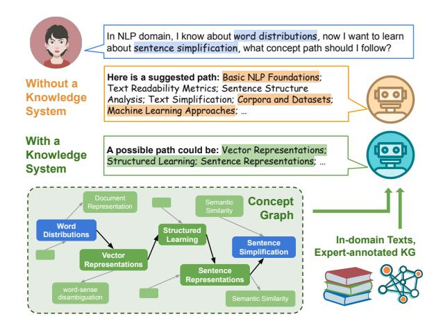
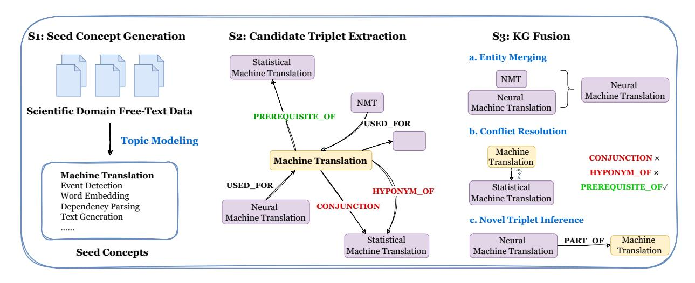
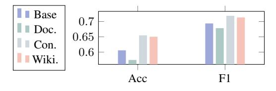
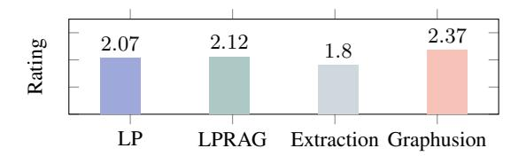
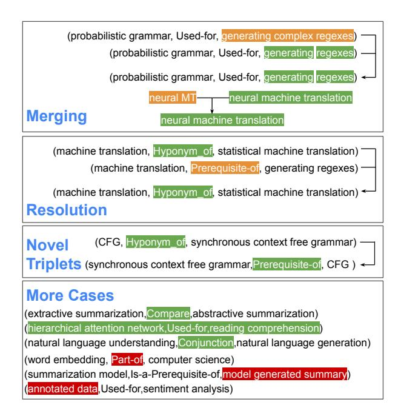
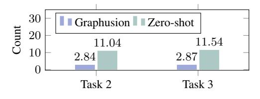
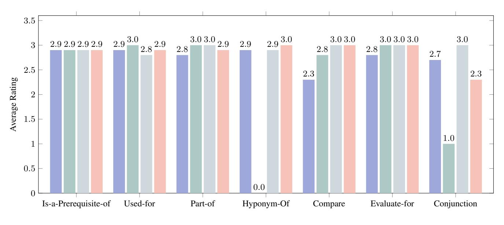
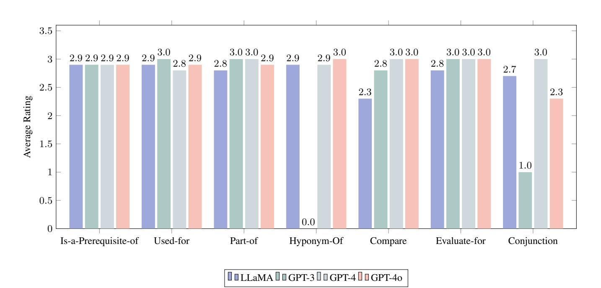
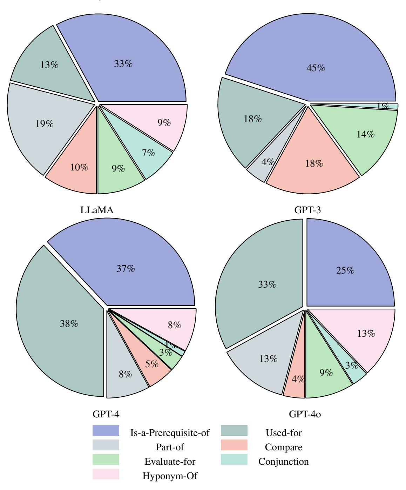
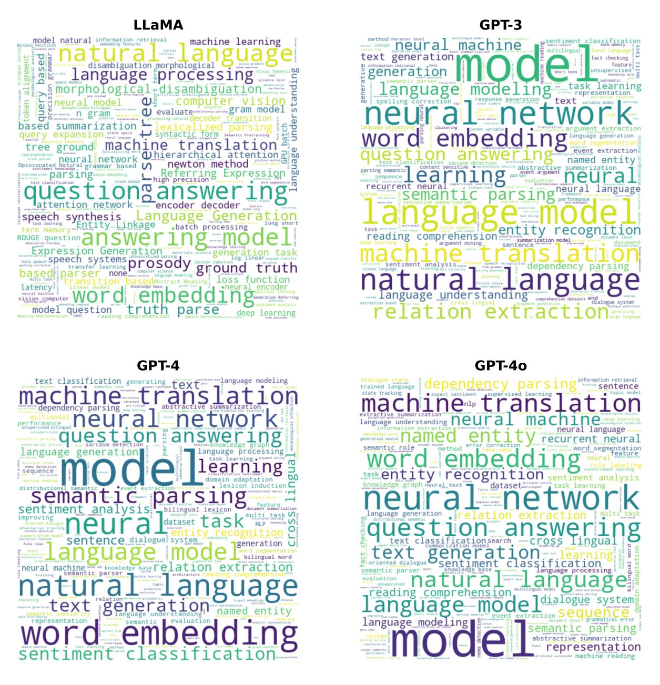

# Graphusion: Leveraging Large Language Models for Scientific Knowledge Graph Fusion and Construction in NLP Education

Rui Yang<sup>1</sup><sup>∗</sup> , Boming Yang<sup>2</sup> , Sixun Ouyang<sup>3</sup> , Tianwei She<sup>3</sup> , Aosong Feng<sup>4</sup> , Yuang Jiang<sup>3</sup> , Freddy Lecue<sup>5</sup> , Jinghui Lu<sup>3</sup> , Irene Li<sup>2</sup>,3<sup>∗</sup>

<sup>1</sup>Duke-NUS Medical School, <sup>2</sup>University of Tokyo, <sup>3</sup>Smartor Inc., <sup>4</sup>Yale University, <sup>5</sup> INRIA yang.rui@duke-nus.edu, ireneli@ds.itc.u-tokyo.ac.jp

## Abstract

Knowledge graphs (KGs) are crucial in the field of artificial intelligence and are widely applied in downstream tasks, such as enhancing Question Answering (QA) systems. The construction of KGs typically requires significant effort from domain experts. Recently, Large Language Models (LLMs) have been used for knowledge graph construction (KGC), however, most existing approaches focus on a local perspective, extracting knowledge triplets from individual sentences or documents. In this work, we introduce Graphusion, a zero-shot KGC framework from free text. The core fusion module provides a global view of triplets, incorporating entity merging, conflict resolution, and novel triplet discovery. We showcase how Graphusion could be applied to the natural language processing (NLP) domain and validate it in the educational scenario. Specifically, we introduce TutorQA, a new expert-verified benchmark for graph reasoning and QA, comprising six tasks and a total of 1,200 QA pairs. Our evaluation demonstrates that Graphusion surpasses supervised baselines by up to 10% in accuracy on link prediction. Additionally, it achieves average scores of 2.92 and 2.37 out of 3 in human evaluations for concept entity extraction and relation recognition, respectively.

### 1 Introduction

Recently, large language models (LLMs) such as GPT [\(Achiam et al.,](#page-8-0) [2023\)](#page-8-0) and LLaMA [\(Touvron](#page-9-0) [et al.,](#page-9-0) [2023\)](#page-9-0) have demonstrated outstanding performance across various tasks in the field of natural language processing (NLP) [\(Yang et al.,](#page-10-0) [2023c,](#page-10-0)[d;](#page-10-1) [Song et al.,](#page-9-1) [2023;](#page-9-1) [Yang et al.,](#page-9-2) [2023a;](#page-9-2) [Gao et al.,](#page-8-1) [2024\)](#page-8-1). However, the content generated by LLMs often lacks accuracy and interpretability [\(Zhang](#page-10-2) [et al.,](#page-10-2) [2023a;](#page-10-2) [Yang et al.,](#page-10-3) [2024b\)](#page-10-3). To address these challenges, one approach is leveraging Knowledge Graphs (KGs) to enhance LLMs [\(Yang et al.,](#page-10-4) [2023b,](#page-10-4) [2024a\)](#page-10-5). By prompting the structured KG

<span id="page-0-0"></span>
<!-- Image Description: This image presents a concept graph illustrating two learning paths for sentence simplification in NLP. The first path (without a knowledge system) suggests a sequence from basic NLP foundations to machine learning approaches. The second (with a system) depicts a concept graph showing how word distributions, vector representations, and structured learning contribute to sentence simplification, further enhanced by in-domain texts and a knowledge graph. The graph visually represents the relationships between these concepts. -->

Figure 1: Comparison of QA systems with and without a knowledge system.

knowledge to LLMs, they can generate more reliable content. Additionally, KG-enhanced LLMs can be applied to various KG tasks as well, including graph completion, reasoning and more [\(Zhu](#page-10-6) [et al.,](#page-10-6) [2023;](#page-10-6) [Chen et al.,](#page-8-2) [2023\)](#page-8-2).

In Fig [1,](#page-0-0) we demonstrate an example in the educational scenario. A user asks a question involving specific concepts (highlighted in blue). Ideally, the response should reflect the relations between these concepts, essentially outlining the learning path that connects them. However, without a knowledge system, an LLM might offer answers that are somewhat relevant but too general, including broad concepts like "Basic NLP Foundations", or it may introduce confusing concepts with inaccurate specificity ("Corpora and Datasets"). In contrast, when equipped with a knowledge system (such as a concept graph showing prerequisite relations) and supplemented with relevant in-domain texts, the response becomes more refined, reflecting a deeper understanding of the concept relations.

Automatic methods have been applied to knowledge graph construction (KGC) [\(Sheng et al.,](#page-9-3) [2022;](#page-9-3) [Baek et al.,](#page-8-3) [2023;](#page-8-3) [Carta et al.,](#page-8-4) [2023\)](#page-8-4), with most of them employing a localized perspective, extracting triplets at the sentence or paragraph level, which is

suitable for shallow knowledge, such as (people, belong\_to, organization). However, this localized approach often fails to capture the comprehensive and interconnected nature of knowledge. The accuracy and completeness of triplets can be significantly limited when sourced from isolated segments of text, which is essential for scientific graphs containing deep knowledge.

Recognizing this limitation, we propose a significant paradigm shift towards a global view in KGC. Our approach includes a graph fusion module that extracts candidate triplets and performs global merging and resolution across multiple sources. Specifically, we leverage LLMs not only for extraction but also for critical knowledge integration, marking the first initiative to utilize LLMs for such a comprehensive merging process. We believe that this global perspective is crucial for constructing more accurate and holistic KGs, as it allows for the consideration of broader contexts and relations that span beyond single documents. Similarly, this is particularly vital in scientific KGs, where the relations between complex concepts cannot be adequately understood by examining individual sentences.

In this study, we utilize LLMs to construct and fuse scientific KGs, focusing primarily on the domain of natural language processing. Most importantly, we apply the constructed KG in the educational question-answering (QA) scenario. Our contributions are summarized as follows. First, we propose the Graphusion framework, which allows zero-shot KGC from free text. The core graph fusion component incorporates entity merging, conflict resolution, and novel triplet discovery. Evaluation results show that Graphusion achieves scores of 2.92 and 2.37 out of 3 for entity extraction and relation recognition, respectively, demonstrating its potential for automatic and large-scale KGC. To the best of our knowledge, our work is pioneering in scientific KGC with fusion using the zero-shot capabilities of LLMs. Second, we present TutorQA, a QA benchmark featuring six diverse tasks and comprising 1,200 expert-verified, NLP-centric QA pairs designed to mimic college-level tutoring questions. Third, we develop a pipeline to enhance the interaction between LLMs and the concept graph for TutorQA, achieving significant results across all tasks. All the code and data can be found in [https:](https://github.com/IreneZihuiLi/CGPrompt) [//github.com/IreneZihuiLi/CGPrompt](https://github.com/IreneZihuiLi/CGPrompt).

## 2 Related Work

Knowledge Graph Construction KGC aims to create a structured representation of knowledge in the form of a KG. Research on KGs spans various domains, including medical, legal, and more (Vrandeciˇ [c and Krötzsch](#page-9-4) ´ , [2014;](#page-9-4) [Li et al.,](#page-9-5) [2020;](#page-9-5) [Le-](#page-9-6)[Tuan et al.,](#page-9-6) [2022;](#page-9-6) [Kalla et al.,](#page-9-7) [2023;](#page-9-7) [Ahrabian et al.,](#page-8-5) [2023\)](#page-8-5). Typically, KGC involves several methods such as entity extraction and link prediction [\(Luan](#page-9-8) [et al.,](#page-9-8) [2018;](#page-9-8) [Reese et al.,](#page-9-9) [2020\)](#page-9-9), with a significant focus on supervised learning. Recently, LLMs have been utilized in KGC relying on their powerful zero-shot capabilities [\(Zhu et al.,](#page-10-6) [2023;](#page-10-6) [Carta et al.,](#page-8-4) [2023\)](#page-8-4). Although relevant works propose pipelines for extracting knowledge, they often remain limited to localized extraction, such as at the sentence or paragraph level. In contrast, our work focuses on shifting from a local perspective to a global one, aiming to generate a more comprehensive KG.

Educational NLP Modern NLP and Artificial Intelligence (AI) techniques have been applied to a wide range of applications, with education being a significant area. For instance, various tools have been developed focusing on writing assistance, language study, automatic grading, and quiz generation [\(Seyler et al.,](#page-9-10) [2015;](#page-9-10) [González-Carrillo et al.,](#page-8-6) [2021;](#page-8-6) [Zhang et al.,](#page-10-7) [2023b;](#page-10-7) [Lu et al.,](#page-9-11) [2023\)](#page-9-11). Moreover, in educational scenarios, providing responses to students still requires considerable effort, as the questions often demand a high degree of relevance to the study materials and strong domain knowledge. Consequently, many studies have concentrated on developing automatic QA models [\(Zylich](#page-10-8) [et al.,](#page-10-8) [2020;](#page-10-8) [Hicke et al.,](#page-8-7) [2023\)](#page-8-7), which tackle a range of queries, from logistical to knowledgebased questions. In this work, we integrate an LLM-constructed KG for various QA tasks in NLP education.

### 3 Graphusion Framework

In this section, we introduce our Graphusion Framework for scientific KGC.

### 1 Problem Definition

A KG is defined as a set of triplets: KG = {(h<sup>i</sup> , r<sup>i</sup> , ti) | h<sup>i</sup> , t<sup>i</sup> ∈ E, r<sup>i</sup> ∈ R, i = 1, 2, . . . , n}, where: E is the set of entities, R is the set of possible relations, and n is the total number of triplets in the KG. The task of zero-shot KGC involves taking a set of free text T and generating a list of triplets (h, r, t). Optionally, there is

<span id="page-2-0"></span>
<!-- Image Description: The image is a flowchart depicting a knowledge graph (KG) fusion process. It shows three stages: seed concept generation using topic modeling on free-text scientific data; candidate triplet extraction using various machine translation methods (statistical and neural); and KG fusion, involving entity merging, conflict resolution, and novel triplet inference, again using different machine translation approaches. Relationships between these steps are indicated using labels like "PREREQUISITE_OF," "USED_FOR," "CONJUNCTION," "HYPONYM_OF," and "PART_OF". The flowchart illustrates the workflow and relationships between different components of the proposed KG fusion system. -->

Figure 2: Graphusion framework illustration. Gaphusion consists of 3 steps: S1 Seed Concept Generation, S2 Candidate Triplet Extraction and S3 KG Fusion.

an expert-annotated KG EG as input, in order to provide some existing knowledge. In our setting, the number of triplets of KG is much larger than EG. We select the domain to be NLP, so the entities are concepts only, other entity types such as people, organizations are not our focus. Following previous works [\(Luan et al.,](#page-9-8) [2018\)](#page-9-8), we define 7 relations types: Prerequisite\_of, Used\_for, Compare, Conjunction, Hyponym\_of, Evaluate\_for and Part\_OF.

## 2 Zero-shot Link Prediction

While the task of KGC is to generate a list of triplets, including entities and their corresponding relations, we start with a simpler setting: focusing solely on link prediction for pre-defined entity pairs and a single relation type. This setting helps us understand the capabilities of LLMs on scientific KGC under a zero-shot setting. Specifically, given a concept pair (A, B), the task of link prediction is to determine if a relationship r exists. We choose r =Prerequisite\_of. For instance, the relation "Viterbi Algorithm" → "POS Tagging" implies that to learn the concept of "POS Tagging," one must first understand the "Viterbi Algorithm." Initially, a predefined set of concepts C is given.

LP Prompt We then design a Link Prediction (LP) Prompt to solve the task. The core part is to provide the domain name, the definition and description of the dependency relation to be predicted, and the query concepts. Meanwhile, we explore whether additional information, such as concept definitions from Wikipedia and neighboring concepts from training data (when available), would be beneficial. The LP Prompt is as follows:

We have two {domain} related concepts: A: {concept\_1} and B: {concept\_2}. Do you think learning {concept\_1} will help in understanding {concept\_2}? Hints: 1. Answer YES or NO only.

- 2. This is a directional relation, which means if the answer is "YES", (B, A) is false, but (A, B) is true.
- 3. Your answer will be used to create a knowledge graph.

{Additional Information}

## 3 Graphusion: Zero-shot Knowledge Graph Construction

We now introduce our Graphusion framework for constructing scientific KGs, shown in Fig [2.](#page-2-0) Our approach addresses three key challenges in zeroshot KGC: 1) the input consists of free text rather than a predefined list of concepts; 2) the relations encompass multiple types, and conflicts may exist among them; and 3) the output is not a single binary label but a list of triplets, making evaluation more challenging.

Step 1: Seed Concept Generation Extracting domain-specific concepts using LLMs under a zeroshot setting is highly challenging due to the absence of predefined concept lists. This process is not only resource-intensive but also tends to generate a large number of irrelevant concepts, thereby compromising the quality of extraction. To address these issues, we adopt a seed concept generation approach for efficiently extracting in-domain concepts from free text [\(Ke et al.,](#page-9-12) [2024\)](#page-9-12). Specifically, we utilize

BERTopic [\(Grootendorst,](#page-8-8) [2022\)](#page-8-8) for topic modeling to identify representative concepts for each topic. These representative concepts serve as seed concepts, denoted as Q. The initialized seed concepts ensure high relevance in concept extraction and provide certain precision for subsequent triplet extraction.

Step 2: Candidate Triplet Extraction Based on these seed concepts, in Step 2, we begin extracting candidate triplets from the free text. Each time, we input a concept q ∈ Q ({query}) as the query concept and retrieve documents containing this concept ({context}) through information retrieval. Our goal is to extract any potential triplets that include this query concept. To achieve this, we design a Chain-of-Thought (CoT) [\(Wei et al.,](#page-9-13) [2022\)](#page-9-13) prompt. We first instruct the LLMs to extract in-domain concepts, then identify the possible relations between those concepts and q. Then, we ask LLMs to discover novel triplets, even if q is not initially included. This approach ensures that the seed concepts play a leading role in guiding the extraction of in-domain concepts. Meanwhile, the candidate triplets will encompass novel concepts. We design the Extraction Prompt to be the following:

Given a context {context}, and a query concept {query}, do the following:

- 1. Extract the query concept and in-domain concepts from the context, which should be fine-grained...
- 2. Determine the relations between the query concept and the extracted concepts, in a triplet format: (<head concept>, <relation>, <tail concept>)... {Relation Definition}
- 3. Please note some relations are strictly directional...
- 4. You can also extract triplets from the extracted concepts, and the query concept may not be necessary in the triplets.

After processing all the queries from the seed concept list, we save all the candidate triplets. We denote this zero-shot constructed KG by the LLM as ZS − KG.

Step3: Knowledge Graph Fusion The triplets extracted in the previous step provide a local view rather than a global perspective of each queried concept. Due to the limitations of context length, achieving a global view is challenging. Additionally, the relations extracted between two concepts

can sometimes be conflicting, diverse, or incorrect, such as (neural summarization methods, Usedfor, abstractive summarization) and (neural summarization methods, Hyponym-of, abstractive summarization). To address the aforementioned challenge, we propose the Fusion step. This approach helps reconcile conflicting relations, integrate diverse or incorrect relations effectively, and ultimately provides a global understanding of an entity pair.

Specifically, for each query concept q, we first query from ZS − KG, and obtain a sub-graph that contains q:

LLM-KG = {(h, r, t) ∈ ZS-KG | h = q or t = q}.

Optionally, if there is an expert-annotated KG available, we will also query a sub-graph, marked as E − G. Moreover, we conduct a dynamic retrieval of q again from the free text ({background}), to help LLMs to have a better understanding on how to resolve the conflicted triplets. This key fusion step focuses on three parts: a) entity merging: merge semantically similar entities, i.e., NMT vs neural machine translation; b) conflict resolution: for each entity pair, resolve any conflicts and choose the best one; and c) novel triplet inference: propose new triplet from the background text. We utilize the following Fusion Prompt:

Please fuse two sub-knowledge graphs about the concept "{concept}". Graph 1: {LLM-KG} Graph 2: {E-G}

Rules for Fusing the Graphs:

- 1. Union the concepts and edges.
- 2. If two concepts are similar, or refer to the same concept, merge them into one concept, keeping the one that is meaningful or specific ...
- 3. Only one relation is allowed between two concepts. If there is a conflict, read the "### Background" to help you keep the correct relation...
- 4. Once step 3 is done, consider every possible concept pair not covered in step 2. For example, take a concept from Graph 1, and match it with a concept from Graph 2. Then, please refer to "### Background" to summarize new triplets.

### Background: {background}

{Relation Definition}

### 4 Evaluation

The evaluation of KGC is challenging since each model generating different triplets from the free text, along with the lack of expert annotations. To address this, we conduct the expert evaluation on the pipeline output. We ask experts to assess both *concept entity quality*and*relation quality*, providing ratings ranging from 1 to 3. The former measures the relevance and specificity of the extracted concepts, while the latter evaluates the logical accuracy between concepts. Additionally, we calculate the Inter-Annotator Agreement (IAA) of the two experts' evaluations using the Kappa score.

### 4 Experiments

#### 1 Link Prediction

We conduct experiments using the LectureBankCD dataset [\(Li et al.,](#page-9-14) [2021\)](#page-9-14) and report the performance on the NLP domain. LectureBankCD contains up to 322 pre-defined NLP concepts and prerequisite relation labels on the concept pairs. We benchmark on the official test set against the following Supervised Baselines: DeepWalk [\(Perozzi et al.,](#page-9-15) [2014\)](#page-9-15), and Node2vec [\(Grover and Leskovec,](#page-8-9) [2016\)](#page-8-9), P2V [\(Wu et al.,](#page-9-16) [2020\)](#page-9-16), and BERT [\(Devlin et al.,](#page-8-10) [2019\)](#page-8-10). These methods utilize pre-trained or graphbased models to encode concept embeddings and then perform binary classification to determine the presence of positive or negative edges in given concept pairs. In our LLM-based experiments, we show two main settings: Zero-shot, which employs LP Prompt; and Zero-shot with RAG, which enhances zero-shot with the addition of Retrieval Augmented Generation (RAG) method [\(Krishna,](#page-9-17) [2023\)](#page-9-17). RAG has shown to improve on existing LLMs on text generation tasks such as QA. In Tab. [1,](#page-4-0) we observe that the zero-shot performance of GPT-4 and GPT-4o surpasses that of the best traditional supervised baseline. This suggests that LLMs can recover a domain-specific concept graph without relying on expert annotations. With the aid of RAG, which incorporates more domain-specific data, GPT-4o achieves significant improvements.

#### 2 Knowledge Graph Completion

To conduct KGC, we need a large-scale free-text corpus to serve as the knowledge source. Since there is no standard benchmark for evaluation, we collected the proceedings papers from the ACL conference[1](#page-4-1) spanning 2017-2023, which includes

<span id="page-4-0"></span>

| Model                | Accuracy | F1 Score |  |  |  |
|----------------------|----------|----------|--|--|--|
| Supervised Baselines |          |          |  |  |  |
| DeepWalk             | 0.6292   | 0.5860   |  |  |  |
| P2V                  | 0.6369   | 0.5961   |  |  |  |
| Node2vec             | 0.6209   | 0.6181   |  |  |  |
| BERT                 | 0.7088   | 0.6963   |  |  |  |
| Zero-shot            |          |          |  |  |  |
| LLaMa2               | 0.6058   | 0.6937   |  |  |  |
| GPT-3.5              | 0.6123   | 0.7139   |  |  |  |
| GPT-4                | 0.7639   | 0.7964   |  |  |  |
| GPT-4o               | 0.7980   | 0.7958   |  |  |  |
| Zero-shot with RAG   |          |          |  |  |  |
| GPT-3.5              | 0.7587   | 0.7793   |  |  |  |
| GPT-4                | 0.7755   | 0.7958   |  |  |  |
| GPT-4o               | 0.8117   | 0.8181   |  |  |  |

Table 1: Evaluation of the link prediction task on the LectureBankCD-NLP test set.

a total of 4,605 papers. Considering that abstracts provide high-density, noise-free information and save computational resources, we perform topic modeling on the abstracts of these articles. Eventually, we successfully generate 688 seed concepts. We implement Graphusion on four selected models: LLaMa3-70b[2](#page-4-2) , GPT-3.5, GPT-4 and GPT-4o. Two domain experts participate in the evaluation. Tab. [2](#page-4-3) shows the evaluation results of these models on the quality of concept entity and relation, as well as the experts' consistency score. Overall, the rating for concept entity surpasses relation, demonstrating the challenging of relation extraction. Among all, GPT-4o achieves the best on both concept and relation. Additionally, the high consistency score among the experts indicates the reliability of the expert evaluation.

<span id="page-4-3"></span>

| Model   | Concept Entity |       | Relation  |       |
|---------|----------------|-------|-----------|-------|
|         | Rating         | Kappa | Rating    | Kappa |
| LLaMA   | 2.83+0.47      | 0.63  | 1.82+0.81 | 0.51  |
| GPT-3.5 | 2.90+0.38      | 0.48  | 2.14+0.83 | 0.67  |
| GPT-4   | 2.84+0.50      | 0.68  | 2.36+0.81 | 0.65  |
| GPT-4o  | 2.92+0.32      | 0.65  | 2.37+0.82 | 0.67  |

Table 2: Rating for the qaulity of concept entity and relation, and IAA score for the expert evaluation.

## 5 TutorQA

We introduce the TutorQA benchmark, a QA dataset designed for concept graph reasoning and text generation in the NLP domain. TutorQA comprises six categories, encompassing a total of 1,200 QA pairs that have been validated by human experts. These questions go beyond simple syllabus inquiries, encompassing more extensive and chal-

<span id="page-4-1"></span><sup>1</sup> <https://aclanthology.org/venues/acl/>

<span id="page-4-2"></span><sup>2</sup> <https://llama.meta.com/llama3/>

<span id="page-5-0"></span>

| Dataset                          | Domain       | Answer Type                     | With KG | Collection      |
|----------------------------------|--------------|---------------------------------|---------|-----------------|
| CBT (Hill et al., 2015)          | Open-Domain  | Multiple Choice                 | No      | Automated       |
| LectureBankCD (Li et al., 2021)  | NLP, CV, BIO | Binary                          | Yes     | Expert-verified |
| FairytaleQA (Xu et al., 2022)    | Open-Domain  | Open-ended                      | No      | Expert-verified |
| ChaTa (Hicke et al., 2023)       | CS           | Free Text                       | No      | Students        |
| ExpertQA (Malaviya et al., 2023) | Science      | Free Text                       | No      | Expert-verified |
| TutorQA (this work)              | NLP          | Open-Ended, Entity List, Binary | Yes     | Expert-verified |

Table 3: Comparison with other similar benchmarks: Educational or general QA benchmarks.

lenging topics that require interaction with the completed graph, as well as proficiency in text comprehension and question answering. We list some similar benchmarks in Tab. [3.](#page-5-0) While numerous opendomain QA benchmarks exist, our focus has been primarily on those within the scientific domain and tailored for college-level education, aligning with our objective to compare with benchmarks that can emulate a learning scenario. Among those, TutorQA is distinguished by its diversity in answer types and features expert-verified questions, ensuring a high standard of quality and relevance.

### 1 QA Tasks

We summarize the tasks and provide example data in Fig [3.](#page-6-0) More data statistics and information can be found in Appendix [E.](#page-18-0)

Task 1: Relation Judgment The task is to assess whether a given triplet, which connects two concepts with a relation, is accurate.

Task 2: Prerequisite Prediction The task helps students by mapping out the key concepts they need to learn first to understand a complex target topic.

Task 3: Path Searching This task helps students identify a sequence of intermediary concepts needed to understand a new target concept by charting a path from the graph.

Task 4: Subgraph Completion The task involves expanding the KG by identifying hidden associations between concepts in a subgraph.

Task 5: Similar Concepts The task requires identifying concepts linked to a central idea to deepen understanding and enhance learning, aiding in the creation of interconnected curriculums.

Task 6: Idea Hamster The task prompts participants to develop project proposals by applying learned concepts to real-world contexts, providing examples and outcomes to fuel creativity.

#### 2 KG-Enhanced Model

To address TutorQA tasks, we first utilize Graphusion framework to construct an NLP KG. Then we design an enhanced framework for the interaction

between the LLM and the concept graph, which includes two steps: command query and answer generation. In the command query stage, an LLM independently generates commands to query the concept graph upon receiving the query, thereby retrieving relevant paths. During the answer generation phase, these paths are provided to the LLM as contextual prompt, enabling it to perform concept graph reasoning and generate answers.

#### 3 Evaluation

Accuracy We report accuracy score for Task 1 and Task 4, as they are binary classification tasks.

Similarity score For Tasks 2 and 3, the references consist of a list of concepts. Generally, LLMs demonstrate creativity by answering with novel concepts, which are often composed of more contemporary and fresh words, even though they might not exactly match the words in the concept graph. Consequently, conventional evaluation metrics like keyword matching are unsuitable for these tasks. To address this, we propose the similarity score. This metric calculates the semantic similarity between the concepts in the predicted list Cpred and the ground truth list Cgold. Specifically, as shown in Eq. [1,](#page-5-1) for a concept m from the predicted list, and a concept n from the ground truth list, we calculate the cosine similarity between their embeddings achieved from pre-trained BERT model [\(Devlin et al.,](#page-8-10) [2019\)](#page-8-10). We then average these similarity scores to obtain the similarity score.

<span id="page-5-1"></span>
$$
Score = \frac{\sum_{m \in C_{pred}} \sum_{n \in C_{gold}} sim(m, n)}{|C_{pred}| \times |C_{gold}|}.
$$

By averaging the similarity scores, the final score provides a comprehensive measure of the overall semantic alignment between the predicted and ground truth concepts.

Hit Rate For Task 5, we employ the classical Hit Rate metric, expressed as a percentage. This measure exemplifies the efficiency of LLM at retrieving and presenting relevant concepts in its output as compared to a provided list of target concepts.

<span id="page-6-0"></span>

| Task 1: Relation Judgment<br>Question: In the field of Natural Language Processing, I have<br>come across the concepts of Penn Treebank and first-order logic.<br>Considering the relation of Hyponym-Of, which establishes a<br>hierarchical relationship where one entity is a more specific<br>version or subtype of another, would it be accurate to say that<br>the concept "Penn Treebank" is a hyponym of "first-order logic"?<br>Answer: No.<br>Evaluation: Accuracy | Task 4: Subgraph Completion<br>Question: Given the following triplets constituting a sub-graph, please<br>infer the relationship between "story ending generation" and "natural<br>language generation."<br>Triplets: story ending generation - Is-a-Prerequisite-of - sentiment<br>control; sentence generation - Is-a-Prerequisite-of - NLG;<br>natural language generation - Conjunction - natural language<br>understanding<br>Relationships Types: Compare, Part-of,Hyponym-Of<br>Answer: Hyponym-Of |  |  |
|------------------------------------------------------------------------------------------------------------------------------------------------------------------------------------------------------------------------------------------------------------------------------------------------------------------------------------------------------------------------------------------------------------------------------------------------------------------------------|-----------------------------------------------------------------------------------------------------------------------------------------------------------------------------------------------------------------------------------------------------------------------------------------------------------------------------------------------------------------------------------------------------------------------------------------------------------------------------------------------------------|--|--|
| Task 2: Prerequisite Prediction<br>Question: In the domain of Natural Language Processing, I want<br>to learn about Meta-Learning, what concepts should I learn first?<br>Answer: probabilities, optimization, machine learning resources,<br>loss function<br>Evaluation: Similarity Score                                                                                                                                                                                  | Evaluation: Accuracy<br>Task 5: Clustering<br>Question: Given the concept PCA, can you provide some similar concepts?<br>Please provide some similar concepts.<br>Answer: Canonical Correlation Analysis, matrix factorization, linear<br>discriminant analysis, singular value decomposition; maximum likelihood<br>estimation.                                                                                                                                                                          |  |  |
| Task 3: Path Searching<br>Question: In the domain of Natural Language Processing, I know<br>about the concept of optimization, now I want to learn about the<br>concept of neural language modeling, what concept path should I<br>follow?<br>Answer: optimization, machine learning resources,<br>semi-supervised learning, neural networks, neural language<br>modeling<br>Evaluation: Similarity Score                                                                    | Evaluation: Hit Rate<br>Task 6: Idea Hamster<br>Question: I already know about sentiment analysis, social media analysis,<br>sentence simplification, text summarization, citation networks. In the<br>domain of Natural Language Processing, what potential project can I work<br>on? Give me a possible idea. Show me the title and project description.<br>Answer: (open ended)                                                                                                                        |  |  |

Figure 3: TutorQA tasks: We present a sample data instance and the corresponding evaluation metric for each task. Note: Task 6 involves open-ended answers, which are evaluated through human assessment.

Our comparative analysis in Table [4,](#page-6-1) which features GPT-4o as the base model, reveals significant improvement across Tasks 1 to 5. These findings underscore the pivotal role of integrating a KG into our pipeline, solidly confirming our assertion that knowledge-augmented systems exhibit exceptional QA capabilities. The marked enhancements are indicative of the substantial potential that KGs hold for advancing NLP applications, especially in educational contexts where such systems can tailor and enhance the learning experience with deeper, context-relevant insights.

<span id="page-6-1"></span>

| Setting   | T1    | T2    | T3    | T4    | T5    |
|-----------|-------|-------|-------|-------|-------|
| Zero-shot | 69.20 | 64.42 | 66.61 | 44.00 | 11.45 |
| Ours      | 92.00 | 80.29 | 77.85 | 50.00 | 15.65 |

Table 4: Evaluation of TutorQA on Tasks 1-5. T1, T4: accuracy; T2, T3: similarity score; T5: hit rate.

Expert Evaluation In Task 6, where open-ended answers are generated without gold-standard responses, we resort to expert evaluation for comparative analysis between baseline results and our model. Despite available LLM-centric metrics like G-Eval [\(Liu et al.,](#page-9-21) [2023\)](#page-9-21), the specific evaluation needs of this task warrant distinct criteria, particularly examining the persuasive and scientifically sound elements of generated project proposals. Four evaluation criteria, rated on a 1-5 scale, are employed: *Concept Relevancy*: the project's alignment with the query concepts. *Concept Coverage*: the extent to which the project encompasses

the query concepts. *Project Convincity*: the persuasiveness and practical feasibility of the project. *Scientific Factuality*: the scientific accuracy of the information within the project. Evaluation by two NLP experts, with a Kappa score of 0.6689, suggests substantial agreement. The results in Table [5](#page-6-2) indicate that while both settings achieve high scores across all criteria, our pipeline exhibits a marginally superior performance, particularly in terms of Convincity and Factuality. This suggests that our pipeline might be better at generating content that is not only factually accurate but also presents it in a way that is more persuasive to the reader.

<span id="page-6-2"></span>

| Model     | Relevancy |       | Coverage Convincity Factuality |       |
|-----------|-----------|-------|--------------------------------|-------|
| Zero-shot | 4.750     | 4.840 | 4.380                          | 4.625 |
| Ours      | 4.845     | 4.905 | 4.720                          | 4.770 |

Table 5: Expert evaluation of TutorQA on Task 6.

## 6 Ablation Study and Analysis

### 1 RAG Data for Link Prediction

We explore the potential of external data in enhancing concept graph recovery. This is achieved by expanding the {Additional Information} part in the LP Prompt. We utilize LLaMa as the Base model, focusing on the NLP domain. We introduce three distinct settings: Doc.: In-domain lecture slides data as free-text; Con.: Adding one-hop neighboring concepts from the training set as additional information related to the query concepts. Wiki.: Incorporating the introductory paragraph of the Wikipedia page of each query concept. As illustrated in Fig [4,](#page-7-0) our findings indicate that incorporating LectureBankCD documents (Doc.) significantly diminishes performance. This decline can be attributed to the introduction of noise and excessively lengthy content, which proves challenging for the LLM to process effectively. Conversely, the inclusion of neighboring concepts (Con.) markedly enhances the base model's performance. However, it relies on training data, rendering it incompatible with our primary focus on the zero-shot setting. Incorporating Wikipedia content also yields improvements and outperforms the use of LectureBankCD, likely due to higher text quality.

<span id="page-7-0"></span>
<!-- Image Description: The image presents a bar chart comparing the performance of four model variations ("Base," "Doc," "Con," "Wiki") on two metrics: accuracy (Acc) and F1-score (F1). Each bar represents a model's performance on a respective metric. The chart visually displays the relative improvement of different model variations. The legend clarifies the color coding for each model. The purpose is to quantitatively illustrate the impact of different data augmentation techniques on model performance. -->

Figure 4: Link Prediction Ablation Study: Comparison of models with external data.

#### 2 Graphusion Modules

We conduct an ablation study on the KGC task by comparing different settings, as shown in Fig [5.](#page-7-1) We evaluate four configurations: Link Prediction using the LP prompt (*LP*), Link Prediction with RAG (*LPRAG*), Candidate Triplet Extraction without Fusion (*Extraction*), and Graphusion (*Graphusion*). In the first two settings, we implement a straightforward scenario where concept pairs are provided, and the relationship is predicted directly through link prediction. All experiments are conducted using GPT-4 as the base language model. We report the average human evaluation rating on relation quality. The concept entities remain fixed, so their ratings are not included. Our findings indicate that the Graphusion framework achieves the best performance. Removing the core fusion component (the *Extraction*setting) significantly diminishes performance, underscoring the effectiveness of the fusion module.

<span id="page-7-1"></span>
<!-- Image Description: The image displays a bar chart comparing four methods—LP, LPRAG, Extraction, and Graphusion—based on their "Rating" scores. The chart shows Graphusion achieving the highest rating (2.37), while Extraction has the lowest (1.8). LPRAG and LP show intermediate ratings of 2.12 and 2.07 respectively. The chart's purpose is to visually represent and compare the performance of these four methods, likely within the context of a larger study evaluating graph-based techniques. -->

Figure 5: Ablation study on Graphusion modules: We compare four settings with GPT-4o as base.

#### 3 Graphusion Case Study

In Fig [6,](#page-7-2) we present case studies from our Graphusion framework using GPT-4o. Graphusion effectively merges similar concepts (neural MT and neural machine translation) and resolves relational conflicts (prerequisite of vs hyponym of). Additionally, it can infer novel triplets absent from the input. We highlight both positive and negative outputs from Graphusion. For instance, it correctly identifies that a technique is used for a task (hierarchical attention network, used for, reading comprehension). However, it may make mistakes in concept recognition, such as concepts with poor granularity (annotated data, model generated summary) and identifying incorrect relations (word embedding being inaccurately categorized as part of computer science).

<span id="page-7-2"></span>
<!-- Image Description: The image displays a series of labeled boxes representing knowledge triplets. Each triplet consists of two concepts and a relation ("Used-for," "Hyponym of," "Prerequisite-of," "Compare," "Conjunction," "Is-a-Prerequisite-of," "Part-of"). The triplets are grouped into sections: "Merging," "Resolution," "Novel Triplets," and "More Cases," illustrating different types of relationships between concepts, likely in the context of natural language processing or a similar field. The image's purpose is to visually represent and categorize these relationships for clarity and analysis within the paper. -->

Figure 6: Case studies for Graphusion on the GPT-4o model: Correct parts are highlighted in green, resolved and merged parts in orange, and incorrect parts in red.

## 4 TutorQA Task 2 & Task 3: Concept Entity Counts

As depicted in Fig [7,](#page-8-11) We evaluate the average number of concept entities generated by GPT-4o and our Graphusion framework in the responses for Task 2 and Task 3. The results show that without the enhancement of KG, GPT-4o tends to generate more concept entities (Task 2: 11.04, Task 3: 11.54), many of which are irrelevant or broad. In contrast, our Graphusion framework generates more accurate and targeted concept entities.

<span id="page-8-11"></span>
<!-- Image Description: The image displays a bar chart comparing the performance of "Graphusion" and "Zero-shot" methods on Tasks 2 and 3. The vertical axis represents the count, and the horizontal axis shows the tasks. Each bar indicates the count for each method on each task, with numerical values above the bars. The chart likely illustrates a quantitative comparison of the two methods' effectiveness within the context of the paper. -->

Figure 7: Comparison of concept counts in Task 2 and Task 3.

## 7 Conclusion

In this work, we explored the application of LLMs for scientific KG fusion and construction. Initially, we developed Graphusion, which enables LLMs to perform zero-shot KGC from free text. Subsequently, we introduced TutorQA, an expert-verified, NLP-centric benchmark designed for QA using a concept graph. Lastly, we devised a pipeline aimed at augmenting QA performance by leveraging LLMs and constructed KG.

## Limitations

Graph Construction Constructing a KG from freetext, especially under a zero-shot context, relies on the quality and scale of the corpus. In this paper, we showcased that applying paper abstracts is a possible way. While we did not have a chance to test other data such as text books or web posts. Besides, evaluation is challenging as it is hard to construct a standard test set. So our evaluation was mostly conducted by human experts with a reasonable scale.

Evaluation metrics of TutorQA For Task 2 and 3, LLMs often generate novel concepts in their responses. To address this, we evaluated answers based on semantic similarities to compute a score. A notable limitation is the disregard for concept order in the provided answer paths. Addressing this concern will be a focus of our future work.

## Ethical Considerations

In our research, we have meticulously addressed ethical considerations, particularly regarding our dataset TutorQA and Graphusion framework. TutorQA has been expert-verified to ensure it contains no harmful or private information about individuals, thereby upholding data integrity and privacy standards. Our methods, developed on publicly available Large Language Models optimized for text generation, adhere to established ethical norms in AI research. We recognize the potential biases in such models and are committed to ongoing monitoring to prevent any unethical content generation, thereby maintaining the highest standards of research integrity and responsibility.

### References

- <span id="page-8-0"></span>Josh Achiam, Steven Adler, Sandhini Agarwal, Lama Ahmad, Ilge Akkaya, Florencia Leoni Aleman, Diogo Almeida, Janko Altenschmidt, Sam Altman, Shyamal Anadkat, et al. 2023. Gpt-4 technical report.*arXiv preprint arXiv:2303.08774*.
- <span id="page-8-5"></span>Kian Ahrabian, Xinwei Du, Richard Delwin Myloth, Arun Baalaaji Sankar Ananthan, and Jay Pujara. 2023. Pubgraph: A large-scale scientific knowledge graph. *arXiv preprint arXiv:2302.02231*.
- <span id="page-8-3"></span>Jinheon Baek, Alham Fikri Aji, and Amir Saffari. 2023. [Knowledge-augmented language model prompting](https://api.semanticscholar.org/CorpusID:259095910) [for zero-shot knowledge graph question answering.](https://api.semanticscholar.org/CorpusID:259095910) *ArXiv*, abs/2306.04136.
- <span id="page-8-4"></span>Salvatore M. Carta, Alessandro Giuliani, Lee Cecilia piano, Alessandro Sebastian Podda, Livio Pompianu, and Sandro Gabriele Tiddia. 2023. [Iterative zero](https://api.semanticscholar.org/CorpusID:259316469)[shot llm prompting for knowledge graph construction.](https://api.semanticscholar.org/CorpusID:259316469) *ArXiv*, abs/2307.01128.
- <span id="page-8-2"></span>Zhongwu Chen, Chengjin Xu, Fenglong Su, Zhen Huang, and Yong Dou. 2023. [Incorporating struc](https://api.semanticscholar.org/CorpusID:258049017)[tured sentences with time-enhanced bert for fully](https://api.semanticscholar.org/CorpusID:258049017)[inductive temporal relation prediction.](https://api.semanticscholar.org/CorpusID:258049017) *Proceedings of the 46th International ACM SIGIR Conference on Research and Development in Information Retrieval*.
- <span id="page-8-10"></span>Jacob Devlin, Ming-Wei Chang, Kenton Lee, and Kristina Toutanova. 2019. [Bert: Pre-training of deep](https://api.semanticscholar.org/CorpusID:52967399) [bidirectional transformers for language understand](https://api.semanticscholar.org/CorpusID:52967399)[ing.](https://api.semanticscholar.org/CorpusID:52967399) In *North American Chapter of the Association for Computational Linguistics*.
- <span id="page-8-1"></span>Fan Gao, Hang Jiang, Rui Yang, Qingcheng Zeng, Jinghui Lu, Moritz Blum, Dairui Liu, Tianwei She, Yuang Jiang, and Irene Li. 2024. [Large language](http://arxiv.org/abs/2308.10410) [models on wikipedia-style survey generation: an eval](http://arxiv.org/abs/2308.10410)[uation in nlp concepts.](http://arxiv.org/abs/2308.10410)
- <span id="page-8-6"></span>Cristian D. González-Carrillo, Felipe Restrepo-Calle, Jhon Jairo Ramírez-Echeverry, and Fabio A. González. 2021. [Automatic grading tool for jupyter](https://api.semanticscholar.org/CorpusID:243477284) [notebooks in artificial intelligence courses.](https://api.semanticscholar.org/CorpusID:243477284) *Sustainability*.
- <span id="page-8-8"></span>Maarten R. Grootendorst. 2022. [Bertopic: Neural topic](https://api.semanticscholar.org/CorpusID:247411231) [modeling with a class-based tf-idf procedure.](https://api.semanticscholar.org/CorpusID:247411231) *ArXiv*, abs/2203.05794.
- <span id="page-8-9"></span>Aditya Grover and Jure Leskovec. 2016. [node2vec:](https://api.semanticscholar.org/CorpusID:207238980) [Scalable feature learning for networks.](https://api.semanticscholar.org/CorpusID:207238980) *Proceedings of the 22nd ACM SIGKDD International Conference on Knowledge Discovery and Data Mining*.
- <span id="page-8-7"></span>Yann Hicke, Anmol Agarwal, Qianou Ma, and Paul Denny. 2023. [Chata: Towards an intelligent question](https://api.semanticscholar.org/CorpusID:265033489)[answer teaching assistant using open-source llms.](https://api.semanticscholar.org/CorpusID:265033489) *ArXiv*, abs/2311.02775.

- <span id="page-9-18"></span>Felix Hill, Antoine Bordes, Sumit Chopra, and Jason Weston. 2015. [The goldilocks principle: Reading](https://api.semanticscholar.org/CorpusID:14915449) [children's books with explicit memory representa](https://api.semanticscholar.org/CorpusID:14915449)[tions.](https://api.semanticscholar.org/CorpusID:14915449) *CoRR*, abs/1511.02301.
- <span id="page-9-7"></span>Aparna Kalla, R Shailesh, S. Preetha, Snehal Chandra, and Sudeepa Roy. 2023. [Scientific knowledge graph](https://api.semanticscholar.org/CorpusID:258870236) [creation and analysis.](https://api.semanticscholar.org/CorpusID:258870236) *2023 IEEE 8th International Conference for Convergence in Technology (I2CT)*, pages 1–5.
- <span id="page-9-12"></span>Yuhe Ke, Rui Yang, and Nan Liu. 2024. Comparing open-access database and traditional intensive care studies using machine learning: Bibliometric analysis study. *Journal of Medical Internet Research*, 26:e48330.
- <span id="page-9-17"></span>Chepuri Shri Krishna. 2023. Prompt generate train (pgt): A framework for few-shot domain adaptation, alignment, and uncertainty calibration of a retriever augmented generation (rag) model for domain specific open book question-answering. *arXiv preprint arXiv:2307.05915*.
- <span id="page-9-6"></span>Anh Le-Tuan, Carlos Franzreb, Sonja Schimmler, and Manfred Hauswirth. 2022. [Towards building live](https://api.semanticscholar.org/CorpusID:248347985) [open scientific knowledge graphs.](https://api.semanticscholar.org/CorpusID:248347985) *Companion Proceedings of the Web Conference 2022*.
- <span id="page-9-14"></span>Irene Li, Vanessa Yan, Tianxiao Li, Rihao Qu, and Dragomir R. Radev. 2021. [Unsupervised cross](https://api.semanticscholar.org/CorpusID:234334083)[domain prerequisite chain learning using variational](https://api.semanticscholar.org/CorpusID:234334083) [graph autoencoders.](https://api.semanticscholar.org/CorpusID:234334083) In *Annual Meeting of the Association for Computational Linguistics*.
- <span id="page-9-5"></span>Irene Z Li, Alexander R. Fabbri, Swapnil Hingmire, and Dragomir R. Radev. 2020. [R-vgae: Relational](https://api.semanticscholar.org/CorpusID:216056469)[variational graph autoencoder for unsupervised pre](https://api.semanticscholar.org/CorpusID:216056469)[requisite chain learning.](https://api.semanticscholar.org/CorpusID:216056469) *ArXiv*, abs/2004.10610.
- <span id="page-9-21"></span>Yang Liu, Dan Iter, Yichong Xu, Shuo Wang, Ruochen Xu, and Chenguang Zhu. 2023. [G-eval: Nlg evalu](https://api.semanticscholar.org/CorpusID:257804696)[ation using gpt-4 with better human alignment.](https://api.semanticscholar.org/CorpusID:257804696) In *Conference on Empirical Methods in Natural Language Processing*.
- <span id="page-9-11"></span>Qingyu Lu, Baopu Qiu, Liang Ding, Liping Xie, and Dacheng Tao. 2023. [Error analysis prompting en](https://api.semanticscholar.org/CorpusID:257756967)[ables human-like translation evaluation in large lan](https://api.semanticscholar.org/CorpusID:257756967)[guage models: A case study on chatgpt.](https://api.semanticscholar.org/CorpusID:257756967) *ArXiv*, abs/2303.13809.
- <span id="page-9-8"></span>Yi Luan, Luheng He, Mari Ostendorf, and Hannaneh Hajishirzi. 2018. [Multi-task identification of entities,](https://api.semanticscholar.org/CorpusID:52118895) [relations, and coreference for scientific knowledge](https://api.semanticscholar.org/CorpusID:52118895) [graph construction.](https://api.semanticscholar.org/CorpusID:52118895) *ArXiv*, abs/1808.09602.
- <span id="page-9-20"></span>Chaitanya Malaviya, Subin Lee, Sihao Chen, Elizabeth Sieber, Mark Yatskar, and Dan Roth. 2023. [Ex](https://api.semanticscholar.org/CorpusID:261823130)[pertqa: Expert-curated questions and attributed an](https://api.semanticscholar.org/CorpusID:261823130)[swers.](https://api.semanticscholar.org/CorpusID:261823130) *ArXiv*, abs/2309.07852.
- <span id="page-9-15"></span>Bryan Perozzi, Rami Al-Rfou, and Steven S. Skiena. 2014. [Deepwalk: online learning of social repre](https://api.semanticscholar.org/CorpusID:3051291)[sentations.](https://api.semanticscholar.org/CorpusID:3051291) *Proceedings of the 20th ACM SIGKDD international conference on Knowledge discovery and data mining*.

- <span id="page-9-9"></span>Justin T. Reese, Deepak R. Unni, Tiffany J. Callahan, Luca Cappelletti, Vida Ravanmehr, Seth Carbon, Tommaso Fontana, Hannah Blau, Nicolas Matentzoglu, Nomi L. Harris, Monica C. Munoz-Torres, Peter N. Robinson, marcin p. joachimiak, and Chris J. Mungall. 2020. [Kg-covid-19: A framework to pro](https://api.semanticscholar.org/CorpusID:221191594)[duce customized knowledge graphs for covid-19 re](https://api.semanticscholar.org/CorpusID:221191594)[sponse.](https://api.semanticscholar.org/CorpusID:221191594) *Patterns*, 2.
- <span id="page-9-10"></span>Dominic Seyler, Mohamed Yahya, and Klaus Berberich. 2015. [Generating quiz questions from knowledge](https://api.semanticscholar.org/CorpusID:7522972) [graphs.](https://api.semanticscholar.org/CorpusID:7522972) *Proceedings of the 24th International Conference on World Wide Web*.
- <span id="page-9-3"></span>Jiawei Sheng, Shu Guo, Zhenyu Chen, Juwei Yue, Lihong Wang, and Tingwen Liu. 2022. [Challenging](https://api.semanticscholar.org/CorpusID:252376765) [the assumption of structure-based embeddings in few](https://api.semanticscholar.org/CorpusID:252376765)[and zero-shot knowledge graph completion.](https://api.semanticscholar.org/CorpusID:252376765) In *International Conference on Language Resources and Evaluation*.
- <span id="page-9-1"></span>Linxin Song, Jieyu Zhang, Lechao Cheng, Pengyuan Zhou, Tianyi Zhou, and Irene Li. 2023. [Nlpbench:](http://arxiv.org/abs/2309.15630) [Evaluating large language models on solving nlp](http://arxiv.org/abs/2309.15630) [problems.](http://arxiv.org/abs/2309.15630)
- <span id="page-9-22"></span>Deshraj Yadav Taranjeet Singh. 2023. Embedchain: The open source rag framework. [https://github.](https://github.com/embedchain/embedchain) [com/embedchain/embedchain](https://github.com/embedchain/embedchain).
- <span id="page-9-0"></span>Hugo Touvron, Louis Martin, Kevin Stone, Peter Albert, Amjad Almahairi, Yasmine Babaei, Nikolay Bashlykov, Soumya Batra, Prajjwal Bhargava, Shruti Bhosale, et al. 2023. Llama 2: Open foundation and fine-tuned chat models. *arXiv preprint arXiv:2307.09288*.
- <span id="page-9-4"></span>Denny Vrandeciˇ c and Markus Krötzsch. 2014. ´ [Wiki](https://doi.org/10.1145/2629489)[data: a free collaborative knowledgebase.](https://doi.org/10.1145/2629489) *Commun. ACM*, 57(10):78–85.
- <span id="page-9-13"></span>Jason Wei, Xuezhi Wang, Dale Schuurmans, Maarten Bosma, Ed Huai hsin Chi, F. Xia, Quoc Le, and Denny Zhou. 2022. [Chain of thought prompting](https://api.semanticscholar.org/CorpusID:246411621) [elicits reasoning in large language models.](https://api.semanticscholar.org/CorpusID:246411621) *ArXiv*, abs/2201.11903.
- <span id="page-9-16"></span>Yongliang Wu, Shuliang Zhao, and Wenbin Li. 2020. [Phrase2vec: Phrase embedding based on parsing.](https://api.semanticscholar.org/CorpusID:211264938) *Inf. Sci.*, 517:100–127.
- <span id="page-9-19"></span>Ying Xu, Dakuo Wang, Mo Yu, Daniel Ritchie, Bingsheng Yao, Tongshuang Sherry Wu, Zheng Zhang, Toby Jia-Jun Li, Nora Bradford, Branda Sun, Tran Bao Hoang, Yisi Sang, Yufang Hou, Xiaojuan Ma, Diyi Yang, Nanyun Peng, Zhou Yu, and Mark Warschauer. 2022. [Fantastic questions and where](https://api.semanticscholar.org/CorpusID:247762948) [to find them: Fairytaleqa – an authentic dataset for](https://api.semanticscholar.org/CorpusID:247762948) [narrative comprehension.](https://api.semanticscholar.org/CorpusID:247762948) In *Annual Meeting of the Association for Computational Linguistics*.
- <span id="page-9-2"></span>Boming Yang, Dairui Liu, Toyotaro Suzumura, Ruihai Dong, and Irene Li. 2023a. Going beyond local: Global graph-enhanced personalized news recommendations. In *Proceedings of the 17th ACM Conference on Recommender Systems*, pages 24–34.

- <span id="page-10-4"></span>Lin F. Yang, Hongyang Chen, Zhao Li, Xiao Ding, and Xindong Wu. 2023b. [Chatgpt is not enough:](https://api.semanticscholar.org/CorpusID:259203671) [Enhancing large language models with knowledge](https://api.semanticscholar.org/CorpusID:259203671) [graphs for fact-aware language modeling.](https://api.semanticscholar.org/CorpusID:259203671) *ArXiv*, abs/2306.11489.
- <span id="page-10-5"></span>Rui Yang, Haoran Liu, Qingcheng Zeng, Yu He Ke, Wanxin Li, Lechao Cheng, Qingyu Chen, James Caverlee, Yutaka Matsuo, and Irene Li. 2024a. Kgrank: Enhancing large language models for medical qa with knowledge graphs and ranking techniques. *arXiv preprint arXiv:2403.05881*.
- <span id="page-10-3"></span>Rui Yang, Yilin Ning, Emilia Keppo, Mingxuan Liu, Chuan Hong, Danielle S Bitterman, Jasmine Chiat Ling Ong, Daniel Shu Wei Ting, and Nan Liu. 2024b. Retrieval-augmented generation for generative artificial intelligence in medicine. *arXiv preprint arXiv:2406.12449*.
- <span id="page-10-0"></span>Rui Yang, Ting Fang Tan, Wei Lu, Arun James Thirunavukarasu, Daniel Shu Wei Ting, and Nan Liu. 2023c. Large language models in health care: Development, applications, and challenges. *Health Care Science*, 2(4):255–263.
- <span id="page-10-1"></span>Rui Yang, Qingcheng Zeng, Keen You, Yujie Qiao, Lucas Huang, Chia-Chun Hsieh, Benjamin Rosand, Jeremy Goldwasser, Amisha D Dave, Tiarnan DL Keenan, et al. 2023d. Ascle: A python natural language processing toolkit for medical text generation. *arXiv e-prints*, pages arXiv–2311.
- <span id="page-10-2"></span>Yue Zhang, Yafu Li, Leyang Cui, Deng Cai, Lemao Liu, Tingchen Fu, Xinting Huang, Enbo Zhao, Yu Zhang, Yulong Chen, et al. 2023a. Siren's song in the ai ocean: a survey on hallucination in large language models. *arXiv preprint arXiv:2309.01219*.
- <span id="page-10-7"></span>Zheng Zhang, Jie Gao, Ranjodh Singh Dhaliwal, and Toby Jia-Jun Li. 2023b. [Visar: A human-ai argu](https://api.semanticscholar.org/CorpusID:258179241)[mentative writing assistant with visual programming](https://api.semanticscholar.org/CorpusID:258179241) [and rapid draft prototyping.](https://api.semanticscholar.org/CorpusID:258179241) *Proceedings of the 36th Annual ACM Symposium on User Interface Software and Technology*.
- <span id="page-10-6"></span>Yuqi Zhu, Xiaohan Wang, Jing Chen, Shuofei Qiao, Yixin Ou, Yunzhi Yao, Shumin Deng, Huajun Chen, and Ningyu Zhang. 2023. [Llms for knowledge graph](https://api.semanticscholar.org/CorpusID:258833039) [construction and reasoning: Recent capabilities and](https://api.semanticscholar.org/CorpusID:258833039) [future opportunities.](https://api.semanticscholar.org/CorpusID:258833039) *ArXiv*, abs/2305.13168.
- <span id="page-10-8"></span>Brian Zylich, Adam Viola, Brokk Toggerson, Lara Al-Hariri, and Andrew S. Lan. 2020. [Exploring auto](https://api.semanticscholar.org/CorpusID:220364751)[mated question answering methods for teaching assis](https://api.semanticscholar.org/CorpusID:220364751)[tance.](https://api.semanticscholar.org/CorpusID:220364751) *Artificial Intelligence in Education*, 12163:610 – 622.

# A Prompt Templates

## A.1 Main Framework

## LP Prompt

```text
We have two {domain} related concepts: A: {concept_1} and B: {concept_2}.
Do you think learning {concept_1} will help in understanding {concept_2}?
Hints:
1. Answer YES or NO only.
2. This is a directional relation, which means if the answer is "YES", (B, A) is
   false, but (A, B) is true.
3. Your answer will be used to create a knowledge graph.
{Additional Information}
```text

## LP Prompt With Chain-of-Thought

or <result>NO</result> if it is not.

We have two {domain} related concepts: A: {concept\_1} and B: {concept\_2}. Assess if learning {concept\_1} is a prerequisite for understanding {concept\_2}. Employ the Chain of Thought to detail your reasoning before giving a final answer. # Identify the Domain and Concepts: Clearly define A and B within their domain. Understand the specific content and scope of each concept. # Analyze the Directional Relationship: Determine if knowledge of concept A is essential before one can fully grasp concept B. This involves considering if A provides foundational knowledge or skills required for understanding B. # Evaluate Dependency: Assess whether B is dependent on A in such a way that without understanding A, one cannot understand B. # Draw a Conclusion: Based on your analysis, decide if understanding A is a necessary prerequisite for understanding B. # Provide a Clear Answer: After detailed reasoning, conclude with a distinct answer : <result>YES</result> if understanding A is a prerequisite for understanding B,

## Extraction Prompt

| ### Instruction:<br>You are a domain expert in natural language processing, and now you are building a<br>knowledge graph in this domain. |                                                                                                                                                                                                                                                                                                                                              |  |  |  |  |  |
|-------------------------------------------------------------------------------------------------------------------------------------------|----------------------------------------------------------------------------------------------------------------------------------------------------------------------------------------------------------------------------------------------------------------------------------------------------------------------------------------------|--|--|--|--|--|
|                                                                                                                                           | Given a context (### Content), and a query concept (### Concept), do the following:                                                                                                                                                                                                                                                          |  |  |  |  |  |
|                                                                                                                                           | 1. Extract the query concept and in-domain concepts from the context, which should<br>be fine-grained: could be introduced by a lecture slide page, or a whole<br>lecture, or possibly to have a Wikipedia page.                                                                                                                             |  |  |  |  |  |
|                                                                                                                                           | 2. Determine the relations between the query concept and the extracted concepts, in<br>a triplet format: ( <head concept="">, <relation>, <tail concept="">). The relation<br/>should be functional, aiding learners in understanding the knowledge. The query<br/>concept can be the head concept or tail concept.</tail></relation></head> |  |  |  |  |  |
|                                                                                                                                           | We define 7 types of the relations:                                                                                                                                                                                                                                                                                                          |  |  |  |  |  |
|                                                                                                                                           | a) Compare: Represents a relation between two or more entities where a<br>comparison is being made. For example, "A is larger than B" or "X is more<br>efficient than Y."                                                                                                                                                                    |  |  |  |  |  |
|                                                                                                                                           | b) Part-of: Denotes a relation where one entity is a constituent or component of<br>another. For instance, "Wheel is a part of a Car."                                                                                                                                                                                                       |  |  |  |  |  |
|                                                                                                                                           | c) Conjunction: Indicates a logical or semantic relation where two or more<br>entities are connected to form a group or composite idea. For example, "Salt<br>and Pepper."                                                                                                                                                                   |  |  |  |  |  |
|                                                                                                                                           | d) Evaluate-for: Represents an evaluative relation where one entity is assessed<br>in the context of another. For example, "A tool is evaluated for its<br>effectiveness."                                                                                                                                                                   |  |  |  |  |  |
|                                                                                                                                           | e) Is-a-Prerequisite-of: This dual-purpose relation implies that one entity is<br>either a characteristic of another or a required precursor for another. For<br>instance, "The ability to code is a prerequisite of software development."                                                                                                  |  |  |  |  |  |
|                                                                                                                                           | f) Used-for: Denotes a functional relation where one entity is utilized in<br>accomplishing or facilitating the other. For example, "A hammer is used for<br>driving nails."                                                                                                                                                                 |  |  |  |  |  |
|                                                                                                                                           | g) Hyponym-Of: Establishes a hierarchical relation where one entity is a more<br>specific version or subtype of another. For instance, "A Sedan is a hyponym<br>of a Car."                                                                                                                                                                   |  |  |  |  |  |
|                                                                                                                                           | 3. Please note some relations are strictly directional. For example, "A tool is<br>evaluated for B" indicates (A, Evaluate-for, B), NOT (B, Evaluate-for, A).<br>Among the seven relation types, only "a) Compare" and "c) Conjunction" are not<br>direction-sensitive.                                                                      |  |  |  |  |  |
|                                                                                                                                           | 4. You can also extract triplets from the extracted concepts, and the query concept<br>may not be necessary in the triplets.                                                                                                                                                                                                                 |  |  |  |  |  |
|                                                                                                                                           | 5. Your answer should ONLY contain a list of triplets, each triplet is in this<br>format: (concept, relation, concept). For example: "(concept, relation, concept)<br>(concept, relation, concept)." No numbering and other explanations are needed.                                                                                         |  |  |  |  |  |

6. If ### Content is empty, output None.

### Fusion Prompt

### Instruction: You are a knowledge graph builder. Now please fuse two sub-knowledge graphs about the concept "{concept}". Graph 1: {LLM-KG} Graph 2: {E-G} Rules for Fusing the Graphs: 1. Union the concepts and edges. 2. If two concepts are similar, or refer to the same concept, merge them into one concept, keeping he one that is meaningful or specific. For example, "lstm" versus "long short-term memory", please keep "long short-term memory". 3. Only one relation is allowed between two concepts. If there is a conflict, read the "### Background" to help you keep the correct relation. knowledge to keep the correct one. For example, (ROUGE, Evaluate-for, question answering model) and (ROUGE,Used-for , question answering model) are considered to be conflicts. 4. Once step 3 is done, consider every possible concept pair not covered in step 2. For example, take a concept from Graph 1, and match it from Graph 2. Then, please refer to "### Background" to summarize new triplets. Hint: the relation types and their definition. You can use it to do Step 3. We define 7 types of the relations: a) Compare: Represents a relation between two or more entities where a comparison is being made. For example, "A is larger than B" or "X is more efficient than Y." b) Part-of: Denotes a relation where one entity is a constituent or component of another. For instance, "Wheel is a part of a Car." c) Conjunction: Indicates a logical or semantic relation where two or more entities are connected to form a group or composite idea. For example, "Salt and Pepper." d) Evaluate-for: Represents an evaluative relation where one entity is assessed in the context of another. For example, "A tool is evaluated for its effectiveness." e) Is-a-Prerequisite-of: This dual-purpose relation implies that one entity is either a characteristic of another or a required precursor for another. For instance, "The ability to code is a prerequisite of software development." f) Used-for: Denotes a functional relation where one entity is utilized in accomplishing or facilitating the other. For example, "A hammer is used for driving nails." g) Hyponym-Of: Establishes a hierarchical relation where one entity is a more specific version or subtype of another. For instance, "A Sedan is a hyponym of a Car." ### Background: {background} ### Output Instruction: Output the new merged data by listing the triplets. Your answer should ONLY contain triplets in this format: (concept, relation, concept). No other explanations or numbering are needed. Only triplets, no intermediate results.

### A.2 Ablation Study

### Link Prediction with Doc.

```text
We have two {domain} related concepts: A: {concept_1} and B: {concept_2}.
Do you think learning {concept_1} will help in understanding {concept_2}?
Hints:
1. Answer YES or NO only.
2. This is a directional relation, which means if the answer is "YES", (B, A) is
   false, but (A, B) is true.
3. Your answer will be used to create a knowledge graph.
And here are related contents to help:
{related documents concatenation}
```text

### Link Prediction with Con.

```text
We have two {domain} related concepts: A: {concept_1} and B: {concept_2}.
Do you think learning {concept_1} will help in understanding {concept_2}?
Hints:
1. Answer YES or NO only.
2. This is a directional relation, which means if the answer is "YES", (B, A) is
   false, but (A, B) is true.
3. Your answer will be used to create a knowledge graph.
And here are related contents to help:
We know that {concept_1} is a prerequisite of the following concepts:
{1-hop successors of concept_1 from training data};
The following concepts are the prerequisites of {concept_1}:
{1-hop predecessors of concept_1 from training data}.
We know that {concept_2} is a prerequisite of the following concepts:
{1-hop successors of concept_2 from training data};
The following concepts are the prerequisites of {concept_2}:
{1-hop predecessors of concept_2 from training data}.
```text

## Link Prediction with Wiki.

We have two {domain} related concepts: A: {concept\_1} and B: {concept\_2}. Do you think learning {concept\_1} will help in understanding {concept\_2}? Hints: 1. Answer YES or NO only. 2. This is a directional relation, which means if the answer is "YES", (B, A) is false, but (A, B) is true. 3. Your answer will be used to create a knowledge graph. And here are related contents to help: {Wikipedia introductory paragraph of {concept\_1}} {Wikipedia introductory paragraph of {concept\_2}}

# B Experimental Setup

## B.1 Experiments

In our experimental setup, we employed Hugging Face's LLaMA-2-70b-chat-hf[3](#page-15-0) and LLaMA-3-70b-chat-hf[4](#page-15-1) for LLaMA2 and LLaMA3 on a cluster equipped with 8 NVIDIA A100 GPUs. For GPT-3.5 and GPT-4, we used OpenAI's gpt-3.5-turbo gpt-4-1106-preview, and gpt-4o APIs, respectively, each configured with a temperature setting of zero. The RAG models are implemented using Embedchain [\(Taranjeet Singh,](#page-9-22) [2023\)](#page-9-22). To solve TutorQA tasks, we implemented our pipeline using LangChain[5](#page-15-2) . The total budget spent on this project, including the cost of the GPT API service, is approximately 500 USD.

## B.2 Additional Corpora Description

TutorialBank We obtained the most recent version of TutorialBank from the authors, which consists of 15,583 manually curated resources. This collection includes papers, blog posts, textbook chapters, and other online resources. Each resource is accompanied by metadata and a publicly accessible URL. We downloaded the resources from these URLs and performed free text extraction. Given the varied data formats such as PDF, PPTX, and HTML, we encountered some challenges during text extraction. To ensure text quality, we filtered out sentences shorter than 25 words. Ultimately, this process yielded 559,217 sentences suitable for RAG and finetuning experiments.

NLP-Papers We downloaded conference papers from EMNLP, ACL, and NAACL spanning the years 2021 to 2023. Following this, we utilized Grobid (<https://github.com/kermitt2/grobid>) for text extraction, resulting in a collection of 4,787 documents with clean text.

<span id="page-15-0"></span><sup>3</sup> <https://huggingface.co/meta-LLaMA>

<span id="page-15-1"></span><sup>4</sup> <https://huggingface.co/meta-LLaMA/Meta-LLaMA-3-70B>

<span id="page-15-2"></span><sup>5</sup> <https://www.langchain.com/>

## C Link Prediction

### C.1 Experiments

Since LectureBankCD contains data from three domains: NLP, computer vision (CV), and bioinformatics (BIO), we further compare the performance across all the domains, presenting the results in Tab. [6.](#page-16-0) Specifically, the RAG data predominantly consists of NLP-related content, which is why there is no noticeable improvement in the CV and BIO domains when using RAG.

<span id="page-16-0"></span>

| Method               | NLP    |        | CV     |        | BIO    |        | Overall |        |
|----------------------|--------|--------|--------|--------|--------|--------|---------|--------|
|                      | Acc    | F1     | Acc    | F1     | Acc    | F1     | Acc     | F1     |
| Supervised Baselines |        |        |        |        |        |        |         |        |
| P2V                  | 0.6369 | 0.5961 | 0.7642 | 0.7570 | 0.7200 | 0.7367 | 0.7070  | 0.6966 |
| BERT                 | 0.7088 | 0.6963 | 0.7572 | 0.7495 | 0.7067 | 0.7189 | 0.7242  | 0.7216 |
| DeepWalk             | 0.6292 | 0.5860 | 0.7988 | 0.7910 | 0.7911 | 0.8079 | 0.7397  | 0.7283 |
| Node2vec             | 0.6209 | 0.6181 | 0.8197 | 0.8172 | 0.7956 | 0.8060 | 0.7454  | 0.7471 |
| LLM - Supervised     |        |        |        |        |        |        |         |        |
| LLaMA - Classifier   | 0.6684 | 0.6475 | 0.6184 | 0.6549 | 0.6043 | 0.6644 | 0.6304  | 0.6556 |
| LLaMA - Graph        | 0.7174 | 0.7673 | 0.7839 | 0.8223 | 0.8217 | 0.8464 | 0.7743  | 0.8120 |
| Zero-shot (zs)       |        |        |        |        |        |        |         |        |
| LLaMA                | 0.6058 | 0.6937 | 0.6092 | 0.6989 | 0.6261 | 0.6957 | 0.6137  | 0.6961 |
| GPT-3.5              | 0.6123 | 0.7139 | 0.6667 | 0.7271 | 0.6696 | 0.6801 | 0.6495  | 0.7070 |
| GPT-4                | 0.7639 | 0.7946 | 0.7391 | 0.7629 | 0.7348 | 0.7737 | 0.7459  | 0.7771 |
| Zero-shot + RAG      |        |        |        |        |        |        |         |        |
| GPT-3.5              | 0.7587 | 0.7793 | 0.6828 | 0.7123 | 0.6870 | 0.7006 | 0.7095  | 0.7307 |
| GPT-4                | 0.7755 | 0.7958 | 0.7230 | 0.7441 | 0.7174 | 0.7200 | 0.7386  | 0.7533 |

Table 6: Link prediction results across all domains on the LectureBankCD test set: We present accuracy (Acc) and F1 scores. Bolded figures indicate the best performance in the zero-shot setting, while underlined scores represent the highest achievements in the supervised setting. In this paper, we apply LLaMA2-70b for all experiments.

## C.2 Ablation Study

<span id="page-16-1"></span>Prompting Strategies In Tab. [7,](#page-16-1) we explore the impact of different prompting strategies for concept graph recovery, comparing CoT and zero-shot prompts across both NLP and CV domains. The results indicate the introduction of CoT is not improving. We further find that CoT Prompting more frequently results in negative predictions. This finding serves as a drawback for our study, as it somewhat suppresses the performance of our system. This observation highlights the need to balance the impact of CoT on the rigor and complexity of predictions, especially in the context of graph recovery.

| Model                 |                  | NLP              |                  | CV               |
|-----------------------|------------------|------------------|------------------|------------------|
|                       | Acc              | F1               | Acc              | F1               |
| GPT-4 zs<br>GPT-4 CoT | 0.7639<br>0.7342 | 0.7946<br>0.6537 | 0.7391<br>0.6122 | 0.7629<br>0.4159 |

Table 7: Comparison of zero-shot and CoT prompts with GPT-4: Results on NLP and CV.

<span id="page-17-0"></span>Finetuning We further explore the impact of finetuning on additional datasets, with results detailed in Table [8.](#page-17-0) Specifically, we utilize LLaMA2-70b [\(Touvron et al.,](#page-9-0) [2023\)](#page-9-0), finetuning it on two previously mentioned datasets: TutorialBank and NLP-Papers. Both the zero-shot LLaMA and the finetuned models are employed to generate answers. As these answers are binary (YES or NO), we can calculate both the accuracy and F1 score for evaluation. However, the results indicate that finetuning does not yield positive outcomes. This can be attributed to two potential factors: 1) the poor quality of data, and 2) limited effectiveness in aiding the graph recovery task. We leave this part as the future work.

| Dataset      | Acc    | F1     |
|--------------|--------|--------|
| LLaMA2-70b   | 0.6058 | 0.6937 |
| TutorialBank | 0.4739 | 0.0764 |
| NLP Papers   | 0.5435 | 0.6363 |

Table 8: Comparison of the effect of finetuning: Results on NLP domain.

# D Graphusion: human evaluation rubric

- 1. Concept Entity Quality
  - Excellent (3 points): Both concepts are highly relevant and specific to the domain. At an appropriate level of detail, neither too broad nor too specific. For example, a concept could be introduced by a lecture slide page, or a whole lecture, or possibly have a Wikipedia page.
  - Acceptable (2 points): Concept is somewhat relevant, or granularity is acceptable.
  - Poor (1 point): Concept is at an inappropriate level of detail, too broad or too specific.
- 2. Relation Quality
  - Correct (3 points): The relation logically and accurately describes the relationship between the head and tail concepts.
  - Somewhat Correct (2 points): The relation is acceptable but has minor inaccuracies or there might be another better or correct answer.
  - Incorrect (1 point): The relation does not logically describe the relationship between the concepts.

## <span id="page-18-0"></span>E TutorQA

### E.1 Benchmark Details

<span id="page-18-1"></span>We show the data analysis in Tab. [9.](#page-18-1)

| Task | Question Token |     |       | Concept Count |     |      | Number |
|------|----------------|-----|-------|---------------|-----|------|--------|
|      | Max            | Min | Mean  | Max           | Min | Mean |        |
| T1   | 77             | 61  | 68.00 | -             | -   | -    | 250    |
| T2   | 27             | 22  | 23.48 | 7             | 1   | 1.79 | 250    |
| T3   | 40             | 34  | 36.66 | 8             | 2   | 3.36 | 250    |
| T4   | 88             | 76  | 83.00 | -             | -   | -    | 250    |
| T5   | 21             | 18  | 19.26 | 8             | 1   | 4.76 | 100    |
| T6   | 54             | 42  | 48.62 | -             | -   | -    | 100    |

Table 9: TutorQA data statistics comparison: The answers in T1 are only "True" or "False", and the answers in T4 are relations, while the answers in T6 are free text with open-ended answers.

### E.2 Task 2 and Task 3: case study

| Question [Task2] | In the field of Natural Language Processing, I want to learn about multilingual model. What concepts<br>should I learn first?                                                            |
|------------------|------------------------------------------------------------------------------------------------------------------------------------------------------------------------------------------|
| GPT-4o           | Tokenization, Embeddings, Transfer Learning, Cross-lingual Transfer, Zero-shot Learning, Mul<br>tilingual Corpora, Language Modeling, Fine-tuning, Evaluation Metrics, Pretrained Models |
| Ours             | language models, machine translation, cross-lingual embeddings, transfer learning, tokenization,<br>fine-tuning                                                                          |
| Question [Task3] | In the field of Natural Language Processing, I know about natural language processing intro, now I<br>want to learn about t-sne. What concept path should I follow?                      |
| GPT-4o           | natural language processing, dimensionality reduction, t-SNE, perplexity, high-dimensional data,<br>data visualization, machine learning                                                 |
| Ours             | natural language processing intro, vector representations, t-sne                                                                                                                         |

Table 10: Case study on TutorQA Task 2 and Task 3: GPT-4o, and GPT-4o-Graphusion.

#### E.3 Task 4: case study

| Question | Given the following edges constituting a concept subgraph, please identify and select the possible type of<br>relationship between natural language generation and natural language understanding. |
|----------|----------------------------------------------------------------------------------------------------------------------------------------------------------------------------------------------------|
| GPT-4o   | Is-a-Prerequisite-of                                                                                                                                                                               |
| Ours     | Conjunction                                                                                                                                                                                        |

Table 11: Case study on TutorQA Task 4: GPT-4o, and GPT-4o-Graphusion.

#### E.4 Task 6: Human Evaluation Rubrics

- Concept Relevancy (1-5):
  - Rate how well the project description aligns with the provided query concepts.
  - Score 1 if the project is not related to any of the query concepts.
  - Score 5 if the project directly addresses and is entirely based on the provided query concepts.
- Concept Coverage (1-5):
  - Evaluate how comprehensively the project description covers the query concepts.
  - Score 1 if only a minimal or superficial coverage of the concepts is present.
  - Score 5 if all query concepts are thoroughly and extensively discussed in the project description.

## • Project Convincity (1-5):

- Assess the overall persuasiveness and viability of the project described.
- Score 1 if the project seems implausible, lacks a clear purpose, or doesn't appear convincing.
- Score 5 if the project is highly convincing, well-structured, and appears to have long-term durability.

## • Scientific Factuality (1-5):

- Determine the accuracy and correctness of the scientific details presented in the project description.
- Score 1 if the content contains multiple factual inaccuracies or appears entirely unscientific.
- Score 5 if the project description is factually accurate, well-researched, and scientifically sound.

## E.5 Task 6: More case study

Task 6: Case Study To further understand how knowledge graphs could help the reasoning, we present a case study on task 6 in Tab. [12.](#page-19-0) The posed question incorporates five concepts (highlighted in blue), with the task being to formulate a feasible project proposal. Although LLaMA offers a substantial project description, its content and relevance to the highlighted concepts (marked in orange) are somewhat lacking. In contrast, GPT-4o not only references the queried concepts but also provides detailed insights (highlighted in purple) on their potential utility within the project, such as the role of *neural question answering*. Lastly, with Graphusion constructed KG, the model provides a more comprehensive solution, elaborating on the concepts and introducing additional ones (highlighted in lavender) that come from the recovered concept graph, like *dependency parsing*and*event extraction*, while initially addressing the queried concepts.

<span id="page-19-0"></span>

| Question | I already know about neural question answering, social media analysis, topic modeling, relation extraction, and<br>word embedding variations. In the domain of natural language processing, what potential project can I work<br>on? Give me a possible idea. Show me the title and project description.                                                                                                                                                                                                                                                                                                                                                       |
|----------|----------------------------------------------------------------------------------------------------------------------------------------------------------------------------------------------------------------------------------------------------------------------------------------------------------------------------------------------------------------------------------------------------------------------------------------------------------------------------------------------------------------------------------------------------------------------------------------------------------------------------------------------------------------|
| LLaMA    | Title: Exploring the Impact of Emojis on Textual Emotions; Description: Emojis have become an integral part<br>of online communicationThe project will involve the following tasks: 1. Data Collection: We will collect<br>a dataset of text messagesand their corresponding emotional labels (positive, negative, neutral). 2. Data<br>Preprocessing: We will preprocess the data by removing stop words                                                                                                                                                                                                                                                      |
| GPT-4o   | Title: Multi-faceted Analysis of Social Media Discussions on Climate Change; Description: This project<br>aims to  Utilizing neural question answering, we can automatically address common inquiries people have<br>about climate topics. Social media analysis will uncover trends, sentiment, and influential users shaping the<br>conversation. Topic modeling will identify underlying themes in these discussions                                                                                                                                                                                                                                        |
| Ours     | Title: Enhanced Social Media Insights through Multilingual Aspect-Based Sentiment Analysis; Description::<br>This project aims to develop a comprehensive system for analyzing social media data to extract and understand<br>user sentiments across multiple languages. By leveraging neural question answering, topic modeling, and<br>relation extraction, the system will identify key aspects and sentiments from posts. Dependency parsing and<br>event extraction will help in understanding syntactic and event-based relations Word embedding variations and<br>multilingual word embeddings will ensure accurate sentiment analysis across languages |

Table 12: Case study on TutorQA Task 6: LLaMA, GPT-4o, and our pipeline with constructed KG from Graphusion (part). We highlight the relevant concepts, irrelevant concepts, concept details and expanded relevant concepts.

In Table [13,](#page-20-0) we present another example. Similarly to previous observations, LLaMA tends to provide much irrelevant information, whereas GPT-4o and our model offer more viable project proposals. Furthermore, our model demonstrates the ability to suggest detailed concepts and incorporate related concepts as extensions.

<span id="page-20-0"></span>

| Question | I already know about neural question answering, recurrent neural networks and gated recurrent units. In the<br>domain of natural language processing, what potential project can I work on? Give me a possible idea. Show |
|----------|---------------------------------------------------------------------------------------------------------------------------------------------------------------------------------------------------------------------------|
|          | me the title and project description.                                                                                                                                                                                     |
| LLaMA2   | Title: Exploring the Use of Multimodal Fusion for Enhancing Question Answering Systems; Description:                                                                                                                      |
|          | Question answering systems have been a crucial component of natural language processing research in recent                                                                                                                |
|          | years. While most question answering systems rely solely on textual information, there is a growing interest                                                                                                              |
|          | in incorporating multimodal information (such as images, videos, and audio) to improve the accuracy and                                                                                                                   |
|          | robustness of these systems. In this project, we aim to explore the use of multimodal fusion for enhancing                                                                                                                |
|          | question answering systems. The project will involve the following tasks: 1. Collecting and annotating a                                                                                                                  |
|          | large dataset of multimodal question answering examples, where each example consists of a question, a set of                                                                                                              |
|          | candidate answers, and relevant multimodal information (such as images, videos, or audio)[Stops because                                                                                                                   |
|          | of the length restriction]                                                                                                                                                                                                |
| GPT-4o   | Title: Sentiment Analysis and Trend Prediction in Social Media Data; Description: Leverage the power of                                                                                                                   |
|          | natural language processing to analyze and predict trends in social media sentiment. Your project will focus                                                                                                              |
|          | on collecting and processing large volumes of social media posts from various platforms. Using advanced                                                                                                                   |
|          | sentiment analysis techniques, you will classify these posts into categories like positive, negative, and neutral.                                                                                                        |
|          | The challenge is to accurately interpret not just the explicit text, but also the implied and contextual sentiment.                                                                                                       |
|          | Furthermore, apply time-series analysis to predict future sentiment trends, which can be invaluable for businesses,                                                                                                       |
|          | political campaigns, and public relations. This project combines NLP with data science to provide actionable                                                                                                              |
|          | insights from the vast and dynamic world of social media.                                                                                                                                                                 |
| Ours     | Title: Adaptive Learning Assistant for Personalized Education; Description: The project aims to develop an                                                                                                                |
|          | Adaptive Learning Assistant (ALA) that leverages neural question answering, recurrent neural networks (RNNs),                                                                                                             |
|          | and gated recurrent units (GRUs) to provide personalized educational support. By integrating text mining                                                                                                                  |
|          | techniques, the ALA will analyze educational content and student interactions to identify knowledge gaps and                                                                                                              |
|          | learning preferences. Using document ranking, it will curate and recommend personalized learning materials                                                                                                                |
|          | and quizzes. The system will employ character-level language models to understand and generate nuanced                                                                                                                    |
|          | responses to student inquiries, facilitating a more interactive and engaging learning experience. Additionally,                                                                                                           |
|          | incorporating a neural Turing machine architecture will enable the ALA to remember and utilize past interactions                                                                                                          |
|          | to improve its recommendations over time, adapting to the evolving needs of each learner. This project not                                                                                                                |
|          | only aims to enhance the educational experience by providing tailored support but also seeks to explore the                                                                                                               |
|          | boundaries of current AI capabilities in understanding and responding to complex human learning behaviors.                                                                                                                |

Table 13: Case study on TutorQA Task 6: We compare the results of LLaMA2, GPT-4o, and GPT-4-Graphusion. We highlight the relevant concepts, irrelevant concepts, concept details and expanded relevant concepts.

## F Knowledge Graph Construction Analysis

Average Rating We compare expert ratings on the Graphusion KGC results produced by four models: LLaMA, GPT-3.5, GPT-4, and GPT-4o. Fig. [8](#page-21-0) and [9](#page-21-1) display the average ratings for concept entity quality and relation quality, respectively, grouped by relation type. Most types achieve an average rating of around 3 (full score) in concept entity quality, indicating that the extracted triplets contain good in-domain concepts. In contrast, the ratings for relation quality are slightly lower. GPT-4 and GPT-4o perform better in relation prediction.

<span id="page-21-0"></span>
<!-- Image Description: The bar chart displays average ratings for different semantic relations: "Is-a-Prerequisite-of," "Used-for," "Part-of," "Hyponym-Of," "Compare," "Evaluate-for," and "Conjunction." Each relation receives ratings across three categories (represented by different colored bars), yielding scores between 0 and 3. The chart likely illustrates the relative strength or perceived importance of various semantic relationships within the paper's context. -->

### LLaMA GPT-3 GPT-4 GPT-4o

Figure 8: Concept entity quality rating by human evaluation, grouped by relation type.

<span id="page-21-1"></span>
<!-- Image Description: This bar chart displays average ratings for different large language models (LLaMA, GPT-3, GPT-4, GPT-40) across eight relation types (Is-a-Prerequisite-of, Used-for, etc.). Each bar represents a model's average rating for a specific relation. The chart visually compares the performance of the models in understanding and generating these relationships, with higher ratings indicating better performance. The x-axis shows relation types and the y-axis shows the average rating (presumably on a scale of 0-3.5). -->

Figure 9: Relation entity quality rating by human evaluation, grouped by relation type.

Relation Type Distribution We then compare the Graphusion results for each relation type across the four selected base LLMs, as shown in Fig. [10.](#page-22-0) All models tend to predict Prerequisite\_of and Used\_For relations. The results from LLaMA show relatively even distributions across relation types, whereas the results from the GPT family do not.

<span id="page-22-0"></span>
<!-- Image Description: This image displays four pie charts comparing the relative frequencies of five different types of relationships (Is-a-Prerequisite-of, Part-of, Evaluate-for, Hyponym-Of, Used-for, and Conjunction) found in text generated by four large language models: LLAMA, GPT-3, GPT-4, and GPT-40. Each chart shows the percentage distribution of these relationship types within the respective model's output, allowing for a visual comparison of the models' relational reasoning capabilities. -->

Figure 10: Relation type distribution.

Word cloud Visualization Finally, in Fig. [11,](#page-23-0) we present a word cloud visualization of the concepts extracted by Graphusion, comparing the four base LLMs. High-frequency concepts include word embedding, model, neural network, language model, and others.

<span id="page-23-0"></span>
<!-- Image Description: This image displays four word clouds, one each for LLAMA, GPT-3, GPT-4, and GPT-40 language models. Each cloud visualizes the frequency of terms associated with each model's capabilities and research areas. Larger font sizes indicate higher frequency. Common themes across all models include "language model," "natural language," "machine translation," "question answering," and "neural network," highlighting core functionalities and research focuses within large language models. -->

Figure 11: Word cloud visualization for extracted concepts.
