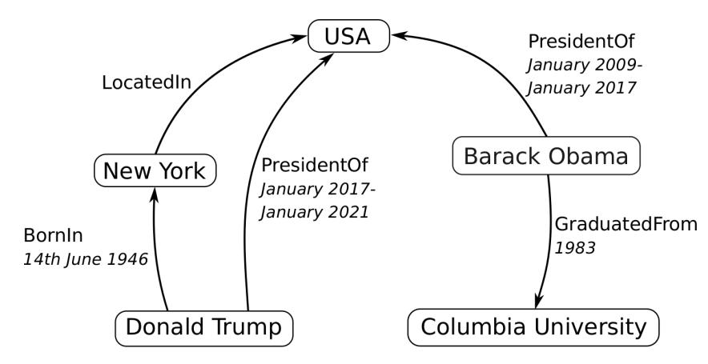

<!-- Image Description: The image is a logo for "Applied Sciences." It features a stylized graphic of three test tubes in a rack, suggesting experimental work within the sciences. The logo likely serves as a journal title or publisher identifier, indicating the subject matter of the paper in which it appears. -->

# *Article* **A Brief Survey on Deep Learning-Based Temporal Knowledge Graph Completion**

**Ningning Jia \* and Cuiyou Yao**

School of Management and Engineering, Capital University of Economics and Business, Beijing 100070, China; ycy@cueb.edu.cn

**\*** Correspondence: j.nn@cueb.edu.cn

**Abstract:** Temporal knowledge graph completion (TKGC) is the task of inferring missing facts based on existing ones in a temporal knowledge graph. In recent years, various TKGC methods have emerged, among which deep learning-based methods have achieved state-of-the-art performance. In order to understand the current research status of TKGC methods based on deep learning and promote further development in this field, in this paper, for the first time, we summarize the deep learning-based methods in TKGC research. First, we detail the background of TKGC, including task definition, benchmark datasets, and evaluation protocol. Then, we divide the existing deep learning-based TKGC methods into eight fine-grained categories according to their core technology and summarize them. Finally, we conclude the paper and present three future research directions for TKGC.

**Keywords:** knowledge graph; temporal knowledge graph completion; deep learning

## **1. Introduction**

Knowledge graphs (KGs) represent real-world information as structured facts in the form of triples, i.e., (subject entity, relation, object entity), abbreviated as (*s*,*r*, *o*), where *s* and *o* represent entities, and *r* represents a relation that holds between the two entities. For example, given a triple (Barack Obama, PresidentOf, USA), it indicates that there is a relation "PresidentOf" between the entities "Barack Obama" and "USA". The rich information carried by KGs makes them popular in various artificial intelligence and data mining applications, such as question answering [\[1\]](#page-13-0), recommender [\[2\]](#page-13-1), and dialogue systems [\[3\]](#page-13-2), etc. Although current KGs consist of billions of facts, they are still far from complete. For instance, in Freebase [\[4\]](#page-13-3), more than 75% of person entities have no known nationality [\[5\]](#page-13-4), which hampers their usefulness in the aforementioned applications.

Knowledge graph completion (KGC) tries to solve this incompleteness problem by inferring new triples based on the existing ones. It operates under the assumption that KGs are static, i.e., the ground truth of triples is independent of time. However, this assumption is not always realistic, e.g., as shown in Figure [1,](#page-1-0) the triple (Barack Obama, PresidentOf, USA) is only valid during the period [January 2009, January 2017]. Indeed, many real-world KGs such as Wikidata [\[6\]](#page-13-5), YAGO3 [\[7\]](#page-13-6), and ICEWS include temporal information for their facts. Specifically, temporal facts are facts of the form of quadruple (*s*,*r*, *o*, *t*), where *s* and *o* are entities, *r* is a relation, and *t* is a timestamp. It indicates that, at a time specified by *t*, there exists a relation *r* between entities *s* and *o*. Consequently, temporal knowledge graph completion (TKGC) has become an important research topic, which aims to automatically predict missing facts by making inferences from the existing temporal facts.

As TKGC has attracted increased attention from the research community, various TKGC methods have been proposed, among which, deep learning (DL)-based methods have achieved state-of-the-art performance. Therefore, in order to promote further progress in this field, it is necessary to comprehensively summarize and compare the existing DLbased TKGC methods. We note that: (1) Ref. [\[8\]](#page-13-7) provides a review of temporal knowledge

<!-- Image Description: The image is a simple graphic consisting of a yellow circle containing a white checkmark, accompanied by the text "check for updates". It's likely a visual cue or button within the paper's software, indicating a function for users to verify the presence of software updates or new versions. The image serves as a user interface element within the context of a technical paper discussing software development or deployment. -->

**Citation:** Jia, N.; Yao, C. A Brief Survey on Deep Learning-Based Temporal Knowledge Graph Completion. *Appl. Sci.* **2024**, *14*, 8871. [https://doi.org/10.3390/](https://doi.org/10.3390/app14198871) [app14198871](https://doi.org/10.3390/app14198871)

Academic Editor:Antonio Pagliaro

<!-- Image Description: The image displays a Creative Commons (CC) license indicator. It shows the CC logo, a symbol representing attribution, and the abbreviation "BY," signifying the "Attribution" license type. This indicates the work is licensed under Creative Commons Attribution, requiring attribution to the creator if used or shared. -->

**Copyright:** © 2024 by the authors. Licensee MDPI, Basel, Switzerland. This article is an open access article distributed under the terms and conditions of the Creative Commons Attribution (CC BY) license [\(https://](https://creativecommons.org/licenses/by/4.0/) [creativecommons.org/licenses/by/](https://creativecommons.org/licenses/by/4.0/) 4.0/).

graphs, which includes a section on TKGC. However, this section only covers five early methods related to TKGC. (2) Ref. [\[9\]](#page-13-8) provides a review of temporal knowledge graphs, focusing on representation learning-based TKGC methods. (3) There are three review papers [\[10](#page-13-9)[–12\]](#page-13-10) on TKGC, but they either mainly focus on the interpolation-based methods or, perhaps due to space limitations, introduce TKGC methods from a macro perspective. Most importantly, the above reviews do not include research work from the last one to two years.

<!-- Image Description: This image is a knowledge graph illustrating relationships between entities. Rectangular nodes represent entities (e.g., USA, Barack Obama), and directed edges show relationships (e.g., "PresidentOf," "LocatedIn") with associated timeframes. The graph depicts connections between US presidents, their birthplaces, and their educational background, demonstrating the use of a knowledge graph to represent factual information. -->

**Figure 1.** A knowledge graph example that contains temporal information [\[10\]](#page-13-9).

This paper reviews TKGC methods from the perspective of deep learning for the first time, and the proportions of the latest research after 2023 and the literature not included in the previous reviews reach 50%, respectively.

Our main contributions are summarized as follows:

- For the first time, we propose a survey that analyzes the existing DL-based TKGC methods to date and further subdivide them into eight categories according to their core techniques.
- We summarize eight common benchmark datasets and the general evaluation protocol.
- We point out three future directions for TKGC, providing new ideas for the work of relevant researchers.

The remainder of this paper is organized as follows. Section [2](#page-1-1) introduces the background of TKGC, including task definition, benchmark datasets, and evaluation protocol. Section [3](#page-3-0) summarizes the DL-based TKGC methods and Section [4](#page-10-0) summarizes the experimental results of these methods. Section [5](#page-12-0) concludes this paper and highlights the future directions of TKGC.

### **2. Background**

In this section, we first provide the definitions of TKG and TKGC and then introduce available benchmark datasets and the general evaluation protocol.

### *2.1. Task Definition*

*A temporal knowledge graph (TKG)* is a multi-relational directed graph with labeled timestamped edges between entities. It is usually expressed as G = (F|E, R, T ), where E, R, and T are the sets of entities, relations, and timestamps, respectively, and F ⊂ E × R × E × T is the set of facts that represent real events in the world. A fact *f* is denoted as (*s*,*r*, *o*, *t*), where *s* ∈ E, *r* ∈ R, *o* ∈ E, and *t* ∈ T are the subject (head) entity, relation, object (tail) entity, and timestamp, respectively.

It is worth mentioning that, in TKGs, the timestamp is attached to each fact indicating when it is valid. According to the form of the timestamp, facts in TKGs can be classified into two categories [\[13\]](#page-13-11): (a) discrete fact, in which the valid time of the fact is a time point, denoted as (*s*,*r*, *o*, *tp*), and (b) continuous fact, in which the valid time of the fact is a time

period, denoted as (*s*,*r*, *o*, [*tb* , *te* ]), with *tb* and *te* representing the beginning and the end of the valid time.

*Temporal knowledge graph completion (TKGC)* is the task of inferring missing facts based on the set of observed facts, which usually includes three subtasks: subject entity prediction, object entity prediction, and relation prediction.

- (i) Subject entity prediction: for an incomplete temporal fact (?,*r*, *o*, *t*), predict the subject entity *s* from the entity set E at timestamp *t* ∈ T .
- (ii) Object entity prediction: for an incomplete temporal fact (*s*,*r*, ?, *t*), predict the object entity *o* from the entity set E at timestamp *t* ∈ T .
- (iii) Relation prediction: for an incomplete temporal fact (*s*, ?, *o*, *t*), predict the relation *r* from the relation set R at timestamp *t* ∈ T .

In addition to the above three subtasks, several studies [\[14](#page-13-12)[,15\]](#page-13-13) have attempted to predict temporal information, namely, time prediction, which aims to predict the timestamp for which the given triple is consider valid, i.e., (*s*,*r*, *o*, ?). Depending on the timestamp range, TKGC has two settings: interpolation and extrapolation. Specifically, for a TKG from timestamp *t*0 to timestamp *tT*, the interpolation setting aims to infer the facts with timestamp *t*0 < *t* < *tT*, and the extrapolation setting aims to predict future facts that occur at timestamp *t* with *t* > *tT*. This paper focuses on the DL-based TKGC methods that adopt the interpolation setting.

## *2.2. Benchmark Datasets*

There are eight commonly used datasets for TKGC, and the main statistics for these datasets are summarized in Table [1.](#page-2-0)

**Table 1.** Statistics for TKGC benchmark datasets. #Entities, #Relations, #Timestamps, #Train, #Validation, and #Test denote the number of entities, relations, timestamps, training set, validation set, and test set, respectively.

| Dataset | #Entities | #Relations | #Timestamps | #Train | #Validation | #Test | Timestamps |
|-------------|-----------|------------|-------------|-----------|-------------|---------|---------------|
| ICEWS14 | 6869 | 230 | 365 | 72,826 | 8941 | 8963 | time point |
| ICEWS05-15 | 10,094 | 251 | 4017 | 368,962 | 46,275 | 46,092 | time point |
| ICEWS18 | 23,033 | 256 | 304 | 373,018 | 45,995 | 49,545 | time point |
| GDELT | 500 | 20 | 366 | 2,735,685 | 341,961 | 341,961 | time point |
| YAGO11k | 10,623 | 10 | 70 | 16,406 | 2050 | 2051 | time interval |
| YAGO15k | 15,403 | 34 | 198 | 29,381 | 3635 | 3685 | time interval |
| Wikidata12k | 12,554 | 24 | 81 | 32,497 | 4062 | 4062 | time interval |
| WIKI | 12,554 | 24 | 232 | 539,286 | 67,538 | 63,110 | time interval |

ICEWS14, ICEWS05-15, and ICEWS18. These three datasets are subsets of Integrated Crisis Early Warning Systems (ICEWS). ICEWS processes vast amounts of data from digitized news, social media, and other sources to predict, track, and respond to global events with time points, primarily for early warning purposes. These three datasets contain events in 2014, 2005–2015, and 2018, respectively.

GDELT. This dataset is a subset of the larger Global Database of Events, Language, and Tone (GDELT) [\[16\]](#page-13-14). GDELT is a comprehensive global database that includes broadcast, print, and web news from every country starting in 1979. The GDELT subset contains facts with daily timestamps in the form of time points between 1 April 2015 and 31 March 2016. It should be emphasized that GDELT exhibits a complex geometry characterized by a small number of nodes and a substantial volume of training data.

YAGO11k, YAGO15k, WIKI, and Wikidata12k. These datasets are subsets of YAGO3 [\[7\]](#page-13-6) and Wikidata [\[6\]](#page-13-5). YAGO3 and Wikidata are two large-scale TKGs where a portion of the facts involves temporal information. Specifically, YAGO3 is a linked database developed by the Max Planck Institute in Germany, which integrates data from Wikipedia, WordNet, GeoNames, and other data sources [\[7\]](#page-13-6). Wikidata is a Wikimedia hosted and maintained

project launched in 2012 that aims to create a free knowledge graph about the world that can be read and edited by both humans and machines. Notably, different from ICEWS dataset that only involves time points, temporal information in YAGO3 and Wikidata is expressed in different forms, including time points such as 1 January 2000, time intervals containing begin or end time with shapes such as 'occursSince 2003' or 'occursUntil 2005', and time intervals containing both begin and end time, such as [2000, 2010]. In YAGO11k and Wikidata12k, all facts have temporal information in the form of time intervals with begin and end times. Among these two subsets, the frequency distribution of timestamps in YAGO11k exhibits the long-tail property, which makes it difficult to predict. In YAGO15k, temporal information is represented in the form of time intervals containing begin or end time, and some facts do not even include timestamps. Therefore, this subset is temporally incomplete and more challenging.

## *2.3. Evaluation Protocol*

The evaluation protocol describes how to measure the performance of the TKGC method. Typically, for a test quadruple (*s*, *p*, *o*,*t*), it generates corresponding corrupted quadruples for the subtasks entity predict, relation predict, and time prediction, respectively. For entity predict, the corrupted quadruples are generated by replacing either the subject entity (for subject entity predict) or the object entity (for object entity predict) with all possible entities such that the resulting corrupted quadruples do not belong to the TKG, i.e., *Cs* = {(*s* ′ ,*r*, *o*,*t*) : *s* ′ ∈ *E*,(*s* ′ ,*r*, *o*,*t*) ∈/ *G*} or *Co* = {(*s*,*r*, *o* ′ ,*t*) : *o* ′ ∈ *E*,(*s*,*r*, *o* ′ ,*t*) ∈/ *G*}. The corrupted quadruples of relation prediction and time prediction are generated in a similar way: *Cr* = {(*s*,*r* ′ , *o*,*t*) : *r* ′ ∈ *R*,(*s*,*r* ′ , *o*,*t*) ∈/ *G*} and *Ct* = {(*s*,*r*, *o*,*t* ′ ) : *t* ′ ∈ *T*,(*s*,*r*, *o*,*t* ′ ) ∈/ *G*}, respectively. Then, the corrupted quadruples and test quadruple on each subtask are sorted according to the scoring function to obtain the rank of the test quadruple.

Commonly used evaluation metrics include *Mean Rank* (*MR*), *Mean Reciprocal Ranking* (*MRR*), and *Hits@N*. *MR* is the average rank for all test quadruples, and *MRR* is the inverse of *MR*. *Hits@N* is the percentage of test quadruplets with ranks lower than or equal to N.

### **3. Deep Learning-Based TKGC Methods**

The papers included in this survey were identified by searching for the phrase "temporal knowledge graph completion" in Google Scholar. We observed that topics tended to drift away from our focus after 100 search results, so we stopped the investigation there. Given our focus on the latest research trends in this field, we restricted candidate papers to those published after 1 January 2018.

Since the candidate papers use different kinds of deep learning algorithms for processing temporal information in TKGs, the deep learning-based TKGC methods can be further subdivided according to different algorithms. From another perspective, the candidate papers can also be subdivided according to different representations of temporal information, such as independent representation of temporal information, representation that integrates temporal information and entities, representation that integrates temporal information and relations, and so on. In order to highlight the technical details and underlying logic of the TKGC methods, this survey uses the former to subdivide them, and the specific subdivision is shown in Table [2.](#page-4-0) It is worth mentioning that, considering that some TKGC methods are extensions of static KGC methods, we also list the corresponding static KGC methods in the table and give a general introduction to them in the next paragraph.

TransE [\[17\]](#page-13-15) is a classic model of static KGC, which maps entities and relations into a continuous embedding (i.e., vector) space, and which regards relation embedding as a translation operator from subject entity embedding to object entity embedding. TransR [\[18\]](#page-13-16) is a variant of TransE that uses relation-specific spaces to handle different relations, mining more semantic information. DISTMULT [\[19\]](#page-14-0) learns embeddings using a bilinear diagonal model, which is a special case of the bilinear objective used in TransE. CapsE [\[20\]](#page-14-1) applies capsule network (CapsNet) [\[21\]](#page-14-2) to model the entries at the same dimension in entity and relation embeddings. SimplE [\[22\]](#page-14-3) is a tensor factorization approach based on the canonical polyadic for static KGC. ConvE [\[23\]](#page-14-4) first applies convolutional neural network (CNN) [\[24\]](#page-14-5) to the static KGC, which uses 2D convolution to model the interactions between entity and relation embeddings. ConvKB [\[25\]](#page-14-6) improves ConvE by exploring the global relationships among same dimensional entries of entity and relation embeddings. ConvTransE [\[26\]](#page-14-7) can be seen as a combination of ConvE and TransE, which uses a convolutional network to model relations as translation operations and preserves the translation characteristic between entities and relations.

**Table 2.** Fine-grained categorization of deep learning-based temporal knowledge graph completion methods.

| Categories | TKGC Methods | Extended from Static KGC Methods | Encoder–Decoder | |
|------------------------------|---------------------|----------------------------------|-----------------|--|
| | TA-TransE [27] | TransE [17] | ✘ | |
| LSTM-based methods | TA-DISTMULT [27] | DISTMULT [19] | ✘ | |
| | TA-TransR [28] | TransR [18] | ✘ | |
| | CATKGC [29] | ✘ | ✘ | |
| | ConvTKG [30] | ✘ | ✔ | |
| CNN-based methods | SANe [31] | ✘ | ✘ | |
| | SANe+ [32] | ✘ | ✘ | |
| | TempCaps [33] | CapsE [20] | ✘ | |
| CapsNet-based methods | BiQCap [34] | ✘ | ✘ | |
| | RoAN [35] | SimplE [22] | ✘ | |
| Attention-based methods | HSAE [36] | ✘ | ✔ | |
| | TGAP [37] | ✘ | ✔ | |
| GNN-based methods | STRGNN [38] | ✘ | ✔ | |
| | HyGNet [39] | ✘ | ✘ | |
| | TeMP [40] | TransE [17] | ✔ | |
| | MtGCN [41] | ConvTransE [26] | ✔ | |
| GCN-based methods | TAGCN [42] | ConvE [23] | ✔ | |
| | TAL-TKGC [43] | ✘ | ✘ | |
| | THOR [44] | ✘ | ✘ | |
| | IAGAT [45] | ✘ | ✘ | |
| GAN-based methods | DEGAT [46] | ConvKB [25] | ✔ | |
| | T-GAE [47] | ConvKB [25] | ✔ | |
| | SToKE [48] | ✘ | ✘ | |
| Language model-based methods | Llama-2-7b-CoH [49] | ✘ | ✘ | |
| | Vicuna-7b-CoH [49] | ✘ | ✘ | |

### *3.1. LSTM-Based Methods*

Long short-term memory (LSTM) [\[50\]](#page-15-15) is a special type of recurrent neural network that can learn long-term dependencies in time series data, such as machine translation [\[51\]](#page-15-16) and speech recognition [\[52\]](#page-15-17). Given the input data at time *t*, i.e., *xt* , LSTM performs the following computation:

$$
i_{t} = sigmoid(W_{ii}x_{t} + b_{ii} + W_{hi}h_{t-1} + b_{hi})
$$
\n
$$
f_{t} = sigmoid(W_{if}x_{t} + b_{if} + W_{hf}h_{t-1} + b_{hf})
$$
\n
$$
o_{t} = sigmoid(W_{io}x_{t} + b_{io} + W_{ho}h_{t-1} + b_{ho})
$$
\n
$$
\hat{c}_{t} = tanh(W_{ic}x_{t} + b_{ic} + W_{hc}h_{t-1} + b_{hc})
$$
\n
$$
c_{t} = f_{t} * c_{t-1} + i_{t} * \hat{c}_{t}
$$
\n
$$
h_{t} = o_{t} * tanh(c_{t}),
$$
\n(1)

where *it* , *ft* , and *ot* are the input gate, forget gate and output gate, respectively; *ct* , *c*b*t* are the cell state and candidate cell state, respectively; and *ht* is the hidden state. The various *W* and *b* terms are the weight matrices and bias vectors.

Garcia-DuranDN and Niepert [\[27\]](#page-14-8) convert quadruples into triples by merging timestamps into relations, i.e., (*s*,*r*, *o*, *t*) to (*s*,*r* + *t*, *o*), and apply LSTM to encode the merged relations. Then, they extend two classic static KGC methods, TransE [\[17\]](#page-13-15) and DISTMULT [\[19\]](#page-14-0), and propose TA-TransE and TA-DISTMULT, respectively. TA-TransE models merge relations as translation operations into the embeddings of subject and object entities and use a distance-based scoring function *f*(*s*,*r* + *t*, *o*) = ||*es* + *er*+*t* − *eo*||2 to measure the plausibility of a triple fact, where *es* , *eo*, and *er*+*t* are the embeddings of subject entity, object entity, and merged relation, respectively. The essential idea of TA-DISTMULT is the same as that of TA-TransE; the only difference is the score function, which is *f*(*s*,*r* + *t*, *o*) = (*es* ⊗ *eo*)*e* ⊤ *r*+*t* , where ⊗ is the element-wise product, and ⊤ represents the matrix transpose.

Since LSTM can handle sequences of varying lengths, a natural advantage is that the merged relation is adaptive to timestamps of different relations, such as points or intervals. Inspired by [\[27\]](#page-14-8), Chen et al. [\[28\]](#page-14-9) present TA-TransR, which expands the static KGC method TransR [\[18\]](#page-13-16) to TKGC, and the scoring function is *f*(*s*,*r* + *t*, *o*) = ||(*es* − *esMr*) + *er*+*t* − (*eo* − *eoMr*)||2 2 , where *Mr* is the projection matrix corresponding to relation *r*. Furthermore, they impose three kinds of temporal consistency constraints (i.e., temporal disjointness, temporal ordering, and temporal spans) on TA-TransR, and formulate TKGC task as an integer linear programming optimization problem.

Methods in this category combine LSTM with existing classical static KGC methods to learn time-aware relations or entities for TKGC. They have clear motivations, simple implementations, and are efficient, but they are unable to model the graph structure inherent in TKGs.

## *3.2. CNN-Based Methods*

Convolutional neural networks (CNNs) [\[24\]](#page-14-5) have achieved remarkable performance in the field of computer vision, such as object detection [\[53\]](#page-15-18) and image segmentation [\[54\]](#page-15-19). The core operation of CNN is to extract different feature maps of input data through convolution kernels. Formally, the feature value at location (*i*, *j*) in the *k*-th feature map is calculated by:

$$
z_{i,j,k} = W_k x_{i,j} + b_k, \tag{2}
$$

where *Wk* and *bk* are the weight matrix and bias vector of the *k*-th convolution kernel, respectively, and *xi*,*j* denotes the overlapped input data centered at location (*i*, *j*).

Liu et al. [\[29\]](#page-14-10) propose a context-aware TKGC method (CATKGC), which consists of two modules: one for context selection and the other for modeling temporal interactions. Specifically, the context selection module decomposes a fact into two parts, i.e., relation and entities, and measures the usefulness of the context for each part, respectively. Then, a CNN is used to encode context and extract features of temporal interactions, based on which a fully connected layer is adopted to learn the temporal consistency score. Finally, the consistency score is used together with a plausibility score to predict the correctness of a fact.

He et al. [\[30\]](#page-14-11) propose a query-aware (a query is an incomplete quadruple) embedding model based on a convolutional neural network, named ConvTKG, which has an encoder– decoder architecture. In the encoder, it converts the timestamp into a sequence of atomiclevel temporal tokens. Then, these tokens are fed into a gate recurrent unit (GRU) layer and an attention layer to obtain query-aware representations of timestamps. In the decoder, multiple one-dimensional kernels are employed to extract global features among elements in the query, yielding various feature maps that are then reduced to feature vectors through multi-layer perception (MLP). Finally, the feature vectors of a query are computed with the candidate entity embeddings to produce the plausibility scores of candidate entities.

SANe [\[31\]](#page-14-12) extends CNN to map the facts with different timestamps into different latent spaces. Essentially, it turns TKGC into static KGC by handling different temporal snapshots

in separate spaces. In particular, a time-aware parameter generator (TaPG) is designed to constrain the overlap of latent spaces according to the distance of the timestamps, which endows the CNN with specific parameters in terms of the context of timestamps. Lee et al. [\[32\]](#page-14-13) present an expanded version of SANe by introducing an adaptive parameter generator (AdaPG), which overcomes the limitations of TaPG in handling unbalanced TKGs through allocating parameters based on the number of facts instead of timestamps.

Methods in this category use CNNs to model temporal information and its interactions, which have more powerful feature learning capabilities than the above LSTM-based methods but which are still unable to model the graph structure of TKGs.

## *3.3. CapsNet-Based Methods*

Capsule network (CapsNet) [\[21\]](#page-14-2) can be seen as an improved version of CNN, which can encode the intrinsic spatial relationships between a part and the whole in images. It consists of two key components: capsules and a dynamic routing mechanism. A capsule is a group of neurons that processes different information about an object, and the length of its output vector represents the probability that the object represented by the capsule is present in the current input. To guarantee the length of the vector stays between 0 and 1, a squash function is used:

$$
\mathbf{v}_{j} = \frac{||\mathbf{s}_{j}||^{2}}{1 + ||\mathbf{s}_{j}||^{2}} \frac{\mathbf{s}_{j}}{||\mathbf{s}_{j}||},
$$
(3)

where **s***j* is the input of a capsule, and **v***j* is its squashed output.

The dynamic routing mechanism specifies how capsules communicate with each other between layers. Specifically, all output vectors **u***i* of capsules in the lower layer are first multiplied by a weight matrix **W***ij*. Then, the weighted sum of newly obtained vectors are input into a capsule **s***j* in the next layer:

$$
\widehat{\mathbf{u}}_{j|i} = \mathbf{W}_{ij}\mathbf{u}_i, \quad \mathbf{s}_j = \sum_i c_{ij}\widehat{\mathbf{u}}_{j|i}, \tag{4}
$$

where *cij* is the coupling coefficient between capsule *i* and capsule *j*.

TempCaps [\[33\]](#page-14-14) extends the static KGC method CapsE [\[20\]](#page-14-1) to TKGC, which consists of a neighbor selector, a dynamic routing aggregator, and a multi-layer perceptron (MLP) decoder. Specifically, it first selects two types of neighboring entities for each entity, namely local entities and global relation entities, through the neighbor selector. Then, it uses the dynamic routing aggregator to learn the embedding of the entity based on the retrieved neighbors. Finally, the score for each candidate entity is generated by feeding the embeddings of the entities in the candidate set into the MLP decoder.

BiQCap [\[34\]](#page-14-15) combines biquaternions and capsule networks for TKGC. Specifically, it first embeds entities, relations, and timestamps into the biquaternions of k-dimension, i.e., **Q***s* , **Q***r* , **Q***o*, **Q***t* ∈ R*k* , where timestamps are represented as translations of the subject entities, and relations are represented as rotations in the biquaternion space after translation. On this basis, a distance-based score function is designed as *f*(*s*,*r*, *o*, *t*) = ||((**Q***s* + **Q***t*) ⊙ **Q***r*) ⊗ **b** − **Q***o*||, where **b** ∈ R*k* is a bias vector, and ⊙ and ⊗ denote the Hamilton product and element-wise multiplication, respectively. Then, the trained embeddings of entities, relations, and timestamps from biquaternions are used as the input to the capsule network, and a novel routing algorithm called inverted dot-product attention is proposed, which determines the routing probability directly through the agreement between parent and child capsules.

Methods in this category have similar characteristics to the CNN-based methods. Since CapsNet is an improved version of CNN, it inherits the characteristics of CNN and can model local and global spatial relationships. Therefore, methods in this category can theoretically better characterize the spatial characteristics of entities in TKGs.

## *3.4. Attention-Based Methods*

The attention mechanism [\[55\]](#page-16-0) is popular in sequence modeling tasks such as machine translation [\[56\]](#page-16-1) and speech recognition [\[57\]](#page-16-2). Formally, the relevant score of the *i*-th data in the input sequence and the *j*-th data in the output sequence is computed as:

$$
e_{ji} = a(S_i^{in}, S_j^{out}), \tag{5}
$$

where *a*() represents the alignment function, which can be implemented using a neural network, *S in i* is the *i*-th data in the input sequence, and *S out j* is the *j*-th data in the output sequence. In addition, the softmax function is often used to compress the relevance scores into positive values between 0 and 1.

Bai et al. [\[35\]](#page-15-0) restructure TKG into a form of relational multi-chains and propose a relation-oriented attention mechanism to capture the features of relations while considering temporal information. Then, they employ DE-SimplE [\[58\]](#page-16-3) to obtain the features of entities. Finally, these features are fed into the scoring function of the static KGC model SimplE [\[22\]](#page-14-3) to calculate the plausibility scores of the given facts.

Inspired by the self-attention mechanism [\[59\]](#page-16-4) and the diachronic embedding technique [\[58\]](#page-16-3), Ren et al. [\[36\]](#page-15-1) propose HSAE, which has an encoder–decoder architecture. The encoder module is composed of two layers—an entity self-attention embedding layer and a relation self-attention embedding layer—which are used to obtain embeddings of entities and relations containing time series information and graph structure information, respectively. The decoder module feeds these embeddings into a scoring function to compute their plausibility scores.

Methods in this category use the attention mechanism to model the importance of entities and/or relations in TKGs. They have the characteristics of theoretical simplicity but usually need to be combined with other methods to complete the TKGs.

## *3.5. GNN-Based Methods*

A graph neural network (GNN) [\[60\]](#page-16-5) is an effective model that operates directly on graph-structured data, such as social networks [\[61\]](#page-16-6) and road networks [\[62\]](#page-16-7). It follows a recursive neighborhood aggregation (or message passing) scheme, where the feature vector of a node (i.e., entity) is computed by recursively aggregating and transforming embeddings of its neighboring nodes. Formally, the computation of the feature vector of each node can be described as:

*m* (*k*) *v* = *AGGREGATE*(*k*) ({*h* (*k*−1) *u* : *u* ∈ *N*(*v*)}), *h* (*k*) *v* = *UPDATE*(*k*) (*h* (*k*−1) *v* , *m* (*k*) *v* ), (6)

where *m* (*k*) *v* and *h* (*k*) *v* stand for the message vector and the feature vector of node *v* at the *k*-th layer, respectively. *AGGREGATE*() and *UPDATE*() are the aggregation function (e.g., mean, average, and max pooling) and the update function (e.g., linear-layer combination) [\[63\]](#page-16-8), respectively.

TGAP [\[37\]](#page-15-2) views timestamps as properties of relations between entities and has an encoder–decoder architecture. In the encoder, a temporal GNN is introduced to aggregate query-related (a query is a incomplete quadruple) information from the local neighborhood of each entity, focusing on encoding the temporal displacement between the timestamp of the input query and each relation being encoded. In addition, a decoder based on attention propagation is proposed. Different from the score function decoder, the attention propagation decoder propagates attention through existing edges (i.e., relations) in the graph and determines the plausibility of facts based on the attention values. It naturally allows multi-hop reasoning, and the inferred attention distribution provides better interpretability.

Wang et al. [\[38\]](#page-15-3) propose a semantic-driven, time-aware relational GNN model, named STRGNN, for the TKGC task, which consists of a semantic-enhanced encoder and a convolution-based decoder. In the encoder, it first abstracts a subgraph for the given subject entity *s* (given an incomplete quadruple (*s*,*r*, ?, *t*) as an example) according to both its temporal neighborhoods and semantically similar neighborhoods. Then, it generates time-aware representation vectors for the temporal neighbors and performs aggregation. In the decoder, after updating the time-aware representation of the subject entity *s* at timestamp *t*, a convolution-based decoder is introduced to calculate the score of each candidate object entity.

HyGNet [\[39\]](#page-15-4) exploits hyperbolic geometry to model temporal knowledge graphs, which comprises two key components: the Hyperbolic Gated Graph Neural Network (HG-GNN) and the Hyperbolic Convolutional Neural Network (HCNN). HGGNN aggregates neighborhood information in hyperbolic space, aiming to capture the contextual information and dependencies between entities. HCNN interacts with embeddings in hyperbolic space to model the complex interactions among entities, relations, and timestamps. Finally, a distance-based score function is introduced to measure the plausibility of facts.

Methods in this category use GNN to model the graph structure in TKGs, assuming that similar entities have similar graph structures. However, relying solely on structural information limits the completion performance. Therefore, methods in this category usually combine with other mechanisms to model information other than structural information in TKGs, such as relations, entity descriptions, and attributes, etc., for TKGC.

## *3.6. GCN-Based Methods*

Graph convolutional network (GCN) [\[64](#page-16-9)[,65\]](#page-16-10) is a variant of GNN that uses a convolutionlike operation to aggregate the features of each node's corresponding neighbor nodes and then performs a non-linear transformation to update the feature vector of each node. Formally, at the *k*-th layer, the feature vector of each node is computed as (the aggregate and update function are integrated):

$$
h_v^{(k)} = \sigma(\sum_{u \in N(v) \cup \{v\}} Wh_u^{(k-1)}),\tag{7}
$$

where *W* is a weight matrix, *σ* is the activate function ReLU, and *N*(*v*) is the set of neighbor nodes of *v*.

TeMP [\[40\]](#page-15-5) is a GCN-based method that has an encoder–decoder structure. The encoder maps each entity to a time-dependent low-dimensional embedding at each time step, while the decoder uses these entity embeddings to score the likelihood of the facts. Specifically, it discretizes a TKG into multiple static KG snapshots and generates dynamic entity features along two dimensions: structural neighborhoods and temporal dynamics. Structural encoder uses GNN to extract features from local node neighborhoods in each snapshot through message passing and aggregation, while temporal encoder captures feature evolution over multiple time steps by sequential models. To the decoder, the score function of TransE [\[17\]](#page-13-15) is applied to calculate the plausibility of the facts.

MtGCN [\[41\]](#page-15-6) also has an encoder–decoder structure, which consists of three components: structural encoder, temporal encoder, and decoder. The structural encoder uses relation-aware GCN to capture the topology of each time step in the knowledge graph and generate entity representations at each timestamp. Then, the temporal encoder uses a sequence-based model GRU to integrate the output of the structure encoder and learn historical information at different time scales to generate entity representations that contain structural and temporal features. The decoder is a scoring function, specifically the scoring function of the static KGC method ConvTransE [\[26\]](#page-14-7), which predicts missing entities or relations in the facts in a conditional probability manner.

TAGCN [\[42\]](#page-15-7) can simultaneously extract structural information and temporal dependency and is also in the architecture of encoder–decoder. It decomposes TKGC into two phases, namely, neighboring temporal message aggregation and entity temporal focus attachment. Accordingly, on the encoder side, a temporal self-attention layer is defined to capture the temporal dependency of the neighboring fact, and a temporal message aggregation module is defined to extract neighborhood structure in TKG and increase the

expressiveness of entities. The decoder side chooses the score function of ConvE [\[23\]](#page-14-4) to estimate the plausibility of the facts.

Nie et al. [\[43\]](#page-15-8) propose TAL-TKGC, which consists of three key components: temporal attention module, TKG embedding module, and completion module. The temporal attention module is designed to capture the deep connection between timestamps, entities, and relations at the semantic level. The TKG embedding module embeds entities using an importance-weighted GCN, which considers both the temporal semantic importance and the structural importance of entities. The completion module uses TTransE [\[14\]](#page-13-12), which treats the plausibility of facts as the distance between the subject and object entities in the vector space that integrates relations and temporal information.

Lee et al. [\[44\]](#page-15-9) propose a self-supervised approach named THOR (Three-tower grapH cOnvolution networks), which extracts latent knowledge from TKG by jointly exploiting temporal and non-temporal dependencies between entities and structural dependencies between relations. Specifically, they design three-tower GCNs with different roles: Temporal GCN (TempGCN for short), aTemporal GCN (aTempGCN for short), and Relational GCN (RelGCN for short). Given a fact (*s*,*r*, *o*, *t*), THOR obtains the temporal embeddings of *s* and *o* relative to *t* (via TempGCN), the atemporal embeddings of *s* and *o* (via aTempGCN), and the embedding of *r* (via RelGCN). Finally, THOR learns embeddings of entities and relations with the following two objectives: (1) maximize the likelihood of facts in TKG; (2) make the temporal embedding of each entity more accurate. For (1), they adopt the negative log-likelihood loss, and for (2), they propose a time-aware self-supervised loss that can learn auxiliary supervision signals for each entity.

Methods in this category have similar characteristics as the GNN-based methods. Since GCN is a special version of GNN, which uses the convolution-like operation to aggregate information, to some extent, methods in this category can be regarded as a subset of the GNN-based methods.

## *3.7. GAN-Based Methods*

A graph attention network (GAN) [\[66\]](#page-16-11) is an improved model of GCN, which applies an attention mechanism to impose different weights on nodes in the neighborhood in the aggregation step. Formally, the feature vector of each node in the *k*-th layer is computed as:

$$
h_v^{(k)} = \sigma\left(\sum_{u \in N(v) \cup \{v\}} \alpha_{vu} W h_u^{(k-1)}\right),\tag{8}
$$

in which

$$
\alpha_{vu} = softmax(e_{vu}) = \frac{exp(e_{vu})}{\sum_{j \in N(v)} exp(e_{vj})}, e_{vu} = a(Wh_v^{(k-1)}, Wh_u^{(k-1)}),
$$
(9)

where *W* is a weight matrix; *αvu* represents the weight value of node *u* for node *v*; *σ* indicates the activate function, e.g., ReLU; *evu* indicates the importance of node *u*'s feature to node *v*; and *a*() represents the attention mechanism and is a single-layer feed-forward neural network.

Chen et al. [\[45\]](#page-15-10) divide the attribute information of entities into inherent attributes and temporal attributes and propose IAGAT for TKGC. IAGAT utilizes GAN to learn the inherent embeddings of entities and relations under the inherent attributes. In addition, a rotation in complex space is used to obtain temporal-evolving embeddings of entities and relations, which are then combined with intrinsic embeddings. Finally, a distance-based scoring function is used to calculate the plausibility of the facts.

DEGAT [\[46\]](#page-15-11) is an end-to-end encoder–decoder model. It uses GAN as an encoder to obtain entity features by aggregating features of neighboring entities, and it obtains relation features by capturing multi-hop information in the neighborhood of any given entity. The encoder does not take into account temporal information. In the decoder, a diachronic embedding function is introduced to perceive the dynamic features of entities and learn the changing features of entities over time. Furthermore, a novel model DE-ConvKB is proposed, which combines DE [\[58\]](#page-16-3) and ConvKB [\[25\]](#page-14-6) to calculate the plausibility of facts.

T-GAE [\[47\]](#page-15-12) simultaneously applies GAN and LSTM to the TKGC task. In essence, the model is an encoder–decoder architecture, where the encoder consists of LSTM and GAN. Specifically, LSTM encodes both timestamps and relations into token sequences to produce relation embeddings with temporal information. GAN considers neighborhood aggregators to learn the features of entities. As for the decoder, the scoring function of ConvKB, a KGC method, is selected to calculate the plausibility of the facts. T-GAE is trained in a step-by-step training paradigm, which means that the encoder (LSTM and GAT) and the decoder (ConvKB) are trained independently.

Methods in this category have similar characteristics to the GNN-based and GCNbased methods. Since GAN introduces an attention mechanism based on GCN, which enables it to characterize the different importance of different neighbor entities in the aggregation process, in theory, the GAN-based methods can better model the heterogeneity of TKGs.

### *3.8. Language Model-Based Methods*

Pre-trained language models [\[67](#page-16-12)[,68\]](#page-16-13) and large language models [\[69\]](#page-16-14) are making new waves in the field of natural language processing and artificial intelligence due to their emergent ability and generalizability.

SToKE [\[48\]](#page-15-13) employs the pre-trained language model BERT [\[70\]](#page-16-15) to learn joint structural and temporal contextualized knowledge embeddings. Specifically, it first builds an event evolution tree (EET) for each query. TKG can be regarded as a structured event sequence that records the query-related structure and temporal contexts. Then, a temporal embedding and structure matrix are proposed to learn the temporal information and structural dependencies of facts in EET. Finally, TKGC is formulated as a mask prediction problem, and the pre-trained language model BERT is fine-tuned by masking the missing entities of the query.

Luo et al. [\[49\]](#page-15-14) propose Llama-2-7b-CoH and Vicuna-7b-CoH, which conceptualize TKGC as a dual process of large language model fine-tuning and generation along a historical chain. During the fine-tuning, the Low-Rank Adaptation [\[71\]](#page-16-16) method is used, and the data in TKG are divided into an input part and a supervised labeling part, guiding the large language model to adapt to the mapping relationship between the textual information of the specific TKG and the inherent complex logic in temporal events. Additionally, the local information across multiple single-step graphs is used for historical data augmentation to explore the ability of a large language model to perceive graph-modality information.

Methods in this category use pre-trained language models or large language models for TKGC, which can provide additional text information outside the TKGs to assist the TKGC task, but which have high requirements on the hardware platforms and require a large amount of training data.

### **4. Performance Comparison of Deep Learning-Based TKGC Methods**

In this section, we summarize the experimental results of existing deep learning-based TKGC methods on the public dataset ICEWS05-15, which contains the most temporal information, and analyze their performance, aiming to help researchers understand the current status of deep learning-based TKGC methods in more detail and provide references for subsequent research.

It should be pointed out that the methods in Table [3](#page-11-0) were implemented under different evaluation settings, i.e., raw setting, static filtered setting, and time-wise filtered setting. The same method may produce different experimental results under different settings. Therefore, it is necessary to explain the settings first. The raw setting and the static filtered setting are a pair of opposing settings, originally designed for static KGC [\[17\]](#page-13-15). The time-wise filtered setting [\[58\]](#page-16-3) is a modified version of the static filter setting for TKGC. Specifically, in the raw setting, for each test triple, its corrupted triples are constructed

by randomly replacing its subject entity or object entity with every entity in the entity set, while the static filtered setting constructs corrupted triples by removing all corrupted triples that are repeated with triples in the train, validation, and test sets to reduce the impact of these repeated corrupted triples. Since directly applying the static filtered setting to TKGC may wrongly remove corrupted quadruplets, Goel et al. [\[58\]](#page-16-3) introduced temporal information into the static filtered setting and proposed the time-wise filtered setting. More specifically, for each test quadruple (*s*,*r*, *o*, *t*) ∈ *test*, it constructs the corrupted quadruples as (*s* ′ ,*r*, *o*, *t*),(*s*,*r*, *o* ′ , *t*) ∈ G / , where *s* ′ , *o* ′ ∈ E.

| Category | TKGC Method | MRR | MR | Hits@10 | Hits@1 |
|------------------------------|--------------------------|-------|-----|---------|--------|
| | ⋆ TA-TransE [27] | 0.299 | 79 | 66.8 | 9.6 |
| LSTM-based methods | ⋆ TA-DISTMULT [27] | 0.474 | 98 | 72.8 | 34.6 |
| | TA-TransR [28] | - | - | - | - |
| | CATKGC [29] | - | - | - | - |
| | ⋄ ConvTKG [30] | 0.740 | - | 86.2 | 67.4 |
| CNN-based methods | ∗ SANe [31] | 0.683 | - | 82.3 | 60.5 |
| | SANe+ [32] ∗ | 0.686 | - | 82.6 | 60.8 |
| | ∗ TempCaps [33] | 0.521 | - | 70.5 | 42.3 |
| CapsNet-based methods | † BiQCap [34] | 0.691 | - | 83.7 | 62.1 |
| | ⋆ RoAN [35] | 0.599 | - | 82.3 | 47.9 |
| Attention-based methods | † HSAE [36] | 0.864 | - | 94.1 | 81.7 |
| | † TGAP [37] | 0.670 | - | 84.5 | 56.8 |
| GNN-based methods | ⋆ STRGNN [38] | 0.781 | - | 85.1 | 66.7 |
| | ∗ HyGNet [39] | 0.693 | - | 83.7 | 61.2 |
| | ⋆ TeMP [40] | 0.691 | - | 91.7 | 56.6 |
| | MtGCN [41] | - | - | - | - |
| GCN-based methods | ⋆ TAGCN [42] | 0.641 | - | 81.2 | 55.3 |
| | ⋆ TAL-TKGC [43] | 0.354 | - | 69.2 | 22.6 |
| | † THOR [44] | 0.799 | - | 88.2 | 75.0 |
| | ∗ IAGAT [45] | 0.615 | - | 80.8 | 50.3 |
| GAN-based methods | † DEGAT [46] | 0.777 | 241 | 87.1 | 72.4 |
| | ∗ T-GAE [47] | 0.696 | - | 86.2 | - |
| | ∗ SToKE [48] | 0.712 | - | 88.5 | 60.5 |
| Language model-based methods | ∗ Llama-2-7b-CoH [49] | - | - | 69.9 | 38.6 |
| | ∗ Vicuna-7b-CoH [49] | - | - | 70.7 | 39.2 |

**Table 3.** Experimental results on ICEWS05-15.

We use different symbols to represent the setting information, where ⋆ represents the static filtered setting, ⋄ represents the raw setting, ∗ represents the time-wise filtered setting, and † represents that the setting information is not given.

From Table [3,](#page-11-0) we can observe the following:

(1) Among the methods under the static filtered setting, the GNN-based method STRGNN achieves the highest Hits@1 value of 66.7%, which shows the effectiveness of GNN in TKGC. Similarly, among the methods under the time-wise filtered setting, the GNN-based method HyGNet achieves the highest Hits@1 value of 61.2%, which also shows the effectiveness of GNN in TKGC. Both of these indicate that GNN is worthy of further exploration for TKGC.

(2) By comparing GNN-based, GCN-based, and GAN-based methods under the static and time-wise filtered settings, we find that GNN-based method achieved the best experimental results, which demonstrates that using methods with stronger feature characterization capabilities or more parameters does not necessarily improve experimental performance. Therefore, it is necessary to consider the characteristics of the TKGC task itself and design a model that is as simple as possible.

(3) The highest Hits@1 value of the methods under the time-wise filtered setting does not exceed 61.2% (HyGNet), indicating that there is a lot of room for improvement in all categories of deep learning-based TKGC methods.

(4) The method ConvTKG under the raw setting has a higher Hits@1 value than the methods under the static and time-wise filtered settings. This reflects the effectiveness of CNN in TKGC to a certain extent; however, in order to make a fairer comparison, further verification is needed under the static and time-wise filtered settings. Similarly, methods that do not provide setting information also need further verification.

(5) TA-TransE directly merges temporal information into relations, thereby converting TKGC into static KGC, and introduces LSTM to encode the merge information. This method has a simple structure, but the number of parameters increases and the characteristics of TKGC are not fully exploited, resulting in a Hits@1 value much lower than other methods.

(6) The application of large language models, especially Llama and Vicuna, in TKGC is still in its initial exploratory stage, and its experimental results are lower than most other categories of deep learning-based methods. Large language models have huge parameters and require a lot of training data or clever fine-tuning strategies. It may even be necessary to reconsider the way in which the TKGC task is modeled on large language models.

## **5. Conclusions and Future Directions**

In this paper, we present a review of the deep learning-based TKGC methods and subdivide them into eight categories according to their core technology. Despite the significant progress made in TKGC research, there still remain several important future research directions.

- **Few-shot TKGC.** The relations in TKGs obey the long-tail distribution; in other words, a large portion of relations have only a few quadruples in TKGs. Therefore, few-shot TKGC (one-shot and zero-shot TKGC can be seen as special kinds of few-shot TKGC) is a research direction worthy of great attention. Although several approaches [\[72,](#page-16-17)[73\]](#page-16-18) have been proposed to try to solve the few-shot TKGC task, this direction is still in its infancy. In addition, we can draw on the ideas of the existing static few-shot KGC methods [\[74\]](#page-16-19), especially those based on large language models and rule-based methods, to propose methods with high representation ability and interpretability.
- **Various KGC.** At present, there are many different types of KGs, including static knowledge graphs, temporal knowledge graphs, few-shot knowledge graphs, fewshot temporal knowledge graphs, and spatio-temporal knowledge graphs [\[75\]](#page-16-20), etc. How to solve the problem of completing these knowledge graphs with a unified method is one of the key points of future research.
- **Interpretability.** Temporal knowledge graphs transform complex real-world information into structured data that can provide interpretability analysis and decision support for its downstream applications. Although the existing temporal knowledge graph completion methods based on deep learning have achieved state-of-the-art performance, the inherent characteristics of the structured data of temporal knowledge graphs are seriously affected due to the inexplicability of the deep learning methods itself. Therefore, improving the interpretability of temporal knowledge graph completion by researching the interpretability of deep learning methods [\[76,](#page-17-0)[77\]](#page-17-1) is a promising direction in the future.

**Author Contributions:** Conceptualization, N.J. and C.Y.; methodology, N.J. and C.Y.; software, N.J.; validation, C.Y.; formal analysis, N.J.; investigation, C.Y.; resources, N.J.; data curation, N.J.; writing—original draft preparation, N.J.; writing—review and editing, C.Y.; visualization, N.J.; supervision, C.Y.; project administration, N.J.; funding acquisition, N.J. All authors have read and agreed to the published version of the manuscript.

**Funding:** This research was funded by Capital University of Economics and Business (Grant No. 01892254413027).

**Institutional Review Board Statement:** Not applicable.

**Informed Consent Statement:** Not applicable.

**Data Availability Statement:** The original contributions presented in this study are included in the article, and further inquiries can be directed to the corresponding author.

**Acknowledgments:** The authors would like to thank all peer reviewers and editors for their valuable contribution to this work.

**Conflicts of Interest:** The authors declare no conflicts of interest.

## **References**

- 1. Wang, Y.; Lipka, N.; Rossi, R.A.; Siu, A.; Zhang, R.; Derr, T. Knowledge graph prompting for multi-document question answering. *Proc. Aaai Conf. Artif. Intell.* **2024**, *38*, 19206–19214. [\[CrossRef\]](http://doi.org/10.1609/aaai.v38i17.29889)
- 2. Jiang, Y.; Yang, Y.; Xia, L.; Huang, C. Diffkg: Knowledge graph diffusion model for recommendation. In Proceedings of the 17th ACM International Conference on Web Search and Data Mining, Merida, Mexico, 4–8 March 2024; pp. 313–321.
- 3. Xu, H.; Bao, J. Dynamic knowledge graph-based dialogue generation with improved adversarial meta-learning. In *Artificial Intelligence and Human-Computer Interaction*; IOS Press: Amsterdam, The Netherlands, 2024; pp. 13–20.
- 4. Bollacker, K.; Evans, C.; Paritosh, P.; Sturge, T.; Taylor, J. Freebase: A collaboratively created graph database for structuring human knowledge. In Proceedings of the 2008 ACM SIGMOD International Conference on Management of Data, Vancouver, BC, Canada, 9–12 June 2008; pp. 1247–1250.
- 5. Liu, H.; Zhou, S.; Chen, C.; Gao, T.; Xu, J.; Shu, M. Dynamic knowledge graph reasoning based on deep reinforcement learning. *Knowl. Based Syst.* **2022**, *241*, 108235. [\[CrossRef\]](http://dx.doi.org/10.1016/j.knosys.2022.108235)
- 6. Erxleben, F.; Günther, M.; Krötzsch, M.; Mendez, J.; Vrandecic, D. Introducing Wikidata to the Linked Data Web. In Proceedings of the Semantic Web—ISWC 2014—13th International Semantic Web Conference, Riva del Garda, Italy, 19–23 October 2014; Mika, P., Tudorache, T., Bernstein, A., Welty, C., Knoblock, C.A., Vrandecic, D., Groth, P., Noy, N.F., Janowicz, K., Goble, C.A., Eds.; Springer: Berlin/Heidelberg, Germany, 2014; Proceedings, Part I, Lecture Notes in Computer Science, Volume 8796, pp. 50–65. [\[CrossRef\]](http://dx.doi.org/10.1007/978-3-319-11964-9_4)
- 7. Mahdisoltani, F.; Biega, J.; Suchanek, F.M. YAGO3: A Knowledge Base from Multilingual Wikipedias. In Proceedings of the Seventh Biennial Conference on Innovative Data Systems Research, CIDR 2015, Asilomar, CA, USA, 4–7 January 2015; Online Proceedings. Available online: <https:www.cidrdb.org> (accessed on 7 January 2015).
- 8. Mo, C.; Wang, Y.; Jia, Y.; Liao, Q. Survey on Temporal Knowledge Graph. In Proceedings of the Sixth IEEE International Conference on Data Science in Cyberspace, DSC 2021, Shenzhen, China, 9–11 October 2021; pp. 294–300. [\[CrossRef\]](http://dx.doi.org/10.1109/DSC53577.2021.00047)
- 9. Cai, L.; Mao, X.; Zhou, Y.; Long, Z.; Wu, C.; Lan, M. A Survey on Temporal Knowledge Graph: Representation Learning and Applications. *arXiv* **2024**, arXiv:2403.04782. [\[CrossRef\]](http://dx.doi.org/10.48550/ARXIV.2403.04782)
- 10. Cai, B.; Xiang, Y.; Gao, L.; Zhang, H.; Li, Y.; Li, J. Temporal Knowledge Graph Completion: A Survey. In Proceedings of the Thirty-Second International Joint Conference on Artificial Intelligence, IJCAI 2023, Macao, China, 19–25 August 2023; pp. 6545–6553. [\[CrossRef\]](http://dx.doi.org/10.24963/IJCAI.2023/734)
- 11. Cai, B.; Xiang, Y.; Gao, L.; Zhang, H.; Li, Y.; Li, J. Temporal Knowledge Graph Completion: A Survey. *arXiv* **2022**, arXiv:2201.08236. [\[CrossRef\]](http://dx.doi.org/10.48550/arXiv.2201.08236)
- 12. Wang, J.; Wang, B.; Qiu, M.; Pan, S.; Xiong, B.; Liu, H.; Luo, L.; Liu, T.; Hu, Y.; Yin, B.; et al. A Survey on Temporal Knowledge Graph Completion: Taxonomy, Progress, and Prospects. *arXiv* **2023**, arXiv:2308.02457. [\[CrossRef\]](http://dx.doi.org/10.48550/ARXIV.2308.02457)
- 13. Lai, Y.; Chen, C.; Zheng, Z.; Zhang, Y. Block term decomposition with distinct time granularities for temporal knowledge graph completion. *Expert Syst. Appl.* **2022**, *201*, 117036. [\[CrossRef\]](http://dx.doi.org/10.1016/j.eswa.2022.117036)
- 14. Leblay, J.; Chekol, M.W. Deriving Validity Time in Knowledge Graph. In Proceedings of the Companion of the Web Conference 2018 on the Web Conference 2018, WWW 2018, Lyon, France, 23–27 April 2018; Champin, P., Gandon, F., Lalmas, M., Ipeirotis, P.G., Eds.; ACM: New York, NY, USA, 2018; pp. 1771–1776. [\[CrossRef\]](http://dx.doi.org/10.1145/3184558.3191639)
- 15. Han, Z.; Ma, Y.; Wang, Y.; Günnemann, S.; Tresp, V. Graph Hawkes Neural Network for Forecasting on Temporal Knowledge Graphs. In Proceedings of the Conference on Automated Knowledge Base Construction, AKBC 2020, Virtual, 22–24 June 2020. [\[CrossRef\]](http://dx.doi.org/10.24432/C50018)
- 16. Leetaru, K.; Schrodt, P.A. GDELT: Global Data on Events, Location and Tone, 1979–2012. In Proceedings of the International Studies Association Meetings, San Francisco, CA, USA, 3–6 April 2013.
- 17. Bordes, A.; Usunier, N.; García-Durán, A.; Weston, J.; Yakhnenko, O. Translating Embeddings for Modeling Multi-relational Data. In Proceedings of the Advances in Neural Information Processing Systems 26: 27th Annual Conference on Neural Information Processing Systems 2013, Lake Tahoe, NV, USA, 5–8 December 2013; Burges, C.J.C., Bottou, L., Ghahramani, Z., Weinberger, K.Q., Eds.; Curran Associates Inc.: Red Hook, NY, United States, 2013; pp. 2787–2795.
- 18. Lin, Y.; Liu, Z.; Sun, M.; Liu, Y.; Zhu, X. Learning Entity and Relation Embeddings for Knowledge Graph Completion. In Proceedings of the Twenty-Ninth AAAI Conference on Artificial Intelligence, Austin, TX, USA, 25–30 January 2015; Bonet, B., Koenig, S., Eds.; AAAI Press: Washington, DC, USA, 2015; pp. 2181–2187. [\[CrossRef\]](http://dx.doi.org/10.1609/AAAI.V29I1.9491)

- 19. Yang, B.; Yih, W.; He, X.; Gao, J.; Deng, L. Embedding Entities and Relations for Learning and Inference in Knowledge Bases. In Proceedings of the 3rd International Conference on Learning Representations, ICLR 2015, San Diego, CA, USA, 7–9 May 2015; Bengio, Y., LeCun, Y., Eds.; 2015; Conference Track Proceedings.
- 20. Nguyen, D.Q.; Vu, T.; Nguyen, T.D.; Nguyen, D.Q.; Phung, D.Q. A Capsule Network-based Embedding Model for Knowledge Graph Completion and Search Personalization. In Proceedings of the 2019 Conference of the North American Chapter of the Association for Computational Linguistics: Human Language Technologies, NAACL-HLT 2019, Minneapolis, MN, USA, 2–7 June 2019; Burstein, J., Doran, C., Solorio, T., Eds.; Association for Computational Linguistics: Stroudsburg, Pennsylvania, USA, 2019; Volume 1 (Long and Short Papers), pp. 2180–2189. [\[CrossRef\]](http://dx.doi.org/10.18653/V1/N19-1226)
- 21. Sabour, S.; Frosst, N.; Hinton, G.E. Dynamic Routing Between Capsules. In Proceedings of the Advances in Neural Information Processing Systems 30: Annual Conference on Neural Information Processing Systems 2017, Long Beach, CA, USA, 4–9 December 2017; Guyon, I., von Luxburg, U., Bengio, S., Wallach, H.M., Fergus, R., Vishwanathan, S.V.N., Garnett, R., Eds.; Curran Associates Inc.: Red Hook, NY, USA, 2017 ; pp. 3856–3866.
- 22. Kazemi, S.M.; Poole, D. SimplE Embedding for Link Prediction in Knowledge Graphs. In Proceedings of the Advances in Neural Information Processing Systems 31: Annual Conference on Neural Information Processing Systems 2018, NeurIPS 2018, Montréal, QC, Canada, 3–8 December 2018; Bengio, S., Wallach, H.M., Larochelle, H., Grauman, K., Cesa-Bianchi, N., Garnett, R., Eds.; Curran Associates Inc.: Red Hook, NY, USA, 2018; pp. 4289–4300.
- 23. Dettmers, T.; Minervini, P.; Stenetorp, P.; Riedel, S. Convolutional 2D Knowledge Graph Embeddings. In Proceedings of the Thirty-Second AAAI Conference on Artificial Intelligence, (AAAI-18), the 30th Innovative Applications of Artificial Intelligence (IAAI-18), and the 8th AAAI Symposium on Educational Advances in Artificial Intelligence (EAAI-18), New Orleans, LA, USA, 2–7 February 2018; McIlraith, S.A., Weinberger, K.Q., Eds.; AAAI Press: Washington, DC, USA, 2018; pp. 1811–1818. [\[CrossRef\]](http://dx.doi.org/10.1609/AAAI.V32I1.11573)
- 24. LeCun, Y.; Bottou, L.; Bengio, Y.; Haffner, P. Gradient-based learning applied to document recognition. *Proc. IEEE* **1998**, *86*, 2278–2324. [\[CrossRef\]](http://dx.doi.org/10.1109/5.726791)
- 25. Nguyen, D.Q.; Nguyen, T.D.; Nguyen, D.Q.; Phung, D.Q. A Novel Embedding Model for Knowledge Base Completion Based on Convolutional Neural Network. In Proceedings of the 2018 Conference of the North American Chapter of the Association for Computational Linguistics: Human Language Technologies, NAACL-HLT, New Orleans, LA, USA, 1–6 June 2018; Walker, M.A., Ji, H., Stent, A., Eds.; Association for Computational Linguistics: Stroudsburg, Pennsylvania, USA, 2018; Volume 2 (Short Papers), pp. 327–333. [\[CrossRef\]](http://dx.doi.org/10.18653/V1/N18-2053)
- 26. Shang, C.; Tang, Y.; Huang, J.; Bi, J.; He, X.; Zhou, B. End-to-End Structure-Aware Convolutional Networks for Knowledge Base Completion. In Proceedings of the Thirty-Third AAAI Conference on Artificial Intelligence, AAAI 2019, The Thirty-First Innovative Applications of Artificial Intelligence Conference, IAAI 2019, The Ninth AAAI Symposium on Educational Advances in Artificial Intelligence, EAAI 2019, Honolulu, HI, USA, 27 January–1 February 2019; AAAI Press: Washington, DC, USA, 2019; pp. 3060–3067. [\[CrossRef\]](http://dx.doi.org/10.1609/AAAI.V33I01.33013060)
- 27. García-Durán, A.; Niepert, M. Learning Sequence Encoders for Temporal Knowledge Graph Completion. In Proceedings of the 2018 Conference on Empirical Methods in Natural Language Processing, Brussels, Belgium, 31 October–4 November 2018; Riloff, E., Chiang, D., Hockenmaier, J., Tsujii, J., Eds.; Association for Computational Linguistics: Stroudsburg, Pennsylvania, USA, 2018; pp. 4816–4821.
- 28. Chen, X.; Jia, S.; Ding, L.; Xiang, Y. Reasoning over temporal knowledge graph with temporal consistency constraints. *J. Intell. Fuzzy Syst.* **2021**, *40*, 11941–11950. [\[CrossRef\]](http://dx.doi.org/10.3233/JIFS-210064)
- 29. Liu, Y.; Hua, W.; Xin, K.; Zhou, X. Context-Aware Temporal Knowledge Graph Embedding. In Proceedings of the Web Information Systems Engineering—WISE 2019—20th International Conference, Hong Kong, China, 26–30 November 2019; Cheng, R., Mamoulis, N., Sun, Y., Huang, X., Eds.; Springer: Berlin/Heidelberg, Germany, 2019; Proceedings, Lecture Notes in Computer Science, Volume 11881, pp. 583–598. [\[CrossRef\]](http://dx.doi.org/10.1007/978-3-030-34223-4_37)
- 30. He, M.; Zhu, L.; Bai, L. ConvTKG: A query-aware convolutional neural network-based embedding model for temporal knowledge graph completion. *Neurocomputing* **2024**, *588*, 127680. [\[CrossRef\]](http://dx.doi.org/10.1016/j.neucom.2024.127680)
- 31. Li, Y.; Zhang, X.; Zhang, B.; Ren, H. Each Snapshot to Each Space: Space Adaptation for Temporal Knowledge Graph Completion. In Proceedings of the Semantic Web—ISWC 2022—21st International Semantic Web Conference, Virtual Event, 23–27 October 2022; Sattler, U., Hogan, A., Keet, C.M., Presutti, V., Almeida, J.P.A., Takeda, H., Monnin, P., Pirrò, G., d'Amato, C., Eds.; Springer: Berlin/Heidelberg, Germany, 2022; Proceedings, Lecture Notes in Computer Science, Volume 13489, pp. 248–266. [\[CrossRef\]](http://dx.doi.org/10.1007/978-3-031-19433-7_15)
- 32. Li, Y.; Zhang, X.; Zhang, B.; Huang, F.; Chen, X.; Lu, M.; Ma, S. SANe: Space adaptation network for temporal knowledge graph completion. *Inf. Sci.* **2024**, *667*, 120430. [\[CrossRef\]](http://dx.doi.org/10.1016/j.ins.2024.120430)
- 33. Fu, G.; Meng, Z.; Han, Z.; Ding, Z.; Ma, Y.; Schubert, M.; Tresp, V.; Wattenhofer, R. TempCaps: A Capsule Network-based Embedding Model for Temporal Knowledge Graph Completion. In Proceedings of the Sixth Workshop on Structured Prediction for NLP, SPNLP@ACL 2022, Dublin, Ireland, 27 May 2022; Vlachos, A., Agrawal, P., Martins, A.F.T., Lampouras, G., Lyu, C., Eds.; Association for Computational Linguistics: Stroudsburg, PA, USA, 2022; pp. 22–31. [\[CrossRef\]](http://dx.doi.org/10.18653/V1/2022.SPNLP-1.3)
- 34. Zhang, S.; Liang, X.; Li, Z.; Feng, J.; Zheng, X.; Wu, B. BiQCap: A Biquaternion and Capsule Network-Based Embedding Model for Temporal Knowledge Graph Completion. In Proceedings of the Database Systems for Advanced Applications—28th International Conference, DASFAA 2023, Tianjin, China, 17–20 April 2023; Wang, X., Sapino, M.L., Han, W., Abbadi, A.E., Dobbie, G., Feng, Z., Shao, Y., Yin, H., Eds.; Springer: Berlin/Heidelberg, Germany, 2023; Proceedings, Part II, Volume 13944, Lecture Notes in Computer Science, pp. 673–688. [\[CrossRef\]](http://dx.doi.org/10.1007/978-3-031-30672-3_45)

- 35. Bai, L.; Ma, X.; Meng, X.; Ren, X.; Ke, Y. RoAN: A relation-oriented attention network for temporal knowledge graph completion. *Eng. Appl. Artif. Intell.* **2023**, *123*, 106308. [\[CrossRef\]](http://dx.doi.org/10.1016/j.engappai.2023.106308)
- 36. Ren, X.; Bai, L.; Xiao, Q.; Meng, X. Hierarchical Self-Attention Embedding for Temporal Knowledge Graph Completion. In Proceedings of the ACM Web Conference 2023, WWW 2023, Austin, TX, USA, 30 April–4 May 2023; Ding, Y., Tang, J., Sequeda, J.F., Aroyo, L., Castillo, C., Houben, G., Eds.; ACM: Times Square, NY, USA, 2023; pp. 2539–2547. [\[CrossRef\]](http://dx.doi.org/10.1145/3543507.3583397)
- 37. Jung, J.; Jung, J.; Kang, U. Learning to walk across time for interpretable temporal knowledge graph completion. In Proceedings of the 27th ACM SIGKDD Conference on Knowledge Discovery & Data Mining, Virtual Event, Singapore, 14–18 August 2021; pp. 786–795.
- 38. Wang, Y.; Li, L.; Jian, M.; Zhang, Y.; Ouyang, X. A Novel Semantic-Enhanced Time-Aware Model for Temporal Knowledge Graph Completion. In Proceedings of the Natural Language Processing and Chinese Computing—12th National CCF Conference, NLPCC 2023, Foshan, China, 12–15 October 2023; Liu, F., Duan, N., Xu, Q., Hong, Y., Eds.; Springer: Berlin/Heidelberg, Germany, 2023; Proceedings, Part II, Lecture Notes in Computer Science, Volume 14303, pp. 148–160. [\[CrossRef\]](http://dx.doi.org/10.1007/978-3-031-44696-2_12)
- 39. Li, Y.; Zhang, X.; Cui, Y.; Ma, S. Hyperbolic Graph Neural Network for Temporal Knowledge Graph Completion. In Proceedings of the 2024 Joint International Conference on Computational Linguistics, Language Resources and Evaluation, LREC/COLING 2024, Torino, Italy, 20–25 May 2024; Calzolari, N., Kan, M., Hoste, V., Lenci, A., Sakti, S., Xue, N., Eds.; ELRA and ICCL: Torino, Italia, 2024; pp. 8474–8486.
- 40. Wu, J.; Cao, M.; Cheung, J.C.K.; Hamilton, W.L. TeMP: Temporal Message Passing for Temporal Knowledge Graph Completion. In Proceedings of the 2020 Conference on Empirical Methods in Natural Language Processing, EMNLP 2020, Online, 16–20 November 2020; Webber, B., Cohn, T., He, Y., Liu, Y., Eds.; Association for Computational Linguistics: Stroudsburg, PA, USA, 2020; pp. 5730–5746. [\[CrossRef\]](http://dx.doi.org/10.18653/V1/2020.EMNLP-MAIN.462)
- 41. Peng, C.C.; Shi, X.; Yu, R.; Ma, C.; Wu, L.; Zhang, D. Multi-timescale History Modeling for Temporal Knowledge Graph Completion. In Proceedings of the 18th International Conference on Mobility, Sensing and Networking, MSN 2022, Guangzhou, China, 14–16 December 2022; pp. 477–484. [\[CrossRef\]](http://dx.doi.org/10.1109/MSN57253.2022.00082)
- 42. Wei, H.; Huang, H.; Zhang, T.; Shi, X.; Jin, H. Enhance Temporal Knowledge Graph Completion via Time-Aware Attention Graph Convolutional Network. In Proceedings of the Machine Learning and Knowledge Discovery in Databases—European Conference, ECML PKDD 2022, Grenoble, France, 19–23 September 2022; Amini, M., Canu, S., Fischer, A., Guns, T., Novak, P.K., Tsoumakas, G., Eds.; Springer: Berlin/Heidelberg, Germany, 2022; Proceedings, Part II, Lecture Notes in Computer Science, Volume 13714, pp. 122–137. [\[CrossRef\]](http://dx.doi.org/10.1007/978-3-031-26390-3_8)
- 43. Nie, H.; Zhao, X.; Yao, X.; Jiang, Q.; Bi, X.; Ma, Y.; Sun, Y. Temporal-structural importance weighted graph convolutional network for temporal knowledge graph completion. *Future Gener. Comput. Syst.* **2023**, *143*, 30–39. [\[CrossRef\]](http://dx.doi.org/10.1016/j.future.2023.01.012)
- 44. Lee, Y.; Lee, J.; Lee, D.; Kim, S. Learning to compensate for lack of information: Extracting latent knowledge for effective temporal knowledge graph completion. *Inf. Sci.* **2024**, *654*, 119857. [\[CrossRef\]](http://dx.doi.org/10.1016/j.ins.2023.119857)
- 45. Chen, K.; Li, C.; Li, A.; Gao, J.; Ma, S. Focus on Inherent Attributes for Temporal Knowledge Graph Completion. In Proceedings of the International Joint Conference on Neural Networks, IJCNN 2021, Shenzhen, China, 18–22 July 2021; pp. 1–8. [\[CrossRef\]](http://dx.doi.org/10.1109/IJCNN52387.2021.9533516)
- 46. Wang, J.; Zhu, C.; Zhu, W. Dynamic Embedding Graph Attention Networks for Temporal Knowledge Graph Completion. In Proceedings of the Knowledge Science, Engineering and Management—15th International Conference, KSEM 2022, Singapore, 6–8 August 2022; Memmi, G., Yang, B., Kong, L., Zhang, T., Qiu, M., Eds.; Springer: Berlin/Heidelberg, Germany, 2022; Proceedings, Part I, Lecture Notes in Computer Science, Volume 13368, pp. 722–734. [\[CrossRef\]](http://dx.doi.org/10.1007/978-3-031-10983-6_55)
- 47. Hou, X.; Ma, R.; Yan, L.; Ma, Z. T-GAE: A Timespan-aware Graph Attention-based Embedding Model for Temporal Knowledge Graph Completion. *Inf. Sci.* **2023**, *642*, 119225. [\[CrossRef\]](http://dx.doi.org/10.1016/j.ins.2023.119225)
- 48. Gao, Y.; He, Y.; Kan, Z.; Han, Y.; Qiao, L.; Li, D. Learning Joint Structural and Temporal Contextualized Knowledge Embeddings for Temporal Knowledge Graph Completion. In Proceedings of the Findings of the Association for Computational Linguistics: ACL 2023, Toronto, ON, Canada, 9–14 July 2023; Rogers, A., Boyd-Graber, J.L., Okazaki, N., Eds.; Association for Computational Linguistics: Stroudsburg, PA, USA, 2023; pp. 417–430. [\[CrossRef\]](http://dx.doi.org/10.18653/V1/2023.FINDINGS-ACL.28)
- 49. Luo, R.; Gu, T.; Li, H.; Li, J.; Lin, Z.; Li, J.; Yang, Y. Chain of History: Learning and Forecasting with LLMs for Temporal Knowledge Graph Completion. *arXiv* **2024**, arXiv:2401.06072. [\[CrossRef\]](http://dx.doi.org/10.48550/ARXIV.2401.06072)
- 50. Hochreiter, S.; Schmidhuber, J. Long short-term memory. *Neural Comput.* **1997**, *9*, 1735–1780. [\[CrossRef\]](http://dx.doi.org/10.1162/neco.1997.9.8.1735)
- 51. Konyk, M.; Vysotska, V.; Goloshchuk, S.; Holoshchuk, R.; Chyrun, S.; Budz, I. Technology of Ukrainian-English Machine Translation Based on Recursive Neural Network as LSTM. In Proceedings of the 7th International Conference on Computational Linguistics and Intelligent Systems, Kharkiv, Ukraine, 20–21 April 2023; pp. 357–370.
- 52. Bhaskar, S.; Thasleema, T. LSTM model for visual speech recognition through facial expressions. *Multimed. Tools Appl.* **2023**, *82*, 5455–5472. [\[CrossRef\]](http://dx.doi.org/10.1007/s11042-022-12796-1)
- 53. Song, P.; Li, P.; Dai, L.; Wang, T.; Chen, Z. Boosting R-CNN: Reweighting R-CNN samples by RPN's error for underwater object detection. *Neurocomputing* **2023**, *530*, 150–164. [\[CrossRef\]](http://dx.doi.org/10.1016/j.neucom.2023.01.088)
- 54. Yuan, F.; Zhang, Z.; Fang, Z. An effective CNN and Transformer complementary network for medical image segmentation. *Pattern Recognit.* **2023**, *136*, 109228. [\[CrossRef\]](http://dx.doi.org/10.1016/j.patcog.2022.109228)

- 55. Bahdanau, D.; Cho, K.; Bengio, Y. Neural Machine Translation by Jointly Learning to Align and Translate. In Proceedings of the 3rd International Conference on Learning Representations, ICLR 2015, San Diego, CA, USA, 7–9 May 2015; Bengio, Y., LeCun, Y., Eds.; 2015; Conference Track Proceedings.
- 56. Kang, L.; He, S.; Wang, M.; Long, F.; Su, J. Bilingual attention based neural machine translation. *Appl. Intell.* **2023**, *53*, 4302–4315. [\[CrossRef\]](http://dx.doi.org/10.1007/s10489-022-03563-8)
- 57. Rekesh, D.; Koluguri, N.R.; Kriman, S.; Majumdar, S.; Noroozi, V.; Huang, H.; Hrinchuk, O.; Puvvada, K.; Kumar, A.; Balam, J.; et al. Fast conformer with linearly scalable attention for efficient speech recognition. In Proceedings of the 2023 IEEE Automatic Speech Recognition and Understanding Workshop (ASRU), Taipei, Taiwan, 16–20 December 2023; pp. 1–8.
- 58. Goel, R.; Kazemi, S.M.; Brubaker, M.A.; Poupart, P. Diachronic Embedding for Temporal Knowledge Graph Completion. In Proceedings of the Thirty-Fourth AAAI Conference on Artificial Intelligence, AAAI 2020, The Thirty-Second Innovative Applications of Artificial Intelligence Conference, IAAI 2020, The Tenth AAAI Symposium on Educational Advances in Artificial Intelligence, EAAI 2020, New York, NY, USA, 7–12 February 2020; AAAI Press: Washington, DC, USA, 2020; pp. 3988–3995. [\[CrossRef\]](http://dx.doi.org/10.1609/AAAI.V34I04.5815)
- 59. Vaswani, A.; Shazeer, N.; Parmar, N.; Uszkoreit, J.; Jones, L.; Gomez, A.N.; Kaiser, L.; Polosukhin, I. Attention is All you Need. In Proceedings of the Advances in Neural Information Processing Systems 30: Annual Conference on Neural Information Processing Systems 2017, Long Beach, CA, USA, 4–9 December 2017; Guyon, I., von Luxburg, U., Bengio, S., Wallach, H.M., Fergus, R., Vishwanathan, S.V.N., Garnett, R., Eds.; Curran Associates Inc.: Red Hook, NY, USA, 2017; pp. 5998–6008.
- 60. Scarselli, F.; Gori, M.; Tsoi, A.C.; Hagenbuchner, M.; Monfardini, G. The graph neural network model. *IEEE Trans. Neural Netw.* **2008**, *20*, 61–80. [\[CrossRef\]](http://dx.doi.org/10.1109/TNN.2008.2005605) [\[PubMed\]](http://www.ncbi.nlm.nih.gov/pubmed/19068426)
- 61. Yang, L.; Liu, Z.; Dou, Y.; Ma, J.; Yu, P.S. Consisrec: Enhancing gnn for social recommendation via consistent neighbor aggregation. In Proceedings of the 44th International ACM SIGIR Conference on Research and Development in Information Retrieval, Virtual Event, 11–15 July 2021; pp. 2141–2145.
- 62. Xue, J.; Jiang, N.; Liang, S.; Pang, Q.; Yabe, T.; Ukkusuri, S.V.; Ma, J. Quantifying the spatial homogeneity of urban road networks via graph neural networks. *Nat. Mach. Intell.* **2022**, *4*, 246–257. [\[CrossRef\]](http://dx.doi.org/10.1038/s42256-022-00462-y)
- 63. Zheng, X.; Liu, Y.; Pan, S.; Zhang, M.; Jin, D.; Yu, P.S. Graph Neural Networks for Graphs with Heterophily: A Survey. *arXiv* **2022**, arXiv:2202.07082. [\[CrossRef\]](http://dx.doi.org/10.48550/arXiv.2202.07082)
- 64. Kipf, T.N.; Welling, M. Semi-Supervised Classification with Graph Convolutional Networks. In Proceedings of the 5th International Conference on Learning Representations, ICLR 2017, Toulon, France, 24–26 April 2017; Conference Track Proceedings, 2017.
- 65. Xu, K.; Hu, W.; Leskovec, J.; Jegelka, S. How Powerful are Graph Neural Networks? In Proceedings of the 7th International Conference on Learning Representations, ICLR 2019, New Orleans, LA, USA, 6–9 May 2019.
- 66. Veliˇckovi´c, P.; Cucurull, G.; Casanova, A.; Romero, A.; Liò, P.; Bengio, Y. Graph Attention Networks. In Proceedings of the International Conference on Learning Representations, Vancouver, BC, Canada, 30 April–3 May 2018.
- 67. Han, X.; Zhang, Z.; Ding, N.; Gu, Y.; Liu, X.; Huo, Y.; Qiu, J.; Yao, Y.; Zhang, A.; Zhang, L.; et al. Pre-trained models: Past, present and future. *AI Open* **2021**, *2*, 225–250. [\[CrossRef\]](http://dx.doi.org/10.1016/j.aiopen.2021.08.002)
- 68. Bhargava, P.; Ng, V. Commonsense Knowledge Reasoning and Generation with Pre-trained Language Models: A Survey. In Proceedings of the Thirty-Sixth AAAI Conference on Artificial Intelligence, AAAI 2022, Thirty-Fourth Conference on Innovative Applications of Artificial Intelligence, IAAI 2022, The Twelveth Symposium on Educational Advances in Artificial Intelligence, EAAI 2022, Virtual Event, 22 February–1 March 2022; AAAI Press: Washington, DC, USA, 2022; pp. 12317–12325. [\[CrossRef\]](http://dx.doi.org/10.1609/AAAI.V36I11.21496)
- 69. Min, B.; Ross, H.; Sulem, E.; Veyseh, A.P.B.; Nguyen, T.H.; Sainz, O.; Agirre, E.; Heintz, I.; Roth, D. Recent Advances in Natural Language Processing via Large Pre-trained Language Models: A Survey. *ACM Comput. Surv.* **2024**, *56*, 30:1–30:40. [\[CrossRef\]](http://dx.doi.org/10.1145/3605943)
- 70. Devlin, J.; Chang, M.; Lee, K.; Toutanova, K. BERT: Pre-training of Deep Bidirectional Transformers for Language Understanding. In Proceedings of the 2019 Conference of the North American Chapter of the Association for Computational Linguistics: Human Language Technologies, NAACL-HLT 2019, Minneapolis, MN, USA, 2–7 June 2019; Burstein, J., Doran, C., Solorio, T., Eds.; Association for Computational Linguistics: Stroudsburg, Pennsylvania, USA, 2019; Volume 1 (Long and Short Papers), pp. 4171–4186. [\[CrossRef\]](http://dx.doi.org/10.18653/V1/N19-1423)
- 71. Hu, E.J.; Shen, Y.; Wallis, P.; Allen-Zhu, Z.; Li, Y.; Wang, S.; Chen, W. LoRA: Low-Rank Adaptation of Large Language Models. *arXiv* **2021**, arXiv:2106.09685. [\[CrossRef\]](http://dx.doi.org/10.48550/arXiv.2106.09685)
- 72. Bai, L.; Zhang, M.; Zhang, H.; Zhang, H. FTMF: Few-shot temporal knowledge graph completion based on meta-optimization and fault-tolerant mechanism. *World Wide Web (WWW)* **2023**, *26*, 1243–1270. [\[CrossRef\]](http://dx.doi.org/10.1007/s11280-022-01091-6)
- 73. Gong, X.; Qin, J.; Chai, H.; Ding, Y.; Jia, Y.; Liao, Q. Temporal-Relational Matching Network for Few-Shot Temporal Knowledge Graph Completion. In Proceedings of the Database Systems for Advanced Applications—28th International Conference, DASFAA 2023, Tianjin, China, 17–20 April 2023; Wang, X., Sapino, M.L., Han, W., Abbadi, A.E., Dobbie, G., Feng, Z., Shao, Y., Yin, H., Eds.; Springer: Berlin/Heidelberg, Germany, 2023; Proceedings, Part II, Lecture Notes in Computer Science, Volume 13944, pp. 768–783. [\[CrossRef\]](http://dx.doi.org/10.1007/978-3-031-30672-3_52)
- 74. Ma, H.; Wang, D.Z. A Survey On Few-shot Knowledge Graph Completion with Structural and Commonsense Knowledge. *arXiv* **2023**, arXiv:2301.01172. [\[CrossRef\]](http://dx.doi.org/10.48550/ARXIV.2301.01172)
- 75. Wan, G.; Zhou, Z.; Zheng, Z.; Du, B. Sub-Entity Embedding for inductive spatio-temporal knowledge graph completion. *Future Gener. Comput. Syst.* **2023**, *148*, 240–249. [\[CrossRef\]](http://dx.doi.org/10.1016/j.future.2023.05.030)

- 76. Li, X.; Xiong, H.; Li, X.; Wu, X.; Zhang, X.; Liu, J.; Bian, J.; Dou, D. Interpretable deep learning: Interpretation, interpretability, trustworthiness, and beyond. *Knowl. Inf. Syst.* **2022**, *64*, 3197–3234. [\[CrossRef\]](http://dx.doi.org/10.1007/s10115-022-01756-8)
- 77. Wani, N.A.; Kumar, R.; Bedi, J. DeepXplainer: An interpretable deep learning based approach for lung cancer detection using explainable artificial intelligence. *Comput. Methods Programs Biomed.* **2024**, *243*, 107879. [\[CrossRef\]](http://dx.doi.org/10.1016/j.cmpb.2023.107879) [\[PubMed\]](http://www.ncbi.nlm.nih.gov/pubmed/37897989)

**Disclaimer/Publisher's Note:** The statements, opinions and data contained in all publications are solely those of the individual author(s) and contributor(s) and not of MDPI and/or the editor(s). MDPI and/or the editor(s) disclaim responsibility for any injury to people or property resulting from any ideas, methods, instructions or products referred to in the content.

## TL;DR
Comprehensive analysis of deep learning approaches to temporal knowledge graph completion with performance metrics.

## Key Insights
Deep learning methods achieve \"state-of-the-art performance\" in temporal knowledge graph completion. GNN-based methods achieved \"highest Hits@1 values (up to 66.7% in static filtered setting)\".

## Metadata Summary
### Research Context
- **Research Question**: How can deep learning methods improve temporal knowledge graph completion performance?
- **Methodology**: Survey of deep learning methods including LSTM, CNN, GNN, and attention mechanisms; performance analysis across different approaches.
- **Key Findings**: GNN-based methods achieved highest Hits@1 values up to 66.7%; identification of temporal embedding techniques; analysis of temporal consistency constraints.

### Analysis
- **Limitations**: Most methods show Hits@1 values below 61.2%; significant room for improvement in temporal knowledge graph completion.
- **Future Work**: Focus on few-shot learning, unified completion methods, and interpretable temporal knowledge graph completion.