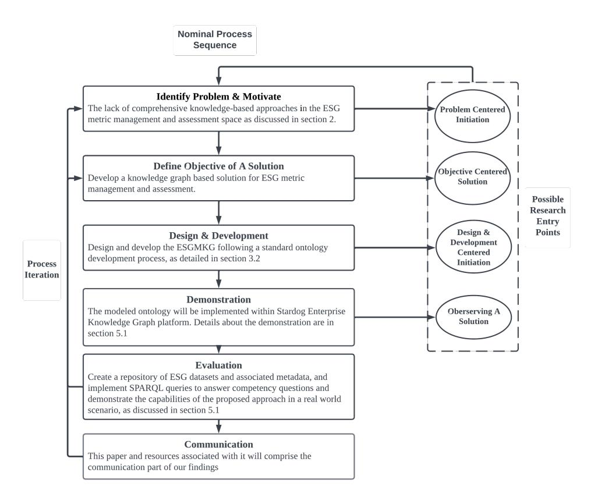
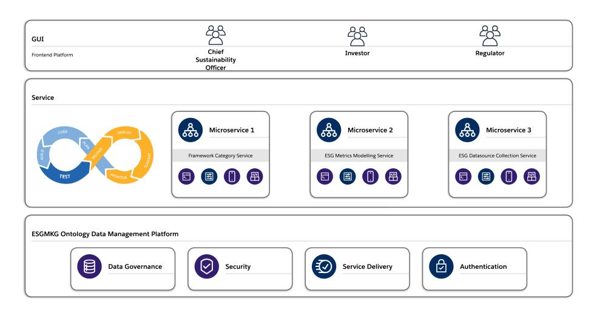
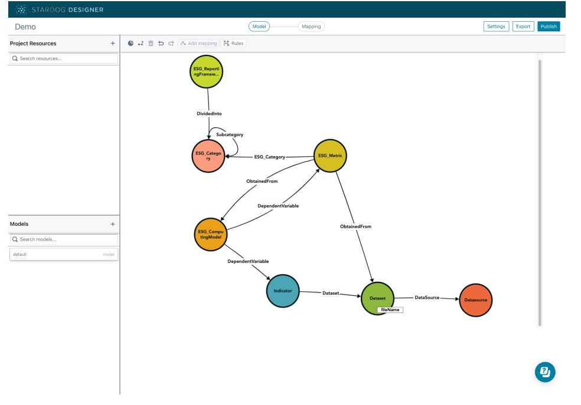
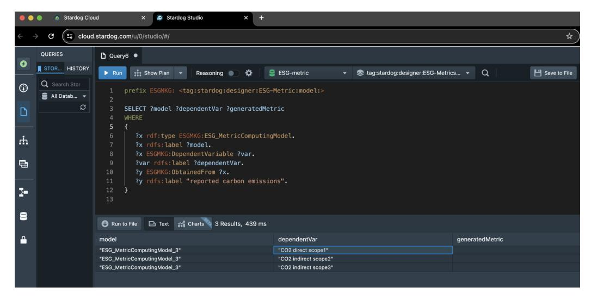

# *Article*Ontology-Driven Architecture for Managing Environmental, Social, and Governance Metrics

**Mingqin Yu 1,\*, Fethi A. Rabhi [1](https://orcid.org/0000-0001-8934-6259) and Madhushi Bandara [2](https://orcid.org/0000-0001-6543-3841)**- 1 School of Computer Science and Engineering Building K17, University of New South Wales, Sydney, NSW 2052, Australia; f.rabhi@unsw.edu.au
- 2 School of Computer Science, University of Technology Sydney, Ultimo, NSW 2007, Australia; madhushi.bandara@uts.edu.au
-**\***Correspondence: mingqin.yu@unsw.edu.au
**Abstract:**The burgeoning significance of environmental, social, and governance (ESG) metrics in realms such as investment decision making, corporate reporting, and risk management underscores the imperative for a robust, comprehensive solution capable of effectively capturing, representing, and analysing the multifaceted and intricate ESG data landscape. Facing the challenge of aligning with diverse standards and utilising complex datasets, organisations require robust systems for the integration of ESG metrics with traditional financial reporting. Amidst this, the evolving regulatory landscape and the demand for transparency and stakeholder engagement present significant challenges, given the lack of standardized ESG metrics in certain areas. Recently, the use of ontologydriven architectures has gained attention for their ability to encapsulate domain knowledge and facilitate integration with decision-support systems. This paper proposes a knowledge graph in the ESG metric domain to assist corporations in cataloguing and navigating ESG reporting requirements, standards, and associated data. Employing a design science methodology, we developed an ontology that serves as both a conceptual foundation and a semantic layer, fostering the creation of an interoperable ESG Metrics Knowledge Graph (ESGMKG) and its integration within operational layers. This ontology-driven approach promises seamless integration with diverse ESG data sources and reporting frameworks, while addressing the critical challenges of metric selection, alignment, and data verification, supporting the dynamic nature of ESG metrics. The utility and effectiveness of the proposed ontology were demonstrated through a case study centred on the International Financial Reporting Standards (IFRS) framework that is widely used within the banking industry.
**Keywords:**ESG; ontology; ontology-driven architecture; ESG metrics; design science method

## 1. Introduction

The risks of a changing climate extend to all sectors of the economy [\[1\]](#page-13-0). The burgeoning significance of environmental, social, and governance (ESG) metrics in realms such as investment decision making, corporate reporting, and risk management underscores the imperative for a robust, comprehensive solution capable of effectively capturing, representing, and analysing the multifaceted and intricate ESG data landscape. As organisations delve into the realm of ESG reporting, they encounter a landscape rife with complexities, primarily due to the diversity of reporting standards and the intricate process of managing ESG-related data [\[2,](#page-13-1)[3\]](#page-13-2). This environment not only demands the meticulous selection and alignment of relevant ESG metrics with overarching reporting frameworks but also necessitates sophisticated data management systems to ensure the integrity and verifiability of the reported metrics [\[4,](#page-14-0)[5\]](#page-14-1). The integration of these metrics into traditional financial reporting frameworks adds another layer of complexity, highlighting the critical need for a nuanced understanding of materiality in relation to stakeholder expectations [\[6\]](#page-14-2). Moreover, the evolving regulatory landscape further complicates these challenges, making transparency, stakeholder engagement, and the pursuit of standardized metrics essential
**Citation:**Yu, M.; Rabhi, F.A.; Bandara, M. Ontology-Driven Architecture for Managing Environmental, Social, and Governance Metrics.*Electronics* **2024**, *13*, 1719. [https://doi.org/10.3390/](https://doi.org/10.3390/electronics13091719) [electronics13091719](https://doi.org/10.3390/electronics13091719)

Academic Editors: Stefano Ferilli and Domenico Redavid

**Copyright:** © 2024 by the authors. Licensee MDPI, Basel, Switzerland. This article is an open access article distributed under the terms and conditions of the Creative Commons Attribution (CC BY) license [\(https://](https://creativecommons.org/licenses/by/4.0/) [creativecommons.org/licenses/by/](https://creativecommons.org/licenses/by/4.0/) 4.0/).

for achieving consistency and comparability in ESG reporting [\[7\]](#page-14-3). These multifaceted challenges underscore the imperative for innovative solutions that can adeptly navigate the dynamic nature of ESG metrics, ensuring that organisations can not only comply with diverse standards but also effectively communicate their ESG performance to a broad stakeholder base [\[7\]](#page-14-3).

In this context, we recognise the requirement for a comprehensive solution from an interdisciplinary perspective that can aggregate ESG domain knowledge and assist in ESG reporting. Additionally, it is imperative for ESG analysis research to adopt a broader view of different levels of analysis (e.g., macro and micro) [\[8\]](#page-14-4). The need for flexible, multi-dimensional ESG assessments is evident, as fragmentation often complicates the representation of domain knowledge, resulting in disorganized information [\[9\]](#page-14-5). One possible approach to address this is by modelling and conceptualizing the information in a structured and concise manner. This will allow future practitioners, researchers, and funding bodies to efficiently develop and utilize a consistent and formal body of knowledge [\[10\]](#page-14-6).

Based on its applications in other domains, such as healthcare, we observed that ontology-driven approaches provide good knowledge management practices by establishing well-defined domain concepts regarding terminologies, definitions, and relationships. Ontology-driven architectures are gaining prominence due to their capacity to encapsulate domain knowledge and context, facilitating their integration into decision-support systems and tools. Ontologies are highly regarded for their ability to facilitate the interpretation of multiple standards and models, as well as provide a consistent vocabulary by utilizing a terminology agreement within a specific community of users [\[9\]](#page-14-5).

Within the scope of sustainability assessment and knowledge management, the potential of ontologies remains largely untapped. There is a critical demand for enhanced knowledge management as a structured platform for information sharing among the various stakeholders engaged in sustainability initiatives [\[10\]](#page-14-6).

The main contribution of this paper is the ESG Metric Knowledge Graph (ESGMKG). We propose an ontology as the basis for ESGMKG as well as an ontology-driven architecture based on ESGMKG for managing ESG metrics to support a flexible and systematic approach in ESG reporting for organisations. We follow the design science approach in this work and demonstrate our outcome through a prototype implementation in the Stardog Knowledge Management Platform. In addition, we demonstrate the utility of ESGMKG in a practical case study.

The rest of the paper is structured as follows: Section [2](#page-1-0) presents the challenges associated with integrating various metrics, measures, frameworks, and indicators within the ESG domain, highlighting the gap in adopting knowledge-driven approaches. In Section [3,](#page-3-0) we delve into the research methodology, focusing on the design science research methodology tailored for developing and assessing ESGMKG. This section further elucidates the methodologies for ontology and knowledge graph development, including both top–down and bottom–up approaches. Section [4](#page-5-0) outlines a proposed architectural framework for managing ESG metrics. This framework is underpinned by an ontology data management layer, which facilitates the provision of services to end-users, identified here as stakeholders, through a modular architecture. In addition, we detail the structure of the proposed ESGMKG, including its hierarchy, classes, and instances. In Section [5,](#page-9-0) the ESGMKG is showcased and its effectiveness is assessed through a series of competency questions. The paper concludes with a discussion of future research directions and a summary of our findings.

## 2. Background and Literature

## *2.1. Challenges in ESG Solutions*

Many research studies are concentrated in the area of sustainability, which refers to the integration of social, environmental, and economic responsibilities [\[11\]](#page-14-7). In recent years, the industry has been using the term ESG as an all-encompassing term for the same responsibilities plus the governance aspect. The need for sustainable development has led many researchers to develop comprehensive solutions that consolidate ESG metrics, measures, frameworks, and indicators. Reporting frameworks emerged from a number of ESG initiatives that enable the evaluation of the level of sustainability by describing the progress along all environmental, social, and governance dimensions [\[8\]](#page-14-4). These frameworks contain a series of metrics and indicators designed to evaluate sustainability. The terms "metrics" and "indicators" are often used interchangeably [\[11\]](#page-14-7). While ESG metrics refer to specific, measurable quantities, ESG indicators focus more on specific data points. Metrics provide decision-makers with information to develop strategies, share accomplishments with stakeholders, and identify areas for improvement. They also alert us to declining trends in sustainability's economic, environmental, and social aspects. Sustainability metrics are distinct from traditional development metrics due to the interdependence between natural and cultural resources, as well as stakeholders [\[12\]](#page-14-8). Despite the availability of several frameworks, comparability and standardised measurement are difficult to achieve [\[13\]](#page-14-9). There is a lack of contextualised indicators [\[14\]](#page-14-10), and existing metrics show a high degree of subjectivity [\[15,](#page-14-11)[16\]](#page-14-12). Depending on which indicators, measures, or metrics are used, the results of impact assessments can vary considerably [\[8\]](#page-14-4). Numerous research papers suggest that sustainability requires a complex and multi-dimensional solution backed by a comprehensive taxonomy.

Navigating the complexities of ESG reporting, organisations are confronted with a landscape marked by diverse standards, each with its unique set of requirements and metrics [\[17\]](#page-14-13). This diversity leads to significant challenges in aligning with multiple frameworks, further compounded by the intricate task of data management. The collection, verification, and organisation of extensive ESG-related data demand robust systems and substantial resources, making the integration of ESG metrics with traditional financial reporting an essential yet complex endeavour [\[2](#page-13-1)[,3\]](#page-13-2). Moreover, the process of materiality assessment, which involves identifying the ESG issues most significant to the organisation and its stakeholders, requires a comprehensive understanding of the business context and stakeholder expectations, adding another layer of complexity to ESG reporting efforts [\[4](#page-14-0)[,5\]](#page-14-1).

In addition to these challenges, organisations must adeptly navigate an evolving regulatory landscape, where ESG reporting mandates can vary widely across jurisdictions [\[6\]](#page-14-2). The principles of transparency and clear disclosure of ESG practices and their impacts stand as fundamental requirements, ensuring accountability to a diverse stakeholder base. Active stakeholder engagement is crucial in ensuring that ESG reports accurately reflect stakeholder concerns and interests. Yet, the challenges of achieving consistency and comparability in reporting is significant given the lack of standardized metrics in certain areas [\[7\]](#page-14-3). The credibility of ESG disclosures is increasingly enhanced by independent assurances, similarly to financial audits. This highlights the dynamic nature of ESG reporting as an ongoing endeavour that requires continuous monitoring, updating, and communication of ESG performance [\[7\]](#page-14-3).

## *2.2. Role of Ontologies in ESG*The evolution of ESG reporting underscores a critical need for robust data management frameworks capable of navigating its complex landscape, which is marked by diverse standards and metrics. The introduction of ontologies and knowledge graphs into the ESG space presents a promising avenue to mitigate these challenges, offering structured approaches to improve data management and interoperability [\[18\]](#page-14-14). By establishing welldefined domain concepts and providing clear terminologies and relationships, ontologies are instrumental in enhancing the semantic richness of ESG data [\[19\]](#page-14-15). This is particularly relevant in addressing the challenge of aligning ESG metrics with multiple reporting frameworks, where clarity and consistency in terminologies can significantly reduce ambiguities and streamline reporting processes.

Building upon the foundation provided by ontologies, knowledge graphs represent a further evolution in managing and utilising complex data. While ontologies define the structural framework, knowledge graphs bring this structure to life by populating it with instances of the defined concepts and relationships, thereby creating a network of interconnected data points. Knowledge graphs excel in representing complex relationships between ESG metrics and facilitating the aggregation and analysis of vast datasets from diverse sources, thereby enhancing the accessibility and usability of ESG data for stakeholders [\[20\]](#page-14-16). The dynamic nature of knowledge graphs, supported by the foundational clarity of ontologies, enables the dynamic linking and querying of related information, which is crucial for the adaptive requirements of ESG reporting [\[21,](#page-14-17)[22\]](#page-14-18).

However, the current gap in knowledge-based approaches for ESG reporting, evidenced by the limited application of both ontologies and knowledge graphs in sustainability assessment and ESG knowledge management, indicates significant potential for these technologies to enhance systematic information exchange among stakeholders [\[8\]](#page-14-4). Despite exploring existing ontologies within domain ontology libraries [\[23\]](#page-14-19) such as Protégé [\[24\]](#page-14-20) and BioPortal [\[25\]](#page-14-21), the absence of ontologies and knowledge graphs closely aligning with the specific focus on ESG metrics underscores the need for innovative solutions that can address the redundancy and resource duplication stemming from disparate data requirements.

Ontologies and knowledge graphs are particularly beneficial for financial institutions often facing challenges related to data gaps, unstructured formats, and quality inconsistencies, which complicate ESG reporting. Providing a structured methodology that links reporting categories to their respective data sources, ontologies, and knowledge graphs together establishes a "single source of truth", leading to more streamlined and accurate ESG reporting. This dual approach, leveraging the precision of ontologies and the comprehensive connectivity of knowledge graphs, is essential for developing specialised solutions that are narrowly focused yet easily integrable within enterprise systems, highlighting the importance of tailored solutions for the nuanced requirements of ESG reporting [\[21,](#page-14-17)[22\]](#page-14-18).

In summary, the collaborative application of ESG metric ontologies and knowledge graphs holds the promise of addressing the intricate challenges of ESG reporting. Ontologies provide the necessary terminological clarity and structural framework, while knowledge graphs offer a dynamic and interconnected representation of ESG data, enhancing data interoperability and management. The next step in this domain involves crafting solutions that encapsulate the complexities of ESG metrics and are tailored for seamless integration within existing organisational systems, thereby meeting the critical needs of ESG data management and reporting.

## 3. Development Methodology

### *3.1. Research Methodology*This study was conducted following the Design Science Research (DSR) Methodology, as detailed by Peffers et al. [\[26\]](#page-14-22). DSR offers a structured approach to creating and evaluating IT artifacts that address specific challenges in the real world. In this case, the main desired artifact is the*ESG Metrics Knowledge Graph (ESGMKG)*and its underpinning ontology. DSR encompasses six well-defined stages, each contributing to the systematic development and assessment of the ESGMKG, thereby ensuring its relevance and efficacy in addressing the intricacies of ESG metric management, especially for data management and reporting. This methodology is structured in six distinct steps, as shown in Figure [1.](#page-4-0)

Here, we describe how the six DSR steps are applied in our work. The motivation (identified in the first step) is the lack of comprehensive knowledge-driven approaches in the ESG metric management and assessment space, as discussed in Section [2.1.](#page-1-1) The objective (part of the second step) is developing a knowledge graph-based solution for ESG metric management and assessment that maintains the links between ESG reporting categories and the selected metrics used to fulfill disclosure requirements as organisations need to satisfy multiple reporting frameworks, as discussed in Section [2.2.](#page-2-0)

As the third step, our approach is to design and develop the ESGMKG following a standard ontology development process, as detailed in Section [3.2.](#page-4-1)

<!-- Image Description: The image is a flowchart depicting a research process. It outlines six stages: problem identification and motivation, defining a solution objective, design and development (using a standard ontology), demonstration (on the Stardog Enterprise Knowledge Graph platform), evaluation (creating a data repository and querying it), and communication of findings. A parallel "Problem Centered" and "Objective Centered" pathway is shown, highlighting a design choice. The flowchart's purpose is to illustrate the methodology used in the paper. -->
**Figure 1.** DSR process adapted in this paper [\[26\]](#page-14-22).

As the fourth step, the modelled ontology will be implemented within the Stardog Enterprise Knowledge Graph platform [\(http://stardog.com](http://stardog.com) (accessed on 3 March 2024)) following semantic web principles in RDF/OWL notation. Details about the demonstration are given in Section [5.1.](#page-9-1)

As the fifth step, we implement a prototype of ESGMKG utilising a repository of ESG datasets and associated metadata and implement SPARQL queries to answer competency questions and demonstrate the capabilities of the proposed approach in a real-world ESG assessment scenario, as discussed in Section [5.2.](#page-10-0)

This paper and the resources associated with it will comprise the communication part of our findings, which corresponds to the sixth step of the DSR methodology.

### *3.2. Ontology Development*

In our ontology design and development process, we used the ontology development 101 guides developed by Noy et al. [\[27\]](#page-14-23) as well as the aggregated ontology design principles from the NeOn methodology [\[28\]](#page-14-24) and the methods proposed by Suárez-Figueroa et al. [\[28\]](#page-14-24).

The process of ontology development can be approached in three different ways, namely top–down, bottom–up, and combination [\[29\]](#page-14-25). The top–down approach begins with the identification of the most general concepts in a domain, followed by the specialisation of these concepts into more detailed ones. On the other hand, the bottom–up approach starts with the identification of the most specific classes or leaves of the hierarchy, which are then grouped into more general concepts. The combination approach, as the name suggests, is a mix of both top–down and bottom–up approaches. It begins with the definition of the most salient concepts first and then generalizes and specialises them accordingly.

We choose to use a combination development process when designing the ESGMKG. The top–down approach starts with defining high-level reporting frameworks, their categories and subcategories related to environmental, social, and governance aspects and then drills down to more specific metrics, models, and relationships within each category. It ensures a comprehensive and structured representation of the domain but might not capture all practical nuances. The bottom–up approach, conversely, helps identify specific,

tangible instances or data points within the ESG framework and then aggregates these into broader categories, offering a more grounded and data-driven perspective [\[27\]](#page-14-23).

As the foundation for our domain knowledge and context, we utilised concepts and principles from two established reporting frameworks, namely IFRS [\[30\]](#page-14-26) and TCFD [\[31\]](#page-14-27), ensuring that the resulting ontology and knowledge graph are both comprehensive and aligned with industry standards. Then, following a bottom–up approach, we utilised a sample of data sources and datasets used by industry practitioners to compute ESG metrics and mapped them with ESG categories mentioned within these reporting frameworks. Furthermore, we collected competency questions and use cases to identify how this ontology could be designed to best suit the end-user needs. The identified information is then intricately modelled as an ontology, with distinct entities and relationships representing the associated concepts. To ensure the ontology's effectiveness and applicability, we have articulated specific competency questions, which will be further elaborated upon in Section [5.2](#page-10-0) for validation purposes.

The resulting ESGMKG in this paper is envisioned as a representation of an initial set of ESG metrics that can be used across diverse industries. However, the ESGMKG aims to cater to a broader spectrum of stakeholders, from corporations and investors to regulators, for addressing their ESG reporting needs and defining ESG targets. Therefore, ESGMKG will maintain the flexibility to incorporate other frameworks and emerging standards as required by the organisation or the end-user. It is expected that the development of a comprehensive ontology and knowledge graph will be a long-term process where each version is evaluated over an initial set of generic and domain-specific competency questions and then iteratively improved by evaluating its ability to answer new competency questions.

## *3.3. Ontology Validation*Competency questions (CQs) are instrumental throughout the ontology development life-cycle, serving as a pivotal tool for both scoping and validating ontologies [\[32\]](#page-14-28). In aligning with the methodology outlined in*Ontology Development 101*by Noy et al. [\[27\]](#page-14-23), we established an array of CQs detailed in Section [4.2.](#page-6-0) These CQs were meticulously crafted to delineate the ontology's intended scope. The objective was to ensure that any knowledge graph derived from the ontology would competently respond to these queries, and thereby they act as a critical benchmark in our validation process, which is detailed in Section [5.3.](#page-11-0)

The formulation of these CQs was an elaborate process that entailed extensive consultations with domain experts across various industries, coupled with a thorough examination of existing literature to identify prevalent challenges. This comprehensive approach ensured that our competency questions were not only grounded in theoretical knowledge but could also deliver practical value in real-world applications, thereby enhancing the relevance and efficacy of our ontology in addressing complex industry-specific problems.

## 4. Proposed Architecture and Ontology

### *4.1. Architecture Overview*To envision how the proposed ontology can be used within organisations and align with existing systems, we proposed a system architecture structured into three integral layers. Each layer caters to specific functionalities and user groups, drawing on the categorisation of stakeholders by CFA Institute [\[33\]](#page-14-29). The target users of this architecture include a broad spectrum of stakeholders ranging from asset owners to regulators, all of whom stand to benefit from enhanced ESG reporting and investment management [\[34\]](#page-14-30). Figure [2](#page-6-1) shows the hierarchical structure of the proposed ESG metric management system.

<!-- Image Description: This architectural diagram depicts a microservice-based system for ESG (Environmental, Social, and Governance) data management. It shows three microservices (Framework Category, ESG Metrics Modelling, and ESG Datasource Collection) interacting via a GUI accessible to Chief Sustainability Officers, Investors, and Regulators. A continuous integration/continuous delivery (CI/CD) cycle is illustrated for the microservices. The system also includes an ESGMKG Ontology Data Management Platform with components for data governance, security, service delivery, and authentication. -->
**Figure 2.** The general architecture of an ESG metric management system.

Each layer's role is defined as follows:

- Graphical user interface (GUI) layer: This layer is tailored to meet the needs of key system user roles, namely those of chief sustainability officer, investor, and regulator. Each user role interacts with the system differently, with the Chief Sustainability Officer focusing on reporting, the investor on portfolio management, and the regulator on monitoring. This design ensures that the system provides relevant functionalities and information to each user type, facilitating the efficient and effective use of the ESG metric management system.
- Service layer: Within the system development life cycle, this layer encompasses three main services: the ESG framework categorisation service, the ESG metric modelling service, and the ESG data collection service. Each service is designed to handle a specific aspect of ESG data processing, ensuring that the system is modular, scalable, and capable of evolving to meet future needs. Organisations can implement these services, as web services or microservices following a technology that suits their overall technical architecture. For example, an ESG data collection service can be implemented by an organisation as a discrete entity that can access specific data sources and feed data into an ESG metric modelling service that calculates metrics based on requests from the GUI layer, as guided by ESGMKG.
- ESGMKG ontology data management platform layer: this layer provides a number of modules to manage the ESGMKG that will be discussed in Section [4.2.](#page-6-0) The data governance module ensures adherence to data governance principles. Other modules handle critical factors such as authentication and security to ensure that the system is robust and secure.

This layered architecture not only aligns with the diverse needs of the stakeholders but also incorporates best practices in system design, data governance, and security, ensuring that the ESG metric system is comprehensive, user-centric, and equipped to handle the complex landscape of ESG data and reporting.

### *4.2. ESGMKG Design*

The primary application of the ontology is assisting users in the selection and recommendation of pertinent ESG metrics, thereby facilitating more informed and strategic decision making in both ESG reporting and investment management spheres. We summarise the ESGMKG's objectives as follows:

• Enhanced querying and search capabilities: providing more nuanced and contextaware search results by understanding the semantic relationships between ESG reporting framework categories and metrics.

- Improved ESG data connectivity and contextualisation: creating a web of ESG reporting metrics where connections between disparate reporting requirements add context and depth to data analysis.
- ESG knowledge discovery and insight generation: facilitating the discovery of ESG reporting metrics and their hidden patterns, relationships, and insights through the interconnected nature of the graph.
- Decision support: offering a foundational layer for advanced decision-making tools and AI applications, such as recommendation systems, by providing rich, interconnected ESG data.
- ESG Data interoperability and sharing: promoting ESG data reuse and sharing across organisational, domain, and technical boundaries through a common, understandable framework.
- ESG reporting personalisation and customisation: tailoring content, recommendations, and interactions to sustainable investment users or scenarios based on the rich understanding of corporations' preferences, performance, and industry and region context provided by the knowledge graph.

In designing the ontology and ESGMKG, it is crucial to delineate a set of competency questions as suggested by Kim et al. [\[35\]](#page-15-0). These questions are designed to probe the knowledge graph's capacity to support the retrieval and inference of relevant knowledge according to different use cases. The competency questions should encompass the key inquiries that a knowledge base underpinned by the ontology is expected to address. While these questions do not need to cover every possible query, they should be representative of the typical information needs within the domain of interest [\[27\]](#page-14-23). Table [1](#page-7-0) presents a selection of example competency questions, illustrating the type of inquiries that the knowledge graph should address.

**Table 1.** Example competency questions.

| Purpose | Competency Question |
|-----------------------------------------------------------------|------------------------------------------------------------------------------|
| Exploring the frameworks that apply to an organisation | Which reporting framework applies to a specific company? |
| Understanding the different reporting dimensions in a framework | What are the available metric categories for a specific reporting framework? |
| Discovering which metric can be used for which category | What metrics represent a specific category? |
| Relating a metric to the measurement method behind it | What model is used for calculating a specific metric? |
| Relating a metric to the data used to calculate it | What metric or indicator is involved in calculating a specific metric? |
| Locating the datasets that are used to calculate metrics | What is the dataset used for a specific indicator? |
| Locating the origin of datasets used to calculate metrics | Where is the original data source for an available metric or dataset? |

The key classes of ESGMKG ontology are listed in Table [2.](#page-8-0) Each class plays a vital role in the ontology's ability to accurately represent and manage ESG-related data, facilitating more informed and effective ESG reporting and analysis.

Figure [3](#page-8-1) illustrates the structured organisation within the ESGMKG ontology, outlining the interconnectedness among its various classes. Central to the ESGMKG is the ESG\_ReportingFramework class, which is systematically broken down into several ESG\_Category instances. Each category can encompass its own set of sub-categories or be further defined and quantified through several ESG\_Metric instances.

ESG metrics can be derived in two primary ways. Firstly, they can be calculated through an ESG\_ComputingModel, which performs some computation using other metrics or indicators as inputs. Metrics can also be directly sourced from datasets. Additionally, all the datasets come from combination of primary and secondary Datasource. Primary ESG data can be sourced from companies directly via surveys, direct company communication, company reports, presentations, and public documents. On the other hand, secondary ESG data are provided by many ESG databases in the form of ratings or assessments that are transformed by a process of scoring or by a formula from a primary data source [\[33\]](#page-14-29). This

structure not only underscores the layered approach of the ESGMKG ontology but also highlights the methodological rigour in capturing and computing ESG metrics, which is essential for comprehensive ESG reporting.

**Table 2.**Key Classes of ESGMKG.

| ESGMKG Class | Definition |
|------------------------|-----------------------------------------------------------------------------------------------------------------------------------------------------------|
| ESG_ReportingFramework | A reporting framework that emerges from ESG initiatives, including standards and guidelines such as IFRS S1, TCFD, etc. |
| ESG_Category | Categories recommended by the framework or required by corporations for ESG reporting and compliance. |
| ESG_Metric | Metrics under various ESG categories, also definable by corporations according to their specific needs and goals. |
| ESG_ComputingModel | A mathematical or computing model transforming selected ESG metrics or indicators into a composite metric for a comprehensive view of ESG performance. |
| Indicator | Any data variable usable in the computation of an ESG metric. |
| Dataset | A set of values from a data source usable to compute ESG metrics. |
| Datasource | The origin of an ESG dataset, which can be a primary or secondary source. |

<!-- Image Description: The image displays a directed graph, likely representing a data model. Nodes, color-coded (yellow, orange, green, teal), represent entities like "ESG Metric," "ESG Category," "Dataset," and "Indicator." Edges show relationships (e.g., "ObtainedFrom," "DividedInto") between these entities. The graph illustrates the flow and dependencies within an ESG reporting framework, clarifying data sources and calculations used to derive ESG metrics. The interface suggests a visual modeling tool for building and managing such frameworks. -->
**Figure 3.**Visualisation of ESGMKG key classes and relationships on Stardog platform.

## *4.3. ESGMKG Integration*

In the practical implementation of the ESG metric management system, the integration of the ESGMKG within the architecture's three layers—GUI, service, and data management—plays a pivotal role in operationalizing the system's functionality. At the GUI layer, the ontology's structured representation of ESG concepts directly informs the user interface design, enabling tailored views and interactive elements that resonate with the specific needs of chief sustainability officers, investors, and regulators. This ensures that users are presented with relevant, knowledge-driven insights, facilitating efficient navigation and decision-making processes. Moving deeper into the architecture, the service layer leverages the ESGMKG to interpret and process user queries, translating them into semantic operations that interact with the underlying knowledge graph. This layer acts as the bridge between the user-facing interface and the data-rich ESGMKG, employing advanced querying capabilities to fetch, analyse, and return precise ESG metrics and relationships. Finally, at the ontology data management platform layer, the practical application of the ontology extends to managing the lifecycle of ESG data, where the underlying technology

ensures data integrity, governance, and compliance with evolving ESG standards[\[30–](#page-14-26)[32\]](#page-14-28) . This layer's functionality underscores the system's adaptability and scalability, highlighting the ontology's role in maintaining a dynamic, up-to-date repository of ESG knowledge. Through this integration, the ontology enables contextualised ESG information to flow across all layers.

## 5. Demonstration and Evaluation

## *5.1. ESGMKG Instantiation*For evaluation purposes, we assumed a fictive organisation in the financial domain that incorporated ESG stewardship and engagement into its strategic framework prompted by initiatives such as the Network for Greening the Financial System (NGFS) [\[36\]](#page-15-1) and the Net Zero Alliance [\[37\]](#page-15-2). Consequently, it needs to perform different types of ESG reporting by combining data from multiple sources.

The first step in designing an instance of ESGMKG for this organisation is to create ESG\_ReportingFramework instances of the frameworks that apply in the organisation's context such as IFRS S1 [\[30\]](#page-14-26), TCFD [\[31\]](#page-14-27), and TNFD [\[38\]](#page-15-3). Each framework will capture the requirements or recommendations for a number of ESG categories, which can be subdivided into ESG subcategories, which will further distil these into more specific categories, such as environmental, social and governance risks.

The next step is to define ESG metrics that quantify these categories. The prototype knowledge graph will mostly align with IFRS S1 core requirements for the content of metrics and target (metrics and targets: the entity's performance in relation to sustainability-related risks and opportunities, including progress towards any targets the entity has set or is required to meet by law or regulation) [\[30\]](#page-14-26) and also considering SASB materiality map 26 general sustainability issues (Sasb materiality map: [https://sasb.ifrs.org/standards/](https://sasb.ifrs.org/standards/materiality-finder/find/) [materiality-finder/find/](https://sasb.ifrs.org/standards/materiality-finder/find/) (accessed on 3 March 2024)).

As an example, consider a metric called Environmental Risk Metric 1 which combines five other metrics, as shown in Equation [\(1\)](#page-9-2):

Environmental Risk Metric 1 (ERM 1) =*α*· Carbon EmissionReported +*β*· ElectricityPurchased

+*γ*· Energy ConsumedTotal +*δ*· WasteTotal +*ϵ*· Water WithdrawalTotal +*ζ*(1)

The coefficients*α*, *β*, *γ*, *δ*, and *ϵ*are weighting factors assigned to each environmental parameter to signify its relative impact on the overall environmental performance.*ζ*is introduced as an adjustment factor to account for additional environmental impacts not explicitly measured by the other terms in the equation, thereby enhancing the metric's comprehensiveness. This metric is designed to be a robust and flexible instrument, enabling the evaluation and comparison of environmental performance across different organisations. It also aids in identifying areas for environmental improvements and in benchmarking organisational performance against industry standards or regulatory requirements.

Each of the metrics used in the calculation can be calculated using other metrics. For example, in our prototype, the metric Carbon EmissionReported (used in Equation [\(1\)](#page-9-2)) is calculated according to Equation [\(2\)](#page-9-3):

Carbon EmissionReported =*α*· CO2Direct Scope1 +*β*· CO2Indirect Scope2 +*γ*· CO2Indirect Scope3 +*δ*(2)

In this given equation,*α*, *β*, and *γ*coefficients represent factors that scale the contributions of each type of emission to the total carbon emission footprint of an entity. The terms CO2Direct Scope1, CO2Indirect Scope2, and CO2Indirect Scope3 denote the quantities of CO2 emissions for each respective scope. Finally,*δ* represents a constant term in the equation, which may be used for adjustments or to account for offsets that are not captured by the other terms in the equation.

Following this step, we created a number of ESG\_ComputingModel instances which connect metrics with their constituents. For example:

- ESG MetricComputingModel 1: Computes the metric Environmental Risk Metric 1 using Equation [\(1\)](#page-9-2)
- ESG MetricComputingModel 3: Computes the metric Reported Carbon Emission using Equation [\(2\)](#page-9-3)

Our prototype ESGMKG also correspondingly identifies primary and secondary data sources, including Eurofidai-clarity AI (Eurofidai ESG raw data on corporations: [https:](https://www.eurofidai.org/product/esg-raw-data-corporations) [//www.eurofidai.org/product/esg-raw-data-corporations](https://www.eurofidai.org/product/esg-raw-data-corporations) (accessed on 3 March 2024)) and MSCI (MSCI ESG Data and Solutions: Available online: [https://www.msci.com/our](https://www.msci.com/our-solutions/esg-investing/esg-data-and-solutions)[solutions/esg-investing/esg-data-and-solutions](https://www.msci.com/our-solutions/esg-investing/esg-data-and-solutions) (accessed on 3 March 2024)).

The ESGMKG ontology utilizes three value types to represent data: string, number (with more specific types like float and integer for numeric data), and Boolean slots for yes–no flags. For instance, a variable Company Name is represented as simple strings, CO2 Direct Scope1 (Scope 1 emissions that occur within a company's organisational boundary from sources that the company owns or controls in tons of CO2e) might be represented with Float. The Global Compact metric assesses a company's engagement with the United Nations Global Compact, represented by a Boolean value: 1 if the company has signed the Compact, indicating a commitment to sustainable and ethical practices, and 0 if it has not. These value types provide a structured and consistent approach to representing diverse ESG data within our ontology.

## *5.2. Usage Scenarios and Competency Questions*The prototype knowledge graph is designed to provide answers regarding models, metrics, indicators, datasets, and data sources that are integral to the entire reporting process for different types of users within an organisation. For validation purposes, we defined some usage scenarios that make use of the competency questions. The development of these questions was guided by established methodologies in ontology construction as discussed in Sections [3.2](#page-4-1) and [3.3.](#page-5-1) An example of a usage scenario which was tailored to our specific use case is shown in Table [3.](#page-10-1) In this scenario, the user is able to identify which metric corresponds to which reporting category and which data sources are used in calculating each data component of this metric. Other usage scenarios have been tested to ensure that the ESGMKG is not only theoretically sound but also practically applicable to the selected scenarios. Whenever necessary, new instances were added to provide a full picture of the ESG data managed by the organisation. This ensures that ESGMKG possesses the necessary depth and breadth to cater to the information needs of users within the specified domain.

| Table 3. Example of a usage scenario based on the competency questions developed for the case study. | | | | | | |
|------------------------------------------------------------------------------------------------------|--|--|--|--|--|--|
|------------------------------------------------------------------------------------------------------|--|--|--|--|--|--|

| Competency Questions | Solution |
|-------------------------------------------------------------------------------------------|----------------------------------------------------------------------------------------------------------------------------------------------------------------------------------------------------------------------|
| 1. Which reporting framework is applicable for this company in Australia? | The applicable reporting framework is IFRS S1 (disclosures can be submitted to the Australian Prudential Regulation Authority (APRA)) and TCFD (disclosures can be submitted to Clean Energy Regulator (CER)). |
| 2. What are the available metric categories for the IFRS S1 reporting framework? | They are environmental risk, environmental opportunity, social risk, and governance risk. |
| 3. What metric can be used for measuring impact in the category of environmental risk? | Environmental Risk Metric 1, Environmental Risk Metric 2. |
| 4. What model is used to compute Environmental Risk Metric 1? | ESG MetricComputingModel 1. |
| 5. What inputs Environmental Risk Metric 1 needs to be calculated? | Reported Carbon Emissions, Electricity Purchased Total, Energy Consumed Total, Waste Total, and Water Withdrawal Total are needed for Environmental Risk Metric 1 calculation. |

| Competency Questions | Solution |
|---------------------------------------------------------------------------------------|--------------------------------------------------------------------------------------------------------------------------|
| 6. What model is used for computing Reported Carbon Emission? | ESG MetricComputingModel 3. |
| 7. What inputs Reported Carbon Emissions needs to be calculated? | CO2 Direct Scope1, CO2 Indirect Scope2, and CO2 Indirect Scope 3 are needed for Reported Carbon Emission calculation. |
| 8. What model is used to compute CO2 Direct Scope 1? | ProxyModel(copy of input). |
| 9. What inputs CO2 Direct Scope 1 needs to be calculated? | CO2DirectScope1. |
| 10. What model is used to compute CO2DirectScope1? | It is a column in 'esg_raw_data_on_corporations.csv.zip' dataset. |
| 11. What is the datasource for the dataset 'esg_raw_data_on_corporations.csv.zip'? | It is obtained from the Eurofidai data source. |

### Table 3.*Cont.*

## *5.3. Linked Data Implementation*

To integrate and standardise ESG metrics within corporate reporting frameworks, the ontology's implementation employs semantic web standards and a resource description framework (RDF) [\[39\]](#page-15-4) to delineate the complex relationships between ESG categories and their respective reporting standards. The utilisation of RDF/OWL notation facilitates a structured and semantic representation of data, enhancing both interoperability and clarity in ESG reporting.

Table [4](#page-11-1) presents two samples of RDF representations reflecting instances of the IFRS S1 reporting framework and the ESG MetricComputingModel3 instance, which is a model that captures the computation detailed in Equation [\(2\)](#page-9-3). The notation employed is in RDF Turtle format [\[40\]](#page-15-5), with the prefix 'ESGMKG:' denoting concepts modelled within the ESGMKG.

**Table 4.**Triples in RDF turtle format for two sample entities in ESGMKG.

| Subject | Predicate | Object |
|-----------------------------------------------------------------------|--------------------------|---------------------------------------------------------------------------------------------------------------|
| # Instance of Reporting | | |
| Framework IFRS_S1 | | |
| <esgmkg:ifrs_s1></esgmkg:ifrs_s1> | a | <esgmkg:esg_reportingframework></esgmkg:esg_reportingframework> |
| <esgmkg:ifrs_s1></esgmkg:ifrs_s1> | rdfs:label | "IFRS_S1" |
| <esgmkg:ifrs_s1></esgmkg:ifrs_s1> | ESGMKG:ReportingBody | "Australian Prudential Regulation Authority (APRA)" |
| | | <esgmkg:environmental_risk>,</esgmkg:environmental_risk> |
| <esgmkg:ifrs_s1></esgmkg:ifrs_s1> | ESGMKG:DividedInto | <esgmkg:environmental_opportunity>,</esgmkg:environmental_opportunity> |
| | | <esgmkg:governance_risk>,</esgmkg:governance_risk> |
| | | <esgmkg:social_risk></esgmkg:social_risk> |
| # Instance of ESG Computing | | |
| MetricComputingModel 3 | | |
| <esgmkg:esg_metriccomputingmodel3></esgmkg:esg_metriccomputingmodel3> | a | <esgmkg:esg_computingmodel></esgmkg:esg_computingmodel> |
| <esgmkg:esg_metriccomputingmodel3></esgmkg:esg_metriccomputingmodel3> | rdfs:label | "ESG MetricComputingModel 3" |
| <esgmkg:esg_metriccomputingmodel3></esgmkg:esg_metriccomputingmodel3> | ESGMKG:DependentVariable | <esgmkg:co2_directscope1>, <esgmkg:co2_indirectscope2>,</esgmkg:co2_indirectscope2></esgmkg:co2_directscope1> |
| | | <esgmkg:co2_indirectscope3></esgmkg:co2_indirectscope3> |
| <esgmkg:reported_carbon_emission></esgmkg:reported_carbon_emission> | ESGMKG:ObtainedFrom | <esgmkg:esg_metriccomputingmodel3></esgmkg:esg_metriccomputingmodel3> |

The first set of triples in Table [4](#page-11-1) showcases that the IFRS S1 framework is divided into different metric categories: Environmental Risk, Environmental Opportunity, Governance Risk, and Social Risk. Each triple consists of a subject (e.g., 'ESGMKG: IFRS\_S1'), a predicate (e.g., 'rdfs: label'), and an object, which can be a literal value like 'IFRS\_S1' or a reference to another resource instance such as 'ESGMKG: Environmental\_Risk'. Following the same structure, the second set of triples ESG\_MetricComputingModel3 showcases its dependent variables (as in Equation [\(2\)](#page-9-3)). The last triple represents that 'ESGMKG: Reported\_Carbon\_Emission' is obtained from ESG\_MetricComputingModel3. This structured approach not only facilitates the precise definition of entities but also enables the dynamic association of different entities' ESG metrics with relevant categories.

## *5.4. Querying the Implementation*Each competency question is translated into a SPARQL query (the query language for semantic web notation) and executed on the Stardog platform. When tested against the instance ontology, the Stardog implementation was able to answer all listed competency questions. An example of how we evaluated competency questions 6 and 7 shown in Table [3](#page-10-1) is showcased by Figure [4.](#page-12-0) The SPARQL query retrieves the ESG model(s) that compute the 'Reported Carbon Emission' metric, as well as all input metrics or indicators required for these models.

<!-- Image Description: The image displays a screenshot of a SPARQL query executed within the Stardog knowledge graph platform. The query retrieves data on ESG metrics, specifically focusing on "reported carbon emissions" as a dependent variable. The results table shows three instances of an ESG metric computing model, each linked to different carbon emission scopes (direct and indirect). The screenshot serves to illustrate the querying capabilities of the platform for accessing and structuring environmental, social, and governance (ESG) data. -->
**Figure 4.**Visualisation of sample query on Stardog platform for competency questions 6 and 7.

### 6. Conclusions and Future Work

Motivated by the increasing importance of ESG initiatives, this paper aims to address the challenge of diverse standards and the complex task of data management. Organisations require robust systems for integrating ESG metrics with traditional financial reporting and must place emphasis on achieving a comprehensive understanding of materiality assessment in the context of stakeholder expectations. The key contribution of this paper is the novel ESG Metric Knowledge Graph (ESGMKG) that was developed using design science research methodology.

We developed an interoperable ESGMKG using an ontology as both a conceptual foundation and a semantic layer. Our ontology-driven architecture is designed to improve ESG reporting by incorporating a comprehensive description of the links between reporting categories, metrics, models, and data sources. This approach enables multi-dimensional selections and facilitates the integration of various approaches into a unified solution.

We illustrate the practical application and evaluation of this ontology through competency questions. Our experimental findings showcase that an ontology-driven approach can be used to represent and query ESG metrics-related information in a unified manner. We envision ESGMKG and system architectures that utilise it will help organisations catalogue their ESG metrics and frameworks, enabling them to maintain information accurately over time in the face of constant changes in the regulatory landscape, data source availability, design of new ESG measurement methods, etc.

However, many untapped classes and properties within the ESG domain remain not included in our work. Future research could uncover and integrate additional information to further enrich the ontology's depth and utility in areas such as ESG model representation, information resources access and processing, data quality and ESG metric ranking. Moreover, the advancement of tools dedicated to improving knowledge management for institutional development presents another promising avenue for exploration. These tools could play a crucial role in managing and disseminating knowledge, thereby significantly contributing to the broader field of ESG research and application [\[10\]](#page-14-6). Another limitation

of our work is the limited evaluation of competency questions for different organisations and datasets. We plan to expand our implementation to accommodate more use cases in the future.

Another future direction is incorporating natural language processing capabilities to realise automatic knowledge extraction from regulatory reports and frameworks. This will enable organisations to automatically expand the ESGMKG and its capabilities when new regulations and data sources are discovered. Furthermore, cutting-edge technologies such as large language models can be incorporated to expand the analysis capability of ESGMKG by providing the capability to answer open-ended questions such as 'What metrics are best suited to calculate environmental risk?'. These technologies can minimise the maintenance effort of the proposed approach for organisations.
**Author Contributions:**Conceptualisation, M.Y., F.A.R. and M.B.; methodology, M.Y., F.A.R. and M.B.; validation, M.Y., F.A.R. and M.B.; formal analysis, M.Y., F.A.R. and M.B.; investigation, M.Y.; resources, M.Y.; data curation, M.Y.; writing—original draft preparation, M.Y.; writing—review and editing, F.A.R. and M.B.; visualisation, M.Y. and M.B.; supervision, F.A.R. All authors have read and agreed to the published version of the manuscript.
**Funding:**This research received no external funding.
**Data Availability Statement:**The data from this research can be made available by the corresponding author following a justified request. Due to privacy concerns and confidentiality agreements with data providers, none of the datasets are shared publicly.
**Acknowledgments:**We extend our sincere gratitude to the members and the board of the Fintech AI Innovation Consortium (FAIC), with a special mention of Cognitivo and Westpac, for their invaluable support. Additionally, we are grateful to the consulted industry experts who provided insights and guidance, significantly enriching our understanding on the ESG assessment process. Their expertise and contributions have been pivotal to the success of this work.
**Conflicts of Interest:**The authors declare no conflicts of interest.

## Abbreviations

The following abbreviations are used in this manuscript:

| ESG | Environmental, Social, and Governance |
|--------|-----------------------------------------------------|
| ESGMKG | ESG Metric Knowledge Graph |
| DSR | Design Science Research |
| RDF | Resource Description Framework |
| OWL | Web Ontology Language |
| SPARQL | SPARQL Protocol and RDF Query Language |
| IFRS | International Financial Reporting Standards |
| TCFD | Task Force on Climate-related Financial Disclosures |
| TNFD | Taskforce on Nature-related Financial Disclosures |
| SASB | Sustainability Accounting Standards Board |
| APRA | Australian Prudential Regulation Authority |
| CER | Clean Energy Regulator |
| GUI | Graphical User Interface |
| ERM 1 | Environmental Risk Metric 1 |
| MSCI | Morgan Stanley Capital International |
| | |

## References

- 1. Australian Prudential Regulation Authority. Prudential Practice Guide: Draft CPG 229 Climate Change Financial Risks. 2021. Available online: [https://www.google.com/url?sa=t&source=web&rct=j&opi=89978449&url=https://www.apra.gov.au/sites/](https://www.google.com/url?sa=t&source=web&rct=j&opi=89978449&url=https://www.apra.gov.au/sites/default/files/2021-11/Final%2520Prudential%2520Practice%2520Guide%2520CPG%2520229%2520Climate%2520Change%2520Financial%2520Risks.pdf&ved=2ahUKEwitmZq1u9qFAxX8cvUHHZhUAAEQFnoECBMQAQ&usg=AOvVaw2H1HYzEaB49QpQ1eyC1dw_) [default/files/2021-11/Final%2520Prudential%2520Practice%2520Guide%2520CPG%2520229%2520Climate%2520Change%25](https://www.google.com/url?sa=t&source=web&rct=j&opi=89978449&url=https://www.apra.gov.au/sites/default/files/2021-11/Final%2520Prudential%2520Practice%2520Guide%2520CPG%2520229%2520Climate%2520Change%2520Financial%2520Risks.pdf&ved=2ahUKEwitmZq1u9qFAxX8cvUHHZhUAAEQFnoECBMQAQ&usg=AOvVaw2H1HYzEaB49QpQ1eyC1dw_) [20Financial%2520Risks.pdf&ved=2ahUKEwitmZq1u9qFAxX8cvUHHZhUAAEQFnoECBMQAQ&usg=AOvVaw2H1HYzEaB4](https://www.google.com/url?sa=t&source=web&rct=j&opi=89978449&url=https://www.apra.gov.au/sites/default/files/2021-11/Final%2520Prudential%2520Practice%2520Guide%2520CPG%2520229%2520Climate%2520Change%2520Financial%2520Risks.pdf&ved=2ahUKEwitmZq1u9qFAxX8cvUHHZhUAAEQFnoECBMQAQ&usg=AOvVaw2H1HYzEaB49QpQ1eyC1dw_) [9QpQ1eyC1dw\\_](https://www.google.com/url?sa=t&source=web&rct=j&opi=89978449&url=https://www.apra.gov.au/sites/default/files/2021-11/Final%2520Prudential%2520Practice%2520Guide%2520CPG%2520229%2520Climate%2520Change%2520Financial%2520Risks.pdf&ved=2ahUKEwitmZq1u9qFAxX8cvUHHZhUAAEQFnoECBMQAQ&usg=AOvVaw2H1HYzEaB49QpQ1eyC1dw_) (accessed on 6 March 2024).
- 2. Elkington, J. Cannibals with Forks: The Triple Bottom Line of 21st Century Business.*Capstone* **1997**, *1*, 1–16. [\[CrossRef\]](http://doi.org/10.1002/tqem.3310080106)
- 3. KPMG International. *KPMG International Survey of Corporate Responsibility Reporting*; KPMG International: Amstelveen, The Netherlands, 2008.

- 4. Flower, J. The International Integrated Reporting Council: A Story of Failure. *Crit. Perspect. Account.* **2015**, *27*, 1–17. [\[CrossRef\]](http://dx.doi.org/10.1016/j.cpa.2014.07.002)
- 5. Stern, N. *Towards a Comprehensive Climate Change Agreement in Paris*; The London School of Economics and Political Science: London, UK, 2015.
- 6. Capelle-Blancard, G.; Petit, A. Environmental, Social, and Governance (ESG) Performance and Sovereign Bond Spreads: An Empirical Analysis of OECD Countries. *J. Environ. Manag.* **2019**, *246*, 267–279. [\[CrossRef\]](http://dx.doi.org/10.2139/ssrn.2874262)
- 7. Eccles, R.G.; Krzus, M.P. *One Report: Integrated Reporting for a Sustainable Strategy*; John Wiley & Sons, Hoboken, NJ, USA, 2010.
- 8. Konys, A. An ontology-based knowledge modelling for a sustainability assessment domain. *Sustainability* **2018**, *10*, 300. [\[CrossRef\]](http://dx.doi.org/10.3390/su10020300)
- 9. Yang, L.; Cormican, K.; Yu, M. Ontology-based Systems Engineering: A State-of-the-Art Review. *Comput. Ind.* **2019**, *111*, 148–171. [\[CrossRef\]](http://dx.doi.org/10.1016/j.compind.2019.05.003)
- 10. Martins, V.W.B.; Rampasso, I.S.; Anholon, R.; Quelhas, O.L.G.; Leal Filho, W. Knowledge management in the context of sustainability: Literature review and opportunities for future research. *J. Clean. Prod.* **2019**, *229*, 489–500. [\[CrossRef\]](http://dx.doi.org/10.1016/j.jclepro.2019.04.354)
- 11. Labuschagnea, C.; Brenta, A.C.; Van Ercka, R.P.G. Assessing the sustainability performances of industries. *J. Clean. Prod.* **2005**, *13*, 373–385. [\[CrossRef\]](http://dx.doi.org/10.1016/j.jclepro.2003.10.007)
- 12. UNEP Finance Initiative. Sustainability Metrics: Translation and Impact on Property Investment and Management. Available online: [https://www.unepfi.org/fileadmin/documents/UNEPFI\\_SustainabilityMetrics\\_Web.pdf](https://www.unepfi.org/fileadmin/documents/UNEPFI_SustainabilityMetrics_Web.pdf) (accessed on 13 March 2024).
- 13. Burritt, R.; Schaltegger, S. Accounting towards sustainability in production and supply chains. *Br. Account. Rev.* **2014**, *46*, 327–343. [\[CrossRef\]](http://dx.doi.org/10.1016/J.BAR.2014.10.001)
- 14. Haffar, M.; Searcy, C. The use of context-based environmental indicators in corporate reporting. *J. Clean. Prod.* **2018**, *192*, 496–513. [\[CrossRef\]](http://dx.doi.org/10.1016/j.jclepro.2018.04.202)
- 15. Ding, D.; Liu, B.; Chang, M. Carbon Emissions and TCFD Aligned Climate-Related Information Disclosures. *J. Bus. Ethics* **2023**, *182*, 967–1001. [\[CrossRef\]](http://dx.doi.org/10.1007/s10551-022-05292-x)
- 16. Brown, R.; Joukhadar, J.; Thorogood, A.; Rabhi, F.A. Capabilities for Improving ESG Reporting. In Proceedings of the European Conference on Information Systems (ECIS'2024), Paphos, Cyprus, 13–19 June 2024.
- 17. Lokuwaduge, C.S.D.S.; Heenetigala, K. Integrating environmental, social and governance (ESG) disclosure for a sustainable development: An Australian study. *Bus. Strategy Environ.* **2017**, *26*, 438–450. [\[CrossRef\]](http://dx.doi.org/10.1002/bse.1927)
- 18. Organisation for Economic Co-Operation and Development (OECD). ESG Investing: Practices, Progress, and Challenges. Available online: <https://www.oecd.org/finance/ESG-Investing-Practices-Progress-Challenges.pdf> (accessed on 13 March 2024).
- 19. Pan, J.Z.; Vetere, G.; Gomez-Perez, J.M.; Wu, H. (Eds.) *Exploiting Linked Data and Knowledge Graphs in Large Organisations*; Springer: Cham, Switzerland, 2017.
- 20. Chen, Z.; Wang, Y.; Zhao, B.; Cheng, J.; Zhao, X.; Duan, Z. Knowledge graph completion: A review. *IEEE Access* **2020**, *8*, 192435–192456. [\[CrossRef\]](http://dx.doi.org/10.1109/ACCESS.2020.3030076)
- 21. Fensel, D.; Simsek, U.; Angele, K.; Huaman, E.; Kärle, E.; Panasiuk, O.; Toma, I.; Umbrich, J.; Wahler, A. *Knowledge Graphs*; Springer: Cham, Switzerland, 2020.
- 22. Hao, X.; Ji, Z.; Li, X.; Yin, L.; Liu, L.; Sun, M.; Liu, Q.; Yang, R. Construction and application of a knowledge graph. *Remote Sens.* **2021**, *13*, 2511. [\[CrossRef\]](http://dx.doi.org/10.3390/rs13132511)
- 23. d'Aquin, M.; Noy, N.F. Where to Publish and Find Ontologies? A Survey of Ontology Libraries. *J. Web Semant.* **2012**, *11*, 96–111. [\[CrossRef\]](http://dx.doi.org/10.1016/j.websem.2011.08.005) [\[PubMed\]](http://www.ncbi.nlm.nih.gov/pubmed/22408576)
- 24. Protégé Software Page. Available online: <https://protege.stanford.edu/software.php> (accessed on 13 March 2024).
- 25. BioPortal. Available online: <https://bioportal.bioontology.org> (accessed on 13 March 2024).
- 26. Peffers, K.; Tuunanen, T.; Rothenberger, M.A.; Chatterjee, S. A Design Science Research Methodology for Information Systems Research. *J. Manag. Inf. Syst.* **2007**, *24*, 45–77. [\[CrossRef\]](http://dx.doi.org/10.2753/MIS0742-1222240302)
- 27. Noy, N.F.; McGuinness, D.L. Ontology Development 101: A Guide to Creating Your First Ontology; Stanford Knowledge Systems Laboratory Technical Report KSL-01-05. 2001. Available online: [https://corais.org/sites/default/files/ontology\\_development\\_](https://corais.org/sites/default/files/ontology_development_101_aguide_to_creating_your_first_ontology.pdf) [101\\_aguide\\_to\\_creating\\_your\\_first\\_ontology.pdf](https://corais.org/sites/default/files/ontology_development_101_aguide_to_creating_your_first_ontology.pdf) (accessed on 6 March 2024).
- 28. Suárez-Figueroa, M.C.; Gómez-Pérez, A.; Fernández-López, M. The NeOn Methodology for Ontology Engineering. In *Ontology Engineering in a Networked World*; Springer: Berlin/Heidelberg, Germany, 2011; pp. 9–34.
- 29. Tamašauskaite, G.; Groth, P. Defining a knowledge graph development process through a systematic review. ˙ *ACM Trans. Softw. Eng. Methodol.* **2023**, *32*, 27. [\[CrossRef\]](http://dx.doi.org/10.1145/3522586)
- 30. *IFRS S1*; General Requirements for Disclosure of Sustainability-Related Financial Information. IFRS Foundation: London, UK, 2022; Exposure Draft IFRS Sustainability Disclosure Standard.
- 31. Financial Stability Board. Recommendations of the Task Force on Climate-Related Financial Disclosures; Task Force on Climaterelated Financial Disclosures. 2017. Available online: <https://apo.org.au/node/97651> (accessed on 6 March 2024).
- 32. Bezerra, C.; Freitas, F.; Santana, F. Evaluating ontologies with competency questions. In Proceedings of the 2013 IEEE/WIC/ACM International Joint Conferences on Web Intelligence (WI) and Intelligent Agent Technologies (IAT), Atlanta, GA, USA, 17–20 November 2013; Volume 3, pp. 284–285.
- 33. CFA Institute. *CFA Institute Certificate in ESG Investing: 2023 Course Overview*; CFA Institute: Charlottesville, VA, USA, 2023.
- 34. Yu, M. An ESG Metrics Management System for Sustainable Financial System. In Proceedings of the Enterprise Design, Operations, and Computing. EDOC 2023 Workshops, Groningen, The Netherlands, 30 October–3 November 2023; Springer: Cham, Switzerland, 2024; pp. 343–348.

- 35. Kim, H.M.; Fox, M.S.; Gruninger, M. An Ontology of Quality for Enterprise Modelling. In Proceedings of the 4th IEEE Workshop on Enabling Technologies: Infrastructure for Collaborative Enterprises (WET ICE'95), Berkeley Springs, WV, USA, 20–22 April 1995; pp. 105–116.
- 36. NGFS Climate Scenarios Phase 2. Available online: [https://www.ngfs.net/sites/default/files/media/2021/08/27/ngfs\\_climate\\_](https://www.ngfs.net/sites/default/files/media/2021/08/27/ngfs_climate_scenarios_phase2_june2021.pdf) [scenarios\\_phase2\\_june2021.pdf](https://www.ngfs.net/sites/default/files/media/2021/08/27/ngfs_climate_scenarios_phase2_june2021.pdf) (accessed on 25 February 2024).
- 37. UNEP. Increasing Climate Ambition, Decreasing Emissions. Available online: [https://www.unep.org/resources/report/](https://www.unep.org/resources/report/increasing-climate-ambition-decreasing-emissions) [increasing-climate-ambition-decreasing-emissions](https://www.unep.org/resources/report/increasing-climate-ambition-decreasing-emissions) (accessed on 25 February 2024).
- 38. TNFD. The TNFD Nature-Related Risk and Opportunity Management and Disclosure Framework—Beta v0.4 Release. 2023. Available online: <https://tnfd.global/publication/tnfd-v0-4-integrated-framework/> (accessed on 25 February 2024).
- 39. W3C RDF Working Group. RDF Semantic Web Standards. 2014. Available online: <https://www.w3.org/TR/turtle/> (accessed on 21 March 2024).
- 40. Beckett, D.; Berners-Lee, T.; Prud'hommeaux, E.; Carothers, G. RDF 1.1 Turtle. World Wide Web Consortium. 2014. pp. 18–31. Available online: <https://core.ac.uk/download/pdf/70283847.pdf> (accessed on 25 February 2024).

**Disclaimer/Publisher's Note:** The statements, opinions and data contained in all publications are solely those of the individual author(s) and contributor(s) and not of MDPI and/or the editor(s). MDPI and/or the editor(s) disclaim responsibility for any injury to people or property resulting from any ideas, methods, instructions or products referred to in the content.

## TL;DR
Research on ontology-driven architecture for managing environmental, social, and governance metrics providing insights for knowledge graph development and data integration.

## Key Insights
Contributes to the broader understanding of knowledge graph technologies and data management practices relevant to PKG system development.

## Metadata Summary
### Research Context
- **Research Question**: 
- **Methodology**: 
- **Key Findings**: 

### Analysis
- **Limitations**: 
- **Future Work**: 