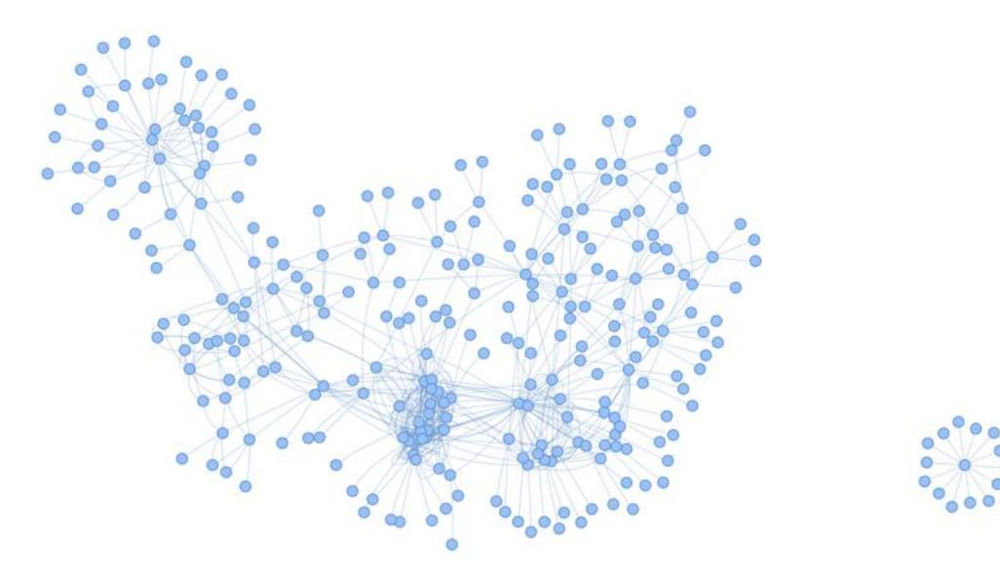
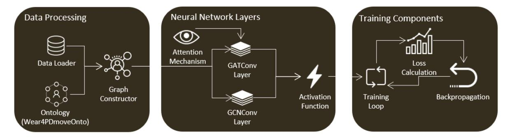
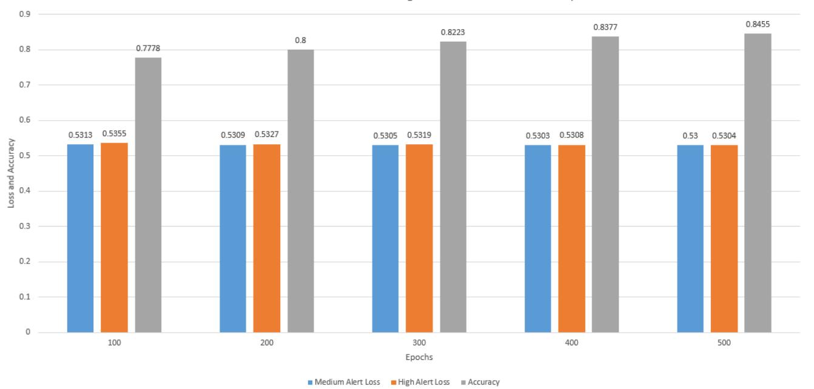
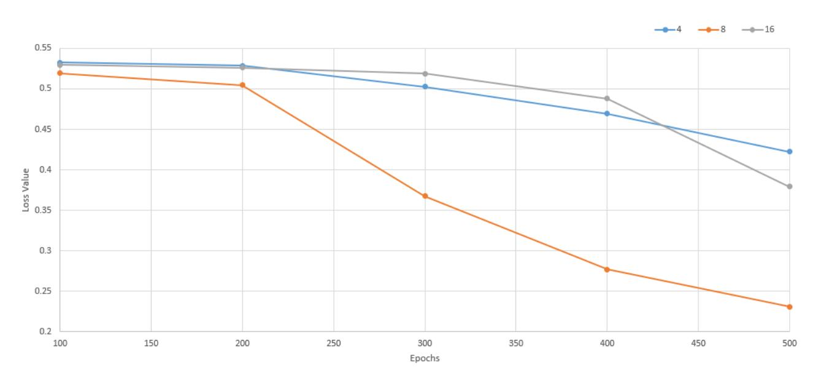
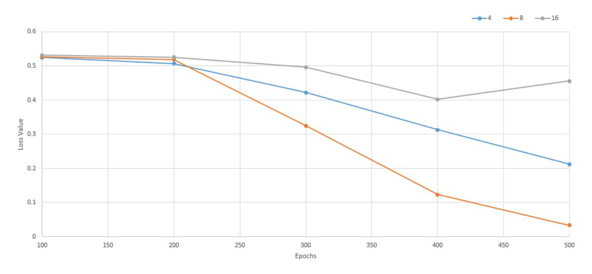
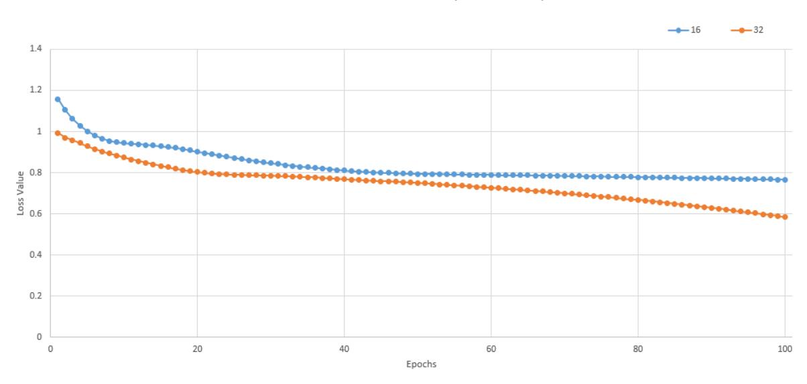

# Evaluating Ontology-Based PD Monitoring and Alerting in Personal Health Knowledge Graphs and Graph Neural Networks

**Nikolaos Zafeiropoulos, Pavlos Bitilis, George E. Tsekouras and Konstantinos Kotis**
Intelligent Systems Laboratory, Department of Cultural Technology and Communication, University of the Aegean, 81100 Mytilene, Greece; cti22009@aegean.gr (N.Z.); pavlos.bitilis@aegean.gr (P.B.); gtsek@aegean.gr (G.E.T.)
**Correspondence:** kotis@aegean.gr; Tel.: +30-6974822712

**Abstract:** In the realm of Parkinson's Disease (PD) research, the integration of wearable sensor data with personal health records (PHR) has emerged as a pivotal avenue for patient alerting and monitoring. This study delves into the complex domain of PD patient care, with a specific emphasis on harnessing the potential of wearable sensors to capture, represent and semantically analyze crucial movement data and knowledge. The primary objective is to enhance the assessment of PD patients by establishing a robust foundation for personalized health insights through the development of Personal Health Knowledge Graphs (PHKGs) and the employment of personal health Graph Neural Networks (PHGNNs) that utilize PHKGs. The objective is to formalize the representation of related integrated data, unified sensor and PHR data in higher levels of abstraction, i.e., in a PHKG, to facilitate interoperability and support rule-based high-level event recognition such as patient's missing dose or falling. This paper, extending our previous related work, presents the Wear4PDmove ontology in detail and evaluates the ontology within the development of an experimental PHKG. Furthermore, this paper focuses on the integration and evaluation of PHKG within the implementation of a Graph Neural Network (GNN). This work emphasizes the importance of integrating PD-related data for monitoring and alerting patients with appropriate notifications. These notifications offer health experts precise and timely information for the continuous evaluation of personal health-related events, ultimately contributing to enhanced patient care and well-informed medical decision-making. Finally, the paper concludes by proposing a novel approach for integrating personal health KGs and GNNs for PD monitoring and alerting solutions.

**Keywords:** ontology; knowledge graphs; Graph Neural Networks; Parkinson's Disease

## 1. Introduction

In the landscape of Parkinson's Disease (PD) research, the fusion of wearable sensor data with personal health records (PHR) has emerged as a pivotal avenue, promising to enhance patient monitoring and alerting capabilities.

This study delves into the intricate domain of PD patient care, with a specific emphasis on harnessing the potential of wearable sensors to capture, represent, and semantically analyze PD patient's movement data and domain knowledge. The primary objective is to elevate the assessment of PD patients by establishing a robust foundation for personalized health insights through the development of Personal Health Knowledge Graphs (PHKGs) [[1](#ref-1)–[3](#ref-3)]. Additionally, a personal health Graph Neural Network (PHGNN) is developed leveraging the PHKG to formalize the representation of related sensors and PHR integrated/unified data at a higher level of abstraction [[4](#ref-4)]. This paper, as an extension of our previous related work [[5](#ref-5)], provides a detailed exploration of the Wear4PDmove ontology and evaluates its integration within the development of an experimental PHKG [[5](#ref-5)]. Furthermore, the focus is on integrating PHKG within PHGNN implementations, emphasizing the importance of comprehensive PD-related data integration for effective patient monitoring and alerting. To achieve this goal, we have implemented a rule-based notification mechanism on specific features from PHKG with two different levels of notification (medium and high). These notifications provide health experts with precise and timely information and contribute to the continuous evaluation of PD patient-related events. This ultimately enhances patient care by facilitating well-informed time and life-critical medical decision-making.

**Citation:** Zafeiropoulos, N.; Bitilis, P.; Tsekouras, G.E.; Kotis, K. Evaluating Ontology-Based PD Monitoring and Alerting in Personal Health Knowledge Graphs and Graph Neural Networks. *Information* **2024**, *15*, 100. [https://doi.org/10.3390/info15020100](https://doi.org/10.3390/info15020100)

Academic Editor: Ryutaro Ichise

**Copyright:** © 2024 by the authors. Licensee MDPI, Basel, Switzerland. This article is an open access article distributed under the terms and conditions of the Creative Commons Attribution (CC BY) license ([https://creativecommons.org/licenses/by/4.0/](https://creativecommons.org/licenses/by/4.0/)).

The challenge lies in seamlessly integrating off-the-shelf wearable sensor data with PHRs to create a comprehensive and interoperable framework for effective PD patient monitoring and alerting [[6](#ref-6)]. This requires addressing complexities in data representation, interoperability, and high-level event recognition. The main target of the approach is to propose a holistic solution for personalized PD patient monitoring and alerting in terms of the Wear4PDmove ontology applied over a novel experimental PHKG framework, which is appropriately integrated with PHGNNs.

The motivation stems from the need to enhance the monitoring, assessment and alerting of PD patients by creating an advanced knowledge representation and reasoning (KRR) system. Integrating off-the-shelf wearable sensor data and PHRs into a PHKG along with PHGNNs [[7](#ref-7)] aligns with the growing demand for sophisticated and personalized healthcare solutions.

The key contribution of the work presented in this paper, extending our previous related work, is:

* *Experimental PHKG*: Evaluation of the Wear4PDmove ontology within the development of an experimental PHKG, showcasing its practical applicability.
* *PHKG integration with GNNs*: Emphasis on the integration of PHKG within GNN implementations, elucidating its pivotal role in advancing PD monitoring and alerting solutions.
* *Precision in PD Monitoring*: Addressing specific demands in PD monitoring through the precision offered by the Wear4PDmove ontology.
* *Enhanced Data Analysis with GNNs*: Implementation of GNNs to facilitate enhanced analysis of complex medical data.
* *Capturing Intricate Relationships*: Exploration of GNNs' capabilities to capture intricate relationships within PD-related data, enhancing understanding and insights.
* *Comprehensive PHKG*: Creation of a comprehensive PHKG integrating diverse data sources, including movement data, clinical records, and health-related information.

The overall contributions of our work in this line of research are as follows:

* *Interoperability and Interlinkage*: Ensuring PHKG interoperability and seamless interlinkage with relevant datasets, promoting comprehensive data utilization.
* *Real-Time Alerting Mechanisms*: Implementation of real-time alerting mechanisms utilizing rule-based high-level event recognition, contributing to timely interventions in PD care.
* *Advanced Semantic Data Analysis*: Development of advanced semantic data analysis techniques for uncovering movement data semantics, contributing to nuanced insights.
* *Patient-Centric Solutions*: Contribution to practical, patient-centric solutions for improved PD monitoring and care, emphasizing the integration of technology for personalized healthcare.

The structure of this paper is as follows: Section [2](#ref-2-0) provides essential background knowledge on the subject. In Section [3](#ref-3-0), we present a curated selection of state-of-the-art scientific studies. Section [4](#ref-4-0) delves into the detailed presentation of the Wear4PDmove ontology, elucidating its significance in capturing and formalizing PD-related data. Section [5](#ref-5-0) explores the evaluation of the ontology within the development of an experimental PHKG, showcasing its practical applicability and interoperability, along with an examination of its integration within GNNs. Moving beyond the state-of-the-art, Section [6](#ref-6-0) initiates a comprehensive discussion on the limitations and open issues associated with the Wear4PDmove ontology, providing insights into potential challenges and avenues for future research. Finally, Section [7](#ref-7-0) concludes the paper and outlines plans for future research.

## 2. Background Knowledge

This section presents key concepts spanning symbolic artificial intelligence (AI) and ontological frameworks, Knowledge Graphs (KG), PHKG, and Neurosymbolic AI [[8](#ref-8)]. Symbolic AI, epitomized by ontologies, forms the cornerstone of logical reasoning and knowledge representation, laying the groundwork for understanding/capturing complex relationships within healthcare data. KGs, through their capacity to organize and contextualize information, offer reasoning capabilities that result in valuable insights. We extend this paradigm to the case of PHKG, interlinking and reasoning with diverse health-related datasets. The emergence of Neurosymbolic AI, coupling KGs with neural networks into GNNs, signifies a novel approach to decoding intricate medical data. This collective exposition establishes the essential backdrop for our subsequent in-depth exploration and contributions in the following sections.

### 2.1. Symbolic AI and Ontology Engineering

Symbolic AI, encompassing logical reasoning, knowledge representation, and rulebased systems, constitutes a multifaceted approach to artificial intelligence. At its core, logical reasoning forms the basis of AI systems, employing several types of mathematical logic to support deductive reasoning and decision-making mechanisms. Knowledge representation involves the explicit portrayal of information using symbols, rules, and relationships [[9](#ref-9)]. This structured representation allows systems to comprehend intricate datasets effectively and manipulate them.

In Internet of Things (IoT) environments, ensuring interoperability is challenging due to the heterogeneous nature of data from devices like health and fitness trackers. Proprietary formats and lack of common terms often lead to certain challenges related to communication protocols and data formats [[10](#ref-10)]. Overcoming these challenges requires adopting common syntax and semantics for IoT-generated data. The Semantic Web of Things (SWoT) technology has emerged as a solution to mitigate such data and information heterogeneity. Semantics, dealing with meaning and truth, are harnessed through the Resource Description Framework (RDF) for semantically annotated linked data [[11](#ref-11)]. Semantic models and standards, such as the Semantic Sensor Network (SSN) [[12](#ref-12)], Sensor, Observation, Sample, and Actuator (SOSA) [[13](#ref-13)], Smart Applications Reference Ontology (SAREF) [[14](#ref-14)], and Data Analytics for Health and Connected Care (DAHCC) ontology [[15](#ref-15)], address the challenge of bridging sensor data heterogeneity. The Parkinson Movement Disease Ontology (PMDO) [[16](#ref-16)] specifically caters to Parkinson's Disease, organizing information into neurological findings, treatment plans, and evaluation instruments. Utilizing SW technologies, particularly RDF data modeling, facilitates semantic interoperability in IoT-enabled health devices [[17](#ref-17)].

Ontologies play a key role in semantic modeling, explaining object behavior and enriching raw sensor data. While progress has been made in developing semantic models for healthcare, there is an ongoing interest in developing models focusing on sensor data related to PD and wearable devices [[18](#ref-18)]. Health-related ontologies serve as conceptual models providing structure and meaning to health data, fostering common formats for knowledge exchange among humans and software agents involved in healthcare applications and systems.

Considering symbolic AI, the development of rule-based systems is commonplace, where sets of logical rules govern the system's behavior [[19](#ref-19)]. These rules, derived from datadriven learning strategies, serve as the guiding principles for drawing conclusions from given inputs. Technologies like RDF and OWL [[20](#ref-20)], often employed alongside Symbolic AI methodologies, play a crucial role in effective implementation.

### 2.2. Knowledge Graphs

KG serves as a structured and interconnected representation of information, adopting a graph format to represent real-world entities, their attributes, and their relationships [[21](#ref-21)]. This semantic framework enhances understanding and facilitates reasoning. KGs feature a graph structure comprising nodes (representing entities) and edges (representing relationships), allowing the depiction of complex inter-entity connections. By incorporating Linked Data (LD) principles, KGs interconnect with external sources of information, thereby enhancing the comprehensiveness of information [[22](#ref-22)]. Their scalability accommodates vast datasets with efficient traversal and retrieval capabilities.

KG applications include semantic search (e.g., Google search), recommendation systems, data integration, and support for knowledge-based AI. RDF is fundamental to KGs, using triples (subject-predicate-object) to express statements. SPARQL (SPARQL Protocol and RDF Query Language) [[23](#ref-23)] facilitates the querying and manipulation of RDF data within a KG.

### 2.3. PHKG

In the evolving landscape of healthcare informatics, the development and utilization of PHKGs have emerged as instrumental components for advancing personalized medicine. A PHKG represents a structured and interconnected knowledge base that combines diverse personal health data, ranging from clinical records to sensor-derived information, with the aim of fostering a holistic understanding of an individual's health profile [[24](#ref-24)]. The conceptual underpinning of a PHKG draws from the principles of the Semantic Web (SW) and LD standards, facilitating the creation of a comprehensive framework that transcends traditional health record silos.

Central to the efficacy of a PHKG is the integration of various application and domainspecific ontologies, which serve as formalized structures defining relationships and hierarchies of entities within the graph. Specifically, in the context of PD, a well-defined ontology, such as the Wear4PDmove ontology, plays a pivotal role in ensuring precision and specificity in representing and reasoning with PD-related data. The semantic richness afforded by these ontologies not only aids in the interoperability of diverse health data sources but also forms the basis for rule-based event recognition, enabling timely and contextually relevant medical interventions [[25](#ref-25)]. As wearable sensor technology becomes increasingly prevalent in health monitoring, the synergy of ontologically structured data within a PHKG stands as a promising paradigm for tailoring healthcare insights to the unique nuances of an individual's health journey [[2](#ref-2)].

### 2.4. Neurosymbolic AI and GNNs

Neurosymbolic AI is a powerful interdisciplinary approach at the intersection of symbolic reasoning and neural network-based learning, aiming to harness the logical strengths and explicit knowledge representation of symbolic methods and the pattern recognition capabilities of neural networks (NNs). This hybrid model seamlessly integrates symbolic reasoning, often associated with rule-based systems, with subsymbolic learning, utilizing neural networks for effective pattern recognition [[26](#ref-26)]. One of its distinguishing features is the capability to create interpretable and explainable AI models by leveraging explicit rule-based representations from symbolic components. A key subset, GNNs, excels in processing graph-structured data by capturing intricate dependencies and interactions among entities (nodes) connected by relationships (edges). GNNs use a message-passing mechanism, allowing nodes to iteratively exchange information and aggregate insights, deepening their understanding of the graph's structure.

In diverse applications, neurosymbolic AI and GNNs play a crucial role. In drug discovery, they combine expert knowledge with GNN-driven insights to accelerate the identification of potential drug candidates [[27](#ref-27)]. In healthcare, these models enhance the interpretability of medical decision-making by providing explanations for diagnoses through the integration of symbolic medical knowledge with learned patterns from patient data [[28](#ref-28)]. Social network analysis benefits from GNNs' ability to capture relationships and influence patterns within graphs, further enriched by incorporating symbolic reasoning for a comprehensive understanding of social structures.

In the context of PD research, data analysis assumes a pivotal role, leveraging Machine Learning (ML) and Deep Learning (DL) techniques for comprehensive exploration. Datasets, including electronic health records (EHRs), patient-reported outcomes, and imaging data, play a crucial role in understanding PD's mechanisms. The integration of KGs and GNNs emerges as a significant advancement, organizing PD-related information and excelling in tasks like patient classification and disease progression prediction. The application of ML, GNNs, and DL contributes to uncovering hidden patterns, enhancing treatment modalities, and refining therapeutic strategies in PD research.

## 3. Related Work

In the realm of PD research, a comprehensive understanding relies on the exploration of various domains, including ontologies, PHKGs, and GNNs. This section delves into state-of-the-art research, examining the pivotal role of ontologies in structuring PD-related knowledge, the application of PHKGs for personalized health insights, and the advancements brought by GNNs in analyzing complex medical data. Each sub-section within this segment unfolds the landscape of relevant studies, providing insights into the contributions, methodologies, and findings that have shaped the understanding of PD through ontological frameworks, KGs, and NN approaches.

### 3.1. Ontologies for PD

An ontology in the health domain serves as a framework for organizing and adding meaning to health-related data and information that is shared across different applications, services, and systems. Such ontologies play a crucial role in representing, integrating, and sharing health-related knowledge in a standardized and widely accepted format that can be understood by both humans, such as doctors and patients, and software agents. Younesi et al. [[1](#ref-1)] have developed the PD Ontology (PDON) as a standardized vocabulary and definition system for PD and its associated symptoms, treatments, and clinical studies. The ontology has been built using standard ontology development life cycle stages such as requirements gathering, conceptualization, implementation, and evaluation. PDON is designed to support interoperability and data sharing in the PD research community and includes a subclass-based taxonomic hierarchy that spans from molecular to clinical concepts. The evaluations have demonstrated that PDON can answer specific PD-related questions and improve the accuracy and consistency of data annotation and analysis.

The Parkinson's Movement Disorder Ontology (PMDO) [[29](#ref-29)] is a significant ontology for PD created by movement disorder specialists. The PMDO encompasses three major categories: neurological observations, treatment plans, and tools used to evaluate various aspects of PD. This ontology is a valuable asset for researchers and clinicians to label, share, and consolidate data related to PD and other movement disorders, as it offers a uniform terminology for these conditions. Overall, the PMDO is an important resource for the PD research community that can facilitate data sharing and interoperability and aid in standardizing the analysis and interpretation of PD-related information. PMDO is a more up-to-date resource than PDON, as the latter was last updated in 2016. Both ontologies are accessible through NCBO BioPortal [[30](#ref-30)], providing researchers and clinicians with standardized vocabularies for annotating and sharing PD-related data. While both the PMDO and PDON ontologies provide a standardized vocabulary and definitions for various aspects of PD and related movement disorders, neither ontology contains specific conceptualizations for representing knowledge extracted from data collected via wearable sensors. This is a limitation of both ontologies, as the use of wearable sensors is becoming increasingly common in PD monitoring and clinical care. Wearable sensors provide a way to collect objective and quantitative data on PD symptoms and motor function on a daily basis outside of a clinical setting.

### 3.2. PHKGs for PD

Recent studies have investigated the advantages of PHKGs in advancing smart health applications. A representative example is the IoT Semantic Annotations System (IoT-SAS) [[31](#ref-31)], which processes real-time sensor stream data, integrating semantic annotations to deliver immediate health information to citizens, especially concerning air pollution and weather conditions. Another study [[32](#ref-32)] utilized data from multiple IoT fitness vendors to establish a context-aware resource graph linked to health-related ontologies. Through a web portal, they facilitated the integration, sharing, and analysis of diverse IoT health and fitness data. Additionally, [[33](#ref-33)] proposed an OWL-based integration, combining ontologies to model health data and Web of Things (WoT) services, successfully creating a machine-understandable and cross-system reusable resource graph by linking health and home environment data. Notably, despite semantic annotation exploration in related work, there is a notable gap as no studies have developed PHKGs integrating real-time sensor data from wearables and other PHR sources for monitoring and alerting in PD patients.

Ontologies offer a means to explicitly represent unified knowledge related to sensor and PHR data, supporting knowledge creation through semantic inferencing. While advancements have occurred in semantic models for healthcare monitoring, there remains untapped potential for developing or extending existing models, particularly those focused on rules-based high-level event recognition for PD monitoring and alerting.

### 3.3. GNNs for PD

GNNs rapidly advance PD research through robust data analysis, handling patientreported outcomes, imaging data, and EHRs. Integrated into knowledge graphs, GNNs unveil intricate patterns, offering insights into PD's mechanisms. Progress in GNNs for PD diagnosis, particularly Deep Learning models analyzing imaging data, shows potential for detection and prognosis. These advancements aim to enhance patient well-being and alleviate PD-related healthcare burdens, holding promise for future exploration and improved understanding.

* Graph Convolutional Networks (GCNs)

Recent advances in GCNs, particularly in PD diagnosis using Deep Learning models for imaging data scrutiny, are promising in enhancing patient outcomes and reducing the healthcare burden [[34](#ref-34)]. The Multi-View Graph Convolutional Network (MV-GCN) enhances prediction accuracy in PD-related predictive tasks, utilizing multiple brain graph inputs [[35](#ref-35)[,36](#ref-36)]. Validation with real-world data from the Parkinson's Progression Markers Initiative (PPMI) demonstrates its promising performance in predicting pairwise matching relationships in the context of PD [[37](#ref-37)].

ML and DL techniques for identifying blood-based biomarkers in Alzheimer's and PDs, especially leveraging Convolutional Neural Networks (CNNs), show potential for early diagnosis and clinical trial screening [[38](#ref-38)[,39](#ref-39)]. The field of neuroimage analysis witnesses the popularity of GCNs in diverse applications, including distinguishing cases and controls in autism research.

* Graph Attention Networks (GATs)

Notably, GATs excel in managing extensive and intricate graphs, effectively filtering irrelevant data during DP. Advances in GAT applications for PD diagnosis, employing DL models for imaging data analysis, show promise in enhancing accuracy rates and patient outcomes [[40](#ref-40)]. Studies introduce novel approaches like multimodal GCN (M-GCN) and GAT models for predicting phenotypic measures, showcasing ongoing exploration of graph-based NN models to advance understanding neurological conditions [[41](#ref-41)]. This study proposes a deep multi-modal fusion model (DMFM) based on GAT, effectively incorporating spatial dependencies for spatiotemporal correlation modeling using ConvLSTM and a temporal attention mechanism (TAM) [[42](#ref-42)], ultimately enhancing prediction accuracy.

* Graph Recurrent Networks (GRNs)

Recent advances in deploying GRNs for PD diagnosis, particularly using DL models for analyzing time-series imaging data, show promising results with high accuracy rates [[43](#ref-43)]. This suggests the potential to enhance patient outcomes and alleviate the burden of PD on healthcare systems. In summary, GRNs offer a robust tool for processing timeseries data in PD research, holding substantial promise for advancing our understanding of this complex condition and improving patient outcomes [[44](#ref-44)].

* Graph Transformer Networks (GTNs)

GTNs demonstrate proficiency in managing complex graph structures, particularly relevant in handling intricate data sources like EHRs and imaging data. This enables GTNs to capture the intricate interconnections between various data elements, providing a comprehensive perspective on disease progression and patient outcomes. Recent advancements in applying GTNs to PD diagnosis and treatment involve the use of DL models for analyzing imaging data and predicting disease progression [[45](#ref-45)].

* Graph Autoencoders (GAEs)

GAEs also serve as valuable tools for dimensional reduction, addressing challenges posed by high-dimensional datasets in PD research, especially in imaging data, and facilitating the identification of latent patterns and relationships. Significant progress has been achieved in employing GAEs for PD diagnosis and therapeutic interventions, utilizing DL models for analyzing imaging data and predicting disease progression [[46](#ref-46)].

In conclusion, GAEs emerge as vital and adaptable tools in PD research due to their competence in managing graph-structured data and simplifying complex datasets through dimensionality reduction, positioning them as valuable assets in unraveling the intricacies of PD. Furthermore, in the broader scientific landscape, innovative methods like DD-GCN and SLMGAE are introduced for predicting human splice-site events and protein–protein interactions, respectively [[47](#ref-47)]. DD-GCN employs a two-pronged dropout strategy for enhancing gene embeddings, while SLMGAE utilizes an autoencoder architecture for obtaining low-dimensional graph representations [[48](#ref-48)].

* Graph Generative Networks (GGNs)

By combining graph-based representations and generative models, GGNs offer a powerful tool for unraveling the intricate relationship between PD symptoms and disease pathology, paving the way for more effective and personalized PD treatments. In the realm of medical image analysis [[49](#ref-49)], GGNs play a crucial role in data augmentation, addressing limitations in labeled images by employing a generative framework with a generator network crafting synthetic data and a discriminator network distinguishing between real and synthetic data.

* Graph Reinforcement Learning Networks (GRLNs)

The integration of graph-based representations with reinforcement learning enhances the precision of treatment choices for PD patients, resulting in improved outcomes. Notable applications of deep reinforcement learning networks in the medical field include predicting brain tumor locations using a deep Q-network (DQN) [[49](#ref-49)], a method for medical image semantic segmentation, and a recommendation system for antihypertensive medications for patients with hypertension and type 2 diabetes [[50](#ref-50)].

## 4. The Wear4PDmove Ontology

The ontology proposed in this work represents knowledge related to the monitoring of PD patients' movement and to the integration of such data with PHR data towards supporting real-time recognition of events such as a missing dose event, eventually triggering the appropriate alerting. Wear4PDmove is an ontology that reuses and extends other ontologies, including DAHCC, SOSA, SAREF, and PMDO (Figure [1](#ref-fig-1)). The imported ontologies extend the capabilities of Wear4PDmove ontology by providing the necessary concepts and relationships to model real-world data and knowledge related to PD patients' monitoring and alerting.

**Figure 1.** Wear4PDmove ontology key concepts and the reused vocabularies.

DAHCC ontology provides concepts and relationships to model the data analytics process in healthcare applications. SOSA ontology provides a formal model for representing sensors, observations, samples, and actuators and their relationships. SAREF ontology is used to model smart appliances and their features, enabling interoperability among them. PMDO is an ontology for modeling patient medical devices. Importing these ontologies into the core Wear4PDmove ontology allows us to model complex scenarios involving smart devices, sensors, and medical devices in the healthcare domain. Our ontology can be used to support tasks such as monitoring patients, detecting low-level events (e.g., tremors), and providing recommendations for healthcare professionals.

The Wear4PDmove ontology proposed for the PD domain is engineered using an iterative, human-centered, and collaborative approach known as the HCOME [51]. This approach incorporates agile practices to encourage continuous development and testing activities in a collaborative manner. A permanent URL for its access is set at W3id: [https://w3id.org/Wear4PDmove/onto](https://w3id.org/Wear4PDmove/onto) (accessed on 1 January 2024).

To achieve an agile, human-centered, collaborative, and iterative ontology development, a specific workflow based on the HCOME methodology has been followed. This workflow incorporates the latest recommendations for ontology engineering (OE) presented in related work [[52](#ref-52)]. These recommendations include the use of collaborative tools to support collaborative OE, providing early versions of the modular ontology for evaluation and validation by knowledge workers in a continuous, iterative approach, reusing third-party ontologies while also ensuring the reuse of its own modular parts, and supporting modular ontology definitions, mapping, and development of modules in a shared collaborative workspace. In Phase 1 (Specification) of the HCOME methodology, tasks are designed to capture ontological requirements specifications more efficiently. In Phase 2 (Conceptualization), a number of tasks efficiently capture the ontological design choices and preparations that are particularly relevant to the development process. In Phase 3 (Exploitation/Evaluation), the modular ontology is utilized, refined, and maintained by developing new modules, mappings, and updates to evaluate conceptualizations. The primary aim of exploiting the ontology is to support decision-making and analysis in the PD domain while continuously evaluating and refining it based on feedback from knowledge workers and domain experts.

### 4.1. Specification

Wear4PDmove ontology aims to semantically integrate heterogeneous data, such as dynamic/stream data (collected from wearables) and static/historical data (stored in PHR databases), in order to represent personal health knowledge in the form of a KG (i.e., PHKG), supporting health apps' reasoning capabilities for high-level event recognition (e.g., 'missing dose' or 'patient fall' event). The Wear4PDmove ontology meets the following specific requirements:

* (a) Represents knowledge about (i) patients' movement, (ii) patients' daily activities, (iii) details of patients' personal health records;
* (b) Semantically integrates data from heterogeneous and multimodal sources from (i) wearables and (ii) personal health records to provide a unified view of personal health in real-time (for monitoring patients and alerting doctors);
* (c) Coordinates with unified personal health data represented in the form of a PHKG;
* (d) Supports rule-based high-level event recognition in PHKG for PD, such as a 'missing dose' or a 'patient fall' event;
* (e) Discovers new and previously unknown relationships between various aspects of PD, including clinical symptoms, demographic variables, and biomarkers.

Based on these requirements, a set of competency questions (CQs) has been formulated in consultation with domain experts. The concise listing of these questions is provided below, and their detailed definitions, as outlined in Table [1](#ref-table-1), are further presented in Appendix [A](#ref-A). These CQs have been subsequently translated into SPARQL queries during the evaluation phase.

**Table 1.** Competency Questions (CQs) and their definitions.

| CQ ID | Definition of CQ |
|-------|---------------------------------------------------------------------------------------------------------------------------------------------------------------------------------------------|
| CQ1 | What are the activities performed by specific patients? |
| CQ2 | Which patient performs a specific Sketching Activity, and what is their performance level? |
| CQ3 | What observations have been recorded for specific patients, and what insights can be gained from analyzing the progression of the disease? |
| CQ4 | Which patient is related to which PHR, and what information can be retrieved from it? |
| CQ5 | What is the medical history and other relevant information for patients and their respective PHRs? |
| CQ6 | Which patients exhibit rigidity symptoms, and what is the severity level of their rigidity? |
| CQ7 | What is the level of the Hoehn and Yahr staging for a particular observation instance, and how can this be used to make informed decisions about treatment plans and medication dosages? |
| CQ8 | Which observations possess both tremor and bradykinesia attributes for the upper limb? |
| CQ9 | What are the observations that encompass both tremor and bradykinesia attributes for the upper limb, along with their corresponding timestamps? |
| CQ10 | Which observations in the Wear4PDmove ontology exhibit both tremor and bradykinesia attributes for the upper limb within a specific timestamp range and trigger a notification? |

### 4.2. Conceptualization

Following the specification of the aim and requirements of the ontology and the generation of the competency questions, the subsequent phase involves the conceptualization of the related ontology. This phase is based on the implementation of potential scenarios that are shaped from the input of knowledge workers in collaboration with domain experts, with the goal of refining different versions of the ontology that support those scenarios, ensuring the effective implementation of an agreed and shared final version.

The Wear4PDmove ontology is encoded in OWL using Protégé 5.5. The latest version is publicly available at <https://i-lab.aegean.gr/kotis/Ontologies/Wear4PDmove/Onto-v1.0.0/> (accessed on 1 January 2024) for further evaluation and criticism by related communities of interest and practice. The ontology is evaluated with OOPS! [[53](#ref-53)] and documented with WIDOCO [[54](#ref-54)] and is available under the license CC0. The goal of the Wear4PDmove ontology is to provide an inclusive and fused model for the personal health information of patients with PD, to support customized monitoring and alerting, as well as advanced data analytics and decision-making. The developed ontology incorporates/reuses related ontologies and introduces novel classes and properties to fulfill the specified requirements. In Figure [2](#ref-fig-2), the set of triples describing an inferred PD patient observation is presented.

| | rdf: <http://www.w3.org/1999/02/22-rdf-syntax-ns#> |
|-----------------|--------------------------------------------------------------------------------------------------------------------------------------------------|
| | rdfs: <http://www.w3.org/2000/01/rdf-schema#> |
| | sosa: <http://www.w3.org/ns/sosa#> |
| | dahcc: <https://dahcc.idlab.ugent.be/ontology/sensorsandwearables> w4pd: <http://w3id.org/wear4pdmove/onto#> |
| cample triples: | |
| Acc22-sensor> | dahcc: Accelerometer; |
| sosa:observes | <wearable_acceleration_for_pd_movement>. |
| | <wearable acceleration for movement pd> a dahcc: WearableAcceleration. |
| <pdpatient-001> a</pdpatient-001> | sosa: FeatureOfInterest. |
| <patientmovement> a</patientmovement> | sosa: FeatureOfInterest. |
| <pd-patient-observation-001> a sosa: Observation; | |
| sosa:hasFeatureOfInterest | <pdpatient-001>; |
| sosa:hasFeatureOfInterest | <patientmovement>; |
| sosa:madeBySensor | <acc22-sensor>; |
| sosa:observedProperty | <bradykinisiaupperlimpforpdpatient>; |
| sosa:observedProperty | <tremorforpdpatient>: |
| sosa:observedProperty | <wearable_acceleration_for_pd_movement>; |
| | |
| sosa:resultTime | "2022-07-06T12:36:12.150Z"^^xsd:dateTime; |
| w4pd:hasTremor | false; |
| w4pd:hasRigidity | false; |
| w4pd:hasPosturalInstability | true; |
| w4pd:hasFreezingOfGait | false; |
| w4pd:has Akinesia | true; |
| w4pd:hasDepression | false; |
| w4pd:has Anxiety | true: |
| w4pd:hasSleepDisturbances | false; |
| w4pd:hasFatigue | false; |
| w4pd:hasDysphagia | false: |
| w Andrhae Ready kinicia Off Jones Limp - false | |

**Figure 2.** Example of RDF triples representing related knowledge of a PD patient observation.

The example includes information about the accelerometer sensor used to observe wearable acceleration in PD patients, the patient and patient movement features of interest, the PD patient observation, and the properties observed during the observation (Bradykinesia of upper limp, tremor, and wearable acceleration). It also includes additional information, such as the result time of the observation.

To define the triplified knowledge presented in Figure [2](#ref-fig-2) and other knowledge related to this domain, a number of reused classes and properties have been defined. In Appendix [B](#ref-B), a comprehensive list of the primary classes and properties is provided.

The relevant prefixes/namespaces used for the implementation of the ontology are:

PREFIX rdf: [<http://www.w3.org/1999/02/22-rdf-syntax-ns#>](http://www.w3.org/1999/02/22-rdf-syntax-ns#)
PREFIX owl: [<http://www.w3.org/2002/07/owl#>](http://www.w3.org/2002/07/owl#)
PREFIX rdfs: [<http://www.w3.org/2000/01/rdf-schema#>](http://www.w3.org/2000/01/rdf-schema#)
PREFIX xsd: [<http://www.w3.org/2001/XMLSchema#>](http://www.w3.org/2001/XMLSchema#)
PREFIX w4pd: [<http://w3id.org/Wear4PDmove/onto#>](http://w3id.org/Wear4PDmove/onto#)
PREFIX saref: [<https://saref.etsi.org/core/>](https://saref.etsi.org/core/)
PREFIX sosa: [<http://www.w3.org/ns/sosa/>](http://www.w3.org/ns/sosa/).

### 4.3. Evaluation

In this phase, we evaluate the Wear4PDmove ontology, which represents the third phase of the HCOME methodology. According to this phase, a list of selective representative SPARQL queries was meticulously designed for the evaluation of the Wear4PDmoveOnto in Protege 5.5. Additionally, a set of scenario-based SWRL rules were thoughtfully implemented and assessed within the same environment.

Following this initial phase of ontology evaluation, we advance into a pivotal stage where we harness the power of GNNs to assess and enhance the performance of the Wear4PDmove ontology. Specifically, we employ two distinct GNN algorithms, GAT and GCN, to evaluate the predicate results associated with two different notifications, focusing on tremor and bradykinesia. Our goal is to use PHGNNs to assess notification levels for tremors and bradykinesia in PD monitoring. We have designed a mechanism where one positive feature triggers a medium notification while both lead to a high notification. This integration aims to boost the precision of our alert system, enhancing our PD monitoring's effectiveness. The results will shed light on our ontology and GNN algorithms, benefiting medical informatics.

It is worth highlighting that the data used to populate the ontology for evaluation purposes comprise synthetic example data, which is distinct from data generated by real sensors. These synthetic examples exclusively serve the purpose of evaluating the ontology's performance. The significance of this phase is underlined by the presentation of its results in Section [5](#ref-5-0), emphasizing its pivotal role in the ontology engineering methodology. Furthermore, we want to draw attention to the inclusion of code snippets for each query, as detailed in Appendix [C](#ref-C).

## 5. Evaluating the Ontology in PHKGs and PHGNNs

In this section, we focus on the evaluation of the Wear4PDmove ontology within the framework of PHKGs and GNNs. Section [5.1](#ref-5-1) provides insights into the experimental setup and data used for the evaluation, followed by a detailed examination of the ontology using Protégé 5.5 [[55](#ref-55)]. Additionally, we explore an alternative implementation of the ontology and the PHKG using RDFlib/Python [[56](#ref-56)]. Moving on to Section [5.2](#ref-5-2), we introduce the application of PHGNNs using both the GAT and GCN approaches.

### 5.1. Experiments Setup and Data

To ensure diverse and comprehensive datasets for our experiments, we employed two distinct methods for creating patient data. The first method involves utilizing a Pythonbased data generator service specifically designed for patient information [[57](#ref-57)]. This service ensures the generation of realistic and representative observations, simulating various scenarios that might occur in a clinical setting. In the second method, we leveraged the Mockaroo tool as a supplementary approach. Mockaroo provides a versatile platform for generating synthetic data [[58](#ref-58)], allowing for the customization of attributes and characteristics to mimic real-world scenarios. Simulated observations were collected from three virtual patients for a specific time of the day, with each patient assigned 60 observations per hour (i.e., one for every minute). These two methods enrich and diversify the dataset, enhancing the robustness of our experimental evaluations.

In Table [2](#ref-table-2), a snapshot of the above-mentioned data recorded for a patient at a specific moment is presented, representing one of the 60 observations at a given time. The table presents various characteristics, each providing valuable insights into the patient's condition. The attributes, their descriptions, and corresponding values have been randomly selected from a comprehensive record, offering a glimpse into the diverse aspects monitored during the observation period.

**Table 2.** Patient Observation Data: Key attributes and values recorded at time intervals (per minute).

| Feature/Attribute | Description | Data Type | Value |
|------------------------|----------------------------------------------------------------|-----------|--------------------------|
| ageOfPatient | Age of the patient | Integer | 10 |
| bodyMassIndex | Body mass index (BMI) of the patient | Decimal | 12.9 |
| diseaseDuration | Duration of the disease | Integer | 11 |
| hasAkinesia | Patient has akinesia | Boolean | true |
| hasAnxiety | Patient has anxiety | Boolean | true |
| hasBradykinisiaOfUpperLimp | Patient has upper limb bradykinesia | Boolean | false |
| hasDepression | Patient has depression | Boolean | false |
| hasDysphagia | Patient has dysphagia | Boolean | false |
| hasFatigue | Patient has fatigue | Boolean | true |
| hasFreezingOfGait | Patient has freezing of gait | Boolean | false |
| hasPosturalInstability | Patient has postural instability | Boolean | true |
| hasRigidity | Patient has rigidity | Boolean | false |
| hasSleepDisturbances | Patient has sleep disturbances | Boolean | false |
| hasTremor | Patient has tremor | Boolean | false |
| heartRate | Heart rate of the patient | Decimal | 12.8 |
| levelHoehnYahrStage | Hoehn and Yahr stage level | Decimal | 12 |
| obsAfterDosing | Observations made after dosing | Boolean | true |
| scoreUPDRS | UPDRS (Unified Parkinson's Disease Rating Scale) score | Decimal | 12.5 |
| resultTime | Timestamp indicating the result time of observation | DateTime | 2022-07-06T12:36:12.150Z |

The data in Table [2](#ref-table-2) represents a comprehensive set of features that have been meticulously extracted and compiled through a prior preprocessing phase [[6](#ref-6)]. It is important to note that several of these properties, such as hasTremor, have been computed by the smart watch application at lower levels of abstraction. This means they are derived from more granular data or calculations, signifying a deeper level of analysis and processing involved in their determination. Additionally, it is important to emphasize that some of these properties are intricately linked to movement data, representing dynamic streams of information, while others are associated with PHR data, which typically encompasses static or longitudinal health-related information. This clear distinction underscores the multifaceted nature of the dataset, encompassing both dynamic and static facets of patient health, making it a valuable resource for a comprehensive understanding of the studied domain.

### 5.1.1. Wear4PDmove in Protégé OE Environment

To exploit and evaluate the engineered ontology, the competency questions were transformed to SPARQL queries and executed on the inferred knowledge represented using as input (a) a PHR database (patient information) and (b) a CSV file of sensor data gathered from a smartwatch during experimentation with PD patients. Using the Pellet reasoner [[59](#ref-59)] and the Snap SPARQL plugin [[60](#ref-60)], the inferred knowledge was queried to obtain observations related to the 'missing dose' high-level event. The source files of the ontology, the example SPARQL (numbered as Qx in Appendix [C](#ref-C)) queries, and the SWRL rules can be accessed at <https://github.com/KotisK/Wear4PDmove/v1.0.0/> (accessed on 1 January 2024).

In the context of the Wear4PDmove ontology, the following SWRL rules are defined to detect missing dose high-level events based on the low-level events of tremor or bradykinesia identified in patients and generate notifications to doctors about possible missing doses of medication. These events are represented as Boolean data types, indicating their presence or absence. The values of these events are generated through the analysis of raw sensor data, which is performed within an API. It is important to note that the development of this API is part of another ongoing research project.

Below, we describe the rules for recognizing and notifying doctors of missing dose events in PD patients.

*Rule 1*: This rule states that if a tremor (low-level event) has been observed for a PD patient after a dosing event, then a missing dose event (high-level event) is recognized, and a notification is sent to the doctor (through the sendNotification function). The rule automatically classifies instances of PD patient observations as "PD patient Missing Dose Event Observations".

*SWRL Rule (Bradykinisia)*: Observation(?obs), 'has bradykinisia of upper limp'(?obs, true), 'observed property'(?obs, 'Bradykinisia Upper Limp for PDpatient'), 'observation after dosing'(?obs, true) -> 'send notification'('Missing Dose Notification', true), 'PD patient Missing Dose Event Observation'(?obs)

*Rule 2:* Similar to Rule 1, this rule is used for the recognition of missing dose (high-level event) based on the identified low-level event of bradykinesia in the upper limb of PD patients. If an observation is made for bradykinesia of the upper limb after a dosing event, and bradykinesia is detected (hasBradykinisiaOfUpperLimp), then a missing dose event is recognized, and a notification is sent to the doctor through the sendNotification function.

*SWRL Rule (Tremor)*: Observation(?obs), 'observed property'(?obs, 'Tremor for PDpatient'), 'observation after dosing'(?obs, true), 'has tremor'(?obs, true) -> 'send notification'('Missing Dose Notification', true), 'PD patient Missing Dose Event Observation'(?obs)

These rules are defined for the purpose of identifying possible missed medication doses in PD patients and notifying their doctors in a timely manner. However, the effectiveness of these rules in a clinical setting would need to be evaluated through testing and validation. The accuracy of the observations, the sensitivity and specificity of the rules, and the usability of the notifications would need to be assessed. This evaluation process would require collaboration between domain experts and data scientists and may involve collecting and analyzing real-world patient data.

### 5.1.2. Wear4PDmove and RDFlib/Python Implementation

In the ontology construction phase, we meticulously detailed the connections with recommended classes and features that form the Wear4PDmove ontology. To achieve this, we utilized the Protégé 5.5 tool, a widely recognized ontology engineering tool, as already mentioned in the previous section. Protégé 5.5, with its intuitive and user-friendly interface, facilitated the modeling and editing of ontologies using the OWL. The entities, classes, and relationships within our ontology were meticulously defined and structured during this phase, ensuring a comprehensive representation of PD domain knowledge. It is noteworthy that our project can be seamlessly run in a Google Colab environment using Python. This provides an additional layer of accessibility and convenience for users, allowing them to engage with the ontology and its interconnected components.

RDFlib stands as a Python library designed for the manipulation of RDF data. Offering functionalities for parsing, querying, and manipulating RDF data, RDFlib plays a crucial role in loading and processing RDF data, including ontologies, within Python applications. The visualization component offers various KG versions tailored to specific needs. It includes representations of classes (concepts) as nodes and attributes (properties) as edges. These versions are:

* 1. Classes: Concentrates only on the categories in the ontology, giving a basic view.
* 2. Classes with Filters: Enhanced with filters to highlight specific aspects within classes.
* 3. Dark Background Classes (with connections): Emphasize classes with a dark background for clarity and visual appeal.
* 4. Classes and Data Properties: Combines classes and data properties for a holistic view of the ontology's structure and properties.

This structured flow ensures a step-by-step approach, from importing the ontology to generating tailored visualizations catering to different requirements and preferences. The goal is to provide a flexible and insightful exploration of the Wear4PDmove ontology through diverse knowledge graph representations.

Owlready2 [[61](#ref-61)], a Python library designed for ontology-oriented programming, empowers developers with a seamless integration of OWL ontologies into Python environments. This library provides a Pythonic approach to efficiently handle and manipulate OWL ontologies, bridging the gap between ontology development and Python programming.

In the context of ontology development, the specification of the "import" relationship holds significant importance. This relationship serves as a fundamental link connecting one ontology to another (Figure [3](#ref-fig-3)). Through the "import" relationship, various ontologies can share and reuse classes, properties, and other essential elements. This practice is pivotal for achieving modular ontology design and facilitating the integration of ontologies. Establishing explicit import relationships enhances the modularity and interoperability of ontologies, fostering collaboration and knowledge sharing across diverse domains and applications.

**Figure 3.** Knowledge Graph integrating the Wear4PDmove ontology.

The visualization of this interconnectedness, as depicted in the lower right corner in a star schema of Figure [3](#ref-fig-3), signifies the imported ontologies in our ontology. This portrayal reinforces the autonomy of the ontology by illustrating its independence from the broader elements of the ontological structure. Furthermore, the star schema serves as a representation of metadata, emphasizing the role of this ontology as a self-contained entity with clear import relationships, contributing to a more comprehensible and organized ontology landscape.

This phase involves comprehensively reading classes, properties, and individuals from the ontology. Subsequently, the focus shifts to extracting relational information related to instances, specifically targeting the values associated with properties such as hasBradykinisiaOfUpperLimp and hasTremor (Table [3](#ref-table-3)). This dual-step process ensures a thorough exploration of the KG, encompassing the identification and retrieval of essential entities and their interrelations. By systematically reading and analyzing classes, properties, and instances, the task aims to gain a holistic understanding of the KG's structure, while the subsequent extraction of instance relations provides valuable insights into specific attributes crucial for further analysis and interpretation. The code snippet for extracting a list of values related to the studied observations, including hasBradykinisiaOfUpperLimp and hasTremor, can be found in Appendix [D](#ref-D).

A devised mechanism implemented through the RDFlib library orchestrates the extraction of the knowledge graph from the populated (with instances) ontology. This process involves tracing connections with all the imported ontologies, ultimately culminating in the extraction of classes and attributes that collectively form the ontology. Subsequently, two distinct types of notifications are generated: a medium alert and a high alert. The notification criteria are established through a rule extraction mechanism. In cases where both observations of hasBradykinisia and hasTremor are concurrently true, the high alert is triggered. Conversely, if either of the two observations is true, the medium alert notification is activated. When both observations are false, both notifications remain inactive. The output of this process yields a dataset comprising timestamped observations, the received observations values, and the corresponding notification outputs.

**Table 3.** Examples of observations related to Bradykinisia and Tremor low-level events.

| Records | hasBradykinisiaOfUpperLimp | hasTremor |
|----------------------------|----------------------------|-----------|
| PD-patient-Observation-101 | False | False |
| PD-patient-Observation-102 | False | True |
| PD-patient-Observation-103 | False | True |
| PD-patient-Observation-201 | False | False |
| PD-patient-Observation-202 | True | True |
| PD-patient-Observation-203 | False | False |
| PD-patient-Observation-301 | True | False |
| PD-patient-Observation-302 | False | False |
| PD-patient-Observation-303 | False | False |

To achieve this, a SPARQL query is executed to construct a query structure (CONSTRUCT). Notably, this approach replaces the SWRL (Semantic Web Rule Language) since the owlready2 package does not support this feature. Following the SPARQL query, triples associated with the identified observations, namely hasBradykinisia and hastTremor are constructed (Figure [4](#ref-fig-4)).

| Query: | PREFIX rdf: <http://www.w3.org/1999/02/22-rdf-syntax-ns#> PREFIX owl: <http://www.w3.org/2002/07/owl#> PREFIX rdfs: <http://www.w3.org/2000/01/rdf-schema#> PREFIX xsd: <http://www.w3.org/2001/XMLSchema#> PREFIX onto: <http://w3id.org/wear4pdmove/onto#> PREFIX saref: <https://saref.etsi.org/core/> PREFIX sosa: <http://www.w3.org/ns/sosa/> PREFIX core: <https://saref.etsi.org/core/> |
|--------|---------------------------------------------------------------------------------------------------------------------------------------------------------------------------------------------------------------------------------------------------------------------------------------------------------------------------------------------------------------------------------------------------------------------------------------------------------------------------------------------------------------------------------------------------------------|
| | CONSTRUCT { ?obs onto:hasTremor ?hasTremor ; onto:hasBradykinisiaOfUpperLimp ?hasBradykinisia $}$ WHERE $\{$ ?obs onto:hasTremor ?hasTremor . ?obs onto:hasBradykinisiaOfUpperLimp ?hasBradykinisia . ŀ |
| | Run Query |

**Figure 4.** SPARQL query in the Python environment.

In Figure [4](#ref-fig-4), triples serve as the foundation for assessing alerts using IF-THEN rules. It's important to emphasize that these rules are formulated within the Python environment, leveraging its capabilities for dynamic and programmatically driven rule creation (Figure [5](#ref-fig-5)). This approach ensures a flexible and adaptable system for assessing alerts and making informed decisions based on the identified observations.

| | Subject | Predicate | Object |
|----------------|-------------------------------------------------------------|-------------------------------------------------------------|--------|
| **0** | http://w3id.org/Wear4PDmove/onto#PD-patient-Observation-303 | http://w3id.org/Wear4PDmove/onto#hasBradykinisiaOfUpperLimp | false |
| 1 | http://w3id.org/Wear4PDmove/onto#PD-patient-Observation-302 | http://w3id.org/Wear4PDmove/onto#hasTremor | false |
| **2** | http://w3id.org/Wear4PDmove/onto#PD-patient-Observation-301 | http://w3id.org/Wear4PDmove/onto#hasTremor | false |
| 3 | http://w3id.org/Wear4PDmove/onto#PD-patient-Observation-302 | http://w3id.org/Wear4PDmove/onto#hasBradykinisiaOfUpperLimp | false |
| **4** | http://w3id.org/Wear4PDmove/onto#PD-patient-Observation-101 | http://w3id.org/Wear4PDmove/onto#hasBradykinisiaOfUpperLimp | false |
| 5 | http://w3id.org/Wear4PDmove/onto#PD-patient-Observation-102 | http://w3id.org/Wear4PDmove/onto#hasBradykinisiaOfUpperLimp | false |
| 6 | http://w3id.org/Wear4PDmove/onto#PD-patient-Observation-301 | http://w3id.org/Wear4PDmove/onto#hasBradykinisiaOfUpperLimp | false |
| **7** | http://w3id.org/Wear4PDmove/onto#PD-patient-Observation-203 | http://w3id.org/Wear4PDmove/onto#hasTremor | true |

**Figure 5.** Resulting triples from the CONSTRUCT query.

The use of the Python programming language enhances the overall interaction and editing capabilities of the ontology, adapting to modern technological advancements and the evolving landscape of ontology development. Python complements, rather than replaces, the functionality provided by tools like Protégé. This complementary approach of using both Python and Protégé for ontology engineering not only empowers the derivation of meaningful insights and conclusions from the ontology but also encompasses visualization differences. Other frameworks, such as the JENA Apache framework, exist, which add further versatility to ontology management.

## 5.2. Neurosymbolic AI Approach

In this work, we aim to explore how a GAT network processes graph-structured data effectively. The GAT network is powerful because of its attention mechanisms, which enable it to capture intricate relationships hidden in the data, providing us with a nuanced perspective on the underlying patterns. GCN complements GAT's capabilities by processing graph-structured data through its convolutional layers. Like GAT, GCN excels in handling nodes and edges representing various entities and relationships within the KG, such as symptoms, treatments, and PHR data. Together, GAT's attention mechanisms and GCN's convolutional approach enable a comprehensive analysis of the intricate relationships in the data.

To embed KG into GNNs, nodes and edges from the KG should be represented in the graph structure used by the PHGNN models. Nodes represent various entities (like symptoms, treatments, and PHR data), while edges represent relationships. To accomplish that task, we create a graph-based library called DGL (Deep Graph Library) to load our data and use them for training a GNN model to perform binary classification regarding two different alert labels, namely, 'medium' and 'high'. These alerts are triggered by employing specific features (*hasTremor* and *hasBradykinisia*) related to tremor and bradykinesia, respectively. The "medium" alert is activated when one of these features indicates a positive result. The "high" alert is activated when both features signal a positive outcome. We also evaluate the model accuracy for each level. This algorithm represents the practical implementation of our approach, showcasing how GNN is embedded in our system to handle and classify data effectively. In summary, our approach involves feature extraction from the ontology, data organization, and the application of GNN to classify alert levels.

More specifically, the selection and implementation of these two algorithms was made considering the following:

* Structure and Loss Functions in GAT and GCN Implementations

In our GAT and GCN implementations, we utilize convolutional layers tailored for processing graph-structured data. These convolutional layers are typically associated with classification tasks. However, our objective is alert-level classification rather than regression.

For the GAT implementation, we employ two GAT convolutional layers, well-suited for classification tasks, and optimize the model using the Cross-Entropy Loss function, a standard choice for classification. This task involves determining 'medium' or 'high' alerts based on features related to tremor and bradykinesia. Similarly, in the GCN implementation, we incorporate two GCN convolutional layers chosen for their classification effectiveness. Although our data may seem continuous, our focus is on classification and determining alert levels. To facilitate this classification, we use the Mean Squared Error (MSE) loss, traditionally for regression but serving as a proxy for our classification needs.

Both GAT and GCN outputs are further processed to make the final classification decision. We acknowledge that GNNs, including GAT and GCN, excel in classification tasks, often employing methods like Cross-Entropy Loss. Our choice of loss functions may appear regression-like, but they effectively serve our classification objectives. Additionally, in our GCN implementation, we intentionally omit pooling layers. This decision is driven by the unique nature of our graph-structured data and the classification task at hand. Unlike traditional CNNs that rely on pooling to reduce spatial dimensions, our data's relationships between nodes (patient attributes) are paramount. Pooling could potentially result in information loss. Our goal is to classify alert levels based on intricate relationships among attributes, and the graph convolutional layers aptly capture these relationships while preserving overall structure.

Ultimately, the presence or absence of pooling layers depends on the specific problem and dataset. In our context, omitting pooling layers aligns with our aim of accurately classifying alerts, considering the complex interplay of patient attributes within the graph structure.

* Node Classification with GAT and GCN for Enhanced PD Monitoring

The GAT performs node classification within a graph structure. This involves data preparation, constructing the graph, defining the GAT model, training, and evaluating the model's performance in classifying alert levels.

The paper extends this approach with GCN for effective PD monitoring. Here, GCN processes graph-structured data, with nodes representing PD-specific elements like symptoms. The convolutional layers of GCN crucially analyze these nodes within their local networks, effectively capturing key spatial relationships.

In our GCN implementation, we initially utilize the MSE loss function, which is traditionally associated with regression tasks. However, it is important to note that we employ the MSE loss as a means to classify inputs into one of the two classes: 'medium' alert notification and 'high' alert notification. Specifically, the largest values correspond to 'high' notifications, while smaller values indicate a 'medium' notification classification. This classification process is an integral part of our approach and is designed to determine the appropriate notification level for each input, ensuring that our system effectively responds to varying PD symptoms.

* Choosing GAT and GCN for Enhanced PD Monitoring

The selection of GAT and GCN for our PD monitoring system is rooted in their demonstrated proficiency in handling complex, graph-structured data typical in patientrelated contexts. GAT, with its attention mechanisms, excels in emphasizing critical nodes, while GCN stands out for its effectiveness in learning from graph data. Their combined capabilities enable our system to accurately capture and analyze the intricate relationships within PD data, significantly improving the accuracy of notification classification and contributing to better patient outcomes. This choice is supported by their established success in medical research, particularly in managing neurodegenerative diseases like PD.

Based on all of the above, Figure [6](#ref-fig-6) presents a general architectural function of PHGNNs. It consists of three main sections: Data Processing, Neural Network Layers, and Training Components. The Data Processing block includes a Data Loader, Ontology (Wear4PDmoveOnto) and a Graph Constructor. The Neural Network Layers block highlights an Attention Mechanism Layer, a GATConv Layer, and a GCNConv Layer, followed by an Activation Function. The Training Components section outlines the process with Training Loop, Loss Calculation, and Backpropagation. The flow of the diagram suggests a sequential process from data handling to model training.

**Figure 6.** Personal Health Graph Neural Network (PHGNN) architecture.

### 5.2.1. GNNs (GAT Approach)

In the quest to derive meaningful metrics from GNN approaches tailored for patients with PD, we adopt a systematic and structured methodology. The initial phase entails the installation of the DGL package and the incorporation of the PyTorch library, establishing a robust foundation for subsequent tasks.

Moving forward, the data preparation stage involves the extraction of features from the ontology, systematically saving them in a CSV file. To enrich the dataset, two additional fields are introduced, representing distinct alert levels—'medium' and 'high'. These alerts are generated through a decision support system embedded within the service, leveraging ontology-driven rules.

A pivotal aspect of the process revolves around a comprehensive exploration of the GAT algorithm. Specifically, we delve into the intricacies of the GAT mechanism, aiming to grasp its ability to process graph-structured data. The GAT algorithm, with its attention mechanisms, excels in capturing intricate relationships within the data, providing a nuanced perspective on the underlying patterns. In this study, we conducted a series of experiments employing a GNN approach for monitoring PD patients. The primary objective was to evaluate the system's performance in predicting medication adherence and recognizing potential lapses in pill dosing. The training process was executed over multiple epochs, ranging from 100 to 500, each accompanied by distinct values for Medium Alert Loss, High Alert Loss, and Accuracy (Figure [7](#ref-fig-7)). The Medium Alert Loss represents the loss incurred during the prediction of medium-level alerts, while the High Alert Loss pertains to the loss associated with high-level alerts. Accuracy, on the other hand, reflects the overall correctness of the model's predictions. Over time, the system gradually improved its predictive accuracy, showing a notable decrease in medium and high alert loss, indicating better precision in alert predictions and an enhanced ability to identify different alert levels accurately. The ascending trend observed in the Accuracy metric further reinforces the system's competence. The consistent increase from 77.78% to 84.55% over the epochs implies an augmentation in the overall correctness of the predictions. This suggests that the GNN model effectively learned and adapted to the intricate relationships within the patient data, showcasing a promising capability to identify instances of missed medication doses.

**Figure 7.** Model performance metrics for medium and high alert predictions across training epochs, including loss and accuracy values.

The provided results in Figure [8](#ref-fig-8) detail the metric loss for Medium Alert based on exported outcomes from the GAT algorithm. The results vary across different configurations of hidden features (4, 8, and 16) and training epochs (100 to 500). The loss values, representing the dissimilarity between predicted and actual values during training, generally decrease as the number of epochs increases. Notably, the configuration with 8 hidden features and 500 epochs achieves the lowest loss, indicating optimal performance for the Medium Alert classification. This trend suggests that the model progressively improves its predictive capabilities over successive training iterations. Overall, these results reflect the effectiveness of the GAT algorithm in learning representations for Medium Alert classification, with specific configurations demonstrating superior performance.

**Figure 8.** Loss medium alert in different hidden layers.

In Table 4, the GNN performance metrics showcase the accuracy, precision, recall, and F1 score across different epochs and hidden layers for the medium alert level. For the model with four hidden layers, performance steadily improved from an initial accuracy of 0.8223 to 0.8455 at 500 epochs. The 8 hidden layer model started at 0.8455 and reached 0.8711 at 500 epochs, demonstrating consistent enhancement. In the case of 16 hidden layers, the model began with an accuracy of 0.7778 and progressed to 0.8908 at 500 epochs. However, in relation to Figure [8](#ref-fig-8), it is observed that with the accuracy of 16 hidden layers (although greater than that of 8), it is a misinterpretation (therefore, it has been over-fitted), as the loss parameter shows that the optimization is achieved faster through 8 hidden layers. Trade-offs between precision and recall were observed, emphasizing the importance of tailoring models to specific application requirements. The findings suggest potential avenues for further optimization and underscore the need for continuous evaluation in healthcare contexts.

**Table 4.** GNN performance metrics across epochs with different hidden layers (medium alert).

| Hidden Features | Epochs | Accuracy | Precision | Recall | F1-Score |
|-----------------|--------|----------|-----------|--------|----------|
| | 100 | 0.7778 | 0.9234 | 0.8142 | 0.8654 |
| 4 | 200 | 0.8 | 0.931 | 0.8187 | 0.8712 |
| | 300 | 0.8223 | 0.939 | 0.8199 | 0.8754 |
| | 400 | 0.8377 | 0.9401 | 0.8213 | 0.8767 |
| | 500 | 0.8455 | 0.9425 | 0.8288 | 0.8820 |
| | 100 | 0.7778 | 0.9237 | 0.8145 | 0.8657 |
| 8 | 200 | 0.82 | 0.9391 | 0.8199 | 0.8755 |
| | 300 | 0.8455 | 0.9427 | 0.8219 | 0.8782 |
| | 400 | 0.8619 | 0.9499 | 0.8247 | 0.8829 |
| | 500 | 0.8711 | 0.9537 | 0.8289 | 0.8869 |
| | 100 | 0.7778 | 0.9234 | 0.8091 | 0.8625 |
| 16 | 200 | 0.8277 | 0.9395 | 0.8126 | 0.8715 |
| | 300 | 0.8587 | 0.9481 | 0.8193 | 0.8790 |
| | 400 | 0.8777 | 0.9489 | 0.8234 | 0.8817 |
| | 500 | 0.8908 | 0.9508 | 0.8259 | 0.8840 |

The presented results in Figure [9](#ref-fig-9) detail the metric loss for High Alert based on exported outcomes from the GAT algorithm. The configurations encompass varying numbers of hidden features (4, 8, and 16) and training epochs (100 to 500). Across these configurations, the loss consistently diminishes with increasing epochs, underscoring the model's improving predictive prowess. Particularly noteworthy is the configuration employing 8 hidden features and 500 epochs, showcasing the most noteworthy performance with the lowest loss, affirming its efficacy in High Alert classification. This pattern underscores the GAT algorithm's adeptness in refining its predictive capabilities over successive training iterations for High Alert classifications.

**Figure 9.** Loss high alert in different hidden layers.

In Table 5, examining the application of the GAT algorithm with hidden layers set at 4, 8, and 16 for predicting high-level alerts reveals notable trends in performance metrics. The outcomes illustrate a consistent improvement in accuracy, precision, recall, and F1-score as the number of hidden features increases. Particularly, employing eight hidden layers showcases the model's efficacy in discerning intricate relationships within the data for robust high-alert classification. Across epochs, accuracy steadily ascends from 77.78% to 89.55%, underscoring the algorithm's proficiency in high alert prediction. Precision, recall, and F1-score similarly exhibit positive trajectories, reaching their zenith at 16 hidden layers. This underscores the effectiveness of a more profound architecture in capturing and leveraging complex data patterns for accurate and reliable high-alert predictions.

**Table 5.** GNN performance metrics across epochs with different hidden layers (high alert).

| Hidden Features | Epochs | Accuracy | Precision | Recall | F1-Score |
|-----------------|--------|----------|-----------|--------|----------|
| | 100 | 0.7778 | 0.9217 | 0.8102 | 0.8624 |
| | 200 | 0.81 | 0.9288 | 0.8118 | 0.8664 |
| 4 | 300 | 0.8215 | 0.9314 | 0.8148 | 0.8692 |
| | 400 | 0.8359 | 0.9319 | 0.8231 | 0.8741 |
| | 500 | 0.85 | 0.9379 | 0.8277 | 0.8794 |
| | 100 | 0.7778 | 0.9239 | 0.8141 | 0.8655 |
| | 200 | 0.8255 | 0.9324 | 0.8122 | 0.8682 |
| 8 | 300 | 0.8488 | 0.9342 | 0.8199 | 0.8733 |
| | 400 | 0.8679 | 0.9403 | 0.8251 | 0.8789 |
| | 500 | 0.8955 | 0.95 | 0.83 | 0.8860 |
| | 100 | 0.7778 | 0.9201 | 0.8105 | 0.8618 |
| | 200 | 0.81 | 0.9274 | 0.8126 | 0.8662 |
| 16 | 300 | 0.8217 | 0.9289 | 0.8177 | 0.8698 |
| | 400 | 0.83 | 0.9297 | 0.8183 | 0.8705 |
| | 500 | 0.8255 | 0.9291 | 0.8179 | 0.8700 |

In conclusion, while the results indicate promising performance with the GNN architecture, rigorous validation, exploration of model interpretability, and consideration of potential overfitting are imperative for ensuring the reliability and applicability of the model in diverse and real-world scenarios. Further investigations, including hyperparameter tuning and exploration of alternative architectures, are warranted to optimize the model's performance. Understanding the interpretability of the model and uncovering learned representations within the hidden layers contribute to a more comprehensive understanding of its decision-making process.

### 5.2.2. GNNs (GCN Approach)

This section implements a GCN for node classification using PyTorch Geometric. The primary goal is to analyze a graph structure based on input data from a CSV file. The dataset is loaded into a Pandas DataFrame, where the 'source' and 'target' columns are used to create edges for the graph. Nodes are represented by random features, forming the initial node features tensor (denoted as **x**). The PyTorch Geometric library is leveraged to create a data object that encapsulates the graph structure.

The GCN model is defined as a PyTorch neural network, with two GCN layers (conv1 and conv2). These layers are applied successively to the input graph data. The activation function ReLU is used between the layers to introduce non-linearity. The overall goal of the GCN is to learn node representations that capture the graph structure and can be used for downstream tasks. The script includes a training loop where the GCN model is trained using a MSE loss function. The model parameters are updated through backpropagation using the Adam optimizer. The training process is repeated for a specified number of epochs, and the training loss is printed for each epoch.

The mechanism incorporates a list of hidden_channels_values, allowing the user to experiment with different numbers of hidden channels in the GCN layers. For each value in this list, a new GCN model is instantiated and trained independently. This provides flexibility in exploring how the number of hidden channels affects the model's performance.

The presented data showcases the training progress of the GNN for medium alert notifications across different epochs and hidden channel configurations (16 and 32). For the GNN with 16 hidden channels (Figure [10](#ref-fig-10)), the loss steadily decreases over epochs, indicating effective learning and convergence. The decreasing loss implies that the model is refining its predictions, aligning with the ground truth over training iterations. As the GNN progresses through epochs, the decreasing loss trend for the model with 32 hidden channels is also evident. However, it achieves a lower loss compared to the 16 hidden channel configurations, suggesting that a more complex model with additional hidden channels contributes to improved learning and convergence.

**Figure 10.** Model training progress: Loss values over epochs for different hidden channels.

Interpreting the results, the decreasing loss signifies the model's ability to capture underlying patterns in the data, enhancing its predictive accuracy for medium alert notifications. The choice of the number of hidden channels appears crucial, with 32 hidden channels outperforming the 16 hidden channel configuration.

The metrics in the mechanism quantify the GCN model's performance in predicting node features based on graph topology. MSE measures the squared difference between predicted and actual features, emphasizing larger errors; lower MSE observations closer predictions. MAE gauges the average absolute difference, indicating error magnitude without direction; lower MAE suggests better accuracy. R^2^ quantifies the explainability of variance in node features; a higher R^2^ implies better capture of underlying patterns. Evaluating results involves considering these metrics: lower MSE and MAE, coupled with a higher R^2^, indicate effective predictive performance, while higher MSE and MAE, along with lower R^2^, suggest potential shortcomings in capturing the graph structure. Collectively, these metrics offer a comprehensive evaluation of the GCN model's accuracy and predictive power in the context of the provided graph-structured data. The interpretation of these metrics is task-dependent, and the specific context of the data being modeled should be considered for a nuanced understanding of model performance. In Table 6, the plot table presents performance metrics for the GCN algorithm with different hidden channel configurations (n = 16 and n = 32) specifically for medium alert notifications. Three key metrics—MSE, MAE, and R^2^—are reported.

**Table 6.** Comparison of regression model performance metrics for different hidden channels.

| Hidden Channels | n = 16 | n = 32 |
|---------------------------|--------|--------|
| Mean Squared Error (MSE) | 0.2044 | 0.2045 |
| Mean Absolute Error (MAE) | 0.4139 | 0.4141 |
| R^2^ | 0.0514 | 0.0508 |

For Mean Squared Error, the model with 16 hidden channels achieves an MSE of 0.2044, while the model with 32 hidden channels has a slightly higher MSE of 0.2045. This indicates a relatively comparable level of error between the two configurations, with no significant advantage observed for either. Similarly, for Mean Absolute Error, the model with 16 hidden channels reports an MAE of 0.4139, and the model with 32 hidden channels has a slightly higher MAE of 0.4141. Again, the difference is minimal, suggesting similar predictive accuracy in terms of absolute error for both configurations. The R^2^ values provide insights into how well the model's predictions align with the actual data. In this case, the R^2^ values for both configurations are low, indicating that the models explain only a small portion of the variance in the data. The model with 16 hidden channels has an R^2^ of 0.0514, while the model with 32 hidden channels has a slightly lower R^2^ of 0.0508.

Interpreting the results, the choice of hidden channels (16 or 32) does not significantly impact the Mean Squared Error and Mean Absolute Error, as both configurations exhibit similar levels of predictive accuracy. However, the low R^2^ values suggest that the models may not fully capture the variance in the medium alert notifications, and additional refinement or feature engineering may be necessary. To enhance the model's performance, various options can be explored. Hyperparameter tuning, including adjusting the learning rate or exploring different activation functions, could be considered. Experimenting with alternative GNN architectures or increasing the complexity of the model may also contribute to improved performance. Additionally, incorporating additional relevant features or leveraging domain-specific knowledge could enhance the model's ability to capture the intricacies of medium alert notifications.

In conclusion, the performance metrics indicate comparable predictive accuracy between the GCN models with 16 and 32 hidden channels for medium alert notifications. However, the low R^2^ values emphasize the need for further refinement and exploration to better capture the underlying patterns in the data.

### 6. Discussion: Limitations and Open Issues

A noteworthy limitation lies in sustaining the relevance of the Wear4PDmove ontology amid the rapid evolution of technologies and healthcare practices. Continuous efforts are essential to ensure alignment with the latest advancements. While leveraging third-party ontologies enhances comprehensiveness, potential challenges regarding compatibility and alignment with evolving standards necessitate careful attention.

Before exploring the complexity of the Wear4PDmove ontology, it is important to discuss the following aspects:

* Sustaining Relevance: Ensuring the continuous alignment of Wear4PDmove with evolving technologies and healthcare practices.
* Compatibility Challenges: Addressing potential compatibility and alignment issues with third-party ontologies and evolving standards.
* Scalability Concerns: Managing the scalability of Wear4PDmove, especially when dealing with extensive datasets and expanding PD-related information coverage.
* Adaptability to Healthcare Settings: Customizing the ontology for diverse healthcare environments, emphasizing adaptability to varied clinical contexts.
* High-Level Event Recognition: Integrating advanced algorithms for recognizing complex events, such as the dynamic progression of PD symptoms throughout the day.

Consequently, a vital aspect is the scalability of the ontology, especially when handling extensive datasets or expanding to cover a broader spectrum of PD-related information. As wearable sensors and personal health records gain prominence in PD monitoring, ensuring the scalability of Wear4PDmove becomes imperative.

Certainly, when considering GNNs and specific algorithms like GAT and GCN, it is important to acknowledge certain limitations. One limitation is the challenge of scalability. PHGNNs, including GAT and GCN, may face difficulties in efficiently handling large-scale graphs or datasets due to the computational demands associated with the propagation of information across nodes and edges. As the size of the graph increases, the complexity of the computations can become a bottleneck, impacting both training time and resource requirements.

In conclusion, the challenges of overfitting in the context of GNNs, specifically when using GAT and GCN with varying numbers of hidden layers, are:

* 1. **Overfitting in Deeper Architectures**:
    * Overfitting is a common issue in machine learning where a model learns the training data too well, including its noise and outliers, rather than learning the underlying patterns. This results in poor generalization to new, unseen data.
    * In PHGNNs, as with other neural networks, adding more hidden layers can lead to a more complex model. While this can initially seem beneficial, as it might allow the model to learn more intricate patterns in the training data, it can also increase the risk of overfitting.

* GAT with 8 Hidden Layers vs. 16 and 32 Layers:
    * The choice of 8 hidden layers in GAT as being better compared to 16 and 32 layers can be attributed to this concern of overfitting. With eight layers, the GAT model is likely complex enough to capture relevant patterns and relationships in the data but not so complex that it starts to memorize the training data excessively.
    * In contrast, GAT models with 16 or 32 layers may become too specialized for the training data, losing their ability to generalize well. This is especially pertinent in GNNs, where the graph structure can lead to intricate and nuanced data patterns that are easy to overfit.

* Comparison of GAT with 8 Layers to GCN with 32 Layers:
    * Similarly, when comparing GAT with 8 layers to GCN with 32 layers, the same principle applies. Despite the inherent differences in how GAT and GCN process and learn from graph-structured data, the risk of overfitting with an increased number of layers is a common concern.
    * GAT with fewer layers (eight in this case) might strike a more effective balance between learning capability and generalizability. It is capable of learning important features and patterns from the graph data without becoming overly specialized to the training dataset.
    * On the other hand, a GCN with 32 layers, despite its potential for higher complexity and learning capacity, might overfit the training data, leading to poorer performance on unseen data.

Another limitation involves the sensitivity of GNNs to graph structure variations. GAT and GCN algorithms, while powerful in capturing local and neighborhood relationships, might struggle when faced with irregular or dynamic graph structures. Changes in the connectivity patterns or the introduction of new nodes may affect the model's ability to generalize effectively. Improving the robustness of GNNs to variations in graph topology is an ongoing area of research to enhance their applicability in diverse real-world scenarios.

Expanding on the discussion of limitations in the use of PHGNNs, it is essential to address the potential risk of overfitting, especially when dealing with models incorporating a higher number of hidden layers. While deeper architectures may offer improved performance on the training data, there is a risk that the model becomes too specialized and fails to generalize well to new, unseen data. This phenomenon, known as overfitting, can hinder the model's overall effectiveness. Therefore, striking a balance and considering the trade-offs between the number of hidden layers and the risk of overfitting becomes crucial in optimizing the performance of GNNs like GAT and GCN. In summary, balancing model complexity and generalizability in PHGNNs is crucial. It suggests that a GAT with eight hidden layers may offer a more optimal balance compared to higher-layered GAT and GCN models, potentially leading to better performance on unseen data due to reduced overfitting.

### 7. Conclusions

In this paper, the research outcomes conducted in the domain of knowledge-based PD monitoring and alerting have been presented, leveraging wearable sensor technology, advanced semantic data analysis techniques, and GNNs—particularly employing GAT and GCN algorithms. The primary objective was to enhance the landscape of PD patient care through a multifaceted approach to knowledge representation and reasoning, culminating in the creation and evaluation of a robust PHKG. This PHKG, which combines movement data, clinical records, and health information, shows our dedication to understanding PD patients' health comprehensively. Our methodological advancements include the extension of the Wear4PDmove ontology to address the specificity demanded by PD monitoring and the strategic implementation of PHGNNs for nuanced analysis of complex medical data.

By using wearable technology thoughtfully, including various wearable devices and applications, we showcased real-time health monitoring with a focus on recognizing important events. The semantic enrichment of movement data facilitated formal and explicit data annotation, promoting interoperability and data interlinking. Our work contributes not only to the precision and practicality of PD monitoring but also offers tangible advancements in patient-centric solutions. By exploring the intricacies of PHGNNs, we also demonstrated an approach towards improved analysis of complex medical data, contributing valuable insights to the PD research landscape. The culmination of our efforts is a step forward in advancing the monitoring and alerting of PD.

**Author Contributions:** Conceptualization, N.Z., P.B., G.E.T. and K.K.; methodology, N.Z. and K.K.; software, N.Z.; validation, N.Z., P.B., G.E.T. and K.K.; formal analysis, N.Z., P.B., G.E.T. and K.K.; investigation, N.Z., P.B. and K.K.; resources, N.Z.; data curation, N.Z. and K.K.; writing—original draft preparation, N.Z., P.B., G.E.T. and K.K.; writing—review and editing, N.Z., G.E.T. and K.K.; visualization, N.Z.; supervision, G.E.T. and K.K.; project administration, K.K.; All authors have read and agreed to the published version of the manuscript.

**Funding:** This research received no external funding.

**Data Availability Statement:** Samples of the datasets used in this research, including the CSV data, RDF syntax, and the Wear4PDmoveOnto ontology, can be accessed online through our GitHub repository <https://github.com/KotisK/Wear4PDmove> (accessed on 1 January 2024). The semantically annotated datasets, along with the implementation of PHKG and GNNs for the evaluation presented in this paper, are available from [https://github.com/KotisK/Wear4Pdmove/tree/master/PHKG-GNN4Evaluation](https://github.com/KotisK/Wear4Pdmove/tree/master/PHKG-GNN4Evaluation) (accessed on 1 January 2024).

**Conflicts of Interest:** The authors declare no conflicts of interest.

### Abbreviations

| Acronym | Description |
|---------|----------------------------------------------------------------|
| AI | Artificial Intelligence |
| KG | Knowledge Graph |
| AD | Alzheimer's Disease |
| ADL | Activities of Daily Living |
| ADO | Alzheimer's Disease Ontology |
| AHA | American Heart Association |
| AI | Artificial Intelligence |
| API | Application Programming Interface |
| BFGS | Broyden–Fletcher–Goldfarb–Shanno (optimization algorithm) |
| CQ | Continuous Query |
| CSADT | Computed Tomography Single-photon Emission Computed Tomography |
| CT | Computed Tomography |
| DAHCC | Data Analytics for Health and Connected Care |
| DD | Daily Dosage |
| DMFM | Multi-Modal Fusion Model |
| DQN | Deep Q-Network |
| GAT | Graph Attention Network |
| GCN | Graph Convolutional Network |
| GNN | Graph Neural Network |
| GO | Gene Ontology |
| HCOME | Human-Centered Ontology Engineering Methodology |
| ICD | International Classification of Diseases |
| KG | Knowledge Graph |
| LD | Linked Data |
| LOINC | Logical Observation Identifiers Names and Codes |
| ML | Machine Learning |
| MRI | Magnetic Resonance Imaging |
| NN | Neural Network |
| OE | Ontology Engineering |
| OOPS | Ontology Pitfall Scanner |
| OS | Operating System |
| OWL | Web Ontology Language |
| PD | Parkinson's Disease |
| PDON | Parkinson's Disease Ontology |
| PHGNN | Personal Health Graph Neural Network |
| PHKG | Personalized Healthcare Knowledge Graph |
| PHR | Personal Healthcare Record |
| PMDO | Parkinson Movement Disorder Ontology |
| PPMI | Parkinson's Progression Markers Initiative |
| RDF | Resource Description Framework |
| RML | RDF Mapping Language |
| SAREF | Smart Appliances REFerence ontology |
| SOSA | Sensor, Observation, Sample, and Actuator |
| SSN | Semantic Sensor Network |
| SW | Semantic Web |
| SWRL | Semantic Web Rule Language |
| TAM | Triple Access Memory |
| UMLS | Unified Medical Language System |

## Appendix A

CQ 1. What are the activities performed by specific patients? This question aims to retrieve all activities that are performed by patients. The objective is to analyze and monitor their behavior and the progress of their disease/symptoms.

CQ 2. Which patient performs a specific Sketching Activity, and what is their performance level? This question aims to retrieve the patient who performs a specific activity, e.g., SketchingActivity-01. The objective is to identify the patient's performance level in this activity and provide personalized treatment plans based on the findings.

CQ 3. What observations have been recorded for specific patients, and what insights can be gained from analyzing the progression of the disease? This question aims to retrieve observations that have been recorded for a specific patient, e.g., PDpatient-002, using rule-based inferencing. The objective is to analyze and monitor the patient's condition over time, detect any changes in their condition, and adjust the treatment plan accordingly.

CQ 4. Which patient is related to which PHR, and what information can be retrieved from it? This question aims to retrieve a patient's PHR. The objective is to retrieve the patient's medical history and other relevant information that is crucial for providing personalized treatment plans, e.g., dosing.

CQ 5. What is the medical history and other relevant information for patients and their respective PHRs? This question aims to retrieve patients and their respective PHRs with the objective of checking whether all patients have an associated PHR.

CQ 6. Which patients exhibit rigidity symptoms, and what is the severity level of their rigidity? This question aims to find patients who exhibit rigidity symptoms by retrieving the values of the "rigidity" property for all patients that have a "hasRigidity" property set to true. The objective is to retrieve the severity level of their rigidity. By analyzing the severity level of rigidity symptoms in patients, healthcare providers can make informed decisions about treatment plans and medication dosages.

CQ 7. What is the level of the Hoehn and Yahr staging for a particular observation instance, and how can this be used to make informed decisions about treatment plans and medication dosages? This question aims to retrieve the value of the "levelHoehnYahrStage" property for a specific observation instance. The objective is to gain insights into the patient's motor function and progression of the disease.

CQ 8. Which observations in the Wear4PDmove ontology possess both tremor and bradykinesia attributes for the upper limb? Construct a new RDF graph by extracting and linking observations with specific attributes (tremor and bradykinesia) within the Wear4PDmove ontology.

CQ 9. What are the observations in the Wear4PDmove ontology that encompass both tremor and bradykinesia attributes for the upper limb, along with their corresponding timestamps? The objective of this SPARQL query is to construct a new RDF graph by extracting observations that exhibit specific attributes, namely tremor and bradykinesia for the upper limb, from the Wear4PDmove ontology. Additionally, the query aims to include the corresponding timestamps for these observations, providing a temporal ordering by ordering the results based on the timestamps.

CQ 10. Which observations in the Wear4PDmove ontology exhibit both tremor and bradykinesia attributes for the upper limb within a specific timestamp range, and should trigger a notification? The objective of this SPARQL query is to construct a new RDF graph by extracting observations that possess specific attributes (tremor and bradykinesia) for the upper limb from the Wear4PDmove ontology. Additionally, the query identifies observations within a specified timestamp range and includes a flag (sendNotification) to determine if these observations meet the criteria for triggering a notification.

## Appendix B

### Ontology key classes

* (a) **w4pd:AlertingNotification**: subClassOf saref:ActuatingFunction, representing the type of alerting notification in the domain of web-based applications. Specifically, the actuating function refers to a set of operations or instructions that are carried out to trigger a particular event or process in response to a specific condition. This class is typically used in the development of smart devices and IoT (Internet of Things) applications, where it plays a crucial role in enabling automated and intelligent functionalities.
* (b) **w4pd:DailyDosagePlan**: subClassOf w4pd:MedicalPrescription, representing a daily dosage plan. This implies that a medical prescription is a type of plan that outlines the daily dosages of medication that a patient should take, including the type of medication, the dosage, and the frequency. The medical prescription can include additional properties or constraints specific to the medical context.
* (c) **w4pd:Diagnosis**: subClassOf w4pd:PersonalHealthRecord, representing specific diagnosis of a disease such as PD, included in patient personal health record.
* (d) **w4pd:MedicalPrescription**: subClassOf w4pd:PersonalHealthRecord, representing a medical prescription created by a healthcare provider for a specific patient and diagnosis.
* (e) **w4pd:NotifyDoctor**: subClassOf w4pd:AlertingNotification, representing a notification sent to a doctor to alert about a specific patient's health condition.
* (f) **w4pd:PD_Patient**: subClassOf w4pd:Patient, representing a patient diagnosed with PD.
* (g) **w4pd:PersonalHealthRecord**: This class represents a personal health record containing health-related information about a specific patient.
* (h) **w4pd:SketchingActivity** and **w4pd:WalkingActivity**: subClassOf mdo:Activitiesof-DailyLiving, representing activities of daily living that a PD patient may perform, including sketching and walking.
* (i) **w4pd:SmartWatch**: subClassOf saref:OnBodyWearable, representing an on-body wearable device such as a smartwatch used for monitoring the health status of a PD patient.
* (j) **pmdo:BradykinesiaofUpperLimb**: Representing a common motor symptom of PD, characterized by a slowness and difficulty in initiating and completing movements of the upper limbs, affecting daily activities such as writing, dressing, and eating.
* (k) **mdo:Tremor**: Representing a cardinal motor symptom of PD, characterized by rhythmic, involuntary, and oscillatory movements of a body part.

### Ontology key properties

* (a) **w4pd:hasBradykinisiaOfUpperLimp**: A Boolean data property that specifies whether the patient has bradykinesia of the upper limb or not.
* (b) **w4pd:hasTremor**: A Boolean data property that specifies whether the patient has a tremor or not.
* (c) **w4pd:hasRigidity**: A Boolean data property that specifies whether the patient has Rigidity or not. It refers to stiffness or inflexibility of the muscles that can make it difficult for patients to move freely.
* (d) **w4pd:hasPosturalInstability**: A Boolean data property that specifies whether the patient has postural instability, or a decreased ability to maintain balance while standing or walking.
* (e) **w4pd:hasFreezingOfGait**: A Boolean data property that refers to a sudden inability to move the legs while walking, which can cause patients to feel as if their feet are glued to the ground.
* (f) **w4pd:hasAkinesia**: A Boolean data property that refers to a difficulty in initiating movement or a reduced ability to perform voluntary movements.
* (g) **w4pd:hasDepression** and **w4pd:hasAnxiety**: Boolean data properties that refer to depression and anxiety, common non-motor symptoms associated with PD.
* (h) **w4pd:hasSleepDisturbances** and **w4pd:hasFatigue**: Boolean data properties that refer to sleep disturbances and fatigue, also common non-motor symptoms associated with PD.
* (i) **w4pd:hasDysphagia**: A Boolean data property that refers to difficulty swallowing, which can lead to choking or aspiration pneumonia.
* (j) **w4pd:consistsOf**: An object property in the domain of PHR, which denotes that a particular health record is composed of multiple components or sub-records, each of which can be semantically described.
* (k) **w4pd:hasDosageTime**: An object property representing the time at which a dose of a medication is taken, which can be used for monitoring and alerting purposes.
* (l) **w4pd:hasPersonalHealthRecord**: An object property that relates a patient to a PHR, indicating that each patient has a unique record that captures their health data and can be accessed by healthcare professionals.
* (m) **w4pd:isPerformedBy**: An object property that establishes a relationship between an action (typically an ADL) and the agent that performs it, which can be used to infer information about the person performing the action).
* (n) **w4pd:performs**: An object property (inverse of w4pd:isPerformedBy), which indicates that a patient performs an activity (such as an ADL), is used to model and infer information about the activities performed by a particular patient.
* (o) **w4pd:recordBelongsToPatient**: An object property (inverse of w4pd:hasPersonal-HealthRecord) representing that a PHR belongs to a particular patient, which can be used to retrieve patient-specific health data from their record.

## Appendix C

Q1. Retrieves all activities performed by all PD patients. It uses the RDF type property to identify instances of PD patients and the performs property to identify activities that they have performed. This query can be used to assess the completeness of the ontology by checking whether all activities performed by PD patients are represented in the ontology.

SELECT ?activity ?patient WHERE { ?patient rdf:type w4pd:PD_Patient; w4pd:performs ?activity. }

Q2. Retrieves the patient who performs a specific activity (e.g., SketchingActivity-01). It uses the *performs* property to identify instances of the activity performed by a patient. This query can be used to evaluate the ability of the ontology to retrieve specific information about patients and their activities.

SELECT ?patient WHERE { ?patient w4pd:performs w4pd:SketchingActivity-01. }

Q3. Retrieves observations recorded for a specific patient (e.g., PDpatient-002). It uses the isFeatureOfInterestOf property to identify instances of observations that are associated with the patient. This query can be used to evaluate the ability of the ontology to represent relationships between patients and their observations.

SELECT ?observation WHERE { w4pd:PDpatient-002 sosa:isFeatureOfInterestOf ?observation. }

Q4. Retrieves the patient with a specific personal health record (e.g., PDpatient-001HealthRecord). It uses the hasPersonalHealthRecord property to identify instances of PHRs that are associated with patients. This query can be used to evaluate the ability of the ontology to represent relationships between patients and their PHRs.

SELECT ?patient WHERE { ?patient w4pd:hasPersonalHealthRecord w4pd:PDpatient-001HealthRecord. }

Q5. Retrieves the patient and their personal health record. It uses the hasPersonal-HealthRecord property to identify instances of PHRs associated with patients. This query can be used to evaluate the completeness of the ontology by checking whether all patients have associated PHRs.

SELECT ?patient ?phr WHERE { ?patient rdf:type w4pd:PD_Patient; w4pd:hasPersonalHealthRecord ?phr. }

Q6. Retrieves observations for patients with rigidity and the severity of the rigidity. It uses the hasRigidity property to identify patients with rigidity and retrieves the severity of the rigidity. This query can be used to evaluate the ability of the ontology to represent and retrieve information about the severity of symptoms experienced by patients.

SELECT ?observation ?rigidity WHERE { ?observation w4pd:hasRigidity true. ?observation w4pd:hasRigidity ?rigidity. }

Q7. Retrieves the Hoehn and Yahr staging level for a specific observation instance, aiming to gain insights into the patient's motor function and disease progression. The objective is to utilize this information for making informed decisions about treatment plans and medication dosages, enhancing personalized care for Parkinson's Disease patients.

SELECT ?observation ?levelHoehnYahrStage WHERE { ?observation w4pd:levelHoehnYahrStage 12. ?observation w4pd:levelHoehnYahrStage ?levelHoehnYahrStage. }

Q8. Identifies observations within the Wear4PDmove ontology that possess both tremor and bradykinesia attributes for the upper limb. Constructs a new RDF graph by linking these observations, providing a structured representation of specific attributes. This query contributes to organizing and interconnecting data elements, facilitating further analysis and representation of movement-related attributes.

CONSTRUCT { ?obs onto:hasTremor ?hasTremor; onto:hasBradykinisiaOfUpperLimp ?hasBradykinisia } WHERE { ?obs onto:hasTremor ?hasTremor. ?obs onto:hasBradykinisiaOfUpperLimp ?hasBradykinisia. }

Q9. Constructs a new RDF graph by extracting observations in the Wear4PDmove ontology that exhibit both tremor and bradykinesia attributes for the upper limb. The query aims to include corresponding timestamps, enabling temporal ordering of results. This enhances the understanding of the temporal aspects of movement-related attributes, supporting comprehensive analysis and representation.

CONSTRUCT { ?obs onto:hasTremor ?hasTremor; onto:hasBradykinisiaOfUpperLimp ?hasBradykinisia; core:hasTimestamp ?timestamp. } WHERE { ?obs onto:hasTremor ?hasTremor. ?obs onto:hasBradykinisiaOfUpperLimp ?hasBradykinisia. ?obs core:hasTimestamp ?timestamp. } ORDER BY ?timestamp

Q10. Extracts observations from the Wear4PDmove ontology that exhibit both tremor and bradykinesia attributes for the upper limb within a specific timestamp range. Introduces a flag (sendNotification) to identify observations meeting the criteria for triggering a notification. The objective is to construct a new RDF graph that not only represents specific attributes but also incorporates temporal considerations, contributing to the development of a monitoring and alerting system for Parkinson's Disease patients.

CONSTRUCT { ?obs onto:hasTremor ?hasTremor; onto:hasBradykinisiaOfUpperLimp ?hasBradykinisia; core:hasTimestamp ?timestamp; onto:sendNotification ?sendNotification. } WHERE { ?obs onto:hasTremor ?hasTremor. ?obs onto:hasBradykinisiaOfUpperLimp ?hasBradykinisia. ?obs core:hasTimestamp ?timestamp. BIND(IF((BOUND(?hasTremor) && BOUND(?hasBradykinisia) && BOUND (?timestamp)), true, false) AS ?sendNotification) FILTER (?timestamp >= "2022-08-04T12:42:12.150Z"^^xsd:dateTime && ?timestamp <= "2022-08-04T12:44:12.150Z"^^xsd:dateTime) }

## Appendix D

hasBradykinisiaOfUpperLimp rels = list(core_ontology.hasBradykinisiaOfUpperLimp.get_relations()) print(rels)

hasTremor rels = list(core_ontology.hasTremor.get_relations()) print(rels)

## References

* 1. Younesi, E.; Malhotra, A.; Gündel, M.; Scordis, P.; Kodamullil, A.T.; Page, M.; Müller, B.; Springstubbe, S.; Wüllner, U.; Scheller, D.; et al. PDON: Parkinson's disease ontology for representation and modeling of the Parkinson's disease knowledge domain. *Theor. Biol. Med. Model.* **2015**, *12*, 20. [[CrossRef]](https://doi.org/10.1186/s12976-015-0017-y) [[PubMed]](https://www.ncbi.nlm.nih.gov/pubmed/26395080)
* 2. Gyrard, A.; Gaur, M.; Shekarpour, S.; Thirunarayan, K.; Sheth, A. Personalized Health Knowledge Graph. *CEUR Workshop Proc.* **2018**, *2317*, 5. [[PubMed]](https://www.ncbi.nlm.nih.gov/pubmed/34690624)
* 3. Shirai, S.; Seneviratne, O.; McGuinness, D.L. Applying Personal Knowledge Graphs to Health (Version 1). *arXiv* **2021**, arXiv:2104.07587. [[CrossRef]](https://doi.org/10.48550/ARXIV.2104.07587)
* 4. Zafeiropoulos, N.; Bitilis, P.; Tsekouras, G.E.; Kotis, K. Graph Neural Networks for Parkinson's Disease Monitoring and Alerting. *Sensors* **2023**, *23*, 8936. [[CrossRef]](https://doi.org/10.3390/s23218936) [[PubMed]](https://www.ncbi.nlm.nih.gov/pubmed/37960634)
* 5. Zafeiropoulos, N.; Bitilis, P.; Kotis, K. Wear4pdmove: An Ontology for Knowledge-Based Personalized Health Monitoring of PD Patients. In Proceedings of the 22nd International Semantic Web Conference (ISWC 2023), Athens, Greece, 6–10 November 2023.
* 6. Bitilis, P.; Zafeiropoulos, N.; Koletis, A.; Kotis, K. Uncovering the semantics of PD patients' movement data collected via off-theshelf wearables. In Proceedings of the 14th International Conference on Information, Intelligence, Systems and Applications (IISA 2023), Volos, Greece, 10–12 July 2023.
* 7. Gupta, A.; Ludäscher, B.; Grethe, J.S.; Martone, M.E. Towards a formalization of disease-specific ontologies for neuroinformatics. *Neural Netw.* **2003**, *16*, 1277–1292. [[CrossRef]](https://doi.org/10.1016/j.neunet.2003.07.008) [[PubMed]](https://www.ncbi.nlm.nih.gov/pubmed/14622884)
* 8. Sheth, A.; Roy, K.; Gaur, M. Neurosymbolic ai-why, what, and how. *arXiv* **2023**, arXiv:2305.00813.
* 9. Allocca, C.; Jilali, S.; Ail, R.; Lee, J.; Kim, B.; Antonini, A.; Motta, E.; Schellong, J.; Stieler, L.; Haleem, M.S.; et al. Toward a Symbolic AI Approach to the WHO/ACSM Physical Activity & Sedentary Behavior Guidelines. *Appl. Sci.* **2022**, *12*, 1776. [[CrossRef]](https://doi.org/10.3390/app12041776)
* 10. Alghamdi, S.M. Ontology Design Patterns and Methods for Integrating Phenotype Ontologies. Ph.D. Thesis, King Abdullah University of Science and Technology, Thuwal, Saudi Arabia, 2023.
* 11. Gambarelli, G.; Gangemi, A. PRIVAFRAME: A Frame-Based Knowledge Graph for Sensitive Personal Data. *Big Data Cogn. Comput.* **2022**, *6*, 90. [[CrossRef]](https://doi.org/10.3390/bdcc6030090)
* 12. SSN. Available online: <https://www.w3.org/TR/vocab-ssn/> (accessed on 20 December 2023).
* 13. SOSA. Available online: <https://www.w3.org/ns/sosa/> (accessed on 20 December 2023).
* 14. SAREF. Available online: <https://saref.etsi.org/> (accessed on 20 December 2023).
* 15. Steenwinckel, B.; De Brouwer, M.; Stojchevska, M.; Van Der Donckt, J.; Nelis, J.; Ruyssinck, J.; van der Herten, J.; Casier, K.; Van Ooteghem, J.; Crombez, P.; et al. Data Analytics For Health and Connected Care: Ontology, Knowledge Graph and Applications. In *Proceedings of the Sixteenth EAI Pervasive Healthcare Conference*; Springer: Cham, Switzerland, 2022. Available online: <https://dahcc.idlab.ugent.be> (accessed on 20 December 2023).
* 16. PMDO. Available online: <https://bioportal.bioontology.org/ontologies/PMDO> (accessed on 20 December 2023).
* 17. Koletis, A.; Bitilis, P.; Zafeiropoulos, N.; Kotis, K. Can Semantics Uncover Hidden Relations between Neurodegenerative Diseases and Artistic Behaviors? *Appl. Sci.* **2023**, *13*, 4287. [[CrossRef]](https://doi.org/10.3390/app13074287)
* 18. Lu, R.; Xu, Y.; Li, X.; Fan, Y.; Zeng, W.; Tan, Y.; Ren, K.; Chen, W.; Cao, X. Evaluation of Wearable Sensor Devices in Parkinson's Disease: A Review of Current Status and Future Prospects. *Park. Dis.* **2020**, *2020*, 4693019. [[CrossRef]](https://doi.org/10.1155/2020/4693019)
* 19. Chen, J.; Hu, P.; Jimenez-Ruiz, E.; Holter, O.M.; Antonyrajah, D.; Horrocks, I. OWL2Vec*: Embedding of OWL ontologies. *Mach. Learn.* **2021**, *110*, 1813–1845. [[CrossRef]](https://doi.org/10.1007/s10994-021-05997-6)
* 20. Altamirano Di Luca, M.A.; González Benítez, N. Comparative Study of RDF and OWL Ontology Languages as Support for the Semantic Web. In *Applied Technologies. ICAT 2019. Communications in Computer and Information Science*; Botto-Tobar, M., Zambrano Vizuete, M., Torres-Carrión, P., Montes León, S., Pizarro Vásquez, G., Durakovic, B., Eds.; Springer: Cham, Switzerland, 2020; Volume 1193. [[CrossRef]](https://doi.org/10.1007/978-3-030-42517-3_1)
* 21. Zhang, X.; Che, C. Drug Repurposing for Parkinson's Disease by Integrating Knowledge Graph Completion Model and Knowledge Fusion of Medical Literature. *Future Internet* **2021**, *13*, 14. [[CrossRef]](https://doi.org/10.3390/fi13010014)
* 22. Zhu, Y.; Jung, W.; Wang, F.; Che, C. Drug repurposing against Parkinson's disease by text mining the scientific literature. *Library Hi Tech.* **2020**, *38*, 741–750. [[CrossRef]](https://doi.org/10.1108/LHT-08-2019-0170)
* 23. Ali, W.; Saleem, M.; Yao, B.; Hogan, A.; Ngomo, A.-C.N. A survey of RDF stores & SPARQL engines for querying knowledge graphs. *VLDB J.* **2022**, *31*, 1–26. [[CrossRef]](https://doi.org/10.1007/s00778-021-00711-3)
* 24. Nahab, F.; Abu-Hussain, H.; Moreno, L. Evaluation of Clinical Utility of the Personal KinetiGraph® in the Management of Parkinson Disease. *Adv. Park. Dis.* **2019**, *8*, 42–61. [[CrossRef]](https://doi.org/10.4236/apd.2019.83005)
* 25. Reichmann, H.; Klingelhoefer, L.; Bendig, J. The use of wearables for the diagnosis and treatment of Parkinson's disease. *J. Neural Transm.* **2023**, *130*, 783–791. [[CrossRef]](https://doi.org/10.1007/s00702-022-02575-5) [[PubMed]](https://www.ncbi.nlm.nih.gov/pubmed/36609737)
* 26. Rajabi, E.; Kafaie, S. Knowledge Graphs and Explainable AI in Healthcare. *Information* **2022**, *13*, 459. [[CrossRef]](https://doi.org/10.3390/info13100459)
* 27. Ganguly, N.; Fazlija, D.; Badar, M.; Fisichella, M.; Sikdar, S.; Schrader, J.; Wallat, J.; Rudra, K.; Koubarakis, M.; Patro, G.; et al. A Review of the Role of Causality in Developing Trustworthy AI Systems. *arXiv* **2023**, arXiv:2302.06975.
* 28. Agibetov, A.; Samwald, M. Fast and scalable learning of neuro-symbolic representations of biomedical knowledge. *arXiv* **2018**, arXiv:1804.11105.
* 29. Gupta, D.K.; Marano, M.; Aurora, R.; Boyd, J.; Sahoo, S.S. *Movement Disorders Ontology for Clinically Oriented and Clinicians-Driven Data Mining of Multi-Center Cohorts in Parkinson's Disease*; Cold Spring Harbor Laboratory: Cold Spring Harbor, NY, USA, 2020. [[CrossRef]](https://doi.org/10.1101/2020.11.09.20228577)
* 30. National Centre for Biomedical Ontology (NCBO). Available online: <https://ncbo.bioontology.org/> (accessed on 15 December 2023).
* 31. Sejdiu, B.; Ismaili, F.; Ahmedi, L. IoTSAS: An Integrated System for Real-Time Semantic Annotation and Interpretation of IoT Sensor Stream Data. *Computers* **2021**, *10*, 127. [[CrossRef]](https://doi.org/10.3390/computers10100127)
* 32. Reda, R.; Piccinini, F.; Martinelli, G.; Carbonaro, A. Heterogeneous self-tracked health and fitness data integration and sharing according to a linked open data approach. *Computing* **2021**, *104*, 835–857. [[CrossRef]](https://doi.org/10.1007/s00607-021-00988-w)
* 33. Malburg, L.; Gruger, J.; Bergmann, R. An IoT-Enriched Event Log for Process Mining in Smart Factories. *arXiv* **2022**, arXiv:2209.02702. [[CrossRef]](https://doi.org/10.48550/arXiv.2209.02702)
* 34. Yan, S.; Xiong, Y.; Lin, D. Spatial temporal graph convolutional networks for skeleton-based action recognition. In Proceedings of the Thirty-Second AAAI Conference on Artificial Intelligence, New Orleans, LA, USA, 2–7 February 2018.
* 35. Wu, C.; Wu, X.J.; Kittler, J. Spatial residual layer and dense connection block enhanced spatial temporal graph convolutional network for skeleton-based action recognition. In Proceedings of the IEEE/CVF International Conference on Computer Vision Workshops, Seoul, Republic of Korea, 27–28 October 2019.
* 36. Wen, Y.H.; Gao, L.; Fu, H.; Zhang, F.L.; Xia, S. Graph CNNs with motif and variable temporal block for skeleton-based action recognition. In Proceedings of the AAAI Conference on Artificial Intelligence, Palo Alto, CA, USA, 27 January–1 February 2019; Volume 33, pp. 8989–8996.
* 37. Megalooikonomou, V.; Ford, J.; Shen, L.; Makedon, F.; Saykin, A. Data mining in brain imaging. *Stat. Methods Med. Res.* **2000**, *9*, 359–394. [[CrossRef]](https://doi.org/10.1177/096228020000900404) [[PubMed]](https://www.ncbi.nlm.nih.gov/pubmed/11084713)
* 38. Litjens, G.; Kooi, T.; Bejnordi, B.E.; Setio, A.A.A.; Ciompi, F.; Ghafoorian, M.; Sánchez, C.I. A survey on DL in medical image analysis. *Med. Image Anal.* **2017**, *42*, 60–88. [[CrossRef]](https://doi.org/10.1016/j.media.2017.07.005) [[PubMed]](https://www.ncbi.nlm.nih.gov/pubmed/28778026)
* 39. Ktena, S.I.; Parisot, S.; Ferrante, E.; Rajchl, M.; Lee, M.; Glocker, B.; Rueckert, D. Distance metric learning using graph convolutional networks: Application to functional brain networks. In Proceedings of the 20th International Conference on Medical Image Computing and Computer Assisted Intervention (MICCAI 2017), Quebec City, QC, Canada, 11–13 September 2017; pp. 469–477.
* 40. Dsouza, N.S.; Nebel, M.B.; Crocetti, D.; Robinson, J.; Mostofsky, S.; Venkataraman, A. M-gcn: A multimodal graph convolutional network to integrate functional and structural connectomics data to predict multidimensional phenotypic characterizations. In Proceedings of the Third Conference on Medical Imaging with Deep Learning, Lübeck, Germany, 7–9 July 2021; pp. 119–130.
* 41. Yang, H.; Li, X.; Wu, Y.; Li, S.; Lu, S.; Duncan, J.S.; Gu, S. Interpretable multimodality embedding of cerebral cortex using attention graph network for identifying bipolar disorder. In Proceedings of the 22nd International Conference on Medical Image Computing and Computer Assisted Intervention (MICCAI 2019), Shenzhen, China, 13–17 October 2019; pp. 799–807.
* 42. Veliˇckovi´c, P.; Cucurull, G.; Casanova, A.; Romero, A.; Lio, P.; Bengio, Y. Graph attention networks. *arXiv* **2017**, arXiv:1710.10903.
* 43. Alharbi, F.; Vakanski, A. ML Methods for Cancer Classification Using Gene Expression Data: A Review. *Bioengineering* **2023**, *10*, 173. [[CrossRef]](https://doi.org/10.3390/bioengineering10020173) [[PubMed]](https://www.ncbi.nlm.nih.gov/pubmed/36829667)
* 44. Anicet Zanini, R.; Luna Colombini, E. PD EMG data augmentation and simulation with DCGANs and style transfer. *Sensors* **2020**, *20*, 2605. [[CrossRef]](https://doi.org/10.3390/s20092605) [[PubMed]](https://www.ncbi.nlm.nih.gov/pubmed/32375217)
* 45. Cai, R.; Chen, X.; Fang, Y.; Wu, M.; Hao, Y. Dual-dropout graph convolutional network for predicting synthetic lethality in human cancers. *Bioinformatics* **2020**, *36*, 4458–4465. [[CrossRef]](https://doi.org/10.1093/bioinformatics/btaa211) [[PubMed]](https://www.ncbi.nlm.nih.gov/pubmed/32221609)
* 46. Wang, D.; Lu, Z.; Xu, Y.; Wang, Z.; Santella, A.; Bao, Z. Cellular Structure Image Classification with Small Targeted Training Samples. *IEEE Access* **2019**, *7*, 148967–148974. [[CrossRef]](https://doi.org/10.1109/ACCESS.2019.2940161)
* 47. Wu, K.; Zhang, D.; Lu, G.; Guo, Z. Learning acoustic features to detect PD. *Neurocomputing* **2018**, *318*, 102–108. [[CrossRef]](https://doi.org/10.1016/j.neucom.2018.08.036)
* 48. Sheikhpour, R.; Berahmand, K.; Forouzandeh, S. Hessian-based semi-supervised feature selection using generalized uncorrelated constraint. *Knowl.-Based Syst.* **2023**, *269*, 110521. [[CrossRef]](https://doi.org/10.1016/j.knosys.2023.110521)
* 49. Talo, M.; Baloglu, U.B.; Yıldırım, Ö.; Acharya, U.R. Application of deep transfer learning for automated brain abnormality classification using MR images. *Cogn. Syst. Res.* **2019**, *54*, 176–188. [[CrossRef]](https://doi.org/10.1016/j.cogsys.2018.12.007)
* 50. Stember, J.; Shalu, H. Deep reinforcement learning to detect brain lesions on MRI: A proof-of-concept application of reinforcement learning to medical images. *arXiv* **2020**, arXiv:2008.02708.
* 51. Zachila, K.; Kotis, K.; Paparidis, E.; Ladikou, S.; Spiliotopoulos, D. Facilitating Se-mantic Interoperability of Trustworthy IoT Entities in Cultural Spaces: The Smart Museum Ontology. *IoT* **2021**, *2*, 741–760. [[CrossRef]](https://doi.org/10.3390/iot2040037)
* 52. Kotis, K.; Vouros, G.; Spiliotopoulos, D. Ontology engineering methodologies for the evolution of living and reused ontologies: Status, trends, findings and recommendations. *Knowl. Eng. Rev.* **2020**, *35*, E4. [[CrossRef]](https://doi.org/10.1017/S0269888920000065)
* 53. Poveda-Villalón, M.; Gómez-Pérez, A.; Suárez-Figueroa, M.C. OOPS!(Ontology Pitfall Scanner!): An on-line tool for ontology evaluation. *Int. J. Semant. Web Inf. Syst. (IJSWIS)* **2014**, *10*, 7–34. [[CrossRef]](https://doi.org/10.4018/ijswis.2014040102)
* 54. Garijo, D. WIDOCO: A wizard for documenting ontologies. *Int. Semant. Web Conf.* **2017**, *10*, 94–102. [[CrossRef]](https://doi.org/10.1007/978-3-319-68204-4_9)
* 55. Musen, M.A. The Protégé project: A look back and a look forward. *AI Matters* **2015**, *1*, 4–12. [[CrossRef]](https://doi.org/10.1145/2757001.2757003)
* 56. RDFlib. Available online: <https://rdflib.readthedocs.io/en/stable/> (accessed on 20 December 2023).
* 57. Python. Available online: <https://www.python.org/> (accessed on 20 December 2023).
* 58. Mockaroo. Available online: <https://www.mockaroo.com/> (accessed on 20 December 2023).
* 59. Sirin, E.; Parsia, B.; Grau, B.C.; Kalyanpur, A.; Katz, Y. Pellet: A practical owl-dl reasoner. *J. Web Semant.* **2007**, *5*, 51–53. [[CrossRef]](https://doi.org/10.1016/j.websem.2007.03.004)
* 60. Horridge, M.; Musen, M. Snap-SPARQL: A java framework for working with SPARQL and OWL. In Proceedings of the Ontology Engineering: 12th International Experiences and Directions Workshop on OWL, OWLED 2015, Co-Located with ISWC 2015, Bethlehem, PA, USA, 9–10 October 2015; Revised Selected Papers 12. Springer International Publishing: Cham, Switzerland, 2016; pp. 154–165.
* 61. Owlready2. Available online: <https://owlready2.readthedocs.io/en/v0.42/> (accessed on 20 December 2023).

**Disclaimer/Publisher's Note:** The statements, opinions and data contained in all publications are solely those of the individual author(s) and contributor(s) and not of MDPI and/or the editor(s). MDPI and/or the editor(s) disclaim responsibility for any injury to people or property resulting from any ideas, methods, instructions or products referred to in the content.