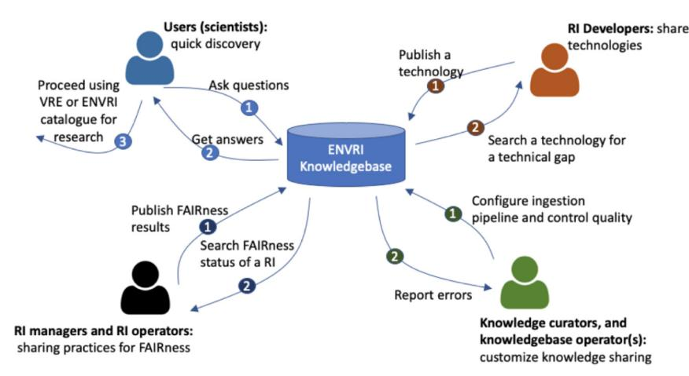
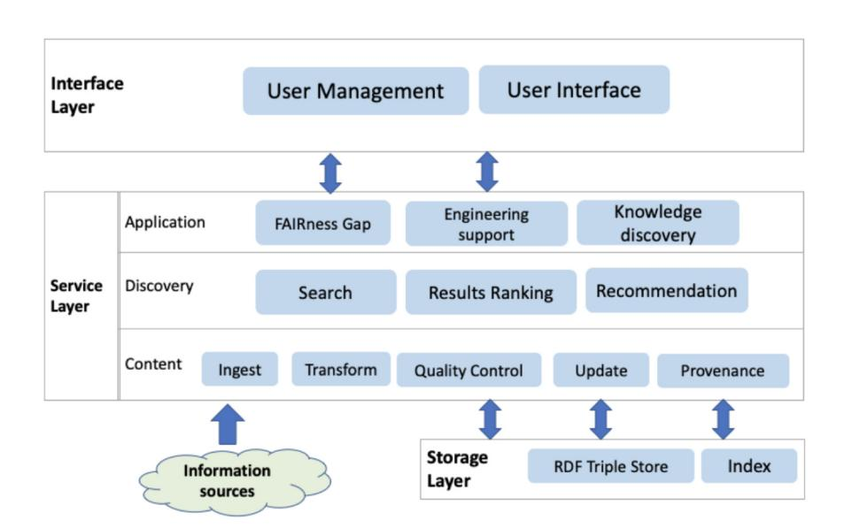
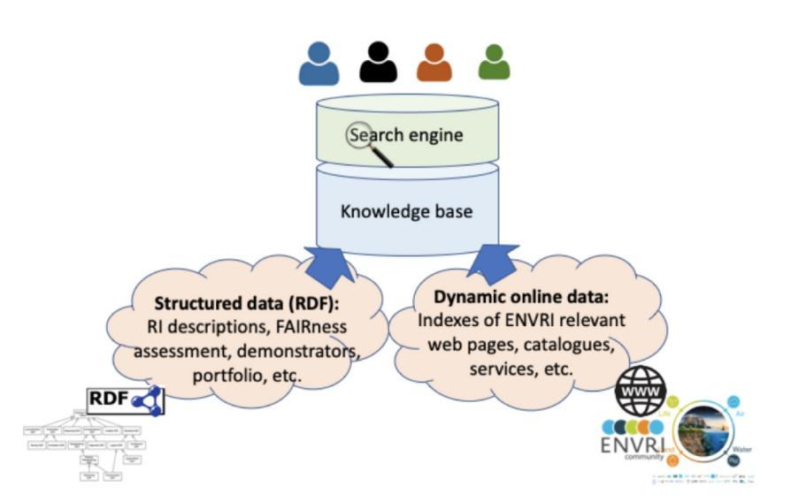
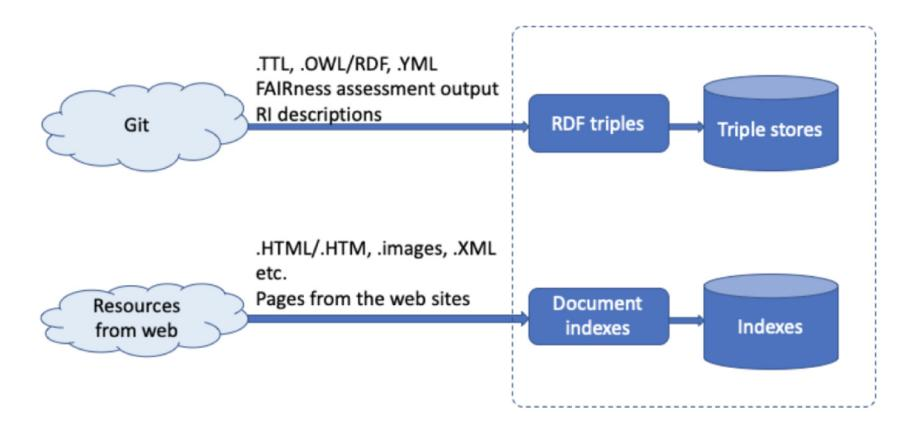
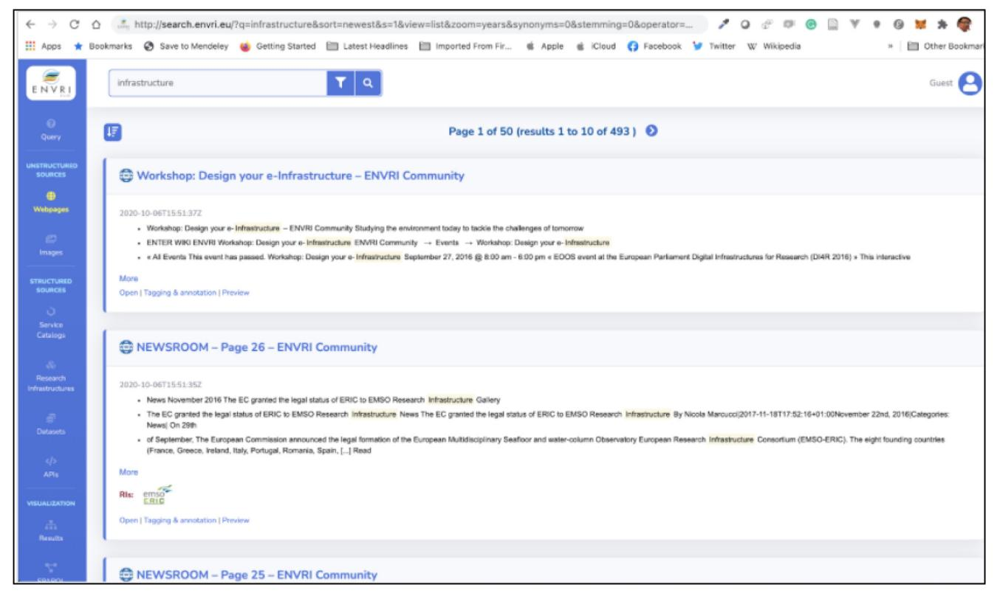
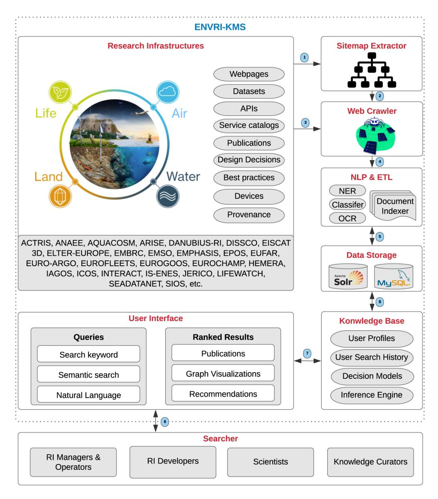

## SOFTWARE TOOL ARTICLE

## **[Knowledge sharing and discovery across heterogeneous](https://open-research-europe.ec.europa.eu/articles/1-68/v1)**

## **[research infrastructures](https://open-research-europe.ec.europa.eu/articles/1-68/v1) [version 1; peer review: 2 not**

## **approved]**

Siamak Farshidi 1, Xiaofeng Liao 1, Na Li1, Doron Goldfarb2, Barbara Magagna2, Markus Stocke[r](https://orcid.org/0000-0001-5492-3212) 3, Keith Jeffery 4, Peter Thijsse5, Christian Pichot 6, Andreas Petzol[d](https://orcid.org/0000-0002-2504-1680) 7, Zhiming Zhao [1](https://orcid.org/0000-0002-6717-9418)

1MultiScale Networked Systems (MNS), University of Amsterdam, Amsterdam, Netherlands, 1098 XK, The Netherlands 2Environment Agency Austria, Vienna, Austria

3TIB – Leibniz Information Centre for Science and Technology, Hannover, Germany

4British Geological Survey, London, UK

6French National Institute for Agriculture, Food, and Environment, Paris, France

7Forschungszentrum Juelich GmbH, Jülich, Germany

**First published:** 14 Jun 2021, **1**:68 <https://doi.org/10.12688/openreseurope.13677.1> **Second version:** 22 Nov 2021, **1**:68 <https://doi.org/10.12688/openreseurope.13677.2> **Latest published:** 06 Jun 2023, **1**:68 <https://doi.org/10.12688/openreseurope.13677.3> **v1**

#### **Open Peer Review**

#### **Abstract**

Research infrastructures play an increasingly essential role in scientific research. They provide rich data sources for scientists, such as services and software packages, via catalog and virtual research environments. However, such research infrastructures are typically domain-specific and often not connected. Accordingly, researchers and practitioners face fundamental challenges introduced by fragmented knowledge from heterogeneous, autonomous sources with complicated and uncertain relations in particular research domains. Additionally, the exponential growth rate of knowledge in a specific domain surpasses human experts' ability to formalize and capture tacit and explicit knowledge efficiently. Thus, a knowledge management system is required to discover knowledge effectively, automate the knowledge acquisition based on artificial intelligence approaches, integrate the captured knowledge, and deliver consistent knowledge to agents, research communities, and end-users. In this study, we present the development process of a knowledge management system for ENVironmental Research Infrastructures, which are crucial pillars for environmental scientists in their quest for understanding and interpreting the complex Earth System. Furthermore, we report the challenges we have faced and discuss the lessons learned during the development process.

| Approval Status           |      |      |      |
|---------------------------|------|------|------|
|                           | 1    | 2    | 3    |
| version 3                 |      |      |      |
| (revision) 06 Jun 2023 |      |      |      |
| version 2                 |      |      |      |
| (revision) 22 Nov 2021 | view |      | view |
| version 1                 |      |      |      |
| 14 Jun 2021               | view | view |      |

- **Robert Huber** , Swiss Federal Institutes of Technology Zurich ETHZ, Zürich, Switzerland 1.
- **Rebecca Koskela** , University of New Mexico, Albuquerque, USA Ronin Institute, Montclair, USA 2.
- **Giacomo Marzi** [,](https://orcid.org/0000-0002-8769-2462) Ronin Institute, Montclair, USA 3.

5MARiene Informatie Service, Nootdorp, The Netherlands

#### **Keywords**

Knowledge base, knowledge management, search engine, research infrastructure, software development lifecycle

Any reports and responses or comments on the article can be found at the end of the article.

This article is included in the [Data Science](https://open-research-europe.ec.europa.eu/gateways/data-science) gateway.

This article is included in the [Cloud-based](https://open-research-europe.ec.europa.eu/collections/cloud-based-technologies) [Technologies](https://open-research-europe.ec.europa.eu/collections/cloud-based-technologies) collection.

**Corresponding authors:** Siamak Farshidi ([s.farshidi@uu.nl](mailto:s.farshidi@uu.nl)), Zhiming Zhao [\(z.zhao@uva.nl\)](mailto:z.zhao@uva.nl)

**Author roles: Farshidi S**: Conceptualization, Data Curation, Formal Analysis, Investigation, Methodology, Project Administration, Resources, Software, Supervision, Validation, Visualization, Writing – Original Draft Preparation, Writing – Review & Editing; **Liao X**: Data Curation, Visualization, Writing – Review & Editing; **Li N**: Investigation; **Goldfarb D**: Software, Writing – Review & Editing; **Magagna B**: Investigation; **Stocker M**: Resources, Writing – Review & Editing; **Jeffery K**: Resources, Writing – Review & Editing; **Thijsse P**: Resources, Writing – Review & Editing; **Pichot C**: Resources; **Petzold A**: Resources; **Zhao Z**: Funding Acquisition, Investigation, Methodology, Project Administration, Supervision, Writing – Original Draft Preparation, Writing – Review & Editing

**Competing interests:** No competing interests were disclosed.

**Grant information:** This research was financially supported by the European Union's Horizon 2020 research and innovation programme under the grant agreement Nos [824068] (ENVironmental Research Infrastructures building Fair services Accessible for society, Innovation and Research [ENVRI-FAIR]), [860627] (CLoud ARtificial Intelligence For pathologY [CLARIFY]), [862409] (Blue-Cloud: Piloting innovative services for Marine Research & the Blue Economy [BLUECLOUD]), [825134] (smART socIal media eCOsytstem in a blockchaiN Federated environment [ARTICONF]), and the LifeWatch ERIC project.

*The funders had no role in study design, data collection and analysis, decision to publish, or preparation of the manuscript.*

**Copyright:** © 2021 Farshidi S *et al*. This is an open access article distributed under the terms of the [Creative Commons Attribution](http://creativecommons.org/licenses/by/4.0/) [License](http://creativecommons.org/licenses/by/4.0/), which permits unrestricted use, distribution, and reproduction in any medium, provided the original work is properly cited.

**How to cite this article:** Farshidi S, Liao X, Li N *et al.* **Knowledge sharing and discovery across heterogeneous research infrastructures [version 1; peer review: 2 not approved]** Open Research Europe 2021, **1**:68 <https://doi.org/10.12688/openreseurope.13677.1>

**First published:** 14 Jun 2021, **1**:68 <https://doi.org/10.12688/openreseurope.13677.1>

#### **1 Introduction**

Due to population growth and economic development, human impacts on natural resources are continuing to grow. Nonetheless, given the increasing complexity and capital intensity of our society and economies, natural processes in the solid Earth, atmosphere, ecosphere, terrestrial, and marine realms have an intensifying impact on humanity and society. Understanding and quantifying these pressures and resulting changes is a requirement for our societies' sustainable development using fact-based decision-making[1](#page-20-0) .

Climate change, for example, has been identified as a major environmental problem for humanity by the United Nations and the European Union. Research is expected on potential scenarios on climate change that will drastically affect natural ecosystems, plants, habitat, and animals, contributing to speedup in biodiversity loss in some areas. The impacts would have knock-on effects for many communities and sectors that rely on natural resources, including agriculture, fisheries, fuels, tourism, and water. Additionally, the ocean plays a central role in regulating the Earth's climate[2](#page-20-0) . As the International Oceanographic Data and Information Exchange (IODE)[3](#page-20-0) has announced: "The efficient collection, integration, and use of ocean observations gathered by countries around the world for a variety of purposes requires timely, open, and unrestricted international exchange of oceanographic data. Weather and climate prediction, operational forecasting of the marine environment, life protection, mitigation of human-induced changes in the marine and coastal environment, and the development of scientific knowledge that makes this possible are examples of such purposes.".

Assessments of climate change and their association with the driving forces must be based on trustworthy and well-documented observations. This is a difficult task due to the many interactions that exist between the atmosphere, soil, and hydrosphere. The resulting impacts on ecosystems all need particular and focused high-quality long-term observations. This forces us to have better observations and data on these essential pre-conditions to inform decision-makers better to take the measures necessary to maintain a thriving societ[y1](#page-20-0) .

Research Infrastructures (RIs) are vital for providing the required information to support science and fact-based policy development. Research infrastructures, including advanced computing and storage infrastructure, in environmental science are essential requirements for scientists in this domain to understand and analyze the sophisticated earth system[4](#page-20-0) . Interdisciplinary research communities and research infrastructures collaborate with the neighboring disciplines, namely atmosphere, biosphere, hydrosphere, and geosphere. Internal cooperation across different realms resulted in the formation of distinct research traditions, skills, and cultures. The interconnected essence of the earth system, on the other hand, requires the scientific community to transcend well-established divisions between disciplines and domains and work toward a common understanding of the world as a whol[e5](#page-20-0) .

The data from the Integrated Carbon Observation Network (ICOS[\)6](#page-20-0) Research Infrastructure, for example, aids climate science by informing scientists and the general public on natural and human-caused greenhouse gas emissions and uptake from the ocean, land ecosystems, and atmosphere. It gives access to high-quality data processed by the Thematic Centers as raw, near real-time, and final quality-controlled data and supplemented with elaborated (model) data and analyses, almost always licensed under a CC4BY license. The IAGOS[7](#page-20-0) research infrastructure provides atmospheric composition information, including greenhouse gas observations from commercial aircraft. IAGOS data are used by researchers worldwide for process studies, trend analysis, validation of climate and air quality models, and spaceborne data retrievals validation. Aerosols and their precursors are monitored by the ACTRIS[8](#page-20-0) research infrastructure. Aerosols have a big impact on the Earth's radiation balance, and consequently the climate. Their levels are inextricably linked to human activity and emissions. These infrastructures are part of a larger worldwide effort to advance science-based, high-quality observations that will help people make better decisions. As a result, the data and procedures are based on international, typically community-based standards.

Typically, RIs are domain-specific and are not connected, so that interoperability can be a critical issue for scientists involved in interdisciplinary research projects. Moreover, the researchers/ developers are not knowledgeable in all domains, so a knowledge management system is required to capture knowledge automatically and enable researchers to access data, software tools, and services from different sources and integrate them into cohesive experimental investigations with well-defined, replicable workflows for processing data and tracking results' provenance. Accordingly, a knowledge management system is required for research communities that (1) discover knowledge and capture them automatically, (2) answer any domain question without any limitation to its current search space, (3) deal with noisy sets of retrieved documents, likely consisting of many irrelevant documents and semantically and syntactically ill-formed documents, (4) have an advanced search engine to interpret and reformulate queries by information retrieval algorithms, (5) return a set of recommended solutions (answers) based on the retrieved documents, and (6) visualize its outcomes to facilitate the data analysis for research communities. This paper introduces a novel Knowledge management system, called ENVRI-KMS, to meet the ENVRI research community's requirements and make the research assets Findable, Accessible, Interoperable, and Reusable (FAIR[9](#page-20-0) ) for the community.

The rest of this study is structured as follows: [Section 2](#page-3-0) introduces knowledge discovery and sharing challenges, formulates the research questions, and elaborates on the research methods that have been employed to capture knowledge regarding the ENVRI-KMS. [Section 3](#page-3-0) positions the proposed approach in this study among the other knowledge management approaches in the literature.

[Section 4](#page-6-0) outlines the development process of the ENVRI-KMS. [Section 4.1](#page-6-0) explains the online survey that we conducted to collect requirements of the ENVRI-KMS. [Section 4.2](#page-7-0) shows the use case scenarios that we identified based on the survey. [Section 4.3](#page-8-0) introduces the design decisions that we made to design the ENVRI-KMS architecture. [Section 4.4](#page-9-0) reports the results of the documentation analysis that we have done to compare potential technologies in the market that can be employed to implement the ENVRI-KMS. [Section 5](#page-13-0) elaborates on the selected technologies that we employed to develop the ENVRI-KMS and demonstrates part of the current implementation. [Section 6](#page-14-0) analyzes the requirements and maps them to the survey questions and research questions based on the participants' responses. [Section 7](#page-17-0) highlights the challenges and lessons learned during the development process of the ENVRI-KMS. Finally, [Section 8](#page-19-0) summarizes the proposed approach, defends its novelty, and offers directions for future studies.

### **2 Challenges regarding knowledge sharing and discovery**

A significant number of advanced research support environments, such as ICO[S6](#page-20-0) are IAGOS[7](#page-20-0) , are available to facilitate the access of researchers to research assets (e.g., data products, best practices, data service design decisions, software tools, and services). Such research assets are scattered among a wide range of heterogeneous knowledge resource[s4](#page-20-0) . Furthermore, operational policies of different domains typically restrict interoperability and accessibility of multidisciplinary research projects. Additionally, technical reports about architectural design, service interfaces, selections of metadata standards, controlled vocabularies, and ontologies are not shared effectively. Accordingly, the main research question in this study is *"How to enable a domain-specific research community with their asset discovery challenges based on the FAIR principles?"*

As knowledge is scattered in a wide range of literature, forums, documentation, and tacit knowledge of domain experts, the following research questions should be addressed to capture knowledge systematically: *RQ*1 : Which sources of knowledge should be employed to build the knowledge management system's search space? *RQ*2 : How to capture knowledge systematically? *RQ*3 : How to keep the knowledge base always up to date? *RQ*4 : How to store and retrieve acquired knowledge when it is needed? *RQ*5 : How to evaluate the recommended solutions of the knowledge management system?

This study employs a mixed research method based on design science research, surveys, and documentation analysis to capture knowledge regarding knowledge management systems and answer the research questions. The research approach for creating the proposed knowledge management system, called ENVRI-KMS, is Design Science, which addresses research by building and evaluating artifacts to meet identified business needs[5](#page-20-0) in an iterative process[11](#page-20-0). Furthermore, we designed a survey form and asked several of our colleagues to critique it. We conducted an online survey in the context of 26 research infrastructures to collect their functional requirements and quality concerns. In total, 35 domain experts participated in the research to assist us with the ENVRI-KMS development life cycle and the requirements elicitation phase. Moreover, to develop the ENVRI-KMS, we reviewed webpages, whitepapers, scientific articles, fact sheets, technical reports, product wikis, product forums, product videos, and webinars to collect data. A structured coding procedure is employed to extract knowledge from the selected sources of knowledge.

Knowledge management systems employ problem-solving techniques, and knowledge discovery approaches to answer particular questions[12,13.](#page-20-0) Knowledge discovery is the process of extracting useful and hidden information[14.](#page-20-0) A variety of Knowledge management systems have been introduced in literatur[e15–17](#page-20-0) . Most of the existing knowledge management systems in the literature bound to a limited search space and optimized to address questions in a particular context. Each question-answer-context tuple is well-formed, standardized, and generated rising from the context in which the question and answer were extracted.

In this paper, we present a novel knowledge management system, called ENVRI-KMS, to meet the ENVRI research community requirements and make the research assets Findable, Accessible, Interoperable, and Reusable (FAIR[9](#page-20-0) ) for the community. The ENVRI-KMS is a Knowledge-as-a-Service for the RI development communities to document RI services' development and operation and address engineering problems. More specifically, the knowledge management system should (1) ingest technical results from ENVRIplus, FAIR assessment1 , the key sub-domains, and other tasks using a formal language for knowledge representation and proven semantic technologies; (2) provide services and tools to enable RI developers and data managers to browse, search, retrieve and compare RI technical statuses and technical solutions to development problems via available content; (3) provide content management tools for specialists in the ENVRI community to ingest new knowledge and control the quality of content; (4) also provide interfaces to other existing semantic resources, e.g., the service catalog of a future ENVRI-HU[B2](#page-20-0) , to enhance knowledge discovery and cross-RI search, between knowledge services and the online presence of ENVRI resources.

#### **3 Related work**

We realized that researchers in the literature have introduced a variety of tools and techniques to address knowledge management challenges. A subset of selected studies is presented as follows. Note, we categorized the selected studies into "*Knowledge management development*" approaches (research papers) and "*Knowledge management systems*" (tool papers). [Table 1](#page-4-0) shows the key factors of the selected studies and

1 FAIR data are data that meet principles of findability, accessibility, interoperability, and reusability.

2 ENVRI-HUB is a one-stop-shop for access to environmental data and services provided by the contributing research infrastructures.

**Table 1. The results of the systematic literature review based on Snowballing (citation tracking) are presented here.**  The table shows the comparison of the selected studies and this study against a set of key factors, including research methods, publication types, research types, emphasized lifecycle phases, and contexts.

| Study         | Year | Research Method                                                   | Publication Type | Research Type          | Lifecycle Phase                                                              | Context                                                                                                                      |  |  |  |
|---------------|------|----------------------------------------------------------------------|---------------------|---------------------------|------------------------------------------------------------------------------|------------------------------------------------------------------------------------------------------------------------------|--|--|--|
| This study | 2021 | Literature Study Document Analysis Survey Design Science | Research Paper      | Conceptual Operational | Planning Requirement Elicitation Architecture Design Implementation | Knowledge Engineering Knowledge Management Knowledge Discovery Knowledge Acquisition Knowledge Representation |  |  |  |
| 18            | 1992 | Literature Study                                                     | Research Paper      | Conceptual                | Architecture Design                                                          | Knowledge Engineering Knowledge Acquisition                                                                               |  |  |  |
| 19            | 2001 | Literature Study                                                     | Research Paper      | Conceptual                | Architecture Design                                                          | Decision-Making Process                                                                                                      |  |  |  |
| 20            | 2019 | Literature Study                                                     | Research Paper      | Conceptual                | Planning                                                                     | Knowledge Management                                                                                                         |  |  |  |
| 21            | 2018 | Survey                                                               | Research Paper      | Conceptual                | Planning Requirement Elicitation                                          | Knowledge Management                                                                                                         |  |  |  |
| 22            | 2002 | Literature Study                                                     | Research Paper      | Conceptual                | Planning                                                                     | Knowledge Management                                                                                                         |  |  |  |
| 23            | 2005 | Literature Study                                                     | Research Paper      | Conceptual                | Maintenance                                                                  | Knowledge Management                                                                                                         |  |  |  |
| 54            | 2020 | Literature Study Experiment                                       | Research Paper      | Conceptual Operational | Architecture Design Implementation                                        | Knowledge Discovery Knowledge Representation                                                                           |  |  |  |
| 25            | 2017 | Literature Study                                                     | Research Paper      | Conceptual                | Planning                                                                     | Knowledge Management                                                                                                         |  |  |  |
| 26            | 2019 | Case Study                                                           | Research Paper      | Conceptual                | Planning                                                                     | Knowledge Management                                                                                                         |  |  |  |
| 27            | 2019 | Case Study                                                           | Research Paper      | Conceptual                | Planning                                                                     | Knowledge Engineering Knowledge Management Knowledge Discovery                                                         |  |  |  |
| 28            | 2018 | Literature Study                                                     | Research Paper      | Conceptual                | Planning                                                                     | Knowledge Management Decision-Making Process                                                                              |  |  |  |
| 29            | 2019 | N/A                                                                  | Tool Paper          | Operational               | Implementation                                                               | Knowledge Discovery                                                                                                          |  |  |  |
| 30            | 2017 | Literature Study                                                     | Tool Paper          | Conceptual Operational | Architecture Design mplementation                                         | Knowledge Discovery Knowledge Acquisition                                                                                 |  |  |  |
| 16            | 2020 | Literature Study Document Analysis Design Science           | Tool Paper          | Conceptual Operational | Architecture Design Implementation                                        | Decision-Making Process Knowledge Management                                                                              |  |  |  |
| 31            | 2018 | Literature Study                                                     | Tool Paper          | Conceptual Operational | Architecture Design Implementation                                        | Knowledge Discovery Knowledge Acquisition                                                                                 |  |  |  |
| 32            | 2002 | N/A                                                                  | Tool Paper          | Conceptual Operational | Architecture Design Implementation                                        | Knowledge Management                                                                                                         |  |  |  |
| 33            | 2006 | Literature Study                                                     | Tool Paper          | Conceptual Operational | Architecture Design Implementation                                        | Knowledge Management                                                                                                         |  |  |  |

compares them against this study. The table shows that our research methods in this study are literature study, document analysis, survey, and design science.

Additionally, this research paper's scope is mainly on the conceptual design and implementation of a knowledge management system called ENVRI-KMS. Moreover, we reported the planning, requirement elicitation, architecture design, and implementation phases of the ENVRI-KMS. The paper's main contexts are Knowledge Engineering, Knowledge Management, Knowledge Discovery, Knowledge Acquisition, and Knowledge Representation.

#### 3.1 Knowledge management approaches

Wielinga *et al*. [18](#page-20-0) explained knowledge-based systems' development as a modeling activity. They introduced five fundamental principles underlying their approach, including (1) the introduction of partial models as a means to cope with the complexity of the knowledge engineering process, (2) a framework for modeling the required expertise, (3) the reusability of generic model components as templates supporting top-down knowledge acquisition, (4) the process of converting simplistic models into more complicated ones, and (5) the impact of the structure-preserving transformation of models of expertise on design and implementation.

Sapua[n19](#page-20-0) reported a set of knowledge management systems' architectures, concepts, and development processes. Additionally, the author highlighted the importance of knowledge-based systems in the context of concurrent engineering.

Martins *et al*. [20](#page-20-0) conducted an extensive literature review to capture knowledge regarding knowledge management systems in the context of sustainability. Accordingly, they analyzed and identified actions for small and medium companies that meet sustainable development guidelines. Moreover, they explored the Universities' possibilities in generating knowledge for the search of a more sustainable society. They highlighted studies that aimed to analyze and propose guidelines for the adequacy of productive operations to achieve sustainable goals.

Santoro *et al*. [21](#page-20-0) investigated the relationship among knowledge management systems, open innovation, knowledge management capacity, and innovation capacity. They employed structural equation modeling on a sample of 298 Italian firms from various sectors. Their findings indicate that a knowledge management system facilitates the creation of open and collaborative ecosystems, exploits internal and external flows of knowledge through the development of internal knowledge management capacity, and increases innovation capacity.

Lee and Hon[g22](#page-20-0) define knowledge management concepts and distinguish them from business process reengineering and learning organization in terms of information technology application. They conducted an extensive literature study on how application systems support each step of a knowledge management lifecycle.

Akhavan *et al*. [23](#page-20-0) explained and analyzed the main failure factors of implementing a knowledge management system in a pharmacist company. They highlighted lack of top management commitment and support, improper selection of knowledge team leader and members, improper planning, lack of separate budget for knowledge management project, organizational culture, lack of cooperation between team members and employees, and resistance against the change as the key failure factors of the knowledge management system.

Castellano and Vessi[o24](#page-20-0) presented an approach for visual link retrieval and knowledge discovery in painting datasets. The proposed approach employs the deep convolutional neural network as a feature extractor and a fully-unsupervised nearest neighbor approach as an image retrieval system.

Iskandar *et al*. [25](#page-20-0) presented an overview of the current knowledge management system issues reported in the literature by conducting a systematic literature review study on articles written during the last two decades.

Albassa[m26](#page-20-0) presented the findings of quantitative and qualitative studies in order to define the governance dimensions that can assist Saudi Arabia in developing an efficient knowledge management framework for long-term growth. In developing a quality information management system in Saudi Arabia, the study's findings emphasize the importance of enhancing public sector performance, fighting corruption, and enabling rule-of-law systems.

Orenga and Chalmet[a27](#page-20-0) introduced a methodology that can help companies discover, gather, manage, and apply their knowledge using Web 2.0 and Big Data tools, making the process of implementing a knowledge management system easier. An initial version of the technique was created first. An oil and gas company then used it to analyze and refine it. The results obtained show the methodology's effectiveness.

Hellebrandt *et al*. [28](#page-20-0) introduced a methodological framework based on the analytical network process (ANP) approach for selecting knowledge management solutions for complaint knowledge transfer to product development. Their framework is based on extensive literature review, competing objectives, various criteria, and various organization-specific factors.

#### 3.2 Knowledge management systems

VarSome[29](#page-20-0) is both an annotation tool and search engine for human genomic variants and a platform enabling the sharing of knowledge on specific variants.

Wachsmuth *et al*. [30](#page-20-0) introduced a search engine framework for acquiring, mining, assessing, indexing, querying, retrieving, ranking, and presenting arguments while relying on standard infrastructure and interfaces. GIGGLE[34](#page-21-0) is a genomics search engine that identifies and ranks the significance of genomic loci shared between query features and thousands of genome interval files.

Farshidi *et al*. introduced a framework and knowledge management system to build decision models for database management systems[35,](#page-21-0) cloud service providers[36](#page-21-0), software architecture pattern[s16](#page-20-0),[37,](#page-21-0) model-driven development platform[s38](#page-21-0) , programming language[s39](#page-21-0) and blockchain platform[s40.](#page-21-0) The authors have conducted several case studies to evaluate the decision models' effectiveness and usefulness to address these decision-making problems.

Chantamunee *et al*. [31](#page-20-0) introduced a knowledge discovery tool for searching Thai research articles in its repository.

Chau and Chuntia[n32](#page-21-0) proposed a knowledge management system on flow and water quality to simulate human expertise and heuristics in problem-solving and decision-making in the coastal hydraulic and transport processes. They explained the system's development process and illustrated a number of examples and applications of their system.

Park and Kim[33](#page-21-0) proposed a framework for designing and implementing a knowledge management system for the fourth generation of Research and Development (R&D). They defined the evolutionary classification of the R&D generations and the corresponding characteristics of the respective generations.

#### **4 ENVRI knowledge management system**

The ENVRI-KMS is a cluster-level knowledge base that allows different ENVRI users, such as RI developers and data managers, to effectively share their technical practices, identify common data and service requirements and design patterns, and facilitate the search and analysis of existing RI solutions for environmental RI interoperability challenge[s41.](#page-21-0)

#### 4.1 Requirements elicitation

We organized an event for conducting an online survey in the context of 26 research infrastructures to collect their functional requirements and quality concern[s42.](#page-21-0) In total, 35 domain experts participated in the research to assist us with the ENVRI-KMS development life cycle and the requirements elicitation phase. The domain experts were selected according to their expertise and years of experience. On average, the participants had more than ten years of experience within their expertise. They were totally aware of potential challenges that researchers in their community and field might face while performing their daily tasks. Firstly, we introduced the potential functionality of the ENVRI-KMS and presented some of its applications. Then, we used an online survey tool, called Mentimeter[43,](#page-21-0) to distribute a virtual questionnaire including the following questions: (Q1) What information will you typically search from the ENVRI community? (Q2) What will be the typical queries you would ask the ENVRI-KMS? (Q3) How do you currently search for information from the ENVRI community? (Q4) Which knowledge management system functionality do you feel most beneficial for you? (Q5) What function do you expect from the next version of the ENVRI-KMS?

Next, we have collected all responses and prioritized them based on analyzing the frequencies of similar statement[s3](#page-20-0) . According to their responses we extracted the following set of requirements: The ENVRI-KMS should: (R01) have all potential RIs, datasets, repositories, best practices, service catalogues, design decisions in its search space; (R02) suggest lists of contacts who are responsible for specific tasks (authors, researchers, developers, etc.); (R03) identify assessment criteria and evaluate the search space entities based on the FAIRness criteria; (R04) indicate types of search space entities, such as private, public, open-source, or premium; (R05) recommend documentation, technical solutions, configurations, and compatible combinations; (R06) offer Q&A forums for technical discussions and engage domain experts to be involved; (R07) support ontologies and semantic search; (R08) support multilingual queries; (R09) support source code search and offer relevant solutions to technical issues; (R10) be able to search RI website's contents (similar to Google search engine); (R11) have a user interface identical to standard search engines; (R12) support SPARQL queries and be able to connect to endpoints; (R13) have high performance and availability; (R14) offer APIs to be connected to virtual research environments (ENVRI-HUB); (R15) support automated knowledge ingestion; (R16) visualize its findings and contents; (R17) support image search and be able to search multiple image categories (plots, etc.); (R18) provide assessment tools for evaluating its contents by domain experts; (R19) manual knowledge ingestion; (R20) keep its contents always up-to-date; (R21) offer geolocation of the search space entities; (R22) offer the metadata of the search space entities; (R23) support continuous integration and continuous delivery (CI/CD); (R24) offer recommendations to different user categories (researchers, knowledge curators, developers, and high-level managers); (R25) categorize and classifies its knowledge base contents.

The initial user stories for the ENVRI-KMS mainly focus on the data manager, RI service, or Virtual Research Environment (VRE)[44,45](#page-21-0) developers, e.g., for enabling a developer to check the existence or details of data management solutions from different RIs. Accordingly, the following key technical requirements have been identified to design and implement the ENVRI-KMS:

**Compatible with semantic web technologies.** As the most common type for knowledge storage, representation, reasoning, the support of Resource Description Framework (RDF) is the core requirement in the design and development of the ENVRI-KMS. This requirement can include the following specific options: RDF import/export, RDF storage, owl import, SPARQL, and GeoSPARQL support. It is acknowledged that while providing

3 We have published the responses of the domain experts who participated in the survey besides the data analysis phases on Mendeley Dat[a46](#page-21-0) .

many advantages, especially in the context of integrating and operating on heterogeneous knowledge sources and of linking to existing external resources, RDF, but also the overall concept of operating on a non-monolithic set of data collections, comes with specific limitations as well, such as lack of support for referential integrity. Nevertheless, it is assumed that the ENVRI-KMS content's nature is rather non-volatile, shifting this aspect into the background.

**Semantic search and query functionality.** An interface for searching and discovering ENVRI-KMS content should be provided; this could be the conventional keyword-based search or faceted search. A semantic search function is further expected to permit search based on 'similar' or 'related' terms across multiple ontologies/controlled vocabularies rather than strict adherence to a single controlled vocabulary or keyword se[t47.](#page-21-0)

**Open and flexible knowledge ingestion.** Due to the variance of source types in the ENVRI community, various methods should be supported for knowledge acquisition, like form-based manual RDF ingestion, Questionnaire-based RDF triple generation, existing RDF integration, structured and unstructured information transformation, etc. Specific measures should be considered to facilitate non-technical users straightforwardly adding knowledge.

**Provenance and version control of the knowledge.** Considering the typical case where multiple users contribute to the ENVRI-KMS, provenance is of fundamental importance for monitoring and tracking issues, for example, enabling the third party to reproduce the scientific workflow for an authority to audit the whole process. This primarily refers to tracking individual additions, deletions, and updates and their administration, i.e., approval, rejection, and reversion.

**User-friendly and customizable user interface.** A clear and straightforward user interface is needed to fulfill their objectives, like query, semantic search. Different user interfaces should be offered to meet the requirements of the general public and professional users.

**Scaling and increasing performance.** A choice between centralized or distributed storage should be considered to tackle the growing size of the ENVRI-KMS. Also should be considered includes the dynamic resource scheduling facing concurrent search/query requests. Other features like collaborative editing are required to enable comments on contributions by other users.

**API interface.** An application programming interface (API) abstraction layer can help make knowledge accessible through applications to facilitate knowledge via APIs.

Among such technical requirements, the ENVRI-KMS should play a key role in the ENVRI communities to develop FAIR data services and share their best practices.

#### 4.2 Use case scenarios

Based on the survey we conducted (see [Section 4.1](#page-6-0)), we identified the following four types of users (see Figure 1) of the ENVRI-KMS:

(1) **End users** may use the ENVRI-KMS to find answers to their general questions about available sources of data, services, and tools, and to use the discovered information to perform further research activities using the other tools like Virtual Research Environments or services like the RI catalogs of data or services.

(2) **RI managers** or operators may use the KB to check the status of the FAIRness of specific repositories or update the state of their RIs. The update process often needs the KB tools for FAIRness output ingestions from the other tools, e.g., the assessment wizard tool.

(3) **RI developers** may use the KB to check the existing technologies, e.g., those development results in the ENVRI

**Figure 1. An enterprise view of the ENVRI-KMS.** The enterprise view highlights the key stakeholders (namely communities in the Open Distributed Processing (ODP) term) and their interaction scenarios with the ENVRI-KMS. The numbered circles indicate the possible orders of the interactions.

portfolio or the demonstrators prepared for some known FAIRness gaps. They can also publish or update the technical descriptions using the KB tools, such as an online description form.

(4) **Knowledge curator and knowledge base operators** may use the KB to ingest content from new sources and respond to the possible errors that occurred during the ingestion or the operation.

#### 4.3 Conceptual architecture

Based on the use case scenarios (see [Figure 1](#page-7-0)), we design the key components of the ENVRI-KMS from the conceptual point of view. Note, the architecture is designed based on the Open Distributed Processing (ODP) framewor[k48–51](#page-21-0). Figure 2 shows the key components via three layers:

The **interface layer** atop contains components dealing with user-related activities. The ENVRI-KMS will be an open system for community users; the user management component is not for acquiring and processing users' personal information but more for providing customized user support based on their interaction or contexts. A user can log in to the system using an open identity provider. The User Interface (UI) components are the application parts that allow users to interact with it. It can be formatted and rendered into various presentations to address different users' requirements. Additionally, it validates and collects required data from users.

The **service layer** abstracts the functionality that the ENVRI-KMS offers; it can be roughly split into three sub-layers, namely:

(1) The Application sub-layer provides customized application logic (e.g., FAIRness Gap Analysis, Engineering support, or discovery knowledge from ENVRI community) based on the data passed from the underlying discovery sub-layer those results up to the User Interface Component.

(2) The Discovery sub-layer provides the functionality for searching the ENVRI-KMS, ranking the results, and recommending relevant content.

(3) The Content sub-layer provides functionality for managing the content in the ENVRI-KMS, typically in a pipeline covering: ingesting information, the transformation from information to knowledge, quality control of the knowledge generation, CRUD (Create, Read, Update, Delete) of the ENVRI-KMS content, and the provenance of these activities.

The **storage layer** at the bottom is responsible for data storing and access. The data storage options needed in this project include RDF Triple Store and Inverted Index. Currently, information collected in the ENVRI-KMS consists of two main parts, as illustrated in [Figure 3.](#page-9-0) The structured data in the ENVRI-KMS is based on RDF and mainly includes: (1) OIL-e (ontology of the ENVRI Reference Model) based ENVRI RI description, (2) description of the service portfolio from the previous project, and the possibly new ones in ENVRI-FAIR, (3) FAIRness principles and the results of assessing the ENVRI research infrastructures, and (4) demonstrators for tackling the known gaps, e.g., those being identified during the FAIRness assessment.

The versions of the structure data currently can be managed via version control systems. Currently, GitHub is used. The dynamic data in the ENVRI-KMS will be ingested from different online sources of the ENVRI communities. [Figure 4](#page-9-0) depicts the necessary information flow of the knowledge ingestion.

(1) A significant amount of KB relevant information is represented in human-readable form, residing in Wikis, other content management systems, or even static web-pages, in the

**Figure 2. Architecture layers.**

**Figure 3. ENVRI-KMS content components.** The ENVRI-KMS can be used by end users to search different contents.

**Figure 4. Basic information flow of the knowledge ingestion.**

"offline" text found in various documents such as books, project deliverables, or scientific publications. In the ENVRI-FAIR context, the research infrastructure websites are an excellent resource of related information, including news/events, background knowledge, etc. Similar to ENVRI, ENVRIFAIR, the community websites also contain lots of related information, like news/events, community introduction, community landscape, project information, progress, etc. These information sources have different formats, such as a webpage, word document, and pdf file.

(2) Another approach to populate the KB would be to process such free-text information to extract structured, machine-readable information. Named entity recognition would represent the first step in this regard, while the application of more complicated Natural Language Processing operations could be a valuable field of research in its own right.

(3) Information from the available catalogs of data and services. It should be clear that the indexes generated from those sources will not aim to replicate the entire catalogs but provide a quick searching capability for community users. For some RI, such information will be already managed in RDF format and accessible from triplestores.

#### 4.4 Technical choices

This section reviews the relevant technologies that can be employed to develop the ENVRI-KMS according to the requirements (See [Section 4.1\)](#page-6-0).

*4.4.1 Data storage***.** RDF or similar triple-graph-like data structures are widely used in knowledge representation; a range of existing approaches can be used for knowledge storage, from traditional relational database management systems to dedicated graph databases.

**Relational database management systems (RDBMS)** represent the traditional approach to storing and managing structured data. The well-known MYSQ[L53](#page-21-0) RDBMS is, for example, used by the popular [Mediawiki](https://www.mediawiki.org/wiki/Download) software to drive the Wikipedia ecosystem. Wikibase, the engine behind Wikidata, introduced in the previous section, is another example in this regard. Additional services such as the SPARQL-based Wikidata query service operate on RDF data created via MYSQL-RDF exports at regular intervals.

**Triplestores** are specialized graph databases dedicated to storing RDF data. Hybrid triplestores operate on top of traditional RDBMS, while native Triplestores provide customized data management infrastructure optimized for handling large amounts of triples. The popular Java-based RDF handling framework Apache Jena[54](#page-21-0) can be operated either on a hybrid (Jena SDB) or on a native store (Jena TDB), where TDB can be operated in-memory or using a disk index. Jena Fuseki is a SPARQL server that can be run as an operating system service, a Java web application (WAR file), or as a standalone server, and it uses TDB as a transactional persistent store layer.

**Multi-model databases** act as a unified platform for storing and managing data following different paradigms. Openlink Virtuoso[55](#page-21-0) is a multi-model RDBMS, data integration middleware, linked data deployment, and HTTP application server platform with great performance and scalability. In a single system, it integrates the capability of a traditional relational database management system, an object-relational database (ORDBMS), a virtual database, RDF, XML, free-text, a web application server, and a file server. The RDF engine from Virtuoso is a hybrid design that runs on top of Virtuoso's RDBMS.

**General purpose graph databases** can handle any node-linkbased information, while triplestores are designed to operate solely on RDF-based data. One fundamental distinction between RDF graphs and general-purpose graphs is that RDF does not allow for annotating individual triples (i.e., adding attributes to individual links between two instances) without relatively complicated mechanisms such as reification. So-called labeled property graphs, in turn, assign unique IDs for each link, allowing to attach attributes such as values, categories, etc. Neo4[J56](#page-21-0) is an example of such a labeled property graph DB, offering a dedicated query language (Cypher) to access the stored information. In contrast to triplestores with their standard SPARQL query engines, however, there is no comparable general standard available, limiting individual solutions' usability to the respective platforms.

*4.4.2 Knowledge base***.** Assuming RDF as a target data format for the ENVRI-KMS, this section explores solutions to allow data managers to access the ENVRI-KMS's content using Graphical User Interface (GUI) tools to explore, search and edit the knowledge base content in a user-friendly manner. In contrast to end-user interfaces, however, the considered approaches are instead targeted at administrative tasks.

We compared five potential solutions to presenting/managing RDF-based content according to their features, such as "supporting visualization", "The last edit on Github", and " Storage technology". Besides supporting content exploration on a triple level, three of the five compared solutions also allowed for content management (upload, individual editing). The overall results of the comparison are summarized in [Table 2.](#page-11-0)

**Ontowiki**, first described in [52](#page-21-0), is a collaborative knowledge engineering platform for RDF-based data. With its latest version introduced in [14,](#page-20-0) it provides a browser-based interface for editing and browsing RDF statement collections. It puts heavy emphasis on collaborative editing features such as social comment features and statement-level provenance with history. Implemented in PH[P4](#page-20-0) , it can use different data backends, including relational DBMS such as MySQL or triplestores such as Openlink Virtuoso. Another flexible feature is its plugin-based architecture, enabling the addition of different features such as data visualization.

**Semantic Mediawiki (SMW)** is an extension of the popular MediaWiki software driving the well-known Wikipedia universe. It is mainly intended to augment classical Mediawiki markup pages with semantic annotation, serving, e.g., to update specific facts such as dates or quantities dynamically. Using Mediawiki as a foundation, it offers all the software's collaboration features, i.e., discussion and version history. By default, SMW uses the standard Mediawiki data infrastructure for storage but can be extended to use a Triplestore in parallel. A significant difference to OntoWiki is that in SMW, structured information is used only for annotating entities in Wikitext and displaying lists; it is not meant to "drive" the Wiki content itself.

**Wikidata** uses a proprietary data format that provides a set of features that require workarounds to be represented as RDF, such as n-ary relations or statement-level provenance. Wikidata uses a set of Mediawiki extensions called Wikibase for its data architecture, including similar collaboration features as SMW. As described in [15](#page-20-0), the data can be converted into an RDF representation for export, and a parallel triplestore representation of Wikidata content offers SPARQL-based querying. As of today, however, there is no means to import RDF into Wikidata directly.

*4.4.3 Search engine***.** Though some of the knowledge management systems investigated in Section 4.4.2 provide the GUI tools for querying and searing the knowledge bases, their primary target users are knowledge base administrators regarding the expertise required to use these tools. Thus, a more general user inference is still expected for a helpful search experience and context-aware exploration of the

4 PHP (Hypertext Preprocessor) is an open source general-purpose scripting language that is especially suited for web development and can be embedded into HyperText Markup Language (HTML).

|                                                      | Semantic Mediawiki                                                                                                                                                | Wikibase (Wikidata)                                                                                                          | OntoWiki                                       |
|------------------------------------------------------|-------------------------------------------------------------------------------------------------------------------------------------------------------------------|------------------------------------------------------------------------------------------------------------------------------|------------------------------------------------|
| Editor                                               | Yes                                                                                                                                                               | Yes                                                                                                                          | Yes                                            |
| Triple Viewer                                        | Yes                                                                                                                                                               | Yes                                                                                                                          | Yes                                            |
| Visualization                                        | Optional (e.g., graph extension)                                                                                                                                  | Several built-in features                                                                                                    | Optional (Cubeviz)                             |
| Original Purpose                                     | Semantic Annotation of Wiki pages                                                                                                                                 | Knowledge Base + Fact Editor for populating Wikipedia Infoboxes                                                           | Knowledge Base Editor                          |
| Full source on Github                                | Yes                                                                                                                                                               | Yes                                                                                                                          | Yes                                            |
| Last Edit on Github                                  | 17.06.2019 / Active                                                                                                                                               | 14.06.2019 / Active                                                                                                          | 11.07.2017/Currently no further development |
| Frontend Technology                                  | Browser                                                                                                                                                           | Browser                                                                                                                      | Browser                                        |
| Server Technology                                    | PHP                                                                                                                                                               | PHP                                                                                                                          | PHP                                            |
| Storage Technology                                   | Relational (can optionally be complemented with Triplestore running in parallel                                                                             | Relational with mirror Triplestore for Queries                                                                            | Triplestore or Relational                      |
| Native RDF                                           | When using complementary Triplestore                                                                                                                              | No                                                                                                                           | Yes                                            |
| RDF Export (Only for editor)                      | Yes                                                                                                                                                               | Yes                                                                                                                          | Yes                                            |
| RDF Import                                           | Via tools, e.g. RDFIO Tool for RDF import, convertion to internal format                                                                                       | Needs longer conversion workflow, would need creation of or mapping to existing Wikibase classes/properties         | Yes                                            |
| Builtin OWL import                                   | No (Could be done via script, converting owl features having counterparts in internal class/property structure)                                          | No (Could be done via script, converting owl features having counterparts in internal class/ property structure) | Yes (With limitation)                          |
| SPARQL Support                                       | When using complementary Triplestore                                                                                                                              | Sparql queries against parallel Triplestore                                                                               | Yes                                            |
| Class/Category System available for instantiation | yes; proprietary; subclass/subproperty relationships possible                                                                                                  | yes; proprietary; subclass/ subproperty relationships possible                                                         | Yes; based on OWL                              |
| Constraints (Only for Editor)                     | uniqueness (Property can only be used once per instance) Permitted Values (Controlled list of values to be entered for property) datatype check (One of) | Custom,                                                                                                                      | No                                             |
| Provenance                                           | Statement Level Provenance (references)                                                                                                                        | Statement Level Provenance (references)                                                                                   | Statement Level Provenance (references)  |
| Revision Tracking                                    | Yes                                                                                                                                                               | Yes                                                                                                                          | Yes                                            |

#### **Table 2. Comparison of existing platforms/products.**

RDF: Resource Description Framework | OWL: Web Ontology Language | SPARQL: Protocol and RDF Query Language

ENVRI-KMS. We investigate two systems, Open Semantic Search and Elastic Search, which provide comprehensive search solutions.

**Open Semantic Search** is an integrated tool for easier searching, monitoring, analytics, discovery, and text mining of heterogeneous and large document sets and news with free software on the user's server.

**Elastic Search** is a search engine that is developed based on the Lucene library. It offeres a distributed, multitenantcapable full-text search engine with an HTTP web interface and schema-free JSON documents. A comparison of these two platforms in terms of our requirements is presented in Table 3.

*4.4.4 Knowledge graph visualization***.** We investigate several tools with network graph features for present content in the ENVRI-KMS with a knowledge graph visualization. They are:

**D3.js**[57](#page-21-0) is a JavaScript library for data-driven document manipulation. Different types of data can be bound to a DOM, which may subsequently be used to perform various functions. Using the DOM data to create an SVG, canvas, or HTML visualization is one of these functions.

The most complicated component of D3 is converting the graph data into the intended map format for export (or any embeddable library that does not have a direct Neo4j connection). D3 assumes that there are two graph data collections: one for nodes and one for links (relationships). - Each of these maps has an array of characteristics for each node and relationship, which D3 converts to circles and lines.

Converting the graph data into the intended map format for export is the most difficult aspect of D3 (or any embeddable library that does not have a direct Neo4j connection). D3 assumes two graph data collections: one for nodes and another for links (relationships). - of these maps contains an array of properties for each node and relationship, which are then converted into circles and lines by d3. Force-directed graphs are now supported in D3.js versions 4 and 5, which customize the visualization to the user's view pane.

**Popoto.js**[58](#page-21-0) is one kind of tools that are embeddable tools with built-in Neo4j connections. This kind of embeddable tool can be included as a dependency within an application. It can easily be configured and styled for an application and Neo4j. This tool can easily connect to an instance of the Neo4j graph database using configuration properties and allows for styling the visualization based on nodes, relationships, or specific properties. Note, D3.js is the foundation for Popoto.js, a JavaScript library.

**Neo4j Bloom**[59](#page-21-0) is a standalone product tool that helps data exploration and visualizes data in the graph, and allows users to navigate and query the data without any query language or programming.

**Grafo**[60](#page-21-0) is a tool for visually designing knowledge graphs with online, collaborative, real-time editing features. Grafo has reused the existing WebVOWL standard rather than reinventing the wheel.

**WebVOwl**[61](#page-21-0) is a web framework for interactive ontology visualization. It implements the Visual Notation for OWL Ontologies (VOWL)[62](#page-21-0) by displaying graphical representations of Web Ontology Language (OWL) elements in a force-directed graph layout that represents the ontology. Exploration of the ontology and customization of the visualization are possible thanks to interaction techniques. The VOWL visualizations are created automatically from JSON files that the ontologies must be translated into. Along with WebVOWL, a Java-based OWL2VOWL converter is included. A comparison of these

#### **Table 3. Comparison between Open Semantic Search and ElasticSearch.**

|                              | Open Semantic Search                                                                                                                                                                                                                                                                | ElasticSearch                                                                                            |  |  |  |
|------------------------------|-------------------------------------------------------------------------------------------------------------------------------------------------------------------------------------------------------------------------------------------------------------------------------------|----------------------------------------------------------------------------------------------------------|--|--|--|
| Visualization                | 1. Visualizing like trend charts, word clouds, interactive maps 2. graph/network analysis view 3. Alternatively, enable the Open Source ETL plugin for integration with the Neo4J database and present visualization with Neo4j browser by Cypher graph query language. | via Kibana(Pie, Bar, Map, etc)                                                                           |  |  |  |
| Builtin UI Features          | Solr-PHP-UI                                                                                                                                                                                                                                                                         | Search UI                                                                                                |  |  |  |
| Full source on Github        | Yes                                                                                                                                                                                                                                                                                 | Yes                                                                                                      |  |  |  |
| Frontend Technology          | Browser                                                                                                                                                                                                                                                                             | HTTP web interface                                                                                       |  |  |  |
| Storage Technology           | Inverted Index                                                                                                                                                                                                                                                                      | Inverted Index                                                                                           |  |  |  |
| Native RDF                   | native graph storage for graphs including RDF triple stores                                                                                                                                                                                                                         | index RDF data in JSON format                                                                            |  |  |  |
| RDF Export (Only for editor) | Yes Yes                                                                                                                                                                                                                                                                          | No                                                                                                       |  |  |  |
| Builtin OWL import           | Yes                                                                                                                                                                                                                                                                                 | No                                                                                                       |  |  |  |
| SPARQL Support               | Neo4j has Cypher that covers the need for a structured graph query language                                                                                                                                                                                                      | Elasticsearch provides a full Query DSL (Domain Specific Language) based on JSON to define queries |  |  |  |

tools in terms of the several practical issues is presented in Table 4.

#### **5 Prototype**

The ENVRI-KMS development follows an interactive approach, in which prioritized user stories have been analyzed, and technical choices were selected based on the state-of-the-art review done in [section 4.4](#page-9-0). We use Ontowiki to manage the RDF triples and Open Semantic Search to develop the ENVRI-KMS's search tool in the current prototype. Several tools were developed for ingesting specific knowledge, e.g., a technology description form for describing the service portfolio, interactive graph visualizer for the search results, and dynamic online data ingestion pipeline. These tools will be described in the following sections.

#### 5.1 Knowledge storage

The comparison of existing RDF content management platforms is summarized in [Table 2](#page-11-0). It was suggested to consider OntoWiki for managing RDF content. The main reasons for this decision were as follows:

(1) Direct operation on RDF triples: Ontowiki can directly operate on a triplestore as the underlying storage layer and provides an API to populate it with RDF.

(2) Integrated User management and statement-level provenance: Ontowiki supports user management with varying permissions and offers a detailed create/update/delete history on the RDF statement level.

(3) Named-graph-based separation of RDF content and administrative data: RDF data ingested via Ontowiki is directly written as-is into the underlying triplestore, while all the administrative statements such as provenance etc., are stored separately.

(4) Plugin-based extensions: Ontowiki offers a framework for developing plugin extensions.

The choice of Ontowiki directly affected the selection of the underlying Triplestore since Ontowiki provides a pre-configured connector to the Openlink Virtuoso data management system, which members of the KB team already had experience with from previous projects. The open-source edition of Openlink Virtuoso[63](#page-21-0) (Version 7.2.5.1) was therefore deployed for that purpose and configured for Ontowiki (and vice-versa).

#### 5.2 Tools for ingesting knowledge

The population of knowledge bases can take different routes. On the one hand, existing collections of information can sometimes be transformed so that they can be "bulk" imported into the ENVRI-KMS, which includes rearrangements and mappings of existing collections of structured information but potentially also the extraction of structured content from unstructured sources such as free text, which is by no means an easy task considering the complexity in the natural language processing/understanding. On the other hand, it is usually possible to manually add ENVRI-KMS's contents, "fact by fact". However, manual input can be slow, tedious, and error-prone if not supported by dedicated tools. In the context of the ENVRI-KMS, it should be possible to provide content in both ways.

As far as manual data entry is concerned, the system supports the creation of valid RDF data via custom HTML Web forms. They are dynamically created using the RDForm[s64](#page-21-0) Javascript library based on formal JSON descriptions of the underlying data model. This also includes the specification of constrained SPARQL queries for the dynamic retrieval of menu options to maintain consistent RDF relationships between the described entity and related terminology and other entities already stored in the KB.

|                                                     | Open source                                                      | RDF support                                                                                                     | SPARQL Support                                                                                                                          |
|-----------------------------------------------------|------------------------------------------------------------------|-----------------------------------------------------------------------------------------------------------------|-----------------------------------------------------------------------------------------------------------------------------------------|
| Popoto.js                                           | Open source licensed under GNU General Public License v3.0 | NA                                                                                                              | JavaScript naturally fits for querying a SPARQL endpoint which provides a REST service returning the result in the JSON format |
| D3.js                                               | open source licensed under BSD license.                       | NA`                                                                                                             | JavaScript naturally fits for querying a SPARQL endpoint which provides a REST service returning the result in the JSON format |
| open source licensed Neo4j Bloom under GPLv3. |                                                                  | Yes, via the neosemantics (n10s) plugin.                                                                        | No, Neo4j has Cypher that covers the need for a structured graph query language.                                                  |
| Grafo                                               | No. offers a Free/Student tier with basic functionality.      | supports importing OWL (RDF/XML) and Turtle file formats.                                                    | No                                                                                                                                      |
| WebVOwl                                             | Open source released under the MIT license                    | visualizations are automatically generated from JSON files into which the ontologies need to be converted | Yes                                                                                                                                     |

#### **Table 4. Comparison between knowledge graph visualization options.**

A prototype is developed5 to support the discovery of gaps in FAIR principle implementation at the granularity of RI repositories and the discovery of possible technology solutions to address such gaps. By modifying the FAIRness Assessment of a repository of a particular RI—which is functionality natively supported by OntoWiki—for instance, the information on whether or not the repository has machine-readable provenance information, the interface automatically adapts to either include or exclude the corresponding repository under the relevant FAIR principle. By selecting an RI, the user interface presents a summary view for the RI.

#### 5.4 Ontowiki as a knowledge management platform

Ontowiki is a suitable RDF data management platform. A test instance is configure[d65](#page-21-0) and slightly customized to use the ENVRI logo and display the ENVRI RSS news feed on the front page. It currently serves as a data gateway for the facts added via forms based on the FAIRness analysis. Ontowiki was found to perform well as RDF "middleware" used to ingest data from the RDF forms. Some issues were discovered regarding the cross-referencing of statements between knowledge bases (named graphs). A workaround published in a newsgroup provided a potential fix for static data but would have to be extended for a continuously growing data collection. A possible solution would be to store information that is expected to change/grow, e.g., the entity descriptions and the user terminology collected from the RDF forms, in a typical named graph and to configure Ontowiki filters for its efficient navigation while storing more static content, such as external ontologies, in separate graphs. While Ontowiki supports flexible navigation and data editing at the RDF statement level, the interface is arguably not appropriate for the vast majority of RI managers or developers. We conducted some experiments with the atmospheric domain, but RIs did not engage with the user interface. This is to be expected since Ontowiki relies on a good understanding of the RDF data model. Moreover, presenting information at the RDF statement's granularity is typically inadequate for high-level information needs, e.g., discovering FAIR gaps in the data centers of an RI. We thus suggest that Ontowiki can act as an RDF-based middleware that powers high-level user applications and services. A critical aspect of using Ontowiki to manage the generated RDF data will be the question of versioning. While built-in features such as the statement-level provenance in principle allow detailed tracking of changes/revisions of the provided data, a backup strategy using external means should be considered as well. One straightforward step would be to export complete RDF dumps of the provided content in regular intervals and to track their versions in source code repositories such as Github.

#### 5.5 Search engine

Though Ontowiki provides navigation functionality over the ENVRI-KMS, it mainly operates at the RDF triple-level, which poses essential technical requirements on users' expertise. To facilitate the general users to explore the ENVRIKMS easily, we build the ENVRI-KMS Search Engine based on the Open Semantic Search's fundamental concepts and components. [Figure 5](#page-15-0) below illustrates the search interface6 .

#### 5.6 Operational workflow

This section elaborates on the operational workflow of the ENVRI-KMS7 and presents its constituent components (See [Figure 6\)](#page-16-0). **Research Infrastructures**, such as ACTRIS and ANAEE, are the primary sources of knowledge that contain knowledge assets, including webpages, datasets, APIs, service catalogs, publications, design decisions, best practices, devices, and data provenance. The **Sitemap Extractor** explores and extracts the site structure (the list of URLs) of the RIs. Then, the **Web Crawler** browses the extracted URLs and by employing **NLP & ETL** (Natural Language Processing and Extract/Transform/Load) techniques, such as Named-Entity Recognition (NER) and Relation Extraction (RE), tries to index documents and classify the extracted knowledge. For instance, in the knowledge extraction process, the NER and RE approaches are used to identify the entities represented in documents and their relations as fundamental knowledge extraction processes. The extracted knowledge is used to build the knowledge graph in the knowledge base of the ENVRI-KMS. **Data Storage** technologies, including Apache Solr and MySQL, are used to store the acquired knowledge systematically. The **Knowledge Base** of the ENVRI-KMS integrates user profiles, user search histories, decision models (e.g., meta-models), and infers solutions (results) based on searchers' queries. the **User Interface** receives user queries, such as keywords and user stories, and demonstrated the results (e.g., publications, graph visualizations, and recommendations) to the **Searchers the process of extracting useful and hidden informatio[n14](#page-20-0)** (See [Section 4.2](#page-7-0)).

#### **6 Analysis**

In this subsection, we reflect on each of the proposed research questions based on our observations during the development process, the online survey, and documentation analysis.

#### 6.1 Requirements analysis

We revisit the requirements and analyze the gap for the tools or platforms we investigated in terms of the requirements identified in [Section 4.1.](#page-6-0)

**Compatible with Semantic Web technologies.** As the most common type for knowledge storage, representation, reasoning, the support of RDF is the core requirement in designing and developing the ENVRI-KMS. This requirement can include the following specific options, such as RDF import/export, RDF storage, owl import, SPARQL support, etc. The two storage

5 The prototype can be accessed at the following address: [https://envri-fair.github.](https://envri-fair.github.io/knowledge-base-ui/) [io/knowledge-base-ui/](https://envri-fair.github.io/knowledge-base-ui/)

6 The search instance is available through the following link: [https://search.envri.](https://search.envri.eu) [eu](https://search.envri.eu)

7 In order to implement the ENVRI-KMS, we have employed the proposed design decisions and solutions that Open Semantic Searc[h66](#page-21-0) and WebVOW[L62](#page-21-0) as two open source projects have been offered.

**Figure 5. The interface of the ENVRI-KMS.**

solutions (Apache Jena and Virtuoso) are triplestores dedicated to storing RDF data, thus fully meeting semantic web technology compatibility requirements. Regarding the knowledge management solutions, as the comparison in [Table 3](#page-12-0) indicates, both Semantic Mediawiki and Ontowiki are RDF compatible.

**Semantic search and query functionality.** An interface for search and discovery of the knowledge base contents should be provided, and this could be the conventional keyword-based search or faceted search. Rather than strict adherence to a single controlled vocabulary or keyword set, a semantic search function is further expected to permit search based on 'similar' or 'related' terms.

Though the several Knowledge management systems investigated (like Ontowiki, Semantic Mediawiki) allow users to explore, search and edit the ENVRI-KMS's content via GUI tools, they still lack easy user experience in terms of the technology required. The original purpose of both Semantic Mediawiki and Ontowiki is a semantic annotation of wiki pages and as a knowledge base editor, respectively.

**Open and flexible knowledge ingestion.** Due to the variance of source types in the ENVRI community, various methods should be supported for knowledge acquisition, like form-based manual RDF ingestion, Questionnaire-based RDF triple generation, existing RDF integration, structured and unstructured information transformation, etc. Specific measures should be considered to facilitate non-technical users straightforwardly adding knowledge.

As shown in [Table 2](#page-11-0), knowledge management systems, such as Semantic Mediawiki and Ontowiki, support RDF import, facilitating the ingestion of knowledge. However, to prepare RDF triples or transform the information needed into knowledge, some customized tools needed to be designed and implemented considering the diversity of our project's information sources.

**Provenance and version control of the knowledge.** Considering the typical case where multiple users contribute to the ENVRI-KMS, provenance is of fundamental importance. This primarily refers to tracking individual additions, deletions, and updates and their administration, i.e., approval, rejection, and reversion.

As far as the considered knowledge management platforms are concerned, Ontowiki meets the requirements by providing detailed user management and statement-level provenance for RDF data, allowing tracking and potentially editing individual user contributions to the ENVRI-KMS.

**User-friendly and customizable user interface.** A clear and straightforward user interface is needed to fulfill their objectives,

**Figure 6. The operational workflow of the ENVRI-KMS.**

like query, (semantic) search. Advanced services like comparison, recommendation are also needed for interested users. Considering the difference between general public users and professional users, two different user interfaces should be provided.

As already analyzed, although the Knowledge management systems provide a GUI for search and query, their targeted users are knowledge base administrators considering the technology barriers. For general users without much technical knowledge of the SPARQL or triplestores, an easy and straightforward user interface for searching and exploration is expected to increase the user experience.

**Scaling and increasing performance.** A choice between centralized or distributed storage should be considered to tackle the growing size of the ENVRI-KMS. Also should be considered includes the dynamic resource scheduling facing concurrent search/query requests. Other features like collaborative editing are required to enable comments on contributions by other users.

Apache Jena Fuseki does not currently support horizontal scaleup, but there are workaround solutions like coordinating the updates from a staging server and publishing (read-only) to external clients. Based on the comparison, it is clear that no one single solution satisfies all the requirements. The optimal solution should be combining existing options, and other software such as Blazegraph could be a candidate.

#### 6.2 Research questions

To answer the first two research questions (*RQ*1 and *RQ*2 ), we have conducted an extensive literature review to build the search space (including RIs, Datasets, etc.) of the ENVRI-KMS and capture knowledge systematically. The current search space8 of the ENVRI-KMS includes all research infrastructures which are mentioned on the ENVRI community knowledge base9 . It is essential to highlight the search space is not limited to the initial sets and is growing automatically.

Accordingly, the third research question (*RQ*3 ) can be addressed based on the natural language processing approach and Open Semantic Search that we have employed in the implementation of the ENVRI-KMS (see [Table 3](#page-12-0)). To answer the fourth research question (*RQ*4 ), we have evaluated a set of technologies that can be employed to store and retrieve data (see [Section 4.4.1,](#page-9-0) [Section 4.4.2,](#page-10-0) and [Section 4.4.3\)](#page-10-0). The last research question (*RQ*5 ) is one of the key challenges in this research. We plan to build a community around the ENVRI-KMS and ask the stakeholders, including domain experts, practitioners, and researchers, actively assess the search results and recommendations.

The FAIRness of the ENVRI-KMS should be elaborated in order to answer the study 's main research question. As a result, research assets become **Findable** when adequate metadata characterizes them and a searchable resource efficiently indexes them, allowing them to become recognized and available to potential users. A unique and persistent identifier should also be established so that the data may be referred and mentioned in research communications without ambiguity. The identifier facilitates data discovery and reuse by allowing persistent mapping between data, metadata, and other associated resources. The code or models required to utilise the data, research literature that provides additional insights into the data's development and interpretation, and other related information are examples of related resources. The ENVRI-KMS indexes research assets and assigns them a unique identifier, allowing them to be shared among RIs.

**Accessibility** means that a human or a machine is given the exact conditions under which research assets can be accessed via metadata. Researchers in research communities can use the ENVRI-KMS to access research assets in accordance with RI policies and regulations.

The ENVRI-KMS search entities are characterized using normative and community-accepted specifications, vocabularies, and standards that define the precise meaning of concepts and qualities represented by the data. **Interoperability** is a crucial aspect of research assets' value and usefulness. It is not only semantic interoperability that is important, but also technological and legal interoperability. Technical interoperability refers to the research assets being encoded using a standard that can be read by all systems involved.

The FAIR principles highlight the necessity for extensive metadata and documentation that match relevant community standards and give information about provenance in order for research materials to be reusable. The ability of humans and machines to evaluate and select research assets based on provenance information criteria is critical to their reuse.

**Reusability** also necessitates the publication of research assets with a "clear and accessible usage license," which means that the terms under which the assets can be utilized should be transparent to both humans and machines.

[Table 5](#page-18-0) represents the mapping among the extracted requirements (R01 to R25) based on the responses of the participants to the survey questions (Q1 to Q5) and the research question (*RQ*1 to *RQ*5 ). Additionally, the table shows that more than half of the identified requirements (62% ) are at least partially addressed so that the main components of the ENVRI-KMS are functional.

#### **7 Discussion**

This section summarizes our observations and highlights several lessons learned during the development process of the ENVRI-KMS.

#### 7.1 Architecture design

Software architecture deals with the base structure, subsystems, and interactions among these subsystems, so it is critical to the success or failure of any software system[67](#page-21-0). Software architecting can be thought of as a decision-making process in which software architects consider a collection of possible solutions for solving a system design problem and choose the one that is evaluated as the optimal[68](#page-21-0). Software architecture decisions are design decisions that meet both functional and quality requirements in a system.

Design decisions are concerned with the system's application domain, architectural patterns employed in the system, Commercial off-the-shelf components, other infrastructure selections, and other aspects needed to satisfy all requirements[69.](#page-21-0) According to Avgeriou *et al*. [70](#page-21-0), failing to make architectural design decisions during software development has well-known implications, such as costly system evolution, weak stakeholder communication, restricted reusability of architectural assets, and poor traceability between specifications and implementation.

Each architectural design decision is made with a design rational[e71](#page-21-0), which represents the knowledge that provides the answers to questions about the design decision or the process followed to make that decision. In literature, various researchers such as Babar *et al*. [72](#page-21-0), and Avgeriou *et al*. [70](#page-21-0) have highlighted the necessity of document design rationale to maintain and evolve software products and avoid violating rules of design

8 <https://search.envri.eu/>

9 <https://envri.eu/research-infrastructures/>

**Table 5. The mapping among the extracted requirements (R01 to R25) based on the responses of the participants to the survey questions (Q1 to Q5) and the research question (***RQ***1 to** *RQ***5).** Additionally, the last column shows how far we have addressed the requirements up to now.

| Requirements |                                                   | Survey Questions |    |    |    | Research Questions |     |     |     |     |     |            |
|--------------|---------------------------------------------------|------------------|----|----|----|--------------------|-----|-----|-----|-----|-----|------------|
|              |                                                   | Q1               | Q2 | Q3 | Q4 | Q5                 | RQ1 | RQ2 | RQ3 | RQ4 | RQ5 | Addressed? |
| R01          | Completeness of the ENVRI-KMS search space        | X                |    |    |    | X                  | X   |     |     |     |     | Partially  |
| R02          | List of the contact persons                       | X                |    | X  |    |                    | X   |     |     |     |     | Not yet    |
| R03          | FAIRness criteria                                 | X                | X  |    | X  |                    |     |     |     |     | X   | Yes        |
| R04          | Entitiy types (private, open-source, etc.)        |                  | X  |    |    |                    | X   |     |     |     |     | Not yet    |
| R05          | Recommendations                                   | X                | X  |    | X  | X                  |     |     |     | X   |     | Partially  |
| R06          | Q&A forums for technical discussions              |                  | X  |    | X  |                    |     |     |     |     | X   | Not yet    |
| R07          | Ontologies and semantic search                    |                  | X  |    |    | X                  |     |     |     | X   |     | Partially  |
| R08          | Multilingual queries                              |                  | X  |    |    |                    |     |     | X   | X   |     | Not yet    |
| R09          | Source code and API search                        |                  | X  |    |    |                    |     |     |     | X   |     | Not yet    |
| R10          | Search RI website's contents                      |                  | X  | X  |    |                    |     |     |     | X   |     | Yes        |
| R11          | Standard user interface                           |                  |    | X  |    | X                  |     |     |     | X   |     | Yes        |
| R12          | SPARQL queries                                    |                  |    |    | X  |                    |     |     |     | X   |     | Not yet    |
| R13          | High performance and availability                 |                  |    |    | X  |                    |     |     |     | X   |     | Partially  |
| R14          | APIs to be connected to VREs                      |                  |    |    | X  |                    |     |     |     | X   |     | Partially  |
| R15          | Automatic knowledge ingestion                     |                  |    |    | X  | X                  |     | X   |     |     |     | Yes        |
| R16          | Visualization                                     |                  |    |    | X  |                    |     |     |     | X   |     | Partially  |
| R17          | Image search                                      |                  |    |    | X  | X                  |     |     |     | X   |     | Partially  |
| R18          | Assessment tools                                  |                  | X  |    | X  | X                  |     |     |     |     | X   | Not yet    |
| R19          | Manual knowledge ingestion                        |                  |    |    | X  |                    |     | X   |     |     |     | Yes        |
| R20          | Updatable knowledge base                          |                  |    |    |    | X                  |     |     | X   |     |     | Yes        |
| R21          | Geolocation of the search space entities          |                  | X  |    |    | X                  | X   |     |     |     |     | Not yet    |
| R22          | Metadata of the search space entities             |                  |    | X  |    | X                  | X   |     |     |     |     | Not yet    |
| R23          | Continuous integration and continuous delivery |                  |    |    |    | X                  |     |     | X   |     |     | Yes        |
| R24          | Different user categories                         |                  |    |    |    | X                  |     |     |     |     | X   | Partially  |
| R25          | Categories & classifications                      |                  |    | X  | X  |                    | X   |     |     |     |     | Yes        |

decisions underpinning the original architecture. Design rationale is an essential part of an architecture description according to the IEEE 1471 recommended practice[s73.](#page-21-0)

Architectural knowledge needs to be documented and codified in some way so that it can be searched and retrieved at different times[74.](#page-21-0) Software systems' high-level architecture and behaviors are described by architectural patterns. It solves a specific reoccurring challenge in software architecture design within a particular context[75.](#page-21-0) Software product audits should not be viewed as as isolated project, according to [76](#page-21-0). Individual audits, on the other hand, have an impact on each other, even if they target unrelated software products. Lessons learned in one project, for example, may be applicable to another.

In addition, the applicability of specific quality criteria is not restricted to a single project. Some general quality criteria may apply to almost all software products, and similar projects may utilize comparable quality criteria. User authentication will always be required in high-security knowledge management systems, for example. As a result, making wellinformed design decisions is an expertise. Novice software engineers, no of how good they are, would not have a large set of known and experienced scenarios, design challenges, or practical solutions to pattern match current problems[77.](#page-21-0)

### 7.2 Implementation

Software engineers have a broad knowledge of software development technologies, and they apply software engineering principles to develop software products. By employing such engineering principles in the software development lifecycle, from requirements elicitation to software implementation and then deployment, they can build customized software products for individual stakeholders.

The demand for highly skilled and qualified software engineers seems to have no end. This demand is growing in a changing economic landscape and fueled by the necessity of software development technologies. On the one hand, billions of dollars are spent annually on software product[s78](#page-21-0) that are produced and maintained by software engineers. On the other hand, business processes are introduced and managed by stakeholders and top-level managers who principally understand businesse[s79](#page-21-0).

Software development is not an independent activity: it typically requires interactions with stakeholders, which necessitate a level of agreement in the description of the technical phases of development. Moreover, software products are getting more complicated, so that they need to be discussed at different abstraction levels depending on the technical background of the involved domain experts, phase of the development process, and business objectives[80](#page-21-0). Modeling is a handy tool for addressing such issues in software production as it simplifies the technical complexities and improves system understanding through visual analysis.

Judging the suitability of a set of technologies, such as programming languages, for developing a knowledge base system is a non-trivial task. For instance, a purely functional language like Haskell is the best fit for writing parallel programs that can, in principle, efficiently exploit huge parallel machines working on large data sets[81.](#page-21-0) However, while developing a dynamic website, a software engineer might consider [ASP.net](https://dotnet.microsoft.com/apps/aspnet) as the best alternative, and others might prefer using PHP or a similar scripting language. It is interesting to highlight that successful projects have been built with both: StackOverflow is built in ASP.net, whereas Wikipedia is built in PHP. Furthermore, a software engineer might prefer particular criteria, such as scalability in enterprise applications, whereas other criteria, such as technology maturity level, might have lower priorities.

Acquiring and expanding knowledge about programming languages is a highly complex process, as significant numbers of criteria and alternatives exist in the market[78](#page-21-0). Various factors need to be taken into account, of which not all are obvious. Simultaneously, the choice of technologies can have repercussions on the implementation cost, quality of the result, and maintenance cost of the applicatio[n82.](#page-21-0)

## **8 Conclusion and future Work**

The development and operation of the ENVRI-KMS will be continuous. It will grow during the project while the development results and knowledge accumulate. The ENVRI-KMS development and operation depend on the development effort from the ENVRI subdomains and research infrastructures. The ENVRI-KMS should play a role in supporting developers from RIs to share best practices and find existing solutions, but the ENVRI community provides valuable input to the ENVRI-KMS and keeps it alive.

Currently, the ENVRI-KMS team closely interacts with the other subdomain developers (via workshops, meetings, and workgroups organized by subdomains). Through members, there is valuable input of the catalog of services, authentication and authorization, persistent identifier, triple store, license and usage tracking, and ENVRI-HUB.

The ENVRI-KMS team also closely interacts with semantic search workgroups in subdomains, e.g., a semantic search use case in ACTRIS10 reported in the Semantic Search Working Group Final Report []FinalReport.

The ENVRI-KMS will continue in the rest of the ENVRI-FAIR project. In the next phase, the development effort will mainly focus on the following aspects: (1) Continuous content ingestion and curation. The ENVRI-KMS team will improve the knowledge ingestion tool and continuously ingest the description (metadata) of high-quality results from the ENVRI community (e.g., sub-domain or RI developers), including development results (e.g., best practices, software technologies, recommendations, updated FAIRness assessment possibly generated by new tools) in the ENVRI-KMS, and make those descriptions FAIR for the community.

(2) Continuous improvement of the ENVRI-KMS based on the feedback is received from the community. Extra features, e.g., for ENVRI-KMS discovery and recommendation, will be further explored.

(3) The development and operation of the ENVRI-KMS will also follow the software engineering DevOps practices. The continuous testing, integration, and deployment pipeline will be established.

(4) We will also extend the content maintenance to community specialists. In this way, we hope the community will play a key role in the ENVRI-KMS.

1[0https://github.com/xiaofengleo/actris](https://github.com/xiaofengleo/actris)

#### **Data availability**

Underlying data

Mendeley Data: ENVRI-KMS. [https://doi.org/10.17632/](https://doi.org/10.17632/ntxypfsvds.1) [ntxypfsvds.1](https://doi.org/10.17632/ntxypfsvds.1)[42](#page-21-0)

This project contains the following underlying data:

• Knowledgebase-discussion.xlsx (Raw survey outcome data)

Extended data Mendeley Data: ENVRI-KMS. [https://doi.org/10.17632/](https://doi.org/10.17632/ntxypfsvds.1) [ntxypfsvds.1](https://doi.org/10.17632/ntxypfsvds.1)[42](#page-21-0)

This project contains the following extended data:

• ENVRI-KMS (1).pdf (Summary of data analysis)

• Knowledgebase-discussion.pdf (Visualized survey outcomes)

Data are available under the terms of the [Creative Commons](https://creativecommons.org/licenses/by/4.0/)  [Attribution 4.0 International license](https://creativecommons.org/licenses/by/4.0/) (CC-BY 4.0).

#### **Software availability**

Software available from: [SciCrunch:](https://scicrunch.org/) ENVRI-KMS,RRID:SCR\_ 021235

Source code available from: [https://github.com/SiamakFarshidi/](https://github.com/SiamakFarshidi/solr-php-ui.git) [solr-php-ui.git](https://github.com/SiamakFarshidi/solr-php-ui.git)

Archived source code at time of publication: [http://doi.org/](http://doi.org/10.5281/zenodo.4882766) [10.5281/zenodo.4882766](http://doi.org/10.5281/zenodo.4882766)[41](#page-21-0)

License:<https://opensource.org/licenses/Apache-2.0>

#### **References**

- 1. Vermeulen A, Glaves H, Pouliquen S, *et al.*: **Supporting cross-domain systemlevel environmental and earth science**. In *Towards Interoperable Research Infrastructures for Environmental and Earth Sciences.* Springer, 2020; 3–16. **[Publisher Full Text](http://dx.doi.org/10.1007/978-3-030-52829-4_1)**
- 2. Tanhua T, Pouliquen S, Hausman J, *et al.*: **Ocean fair data services.** *Front Mar Sci.* 2019; **6**: 440. **[Publisher Full Text](http://dx.doi.org/10.3389/fmars.2019.00440)**
- 3. **The international oceanographic data and information exchange**. 2021. **[Reference Source](https://www.iode.org/)**
- 4. Zhao Z, Liao X, Martin P, *et al.*: **Knowledge-as-a-service: A community knowledge base for research infrastructures in environmental and earth sciences**. In *2019 IEEE World Congress on Services (SERVICES).* IEEE, 2019; **2642**: 127–132. **[Publisher Full Text](http://dx.doi.org/10.1109/SERVICES.2019.00041)**
- 5. ENVRIplus: **Research infrastructures.** 2021. **[Reference Source](https://www.envriplus.eu/)**
- 6. ICOS: **Integrated carbon observation system.** 2021. **[Reference Source](https://icos-uk.org/)**
- 7. IAGOS: **In-service aircraft for a global observing system.** 2021. **[Reference Source](https://www.iagos.org/)**
- 8. ACTRIS: **European research infrastructure for the observation of aerosol, clouds and trace gases.** 2021. **[Reference Source](https://www.actris.eu)**
- 9. Wilkinson MD, Dumontier M, Aalbersberg IJ, *et al.*: **Addendum: The fair guiding principles for scientific data management and stewardship.** *Sci Data.* 2019; **6**(1): 6.
- **[PubMed Abstract](http://www.ncbi.nlm.nih.gov/pubmed/30890711)** | **[Publisher Full Text](http://dx.doi.org/10.1038/s41597-019-0009-6)** | **[Free Full Text](http://www.ncbi.nlm.nih.gov/pmc/articles/6427092)** 10. Hevner AR, March ST, Park J, *et al.*: **Design science in information systems research.** *MIS quarterly.* 2004; **28**(1): 75–105.
- **[Publisher Full Text](http://dx.doi.org/10.5555/2017212.2017217)** 11. Simon HA: **The Sciences of the Artificial (3rd Ed.)**. MIT Press, Cambridge, MA, USA, 1996.
- **[Reference Source](https://monoskop.org/images/9/9c/Simon_Herbert_A_The_Sciences_of_the_Artificial_3rd_ed.pdf)**
- 12. Baumeister J, Striffler A: **Knowledge-driven systems for episodic decision support.** *Knowl Based Syst.* 2015; **88**: 45–56. **[Publisher Full Text](http://dx.doi.org/10.1016/j.knosys.2015.08.008)**
- 13. Power DJ, Sharda R: **Model-driven decision support systems: Concepts and research directions.** *Decis Support Syst.* 2007; **43**(3): 1044–1061. **[Publisher Full Text](http://dx.doi.org/10.1016/j.dss.2005.05.030)**
- 14. Velampalli S, Jonnalagedda MV: **Graph based knowledge discovery using mapreduce and subdue algorithm.** *Data Knowl Eng.* 2017; **111**: 103–113. **[Publisher Full Text](http://dx.doi.org/10.1016/j.datak.2017.08.001)**
- 15. Becker C, Kraxner M, Plangg M, *et al.*: **Improving decision support for software component selection through systematic cross-referencing and analysis of multiple decision criteria**. In *System Sciences (HICSS), 2013 46th Hawaii International Conference on.* IEEE, 2013; 1193–1202. **[Publisher Full Text](http://dx.doi.org/10.1109/HICSS.2013.263)**
- 16. Farshidi S, Jansen S: **A decision support system for pattern-driven software architecture**. In *Proceedings of the 14th European Conference on Software Architecture, ECSA 2020.* ACM, 2020; **1**: 1–12. **[Reference Source](https://siamakfarshidi.nl/publications/ECSA.pdf)**

- 17. Castellano G, Vessio G: **Towards a tool for visual link retrieval and knowledge discovery in painting datasets**. In *Italian research conference on digital libraries.* Springer, 2020; 105–110. **[Publisher Full Text](http://dx.doi.org/10.1007/978-3-030-39905-4_11)**
- 18. Wielinga BJ, Schreiber AT, Breuker JA: **Kads: A modelling approach to knowledge engineering.** *Knowledge Acquisition.* 1992; **4**(1): 5–53. **[Publisher Full Text](http://dx.doi.org/10.1016/1042-8143(92)90013-Q)**
- 19. Sapuan SM: **A knowledge-based system for materials selection in mechanical engineering design.** *Mater Des.* 2001; **22**(8): 687–695. **[Publisher Full Text](http://dx.doi.org/10.1016/S0261-3069(00)00108-4)**
- 20. Martins VWB, Rampasso IS, Anholon R, *et al.*: **Knowledge management in the context of sustainability: Literature review and opportunities for future research.** *J Clean Prod.* 2019; **229**: 489–500. **[Publisher Full Text](http://dx.doi.org/10.1016/j.jclepro.2019.04.354)**
- 21. Santoro G, Vrontis D, Thrassou A, *et al.*: **The internet of things: Building a knowledge management system for open innovation and knowledge management capacity.** *Technol Forecast Soc Change.* 2018; **136**: 347–354. **[Publisher Full Text](http://dx.doi.org/10.1016/j.techfore.2017.02.034)**
- 22. Lee SM, Hong S: **An enterprise-wide knowledge management system infrastructure.** *Ind Manag Data Syst.* 2002; **102**(1): 17–25. **[Publisher Full Text](http://dx.doi.org/10.1108/02635570210414622)**
- 23. Akhavan P, Jafari M, Fathian M: **Exploring the failure factors of implementing knowledge management system in the organizations.** *J Knowl Manag Pract.* 2005; **6**. **[Reference Source](https://papers.ssrn.com/sol3/papers.cfm?abstract_id=2188273)**
- 24. Castellano G, Lella E, Vessio G: **Visual link retrieval and knowledge discovery in painting datasets.** *Multimed Tools Appl.* 2021; **80**: 6599–6616. **[Publisher Full Text](http://dx.doi.org/10.1007/s11042-020-09995-z)**
- 25. Iskandar K, Jambak KI, Kosala R, *et al.*: **Current issue on knowledge management system for future research: a systematic literature review.** *Procedia Comput Sci.* 2017; **116**: 68–80. **[Publisher Full Text](http://dx.doi.org/10.1016/j.procs.2017.10.011)**
- 26. Albassam BA: **Building an effective knowledge management system in saudi arabia using the principles of good governance.** *Resour Policy.* 2019; **64**: 101531. **[Publisher Full Text](http://dx.doi.org/10.1016/j.resourpol.2019.101531)**
- 27. Orenga-Roglá S, Chalmeta R: **Methodology for the implementation of knowledge management systems 2.0.** *Bus Inf Syst Eng.* 2019; **61**: 195–213. **[Publisher Full Text](http://dx.doi.org/10.1007/s12599-017-0513-1)**
- 28. Hellebrandt T, Heine I, Schmitt RH: **Knowledge management framework for complaint knowledge transfer to product development.** *Procedia Manuf.* 2018; **21**: 173–180. **[Publisher Full Text](http://dx.doi.org/10.1016/j.promfg.2018.02.108)**
- 29. Kopanos C, Tsiolkas V, Kouris A, *et al.*: **Varsome: the human genomic variant search engine.** *Bioinformatics.* 2019; **35**(11): 1978–1980. **[PubMed Abstract](http://www.ncbi.nlm.nih.gov/pubmed/30376034)** | **[Publisher Full Text](http://dx.doi.org/10.1093/bioinformatics/bty897)** | **[Free Full Text](http://www.ncbi.nlm.nih.gov/pmc/articles/6546127)**
- 30. Wachsmuth H, Potthast M, Khatib KA, *et al.*: **Building an argument search engine for the web**. In *Proceedings of the 4th Workshop on Argument Mining*. Copenhagen, Denmark, Association for Computational Linguistics. 2017; 49–59. **[Publisher Full Text](http://dx.doi.org/10.18653/v1/W17-5106)**
- 31. Chantamunee S, Fung CC, Wong FW, *et al.*: **Knowledge discovery from thai**

**research articles by solr-based faceted search.** In *International Conference on Computing and Information Technology.* 2018; 337–346. **[Publisher Full Text](http://dx.doi.org/10.1007/978-3-319-93692-5_33)**

- 32. Chau KW, Chuntian C, Li CW: **Knowledge management system on flow and water quality modeling.** *Expert Systems with Applications.* 2002; **22**(4): 321–330. **[Publisher Full Text](http://dx.doi.org/10.1016/S0957-4174(02)00020-9)**
- 33. Park Y, Kim S: **Knowledge management system for fourth generation r&d: Knowvation.** *Technovation.* 2006; **26**(5–6): 595–602. **[Publisher Full Text](http://dx.doi.org/10.1016/j.technovation.2004.10.008)**
- 34. Layer RM, Pedersen BS, DiSera T, *et al.*: **Giggle: a search engine for large-scale integrated genome analysis.** *Nat Methods.* 2018; **15**(2): 123–126. **[PubMed Abstract](http://www.ncbi.nlm.nih.gov/pubmed/29309061)** | **[Publisher Full Text](http://dx.doi.org/10.1038/nmeth.4556)** | **[Free Full Text](http://www.ncbi.nlm.nih.gov/pmc/articles/5872823)**
- 35. Farshidi S, Jansen S, de Jong R, *et al.*: **A decision support system for software technology selection.** *Journal of Decision Systems.* 2018. **[Reference Source](https://slingerjansen.files.wordpress.com/2018/05/a-decision-support-system-for-software-technology-selection.pdf)**
- 36. Farshidi S, Jansen S, de Jong R, , *et al.*: **A decision support system for cloud service provider selection problems in software producing organizations.** In *IEEE 20th Conference on Business Informatics (CBI).* 2018; **1**: 139–148. **[Publisher Full Text](http://dx.doi.org/10.1109/CBI.2018.00024)**
- 37. Farshidi S, Jansen S, Martijn J, *et al.*: **Capturing software architecture knowledge for pattern-driven design.** *Journal of Systems and Software.* 2020; **169**: 110714. **[Publisher Full Text](http://dx.doi.org/10.1016/j.jss.2020.110714)**
- 38. Farshidi S, Jansen S, Fortuin S: **Model-driven development platform selection: four industry case studies.** *Software and Systems Modeling.* 2021; 1–27.

#### **[Publisher Full Text](http://dx.doi.org/10.1007/s10270-020-00855-w)**

- 39. Farshidi S, Jansen S, Deldar M: **A decision model for programming language ecosystem selection: Seven industry case studies.** *Information and Software Technology.* 2021; **139**: 106640. **[Publisher Full Text](http://dx.doi.org/10.1016/j.infsof.2021.106640)**
- 40. Farshidi S, Jansen S, España S, *et al.*: **Decision support for blockchain platform selection: Three industry case studies.** *IEEE Transactions on Engineering Management.* 2020; **67**(4): 1109–1128. **[Publisher Full Text](http://dx.doi.org/10.1109/TEM.2019.2956897)**
- 41. Farshidi S: **SiamakFarshidi/solr-php-ui: ENVRI-KMS (Version 1.0).** *Zenodo.* 2021.
- **<http://www.doi.org/10.5281/zenodo.4882766>** 42. Farshidi S, Zhao Z: **"ENVRI-KMS".** Mendeley Data, V1. 2021.
- **<http://www.doi.org/10.17632/ntxypfsvds.1>**
- 43. Mentimeter: **An application for creating interactive presentations & meetings.** 2021. **[Reference Source](https://www.mentimeter.com/)**
- 44. Martin P, Remy L, Theodoridou M, *et al.*: **Mapping heterogeneous research infrastructure metadata into a unified catalogue for use in a generic virtual research environment.** *Future Generation Computer Systems.* 2019; **101**: 1–13.

#### **[Publisher Full Text](http://dx.doi.org/10.1016/j.future.2019.05.076)**

- 45. Calyam P, Wilkins-Diehr N, Miller M, *et al.*: **Measuring success for a future vision: Defining impact in science gateways/virtual research environments.** *Concurrency and Computation: Practice and Experience.* 2020. **[Publisher Full Text](http://dx.doi.org/10.1002/cpe.6099)**
- 46. Farshidi S, Zhao Z: **Envri-kms.** 2021.
- **[Reference Source](https://data.mendeley.com/datasets/ntxypfsvds/1)**
- 47. Liao X, Bottelier J, Zhao Z: **A column styled composable schema matcher for semantic data-types.** *Data Science Journal.* 2019; **18**(1): 25. **[Publisher Full Text](http://dx.doi.org/10.5334/dsj-2019-025)**
- 48. ISO: **Iec 10746-1 information technology–open distributed processing– reference model: Overview.** 1998. **[Reference Source](https://www.iso.org/standard/20696.html)**
- 49. ISO: **Iec 10746-2 information technology–open distributed processing– reference model: Foundations.** 2009. **[Reference Source](https://www.iso.org/standard/55723.html)**
- 50. ISO: **Iec 10746-3 information technology–open distributed processing– reference model: Architecture.** 2009. **[Reference Source](https://www.iso.org/standard/55724.html)**
- 51. ISO: **Iec 10746-4 information technology–open distributed processing– reference model: Architecture semantics.** 1998. **[Reference Source](https://www.iso.org/standard/20698.html)**
- 52. Auer S, Dietzold S, Riechert T: **Ontowiki–a tool for social, semantic collaboration.** In *International Semantic Web Conference.* 2006; 736–749. **[Publisher Full Text](http://dx.doi.org/10.1007/11926078_53)**
- 53. MySQL: **A database management service.** 2021. **[Reference Source](https://www.mysql.com/)**
- 54. Jena A: **A free and open source java framework for building semantic web and linked data applications.** 2021. **[Reference Source](https://jena.apache.org/)**
- 55. Virtuoso: **Virtuoso universal server.** 2021. **[Reference Source](https://virtuoso.openlinksw.com/)**
- 56. Neo4j: **A native graph database platform.** 2021. **[Reference Source](https://neo4j.com/)**

- 57. D3.js: **A javascript library for visualising and manipulating documents.** 2021. **[Reference Source](https://d3js.org/)**
- 58. Popoto.js: **A javascript library for creating interactive and customizable visual query builder for neo4j graph databases.** 2021. **[Reference Source](https://github.com/Nhogs/popoto/wiki)**
- 59. Neo4j Bloom: **Friendly graph database visualization, exploration and collaboration tool.** 2021.
- **[Reference Source](https://neo4j.com/product/ bloom/)** 60. gra.fo: **Design knowledge graphs.** 2021. **[Reference Source](https://gra.fo/)**
- 61. WebVOWL: **Visual notation for owl ontologies.** 2021. **[Reference Source](https://github.com/VisualDataWeb/WebVOWL)**
- 62. VOWL: **Visual notation for owl ontologies.** 2021. **[Reference Source](http://vowl.visualdataweb.org/)**
- 63. Openlink Virtuoso: **Open-source edition.** 2021. **[Reference Source](http://vos.openlinksw.com/owiki/wiki/VOS)**
- 64. RDForms: **Rdf in html-forms.** 2021. **[Reference Source](https://rdforms.org)**
- 65. ontowiki: **A knowledge management platform.** 2021. **[Reference Source](http://ontowiki.envri.eu)**
- 66. Open Semantic Search: **Integrated research tools for searching and text mining.** 2021. **[Reference Source](https://opensemanticsearch.org/)**
- 67. Clements P, Kazman R, Klein M, *et al.*: **Evaluating software architectures.** Tsinghua University Press Beijing. 2003.
- 68. Lago P, Avgeriou P: **First workshop on sharing and reusing architectural knowledge.** *ACM SIGSOFT Software Engineering Notes.* 2006; **31**(5): 32–36. **[Publisher Full Text](http://dx.doi.org/10.1145/1163514.1163526)**
- 69. Bosch J: **Software architecture: The next step.** In *European Workshop on Software Architecture.* 2004; 194–199. **[Publisher Full Text](http://dx.doi.org/10.1007/978-3-540-24769-2_14)**
- 70. Avgeriou P, Kruchten P, Lago P, *et al.*: **Sharing and reusing architectural knowledge–architecture, rationale, and design intent.** In *29th International Conference on Software Engineering (ICSE' 07 Companion).* 2007; 109–110. **[Publisher Full Text](http://dx.doi.org/10.1109/ICSECOMPANION.2007.65)**
- 71. Dutoit AH, McCall R, Mistrík I, *et al.*: **Rationale management in software engineering.** Springer Science & Business Media. 2007. **[Publisher Full Text](http://dx.doi.org/10.1007/978-3-540-30998-7)**
- 72. Ali Babar M, Lago P: **Design decisions and design rationale in software architecture.** *Journal of Systems and Software.* 2009; **82**(8): 1195–1197. **[Publisher Full Text](http://dx.doi.org/10.1016/j.jss.2009.05.053)**
- 73. IEEE-SA: **1471-2000-ieee recommended practice for architectural description for software-intensive systems.** 2000. **[Publisher Full Text](http://dx.doi.org/10.1109/IEEESTD.2000.91944)**
- 74. Tang A, de Boer T, van Vliet H: **Building roadmaps: a knowledge sharing perspective.** *Proceedings of the 6th International Workshop on SHAring and Reusing Architectural Knowledge.* 2011; 13–20. **[Publisher Full Text](http://dx.doi.org/10.1145/1988676.1988681)**
- 75. Buschmann F, Meunier R, Rohnert H, *et al.*: **Pattern-oriented software architecture-a system of patterns.** *Advances in software engineering and knowledge engineering.* 1996; **1**: 1–487. **[Reference Source](https://daneshjavaji.files.wordpress.com/2018/02/sznikak_jegyzet_pattern-oriented-sa_vol1.pdf)**
- 76. De Boer RC, Van Vliet H: **Quont: an ontology for the reuse of quality criteria.** *2009 ICSE Workshop on Sharing and Reusing Architectural Knowledge.* IEEE, 2009; 57–64.

#### **[Publisher Full Text](http://dx.doi.org/10.1109/SHARK.2009.5069116)**

- 77. Razavian M, Tang A, Capilla R, *et al.*: **Reflective approach for software design decision making.** *2016 Qualitative Reasoning about Software Architectures (QRASA).* IEEE, 2016; 19–26. **[Publisher Full Text](http://dx.doi.org/10.1109/QRASA.2016.8)**
- 78. Bhattacharya P, Neamtiu I: **Assessing programming language impact on development and maintenance: A study on c and c++.** *Proceedings of the 33rd Int. Conference on Software Engineering.* ACM, 2011; 171–180. **[Publisher Full Text](http://dx.doi.org/10.1145/1985793.1985817)**
- 79. Olariu C, Gogan M, Rennung F: **Switching the center of software development from it to business experts using intelligent business process management suites.** *Soft Computing Applications.* Springer, 2016; 993–1001. **[Publisher Full Text](http://dx.doi.org/10.1007/978-3-319-18416-6_79)**
- 80. Brambilla M, Cabot J, Wimmer M: **Model-driven software engineering in practice.** *Synthesis lectures on software engineering.* 2017; **3**(1): 1–207. **[Publisher Full Text](http://dx.doi.org/10.2200/S00751ED2V01Y201701SWE004)**
- 81. Jones SP, Leshchinskiy R, Keller G, *et al.*: **Harnessing the multicores: Nested data parallelism in haskell.** *IARCS Annual Conference on Foundations of Software Technology and Theoretical Computer Science.* Schloss Dagstuhl-Leibniz-Zentrum für Informatik, 2008. **[Publisher Full Text](http://dx.doi.org/10.4230/LIPIcs.FSTTCS.2008.1769)**
- 82. Holtz NM, Rasdorf WJ: **An evaluation of programming languages and language features for engineering software development.** *Engineering with Computers.* 1988; **3**(4): 183–199. **[Publisher Full Text](http://dx.doi.org/10.1007/BF01202140)**

# **Open Peer Review**

## **Current Peer Review Status:**

**Version 1**

Reviewer Report 12 July 2021

## <https://doi.org/10.21956/openreseurope.14751.r27110>

**© 2021 Koskela R.** This is an open access peer review report distributed under the terms of the [Creative](https://creativecommons.org/licenses/by/4.0/) [Commons Attribution License](https://creativecommons.org/licenses/by/4.0/), which permits unrestricted use, distribution, and reproduction in any medium, provided the original work is properly cited.

## **Rebecca Koskela**

1 University of New Mexico, Albuquerque, NM, USA 2 Ronin Institute, Montclair, NJ, USA

The paper summarizes the process for creating the Knowledge Management System for the Environmental Research Infrastructures (ENVRI) community.

## **Introduction:**

Assertions in this section require citations and they are missing. For example, "Due to population growth and economic development, human impacts on natural resources are continuing to grow." It also does not introduce the reader to ENVRI.

## **Section 2:**

This section is supposed to include the formulation of research questions. It doesn't accomplish this - the questions are generic and the connection to ENVRI is not obvious. Table 1 only adds confusion. Why would a KMS for mechanical engineering or product complaints be relevant? More discussion is needed for the choices in Table 1.

## **Section 3:**

- Describes the survey that was used to gather requirements. It would be helpful to understand what breakout of the 35 participants, especially with respect to Figure 1. Was there sufficient participation by all the identified stakeholders? If there are 26 RIs, is 35 sufficient to discover the requirements?
- In addition, the acronym "KB" is used in Section 4 but not defined. It is most likely a typo. Another issue is the organization of the paper. The survey is discussed in Section 4 and then again in Section 6.

It would be interesting to read more about what is different about a knowledge management system for environmental science.

## **Is the rationale for developing the new software tool clearly explained?**

Partly

## **Is the description of the software tool technically sound?**

Partly

**Are sufficient details of the code, methods and analysis (if applicable) provided to allow replication of the software development and its use by others?** No

## **Is sufficient information provided to allow interpretation of the expected output datasets and any results generated using the tool?**

Partly

*Competing Interests:* I am co-chair of the Research Data Alliance Metadata Interest Group with one of the authors, Keith Jeffery. The work of that group is not related to this paper. This conflict of interest did not affect the objectivity of my review.

*Reviewer Expertise:* High-performance computing; data management, bioinformatics

**I confirm that I have read this submission and believe that I have an appropriate level of expertise to state that I do not consider it to be of an acceptable scientific standard, for reasons outlined above.**

Reviewer Report 24 June 2021

#### <https://doi.org/10.21956/openreseurope.14751.r27111>

**© 2021 Huber R.** This is an open access peer review report distributed under the terms of the [Creative Commons](https://creativecommons.org/licenses/by/4.0/) [Attribution License](https://creativecommons.org/licenses/by/4.0/), which permits unrestricted use, distribution, and reproduction in any medium, provided the original work is properly cited.

## **Robert Huber**

Agricultural Economics and Policy AECP, Swiss Federal Institutes of Technology Zurich ETHZ, Zürich, Switzerland

The authors present a new knowledge management system to be used for environmental research infrastructures. Overall, this is certainly an innovative approach to make subject-specific knowledge and technical expertise easily findable and available also outside the own community. Unfortunately, the paper in its current form still has significant shortcomings, so that I would suggest indexing only after a fundamental revision and renewed review.

In detail, the paper leaves too much room for technology reviews and generalities. On the other hand, many questions remain open concerning the implementation and use of the tool. Many descriptions of the individual components are unfortunately still fragmentary and incoherent. In addition, a profound discussion is missing, which explains, for example, what distinguishes the proposed tool in comparison with commercial solutions and how the individual components and their interaction (given the identified user requirements and use cases) represent added value for the community here.

## **Abstract**

○ typo: ENVironmental

## **Introduction**

Para 1:

Would recommend not put population growth at the first place. Developped countries are main drivers.

Para 2:

IODE comment on data echange does not really fit here. (Instead a sentence on the necessity of observation systems would be required.

Para 5:

- Avoid acronym CC4BY
- Expand IAGOS and ACTRIS acronyms
- Focus on atmosphere should be explained

Para 6:

- Please explain type of missing connects , assume you mean more fields than just data ?
- Please explain shortly what kind of information shall be captured?

**Section 2:**

Para 1:

- Please differentiate between research environment and RI
- First sentence seems to be broken 'such as ICOS are IAGOS'

Para 2:

○ These are not research questions but design questions,

Para 3:

Para could imho be moved down, maybe also Para 1. Introduce the ENVRI-KMS then explain the methodology.

Para 5:

- I would say KMS is not covering every aspect of FAIR.
- Sure you mean development not operating and consuming communities in 'Knowledge-asa-Service for the RI development communities.'
- Are these listed requirements a result of the methods described above? Maybe you should differentiate between community specific and generic requirements

## **Section 3**

- Table 1: explain terms used in the table to classify
- Section lacks an overview on existing commercial knowledge management systems.

## **Section 3.1 and 3.2**

○ Should be condensed and shortened and maybe moved to Introduction.

- The purpose of this sections is unclear to me. You describe literature covering 3 decades of research. Maybe you should extract a short, historically organised overview on past achievements instead of list every paper individually (which is already done in the Table).
- What are the consequences, conclusions of the lists described?

## **Section 4.1**

○ Please condense and shorten this section.

## Para 1:

- Online event?
- Here you mention 26 RI but you only introduced three above.
- Could you really select experts out of a larger pool?
- 'Firstly, we introduced the potential functionality' -> How did you get there? Is this the result of the literature analysis?

## Para 2:

- At least the first few requirements sound as if they have been translated into some jargon. Are these the original reqs defined by RI experts?
- A bullet point list would be easier to read the whole section probably could be replaced by a table or appendix.
- Sentence broken: '(R01) have all potential RIs,'
- Define 'search space entity.'
- R03: please rewrite.

## Para 3:

- So all asked RI experts were from the data domain? Please explain the background of experts above.
- User stories are not explained at all above this is however of key importance to understand the scope of the paper.

## **Section 4.2**

Move section up and explain use cases in more detail e.g. explain the focus on data (see comment above)

## (2)

- Hard to understand, please rewrite.
- Update the state of their RI? Rather : get updated on ...
- Assessment wizard tool is not explained.
- Explain acronym KB.

## (3)

- Check which technologies? Implemented in RI or existing outside?
- Please rewrite this section what e.g. means 'prepared for FAIRness gaps'?

Figure 2: figure caption missing,

## **Section 4.4**

- Please strongly shorten and focus on the technologies chosen. You need not justify this by such a detailed technology overview.
- Consider to skip this section, the selected technologies are mentioned below anyway.

#### **Section 5**

Instead of 'prioritized user stories' you should mention the use case you considered (data management etc.)

#### **Section 5.1**

'It was suggested to consider OntoWiki' -> Did you choose this tool or another one?

### **Section 5.3**

- This section is hard to understand and needs to be rewritten. It is not clear if this functionality is already in place or still planned.
- Links given as footnotes lead to binder linked notebooks which are not very useful to demonstrate how FAIR assessments are performed.

#### **Section 5.4**

- 'via forms based on the FAIRness analysis' -> This is not explained before.
- 'Some issues were discovered' which ones, is this important to describe the tool in this paper? Sections dealing with bug fixing are not necessary.
- Would suggest to move the section dealing with user engagement to the discussion.

#### **Section 5.5**

- This very short section suddenly jumps into document management issues.
- Please explain a bit how this was done, I assume here Elasticsearch was used?
- It is hard to understand the connection with Ontowiki is there any?

#### **Section 5.6**

- Web Crawler and Sitemap extractor are mentioned but not explained. In comparison to the lengthy description of OntoWiki this is not sufficient.
- Also sections on NLP etc. this would be more interesting in comparison to the tool selection parts above.
- Please expand and explain how this relates to Ontowiki and Search engine.

## **Section 6.1**

Many of the arguments listed here are already mentioned in the previous sections. Please merge and shorten (a lot) and ideally move this above/prior the technology selection section.

### **Section 6.2**

- Literature: is this what has been selected to feed the system? Content is not very clear to me.
- Overall this section is much too long and a bit hard to follow, maybe this can be merged with some other section. The FAIR principles are not helpful in this context to describe how research questions have been addressed.

#### **Section 7**

Please do not discuss 'Software architecture' and Implementation in general, instead discuss the architecture and implementation of the ENVRI-KMS. The whole section needs to be rewritten in way that it focuses on the ENVRI KMS.

### **General comment**

Usually KM systems also care a lot about 'tacit knowledge' but I assume you rather deal with documents and data?

## **Is the rationale for developing the new software tool clearly explained?**

Partly

#### **Is the description of the software tool technically sound?**

Partly

**Are sufficient details of the code, methods and analysis (if applicable) provided to allow replication of the software development and its use by others?** No

## **Is sufficient information provided to allow interpretation of the expected output datasets and any results generated using the tool?**

Partly

*Competing Interests:* No competing interests were disclosed.

*Reviewer Expertise:* geosciences, environmental sciences, data management

**I confirm that I have read this submission and believe that I have an appropriate level of expertise to state that I do not consider it to be of an acceptable scientific standard, for reasons outlined above.**

Page 28 of 29

## **Comments on this article**

**Version 1**

Reader Comment 05 Jul 2021

**Daniel Spichtinger**, self-employed, Vienna, Austria

This is a very topical article, given that sharing and discovery across different areas promises new insight, but is, in practice, difficult to do.

From my side, I would be interested in:

a) update and use of the described tool

b) implications for European policies, in particular in regards infrastructures (ESFRI & co) but also broader data management and sharing policies in Horizon Europe and the ERA.

*Competing Interests:* No competing interests were disclosed.