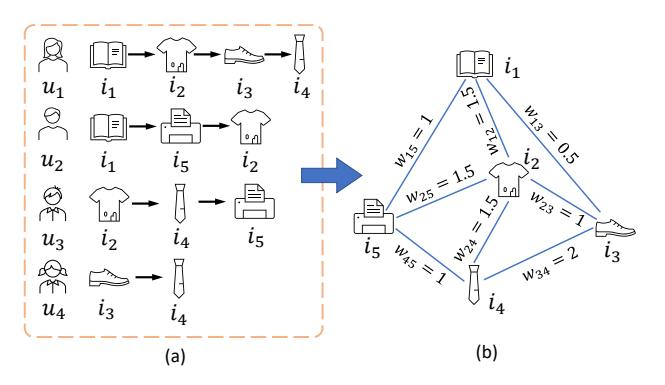
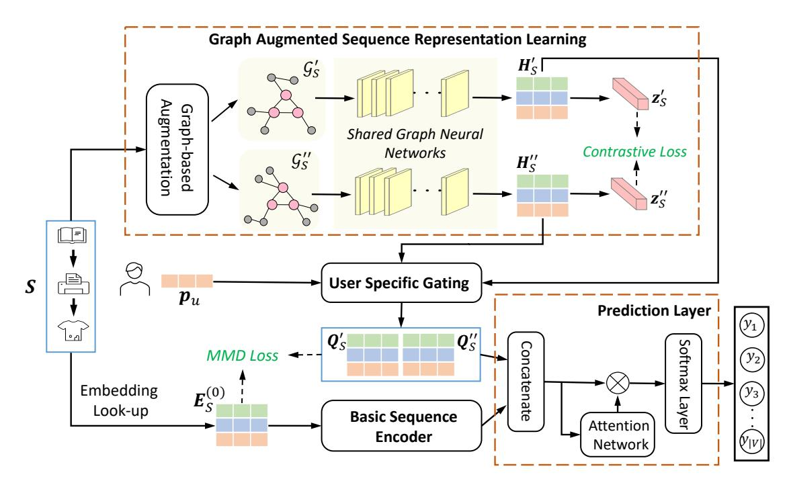
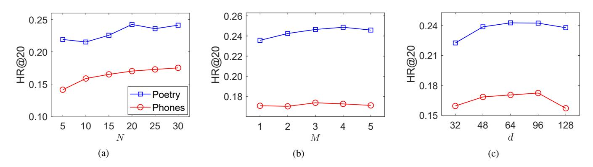

# Enhancing Sequential Recommendation with Graph Contrastive Learning

Yixin Zhang1∗ , Yong Liu3∗ , Yonghui Xu2† , Hao Xiong5 , Chenyi Lei5 , Wei He1 ,

Lizhen Cui1,2† and Chunyan Miao3,4

1School of Software, Shandong University, China

2 Joint SDU-NTU Centre for Artifcial Intelligence Research (C-FAIR), Shandong University, China 3Alibaba-NTU Singapore JRI & LILY Research Centre, Nanyang Technological University, Singapore 4School of Computer Science and Engineering, Nanyang Technological University, Singapore

5Alibaba Group, China

yixinzhang@mail.sdu.edu.cn, {stephenliu, ascymiao}@ntu.edu.sg, xu.yonghui@hotmail.com, {songling.xh, chenyi.lcy}@alibaba-inc.com, {hewei, clz}@sdu.edu.cn

## Abstract

The sequential recommendation systems capture users' dynamic behavior patterns to predict their next interaction behaviors. Most existing sequential recommendation methods only exploit the local context information of an individual interaction sequence and learn model parameters solely based on the item prediction loss. Thus, they usually fail to learn appropriate sequence representations. This paper proposes a novel recommendation framework, namely Graph Contrastive Learning for Sequential Recommendation (GCL4SR). Specifcally, GCL4SR employs a Weighted Item Transition Graph (WITG), built based on interaction sequences of all users, to provide global context information for each interaction and weaken the noise information in the sequence data. Moreover, GCL4SR uses subgraphs of WITG to augment the representation of each interaction sequence. Two auxiliary learning objectives have also been proposed to maximize the consistency between augmented representations induced by the same interaction sequence on WITG, and minimize the difference between the representations augmented by the global context on WITG and the local representation of the original sequence. Extensive experiments on real-world datasets demonstrate that GCL4SR consistently outperforms state-of-the-art sequential recommendation methods.

## 1 Introduction

In recent years, deep neural networks have been widely applied to build sequential recommendation systems [\[Wang](#page-7-0) *et al.*[, 2019;](#page-7-0) Lei *et al.*[, 2021a\]](#page-7-1). Although these methods usually achieve state-of-the-art sequential recommendation performance, there still exist some defciencies that can be improved. *Firstly*, existing methods model each user interaction sequence individually and only exploit the local context in each sequence. However, they usually ignore the correlation between users with similar behavior patterns (*e.g.*, with the same item subsequences). *Secondly*, the user behavior data is very sparse. Previous methods usually only use the item prediction task to train the recommendation models. They tend to suffer from the data sparsity problem and fail to learn appropriate sequence representations [Zhou *et al.*[, 2020;](#page-7-2) Xie *et al.*[, 2021\]](#page-7-3). *Thirdly*, the sequential recommendation models are usually built based on implicit feedback sequences, which may include noise information (*e.g.*, accidentally clicking) [Li *et al.*[, 2017\]](#page-7-4).

To remedy above issues, we frst build a Weighted Item Transition Graph (WITG) to describe item transition patterns across the observed interaction sequences of all users. This transition graph can provide global context information for each user-item interaction [Xu *et al.*[, 2019\]](#page-7-5). To alleviate the impacts of data sparsity, neighborhood sampling on WITG is performed to build augmented graph views for each interaction sequence. Then, graph contrastive learning [\[Hassani](#page-6-0) [and Khasahmadi, 2020;](#page-6-0) Zhang *et al.*[, 2022\]](#page-7-6) is employed to learn augmented representations for the user interaction sequence, such that the global context information on WITG can be naturally incorporated into the augmented representations. Moreover, as WITG employs the transition frequency to describe the importance of each item transition, it can help weaken the impacts of noise interactions in the user interaction sequences, when learning sequence representations.

In this paper, we propose a novel recommendation model, named GCL4SR (*i.e.*, Graph Contrastive Learning for Sequential Recommendation). Specifcally, GCL4SR leverages the subgraphs sampled from WITG to exploit the global context information across different sequences. The sequential recommendation task is improved by accommodating the global context information through the augmented views of the sequence on WITG. Moreover, we also develop two auxiliary learning objectives to maximize the consistency between augmented representations induced by the same interaction sequence on WITG, and minimize the difference between the representations augmented by the global context on WITG and the local representation of original sequence. Extensive

∗These two authors contributed equally to this work.

†Corresponding author

experiments on public datasets demonstrate that GCL4SR consistently achieve better performance than state-of-the-art sequential recommendation approaches.

## 2 Related Work

In this section, we review the most relevant existing methods in sequential recommendation and self-supervised learning.

## 1 Sequential Recommendation

In the literature, Recurrent Neural Networks (RNN) are usually applied to build sequential recommendation systems. For example, GRU4Rec [\[Hidasi](#page-7-7) *et al.*, 2016] treats users' behavior sequences as time series data and uses a multi-layer GRU structure to capture the sequential patterns. Moreover, some works, *e.g.*, NARM [Li *et al.*[, 2017\]](#page-7-4) and DREAM [Yu *[et al.](#page-7-8)*, [2016\]](#page-7-8), combine attention mechanisms with GRU structures to learn users' dynamic representations. Simultaneously, Convolutional Neural Networks (CNN) have also been explored for sequential recommendation. Caser [\[Tang and Wang,](#page-7-9) [2018\]](#page-7-9) is a representative method that uses both horizontal and vertical convolutional flters to extract users' sequential behavior patterns. Recently, SASRec [\[Kang and McAuley,](#page-7-10) [2018\]](#page-7-10) and BERT4Rec [Sun *et al.*[, 2019\]](#page-7-11) only utilize selfattention mechanisms to model users' sequential behaviors. Beyond that, HGN [Ma *et al.*[, 2019\]](#page-7-12) models users' dynamic preferences using hierarchical gated networks. Along another line, Graph Neural Networks (GNN) have been explored to model complex item transition patterns. For instance, SR-GNN [Wu *et al.*[, 2019\]](#page-7-13) converts sequences to graph structure data and employs the gated graph neural network to perform information propagation on the graph. GC-SAN [\[Xu](#page-7-5) *et al.*[, 2019\]](#page-7-5) dynamically builds a graph for each sequence and models the local dependencies and long-range dependencies between items by combining GNN and self-attention mechanism. In addition, GCE-GNN [Wang *et al.*[, 2020\]](#page-7-14) builds the global graph and local graph to model global item transition patterns and local item transition patterns, respectively.

### 2 Self-supervised Learning

Self-supervised learning is an emerging unsupervised learning paradigm, which has been successfully applied in computer vision [\[Jing and Tian, 2020\]](#page-7-15) and natural language processing [\[Devlin](#page-6-1) *et al.*, 2019]. There are several recent works applying self-supervised learning techniques in recommendation tasks. For example, [Zhou *et al.*[, 2020\]](#page-7-2) maximizes the mutual information among attributes, items, and sequences by different self-supervised optimization objectives. [\[Xie](#page-7-3) *et al.*[, 2021\]](#page-7-3) maximizes the agreement between two augmented views of the same interaction sequence through a contrastive learning objective. [Wu *et al.*[, 2021\]](#page-7-16) proposes a joint learning framework based on both the contrastive learning objective and recommendation objective. Moreover, in [Wei *et al.*[, 2021\]](#page-7-17), contrastive learning is used to solve the cold-start recommendation problem. In [\[Zhang](#page-7-6) *et al.*, 2022], a diffusion-based graph contrastive learning method is developed to improve the recommendation performance based on users' implicit feedback. Additionally, self-supervised

<!-- Image Description: The image displays a transformation of sequential data into a weighted graph. (a) shows sequential data representing user interactions (u) with items (i). (b) presents a weighted graph derived from (a), where nodes represent items and weighted edges (Wij) indicate the strength of association between items based on user interaction frequency. The weights seem to reflect the likelihood of a user interacting with an item given interaction with another. The purpose is to illustrate the conversion of sequential user-item interaction data into a weighted graph representation for further analysis, likely within a recommendation system or similar context. -->

**Figure 1:** An example showing the transition graph construction procedure, where (a) shows the observed user behavior sequences, and (b) illuminates the weighted transition graph.

learning has also been applied to exploit the item multimodal side information for recommendation [Liu *et al.*[, 2021;](#page-7-18) Lei *et al.*[, 2021b\]](#page-7-19).

## 3 Preliminaries

In this work, we study the sequential recommendation task, where we have the interaction sequences D of a set of users U over a set of items V . For each user u ∈ U, we use a list S = {v1, v2, · · · , vn} to denote her interaction sequence, where vt is the t-th interaction item of u, and n denotes the number of items that have interactions with u. Moreover, we denote the user u's embedding by pu ∈ R 1×d and the item i's embedding by ei ∈ R 1×d . E (0) S ∈ R n×d is used to denote the initial embedding of the sequence S, where the t-th row in E (0) S is the embedding of the t-th node in S. Similarly, E ∈ R |V |×d is used to denote the embeddings of all items.

Differing from existing methods that model the sequential transition patterns in each individual sequence, we frst build a weighted item transition graph G from D to provide a global view of the item transition patterns across all users' behavior sequences. The construction of the global transition graph G follows the following strategy. Taking the sequence S as an example, for each item vt ∈ S, if there exists an edge between the items vt and v(t+k) in G, we update the edge weight as w(vt, vt+k) ← w(vt, vt+k) + 1/k; otherwise, we construct an edge between vt and vt+k in G and empirically set the edge weight w(vt, vt+k) to 1/k, where k ∈ {1, 2, 3}. Here, the score 1/k denotes the importance of a target node vt to its k-hop neighbor vt+k in the sequence. This empirical setting is inspired by the success of previous work [He *[et al.](#page-6-2)*, [2020\]](#page-6-2). After repeating the above procedure for all the user sequences in D, we re-normalize the edge weight between two nodes vi and vj in G as follows,

$$
\widehat{w}(v_t, v_j) = w(v_t, v_j) \left( \frac{1}{\deg(v_i)} + \frac{1}{\deg(v_j)} \right), \quad (1)
$$

where deg(·) denotes the degree of a node in G. Note that G is an undirected graph. Figure [1](#page-1-0) shows an example about the transition graph without edge weight normalization.

<!-- Image Description: This diagram illustrates a graph-augmented sequence representation learning model. Input sequence *S* undergoes embedding look-up and is processed alongside user-specific information (*P*u). Graph-based augmentation generates graph representations (*G*s, *G*s′) fed into shared graph neural networks producing representations (*H*s, *H*s′). These are used in contrastive loss and user-specific gating to create final representations which, along with basic sequence encoding, are processed by an attention network and softmax layer for prediction (*Y*). MMD loss is also used. -->

**Figure 2:** The framework of the proposed GCL4SR model.

## 4 The Proposed Recommendation Model

Figure [2](#page-2-0) shows the overall framework of GCL4SR. Observe that GCL4SR has the following main components: 1) graph augmented sequence representation learning, 2) user-specifc gating, 3) basic sequence encoder, and 4) prediction layer. Next, we introduce the details of each component.

## 1 Graph Augmented Sequence Representation Learning

### Graph-based Augmentation

Given the weighted transition graph G, we frst construct two augmented graph views for an interaction sequence S through data augmentation. The motivation is to create comprehensively and realistically rational data via certain transformations on the original sequence. In this work, we use the effcient neighborhood sampling method used in [\[Hamilton](#page-6-3) *et al.*[, 2017\]](#page-6-3) to generate the augmented graph views from a large transition graph for a given sequence. Specifcally, we treat each node v ∈ S as a central node and interatively sample its neighbors in G by empirically setting the sampling depth M to 2 and the sampling size N at each step to 20. In the sampling process, we uniformly sample nodes without considering the edge weights, and then preserve the edges between the sampled nodes and their weights in G. For a particular sequence S, after employing the graph-based augmentation, we can obtain two augmented graph views G ′ S = (V ′ S , E′ S , A ′ S ) and G ′′ S = (V ′′ S , E′′ S , A ′′ S ). Here, V ′ S , E ′ S , and A ′ S are the set of nodes, the set of edges, and the adjacency matrix of G ′ S , respectively. Note that G ′ S and G ′′ S are subgraphs of G, and the adjacency matrix A ′ S and A ′′ S store the normalized weights of edges defned in Eq. [\(1\)](#page-1-1).

### Shared Graph Neural Networks

Following [\[Hassani and Khasahmadi, 2020\]](#page-6-0), two graph neural networks with shared parameters are used to encode G ′ S and G ′′ S . Taking G ′ S as an example, the information propagation and aggregation at the t-th layer of the graph neural networks are as follows,

$$
\mathbf{a}_{v_i}^{(t)} = \text{Aggregate}^{(t)} \big( \{ \mathbf{h}_{v_j}^{(t-1)} : v_j \in N_{v_i}' \} \big),
$$

$$
\mathbf{h}_{v_i}^{(t)} = \text{Combine}^{(t)} \big( \mathbf{a}_{v_i}^{(t)}, \mathbf{h}_{v_i}^{(t-1)} \big),
$$
(2)

where N ′ vi denotes the set of vi's neighbors in G ′ S , h (t−1) vi denotes the representation of item vi at the t-th GNN layer. h (0) vi is vi's representation ei shared with the basic sequence encoder network. In Eq. [\(2\)](#page-2-1), Aggregate(·) is the function aggregating the neighborhood information of a central node vi , and Combine(·) is the function that combines neighborhood information to update the node embedding. After multiple layers of information propagation on G ′ S , we denote the embeddings of the nodes in S at the last GNN layer by H ′ S ∈ R n×d , which is the augmented representation of S based on G ′ S . Similarly, we can obtain another augmented representation H ′′ S ∈ R n×d of S based on the augmented graph view G ′′ S . In this work, these two GNNs are implemented as follows. At the frst layer, we use Graph Neural Network (GCN) with the weighted adjacency matrix of an augmented graph to fuse the node information. Then, we further stack a GraphSage [\[Hamilton](#page-6-3) *et al.*, 2017] layer that uses mean pooling to aggregate the high-order neighborhood information in the augmented graph.

### Graph Contrastive Learning Objective

In this work, we use graph contrastive learning [\[Hassani](#page-6-0) [and Khasahmadi, 2020\]](#page-6-0) to ensure the representations derived from augmented graph views of the same sequence to be similar, and the representations derived from augmented graph views of different sequences to be dissimilar. An auxiliary learning objective is developed to distinguish whether the two graph views are derived from the same user interaction sequence. Specifcally, the views of the same sequence are used as positive pairs, *i.e.*, {(G ′ S , G ′′ S )|S ∈ D}, and the views for different sequences are used as negative pairs, *i.e.*, {(G ′ S , G ′′ K)|S, K ∈ D, S ̸= K}. Then, we use the following contrastive objective to distinguish the augmented representations of the same interaction sequence from others,

$$
\mathcal{L}_{GCL}(S) = \sum_{S \in \mathcal{D}} -\log \frac{\exp\left(\cos(\mathbf{z}'_{S}, \mathbf{z}''_{S})/\tau\right)}{\sum_{K \in \mathcal{D}} \exp\left(\cos(\mathbf{z}'_{S}, \mathbf{z}''_{K})/\tau\right)}, \quad (3)
$$

where z ′ S and z ′′ S ∈ R 1×d are obtained by performing mean pooling on H ′ S and H ′′ S respectively, cos(·, ·) is the cosine similarity function, and τ is a hyper-parameter that is empirically set to 0.5 in the experiments.

### 2 User-specifc Gating

As each individual user may only be interested in some specifc properties of items, the global context information should be user-specifc. Following [Ma *et al.*[, 2019\]](#page-7-12), we design the following user-specifc gating mechanism to capture the global context information tailored to the user's personalized preferences,

$$
\mathbf{Q}'_S = \mathbf{H}'_S \otimes \sigma \big( \mathbf{H}'_S \mathbf{W}_{g1} + \mathbf{W}_{g2} \mathbf{p}_u^\top \big), \tag{4}
$$

where Wg1 ∈ R d×1 and Wg2 ∈ R L×d , σ(·) is the sigmoid function, ⊗ is the element-wise product. Here, the user embedding pu describes the user's general preferences. Similarly, for augmented view G ′′ S , we can obtain Q ′′ S .

### Representation Alignment Objective

The maximum mean discrepancy (MMD) [Li *et al.*[, 2015\]](#page-7-20) is then used to defne the distance between the representations of personalized global context (*i.e.*, Q ′ S and Q ′′ S ) and the local sequence representation E (0) S . Formally, the MMD between two feature distributions X ∈ R m×d and Y ∈ R me ×d can be defned as follows,

$$
MMD(\mathbf{X}, \mathbf{Y}) = \frac{1}{m^2} \sum_{a=1}^{m} \sum_{b=1}^{m} \mathcal{K}(\mathbf{x}_a, \mathbf{x}_b)
$$
$$
+ \frac{1}{\widetilde{m}^2} \sum_{a=1}^{\widetilde{m}} \sum_{b=1}^{\widetilde{m}} \mathcal{K}(\mathbf{y}_a, \mathbf{y}_b) - \frac{2}{m\widetilde{m}} \sum_{a=1}^{m} \sum_{b=1}^{\widetilde{m}} \mathcal{K}(\mathbf{x}_a, \mathbf{y}_b), \quad (5)
$$

where K(·, ·) is the kernel function, xa and yb denote the a-th row of X and the b-th row of Y, respectively. In this work, Gaussian kernel with bandwidth ρ is used as the kernel function, *i.e.*, K(x, x ′ ) = e − ||x−x ′ ||2 2ρ2 . Then, we minimize the distance between the representations of personalized global context and the local sequence representation as follows,

$$
\mathcal{L}_{MM}(S) = MMD(\mathbf{E}_S^{(0)}, \mathbf{Q}_S') + MMD(\mathbf{E}_S^{(0)}, \mathbf{Q}_S'').
$$
(6)

### 3 Basic Sequence Encoder

Besides the graph augmented representations of a sequence, we also employ traditional sequential model to encode users' interaction sequences. Specifcally, we choose SAS-Rec [\[Kang and McAuley, 2018\]](#page-7-10) as the backbone model, which stacks the Transformer encoder [\[Vaswani](#page-7-21) *et al.*, 2017] to model the user interaction sequences. Given the node representation Hℓ−1 at the (ℓ − 1)-th layer, the output of Transformer encoder at the ℓ-th layer is as follows,

$$
\mathbf{H}^{\ell} = FFN\big(Concat(head_1, ..., head_h)\mathbf{W}^h\big),
$$

headi = $Attention\big(\mathbf{H}^{\ell-1}\mathbf{W}_i^Q, \mathbf{H}^{\ell-1}\mathbf{W}_i^K, \mathbf{H}^{\ell-1}\mathbf{W}_i^V\big), (7)$

where F F N(·) denotes the feed-forward network, h represents the number of heads, WQ i ,WK i ,WV i ∈ R d×d/h , and Wh ∈ R d×d are the projection matrices. Specifcally, we use the shared embedding E (0) S with learnable position encoding as the initial state H0 . Here, the Residual Network, Dropout, and Layer Normalization strategies are omitted in the formula for convenience. Then, the attention mechanism is defned as,

$$
Attention(\mathbf{Q}, \mathbf{K}, \mathbf{V}) = softmax(\frac{\mathbf{Q}\mathbf{K}^{\top}}{\sqrt{d}})\mathbf{V},
$$
(8)

where Q, K, and V denote the queries, keys, and values respectively, and √ d is the scaling factor.

### 4 Prediction Layer

We concatenate the representations Q ′ S and Q ′′ S obtained from the augmented graph views and the embeddings at the last layer of the Transformer encoder Hℓ as follows,

$$
\mathbf{M} = AtNet\big(Concat(\mathbf{Q}'_{S}, \mathbf{Q}''_{S}, \mathbf{H}^{\ell})\mathbf{W}_{T}\big),\qquad(9)
$$

where M ∈ R 1×d , WT ∈ R 3d×d is the weight matrix, and AttNet(·) denotes the attention network. Then, given the user interaction sequence S with length n, the interaction probabilities between the user and items at the (n+ 1)-th step can be defned as follows,

$$
\hat{\mathbf{y}}^{(S)} = \text{softmax}(\mathbf{M} \mathbf{E}^{\top}),\tag{10}
$$

where yˆ (S) ∈ R 1×|V | , and the j-th element of yˆ (S) denotes the interaction probability of the j-th item.

### 5 Multi Task Learning

Sequential recommendation aims to predict the next item that the user u would like to interact with, based on her interaction sequence Su (Here, we include the subscript u for clear discussion). Following [\[Tang and Wang,](#page-7-9) [2018\]](#page-7-9), we split the sequence Su = {v 1 u , v2 u , · · · , v |Su| u } into a set of subsequences and target labels as follows: {(S 1:1 u , v2 u ),(S 1:2 u , v3 u ), · · · ,(S 1:|Su|−1 u , v |Su| u )}, where |Su| denotes the length of Su, S 1:k−1 u = {v 1 u , v2 u , · · · , vk−1 u }, and v k u is the target label of S 1:k−1 u . Then, we formulate the following main learning objective based on cross-entropy,

$$
\mathcal{L}_{main} = -\sum_{S_u \in \mathcal{D}} \sum_{k=1}^{|S_u|-1} \log \left( \hat{\mathbf{y}}^{(S_u^{1:k})}(v_u^{k+1}) \right), \qquad (11)
$$

| | Home | Phones | Comics | Poetry |
|----------------|-----------|---------|-----------|---------|
| # Users | 66,519 | 27,879 | 13,810 | 3,522 |
| # Items | 28,237 | 10,429 | 16,630 | 2,624 |
| # Interactions | 551,682 | 194,439 | 343,587 | 40,703 |
| # Nodes of G | 28,237 | 10,429 | 16,630 | 2,624 |
| # Edges of G | 1,617,638 | 430,940 | 1,310,952 | 122,700 |

**Table 1:** The statistics of experimental datasets.

where yˆ (S 1:k u ) (v k+1 u ) denotes the predicted interaction probability of v k+1 u based on the subsequence S 1:k u using Eq. [\(10\)](#page-3-0). In this work, we jointly optimize the main sequential prediction task and other two auxiliary learning objectives. The fnal objective function of GCL4SR is as follows,

$$
\mathcal{L} = \mathcal{L}_{main} + \sum_{S_u \in \mathcal{D}} \sum_{k=1}^{|S_u|-1} \lambda_1 \mathcal{L}_{GCL}(S_u^{1:k}) + \lambda_2 \mathcal{L}_{MM}(S_u^{1:k}),
$$
\n(12)

where λ1 and λ2 are hyper-parameters. The optimization problem in Eq. [\(12\)](#page-4-0) is solved by a gradient descent algorithm.

## 5 Experiments

In this section, we perform extensive experiments to evaluate the performance of the proposed GCL4SR method.

## 1 Experimental Settings

Datasets. The experiments are conducted on the Amazon review dataset [\[He and McAuley, 2016\]](#page-6-4) and Goodreads review dataset [Wan *et al.*[, 2019\]](#page-7-22). For Amazon dataset, we use two 5-core subsets for experimental evaluations: "Home and Kitchen" and "Cell Phones and Accessories" (respectively denoted by Home and Phones). For Goodreads dataset, we choose users' rating behaviors in "Poetry" and "Comics Graphic" categories for evaluation. Following [\[Zhou](#page-7-2) *et al.*, [2020\]](#page-7-2), we treat each rating as an implicit feedback record. For each user, we then remove duplicated interactions and sort her historical items by the interaction timestamp chronologically to obtain the user interaction sequence. To guarantee each user/item has enough interactions, we only keep the "5-core" subset of each dataset, by iteratively removing the users and items that have less than 5 interaction records. Table [1](#page-4-1) summarizes the statistics of experimental datasets.

Setup and Metrics. For each user, the last interaction item in her interaction sequence is used as testing data, and the second last item is used as validation data. The remaining items are used as training data. The performance of different methods is assessed by two widely used evaluation metrics: Hit Ratio@K and Normalized Discounted Cumulative Gain@K (respectively denoted by HR@K and N@K), where K is empirically set to 10 and 20. For each metric, we frst compute the accuracy for each user on the testing data, and then report the averaged accuracy for all testing users. In the experiments, all the evaluation metrics are computed on the whole candidate item set without negative sampling.

Baseline Methods. We compare GCL4SR with the following baseline methods.

- LightGCN [He *et al.*[, 2020\]](#page-6-2): This is a graph-based collaborative fltering light convolution network.
- FPMC [\[Rendle](#page-7-23) *et al.*, 2010]: This method combines matrix factorization and Markov chain model for sequential recommendation.
- GRU4Rec [\[Hidasi](#page-7-7) *et al.*, 2016]: This method employs Gated Recurrent Unit (GRU) to capture the sequential dependencies and make recommendation.
- Caser [\[Tang and Wang, 2018\]](#page-7-9): This method uses both vertical and horizontal convolution to capture users' sequential behavior patterns for recommendation.
- SASRec [\[Kang and McAuley, 2018\]](#page-7-10): This method uses self-attention mechanism to capture users' sequential patterns for recommendation.
- HGN [Ma *et al.*[, 2019\]](#page-7-12): This method uses a hierarchical gating network with an item-item product module for the sequential recommendation.
- SR-GNN [Wu *et al.*[, 2019\]](#page-7-13): This method converts sequences into graphs and leverages gated GNN layer to capture the item dependencies.
- GC-SAN [Xu *et al.*[, 2019\]](#page-7-5): This method utilizes graph neural network and self-attention mechanism to dynamically capture rich local dependencies.
- GCE-GNN [Wang *et al.*[, 2020\]](#page-7-14): This method proposes to build global graph and local graph to model global transition patterns and local transition patterns, respectively.
- S 3 -Rec [Zhou *et al.*[, 2020\]](#page-7-2): This method employs different self-supervised optimization objectives to maximize the mutual information among attributes, items, and sequences.
- CL4SRec [Xie *et al.*[, 2021\]](#page-7-3): This method uses sequence-level augmentation to learn better sequence representations.

Implementation Details. All the evaluation methods are implemented by PyTorch [Paszke *et al.*[, 2019\]](#page-7-24). Following [Zhou *et al.*[, 2020\]](#page-7-2), we set the maximum sequence length to 50. The hyper-parameters of baseline methods are selected following the original papers, and the optimal settings are chosen based on the model performance on validation data. In the evaluated methods, only S3 -Rec considers the item attribute information, and the other methods do not use item attribute information. For fair comparison, we only keep the masked item prediction and segment prediction tasks of S3 - Rec to learn the model. For CGL4SR, we empirically set the number of self-attention blocks and attention heads to 2. The dimensionality of embeddings is set to 64. The weights for the two self-supervised losses λ1 and λ2 are chosen from {0.01, 0.05, 0.1, 0.3, 0.5, 0.7, 1.0}. We use Adam [\[Kingma](#page-7-25) [and Ba, 2014\]](#page-7-25) as the optimizer and set the learning rate, β1, and β2 to 0.001, 0.9, and 0.999 respectively. Step decay of the learning rate is also adopted. The batch size is chosen from {256, 512, 1024}. The L2 regularization coeffcient is set to 5 × 10−5 . We train the model with early stopping strategy based on the performance on validation data.

| Datasets Metrics | | LightGCN FPMC GRU4Rec | | | Caser | SASRec | HGN | | | SR-GNN GC-SAN GCE-GNN CL4SRec S3 | | | -Rec GCL4SR |
|------------------|-------|-----------------------|--------|--------|--------|--------|--------|--------|--------|----------------------------------|--------|--------|-------------|
| Home | HR@10 | 0.0160 | 0.0162 | 0.0210 | 0.0101 | 0.0228 | 0.0152 | 0.0201 | 0.0281 | 0.0259 | 0.0266 | 0.0280 | 0.0313 |
| | HR@20 | 0.0250 | 0.0218 | 0.0330 | 0.0173 | 0.0316 | 0.0231 | 0.0292 | 0.0394 | 0.0359 | 0.0387 | 0.0406 | 0.0422 |
| | N@10 | 0.0085 | 0.0097 | 0.0110 | 0.0051 | 0.0141 | 0.0083 | 0.0123 | 0.0174 | 0.0161 | 0.0160 | 0.0169 | 0.0190 |
| | N@20 | 0.0108 | 0.0111 | 0.0140 | 0.0068 | 0.0163 | 0.0103 | 0.0146 | 0.0197 | 0.0186 | 0.0186 | 0.0196 | 0.0218 |
| Phones | HR@10 | 0.0687 | 0.0634 | 0.0835 | 0.0435 | 0.0883 | 0.0680 | 0.0778 | 0.0881 | 0.0946 | 0.0929 | 0.1037 | 0.1171 |
| | HR@20 | 0.1012 | 0.0854 | 0.1213 | 0.0647 | 0.1213 | 0.0990 | 0.1114 | 0.1232 | 0.1304 | 0.1305 | 0.1428 | 0.1666 |
| | N@10 | 0.0370 | 0.0374 | 0.0459 | 0.0233 | 0.0511 | 0.0364 | 0.0427 | 0.0500 | 0.0543 | 0.0533 | 0.0594 | 0.0665 |
| | N@20 | 0.0452 | 0.0430 | 0.0554 | 0.0287 | 0.0594 | 0.0442 | 0.0512 | 0.0588 | 0.0634 | 0.0627 | 0.0693 | 0.0790 |
| | HR@10 | 0.1411 | 0.1275 | 0.1414 | 0.1068 | 0.1428 | 0.1034 | 0.1193 | 0.1309 | 0.1533 | 0.1496 | 0.1613 | 0.1638 |
| | HR@20 | 0.2127 | 0.1851 | 0.2104 | 0.1567 | 0.2030 | 0.1545 | 0.1723 | 0.1936 | 0.2229 | 0.2164 | 0.2277 | 0.2428 |
| Poetry | N@10 | 0.0771 | 0.0704 | 0.0783 | 0.0607 | 0.0829 | 0.0597 | 0.0686 | 0.0732 | 0.0859 | 0.0838 | 0.0915 | 0.0914 |
| | N@20 | 0.0954 | 0.0849 | 0.0956 | 0.0732 | 0.0980 | 0.0725 | 0.0818 | 0.0891 | 0.1035 | 0.1004 | 0.1108 | 0.1112 |
| Comics | HR@10 | 0.1106 | 0.1382 | 0.1593 | 0.1156 | 0.1709 | 0.1242 | 0.1481 | 0.1638 | 0.1722 | 0.1751 | 0.1781 | 0.1829 |
| | HR@20 | 0.1672 | 0.1736 | 0.2058 | 0.1499 | 0.2100 | 0.1704 | 0.1857 | 0.2048 | 0.2232 | 0.2172 | 0.2258 | 0.2249 |
| | N@10 | 0.0587 | 0.1019 | 0.1096 | 0.0790 | 0.1276 | 0.0743 | 0.1067 | 0.1189 | 0.1222 | 0.1235 | 0.1234 | 0.1312 |
| | N@20 | 0.0730 | 0.1108 | 0.1213 | 0.0876 | 0.1374 | 0.0859 | 0.1161 | 0.1292 | 0.1325 | 0.1341 | 0.1354 | 0.1417 |

**Table 2:** The performance achieved by different methods. The best results are in boldface, and the second best results are underlined.

### 2 Performance Comparison

The performance comparison results are summarized in Table [2.](#page-5-0) Overall, GCL4SR outperforms all baseline methods on all datasets, in terms of almost all evaluation metrics.

Compared with RNN and CNN based models (*e.g.*, GRU4Rec and Caser), the models based on self-attention mechanism (*e.g.*, SASRec, GC-SAN, and GCL4SR) usually achieve better performance. This is because that selfattention mechanism is more effective in capturing longrange item dependencies. GC-SAN achieves better performance than SASRec on Home dataset, by introducing a graph built based on an individual sequence to improve the sequence representation. GCE-GNN outperforms SR-GNN by additionally exploiting global-level item transition patterns.

Moreover, CL4SRec, S3 -Rec, and GCL4SR usually outperform their backbone structure SASRec. This demonstrates that the self-supervised learning objectives can help improve sequential recommendation performance. In addition, GCL4SR achieves better results than CL4SRec and S3 - Rec. This is because that CL4SRec and S3 -Rec augment the sequence representation by the auxiliary learning objectives that only exploit the local context in each individual sequence. However, GCL4SR augments the sequence representation using subgraphs of the transition graph built based on sequences of all users, which can provide both local and global context for learning sequence representations.

### 3 Ablation Study

To study the importance of each component of GCL4SR, we consider the following GCL4SR variants for evaluation: 1) GCL4SRw/o G: we remove the graph contrastive learning loss by setting λ1 to 0 in Eq. [\(12\)](#page-4-0); 2) GCL4SRw/o GM: we remove both the graph contrastive learning loss and the MMD loss by setting λ1 and λ2 to 0 in Eq. [\(12\)](#page-4-0); 3) GCL4SRw/o W: we remove the edge weights of the augmented graph views when performing GCN operations at the frst layer of the shared GNNs used in graph contrastive learning.

Table [3](#page-5-1) summarizes the performance of GCL4SR variants and SASRec on Poetry and Phones datasets. We can note

| Method | Poetry | | Phones | | | |
|--------------|--------|--------|--------|--------|--|--|
| | HR@20 | N@20 | HR@20 | N@20 | | |
| GCL4SR | 0.2428 | 0.1112 | 0.1666 | 0.0790 | | |
| GCL4SRw/o G | 0.2433 | 0.1095 | 0.1607 | 0.0734 | | |
| GCL4SRw/o GM | 0.2138 | 0.0958 | 0.1423 | 0.0713 | | |
| GCL4SRw/o W | 0.2172 | 0.0979 | 0.1500 | 0.0694 | | |
| SASRec | 0.2030 | 0.0980 | 0.1213 | 0.0594 | | |

**Table 3:** The performance achieved by GCL4SR variants and SAS-Rec on Poetry and Phones datasets.

that GCL4SRw/o GM outperforms the backbone model SAS-Rec in terms of HR@20, on both datasets. This indicates the context in the global transition graph can help improve sequential recommendation performance. By including the MMD loss, GCL4SRw/o G achieves better performance than GCL4SRw/o GM. By further combining the graph contrastive learning loss, GCL4SR outperforms GCL4SRw/o G, in terms of N@20, on both datasets. These observations demonstrate that both the MMD loss and graph contrastive learning loss can help learn better item and sequence representations for sequential recommendation. Moreover, GCL4SR outperforms GCL4SRw/o W in terms of all metrics. This observation indicates that the transition frequency between items across all sequences can help distinguish the importance of neighboring items for better sequential recommendation performance.

### 4 Parameter Sensitivity Study

We also perform experiments to study the impacts of three hyper-parameters: the sampling depth M and sampling size N used in graph-based augmentation, and the embedding dimension d. Figure [3](#page-6-5) shows the performance of GCL4SR with respect to different settings of M, N, and d on Poetry and Phones datasets. As shown in Figure [3\(](#page-6-5)a), larger sampling size tends to produce better recommendation performance. For the sampling depth, we can notice the best settings for M are 4 and 3 on Poetry and Phones datasets, respectively. In addition, the best performance is achieved by setting d to 64 and 96 on Poetry and Phones datasets, respectively.

<!-- Image Description: The image contains three line graphs (a, b, c) showing the Hit Rate at 20 (HR@20) for "Poetry" and "Phones" datasets. Graph (a) plots HR@20 against parameter *N*, (b) against *M*, and (c) against *d*. Each graph displays the performance of both datasets across different parameter values, allowing for a comparison of their sensitivity to these hyperparameters. The purpose is to illustrate the impact of these parameters on the retrieval performance. -->

**Figure 3:** The performance trends of GCL4SR with respect to different settings of M, N, and d on Poetry and Phones datasets.

| Method | Poetry | | Phones | | |
|------------|--------|--------|--------|--------|--|
| | HR@20 | N@20 | HR@20 | N@20 | |
| HGN | 0.1545 | 0.0725 | 0.0990 | 0.0442 | |
| GCL4SR-HGN | 0.1712 | 0.0763 | 0.1064 | 0.0475 | |
| GRU4Rec | 0.2104 | 0.0956 | 0.1213 | 0.0554 | |
| GCL4SR-GRU | 0.2362 | 0.1057 | 0.1622 | 0.0763 | |
| SASRec | 0.2030 | 0.0980 | 0.1213 | 0.0594 | |
| GCL4SR-SAS | 0.2428 | 0.1112 | 0.1666 | 0.0790 | |

**Table 4:** The performance of HGN, GRU4Rec, SASRec, and GCL4SR with different basic sequence encoders.

### 5 Impacts of Sequence Encoders

To further investigate the effectiveness of the graph augmented sequence representation learning module, we employ other structures to build the basic sequence encoder. Specifcally, we consider the following settings of GCL4SR for experiments: 1) GCL4SR-GRU: we use the GRU4Rec as the backbone structure to build the basic sequence encoder; 2) GCL4SR-HGN: we use HGN as the backbone structure to build the basic sequence encoder; 3) GCL4SR-SAS: The default model that uses SASRec as the backbone structure to build the sequence encoder.

Table [4](#page-6-6) shows the performance of GCL4SR with different sequence encoders, as well as the performance of backbone models. Observe that GCL4SR-HGN, GCL4SR-GRU, and GCL4SR-SAS outperform the corresponding backbone encoder models. This indicates that the graph augmented sequence representation learning module is a general module that can help improve the performance of existing sequential recommendation methods. Moreover, GRU4Rec and SAS-Rec achieve better performance than GCL4SR-HGN. This indicates the basic sequence encoder dominates the performance of GCL4SR, and the graph augmented sequence representation learning module is a complementary part that can help further improve the recommendation performance.

## 6 Conclusion and Future Work

This paper proposes a novel recommendation model, namely GCL4SR, which employs a global transition graph to describe item transition patterns across the interaction sequences of different users. Moreover, GCL4SR leverages the subgraphs randomly sampled from the transition graph to augment an interaction sequence. Two auxiliary learning objectives have been proposed to learn better item and sequence representations. Extensive results on real datasets demonstrate that the proposed GCL4SR model consistently outperforms existing sequential recommendation methods. For future work, we would like to develop novel auxiliary learning objectives to improve the performance of GCL4SR. Moreover, we are also interested in applying GCL4SR to improve the performance of other sequential recommendation models.

## Acknowledgments

This work is supported, in part, by the NSFC No.91846205, National Key R&D Program of China No.2021YFF0900800, SDNSFC No.ZR2019LZH008, Shandong Provincial Key Research and Development Program (Major Scientifc and Technological Innovation Project) (NO.2021CXGC010108), the Fundamental Research Funds of Shandong University. This work is also supported, in part, by Alibaba Group through Alibaba Innovative Research (AIR) Program and Alibaba-NTU Singapore Joint Research Institute (JRI), Nanyang Technological University, Singapore.

## References

- [Devlin *et al.*, 2019] Jacob Devlin, Ming-Wei Chang, Kenton Lee, and Kristina Toutanova. BERT: pre-training of deep bidirectional transformers for language understanding. In *NAACL-HLT'19*, pages 4171–4186, 2019.
- [Hamilton *et al.*, 2017] William L Hamilton, Rex Ying, and Jure Leskovec. Inductive representation learning on large graphs. In *NeurIPS'17*, pages 1025–1035, 2017.
- [Hassani and Khasahmadi, 2020] Kaveh Hassani and Amir Hosein Khasahmadi. Contrastive multi-view representation learning on graphs. In *ICML'20*, pages 4116–4126, 2020.
- [He and McAuley, 2016] Ruining He and Julian McAuley. Ups and downs: Modeling the visual evolution of fashion trends with one-class collaborative fltering. In *WWW'16*, pages 507–517, 2016.
- [He *et al.*, 2020] Xiangnan He, Kuan Deng, Xiang Wang, Yan Li, Yongdong Zhang, and Meng Wang. Lightgcn:

Simplifying and powering graph convolution network for recommendation. In *SIGIR'20*, pages 639–648, 2020.

- [Hidasi *et al.*, 2016] Balazs Hidasi, Alexandros Karat- ´ zoglou, Linas Baltrunas, and Domonkos Tikk. Sessionbased recommendations with recurrent neural networks. In *ICLR 2016*, 2016.
- [Jing and Tian, 2020] Longlong Jing and Yingli Tian. Selfsupervised visual feature learning with deep neural networks: A survey. *TPAMI*, 2020.
- [Kang and McAuley, 2018] Wang-Cheng Kang and Julian McAuley. Self-attentive sequential recommendation. In *ICDM'18*, pages 197–206. IEEE, 2018.
- [Kingma and Ba, 2014] Diederik P Kingma and Jimmy Ba. Adam: A method for stochastic optimization. *arXiv preprint arXiv:1412.6980*, 2014.
- [Lei *et al.*, 2021a] Chenyi Lei, Yong Liu, Lingzi Zhang, Guoxin Wang, Haihong Tang, Houqiang Li, and Chunyan Miao. Semi: A sequential multi-modal information transfer network for e-commerce micro-video recommendations. In *KDD'21*, pages 3161–3171, 2021.
- [Lei *et al.*, 2021b] Chenyi Lei, Shixian Luo, Yong Liu, Wanggui He, Jiamang Wang, Guoxin Wang, Haihong Tang, Chunyan Miao, and Houqiang Li. Understanding chinese video and language via contrastive multimodal pre-training. In *MM'21*, pages 2567–2576, 2021.
- [Li *et al.*, 2015] Yujia Li, Kevin Swersky, and Rich Zemel. Generative moment matching networks. In *ICML'15*, pages 1718–1727, 2015.
- [Li *et al.*, 2017] Jing Li, Pengjie Ren, Zhumin Chen, Zhaochun Ren, Tao Lian, and Jun Ma. Neural attentive session-based recommendation. In *CIKM'17*, pages 1419– 1428, 2017.
- [Liu *et al.*, 2021] Yong Liu, Susen Yang, Chenyi Lei, Guoxin Wang, Haihong Tang, Juyong Zhang, Aixin Sun, and Chunyan Miao. Pre-training graph transformer with multimodal side information for recommendation. In *MM'21*, pages 2853–2861, 2021.
- [Ma *et al.*, 2019] Chen Ma, Peng Kang, and Xue Liu. Hierarchical gating networks for sequential recommendation. In *KDD'19*, pages 825–833, 2019.
- [Paszke *et al.*, 2019] Adam Paszke, Sam Gross, Francisco Massa, Adam Lerer, James Bradbury, Gregory Chanan, Trevor Killeen, Zeming Lin, Natalia Gimelshein, Luca Antiga, et al. Pytorch: An imperative style, highperformance deep learning library. *Advances in neural information processing systems*, 32:8026–8037, 2019.
- [Rendle *et al.*, 2010] Steffen Rendle, Christoph Freudenthaler, and Lars Schmidt-Thieme. Factorizing personalized markov chains for next-basket recommendation. In *WWW'10*, pages 811–820, 2010.
- [Sun *et al.*, 2019] Fei Sun, Jun Liu, Jian Wu, Changhua Pei, Xiao Lin, Wenwu Ou, and Peng Jiang. Bert4rec: Sequential recommendation with bidirectional encoder representations from transformer. In *CIKM'19*, pages 1441–1450, 2019.

- [Tang and Wang, 2018] Jiaxi Tang and Ke Wang. Personalized top-n sequential recommendation via convolutional sequence embedding. In *WSDM'18*, pages 565–573, 2018.
- [Vaswani *et al.*, 2017] Ashish Vaswani, Noam Shazeer, Niki Parmar, Jakob Uszkoreit, Llion Jones, Aidan N Gomez, Łukasz Kaiser, and Illia Polosukhin. Attention is all you need. In *NeurIPS'17*, pages 5998–6008, 2017.
- [Wan *et al.*, 2019] Mengting Wan, Rishabh Misra, Ndapandula Nakashole, and Julian McAuley. Fine-grained spoiler detection from large-scale review corpora. In *ACL'19*, pages 2605–2610, 2019.
- [Wang *et al.*, 2019] Shoujin Wang, Liang Hu, Yan Wang, Longbing Cao, Quan Z Sheng, and Mehmet Orgun. Sequential recommender systems: challenges, progress and prospects. In *IJCAI'19*, pages 6332–6338, 2019.
- [Wang *et al.*, 2020] Ziyang Wang, Wei Wei, Gao Cong, Xiao-Li Li, Xian-Ling Mao, and Minghui Qiu. Global context enhanced graph neural networks for session-based recommendation. In *SIGIR'20*, pages 169–178, 2020.
- [Wei *et al.*, 2021] Yinwei Wei, Xiang Wang, Qi Li, Liqiang Nie, Yan Li, Xuanping Li, and Tat-Seng Chua. Contrastive learning for cold-start recommendation. In *MM'21*, pages 5382–5390, 2021.
- [Wu *et al.*, 2019] Shu Wu, Yuyuan Tang, Yanqiao Zhu, Liang Wang, Xing Xie, and Tieniu Tan. Session-based recommendation with graph neural networks. In *AAAI'19*, volume 33, pages 346–353, 2019.
- [Wu *et al.*, 2021] Jiancan Wu, Xiang Wang, Fuli Feng, Xiangnan He, Liang Chen, Jianxun Lian, and Xing Xie. Self-supervised graph learning for recommendation. In *SI-GIR'21*, 2021.
- [Xie *et al.*, 2021] Xu Xie, Fei Sun, Zhaoyang Liu, Shiwen Wu, Jinyang Gao, Bolin Ding, and Bin Cui. Contrastive learning for sequential recommendation. *arXiv:2010.14395v2*, 2021.
- [Xu *et al.*, 2019] Chengfeng Xu, Pengpeng Zhao, Yanchi Liu, Victor S Sheng, Jiajie Xu, Fuzhen Zhuang, Junhua Fang, and Xiaofang Zhou. Graph contextualized selfattention network for session-based recommendation. In *IJCAI'19*, volume 19, pages 3940–3946, 2019.
- [Yu *et al.*, 2016] Feng Yu, Qiang Liu, Shu Wu, Liang Wang, and Tieniu Tan. A dynamic recurrent model for next basket recommendation. In *SIGIR'16*, page 729–732, 2016.
- [Zhang *et al.*, 2022] Lingzi Zhang, Yong Liu, Xin Zhou, Chunyan Miao, Guoxin Wang, and Haihong Tang. Diffusion-based graph contrastive learning for recommendation with implicit feedback. In *DASFAA'22*, pages 232– 247, 2022.
- [Zhou *et al.*, 2020] Kun Zhou, Hui Wang, Wayne Xin Zhao, Yutao Zhu, Sirui Wang, Fuzheng Zhang, Zhongyuan Wang, and Ji-Rong Wen. S3-rec: Self-supervised learning for sequential recommendation with mutual information maximization. In *CIKM'20*, pages 1893–1902, 2020.
