# Paterns for Representing Knowledge Graphs to Communicate Situational Knowledge of Service Robots

Shengchen Zhang shengchenzhang1207@gmail.com College of Design and Innovation, Tongji University Shanghai, China

Yi Dai amyyue0416@163.com College of Design and Innovation, Tongji University Shanghai, China

Zixuan Wang zixuanwang@tongji.edu.cn College of Design and Innovation, Tongji University Shanghai, China

Lyumanshan Ye 2623706775@qq.com College of Design and Innovation, Tongji University Shanghai, China

Chaoran Chen chenchaoran@tongji.edu.cn College of Design and Innovation, Tongji University Shanghai, China

Xiaohua Sun xsun@tongji.edu.cn College of Design and Innovation, Tongji University Shanghai, China

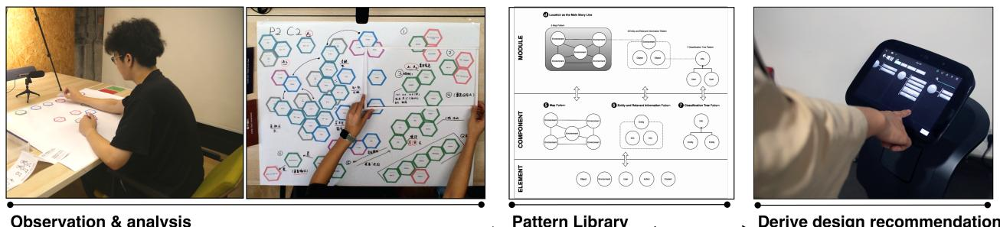
<!-- Image Description: The image displays a four-stage design process. First, observation and analysis are shown through a person arranging colored shapes on a whiteboard. Second, a pattern library is depicted using a large hexagon-based diagram illustrating relationships between modules, components, and elements. Third, a hierarchical diagram clarifies these relationships further. Finally, the process culminates in the design of a user interface, shown as a tablet's touchscreen. The image showcases the iterative progression from user observation to design implementation via a pattern library. -->

Figure 1: In this work, we use observations and analysis of human presentation of situational knowledge to develop a pattern library for interface design. We further derive design recommendations by prototyping and testing the interface of a service robot.

## ABSTRACT

Service robots are envisioned to be adaptive to their working environment based on situational knowledge. Recent research focused on designing visual representation of knowledge graphs for expert users. However, how to generate an understandable interface for non-expert users remains to be explored. In this paper, we use knowledge graphs (KGs) as a common ground for knowledge exchange and develop a pattern library for designing KG interfaces for non-expert users. After identifying the types of robotic situational knowledge from the literature, we present a formative study in which participants used cards to communicate the knowledge for given scenarios. We iteratively coded the results and identifed patterns for representing various types of situational knowledge.

Permission to make digital or hard copies of all or part of this work for personal or classroom use is granted without fee provided that copies are not made or distributed for proft or commercial advantage and that copies bear this notice and the full citation on the frst page. Copyrights for components of this work owned by others than ACM must be honored. Abstracting with credit is permitted. To copy otherwise, or republish, to post on servers or to redistribute to lists, requires prior specifc permission and/or a fee. Request permissions from [permissions@acm.org](mailto:permissions@acm.org).

CHI '21, May 8–13, 2021, Yokohama, Japan

© 2021 Association for Computing Machinery.

ACM ISBN 978-1-4503-8096-6/21/05. . . \$15.00 <https://doi.org/10.1145/3411764.3445767>

To derive design recommendations for applying the patterns, we prototyped a lab service robot and conducted Wizard-of-Oz testing. The patterns and recommendations could provide useful guidance in designing knowledge-exchange interfaces for robots.

## CCS CONCEPTS

• Human-centered computing → Graphical user interfaces; User interface design; User studies; • Computer systems organization → Robotics; • Computing methodologies → Cognitive robotics.

### KEYWORDS

Design Patterns, Interface Design, KnowledgeGraph, Human-Robot Interaction

### ACM Reference Format:

Shengchen Zhang, Zixuan Wang, Chaoran Chen, Yi Dai, Lyumanshan Ye, and Xiaohua Sun. 2021. Patterns for Representing Knowledge Graphs to Communicate Situational Knowledge of Service Robots. In CHI Conference on Human Factors in Computing Systems (CHI '21), May 8–13, 2021, Yokohama, Japan. ACM, New York, NY, USA, [12](#page-11-0) pages. [https://doi.org/10.1145/3411764.](https://doi.org/10.1145/3411764.3445767) [3445767](https://doi.org/10.1145/3411764.3445767)

<!-- Image Description: That's not a technical image from an academic paper; it's a generic button graphic instructing the user to check for updates. It contains no data, charts, graphs, equations, or technical illustrations. The image is purely a visual cue for software or application interaction, not conveying any technical content suitable for academic analysis. -->

### 1 INTRODUCTION

Service robots are increasingly pervasive in our daily life and are anticipated to execute complex tasks based on high-level goals and interact with users in an easily-understandable way[\[24\]](#page-10-0). This requires robots to efectively organize and represent situational knowledge — the in-situ information about humans, objects, places, and events in the robot's working environment[\[18\]](#page-10-1). However, since situational knowledge is often highly related to users and objects on the spot, robots need to interact with humans to mediate the mismatch between perception and comprehension of situational knowledge[\[15\]](#page-10-2).

Knowledge graphs[\[16\]](#page-10-3) are a common method used in both artifcial intelligence (AI) to incorporate human knowledge into AI models, and in robotics to build knowledge-enabled robots. Previous research have been exploring designing interfaces to help domain experts to directly view and manipulate the knowledge graph in a robot in order to understand and operate it [\[30\]](#page-10-4). However, for non-expert users who have little technical knowledge in ontological models like KGs, it can be hard to understand and interact with such interfaces. Existing works are developing a set of human-friendly vocabulary to build robot ontology[\[13\]](#page-10-5), but research on KG interface design for non-expert users is still relatively few.

Meanwhile, previous works showed that design patterns beneft the feld of HCI and HRI by providing reusable solutions for recurring problems[\[22\]](#page-10-6). For KG interfaces, the study of interface design patterns is especially useful. A set of patterns can lower the requirement on the understanding of technical details for the designers, while also accelerating the development of such interfaces.

This paper describesthe process(Figure [1\)](#page-0-0) of developing a library of patterns for visually presenting situational, robotic knowledge graphs. The goal of the patterns is to help designing efective interfaces to communicate the situational knowledge of service robots. Our contribution is three-fold:

- We developed a pattern library of high-level and low-level patterns of situational knowledge communication that can be used to design robot interfaces.
- We described in detail our process of constructing the library from how non-expert users present KG elements on a canvas.
- We further derived design recommendations for using the pattern library through prototyping and a Wizard-of-Oz feld study.

### 2 RELATED WORK

Our work builds on prior research on situational knowledge exchange in humans and robots, challenges of knowledge graph in cognitive robot, and patterns of human robot interaction.

### 1 Situational knowledge exchange in humans and robots

Situational knowledge exchange has played an increasingly critical role in human-robot interaction, for both robotic perception and comprehension[\[18\]](#page-10-1). Many studies have focused on leverage symbol grounding techniques (connecting numeric and symbolic representation of real-world objects and the environment) to make

situational knowledge exchange more accurate and easier to understand [\[6\]](#page-10-7). These techniques have been used to support situational knowledge representation for robots[\[40,](#page-11-1) [47,](#page-11-2) [56\]](#page-11-3), situation assessment in human-robot interaction[\[48,](#page-11-4) [52\]](#page-11-5), and context-based human-robot collaboration[\[58,](#page-11-6) [59\]](#page-11-7).

Most relevant to our work is the research focused on grounding and representing situational knowledge for robots in a humanunderstandable way. For example, Bastianelli et al.[\[6\]](#page-10-7) proposed using metric maps and a multi-model interface that allowed users to guide robots to ground symbolic information in the operational environment. Carpenter et al.[\[8\]](#page-10-8) presented CARIL, a computational architecture that used declarative situational representation to adapt robots' behavior to humans during their collaboration. While several aspects of exchanging situational knowledge have been studied, such as creating robot task plans[\[24,](#page-10-0) [45\]](#page-11-8) and programming the Robotic Operating System (ROS)[\[13,](#page-10-5) [32,](#page-10-9) [54\]](#page-11-9), few studies explored a unifed form of visual representation for situational knowledge in robots.

Knowledge graphs can represent heterogeneous and interconnected knowledge[\[20\]](#page-10-10), therefore often used as a unifed format of knowledge representation in robots. Our work aims to identify the patterns and represent situational knowledge based on the knowledge graph in a service robot.

### 2 Challenges of knowledge graph in cognitive robots

Although knowledge graphs have been applied to facilitate humanrobot interaction, it is hindered by three main challenges: static systems, monotonous interaction modality and intricate interfaces.

Firstly, robots based on static systems are hard to adapt to user preferences and intuitively interact with users [\[18,](#page-10-1) [21\]](#page-10-11). To address this problem and explore human-friendly systems, some recent research enhanced the accuracy of human-robot knowledge communication by acquiring multi-modal human behavior data or the AR interface [\[25,](#page-10-12) [35,](#page-11-10) [57\]](#page-11-11).

Secondly, previous research has indicated that uni-modal interaction (typically voice interaction for robots) might lead to misunderstanding the users' requests[\[25\]](#page-10-12). Liu et al. proposed a graphic interface that adds synchronous visual feedback of users' decision sequence based on a dialogue interaction system, which successfully reduced misunderstandings[\[34\]](#page-10-13). It demonstrates the efectiveness of GUI-based interaction in human-robot knowledge communication.

Thirdly, there is still relatively few research focused on enhancing non-expert users' understanding of ontological models and developing interactive systems for this purpose. Some relevant research explored human-readable ways of describing robot behavior[\[13\]](#page-10-5), and designed an interface using ontological abstraction to help non-experts users to program robots with low learning cost[\[55\]](#page-11-12). These works inspired us to explore how to generate a systemic and understandable interface for exchanging knowledge between non-expert users and service robots.

### 3 Patterns of human robot interaction

Pattern language was frst proposed by Alexander in 1977[\[1\]](#page-10-14), and then thrived in the feld of Human computer interaction(HCI)[\[46,](#page-11-13) [51\]](#page-11-14) and human robot interaction(HRI)[\[23,](#page-10-15) [39,](#page-11-15) [49\]](#page-11-16). Kahn et al. argued that design patterns could beneft HRI by providing designers with the necessary knowledge and save their time when reusing these patterns to solve recurring problems[\[22\]](#page-10-6). Patterns also serve as scafolding to help future research explore their relevant direction.

Prior research focused on extracting patterns to guide the design of HRI. For example, Oliveira et al. yielded social interaction patterns by observing human and robot players' behaviors in card games[\[43\]](#page-11-17). Oguz et al. developed an ontological framework from human interaction demonstrations, which could be transferred to HRI scenarios[\[41\]](#page-11-18).

Most relevant to our research are the patterns of presenting robot knowledge on an graphical interface. Robots have shown the ability to use interface to efectively communicate various types of information and promote task efciency in teleoperating[\[5,](#page-10-16) [11\]](#page-10-17),manufacturing[\[38\]](#page-11-19) and elderly care[\[26\]](#page-10-18). Although prior research showed interest in exploring the design of interfaces, few focused on extracting patterns of knowledge presentation on the robot's interface. Our work aims to facilitate more design of robot interface to exchange situational knowledge.

### 3 FORMATIVE STUDY

Alexander points out in his foundational work[\[2\]](#page-10-19) that patterns "cannot be made, but only be generated, indirectly, by the ordinary actions of the people." Regarding applying design patterns to HRI, Freier et al. further argued that design patterns in nature are "patterns of human interaction with the physical and social world[\[23\]](#page-10-15)." In line with this reasoning, we grounded our formative study in observations and analysis of non-expert users' methods to visually communicate situational knowledge. Participants are tasked with presenting the knowledge needed in an HRI scenario using cards on a canvas. We then iteratively coded the results and identifed patterns for presenting various types of robotic situational knowledge. The following sections describe the process of discovering and formalizing these patterns.

### 3.1 Scenarios

To create a comprehensive and believable setting to ground our observation, we frst identify three HRI scenarios that span three categories of situational knowledge exchange interactions: semantic, procedural and episodic. As knowledge communication involves both robot and human parties, we referenced research in both human knowledge [\[3,](#page-10-20) [12\]](#page-10-21) and robotic knowledge[\[29\]](#page-10-22). We adopted the categorization in [\[29\]](#page-10-22) as the knowledge types are applicable to both humans and robots, and are more robot-specifc.

Communicating semantic knowledge. Semantic knowledge is "semantically abstract facts[\[29\]](#page-10-22)." In semantic scenarios, the participants are asked to present information about user information, object ownership, or environment locations on the canvas.

Communicating procedural knowledge. Procedural knowledge is "knowledge about actions, whether internal or external[\[29\]](#page-10-22)." In procedural scenarios, the participants are asked to present information about robot tasks or actions in a planned procedure.

Communicating episodic knowledge. Episodic knowledge is "contextualized experiential knowledge"[\[29\]](#page-10-22). In episodic scenarios, the

participants present knowledge such as a perceived sequence of events or information related to a certain period of time.

To ensure our results' applicability to a wide variety of working environments, we expanded each scenario into three types of contexts from private to public: home, ofce, and elderly care center. This results in nine scenarios used in the formative study.

We use comic strips to present each scenario to the participants to reduce narration's infuence on the results. An example of the scenario comic is shown in Figure [2.](#page-2-0) The complete collection of comics can be found in the supplementary materials.

<!-- Image Description: The image contains a four-panel cartoon illustrating a robot's integration into a family home. Each panel depicts a simple scene: the robot arriving, exploring the home, and the family interacting with it to review learned information. The cartoons use stick figures and simple shapes to represent the robot and family members, providing a visual narrative supporting a text description in both Chinese and English, likely explaining a human-robot interaction process. -->

Figure 2: An example of the scenario comic

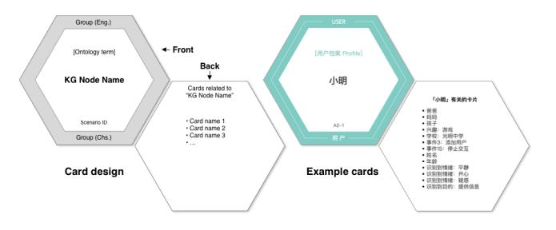
<!-- Image Description: The image displays a design for hexagonal cards used in a knowledge graph (KG) system. A grey hexagon depicts the card's front, showing KG node name, ontology term, scenario ID, and group (English and Chinese). The back (white hexagon) lists related card names. Example teal cards demonstrate front and back layouts, one showing user information. The figure illustrates data organization and user interface elements within the KG application. -->

Figure 3: The design of the knowledge cards. On the right is an example of a card in the group "User", with ontology term "User profle".

### 2 Knowledge Cards

To achieve a more comprehensive coverage of the types of situational knowledge in service robots, we conducted a literature survey of works on ontology for service robots in the Scopus databas[e1.](#page-2-1) Intially, we used "situational" and its variations (such as "situated" and "in situ") in a pilot search. To the best of our eforts, we found no existing works categorizing robot situational knowledge types. Therefore, we searched for works categorizing general knowledge types of robot, using the query shown below:

{robot AND knowledge graph} OR {robot AND ontology} OR {robot AND semantic network} OR {robot AND knowledge model} AND NOT industr\* AND NOT agricultur\* AND NOT farming

The search returned 228 papers. We further excluded works that focused on a specifc type of knowledge and those that focused on specifc applications of robot ontology. In the end, 11 papers were selected. We reviewed each paper for ontology terms and grouped similar terms to form an initial list of robot knowledge types. We fnally removed non-situational knowledge about robotic components and capabilities to arrive at Table [1.](#page-3-0)

[1https://www.scopus.com](https://1https://www.scopus.com)

| Group Ontology Description Examples [42] [33] [17] [9] [19] [53] Objects Object A physical entity in the environment, excluding agents such as users and robots. [4] [31] [28] Afordance The possibility of action[42] on an object, as perceived [42] [19] [53] by the robot. Environment Environment Map A spatial representation of the robot's working [42] [33] [17] [9] [19] [53] environment[42]. [31] [28] Users User profle The basic information of the users[9], such as name and [31] [9] [19] [53] [4] [36] [7] ID in the face recognition module. |
|-----------------------------------------------------------------------------------------------------------------------------------------------------------------------------------------------------------------------------------------------------------------------------------------------------------------------------------------------------------------------------------------------------------------------------------------------------------------------------------------------------------------------------------------------------------------------------------------------------------------------------------------------------------|
|                                                                                                                                                                                                                                                                                                                                                                                                                                                                                                                                                                                                                                                           |
|                                                                                                                                                                                                                                                                                                                                                                                                                                                                                                                                                                                                                                                           |
|                                                                                                                                                                                                                                                                                                                                                                                                                                                                                                                                                                                                                                                           |
|                                                                                                                                                                                                                                                                                                                                                                                                                                                                                                                                                                                                                                                           |
|                                                                                                                                                                                                                                                                                                                                                                                                                                                                                                                                                                                                                                                           |
|                                                                                                                                                                                                                                                                                                                                                                                                                                                                                                                                                                                                                                                           |
|                                                                                                                                                                                                                                                                                                                                                                                                                                                                                                                                                                                                                                                           |
|                                                                                                                                                                                                                                                                                                                                                                                                                                                                                                                                                                                                                                                           |
| Social concept Social knowledge of the user obtained while interacting [9] [36] [7]                                                                                                                                                                                                                                                                                                                                                                                                                                                                                                                                                                 |
| with a human.[9]                                                                                                                                                                                                                                                                                                                                                                                                                                                                                                                                                                                                                                          |
| Emotion/Intention [9] [4] [36] The emotional state and intention of the user, as detected                                                                                                                                                                                                                                                                                                                                                                                                                                                                                                                                                           |
| by the robot.                                                                                                                                                                                                                                                                                                                                                                                                                                                                                                                                                                                                                                             |
| Action Action & Task A task represents "a piece of work that has to be done [42] [33] [17] [53] [36] [31]                                                                                                                                                                                                                                                                                                                                                                                                                                                                                                                                        |
| by the robot[42]". An action refers to "a way to execute a task[42]", which we use to denote a step that the robot                                                                                                                                                                                                                                                                                                                                                                                                                                                                                                                                     |
| takes to complete a task.                                                                                                                                                                                                                                                                                                                                                                                                                                                                                                                                                                                                                                 |
| The behavior that the robot adopts when carrying out Activity & Behavior [42] [33] [17] [9] [19] [53]                                                                                                                                                                                                                                                                                                                                                                                                                                                                                                                                               |
| a task. Example behaviors may include scripted interac                                                                                                                                                                                                                                                                                                                                                                                                                                                                                                                                                                                                    |
| tions, open dialogue, or simply command-and-response.                                                                                                                                                                                                                                                                                                                                                                                                                                                                                                                                                                                                     |
| Plan & Method A sequence of actions that the robots would take in or [42] [9] [53]                                                                                                                                                                                                                                                                                                                                                                                                                                                                                                                                                                  |
| der to fulfll a task. This can be either programmed or                                                                                                                                                                                                                                                                                                                                                                                                                                                                                                                                                                                                    |
| generated.                                                                                                                                                                                                                                                                                                                                                                                                                                                                                                                                                                                                                                                |
| Interaction & Communication A group of pre-defned actions that involves interacting [42] [9] [53] [28]                                                                                                                                                                                                                                                                                                                                                                                                                                                                                                                                              |
| or communicating with the user. This type of knowledge                                                                                                                                                                                                                                                                                                                                                                                                                                                                                                                                                                                                    |
| is often associated with one or more types of behavior.                                                                                                                                                                                                                                                                                                                                                                                                                                                                                                                                                                                                   |
| Context Spatial & temporal context [33] used these terms to refer to the spatial and temporal [33] [31]                                                                                                                                                                                                                                                                                                                                                                                                                                                                                                                                          |
| relationship between objects. We expand this defnition                                                                                                                                                                                                                                                                                                                                                                                                                                                                                                                                                                                                    |
| to include non-object concepts such as events and inter actions.                                                                                                                                                                                                                                                                                                                                                                                                                                                                                                                                                                                       |
| Situation [33] used this terms to refer to the detected spatial status [33] [31]                                                                                                                                                                                                                                                                                                                                                                                                                                                                                                                                                                    |
| of objects (such as "crowded"). We expand this defnition                                                                                                                                                                                                                                                                                                                                                                                                                                                                                                                                                                                                  |
| to general social situations.                                                                                                                                                                                                                                                                                                                                                                                                                                                                                                                                                                                                                             |
| Event An event is a notable happening detected by the robot. [53]                                                                                                                                                                                                                                                                                                                                                                                                                                                                                                                                                                                   |

| Table 1: List of situational knowledge used in our formative study |  |  |
|--------------------------------------------------------------------|--|--|
|--------------------------------------------------------------------|--|--|

We then manually compiled knowledge graph datasets for the nine scenarios, with each dataset spanning all types of knowledge listed. The total number of nodes is kept roughly the same for each dataset to maintain similar task difculty across the scenarios.

We used hexagonal cards to represent each node in the knowledge graph, inspired by Padilla et al. [\[44\]](#page-11-23), as hexagon allows for versatile arrangement and efcient use of space[2.](#page-3-1) An example of the card design is shown in Figure [3.](#page-2-2)

### 3 Set up

The study was carried out in a controlled environment. As shown in Figure [4,](#page-3-2) the set up consisted of a table with a sheet of erasable canvas and hexagonal cards sorted by knowledge types. We provided markers and erasers for annotation. There are also two empty boxes for participants to put unused and unclear cards.

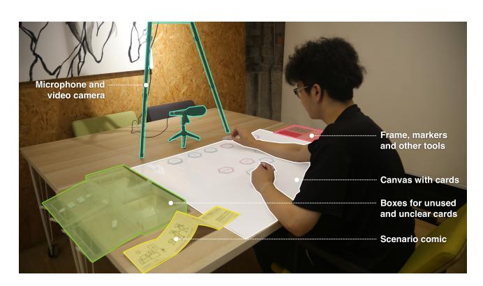
<!-- Image Description: The image depicts a person participating in a user study. A large white canvas on a table serves as the central focus, showing cards arranged in a pattern. A microphone and video camera are positioned to record the session. Boxes hold unused and unclear cards. Labeled items include a frame with markers and a scenario comic. The setup suggests a user interface or game testing environment; the image likely illustrates the experimental methodology in the paper. -->

Figure 4: A photo of our study set-up. A researcher plays the role of the participant to protect the participants' identity.

2The source fles we used to print the cards can be found at [https://github.com/tongji](https://github.com/tongji-cdi/robot-knowledge-canvases/tree/master/Cards%20PDF)[cdi/robot-knowledge-canvases/tree/master/Cards%20PDF.](https://github.com/tongji-cdi/robot-knowledge-canvases/tree/master/Cards%20PDF)

Paterns for Representing Situational Robotic Knowledge Graphs CHI '21, May 8–13, 2021, Yokohama, Japan

### 4 Procedure/Task

After signing a consent form, the participant can browse the material and ask questions. We then asked the participant to arrange the knowledge cards on the canvas. They are to arrange the cards in a way that they think best communicates the information as required in the scenario comic. The researcher leaves the working area during the process and observes the participant through a live camera feed. The participant can use the "question" and "fnished" cards to signal the researcher when needed. There's no time limit to complete the task.

After the creation, the participant is asked to communicate the knowledge on the display to the researcher using a frame. Figure [5](#page-4-0) shows an example of the narration. By defning the task in this manner, it allowed us to identify the grouping and sequence of the cards presented. Finally, the researcher interviews the participant about the arrangement logic and other interesting phenomena noticed during the process.

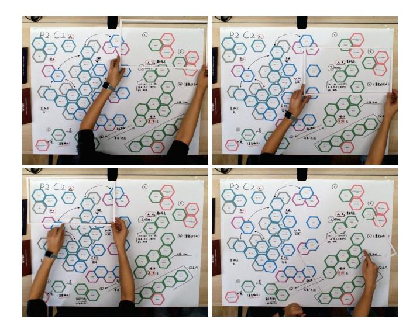
<!-- Image Description: The image shows a four-part sequence illustrating a collaborative design process. Each panel depicts a large whiteboard with a hexagonal diagram being collaboratively built. The hexagons, color-coded and labeled with text (likely representing design elements or tasks), are connected by arrows indicating relationships or workflow. The images illustrate the iterative development and refinement of this visual design representation. The process shows the addition and adjustment of components over the four steps. -->

Figure 5: An example of the narration process of one of the participants (P2).

In total, each participant would go through three similar sessions with scenarios communicating diferent knowledge types (semantic, procedural, episodic), which were randomly paired with three working environments (home, ofce, elderly care center). After that, we will ask participants to compare the knowledge representations they did with the three fnished canvases shown on a screen.

### 5 Data Collection

A total of 12 university students aged from 21 to 27 (M = 23.83, SD = 1.51) from diverse felds took part in this study. We exclude participants knowledgeable in KG or graph visualization to avoid interference from their prior knowledge.

During the study, a camera was used to record the behavior of the participants. We only recorded the canvas area to maintain as much anonymity as possible. A photo of the canvas was taken after each session to record the resul[t3.](#page-4-1) All interviews were recorded.

### 6 Data Analysis

Grounded theory is a common method for qualitative pattern generation in content and thematic analysis. However, it is mostly used to analyze interview text[\[37\]](#page-11-24). Methods for analyzing diagram images and generating patterns from them are less explored. A relevant approach is visual grounded theory[\[27\]](#page-10-31), which analyzes the results of visual narrations and iteratively codes data into various categories. Although it is often used to code images from realistic scenes, the work of Chapman et al.[\[10\]](#page-10-32) inspired us. We developed a process that consists of fve steps: positional coding, coding verifcation, abstraction, relational coding, and pattern generation. An overview of our methodology can be seen in Figure [6.](#page-5-0)

Positional coding: Two researchers open coded any interesting phenomenon that emerged from the canvas photos separately. These phenomena are coded as nodes in NViv[o4.](#page-4-2) As a result of this step, each researcher generated a set of codes with description and examples.

Coding verifcation: The two researchers exchanged the set of codes and reviewed them together. The review process consisted of merging similar codes and standardizing naming conventions. This process results in a codebook that consists of code names and criteria for inclusion. After that, two researchers separately re-coded the images according to the codebook. Comparison of the two researchers' coding results shows reliable coding agreement (99% agreement, Cohen's κ = .79).

Abstraction: The researchers frst established a standard graphical library of low-level codes and used them to transcribe the canvas photos into abstract diagrams. An example of this process can be seen in Figure [7.](#page-5-1) By doing so, we abstracted the relationship between the codes away from the cards' position and names.

Relational coding: One researcher open coded the diagrams generated from the previous step. During coding, the researcher focused on discovering patterns in the overall composition of lowlevel codes while paying particular attention to what constitutes the main storyline of the diagram. This coding process resulted in a set of high-level codes. A second researcher reviewed the coding results and discussed with the frst until a consensus is reached. The two researchers then compiled the fnal codebook for high-level patterns.

Pattern generation: The two researchers worked together to review the diagrams of low-level and high-level codes. They identifed diagrams that share similar structures and merged the codes to arrive at the fnal patterns. In the end, we identifed eight low-level patterns and four high-level patterns. The relations between these patterns are analyzed to form a pattern library.

3The canvases created by the participants can be found at [https://github.com/tongji](https://github.com/tongji-cdi/robot-knowledge-canvases)[cdi/robot-knowledge-canvases.](https://github.com/tongji-cdi/robot-knowledge-canvases)

4The NVivo source fle is released under [https://github.com/tongji-cdi/robot](https://github.com/tongji-cdi/robot-knowledge-canvases/releases/download/1.1/Coding_result.nvp)[knowledge-canvases/releases/download/1.1/Coding\\_result.nvp.](https://github.com/tongji-cdi/robot-knowledge-canvases/releases/download/1.1/Coding_result.nvp)

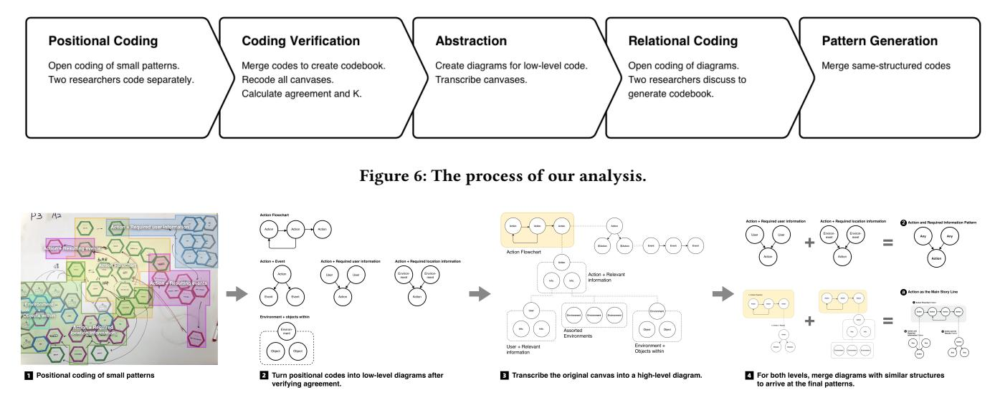
<!-- Image Description: Figure 6 illustrates a five-stage qualitative data analysis process. It begins with positional coding of small patterns by two researchers (1). Coding verification merges these codes, leading to low-level diagrams (2). Abstraction transcribes these into high-level diagrams (3). Relational coding then generates a codebook through discussion (4), and finally, similar diagrams are merged to produce final patterns (4). The figure uses flowcharts, diagrams of coded patterns, and example diagrams at each stage to visually represent the analysis steps. -->

Figure 7: An illustration of the analysis process.

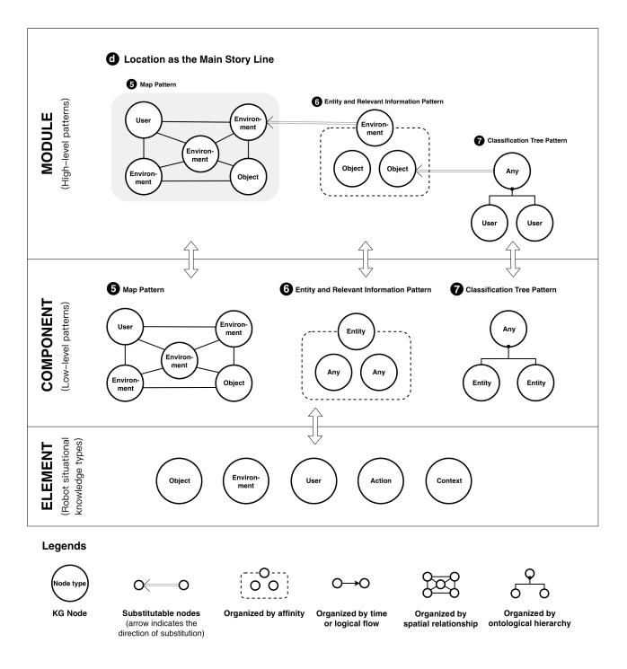
<!-- Image Description: This image presents a framework for representing robot situational knowledge. It uses three levels (Module, Component, Element) showing different knowledge patterns: Map Pattern, Entity and Relevant Information Pattern, and Classification Tree Pattern. Each pattern is diagrammed as a node graph, illustrating relationships between entities like "User," "Environment," and "Object." The lower section defines node types and illustrates different organizational structures within the knowledge graph (e.g., by affinity, time, spatial relationship, ontology). The image visually depicts the hierarchical structure and different knowledge representation schemes within the proposed framework. -->

Figure 8: An excerpt of our pattern library. The component and module layer corresponds to the low-level and highlevel patterns we discuss below. The elements corresponds to ontology groups defned in Table [1.](#page-3-0) The syntax described in the legends are used throughout this paper.

### 4 PATTERN LIBRARY

The pattern library we proposed consists of three parts: element, component, and module. The element part includes all types of the robotic situational knowledge we analyzed in Table [1.](#page-3-0) The

components (low-level patterns) are a typical combination and representation of certain elements. The modules (high-level patterns) are further built upon the components and can be easily applied to an interface. The structure of our pattern library can be seen in Figure [8,](#page-5-2) which is an example of Module d (Location as the Main Story Line).

### 1 Low-level Patterns

Low-level patterns are found as components that make up the whole canvas and mostly communicate a single message. These patterns can be employed when designing interface components that display specifc information. An overview of low-level patterns can be found in Figure [9.](#page-5-3) The following sections provide a detailed description of these patterns.

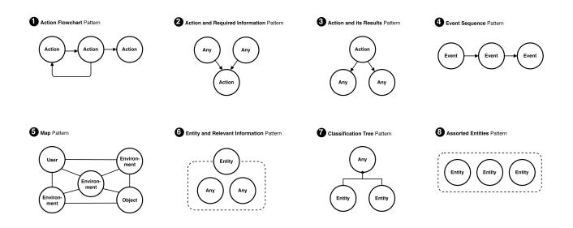
<!-- Image Description: This image displays eight diagrammatic patterns for representing knowledge. Each pattern uses circles and arrows to illustrate relationships: 1) sequential actions; 2) actions requiring information; 3) actions and their results; 4) event sequences; 5) a map of users, environments, and objects; 6) an entity and associated information; 7) a hierarchical classification; and 8) a collection of entities. The patterns are likely used in the paper to define a framework or methodology for knowledge representation or modeling. -->

Figure 9: An overview of low-level patterns in our pattern library. "Any" in a diagram means a node of any type. "Entity" denotes something that physically exist, such as a user, an object, or a location.

1) Action Flowchart: This pattern occurs when the participants want to show the logical fow of a series of actions. The inner structure connecting the actions in this pattern can be sequential, branching, and looping, similar to a fowchart.

Paterns for Representing Situational Robotic Knowledge Graphs CHI '21, May 8–13, 2021, Yokohama, Japan

2) Action and Required Information: This pattern is used to show that the robot used pre-existing knowledge in order to undertake an action. It takes the shape of a central action card connected to its required information. The knowledge type of the required information can be any of the semantic types, including environment, object, and user.

3) Action and Its Results: This pattern is often similar in shape and content as Action and Required Information. However, it is used to show that an action of the robot resulted in the addition of certain new knowledge. A typical example is when the robot recognizes a new agent in its working place. Then it may add the knowledge automatically or by asking the user related.

4) Event Sequence: This pattern is used to show a series of events that happened in chronological order. However, not all events are necessarily shown. Participants often skip events that they deem irrelevant.

5) Map: This pattern is used to showcase a collection of entities (e.g., environment, users, and objects) in their corresponding locations, similar to a real-world map. The pattern occurs when the knowledge communicated is highly related to locations, and there's no apparent order in the knowledge (e.g., time and alphabetical order).

6) Entity and Relevant Information: This pattern is employed to show detailed information about the central entity, which can be any semantic knowledge. A typical example is when a user card is placed. The participant will surround it with relevant information like age and room location.

7) Classifcation Tree: This pattern is typically a tree-like structure, depicting the hierarchical classifcation of a collection of entities of the same type. An example is when a participant is trying to show all the people in an ofce. They used the department information to sort the people into two groups.

8) Assorted Entities: This pattern describes a cluster of entities of the same type, without any specifc order.

### 2 High Level Patterns

High-level patterns communicate a more complex message by combining and re-arranging low-level patterns. These patterns can be employed when designing interface modules for diferent knowledge types and scenarios. Figure [10](#page-6-0) presents an overview of the high-level patterns. Paragraphs below detailed each pattern with description, usage scenario, design considerations.

### 2.1 Action as the Main Story Line.

Pattern description: An Action Flowchart is the most prominent feature of this pattern, used often in combination with Action and Required Information or Action and Its Results to show information that's relevant to each action in the fowchart.

When to use: This pattern is often employed to explain the logical fow of robotic actions or to narrate the process of gathering specifc information. Therefore, it mostly occurs in scenarios where the communicated knowledge is procedural or semantic.

<!-- Image Description: The image is a text string providing contextual information: "CHI 21, May 8–13, 2021, Yokohama, Japan". This likely indicates the location and dates of a conference or similar event (CHI 21) relevant to the paper's subject matter. No diagrams, charts, graphs, or equations are present. The text serves as a reference, possibly for venue details or to link the research to a specific event. -->

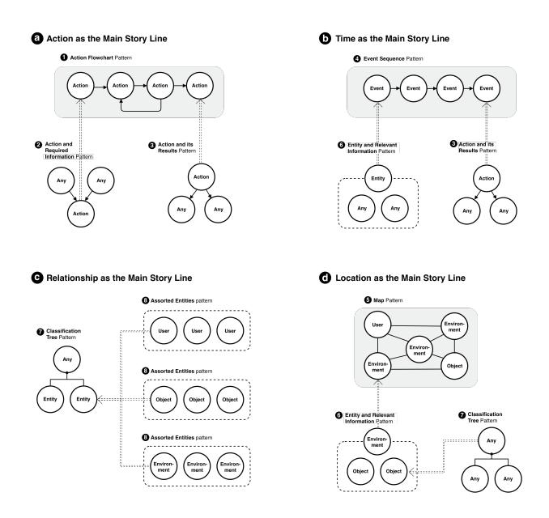
<!-- Image Description: This image presents four diagrammatic models illustrating narrative structure in storytelling. Each model (a-d) uses flowchart-like diagrams and simple node-and-arrow graphs to represent narrative patterns, organized around "Action," "Time," "Relationship," and "Location" as the main story lines. Sub-patterns within each main pattern demonstrate how actions, events, entities, and locations relate, using "Any" nodes to represent unspecified elements. The purpose is to visually represent different narrative structures for analysis and comparison. -->

Figure 10: An overview of high-level patterns in our pattern library. Shaded parts indicate the "main story line" of the high-level pattern.

Design considerations: The action fowchart can be naturally represented on-screen as a fowchart, while relevant information is linked to the actions without afecting the fowchart structure. Participants used various low-level patterns to organize the related semantic information, such as Assorted Entities and Classifcation Tree. The link between the action and the other cards are depicted in various ways, including arrows, lines, or simply with proximity. This suggests that interface designers have a wide range of options when employing this pattern.

In scenarios where mainly procedural knowledge is communicated, some of the participants neglected the semantic cards altogether and chose to present only the actions. Therefore, we suggest that the relevant information be collapsed into the action element in a procedural scenario and remain hidden until the user specifcally asks for details of the action.

### 2.2 Time as the Main Story Line.

Pattern description: This pattern features an Event Sequence as its main component. Other low-level patterns, especially Entity and Relevant Information, can be used to provide context.

When to use: This pattern is most typically found in an episodic scenario, where the robot needs to show the knowledge related to a specifc time in the past.

Design considerations: The Event Sequence can be naturally presented as a timeline. Both horizontal and vertical timelines have been observed during the study. However, no participants tried to show the exact time interval between two events on the timeline, even when such information was given. This suggests that when using this pattern, the ordering of events is essential while the exact timing of events is not. Many participants fnd the naming

of the event elements hard to understand, as they are from the robot's perspective (e.g. "faces detected", "start interacting with user"). Some participants omitted events they deemed irrelevant, especially those without relevant semantic information. This suggests that designers should set rules to flter out irrelevant events to the user and translate the event names to user-friendly language when using this pattern.

### 2.3 Relationship as the Main Story Line.

Pattern description: This pattern features a large collection of semantic information, which is typically sorted into groups using Assorted Entities, or displayed as a Classifcation Tree. Sometimes a mix of the two is used, where part of the knowledge is organized in a tree-shaped structure and others categorized into groups.

When to use: This pattern is often seen in semantic scenarios when the goal is to quickly convey a large amount of inter-related semantic knowledge to the user. A typical example is when the user wants to check the knowledge of a specifc type. An interface that sorts knowledge by type can easily guide the user towards the goal.

Design considerations: The Classifcation Tree can be shown as a collapsible tree. However, the designer may also choose to use hyperlinks between multiple screens to reduce clutter. Meanwhile, Assorted Entities can be represented most naturally as a list or group of elements on-screen.

However, care must be taken when using Assorted Entities. A large number of elements of the same type can easily overwhelm the user. Many participants preferred Classifcation Tree and considered it a natural way to organize information. Some participants used symbols to represent cards frequently linked to and drew these symbols whenever a connection needs to be shown. This method can prove useful in the face of a large number of relations.

### 2.4 Location as the Main Story Line.

Pattern description: This pattern uses a Map as its core, linking other related knowledge to locations in the Map, using the Entity and Relevant Information pattern.

When to use: This pattern is typical in semantic scenarios and occurs when the knowledge to be communicated highly related to the location. Such knowledge includes objects, people, and named locations in space. However, participants also used this pattern when the robot's action involved traveling to multiple locations.

Design considerations: A map of the working environment would be a suitable background when using this pattern. The objects, users, or named locations can be placed on the map accordingly. When using this pattern to describe the robot's action, some participants used an abstract representation of the working environment, placing the locations in a sequence to show the robot's route.

### 5 PROTOTYPING

To ensure our pattern library's applicability, we further investigated how the patterns may be applied by prototyping a service robot. We conducted Wizard-of-Oz testing using our prototype and identifed several design challenges and recommendations by analyzing the questionnaire and interview data.

### 1 Design

We prototyped a service robot that took participants on a guided tour of the lab. The rationale behind choosing this scenario is twofold. First, it is natural for the robot to communicate a large amount of knowledge of all three types (semantic, procedural, and episodic) during a tour. Second, it allowed us to apply real-world data to test the applicability of our patterns.

Three researchers who were not involved in the pattern generation process were provided with the pattern library. They were given limited time (4 hours) to use the patterns to design a series of screens for displaying the necessary knowledge in a specifc scenario. We didn't expect highly complete interfaces since the focus of the design session is to gain frst-hand experience in applying the patterns.

### 2 Implementation

We implemented the Wizard-of-Oz testing system on the Temi robo[t5.](#page-7-0) As shown in Figure [11,](#page-7-1) our system consists of a graph database using Neo4j[6](#page-7-2) for querying the KG, a remote controlling environment using Node-RED[7,](#page-7-3) and an Android application that runs on Temi that receives control commands and displays the UI[8](#page-7-4)

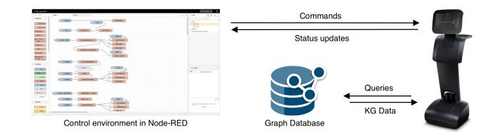
<!-- Image Description: The image depicts a system architecture. A Node-RED control environment (shown as a flow diagram) sends commands and receives status updates from a robot. The system also includes a graph database, which receives queries from the robot and provides knowledge graph (KG) data in return. The diagram illustrates the data flow and interaction between the control environment, the robot, and the graph database. -->

### Figure 11: The Wizard-of-Oz testing system implemented in our study.

We then compiled a knowledge graph dataset according to the types of situational knowledge (Table [1\)](#page-3-0). To test the applicability of our patterns to real-world problems, we curated data of the users, projects, objects, and locations from lab administration documents. We took care to anonymize the data by replacing person and object names.

In the development process, our patterns demonstrated the ability to translate to knowledge graph queries quickly. An example of this is given in Figure [12.](#page-8-0) The designer specifed a task fowchart consisting of task steps and relevant KG nodes. The patterns were then directly translated to the Neo4j query language Cyphe[r9](#page-7-5) to pull the knowledge from the database.

### 3 Testing

Ten participants without expert knowledge of KGs performed in a simulated scenario with six tasks to complete. Participants assumed the role of a new research assistant and were guided by the robot to

[5https://www.robotemi.com](https://www.robotemi.com)

[6https://neo4j.com](https://neo4j.com)

[7http://nodered.org](http://nodered.org)

8Available at <https://github.com/tongji-cdi/temi-woz-frontend> (dataset and UI) and <https://github.com/tongji-cdi/temi-woz-android> (Node-RED remote control and Temi

Android application). [9https://neo4j.com/developer/cypher](https://neo4j.com/developer/cypher)

Paterns for Representing Situational Robotic Knowledge Graphs CHI '21, May 8–13, 2021, Yokohama, Japan

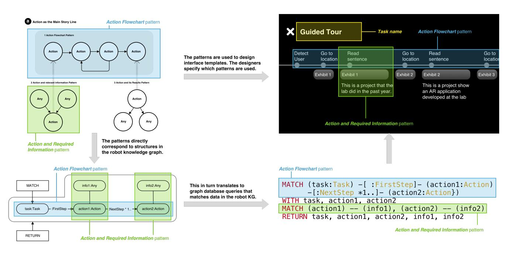
<!-- Image Description: The image presents a technical design for a robot interface using patterns. Three flowcharts illustrate "Action Flowchart" and "Action and Required Information" patterns, showing how these map to a robot knowledge graph. A "Guided Tour" example demonstrates the interface design using these patterns. Finally, Cypher-like query code shows how the patterns translate into graph database queries for robot action execution. -->

Figure 12: Turning patterns into interface design and a Cypher query.

tour the lab. Along the tour, the accompanying researcher gave six tasks to the participant and recorded their completion status. Each task required the participant to look for some information using the interface on the robot's screen. The tasks cover the three scenarios (communicating semantic, procedural, and episodic knowledge) as outlined in Section [3.1.](#page-2-3) Each scenario corresponds to two tasks, one requiring the participant to look for information on the current robot screen, and one requiring browsing the KG to search for the information.

We designed a customized questionnaire based on the User Experience Questionnaire(UEQ) [\[50\]](#page-11-25) as few standard questionnaires target robotic interfaces aimed at communicating knowledge. The customized questionnaire contains four dimensions: usefulness, comprehensibility, perspicuity, and clarity. The questionnaire can be found in the supplementary materials.

Interviews were conducted after participants flled out the questionnaires. We discussed the overall impression of the interface, the efects of the design, obstacles for the task, and their opinions on using screen-based interaction for situational knowledge exchange with the robot. The recordings of the interviews are transcribed for further analysis.

### 4 Results

As seen in Figure [13,](#page-8-1) participants gave an overall positive rating for all four aspects of the interface. This indicates that the patterns were able to support us in designing efective interfaces to communicate situational knowledge. Participants gave high ratings for the clarity of our interface (questions 13-16, [mean=1.58](https://mean=1.58), sd=1.69). Many consider this interface to be useful (question 1, mean = 1.90, sd = .88) and can provide help when using the robot (question 2, mean = 2.00, sd = .94). Participants rate our interface as easy to learn (question 6, mean = 2.10, sd = .99).

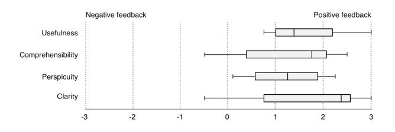
<!-- Image Description: The image displays four box plots comparing the effects of positive and negative feedback on four aspects of user experience: usefulness, comprehensibility, perspicuity, and clarity. Each box plot shows the median, interquartile range, and outliers for user ratings under each feedback type. The purpose is to visually compare user perception scores across different feedback conditions. -->

Figure 13: Questionnaire results from our Wizard-of-Oz testing. Scores range from -3 to 3, with positive numbers indicating a positive rating.

However, scores for comprehensibility and perspicuity is lower. Of note wasthatsome participants gave lowerscoresfor helpfulness in understanding the robot (question 7, [mean=.70](https://mean=.70), sd=1.77). Some also think that the information presented can be confusing (question 12, [mean=.80,](https://mean=.80) sd=1.81). For some participants, it can be hard to fnd the information they want (question 11, [mean=.80](https://mean=.80), sd=1.23).

The reasoning for the scores was discussed in the interviews that followed. In total, we recorded 122 minutes of interview audio. We analyzed the interview results while focusing on the successful and unsuccessful usage of patterns. We further discuss design recommendations generated from the analysis and our work's limitations in the following sections.

### 5 Design Recommendations

Below, we highlight themes found in the interview data, and correlate design recommendations for the patterns in our library.

1) Use user-friendly language when presenting KG data. All participants agreed that the classifcation of robotic knowledge into objects, users, and environment is intuitive. On the other hand, P10 felt uncertain what type of information to look for, and P3 proposed that the naming of knowledge types can be customized.

Therefore, we recommend that when using the Classifcation Tree pattern, naming the groups according to users' habits and customizing name by users can be considered. Moreover, it is advisable to translate robot ontology terms to more user-friendly names before display.

2) Avoid loops in the knowledge graph. Repetitive information can confuse the user. P3 indicated that it feels confusing when entering a loop of often repeated information. They further commented on how it interfered with information retrieval. P8 thought some page jump is cyclic and repeated.This is due to the inherent cyclic structure present in the KG. We recommend to remove cycles when applying the Map pattern, and organize information in a hierarchical fashion using Classifcation Tree.

3) Make it easier to look for information by relationships. Four of the ten participants said the interface hierarchy was too deep. Three of them went back to the ontology list and looked through all nodes of a specifc ontology type without following the relationships in the KG. Participants who found the information by following relationships felt it easier to complete the task than those who did not. Thus we recommend to use Entity and Relevant Information and enable the users to preview the information.

4) Use Classifcation Tree to reduce information overload. Users tend to reduce the complexity of information. P3 thought that the interface has a large amount of information and needed to spend more time to explore; P2 suggested to present less information at the beginning. P5 suggested that the information presented by the interface should be gradually increased according to the user's need. We have two design recommendations. First, Assorted Entities pattern is not applicable with a large amount of information at the same level. We recommend combine Assorted Entities to simplify information by common attributes or concepts. Second, using Classifcation Tree to present information from a large scale to a small scale is also recommended.

### 6 DISCUSSION AND FUTURE WORK

In this work, we described our process of developing a pattern library for designing interfaces to communicate the situational knowledge in service robots. Results from prototyping and analysis focused on three main fndings: the use of design patterns, the challenges of presenting a knowledge graph to non-expert users, and human-robot interaction with a KG interface. These results ofer many future directions for improving the pattern library and designing better interactions for human-robot knowledge exchange.

### 1 Design patterns

During prototyping and testing, the pattern library was shown to aid our design and development process efectively. The patterns can be applied to real-world data, and interfaces designed using the patterns can easily use knowledge graph queries to populate its content. Our design session demonstrated that the patterns enable designersto produce interface designs without knowing the content of the robotic knowledge graph.

Participants also responded favorably to the interface, highlighting its clarity in presenting robotic knowledge. Interviews with them provided us with insights on how to apply the patterns better.

### 2 Challenges of designing a KG interface

Our testing also highlighted challenges thatsurface when designing a KG interface for non-expert users. We identifed several challenges that originate from the knowledge graph structure, its content, and its size.

Participants often experienced confusion when loops occur in the KG structure. The patterns we discovered typically use categorization and trees to organize semantic information, which does not contain loops. This warrants further investigation into how to support efcient exploration of the KG while maintaining a hierarchical abstraction.

The naming of knowledge in the KG presents another challenge when displayed to non-expert users. The ontology of a KG is typically defned to facilitate efective programming without taking understandability into account. Work is being done to defne an ontology that is understandable for non-expert users[\[14\]](#page-10-33). We believe that this is a necessary foundation that enables better human-robot knowledge exchange.

The large amount of knowledge to be communicated poses another challenge. We have discussed how to apply hierarchical patterns to reduce clutter, but designers must also consider the increased depth of the interface.

### 3 Designing better interactions to communicate situational knowledge

Participants suggested various ways to incorporate multimodal interaction when using our interface. Some noted that using an interface is good when the robot is showing a large amount of information. Meanwhile, many participants also noted that it is more natural to use simple voice commands for querying a smaller amount of knowledge. This points toward a future research direction of using multimodal interaction (e.g., voice, gesture, and gaze) combined with a KG interface to enable better communication of situational knowledge.

### 4 Limitations and Future Work

The pattern library that we developed relied on our observations and analysis of twelve participants' knowledge presentation behavior under nine human-robot interaction scenarios. While we carefully mapped out these scenarios to cover as many potential cases as possible and recruited participants from diverse backgrounds, additional scenarios and testing may lead to the discovery of more patterns.

Moreover, the datasets we used are compiled specifcally for the scenarios, which may have overlooked many complexities in realworld robot knowledge graphs. Future work may include building a public, real-world KG dataset. This will enable comparing the performance of patterns and interfaces, as well as promote further research into human-understandable robot knowledge ontology.

In the prototyping session, researchers with less practical knowledge in user interface design were tasked with designing the interfaces. While the participants gave positive feedback, results may be diferent had professional robot interaction and interface designers be employed to conduct the experiment. However, we hypothesize that this would likely improve participant feedback, which does not change our conclusions.

Finally, the pattern library we developed demonstrated its ability to apply to various knowledge communication scenarios. This warrants further research into developing authoring environments that support designers to design and prototype robot knowledge interfaces quickly.

### 7 CONCLUSION

This paper proposes a pattern library that shows how end-users envisioned service robots to organize and visually represent situational knowledge. We then prototyped a service robot based on the patterns and used Wizard-of-Oz testing to generate a series of design recommendations for knowledge-based interface design in robots. Future work would include using the patterns to create more robot interfaces and testing the design in more scenarios. We hope our work can inspire more researchers and interface designers to explore diverse approaches in situational knowledge exchange between humans and robots.

### REFERENCES

- [1] Christopher Alexander. 1977. A pattern language: towns, buildings, construction. Oxford university press.
- [2] Christopher Alexander. 1979. The Timeless Way of Building. Oxford University Press, New York, NY.
- [3] Patricia A. Alexander and Judith E. Judy. 1988. The Interaction of Domain-Specifc and Strategic Knowledge in Academic Performance. Review of Educational Research 58, 4 (1988), 375–404. <https://doi.org/10.3102/00346543058004375>
- [4] Helio Azevedo, José Pedro R. Belo, and Roseli A. F. Romero. 2019. Using Ontology as a Strategy for Modeling the Interface Between the Cognitive and Robotic Systems. Journal of Intelligent & Robotic Systems (Aug. 2019). [https://doi.org/10.](https://doi.org/10.1007/s10846-019-01076-0) [1007/s10846-019-01076-0](https://doi.org/10.1007/s10846-019-01076-0)
- [5] Evan Barba, Anthony Lioon, Christopher Miller, and Yasir Majeed Khan. 2020. Tele-robotic Interface Design in Context: A Case for Recursive Design. In Extended Abstracts of the 2020 CHI Conference on Human Factors in Computing Systems. 1–8.
- [6] Emanuele Bastianelli, Domenico Bloisi, Roberto Capobianco, Guglielmo Gemignani, Luca Iocchi, and Daniele Nardi. 2013. Knowledge representation for robots through human-robot interaction. arXiv preprint arXiv:1307.7351 (2013).
- [7] Barbara Bruno, Carmine Tommaso Recchiuto, Irena Papadopoulos, Alessandro Safotti, Christina Koulouglioti, Roberto Menicatti, Fulvio Mastrogiovanni, Renato Zaccaria, and Antonio Sgorbissa. 2019. Knowledge Representation for Culturally Competent Personal Robots: Requirements, Design Principles, Implementation, and Assessment. International Journal of Social Robotics 11, 3 (June 2019), 515–538. <https://doi.org/10.1007/s12369-019-00519-w>
- [8] Taylor J Carpenter and Wayne W Zachary. 2017. Using context and robothuman communication to resolve unexpected situational conficts. In 2017 IEEE Conference on Cognitive and Computational Aspects of Situation Management (CogSIMA). IEEE, 1–7.
- [9] Doo Soo Chang, Gun Hee Cho, and Yong Suk Choi. 2020. Ontology-based knowledge model for human-robot interactive services. In Proceedings of the 35th Annual ACM Symposium on Applied Computing. 2029–2038.
- [10] Mimi V Chapman, Shiyou Wu, and Meihua Zhu. 2017. What is a picture worth? A primer for coding and interpreting photographic data. Qualitative Social Work 16, 6 (2017), 810–824.
- [11] Jessie YC Chen, Ellen C Haas, and Michael J Barnes. 2007. Human performance issues and user interface design for teleoperated robots. IEEE Transactions on Systems, Man, and Cybernetics, Part C (Applications and Reviews) 37, 6 (2007), 1231–1245.
- [12] Ton de Jong and Monica G.M. Ferguson-Hessler. 1996. Types and qualities of knowledge. Educational Psychologist 31, 2 (1996), 105–113. [https://doi.org/10.](https://doi.org/10.1207/s15326985ep3102_2)
- [1207/s15326985ep3102\\_2](https://doi.org/10.1207/s15326985ep3102_2) [13] James P Diprose, Beryl Plimmer, Bruce A MacDonald, John Hosking, et al. 2012. How people naturally describe robot behaviour. (2012).

- [14] J P Diprose, B Plimmer, B A MacDonald, and J G Hosking. 2012. How People Naturally Describe Robot Behaviour. New Zealand. (2012), 9.
- [15] Rui Fang, Malcolm Doering, and Joyce Y Chai. 2015. Embodied collaborative referring expression generation in situated human-robot interaction. In Proceedings of the Tenth Annual ACM/IEEE International Conference on Human-Robot Interaction. 271–278.
- [16] Aidan Hogan, Eva Blomqvist, Michael Cochez, Claudia d'Amato, Gerard de Melo, Claudio Gutierrez, José Emilio Labra Gayo, Sabrina Kirrane, Sebastian Neumaier, Axel Polleres, et al. 2020. Knowledge graphs. arXiv preprint arXiv:2003.02320 (2020).
- [17] Il Hong Suh, Gi Hyun Lim, Wonil Hwang, Hyowon Suh, Jung-Hwa Choi, and Young-Tack Park. 2007. Ontology-based multi-layered robot knowledge framework (OMRKF) for robot intelligence. In 2007 IEEE/RSJ International Conference on Intelligent Robots and Systems. IEEE, San Diego, CA, USA, 429–436. <https://doi.org/10.1109/IROS.2007.4399082>
- [18] Binal Javia and Philipp Cimiano. 2016. A knowledge-based architecture supporting declarative action representation for manipulation of everyday objects. In Proceedings of the 3rd Workshop on Model-Driven Robot Software Engineering. 40–46.
- [19] Hwawoo Jeon, Kyon-Mo Yang, Sungkee Park, Jongsuk Choi, and Yoonseob Lim. [n.d.]. An Ontology-based Home Care Service Robot for Persons with Dementia. ([n. d.]), 6.
- [20] Meng Jiang. 2020. Improving situational awareness with collective artifcial intelligence over knowledge graphs. In Artifcial Intelligence and Machine Learning for Multi-Domain Operations Applications II, Vol. 11413. International Society for Optics and Photonics, 114130J.
- [21] Kristiina Jokinen, Satoshi Nishimura, Kentaro Watanabe, and Takuichi Nishimura. 2019. Human-robot dialogues for explaining activities. In 9th International Workshop on Spoken Dialogue System Technology. Springer, 239–251.
- [22] Peter H Kahn, Nathan G Freier, Takayuki Kanda, Hiroshi Ishiguro, Jolina H Ruckert, Rachel L Severson, and Shaun K Kane. 2008. Design patterns for sociality in human-robot interaction. In Proceedings of the 3rd ACM/IEEE international conference on Human robot interaction. 97–104.
- [23] Peter H. Kahn, Nathan G. Freier, Takayuki Kanda, Hiroshi Ishiguro, Jolina H. Ruckert, Rachel L. Severson, and Shaun K. Kane. 2008. Design patterns for sociality in human-robot interaction. In Proceedings of the 3rd ACM/IEEE international conference on Human robot interaction (HRI '08). Association for Computing Machinery, New York, NY, USA, 97–104. <https://doi.org/10.1145/1349822.1349836>
- [24] Ajay Kattepur. 2019. RoboPlanner: autonomous robotic action planning via knowledge graph queries. In Proceedings of the 34th ACM/SIGAPP Symposium on Applied Computing. 953–956.
- [25] Casey Kennington and Aprajita Shukla. 2017. A Graphical Digital Personal Assistant that Grounds and Learns Autonomously. In Proceedings of the 5th International Conference on Human Agent Interaction. 353–357.
- [26] Simon Klakegg, Niels van Berkel, Aku Visuri, Hanna-Leena Huttunen, Simo Hosio, Chu Luo, Jorge Goncalves, and Denzil Ferreira. 2017. Designing a contextaware assistive infrastructure for elderly care. In Proceedings of the 2017 ACM International Joint Conference on Pervasive and Ubiquitous Computing and Proceedings of the 2017 ACM International Symposium on Wearable Computers. 563–568.
- [27] Krzysztof Tomasz Konecki. 2011. Visual grounded theory: A methodological outline and examples from empirical work. Revija za sociologiju 41, 2 (2011), 131–160.
- [28] Geert-Jan M. Kruijf, Hendrik Zender, Patric Jensfelt, and Henrik I. Christensen. 2007. Situated Dialogue and Spatial Organization: What, Where. . . and Why? International Journal of Advanced Robotic Systems 4, 1 (March 2007), 16. [https:](https://doi.org/10.5772/5701) [//doi.org/10.5772/5701](https://doi.org/10.5772/5701)
- [29] John E. Laird, Christian Lebiere, and Paul S. Rosenbloom. 2017. A Standard Model of the Mind: Toward a Common Computational Framework across Artifcial Intelligence, Cognitive Science, Neuroscience, and Robotics. AI Magazine 38, 4 (Dec. 2017), 13–26. <https://doi.org/10.1609/aimag.v38i4.2744>
- [30] Séverin Lemaignan, Mathieu Warnier, E Akin Sisbot, Aurélie Clodic, and Rachid Alami. 2017. Artifcial cognition for social human–robot interaction: An implementation. Artifcial Intelligence 247 (2017), 45–69.
- [31] Séverin Lemaignan, Mathieu Warnier, E. Akin Sisbot, Aurélie Clodic, and Rachid Alami. 2017. Artifcial cognition for social human–robot interaction: An implementation. Artifcial Intelligence 247 (June 2017), 45–69. [https://doi.org/10.1016/](https://doi.org/10.1016/j.artint.2016.07.002) [j.artint.2016.07.002](https://doi.org/10.1016/j.artint.2016.07.002)
- [32] Nicola Leonardi, Marco Manca, Fabio Paternò, and Carmen Santoro. 2019. Triggeraction programming for personalising humanoid robot behaviour. In Proceedings of the 2019 CHI Conference on Human Factors in Computing Systems. 1–13.
- [33] Gi Hyun Lim, Il Hong Suh, and Hyowon Suh. 2011. Ontology-Based Unifed Robot Knowledge for Service Robots in Indoor Environments. IEEE Transactions on Systems, Man, and Cybernetics - Part A: Systems and Humans 41, 3 (May 2011), 492–509. <https://doi.org/10.1109/TSMCA.2010.2076404>
- [34] Changsong Liu, Jacob Walker, and Joyce Y Chai. 2010. Ambiguities in spatial language understanding in situated human robot dialogue. In 2010 AAAI Fall Symposium Series.

- [35] Hangxin Liu, Yaofang Zhang, Wenwen Si, Xu Xie, Yixin Zhu, and Song-Chun Zhu. 2018. Interactive robot knowledge patching using augmented reality. In 2018 IEEE International Conference on Robotics and Automation (ICRA). IEEE, 1947–1954.
- [36] Christof Mahieu, Femke Ongenae, Femke De Backere, Pieter Bonte, Filip De Turck, and Pieter Simoens. 2019. Semantics-based platform for context-aware and personalized robot interaction in the internet of robotic things. Journal of Systems and Software 149 (March 2019), 138–157. <https://doi.org/10.1016/j.jss.2018.11.022>
- [37] Patricia Yancey Martin and Barry A Turner. 1986. Grounded theory and organizational research. The journal of applied behavioral science 22, 2 (1986), 141–157.
- [38] Jeremy A Marvel, Shelly Bagchi, Megan Zimmerman, and Brian Antonishek. 2020. Towards Efective Interface Designs for Collaborative HRI in Manufacturing: Metrics and Measures. ACM Transactions on Human-Robot Interaction (THRI) 9, 4 (2020), 1–55.
- [39] Tina Mioch, Wietse Ledegang, Rosie Paulissen, Mark A Neerincx, and Jurriaan van Diggelen. 2014. Interaction design patterns for coherent and re-usable shape specifcations of human-robot collaboration. In Proceedings of the 2014 ACM SIGCHI symposium on Engineering interactive computing systems. 75–83.
- [40] Carlos Nieto-Granda, John G Rogers, Alexander JB Trevor, and Henrik I Christensen. 2010. Semantic map partitioning in indoor environments using regional analysis. In 2010 IEEE/RSJ International Conference on Intelligent Robots and Systems. IEEE, 1451–1456.
- [41] Ozgur S Oguz, Wolfgang Rampeltshammer, Sebastian Paillan, and Dirk Wollherr. 2019. An Ontology for Human-Human Interactions and Learning Interaction Behavior Policies. ACM Transactions on Human-Robot Interaction (THRI) 8, 3 (2019), 1–26.
- [42] Alberto Olivares-Alarcos, Daniel Beßler, Alaa Khamis, Paulo Goncalves, Maki K. Habib, Julita Bermejo-Alonso, Marcos Barreto, Mohammed Diab, Jan Rosell, João Quintas, Joanna Olszewska, Hirenkumar Nakawala, Edison Pignaton, Amelie Gyrard, Stefano Borgo, Guillem Alenyà, Michael Beetz, and Howard Li. 2019. A review and comparison of ontology-based approaches to robot autonomy. The Knowledge Engineering Review 34 (2019), e29. [https://doi.org/10.1017/](https://doi.org/10.1017/S0269888919000237) [S0269888919000237](https://doi.org/10.1017/S0269888919000237)
- [43] Raquel Oliveira, Patrícia Arriaga, Patrícia Alves-Oliveira, Filipa Correia, Sofa Petisca, and Ana Paiva. 2018. Friends or foes? Socioemotional support and gaze behaviors in mixed groups of humans and robots. In Proceedings of the 2018 ACM/IEEE international conference on human-robot interaction. 279–288.
- [44] Stefano Padilla, Thomas S. Methven, David A. Robb, and Mike J. Chantler. 2017. Understanding Concept Maps: A Closer Look at How People Organise Ideas. In Proceedings of the 2017 CHI Conference on Human Factors in Computing Systems. ACM, Denver Colorado USA, 815–827. <https://doi.org/10.1145/3025453.3025977>
- [45] Chris Paxton, Felix Jonathan, Andrew Hundt, Bilge Mutlu, and Gregory D Hager. 2018. Evaluating methods for end-user creation of robot task plans. In 2018

IEEE/RSJ International Conference on Intelligent Robots and Systems (IROS). IEEE, 6086–6092.

- [46] Roy D Pea. 1987. User centered system design: new perspectives on humancomputer interaction. (1987).
- [47] Andrzej Pronobis and Patric Jensfelt. 2012. Large-scale semantic mapping and reasoning with heterogeneous modalities. In 2012 IEEE international conference on robotics and automation. IEEE, 3515–3522.
- [48] Jennifer M Riley, Laura D Strater, Sheryl L Chappell, Erik S Connors, and Mica R Endsley. 2010. Situation awareness in human-robot interaction: Challenges and user interface requirements. Human-Robot Interactions in Future Military Operations (2010), 171–192.
- [49] Allison Sauppé and Bilge Mutlu. 2014. Design patterns for exploring and prototyping human-robot interactions. In Proceedings of the SIGCHI Conference on Human Factors in Computing Systems. 1439–1448.
- [50] Martin Schrepp and Jörg Thomaschewski. 2019. Eine modulare Erweiterung des User Experience Questionnaire. <https://doi.org/10.18420/muc2019-up-0108>
- [51] Ahmed Sefah. 2010. The evolution of design patterns in HCI: from pattern languages to pattern-oriented design. In Proceedings of the 1st International Workshop on Pattern-Driven Engineering of Interactive Computing Systems. 4–9.
- [52] E Akin Sisbot, Raquel Ros, and Rachid Alami. 2011. Situation assessment for human-robot interactive object manipulation. In 2011 RO-MAN. IEEE, 15–20.
- [53] Moritz Tenorth and Michael Beetz. 2013. KnowRob: A knowledge processing infrastructure for cognition-enabled robots. The International Journal of Robotics Research 32, 5 (April 2013), 566–590. <https://doi.org/10.1177/0278364913481635>
- [54] Ilaria Tiddi, Emanuele Bastianelli, Gianluca Bardaro, Mathieu d'Aquin, and Enrico Motta. 2017. An ontology-based approach to improve the accessibility of ROSbased robotic systems. In Proceedings of the Knowledge Capture Conference. 1–8.
- [55] Ilaria Tiddi, Emanuele Bastianelli, Gianluca Bardaro, and Enrico Motta. 2018. A User-friendly Interface to Control ROS Robotic Platforms.. In International Semantic Web Conference (P&D/Industry/BlueSky).
- [56] Elin Anna Topp. 2017. Interaction patterns in human augmented mapping. Advanced Robotics 31, 5 (2017), 258–267.
- [57] Konstantinos Tsiakas, Michalis Papakostas, Michail Theofanidis, Morris Bell, Rada Mihalcea, Shouyi Wang, Mihai Burzo, and Fillia Makedon. 2017. An interactive multisensing framework for personalized human robot collaboration and assistive training using reinforcement learning. In Proceedings of the 10th International Conference on PErvasive Technologies Related to Assistive Environments. 423–427.
- [58] Wayne Zachary, Matthew Johnson, R Hofman, Travis Thomas, Andrew Rosof, and Thomas Santarelli. 2015. A context-based approach to robot-human interaction. Procedia Manufacturing 3 (2015), 1052–1059.
- [59] W Zachary, A Rosof, L Miller, S Read, K Laskey, I Emmons, and P Costa. 2013. Context as cognitive process. In Proc. of.
