LINGFENG ZHONG, Macquarie University, Australia JIA WU, Macquarie University, Australia QIAN LI, Beihang University, China HAO PENG, Beihang University, China XINDONG WU, Hefei University of Technology, China

Automatic knowledge graph construction aims to manufacture structured human knowledge. To this end, much effort has historically been spent extracting informative fact patterns from different data sources. However, more recently, research interest has shifted to acquiring conceptualized structured knowledge beyond informative data. In addition, researchers have also been exploring new ways of handling sophisticated construction tasks in diversified scenarios. Thus, there is a demand for a systematic review of paradigms to organize knowledge structures beyond data-level mentions. To meet this demand, we comprehensively survey more than 300 methods to summarize the latest developments in knowledge graph construction. A knowledge graph is built in three steps: knowledge acquisition, knowledge refinement, and knowledge evolution. The processes of knowledge acquisition are reviewed in detail, including obtaining entities with finegrained types and their conceptual linkages to knowledge graphs; resolving coreferences; and extracting entity relationships in complex scenarios. The survey covers models for knowledge refinement, including knowledge graph completion, and knowledge fusion. Methods to handle knowledge evolution are also systematically presented, including condition knowledge acquisition, condition knowledge graph completion, and knowledge dynamic. We present the paradigms to compare the distinction among these methods along the axis of the data environment, motivation, and architecture. Additionally, we also provide briefs on accessible resources that can help readers to develop practical knowledge graph systems. The survey concludes with discussions on the challenges and possible directions for future exploration.

Additional Key Words and Phrases: knowledge graph, deep learning, information extraction, knowledge graph completion, knowledge fusion, logic reasoning

# ACM Reference Format:

Lingfeng Zhong, Jia Wu, Qian Li, Hao Peng, and Xindong Wu. 2022. A Comprehensive Survey on Automatic Knowledge Graph Construction. ACM Comput. Surv. 36, 4, Article 66 (July 2022), [50](#page-49-0) pages. [https://doi.org/](https://doi.org/0000001.0000001) [0000001.0000001](https://doi.org/0000001.0000001)

## 1 INTRODUCTION

Knowledge graphs (KGs) provide well-organized human knowledge for applications like search engines [\[1\]](#page-36-0), recommendation systems [\[2\]](#page-36-1), and question answering [\[3\]](#page-36-2).

Authors' addresses: Lingfeng Zhong, Macquarie University, Sydney, NSW, Australia, dmiczlf@gmail.com; Jia Wu, Macquarie University, Sydney, NSW, Australia, jia.wu@mq.edu.au; Qian Li, Beihang University, Haidian, Beijing, China, liqian@ act.buaa.edu.cn; Hao Peng, Beihang University, Haidian, Beijing, China, penghao@act.buaa.edu.cn; Xindong Wu, Hefei University of Technology, Hefei, China, uvmxwu@gmail.com.

Permission to make digital or hard copies of all or part of this work for personal or classroom use is granted without fee provided that copies are not made or distributed for profit or commercial advantage and that copies bear this notice and the full citation on the first page. Copyrights for components of this work owned by others than ACM must be honored. Abstracting with credit is permitted. To copy otherwise, or republish, to post on servers or to redistribute to lists, requires prior specific permission and/or a fee. Request permissions from permissions@acm.org.

© 2022 Association for Computing Machinery.

0360-0300/2022/7-ART66 \$15.00

<https://doi.org/0000001.0000001>

66:2 Lingfeng Zhong, et al.

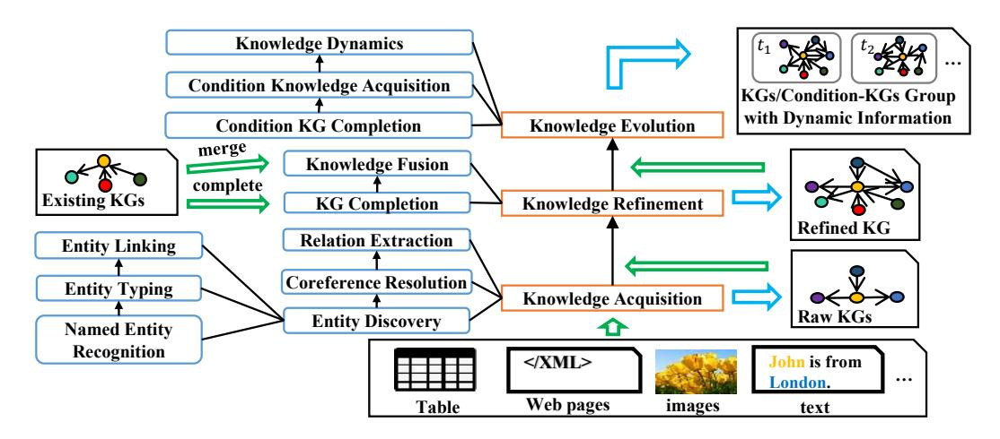
<!-- Image Description: This flowchart depicts a knowledge graph (KG) construction and evolution system. It shows data sources (tables, web pages, images, text) feeding into stages like entity discovery, relation extraction, and KG completion. These stages culminate in KG fusion and refinement, resulting in a refined KG. The process is iterative, with knowledge evolution incorporating dynamic information from multiple KGs over time. The diagram illustrates the system's architecture and data flow. -->

Figure 1. The general process of constructing a knowledge graph. In this diagram, semi-structured or unstructured input data is manufactured into a raw knowledge graph by acquiring knowledge. Then the knowledge will be refined to complete the knowledge graph or enrich it with other existing knowledge graphs. If the input is only an existing knowledge graph, it will be directly handled by the knowledge refinement process. Last, the knowledge evolution process will try to obtain a group of knowledge graphs/conditional knowledge graphs that contains dynamic information about the graph's evolution.

Many of the well-known large KG systems have been constructed through crowd-sourcing, like Freebase [\[4\]](#page-36-3) and Wikidata [\[5\]](#page-36-4). Hence, a systematic solution that can automatically build a knowledge graph from unstructured or semi-structured data offers a massive boost to what is a very arduous manual process for practical purposes.

A knowledge graph is a semantic graph consisting of edges and nodes that depicts knowledge of real-world objects. Within these structures, a knowledge tuple is the minimum knowledge-carrying group. The tuples comprise two nodes representing concepts connected by an edge representing a relationship. Thus, constructing a knowledge graph is the task of discovering the elements that constitute a knowledge graph in a domain-specific or open-domain area. Early in the study of this discipline, researchers were mostly focused on scratching out factual tuples from semi-structured or unstructured textual data as patterned knowledge mentions. Information extraction systems like TextRunner [\[6\]](#page-36-5) and Knowitall [\[7\]](#page-36-6) are the milestones for early knowledge graph construction, driven by designated rules or clustering. Unfortunately, these designs are not sufficiently equipped with background knowledge, and thus suffer from two major defects: 1) insubstantial, traditional information extraction systems do not create or distinguish entities from different expressions, which prevents knowledge aggregation; 2) uninformative, traditional information extraction systems only extract information from syntactic structures without capturing the semantic denotations in the given expressions. Furthermore, conventional rule-based information extraction systems also require heavy feature engineering and extra expert knowledge. Wu et al. [\[8\]](#page-36-7) point out that if a KG system does not organize nodes and edges with background knowledge about concepts, it is merely a data graph.

Regarding this issue, researchers then recourse to well-partitioned acquisition sub-tasks for arranging semantic knowledge structures. The most classic paradigm is the pipeline that first discovers and links conceptual entities, resolves coreference mentions, then extracts relationships among entities. The general procedure of knowledge graph construction is displayed in Fig. [1.](#page-1-0)

More recently, deep learning methods have given rise to tremendous breakthroughs in natural language processing (NLP), and these breakthroughs have fed applications for knowledge graph

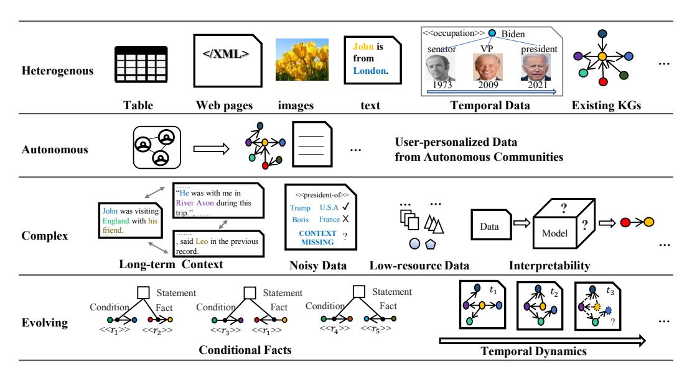
<!-- Image Description: The image displays a flowchart illustrating challenges and approaches in knowledge graph (KG) construction. It shows data heterogeneity (tables, web pages, images, text), autonomous community data integration, complex data with long-term context, noisy and low-resource data, and the need for interpretability. The bottom depicts temporal dynamics within evolving conditional facts and knowledge graphs, including the representation of temporal data using a timeline of Joe Biden's career. The diagram uses icons, text excerpts, and graph structures to represent diverse data types and processing stages. -->

Figure 2. An illustration of the challenges framed by the HACE environments. In terms of heterogeneous data, knowledge graph construction with semi-structured and unstructured data in outlined in Section [4.](#page-9-0) Methods of refining existing knowledge graphs are detailed in Section [5.](#page-24-0) Methods of obtaining temporal data are described in [6.1.](#page-30-0) Section [8.2](#page-34-0) presents a discussion on multi-modal knowledge graphs. In terms of complex data, long-term contexts and their involvement with multiple KG construction tasks are discussed in Sections [4.1.2,](#page-11-0) [4.2,](#page-14-0) [4.3.6.](#page-23-0) Methods for tackling noisy data are mainly presented in Section [4.3.3.](#page-18-0) Model interpretability is covered in Section [5.1.3.](#page-26-0) In terms of evolving data, recent work in knowledge evolution is presented in Section [6,](#page-30-1) and research on autonomous data is discussed in Section [8.5.](#page-35-0)

construction in a range of respects. Numerous deep learning models have delivered good performances with tasks like named entity recognition [\[9\]](#page-36-8)[\[10\]](#page-36-9), entity typing [\[11\]](#page-36-10)[\[12\]](#page-36-11), entity linking [\[13\]](#page-36-12)[\[14\]](#page-37-0), coreference resolution [\[15\]](#page-37-1), relation extraction [\[16\]](#page-37-2)[\[17\]](#page-37-3). Additionally, deep knowledge representation models have also been developed that can refine knowledge graphs. The refinements include completing corrupt tuples, discovering new tuples in a built knowledge graph via its inner graph structure, and merging graphs from different sources to construct new knowledge graphs. At present, many knowledge bases[1](#page-0-0) , such as TransOMCS [\[18\]](#page-37-4), ASER [\[19\]](#page-37-5) and huapu [\[20\]](#page-37-6) have put automatic KG construction methods into practice.

Further, with advances in the pre-training of deep learning models, such as the pre-trained BERT model [\[21\]](#page-37-7) and some of the massive-scale graph convolution network (GCN) models, KG construction tasks are being applied to more complicated scenarios in the big data environment. Beyond systems that deal with heterogeneous data, like web pages and table forms, more attention is being paid to effective methods of tackling complex data – for example, jointly unifying multiple acquisition sub-tasks or solutions that harvest knowledge graphs from long-term contexts [\[22\]](#page-37-8), noisy data [\[23\]](#page-37-9), or low-resource data [\[24\]](#page-37-10).

In terms of knowledge graph refinement tasks, interpretable reasoning has become a prevalent trend. Researchers are seeking solutions that merge cross-lingual knowledge and derive new relationships between nodes through logic and reasoning. Researchers are also focusing on knowledge graphs for conditional knowledge, such as temporal knowledge graphs [\[25\]](#page-37-11) and the generic condition knowledge graphs [\[26\]](#page-37-12). Active learning [\[27\]](#page-37-13), which asks human users about unknown valuable

1Knowledge base (KB) and knowledge graph (KG) are identical terms in this paper.

| | | Topic | KA | | | KGR | | Target Data | | | Resource | | | | |
|-------------------|------|-------------------------------------------------------------|----|---|---|-----|---|-------------|---|---|----------|---|---|---|-----------------------------------------------------------|
| Survey | Year | | | | | | | | | | | | | | Ent Rel CO Cond KGC TKGC KF Web Tab Sent Doc Tool Dataset |
| Our Survey | | 2022 Overall Process of KG Construction in HACE environment | • | • | • | • | • | • | • | • | • | • | • | • | • |
| Paulheim [30] | 2017 | KG Refinement | • | • | - | - | • | - | - | • | • | • | - | - | • |
| Yan et al. [32] | 2018 | KG Application, Construction | • | • | • | - | • | - | - | • | • | • | • | • | • |
| Wu et al. [31] | 2019 | Raw KG Construction | | • | • | - | - | - | - | • | - | • | - | • | • |
| Ji et al. [35] | 2020 | KG Application, Representation, Acquisition | • | • | - | - | • | • | • | - | - | • | - | • | • |
| Arora [36] | 2020 | KG Completion | - | - | - | - | • | - | - | - | - | - | - | - | • |
| Nayak et al. [33] | 2021 | Relation Triples Extraction | • | • | - | - | - | - | - | • | - | • | • | • | • |
| Pawar et al. [34] | 2021 | Joint Extraction of Entities and Relations | • | • | - | - | - | - | - | - | - | • | - | - | • |
| Hogan et al. [29] | 2021 | Overview of KG | • | • | - | - | • | • | - | • | • | • | - | • | • |
| Cai et al. [37] | 2022 | Temporal KG | - | - | - | - | • | • | - | - | - | - | - | - | • |

Table 1. A Comparison between Existing Survey on Knowledge Graph Construction.

\*-:Not covered, •:1-5 references covered, •:6-14 references covered, •: 15+ references covered. \*Ent: Entity, Rel: Relationship, CO: Coreference, Cond: Condition (timestamp or prerequisite). \*Web: Web page, Tab: Table forms, Sent: Sentence, Doc: Textual document.

\*KA: Knowledge Acquisition, KGR: Knowledge Graph Refinement, KF: Knowledge Fusion. \*KGC: Knowledge Graph Completion, TKGC: Temporal Knowledge Graph Completion.

data for collection, is another significant direction for handling knowledge from autonomous communities. Wu et al. [\[28\]](#page-37-23) summarize the challenges facing knowledge discovery in big data environments with the HACE theorem, which is shown in Fig. [2.](#page-2-0)

### 1 Major Differences and Contributions

Many surveys have provided an overview of knowledge graphs and their applications. For example, Hogan et al. [\[29\]](#page-37-21) provided an encyclopedic survey for the knowledge graph, while Paulheim [\[30\]](#page-37-14) looks into methods that refine and fill knowledge graphs. Other surveys summarize methods for acquiring knowledge from unstructured or semi-structured data. Wu et al. [\[31\]](#page-37-16) review competitive tools and models for KG construction sub-task over texts including relation extraction, named entity recognition, and coreference resolution, while Yan et. al [\[32\]](#page-37-15) browse methods for different data types like web pages, table forms, etc. Deep learning approaches for jointly extracting entities with their relationships are reviewed in [\[33\]](#page-37-19), [\[34\]](#page-37-20). Some surveys also focus on acquiring knowledge from existing knowledge graphs. Prior work such as [\[35\]](#page-37-17) and [\[36\]](#page-37-18) also covers the methods for knowledge representation learning and knowledge graph completion, while Cai et al. [\[37\]](#page-37-22) dive into temporal knowledge graphs. Table [1](#page-3-0) compares previous work with this survey.

Unlike other surveys, we go deeper into the paradigms of the recent models for knowledge graph construction, arranging our work according to different stages and aspects of the HACE environments. We also present practical resources and discuss future challenges and directions with data, models, and architectures. Hence, our contributions are summarized as follows:

- We introduce the process of knowledge graph construction and various knowledge graphs by giving formal definitions and classifications. We also summarize necessary information on KG-related resources, including practical knowledge graph projects and construction tools, covering published years, citations, and access links for readers to compare.
- We comprehensively analyze models for knowledge graph construction in different scenarios – from knowledge acquisition to knowledge graph refinement – according to their task backgrounds and challenges. We summarize the motivations and designs of classical and novel models, then primarily delineate the pragmatics in terms of their architectures and improvements.
- We discuss knowledge graph construction in HACE big data environments, including noisy, document-level data and low-resource data. Then we review achievements for acquiring model interpretability and evolutionary condition knowledge. Finally, we summarize the major challenges and directions that impact KG construction tasks.

| Categorization | Project | KG Inclusion | Year | URL |
|-----------------------|---------------------------|-------------------------------------------------------------|------|--------------------------------------------------------------|
| Encyclopedia KG | YAGO | 2B+ facts, 64M+ entities | 2007 | https://yago-knowledge.org |
| | Freebase | 360M+ fact triples | 2007 | https://freebase-easy.cs.uni-freiburg.de/dump/ |
| | DBpedia | 320 classes with 1, 650 different properties, 247M+ triples | 2007 | https://github.com/DBpedia/ |
| | CN-DBpedia | 9M+ entities, 67M+ triples | 2015 | http://kw.fudan.edu.cn/cnDBpedia/download/ |
| | Probase | 5.4M+ concepts | 2010 | https://concept.research.microsoft.com/ |
| | Wikidata | 96M+items | 2012 | https://www.wikidata.org/wiki |
| | CN-Probase | 17M+ entities, 33M+ "is-a" relations | 2017 | http://kw.fudan.edu.cn/apis/cnprobase/ |
| | WordNet | 117 000 synsets | 1985 | https://wordnet.princeton.edu/ |
| | ConceptNet | 34M+ items | 1999 | https://www.conceptnet.io/ |
| Linguistic KG | HowNet | 35, 202 concepts, 2, 196 sememes | 1999 | https://openhownet.thunlp.org/download |
| | Babelnet | 13M nodes | 2010 | http://babelnet.org/rdf/page/ |
| | THUOCL | 157K+ word nodes in 7.3B+ documents | 2016 | http://thuocl.thunlp.org/ |
| | OpenCyc | 2M+ fact triples | 1984 | https://sourceforge.net/projects/opencyc/ |
| Commonsense KG | ASER | 438M+ nodes, 648M+ edges | 2020 | https://github.com/HKUST-KnowComp/ASER |
| | TransOMCS | 18M+ + | 2020 | https://github.com/HKUST-KnowComp/TransOMCS |
| Enterprise support KG | Google Knowledge Graph | 500B+ facts on 5B+ entities | 2012 | https://developers.google.com/knowledge-graph |
| | Facebook Graph Search | dynamic social network of users, User-generated contents | 2013 | https://developers.facebook.com/docs/graph-api/ |
| | Pubmed | 5B+triples | 2000 | http://pubmed.bio2rdf.org/sparql |
| | Drugbank | 14K+ drug entities | 2006 | https://go.drugbank.com/releases/latest |
| Domain-specific KG | AMiner ASN | 2M+ paper nodes, 8M+ citation relations | 2007 | https://www.aminer.cn/aminernetwork |
| | Huapu | 17M+ person nodes | 2017 | https://www.zhonghuapu.com/ |
| | OAG | 369M+ authors, 380M+ papers 92M+ linking relations | 2017 | https://www.aminer.cn/data/?nav=openData#Open-Academic-Graph |
| | TransOMCS | 18M+ + | 2020 | https://github.com/HKUST-KnowComp/TransOMCS |
| | COVID-19 Concepts | 4784 entities, 35172 relation links | 2020 | http://openkg.cn/dataset/covid-19-concept |
| | Aminer COVID-19 Open Data | reports, news, research and other achieves of COVID-19 | 2020 | https://www.aminer.cn/data-covid19/ |
| Federated KG | GEDMatch | 1.2M+ DNA profiles | 2010 | https://www.gedmatch.com/ |
| | OpenKG.cn | 200+ datasets from 94 organizations | 2015 | http://www.openkg.cn |

Table 2. The information of practical KG projects.

### 2 Organization of the Survey

We organize our survey as follows. Section [2](#page-4-0) gives the background for knowledge graph construction, including definitions and resources of KG projects. Section [3](#page-8-0) delivers methods to pre-process semistructured data, including content extraction and structure interpretation. Section [4](#page-9-0) introduces the methods for handling tasks that obtain entities and relationships from various data types and environments. Section [5](#page-24-0) reviews the methods for refining knowledge graphs with external structured data. We portray recent achievements and trends in evolutionary knowledge graphs, including conditional knowledge graphs and temporal knowledge graphs in Section [6.](#page-30-1) Section [7](#page-32-0) delivers solutions that store knowledge graphs effectively. Finally, we envisage future directions and development in Section [8](#page-33-0) while concluding the article in Section [9.](#page-36-13)

### 2 BACKGROUND

### 1 Definitions

Many contributions have been made to formally define knowledge graphs. Wang et al. [\[38\]](#page-37-24) modeled a knowledge graph as a multi-relation graph, where the nodes are entities and the edges represent different types of relationships. However, the previous definition does not consider the semantic structures in a knowledge graph. Ehrlinger and Woß [\[39\]](#page-37-25) further emphasize that a knowledge graph arranges information into an ontology and then enlightens novel knowledge discovery with "a reasoner". To specifically protrude the essence component supporting knowledge-level information, Wu et al. [\[31\]](#page-37-16) define a knowledge graph as a semantic graph where the nodes represent concepts (entities/attributes/facts), and the edges represent relationships that connect the nodes while drawing on background knowledge about the concepts and relations.

Definition 1 (Knowledge Graph). A knowledge graph G is defined as G = {E, R, T, F }, where E and R represent sets of concepts and relations, respectively. In this paper, concepts can be regarded as entities/attributes. T is the set of factual triples, where a standard binary fact is a triple (ℎ, , ) ∈ T, ℎ, ∈ E, ∈ R. An n-ary relation triple will be formed as (1, ..., , ), where 1, ..., ∈ E. F is a set function representing the background knowledge that constrains potential facts to be knowledge-level informative, and we have T ⊂ F ({E, R}). In practice, background knowledge can be seen as a rule set, schema, or set of implicit math principles.

Definition 2 (Knowledge Graph Construction). Knowledge graph construction is a procedure that maps a data source into a knowledge graph: : × () → G, where D is the set of data sources, and () is background knowledge of the data target, which can be domain knowledge. Notably, knowledge graph construction is usually unable to continue without background knowledge that is provided by pre-designed rules or a language model of representations.

### 2 Practical Knowledge Graph Projects

In this section, we review the representative practical projects (datasets) of knowledge graphs, including encyclopedia knowledge graphs, linguistic knowledge graphs, commonsense knowledge graphs, enterprise support knowledge graphs, domain-specific knowledge graphs, and federated knowledge graphs. The details are presented in Table [2.](#page-4-1)

### 2.1 Encyclopedia KGs.

Encyclopedia knowledge graphs systematically cover factual or event knowledge from different domains. Many researchers have developed knowledge graph structures from manually-built online encyclopedias. For example, DBpedia [\[40\]](#page-37-26) (developed from Wikipedia) is a fundamental encyclopedia knowledge graph, while Freebase [\[4\]](#page-36-3) incorporates automatic extraction tools to obtain more content. Probase [\[41\]](#page-37-27) (supported by Microsoft Concept Graph), as an event encyclopedia knowledge graph, creatively depicts knowledge of uncertain events containing conflicting information in the form of probabilistic models. XLore [\[42\]](#page-38-0) (a sub-project of THUKC), as a multi-lingual encyclopedia knowledge graph, establishes entity links across multi-lingual content via deep learning approaches. After an early attempt by the DBpedia project to incorporate automatic extraction tools, more knowledge graph projects decided to do the same, including Wikidata [\[5\]](#page-36-4) and CN-DBpedia [\[43\]](#page-38-1). The Max Planck Institution developed YAGO [\[44\]](#page-38-2), which integrates temporal and geographical structures in Wikipedia with a WordNet ontology. Minz et al. [\[45\]](#page-38-3) applied distance supervision to Freebase for automatically annotating entity relationships. The research community has also been concerned with knowledge graphs of eventualities. For example, CN-Probase [\[46\]](#page-38-4) extends Probase with concepts in Chinese to understand general modes of textual data that involve uncertain occurrences.

### 2.2 Linguistic KGs.

Linguistic knowledge graphs deliver knowledge of the human language to provide basic semantics as ontologies or external features. WordNet [\[47\]](#page-38-5) is a classical widely-used knowledge graph dictionary for linguistic study, providing synonymy or hyponymy relationships among words. With these tools, developers create high-performance word embeddings based on well-built linguistic knowledge graphs for downstream applications. Beyond WordNet , BabelNet [\[48\]](#page-38-6) extends WordNet with cross-lingual attributes and relations of words from encyclopedias. ConceptNet [\[49\]](#page-38-7), as a part of Link Open Data, gathers conceptual knowledge based on crown sourcing, while HowNet [\[50\]](#page-38-8) manually collects sememe information (minimum indivisible semantic units) about word concepts and attributes. THUOCL [\[51\]](#page-38-9) records the document frequency of words from a well-filtered web corpus. Developers have also created high-performance word embeddings based on well-built linguistic knowledge graphs for downstream applications.

### 2.3 Enterprise support KGs.

Knowledge graphs and their related systems have been effectively supporting the business of enterprise activities. Google Knowledge Graph (GKG) [\[53\]](#page-38-10), served as a core function since 2012, delivers knowledge support for user queries and enriches the results with more semantically-related content. Facebook Graph Search [2](#page-0-0) is the powerful semantic search engine of Facebook, providing

2https://developers.facebook.com/docs/graph-api/

| Task | Tool | Year | URL |
|-----------------------|----------------------|------|----------------------------------------------------|
| Data Pre-processing | WebCollector | 2016 | https://github.com/CrawlScript/WebCollector |
| | Web Scraper (v0.4.0) | 2019 | https://webscraper.io/ |
| | NLTK | 2002 | https://www.nltk.org/ |
| | StanfordNLP | 2002 | https://stanfordnlp.github.io/stanfordnlp/ |
| | KnowItAll | 2005 | https://github.com/knowitall |
| | TextRunner | 2007 | https://www.cs.washington.edu/research/textrunner/ |
| | OpenCalais | 2008 | http://www.opencalais.com |
| | ReVerb | 2011 | https://github.com/knowitall/reverb |
| Knowledge Acquisition | OLLIE | 2012 | https://knowitall.github.io/ollie/ |
| | spaCy | 2017 | https://spacy.io/ |
| | TableMiner+ | 2017 | https://github.com/ziqizhang/sti |
| | MantisTable | 2019 | http://mantistable.disco.unimib.it/ |
| | OpenNRE | 2019 | https://github.com/thunlp/OpenNRE |
| | gBuilder | 2021 | http://gbuilder.gstore.cn/ |
| | Falcon-AO | 2008 | http://ws.nju.edu.cn/falcon-ao/ |
| | OpenKE | 2018 | https://github.com/thunlp/OpenKE |
| Knowledge Acquisition | OpenNE | 2019 | https://github.com/thunlp/OpenNE |
| | OpenEA | 2020 | https://github.com/nju-websoft/OpenEA |

Table 3. The infomation of off-the-shelf knowledge graph tools.

user-specific answers through the dynamic knowledge base in the Facebook social system. Similar to GKG, Facebook Graph Search delivers the powerful semantic search engine of Facebook, providing user-specific answers through the dynamic Facebook social knowledge base.

### 2.4 Commonsense KGs.

Commonsense knowledge graphs depict widely-accepted knowledge of common understandings. OpenCyc [\[52\]](#page-38-11) is one of the earliest of these attempts, which encodes knowledge concepts, rules, and common sense ideas in the form of CycL. Besides OpenCyc, ASER [\[19\]](#page-37-5) provides a weighted knowledge graph that describes commonsense by modeling entities of actions, states, events, and relationships among these objects, which acquire its nodes via dependency patterns selection and conceptualized by Probase. TransOMCS [\[18\]](#page-37-4) develops an auto-generated dataset covering 20 commonsense relations obtained from linguistic graphs.

### 2.5 Domain-specific KGs.

Researchers also assemble specific knowledge to serve multiple professional research fields. As for the biomedical field, Pubmed [\[54\]](#page-38-12) provides an open biomedical literature database released by the Pubmed center, while Durgbank [\[55\]](#page-38-13) provides an insight into pharmacology with protein and drug information. Many KG collection efforts are also contributed to fighting against the COVID-19 pandemic, such as the COVID-19 Concept dataset [3](#page-0-0) and Aminer COVID-19 Open Data [4](#page-0-0) . As for academic activities, the Academic Social Network (ASN) of AMiner [\[56\]](#page-38-14) discloses the scholars and their academic activities with the network containing paper and citation relationships. Similarly, Open Academic Graph (OAG) [\[57\]](#page-38-15) delivers integrated academic social networks with paper data. Creatively, Huapu [\[20\]](#page-37-6) builds a high-quality Chinese family book semantic network from digitized thousands of ancestral genealogy books, while providing relationship links between the same people in the different family trees established by fusing multiple Web sources.

### 2.6 Federated KGs.

Privacy protection plays a critical role for knowledge bases with massive user data from different providers, while knowledge communities collecting multi-source KG data possess abundant

3http://openkg.cn/dataset/covid-19-concept

4https://www.aminer.cn/data-covid19/

features, which can be unified to build integrated knowledge models. Federated learning is proposed to combine sub-KG features from different data providers with protection to prevent data exchange. Federation strategies have been applied to KG systems with sensitive data. GEDmatch[5](#page-0-0) is a genealogy KGs collecting user-provided information for enquiring DNA while distributing a federated knowledge model to probe data tracking. Federation strategies have been applied to many knowledge graph systems with sensitive data. These have helped to build integrated knowledge models while preventing data exchange. Researchers have also focused on federated knowledge graph platforms. OpenKG.cn [\[58\]](#page-38-16) is a crowd-sourcing community that provides a knowledgesharing platform to develop knowledge applications with federated learning while supporting the decentralization of knowledge blockchains.

### 3 Knowledge Graph Construction Tools

In this section, we review some of the tools commonly used for knowledge graph construction. These tools mainly support construction sub-tasks, such as pre-processing, knowledge acquisition, and knowledge refinement. The details of these tools are displayed in Table [3.](#page-6-0)

### 3.1 Data Preprocessing.

Data pre-processing tasks remove noise like advertisements. For instance, WebCollector [\[59\]](#page-38-17) is a representative data pre-processing toolkit that automatically filters non-content noise, such as advertisements and layout information, while retaining the page content via integrated algorithms. Many web crawlers also support data preprocessing tasks that extract informative structures or content. Beyond WebCollector, Web Scraper [6](#page-0-0) is a user-friendly manual extraction tool for collecting multiple web pages. It provides a user interface to preserve focused web structures and a cloud server for extracting massive amounts of content.

### 3.2 Knowledge Acquisition.

The early toolkits for knowledge acquisition directly extract fact triples through rules, patterns, and statistical features. These are also known as information extraction toolkits. Beyond KnowItAll [\[7\]](#page-36-6), other toolkits, such as TextRunner [\[6\]](#page-36-5), ReVerb [\[60\]](#page-38-18), leverage semi-supervised designs for collecting relational information. These tools produce refined verbal triples via syntactic and lexical information. In addition, there is OLLIE [\[61\]](#page-38-19) which supports the discover of non-verbal triples.

Many NLP applications can directly perform knowledge acquisition sub-tasks, including named entity recognition, relation extraction, and coreference resolution tasks, or they can provide linguistic features for related applications. NLTK [\[62\]](#page-38-20) and StanfordNLP [\[63\]](#page-38-21) are powerful toolkits for knowledge acquisition based on statistical algorithms like conditional random field and MEM. These tools can also provide background features such as POS tags and NP chunks. Meanwhile, TableMiner+ [\[64\]](#page-38-22) and MantisTable [\[65\]](#page-38-23) extract knowledge from semi-structured table forms.

Recently, developers have been drawn into deep learning-based toolkits. For example, spaCy [\[66\]](#page-38-24) is a comprehensive practical NLP toolkit that integrates NeuralCoref for coreference resolution tasks and also provides a trainable deep learning module for specialized relation extraction (in spaCy v3). OpenNRE [\[67\]](#page-38-25) provides various extensible neural network models such as CNN and LSTM to perform supervised relation extraction. Deep learning toolkits provide high-performance techniques for users. For industrial applications, users can customize their knowledge acquisition solution by OpenCalais [7](#page-0-0) . Further, gBuilder [8](#page-0-0) is a milestone end-to-end solution based on user-selected neural

5https://www.gedmatch.com/

6https://webscraper.io/

7http://www.opencalais.com

8http://gbuilder.gstore.cn/

architectures that also supports an active learning interface for performance optimization. gBuilder can directly output a raw knowledge graph from inputted unstructured data.

### 3.3 Knowledge Refinement.

Knowledge refinement tools refine an existing raw knowledge graph by completing it or merging it with other knowledge graphs. Tools based on deep learning are popular solutions. For example, OpenKE [\[68\]](#page-38-26) provides multiple knowledge representation models for knowledge graph completion, while OpenEA [\[69\]](#page-38-27) leverages similar methods for merging structures in knowledge graphs. Beyond the integrated deep learning toolkits, OpenKE and OpenEA, OpenNE[9](#page-0-0) integrates embedding models such as Node2VEC [\[70\]](#page-38-28) and LINE [\[71\]](#page-39-0) to generate global representations from a complete knowledge graph. In terms of knowledge fusion (merging) tasks, Falcon-AO [\[72\]](#page-39-1) uses multiple algorithms to measure semantic similarity so as to align concepts in different notations.

### 3 SEMI-STRUCTURED DATA PRE-PROCESSING

Real-world raw data sources include multi-structure contents with irrelevant parts impairing the effect of knowledge extraction. Data preprocessing is necessary for handling a messy data environment. Preprocessing sub-tasks mainly include Content Extraction and Structure Interpretation.

### 1 Content Extraction

Many web pages contain non-content noises such as advertisements. Content extraction tasks aim to erase these irrelevant elements while reserving knowledge content. Users can manually select the main part of a web page, e.g., contents enveloped by "<table>", to achieve this goal by web crawlers such as JSoup, BeautifulSoup, and Web Scraper that retrieve and interpret elements in Document Object Model (DOM) structures, then users can select the main part of a web page. However, when the data volume is high, manual work will fail to handle them. Mainstream automatic content extraction methods mainly include wrapper-based methods and statistic-based methods.

Wrapper-based methods are the earliest attempts to detect main contents, leveraging matching rules to capture informative content. Off-the-shelf wrapper tools automatically generating rules from semi-structured pages include IEPAD [\[73\]](#page-39-2), SoftMealy [\[74\]](#page-39-3). Bootstrapping methods iteratively enhance extraction templates with seed examples, such as [\[75\]](#page-39-4) and [\[76\]](#page-39-5). Some toolkits providing user interfaces to optimize extraction templates, such as NoDoSE [\[77\]](#page-39-6) and DEByE [\[78\]](#page-39-7). Templatebased wrappers are easy to understand and achieve feasible results where the page structures are well-formed, but fail to grasp the inner contents covered by intricate novel elements or structures.

Users can also utilize methods based on statistical features of web pages to obtain informative content. Finn et.al [\[79\]](#page-39-8) propose an empirical assumption that an informative sub-sequence in a web page contains sufficient enough words with minimal tags. Many models consider statistical features of web contents for extracting informative content, such as CETR [\[80\]](#page-39-9) (the ratio of text length to tag number), CETD [\[81\]](#page-39-10) (text density in each sub-tree structure of a DOM tree) and CEPR [\[82\]](#page-39-11) (path ratio of Web links). Users can utilize WebCollector [\[59\]](#page-38-17) that integrates the statistic-based models for content extraction. Another heuristic research direction is visual-features-based methods. For example, VIPS [\[83\]](#page-39-12) utilizes the visual appearances (such as fonts and color types) of a page to build a content structure tree for content extraction.

When content extraction has been performed on a semi-structured page, users will acquire a renewed noise-free semi-structured or unstructured document.

9https://github.com/thunlp/OpenNE

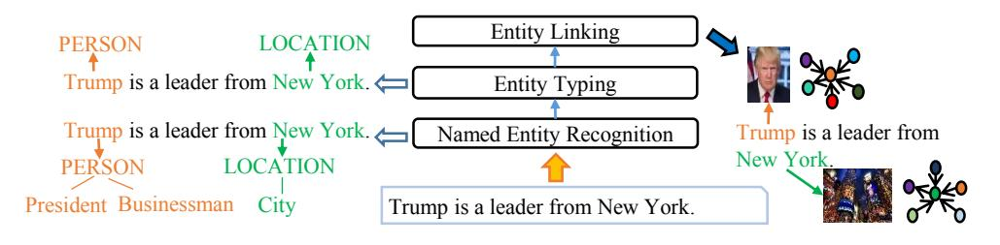
<!-- Image Description: The image illustrates a natural language processing (NLP) pipeline. It shows a sentence ("Trump is a leader from New York.") undergoing three stages: Named Entity Recognition (identifying "Trump" and "New York"), Entity Typing (classifying them as PERSON and LOCATION), and Entity Linking (connecting them to knowledge graph representations, visually shown as nodes and edges). The diagram uses boxes for each NLP stage, arrows indicating the flow of information, and example images for linked entities. -->

Figure 3. The entity discovery process.

### 2 Structure Interpretation

Many table forms in the web pages function as navigators or style-formatted containers for contents (handled by content extractors), comprising no relational structures. Models shall filter these decorative non-relational web table structures before obtaining relational information.

Relational table interpretation is a binary classification task that determines whether a table is informative. Methods analyze semantic features of table structures for classification. Wang and Hu [\[84\]](#page-39-13) design a table classifier integrated with support vector machines (SVM) and decision trees based on the layout and content type features. Similarly, WebTables [\[85\]](#page-39-14) develops a rule-based classifier based on the table size (number of rows and columns) and tags. Eberius et al. [\[86\]](#page-39-15) develop a classification system DWTC via the feature of the table matrixes. Many web tables also contain data noises. OCTOPUS [\[87\]](#page-39-16) further incorporates data cleansing with table classification tasks to filter informative tables.

Developing a table interpretation model includes two steps: first select features in the table forms, then integrate learning models to analyze relational semantics in the data. We recommend readers to refer to [\[88\]](#page-39-17) for more table syntax features and high-performance model ensembles.

### 4 KNOWLEDGE ACQUISITION

Knowledge acquisition is the general process of collecting elements from multi-structured data to build a knowledge graph. It includes entity recognition, coreference resolution, and relation extraction. Entity recognition tasks discover entity mentions within data. Co-reference resolution tasks then locate referred mention pairs, followed by relation extraction tasks, which link entities with their semantic relationships.

### 1 Entity Discovery

Entity discovery acquires a subset of concepts from semi-structured or structured data that can constitute the nodes of a knowledge graph. The general procedure of entity discovery includes named entity recognition, entity typing, and entity linking tasks. Named entity recognition tasks discover strings that refer to semantic entities and then classify them to the general types (e.g., person, location, country, company). Entity typing tasks categorize the found entities into specific types (e.g., actor, artist, brand). Entity linking associates a discovered entity with a possible node in the knowledge graph. If there are no available nodes for linking, a corresponding entity node will be created to represent the newly found entity. Fig. [3](#page-9-1) depicts an overview of the general process.

### 1.1 Named Entity Recognition from semi-structured data vs unstructured data.

Named entity recognition tasks tag named entities in semi-structured or unstructured data with their positions and classifications. Semi-structured data are enveloped by semantic hints related to property-attribute structures, while unstructured data only contains texts.

Rule-based approaches [\[89\]](#page-39-18) are the general solutions for NER. As for semi-structured web data, Wrapper inductions generate rule wrappers to interpret semi-structures such as DOM tree nodes

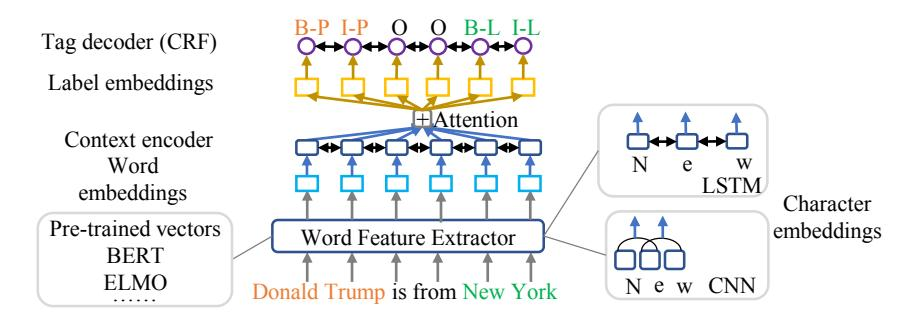
<!-- Image Description: This diagram illustrates a named entity recognition (NER) model architecture. It uses a word feature extractor that incorporates pre-trained vectors (BERT, ELMO) and character embeddings (LSTM and CNN). Contextual word embeddings are fed into an attention mechanism, which interacts with label embeddings before a CRF tag decoder outputs the NER tags (B-P, I-P, O, B-L, I-L). The model processes input text ("Donald Trump is from New York") to identify named entities. -->

Figure 4. Illustration of the standard architecture for deep-learning-based named entity recognition. When a sentence is input, such NER model will output tagged entity words with positional information and rough entity classifications.

and tags for harvesting entities from pages. Some rule-based solutions are unsupervised, which requires no human annotations, such as Omini [\[90\]](#page-39-19). As for entities in table forms, many approaches are proposed based on property-attribute layouts of Wikipedia, such as rule-based tools [\[40\]](#page-37-26)[\[44\]](#page-38-2) for DBpedia, and YAGO. For unstructured data, classic NER systems [\[91\]](#page-39-20) also rely on manuallyconstructed rule sets for pattern matching. Semi-supervised approaches are developed to improve rule-based NER by iteratively generating refined new patterns via pattern seeds and scoring, such as Bootstrapping-based NER [\[92\]](#page-39-21).

Statistic-based approaches treat named entity recognition as a sequential classification tagging task that tags entities according to the BIES scheme (beginning, intermedia, ending, single) and their types. For unstructured named entity recognition, the key hypothesis is that a tag for each word only depends on the previous words. Hence, applications built on hidden Markov models [\[93\]](#page-39-22) and conditional random fields (CRF) models [\[94\]](#page-39-23), which capture neighborhood-dependencies, are popular NER designs. With semi-structured table data, researchers often use CRF variants to tackle the two-dimensional features of the attributes that relate to the entities, such as 2D-CRF [\[95\]](#page-39-24). Thus, they extract multiple attributes of each entity in a 2D structure. Dynamic conditional random field (DCRF) [\[96\]](#page-39-25) infers potential attribute-entity interaction via the dynamic Bayesian network, and hierarchical CRF [\[97\]](#page-39-26) models semi-structured data into a hierarchical tree for joint extraction. Further, Finn and Kushmerick [\[98\]](#page-39-27) developed a model to locate the boundaries of entities in texts which is based on SVM.

Deep learning is also becoming a popular trend in named entity recognition, especially for text named entity recognition. These deep learning approaches typically treat named entity recognition as a seq2seq model (words sequences to label sequences). These models aggregate contextual embeddings according to the input, and context encoders then output word type tags through tag decoders such as a CRF structure or a softmax structure [\[99\]](#page-39-28).

CNN structures mainly focus on local features for capturing entities. Colloabert et al. [\[100\]](#page-39-29) was the first to employ a CNN with a CRF output layer as a unified solution for entity detection. IDCNN et al. [\[101\]](#page-40-0) improved upon the CNN with dilated convolutions that enlarge the perception field by omitting some of the input to enhance generalization.

RNN structures can better digest global contextual features in long sentences, such as the unidirectional RNN for biomedical entity recognition presented in [\[102\]](#page-40-1). However, RNNs may suffer from context bias with later upcoming words [\[9\]](#page-36-8). Hence, many models consider bi-directional RNNs, such as the Bi-LSTM-CRF-based in [\[9\]](#page-36-8) and the GRU-based NER model in [\[103\]](#page-40-2). Combinations of character and word encoders are also widely-applied structures, such as a structure comprising a CNN for character embedding and an LSTM for word embedding [\[10\]](#page-36-9). The standard architecture of deep learning-based NER models is pictured in Fig. [4.](#page-10-0)

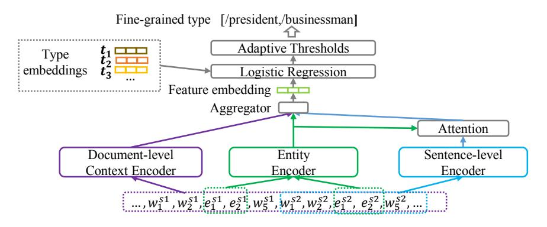
<!-- Image Description: This flowchart depicts a multi-stage model for fine-grained entity typing. It shows input "type embeddings," fed into a logistic regression model with adaptive thresholds. The model incorporates three encoders: document-level context, entity, and sentence-level, which are combined via an aggregator and attention mechanism before final classification. The diagram illustrates the data flow and components of the proposed model architecture. -->

Figure 5. Illustration of deep learning-based entity typing via multi-scale feature extraction (based on [\[111\]](#page-40-3)).

Another direction that projects salient interactions for global contexts is the attention mechanism. Luo et al. [\[104\]](#page-40-4) introduce word-level soft attention to enhance named entity recognition. Gregoric et al. [\[105\]](#page-40-5) employ word-word self-attention for named entity recognition.

Graph convolution networks are often used to handle context in linguistic graph structures for named entity recognition. For example, Cetoli et al. [\[106\]](#page-40-6) proposed a GCN framework that encodes the LSTM-proceed features via GCN structures with a syntactic dependency tree. Pre-trained language models that provide representations as background knowledge for training with named entity recognition tasks have also achieved breakthroughs in named entity recognition. Models include Elmo [\[107\]](#page-40-7), Ltp [\[108\]](#page-40-8), and LUKE [\[109\]](#page-40-9).

### 4.1.2 Entity Typing.

Entity typing (ET) tasks provide fine-grained and ultra-grained type information for entities such as scientists, clubs, and hotels. Information loss occurs if ET tasks are not performed, e.g., Donald Trump is a politician and a businessman. Semi-structured tables provide hints for fine-grained types in the captions. For example, "soccer players in England" suggests soccer players as the entity. However, tagging proper fine-grained entity types in different contexts for unstructured data can be intricate.

Deep learning approaches tackle two main challenges for entity typing: 1) infrequent fine-grain types; and 2) overly-specific typing. Some specific types can be imbalanced or infrequent. For this reason, Shimaoka et al. [\[110\]](#page-40-10) proposed an LSTM-based attentive neural network for infrequent entity typing that relies on hierarchical label encoding integrated with mention and context representations to exploit fine-grained contextual features. Overly-specific type annotations derive correct types but do not fit the current data context. Xu et al. [\[11\]](#page-36-10) applied an out-of-context loss function to the entities with multiple labels for filtering overly-specific data noise which assumed that the type label which scored the highest probability during training was correctly tagged. To further explore context scenarios, Zhang et al. [\[111\]](#page-40-3) introduced document-level representations to provide a global context for discovering entities. Sentence-level contextual representations are then used to align the same entity representations appearing in different sentences. An adaptive probability threshold then generates labels of the entity types in different contexts. Fig. [5](#page-11-1) presents a typical deep learning-based ET model.

Novel embedding-based models avail of combing global graph structure features and background knowledge for predicting potential types of entities via representations. Researchers reported that the classical TransE model acts poorly while directly applied to ET tasks. Moon et al. [\[112\]](#page-40-11) propose the TransE-ET model adjusting the TransE model by optimizing the euclidean distance between entities and their types representations, limited by insufficient entities types and triples

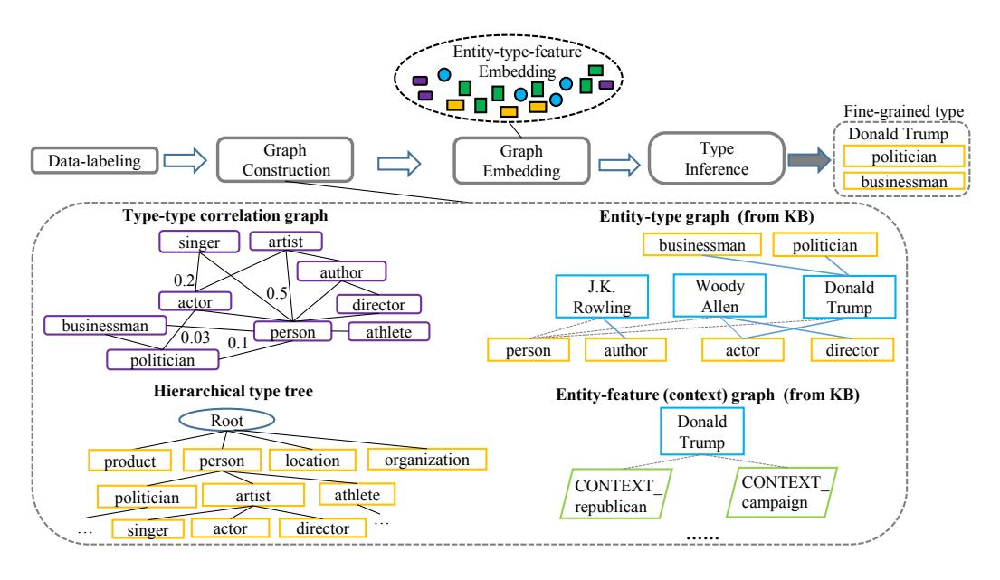
<!-- Image Description: This image depicts a type inference framework. It shows a process flow: data labeling leads to graph construction, followed by graph embedding and type inference. The framework uses three key graphs: a type-type correlation graph showing relationships between types (e.g., actor, author) with correlation scores; a hierarchical type tree; and an entity-type graph from a knowledge base (KB) illustrating entity-type relationships. A final entity-feature graph (from KB) adds context. The purpose is to illustrate the technical pipeline for fine-grained type inference. -->

Figure 6. Illustration of embedding-based ET via heterogeneous graph structures (PTE [\[12\]](#page-36-11)).

features. New solutions aim at constructing various graphs to share diversified features of entityrelated objects for learning embeddings with entity-type features. PTE [\[12\]](#page-36-11) reduces data noise via a partial-label embedding, which constructs a bipartisan graph between entities and all their types while connecting entities nodes to their related extracted text features. Finally, PTE utilizes the background KG by building a type hierarchy tree with the derived correlation weights. JOIE [\[113\]](#page-40-12) embeds entity nodes in the ontology-view graph and instance graphs, gathering entity types by top-k ranking between entity and type candidates. Likewise, ConnectE [\[114\]](#page-40-13) maps entities onto their types and learning knowledge triples embeddings. Practical models improving embeddings on heterogeneous graphs for ET tasks (in Xlore project [\[42\]](#page-38-0)) also include [\[115\]](#page-40-14), [\[116\]](#page-40-15), [\[117\]](#page-40-16). We present graph structures for embedding model-based ET in Fig. [6.](#page-12-0)

### 1.3 Entity Linking from semi-structured data vs unstructured data.

Entity linking (EL) tasks, also called entity disambiguation, link entity mentions to their corresponding objects in a knowledge graph. A textual mention can have different references, e.g., the text "Tesla" may refer to the car, the corporation, or the scientist. Entity linking connects mentions in different data backgrounds with the contextual information of their respective nodes. With semi-structured data, entity linking identifies entities using semantic hints from column heads, type labels, cell texts of tables, and hyperlinks. With unstructured text, entity linking models focus on the contextual representations of entity mentions.

Statistical approaches, especially those approaches based on probabilistic graphs and SVM models, are the general solutions for semi-structured and unstructured data. Models based on probabilistic graphs construct a probabilistic graph of mentions in tables, then link entities by calculating the semantic factors of nodes. Limaye et al. [\[118\]](#page-40-17), for instance, constructed a factor graph for collective entity linking based on the TF-IDF algorithm that calculates the term frequency of entity labels with cell-text pairs and type labels with column-head pairs. Some models incorporate external knowledge bases to improve entity linking tasks. For example, TabEL [\[119\]](#page-40-18) improves its factor graph by leveraging the hyperlinks in Wikipedia to estimate semantic relatedness features before collective classification for disambiguation. Wu et al. [\[120\]](#page-40-19) propose an approach for enhancing entity linking

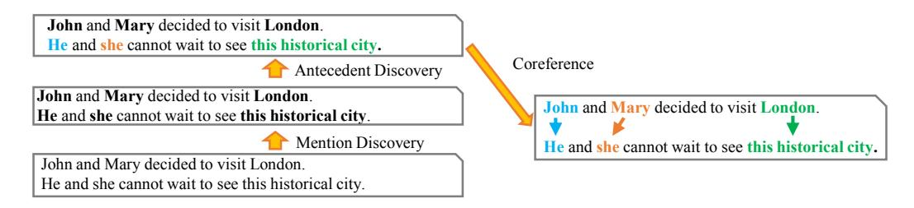
<!-- Image Description: This image illustrates coreference resolution in natural language processing. Three example sentences show "John and Mary" as antecedents and "He and she" as mentions. Arrows indicate the coreference links between the antecedent ("John and Mary") and its mentions ("He and she"). The image distinguishes between "Antecedent Discovery" and "Mention Discovery," showing how the system identifies these elements in text. -->

Figure 7. The coreference resolution process. First, mentions are detected. Then the antecedents of the mentions are selected and matches to co-referred pairs. Noticeably, coreference resolution tasks can be performed on documents with multiple sentences, while handling identical mentions in a compound sentence.

with the "same-as" edges in multiple knowledge bases. Efthymiou et al. [\[121\]](#page-40-20) systematically exploit semantic features for entity linking. Their approach integrates vector representations of an entity's context, minimal entity context, and schematic structures shared between knowledge bases and tables. SVM models treat entity linking as a classification task. Here, Mulwad et al. [\[122\]](#page-40-21) develop a model based on SVMRanker that determines which potential nodes can link to a target entity. Similarly, Guo et al. [\[123\]](#page-40-22) propose a probabilistic model for unstructured data, that leverages the prior probability of an entity, context, and name when performing linking tasks with unstructured data. Han et al. [\[124\]](#page-40-23) employed a reference graph of entities, assuming that entities co-occurring in the same documents should be semantically related.

Embedding-based models are also critical solutions for entity linking via entity embeddings. LIEGE [\[125\]](#page-40-24) derives distribution context representations to links entities for web pages. Early researchers [\[126\]](#page-40-25) leverage Bag-of-word (BoW) for contextual embeddings of entity mentions, then performed clustering to gather linked entity pairs. Later, Lasek et al. [\[127\]](#page-40-26) extend the BoW model with linguistic embeddings for EL tasks. Researchers also focus on Deep representations for high-performance linking. DSRM [\[128\]](#page-40-27) employs a deep neural network to exploit semantic relatedness, combining entity descriptions and relationships with types features to obtain deep entity features for linking. EDKate [\[129\]](#page-40-28) jointly learns low-dimensional embedding of entities and words in the knowledge base and textual data, capturing intrinsic entity-mention features beyond the BoW model. Furthermore, Ganea and Hofmann [\[13\]](#page-36-12) introduce an attention mechanism for joint embedding and passed semantic interaction for disambiguation. Le and Titov [\[14\]](#page-37-0) model the latent relations between mentions in the context for embedding, utilizing mention-wise and relation-wise normalization to score pair-wise coherence score function.

### 1.4 Other Advances.

Few/Zero-shot entity typing is an intricate challenging issue. Ma et al. [\[139\]](#page-41-0) develops Proto-HLE that models the prototype of entity label embeddings for zero-shot fine-grain ET tasks, combining prototypical features with hierarchical type labels for inferring essential features of a new type. Zhang et al. [\[140\]](#page-41-1) further propose MZET that exploits contextual features and word embeddings with a Memory Network to provide semantic side information for few-shot entity typing.

Joint extraction models incorporating NER with EL tasks reduce error propagation of the pipelinebased entity recognition tasks. NEREL [\[141\]](#page-41-2) couples NER and EL tasks by ranking extracted mention-entity pairs to exploit the interaction features between entity mentions and their links. Graphic models are also effective designs to combine NEN (Named Entity Normalization) labels that convert entity mentions into unambiguous forms, e.g., Washington (Person) and Washington (State). Liu et al. [\[142\]](#page-41-3) incorporated EL with NEN tasks utilizing a factor graph model, forming CRF chains for word entity types and their target nodes. Likewise, MINTREE [\[143\]](#page-41-4) introduces a tree-based pair-linking model for collective tasks.

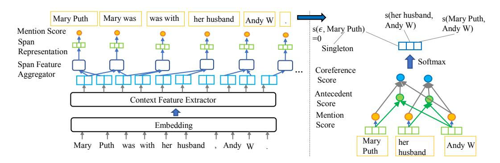
<!-- Image Description: This image depicts a neural network architecture for coreference resolution. The left side shows a pipeline processing text input ("Mary Puth was with her husband, Andy W.") through embedding, context feature extraction, span feature aggregation, and mention scoring. The right side illustrates a coreference scoring mechanism using a softmax layer to determine the relationships between mentions (e.g., "Mary Puth" and "her husband"). The diagram visualizes the flow of information and the model's components in achieving coreference resolution. -->

Figure 8. Architecture of the standard deep end-to-end model (based on [\[15\]](#page-37-1)). A deep learning model performs a two-stage procedure to tackle coreference resolution tasks: 1) Mention detection, which discovers entity mentions as spans from text; 2) Coreference detection, which score the antecedents in the span to match coreference mention pairs as outputs. Spans include combinations of all word sequences. This figure displays simplified results.

Researchers explore more strategies for flexible NER tasks. Transfer Learning shares knowledge between different domains or models. Pan et al. [\[130\]](#page-41-5) propose Transfer Joint Embedding (TJE) to jointly embed output labels and input samples from different domains for blending intrinsic entity features. Lin et al. apply [\[131\]](#page-41-6) a neural network with adaptation layers to transfer parameter features from a model pre-trained on a different domain. Reinforcement Learning (RL) puts NER models to interact with the environment domain through a behavior agency with a reward policy, such as the Markov decision process (MDP-based) model [\[132\]](#page-41-7) and Q-network enhanced model [\[133\]](#page-41-8). Noticeably, researchers [\[134\]](#page-41-9) also leveraged the RL model for noise reduction in distantsupervised NER data. Adversarial Learning generates counterexamples or perturbations to enforce the robustness of NER models, such as DATNet [\[135\]](#page-41-10) imposing perturbations on word representations and counterexamples generators ([\[136\]](#page-41-11), [\[137\]](#page-41-12)). Moreover, Active Learning, which queries users to annotate selected samples, has also been applied for NER. Shen et al. [\[138\]](#page-41-13) incrementally chose the most samples for NER labeling during the training procedures to mitigate the reliance on tagged samples.

### 4.2 Coreference Resolution

Coreference expressions often appear in unstructured text. As such, coreference resolution (CO) tasks detect mentions that refer to the same entities (including aliases and pronouns). A mention will be a singleton if no other mentions refer to it. Given some unstructured sentences, such tasks will output co-referred word span pairs. Fig. [7](#page-13-0) presents this process.

### 2.1 Statistic-based Models.

Early attempts to capture co-referred linguistic objects focused on the statistical features of entities, mentions, and antecedents.

Cluster-based solutions handle the CO task as a pairwise binary classification task (co-referred or not). Early cluster models aim at mention-pair features. Soon et al. [\[148\]](#page-41-14) propose a single-link clustering strategy to detect anaphoric pairs. Recasens et al. [\[149\]](#page-41-15) further develop a mention-pairbased cluster to emanate a coreference chain or a singleton leaf. Later, researchers concentrate on entity-based features to exploit complex anaphoric features. Rahman and Ng [\[150\]](#page-41-16) propose a mention-ranking clustering model to dive into entity characteristics. Stoyanov and Eisner [\[151\]](#page-41-17) develop agglomerative clustering to merge the best clusters with entity features.

66:16 Lingfeng Zhong, et al.

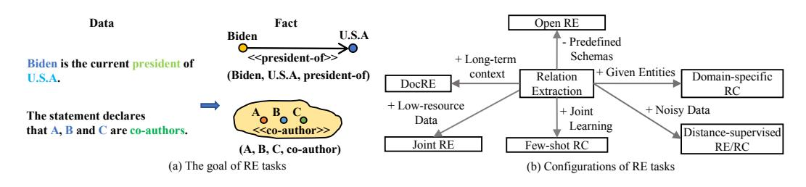
<!-- Image Description: The image presents two diagrams illustrating relation extraction (RE) tasks. (a) shows the goal of RE: transforming text statements into structured knowledge graphs (e.g., "Biden is president of U.S.A." becomes a graph with nodes "Biden," "U.S.A." and an edge labeled "president-of"). (b) diagrams various RE task configurations, including open RE, DocRE, joint RE, and few-shot relation classification, highlighting the use of long-term context, low-resource data, joint learning, given entities, and noisy data in different approaches. -->

Figure 9. Relation extraction. The goal of relation extraction tasks is to extract factual triples from data and find edges to link nodes together. For -ary relations, the link is a super-edge that covers multiple nodes.

Tree-based models and graph-based models are also popular designs for converting coreference resolution into a partition task. These models construct a hypergraph from the given document, in which each edge can link more than two nodes for modeling coreferences among multiple mentions. Cai and Strube [\[144\]](#page-41-18) learn statistical features to weight edges and obtain coreference partitions via clustering algorithms. Sapena et al. [\[145\]](#page-41-19) further employ relaxed labeling to interpret coreferences. Researchers have also simplified graphs for coreference resolution to adapt to tree-based methods. For example, Bean and Riloff [\[146\]](#page-41-20) introduced a decision tree model to distinguish anaphoric mentions combined with context features. Fernandes et al. [\[147\]](#page-41-21) leverage a voted perceptron algorithm to detect mention-pair coreference trees.

### 2.2 Deep Learning-based Models.

Deep learning models automatically convert a document input into word representations to collect features for detecting coreference mention pairs.

Many early models are based on CNNs. Xi et al. [\[152\]](#page-41-22) resolve coreferences by incorporating distant features with hierarchical mention-pair features and also score mention pairs via a softmax layer. Wu et al. [\[153\]](#page-41-23) develop a CO model to effectively handle coreference and singleton expressions with abundant multi-scale contexts, incorporating context feature combinations of antecedents, mentions, and mention pairs features via convolution and concatenation.

RNN and its variants better extract global features between word mention pairs. Wiseman et al. [\[154\]](#page-41-24) propose an RNN-based CO model. Lee et al. [\[15\]](#page-37-1) develop an end-to-end LSTM-based model, detecting internal dependencies within mentions spans to comprehend global contexts that surround the spans. Gu et al. [\[155\]](#page-41-25) apply a cluster modification algorithm to LSTM to rule out dissimilar pairs. Fig. [8](#page-14-1) depicts a standard deep end-to-end CO model.

Attention mechanisms model semantic interactions for CO tasks. A good example of this is the Bi-LSTM structure enhanced with the word-level attention presented in [\[15\]](#page-37-1). However, many different coreference resolution-specific attention mechanisms have been developed to exploit coreference features. These include: the biaffine attention model for CO tasks [\[156\]](#page-41-26) that captures word span interactions for detecting linked expressions; and the mutual attention model [\[157\]](#page-41-27) that incorporates syntactic features with interactive features between dependency structures and antecedents for word spans. Further, Clark and Manning et al. [\[158\]](#page-42-0) employ RL-based strategy to enhance the robustness of their neural CO model, which uses a heuristic policy network to filter out wrong coreference matching actions.

Researchers also focus on embedding-based distribution models over multiple semantic structures to handle coreference resolution. Durrett and Klein [\[159\]](#page-42-1) utilize antecedents representations to enable coreference inference through distribution features. Martschat and Strube [\[160\]](#page-42-2) explore distribution semantics over mention-pairs and tree models to enhance coreference representations, directly picking robust features to optimize the CO task. Chakrabarti et al. [\[161\]](#page-42-3) further employ the MapReduce framework to cover anaphoric entity names through query context similarity.

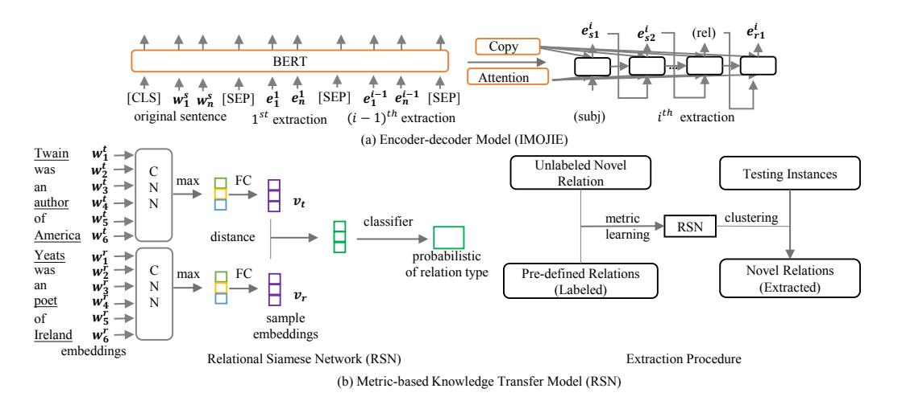
<!-- Image Description: This image from an academic paper presents two models for relation extraction. (a) shows an encoder-decoder model (IMOJIE) using BERT for sentence encoding and attention mechanisms for iterative relation extraction. (b) illustrates a metric-based knowledge transfer model (RSN). RSN uses a relational Siamese network to learn embeddings for relation types, leveraging pre-defined relations to extract novel ones via metric learning and clustering. Both diagrams depict the architecture and workflow of each model, clarifying their technical processes. -->

Figure 10. Two paradigms of deep learning-based open relation extraction. In this figure, (a) shows the IMOJIE model [\[187\]](#page-43-0), which extracts facts via a encoder-decoder design. (b) portrays a model [\[188\]](#page-43-1) that uses the RSN to compare relational patterns, then leverages clustering to collect the relations.

### 3 Relation Extraction

Relation extraction tasks extract relational facts from unstructured or semi-structured data to indicate interactions and properties among entities. Relation extraction, as a downstream task, is often called relation classification. Binary relation extraction extracts relation triples between entity pairs, while n-ary relation extraction obtains relation triples over multiple entities, such as co-authors. Relation extraction endows a knowledge graph with semantic links. Fig. [9](#page-15-0) presents an overview of the relation extraction tasks.

### 3.1 Open Relation Extraction from semi-structured data vs unstructured data.

Open relation extraction tasks discover facts from unstructured data without pre-defined relation types. These techniques detect nominal words (as the subject or object) and verbal phrases (as the predicate) from free text to form knowledge triples like (subject, predicate, object).

Statistical approaches are also trending solutions for open relation extraction. In terms of relation detection, models based on probabilistic-graph are popular designs for allowing contextual information to flow through semi-structured structures or unstructured free text. Mulwad et al. [\[176\]](#page-42-4) put forward a probabilistic graph on semi-structured tables and semantic message passing for tagging relationships. Chen and Cafarella [\[177\]](#page-42-5) leveraged a module based on the CRF structure with a frame finder to tag cells with their location labels (such as left, middle, and right). From this, a hierarchical tree is built where relation triples can be recovered through parent-child structures. Researchers have also applied probabilistic models to relation classification with text. As an example, StatSnowball [\[178\]](#page-42-6) employs Markov logic networks to identity relationships.

Methods focusing rules are the earliest attempts for RE tasks on different data structure kinds, gathering strings that fit in hand-craft templates, e.g., "\$PEOPLE is born in \$LOCATION." refers to (\$PEOPLE, born-in, \$LOCATION). However, these unsupervised strategies rely on complex linguist knowledge to label data. Later, researchers concentrate on automatical pattern discovery for triples mining. Semi-supervision design is an enlightening strategy to reduce hand-craft features and data labeling that uncovers more reliable patterns based on a small group of annotated samples, such as DIPRE [\[179\]](#page-42-7) iteratively extracting patterns with seeds, bootstrapping-based KnowItAll [\[7\]](#page-36-6) and Snowball [\[180\]](#page-42-8) equipping DIPRE with confidence evaluation. Some rule-based models consider

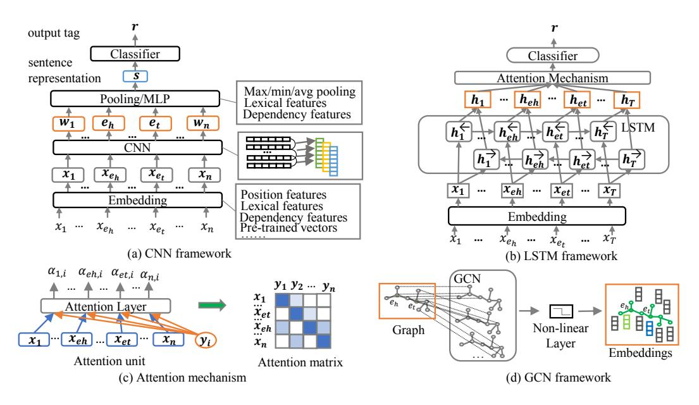
<!-- Image Description: This image displays four neural network architectures for natural language processing. (a) shows a CNN framework with embedding, convolutional layers, pooling, and a classifier. (b) illustrates an LSTM framework, incorporating an attention mechanism before classification. (c) details the attention mechanism using an attention matrix. Finally, (d) presents a GCN framework, processing graph-structured data through a non-linear layer to produce embeddings. Each diagram visually represents a different approach to sentence representation and classification. -->

Figure 11. Some frameworks of classic relation classification models. In this figure, (a), (b), (d) display the architectures of CNNs, LSTMs, GCNs, while (c) displays the structure of the widely-used attention mechanism.

more lexical objects for mining. OLLIE [\[61\]](#page-38-19) incorporates lexical structure patterns with relational dependency paths in texts. MetaPAD [\[181\]](#page-42-9) combines lexical segmentation and synonymous clustering to meta patterns that are sufficiently informative, frequent, and accurate for relational triples. Specifically for semi-structured tables, researchers design table structure-based rules to acquire relationships arranged in rows, columns, and table headers, such as [\[182\]](#page-42-10). Furthermore, Some semi-structured extraction systems utilizing distant supervision tolerate potential errors, which directly query external databases like DBpedia and Wikipedia to acquire relationships for the found entities in tabular data, such as the previous methods [\[122\]](#page-40-21), [\[176\]](#page-42-4), and [\[183\]](#page-42-11). Similarly, Muñoz et al. [\[184\]](#page-42-12) look up the Wikipedia tables for labeling relationships in tabular forms. Krause et al. [\[185\]](#page-42-13) also expand rule sets for relation extraction via distant supervision.

Deep learning models have also been developed to handle open relation extraction. A common framework is an encoder-decoder model designed to acquire factual patterns. CopyAttention [\[186\]](#page-43-2) includes a mechanism to copy words from input to output sequences via a neural bootstrapping strategy. IMOJIE [\[187\]](#page-43-0) improves CopyAttention with BERT-LSTM structures while incorporating an unsupervised aggregation scheme to perform iterative extraction. Another direction in open relation extraction is to transfer supervised knowledge to a model so as to adapt known relations to obtain unsupervised relations. In this vein, Wu et al. [\[188\]](#page-43-1) developed a metric learning-based solution that combines Relation Siamese Net (RSN) with the clustering strategy to discover new facts. Two deep learning paradigms are illustrated in Fig. [10.](#page-16-0)

### 3.2 Domain-specific Relation Classification from unstructured sentence-level data.

Given unstructured sentences with conceptual (entities) mentions, domain-specific relation classification tasks label the given mentions with relation tags in a pre-defined relation set given the context of the sentences. Kernel methods and deep learning frameworks typically handle relation classification as a multi-label single-class classification task.

SVM kernel-based methods employ the feature vectors of words to train a classifier for supervised relation classification tasks on unstructured text. These models map specific semantic objects onto Table 4. Comparison of designs of classical and recent sentence-level RC models (arranged in terms of publication year in each category).

| Category | Model | Architecture | Background Information | | |
|-----------------------------|-------------------------------------|------------------------------------------------------------|-----------------------------------------------------------------------|--|--|
| | CNN [165] Multi-kernel CNN [166] | CNN + max pooling multi-kernel CNN + max pooling | WordNet hypernyms, position features Position embeddings | | |
| Local context-aware | Attention-CNN [168] | CNN + word-level attention + MLP | Pre-trained word-vectors, position embeddings, WordNet, POS | | |
| | Multi-level Attention [169] | word-level input attention + CNN + attention-based pooling | Pre-trained word-vectors, position embeddings | | |
| Global context-aware models | BiLSTM + Att [17] | BiLSTM + word-level attention | Pre-trained word-vectors | | |
| | TreeLSTM [167] | BiTreeLSTM + compound label embedding | SPTree, WordNet, position embeddings | | |
| | EPGNN [170] | BERT + CNN (sentence encoder)/GCN (topological encoder) | Pre-defined entity pair graph, pre-trained model, position embeddings | | |
| Graph context-aware models | AGGCN [171] | GCN + Multi-head Attention + DC + FF | pre-trained word-vectors, position features, dependency graph | | |
| | RIFRE [172] | BERT + HGCN | pre-trained model | | |
| Task conversion-based | QA [173] | BERT + Span Prediction Model | Converted questions/answers, pre-trained model | | |

a feature space via a kernel function for classification, such as with a lexical-kernel based SVM (with POS and entity tags) [\[162\]](#page-42-23), a dependency-tree-kernel based SVM [\[163\]](#page-42-24), or a shallow-parsetree-kernel based SVM [\[164\]](#page-42-25). However, a high-performance kernel function can be hard to design.

Deep learning-based frameworks automatically collect entity-related contextual information for relation classification tasks. Given a sentence that needs its relations classified {1, 2, ℎ, ..., , }, let ℎ and stand for head and tail entities, respectively. Deep learning models will generate a representation for each word: {w1, ..., eℎ, ..., e , x}, then the feature extractor will derive a vector r to indicate the probability of each relation type. Models based on convolution, such as a feature-based CNN combined [\[165\]](#page-42-14) with lexical features and a max-pooling strategy, focus on local contexts in neighborhood words. Nguyen and Grishman [\[166\]](#page-42-15) use multiscale convolution windows to enhance local feature aggregation. Some studies focus on global context awareness between sentences using an LSTM framework that captures long-distance reliances. Zhou et al. [\[17\]](#page-37-3) use a BiLSTM that employs inter-word attention to capture the long-distance dependencies of relations, while Miwa and Bansal [\[167\]](#page-42-18) incorporate tree structures into an LSTM framework. Many designs have also incorporated global context features into CNN structure via attention mechanisms to model salient interactions, such as Attention-CNN [\[168\]](#page-42-16) selecting entity-relevant contexts with the word-level attention and Multi-level CNN [\[169\]](#page-42-17) developing an input attention mechanism with attention-based pooling. Some of the more recent studies have explored graph-level contexts via GCNs and extracting background knowledge via pre-trained models. Examples of this approach include EPGNN [\[170\]](#page-42-19), which includes an entity pair graph for a GCN (with a pre-trained BERT model), AGGCN [\[171\]](#page-42-20), which integrates a multi-head attention mechanism for graph convolution and RIFRE [\[172\]](#page-42-21), which further employs a heterogeneous graph network to merge high-order features. Cohen et al. [\[173\]](#page-42-22) converted relation classification into a question-answering task and incorporated BERT embeddings for classification. Fig. [11](#page-17-0) depicts some of the classic frameworks of relation classification models and Table [4](#page-18-1) compares key design aspects of the popular models.

Some tasks require a model to handle n-ary relationships between multiple entities. To this end, semantic role labeling solutions have been devised to decompose n-ary relations into binary ones. Examples include NNF [\[174\]](#page-42-26) and dependency path embedding [\[175\]](#page-42-27).

### 4.3.3 Distant Supervised Relation Extraction/Classification.

Fully-supervised relation extraction/classification on large datasets will generally require a formidable amount of laborious label tagging. To cope with this problem, Mintz et al. [\[45\]](#page-38-3) developed a distant supervision strategy for automatically annotating relation labels with an external knowledge base (Freebase in the original work). The strategy assumes that entity pairs appearing in different sentences reflect the same relationships that link them in the knowledge base. However, distant supervision does not fully consider the data context, hence, inevitably suffers from noise.

Data noise hampers relation classification tasks in traditional models. Some methods try to overcome this problem by enhancing the feature extractors, e.g., piecewise convolution (PCNN) [\[16\]](#page-37-2). This approach divides a sentence into three separate pieces for convolution according to

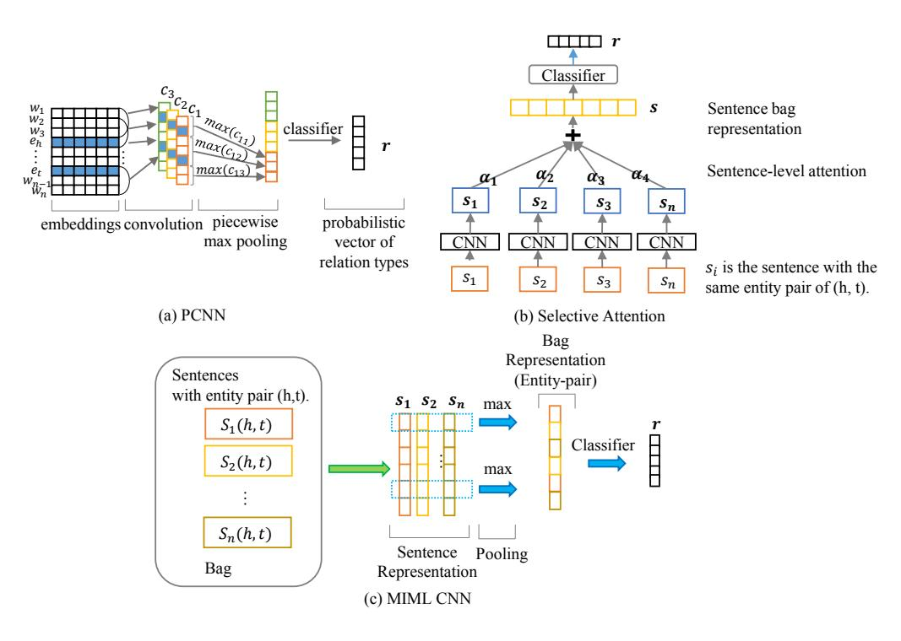
<!-- Image Description: This figure illustrates three neural network architectures for relation classification. (a) PCNN uses convolutional layers followed by piecewise max pooling to generate a probabilistic vector of relation types. (b) Selective Attention applies CNNs to individual sentences, weighting their outputs based on a sentence-level attention mechanism. (c) MIML CNN pools sentence representations for the same entity pair using max pooling before classification. Each subfigure depicts the network's processing steps from input to output. -->

Figure 12. Milestone models for distant supervision.

entities to preserve critical contextual features. See also Fig. [12\(](#page-19-0)a). Hierarchical attention mechanism [\[189\]](#page-43-3) models long-tail labels to enhance decoder features. Some models involve improved learning strategies designed to promote robustness to noise. Transition matrix structure [\[190\]](#page-43-4) learns incorrect patterns to prevent noise. Huang et al. [\[191\]](#page-43-5) adapt collaborative learning to handle the interaction contexts, while Qin et al. [\[192\]](#page-43-6) leverage reinforcement learning to remove wrongly-labeled samples. Further, DSGAN [\[193\]](#page-43-7) picks reliable samples for training via adversarial learning.

More recently, efforts have focused on designing instance selector structures to compare reliable features of instances in sample bags. For instance, Riedel et al. [\[23\]](#page-37-9) developed the "at-least-one" hypothesis for multi-instance multi-label Learning (MIML). The hypothesis holds that at least one of the samples containing the same entity pairs will express the given distantly-supervised relation (i.e., the sample is correct). Based on that, selective attention [\[196\]](#page-43-8) presents a classic design that groups sentences labeled with the same relation tags. See also Fig. [12\(](#page-19-0)b). MIML CNN [\[194\]](#page-43-9) uses a CNN to proceed with each sentence bag, then leverages a cross-sentence pooling operation to derive an entity-pair representation for multi-label relation modeling. See Fig. [12\(](#page-19-0)c). Ji et al. [\[195\]](#page-43-10) combine entity descriptions to enhance the MIML CNN. Another direction for implementing instance-level feature extraction is instance-level attention mechanisms. The contribution of each sentence representation is then scored across different groups with the same relation tags. Last, an attention-weighted contextual representation is generated for each relation type. Many models extend this idea with MIML designs. One example is Intra/Inter-Bag Attention [\[197\]](#page-43-11). This method captures the sentence features of inner relations and outer bag-relation interactions via compound attention mechanisms and cross-relation attention [\[198\]](#page-43-12), where Baye's rule is used to acquire the global similarities of bags of different relation types. The main goal of devising an instance selector is to emphasize instructive features in correct samples while muting dummy features in wrong-labeled data.

| Category | Model | Architecture | Background Information | | |
|----------------------------------|-----------------------------------------------------------------------------|----------------------------------------------------------------|-----------------------------------------|--|--|
| | PCNN [16] | PCNN + pooling | position embeddings | | |
| Enhanced feature extractor-based | TM [190] | PCNN + Transition matrix + Bag embedding | position embeddings | | |
| | HAtt [189] | CNN/PCNN + hierarchical attention | position embeddings, relation hierarchy | | |
| | RL-based [192] | RL-based data redistributor + CNN/PCNN + Result-driven reward | position embeddings | | |
| Enhanced learning strategy-based | DSGAN [193] | GAN + CNN/PCNN + Attention | position embeddings | | |
| | CCL-CT [191] | CNN/PCNN + [Net Att + Self Att] + CCL-CT | position embeddings | | |
| | Lin et al.[196] CNN/PCNN + selective attention + max-pooling | | position embeddings | | |
| Instance feature-based | MIML CNN [194] | CNN (sentence) + Cross-sentence max-pooling | position embeddings | | |
| | Ye et al. [197] CNN/PCNN + Intra/inner bag attention | | pre-trained model | | |
| | Yuan et al. [198] | PCNN (Sentence) + Cross-relation Cross-bag Selective Attention | position embeddings | | |
| | MIML CNN + ED [195] | description embeddings + MIML CNN + | entity description, position embeddings | | |
| Background information-enhanced | RESIDE [200] | Bi-GRU (sentence) + Syntactic GCNN | Dependency graph, external KB | | |
| | Zhang et al. [199] CNN/PCNN (sentence) + GCN + Knowledge-aware attention | | external KG, position embeddings | | |

| | | Table 5. Comparison of popular models for distant supervision relation extraction/relation classification. | |
|--|--|------------------------------------------------------------------------------------------------------------|--|
| | | | |

Deep learning approaches also consider external knowledge to improve distance supervised relation extraction, such as incorporating the knowledge graph embeddings of entities into models [\[199\]](#page-43-14). RESIDE [\[200\]](#page-43-13) further uses a syntactic graph with side information for GCN-based representations. We compare these popular achievements in Table [5.](#page-20-0)

### 3.4 Few-shot Relation Classification.

Low-resource scenarios, specifically, few-shot and zero-shot relation classification, require a deep learning model to learn from a few examples. Few/Zero-shot Learning, also called meta-learning, only fuels a few samples to drive DL models, specifically, few-shot, zero-shot learning. Few-shot learning feeds a support data set in the N-way K-shot form that provides K instances for each relation type of the general N ways (N\*K samples in total) and predicts data labels in the query set based on the given support set. Ulteriorly, Zero-shot learning follows the above form, but query sets contain unseen sample labels that do not appear in the support sets. It is noticeable that in the big data environment, the long-tail phenomenon exists in knowledge bases where the majority of knowledge types express with few samples. [\[201\]](#page-43-15) Meta-learning configurations commonly appear in various sub-tasks of knowledge acquisition and knowledge refinement. Generally, researchers have tried to amplify the usable characteristics of these low-resource configurations through three methods: metric-learning, meta-learning, and domain adaptation.

Meta-learning enhances optimizers by reserving conveyable meta-information from limited supervision. Model-agnostic machine learning (MAML) [\[208\]](#page-43-16) improves batch learning through a two-stage multiple gradient descent. Here, the model is trained to estimate the gradients of each relation type before all the sample types undergo general optimization with the estimations. Task-sensitive meta-information of respective relation types is hoarded in partial gradient values. Gradient estimation through separate backpropagation is also applied by other models. MetaNet [\[209\]](#page-43-17) utilizes the fast-slow mechanism to obtain high-order implicit relational meta-features of samples and the specific task. Both the meta learner and the base learner contain a group of slow weights and fast weights for optimization. Another critical problem is catastrophic forgetting. To deal with this issue, Wu et al. [\[210\]](#page-43-18) developed a curriculum-meta learning strategy that reviews samples in order and preserves the learned features in a memory mechanism.

Metric learning aims at finding metric spaces with which to compare different relation types. To determine the relation types in a query sample, ProtoNet [\[202\]](#page-43-19), for example, averages the embeddings of each relation type in a support set as a prototypical support vector. LM-ProtoNet [\[203\]](#page-43-20) exploits the fine-grained features of relational context to build support vectors, concatenating phrase embeddings with sentence embeddings induced by a CNN. Noises in low-resource samples attract impertinent meta-features, reducing the robustness of deep learning models. Gao et al. [\[204\]](#page-43-21) combine feature-level attention with instance-level attention to emphasize reliable prototypical features. Furthermore, Matching Network [\[205\]](#page-43-22) presents an attention-based embedding strategy for

66:22 Lingfeng Zhong, et al.

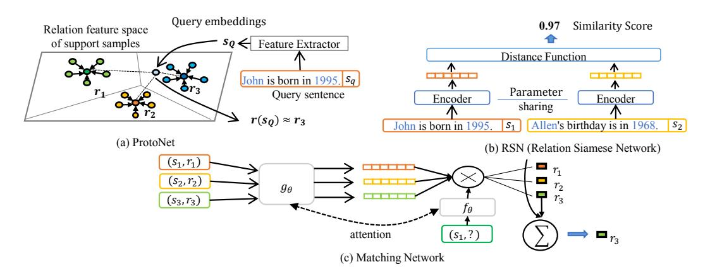
<!-- Image Description: This image displays three neural network architectures for relation extraction. (a) shows ProtoNet, visualizing a query embedding's proximity to support samples in a feature space. (b) illustrates a Relation Siamese Network (RSN), using shared encoders and a distance function to compare sentence embeddings, achieving a 0.97 similarity score. (c) depicts a Matching Network, where a function *gθ* processes support set embeddings ((S₁,r₁), (S₂,r₂), (S₃,r₃)) and applies attention to output a query embedding. Each diagram illustrates a different approach to relation classification. -->

Figure 13. The metric-based few-shot relation classification models. In this figure, (a) shows ProtoNet [\[202\]](#page-43-19), which compares the distances of a query sample among support vectors of different relation types. (b) shows RSN [\[206\]](#page-43-23), which calculates the similarity of sample pairs. (c) shows Matching Network [\[205\]](#page-43-22), which uses an attention mechanism to tag a query by matching it with different-tagged support samples.

classification, calculating the attention scores of the query sample for each support sample through vector multiplication. RSN [\[206\]](#page-43-23) compares the similarity of the sample embeddings. Another approach, called multi-Level matching and aggregation network (MLMAN) [\[207\]](#page-43-24), aggregates the local and instance features by aggregating the support vectors with the query vector to match the correct long-tail class label for the query sample. Fig. [13](#page-21-0) outlines the classic metric-based paradigms.

Few-shot RC designs also consider feature augmentation strategies to mitigate data deficiency with intriguing model designs and background knowledge. Similar to [\[173\]](#page-42-22), Levy et al. [\[211\]](#page-43-25) turn zero-shot RC into a reading comprehension problem to comprehend unseen labels by a template converter. Soares et al. [\[212\]](#page-43-26) compose a compound relation representation for each sentence by the BERT contextualized embeddings of entity pairs and the corresponding sentence. GCNs also deliver extra graph-level features for few-shot learning. Satorras and Estrach [\[213\]](#page-43-27) propose a novel GCN framework to determine the relation tag of a query sample by calculating the similarity between nodes. Moreover, Qu et al. [\[214\]](#page-44-0) employ posterior distribution for prototypical vectors. Some designs also avail semi-supervised data augmentation based on metric learning. The previous Neural Snowball [\[206\]](#page-43-23) (based on RSN) labels the query set via the Siamese network while drawing a similar sample candidate from external distant-supervised sample sets to enrich the support set.

Few-shot domain adaptation maps unseen labels for classification. BERT-PAIR pairs with domain adaptation strategies for unseen "none-of-the-above" types. Gao et al. [\[215\]](#page-44-1) discuss domain adaptation for few-shot relation classification as a game process for searching domain-invariant features. They implement domain adaptation via adversarial training. More domain adaptation strategies for few-shot relation classification can be found in [\[24\]](#page-37-10).

### 3.5 Joint Relation Extraction Models.

Conventional pipeline-based relation extraction (relation classification) models suffer from error propagation in each stage, while also undermining inter-task interactions. Early researchers concentrate on intriguing statistical-based features for fast end-to-end joint relation extraction, such as Integer Linear Programming-based (ILP) algorithm [\[216\]](#page-44-2) solving entities and relations via conditional probabilistic model, semi-Markov chain model [\[217\]](#page-44-3) jointly decoding global-level relation features, and Markov Logic Networks (MLN) [\[218\]](#page-44-4) modeling joint logic rules of entity labels and relationships. Early attempts deliver prototypes of entity-relationship interactions. However, statistical patterns are not explicit for intricate contexts. The recourse for researchers has been

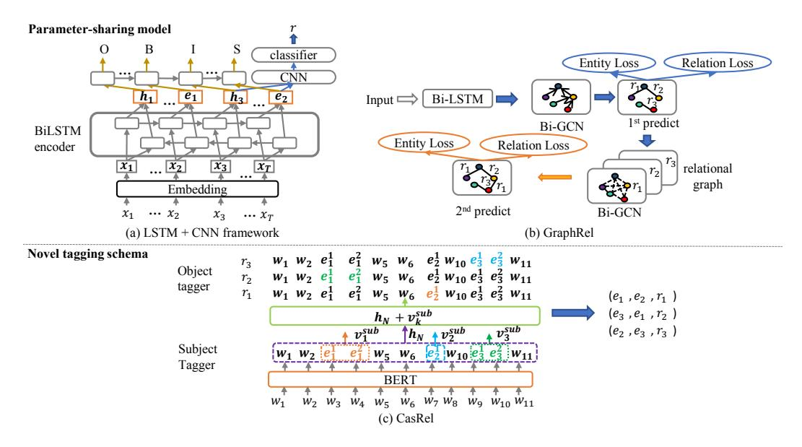
<!-- Image Description: This image from an academic paper illustrates three neural network architectures for relation extraction. (a) shows an LSTM + CNN framework with parameter sharing, processing input sequences to generate entity and relation representations. (b) depicts GraphRel, using Bi-LSTM and Bi-GCN layers to iteratively refine relational graph representations, minimizing entity and relation losses. (c) presents CasRel, a BERT-based model using a novel tagging scheme for improved relation classification by combining BERT embeddings with object and subject taggers. -->

Figure 14. The joint extraction model paradigms. (a) depicts [\[219\]](#page-44-5), (b) depicts [\[220\]](#page-44-6) and (c) depicts [\[222\]](#page-44-7).

to turn to joint extraction models, with the mainstream high-performance designs focusing on parameter-sharing strategies and novel tagging schemas.

Parameter-sharing strategies merge neural architectures for various types of tasks. They share weights and use different output layers to fetch entities that have relationships. Zheng et al. [\[219\]](#page-44-5) merge double BiLSTM layers for NER and RC tasks to share parameters, then use a CNN and an LSTM Network to label relationships and entities respectively. Miwa and Bansal [\[167\]](#page-42-18) also integrate the dependency features associated with NER and RC with a combination of a Bi-LSTM and a Bi-TreeLSTM layer. Some models focus on delicate strategies for distributing cross-task characteristics. The GraphRel model [\[220\]](#page-44-6), for example, intuitively leverages two-phase supervision to dedicate cross-task interaction through two respective BiGCN layers. The GCN frameworks incorporates a dependency graph with a relation-entity graph for exploiting deep features.

To handle overlapping labels, novel tagging schemes set joint decoding targets for the output layers with compound labeling. Zheng et al. [\[221\]](#page-44-8) extend BIES labels with the relationship types and roles of a word (e.g., the subject or object of a sentence) to develop a sequence tagging task comprising named entity recognition and relation classification. Wei et al. [\[222\]](#page-44-7) intuitively label all object candidates of a subject entity via a cascade map function for each relation type to contain overlapping mentions. Further, Wang et al. [\[223\]](#page-44-9) developed a hand-shaking scheme to alleviate exposure bias within overlapping entities. Bekoulis et al. [\[224\]](#page-44-10) devised a multi-head selection mechanism to explore all entity/relation combinations. Li et al. [\[225\]](#page-44-11) turned entity-relation tagging into a multi-turn question answering problem, leveraging the machine reading comprehensive (MRC) model for long-range semantics between entities. Unlike previous schemes, KGGen [\[226\]](#page-44-12) directly generates triples via an encoder-decoder/generator structure based on a pre-trained model combined with adversarial learning, which overcomes feature reliance on entity co-occurrence information. Fig. [14](#page-22-0) shows some seminal joint extraction models.

Novel distribution embedding-based models are also proposed to model the cross-task distributions to bridge the semantic gaps between NER and RC. Ren et al. [\[227\]](#page-44-13) propose a knowledgeenhanced distribution CoType model for joint extraction Task. In this model, entity pairs are firstly mapped onto their mentions in the knowledge base, then tagged with entity types and all relation

| Category | Model | Word Encoder | Long-context Encoder | Inference | Cross-sentence Feature |
|---------------------------|------------------------|---------------|----------------------------|------------------------------------|---------------------------------------------|
| Statistic Graph-based | Graph LSTM[229] | Embedding | Graph-LSTM | Softmax | Root-linked cross-sentence dependency tree |
| | Graph-state LSTM [230] | FFN | Graph-state LSTM | Softmax | Root-linked cross-sentence dependency tree |
| | AGGCN [171] | LSTM | GCN + Multi-head Attention | DC + softmax | Root-linked cross-sentence dependency tree |
| | Sahu et al. [231] | embeddings | GCN | MIL-based | Coreference/Adjacent sentence edges |
| Dynamic Graph-based Model | GP-GNNs [233] | Bi-LSTM | GCNs | MLP + softmax | Inter-node graph with generated parameters |
| | EoG [232] | BiLSTM | GCNN | Node-feature aggregation + softmax | Sentence-mention-entity pair graph |
| | GraphRel [220] | BiLSTM | BiGCN | Threshold-based | Relation-weighted graph |
| | DyGIE [238] | ELmo + BiLSTM | GCN + Span enumeration | FFN | Dynamic span graph |
| | LSR [234] | BiLSTM/BERT | GCN | FFN + GCN + DC | Weighted dependency graphs |
| | GAIN [236] | LSTM | GCN | FFN + Attention | hMG + EG |
| | Xu et al. [235] | BiLSTM | AGGCN [171] | LSTM + softmax | Reconstructed hetergenous S-M-E graph [232] |
| | DRN [239] | BiLSTM | GAIN [236] | Aggregation + MLP | Hetergenous document-level meta-paths |
| | RARE [237] | BERT | R-GCN | MLP + softmax | Rationale graph, pre-trained model |
| Others | ATLOP [242] | BERT | Localized Context Pooling | Group bilinear | Pre-train model |
| | U-Net [241] | BERT | 2D-Conv | Matrix-based | Feature visualization |

Table 6. Comparison of model designs for document-level relation extraction (arranged in terms of publication year in each category).

candidates provided by the knowledge base. This model learns embeddings of relation mentions with contextualized lexical and syntax features while training embeddings of the entity mentions with their types, then the contextual relation mention will be derived by its head and tail entities embeddings via Translation embedding (TranE) [\[228\]](#page-44-25) model. The CoType model assumes interactive cooccurrence between entities and their relation labels, filling the distribution discrepancy with knowledge from the external domain and extra type features. Noticeably, this model also effectively prevents noises in distant-supervised datasets. However, feature engineering and extra KBs are also needed.

### 4.3.6 Document-level Relation Extraction.

Entities in a document can express relationships via complex cross-sentence contexts, which defeats most of the traditional sentence-level context encoders. Novel architectures have therefore been conceived to capture document-level contexts.

Intra-sentence semantic passages are critical to document-level extraction. As such, researchers initially developed variants of an LSTM fitting graph structure to handle long-term dependencies, such as Graph LSTM [\[229\]](#page-44-14) and Graph-state LSTM [\[230\]](#page-44-15). More recently, however, researchers have been focusing on GCN-based models to explore diverse linguistic features with novel cross-sentence graph structures. Many approaches handle inter-sentence semantic contexts using static document graphs. For instance, for -ary relation extraction, AGGCN [\[171\]](#page-42-20) links the roots of dependency trees of adjacent sentences via attention-guided GCN layers, which also overcomes the reliance on semantic role labeling. Sahu et al. [\[231\]](#page-44-16) introduce coreference edges and adjacent word edges to form a homogeneous document graph. Christopoulou et al. [\[232\]](#page-44-18) employ mention/sentence/entity (M, S, E) nodes to create a heterogeneous semantic graph distinguishing various linguistic roles, while reasoning via the EoG interference layer using the above intermedia node structures.

Researchers then developed dynamic document graph models for high-order reasoning. Many models leverage dynamic edges. GP-GNNs [\[233\]](#page-44-17) deduces hidden semantic logic with dynamic edge weights in a fully-connected graph for reasoning. LSR [\[234\]](#page-44-20) regards graph structures as a latent variable to iteratively refine links and weights for constituting logical features from contexts. Xu et al. [\[235\]](#page-44-22) considers reconstructing dependency paths to reweight relational entity pairs. GraphRel [\[220\]](#page-44-6) jointly extracts entities and relationships via a two-stage procedure that incorporates static dependencies with dynamic relation-weighted graphs to enhance multi-hop reasoning. Some models also consider feature extraction with multiple graphs. For example, Zeng et al. [\[236\]](#page-44-21) designed a heterogeneous mention-level graph with an entity-level graph for multi-hop inference.

Another direction for document-level relation extraction is reasoning with evidence. Zhang et al. [\[237\]](#page-44-24) develop a rationale graph with external tagged co-occurrence evidence features for capturing long-term relational dependencies. Dynamic graphs with alterable nodes have also been considered

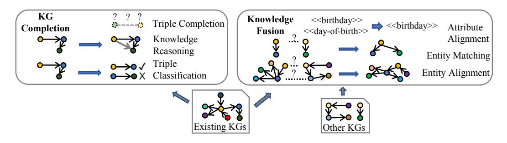
<!-- Image Description: The image illustrates a two-stage knowledge graph (KG) integration process. The left side depicts KG completion, showing knowledge reasoning and triple classification to infer missing links. The right side shows knowledge fusion, using attribute and entity alignment techniques to merge information from multiple KGs. Small diagrams represent KGs, with arrows indicating relationships and the integration steps. The bottom diagrams show input ("Existing KGs" and "Other KGs") and an integrated KG as output. -->

Figure 15. Illustration of knowledge refinement.

within the realms of complex reasoning. DyGIE [\[238\]](#page-44-19) prunes mute low-confident entity spans nodes through gate mechanisms for document-level feature exploitation. Other approaches seek to understand the common sense rules implicit in the different contexts. Discriminative reasoning network (DRN) [\[239\]](#page-44-23) recognizes common-sense relationships while performing intra-sentence reasoning through heterogeneous graph representation features. The method is based on the assumption that multi-scale contexts with syntactic structures contain distinguishable commonsense features. Background common-sense features can also be acquired from pre-trained models like COMET [\[240\]](#page-44-26). However, understanding how common sense is expressed over contexts and how it unfolds in human logic remains challenging.

U-Net [\[241\]](#page-45-1) employs a U-shaped segmentation for document-level reasoning via a multilayer convolution. Further, it treats a document as visual semantic information. ATLOP [\[242\]](#page-45-0) introduces localized context pooling to distill the entity-relevant features of BERTs while using an adaptive threshold for decoding reliable relations. This technique does not rely on graph structures. We compare the designs of the typical milestone models in Table [6.](#page-23-1)

## 5 KNOWLEDGE GRAPH REFINEMENT FROM STRUCTURED DATA

Raw knowledge graphs constructed from unstructured or semi-structured data can be sparse, and the knowledge triples can be incomplete or corrupted. Knowledge graph refinement repairs these problems through background semantics or by populating knowledge triples with additional knowledge graphs (structured data). The sub-tasks of knowledge graph refinement include knowledge graph completion and knowledge fusion. The general procedure is shown in Fig. [15.](#page-24-1)

## 1 Knowledge Graph Completion

Knowledge graph completion fills in incomplete triples while deriving new triples from completed ones. In terms of completed triples, knowledge graph completion evaluates the accountability of each triple through triple classification. By accountability, we mean the correctness of the triples.

## 1.1 Embedding-based Triple Completion.

An embedding-based link prediction model leverages distribution representations to search for elements that can fill missing parts formulated as (h, ?, t) or (?, r, t) (entity prediction), and (h, ?, t) (relation prediction). For example, the TransE-based model [\[112\]](#page-40-11) searches the head entity h, the tail entity t, and the relation r, whose representations approach h + r = t to complete a triple. Later, researchers discovered that the previous symmetrical TransE model does not consider one-to-many relationships. Focus then turned to importing hyperspace structures with distance-based translation models for link prediction, such as TransR [\[243\]](#page-45-2), TransH [\[244\]](#page-45-3), and TranSparse [\[245\]](#page-45-4). Some models, such as RESCAL [\[246\]](#page-45-5), TuckerER [\[247\]](#page-45-6), DistMult [\[248\]](#page-45-7) and NTN [\[249\]](#page-45-8), consider matching entity pair representations to a latent relational semantic space for predictions with large graphs.

More recently, researchers have focused on semantic knowledge structures. HAKE [\[250\]](#page-45-9), for instance, uses the polar coordinate system to model semantic hierarchies in knowledge graphs, like hypernyms, hyponyms, and the apposition of an entity's ontological associations, which differentiate various-layered entity vectors by mold and angle constraints. CAKE [\[251\]](#page-45-10) boosts negative sampling with common sense rules. Many models, such as SimKGC [\[252\]](#page-45-11) and HaLE [\[253\]](#page-45-12), optimize negative sampling for low-dimension embeddings via contrastive learning. CAFE [\[254\]](#page-45-13) introduces a neighborhood sub-graph feature set to enhance relevant link information. Further, there has been interest in decomposing the semantic constituents of knowledge representations with the sub-structures of knowledge graphs via semantic diffusion mechanisms of GCNs. DisenKGAT [\[255\]](#page-45-14) discerns the high-order neighbor node features of a knowledge graph by disentangling the representation components into distinct semantics implied in the sub-graph structures. The hypothesis behind these models is that a large knowledge graph should contain sufficient subsets that can be reduced into k components to reason about linked entity nodes.

## 1.2 Relation Path Reasoning.

Relation path reasoning deduces new facts through completed triple sequences as support evidence, such as "(B, lives-in, Seattle)← (A, works-in, Microsoft), (Microsoft, located-in, Seattle)".

Early attempts develop random-walk models for relation path reasoning that infer relational logic paths in a latent variable logic graphic model. Path-Ranking Algorithm (PRA) [\[256\]](#page-45-15) generates a feature matrix to sample potential relation paths. However, the feature sparsity in the graph impedes random walk approaches. Semantic enrichment strategies are proposed to mitigate this bottleneck, such as inducing vector space similarity [\[257\]](#page-45-16) and clustering associated relations [\[258\]](#page-45-17).

Later, researchers model the relation path reasoning tasks as a Markov decision process so as to recognize logical constraints within the knowledge environment. Deep reinforcement learning achieves this idea by learning a policy agent that assesses each selection step and expands the reasoning path. DeepPath [\[259\]](#page-45-18) models the state space as (pre-trained) translation-based representations of entities and their induced relations. The taken actions then find the best matching relation labels via the feature space of entity pairs. Rewards for actions are calculated by a binary function. However, low-quality evaluations by the binary reward function will mean a RL-based model that is not well generalized to handling incomplete knowledge structures [\[260\]](#page-45-19). To this end, Lin et al. [\[260\]](#page-45-19) devised a soft reward shaping function based on the vector spaces of relations and entities, while Li et al. [\[261\]](#page-45-20) employ multiple agents to select entity pairs and relations. M-Walk [\[262\]](#page-45-21) leverages an RNN to capture chronological state dependencies among pathing decisions.

More designs leverage neural networks that capture global features to find reasonable paths. Path-RNN [\[263\]](#page-45-22) recursively aggregates relation path features for multi-hop reasoning. The chainsof-reason model [\[264\]](#page-45-23) enhances a path-RNN with attention mechanisms to emphasize multiple-path dependencies with type information in the entities. Chen et al. [\[265\]](#page-45-24) unify path-reasoning and path-finding tasks via variational encoding.

Some methods further focus on attention mechanisms to augment features for reinforcement learning. ADRL [\[266\]](#page-45-25) leverages a self-attention mechanism to emphasize neighborhood entityrelation interaction features. Similarly, Wang et al. [\[267\]](#page-45-26) introduce a graph attention mechanism to enhance knowledge features. Recent research interest has been drawn into incorporating neural structures that handle intricate semantic features, such as Zheng et al.'s hierarchical policy network [\[268\]](#page-46-0) and DAPath [\[269\]](#page-46-1), which incorporates a distant-aware mechanism to issue rewards via path length features. MemoryPath [\[270\]](#page-46-2) is an attention-based memory component that preserves knowledge features for reinforcement learning and alleviates the model's reliance on pre-trained embeddings.

Many efforts also focus on automatically mine logic rules to pave reasoning paths. There are methods for rule discovering, such as AMIE [\[271\]](#page-46-3), RLvLR [\[272\]](#page-46-4) and RuleN [\[273\]](#page-46-5). Instead of searching for promising relation path patterns approaching the symbolic essence of knowledge, the rule mining approaches extract and prune logic rules from a reasonable KG structure, then perform link prediction via the collected rule templates. However, unseen knowledge paths cannot be easily derived by logical rules in incomplete graphs.

Another research direction is to fuel logic rules into neural models to boost path reasoning. KALE [\[274\]](#page-46-6) jointly embeds first-order logic rules with knowledge embedding to enhance relation inference. RUGE [\[275\]](#page-46-7) iteratively rectifies KG embeddings via learned soft rules, then performs relation path reasoning. Logic rules are also leveraged as the side semantic information into neural models. NeuralLP [\[276\]](#page-46-8) proposes a neural framework that encodes logic rule structures into vectorized embeddings with an attention mechanism. pLogicNet [\[277\]](#page-46-9) introduce the Markov logic network to model uncertain rules for reasoning. ExpressGNN [\[278\]](#page-46-10) further employs GCNN to solve neighborhood graphic semantics with logic rules. These rule-based neural models are also regarded as the application of differentiable learning availing for gradient-based optimization algorithms on logic programming.

### 5.1.3 Interpretable Relation Reasoning.

Interpretability serves to make a machine learning model understandable to human users [\[279\]](#page-46-11), and this plays a critical role in assessing a model's reliability and ability to respond to different data environments. Interpretation models include self-explained pre-hoc models and inspectable post-hoc models.

Pre-hoc reasoning models that comprise transparent decision processes can be self-interpreted through their inner structures by introspection. Logic rule-mining approaches such as AMIE [\[271\]](#page-46-3) and RLvLR [\[272\]](#page-46-4) can feed back the logic rules to explain linkage decisions to users. Some models only contain some components that are interpretable to humans (e.g., the learned rules). Users can observe these learned rules as side information when reasoning with rule-finding approaches based on neural models such as NeuralLP [\[276\]](#page-46-8), pLogicNet [\[277\]](#page-46-9) and ExpressGNN [\[278\]](#page-46-10). However, these neural networks are still black-boxed. Mainstream partial pre-hoc models also include models based on random-walk (probabilistic values for potential paths), reinforcement learning (reward values for each action), and attention (attention score for salient correlation).

Post-hoc interpretation methods develop proxies to probe into implicit features in black-box models like matrices and neural network frameworks. Some proxies extract rules or learn a probabilistic distribution to reproduce a model. Carmona et al. [\[280\]](#page-46-12) train Bayesian networks with first-order logic to extract rules from embedding models. OXKBC [\[281\]](#page-46-13) generates plausible explanation paths through the similarities between relationships and entities. Model simplification cannot decompose the features of non-linear neural models that are entwined. One solution is to conduct a sensitivity analysis to exploit the deep features. The analysis would involve imposing small perturbations on the models so as to observe how the output changes. These changes reveal the influential features. GNNExplainer [\[282\]](#page-46-14) explores sub-graph structures that affect single-instance and multi-instance predictions. CRIAGE [\[283\]](#page-46-15) generates false facts to evaluate model performance and to locate obtrusive fact triples for each relation.

### 1.4 Triple Classification.

Triple classification aims to distinguish triples with surety from abnormal (untrue) triples in a knowledge graph. Many semantic models are designed for this task of judging suspicious triples in a knowledge graph that is constantly updated with novel relation types and facts.

Negative triple samples give knowledge representation models expressiveness to judge disordered triples. CKRL [\[284\]](#page-46-16), for example, includes an index system for determining reliable triples, including local triple confidence, which compares the distance between a triple and a negative sample; global path confidence, which tests the global resources of the reasoning paths that form a triple; and adaptive path confidence, which scores a local reasoning path deriving a triple.

However, many potentially reasonable triples are not covered due to insufficient negative sampling – specifically, one-to-many relations [\[35\]](#page-37-17). Hence, researchers have leveraged more sophisticated semantic structures to alleviate this issue. In this vein, Dong et al. [\[285\]](#page-46-17) expand entity embeddings into n-ball structures that are leveraged to incorporate fine-grained type chains as a way to classify triples. Amador-Domínguez et al. [\[286\]](#page-46-18) add ontological information to enhance model-agnostic expressiveness. Some models focus on advanced neural network embeddings to detect credible triples. For example, R-MeN [\[287\]](#page-46-19) captures latent dependencies among triples by employing a multi-head attention mechanism that generates memory-based embeddings.

### 2 Knowledge Fusion

Real-world knowledge is usually open for updates. In most scenarios, users should be able to add external knowledge to enrich existing external knowledge graphs. In this way, knowledge fusion is designed to merge semantically-equivalent elements such as "Trump" and "Donald Trump" so as to integrate new knowledge within novel concepts or facts. The sub-tasks of knowledge fusion include attribute alignment, entity matching with small-scale incoming triples, and entity alignment with a complete knowledge graph.

### 2.1 Attribute Alignment.

An attribute triple indicates a property of a concept with a description value like a color, date, number, or character string. Users may use different terms to refer to the same attribute, such as "birthday" and "date of birth", where synonyms may lead to semantic sparse. Attribute alignment is thus purposed to unify attribute notations.

Many methods focus on aligning the semantic embeddings of attributes, with the premise being that two attribute names should be identical if their embeddings are close to each other. Some models leverage the similarity between attribute name strings to generate distributional embeddings, such as in [\[288\]](#page-46-20) and [\[289\]](#page-46-21). Yang et al. [\[290\]](#page-46-22) leverage a bag-of-words model to learn the contextual embeddings of attributes. Similarly, JAPE [\[291\]](#page-46-23) leverages the Skip-gram model for attribute embedding to model co-occurring attributes that are frequently used together to describe an entity, such as "latitude" and "longitude" for a position.

Attribute embeddings also provide side information for entity alignment tasks, such as definitions and descriptions. However, an attribute can also carry data that is not particularly informative, like a telephone number, which can be challenging when attempting to generate knowledge-level representations. Some models then consider using neural networks to generate embeddings based on contextual values. For example, AttrE [\[292\]](#page-46-24) embeds each character of an attribute value with an LSTM framework so as to compose an attribute embedding for predicting potential phases in monolingual expressions. The approach incorporates an attribute-name predicate alignment strategy to handle unseen attributes.

### 2.2 Entity Matching with Small-scale Knowledge Graph.

In its preliminary stages, a knowledge base will only contain a few triple mentions with insufficient information for rigorous concepts. Therefore, entity matching models integrate multi-source knowledge with the available linguistic information in small-scale data. The more recent models treat entity matching as a machine learning classification task. For example, Magellan [\[293\]](#page-46-25) integrates multiple similarity functions with random forest, such that the approach also considers numerical attributes. MSejrKu [\[294\]](#page-46-26) explores the feasibility of leveraging the classifier layer including the logic regression and MLP classifier to judge identical entity pairs. DeepMatcher [\[295\]](#page-46-27) is a

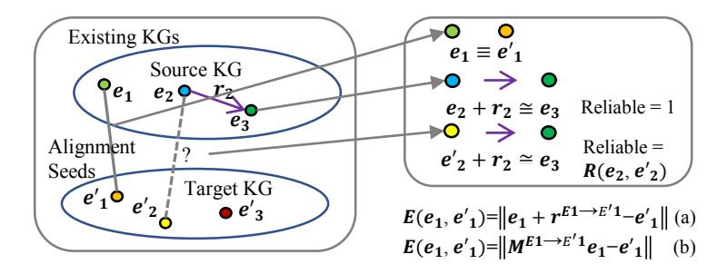
<!-- Image Description: This image illustrates a knowledge graph (KG) alignment method. Two ellipses represent a source and target KG, with nodes (e₁, e₂, e₃, e'₁, e'₂, e'₃) and relations (r₂). Arrows show mappings between aligned nodes, using alignment seeds. Equations (a) and (b) define alignment error, while the right diagram details mapping reliability based on whether e₂ + r₂ ≈ e₃ holds. The figure explains how to calculate the reliability of the mapping between the two KGs. -->

Figure 16. IPtranE [\[308\]](#page-47-0). IPtranE scores entity pairs via (a) translation models and (b) linear transformation models, and merges identical pairs via hard or soft alignment.

deep learning system that incorporates an RNN structure with attention mechanisms to represent attribute words for entity matching. Compared to conventional models, models based on deep learning are better at handling noise in text, especially the concept-enrichment tasks [\[296\]](#page-46-28) with WordNet.

Early attempts also aim at the unique attributes of entities for entity matching. Many models leverage distance-based approaches to distributional representations of entity descriptions or definitions. VCU [\[297\]](#page-47-1) proposes first-order and second-order vector models to embed the description words of an entity pair for comprehensively measuring the conceptual distance. TALN [\[298\]](#page-47-2) leverages sense-based embedding derived by BabelNet to combine the definitional description of words, which first generates the embedding of each filtered definition word combing with POS-tagger, syntax feature via BabelNet, then averages them to obtain a centroid sense to obtain the best matching candidates. String-similarity-based models available for entity matching also include TF-IDF [\[299\]](#page-47-3), I-Sub [\[300\]](#page-47-4).

Graph-based methods achieve feasible performance for entity matching on the small-scale KG that can consist of hierarchical graph structures. ETF [\[301\]](#page-47-5) learns concept representations through semantic features and graph-based features, including Katz similarity, random walk betweenness centrality, and information propagation score. ParGenFS [\[302\]](#page-47-6) leverages a graph-based fuzzy cluster algorithm to conceptualize a new entity. This method stimulates the thematic distribution to acquire distinctive concept clusters to search the corresponding location of an entity update in a target knowledge graph.

Entity matching tasks can also be handled by text-similarity-based models that detect surficial similarity between entities when considering the trade-off between performance and computation cost. Rdf-ai [\[303\]](#page-47-7) proposes a systematic model to match two entity node graphs, which leverages the string-matching and lexical-feature-similarity comparing algorithms to align available attributes, then calculates the entity similarity for alignment. Similarly, Lime [\[304\]](#page-47-8) further leverages metric spaces to detect aligned entity pairs, which first generate entity exemplars to filter alignable candidates before similarity computation for entity fusion. Different from small-scale KGs, the shaped large KGs contain meaningful relational paths and enriched concept taxonomy. HolisticEM [\[305\]](#page-47-9) employs IDF score to calculate the surficial similarity of entity names for seed generating and utilizes Personalized PageRank (PPR) to measure distances between entity graphs by respectively traversing their neighbor nodes.

Autonomous communities may input unique information to a KG system, such as nicknames, telephone numbers, and other personalized data. Such knowledge can only be known by users. Strategies to detect unique missing parts and ask users to fill them in are necessary. Active learning methods [\[306\]](#page-47-10) that judge information or solve conflicts by querying users are the most reliable solutions and are indispensable in these scenarios.

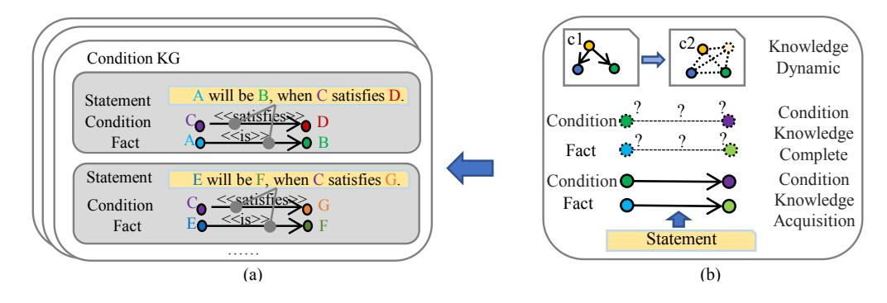
<!-- Image Description: The figure illustrates a knowledge graph (KG) transformation. (a) shows a Condition KG with two statements represented as directed graphs, each showing conditions and facts linked by "is" and "satisfies" relations. (b) depicts the transformation process, showing how the initial graph (c1) evolves into a more complex one (c2) representing different knowledge states (dynamic, complete, acquisition). The transformation aims to enrich the KG by inferring missing links. -->

Figure 17. Knowledge evolution. Evolution analysis tasks presented in (b) manufacture data into groups of knowledge graphs (either conditional or fact knowledge graphs) displayed in (a) to portray knowledge under various dynamic conditions.

### 2.3 Entity Alignment with Large-scale Knowledge Graph.

Large-scale knowledge graphs usually comprise sufficient property information and graph structures that can form knowledge-aware structures with conceptual entities and relational links. Entity alignment tasks aim to integrate structured data with well-built large-scale knowledge graphs containing semantic structures at the knowledge level.

Embedding-based models learn inter-graph entity mappings for entity alignment tasks via seed entities that have the knowledge embeddings of triples. Sun et al. [\[307\]](#page-47-11) point out that vanilla negative samples for link prediction can impair the ability to distinguish different entities of the same type. Hence, they use near entities in the feature space of a corresponding target entity to generate negative samples. IPTransE [\[308\]](#page-47-0) is an iterative joint embedding strategy for knowledge representation and learning entity mappings. It leverages a path translation embedding approach to embed different relation paths linking the same entity pair. These are regarded as links with identical effects. A soft alignment strategy is then used to alleviate matching errors. See Fig. [16.](#page-28-0) MultiEA [\[309\]](#page-47-12) considers the multi-view features of entity graph attributes, links, and neighbor nodes. BootEA [\[307\]](#page-47-11) includes a bootstrapped "likely alignment" labeling algorithm that iteratively adds reliable seeds for aligning. In cross-lingual scenarios, MtransE [\[310\]](#page-47-13) generates axis calibration and translation vectors to model feature space invariance in different languages. Additionally, some models consider self-supervision strategies to exploit seed information, such as SS-AGA [\[311\]](#page-47-14) and SelfKG [\[312\]](#page-47-15).

One critical challenge with entity alignment is that many entities do not possess surface or structural distribution features. Thus, many entity alignment models also use attribute representation to augment the features. KDCoE [\[313\]](#page-47-16), for example, leverages a co-training strategy with description attributes. JarKA [\[314\]](#page-47-17) models interactions among attributes in a sparse multi-lingual knowledge graph to infer equivalent entities. Some models leverage deep learning-based neural networks for attribute context embeddings. For example, AttrE [\[292\]](#page-46-24) leverages an LSTM to derive the dependency features of attribute values. Unlike previous methods, JAPE [\[291\]](#page-46-23) consolidates attribute embeddings with overlay relationship graph structures to capture cross-lingual disparities.

Another challenging issue is semantic graph structures for alignment. GCN-Align [\[315\]](#page-47-18) was the first to propose a GCN-based framework for entity alignment tasks. Since then, recent research has focused on complicated graph semantics using GCN-based models. For instance, RNM [\[316\]](#page-47-19) matches neighborhood nodes features to compare entity pairs. RDGCN [\[317\]](#page-47-20) leverages a dual relation graph to solve contradictory representations in triangular entity graph structures.

Large-scale knowledge graphs typically contain distinctive semantic sub-graph structures for alignment. Here, graph matching neural network (GMNN) [\[318\]](#page-47-21) builds a topic entity graph that

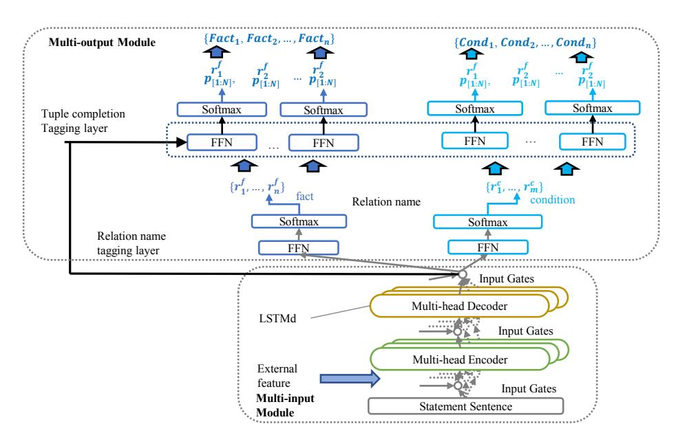
<!-- Image Description: This diagram depicts a neural network architecture for tuple completion. It shows a multi-input module processing a statement sentence and external features, feeding into an LSTM. The output is processed by multi-head encoders and decoders, leading to a multi-output module. This module uses feed-forward networks (FFN) and softmax layers to predict relation names, facts, and conditions, represented by probability distributions (P[1:N]). The architecture is designed for knowledge base completion by jointly predicting multiple outputs. -->

Figure 18. The architecture of MIMO model [\[26\]](#page-37-12) for extracting facts with conditions over texts.

links neighboring nodes to merge identical entities. AttrGNN [\[319\]](#page-47-22) partitions a knowledge graph according to attribute triple types to understand heterogeneous entity information.

Recent research direction also aims at modeling cross-graph interaction. MuGNN [\[320\]](#page-47-23), for example, proposes a cross-knowledge graph attention mechanism with a multi-channel GNN encoder that can model inter-graph structural features consistently. Similarly, GTEA [\[321\]](#page-47-24) involves a joint graph attention mechanism to fuse cross-graph relational information.

## 6 KNOWLEDGE EVOLUTION

Recently, researchers have focused on how knowledge evolves given environmental conditions. Conditional knowledge graphs serve this goal by reflecting facts established under certain conditions. A conditional tuple is formulated as (h, r, t, ), where can be a prerequisite triple of a fact. Many researchers have studied this in its simplified case, as a temporal knowledge graph, where is some kind of temporal information (like a timestamp) - for example (Biden, job, vice president, 2009-2017), (Biden, job, president, 2020-). Fig. [17](#page-29-0) shows a schematic of knowledge evolution.

## 6.1 Condition Knowledge Acquisition

Many scientific facts are established upon certain conditions, especially in the biomedical field. Early efforts have not comprehensively considered this scenario in a systematic view. Hence, Jiang et al. [\[322\]](#page-47-25) developed a new tagging schema to describe conditional tuples formatted as "B/I-XYZ", where "BI" stands for positional information (begin/intermediate), "X" is the logic role (fact/condition), "Y" marks the tuple role (subject/object), and "Z" denotes the constituent type (concept/attribute/predicate). Conditional knowledge extraction achieves three goals: it extracts fact tuples, it collects conditional tuples, and it connects fact conditions. Jiang et al. [\[26\]](#page-37-12) noted that the traditional extraction systems merge conditional information into entities to form factual triples, which will compromise entity linking. Further, the same tokens can be both subjects and objects of different tuples in an unstructured statement. They therefore devised a joint extraction method based on the multi-input multi-output sequence labeling (MIMO) to tackle this problem. Their MIMO model leverages a relation name tagging layer that denotes the relationship tags for each token via factual and conditional tagging sub-layers, respectively. A tuple completion tagging layer is then used to distinguish the logic roles of each token with different relationship names. However, Zheng et al. [\[323\]](#page-47-26) point out that the MIMO tagging schema cannot effectively handle overlapping triples. They therefore leveraged hierarchical parsing to simplify the multi-output schema in MIMO models into a one-output schema. Fig. [18](#page-30-2) illustrates the MIMO model.

Another popular trend in conditional knowledge extraction is temporal knowledge extraction, where a conditional triple is simplified into time. Many previous models leverage RNN structures to capture temporal dependencies and therefore identify the temporal relationships within sentences, such as [\[324\]](#page-47-27) and [\[325\]](#page-48-0). In terms of extracting fine-grained temporal knowledge, Vashishtha et al. [\[326\]](#page-48-1) model events, states, and durations to match their timeline via multiple stacked attention layers. Recent research has improved solutions to handle document-level temporal knowledge extraction. For instance, TIMERS [\[327\]](#page-48-2) is a rhetoric-aware graph for GCN models to interpret an intricate contiguous "elementary discourse unit" through the document's expressions. Here, an elementary discourse unit is the minimal semantic unit involved in temporal activities.

## 2 Condition Knowledge Graph Completion

Condition Knowledge Graph Completion tasks fills incomplete triples in a Condition KG, such as (h, ?, t, ), (h, r, ?, ), and (h, r, t, ?). Note that, in this section, our main focus is on methods for completing temporal knowledge graphs.

Researchers can predict incomplete temporal tuples by temporal information embedding models. TTransE [\[328\]](#page-48-3) extends TransE with temporal embedding vectors. HyTE [\[329\]](#page-48-4) treats the timestamp as a hyperplane for matching entity and relation embeddings. Another promising direction is temporal-aware embeddings. In this stream, the LSTM-based model [\[330\]](#page-48-5) interprets time-encoding sequences, while the CNN-based model [\[331\]](#page-48-6) captures the temporal consistency of contexts.

Temporal knowledge graph representations can be regarded as tensor structures along the temporal dimension, which means tensor decomposition can be used to complete temporal knowledge graphs. The main solutions for tensor decomposition include canonical polyadic decomposition and Tucker decomposition. Canonical polyadic decomposition uses the sum of several one-rank tensors to approach a target tensor. Many temporal knowledge graph completion models use canonical polyadic decomposition, e.g., [\[332\]](#page-48-7) and [\[333\]](#page-48-8). Tucker decomposition factorizes a target tensor into the multiplication between a kernel tensor and multiple tensors along each dimension of the target tensor. Shao et al. [\[334\]](#page-48-9) developed a model based on Tucker-decomposition to interpret temporal semantic associations that increases the flexibility of representations that include timestamps. SpliMe [\[335\]](#page-48-10) obtains time-viewed entity embeddings via a static model.

Another critical topic for temporal knowledge graph completion is temporal knowledge reasoning. Recent research interest has focused on GCN-based methods. Here, Han et al. [\[25\]](#page-37-11) exploit historical contexts by expanding a query-dependent interference subgraph based on edge attention scores. Jung et al. [\[336\]](#page-48-11) achieve multi-hop temporal reasoning via edge-based attention propagation, while Liu et al. [\[337\]](#page-48-12) enhance temporal knowledge graph reasoning via a model based on reinforcement learning. Moreover, facts in a timeline cannot ignore temporal dependencies, such as "born-in" before "works-at". Jiang et al. [\[338\]](#page-48-13) defines a scoring function that contains an asymmetric matrix to preserve temporal ordering constraints for reasoning.

Filling in incomplete general conditional tuples is open for further exploration. Tuples may contain more than one condition, such as chemical reactions that only occur within a certain temperature range. A systematic solution should be put into these complex scenarios. We suggest that readers also consider causality discovery methods [\[339\]](#page-48-14).

| Text | Mary and Henry planned for a trip. They went to England last week. Mary believed the Avon River was the most romantic sight in England, while Henry felt honored to be a compatriot of Shakespeare while walking around their hometown. They were sure that their daughter Lily would like this place as well. | | | |
|---------------------------|----------------------------------------------------------------------------------------------------------------------------------------------------------------------------------------------------------------------------------------------------------------------------------------------------------------------|-------------------------------------------------------------------------------------------------------------|--|--|
| Inference | Fact | Detail | | |
| Coreference Reasoning | (Mary, Entity-Destination, England) (Henry, Entity-Destination, England) | Mary and Henry planned for a trip. They visited England …… | | |
| Pattern Recognition | (the Avon River, part-of, England) | \$X was …… sight in \$Y | | |
| Logic Reasoning | (Henry, nationality, England) | (Henry, compatriot-of, Shakespeare) (Henry, nationality, England) (Shakespeare, nationality, England) | | |
| Commonsesnse Reasoning | (Mary, partner, Henry) | (Mary, daughter, Lily) (Mary, partner, Henry) (Henry, daughter, Lily) | | |

Figure 19. An example of relation inference over long context in a document.

### 3 Knowledge Dynamic

Many researchers have contributed to the literature on knowledge dynamics. A good proportion uses RNN structures to understand diachronic dependencies so as to predict state changes. For example, Know-evolve [\[340\]](#page-48-15) involves a multivariate temporal point process with an enhanced RNN structure that learns a temporal evolutionary representation function. RE-NET [\[341\]](#page-48-16) incorporates a neighborhood aggregator to seize concurrent interactions between entity nodes. Models have also been designed that contain evolutionary representations, such as MGraph [\[342\]](#page-48-17) and DyERNIE [\[343\]](#page-48-18). Gracious et al. [\[344\]](#page-48-19) systematically construct a neural latent space model that combines the evolutionary information of a heterogeneous knowledge graph. Yan et al. [\[345\]](#page-48-20) improves a GCN model's ability to capture topology-invariant features. The idea is to align nodes in different temporal knowledge graph snapshots and build a dynamic profile of concepts.

How knowledge evolves when different kinds of conditions change remains challenging – take the conditions needed to end the COVID-19 outbreak as an example. We recommend that readers refer to causality feature selection methods [\[339\]](#page-48-14) along with experts and multi-source evidence.

### 7 KNOWLEDGE GRAPH STORAGE

In this section, we provide a brief overview of KG storage tools for different data environments.

Early efforts at graph storage used relational models to perpetuate constructed knowledge graphs. Traditional RDBMS provides reliable and swift CRUD operations for table-formed databases. Developers have also employed graph algorithms like depth-first traverse and shortest-path search to enhance relational databases [\[32\]](#page-37-15). Representative examples of this type of algorithm include PostgreSQL [\[346\]](#page-48-21) and filament [10](#page-0-0). However, it can be very costly for a relational database to handle sparse KGs or perform data partition for distribution storage.

Key/value databases are lightweight solutions for saving clusters in large knowledge graphs. Further, they support distributed storage with a simplified and flexible data format. Trinity [\[347\]](#page-48-22) provides a high-performance in-memory Key/Value storage system to manage large knowledge graphs with billions of nodes, such as Probase. CouchDB [\[348\]](#page-48-23) uses a replication mechanism to maintain dynamic knowledge graphs. MapReduce technology automatically transforms data groups into key/value mappings. Hadoop [11](#page-0-0) enables high-throughput parallel computing for knowledge

10https://filament.sourceforge.net

11http://hadoop.apache.org

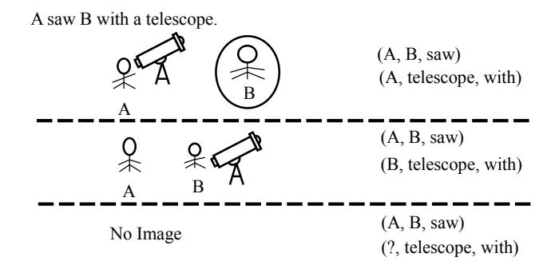
<!-- Image Description: This image depicts three scenarios illustrating the prepositional phrase "A saw B with a telescope." Simple stick figures represent A and B, and a telescope is shown. The top panel shows A using the telescope to observe B. The middle shows B using the telescope to observe A. The bottom panel indicates an absence of observation. Alongside each scenario are tuples representing the subject-object-verb and instrument-instrument-preposition relationships, demonstrating the different interpretations of the sentence's meaning and the effect of changing the instrument's possessor. -->

Figure 20. An example of solving information incompleteness via cross-modal dependency. In this case, the textual expression "A saw B with a telescope." is unclear. An extractor can only determine the relationship between people and the "telescope" by interpreting the side information in the image data.

graph storage via MapReduce. Pregel [\[349\]](#page-48-24) develops a superstep mechanism to share messages between vertices for parallel computing.

Another promising direction is to design graph databases that fit in knowledge triple structures. Neo4j[\[350\]](#page-48-25) is a lightweight NoSQL-based graph database that supports embedded dynamic knowledge graph storage. SOnes [12](#page-0-0) provides object-oriented queries for KG database. Novel languages have also been developed for knowledge storage, such as resource description framework (RDF) and web ontology language (OWL) [13](#page-0-0). Some graph databases based on RDF optimize the storage of graph structures. For example, gStore [\[349\]](#page-48-24) improves RDF-structured knowledge graph databases via sub-graph matching algorithms.

### 8 DISCUSSION ON KNOWLEDGE GRAPH CONSTRUCTION

Researchers have contributed various solutions to different aspects of knowledge graph construction. However, some challenging issues and research directions are still open for further discussion.

### 1 Long and Intricate Contexts for KG Construction

Intricate cross-sentence or cross-paragraph contexts impedes different KG construction sub-tasks for practical use, especially relation extraction tasks. It is worth reminding readers that complex contexts do not merely relate to long-term dependency. Yao et al. [\[22\]](#page-37-8) point out that four kinds of inferences include pattern recognition, coreference reasoning, logic reasoning, and commonsense reasoning, are critical to contain high-order contextual semantics. A specific example is presented in Fig. [19.](#page-32-1)

A model that handles complex long contexts should focus on intricate cross-sentence patterns while performing reasoning over multiple linguistic objects. Besides document-level extraction models in section [4.3.6,](#page-23-0) Some efforts in section [4.1.2](#page-11-0) also model document-level contexts via heterogeneous models for entity typing. Noticeably, ambiguous expressions may occur in usergenerated texts, which are usually not correctly interpreted by models without external information. Another challenging issue for reasoning is multi-hop reasoning. More linguistic structures should be explored to comprehend tortuous expressions.

Out-of-context expressions requiring background knowledge to handle are bottlenecks for KG construction. The obstacles are mainly two-fold: 1) spontaneous knowledge, and 2) evidence support. Commonsense knowledge spontaneously generated is often utilized to derive new facts,

12http://github.com/sones/sones

13RDF and OWL are both standards of w3c, see also http://www.w3.org/RDF

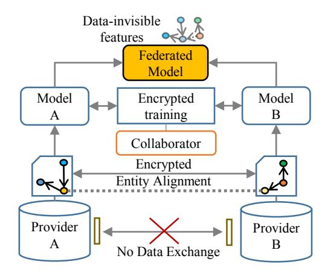
<!-- Image Description: The figure illustrates a federated learning framework for privacy-preserving entity alignment. Two models (A and B), trained on local data from providers A and B respectively, participate in encrypted training via a federated model. A collaborator performs encrypted entity alignment between the models without direct data exchange, indicated by a crossed-out connection between the providers. Data-invisible features are incorporated into the federated model. The diagram showcases the process's privacy-preserving nature by preventing direct data sharing. -->

Figure 21. An illustration of building a federated model from different knowledge providers while protecting privacy. In this procedure, an encrypted entity alignment process is performed before training separate models on multi-source data parts, then a collaborator calculates and aggregates encrypted gradients of each model to prevent leakage. A federated model only reserves data-invisible crowd-sourced knowledge features.

e.g., man and woman who have kids should be couples/partners, despite such convictions sometimes inaccuracy. How to obtain commonsense rules and adapt them to suitable scenarios is an important direction. Meanwhile, many document-level datasets do not contain evidence information for correct logic paths. Efforts like [\[357\]](#page-49-1) have probed into document-level evidence structures for relation mentions. However, it is not likely to foresee that a model can learn to organize clues correctly to resolve facts in all scenarios (e.g., validating the conclusion in a philosophical book). We believe long-context is not merely an NLP question, and models [\[358\]](#page-49-2) understanding linguistic expressions will be a critical direction. Furthermore, conditions like temporal and geographical information in provided data sources should also be considered for rigorously comprehending contexts.

## 8.2 Multi-modal Knowledge Graph Construction and Completion

Multi-modal knowledge graphs can entirely express and store heterogeneous information for display. Multi-modal knowledge can also be applied to detect fake or low-quality content, such as text with mismatched images (e.g., a document labeled Paris with a picture of London). MMKG [\[353\]](#page-48-26) is a model for completing multi-modal tuples that reasons over image information, while Dost et al. [\[354\]](#page-48-27) probe into cross-modal entity linking with text and images. Another problem for multi-modal knowledge graphs is solving semantic incompleteness in one-modal expression via cross-modal dependencies. We illustrate this challenge with a specific example in Fig. [20.](#page-33-1)

## 3 Federated Learning

Federated Learning is an enlightening direction for the essential requirements of privacy protection. A federated setting for KGs that trains model ensembles from multi-sources is one of the popular strategies. Significant advances have been conducted to federated knowledge embeddings, such as FKGE [\[355\]](#page-49-3) and FedE [\[356\]](#page-49-4), which prohibit data exchange while incorporating cross-modal features during training. However, entity alignment is a paradoxical bottleneck that impedes federated learning, requiring multi-source KGs to be shared before model learning, which will exchange sensitive information during knowledge fusion. How to create a privacy-reserved super feature space for encrypted entity alignment while federating features is still open for exploration. 66:36 Lingfeng Zhong, et al.

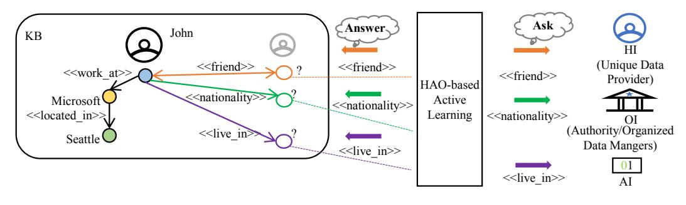
<!-- Image Description: This figure illustrates a knowledge base (KB) querying system. A knowledge graph depicts relationships (e.g., "friend," "nationality," "live_in") between entities (John, Microsoft, Seattle). The right side shows the system's active learning process, where an AI agent (AI) queries a human information provider (HI) and an organized data manager (OI) to resolve missing knowledge indicated by question marks (?) in the knowledge graph. Colored arrows represent the knowledge requests and responses. -->

Figure 22. An HAO-based active learning case for knowledge graph construction. HAO-based active learning models select users with appropriate roles to label uncertain samples. In this case (if the privacy policy allows), John's nationality will be labeled by the authority (OI), while his friends will be found by asking users (HI) in his social network. The AI will then derive his place of living from known facts.

Designing more privacy-friendly models for constructing KGs is critical for sensitive data scenarios. We illustrate the procedure of developing a federated model in Fig. [21.](#page-34-1)

## 4 Advanced Semantic and Dynamic in Knowledge Graph Construction Tasks

Recent research has extended to advanced semantic evaluation tasks, such as detecting equivoque [\[351\]](#page-48-28) and validating facts with common sense [\[352\]](#page-48-29) to handle complex lingual phenomena. Interpreting literary expressions, such as similes and metaphors, is a future direction for intelligent knowledge graph construction, e.g., "Tom went to heaven in 2008." means " Tom, died-in, 2008". Developing or fine-tuning pre-trained models with advanced semantics will be a starting point for high productivity.

Furthermore, many studies have been conducted on the dynamics of temporal knowledge graphs. However, how knowledge semantics evolves with the general associated conditions remains an unexplored field. Diving into heuristic questions such as "How do the professional social networks of medical staff change with the phases of a pandemic?" may help us detect implicit factors for boosting policy making in public health. Capturing the dynamics of how associated conditions affect related facts is the ultimate direction for simulating general human knowledge.

## 8.5 Human-machine Synergy for Knowledge Graph Construction

Asking appropriate users to complete and correct knowledge graphs is the ultimate solution for obtaining unknown facts in the open world. To this end, Wu et al. [\[8\]](#page-36-7) devised the HAO model to solve different construction problems by having humans and machines collaborate. An HAO-based active learning model that automatically identifies different roles (e.g., field experts (HI), organized authorities (OI), computing systems (AI), etc.) and assigns undetermined data to appropriate users to tag will be a promising direction to endow wisdom to knowledge graph construction frameworks. We present an illustration of this significant idea in Fig. [22.](#page-35-1)

## 6 Cross-lingual Knowledge Graph

Building cross-lingual knowledge graphs is a long-term goal that refers to integrating imbalanced resources distributed in different languages. Xlore [\[42\]](#page-38-0) provides an enlightening example of aligning cross-lingual entities via deep learning approaches. However, machine translation remains a formidable bottleneck to cross-lingual tasks. Firstly, errors and conflicts generated in the process of translation will compromise the effort of refinement. Secondly, data resources expressed in minority languages may be insufficient for machine learning. To accurately perform automatic low-resource knowledge translation while resolving cross-lingual conflicts is a promising direction.

## 7 End-to-end Unified Framework for Construction

End-to-end extraction methods, such as GCN-based frameworks, unify the sub-tasks of knowledge acquisition into one unified extraction task, surpassing pipeline designs. However, incorporating knowledge acquisition with knowledge refinement tasks to build an integrated joint model remains a formidable bottleneck. Searching for end-to-end frameworks that unify both extraction and the refinement of knowledge graphs could be an enlightening future direction. Providing a high-quality off-the-shelf solution avoids the need for manual adjustments to components, and one that considers cross-task semantics would be a worthwhile undertaking. Further, training a framework that unifies the general procedures of knowledge graph construction would be a worth-to-solve challenging multi-task learning problem.

### 9 CONCLUSION

With this paper, we delivered a comprehensive survey on the topic of knowledge graph construction. Specifically, we reviewed the tasks, methods, challenges, and related resources used to construct, refine, and integrate KGs from various data types in different scenarios. To probe into the essential topics for the big data environment, we systematically presented the paragon models for obtaining fine-grained concepts (entity typing), dealing with low-resource knowledge (extraction tasks in fewshot scenarios), understanding large linguistic objects (document-level relation extraction), complex reasoning (logic and interpretable reasoning) and handling conditional structures (temporal and general conditions) in knowledge graphs. Moreover, we provided briefs on practical KG toolkits and projects. In conclusion, knowledge graph construction has become a critical topic for enabling human intelligence in AI applications. In the future, the research community will certainly be searching for more paradigms to empower KGs with wisdom in massive heterogeneous, autonomous, complex, and evolving data environments while enhancing collaborations between knowledge communities.

### REFERENCES

- [1] J. Liu, J. Ren, W. Zheng, L. Chi, I. Lee, and F. Xia, "Web of scholars: A scholar knowledge graph," in SIGIR , 2020, pp. 2153–2156, 2020.
- [2] X. Wang, X. He, Y. Cao, M. Liu, and T. Chua, "KGAT: knowledge graph attention network for recommendation," in KDD, 2019, pp. 950–958, 2019.
- [3] J. Bao, N. Duan, Z. Yan, M. Zhou, and T. Zhao, "Constraint-based question answering with knowledge graph," in Proc. COLING, 2016, pp. 2503–2514, 2016.
- [4] K. D. Bollacker, R. P. Cook, and P. Tufts, "Freebase: A shared database of structured general human knowledge," in Proc. AAAI-07, 2007, pp. 1962–1963, 2007.
- [5] D. Vrandecic, "Wikidata: a new platform for collaborative data collection," in Proc. WWW,2012, 2012 (Companion Volume), pp. 1063–1064, 2012.
- [6] A. Yates, M. Banko, M. Broadhead, M. J. Cafarella, O. Etzioni, and S. Soderland, "Textrunner: Open information extraction on the web," in HLT-NAACL, Proceedings, 2007, pp. 25–26, 2007.
- [7] O. Etzioni, M. J. Cafarella, D. Downey, S. Kok, A. Popescu, T. Shaked, S. Soderland, D. S. Weld, and A. Yates, "Web-scale information extraction in knowitall: (preliminary results)," in Proc. WWW, 2004, pp. 100–110, 2004.
- [8] M. Wu and X. Wu, "On big wisdom," Knowl. Inf. Syst., vol. 58, no. 1, pp. 1–8, 2019.
- [9] Z. Huang, W. Xu, and K. Yu, "Bidirectional LSTM-CRF models for sequence tagging," CoRR, vol. abs/1508.01991, 2015.
- [10] X. Ma and E. H. Hovy, "End-to-end sequence labeling via bi-directional lstm-cnns-crf," in Proc. ACL, 2016, Volume 1: Long Papers, 2016.
- [11] P. Xu and D. Barbosa, "Neural fine-grained entity type classification with hierarchy-aware loss," in Proc. NAACL-HLT, 2018, Volume 1 (Long Papers), pp. 16–25, 2018.
- [12] X. Ren, W. He, M. Qu, C. R. Voss, H. Ji, and J. Han, "Label noise reduction in entity typing by heterogeneous partial-label embedding," in KDD, 2016, pp. 1825–1834, 2016.
- [13] O. Ganea and T. Hofmann, "Deep joint entity disambiguation with local neural attention," in Proc. EMNLP , 2017, pp. 2619–2629, 2017.

- [14] P. Le and I. Titov, "Improving entity linking by modeling latent relations between mentions," in Proc. ACL , 2018, Volume 1: Long Papers, pp. 1595–1604, 2018.
- [15] K. Lee, L. He, M. Lewis, and L. Zettlemoyer, "End-to-end neural coreference resolution," in Proc. EMNLP, 2017, pp. 188–197, 2017.
- [16] D. Zeng, K. Liu, Y. Chen, and J. Zhao, "Distant supervision for relation extraction via piecewise convolutional neural networks," in Proc. EMNLP, 2015, pp. 1753–1762, 2015.
- [17] P. Zhou, W. Shi, J. Tian, Z. Qi, B. Li, H. Hao, and B. Xu, "Attention-based bidirectional long short-term memory networks for relation classification," in Proc. ACL, 2016, Volume 2: Short Papers, 2016.
- [18] H. Zhang, D. Khashabi, Y. Song, and D. Roth, "Transomcs: From linguistic graphs to commonsense knowledge," in Proc. IJCAI, 2020, pp. 4004–4010, 2020.
- [19] H. Zhang, X. Liu, H. Pan, H. Ke, J. Ou, T. Fang, and Y. Song, "ASER: towards large-scale commonsense knowledge acquisition via higher-order selectional preference over eventualities," CoRR, vol. abs/2104.02137, 2021.
- [20] W. Xin-Dong, S. Shao-Jing, J. Ting-Ting, B. Chen-Yang, and W. Ming-Hui, "Huapu-cp: from knowledge graphs to a data central-platform," Acta Automatica Sinica, vol. 46, no. 10, pp. 2045–2059, 2020.
- [21] J. Devlin, M. Chang, K. Lee, and K. Toutanova, "BERT: pre-training of deep bidirectional transformers for language understanding," in NAACL-HLT , 2019, Volume 1 (Long and Short Papers), pp. 4171–4186, 2019.
- [22] Y. Yao, D. Ye, P. Li, X. Han, Y. Lin, Z. Liu, Z. Liu, L. Huang, J. Zhou, and M. Sun, "Docred: A large-scale document-level relation extraction dataset," in Proc. ACL, 2019, Volume 1: Long Papers, pp. 764–777, 2019.
- [23] S. Riedel, L. Yao, and A. McCallum, "Modeling relations and their mentions without labeled text," in ECML PKDD, 2010, Proceedings, Part III, vol. 6323, pp. 148–163, 2010.
- [24] X. Wang, X. Han, Y. Lin, Z. Liu, and M. Sun, "Adversarial multi-lingual neural relation extraction," in Proc. COLING, 2018, pp. 1156–1166, 2018.
- [25] Z. Han, P. Chen, Y. Ma, and V. Tresp, "Explainable subgraph reasoning for forecasting on temporal knowledge graphs," in ICLR, 2021.
- [26] T. Jiang, T. Zhao, B. Qin, T. Liu, N. V. Chawla, and M. Jiang, "Multi-input multi-output sequence labeling for joint extraction of fact and condition tuples from scientific text," in Proc. EMNLP-IJCNLP, 2019, pp. 302–312, 2019.
- [27] A. Pradhan, K. K. Todi, A. Selvarasu, and A. Sanyal, "Knowledge graph generation with deep active learning," in IJCNN , 2020, pp. 1–8, 2020.
- [28] X. Wu, X. Zhu, G. Wu, and W. Ding, "Data mining with big data," IEEE Trans. Knowl. Data Eng., vol. 26, no. 1, pp. 97–107, 2014.
- [29] A. Hogan, E. Blomqvist, M. Cochez, C. d'Amato, G. de Melo, C. Gutiérrez, S. Kirrane, J. E. L. Gayo, R. Navigli, S. Neumaier, A. N. Ngomo, A. Polleres, S. M. Rashid, A. Rula, L. Schmelzeisen, J. Sequeda, S. Staab, and A. Zimmermann, Knowledge Graphs. Synthesis Lectures on Data, Semantics, and Knowledge, Morgan & Claypool Publishers, 2021.
- [30] H. Paulheim, "Knowledge graph refinement: A survey of approaches and evaluation methods," Semantic Web, vol. 8, no. 3, pp. 489–508, 2017.
- [31] X. Wu, J. Wu, X. Fu, J. Li, P. Zhou, and X. Jiang, "Automatic knowledge graph construction: A report on the 2019 ICDM/ICBK contest," in ICDM, 2019, pp. 1540–1545, 2019.
- [32] J. Yan, C. Wang, W. Cheng, M. Gao, and A. Zhou, "A retrospective of knowledge graphs," Frontiers Comput. Sci., vol. 12, no. 1, pp. 55–74, 2018.
- [33] T. Nayak, N. Majumder, P. Goyal, and S. Poria, "Deep neural approaches to relation triplets extraction: a comprehensive survey," Cogn. Comput., vol. 13, no. 5, pp. 1215–1232, 2021.
- [34] S. Pawar, P. Bhattacharyya, and G. K. Palshikar, "Techniques for jointly extracting entities and relations: A survey," CoRR, vol. abs/2103.06118, 2021.
- [35] S. Ji, S. Pan, E. Cambria, P. Marttinen, and P. S. Yu, "A survey on knowledge graphs: Representation, acquisition, and applications," IEEE Trans. Neural Networks Learn. Syst., vol. 33, no. 2, pp. 494–514, 2022.
- [36] S. Arora, "A survey on graph neural networks for knowledge graph completion," CoRR, vol. abs/2007.12374, 2020.
- [37] B. Cai, Y. Xiang, L. Gao, H. Zhang, Y. Li, and J. Li, "Temporal knowledge graph completion: A survey," CoRR, vol. abs/2201.08236, 2022.
- [38] Q. Wang, Z. Mao, B. Wang, and L. Guo, "Knowledge graph embedding: A survey of approaches and applications," IEEE Trans. Knowl. Data Eng., vol. 29, no. 12, pp. 2724–2743, 2017.
- [39] L. Ehrlinger and W. Wöß, "Towards a definition of knowledge graphs," in SEMANTiCS, SuCCESS'16, 2016, vol. 1695 of CEUR Workshop Proceedings, 2016.
- [40] S. Auer, C. Bizer, G. Kobilarov, J. Lehmann, R. Cyganiak, and Z. G. Ives, "Dbpedia: A nucleus for a web of open data," in ISWC + ASWC, 2007, vol. 4825, pp. 722–735, 2007.
- [41] W. Wu, H. Li, H. Wang, and K. Q. Zhu, "Probase: a probabilistic taxonomy for text understanding," in SIGMOD , 2012, pp. 481–492, 2012.

- [42] Z. Wang, J. Li, Z. Wang, S. Li, M. Li, D. Zhang, Y. Shi, Y. Liu, P. Zhang, and J. Tang, "Xlore: A large-scale englishchinese bilingual knowledge graph," in Proc. ISWC, 2013, Posters & Demonstrations Track, vol. 1035 of CEUR Workshop Proceedings, pp. 121–124, 2013.
- [43] B. Xu, Y. Xu, J. Liang, C. Xie, B. Liang, W. Cui, and Y. Xiao, "Cn-dbpedia: A never-ending chinese knowledge extraction system," in IEA/AIE, 2017, Proceedings, Part II, vol. 10351, pp. 428–438, 2017.
- [44] F. M. Suchanek, G. Kasneci, and G. Weikum, "Yago: a core of semantic knowledge," in Proc. WWW, 2007, pp. 697–706, 2007.
- [45] M. Mintz, S. Bills, R. Snow, and D. Jurafsky, "Distant supervision for relation extraction without labeled data," in Proc. ACL , 2009, pp. 1003–1011, 2009.
- [46] J. Chen, A. Wang, J. Chen, Y. Xiao, Z. Chu, J. Liu, J. Liang, and W. Wang, "Cn-probase: A data-driven approach for large-scale chinese taxonomy construction," in Proc. ICDE, 2019, pp. 1706–1709, 2019.
- [47] G. A. Miller, "Wordnet: A lexical database for english," Commun. ACM, vol. 38, no. 11, pp. 39–41, 1995.
- [48] R. Navigli and S. P. Ponzetto, "Babelnet: Building a very large multilingual semantic network," in Proc. ACL, 2010, pp. 216–225, 2010.
- [49] H. Liu and P. Singh, "Conceptnet—a practical commonsense reasoning tool-kit," BT technology journal, vol. 22, no. 4, pp. 211–226, 2004.
- [50] Z. Dong and Q. Dong, "Hownet - a hybrid language and knowledge resource," in ICNLP, 2003 , Proceedings, pp. 820–824, 2003.
- [51] S. Han, Y. Zhang, Y. Ma, C. Tu, Z. Guo, Z. Liu, and M. Sun, "Thuocl: Tsinghua open chinese lexicon," Tsinghua University, 2016.
- [52] C. Matuszek, J. Cabral, M. J. Witbrock, and J. DeOliveira, "An introduction to the syntax and content of cyc," in Papers from the 2006 AAAI Spring Symposium, Technical Report SS-06-05, 2006, pp. 44–49, 2006.
- [53] T. Steiner, R. Verborgh, R. Troncy, J. Gabarró, and R. V. de Walle, "Adding realtime coverage to the google knowledge graph," in Proc. ISWC, 2012, vol. 914 of CEUR Workshop Proceedings, 2012.
- [54] R. J. Roberts, "Pubmed central: The genbank of the published literature," Proceedings of the National Academy of Sciences of the United States of America, vol. 98, no. 2, p. 381, 2001.
- [55] D. S. Wishart, C. Knox, A. Guo, S. Shrivastava, M. Hassanali, P. Stothard, Z. Chang, and J. Woolsey, "Drugbank: a comprehensive resource for in silico drug discovery and exploration," Nucleic Acids Res., vol. 34, no. Database-Issue, pp. 668–672, 2006.
- [56] J. Tang, D. Zhang, and L. Yao, "Social network extraction of academic researchers," in Proc. ICDM, 2007, pp. 292–301, 2007.
- [57] F. Zhang, X. Liu, J. Tang, Y. Dong, P. Yao, J. Zhang, X. Gu, Y. Wang, B. Shao, R. Li, and K. Wang, "OAG: toward linking large-scale heterogeneous entity graphs," in KDD, 2019, pp. 2585–2595, 2019.
- [58] H. Chen, N. Hu, G. Qi, H. Wang, Z. Bi, J. Li, and F. Yang, "Openkg chain: A blockchain infrastructure for open knowledge graphs," Data Intell., vol. 3, no. 2, pp. 205–227, 2021.
- [59] W. Gong-Qing, H. Jun, L. Li, X. Zhe-Hao, L. Peng-Cheng, H. Xue-Gang, and W. Xin-Dong, "Online web news extraction via tag path feature fusion. ruan jian xue bao," Journal of Software, vol. 27, no. 3, pp. 714–735, 2016.
- [60] A. Fader, S. Soderland, and O. Etzioni, "Identifying relations for open information extraction," in Proc. EMNLP, 2011.
- [61] Mausam, M. Schmitz, S. Soderland, R. Bart, and O. Etzioni, "Open language learning for information extraction," in Proc. EMNLP-CoNLL, ACL 2012, pp. 523–534, 2012.
- [62] S. Bird, "NLTK: the natural language toolkit," in ACL, 2006 (N. Calzolari, C. Cardie, and P. Isabelle, eds.), 2006.
- [63] C. D. Manning, M. Surdeanu, J. Bauer, J. R. Finkel, S. Bethard, and D. McClosky, "The stanford corenlp natural language processing toolkit," in Proc. ACL, 2014, pp. 55–60, 2014.
- [64] Z. Zhang, "Effective and efficient semantic table interpretation using tableminer+," Semantic Web, vol. 8, no. 6, pp. 921–957, 2017.
- [65] M. Cremaschi, A. Rula, A. Siano, and F. D. Paoli, "Mantistable: A tool for creating semantic annotations on tabular data," in ESWC 2019 Satellite Events, 2019, Revised Selected Papers, vol. 11762, pp. 18–23, 2019.
- [66] M. Honnibal and I. Montani, "spaCy 2: Natural language understanding with Bloom embeddings, convolutional neural networks and incremental parsing." To appear, 2017.
- [67] X. Han, T. Gao, Y. Yao, D. Ye, Z. Liu, and M. Sun, "OpenNRE: An open and extensible toolkit for neural relation extraction," in Proceedings of EMNLP-IJCNLP: System Demonstrations, pp. 169–174, 2019.
- [68] X. Han, S. Cao, X. Lv, Y. Lin, Z. Liu, M. Sun, and J. Li, "Openke: An open toolkit for knowledge embedding," in Proc. EMNLP, 2018, pp. 139–144, 2018.
- [69] Z. Sun, Q. Zhang, W. Hu, C. Wang, M. Chen, F. Akrami, and C. Li, "A benchmarking study of embedding-based entity alignment for knowledge graphs," Proc. VLDB Endow., vol. 13, no. 11, pp. 2326–2340, 2020.
- [70] A. Grover and J. Leskovec, "node2vec: Scalable feature learning for networks," in Proceedings of KDD, pp. 855–864, 2016.

- [71] J. Tang, M. Qu, M. Wang, M. Zhang, J. Yan, and Q. Mei, "Line: Large-scale information network embedding," in Proceedings of WWW, pp. 1067–1077, 2015.
- [72] W. Hu and Y. Qu, "Falcon-ao: A practical ontology matching system," J. Web Semant., vol. 6, no. 3, pp. 237–239, 2008.
- [73] C. Chang, C. Hsu, and S. Lui, "Automatic information extraction from semi-structured web pages by pattern discovery," Decis. Support Syst., vol. 35, no. 1, pp. 129–147, 2003.
- [74] C. Hsu and M. Dung, "Generating finite-state transducers for semi-structured data extraction from the web," Inf. Syst., vol. 23, no. 8, pp. 521–538, 1998.
- [75] P. B. Golgher, A. S. da Silva, A. H. F. Laender, and B. A. Ribeiro-Neto, "Bootstrapping for example-based data extraction," in Proc. CIKM, 2001, pp. 371–378, 2001.
- [76] A. Carlson and C. Schafer, "Bootstrapping information extraction from semi-structured web pages," in ECML/PKDD, 2008, Proceedings, Part I, vol. 5211, pp. 195–210, 2008.
- [77] B. Adelberg, "Nodose - A tool for semi-automatically extracting semi-structured data from text documents," in SIGMOD, 1998 (L. M. Haas and A. Tiwary, eds.), pp. 283–294, 1998.
- [78] A. H. F. Laender, B. A. Ribeiro-Neto, and A. S. da Silva, "Debye - data extraction by example," Data Knowl. Eng., vol. 40, no. 2, pp. 121–154, 2002.
- [79] A. Finn, N. Kushmerick, and B. Smyth, "Fact or fiction: Content classification for digital libraries," in DELOS , 2001, vol. 01/W03 of ERCIM Workshop Proceedings, 2001.
- [80] T. Weninger, W. H. Hsu, and J. Han, "CETR: content extraction via tag ratios," in Proc. WWW, 2010, pp. 971–980, 2010.
- [81] F. Sun, D. Song, and L. Liao, "DOM based content extraction via text density," in SIGIR, 2011, pp. 245–254, 2011.
- [82] G. Wu, L. Li, X. Hu, and X. Wu, "Web news extraction via path ratios," in CIKM, 2013, pp. 2059–2068, 2013.
- [83] D. Cai, S. Yu, J. Wen, and W. Ma, "Extracting content structure for web pages based on visual representation," in APWeb, 2003, Proceedings, vol. 2642, pp. 406–417, 2003.
- [84] Y. Wang and J. Hu, "A machine learning based approach for table detection on the web," in WWW, 2002, pp. 242–250, 2002.
- [85] M. J. Cafarella, A. Y. Halevy, Y. Zhang, D. Z. Wang, and E. Wu, "Uncovering the relational web," in 11th International Workshop on the Web and Databases, WebDB, 2008.
- [86] J. Eberius, K. Braunschweig, M. Hentsch, M. Thiele, A. Ahmadov, and W. Lehner, "Building the dresden web table corpus: A classification approach," in BDC , 2015, pp. 41–50, 2015.
- [87] M. J. Cafarella, A. Y. Halevy, and N. Khoussainova, "Data integration for the relational web," Proc. VLDB Endow., vol. 2, no. 1, pp. 1090–1101, 2009.
- [88] S. Zhang and K. Balog, "Web table extraction, retrieval, and augmentation: A survey," ACM Trans. Intell. Syst. Technol., vol. 11, no. 2, pp. 13:1–13:35, 2020.
- [89] N. Kushmerick, "Wrapper induction: Efficiency and expressiveness," Artificial intelligence, vol. 118, no. 1-2, pp. 15–68, 2000.
- [90] D. Buttler, L. Liu, and C. Pu, "A fully automated object extraction system for the world wide web," in Proc. ICDCS ,2001, pp. 361–370, 2001.
- [91] B. M. Sundheim, "The message understanding conferences," in TIPSTER TEXT PROGRAM PHASE II: Proceedings of a Workshop held at Vienna, 1996, pp. 35–37, 1996.
- [92] S. Thenmalar, B. Jagan, and T. V. Geetha, "Semi-supervised bootstrapping approach for named entity recognition," CoRR, vol. abs/1511.06833, 2015.
- [93] G. Zhou and J. Su, "Named entity recognition using an hmm-based chunk tagger," in Proc. ACL, 2002, pp. 473–480, 2002.
- [94] J. R. Finkel, T. Grenager, and C. D. Manning, "Incorporating non-local information into information extraction systems by gibbs sampling," in Proc. ACL, 2005, pp. 363–370, 2005.
- [95] J. Zhu, Z. Nie, J. Wen, B. Zhang, and W. Ma, "2d conditional random fields for web information extraction," in Proc. ICML, 2005, vol. 119, pp. 1044–1051, 2005.
- [96] C. Sutton, K. Rohanimanesh, and A. McCallum, "Dynamic conditional random fields: factorized probabilistic models for labeling and segmenting sequence data," in Proc. ICML, 2004, vol. 69, 2004.
- [97] J. Zhu, Z. Nie, J. Wen, B. Zhang, and W. Ma, "Simultaneous record detection and attribute labeling in web data extraction," in KDD, 2006, pp. 494–503, 2006.
- [98] A. Finn and N. Kushmerick, "Multi-level boundary classification for information extraction," in Proc. ECML, 2004, vol. 3201, pp. 111–122, 2004.
- [99] J. Li, A. Sun, J. Han, and C. Li, "A survey on deep learning for named entity recognition," IEEE Trans. Knowl. Data Eng., vol. 34, no. 1, pp. 50–70, 2022.
- [100] R. Collobert, J. Weston, L. Bottou, M. Karlen, K. Kavukcuoglu, and P. P. Kuksa, "Natural language processing (almost) from scratch," J. Mach. Learn. Res., vol. 12, pp. 2493–2537, 2011.

- [101] E. Strubell, P. Verga, D. Belanger, and A. McCallum, "Fast and accurate entity recognition with iterated dilated convolutions," in Proc. EMNLP, 2017, pp. 2670–2680, 2017.
- [102] L. Li, L. Jin, Z. Jiang, D. Song, and D. Huang, "Biomedical named entity recognition based on extended recurrent neural networks," in BIBM , 2015, pp. 649–652, 2015.
- [103] T. H. Nguyen, A. Sil, G. Dinu, and R. Florian, "Toward mention detection robustness with recurrent neural networks," CoRR, vol. abs/1602.07749, 2016.
- [104] L. Luo, Z. Yang, P. Yang, Y. Zhang, L. Wang, H. Lin, and J. Wang, "An attention-based bilstm-crf approach to document-level chemical named entity recognition," Bioinform., vol. 34, no. 8, pp. 1381–1388, 2018.
- [105] A. Z. Gregoric, Y. Bachrach, P. Minkovsky, S. Coope, and B. Maksak, "Neural named entity recognition using a self-attention mechanism," in ICTAI, 2017, pp. 652–656, 2017.
- [106] A. Cetoli, S. Bragaglia, A. D. O'Harney, and M. Sloan, "Graph convolutional networks for named entity recognition," in Proc. TLT, 2018, pp. 37–45, 2018.
- [107] C. Dogan, A. Dutra, A. Gara, A. Gemma, L. Shi, M. Sigamani, and E. Walters, "Fine-grained named entity recognition using elmo and wikidata," CoRR, vol. abs/1904.10503, 2019.
- [108] M. Liu, Z. Tu, T. Zhang, T. Su, X. Xu, and Z. Wang, "Ltp: A new active learning strategy for crf-based named entity recognition," Neural Processing Letters, pp. 1–22, 2022.
- [109] I. Yamada, A. Asai, H. Shindo, H. Takeda, and Y. Matsumoto, "LUKE: deep contextualized entity representations with entity-aware self-attention," in EMNLP, 2020, pp. 6442–6454, 2020.
- [110] S. Shimaoka, P. Stenetorp, K. Inui, and S. Riedel, "Neural architectures for fine-grained entity type classification," in Proc. EACL, 2017, Volume 1: Long Papers, pp. 1271–1280, 2017.
- [111] S. Zhang, K. Duh, and B. V. Durme, "Fine-grained entity typing through increased discourse context and adaptive classification thresholds," in Proc. \*SEM@NAACL-HLT, 2018, pp. 173–179, 2018.
- [112] C. Moon, P. Jones, and N. F. Samatova, "Learning entity type embeddings for knowledge graph completion," in Proc. CIKM, 2017, pp. 2215–2218, 2017.
- [113] J. Hao, M. Chen, W. Yu, Y. Sun, and W. Wang, "Universal representation learning of knowledge bases by jointly embedding instances and ontological concepts," in KDD, 2019, pp. 1709–1719, 2019.
- [114] Y. Zhao, A. Zhang, R. Xie, K. Liu, and X. Wang, "Connecting embeddings for knowledge graph entity typing," in Proc. ACL, 2020, pp. 6419–6428, 2020.
- [115] H. Jin, L. Hou, and J. Li, "Type hierarchy enhanced heterogeneous network embedding for fine-grained entity typing in knowledge bases," in NLP-NABD, 2018, Proceedings, vol. 11221, pp. 170–182, 2018.
- [116] H. Jin, L. Hou, J. Li, and T. Dong, "Attributed and predictive entity embedding for fine-grained entity typing in knowledge bases," in Proc. COLING , 2018, pp. 282–292, 2018.
- [117] Y. Cao, L. Hou, J. Li, Z. Liu, C. Li, X. Chen, and T. Dong, "Joint representation learning of cross-lingual words and entities via attentive distant supervision," in Proc. EMNLP, 2018, pp. 227–237, 2018.
- [118] G. Limaye, S. Sarawagi, and S. Chakrabarti, "Annotating and searching web tables using entities, types and relationships," Proc. VLDB Endow., vol. 3, no. 1, pp. 1338–1347, 2010.
- [119] C. S. Bhagavatula, T. Noraset, and D. Downey, "Tabel: Entity linking in web tables," in ISWC, 2015, Proceedings, Part I, vol. 9366, pp. 425–441, 2015.
- [120] T. Wu, S. Yan, Z. Piao, L. Xu, R. Wang, and G. Qi, "Entity linking in web tables with multiple linked knowledge bases," in JIST, 2016, Revised Selected Papers, vol. 10055, pp. 239–253, 2016.
- [121] V. Efthymiou, O. Hassanzadeh, M. Rodriguez-Muro, and V. Christophides, "Matching web tables with knowledge base entities: From entity lookups to entity embeddings," in Proc. ISWC, 2017, Part I, vol. 10587, pp. 260–277, 2017.
- [122] V. Mulwad, T. Finin, Z. Syed, and A. Joshi, "Using linked data to interpret tables," in Proceedings of the First International Workshop on Consuming Linked Data, 2010, vol. 665 of CEUR Workshop Proceedings, 2010.
- [123] Y. Guo, W. Che, T. Liu, and S. Li, "A graph-based method for entity linking," in IJCNLP, 2011, pp. 1010–1018, 2011.
- [124] X. Han, L. Sun, and J. Zhao, "Collective entity linking in web text: a graph-based method," in SIGIR, 2011, pp. 765–774, 2011.
- [125] W. Shen, J. Wang, P. Luo, and M. Wang, "LIEGE: : link entities in web lists with knowledge base," in KDD, 2012, pp. 1424–1432, 2012.
- [126] A. Bagga and B. Baldwin, "Entity-based cross-document coreferencing using the vector space model," in COLING-ACL , 1998, Proceedings of the Conference, pp. 79–85, 1998.
- [127] I. Lasek and P. Vojtás, "Various approaches to text representation for named entity disambiguation," in IIWAS , 2012, pp. 256–262, 2012.
- [128] H. Huang, L. P. Heck, and H. Ji, "Leveraging deep neural networks and knowledge graphs for entity disambiguation," CoRR, vol. abs/1504.07678, 2015.
- [129] W. Fang, J. Zhang, D. Wang, Z. Chen, and M. Li, "Entity disambiguation by knowledge and text jointly embedding," in SIGNLL, CoNLL, ACL, 2016, pp. 260–269, 2016.

- [130] S. J. Pan, Z. Toh, and J. Su, "Transfer joint embedding for cross-domain named entity recognition," ACM Trans. Inf. Syst., vol. 31, no. 2, p. 7, 2013.
- [131] B. Y. Lin and W. Lu, "Neural adaptation layers for cross-domain named entity recognition," in Proc. EMNLP, 2018, pp. 2012–2022, 2018.
- [132] K. Narasimhan, A. Yala, and R. Barzilay, "Improving information extraction by acquiring external evidence with reinforcement learning," in Proc. EMNLP, 2016, pp. 2355–2365, 2016.
- [133] V. Mnih, K. Kavukcuoglu, D. Silver, A. A. Rusu, J. Veness, M. G. Bellemare, A. Graves, M. A. Riedmiller, A. Fidjeland, G. Ostrovski, S. Petersen, C. Beattie, A. Sadik, I. Antonoglou, H. King, D. Kumaran, D. Wierstra, S. Legg, and D. Hassabis, "Human-level control through deep reinforcement learning," Nat., vol. 518, no. 7540, pp. 529–533, 2015.
- [134] Y. Yang, W. Chen, Z. Li, Z. He, and M. Zhang, "Distantly supervised NER with partial annotation learning and reinforcement learning," in Proc. COLING, 2018, pp. 2159–2169, 2018.
- [135] J. T. Zhou, H. Zhang, D. Jin, H. Zhu, M. Fang, R. S. M. Goh, and K. Kwok, "Dual adversarial neural transfer for low-resource named entity recognition," in Proc. ACL , 2019, Volume 1: Long Papers, pp. 3461–3471, 2019.
- [136] P. Cao, Y. Chen, K. Liu, J. Zhao, and S. Liu, "Adversarial transfer learning for chinese named entity recognition with self-attention mechanism," in Proc. EMNLP, 2018, pp. 182–192, 2018.
- [137] J. Li, D. Ye, and S. Shang, "Adversarial transfer for named entity boundary detection with pointer networks," in Proc. IJCAI, 2019, pp. 5053–5059, 2019.
- [138] Y. Shen, H. Yun, Z. C. Lipton, Y. Kronrod, and A. Anandkumar, "Deep active learning for named entity recognition," in ICLR, 2018, Conference Track Proceedings, 2018.
- [139] Y. Ma, E. Cambria, and S. Gao, "Label embedding for zero-shot fine-grained named entity typing," in COLING, 2016, Proceedings of the Conference: Technical Papers, pp. 171–180, 2016.
- [140] T. Zhang, C. Xia, C. Lu, and P. S. Yu, "MZET: memory augmented zero-shot fine-grained named entity typing," in Proc. COLING, 2020, pp. 77–87, 2020.
- [141] A. Sil and A. Yates, "Re-ranking for joint named-entity recognition and linking," in CIKM, 2013, pp. 2369–2374, 2013.
- [142] X. Liu, M. Zhou, X. Zhou, Z. Fu, and F. Wei, "Joint inference of named entity recognition and normalization for tweets," in Proc. ACL,2012, Volume 1: Long Papers, pp. 526–535, 2012.
- [143] M. C. Phan, A. Sun, Y. Tay, J. Han, and C. Li, "Pair-linking for collective entity disambiguation: Two could be better than all," IEEE Trans. Knowl. Data Eng., vol. 31, no. 7, pp. 1383–1396, 2019.
- [144] J. Cai and M. Strube, "End-to-end coreference resolution via hypergraph partitioning," in Proc. COLING, 2010, pp. 143– 151, 2010.
- [145] E. Sapena, L. Padró, and J. Turmo, "A constraint-based hypergraph partitioning approach to coreference resolution," Comput. Linguistics, vol. 39, no. 4, pp. 847–884, 2013.
- [146] D. L. Bean and E. Riloff, "Unsupervised learning of contextual role knowledge for coreference resolution," in HLT-NAACL, 2004, pp. 297–304, 2004.
- [147] E. R. Fernandes, C. N. dos Santos, and R. L. Milidiú, "Latent structure perceptron with feature induction for unrestricted coreference resolution," in EMNLP-CoNLL, ACL, 2012, pp. 41–48, 2012.
- [148] W. M. Soon, H. T. Ng, and C. Y. Lim, "A machine learning approach to coreference resolution of noun phrases," Comput. Linguistics, vol. 27, no. 4, pp. 521–544, 2001.
- [149] M. Recasens, M. de Marneffe, and C. Potts, "The life and death of discourse entities: Identifying singleton mentions," in NAACL-HLT, Proceedings, 2013, pp. 627–633, 2013.
- [150] M. A. ur Rahman and V. Ng, "Supervised models for coreference resolution," in Proc. EMNLP, 2009, A meeting of SIGDAT, a Special Interest Group of the ACL, pp. 968–977, 2009.
- [151] V. Stoyanov and J. Eisner, "Easy-first coreference resolution," in Proc. COLING ,2012, pp. 2519–2534, 2012.
- [152] X. Xi, G. Zhou, F. Hu, and B. Fu, "A convolutional deep neural network for coreference resolution via modeling hierarchical features," in IScIDE, 2015, Revised Selected Papers, Proceedings, Part II, vol. 9243, pp. 361–372, 2015.
- [153] J. Wu and W. Ma, "A deep learning framework for coreference resolution based on convolutional neural network," in ICSC , 2017, pp. 61–64, 2017.
- [154] S. Wiseman, A. M. Rush, and S. M. Shieber, "Learning global features for coreference resolution," in NAACL-HLT, 2016, pp. 994–1004, 2016.
- [155] J. Gu, Z. Ling, and N. Indurkhya, "A study on improving end-to-end neural coreference resolution," in NLP-NABD, 2018, Proceedings, vol. 11221, pp. 159–169, 2018.
- [156] R. Zhang, C. N. dos Santos, M. Yasunaga, B. Xiang, and D. R. Radev, "Neural coreference resolution with deep biaffine attention by joint mention detection and mention clustering," in Proc. ACL, 2018, Volume 2: Short Papers, pp. 102–107, 2018.
- [157] J. Ma, J. Liu, Y. Li, X. Hu, Y. Pan, S. Sun, and Q. Lin, "Jointly optimized neural coreference resolution with mutual attention," in WSDM , 2020, pp. 402–410, 2020.

- [158] K. Clark and C. D. Manning, "Deep reinforcement learning for mention-ranking coreference models," in Proc. EMNLP, 2016, pp. 2256–2262, 2016.
- [159] G. Durrett and D. Klein, "Easy victories and uphill battles in coreference resolution," in Proc. EMNLP, 2013, A meeting of SIGDAT, a Special Interest Group of the ACL, pp. 1971–1982, 2013.
- [160] S. Martschat and M. Strube, "Latent structures for coreference resolution," Trans. Assoc. Comput. Linguistics, vol. 3, pp. 405–418, 2015.
- [161] K. Chakrabarti, S. Chaudhuri, T. Cheng, and D. Xin, "A framework for robust discovery of entity synonyms," in KDD, 2012, pp. 1384–1392, 2012.
- [162] R. C. Bunescu and R. J. Mooney, "Learning to extract relations from the web using minimal supervision," in Proc. ACL, 2007.
- [163] F. Reichartz, H. Korte, and G. Paass, "Semantic relation extraction with kernels over typed dependency trees," in KDD, 2010, pp. 773–782, 2010.
- [164] D. Zelenko, C. Aone, and A. Richardella, "Kernel methods for relation extraction," in Proc. EMNLP, 2002, pp. 71–78, 2002.
- [165] D. Zeng, K. Liu, S. Lai, G. Zhou, and J. Zhao, "Relation classification via convolutional deep neural network," in Proc. COLING, 2014, pp. 2335–2344, 2014.
- [166] T. H. Nguyen and R. Grishman, "Relation extraction: Perspective from convolutional neural networks," in Proc. VS@NAACL-HLT, 2015, pp. 39–48, 2015.
- [167] M. Miwa and M. Bansal, "End-to-end relation extraction using lstms on sequences and tree structures," in Proc. ACL, 2016, Volume 1: Long Papers, 2016.
- [168] Y. Shen and X. Huang, "Attention-based convolutional neural network for semantic relation extraction," in Proc. COLING, 2016, pp. 2526–2536, 2016.
- [169] L. Wang, Z. Cao, G. de Melo, and Z. Liu, "Relation classification via multi-level attention cnns," in Proc. ACL 2016, Volume 1: Long Papers, 2016.
- [170] Y. Zhao, H. Wan, J. Gao, and Y. Lin, "Improving relation classification by entity pair graph," in Proc. ACML, 2019, vol. 101, pp. 1156–1171, 2019.
- [171] Z. Guo, Y. Zhang, and W. Lu, "Attention guided graph convolutional networks for relation extraction," in Proc. ACL,2019, Volume 1: Long Papers, pp. 241–251, 2019.
- [172] K. Zhao, H. Xu, Y. Cheng, X. Li, and K. Gao, "Representation iterative fusion based on heterogeneous graph neural network for joint entity and relation extraction," Knowl. Based Syst., vol. 219, p. 106888, 2021.
- [173] A. D. N. Cohen, S. Rosenman, and Y. Goldberg, "Relation extraction as two-way span-prediction," CoRR, vol. abs/2010.04829, 2020.
- [174] N. FitzGerald, O. Täckström, K. Ganchev, and D. Das, "Semantic role labeling with neural network factors," in Proc. EMNLP, 2015, pp. 960–970, 2015.
- [175] M. Roth and M. Lapata, "Neural semantic role labeling with dependency path embeddings," in Proc. ACL 2016, Volume 1: Long Papers, 2016.
- [176] V. Mulwad, T. Finin, and A. Joshi, "Semantic message passing for generating linked data from tables," in ISWC, 2013 , Proceedings, Part I, vol. 8218, pp. 363–378, 2013.
- [177] Z. Chen and M. J. Cafarella, "Automatic web spreadsheet data extraction," in 3RD International Workshop on Semantic Search over the Web, SSW '13, 2013, pp. 1:1–1:8, 2013.
- [178] J. Zhu, Z. Nie, X. Liu, B. Zhang, and J. Wen, "Statsnowball: a statistical approach to extracting entity relationships," in Proc. WWW, 2009, pp. 101–110, 2009.
- [179] S. Brin, "Extracting patterns and relations from the world wide web," in The World Wide Web and Databases, International Workshop WebDB'98 , 1998, Selected Papers, vol. 1590, pp. 172–183, 1998.
- [180] E. Agichtein and L. Gravano, "Snowball: extracting relations from large plain-text collections," in Proc. ACM, 2000, pp. 85–94, 2000.
- [181] M. Jiang, J. Shang, T. Cassidy, X. Ren, L. M. Kaplan, T. P. Hanratty, and J. Han, "Metapad: Meta pattern discovery from massive text corpora," in KDD, 2017, pp. 877–886, 2017.
- [182] Y. Ahmad, T. Antoniu, S. Goldwater, and S. Krishnamurthi, "A type system for statically detecting spreadsheet errors," in ASE , 2003, pp. 174–183, 2003.
- [183] Y. A. Sekhavat, F. D. Paolo, D. Barbosa, and P. Merialdo, "Knowledge base augmentation using tabular data," in Proc. WWW, 2014, vol. 1184 of CEUR Workshop Proceedings, 2014.
- [184] E. Muñoz, A. Hogan, and A. Mileo, "Using linked data to mine RDF from wikipedia's tables," in WSDM, 2014, pp. 533–542, 2014.
- [185] S. Krause, H. Li, H. Uszkoreit, and F. Xu, "Large-scale learning of relation-extraction rules with distant supervision from the web," in ISWC, 2012, Proceedings, Part I, vol. 7649, pp. 263–278, 2012.

- [186] L. Cui, F. Wei, and M. Zhou, "Neural open information extraction," in Proc. ACL, 2018, Volume 2: Short Papers, pp. 407–413, 2018.
- [187] K. Kolluru, S. Aggarwal, V. Rathore, Mausam, and S. Chakrabarti, "Imojie: Iterative memory-based joint open information extraction," in Proc. ACL,2020, pp. 5871–5886, 2020.
- [188] R. Wu, Y. Yao, X. Han, R. Xie, Z. Liu, F. Lin, L. Lin, and M. Sun, "Open relation extraction: Relational knowledge transfer from supervised data to unsupervised data," in Proc. EMNLP-IJCNLP, 2019, pp. 219–228, 2019.
- [189] X. Han, P. Yu, Z. Liu, M. Sun, and P. Li, "Hierarchical relation extraction with coarse-to-fine grained attention," in Proc. EMNLP, 2018, pp. 2236–2245, 2018.
- [190] B. Luo, Y. Feng, Z. Wang, Z. Zhu, S. Huang, R. Yan, and D. Zhao, "Learning with noise: Enhance distantly supervised relation extraction with dynamic transition matrix," in ACL, 2017, Volume 1: Long Papers, pp. 430–439, 2017.
- [191] Y. Huang and J. Du, "Self-attention enhanced cnns and collaborative curriculum learning for distantly supervised relation extraction," in Proc. EMNLP-IJCNLP, 2019, pp. 389–398, 2019.
- [192] P. Qin, W. Xu, and W. Y. Wang, "Robust distant supervision relation extraction via deep reinforcement learning," in Proc. ACL, 2018, Volume 1: Long Papers, pp. 2137–2147, 2018.
- [193] P. Qin, W. Xu, and W. Y. Wang, "DSGAN: generative adversarial training for distant supervision relation extraction," in Proc. ACL, 2018, Volume 1: Long Papers, pp. 496–505, 2018.
- [194] X. Jiang, Q. Wang, P. Li, and B. Wang, "Relation extraction with multi-instance multi-label convolutional neural networks," in COLING, 2016 Proceedings of the Conference: Technical Papers, pp. 1471–1480, 2016.
- [195] G. Ji, K. Liu, S. He, and J. Zhao, "Distant supervision for relation extraction with sentence-level attention and entity descriptions," in Proc. AAAI-17, 2017, pp. 3060–3066, 2017.
- [196] Y. Lin, S. Shen, Z. Liu, H. Luan, and M. Sun, "Neural relation extraction with selective attention over instances," in Proc. ACL, 2016, Volume 1: Long Papers, 2016.
- [197] Z. Ye and Z. Ling, "Distant supervision relation extraction with intra-bag and inter-bag attentions," in Proc. NAACL-HLT , 2019, Volume 1 (Long and Short Papers), pp. 2810–2819, 2019.
- [198] Y. Yuan, L. Liu, S. Tang, Z. Zhang, Y. Zhuang, S. Pu, F. Wu, and X. Ren, "Cross-relation cross-bag attention for distantly-supervised relation extraction," in AAAI, IAAI, EAAI , 2019, pp. 419–426, 2019.
- [199] N. Zhang, S. Deng, Z. Sun, G. Wang, X. Chen, W. Zhang, and H. Chen, "Long-tail relation extraction via knowledge graph embeddings and graph convolution networks," in Proc. NAACL-HLT, 2019, Volume 1 (Long and Short Papers), pp. 3016–3025, 2019.
- [200] S. Vashishth, R. Joshi, S. S. Prayaga, C. Bhattacharyya, and P. P. Talukdar, "RESIDE: improving distantly-supervised neural relation extraction using side information," in Proc. EMNLP, 2018, pp. 1257–1266, 2018.
- [201] W. Xiong, M. Yu, S. Chang, X. Guo, and W. Y. Wang, "One-shot relational learning for knowledge graphs," in Proc. EMNLP, 2018, pp. 1980–1990, 2018.
- [202] J. Snell, K. Swersky, and R. S. Zemel, "Prototypical networks for few-shot learning," in NeurIPS, 2017, pp. 4077–4087, 2017.
- [203] M. Fan, Y. Bai, M. Sun, and P. Li, "Large margin prototypical network for few-shot relation classification with fine-grained features," in Proc. CIKM, 2019, pp. 2353–2356, 2019.
- [204] T. Gao, X. Han, Z. Liu, and M. Sun, "Hybrid attention-based prototypical networks for noisy few-shot relation classification," in AAAI, IAAI, EAAI, 2019, pp. 6407–6414, 2019.
- [205] O. Vinyals, C. Blundell, T. Lillicrap, K. Kavukcuoglu, and D. Wierstra, "Matching networks for one shot learning," in NeurIPS, 2016, pp. 3630–3638, 2016.
- [206] T. Gao, X. Han, R. Xie, Z. Liu, F. Lin, L. Lin, and M. Sun, "Neural snowball for few-shot relation learning," in AAAI, IAAI, EAAI, 2020, pp. 7772–7779, 2020.
- [207] Z. Ye and Z. Ling, "Multi-level matching and aggregation network for few-shot relation classification," in Proc. ACL, 2019, Volume 1: Long Papers, pp. 2872–2881, 2019.
- [208] C. Finn, P. Abbeel, and S. Levine, "Model-agnostic meta-learning for fast adaptation of deep networks," in Proc. ICML, 2017, vol. 70, pp. 1126–1135, 2017.
- [209] T. Munkhdalai and H. Yu, "Meta networks," in ICML, 2017, vol. 70, pp. 2554–2563, 2017.
- [210] T. Wu, X. Li, Y. Li, G. Haffari, G. Qi, Y. Zhu, and G. Xu, "Curriculum-meta learning for order-robust continual relation extraction," in AAAI, IAAI, EAAI, 2021, pp. 10363–10369, 2021.
- [211] O. Levy, M. Seo, E. Choi, and L. Zettlemoyer, "Zero-shot relation extraction via reading comprehension," in Proc. CoNLL, ACL, 2017, pp. 333–342, 2017.
- [212] L. B. Soares, N. FitzGerald, J. Ling, and T. Kwiatkowski, "Matching the blanks: Distributional similarity for relation learning," in Proc. ACL, 2019, Volume 1: Long Papers, pp. 2895–2905, 2019.
- [213] V. G. Satorras and J. B. Estrach, "Few-shot learning with graph neural networks," in ICLR, 2018, Conference Track Proceedings, 2018.

- [214] M. Qu, T. Gao, L. A. C. Xhonneux, and J. Tang, "Few-shot relation extraction via bayesian meta-learning on relation graphs," in Proc. ICML, 2020, vol. 119, pp. 7867–7876, 2020.
- [215] T. Gao, X. Han, H. Zhu, Z. Liu, P. Li, M. Sun, and J. Zhou, "Fewrel 2.0: Towards more challenging few-shot relation classification," in Proc. EMNLP-IJCNLP, 2019, pp. 6249–6254, 2019.
- [216] D. Roth and W. Yih, "A linear programming formulation for global inference in natural language tasks," in HLT-NAACL, 2004, pp. 1–8, 2004.
- [217] Q. Li and H. Ji, "Incremental joint extraction of entity mentions and relations," in ACL, 2014, Volume 1: Long Papers, pp. 402–412, 2014.
- [218] S. Pawar, P. Bhattacharyya, and G. K. Palshikar, "End-to-end relation extraction using neural networks and markov logic networks," in Proceedings of the 15th Conference of the European Chapter of the Association for Computational Linguistics, EACL 2017, Valencia, Spain, April 3-7, 2017, Volume 1: Long Papers (M. Lapata, P. Blunsom, and A. Koller, eds.), pp. 818–827, Association for Computational Linguistics, 2017.
- [219] S. Zheng, Y. Hao, D. Lu, H. Bao, J. Xu, H. Hao, and B. Xu, "Joint entity and relation extraction based on a hybrid neural network," Neurocomputing, vol. 257, pp. 59–66, 2017.
- [220] T. Fu, P. Li, and W. Ma, "Graphrel: Modeling text as relational graphs for joint entity and relation extraction," in Proc. ACL, 2019, Volume 1: Long Papers, pp. 1409–1418, 2019.
- [221] S. Zheng, F. Wang, H. Bao, Y. Hao, P. Zhou, and B. Xu, "Joint extraction of entities and relations based on a novel tagging scheme," in Proc. ACL 2017, Volume 1: Long Papers, pp. 1227–1236, 2017.
- [222] Z. Wei, J. Su, Y. Wang, Y. Tian, and Y. Chang, "A novel cascade binary tagging framework for relational triple extraction," in Proc. ACL, 2020, pp. 1476–1488, 2020.
- [223] Y. Wang, B. Yu, Y. Zhang, T. Liu, H. Zhu, and L. Sun, "Tplinker: Single-stage joint extraction of entities and relations through token pair linking," in Proc. COLING, 2020, pp. 1572–1582, 2020.
- [224] G. Bekoulis, J. Deleu, T. Demeester, and C. Develder, "Joint entity recognition and relation extraction as a multi-head selection problem," Expert Syst. Appl., vol. 114, pp. 34–45, 2018.
- [225] X. Li, F. Yin, Z. Sun, X. Li, A. Yuan, D. Chai, M. Zhou, and J. Li, "Entity-relation extraction as multi-turn question answering," in Proc. ACL, 2019, Volume 1: Long Papers, pp. 1340–1350, 2019.
- [226] H. Chen, C. Zhang, J. Li, P. S. Yu, and N. Jing, "Kggen: A generative approach for incipient knowledge graph population," IEEE Trans. Knowl. Data Eng., vol. 34, no. 5, pp. 2254–2267, 2022.
- [227] X. Ren, Z. Wu, W. He, M. Qu, C. R. Voss, H. Ji, T. F. Abdelzaher, and J. Han, "Cotype: Joint extraction of typed entities and relations with knowledge bases," in Proc. WWW, 2017, pp. 1015–1024, 2017.
- [228] A. Bordes, N. Usunier, A. García-Durán, J. Weston, and O. Yakhnenko, "Translating embeddings for modeling multi-relational data," in NeurIPS, Proceedings , 2013, pp. 2787–2795, 2013.
- [229] N. Peng, H. Poon, C. Quirk, K. Toutanova, and W. Yih, "Cross-sentence n-ary relation extraction with graph lstms," Trans. Assoc. Comput. Linguistics, vol. 5, pp. 101–115, 2017.
- [230] L. Song, Y. Zhang, Z. Wang, and D. Gildea, "N-ary relation extraction using graph-state LSTM," in Proc. EMNLP, 2018, pp. 2226–2235, 2018.
- [231] S. K. Sahu, F. Christopoulou, M. Miwa, and S. Ananiadou, "Inter-sentence relation extraction with document-level graph convolutional neural network," in Proc. ACL, 2019, Volume 1: Long Papers, pp. 4309–4316, 2019.
- [232] F. Christopoulou, M. Miwa, and S. Ananiadou, "Connecting the dots: Document-level neural relation extraction with edge-oriented graphs," in Proc. EMNLP-IJCNLP , 2019, pp. 4924–4935, 2019.
- [233] H. Zhu, Y. Lin, Z. Liu, J. Fu, T. Chua, and M. Sun, "Graph neural networks with generated parameters for relation extraction," in Proc. ACL, 2019, Volume 1: Long Papers, pp. 1331–1339, 2019.
- [234] G. Nan, Z. Guo, I. Sekulic, and W. Lu, "Reasoning with latent structure refinement for document-level relation extraction," in Proc. ACL, 2020, pp. 1546–1557, 2020.
- [235] W. Xu, K. Chen, and T. Zhao, "Document-level relation extraction with reconstruction," in AAAI, IAAI, EAAI, 2021, pp. 14167–14175, 2021.
- [236] S. Zeng, R. Xu, B. Chang, and L. Li, "Double graph based reasoning for document-level relation extraction," in Proc. EMNLP, 2020, pp. 1630–1640, 2020.
- [237] Z. Zhang, B. Yu, X. Shu, M. Xue, T. Liu, and L. Guo, "From what to why: Improving relation extraction with rationale graph," in Findings of the Association for Computational Linguistics: ACL/IJCNLP , 2021, vol. ACL/IJCNLP 2021, pp. 86–95, 2021.
- [238] Y. Luan, D. Wadden, L. He, A. Shah, M. Ostendorf, and H. Hajishirzi, "A general framework for information extraction using dynamic span graphs," in Proc. NAACL-HLT, 2019, Volume 1 (Long and Short Papers), pp. 3036–3046, 2019.
- [239] W. Xu, K. Chen, and T. Zhao, "Discriminative reasoning for document-level relation extraction," in ACL/IJCNLP , 2021, pp. 1653–1663, 2021.
- [240] A. Bosselut, H. Rashkin, M. Sap, C. Malaviya, A. Celikyilmaz, and Y. Choi, "COMET: commonsense transformers for automatic knowledge graph construction," in Proc. ACL, 2019 , Volume 1: Long Papers, pp. 4762–4779, 2019.

- [241] N. Zhang, X. Chen, X. Xie, S. Deng, C. Tan, M. Chen, F. Huang, L. Si, and H. Chen, "Document-level relation extraction as semantic segmentation," in Proc. IJCAI ,2021, pp. 3999–4006, 2021.
- [242] W. Zhou, K. Huang, T. Ma, and J. Huang, "Document-level relation extraction with adaptive thresholding and localized context pooling," in AAAI, IAAI, EAAI, 2021, pp. 14612–14620, 2021.
- [243] Y. Lin, Z. Liu, M. Sun, Y. Liu, and X. Zhu, "Learning entity and relation embeddings for knowledge graph completion," in Proc. AAAI-15, 2015, pp. 2181–2187, 2015.
- [244] Z. Wang, J. Zhang, J. Feng, and Z. Chen, "Knowledge graph embedding by translating on hyperplanes," in Proc. AAAI-14, 2014, pp. 1112–1119, 2014.
- [245] G. Ji, K. Liu, S. He, and J. Zhao, "Knowledge graph completion with adaptive sparse transfer matrix," in Proc. AAAI-16, 2016, pp. 985–991, 2016.
- [246] M. Nickel, V. Tresp, and H. Kriegel, "A three-way model for collective learning on multi-relational data," in Proc. ICML, 2011, pp. 809–816, 2011.
- [247] I. Balazevic, C. Allen, and T. M. Hospedales, "Tucker: Tensor factorization for knowledge graph completion," in Proc. EMNLP-IJCNLP, 2019, pp. 5184–5193, 2019.
- [248] B. Yang, W. Yih, X. He, J. Gao, and L. Deng, "Embedding entities and relations for learning and inference in knowledge bases," in ICLR, 2015, Conference Track Proceedings, 2015.
- [249] R. Socher, D. Chen, C. D. Manning, and A. Y. Ng, "Reasoning with neural tensor networks for knowledge base completion," in NeurIPS, 2013, Proceedings, pp. 926–934, 2013.
- [250] Z. Zhang, J. Cai, Y. Zhang, and J. Wang, "Learning hierarchy-aware knowledge graph embeddings for link prediction," in AAAI, IAAI, EAAI, 2020, pp. 3065–3072, 2020.
- [251] G. Niu, B. Li, Y. Zhang, and S. Pu, "CAKE: A scalable commonsense-aware framework for multi-view knowledge graph completion," in Proc. ACL, 2022.
- [252] L. Wang, W. Zhao, Z. Wei, and J. Liu, "Simkgc: Simple contrastive knowledge graph completion with pre-trained language models," in Proc. ACL, 2022.
- [253] K. Wang, Y. Liu, and Q. Z. Sheng, "Swift and sure: Hardness-aware contrastive learning for low-dimensional knowledge graph embeddings," in WWW '22: The ACM Web Conference 2022, Virtual Event, Lyon, France, April 25 - 29, 2022 (F. Laforest, R. Troncy, E. Simperl, D. Agarwal, A. Gionis, I. Herman, and L. Médini, eds.), pp. 838–849, ACM, 2022.
- [254] A. Borrego, D. Ayala, I. Hernández, C. R. Rivero, and D. Ruiz, "CAFE: knowledge graph completion using neighborhoodaware features," Eng. Appl. Artif. Intell., vol. 103, p. 104302, 2021.
- [255] J. Wu, W. Shi, X. Cao, J. Chen, W. Lei, F. Zhang, W. Wu, and X. He, "Disenkgat: Knowledge graph embedding with disentangled graph attention network," in CIKM , 2021, pp. 2140–2149, 2021.
- [256] N. Lao and W. W. Cohen, "Relational retrieval using a combination of path-constrained random walks," Mach. Learn., vol. 81, no. 1, pp. 53–67, 2010.
- [257] M. Gardner, P. P. Talukdar, J. Krishnamurthy, and T. M. Mitchell, "Incorporating vector space similarity in random walk inference over knowledge bases," in Proc. EMNLP, 2014, A meeting of SIGDAT, a Special Interest Group of the ACL, pp. 397–406, 2014.
- [258] Q. Wang, J. Liu, Y. Luo, B. Wang, and C. Lin, "Knowledge base completion via coupled path ranking," in Proc. ACL, 2016, Volume 1: Long Papers, 2016.
- [259] W. Xiong, T. Hoang, and W. Y. Wang, "Deeppath: A reinforcement learning method for knowledge graph reasoning," in Proc. EMNLP, 2017, pp. 564–573, 2017.
- [260] X. V. Lin, R. Socher, and C. Xiong, "Multi-hop knowledge graph reasoning with reward shaping," in Proc. EMNLP, 2018, pp. 3243–3253, 2018.
- [261] Z. Li, X. Jin, S. Guan, Y. Wang, and X. Cheng, "Path reasoning over knowledge graph: A multi-agent and reinforcement learning based method," in ICDM Workshops, 2018, pp. 929–936, 2018.
- [262] Y. Shen, J. Chen, P. Huang, Y. Guo, and J. Gao, "M-walk: Learning to walk over graphs using monte carlo tree search," in NeurIPS, 2018, pp. 6787–6798, 2018.
- [263] A. Neelakantan, B. Roth, and A. McCallum, "Compositional vector space models for knowledge base completion," in ACL, 2015, Volume 1: Long Papers, pp. 156–166, 2015.
- [264] R. Das, A. Neelakantan, D. Belanger, and A. McCallum, "Chains of reasoning over entities, relations, and text using recurrent neural networks," in Proc. EACL, 2017, Volume 1: Long Papers, pp. 132–141, 2017.
- [265] Y. Zhang, H. Dai, Z. Kozareva, A. J. Smola, and L. Song, "Variational reasoning for question answering with knowledge graph," in AAAI, IAAI, EAAI, 2018, pp. 6069–6076, 2018.
- [266] S. Kardani-Moghaddam, R. Buyya, and K. Ramamohanarao, "ADRL: A hybrid anomaly-aware deep reinforcement learning-based resource scaling in clouds," IEEE Trans. Parallel Distributed Syst., vol. 32, no. 3, pp. 514–526, 2021.
- [267] H. Wang, S. Li, R. Pan, and M. Mao, "Incorporating graph attention mechanism into knowledge graph reasoning based on deep reinforcement learning," in Proc. EMNLP-IJCNLP, 2019, pp. 2623–2631, 2019.

- [268] M. Zheng, Y. Zhou, and Q. Cui, "Hierarchical policy network with multi-agent for knowledge graph reasoning based on reinforcement learning," in KSEM, 2021, Proceedings, Part I, vol. 12815, pp. 445–457, 2021.
- [269] P. Tiwari, H. Zhu, and H. M. Pandey, "Dapath: Distance-aware knowledge graph reasoning based on deep reinforcement learning," Neural Networks, vol. 135, pp. 1–12, 2021.
- [270] S. Li, H. Wang, R. Pan, and M. Mao, "Memorypath: A deep reinforcement learning framework for incorporating memory component into knowledge graph reasoning," Neurocomputing, vol. 419, pp. 273–286, 2021.
- [271] L. A. Galárraga, C. Teflioudi, K. Hose, and F. M. Suchanek, "AMIE: association rule mining under incomplete evidence in ontological knowledge bases," in WWW , 2013, pp. 413–422, 2013.
- [272] P. G. Omran, K. Wang, and Z. Wang, "Scalable rule learning via learning representation," in Proc. IJCAI, 2018, pp. 2149–2155, 2018.
- [273] C. Meilicke, M. Fink, Y. Wang, D. Ruffinelli, R. Gemulla, and H. Stuckenschmidt, "Fine-grained evaluation of rule- and embedding-based systems for knowledge graph completion," in ISWC, 2018, Proceedings, Part I, vol. 11136, pp. 3–20, 2018.
- [274] S. Guo, Q. Wang, L. Wang, B. Wang, and L. Guo, "Jointly embedding knowledge graphs and logical rules," in Proc. EMNLP, 2016, pp. 192–202, 2016.
- [275] S. Guo, Q. Wang, L. Wang, B. Wang, and L. Guo, "Knowledge graph embedding with iterative guidance from soft rules," in AAAI, IAAI, EAAI, 2018, pp. 4816–4823, 2018.
- [276] F. Yang, Z. Yang, and W. W. Cohen, "Differentiable learning of logical rules for knowledge base reasoning," in NeurIPS, 2017, pp. 2319–2328, 2017.
- [277] M. Qu and J. Tang, "Probabilistic logic neural networks for reasoning," in NeurIPS, 2019, pp. 7710–7720, 2019.
- [278] Y. Zhang, X. Chen, Y. Yang, A. Ramamurthy, B. Li, Y. Qi, and L. Song, "Efficient probabilistic logic reasoning with graph neural networks," in ICLR, 2020.
- [279] T. Miller, "Explanation in artificial intelligence: Insights from the social sciences," Artif. Intell., vol. 267, pp. 1–38, 2019.
- [280] V. I. S. Carmona, T. Rocktäschel, S. Riedel, and S. Singh, "Towards extracting faithful and descriptive representations of latent variable models," in AAAI Spring Symposia, 2015.
- [281] Y. Nandwani, A. Gupta, A. Agrawal, M. S. Chauhan, P. Singla, and Mausam, "Oxkbc: Outcome explanation for factorization based knowledge base completion," in AKBC, 2020.
- [282] Z. Ying, D. Bourgeois, J. You, M. Zitnik, and J. Leskovec, "Gnnexplainer: Generating explanations for graph neural networks," in NeurIPS, 2019, pp. 9240–9251, 2019.
- [283] P. Pezeshkpour, Y. Tian, and S. Singh, "Investigating robustness and interpretability of link prediction via adversarial modifications," in Proc. NAACL-HLT, 2019, Volume 1 (Long and Short Papers), pp. 3336–3347, 2019.
- [284] R. Xie, Z. Liu, F. Lin, and L. Lin, "Does william shakespeare REALLY write hamlet? knowledge representation learning with confidence," in AAAI, IAAI, EAAI, 2018, pp. 4954–4961, 2018.
- [285] T. Dong, Z. Wang, J. Li, C. Bauckhage, and A. B. Cremers, "Triple classification using regions and fine-grained entity typing," in AAAI , IAAI, EAAI, 2019, pp. 77–85, 2019.
- [286] E. Amador-Domínguez, E. Serrano, D. Manrique, P. Hohenecker, and T. Lukasiewicz, "An ontology-based deep learning approach for triple classification with out-of-knowledge-base entities," Inf. Sci., vol. 564, pp. 85–102, 2021.
- [287] D. Q. Nguyen, T. Nguyen, and D. Phung, "A relational memory-based embedding model for triple classification and search personalization," in Proc. ACL, 2020, pp. 3429–3435, 2020.
- [288] T. Sun, J. Zhai, and Q. Wang, "Novea: A novel model of entity alignment using attribute triples and relation triples," in KSEM , 2020, Proceedings, Part I, vol. 12274, pp. 161–173, 2020.
- [289] F. He, Z. Li, Q. Yang, A. Liu, G. Liu, P. Zhao, L. Zhao, M. Zhang, and Z. Chen, "Unsupervised entity alignment using attribute triples and relation triples," in DASFAA , 2019, Proceedings, Part I, vol. 11446, pp. 367–382, 2019.
- [290] H. Yang, Y. Zou, P. Shi, W. Lu, J. Lin, and X. Sun, "Aligning cross-lingual entities with multi-aspect information," in Proc. EMNLP-IJCNLP , 2019, pp. 4430–4440, 2019.
- [291] Z. Sun, W. Hu, and C. Li, "Cross-lingual entity alignment via joint attribute-preserving embedding," in ISWC, 2017, Proceedings, Part I, vol. 10587, pp. 628–644, 2017.
- [292] B. D. Trisedya, J. Qi, and R. Zhang, "Entity alignment between knowledge graphs using attribute embeddings," in AAAI, IAAI, EAAI, 2019, pp. 297–304, 2019.
- [293] W. Tan, "Technical perspective: Entity matching with magellan," Commun. ACM, vol. 63, no. 8, p. 82, 2020.
- [294] M. S. Schlichtkrull and H. M. Alonso, "Msejrku at semeval-2016 task 14: Taxonomy enrichment by evidence ranking," in Proc. SemEval@NAACL-HLT, 2016, pp. 1337–1341, 2016.
- [295] S. Mudgal, H. Li, T. Rekatsinas, A. Doan, Y. Park, G. Krishnan, R. Deep, E. Arcaute, and V. Raghavendra, "Deep learning for entity matching: A design space exploration," in Proc. SIGMOD, 2018, pp. 19–34, 2018.
- [296] D. Jurgens and M. T. Pilehvar, "Semeval-2016 task 14: Semantic taxonomy enrichment," in Proc. SemEval@NAACL-HLT, 2016, pp. 1092–1102, 2016.

- [297] B. T. McInnes, "VCU at semeval-2016 task 14: Evaluating definitional-based similarity measure for semantic taxonomy enrichment," in Proc. SemEval@NAACL-HLT, 2016, pp. 1351–1355, 2016.
- [298] L. E. Anke, F. Ronzano, and H. Saggion, "TALN at semeval-2016 task 14: Semantic taxonomy enrichment via sensebased embeddings," in Proc. SemEval@NAACL-HLT, 2016, pp. 1332–1336, 2016.
- [299] K. S. Jones, "A statistical interpretation of term specificity and its application in retrieval," J. Documentation, vol. 60, no. 5, pp. 493–502, 2004.
- [300] G. Stoilos, G. B. Stamou, and S. D. Kollias, "A string metric for ontology alignment," in ISWC , 2005, Proceedings, vol. 3729, pp. 624–637, 2005.
- [301] N. Vedula, P. K. Nicholson, D. Ajwani, S. Dutta, A. Sala, and S. Parthasarathy, "Enriching taxonomies with functional domain knowledge," in SIGIR, 2018, pp. 745–754, 2018.
- [302] D. Frolov, S. Nascimento, T. I. Fenner, and B. G. Mirkin, "Using taxonomy tree to generalize a fuzzy thematic cluster," in FUZZ-IEEE , 2019, pp. 1–6, 2019.
- [303] F. Scharffe, Y. Liu, and C. Zhou, "Rdf-ai: an architecture for rdf datasets matching, fusion and interlink," in Proc. IJCAI workshop on IR-KR, 2019, p. 23, 2009.
- [304] A. N. Ngomo and S. Auer, "LIMES - A time-efficient approach for large-scale link discovery on the web of data," in Proc. IJCAI, 2011, pp. 2312–2317, 2011.
- [305] M. Pershina, M. Yakout, and K. Chakrabarti, "Holistic entity matching across knowledge graphs," in IEEE BigData, 2015, pp. 1585–1590, 2015.
- [306] M. Berrendorf, E. Faerman, and V. Tresp, "Active learning for entity alignment," in ECIR, 2021, Proceedings, Part I, vol. 12656, pp. 48–62, 2021.
- [307] Z. Sun, W. Hu, Q. Zhang, and Y. Qu, "Bootstrapping entity alignment with knowledge graph embedding," in Proc. IJCAI, 2018, pp. 4396–4402, 2018.
- [308] H. Zhu, R. Xie, Z. Liu, and M. Sun, "Iterative entity alignment via joint knowledge embeddings," in Proc. IJCAI , 2017, pp. 4258–4264, 2017.
- [309] Q. Zhang, Z. Sun, W. Hu, M. Chen, L. Guo, and Y. Qu, "Multi-view knowledge graph embedding for entity alignment," in Proc. IJCAI, 2019, pp. 5429–5435, 2019.
- [310] M. Chen, Y. Tian, M. Yang, and C. Zaniolo, "Multilingual knowledge graph embeddings for cross-lingual knowledge alignment," in Proc. IJCAI, 2017, pp. 1511–1517, 2017.
- [311] Z. Huang, Z. Li, H. Jiang, T. Cao, H. Lu, B. Yin, K. Subbian, Y. Sun, and W. Wang, "Multilingual knowledge graph completion with self-supervised adaptive graph alignment," in Proc. ACL, 2022.
- [312] X. Liu, H. Hong, X. Wang, Z. Chen, E. Kharlamov, Y. Dong, and J. Tang, "Selfkg: Self-supervised entity alignment in knowledge graphs," in WWW '22: The ACM Web Conference 2022, Virtual Event, Lyon, France, April 25 - 29, 2022 (F. Laforest, R. Troncy, E. Simperl, D. Agarwal, A. Gionis, I. Herman, and L. Médini, eds.), pp. 860–870, ACM, 2022.
- [313] M. Chen, Y. Tian, K. Chang, S. Skiena, and C. Zaniolo, "Co-training embeddings of knowledge graphs and entity descriptions for cross-lingual entity alignment," in Proc. IJCAI, 2018, pp. 3998–4004, 2018.
- [314] B. Chen, J. Zhang, X. Tang, H. Chen, and C. Li, "Jarka: Modeling attribute interactions for cross-lingual knowledge alignment," in PAKDD, 2020, Proceedings, Part I, vol. 12084, pp. 845–856, 2020.
- [315] Z. Wang, Q. Lv, X. Lan, and Y. Zhang, "Cross-lingual knowledge graph alignment via graph convolutional networks," in Proc. EMNLP, 2018, pp. 349–357, 2018.
- [316] Y. Zhu, H. Liu, Z. Wu, and Y. Du, "Relation-aware neighborhood matching model for entity alignment," in AAAI, IAAI, EAAI, 2021, pp. 4749–4756, 2021.
- [317] Y. Wu, X. Liu, Y. Feng, Z. Wang, R. Yan, and D. Zhao, "Relation-aware entity alignment for heterogeneous knowledge graphs," in Proc. IJCAI, 2019, pp. 5278–5284, 2019.
- [318] K. Xu, L. Wang, M. Yu, Y. Feng, Y. Song, Z. Wang, and D. Yu, "Cross-lingual knowledge graph alignment via graph matching neural network," in Proc. ACL, 2019, Volume 1: Long Papers, pp. 3156–3161, 2019.
- [319] Z. Liu, Y. Cao, L. Pan, J. Li, and T. Chua, "Exploring and evaluating attributes, values, and structures for entity alignment," in Proc. EMNLP, 2020, pp. 6355–6364, 2020.
- [320] Y. Cao, Z. Liu, C. Li, Z. Liu, J. Li, and T. Chua, "Multi-channel graph neural network for entity alignment," in Proc. ACL, 2019, Volume 1: Long Papers, pp. 1452–1461, 2019.
- [321] S. Jiang, T. Nie, D. Shen, Y. Kou, and G. Yu, "Entity alignment of knowledge graph by joint graph attention and translation representation," in WISA, 2021, Proceedings, vol. 12999, pp. 347–358, 2021.
- [322] T. Jiang, T. Zhao, B. Qin, T. Liu, N. V. Chawla, and M. Jiang, "The role of condition ¨ ¨: A novel scientific knowledge graph representation and construction model," in KDD, 2019, pp. 1634–1642, 2019.
- [323] T. Zheng, Z. Xu, Y. Li, Y. Zhao, B. Wang, and X. Yang, "A novel conditional knowledge graph representation and construction," in CICAI , 2021, Proceedings, Part II, vol. 13070, pp. 383–394, 2021.
- [324] F. Cheng and Y. Miyao, "Classifying temporal relations by bidirectional LSTM over dependency paths," in Proc. ACL, 2017, Volume 2: Short Papers, pp. 1–6, 2017.

ACM Comput. Surv., Vol. 36, No. 4, Article 66. Publication date: July 2022.

- [325] Y. Meng, A. Rumshisky, and A. Romanov, "Temporal information extraction for question answering using syntactic dependencies in an lstm-based architecture," in Proc. EMNLP, 2017, pp. 887–896, 2017.
- [326] S. Vashishtha, B. V. Durme, and A. S. White, "Fine-grained temporal relation extraction," in Proc. ACL, 2019, Volume 1: Long Papers, pp. 2906–2919, 2019.
- [327] P. Mathur, R. Jain, F. Dernoncourt, V. I. Morariu, Q. H. Tran, and D. Manocha, "TIMERS: document-level temporal relation extraction," in Proc. ACL/IJCNLP, 2021, Volume 2: Short Papers, pp. 524–533, 2021.
- [328] J. Leblay and M. W. Chekol, "Deriving validity time in knowledge graph," in WWW, 2018, pp. 1771–1776, 2018.
- [329] S. S. Dasgupta, S. N. Ray, and P. P. Talukdar, "Hyte: Hyperplane-based temporally aware knowledge graph embedding," in Proc. EMNLP, 2018, pp. 2001–2011, 2018.
- [330] A. García-Durán, S. Dumancic, and M. Niepert, "Learning sequence encoders for temporal knowledge graph completion," in Proc. EMNLP, 2018, pp. 4816–4821, 2018.
- [331] Y. Liu, W. Hua, K. Xin, and X. Zhou, "Context-aware temporal knowledge graph embedding," in WISE , 2019, Proceedings, vol. 11881, pp. 583–598, 2019.
- [332] L. Lin and K. She, "Tensor decomposition-based temporal knowledge graph embedding," in ICTAI, 2020, pp. 969–975, 2020.
- [333] T. Lacroix, G. Obozinski, and N. Usunier, "Tensor decompositions for temporal knowledge base completion," in ICLR, 2020.
- [334] P. Shao, D. Zhang, G. Yang, J. Tao, F. Che, and T. Liu, "Tucker decomposition-based temporal knowledge graph completion," Knowl. Based Syst., vol. 238, p. 107841, 2022.
- [335] W. Radstok, M. Chekol, and Y. Velegrakis, "Leveraging static models for link prediction in temporal knowledge graphs," in ICTAI , 2021, pp. 1034–1041, 2021.
- [336] J. Jung, J. Jung, and U. Kang, "Learning to walk across time for interpretable temporal knowledge graph completion," in KDD, 2021, pp. 786–795, 2021.
- [337] H. Liu, S. Zhou, C. Chen, T. Gao, J. Xu, and M. Shu, "Dynamic knowledge graph reasoning based on deep reinforcement learning," Knowl. Based Syst., vol. 241, p. 108235, 2022.
- [338] T. Jiang, T. Liu, T. Ge, L. Sha, S. Li, B. Chang, and Z. Sui, "Encoding temporal information for time-aware link prediction," in Proc. EMNLP, 2016, pp. 2350–2354, 2016.
- [339] K. Yu, X. Guo, L. Liu, J. Li, H. Wang, Z. Ling, and X. Wu, "Causality-based feature selection: Methods and evaluations," ACM Comput. Surv., vol. 53, no. 5, pp. 111:1–111:36, 2020.
- [340] R. Trivedi, H. Dai, Y. Wang, and L. Song, "Know-evolve: Deep temporal reasoning for dynamic knowledge graphs," in Proc. ICML 2017, vol. 70, pp. 3462–3471, 2017.
- [341] W. Jin, C. Zhang, P. A. Szekely, and X. Ren, "Recurrent event network for reasoning over temporal knowledge graphs," CoRR, vol. abs/1904.05530, 2019.
- [342] X. Li, L. Liu, X. Wang, Y. Li, Q. Wu, and T. Qian, "Towards evolutionary knowledge representation under the big data circumstance," Electron. Libr., vol. 39, no. 3, pp. 392–410, 2021.
- [343] Z. Han, P. Chen, Y. Ma, and V. Tresp, "Dyernie: Dynamic evolution of riemannian manifold embeddings for temporal knowledge graph completion," in EMNLP, 2020, pp. 7301–7316, 2020.
- [344] T. Gracious, S. Gupta, A. Kanthali, R. M. Castro, and A. Dukkipati, "Neural latent space model for dynamic networks and temporal knowledge graphs," in AAAI, IAAI, EAAI, 2021, pp. 4054–4062, 2021.
- [345] Y. Yan, L. Liu, Y. Ban, B. Jing, and H. Tong, "Dynamic knowledge graph alignment," in AAAI , IAAI, EAAI, 2021, pp. 4564–4572, 2021.
- [346] B. Momjian, PostgreSQL: introduction and concepts, vol. 192. Addison-Wesley New York, 2001.
- [347] B. Shao, H. Wang, and Y. Li, "Trinity: a distributed graph engine on a memory cloud," in SIGMOD, 2013, pp. 505–516, 2013.
- [348] J. C. Anderson, J. Lehnardt, and N. Slater, "Couchdb: The definitive guide time to relax," 2010.
- [349] L. Zou, J. Mo, L. Chen, M. T. Özsu, and D. Zhao, "gstore: Answering SPARQL queries via subgraph matching," Proc. VLDB Endow., vol. 4, no. 8, pp. 482–493, 2011.
- [350] J. Webber, "A programmatic introduction to neo4j," in SPLASH, Proceedings , 2012, pp. 217–218, 2012.
- [351] T. Miller, C. Hempelmann, and I. Gurevych, "Semeval-2017 task 7: Detection and interpretation of english puns," in Proc. SemEval@ACL, 2017, pp. 58–68, 2017.
- [352] C. Wang, S. Liang, Y. Jin, Y. Wang, X. Zhu, and Y. Zhang, "Semeval-2020 task 4: Commonsense validation and explanation," in Proc. SemEval@COLING, 2020, pp. 307–321, 2020.
- [353] Y. Liu, H. Li, A. García-Durán, M. Niepert, D. Oñoro-Rubio, and D. S. Rosenblum, "MMKG: multi-modal knowledge graphs," in ESWC, 2019, Proceedings, vol. 11503, pp. 459–474, 2019.
- [354] S. Dost, L. Serafini, M. Rospocher, L. Ballan, and A. Sperduti, "Aligning and linking entity mentions in image, text, and knowledge base," Data Knowl. Eng., vol. 138, p. 101975, 2022.

- [355] H. Peng, H. Li, Y. Song, V. W. Zheng, and J. Li, "Differentially private federated knowledge graphs embedding," in CIKM , 2021, pp. 1416–1425, 2021.
- [356] M. Chen, W. Zhang, Z. Yuan, Y. Jia, and H. Chen, "Fede: Embedding knowledge graphs in federated setting," in IJCKG, 2021, pp. 80–88, 2021.
- [357] Y. Xie, J. Shen, S. Li, Y. Mao, and J. Han, "Eider: Evidence-enhanced document-level relation extraction," CoRR, vol. abs/2106.08657, 2021.
- [358] H. Weld, X. Huang, S. Long, J. Poon, and S. C. Han, "A survey of joint intent detection and slot-filling models in natural language understanding," CoRR, vol. abs/2101.08091, 2021.

