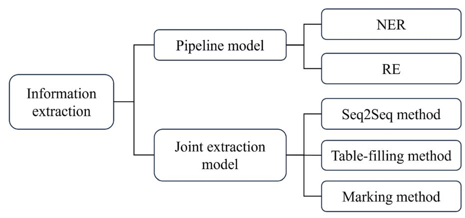
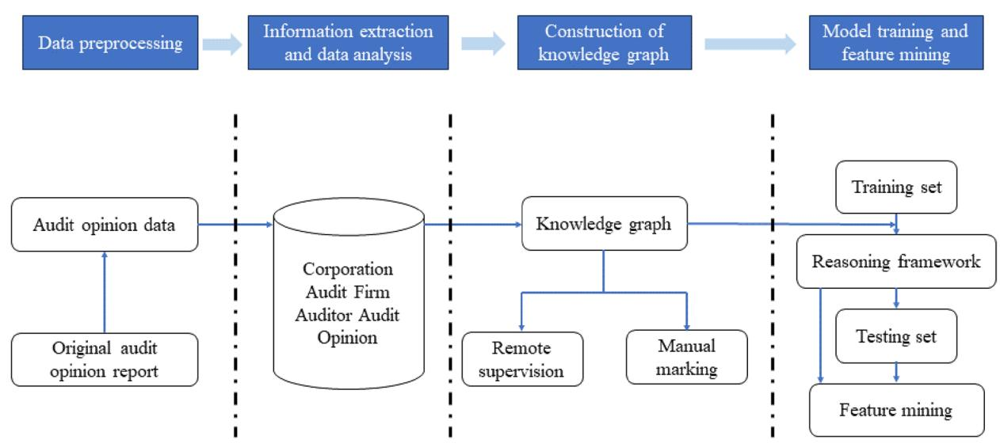

# **REVIEW Open Access**

## From data to insights: the application and challenges of knowledge graphs in intelligent audit

<!-- Image Description: That image is not a diagram, chart, graph, equation, or technical illustration. It's a graphical user interface (GUI) element — a button indicating a function to check for updates. The button features a circular progress indicator partially filled, suggesting an ongoing process or checking for updates, alongside a bookmark icon and text "Check for updates". The image's purpose in the paper is likely to illustrate an interface feature or user interaction within a described system. -->

Hao Zhong1 , Dong Yang1 , Shengdong Shi1 , Lai Wei1 and Yanyan Wang1\*

### **Abstract**

In recent years, knowledge graph technology has been widely applied in various felds such as intelligent auditing, urban transportation planning, legal research, and fnancial analysis. In traditional auditing methods, there are ineffciencies in data integration and analysis, making it difcult to achieve deep correlation analysis and risk identifcation among data. Additionally, decision support systems in the auditing process may face issues of insufcient information interpretability and limited predictive capability, thus afecting the quality of auditing and the scientifcity of decisionmaking. However, knowledge graphs, by constructing rich networks of entity relationships, provide deep knowledge support for areas such as intelligent search, recommendation systems, and semantic understanding, signifcantly improving the accuracy and efciency of information processing. This presents new opportunities to address the challenges of traditional auditing techniques. In this paper, we investigate the integration of intelligent auditing and knowledge graphs, focusing on the application of knowledge graph technology in auditing work for power engineering projects. We particularly emphasize mainstream key technologies of knowledge graphs, such as data extraction, knowledge fusion, and knowledge graph reasoning. We also introduce the application of knowledge graph technology in intelligent auditing, such as improving auditing efciency and identifying auditing risks. Furthermore, considering the environment of cloud-edge collaboration to reduce computing latency, knowledge graphs can also play an important role in intelligent auditing. By integrating knowledge graph technology with cloud-edge collaboration, distributed computing and data processing can be achieved, reducing computing latency and improving the response speed and efciency of intelligent auditing systems. Finally, we summarize the current research status, outlining the challenges faced by knowledge graph technology in the feld of intelligent auditing, such as scalability and security. At the same time, we elaborate on the future development trends and opportunities of knowledge graphs in intelligent auditing.

**Keywords** Knowledge graph, Electricity, Audit, Artifcial intelligence

### **Introduction**

Auditing, as a systematic process, aims to independently obtain and evaluate evidence to ensure the accuracy of an entity's fnancial statements, records, operations, or performance, and to fairly refect its

\*Correspondence:

Yanyan Wang

13655177880@163.com

fnancial position, operating results, and compliance with laws, regulations, and industry standards. Auditing is divided into two main categories: internal and external [[1\]](#page-22-0). Internal auditing is conducted by internal audit departments within organizations to improve efciency and efectiveness, safeguard compliance, security, and efciency [[2\]](#page-22-1). External auditing is conducted by independent third-party organizations, focusing primarily on the accuracy and fairness of fnancial reports and information [\[3](#page-22-2)]. In an environment where

<!-- Image Description: The image is the Springer Open logo. It consists of a stylized knight chess piece in dark blue and white, a horizontal orange bar beneath it, and the text "Springer Open" in dark blue, indicating the publisher of the academic paper. The logo serves as a publisher identifier, providing no technical data within the paper itself. -->

© The Author(s) 2024. **Open Access** This article is licensed under a Creative Commons Attribution 4.0 International License, which permits use, sharing, adaptation, distribution and reproduction in any medium or format, as long as you give appropriate credit to the original author(s) and the source, provide a link to the Creative Commons licence, and indicate if changes were made. The images or other third party material in this article are included in the article's Creative Commons licence, unless indicated otherwise in a credit line to the material. If material is not included in the article's Creative Commons licence and your intended use is not permitted by statutory regulation or exceeds the permitted use, you will need to obtain permission directly from the copyright holder. To view a copy of this licence, visit [http://creativecommons.org/licenses/by/4.0/.](http://creativecommons.org/licenses/by/4.0/)

1 Nanjing Yuanneng Electric Engineering Co., Ltd., Nanjing 210000, China

cloud-edge collaboration reduces computing latency, auditing can be conducted more conveniently and efciently [[4](#page-22-3)]. Cloud technology enables auditing teams to achieve real-time collaboration, cross-regional, crossdepartmental collaboration, signifcantly reducing information transmission and communication delays, and improving auditing efciency. At the same time, the cloud environment provides elastic and scalable computing resources to meet the demands of largescale data processing and analysis, providing stronger technical support for auditing. Under the framework of cloud-edge collaboration, auditing teams can fexibly adjust resource allocation, expand on demand, to adapt to audits of diferent scales and complexities, enhancing auditing quality and efciency [[5\]](#page-22-4).

Traditional approaches in the feld of auditing primarily rely on auditors manually examining ledgers, fnancial statements, and other relevant documents to assess the fnancial condition and operational efciency of an organization or project [\[6\]](#page-22-5). Tis method emphasizes onsite investigations, face-to-face interviews, and sample inspections to ensure the accuracy and compliance of records [[7\]](#page-22-6). In the context of power engineering projects, this involves auditing aspects such as project progress, cost control, contract execution, and project management. Traditional auditing methods exhibit the following characteristics:

- On-site investigations and face-to-face interviews: Auditors visit the site to observe and engage in direct communication with project managers and staf.
- Sample inspections: Since manually auditing all records is impractical, random or targeted sample inspections are typically employed.
- Manual record analysis: Auditors need to manually inspect and analyze ledger records and fnancial statements.
- Reliance on historical data: Traditional auditing methods primarily rely on historical data and records of completed tasks [\[8\]](#page-22-7).

With the development of technology and changes in the business environment, traditional auditing methods face various challenges:

- Sharp increase in data volume: As project scales expand, the volume of data involved also increases signifcantly, making it challenging for traditional methods to efciently handle large datasets .
- Increased complexity of technology: Power engineering projects involve various new technologies and complex engineering management processes, making it difcult for traditional auditing methods to com-

prehensively assess the efectiveness of technology implementation and project management.

- Need for higher efciency and accuracy: With increased regulatory requirements and stakeholders' demands for transparency and accountability, auditing requires higher efciency and accuracy.
- Application of intelligent auditing technologies: Te application of technologies such as big data, artifcial intelligence (AI), and knowledge graphs presents new opportunities and challenges for auditing [[9\]](#page-22-8).

In power engineering projects, intelligent auditing refers to the comprehensive and real-time monitoring and analysis of various stages such as design, procurement, construction, and operation using modern information technologies such as big data analytics, AI, cloud computing, and knowledge graphs. Tis approach can enhance auditing efciency and accuracy, enable timely identifcation and prevention of risks, and optimize resource allocation.

A knowledge graph is a technology that represents knowledge through a graphical structure, using nodes (entities) and edges (relations) to store and represent information related to entities and their relations. Te core advantage of knowledge graphs lies in their ability to present complex data and information in a structured and interconnected manner, thus providing support for data analysis, information retrieval, and intelligent decision-making. Knowledge graphs can handle and analyze large-scale, heterogeneous datasets, which is particularly important for auditing to deal with complex fnancial data and unstructured information (such as contract texts, communication records, etc.) [\[10](#page-22-9)]. Tey can quickly identify correlations between data, improving the efciency and accuracy of data processing. By constructing knowledge graphs involving companies, individuals, transactions, and other relevant entities and their relations, auditors can more easily identify abnormal patterns, hidden risks, and potential fraudulent behavior. Tis structured approach to data analysis can assist auditors in conducting more in-depth risk assessment and management. Knowledge graphs can provide a comprehensive perspective, helping auditors understand complex business environments and transaction relations. Tis deeper insight supports more precise audit decisions, enhancing audit quality and efciency [\[11](#page-22-10)]. Tey can be used to monitor and analyze an organization's compliance by quickly identifying potential compliance issues through comparing entity behavior and transactions with relevant regulations and standards. Combined with AI technologies such as machine learning and natural language processing (NLP), knowledge graphs can automate data analysis and insight discovery, providing powerful technical support for intelligent auditing [\[12](#page-22-11)]. Tis not only reduces manual workload during the audit process but also improves the quality and efectiveness of auditing. Knowledge graph technology demonstrates enormous potential in intelligent audit data analysis, enhancing audit process efciency and accuracy, strengthening risk management, supporting wiser decision-making, and driving audit work towards greater efciency and intelligence. With technology continually advancing, knowledge graphs are expected to play an increasingly important role in the feld of intelligent auditing.

In the reality of limited resources for internal audit investment, it is imperative for internal auditing to enhance audit efciency and focus on core risks within the enterprise, while expanding audit coverage. Tis has become an important trend in the current innovation and quality improvement of internal auditing [\[13](#page-22-12)]. Accelerating the pace of enterprise digital transformation, strengthening the reuse of data audit methods, and achieving intelligent auditing on this basis, transitioning from "human audit" to "machine audit" and then to "smart audit", is gradually becoming a new trend. In this process, the cloud-edge collaboration environment plays a crucial role by reducing computing latency and improving the response speed and efciency of auditing teams. Trough the introduction of intelligent auditing and cloud-edge collaboration environments, internal auditing can better coordinate the relationships between power enterprise managers, audited business departments, and external auditing, thereby reducing the daily workload of internal auditors [\[14](#page-22-13)]. At the same time, utilizing advanced digital management methods and cloudedge collaboration environments can enhance the level of intelligent auditing for engineering projects, achieve the intelligence and standardization of internal auditing, and thus improve the quality and efciency of data analysis. Tis not only provides intelligent support for subsequent decision-making and advanced applications but also has profound theoretical and practical signifcance for preventing and reducing the operational risks of power enterprises [[15\]](#page-22-14). Terefore, incorporating cloud-edge collaboration environments into the technical innovation and quality improvement strategies of internal auditing can efectively enhance audit efciency, expand audit coverage, and provide support for the digital transformation of power enterprises.

Te rest of the paper is organised as follows: ["Knowl](#page-2-0)[edge graphs: fundamentals and technologies](#page-2-0)" section outlines the foundations and technical concepts of knowledge graphs. Ten, ["Application of knowledge](#page-8-0) [graphs in intelligent audit](#page-8-0)" section analyses the application of knowledge graphs in smart auditing. ["Challenges](#page-13-0)

[in adopting knowledge graphs for audit"](#page-13-0) section describes the challenges of applying knowledge graph to auditing. ["Future trends and opportunities](#page-18-0)" section analyses future trends and challenges in the feld of knowledge graphs and auditing. Finally, we conclude the paper in "[Conclusion"](#page-21-0) section.

### **Knowledge graphs: fundamentals and technologies**

### **Basic concepts of knowledge graphs**

Te concept of knowledge graph was frst introduced by Google in its Knowledge Graph [[16\]](#page-22-15) project in 2012, aimed at enhancing the search quality and user experience of the Google search engine. A knowledge graph is a multi-relational directed graph composed of entities as nodes and relations as diferent types of edges. It describes various pieces of information about the real world in the form of knowledge triples, represented as (*h*, *r*, *t*), where *h* and *t* correspond to the head and tail entities, and *r* represents the relation between them. An entity can be an objectively existing object or an abstract concept. Te connections between entities are described using relations, which include pre-defned types and properties. Semantic descriptions and relations between entities form a networked structure of knowledge.

One key advantage of knowledge graphs is their ability to express complex knowledge systems in a highly intuitive and fexible manner. Tis graphical representation not only allows people to easily understand the relations between information but also enables computers to efciently process large amounts of data. In recent years, due to the outstanding advantage of knowledge graphs in representing structured data, they have played an increasingly important role in variousAI tasks, injecting new vitality into intelligent question answering [\[17](#page-22-16)], intelligent recommendation [[18\]](#page-22-17), and information retrieval [[19\]](#page-22-18). Numerous large-scale knowledge graphs such as DBPedia [[20\]](#page-22-19), Freebase [\[21](#page-22-20)], WordNet [\[20](#page-22-19)], and Wikidata [[22\]](#page-22-21) are widely used in various felds. Table [1](#page-3-0) shows the large-scale knowledge bases that are now well known. With the continuous discovery of new knowledge and the reinterpretation of old knowledge, knowledge graphs can be easily updated by adding new nodes and edges. Tis dynamism makes knowledge graphs an evolving knowledge base that can refect the latest developments in the feld of knowledge.

Furthermore, knowledge graphs excel in task analysis mainly due to their semantic relationship models, rich knowledge representations, semantic reasoning capabilities, structured representations, and support for large-scale data. Tese features enable knowledge graphs to better understand tasks and provide accurate, comprehensive information support for them [[27\]](#page-22-22). Users

| NAME | Institutions | Database content | |
|---------------|-------------------------|----------------------------------------------------------------------------------|------------------|
| DBPedia [23] | University of Leipzig | 38 million labels and abstracts containing 3 billion pieces of information | DBPedia |
| Freebase [21] | MetaWeb | 68 million entities, 1 billion pieces of relation information | FB15k, FB15k-237 |
| WikiData [22] | Wikimedia Foundation | Over 46 million data items | Wikipedia |
| YAGO [24] | Max Planck Institute | 459 million entities, 24 million knowledge triples | YAGO |
| YAGO2 [25] | Max Planck Institute | 200,000 entity categories, 3 million entities and 220 million knowledgen triples | YAGO2 |
| WordNet [26] | University of Princeton | 117,000 synonym sets | WN11,WN18 |

**Table 1** Large-scale knowledge tables

can query the knowledge graph to discover hidden relations between diferent entities or explore the knowledge structure within a specifc domain. For example, by analyzing a medical knowledge graph, researchers can uncover associations between a certain medication and specifc diseases, or identify connections between certain symptoms and particular health conditions. Te construction and application of knowledge graphs are interdisciplinary felds that combine research achievements from various felds such as computer science, linguistics, and information science. With the continuous advancement ofAI technology, knowledge graphs will play an increasingly important role in intelligent information processing and knowledge discovery, providing people with richer, more accurate, and personalized information services [[28](#page-22-23)].

### **Key technologies for knowledge graphs** *Knowledge extraction*

Knowledge extraction was frst proposed in the late 1970s, with its core task being the automated discovery and extraction of relevant information from text. Knowledge extraction is a crucial technology for automatically constructing large-scale knowledge graphs, aiming to extract knowledge from various sources and structures of data and store it in a knowledge graph. Te data sources for knowledge extraction can include structured data (such as linked data, databases), semi-structured data (such as tables, lists in web pages), or unstructured data (pure text data). Depending on the type of data source, knowledge extraction involves diferent key technologies and technical challenges that need to be addressed. Knowledge extraction models are classifed into pipeline models and joint extraction models, as illustrated in Fig. [1.](#page-3-1)

In the pipeline model, Named Entity Recognition (NER) aims to identify strict indicators in the text belonging to predefned semantic types such as person names, locations, organizations, etc [\[29](#page-22-24)]. NER not only serves as an independent tool in Information Extraction (IE) but also plays a crucial role in various NLP applications including text understanding, information retrieval, automatic text summarization, question answering systems, machine translation, and knowledge base construction. Te development of NER traces back to the Sixth Message Understanding Conference (MUC-6), where its purpose was to identify organization, personnel, and geographical location names, as well as currency, time, and percentage expressions in text. Since MUC-6, NER has garnered increasing attention and undergone in-depth

<!-- Image Description: This flowchart illustrates information extraction methods. It branches from "Information extraction" into "Pipeline model" and "Joint extraction model." The pipeline model further subdivides into Named Entity Recognition (NER), Relation Extraction (RE), and a Seq2Seq method. The joint extraction model branches into table-filling and marking methods. The diagram's purpose is to categorize and visually represent different approaches to information extraction within the paper. -->

**Figure 1** Information extraction model classifcation diagram

research in various scientifc activities. In its initial stages, NER primarily relied on expert-crafted rules and domain dictionaries [\[29](#page-22-24)]. Tese rules encompassed morphological rules, punctuation, statistical information, etc., while dictionaries included domain-specifc vocabularies and common sense knowledge. Te emergence and evolution of machine learning further propelled NER research. Tese methods leverage large volumes of annotated data for training, optimizing parameters to ultimately generate optimal models. Common machine learning approaches for entity recognition include Support Vector Machines, Hidden Markov Models, Maximum Entropy Models, and Conditional Random Fields. Te advent of deep learning provided new avenues for entity recognition compared to earlier rule-based or machine learning-based approaches. Bengio et al. [[30\]](#page-22-29) proposed establishing a three-layer neural network structure to train language models and generate distributed word vectors. Subsequently, researchers continuously optimized word vectors, fostering rapid development in NLP. More updated techniques applied to NER subsequently achieved state-of-the-art performance. Collobert et al. [[31\]](#page-22-30) introduced a method based on sentences and windows, marking the classical inception of applying neural network models and word vectors to NER. Tis work also marked the frst attempt to obtain general word embeddings from unlabeled data. Huang et al. [[32](#page-22-31)] proposed the BiLSTM-CRF model, which combines bidirectional LSTM and CRF models for sequence labeling tasks, becoming the mainstream NER model at the time and still widely used as a baseline model. Chiu et al. [\[33](#page-22-32)] proposed the BiLSTM-CRF-CNNS model, combining RNN and CNN based on the work of Bengio et al. [[30\]](#page-22-29). In 2015, Lu et al. [\[34\]](#page-22-33) introduced the concept of hypergraphs, presenting a model based on hypergraph representation called Mention Hypergraph. Tis model uses nodes and directed edges together to represent named entities and their combinations. Tis representation efciently handles nested named entities, solving the problem of difcult detection. In 2018, Wang et al. [[35](#page-22-34)] proposed a new method called Segmental Hypergraphs, addressing structural ambiguity issues present in the previous Mention Hypergraph method.

Relation extraction (RE) is a core task in the feld of NLP, aiming to extract unknown relation facts from human language text and organize unstructured information into structured formats [\[36](#page-22-35)]. By leveraging deep learning techniques such as Convolutional Neural Networks (CNNs), Recurrent Neural Networks (RNNs), and Long Short-Term Memory networks (LSTMs), researchers can accurately extract relations between entities from complex language environments [\[37](#page-22-36), [38\]](#page-22-37). Tis process is crucial for applications like constructing knowledge graphs, understanding text content, and supporting question-answering systems, as it automates the handling and analysis of large-scale textual data, revealing implicit connections between information.Mainstream RE methods are categorized into supervised, unsupervised, and distantly supervised extraction methods based on the need for annotated data. Supervised RE methods are typically modeled as multi-class classifcation tasks, with much research focusing on extracting text features for relation classifcation. Early classic supervised methods for RE were based on feature vectors and kernel functions. For instance, Kambhatla [[39\]](#page-23-0) proposed a method to extract semantic relations between nouns by combining shallow and deep syntactic processing with semantic information, using kernel functions for calculation, and reducing dependence on semantic trees. Additionally, Giuliano et al. [[40\]](#page-23-1) integrated various lexical, syntactic, and semantic features in text using Support Vector Machine (SVM) models and Maximum Entropy models, achieving good results.Although methods based on feature vectors and kernel functions perform well in the extraction process, feature extraction and kernel function design often rely on the modeler's expertise. Deep learning has seen wide application in various felds, with many neural network-based models such as CNNs, RNNs, and LSTMs performing well on entity RE tasks [[41](#page-23-2)]. Unsupervised RE methods involve automatically identifying entities and their relations from text without pre-annotated corpora. Some clustering-based methods perform well in unsupervised RE. For example, Zhao et al. [\[42\]](#page-23-3) utilized pre-defned relation labeled data to learn a relation-oriented representation and form a clustering structure by aggregating instances of the same relation into corresponding relation centers to discover new relation types in unlabeled data. Additionally, pattern matching-based methods are also popular, where Tran et al. [\[43](#page-23-4)] extracted relations between entities based on manually defned rules or patterns such as regular expressions and syntactic parsing. Furthermore, some deep learning techniques have been applied to unsupervised RE. Yuan et al. [[44](#page-23-5)] proposed an unsupervised RE technique based on Variational Autoencoders (VAEs), connecting the decoder and encoder without imposing restrictions on the classifcation distribution, thereby improving training stability.

In the context of joint extraction models, methods based on Seq2Seq refer to treating triples as token sequences, transforming the triple extraction task into a generation task of producing triples in a certain order. Addressing the issue of overlapping triples in complex contexts, Zeng et al. [\[45](#page-23-6)] introduced the CopyRE model, which utilizes a copying mechanism. Tis model frst generates relations and then generates all triples in the text to resolve the problem of relation overlap. Fu et al. [[46\]](#page-23-7) and Nayak et al. [[47\]](#page-23-8) also tackled this problem, where Fu et al. [\[46\]](#page-23-7) proposed a Graph Convolutional Network (GCN)-based method for relation triple extraction, while Nayak et al. [[47](#page-23-8)] introduced a Seq2Seq-based approach where each time step extracts a word representation. In 2021, Ye et al. [[48](#page-23-9)] proposed a Transformerbased generative contrastive learning framework for RE, aiming to address the issue of recurrent neural networks failing to capture long-term dependency relations, resulting in unreliable triple generation. Additionally, word replacement operations can also be conducted to achieve diferent purposes. Zheng et al. [[49](#page-23-10)] employed a novel annotation strategy, simultaneously labeling entity information and relation types, transforming the tasks of NER and RE into sequence labeling tasks. However, this model overlooks the scenarios of SEO and EPO.

Te fll-in-the-blank method involves models typically maintaining tables corresponding to each relation, where each entry indicates whether the corresponding relation exists for a given token pair. Entries with labels usually represent the start and end positions of the two entities involved in the relation. Tis method represents relation information by flling in tables. In 2020, Wang et al. [[50\]](#page-23-11) proposed a method that utilizes mutual interaction between sequence encoders and relation table encoders, combined with attention mechanisms, to capture the interaction information between entity recognition and RE tasks, thereby enhancing model performance. In the same year, Wang et al. [[51\]](#page-23-12) also introduced the TPLinker model, which unifes the annotation framework into a linking problem of word pairs, capable of addressing issues like entity overlap relations and nested entities. In 2021, Ren et al. [\[52\]](#page-23-13) frst considered the global correlation between word pairs and various types of relations in fll-in-the-blank-based methods to overcome the limitations of relying solely on local features of individual word pairs. Additionally, Miwa et al. [[53\]](#page-23-14) proposed an end-to-end model for extracting entity relations on word sequences and dependency tree structures. Tis model employs bidirectional sequences and bidirectional tree structures to jointly model entities and relations. It frst detects entities and then uses a single incremental decoding vector structure to extract relations between entities, while jointly updating vector parameters for entities and relation labels, achieving better entity RE results. Eberts et al. [\[54\]](#page-23-15) proposed the SPERT (span-based joint entity and RE) model, which utilizes a Transformer network as the foundational unit to perform lightweight embedding, entity recognition, and fltering for entities within spans. Tis model also conducts word replacement operations.

Te token-based method typically refers to models predicting relations based on tokens. In these models, binary token sequences are often used to determine the start and end positions of entities and sometimes to identify relations between two entities. Additionally, word replacement operations are commonly applied in these methods to increase model fexibility and adaptability. Yu et al. [\[55](#page-23-16)] proposed a span-based annotation strategy, where they frst label the positions and types of head entities, then label the positions of tail entities, and predict the relation between head and tail entities. However, this method overlooks the potential relations between head and tail entities. Li et al. [[56\]](#page-23-17) formalized the joint RE task as a multi-turn question-answering task, extracting triplets based on question-answer templates, but the high computational complexity due to multiple sentence encodings is a limitation. Dai et al. [[57](#page-23-18)] introduced a word-position-based annotation strategy, generating content vectors by combining position-based attention mechanisms. To better explore the interaction between entity recognition and RE, Wu et al. [[58](#page-23-19)] employed two isomorphic bidirectional type attention LSTMs and enhanced the dependency between entity types and relation types through cross-type attention mechanisms. In recent years, researchers have also proposed the PRGC [\[59](#page-23-20)] model and bidirectional extraction framework to improve model efciency and reduce entity extraction omissions. Additionally, word replacement operations can be performed in these methods to increase model fexibility and adaptability.

### *Knowledge graphs completion*

Knowledge graph completion aims to automatically discover and fll in missing entities or relations by utilizing existing knowledge and reasoning techniques. Currently, there are numerous methods available for constructing knowledge graphs and inferring incomplete triplets [\[60](#page-23-21)]. Tese methods can be broadly categorized into tensor factorization models and translation models. In the context of intelligent auditing, tensor decomposition models can aid auditors in identifying potential irregularities or anomalies by transforming fnancial data into tensor form and leveraging tensor decomposition techniques to uncover underlying patterns and factors, thus providing valuable decision support. On the other hand, translation models can be utilized for translating and understanding cross-language audit information, enhancing audit team efciency and communication quality.

Models based on tensor decomposition represent the combination of incomplete triplets and missing parts as a three-way tensor, which is then decomposed to obtain embeddings for head entities, relations, and tail entities. Among these are some lightweight models, such as the one proposed by Nickel et al. [[61](#page-23-22)], which leverages hypercomplex space to learn knowledge graph embeddings, enhancing the generalization compared to ComplEx [\[62](#page-23-23)]. Unlike the standard vector space with a single component *i*, each quaternion embedding is a vector in the hypercomplex space *H* with imaginary components *i*,*j*, and *k*, embedding the relation quaternion via the Hamilton product into a new scoring function. Tucker [[63](#page-23-24)] utilizes a diferent decomposition model called Tucker decomposition to compute a smaller core tensor and a sequence composed of three matrices, each representing embeddings for entities and relations. Overall, these models ofer efective approaches for handling incomplete triplets and missing parts in knowledge graphs, which are crucial for reasoning and completion tasks.

Te translation model interprets relations as simple translations of hidden entity representations. Te translation distance model measures the plausibility of facts and utilizes a distance-based scoring function. Translation-based models aim to fnd low-dimensional vector representations of entities related to entity translations. TransW [[64\]](#page-23-25) proposes using word embeddings for knowledge graph embedding to better handle unseen entities or relations. Unlike previous works that overlook word-level details in triplets, TransW aims to enrich the knowledge graph by using word embeddings to represent missing entities and relations. RotatE [\[65\]](#page-23-26) is another translation-based knowledge graph representation learning method. Tis model can infer diferent relation patterns, whether symmetric or asymmetric. Te rotation model defnes each relation as a rotation from the source entity to the target entity in the complex vector space. HAKE [[66\]](#page-23-27) is a translation distance model that explicitly models modulus information, with tree depth considered as modulus, while the distance function only considers the modulus part.

### *Knowledge graphs reasoning*

With the further development of the Internet and big data technology, the types of knowledge graphs are constantly increasing, and the amount of data is continuously growing. During the inference process, complex question types are constrained, and answers are derived through multi-hop relations between entities. For instance, for the question "Which company did the chairman of xx company invest in?", we can fnd Tom through the chairman relation of the subject entity "xx company", and then fnd the answer entity "yy company" through Tom's investment relation. Te intermediate relations and entities constitute the reasoning path. Our goal is to automatically and accurately learn such reasoning paths. Te simplifed reasoning process is illustrated in Fig. [2.](#page-6-0) Multisource knowledge graph reasoning holds signifcant importance in real-world application scenarios. With the advancement of multi-source knowledge graph reasoning, numerous methods have emerged in recent years, including inference based on traditional rule represen-

tation, distributed inference, and neural network-based

inference. Rule-based inference primarily applies simple rules or statistical features on some early manually constructed knowledge graphs. For instance, the NELL knowledge graph internally utilizes simple frst-order relation learning algorithms for inference [[67](#page-23-28)]. Wang et al. [[68](#page-23-29)] introduced the frst-order probabilistic language model ProPPR for knowledge graph inference. Lao et al. [[69](#page-23-30), [70\]](#page-23-31) proposed the PRA algorithm, which treats inference paths as features to predict whether specifc relations exist between entities. Gardner et al. [[71\]](#page-23-32) introduced the simpler and more efective SFE algorithm for generating feature matrices from knowledge graphs, which traverses adjacent entities of head entities using a breadth-frst strategy, extracts features from local structures, and then performs inference. Liu et al. [\[72\]](#page-23-33) proposed the hierarchical random walk inference algorithm, where the upper layer corresponds to a global learning perspective, and the lower layer corresponds to local learning inference within the knowledge graph. Additionally, some models utilize rule-based inference based on diferent types of paths. For example, Guo et al. [\[73](#page-23-34)] employ angle-soft rules, while Zhang et al. [\[74](#page-23-35)] utilize axioms.

Te process of distributed-based inference involves obtaining low-dimensional vector representations through models and then using vector operations for inference on the corresponding knowledge graph. Bordes et al. [\[75](#page-23-36)] proposed the frst transfer-based representation model, TransE, which serves as the foundation of distributed-based models and initiated the

<!-- Image Description: The image depicts a knowledge graph illustrating a reasoning path. Three rectangular boxes represent entities: "xx Company," "Tom," and "yy Company." Arrows labeled "president" and "invest" show relationships between them. Below, a line labeled "Inference path" connects "Subject entity" (xx Company) to "Answer entity" (yy Company), demonstrating an inference process. The diagram likely illustrates a knowledge base representation and reasoning technique used in the paper. -->

research trend of the Trans series. Wang et al. [[76](#page-23-37)] proposed TransH, which learns one more mapping vector for each relation on top of TransE for mapping entities to the hyperplane specifed by the relation, which somewhat alleviates the problem of not being able to deal with multi-mapped attribute relations well. Lin et al. [\[77](#page-23-38)] proposed TransR and CTransR. TransR establishes representations for entities and relations in separate spaces, with each relation corresponding to a space and a mapping matrix. After mapping relations to relation space, the relation vector can be transformed into a transition between two entity vectors. Lin et al. [[78\]](#page-23-39) also introduced PTransE, which distinguishes between diferent paths between entities. PTransE extends TransE by modeling relation path constraints, constructing paths through relation combination operations, and then weighting multiple paths between entities to improve the accuracy of inference.

With the rapid development of neural network technology, research on knowledge graphs based on neural networks has received widespread attention. Neural networks ofer advantages in knowledge graph reasoning, including self-learning capabilities, fast computation speed, and high accuracy. Socher et al. [\[79](#page-23-40)] proposed NTN, which uses a bilinear tensor layer instead of traditional neural network layers to connect head and tail entities, enabling the representation of complex semantic relations between entities in diferent dimensions. Shi et al. [\[80](#page-23-41)] introduced the ProjE shared-variable neural network model in 2017. It learns joint embeddings of entities and edges in the knowledge graph and flls in missing information by modifying standard loss functions. Neelakantan et al. [[81\]](#page-23-42) trained an RNN for each relation type to obtain variable-length combination representations. Tey generate the next combination vector from input relation vectors and the current path vector on the path, with the output of the last step serving as the representation of the path vector. Te training objective of this model is to maximize the probability of correct triplets. Graves et al. [\[82](#page-23-43)] proposed DNC, which includes an LSTM neural network controller and an addressable external storage matrix. Additionally, Trivedi et al. [\[83](#page-24-0)] proposed Know-Evolve, a novel deep evolutionary knowledge network capable of learning nonlinear evolving entity representations over time. Xu et al. [[84](#page-24-1)] introduced GNN into TEA-GNN to capture long-term dependency relationships in temporal knowledge graphs. Bai et al. [\[85](#page-24-2)] employed a pruning strategy to obtain temporal logical rules and calculate their confdence scores.

### *Knowledge graphs and intelligent auditing*

Te application of knowledge graphs in intelligent auditing is increasingly widespread. Its core lies in utilizing graph databases to construct and represent enterprise information, associated entities, and their interactions, thereby supporting tasks such as information integration, data mining, and risk identifcation during the auditing process [[86](#page-24-3)]. Trough knowledge graphs, auditors can swiftly access comprehensive information about audit targets. Leveraging the querying and analytical capabilities of graph databases enables data correlation, pattern recognition, and trend analysis, thus enhancing audit efciency and accuracy [[87](#page-24-4)]. Additionally, knowledge graphs can be combined with natural language processing techniques to achieve semantic understanding and intelligent inference of audit documents and reports, providing further support and reference for audit decision-making [[88\]](#page-24-5).

While the application of knowledge graphs in intelligent auditing brings many benefts, it also faces several challenges. Firstly, constructing knowledge graphs requires a signifcant amount of data, including structured and semi-structured data, which can be a major challenge for enterprises [[9\]](#page-22-8). Secondly, updating and maintaining knowledge graphs is also a concern as enterprise information and relationships may change frequently, requiring timely updates to ensure accuracy. Additionally, the scale and complexity of knowledge graphs increase the complexity of queries and reasoning, necessitating efcient algorithms and technologies to support them [[89\]](#page-24-6). Lastly, the incompleteness and uncertainty of data in knowledge graphs may afect auditors' judgment and decision-making regarding risks. Terefore, addressing these challenges requires a comprehensive consideration of issues such as data quality, update mechanisms, query performance, and uncertain reasoning [[90\]](#page-24-7).

Te development of knowledge graphs in the feld of intelligent auditing holds vast prospects for the future. Several trends are anticipated: Firstly, the construction of knowledge graphs will become increasingly automated and intelligent. With advancements in natural language processing, machine learning, and graph databases, enterprises can more easily extract knowledge from large-scale audit data and autonomously build and update knowledge graphs. Secondly, knowledge graphs will be integrated with other intelligent technologies such as machine learning, data mining, and predictive analytics to achieve more precise and efcient risk identifcation and decision support [[91\]](#page-24-8). Furthermore, the application scope of knowledge graphs will expand beyond fnancial auditing to areas such as compliance auditing, internal controls, and risk management. Lastly, the openness and sharing of knowledge graphs will be enhanced, enabling diferent enterprises and institutions to share and exchange knowledge graphs, thereby further improving audit efciency and accuracy [[8](#page-22-7)].

### **Application of knowledge graphs in intelligent audit**

Knowledge graphs, as a form of structured semantic knowledge repository, are designed to store information about entities (such as individuals, locations, organizations, etc.) and their relations in a graphical format from various forms of data [\[92–](#page-24-9)[94\]](#page-24-10). Tis approach signifcantly simplifes the process of knowledge comprehension and retrieval for both machines and humans. Te organization of information in graphs not only enhances the accessibility of data but also strengthens the interconnectedness of information, thereby making knowledge more easily explorable and exploitable.

Furthermore, the integration of knowledge graphs with cloud-edge computing could further enhance the utility of this technology [\[95](#page-24-11)]. Cloud-edge computing provides a decentralized processing infrastructure, which could not only speed up the processing and retrieval of data from large-scale knowledge graphs but also reduce the risk of data loss as the data can be stored on local devices. Moreover, this could facilitate real-time data analysis, as data can be processed at the edge of the network, closer to the source, thus reducing latency times signifcantly [[15,](#page-22-14) [96](#page-24-12)[–101\]](#page-24-13).

In various felds, the application of knowledge graphs has become increasingly important, spanning domains such as fnance, healthcare, education, information and communication technology, scientifc engineering, social politics, and tourism.

In these domains, knowledge graph technology is utilized to integrate information from diverse sources, demonstrating its potent capabilities. For instance, in the healthcare sector, knowledge graphs constructed by integrating heterogeneous resources have been successfully employed to establish unifed question-answering systems and recommendation systems, which provide accurate medical information and personalized health advice [[10,](#page-22-9) [102](#page-24-14), [103](#page-24-15)]. Additionally, knowledge graphs are utilized for uncovering intricate relations within biological data [[104\]](#page-24-16), predicting ecotoxicological efects in environmental engineering [\[36](#page-22-35)], detecting fraudulent activities in the fnancial domain [[105](#page-24-17)], as well as discovering and visualizing political relations [[29](#page-22-24), [106\]](#page-24-18). Tese applications showcase how knowledge graphs enable the integration of knowledge from disparate sources and efectively utilize this knowledge for conceptualization and problemsolving in specifc domains.

While general-purpose and open-world knowledge repositories have been widely adopted for handling a variety of cross-domain tasks, the construction of knowledge bases focusing on specifc domain issues is particularly crucial. Tis is because such domain-specifc knowledge graphs not only provide data directly relevant to the domain's problems but also encompass semantically interrelated applications, which are essential for a deeper understanding and resolution of specifc issues within the domain [[107\]](#page-24-19). Specifcally, these knowledge graphs enrich and extend the underlying domain ontology, enabling the resolution of specifc problems from domain corpora. Although domain-specifc knowledge graphs remain a relatively novel and underexplored area, lacking a unifed and comprehensive defnition [\[108](#page-24-20)], some studies have begun to regard domain-specifc knowledge graphs as a particular type of knowledge repository representing specifc and complex domains [[11,](#page-22-10) [109,](#page-24-21) [110](#page-24-22)]. Jain et al. [\[111](#page-24-23)] proposed a report indicating that domain-specifc knowledge bases result from the process of enriching the underlying domain ontology.

In eforts to provide an inclusive defnition for domainspecifc knowledge graphs, Abu-Salih et al. [\[112](#page-24-24)] proposed a comprehensive defnition outlining three core aspects. (1) Formal Conceptualization: Tis refers to the logical design of the knowledge graph, which is depicted through a specifc and predefned domain ontology aimed at capturing the generalization (higherlevel) meaning of the domain of interest or the content of specifc subdomains. (2) Tematic Domain: Ensuring that the knowledge graph for a specifc domain is constructed around specifc thematic knowledge, frmly situated within the context of that particular thematic knowledge. (3) Semantically Interrelated Entities and Relations: Emphasizing the physical design of domainspecifc knowledge graphs, which are presented in the form of a labeled graph where the semantics of the data are enriched through specifc conceptual representations of entities and the relations between them. Tis comprehensive defnition not only provides a profound understanding of domain-specifc knowledge graphs but also underscores their signifcant potential for information integration and knowledge discovery across various domains.

In this chapter, we will specifcally delve into the achievements of knowledge graphs in the feld of auditing, primarily focusing on the following aspects: the specifc applications of knowledge graphs in the auditing domain, how to leverage knowledge graphs to enhance the efciency of collecting and analyzing audit evidence, and the role of knowledge graphs in detecting audit risks and abnormal behaviors.

### **Specifc applications of knowledge graphs in auditing**

Te task of auditing involves identifying risk points from complex structured and unstructured data and reporting signifcant errors. Terefore, the application of big data in the auditing domain is of great signifcance for achieving audit objectives [[113\]](#page-24-25). Betti et al. [[114](#page-24-26)] discussed the evolution of internal audit models in the context of digitization and intelligence, laying the foundation for integrating knowledge graphs and deep learning in audits. In recent years, the advent of big data has led to a shift in the media of audit targets, with the focus of audits shifting towards electronic data, such as fnancial data and other business data in various well-structured databases [[115\]](#page-24-27). Lv et al. [\[116](#page-24-28)] pointed out that unstructured data from external audit network resources can be extracted using web crawler technologies like Nutch [\[117](#page-24-29)] and Heritrix [\[118](#page-24-30)], then transformed and stored in a structured manner in audit cloud platforms. In terms of data analysis, "SAMPLE = Total" data analysis models, software, and model-based streaming analysis methods have been used to enhance the accuracy of analysis and efectively improve audit efciency [[119\]](#page-24-31). Despite the widespread adoption and application of technologies such as data mining and data analysis in the auditing domain, the impact of the big data era on auditing remains insufcient [[120\]](#page-24-32). Terefore, in the feld of auditing, the application of knowledge graphs is rapidly becoming an indispensable part, fundamentally changing traditional methods by analyzing large and complex datasets to discover hidden relations and insights. Tis helps auditors identify potential risks and anomalies.

Te general process of using a knowledge graph to accurately represent intelligent audit issues is as follows:

- Knowledge graph modeling: Firstly, it is necessary to construct an appropriate knowledge graph model based on the domain expertise of intelligent auditing. Tis model should include entities, attributes, and relationships related to auditing. For example, entities such as "enterprise," "fnancial statements," "auditor," attributes such as "enterprise registration time," "period of fnancial statements," and relationships such as "enterprise owns fnancial statements," "auditor audits fnancial statements" can be defned.
- Knowledge extraction and import: Knowledge related to intelligent auditing in the form of auditing reports, fnancial documents, regulatory fles, and other sources is extracted and transformed into the format of a knowledge graph. Tis can be achieved through techniques such as natural language processing and information extraction. For example, information such as auditing conclusions and fnancial indicators from auditing reports can be extracted and mapped to entities, attributes, and relationships in the knowledge graph.

querying operations are performed using the relationships and rules in the knowledge graph to answer specifc intelligent audit questions. Graph databases and query languages like SPARQL can be used for implementation. For example, it is possible to query whether the fnancial statements of a particular enterprise comply with relevant regulations or fnd audit cases related to a specifc auditor.

However, literature on knowledge graph analysis regarding the current state of research in internal auditing, big data auditing, intelligent auditing, performance auditing, and other auditing felds is scarce. Practical research utilizing knowledge graph technology for ofsite audits and designing intelligent expert models for industry auditing is even rarer. By illustrating the practical applications of knowledge graphs in auditing work, we delve deeper into the contribution of knowledge graphs to improving audit quality and efciency. Te specifc applications of knowledge graphs in the auditing domain include two aspects: auditing and information system applications, and network threat analysis and detection.

- **Audit and information systems applications:** Tese applications aim to utilize semantic networks and graph technologies to better integrate, interpret, and apply data in the context of auditing and fnancial analysis.
- **Network threat analysis and detection:** Tese applications focus on identifying and analyzing network security threats through systematic audit record examination. Techniques such as kernel audit record analysis and recommendation-guided threat analysis are employed. Tese eforts emphasize the development of methods for hunting network threats and strengthening security measures.

In the feld of audit and information systems applications, Liu et al. [[89\]](#page-24-6) proposed a preliminary innovative approach to constructing an enterprise-level, knowledge graph-based information audit platform. Te conceptual model is depicted in Fig. [3.](#page-10-0) Specifcally, this platform gathers information from diverse data sources, including structured and semi-structured enterprise data from audit databases and commercial databases, as well as unstructured general information from sources such as encyclopedias. During the data collection and standardization phase, the platform employs a standardized terminology dictionary to normalize the data and transfers it to relational databases and object storage services. Subsequently, the construction of the knowledge graph encompasses knowledge extraction, storage, and

<!-- Image Description: This flowchart illustrates a knowledge graph construction process. It shows data flowing from diverse sources (audit and business databases, encyclopedias) through data collection and standardization, using a standard terminology dictionary. A data transmission service feeds structured and unstructured data into knowledge graph construction, incorporating knowledge extraction, storage, and fusion. The resulting graph supports data-based decision-making and efficient data analysis. -->

**Figure 3** The conceptual model of the knowledge graph-based enterprise information audit platform

fusion. Ultimately, leveraging the developed knowledge graph, this platform facilitates data-driven decisionmaking and efcient data analysis. It is important to note that this depiction represents a conceptual model, and an actual company information auditing platform may exhibit greater complexity. Tis integration signifcantly enhances the capability for data processing, analysis, and decision-making by leveraging various data sources to construct comprehensive knowledge graphs, thereby improving the efciency and efectiveness of the audit process [[89\]](#page-24-6). It underscores the transformative potential of knowledge graphs in auditing, providing a cuttingedge solution to the inherent complexity in audit data management and analysis. Additionally, the research by Zhu et al. [[5\]](#page-22-4) elaborately discussed the multifaceted applications of knowledge graphs in Economic Responsibility Auditing (ERA), emphasizing their utility in trend identifcation, hotspot identifcation in ERA data, as well as elucidating key themes, patterns, and their evolution over time. Tis approach not only deepens audit analysis by addressing emerging issues and predicting the future development of electronic reverse auctions but also utilizes a comprehensive analysis of literature on electronic reverse auctions from 1986 to 2022. Chen et al. [\[8](#page-22-7)] demonstrated an innovative approach that combines knowledge graphs with deep learning technologies to enhance the audit process, mapping structured and unstructured data to uncover hidden relations and insights. Tis significantly improves internal audit efciency, highlighting the potential of knowledge graphs in transforming traditional audit practices. Dai et al. [\[9](#page-22-8)] introduced an innovative method for conducting audit queries through an intelligent question-answering system based on knowledge

graphs and semantic similarity, emphasizing the integration of knowledge graphs to efectively handle and respond to complex audit-related queries. Teir research underscores the transformative potential of combining knowledge graphs with AI technologies in auditing, providing insights for practical applications and improving audit efciency.

In the realm of network threat analysis and detection, Zeng et al. [[1\]](#page-22-0) utilized system audit records and data source technologies, along with graph neural networks and recommendation systems, to identify and analyze network threats. Tis approach not only enhances threat detection accuracy but also reduces reliance on expert knowledge, showcasing the potential of knowledge graphs in automating and enhancing audit intelligence. Similarly, Wu et al. [\[3](#page-22-2)] developed a method for detecting fnancial fraud risks using an audit information knowledge graph, particularly for companies listed on the Growth Enterprise Market in China, as illustrated in Fig. [4.](#page-11-0) When detecting fraudulent companies, the workfow of utilizing a knowledge graph is as follows: frstly, they collect and preprocess audit opinion data, including information about companies, audit frms, auditors, and so on. Next, they perform information extraction and data analysis to gain insights into the fnancial condition of companies and audit opinions. Subsequently, they construct a knowledge graph that describes the associations between companies, audit frms, and auditors. With the knowledge graph in place, they proceed with model training and feature mining to enhance the ability to detect fraudulent behavior. Finally, they apply the trained model to a test set to validate its performance on new data. Tis workfow leverages the structure and

<!-- Image Description: This flowchart details an audit opinion analysis process. It shows data preprocessing, information extraction, and knowledge graph construction from audit opinion data. The knowledge graph is then used in model training and feature mining, utilizing a reasoning framework, training set, and testing set. The process involves both remote supervision and manual marking stages within the knowledge graph construction. -->

**Figure 4** The main workfow of using knowledge graphs to detect fraud corporations

relationships within the knowledge graph to improve the detection of potential fraudulent companies. Tis method integrates audit information into structured knowledge graphs for advanced analysis and inference, providing insights into identifying potential fnancial fraud. It ofers a new tool for auditors and fnancial analysts to enhance risk analysis by leveraging interconnected data in knowledge graphs, thereby improving the accuracy and efciency of fraud detection processes. Yang et al. [[6\]](#page-22-5) proposed a fexible approach to track network threats through kernel audit record analysis using knowledge graphs. Tis method organizes audit data into structured formats for detecting complex threat patterns and behaviors, thereby enhancing investigation and understanding of security events. Tis approach helps identify abnormal activities and potential security vulnerabilities, demonstrating the application of knowledge graphs in improving audit processes in the feld of network security. A notable example of the application of knowledge graphs in the auditing domain is their use in fnancial audits of power grid enterprises. In addition, in the fnancial audit of power grid enterprises, the integration of cloud-edge data into a knowledge graph can ofer a more comprehensive perspective, aiding auditors in evaluating the fnancial condition and operational performance of power grid enterprises.

### **Methodology and practices**

After exploring the specifc applications of knowledge graphs in the auditing domain, it is evident that these advanced data structures provide profound improvements to traditional auditing methods. Knowledge graphs further revolutionize the auditing process by signifcantly enhancing the efciency of evidence collection and analysis. From identifying potential risks and anomalies through knowledge graphs to leveraging these systems for more detailed audit evidence tasks, a promising path is paved for auditing. By optimizing data integration, analysis, and insight generation, knowledge graphs ofer an innovative approach that not only simplifes evidence collection but also enhances the analytical processes that support efective audit practices. Tis advancement highlights a broader trend of data-driven decision-making in auditing, where knowledge graphs act as catalysts and pathways to more complex and efcient auditing methods. Liu et al. [[89\]](#page-24-6), through collecting data from various databases and external internet resources, constructed, updated, and expanded knowledge graphs using comprehensive data. Tese graphs enhance data accessibility and support data-driven decision-making, providing fexible and adaptive tools for sustainable auditing. Additionally, Zhu et al. [[5\]](#page-22-4) utilized knowledge graph analysis to improve the efciency of collecting and analyzing audit evidence in Economic Responsibility Auditing (ERA). Trough CiteSpace analysis of ERA research, the study mapped the evolution of ERA themes, identifed research hotspots, and elucidated trends. Chen et al. [\[8](#page-22-7)] proposed a method to enhance the efciency of evidence collection and analysis in power grid enterprise audits using knowledge graphs.

In the realm of network threat analysis and detection, Zeng et al. [\[1](#page-22-0)] transformed system audit records into source graphs, which, in conjunction with system entities, form a knowledge graph. Wu et al. [\[3](#page-22-2)] outlined a method that utilizes a knowledge graph constructed based on audit information to enhance the efciency and accuracy of detecting fnancial fraud. Tey focus on mining characteristic paths in the knowledge graph to identify potential fraudulent companies by analyzing abnormal relations between potential fraudulent companies and known fraudulent entities. Tis approach enhances the interpretability of audit data, allowing for a more comprehensive analysis of audit evidence and potential fraudulent activities, thereby aiding auditors and regulatory agencies in more efectively monitoring and identifying fraud risks. Yang et al. [\[6\]](#page-22-5) discussed how to use a knowledge graph constructed based on kernel audit logs to improve the efciency of network threat hunting. It simplifes the process by integrating threat intelligence and expert knowledge into the graph. Tis method enables security analysts to trim searches and quickly summarize large volumes of formatted data for anomaly detection, thereby aiding in identifying unknown threats. Dai et al. [[9\]](#page-22-8) constructed a knowledge graph from audit-related documents, allowing the system to better understand the context and semantics of user queries. Tey propose using this graph to classify issues, identify intentions, and match queries with relevant entities or information. Tis approach enables more accurate and timely responses to audit queries, signifcantly improving the efciency of handling audit-related tasks. Te overview of knowledge graph approaches in Audit domain is shown in Table [2](#page-12-0). By signifcantly enhancing the efciency of audit evidence collection and analysis, knowledge graphs have further revolutionized the audit process. From identifying potential risks and anomalies through knowledge graphs to leveraging these systems for more detailed audit evidence tasks, they provide a promising path for auditing. By optimizing data integration, analysis, and insight generation, knowledge graphs ofer an innovative approach that not only simplifes evidence collection but also enhances the analytical processes that support efective audit practices. Tis advancement highlights a broader trend of data-driven decision-making in auditing, where knowledge graphs act as catalysts and pathways to more complex and efcient audit methods. Various research and practical cases demonstrate that by integrating and analyzing large amounts of data, knowledge graphs not only enhance data accessibility and interpretability but also improve the efciency of risk identifcation and decision support in the audit process. Terefore, the application of knowledge graphs in the auditing domain showcases their signifcant potential in enhancing audit quality and efciency, bringing about revolutionary changes in audit practices.

### **Intelligent exploration and response**

In the identifcation of audit risks and abnormal behaviors, knowledge graphs play a pivotal role in integrating and analyzing complex cloud-edge data and relationships. Efcient internal auditing enables enterprises to better assess and improve themselves, enhance their risk management capabilities, and mitigate audit risks [[121,](#page-24-33) [122\]](#page-24-34). Hou et al. [\[86\]](#page-24-3) proposed an intelligent fnancial accounting and fnancial risk monitoring and early warning model based on knowledge graph and deep learning technologies, aiming to address the inefciency, time consumption, and low level of intelligence in existing computerized fnancial data prediction systems. Additionally, Zehra et al. [[123](#page-24-35)] explored the construction of domain knowledge graphs and their application in fnancial auditing, elucidating the practical application of knowledge graphs in the auditing process. Terefore, knowledge graphs play an increasingly important role in identifying audit risks, as they help auditors efectively identify potential audit risks and abnormal behaviors

**Table 2** Overview of knowledge graph approaches in audit domain

| Ref. | Sub-domain | Knowlegde graph usage | Knowlegde graph resource(s) |
|-----------------|------------------|-----------------------------------------------------------------|------------------------------------------------------------|
| Liu et al. [89] | Audit | Enterprise informationized audit platform | 1)Existing business systems |
| | | | 2)Audit systems |
| | | | 3)Internet data sources containing general audit knowledge |
| Zhu et al. [5] | Audit | Explore and predict the Chinese economy responsibility audit | 1)The articles on"ERA" from 1986 to 2022 |
| Chen et al. [8] | Audit | Financial audit of power grid enterprises | 1)Unstructured audit rules |
| | | | 2)Structured fnancial statements |
| Dai et al. [9] | Audit | Intelligent audit question answering system | 1)1,628 audit-related law and institution documents |
| Zeng et al. [1] | Threat detection | An automated detection system | 1)System audit records |
| Wu et al. [3] | Threat detection | Financial fraud risk analysis | 1)Audit opinion reports |
| | | | 2)CSMAR Database |
| Yang et al. [6] | Threat detection | Cyber threat hunting | 1)Kernel audit records |

by structuring and analyzing large amounts of data. Te application of knowledge graphs can signifcantly improve audit efciency and quality. Auditors can use knowledge graphs to monitor changes in key indicators and transaction activities, identify new risks and abnormal behaviors in real-time, and thus achieve more efective risk management.

In auditing, abnormal behavior refers to actions that signifcantly deviate from normal business or accounting processes, which may indicate errors or fraud. Abnormal behavior can be unintentional errors, such as calculation mistakes or data input errors, or intentional fraudulent activities, such as falsifying transactions, concealing liabilities, or overstating income. Huang et al. [[124\]](#page-24-36) proposed CoDetect for detecting fnancial fraud, aiming to utilize both network and feature information simultaneously. Hilal et al. [[125](#page-24-37)] explored the concept of anomalies in the context of fnancial fraud detection and reviewed the efectiveness of various anomaly detection techniques in identifying such fraud. Bakumenko et al. [\[126](#page-25-0)] introduced the application of machine learning techniques in identifying anomalies in general ledger data, which deviate from standard fnancial transaction patterns. Tese anomalies may signify errors or potential fraudulent activities. Te role of knowledge graphs in detecting audit anomalies mainly lies in their capability to integrate and analyze vast amounts of fnancial data and their interrelationships to identify unusual patterns or behaviors. Tis approach enhances the efciency and quality of auditing, enabling auditors to better understand complex fnancial data and transaction contexts, thereby more efectively identifying and responding to audit anomalies.

In summary, the role of knowledge graphs in identifying audit risks and anomalies lies in their ability to integrate and analyze complex fnancial data and their relations, thus identifying unusual patterns or behaviors that point to potential risks. Trough entity relations, auditors can swiftly and accurately pinpoint areas of concern, conducting in-depth analyses to uncover the underlying reasons for risks. Tis enhances audit efciency and quality, enabling auditors to better understand fnancial data and transaction contexts, and efectively identify and respond to abnormal behaviors.

Te application of knowledge graphs in auditing, information system applications, and network threat analysis and detection holds vast potential. However, it also faces certain limitations. Tese limitations encompass challenges related to data quality and completeness, efective representation and integration of diverse knowledge, scalability and performance issues, complexities in knowledge acquisition and maintenance, challenges in interpretability and explainability, as well as concerns regarding privacy and security. Nevertheless, through continuous research and innovation, these limitations can be gradually overcome. Progress in improving data quality and completeness, developing more efective knowledge representation and integration techniques, enhancing system scalability and performance, automating knowledge acquisition and maintenance, bolstering interpretability and explainability, as well as ensuring privacy and security, will contribute to greater success in the application of knowledge graphs in these domains.

### **Challenges in adopting knowledge graphs for audit**

We will explore the challenges of integrating knowledge graphs with auditing, including issues with data quality, scalability of knowledge graphs, and the integration of domain expertise and technological implementation in intelligent auditing.

### **Data quality concerns**

Te introduction of knowledge graph technology has brought unprecedented efciency and convenience to the audit industry, signifcantly driving innovation and optimization in audit work [\[3](#page-22-2)]. Te application of edge computing makes the audit process faster and more fexible, as it allows data to be processed close to where it is generated, reducing transmission latency and bandwidth requirements [\[14,](#page-22-13) [14](#page-22-13), [127\]](#page-25-1). However, the issue of data quality is a major barrier to maximizing its efectiveness [[128,](#page-25-2) [129](#page-25-3)]. Te accuracy, consistency, timeliness, completeness, trustworthiness, and availability of data have a decisive impact on the reliability and efectiveness of audit outcomes [[130\]](#page-25-4), Table [3](#page-14-0) shows the sources of these evaluation indicators. Each evaluation indicators for knowledge graph quality can provide objective standards for the data quality of knowledge graphs. In addition, edge computing can improve the real-time monitoring of data quality by processing data in real time near the data source, ensuring the real-time and accuracy of the data during the audit process [\[127\]](#page-25-1). It is noteworthy that these standards infuence and interrelate with each other. Figure [5](#page-15-0) ofers insights into the correlations among these metrics and their roles in the workfow, thereby assisting in controlling data quality in the construction and maintenance of knowledge graphs to meet the specifc requirements of the audit domain [\[130](#page-25-4)].

In the audit process, the reliance on accurate and complete data is self-evident. Te construction and application of knowledge graphs are directly impacted by errors, omissions, or incompleteness in the original data, which can signifcantly compromise the quality of the knowledge graph and the accuracy of audit decisions. Initially, during the creation process, knowledge graphs can be optimized through these evaluation indicators at the

### **Table 3** The sources of these evaluation indicators

| Evaluation indicators | Defnition | Reference |
|-----------------------|---------------------------------------------------------------------|-----------------------------------------------------------------------------------------------------------------|
| Accuracy | The correctness of information in Knowlegde Graph | Beyond accuracy: what data quality means to data consumers [131]; |
| | | Swiqa-a semantic web information quality assessment frame work [132]; |
| | | A framework for evaluating semantic metadata [133]. |
| Consistency | The degree of inconsistency of information in Knowlegde Graph | Weaving the pedantic web [134]; |
| | | User-driven quality evaluation of DBpedia [135]; |
| | | Probabilistic error detecting in numerical linked data [136]. |
| Completeness | The extent of information omission in Knowlegde Graph | Sieve: linked data quality assessment and fusion [137]; |
| | | Non-parametric class completeness estimators for collabora tive knowledge graphs-the case of Wikidata [138]. |
| Timeliness | The update rate of information in Knowlegde Graph | Quality assessment for linked data: a survey [139]; |
| | | Quality-driven query answering for integrated information systems [140]; |
| | | Linked data quality of DBpedia, Freebase, Opencyc, Wikidata, and Yago [141]. |
| Availability | The ease of use of knowledge in Knowlegde Graph | Quality assessment for linked data: a survey [139]; |
| | | Linked data quality of DBpedia, Freebase, Opencyc, Wikidata, and Yago [141]; |
| | | Assessing linked data mappings using network measures [142]. |
| Trustworthiness | The reliability of the sources of information in Knowlegde Graph | Beyond accuracy: what data quality means to data consumers [131]; |
| | | Quality, trust, and utility of scientifc data on the web: towards a joint model [143]; |
| | | Towards content trust of web resources [144]. |
| | | |

stages of dataset selection, knowledge extraction, and knowledge integration. Issa et al. [[128](#page-25-2)] focused on providing a systematic literature review to assess the completeness of knowledge graphs and collected existing methods from the literature for qualitative and quantitative analysis. By adopting comprehensive data quality management strategies and advanced knowledge extraction techniques, data quality can be signifcantly enhanced, thereby ofering solid support for audit work. Once a knowledge graph has been created, its data quality can still be improved through evaluation indicators with updates and iterations. Identifying incorrect entities, relations, and attributes in the knowledge graph can resolve erroneous information, thus enhancing accuracy. Research by Xue et al. [[145\]](#page-25-5) found that low-quality data might contain inaccurate or outdated entries and not cover sufcient facts, limiting their credibility and further utility. Inaccurate fnancial data input or missing transaction information can lead to errors in audit outcomes. In addition, knowledge graph may also encounter the problem of missing data, and enhancing the missing information can improve the data quality of knowledge graph. Knowledge graph completion can be used to solve the problem of missing data. Knowledge graph completion can be divided into link prediction and attribute completion. Link prediction [\[146](#page-25-6)] can identify implicit relationships between entities. Link prediction predicts the missing relationship by determining whether there is an edge between two entities. It can deal with large-scale graph data, and it is suitable for short and medium term forecast, and the prediction efect of approximate exponential growth is good. However, it is only suitable for static networks, not for dynamic networks. At the same time, it is difcult to deal with complex graph structure. Cai et al. [\[147](#page-25-7)] proposes a linear graph neural network to realize link prediction and solve the problem of missing data. Trouillon et al. [[62\]](#page-23-23) enables link prediction through complex embedding to fll in the missing data. Attribute completion identifes the missing attribute values of the entity. Attribute completion can predict the missing attribute value based on the information of the existing attribute. It can solve the problems of low historical data and low sequence integrity, and is suitable for short and medium term forecasting. And it can generate regular sequences from irregular original data. However, attribute completion is also only applicable to predictions that approximate exponential growth and is not suitable for long-term predictions. Chen et al. [\[148\]](#page-25-8) designed a novel GNN to perform attribute completion on graphs with missing attributes through distribution matching.

<!-- Image Description: Figure 5 illustrates a workflow for creating a Knowledge Graph (KG) and its application in auditing. It shows data flowing from diverse sources through knowledge extraction and fusion stages, resulting in a structural knowledge graph. A key component is the incorporation of data quality evaluation indicators, depicted as a network improving the KG's quality. The improved KG subsequently supports audit accuracy, credibility, and sustainable development, as shown in the three boxes on the right. -->

Jin et al. [\[149\]](#page-25-23) completes both attribute completion and learning embedding by generating adversarial networks. Handling information from multiple data sources poses a signifcant challenge due to the lack of uniformity in data formats and standards, increasing the complexity of data processing and potentially leading to misinformation and incorrect audit assessments. Timely updates of data and the reliability of its sources are equally important in auditing, as outdated or unclear data sources can signifcantly weaken the efectiveness of audit decisions. Optimizing knowledge graphs through six evaluation indicators in their updates and iterations can greatly enhance their quality. Terefore, with the widespread application of knowledge graph technology in the audit feld, addressing data quality issues becomes particularly important. Tis not only can improve the accuracy and efciency of auditing but also can enhance the credibility and efectiveness of audit outcomes, thereby providing a strong data guarantee for the stable operation and continuous development of enterprises.

### **Scalability issues in knowledge graphs**

Te scalability of knowledge graphs is a crucial feature in their design and application, enabling them to continuously absorb new information, entities, concepts, and their relations over time, thus signifcantly expanding their knowledge base and enhancing the richness and accuracy of the information they provide [\[150](#page-25-24)]. By processing data at the edge of the network, edge computing can absorb and analyze real-time data from various devices and sensors in real time, further enhancing the real-time updating ability and response speed of the knowledge graph. Tis scalability is evident in several dimensions: from the structural fexibility that allows for easy integration of new data without afecting existing structures, ensuring adaptability to evolving information needs and knowledge accumulation, to the semantic depth that enables the expression of complex concepts and relations, enhancing data interpretability and application intelligence. Knowledge graphs were designed from the outset to integrate with external data sources seamlessly, utilizing standardized formats and interfaces to amalgamate diverse data types, including open datasets, professional databases, and internet data, thereby enriching their content continuously. Te integration of edge computing, especially in iot environments, enables faster data processing and analysis, enabling the knowledge graph to more efectively adapt and refect the dynamic changes in the real world [\[127](#page-25-1), [151](#page-25-25)]. Advances in AI, machine learning, and NLP have evolved the construction, updating, and querying processes of knowledge graphs, enabling more efcient handling of large-scale data and supporting complex analyses and applications. As knowledge graphs grow and refne, their impact in various applications-from search engine optimization to intelligent question answering [\[152](#page-25-26), [153](#page-25-27)], recommendation systems [\[154\]](#page-25-28), and risk management [[155\]](#page-25-29)-continues to expand, making them a powerful tool for linking diferent knowledge domains and supporting intelligent services and decision-making. In addition, the implementation of edge computing can improve the efciency and accuracy of knowledge graphs when processing large amounts of data, especially in scenarios that require rapid decision making and automation. Te ongoing development of technology and its applications promises to deepen the construction and utilization of knowledge graphs, contributing signifcantly to the informatization and intelligentization of human society.

In the audit domain, the application of knowledge graphs has introduced innovative pathways for data organization and analysis, delivering deep insights [\[156](#page-25-30)]. Te rapid growth and diversifcation of audit data, however, challenge the scalability of knowledge graphs. Tis challenge is acutely felt across several dimensions: Te sheer volume of data, encompassing fnancial information, transaction records, and audit logs, necessitates the continual integration of new data sources into knowledge graphs, raising the bar for their architecture and storage capacity to keep pace with data expansion. Efectively scaling knowledge graphs to accommodate this growth is paramount. Furthermore, the diversity and complexity of audit data demand that knowledge graphs can amalgamate a variety of data types, including structured, semi-structured, and unstructured data. Tis integration must not only ensure data accuracy and consistency but also maintain scalability, striking a balance between accommodating the wide array of audit-related data and preserving the integrity and utility of the knowledge graph. Te need for immediacy in audit activities compels knowledge graphs to support real-time updates and data processing, facilitating rapid response and decisionmaking. Tis necessitates that knowledge graphs be both scalable and nimble, capable of swiftly incorporating and processing new information as it becomes available. Despite the support modern technology provides for expanding knowledge graphs, practical challenges due to technological and resource limitations remain. To efectively implement scalable knowledge graphs that can manage the growing and diversifying audit data, advanced technologies, alongside signifcant resources for development, maintenance, and expansion, are required. Addressing these challenges is crucial for the efective use of knowledge graphs in auditing. Solutions may involve advanced data integration techniques, more fexible knowledge graph architectures, and the application of cutting-edge technologies such as AI and machine learning for real-time data processing and analysis. Overcoming these hurdles will further cement the role of knowledge graphs as a vital resource in the audit industry, equipped to navigate the complexities of modern data-driven auditing environments.

To address these challenges and enhance the scalability of knowledge graphs, several strategies can be adopted: employing distributed storage and computing technologies enables knowledge graphs to store and process data across multiple servers, signifcantly improving their scalability and processing efciency. Xu et al. [[157](#page-25-31)] expanded knowledge graph methodologies to systematically and comprehensively review distributed ledger technology on the Internet of Tings, achieving high-performance, sustainable, and highly scalable IoT systems. Developing efcient data updating and maintenance mechanisms ensures that knowledge graphs can promptly refect data changes and support real-time processing. Jia et al. [[158\]](#page-25-32) proposed an adaptive incremental update embedding framework for dynamic knowledge graphs, dynamically updating and maintaining knowledge graphs based on a performance review mechanism. Utilizing cloud computing resources to dynamically adjust resource allocation according to demand supports the dynamic expansion of knowledge graphs. Mitropoulou et al. [[98](#page-24-38)] combined knowledge graphs with cloud computing, using knowledge graphs to represent computing and storage resources and illustrating their relations with the applications that utilize them, thus achieving anomaly detection in cloud computing. By implementing these approaches, the scalability of knowledge graphs can be enhanced, thereby addressing the challenges posed by the rapid growth and diversifcation of audit data in the audit domain.

### **Data privacy and security issues**

Data privacy and security are two paramount concepts in the feld of information technology, pivotal to the protection, access control, legitimate use, and privacy rights of users. Data privacy primarily focuses on the lawful use and processing of personal or sensitive data, with its essence being the protection of users' personal identifying information, such as names, phone numbers, and email addresses, to ensure these are not misused or unlawfully processed. On the other hand, the core of data security lies in safeguarding data from unauthorized access, disclosure, alteration, or destruction, aiming to preserve the integrity, confdentiality, and availability of data. Edge computing enhances the confdentiality and security of data by processing and analyzing it close to where it is generated, as it reduces the need for data to travel across the network, thereby reducing the risk of data breach or interception [\[99](#page-24-39), [159\]](#page-25-33). As knowledge graph technology gains deeper integration into the audit domain, issues of data privacy and security become increasingly pronounced. Te audit process involves handling vast amounts of sensitive fnancial data and personal information, where safeguarding this information is crucial for maintaining client trust and compliance with regulatory requirements. Te construction and application phases of knowledge graphs pose risks of fnancial details, personal, and business-sensitive information leakage, potentially leading to legal liabilities and reputational damage. Te open and interconnected nature of knowledge graphs further exposes data to external security threats, such as data tampering and unauthorized access. Edge computing enables stricter security measures, such as encryption and access control, to be implemented in a localized environment, providing stronger data protection [[2\]](#page-22-1). In the face of stringent legal regulations like the GDPR [[12](#page-22-11)], ensuring compliance in data processing activities while utilizing knowledge graph technology presents a signifcant challenge. Moreover, existing knowledge graph construction and querying technologies often lack considerations for privacy protection, devoid of efective privacy and security mechanisms. Te introduction of edge computing can provide an additional layer of security to the knowledge graph system, ensuring the safe and compliant handling of sensitive data through real-time privacy protection and security monitoring at the data source point. Addressing these challenges requires a comprehensive approach, integrating advanced privacy-preserving techniques and robust security measures into knowledge graph systems to ensure the secure and compliant handling of sensitive data.

To protect data privacy and security, implementing data de-identifcation and anonymization measures is crucial. Processing sensitive information before its integration into knowledge graphs reduces the risk of privacy breaches. Enforcing strict data access control to ensure that only authorized users can access sensitive data, using Role-Based Access Control [[160](#page-25-34)] strategies to manage permissions, is essential. Long et al. [\[161](#page-25-35)] constructed a fnancial knowledge graph by de-identifying stock transaction records and public market information. Tey then used the fnancial knowledge graph to explore correlations between stocks and market trends, ultimately forecasting stock price movements. Zhang et al. [[162\]](#page-25-36) built a large-scale knowledge graph for mental and physical disorders detection through data de-identifcation, initially encrypting personal information with encryption isolation technology, then using content replacement for data de-identifcation to protect data privacy and security. Xia et al. [[163\]](#page-25-37) created a knowledge graph by de-identifying MOOC static registration records and log information to safeguard user privacy and security. By analyzing the knowledge graph, they implemented interest dissemination on course videos to predict user preferences. Encrypting data storage and transmission, utilizing advanced encryption technologies to prevent data from unauthorized access or tampering, is also vital. Troughout the entire process of constructing and applying knowledge graphs, strict adherence to data protection regulations and industry standards is mandatory to ensure the legality and compliance of data processing activities. Introducing privacy protection technologies, such as diferential privacy [\[164\]](#page-25-38) and homomorphic encryption [[165\]](#page-25-39), can further enhance the capability to protect privacy when handling sensitive information. Diferential privacy [[166](#page-25-40)] is a technique aimed at providing robust privacy protection by adding a certain amount of random noise to the data query results. Its core idea is to allow for useful statistical information to be provided from database queries without disclosing any sensitive information about individual records. Homomorphic encryption [[167\]](#page-25-41) allows for computations to be performed on encrypted data, yielding an encrypted result that, when decrypted, matches the result of the same operations performed on the unencrypted data. Tis means data can be processed and analyzed without exposing the original data's content, thereby enhancing privacy and security in knowledge graph applications.

Facing the challenges of data privacy and security within the audit domain, adopting these efective protection measures and technologies not only mitigates risks of privacy breaches and data security but also ensures the compliance and security of audit activities. Tis provides a solid foundation of privacy protection and data security for the application of knowledge graph technology in the audit feld. Such strategies enhance trust among stakeholders, maintain the integrity of the audit process, and comply with stringent regulatory requirements. By integrating advanced privacy-preserving and security-enhancing technologies, organizations can navigate the complex landscape of data privacy and security in auditing, leveraging the full potential of knowledge graphs to derive insights while safeguarding sensitive information. Tis comprehensive approach to privacy and security is essential in today's data-driven audit practices, enabling auditors to harness the power of knowledge graphs efectively and responsibly.

### **Future trends and opportunities**

In this section, we will explore the future trends and opportunities of knowledge graph technology. Firstly, we will focus on the prospects of machine learning in the construction and analysis of knowledge graphs, discussing its potential applications in this feld. Secondly, we will delve into the long-term potential of knowledge graphs in enhancing audit quality and efciency, particularly in the context of intelligent audit applications in the feld of electrical engineering projects. Finally, we will discuss the opportunities of knowledge graph technology in cross-disciplinary applications, ranging from audit to fnancial reporting and risk management, showcasing its widespread utilization across various domains.

### **Prospects for machine learning in knowledge graphs construction and analysis**

Machine learning demonstrates vast potential in constructing and analyzing knowledge graphs, spanning various aspects from automated data mining [\[168](#page-25-42)] to deep knowledge exploration [\[169\]](#page-25-43) and intelligent decision support [[170\]](#page-25-44). Technological advancements have enabled machine learning not only to enhance the efciency of constructing knowledge graphs but also to strengthen their analytical capabilities, bringing innovative breakthroughs to diferent felds. Te integration of edge computing, through the machine learning processing at the data source point, can achieve faster data analysis and instant knowledge extraction, thus accelerating the construction and update process of knowledge graph. In terms of automated construction and continuous updates, machine learning automates the extraction of entities, attributes, and relations from texts and data sources, simplifying the manual data organization process. Tis includes text analysis, entity recognition, and RE, signifcantly improving the efciency of building and maintaining knowledge graphs. Machine learning is also applied in quality control and knowledge enhancement, using algorithms to assess data quality, identify inaccuracies, eliminate duplicates, and complete missing information, thereby increasing the accuracy and richness of knowledge graphs. At the same time, edge computing can apply these machine learning algorithms at the point where the data is generated, further improving the real-time quality of data control and the dynamic updating of the knowledge graph [\[99\]](#page-24-39). Trough knowledge graph completion technology, machine learning algorithms can deeply analyze existing knowledge graphs and identify patterns and associations in them. In this way, machine learning helps fll in the gaps in the knowledge graph, adding new entities and relationships to make the knowledge graph more comprehensive and accurate. Martinez-Rodriguez et al. [\[171\]](#page-25-45) utilized OpenIE to generate binary relations for constructing specifc knowledge graphs. Tey proposed to facilitate the extraction of named entities and individuals in knowledge graph and the completion of knowledge graph, and to mine more useful data information for the construction of knowledge graph. Wu et al. [\[172\]](#page-25-46) employed a BERT-BiLSTM-CRF entity extraction model to extract data from safety incidents to build a safety incident knowledge graph, aiming to prevent accidents and improve construction safety management. Han et al. [\[173](#page-25-47)] used a residual dense block convolutional neural network to mine entities in the Vietnamese corpus. By establishing a Vietnamese corpus knowledge graph from the mined information, they conducted an in-depth analysis of Vietnamese grammar and morphology. With the addition of edge computing, these machine learning techniques can be processed more efciently in real time at the original location of the data, providing a more rapid and accurate updating mechanism for the knowledge graph. Tese examples highlight how machine learning not only accelerates the creation and update of knowledge graphs but also enriches their utility and application across various domains, making it an indispensable tool for advanced data analysis and intelligent decision-making in the era of big data.

Deep analysis and knowledge discovery, especially with deep learning technologies, have made it possible to perform advanced analysis tasks on knowledge graphs, such as semantic search, powering recommendation systems, and predicting trends [\[174](#page-26-0)]. Tis deepens the understanding of complex relations between entities, enabling more accurate and personalized services. Ko et al. [[175](#page-26-1)] built knowledge of design rules for additive manufacturing based on machine learning and knowledge graphs. By analyzing and reasoning over the knowledge graph, they enhanced the automation and autonomous construction and improvement of design rules for additive manufacturing, better exploring the impact of additive manufacturing on part quality. Lovera et al. [\[176\]](#page-26-2) conducted sentiment analysis from Twitter data using deep learning classifcation and sentiment knowledge graphs. By predicting emotions in short texts, they analyzed and mined user profles, aiding in decision-making and preference recommendations for users. Furthermore, machine learning has facilitated the integration and application of cross-domain knowledge, linking data and knowledge from diferent felds through knowledge graphs to support the formulation of complex problemsolving strategies. Tis holds immense value for multidisciplinary research and complex decision support, illustrating the transformative impact of machine learning and deep learning in enhancing the functionality and applicability of knowledge graphs across various sectors. Trough such integration, knowledge graphs become not only a repository of interconnected data but also a dynamic tool for insight generation, pushing the bound-

aries of how information is analyzed and utilized in the

digital age. Te advancements in machine learning and AI technologies herald the emergence of more innovative methods and models to optimize the construction and analysis of knowledge graphs. Graph neural networks show excellent ability in processing graph structured data. Because graph data often contains complex relationships and connections that traditional neural networks cannot handle directly, graph neural networks are specifcally designed to handle graph data. Graph neural networks can capture the complex relationships between nodes directly and efectively on the graph structure. Graph neural network can analyze the hidden meaning of key nodes in knowledge graph by aggregating the information of neighbor nodes. Tis enables graph neural networks to make predictions in node-level, edge-level, and graph-level tasks. Li et al. [[177\]](#page-26-3) designed a novel graph neural network, which uses attention mechanism to embed knowledge graph learning, so as to mine hidden information of knowledge graph. Li et al. [[178](#page-26-4)] performs representation learning of knowledge graph by simplifying heterogeneous graph neural network, and fully explores the potential connections between nodes in knowledge graph. Terefore, knowledge graph related technology based on graph neural network has become the future development trend. Te application of machine learning in the knowledge graph will further advance the technology towards more intelligent, automated and efcient, providing more powerful and fexible knowledge management and decision support.

### **The potential of knowledge graphs in enhancing audit quality and efciency**

Knowledge graphs exhibit signifcant long-term potential in the audit domain, especially for the intelligent auditing of power engineering projects, which are characterized by their high complexity, numerous stakeholders, and stringent compliance requirements. By processing and analyzing data at the location where it is generated, edge computing can speed up data integration and improve the efciency and real-time performance of the audit process [\[179](#page-26-5)]. By integrating and analyzing diverse data types from multiple sources, such as project management tools, fnancial systems, and compliance databases, knowledge graphs ofer a comprehensive view of projects, enabling auditors to conduct thorough and nuanced audits. Te technology facilitates the mapping and analysis of complex relations between various project entities, automates risk identifcation through machine learning algorithms, and supports real-time monitoring and updates. Tis capability not only accelerates the detection of potential risks, fraud, or compliance issues but also enhances decision support, allowing for more informed recommendations. Furthermore, the application of advanced analytics to knowledge graphs enables predictive insights, forecasting potential project delays, cost overruns, or compliance breaches before they occur, thereby allowing for preemptive risk mitigation measures. Edge computing further enhances this predictive power by analyzing data instantly at the project site, providing auditors with more timely insights to help them develop more efective risk management strategies. As knowledge graph technology continues to evolve, its sophisticated application in auditing power engineering projects promises deeper insights, heightened audit efciency, and contributes to the successful management and completion of complex projects, representing a transformative approach to elevating audit quality, efciency, and efectiveness.

In enhancing audit quality, knowledge graphs can integrate various data sources from power engineering projects, including but not limited to fnancial data, contract documents, progress reports, supply chain information, and compliance materials [[180\]](#page-26-6). Tis comprehensive data integration provides auditors with a holistic view, enabling a more complete understanding of project status, thereby improving the accuracy and depth of audits. Additionally, by analyzing relations within the knowledge graph, auditors can identify potential risk points, audit anomalies, and non-compliant patterns. For instance, knowledge graphs can reveal potential reasons for project cost overruns or inconsistencies in contract execution. Knowledge graphs also enhance audit efciency. Using machine learning algorithms in conjunction with knowledge graphs can automate risk assessment and rapidly identify high-risk areas. Tis automation not only signifcantly reduces the need for human resources but also shortens the audit cycle. Moreover, knowledge graph technology enables real-time monitoring of power engineering projects, providing timely risk alerts. Audit teams can adjust their audit focus and resource allocation based on real-time data, thereby increasing work efciency. Meng et al. [[181\]](#page-26-7) proposed a BERT-based EPAT-BERT model to improve the quality and efciency of auditing in the power engineering domain. By predicting words and entities in power-related texts through word-level and entity-level masked language models, it learns the rich morphology and semantics related to electricity. Tis model classifes audit texts in power engineering projects to unearth anomalies and risk alerts within the audit texts. Li et al. [\[182\]](#page-26-8) applied knowledge graph algorithms to trace the data ownership systems in power engineering, efciently and accurately aiding business personnel in identifying the data owners of unknown data felds. Once data owners are identifed, they can quickly determine the source and responsibility from the origin, govern the data from its source, and control data quality, efectively reducing the costs associated with data source management, data governance, and data operations.

Knowledge graphs have demonstrated long-term potential in enhancing audit quality and efciency within the intelligent audit of power engineering projects. By comprehensively integrating project-related data, uncovering relations and patterns, automating risk assessments, and enabling real-time monitoring, knowledge graphs not only help audit teams understand project situations more accurately and in-depth but also signifcantly improve the efciency of audit work. As technology advances and its application deepens, knowledge graphs are set to play an increasingly important role in the feld of intelligent auditing, transforming how audits are conducted and ofering innovative solutions to complex audit challenges.

### **Cross-domain applications**

Knowledge graph technology has successfully expanded its application scope beyond the audit domain to key areas such as fnancial reporting [[161,](#page-25-35) [183](#page-26-9)] and risk management [\[155\]](#page-25-29), demonstrating its exceptional ability to handle complex data and enhance decision support. By aggregating multi-source data, this technology has constructed a unifed and comprehensive information platform for these felds, signifcantly aiding businesses and institutions in risk identifcation, compliance monitoring, decision optimization, and improving operational efciency. Tis evolution showcases the versatility and impact of knowledge graphs, making them an invaluable tool for navigating the complexities of modern business landscapes and fostering informed, strategic decisionmaking across various sectors. Figure [6](#page-20-0) illustrates the application of knowledge graphs in fnancial reporting and risk management.

In fnancial reporting, knowledge graphs integrate numerous internal and external data resources, such as fnancial information, market trends, regulatory standards, and historical records, enabling fnancial analysts to gain deeper insights into fnancial health and business

<!-- Image Description: The image presents two diagrams illustrating financial reporting and risk management processes. The top diagram shows how a financial analyst uses regulatory standards, historical records, market dynamics, and financial information to produce a financial report detailing financial status and business performance. The bottom diagram depicts how risk profiling uses market, compliance, operational, and financial risks to inform risk management strategies aimed at preventing future risks. Both diagrams utilize node-and-arrow representations to show data flow and relationships between elements. -->

**Figure 6** Application of knowledge graph in fnancial reporting and risk management

performance [[184\]](#page-26-10). Liang et al. [[185](#page-26-11)] developed a graph network model to establish holistic connections between decentralized information, fltering through large, complex datasets in fnancial reports to unearth key information applicable to diverse decision-making scenarios. Knowledge graphs are utilized to analyze competitors' fnancial performance and market movements, thereby precisely positioning market status and formulating strategies. Given the complexity and verbosity of fnancial reporting information, manual information extraction could diminish the accuracy and timeliness of investment decisions. Zehra et al. [[123\]](#page-24-35) proposed a fnancial knowledge graph through semantic modeling of annual fnancial reports, using the mined information from the fnancial knowledge graph for decision-making. Hou et al. [[86\]](#page-24-3) combined relevant fnancial reports and fnancial risk characteristics to construct an intelligent fnancial accounting model based on knowledge graphs. Tey explored fnancial report risk features using various knowledge graph analysis techniques, integrating fnancial risk characteristics with traditional fnancial reporting cases to achieve fnancial report risk prediction and decision-making. Wen et al. [[186](#page-26-12)] designed a knowledge graph that employs analysis techniques to mine relations between managers and related institutions through fnancial reports, analyzing, and predicting to prevent fnancial fraud events.

In the realm of risk management, knowledge graphs ofer businesses a comprehensive risk profle, enabling the identifcation and assessment of a wide range of internal and external risk factors, including fnancial, operational, market, and compliance risks. By delving into these risk elements and their interrelationships, businesses can more efectively mitigate risks, implement risk management strategies, and respond swiftly in emergency situations. Wu et al. [[3](#page-22-2)] utilized audit relations among companies, audit frms, and auditors to build an audit information knowledge graph, proposing a knowledge graph reasoning framework based on subfeature extraction methods capable of detecting potentially fraudulent enterprises. Kosasih et al. [[187\]](#page-26-13) designed a knowledge graph for supply chain risk management, integrating graph neural networks and knowledge graph reasoning techniques to proactively identify hidden risks within the supply chain. Liu et al. [[188](#page-26-14)] constructed an accident knowledge graph using historical reports. Initially, entity information within the reports was mined using a Bi-LSTM-CRF model, followed by classifcation with random forests to establish the accident knowledge graph. Ultimately, the accident knowledge graph was used to uncover potential relations between hazards, failures, and accidents, assisting in the formulation of railway risk prevention measures.

Tese cross-domain applications highlight the immense value of knowledge graphs in enabling enterprises to conduct fnancial reporting and risk management more efectively. Trough the comprehensive analysis and integration of various types of data, knowledge graphs not only optimize decision quality and process efciency but also provide strong support for businesses to meet challenges in complex and everchanging commercial environments. Tis demonstrates the transformative potential of knowledge graphs in enhancing the strategic capabilities of enterprises, underscoring their role as a crucial tool in navigating the intricacies of modern business practices.

### **Conclusion**

In this paper, we conducted a meticulous investigation and analysis of the key technologies related to knowledge graphs. Subsequently, we delved into the applications of knowledge graphs in the feld of intelligent auditing and the challenges they face, proposing directions for future research. Trough comprehensive analysis of the use of knowledge graphs in intelligent auditing processes, we highlighted their immense potential in enhancing audit efciency, accuracy, and depth. Future research should focus on several aspects. Firstly, researchers should develop more efcient algorithms and tools to increase the automation of knowledge graph construction, reduce manual intervention, and optimize their performance in a cloud environment. Secondly, there is a need to explore more efective knowledge representation and reasoning mechanisms to enhance the application efectiveness and accuracy of knowledge graphs. Additionally, researching how to better integrate and utilize heterogeneous data from multiple sources, including data stored in the cloud, to enrich the content and scope of knowledge graphs is also an important direction for future research. Finally, considering the importance of data privacy and security, addressing how to protect the privacy of individuals and businesses in intelligent auditing applications should be a key focus of future research.

### **Authors' contributions**

Hao Zhong conceptualized and designed the review, contributed to the literature review, and drafted the manuscript. Dong Yang conducted extensive research on the application of knowledge graphs in intelligent audit, contributed to the analysis of fndings, and revised the manuscript critically for important intellectual content. Shengdong Shi provided expertise in data analytics and knowledge graphs, contributed to the interpretation of data and insights, and revised the manuscript for technical accuracy. Lai Wei provided guidance on audit methodologies and contributed to the discussion on the challenges faced in practical implementations of knowledge graphs in audit processes. Yanyan Wang assisted in data collection, analysis, and interpretation, and contributed to the manuscript's organization and formatting.

### **Funding**

This work was supported in part by the Nanjing Yuanneng Electric Power Engineering Co., Ltd. Technology Project (No.YS2023XM-0073).

### **Availability of data and materials**

No datasets were generated or analysed during the current study.

### **Declarations**

### **Ethics approval and consent to participate**

The research in this paper does not involve any illegal or unethical practices.

### **Consent for publication**

The authors read and approved the fnal manuscript.

### **Competing interests**

The authors declare no competing interests.

## Received: 7 March 2024 Accepted: 20 May 2024

### **References**

- 1. Zengy J, Wang X, Liu J, Chen Y, Liang Z, Chua TS, Chua ZL (2022) Shadewatcher: recommendation-guided cyber threat analysis using system audit records. In: 2022 IEEE Symposium on Security and Privacy (SP), IEEE, pp 489–506
- 2. Xu X, Li H, Li Z, Zhou X (2022) Safe: Synergic data fltering for federated learning in cloud-edge computing. IEEE Trans Ind Inst 19(2):1655–1665
- 3. Wu H, Chang Y, Li J, Zhu X (2022) Financial fraud risk analysis based on audit information knowledge graph. Procedia Comput Sci 199:780–787
- 4. Wu J, Sha J, Bilal M, Zhang Y, Xu X (2024) Diverse top-k service composition for consumer electronics with digital twin in mec. IEEE Trans Consum Electron 70(1): 3183–3193
- 5. Zhu J, Zhang W, Lu L, Lu Y, Wang D (2023) Hot spot mining and trend analysis of economic responsibility audit based on knowledge graph. Math Comput Simul
- 6. Yang F, Han Y, Ding Y, Tan Q, Xu Z (2022) A fexible approach for cyber threat hunting based on kernel audit records. Cybersecurity 5(1):11
- 7. Yan H, Bilal M, Xu X, Vimal S (2022) Edge server deployment for health monitoring with reinforcement learning in internet of medical things. IEEE Trans Comput Soc Syst
- 8. Chen X, Xin R, Chang Y, Peng J, Liu R, Zhang X (2022) Research on knowledge graph modeling method for fnancial audit of power grid enterprises. 2022 3rd International Conference on Big Data. Artifcial Intelligence and Internet of Things Engineering (ICBAIE), IEEE, pp 308–314
- 9. Dai F, Zhao Z, Sun C, Li B (2022) Intelligent audit question answering system based on knowledge graph and semantic similarity. In: 2022 11th International Conference of Information and Communication Technology (ICTech)), IEEE, pp 125–132
- 10. Huang Z, Yang J, van Harmelen F, Hu Q (2017) Constructing knowledge graphs of depression. In: Health Information Science: 6th International Conference, HIS 2017, Moscow, Russia, October 7-9, 2017, Proceedings 6, Springer, pp 149–161
- 11. Yuan J, Jin Z, Guo H, Jin H, Zhang X, Smith T, Luo J (2020) Constructing biomedical domain-specifc knowledge graph with minimum supervision. Knowl Inf Syst 62:317–336
- 12. Protection FD. General data protection regulation (GDPR). Intersoft Consulting, Accessed in October. 2018;24(1)
- 13. Xu X, Liu Z, Bilal M, Vimal S, Song H (2022) Computation ofoading and service caching for intelligent transportation systems with digital twin. IEEE Trans Intell Transp Syst 23(11):20757–20772
- 14. Yang C, Xu X, Bilal M, Wen Y, Huang T (2023) Deep-deterministic-policygradient-based task ofoading with optimized k-means in edgecomputing-enabled iomt cyber-physical systems. IEEE Syst J 17(4): 5195–5206

- 15. Yan H, Xu X, Bilal M, Xia X, Dou W, Wang H (2023) Customer centric service caching for intelligent cyber-physical transportation systems with cloud-edge computing leveraging digital twins. IEEE Trans Consum Electron 70(1): 1787–1797
- 16. Mahdisoltani F, Biega J, Suchanek FM (2013) Yago3: a knowledge base from multilingual wikipedias. In: CIDR. ACM
- 17. Xu L, Chen T, Hou Z, Zhang W, Hon C, Wang X, Wang D, Chen L, Zhu W, Tian Y, et al (2023) Knowledge graph-based reinforcement federated learning for chinese question and answering. IEEE Trans Comput Soc Syst 11(1): 1035–1045
- 18. Tang C, Zhao Y, Yu X (2023) Intelligent stock recommendation system based on generalized fnancial knowledge graph. In: Third International Conference on Intelligent Computing and Human-Computer Interaction (ICHCI 2022), vol 12509. SPIE, pp 332–338
- 19. Xiao Y, Yang G, Zhang X (2023) A new learning resource retrieval method based on multi-knowledge association mining. Int J Emerg Technol Learn 18(4): 104–119
- 20. Oram P (2001) WordNet: an electronic lexical database. Christiane Fellbaum (Ed.). Cambridge, MA: MIT Press, 1998. pp. 423. Appl Psycholinguist 22(1):131–134
- 21. Bollacker K, Evans C, Paritosh P, Sturge T, Taylor J (2008) Freebase: a collaboratively created graph database for structuring human knowledge. In: Proceedings of the 2008 ACM SIGMOD international conference on Management of data. ACM, p 1247–1250
- 22. Vrandečić D, Krötzsch M (2014) Wikidata: a free collaborative knowledgebase. Commun ACM 57(10):78–85
- 23. Auer S, Bizer C, Kobilarov G, Lehmann J, Cyganiak R, Ives Z (2007) Dbpedia: a nucleus for a web of open data. In: 6th international semantic web conference. Springer, Berlin, Heidelberg, p 722–735
- 24. Suchanek FM, Kasneci G, Weikum G (2007) Yago: a core of semantic knowledge. In: Proceedings of the 16th international conference on World Wide Web. ACM, p 697–706
- 25. Hofart J, Suchanek FM, Berberich K, Weikum G (2013) Yago2: A spatially and temporally enhanced knowledge base from wikipedia. Artif Intell 194:28–61
- 26. Miller GA (1995) Wordnet: a lexical database for english. Commun ACM 38(11):39–41
- 27. Gao M, Li JY, Chen CH, Li Y, Zhang J, Zhan ZH (2023) Enhanced multitask learning and knowledge graph-based recommender system. IEEE Trans Knowl Data Eng 35(10): 10281–10294
- 28. Dong L, Ren M, Xiang Z, Zheng P, Cong J, Chen CH (2023) A novel smart product-service system confguration method for mass personalization based on knowledge graph. J Clean Prod 382(135):270
- 29. Chen W, Zhang X, Wang T, Yang B, Li Y (2017) Opinion-aware knowledge graph for political ideology detection. IJCAI 17:3647–3653
- 30. Bengio Y, Ducharme R, Vincent P (2000) A neural probabilistic language model. Adv Neural Inf Process Syst 13: 1137–1155
- 31. Collobert R, Weston J, Bottou L, Karlen M, Kavukcuoglu K, Kuksa P (2011) Natural language processing (almost) from scratch. J Mach Learn Res 12(ARTICLE):2493–2537
- 32. Huang Z, Xu W, Yu K (2015) Bidirectional lstm-crf models for sequence tagging. arXiv preprint [arXiv:1508.01991](http://arxiv.org/abs/1508.01991)
- 33. Chiu JP, Nichols E (2016) Named entity recognition with bidirectional lstm-cnns. Trans Assoc Comput Linguist 4:357–370
- 34. Lu W, Roth D (2015) Joint mention extraction and classifcation with mention hypergraphs. In: Proceedings of the 2015 Conference on Empirical Methods in Natural Language Processing. ACL, Lisbon, p 857–867
- 35. Wang B, Lu W (2018) Neural segmental hypergraphs for overlapping mention recognition. arXiv preprint [arXiv:1810.01817](http://arxiv.org/abs/1810.01817)
- 36. Myklebust EB, Jimenez-Ruiz E, Chen J, Wolf R, Tollefsen KE (2019) Knowledge graph embedding for ecotoxicological efect prediction. In: The Semantic Web–ISWC 2019: 18th International Semantic Web Conference, Auckland, New Zealand, October 26–30, 2019, Proceedings, Part II 18, Springer, pp 490–506
- 37. Xu X, Tang S, Qi L, Zhou X, Dai F, Dou W (2023) Cnn partitioning and ofoading for vehicular edge networks in web3. IEEE Commun Mag 61(8): 36–42
- 38. Wu J, Zhang J, Bilal M, Han F, Victor N, Xu X (2023) A federated deep learning framework for privacy-preserving consumer electronics recommendations. IEEE Trans Consum Electron 70(1): 2628–2638

- 39. Kambhatla N (2004) Combining lexical, syntactic, and semantic features with maximum entropy models for information extraction. In: Proceedings of the ACL interactive poster and demonstration sessions. ACL, Barcelona, p 178–181
- 40. Giuliano C, Lavelli A, Pighin D, Romano L (2007) Fbk-irst: Kernel methods for semantic relation extraction. In: Proceedings of the Fourth International Workshop on Semantic Evaluations (SemEval-2007). ACL, Prague, p 141–144
- 41. Wang H, Lu G, Yin J, Qin K (2021) Relation extraction: A brief survey on deep neural network based methods. In: 2021 The 4th International Conference on Software Engineering and Information Management. ACM, p 220–228
- 42. Zhao J, Gui T, Zhang Q, Zhou Y (2021) A relation-oriented clustering method for open relation extraction. arXiv preprint [arXiv:2109.07205](http://arxiv.org/abs/2109.07205)
- 43. Tran TT, Le P, Ananiadou S (2020) Revisiting unsupervised relation extraction. arXiv preprint [arXiv:2005.00087](http://arxiv.org/abs/2005.00087)
- 44. Yuan C, Rossi RA, Katz A, Eldardiry H (2022) Clustering-based unsupervised generative relation extraction. In: 2022 IEEE International Conference on Big Data (Big Data), IEEE, pp 812–817
- 45. Zeng X, Zeng D, He S, Liu K, Zhao J (2018) Extracting relational facts by an end-to-end neural model with copy mechanism. In: Proceedings of the 56th Annual Meeting of the Association for Computational Linguistics (Volume 1: Long Papers). ACL, Melbourne, p 506–514
- 46. Fu TJ, Li PH, Ma WY (2019) Graphrel: Modeling text as relational graphs for joint entity and relation extraction. In: Proceedings of the 57th annual meeting of the association for computational linguistics. ACL, Florence, p 1409–1418
- 47. Nayak T, Ng HT (2020) Efective modeling of encoder-decoder architecture for joint entity and relation extraction. Proceedings of the AAAI conference on artifcial intelligence 34:8528–8535
- 48. Ye H, Zhang N, Deng S, Chen M, Tan C, Huang F, Chen H (2021) Contrastive triple extraction with generative transformer. Proceedings of the AAAI conference on artifcial intelligence 35:14257–14265
- 49. Zheng S, Wang F, Bao H, Hao Y, Zhou P, Xu B (2017) Joint extraction of entities and relations based on a novel tagging scheme. arXiv preprint [arXiv:1706.05075](http://arxiv.org/abs/1706.05075)
- 50. Wang J, Lu W (2020) Two are better than one: Joint entity and relation extraction with table-sequence encoders. arXiv preprint [arXiv:](http://arxiv.org/abs/2010.03851) [2010.03851](http://arxiv.org/abs/2010.03851)
- 51. Wang Y, Yu B, Zhang Y, Liu T, Zhu H, Sun L (2020) Tplinker: Singlestage joint extraction of entities and relations through token pair linking. arXiv preprint [arXiv:2010.13415](http://arxiv.org/abs/2010.13415)
- 52. Ren F, Zhang L, Yin S, Zhao X, Liu S, Li B, Liu Y (2021) A novel global feature-oriented relational triple extraction model based on table flling. arXiv preprint [arXiv:2109.06705](http://arxiv.org/abs/2109.06705)
- 53. Miwa M, Sasaki Y (2014) Modeling joint entity and relation extraction with table representation. In: Proceedings of the 2014 conference on empirical methods in natural language processing (EMNLP). ACL, Doha, p 1858–1869
- 54. Eberts M, Ulges A (2019) Span-based joint entity and relation extraction with transformer pre-training. arXiv preprint [arXiv:1909.07755](http://arxiv.org/abs/1909.07755)
- 55. Yu B, Zhang Z, Shu X, Wang Y, Liu T, Wang B, Li S (2019) Joint extraction of entities and relations based on a novel decomposition strategy. arXiv preprint [arXiv:1909.04273](http://arxiv.org/abs/1909.04273)
- 56. Li X, Yin F, Sun Z, Li X, Yuan A, Chai D, Zhou M, Li J (2019) Entity-relation extraction as multi-turn question answering. arXiv preprint [arXiv:](http://arxiv.org/abs/1905.05529) [1905.05529](http://arxiv.org/abs/1905.05529)
- 57. Dai D, Xiao X, Lyu Y, Dou S, She Q, Wang H (2019) Joint extraction of entities and overlapping relations using position-attentive sequence labeling. Proceedings of the AAAI conference on artifcial intelligence 33:6300–6308
- 58. Wu H, Shi X (2021) Synchronous dual network with cross-type attention for joint entity and relation extraction. In: Proceedings of the 2021 Conference on Empirical Methods in Natural Language Processing. ACL, Punta Cana, p 2769–2779
- 59. Zheng H, Wen R, Chen X, Yang Y, Zhang Y, Zhang Z, Zhang N, Qin B, Xu M, Zheng Y (2021) Prgc: Potential relation and global correspondence based joint relational triple extraction. arXiv preprint [arXiv:2106.](http://arxiv.org/abs/2106.09895) [09895](http://arxiv.org/abs/2106.09895)

- 60. Li Z, Li G, Bilal M, Liu D, Huang T, Xu X (2023) Blockchain-assisted server placement with elitist preserved genetic algorithm in edge computing. IEEE Internet Things J 10(24): 21401–21409
- 61. Nickel M, Tresp V, Kriegel HP (2012) Factorizing yago: scalable machine learning for linked data. In: Proceedings of the 21st international conference on World Wide Web. ACM, New York, p 271–280
- 62. Trouillon T, Welbl J, Riedel S, Gaussier É, Bouchard G (2016) Complex embeddings for simple link prediction. In: International conference on machine learning, PMLR, pp 2071–2080
- 63. Balažević I, Allen C, Hospedales TM (2019) Tucker: Tensor factorization for knowledge graph completion. arXiv preprint [arXiv:1901.09590](http://arxiv.org/abs/1901.09590)
- 64. Ma L, Sun P, Lin Z, Wang H (2019) Composing knowledge graph embeddings via word embeddings. arXiv preprint [arXiv:1909.03794](http://arxiv.org/abs/1909.03794)
- 65. Sun Z, Deng ZH, Nie JY, Tang J (2019) Rotate: Knowledge graph embedding by relational rotation in complex space. arXiv preprint [arXiv:1902.](http://arxiv.org/abs/1902.10197) [10197](http://arxiv.org/abs/1902.10197)
- 66. Zhang Z, Cai J, Zhang Y, Wang J (2020) Learning hierarchy-aware knowledge graph embeddings for link prediction. Proceedings of the AAAI conference on artifcial intelligence 34:3065–3072
- 67. Carlson A, Betteridge J, Kisiel B, Settles B, Hruschka E, Mitchell T (2010) Toward an architecture for never-ending language learning. Proceedings of the AAAI conference on artifcial intelligence 24:1306–1313
- 68. Wang WY, Mazaitis K, Cohen WW (2013) Programming with personalized pagerank: a locally groundable frst-order probabilistic logic. In: Proceedings of the 22nd ACM international conference on Information & Knowledge Management. ACM, p 2129–2138
- 69. Lao N, Cohen WW (2010) Relational retrieval using a combination of path-constrained random walks. Mach Learn 81:53–67
- 70. Lao N, Mitchell T, Cohen W (2011) Random walk inference and learning in a large scale knowledge base. In: Proceedings of the 2011 conference on empirical methods in natural language processing. ACL, Edinburgh, p 529–539
- 71. Gardner M, Mitchell T (2015) Efcient and expressive knowledge base completion using subgraph feature extraction. In: Proceedings of the 2015 conference on empirical methods in natural language processing. ACL, Lisbon, p 1488–1498
- 72. Liu Q, Jiang L, Han M, Liu Y, Qin Z (2016) Hierarchical random walk inference in knowledge graphs. In: Proceedings of the 39th International ACM SIGIR conference on Research and Development in Information Retrieval. ACM, New York, p 445–454
- 73. Guo S, Wang Q, Wang L, Wang B, Guo L (2018) Knowledge graph embedding with iterative guidance from soft rules. In: Proceedings of the AAAI Conference on Artifcial Intelligence, vol 32. AAAI Press
- 74. Zhang W, Paudel B, Wang L, Chen J, Zhu H, Zhang W, Bernstein A, Chen H (2019) Iteratively learning embeddings and rules for knowledge graph reasoning. In: The world wide web conference. ACM, New York, p 2366–2377
- 75. Bordes A, Usunier N, Garcia-Duran A, Weston J, Yakhnenko O (2013) Translating embeddings for modeling multi-relational data. Adv Neural Inf Process Syst 26:2787–2795
- 76. Wang Z, Zhang J, Feng J, Chen Z (2014) Knowledge graph embedding by translating on hyperplanes. In: Proceedings of the AAAI conference on artifcial intelligence, vol 28. AAAI Press
- 77. Lin Y, Liu Z, Sun M, Liu Y, Zhu X (2015) Learning entity and relation embeddings for knowledge graph completion. In: Proceedings of the AAAI conference on artifcial intelligence, vol 29. AAAI Press
- 78. Lin Y, Liu Z, Luan H, Sun M, Rao S, Liu S (2015) Modeling relation paths for representation learning of knowledge bases. arXiv preprint [arXiv:](http://arxiv.org/abs/1506.00379) [1506.00379](http://arxiv.org/abs/1506.00379)
- 79. Socher R, Chen D, Manning CD, Ng A (2013) Reasoning with neural tensor networks for knowledge base completion. Adv Neural Inf Process Syst 26:926–934
- 80. Shi B, Weninger T (2017) Proje: Embedding projection for knowledge graph completion. In: Proceedings of the AAAI Conference on Artifcial Intelligence, vol 31. AAAI Press
- 81. Neelakantan A, Roth B, McCallum A (2015) Compositional vector space models for knowledge base completion. arXiv preprint [arXiv:1504.](http://arxiv.org/abs/1504.06662) [06662](http://arxiv.org/abs/1504.06662)
- 82. Graves A, Wayne G, Reynolds M, Harley T, Danihelka I, Grabska-Barwińska A, Colmenarejo SG, Grefenstette E, Ramalho T, Agapiou J

et al (2016) Hybrid computing using a neural network with dynamic external memory. Nature 538(7626):471–476

- 83. Trivedi R, Dai H, Wang Y, Song L (2017) Know-evolve: Deep temporal reasoning for dynamic knowledge graphs. In: international conference on machine learning, PMLR, pp 3462–3471
- 84. Xu C, Su F, Lehmann J (2022) Time-aware graph neural networks for entity alignment between temporal knowledge graphs. arXiv preprint [arXiv:2203.02150](http://arxiv.org/abs/2203.02150)
- 85. Bai L, Yu W, Chai D, Zhao W, Chen M (2023) Temporal knowledge graphs reasoning with iterative guidance by temporal logical rules. Inf Sci 621:22–35
- 86. Hou X, et al (2022) Design and application of intelligent fnancial accounting model based on knowledge graph. Mob Inf Syst 2022
- 87. Zhou H, Shen T, Liu X, Zhang Y, Guo P, Zhang J (2020) Survey of knowledge graph approaches and applications. J Artif Intell 2(2):89–101
- 88. Hasan AR (2021) Artifcial intelligence (ai) in accounting & auditing: A literature review. Open J Bus Manag 10(1):440–465
- 89. Liu F, Wang R, Yang Y, Zhang J (2020) A preliminary approach of constructing a knowledge graph-based enterprise informationized audit platform. In: 2020 2nd International Conference on Economic Management and Model Engineering (ICEMME), IEEE, pp 126–131
- 90. Liu H, Cheng JC, Gan VJ, Zhou S (2022) A novel data-driven framework based on bim and knowledge graph for automatic model auditing and quantity take-of. Adv Eng Inform 54(101):757
- 91. Wang J, Chen B, Wang Y, Xu Z, Zhao W, et al (2022) Research on intelligent power marketing inspection model based on knowledge graph. Sci Program 2022
- 92. Hu X, Jiang J, Hu Z, Huang T, Xue S, Xu X (2021) Deshengnet: An information extraction model for table in digital documents. 2021 IEEE Intl Conf on Dependable. Autonomic and Secure Computing, Intl Conf on Pervasive Intelligence and Computing, Intl Conf on Cloud and Big Data Computing, Intl Conf on Cyber Science and Technology Congress (DASC/PiCom/CBDCom/CyberSciTech), IEEE, pp 567–573
- 93. Hu Z, Hu X, Qi L, Xue S, Xu X (2021) An information extraction method for sedimentology literature with semantic rules. 2021 IEEE Intl Conf on Dependable. Autonomic and Secure Computing, Intl Conf on Pervasive Intelligence and Computing, Intl Conf on Cloud and Big Data Computing, Intl Conf on Cyber Science and Technology Congress (DASC/ PiCom/CBDCom/CyberSciTech), IEEE, pp 475–481
- 94. He T, Xu X, Hu Z, Zhao Q, Dai J, Dai F (2023) Data masking for chinese electronic medical records with named entity recognition. Intell Autom Soft Comput 36(3): 3657–3674
- 95. Wang W, Xu X, Bilal M, Khan M, Xing Y (2024) Uav-assisted content caching for human-centric consumer applications in iov. IEEE Trans Consum Electron 70(1): 927–938
- 96. Wang X, Wan J (2021) Cloud-edge collaboration-based knowledge sharing mechanism for manufacturing resources. Appl Sci 11(7):3188
- 97. Sun L, Ren T, Zhang X, Feng Z, Hou Y (2023) Cecr: Collaborative semantic reasoning on the cloud and edge. In: International Conference on Database Systems for Advanced Applications, Springer, pp 300–313
- 98. Mitropoulou K, Kokkinos P, Soumplis P, Varvarigos E (2024) Anomaly detection in cloud computing using knowledge graph embedding and machine learning mechanisms. J Grid Comput 22(1):6
- 99. Meng K, Liu Z, Xu X, Xia X, Tian H, Qi L, Zhou X (2023) Heterogeneous edge service deployment for cyber physical social intelligence in internet of vehicles. IEEE Trans Intell Veh
- 100. Liu W, Xu X, Qi L, Zhou X, Yan H, Xia X, Dou W (2024) Digital twinassisted edge service caching for consumer electronics manufacturing. IEEE Trans Consum Electron 70(1): 3141–3151
- 101. Wu J, Zhang J, Zhang Y, Wen Y (2023) Constraint-aware and multiobjective optimization for micro-service composition in mobile edge computing. Softw Pract Experience
- 102. Mohammadhassanzadeh H, Abidi SR, Van Woensel W, Abidi SSR (2018) Investigating plausible reasoning over knowledge graphs for semantics-based health data analytics. In: 2018 IEEE 27th International Conference on Enabling Technologies: Infrastructure for Collaborative Enterprises (WETICE), IEEE, pp 148–153
- 103. Haussmann S, Seneviratne O, Chen Y, Ne'eman Y, Codella J, Chen CH, McGuinness DL, Zaki MJ (2019) Foodkg: a semantics-driven knowledge graph for food recommendation. In: The Semantic Web–ISWC 2019:

18th International Semantic Web Conference, Auckland, New Zealand, October 26–30, 2019, Proceedings, Part II 18, Springer, pp 146–162

- 104. Choi W, Lee H (2019) Inference of biomedical relations among chemicals, genes, diseases, and symptoms using knowledge representation learning. IEEE Access 7:179373–179384
- 105. Zhan Q, Yin H (2018) A loan application fraud detection method based on knowledge graph and neural network. In: Proceedings of the 2nd International Conference on Innovation in Artifcial Intelligence. Springer-Verlag, p 111–115
- 106. Abu-Salih B, Al-Tawil M, Aljarah I, Faris H, Wongthongtham P, Chan KY, Beheshti A (2021) Relational learning analysis of social politics using knowledge graph embedding. Data Min Knowl Discov 35(4):1497–1536
- 107. Kejriwal M, Shao R, Szekely P (2019) Expert-guided entity extraction using expressive rules. In: Proceedings of the 42nd international ACM SIGIR conference on research and development in information retrieval. ACM, New York, p 1353–1356
- 108. Shen Y, Yuan K, Dai J, Tang B, Yang M, Lei K (2019) Kgdds: a system for drug-drug similarity measure in therapeutic substitution based on knowledge graph curation. J Med Syst 43:1–9
- 109. Li Y, Zakhozhyi V, Zhu D, Salazar LJ (2020) Domain specifc knowledge graphs as a service to the public: Powering social-impact funding in the us. In: Proceedings of the 26th ACM SIGKDD International Conference on Knowledge Discovery & Data Mining. ACM, New York, p 2793–2801
- 110. Fan Y, Wang C, Zhou G, He X (2017) Dkgbuilder: An architecture for building a domain knowledge graph from scratch. In: Database Systems for Advanced Applications: 22nd International Conference, DASFAA 2017, Suzhou, China, March 27-30, 2017, Proceedings, Part II 22, Springer, pp 663–667
- 111. Jain N (2020) Domain-specifc knowledge graph construction for semantic analysis. In: The Semantic Web: ESWC 2020 Satellite Events: ESWC 2020 Satellite Events, Heraklion, Crete, Greece, May 31–June 4, 2020, Revised Selected Papers 17, Springer, pp 250–260
- 112. Abu-Salih B (2021) Domain-specifc knowledge graphs: A survey. J Netw Comput Appl 185(103):076
- 113. Salijeni G, Samsonova-Taddei A, Turley S (2019) Big data and changes in audit technology: contemplating a research agenda. Account Bus Res 49(1):95–119
- 114. Betti N, Sarens G (2021) Understanding the internal audit function in a digitalised business environment. J Account Organ Chang 17(2):197–216
- 115. De Santis F, D'Onza G, (2021) Big data and data analytics in auditing: in search of legitimacy. Meditari Account Res 29(5):1088–1112
- 116. Jinsong L, Zhicheng W, Quan X et al (2017) Research on the unstructured data of commercial bank auditing in big data environments [j]. Softscience 31(01):141–144
- 117. Khare R, Cutting D, Sitaker K, Rifkin A (2004) Nutch: a fexible and scalable open-source web search engine. Or State Univ 1:32
- 118. Mohr G, Stack M, Rnitovic I, Avery D, Kimpton M (2004) Introduction to heritrix. In: 4th International Web Archiving Workshop, vol 15. Citeseer, pp 109–115
- 119. Appelbaum D, Kogan A, Vasarhelyi MA (2017) Big data and analytics in the modern audit engagement: Research needs. Audit J Pract Theory 36(4):1–27
- 120. Earley CE (2015) Data analytics in auditing: Opportunities and challenges. Bus Horiz 58(5):493–500
- 121. Spira LF, Page M (2003) Risk management: The reinvention of internal control and the changing role of internal audit. Account Audit Accountability J 16(4):640–661
- 122. Weekes-Marshall D (2020) The role of internal audit in the risk management process: A developing economy perspective. J Corp Account Financ 31(4):154–165
- 123. Zehra S, Mohsin SFM, Wasi S, Jami SI, Siddiqui MS, Syed MKURR (2021) Financial knowledge graph based fnancial report query system. IEEE Access 9:69766–69782
- 124. Huang D, Mu D, Yang L, Cai X (2018) Codetect: Financial fraud detection with anomaly feature detection. IEEE Access 6:19161–19174
- 125. Hilal W, Gadsden SA, Yawney J (2022) Financial fraud: a review of anomaly detection techniques and recent advances. Expert Syst Appl 193:116429

- 126. Bakumenko A, Elragal A (2022) Detecting anomalies in fnancial data using machine learning algorithms. Systems 10(5):130
- 127. Gao J, Xu X, Qi L, Dou W, Xia X, Zhou X (2024) Distributed computation ofoading and power control for uav-enabled internet of medical things. ACM Trans Internet Technol
- 128. Issa S, Adekunle O, Hamdi F, Cherf SSS, Dumontier M, Zaveri A (2021) Knowledge graph completeness: A systematic literature review. IEEE Access 9:31322–31339
- 129. Li Z, Xu X, Hang T, Xiang H, Cui Y, Qi L, Zhou X (2022) A knowledgedriven anomaly detection framework for social production system. IEEE Trans Comput Soc Syst 1–14. [https://doi.org/10.1109/TCSS.2022.](https://doi.org/10.1109/TCSS.2022.3217790) [3217790](https://doi.org/10.1109/TCSS.2022.3217790)
- 130. Wang X, Chen L, Ban T, Usman M, Guan Y, Liu S, Wu T, Chen H (2021) Knowledge graph quality control: a survey. Fundam Res 1(5):607–626
- 131. Wang RY, Strong DM (1996) Beyond accuracy: What data quality means to data consumers. J Manag Inf Syst 12(4):5–33
- 132. Fürber C, Hepp M (2011) Swiqa–a semantic web information quality assessment framework. ECIS 2011 Proceedings, p 76
- 133. Lei Y, Uren V, Motta E (2007) A framework for evaluating semantic metadata. In: Proceedings of the 4th international conference on Knowledge capture. ACM, New York, pp 135–142
- 134. Hogan A, Harth A, Passant A, Decker S, Polleres A (2010) Weaving the pedantic web. LDOW 628:26
- 135. Zaveri A, Kontokostas D, Sherif MA, Bühmann L, Morsey M, Auer S, Lehmann J (2013) User-driven quality evaluation of dbpedia. In: Proceedings of the 9th International Conference on Semantic Systems. Springer-Verlag, p 97–104
- 136. Li H, Li Y, Xu F, Zhong X (2015) Probabilistic error detecting in numerical linked data. In: International Conference on Data Management in Cloud, Grid and P2P Systems, Springer, pp 61–75
- 137. Mendes PN, Mühleisen H, Bizer C (2012) Sieve: linked data quality assessment and fusion. In: Proceedings of the 2012 joint EDBT/ICDT workshops. Springer-Verlag, p 116–123
- 138. Luggen M, Difallah D, Sarasua C, Demartini G, Cudré-Mauroux P (2019) Non-parametric class completeness estimators for collaborative knowledge graphs—the case of wikidata. In: The Semantic Web– ISWC 2019: 18th International Semantic Web Conference, Auckland, New Zealand, October 26–30, 2019, Proceedings, Part I 18, Springer, pp 453–469
- 139. Zaveri A, Rula A, Maurino A, Pietrobon R, Lehmann J, Auer S (2016) Quality assessment for linked data: A survey. Semantic Web 7(1):63–93
- 140. Naumann F (2002) Quality-driven query answering for integrated information systems. Springer, Berlin, Heidelberg
- 141. Färber M, Bartscherer F, Menne C, Rettinger A (2018) Linked data quality of dbpedia, freebase, opencyc, wikidata, and yago. Semantic Web 9(1):77–129
- 142. Guéret C, Groth P, Stadler C, Lehmann J (2012) Assessing linked data mappings using network measures. In: The Semantic Web: Research and Applications: 9th Extended Semantic Web Conference, ESWC 2012, Heraklion, Crete, Greece, May 27-31, 2012. Proceedings 9, Springer, pp 87–102
- 143. Gamble M, Goble C (2011) Quality, trust, and utility of scientifc data on the web: Towards a joint model. In: Proceedings of the 3rd international web science conference. ACM, New York, p 1–8
- 144. Gil Y, Artz D (2006) Towards content trust of web resources. In: Proceedings of the 15th international conference on World Wide Web. ACM, New York, p 565–574
- 145. Xue B, Zou L (2022) Knowledge graph quality management: a comprehensive survey. IEEE Trans Knowl Data Eng 35(5): 4969–4988
- 146. Martínez V, Berzal F, Cubero JC (2016) A survey of link prediction in complex networks. ACM Comput Surv (CSUR) 49(4):1–33
- 147. Cai L, Li J, Wang J, Ji S (2021) Line graph neural networks for link prediction. IEEE Trans Pattern Anal Mach Intel 44(9):5103–5113
- 148. Chen X, Chen S, Yao J, Zheng H, Zhang Y, Tsang IW (2020) Learning on attribute-missing graphs. IEEE Trans Pattern Anal Mach Intel 44(2):740–757
- 149. Jin D, Wang R, Wang T, He D, Ding W, Huang Y, Wang L, Pedrycz W (2022) Amer: A new attribute-missing network embedding approach. IEEE Trans Cybern 53(7): 4306–4319

- 150. Purohit S, Van N, Chin G (2021) Semantic property graph for scalable knowledge graph analytics. In: 2021 IEEE International Conference on Big Data (Big Data), IEEE, pp 2672–2677
- 151. Zhou X, Bilal M, Dou R, Rodrigues JJ, Zhao Q, Dai J, Xu X (2023) Edge computation ofoading with content caching in 6g-enabled iov. IEEE Trans Intell Transp Syst 25(3): 2733–2747
- 152. Cai LQ, Wei M, Zhou ST, Yan X (2020) Intelligent question answering in restricted domains using deep learning and question pair matching. IEEE Access 8:32922–32934
- 153. Hu Z, Ren H, Jiang J, Cui Y, Hu X, Xu X (2023) Corpus of carbonate platforms with lexical annotations for named entity recognition. Comput Model Eng Sci 135(1): 91–108
- 154. Lu J, Wu D, Mao M, Wang W, Zhang G (2015) Recommender system application developments: a survey. Decis Support Syst 74:12–32
- 155. Zheng X, Wang B, Zhao Y, Mao S, Tang Y (2021) A knowledge graph method for hazardous chemical management: Ontology design and entity identifcation. Neurocomputing 430:104–111
- 156. Kurniawan K, Ekelhart A, Kiesling E, Quirchmayr G, Tjoa AM (2022) Krystal: Knowledge graph-based framework for tactical attack discovery in audit data. Comput Secur 121(102):828
- 157. Xu R, Lan Q, Pokhrel SR, Li G (2023) A knowledge graph-based survey on distributed ledger technology for iot verticals. ACM Comput Surv 56(2):1–36
- 158. Jia Z, Li H, Chen L (2023) Air: Adaptive incremental embedding updating for dynamic knowledge graphs. In: International Conference on Database Systems for Advanced Applications, Springer, pp 606–621
- 159. Liu G, Bao G, Bilal M, Jones A, Jing Z, Xu X (2023) Edge data caching with consumer-centric service prediction in resilient industry 5.0. IEEE Trans Consum Electron 70(1): 1482–1492
- 160. Ferraiolo D, Cugini J, Kuhn DR, et al (1995) Role-based access control (rbac): Features and motivations. In: Proceedings of 11th annual computer security application conference. ACM, New Orleans, p 241–248
- 161. Long J, Chen Z, He W, Wu T, Ren J (2020) An integrated framework of deep learning and knowledge graph for prediction of stock price trend: An application in chinese stock exchange market. Appl Soft Comput 91(106):205
- 162. Zhang W, Kong L, Lee S, Chen Y, Zhang G, Wang H, Song M (2024) Detecting mental and physical disorders using multi-task learning equipped with knowledge graph attention network. Artif Intell Med 149:102812
- 163. Xia X, Qi W (2023) learning behavior interest propagation strategy of moocs based on multi entity knowledge graph. Educ Inf Technol 28(10):1–29
- 164. Yang M, Guo T, Zhu T, Tjuawinata I, Zhao J, Lam KY (2023) Local differential privacy and its applications: A comprehensive survey. Comput Stand Interfaces 89:103827
- 165. Wood A, Najarian K, Kahrobaei D (2020) Homomorphic encryption for machine learning in medicine and bioinformatics. ACM Comput Surv (CSUR) 53(4):1–35
- 166. Liu B, Ding M, Shaham S, Rahayu W, Farokhi F, Lin Z (2021) When machine learning meets privacy: A survey and outlook. ACM Comput Surv (CSUR) 54(2):1–36
- 167. Martins P, Sousa L, Mariano A (2017) A survey on fully homomorphic encryption: An engineering perspective. ACM Comput Surv (CSUR) 50(6):1–33
- 168. Schermer BW (2011) The limits of privacy in automated profling and data mining. Comput Law Secur Rev 27(1):45–52
- 169. Staar PW, Dolf M, Auer C (2020) Corpus processing service: a knowledge graph platform to perform deep data exploration on corpora. Appl AI Lett 1(2):e20
- 170. Amador-Domínguez E, Serrano E, Manrique D, De Paz JF (2019) Prediction and decision-making in intelligent environments supported by knowledge graphs, a systematic review. Sensors 19(8):1774
- 171. Martinez-Rodriguez JL, López-Arévalo I, Rios-Alvarado AB (2018) Openie-based approach for knowledge graph construction from text. Expert Syst Appl 113:339–355
- 172. Wu W, Wen C, Yuan Q, Chen Q, Cao Y (2023) Construction and application of knowledge graph for construction accidents based on deep learning. Eng Constr Archit Manag
- 173. Han P, Guo J, Lai H, Song Q (2022) Construction method of knowledge graph under machine learning. Int J Grid Util Comput 13(1):11–20

- 174. Hu X, Hu Z, Jiang J, Xue W, Hu X, Xu X (2022) Character embeddingbased bi-lstm for zircon similarity calculation with clustering. Earth Sci Inform 15(3):1417–1425
- 175. Ko H, Witherell P, Lu Y, Kim S, Rosen DW (2021) Machine learning and knowledge graph based design rule construction for additive manufac turing. Addit Manuf 37(101):620
- 176. Lovera FA, Cardinale YC, Homsi MN (2021) Sentiment analysis in twitter based on knowledge graph and deep learning classifcation. Electron ics 10(22):2739
- 177. Li Z, Liu H, Zhang Z, Liu T, Xiong NN (2021) Learning knowledge graph embedding with heterogeneous relation attention networks. IEEE Trans Neural Netw Learn Syst 33(8):3961–3973
- 178. Li Z, Zhang Q, Zhu F, Li D, Zheng C, Zhang Y (2023) Knowledge graph representation learning with simplifying hierarchical feature propaga tion. Inf Process Manag 60(4):103348
- 179. Liu Z, Xu X, Han F, Zhao Q, Qi L, Dou W, Zhou X (2023) Secure edge server placement with non-cooperative game for internet of vehicles in web 3.0. IEEE Trans Netw Sci Eng
- 180. Huang H, Hong Z, Zhou H, Wu J, Jin N (2020) Knowledge graph con struction and application of power grid equipment. Math Probl Eng 2020:1–10
- 181. Meng Q, Song Y, Mu J, Lv Y, Yang J, Xu L, Zhao J, Ma J, Yao W, Wang R et al (2023) Electric power audit text classifcation with multi-grained pre-trained language model. IEEE Access 11:13510–13518
- 182. Li Y, Ling X, Yu Q, Hu Z, Xue J, Liu Y (2023) Exploration practice of data mastery traceability algorithm based on knowledge graph in data governance of electric power industry. In: 2023 3rd International Con ference on Intelligent Technologies (CONIT), IEEE, pp 1–6
- 183. Viswanathan SB, Singh G (2023) Advancing fnancial operations: lever aging knowledge graph for innovation. Int J Comput Trends Technol 71(10):51–60
- 184. Aaker DA, Jacobson R (1994) The fnancial information content of perceived quality. J Mark Res 31(2):191–201
- 185. Liang Z, Pan D, Deng Y (2020) Research on the knowledge association reasoning of fnancial reports based on a graph network. Sustainability 12(7):2795
- 186. Wen S, Li J, Zhu X, Liu M (2022) Analysis of fnancial fraud based on manager knowledge graph. Procedia Comput Sci 199:773–779
- 187. Kosasih EE, Margaroli F, Gelli S, Aziz A, Wildgoose N, Brintrup A (2022) Towards knowledge graph reasoning for supply chain risk manage ment using graph neural networks. Int J Prod Res 62:1–17
- 188. Liu C, Yang S (2022) Using text mining to establish knowledge graph from accident/incident reports in risk assessment. Expert Syst Appl 207:117991

### **Publisher's Note**

Springer Nature remains neutral with regard to jurisdictional claims in pub lished maps and institutional afliations.