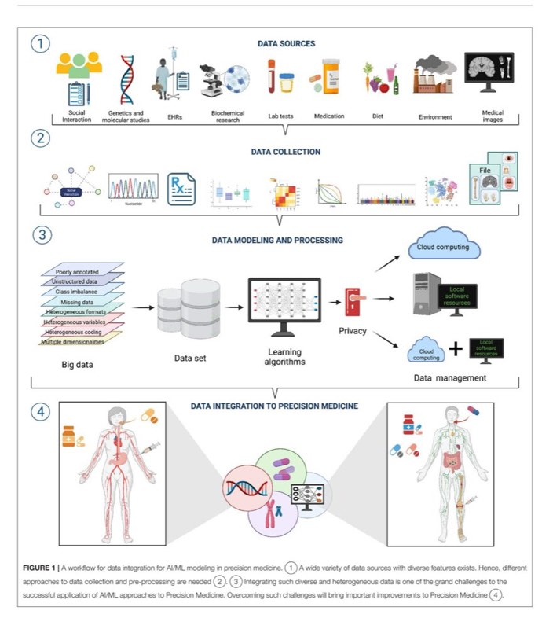

<!-- Image Description: That image is not a diagram, chart, graph, equation, or technical illustration from an academic paper. It's a simple graphical button or icon commonly used in software interfaces. The image displays a circular progress indicator partially filled, overlapping a bookmark icon, and the text "Check for updates." Its purpose within the paper's context is likely to indicate that the paper might have newer versions, suggesting readers look for updated content. -->

# [Data Integration Challenges for](https://www.frontiersin.org/articles/10.3389/fmed.2021.784455/full) Machine Learning in Precision Medicine

## Mireya Martínez-García1 and Enrique Hernández-Lemus 2,3 \*

1 Clinical Research Division, National Institute of Cardiology 'Ignacio Chávez', Mexico City, Mexico, 2 Computational Genomics Division, National Institute of Genomic Medicine (INMEGEN), Mexico City, Mexico, 3 Center for Complexity Sciences, Universidad Nacional Autnoma de Mexico, Mexico City, Mexico

A main goal of Precision Medicine is that of incorporating and integrating the vast corpora on different databases about the molecular and environmental origins of disease, into analytic frameworks, allowing the development of individualized, context-dependent diagnostics, and therapeutic approaches. In this regard, artificial intelligence and machine learning approaches can be used to build analytical models of complex disease aimed at prediction of personalized health conditions and outcomes. Such models must handle the wide heterogeneity of individuals in both their genetic predisposition and their social and environmental determinants. Computational approaches to medicine need to be able to efficiently manage, visualize and integrate, large datasets combining structure, and unstructured formats. This needs to be done while constrained by different levels of confidentiality, ideally doing so within a unified analytical architecture. Efficient data integration and management is key to the successful application of computational intelligence approaches to medicine. A number of challenges arise in the design of successful designs to medical data analytics under currently demanding conditions of performance in personalized medicine, while also subject to time, computational power, and bioethical constraints. Here, we will review some of these constraints and discuss possible avenues to overcome current challenges.

Keywords: precision medicine, machine learning, data integration, meta-data mining, computational intelligence

## INTRODUCTION

Contemporary biomedical research and medical practices are increasingly turning into dataintensive fields, for which computational intelligence approaches, such as those based on artificial intelligence and machine learning (AI/ML) methods are becoming the norm. Due to the specific nature of these fields, the integration and management of the ever-growing volumes of heterogeneous data involved, often presents a number of challenges. These challenges become even more relevant in the light of the importance that AI/ML are gaining, establishing themselves at the core of the state-of-the-art in biomedical research and clinical medicine [\(1–](#page-12-0)[3\)](#page-12-1), as well as public health and healthcare policy [\(4–](#page-12-2)[6\)](#page-12-3).

From the standpoint of biomedical research, a number of large, data-intensive collaborative projects, such as the International Hap Map project [\(7,](#page-12-4) [8\)](#page-12-5), The Cancer Genome Atlas (TCGA) [\(9–](#page-12-6)[12\)](#page-12-7), the 1000 Genomes (1000G) study [\(13](#page-13-0)[–16\)](#page-13-1), the GTEX consortium [\(17–](#page-13-2)[19\)](#page-13-3), and the Human Cell Atlas (HCA) [\(20,](#page-13-4) [21\)](#page-13-5), and others are establishing novel frameworks for the molecular study

### Edited by:

Yuguang Wang, Shanghai Jiao Tong University, China

### Reviewed by:

Juan M. Banda, Georgia State University, United States Sridhar Goud, National Institutes of Health (NIH), United States

### \*Correspondence:

Enrique Hernández-Lemus [ehernandez@inmegen.gob.mx](mailto:ehernandez@inmegen.gob.mx)

### Specialty section:

This article was submitted to Translational Medicine, a section of the journal Frontiers in Medicine

### Citation:

Martínez-García M and Hernández-Lemus E (2022) Data Integration Challenges for Machine Learning in Precision Medicine. Front. Med. 8:784455. doi: [10.3389/fmed.2021.784455](https://doi.org/10.3389/fmed.2021.784455)

of health and disease. Such frameworks are firmly supported by robust database management and integration strategies that are allowing them to develop into central tools for basic and translational biomedical research.

Relevant as genomics and high throughput molecular studies are for biomedicine, there are other relevant players in the medical data arena. Among the more important in the present context are large scale clinical and phenotypic studies. Large clinical cohorts creating data-intensive outputs are of course not new, but the extent of their outreach and the complexity of the resulting data sets are growing exponentially fast. Starting from large scale clinical surveys, such as the Framingham Heart study [\(22,](#page-13-6) [23\)](#page-13-7), the Wellcome Trust Case Control Consortium [\(24\)](#page-13-8) and moving unto efforts like the UK Biobank that combines large scale clinic and phenotypic data with ultra-high-throughput genomic testing [\(25–](#page-13-9)[28\)](#page-13-10) that for the last 15 years has been generating massive data corpora used for their own means but also encouraging and feeding other data-intensive analytical efforts from genetic disease association [\(29\)](#page-13-11) to brain imaging [\(30\)](#page-13-12) to psychology [\(31\)](#page-13-13) and social determinants of health [\(32\)](#page-13-14), to name just a few instances. It goes without saying that the impact that these projects have reached on the basic and clinical settings, but also in the epidemiology and public health areas has been enormous.

In the context of AI/ML, however, the focus is shifting into translating the astronomical amounts of data generated ultimately into products and policies able to impact both the patients' and the general public health. This has been, for instance, one of the central goals of the U.S. initiative in Personalized Medicine [\(33,](#page-13-15) [34\)](#page-13-16). That is, how to develop analytic strategies—many of them founded on automated learning, essential, given the size of complexities of current health-related data corpora—to pass from large scale, heterogeneous data to useful (even actionable) medical information [\(35\)](#page-13-17).

Aside from large scale, even multi-national efforts—such as the ones in the consortia just discussed—, another area of intensive interest regarding data-mining in medicine has been the development of analytical strategies to effectively mine the ever growing body of Electronic Health Records (EHR), that has been perceived as a largely forgone and under-utilized data source [\(6,](#page-12-3) [36](#page-13-18)[–39\)](#page-13-19).

One main challenge in knowledge discovery from EHRs is that electronic medical records are highly heterogeneous data sources with a complex array of quantitative, qualitative, and transactional data. Disparate data types include ICD codes (mainly used for pricing and charging hospital procedures), biochemical and lab tests, clinical (text-based) notes, historical archives of medical interventions, therapies and even pharmaceutical deliveries. These data sources are often captured by dozens of individuals (sometimes with biased criteria) for each instance. Hence EHR data is quite difficult to analyze, in particular if one is looking (as is often the case if AI/ML techniques are being considered) multi-patient institutional and even multi-centric levels.

In brief, EHRs were not developed to be used as a resource for automated learning so they are not designed with data structures in mind. Since EHRs are first and foremost adapted for clinical and hospital logistics, data modeling and learning will often face challenges related to structural heterogeneity from their early stages, either by adapting existing EHR strategies or by re-designing them [\(40](#page-13-20)[–44\)](#page-13-21).

In the quest for more efficient healthcare interventions, based on information-optimized clinical practice and policy, AI/ML will certainly play a key role in going from a medicine approach based mainly in the skills of the well-trained clinician to one based also in detailed (often automated) analysis of the individualized interplay of molecular interactions and physiological traits with environmental and even social elements, thus, delivering the promise of personalized medicine [\(1,](#page-12-0) [2,](#page-12-8) [45,](#page-13-22) [46\)](#page-13-23). The development of this analytic approach to personalized medicine (often termed Precision Medicine) involves a number of theoretical frameworks from systems biology to computational biology, biomedical informatics, and computational medicine. This is so, since health and healthcare are multi-dimensional in nature, hence, their study must consider information at the genetic, molecular, clinical and population levels. Health and healthcare analytics, however, must also evaluate and assess how to cope with the complexity and natural biases of the plethora of medical-related databases in which said molecular, clinical, and epidemiological data resides. This, again, points out to the need of customized, scalable computational and analytical tools for pattern discovery and hypothesis generation and testing. AI/ML is turning into a cornerstone of personalized medicine [\(6,](#page-12-3) [47–](#page-13-24)[49\)](#page-13-25).

In order to present a panoramic view on how these and other challenges may be overcome toward an optimized application of machine learning and artificial intelligence to analyze biomedical and health-related data in a Precision Medicine context, the rest of this work will proceed as follows: The next section (The role of data in training good AI/ML models) will establish the necessity to have proper data as input to machine learning and AI models useful in Precision Medicine. We will discuss how having very large data corpora (a.k.a Big Data) is great, but often carries with it the so-called curse of dimensionality and the need to perform feature selection, i.e., to select relevant pieces of information among very large and complex databases. We will also elaborate on the challenges created by diverse and heterogeneous data types and sources, bringing problems, such as class imbalance (study groups of sometimes extremely disparate sizes, that are problematic to analyze for many machine learning algorithms).

The following section (Precision medicine: transforming biomedical evidence with data analytics) will outline how the tenets of computational intelligence and machine learning may be used to advance medicine turning it (even more) into a fullevidence based science. We will see that in order to impact biomedical research, clinical practice and public policy, AI/ML approaches could be helpful to extend our capacities to generate biomedical knowledge, contribute to knowledge dissemination, translate personalized medicine into clinical practice and even empowering the patients. In order to develop, large scale data analytics in medicine should be able to become translational, i.e., moving faster from research environments to clinical settings to ultimately benefit the patients. Then, we will move on in the next section, to discuss the main challenges involved in the use of computational learning toward Precision Medicine.

<!-- Image Description: Figure 1 presents a workflow for AI/ML modeling in precision medicine. It's a flowchart showing four stages: 1) diverse data sources (social interaction, genetics, EHRs, etc.), 2) data collection methods, 3) data modeling and processing (emphasizing big data challenges and cloud computing solutions), and 4) data integration for precision medicine (illustrated with a human body diagram showing integrated data inputs). The figure highlights the challenges of integrating diverse data types for successful AI/ML application in this field. -->

These include processing heterogeneous and unstructured data, working on collaborative and cloud-based resources, developing standards for data sharing and collaboration, implementing software solutions to support large scale data analytics under the biomedical and clinical diverse data ecosystems.

Section 5 will deal with one of the main challenges involved in the quest to effectively implement AI/ML in Precision Medicine: Data Integration. Biomedical and clinical knowledge deals with a plethora of phenomena, ranging from the molecular to the socio-political. Currently, we have technologies to massively measure or infer data from most of these domains. How to make sense of these different dimensions to turn them into a coherent, intelligible body of knowledge useful for the researchers, but more importantly, for practising clinicians, the healthcare providers and the patients is an extremely challenging endeavor. Interestingly, a source of information that is becoming key for AI/ML approaches in Precision Medicine is metadata. Metadata, i.e., auxiliary data sources often used to define other data types. Having one's genome sequence is of little use if we do not have a proper annotation file; and knowledge of the zip code or educational level of a patient may provide actual clues for their personalized treatment. Since many data types are actually pre-processed prior to the analysis, it is also relevant to know how has the data been treated prior to its current form. Information of this kind is also considered metadata. Metadata is, hence, becoming more and more relevant. Managing such large amounts of personal data (what can be more personal for us than our healthcare data?), however, does not come without a price. Ethical and legal considerations pose no small problem if one is to provide fair and minimally invasive use of the data, especially if it is of a sensible or private nature. Some of these issues are discussed in section 6. Section 7 is devoted to present the Data Management Plan, a document that will be extremely useful to set the guidelines of any data-intensive project being a research protocol, a clinical trail or a healthcare management design. Finally, in section 8, we present some Conclusions and Perspectives.

### THE ROLE OF DATA IN TRAINING GOOD AI/ML MODELS

The current development of highly sophisticated and often quite effective AI/ML and the accompanying proliferation of large scale data sources in the biomedical setting, has raised the expectations regarding the many potential benefits that can be derived from the marriage of good methods + good data. However, in order for these large amounts of data to be useful in producing good AI/ML models, size is not the only thing that matters, a question that is often overlooked [\(50,](#page-13-26) [51\)](#page-13-27).

Clinical and biomedical data comes in a wide variety of sizes, forms, and formats; it is often complex, heterogeneous, poorly annotated, and often unstructured. Now, each of these issues: size, variety, formatting, complexity, heterogeneity, bad annotation, and lack of structure, pose a challenge to effective AI/ML modeling (see **[Figure 1](#page-2-0)**section 1 ) [\(52\)](#page-13-28).

Regarding size, for instance, even when we often deal with big data—usually considered an advantage—, it is common that these data sources suffer from the so-called curse of dimensionality (CoD), a situation in which the number of variables or features is much larger than the number of experimental samples or realizations. CoD is particularly evident in the case of genomic and transcriptomic analyses for which the number of genes or transcripts is in the order of tens of thousands whereas the number of samples is rarely larger than a few hundreds or a few thousands at most. Even more complex is the scenario when one is measuring, for instance, chemical modifications, such as DNA methylation; the current experimental protocols allow for the simultaneous measures of five thousand hundred or more methylation probes [\(52\)](#page-13-28).

CoD leads to the p >> n problem in machine learning [\(53\)](#page-13-29): increased data dimensionality may cause AI/ML methods to suffer from**overfitting**. Overfitting, in turn, implies that the methods are highly accurate on training data while showing low performance on generalization or handling unseen data. Potentially good methods will fail to deliver in real life applications. One approach to deal with the CoD is performing data dimensionality reduction prior to training the ML methods. The most common means of data dimensionality reduction are feature extraction in which data is projected from a high dimensional space to a lower dimensional space and feature selection that reduces dimensions by identifying a relevant or informative subset of the original set of features [\(54\)](#page-13-30).

Feature extraction methods, such as principal component analysis (PCA) and other methods based on eigenvalue decompositions, non-negative matrix factorization (NNF), tdistributed stochastic neighbor embedding (t-SNE) and others, allow for easier data visualization, exploration, and compression, as well as latent factor profiling. On the other hand, feature selection methods consists in one or more of the following strategies: data filtering (DF), data wrapping (DW), and data embedding (DE). The purpose the former (DF) is to select a subset of relevant features in a model independent fashion an include methodological approaches, such as ANOVA, Pearson's correlation, information theoretical measures, such as entropy and mutual information, constrained regressions, and maximal relevance minimal redundancy (mRMR) methods. DW methods look for the best combination of features trained by a particular predictive model and include the recursive feature elimination (RFE), jackstraw and the Boruta-Random Forests (BRF). DE are a combination of DF and DW that works by performing feature selection while building a predictive model, perhaps the best known example of DE method is the least absolute shrinkage and selection operator (LASSO) and its extensions, such as the elastic net algorithm [\(52\)](#page-13-28).

Data variety/diversity and data heterogeneity also result problematic for the implementation of AI/ML modeling in Precision Medicine. Heterogeneity emerges from many situations, such as substantially different types of variables (or different coding) in the various data sets (think of EHRs from different hospitals), mismatched distributions or scaling including disparate dynamic ranges (say we have combined expression data from microarrays and RNASeq technologies), diverse data modalities (continuous signals, counts, intervals, categories, pathways, etc., derived from molecular and imaging experiments) and formats (say European versus American reporting standards) (**[Figure 1](#page-2-0)** section 2 ). Integrating heterogeneous data types may be done naively, by just concatenating features from disparate data sources, but this reduce the number of working to the use of decision tree (DT) like models that suffer from overfitting. An alternative would be to use penalized regression (e.g., elastic nets) with several regularization strategies, though this may in turn bring challenges regarding interpretability of results [\(51,](#page-13-27) [52\)](#page-13-28). Better results may be obtained by resorting to block-scaling [\(55\)](#page-13-31) or multiple kernel learning methods [\(56\)](#page-13-32).

Due to the complexity intrinsically associated to biomedical and clinical data, but also due to difficulties in subject/sample procuration and in data acquisition (data generating/sampling technologies may fail) it is common to have problematic circumstances, such as missing data (from instances not measured or measured defectively), class imbalance (widely different sample sizes in different feature groups) and even rarity (an extreme form of class imbalance) [\(57\)](#page-14-0). There are several learning strategies to cope with missing data and class imbalance, ranging from the so-called listwise deletion (i.e., completely deleting the problematic sample from the study), imputation (i.e., inferring the missing value from expectation methods from the sample-wise profiles or even from feature-wise profiles) suing methods, such as k-nearest neighbor replacement, full conditional specification, stochastic gradient boosted trees, and other ensemble regression frameworks [\(52\)](#page-13-28).

Class imbalance is another problematic-yet-pervasive situation in large scale data analytics (LSDA) of biomedical and clinical data. This fact becomes quite relevant since the most machine learning methods, such as support vector machines, random forests, and artificial neural networks assume balanced class distributions. Hence, these classifiers tend to overestimate patterns from the majority class, and underestimate those features characteristic of the minority class or classes. To overcome this limitation a class of ML approaches termed class imbalance learning (CIL) methods have been developed. CIL algorithms can be based on data sampling (e.g., random undersampling, bootstrap sampling, etc.); on algorithm modifications incorporating the inherent biases or skewness in the learning steps (e.g., weightedSVM, weigthedELM) or in ensemble learning in which several ML methods are applied and the results are consensed or averaged [\(52,](#page-13-28) [58\)](#page-14-1).

Furthermore, even if most of these problematic issues may be solved, at least partially, with the analytic approaches just discussed, two relevant issues remain. First, real life datasets often have not one, but several (even all) of these challenging features. The ML methods useful to tackle some of these limitations may have poor performance due to others. Leveraging alternatives by evaluating the pros and cons may not be trivial. Second, every one of the methods for LSDA in imperfect/real-life datasets has its own set of assumptions and limitations. AI/ML researchers in biomedicine should be very aware of this and very cautious when combining methods and taking conclusions. However, as we will see in the next section, advancing biomedical and clinical research by using AI/ML approaches often worth all the efforts.

### PRECISION MEDICINE: TRANSFORMING BIOMEDICAL EVIDENCE WITH DATA ANALYTICS

Since the later years of the 20th century, following the pioneering work by Cochrane, Eddy, and others [\(59–](#page-14-2)[62\)](#page-14-3) efforts have been directed toward building a systematic approach to medical and public health decisions, one founded not on anechdotic or individual expertise, but rather in the light of a full inspection of the existing clinical and biomedical research. This approach, called Evidence-Based Medicine (EBM) [\(63\)](#page-14-4) aimed at the comprehensive use of all the accumulated scientific and clinical evidence to develop health related interventions and policy. At that time EBM was founded on anecdotal clinical experience, published case reports, meta-analyses and systematic reviews, and randomized controlled trials [\(64,](#page-14-5) [65\)](#page-14-6). No highthroughput molecular or individual disaggregated information was considered at the time; even the already existing largescale epidemiological data was not exploited fully due to data availability constraints [\(66,](#page-14-7) [67\)](#page-14-8).

Even if the EBM paradigm has been superseded for various reasons, perhaps its main relevance resided in bringing to attention the fact that, as a rule, healthcare-related decisions should be supported by objective, stringent evidence rather than being left to the subjective opinion of some individual professional, expert as they may be. With the advent of larger, well-curated data corpora and more powerful ways to analyze the data and transforming it into useful information, EBM ideals have been embraced and incorporated into what has been called Precision Medicine [\(68–](#page-14-9)[71\)](#page-14-10).

Aside from the spectacular changes in information technologies in recent times, another main booster of this transformation was the genomic revolution driven by the human genome project (HGP) [\(72](#page-14-11)[–74\)](#page-14-12). The promises of the HGP, many of them still undelivered [\(75\)](#page-14-13)—pointed out to data-based biomedicine (particularly the identification of genetic variants behind the diseased phenotypes), as a key player to identify targets and customize pharmacological and other therapeutic interventions leading to a dramatic improvement of population and individual health [\(76,](#page-14-14) [77\)](#page-14-15).

In view of this emerging paradigm, what is the role that AI/ML may play in its establishment as the standard approach in biomedical research, clinical practice and public policy? It has been argued [\(2,](#page-12-8) [6,](#page-12-3) [78\)](#page-14-16) that there are at least four development avenues in which LSDA may impact healthcare: (i) LSDA may enlarge the capacity to generate new biomedical knowledge, (ii) LSDA may provide a support for healthcarerelated knowledge dissemination, (iii) LSDA can become a tool for translating personalized medicine initiatives into clinical practice (for instance, by integrating molecular and EHR data on a single framework), and (iv) LSDA supplemented with simplified user interfaces can become a vehicle for empowering of the patients, helping them play a more active role in their own healthcare decision making.

In order to deliver such benefits, LSDA needs to be able to address questions, such as how to deal with highly unstructured heterogeneous data (say from EHRs) via high-performance computational techniques for quantitative analytics, but also for data mining, literature mining, and natural language processing algorithms over integrated pipelines. Particularly challenging are the scenarios related to clinical practice since they would be ideally processing such enormous amounts of unstructured data in cuasi-real time, if LSDA is intended to be beneficial for the individual patient [\(79,](#page-14-17) [80\)](#page-14-18). In the following sections, we will discuss some of the opportunities and limitations of applying AI/ML (often in the form of LSDA) in health-related settings.

### 1. Personalized Medicine: From Data Lakes to Patient Beds

LSDA and AI/ML may also play a role in supporting the clinical practitioners to keep up-to-date with the current scientific literature in their fields, an issue that has been struggling attending physicians for a while. In brief, if a medical doctor wants to treat their patients with the current best available therapeutic options, difficulties arise in trying to define what is currently considered better. As is known, the available scientific literature regarding a single medical speciality has been already overwhelming. The situation becomes much worse when one is dealing with multi-morbid patients since clinical guidelines and algorithms are often aimed at the single condition scenario [\(81](#page-14-19)[–85\)](#page-14-20).

Embracing the computational learning paradigm, the clinician may be armed with a new set of tools allowing for suggestions/surveys supported by real-time patient data analytics integrating, both the complexity of the patient's genetic background, environmental conditions, and the corresponding comorbidities with the current literature standards of care (**[Figure 1](#page-2-0)** section 3 ) [\(6,](#page-12-3) [33,](#page-13-15) [46,](#page-13-23) [86–](#page-14-21)[88\)](#page-14-22).

Aside from standard biomedical and clinical data, LSDA allows to further integrate occupational, social, physiological, and even behavioral information of the individual patient (available in social network, wearable devices, and other cloudbased resources) [\(89–](#page-14-23)[92\)](#page-14-24) to enhance the clinical profiles. To reach this point, however, there are important conundrums to be solved. In particular, novel computing and analytical frameworks should be designed to find patients' similarities and differences, but also to discover patterns highlighting their connections and discrepancies with the aim of calculating, for instance, personalized disease risk profiles, akin to polygenic risk scores, but under a much more general view—engulfing all the already discussed data types—allowing for individualized proactive medicine [\(93–](#page-14-25)[95\)](#page-14-26).

Hence, by integrating phenotype and disease-history based approaches, LSDA aims to advance personalized disease prediction, improve healthcare management and even contribute to an overall positive impact to individual wellness (**[Figure 1](#page-2-0)**section 4 ) [\(96–](#page-14-27)[100\)](#page-14-28). In doing so, AI/ML approaches are collaborating to a shift in the emphasis of clinical medicine from a disease-centered view to a patient-based practice [\(101,](#page-15-0) [102\)](#page-15-1), a paradigm that has been long known since Hippocratic times and has been resumed a hundred years ago by the Spanish endocrinologist Gregorio Marañón who stated that there are no diseases but patients.

The panorama we have just discussed seem to be quite promising, indeed AI/ML and LSDA have already brought relevant advances toward Personalized Medicine [\(34,](#page-13-16) [70,](#page-14-29) [103\)](#page-15-2). However, a consensus has not been reached as to how to integrate the large scale data of EHR, the many heterogeneous databases on molecular, phenotypical and environmental information derived from large scale experimental, clinical and epidemiologic studies and the individual-wise data gathered from disparate sources, such as social networks and wearable devices to develop a personalized approach to medicine? [\(46,](#page-13-23) [48,](#page-13-33) [104](#page-15-3)[–106\)](#page-15-4).

## CHALLENGES TO COMPUTATIONAL LEARNING IN PRECISION MEDICINE

Of the many challenges posed to AI/ML by ever-growing health and biomedicine data sources, one of them is paradoxically related to what is often perceived as its main driving force. Having large amounts of data is obviously beneficial for computational learning algorithms, the more data you have, the more robust your classifiers, regressions, and mining strategies will be. However, as the tendencies move toward Precision Medicine, we can see how some major sources of primary biomedical information, such as genomics (in particular next generation sequencing) and imaging are becoming progressively cheaper [\(107–](#page-15-5)[109\)](#page-15-6), hence allowing their widespread use, nevertheless the computational costs of processing and analyzing the data are, for obvious reasons, growing fast [\(110–](#page-15-7)[114\)](#page-15-8).

Hence, aside from the already discussed challenges of database structural heterogeneity and data type integration, a number of major limitations for the development of AI/ML in biomedicine belong to the computer systems domain [\(115\)](#page-15-9). Those challenges are, for instance, in the development of consolidation, characterization, validation, and processing standards for the data; creating ontologies and knowledge relationships for entities, such as genes, drugs, diseases, symptoms, patients, and treatments, as well as their corresponding entity-relationship schemes [\(116](#page-15-10)[–119\)](#page-15-11).

Along these lines, recent advances in AI, in particular those directed to Natural Language Processing (NLP) have been incorporating tools of semantic web analysis, such as conceptual relational networks [\(120,](#page-15-12) [121\)](#page-15-13), semantic-syntactic classification [\(122\)](#page-15-14), and similarity mapping [\(123\)](#page-15-15). The problem, again, is a matter of throughput: effective implementation (training, in particular) of such NLP tools is only enabled if one has extremely large data corpora being accessed on a concurrent fashion [\(124\)](#page-15-16). The vast majority of hospitals, research labs and even pharmaceutical development facilities do not currently have access to the storage and computational power resources needed to perform these analyses. The current alternative to local processing is, of course, cloud computing [\(125–](#page-15-17)[127\)](#page-15-18). However, as we will see in the next subsection, performing LSDA in medical and biomedical data in the cloud is not a problem-free solution.

## 1. Precision Medicine, Machine Learning and Cloud Computing

The use of cloud computing in the analysis of clinical, biomedical and healthcare data has many advantages: (i) it helps to solve the issue of processing large amounts of data in real time [\(128,](#page-15-19) [129\)](#page-15-20), (ii) may provide scalable, cost-efficient data analytics solutions [\(130\)](#page-15-21). Cloud computing, however, brings some technical difficulties, such as the ones related to highthroughput data transfer infrastructures, distributed computer power over very large non-parallelizable tasks and perhaps the main challenge (that we will discuss more in depth in a forthcoming section) which lies in adapting the current distributed storage and processing paradigms in big data, while simultaneously allowing for full confidentiality of the data (since some of it may be highly sensible in nature) [\(131\)](#page-15-22).

However, a number of cloud computing resources are becoming a standard for several omic studies, as it can be exemplified by Basespace a cloud-based sequencing analysis environment by Illumina, by the EasyGenomics platform of the Beijing Genomics Institute (BGI) and by European-based Embassy clouds as part of the Elixir Collaboration, by the NGScloud2 over Amazon Web Services (AWS) or by Galaxy-Kubernetes integrated workflows to name but a few instances [\(132–](#page-15-23)[139\)](#page-15-24).

It is worth noticing that standard cloud computing designs using distributed systems, grid computing, parallel programming, and virtualization on top of multi-layered environments [\(134,](#page-15-25) [140\)](#page-15-26) are becoming adopted in LSDA in precision medicine due to their applications in the development of robust and secure distributed analysis [\(132\)](#page-15-23). Indeed, as we already mentioned, cloud computing in LSDA may be implemented under several paradigms, such as: Platform as a Service (PAAS) [\(141–](#page-15-27)[143\)](#page-16-0), Infrastructure as a Service (IAAS) [\(144,](#page-16-1) [145\)](#page-16-2), and Software as a Service (SAAS) [\(35,](#page-13-17) [146,](#page-16-3) [147\)](#page-16-4).

These different standards for cloud computing have their particular pros and cons when applied to LSDA in Precision Medicine; for instance PAAS designs are suited for in-house software development or to integrate already designed libraries that can be implemented either by the user or by the cloud provider. Here we can mention healthcare, biomedicine, and bioinformatics services by providers, such as Google App Engine, Microsoft Azure MapReduce Hadoop, and others. In contrast, IAAS providers commonly offer high performance computing and massive storage facilities (sometimes called HPCfarms or data centers) including only the minimum operating system/computing environment requirements: this is often the case of general plans offered by companies, such as Amazon Web Services, HP Cloud, Rackspace, and Joyent [\(148–](#page-16-5)[151\)](#page-16-6).

Of these different paradigms, SAAS results as the more complete, as well as the more costly and less flexible. In SAAS the user is able to perform LSDA via pre-established (sometimes customized) applications sitting on a remote cloud infrastructure. This provides almost immediate access and usability with minimum installation and customization requirements from the user. However, due to these very reasons, the user has less control over the specifics of both, the computing environment and the actual algorithms used to perform analysis. The risk is that some of the more sophisticated methods will develop into black boxes. A somewhat intermediate solution is what can be called Code-as-a-service that is, SAAS with full access to the code (often only by specific requirement of the user). This is the case of the Cloud BioLinux service [\(152\)](#page-16-7). The Cloud BioLinux suite has a set of pre-installed services, like a Galaxy server [\(153\)](#page-16-8), access to the BioPerl programming language [\(154\)](#page-16-9), BLAST [\(155\)](#page-16-10), R/Bioconductor [\(156\)](#page-16-11), Glimmer [\(157\)](#page-16-12), ClustalW [\(158\)](#page-16-13), and other general purpose (mostly bioinformatic-related) libraries/packages/environments [\(35,](#page-13-17) [159,](#page-16-14) [160\)](#page-16-15).

Aside from molecular biology and genomics oriented applications, SAAS has also been developed in areas, such as medical diagnostics. In this regard, one can mention DXplain, one of the earliest developed decision support systems available. DXplain that was created by scientists, physicians, and software engineers at Massachusetts General Hospital [http://www.mghlcs.](http://www.mghlcs.org/projects/dxplain) [org/projects/dxplain.](http://www.mghlcs.org/projects/dxplain) DXplain may be used as a search engine (akin to a searchable eBook) providing the concise yet detailed description of more than 2,600 medical conditions, indexed by their main signs and symptoms, as well as their etiology, pathology, and prognosis. More relevant to this discussion is the use of DXplain as a case analytics tool, processing a set of clinical findings (signs, symptoms, laboratory data) as an input to a computational intelligence engine that computes a ranked list of diagnoses related to the given clinical manifestations. Furthermore, DXplain provides supports its suggestions with evidence sources, suggests what further clinical information would be useful to collect for the conditions under consideration, and displays a list of relevant clinical manifestations [\(161,](#page-16-16) [162\)](#page-16-17). IBM's Watson Health constitutes another example of a (commercial) SAAS system aimed to support clinical decision making by the use of computational intelligence methods [www.ibm.com/watson-health/](#page-0-0) [\(163\)](#page-16-18). However, many researchers and clinicians have become skeptical of the tool due to initial over-promises from the company [\(164\)](#page-16-19). Many other diagnostic support applications have been developed, most of them aimed at commercial use such is the case of ISABEL [https://www.](https://www.isabelhealthcare.com/) [isabelhealthcare.com/](https://www.isabelhealthcare.com/) [\(165,](#page-16-20) [166\)](#page-16-21) and others. However, due to commercial restrictions, their AI/ML assessment and their use in LSDA has been rather restricted [\(167,](#page-16-22) [168\)](#page-16-23).

In the end, each health/biomedical/clinical research team will have to make a choice between these different levels of cloud services depending on its availability of technical staff (computational biologists, data scientists, statisticians, bioinformaticians, software engineers, and so on), the computer literacy and involvement of the biomedical researchers and the clinicians, the scope and extension of the projects and other constraints, including financial issues, local infrastructure, and confidentiality matters [\(169–](#page-16-24)[173\)](#page-16-25).

It is also needed to take into account that some LSDA applications in health and biomedicine demand usually high computing resources. One alternative that is gaining relevance recently is the design of hybrid servers combining traditional CPUs with Graphical Processing Units (GPUs). The use of GPUs on cloud-based environments is indeed favored, given their massively parallel architechture (MPA). MPA results advantageous not only for actual computations, but also for input/output (I/O) operations [\(174\)](#page-16-26). An important fraction of GPU-based applications in computational biology and biomedicine are implemented under [\(175–](#page-16-27)[177\)](#page-16-28). However, it remains a challenging endeavor to develop and implement parallelization algorithms, efficient enough to make sense of heterogeneous data sources, such as the ones coming from omic technologies, from EHRs, population surveys [\(127,](#page-15-18) [178\)](#page-16-29).

Aside from the already mentioned cloud-based solutions, most research and clinical institutions will need to build some local infrastructure and algorithmics suited for their particular needs. In the search for semi-automation and reproducibility, some relevant general tasks are better managed by resorting to specialized software and algorithmic suites developed with building workflows and pipelines in mind. We will present some of the more widely used of such suites or packages for LSDA useful in Precision Medicine in the following subsection.

### 2. Software Resources for Computational Medicine

Whether implementing local, cloud-computing, or hybrid solutions, choices need to be made regarding appropriate algorithms and software for data pre-processing, processing, and analytics. A number of general purpose approaches have been developed, such is the case of the suite of R-based algorithms and programs in the Bioconductor repositories [\(156\)](#page-16-11), the pipeline management tools, such as Snakemake [\(179,](#page-16-30) [180\)](#page-16-31) and Taverna [\(181\)](#page-16-32) or the cloud-based development suites Helastic [\(182\)](#page-16-33) and BioNimbus [\(183\)](#page-16-34).

For sequence analytics, a central player for quite some time has been the genome analysis toolkit (GATK) by the Broad Institute [\(184,](#page-17-0) [185\)](#page-17-1). The GATK suite has been developed for LSDA of genome sequencing data mainly focused on high-accuracy variant discovery and genotyping useful in the clinical and biomedical research environments [\(186\)](#page-17-2). Other computational omic analysis tools useful in the context of Precision Medicine include dRanger for the automatic identification of somatic rearrangements in Cancer [\(187\)](#page-17-3), Athlates for the determination of HLA immuno-genotypes from exome sequencing data [\(188\)](#page-17-4), the Trinity suite for De Novo RNA-Seq analysis [\(189\)](#page-17-5), the Hail library for scalable (bio-bank scale) genomic data exploration [\(190\)](#page-17-6), and the GWAS analysis suite Plink [\(191\)](#page-17-7), to name but a handful instances.

More broadly applicable suites have been also developed, such as GenePattern [\(192,](#page-17-8) [193\)](#page-17-9), the running/development platform Galaxy [\(153,](#page-16-8) [194,](#page-17-10) [195\)](#page-17-11). Biological function databases like Gene Ontology [\(196,](#page-17-12) [197\)](#page-17-13) and its generalizations [\(198,](#page-17-14) [199\)](#page-17-15), the MONA (multi-level ontology analyses) programs [\(200\)](#page-17-16), and other medium-to-high level analysis tools, such as the network analysis suite Cytoscape [\(201\)](#page-17-17) or the structural biology libraries BioDAS [\(202\)](#page-17-18) to mention but a handful of the many available options.

Aside from genomics and purely molecular/omic studies, other computational tools have been developed and widely used in the biomedical and clinical settings. Such is the case of CellProfiler for image analysis and processing [\(203\)](#page-17-19) that has been proved to be quite useful for machine learning applications [\(204,](#page-17-20) [205\)](#page-17-21). Automating data throughput in biomedical and clinical applications may also be useful even for relatively low demand tasks under certain circumstances; for example, automated RT-PCR data processing as implemented in ARPA (Automated RT-PCR analysis) turned out to be crucial for testing efforts during the COVID-19 pandemic [\(206\)](#page-17-22). AI/ML modeling based on facilitated access data may indeed become a key tool to tackle with current and future pandemics [\(207\)](#page-17-23).

Moving on to clinical applications, some of the most popular computational tools for managing clinical data (particularly with clinical trials in view) are OpenClinica [\(208\)](#page-17-24), the Integrated Data Repository Toolkit IDRT [\(209\)](#page-17-25) and the VISTA trials suite [\(210\)](#page-17-26), and the comorbidity risk assessment tool comoR [\(211\)](#page-17-27). Tools for the management of high-throughput day-today clinical records commercial and academic/open source have flourished in recent times. Some of the more widely adopted open source software solutions are OpenEMR [\(212\)](#page-17-28), OpenMRS [\(213\)](#page-17-29), WorldVistA [\(214\)](#page-17-30). Some of these tools are actually enabling capacities to allow for the implementation of data mining and computational learning on their databases [\(54\)](#page-13-30), however, as previously discussed, caution must be taken when using EHR data for automated discovery since a number of potential biases and confounders may arise [\(215,](#page-17-31) [216\)](#page-17-32).

There are also some R-packages useful to manage EHR data. Such is the case of EHR: an Electronic Health Record and Data Processing and Analysis Tool [https://cran.r-project.](https://cran.r-project.org/web/packages/EHR/index.html) [org/web/packages/EHR/index.html](https://cran.r-project.org/web/packages/EHR/index.html) [\(217,](#page-17-33) [218\)](#page-17-34), as well as rEHR <https://github.com/rOpenHealth/rEHR> [\(219\)](#page-17-35).

Other software solutions from the R ecosystem useful in the LSDA applications in the clinical practice include babsim.hospital, a hospital resource planner and simulator [https://cran.r-project.org/web/packages/babsim.hospital/index.](https://cran.r-project.org/web/packages/babsim.hospital/index.html) [html](https://cran.r-project.org/web/packages/babsim.hospital/index.html) [\(220\)](#page-17-36); bp a blood pressure analytics tool [https://cran.r](https://cran.r-project.org/web/packages/bp/index.html)[project.org/web/packages/bp/index.html;](https://cran.r-project.org/web/packages/bp/index.html) and card a toolkit to evaluate the autonomic regulation of cardiovascular physiology via integrating electrocardiography, circadian rhythms, and the clinical risk of autonomic dysfunction on cardiovascular health data<https://cran.r-project.org/web/packages/card/index.html> [\(221\)](#page-17-37).

Other software packages include radtools a set of utilities to extract and analyze medical image metadata [https://cran.r](https://cran.r-project.org/src/contrib/Archive/radtools/)[project.org/src/contrib/Archive/radtools/](https://cran.r-project.org/src/contrib/Archive/radtools/) [\(222\)](#page-17-38); psrwe a library useful to incorporate real-world evidence (RWE) into regulatory and health care decision making [https://cran.r-project.org/web/](https://cran.r-project.org/web/packages/psrwe/index.html) [packages/psrwe/index.html](https://cran.r-project.org/web/packages/psrwe/index.html) [\(223,](#page-17-39) [224\)](#page-17-40); clinDataReview [https://cran.r-project.org/web/packages/clinDataReview/index.](https://cran.r-project.org/web/packages/clinDataReview/index.html) [html](https://cran.r-project.org/web/packages/clinDataReview/index.html) an environment to support exploratory analysis of data in clinical trial settings, patientProfilesVis a tool to create patient profile visualizations for exploration, diagnostic or monitoring purposes during a clinical trial [https://cran.r](https://cran.r-project.org/web/packages/patientProfilesVis/index.html)[project.org/web/packages/patientProfilesVis/index.html;](https://cran.r-project.org/web/packages/patientProfilesVis/index.html) and even healthyR a full suite to review common administrative hospital data. Although this latter application does not seem to be related to LSDA in Precision Medicine, it is not uncommon the application of AI/ML methods to administrative data to infer, for instance, social determinants of health.

### DATA INTEGRATION: CURRENT CHALLENGES

Computational limitations in LSDA for Precision Medicine are gradually being overcome. Deeper challenges, however, arise when we consider the question of how to develop coherent ways to make sense of the data, that is how to build models and analytical frameworks that allow biomedical scientists and clinicians to use all these currently available data types and resources in the best possible way as diagnostic and prognostic tools [\(225\)](#page-17-41). In the context of genomics (and other omics) in biomedicine, important international efforts along these lines have been developed, such is the case of the ELIXIR-EXCELERATE collaboration [\(136\)](#page-15-28), the STATegra project [\(226,](#page-17-42) [227\)](#page-18-0), the SeqAhead consortium [\(228\)](#page-18-1), and others [\(229,](#page-18-2) [230\)](#page-18-3).

It must be stressed that most of the efforts of these—extremely relevant—endeavors are directed toward the integration of information on the molecular side of the spectrum of biomedical related data. Data integration at this level provides mathematical and relational models able to give a mechanistic description of the interplay between the molecular components of the cells [\(225,](#page-17-41) [231\)](#page-18-4). This is of course fundamental to understand the rise of cellular and tissular phenotypes from its biochemical origins, but may result insufficient to account for the rise of disease in organs, individuals, and even populations. Recent advances have been done to extend these efforts to encompass LSDA on biological databases incorporating individual EHR data [\(232\)](#page-18-5), as well as social and environmental information [the so-called social determinants of health [\(233\)](#page-18-6)]; perhaps even incorporating constraints representing healthcare policy within a precision medicine framework [\(93,](#page-14-25) [234\)](#page-18-7). Advances in AI will surely play a central role in the development of such integrated frameworks [\(235\)](#page-18-8).

In this context, data integration allows the use of multiple data sources with several different (eve disparate) pieces of evidence to build (hopefully) interpretable models of the systems under study [\(236\)](#page-18-9). Since these broad array of data sources may have quite different structures, levels of granularity and, in the case of quantitative measurements, different distributions and dynamic ranges, data integration is indeed a demanding endeavor, briefly subsumed in the question how can we put together these data sources to improve knowledge discovery? [\(237\)](#page-18-10). Hence, being able to perform complex queries, build heterogeneous models and develop hierarchically nested data retrieval operations on multiple databases are core goals for data integration strategies useful for AI/ML models in Precision Medicine [\(235,](#page-18-8) [238](#page-18-11)[–241\)](#page-18-12).

LSDA in Precision Medicine is driven by two major sets of goals. On the one hand, we aim to develop high level intuition (HLE) from inductive analyses, via statistical learning and causal inference techniques. HLE may serve to sketch guidelines for current and future experimental and clinical research [\(242\)](#page-18-13). On the other hand, AI/ML approaches may be useful for automated reasoning (AR), i.e., the non-supervised or semisupervised extraction of non-trivial patterns in dynamic databases [\(243–](#page-18-14)[245\)](#page-18-15).

### 1. The Need for Guidelines and Standardization to Support Precision Medicine

Machine learning and artificial intelligence approaches able to live up to these envisioned objectives will depend on the underlying data resources to a great extent. We will need, not only high throughput carefully curated databases, but also inter-operable data strategies. By creating integrated/integrable databases related to Precision Medicine we will enhance our data discovery and data exploitation capabilities, refine our algorithms for statistical assessment of data-driven discovery and improve our data standardization. Regarding data standards, there have been some advancements from the early days of the MIAME requirements [\(246,](#page-18-16) [247\)](#page-18-17) for genomic data formats, now updated for next generation sequencing data [\(248\)](#page-18-18) and even for single cell RNASeq experiments [\(249\)](#page-18-19); to some more recent efforts for meta-data standardization [\(250,](#page-18-20) [251\)](#page-18-21).

Focused efforts toward data standardization with AI/ML approaches in mind have been recently advanced. For instance, a multi-institutional group has recently compiled a document establishing guidelines on Minimum information about clinical artificial intelligence modeling by means of the MI-CLAIM checklist [\(252\)](#page-18-22). MI-CLAIM has been developed as a tool to make reporting of AI/ML algorithms in medicine more transparent. This approach looks to solve issues related to interpretability, opaque documentation and scope of AI/ML methods in medicine. It consists of six parts: (i) Study design, (ii) Separation of data into partitions for model training and testing, (iii) Optimization and final model selection, (iv) Performance evaluation, (v) Model examination and (vi) Reproducible pipeline. Central to this standard is the MI-CLAIM checklist [Table 1 in [\(252\)](#page-18-22)].

Aside from methods, standards need to be developed for all different aspects involved in biomedical data analytics and computational intelligence. From the patients/subjects to the clinical and analytical research, to academic and industrial approaches and back to the patients and clinicians. The National Patient-Centered Clinical Research Network (PCORNET) initiative<https://pcornet.org/> of the US has been developed as a national resource where health data, research expertise, and patient insights are available to deliver fast, trustworthy answers that advance health outcomes [\(253\)](#page-18-23). PCORNET was designed as a distributed data research network (DRN) built to facilitate multi-site observational and interventional research across the diverse (existent-at-the -time and future) clinical data research networks and other relevant players in the health data ecosystem.

By standardizing procedures, formats and approaches PCORNET looks up to deliver greater sample size and power of the studies, the ability to analyze the effects of the differences in practice and assessing heterogeneity in treatments and populations. It included the creation of a Data Standards Security and Network Infrastructure (DSSNI) task force aimed to identify the minimal data standards and technical specifications for data to be effectively shared and disseminated effectively. These actions will be directed to optimize the evaluation and improving quality assessment of the research projects and to maximize their concurrent impact [\(254\)](#page-18-24). Other task forces within PCORNET are devoted to issues, such as Governance, Data privacy, Ethics, and regulation, Health system interactions, Patient and consumer engagement, Patient-generated outcomes, Clinical trials, Rare diseases, Biorepositories, and Obesity. These task forces (and other that are being added as they develop) are supervised by PCORNET's Project Management Office operating under a network-like structure rather than as a traditional hierarchical organization. The development and functioning of the approach are subject to continuous assessment and evaluation via the Foundational Data Quality model founded on the premises of optimal data curation [\(255\)](#page-18-25).

A related initiative put forward by the National Center for Biomedical Computing of the US is the I2B2 (Informatics for Integrating Biology and the Bedside) [https://www.i2b2.](https://www.i2b2.org/index.html) [org/index.html.](https://www.i2b2.org/index.html) I2B2 was developed with the aim of enabling effective collaboration for precision medicine, through the sharing, integration, standardization, and analysis of heterogeneous data from healthcare and research; through engagement and mobilization of a life sciences-focused open-source, open-data community.. I2B2 was created as part of the NIH roadmap to advance precision medicine to provide the community of clinical investigators with a toolbox to integrate medical records, clinical data, and genomic technologies all at once [\(256\)](#page-18-26). One of the foundations of I2B2's approach to data interoperability is data-model harmonization based on ontological representations, particularly those facilitating the involvement of subjects/patients and clinicians aside from biomedical researchers [\(257\)](#page-18-27). The extent of influence of these actions is designed to further improve the way subjects are enrolled and followed-up in research study protocols, clinical trials and observational cohorts [\(258\)](#page-18-28).

Ontologies are useful to provide a conceptual framework. In the case of automated and semi-automated data mining methods in biomedicine it is desirable to have a standardized language, easily translated into machine-readable text. This is precisely the aim of the Biological Expression Language (BEL). BEL is presented as a language for representing scientific findings in the life sciences in a computable form. BEL is designed to represent scientific findings by capturing causal and correlative relationships in context, where context can include information about the biological and experimental system in which the relationships were observed, the supporting publications cited and the process of curation [https://bel.bio/.](https://bel.bio/) The elementary elements of BEL are known as BEL-assertions that are built as intermediate steps connecting natural language (as presented in say, academic writing or medical records) into machine-readable expressions. Such expression will then be computable with applications in tasks, such as logical modeling in database learning, systems biology verification studies or next generation EBM to name a few [\(259](#page-18-29)[–261\)](#page-18-30). Implementing language standards, such as BEL may prove beneficial, since it has been shown, for instance, that different approaches to process clinical notes using natural language analytics substantially affects the performance of predictive models in intensive care settings [\(262\)](#page-18-31).

The biomedical data ecosystem is turning so complex that new standards are needed even to define what we call evidence. The large amounts of seemingly anecdotal data that are being produced nowadays have brought to attention issues like the socalled real world evidence (RWE). RWE refers to data regarding the use, or the potential benefits or risks, of a drug derived from sources other than randomized clinical trials [\(263\)](#page-18-32). Large sampling spaces are behind RWE move from anecdotal to referential. However, not all the real world information should be treated as RWE. In this regard, there is a growing need for methods to assess when are these data sources rigorous and trustworthy enough as to be useful as a guideline or to be considered actual evidence. These issues result particularly relevant toward the definition of clinical pipelines in digital therapeutics (loosely defined as evidence based therapeutics basedon software applications to prevent, manage or treat a disease or medical condition) [\(264\)](#page-18-33), often related with data obtained from wearables and other subject-based sources.

Data standardization is becoming central not only in the medical research, and personalized clinical practice settings. It has been recently discussed how clinical trial data sharing is essential for reproducibility of the findings, for visibility of the results, to improve subsequent trails or advanced clinical trial stages, to perform digital comparisons of effectiveness (which are much faster and cheaper than their traditional counterparts); but also to speed results reporting, to enable continuous learning and even to support the emergence of startups or enterprise ventures, among other issues [\(265\)](#page-18-34). In order for shared data to be optimally usable, there is an obvious need for standardization.

Data is, of course, not the only issue that needs to be assessed and validated toward the widespread implementation of AI/ML approaches in Precision Medicine. Eaneff and coworkers have recently argued for the need of algorithmic stewardship for AI/ML technologies in the medical setting. In this regard, an algorithmic steward would be a person or group within a healthcare or biomedical research institution responsible for tasks, such as creating and maintaining an algorithmic inventory of the methods used in the institution, monitoring ongoing clinical use and performance of such computational tools, evaluating the safety efficacy and fairness of the methods and so on [\(266\)](#page-19-0).

Data and methods constitute the most visible items within the biomedical analytics ecosystem; metadata, is however, progressively gaining a more relevant role for AI/ML in Precision Medicine, as it contains, in many cases, hints for the automated labeling or classification (even if approximate) tasks that will be further improved by the use of computational intelligence and statistical learning approaches [\(87,](#page-14-30) [267\)](#page-19-1). We will further discuss this issue in the next subsection.

### 2. An Ocean of Metadata

Metadata has become a central player in contemporary LSDA endeavors in many fields, including biomedicine; particularly relevant for AI/ML approaches. For this reason, aiming for high quality, well-formatted and standardized metadata has become quite relevant [\(268\)](#page-19-2). Indeed, a number of biomedical data analysis teams and consortia are encouraging the use of standardized metadata guidelines, exemplified, for instance by a checklist of relevant issues to consider when building and publishing companion metadata [\(250,](#page-18-20) [269,](#page-19-3) [270\)](#page-19-4); since such metadata could be instrumental to implement data analytics, as well as AI/ML toward a precision medicine approach [\(267,](#page-19-1) [271\)](#page-19-5).

Metadata may result also quite useful to enhance the statistical analysis, probabilistic models and training of learning machines. Using metadata to generate best priors may improve the outcomes of query optimization by resampling and bootstrapping [\(272](#page-19-6)[–274\)](#page-19-7), regularization of sparse datasets [\(275\)](#page-19-8), as well as auxiliary source for multi-variate Bayesian analysis [\(200,](#page-17-16) [276,](#page-19-9) [277\)](#page-19-10), multi-dimensional analyses on datasets with disparate dynamic ranges [\(278](#page-19-11)[–281\)](#page-19-12) among other instances [\(282–](#page-19-13)[286\)](#page-19-14).

Integrating multiple data and metadata sources takes even further the need to design, develop, and implement analysis algorithms able to handle heterogeneous data in the presence of noise accumulation, spurious correlations and incidental endogeneity, keeping a balance between statistical accuracy, computational efficiency, and interpretability [\(287](#page-19-15)[–289\)](#page-19-16).

LSDA approaches must be developed having in mind the presence of spurious correlations among unrelated covariates, challenging statistical inference by creating false positive findings [\(290\)](#page-19-17). Incidental endogeneity occurs when a number of unrelated covariates become correlated via random correlations of their residual noises. A statistical approach to overcome some of these issues is the development of novel regularization methodologies [\(291–](#page-19-18)[293\)](#page-19-19) but also the use of outside cross-validation via independence screening tests [\(294,](#page-19-20) [295\)](#page-19-21) that may be precluded by data unavailability from independent sources.

Taking these issues into account may require new models to implement metadata reporting standards [\(296,](#page-19-22) [297\)](#page-19-23). Standardizing the way metadata is reported and retrieved in the biomedical and clinical settings will result critical for the development of generalistic machine learning approaches that make full use of these uniform data structures [\(298–](#page-19-24)[300\)](#page-19-25). It has been recently discussed that ignoring or bypassing such standards may jeopardize full research projects [\(301](#page-19-26)[–303\)](#page-19-27).

### ETHICAL AND LEGAL CHALLENGES FOR COMPUTATIONAL MEDICINE

Aside from the methodologic and logistic issues already discussed, integrating data sources aiming at LSDA in the context of Precison Medicine also brings out concerns related to the ethical and legal problems that may arise, for instance related to privacy and confidentiality. Regarding the purely technological aspects of this problem, most of the members of the community of data analyst in healthcare and biomedicine are actually confident that these can be solved with security and encryption approaches already used to protect personal financial data [\(6,](#page-12-3) [46,](#page-13-23) [304\)](#page-19-28). Aside from privacy concerns, managing sensitive data implies having several layers of access to the data. This is so since some sensitive personal data may be extremely useful for population level studies needed to develop personalized medicine. However, even if it is unlikely that full disclosure of sensitive biomedical and clinical information is needed, there is a fraction—that need to be determined and agreed-upon in advance—of potentially sensitive information that results fundamental for the development of personalized medicine, not just for the individual in particular but also population and sub-population-wise [\(305\)](#page-19-29).

Then a conundrum arises as how to accommodate smooth clinical and biomedical data widespread with efficient privacy practices. The goal here is to implement stringent rules that maximize data yield while preserving anonymity and data protection. Data specialists have proposed several strategies to accomplish this goal. Currently one of the most favored is centered in mining designs based on the so-called minimallyinvasive queries (MIQs) designed ex-profeso to preclude (and in due case disclose/document) any abuse of sensitive data [\(306\)](#page-19-30). In some sense MIQ approaches mimic and extend the practices that have been long held by the international health insurance community while dealing with privacy in the EHRs via guidelines, such as the Health Insurance Portability and Accountability Act (HIPPA). Aside from its enormous legal and bioethical consequences, HIPPA adoption induced the development of data protocols in biomedical informatics that will result useful—even if as a starting point—for the LSDA under the Precision Medicine paradigm. Full implementation of optimized data usage/protection protocols is still underway, however, important advances have been made [\(307](#page-19-31)[–310\)](#page-19-32).

Reaching an optimal balance between information protection and efficient data mining outputs presents itself as a complex endeavor: some experts from the biomedical ethics community advocate for a careful case-by-case analysis, though admittedly this will be too complex to be implemented in general purpose LSDA workflows. As an alternative to this it has been suggested that multi-level data encryption [\(311,](#page-20-0) [312\)](#page-20-1) can be applied in such a way that only authorized personnel will have the decoding keys to have access of the different levels of information [\(313\)](#page-20-2).

In order to lessen the burden of encryption, encryption must be selective so that only personal identifiers and other private features (that may help disclose such identifiers) should be encrypted. Quasi-identifiers (QIDs), such as location, ethnic profiling, age and employment information, and highly-specific genomic data may be subject to certain low-level encryption by following differential privacy standards [\(314,](#page-20-3) [315\)](#page-20-4). Some caution needs still to be taken since individual QIDs may not be informative enough to disclose identity, but there may be miningintegration procedures that may be able to do so by arranging coupled queries as it has been already discussed in the context of large scale genomic and transcriptomic studies [\(316](#page-20-5)[–318\)](#page-20-6).

Aside from genomic sources, other data types that may be used as potential QIDs in the context of biomedical informatics include, for instance, photographs: it has been discussed that from image (and imaging) data, AI approaches are able to infer barcodes from cranial and facial morphological features, skin pigmentation, eye color, retina patterns, iris structure, as well as hair type and color [\(108,](#page-15-29) [317,](#page-20-7) [319–](#page-20-8)[322\)](#page-20-9).

These are but a handful examples of how biomedical and clinical data features may turn into QIDs potentially posing ethical dilemmas to LSDA in the context of Precision Medicine. In this context and with the advent of powerful AI/ML approaches, a question arises as to which queries are valid and which ones are not from the standpoint of ethics, privacy and confidentiality. It is expected that as AI/ML methods become more powerful, methodological adjustments should evolve to balance safety and non-triviality of the queries with the impact of the analyses. This call for an organized implementation of such features via standardized query tools compliant with the agreed (potentially also evolving) ethical standards of the community [\(313\)](#page-20-2). This translates into further challenges for the computational tools for data mining and analysis that may be designed with hierarchical multi-layered data structures in mind from the start.

Protected health information (PHI) is a relevant issue in this regard since it potentially allow for individual identification. Developing methods to effectively de-identify sensible data, such as the one included in free-text clinical notes may become part of the solution to the ethical challenges of high throughput data mining in the clinical and biomedical settings. With this in mind, Norgeot and collaborators developed a customizable open source de-identification software called Philter [\(323\)](#page-20-10). Philter [https://](https://github.com/BCHSI/philter-ucsf) [github.com/BCHSI/philter-ucsf](https://github.com/BCHSI/philter-ucsf) has shown to outperform wellknown methods, such as the ones in the Physionet [https://www.](https://www.PhysioNet.org/physiotools/deid/) [PhysioNet.org/physiotools/deid/](https://www.PhysioNet.org/physiotools/deid/) and Scrubber [https://scrubber.](https://scrubber.nlm.nih.gov/files/) [nlm.nih.gov/files/](https://scrubber.nlm.nih.gov/files/) suites. Subject de-identification in clinical notes and similar documents since such corpora often contain detailed information about the state of individual patients, the evolution of their disease conditions, specific theraputics and outcomes. That kind of information that will result key for the development of Precision Medicine, but at the same time may pose privacy challenges unless effective de-identified.

In view of the advances in AI/ML and the ethical challenges that come as a consequence of these advances, design changes are needed not only in the analytics. Research protocols, clinical trials and documented medical procedures, for instance, must be revised since the personal decision to share or not personal healthcare information or participating in large scale biomedical research cohorts may change at the light of AI/ML advances. Hence, informed consent procedures may need to be adapted. This implies reframing the current paradigm for the protection of individual privacy and adopting ways to educate patients/participants on how the data collected may affect them and the what extent their data can or cannot be protected, contextualising this in terms of the potential benefits for them and for others [\(317\)](#page-20-7).

It has been discussed that re-educating about the way they view their own data also implies increasing their involvement with how their data may be used to affect them and others. Indeed, one of the central tenets of Personalized Medicine is making healthcare, personal. In this regard, it is worth discussing the role that data portability will play in individual and collective decisions [\(324,](#page-20-11) [325\)](#page-20-12). Integrating data analytics, privacy protection and data portability is, in brief, one of the current open problems in computational medicine and medical informatics [\(326–](#page-20-13)[328\)](#page-20-14).

Given all the twists and subtleties just discussed in the context of LSDA for Precision Medicine, it has been considered advantageous to document in all detail (or as comprehensively as possible given the particular context) how data is gathered, archived, processed, analyzed, disseminated, and used in each research study, clinical trial, or large-scale clinical follow-up. Guidelines have been currently advised as how to elaborate such a document termed a data management plan (DMP). We will briefly discuss on these matters in the next section.

## THE IMPORTANCE OF A GOOD DATA MANAGEMENT PLAN

In view of all the complexities associated with projects managing and analyzing large amounts of potentially sensitive data, writing down a comprehensive document with all the associated information, a data management plan document is considered advantageous [\(329–](#page-20-15)[332\)](#page-20-16). The purpose of the DMP is to establish guidelines about how the data will be treated during the course of the project and even what will happen after the project is finished. The DMP considers what will be done with the data from its collection, throughout the organization, preprocessing, and analysis stages. It considers data quality controls, database preservation, and documentation techniques used, as well as usage restrictions and conditions for the further use, dissemination and sharing, embargoes, and limitations.

The DMP document has been established to be compliant with the legal requirements for all involved institutions and funding agencies. It should specify what types of data are to be collected, the recommended (sometimes preferred, sometimes mandatory) formats to handle and preserve the data. It results relevant to mention the software requirements and computational resources used to store, process, analyze, and visualize the data. The expected volume and structure of the databases, as well as its sources, traceability and metadata information [\(329\)](#page-20-15). The DMP must also mention the intended data preservation strategies, database organization (e.g., naming conventions, dictionaries, reports' systems, etc.), identification and de-identification procedures. It is also advisable to establish guidelines for database curators—in some cases, even for auditors—(for instance regarding data integrity, quality controls and data standardization). All these entries of the DMP must be compliant with normative and organizational principles detailed in the so-called Project Data Policy (PDP) section of the DMP. The PDP may include information on legal, administrative and even ethical restrictions to be considered when managing the data. In some cases, this has to make it extensive to associated software and metadata [\(331\)](#page-20-17).

The data dissemination policy section of the DMP states how, when and whom will have access to the data and under what circumstances. It is recommended that a subsection assigning personal roles and responsibilities of the associated personnel is included to ensure good data governance. The DMP is, in brief a dynamic instrument that plays a normative role, but also serves as a registered account on the whole data workflows and procedures throughout the project. Hence, a good DMP contributes to a secure and smooth functioning of the whole LSDA project [\(333,](#page-20-18) [334\)](#page-20-19).

## CONCLUSIONS AND PERSPECTIVES

Artificial Intelligence and Machine Learning (AI/ML) approaches have proven to be extremely relevant tools for the large scale analysis of biomedical and clinical data; central for the development of Personalized Medicine. Useful as they are, implementing AI/ML methods in the highly demanding medical applications, it is not an easy endeavor. A number of caveats, shortcomings and subtle points have to be taken into account (and in many cases, circumvented) in order to provide appropriate solutions for the individual and public health care to fully benefit from these emerging paradigms.

In this work, we have discussed about some of the central challenges, problems, and drawbacks found in the applications of the methods and designs of large scale data analytics within clinical and biomedical environments, in particular under a Precision Medicine perspective.

Some relevant points can be briefly summarized as follows:

- Precision Medicine has been recently presented as an emergent paradigm to approach healthcare in a more predictive, preventative, personalized, participatory way (sometimes also called P4 Medicine). Precision Medicine has strong ties with data intensive approaches, as well as with machine learning and artificial intelligence.
- To deliver the promise of Precision Medicine, computational learning approaches are to be nurtured by well-curated and nifty integrated data ecosystems.
- Data resources in the biomedical research, clinical and healthcare environments are becoming extremely large, and are complex, unstructured and heterogeneous, hence difficult to deal with individually, even more so to be integrated into a coherent framework.
- The universe of diverse data sources needs to be collected, preprocessed, processed, modeled, and integrated to construct such coherent frameworks useful for Precision Medicine (see**[Figure 1](#page-2-0)**). This is much easier said than done.
- In order for machine learning models to give good results their input needs to be good data. Transforming existing data into optimized forms for AI/ML is essential.
- If medicine is to become personalized, we must embrace diversity, heterogeneity, biases, class imbalance, and other intrinsic features of individuals. There is a need to develop methodologies to rigorously operate under these constraints.
- To develop, implement, optimize, and improve on these methods, a number of challenges needs to be overcome. These

## REFERENCES

- 1. Fröhlich H, Balling R, Beerenwinkel N, Kohlbacher O, Kumar S, Lengauer T, et al. From hype to reality: data science enabling personalized medicine. BMC Med. (2018) 16:1–15. doi: [10.1186/s12916-018-1122-7](https://doi.org/10.1186/s12916-018-1122-7)
- 2. Cirillo D, Valencia A. Big data analytics for personalized medicine. Curr Opin Biotechnol. (2019) 58:161–7. doi: [10.1016/j.copbio.2019.03.004](https://doi.org/10.1016/j.copbio.2019.03.004)
- 3. Suwinski P, Ong C, Ling MH, Poh YM, Khan AM, Ong HS. Advancing personalized medicine through the application of whole exome sequencing and big data analytics. Front Gen. (2019) 10:49. doi: [10.3389/fgene.2019.00049](https://doi.org/10.3389/fgene.2019.00049)
- 4. Shortreed SM, Cook AJ, Coley RY, Bobb JF, Nelson JC. Challenges and opportunities for using big health care data to advance medical science and public health. Am J Epidemiol. (2019) 188:851–61. doi: [10.1093/aje/kwy292](https://doi.org/10.1093/aje/kwy292)
- 5. Fairchild G, Tasseff B, Khalsa H, Generous N, Daughton AR, Velappan N, et al. Epidemiological data challenges: planning for a more robust future through data standards. Front Publ Health. (2018) 6:336. doi: [10.3389/fpubh.2018.00336](https://doi.org/10.3389/fpubh.2018.00336)

include technical limitations, computational aspects (both software and hardware/infrastructure), mathematical and modeling issues, and even ethical, legal, and policy matters.

- We have presented and discussed some of these challenges, aiming at showing the state of the art in these different fields.
- We have introduced the need for data intensive endeavors, from the research arena to the clinical setting and the healthcare institution level to design and implement a data management plan to consider the issues that may arise and planning ahead for their solution.

We are convinced that the development and implementation of tailor-made (or at least well-customized) approaches, in terms of robust statistical and computational algorithms, supported by optimized frameworks for data acquisition, storage, management, and analytics, but also by well-integrated software solutions and guided by solid ethical policies compliant with a deep respect for privacy, confidentiality, and individuality; is an ambitious but attainable goal. Hence, by combining state of the art computational learning methods and techniques with the best data acquisition and management practices the promise of AI/ML in Personalized Medicine may be delivered.

### AUTHOR CONTRIBUTIONS

EH-L conceived the project. EH-L and MM-G performed research and drafted the manuscript. All authors reviewed and approved the manuscript.

### FUNDING

This work was supported by CONACYT (grant no. 285544/2016 Ciencia Bsica, and grant no. 2115 Fronteras de la Ciencia), as well as by federal funding from the National Institute of Genomic Medicine (Mexico). Additional support has been granted by the National Laboratory of Complexity Sciences (grant no. 232647/2014 CONACYT). EH-L acknowledges additional support from the 2016 Marcos Moshinsky Fellowship in the Physical Sciences.

- 6. Murdoch TB, Detsky AS. The inevitable application of big data to health care. JAMA. (2013) 309:1351–2. doi: [10.1001/jama.2013.393](https://doi.org/10.1001/jama.2013.393)
- 7. Gibbs RA, Belmont JW, Hardenbol P, Willis TD, Yu F, Yang H, et al. The international HapMap project. Nature. (2003) 426:789–96. doi: [10.1038/nature02168](https://doi.org/10.1038/nature02168)
- 8. Thorisson GA, Smith AV, Krishnan L, Stein LD. The international HapMap project web site. Gen Res. (2005) 15:1592–3. doi: [10.1101/gr.4413105](https://doi.org/10.1101/gr.4413105)
- 9. Weinstein JN, Collisson EA, Mills GB, Shaw KRM, Ozenberger BA, Ellrott K, et al. The cancer genome atlas pan-cancer analysis project. Nat Gen. (2013) 45:1113–20. doi: [10.1038/ng.2764](https://doi.org/10.1038/ng.2764)
- 10. Cline MS, Craft B, Swatloski T, Goldman M, Ma S, Haussler D, et al. Exploring TCGA pan-cancer data at the UCSC cancer genomics browser. Sci Rep. (2013) 3:2652. doi: [10.1038/srep02652](https://doi.org/10.1038/srep02652)
- 11. Tomczak K, Czerwinska P, Wiznerowicz M. The Cancer Genome Atlas ´ (TCGA): an immeasurable source of knowledge. Contemp Oncol. (2015) 19:A68. doi: [10.5114/wo.2014.47136](https://doi.org/10.5114/wo.2014.47136)
- 12. Liu J, Lichtenberg T, Hoadley KA, Poisson LM, Lazar AJ, Cherniack AD, et al. An integrated TCGA pan-cancer clinical data resource to

drive high-quality survival outcome analytics. Cell. (2018) 173:400–16. doi: [10.1016/j.cell.2018.02.052](https://doi.org/10.1016/j.cell.2018.02.052)

- 13. Consortium GP, et al. An integrated map of genetic variation from 1,092 human genomes. Nature. (2012) 491:56–65. doi: [10.1038/nature11632](https://doi.org/10.1038/nature11632)
- 14. Siva N. 1000 Genomes project. Nat Biotechnol. (2008) 26:256–7. doi: [10.1038/nbt0308-256b](https://doi.org/10.1038/nbt0308-256b)
- 15. Clarke L, Zheng-Bradley X, Smith R, Kulesha E, Xiao C, Toneva I, et al. The 1000 Genomes Project: data management and community access. Nat Methods. (2012) 9:459–62. doi: [10.1038/nmeth.1974](https://doi.org/10.1038/nmeth.1974)
- 16. Via M, Gignoux C, Burchard EG. The 1000 Genomes Project: new opportunities for research and social challenges. Genome Med. (2010) 2:1–3. doi: [10.1186/gm124](https://doi.org/10.1186/gm124)
- 17. Consortium G, et al. The GTEx Consortium atlas of genetic regulatory effects across human tissues. Science. (2020) 369:1318–30. doi: [10.1126/science.aaz1776](https://doi.org/10.1126/science.aaz1776)
- 18. Stranger BE, Brigham LE, Hasz R, Hunter M, Johns C, Johnson M, et al. Enhancing GTEx by bridging the gaps between genotype, gene expression, and disease The eGTEx Project. Nat Gen. (2017) 49:1664. doi: [10.1038/ng.3969](https://doi.org/10.1038/ng.3969)
- 19. Lonsdale J, Thomas J, Salvatore M, Phillips R, Lo E, Shad S, et al. The genotype-tissue expression (GTEx) project. Nat Gen. (2013) 45:580–585. doi: [10.1038/ng.2653](https://doi.org/10.1038/ng.2653)
- 20. Aviv R, Teichmann SA, Lander ES, Ido A, Christophe B, Ewan B, et al. The human cell atlas. Elife. (2017) 6:e27041.
- 21. Hon CC, Shin JW, Carninci P, Stubbington MJ. The human cell atlas: technical approaches and challenges. Briefings Funct. Gen. (2018) 17:283–94. doi: [10.1093/bfgp/elx029](https://doi.org/10.1093/bfgp/elx029)
- 22. Dawber TR, Meadors GF, Moore Jr FE. Epidemiological Approaches to Heart Disease: The Framingham Study\*. Amer J Publ Health Nat Health. (1951) 41:279–86.
- 23. Mahmood SS, Levy D, Vasan RS, Wang TJ. The Framingham Heart Study and the epidemiology of cardiovascular disease: a historical perspective. Lancet. [\(2014\) 383:999–1008. doi: 10.1016/S0140-6736\(13\)61](https://doi.org/10.1016/S0140-6736(13)61752-3) 752-3
- 24. Burton PR, Clayton DG, Cardon LR, Craddock N, Deloukas P, Duncanson A, et al. Genome-wide association study of 14,000 cases of seven common diseases and 3,000 shared controls. Nature. (2007) 447:661–78. doi: [10.1038/nature05911](https://doi.org/10.1038/nature05911)
- 25. Bycroft C, Freeman C, Petkova D, Band G, Elliott LT, Sharp K, et al. The UK Biobank resource with deep phenotyping and genomic data. Nature. (2018) 562:203–9. doi: [10.1038/s41586-018-0579-z](https://doi.org/10.1038/s41586-018-0579-z)
- 26. Sudlow C, Gallacher J, Allen N, Beral V, Burton P, Danesh J, et al. UK biobank: an open access resource for identifying the causes of a wide range of complex diseases of middle and old age. PLoS Med. (2015) 12:e1001779. doi: [10.1371/journal.pmed.1001779](https://doi.org/10.1371/journal.pmed.1001779)
- 27. Allen N, Sudlow C, Downey P, Peakman T, Danesh J, Elliott P, et al. UK Biobank: Current status and what it means for epidemiology. Health Policy Technol. (2012) 1:123–6. doi: [10.1016/j.hlpt.2012.07.003](https://doi.org/10.1016/j.hlpt.2012.07.003)
- 28. Palmer LJ. UK Biobank: bank on it. Lancet. (2007) 369:1980–2. doi: [10.1016/S0140-6736\(07\)60924-6](https://doi.org/10.1016/S0140-6736(07)60924-6)
- 29. Canela-Xandri O, Rawlik K, Tenesa A. An atlas of genetic associations in UK Biobank. Nat Gen. [\(2018\) 50:1593–9. doi: 10.1038/s41588-018-](https://doi.org/10.1038/s41588-018-0248-z) 0248-z
- 30. Miller KL, Alfaro-Almagro F, Bangerter NK, Thomas DL, Yacoub E, Xu J, et al. Multimodal population brain imaging in the UK Biobank prospective epidemiological study. Nat Neurosci. (2016) 19:1523–36. doi: [10.1038/nn.4393](https://doi.org/10.1038/nn.4393)
- 31. Fawns-Ritchie C, Deary IJ. Reliability and validity of the UK Biobank cognitive tests. PLoS One. (2020) 15:e0231627. doi: [10.1371/journal.pone.0231627](https://doi.org/10.1371/journal.pone.0231627)
- 32. Fry A, Littlejohns TJ, Sudlow C, Doherty N, Adamska L, Sprosen T, et al. Comparison of sociodemographic and health-related characteristics of UK Biobank participants with those of the general population. Amer J Epidemiol. (2017) 186:1026–34. doi: [10.1093/aje/kwx246](https://doi.org/10.1093/aje/kwx246)
- 33. Hamburg MA, Collins FS. The path to personalized medicine. New Engl J Med. (2010) 363:301–4. doi: [10.1056/NEJMp1006304](https://doi.org/10.1056/NEJMp1006304)
- 34. Collins FS, Varmus H. A new initiative on precision medicine. New Engl J Med. (2015) 372:793–5. doi: [10.1056/NEJMp1500523](https://doi.org/10.1056/NEJMp1500523)

- 35. O'Driscoll A, Daugelaite J, Sleator RD. Big data, Hadoop and cloud computing in genomics. J Biomed Informat. (2013) 46:774–81. doi: [10.1016/j.jbi.2013.07.001](https://doi.org/10.1016/j.jbi.2013.07.001)
- 36. van Dijk WB, Fiolet AT, Schuit E, Sammani A, Groenhof TKJ, van der Graaf R, et al. Text-mining in electronic healthcare records can be used as efficient tool for screening and data collection in cardiovascular trials: a multicenter validation study. J Clin Epidemiol. (2021) 132:97–105. doi: [10.1016/j.jclinepi.2020.11.014](https://doi.org/10.1016/j.jclinepi.2020.11.014)
- 37. Yadav P, Steinbach M, Kumar V, Simon G. Mining electronic health records (EHRs) a survey. ACM Comput Surveys (CSUR). (2018) 50:1–40. doi: [10.1145/3127881](https://doi.org/10.1145/3127881)
- 38. Ferrão JC, Oliveira MD, Janela F, Martins HM, Gartner D. Can structured EHR data support clinical coding? a data mining approach. Health Syst. (2021) 10:138–61. doi: [10.1080/20476965.2020.1729666](https://doi.org/10.1080/20476965.2020.1729666)
- 39. Jensen PB, Jensen LJ, Brunak S. Mining electronic health records: towards better research applications and clinical care. Nat Rev Gen. (2012) 13:395– 405. doi: [10.1038/nrg3208](https://doi.org/10.1038/nrg3208)
- 40. Choi E, Xu Z, Li Y, Dusenberry M, Flores G, Xue E, et al. Learning the graphical structure of electronic health records with graph convolutional transformer. In: Proceedings of the AAAI Conference on Artificial Intelligence. Vol. 34, New York, NY (2020). p. 606–13.
- 41. Razzaque A, Hamdan A. Artificial intelligence based multinational corporate model for EHR interoperability on an e-health platform. In: Artificial Intelligence for Sustainable Development: Theory, Practice and Future Applications. Cham: Springer (2021). p. 71–81.
- 42. Wu S, Liu S, Wang Y, Timmons T, Uppili H, Bedrick S, et al. Intrainstitutional EHR collections for patient-level information retrieval. J Assoc Inf Sci Technol. (2017) 68:2636–48. doi: [10.1002/asi.23884](https://doi.org/10.1002/asi.23884)
- 43. Stevens LA, DiAngi YT, Schremp JD, Martorana MJ, Miller RE, Lee TC, et al. Designing an individualized EHR learning plan for providers. Appl Clin Inf. (2017) 8:924–35. doi: [10.4338/ACI-2017-04-0054](https://doi.org/10.4338/ACI-2017-04-0054)
- 44. Unberath P, Prokosch HU, Gründner J, Erpenbeck M, Maier C, Christoph J. EHR-independent predictive decision support architecture based on OMOP. Appl Clin Inf. (2020) 11:399–404. doi: [10.1055/s-0040-1710393](https://doi.org/10.1055/s-0040-1710393)
- 45. Abul-Husn NS, Kenny EE. Personalized medicine and the power of electronic health records. Cell. (2019) 177:58–69. doi: [10.1016/j.cell.2019.02.039](https://doi.org/10.1016/j.cell.2019.02.039)
- 46. Chawla NV, Davis DA. Bringing big data to personalized healthcare: a patient-centered framework. J Gen Int Med. (2013) 28:660–5. doi: [10.1007/s11606-013-2455-8](https://doi.org/10.1007/s11606-013-2455-8)
- 47. Emmert-Streib F, Dehmer M. A machine learning perspective on personalized Medicine: an automized, comprehensive knowledge base with ontology for pattern recognition. Mach Learn Knowl Extract. (2019) 1:149– 56. doi: [10.3390/make1010009](https://doi.org/10.3390/make1010009)
- 48. Schork NJ. Artificial intelligence and personalized medicine. In: Precision Medicine in Cancer Therapy. Cham: Springer (2019). p. 265–83.
- 49. Papadakis GZ, Karantanas AH, Tsiknakis M, Tsatsakis A, Spandidos DA, Marias K. Deep learning opens new horizons in personalized medicine. Biomed Rep. (2019) 10:215–7. doi: [10.3892/br.2019.1199](https://doi.org/10.3892/br.2019.1199)
- 50. Rodriguez F, Scheinker D, Harrington RA. Promise and perils of big data and artificial intelligence in clinical medicine and biomedical research. Circ Res. (2018) 123:1282–4. doi: [10.1161/CIRCRESAHA.118.314119](https://doi.org/10.1161/CIRCRESAHA.118.314119)
- 51. Goecks J, Jalili V, Heiser LM, Gray JW. How machine learning will transform biomedicine. Cell. (2020) 181:92–101. doi: [10.1016/j.cell.2020.03.022](https://doi.org/10.1016/j.cell.2020.03.022)
- 52. Mirza B, Wang W, Wang J, Choi H, Chung NC, Ping P. Machine learning and integrative analysis of biomedical big data. Genes. (2019) 10:87. doi: [10.3390/genes10020087](https://doi.org/10.3390/genes10020087)
- 53. Wang L, Wang Y, Chang Q. Feature selection methods for big data bioinformatics: A survey from the search perspective. Methods. (2016) 111:21–31. doi: [10.1016/j.ymeth.2016.08.014](https://doi.org/10.1016/j.ymeth.2016.08.014)
- 54. Rajkomar A, Oren E, Chen K, Dai AM, Hajaj N, Hardt M, et al. Scalable and accurate deep learning with electronic health records. NPJ Digit Med. (2018) 1:1–10. doi: [10.1038/s41746-018-0029-1](https://doi.org/10.1038/s41746-018-0029-1)
- 55. Spicker JS, Brunak S, Frederiksen KS, Toft H. Integration of clinical chemistry, expression, and metabolite data leads to better toxicological class separation. Toxicol Sci. (2008) 102:444–54. doi: [10.1093/toxsci/kfn001](https://doi.org/10.1093/toxsci/kfn001)
- 56. Gönen M, Alpaydın E. Multiple kernel learning algorithms. J Mach Learn Res. (2011) 12:2211–68.

- 57. Hasanin T, Khoshgoftaar TM, Leevy JL, Bauder RA. Investigating class rarity in big data. J Big Data. (2020) 7:1–17. doi: [10.1186/s40537-020-00301-0](https://doi.org/10.1186/s40537-020-00301-0)
- 58. Cirillo D, Núñez-Carpintero I, Valencia A. Artificial intelligence in cancer research: learning at different levels of data granularity. Mol Oncol. (2021) 15:817–29. doi: [10.1002/1878-0261.12920](https://doi.org/10.1002/1878-0261.12920)
- 59. Eddy DM, Billings J. The quality of medical evidence and medical practice: March 1987. Am J Ophthalmol. (2021) 225:189–205. doi: [10.1016/j.ajo.2020.08.034](https://doi.org/10.1016/j.ajo.2020.08.034)
- 60. Faria L, Oliveira-Lima JAd, Almeida-Filho N. Evidence-based medicine: a brief historical analysis of conceptual landmarks and practical goals for care. História Ciências Saúde-Manguinhos. (2021) 28:59–78. doi: [10.1590/s0104-59702021000100004](https://doi.org/10.1590/s0104-59702021000100004)
- 61. Cumpston M, Li T, Page MJ, Chandler J, Welch VA, Higgins JP, et al. Updated guidance for trusted systematic reviews: a new edition of the Cochrane Handbook for Systematic Reviews of Interventions. Cochrane Database Syst Rev. (2019) 10:ED000142. doi: [10.1002/14651858.ED000142](https://doi.org/10.1002/14651858.ED000142)
- 62. Croskerry P. Medical decision making. In: The Routledge International Handbook of Thinking and Reasoning. London, UK: Routledge (2017). p. 109–29.
- 63. Group EBMW, et al. Evidence-based medicine. a new approach to teaching the practice of medicine. JAMA. (1992) 268:2420. doi: [10.1001/jama.268.17.2420](https://doi.org/10.1001/jama.268.17.2420)
- 64. Djulbegovic B, Guyatt GH. Progress in evidence-based medicine: a quarter century on. Lancet. (2017) 390:415–23. doi: [10.1016/S0140-6736\(16\)31592-6](https://doi.org/10.1016/S0140-6736(16)31592-6)
- 65. Oliver K, Pearce W. Three lessons from evidence-based medicine and policy: increase transparency, balance inputs and understand power. Palgrave Commun. (2017) 3:1–7. doi: [10.1057/s41599-017-0045-9](https://doi.org/10.1057/s41599-017-0045-9)
- 66. Cairney P, Oliver K. Evidence-based policymaking is not like evidencebased medicine, so how far should you go to bridge the divide between evidence and policy? Health Res Policy Syst. (2017) 15:1–11. doi: [10.1186/s12961-017-0192-x](https://doi.org/10.1186/s12961-017-0192-x)
- 67. Ioannidis JP. Hijacked evidence-based medicine: stay the course and throw the pirates overboard. J Clin Epidemiol. (2017) 84:11–3. doi: [10.1016/j.jclinepi.2017.02.001](https://doi.org/10.1016/j.jclinepi.2017.02.001)
- 68. De Maria Marchiano R, Di Sante G, Piro G, Carbone C, Tortora G, Boldrini L, et al. Translational research in the era of precision medicine: where we are and where we will go. J Pers Med. (2021) 11:216. doi: [10.3390/jpm11030216](https://doi.org/10.3390/jpm11030216)
- 69. Chow N, Gallo L, Busse JW. Evidence-based medicine and precision medicine: complementary approaches to clinical decision-making. Precis Clin Med. (2018) 1:60–4. doi: [10.1093/pcmedi/pby009](https://doi.org/10.1093/pcmedi/pby009)
- 70. Hood L, Flores M. A personal view on systems medicine and the emergence of proactive P4 medicine: predictive, preventive, personalized and participatory. New Biotechnol. (2012) 29:613–24. doi: [10.1016/j.nbt.2012.03.004](https://doi.org/10.1016/j.nbt.2012.03.004)
- 71. Abrahams E, Silver M. The case for personalized medicine. J Diabetes Sci Technol. (2009) 3:680–4. doi: [10.1177/193229680900300411](https://doi.org/10.1177/193229680900300411)
- 72. Carrasco-Ramiro F, Peiró-Pastor R, Aguado B. Human genomics projects and precision medicine. Gene Therapy. (2017) 24:551–61. doi: [10.1038/gt.2017.77](https://doi.org/10.1038/gt.2017.77)
- 73. Ginsburg GS, Phillips KA. Precision medicine: from science to value. Health Affairs. (2018) 37:694–701. doi: [10.1377/hlthaff.2017.1624](https://doi.org/10.1377/hlthaff.2017.1624)
- 74. Katsios C, Roukos DH. Individual genomes and personalized medicine: life diversity and complexity. Pers Med. (2010) 7:347–50. doi: [10.2217/pme.10.30](https://doi.org/10.2217/pme.10.30)
- 75. Joyner MJ, Paneth N, et al. Promises, promises, and precision medicine. J Clin Investigat. (2019) 129:946–8. doi: [10.1172/JCI126119](https://doi.org/10.1172/JCI126119)
- 76. Weinshilboum RM, Wang L. Pharmacogenomics: precision medicine and drug response. Mayo Clin Proc. (2017) 92: 1711–22. doi: [10.1016/j.mayocp.2017.09.001](https://doi.org/10.1016/j.mayocp.2017.09.001)
- 77. Sandhu C, Qureshi A, Emili A. Panomics for precision medicine. Trends Mol Med. (2018) 24:85–101. doi: [10.1016/j.molmed.2017.11.001](https://doi.org/10.1016/j.molmed.2017.11.001)
- 78. Mehta N, Pandit A. Concurrence of big data analytics and healthcare: a systematic review. Int J Med Inf. (2018) 114:57–65. doi: [10.1016/j.ijmedinf.2018.03.013](https://doi.org/10.1016/j.ijmedinf.2018.03.013)
- 79. Kaur J, Mann KS. AI based healthcare platform for real time, predictive and prescriptive analytics using reactive programming. J Phys Conf Series. (2017) 933:012010. doi: [10.1088/1742-6596/933/1/012010](https://doi.org/10.1088/1742-6596/933/1/012010)

- 80. Kamble SS, Gunasekaran A, Goswami M, Manda J. A systematic perspective on the applications of big data analytics in healthcare management. Int J Healthcare Manag. (2018) 2:226–40. doi: [10.1080/20479700.2018.1531606](https://doi.org/10.1080/20479700.2018.1531606)
- 81. Majnaric LT, Babi ´ c F, OSullivan S, Holzinger A. AI and big data in healthcare: ˇ towards a more comprehensive research framework for multimorbidity. J Clin Med. (2021) 10:766. doi: [10.3390/jcm10040766](https://doi.org/10.3390/jcm10040766)
- 82. Cesario A, DOria M, Calvani R, Picca A, Pietragalla A, Lorusso D, et al. The Role of Artificial Intelligence in Managing Multimorbidity and Cancer. J Personal Med. (2021) 11:314. doi: [10.3390/jpm11040314](https://doi.org/10.3390/jpm11040314)
- 83. Hassaine A, Salimi-Khorshidi G, Canoy D, Rahimi K. Untangling the complexity of multimorbidity with machine learning. Mech Ageing Develop. (2020) 190:111325. doi: [10.1016/j.mad.2020.111325](https://doi.org/10.1016/j.mad.2020.111325)
- 84. Onder G, Bernabei R, Vetrano DL, Palmer K, Marengoni A. Facing multimorbidity in the precision medicine era. Mech Ageing Develop. (2020) 190:111287. doi: [10.1016/j.mad.2020.111287](https://doi.org/10.1016/j.mad.2020.111287)
- 85. Singh SP, Karkare S, Baswan SM, Singh VP. Unsupervised machine learning for co/multimorbidity analysis. Int J Stat Probab. (2018) 7:23. doi: [10.5539/ijsp.v7n6p23](https://doi.org/10.5539/ijsp.v7n6p23)
- 86. Tonekaboni S, Joshi S, McCradden MD, Goldenberg A. What clinicians want: contextualizing explainable machine learning for clinical end use. In: Machine Learning for Healthcare Conference. Ann Arbor, MI: PMLR (2019). p. 359–80.
- 87. Weng WH, Wagholikar KB, McCray AT, Szolovits P, Chueh HC. Medical subdomain classification of clinical notes using a machine learning-based natural language processing approach. BMC Med Inf Decis Making. (2017) 17:1–13. doi: [10.1186/s12911-017-0556-8](https://doi.org/10.1186/s12911-017-0556-8)
- 88. Alber M, Tepole AB, Cannon WR, De S, Dura-Bernal S, Garikipati K, et al. Integrating machine learning and multiscale modeling perspectives, challenges, and opportunities in the biological, biomedical, and behavioral sciences. NPJ Digit Med. (2019) 2:1–11. doi: [10.1038/s41746-019-0193-y](https://doi.org/10.1038/s41746-019-0193-y)
- 89. Islam MR, Kabir MA, Ahmed A, Kamal ARM, Wang H, Ulhaq A. Depression detection from social network data using machine learning techniques. Health Inf Sci Syst. (2018) 6:1–12. doi: [10.1007/s13755-018-0046-0](https://doi.org/10.1007/s13755-018-0046-0)
- 90. Gupta A, Katarya R. Social media based surveillance systems for healthcare using machine learning: a systematic review. J Biomed Inf. (2020) 108:103500. doi: [10.1016/j.jbi.2020.103500](https://doi.org/10.1016/j.jbi.2020.103500)
- 91. Witt DR, Kellogg RA, Snyder MP, Dunn J. Windows into human health through wearables data analytics. Curr Opin Biomed Eng. (2019) 9:28–46. doi: [10.1016/j.cobme.2019.01.001](https://doi.org/10.1016/j.cobme.2019.01.001)
- 92. Nair LR, Shetty SD, Shetty SD. Applying spark based machine learning model on streaming big data for health status prediction. Comput Elect Eng. (2018) 65:393–9. doi: [10.1016/j.compeleceng.2017.03.009](https://doi.org/10.1016/j.compeleceng.2017.03.009)
- 93. Denny JC, Collins FS. Precision medicine in 2030seven ways to transform healthcare. Cell. (2021) 184:1415–9. doi: [10.1016/j.cell.2021.01.015](https://doi.org/10.1016/j.cell.2021.01.015)
- 94. Weintraub WS, Fahed AC, Rumsfeld JS. Translational medicine in the era of big data and machine learning. Circul Res. (2018) 123:1202–4. doi: [10.1161/CIRCRESAHA.118.313944](https://doi.org/10.1161/CIRCRESAHA.118.313944)
- 95. Sevakula RK, Au-Yeung WTM, Singh JP, Heist EK, Isselbacher EM, Armoundas AA. State-of-the-Art machine learning techniques aiming to improve patient outcomes pertaining to the cardiovascular system. J Am Heart Assoc. (2020) 9:e013924. doi: [10.1161/JAHA.119.013924](https://doi.org/10.1161/JAHA.119.013924)
- 96. Bland J, Minich D, Eck B. A systems medicine approach: translating emerging science into individualized wellness. Adv Med. (2017) 2017:1718957. doi: [10.1155/2017/1718957](https://doi.org/10.1155/2017/1718957)
- 97. Hood L, Lovejoy JC, Price ND. Integrating big data and actionable health coaching to optimize wellness. BMC Med. (2015) 13:1–4. doi: [10.1186/s12916-014-0238-7](https://doi.org/10.1186/s12916-014-0238-7)
- 98. Dolley S. Big data's role in precision public health. Front Publ Health. (2018) 6:68. doi: [10.3389/fpubh.2018.00068](https://doi.org/10.3389/fpubh.2018.00068)
- 99. Imran S, Mahmood T, Morshed A, Sellis T. Big data analytics in healthcarea systematic literature review and roadmap for practical implementation. IEEE/CAA J Autom Sinica. [\(2020\) 8:1–22. doi: 10.1109/JAS.2020.10](https://doi.org/10.1109/JAS.2020.1003384) 03384
- 100. Wang F, Casalino LP, Khullar D. Deep learning in medicine promise, progress, and challenges. JAMA Int Med. (2019) 179:293–4. doi: [10.1001/jamainternmed.2018.7117](https://doi.org/10.1001/jamainternmed.2018.7117)

- 101. Mifsud J, Gavrilovici C. Big data in healthcare and the life sciences. In: Ethics and Integrity in Health and Life Sciences Research. Warrington, UK: Emerald Publishing Limited (2018).
- 102. Topol E. Deep Medicine: How Artificial Intelligence Can Make Healthcare Human Again. New York, NY: Hachette (2019).
- 103. Mathur S, Sutton J. Personalized medicine could transform healthcare. Biomed Rep. (2017) 7:3–5. doi: [10.3892/br.2017.922](https://doi.org/10.3892/br.2017.922)
- 104. Tyler J, Choi SW, Tewari M. Real-time, personalized medicine through wearable sensors and dynamic predictive modeling: a new paradigm for clinical medicine. Curr Opin Syst Biol. (2020) 20:17–25. doi: [10.1016/j.coisb.2020.07.001](https://doi.org/10.1016/j.coisb.2020.07.001)
- 105. Blasiak A, Khong J, Kee T. CURATE. AI: optimizing personalized medicine with artificial intelligence. SLAS Technol Transl Life Sci Innov. (2020) 25:95– 105. doi: [10.1177/2472630319890316](https://doi.org/10.1177/2472630319890316)
- 106. De Georgia M, Loparo K. Neurocritical Care Informatics: Translating Raw Data Into Bedside Action. Berlin: Springer (2019).
- 107. Committee on A Framework for Developing a New Taxonomy of Disease NRCUC, et al. Toward precision medicine: building a knowledge network for biomedical research and a new taxonomy of disease. Nat Acad Press (US) (2011) 21–39. doi: [10.17226/13284](https://doi.org/10.17226/13284)
- 108. Chen R, Mias GI, Li-Pook-Than J, Jiang L, Lam HY, Chen R, et al. Personal omics profiling reveals dynamic molecular and medical phenotypes. Cell. (2012) 148:1293–307. doi: [10.1016/j.cell.2012.02.009](https://doi.org/10.1016/j.cell.2012.02.009)
- 109. Schadt EE, Turner S, Kasarskis A. A window into third-generation sequencing. Human Mol Gen. (2010) 19:ddq416. doi: [10.1093/hmg/ddq416](https://doi.org/10.1093/hmg/ddq416)
- 110. McPadden J, Durant TJ, Bunch DR, Coppi A, Price N, Rodgerson K, et al. Health care and precision medicine research: analysis of a scalable data science platform. J Med Internet Res. [\(2019\) 21:e13043. doi: 10.2196/](https://doi.org/10.2196/13043) 13043
- 111. Becker M, Schultze H, Bresniker K, Singhal S, Ulas T, Schultze JL. A novel computational architecture for large-scale genomics. Nat Biotechnol. (2020) 38:1239–41. doi: [10.1038/s41587-020-0699-5](https://doi.org/10.1038/s41587-020-0699-5)
- 112. Kocheturov A, Pardalos PM, Karakitsiou A. Massive datasets and machine learning for computational biomedicine: trends and challenges. Ann Oper Res. (2019) 276:5–34. doi: [10.1007/s10479-018-2891-2](https://doi.org/10.1007/s10479-018-2891-2)
- 113. Mardis ER. The \$1,000 genome, the \$100,000 analysis. Gen Med. (2010) 2:84. doi: [10.1186/gm205](https://doi.org/10.1186/gm205)
- 114. Lu C, Schneider MT, Gubbins P, Leach-Kemon K, Jamison D, Murray CJ. Public financing of health in developing countries: a cross-national systematic analysis. Lancet. (2010) 375:1375–87. doi: [10.1016/S0140-6736\(10\)60233-4](https://doi.org/10.1016/S0140-6736(10)60233-4)
- 115. Mirnezami R, Nicholson J, Darzi A. Preparing for precision medicine. New Engl J Med. (2012) 366:489–91. doi: [10.1056/NEJMp1114866](https://doi.org/10.1056/NEJMp1114866)
- 116. Zitnik M, Nguyen F, Wang B, Leskovec J, Goldenberg A, Hoffman MM. Machine learning for integrating data in biology and medicine: principles, practice, and opportunities. Inf Fusion. (2019) 50:71–91. doi: [10.1016/j.inffus.2018.09.012](https://doi.org/10.1016/j.inffus.2018.09.012)
- 117. Fan Z, He X, Wang L, Lv J, Kang Y. Research on entity relationship extraction for diabetes medical literature. In: 2020 IEEE 9th Joint International Information Technology and Artificial Intelligence Conference (ITAIC), Vol. 9. (Chongqing: IEEE). 2020. p. 424–430.
- 118. Bai T, Ge Y, Yang C, Liu X, Gong L, Wang Y, et al. BERST: An engine and tool for exploring biomedical entities and relationships. Chinese J Electron. (2019) 28:797–804. doi: [10.1049/cje.2019.05.007](https://doi.org/10.1049/cje.2019.05.007)
- 119. Krumholz HM. Big data and new knowledge in medicine: the thinking, training, and tools needed for a learning health system. Health Affairs. (2014) 33:1163–70. doi: [10.1377/hlthaff.2014.0053](https://doi.org/10.1377/hlthaff.2014.0053)
- 120. Panahiazar M, Taslimitehrani V, Jadhav A, Pathak J. Empowering personalized medicine with big data and semantic web technology: promises, challenges, and use cases. In: Big Data (Big Data), 2014 IEEE International Conference on. Washington, DC: IEEE (2014). p. 790–5.
- 121. Sadman N, Tasneem S, Haque A, Islam MM, Ahsan MM, Gupta KD. Can NLP techniques be utilized as a reliable tool for medical science?˙I-Building a NLP Framework to Classify Medical Reports. In: 2020 11th IEEE Annual Information Technology, Electronics and Mobile Communication Conference (IEMCON). Vancouver, BC: IEEE (2020). p. 0159–66.

- 122. Majewska O, Collins C, Baker S, Björne J, Brown SW, Korhonen A, et al. BioVerbNet: a large semantic-syntactic classification of verbs in biomedicine. J Biomed Semantics. (2021) 12:1–13. doi: [10.1186/s13326-021-00247-z](https://doi.org/10.1186/s13326-021-00247-z)
- 123. Chiu B, Pyysalo S, Vulic I, Korhonen A. Bio-SimVerb and Bio-SimLex: wide- ´ coverage evaluation sets of word similarity in biomedicine. BMC Bioinf. (2018) 19:1–13. doi: [10.1186/s12859-018-2039-z](https://doi.org/10.1186/s12859-018-2039-z)
- 124. Jovanovic J, Bagheri E. Semantic annotation in biomedicine: ´ the current landscape. J Biomed Semantics. (2017) 8:1–18. doi: [10.1186/s13326-017-0153-x](https://doi.org/10.1186/s13326-017-0153-x)
- 125. Cimino JJ, Shortliffe EH, Chiang MF, Blumenthal D, Brennan PF, Frisse M, et al. The future of informatics in biomedicine. In: Biomedical Informatics. London, UK: Springer (2021). p. 987–1016.
- 126. Yang T, Zhao Y. Application of cloud computing in biomedicine big data analysis cloud computing in big data. In: 2017 International Conference on Algorithms, Methodology, Models and Applications in Emerging Technologies (ICAMMAET). Chennai: IEEE (2017). p. 1–3.
- 127. Alyass A, Turcotte M, Meyre D. From big data analysis to personalized medicine for all: challenges and opportunities. BMC Med Gen. (2015) 8:33. doi: [10.1186/s12920-015-0108-y](https://doi.org/10.1186/s12920-015-0108-y)
- 128. Sobeslav V, Maresova P, Krejcar O, Franca TC, Kuca K. Use of cloud computing in biomedicine. J Biomol Struct Dyn. (2016) 34:2688–97. doi: [10.1080/07391102.2015.1127182](https://doi.org/10.1080/07391102.2015.1127182)
- 129. Calabrese B, Cannataro M. Cloud computing in healthcare and biomedicine. Scalable Comput Pract Exp. (2015) 16:1–18. doi: [10.12694/scpe.v16i1.1057](https://doi.org/10.12694/scpe.v16i1.1057)
- 130. Schadt EE, Linderman MD, Sorenson J, Lee L, Nolan GP. Cloud and heterogeneous computing solutions exist today for the emerging big data problems in biology. Nat Rev Genet. (2011) 12:224. doi: [10.1038/nrg2857-c2](https://doi.org/10.1038/nrg2857-c2)
- 131. Peek N, Holmes JH, Sun J. Technical challenges for big data in biomedicine and health: data sources, infrastructure, and analytics. Yearbook Med Inf. (2014) 23:42–7. doi: [10.15265/IY-2014-0018](https://doi.org/10.15265/IY-2014-0018)
- 132. Marx V. Biology: The big challenges of big data. Nature. (2013) 498:255–60. doi: [10.1038/498255a](https://doi.org/10.1038/498255a)
- 133. Hiltemann S, Mei H, de Hollander M, Palli I, van der Spek P, Jenster G, et al. CGtag: complete genomics toolkit and annotation in a cloud-based Galaxy. GigaScience. (2014) 3:1. doi: [10.1186/2047-217X-3-1](https://doi.org/10.1186/2047-217X-3-1)
- 134. Liu B, Madduri RK, Sotomayor B, Chard K, Lacinski L, Dave UJ, et al. Cloud-based bioinformatics workflow platform for large-scale next-generation sequencing analyses. J Biomed Inf. (2014) 49:119–33. doi: [10.1016/j.jbi.2014.01.005](https://doi.org/10.1016/j.jbi.2014.01.005)
- 135. Zheng G, Li H, Wang C, Sheng Q, Fan H, Yang S, et al. A platform to standardize, store, and visualize proteomics experimental data. Acta Biochimica et Biophysica Sinica. (2009) 41:273–9. doi: [10.1093/abbs/gmp010](https://doi.org/10.1093/abbs/gmp010)
- 136. Harrow J, Hancock J, Community EE, Blomberg N, Blomberg N, Brunak S, et al. ELIXIR-EXCELERATE: establishing Europe's data infrastructure for the life science research of the future. EMBO J. (2021) 40:e107409. doi: [10.15252/embj.2020107409](https://doi.org/10.15252/embj.2020107409)
- 137. Mora-Márquez F, Vázquez-Poletti JL, de Heredia UL. NGScloud2: optimized bioinformatic analysis using Amazon Web Services. PeerJ. (2021) 9:e11237. doi: [10.7717/peerj.11237](https://doi.org/10.7717/peerj.11237)
- 138. Moreno P, Pireddu L, Roger P, Goonasekera N, Afgan E, Van Den Beek M, et al. Galaxy-Kubernetes integration: scaling bioinformatics workflows in the cloud. BioRxiv. (2018) 488643.
- 139. Yuan DY, Wildish T. Bioinformatics application with kubeflow for batch processing in clouds. In: International Conference on High Performance Computing. Frankfurt: Springer (2020). p. 355–67.
- 140. Armbrust M, Fox A, Griffith R, Joseph AD, Katz R, Konwinski A, et al. A view of cloud computing. Commun ACM. (2010) 53:50–8. doi: [10.1145/1721654.1721672](https://doi.org/10.1145/1721654.1721672)
- 141. Lahami M, Krichen M, Alroobaea R. Towards a test execution platform as-aservice: application in the e-health domain. In: 2018 International Conference on Control, Automation and Diagnosis (ICCAD). Marrakech: IEEE (2018). p. 1–6.
- 142. Davoody N, Koch S, Krakau I, Hägglund M. Accessing and sharing health information for post-discharge stroke care through a national health information exchange platform-a case study. BMC Med Inf Decis Making. (2019) 19:1–16. doi: [10.1186/s12911-019-0816-x](https://doi.org/10.1186/s12911-019-0816-x)

- 143. Wang L, Lu Z, Van Buren P, Ware D. SciApps: a cloud-based platform for reproducible bioinformatics workflows. Bioinformatics. (2018) 34:3917–20. doi: [10.1093/bioinformatics/bty439](https://doi.org/10.1093/bioinformatics/bty439)
- 144. Namasudra S. Data access control in the cloud computing environment for bioinformatics. Int J Appl Res Bioinf (IJARB). (2021) 11:40–50. doi: [10.4018/IJARB.2021010105](https://doi.org/10.4018/IJARB.2021010105)
- 145. Thirunavukkarasu GS, Champion B, Horan B, Seyedmahmoudian M, Stojcevski A. Iot-based system health management infrastructure as a service. In: Proceedings of the 2018 International Conference on Cloud Computing and Internet of Things; 2018. p. 55–61.
- 146. Yustim B. Implementation analysis on society-based hospital concept with software-as-a-service (SaaS) technology. Int J Eng Technol. (2018) 7:228–31. doi: [10.14419/ijet.v7i4.33.23565](https://doi.org/10.14419/ijet.v7i4.33.23565)
- 147. Lakshmisri S. Software as a service in cloud computing. Int J Creative Res Thoughts (IJCRT). (2019) 7:2320–2882.
- 148. Lahami M, Krichen M, Alroobaea R. TEPaaS: test execution platform as-aservice applied in the context of e-health. Int J Auton Adapt Commun Syst. (2019) 12:264–83. doi: [10.1504/IJAACS.2019.10022473](https://doi.org/10.1504/IJAACS.2019.10022473)
- 149. Soh J, Copeland M, Puca A, Harris M. Overview of azure infrastructure as a service (IaaS) services. In: Microsoft Azure. Berkeley, CA: Springer (2020). p. 21–41.
- 150. Casalicchio E, Iannucci S. The state-of-the-art in container technologies: application, orchestration and security. Concurrency Comput Pract Exp. (2020) 32:e5668. doi: [10.1002/cpe.5668](https://doi.org/10.1002/cpe.5668)
- 151. Sahni S, Khanna A, Rodrigues JJ. Analysis of biological information using statistical techniques in cloud computing. In: Applications of Cloud Computing. Boca Raton, FL: Chapman and Hall/CRC (2020). p. 1–24.
- 152. Krampis K, Booth T, Chapman B, Tiwari B, Bicak M, Field D, et al. Cloud BioLinux: pre-configured and on-demand bioinformatics computing for the genomics community. BMC Bioinform. (2012) 13:1. doi: [10.1186/1471-2105-13-42](https://doi.org/10.1186/1471-2105-13-42)
- 153. Goecks J, Nekrutenko A, Taylor J, et al. Galaxy: a comprehensive approach for supporting accessible, reproducible, and transparent computational research in the life sciences. Gen Biol. [\(2010\) 11:R86. doi: 10.1186/gb-2010-11-](https://doi.org/10.1186/gb-2010-11-8-r86) 8-r86
- 154. Stajich JE, Block D, Boulez K, Brenner SE, Chervitz SA, Dagdigian C, et al. The Bioperl toolkit: Perl modules for the life sciences. Gen Res. (2002) 12:1611–8. doi: [10.1101/gr.361602](https://doi.org/10.1101/gr.361602)
- 155. Altschul SF, Madden TL, Schäffer AA, Zhang J, Zhang Z, Miller W, et al. Gapped BLAST and PSI-BLAST: a new generation of protein database search programs. Nucl Acids Res. [\(1997\) 25:3389–402. doi: 10.1093/nar/25.](https://doi.org/10.1093/nar/25.17.3389) 17.3389
- 156. Gentleman RC, Carey VJ, Bates DM, Bolstad B, Dettling M, Dudoit S, et al. Bioconductor: open software development for computational biology and bioinformatics. Genome Biol. (2004) 5:R80. doi: [10.1186/gb-2004-5-10-r80](https://doi.org/10.1186/gb-2004-5-10-r80)
- 157. Delcher AL, Bratke KA, Powers EC, Salzberg SL. Identifying bacterial genes and endosymbiont DNA with Glimmer. Bioinformatics. (2007) 23:673–9. doi: [10.1093/bioinformatics/btm009](https://doi.org/10.1093/bioinformatics/btm009)
- 158. Thompson JD, Gibson T, Higgins DG, et al. Multiple sequence alignment using ClustalW and ClustalX. Curr Protocols Bioinf. (2002) 1:2–3. doi: [10.1002/0471250953.bi0203s00](https://doi.org/10.1002/0471250953.bi0203s00)
- 159. Navale V, Bourne PE. Cloud computing applications for biomedical science: a perspective. PLoS Comput Biol. (2018) 14:e1006144. doi: [10.1371/journal.pcbi.1006144](https://doi.org/10.1371/journal.pcbi.1006144)
- 160. Oh M, Park S, Kim S, Chae H. Machine learning-based analysis of multiomics data on the cloud for investigating gene regulations. Briefings Bioinf. (2021) 22:66–76. doi: [10.1093/bib/bbaa032v](https://doi.org/10.1093/bib/bbaa032v)
- 161. Bartold SP, Hannigan GG. DXplain. J Med Lib Assoc. (2002) 90:267.
- 162. Martinez-Franco AI, Sanchez-Mendiola M, Mazon-Ramirez JJ, Hernandez-Torres I, Rivero-Lopez C, Spicer T, et al. Diagnostic accuracy in Family Medicine residents using a clinical decision support system (DXplain): a randomized-controlled trial. Diagnosis. (2018) 5:71–76. doi: [10.1515/dx-2017-0045](https://doi.org/10.1515/dx-2017-0045)
- 163. Petiwala FF, Shukla VK, Vyas S. IBM watson: redefining artificial intelligence through cognitive computing. In: Proceedings of International Conference on Machine Intelligence and Data Science Applications. Singapore: Springer (2021). p. 173–85.

- 164. Strickland E. IBM Watson, heal thyself: how IBM overpromised and underdelivered on AI health care. IEEE Spectr. (2019) 56:24–31. doi: [10.1109/MSPEC.2019.8678513](https://doi.org/10.1109/MSPEC.2019.8678513)
- 165. Sibbald M, Monteiro S, Sherbino J, LoGiudice A, Friedman C, Norman G. Should electronic differential diagnosis support be used early or late in the diagnostic process? a multicentre experimental study of Isabel. BMJ Qual Safety. (2021) 1–8. doi: [10.1136/bmjqs-2021-013493](https://doi.org/10.1136/bmjqs-2021-013493)
- 166. Meyer AN, Giardina TD, Spitzmueller C, Shahid U, Scott TM, Singh H. Patient perspectives on the usefulness of an artificial intelligence—assisted symptom checker: cross-sectional survey study. J Med Internet Res. (2020) 22:e14679. doi: [10.2196/14679](https://doi.org/10.2196/14679)
- 167. Davies A, Mueller J, Hassey A, Moulton G. Development of a core competency framework for clinical informatics. BMJ Health Care Inf. (2021) 28:e100356. doi: [10.1136/bmjhci-2021-100356](https://doi.org/10.1136/bmjhci-2021-100356)
- 168. Scott PJ, Dunscombe R, Evans D, Mukherjee M, Wyatt JC. Learning health systems need to bridge the'two cultures' of clinical informatics and data science. J Innov Health Inf. (2018) 25:126–31. doi: [10.14236/jhi.v25i2.1062](https://doi.org/10.14236/jhi.v25i2.1062)
- 169. Cancilla M, Canalini L, Bolelli F, Allegretti S, Carrión S, Paredes R, et al. The deephealth toolkit: a unified framework to boost biomedical applications. In: 2020 25th International Conference on Pattern Recognition (ICPR). Milan: IEEE (2021). p. 9881–8.
- 170. Ping P, Hermjakob H, Polson JS, Benos PV, Wang W. Biomedical informatics on the cloud: a treasure hunt for advancing cardiovascular medicine. Circ Res. (2018) 122:1290–301. doi: [10.1161/CIRCRESAHA.117.310967](https://doi.org/10.1161/CIRCRESAHA.117.310967)
- 171. Wilson G, Aruliah D, Brown CT, Hong NPC, Davis M, Guy RT, et al. Best practices for scientific computing. PLoS Biol. (2014) 12:e1001745. doi: [10.1371/journal.pbio.1001745](https://doi.org/10.1371/journal.pbio.1001745)
- 172. Cesario A, Auffray C, Russo P, Hood L. P4 medicine needs P4 education. Curr Pharmaceutical Design. (2014) 20:6071–2. doi: [10.2174/1381612820666140314145445](https://doi.org/10.2174/1381612820666140314145445)
- 173. Hannay JE, MacLeod C, Singer J, Langtangen HP, Pfahl D, Wilson G. How do scientists develop and use scientific software? In: Proceedings of the 2009 ICSE workshop on Software Engineering for Computational Science and Engineering. Vancouver, BC: IEEE Computer Society (2009). p. 1–8.
- 174. Yung LS, Yang C, Wan X, Yu W. GBOOST: a GPU-based tool for detecting gene–gene interactions in genome–wide case control studies. Bioinformatics. (2011) 27:1309–10. doi: [10.1093/bioinformatics/btr114](https://doi.org/10.1093/bioinformatics/btr114)
- 175. Schatz MC, Trapnell C, Delcher AL, Varshney A. High-throughput sequence alignment using graphics processing units. BMC Bioinf. (2007) 8:474. doi: [10.1186/1471-2105-8-474](https://doi.org/10.1186/1471-2105-8-474)
- 176. Manavski SA, Valle G. CUDA compatible GPU cards as efficient hardware accelerators for Smith-Waterman sequence alignment. BMC Bioinf. (2008) 9:1. doi: [10.1186/1471-2105-9-S2-S10](https://doi.org/10.1186/1471-2105-9-S2-S10)
- 177. McArt DG, Bankhead P, Dunne PD, Salto-Tellez M, Hamilton P, Zhang SD. cudaMap: a GPU accelerated program for gene expression connectivity mapping. BMC Bioinf. (2013) 14:1. doi: [10.1186/1471-2105-14-305](https://doi.org/10.1186/1471-2105-14-305)
- 178. Berger B, Peng J, Singh M. Computational solutions for omics data. Nat Rev Gen. (2013) 14:333–46. doi: [10.1038/nrg3433](https://doi.org/10.1038/nrg3433)
- 179. Mölder F, Jablonski KP, Letcher B, Hall MB, Tomkins-Tinch CH, Sochat V, et al. Sustainable data analysis with Snakemake. F1000Res. (2021) 10:33. doi: [10.12688/f1000research.29032.2](https://doi.org/10.12688/f1000research.29032.2)
- 180. Larsonneur E, Mercier J, Wiart N, Le Floch E, Delhomme O, Meyer V. Evaluating workflow management systems: a bioinformatics use case. In: 2018 IEEE International Conference on Bioinformatics and Biomedicine (BIBM). Madrid: IEEE (2018). p. 2773–5.
- 181. Wolstencroft K, Haines R, Fellows D, Williams A, Withers D, Owen S, et al. The Taverna workflow suite: designing and executing workflows of Web Services on the desktop, web or in the cloud. Nucl Acids Res. (2013) 41:gkt328. doi: [10.1093/nar/gkt328](https://doi.org/10.1093/nar/gkt328)
- 182. Aubin MR, da Rosa Righi R, Valiati VH, da Costa CA, Antunes RS, Galante G. Helastic: on combining threshold-based and Serverless elasticity approaches for optimizing the execution of bioinformatics applications. J Comput Sci. (2021) 53:101407. doi: [10.1016/j.jocs.2021.101407](https://doi.org/10.1016/j.jocs.2021.101407)
- 183. Heath AP, Greenway M, Powell R, Spring J, Suarez R, Hanley D, et al. Bionimbus: a cloud for managing, analyzing and sharing large genomics datasets. J Ameri Med Inf Assoc. (2014) 21:969–75. doi: [10.1136/amiajnl-2013-002155](https://doi.org/10.1136/amiajnl-2013-002155)

- 184. McKenna A, Hanna M, Banks E, Sivachenko A, Cibulskis K, Kernytsky A, et al. The genome analysis toolkit: a MapReduce framework for analyzing next-generation DNA sequencing data. Gen Res. (2010) 20:1297–1303. doi: [10.1101/gr.107524.110](https://doi.org/10.1101/gr.107524.110)
- 185. Ahmad T, Ahmed N, Al-Ars Z, Hofstee HP. Optimizing performance of GATK workflows using Apache Arrow In-Memory data framework. BMC Gen. (2020) 21:1–14. doi: [10.1186/s12864-020-07013-y](https://doi.org/10.1186/s12864-020-07013-y)
- 186. Taylor RC. An overview of the Hadoop/MapReduce/HBase framework and its current applications in bioinformatics. BMC Bioinf. (2016) 11:S1. doi: [10.1186/1471-2105-11-S12-S1](https://doi.org/10.1186/1471-2105-11-S12-S1)
- 187. Drier Y, Lawrence MS, Carter SL, Stewart C, Gabriel SB, Lander ES, et al. Somatic rearrangements across cancer reveal classes of samples with distinct patterns of DNA breakage and rearrangement-induced hypermutability. Genome Res. (2013) 23:228–35. doi: [10.1101/gr.141382.112](https://doi.org/10.1101/gr.141382.112)
- 188. Liu C, Yang X, Duffy B, Mohanakumar T, Mitra RD, Zody MC, et al. ATHLATES: accurate typing of human leukocyte antigen through exome sequencing. Nucl Acids Res. (2013) 41:e142. doi: [10.1093/nar/gkt481](https://doi.org/10.1093/nar/gkt481)
- 189. Grabherr MG, Haas BJ, Yassour M, Levin JZ, Thompson DA, Amit I, et al. Trinity: reconstructing a full-length transcriptome without a genome from RNA-Seq data. Nat Biotechnol. (2011) 29:644. doi: [10.1038/nbt.1883](https://doi.org/10.1038/nbt.1883)
- 190. Nanni L, Pinoli P, Canakoglu A, Ceri S. PyGMQL: scalable data extraction and analysis for heterogeneous genomic datasets. BMC Bioinf. (2019) 20:1– 11. doi: [10.1186/s12859-019-3159-9](https://doi.org/10.1186/s12859-019-3159-9)
- 191. Purcell S, Neale B, Todd-Brown K, Thomas L, Ferreira MA, Bender D, et al. PLINK: a tool set for whole-genome association and population-based linkage analyses. Amer J Hum Gen. (2007) 81:559–75. doi: [10.1086/519795](https://doi.org/10.1086/519795)
- 192. Reich M, Liefeld T, Gould J, Lerner J, Tamayo P, Mesirov JP. GenePattern 2.0. Nat Gen. (2006) 38:500–1. doi: [10.1038/ng0506-500](https://doi.org/10.1038/ng0506-500)
- 193. Kuehn H, Liberzon A, Reich M, Mesirov JP. Using GenePattern for gene expression analysis. Curr Protocols Bioinf. (2008) 22:7–12. doi: [10.1002/0471250953.bi0712s22](https://doi.org/10.1002/0471250953.bi0712s22)
- 194. Blankenberg D, Kuster GV, Coraor N, Ananda G, Lazarus R, Mangan M, et al. Galaxy: a web-based genome analysis tool for experimentalists. Curr Protocols Mol Biol. (2010) 89:19–10. doi: [10.1002/0471142727.mb1910s89](https://doi.org/10.1002/0471142727.mb1910s89)
- 195. Giardine B, Riemer C, Hardison RC, Burhans R, Elnitski L, Shah P, et al. Galaxy: a platform for interactive large-scale genome analysis. Genome Res. (2005) 15:1451–5. doi: [10.1101/gr.4086505](https://doi.org/10.1101/gr.4086505)
- 196. Ashburner M, Ball CA, Blake JA, Botstein D, Butler H, Cherry JM, et al. Gene Ontology: tool for the unification of biology. Nat Gen. (2000) 25:25–9. doi: [10.1038/75556](https://doi.org/10.1038/75556)
- 197. Consortium GO, et al. The Gene Ontology (GO) database and informatics resource. Nucl Acids Res. (2004) 32:D258–D261. doi: [10.1093/nar/gkh036](https://doi.org/10.1093/nar/gkh036)
- 198. Al-Shahrour F, Díaz-Uriarte R, Dopazo J. FatiGO: a web tool for finding significant associations of Gene Ontology terms with groups of genes. Bioinformatics (2004) 20:578–580. doi: [10.1093/bioinformatics/btg455](https://doi.org/10.1093/bioinformatics/btg455)
- 199. Maere S, Heymans K, Kuiper M. BiNGO: a Cytoscape plugin to assess overrepresentation of gene ontology categories in biological networks. Bioinformatics [\(2005\) 21:3448–9. doi: 10.1093/bioinformatics/](https://doi.org/10.1093/bioinformatics/bti551) bti551
- 200. Sass S, Buettner F, Mueller NS, Theis FJ. A modular framework for gene set analysis integrating multilevel omics data. Nucl Acids Res. (2013) 41:gkt752. doi: [10.1093/nar/gkt752](https://doi.org/10.1093/nar/gkt752)
- 201. Shannon P, Markiel A, Ozier O, Baliga NS, Wang JT, Ramage D, et al. Cytoscape: a software environment for integrated models of biomolecular interaction networks. Genome Res. (2003) 13:2498–504. doi: [10.1101/gr.1239303](https://doi.org/10.1101/gr.1239303)
- 202. Jenkinson AM, Albrecht M, Birney E, Blankenburg H, Down T, Finn RD, et al. Integrating biological data–the distributed annotation system. BMC bioinf. (2008) 9:1. doi: [10.1186/1471-2105-9-S8-S3](https://doi.org/10.1186/1471-2105-9-S8-S3)
- 203. McQuin C, Goodman A, Chernyshev V, Kamentsky L, Cimini BA, Karhohs KW, et al. CellProfiler 3.0: Next-generation image processing for biology. PLoS Biol. (2018) 16:e2005970. doi: [10.1371/journal.pbio.2005970](https://doi.org/10.1371/journal.pbio.2005970)
- 204. Bray MA, Carpenter AE. Quality control for high-throughput imaging experiments using machine learning in cellprofiler. In: High Content Screening. New York, NY: Springer (2018). p. 89–112.
- 205. Lau YS, Xu L, Gao Y, Han R. Automated muscle histopathology analysis using CellProfiler. Skeletal Muscle. (2018) 8:1–9. doi: [10.1186/s13395-018-0178-6](https://doi.org/10.1186/s13395-018-0178-6)

- 206. Gómez-Romero L, Tovar H, Moreno-Contreras J, Espinoza MA, de Anda-Jáuregui G. Automated reverse transcription polymerase chain reaction data analysis for sars-CoV-2 detection. Revista de Investigacion Clinica; Organo del Hospital de Enfermedades de la Nutricion. (2021) 73:339–46. doi: [10.24875/RIC.21000189](https://doi.org/10.24875/RIC.21000189)
- 207. Santus E, Marino N, Cirillo D, Chersoni E, Montagud A, Chadha AS, et al. Artificial Intelligence–Aided Precision Medicine for COVID-19: Strategic Areas of Research and Development. J Med Internet Res. (2021) 23:e22453. doi: [10.2196/22453](https://doi.org/10.2196/22453)
- 208. Cavelaars M, Rousseau J, Parlayan C, de Ridder S, Verburg A, Ross R, et al. OpenClinica. J Clin Bioinf. (2015) 5:1–2. doi: [10.1186/2043-9113-5-S1-S2](https://doi.org/10.1186/2043-9113-5-S1-S2)
- 209. Bauer C, Ganslandt T, Baum B, Christoph J, Engel I, Löbe M, et al. The integrated data repository toolkit (IDRT): accelerating translational research infrastructures. J Clin Bioinf. (2015) 5:1–2. doi: [10.1186/2043-9113-5-S1-S6](https://doi.org/10.1186/2043-9113-5-S1-S6)
- 210. Gilotay C, Lejeune S. VISTA Trials. J Clin Bioinf. (2015) 5:1–2. doi: [10.1186/2043-9113-5-S1-S4](https://doi.org/10.1186/2043-9113-5-S1-S4)
- 211. Moni MA, Liò P. comoR: a software for disease comorbidity risk assessment. J Clin Bioinf. (2014) 4:1–11. doi: [10.1155/2014/472045](https://doi.org/10.1155/2014/472045)
- 212. Noll J, Beecham S, Seichter D. A qualitative study of open source software development: the open EMR project. In: 2011 International Symposium on Empirical Software Engineering and Measurement. Banff, AB: IEEE (2011). p. 30–9.
- 213. Bashiri A, Ghazisaeedi M. Open MRS softwares: effective approaches in management of patients' health information. Int J Commun Med Publ Health. (2017) 4:3948–51. doi: [10.18203/2394-6040.ijcmph20174803](https://doi.org/10.18203/2394-6040.ijcmph20174803)
- 214. Jones B, Yuan X, Nuakoh E, Ibrahim K. Survey of open source health information systems. Health Inform. (2014) 3:23–31. doi: [10.5121/hiij.2014.3102](https://doi.org/10.5121/hiij.2014.3102)
- 215. Gianfrancesco MA, Tamang S, Yazdany J, Schmajuk G. Potential biases in machine learning algorithms using electronic health record data. JAMA Int Med. (2018) 178:1544–7. doi: [10.1001/jamainternmed.2018.3763](https://doi.org/10.1001/jamainternmed.2018.3763)
- 216. Xiao C, Choi E, Sun J. Opportunities and challenges in developing deep learning models using electronic health records data: a systematic review. J Am Med Inf Assoc. (2018) 25:1419–28. doi: [10.1093/jamia/ocy068](https://doi.org/10.1093/jamia/ocy068)
- 217. Choi L, Beck C, McNeer E, Weeks HL, Williams ML, James NT, et al. Development of a system for postmarketing population pharmacokinetic and pharmacodynamic studies using real-world data from electronic health records. Clin Pharmacol Therapeutics. (2020) 107:934–43. doi: [10.1002/cpt.1787](https://doi.org/10.1002/cpt.1787)
- 218. Choi L, Carroll RJ, Beck C, Mosley JD, Roden DM, Denny JC, et al. Evaluating statistical approaches to leverage large clinical datasets for uncovering therapeutic and adverse medication effects. Bioinformatics. (2018) 34:2988– 96. doi: [10.1093/bioinformatics/bty306](https://doi.org/10.1093/bioinformatics/bty306)
- 219. Springate DA, Parisi R, Olier I, Reeves D, Kontopantelis E. rEHR: An R package for manipulating and analysing Electronic Health Record data. em PLoS ONE. (2017) 12:e0171784. doi: [10.1371/journal.pone.0171784](https://doi.org/10.1371/journal.pone.0171784)
- 220. Lawton T, McCooe M. A novel modelling technique to predict resource requirements in critical care–a case study. Future Healthcare J. (2019) 6:17. doi: [10.7861/futurehosp.6-1-17](https://doi.org/10.7861/futurehosp.6-1-17)
- 221. Cornelissen G. Cosinor-based rhythmometry. Theor Biol Med Model. (2014) 11:1–24. doi: [10.1186/1742-4682-11-16](https://doi.org/10.1186/1742-4682-11-16)
- 222. Russell PH, Ghosh D. Radtools: r utilities for convenient extraction of medical image metadata. F1000Res. (2018) 7:1–12. doi: [10.12688/f1000research.17139.1](https://doi.org/10.12688/f1000research.17139.1)
- 223. Wang C, Li H, Chen WC, Lu N, Tiwari R, Xu Y, et al. Propensity scoreintegrated power prior approach for incorporating real-world evidence in single-arm clinical studies. J Biopharmaceutical Stat. (2019) 29:731–48. doi: [10.1080/10543406.2019.1657133](https://doi.org/10.1080/10543406.2019.1657133)
- 224. Chen WC, Wang C, Li H, Lu N, Tiwari R, Xu Y, et al. Propensity score-integrated composite likelihood approach for augmenting the control arm of a randomized controlled trial by incorporating real-world data. J Biopharmaceutical Stat. (2020) 30:508–20. doi: [10.1080/10543406.2020.1730877](https://doi.org/10.1080/10543406.2020.1730877)
- 225. Gomez-Cabrero D, Abugessaisa I, Maier D, Teschendorff A, Merkenschlager M, Gisel A, et al. Data integration in the era of omics: current and future challenges. BMC Syst Biol. (2014) 8:I1. doi: [10.1186/1752-0509-8-S2-I1](https://doi.org/10.1186/1752-0509-8-S2-I1)
- 226. Hernández-de Diego R, Boix-Chova N, Gómez-Cabrero D, Tegner J, Abugessaisa I, Conesa A. STATegra EMS: an experiment management system

- 227. Conesa A, Mortazavi A. The common ground of genomics and systems biology. BMC Syst Biol. (2014) 8:S1. doi: [10.1186/1752-0509-8-S2-S1](https://doi.org/10.1186/1752-0509-8-S2-S1)
- 228. Attwood T, Bongcam-Rudloff E, Gisel A. SEQAHEAD-COST action BM1006: next generation sequencing data analysis network. EMBnet J. (2011) 17:7. doi: [10.14806/ej.17.1.218](https://doi.org/10.14806/ej.17.1.218)
- 229. Bernasconi A, Canakoglu A, Masseroli M, Ceri S. The road towards data integration in human genomics: players, steps and interactions. Briefings Bioinf. (2021) 22:30–44. doi: [10.1093/bib/bbaa080](https://doi.org/10.1093/bib/bbaa080)
- 230. Moore JE, Purcaro MJ, Pratt HE, Epstein CB, Shoresh N, Adrian J, et al. Expanded encyclopaedias of DNA elements in the human and mouse genomes. Nature. (2020) 583:699–710. doi: [10.1038/s41586-020-2493-4](https://doi.org/10.1038/s41586-020-2493-4)
- 231. Saunders G, Baudis M, Becker R, Beltran S, Béroud C, Birney E, et al. Leveraging European infrastructures to access 1 million human genomes by 2022. Nat Rev Gen. (2019) 20:693–701. doi: [10.1038/s41576-019-0156-9](https://doi.org/10.1038/s41576-019-0156-9)
- 232. Vazquez M, Valencia A. Patient Dossier: Healthcare queries over distributed resources. PLoS Comput Biol. (2019) 15:e1007291. doi: [10.1371/journal.pcbi.1007291](https://doi.org/10.1371/journal.pcbi.1007291)
- 233. Shaibi GQ, Kullo IJ, Singh DP, Hernandez V, Sharp RR, Cuellar I, et al. Returning genomic results in a Federally Qualified Health Center: the intersection of precision medicine and social determinants of health. Gen Med. (2020) 22:1552–9. doi: [10.1038/s41436-020-0806-5](https://doi.org/10.1038/s41436-020-0806-5)
- 234. Rajewsky N, Almouzni G, Gorski SA, Aerts S, Amit I, Bertero MG, et al. LifeTime and improving European healthcare through cell-based interceptive medicine. Nature. (2020) 587:377–86. doi: [10.1038/s41586-020-2715-9](https://doi.org/10.1038/s41586-020-2715-9)
- 235. Ahmed Z, Mohamed K, Zeeshan S, Dong X. Artificial intelligence with multi-functional machine learning platform development for better healthcare and precision medicine. Database. (2020) 2020:1–35. doi: [10.1093/database/baaa010](https://doi.org/10.1093/database/baaa010)
- 236. Arrison T, Weidman S, et al. Steps Toward Large-Scale Data Integration in the Sciences:: Summary of a Workshop. Washington, DC: National Academies Press (2010).
- 237. Ziegler P, Dittrich KR. Three decades of data integration-All problems solved? In: IFIP Congress Topical Sessions. Toulouse: Springer (2004). p. 3–12.
- 238. Johnson KB, Wei WQ, Weeraratne D, Frisse ME, Misulis K, Rhee K, et al. Precision medicine, AI, and the future of personalized health care. Clin Transl Sci. (2021) 14:86–93. doi: [10.1111/cts.12884](https://doi.org/10.1111/cts.12884)
- 239. Akil H, Martone ME, Van Essen DC. Challenges and opportunities in mining neuroscience data. Science (New York, NY). (2011) 331:708. doi: [10.1126/science.1199305](https://doi.org/10.1126/science.1199305)
- 240. Fayyad U, Piatetsky-Shapiro G, Smyth P. From data mining to knowledge discovery in databases. AI Mag. (1996) 17:37.
- 241. Abugessaisa I. Knowledge discovery in road accidents database-integration of visual and automatic data mining methods. Int J Publ Inf Syst. (2008) 4:59–85.
- 242. Morgenstern JD, Rosella LC, Daley MJ, Goel V, Schünemann HJ, Piggott T. AI's gonna have an impact on everything in society, so it has to have an impact on public health: a fundamental qualitative descriptive study of the implications of artificial intelligence for public health. BMC Publ Health. (2021) 21:1–14. doi: [10.1186/s12889-020-10030-x](https://doi.org/10.1186/s12889-020-10030-x)
- 243. Rundo L, Pirrone R, Vitabile S, Sala E, Gambino O. Recent advances of HCI in decision-making tasks for optimized clinical workflows and precision medicine. J Biomed Inf. (2020) 108:103479. doi: [10.1016/j.jbi.2020.103479](https://doi.org/10.1016/j.jbi.2020.103479)
- 244. Cyras K, Oliveira T, Karamlou A, Toni F. Assumption-based argumentati ˇ on with preferences and goals for patient-centric reasoning with interacting clinical guidelines. Argument Comput. (2020) 1–41.
- 245. Leonelli S. Introduction: making sense of data-driven research in the biological and biomedical sciences. Stud Hist Philos Biol Biomed Sci. (2012) 43:1–3. doi: [10.1016/j.shpsc.2011.10.001](https://doi.org/10.1016/j.shpsc.2011.10.001)
- 246. Brazma A, Hingamp P, Quackenbush J, Sherlock G, Spellman P, Stoeckert C, et al. Minimum information about a microarray experiment (MIAME) toward standards for microarray data. Nat Gen. (2001) 29:365–371. doi: [10.1038/ng1201-365](https://doi.org/10.1038/ng1201-365)

- 247. Brazma A. Minimum information about a microarray experiment (MIAME)–successes, failures, challenges. Sci World J. (2009) 9:420–423. doi: [10.1100/tsw.2009.57](https://doi.org/10.1100/tsw.2009.57)
- 248. Simoneau J, Dumontier S, Gosselin R, Scott MS. Current RNA-seq methodology reporting limits reproducibility. Briefings Bioinf. (2021) 22:140–5. doi: [10.1093/bib/bbz124](https://doi.org/10.1093/bib/bbz124)
- 249. Füllgrabe A, George N, Green M, Nejad P, Aronow B, Fexova SK, et al. Guidelines for reporting single-cell RNA-seq experiments. Nat Biotechnol. (2020) 38:1384–6. doi: [10.1038/s41587-020-00744-z](https://doi.org/10.1038/s41587-020-00744-z)
- 250. Marble HD, Huang R, Dudgeon SN, Lowe A, Herrmann MD, Blakely S, et al. A regulatory science initiative to harmonize and standardize digital pathology and machine learning processes to speed up clinical innovation to patients. J Pathol Inf. (2020) 11:22. doi: [10.4103/jpi.jpi\\_27\\_20](https://doi.org/10.4103/jpi.jpi_27_20)
- 251. Hinkson IV, Davidsen TM, Klemm JD, Chandramouliswaran I, Kerlavage AR, Kibbe WA. A comprehensive infrastructure for big data in cancer research: accelerating cancer research and precision medicine. Front Cell Develop Biol. (2017) 5:83. doi: [10.3389/fcell.2017.00083](https://doi.org/10.3389/fcell.2017.00083)
- 252. Norgeot B, Quer G, Beaulieu-Jones BK, Torkamani A, Dias R, Gianfrancesco M, et al. Minimum information about clinical artificial intelligence modeling: the MI-CLAIM checklist. Nat Med. (2020) 26:1320–4. doi: [10.1038/s41591-020-1041-y](https://doi.org/10.1038/s41591-020-1041-y)
- 253. Fleurence RL, Curtis LH, Califf RM, Platt R, Selby JV, Brown JS. Launching PCORnet, a national patient-centered clinical research network. J Am Med Inf Assoc. (2014) 21:578–82. doi: [10.1136/amiajnl-2014-002747](https://doi.org/10.1136/amiajnl-2014-002747)
- 254. Corley DA, Feigelson HS, Lieu TA, McGlynn EA. Building data infrastructure to evaluate and improve quality: PCORnet. J Oncol Pract. (2015) 11:204–6. doi: [10.1200/JOP.2014.003194](https://doi.org/10.1200/JOP.2014.003194)
- 255. Qualls LG, Phillips TA, Hammill BG, Topping J, Louzao DM, Brown JS, et al. Evaluating foundational data quality in the national patientcentered clinical research network (PCORnet R ). Egems. (2018) 6:1–9. doi: [10.5334/egems.199](https://doi.org/10.5334/egems.199)
- 256. Murphy SN, Weber G, Mendis M, Gainer V, Chueh HC, Churchill S, et al. Serving the enterprise and beyond with informatics for integrating biology and the bedside (i2b2). J Amer Med Inf Assoc. (2010) 17:124–30. doi: [10.1136/jamia.2009.000893](https://doi.org/10.1136/jamia.2009.000893)
- 257. Klann JG, Joss MA, Embree K, Murphy SN. Data model harmonization for the all of us research program: transforming i2b2 data into the OMOP common data model. PLoS One. (2019) 14:e0212463. doi: [10.1371/journal.pone.0212463](https://doi.org/10.1371/journal.pone.0212463)
- 258. Bucalo M, Gabetta M, Chiudinelli L, Larizza C, Bellasi A, Zambelli A, et al. i2b2 to optimize patients enrollment. Stud Health Technol Inf. (2021) 281:506–7. doi: [10.3233/SHTI210217](https://doi.org/10.3233/SHTI210217)
- 259. Ravikumar K, Rastegar-Mojarad M, Liu H. BELMiner: adapting a rulebased relation extraction system to extract biological expression language statements from bio-medical literature evidence sentences. Database. (2017) 2017:baw156. doi: [10.1093/database/baw156](https://doi.org/10.1093/database/baw156)
- 260. Touré V, Flobak Å, Niarakis A, Vercruysse S, Kuiper M. The status of causality in biological databases: data resources and data retrieval possibilities to support logical modeling. Briefings Bioinf. (2021) 22:bbaa390. doi: [10.1093/bib/bbaa390](https://doi.org/10.1093/bib/bbaa390)
- 261. Guryanova S, Guryanova A. sbv IMPROVER: modern approach to systems biology. In: Biological Networks and Pathway Analysis. New York, NY: Springer (2017). p. 21–9.
- 262. Mahendra M, Luo Y, Mills H, Schenk G, Butte AJ, Dudley RA. Impact of Different Approaches to Preparing Notes for Analysis With Natural Language Processing on the Performance of Prediction Models in Intensive Care. Crit Care Explor. (2021) 3:e0450. doi: [10.1097/CCE.0000000000000450](https://doi.org/10.1097/CCE.0000000000000450)
- 263. Hong JC, Butte AJ. Assessing Clinical Outcomes in a Data-Rich World A Reality Check on Real-World Data. JAMA Netw Open. (2021) 4:e2117826. doi: [10.1001/jamanetworkopen.2021.17826](https://doi.org/10.1001/jamanetworkopen.2021.17826)
- 264. Patel NA, Butte AJ. Characteristics and challenges of the clinical pipeline of digital therapeutics. NPJ Digit Med. (2020) 3:1–5. doi: [10.1038/s41746-020-00370-8](https://doi.org/10.1038/s41746-020-00370-8)
- 265. Butte AJ. Trials and Tribulations 11 Reasons Why We Need to Promote Clinical Trials Data Sharing. JAMA Netw Open. (2021) 4:e2035043. doi: [10.1001/jamanetworkopen.2020.35043](https://doi.org/10.1001/jamanetworkopen.2020.35043)

- 266. Eaneff S, Obermeyer Z, Butte AJ. The case for algorithmic stewardship for artificial intelligence and machine learning technologies. JAMA. (2020) 324:1397–1398. doi: [10.1001/jama.2020.9371](https://doi.org/10.1001/jama.2020.9371)
- 267. Harvey H, Glocker B. A standardised approach for preparing imaging data for machine learning tasks in radiology. In: Artificial Intelligence in Medical Imaging. Cham: Springer (2019). p. 61–72.
- 268. Özdemir V, Kolker E, Hotez PJ, Mohin S, Prainsack B, Wynne B, et al. Ready to put metadata on the post-2015 development agenda? linking data publications to responsible innovation and science diplomacy. Omics J Integr Biol. (2014) 18:1–9. doi: [10.1089/omi.2013.0170](https://doi.org/10.1089/omi.2013.0170)
- 269. Snyder M, Mias G, Stanberry L, Kolker E. Metadata checklist for the integrated personal omics study: proteomics and metabolomics experiments. Big Data. (2013) 1:202–6. doi: [10.1089/big.2013.0040](https://doi.org/10.1089/big.2013.0040)
- 270. Snyder M, Mias G, Stanberry L, Kolker E. Metadata checklist for the integrated personal OMICS study: proteomics and metabolomics experiments. Omics J Integr Biol. (2014) 18:81–5. doi[: 10.1089/omi.2013.0148](https://doi.org/10.1089/omi.2013.0148)
- 271. Kolker E, Özdemir V, Martens L, Hancock W, Anderson G, Anderson N, et al. Toward more transparent and reproducible omics studies through a common metadata checklist and data publications. Omics J Integr Biol. (2014) 18:10–14. doi: [10.1089/omi.2013.0149](https://doi.org/10.1089/omi.2013.0149)
- 272. Park H, Sakaori F, Konishi S. Robust sparse regression and tuning parameter selection via the efficient bootstrap information criteria. J Stat Comput Simulat. (2014) 84:1596–607. doi: [10.1080/00949655.2012.755532](https://doi.org/10.1080/00949655.2012.755532)
- 273. Bühlmann P, Van De Geer S. Statistics for High-Dimensional Data: Methods, Theory and Applications. Berlin: Springer Science & Business Media (2011).
- 274. Hand DJ. Deconstructing statistical questions. J Roy Stat Soc Series A (Stat Soc). (1994) 157:317–356. doi: [10.2307/2983526](https://doi.org/10.2307/2983526)
- 275. Zhang CH, Huang J. The sparsity and bias of the Lasso selection in high-dimensional linear regression. Ann Stat. (2008) 36:1567–94. doi: [10.1214/07-AOS520](https://doi.org/10.1214/07-AOS520)
- 276. Isci S, Dogan H, Ozturk C, Otu HH. Bayesian network prior: network analysis of biological data using external knowledge. Bioinformatics. (2014) 30:860–7. doi: [10.1093/bioinformatics/btt643](https://doi.org/10.1093/bioinformatics/btt643)
- 277. Reshetova P, Smilde AK, van Kampen AH, Westerhuis JA. Use of prior knowledge for the analysis of high-throughput transcriptomics and metabolomics data. BMC Syst Biol. (2014) 8:S2. doi: [10.1186/1752-0509-8-S2-S2](https://doi.org/10.1186/1752-0509-8-S2-S2)
- 278. Meng C, Kuster B, Culhane AC, Gholami AM. A multivariate approach to the integration of multi-omics datasets. BMC Bioinf. (2014) 15:1. doi: [10.1186/1471-2105-15-162](https://doi.org/10.1186/1471-2105-15-162)
- 279. Fagan A, Culhane AC, Higgins DG. A multivariate analysis approach to the integration of proteomic and gene expression data. Proteomics. (2007) 7:2162–71. doi: [10.1002/pmic.200600898](https://doi.org/10.1002/pmic.200600898)
- 280. Alter O, Brown PO, Botstein D. Generalized singular value decomposition for comparative analysis of genome-scale expression data sets of two different organisms. Proc Natl Acad Sci USA. (2003) 100:3351–6. doi: [10.1073/pnas.0530258100](https://doi.org/10.1073/pnas.0530258100)
- 281. Yeung ES. Genome-wide correlation between mrna and protein in a single cell. Angewandte Chemie Int Edn. (2011) 50:583–5. doi: [10.1002/anie.201005969](https://doi.org/10.1002/anie.201005969)
- 282. Van den Bulcke T, Lemmens K, Van de Peer Y, Marchal K. Inferring transcriptional networks by mining 'omics' data. Curr Bioinf. (2006) 1:301– 13. doi: [10.2174/157489306777827991](https://doi.org/10.2174/157489306777827991)
- 283. Yoo S, Huang T, Campbell JD, Lee E, Tu Z, Geraci MW, et al. MODMatcher: Multi-Omics Data Matcher for Integrative Genomic Analysis. PLoS Comput Biol. [\(2014\) 10:e1003790. doi: 10.1371/journal.pcbi.10](https://doi.org/10.1371/journal.pcbi.1003790) 03790
- 284. Allen JD, Xie Y, Chen M, Girard L, Xiao G. Comparing statistical methods for constructing large scale gene networks. PLoS One. (2012) 7:e29348. doi: [10.1371/journal.pone.0029348](https://doi.org/10.1371/journal.pone.0029348)
- 285. Wang XF. Joint generalized models for multidimensional outcomes: a case study of neuroscience data from multimodalities. Biometric J. (2012) 54:264– 80. doi: [10.1002/bimj.201100041](https://doi.org/10.1002/bimj.201100041)
- 286. Hu P, Greenwood CM, Beyene J. Integrative analysis of multiple gene expression profiles with quality-adjusted effect size models. BMC Bioinf. (2005) 6:128. doi: [10.1186/1471-2105-6-128](https://doi.org/10.1186/1471-2105-6-128)
- 287. Fan J, Han F, Liu H. Challenges of big data analysis. Nat Sci Rev. (2014) 1:293–314. doi: [10.1093/nsr/nwt032](https://doi.org/10.1093/nsr/nwt032)

- 288. Fan J, Fan Y. High dimensional classification using features annealed independence rules. Ann Stat. [\(2008\) 36:2605. doi: 10.1214/07-](https://doi.org/10.1214/07-AOS504) AOS504
- 289. Hall P, Pittelkow Y, Ghosh M. Theoretical measures of relative performance of classifiers for high dimensional data with small sample sizes. J Roy Stat Soc Series B (Stat Methodol). (2008) 70:159–73. doi: [10.1111/j.1467-9868.2007.00631.x](https://doi.org/10.1111/j.1467-9868.2007.00631.x)
- 290. Fan J, Guo S, Hao N. Variance estimation using refitted cross-validation in ultrahigh dimensional regression. J Roy Stat Soc Series B (Stat Methodol). (2012) 74:37–65. doi: [10.1111/j.1467-9868.2011.01005.x](https://doi.org/10.1111/j.1467-9868.2011.01005.x)
- 291. Candes E, Tao T. The dantzig selector: statistical estimation when p is much larger than n. Ann Stat. (2007) 35:2313–51. doi: [10.1214/009053606000001523](https://doi.org/10.1214/009053606000001523)
- 292. Zhang CH. Nearly unbiased variable selection under minimax concave penalty. Ann Stat. (2010) 894–942. doi: [10.1214/09-AOS729](https://doi.org/10.1214/09-AOS729)
- 293. Fan J, Li R. Variable selection via nonconcave penalized likelihood and its oracle properties. J Amer Stat Assoc. (2001) 96:1348–60. doi: [10.1198/016214501753382273](https://doi.org/10.1198/016214501753382273)
- 294. Hall P, Miller H. Using generalized correlation to effect variable selection in very high dimensional problems. J Comput Graph Stat. (2012) 18:533–50. doi: [10.1198/jcgs.2009.08041](https://doi.org/10.1198/jcgs.2009.08041)
- 295. Genovese CR, Jin J, Wasserman L, Yao Z. A comparison of the lasso and marginal regression. J Mach Learn Res. (2012) 13:2107–43.
- 296. Alfayez R. Do Healthcare Metadata Models Designed for Web Publishing Meet the Accreditation Standards? A Case Study in the Healthcare and Medical Education. Electron J e-Learn. (2020) 18:356–69. doi: [10.34190/EJEL.20.18.4.008](https://doi.org/10.34190/EJEL.20.18.4.008)
- 297. Dugas M, Meidt A, Neuhaus P, Storck M, Varghese J. ODMedit: uniform semantic annotation for data integration in medicine based on a public metadata repository. BMC Med Res Methodol. (2016) 16:1–9. doi: [10.1186/s12874-016-0164-9](https://doi.org/10.1186/s12874-016-0164-9)
- 298. Swedlow JR, Kankaanpää P, Sarkans U, Goscinski W, Galloway G, Malacrida L, et al. A global view of standards for open image data formats and repositories. Nat Methods. (2021) 18:1–7. doi: [10.1038/s41592-021-01113-7](https://doi.org/10.1038/s41592-021-01113-7)
- 299. Badawy R, Hameed F, Bataille L, Little MA, Claes K, Saria S, et al. Metadata concepts for advancing the use of digital health technologies in clinical research. Digit Biomarkers. (2019) 3:116–132. doi: [10.1159/000502951](https://doi.org/10.1159/000502951)
- 300. El-Achkar TM, Eadon MT, Menon R, Lake BB, Sigdel TK, Alexandrov T, et al. A multimodal and integrated approach to interrogate human kidney biopsies with rigor and reproducibility: guidelines from the Kidney Precision Medicine Project. Physiol Genomics. (2021) 53:1–11. doi: [10.1152/physiolgenomics.00104.2020](https://doi.org/10.1152/physiolgenomics.00104.2020)
- 301. Schriml LM, Chuvochina M, Davies N, Eloe-Fadrosh EA, Finn RD, Hugenholtz P, et al. COVID-19 pandemic reveals the peril of ignoring metadata standards. Sci Data. (2020) 7:1–4. doi: [10.1038/s41597-020-0524-5](https://doi.org/10.1038/s41597-020-0524-5)
- 302. Rajesh A, Chang Y, Abedalthagafi MS, Wong-Beringer A, Love MI, Mangul S. Improving the completeness of public metadata accompanying omics studies. Genome Biol. (2021) 22:106. doi: [10.1186/s13059-021-02332-z](https://doi.org/10.1186/s13059-021-02332-z)
- 303. Bittner MI. Rethinking data and metadata in the age of machine intelligence. Patterns. (2021) 2:100208. doi: [10.1016/j.patter.2021.100208](https://doi.org/10.1016/j.patter.2021.100208)
- 304. Schneeweiss S. Learning from big health care data. New Engl J Med. (2014) 370:2161–3. doi: [10.1056/NEJMp1401111](https://doi.org/10.1056/NEJMp1401111)
- 305. Bizer C, Boncz P, Brodie ML, Erling O. The meaningful use of big data: four perspectives–four challenges. ACM SIGMOD Record. (2012) 40:56–60. doi: [10.1145/2094114.2094129](https://doi.org/10.1145/2094114.2094129)
- 306. Tene O, Polonetsky J. Privacy in the age of big data: a time for big decisions. Stanford Law Rev Online. (2012) 64:63.
- 307. Berger B, Cho H. Emerging technologies towards enhancing privacy in genomic data sharing. BioMed Central. (2019) 20:128. doi: [10.1186/s13059-019-1741-0](https://doi.org/10.1186/s13059-019-1741-0)
- 308. Cho H, Wu DJ, Berger B. Secure genome-wide association analysis using multiparty computation. Nat Biotechnol. (2018) 36:547–51. doi: [10.1038/nbt.4108](https://doi.org/10.1038/nbt.4108)
- 309. Hie B, Cho H, Berger B. Realizing private and practical pharmacological collaboration. Science. (2018) 362:347–50. doi: [10.1126/science.aat4807](https://doi.org/10.1126/science.aat4807)
- 310. Rahmouni HB, Solomonides T, Mont MC, Shiu S. Modelling and enforcing privacy for medical data disclosure across Europe. In: MIE. Bristol, UK (2009). p. 695–9.

- 311. Kim JW, Edemacu K, Jang B. MPPDS: multilevel privacy-preserving data sharing in a collaborative eHealth system. IEEE Access. (2019) 7:109910–23. doi: [10.1109/ACCESS.2019.2933542](https://doi.org/10.1109/ACCESS.2019.2933542)
- 312. Jana B, Poray J, Mandal T, Kule M. A multilevel encryption technique in cloud security. In: 2017 7th International Conference on Communication Systems and Network Technologies (CSNT). Nagpur: IEEE (2017). p. 220–4.
- 313. Servos D. A Role and Attribute Based Encryption Approach To Privacy and Security in Cloud Based Health Services. Thunder Bay, ON: Lakehead University (2012).
- 314. Friedman A, Schuster A. Data mining with differential privacy. In: Proceedings of the 16th ACM SIGKDD International Conference on Knowledge Discovery and Data Mining. New York, NY (2010). p. 493–502.
- 315. Hassan MU, Rehmani MH, Chen J. Differential privacy techniques for cyber physical systems: a survey. IEEE Commun Surveys Tutorials. (2019) 22:746–89. doi: [10.1109/COMST.2019.2944748](https://doi.org/10.1109/COMST.2019.2944748)
- 316. Schadt EE, Woo S, Hao K. Bayesian method to predict individual SNP genotypes from gene expression data. Nat Gen. (2012) 44:603–8. doi: [10.1038/ng.2248](https://doi.org/10.1038/ng.2248)
- 317. Schadt EE. The changing privacy landscape in the era of big data. Mol Syst Biol. (2012) 8:612. doi: [10.1038/msb.2012.47](https://doi.org/10.1038/msb.2012.47)
- 318. Homer N, Szelinger S, Redman M, Duggan D, Tembe W, Muehling J, et al. Resolving individuals contributing trace amounts of DNA to highly complex mixtures using high-density SNP genotyping microarrays. PLoS Genet. (2008) 4:e1000167. doi: [10.1371/journal.pgen.1000167](https://doi.org/10.1371/journal.pgen.1000167)
- 319. Ashley EA, Butte AJ, Wheeler MT, Chen R, Klein TE, Dewey FE, et al. Clinical assessment incorporating a personal genome. Lancet. (2010) 375:1525–35. doi: [10.1016/S0140-6736\(10\)60452-7](https://doi.org/10.1016/S0140-6736(10)60452-7)
- 320. Ormond KE, Wheeler MT, Hudgins L, Klein TE, Butte AJ, Altman RB, et al. Challenges in the clinical application of whole-genome sequencing. Lancet. (2010) 375:1749–51. doi: [10.1016/S0140-6736\(10\)60599-5](https://doi.org/10.1016/S0140-6736(10)60599-5)
- 321. Dewey FE, Chen R, Cordero SP, Ormond KE, Caleshu C, Karczewski KJ, et al. Phased whole-genome genetic risk in a family quartet using a major allele reference sequence. PLoS Genet. (2011) 7:e1002280. doi: [10.1371/journal.pgen.1002280](https://doi.org/10.1371/journal.pgen.1002280)
- 322. Dewey FE, Grove ME, Pan C, Goldstein BA, Bernstein JA, Chaib H, et al. Clinical interpretation and implications of whole-genome sequencing. JAMA. (2014) 311:1035–45. doi: [10.1001/jama.2014.1717](https://doi.org/10.1001/jama.2014.1717)
- 323. Norgeot B, Muenzen K, Peterson TA, Fan X, Glicksberg BS, Schenk G, et al. Protected Health Information filter (Philter): accurately and securely de-identifying free-text clinical notes. NPJ Digit. Med. (2020) 3:1–8. doi: [10.1038/s41746-020-0258-y](https://doi.org/10.1038/s41746-020-0258-y)
- 324. Vayena E, Blasimme A, Cohen IG. Machine learning in medicine: addressing ethical challenges. PLoS Med. (2018) 15:e1002689. doi: [10.1371/journal.pmed.1002689](https://doi.org/10.1371/journal.pmed.1002689)
- 325. Yoon HJ. Medical big data for smart healthcare. Ann Hepato Biliary Pancreatic Surgery. (2021) 25:S27. doi: [10.14701/ahbps.BP-SY-3-2](https://doi.org/10.14701/ahbps.BP-SY-3-2)

- 326. Dimitrov DV. Blockchain applications for healthcare data management. Healthcare Inf Res. [\(2019\) 25:51–6. doi: 10.4258/hir.2019.](https://doi.org/10.4258/hir.2019.25.1.51) 25.1.51
- 327. Spencer A, Patel S. Applying the data protection act 2018 and general data protection regulation principles in healthcare settings. Nurs Manag. (2019) 26:34–40. doi: [10.7748/nm.2019.e1806](https://doi.org/10.7748/nm.2019.e1806)
- 328. Ballantyne A, Stewart C. Big data and public-private partnerships in healthcare and research. Asian Bioethics Rev. (2019) 11:315–26. doi: [10.1007/s41649-019-00100-7](https://doi.org/10.1007/s41649-019-00100-7)
- 329. Michener WK. Ten simple rules for creating a good data management plan. PLoS Comput Biol. [\(2015\) 11:e1004525. doi: 10.1371/journal.pcbi.](https://doi.org/10.1371/journal.pcbi.1004525) 1004525
- 330. Zook M, Barocas S, Boyd D, Crawford K, Keller E, Gangadharan SP, et al. Ten Simple Rules for Responsible Big Data Research. San Francisco, CA: Public Library of Science (2017).
- 331. Goodman A, Pepe A, Blocker AW, Borgman CL, Cranmer K, Crosas M, et al. Ten simple rules for the care and feeding of scientific data. PLoS Comput Biol. (2014) 10:e1003542. doi: [10.1371/journal.pcbi.1003542](https://doi.org/10.1371/journal.pcbi.1003542)
- 332. Mietchen D. The transformative nature of transparency in research funding. PLoS Biol. (2014) 12:e1002027. doi: [10.1371/journal.pbio.1002027](https://doi.org/10.1371/journal.pbio.1002027)
- 333. Miksa T, Cardoso J, Borbinha J. Framing the scope of the common data model for machine-actionable data management plans. In: 2018 IEEE International Conference on Big Data (Big Data). Seattle, WA: IEEE (2018). p. 2733–42.
- 334. Gu W, Hasan S, Rocca-Serra P, Satagopam VP. Road to effective data curation for translational research. Drug Disc Today. (2020) 26:626–30. doi: [10.1016/j.drudis.2020.12.007](https://doi.org/10.1016/j.drudis.2020.12.007)

**Conflict of Interest:**The authors declare that the research was conducted in the absence of any commercial or financial relationships that could be construed as a potential conflict of interest.
**Publisher's Note:** All claims expressed in this article are solely those of the authors and do not necessarily represent those of their affiliated organizations, or those of the publisher, the editors and the reviewers. Any product that may be evaluated in this article, or claim that may be made by its manufacturer, is not guaranteed or endorsed by the publisher.

Copyright © 2022 Martínez-García and Hernández-Lemus. This is an open-access article distributed under the terms of the [Creative Commons](http://creativecommons.org/licenses/by/4.0/) [Attribution License](http://creativecommons.org/licenses/by/4.0/) (CC [BY\). The use, distribution or reproduction in other forums is](http://creativecommons.org/licenses/by/4.0/) permitted, provided the original author(s) and the copyright owner(s) are credited and that the original publication in this journal is cited, in accordance with accepted academic practice. No use, distribution or reproduction is permitted which does not comply with these terms.
