# OPEN

<!-- Image Description: The image is a screenshot of a simple graphical user interface (GUI) element: a button. The button displays the text "Check for updates" and is accompanied by a small circular icon, likely representing software updates or notifications. The image's purpose within the paper is presumably to illustrate a step in a software update procedure or to exemplify the visual design of a user interface component. No charts, graphs, equations, or other complex technical illustrations are present. -->

## A contrastive learning framework with dual gates and noise awareness for temporal knowledge graph reasoning

**Siling Feng, Bolin Chen, Qian Liu & Mengxing Huang**

**Temporal knowledge graph reasoning(TKGR) has attracted widespread attention due to its ability to handle dynamic temporal features. However, existing methods face three major challenges: (1) the difficulty of capturing long-distance dependencies in information sparse environments; (2) the problem of noise interference; (3) the complexity of modeling temporal relationships. These seriously impact the accuracy and robustness of reasoning. To address these challenges, we proposes a framework based on Dual-gate and Noise-aware Contrastive Learning (DNCL) to improve the performance of TKGR. The framework consists of three core modules: (1) We employ a multi-dimensional gated update module, which flexibly selects key information and suppresses redundant information through a dual-gate mechanism, thereby alleviating the long-distance dependencies problem; (2) We construct a noise-aware adversarial modeling module, which improves robustness and reduces the impact of noise through adversarial training; (3) We design a multi-layer embedding contrastive learning module, which enhances the representation ability through intra-layer and inter-layer contrastive learning strategies to better capture the latent relationships in the temporal dimension. Experimental results on four benchmark datasets show that the DNCL model is better than the current methods, especially for ICEWS14, ICEWS05-15 and ICEWS18 datasets, Hit@1 has improved by 6.91%, 4.31% and 5.30% respectively.**

**Keywords** Temporal knowledge graph reasoning, Dual-gate selection, Long-distance dependencies, Noiseaware adversarial modeling, Multi-layer embedding contrastive learning, Robustness

Knowledge Graphs (KGs) store extensive real-world knowledge in the form of facts. These facts are captured as triples of entities and their various relations, and are widely used in scenarios such as search engine[s1](#page-20-0) , recommender system[s2](#page-20-1) , and intelligent question-answerin[g3](#page-20-2) . However, real-world factual information is often complex and dynamically changing with a time-sensitive nature, which seriously degrades the performance of traditional KGs. Therefore, temporal knowledge graphs (TKGs) were proposed as a solution.

TKGs inherit the advantages of traditional KGs and also introduce a temporal dimension that allows them to represent dynamically changing facts. TKGs are made up of KGs that include timestamped facts, each represented as a quaternion (Subject Entity, Relation, Object Entity, Timestamp). For example, Fig. [1](#page-1-0) shows an example of TKGs, where each subgraph is a static KGs, and the quadruple (Donald Trump, Win, US election, 2024) indicates that Donald Trump won the US election in 2024. Due to their ability to capture dynamic properties that evolve over time, TKGs have shown promising applications in areas such as future event predictio[n4](#page-20-3) , medical assistance system[s5](#page-20-4) and personalized service formulation[6](#page-20-5) .

Temporal knowledge graph reasoning (TKGR) encompasses two types of methods: interpolation and extrapolation. Temporal knowledge graph reasoning (TKGR) can be divided into two methods: interpolation and extrapolation. Interpolation reasoning focuses on missing facts within the time range [*t*0,*tT*], focusing on filling the gaps in historical time periods; while extrapolation reasoning focuses on*t*>*tT*, predicting future facts through past and current knowledge. Due to the increased difficulty of extrapolation, our model utilizes the extrapolation reasoning method.

The field of TKGR has seen considerable advancements in recent years. For example, EvoExplore[7](#page-20-6) effectively captures the evolutionary characteristics of short-term events through the time point process of the hierarchical

School of Information and Communication Engineering, Hainan University, Haikou 570228, China. email: chenbl61@163.com; huangmx09@hainanu.edu.cn

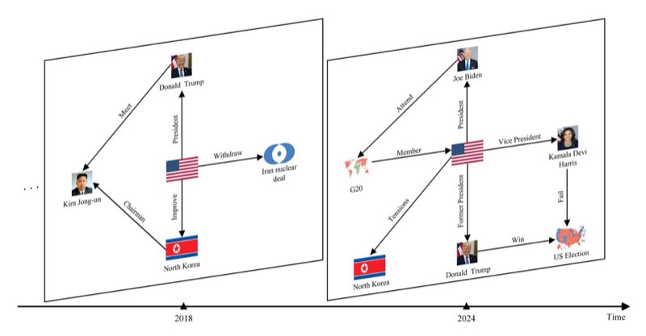
<!-- Image Description: This image uses two 3D diagrams to illustrate geopolitical events from 2018-2024. The left diagram shows events surrounding Kim Jong-un, Donald Trump, and the Iran nuclear deal. The right diagram depicts events involving Joe Biden, Kamala Harris, and North Korea's relations with the US, following the 2020 US election. Arrows indicate relationships between key actors and events, illustrating the temporal progression and causal links between them within the specified timeframe. -->
**Figure 1**. An example of a TKG, including two subgraphs of the KG with timestamps 2018 and 2024. Portrait images of political leaders, flags, and icons were obtained from Wikimedia Commons under CC BY licenses or from public domain resources.

attention mechanism and the soft motif module; DPCL-Diff[8](#page-20-7) generates new events through graph node diffusion for sparse historical data and uses dual-domain periodic contrast learning to distinguish periodic and nonperiodic events; LogC[L9](#page-20-8) introduces an entity-aware attention mechanism to better integrate local and global historical information through comparative learning; CDRGN-SD[E10](#page-20-9) uses stochastic differential equations to capture the nonlinear dynamics of time Change and adapt to heterogeneous characteristics. However, these methods still face the following three challenges, which reduce their performance:

**How to solve the problem of difficulty in capturing long-distance dependencies in an environment with sparse data**Existing methods usually assume that data is continuous and dense, ignoring the impact of sparsity on long-distance dependency modeling. However, in practice, TKGs data is often unevenly distributed, and the number of triplets in certain time periods is sparse or even missing, making it difficult for the model to effectively learn potential dependencies across time spans[11](#page-20-10)[,12.](#page-20-11) At the same time, long-distance dependencies are time-lag and hidden. For example, future events may depend on key events at earlier points in time, but these events are easily weakened in sparse data. Therefore, designing a model that can capture long-distance dependencies in a sparse environment is crucial for enhancing TKGR performance.
**How to effectively handle the problem of noise interference**Existing methods usually assume that the input data is noise-free, ignoring the common errors, incomplete or conflicting information in actual TKGs. These noises will cause the model to learn unreliable embedding representations, reducing the accuracy and robustness of reasoning[12](#page-20-11). Therefore, it is crucial to design methods that can effectively deal with noise interference and improve the model robustness.
**How to resolve the challenge of difficulty in modeling temporal relationships**Although existing methods have taken into account the dynamic characteristics of time, they are still insufficient in capturing the potential connections of temporal relationships[13](#page-20-12)[,14](#page-20-13). For example, to predict (US, ?, North Korea, 2025), it is possible to learn from the 2018 KG subgraph in Fig. [1](#page-1-0) that Donald Trump improved US-North Korea relations when he took office as president, and from the 2024 subgraph that Trump was re-elected president, and thus infer that US-North Korea relations may ease in 2025. Therefore, how to model the potential temporal connections in the TKG to improve prediction accuracy is of great research value.

To address the above three challenges, this paper propose a framework based on**d**ual-gate and **n**oise-aware **c**ontrastive **l**earning **(DNCL)**to improve the accuracy and robustness of TKGR. Specifically, the DNCL model consists of three modules: The multi-dimensional gated update module dynamically extracts key information from horizontal and vertical dimensions by introducing a dual-gate mechanism of selection gate and update gate, suppresses redundant features, and captures long-distance dependencies information between entities and relations through row and column slicing operations, ensuring that key information is retained in sparse data. The noise-aware adversarial modeling module generates diverse noises and enhances the ability of the model to identify noise by introducing an adversarial training mechanism of noise generator and noise discriminator, thereby improving robustness. The multi-layer embedding contrastive learning module combines intra-layer and inter-layer contrastive learning strategies to capture short-term dynamics and global temporal relationships, respectively, and enhance the representation capabilities of model. This dual strategy helps the model better capture the latent relationships in TKG and improves the model's ability to model temporal relationships.

Our paper has the following contributions:

- Innovatively integrates multi-dimensional gated mechanisms to improve long-distance dependencies modeling: A multi-dimensional gated update module is proposed, which for the first time optimizes the long-distance dependencies capture capability of the TKG through a dual-gate selection strategy, significantly alleviating the problem of information sparsity.
- Introducing noise-aware adversarial modeling to improve model robustness: A noise-aware adversarial modeling module is designed to significantly enhance noise resistance by generating and discriminating noise for adversarial training so that the model maintains efficient inference performance despite noise interference.
- Multi-layer embedding contrastive learning for deep temporal relationship modeling: A multi-layer embedded comparative learning module is proposed to comprehensively mine the latent connections of temporal relationships by combining intra-layer and inter-layer comparative learning strategies, which significantly improves the inference performance of the model.
- Excellent performance verification: Experimental results on four public benchmark datasets show that DNCL is significantly ahead of existing models in multiple core indicators. In particular, the Hit@1 on the ICEWS14, ICEWS15-05, and ICEWS18 datasets increased by 6.91%, 4.31%, and 5.30%, respectively, demonstrating strong reasoning capabilities.

The structure of this paper is as follows: Sec. [Related work](#page-2-0) reviews related work and emphasizes the novelty of our model compared to existing methods; Sec. [Preliminaries](#page-3-0) outlines fundamental concepts and notations; Sec. [The proposed model](#page-4-0) presents the DNCL model; Sec. [Experiments](#page-11-0) discusses the experimental results; and Sec. [Conclusion](#page-19-0) concludes the study.

## Related work

This section details the knowledge graph reasoning method, categorized into static and temporal based on the inclusion of time dimension information.

### Static knowledge graph reasoning

Static KG reasoning enhances structural information in static scenarios by exploring latent associations between entities and relations, and can be grouped into four methods[15:](#page-20-14) methods based on translation, logical rules, multi-source information, and neural networks. Translation-based methods, such as TransE[16,](#page-20-15) model entities and relations in a low-dimensional vector space, and use a simple and efficient objective function and negative sample sampling. Subsequent models such as TransH[17](#page-20-16) and TransR[18](#page-20-17) further optimize the interaction modeling of entities and relations. Logical rule-based methods, such as RLvLR[19,](#page-20-18) combine embedding technology and improved sampling strategies to efficiently learn first-order rules. Neural-L[P20](#page-20-19) achieves end-to-end logical rule reasoning by combining neural networks with logical operations. Multi-source information-based methods, such as IterE[21](#page-20-20), improve the representation of sparse entities through iterative learning. MKRL[22](#page-20-21) uses convolutional networks and attention mechanisms to enhance knowledge representation learning. Neural network-based methods, such as ConvE[23,](#page-20-22) use multi-layer convolutional networks to model complex relationships, and Conv-Trans[E24](#page-20-23) use convolution and structure perception to enhance knowledge graph embedding. CompGC[N25](#page-20-24) process multi-relation graphs through graph convolutional networks. Although these methods have made important progress in static KG reasoning, they still have certain limitations because they do not introduce the time dimension.

### Temporal knowledge graph reasoning

TKGR methods can be divided into interpolation and extrapolation according to the inference time. Interpolation reasoning aims to complete the missing facts in the past[26](#page-20-25). For example, TTrans[E27](#page-20-26) models knowledge evolution through the time dimension based on TransE[16](#page-20-15). TA-DistMul[t26](#page-20-25) uses the traditional DistMult[28](#page-20-27) as a benchmark and combines recurrent neural networks and potential decomposition to achieve embedding learning. TNTComplEx[29](#page-20-28) extends the ComplE[x30](#page-20-29) and optimizes link prediction under time constraints through regularization and 4th-order tensor decomposition. HyTE[31](#page-20-30) maps timestamps to hyperplanes and explicitly integrates them into the entity-relationship space. DE-SimlE[32](#page-20-31) uses multi-layer convolutional networks to efficiently model entity relationships. However, these methods cannot infer future facts and are difficult to achieve prediction tasks.

In the field of visual question answering, R-VQA[33](#page-20-32) uses balanced datasets to reduce language prior bias, and ESC-Ne[t34](#page-20-33) combines spatial and channel attention to enhance visual features, but they mainly focus on static images and lack the ability to model temporal information. ENVQA[35](#page-20-34) combines dual and triple attention mechanisms to focus on both local and global features, while QSFVQ[A36](#page-20-35) reduces computational overhead by isolating question types. These methods provide new inspiration for KG reasoning, but still have difficulty in capturing temporal correlations and cannot adapt to the characteristics of knowledge evolution over time, which is the core requirement of the TKGR task.

This study focuses on extrapolative reasoning, that is, predicting future facts. Know-Evolve[37](#page-20-36) models temporal evolution patterns through deep evolving knowledge networks, but has difficulty capturing longdistance dependencies. RE-NET[38](#page-20-37) uses an autoregressive architecture and a recurrent event encoder for multistep reasoning. xERT[E39](#page-20-38) achieves explainable link prediction using subgraph reasoning and temporal attention mechanism. RE-GCN[40](#page-21-0) combines recursive graph convolutions and static graph constraints to learn entity relationship evolution. TiRGN[41](#page-21-1) captures dynamic characteristics through local and global patterns. HiSMatc[h42](#page-21-2) combines dual-structure encoders to match historical trends. RETI[A43](#page-21-3) jointly models dynamic relationships with twin hyper-relation subgraphs and interaction modules. BH-TDEN[44](#page-21-4) uses a Bayesian hyper-network to model temporal uncertainty. Path reasoning methods such as TiPNN[45](#page-21-5) reason through query paths, but perform poorly in sparse data environments. In addition, in terms of modeling the continuity of time, TANG[O13](#page-20-12) uses neural ordinary differential equations to capture continuous dynamics. TARGAT[14](#page-20-13) jointly models time and relationships through time-aware matrices, but they still have shortcomings in modeling latent temporal relationships. ERS[P46](#page-21-6) uses explicit similarity metrics to extract features between entity relationships and static attributes, but ignores implicit semantic associations. L2TKG[47](#page-21-7) combines explicit features and latent relationship learning, but lacks dynamic global modeling of temporal dependencies. In recent years, the application of contrastive learning in TKGs has received widespread attention, providing a reference for this article. For example, CENET[48](#page-21-8) combines historical and non-historical dependency relationships, and LogCL[9](#page-20-8) fuses local and global information through contrastive learning to cope with noise interference, but they all lack a dedicated noise processing mechanism, which limits performance improvement.

In order to overcome the problems of the above-mentioned existing models, this paper proposed the DNCL model, which combines the noise-aware mechanism with the contrastive learning method and adopts a multidimensional gated update module. It effectively addresses challenges faced by existing models, such as the difficulty in capturing long-distance dependencies in information sparse environments, noise interference, and the difficulty in modeling potential connections between temporal relationships.

### Preliminaries

In this section, the background knowledge of the TKG, the TKGR task, and contrastive learning is explained. The main mathematical symbols used in the DNCL model and their meanings are detailed in Table [1](#page-3-1).

### Background of temporal knowledge graph

**Definition 1** *(Temporal knowledge graph)*. A TKG, denoted as *G*, is a form of knowledge representation that integrates temporal information directly into the entity-relationship framework. It comprises a sequence of KG snapshots, expressed as*G*=*{G*1*, G*2*,..., GT ,...}*. Each snapshot *Gt*at a given timestamp*t*is defined as*Gt* = (*N , R,Mt*), where *N*represents the set of entities,*R*denotes the set of relations, and*Mt*is the set of facts corresponding to timestamp*t*. Each fact in *Mt* is a quadruple (*ns, r, no, t*), where *ns ∈ N*is the subject entity,*no ∈ N*is the object entity,*r ∈ R*specifies the relationship between entities at time*t*, and *t ∈ T*indicates that*t*belongs to the set of timestamps*T*.

### Formulation of the temporal knowledge graph entity reasoning task

**Definition 2** *(Temporal knowledge graph reasoning.)*TKGR aims to use historical knowledge graph sequences*G*=*{G*1*, G*2*, ..., Gt}* to predict missing object entities (*ns, r,* ?*, t* + 1) or subject entities (?*, r, no, t* + 1) in future queries. Because for each quadruple (*ns, r, no, t*), this paper will add an anti-relation quadruple (*no, r−*1*, ns, t*) to the dataset. So when predicting the subject entity (?*, r, no, t* + 1), the task can be reformulated as an object entity prediction query, (*no, r−*1*,* ?*, t*+ 1). Consequently, this study primarily concentrates on predicting the object entity.

### Contrastive learning

Contrastive learning is a self-supervised approach that enhances the representation ability of the model by constructing positive and negative sample pair[s49](#page-21-9). Due to its excellent performance in improving representation discrimination and model robustness, it has been widely used in the field of KGs in recent years. Its core idea is to optimize the contrastive loss function so that different views of the same instance are closer in the embedding space, while pulling the representations of different instances farther apart, thereby improving the ability of the model to distinguish[49.](#page-21-9) In self-supervised contrastive learning, data augmentation is performed on a mini-batch

| Notations | Descriptions |
|------------------|-----------------------------------------------------------------|
| G | A TKG |
| Gt | A subgraph of the KG snapshot at timestamp t |
| Mt | The set of fact at timestamps t |
| N , R, T | The set of entities, relations and timestamps in the TKG |
| (ns, r, no, t) | A quadruple in TKG |
| N , R , T | The total number of entities, relations and timestamps |
| dh | The embedding dimension |
| m | The total length of the history time steps |
| ϵ | The noise intensity control parameter |
| τ | The temperature parameter |
| Hatt t | The embedding matrix after attention weighting |
| H0, R0 | Entity and relation embedding matrix initialized to zero tensor |
| Ht, Rt | The historical embedding matrices of entity and relation at t |
| Hglobal, Rglobal | The global entity and relation embedding matrices |
**Table 1**. Primary notations and descriptions.

of *N* randomly selected instances to generate a positive sample pair for each instance, with all other instances treated as negative samples. For a given positive sample pair (*p*, *q*), the contrastive loss function is defined as follow:

$$
\mathcal{L}_{p,q} = -\log \frac{\exp(\mathbf{y}_p \cdot \mathbf{y}_q/\tau)}{\sum_{s=1, s \neq p}^{2N} \exp(\mathbf{y}_p \cdot \mathbf{y}_s/\tau)},\tag{1}
$$

Where 2*N*represents the total number of samples in the mini-batch, comprising the original*N*samples and an additional*N* samples generated through data augmentation, resulting in 2*N* samples in total; y*p*, y*q*, y*s*represents the embedding vector of the sample;*τ*represents the temperature parameter; and represents the dot product operation.

### The proposed model

This section first gives a comprehensive overview of the proposed DNCL model, then elaborates on the three core modules of the model and their specific design, and introduces the model training and inference process in detail.

### Model overview

Figure [2](#page-4-1) shows the overall framework of the DNCL model, which mainly consists of three parts: a multidimensional gated update module, a noise-aware adversarial modeling module, and a multi-layer embedding contrastive learning module. Specifically, the model first dynamically fuses the entity and relation historical embedding matrices input by TKG through the dual-gate mechanism of the multi-dimensional gated update module, flexibly extracts key information from historical time series data, and suppresses redundant or irrelevant information, thereby effectively alleviating the information sparsity problem and enhancing the modeling ability of long-distance dependencies. Subsequently, the noise-aware adversarial modeling module uses the adversarial training mechanism constructed by the noise generator and the discriminator to enhance the robustness of the model in a noisy environment and effectively reduce the negative impact of noise on the reasoning results. Moreover, the multi-layer embedding contrastive learning module further improves the semantic expression ability of the embedding representation by combining intra-layer and inter-layer contrastive learning strategies, and better captures the potential complex temporal relationships in the time series knowledge graph. The following sections will discuss the design and implementation details of each module in detail.

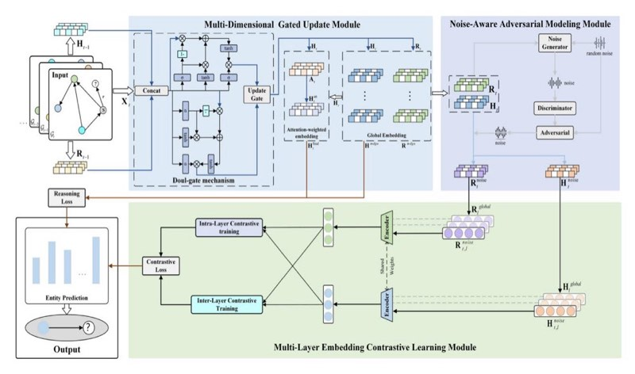
<!-- Image Description: This image depicts a complex neural network architecture for knowledge graph reasoning. It shows three main modules: a multi-dimensional gated update module processing input knowledge graph representations (Ht-1, Rt-1), a noise-aware adversarial modeling module enhancing robustness, and a multi-layer embedding contrastive learning module for improved representation learning. The diagram uses boxes representing modules, arrows indicating data flow, and simple bar charts for visualization of entity prediction results. Different loss functions (reasoning loss, contrastive loss) are shown, highlighting the training process. -->
**Figure 2**. An overall illustrative diagram of the proposed DNCL model. The model consists of three main modules: the multi-dimensional gated update module, the noise-aware adversarial modeling module, and the multi-layer embedding contrastive learning module.

### Multi-dimensional gated update module

Capturing long-distance dependencies in a sparse data environment is one of the core challenges of TKGR. Since events in KGs are sparse and unevenly distributed, long-distance historical information may be missing or not updated. Traditional recurrent neural networks[50](#page-21-10) are affected by gradient vanishing and are difficult to effectively transmit long-distance information. In addition, they lack a filtering mechanism and are prone to introducing irrelevant information, which reduces the reasoning effect. Although gate mechanisms[51](#page-21-11) such as GRU and LSTM can alleviate gradient vanishing, their fixed state update method causes the model to tend to focus on recent information and ignore long-distance dependencies. Especially in an environment with a large time span and uneven data, it is difficult for the model to stably capture key historical information, thus affecting the prediction performance. For example, when predicting the diplomatic relations between the United States and Iran in 2025 in the ICEWS14 dataset, the model should not only consider recent events, such as the economic sanctions in 2023, but more importantly, distant historical events, such as the nuclear agreement in 2014. These distant events may have a more profound impact on future relations. However, traditional gate models tend to focus on recent information, making it difficult to effectively identify and retain key long-distance dependencies, reducing the accuracy of reasoning.

To effectively address the above challenges, we proposed a multi-dimensional gated update module, which introduces a dual-gate mechanism consisting of a selection gate and an update gate in the horizontal and vertical dimensions to enhance the modeling capability of long-distance dependencies in sparse environments. The selection gate models the long-distance dependencies of entities and the evolutionary patterns of relationships through row and column slices, dynamically calculates the relevance of historical events to the current prediction task, accurately screens key events, and suppresses short-term noise interference. For example, when predicting US-Iran relations in 2025, the selection gate can dynamically give a higher weight to the 2014 nuclear agreement while reducing the impact of short-term economic sanctions in 2023. On this basis, the update gate further integrates the filtered long-distance historical information with the current embedding state to ensure that key long-distance information will not be covered by short-distance events, thereby improving the stability and accuracy of long-distance reasoning. In addition, this module also combines the attention mechanism to dynamically calculate the weighted embedding matrix to enhance the model's robust modeling capability for long-distance historical events in complex sparse data environments.

The module selects and updates the historical entity and relation embedding matrices in the horizontal and vertical dimensions, respectively. In order to accumulate historical information from zero in a sparse environment, the module first initializes the input historical entity and relation embedding matrices as a zero tensor H0*,* R0 = 0. Then, the time weights of the current time step are dynamically generated to capture the periodic or dynamic changes of the time series and spliced with the input information of the current time to complete the dynamic modeling of time. The specific process is as follows:

$$
h_t = \cos(W_t \cdot t + \tilde{b}_t), \tag{2}
$$

$$
X'_t = concat(X_t, h_t),
$$
\n(3)

where h*t*represents the dynamic time weight at timestamp*t*; X*t* represents the input information embedding of the current time step; and X*′ t* is the concatenated input embedding, which is used for the fusion of subsequent gated mechanisms; W*t ∈* R*dh×*1 represents the time step weight matrix, *dh* represents the embedding dimension; and b˜*t ∈* R*dh* is the learnable parameter time bias vector.

Subsequently, the historical information is fused with the current information through the selection gate in the dual-gate mechanism and updated. The process first concatenates the multi-dimensional input information and then generates the gated input through linear transformation. The specific formula as follows:

$$
Z_t = [H_{t-1}; R_{t-1}; X'_t],
$$
\n(4)

$$
G_t = W \cdot Z_t + \tilde{b},\tag{5}
$$

where H*t−*1 and R*t−*1 represent the historical entity and relation embedding matrices at timestamp *t −* 1 respectively; [;] represents the tensor splicing operation; Z*t* represents the multi-dimensional input of the current time step, which includes the combination of historical entity embedding, historical relation embedding and current time input embedding; G*t*represents the gated input matrix; and W and b˜ are learnable parameters, which are the linear transformation weight matrix and bias vector, respectively. After that, the gated inputs are sliced by selecting the split operation in the gate and the gated inputs are activated using the Sigmoid[52](#page-21-12) and Tan[h53](#page-21-13) functions. The specific formula is as follows:

$$
G_t^{\sigma} = \sigma(split(G_t, 4 \cdot d_h)), \qquad (6)
$$

$$
G_t^{tanh} = tanh(split(G_t, 2 \cdot d_h)),
$$
\n(7)

where*split*(*·*) represents the slicing of the matrix; *σ*(*·*) represents the Sigmoid activation function; *tanh*(*·*) represents the Tanh activation function; G*σ t*represents the part that generates the update gate and output gate; and Gtanh*t* represents the part that generates the input gate. Next, the gated information is divided by G*σ t*and Gtanh*t*, the specific formula is as:

$$
U_r, O_r, U_c, O_c = chunk(G_t^{\sigma}, 4),
$$
\n(8)

$$
I_r, I_c = chunk(G_t^{\tanh}, 2),
$$
\n(9)

where*chunk*(*·*) represents the matrix segmentation; U*r ∈* R*|N |×dh* and U*c ∈* R*|R|×dh*represents the update gate of entity and relation respectively, which is used to control the fusion ratio of historical information and current information,*|N |*and*|R|* are the number of entities and relations respectively; O*r ∈* R*|N |×dh* and O*c ∈* R*|R|×dh* represents the output gate of entity and relation, which is used to adjust the output amplitude; Moreover I*r ∈* R*|N |×dh* and I*c ∈* R*|N |×dh* represents the input gate of entity and relation, which is used to perform nonlinear activation on the current input. Therefore, the update gate obtained by segmentation updates the historical embedding matrix of entities and relations, effectively suppressing irrelevant or redundant information and obtaining key information. The update process is as follows:

$$
H_t = \tanh((1 - U_r) \odot H_{t-1} + U_r \odot I_r) \odot 0_r, \qquad (10)
$$

$$
R_t = \tanh((1 - U_c) \odot R_{t-1} + U_c \odot I_c) \odot O_c, \qquad (11)
$$

where H*t* and R*t*represent the updated entity and relation embedding matrices at timestamp*t*respectively, and*⊙*represents the bit-by-bit multiplication of elements. And in this process, as the time step*t*increases, the cumulative product of 1*−* U*r*) and 1 *−* U*c*) can avoid the exponential decay of the gradient and thus preserve the long-distance dependency information.

In order to capture the global long-distance dependencies information of entities and relations in the time series, the embeddings from all time steps are accumulated to generate the global entity and relation embedding representation. The accumulation process is as follows:

$$
\mathbf{H}^{mdgu} = \sum_{t=1}^{m} \mathbf{H}_t,\tag{12}
$$

$$
\mathbf{R}^{mdgu} = \sum_{t=1}^{m} \mathbf{R}_t,\tag{13}
$$

where *m* is the total length of historical time steps, and H*mdgu*, R*mdgu*represent the entity and relation embedding matrices accumulated at all time steps, respectively.

Moreover, in order to strengthen the long-distance dependencies modeling, the attention-weighted embedding matrix is calculated by the attention mechanism in the horizontal dimension direction based on the updated entity embedding matrix. The calculation formula is as follows:

$$
A_t = Softmax\left(\frac{Q_t \cdot K_t^{\top}}{\sqrt{d_k}}\right) = Softmax\left(\frac{(W_q \cdot H_t) \cdot (W_k \cdot H_t)^{\top}}{\sqrt{d_k}}\right),\tag{14}
$$

$$
\mathbf{H}_t^{att} = \mathbf{A}_t \cdot \mathbf{V}_t = \mathbf{A}_t \cdot (\mathbf{W}_v \cdot \mathbf{H}_t), \tag{15}
$$

where*Sof tmax*(*·*) represents the normalized attention weight; Q*t*, K*t* and V*t* represent the matrices of query, key, and value, respectively; Q*t ·* K*⊤ t* is the similarity scores between the query and the key, indicating the attention distribution among different entities; A*t* represents the attention weight matrix; H*att t* represents the embedding matrix after attention weighting; W*q,*W*k,*W*ν ∈* R*dh×dk*are trainable parameters, representing the weight matrices of query, key, and value, respectively; and*√dk*represents the scaling factor to prevent the inner product value from being too large and affecting the effect of the*Softmax* normalization function. In additional, the final embedding matrix H*f inal t*is the weighted sum of the attention-weighted embedding matrix and the entity embedding matrix for the current time step. The attention-weighted embedding captures the global information, while the entity embedding at the current time step preserves the local dynamic features. The specific calculation formula is as follows:

$$
\mathbf{H}_{t}^{final} = LayerNorm\left(\beta \cdot \mathbf{H}_{t}^{att} + (1 - \beta) \cdot \mathbf{H}_{t}\right),\tag{16}
$$

where*LayerNorm*(*·*) represents the normalization of the fused embedding to stabilize the training process, and *β*is the fusion weight coefficient, which is used to control the balance between the attention embedding and the current embedding.

### Noise-aware adversarial modeling module

In the task of TKGR, data usually contains erroneous, missing or conflicting information, which causes the model to learn unreliable representations and reduce the accuracy and robustness of reasoning. Therefore, a mechanism that can perceive and resist noise interference is needed to improve the generalization ability and stability of the model in complex environments. To this end, we propose a noise-aware adversarial modeling module. This module consists of a noise generator and a noise discriminator, which aims to improve the robustness and generalization ability of the model in complex scenarios. The specific structures of the noise generator and the noise discriminator are shown in Fig. [3.](#page-7-0) The noise generator introduces random noise to simulate the interference in real scenarios and increase the uncertainty of the noise, thereby expanding the distribution range of the data and helping the model adapt to diverse input conditions. The noise discriminator

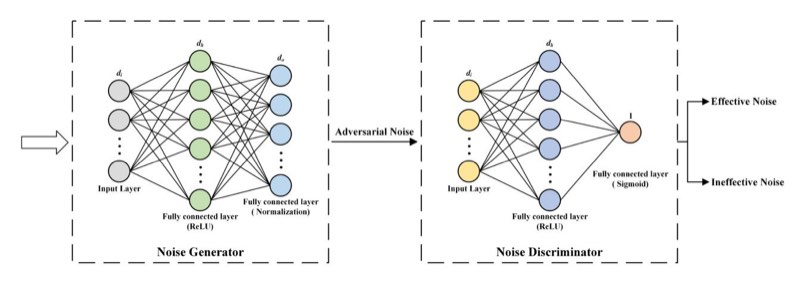
<!-- Image Description: The image shows two neural network architectures: a "Noise Generator" and a "Noise Discriminator". The generator, a multi-layer perceptron with ReLU and normalization layers, produces adversarial noise. This noise is input to the discriminator, another multi-layer perceptron using ReLU and a sigmoid output layer, which classifies the noise as either "effective" or "ineffective". The image illustrates a generative adversarial network (GAN) approach to noise generation and classification. -->
**Figure 3**. The architecture of the noise generator and the noise discriminator. *di*, *dh*, *do*, and 1 represent the number of neurons in each layer respectively; ReLU, Sigmoid, and Normalization respectively indicate that the layer uses the ReLU activation function, Sigmoid activation function, and normalization operation.

takes guidance as the core, identifies and retains effective noise that is beneficial to model learning, and filters out meaningless interference to ensure the quality and pertinence of the generated noise. Through the adversarial modeling mechanism, the embedding can more accurately capture the noise characteristics, making the model more robust in dealing with complex noise environments, while greatly improving its reasoning ability for unseen data[50.](#page-21-10) The specific implementation process of the noise generator, the noise discriminator and the noiseaware adversarial training is introduced in detail below.

### *Noise generator*The noise generator adopts a two-layer fully connected neural network structure. It first extracts random noise from uniform distribution prand*∼ Uniform*(0*,*1) as input, the input dimension is*di*. After that, the first fully connected layer maps the input dimension *di*to the hidden dimension*dh*through full connection and applies ReLU as the activation function[54.](#page-21-14) The second fully connected layer maps the hidden layer dimension*dh*to the output dimension*do*, and finally generates the adversarial noise through the L2 normalization operation. The specific generation process is as follows:

$$
\parallel \delta \parallel_{p} = Normalize(W_4 \cdot ReLU(W_3 \cdot p_{rand} + \tilde{b_1}) + \tilde{b_2}), \tag{17}
$$

where *∥ δ ∥p*represents the adversarial noise generated by the generator;*ReLU*(*·*) denotes the activation function, which is used to introduce the nonlinearity; *Normalize*(*·*) denotes the normalization function; W1 *∈* R*d*h*×d*i and W2 *∈* R*d*0*×d*h are the fully connected layer weight matrices of the generator, *di*and*do*represent the input and output dimensions of the noise generator respectively; and b˜1*∈* R*d*h , b˜2 *∈* R*d*0 represent the bias vector of the generator.

### *Noise discriminator*The structure of the noise discriminator also includes two layers of fully connected neural networks. Its input is a noise vector*∥ δ ∥p*of dimension*di*. In the first fully connected layer, the input dimension *di*is transformed into*dh*through full connection, and ReLU is applied as the activation function. Then, the hidden dimension*dh*is further mapped to a scalar output through the second fully connected layer, and the effectiveness score of the noise is calculated through the Sigmoid activation function to determine whether the input adversarial noise is effective. The calculation formula is as follows:

$$
v = sigmoid(W_d \cdot ReLU(W_c \cdot || \delta ||_p + \tilde{b_c}) + \tilde{b_d}),
$$
\n(18)

where*v ∈* [0*,*1] represents the validity score of the discriminator output; W3*∈* R*d*h*×d*i and W4 *∈* R*d*o*×d*h represent the weight matrix of the fully connected layer of the discriminator, *di*and*do*represent the input and output dimensions of the noise discriminator respectively; and b˜3*∈* R*d*h , b˜4 *∈* R*d*0 represent the bias vector of the discriminator.

### *Noise-aware adversarial learning*This paper adopts an alternating optimization strategy similar to the classic generative adversarial network[55](#page-21-15) to train the noise generator and the discriminator. In each training iteration, the parameters of the discriminator are first fixed, and the generator is optimized so that the noise it generates deceives the discriminator as much as possible, that is, the following loss function is minimized:

$$
L_G = -\mathbb{E}_{\|\delta\|_p \sim p_g(\|\delta\|_p)}[\log(D(\|\delta\|_p))],\tag{19}
$$

where*LG* represents the loss function of the generator; E*∥δ∥p∼pg*(*∥δ∥p*) represents the expected value of the noise sample *∥ δ ∥p*generated by the generator;*pg*(*∥ δ ∥p*) represents the probability distribution of generated noise; *D*(*∥ δ ∥p*) represents the probability of the decision of discriminator on noise *∥ δ ∥p*. Then the parameters of the generator are fixed and the discriminator is optimized so that it can more accurately distinguish between real noise and generated noise, that is, minimize the following loss:

$$
L_D = -\mathbb{E}_{\|\delta\|_p \sim p_T} [\log(D(\|\delta\|_p))] - \mathbb{E}_{\|\delta\|_p \sim p_g} [\log(1 - D(\|\delta\|_p))],\tag{20}
$$

where *LD* represents the loss function of the discriminator; E*∥δ∥p∼pr*represents the expected value of the real noise sample;*pr*(*∥ δ ∥p*) represents the probability distribution value of the real noise. Moreover, the generator and discriminator are optimized alternately once in each iteration until the loss function converges.

Based on the adversarial network strategy, the random noise is weightedly fused with the adversarial noise output by the discriminator. The fused noise is used to update the entity and relation embeddings, and the entity and relationship embedding matrices with adversarial noise are generated respectively. The specific update process is as follows:

$$
\mathcal{H}_t^{noise} = \mathcal{H}_t + \epsilon \cdot (v \cdot \parallel \delta \parallel_p + (1 - v) \cdot \mathbf{p}_{\text{rand}}),\tag{21}
$$

$$
R_t^{noise} = R_t + \epsilon \cdot (v \cdot \parallel \delta \parallel_p + (1 - v) \cdot p_{\text{rand}}), \tag{22}
$$

where *v · ∥δ∥p*+ (1*− v*) *·*prand represents the adversarial noise after the adversarial strategy fusion;*ϵ* represents the noise intensity control parameter; moreover H*noise t* and R*noise t*represent the entity and relation embedding matrices after adding adversarial noise, respectively.

### Multi-layer embedding contrastive learning module

In the multi-layer embedding contrastive learning module, considering the sparsity and time sensitivity of TKGs data, we did not use traditional explicit data augmentation methods such as random perturbations to avoid destroying the integrity of temporal information. Instead, we designed an implicit enhancement strategy based on temporal features to improve data diversity through adversarial noise and perturbation embedding. In terms of sampling strategy, combined with the dynamic characteristics of TKGs, positive and negative samples are constructed based on embedding perturbations in the time dimension and embedding comparisons across layers and time steps to better capture the potential dynamic relationships in time series data.

The multi-layer embedding contrastive learning module captures the dynamic changes of short-term and global time through two contrastive learning strategies: intra-layer and inter-layer, respectively, to enhance the representation ability of the model, and better mine the potential relationships in TKG, thus improving the model's ability to model temporal relationships. The calculation formula of the global entity and relation embedding matrix with adversarial noise is as follows:

$$
H^{\text{global}} = \frac{1}{|\mathcal{F}|} \sum_{t=1}^{|\mathcal{F}|} H_t^{\text{noise}},\tag{23}
$$

$$
R^{\text{global}} = \frac{1}{|\mathcal{F}|} \sum_{t=1}^{|\mathcal{F}|} R_t^{\text{noise}},\tag{24}
$$

where*|T |*represents the total number of timestamps in TKG. In our work, all embedding matrices involved in contrastive learning are first normalized to ensure fair similarity comparisons between embeddings at different layers. The following provides a detailed introduction to the specific implementation of the intra-layer and interlayer contrastive learning methods.

### *Intra-layer contrastive learning*Intra-layer contrastive learning aims to enhance the ability of the model to model temporal latent relationships by optimizing the entity and relation embeddings within the same layer. Specifically, within the same layer, entity and relation embeddings with adversarial noise are used to calculate the cosine similarity between them and the embeddings from the previous time step, which also contain adversarial noise, for contrastive learning. By leveraging the distribution relationship between positive and negative samples, the embedding representations are further refined, enabling the model to more accurately capture the dynamic changes in time series data. Contrastive learning analysis is initially conducted on entity embeddings with adversarial noise. The process of calculating the positive sample score is as follows:

$$
S_{intra-pos}^{H} = ReLU\left(\frac{\mathbf{H}_{t,l}^{noise} \cdot (\mathbf{H}_{t-1,l}^{noise})^{\top}}{\tau}\right),\tag{25}
$$

where*l* represents the current layer number; H*noise t,l* and H*noise t−*1*,l*represent the entity embedding matrix with adversarial noise in the current time step and the previous time step in the*l th*layer respectively; and*SH intra−pos* represents the entity positive sample score compared within the layer. The process of calculating the negative sample score is as follows:

$$
S_{intra-neg}^{H} = ReLU\left(\frac{H_{t,l}^{noise} \cdot (H_l^{global})^{\top}}{\tau}\right),
$$
\n(26)

where H*global l*represents the global entity embedding matrix with adversarial noise at the*l th*layer, and*SH intra−neg*represents the negative sample score of the intra-layer contrast. Therefore, the intra-layer contrastive learning loss of the entity embedding with adversarial noise can be calculated using the positive and negative sample scores. The specific calculation process is as follows:

$$
\mathcal{L}_{intra-H} = -\sum_{i=1}^{|\mathcal{N}_t|} \log \frac{S_{intra-pos,i}^H}{\sum_{k=1}^{|\mathcal{N}_t|} S_{intra-neg,k}^H},\tag{27}
$$

where*i*and*k*represent a positive and negative sample index selected in the set, respectively, and*|Nt|*represents the total number of entities at timestamp*t*. Similarly, we can use the above method to perform contrastive learning on relation embedding with adversarial noise, thereby obtaining the intra-layer contrastive learning loss of relation embedding with adversarial noise *Lintra−R*.

### *Inter-layer contrastive learning*Inter-layer contrastive learning aims to capture multi-scale semantic information in time series by comparing entity and relation embeddings with adversarial noise at different levels (such as bottom and top layers), and enhance the model's sensitivity to changes in potential temporal information, thereby solving the problem of capturing latent temporal relationships in TKG. Specifically, the strategy first calculates the similarity between the current layer embedding and the last layer embedding through cosine similarity to obtain the positive sample score; then calculates the similarity between the current layer embedding and the global embedding to obtain the negative sample score. Next, the performance of entity embeddings with adversarial noise in contrastive learning is analyzed, and describe the calculation process of its positive sample score as follows:

$$
S_{inter-pos}^{H} = ReLU\left(\frac{\mathbf{H}_{t,l}^{noise} \cdot (\mathbf{H}_{t-1,L}^{noise})^{\top}}{\tau}\right),\tag{28}
$$

where*L* represents the total number of layers, and also represents the last layer; H*noise t−*1*,L*represents the entity embedding matrix with adversarial noise in the last time step in the last layer*L*; and *SH inter−pos* represents the entity positive sample score of the inter-layer comparison. The process of calculating the negative sample score is as follows:

$$
S_{inter-neg}^H = ReLU\left(\frac{H_{t,l}^{noise} \cdot (H_L^{global})^\top}{\tau}\right),\tag{29}
$$

where H*global L*represents the global entity embedding matrix with adversarial noise in the last layer L, and*SH inter−neg*represents the negative sample score of the inter-layer contrast. Then, the inter-layer contrastive learning loss with adversarial noise entity embedding is calculated based on the distribution relationship between positive and negative samples:

$$
\mathcal{L}_{inter-H} = -\sum_{i=1}^{|\mathcal{N}_t|} \log \frac{S_{inter-pos,i}^H}{\sum_{k=1}^{|\mathcal{N}_t|} S_{inter-neg,k}^H}.
$$
\n(30)

Similarly, we also use the above method to perform comparative calculations on the inter-layer contrastive learning loss with adversarial noise relation embedding*Linter−R*. The contrastive loss is then defined as:

$$
\mathcal{L}_{cl} = \lambda(\mathcal{L}_{intra-H} + \mathcal{L}_{intra-R} + \mathcal{L}_{inter-H} + \mathcal{L}_{inter-R}),
$$
\n(31)

where *λ* represents the weight factor, which is a hyperparameter used to adjust the contribution of contrastive learning loss in the overall loss.

### Model training and inference

Previous studies[25](#page-20-24) have shown that the combination of convolutional scoring functions and graph convolutional networks has shown excellent performance in KG reasoning. At the same time, ConvTransE[24](#page-20-23) has become a widely used scoring function due to its excellent performance in TKGR tasks. Therefore, our study choose ConvTransE as the decoder to achieve entity prediction. The calculation formula of its entity prediction score P*N score* is as follows:

$$
P_{score}^{\mathcal{N}} = \sigma(H^{mdgu} \cdot ConvTransE(n_{s,t}, r_t + H_t^{final} \cdot ConvTransE(n_{s,t}, r_t)), \qquad (32)
$$

where n*s,t* and r*t*represent the embedding of the subject entity*ns*relation*r* in H*mdgu* and H*f inal t*. The purpose of our model is to perform a multi-label learning task, where each label represents a possible entity or relation. Next, the entity prediction loss function*LN* is defined as:

$$
\mathcal{L}_{\mathcal{N}} = \sum_{t=1}^{|\mathcal{T}|} \sum_{(n_s, r, n_o, t) \in \mathcal{M}_t} \sum_{e \in \mathcal{E}} z_t^n \log P_{score}^{\mathcal{N}}(n_s, r, n_o, t), \tag{33}
$$

where P*Nscore*(*ns, r, no, t*) is the predicted probability score of the entity; and z*n t ∈* R*|N |*is the label of the element which is 1 if the fact occurs, otherwise 0. Therefore, the final loss function calculation is defined as:

$$
\mathcal{L} = \mathcal{L}_{\mathcal{N}} + \mathcal{L}_{cl}. \tag{34}
$$

Table [2](#page-11-1) summarizes the key equations in the DNCL model and their purpose. In addition, the specific DNCL model reasoning process is shown in Algorithm 1.
**Algorithm 1**. Reasoning process of DNCL

### Complexity analysis

This section will analyze the complexity of our DNCL model from the three proposed modules. For the multidimensional gated update module, the time complexity is *O*(*m |N | dh*), where *m*is the time series length,*|N |*is the number of entities, and ddd is the embedding dimension. The row and column slicing strategy is used to flexibly select key information, reduce global operation overhead, and improve computational efficiency. For the noise-aware adversarial modeling module, the time complexity of adversarial training is*O*(*n |N | dh*), where *n*is the number of iterations of adversarial training. Noise generation and discrimination operations effectively reduce noise interference and significantly improve model robustness at low cost. For the multi-layer embedding contrastive learning module, the sum of the time complexity of the intra-layer and inter-layer contrastive loss is*O*(*L|N |*2*dh*+*L*2 *|N |*2*dh*), where *L*is the number of model layers. Multi-level semantics are captured by intra-layer and inter-layer contrast, combined with noise embedding optimization, to improve the modeling ability of complex dynamic relationships. Therefore, the overall time complexity of the DNCL model*O*(*m |N | dh*+*n |N | dh*+*L|N |*2*dh*+*L*2 *|N |*2*dh*) is the sum of the complexity of the three modules.

| Number | Key equation | Purpose |
|---------------|-----------------------------------------------------------------------------------------|---------------------------------------------|
| Equation (10) | Ht = tanh((1 − Ur) ⊙ Ht−1 + Ur ⊙ Ir) ⊙ 0r | |
| Equation (11) | Rt = tanh((1 − Uc) ⊙ Rt−1 + Uc ⊙ Ic) ⊙ Oc | Filter key information, suppress redundancy |
| Equation (16) | = LayerNorm ( ) Hf inal β · Hatt + (1 − β) · Ht t t | Capturing long-distance dependencies |
| Equation (17) | ∥ δ ∥p= Normalize(W4 · ReLU(W3 · prand + b˜ 1) + b˜ 2) | Generate adversarial noise |
| Equation (18) | c) + ˜bd) v = sigmoid(Wd · ReLU(Wc· ∥ δ ∥p +b˜ | Screening for meaningful adversarial noise |
| Equation (21) | Hnoise = Ht + ϵ·(v· ∥ δ ∥p +(1 − v) · prand) t | |
| Equation (22) | Rnoise = Rt + ϵ·(v· ∥ δ ∥p +(1 − v) · prand) t | Adding adversarial noise |
| Equation (27) | SH Lintra−H = −∑ Nt  intra−pos,i i=1 log ∑  Nt  k=1 SH intra−neg,k | Capturing short-term dynamic features |
| Equation (30) | SH Linter−H = −∑ Nt  inter−pos,i i=1 log ∑  Nt  k=1 SH inter−neg,k | Capturing global temporal relationships |
| Equation (32) | score = σ(Hmdgu · ConvT ransE(ns,t, rt + Hf inal PN · ConvT ransE(ns,t, rt)) t | Calculating entity prediction scores |

### Table 2. Summary of key equations and their purpose.

### Experiments

This section evaluates the performance of the DNCL model through extensive experiments conducted on four datasets. A detailed analysis of the experimental results is provided below.

### Datasets

This paper performs comprehensive experiments on four representative TKG datasets to evaluate the performance of our model. These datasets include: ICEWS1[426](#page-20-25), ICEWS18[39,](#page-20-38) ICEWS05-15[26](#page-20-25), and GDELT[56.](#page-21-16) The ICEWS14 dataset, sourced from the Integrated Crisis Early Warning System (ICEWS), primarily documents political events that occurred in 2014. ICEWS18, also from ICEWS, covers event data from January 1 to October 31, 2018, providing event records closer to the present. ICEWS05-15 is a long-term version of the ICEWS dataset, covering event information from 2005 to 2015, reflecting dynamic changes over a longer time span. GDELT is a global event dataset that records a variety of global events and covers a wide range. The detailed statistics of the dataset are listed in Table [3](#page-12-0).

For the preprocessing of the dataset, we first removed duplicate facts and samples with missing timestamps in the dataset to ensure the accuracy and consistency of the training data; then, in order to unify the time scale, we normalized all timestamps and mapped them to the interval [0,1] to improve the comparability of data in different time ranges and the temporal generalization ability of the model. In addition, in order to maintain the temporal causal relationship within the dataset, we strictly divide all datasets into training, validation, and test sets in chronological order, with proportions of 80%, 10%, and 10%, respectively, and ensured that the static knowledge graph information in all datasets was fully integrated to provide more stable entity and relationship representations. At the same time, to ensure the consistency of the model input, we uniquely mapped all entity and relationship IDs to ensure that the same entity or relationship maintains the same numerical representation in the entire dataset. Finally, in terms of the negative sampling strategy, we randomly sample a certain number of negative samples (*n′ s, r, no, t*) or (*ns, r, n′ o, t*) for each positive sample (*n′ s, r, no, t*) to enhance the generalization and robustness of the model, where *n′ s*and*n′ o* represent the wrong head entity and tail entity, respectively.

### Evaluation metrics

To thoroughly assess the performance of the DNCL model in the TKGR task, we use mean reciprocal rank (MRR) and Hits@*k* (*k*=1,3,10) as evaluation metrics. MRR measures the ability of the model to rank the correct answer at the top, while Hits@*k*evaluates the presence of the correct answer within the top*k* results. MRR is used to measure the model's ability to rank the correct answer in the top, and Hits@*k*evaluates whether the correct answer appears in the top*k*. A higher value indicates that the model has stronger accuracy and robustness. In addition, our study uses a time-aware filtered setting for evaluation. Compared with traditional methods[39,](#page-20-38)[40](#page-21-0), this setting only removes valid facts that occur at the same time as the query facts, which is more in line with the actual needs of temporal reasoning and improves the accuracy of the evaluation.

### Baseline models

This paper presents comparative experiments of the DNCL model with 20 latest or classic KG reasoning methods, thoroughly validating its effectiveness in the TKGR task. The baseline models we considered include static KG reasoning models, interpolation TKG reasoning models, and extrapolation TKG reasoning models. Among them, the static KG reasoning models mainly include: DisMult[28,](#page-20-27) ComplEx[30](#page-20-29), ConvE[23,](#page-20-22) Conv-Trans[E24](#page-20-23) and Rotat[E57](#page-21-17). The interpolation TKG reasoning models mainly include: TTrans[E27](#page-20-26), TA-DistMult[26,](#page-20-25) DE-Siml[E32](#page-20-31) and TNTComplE[x29.](#page-20-28) The extrapolated TKG inference models mainly include: RE-NE[T38](#page-20-37), xERTE[39,](#page-20-38) TANG[O13](#page-20-12), RE-GCN[40,](#page-21-0) TiRGN[41,](#page-21-1) HisMatch[42](#page-21-2), RETI[A43](#page-21-3), CENET[48,](#page-21-8) L2TKG[47,](#page-21-7) LogC[L9](#page-20-8) and BH-TDEN[44](#page-21-4).

| Dataset | ICEWS14 | ICEWS05-15 | ICEWS18 | GDELT |
|---------|----------|------------|----------|-----------|
| N | 6,869 | 23,033 | 10,094 | 7,691 |
| R | 230 | 251 | 256 | 240 |
| Dtrain | 74,845 | 368,868 | 373,018 | 1,734,399 |
| Dvalid | 8,541 | 46,302 | 45,995 | 238,765 |
| Dtest | 7,371 | 46,159 | 49,545 | 305,241 |
| ∆t | 24 hours | 24 hours | 24 hours | 15 mins |
| T | 365 | 4,017 | 365 | 2,975 |

**Table 3**. Statistics of the TKG datasets (*Dtrain*, *Dvalid*, and *Dtest* are the numbers of facts in training, validation, and test sets; ∆t represents time interval).

### Implementation details

In the training, we set the batch size to four times the number of samples per timestamp. We use the adam optimizer[58](#page-21-18) with an initial learning rate of 0.001, leveraging adam's adaptive learning rate mechanism to improve training efficiency and convergence stability. All trainable parameters are initialized uniformly with Xavier, while entity and relation embeddings are initialized to zero tensors at the beginning of training to ensure consistency of the initial state. To mitigate overfitting, we apply L2 regularization with a weight decay coefficient of 1*e−*5 and incorporate a dropout rate of 0.2 in each network layer. We also implement an early stopping strategy that terminates training if the validation MRR does not improve for 10 consecutive epochs. For hyperparameter tuning, we perform a grid search. Specifically, the embedding dimension *dh*is selected from*{*100*,* 200*,* 300*,* 400*,* 500*}*, where 200 is the best in all datasets. The history KG length *m*is selected from*{*1*,* 2*,* 3*, ...,* 10*}*; the optimal sequence lengths for ICEWS14, ICEWS05-15, ICEWS18 and GDELT are 7, 9, 4 and 2 respectively. The temperature coefficient *τ*is optimized in the range of*{*0*.*01*,* 0*.*03*, ...,* 0*.*09*,* 0*.*1*,* 0*.*3*, ...,* 0*.*9*}*, with the optimal value of 0.03 for ICEWS14 and ICEWS18 and 0.07 for ICEWS05-15 and GDELT. The noise intensity control parameter *ϵ* is uniformly set to 0.15 to ensure robustness under noisy conditions. In the decoder, we use 50 convolution kernels with a kernel size of 2*×*3 and set the dropout rate to 0.2. In addition, the static KG information is fully integrated into each dataset and the prediction weight is set to 0.9. All experiments were performed on a system equipped with 3 NVIDIA Tesla V100 GPUs to facilitate faster processing and large-scale experiments.

### Results of prediction

The performance results of our proposed DNCL model, along with comparison models, for entity reasoning prediction are presented in Table [4](#page-13-0). As shown, the DNCL model outperforms current state-of-the-art methods on most metrics across the four datasets, demonstrating its effectiveness in tackling TKGR tasks. Specifically, compared with the second best result in Table [4,](#page-13-0) the DNCL model improves MRR by 4.73%, 2.77% and 4.93% on the ICEWS14, ICEW05-15 and ICEWS18 datasets respectively. And for the Hist@1/10 indicators, DNCL has improved on all four data sets. The most significant improvement of Hist@1 is 6.91% on the ICEWS14 dataset, and the most significant improvement of Hist@10 is 3.93% on the ICEWS18 dataset. The GDELT dataset has significant noise and sparsity characteristics, which brings complex challenges to most models and limits their performance. However, the DNCL model overcomes these challenges by effectively coping with the impact of noise through noise-aware modeling and screening out key information through a multi-dimensional gate mechanism, thereby improving its performance efficiency to a certain extent.

DNCL outperforms all static models (shown in the first part of Table [4\)](#page-13-0) as well as temporal models in the interpolation (shown in the second part of Table [4\)](#page-13-0). This can be attributed to the fact that static models overlook temporal information, failing to capture the dynamic changes in entities and relations, which limits their effectiveness in time series tasks. Moreover, although interpolation models focus on completing historical missing facts, they fail to model the evolution of entities and relations over time, and thus lack the ability to predict future unseen facts. In contrast, extrapolation models are better able to cope with the reasoning challenges in time series knowledge graphs by modeling the dynamic changes of the time dimension.

Compared with state-of-the-art extrapolation models, although both CENET and LogCL models use contrastive learning to enhance model performance, their performance is not as good as DNCL due to the lack of separate modeling of noise and the failure to consider the potential relation in the time dimension. Although L2TKG utilizes structure encoders and latent relation learning modules to mine potential relations inside and outside time, it mainly relies on the static graph structure of historical data, does not fully incorporate global time dependencies, and lacks modeling of dynamic evolution trends of entities and relationships, making it Its performance is limited. However, DNCL filters out key information through a multi-dimensional gated mechanism to effectively address the problem of long-distance dependencies in information sparse environments. At the same time, it improves the robustness of the model in complex noise environments through noise-aware adversarial modeling, and combines multi-layer embedding contrastive learning more comprehensively and dynamically captures the temporal potential information in the TKG, improved model performance in multiple tasks.

| | ICEWS14 | | | | ICEWS05-15 | | | | ICEWS18 | | | | GDELT | | | |
|-------------------|---------|-------|-------|-------|------------|-------|-------|-------|---------|-------|-------|-------|-------|-------|-------|-------|
| Model | MRR | H@1 | H@3 | H@10 | MRR | H@1 | H@3 | H@10 | MRR | H@1 | H@3 | H@10 | MRR | H@1 | H@3 | H@10 |
| DistMult(2014) | 15.44 | 10.91 | 17.24 | 23.92 | 17.95 | 13.12 | 20.71 | 29.32 | 11.51 | 7.03 | 12.87 | 20.86 | 8.68 | 5.58 | 9.96 | 17.13 |
| ComplEx(2016) | 32.54 | 23.43 | 36.13 | 50.73 | 32.63 | 24.01 | 37.50 | 52.81 | 22.94 | 15.19 | 27.05 | 42.11 | 16.96 | 11.25 | 19.52 | 32.35 |
| ConvE(2018) | 35.09 | 25.23 | 39.38 | 54.68 | 33.81 | 24.78 | 39.00 | 54.95 | 24.51 | 16.23 | 29.25 | 44.51 | 16.55 | 11.02 | 18.88 | 31.60 |
| Conv-TransE(2019) | 33.80 | 25.40 | 38.54 | 53.99 | 33.03 | 24.15 | 38.07 | 54.32 | 22.11 | 13.94 | 26.44 | 42.28 | 16.20 | 10.85 | 18.38 | 30.86 |
| RotatE(2019) | 21.31 | 10.26 | 24.35 | 44.75 | 24.71 | 13.22 | 29.04 | 48.16 | 12.78 | 4.01 | 14.89 | 31.91 | 13.45 | 6.95 | 14.09 | 25.99 |
| TTransE(2016) | 13.72 | 2.98 | 17.70 | 35.74 | 15.57 | 4.80 | 19.24 | 38.29 | 8.31 | 1.92 | 8.56 | 21.89 | 5.50 | 0.47 | 4.94 | 15.25 |
| TA-DistMult(2018) | 25.80 | 16.94 | 29.74 | 42.99 | 24.31 | 14.58 | 27.92 | 44.21 | 16.75 | 8.61 | 18.41 | 33.59 | 12.00 | 5.76 | 12.94 | 23.54 |
| DE-SimlE(2020) | 33.36 | 24.85 | 37.15 | 49.82 | 35.02 | 25.91 | 38.99 | 52.75 | 19.30 | 11.53 | 21.86 | 34.80 | 19.70 | 12.22 | 21.39 | 33.70 |
| TNTComplEx(2020) | 34.05 | 25.08 | 38.50 | 50.92 | 27.54 | 9.52 | 30.80 | 42.86 | 21.23 | 13.28 | 24.02 | 36.91 | 19.53 | 12.41 | 20.75 | 33.42 |
| RE-NET(2020) | 36.93 | 26.83 | 39.51 | 54.78 | 43.32 | 33.43 | 47.77 | 63.06 | 28.81 | 19.05 | 32.44 | 47.51 | 19.62 | 12.42 | 21.00 | 34.01 |
| xERTE(2020) | 40.02 | 32.06 | 44.63 | 56.17 | 46.62 | 37.84 | 52.31 | 63.92 | 29.98 | 22.05 | 33.46 | 44.83 | 18.09 | 12.30 | 20.06 | 30.34 |
| TANGO(2021) | – | – | – | – | 42.86 | 32.72 | 47.14 | 62.34 | 28.97 | 19.51 | 32.61 | 47.51 | 19.66 | 12.50 | 20.93 | 33.55 |
| RE-GCN(2021) | 40.39 | 30.66 | 44.96 | 59.21 | 48.03 | 37.33 | 53.85 | 68.27 | 30.58 | 21.01 | 34.34 | 48.75 | 19.64 | 12.42 | 20.90 | 33.69 |
| TiRGN(2022) | 44.04 | 33.83 | 48.95 | 63.84 | 50.04 | 39.25 | 56.13 | 70.71 | 33.66 | 23.19 | 37.99 | 54.22 | 21.67 | 13.63 | 23.27 | 37.60 |
| HisMatch(2022) | 46.42 | 35.91 | 51.63 | 66.84 | 52.85 | 42.01 | 59.05 | 73.28 | 33.99 | 23.91 | 37.90 | 53.94 | 22.01 | 14.45 | 23.80 | 36.61 |
| RETIA(2023) | 42.76 | 32.28 | 47.77 | 62.75 | 47.26 | 36.64 | 52.90 | 67.76 | 32.43 | 22.23 | 36.48 | 52.94 | 20.12 | 12.76 | 21.45 | 34.49 |
| CENET(2023) | 39.02 | 29.62 | 43.23 | 57.49 | 41.95 | 32.17 | 46.93 | 60.43 | 27.85 | 18.15 | 31.63 | 46.98 | 20.23 | 12.69 | 21.70 | 34.92 |
| L2TKG(2023) | 47.40 | 35.36 | – | 71.05 | 57.43 | 41.86 | – | 80.69 | 33.36 | 22.15 | – | 55.04 | 20.53 | 12.89 | – | 35.83 |
| LogCL(2024) | 48.87 | 37.76 | 54.71 | 70.26 | 57.04 | 46.07 | 63.72 | 77.87 | 35.67 | 24.53 | 40.32 | 57.74 | 23.75 | 14.64 | 25.60 | 42.33 |
| BH-TDEN(2024) | 39.3 | 29.7 | 44.0 | 58.1 | 43.0 | 32.7 | 47.9 | 62.7 | 28.9 | 19.1 | 32.6 | 48.7 | 19.4 | 12.5 | 21.4 | 33.6 |
| DNCL(ours) | 51.18 | 40.37 | 56.86 | 71.89 | 59.02 | 48.06 | 65.50 | 80.88 | 37.43 | 25.83 | 42.70 | 60.01 | 23.59 | 14.78 | 25.40 | 42.39 |
| + Improve | 4.73 | 6.91 | 3.93 | 1.82 | 2.77 | 4.31 | 2.79 | 0.24 | 4.93 | 5.30 | 5.83 | 3.93 | – | 0.96 | – | 0.14 |

**Table 4**. Comparison results of the overall performance (percentage) of different methods on ICESW14, ICEWS05-15, ICEWS18 and GDELT. The best result is highlighted in black font and the second best result is underlined. The result of TANGO is from[41,](#page-21-1) the results of L2TKG, BH-TDEN and HisMatch are from the original paper, and the rest of the results are from[9](#page-20-8) . The model results with the best performance under each evaluation indicator.

### Ablation study

To investigate the contribution of each component in the DNCL model to its overall performance, we performed ablation experiments on the ICEWS14, ICEWS05-15, ICEWS18, and GDELT datasets, using MRR and Hits@1/3/10 as evaluation metrics. The results are summarized in Table [5](#page-14-0).

### *Impact of multi-dimensional gated update module*The multi-dimensional gated update module extracts key information and suppresses redundant noise through a dual-gate mechanism, solving the problem of long-distance dependencies on difficult to capture and information sparse. Taking ICEWS14 as an example, removing the dual-gate mechanism (w/o DG) reduces the MRR from 51.18 to 50.05%. Although this is only a 1.13% decrease, considering that the ICEWS14 dataset is relatively rich and the structure is relatively stable, this decrease shows the effectiveness of the dual-gate mechanism in information selection. In the more challenging and noisy GDELT dataset, removing the dual-gate mechanism reduces the MRR from 23.59 to 21.69%, a relatively larger decrease. This means that in scenarios where information is more sparse and noise is more obvious, the contribution of the dual-gate mechanism to information screening and long-distance dependencies capture becomes more prominent.

### *Impact of noise-aware adversarial modeling module*The noise-aware adversarial modeling module enhances the robustness of the model in dealing with noise interference through adversarial training. Compared to the contribution of the multi-dimensional gated update module, which is mainly in information refinement, the noise-aware adversarial modeling module is more directly oriented to the noise distribution. From the experimental results, in relatively clean or low-noise datasets such as ICEWS14, the MRR drops from 51.18 to 50.27% with the removal of the adversarial noise modeling mechanism (w/o AN), a decrease of 0.91%; whereas, in the GDELT dataset, where the noise is more significant, the MRR plummets from 23.59 to 21.11%, a decrease of as much as 2.27%, which is significantly higher than the ICEWS14's drop. This shows the sensitivity and adaptability of the noise-aware adversarial modeling module to noisy environments.

In summary, it can be seen from the significant decrease in the overall performance of the DNCL model after removing each module that these modules each play an indispensable role in improving model performance. Each module is designed for key challenges in the TKGR task, and plays a core role in capturing long-distance dependencies under information sparsity, handling noise interference, and modeling potential temporal relationships. This further verifies the rationality and necessity of the module design, and also shows that the synergy between modules is crucial to the overall performance of the model.

### *Impact of multi-layer embedding contrastive learning module*The core feature of the multi-layer embedding contrastive learning module is to combine the two contrastive learning strategies of intra-layer and inter-layer to mine richer feature representations and improve the temporal relationship modeling capabilities of model. Ablation experiment results show that removing the entire multilayer embedding contrastive learning (w/o CL) leads to the most significant performance drop, for example, in the ICEWS14 dataset, the MRR drops from 51.18 to 47.50%, a drop of 3.68%, which fully demonstrates that multi-layer embedding contrastive learning plays a key role in optimizing and enriching the embedding space. In addition, this trend remains consistent across multiple datasets, indicating the wide adaptability of the module under different temporal distributions.

Further analysis shows that although the performance degradation of removing intra-layer contrastive learning (w/o intra) and removing inter-layer contrastive learning (w/o inter) is relatively small, it still has a significant impact on the overall performance of the model. Specifically, removing intra-layer contrastive learning weakens the model's ability to represent short-term dependency information and reduces the entity distinction in the same-layer embedding space; while removing inter-layer contrastive learning affects the ability to capture global temporal relationships, resulting in unstable information transfer between different layers.

In summary, the multi-layer embedding contrastive learning module not only improves the model's ability to explicitly model latent relationships in the temporal dimension, but also provides a more robust underlying representation space for the multi-dimensional gated update and noise-aware adversarial modeling modules. It also verifies that the synergy of intra-layer and inter-layer contrastive learning is a key factor in improving model performance.

### Comparison on prediction time

Since the RE-NET[38](#page-20-37) and xERTE[39](#page-20-38) models represent classic approaches for complex subgraph reasoning and sequential dependency modeling, respectively, they provide ideal comparative baselines for validating the efficient computational efficiency achieved by the DNCL model through its modular design. Therefore, to comprehensively evaluate the computational efficiency of the DNCL model, this paper compared it with the RE-NET and xERTE models in entity reasoning tasks under the same conditions. Specifically, this paper measured the running time of each model on the test sets of four datasets and strictly ensured that all experiments were conducted under the same environment and parameter settings to ensure the fairness of the results. The comparison results are shown in Fig. [4.](#page-15-0)

Experimental results show that the running time of the DNCL model on different datasets is significantly better than RE-NET and xERTE. Moreover, even on a highly dynamic and large-scale event record dataset such as GDELT, DNCL can still maintain excellent inference efficiency and significantly reduce computational overhead. This efficiency is due to the modular design of the DNCL model, especially the synergy between the dual-gate mechanism and the multi-layer contrastive learning module, which effectively reduces redundant calculations. At the same time, noise-aware adversarial modeling further optimizes computational efficiency by modeling noise, significantly shortening inference time while still maintaining excellent inference accuracy and robustness. In contrast, xERTE's complex subgraph expansion and pruning operations, and RE-NET's stepwise autoregressive inference framework, both bring additional computational overhead. Therefore, DNCL shows significant advantages in computational efficiency through its concise and efficient design and comparative learning strategy.

### Comparison analysis with non-contrastive-based TKGR models

Since L2TKG[47](#page-21-7) combines explicit and implicit features to model temporal relationships, but lacks global temporal information integration, it is difficult to capture global information; HiSMatch[42](#page-21-2) uses a dual-structure

| | ICEWS14 | | | | ICEWS05-15 | | | | ICEWS18 | | | | GDELT | | | |
|-----------|---------|-------|-------|-------|------------|-------|-------|-------|---------|-------|-------|-------|-------|-------|-------|-------|
| Model | MRR | H@1 | H@3 | H@10 | MRR | H@1 | H@3 | H@10 | MRR | H@1 | H@3 | H@10 | MRR | H@1 | H@3 | H@10 |
| DNCL | 51.18 | 40.37 | 56.86 | 71.89 | 59.02 | 48.06 | 65.50 | 80.88 | 37.43 | 25.83 | 42.70 | 60.01 | 23.59 | 14.78 | 25.40 | 42.39 |
| w/o DG | 50.05 | 38.87 | 56.18 | 71.70 | 58.70 | 47.62 | 65.34 | 80.04 | 36.45 | 24.88 | 41.74 | 58.89 | 21.69 | 12.49 | 23.53 | 40.34 |
| w/o AN | 50.27 | 38.90 | 56.30 | 71.67 | 58.82 | 47.78 | 65.46 | 79.91 | 37.03 | 25.69 | 42.10 | 59.16 | 21.11 | 11.97 | 22.79 | 39.62 |
| w/o intra | 50.19 | 38.81 | 56.18 | 72.24 | 58.70 | 47.92 | 65.13 | 79.51 | 37.17 | 25.78 | 42.59 | 59.86 | 23.09 | 13.98 | 25.06 | 42.17 |
| w/o inter | 50.40 | 39.10 | 56.71 | 72.11 | 58.65 | 47.89 | 65.19 | 79.84 | 36.83 | 25.33 | 41.89 | 59.42 | 23.35 | 14.12 | 25.18 | 42.33 |
| w/o CL | 47.50 | 35.79 | 53.82 | 70.72 | 58.41 | 47.37 | 64.99 | 79.72 | 36.77 | 25.10 | 41.93 | 59.63 | 22.89 | 13.78 | 24.55 | 41.53 |
**Table 5**. Ablation experiment results (percentage) of the DNCL model. 'w/o DG' represents the DNCL model without the dual-gate mechanism, 'w/o AN' represents the DNCL model without the adversarial noise modeling mechanism, 'w/o intra' represents the DNCL model without use the intra-layer contrastive learning, 'w/o inter' represents the DNCL model without use inter-layer contrastive learning and 'w/o CL' represents the DNCL model without use the multi-layer embedding contrastive learning strategy. The best result is highlighted in black font and the second best result is underlined. The model results with the best performance under each evaluation indicator.

encoder to match historical patterns, but mainly relies on static historical information and has weak adaptability to dynamic evolution; RE-GC[N40](#page-21-0) models temporal relationships based on recursive graph convolutional networks, but is susceptible to noise interference in complex temporal evolution environments and has difficulty modeling fine-grained temporal dynamics. In addition, none of these models use contrastive learning to optimize temporal relationship modeling, so it can more effectively verify the modeling advantage of DNCL's multi-layer embedding contrastive learning module in modeling potential temporal relationships in both shortterm and global time ranges. Therefore, we selected L2TKG, HiSMatch, and RE-GCN as comparison objects for non-contrastive learning models.

As shown in Fig. [5,](#page-16-0) MRR of DNCL on four common datasets is significantly higher than that of noncontrastive learning models such as L2TKG, HiSMatch, and RE-GCN, highlighting the value of the contrastive learning module. The multi-layer embedding contrastive learning module captures short-term dynamic features through intra-layer contrastive learning and aggregates global temporal relationships through interlayer contrastive learning, thereby focusing on fine-grained changes at the same time and integrating richer historical information across time, comprehensively improving the model's ability to model potential temporal relationships. On ICEWS14 and ICEWS05-15, where the data is relatively stable, intra-layer contrastive learning can effectively capture dynamic changes in short-term time; while inter-layer contrastive learning aggregates more context in global time, thereby enhancing reasoning coherence. For ICEWS18 and GDELT, which have larger noise, the dual contrast strategy can not only suppress local noise interference and ensure the precision within the local time window, but also mine the deep evolution laws of entities and relationships and the potential relationships in TKGs, improving the robustness to random distortion and information loss. Overall, the complementary integration of these two strategies enables DNCL to achieve better reasoning results than traditional non-contrastive models under different data complexities.

### Analysis of embedded dimensions *dh*Since the ICEWS14 and ICEWS18 datasets have a balanced structure and diverse event types, their moderate data size, dynamics, and noise level are helpful to observe the typical trend of changes in embedding dimension*dh*on model performance. However, due to the complex data distribution and event characteristics of ICEWS05-15 and GDELT, interference factors may be introduced, which is not conducive to clearly judging the impact of*dh*. Therefore, in order to further study the impact of different *dh*on model performance, this study keep other optimal hyperparameters unchanged and conduct experiments on ICEWS14 and ICEWS18 datasets using different embedding dimensions*dh ∈ {*100*,* 200*,* 300*,* 400*,* 500*}*.

As shown in Fig. [6,](#page-16-1) increasing the *dh*can improve the performance indicators of the model on the two datasets within a certain range, but this improvement is not unlimited. The performance is low at a lower dimension, such as 100, which will lead to insufficient model performance, mainly because the low dimension cannot fully capture the complex characteristics of the data. As the dimension increases, the overall indicators improve. However, when the*dh*is further increased to 400 or 500, the growth trend of performance tends to stagnate or even decrease. This shows that the appropriate*dh*is crucial to model performance, but too high an*dh*may bring additional computational complexity and increase the risk of model overfitting. Therefore, a reasonable choice of*dh*can not only improve model performance, but also achieve a balance between performance and efficiency.

### Analysis of temperature coefficient*τ*As described in the previous section, this study conducted experiments on different temperature coefficients*τ*on the ICEWS14 and ICEWS18 datasets while keeping the optimal configuration of other hyperparameters unchanged. As shown in Fig. [7](#page-17-0), on both datasets, with the change of the*τ*, the overall performance of the model on the MRR and Hits@3 indicators is relatively stable, which shows that the model has certain robustness and adaptability to the setting of the*τ*. However, the figure also shows that the model performance fluctuates with

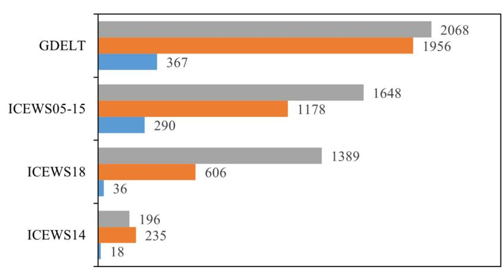
<!-- Image Description: The image is a horizontal bar chart comparing the number of events reported by four different event data sources: GDELT, ICEWS05-15, ICEWS18, and ICEWS14. Each source is represented by three colored bars showing different event categories (likely representing different event types or severities). The chart visually displays the relative quantities of events reported by each data source, allowing for a quantitative comparison of their coverage. -->

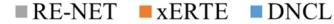
<!-- Image Description: This image is a legend for a graph or chart (not shown) in an academic paper. It defines three different methods or models: RE-NET (grey), XERTE (orange), and DNCL (blue). The purpose is to identify the visual representation of each method in the accompanying figure for easy interpretation by the reader. -->
**Figure 4**. Comparative analysis of runtime(seconds).

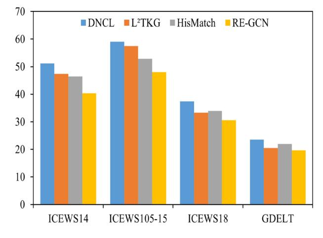
<!-- Image Description: The image is a bar chart comparing the performance of four different methods (DNCL, L²TKG, HisMatch, RE-GCN) on four datasets (ICEWS14, ICEWS105-15, ICEWS18, GDELT). Each bar represents a method's performance on a specific dataset, with height indicating the performance score (likely accuracy or F1-score). The chart's purpose is to visually demonstrate the relative effectiveness of the methods across different datasets within the paper's context. -->

**Figure 5**. Performance comparison of the DNCL and the non-contrastive learning model on the MRR (percentage) metric.

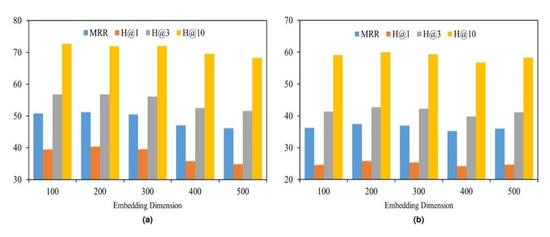
<!-- Image Description: The image contains two bar charts (a) and (b), presenting evaluation metrics for different embedding dimensions in a likely information retrieval task. Each chart shows Mean Reciprocal Rank (MRR) and Hits@K (H@1, H@3, H@10) values across various embedding dimensions (100, 200, 300, 400, 500). The charts illustrate the performance variation of the system with changing embedding dimension, allowing the authors to analyze and select optimal parameters for improved performance. The purpose is to empirically demonstrate the impact of embedding dimensionality on the model's performance. -->

**Figure 6**. Performance (percentage) of different embedding dimensions *dh*on ICEWS14 and ICEWS18 datasets.

the change of the*τ*, and the performance may be slightly improved or decreased. This fluctuation reflects that the influence of the*τ*on the model is not completely linear, and different coefficient values may adjust the distribution of embeddings to different degrees, thereby affecting the effect of contrastive learning. In addition, different datasets have different sensitivities to the*τ*. For example, on the ICEWS18 dataset, the model may be more sensitive to changes in the*τ*, while on the ICEWS14 dataset, it shows stronger stability. This shows that the choice of*τ*not only affects the performance of the model, but is also closely related to the characteristics of the dataset. Therefore, it is particularly important to reasonably adjust the*τ*to balance the robustness and adaptability of the model and improve the performance of TKGR.

### Analysis of long-distance dependencies problem

Because ICEWS14 and GDELT form a sharp contrast in data complexity: ICEWS14 has a clear structure and is easy to extract long-distance dependency features; GDELT is complex and has significant data disturbances, which can test the robustness of the model under difficult conditions. Therefore, in order to further explore the performance of the DNCL model in capturing long-distance dependencies, this paper conducted experiments on the ICEWS14 and GDELT datasets, using a history length*m*range of 1 to 10, while keeping other optimal hyperparameters unchanged. This allows DNCL to evaluate its long-distance modeling capabilities in simple to complex time series environments, thus providing strong support for the application of the model in real and diverse scenarios.

As shown in Fig. [8](#page-18-0) , on the ICEWS14 dataset, as the*m*increases, the MRR and H@3 indicators of the model always remain relatively stable and high. This shows that regardless of whether the history length is short or long, the DNCL model can effectively capture and utilize long-distance temporal information, thereby maintaining excellent reasoning performance under long historical dependencies. On the GDELT dataset, due to more complex data, more event types, and more obvious noise interference, the modeling of long-distance temporal dependencies requires higher requirements. Although the performance fluctuates slightly with the change of history length in this dataset, the DNCL model can still maintain relatively good performance over a longer historical range. This result shows that DNCL not only has a robust ability to capture long-distance dependencies on the clearer and more orderly ICEWS14 dataset, but also can cope with complex and changeable long-distance relations in the more challenging GDELT dataset, and achieve effective modeling of temporal information.

To further evaluate the ability of the DNCL model in capturing long-distance dependencies, We continue to analyze the performance of different history lengths*m*. As shown in Table [6,](#page-18-1) on the ICEWS14 dataset (24 hour granularity), as the history length *m*increases from 1 to 7, the model performance improves steadily, with Hit@1 increasing from 39.23 to 40.37% and MRR rising from 50.27% to 51.18%. Subsequently, although the performance slightly decreases, with MRR dropping from 51.18 to 50.25%, the drop is only about 0.93%, and the overall performance remains at a high level. On the GDELT dataset (15-minute granularity), when the history length*m*increases from 1 to 2, the model performs best (Hit@1 is 14.78%, MRR is 23.59%), but then the performance fluctuates greatly. This shows that in a dataset with shorter granularity such as GDELT, an overly long history length may introduce redundant information. However, the model can still show strong stability and robustness in a short time span. The overall trend shows that DNCL can effectively utilize and filter key information across multiple historical time steps, demonstrating its ability to model long-distance dependencies. In particular, in the ICEWS14 dataset, since many events have a long dependency span (from days to months or even years), the performance of the model is improved more significantly, which further verifies the effectiveness of the proposed multi-dimensional gated update module in capturing long-distance dependencies.

### Analysis of noise interference problem

### *Analysis of different noise intensities*Since the data distribution characteristics or complexity hierarchy of the ICEWS05-15 and GDELT datasets are significantly different from those of the ICEWS14 and ICEWS18 datasets, they introduce more confounding factors in the analysis of the effects of noise disturbances, which are not conducive to a direct and clear assessment of the performance of the DNCL on the noise intensity dimension. Therefore, In order to further verify the effectiveness of the DNCL model in reducing noise interference, this paper introduced a random noise on the ICEWS14 and ICEWS18 datasets, and set different noise intensity control parameters*ϵ*for experimental analysis.

As shown in Fig. [9](#page-19-1) , whether for the more ordered ICEWS14 dataset or the more complex ICEWS18 dataset, when*ϵ*= 0, that is, in a completely clean dataset, DNCL still maintains high performance in both MRR and Hits@3, proving that it has good predictive ability under noise-free conditions. As*ϵ*gradually increases from 0.05 to 0.5, the changes in the two indicators of the model remain stable, and there is no obvious performance collapse or sharp decline. This phenomenon fully demonstrates that although the potential noise in the data increases with the increase of*ϵ*, DNCL can still effectively suppress noise interference through the noise-aware adversarial modeling module to ensure the stability of the inference results. In addition, these results also show that DNCL can extract key features and filter meaningless information, both in a clean environment and under gradually increasing noise conditions, showing high adaptability and robustness to different complexities and noise distributions. This advantage makes it more widely applicable in dynamic and diverse time series environments.

Although the noise in this study is randomly generated, the noise-aware adversarial modeling module proposed by DNCL aims to improve the robustness of the model to real-world structured noise such as conflicting facts and incomplete information. This module effectively distinguishes between reliable and unreliable information

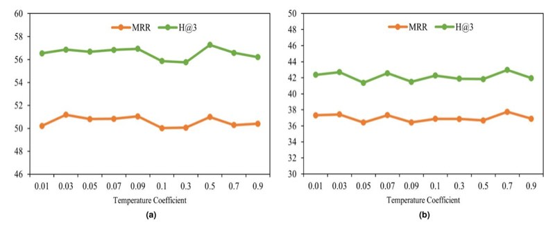
<!-- Image Description: The image contains two line graphs (a) and (b), both plotting Mean Reciprocal Rank (MRR) and Hit@3 against Temperature Coefficient. Each graph shows how these metrics, used to evaluate ranking performance, vary across different temperature coefficient values. The graphs likely illustrate the impact of this coefficient on the model's effectiveness in a specific application within the paper. -->

**Figure 7**. Performance (percentage) of different temperature coefficient *τ*on ICEWS14 and ICEWS18 datasets.

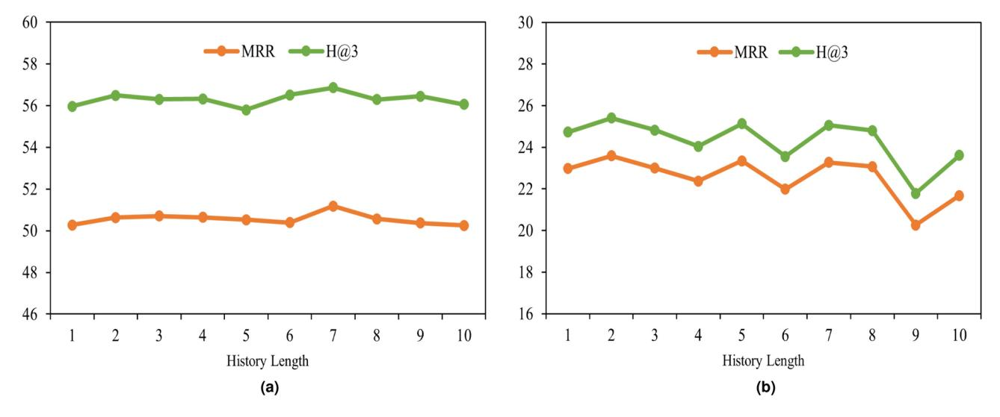
<!-- Image Description: The image contains two line graphs (a) and (b), each plotting Mean Reciprocal Rank (MRR) and Hit@3 against "History Length" (x-axis). Graph (a) shows higher values than (b), suggesting different experimental conditions or datasets. Both graphs illustrate the performance of a ranking system across varying history lengths, evaluating the impact of historical data on the system's MRR and Hit@3 metrics. -->
**Figure 8**. Performance (percentage) of different history length *m*on ICEWS14 and GDELT datasets.

| History length (m) | 1 | 2 | 3 | 4 | 5 | 6 | 7 | 8 | 9 | 10 |
|--------------------|-------|-------|-------|-------|-------|-------|-------|-------|-------|-------|
| ICEWS14 (MRR) | 50.27 | 50.63 | 50.70 | 50.64 | 50.53 | 50.39 | 51.18 | 50.57 | 50.37 | 50.25 |
| ICEWS14 (H@1) | 39.23 | 39.70 | 39.72 | 39.74 | 39.86 | 39.19 | 40.37 | 39.59 | 39.22 | 39.15 |
| GDELT (MRR) | 22.98 | 23.59 | 23.00 | 22.37 | 23.35 | 21.98 | 23.27 | 23.07 | 20.26 | 21.68 |
| GDELT (H@1) | 13.84 | 14.78 | 13.73 | 13.22 | 14.17 | 13.00 | 14.07 | 13.92 | 11.32 | 12.32 |
**Table 6**. MRR and Hit@1 scores (percentage) with different history lengths *m*on ICEWS14 and GDELT datasets. The best result for different history lengths is highlighted in black font.

by introducing adversarial perturbations during training, ensuring that the embedded representation remains stable in a noisy environment. Previous studies have shown[59](#page-21-19) that adversarial training significantly improves the generalization and robustness of the model. In DNCL, adversarial noise not only enhances the model's adaptability to random noise, but also improves its resistance to structured noise. This is because adversarial training continuously simulates inconsistent perturbations in reality, prompting the model to learn more robust entity and relationship embeddings to accurately filter out contradictory facts or time-misaligned information. Therefore, even if the experiment does not explicitly introduce structured or contradictory noise, DNCL still has good generalization performance and can effectively adapt to the complex noise environment of the real world.

### *Comparative analysis with alternative adversarial learning methods*The Wasserstein adversarial training framework[60](#page-21-20) has become a representative method because it generates highquality negative samples in knowledge graph embedding tasks and effectively alleviates the gradient vanishing problem of traditional generative adversarial networks. However, in practical application scenarios, this method usually ignores the complex and diverse noises existing in natural data and mainly relies on artificially generated negative samples to improve the discriminability of representations. In contrast, the noise-aware adversarial modeling module we proposed directly targets the real noise environment. By introducing discrimination and fusion strategies in the noise generation process, it adaptively identifies and suppresses interference information, thereby significantly improving the robustness of the model. To further verify the effectiveness of this module, we compared the performance of the DNCL model with the model based on the Wasserstein adversarial training method on three datasets: ICEWS14, ICEWS05-15, and GDELT.

As shown in Fig. [10](#page-19-2), on the three datasets, the performance of the DNCL is generally better than that of the F-DE\_SimplE and F-BoxTE model[s60](#page-21-20) based on the Wasserstein adversarial learning framework. Specifically, in the ICEWS14 and ICEWS05-15 datasets with clearer structures and relatively sparse data, the DNCL model shows stronger temporal relationship capture and long-distance dependency modeling capabilities; while in the GDELT dataset with more significant noise, the DNCL model still maintains its advantage, verifying the robustness of its noise-aware mechanism in real complex environments. Therefore, although Wasserstein adversarial learning can optimize the quality of negative sample generation, it is still insufficient when facing complex, diverse, and continuously evolving noise interference in real scenarios. The noise-aware adversarial modeling module proposed in this paper addresses these challenges and significantly improves the temporal reasoning performance and stability of the model at different scales and different noise levels through the adversarial training mechanism constructed by the noise generator and the noise discriminator.

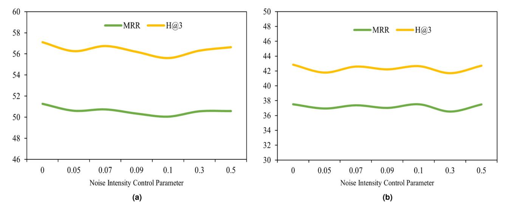
<!-- Image Description: The image contains two line graphs (a) and (b), showing the Mean Reciprocal Rank (MRR) and Hit@3 metrics against a "Noise Intensity Control Parameter." Both graphs display similar trends, with MRR and Hit@3 exhibiting a slight undulating pattern across the parameter range. The graphs likely illustrate the robustness of the system's performance under varying levels of noise. -->
**Figure 9**. Performance (percentage) of different noise intensity control parameter *ϵ*on ICEWS14 and ICEWS18 datasets.

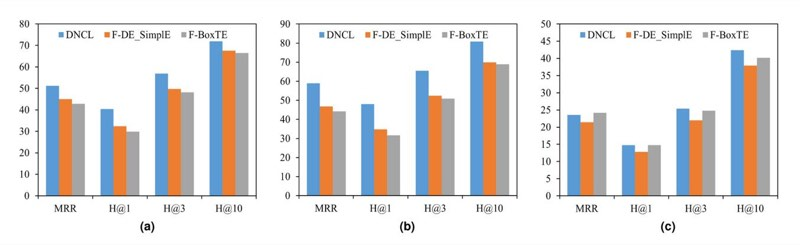
<!-- Image Description: The figure presents three bar charts (a, b, c) comparing the performance of three models (DNCL, F-DE_Simple, F-BoxTE) on three datasets. Each chart displays Mean Reciprocal Rank (MRR) and Hit@k (k=1,3,10) metrics. The charts visually compare the ranking performance of the three models across different datasets, showing the relative strengths and weaknesses of each approach. -->
**Figure 10**. Performance (percentage) comparison of DNCL with models trained using the Wasserstein adversarial learning framework on the ICEWS14, ICEWS05-15, and GDELT datasets. The results of F-DE\_ SimplE and F-BoxTE are from[60.](#page-21-20)

**Conclusion**In this paper, a novel dual-gate and noise-aware contrastive learning framework (DNCL) is proposed to address key issues in TKGR. Specifically, the multi-dimensional gated update module effectively models long-distance dependencies through a dual-gate mechanism; the noise-aware adversarial modeling module improves noise resistance through adversarial training; and the multi-layer embedding contrastive learning module captures the representation ability of latent temporal relationships through intra-layer and inter-layer contrastive learning. Experimental results show that DNCL improves the Hit@1 indicator by 6.91%, 4.31%, and 5.30% on the ICEWS14, ICEWS18, and ICEWS05-15 datasets, respectively. Ablation experiments and parameter analysis further verify the effectiveness and robustness of each module. DNCL still shows excellent adaptability and robustness in complex scenarios, providing an efficient solution for TKGR tasks and a new direction for more complex temporal reasoning research.

With the expansion of TKGs applications, future research could explore the following areas. First, explore how to combine multimodal information such as text, images, and sensor data in the DNCL model to assist time series reasoning with more comprehensive input. Second, explore how to optimize the DNCL model structure and algorithm to cope with ultra-large-scale, ultra-sparse, and strongly noisy data. In addition, it is also possible to study how to introduce cutting-edge methods such as large language models, meta-learning, and incremental learning to enhance the ability to adapt to new events and new fields.

### Data availability

The datasets generated and/or analyzed during the current study are available from the corresponding author on reasonable request.

### References

- 1. Yan, S., Tian, C., Zhang, Z. & Xu, G. Lollipope: Bi-centered lollipop embedding for complex logic query on knowledge graph.*Neural Netw.* **175**, 106277 (2024).
- 2. Chen, W. et al. Building and exploiting spatial-temporal knowledge graph for next poi recommendation. *Knowl.-Based Syst.* **258**, 109951 (2022).
- 3. Chen, Z., Zhao, X., Liao, J., Li, X. & Kanoulas, E. Temporal knowledge graph question answering via subgraph reasoning. *Knowl.- Based Syst.* **251**, 109134 (2022).
- 4. Li, Z. *et al.*Future event prediction based on temporal knowledge graph embedding.*Computer Systems Science & Engineering***44**(2023).
- 5. Wang, P., Liu, K., Jiang, L., Li, X. & Fu, Y. Incremental mobile user profiling: Reinforcement learning with spatial knowledge graph for modeling event streams. In:*Proceedings of the 26th ACM SIGKDD international conference on knowledge discovery & data mining*, 853–861 (2020).
- 6. Mezni, H. Temporal knowledge graph embedding for effective service recommendation. *IEEE Trans. Serv. Comput.* **15**, 3077–3088 (2021).
- 7. Zhang, J., Liang, S., Sheng, Y. & Shao, J. Temporal knowledge graph representation learning with local and global evolutions. *Knowl.-Based Syst.* **251**, 109234 (2022).
- 8. Cao, Y., Wang, L. & Huang, L. Dpcl-diff: The temporal knowledge graph reasoning based on graph node diffusion model with dual-domain periodic contrastive learning. *arXiv preprint*[arXiv:2411.01477](http://arxiv.org/abs/2411.01477) (2024).
- 9. Chen, W.*et al.*Local-global history-aware contrastive learning for temporal knowledge graph reasoning. In:*2024 IEEE 40th International Conference on Data Engineering (ICDE)*, 733–746 (IEEE, 2024).
- 10. Zhang, D., Feng, W., Wu, Z., Li, G. & Ning, B. Cdrgn-sde: Cross-dimensional recurrent graph network with neural stochastic differential equation for temporal knowledge graph embedding. *Expert Syst. Appl.* **247**, 123295 (2024).
- 11. Ghavasieh, A. & De Domenico, M. Diversity of information pathways drives sparsity in real-world networks. *Nat. Phys.* **20**, 512– 519 (2024).
- 12. Pujara, J., Augustine, E. & Getoor, L. Sparsity and noise: Where knowledge graph embeddings fall short. In: *Proceedings of the 2017 conference on empirical methods in natural language processing*, 1751–1756 (2017).
- 13. Han, Z., Ding, Z., Ma, Y., Gu, Y. & Tresp, V. Learning neural ordinary equations for forecasting future links on temporal knowledge graphs. In: *Proceedings of the 2021 conference on empirical methods in natural language processing*, 8352–8364 (2021).
- 14. Xie, Z., Zhu, R., Liu, J., Zhou, G. & Huang, J. X. Targat: A time-aware relational graph attention model for temporal knowledge graph embedding. *IEEE/ACM Trans. Audio Speech Lang. Process.* **31**, 2246–2258 (2023).
- 15. Chen, X., Jia, S. & Xiang, Y. A review: Knowledge reasoning over knowledge graph. *Expert Syst. Appl.* **141**, 112948 (2020).
- 16. Bordes, A., Usunier, N., Garcia-Duran, A., Weston, J. & Yakhnenko, O. Translating embeddings for modeling multi-relational data. *Advances in neural information processing systems***26**(2013).
- 17. Wang, Z., Zhang, J., Feng, J. & Chen, Z. Knowledge graph embedding by translating on hyperplanes. In:*Proceedings of the AAAI conference on artificial intelligence*, vol. 28 (2014).
- 18. Lin, Y., Liu, Z., Sun, M., Liu, Y. & Zhu, X. Learning entity and relation embeddings for knowledge graph completion. In: *Proceedings of the AAAI conference on artificial intelligence*, vol. 29 (2015).
- 19. Omran, P. G., Wang, K. & Wang, Z. Scalable rule learning via learning representation. In *IJCAI*, 2149–2155 (2018).
- 20. Yang, F., Yang, Z. & Cohen, W. W. Differentiable learning of logical rules for knowledge base reasoning. *Advances in neural information processing systems***30**(2017).
- 21. Zhang, W. et al. Iteratively learning embeddings and rules for knowledge graph reasoning. In*The world wide web conference*, 2366–2377 (2019).
- 22. Tang, X., Chen, L., Cui, J. & Wei, B. Knowledge representation learning with entity descriptions, hierarchical types, and textual relations. *Inform. Process. Manag.* **56**, 809–822 (2019).
- 23. Dettmers, T., Minervini, P., Stenetorp, P. & Riedel, S. Convolutional 2d knowledge graph embeddings. In: *Proceedings of the AAAI conference on artificial intelligence*, vol. 32 (2018).
- 24. Shang, C. et al. End-to-end structure-aware convolutional networks for knowledge base completion. In: *Proceedings of the AAAI conference on artificial intelligence* **33**, 3060–3067 (2019).
- 25. Vashishth, S., Sanyal, S., Nitin, V. & Talukdar, P. Composition-based multi-relational graph convolutional networks. *arXiv preprint*[arXiv:1911.03082](http://arxiv.org/abs/1911.03082) (2019).
- 26. García-Durán, A., Dumančić, S. & Niepert, M. Learning sequence encoders for temporal knowledge graph completion.*arXiv preprint*[arXiv:1809.03202](http://arxiv.org/abs/1809.03202) (2018).
- 27. Leblay, J. & Chekol, M. W. Deriving validity time in knowledge graph. In:*Companion proceedings of the the web conference* **2018**, 1771–1776 (2018).
- 28. Yang, B., Yih, W.-t., He, X., Gao, J. & Deng, L. Embedding entities and relations for learning and inference in knowledge bases. *arXiv preprint*[arXiv:1412.6575](http://arxiv.org/abs/1412.6575) (2014).
- 29. Lacroix, T., Obozinski, G. & Usunier, N. Tensor decompositions for temporal knowledge base completion.*arXiv preprint*[arXiv:2004.04926](http://arxiv.org/abs/2004.04926) (2020).
- 30. Trouillon, T., Welbl, J., Riedel, S., Gaussier, É. & Bouchard, G. Complex embeddings for simple link prediction. In:*International conference on machine learning*, 2071–2080 (PMLR, 2016).
- 31. Dasgupta, S. S., Ray, S. N. & Talukdar, P. Hyte: Hyperplane-based temporally aware knowledge graph embedding. In: *Proceedings of the 2018 conference on empirical methods in natural language processing*, 2001–2011 (2018).
- 32. Goel, R., Kazemi, S. M., Brubaker, M. & Poupart, P. Diachronic embedding for temporal knowledge graph completion. In: *Proceedings of the AAAI conference on artificial intelligence* **34**, 3988–3995 (2020).
- 33. Chowdhury, S. & Soni, B. R-vqa: A robust visual question answering model. *Knowl.-Based Syst.* **309**, 112827 (2025).
- 34. Chowdhury, S. & Soni, B. Beyond words: Esc-net revolutionizes vqa by elevating visual features and defying language priors. *Comput. Intell.* **40**, e70010 (2024).
- 35. Chowdhury, S. & Soni, B. Envqa: Improving visual question answering model by enriching the visual feature. *Eng. Appl. Artif. Intell.* **142**, 109948 (2025).
- 36. Chowdhury, S. & Soni, B. Qsfvqa: A time efficient, scalable and optimized vqa framework. *Arab. J. Sci. Eng.* **48**, 10479–10491 (2023).
- 37. Trivedi, R., Dai, H., Wang, Y. & Song, L. Know-evolve: Deep temporal reasoning for dynamic knowledge graphs. In: *international conference on machine learning*, 3462–3471 (PMLR, 2017).
- 38. Jin, W., Qu, M., Jin, X. & Ren, X. Recurrent event network: Autoregressive structure inference over temporal knowledge graphs. *arXiv preprint*[arXiv:1904.05530](http://arxiv.org/abs/1904.05530) (2019).
- 39. Han, Z., Chen, P., Ma, Y. & Tresp, V. Explainable subgraph reasoning for forecasting on temporal knowledge graphs. In:*International conference on learning representations*(2020).

- 40. Li, Z.*et al.*Temporal knowledge graph reasoning based on evolutional representation learning. In:*Proceedings of the 44th international ACM SIGIR conference on research and development in information retrieval*, 408–417 (2021).
- 41. Li, Y., Sun, S. & Zhao, J. Tirgn: Time-guided recurrent graph network with local-global historical patterns for temporal knowledge graph reasoning. In *IJCAI*, 2152–2158 (2022).
- 42. Li, Z. *et al.*Hismatch: Historical structure matching based temporal knowledge graph reasoning.*arXiv preprint*[arXiv:2210.09708](http://arxiv.org/abs/2210.09708) (2022).
- 43. Liu, K., Zhao, F., Xu, G., Wang, X. & Jin, H. Retia: relation-entity twin-interact aggregation for temporal knowledge graph extrapolation. In:*2023 IEEE 39th International Conference on Data Engineering (ICDE)*, 1761–1774 (IEEE, 2023).
- 44. Shao, P., Wen, Y. & Tao, J. Bayesian hypernetwork collaborates with time-difference evolutional network for temporal knowledge prediction. *Neural Netw.* **175**, 106146 (2024).
- 45. Dong, H. et al. Temporal inductive path neural network for temporal knowledge graph reasoning. *Artif. Intell.* **329**, 104085 (2024).
- 46. Feng, S., Zhou, C., Liu, Q., Ji, X. & Huang, M. Temporal knowledge graph reasoning based on entity relationship similarity perception. *Electronics* **13**, 2417 (2024).
- 47. Zhang, M., Xia, Y., Liu, Q., Wu, S. & Wang, L. Learning latent relations for temporal knowledge graph reasoning. In: *Proceedings of the 61st Annual Meeting of the Association for Computational Linguistics (Volume 1: Long Papers)*, 12617–12631 (2023).
- 48. Xu, Y., Ou, J., Xu, H. & Fu, L. Temporal knowledge graph reasoning with historical contrastive learning. In: *Proceedings of the AAAI Conference on Artificial Intelligence* **37**, 4765–4773 (2023).
- 49. Khosla, P. et al. Supervised contrastive learning. *Adv. Neural. Inf. Process. Syst.* **33**, 18661–18673 (2020).
- 50. Lin, C., Jiang, Z., Cong, J. & Zou, L. Rnn with high precision and noise immunity: A robust and learning-free method for beamforming. *IEEE Internet of Things Journal*(2025).
- 51. Shiri, F. M., Perumal, T., Mustapha, N. & Mohamed, R. A comprehensive overview and comparative analysis on deep learning models: Cnn, rnn, lstm, gru.*arXiv preprint*[arXiv:2305.17473](http://arxiv.org/abs/2305.17473) (2023).
- 52. Zhao, Y. & Li, X. Better approximation of sigmoid function for privacy-preserving neural networks. In:*Journal of Physics: Conference Series*, vol. 2852, 012007 (IOP Publishing, 2024).
- 53. Shen, S.-L., Zhang, N., Zhou, A. & Yin, Z.-Y. Enhancement of neural networks with an alternative activation function tanhlu. *Expert Syst. Appl.* **199**, 117181 (2022).
- 54. Korkmaz, G. *et al.*Combining heterogeneous data sources for civil unrest forecasting. In:*Proceedings of the 2015 IEEE/ACM International Conference on Advances in Social Networks Analysis and Mining 2015*, 258–265 (2015).
- 55. Wang, K. et al. Generative adversarial networks: introduction and outlook. *IEEE/CAA J. Automatica Sinica* **4**, 588–598 (2017).
- 56. Leetaru, K. & Schrodt, P. A. Gdelt: Global data on events, location, and tone, 1979–2012. In *ISA annual convention*, vol. 2, 1–49 (Citeseer, 2013).
- 57. Sun, Z., Deng, Z.-H., Nie, J.-Y. & Tang, J. Rotate: Knowledge graph embedding by relational rotation in complex space. *arXiv preprint*[arXiv:1902.10197](http://arxiv.org/abs/1902.10197) (2019).
- 58. Lin, C., Mao, X., Qiu, C. & Zou, L. Dtcnet: Transformer-cnn distillation for super-resolution of remote sensing image.*IEEE Journal of Selected Topics in Applied Earth Observations and Remote Sensing*(2024).
- 59. Goodfellow, I. J., Shlens, J. & Szegedy, C. Explaining and harnessing adversarial examples.*arXiv preprint*[arXiv:1412.6572](http://arxiv.org/abs/1412.6572) (2014).
- 60. Dai, Y., Guo, W. & Eickhoff, C. Wasserstein adversarial learning based temporal knowledge graph embedding.*Inf. Sci.* **659**, 120061 (2024).

### Author contributions

Conceptualization, S.F. and B.C.; methodology, S.F. and B.C.; software, S.F., B.C. and Q.L.; validation, B.C. and Q.L.; formal analysis, B.C. and Q.L.; resources, B.C.; writing—original draft preparation, S.F. and B.C.; writing review and editing, S.F., B.C., Q.L. and M.H.; project administration, S.F. and M.H.; funding acquisition, S.F. and M.H. All authors have approved the final version of the manuscript.

### Funding

This research received funding from the National Natural Science Foundation of China (Grants 62466016 and 62241202), the National Key Research and Development Program of China (Grant 2021ZD0111000), and the Key Research and Development Plan of the Ministry of Science and Technology (Grant 2021ZD0111002).

### Declarations

## Competing interest

The authors declare no conflicts of interest.

### Additional information

**Correspondence**and requests for materials should be addressed to B.C. or M.H.
**Reprints and permissions information**is available at www.nature.com/reprints.
**Publisher's note**Springer Nature remains neutral with regard to jurisdictional claims in published maps and institutional affiliations.
**Open Access** This article is licensed under a Creative Commons Attribution-NonCommercial-NoDerivatives 4.0 International License, which permits any non-commercial use, sharing, distribution and reproduction in any medium or format, as long as you give appropriate credit to the original author(s) and the source, provide a link to the Creative Commons licence, and indicate if you modified the licensed material. You do not have permission under this licence to share adapted material derived from this article or parts of it. The images or other third party material in this article are included in the article's Creative Commons licence, unless indicated otherwise in a credit line to the material. If material is not included in the article's Creative Commons licence and your intended use is not permitted by statutory regulation or exceeds the permitted use, you will need to obtain permission directly from the copyright holder. To view a copy of this licence, visit [http://creativecommo](http://creativecommons.org/licenses/by-nc-nd/4.0/) [ns.org/licenses/by-nc-nd/4.0/.](http://creativecommons.org/licenses/by-nc-nd/4.0/)

© The Author(s) 2025
