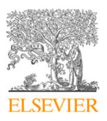
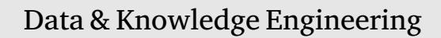
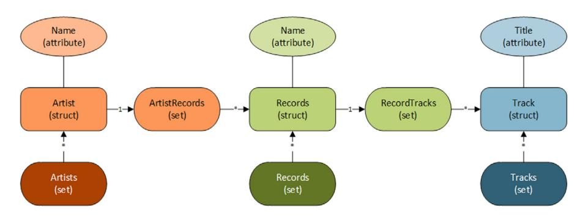
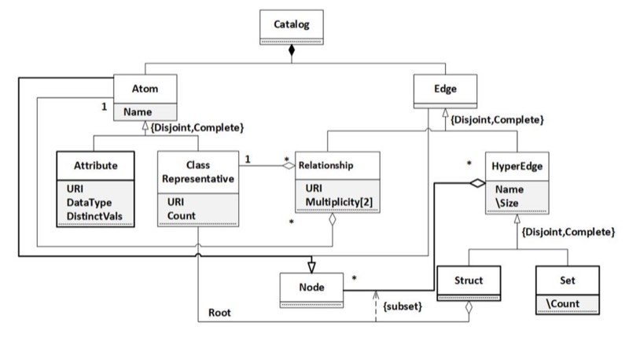
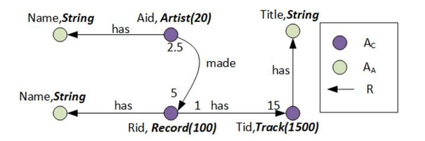
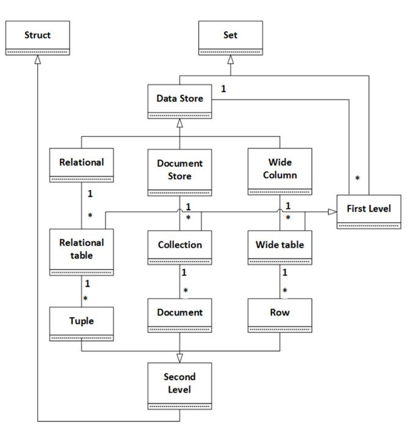
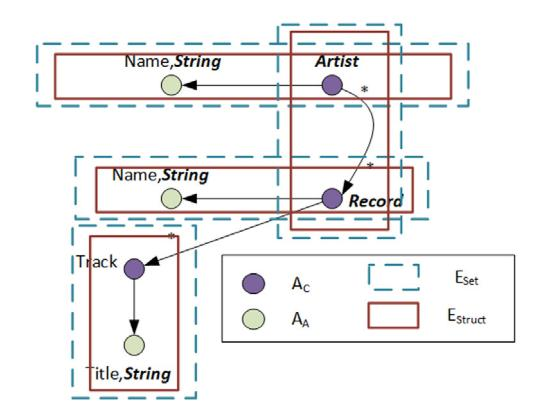
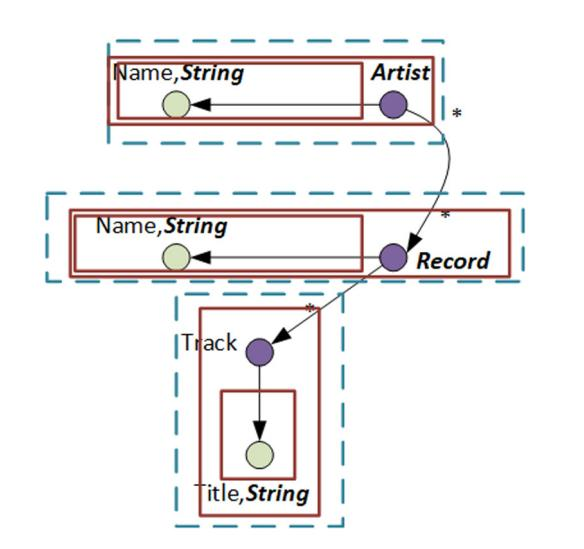
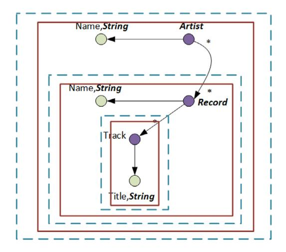
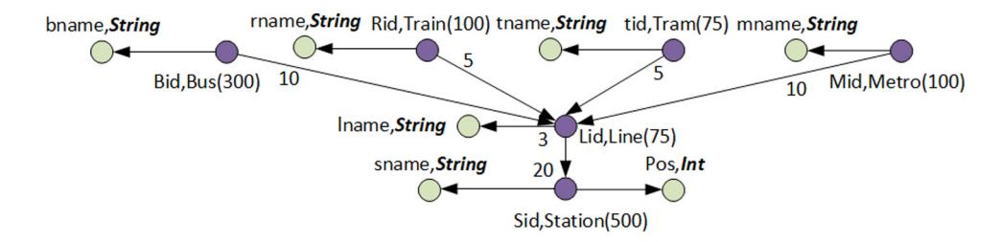

<!-- cite_key: idpage--spanpagepicturejpeg2016 -->

Contents lists available at [ScienceDirect](http://www.elsevier.com/locate/datak)


<!-- Image Description: That image is not a diagram, chart, graph, equation, or technical illustration. It's the Elsevier logo, a publisher's emblem. It's an artistic rendering of a tree and a person, and has no technical content relevant to the paper's analysis. Its presence in the paper indicates that it was published by Elsevier. -->


<!-- Image Description: The image is simply the text "Data & Knowledge Engineering," likely the title of a section or subsection within an academic paper on data science or a related field. It contains no diagrams, charts, graphs, equations, or other technical illustrations. Its purpose is to clearly label the topic of the following text. -->

journal homepage: [www.elsevier.com/locate/datak](http://www.elsevier.com/locate/datak)


<!-- Image Description: That's not a technical image containing diagrams, charts, graphs, or equations. It's the cover page of a journal issue of *Data & Knowledge Engineering* (DKE). The image shows the journal's title and logo, which is primarily text-based with a stylized letter "C" and the acronym "DKE". There are no data visualizations or technical illustrations present. The purpose is to identify the journal where the paper is published. -->

# Managing polyglot systems metadata with hypergraphs

[Moditha](#page-14-0) [Hewasinghage](#page-14-0) [a](#page-0-0),[b](#page-0-1),[∗](#page-0-2) , [Alberto](#page-15-0) [Abelló](#page-15-0) [a](#page-0-0) , [Jovan](#page-15-1) [Varga](#page-15-1) [a](#page-0-0) , [Esteban](#page-15-2) [Zimányi](#page-15-2) [b](#page-0-1)

<span id="page-0-0"></span><sup>a</sup> *Universitat Politècnica de Catalunya, BarcelonaTech, Barcelona, Spain*<span id="page-0-1"></span><sup>b</sup>*Université Libre de Bruxelles, 1050 Bruxelles, Belgium*# A R T I C L E I N F O
*Keywords:*Metadata management NoSQL Polystore

## A B S T R A C T

A single type of data store can hardly fulfill every end-user requirements in the NoSQL world. Therefore, polyglot systems use different types of NoSQL datastores in combination. However, the heterogeneity of the data storage models makes managing the metadata a complex task in such systems, with only a handful of research carried out to address this. In this paper, we propose a hypergraph-based approach for representing the catalog of metadata in a polyglot system. Taking an existing common programming interface to NoSQL systems, we extend and formalize it as hypergraphs. Then, we define design constraints and query transformation rules for three representative data store types. Next, we propose a simple query rewriting algorithm from the metadata of the catalog to underlying data store specific ones and provide a prototype implementation. Furthermore, we introduce a storage statistics estimator on the underlying data stores. Finally, we show the feasibility of our approach on a use case of an existing polyglot system, and its usefulness in metadata and physical query path calculations.

## 1. Introduction

With the dawn of the big data era, the heterogeneity among the data storage models has expanded drastically, mainly due to the introduction of NoSQL. There are four primary data store models in NoSQL systems: (i) Key–value stores perform like a typical hashmap, where the data is stored and retrieved through a key and an associated value; (ii) Wide-column stores that manage the data in a columnar fashion; (iii) Document stores that represent data in a document-like structure, which can become increasingly complex with nested elements; (iv) Graph stores that are instance-based and store the relationships between those instances. The heterogeneity is not only limited to the data models but also various implementations of the same data model can be entirely different from one another due to the lack of a standard.

Heterogeneous systems can be useful in different scenarios because it is highly unlikely that a single data store can efficiently handle all the requirements of the end-user. Therefore, it is common to use different ones to manage different portions of the data. This allows controlling the storage and retrieval more efficiently for different requirements. Hence, polyglot systems were introduced, similar to traditional Federated Database Systems (FDBMS), but with more complexity considering the need to handle semistructured data models. Due to the heterogeneity at different levels, most of the work on polyglot systems [[1,](#page-14-1)[2\]](#page-14-2) suggests the implementation of wrappers or interfaces for each participating data store. However, this becomes more complex as the number of participating data store types grows.

The catalog (see [[3](#page-14-3)]) maintains the meta-information of the data store. Having one for a polyglot system enables end-users to have a clear view of the complex system. Its metadata plays a significant role in understanding the overall picture of the underlying infrastructure. Moreover, it also helps to improve the design of the polyglot system and determine the statistics and the access

<span id="page-0-2"></span><sup>∗</sup> Corresponding author at: Universitat Politècnica de Catalunya, BarcelonaTech, Barcelona, Spain.
*E-mail addresses:* [moditha@essi.upc.edu](mailto:moditha@essi.upc.edu) (M. Hewasinghage), [aabello@essi.upc.edu](mailto:aabello@essi.upc.edu) (A. Abelló), [jvarga@essi.upc.edu](mailto:jvarga@essi.upc.edu) (J. Varga), [ezimanyi@ulb.ac.be](mailto:ezimanyi@ulb.ac.be) (E. Zimányi).


<!-- Image Description: This ER diagram illustrates a database schema for music data. Rectangles represent structures (e.g., "Artist"), ovals represent attributes (e.g., "Name"), and rounded rectangles denote sets (e.g., "Artists"). Arrows show relationships between entities, indicating cardinality (one-to-many or many-to-many). The diagram visually depicts the relationships between artists, records, and tracks, clarifying data organization for the database system described in the paper. -->

<span id="page-1-0"></span>**Figure 1.**SOS representation of the example.

<span id="page-1-2"></span>patterns needed for different query requirements. It is essential to answer questions such as: What is the structure of the data being stored? Where is a piece of data stored? Is it duplicated in another store? What is the best way to retrieve this data? What would be the storage requirements for a particular data store design? What are the access patterns of a particular query over a particular datastore? Nevertheless, little research addresses the managing of metadata in polyglot systems. This is mainly due to the lack of a design construct that can represent heterogeneous, semistructured data. In this paper, we address the metadata management in polyglot systems by extending an already existing NoSQL design method [\[4,](#page-14-4)[5\]](#page-14-5), and formalizing the constructs through hypergraphs.

The Save Our Systems (SOS) Model [[5](#page-14-5)] claims to capture the NoSQL modeling structures in data design for key–value stores, document stores, and wide-column stores utilizing three main constructs: attributes, structs, and sets. These constructs and their interactions allow representing the physical storage of above NoSQL systems. The fact that the model is simple makes it compelling in representability, but the lack of formalization leaves space for ambiguity and hinders the automation of metadata management in such settings. Instead, it is simply used as a common programming interface for data exchange.

In this paper, we formalize SOS using a hypergraph-based representation, defining a common conceptual model for the metadata of any NoSQL system, which we have formalized through definitions of the concepts based on logics. This work is an extension of our previous conference paper [\[6\]](#page-14-6) with refinements in the original definitions and improvements carried out to maintain additional statistical metadata calculations. RDF is considered to be able to represent any kind of data and is often used as a data interchange format. Therefore, we make the assumption that we have exemplars of the data in the polyglot system in RDF. Then, we build a hypergraph that maps to different data design constructs, representing the SOS model over the information. We represent the catalog of the polyglot system using these constructs and introduce a simple query generation algorithm to show the usefulness of our approach. Next, we explore different data store models, identify their design constructs, introduce their design constraints, and define query generation rules for each of them. Afterwards, we introduce how our catalog can be used to calculate storage statistics and physical access patterns for queries using document stores as an example. Finally, we show the feasibility of our approach using a use case of an existing polyglot system by representing its metadata catalog through our constructs.

The simple, yet powerful hypergraph-based approach presented in this paper is a step towards representing heterogeneous, semistructured data in a formal manner as well as managing the corresponding metadata of a polyglot system. It proves to be useful concerning (i) expressiveness: the ability to express different representations, regardless of their complexity and (ii) semantic relativism: the ability to accommodate different representations of the same data, as defined in [[7\]](#page-14-7). We used this flexible meta-representation to evaluate design alternatives in document stores in terms of storage space, query cost and access patterns.[1](#page-1-0)

This paper is organized as follows: First, in Section [2](#page-1-1) we introduce the necessary background. We present and formalize our data model in Section [3.](#page-2-0) Afterwards, we discuss the managing of the metadata through the model in Section [4](#page-4-0). Then, we present an application of the constructs in Section [6.](#page-11-0) Next, in Section [5,](#page-8-0) we explain how the metadata representation can be extended to maintain statistical metadata and calculate storage requirements and physical query access patterns. Finally, we introduce the related work in Section [7](#page-12-0), and conclude and discuss future work in Section [8](#page-13-0).

### 2. Preliminaries

<span id="page-1-1"></span>In this section, we introduce the basic concepts of Resource Description Framework (RDF) [[8\]](#page-14-8) and SOS Model [[4,](#page-14-4)[5](#page-14-5)] that are used in our approach.

### *2.1. Resource Description Framework (RDF)*

<span id="page-1-3"></span>The Resource Description Framework [[8](#page-14-8)] is a World Wide Web Consortium (W3C) specification for representing information on the Web. It is a graph-based data model that enables sharing of information and statements about available resources.

RDF represents data as triplets consisting of subject, predicate, and object (*, ,*). These can be resources that are identified by an Internationalized Resource Identifier (IRI), which is a unique Unicode string within the RDF graph. An object can also be a literal,

<sup>1</sup> <https://vimeo.com/396513259>.

<span id="page-2-1"></span>which is a data value. An example of RDF is shown in Listing 1, written in Turtle notation.[2](#page-2-1) The example contains information about music albums, artists, and songs and is used throughout the paper.

### *2.2. SOS model*The high flexibility of NoSQL systems gives freedom to have multiple designs for the same data. A particular data design built focusing on a specific scenario can result in adverse performance when applied in a different context. Most of the data design for NoSQL is carried out based on concrete guidelines for different datastores and access patterns. Nevertheless, recent approaches propose generic design constructs for NoSQL systems. For our approach, we decided to use the SOS model [[4,](#page-14-4)[5\]](#page-14-5) as a starting point.

The SOS model introduces a basic common model (or a meta-layer), which is a high-level description of the data models of nonrelational systems. This model helps to handle the vast heterogeneity of the NoSQL datastores and provides interoperability among them, easing the development process. The primary objective of the meta-layer is to generalize the data model of heterogeneous NoSQL systems. Thus, it allows standard development practices on a predefined set of generic constructs. The meta-layer reconciles the descriptive elements of key–value stores, document stores, and record stores. These different data models exposed by NoSQL datastores are effectively managed in the SOS data model with three major constructs:*Attribute*, *Struct*, and *Set*[\[4\]](#page-14-4).

A name and an associated value characterize each of these constructs. The structure of the value depends on the type of construct. An*Attribute*can contain a simple value such as an Integer or String.*Struct*s and *Set*s are complex elements which can contain multiple *Attribute*s, *Struct*s, *Set*s or a combination of those. SOS Model mainly addresses data design on document stores, key–value stores, and wide-column stores [\[5\]](#page-14-5). Each of the datastore instances is represented as a set of collections. There can be any arbitrary number of *Set*s depending on the use case. Simple elements such as key–value pairs or single qualifiers can be modeled as *Attribute*s and groups of *Attribute*s, or a simple entity such as a document can be represented as a *Struct*. A collection of entities is represented in a *Set*, which can be a nested collection in a document store or a column family in a wide-column store. A possible SOS representation of the example is shown in [Fig.](#page-1-2) [1](#page-1-2).

### 3. Formalization

<span id="page-2-0"></span>In this section, we introduce and formalize our data model, which is based on representative exemplars in RDF format of each kind of instances in the underlying data stores. This RDF graph contains the classes and user-defined types of the polyglot system. Thus, having the schemas of the underlying data stores and having a global schema is important in our model. However, this is beyond the scope of the current work. The schema of a structured data store such as RDBMS can be extracted through the underlying DDL. Schema inference from semi-structured data has also been carried out [[9](#page-14-9)]. Moreover, previous work has shown that this global schema can be obtained by extracting the schema of each data store and reconciling them [[10,](#page-14-10)[11](#page-14-11)].

Building on top of the RDF data model discussed in Section [2.1,](#page-1-3) we introduce our design constructs based on the SOS Model. [Fig.](#page-3-0) [2](#page-3-0) shows the overall class diagram of our constructs, where thicker lines represent the elements already available in the SOS (namely *Set*s, *Struct*s, and *Attribute*s), and the relationship multiplicities defined in SOS are preserved. On top of that, we introduce additional constructs to aid the formalization process and manage metadata. From here on, we use letters in blackboard font to represent sets of elements (e.g., <sup>A</sup> = {<sup>1</sup> *,*<sup>2</sup>*...*}).

We rely on the concept of hypergraph, which is a graph where an edge (aka hyperedge) can relate any number of elements (not only two). This can be further generalized so that hyperedges can also contain other hyperedges (not only nodes).

<sup>2</sup> <http://dbtune.org>.


<!-- Image Description: This image is a class diagram illustrating a data model. It depicts entities like "Atom," "Attribute," "Class Representative," "Relationship," "Edge," and "HyperEdge," showing their attributes and relationships. Boxes represent entities, lines denote relationships (e.g., 1:1, 1:many), and notations like "{Disjoint, Complete}" specify constraints. The diagram's purpose is to define the structure and interconnections of data elements within a catalog, likely for a knowledge representation or database system. -->
**Figure 2.**Class diagram for the overall catalog.

<span id="page-3-0"></span>
<!-- Image Description: The image is a graph database schema illustrating relationships between entities: Artist, Record, and Track. Nodes represent entities (e.g., Artist, Record) with attributes (e.g., Aid, Rid). Edges represent relationships (e.g., "has," "made") with associated cardinalities (numbers on edges). A legend defines node colors (purple for Artist/Record, beige for Name/Title). The purpose is to visually represent the database structure and relationships for data modeling or analysis. -->
**Figure 3.**Translated graph built from the RDF.

<span id="page-3-1"></span>We define the overall polyglot system catalog as composed by the schema and the essential elements that support a uniquely accessible terminology for the polyglot system.
**Definition 1.** A polyglot catalog = ⟨A*,*E⟩ is a generalized hypergraph where A is a set of atoms and E is a set of edges.
**Definition 2.**The set of all atoms A is composed of two disjoint subsets of class atoms A and attribute atoms A. Formally: A = A ∪ A

s are the smallest constituent unit of the graph and carry a name. Moreover, every contains a URI that represents the class semantics, while every carries the datatype and a URI for the user-defined type semantics. Additionally, the information on the s can be enhanced by the distinct values for s and the number of instances on s identified as .
**Definition 3.**The set of all edges E composed of two disjoints subsets of relationships E that denote the connectivity between A, and hyperedges E that denotes connectivity between other constructs of . Formally: E = E ∪ E
**Definition 4.**A relationship*,*is a binary edge between two atoms and and a URI that represents the semantics of . At least one of the atoms in the relationship must be an . Formally:*,*= ⟨*, ,*⟩|*,* ∈ A ∧ ( ∈ A ∨ ∈ A)

The s that connect two s can include the multiplicities between the two classes. Since the relationships are bidirectional multiplicities are also diploid.

This graph = ⟨A*,*E⟩ is a representation of the available data, i.e., an RDF translation of the original representatives of the data contained in the polyglot system, that we assume to be given. us immutable as it contains the knowledge about the data. [Fig.](#page-3-1) [3](#page-3-1) shows the graph of the original RDF example in Listing 1. Here, we can assume that each artist can have 5 records and each record has 2.5 artists on average. A record has on average 15 tracks and each track is in 1 record. Finally, there are 20*Artist*, 100 *Record*, and 1500 *Track*instances.

We build our data design on top of , based on the constructs introduced in SOS model. Thus, we make use of s and give rise to our hypergraph-based catalog . An incidenceSet of an or a contains the immediate set of that or is part of, respectively.
**Definition 5.** The transitive closure of an edge is denoted as +, where ∈ +*,*∀ ∈ <sup>+</sup> ∶ ∈ ′*.*⟹ ′ ∈ <sup>+</sup>
**Definition 6.**A hyperedge is a subset of atoms A and edges E and it cannot be transitively contained in itself. Formally :*⊆*A ∪ E ∧*.*∩ + = ∅
**Definition 7.**A struct is a hyperedge that contains a set of atoms A, relationships E, and/or hyperedges E (a). Every struct has a special predefined root atom that enables to identify the struct noted as (). The root itself is a subset of the s composition. All the s must have a unique path of relationships to its root which is also part of the struct (b). All the roots of the nested s inside a parent must have a unique path of relationships from the root of the parent, and this path must be inside the parent (c). All the s inside a parent must contain a set of relationships that connects some of the parent to the root of the child or the in the (d). All of the s inside a , must be involved in a path that connects either the child s or the root of the child s (e).

- (a)*⊆* A ∪ E ∪ E
- (b) ∀ ∈ ( ∩ A) ∶ ∃!{ ()*,*<sup>1</sup> *,* …*, ,*}*⊆*
- (c) ∀ ∈ ( ∩ E) − () ∶ ∃!{ ()*,*<sup>1</sup> *,*… *., ,*() } *⊆* ( ∪ A)
- (d) ∀ ∈ ( ∩ E)*,*∀ ∈ ( ∩ (E ∪ A)) ∶ ∃!{*,*<sup>1</sup> *,*…*., ,*}*⊆*∧ ∈ ( ∩ A) ∧ ( ∈ A? = ∶ = ()) (e) ∀*,*∈ ( ∩ E) ∶ (∃ ∈ ( ∩ A) ∶*,* ∈ { ()*,*<sup>1</sup> *,*… *, ,*}*⊆*) ∨ (∃ ∈ ( ∩ E) ∶*,* ∈ ()*,*<sup>1</sup> *,*()
- { *,*…*,*}*⊆*)
**Definition 8.**A set is a hyperedge that contains a set of arbitrary s, s, and specific relationships E<sup>R</sup> (a). All the relationships in the set must originate from a class atom of the parent of the set and the destination should be the root of a child struct or of the set (b).

(a)
$$
E_{Set} \subseteq \mathbb{E}_{Struct} \cup \mathbb{A} \cup \mathbb{E}_R
$$

(b) $\forall E_R^{a,b} \in (self \cap \mathbb{E}_R) : \exists A_C^x \in self.parent, \exists y \in (self \cap (\mathbb{E}_{Struct} \cup \mathbb{A})) : E_R^{a,b} \in \{E_R^{x,x_1}, \dots, E_R^{x_n,z}\} \subseteq self \land (y \in \mathbb{A} \setminus z = y : z = O(y))$

### 4. Metadata management

<span id="page-4-0"></span>One crucial aspect of a metadata management system is the ability to represent different data store models. In our work, we exemplify it on traditional RDBMS, document stores, and wide-column stores. [Fig.](#page-5-0) [4](#page-5-0) extends our original diagram of constructs to support those.

The are specialized into two types: E and E . represents a concrete data store of the polyglot system. denotes a set of instances in the particular data store. All the allowed kinds of data stores are a subclass of E. Moreover,*.*= ∅. Thus, we define three kinds of (namely E , E , and − E in [Fig.](#page-5-0) [4\)](#page-5-0), which are the participants of our polyglot system. There can be multiple within each adhering to the number of collections that participate in the polyglot system.

All the s and s of the polyglot system belong to the transitive closure of one or more of these , <sup>A</sup> <sup>∪</sup> <sup>E</sup> <sup>=</sup> <sup>⋃</sup> + . Therefore, we can deduce that the entire polyglot system catalog can be represented by the participating . The ( ), is a*Struct*that represents a kind of object residing directly in . These should align with the type of where it is contained. It is a tuple for , a document stored directly in the collection for , and a row for . The specialized , , and identify specific s in the data store constraints.

Each carries a name which is interpreted depending on the context. In , it represents the physical location of the underlying data store. In , it is the collection name or table name. Depending on the type of that represents the data store, we can identify specific constraints and transformation rules for the queries over the representatives.

The s of the catalog can carry much more information than just the name. For example, an can indicate the multiplicity between s. Likewise, an can carry information like the size of a collection, percentage of null values, maximum, minimum, and average of values. This catalog differs from a relational catalog in the expressiveness that allows to represent heterogeneous data models. By modeling the catalog of a polyglot system through a hypergraph, it is possible to retain the structural heterogeneity thanks to its high expressiveness and flexibility. Leveraging this information, it is interesting to see how we can retrieve the data from the polyglot system. Thus, our goal is to transform the formulation of a query over G into a query over the underlying data stores. Inter-data store data reconciliation or merges are out of the scope of this paper.


<!-- Image Description: This image presents a hierarchical data model diagram. It illustrates relationships between different data structures, such as "Struct," "Set," "Relational," "Document Store," and "Wide Column," showing cardinality (1 or *) between elements. The diagram depicts a two-level hierarchy, "First Level" and "Second Level," highlighting the composition of these levels from lower-level elements like "Tuple," "Collection," "Row," and "Wide table." The diagram likely serves to explain the architecture or data organization within the paper. -->
**Figure 4.**Class diagram for hierarchy.

### <span id="page-5-1"></span><span id="page-5-0"></span>Algorithm 1 Query over polyglot system algorithm

```text
Input: A query
Output: A set of multi language queries Q corresponding to data store queries
1: Q ← ∅
2: ← newHashmap() < , >
3: ← newQueue()
4: for each Atom ∈ do
5: for each ∈ .incidenceSet do // hyperedges containing an Atom
6: .enqueue(< , >)
7: end for
8: end for
9: while ≠ ∅ do
10: temp ← Q.dequeue
11: current ← temp.first
12: .addToSet(current, temp.second) // adds the second parameter to the set
13: for each ∈ current.incidenceSet do
14: .enqueue(< , current >)
15: end for
16: end while
17: for each ∈ . do
18: Q.add(CreateQuery(f,""))
19: end for
20: return Q
```text

### *4.1. Query representation*We assume that any query over the original RDF dataset or an equivalent query over the graph corresponds to a query over the polyglot system. Hence, this query needs to be transformed into sub-queries that are executed on the relevant underlying data stores. For this, we introduce Algorithm [1](#page-5-1) which builds an adjacency list for all the (hash map ) whose closure contains s of the query, aided by the incidence sets. First, all the s that contains s in the input query is added into a queue as a pair of ⟨*,*⟩ (lines 4–8). Then, a pair is dequeued from and is updated with the in*.*as the key and*.*(can be an or ) added to the corresponding value set with the help of  in line 12. All the s in the*.*'s incidence set is added to the queue (lines 13–15). This process is carried out until the queue has no more elements (lines 9–16). The generated adjacency list can be used to identify the s that corresponds to the relevant underlying data stores for the query. Once this adjacency list is generated and corresponding identified, a simple projection query can be composed


<!-- Image Description: The image is a diagram showing a data model, likely an Entity-Relationship Diagram (ERD) or similar. It depicts entities "Artist," "Record," and "Track," with attributes like "Name" and "Title" specified as strings. Relationships between entities are shown using arrows, indicating, for example, one-to-many relationships between artists and records. A legend defines the visual notation, differentiating entity sets (Eset) and entity structures (Estruct) using different shapes and colors for the nodes. The purpose is to illustrate the database structure or data organization within the paper. -->
**Figure 5.**An example data design for an RDBMS.

<span id="page-6-1"></span>recursively with Algorithm [2](#page-6-0) for each of the according to different rules depending on the kind of data store (lines 17–19). Algorithm [2](#page-6-0) uses a prefix, a suffix and the path relevant for each of the constructs of the data stores.

### <span id="page-6-0"></span>Algorithm 2 Create Query algorithm

**Input:**,*path*(adjacency list from Algorithm [1](#page-5-1) is also available)**Output:**A data store query 1: ←*prefixOf*(*source, path*) 2: **for each** *child*∈*.*(*source*) **do**3: ← +*CreateQuery*(*child, pathOf*(*source*)) 4: **end for**5: ← +*suffixOf*(*source*) 6: **return**

We are only generating projection queries, but selections can be considered a posteriori by pushing down the predicates over the query path. Also, there can be cases where the same information is available in multiple data stores. If this happens, this overlap can be easily identified as the considered will be contained in more than one + . Then a join should be performed in the corresponding mediator.

<span id="page-6-2"></span>**Definition 9.** A query over the hypergraph is a connected graph consisting of a selection atom , a set of projection atoms , a set of relationships and a frequency .

Formally : = ⟨*, , ,*⟩| ∈*,*∀ ∈ ∶ ∈*,*∀*,*∈ ∪ ∶ ∃{*,*<sup>1</sup> *,*<sup>1</sup>*,*2 *,* …*, ,*} ∈*,*0*<*≤ 1

### *4.2. Constraints and transformation rules on data stores*Considering the constructs and the query generation algorithm mentioned earlier, each of the data store models would have its own rules and constraints on the data. Therefore, in this section, we analyze the constraints and transformation rules for 3 of them: relational stores, document stores, and wide-column stores.

### *4.2.1. Relational database management systems*A typical example of the type of data design in RDBMS is shown in [Fig.](#page-6-1) [5.](#page-6-1) The constraints and the mappings on can be represented in a grammar as follows:

⟹ ∗*,*⟹*,* ⟹ ∗

A traditional RDBMS data storage system consists of tables, tuples, and simple attributes. The data store can have multiple tables, which are represented by . Within a table, the schema of the tuple is fixed. Therefore, there can only be a single inside a . Finally, the tuple contains at least one , which is the primary key. The containing an that crosses two corresponds to the relation that has the foreign key together with the relevant .

The RDBMS design of [Fig.](#page-6-1) [5](#page-6-1) represents the following tables:

[\_*,* ]*,* [\_*,* ]*,* \_[\_()*,* \_()]*,* [ \_*, ,*\_()]

. The prefix and suffix in [Table](#page-7-0) [1](#page-7-0) are used in Algorithm [2](#page-6-0) to generate the corresponding queries. Note that () is an operation that deletes the trailing comma of a string.

| Prefix | Suffix | Path |
|-----------|-----------------------------|----------------------------------------|
| | 𝑅𝑒𝑙<br>"𝐹 𝑅𝑂𝑀" + 𝐸<br>.name | |
| "𝑆𝐸𝐿𝐸𝐶𝑇 " | 𝑑𝑒𝑙𝑒𝑡𝑒𝐶𝑜𝑚𝑚𝑎() | |
| A.name | "," | |
| | | Symbols for Algorithm 2 in RDBMS.<br>𝐹 |

## Table 2

<span id="page-7-2"></span><span id="page-7-0"></span>

| Symbol | Prefix | Suffix | Path |
|--------------------|------------------------------------------------------------------|----------------------|--------------------------------------|
| 𝐶𝑜𝑙<br>𝐸<br>𝐹 | "𝑠𝑐𝑎𝑛′<br>𝐶𝑜𝑙<br>′<br>" + 𝐸<br>.𝑛𝑎𝑚𝑒 + "<br>,{𝐶𝑂𝐿𝑈𝑀𝑁𝑆 => ["<br>𝐹 | | |
| 𝐶𝑜𝑙<br>𝐸<br>𝑆 | | 𝑑𝑒𝑙𝑒𝑡𝑒𝐶𝑜𝑚𝑚𝑎() + "]}" | |
| 𝐶𝑜𝑙<br>𝐸<br>𝑆𝑡𝑟𝑢𝑐𝑡 | | | 𝐶𝑜𝑙<br>𝑝𝑎𝑡ℎ + 𝐸<br>𝑆𝑡𝑟𝑢𝑐𝑡.𝑛𝑎𝑚𝑒 + "." |
| 𝐴 | ′<br>′<br>" + 𝑝𝑎𝑡ℎ + 𝐴.𝑛𝑎𝑚𝑒 +<br>"<br>"<br>" | "," | |


<!-- Image Description: This image is an Entity-Relationship Diagram (ERD) illustrating a database schema. It shows three entities: "Artist" and "Record" (both with "Name, String" attributes), and "Track" (with a "Title,String" attribute). Relationships are depicted using arrows and asterisks, indicating one-to-many relationships between Artist and Record, and Record and Track. The diagram visually represents the data structure and relationships within a database for managing music records and their associated artists and tracks. -->
**Figure 6.** An example data design for wide column store.

## <span id="page-7-1"></span>*4.2.2. Wide-column stores*

In a wide-column store, the data is stored in vertical partitions. A key and fixed column families identify each piece of data. Inside a column family, there can be an arbitrary number of qualifiers which identify values.

$$
E_D^{col} \implies E_F^{col}^*, \quad E_F^{col} \implies E_S^{col},
$$

$$
E_S^{col} \implies A_C E_{Struct}^{col}^*, \quad E_{Struct}^{col} \implies A^+
$$

The outer most represents the tables. contains an , which represents the rows. The inside this becomes the row key. contains several , which represent the column families. The inside the represents the different qualifiers. The relationships between can be represented as reverse lookups. In our example scenario, the hypergraph in [Fig.](#page-7-1) [6](#page-7-1) contains one column family per table. This can be mapped into

[\_*,* [*,* {\_}]]*,* [\_*,* []]*,* [ \_[*,* \_]]*.*Wide-column stores generally support only simple get and put queries and require the row key to retrieve the data. We use HBase query structure to demonstrate the capability of simple query generation. [Table](#page-7-2) [2](#page-7-2) depicts the translation rules for simple queries in wide-column stores used in Algorithm [2.](#page-6-0)

### *4.2.3. Document stores*Document stores have the least constraints when it comes to the data design. They enable multiple levels of nested documents and collections within. [Fig.](#page-8-1) [7](#page-8-1) shows a document data store design of our example scenario. The constraints and mappings in a


<!-- Image Description: The image is an Entity-Relationship Diagram (ERD) depicting a database schema for music records. Nested rectangles represent entities: Artist, Record, and Track. Circles represent attributes (e.g., Name, Title), with data types specified. Arrows indicate relationships; for example, one artist can have multiple records, and each record has multiple tracks. The diagram visually defines the entities and their relationships within the database. -->
**Figure 7.** An example data design for document store.

<span id="page-8-2"></span><span id="page-8-1"></span>

| Table 3 | | |
|---------------------------------------------|--|--|
| Symbols for Algorithm 2 in document stores. | | |

| Symbol | Prefix | Suffix | Path |
|------------------------|--------------------------------------------------|---------------|------------------------------------------|
| 𝐷𝑜𝑐<br>𝐸<br>𝐹 | 𝐷𝑜𝑐<br>''𝑑𝑏." + 𝐸<br>.𝑛𝑎𝑚𝑒 + ''.𝑓 𝑖𝑛𝑑({}",{<br>𝐹 | ''})" | |
| 𝐷𝑜𝑐<br>𝐸<br>𝑆 | | 𝑑𝑒𝑙𝑒𝑡𝑒𝐶𝑜𝑚𝑚𝑎() | |
| 𝐷𝑜𝑐<br>𝐸<br>𝑆𝑡𝑟𝑢𝑐𝑡∕𝑆𝑒𝑡 | | | 𝐷𝑜𝑐<br>𝑝𝑎𝑡ℎ + 𝐸<br>𝑆𝑡𝑟𝑢𝑐𝑡∕𝑆𝑒𝑡.𝑛𝑎𝑚𝑒 + "." |
| 𝐴(𝑝𝑎𝑡ℎ ≠ ∅) | """ + 𝑝𝑎𝑡ℎ + 𝐴.𝑛𝑎𝑚𝑒 +<br>"":1" | "," | |
| 𝐴(𝑝𝑎𝑡ℎ = ∅) | 𝐴.𝑛𝑎𝑚𝑒 + ":1" | "," | |

document store design are as follows:

$$
E_{D}^{Doc} \implies E_{P}^{Doc} \,^*, \, E_{P}^{Doc} \implies E_{S}^{Doc} \,^+,
$$
\n
$$
E_{S}^{Doc} \implies A_{C}(A|E_{Set}^{Doc}|E_{Struct}^{Doc})^*, \, E_{Set}^{Doc} \implies (A|E_{Struct}^{Doc})^+,
$$
\n
$$
E_{Struct}^{Doc} \implies (A|E_{Set}^{Doc}|E_{Struct}^{Doc})^+
$$

represents the collections of the document store. inside the represents the documents within the collection, which must have an identifier . Apart from that, can have s, or , which represents nested collections, or , or a combination of any of them. represents a nested collection which contains documents .

The design in [Fig.](#page-8-1) [7](#page-8-1) can be mapped into a document store design as {\_ ∶*,* ∶*,* ∶ [{\_ ∶*,* ∶*,* ∶ [{ \_ ∶*,*∶}]}]}

We use MongoDB syntax for the queries as it is one of the most popular document stores at the moment. [Table](#page-8-2) [3](#page-8-2) identifies the symbols for the queries.

### *4.2.4. Other data stores*As discussed above, we have managed to model and infer constraints and transformation rules for RDBMS, wide-column stores, and document stores which cover most of the use cases. However, it is also interesting to see the capability of the approach to represent other data stores. Since our model is based on graphs, we can simply conclude that it can express graph data stores. We only need to map the data into , and define a single set with all s. The key–value stores do not have sophisticated data structures, and it can be considered as a single column in a column family. Thus, since we are disregarding the storage of complex structures in the values that are not visible to the data store, we can state that our model covers key–value stores as well.

### 5. Calculating statistical and storage metadata

<span id="page-8-0"></span>We extend our metadata representation by including statistics on the s. For this, we consider the data type and the number of distinct values on the s, count on s, and the multiplicity on each end of the s. will also have the cardinality as a calculated value (see [Fig.](#page-3-0) [2\)](#page-3-0). Using the count and the multiplicity, we can calculate the total storage size for each of the storage structures (relational table, collection, or wide table). In document stores, if there are nested attributes within a collection (i.e., Records or Tracks inside an Artist in [Fig.](#page-8-1) [7\)](#page-8-1) it is important to calculate the multiplicity between the (∕) and the () of the nested . This information can be used to estimate the size of secondary indexes, especially with multiple nesting levels. Moreover, the same information can be used to determine the physical access patterns of a particular query over

a certain datastore. Even though these calculations can be carried out on any datastore, it is particularly interesting in document stores, because they are more flexible on storing data compared to RDBMS and column stores, mainly due to nesting. Thus, we focus on document stores to explain the algorithms.

### *5.1. Storage size estimation*We take our running example in [Fig.](#page-3-1) [3](#page-3-1) to illustrate how Algorithms [3](#page-9-0) and [4](#page-10-0) can be used to calculate the storage size and the multipliers between the*Root*atom and the rest of the Atoms in an . The multiplicity between*Artist*and*Record*is 5 and between*Record*and*Track*is 15, and there are 20, 100, 1500 instances of*Artist*s, *Record*s, and *Track*s, respectively. Let us assume all s are integers of 4 bytes in size, and all the Strings are 10 bytes.

Algorithm [3](#page-9-0) works in a recursive manner going through each of the s, calculating the size of each of the *nodes*inside, and multiplying them by the number of instances of the . In the case of an*Atom*, this will be the size of the stored data (i.e., 4 bytes for an integer). In case of a named or , it will add the name length to the total size, and its content. represents a collection of elements that could be a list or an array. In this case, we need to calculate the size of this list/array. Algorithm [4](#page-10-0) finds the number of instances of such complex objects by referring to the multiplicity of the relationship between parent and the child s.

If we want to calculate the storage size and the multipliers of the atoms of the schema in [Fig.](#page-8-1) [7,](#page-8-1) the collection hyperedge will be the input to Algorithm [3](#page-9-0). In the first iteration, the size will be set to 0 (Line 6). Then, at line 16, the top level document will be found, and the size will be increased by the length of the name of the collection (6 assuming it is ''Artist''). When the embedded *Records*are reached, the will have size 7 (with the name ''Records''). Then the*Records*will look into the embedded*Tracks*. The *Tracks*will have a size of 7 with the name, and then the \_ and the \_ will be 4 and 10 bytes respectively, making an individual track 14 bytes overall. Moreover, the that contains the relationship between*Record*and*Track*will return the multiplier being 15. Therefore, the record size will be calculated as the sum of 15 tracks, the length of the text ''Tracks'', \_ and the \_ adding up to 230 (15 ∗ 14 + 6 + 4 + 10) bytes. The that contains the relationship between*Artist*and*Record*will return the multiplier 5. Hence, the*Records*inside the Artists will have a size of 1150 (230 ∗ 5) bytes. The \_, \_, and*Records*inside the*Artist*document will get a multiplier of 20. Since there are 20*Artists*, the total size of the collection will increase to 23,426 (6 + 20 ∗ (4 + 10 + 7 + 1150)) bytes.

### <span id="page-9-0"></span>Algorithm 3 CalculateSize algorithm

**Input:**∈ ∪**Output:**Size , Hashmap <A,multiplier> 1: ←*ℎ*() *< , >*2:**if**∈**then**3: ←*.*4:*.*(*,*1) 5:**else if**∈ || ∈**then**6: ← 0 7:**else if**∈**then** *// Embeded list*8: ←*..ℎ*() 9: **else if**∈**then**10:**if** *.*= ∅**then** *// Struct inside a set*11: ← 0 12:**else** *// Embedded struct*13: ←*..ℎ*() 14: **end if**15:**end if**16:**for each** *ℎ*∈*.ℎ*() **do** 17: ← (*, ℎ*) 18: ← (*ℎ*) 19: ← + *.*∗ 20:**for each**∈*..*() **do**21:*.*(*, ..*() ∗ ) 22: **end for**23:**end for**24:**return** *< , >*Apart from the total size, Algorithm [3](#page-9-0) also returns the number of instances of each of the s within that collection. From the previous example, we get 20, 100, 1500 as the number of instances for \_, \_, and \_ respectively. By dividing the number of instances by the number of instances of*Root*, we can obtain the multiplying factor between the root and the nested s. This value together with the distinct values of an can be used to identify the potential secondary index sizes and their effectiveness. For example, in an alternative document store design where the tracks are the first level documents that embed the records and the record embed the artists, with the same calculations we would get 1500 as the number of *Author*s stored. However, since we know that there are only 20 different *Author*s, if we build a secondary index on \_, we can estimate that each \_ index entry would point to <sup>1500</sup> <sup>20</sup> = 75 top level documents (*Tracks*).

### <span id="page-10-0"></span>Algorithm 4 CalculateMultiplier algorithm

**Input:**∈ ,*ℎ*∈**Output:**1:**if**∈**then** *// top level collection*2: ←*..*3:**else if**∈**then**4:*ℎ*←*. ℎ*(∗*, ℎ.*) *// Set has one parent*5: ←*ℎ.*6:**else**7: ← 1 8:**end if**9:**return**

*5.2. Physical access patterns for workloads*A query workload is usually provided as the frequencies of the respective queries. However, the access patterns and the runtimes of the queries depend on the underlying schema design, as shown in works such as [\[4\]](#page-14-4) and [[12\]](#page-14-12). Therefore, we believe that it is of interest to determine how the underlying physical storage structures are used for a particular workload on different data stores and schema designs. We assume that the workload is given as a set of queries Q as stated in [Definition](#page-6-2) [9,](#page-6-2) together with their access frequency. Thus, we use Algorithm [5](#page-10-1) to calculate the access frequencies of the collections and their secondary indexes depending on the design choices.

### <span id="page-10-1"></span>Algorithm 5 CalculateFrequency algorithm

| Input: Q, E<br>𝐷𝑜𝑐<br>𝑆 |
|------------------------------------------------------------------------------------------------|
| 𝐷𝑜𝑐<br>Output: Hashmap<𝐸<br>∪ 𝐴𝐶<br>, 𝑓 𝑟𝑒𝑞> 𝑚<br>𝑆 |
| 1: 𝑚 ← 𝑛𝑒𝑤𝐻𝑎𝑠ℎ𝑚𝑎𝑝() < 𝐸𝐷𝑜𝑐<br>∪ 𝐴𝐶<br>, 𝑓 𝑟𝑒𝑞 ><br>𝑆 |
| 2: 𝑤𝑖𝑛𝑛𝑒𝑟𝑠 ← 𝑛𝑒𝑤𝑄𝑢𝑒𝑢𝑒() |
| 3: for each 𝑞𝑢𝑒𝑟𝑦 ∈ Q do |
| 4:<br>𝑟𝑒𝑚𝑎𝑖𝑛𝑖𝑛𝑔 ← 𝑞𝑢𝑒𝑟𝑦.𝑝𝑟𝑜𝑗 |
| 𝐷𝑜𝑐<br>5:<br>𝑐𝑎𝑛𝑑𝑠 ← 𝐸<br>.𝑓 𝑖𝑛𝑑(𝑐𝑜𝑛𝑡𝑎𝑖𝑛𝑠(𝑞𝑢𝑒𝑟𝑦.𝑠𝑒𝑙))<br>𝑆 |
| 6:<br>if candidates.size = 1 then |
| 7:<br>𝑤𝑖𝑛𝑛𝑒𝑟 ← 𝑐𝑎𝑛𝑑𝑠[0] |
| 8:<br>else<br>// winner is the smallest collection with the selection as root |
| 9:<br>𝑤𝑖𝑛𝑛𝑒𝑟 ← 𝑐𝑎𝑛𝑑𝑠.𝑓 𝑖𝑛𝑑(𝑐𝑎𝑛𝑑𝑖𝑑𝑎𝑡𝑒.𝑟𝑜𝑜𝑡 = 𝑞𝑢𝑒𝑟𝑦.𝑠𝑒𝑙 ∧ 𝑐𝑎𝑛𝑑𝑖𝑑𝑎𝑡𝑒.𝑠𝑖𝑧𝑒 = 𝑓 𝑖𝑛𝑑𝑀 𝑖𝑛𝑆𝑖𝑧𝑒(𝑐𝑎𝑛𝑑𝑠)) |
| 10:<br>end if |
| 11:<br>if 𝑤𝑖𝑛𝑛𝑒𝑟 = ∅ then<br>// no selection as the root |
| 12:<br>𝑟𝑒𝑚𝑎𝑖𝑛𝑖𝑛𝑔.𝑎𝑑𝑑(𝑞𝑢𝑒𝑟𝑦.𝑠𝑒𝑙) |
| 𝑤𝑖𝑛𝑛𝑒𝑟 ← 𝑐𝑎𝑛𝑑𝑠.𝑓 𝑖𝑛𝑑(𝑐𝑎𝑛𝑑𝑖𝑑𝑎𝑡𝑒.𝑠𝑖𝑧𝑒 =<br>13: |
| 𝑓 𝑖𝑛𝑑𝑀 𝑖𝑛𝑆𝑖𝑧𝑒(𝑐𝑎𝑛𝑑𝑠.𝑠𝑖𝑧𝑒)) |
| 14:<br>end if |
| 15:<br>𝑚.𝐴𝑢𝑝𝑑𝑎𝑡𝑒(< 𝑤𝑖𝑛𝑛𝑒𝑟, |
| 𝑞𝑢𝑒𝑟𝑦.𝑓 𝑟𝑒𝑞 ⋅ 𝑤𝑖𝑛𝑛𝑒𝑟.𝑔𝑒𝑡𝑀𝑢𝑙𝑡𝑖𝑝𝑙𝑖𝑒𝑟(𝑞𝑢𝑒𝑟𝑦.𝑠𝑒𝑙) >) |
| 16:<br>𝑚.𝐴𝑢𝑝𝑑𝑎𝑡𝑒(< 𝑤𝑖𝑛𝑛𝑒𝑟.𝑔𝑒𝑡(𝑞𝑢𝑒𝑟𝑦.𝑠𝑒𝑙), 𝑞𝑢𝑒𝑟𝑦.𝑓 𝑟𝑒𝑞 >) |
| 17:<br>𝑤𝑖𝑛𝑛𝑒𝑟𝑠.𝑒𝑛𝑞𝑢𝑒𝑢𝑒(𝑤𝑖𝑛𝑛𝑒𝑟) |
| while 𝑤𝑖𝑛𝑛𝑒𝑟𝑠 ≠ ∅ ∧ 𝑟𝑒𝑚𝑎𝑖𝑛𝑖𝑛𝑔 = ∅ do<br>18: |
| 𝑚𝑎𝑖𝑛 ← 𝑤𝑖𝑛𝑛𝑒𝑟𝑠.𝑑𝑒𝑞𝑢𝑒𝑢𝑒()<br>19: |
| 𝑐𝑜𝑣𝑒𝑟𝑒𝑑 ← 𝑚𝑎𝑖𝑛+.𝐴𝑡𝑜𝑚𝑠 ∪ 𝑟𝑒𝑚𝑎𝑖𝑛𝑖𝑛𝑔<br>20: |
| 𝑟𝑒𝑚𝑎𝑖𝑛𝑖𝑛𝑔 ← 𝑟𝑒𝑚𝑎𝑖𝑛𝑖𝑛𝑔 − 𝑚𝑎𝑖𝑛+.𝐴𝑡𝑜𝑚𝑠<br>21: |
| for each 𝐴𝑐 ∈ 𝑐𝑜𝑣𝑒𝑟𝑒𝑑 do<br>22: |
| 23:<br>for each 𝐴 ∈ 𝑟𝑒𝑚𝑎𝑖𝑛𝑖𝑛𝑔 do |
| 24:<br>𝑟𝑒𝑙 ← 𝑞𝑢𝑒𝑟𝑦.𝑟𝑒𝑙.𝑓 𝑖𝑛𝑑𝑅𝑒𝑙𝑎𝑡𝑖𝑜𝑛𝑠ℎ𝑖𝑝(𝐴𝑐<br>, 𝐴) |
| if 𝑟𝑒𝑙 ≠ ∅ then<br>25:<br>// found a join |
| 𝑗𝑜𝑖𝑛 ← 𝐺.𝑓 𝑖𝑛𝑑𝐶𝑜𝑙𝑙𝑒𝑐𝑡𝑖𝑜𝑛(𝑐𝑜𝑛𝑡𝑎𝑖𝑛𝑠(𝐴, 𝐴𝑐<br>26:<br>)) |
| 27:<br>𝑚.𝐴𝑢𝑝𝑑𝑎𝑡𝑒(< 𝑗𝑜𝑖𝑛, 𝑚.𝑔𝑒𝑡(𝑚𝑎𝑖𝑛)⋅ |
| 𝑟𝑒𝑙.𝑀𝑢𝑙𝑡𝑖𝑝𝑙𝑖𝑐𝑖𝑡𝑦 ⋅ 𝑗𝑜𝑖𝑛.𝑔𝑒𝑡𝑀𝑢𝑙𝑡𝑖𝑝𝑙𝑖𝑒𝑟(𝐴𝑐<br>) >) |
| 𝑚.𝐴𝑢𝑝𝑑𝑎𝑡𝑒(< 𝑗𝑜𝑖𝑛.𝑔𝑒𝑡(𝐴𝑐<br>),<br>28: |
| 𝑚.𝑔𝑒𝑡(𝑚𝑎𝑖𝑛) ⋅ 𝑟𝑒𝑙.𝑀𝑢𝑙𝑡𝑖𝑝𝑙𝑖𝑐𝑖𝑡𝑦 >) |
| 29:<br>𝑤𝑖𝑛𝑛𝑒𝑟𝑠.𝑒𝑛𝑞𝑢𝑒𝑢𝑒(𝑗𝑜𝑖𝑛) |
| 30:<br>end if |
| 31:<br>end for |
| 32:<br>end for |
| 33:<br>𝑆𝑢𝑚𝑇 𝑜𝑈𝑛𝑖𝑡𝑦(𝑚) |
| 34:<br>end while |
| 35: end for |
| 36: return 𝑚 |

We use a simple query structure with a single selection predicate and multiple projections. Nevertheless, notice that multiple tables/collections within the data store may still be capable of answering the same query. In such cases, we use a greedy approach for selecting the winner as the smallest sized collection out of the candidates. Thus, the base case scenario is a single collection


<!-- Image Description: The image is a graph diagram illustrating a database schema. Nodes represent entities (e.g., Bus, Train, Station, Line) with associated attributes (name, ID, type) and cardinalities indicated in parentheses. Edges depict relationships between entities, with numerical labels representing relationship weights or constraints. The diagram likely showcases the relational model used in the paper for representing transportation data. -->
**Figure 8.**Graph representation of ESTOCADA.

<span id="page-11-1"></span>containing the selection predicate (Line 6), followed by the smallest collection containing the selection*as the root*if many contain it (Line 8), and finally, the smallest collection that contains the selection predicate if none of them have it has the*root*(Line 11).

For example, let us assume that we want to retrieve \_s and \_s by \_ with a frequency of 1, the records embed the artists, and the*Tracks*have a separate collection with \_ as the reference. We will have the*Record*as the winning collection. If there is a secondary index on a particular , each query will use that index once, and the top level collection will be accessed times. Therefore, the frequency of the collection is higher than the actual query (Lines 15 and 16). Thus, we multiply the query frequency by the multiplier of the selection predicate as the current frequency of the collection (1 ∗ 5 for*Record*) and the selection predicate \_, is accessed with the frequency of the query (1). The () method will return the number of instances calculated in Algorithm [3](#page-9-0) divided by the number of root instances.

All the s transitively contained in the document that belongs to the query are already retrieved by accessing it (\_). However, if there are other s in different collections, they need to be joined outside of the data store ( \_). Assuming that we use a rownested loop join, the index of the joined collection needs to be accessed times with regard to the original collection, as shown in line 28, and the collection is accessed according to the referred index as in line 27. Hence, the index on \_ is accessed 5 times, and the collection is accessed 75 (5 ∗ 15) times. The algorithm continues until all the s in the query are covered by the data store. Finally, in line 33, we use a normalizing factor to sum to unity, giving us the relative access frequencies of different storage structures in the overall data store for this particular workload. In our example, the four physical structures of *Record*and*Track*collections and the indexes on \_ in*Record*and \_ on*Track*will be accessed with overall frequency of 0.059 ( <sup>5</sup> 5+1+5+75 ), 0.87 ( 375 5+1+5+75 ), 0.012 ( <sup>1</sup> 5+1+5+75 ), and 0.059 ( <sup>5</sup> 5+1+5+75 ), respectively.

The Algorithms [3,](#page-9-0) [4](#page-10-0), and [5](#page-10-1) enable us to identify the storage requirements of data and physical access patterns of the queries. Thus, we can determine the storage sizes and the individual access frequencies of the collections and their indexes (both primary and secondary). Applying these frequencies and the storage sizes will allow us to estimate the query performance for different datastore designs. We have implemented the approach in [[13\]](#page-14-13), to evaluate alternative schema designs on document stores using the cost model in [[14](#page-14-14)] on storage space and query performance.

### 6. Use case

<span id="page-11-0"></span>In this section, we showcase our technique applied on an already available polyglot system. We base the example on the scenario used for ESTOCADA [\[15](#page-14-15)]. This involves a typical transportation data storage for a digital city open data warehousing. It uses RDBMS, document stores, and key–value stores. [Fig.](#page-11-1) [8](#page-11-1) shows the corresponding graph . The multiplicities are shown with the corresponding arrows (e.g. each line goes through 20 stations). We have omitted the multiplicity of each bus, train, tram, and metro being associated with one line for clarity of the figure.

The ESTOCADA system is used to store train, tram, and metro information in an RDBMS, the train and metro route information in a document store, and bus route together with the buses information in a key–value store (see [[15\]](#page-14-15) for more details). This information can be represented in our polyglot catalog[3](#page-11-2) as follows (shown as containment sets):

<span id="page-11-2"></span> = {*, ,*} = { \_*,* \_*,*\_*,* \_*,* \_}*,* \_ = { \_}*,*\_ = {\_*,* \_}*,* \_ = { \_}*,*\_ = {\_*,* \_}*,* \_ = { \_}*,*\_ = {\_*,*\_*,* \_}*,* \_ = { \_}*,*\_ = {\_*,*\_*,* \_}*,* \_ = { \_}*,*\_ = {\_*,* \_}*,* = {\_*.* }*,* \_*.* = { \_*.* }*,*<sup>3</sup> The implementation of the catalog is available in [https://git.io/vxyHO.](https://git.io/vxyHO)


| Query | Usage | | |
|--------------|-------------------|--------------------|--|
| | 𝑠𝑖𝑑 | 𝑀𝑒𝑡𝑟𝑜𝑠𝑇 𝑟𝑎𝑚𝑠 | |
| Q1 (p = 0.5) | 0.5 | 0.5* 3 = 1.5 | |
| Q2 (p = 0.5) | 0.5 | 0.5 * 3 = 1.5 | |
| Total | 1 | 3 | |
| Frequency | 1<br>= 0.25<br>21 | 20<br>= 0.75<br>21 | |

<span id="page-12-2"></span> \_*.*= {\_*,* \_*,* \_}*,* \_ = { \_}*,*\_ = {\_*,* \_}*,* = { \_*,* \_}*,* \_ = { \_}*,* \_ = {\_*,* \_}*,* \_ = {\_}*,* \_ = { \_}*,*\_ = {\_*,*\_}

Our goal was to store the metadata of the ESTOCADA polyglot system with a hypergraph. Thus, we used HyperGraphDB[4](#page-12-1) to save the entire catalog information including the s,*Relationship*s, and *Hyperedges*for the structures. With this catalog, one can quickly detect where each fragment of the polyglot system lies by merely referring to s and the content within. Let us assume that the following queries are issued on the catalog with equal probability.

-**Q1:**Find information about trains on a given station (sid, sname, rid, rname).
-**Q2:** Find the metro lines on a given station (sid, sname, lid, lname)

By utilizing Algorithms [1](#page-5-1) and [2,](#page-6-0) we can generate the following data store specific queries (selections are added a priori).

- SELECT rid, rname FROM Train SELECT sid, sname FROM Station WHERE sid = <> SELECT sid, rid FROM Tstat db.MetrosTrams.find({route.sid:<>},{route.sid:1, route.sname:1}) • db.MetrosTrams.find({route.sid:<>},{lid:1, lname:1, route.sid:1, route.sname:1})
- SELECT sid, sname FROM Station WHERE sid = <>

For the ease of demonstration, let us assume that all the identifiers are 4 bytes and the names are 20 bytes. Then, using the multiplicities provided in ([Fig.](#page-11-1) [8](#page-11-1)) we can calculate the storage sizes and the multipliers using Algorithms [3](#page-9-0) and [4.](#page-10-0) Thus, we get a storage size of 54,150 bytes for a document store. Each nested station document is 34 bytes (20+4+4+6). Then, the route having list of 20 stations becomes 688 bytes (20\*34+8). Next, the line contains the route and the names with 722 bytes (688+20+4+4+6). Finally, the total size is obtained by multiplying the line size by 75 (number of lines). This algorithm can be reused to calculate sizes of other data stores giving us 58,200 bytes in total on a RDBMS (75\*(4+20) for Train, 100\*(4+20) for Metro, 75\*1\*20\*(4+4+4) for Tstat, 100\*1\*20\*(4+4+4) for Mstat, and 500\*(4+20) for Station) and 19,000 bytes on the Key–value store 30\*(20+(20\*20)) for Route and 300\*(4+20) for Bus). When it comes to multipliers, only the document store and the RDBMS tables with foreign keys should be considered. Thus, has a multiplier of 15 on (3\*5) and 30 on (3\*10) and 3 on document store collection due to each station belonging to 3 lines and each line having 5 trains and 10 metros. Finally, using Algorithm [5](#page-10-1), we can calculate the access frequencies of and collection (assuming both Q1 and Q2) as 0.25 and 0.75 as shown in [Table](#page-12-2) [4](#page-12-2). Similarly, the RDBMS tables Station, Tstat, and Train will be accessed with frequencies of 0.063, 0.4687, and 0.4687 respectively.

### 7. Related work

<span id="page-12-0"></span>There are few polyglot systems already available to support heterogeneous NoSQL systems. In BigDAWG [[2\]](#page-14-2), different data models, including relation, array, graph, stream, and text, are classified as islands. Each of the islands has a language to access its data, and the data stores provide a shim to the respective islands it supports for a given query. Cross-island queries are also allowed, provided appropriate query planning and workload monitoring. Contrastingly, ESTOCADA [[1,](#page-14-1)[15\]](#page-14-15) enables the end user to pose queries using the native format of the dataset. In this case, the storage manager fragments and stores the data in different underlying data stores by analyzing the access patterns. These fragments may overlap, but the query executor decides the optimal storage to be accessed. ODBAPI [[16\]](#page-14-16) introduces a unified data model and a general access API for NoSQL and heterogeneous NoSQL systems. This approach supports simple CRUD operations over the underlying systems, as long as they provide an interface adhering to the global schema.

<sup>4</sup> <http://www.hypergraphdb.org>.

Myria [\[17](#page-14-17)] is a federated data analytics system that allows expressing complex data analytic processes using its own hybrid language MyriaL. The Relational Algebra Compiler (RACO) is used as the federated query executor, which uses relational algebra extended with imperative constructs to capture the semantics of non-relational concepts such as arrays. It generates query plans for a specific array, graph, and key–value engines. Apache Drill [[18\]](#page-14-18) is a distributed query engine for ad-hoc analysis. It supports filebased, document, relational, and columnar based storage systems. It used an in-memory columnar data representation based on JSON and Parquet, which allows flexible schema management. CloudMdsQL [[19\]](#page-14-19) is a scalable SQL query engine with extended capabilities to query non-relational data stores. It uses a SQL based query language with embedded subqueries native to the underlying data stores. A comprehensive analysis of BigDawg, Myria, Apache Drill, and CloudMdsQL is carried out in [[20\]](#page-14-20) comparing the different systems in terms of heterogeneity, transparency, optimally, flexibility, and autonomy. The work concludes by stating that none of the systems nor approaches are better than the other. Different systems are performant on different aspects according to the design trade-offs that they have made.

SQL++ [\[21](#page-14-21)] introduces a unifying query interface for NoSQL systems as an extension of SQL to support complex constructs such as maps, arrays, and collections. This is used as the query language for the FORWARD middleware that unifies structured and non-structured data sources. [[22\]](#page-14-22) uses a similar approach to SQL++. Katpathikotakis et al. [\[23](#page-14-23)] introduces a monoid comprehension calculus-based approach which supports different data collections and arbitrary nestings of them. Monoid calculus allows transformations across data models and optimizable algebra. This enables the translation of queries into nested relational algebra that can be executed in different data stores through native queries.

Using different adaptors or drivers for heterogeneous data stores is a common approach used in polyglot systems. The systems, as mentioned earlier, use the same principle. Liao et al. [[24\]](#page-14-24) use an adaptor-based approach for RDBMS and HBase. The authors introduce a SQL interface to RDBMS and NoSQL system, a DB converter that transforms the information with table synchronization, and a three-mode query approach that provides different policies on how applications access the data. The Spring framework [[25\]](#page-14-25) is one of the most popular software used to access multiple data stores, as it supports different types by using specific drivers and a common access interface. Apache Gremlin [[26\]](#page-14-26) and Tinkerpop[5](#page-13-1) follow a similar approach but particularly for graph data stores. The main drawback of this approach is that each and every implementation needs to adhere to a common interface, which is difficult due to the vast number of available data stores.

<span id="page-13-2"></span><span id="page-13-1"></span>Standalone data stores have their own metadata catalogs. For example, HBase uses HCatalog[6](#page-13-2) (for hive) to maintain the metadata. They are strictly limited to the respective data models involved. In our work, we introduce a catalog to handle heterogeneous data models. MongoDB, on the contrary, does not maintain any metadata by default but instead handles the documents themselves but, there is a built in schema and data type validation.[7](#page-13-3) Some work also has been carried out in managing document store schema externally [\[27](#page-14-27)].

<span id="page-13-3"></span>Several works have been carried out on data design methodologies for NoSQL systems. NoSQL abstract model (NoAM) [[12,](#page-14-12)[28\]](#page-14-28) is designed to support scalability, performance, and consistency using concepts of collections, blocks, and entries. This model organizes the application data in aggregates. It defines the four main activities: conceptual modeling, aggregate design, aggregate partitioning, and implementation. The aggregate storage in the target systems is done depending on the data access patterns, scalability, and consistency needs. Our metamodel is capable of representing the same data on different data stores having different schemas and their overlaps (essential for the catalog) which NoAM cannot directly represent. Moreover, NoAM does not discuss multiple levels of nesting which is essential in representing JSON. Similarly, a general approach for designing a NoSQL system for analytical workloads has been presented in [[29\]](#page-14-29). It adapts the traditional 3-phase design methodology of conceptual, logical, and physical design, and integrates the relational and co-relational models into a single quantitative method. At the conceptual level, the traditional ER diagram is used and transformed into an undirected graph. Nodes denote the entities, and the edges represent their relationships, tagged with the relationship type (specialization, composition, and association). In cases where an entity can become a part of several different hyper nodes, it is replicated in each of them. Mortadelo [[30\]](#page-14-30) introduces a model-driven database design process to automatically generate a concrete NoSQL database system from a high-level conceptual model. The platformindependent Generic Data Metamodel (GDM) is used to represent not only structural data but also the data access patterns. Then, applying a set of transformation rules, the logical NoSQL specification is generated for specific data store models (column family and document stores). Next, a set of implementation scripts are generated for the target technology of the data store. Mortadelo shows improvements over state of the art by comparison on different use cases in document and column stores.

The Concept and Object Modeling Notation (COMN) introduced in [\[31](#page-14-31)] covers the full spectrum of not only the datastore but also the software design process. COMN is a graphical notation capable of representing the conceptual, logical, physical, and real-world design of an object. This helps to model the data in NoSQL systems where the traditional ER diagrams fail in representing certain situations, such as nesting.

### 8. Conclusions and future work

<span id="page-13-0"></span>In this paper, we introduced a hypergraph-based approach for managing the metadata of a polyglot system. We based our work on an already existing data exchange model (SOS). First, we formalized the design constructs and extended them to support metadata management through a catalog. Next, we defined the constraints and the rules for simple query generation on heterogeneous data

<sup>5</sup> [http://tinkerpop.apache.org.](http://tinkerpop.apache.org)

<sup>6</sup> <https://cwiki.apache.org/confluence/display/Hive/HCatalog>.

<sup>7</sup> [https://docs.mongodb.com/manual/core/schema-validation.](https://docs.mongodb.com/manual/core/schema-validation)

store models. Next, we implemented a simple use case to showcase our approach on an existing polyglot system. Next, we enhanced the metadata storage by including statistical information enabling storage size estimation and identifying the physical query access patterns. We showed the expressiveness of hypergraphs, which is the essential feature of a canonical model of a federated system [[7\]](#page-14-7). Then, effectively introduced a metadata management approach for polyglot systems leveraging this expressiveness.

This work allows us to identify restrictions and limitations of different underlying data store models that can aid in data design decisions. Thus, this formalization of the data design can be extended to make data design decisions on NoSQL systems as well as optimizing an existing design. Together with a cost estimator for the designs that could incorporate the storage metadata from the metamodel, it will be possible to predict the query performance of alternative designs on NoSQL systems. This will be an initial step towards a cost-based schema design for NoSQL systems, moving away from the current rule-based schema design.

### Declaration of competing interest

The authors declare that they have no known competing financial interests or personal relationships that could have appeared to influence the work reported in this paper.

### Acknowledgment

This research has been funded by the European Commission, Spain through the Erasmus Mundus Joint Doctorate ''Information Technologies for Business Intelligence - Doctoral College" (IT4BI-DC).

### References

- <span id="page-14-1"></span>[1] [F. Bugiotti, D. Bursztyn, A. Deutsch, I. Manolescu, S. Zampetakis, Flexible hybrid stores: Constraint-based rewriting to the rescue, in: IEEE 32nd Int. Conf.](http://refhub.elsevier.com/S0169-023X(21)00023-9/sb1) [on Data Engineering, ICDE, 2016.](http://refhub.elsevier.com/S0169-023X(21)00023-9/sb1)
- <span id="page-14-2"></span>[2] J. Duggan, S. Zdonik, A.J. Elmore, M. Stonebraker, M. Balazinska, B. Howe, J. Kepner, S. Madden, D. Maier, T. Mattson, The BigDAWG polystore system, ACM SIGMOD Rec. 44 (2) (2015) [arXiv:1609.07548.](http://arxiv.org/abs/1609.07548)
- <span id="page-14-3"></span>[3] [H. Garcia-Molina, J. Ullman, J. Widom, Database Systems: The Complete Book, Pearson Education India, 2008.](http://refhub.elsevier.com/S0169-023X(21)00023-9/sb3)
- <span id="page-14-4"></span>[4] [P. Atzeni, F. Bugiotti, L. Rossi, Uniform access to NoSQL systems, Inf. Syst. 43 \(2014\).](http://refhub.elsevier.com/S0169-023X(21)00023-9/sb4)
- <span id="page-14-5"></span>[5] [P. Atzeni, F. Bugiotti, L. Rossi, Uniform access to non-relational database systems: The SOS platform, in: International Conference on Advanced Information](http://refhub.elsevier.com/S0169-023X(21)00023-9/sb5) [Systems Engineering, CAiSE, 2012.](http://refhub.elsevier.com/S0169-023X(21)00023-9/sb5)
- <span id="page-14-6"></span>[6] [M. Hewasinghage, J. Varga, A. Abelló, E. Zimányi, Managing polyglot systems metadata with hypergraphs, in: Int. Conf. on Conceptual Modeling, ER,](http://refhub.elsevier.com/S0169-023X(21)00023-9/sb6) [2018, pp. 463–478.](http://refhub.elsevier.com/S0169-023X(21)00023-9/sb6)
- <span id="page-14-8"></span><span id="page-14-7"></span>[7] [F. Saltor, M. Castellanos, M. García-Solaco, Suitability of data models as canonical models for federated databases, ACM Sigmod Rec. 20 \(4\) \(1991\).](http://refhub.elsevier.com/S0169-023X(21)00023-9/sb7)
- [8] G. Klyne, J.J. Carroll, Resource Description Framework (RDF): Concepts and abstract syntax, Accessed: 2018-02-16, [http://www.w3.org/TR/2004/REC](http://www.w3.org/TR/2004/REC-rdf-concepts-20040210/)[rdf-concepts-20040210/](http://www.w3.org/TR/2004/REC-rdf-concepts-20040210/).
- <span id="page-14-10"></span><span id="page-14-9"></span>[9] [P. Čontoš, M. Svoboda, JSON schema inference approaches, in: Advances in Conceptual Modeling, 2020, pp. 173–183.](http://refhub.elsevier.com/S0169-023X(21)00023-9/sb9)
- <span id="page-14-11"></span>[10] [J. Euzenat, P. Shvaiko, et al., Ontology Matching, 18, Springer, 2007.](http://refhub.elsevier.com/S0169-023X(21)00023-9/sb10)
- <span id="page-14-12"></span>[11] [P. Shvaiko, J. Euzenat, Ontology matching: state of the art and future challenges, IEEE Trans. Knowl. Data Eng. 25 \(1\) \(2013\).](http://refhub.elsevier.com/S0169-023X(21)00023-9/sb11)
- [12] [P. Atzeni, F. Bugiotti, L. Cabibbo, R. Torlone, Data modeling in the NoSQL world, Comput. Stand. Interfaces \(2016\).](http://refhub.elsevier.com/S0169-023X(21)00023-9/sb12)
- <span id="page-14-13"></span>[13] [M. Hewasinghage, A. Abelló, J. Varga, E. Zimányi, Docdesign: Cost-based database design for document stores, in: SSDBM, 2020.](http://refhub.elsevier.com/S0169-023X(21)00023-9/sb13)
- <span id="page-14-14"></span>[14] M. Hewasinghage, A. Abelló, J. Varga, E. Zimányi, A cost model for random access queries in document stores, IEEE Trans. Knowl. Data Eng (Under Review).
- <span id="page-14-15"></span>[15] [F. Bugiotti, D. Bursztyn, U.C.S. Diego, I. Ileana, Invisible glue : Scalable self-tuning multi-stores, in: CIDR, 2015.](http://refhub.elsevier.com/S0169-023X(21)00023-9/sb15)
- <span id="page-14-16"></span>[16] [R. Sellami, S. Bhiri, B. Defude, Supporting multi data stores applications in cloud environments, IEEE Trans. on Serv. Comput. 9 \(1\) \(2016\).](http://refhub.elsevier.com/S0169-023X(21)00023-9/sb16)
- <span id="page-14-17"></span>[17] [J. Wang, T. Baker, M. Balazinska, D. Halperin, B. Haynes, B. Howe, D. Hutchison, S. Jain, R. Maas, P. Mehta, et al., The myria big data management and](http://refhub.elsevier.com/S0169-023X(21)00023-9/sb17) [analytics system and cloud services, in: CIDR, 2017.](http://refhub.elsevier.com/S0169-023X(21)00023-9/sb17)
- <span id="page-14-18"></span>[18] [M. Hausenblas, J. Nadeau, Apache drill: interactive ad-hoc analysis at scale, Big data 1 \(2\) \(2013\) 100–104.](http://refhub.elsevier.com/S0169-023X(21)00023-9/sb18)
- <span id="page-14-19"></span>[19] [B. Kolev, C. Bondiombouy, P. Valduriez, R. Jiménez-Peris, R. Pau, J. Pereira, The CloudMdsQL multistore system, in: SIGMOD, 2016, pp. 2113–2116.](http://refhub.elsevier.com/S0169-023X(21)00023-9/sb19)
- <span id="page-14-20"></span>[20] R. Tan, R. Chirkova, V. Gadepally, T.G. Mattson, Enabling query processing across heterogeneous data models: A survey, in: IEEE Int. Conf. on Big Data, 2017, pp. 3211–3220.
- <span id="page-14-21"></span>[21] K.W. Ong, Y. Papakonstantinou, R. Vernoux, The SQL++ semi-structured data model and query language: A capabilities survey of SQL-on-hadoop, NoSQL and NewSQL databases, 2014, CoRR, abs/1405.3631, [arXiv:1405.3631](http://arxiv.org/abs/1405.3631).
- <span id="page-14-23"></span><span id="page-14-22"></span>[22] [Á. Vathy-Fogarassy, T. Hugyák, Uniform data access platform for SQL and NoSQL database systems, Inf. Syst. 69 \(2017\).](http://refhub.elsevier.com/S0169-023X(21)00023-9/sb22)
- <span id="page-14-24"></span>[23] [M. Karpathiotakis, I. Alagiannis, A. Ailamaki, Fast queries over heterogeneous data through engine customization, Proc. of the VLDB Endow. 9 \(12\) \(2016\).](http://refhub.elsevier.com/S0169-023X(21)00023-9/sb23)
- [24] [Y.T. Liao, J. Zhou, C.H. Lu, S.C. Chen, C.H. Hsu, W. Chen, M.F. Jiang, Y.C. Chung, Data adapter for querying and transformation between SQL and NoSQL](http://refhub.elsevier.com/S0169-023X(21)00023-9/sb24) [database, Future Gener. Comput. Syst. 65 \(2016\).](http://refhub.elsevier.com/S0169-023X(21)00023-9/sb24)
- <span id="page-14-25"></span>[25] [R. Johnson, J. Hoeller, K. Donald, M. Pollack, et al., The spring framework–reference documentation, Interface 21 \(2004\).](http://refhub.elsevier.com/S0169-023X(21)00023-9/sb25)
- <span id="page-14-26"></span>[26] [M.A. Rodriguez, The Gremlin graph traversal machine and language, in: 15th Symposium on Database Programming Languages, ACM, 2015.](http://refhub.elsevier.com/S0169-023X(21)00023-9/sb26)
- <span id="page-14-27"></span>[27] [L. Wang, O. Hassanzadeh, S. Zhang, J. Shi, L. Jiao, J. Zou, C. Wang, Schema management for document stores, PVLDB 8 \(9\) \(2015\).](http://refhub.elsevier.com/S0169-023X(21)00023-9/sb27)
- <span id="page-14-28"></span>[28] [F. Bugiotti, L. Cabibbo, P. Atzeni, R. Torlone, Database design for NoSQL systems, in: Int. Conf. on Conceptual Modeling, ER, 2014.](http://refhub.elsevier.com/S0169-023X(21)00023-9/sb28)
- <span id="page-14-29"></span>[29] [V. Herrero, A. Abelló, O. Romero, NoSQL design for analytical workloads: Variability matters, in: 35th Int. Conf. Conceptual Modeling, ER, 2016.](http://refhub.elsevier.com/S0169-023X(21)00023-9/sb29)
- <span id="page-14-30"></span>[30] [A. de la Vega, D. García-Saiz, C. Blanco, M.E. Zorrilla, P. Sánchez, Mortadelo: Automatic generation of NoSQL stores from platform-independent data](http://refhub.elsevier.com/S0169-023X(21)00023-9/sb30) [models, Future Gener. Comput. Syst. 105 \(2020\) 455–474.](http://refhub.elsevier.com/S0169-023X(21)00023-9/sb30)
- <span id="page-14-31"></span><span id="page-14-0"></span>[31] [T. Hills, NoSQL and SQL Data Modeling, Technics Publications, 2016.](http://refhub.elsevier.com/S0169-023X(21)00023-9/sb31)


<!-- Image Description: That's not a technical image; it's a grayscale headshot photograph of a person. It contains no diagrams, charts, graphs, equations, or other technical illustrations. In the context of an academic paper, this is likely an author photograph. It serves no technical purpose within the paper itself. -->

**Moditha Hewasinghage**is currently working towards the Ph.D. degree at Politècnica de Catalunya, BarcelonaTech, inside the IT4BI-DC Erasmum Mundus Joint Doctorate. He received a joint M.Sc. degree from Université libre de Bruxelles, Université François Rabelais and CentraleSupélec (2017). His current research is focused on data modeling, query optimization, cost models, and document stores.

<span id="page-15-0"></span>
<!-- Image Description: That's not a diagram, chart, graph, equation, or technical illustration. The image is a grayscale headshot photograph of a man. It's likely an author photograph included in the paper to identify the author or contributor. It contains no technical information. -->
**Alberto Abelló**is an Associate professor. Ph.D. in Informatics, UPC. Local coordinator of the Erasmus Mundus Ph.D. program IT4BI-DC. Active researcher with more than 100 peer-reviewed publications and H-factor of 29, his interests include Data Warehousing and OLAP, Ontologies, NOSQL systems and BigData management. He has served as Program Chair of DOLAP and MEDI, being member also of the PC of other database conferences like DaWaK, CIKM, VLDB, etc.

<span id="page-15-1"></span>
<!-- Image Description: That's not a technical image; it's a grayscale headshot photograph of a person. There are no diagrams, charts, graphs, equations, or other technical illustrations. In the context of an academic paper, this image is likely an author's photograph, serving an identification purpose rather than a technical one. -->
**Jovan Varga**is a data engineer and researcher focusing on Big Data and Data Science areas. He holds a joint Ph.D. degree from Universitat Politècnica de Catalunya and Aalborg University. His research interests include semantic web, next generation business intelligence and document stores, and he has several publications related to these fields.

<span id="page-15-2"></span>
<!-- Image Description: That's a grayscale photograph of a person, likely an author or contributor to the academic paper. It's a headshot, showing the individual from the chest up, and serves solely as an author portrait, providing a visual representation of the person associated with the research. The image contains no technical content such as diagrams, charts, graphs, or equations. -->
**Esteban Zimányi** is a professor and the director of the Department of Computer and Decision Engineering (CoDE) at Université libre de Bruxelles. He is Editor-in-Chief of the Journal on Data Semantics published by Springer. His current research interests include data warehouses, spatio-temporal databases, geographic information systems, and semantic web.


## TL;DR
Research on managing polyglot systems metadata with hypergraphs providing insights for knowledge graph development and data integration.

## Key Insights
Contributes to the broader understanding of knowledge graph technologies and data management practices relevant to PKG system development.

## Metadata Summary
### Research Context
- **Research Question**: 
- **Methodology**: 
- **Key Findings**: 

### Analysis
- **Limitations**: 
- **Future Work**: 