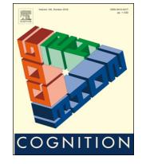
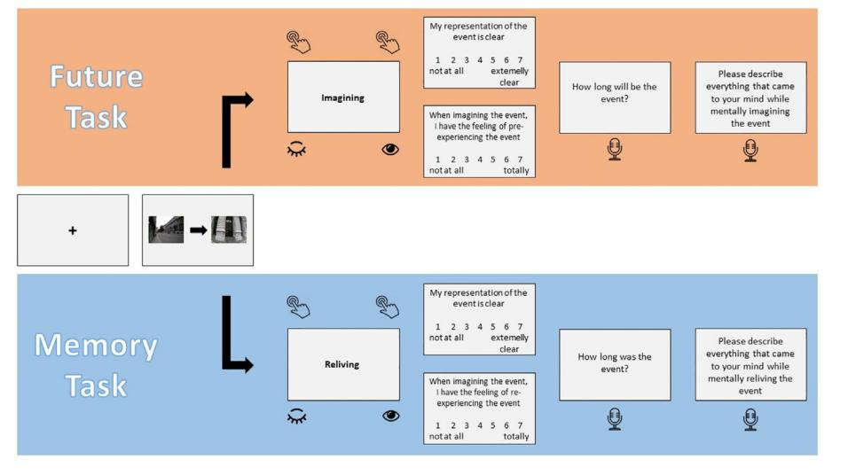
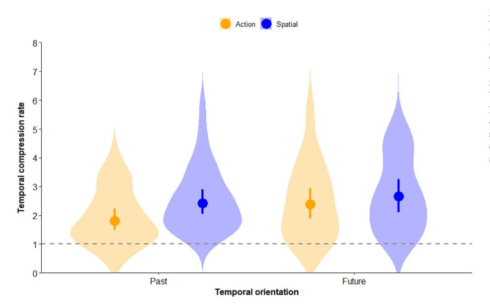
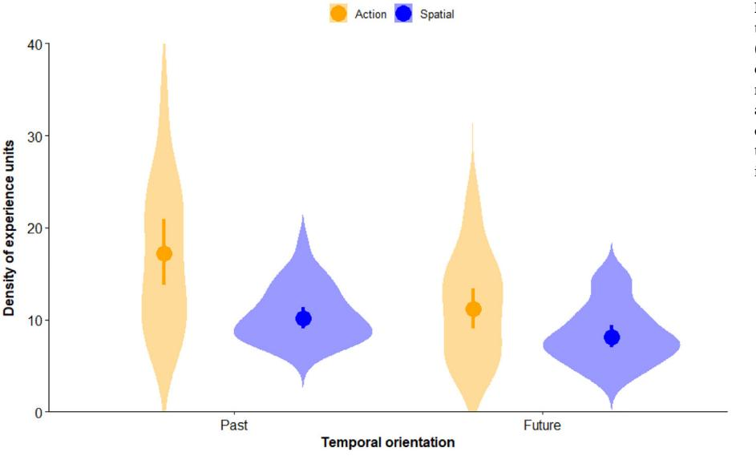
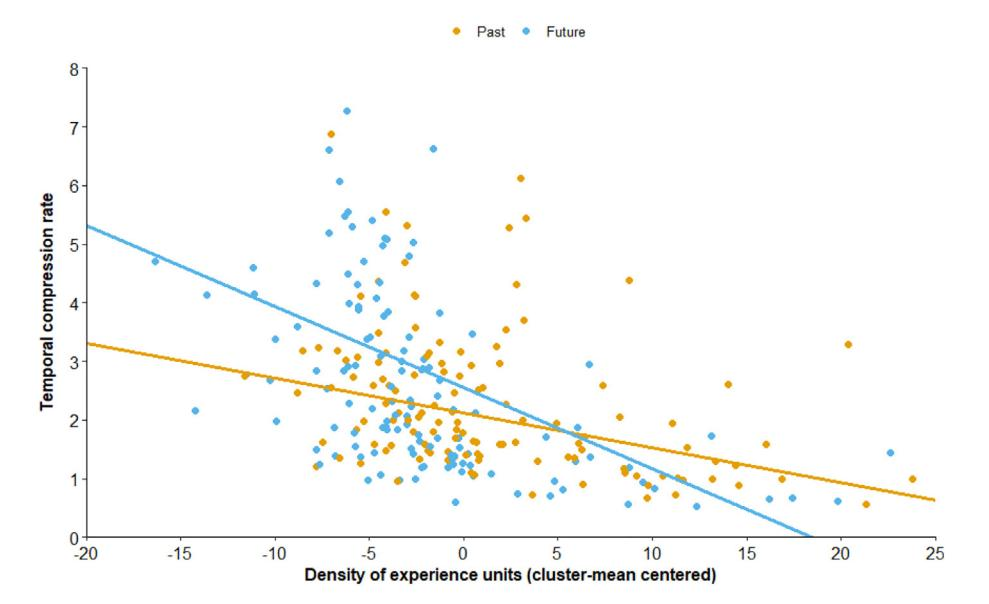
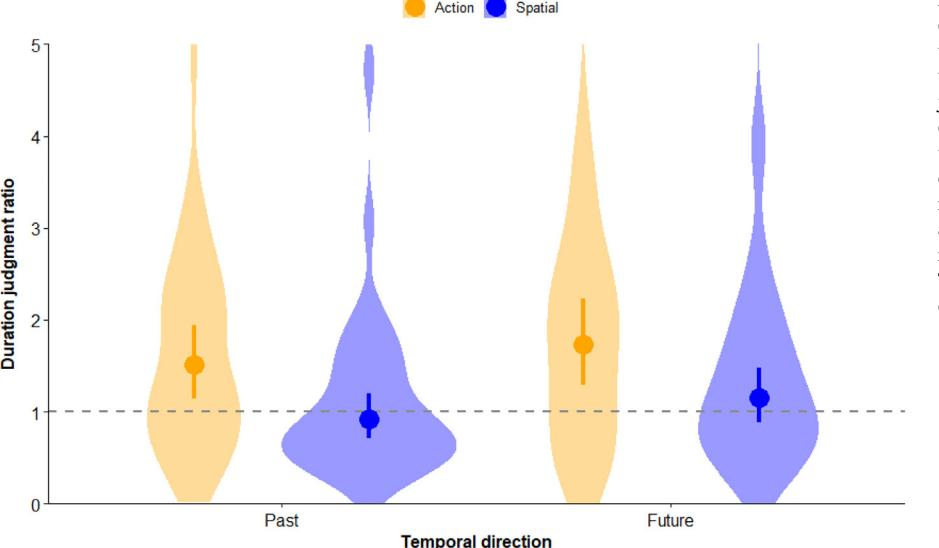

cite_key: jeunehomme_2020
title: The temporal compression of events during episodic future thinking
authors: Olivier Jeunehomme, Nathan Leroy, Arnaud D'Argembeau
year: 2020
doi: 10.1016/j.cognition.2020.104416
date_processed: '2025-07-02'
phase2_processed: true
original_folder: 1-s2.0-S0010027720302353-main
images_total: 8
images_kept: 7
images_removed: 1
tags:
- IoT
- Machine Learning
- Temporal
keywords:
- 1 participants
- 1 temporal compression of events
- 2 density of experience units
- 2 materials and procedure
- 3 duration judgments
- 3 scoring of verbal reports
- 4 statistical analyses
- DuBrow
- McKenzie
- ScienceDirect
- acknowledgements
- after that
- age-related
- appendix a supplementary material
- article info
- brief article
- cognition
- conclusions
- contextual-change
- credit authorship contribution statement
- discussion
- e-mail
- flowchart-like
- funding
- future task
- future-oriented
- human learning
- memory task
- method
- performance
---

Contents lists available at [ScienceDirect](http://www.sciencedirect.com/science/journal/00100277)

# Cognition

journal homepage: [www.elsevier.com/locate/cognit](https://www.elsevier.com/locate/cognit)

## Brief article

## The temporal compression of events during episodic future thinking

Olivier Jeunehomme[⁎](#page-0-0) , Nathan Leroy, Arnaud D'Argembeau

University of Liège, Belgium

### ARTICLE INFO

Keywords: Episodic memory Episodic future thinking Temporal compression Time estimation Wearable camera

### ABSTRACT

While the cognitive and neural mechanisms that underlie episodic future thinking are increasingly well understood, little is known about how the temporal unfolding of events is represented in future simulations. In this study, we leveraged wearable camera technology to examine whether real-world events are structured and compressed in the same way when imagining the future as when remembering the past. We found that future events were simulated at proportionally higher speed than past events and that the density of experience units representing the unfolding of events was lower for future than for past episodes. Despite these differences, the nature of events influenced compression rates in the same way for past and future events. Furthermore, the perceived duration of both types of events depended on the density of represented experience units. These results provide novel insight into the mechanisms that structure the unfolding of events during future simulations.

## TL;DR
Research on the temporal compression of events during episodic future thinking providing insights for knowledge graph development and data integration.

## Key Insights  
Provides approaches for temporal data modeling and time-based analysis in knowledge systems, contributing to temporal-first architecture design patterns for PKG implementations.

### Introduction

The ability to mentally simulate future scenarios—referred to as episodic future thinking—is a key feature of the human cognitive system that plays important roles in decisions and actions ([Suddendorf &](#page-6-0) [Corballis, 2007\)](#page-6-0). To simulate future possibilities, we need to represent events as unfolding over time, as if pre-playing the situation in our mind. However, despite important progress in understanding the cognitive and neural mechanisms that underlie episodic future thinking ([Schacter, Benoit, & Szpunar, 2017\)](#page-6-1), little is known about how the temporal course of events is represented in future simulations. The aim of this study is to investigate whether real-world events are structured and compressed in the same way when imagining the future as when remembering the past.

Recent studies have shown that episodic memories represent prior experiences in a compressed form, such that the time it takes to remember an event is typically shorter than the actual duration of the past episode ([Bonasia, Blommesteyn, & Moscovitch, 2016](#page-5-0); [Jeunehomme & D'Argembeau, 2019](#page-5-1); [Michelmann, Staresina, Bowman,](#page-6-2) [& Hanslmayr, 2019;](#page-6-2) [Wang & Gennari, 2019\)](#page-6-3). The course of events is represented as a succession of moments or slices of prior experience (referred to as experience units) that includes temporal discontinuities: some segments of prior experience are not represented during memory replay ([Jeunehomme, Folville, Stawarczyk, Van der Linden, &](#page-5-2) [D'Argembeau, 2018\)](#page-5-2). The density of recalled experience units notably depends on event segmentation processes ([Zacks, 2020\)](#page-6-4); events that are perceived in terms of finer sub-events are encoded with a higher density of information and thus are less compressed in memory ([Faber &](#page-5-3) [Gennari, 2015;](#page-5-3) [Jeunehomme & D'Argembeau, 2020](#page-5-4)).

Simulating future events relies on many of the same cognitive and neural processes as remembering past events ([D'Argembeau, 2020](#page-5-5); [Schacter et al., 2012\)](#page-6-5), but little is known about the temporal structure of episodic future thoughts. The evidence suggests that people organize event details in chronological order both when remembering past events and when imagining future events [\(Anderson, Peters, &](#page-5-6) [Dewhurst, 2015\)](#page-5-6). In terms of event compression, a recent study showed that the mental simulation of routes in a virtual environment occurred at about 2–3 times the speed it took to actually navigate these routes ([Arnold, Iaria, & Ekstrom, 2016\)](#page-5-7). However, it remains unclear whether this compression mechanism generalizes to real-world events and simulations other than spatial navigation. Furthermore, it is unknown whether the unfolding of events is structured and compressed in the same way when remembering the past and imagining the future.

In the present study, we compared the temporal structure of realworld events in episodic memories and episodic future thoughts by measuring the time needed for participants to mentally re-experience or pre-experience a series of daily life activities, while the actual duration of events was measured with wearable camera technology [\(Chow &](#page-5-8) [Rissman, 2017\)](#page-5-8). Verbal reports on the content of memories and future simulations were also collected. This allowed us to estimate event compression rates (i.e., the ratio of the actual event duration to the duration of mental replay/preplay), as well as the density of recalled/ imagined moments of experience per unit of time of the actual event duration [\(Jeunehomme & D'Argembeau, 2019](#page-5-1)).

<https://doi.org/10.1016/j.cognition.2020.104416> Received 10 March 2020; Received in revised form 22 June 2020; Accepted 23 July 2020 Available online 06 August 2020

0010-0277/ © 2020 Elsevier B.V. All rights reserved.

<!-- Image Description: That's not a technical image from an academic paper; it's the Elsevier logo. It's an illustration depicting a figure harvesting fruit from a tree, with a banner reading "Non Solus" (Not Alone). It's a publisher's logo and serves no technical purpose within the content of an academic paper itself. -->

<!-- Image Description: That's not a technical image suitable for academic analysis. It's a cover image for a journal issue of *Cognition*, likely showcasing a stylized, abstract three-dimensional triangular design. The design uses blocks with text forming the word "Cognition" rotated around the triangle. It's purely artistic and conveys no technical information or data; it serves as a visual representation of the journal's theme for the particular issue. There are no charts, graphs, equations, or diagrams with any technical meaning. -->

[T](http://crossmark.crossref.org/dialog/?doi=10.1016/j.cognition.2020.104416&domain=pdf)

⁎ Corresponding author at: Psychology and Neuroscience of Cognition Research Unit, University of Liège, Place des Orateurs 1 (B33), 4000 Liège, Belgium. E-mail address: [O.Jeunehomme@uliege.be](mailto:O.Jeunehomme@uliege.be) (O. Jeunehomme).

We tested two competing hypotheses on how rates of event compression compare between episodic memories and future simulations. A first possibility is that the unfolding of experience is structured and compressed in the same way when representing past and future events, given that episodic remembering and future thinking largely rely on common processes [\(Schacter et al., 2012\)](#page-6-5). Suggestive evidence for this hypothesis comes from a study showing that people generate event details as fast for future as for past events [\(Anderson et al., 2015](#page-5-6)). However, another possibility is that events are more compressed when imaging the future than when remembering the past: people may only use essential information for representing the course of future events (e.g., scripts of action sequences), whereas memories may include more incidental details. In general, future simulations are less detailed than memories (e.g., [Addis, Wong, & Schacter, 2008;](#page-5-9) [D'Argembeau & Van](#page-5-10) [der Linden, 2004](#page-5-10)), suggesting that fewer experience units may be used to represent the unfolding of events.

To further investigate the mechanisms underlying future event compression, we also assessed whether the nature of events affects compression rates in the same way when remembering the past and imagining the future. Previous studies have shown that prior experiences are less compressed when they involve specific actions compared to spatial displacements with no action to perform except walking ([Jeunehomme & D'Argembeau, 2019, 2020\)](#page-5-1). If similar mechanisms underlie the temporal structure of episodic memories and future thoughts, this difference in compression rates should also occur when simulating future events.

Finally, another aim of this study was to examine the extent to which future event compression impacts duration judgments. There is substantial evidence that retrospective duration judgments depend essentially on the retrieval of contextual elements: the perceived duration of a past event increases with the number of contextual changes that are remembered [\(Block & Zakay, 1996;](#page-5-11) [Faber & Gennari, 2015](#page-5-3); [Jeunehomme & D'Argembeau, 2019\)](#page-5-1). On the other hand, the process by which people estimate the duration of future events has received less empirical attention (e.g., [Burt & Kemp, 1994;](#page-5-12) [Hinds, 1999](#page-5-13)). According to [Roy, Christenfeld, and McKenzie \(2005\),](#page-6-6) expected duration judgments rely on information stored in memory; it follows that any variable affecting retrospective duration judgments should similarly affect predictions of future durations. Therefore, we predicted that for both past and future events, estimated durations would increase with the density of experience units representing the unfolding of events.

### Method

### 1. Participants

Thirty-two young adults (17 females; mean age = 28 years, SD = 4.37) took part in this study (for justification of sample size, see Supplementary material).

### 2. Materials and procedure

All participants received a memory task and a future simulation task. In the memory task, they first experienced a series of events and then mentally re-experienced these events. In the future simulation task, they first mentally simulated a series of events and then accomplished these events. Two sets of events were used, each involving a series of actions in which participants interacted with people and objects, and a series of spatial displacements that did not involve particular action other than walking from a place to another (see [Figure 1](#page-2-0)). The assignment of each set of events to the memory and future simulation tasks and the order of presentation of the tasks were counterbalanced across participants. For both sets of events, the actual duration of actions and spatial displacements was recorded using a wearable camera (see Supplementary material).

The time needed by participants to remember or simulate events

was assessed as follows: a pair of pictures representing the beginning and end of an event was presented and participants had to mentally reexperience or pre-experience the unfolding of the event in as much detail as possible; the duration of their mental replay/preplay was measured (see [Figure 2](#page-2-1)). Then, participants rated the subjective characteristics of their mental representation (see Supplementary material), estimated the actual duration of the event, and verbally described everything that came to their mind when replaying/preplaying the event.

### 3. Scoring of verbal reports

Verbal reports describing the content of mental replay/preplay consisted of a succession of moments or slices of experience (referred to as experience units) that represented the unfolding of events. For each event, the number of reported experience units was assessed; transitions between experience units were identified on the basis of verbal indicators (e.g., "then", "next", "after that") and moments of silence (for more detail, see Supplementary material).

### 4. Statistical analyses

Data were analyzed using robust statistical methods [\(Field &](#page-5-14) [Wilcox, 2017\)](#page-5-14) because the assumptions underlying classical inferential methods (normality and homoscedasticity) were violated for our main measures of interest (see [Figs. 3](#page-3-0)–4). All descriptive statistics refer to the 20% trimmed means and their 95% confidence intervals (for more detail, see Supplementary material).

### Results

### 1. Temporal compression of events

On average, each event actually took about 1–2 min to unfold, with no difference between past and future events (see Supplementary material). The rate of temporal compression of events during episodic remembering and future thinking was estimated as the ratio of the actual event duration to the duration of its mental replay/preplay. Mean compression rates for past and future events that involved actions and spatial displacements are shown on [Figure 3](#page-3-0). A robust two-way repeated-measures ANOVA revealed a main effect of temporal direction, Q = 3.92, p = .048, showing that temporal compression was lower for past than future events (ξ = 0.23). The effect of the type of events was also significant, Q = 4.53, p = .034, showing that actions were less compressed than spatial displacements (ξ = 0.28). The interaction between the temporal direction and type of events was not significant, Q = 0.66, p = .418.

### 2. Density of experience units

Verbal reports on the content of memories and future thoughts consisted of a succession of experience units that represented the unfolding of events. For each event, we estimated the density of recalled/ imagined experience units as the number of experience units reported per minute of the actual event duration (see [Figure 4\)](#page-3-1). A robust two-way repeated measures ANOVA revealed a main effect of temporal direction, Q = 11.99, p < .001, showing that past events were described with a higher density of experience units than future events (ξ = 0.65). Moreover, events that involved specific actions were associated with a higher density of experience units than events that involved spatial displacements, Q = 26.66, p < .001, ξ = 0.79. No significant interaction was found, Q = 2.26, p = .133.

Next, we conducted a robust multilevel regression analysis to determine whether rates of event compression were predicted by the density of experience units contained within memories and future thoughts. When fitting regression models separately for past and future events, we found that the density of experience units was a significant

<!-- Image Description: This image details the experimental design of a study comparing mental imagery of future and past events. Two flowchart-like sections illustrate "Future Task" and "Memory Task". Each section presents a stimulus (images for the Memory Task), followed by prompts for participants to rate clarity of mental representation, feeling of pre/re-experiencing, duration, and provide a verbal description of their mental experience. Likert scales (1-7) are used for the rating prompts. The design contrasts imagining future events ("Imagining") with mentally reliving past events ("Reliving"). -->

Figure 1. Overview of the two sets of events. (a) In the first set of events, participants were first instructed to leave the laboratory (B square) and to go to the bookstore to buy a postcard (participants were given 2 euros for purchasing the postcard). After having purchased the postcard, they had to go to the hall of the University building to choose a lea flet on the display stands; the lea flets depicted activities that could be done in Liège (e.g., museum visits, festivals or concerts) and participants were instructed to choose an activity they would like to carry out in a near future. Finally, they had to return to the laboratory to bring the camera back to the experimenter. (b) In the second set of events, participants were first instructed to leave the laboratory and to go to a co ffee shop to purchase the beverage of their choice that they were instructed to take away (participants were given 3 euros for purchasing the beverage). Then, they had to go to the reception o ffice at the entrance of the University building to ask information about the closing time of the building. Finally, they had to return to the laboratory to bring the camera back to the experimenter. For each set of events, locations in which actions were performed are indicated by color circles and paths taken to go to these locations are indicated by color lines. Examples of pictures (taken by the wearable camera) indicating the beginning and end of each event are shown on the left.

Figure 2. Illustration of the memory and future simulation tasks. On each trial, participants first had to mentally replay/preplay the unfolding of each event, from the moment corresponding to the picture shown on the left of the screen to the moment corresponding to the picture shown on the right of the screen. Participants had to close their eyes to mentally represent the unfolding of the event and indicated the beginning and end of their mental replay/preplay with a key press. Then, they rated the subjective characteristics of their mental representation (vividness and feeling of pre-experience/re-experience) and provided an estimation of the actual duration of the event (in minutes and/or seconds). Finally, they verbally described everything that came to their mind when they mentally represented the unfolding of the event.

<!-- Image Description: The image displays a violin plot illustrating temporal compression rates for "Action" and "Spatial" conditions across "Past" and "Future" temporal orientations. Each violin represents the distribution of compression rates, with the dot indicating the mean. The dashed line represents a baseline. The plot likely examines how temporal orientation and processing type influence perceived time compression. -->

Figure 3. Temporal compression rates as a function of the temporal orientation (past vs. future) and type (actions vs. spatial displacements) of events. The rate of temporal compression is estimated as the ratio of the actual event duration to the time needed to mentally re-experience or pre-experience the event. Violin plots show the distribution of the data and point-range plots represent the 20% trimmed means and their 95% robust confidence intervals. The dashed line indicates a compression rate of 1 (i.e., the duration of mental replay/preplay coincides with the actual event duration).

predictor of compression rates for both memories (b = −0.06, SE = 0.009, df = 24.74, t = 6.34, p < .001) and future thoughts (b = −0.14, SE = 0.02, df = 24.74, t = 8.48, p < .001). Interestingly, however, a regression model that included both the temporal direction of events and the density of experience units as predictors revealed a significant interaction between the two predictors (b = −0.08, SE = 0.02, df = 154.38, t = 5.09, p < .001), indicating that the negative relationship between the density of experience units and event compression rates was stronger for future than past events ([Figure 5](#page-4-0)). This suggests that it took proportionally more time to represent an experience unit when simulating future events than when remembering past events (see Supplementary material).

### 3. Duration judgments

Retrospective and expected duration judgments were analyzed using the duration judgment ratio (i.e., the ratio of the duration estimate to the actual duration of the event; [Block, Hancock, & Zakay,](#page-5-15) [2010\)](#page-5-15). As shown on [Figure 6,](#page-4-1) participants tended to overestimate the duration of actions, whereas they provided relatively accurate estimations for spatial displacements. A robust two-way repeated measures ANOVA yielded a main effect of temporal orientation, Q = 5.06, p = .025, showing that estimated durations were higher for future than past events (ξ = 0.21), and a main effect of the type of events, Q = 16.35, p < .001, showing that estimated durations were higher for actions than spatial displacements (ξ = 0.42). No significant interaction was found, Q = 0.001, p = .966.

Robust multilevel regression analyses with the duration judgment ratio as outcome variable and the density of experience units as predictor indicated that duration estimates increased with the density of experience units, for both past (b = 0.04, SE = 0.01, df = 17.06, t = 4.38, p < .001) and future (b = 0.08, SE = 0.02, df = 26.84, t = 3.63, p = .001) events. This effect did not interact with temporal orientation (b = 0.018, SE = 0.013, df = 240.69, t = 1.41, p = .16).

### Discussion

This study provides the first evidence that the unfolding of realworld events is temporally compressed in future simulations, thus extending previous results on the simulation of routes in a virtual environment [\(Arnold et al., 2016](#page-5-7)). Another contribution of this study is to show that there are both similarities and differences in the temporal

> Figure 4. Density of experience units as a function of the temporal orientation (past vs. future) and type (actions vs. spatial displacements) of events. The density of experience units corresponds to the number of recalled/imagined units per minute of the actual event. Violin plots show the distribution of the data and point-range plots represent the 20% trimmed means and their 95% robust confidence intervals.

<!-- Image Description: The image displays a violin plot illustrating the density of "action" and "spatial" experience units across "past" and "future" temporal orientations. Orange represents action, blue represents spatial. Each violin shows the distribution of experience units for each category within each temporal orientation, indicating the relative prevalence of action and spatial experiences in past and future-oriented thoughts. The plot's purpose is to compare the distribution of these experience types across different temporal perspectives. -->

<!-- Image Description: The scatter plot displays the relationship between temporal compression rate and density of experience units, differentiated by past (gold) and future (blue) experiences. Two regression lines show a negative correlation for both past and future experiences; however, the slope is steeper for future experiences, indicating a stronger negative relationship between experience density and compression rate for future memories. The plot aims to demonstrate how the subjective experience of time is influenced by the density of remembered events. -->

Figure 5. Relationship between temporal compression rates and the density of experience units for past and future events. The regression lines represent the fixed effect of the density of experience units on compression rates in robust multilevel regression analyses (for detail, see Supplementary material).

structure and compression of episodic memories and episodic future thoughts. Although events were simulated at proportionally higher speed when imagining the future than when remembering the past, the nature of events influenced compression rates in the same way for past and future events.

While the exact mechanism of event compression is not fully understood, previous studies suggest that the time-compressed replay of prior experience occurs, at least in part, because of temporal discontinuities in the representation of the unfolding of events: some moments of prior experience are not remembered, as if people mentally jumped from one moment of experience to another without representing what happened in between ([Jeunehomme et al., 2018](#page-5-2); [Jeunehomme & D'Argembeau, 2019](#page-5-1)). The magnitude of event compression may depend on the length of these temporal gaps when representing the course of events or, reciprocally, on the density of remembered experience units per unit of time of the actual event duration ([Jeunehomme & D'Argembeau, 2020](#page-5-4)). The present results suggest that basically the same compression mechanism operates when simulating future events. In fact, it has been argued that episodic memories and future thoughts rely on the same simulation system, which draws on elements from prior experiences and schemas to (re)construct event representations [\(Addis, 2020](#page-5-16)). Following this view, our finding that compression rates were higher when simulating future events may reflect differences in the balance of different forms of underlying contents: compared to memories, future thoughts involve fewer experiential details and a greater reliance on schemas to represent the course of events. We also found that the density of experience units predicted compression rates to a greater extent for future than past events, suggesting that it takes proportionally more time to represent an experience unit when simulating future events. This may reflect differences in the associative history of constituent details: remembering involves the reinstatement of previously associated details, whereas imagination requires the creation of novel configurations of details, which places higher demands on the simulation process [\(Addis, 2020\)](#page-5-16). As a result, the fluency or ease of event simulations is higher when remembering than when imagining [\(Michaelian, Perrin, & Sant'Anna, 2020\)](#page-5-17).

Despite these differences in the temporal resolution of memories and future thoughts, compression rates and the density of experience units were modulated by the nature of events (i.e., actions vs. spatial displacements) in the same way for past and future episodes. Relative to

<!-- Image Description: The image displays violin plots showing the distribution of duration judgment ratios for "action" (orange) and "spatial" (blue) conditions across "past" and "future" temporal directions. The plots illustrate the variation in perceived durations, comparing the relative perceived lengths of past and future events under action and spatial processing conditions. A dashed horizontal line at a ratio of 1 serves as a reference point. The plots suggest differences in duration judgment ratios between conditions. -->

Figure 6. Duration judgment ratio (i.e., estimated duration/actual event duration) as a function of the temporal orientation (past vs. future) and type (actions vs. spatial displacements) of events. A duration judgment ratio higher than 1 means that the duration of the event is overestimated, whereas a ratio lower than 1 means that the duration of the event is underestimated; a ratio of 1 indicates an accurate estimation. Violin plots show the distribution of the data and point-range plots represent the 20% trimmed means and their 95% robust confidence intervals. The dashed line indicates a duration judgment ratio of 1 (i.e., accurate estimation).

spatial displacements, actions are more likely to be segmented in finegrained subevents, leading to the formation of more experience units to represent the event's unfolding and thus lower event compression rates ([Jeunehomme & D'Argembeau, 2020\)](#page-5-4). Our results suggest that this effect of event segmentation on the temporal structure of mental representations ([Clewett, DuBrow, & Davachi, 2019](#page-5-18); [Zacks, 2020\)](#page-6-4) is similar when remembering past events and simulating future events, providing further support to the view that memory and imagination involve fundamentally the same mechanism [\(Addis, 2020\)](#page-5-16). Compression rates might notably depend on changes in the structure of events that lead to incremental versus global updating of event models ([Bailey](#page-5-19) [& Zacks, 2015;](#page-5-19) [Curiel & Radvansky, 2014\)](#page-5-20). Event models represent information along various dimensions such as persons, objects, actions, and spatial location. Changes in these dimensions can result in incremental updating (when the current event model is altered to accommodate new information) or global updating (when a new event model is created) of event models. One possibility is that events are less compressed when the succession of experience units represents incremental changes, such that there is more continuity in the representation of events. For example, the higher density of experience units when representing actions might reflect incremental updating in the event model (e.g., a succession of actions involving the same entities in the same location), whereas transitions between experience units when representing spatial displacements might more frequently involve global updating (e.g., mental jumps from one location to another). From a functional perspective, representing actions at a finer resolution may enhance the effectiveness of planning, thereby promoting more effective decision making and implementation intention ([Baumeister,](#page-5-21) [Vohs, & Oettingen, 2016](#page-5-21); [Gollwitzer, 1999](#page-5-22); [Taylor, Pham, Rivkin, &](#page-6-7) [Armor, 1998](#page-6-7)).

Another goal of the present study was to investigate possible differences between retrospective and expected duration judgments and to determine the extent to which duration estimates are influenced by the density of recalled/imagined moments of experience. Overall, our results are consistent with previous studies showing that for short time intervals (i.e., less than 5 min), the duration of naturalistic events tends to be overestimated (for a review, see Roy et al., 2005). This was especially the case for events that involved actions, whereas spatial displacements were relatively well estimated. Duration estimates were on average higher for future than past events but for both types of events perceived duration depended on the density of recalled/imagined experience units. These findings are not only consistent with the contextual-change hypothesis, according to which the duration of a past event is estimated on the basis of the amount of changes that are accessed in memory [\(Block & Reed, 1978\)](#page-5-23), but also provide novel evidence that a similar mechanism underlies expected duration judgments (i.e., people use imagined experience units as an index for predicting the duration of future events).

### Conclusions

Episodic future thinking would not be functional if we spent endless time simulating events in our mind. To be adaptive, episodic simulations need to represent events at a faster rate than the actual duration of experience. Our results suggest that this temporal compression mechanism operates in basically the same way—by representing events as a succession of discrete moments of experience that includes temporal discontinuities—when remembering the past and imagining the future, although compression rates vary with the nature and temporal orientation of events. A question for future research is whether event compression rates can be flexibly modulated as a function of goals and task context.

### CRediT authorship contribution statement

Olivier Jeunehomme:Methodology, Formal analysis, Writing -

original draft.Nathan Leroy:Data curation, Writing - review & editing.Arnaud D'Argembeau:Conceptualization, Methodology, Supervision, Writing - original draft.

### Acknowledgements

We thank William Daro for his help in data collection. O. Jeunehomme and A. D'Argembeau are, respectively, Post-doctoral Researcher and Research Director of the Fonds de la Recherche Scientifique (F.R.S.-FNRS).

### Funding

This work was supported by the University of Liège (Fonds spéciaux – Crédits sectoriels no. 9893).

### Appendix A. Supplementary material

Supplementary material to this article can be found online at <https://doi.org/10.1016/j.cognition.2020.104416>.

### References

- [Addis, D. R. \(2020\). Mental time travel? A neurocognitive model of event simulation.](http://refhub.elsevier.com/S0010-0277(20)30235-3/rf0005) [Review of Philosophy and Psychology, 11](http://refhub.elsevier.com/S0010-0277(20)30235-3/rf0005), 233–259.
- [Addis, D. R., Wong, A. T., & Schacter, D. L. \(2008\). Age-related changes in the episodic](http://refhub.elsevier.com/S0010-0277(20)30235-3/rf0010) [simulation of future events.](http://refhub.elsevier.com/S0010-0277(20)30235-3/rf0010) Psychological Science, 19(1), 33–41.
- [Anderson, R. J., Peters, L., & Dewhurst, S. A. \(2015\). Episodic elaboration: Investigating](http://refhub.elsevier.com/S0010-0277(20)30235-3/rf0015) [the structure of retrieved past events and imagined future events.](http://refhub.elsevier.com/S0010-0277(20)30235-3/rf0015) Consciousness and [Cognition, 33](http://refhub.elsevier.com/S0010-0277(20)30235-3/rf0015), 112–124.
- [Arnold, A., Iaria, G., & Ekstrom, A. D. \(2016\). Mental simulation of routes during navi](http://refhub.elsevier.com/S0010-0277(20)30235-3/rf0020)[gation involves adaptive temporal compression.](http://refhub.elsevier.com/S0010-0277(20)30235-3/rf0020) Cognition, 157, 14–23.
- [Bailey, H. R., & Zacks, J. M. \(2015\). Situation model updating in young and older adults:](http://refhub.elsevier.com/S0010-0277(20)30235-3/rf0025) [Global versus incremental mechanisms.](http://refhub.elsevier.com/S0010-0277(20)30235-3/rf0025) Psychology and Aging, 30(2), 232–244.
- [Baumeister, R. F., Vohs, K. D., & Oettingen, G. \(2016\). Pragmatic prospection: How and](http://refhub.elsevier.com/S0010-0277(20)30235-3/rf0030) [why people think about the future.](http://refhub.elsevier.com/S0010-0277(20)30235-3/rf0030) Review of General Psychology, 20(1), 3–16.
- [Block, R. A., Hancock, P. A., & Zakay, D. \(2010\). How cognitive load a](http://refhub.elsevier.com/S0010-0277(20)30235-3/rf0035)ffects duration [judgments: A meta-analytic review.](http://refhub.elsevier.com/S0010-0277(20)30235-3/rf0035) Acta Psychologica, 134, 330–343.
- [Block, R. A., & Reed, A. M. \(1978\). Remembered duration: Evidence for a contextual](http://refhub.elsevier.com/S0010-0277(20)30235-3/rf0040)change hypothesis. [Journal of Experimental Psychology: Human Learning and Memory,](http://refhub.elsevier.com/S0010-0277(20)30235-3/rf0040) 4[\(6\), 656](http://refhub.elsevier.com/S0010-0277(20)30235-3/rf0040)–665.
- [Block, R. A., & Zakay, D. \(1996\). Models of psychological time revisited. In H. Helfrich](http://refhub.elsevier.com/S0010-0277(20)30235-3/rf0045) (Ed.). Time and mind (pp. 171–[195\). Kirkland, WA: Hogrefe & Huber.](http://refhub.elsevier.com/S0010-0277(20)30235-3/rf0045)
- [Bonasia, K., Blommesteyn, J., & Moscovitch, M. \(2016\). Memory and navigation:](http://refhub.elsevier.com/S0010-0277(20)30235-3/rf0050) [Compression of space varies with route length and turns.](http://refhub.elsevier.com/S0010-0277(20)30235-3/rf0050) Hippocampus, 12, 9–12.
- [Burt, C. D. B., & Kemp, S. \(1994\). Construction of activity duration and time management](http://refhub.elsevier.com/S0010-0277(20)30235-3/rf0055) potential. [Applied Cognitive Psychology, 8](http://refhub.elsevier.com/S0010-0277(20)30235-3/rf0055), 155–168.
- [Chow, T. E., & Rissman, J. \(2017\). Neurocognitive mechanisms of real-world auto](http://refhub.elsevier.com/S0010-0277(20)30235-3/rf0060)[biographical memory retrieval: Insights from studies using wearable camera tech](http://refhub.elsevier.com/S0010-0277(20)30235-3/rf0060)nology. Ann. N.Y. [Academy of Sciences, 1396](http://refhub.elsevier.com/S0010-0277(20)30235-3/rf0060), 202–221.
- [Clewett, D., DuBrow, S., & Davachi, L. \(2019\). Transcending time in the brain: How event](http://refhub.elsevier.com/S0010-0277(20)30235-3/rf0065) [memoriesare constructed from experience.](http://refhub.elsevier.com/S0010-0277(20)30235-3/rf0065) Hippocampus, 29, 162–183.
- [Curiel, J. M., & Radvansky, G. A. \(2014\). Spatial and character situation model updating.](http://refhub.elsevier.com/S0010-0277(20)30235-3/rf0070) [Journal of Cognitive Psychology, 26](http://refhub.elsevier.com/S0010-0277(20)30235-3/rf0070), 205–212.
- D'Argembeau, [A. \(2020\). Zooming in and out on one](http://refhub.elsevier.com/S0010-0277(20)30235-3/rf0075)'s life: Autobiographical re[presentations at multiple time scales.](http://refhub.elsevier.com/S0010-0277(20)30235-3/rf0075) Journal of Cognitive Neuroscience (in press).
- D'[Argembeau, A., & Van der Linden, M. \(2004\). Phenomenal characteristics associated](http://refhub.elsevier.com/S0010-0277(20)30235-3/rf0080) [with projecting oneself back into the past and forward into the future: In](http://refhub.elsevier.com/S0010-0277(20)30235-3/rf0080)fluence of [valence and temporal distance.](http://refhub.elsevier.com/S0010-0277(20)30235-3/rf0080) Consciousness and Cognition, 13(4), 844–858.
- [Faber, M., & Gennari, S. P. \(2015\). Representing time in language and memory: The role](http://refhub.elsevier.com/S0010-0277(20)30235-3/rf0085) [of similarity structure.](http://refhub.elsevier.com/S0010-0277(20)30235-3/rf0085) Acta Psychologica, 156, 156–161.
- [Field, A. P., & Wilcox, R. R. \(2017\). Robust statistical methods: A primer for clinical](http://refhub.elsevier.com/S0010-0277(20)30235-3/rf0090) [psychology and experimental psychopathology researchers.](http://refhub.elsevier.com/S0010-0277(20)30235-3/rf0090) Behaviour Research and [Therapy, 98](http://refhub.elsevier.com/S0010-0277(20)30235-3/rf0090), 19–38.
- [Gollwitzer, P. M. \(1999\). Implementation intentions: Strong e](http://refhub.elsevier.com/S0010-0277(20)30235-3/rf0095)ffects of simple plans. [American Psychologist, 54](http://refhub.elsevier.com/S0010-0277(20)30235-3/rf0095)(7), 493–503.
- [Hinds, P. J. \(1999\). The curse of expertise: The e](http://refhub.elsevier.com/S0010-0277(20)30235-3/rf0100)ffects of expertise and debiasing methods on predictions of novice performance. [Journal of Experimental Psychology: Applied, 5](http://refhub.elsevier.com/S0010-0277(20)30235-3/rf0100), 205–[221](http://refhub.elsevier.com/S0010-0277(20)30235-3/rf0100).
- Jeunehomme, O., & D'[Argembeau, A. \(2019\). The time to remember: Temporal com](http://refhub.elsevier.com/S0010-0277(20)30235-3/rf0105)[pression and duration judgments in memory for real-life events.](http://refhub.elsevier.com/S0010-0277(20)30235-3/rf0105) Quarterly Journal of [Experimental Psychology, 72](http://refhub.elsevier.com/S0010-0277(20)30235-3/rf0105), 930–942.
- [Jeunehomme, O., & D'Argembeau, A. \(2020\). Event segmentation and the temporal](http://refhub.elsevier.com/S0010-0277(20)30235-3/rf0110) [compression of experience in episodic memory.](http://refhub.elsevier.com/S0010-0277(20)30235-3/rf0110) Psychological Research, 84, 481–490.
- [Jeunehomme, O., Folville, A., Stawarczyk, D., Van der Linden, M., & D](http://refhub.elsevier.com/S0010-0277(20)30235-3/rf0115)'Argembeau, A. [\(2018\). Temporal compression in episodic memory for real-life events.](http://refhub.elsevier.com/S0010-0277(20)30235-3/rf0115) Memory, 26[\(6\), 759](http://refhub.elsevier.com/S0010-0277(20)30235-3/rf0115)–770.
- Michaelian, K., Perrin, D., & Sant'[Anna, A. \(2020\). Continuities and discontinuities be](http://refhub.elsevier.com/S0010-0277(20)30235-3/rf0125)[tween imagination and memory: The view from philosophy. In A. Abraham \(Ed.\).](http://refhub.elsevier.com/S0010-0277(20)30235-3/rf0125) The

[Cambridge handbook of the imagination](http://refhub.elsevier.com/S0010-0277(20)30235-3/rf0125) (pp. 293–310). Cambridge, UK: Cambridge [University Press](http://refhub.elsevier.com/S0010-0277(20)30235-3/rf0125).

- [Michelmann, S., Staresina, B. P., Bowman, H., & Hanslmayr, S. \(2019\). Speed of time](http://refhub.elsevier.com/S0010-0277(20)30235-3/rf0130)compressed forward replay fl[exibly changes in human episodic memory.](http://refhub.elsevier.com/S0010-0277(20)30235-3/rf0130) Nature [Human Behavior, 3](http://refhub.elsevier.com/S0010-0277(20)30235-3/rf0130), 143–154.
- [Roy, M. M., Christenfeld, N. J. S., & McKenzie, C. R. M. \(2005\). Underestimation of future](http://refhub.elsevier.com/S0010-0277(20)30235-3/rf9500) [duration: Memory incorrectly used or memory bias?](http://refhub.elsevier.com/S0010-0277(20)30235-3/rf9500) Psychological Bulletin, 131, 738–[756](http://refhub.elsevier.com/S0010-0277(20)30235-3/rf9500).
- [Schacter, D. L., Addis, D. R., Hassabis, D., Martin, V. C., Spreng, R. N., & Szpunar, K. K.](http://refhub.elsevier.com/S0010-0277(20)30235-3/rf0140) [\(2012\). The future of memory: Remembering, imagining, and the brain.](http://refhub.elsevier.com/S0010-0277(20)30235-3/rf0140) Neuron, 76[\(4\), 677](http://refhub.elsevier.com/S0010-0277(20)30235-3/rf0140)–694.
- [Schacter, D. L., Benoit, R. G., & Szpunar, K. K. \(2017\). Episodic future thinking:](http://refhub.elsevier.com/S0010-0277(20)30235-3/rf0145)

Mechanisms and functions. [Current Opinion in Behavioral Sciences, 17](http://refhub.elsevier.com/S0010-0277(20)30235-3/rf0145), 41–50.

- [Suddendorf, T., & Corballis, M. C. \(2007\). The evolution of foresight: What is mental time](http://refhub.elsevier.com/S0010-0277(20)30235-3/rf0150) [travel, and is it unique to humans?](http://refhub.elsevier.com/S0010-0277(20)30235-3/rf0150) Behavioral and Brain Sciences, 30(3), 299–313 [\(discussion 313](http://refhub.elsevier.com/S0010-0277(20)30235-3/rf0150)–351).
- [Taylor, S. E., Pham, L. B., Rivkin, I. D., & Armor, D. A. \(1998\). Harnessing the imagi](http://refhub.elsevier.com/S0010-0277(20)30235-3/rf0160)[nation: Mental simulation, self-regulation, and coping.](http://refhub.elsevier.com/S0010-0277(20)30235-3/rf0160) American Psychologist, 53(4), 429–[439](http://refhub.elsevier.com/S0010-0277(20)30235-3/rf0160).
- [Wang, Y., & Gennari, S. P. \(2019\). How language and event recall can shape memory for](http://refhub.elsevier.com/S0010-0277(20)30235-3/rf0165) time. [Cognitive Psychology, 108](http://refhub.elsevier.com/S0010-0277(20)30235-3/rf0165), 1–21.
- [Zacks, J. F. \(2020\). Event perception and memory.](http://refhub.elsevier.com/S0010-0277(20)30235-3/rf0170) Annual Review of Psychology, 71, 165–[191](http://refhub.elsevier.com/S0010-0277(20)30235-3/rf0170).

## Metadata Summary
### Research Context
- **Research Question**: 
- **Methodology**: 
- **Key Findings**: 

### Analysis
- **Limitations**: 
- **Future Work**: