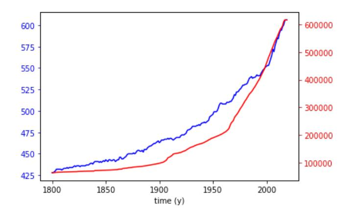
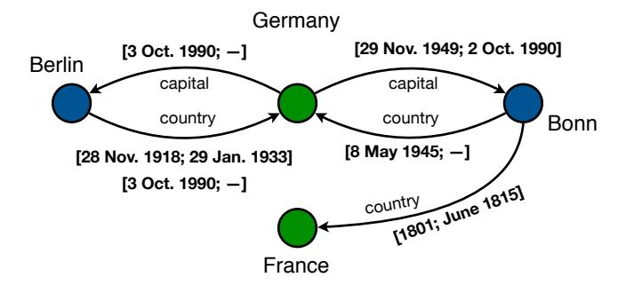
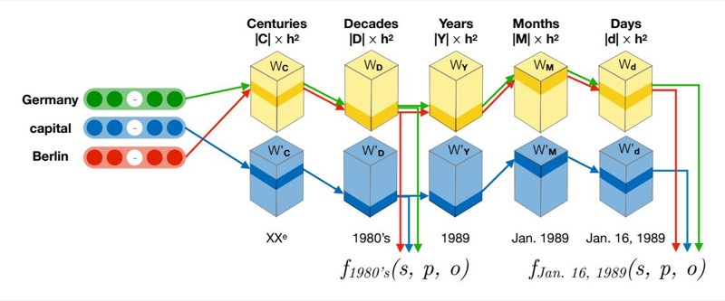

<!-- Image Description: That image is not a technical illustration from an academic paper; it's a generic "Check for updates" button, likely a placeholder or screenshot of software interface unrelated to the paper's technical content. It shows a stylized bookmark icon within a circular design, with text prompting the user to check for updates. It has no scientific or technical information. -->

# Towards Temporal Knowledge Graph Embeddings with Arbitrary Time Precision

Julien Leblay Rakuten, Inc. Tokyo, Japan julien.leblay@rakuten.com Melisachew Wudage Chekol Utrecht University Utrecht, Netherlands m.w.chekol@uu.nl

Xin Liu AIRC/RWBC-OIL, AIST Tokyo, Japan xin.liu@aist.go.jp

## ABSTRACT

Acknowledging the dynamic nature of knowledge graphs, the problem of learning temporal knowledge graph embeddings has recently gained attention. Essentially, the goal is to learn vector representation for the nodes and edges of a knowledge graph taking time into account. These representations must preserve certain properties of the original graph, so as to allow not only classification or clustering tasks, as for classical graph embeddings, but also approximate time-dependent query answering or link predictions over knowledge graphs. For instance, "who was the leader of Germany in 1994?" or "when was Bonn the capital of Germany?"

Several existing work in the area adapt existing knowledge graph embedding models, adding a time dimension, usually restricting to one time granularity, like years or days, or treating time as fixed labels. However, this is not adequate for many facts of life, for instance historical and sensory data. In this work, we introduce and evaluate an approach that gracefully adjusts to time validity of virtually any granularity. Our model is robust to non-contiguous validity periods. It is generic enough to adapt to many existing non-temporal models and its size (number of parameters) does not depend on the size of the graph (number of entities and relations).

### CCS CONCEPTS

• Computing methodologies → Learning latent representations; • Information systems → Novelty in information retrieval; Question answering;

### KEYWORDS

temporal knowledge graph, learning representations

### ACM Reference Format:

Julien Leblay, Melisachew Wudage Chekol, and Xin Liu. 2020. Towards Temporal Knowledge Graph Embeddings with Arbitrary Time Precision. In Proceedings of the 29th ACM International Conference on Information and Knowledge Management (CIKM '20), October 19–23, 2020, Virtual Event, Ireland. ACM, New York, NY, USA, [10](#page-9-0) pages. [https://doi.org/10.1145/3340531.](https://doi.org/10.1145/3340531.3412028) [3412028](https://doi.org/10.1145/3340531.3412028)

CIKM '20, October 19–23, 2020, Virtual Event, Ireland

© 2020 Copyright held by the owner/author(s). Publication rights licensed to the Association for Computing Machinery. ACM ISBN 978-1-4503-6859-9/20/10. . . \$15.00

<https://doi.org/10.1145/3340531.3412028>

## 1 INTRODUCTION

Graph embeddings are a set of techniques used to project graph nodes into a low-dimensional vector space while preserving certain properties, such as adjacency, similarities, communities, etc [\[2,](#page-9-1) [4,](#page-9-2) [10\]](#page-9-3). This can be useful for a number of machine learning tasks, where training on the embedding becomes more effective than training on the actual graph. It is widely studied for link prediction, node classification, clustering, among others.

Two special cases of graph embeddings include (i) temporal graph embeddings (TGE) where edges are not necessarily directed, but labeled with temporal metadata, and (ii) knowledge graph embeddings (KGE) where nodes are concepts, real world entities or literal values, and directed, labeled edges reflect semantic relationships between those nodes.

The first type of embeddings allows time-aware link prediction, whereby one can predict whether two nodes were linked at a given point in time, or the most likely period(s) of time these were linked [\[6,](#page-9-4) [25,](#page-9-5) [26\]](#page-9-6). On the other hand, the second type of embeddings, are suited for atemporal graphs and, allow (1) relation prediction, where one looks for the most likely ways two given entities are linked, and (2) node prediction, where one can predict the most likely subject (resp. object) for a given predicate and object (resp. subject) [\[1,](#page-9-7) [24,](#page-9-8) [32\]](#page-9-9). For instance, one would expect to be approximated as the best answer to the query (, , ?).

Recently, there has been a growing research interest in temporal KG embeddings, where the edges of a KG are also endowed with information about the time period(s) in which the relationship is considered valid. A number of models [\[5,](#page-9-10) [8,](#page-9-11) [11,](#page-9-12) [15,](#page-9-13) [30,](#page-9-14) [34,](#page-9-15) [35\]](#page-9-16) have already been proposed to learn temporal KG embeddings, however, they have several limitations. A common approach consists in extending KG-based approaches, i.e., by projecting KG into fixed-sized time intervals, and learning the embedding within each snapshot. Moreover, most existing work consider a single time granularity at a time (typical years or days). This inherently limits the size of the scope, forcing to find a compromise between the finest time granularity and the longest period to consider. In addition, depending on the application not all facts require the same level of resolution. We typically expect the resolution of a person's lifespan to be in years, while for some historical events (e.g. dynasties, epidemics) centuries or months are more appropriate. At the other end of the spectrum, certain applications (e.g. IoT–Internet of Things) might require precision in seconds. Finally, existing models mostly do not support multiple, possibly disconnected, time validity intervals, or spanning multiple granularity levels.

In an empirical analysis of Wikidata [\[37\]](#page-9-17), we extracted the facts with temporal annotations, which represented about 1.5% of the dataset, and plotted the distribution of facts that holds on any given

Permission to make digital or hard copies of all or part of this work for personal or classroom use is granted without fee provided that copies are not made or distributed for profit or commercial advantage and that copies bear this notice and the full citation on the first page. Copyrights for components of this work owned by others than the author(s) must be honored. Abstracting with credit is permitted. To copy otherwise, or republish, to post on servers or to redistribute to lists, requires prior specific permission and/or a fee. Request permissions from permissions@acm.org.

<!-- Image Description: The image displays a line graph comparing two datasets over time (from approximately 1800 to 2000). A blue line shows one dataset with fluctuating growth, while a red line illustrates a second dataset exhibiting consistently smoother, but less rapid, growth. The y-axes represent different scales for each dataset, likely reflecting different units of measurement. The graph likely illustrates a comparison of two related trends over time, with the difference in growth patterns being a key finding of the paper. -->

**Figure 1:** Number of facts that hold on any given year from 1800 in 2019 in Wikidata (red) and number of distinct relations in use over the same period (blue).

year. This is shown in red on Figure [1](#page-1-0) on a portion stretching from 1800 to 2020. While there is a fairly small and constant amount of knowledge about the past, this amount grows exponentially as time approaches to the present. This is in part because gathering precise information is increasingly hard as we look farther into the past, and in part because knowledge simply accumulates (more facts becoming true than false) over time. The skew is apparent not only in terms of absolute number of facts valid at any period of time, but also in terms of distinct relations in use over time (as shown in blue on Figure [1\)](#page-1-0). That is, the overall "vocabulary" of the graph drifts with time, as certain relations become obsolete (emperor-of), and new ones emerge (follows-on-twitter).

1 In this paper, we introduce a model to support time-aware node prediction for knowledge graphs, that can adapt to multiple time resolutions and temporal skew in data. Our approach stems from the following assumption: the representations of an entity (resp. relation) on two distinct time points are likely to be different, yet these representations should be influenced by the relationship between the time points. For instance, we should expect the embedding of Bonn to be in the neighborhood of cities for most of the twentieth century, yet during the cold war era, we would also expect to find it in the neighborhood of national capitals. Our starting point is a conventional (non-temporal) KGE and our goal is to train a model that will tilt those embeddings towards vectors reflecting any particular point in time. The approach is reminiscent of transfer learning, whereby anything learned at some prior layer (here time granularity) directly benefit subsequent ones. In summary, we introduce a flexible meta-model that is capable to:

- work on top of many existing non-temporal KG embedding models, namely, any model of the TransE family,
- deal with knowledge having varying time granularities, and
- support multiple time points, validity intervals, including non-contiguous ones.

We compare the performance of our model with the state-of-theart on datasets previously used in the literature. In addition, we propose performance metrics better suited to the temporal settings than commonly used ranking-based metrics.

The rest of the paper is organized as follows. In the next section, we summarize the recent literature on temporal KG embeddings. In Section [3,](#page-3-0) we formalize the problem statement and our proposed model. The model is evaluated and compared to other models in Section [4.](#page-4-0) We present our concluding remarks along with future work directions in Section [5.](#page-8-0)

### 27% 2 RELATED WORK

27% Cumulated distribution of temporal annotations by granularity We present the related work from three different angles: temporal scoping on graphs, knowledge graph embedding for link prediction, and temporal knowledge graph embedding.

(outer circle: start times, inner circle: end times) Temporal Scoping and Link Prediction. In a classical setting [\[33\]](#page-9-18), Talukdar et al. uses frequency counts of fact mentions to define temporal profiles (basically a time-series of the occurrences of facts over time in a corpus of historical documents) of facts and analyze how the mentions of those facts rise and fall over time. Consequently, they identify temporal scopes over input facts, using a 3-phase procedure. In contrast, Rula et al. [\[28,](#page-9-19) [29\]](#page-9-20) extract time information contained in Web pages using syntactic rules. This process has three phases whereby candidate intervals for facts are matched, selected and then merged according to temporal consistency rules. YAGO [\[12\]](#page-9-21) is another earlier example, in which both time and space scopes were extracted using linguistic extraction rules, which are analyzed by a conflict resolving post-processing step. In [\[40\]](#page-9-22), the authors formulate the temporal scoping problem as a state change detection problem. In doing so, they enrich temporal profiles of entities with relevant contextual information (these are unigrams and bigrams surrounding mentions of an entity, for instance, for the entity Barack Obama relevant unigrams include 'elect', 'senator' and so on). From there, they learn vectors that reflect change patterns in the contexts. For example, after 'becoming president', US presidents often see a drop in mentions of their previous job title state such as 'senator' or 'governor' in favor of 'president'. Another temporal scoping system developed by [\[31\]](#page-9-23) relies on a language model consisting of patterns automatically derived from Wikipedia sentences that contain the main entity of a page and temporal slot-fillers extracted from the corresponding infoboxes.

On the other hand, using matrix factorization the earliest studies on link prediction such as [\[25,](#page-9-5) [26\]](#page-9-6), tackle link prediction in graphs changing over time. In this setting a graph's nodes and edges may belong to one or more time slices. Their goal is to predict cross-timeslice edges, noting that the most appropriate features for prediction might change over time. This can be used in temporal entity resolution, where one checks if two entities belonging to different time slices coincide. In [\[18\]](#page-9-24), the authors study the task of predicting validity times of knowledge graph facts. They investigate the problem by adapting existing atemporal relational embedding models. Due to issues with scalability and accuracy of these models, the authors propose factorization machines as an alternative. Factorization machines [\[27\]](#page-9-25) overcome these shortcomings as they provide a way to incorporate side information which improves prediction performance.

Knowledge Graph Embedding. Our problem is more generally related to relational embedding models, a paradigm of relational learning in low dimensional vector space, which has been widely used for tasks such as link prediction and entity classification. Such embeddings can be viewed as a special case of graph embedding, a very active research topic, which we omitted here for conciseness. One of the best known models of relational embedding is TransE [\[1\]](#page-9-7). The translation embedding of a triple (, , ) corresponds to s+p ≈ o where s, p, o ∈ R . A scoring function (s, p, o), either the ℓ1 or ℓ2 norm, is used to measure the distance as:

$$
d(s, p, o) = -||s + p - o||_{\ell_{1/2}}.
$$

Another important model is RESCAL [\[24\]](#page-9-8), also referred to as bilinear model, which uses a tensor factorization model by representing triples in a tensor. Hence, RESCAL learns vector embeddings of entities and a matrix W ∈ R × for each relation ∈ R where each slice Y is factorized as: Y ≈ s ⊤W o. Hence, the scoring function for the bilinear model is:

$$
score_l(s, p, o) = \mathbf{s}^\top \mathbf{W}_p \mathbf{o}.\tag{1}
$$

Many TransE variants have been introduced later on [\[7,](#page-9-26) [13,](#page-9-27) [19,](#page-9-28) [20,](#page-9-29) [22,](#page-9-30) [36,](#page-9-31) [39\]](#page-9-32). As discussed in the next section, our approach is flexible enough to support any relational TransE-related embedding model. In this work, we build upon TransE and its variant RotatE [\[32\]](#page-9-9) which is known to outperform most of the state-of-the-art models. RotatE learns vector representations of entities and relations in a complex vector space, i.e., s, p, o ∈ C . The scoring function of ROTATE is given by:

$$
d_r(s, p, o) = ||s \otimes p - o||.
$$

The operator ⊗ denotes the Hadamard product. For a detailed discussion of knowledge graph embedding approaches, we refer the reader to the survey [\[3,](#page-9-33) [23,](#page-9-34) [38\]](#page-9-35).

Temporal Knowledge Graph Embedding. There are many valid ways to introduce time into the KGE problem as acknowledged in a recent comprehensive survey [\[17\]](#page-9-36). Hereafter, we present the most relevant to this work. Dasgupta et al. proposed HyTE [\[5\]](#page-9-10), which partitions a temporal KG into multiple static snapshots, and then projects the entities and relations of each snapshot onto timestamp specific hyperplanes. Henceforth, the vectors of the hyperplanes, temporally distributed entities and relations can be learned jointly. HyTE extends the conventional embedding model TransH [\[39\]](#page-9-32). The scoring function of HyTE is given by the following formula:

with,

$$
d(s, p, o, t) = ||g_t(s) + g_t(p) - g_t(o)||
$$

$$
g_t(s) = s - (w_t^T s) w_t
$$

\n
$$
g_t(p) = p - (w_t^T p) w_t
$$

\n
$$
g_t(o) = o - (w_t^T o) w_t,
$$

where s, p, o ∈ R are entity and relation embeddings and is a normal vector representing the projection of snapshots. The disadvantage of HyTE is that the number of snapshots can be very large, consider for instance, if the temporal scopes facts are days and the dataset covers thousands of years. This would make the snapshots considerably large and thus could affect its performance. However, if the granularity of the time domain is in years or centuries, the number of snapshots can be manageable.

In [\[41\]](#page-9-37), the authors leverage additive time series decomposition in order to produce embeddings of temporal knowledge graphs. The proposed model, called ATiSE, captures the temporal evolution of KG by additive time series. The model projects temporal KGs into the space of multi-dimensional Gaussian distributions, allowing to predict the temporal scopes of KG facts. ATiSE represents temporal KGs by timestampping entities, this increase the size of the original graph by multiple folds which may affect its performance. Inspired by diachronic word embeddings, DE-DistMult and DE-SimplE use a diachronic entity function to map every entity-time point pair into a hidden representation [\[9\]](#page-9-38). Their approach is model-agnostic (any atemporal KG model can be used) just like ours.

Similarly to ATiSE, they use entity timestampped representations of temporal KG, but their model does not allow to predict temporal scopes. Another recent study on temporal KG embedding, RE-NET, uses a recurrent neural network to capture the temporal as well as relational interactions of entities [\[16\]](#page-9-39). But the model cannot deal with multiple time granularities.

Like RE-NET, Know-Evolve [\[35\]](#page-9-16) leverages recurrent neural networks to estimate the time point in which a fact is true. In doing so, a temporal KG in Know-Evolve is a set of facts where each fact has a timestamped relation. For embedding entities and timestamped relations, they use the bilinear model of RESCAL [\[24\]](#page-9-8) and employ a deep recurrent neural network in order to learn non-linearly evolving entities.

Another closely related work is the time-aware KG embedding model, tTransE [\[14\]](#page-9-40) by Jiang et al. The authors define a temporal ordering on the relations of a KG and then extend TransE with an additional temporal scoring function, thereby encoding time by leveraging order of relations. Their scoring function, defined below, extends the scoring function of TransE:

$$
d(s, p, o, t) = ||\mathbf{s} + \mathbf{p} + \mathbf{t} - \mathbf{o}||,
$$

where (, , , ) is a temporal fact (timestampped triple) and s, p, o, t ∈ R are vector representations of entities (, ), relations () and timepoints ().

On the other hand, Garcia et al. [\[8\]](#page-9-11) extend the scoring functions of TransE and DistMult [\[42\]](#page-9-41) models, using a special kind of neural networks (long short-term memory), for learning the embeddings of a temporal KG. The extensions are respectively, TA-TransE and TA-DistMult which take as input a subject and object entity as well as a -dimensional embedding of a relation together with the time point at which it is considered valid. The -dimensional embedding is obtained by a linear layer and it is used as an input to the long short-term memory. The resulting model predict time label in an incrementally fashion, allowing some form of multi-granular prediction, making it one of the closest approaches to ours in spirit.

Beside recurrent networks and distance-based embeddings, tensor decomposition methods have been exploited for validity time prediction in [\[34\]](#page-9-15) and [\[21\]](#page-9-42). In those studies, the authors use tensor decomposition to assign validity time scopes for KG facts. However, as reported, their models do not perform sufficiently well. Nonetheless, this can be improved by including side or contextual information as done in [\[18\]](#page-9-24).

For a detailed discussion on temporal KG embeddings, we refer to the survey [\[17\]](#page-9-36).

<!-- Image Description: The image is a graph depicting the historical relationships between Germany, its capitals (Berlin and Bonn), and France. Nodes represent cities and countries, colored blue (cities) and green (countries). Edges show capital-country relations, labeled with date ranges indicating the validity of each relationship. The graph illustrates the changing capitals of Germany and their temporal overlap, including periods of division and reunification. -->

**Figure 2:** Example of a Temporal Knowledge Graph.

## 3 EMBEDDING TEMPORAL KNOWLEDGE

In this section, we formalize our problem statement and detail our approach as well as the infrastructure to support it.

## 1 Problem statement

A temporal knowledge graph (TKG) is a directed graph, whose nodes and edges represent entities and their relationships. Each node has a single, globally unique label, and each edge has one relation label and zero, one or more temporal labels. Temporal labels can be time points or intervals of any granularity, and define the time(s) during which the edge holds. In a TKG, each edge can be seen as a set of quadruples of the form ( , , , ), where can take any set of values belonging to some given time scope.

Example 3.1. Figure [2](#page-3-1) represents an excerpt from Wikidata showing how various time granularities interplay, in this case, the relations between Berlin, Bonn, Germany and France over time. Notice how some edges may have more than one validity period, and how different time granularities can vary even within a single interval.

Next we define two important problems of temporal knowledge graph embeddings, namely temporal node prediction and temporal fact scoping. The former involves finding the missing subject (or object) of a triple known to be valid as per some time point.

Definition 3.2 (Temporal Node Prediction). Given a query of the form (, , ?, ) (resp. (?, , , )), where and are entity labels, is a relation label, and is a temporal label, temporal node prediction consists in ranking all the values of (resp. ), such as (, , ) (resp. ( , , )), from the most to the least likely to hold at .

We also want to find the time slots for which a triple or fact (, , ) is considered to hold, formally defined:

Definition 3.3 (Temporal Fact Scoping). Given a query of the form (, , , ?), with , and are defined as above, temporal fact scoping consists in finding the maximal time interval(s) , such that (, , ) holds at .

The temporal relation prediction task, defined similarly to temporal node prediction with is unknown, is omitted for conciseness[1](#page-3-2) .

## 2 Temporal embedding model

Let (0, . . . ,) be a time hierarchy defined as a sequence of time granularities0 to, where each s.t. > 0 is a subdivision of time granularity −1. While time hierarchies could model any regular division of time, in this work, we focus on a Gregorian calendarinspired time hierarchy including centuries, decades, years, months, etc., ignoring irregularities such as leap years, and the like for simplicity. The inputs to our problem are a non-temporal graph embedding ( , , ℎ, , ), where and are respectively nodes and edges embeddings of dimension ℎ, is a triple scoring function, and is a scope of the form ( [,], T ), where and are respectively the earliest and latest time points we will consider, and T is a subsequence of (0, . . . ,). A scope induces a function : T ↦→ IN associating to each hierarchy level the number of time slots dividing any of its parent time slot. Hereafter, we will abbreviate time hierarchy levels as follows: C, D, Y, Q, M, W, d for centuries, decades, years, quarters, for months, weeks, days, and their respective sizes |C| = (C), |D| = (D), and so on.

Example 3.4. Consider the following three different scopes and the sizes of their respective granularities:

- 7 • = ( [1800, 2019], (C, D, Y, M)), yields |C| = 3, |D| = 10, |Y| = 10, |M| = 12,
- ′ = ( [1800, 2019], (Y, d)), yields |Y| = 220, |d| = 365, and
- ′′ = ( [2019, 2019], (Q, M, W, d)), yields |Q| = 4, |M| = 3, |W| = 5, |d| = 7.

Scopes fully determines the size of the vectors that are used to represent time points and intervals, which we detail next.

3.2.1 Time encoding. A time point belonging to some scope can be represented as a vector formed by concatenating, for each level ∈ , a subvector of size | |, setting time slots that hold to 1 and 0 elsewhere.

Example 3.5. For scope ′′ of our previous example, the date 12 ., 2019 can be represented within a vector of four sections of sizes 4, 3, 5, 7, respectively, by setting positions (0, 0, 1, 4) to 1, and 0 set elsewhere. More precisely, there are 4 quarters in a year, 3 months in a quarter, 5 weeks in a month, and 7 days in a week. Hence, to represent these temporal elements, we use vectors of sizes: 4 for quarters, 3 for months, 5 for weeks, and 7 for days. Accordingly, we set the first position of the quarters sub-vector to 1 (as January is in the first quarter) and the rest to 0, likewise, 1 in the first position of the months sub-vector (as January is the first month in the first quarter), 1 in the second position of the weeks sub-vector (as the 12th of January is in the second week), and finally 1 in the fifth position of the days sub-vector.

| Quarters | Months | Weeks | Days |
|------------------|-------------|-----------------------|---------------------------------|
| 0 0 1 0 | 1 0 0 | 0 1 0 0 0 | 0 0 0 0 1 0 0 |

Note that we can represent a time point with a coarser granularity than that of the scope itself. For instance, the month of July is represented as (2, 0), i.e. first month of the third quarter. We represent time intervals on a single vector, whenever the valid time slots of the finest level fit in the same sub-vector. Otherwise, we use two vectors; for the opening and closing periods of the interval.

1We purposely avoid the term link prediction which can refer to either node or relation prediction in the literature.

<!-- Image Description: This diagram illustrates a hierarchical temporal model. Three colored nodes (green, blue, red) represent Germany, its capital, and Berlin, respectively. These connect to a series of 3D blocks representing data at different time granularities (centuries, decades, years, months, days). Each block ($W_c$, $W_d$, etc.) is divided into upper and lower sections. Arrows show data flow across timescales and the functions $f_{1980's}(s, p, o)$ and $f_{Jan. 16, 1989}(s, p, o)$ likely denote transformations applied at those time points. The illustration's purpose is to visualize the temporal dependencies in the data. -->

**Figure 3:** The architecture of our model.

Example 3.6. In the same scope ′′, the interval [2 2019; 24 2019] can be represented with a single vector when narrowing down to the month (M) granularity:

| Quarters | Months | Weeks | Days |
|------------------|-------------|-----------------------|---------------------------------|
| 0 0 1 0 | 1 1 0 | 0 0 0 0 0 | 0 0 0 0 0 0 0 |

Further narrowing down the above example to day granularity (d), we must use two vectors:

| Quarters | Months | Weeks | Days |
|------------------|-------------|-----------------------|---------------------------------|
| 1 0 0 0 | 1 0 0 | 0 1 1 1 1 | 0 0 0 0 0 0 0 |
| 1 0 0 0 | 0 1 0 | 0 0 0 1 0 | 1 1 1 1 1 0 0 |

Note how all slots following the opening week are set, and likewise for all days of the week preceding the closing days.

Finally, in order to accommodate multiple validity periods, we repeat the step above for each validity periods, merging pairs of vectors whenever we can reconstruct the original time periods without loss. Time intervals are a compact way of representing large sets of time points, which comes in useful during training.

3.2.2 Architecture. For each time hierarchy level ∈ T, we create two layers and ′ , for entities and relations respectively, of dimension | | × ℎ 2 , where ℎ is the hidden dimension of the underlying embedding, that is, s, p, o ∈ R ℎ . In other words, each time slot ∈ is assigned a weight matrix [] of size (ℎ × ℎ). Beside random initialization, our architecture allows loading a pretrained non-temporal model[2](#page-4-1) in order to obtain the first embeddings of entities and relations. In such a scenario, we aim to simply correct a time-oblivious embedding according to any given time point of our scope. For this reason, each temporal slice in a given layer is initialized as an identity matrix; the untrained model will behave exactly like the underlying, non-temporal model.

Given a target granularity ∈ T, a time point = (0, . . . , ), where denotes slots set to 1 at granularity , and an input entity , we compute a new embedding of , time-adjusted to as

$$
W_{0\to j}[t](e) = W_j[s_j](W_{j-1}[s_{j-1}](\dots W_0[s_0](e))),
$$

where [] () is the linear transformation of by the matrix found at slot of layer . ′ 0→ [] () is defined similarly for any relation . Likewise, we denote the scoring function of the underlying model to which we applied the above transformation on the input (, , ):

$$
f_t(s, p, o) = f(W_{0 \to j}[t](s), W'_{0 \to j}[t](p), W_{0 \to j}[t](o)).
$$

The above explanation extends naturally to intervals, as all but the least coarse granularity level can only have one slot set to 1. Figure [3](#page-4-2) illustrates the model's architecture and embeddings computation process for various time granularities.

3.2.3 Optimization. During training, we use time interval representations whenever possible to speedup the process, and train each layer of the model successively and in isolation (i.e., freezing previous layers), starting from the most coarse one. Our loss function is the following:

$$
\mathcal{L}(s, p, o, t) = [y - \alpha(f_t(s, p, o))]^2 - \frac{1}{n} \sum_{(s', p, o')}^n [y - \alpha(f_t(s', p, o'))]^2
$$

,

where is the ground truth i.e., 1 if (, , ) is valid at , 0 otherwise, and ( ′ , , ′ ) is some corrupted triple formed from (, , ). The discrimination function () is defined as follows:

$$
\alpha(x) = \frac{1}{\left|\frac{x}{\gamma}\right| + 1},
$$

where is the margin used in the underlying non-temporal model, maps the scoring function to the probability space. It guarantees predictions within [.5, 1] whenever the score is in [−,] (for positive examples), and within ]0, .5[ otherwise (for negative examples).

### 4 EXPERIMENTAL EVALUATION

Next, we describe the datasets that we used, our implementation and setup as well as the experimental results. In particular, we present our findings for the experiments (i) layer-based performance (Section [4.3\)](#page-5-0), (ii) time prediction (Section [4.4\)](#page-7-0), (iii) temporal scoping (Section [4.5\)](#page-7-1), and (iv) temporal node prediction (Section [4.6\)](#page-7-2).

2We tested TransE and RotatE [\[32\]](#page-9-9) in our evaluation, but virtually any TransE variant can be used.

| | FB15k | WN18 | YAGO11K | Wikidata12K | ICEWS14 |
|----------------------|--------|--------|---------|-------------|---------|
| # non-temporal facts | 592213 | 151442 | 0 | 0 | 0 |
| # temporal facts | 0 | 0 | 20508 | 40621 | 90730 |
| # entities | 14951 | 40943 | 10623 | 12554 | 7128 |
| # relations | 1345 | 18 | 10 | 24 | 230 |
| Hits@1 (%) | — | — | 16.3 | 40.3 | 43.9 |
| Hits@3 (%) | — | — | 24.4 | 48.4 | 63.8 |
| Hits@10 (%) | — | — | 36.6 | 59.1 | 75.9 |
| MR | — | — | 738 | 187 | 147 |
| MRR | — | — | .23 | .74 | .56 |

### Table 1: Dataset characteristics, with best performances obtained on RotatE.

**Table 2:** Assessment of time validity prediction on a layer given correct predictions on all prior layers.

| | | YAGO11K | | | | Wikidata12K | | | | ICEWS14 | | |
|---------|------|---------|------|------|------|-------------|------|------|------|---------|------|------|
| | ROC | BA | Pr. | Rec. | ROC | BA | Pr. | Rec. | ROC | BA | Pr. | Rec. |
| CENTURY | .970 | .822 | .839 | .665 | .968 | .764 | .905 | .538 | – | – | – | – |
| DECADE | .911 | .728 | .859 | .476 | .946 | .727 | .925 | .463 | – | – | – | – |
| YEAR | .807 | .737 | .841 | .607 | .756 | .663 | .904 | .349 | – | – | – | – |
| MONTH | .954 | .893 | .989 | .814 | – | – | – | – | .738 | .608 | .987 | .217 |
| DAY | .978 | .929 | .994 | .894 | – | – | – | – | .625 | .561 | .980 | .122 |
| ToKEi | .924 | .822 | .905 | .691 | .890 | .718 | .911 | .450 | .681 | .585 | .983 | .169 |

### 1 Datasets

We used the Wikidata, YAGO and ICEWS datasets, which all feature time validity information, and have been used on prior work on the topic. The YAGO11k and Wikidata12K datasets are those provided in [\[5\]](#page-9-10) formatted to our needs. As YAGO11K has fact validities defined at each level from centuries down to days, we use the scope = ( [1 1100; 30 2019], (C, D, Y, M, d)). Wikidata12K on the other hand only has data for years, hence we restricted the scope to = ( [1 1100; 30 2019], (C, D, Y)). Both datasets contain open and closed validity intervals. We clipped open intervals to the min and max dates of the considered scope. The ICEWS14 dataset was originally published in [\[35\]](#page-9-16). It covers the year 2014, and each event is defined using time points, occurring on exactly one day. The scope is defined as = ( [1 .; 30 .], (M, d)). Table [1](#page-5-1) shows some statistics over the datasets, as well as non-temporal datasets commonly used in related work for comparison. These are based on FreeBase (FB15k) and WordNet (WN18).

### 2 Implementation

We implemented our approach[3](#page-5-2) by building upon some existing project[4](#page-5-3) , which features several TransE variant. We use python3, the PyTorch library, and ran our experiments on a server equipped with 164GB of memory, 16x1.2GHz CPUs, and 8x1.5GHz GPUs (GeForce GTX 1080 Ti), each with 256MB of memory. Our model is named ToKEi.

We pre-trained on RotatE and TransE, to demonstrate the ability of our model to adapt to existing techniques[5](#page-5-4) . Although the

performance we could achieve on the non-temporal embedding scenario (shown in Table [1\)](#page-5-1) were not impressive, this presented a good use case for us, as we aim to improve performances in a temporal context (as noted in Section [3,](#page-3-0) we can also start with a random initialization). The best embedding dimension size (ℎ) and margin obtained on those models is kept unchanged for training our model downstream. Other hyper-parameters include learning rate (), phase lengths (), i.e., the number of iterations spent on each layer, the number of negative examples () for each positive one and the adversarial temperature () used in negative sampling [\[32\]](#page-9-9). We experimented with a wide range of parameters with the following bound ∈ [.00001, .1], ∈ [1000, 20000], ∈ [0, 128], and ∈ [0, 1]. For YAGO11K and Wikidata12K, while performances vary with each metrics presented below, we found that the configuration { = 5000, = .001, = 128, = 1} gave among the best results across all datasets. Unless specified otherwise, we report results for this configuration. We also found that further restricting any of { = 5000, = .001, = 32} significantly reduced training time with close, in some cases even better, performances. For ICEWS14, we report numbers for parameters { = 15000, = .001, = 0}, the best performing model. For each dataset, we randomly assigned 15% of the facts to test, 15% to validation, and used the remainder for training. For each of the following experiments, we present a breakdown of performances per layer, then average all layers under the ToKEi line.

### 4.3 Independent Layer Performance

Due to the incremental nature of our model, errors can accumulate as we move towards layers of finer granularities. We first wanted to evaluate the performance of each layer omitting any potential error

3Code available at<https://gitlab.com/jleblay/tokei>

4<https://github.com/DeepGraphLearning/KnowledgeGraphEmbedding>

5 Since trends were similar for both, in the interest of space, we report the RotatE results only.

| dates to spond | picked | rando purely | mly. | | | | | | | ICE | | |
|----------------------|----------------|-----------------|----------------|----------------|----------------|----------------|----------------|----------------|----------------|----------------|----------------|----------------|
| | | | YAGO11K | | | Wikidata12K | | | | | WS14 | |
| | ROC | BA | Precision | Recall | ROC | BA | Precision | Recall | ROC | BA | Precision | Recall |
| CENTURY | (.912) .854 | (.788) .763 | (.265) .268 | (.686) .757 | (.903) .844 | (.707) .723 | (.285) .117 | (.482) .974 | – | – | – | – |
| DECADE | (.939) .866 | (.849) .769 | (.496) .460 | (.772) .714 | (.903) .808 | (.573) .673 | (.809) .255 | (.147) .569 | – | – | – | – |
| YEAR | (.916) .835 | (.510) .735 | (.589) .549 | (.021) .659 | (.858) .805 | (.524) .647 | (.728) .572 | (.048) .580 | – | – | – | – |
| MONTH | (.923) .828 | (.815) .759 | (.375) .445 | (.678) .920 | – | – | – | – | (.716) .716 | (.587) .587 | (.029) .029 | (.192) .192 |
| DAY | (.883) .824 | (.501) .714 | (1.) .571 | (.001) .580 | – | – | – | – | (.696) .691 | (.572) .520 | (.527) .667 | (.144) .041 |
| ToKEi | .841 (.915) | (.693) .748 | (.545) .459 | (.432) .726 | (.888) .819 | (.601) .681 | (.607) .381 | (.226) .472 | (.706) .704 | (.579) .553 | (.278) .348 | (.168) .116 |
| | | | | | | | | | | | | |

**Table 3:** Sample-based time prediction. The main results correspond to dates selected recursively closer to the present, while results in parenthesis corre-

| in | |
|---------------|------------------|
| | |
| | |
| Results | |
| | |
| | |
| queries. | |
| | |
| (subject) | |
| | |
| | |
| head | |
| and | |
| | |
| (object) | |
| | |
| tail | |
| | |
| | |
| | |
| distinguished | |
| | |
| | |
| pairs, | |
| in | |
| | |
| presented | |
| | |
| | |
| are | |
| | |
| HyTE | |
| | |
| Rank. | |
| | |
| | |
| | |
| Reciprocal | |
| | |
| Mean | |
| | |
| and | |
| Rank, | with 𝑙𝑟 = .0001. |
| | |
| Mean | |
| | |
| @N, | obtained |
| | |
| HITS | |
| | parenthesis |
| **Table 4:** | |
| | |

| ICEWS14 HITS@3 – – – – – – .279 .218 .248 .592 .491 HITS@1 – – – – .384 .232 .188 .210 .095 .363 .418 (.465) (.353) (.421) (.442) MRR – .520 .484 .700 – – – .465 .522 .208 .342 (203.4) (160.1) (129.1) (23.9) 179/237 – MR 79 198 – – – 150.1 913.0 444.4 270.1 Wikidata12K (.721) (.670) (.615) (.669) HITS@10 .416/.250 – – – .539 .807 .785 .689 .539 .332 .520 (.548) (.523) (.486) (.519) HITS@3 – – – – – – .521 .543 .400 .228 .390 (.323) (.304) (.307) (.311) HITS@1 – – – – – .329 .652 .337 .253 .152 .244 (.595) (.522) (.498) (.533) (.521) (.500) MRR – .652 .321 .291 – .553 .456 .316 .150 .058 .307 (152.9) (278.4) (54.0) (114.8) (36.6) (51.8) 107/1069 – MR 564 551 – 1349.1 161.7 991.6 305.7 807.9 723.2 YAGO11K (.825) (.761) (.733) (.796) (.778) (.779) HITS@10 .384/.160 – .512 .476 .681 .800 .684 .496 .119 .470 .251 (.674) (.606) (.578) (.623) (.611) (.618) HITS@3 – – – – .656 .634 .533 .379 .169 .060 .355 (.476) (.395) (.374) (.395) (.384) .218 (.405) HITS@1 – .231 .216 – – .426 .212 .096 .025 .331 [8] [8] TA-DISTMULT [9] [16] TA-TRANSE DE-SimplE CENTURY DECADE | | | | | | | | | |
|----------------------------------------------------------------------------------------------------------------------------------------------------------------------------------------------------------------------------------------------------------------------------------------------------------------------------------------------------------------------------------------------------------------------------------------------------------------------------------------------------------------------------------------------------------------------------------------------------------------------------------------------------------------------------------------------------------------------------------------------------------------------------------------------------------------------------------------------------------------------------------------------------------------------------------------------------------------------------------------------------------------------------------------------------------------------------------------------------------------------------------------------------------------------------------------------------------------------------------------------------------------------------------------------------------------------------------------------------------------------------------------------------------------------------------------------------------------------------------------------------------------------------------------------------------------------------------------------------------------------------------------------------------------------------------------------------------------------------------------------------|--|--|--|--|--|--|---------|--------|------|
| | | | | | | | HITS@10 | MR | MRR |
| | | | | | | | – | – | – |
| | | | | | | | – | – | – |
| | | | | | | | – | – | – |
| | | | | | | | .304 | 2067.3 | .260 |
| | | | | | | | .284 | 2136.5 | .212 |
| | | | | | | | .294 | 2101.9 | .236 |
| | | | | | | | – | – | – |
| | | | | | | | .591 | – | .457 |
| | | | | | | | .625 | 128 | .275 |
| | | | | | | | .686 | 276 | .477 |
| | | | | | | | .725 | – | .526 |

occurring in prior layers. To do so, we conducted our first experiment as follows. We applied our transformations on test examples using the first layer0 (centuries in the case of YAGO11K and Wikidata12K, months for ICEWS14), and logged the AUC-ROC (ROC), balanced accuracy (BA), precision (Pr.) and recall (Rec.) across all time slots of that layer. Then, we selected the correct slot from the ground truth for that layer, applied the transformation on that slot, and repeated the operations for layer 1 (respectively decades and days). Finally, we proceeded similarly for subsequent layers. This corresponds to queries of the form "Given that Bonn was capital of Germany on the XXℎ century, in which of its decades was it also true?" Table [2](#page-5-5) shows results for the best hyper-parameters.

The results are generally high for both YAGO11K and Wikidata12K, with a dip in performance for YEAR, effectively the hardest granularity to predict. Note that unless there is some periodicity in the data, data skew can mainly be dealt with (and absorbed) by the first layer of the model, e.g. once a century has been correctly predicted, decades are rather uniformly distributed and so on. Although MONTH and DAY are the deepest layers, the model performs well in part due to the prevalence on year-level, and openended validity interval (as already mentioned, more facts become valid than invalid over time). Performances are noticeably lower on ICEWS. We attribute this in part to the fact that all validity intervals are effectively time points. This can be seen in the very poor recall despite high precision. This combined with the low BA, and relatively higher AUC-ROC point to a failure to properly discriminate true positive and negative across the margin-based threshold. This trend can also be observed in other experiments.

### 4.4 Time Prediction

In the next experiment, we measured the model's ability to predict whether a fact was valid on a given date. For this, we picked 10 dates within the relevant time scope. For each of these dates, we computed time-adjusted scores on every test fact, and checked predictions (discriminated score > .5) against the ground truth.

Because the data are skewed, a purely random sample would contain few valid facts overall. To overcome this, we selected the midpoint of the scope's interval, then recursively applied the same procedure using the interval starting at the midpoint and ending at the scope's end, stopping when 10 dates have been gathered. Since the distribution on ICEWS14 is rather uniform, we simply picked 10 dates from a uniform random distribution. As in the previous experiment, we report the AUC-ROC, balanced accuracy and F1-score, averaged over all sample dates and test batches. For comparison, we also included results for dates picked purely randomly (shown in parenthesis).

The test corresponds to queries of the form "Was Bonn Germany's capital on 1 Jan 1980"? repeated over all dates in the sample. As shown in Table [3,](#page-6-0) the model has a more than fair chance of answering correctly, regardless of the required time resolution, since results are uniform across granularities. For YAGO11K and Wikidata12K, the results on uniformly randomized samples show relatively higher AUC-ROC and precision, against lower balanced accuracy and recall. The difference disappears for ICEWS14 as the data does not show the same skew as the other datasets.

### 4.5 Time Scoping

In this experiment, we aimed to check how well the model can "reconstruct" temporal scopes. To be precise, in this experiment, we are interested in answering questions like "When was Bonn the capital of Germany?" We started by applying the transformation on the first layer (0), and selected the earliest time slot whose discriminated score is greater than 0.5, and repeated the process in lower layers down to the desired granularity. This yields a start time point for each fact. We proceeded similarly for end time points, selecting the latest time slot along each layer. In Table [5,](#page-8-1) we report the mean Jaccard (Jaccard) similarity between the time interval thus formed and the ground truth, i.e., the number of centuries (resp. decades, years, etc) common to the predicted and actual intervals divided by size of their union. We also report the mean accuracy with which the midpoint of the predicted interval belongs to any valid intervals (MPA, for Mid-Point Accuracy), and the accuracy of a random guess (RG) in parenthesis for comparison. We ignore facts with multiple disconnected time validity as they represent a small portion of our data sets.

Since ICEWS14 is exclusively composed of time points, we proceeded slightly differently. Instead of incrementally selecting the earliest and latest valid slots, we incrementally selected the slot with the best prediction. We report the mean accuracy, and the mean distance between the midpoints of the predicted time and the ground truth (MP Dist.).

The mean Jaccard results for YAGO11K are encouraging, getting on average 30% of our predicted intervals right. For Wikidata12K, the scoping performance is less satisfactory, but the accuracy remains acceptable, generally 5 to 15 times higher than that of a random guess. On the ICEWS14 dataset, the model tends to predict validity within 3 months or 90 days of the correct time point on average, getting close to 34% and 16% of its months and days predictions accuracy overall.

### 4.6 Temporal Node Prediction

Next, we discuss the ranking performances of our model. While this is a key metric in the non-temporal KG embeddings literature, and despite being used in existing temporal KG embedding literature, to the best of our knowledge, the task has never been formally redefined for the temporal setting. Indeed, the meaning of ranking varies when time is involved and depending on how time is modeled. Since most existing temporal KG models treat time as a fixed set of labels, it is generally assumed that HITS@N results are reported given correct labels as part of the inputs. Among others, this does not help understand how models behave outside the correct valid times. This is also not well defined when a fact is valid in more than one time intervals. With these limitations in mind, we compare the HITS@1, 3, 10 of various approaches. In our case, HITS@N is obtained by ranking on the mid-points of every valid interval, averaging over all test quadruples thus formed. This test amounts to queries of the form "What was Germany's capital in May 1985?"

The results, reported in Table [4,](#page-6-1) show only slight degradation of performances as we move towards fine grained layers. The results on YAGO11K surpass the best competitors down to the YEAR and MONTH layers on HITS@3 and HITS@10 respectively. For HITS@1, TA-TRANSE has the best performance when comparing

| | YAGO11K | | | Wikidata12K | | | ICEWS14 | | |
|---------|---------|------|------|-------------|------|------|----------|------|------|
| | Jaccard | MPA | RG | Jaccard | MPA | RG | MP Dist. | MPA | RG |
| CENTURY | .442 | .872 | .145 | .218 | .824 | .154 | – | – | – |
| DECADE | .313 | .584 | .043 | .181 | .582 | .059 | – | – | – |
| YEAR | .242 | .483 | .037 | .129 | .322 | .046 | – | – | – |
| MONTH | .240 | .481 | .034 | – | – | – | 2.4 | .410 | .085 |
| DAY | .240 | .481 | .031 | – | – | – | 74.6 | .243 | .003 |
| ToKEi | .295 | .580 | .058 | .176 | .503 | .086 | N/A | .327 | .044 |

### Table 5: Time scoping performances.

**Table 6:** Re-ranking error and Mean Re-rank Delta. Results in parenthesis obtained with = .0001.

| | YAGO11K | | | PRE | Wikidata12K | ICEWS14 | | | |
|---------|-------------|-------------|-----------------|-------------|-------------|-----------------|------|------|---------|
| | PRE | | NRE MRD | | NRE | MRD | PRE | NRE | MRD |
| CENTURY | .110 (.076) | .370 (.923) | +321.4 (+446.5) | .101 (.060) | .462 (.943) | +226.9 (+353.2) | – | – | – |
| DECADE | .153 (.101) | .340 (.475) | +207.8 (+360.6) | .182 (.104) | .391 (.503) | +140.1 (+206.9) | – | – | – |
| YEAR | .276 (.130) | .257 (.515) | -310.2 (+219.3) | .383 (.103) | .228 (.518) | -490.1 (+262.8) | – | – | – |
| MONTH | .472 (.082) | .278 (.598) | -493.7 (+446.0) | – | – | – | .314 | .440 | +1437.5 |
| DAY | .571 (.085) | .183 (.599) | -851.2 (+443.9) | – | – | – | .294 | .501 | +1636.7 |
| ToKEi | .316 (.095) | .286 (.622) | -225.2 (+383.3) | .222 (.089) | .360 (.655) | -41.0 (+274.3) | .304 | .471 | +1537.1 |

with layers YEAR, MONTH and DATE. However, on CENTURY and DECADE layers, ToKEi outperforms TA-TRANSE. The results on Wikidata12K is on-par with other approaches. The main difference is on the HITS@10 where TA-TRANSE achieves 80% by contrast ToKEi achieves 72% on the CENTURY layer. On the ICEWS14 dataset, ToKEi lags behind, especially on HITS@10 and mean rank. This shows that ToKEi is well-suited for valid time model temporal KGs such as YAGO11K and Wikidata12K which contain temporally scoped facts. DE-SimplE outperforms all the models on the ICEWS14 dataset.

### 7 Re-ranking Error Analysis

One of our claims is that our meta-model can adjust non-temporal embedding to any time point. To test this claim, we introduce some metrics to compare rankings within and outside their validity intervals. More precisely, we would like our rankings to be at least as good as the non-temporal ranking on any valid time point, and no better on invalid ones. This is what we report in Table [6,](#page-8-2) as mean Positive Re-ranking Error (PRE), and mean negative re-ranking Error (NRE). More formally, given some query (?, , , ) and correct answer ˆ, is the ratio of time points for which the rank obtained with (, , ˆ ) is strictly worse than that obtained with (, , ˆ ), out of all valid time points for (, , ˆ ), i.e.,

$$
PRE(p, o) = \frac{|\{t \mid (\hat{s}, p, o) \text{ valid in } t \text{ and } r_t(\hat{s}, p, o) > r(\hat{s}, p, o)\}|}{|\{t \mid (\hat{s}, p, o) \text{ valid in } t\}|}
$$

is defined similarly, where we count temporal rankings better or equal to the non-temporal one on invalid time points only.

$$
NRE(p, o) = \frac{|\{t \mid (\hat{s}, p, o) \text{ invalid in } t \text{ and } r_t(\hat{s}, p, o) \le r(\hat{s}, p, o)\}|}{|\{t \mid (\hat{s}, p, o) \text{ invalid in } t\}|}
$$

where is our temporal ranking on time point , and is the nontemporal ranking. Both PRE and NRE should be as close to 0 as possible. The definition extends to queries of the form (, , ?, ). We also report the Mean Rank Delta (MRD), i.e., the mean distance between our non-temporal ranking and our temporal reference. It is computed as follows

$$
MRD = \frac{1}{|Q|} \sum_{q \in Q} \frac{\sum \{t \mid q \text{ valid in } t\}}{|t| \ q \text{ valid in } t|},
$$

where is the set of queries.

This is computed on valid time points only. The higher, the better. As shown in Table [6,](#page-8-2) positive re-ranking is very good but negative re-ranking is acceptable. Our best performing model in PRE/MRD tends to have poor NRE, leaving room for improvement. We believe this validates the point that our model can leverage the power of future non-temporal embedding models by fine-tuning it to any relevant time scope.

### 5 CONCLUSION

In this work, we propose a temporal KG embedding model for learning representations of TKG on arbitrary time precision. We have implemented ToKEi, and carried out several experiments using existing metrics as well as introducing new ones that we believe are needed to better understand the performance of temporal models in such contexts. Our evaluation shows promising performances on general knowledge graphs, with fact validities spanning a wide variety of time periods. However, the model requires more fine tuning when time point validities dominate the data.

Other challenges include scalability, as most temporal models have now been tested in datasets smaller than for non-temporal models, let alone real-world KGs; as an example, Wikidata features more than 300M facts, approximately 1.5% of which have temporal annotations. We plan to support models beyond the TransE family, and support more complex time validity scenarios. Finally, we believe that the hierarchical nature of our approach can be applied on contexts other than temporal, e.g. spatial or uncertain data.

## ACKNOWLEDGMENTS

This work is partly supported by the New Energy and Industrial Technology Development Organization (NEDO) and JSPS Grantin-Aid for Early-Career Scientists (Grant Number 19K20352). This work was conducted while Julien Leblay worked at the Artificial Intelligence Research Center (AIRC), AIST, Japan.

## REFERENCES

- [1] Antoine Bordes, Nicolas Usunier, Alberto Garcia-Duran, Jason Weston, and Oksana Yakhnenko. 2013. Translating embeddings for modeling multi-relational data. In Advances in neural information processing systems. 2787–2795.
- [2] Hongyun Cai, Vincent W Zheng, and Kevin Chen-Chuan Chang. 2018. A comprehensive survey of graph embedding: problems, techniques and applications. IEEE Transactions on Knowledge and Data Engineering 30, 9 (2018), 1616–1637.
- [3] Hongyun Cai, Vincent W Zheng, and Kevin Chen-Chuan Chang. 2018. A comprehensive survey of graph embedding: Problems, techniques, and applications. IEEE Transactions on Knowledge and Data Engineering 30, 9 (2018), 1616–1637.
- [4] Peng Cui, Xiao Wang, Jian Pei, and Wenwu Zhu. 2019. A survey on network embedding. IEEE Transactions on Knowledge and Data Engineering 31, 5 (2019), 833–852.
- [5] Shib Sankar Dasgupta, Swayambhu Nath Ray, and Partha Talukdar. 2018. HyTE: Hyperplane-based Temporally aware Knowledge Graph Embedding. In Proceedings of the 2018 Conference on Empirical Methods in Natural Language Processing. Association for Computational Linguistics, 2001–2011.
- [6] Daniel M Dunlavy, Tamara G Kolda, and Evrim Acar. 2011. Temporal link prediction using matrix and tensor factorizations. ACM Transactions on Knowledge Discovery from Data (TKDD) 5, 2 (2011), 10.
- [7] Alberto Garcia-Duran, Antoine Bordes, and Nicolas Usunier. 2015. Composing Relationships with Translations. In Proceedings of the 2015 Conference on Empirical Methods in Natural Language Processing. 286–290.
- [8] Alberto Garcia-Duran, Sebastijan Dumančić, and Mathias Niepert. 2018. Learning Sequence Encoders for Temporal Knowledge Graph Completion. In Proceedings of the 2018 Conference on Empirical Methods in Natural Language Processing. 4816–4821.
- [9] Rishab Goel, Seyed Mehran Kazemi, Marcus Brubaker, and Pascal Poupart. 2019. Diachronic Embedding for Temporal Knowledge Graph Completion. arXiv preprint arXiv:1907.03143 (2019).
- [10] William L Hamilton, Rex Ying, and Jure Leskovec. 2017. Representation learning on graphs: methods and applications. IEEE Data Engineering Bulletin 40 (2017), 52–74.
- [11] Vinh Thinh Ho, Daria Stepanova, Mohamed H Gad-Elrab, Evgeny Kharlamov, and Gerhard Weikum. 2018. Rule learning from knowledge graphs guided by embedding models. In International Semantic Web Conference. Springer, 72–90.
- [12] Johannes Hoffart, Fabian M Suchanek, Klaus Berberich, Edwin Lewis-Kelham, Gerard De Melo, and Gerhard Weikum. 2011. YAGO2: exploring and querying world knowledge in time, space, context, and many languages. In Proceedings of the 20th international conference companion on World wide web. ACM, 229–232.
- [13] Guoliang Ji, Shizhu He, Liheng Xu, Kang Liu, and Jun Zhao. 2015. Knowledge graph embedding via dynamic mapping matrix. In Proceedings of the 53rd Annual Meeting of the Association for Computational Linguistics and the 7th International Joint Conference on Natural Language Processing (Volume 1: Long Papers). 687–696.
- [14] Tingsong Jiang, Tianyu Liu, Tao Ge, Lei Sha, Baobao Chang, Sujian Li, and Zhifang Sui. 2016. Towards Time-Aware Knowledge Graph Completion. In COLING 2016, 26th International Conference on Computational Linguistics, Proceedings of the Conference: Technical Papers, December 11-16, 2016, Osaka, Japan. 1715–1724.
- [15] Tingsong Jiang, Tianyu Liu, Tao Ge, Lei Sha, Sujian Li, Baobao Chang, and Zhifang Sui. 2016. Encoding temporal information for time-aware link prediction. In Proceedings of the 2016 Conference on Empirical Methods in Natural Language Processing. 2350–2354.
- [16] Woojeong Jin, He Jiang, Changlin Zhang, Pedro Szekely, and Xiang Ren. 2019. Recurrent Event Network for Reasoning over Temporal Knowledge Graphs. arXiv preprint arXiv:1904.05530 (2019).
- [17] Seyed Mehran Kazemi, Rishab Goel, Kshitij Jain, Ivan Kobyzev, Akshay Sethi, Peter Forsyth, and Pascal Poupart. 2019. Relational Representation Learning for Dynamic (Knowledge) Graphs: A Survey. arXiv preprint arXiv:1905.11485 (2019).

- [18] Julien Leblay and Melisachew Wudage Chekol. 2018. Deriving Validity Time in Knowledge Graph. In Companion of The Web Conference 2018. 1771–1776.
- [19] Yankai Lin, Zhiyuan Liu, Huanbo Luan, Maosong Sun, Siwei Rao, and Song Liu. 2015. Modeling Relation Paths for Representation Learning of Knowledge Bases. In Proceedings of EMNLP. 705–714.
- [20] Yankai Lin, Zhiyuan Liu, Maosong Sun, Yang Liu, and Xuan Zhu. 2015. Learning entity and relation embeddings for knowledge graph completion. In Twenty-ninth AAAI conference on artificial intelligence.
- [21] Yunpu Ma, Volker Tresp, and Erik A. Daxberger. 2019. Embedding models for episodic knowledge graphs. Joural of Web Semantics 59 (2019).
- [22] Dat Quoc Nguyen, Kairit Sirts, Lizhen Qu, and Mark Johnson. 2016. STransE: a novel embedding model of entities and relationships in knowledge bases. In Proceedings of NAACL. 460–466.
- [23] Maximilian Nickel, Kevin Murphy, Volker Tresp, and Evgeniy Gabrilovich. 2015. A review of relational machine learning for knowledge graphs. Proc. IEEE 104, 1 (2015), 11–33.
- [24] Maximilian Nickel, Volker Tresp, and Hans-Peter Kriegel. 2011. A three-way model for collective learning on multi-relational data. In Proceedings of the 28th international conference on machine learning (ICML-11). 809–816.
- [25] Satoshi Oyama, Kohei Hayashi, and Hisashi Kashima. 2011. Cross-temporal link prediction. In Data Mining (ICDM), 2011 IEEE 11th International Conference on. IEEE, 1188–1193.
- [26] Satoshi Oyama, Kohei Hayashi, and Hisashi Kashima. 2012. Link prediction across time via cross-temporal locality preserving projections. IEICE TRANSACTIONS on Information and Systems 95, 11 (2012), 2664–2673.
- [27] Steffen Rendle. 2010. Factorization machines. In 2010 IEEE International Conference on Data Mining. IEEE, 995–1000.
- [28] Anisa Rula, Matteo Palmonari, Axel-Cyrille Ngonga Ngomo, Daniel Gerber, Jens Lehmann, and Lorenz Bühmann. 2014. Hybrid acquisition of temporal scopes for rdf data. In European Semantic Web Conference. Springer, 488–503.
- [29] Anisa Rula, Matteo Palmonari, Simone Rubinacci, Axel-Cyrille Ngonga Ngomo, Jens Lehmann, Andrea Maurino, and Diego Esteves. 2019. TISCO: Temporal scoping of facts. J. Web Semant. 54 (2019), 72–86.
- [30] Ali Sadeghian, Miguel Rodriguez, Daisy Zhe Wang, and Anthony Colas. 2018. Temporal Reasoning Over Event Knowledge Graphs. In KBCOM'18, Feb 2018, Los Angeles, CA USA. , .
- [31] Avirup Sil and Silviu Cucerzan. 2014. Temporal scoping of relational facts based on Wikipedia data. CoNLL-2014 (2014), 109.
- [32] Zhiqing Sun, Zhi-Hong Deng, Jian-Yun Nie, and Jian Tang. 2019. RotatE: Knowledge Graph Embedding by Relational Rotation in Complex Space. In 7th International Conference on Learning Representations, ICLR 2019, New Orleans, LA, USA, May 6-9, 2019.
- [33] Partha Pratim Talukdar, Derry Wijaya, and Tom Mitchell. 2012. Coupled temporal scoping of relational facts. In Proceedings of the fifth ACM international conference on Web search and data mining. ACM, 73–82.
- [34] Volker Tresp, Yunpu Ma, Stephan Baier, and Yinchong Yang. 2017. Embedding learning for declarative memories. In European Semantic Web Conference. Springer, 202–216.
- [35] Rakshit Trivedi, Hanjun Dai, Yichen Wang, and Le Song. 2017. Know-Evolve: Deep Temporal Reasoning for Dynamic Knowledge Graphs. In Proceedings of the 34th International Conference on Machine Learning, Sydney, NSW, Australia, 6-11 August 2017. 3462–3471.
- [36] Théo Trouillon, Johannes Welbl, Sebastian Riedel, Éric Gaussier, and Guillaume Bouchard. 2016. Complex embeddings for simple link prediction. In International Conference on Machine Learning. 2071–2080.
- [37] Denny Vrandečić and Markus Krötzsch. 2014. Wikidata: a free collaborative knowledgebase. Commun. ACM 57, 10 (2014), 78–85.
- [38] Quan Wang, Zhendong Mao, Bin Wang, and Li Guo. 2017. Knowledge graph embedding: A survey of approaches and applications. IEEE Transactions on Knowledge and Data Engineering 29, 12 (2017), 2724–2743.
- [39] Zhen Wang, Jianwen Zhang, Jianlin Feng, and Zheng Chen. 2014. Knowledge graph embedding by translating on hyperplanes. In Proceedings of the Twenty-Eighth AAAI Conference on Artificial Intelligence. AAAI Press, 1112–1119.
- [40] Derry Tanti Wijaya, Ndapandula Nakashole, and Tom M Mitchell. 2014. CTPs: Contextual Temporal Profiles for Time Scoping Facts using State Change Detection.. In EMNLP. 1930–1936.
- [41] Chengjin Xu, Mojtaba Nayyeri, Fouad Alkhoury, Jens Lehmann, and Hamed Shariat Yazdi. 2019. Temporal Knowledge Graph Embedding Model based on Additive Time Series Decomposition. arXiv preprint arXiv:1911.07893 (2019).
- [42] Bishan Yang, Wen-tau Yih, Xiaodong He, Jianfeng Gao, and Li Deng. 2014. Embedding entities and relations for learning and inference in knowledge bases. arXiv preprint arXiv:1412.6575 (2014).

## TL;DR
Research on towards temporal knowledge graph embeddings with arbitrary time precision providing insights for knowledge graph development and data integration.

## Key Insights
Provides approaches for temporal data modeling and time-based analysis in knowledge systems, contributing to temporal-first architecture design patterns for PKG implementations.

## Metadata Summary
### Research Context
- **Research Question**: 
- **Methodology**: 
- **Key Findings**: 

### Analysis
- **Limitations**: 
- **Future Work**: 