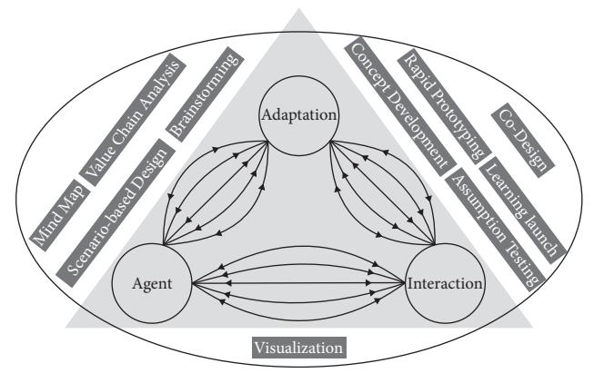
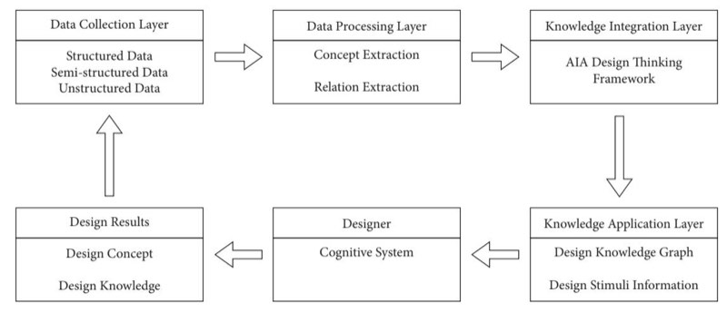
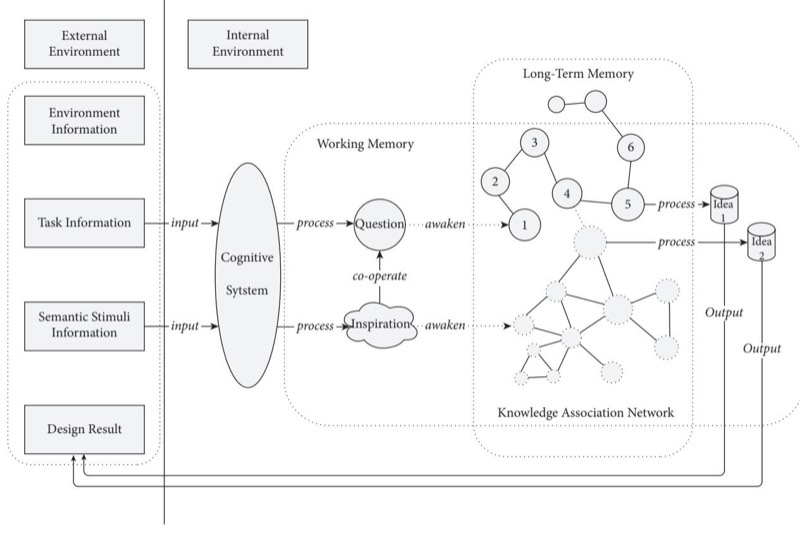
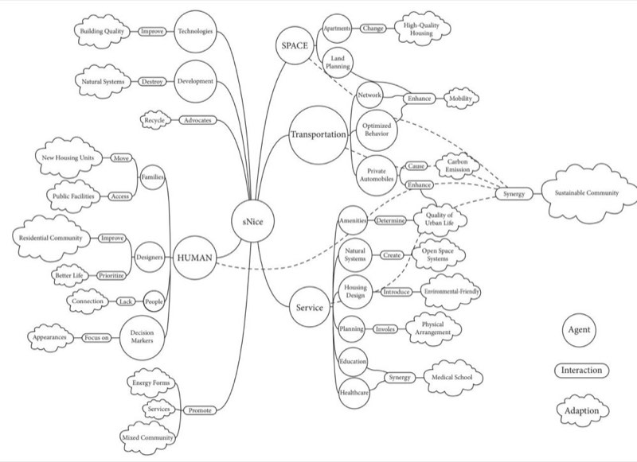

cite_key: shen_2021
title: Deriving Design Knowledge Graph for Complex Sociotechnical Systems Using the AIA Design Thinking
authors: Tao Shen, Chan Gao, Yukari Nagai, Wei Ou
year: 2021
date_processed: '2025-07-02'
phase2_processed: true
original_folder: Mobile Information Systems - 2021 - Shen - Deriving Design Knowledge
  Graph for Complex Sociotechnical Systems Using the AIA
images_total: 5
images_kept: 4
images_removed: 1
tags:
- Cloud Computing
- Decision Support
- Healthcare
- IoT
- Knowledge Graph
- Machine Learning
- Natural Language Processing
- Semantic Web
keywords:
- 1 introduction
- 2 literature review
- 4 experiment and results
- 5 discussion
- 6 conclusion and future work
- BERT
- BabelNet
- CNN
- LSTM
- NLP
- TechNet
- WordNet
- a learning
- agent-interaction-adaptation
- analogy-based
- analogy-based design
- artificial intelligence
- at stage
- back-propagation
- bert
- bidirectional encoder representations from transformers
- big problems and
- bioinformatics
- brand-new
- business research
- california management review
- classification
- cloud-based
- cloud-based innogps
- computational visual media
---

# Deriving Design Knowledge Graph for Complex Sociotechnical Systems Using the AIA Design Thinking

**Tao Shen , 1 Chan Gao,2,3 Yukari Nagai,3 and Wei Ou 4**

*1 College of Design and Innovation, Tongji University, Shanghai, China*

*2 Architecture Department, Huzhou University, Huzhou, Zhejiang, China*

*3 Knowledge Science, Japan Advanced Institute of Science and Technology, Nomi City, Ishikawa, Japan 4 International Business School, Zhejiang Gongshang University, Hangzhou, Zhejiang, China*

Correspondence should be addressed to Wei Ou; [studyouwei@126.com](mailto:studyouwei@126.com)

Received 3 September 2021; Revised 20 October 2021; Accepted 23 October 2021; Published 12 November 2021

Academic Editor: Fazlullah Khan

Copyright © 2021 Tao Shen et al. \*is is an open access article distributed under the [Creative Commons Attribution License](https://creativecommons.org/licenses/by/4.0/), which permits unrestricted use, distribution, and reproduction in any medium, provided the original work is properly cited.

\*e AIA design thinking has been validated in complex design tasks, which includes three overlapping design thinking fields and uses the knowledge field theory as a theoretical mechanism of knowledge flow among design thinking fields. Meanwhile, the design of complex sociotechnical systems highly relies on multidisciplinary knowledge and design methods. Despite the emergence of knowledge management techniques (ontology, expert system, text mining, etc.), designers continue to store knowledge in unstructured ways. To facilitate the integration of knowledge graph and design thinking, we introduce an integrated approach to structure design knowledge graph with the AIA design thinking, which organizes existing design knowledge through Agent (concept)-Interaction (relation)-Adaptation (concept) framework. \*e approach uses an optimized convolutional neural network to accomplish two tasks: building concept graph from text and stimulating design thinking information processing for complex sociotechnical system tasks. Based on our knowledge graph, the validation experiment demonstrates the advantages of promoting the designer's extension of idea space and idea quality.

## TL;DR
Research on deriving design knowledge graph for complex sociotechnical systems using the aia design thinking providing insights for knowledge graph development and data integration.

## Key Insights  
Contributes to the broader understanding of knowledge graph technologies and data management practices relevant to PKG system development.

## 1. Introduction

With the development of communication technology and computer technology, human society has entered the information age. Since then, information data has exploded [\[1, 2](#page-8-0)]. \*e explosive growth of information has brought about a wealth of information experience to designers and caused designers to get lost in the massive amount of information related or unrelated to their needs [[3–5\]](#page-8-0). A semantic network [\[6](#page-8-0)] was proposed as a brand-new way of expressing knowledge and gradually developed into a knowledge graph [\[7–9](#page-8-0)] to solve information overload problems.

Prior studies have suggested the advantages of using semantic network and knowledge graphs in healthcare service design [\[10](#page-8-0)], engineering design [[11–13](#page-8-0)], and indoor scene design [\[14](#page-8-0)]. For instance, Sarica et al. [\[15](#page-8-0)] proposed a methodology of using the Technology Semantic Network (TechNet) to stimulate idea generation in engineering design, which aims to guide the inference of new technical concepts in the white space surrounding a focal design domain according to their semantic distance in the large TechNet, for potential syntheses into new design ideas; Liang et al. [[14\]](#page-8-0) proposed a knowledge graph framework based on the entity-relation model for representation of facts in indoor scene design and further developed a weakly supervised algorithm for extracting the knowledge graph representation from a small dataset using both structure and parameter learning; Luo et al. [[16\]](#page-8-0) harnessed data-driven design and rapid ideation techniques to introduce a data-driven computer-aided rapid ideation process using the cloud-based InnoGPS system, which integrates an empirical network map of all technology domains based on the international patent classification which are connected according to knowledge distance based on patent data, with a few mapbased functions to position technologies, explore neighborhoods, and retrieve knowledge, concepts, and solutions in the near or far fields for design analogies and syntheses. Chen et al. [[17\]](#page-8-0) proposed an integrated approach for enhancing design ideation by applying artificial intelligence and data mining techniques, which consists of a semantic ideation network and a visual concepts combination model to provide inspiration semantically and visually based on computational creativity theory. In general, these researches have achieved success for certain categories of datadriven design scenes. However, complex sociotechnical systems, such as communities, healthcare, and transportation, are still challenging; they have numerous components—technical and otherwise—whose dynamic interactions are critical to the system's overall behavior [\[18](#page-8-0)].

Herein, we aim to propose an integrated approach to support idea generation for complex sociotechnical systems design. \*is approach consists of the knowledge graph construction technology and the Agent-Interaction-Adaptation (AIA) design thinking framework [\[19](#page-8-0)], which inspire semantically and visually based on design thinking theory. \*e main contributions of this research can be summarized as follows:

- (1) Proposing an integrated approach combining datadriven ideation approaches and design thinking framework, aiming to improve the ideation process for complex sociotechnical systems design efficiently
- (2) Proposing an effective knowledge graph construction method to build concept graphs from text, which uses an optimized convolutional neural network
- (3) Developing the model of design thinking information processing mechanism based on knowledge connection, which clearly describes the internal relationship between semantic stimuli information and design thinking
- (4) Evaluating the proposed approach by validation experiment; the results indicate that it can promote the designer's extension of idea space and idea quality

\*e remainder of the paper is organized as follows: Section 2 enlightens the literature review, Section [3](#page-3-0) focuses on the integrated approach to design knowledge graph using AIA design thinking framework, and Section [4](#page-4-0) contains the discussion. \*e paper ends with the conclusion and future work.

## 2. Literature Review

\*is paper builds on prior studies of the data-driven design approach and design thinking to develop an integrated approach to support idea generation for complex sociotechnical systems design. \*is section reviews the relevant literature on data-driven design, design thinking, complex sociotechnical systems, and knowledge graph construction technology.

*2.1. Data-Driven Design.* Several studies have proposed big data techniques to aid design idea generation in the early design phase for designers. For example, design-by-analogy is a powerful approach to help designers in systematically searching and identifying analogies from available data sources [[20](#page-8-0)]. \*e theory of inventive problem-solving (TRIZ) is based on the analysis and statistics of a large number of high-level patents (not the narrow mathematical statistics, but the combination of induction and deduction in the logic method) to achieve laws behind the patents and point out the direction for technological innovation [\[21](#page-8-0), [22](#page-8-0)].

Several data-driven computer tools have been developed to implement these design methodologies. Pat-Analyzer was developed by Cascini and Russo [\[23](#page-8-0)] to identify the design contradictions contained in a patented invention in TRIZ by analyzing patent textual information. Goel et al. proposed the design-by-analogy to nature engine (DANE), a knowledge-based CAD system to support biologically inspired design [[24](#page-8-0)]. Luo et al. [\[16](#page-8-0), [25](#page-8-0), [26](#page-8-0)] developed the InnoGPS system, which uses a network map of all patent classes to improve the exploration of design opportunities in the total technology space and guide the retrieval of prior knowledge across domains for design analogies and syntheses. \*ese previous methods show how data-driven approaches can support engineers and manufacturing professionals in many disciplines, especially mechanical design. However, these methods work well for technical systems but poorly for complex sociotechnical systems. Also, the design cognitive accounts of design thinking still need to be clarified.

*2.2. Complex Sociotechnical Systems.* Complex sociotechnical systems are new to the design research community but have been studied for decades in other research fields. In general, complex sociotechnical systems are divided into three categories by Norman and Stappers [\[18](#page-8-0)]: the psychology of human behavior and cognition, the social, political, economic framework, and the technical issues that contribute to the complexity of DesignX problems. \*e most significant difference between complex sociotechnical systems and technical systems is human participation. Humans participate in this system cycle composed of substances, which makes the process more complicated. \*is is a rather complex task because the word "human" sometimes means an individual, but sometimes it is a group, an organization, or a political entity [[27](#page-9-0)]. With more "humans" in the material world, design has become a multiscale problem that scales back and forth in multiple scales. Design objects and subjects are faced with diversification. \*e design process is full of dynamics and uncertainties, which means that transferring the designer's initiative to design also has a certain degree of diversification and anticipation for the design results [\[28](#page-9-0)]. To meet this demand, designers must follow a more reliable method, be aware of their advantages and disadvantages, and adopt appropriate strategies to break down barriers [[29](#page-9-0)].

What special contribution can designers make to solve these highly complicated problems? Designers have participated in these issues and have improved the situation a lot. However, there is no established mechanism, rigorous design method, or trace to the "solution" source. Designers need to integrate the findings of different disciplines and work based on cognition across disciplines [\[30\]](#page-9-0). On the other hand, design is considered an open process with morbid structures and poor definition. Design results need to be gradually improved in the continuous iterative process [\[31](#page-9-0)], and insight can provide rich inspiration for designers in the process [[32](#page-9-0)]. \*erefore, this research presents the integrated approach to support designers' insights generation to meet the challenges of real design problems, which contain more complexity, ambiguity, contradiction, and uncertainty.

*2.3. Agent-Interaction-Adaptation (AIA) Design 1inking.* Design thinking is considered a problem-solving method that regards those pathological, poorly defined, complex, and contradictory challenges as opportunities rather than obstacles [[33–35\]](#page-9-0). It relies on the logic of deductive reasoning to synthesize opposing views into comprehensive solutions [\[36–38\]](#page-9-0). Lockwood [[39](#page-9-0)] believes that design thinking is an application of the designer's ability to identify problem-solving; Lindberg et al. [[40](#page-9-0)] believe that design thinking is a framework to help designers understand the problems encountered in daily life and then produce corresponding responses; in the view of Vetterli et al. [\[41](#page-9-0)], design thinking provides a way to stimulate customers' needs and then generate a series of quick and straightforward problem-solving prototypes to converge into innovative solutions.

Our previous research [[19,](#page-8-0) [42](#page-9-0)] has proposed the Agent-Interaction-Adaptation (AIA) design thinking, a systematic thinking model based on relationships. Figure 1 shows the model of AIA design thinking, based on knowledge field theory [[43–45\]](#page-9-0); AIA design thinking consists of three knowledge field sources: "Agent," "Interaction," and "Adaptation." \*e logical relation among these three sources is that agents as the basic unit of a complex sociotechnical system interact with each other and environment to drive the system's adaptation and evolution.

AIA design thinking is proved to have the ability to promote designers' extension of idea space, brain activation, and idea quality in contrast to traditional design thinking frameworks, especially for complex sociotechnical system design tasks. \*erefore, we construct the design knowledge graph through Agent (concept)-Interaction (relation)-Adaptation (concept) framework based on AIA design thinking.

*2.4. Knowledge Graph Construction Technology.*Building a knowledge graph mainly involves two tasks: recognizing the mentions of named entities related to design concepts from the free text and identifying the relations between the detected name entities.

Name entity recognition (NER) has long been treated as a sequence classification problem. A widely adopted approach is first classifying each word in a sentence into one of the three following classes:*b*(stands for the beginning of a name entity mention),*i*(the inside of a name entity), and*o*(the outside of a name entity), followed by grouping the words with the*b*and*i* labels into name entities. Sequence

<!-- Image Description: The image displays a triangular model depicting a design process. Three core components — Agent, Interaction, and Adaptation — are interconnected by numerous bidirectional arrows, symbolizing iterative feedback and influence. Surrounding the triangle, rectangular boxes label various design methods (e.g., mind mapping, brainstorming, rapid prototyping) contributing to the central components. The model likely illustrates the iterative nature of design, emphasizing the interplay between different methods and the continuous adaptation phase. -->

**Figure 1:** Model of the AIA design thinking.

classification models, such as conditional random field (CRF) [[46–48\]](#page-9-0) and recurrent neural networks, have been widely applied to the task [\[49–52](#page-9-0)]. Recently, researchers have used the BERT model, which has shown very effective performance in various NLP tasks, to build NER models [\[53\]](#page-9-0). In this research, we also use BERT to identify name entities related to architecture design concepts.

Relation extraction is even more challenging than NER. In the early days, researchers manually built rules to identify the relations between name entities [\[54–56](#page-9-0)]. For example, one can determine the relation between a pair of name entities once some certain words appear. However, it is very labor-intensive to build the rules, and these methods may suffer scalability problems when the data size is large. In the context of big data, it is more practical to extract the relations with supervised machine learning methods. To train machine learning models, a critical factor is extracting discriminative features from the text. Various syntactic and semantic features, such as the dependency paths between name entities and the hypernyms or hyponyms of the name entities in WordNet, have been widely adopted. In recent years, researchers have applied neural networks to the task, to take advantage of their expressive power to better capture the nonlinearity in the relations [\[57, 58\]](#page-9-0). Compared with the traditional machine learning models, neural-based models usually require less feature engineering efforts and are semantic richer. However, to train these models, we need to manually annotate the relations for a large number of samples, which is also a very labor-intensive process. To solve the problem, semisupervised methods have been proposed [\[59](#page-9-0), [60](#page-9-0)]. \*ese methods usually start with a few seed pairs with relation type labels and then extract contextual patterns associated with the seed pairs from a large unlabeled corpus. \*e pattern is further used to extract new training pairs. However, the semisupervised machine learning methods may cause topic drift, increasing the risk of introducing irrelevant name entity pairs. In this paper, we adopt the supervised approach in order to produce accurate results.

Taken together, prior research on knowledge graph construction technology and its demonstrated advantages have made it possible to develop a new approach to design knowledge graphs based on the AIA design thinking framework to support the design process for complex sociotechnical systems. In the following section, we will present the approach in detail.

## 3. Integrated Approach to Design Knowledge Graph Using AIA Design Thinking Framework

Our approach builds a loop optimization iterative mechanism shown in Figure [2](#page-4-0) to support the design process for complex sociotechnical systems. Specifically, we first collect data to the data processing layer, where we use the optimized convolutional neural network to detect the relation between concept entities. \*en, we construct the design knowledge graph through Agent (concept)-Interaction (relation)-Adaptation (concept) framework based on AIA design thinking and generate new design knowledge through the designer's cognitive system. Finally, we collect new valuable design knowledge to achieve the purpose of loop iteration optimization.

*3.1. Building Knowledge Graph.* We aim to build a concept graph from the text. \*e concept graph consists of many concepts, and the concepts related to each other are connected by directed edges. In other words, the graph can be viewed as a collection of triplets: *cp*  {*h*, *t*, *e*}, where *cp*denotes a concept pair,*h*the head concept,*t*the tail concept, and*e* the edge. \*ere exist possibilities that two pairs of concepts share common heads or tails; therefore these concept pairs are connected through their common concepts. \*erefore, there may exist paths between any two arbitrary concepts in the graph. \*e path distance between them in the graph can be viewed as their similarity: the shorter the distance is, the more similar the two concepts are.

A pivotal problem in building the knowledge graph is detecting nouns related to design concepts from the freeform text and identifying the relations between the detected concepts. We treat detection of the concept as a name entity recognition task, which is a well-researched natural language processing task. In this research, we train supervised classifieds to detect concept entities. To prepare the training data, we extract sentences from text discussing design concepts and manually label each sentence in the following way. For each sentence, we label each word with "o" if the word is not related to the design concept, "b" if the word is the beginning of a concept, and "i" if the word is inside a concept. We prepare around 1000 such training sentences and use them for training an LSTM classifier. \*e classifier predicts one of the "iob" labels for each word in a sentence. We train the classifier by minimizing the errors between the ground-truth labels and the predictions. At test time, we use the substrings starting from the "b" labels and ending with the "o" labels as the predicted concept entities.

After detecting the concept entities in a sentence, another problem is to detect their relation. \*is research adopts the convolutional neural network (CNN) proposed by Zeng et al. [\[60](#page-9-0)]. However, we simplified the model in our experiment as we observed the simplified version has better performance. In the model, we first map each word in a sentence into an embedding layer as follows:

$$
v_n = W t_n,\tag{1}
$$

where *W*is a pertained word embedding model and*t*is the one-hot encoding vector of the word. We then compute the average vector of the word embedding vectors in each sentence as follows:

$$
\overline{v} = \frac{1}{N} \sum_{n=1}^{N} v_n.
$$
(2)

In the meantime, we compute the contextual feature for each word in a sentence. We set the context window to 3 and therefore the contextual features associated with a sentence are represented as follows:

$$
c = \{ [v_1, v_2, v_3], [v_2, v_3, v_4], \dots, [v_{N-2}, v_{N-1}, v_N] \}.
$$
(3)

We then feed the contextual features into a convolutional layer to extract local classification signal.

$$
z_i = f(w_i c + b_i), \tag{4}
$$

where*f is* the tanh function*, i*denotes the ith convolutional filter,*w*is the weight matrix, and*b*is the bias. We then feed the resulting feature map into a max-pooling layer to extract the most salient signal:

$$
z = \max(z_1, z_2, \dots, z_I), \tag{5}
$$

and we then concatenate*z*and*υ*and feed them into a dense layer and use the output of the dense layer*g*to estimate the probability of the relation being type*k*by the softmax function:

$$
p(r_k) = \frac{e^{g_k}}{\sum_j^K e^{g_j}}.
$$
\n(6)

We use the cross entropy as the loss to learn the parameters of the neural network based on the back-propagation method. Assuming that there are*m*entity pairs in the training set, the loss can be written as

$$
J(\theta) = \sum_{m}^{M} \log p(r_k^m | t^m; \theta).
$$
(7)

We use gradient decent to update the parameters of the neural networks.

$$
\theta \longleftarrow \theta + \lambda \frac{\partial J(\theta)}{\partial \theta},\tag{8}
$$

where*λ*is the learning rate which is tuned using grid search in the training process.
*3.2. Design 1inking Information Processing Mechanism.* \*e thinking of innovators is different, and the reason why they can "think differently" is because they can connect concepts that have not yet been connected [[61\]](#page-9-0). For example, designers can get inspiration by identifying potential similarities between biology and engineering and generate ideas

<!-- Image Description: This figure illustrates a four-layer architecture for a design knowledge system. The first layer collects structured, semi-structured, and unstructured data. This data is processed in the second layer through concept and relation extraction. The third layer integrates this knowledge using the AIA Design Thinking framework. Finally, the fourth layer applies the integrated knowledge, producing a design knowledge graph and design stimuli information. Arrows indicate the data flow between layers. -->

**Figure 2:** \*e overall research framework of the proposed integrated approach.

such as bionic design. \*e knowledge and experience possessed by the designer occupy a vital position in the design practice process. People with the same background will have similar inspirational responses when facing the same stimulating situation. \*e main reason is that the knowledge and experience in mind have been coded into corresponding knowledge nodes and connected according to specific association rules to form an association network. \*e more the background is the same, the more similar the association pattern is [[62](#page-10-0)]. \*e process of thinking about design tasks is the process of continuously searching for concepts (knowledge nodes) related to the design problem (such as similar, relative, dependent, close, and causal) in the association network until the connection between a particular concept and the design problem can successfully prompt the designer to produce a solution [\[63\]](#page-10-0).

According to the information processing viewpoint of cognitive science, design thinking is understood as an information processing mechanism whose core is to establish knowledge connections as shown in Figure [3](#page-5-0). \*e external environment refers to the current design scenario composed of design task information, incentive information, existing products, and natural or social phenomena. \*e memory system includes the perception system, which uses each sensory organ to temporarily receive and store information from the external environment and screen this information. Working memory stores and processes the external environment information screened by the perception system and awakened in long-term memory, where design ideas are generated. Long-term memory stores a large amount of knowledge and experience. \*e internal thinking activity of the brain from design task to design idea can be expressed explicitly as follows: task information enters the perception system, filtered by the perception system; part of it enters working memory and is processed into related design problems. \*en, due to the problem stimulus, the corresponding knowledge nodes in the long-term memory are awakened. When the connection between these knowledge nodes and the design problem cannot be successfully converted into design ideas, other knowledge nodes in the longterm memory or the knowledge nodes in the previous stage continue to be awakened until the connection can be successfully converted into a design idea and outputted externally.

According to its understanding, the human brain converts knowledge or experience into a particular representation form and stores it in memory. When environmental stimuli attract attention, this awakens the knowledge representation form the corresponding to the current stimulation in the brain. \*erefore, in the design task of providing stimuli information such as knowledge graph, after screening by the perceptual system, part of the stimuli information that enters the working memory is recognized, and the visual representation of the knowledge corresponding to the stimuli information in the long-term memory is awakened. When the current design problem needs to be solved, the knowledge represented by the representation form is further invoked to establish the connection among some of the knowledge nodes and the design problem and form the explicit output of the idea. \*erefore, design problems and stimuli information act synergistically on the memory system and under certain circumstances will accelerate the process of establishing connections. To a certain extent, stimuli information represents the knowledge nodes that are connected with the design problems, that is, knowledge connection.

## 4. Experiment and Results

*4.1. Participants.* In this experiment, twenty-eight students with an innovation design background were invited (14 males and 14 females aged between 25 and 28 years). \*e selection of participants is based on the assumption that they already have fundamental knowledge of the design process but are not practicing professionals. \*is follows our opinion that results will be better applicable in design support. Moreover, this selection is relevant to the general goal of developing a new support method for design through this analysis. All the participants are volunteers who received no additional course credits for their participation.

<!-- Image Description: The figure presents a model of the design process. It depicts information flow from external and internal environments through a cognitive system, processing "Question" and "Inspiration" in working memory. These activate nodes in a long-term memory's knowledge association network, resulting in "Idea" generation and design output. Boxes represent information sources, ovals represent processes, and the network illustrates knowledge retrieval and idea formation. -->

**Figure 3:** Design thinking information processing mechanism.

*4.2. Outline of the Experiment.* In this experiment, the 30 participants were divided into Group A and Group B; each group had 7 males and 7 females; they were all required to independently design new ideas giving the typical design task for complex sociotechnical systems: a design for a community with more sustainability within half an hour. \*e difference was that Group A used the knowledge graph with the AIA design thinking framework in the design process. In contrast, Group B completed the design task using a traditional knowledge graph. \*e two knowledge graphs both come from the article titled "Introduction to sNice :\*eory and Practice of Sustainable Living." Figure [4](#page-6-0) shows the knowledge graph using the AIA design thinking framework of this article.

Every participant was asked to "think aloud" with an electronic video recorder recording during the design process. We analyzed the design ideas generated by the participants and their performance in the design process.

*4.3. Data Collection and Analysis.* We collected data in two phases. In phase 1, we collected participants' utterances in the design process and interviews as the protocol data. We measured the conceptual distance of the new nouns from "community" and "sustainability" based on WordNet. \*en the extension of idea space is defined as *N i*1  *x*2 *i*+*y*2 *i* /*N*(where*N* is the number of new nouns). Table [1](#page-6-0) shows each participant's extension of idea space.

\*en we analyzed these data using paired *t*-test. \*e results presented in Table [2](#page-6-0) show that the difference of participant's extension of idea space between Group A and Group B is significant (*p*  0*.*001), and the average value of Group A (0.73) is significantly higher than the average value of Group B (0.64). \*erefore, it can be inferred that the knowledge graph using the AIA design thinking framework can promote participants' extension of idea space.

In phase 2, we measured each participant's idea quality and quantity using the method proposed by Shah et al. [[64](#page-10-0)]. In this method, the idea quality could be estimated sufficiently well even if the quantitative information was insufficient to perform a formal analysis in the concept stage. In addition, this method added all the quality scores for all the alternatives to achieve the total score for the set. As a result, the idea quality is denoted as

$$
M = \sum_{j=1}^{m} f_j \sum_{k=1}^{2} \frac{S_{jk} P_k}{n} *\sum_{j=1}^{m} f_j.
$$
(9)

In this equation,*Sjk*is the score for function*j*at stage*k*; *m*is the total number of functions;*fj*is the weight of function*j*; *pk*is the weight for stage*k*. \*e denominator is for normalizing to a scale of 10. \*e design ideas were collected from the 20 participants. Table [3](#page-7-0) shows an evaluation of the quality and quantity of the 28 participants' ideas.

\*en we analyzed these data using paired *t*-test. \*e results presented in Table [4](#page-7-0) show that the difference of idea

<!-- Image Description: This image is a conceptual model depicting the relationships between various factors contributing to the creation of a sustainable community. It uses a node-and-link diagram, with "sNice" as the central node connected to nodes representing human factors (e.g., families, designers), spatial elements (e.g., space, transportation), services (e.g., healthcare, education), and the resulting sustainable community. The links illustrate interactions and influences between these elements, showing how they synergistically contribute to improved quality of urban life. -->

**Figure 4:** Knowledge graph using the AIA design thinking framework.

| Group A | Extension of idea space | Group B | Extension of idea space |
|---------|-------------------------|---------|-------------------------|
| A1 | 0.64 | B1 | 0.61 |
| A2 | 0.75 | B2 | 0.62 |
| A3 | 0.86 | B3 | 0.71 |
| A4 | 0.65 | B4 | 0.69 |
| A5 | 0.77 | B5 | 0.68 |
| A6 | 0.89 | B6 | 0.72 |
| A7 | 0.57 | B7 | 0.65 |
| A8 | 0.71 | B8 | 0.51 |
| A9 | 0.75 | B9 | 0.59 |
| A10 | 0.82 | B10 | 0.67 |
| A11 | 0.58 | B11 | 0.54 |
| A12 | 0.69 | B12 | 0.66 |
| A13 | 0.74 | B13 | 0.61 |
| A14 | 0.83 | B14 | 0.65 |

| Table | 1: Each participant's extension of idea space. | | | |
|-------|------------------------------------------------|--|--|--|
|-------|------------------------------------------------|--|--|--|

**Table 2:** Results of paired *t-*test analysis.

| | Paired (M ± SD) | | | | |
|-------------------------|-----------------|-------------|-----------------|-------|---------|
| Item | Paired 1 | Paired 2 | Mean difference | t | p |
| Extension of idea space | 0.73 ± 0.10 | 0.64 ± 0.06 | 0.10 | 4.147 | 0.001∗∗ |
| | | | | | |

∗*p* < 0*.*05 and ∗∗*p* < 0*.*01.

| Group A | Idea quality | Idea quantity | Group B | Idea quality | Idea quantity |
|---------|--------------|---------------|---------|--------------|---------------|
| A1 | 5.56 | 2 | B1 | 5.38 | 1 |
| A2 | 6.19 | 1 | B2 | 3.14 | 1 |
| A3 | 6.06 | 2 | B3 | 5.05 | 2 |
| A4 | 7.3 | 1 | B4 | 4.37 | 1 |
| A5 | 5.63 | 2 | B5 | 5.16 | 2 |
| A6 | 7.28 | 1 | B6 | 5.98 | 1 |
| A7 | 4.61 | 1 | B7 | 5.29 | 1 |
| A8 | 5.91 | 1 | B8 | 4.2 | 1 |
| A9 | 6.43 | 2 | B9 | 3.75 | 1 |
| A10 | 6.68 | 1 | B10 | 6.53 | 1 |
| A11 | 6.73 | 1 | B11 | 5.21 | 2 |
| A12 | 5.07 | 1 | B12 | 5.35 | 1 |
| A13 | 5.29 | 2 | B13 | 4.49 | 1 |
| A14 | 6.67 | 1 | B14 | 4.63 | 1 |

**Table 3:** Each participant's idea quality and quantity.

**Table 4:** Results of paired *t*-test analysis.

| Items | | Paired (M ± SD) | | | |
|---------------|-------------|-----------------|-----------------|-------|---------|
| | Paired 1 | Paired 2 | Mean difference | t | p |
| Idea quality | 6.10 ± 0.81 | 4.90 ± 0.88 | 1.21 | 3.804 | 0.002∗∗ |
| Idea quantity | 1.36 ± 0.50 | 1.21 ± 0.43 | 0.14 | 1.000 | 0.336 |

∗*p* < 0*.*05 and ∗∗*p* < 0*.*01.

quality between Group A and Group B is significant (*p*  0*.*002), and the average value of Group A (6.10) is significantly higher than the average value of Group B (4.90). \*erefore, it can be inferred that the knowledge graph using the AIA design thinking framework can promote participant's idea quality. However, the difference in idea quantity between Group A and Group B is insignificant (*p*  0*.*336). \*us it cannot be inferred that the knowledge graph using the AIA design thinking framework can promote participant's idea quantity. \*ese analysis results also support our preliminary research [[19\]](#page-8-0).

## 5. Discussion

Design is a series of behaviors that guide the existing situation in a better direction [\[65\]](#page-10-0); the main problems faced by designers today are not problems of a single discipline but problems involving complex sociotechnical systems and many stakeholders. If the design needs to shift from focusing on "creation" to facing these "big problems and "big systems," it must go beyond the design tradition characterized by intuition and perception and instead explore a new design culture [[66](#page-10-0)]. We propose the integrated approach to respond and assume the following implications:

- (1) \*is approach uses knowledge graph construction technology to better deal with complexity, ambiguity, contradiction, and uncertainty in complex sociotechnical systems. It adopts an interdisciplinary approach to deal with the challenges of real problems.
- (2) \*is approach builds a loop optimization iterative mechanism to promote design behavior change from individual to collaboration, making the design

subject increasingly diversified. In this mechanism, designers have become an essential part of collaborating with "intelligent" machines.

- (3) \*e actual design thinking process is not a simple linear process, and the problems raised by designers do not apply to any linear analysis and integration model in practice. \*erefore, this approach uses AIA design thinking as a logical framework. At the same time, we demonstrate its effectiveness in promoting designers' deep thinking, shown as the extension of idea space and idea quality.
- (4) \*is approach contributes to establishing a design support system for complex sociotechnical systems such as sustainable community building, which is conducive to the development of intelligent design and design education, and makes certain contributions to the development of knowledge engineering.

## 6. Conclusion and Future Work

\*is paper develops an integrated approach to structure a design knowledge graph with the AIA design thinking framework. \*e core of this approach is to organize existing design knowledge through Agent (concept)-Interaction (relation)-Adaptation (concept) framework. \*en a controlled experiment was conducted to examine the validities of the proposed design knowledge graph; it shows that the proposed design knowledge graph can promote a designer's extension of idea space and idea quality for complex sociotechnical system tasks in contrast to the traditional design knowledge graph. \*is research contributes to the growing studies about data-driven design, analogy-based design, and machine-learning-based design analytics.

In future work, we will build a more complete design knowledge database related to complex sociotechnical systems and use the proposed approach to derive more effective design knowledge graphs for the broader uses of other interested designers. In addition, we will continue to improve the neural network model and try to develop a more robust architecture to learn better design features from the database.

## Data Availability

\*e data used to support the findings of this study are included within the article.

## Conflicts of Interest

\*e authors declare that they have no conflicts of interest.

## Acknowledgments

\*e authors acknowledge the funding support for this work received from China Postdoctoral Science Foundation (2020M681405).

## References

- [1] S. Y. Gibbon, "Learning and instruction in the information age," in *What Curriculum for the Information Age?*, pp. 1–23, Springer, Boston, MA, USA, 2018.
- [2] J. J. Baker, "Beyond the information age: the duty of technology competence in the algorithmic society," *South Carolina Law Review*, vol. 69, p. 557, 2017.
- [3] P. G. Roetzel, "Information overload in the information age: a review of the literature from business administration, business psychology, and related disciplines with a bibliometric approach and framework development," *Business Research*, vol. 12, no. 2, pp. 479–522, 2019.
- [4] B. Swar, T. Hameed, and I. Reychav, "Information overload, psychological ill-being, and behavioral intention to continue online healthcare information search," *Computers in Human Behavior*, vol. 70, pp. 416–425, 2017.
- [5] J. B. Schmitt, C. A. Debbelt, and F. M. Schneider, "Too much information? Predictors of information overload in the context of online news exposure," *Information, Communication and Society*, vol. 21, no. 8, pp. 1151–1167, 2018.
- [6] R. Navigli and S. P. Ponzetto, "BabelNet: the automatic construction, evaluation and application of a wide-coverage multilingual semantic network," *Artificial Intelligence*, vol. 193, pp. 217–250, 2012.
- [7] J. Pujara, H. Miao, L. Getoor, and W. Cohen, "Knowledge graph identification," in *Proceedings of the International Semantic Web Conference*, pp. 542–557, Sydney, Australia, October 2013.
- [8] H. Paulheim, "Knowledge graph refinement: a survey of approaches and evaluation methods," *Semantic Web*, vol. 8, no. 3, pp. 489–508, 2017.
- [9] S. Auer, V. Kovtun, M. Prinz, A. Kasprzik, M. Stocker, and M. E. Vidal, "Towards a knowledge graph for science," in *Proceedings of the 8th International Conference on Web Intelligence, Mining and Semantics*, pp. 1–6, Novi Sad, Serbia, June 2018.

- [10] T. Yu, J. Li, Q. Yu et al., "Knowledge graph for TCM health preservation: design, construction, and applications," *Artificial Intelligence in Medicine*, vol. 77, pp. 48–52, 2017.
- [11] S. Sarica, B. Song, J. Luo, and K. Wood, "Technology knowledge graph for design exploration: application to designing the future of flying cars," in *Proceedings of the ASME 2019 International Design Engineering Technical Conferences and Computers and Information in Engineering Conference*, Anaheim, CA, USA, August 2019.
- [12] J. Han, H. Forbes, F. Shi, J. Hao, and D. Schaefer, "A datadriven approach for creative concept generation and evaluation," *Proceedings of the Design Society: DESIGN Conference*, vol. 1, pp. 167–176, 2020.
- [13] S. Sarica and J. Luo, "Design knowledge representation with technology semantic network," 2020, [http://arxiv.org/abs/](http://arxiv.org/abs/2012.15518) [2012.15518](http://arxiv.org/abs/2012.15518).
- [14] Y. Liang, F. Xu, S.-H. Zhang, Y.-K. Lai, and T. Mu, "Knowledge graph construction with structure and parameter learning for indoor scene design," *Computational Visual Media*, vol. 4, no. 2, pp. 123–137, 2018.
- [15] S. Sarica, B. Song, J. Luo, and K. L. Wood, "Idea generation with technology semantic network," *Artificial Intelligence for Engineering Design, Analysis and Manufacturing*, pp. 1–19, 2021.
- [16] J. Luo, S. Sarica, and K. L. Wood, "Computer-aided design ideation using innogps," in *Proceedings of the International Design Engineering Technical Conferences and Computers and Information in Engineering Conference*, vol. 59186, Article ID V02AT03A011, St. Louis, MO, USA, August 2019.
- [17] L. Chen, P. Wang, H. Dong et al., "An artificial intelligence based data-driven approach for design ideation," *Journal of Visual Communication and Image Representation*, vol. 61, pp. 10–22, 2019.
- [18] D. A. Norman and P. J. Stappers, "DesignX: complex sociotechnical systems," *She Ji: 1e Journal of Design, Economics, and Innovation*, vol. 1, no. 2, pp. 83–106, 2015.
- [19] T. Shen and C. Gao, "Sustainability in community building: framing design thinking using a complex adaptive systems perspective," *Sustainability*, vol. 12, no. 16, Article ID 6679, 2020.
- [20] J. Murphy, K. Fu, K. Otto, M. Yang, D. Jensen, and K. Wood, "Function based design-by-analogy: a functional vector approach to analogical search," *Journal of Mechanical Design*, vol. 136, no. 10, 2014.
- [21] I. M. Ilevbare, D. Probert, and R. Phaal, "A review of TRIZ, and its benefits and challenges in practice," *Technovation*, vol. 33, no. 2-3, pp. 30–37, 2013.
- [22] S. D. Savransky, *Engineering of Creativity: Introduction to TRIZ Methodology of Inventive Problem Solving*, CRC press, Boca Raton, FL, USA, 2000.
- [23] G. Cascini and D. Russo, "Computer-aided analysis of patents and search for TRIZ contradictions," *International Journal of Product Development*, vol. 4, no. 1-2, pp. 52–67, 2007.
- [24] A. K. Goel, S. Vattam, B. Wiltgen, and M. Helms, "Cognitive, collaborative, conceptual and creative - four characteristics of the next generation of knowledge-based CAD systems: a study in biologically inspired design," *Computer-Aided Design*, vol. 44, no. 10, pp. 879–900, 2012.
- [25] J. Luo, B. Song, L. Blessing, and K. Wood, "Design opportunity conception using the total technology space map," *Artificial Intelligence for Engineering Design, Analysis and Manufacturing*, vol. 32, no. 4, pp. 449–461, 2018.
- [26] J. Luo, B. Yan, and K. Wood, "InnoGPS for data-driven exploration of design opportunities and directions: the case of

Google driverless car project," *Journal of Mechanical Design*, vol. 139, no. 11, 2017.

- [27] J. M. Flach, "Complexity: learning to muddle through," *Cognition, Technology and Work*, vol. 14, no. 3, pp. 187–197, 2012.
- [28] K. Dorst, "Frame creation and design in the expanded field," *She Ji: 1e Journal of Design, Economics, and Innovation*, vol. 1, no. 1, pp. 22–33, 2015.
- [29] T. Nakamura and K. Kijima, "System of system failure: meta methodology to prevent system failures," *System of Systems*, vol. 31, 2012.
- [30] Y. Kang, "Complexity design research based on DesignX," *Creation and Design*, vol. 2020, no. 02, pp. 14–17+39, 2020.
- [31] K. Dorst, "\*e core of 'design thinking' and its application," *Design Studies*, vol. 32, no. 6, pp. 521–532, 2011.
- [32] S. Sandk¨uhler and J. Bhattacharya, "Deconstructing insight: EEG correlates of insightful problem solving," *PLoS One*, vol. 3, no. 1, Article ID e1459, 2008.
- [33] P. Micheli, S. J. S. Wilner, S. H. Bhatti, M. Mura, and M. B. Beverland, "Doing design thinking: conceptual review, synthesis, and research agenda," *Journal of Product Innovation Management*, vol. 36, no. 2, pp. 124–148, 2019.
- [34] R. Martin and J. Euchner, "Design thinking," *Research-Technology Management*, vol. 55, no. 3, pp. 10–14, 2012.
- [35] S. L. Beckman and M. Barry, "Innovation as a learning process: embedding design thinking," *California Management Review*, vol. 50, no. 1, pp. 25–56, 2007.
- [36] K. Dorst, "\*e nature of design thinking," in *Proceedings of the Design 1inking Research Symposium*, Sydney, Australia, October 2010.
- [37] J. von \*ienen, C. Meinel, and C. Nicolai, "How design thinking tools help to solve wicked problems," in *Design 1inking Research*, pp. 97–102, Springer, Cham, Switzerland, 2014.
- [38] A. Scheer, C. Noweski, and C. Meinel, "Transforming constructivist learning into action: design thinking in education," *Design and Technology Education: An International Journal*, vol. 17, no. 3, 2012.
- [39] D. \*inking, *Integrating Innovation, Customer Experience, and Brand Value*, p. 304, Allworth Press, New York, NY, USA, 2009.
- [40] T. Lindberg, E. Koppen, I. Rauth, and C. Meinel, "On the ¨ perception, adoption and implementation of design thinking in the IT industry," in *Design 1inking Research*, pp. 229–240, Springer, Berlin, Germany, 2012.
- [41] C. Vetterli, W. Brenner, F. Uebernickel, and C. Petrie, "From palaces to yurts: why requirements engineering needs design thinking," *IEEE Internet Computing*, vol. 17, no. 2, pp. 91–94, 2013.
- [42] T. Shen and Y. Nagai, "An interaction-based design thinking approach for architecture as A complex adaptive system," in *Proceedings of the Sixth International Conference on Design Creativity (ICDC 2020)*, pp. 092–099, Kobe, Japan, August 2020.
- [43] C. A. Donnelly and M. Searle, "Optimizing use in the field of program evaluation by integrating learning from the knowledge field," *Canadian Journal of Program Evaluation*, vol. 31, no. 3, 2017.
- [44] E. Bolisani and C. Bratianu, "\*e elusive definition of knowledge," in *Emergent Knowledge Strategies*, pp. 1–22, Springer, Cham, Switzerland, 2018.
- [45] N. Bamel, V. Pereira, U. Bamel, and G. Cappiello, "Knowledge management within a strategic alliances context: past, present and future," *Journal of Knowledge Management*, 2021.

- [46] N. V. Sobhana, P. Mitra, and S. K. Ghosh, "Conditional random field based named entity recognition in geological text," *International Journal of Computer Applications*, vol. 1, no. 3, pp. 143–147, 2010.
- [47] A. Ekbal and S. Bandyopadhyay, "A conditional random field approach for named entity recognition in Bengali and Hindi," *Linguistic Issues in Language Technology*, vol. 2, no. 1, pp. 1–44, 2009.
- [48] R. Florian, A. Ittycheriah, H. Jing, and T. Zhang, "Named entity recognition through classifier combination," in *Proceedings of the Seventh Conference on Natural Language Learning at HLT-NAACL 2003*, pp. 168–171, Stroudsburg, PA, USA, 2003.
- [49] Z. Huang, W. Xu, and K. Yu, "Bidirectional LSTM-CRF models for sequence tagging," 2015, [http://arxiv.org/abs/1508.](http://arxiv.org/abs/1508.01991) [01991](http://arxiv.org/abs/1508.01991).
- [50] X. Ma and E. Hovy, "End-to-end sequence labeling via bidirectional lstm-cnns-crf," 2016, [http://arxiv.org/abs/1603.](http://arxiv.org/abs/1603.01354) [01354.](http://arxiv.org/abs/1603.01354)
- [51] J. P. C. Chiu and E. Nichols, "Named entity recognition with bidirectional LSTM-CNNs," *Transactions of the Association for Computational Linguistics*, vol. 4, pp. 357–370, 2016.
- [52] M. Habibi, L. Weber, M. Neves, D. L. Wiegandt, and U. Leser, "Deep learning with word embeddings improves biomedical named entity recognition," *Bioinformatics*, vol. 33, no. 14, pp. i37–i48, 2017.
- [53] L. Yao, C. Mao, and Y. Luo, "KG-BERT: BERTfor knowledge graph completion," 2019,<http://arxiv.org/abs/1909.03193>.
- [54] D. Zelenko, C. Aone, and A. Richardella, "Kernel methods for relation extraction," *Journal of Machine Learning Research*, vol. 3, no. Feb, pp. 1083–1106, 2003.
- [55] G. Zhou, J. Su, J. Zhang, and M. Zhang, "Exploring various knowledge in relation extraction," in *Proceedings of the 43rd Annual Meeting of the Association for Computational Linguistics (acl'05)*, pp. 427–434, Ann Arbor, MI, USA, June 2005.
- [56] R. Bunescu and R. Mooney, "A shortest path dependency kernel for relation extraction," in *Proceedings of the Human Language Technology Conference and Conference on Empirical Methods in Natural Language Processing*, pp. 724–731, Vancouver British Columbia, Canada, October 2005.
- [57] T. H. Nguyen and R. Grishman, "Relation extraction: perspective from convolutional neural networks," in *Proceedings of the 1st Workshop on Vector Space Modeling for Natural Language Processing*, pp. 39–48, Denver, CO, USA, June 2015.
- [58] Y. Lin, S. Shen, Z. Liu, H. Luan, and M. Sun, "Neural relation extraction with selective attention over instances," in *Proceedings of the 54th Annual Meeting of the Association for Computational Linguistics*, vol. 1, pp. 2124–2133, Berlin, Germany, August 2016.
- [59] M. Mintz, S. Bills, R. Snow, and D. Jurafsky, "Distant supervision for relation extraction without labeled data," in *Proceedings of the Joint Conference of the 47th Annual Meeting of the ACL and the 4th International Joint Conference on Natural Language Processing of the AFNLP*, pp. 1003–1011, Suntec, Singapore, August 2009.
- [60] D. Zeng, K. Liu, Y. Chen, and J. Zhao, "Distant supervision for relation extraction via piecewise convolutional neural networks," in *Proceedings of the 2015 Conference on Empirical Methods in Natural Language Processing*, pp. 1753–1762, Lisbon, Portugal, September 2015.
- [61] V. K. Viswanathan and J. S. Linsey, "Physical models and design thinking: a study of functionality, novelty and variety of ideas," *Journal of Mechanical Design*, vol. 134, 2012.

- [62] I. H. Gotlib and J. Joormann, "Cognition and depression: current status and future directions," *Annual Review of Clinical Psychology*, vol. 6, no. 1, pp. 285–312, 2010.
- [63] P. Yuan, Y. Xiong, Y. Li, L. Liu, and M. Li, "An exploration into the influence of stimulation distance of stimulus information on design thinking based on EEG alpha activity," *Journal of Mechanical Engineering*, vol. 53, no. 15, pp. 40–48, 2017.
- [64] J. J. Shah, S. M. Smith, and N. Vargas-Hernandez, "Metrics for measuring ideation effectiveness," *Design Studies*, vol. 24, no. 2, pp. 111–134, 2003.
- [65] H. A. Simon, "\*e science of design: creating the artificial," *Design Issues*, vol. 4, pp. 67–82, 1988.
- [66] Y. Lou, "\*e Expanding Scope and Paradigm Shift of Design," *Journal of Nanjing Art Institute*, vol. 1, pp. 11–15, 2017, Times Architecture.

## Metadata Summary
### Research Context
- **Research Question**: 
- **Methodology**: 
- **Key Findings**: 

### Analysis
- **Limitations**: 
- **Future Work**: