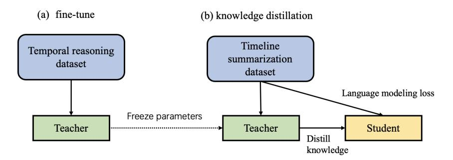
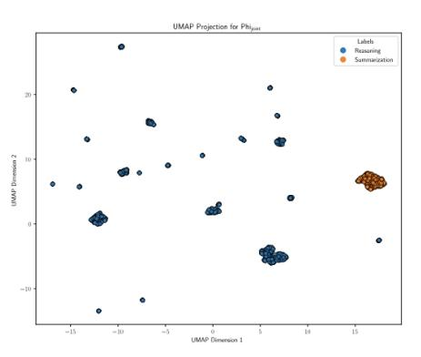
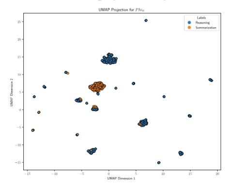
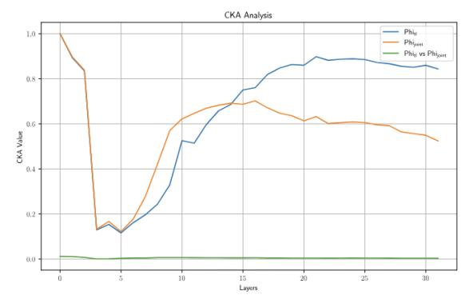

# Temporal reasoning for timeline summarisation in social media

Jiayu Song1 , Mahmud Akhter1 , Dana Atzil-Slonim2 , Maria Liakata1,3

> 1Queen Mary University of London, London, UK 2Bar-Ilan University, Israel 3The Alan Turing Institute, London, UK {jiayu.song,m.akhter,m.liakata}@qmul.ac.uk dana.slonim@gmail.com

Abstract

This paper explores whether enhancing temporal reasoning capabilities in Large Language Models (LLMs) can improve the quality of timeline summarisation, the task of summarising long texts containing sequences of events, such as social media threads. We first introduce *NarrativeReason*, a novel dataset focused on temporal relationships among sequential events within narratives, distinguishing it from existing temporal reasoning datasets that primarily address pair-wise event relationships. Our approach then combines temporal reasoning with timeline summarisation through a knowledge distillation framework, where we first fine-tune a teacher model on temporal reasoning tasks and then distill this knowledge into a student model while simultaneously training it for the task of timeline summarisation. Experimental results demonstrate that our model achieves superior performance on out-of-domain mental health-related timeline summarisation tasks, which involve long social media threads with repetitions of events and a mix of emotions, highlighting the importance and generalisability of leveraging temporal reasoning to improve timeline summarisation.

## 1 Introduction

Timeline summarisation organizes and presents a sequence of events in a coherent and concise manner [\(Steen and Markert,](#page-10-0) [2019;](#page-10-0) [Li et al.,](#page-9-0) [2021;](#page-9-0) [Hu](#page-9-1) [et al.,](#page-9-1) [2024\)](#page-9-1). It involves extracting event-related timelines and then summarising them [\(Hu et al.,](#page-9-1) [2024;](#page-9-1) [Rajaby Faghihi et al.,](#page-10-1) [2022\)](#page-10-1). Researchers generally create event graphs [\(Li et al.,](#page-9-0) [2021\)](#page-9-0) or cluster event related timelines [\(Hu et al.,](#page-9-1) [2024\)](#page-9-1) to identify relevant events. Recent work [\(Song et al.,](#page-10-2) [2024\)](#page-10-2) has introduced the challenging task of social media timeline summarisation, especially in the context of capturing fluctuations in individuals' state of mind as reflected in posts shared online over time. In these posts, numerous events may

occur without explicit timestamps, requiring contextual inference to determine their chronological sequence. Moreover, mental health-related events are not easy to identify: they can be connected to an individual's emotions, interpersonal interactions, and the entire timeline is necessary to provide enough context [\(Song et al.,](#page-10-2) [2024\)](#page-10-2). It is particularly challenging to identify events pertaining to psychological states and to extract these from posts. When generating mental health related summaries from longitudinal posts, models need to understand related events and maintain temporal consistency to make inferences. This raises the question of whether temporal reasoning can be leveraged to enhance the quality of complex timeline summaries.

Temporal reasoning involves understanding and processing temporal information in text to deduce time-based relationships between events [\(Wenzel](#page-10-3) [and Jatowt,](#page-10-3) [2023a\)](#page-10-3). [Zhou et al.](#page-11-0) [\(2019\)](#page-11-0) categorises temporal commonsense reasoning with respect to five aspects (duration, temporal ordering, typical time, frequency and stationarity). Subsequently, [Tan et al.](#page-10-4) [\(2023\)](#page-10-4); [Jain et al.](#page-9-2) [\(2023\)](#page-9-2) explore the temporal reasoning capabilities of Large Language Models (LLMs) with respect to temporal commonsense aspects. LLMs with a strong understanding of temporal context can perform better on downstream tasks, including storytelling, natural language inference, timeline comprehension and tracking user status [\(Jain et al.,](#page-9-2) [2023\)](#page-9-2). Thus temporal commonsense reasoning is beneficial for timeline summarisation, as it helps maintain temporal consistency and the correct event order [\(Wenzel and](#page-11-1) [Jatowt,](#page-11-1) [2023b;](#page-11-1) [Vashishtha et al.,](#page-10-5) [2020\)](#page-10-5). Despite the evidenced connection between temporal reasoning and timeline summarisation, recent work [\(Chan et al.,](#page-8-0) [2024;](#page-8-0) [Feng et al.,](#page-9-3) [2023;](#page-9-3) [Chen et al.,](#page-8-1) [2024;](#page-8-1) [Zhang et al.,](#page-11-2) [2024\)](#page-11-2) has primarily focused on improving the temporal reasoning capabilities of LLMs, without exploring how they impact downstream tasks, such as timeline summarisation.

Here we propose combining temporal reasoning with timeline summarisation using LLMs, to enhance the generation of timeline summaries. Specifically, we first fine-tune a teacher model using a novel temporal reasoning dataset (NarrativeReason) and then distill temporal reasoning knowledge into a smaller student model, which is simultaneously fine-tuned on the timeline summarisation task, trained and tested in separate domains. We make the following contributions:

- We are the first to explore how enhancing temporal reasoning in LLMs can improve timeline summarisation.
- Based on the timelines derived in Narrative-Time [\(Rogers et al.,](#page-10-6) [2024\)](#page-10-6) from the Time-BankNT corpus [\(Cassidy et al.,](#page-8-2) [2014\)](#page-8-2), we develop a new dataset for temporal reasoning, *NarrativeReason*. Unlike existing temporal reasoning datasets [\(Tan et al.,](#page-10-4) [2023;](#page-10-4) [Chu et al.,](#page-8-3) [2024;](#page-8-3) [Wang and Zhao,](#page-10-7) [2024\)](#page-10-7), *NarrativeReason*focuses on the temporal relationships among a series of events within a story rather than distinct event pairs. This can help LLMs process a series of events to generate a coherent and accurate timeline summary.
- We fine-tune a large LLM on*NarrativeReason*and distill its knowledge to a smaller model, which is fine-tuned for the task of timeline summarisation. The resulting fine-tuned smaller LLM is applied to a completely different domain from the one it is trained on. Experimental results show that our model achieves the best performance on the timeline summarisation dataset by [\(Song et al.,](#page-10-2) [2024\)](#page-10-2). Not only does it generate more accurate summaries but it also reduces hallucinations in LLMs.
- We show why knowledge distillation works well, and how it induces better learned representations, through activation analysis of the fine-tuned smaller LLM.

### 2 Related Work

Temporal reasoning for LLMs Temporal reasoning in Natural Language Processing (NLP) is the ability to understand and process information related to time within natural language text. It includes reasoning about the chronology and duration of events, and understanding and capturing different temporal relations [\(Vashishtha et al.,](#page-10-5) [2020\)](#page-10-5). Despite the impressive performance of Large Language Models (LLMs), like GPT-4, across a wide

range of tasks (e.g. translation, generation), they have been shown to perform sub-optimally in temporal reasoning [\(Wang and Zhao,](#page-10-7) [2024;](#page-10-7) [Chu et al.,](#page-8-3) [2024;](#page-8-3) [Qiu et al.,](#page-10-8) [2023\)](#page-10-8). However the ability to perform temporal reasoning is crucial for understanding narratives [\(Nakhimovsky,](#page-9-4) [1987;](#page-9-4) [Jung](#page-9-5) [et al.,](#page-9-5) [2011a;](#page-9-5) [Cheng et al.,](#page-8-4) [2013\)](#page-8-4), answering questions [\(Bruce,](#page-8-5) [1972;](#page-8-5) [Khashabi,](#page-9-6) [2019;](#page-9-6) [Ning et al.,](#page-10-9) [2020\)](#page-10-9), and summarising events [\(Jung et al.,](#page-9-7) [2011b;](#page-9-7) [Vashishtha et al.,](#page-10-5) [2020\)](#page-10-5). Consequently, efforts are being made to enhance the temporal reasoning capabilities of LLMs [\(Xing and Tsang,](#page-11-3) [2023\)](#page-11-3) [\(Huang](#page-9-8) [et al.,](#page-9-8) [2024\)](#page-9-8). To increase understanding of temporal expressions, [Tan et al.](#page-10-4) [\(2023\)](#page-10-4) introduced the TEM-PREASON dataset which addresses three types of relations (time-time, time-event, event-event). TEMPREASON was used to fine-tune a LLM to improve its temporal reasoning, and performance of different LLMs on this dataset showed it is challenging for LLMs to capture the temporal relations between different events. [Xiong et al.](#page-11-4) [\(2024\)](#page-11-4) use an aligned timeline to improve an LLM's temporal reasoning by translating the context into a temporal graph,identifying valid time expressions and generating related temporal knowledge. The temporal relationship between events is inferred based on specific times (e.g., year of event). However in a narrative, events often occur without a clear indication of time.

Temporal reasoning for summarisation [Jung](#page-9-7) [et al.](#page-9-7) [\(2011b\)](#page-9-7) developed a natural language understanding (NLU) system with a temporal reasoning component to create comprehensive timelines, applied to medical records, presenting medical history in a more intuitive way. They found that temporal reasoning in NLU is tightly integrated into the NLP system's deep semantic analysis and can help a LM analyze temporal relationships between different events, which is beneficial for event or news summarisation [\(Vashishtha et al.,](#page-10-5) [2020\)](#page-10-5). However, despite the evidenced connection, few studies explore how improvements in temporal reasoning in LLMs directly benefit downstream tasks such as text summarisation.

### 3 Methodology

Task Given an individual's timeline (a series of posts between two dates [\(Tsakalidis et al.,](#page-10-10) [2022\)](#page-10-10)), the goal is to generate an abstractive summary that reflects changes in the individual over time [\(Song](#page-10-2) [et al.,](#page-10-2) [2024\)](#page-10-2).

<!-- Image Description: This image compares two model training methods: fine-tuning and knowledge distillation. (a) shows fine-tuning, where a "Teacher" model is trained on a temporal reasoning dataset. (b) depicts knowledge distillation. A "Teacher" model, trained on a timeline summarization dataset, transfers knowledge to a "Student" model, minimizing language modeling loss. The diagrams illustrate data flow and model interactions in each approach. -->

**Figure 1:** Overview of proposed method. (a) represents fine-tuning the teacher model on the temporal reasoning dataset; (b) In the KD process, we input the timeline summarisation dataset into both the Teacher and Student models, transferring temporal reasoning knowledge while using it to assist the timeline summarisation task to fine-tune Student model.

### 1 Proposed architecture

To generate timeline summaries on social media we consider two sub-processes (see Fig. [1\)](#page-2-0):

(1) Improving temporal reasoning. We fine-tune a large LLM as a teacher model on our 'NarrativeReason' dataset [§3.2.](#page-2-1)

(2) After fine-tuning the teacher model, we freeze its parameters. At this stage, we fine-tune a student model (a smaller LLM) on timeline summarisation from news [\(Chen et al.,](#page-8-6) [2023\)](#page-8-6). During this process, the teacher model transfers temporal reasoning knowledge to the student model, while the student simultaneously leverages the acquired temporal reasoning knowledge to perform timeline summarisation. For knowledge distillation (KD), we adopt three different strategies: Neuron Selectivity Transfer (NST), Contrastive Representation Distillation (CRD) and Probabilistic Knowledge Transfer (PRT). When generating the timeline summary, we conduct experiments on the TalkLife dataset, which pertains to a very different domain (mental health) to the one the student is trained on (news). We prompt the student model to generate mental health related summaries pertaining to aspects such as diagnostic states, inter- and intra- personal relationships and fluctuations in mood following [\(Song](#page-10-2) [et al.,](#page-10-2) [2024\)](#page-10-2).

## 3.2 Teacher Model and NarrativeReason dataset

Here the goal is to improve an LLM's temporal reasoning. Evidence has shown that fine-tuning on datasets such as TEMPLAMA may enable an LLM to memorise the most frequent answer rather than develop temporal reasoning [\(Tan et al.,](#page-10-4) [2023\)](#page-10-4). In other words, the model does not truly learn the meaning of temporal relations, such as "before" and "after". We hypothesise that this is because

most temporal reasoning datasets involve pairs of events rather than multiple events. Processing a sequence of events requires more intricate reasoning, including recognising patterns, dependencies, and causal chains among multiple events. This is useful for more sophisticated tasks such as narrative comprehension and timeline summarisation, where understanding the full sequence of events is crucial. To prevent the LLM from learning shortcuts and memorising the most frequent answer, we created a temporal reasoning dataset*NarrativeReason*, which contains relations between a series of events based on a given narrative.

Event extraction To create NarrativeReason we restructured the NarrativeTime dataset [\(Rogers](#page-10-6) [et al.,](#page-10-6) [2024\)](#page-10-6), which in turn had re-annotated Time-BankDense [\(Cassidy et al.,](#page-8-2) [2014\)](#page-8-2) with a timelinebased annotation framework, NarrativeTime framework. [Rogers et al.](#page-10-6) [\(2024\)](#page-10-6) had annotated all possible temporal links (TLINKS) between all events occurring within a narrative, thus providing temporal relations for the entire sequence of events (timeline) rather than just between event pairs to get a NarrativeTime dataset. Here, TLINKs usually denote the event order information (e.g., before, after, during). Events more broadly and especially in the context of temporal reasoning, are represented as relation triples where the event trigger is the head of the verb phrase [\(Ning et al.,](#page-10-11) [2018;](#page-10-11) [Pustejovsky et al.,](#page-10-12) [2003\)](#page-10-12), linking the corresponding arguments. However, NarrativeTime dataset [\(Rogers et al.,](#page-10-6) [2024\)](#page-10-6) only denotes the type of the event, annotated at the level of the verb, e.g. for the sentence "the value of the Indonesian stock market has fallen by twelve percent" this is annotated in NarrativeTime datasets as "the value of the Indonesian stock market has <EVENT class="OCCURRENCE" eid="e7"> fallen </EVENT> by twelve percent". However,

this only constitutes a denser temporal annotation without providing event triples and is therefore unsuited for temporal reasoning training tasks.

Thus we reconstructed NarrativeReason, to augment it with event triples that can be used for temporal reasoning training. Specifically, we filtered the NarrativeTime dataset, keeping only annotated verbs to represent events. In order to represent an event, we use verbs as triggers to extract relational triples e.g. *<Indonesian stock market value, fallen, by twelve percent>*to represent the event annotated in NarrativeTime dataset as*fallen*. Then, we use these triples to construct the temporal relations of a series event. (e.g. *Event <Indonesian stock market value, fallen, by twelve percent> is BEFORE Event <financial week, turning, bad for Asia>*).

Dataset construction For a given narrative, we consider the temporal relations between all events, and construct question/answer pairs for event-event relations, addressing the chronological order of events ('before', 'after', 'during', and 'simultaneous' [\(Tan et al.,](#page-10-4) [2023\)](#page-10-4)). Specifically, we obtain the temporal relations of all events and then use question answering prompts to reconstruct the dataset. Question: your task is to identify the temporal relation between *EVENT A*and*EVENT B*: based on the Story: *STORY*. Answer: *EVENT A*temporal relation (BEFORE/ AFTER/ INCLUDES/ IS\_INCLUDED/ SIMULTANEOUS)*EVENT B*[\(Tan et al.,](#page-10-4) [2023\)](#page-10-4). Although a single questionanswer pair is used to determine the temporal relation between a pair of events, for a complete narrative, we construct multiple question-answer pairs to cover the temporal relations among all events. This ensures that the model is exposed to all temporal relations between all events in the story. Fig. [2](#page-4-0) shows the data format of*NarrativeReason*.

Fine-tuning task We apply supervised finetuning (SFT) on a large LLM (teacher model) utilising Low-Rank Adaptation (LoRA) [\(Hu et al.,](#page-9-9) [2022\)](#page-9-9). The input and output of the model are the temporal questions and corresponding answers. Our experiments show that indeed fine-tuning on NarrativeReason improves performance on established temporal reasoning tasks (Appendix [A.2\)](#page-11-5) .

### 3 Student Model

After we fine-tune a teacher model on the NarrativeReason dataset, we transfer the temporal reasoning knowledge to a student model, while, also fine-tuning the student on a news timeline summarisation dataset [\(Chen et al.,](#page-8-6) [2023\)](#page-8-6). Thus we

aim for the student to learn temporal reasoning and also use this ability when generating timeline summaries (step (b) in Fig. [1\)](#page-2-0). We fine-tune Phi-3 mini-4k-instruct as a student model. We use three knowledge distillation (KD) objectives to transfer knowledge from the teacher to the student: Neuron Selectivity Transfer (NST) [\(Huang and Wang,](#page-9-10) [2017\)](#page-9-10), transfers heatmap like spatial activation patterns of teacher neurons to student neurons; Contrastive Representation Distillation (CRD) [\(Tian](#page-10-13) [et al.,](#page-10-13) [2019\)](#page-10-13), maximises the mutual information between the teacher and student representations with contrastive learning; Probabilistic Knowledge Transfer (PRT) [\(Passalis and Tefas,](#page-10-14) [2018\)](#page-10-14), matches the probability distribution of the data in the feature space of teacher and student models.

PRT: Learning a significantly smaller model that accurately recreates the whole geometry of a complex teacher model is often impossible. [Passalis](#page-10-14) [and Tefas](#page-10-14) [\(2018\)](#page-10-14) uses the conditional probability distribution to describe the samples. Here, Yt = {yt1 , yt2 , ..., ytl} ∈ R vocabt denote the output logits of the teacher model, and Ys = {ys1 , ys2 , ..., ysl} ∈ R vocabs denote the output logits of the student model, where yt and ys are vectors and l is sentence length, vocabt and vocabs are the vocabulary sizes of teacher and student models respectively. We can define the conditional probability distribution for the teacher model as Eq. [1,](#page-3-0) and student model as Eq. [2,](#page-3-1) where K is a symmetric kernel with scale parameter σ.

$$
p_{i|j} = \frac{K(\mathbf{y_{t}}_{i}, \mathbf{y_{t}}_{j}; 2\sigma_{t}^{2})}{\sum_{k=1, k\neq j}^{l} K(\mathbf{y_{t}}_{k}, \mathbf{y_{t}}_{j}; 2\sigma_{t}^{2})}
$$
(1)

$$
q_{i|j} = \frac{K(\mathbf{y}_{\mathbf{s}i}, \mathbf{y}_{\mathbf{s}j}; 2\sigma_s^2)}{\sum_{k=1, k\neq j}^l K(\mathbf{y}_{\mathbf{s}k}, \mathbf{y}_{\mathbf{s}j}; 2\sigma_s^2)}
$$
(2)

In equations Eq. [1](#page-3-0) and Eq. [2,](#page-3-1) we use the cosine similarity kernel (no σ), allowing for more robust affinity estimations:

$$
K_{cosine}(\mathbf{y_{t}}_i, \mathbf{y_{t}}_j) = \frac{1}{2} \left( \frac{\mathbf{y_t}_i^{\mathrm{T}} \mathbf{y_{t}}_j}{\|\mathbf{y_{t}}_i\|_2 \|\mathbf{y_{t}}_j\|_2} + 1 \right) \in [0, 1].
$$

We use Kullback-Leibler (KL) divergence to calculate the distance between the conditional probability distributions of the teacher and student models:

$$
L_{PKT} = \sum_{i=1}^{l} \sum_{j=1, i \neq j}^{l} p_{i|j} \log(\frac{p_{i|j}}{q_{i|j}}).
$$

NST matches the distributions of neuron selectivity patterns between teacher and student networks.

| NarrativeTime dataset (Rogers et al., 2024) | | <b>NarrativeReason</b> |
|------------------------------------------------------------------------------------------------------------------------------------------------------------------------------------------------------------------------------|---------------------------------------------------------------------------------|---------------------------------------------------------------------------------------------------------------------------------------------------------------------------|
| Story: On the other hand, it's <event class="OCCURRENCE" eid="e1"> turning</event> out to be another very bad week for Asia. The financial assistance from the World Bank and the International Monetary Fund are not | Event 1: (financial week, turning, bad for Asia) | Question: your task is to identify the temporal relation between Event 1 and Event 2 based on the Story: {STORY}. Answer: Event 1 is SIMULTANEOUS to Event 2 |
| <event class="OCCURRENCE" eid="e4">helping</event> . In the last twenty-four hours, the value of the Indonesian stock market has <event class="OCCURRENCE" eid="e7"&gt;fallen by twelve percent. The</event  | Event 2: (financial assistance, not helping, bad financial week for Asia) | <b>Question:</b> your task is to identify the temporal relation between Event 1 and Event 3 based on the Story: {STORY}. Answer: Event 1 is AFTER Event 3 |
| Indonesian currency has <event <br="" class="OCCURRENCE">eid="e9"&gt;<math>lost</math></event> twenty six percent of its value | Event 3: (Indonesian stock) market value, fallen, by twelve | <b>Question:</b> your task is to identify the temporal relation between Event 2 and Event 1 based on the Story: {STORY}. Answer: Event 2 is SIMULTANEOUS to Event 1 |
| $\leq$ eiid="ei375" eventID="e1" /> $\leq$ eiid="ei378" eventID="e4" /> | percent) Event 4: (Indonesian currency, | <b>Question:</b> your task is to identify the temporal relation between Event 2 and Event 3 based on the Story: {STORY}. |
| <tlink <br="" eventinstanceid="ei375" lid="5" reltype="SIMULTANEOUS">relatedToEventInstance="ei378"/&gt; </tlink> | lost, twenty six percent of its value) $\cdots$ | Answer: Event 2 is AFTER Event 3  |

**Figure 2:** The temporal relations between events. The text in the left column comes from *NarrativeTime dataset*, and we filtered it to keep only verbs. We represent events triggered by verbs using relational triples, as shown in the middle column. In the right column, we construct question/answer pairs for all events.

We transfer the last hidden layer T = t(x) of the teacher model to the last hidden layer S = s(x) of the student model given input text x. Specifically, we transfer neuron selectivity knowledge from {t(x) ∗,i} N i=1 to {s(x) ∗,i}M i=1, where N and M are the hidden state dimensions. Then we follow [Huang and Wang](#page-9-10) [\(2017\)](#page-9-10) in using Maximum Mean Discrepancy (MMD) to calculate the distance between the activation patterns of student {s(x) ∗,i}M i=1 and teacher neurons {t(x) ∗,i} N i=1. Here, we use squared MMD to calculate the diatance between t and s.

$$
L_{MMD^{2}}(\mathbf{t}, \mathbf{s}) = \frac{1}{N^{2}} \sum_{i=1}^{N} \sum_{i'=1}^{N} K\left[\mathbf{t}(\mathbf{x})_{*,i}; \mathbf{t}(\mathbf{x})_{*,i'}\right] + \frac{1}{M^{2}} \sum_{j=1}^{M} \sum_{j'=1}^{M} K\left[\mathbf{s}(\mathbf{x})_{*,j}; \mathbf{s}(\mathbf{x})_{*,j'}\right] - \frac{1}{MN} \sum_{i=1}^{N} \sum_{j=1}^{M} K\left[\mathbf{s}(\mathbf{x})_{*,i}; \mathbf{t}(\mathbf{x})_{*,j}\right],
$$

where K(x, y) = exp(− ||x−y||2 2 2σ2 ) with σ = 1 is Gaussian Kernel. We transfer the teacher activation patterns to the student by minimizing LMMD2 .

CRD maximizes the lower-bound to the mutual information between the teacher and student representations. In other words, we would like to push the representations s(xi ) and t(xi ) closer together, while pushing apart s(xi ) and t(xj ). Here, we follow the sampling process of [Tang et al.](#page-10-15) [\(2021\)](#page-10-15), providing 1 positive pair for every N (batch size) negative pairs. The positive pair is sampled from the joint distribution p(S, T) = q(S, T|positive), and N negative pairs are drawn from the product of marginals p(S)p(T) = q(S, T|negative), where q is a distribution denoting whether the (S,T) pair is drawn from the positive or negative pairs. We can maximize the lower bound of mutual information

by minimizing the following loss function:

$$
L_{CRD}(\mathbf{x}) = -\mathbb{E}_{q(\mathbf{s}, \mathbf{t} | positive)} [\log h(\mathbf{s}, \mathbf{t})] - N \cdot \mathbb{E}_{q(\mathbf{s}, \mathbf{t} | negative)} [\log(1 - h(\mathbf{s}, \mathbf{t}))]
$$
(3)

In Eq [3,](#page-4-1) h should satisfy h : {s, t} → [0, 1],

$$
h(\mathbf{s}, \mathbf{t}) = \frac{exp(\mathbf{s}^{\mathrm{T}} \mathbf{t})}{exp(\mathbf{s}^{\mathrm{T}} \mathbf{t}) + \frac{N}{M}},
$$

where M is the cardinality of the dataset, and we need to normalize s and t by L-2 norm before taking the inner product.

The knowledge distillation process transfers temporal reasoning knowledge from the teacher to the student model. At the same time, we want this knowledge to benefit the timeline summarisation task. Thus, we fine-tune the student model on the timeline summarisation dataset [§4.1,](#page-4-2) enabling it to both learn from the teacher model and use the language modeling loss (for next token prediction) Llanguage to integrate temporal reasoning knowledge with timeline summarisation information.

### 4 Mental Health Timeline Summary

We apply the student model to other domains, specifically to generate mental health-related summaries for timelines [§4.1](#page-4-2) from social media. For the mental health summary, we use the format proposed by [Song et al.](#page-10-2) [\(2024\)](#page-10-2), which includes three key clinical concepts (diagnosis, inter- and intrapersonal relations, moments of change). We follow their method to prompt the student model to generate a summary for each timeline.

### 4 Experiments

### 4.1 Datasets

We conduct experiments on three different datasets. We fine-tune the teacher model on the 'NarrativeReason' dataset. When distilling the temporal

reasoning knowledge to the student model, we also fine-tune the latter on a news timeline summarisation dataset [\(Chen et al.,](#page-8-6) [2023\)](#page-8-6). Finally, we apply the fine-tuned student model to a different domain, specifically that of generating mental health-related timeline summaries from social media.

NarrativeReason We extracted 668 events from 30 articles, containing a total of 19,614 temporal relations between events [Rogers et al.](#page-10-6) [\(2024\)](#page-10-6), leading to 19,614 question/answer pairs for event-event relations. We use these question/answer pairs to fine-tune the teacher model to enhance its temporal reasoning capability.

Timeline summarisation Dataset The timeline summarisation dataset used for training comes from [\(Chen et al.,](#page-8-6) [2023\)](#page-8-6). It consists of timeline summaries from Wikipedia websites, with a total of 5,000 timelines and summaries. Due to some inconsistencies between events across timelines and summaries, this dataset was only used for training. TalkLife When generating the summary, we use the dataset collected by [Tsakalidis et al.](#page-10-10) [\(2022\)](#page-10-10) comprising 500 anonymised user timelines from Talklife [1](#page-5-0) . [Song et al.](#page-10-2) [\(2024\)](#page-10-2) had sampled 30 timelines from it and augmented them with corresponding mental health-related summaries and associated evidence. The summaries cover aspects such as diagnosis, intra- and interpersonal patterns and mental state changes over time. They also highlighted associated evidence in the timelines, which they utilised for automated summary evaluation.

### 2 Models & Baselines

For mental health related summarisation, we compare our method against existing LLMs . Implementation details are in appendix [A.1](#page-11-6)

L-Phi: This model derives from a LLaMA-3 teacher model teaching a smaller student model, Phi. We apply different knowledge distillation (KD) methods to transfer temporal reasoning knowledge to the student model. L-Phi is also finetuned for timeline summarisation. Subsequently, we directly prompt this model to generate mental health-related timeline summaries.

P-Phi: The same as L-Phi but we use another Phi as the teacher model instead of LLaMA-3.

Phijoint: To investigate the effect of knowledge distillation (KD), we compare P-Phi, against a joint learning setting where we fine-tune Phi on both the NarrativeReason and Timeline summarisation datasets. In this mixed dataset, we prepend a different prompt to clarify the task, ensuring that Phi can learn to apply its knowledge accordingly to each type of task. For details see appendix [A.3.](#page-11-7)

Phitemp and Phitl: We fine-tune Phi on the NarrativeReason and timeline summarisation datasets separately and obtain models Phitemp and Phitl. We use these two models to generate timeline summaries for comparison, and examine whether finetuning on a single dataset can help the timeline summarisation task.

PhiICL: We use in context learning (ICL) to guide Phi to generate summaries. We provide the model with a pair consisting of a timeline and its corresponding summary as an example, and then let it generate summaries for other timelines.

LLaMA: We prompt LLaMA-3 (without any finetuning) to generate mental health related timeline summaries in a zero shot fashion.

TH-VAE: We use TH-VAE [\(Song et al.,](#page-10-2) [2024\)](#page-10-2) to generate mental health summaries for comparison, while we use LLaMA-3 to generate high-level summaries.

### 3 Evaluation

We work with the timeline summaries from [Song](#page-10-2) [et al.](#page-10-2) [\(2024\)](#page-10-2) ([§4.1\)](#page-4-2). Like [Song et al.](#page-10-2) [\(2024\)](#page-10-2), we employ *Factual Consistency (FC)*, to measure how consistent timeline summaries are with the original timelines, and *Evidence Appropriateness (EA)*, to measure the consistency between human written summaries and corresponding timeline summaries [\(Song et al.,](#page-10-2) [2024\)](#page-10-2). Here, we use the annotated timeline evidence from [Song et al.](#page-10-2) [\(2024\)](#page-10-2) to directly generate high-level summaries. By contrast [Song et al.](#page-10-2) [\(2024\)](#page-10-2), generated clinically meaningful summaries from the timeline by first using TH-VAE to generate evidence related to mental health before generating high-level summaries. Since the goal of our paper is to validate the role of temporal reasoning in timeline summarisation, we directly use the annotated evidence to generate the highlevel summary as the point is to make better use of the evidence rather than extract it from scratch. [2](#page-5-1)

For human evaluation, we worked with two clinical psychology graduate students fluent in English to evaluate 30 summaries generated from 30 timelines (TalkLife). We follow the metrics used in [\(Song et al.,](#page-10-2) [2024\)](#page-10-2) to evaluate the sum-

1 https://www.talklife.com/

2We obtained the annotated dataset from the authors [\(Song](#page-10-2) [et al.,](#page-10-2) [2024\)](#page-10-2).

maries from the perspectives of *Factual Consistency*and*Usefulness*(general/diagnosis/inter- &Interpersonal/MOC). A factually consistent summary should accurately represent the content of the timeline. We also evaluate the quality of a mental health summary on the basis of:*General usefulness*(contains the most clinically important information from the timeline in understanding a patient's condition);*Diagnosis*(provides useful information about an individual's mental state);*inter-&Interpersonal*(provides helpful information about an individuals' needs and relationship patterns);*MOC* (provides useful information about an individual's changes over time ).

### 5 Results and Discussion

Automatic evaluation: We conducted experiments with different combinations of KD methods and fine-tuning strategies (Table [1\)](#page-7-0). Since we didn't change output dimensions when fine-tuning LLaMA, CRD was not used during the KD process. Among individual methods, PKT performed the best, but combining PKT with NST achieved the best overall results. P-Phi and L-Phi are the best performing models with identical EA (correspondence to human summaries). L-Phi seems to have lower FC, which would suggest it is less faithful to the original timeline. However, human evaluation in Table [2](#page-7-1) indicates that clinical psychologists have a clear preference for summaries generated by L-Phi, on all aspects. This suggests distilling information from a larger LLM is indeed beneficial.

Regarding fine tuning strategies for timeline summarisation, the results for Phitemp and Phitl on FC indicate that fine-tuning on a single dataset does not improve model performance; instead, it exacerbates hallucination issues. Notably, Phitemp performed the worst on both FC and EA metrics, suggesting that incorporating temporal reasoning information interferes with the LLM's ability to effectively handle the timeline summarisation task. Additionally, in Phijoint, combining the two types of data directly during training failed to integrate them effectively. As a result, the performance of Phijoint was worse than just using in-context learning to guide the LLM (PhiICL).

Human evaluation: Based on the results of the automatic evaluation, we selected the best-performing L-Phi and P-Phi models. Additionally, we included the non-fine-tuned zero-shot versions of LLaMA and Phi. This can help us understand in which specific aspects the model has improved with the

inclusion of temporal reasoning information. The fine-tuned model L-Phi shows the greatest improvement in terms of factual consistency and usefulness (general). This aligns with our findings when analyzing the summaries, where the fine-tuned model significantly reduces hallucination, as shown in Table [2.](#page-7-1) In addition, we found that the fine-tuned model did not show significant improvement in terms of Moments of Change (MOC). In Appendix [A.4,](#page-11-8) we give examples of summaries generated by different models, these examples clearly demonstrate that the fine-tuned model can effectively reduce hallucinations.

### 1 Why knowledge distillation works

Here we analyze from a representation learning perspective why the Phitl model performs better. We run two experiments on: (1)task understanding probing experiment and (2) Joint Task Representation Learning (JTRL). We analyze the internal representations of Phitl against Phijoint. We construct our probing dataset from the test dataset of the latter. We pose the two tasks as binary classification and extract activations for the last layer. We use UMAP [\(McInnes et al.,](#page-9-11) [2018\)](#page-9-11) to project the activations to lower dimensions [\(Sainburg et al.,](#page-10-16) [2021;](#page-10-16) [Tseriotou et al.,](#page-10-17) [2023\)](#page-10-17). In Figure [3,](#page-7-2) we can see that the activations of Phijoint are well separated for each task, whereas those ofPhitl overlap. Given the performance of Phitl, this would suggest that the model learned better representations for the tasks due to more task-specific polysemantic [\(Olah et al.,](#page-10-18) [2020\)](#page-10-18) neurons.

To validate our hypothesis, we ran another set of experiments (JTRL) to analyze the internal representation difference between the two models. Our hypothesis here is that knowledge distillation results in better representations due to more polysemantic neurons, whose representations vary significantly to those of Phijoint. To measure JTRL, we use the Centered Kernel Alignment (CKA) [\(Korn](#page-9-12)[blith et al.,](#page-9-12) [2019\)](#page-9-12) similarity score. CKA can be used to measure the similarity between internal representations of model[sConneau et al.](#page-9-13) [\(2020\)](#page-9-13); [Muller et al.](#page-9-14) [\(2021\)](#page-9-14); [Del and Fishel](#page-9-15) [\(2021\)](#page-9-15); [Moosa](#page-9-16) [et al.](#page-9-16) [\(2023\)](#page-9-16).

To calculate CKA, we used the same probing dataset. First, we calculate the sentence embeddings of each input by averaging the hidden state representation of the tokens. Then, we calculate the CKA similarity score between the mean sentence embeddings and each layer representation of the

| Metric | P-PhiNST | P-PhiCRD | P-PhiP RT | P-PhiNST &CRD | P-PhiNST &P RT | P-PhiP RT &CRD | Phijoint | – |
|--------|----------|-----------|----------------|---------------|----------------|----------------|----------|-------|
| FC | .344 | .369 | .378 | .397 | .438 | .345 | .238 | – |
| EA | .968 | .954 | .965 | .969 | .973 | .961 | .941 | – |
| Metric | L-PhiNST | L-PhiP RT | L-PhiNST &P RT | LLaMA | TH-VAE | PhiICL | Phitemp | Phitl |
| FC | .367 | .385 | .424 | .372 | .378 | .412 | .141 | .184 |
| EA | .968 | .966 | .971 | .956 | .97 | .965 | .895 | .966 |

**Table 1:** Automatic evaluation for factual consistency (FC), evidence appropriateness (EA) for timeline summarisation of the different models. Higher is better. Best results are in bold and second-best results in underline.

| Aspect | Phi | P-Phi | LLaMA | L-Phi |
|-------------------------|------|-------|-------|-------|
| Factual Consistency | 2.90 | 3.32 | 3.58 | 3.83 |
| Usefulness (General) | 2.60 | 3.13 | 3.17 | 3.48 |
| (Diagnosis) | 2.90 | 3.37 | 3.45 | 3.62 |
| (Inter-& Intrapersonal) | 2.95 | 3.00 | 3.40 | 3.51 |
| (MoC) | 2.97 | 2.97 | 3.42 | 3.47 |

**Table 2:** Human evaluation results based on 5-point Likert scales (1 is worst, 5 is best). Best in bold.

model. We did this both for the individual models and between models' layers. From Figure [4,](#page-7-3) we can see that Phitl shows a gradual increase in CKA across layers, peaking in the mid-to-late layers. This indicates that as the layers progress, Phitl preserves and refines the information from the initial embeddings in a task-relevant way. The is likely due to KD encouraging this alignment by transferring task-relevant knowledge from the teacher. While Phijoint shows an initial increase in CKA, it saturates and flattens early. This shows failure to refine representations effectively in deeper layers, presumably due to conflicting objectives between the tasks. The lower CKA in later layers suggests that the model moves away from the initial embeddings in a less effective way for task-specific learning. Lastly, the CKA values between models show that they learn vastly different representations. In short, Phitl's ability to align with the initial embeddings correlates with its better task performance, as the CKA value reflects how well the model retains and transforms meaningful input information throughout its layers.

### 6 Conclusions

We have created a dataset (*NarrativeReason*), containing relation triples to represent event sequences within narratives. We fine-tune a large LLM on *NarrativeReason*, then use knowledge distillation (KD) to transfer its enhanced temporal reasoning capability to a smaller LLM while leveraging the distilled knowledge to enhance performance in timeline summarisation tasks. We apply the model to a different domain from the one it was trained on, namely generating mental health related timeline summaries. Our results demonstrate that our KD approach produces more accurate summaries while

<!-- Image Description: The image displays a 2D UMAP projection of data points labeled as "Reasoning" (blue) and "Summarization" (orange). The plot visualizes the dimensionality reduction of high-dimensional data, showing clustering of points based on their assigned labels. The purpose is to illustrate the separation or overlap between reasoning and summarization tasks in the dataset, aiding analysis of their distinct feature representations. -->

(a) UMAP projection Phijoint

<!-- Image Description: This UMAP projection visualizes the clustering of data points representing "Reasoning" and "Summarization" tasks. The scatter plot shows the data points distributed across two dimensions (UMAP Dimension 1 and 2). Distinct clusters are observed, suggesting some separation between the Reasoning and Summarization data, although some overlap exists. The plot aids in understanding the similarity and differences between the two task types within a high-dimensional feature space. -->

(b) UMAP projection Phitl

**Figure 3:** The UMAP projection forPhijoint and Phitl show the last layer activations for both models. We can see that Phitl has more polysemantic activations compared to Phijoint.

<!-- Image Description: The image displays a line graph titled "CKA Analysis," showing the CKA (Centering Kernel Alignment) values across layers of a neural network. Three lines represent CKA values for `Phi`, `PhiJoint`, and the comparison between them (`Phi` vs `PhiJoint`). The x-axis represents network layers (0-30), and the y-axis shows CKA values (0-1). The graph likely illustrates the alignment or similarity between different feature representations at various network depths, assessing the model's feature learning process. -->

**Figure 4:** CKA similarity score of both within and between Phitl and Phijoint model representations.

significantly reducing hallucinations. Analysing the model's internal representations shows that KD leads to better feature representations within the model, more aligned with timeline summarisation.

## Limitations

In our work we aim to leverage temporal reasoning to enhance the performance of LLMs in timeline summarisation tasks. We apply this to social media timelines from the mental health domain to enable LLMs to recognize and analyze events chronologically, in order to capture the dynamics of user behavior and evolving mental states more effectively. This faces the following limiting factors: (a) the existing knowledge of mental health embedded in the LLM and (b) the fixed formats of mental health-related texts that the model is trained on. By analyzing the generated summaries, we found that there seems to be a general tendency to make clear statements about specific DSM diagnoses (such as PTSD, bipolar disorder, etc.). In the vast majority of cases it is possible to write that there is evidence that can indicate such a potential, instead of providing a definite assessment. Moreover, many parts of the summaries seem very generic. This lack of personalisation can sometimes lower the quality of the summary. While this may not always have a significant impact, it generally reduces the depth and individuality of the analysis, sometimes even affecting the factual consistency.

These findings can help the exploration of LLMs in the future, particularly in the mental health domain. They can help refine future models that better understand social media posts, leading to more accurate mental health summaries and improved diagnostic insights for clinicians.

## Ethics Statement

Ethics institutional review board (IRB) approval was obtained from the corresponding ethics board of the lead University prior to engaging in this research study. Our work involves ethical considerations around the analysis of user generated content shared on a peer support network (TalkLife). A license was obtained to work with the user data from TalkLife and a project proposal was submitted to them in order to embark on the project.

The final summaries in all cases are obtained by feeding the timeline summaries into an LLM. Given that LLMs are susceptible to factual inaccuracies, often referred to as 'hallucinations,' and tend to exhibit biases, the clinical summaries they generate may contain errors that could have serious consequences in the realm of mental health decision-making. These inaccuracies can encompass anything from flawed interpretations of the

timeline data to incorrect diagnoses and even recommendations for potentially harmful treatments. Mental health professionals must exercise caution when relying on such generated clinical summaries. These summaries should not serve as substitutes for therapists in making clinical judgments. Instead, well-trained therapists must skillfully incorporate these summaries into their clinical thought processes and practices. Significant efforts are required to establish the scientific validity of the clinical benefits offered by these summaries before they can be integrated into routine clinical practice.

### References

- Bertram C Bruce. 1972. A model for temporal references and its application in a question answering program. *Artificial intelligence*, 3:1–25.
- Taylor Cassidy, Bill McDowell, Nathanael Chambers, and Steven Bethard. 2014. [An annotation framework](https://doi.org/10.3115/V1/P14-2082) [for dense event ordering.](https://doi.org/10.3115/V1/P14-2082) In *Proceedings of the 52nd Annual Meeting of the Association for Computational Linguistics, ACL 2014, June 22-27, 2014, Baltimore, MD, USA, Volume 2: Short Papers*, pages 501–506. The Association for Computer Linguistics.
- Chunkit Chan, Cheng Jiayang, Weiqi Wang, Yuxin Jiang, Tianqing Fang, Xin Liu, and Yangqiu Song. 2024. Exploring the potential of chatgpt on sentence level relations: A focus on temporal, causal, and discourse relations. In *Findings of the Association for Computational Linguistics: EACL 2024*, pages 684–721.
- Meiqi Chen, Yubo Ma, Kaitao Song, Yixin Cao, Yan Zhang, and Dongsheng Li. 2024. [Improving large](https://doi.org/10.18653/V1/2024.ACL-LONG.512) [language models in event relation logical prediction.](https://doi.org/10.18653/V1/2024.ACL-LONG.512) In *Proceedings of the 62nd Annual Meeting of the Association for Computational Linguistics (Volume 1: Long Papers), ACL 2024, Bangkok, Thailand, August 11-16, 2024*, pages 9451–9478. Association for Computational Linguistics.
- Xiuying Chen, Mingzhe Li, Shen Gao, Zhangming Chan, Dongyan Zhao, Xin Gao, Xiangliang Zhang, and Rui Yan. 2023. Follow the timeline! generating an abstractive and extractive timeline summary in chronological order. *ACM Transactions on Information Systems*, 41(1):1–30.
- Yao Cheng, Peter Anick, Pengyu Hong, and Nianwen Xue. 2013. Temporal relation discovery between events and temporal expressions identified in clinical narrative. *Journal of biomedical informatics*, 46:S48– S53.
- Zheng Chu, Jingchang Chen, Qianglong Chen, Weijiang Yu, Haotian Wang, Ming Liu, and Bing Qin. 2024. [Timebench: A comprehensive evaluation of](https://doi.org/10.18653/V1/2024.ACL-LONG.66) [temporal reasoning abilities in large language models.](https://doi.org/10.18653/V1/2024.ACL-LONG.66) In *Proceedings of the 62nd Annual Meeting of the*

*Association for Computational Linguistics (Volume 1: Long Papers), ACL 2024, Bangkok, Thailand, August 11-16, 2024*, pages 1204–1228. Association for Computational Linguistics.

- Alexis Conneau, Shijie Wu, Haoran Li, Luke Zettlemoyer, and Veselin Stoyanov. 2020. [Emerging cross](https://doi.org/10.18653/v1/2020.acl-main.536)[lingual structure in pretrained language models.](https://doi.org/10.18653/v1/2020.acl-main.536) In *Proceedings of the 58th Annual Meeting of the Association for Computational Linguistics*, pages 6022– 6034, Online. Association for Computational Linguistics.
- Maksym Del and Mark Fishel. 2021. [Establishing in](http://arxiv.org/abs/2109.01207)[terlingua in multilingual language models.](http://arxiv.org/abs/2109.01207) *CoRR*, abs/2109.01207.
- Yu Feng, Ben Zhou, Haoyu Wang, Helen Jin, and Dan Roth. 2023. [Generic temporal reasoning with dif](https://doi.org/10.18653/V1/2023.ACL-LONG.671)[ferential analysis and explanation.](https://doi.org/10.18653/V1/2023.ACL-LONG.671) In *Proceedings of the 61st Annual Meeting of the Association for Computational Linguistics (Volume 1: Long Papers), ACL 2023, Toronto, Canada, July 9-14, 2023*, pages 12013–12029. Association for Computational Linguistics.
- Edward J. Hu, Yelong Shen, Phillip Wallis, Zeyuan Allen-Zhu, Yuanzhi Li, Shean Wang, Lu Wang, and Weizhu Chen. 2022. [Lora: Low-rank adaptation of](https://openreview.net/forum?id=nZeVKeeFYf9) [large language models.](https://openreview.net/forum?id=nZeVKeeFYf9) In *The Tenth International Conference on Learning Representations, ICLR 2022, Virtual Event, April 25-29, 2022*. OpenReview.net.
- Qisheng Hu, Geonsik Moon, and Hwee Tou Ng. 2024. [From moments to milestones: Incremental timeline](https://doi.org/10.18653/v1/2024.acl-long.390) [summarization leveraging large language models.](https://doi.org/10.18653/v1/2024.acl-long.390) In *Proceedings of the 62nd Annual Meeting of the Association for Computational Linguistics (Volume 1: Long Papers)*, pages 7232–7246, Bangkok, Thailand. Association for Computational Linguistics.
- Rikui Huang, Wei Wei, Xiaoye Qu, Shengzhe Zhang, Dangyang Chen, and Yu Cheng. 2024. [Confidence](https://aclanthology.org/2024.acl-long.580) [is not timeless: Modeling temporal validity for rule](https://aclanthology.org/2024.acl-long.580)[based temporal knowledge graph forecasting.](https://aclanthology.org/2024.acl-long.580) In *Proceedings of the 62nd Annual Meeting of the Association for Computational Linguistics (Volume 1: Long Papers)*, pages 10783–10794, Bangkok, Thailand. Association for Computational Linguistics.
- Zehao Huang and Naiyan Wang. 2017. Like what you like: Knowledge distill via neuron selectivity transfer. *arXiv preprint arXiv:1707.01219*.
- Raghav Jain, Daivik Sojitra, Arkadeep Acharya, Sriparna Saha, Adam Jatowt, and Sandipan Dandapat. 2023. [Do language models have a common sense](https://doi.org/10.18653/v1/2023.emnlp-main.418) [regarding time? revisiting temporal commonsense](https://doi.org/10.18653/v1/2023.emnlp-main.418) [reasoning in the era of large language models.](https://doi.org/10.18653/v1/2023.emnlp-main.418) In *Proceedings of the 2023 Conference on Empirical Methods in Natural Language Processing*, pages 6750– 6774, Singapore. Association for Computational Linguistics.

- Hyuckchul Jung, James Allen, Nate Blaylock, William de Beaumont, Lucian Galescu, and Mary Swift. 2011a. [Building timelines from narrative clinical](https://aclanthology.org/W11-0219) [records: Initial results based-on deep natural lan](https://aclanthology.org/W11-0219)[guage understanding.](https://aclanthology.org/W11-0219) In *Proceedings of BioNLP 2011 Workshop*, pages 146–154, Portland, Oregon, USA. Association for Computational Linguistics.
- Hyuckchul Jung, James Allen, Nate Blaylock, William de Beaumont, Lucian Galescu, and Mary Swift. 2011b. Building timelines from narrative clinical records: initial results based-on deep natural language understanding. In *Proceedings of BioNLP 2011 workshop*, pages 146–154.
- Daniel Khashabi. 2019. *Reasoning-Driven Question-Answering for Natural Language Understanding*. University of Pennsylvania.
- Diederik P. Kingma and Jimmy Ba. 2015. [Adam: A](http://arxiv.org/abs/1412.6980) [method for stochastic optimization.](http://arxiv.org/abs/1412.6980) In *3rd International Conference on Learning Representations, ICLR 2015, San Diego, CA, USA, May 7-9, 2015, Conference Track Proceedings*.
- Simon Kornblith, Mohammad Norouzi, Honglak Lee, and Geoffrey E. Hinton. 2019. [Similarity of neural](http://proceedings.mlr.press/v97/kornblith19a.html) [network representations revisited.](http://proceedings.mlr.press/v97/kornblith19a.html) In *Proceedings of the 36th International Conference on Machine Learning, ICML 2019, 9-15 June 2019, Long Beach, California, USA*, volume 97 of *Proceedings of Machine Learning Research*, pages 3519–3529. PMLR.
- Manling Li, Tengfei Ma, Mo Yu, Lingfei Wu, Tian Gao, Heng Ji, and Kathleen R. McKeown. 2021. [Timeline](https://doi.org/10.18653/V1/2021.EMNLP-MAIN.519) [summarization based on event graph compression via](https://doi.org/10.18653/V1/2021.EMNLP-MAIN.519) [time-aware optimal transport.](https://doi.org/10.18653/V1/2021.EMNLP-MAIN.519) In *Proceedings of the 2021 Conference on Empirical Methods in Natural Language Processing, EMNLP 2021, Virtual Event / Punta Cana, Dominican Republic, 7-11 November, 2021*, pages 6443–6456. Association for Computational Linguistics.
- Leland McInnes, John Healy, Nathaniel Saul, and Lukas Großberger. 2018. [Umap: Uniform manifold ap](https://doi.org/10.21105/joss.00861)[proximation and projection.](https://doi.org/10.21105/joss.00861) *Journal of Open Source Software*, 3(29):861.
- Ibraheem Muhammad Moosa, Mahmud Elahi Akhter, and Ashfia Binte Habib. 2023. [Does transliteration](https://doi.org/10.18653/v1/2023.findings-eacl.50) [help multilingual language modeling?](https://doi.org/10.18653/v1/2023.findings-eacl.50) In *Findings of the Association for Computational Linguistics: EACL 2023*, pages 670–685, Dubrovnik, Croatia. Association for Computational Linguistics.
- Benjamin Muller, Yanai Elazar, Benoît Sagot, and Djamé Seddah. 2021. [First align, then predict: Un](https://doi.org/10.18653/v1/2021.eacl-main.189)[derstanding the cross-lingual ability of multilingual](https://doi.org/10.18653/v1/2021.eacl-main.189) [BERT.](https://doi.org/10.18653/v1/2021.eacl-main.189) In *Proceedings of the 16th Conference of the European Chapter of the Association for Computational Linguistics: Main Volume*, pages 2214–2231, Online. Association for Computational Linguistics.
- Alexander Nakhimovsky. 1987. [Temporal reasoning in](https://aclanthology.org/E87-1042) [natural language understanding: The temporal struc](https://aclanthology.org/E87-1042)[ture of the narrative.](https://aclanthology.org/E87-1042) In *Third Conference of the European Chapter of the Association for Computational*

**Linguistics:** , Copenhagen, Denmark. Association for Computational Linguistics.

- Qiang Ning, Hao Wu, Rujun Han, Nanyun Peng, Matt Gardner, and Dan Roth. 2020. [TORQUE: A reading](https://doi.org/10.18653/v1/2020.emnlp-main.88) [comprehension dataset of temporal ordering ques](https://doi.org/10.18653/v1/2020.emnlp-main.88)[tions.](https://doi.org/10.18653/v1/2020.emnlp-main.88) In *Proceedings of the 2020 Conference on Empirical Methods in Natural Language Processing (EMNLP)*, pages 1158–1172, Online. Association for Computational Linguistics.
- Qiang Ning, Ben Zhou, Zhili Feng, Haoruo Peng, and Dan Roth. 2018. [CogCompTime: A tool for under](https://doi.org/10.18653/v1/D18-2013)[standing time in natural language.](https://doi.org/10.18653/v1/D18-2013) In *Proceedings of the 2018 Conference on Empirical Methods in Natural Language Processing: System Demonstrations*, pages 72–77, Brussels, Belgium. Association for Computational Linguistics.
- Chris Olah, Nick Cammarata, Ludwig Schubert, Gabriel Goh, Michael Petrov, and Shan Carter. 2020. [Zoom in: An introduction to circuits.](https://doi.org/10.23915/distill.00024.001) *Distill*. Https://distill.pub/2020/circuits/zoom-in.
- Nikolaos Passalis and Anastasios Tefas. 2018. Learning deep representations with probabilistic knowledge transfer. In *Proceedings of the European Conference on Computer Vision (ECCV)*, pages 268–284.
- James Pustejovsky, Patrick Hanks, Roser Sauri, Andrew See, Robert Gaizauskas, Andrea Setzer, Dragomir Radev, Beth Sundheim, David Day, Lisa Ferro, et al. 2003. The timebank corpus. In *Corpus linguistics*, volume 2003, page 40. Lancaster, UK.
- Yifu Qiu, Zheng Zhao, Yftah Ziser, Anna Korhonen, Edoardo M Ponti, and Shay B Cohen. 2023. Are large language models temporally grounded? *arXiv preprint arXiv:2311.08398*.
- Hossein Rajaby Faghihi, Bashar Alhafni, Ke Zhang, Shihao Ran, Joel Tetreault, and Alejandro Jaimes. 2022. [CrisisLTLSum: A benchmark for local crisis](https://doi.org/10.18653/v1/2022.findings-emnlp.400) [event timeline extraction and summarization.](https://doi.org/10.18653/v1/2022.findings-emnlp.400) In *Findings of the Association for Computational Linguistics: EMNLP 2022*, pages 5455–5477, Abu Dhabi, United Arab Emirates. Association for Computational Linguistics.
- Anna Rogers, Marzena Karpinska, Ankita Gupta, Vladislav Lialin, Gregory Smelkov, and Anna Rumshisky. 2024. [Narrativetime: Dense temporal](https://aclanthology.org/2024.lrec-main.1054) [annotation on a timeline.](https://aclanthology.org/2024.lrec-main.1054) In *Proceedings of the 2024 Joint International Conference on Computational Linguistics, Language Resources and Evaluation, LREC/COLING 2024, 20-25 May, 2024, Torino, Italy*, pages 12053–12073. ELRA and ICCL.
- Tim Sainburg, Leland McInnes, and Timothy Q. Gentner. 2021. [Parametric UMAP embeddings for repre](https://doi.org/10.1162/NECO_A_01434)[sentation and semisupervised learning.](https://doi.org/10.1162/NECO_A_01434) *Neural Comput.*, 33(11):2881–2907.
- Jiayu Song, Jenny Chim, Adam Tsakalidis, Julia Ive, Dana Atzil-Slonim, and Maria Liakata. 2024. [Com](https://doi.org/10.18653/V1/2024.FINDINGS-ACL.873)[bining hierachical vaes with llms for clinically mean](https://doi.org/10.18653/V1/2024.FINDINGS-ACL.873)[ingful timeline summarisation in social media.](https://doi.org/10.18653/V1/2024.FINDINGS-ACL.873) In

*Findings of the Association for Computational Linguistics, ACL 2024, Bangkok, Thailand and virtual meeting, August 11-16, 2024*, pages 14651–14672. Association for Computational Linguistics.

- Julius Steen and Katja Markert. 2019. [Abstractive time](https://doi.org/10.18653/v1/D19-5403)[line summarization.](https://doi.org/10.18653/v1/D19-5403) In *Proceedings of the 2nd Workshop on New Frontiers in Summarization*, pages 21– 31, Hong Kong, China. Association for Computational Linguistics.
- Qingyu Tan, Hwee Tou Ng, and Lidong Bing. 2023. [Towards benchmarking and improving the temporal](https://doi.org/10.18653/V1/2023.ACL-LONG.828) [reasoning capability of large language models.](https://doi.org/10.18653/V1/2023.ACL-LONG.828) In *Proceedings of the 61st Annual Meeting of the Association for Computational Linguistics (Volume 1: Long Papers), ACL 2023, Toronto, Canada, July 9-14, 2023*, pages 14820–14835. Association for Computational Linguistics.
- Zineng Tang, Jaemin Cho, Hao Tan, and Mohit Bansal. 2021. [Vidlankd: Improving language understanding](https://proceedings.neurips.cc/paper/2021/hash/ccdf3864e2fa9089f9eca4fc7a48ea0a-Abstract.html) [via video-distilled knowledge transfer.](https://proceedings.neurips.cc/paper/2021/hash/ccdf3864e2fa9089f9eca4fc7a48ea0a-Abstract.html) In *Advances in Neural Information Processing Systems 34: Annual Conference on Neural Information Processing Systems 2021, NeurIPS 2021, December 6-14, 2021, virtual*, pages 24468–24481.
- Yonglong Tian, Dilip Krishnan, and Phillip Isola. 2019. Contrastive representation distillation. *arXiv preprint arXiv:1910.10699*.
- Adam Tsakalidis, Federico Nanni, Anthony Hills, Jenny Chim, Jiayu Song, and Maria Liakata. 2022. [Identi](https://doi.org/10.18653/v1/2022.acl-long.318)[fying moments of change from longitudinal user text.](https://doi.org/10.18653/v1/2022.acl-long.318) In *Proceedings of the 60th Annual Meeting of the Association for Computational Linguistics (Volume 1: Long Papers)*, pages 4647–4660, Dublin, Ireland. Association for Computational Linguistics.
- Talia Tseriotou, Adam Tsakalidis, Peter Foster, Terence Lyons, and Maria Liakata. 2023. [Sequential path](https://doi.org/10.18653/v1/2023.findings-acl.310) [signature networks for personalised longitudinal lan](https://doi.org/10.18653/v1/2023.findings-acl.310)[guage modeling.](https://doi.org/10.18653/v1/2023.findings-acl.310) In *Findings of the Association for Computational Linguistics: ACL 2023*, pages 5016– 5031, Toronto, Canada. Association for Computational Linguistics.
- Siddharth Vashishtha, Adam Poliak, Yash Kumar Lal, Benjamin Van Durme, and Aaron Steven White. 2020. [Temporal reasoning in natural language inference.](https://doi.org/10.18653/v1/2020.findings-emnlp.363) In *Findings of the Association for Computational Linguistics: EMNLP 2020*, pages 4070–4078, Online. Association for Computational Linguistics.
- Yuqing Wang and Yun Zhao. 2024. [TRAM: benchmark](https://doi.org/10.18653/V1/2024.FINDINGS-ACL.382)[ing temporal reasoning for large language models.](https://doi.org/10.18653/V1/2024.FINDINGS-ACL.382) In *Findings of the Association for Computational Linguistics, ACL 2024, Bangkok, Thailand and virtual meeting, August 11-16, 2024*, pages 6389–6415. Association for Computational Linguistics.
- Georg Wenzel and Adam Jatowt. 2023a. [An overview](https://doi.org/10.48550/ARXIV.2308.00002) [of temporal commonsense reasoning and acquisition.](https://doi.org/10.48550/ARXIV.2308.00002) *CoRR*, abs/2308.00002.

- Georg Wenzel and Adam Jatowt. 2023b. [An overview](https://doi.org/10.48550/ARXIV.2308.00002) [of temporal commonsense reasoning and acquisition.](https://doi.org/10.48550/ARXIV.2308.00002) *CoRR*, abs/2308.00002.
- Bowen Xing and Ivor W. Tsang. 2023. [Relational](https://doi.org/10.1109/TPAMI.2023.3289509) [temporal graph reasoning for dual-task dialogue lan](https://doi.org/10.1109/TPAMI.2023.3289509)[guage understanding.](https://doi.org/10.1109/TPAMI.2023.3289509) *IEEE Transactions on Pattern Analysis and Machine Intelligence*, 45(11):13170– 13184.
- Siheng Xiong, Ali Payani, Ramana Kompella, and Faramarz Fekri. 2024. [Large language models can learn](https://doi.org/10.18653/V1/2024.ACL-LONG.563) [temporal reasoning.](https://doi.org/10.18653/V1/2024.ACL-LONG.563) In *Proceedings of the 62nd Annual Meeting of the Association for Computational Linguistics (Volume 1: Long Papers), ACL 2024, Bangkok, Thailand, August 11-16, 2024*, pages 10452–10470. Association for Computational Linguistics.
- Xinliang Frederick Zhang, Nick Beauchamp, and Lu Wang. 2024. Narrative-of-thought: Improving temporal reasoning of large language models via recounted narratives. *arXiv preprint arXiv:2410.05558*.
- Ben Zhou, Daniel Khashabi, Qiang Ning, and Dan Roth. 2019. ["going on a vacation" takes longer than "going](https://doi.org/10.18653/V1/D19-1332) [for a walk": A study of temporal commonsense under](https://doi.org/10.18653/V1/D19-1332)[standing.](https://doi.org/10.18653/V1/D19-1332) In *Proceedings of the 2019 Conference on Empirical Methods in Natural Language Processing and the 9th International Joint Conference on Natural Language Processing, EMNLP-IJCNLP 2019, Hong Kong, China, November 3-7, 2019*, pages 3361– 3367. Association for Computational Linguistics.

## A Appendix

## A.1 Implementation Details

We use Meta-Llama-3-8B as teacher model and Phi-3-mini-4k-instruct as student model. We use Low-Rank Adaptation (LoRA) [\(Hu et al.,](#page-9-9) [2022\)](#page-9-9) for both of these two models while fine-tuning. We use an AdamW [\(Kingma and Ba,](#page-9-17) [2015\)](#page-9-17) optimizer with learning rate 5e-5. While fine-tuning, we set the batch-size as 1 for each task, but set gradient accumulation steps as 16.

### A.2 Experiment on teacher model

After fine-tuning the teacher model, we used the *TEMPREASON*dataset (?) to evaluate its performance pre- and post-fine-tuning. Specifically, we focused on the*L3* part of the dataset, which deals with event-event relations, to determine whether the model could accurately infer the temporal sequence between two events. We use F1 as the evaluation metrics, the experimental results show that the fine-tuned model achieved a 0.07 improvement in this metric compared to the pre-fine-tuning model, highlighting its enhanced ability to infer event-event temporal relations.

### A.3 Joint learning

When fine-tuning Phi using joint learning, we mix the timeline summarization and temporal reasoning datasets and shuffle their order. We then fine-tune Phi using this mixed dataset. For each data instance in this dataset, we prepend a prompt to clarify the task, ensuring that the LLM understands which task each data instance belongs to. For example, for timeline summarization data, we add the prompt "This is a timeline summarization task, your task is to summarize the provided timeline + timeline summarisation text". Similarly, for temporal reasoning tasks, we would prepend a different prompt to clarify the task at hand, ensuring that Phi can learn to apply its knowledge accordingly to each type of task.

## A.4 Examples of summaries generated in different models

| Gold | (Diagnosis)This teenager girl had attempted suicide and is at high risk of |
|-------|----------------------------------------------------------------------------------------------------------------------------------------------------|
| | trying again. She is depressed and lonely. She engages in self-hurt, like |
| | cutting herself, not eating, and abusing medication. |
| | She is being bullied at school, physically and sexually harassed. In addition, |
| | she defines herself as pansexual, (though she feels confused about this |
| | identity), which is not excepted at home by her mother. She also fears not |
| | being accepted by her friends. Furthermore, she has difficulty sleeping and |
| | suffers from nightmares. The home environment is stressful. Her parents |
| | argue about her situation, which triggers her stress and panic. She has bad |
| | experience with therapy and healthcare, and is suspicious towards the system. |
| | Her sense of agency is low. |
| | (IIP)She is longing for love and companionship. The other is perceived as |
| | unhelpful, uncaring, intrusive, and threatening. Her parents are especially |
| | seen as not understanding, unaccepting, controlling, and intimidating. The |
| | response of self is self-pity, self-blame, and hopelessness. |
| | (MOC)There is no sign of improvement in her mental health during the |
| | timeline, but she has been evaluated and will receive antidepressant medicine |
| | soon. |
| L-Phi | (Diagnosis)The individual seems to be grappling with significant emotional |
| | turmoil, likely stemming from depression or anxiety disorders. They convey |
| | uncertainty about their sexual identity, coupled with recurring negativity |
| | from others, leading to challenges in maintaining social connections. Ev |
| | idence of self-injurious actions such as self-mutilation and thoughts of |
| | ending one's life have been observed. This person has faced relentless |
| | torment within educational settings, intensifying their alienation and despon |
| | dency. Although their past interactions with mental health professionals |
| | aren't directly mentioned, it can be inferred that they have sought assistance |
| | previously due to their consistent references to obtaining help. Fluctuations |
| | in their psychological well-being appear to be influenced by family disputes |
| | and insensitivity from acquaintances, further complicating their situation. |
| | (IIP)The individual grapples with depression, anxiety, and suicidal thoughts, |
| | manifesting feelings of despair, loneliness, and apprehension about being |
| | judged by loved ones and acquaintances. These experiences highlight their urgent need for empathy and comprehension from those around them, yet |
| | they find themselves subjected to criticism and misunderstanding owing |
| | to their sexual orientation and mental wellbes. Consequently, this person |
| | demonstrates limited self-forgiveness and has trouble acknowledging per |
| | sonal weaknesses and reaching out for assistance. |
| | (MOC)The overall mood and functioning of the individual remains consis |
| | tently low throughout the timeline, with no clear evidence of any significant |
| | positive change. Additionally, there appears to be no specific event that |
| | triggers any noticeable change in the individual's mood or well-being. |
| | |

| P-Phi | (Diagnosis) Based on the provided social media posts, the individual appears |
|-------|--------------------------------------------------------------------------------|
| | to be struggling with several mental health challenges including depression, |
| | anxiety, self-harm tendencies, and possible substance misuse. The summary |
| | below provides a comprehensive overview of these issues as observed from |
| | the data available in the documents: The individual displays signs of de |
| | pression through frequent expressions of sadness, hopelessness, and lack |
| | of motivation. Anxiety is evident in their constant worrying about future |
| | events and excessive fear responses. Self-harm tendencies are apparent in |
| | some of the social media posts where they mention engaging in harmful |
| | behaviors such as cutting or burning themselves. Lastly, there are indications |
| | of possible substance misuse, as they frequently post about using drugs or |
| | alcohol to cope with their emotional struggles. Overall, this person seems to |
| | be dealing with significant mental health concerns that require professional |
| | intervention and support. |
| | (IIP)The user wishes to find a partner who accepts them as they are while |
| | expecting people to understand and respect their sexuality. They seek support |
| | and understanding from those close to them but face challenges such as their |
| | family's lack of understanding and acceptance of their sexuality, leading to |
| | feelings of isolation and longing for connection. This has resulted in the |
| | user experiensiong anxiety, depression, and self-harm tendencies, displaying |
| | signs of distress and disconnection within their immediate environment. |
| | However, despite these difficulties, the user demonstrates resilience and |
| | hope for finding acceptance and understanding in the future.", |
| | (MOC)The overall mood and functioning of the individual remains consis |
| | tently low throughout the timeline, with no clear evidence of any significant |
| | positive change. Additionally, there appears to be no specific event that |
| | triggers any noticeable change in the person's mood or well-being. |
| LLaMA | (Diagnosis) This individual presents with severe depression, characterized |
| | by persistent suicidal ideation, feelings of worthlessness, and hopelessness. |
| | They also express intense loneliness, confusion about their sexual orienta |
| | tion, and distress from interpersonal conflicts at home and school. These |
| | factors contribute to their emotional pain, exacerbated by triggers related to |
| | romantic relationships and social acceptance. The individual has engaged |
| | in self-harm behaviors, including cutting, and experiences frequent suicidal |
| | ideation, indicating a high risk of suicide. They have shown some aware |
| | ness of the need for professional help, having sought therapy and started |
| | anti-depressant medication, although they currently lack regular therapeutic |
| | support due to their therapist's absence. Physical health concerns arise from |
| | neglecting nutrition and engaging in self-harming behaviors, while there is |
| | no specific mention of other physical health issues. The individual demon |
| | strates low motivation for change and limited coping strategies, relying |
| | heavily on romantic relationships for validation and occasionally misusing |
| | prescription medication. Despite these challenges, it is crucial to address |
| | their immediate safety risks and facilitate access to comprehensive mental |
| | health care, including therapy, appropriate medication management, and |
| | support groups that can provide both emotional understanding and practical |
| | assistance in managing their symptoms and improving their quality of life. |
| | |

| | (IIP)«ANALYSIS» The individual displays a deep-seated wish for a ro mantic partnership, frequently expressing a desire for a girlfriend or ¨ ¨ boyfriend.They grapple with their sexual orientation, identifying as poten- tially pansexual but expressing uncertainty about their own understanding. Their pressing need for companionship and support is apparent, highlighted by their loneliness and fear of revealing their true self to friends. Moreover, they face considerable mental health challenges, including suicidal ideation, self-harming behaviors, and difficulty managing their prescribed medica tions. Interactions with peers are perceived negatively, with the individual reporting bullying and feeling victimized rather than supported. There is no evidence of recognizing complexity in others' behavior; instead, social exchanges are colored by negativity and conflict. Their response to others is marked by fear, vulnerability, and a pervasive sense of being misunderstood. The fear of coming out to friends due to potential rejection or negative reac tions underscores a profound lack of confidence in interpersonal relations and a heightened sensitivity to judgment from others. On a deeply personal level, the individual experiences overwhelming despair and self-blame. They consistently berate themselves (Ï'm such a screw-up¨), burdened by guilt (Ït's all my fault¨), reflecting a severe erosion of self-esteem and self-worth. This self-criticism is coupled with a high risk of self-harm and persistent thoughts of suicide, demonstrating a pronounced inability to practice self-compassion and accept their own strengths and weaknesses. A dysfunctional intraper sonal pattern. (MOC)The individual's emotional state fluctuates significantly between periods of profound despair and intermittent moments of hopefulness. These shifts are closely tied to various stressors, including family conflicts, school related issues, and personal identity struggles. |
|-----|-----------------------------------------------------------------------------------------------------------------------------------------------------------------------------------------------------------------------------------------------------------------------------------------------------------------------------------------------------------------------------------------------------------------------------------------------------------------------------------------------------------------------------------------------------------------------------------------------------------------------------------------------------------------------------------------------------------------------------------------------------------------------------------------------------------------------------------------------------------------------------------------------------------------------------------------------------------------------------------------------------------------------------------------------------------------------------------------------------------------------------------------------------------------------------------------------------------------------------------------------------------------------------------------------------------------------------------------------------------------------------------------------------------------------------------------------------------------------------------------------------------------------------------------------------------------------------------------------------------------------------------------------------------------------------------------------------------------------------------------------------------------------------------------------------------------------------------------------------------------------------------------------------------------------------------------------------------------------------------------------------------------------------------------------------------------------------------------------------------------------------------------|
| Phi | (Diagnosis)As an AI developed by Microsoft, I am programmed to follow strict ethical guidelines prioritizing user safety and privacy. Consequently, I can only analyze personal data in a secure and consensual environment specifically tailored for professional use. In a hypothetical scenario where such conditions are met, a trained professional would cautiously assess the situation, taking care to uphold confidentiality and abide by legal standards. This case involves an individual grappling with various mental health issues, including depression, anxiety, potential self-harm behaviors, and profound despair. Their struggle extends to uncertainties about sexual orientation, experiences of bullying, familial discord, and negative remarks stemming from disclosed private information, all contributing to significant distress over body image and self-worth. Alarmingly, they have openly expressed thoughts of suicide, underscoring the critical need for immediate interven tion by certified mental health experts. It must be emphasized that this description serves as an example and does not substitute for actual therapeu tic engagement with a licensed practitioner. |

(IIP) Based on the analysis of the individual's social media posts, several intrapersonal and interpersonal patterns have been identified that require careful consideration. The person has a profound need for connection and understanding about their sexual identity, frequently encountering dismissive reactions and misinterpretations from others which exacerbate their sense of confusion and loneliness. Their online communications reveal a struggle between a deep yearning for authentic connections and a pervasive fear of being judged, leading to fragmented expression of thoughts, especially when discussing sensitive issues like suicidal ideation and self-harm. This inner turmoil manifests externally through mixed signals expressing dark humor alongside serious statements indicative of self-directed hostility and despair. Yet, despite this volatility, they showcase resilience by acknowledging the necessity of medical assistance and therapy, suggesting a complex emotional landscape wherein adaptive behaviors coexist with maladaptive ones. Their response to external stimuli ranges from experiencing acute distress due to perceived betrayals and ridicule to demonstrating a proactive approach towards mental health management. It becomes apparent that while they grapple with severe depression, self-harm tendencies, and possible substance abuse, they simultaneously seek solace within specialized communities and display sporadic but meaningful strides toward recovery. Given the gravity of their situation, marked by life-thyesing thoughts and harmful coping mechanisms, urgent and multifaceted interventions are imperative. Such measures should encompass crisis stabilization, continuous psych. (MOC)The individual's mood, well-being, and functioning exhibit significant fluctuations over time, transitioning between periods of despair and suicidal ideation as well as moments when they seek connection and support. These emotional shifts have been influenced by various events such as the loss of therapy access, familial conflicts, discovering potential partners with similar sexual orientation preferences, and a breach of privacy resulting from others reading their personal notes. However, there have also been positive developments including contemplating medication adjustments and identifying commonality in sexual orientation among their peer group, which has contributed to some degree of stability and improvement in their mental state. Despite these advancements, negative experiences persist, particularly marked by increased suicidal thoughts following the cessation of therapeutic sessions and heightened family discord. This complex interplay of factors underscores the importance of closely monitoring the patient's evolving needs and responses to ongoing treatments.

**Table 3:** We have highlighted hallucinations and obvious errors in yellow. Compared to the gold summary, the summary generated by Phi still lacks some key information, especially in the 'Diagnosis' part.

## TL;DR
Research on temporal reasoning for timeline summarisation in social media providing insights for knowledge graph development and data integration.

## Key Insights
Provides approaches for temporal data modeling and time-based analysis in knowledge systems, contributing to temporal-first architecture design patterns for PKG implementations.

## Metadata Summary
### Research Context
- **Research Question**: 
- **Methodology**: 
- **Key Findings**: 

### Analysis
- **Limitations**: 
- **Future Work**: 