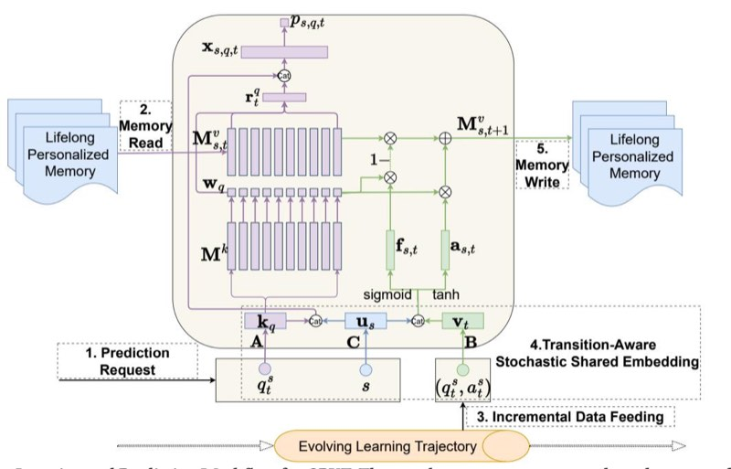

<!-- Image Description: That's not a technical image from an academic paper; it's a button graphic likely from a software application. The image displays a circular icon—partially teal, yellow, and red—featuring a red bookmark-like shape. Below the icon, the text "Check for updates" is displayed. The image's purpose would be to visually prompt a user to search for and install software updates within the application. It's not a chart, graph, diagram, or equation; it's purely a user interface element. -->

# Continuous Personalized Knowledge Tracing: Modeling Long-Term Learning in Online Environments

[Chunpai Wang](https://orcid.org/0000-0003-3162-4310) chunpai.wang@chase.com JPMorgan Chase & Co. New York, New York, USA

### ABSTRACT

With the advance of online education systems, accessibility to learning materials has increased. In these systems, students can practice independently and learn from different learning materials over long periods of time. As a result, it is essential to trace students' knowledge states over long learning sequences while maintaining a personalized model of each individual student's progress. However, the existing deep learning-based knowledge tracing models are either not personalized or not tailored for handling long sequences. Handling long sequences are especially essential in the online education environments, in where models are preferred to be updated with the newly collected user data in a timely manner as students could acquire knowledge on each learning activity. In this paper, we propose a knowledge tracing model, Continuous Personalized Knowledge Tracing (CPKT), that can mimic the realworld long-term continuous learning scenario by incorporating a novel online model training paradigm that is suitable for the knowledge tracing problem. To achieve personalized knowledge tracing, we propose two model components: 1) personalized memory slots to maintain learner's knowledge in a lifelong manner, and 2) personalized user embeddings that help to accurately predict the individual responses, correctly detect the personalized knowledge acquisition and forgetting patterns, and better interpret and analyze the learner's progress. Additionally, we propose transition-aware stochastic shared embedding according to the learning transition matrix to regularize the online model training. Extensive experiments on four real-world datasets showcase the effectiveness and superiority of CPKT, especially for students with longer sequences.

## CCS CONCEPTS

• Information systems → Personalization; • Applied computing → E-learning.

### KEYWORDS

personalization; learner modeling; knowledge tracing; intelligent education; online learning

CIKM '23, October 21–25, 2023, Birmingham, United Kingdom

© 2023 Copyright held by the owner/author(s). Publication rights licensed to ACM. ACM ISBN 979-8-4007-0124-5/23/10. . . \$15.00 <https://doi.org/10.1145/3583780.3614822>

[Shaghayegh Sahebi](https://orcid.org/0000-0002-8933-3279) ssahebi@albany.edu University at Albany - SUNY Albany, New York, USA

### ACM Reference Format:

Chunpai Wang and Shaghayegh Sahebi. 2023. Continuous Personalized Knowledge Tracing: Modeling Long-Term Learning in Online Environments. In Proceedings of the 32nd ACM International Conference on Information and Knowledge Management (CIKM '23), October 21–25, 2023, Birmingham, United Kingdom. ACM, New York, NY, USA, [10](#page-9-0) pages. [https://doi.org/10.](https://doi.org/10.1145/3583780.3614822) [1145/3583780.3614822](https://doi.org/10.1145/3583780.3614822)

### 1 INTRODUCTION

Knowledge Tracing (KT) aims to quantify students' state of knowledge as they practice with the learning materials. KT models are usually formulated as supervised sequence learning problems to predict students' future practice performance, given their historical performances in learning materials. This includes the state-of-theart deep-learning KT models, such as DKVMN [\[34\]](#page-9-1), SAKT [\[18\]](#page-9-2), and AKT [\[9\]](#page-9-3), that have shown significant improvements in many cases over the traditional knowledge tracing models when predicting students' future performances.

Despite such performance improvements, deep KT models and their training methods suffer from two major drawbacks that limit their ability to accurately represent student knowledge and predict their performance. First, the deep knowledge tracing models fail to accurately represent student knowledge in the long term, as they cannot efficiently train long student sequence lengths. Second, they are mostly not personalized, as they assume the same knowledge update parameters for all students.

Unlike traditional classroom settings with a limited number of practice problems, modern online education systems provide an abundance of practice problems with large topic varieties. This abundance allows the students to practice the same topics many times and learn a variety of topics over long periods of time. In other words, the students can have a "lifelong" or continuous learning experience in these real-world systems. As a result, the average student sequence length in these systems is long, with a considerable variation across different students. Training deep recurrent models over long sequences is slow and results in problems such as vanishing gradients. To address this, current deep KT models break student sequences into shorter batches and train on fixed-length truncated portions of them, mostly assuming independence between these truncated sequence portions [\[9,](#page-9-3) [16,](#page-9-4) [23,](#page-9-5) [34\]](#page-9-1). As a result, they lose the dependence between student sequence batches and misrepresent the student knowledge, especially on longer sequences, because of misplacing sequence portions.

Furthermore, most deep KT models are not personalized and do not consider individual student differences in learning. Particularly, these models learn a shared set of parameters for all students with a knowledge representation that is not student-specific as it

Permission to make digital or hard copies of all or part of this work for personal or classroom use is granted without fee provided that copies are not made or distributed for profit or commercial advantage and that copies bear this notice and the full citation on the first page. Copyrights for components of this work owned by others than the author(s) must be honored. Abstracting with credit is permitted. To copy otherwise, or republish, to post on servers or to redistribute to lists, requires prior specific permission and/or a fee. Request permissions from permissions@acm.org.

ignores the student-specific features. One reason for avoiding personalization in these models is the overfitting problem. Modeling student-specific knowledge representations requires learning an increased number of parameters that can lead to model overfitting. Furthermore, training on the truncated student sequences prevents these KT models to be personalized, as they assume that the student sequence portions are interchangeable and lose track of them in the training process.

In this paper, we propose a deep knowledge tracing model along with a training paradigm that is personalized and keeps track of student knowledge over long sequence lengths. Our model, Continuous Personalized Knowledge Tracing (CPKT), keeps a personalized dynamic state per student that is updated according to the individual student's learned embedding, their past knowledge state, and their performance on the latest practiced problem. We propose an online learning algorithm for CPKT that avoids misplacing student sequences by identifying the target student's most recent observations and updating his/her personalized knowledge state on the fly. To avoid the overfitting problem, we propose a new Transition-Aware Stochastic Shared Embedding (TA-SSE) regularization that interchanges similar problem embeddings in student sequences according to the probability weights of a problem-transition graph.

We evaluate CPKT on four real-world datasets on the task of student performance prediction. Our experiments show that CPKT performs significantly superior to the state-of-the-art deep knowledge tracing models, including a personalized model. We design ablation studies on CPKT to study the impact of personalization and TA-SSE components. Our results show that personalization and TA-SSE components individually contribute to CPKT's better performance. But, a combination of these two components results in the most significant performance increase over the baseline models. Finally, we perform a sequence-length analysis on our proposed model and show that CPKT's improvement over the baselines increases in longer student sequences.

Our contributions of this work are three-fold.

- To the best of our knowledge, this is the first study on addressing the problem of incorporating personalization and continuous model learning, which has not been explored extensively in previous research. Our study aims to provide an unified and straightforward solution to address aforementioned issues in realworld education systems. Besides, our proposed model could be potentially extended to solve similar problems in other fields.
- We design and propose the transition-aware stochastic shared embeddings (TA-SSE) to prevent overfitting due to increasing number of parameters from personalization and a smaller amount of training data from online training. TA-SSE could be potentially applied to any deep knowledge tracing or sequential models to reduce model overfitting.
- We conduct extensive experiments on four real-world datasets to compare the prediction performance of CPKT with six baselines, validate the effectiveness of proposed components with ablation studies, and demonstrate the advantage of CPKT on long-term knowledge modeling.

### 2 RELATED WORK

Our work relates to the deep knowledge tracing (KT) models and personalized knowledge tracing. KT has been an essential problem in the learner modeling and educational data mining domain as it can be used for evaluating students' strength and weakness points, predicting student performance, suggesting the next learning materials to students, and redesigning the class curricula.

### 2.1 Traditional Personalized Knowledge Tracing

The KT problem has been studied in the fields such as education, psychology, neuroscience, and cognitive science since the 1980s. Early attempts at solving KT problem could be classified into two main categories: the probabilistic models and logistic models.

The probabilistic models of solving the KT problem originated from the Bayesian Knowledge Tracing (BKT) which was first introduced by Corbett and Anderson [\[7\]](#page-9-6) under the context of mastery learning in intelligent tutoring systems. BKT assumes that student knowledge is represented as a set of binary variables, one per predefined skill (or knowledge component), where the skill is either mastered or not. Each skill or knowledge component (KC) is modeled as a two-states (mastery or non-mastery) Hidden Markov Model (HMM), updated by the students' correctness on each skill through the learning trajectories. The vanilla BKT assumes that each question is only associated with a single skill or KC. For each skill, we will learn four types of model parameters [\[33\]](#page-9-7), including the initial probability of knowing the skill a priori (0), the transition probability from not mastery to mastery ( ), the probability of slipping a question (), and the probability of guessing a question correctly (). Some variants of BKT model, including the individualized BKT models [\[13,](#page-9-8) [20\]](#page-9-9), claim the usefulness of taking student-specific variability into account to enhance model accuracy. Furthermore, Yudelson et al. [\[33\]](#page-9-7) examined and validated the positive effect of different kinds of student-specific parameters on several individualized BKT models.

On the other hand, logistic models such as Rasch model (also known as 1PL-IRT) [\[17\]](#page-9-10) and Additive Factor Model (AFM) [\[3\]](#page-9-11) include an individualized student ability parameter to account for the student variability in learning data. The basic idea is to leverage the logistic function, () = 1/(1 + − ), to predict the probability of a correct answer, where could represent the additive feature, such as the difference between a skill and an item difficulty. However, Rasch model and AFM typically are used in testing and they do not model the skill or knowledge changing through the correctness of student's answer over time. To model the change of knowledge or skill, Khajah et al. [\[11\]](#page-9-12) proposed to integrate the BKT with the Rasch model to jointly learn the student abilities, problem difficulties, as well as the knowledge acquisition. Pavlik Jr et al. [\[21\]](#page-9-13) proposed the Performance Factor Models (PFM) that includes a Q-matrix and two additional parameters specifying the change of skill associated with correct and wrong answer for a given skill or knowledge component. PFM was originally proposed without student parameters such as , but Pavlik Jr et al. [\[21\]](#page-9-13) further noted that the full AFM model with student parameters outperformed the PFM without which in turn outperformed AFM without . Vie and Kashima [\[28\]](#page-9-14) proposed the Knowledge Tracing Machine (KTM) that unifies the AFM and PFM and is capable of handling side information, such as

number of attempts at an item or a skill. Other similar logistic models are Instructional Factor Models (IFM) [\[4\]](#page-9-15), the Elo Rating System (ERS) [\[22\]](#page-9-16), the DASH model [\[14\]](#page-9-17), and DAS3H [\[5\]](#page-9-18), which take more complex settings into account, such as multiple types learning interventions or skill forgetting effect. The aforementioned logistic models generally assume each user is associated with a single student ability parameter, which is over-simplified in the real-world learning environments. Some other logistic models resort to the matrix factorization to resolve this limitation [\[12,](#page-9-19) [27,](#page-9-20) [29,](#page-9-21) [37\]](#page-9-22) by projecting each student and each item into a latent vector u and v that depicted students' knowledge state and items' knowledge association weight, respectively.

### 2.2 Deep Knowledge Tracing

Deep neural networks have been applied to the knowledge tracing problem since 2015 [\[23\]](#page-9-5), which have become the competitive alternatives to the probabilistic models and logistic models with the advent of increasingly large scale datasets. Piech et al. [\[23\]](#page-9-5) first explored the Recurrent Neural Networks (RNNs) and proposed the Deep Knowledge Tracing (DKT) to model student learning and demonstrated substantial improvements in prediction performance on a range of knowledge tracing datasets. Gervet et al. [\[8\]](#page-9-23) further systematically compared the probabilistic models, logistic models, and deep learning models on the prediction performance and concluded that with the right set of features, logistic models with student parameters lead on datasets of moderate size, deep learning models lead on datasets of large size, and probabilistic models lag behind other approaches. Zhang et al. [\[34\]](#page-9-1) proposed the Dynamic Key-Value Memory Networks (DKVMN) that is capable of discovering underlying concepts of exercises typically annotated by human and depicting the changing knowledge state after each exercise. Pandey and Karypis [\[18\]](#page-9-2) applied the cutting-edge attention mechanism technique in the field of natural language processing to the task of student performance prediction and proposed the Self-Attentive Knowledge Tracing (SAKT) model. Unlike the DKT and DKVMN, which make prediction based on the summarized context vector over time, SAKT models student's interaction history and predicts student's future performance by considering the relevant exercises from the past interactions. Ghosh et al. [\[9\]](#page-9-3) further couples the monotonic attention mechanism with Rasch model to regularize the concept and question embeddings and improve the model interpretability. Numerous new models were proposed for the KT problem recently. But many of them presuppose supplementary contextual information, such as LPKT [\[25\]](#page-9-24), EKT [\[15\]](#page-9-25), RKT [\[19\]](#page-9-26), MF-DAKT [\[35\]](#page-9-27), DMKT [\[30\]](#page-9-28), TAMKOT [\[38\]](#page-9-29), etc.

These aforementioned deep learning methods generally aim to learn and summarize the global patterns from batched students' learning trajectories, ignoring student variability. In other words, such type of methods assumes that students have the same prior knowledge, knowledge acquisition sensitivity on the same question and knowledge forgetting rate over time. To overcome this limitation, Shen et al. [\[26\]](#page-9-30) proposed Convolutional Knowledge Tracing (CKT) to learn the individualized prior knowledge and learning rate. More recently, Long et al. [\[16\]](#page-9-4) proposed the Individual Estimation Knowledge Tracing (IEKT) that estimates the students' cognition before each prediction and assesses their knowledge acquisition

sensitivity on the question before updating the knowledge state. However, like the aforementioned deep learning-based models, to train CKT and IEKT, short learning sequences are padded, and long learning sequences are typically truncated and shuffled for the sake of offline batch learning, which makes the order of historical records indistinguishable to a certain extent. Therefore, when it comes to modeling student knowledge states over a long time, those methods cannot accurately reveal the knowledge state and cannot adapt to the real-world learning environment in a timely manner. To address this issue, Zhang et al. [\[36\]](#page-9-31) proposed the ODKT [\[36\]](#page-9-31) that leverages the non-personalized online gradient descent to self-update the model in the dynamic learning setting.

2.2.1 CPKT vs. Existing Works. Our work, CPKT, differs from the previous studies as it is the first deep knowledge tracing model that can learn personalized learning patterns throughout the whole student trajectory sequence. It learns user embeddings in addition to individualized knowledge state representations and embeds user embedding with knowledge acquisition and forgetting modules to capture the current individualized knowledge state. Furthermore, CPKT is designed to utilize online model training to mimic the reallife learning process for rolling forecasting, rather than offline batch training. Thus, it could maintain and update the individualized student's knowledge state over time in a timely and continuous manner.

## 3 CONTINUOUS PERSONALIZED KNOWLEDGE TRACING (CPKT)

### 3.1 Problem Formulation

Given a student's historical performance records, the goal of KT is to predict the student's performance on an upcoming problem, while tracking student knowledge states. The student's historical performance typically consists of a sequence of problems and their correctness or scores at each discrete time step, denoted as a tuple ( , ), for student at time step . Here, is a problem or exercise from a set of distinct problems, and is either a binary value to represent the correctness or a continuous value between 0 and 1 to represent the normalized score. Formally, given student 's past history records up to time − 1, as {( 1 , 1 ), · · · , ( −1 , −1 )}, our task is to predict their performance to an assigned problem at the current time step . The general deep learning-based models omit the superscript in the context and do not differentiate distinct students' historical records. We achieve continuous personalized knowledge tracing via a personalized memory-augmented network model (Section [3.2\)](#page-2-0) and a transition-aware online learning and prediction paradigm (Section [3.3\)](#page-3-0).

### 3.2 Personalized Memory Augmented Network

We build our continuous personalized model based on dynamic memory-augmented neural networks, specifically DKVMN [\[34\]](#page-9-1), that has been shown to be successful for deep knowledge tracing. These models rely on a static key matrix to represent the learning material concepts and a dynamic value matrix to store students' updated mastery levels (states) of those corresponding concepts. Assuming that there are latent concepts { 1 , · · · , } for each learning resource, and each latent concept can be represented by

ℎ-dimensional embeddings, DKVMN uses a static key matrix M of size ×ℎ to stores the knowledge concepts. Additionally, the value matrix M of size × ℎ stores the student's mastery levels of each concept, at time step . DKVMN updates the value matrix M at each time step according to the previous mastery M −1 after each problem −1 to predict the target student's performance on . However, neither the mastery updates nor the performance prediction steps are personalized in this model. Additionally, because of offline or batch training on student sequence portions, it cannot allow for continuous student knowledge modeling.

To achieve personalized knowledge tracing, our proposed model includes two model components that augment DKVMN: 1) personalized memory slots to maintain learner's knowledge in a continuous manner, and 2) personalized student embeddings that help to accurately predict the individual responses, correctly detect the personalized knowledge acquisition and forgetting patterns, and better interpret and analyze the learner's progress. It is worth mentioning that our proposed method of continuous personalization can be integrated into any memory-augmented networks for sequential student behavior modeling.

3.2.1 Personalized Performance Prediction. At each time step , we would like to predict the student 's performance on a specific problem , using the student's mastery levels on the question's concepts. Assuming that a student's performance depends on her individual knowledge of the concepts and her ability to apply the gained knowledge to the particular problem, we propose a personalized mastery level and response prediction for each student. Specifically, unlike the non-personalized dynamic key-value setting, we model each student's student mastery levels of each concept at time step via a personalized value matrix M , of size ×ℎ. The personalized value matrix M , is updated dynamically using the observed student's performance over time (Section [3.2.2\)](#page-3-1).

A student's performance depends on the representation of each knowledge concept to , and the student's mastery of each relevant knowledge concept. To predict a student's performance on , we first find the embedding of from an embedding matrix A ∈ ℜ×ℎ . Then, we compute the problem-concept correlation weight (or attention weight), by applying Softmax on the dot product between problem 's embedding k ∈ ℜℎ and key matrix M as follows:

$$
\mathbf{w}_q = \text{Softmax}\left(\mathbf{k}_q (\mathbf{M}^k)^\top\right) \tag{1}
$$

with the ℎ entry of w ∈ [0, 1] , denoted by (), representing the correlation weight between the problem and the ℎ concept, and Í =1 () = 1.

Secondly, we extract and summarize the target student 's personalized knowledge level on the problem by computing the weighted sum of memory slots in the individualized value matrix M , ∈ ℜ ×ℎ using the problem-correlation weight () on each ℎ concept:

$$
\mathbf{r}_{s,t}^q = \sum_{i=1}^N w_q(i) \mathbf{M}_{s,t}^v(i)
$$
(2)

where M , () denotes the ℎ row of value matrix M ,

Assuming that students' ability to apply their gained knowledge for solving a problem can vary, we formulate a personalized abilityknowledge summary vector x,,. To do this, we first retrieve the student 's embedding u ∈ ℜ from the student embedding lookup table (matrix) C using the student ID. Then we concatenate the student embedding u with the latent knowledge state representation r , associated with problem as well as problem embedding k vertically and pass them into a fully connected layer with a Tanh activation to obtain the summary vector x,,

$$
\mathbf{x}_{s,q,t} = \text{Tanh}\left(\mathbf{W}_1^\top \left[\mathbf{u}_s, \mathbf{r}_{s,t}^q, \mathbf{k}_q\right] + \mathbf{b}_1\right) \tag{3}
$$

Finally, we use this summary vector x,, to predict the correctness probability or normalized score ,, as follows:

$$
p_{s,q,t} = \text{Sigmoid} \left( \mathbf{W}_2^{\top} \mathbf{x}_{s,q,t} + \mathbf{b}_2 \right) \tag{4}
$$

3.2.2 Personalized Knowledge Acquisition and Forgetting. We track the student knowledge states by updating the memory value matrix M , at each learning activity. Rather than using the studentagnostic knowledge update operation as in DKVMN, we argue that different students should have personalized knowledge forgetting and acquisition patterns. We propose the personalized knowledge forgetting and acquisition steps as follows.

We first retrieve the interaction embedding v for the problemanswer tuple ( , ) with an embedding matrix B ∈ ℜ2×ℎ . Then we feed the concatenation of the interaction embedding v with the student embedding u into a fully connected layer with Sigmoid activation to obtain the personalized forgetting rate vector f, for student at time .

$$
\mathbf{f}_{s,t} = \text{Sigmoid}\left(\mathbf{W}_3^\top \left[\mathbf{v}_t, \mathbf{u}_s\right] + \mathbf{b}_3\right) \tag{5}
$$

Then, we erase the student's memory value matrix on the ℎ concept based on the weighted forgetting vector ()f, as follows:

$$
\tilde{\mathbf{M}}_{s,t}^v(i) = \mathbf{M}_{s,t-1}^v(i) \otimes \left[1^{d_h} - w_q(i)\mathbf{f}_{s,t}\right]
$$
(6)

where 1 ℎ denotes the 1-vector with size ℎ, and ⊗ represents the Hadamard product.

Similarly, we apply another fully connected layer with a Tanh activation on the concatenation [v , u ] to obtain the personalized acquisition sensitivity vector a, and increase the knowledge based on the weighted knowledge acquisition vector ()a, as follows:

$$
\mathbf{a}_{s,t} = \text{Tanh} \left( \mathbf{W}_4^\top \left[ \mathbf{v}_t, \mathbf{u}_s \right] + \mathbf{b}_4 \right)^T
$$

$$
\mathbf{M}_{s,t}^v(i) = \tilde{\mathbf{M}}_{s,t-1}^v(i) + w_q(i) \mathbf{a}_{s,t}
$$
(7)

Notice that, we use (W , b) for ∈ {1, 2, 3, 4} to denote the weights and biases of fully connected layers in the formulas above. We show the network architecture of CPKT in Figure [1.](#page-4-0)

### 3.3 Continuous Knowledge Tracing

The existing deep knowledge tracing models are trained with the offline batched data, that consists of truncated portions of student sequences. This type of training results in losing the dependence between portions of the same student sequence and creates a problem for personalized KT. Additionally, it cannot be directly used in the real-world online learning environment, where the students incrementally interact with the problems. Using the offline batch

<!-- Image Description: This diagram illustrates a personalized lifelong learning model. It shows a system with two memory modules (Mv and Mk) which read and write data based on prediction requests (qt). A "Transition-Aware Stochastic Shared Embedding" block processes the memory outputs to generate updated memory states (Mvs,t+1) using sigmoid and tanh activation functions. The model incorporates incremental data feeding and an evolving learning trajectory. The diagram details the data flow and operations within the model's memory management and learning process. -->

**Figure 1:** Online Learning and Prediction Workflow for CPKT. The purple component corresonds to the personalized performance prediction, and the green component describes the personalized knowledge forgetting and acquisition.

data, the model should be retrained periodically to adapt to the new interaction data and predict the students' next attempts. This retraining is time-consuming. Here, we introduce our Continuous Knowledge Tracing paradigm that includes two components: online learning and prediction (Section [3.3.1\)](#page-4-1), and transition-aware stochastic shared embedding. First, we introduce an online learning paradigm that could iteratively collect each student's data, incrementally update each student's knowledge, and accurately predict each student's next performance over time.

3.3.1 Online Learning and Prediction Paradigm. We show the overall online learning and prediction workflow for CPKT in Figure [1.](#page-4-0) As we can see, there is a personalized value matrix M , corresponding to each student that represents the student-specific knowledge state. With student data collected incrementally, we update the CPKT model over time, including the student's specific value matrices, student embeddings, problem embeddings, and interaction embeddings. Then we make a prediction for a new query based on the updated model. To train the model on the fly, we use a moving window with length to extract the most recent historical records to detect and learn the latest knowledge forgetting and acquisition patterns, since the student's forgetting rate and acquisition sensitivity may vary over time. The incremental learning approach with sliding windows also helps in resolving the catastrophic interference problem in general online learning algorithms. However, the model could be easily overfitted in this online learning setting [\[24\]](#page-9-32) because every time it is trained on a smaller portion of the data along with the new data flow, which may be related to only part of the exercises. In addition, by introducing personalization with student-specific value memory and student

embedding into the model, the risk of model overfitting is increased due to the increased number of parameters [\[10\]](#page-9-33). We propose our solution to this problem in the next section.

3.3.2 Transition-Aware Stochastic Shared Embedding. The primary challenge addressed in this section is personalizing online learning without overfitting. Specifically, updating the memory slots of each individual with the same set of parameters, such as W3 and W4, presents a significant difficulty due to the limited amount of observations available to learn personalized memory slots compared to non-personalized ones. Furthermore, traditional online learning algorithms do not typically consider personalization in deep neural networks. When applied to our problem, these algorithms can easily overfit an individual's previous observations, which may be noisy due to incorrect responses.

To overcome this overfitting issue, we propose Transition-Aware Stochastic Shared Embedding (TA-SSE), designed for our continuous personalized knowledge tracing model. Stochastic Shared Embedding (SSE) [\[32\]](#page-9-34) is a type of data-driven regularization of embedding layers, which has been proven useful in several applications of recommender systems [\[31\]](#page-9-35) and computer vision [\[1,](#page-9-36) [32\]](#page-9-34). It works by stochastically swapping similar item embeddings during the training. Theoretically, Wu et al. [\[32\]](#page-9-34) show that it implicitly adds exponentially many distinct reordering layers above the embedding layer and leads to exponentially many models trained at the same time. More specifically, the loss landscape with SSE regularization becomes smoother and leads to better generalization.

However, SSE requires an auxiliary knowledge graph to compute the switching probability distribution. We do not have such a knowledge graph, as in our problem setting we do not have access

CIKM '23, October 21–25, 2023, Birmingham, United Kingdom Chunpai Wang and Shaghayegh Sahebi

### Algorithm 1: CPKT

| | Input: Observed student responses Ω𝑜𝑏𝑠 , including other |
|----|-----------------------------------------------------------------------------------------------------|
| | students' and the target student's historical |
| | responses. Hyperparameter 𝜌 denotes by SSE |
| | threshold and 𝐻 denotes by time window size. |
| | 1 Sort each student's responses by the timestamp. |
| | 2 Generate the learning transition matrix T based on all |
| | observed learning trajectories. |
| | 3 Generate a dictionary D that stores each problem as key |
| | and a list of corresponding observed score or correctness |
| | from all students as value. |
| | 4 for each testing time index 𝑡 do |
| 5 | Extract each student's responses between time index 𝑠 |
| | 𝑡−1 , 𝑎𝑠 )}𝑖=𝑡−1 𝑡 − 𝐻 and 𝑡 = {(𝑞 − 1, denotes by Ω 𝑖 𝑖 𝑡−𝐻 𝑖=𝑡−𝐻 |
| 6 | 𝑡−1 Feed Ω along with student IDs into model. 𝑡−𝐻 |
| 7 | 𝑠 for each problem 𝑞 and corresponding interaction 𝑖 |
| | 𝑠 , 𝑎𝑠 𝑡−1 (𝑞 ) ∈ Ω do 𝑖 𝑖 𝑡−𝐻 |
| 8 | Identify the problem embedding k𝑖 and interaction |
| | embedding v𝑖 |
| 9 | Generate a random number 𝛾 ∈ [0, 1]. |
| 10 | if 𝛾 < 𝜌 then |
| 11 | , where 𝑗 ∼ 𝑇𝑖𝑗 = 𝑝𝑟𝑜𝑏(𝑗  𝑖) Replace k𝑖 with k𝑗 |
| 12 | Randomly sample a response 𝑎𝑗 for problem 𝑞𝑗 |
| | from D. |
| 13 | Identify the interaction embedding v𝑗 for |
| | (𝑞𝑗 , 𝑎𝑗), and replace v𝑖 with v𝑗 |
| 14 | end |
| 15 | end |
| 16 | for each student 𝑠 do |
| 17 | Identify the student embedding u𝑠 |
| 18 | Generate a random number 𝛾 ∈ [0, 1]. |
| 19 | if 𝛾 < 𝜌 then |
| 20 | Randomly sample a student 𝑧 from all students. |
| 21 | Identify the student embedding u𝑧 |
| 22 | Replace u𝑠 with u𝑧 |
| 23 | end |
| 24 | end |
| 25 | Forward and backward pass with the new embeddings |
| | to train the model by minimizing the training loss. |
| 26 | Predict the target student's response at time 𝑡. |
| 27 | Collect the target student's new response into Ω𝑜𝑏𝑠 |
| 28 | Update the transition matrix T as well as D. |

to the item contents. Instead, we propose to generate and use a transition matrix based on the student learning trajectories. Learning trajectories typically contain some information on the learning material similarities. For example, if problem A is typically viewed or solved by students right before solving problem B, it may indicate a prerequisite relationship or sharing of similar knowledge concepts between the two problems. The idea of TA-SSE is that the embeddings of these two exercises should share some similarities

29 Increase the testing time index by 1.

30 end

as well. So, replacing one with the other during the training phase with a stochastic optimizer, such as SGD and Adam, should not result in a significant change in the loss distribution for the model. When we apply TA-SSE in our online learning setting, it seemingly mimics the behavior of Follow The Regularized Leader (FTRL) in the online convex optimization framework [\[24\]](#page-9-32).

For TA-SSE, we build and update a× transition matrix T over time, in which every entry indicates the bi-gram probability of viewing exercise after viewing exercise based on the up-to-date student learning trajectories:

$$
T_{ij} = \text{prob}(j \mid i) = \frac{|i \rightarrow j|}{|i|}
$$
(8)

where | → | denotes the number of records that transit from exercise to exercise and || denotes the total number of records of exercise viewed by all students. We sample the problem embeddings to be swapped during the online training according to this transition matrix T. For student embeddings, we leverage the SSE-SE [\[32\]](#page-9-34) to randomly replace one embedding with another with a predefined sampling threshold.

### 3.4 Online Training and Testing

3.4.1 Training Losses. All learnable parameters in the entire CPKT model are trained by minimizing the Root Mean Squared Error (RMSE) or Binary Cross-Entropy loss (BCE) of all students' observed responses or TA-SSE replacement within a sliding time window of size :

$$
\ell_{RMSE} = \sqrt{\frac{\sum_{s} \sum_{t}^{t+H} (a_t^s - p_t^s)^2}{n}}
$$
(9)

$$
\ell_{BCE} = -\sum_{s} \sum_{t}^{t+H} \left( a_t^s \log p_t^s + (1 - a_t^s) \log \left( 1 - p_t^s \right) \right) \tag{10}
$$

where denotes the total number of observed data in the time window, denotes the observed true student response from student at time or randomly sampled response based on TA-SSE, and denotes the corresponding predicted numeric normalized score or predicted probability of correctness. When the dataset contains the student responses with numeric normalized scores, we use RMSE as training loss function. When we have binary response values to represent student's correctness in the data, we use BCE as training loss.

3.4.2 Algorithm. We demonstrate the pipeline of online training and testing of CPKT in Algorithm [1.](#page-5-0) For one single target student, as we could see in lines 2-3, we use the existing students' historical records as input to initialize the learning transition matrix T and D for TA-SSE. Lines 4-30 correspond to the online training and testing. Lines 7-15 correspond to the procedure of TA-SSE on problem embeddings and interaction embeddings. Lines 16-24 are the procedure of SSE-SE on student embeddings. In line 25, we use a stochastic optimizer, such as SGD and Adam, to ensure a theoretical guarantee as stated in [\[32\]](#page-9-34). More implementation details will be illustrated in the experiment section. Moreover, we share our code of CPKT [1](#page-5-1) .

1 Source code of CPKT:<https://tinyurl.com/mr9c9h5c>

Continuous Personalized Knowledge Tracing: Modeling Long-Term Learning in Online Environments CIKM '23, October 21–25, 2023, Birmingham, United Kingdom

Compared to the non-personalized state-of-the-art deep knowledge tracing models, our proposed CPKT has higher memory costs for the storage of each user's memory slots and embeddings. Notwithstanding, this cost scales linearly with the number of users. With regard to time cost, we have made significant improvements, particularly in cases where education systems are updated frequently, since we do not need to retrain the entire dataset after each update.

### 4 EXPERIMENTS

### 4.1 Research Questions

We conduct extensive experiments on four real-world datasets to investigate three research questions on our proposed CPKT in the task of predicting students' future performance:

- RQ1. How is the model performance compared with stateof-the-art baselines?
- RQ2. How do different proposed components affect its prediction performance?
- RQ3. How does the model perform on the users with different lengths of learning trajectories?

### 4.2 Datasets

We use four real-world datasets to evaluate the proposed model. The descriptive statistics of each dataset are shown in table [1.](#page-7-0)

MORF[2](#page-6-0) is a framework for accessing open online course datasets from Coursera [\[2\]](#page-9-37), and we use the data from the "Big Data in Education" course. Each problem is a full complex course assignment, and students are allowed to submit multiple times on each assignment. These assignments are published in sequential order, and thus we observe relatively similar user learning trajectories compared with other datasets. We normalize students' assignment scores into values between 0 and 1.

ASSIST2015[3](#page-6-1) is collected from the ASSISTments tutoring platform, which contains 19, 840 students' records with correctness on 100 skills. Students are free to select any question that is related to a single skill to work on in any order. We conduct similar preprocessing steps as in the DKVMN [\[34\]](#page-9-1) to filter users and questions.

EdNet[4](#page-6-2) is collected by Santa[5](#page-6-3) , a multi-platform AI tutoring service for students to prepare for the TOEIC English testing. Students could watch lecture videos and work on problems freely in any order. There are 297, 915 user records in the full dataset, and we randomly extract 1, 000 users' records over 11,000 questions with correctness for experiments. Same as ASSIST2015, we also only use the first 1, 000 historical records from each user for experiments.

Junyi[6](#page-6-4) is a Chinese e-learning website that allows students to work on problems from 8 math areas. Students can work on any problem in any order, and students can request hints when solving problems. There are 247, 606 users with 25, 925, 922 records with correctness in the full dataset. The first 1, 000 historical records from each user are extracted for experiments. In the end, we have 1564 users' on 142 questions, each of which has at least 10 records from all users.

### 4.3 Baseline Methods

In experiments of performance prediction, we compare CPKT with six state-of-the-art baseline methods on the task of student performance prediction on assessed learning resources. These baselines include a spectrum of knowledge tracing (KT) methods, ranging from pioneer to contemporary ones, that are most relevant to our research. Specifically, we focus on models that incorporate personalization or an underlying sequence model without the need for additional context or features, as we seek to tackle the personalization and continuity obstacles without necessitating such additional inputs. These baselines are listed below:

- DKT [\[23\]](#page-9-5): is the pioneer deep learning-based knowledge tracing method that utilizes the stateless LSTM to model students' responses over time.
- DKVMN [\[34\]](#page-9-1): is a variant of memory-augmented neural networks that models the latent knowledge concepts and dynamic student knowledge states over time.
- SAKT [\[18\]](#page-9-2): leverages the self-attention mechanism to model the interdependencies among interactions on the sequence, especially for sparse data where student interact with few knowledge components.
- SAINT [\[6\]](#page-9-38): is a transformer-based deep knowledge tracing method, in which an encoder-decoder structure along with two multi-head attention mechanisms are used to model exercise and response separately.
- AKT [\[9\]](#page-9-3): is a variant of transformer-based deep knowledge tracing that uses a monotonic attention mechanism to model the different knowledge transition of students' historical performance on questions.
- IEKT [\[16\]](#page-9-4) is a personalized state-of-the-art knowledge tracing model incorporated with individualized cognition and knowledge acquisition estimation modules. It is the most recent KT model that strives to address personalization.

### 4.4 Experimental Setups

We conduct 5-fold user-stratified cross-validation to separate users into train users and test users for each dataset. To simulate the continuous learning environment, we first sort each user's learning trajectory by the timestamp. For train users, we assume we had observed all of their historical records. For each test user, we set a threshold index within the sequence lengths covered by the full dataset. The records before the threshold index are treated as observed training data, and the rest will be viewed as testing data, predicted given the previous records. The testing records will be uncovered over time, along with the rolling prediction. In other words, we conduct the online training and testing that mimics the realworld continuous scenario, which is different from the offline/batch training and testing in the existing literature. In experiments, we set the threshold index at roughly 10% of the maximum sequence lengths for each data. The maximum sequence length in MORF is 46. To speed up the experiments on other datasets, we set the maximum sequence lengths for ASSIST2015, EdNet, and Junyi datasets to 1,000. That means we only use each user's first 1, 000 records for experiments if they have more than 1, 000 records. Hence, we assume we had observed five records for each user in MORF and 100 records in the rest of the three datasets at the beginning. Hence,

2<https://educational-technology-collective.github.io/morf/>

3<https://sites.google.com/site/assistmentsdata/datasets>

4<https://github.com/riiid/ednet>

5<https://aitutorsanta.com/intro>

6<https://pslcdatashop.web.cmu.edu/DatasetInfo?datasetId=1275>

CIKM '23, October 21–25, 2023, Birmingham, United Kingdom Chunpai Wang and Shaghayegh Sahebi

| | | | | Mean | STD | Correct | Incorrect | Max |
|------------|-------|-----------|---------------------|-----------|-----------|-----------|-----------|----------|
| Dataset | Users | Questions | Question Records | Question | Question | Question | Question | Sequence |
| | | | | Responses | Responses | Responses | Responses | Length |
| MORF | 686 | 10 | 12031 | 0.7763 | 0.2507 | N/A | N/A | 46 |
| ASSIST2015 | 19840 | 100 | 683801 | N/A | N/A | 500379 | 183422 | 1000 |
| EdNet | 1000 | 11249 | 200931 | N/A | N/A | 118767 | 82184 | 1000 |
| Junyi | 1564 | 142 | 120984 | N/A | N/A | 86654 | 34328 | 1000 |

**Table 1:** Descriptive Statistics of 4 Real World Datasets.

each user's testing size varies, as some test users may have longer testing sequences than others. Eventually, we compare the average performance over all testing data on all five folds.

### 4.5 Implementation Details

Similar to most of the baselines, we convert the interaction tuple ( , ) into a single value = + × as the lookup key of the embedding layer in the binary response datasets, including AS-SIST15, EdNet, and Junyi. But for the MORF dataset with numerical responses, we feed the tuple ( , ) into a linear layer to get the embedding.

We initialize the values of M and M ,0 with the Normal(0, 0.2) distribution. We learn the model using the Adam optimizer with an initial learning rate of 0.01 and a learning rate scheduler to reduce the learning rate according to the training loss with the max of 50 epochs for all methods. Since we incrementally update the model with new data collected over time, we re-initialize the learning rate to a relatively small one accordingly, with a minimal learning rate of 1 − 6.

All models are implemented in PyTorch and tested to achieve similar performance as reported in the original paper with hyperparameter tuning, except the SAINT. For SAINT, we use its publicly available implementation [7](#page-7-1) and revise it accordingly to fit our datasets.

4.5.1 Regularizations. Other than the proposed TA-SSE strategy to prevent overfitting, we also deploy some other commonly used regularization methods in CPKT and the baselines, such as weight decay, gradient clipping, and early stopping. For gradient norm clipping, we use the threshold 10.0 to avoid gradient exploding for all methods. In addition, we leverage the validation-based earlystopping that uses a small portion of training data as validation data.

### 4.6 Prediction Performance Results

We show the prediction performance for all methods on four datasets in Table [2.](#page-8-0) The table included the average performance ±95% confidence intervals. Since MORF has normalized scores between 0 and 1, we use Root Mean Square Error (RMSE) as the evaluation metric for prediction performance comparison. A low RMSE score indicates a high prediction performance. For the rest of the datasets with binary values to represent correctness, we use the Area Under the Curve (AUC) as the evaluation metric, which is commonly used in the existing literature. A high AUC score accounts for a high prediction performance. We use bold font to indicate the best performance and underline to indicate the second-best performance.

4.6.1 CPKT vs Baselines. As shown in Table [2,](#page-8-0) CPKT significantly and consistently outperforms all baselines on all datasets. We also use ∗ to denote the significance level of p-value < 0.05 in CPKT's improvement over the best performance of the baselines methods in Table [2.](#page-8-0) While CPKT shows a stable performance across all datasets, other baselines show inconsistencies in their performances. For example, although SAKT could achieve the second-best performance on the MORF dataset, it lags behind other baselines in the Junyi dataset. This aligns with our expectations, since SAKT performs relatively well on sparse data, such as EdNet. SAINT performs ok on the MORF and Junyi datasets, but poorly on ASSIST2015 and EdNet. Contradictory to SAINT, AKT fails on the MORF and Junyi datasets instead.

As for personalization, IEKT is the only personalized baseline method. As we could see, IEKT achieved the second-best performance on both ASSIST2015 and Junyi datasets. However, it fails on small or sparse dataset such as MORF and EdNet. This could be because of the overfitting as a result of personalization in the small and sparse datasets. Further, DKT and DKVMN have more stable and consistent performances among the baselines on all four datasets.

4.6.2 Ablation Studies. Next, we conduct ablation studies to validate the effect of different model components on their performance. That is, we remove one component from the model each time: CPKT-W/O-Pers for CPKT without the personalized user embedding and CPKT-W/O-SSE for CPKT without the stochastic shared embedding technique for regularization. Notice that online learning cannot have a separate ablation study since it's intertwined with personalization. Personalization requires continuous updates on the memory slots throughout "lifelong" continuous learning. Online updates are needed to keep this continuity. Hence, we have conducted the two ablation studies mentioned earlier.

As we could see in Table [2,](#page-8-0) the combination of the personalization and SSE components greatly improves the prediction performance. Especially, when data is sparse and only a few records are observed for each question such as in EdNet, we see significant improvements from the combinations of proposed components. Comparing CPKT-W/O-SSE with CPKT-W/O-Pers in other datasets, we can see that in the MORF dataset CPKT-W/O-SSE performs better than CPKT-W/O-Pers. This could be because of the complexity of MORF dataset assignments. In the MORF dataset, each assignment includes multiple problems over various concepts and each assignment is devoted to a different course module. As a result, the transition similarities may not be as representative as the embedding similarities for TA-SSE. On the other hand, in Junyi and ASSIST2015 with atomic problems, TA-SSE shows to be a more important component

7<https://github.com/Shivanandmn/Knowledge-Tracing-SAINT>

Continuous Personalized Knowledge Tracing: Modeling Long-Term Learning in Online Environments CIKM '23, October 21–25, 2023, Birmingham, United Kingdom

| | MORF | ASSIST2015 | EdNet | Junyi |
|---------------|-----------|------------|-----------|-----------|
| Methods | RMSE | AUC | AUC | AUC |
| DKT | 0.1990 | 0.7142 | 0.6349 | 0.8709 |
| | ± 0.0087 | ± 0.0029 | ± 0.0048 | ± 0.0072 |
| DKVMN | 0.1995 | 0.7047 | 0.6291 | 0.8685 |
| | ± 0.0067 | ± 0.0034 | ± 0.0070 | ± 0.0084 |
| SAKT | 0.1975 | 0.6997 | 0.6296 | 0.8208 |
| | ± 0.0075 | ± 0.0153 | ± 0.0059 | ± 0.0091 |
| SAINT | 0.2190 | 0.6533 | 0.5058 | 0.8406 |
| | ± 0.0186 | ± 0.0135 | ± 0.0070 | ± 0.0078 |
| AKT | 0.2417 | 0.6870 | 0.6303 | 0.8133 |
| | ± 0.0112 | ± 0.0159 | ± 0.0070 | ± 0.0152 |
| IEKT | 0.2481 | 0.7204 | 0.5980 | 0.8721 |
| | ± 0.0054 | ± 0.0027 | ± 0.0133 | ± 0.0026 |
| CPKT-W/O-Pers | 0.1919 | 0.7202 | 0.5745 | 0.8546 |
| | ± 0.0092 | ± 0.0040 | ± 0.0036 | ± 0.0078 |
| CPKT-W/O-SSE | 0.1895 | 0.7092 | 0.5753 | 0.8333 |
| | ± 0.0067 | ± 0.0049 | ± 0.0058 | ± 0.0051 |
| CPKT | ± 0.0081∗ | ± 0.0032∗ | ± 0.0072∗ | ± 0.0072∗ |
| | 0.1752 | 0.7274 | 0.6558 | 0.8802 |

**Table 2:** Student Performance Prediction Results on 4 Real-World Datasets.

**Table 3:** AUC and BCE Results for Trajectory Length Analysis on EdNet Data.

| Group | #Users | Range of | Mean AUC | | | P-Value of CPKT vs. | | |
|--------|--------|-------------|------------------|------------------|------------------|---------------------|---------------------|--|
| | | Test Length | DKT | DKVMN | CPKT | DKT | DKVMN | |
| Short | 199 | [0,110] | 0.6352 | 0.6427 | 0.6321 | 𝑝 = 0.8421 | 𝑝 = 0.4767 | |
| Medium | 210 | [110,380] | 0.6422 | 0.6363 | 0.6440 | 𝑝 = 0.7375 | 𝑝 = 0.1398 | |
| Long | 234 | [380,900] | 0.6413 | 0.6315 | 0.6475 | p=0.0745 | p=1.51e-05 | |
| | | | | | | | | |
| | | Range of | | Mean BCE | | | P-Value of CPKT vs. | |
| Group | #Users | Test Length | DKT | DKVMN | CPKT | DKT | DKVMN | |
| Short | 199 | [0,110] | 0.6550 | 0.6884 | 0.6530 | 𝑝 = 0.8583 | 𝑝 = 0.0154 | |
| Medium | 210 | [110,380] | 0.6474 0.6562 | 0.6750 0.6942 | 0.6375 0.6389 | 𝑝 = 0.0475 | 𝑝 = 2.87e−09 | |

than personalization. Overall, none of the personalization or SSE components are dispensable.

### 4.7 Trajectory Length Analysis

To have a deeper understanding of our continuous knowledge tracing method, we analyze its performance according to the student learning trajectory lengths. Specifically, we are interested in studying how much online learning along with personalization are helping in knowledge tracing for students with long (vs. short) trajectories. We compare the performance between CPKT and the two most stable baselines (DKT and DKVMN) on EdNet data.

We arrange all students based on their test sequence lengths (corresponding to trajectory lengths) into three groups with roughly equal sizes, representing the students with short, medium, and long trajectory lengths. For each student, we compute the AUC scores (the higher, the better) and BCE loss (the lower, the better) of testing data under CPKT, DKT, and DKVMN. Then, we compare the average AUC score and BCE loss among three models in each of the short, medium, and long trajectory length user groups. The results are shown in Table [3.](#page-8-1)

As we could see in Table [3,](#page-8-1) the difference between CPKT and the baseline model performances increases with longer trajectories. CPKT has a significantly higher AUC score for users with long trajectory lengths than DKT and DKVMN. When we compare the mean BCE loss on testing data, we could see that CPKT has significantly lower BCE loss on users with both medium and long trajectory lengths than DKT and DKVMN. We also observe that the significance of the performance improvement (p-value of the significance test) increases (decreases) when the trajectory

length increases. Comparing CPKT with itself, we see that its AUC increases for the students with longer trajectories. But it is not true for DKVMN and DKT. Especially in DKVMN, we see a better AUC performance for students with shorter trajectory lengths. This shows the superiority of CPKT for continuous knowledge tracing, compared to the baselines.

### 5 CONCLUSIONS

In this paper, we proposed Continuous Personalized Knowledge Tracing (CPKT), to track individualized student knowledge and predict student performance over long learning trajectories. CPKT is a personalized memory-augmented neural network that is trained using an online learning and prediction paradigm. Also, we proposed the TA-SSE, a transition-aware stochastic shared embedding regularization method that could resolve the overfitting issues from additional personalized user embeddings and online learning. We conducted extensive experiments on four real-world datasets and showed that CPKT significantly outperforms both personalized and non-personalized deep KT models. Our ablation studies showed that student-specific parameters and stochastic regularizations are both necessary for CPKT's enhanced performance on the task of predicting students' future responses. Also, with the incorporation of TA-SSE, CPKT is able to track student knowledge states in very long sequences without decaying its prediction performance.

### ACKNOWLEDGMENTS

This paper is based upon work supported by the National Science Foundation under Grant No. 2047500.

CIKM '23, October 21–25, 2023, Birmingham, United Kingdom Chunpai Wang and Shaghayegh Sahebi

## REFERENCES

- [1] Mahdi Abavisani, Liwei Wu, Shengli Hu, Joel Tetreault, and Alejandro Jaimes. 2020. Multimodal Categorization of Crisis Events in Social Media. In Proceedings of the 2020 IEEE/CVF Conference on Computer Vision and Pattern Recognition. 14679–14689.
- [2] Juan Miguel L Andres, Ryan S Baker, George Siemens, Dragan Gašević, and Catherine A Spann. 2016. Replicating 21 Findings on Student Success in Online Learning. Technology, Instruction, Cognition, and Learning 10, 4 (2016), 313–333.
- [3] Hao Cen, Kenneth Koedinger, and Brian Junker. 2006. Learning Factors Analysis– a General Method for Cognitive Model Evaluation and Improvement. In Proceedings of the 8th International Conference on Intelligent Tutoring Systems. Springer, 164–175.
- [4] Min Chi, Kenneth R Koedinger, Geoffrey J Gordon, Pamela W Jordan, and Kurt VanLehn. 2011. Instructional Factors Analysis: A Cognitive Model For Multiple Instructional Interventions. Proceedings of the 12th International Conference on Educational Data Mining 2011 (2011), 61–70.
- [5] Benoît Choffin, Fabrice Popineau, Yolaine Bourda, and Jill-Jênn Vie. 2019. DAS3H: Modeling Student Learning and Forgetting for Optimally Scheduling Distributed Practice of Skills. arXiv preprint arXiv:1905.06873 (2019).
- [6] Youngduck Choi, Youngnam Lee, Junghyun Cho, Jineon Baek, Byungsoo Kim, Yeongmin Cha, Dongmin Shin, Chan Bae, and Jaewe Heo. 2020. Towards an Appropriate Query, Key, and Value Computation for Knowledge Tracing. In Proceedings of the 7th ACM Conference on Learning@ Scale. 341–344.
- [7] Albert T Corbett and John R Anderson. 1994. Knowledge Tracing: Modeling the Acquisition of Procedural Knowledge. User Modeling and User-Adapted Interaction 4, 4 (1994), 253–278.
- [8] Theophile Gervet, Ken Koedinger, Jeff Schneider, Tom Mitchell, et al. 2020. When is Deep Learning the Best Approach to Knowledge Tracing? Journal of Educational Data Mining 12, 3 (2020), 31–54.
- [9] Aritra Ghosh, Neil Heffernan, and Andrew S Lan. 2020. Context-Aware Attentive Knowledge Tracing. In Proceedings of the 26th ACM SIGKDD International Conference on Knowledge Discovery & Data Mining. 2330–2339.
- [10] Wang-Cheng Kang and Julian McAuley. 2018. Self-Attentive Sequential Recommendation. In Proceedings of 2018 IEEE International Conference on Data Mining. IEEE, 197–206.
- [11] Mohammad M Khajah, Yun Huang, José P González-Brenes, Michael C Mozer, and Peter Brusilovsky. 2014. Integrating Knowledge Tracing and Item Response Theory: A Tale of Two Frameworks. In CEUR Workshop proceedings, Vol. 1181. University of Pittsburgh, 7–15.
- [12] Andrew S Lan, Andrew E Waters, Christoph Studer, and Richard G Baraniuk. 2013. Sparse Factor Analysis for Learning and Content Analytics. arXiv preprint arXiv:1303.5685 (2013).
- [13] Jung In Lee and Emma Brunskill. 2012. The Impact on Individualizing Student Models on Necessary Practice Opportunities. International Educational Data Mining Society (2012).
- [14] Robert V Lindsey, Jeffery D Shroyer, Harold Pashler, and Michael C Mozer. 2014. Improving Students' Long-Term Knowledge Retention Through Personalized Review. Psychological Science 25, 3 (2014), 639–647.
- [15] Qi Liu, Zhenya Huang, Yu Yin, Enhong Chen, Hui Xiong, Yu Su, and Guoping Hu. 2019. EKT: Exercise-Aware Knowledge Tracing for Student Performance Prediction. IEEE Transactions on Knowledge and Data Engineering 33, 1 (2019), 100–115.
- [16] Ting Long, Yunfei Liu, Jian Shen, Weinan Zhang, and Yong Yu. 2021. Tracing Knowledge State with Individual Cognition and Acquisition Estimation. In Proceedings of the 44th International ACM SIGIR Conference on Research and Development in Information Retrieval. 173–182.
- [17] Frederic M Lord. 2012. Applications of Item Response Theory to Practical Testing Problems. Routledge.
- [18] Shalini Pandey and George Karypis. 2019. A Self-Attentive Model for Knowledge Tracing. In Proceedings of the 12th International Conference on Educational Data Mining, Collin F. Lynch, Agathe Merceron, Michel Desmarais, and Roger Nkambou (Eds.). International Educational Data Mining Society, 384–389.
- [19] Shalini Pandey and Jaideep Srivastava. 2020. RKT: relation-aware self-attention for knowledge tracing. In Proceedings of the 29th ACM International Conference on Information & Knowledge Management. 1205–1214.

- [20] Zachary A Pardos and Neil T Heffernan. 2010. Modeling Individualization in a Bayesian Networks Implementation of Knowledge Tracing. In Proceedings of the 18th International Conference on User Modeling, Adaptation, and Personalization. Springer, 255–266.
- [21] Philip I Pavlik Jr, Hao Cen, and Kenneth R Koedinger. 2009. Performance Factors Analysis–A New Alternative to Knowledge Tracing. Proceedings of the 2009 Conference on Artificial Intelligence in Education (2009).
- [22] Radek Pelánek, Jirí Rihák, and Jan Papoušek. 2016. Impact of Data Collection on Interpretation and Evaluation of Student Models. In Proceedings of the 6th International Conference on Learning Analytics & Knowledge. 40–47.
- [23] Chris Piech, Jonathan Bassen, Jonathan Huang, Surya Ganguli, Mehran Sahami, Leonidas J Guibas, and Jascha Sohl-Dickstein. 2015. Deep Knowledge Tracing. Advances in Neural Information Processing Systems 28 (2015).
- [24] Shai Shalev-Shwartz et al. 2012. Online Learning and Online Convex Optimization. Foundations and Trends® in Machine Learning 4, 2 (2012), 107–194.
- [25] Shuanghong Shen, Qi Liu, Enhong Chen, Zhenya Huang, Wei Huang, Yu Yin, Yu Su, and Shijin Wang. 2021. Learning process-consistent knowledge tracing. In Proceedings of the 27th ACM SIGKDD conference on knowledge discovery & data mining. 1452–1460.
- [26] Shuanghong Shen, Qi Liu, Enhong Chen, Han Wu, Zhenya Huang, Weihao Zhao, Yu Su, Haiping Ma, and Shijin Wang. 2020. Convolutional Knowledge Tracing: Modeling Individualization in Student Learning Process. In Proceedings of the 43rd International ACM SIGIR Conference on Research and Development in Information Retrieval. 1857–1860.
- [27] Nguyen Thai-Nghe, Lucas Drumond, Tomáš Horváth, Artus Krohn-Grimberghe, Alexandros Nanopoulos, and Lars Schmidt-Thieme. 2012. Factorization Techniques for Predicting Student Performance. In Educational Recommender Systems and Technologies: Practices and Challenges. IGI Global, 129–153.
- [28] Jill-Jênn Vie and Hisashi Kashima. 2019. Knowledge Tracing Machines: Factorization Machines for Knowledge Tracing. In Proceedings of the AAAI Conference on Artificial Intelligence, Vol. 33. 750–757.
- [29] Chunpai Wang, Shaghayegh Sahebi, Siqian Zhao, Peter Brusilovsky, and Laura O Moraes. 2021. Knowledge Tracing for Complex Problem Solving: Granular Rank-Based Tensor Factorization. In Proceedings of the 29th ACM Conference on User Modeling, Adaptation and Personalization. 179–188.
- [30] Chunpai Wang, Siqian Zhao, and Shaghayegh Sahebi. 2021. Learning from Non-Assessed Resources: Deep Multi-Type Knowledge Tracing. International Educational Data Mining Society (2021).
- [31] Liwei Wu, Shuqing Li, Cho-Jui Hsieh, and James Sharpnack. 2020. SSE-PT: Sequential Recommendation via Personalized Transformer. In Proceedings of the 14th ACM Conference on Recommender Systems. 328–337.
- [32] Liwei Wu, Shuqing Li, Cho-Jui Hsieh, and James L Sharpnack. 2019. Stochastic Shared Embeddings: Data-driven Regularization of Embedding Layers. Advances in Neural Information Processing Systems 32 (2019).
- [33] Michael V Yudelson, Kenneth R Koedinger, and Geoffrey J Gordon. 2013. Individualized Bayesian Knowledge Tracing Models. In Proceedings of the 16th International Conference on Artificial Intelligence in Education. Springer, 171–180.
- [34] Jiani Zhang, Xingjian Shi, Irwin King, and Dit-Yan Yeung. 2017. Dynamic Key-Value Memory Networks for Knowledge Tracing. In Proceedings of the 26th International Conference on World Wide Web (Perth, Australia) (WWW '17). International World Wide Web Conferences Steering Committee, Republic and Canton of Geneva, CHE, 765–774.<https://doi.org/10.1145/3038912.3052580>
- [35] Moyu Zhang, Xinning Zhu, Chunhong Zhang, Yang Ji, Feng Pan, and Changchuan Yin. 2021. Multi-factors aware dual-attentional knowledge tracing. In Proceedings of the 30th ACM International Conference on Information & Knowledge Management. 2588–2597.
- [36] Wenxin Zhang, Yupei Zhang, Shuhui Liu, and Xuequn Shang. 2022. Online Deep Knowledge Tracing. In 2022 IEEE International Conference on Data Mining Workshops (ICDMW). IEEE, 292–297.
- [37] Siqian Zhao, Chunpai Wang, and Shaghayegh Sahebi. 2020. Modeling Knowledge Acquisition from Multiple Learning Resource Types. In Proceedings of The 13th International Conference on Educational Data Mining. 313–324.
- [38] Siqian Zhao, Chunpai Wang, and Shaghayegh Sahebi. 2022. Transition-Aware Multi-Activity Knowledge Tracing. In 2022 IEEE International Conference on Big Data (Big Data). IEEE, 1760–1769.

## TL;DR
Novel personalized knowledge tracing model designed for continuous long-term learning with online training paradigm and personalized memory mechanisms

## Key Insights
Proposes Continuous Personalized Knowledge Tracing (CPKT) model with personalized memory slots and user embeddings, incorporating online model training paradigm and transition-aware stochastic shared embedding achieving superior performance especially for students with longer sequences

## Metadata Summary
### Research Context
- **Research Question**: How to develop personalized knowledge tracing systems that can effectively model long-term learning while maintaining individual learner characteristics and handling continuous online learning scenarios?
- **Methodology**: Continuous Personalized Knowledge Tracing (CPKT) model with personalized memory slots and user embeddings; online model training paradigm suitable for knowledge tracing; transition-aware stochastic shared embedding with learning transition matrix; extensive experiments on four real-world datasets
- **Key Findings**: Demonstrated effectiveness and superiority compared to existing methods; particularly effective for students with longer learning sequences; successful integration of personalized memory and online learning paradigms

### Analysis
- **Limitations**: Limited evaluation on diverse educational domains; computational complexity for real-time deployment not fully characterized; scalability to very large student populations not demonstrated
- **Future Work**: Expand evaluation to more diverse educational contexts; optimize computational efficiency for real-time deployment; investigate advanced personalization techniques