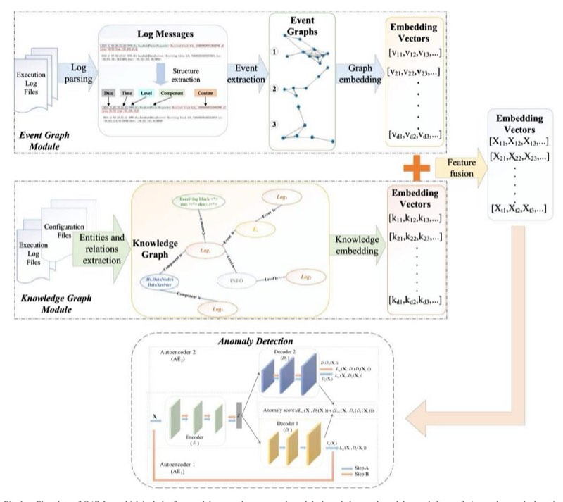
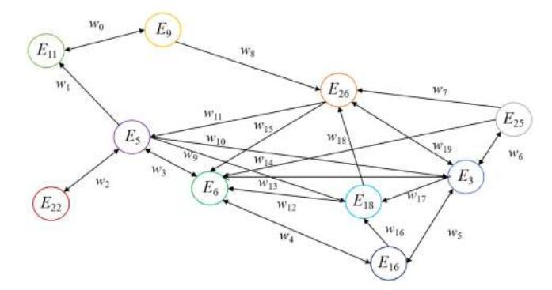
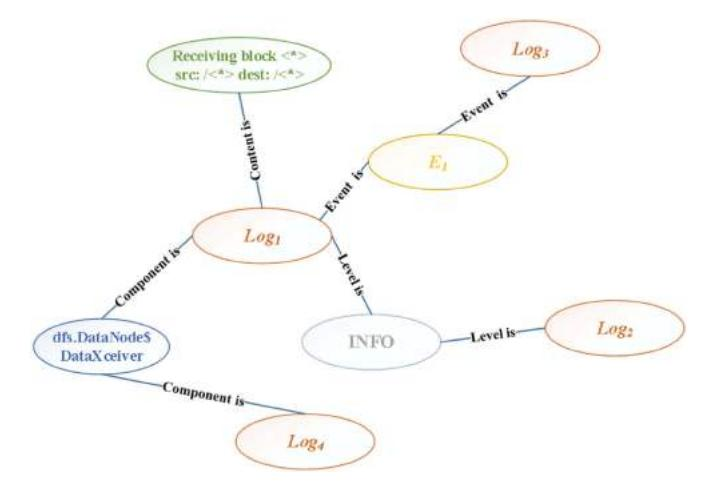
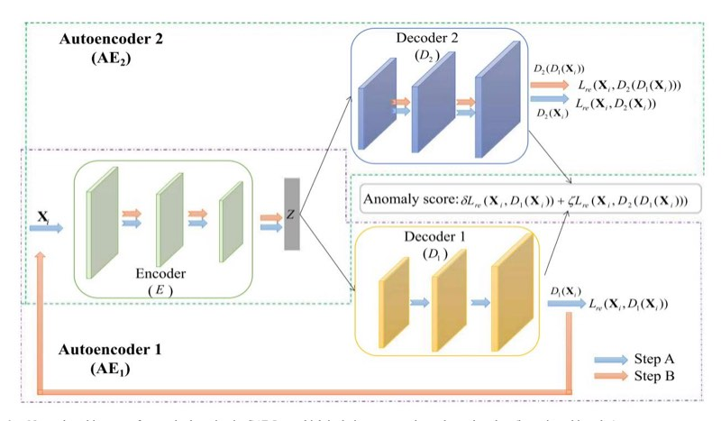
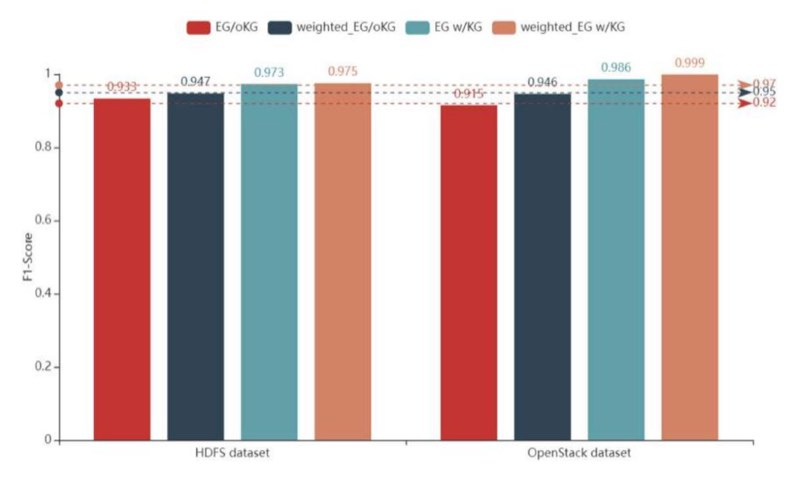
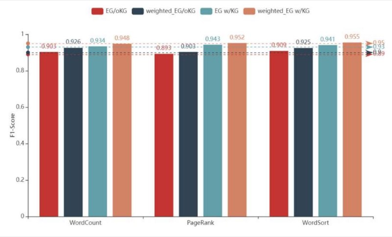

# Log Anomaly Detection by Adversarial Autoencoders With Graph Feature Fusion

Yuxia Xie and Kai Yang *[,](https://orcid.org/0000-0002-5983-198X) Senior Member, IEEE*

**Abstract:** **—The exponential growth of scale and complexity in distributed systems necessitates significant maintenance efforts. Logs play an indispensable role in system operation and maintenance since they record crucial runtime information. However, recent studies on log anomaly detection have primarily focused on deep learning methods, which entail high computational complexity for learning temporal and semantic features from logs. Moreover, most deep learning-based approaches for log anomaly detection require supervised training, which is labor intensive. To address these challenges, this article proposes a framework called** *GAE-Log***.** *GAE-Log* **leverages event graphs and knowledge graphs to model logs comprehensively. By integrating temporal dynamics through event graphs and incorporating contextual information from knowledge graphs,** *GAE-Log* **enhances the understanding of the system's status. Moreover,** *GAE-Log* **employs adversarial training of autoencoders for anomaly detection on logs. The effectiveness of** *GAE-Log* **is evaluated through an ablation study and comprehensive comparisons using both public and synthetic log datasets. The results demonstrate that** *GAE-Log* **outperforms stateof-the-art methods in log anomaly detection, achieving significant performance improvements.**

**Index Terms:** **—Adversarial training, anomaly detection, autoencoder, event graph, knowledge graph, log analysis.**

### I. INTRODUCTION

**T** HE growing scale and complexity of distributed systems pose challenges in terms of their management and operation. Downtime in these systems can result in significant revenue loss[\[1\].](#page-11-0) In fact, Gartner reports that the cost of system downtime is \$540 000 per hour at the higher end [\[2\],](#page-11-0) [\[3\].](#page-11-0) Thus, ensuring reliability has become imperative in the distributed system.

To ensure high-quality service in a distributed system, efficient maintenance is crucial, requiring engineers to have a great understanding of the system architecture. However, along with the increasing digitization, larger system scales, and finer monitoring granularity, relying solely on manual intervention by engineers becomes nearly impractical. Artificial Intelligence for

The authors are with the Department of Computer Science, Tongji University, Shanghai 201804, China (e-mail: [yuxia\\_xie@tongji.edu.cn;](mailto:yuxia_xie@tongji.edu.cn) [kaiyang](mailto:kaiyang@tongji.edu.cn) [@tongji.edu.cn\)](mailto:kaiyang@tongji.edu.cn).

Digital Object Identifier 10.1109/TR.2023.3305376

IT Operations (AIOps) offers a solution to simplify IT operations management in complex IT environments [\[4\]](#page-11-0) with artificial intelligence techniques. AIOps not only enhances system reliability and availability, but also significantly reduces maintenance costs. In this context, log analysis plays a vital role in identifying and preventing system failures in a timely manner, thereby enabling intelligent operation and maintenance. However, log anomaly detection currently faces several challenges:

- - *Large Volume:* The proliferation of applications and systems generates an enormous amount of monitoring data, including a vast number of system logs. Dealing with this massive volume of log data efficiently is a significant challenge.
- - *High Dimensionality:* System logs are unstructured and collected from various components, rendering system logs to be high dimensional. In complex distributed systems like Hadoop [\[5\],](#page-11-0) logs may come from components such as HDFS [\[6\],](#page-11-0) MapReduce [\[7\],](#page-11-0) Hive [\[8\],](#page-11-0) HBase [\[9\],](#page-11-0) Zookeeper [\[10\],](#page-11-0) Yarn [\[11\],](#page-11-0) Spark [\[12\],](#page-11-0) etc. Managing and analyzing logs with diverse dimensions adds complexity to anomaly detection.
- - *Domain Knowledge:* Anomalies in distributed systems often involve the context and configuration information of multiple components. Detecting and understanding these anomalies require domain knowledge from subject matter experts who understand the intricate architecture and behavior of the system.
- - *Unsupervised Learning:* Log data are typically unlabeled, making it challenging to apply traditional supervised learning techniques. Manually labeling log data for training purposes is time-consuming, costly, and often impractical due to limited anomalous instances.
- - *Sophisticated Anomalies:* For a distributed system with various components, the failure may come from any component. Moreover, the dependencies among components can lead to the propagation of failures from one component to others. Detecting such sophisticated anomalies, where failures interact and impact different system parts, increases the difficulty of anomaly detection.

To address the above challenges, we propose a log anomaly detection framework *GAE-Log* with graph feature fusion. By applying graph feature fusion to both the event graph and knowledge graph, *GAE-Log* captures more informative and discriminative features thus achieving better anomaly detection performance. This work encompasses the following contributions:

1558-1721 © 2023 IEEE. Personal use is permitted, but republication/redistribution requires IEEE permission. See https://www.ieee.org/publications/rights/index.html for more information.

Manuscript received 21 October 2022; revised 21 February 2023, 19 June 2023, and 13 July 2023; accepted 31 July 2023. Date of publication 25 August 2023; date of current version 5 March 2024. This work was supported in part by the National Natural Science Foundation of China under Grant 61771013; in part by the Fundamental Research Funds for the Central Universities of China; and in part by the Fundamental Research Funds of Shanghai Jiading District. Associate Editor: M.-H. Yang. *(Corresponding author: Kai Yang.)*

- - *Event Graph Modeling: GAE-Log* devises an *event graph* to model the relations among sequential logs, allowing it to effectively capture the temporal dynamics of system events. This graph-based representation facilitates the analysis of log data and helps uncover patterns and anomalies in the system behavior.
- - *Unsupervised Feature Extraction and Fusion: GAE-Log* employs unsupervised feature extraction techniques to process log data. By extracting meaningful features without relying on labeled data, we enable *GAE-Log* to detect anomalies in an unsupervised manner. Furthermore, we integrate features from both the event graph and knowledge graphs, enabling a comprehensive understanding of the system behavior.
- - *Adversarial Training: GAE-Log* leverages adversarial training to optimize the performance of autoencoders. By using this training approach, we enhance the anomaly detection capability of *GAE-Log*, enabling it to better distinguish normal and anomalous log patterns.
- - *Scalability and Flexibility: GAE-Log* exhibits good scalability, allowing it to handle not only event graphs and knowledge graphs but also other types of graphs. This flexibility enables *GAE-Log* to perform feature fusion on a wide range of graph-based representations, accommodating different log data characteristics and system architectures.

In summary, our log anomaly detection framework, *GAE-Log*, utilizes graph features obtained through graph feature fusion to enhance anomaly detection performance. Experimental results on various datasets validate the effectiveness of our framework in addressing the challenges, demonstrating its potential for practical anomaly detection applications.

The rest of this article is organized as follows. In Section II, we first investigate the related work on log anomaly detection. Then, we elaborate on the details of the *GAE-Log* framework in Section [III.](#page-3-0) We provide a comprehensive explanation of the construction and feature extraction of the graph, and the *GAE-Log* for anomaly detection. Next, we assess the performance of *GAE-Log* using both synthetic and public log dataset in Section [IV.](#page-8-0) Finally, Section [V](#page-11-0) concludes this article, summarizing the key findings and contributions of our work.

### II. RELATED WORK

In this section, we provide a detailed overview of log anomaly detection research, highlighting the different approaches and techniques that have been explored in the field. Extensive research efforts have been undertaken for log anomaly detection, including machine learning-based methods, statisticsbased methods, and graph-based methods. We present a detailed overview of log anomaly detection research as follows.

## *A. Machine Learning-Based Methods*

The machine learning-based methods focus on converting heterogeneous log data into low-dimensional features to classify normal and anomalous log patterns. Specifically, the machine learning-based methods fall into two categories.

*Traditional Machine Learning Algorithms:* Traditional machine learning algorithms focus on performing on extracted features provided by raw data [\[1\].](#page-11-0) For instance, Xu et al. devised a method using the principal component analysis (PCA) algorithm and the frequent pattern mining (FPM) algorithm for log anomaly detection. PCA performs dimension reduction of log features, while FPM mines anomalous patterns within the reduced feature space [\[13\].](#page-11-0) In addition to utilizing dimension reduction algorithms like PCA, researchers also use clustering for log anomaly detection. HLAer is a heterogeneous log analysis system that utilizes the clustering algorithm for log anomaly detection [\[14\].](#page-11-0) However, its efficiency and scalability in parallel implementation are limited. To tackle this problem, a real-time log analysis system called LogLens is proposed in [\[15\]](#page-11-0) to detect anomalies. LogLens employs different methods to detect anomalies, one is to detect anomalies through clustering the log patterns, and the other is to detect anomalies of sequential logs with finite state automaton (FSA). Similarly, Vaarandi et al. [\[16\]](#page-11-0) proposed a new clustering algorithm to perform FPM on logs, thus realizing anomaly detection. A log problem identification method for online services called LogCluster is devised in [\[17\]](#page-11-0) by comparing the extracted log sequences with the knowledge base. The clustering algorithm is utilized in LogCluster to obtain representative log sequences to establish a knowledge base. In [\[18\],](#page-11-0) Beehive is proposed to detect suspicious behaviors through log analysis. Specifically, Beehive extracts several features from logs and uses PCA to perform dimension reduction. Then, the K-Means algorithm is employed to identify outliers. In [\[19\],](#page-11-0) an unsupervised anomaly detection framework for detecting anomalies through log analysis is proposed. They learn normal patterns with a knowledge base construction method while detecting abnormal events with a streaming anomaly detection method. Indeed, log anomaly detection approaches extend beyond clustering and encompass various other algorithms, including classification, invariant mining (IM), and more. Liang et al. [\[20\]](#page-11-0) processed supercomputing system logs using different classification algorithms, including support vector machine (SVM), to detect anomalies. In [\[21\],](#page-11-0) the linear regression (LR) algorithm is employed to automatically detect performance crises in data centers. The decision tree (DT) algorithm is utilized in [\[22\]](#page-11-0) for failure diagnosis in logs. Khatuya et al. [\[23\]](#page-11-0) employed both ridge regression and K-Means to distinguish anomalous behaviors. Lou et al. [\[24\]](#page-12-0) analyzed system logs through IM, considering log sequences that violate the invariant rules as anomalies. In addition, aside from the methods mentioned above, several open-source projects implemented log anomaly detection using machine learning algorithms. For instance, the log anomaly detector [\[25\]](#page-12-0) aims to leverage natural language processing tools for log encoding and employ machine learning techniques for automated log anomaly detection. These examples highlight the utilization of various machine learning algorithms and techniques in log anomaly detection, demonstrating the diverse approaches taken to address this challenging task.

*Deep Learning Algorithms:* Deep learning algorithms commonly employ a multiple-layer architecture, enabling the model to progressively capture and represent features at different layers [\[1\].](#page-11-0) This hierarchical approach empowers the model to learn complex and abstract representations of the input data. Furthermore, deep learning-based models can be broadly classified into two categories: Recurrent neural network (RNN) based methods and other architectures.

*RNN-based Models:* Brown et al. proposed an attention-based RNN model for anomaly detection in system logs in [\[26\].](#page-12-0) In a similar vein, Zhang et al. devised a failure prediction method in [\[27\]](#page-12-0)that utilizes the long short term memory (LSTM) network to model sequential logs. By leveraging the sequential patterns in logs, this approach aims to predict system failures. LSTM and its variants are also employed in other models. For instance, Wang et al. [\[28\]](#page-12-0) extracted log features using word2vec and TF-IDF models and detect anomalies through an LSTM-based approach. DeepLog [\[29\]](#page-12-0) is an LSTM-based log anomaly detection framework that comprises log template and log variable anomaly detection. Compared with [\[27\],](#page-12-0) DeepLog demonstrates better performance in comprehensive system anomaly detection. Meng et al. proposed a model called LogAnomaly in [\[30\],](#page-12-0) which leverages LSTM to detect both sequential and quantitative anomalies in logs. They also introduce a log vectorization method named template2vec. Compared to DeepLog, LogAnomaly achieves better online detection performance. In addition, Meng et al. explored log embedding for online log analysis through a semantic representation framework in [\[31\].](#page-12-0) Similarly, Zuo et al. [\[32\]](#page-12-0) proposed an anomaly detection framework targeting microservices architectures, which is compatible with LSTM models. Considering the instability of log data, Zhang et al. proposed a robust log anomaly detection method called LogRobust in [\[33\].](#page-12-0) LogRobust mitigates the impact of instability arising from system evolution and noise by embedding logs into semantic features and performs stable anomaly detection using an attention-based Bi-LSTM. Finally, in [\[34\],](#page-12-0) Nedelkoski et al. introduced Logsy, a method for learning log representation to distinguish anomalies from normal samples. These studies showcase the continuous exploration and development of RNN-based models and their variants for log anomaly detection. The ability of RNNs to capture temporal dependencies and patterns in log sequences makes them a popular choice for modeling log data and identifying anomalies.

*Others Deep Learning Models:*In [\[35\],](#page-12-0) a convolutional neural network (CNN) is employed to detect anomalous logs within a big data system. This approach utilizes different filters to encode the logs into low-dimensional features, enabling effective anomaly detection. In comparison, our previous work, LogM [\[36\],](#page-12-0) leverages a combination of CNN and Bi-LSTM networks for log anomaly prediction. The CNN module captures semantic features, while the Bi-LSTM grasps temporal dynamics. This joint approach enhances the model's capability to handle log anomalies comprehensively. In addition to anomaly prediction, LogM proposes both unsupervised and supervised methods for diagnosing failures, making it applicable to various practical scenarios. Furthermore, Xia et al. [\[37\]](#page-12-0) introduced a log anomaly detection model based on generative adversarial network (GAN). This model consists of a generator, which models the distribution of real and synthetic log data, and a discriminator, which distinguishes anomalous samples from normal ones. By incorporating the adversarial training framework of GANs, this approach aims to improve the accuracy of log anomaly detection.

### *B. Statistics-Based Methods*

Statistics-based methods aim to capture the statistical characteristics of log data in order to identify samples that deviate from expected patterns. Several examples of such methods are listed below. Yamanishi et al. [\[38\]](#page-12-0) employed a hybrid hidden Markov model (HMM) to model the behavior of system logs. They use an online learning algorithm to dynamically select optimal mixed components and calculate the anomaly score based on the statistical information of the entire testing data. He et al. [\[39\]](#page-12-0) utilized event count vectors as features and employ LR to estimate the anomaly score. By representing logs as event counts, they capture the occurrence frequency of different events and use LR to determine the likelihood of anomalies. In [\[40\],](#page-12-0) logs are transformed into signals to record the distribution of each time window. They calculate the Kullback–Leibler (K-L) divergence between the signal distribution of the current time window and the previous time window to detect anomalies. For intrusion detection in network traffic analysis, Hareesh et al.[\[41\]](#page-12-0) presented a statistical histogram model for normal behavior. By comparing network traffic to this model, they efficiently identify both flooding attacks and nonflooding attacks by detecting deviations from the expected behavior. Du et al. [\[42\]](#page-12-0) proposed a method, where they represent the distribution of log templates on a time axis using frequency sequences. Behavior subsequences are then formed and grouped into different clusters based on their distribution. Anomaly scores are calculated for each cluster, allowing for the identification of different types of anomalies. These statistics-based methods leverage various statistical approaches, such as HMM, event counting, signal analysis, and histogram modeling, to detect anomalies in system logs.

## *C. Graph-Based Methods*

The graph-based methods play a key role in extracting features from logs and constructing a graph to model the execution rules of the system. Several specific studies and frameworks are mentioned in this context. For instance, Yuan et al. [\[43\]](#page-12-0) proposed a method for detecting anomalous behaviors by mining templates and template sequences, which are used to form a graph representing the control flow. To assess abnormality, they compare this graph with benchmark graphs formed in the normal status. Similarly, Aharon et al. [\[44\]](#page-12-0) put forward a time-weighted graph for control flow, aiming to capture patterns under normal status and provide alerts for deviations. Beschastnikh et al. [\[45\]](#page-12-0) developed a model specifically designed to enhance the detection of anomalies in concurrent systems. They analyze system logs to form communication finite state machines (CFSM), which are utilized to infer system behaviors. Fu et al. [\[46\]](#page-12-0) understand system logs through contextual analysis. Specifically, they employ the formal concept analysis (FCA) method to model log sequences and utilize the DT model to find key factors. Xu et al. [\[47\]](#page-12-0) adopted an approach that involves extracting template sequences from logs and modeling these sequences with the finite state machine (FSM) algorithm. On the other hand,

<!-- Image Description: The image displays a system architecture for anomaly detection. It shows three modules: an event graph module extracting events from log files, a knowledge graph module extracting entities and relations, and an anomaly detection module using autoencoders. Event and knowledge graph embeddings are fused for anomaly scoring, visualized via a diagram illustrating the data flow and processing steps of the system. A graph embedding process is depicted. -->

Figure 1. Flowchart of *GAE-Log*, which includes four modules, namely event graph module, knowledge graph module, graph feature fusion, and anomaly detection (best viewed in color).

Yu et al. [\[48\]](#page-12-0) constructed a directed graph model customized for interleaved logs. This model utilized log identifiers such as request ID and transaction ID to represent the relations within the logs. These graph-based methods offer valuable techniques for extracting log features and representing control flow patterns.

However, the use of deep learning models in log anomaly detection often poses challenges due to the requirement for supervised training, which necessitates extensive data labeling. Furthermore, practical implementation of neural networks can be computationally complex. While statistics-based methods are efficient in identifying system anomalies, their detection accuracy is relatively poor. Moreover, the aforementioned methods do not consider the construction of graphs for system events or the analysis of system architectures using knowledge graphs, which could provide a more comprehensive understanding of anomalies. To address these limitations, we propose a framework called *GAE-Log* that integrates event graphs and knowledge graphs to capture comprehensive system features. In addition, *GAE-Log* employs adversarial training to train the autoencoders for log anomaly detection.

## III. *GAE-LOG:* LOG ANOMALY DETECTION BY ADVERSARIAL AUTOENCODERS WITH GRAPH FEATURE FUSION

*GAE-Log* effectively performs anomaly detection on system logs by leveraging graph features. The framework of *GAE-Log* consists of four main modules, namely event graph module, knowledge graph module, graph feature fusion, and anomaly detection, as presented in Figure 1. To begin with, *GAE-Log* processes execution log files by parsing log messages into structured log templates and extracting log events to construct event graphs.

| | /10.251.215.16:55695 dest: /10.251.215.16:56010 size 91178 from /10.250.10.6 | | | 2018-11-08 20:22:12 INFO dfs. DataNode\$DataXceiver: Receiving block blk 7503483334202473044 src: 2018-11-08 20:23:10 INFO dfs. DataNode\$PacketResponder; Received block blk -1608999687919862906 of | |
|---------------|---------------------------------------------------------------------------------|-------------|-------------------------|----------------------------------------------------------------------------------------------------------------------------------------------------------------------------------------------------------|----------------|
| Preprocessing | | | | | |
| Date | Time | Level | <b>Block</b> ID | <b>Event Template</b> | Event ID |
| 20181108 | 202212 | <b>INFO</b> | 7503483334 202473044 | Receiving block $\langle$ *> src: $\langle \langle * \rangle$ dest: $\langle \langle * \rangle$ | $E_1$ |
| 20181108 | 202310 | <b>INFO</b> | 1608999687 919862906 | Receiving block $\lt^*$ of size $\langle * \rangle$ from $\langle * \rangle$ | E 2 |

Figure 2. Example of log preprocessing to get log events.

<!-- Image Description: The image displays a weighted directed graph. Nodes (circles labeled Ei) represent entities, and edges (lines labeled wi) represent weighted relationships between them. The graph's structure shows connections and weights indicating the strength of each relationship between entities. No specific calculations or equations are shown. -->

Figure 3. Example of event graph, where node indicates log event and edge indicates transition of events.

The Drain algorithm [\[49\]](#page-12-0) is employed in this article for log parsing, which generates log event templates. Each log event template is mapped to a predefined log event and distinguished by different identifiers, as depicted in Figure 2. The event graph is then encoded into vectors via graph embedding methods. Simultaneously, *GAE-Log* extracts entities and relations to form a system knowledge graph. The knowledge graph embedding algorithms are utilized to obtain embedding vectors for the knowledge graph. Subsequently, *GAE-Log* applies graph feature fusion to combine the features extracted from the event graph and knowledge graph. Finally, for log anomaly detection, *GAE-Log* utilizes adversarial training of autoencoders, enabling the framework to effectively identify anomalies in logs.

### *A. Event Graph*

To better characterize the sequential logs, we propose an event graph to model the log data. The event graph serves to represent the operation processes that occur during the execution of system tasks, providing a depiction of the temporal dynamics within the system. Figure 3 presents an example of the event graph, showcasing the visualization of these operation processes.

Now, let us delve into the detailed construction of event graphs. First, the parsed log messages are grouped into different categories based on log identifiers. Each group represents the execution of an individual system task. Log identifiers are specific tokens used to differentiate and group related operations within the system [\[1\].](#page-11-0) For example, block ID is commonly used for partitioning logs in HDFS, while task ID is typically used for Hadoop system logs. Second, *GAE-Log* clusters the

<!-- Image Description: The image displays a graph depicting relationships between software components and events. Nodes represent components (e.g., "dfs.DataNodes," "Log1") and events ("E1"). Edges labeled "Component is," "Content is," "Event is," and "Level is" illustrate the connections. The graph visually shows a hierarchical or network structure linking logs, events, and components. -->

Figure 4. Example of knowledge graph, where different kinds of entities and relations are shown (best viewed in color).

logs to obtain templates and assigns tags to each template. In Figure 3, E*i* represents the *i*th log template corresponding to a specific system event. Third, *GAE-Log* constructs the event graph by capturing temporal dynamics to model transitions among log events. Temporal dynamics refer to the connections between log events abstracted from the raw log data, determined based on their occurrence in the log sequence. This modeling approach captures the dynamic changes in the workflow during the execution of system tasks. Furthermore, *GAE-Log* performs normalization on the cooccurrence times of events to compute edge weights w*i*. For an edge e*i,j* involving nodes E*i* and E*j* , the cooccurrence count of the two nodes in the entire event graph is calculated as c*i,j* , and the total number of edges in the event graph is denoted as s*i,j* . The weight of edge e*i,j* is expressed as c*i,j*/s*i,j* .

Afterward, the event graphs are encoded into vectors using graph embedding methods. Each event graph represents the execution of an individual system task and is associated with a label. In practice, *GAE-Log* takes the nodes and edges of a graph as input and employs the graph2vec [\[50\]](#page-12-0) algorithm to obtain the feature vector**v***i* for the entire event graph. The graph embedding is performed by treating the entire graph as a document and rooted subgraphs as words. Through doc2vec [\[51\],](#page-12-0) embedding vectors are generated for each node, representing specific log events. In particular,

$$
\mathbf{v}_i = [v_{i1}, v_{i2}, v_{i3}, \ldots], i \in [1, d]. \tag{1}
$$

## *B. Knowledge Graph*

Due to the inherent complexity of the system, anomalies may involve various software and hardware. Relying solely on modeling the log data makes it challenging to fully analyze the system's status, while an anomaly often involves the configuration and contextual information of multiple components. To gain a comprehensive understanding of the system with minimal human intervention, we devise a knowledge graph to assist anomaly detection. Figure 4 displays an example of the knowledge graph, illustrating the presence of different entities and their relations.

| Log entity | <b>Event entity</b> | Level entity | <b>Component entity</b> | <b>Content entity</b> |
|------------------|---------------------|--------------|---------------------------|------------------------------------------|
| Log i | $E_{I}$ | <b>INFO</b> | dfs.DataNode\$DataXceiver | Receiving block <*> src: /<*> dest: /<*> |
| $Log_2$ | $E_{\rm S}$ | <b>INFO</b> | dfs.FSNamesystem | BLOCK* NameSystem.allocateBlock: <*> |
| Log 3 | $E_{I}$ | <b>INFO</b> | dfs.DataNode\$DataXceiver | Receiving block <*> src: /<*> dest: /<*> |
| Log 4 | $E_{I}$ | <b>INFO</b> | dfs.DataNode\$DataXceiver | Receiving block <*> src: /<*> dest: /<*> |

Figure 5. Example of entity extraction for the knowledge graph.

Specifically, the knowledge graph comprises five categories of entities:

- 1) *Log entity.* The log entity represents the raw log messages, as shown by the red nodes in Fig. [4.](#page-4-0) For simplicity, we denote the ith log message as Log*i*.
- 2) *Event entity.* The event entity corresponds to the system event associated with the raw log, represented by the yellow nodes in Fig. [4.](#page-4-0)
- 3) *Level entity.* The level entity signifies the importance of each log and is depicted by the gray nodes in Fig. [4.](#page-4-0) In this article, the level entity includes INFO, WARN, ERROR, and FATAL.
- 4) *Component entity.* The component entity indicates the component to which the log belongs. The blue nodes in Fig. [4](#page-4-0) represent the component entities.
- 5) *Content entity.* The content entity is associated with the specific content of the log. The green nodes in Fig. [4](#page-4-0) denote the content entities.

Furthermore, we define the following four types of relations:

- 1) *Relations among logs and events* illustrate the specific system event corresponding to each log.
- 2) *Relations among logs and levels*indicate the level to which each log belongs.
- 3) *Relations among logs and components* depict the components associated with each log.
- 4) *Relations among logs and content* describe the content of each log.

Now, let us illustrate how the construction algorithm works. First, we predefine the entities and relations based on effective data analysis. Then, we perform entity extraction to get five types of entities, as shown in Figure 5. For these five types of entities, we utilize the corresponding relations to connect them. Take the four log messages in Figure 5 as an example, we explain how Fig. [4](#page-4-0) is established. Starting with Log1 as the central node, we analyze the entity extraction results and find its event entity is E1, establishing a relation between Log1 and E1. In addition, the level entity for Log1 is INFO, so we connect Log1 and INFO to indicate that the level for Log1 is INFO. Similarly, we connect Log1 with its component entity and content entity. Furthermore, considering entities Log1 and Log2, they both have the log level INFO. For entities Log1 and Log3, their event templates are E1, while for entities Log1 and Log4, their component entities are the same. Hence, we connect them through relations among logs and levels and relations among logs and components, respectively. By applying these connections, we obtain the complete knowledge graph, as depicted in Fig. [4.](#page-4-0)

In conclusion, the knowledge graph in *GAE-Log* offers a simple and user-friendly approach for construction. It efficiently captures abundant information that depicts the system running status. Furthermore, by incorporating system topology, it effectively uncovers intercomponent relations, facilitating system understanding and anomaly detection. The constructed knowledge graph is then encoded into embedding vectors **k***i*, which enhance the training of anomaly detection models on log datasets and resulting in performance improvements

$$
\mathbf{k}_{i} = [k_{i1}, k_{i2}, k_{i3}, \ldots], i \in [1, d].
$$
(2)

In our previous work, LogM [\[36\],](#page-12-0) we also utilized a knowledge graph. To provide a more thorough comparison, let us further discuss the differences between the two approaches. The knowledge graph employed in LogM is designed as an anomaly knowledge graph to facilitate the failure diagnosis. In this context, the entities represent abnormal events and root causes within the system, while the relations capture the characteristics of abnormal events and their corresponding root causes. Conversely, the knowledge graph proposed in this study serves as a system architecture knowledge graph aimed at enhancing the anomaly detection performance. It encompasses various entities such as log entities, event entities, component entities, and more. The relations within this knowledge graph depict specific events associated with logs and the source components of the logs, etc. In terms of diversity and informativeness, the entities and relations in *GAE-Log* offer a broader range of informative characteristics compared to those in LogM. To summarize, these two types of knowledge graphs not only exhibit significant differences in terms of entities and relations, but also address distinct downstream tasks.

### *C. Graph Feature Fusion*

The event graph and knowledge graph are closely related but exhibit significant differences. First, the event graph is a directed, homogeneous, and weighted network constructed using sequential logs. It represents the execution of individual system tasks within certain task-specific contexts. On the other hand, the knowledge graph encodes entities and relations into triples (h, r, t), where h, r, and t represent head entities, relations, and tail entities, respectively. The knowledge graph is an undirected, heterogeneous network without weights, constructed using configuration information, system topology, and raw logs. Furthermore, the knowledge graph serves as a semantic network that reflects the objective laws of the system. In a sense, the knowledge graph is an abstract graph with shared attributes among multiple event graphs. While the event graph focuses on the execution of a specific system task, the knowledge graph collects relevant information about the entire system's status. The event graph and knowledge graph are complementary to each other, as they capture different aspects of the system. To leverage their correlation and differences, we propose a graph feature fusion method that integrates features from both graphs, resulting in a more comprehensive understanding of the system's status.

In *GAE-Log*, the integration of the event graph embedding feature **v***i* and the knowledge graph embedding feature **k***i* is accomplished through a linear combination, as shown in the following formula:

$$
\mathbf{x}_i = \alpha \mathbf{v}_i \oplus \beta \mathbf{k}_i \tag{3}
$$

where ⊕ denotes the concatenation operation, and α and β are weight coefficients. The weight coefficients are used to determine the importance of the event graph features and the knowledge graph features. Specifically, α is constrained within the range (0,1] and β within the range [0,1]. To find the optimal weight parameters, experiments are performed. Initially, one of the weight parameters, either α or β, is fixed while the other is dynamically adjusted. This process examines the influence of each weight parameter on anomaly detection. Finally, the parameter combination resulting in the best performance is selected.

### *D. Anomaly Detection*

Logs serve as records of the system's running status, following a predetermined workflow during normal executions. Log anomaly detection aims to identify anomalous patterns deviating from normal behavior. To achieve this, it is essential to model the temporal dynamics of sequential logs in their normal state to effectively distinguish anomalous patterns. One commonly utilized neural network model for anomaly detection is the autoencoder. The underlying assumption of an autoencoder is that normal samples are relatively straightforward to reconstruct compared to anomalies and conform to expected distributions. Therefore, we employ an autoencoder to model the sequential logs during the normal state, enabling the discrimination of the system's status.

Traditional autoencoders primarily focus on minimizing the reconstruction error during training. However, relying solely on optimizing the reconstruction error can lead to a limitation. This limitation arises when certain abnormal logs closely resemble normal logs. In such cases, optimizing solely for reconstruction error may result in small reconstruction errors for these anomalies, which in turn compromises the accuracy of the anomaly detection model. To address this issue, we draw inspiration from the concept of generative adversarial nets introduced in [\[52\].](#page-12-0) By incorporating this idea into the training of autoencoders, we aim to enhance their performance. This approach enables us to go beyond reconstruction error as the sole optimization criterion, leading to improved accuracy in log anomaly detection.

*Problem formulation:* In the context of *GAE-Log*, each instance of the overall feature **x***i* represents a complete system event associated with a log sequence. *GAE-Log* utilizes a network to calculate the anomaly score for a given feature **x***i*. The objective of the anomaly detection method is to determine whether the input **x***i* belongs to class y = 0 or class y = 1 based on its anomaly score.

Here, a binary variable y ∈ {0, 1} is employed, where y = 0 denotes that the event corresponding to the log sequence is considered normal, while y = 1 indicates that the event is classified as abnormal. By assessing the anomaly score, *GAE-Log* makes a prediction regarding the class membership of the input **x***i*.

In our study, we present the network structure as depicted in Fig. [6.](#page-7-0) The network primarily consists of two autoencoders. These autoencoders undergo adversarial training to enable anomaly detection for log data. Specifically, the training stage is divided into two parts. Step A, illustrated in Fig. [6,](#page-7-0) involves minimizing the reconstruction error of the autoencoder. This step aims to enhance the model's ability to accurately reconstruct input data. Step B, also depicted in Fig. [6,](#page-7-0) focuses on optimizing the decoders through adversarial training. This step leverages the principles of adversarial training to refine the decoder components of the network.

*Training Stage:* We divide the training stage into two steps.

*Step A:* To begin, we process the input data feature **x***i* by feeding it into the encoder. This produces the hidden variable feature, denoted as Z. Subsequently, we utilize two separate decoders, D1 and D2, to reconstruct the feature representation of **x***i* as D1(**x***i*) and D2(**x***i*), respectively.

The primary goal of Step A is to minimize the reconstruction error, which constitutes a crucial aspect of the training process. This is achieved by iteratively adjusting the encoder and decoders to optimize the fidelity of the reconstructed features. Mathematically, the optimization steps can be formally expressed as

$$
Z = E\left(\mathbf{x}_i\right) \tag{4}
$$

$$
L_{re}(\mathbf{x}_i, D_1(\mathbf{x}_i)) = ||\mathbf{x}_i - D_1(\mathbf{x}_i)||_2 \tag{5}
$$

$$
L_{re}(\mathbf{x}_i, D_2(\mathbf{x}_i)) = ||\mathbf{x}_i - D_2(\mathbf{x}_i)||_2 \tag{6}
$$

$$
\min L_{re}(\mathbf{x}_i, D_1(\mathbf{x}_i))
$$
\n(7)

$$
\min L_{re}(\mathbf{x}_i, D_2(\mathbf{x}_i))\,. \tag{8}
$$

*Step B:* The objective of this step is twofold: to train decoder D2 to discriminate between real data and data generated by decoder D1, and to train decoder D1 to deceive decoder D2. This adversarial training process enhances the discrimination ability of decoder D2 for detecting anomalies. Specifically, we take the data D1(**x***i*)reconstructed by decoder D1 and feed it into autoencoder 2, resulting in the reconstructed data D2(D1(**x***i*)). In this step, decoder D1 aims to minimize the reconstruction error, striving to accurately reconstruct the input data. Conversely, decoder D2 seeks to maximize the reconstruction error, effectively distinguishing anomalies from normal data. The specific optimization function is

$$
\min_{D_1} \max_{D_2} ||\mathbf{x}_i - D_2(D_1(\mathbf{x}_i))||_2.
$$
(9)

By incorporating the concept of adversarial training, we aim to empower autoencoder 2 with superior anomaly discrimination capabilities.

To summarize, Step B comprises a dual-training approach where decoder D1 focuses on minimizing the reconstruction error, while decoder D2 aims to maximize the reconstruction

<!-- Image Description: The image depicts a two-autoencoder anomaly detection system. Input (Xᵢ) passes through Autoencoder 1 (AE₁) yielding a latent representation (Z). Z is then input to Autoencoder 2 (AE₂). Reconstruction losses (Lre) from both decoders (D₁, D₂) are combined to calculate an anomaly score. The diagram uses boxes to represent layers within the autoencoders, and arrows to show data flow. -->

Figure 6. Network architecture of anomaly detection in *GAE-Log*, which includes one encoder and two decoders (best viewed in color).

error. This interplay is fundamental in enhancing the anomaly detection capabilities of autoencoder 2.

In line with [\(5\)](#page-6-0) and [\(6\),](#page-6-0) the final objective functions of the two autoencoders are equivalent to

$$
\mathcal{L}_{AE_1} = \frac{1}{n} L_{re} \left( \mathbf{x}_i, D_1(\mathbf{x}_i) \right) + \left( 1 - \frac{1}{n} \right) ||\mathbf{x}_i - D_2 \left( D_1(\mathbf{x}_i) \right)||_2
$$
\n(10)

$$
\mathcal{L}_{AE_2} = \frac{1}{n} L_{re} \left( \mathbf{x}_i, D_2(\mathbf{x}_i) \right) - \left( 1 - \frac{1}{n} \right) ||\mathbf{x}_i - D_2 \left( D_1 \left( \mathbf{x}_i \right) \right)||_2 \tag{11}
$$

where n denotes a training epoch.

*Detection Stage:* Furthermore, during the anomaly detection stage, we consider two factors simultaneously and define the following the anomaly score :

$$
\epsilon(\mathbf{x}_i) = \delta L_{re} \left( \mathbf{x}_i, D_1(\mathbf{x}_i) \right) + \zeta L_{re} \left( \mathbf{x}_i, D_2 \left( D_1(\mathbf{x}_i) \right) \right) \tag{12}
$$

$$
s.t. \delta + \zeta = 1. \tag{13}
$$

The first part of the function represents the reconstruction error of the log data using decoder D1, while the second part captures the discrepancy between the log data and the outputs of different decoders D1 and D2. To ensure the desired detection sensitivity, we calculate the anomaly score by summing up these two components. To control the tradeoff between false positives and true positives, we introduce two parameters, δ and ζ, where δ<ζ indicates a high sensitivity and δ>ζ indicates a low sensitivity.

Once the anomaly score exceeds a predefined threshold, we classify the log data as an anomaly; otherwise, we consider it a normal sample. In our experimental setup, we determine the threshold by analyzing the receiver operating characteristic (ROC) curve [\[53\].](#page-12-0) Specifically, during the testing stage, we **Algorithm 1:** The Anomaly Detection Algorithm of *GAE-Log*.

**Input**: **x***i*: training sequential log feature, N: number of epochs, **xˆ***i*: testing sequential log feature, λ: threshold. **Output**: y: labels.

Training stage:
\n
$$
E, D_1, D_2 \leftarrow
$$
initialize weights
\n $n \leftarrow 1$
\nwhile $n < N$ do
\n $Z_i \leftarrow E(\mathbf{x}_i)$
\n $\bar{\mathbf{x}}_i^1 \leftarrow D_1(Z_i)$
\n $\bar{\mathbf{x}}_i^2 \leftarrow D_2(Z_i)$
\n $\bar{\mathbf{x}}_i^2 \leftarrow D_2(E(\bar{\mathbf{x}}_i^1))$
\n $\mathcal{L}_{AE_1} \leftarrow \frac{1}{n} ||\mathbf{x}_i - \bar{\mathbf{x}}_i^1||_2 + (1 - \frac{1}{n}) ||\mathbf{x}_i - \bar{\mathbf{x}}_i^2||_2$
\n $\mathcal{L}_{AE_2} \leftarrow \frac{1}{n} ||\mathbf{x}_i - \bar{\mathbf{x}}_i^2||_2 - (1 - \frac{1}{n}) ||\mathbf{x}_i - \bar{\mathbf{x}}_i^2||_2$
\nend while
\nTesting stage:
\n $\hat{\mathbf{x}}_i^1 \leftarrow D_1(E(\hat{\mathbf{x}}_i))$
\n $\hat{\mathbf{x}}_i^2 \leftarrow D_2(E(\hat{\mathbf{x}}_i^1))$
\n $\epsilon(\hat{\mathbf{x}}_i) = ||\hat{\mathbf{x}}_i - \hat{\mathbf{x}}_i^1||_2 + ||\hat{\mathbf{x}}_i - \hat{\mathbf{x}}_i^2||_2$
\nif $\epsilon(\hat{\mathbf{x}}_i) \ge \lambda$ then
\n $y = 1$
\nelse
\n $y = 0$
\nend if

initially calculate the ROC curve to assess the performance of our model. By carefully interpreting the ROC curve, we can determine the optimal threshold that maximizes the performance of our anomaly detection system. Specifically, the overall flow of the algorithm is shown in Algorithm 1.

TABLE I SETUP OF THE DIFFERENT LOG DATASETS

| Log Datasets | Number of log messages | Anomaly ratio |
|--------------|------------------------|---------------|
| <b>HDFS</b> | 100 000 | $2.9\%$ |
| OpenStack | 1 3 3 3 3 1 8 | $7.1\%$ |
| WordCount | 156 203 | 4.8% |
| PageRank | 138 475 | 6.3% |
| WordSort | 19535 | 6.7% |

The key of the anomaly detection network is to achieve high-performance anomaly detection for logs by effectively combining the efficient reconstruction capability of the autoencoder for normal data with the discriminative power of different branch decoder networks for anomaly data, achieved through adversarial training.

### IV. PERFORMANCE EVALUATION

In this section, our main focus is on the performance evaluation of the proposed method. First, we present a detailed description of the dataset. Second, we describe the baselines. Third, we show the evaluation metrics. Fourth, we provide experimental results. Fifth, we conduct an ablation study to analyze the impact of different components. Finally, we compare the computational complexity of the *GAE-Log* with other algorithms.

## *A. Dataset Description*

*Public dataset:* The *HDFS log dataset* collects logs from Hadoop platform [\[13\].](#page-11-0) We have randomly selected 100 000 log messages from this dataset for conducting our experiments. The HDFS logs provide accurate records of block operations, we partitioned the log data into sessions based on different block IDs, allowing us to analyze the log data at a more granular level.

The *OpenStack log dataset* [\[29\]](#page-12-0) is sourced from the CloudLab cloud computing platform [\[54\].](#page-12-0) This dataset comprises over 1 million logs, with abnormal logs accounting for approximately 7% of the total logs.

*Synthetic Dataset:* To generate this dataset, we set up a Hadoop platform and executed various data analysis applications, including WordCount [\[55\],](#page-12-0) PageRank [\[56\],](#page-12-0) and Word-Sort [\[36\].](#page-12-0) To simulate real-world scenarios encountered in production environments, we manually injected six types of failures into the synthetic dataset. These failures include machine downtime, network disconnection, disk full situations, etc.

Table I provides a summary of the details for all five datasets, including the total number of log messages and the anomaly ratio within each dataset. During the experiment, we randomly divided the original dataset into two equal parts for training and testing purposes. By utilizing these diverse datasets, we aim to assess the performance and robustness of our proposed method across different log sources and anomaly scenarios.

### *B. Baselines*

We compare our *GAE-Log* with several baselines commonly used in log anomaly detection. These baselines include:

- 1) Linear Regression (LR) [\[21\]:](#page-11-0) A statistics-based algorithm for log anomaly detection.
- 2) Decision Tree (DT) [\[22\]:](#page-11-0) A classical tree-based log anomaly detection approach.
- 3) Isolation Forest (iForest) [\[57\]:](#page-12-0) An effective unsupervised machine learning-based anomaly detection method.
- 4) One-class SVM (OC-SVM) [\[58\]:](#page-12-0) A traditional method used to solve the problem of anomaly detection.
- 5) LogCluster [\[17\]:](#page-11-0) An unsupervised log problem identification method proposed for online services.
- 6) DeepLog [\[29\]:](#page-12-0) A popular paper in the log anomaly detection field that systematically proposes an LSTM-based method.
- 7) CNN [\[35\]:](#page-12-0) The first paper that focuses on using a CNNbased model for log anomaly detection.
- 8) LogRobust [\[33\]:](#page-12-0) A Bi-LSTM based method for log anomaly detection that considers the instability of logs.
- 9) Logsy [\[34\]:](#page-12-0) A recently proposed transformer-based log anomaly detection method.

To conduct our experiments, we utilize the open-source platform LOGPAI [\[39\],](#page-12-0) [\[59\]](#page-12-0) for implementing the aforementioned approaches. The *GAE-Log* model is built using PyTorch [\[60\].](#page-12-0) For training the autoencoders, we use the ReLU activation function [\[61\]](#page-12-0) and Sigmoid activation function. In our experiments, we set the dimension of the event graph embedding feature and the knowledge graph embedding feature as 128. For the *GAE-Log* model, the following parameter values are used: dim(**v***i*) = 128, dim(**k***i*) = 128, dim(**x***i*) = 256, and N = 100. We carefully analyze the results obtained from these parameter configurations in our experiments. By leveraging the LOGPAI platform and the PyTorch library, we ensure robust implementation and accurate evaluation of the proposed methods.

### *C. Evaluation Metrics*

We employ the Precision, Recall, and F1-Score as metrics to evaluate the performance of log anomaly detection. The formulations are

$$
Precision = \frac{TP}{TP + FP}
$$
(14)

$$
Recall = \frac{TP}{TP + FN}
$$
(15)

$$
F1\text{-Score} = \frac{2 \cdot \text{Precision} \cdot \text{Recall}}{\text{Precision} + \text{Recall}}.\tag{16}
$$

### *D. Experimental Results*

The main focus of our proposed *GAE-Log* framework is to model sequential logs using event graphs and characterize system information using knowledge graphs. By integrating the features of event graphs and knowledge graphs, *GAE-Log* achieves a comprehensive understanding of system anomalies, leading to effective anomaly detection. In our experiments, we conduct both comparison experiments and an ablation study to verify the effectiveness of the *GAE-Log* framework.

| Datasets Approaches | <b>HDFS</b> | WordCount | PageRank | WordSort | OpenStack |
|------------------------|-------------|-----------|----------|----------|-----------|
| LR | 0.602 | 0.652 | 0.696 | 0.535 | 0.620 |
| DT | 0.596 | 0.722 | 0.742 | 0.610 | 0.578 |
| iForest | 0.596 | 0.500 | 0.492 | 0.513 | 0.600 |
| OC-SVM | 0.381 | 0.333 | 0.947 | 0.222 | 0.641 |
| LogCluster [ICSE'16] | 0.710 | 0.596 | 0.778 | 0.303 | 0.423 |
| DeepLog [CCS'17] | 0.640 | 0.893 | 0.700 | 0.667 | 0.932 |
| CNN [DASC'18] | 0.690 | 0.419 | 0.916 | 0.667 | |
| LogRobust [IJCAI'19] | 0.690 | 0.901 | 0.778 | 0.667 | 0.825 |
| Logsy [ICDM'20] | 0.632 | 0.092 | 0.778 | | 0.667 |
| GAE-Log | 0.975 | 0.948 | 0.952 | 0.955 | 0.999 |

TABLE II COMPARISON RESULTS OF ANOMALY DETECTION ON DIFFERENT DATASETS IN TERMS OF F1-SCORE

First, in the comparison experiments, we evaluate the performance of *GAE-Log* by comparing it with four machine learningbased algorithms commonly used for log anomaly detection. Additionally, we employ several representative deep learning-based baselines mentioned in the previous section. The performance of the *GAE-Log* framework and other models on different datasets, including HDFS logs, Hadoop application logs, and OpenStack logs, is presented in Table II. Through these experiments, we aim to demonstrate that our *GAE-Log* framework outperforms the baseline algorithms on various datasets, showcasing its superiority in log anomaly detection.

In the case of HDFS logs, the results demonstrate that the *GAE-Log* framework achieves the best performance with an impressive F1-Score of **0.975**. The closest competitor among the baselines is LogCluster, which achieves an F1-Score of 0.71. Even in the presence of deep learning models, *GAE-Log* still has a superior detection performance. For the models using deep learning, the CNN-based model achieves the best performance with an F1-Score of 0.69, and the F1-Score of other models are between 0.63 and 0.65. For the models of machine learning, the LR gets the best F1-Score, while DT and iForest get the second best performance. Overall, *GAE-Log* achieves a promising anomaly detection performance on HDFS logs.

For the WordCount application logs, the results indicate that *GAE-Log* achieves the best performance with an outstanding F1- Score of **0.948**. For baselines, LogRobust performs best with an F1-Score of 0.901. DeepLog is only inferior to LogRobust, while achieving an F1-Score of 0.893. In addition, the performance of other baselines is inferior, and Logsy is the most unfavorable due to its complex network structure and huge amount of parameters.

For the PageRank applications, *GAE-Log* stands out as the best performer, achieving an impressive F1-Score of **0.952**. Among the baselines, the DT model shows favorable performance with an F1-Score of 0.947, which is only slightly inferior to *GAE-Log*. As for deep learning-based models, the CNN-based model achieves an F1-Score of 0.916 in log anomaly detection. The remaining baselines, except for iForest, have F1-Score between 0.7 and 0.8, which are inferior to *GAE-Log*.

In the case of WordSort applications, *GAE-Log* delivers outstanding performance with an F1-Score of **0.955**, greatly surpassing other baselines. When comparing the baselines, we observe that DeepLog, CNN, and LogRobust show similar performance, with F1-Scores close to each other. However, OC-SVM performs relatively poorly, achieving an F1-Score of 0.222.

From the results presented in Table II, it is evident that *GAE-Log* excels on the OpenStack log dataset. Specifically, *GAE-Log* achieves the best performance with an exceptional F1-Score of **0.999**. DeepLog follows closely with the secondbest performance, obtaining an F1-Score of 0.932. Among the remaining comparison baselines, LogRobust shows the best detection performance with an F1-Score of 0.825, which aligns with the results reported in the original paper.

The overall performance of *GAE-Log* on different log datasets, including PageRank applications, WordSort applications, and OpenStack logs, demonstrates its superior performance in log anomaly detection. *GAE-Log* outperforms many of the baseline algorithms, showcasing its effectiveness and promising potential in practical applications.

## *E. Ablation Study*

In our ablation study, we conduct several experiments to determine the importance of different modules within *GAE-Log*. The following configurations are used:

*EG/oKG: GAE-Log* performs anomaly detection using features solely from event graphs.

*weighted\_EG/oKG: GAE-Log* performs anomaly detection with features from weighted event graphs.

*EG w/KG: GAE-Log* performs anomaly detection by integrating features from both event graphs and knowledge graphs.

*weighted\_EG w/KG: GAE-Log* performs anomaly detection using features integrated from weighted event graphs and knowledge graphs.

To enhance the reliability and comprehensiveness of our experimental results, we compare the performance trends of

<!-- Image Description: The figure displays a grouped bar chart comparing F1-scores for four methods (EG/oKG, weighted_EG/oKG, EG w/KG, weighted_EG w/KG) across two datasets (HDFS and OpenStack). Each bar represents an F1-score; the chart shows the performance variation between the methods and datasets. Dashed horizontal lines indicate average F1-scores. Numerical F1-score values are overlaid on the bars. -->

Figure 7. Anomaly detection performance of the *GAE-Log* framework on public HDFS logs and OpenStack logs respectively.

<!-- Image Description: The image displays a bar chart comparing F1-scores for four methods (EG/oKG, weighted_EG/oKG, EG w/KG, weighted_EG w/KG) across three feature sets (WordCount, PageRank, WordSort). Each bar represents an F1-score, with values indicated numerically. A dashed horizontal line shows a baseline score. The chart compares the performance of different methods on the same feature sets. -->

Figure 8. Anomaly detection performance of the *GAE-Log* framework on Hadoop dataset with three different applications.

different feature settings in *GAE-Log*. Figure 7 illustrates the ablation study results of public HDFS logs and OpenStack logs, presenting the F1-Scores under different feature settings. The results vividly demonstrate the outstanding performance of *GAE-Log* in log anomaly detection across various configurations: EG/oKG, weighted\_EG/oKG, EG w/KG, and weighted\_EG w/KG. Notably, we observe that the performance of *GAE-Log* using EG/oKG is inferior to that using weighted\_EG/oKG, while the performance of weighted\_EG/oKG falls short compared to EG w/KG.

Figure 8 presents the anomaly detection results specifically for Hadoop applications. First, across different applications and methods employed, *GAE-Log* utilizing weighted\_EG w/KG and EG w/KG consistently outperforms *GAE-Log* employing

TABLE III TIME COST OF DIFFERENT APPROACHES

| | <b>HDFS</b> dataset | | |
|------------|---------------------|-----------------|--|
| Approaches | Training | Testing | |
| GAE-Log | 1h 25 m | 7s | |
| LogCluster | 19 m | 23s | |
| DeepLog | 1h 50 m | 20 m | |
| <b>CNN</b> | 2h 23 m | 22 m | |
| LogRobust | 1h 20m | 49 s | |
| Logsy | 3h 18 m | 34 m | |

weighted\_EG/oKG and EG/oKG. This finding validates the effectiveness of integrating features from both event graphs and knowledge graphs in *GAE-Log*. Second, when the knowledge graph and the weights in the event graph are removed, a certain level of performance degradation occurs. Notably, the absence of the knowledge graph has the most significant impact, underscoring its crucial role in the anomaly detection process. Moreover, through a comparative analysis of the utilization of weighted\_EG to address event co-occurrences, we consistently observe improved performance across all three applications. Furthermore, it is worth noting that when *GAE-Log* already achieves superior performance with certain methods, the additional improvement from the knowledge graph and weights in the event graph is not as pronounced, which is intuitively understandable.

## *F. Complexity Analysis*

In this section, we provide a complexity analysis for *GAE-Log* and other related methods. The training time and testing time on the HDFS dataset are presented in Table III. Overall, all the approaches demonstrate efficient testing times, which are significantly lower than the training times. Among these approaches, *GAE-Log* achieves the best performance. Regarding the training time, *GAE-Log* exhibits favorable efficiency compared to the other methods. However, it is slightly slower than LogCluster, which utilizes a simple clustering approach. In summary, *GAE-Log* proves to be highly effective, with short detection time and acceptable training time. In addition, we conducted a detailed analysis of the time cost for each component of *GAE-Log*: Specifically, the construction of the event graph requires 25 s, the construction of the knowledge graph takes 11 s, and the graph embedding processes for the event graph and the knowledge graph require 9 and 21 s, respectively.

## V. CONCLUSION

This article proposes a framework called *GAE-Log* for detecting system anomalies in unstructured logs. Detecting such anomalies not only reduces financial costs, but also enhances system availability. The *GAE-Log* framework leverages two key components: the event graph and the knowledge graph, in order to model the relations among sequential logs and capture system information, respectively. By integrating the features from both graphs, *GAE-Log* offers a comprehensive perspective on system anomalies. Moreover, *GAE-Log* utilizes adversarial training for autoencoders, thereby achieving enhanced performance in log anomaly detection. To evaluate the effectiveness of the framework, extensive tests were conducted on both public and synthetic log datasets. The results demonstrate that *GAE-Log* exhibits significant advantages in detecting log anomalies.

### REFERENCES

- [1] S. He, P. He, Z. Chen, T. Yang, Y. Su, and M. R. Lyu, "A survey on automated log analysis for reliability engineering," *ACM Comput. Surv.*, vol. 54, no. 6, pp. 1–37, 2021.
- [2] A. Lerner, "The cost of downtime," 2014. [Online]. Available: [https://](https://blogs.gartner.com/andrew-lerner/2014/07/16/the-cost-of-downtime/) [blogs.gartner.com/andrew-lerner/2014/07/16/the-cost-of-downtime/](https://blogs.gartner.com/andrew-lerner/2014/07/16/the-cost-of-downtime/)
- [3] "The cost of it downtime," 2021. [Online]. Available: [https://www.the20.](https://www.the20.com/blog/the-cost-of-it-downtime/) [com/blog/the-cost-of-it-downtime/](https://www.the20.com/blog/the-cost-of-it-downtime/)
- [4] "What is AIOps," 2020. [Online]. Available: [https://www.ibm.com/cloud/](https://www.ibm.com/cloud/learn/aiops) [learn/aiops](https://www.ibm.com/cloud/learn/aiops)
- [5] T. White, *Hadoop: The Definitive Guide*. Sebastopol, CA, USA: O'Reilly Media, Inc., 2012.
- [6] K. Shvachko, H. Kuang, S. Radia, and R. Chansler, "The Hadoop distributed file system," in *Proc. IEEE 26th Symp. Mass Storage Syst. Technol.*, 2010, pp. 1–10.
- [7] J. Dean and S. Ghemawat, "MapReduce: Simplified data processing on large clusters," *Commun. ACM*, vol. 51, no. 1, pp. 107–113, 2008.
- [8] A. Thusoo et al., "Hive: A warehousing solution over a map-reduce framework," *VLDB Endowment*, vol. 2, no. 2, pp. 1626–1629, 2009.
- [9] L. George, *HBase: The Definitive Guide*. Sebastopol, CA, USA: O'Reilly Media, Inc., 2011.
- [10] P. Hunt, M. Konar, F. P. Junqueira, and B. Reed, "ZooKeeper: Wait-free coordination for internet-scale systems," in *Proc. USENIX Annu. Tech. Conf.*, 2010, pp. 1–14.
- [11] V. K. Vavilapalli et al., "Apache hadoop YARN: Yet another resource negotiator," in *Proc. 4th Annu. Symp. Cloud Comput.*, 2013, pp. 1–16.
- [12] M. Zaharia, M. Chowdhury, M. J. Franklin, S. Shenker, and I. Stoica, "Spark: Cluster computing with working sets," in *Proc. 2nd USENIX Conf. Hot Topics Cloud Comput.*, 2010, pp. 95–102.
- [13] W. Xu, L. Huang, A. Fox, D. Patterson, and M. I. Jordan, "Detecting largescale system problems by mining console logs," in *Proc. ACM SIGOPS 22nd Symp. Operating Syst. Princ.*, 2009, pp. 117–132.
- [14] H. Chen, X. Ning, G. Jiang, and K. Yoshihira, "HLAer: A system for heterogeneous log analysis," in *Proc. 1st SDM Workshop Heterogeneous Learn.*, 2014, pp. 1–22.
- [15] B. Debnath et al., "LogLens: A real-time log analysis system," in *Proc. IEEE 38th Int. Conf. Distrib. Comput. Syst.*, 2018, pp. 1052–1062.
- [16] R. Vaarandi, "A data clustering algorithm for mining patterns from event logs," in *Proc. IEEE 3rd Workshop IP Operations Manage.*, 2003, pp. 119–126.
- [17] Q. Lin, H. Zhang, J.-G. Lou, Y. Zhang, and X. Chen, "Log clustering based problem identification for online service systems," in *Proc. IEEE/ACM 38th Int. Conf. Softw. Eng. Companion*, 2016, pp. 102–111.
- [18] T.-F. Yen et al., "Beehive: Large-scale log analysis for detecting suspicious activity in enterprise networks," in *Proc. 29th Annu. Comput. Secur. Appl. Conf.*, 2013, pp. 199–208.
- [19] V. Zeufack, D. Kim, D. Seo, and A. Lee, "An unsupervised anomaly detection framework for detecting anomalies in real time through network system's log files analysis," *High-Confidence Comput.*, vol. 1, no. 2, pp. 100030–100036, 2021.
- [20] Y. Liang, Y. Zhang, H. Xiong, and R. Sahoo, "Failure prediction in IBM BlueGene/L event logs," in *Proc. IEEE 7th Int. Conf. Data Mining*, 2007, pp. 583–588.
- [21] P. Bodik, M. Goldszmidt, A. Fox, D. B. Woodard, and H. Andersen, "Fingerprinting the datacenter: Automated classification of performance crises," in *Proc. 5th Eur. Conf. Comput. Syst.*, 2010, pp. 111–124.
- [22] M. Chen, A. X. Zheng, J. Lloyd, M. I. Jordan, and E. Brewer, "Failure diagnosis using decision trees," in *Proc. 1st Int. Conf. Autonomic Comput.*, 2004, pp. 36–43.
- [23] S. Khatuya, N. Ganguly, J. Basak, M. Bharde, and B. Mitra, "ADELE: Anomaly detection from event log empiricism," in *Proc. IEEE 13th INFOCOM Conf. Comput. Commun.*, 2018, pp. 2114–2122.

- [24] J.-G. Lou, Q. Fu, S. Yang, Y. Xu, and J. Li, "Mining invariants from console logs for system problem detection," in *Proc. USENIX Annu. Tech. Conf.*, 2010, pp. 1–14.
- [25] "Log anomaly detector," 2019. [Online]. Available: [https://log-anomaly](https://log-anomaly-detector.readthedocs.io/en/latest/)[detector.readthedocs.io/en/latest/](https://log-anomaly-detector.readthedocs.io/en/latest/)
- [26] A. Brown, A. Tuor, B. Hutchinson, and N. Nichols, "Recurrent neural network attention mechanisms for interpretable system log anomaly detection," in *Proc. 1st Workshop Mach. Learn. Comput. Syst.*, 2018, pp. 1–8.
- [27] K. Zhang, J. Xu, M. R. Min, G. Jiang, K. Pelechrinis, and H. Zhang, "Automated IT system failure prediction: A deep learning approach," in *Proc. 4th IEEE Int. Conf. Big Data*, 2016, pp. 1291–1300.
- [28] M. Wang, L. Xu, and L. Guo, "Anomaly detection of system logs based on natural language processing and deep learning," in *Proc. 4th Int. Conf. Front. Signal Process.*, 2018, pp. 140–144.
- [29] M. Du, F. Li, G. Zheng, and V. Srikumar, "DeepLog: Anomaly detection and diagnosis from system logs through deep learning," in *Proc. 24th ACM SIGSAC Conf. Comput. Commun. Secur.*, 2017, pp. 1285–1298.
- [30] W. Meng et al., "LogAnomaly: Unsupervised detection of sequential and quantitative anomalies in unstructured logs," in *Proc. 28th IEEE Int. Joint Conf. Artif. Intell.*, 2019, pp. 4739–4745.
- [31] W. Meng et al., "A semantic-aware representation framework for online log analysis," in *Proc. 29th Int. Conf. Comput. Commun. Netw.*, 2020, pp. 1–7.
- [32] Y. Zuo, Y. Wu, G. Min, C. Huang, and K. Pei, "An intelligent anomaly detection scheme for micro-services architectures with temporal and spatial data analysis," *IEEE Trans. Cogn. Commun. Netw.*, vol. 6, no. 2, pp. 548–561, Jun. 2020.
- [33] X. Zhang et al., "Robust log-based anomaly detection on unstable log data," in *Proc. 27th ACM Joint Meeting Eur. Softw. Eng. Conf. Symp. Foundations Softw. Eng.*, 2019, pp. 807–817.
- [34] S. Nedelkoski, J. Bogatinovski, A. Acker, J. Cardoso, and O. Kao, "Selfattentive classification-based anomaly detection in unstructured logs," in *Proc. 20th IEEE Int. Conf. Data Mining*, 2020, pp. 1196–1201.
- [35] S. Lu, X. Wei, Y. Li, and L. Wang, "Detecting anomaly in Big Data system logs using convolutional neural network," in *Proc. 16th IEEE Int. Conf. Dependable, Autonomic Secure Comput.*, 2018, pp. 151–158.
- [36] Y. Xie, K. Yang, and P. Luo, "LogM: Log analysis for multiple components of hadoop platform," *IEEE Access*, vol. 9, pp. 73522–73532, 2021.
- [37] B. Xia, Y. Bai, J. Yin, Y. Li, and J. Xu, "LogGAN: A log-level generative adversarial network for anomaly detection using permutation event modeling," *Inf. Syst. Front.*, vol. 23, no. 2, pp. 285–298, 2021.
- [38] K. Yamanishi and Y. Maruyama, "Dynamic syslog mining for network failure monitoring," in *Proc. 11th ACM SIGKDD Int. Conf. Knowl. Discov. Data Mining*, 2005, pp. 499–508.
- [39] S. He, J. Zhu, P. He, and M. R. Lyu, "Experience report: System log analysis for anomaly detection," in *Proc. 27th IEEE Int. Symp. Softw. Rel. Eng.*, 2016, pp. 207–218.
- [40] A. J. Oliner, A. V. Kulkarni, and A. Aiken, "Using correlated surprise to infer shared influence," in *Proc. 40th IEEE/IFIP Int. Conf. Dependable Syst. Netw.*, 2010, pp. 191–200.
- [41] I. Hareesh, S. Prasanna, M. Vijayalakshmi, and S. M. Shalinie, "Anomaly detection system based on analysis of packet header and payload histograms," in *Proc. 13th Int. Conf. Recent Trends Inf. Technol.*, 2011, pp. 412–416.
- [42] S. Du and J. Cao, "Behavioral anomaly detection approach based on log monitoring," in*Proc. 2nd Int. Conf. Behav., Econ. Socio-Cultural Comput.*, 2015, pp. 188–194.
- [43] D. Yuan, J. Zheng, S. Park, Y. Zhou, and S. Savage, "Improving software diagnosability via log enhancement," *ACM Trans. Comput. Syst.*, vol. 30, no. 1, pp. 1–28, 2012.
- [44] M. Aharon, G. Barash, I. Cohen, and E. Mordechai, "One graph is worth a thousand logs: Uncovering hidden structures in massive system event logs," in *Proc. 6th Joint Eur. Conf. Mach. Learn. Knowl. Discov. Databases*, 2009, pp. 227–243.
- [45] I. Beschastnikh, Y. Brun, M. D. Ernst, and A. Krishnamurthy, "Inferring models of concurrent systems from logs of their behavior with CSight," in *Proc. 36th Int. Conf. Softw. Eng.*, 2014, pp. 468–479.
- [46] Q. Fu, J.-G. Lou, Q. Lin, R. Ding, D. Zhang, and T. Xie, "Contextual analysis of program logs for understanding system behaviors," in *Proc. 10th Work. Conf. Mining Softw. Repositories*, 2013, pp. 397–400.
- [47] W. Xu, L. Huang, A. Fox, D. Patterson, and M. Jordan, "Online system problem detection by mining patterns of console logs," in *Proc. 9th IEEE Int. Conf. Data Mining*, 2009, pp. 588–597.
- [48] X. Yu, P. Joshi, J. Xu, G. Jin, H. Zhang, and G. Jiang, "Cloudseer: Workflow monitoring of cloud infrastructures via interleaved logs," *ACM SIGARCH Comput. Archit. News*, vol. 44, no. 2, pp. 489–502, 2016.

- [49] P. He, J. Zhu, Z. Zheng, and M. R. Lyu, "Drain: An online log parsing approach with fixed depth tree," in *Proc. 12th IEEE Int. Conf. Web Serv.*, 2017, pp. 33–40.
- [50] A. Narayanan, M. Chandramohan, R. Venkatesan, L. Chen, Y. Liu, and S. Jaiswal, "Graph2vec: Learning distributed representations of graphs," in *Proc. 13th Int. Workshop Mining Learn. Graphs*, 2017, pp. 1–8.
- [51] Q. Le and T. Mikolov, "Distributed representations of sentences and documents," in *Proc. 31st Int. Conf. Mach. Learn.*, 2014, pp. 1188–1196.
- [52] J. Audibert, P. Michiardi, F. Guyard, S. Marti, and M. A. Zuluaga, "USAD: Unsupervised anomaly detection on multivariate time series," in *Proc. 26th ACM SIGKDD Int. Conf. Knowl. Discov. Data Mining*, 2020, pp. 3395–3404.
- [53] J. Davis and M. Goadrich, "The relationship between precision-recall and ROC curves," in *Proc. 23rd Int. Conf. Mach. Learn.*, 2006, pp. 233–240.
- [54] R. Ricci, E. Eide, and C. Team, "Introducing cloudlab: Scientific infrastructure for advancing cloud architectures and applications," *USENIX*, vol. 39, no. 6, pp. 36–38, 2014.
- [55] J. W. Pennebaker, M. E. Francis, and R. J. Booth, *Linguistic Inquiry and Word Count: LIWC 2001*. Mahway, NJ, USA: Lawrence Erlbaum Associates, vol. 71, 2001, pp. 2012–2025.
- [56] S. Brin et al., "The PageRank citation ranking: Bringing order to the web," in *Proc. 61st Annu. Meet. Amer. Soc. Inf. Sci.*, 1998, pp. 161–172.
- [57] T. L. Fei, M. T. Kai, and Z. H. Zhou, "Isolation forest," in *Proc. 8th IEEE Int. Conf. Data Mining*, 2008, pp. 413–422.
- [58] B. Schölkopf, J. C. Platt, J. Shawe-Taylor, A. J. Smola, and R. C. Williamson, "Estimating the support of a high-dimensional distribution," *Neural Comput.*, vol. 13, no. 7, pp. 1443–1471, 2001.
- [59] Z. Chen, J. Liu, W. Gu, Y. Su, and M. R. Lyu, "Experience report: Deep learning-based system log analysis for anomaly detection," 2021, *arXiv:2107.05908*.
- [60] A. Paszke et al., "PyTorch: An imperative style, high-performance deep learning library," in *Proc. 32th Adv. Neural Inf. Process. Syst.*, 2019, pp. 8024–8035.
- [61] X. Glorot, A. Bordes, and Y. Bengio, "Deep sparse rectifier neural networks," in *Proc. 14th Int. Conf. Artif. Intell. Statist.*, vol. 15, 2011, pp. 315–323.

<!-- Image Description: The image is a grayscale photograph of a young woman's face, presented in a frontal, neutral expression. The image appears to be a sample image, possibly used for facial recognition or similar image processing research. No diagrams, charts, graphs, or equations are present. The focus is solely on the facial features. -->

**Yuxia Xie** was born in Sichuan, China. She received the B.S. degree in computer science from Qingdao University, Qingdao, China, in 2017. She received the Ph.D. degree in computer science from Tongji University, Shanghai, China, in 2023.

Her research interests primarily revolve around Big Data analytics, machine learning, deep learning, graph modeling, and AIOps.

<!-- Image Description: That's a grayscale headshot photograph of a person, likely an author or contributor to the academic paper. It contains no diagrams, charts, graphs, equations, or other technical illustrations. The image is solely a portrait. -->

**Kai Yang** (Senior Member, IEEE) received the B.Eng. degree from Southeast University, Nanjing, China, the M.S. degree from the National University of Singapore, Singapore, and the Ph.D. degree from Columbia University, New York, NY, USA.

He is a Distinguished Professor with Tongji University, Shanghai, China. He was a Technical Staff Member wth Bell Laboratories, NJ, USA, a Senior Data Scientist with Huawei Technologies, Plano, TX, USA, and a Research Associate with NEC Laboratories America, Princeton, NJ, USA. He has also been

an adjunct faculty member with Columbia University since 2011. He holds over 20 patents and has been published extensively in leading IEEE journals and conferences. His current research interests include Big Data analytics, machine learning, wireless communications, and signal processing.

Dr. Yang was a recipient of the Eliahu Jury Award from Columbia University, the Bell Laboratories Teamwork Award, the Huawei Technology Breakthrough Award, and the Huawei Future Star Award. The products he has developed have been deployed by Tier-1 operators and served billions of users worldwide. He is an Editor for the IEEE INTERNET OF THINGS JOURNAL, IEEE COMMUNICATIONS SURVEYS & TUTORIALS, and a Guest Editor for the IEEE JOURNAL ON SELECTED AREAS IN COMMUNICATIONS. From 2012 to 2014, he was the Vice-Chair of the IEEE ComSoc Multimedia Communications Technical Committee. In 2017, he founded and served as the Chair of the IEEE TCCN Special Interest Group on AI Embedded Cognitive Networks. He has served as a Demo/Poster Co-Chair of IEEE INFOCOM, Symposium Co-Chair of IEEE GLOBECOM, and Workshop Co-Chair of IEEE ICME.

## TL;DR
Graph-based log anomaly detection framework using adversarial autoencoders

## Key Insights
GAE-Log framework uses event graphs and knowledge graphs to model logs with adversarial training for unsupervised anomaly detection

## Metadata Summary
### Research Context
- **Research Question**: How can log anomaly detection be improved to handle the increasing scale and complexity of distributed systems?
- **Methodology**: GAE-Log framework using event graphs and knowledge graphs, adversarial training of autoencoders, integration of temporal dynamics and contextual information
- **Key Findings**: Outperforms state-of-the-art log anomaly detection methods with significant performance improvements, reduces computational complexity, enables unsupervised training

### Analysis
- **Limitations**: Specific performance metrics not detailed in abstract, evaluation limited to log data domain
- **Future Work**: Extend to personal activity logs, integrate with HDM monitoring systems, develop user-friendly interfaces