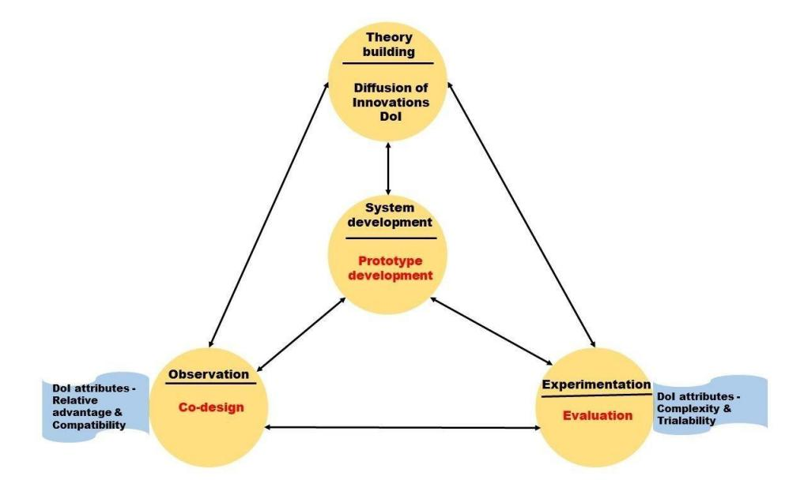
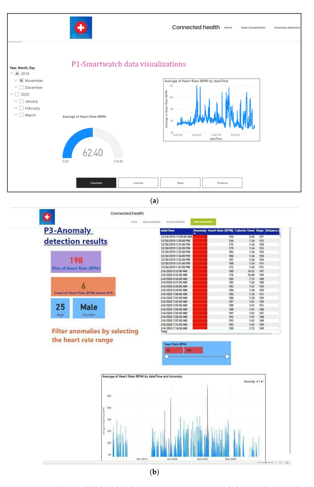
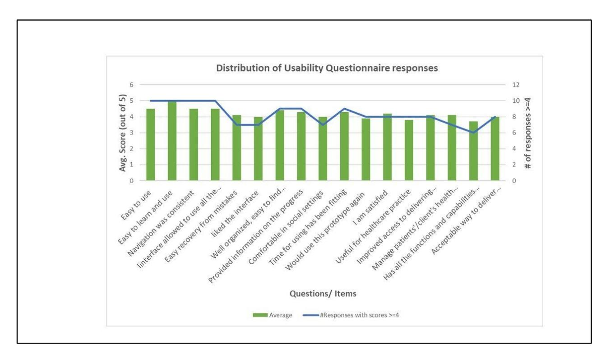

# Co-Design, Development, and Evaluation of a Health Monitoring Tool Using Smartwatch Data: A Proof-of-Concept Study

**Ruhi Kiran Bajaj^1^, Rebecca Mary Meiring^2^ and Fernando Beltran^1^**
- ^1^ Department of Information Systems and Operations Management (ISOM), The University of Auckland, Auckland 1010, New Zealand; f.beltran@auckland.ac.nz
- ^2^ Department of Exercise Sciences, The University of Auckland, Auckland 1023, New Zealand; rebecca.meiring@auckland.ac.nz
- **\***Correspondence: r.bajaj@auckland.ac.nz; Tel.: +64-212106615

**Abstract:** Computational analysis and integration of smartwatch data with Electronic Medical Records (EMR) present potential uses in preventing, diagnosing, and managing chronic diseases. One of the key requirements for the successful clinical application of smartwatch data is understanding healthcare professional (HCP) perspectives on whether these devices can play a role in preventive care. Gaining insights from the vast amount of smartwatch data is a challenge for HCPs, thus tools are needed to support HCPs when integrating personalized health monitoring devices with EMR. This study aimed to develop and evaluate an application prototype, co-designed with HCPs and employing design science research methodology and diffusion of innovation frameworks to identify the potential for clinical integration. A machine learning algorithm was developed to detect possible health anomalies in smartwatch data, and these were presented visually to HCPs in a web-based platform. HCPs completed a usability questionnaire to evaluate the prototype, and over 60% of HCPs scored positively on usability. This preliminary study tested the proposed research to solve the practical challenges of HCP in interpreting smartwatch data before fully integrating smartwatches into the EMR. The findings provide design directions for future applications that use smartwatch data to improve clinical decision-making and reduce HCP workloads.

**Keywords:** Electronic Medical Record (EMR); smartwatch; machine learning; anomaly detection; health monitoring; co-design; design science; diffusion of innovation

## 1. Introduction

Analysis of user-generated smartwatch data offers opportunities to improve lifestyle and health outcomes as well as overall healthcare delivery [[1](#ref-1)–[5](#ref-5)]. Machine Learning (ML) and deep learning techniques have previously been used to analyse the physiological big data collected by smartwatches to detect the onset of diseases such as cardiovascular disease, Parkinson's disease, mental health disorders, dementia, asthma, and COVID-19 [[2](#ref-2), [6](#ref-6)–[8](#ref-8)]. Healthcare providers have also recognized this technology's potential in preventive care [[9](#ref-9), [10](#ref-10)]. Computational analysis of large datasets generated by smartwatches to detect anomalies, extract meaning, and present information in a visually appealing manner benefits healthcare professionals by optimizing clinical decision-making for the early detection and diagnosis of possible health disorders [[11](#ref-11)–[14](#ref-14)]. Integrating smartwatch data into clinical care and with Electronic Medical Records (EMRs) may also provide a more comprehensive view of a person's health and complement routine clinical data, leading to better patient/client engagement in self-care and increased healthcare efficiency [[15](#ref-15)]. However, the integration of smartwatch data analytics into EMR and clinical workflows has been slow due to the existing gap between computational analyses, healthcare professionals' (HCP) interpretation of technical machine-learning processes and results, and the risk of an increased workload [[3](#ref-3), [16](#ref-16)]. Integration of wearables into EMR still has to be improved and standardized for wider acceptance into healthcare practice for preventive care [[3](#ref-3)]. One of the key requirements for the successful clinical application of smartwatch data is understanding HCP perspectives on whether these devices can play a role in preventive care [[1](#ref-1), [3](#ref-3), [4](#ref-4)]. Gaining these perspectives would shift the focus of development from designing systems for users to designing systems with users [[17](#ref-17), [18](#ref-18)], and healthcare providers should be directly involved in the development of the technology that will, ultimately, impact them. The co-design approach actively involves users to value their expertise and recognise them as collaborators throughout the design process [[17](#ref-17)]. Co-design is a user-centred approach that brings together domain experts, users, and researchers to design and develop systems to increase user engagement and meet the needs of multidisciplinary collaboration [[18](#ref-18)]. However, there is a dearth of research on designing smartwatch–based health monitoring applications for preventive healthcare employing a co-design approach. Practical cases demonstrating the usefulness of smartwatches in health and lifestyle support are required to guide the use of this technology in real-world health monitoring applications. Moreover, meaningful involvement of HCP in initial artefact design and evaluation should take place to assist in the development of relevant and practical applications for deployment in clinical settings [[17](#ref-17)]. Therefore, this study aimed to co-design, develop, and evaluate a health monitoring tool (a prototype) using smartwatch data analytics to assist HCP with clinical decision-making.

This study has both theoretical and practical contributions. Theoretically, it contributes to the diffusion of innovation theory by operationalizing the designing for diffusion concept [[19](#ref-19)], through the involvement of end users in the prototype design. The participatory design aimed to ensure that HCPs' requirements were met and that a useful solution was created without increasing HCPs' workload burden. The study's practical contribution is through demonstrating the feasibility of smartwatch data integration for health monitoring, enabling data-driven clinical decision-making. This study has brought a co-design-based Design Science Research (DSR) artefact to the fore, combining the concepts of co-design and DSR, strengthening collaborative innovation and knowledge accumulation. Moreover, healthcare providers can communicate early warning signs with their clients/patients for early intervention through the prototype. This study thus indirectly supports people/patients to self-regulate their health behaviour and engage in a healthy lifestyle, as they value the feedback and input of health experts more than the automated feedback from smartwatches [[20](#ref-20)].

The remainder of this paper is structured as follows. The next section reviews the related work on health monitoring tools using smartwatch data. The proposed research methods are presented in Section [3](#ref-methods), including frameworks employed, study design, participants, and study phases. Data analysis and results are reported in Sections [4](#ref-data-analysis) and [5](#ref-results). Discussion, implications, and future work are highlighted in Section [6](#ref-discussion). Finally, limitations are presented in Section [7](#ref-limitations), and conclusions in Section [8](#ref-conclusions).

### 2. Related Work

Recently, there has been an increasing scholarly interest in aggregating wearable data with official health records to give HCPs an integrated view of an individual's health. Smartwatches collect enormous amounts of data using different sensors and they can record data points per day, minute, or second, thus generating hundreds of megabytes of data per user. With the advancement of sensors for heart rate monitoring and the introduction of Electrocardiography (ECG) and Photoplethysmography (PPG) sensors in smartwatches, several authors have focused on the detection of cardiovascular diseases. Using wearable PPG sensors, Torres-Soto and Ashley [[21](#ref-21)] created a multitask deep learning model to evaluate the signal quality and arrhythmia event detection for real-time identification of atrial fibrillation. Tison and Sanchez [[22](#ref-22)] too developed a deep neural network for the passive detection of Atrial Fibrillation using smartwatch data and validated it against the reference standard 12-lead electrocardiography (ECG) diagnosed Atrial Fibrillation. Additionally, the COVID-19 outbreak has also accelerated the development of cutting-edge medical technologies that allow care delivery without requiring direct physical contact. A growing body of research has demonstrated the utilization of smartwatches in predicting and preventing COVID-19 by employing anomaly detection algorithms [[6](#ref-6)–[8](#ref-8)].

Wearable technology, therefore, creates opportunities for real-time remote health monitoring by HCPs. This technology has the potential to transform the healthcare industry and medical practices for better diagnosis, timely treatment, and preventive healthcare. Commercially available wearables, including the Fitbit, Apple Watch, Samsung Gear, and Xiaomi Mi, have shown reasonable performance in accuracy for physiological parameters, leading these devices to be increasingly used in research [[2](#ref-2), [14](#ref-14)]. Data processing and continuous monitoring of physiological parameters recorded by wearables may foster more efficient and reliable diagnoses. For example, heart rate is a physiological parameter that is clinically relevant, and an abnormal heart rate over time can give an indication of an individual's overall health. These abnormal data points that deviate significantly from most data and do not conform to expected behaviour are called anomalies [[23](#ref-23)], which can be detected using mathematical models and machine learning algorithms.

Increasing research efforts are directed at exploring continuous and remote health monitoring and the integration of smartwatch data to predict, detect, or manage various diseases. Gay and Leijdekkers [[24](#ref-24)] and Hill and Garcia [[25](#ref-25)] proposed solutions to aggregate data from multiple wearable devices on a central database server or by creating a mobile app to enable interoperability between wearable devices. Kheirkhahan and Nair [[26](#ref-26)] have also developed a framework for real-time and online assessment of mobility monitoring (ROAMM) to monitor physical activity based on smartwatch data for visualization and summary statistics. Their framework included a mobile application to collect and pre-process data and a server for storing and retrieving data and remote monitoring. However, before integrating smartwatches into health monitoring, a thorough analysis of their accuracy and influence on work practices should be performed for the smartwatch to obtain greater acceptance from healthcare experts. It is necessary to develop real-world cases focused on the needs of HCP in order to assess the usefulness, user-interface design, and usability [[2](#ref-2)].

### 3. Methods

### 3.1. Frameworks
We employed the DSR approach [[27](#ref-27)] and used Diffusion of Innovation (DoI) theory [[28](#ref-28), [29](#ref-29)] as an overarching research framework in this study. Design Science Research is a problem-focused research paradigm for solving a specific practical problem by designing, building, and evaluating new constructs, models, algorithms, methods, and systems [[27](#ref-27), [30](#ref-30)–[32](#ref-32)].

Rogers's Diffusion of Innovation theory [[28](#ref-28)] seeks to explain how, why, and at what rate new ideas and technology spread. Dearing [[33](#ref-33)], however, further suggests applying diffusion of innovation for intervention development by involving potential users during the design of the innovation rather than once the innovation has been designed. We chose the design for diffusion approach as it offers an increased likelihood of successful diffusion into the user space [[19](#ref-19), [34](#ref-34)]. In addition, the collaboration between healthcare providers, developers, and researchers through co-design provides necessary hands-on experience and infrastructure and is recommended for successful implementation of these solutions into practice [[17](#ref-17), [35](#ref-35)].

### 3.2. Study Design
The study was divided into three phases: co-design, development, and evaluation, based on co-design [[36](#ref-36)] and design science research frameworks [[27](#ref-27)] (Figure [1](#ref-fig-1)). In the observation phase, we employed a co-design approach to gain insight into HCP needs for an application that would allow them to monitor, interpret, and make health decisions based on smartwatch data. In the systems development phase, we developed a web-based application prototype that used machine learning to help visualize long-term smartwatch data, analyse health trends (anomaly detection), and allow HCPs the ability to communicate areas of concern to clients/patients. Finally, in the experimentation phase, HCPs evaluated the prototype.

*Image Description: The image is a triangular diagram illustrating a cyclical process of developing and deploying innovations (Dol). The vertices represent key stages: theory building (including diffusion of innovations), observation/co-design, and experimentation/evaluation. The central circle shows system and prototype development, linked to each vertex. Arrows indicate the iterative flow between stages. The diagram's purpose is to visualize the iterative process of innovation development. Dol attributes (relative advantage/compatibility, complexity/trialability) are mentioned alongside relevant stages.*
**Figure 1.** Phases of the study. Adapted Methodological framework [[27](#ref-27)].

Relative advantage and compatibility were applied in the co-design phase of the study [[28](#ref-28)]. Relative advantage is the degree to which an innovation is perceived as better than the idea it supersedes. Compatibility is how consistently the innovation is perceived as compatible with existing EMR systems. Complexity and trialability were used in the evaluation phase of the study. Complexity is the extent to which an innovation is perceived as challenging to understand and use. Trialability is whether an innovation may be trialled and modified. Observability is the degree to which the innovation results are visible to others. The observability attribute was not yet applicable in this study as the prototype was not integrated into the EMR for automatic documentation.

### 3.3. Participants
We invited HCPs interested in using smartwatch data in health monitoring to participate in this study. We surveyed eight HCPs for this study (one Physiotherapist, four clinical exercise physiologists, two physical trainers, and one General Practitioner-GP). We targeted specific HCPs who were most likely to be involved in using or monitoring smartwatch data as the first point of contact to potentially interact with smartwatch users. This study was approved by the Auckland Health Research Ethics Committee (Reference number: AH23872).

### 3.4. Study Phases
#### 4.1. Co-Design

Participants completed an anonymous online survey that contained a mix of multiple-choice, open-ended, and closed-ended questions. Participants were asked their views on the accuracy of smartwatch data, the possible benefits and barriers to integration in a healthcare setting, and how they would like to view smartwatch data in a web-based application. Participants were also asked what smartwatch data they perceive as valuable and useful what type of health anomalies/irregularities they would like to see highlighted in the summary reports, who should view the summary reports, and whether they prefer to have an alert feature to notify them about any abnormal event in the data.

### 4.2. Prototype Development

A prototype was then developed based on the information obtained through the co-design survey. Smartwatch data (FitBit®) from a publicly available dataset—PMData: A sports logging dataset Simula PMData [[37](#ref-37)]—was used to train a machine learning algorithm for the detection of anomalies in the data. The PMData dataset [[38](#ref-38)] contains five months of data collected from 16 smartwatch users, who were encouraged to wear the watch as much as possible, as well as when sleeping. Smartwatches collect enormous amounts of data using different sensors and record data points at daily, per minute, or per second frequencies, thus generating hundreds of megabytes of data per user per day. The Fitbit Versa 2 (Google LLC, Mountain View, CA, USA) smartwatch was used to collect data in the PMData dataset between November 2019 and March 2020. The following data were available in the dataset (i) heart rate (i.e., the number of heartbeats per minute (bpm) at a given time), (ii) calories burned per minute, (iii) steps per minute, and (iv) distance moved per minute (in centimetres). These parameters were used as features in the development of the machine-learning algorithm as they were the most relevant variables from the smartwatch data and had the highest sampling frequency. The data was used to train and build a predictive machine learning model to detect irregular heartbeats based on heart rate, calories, steps, and distance data over time. A web-based dashboard was also developed to visually present the potential health anomalies with the possibility for our participants to filter out false positives using their domain knowledge.

## 4.3. Prototype Evaluation

All eight co-design participants were contacted via email to participate in the evaluation phase. Participants were sent a link to an online video demonstrating how the prototype application works, and they were also sent the URL of the working prototype hosted on the web server. After viewing and interacting with the prototype, participants were required to evaluate the prototype by completing the mHealth App Usability Questionnaire (MAUQ) [[39](#ref-39)]. The MAUQ is a validated questionnaire with different versions available for patients as well as healthcare providers. We chose the healthcare provider version, with a slight modification in wording to fit into the context of the prototype. The MAUQ for healthcare providers is an 18-item questionnaire categorized into three subscales—ease of use, interface and satisfaction, and usefulness. One item related to poor internet connection was not relevant to this study and was, therefore, excluded. Of the remaining three Diffusion of Innovation attributes, complexity was tested via the ease-of-use items, and trialability was tested via the items from the interface and satisfaction, and usefulness categories. Positive and negative opinions about the prototype were measured using a 5-point Likert scale, with 1 indicating participants strongly disagreeing, and 5 indicating participants strongly agreeing with the statements. An additional open-ended question was added to the usability questionnaire asking about any additional features that participants felt would be valuable to incorporate in future iterations of the prototype.

### 4. Data Analysis

### 4.1. Co-Design
We analysed data collected during the co-design phase by thematic analysis to identify conceptual patterns between the ideas and application functional requirements from participants. Descriptive statistics were used to tabulate the frequencies of closed-ended questions.

We used a clustering algorithm to build a predictive machine learning model using the PyCaret library (pycaret.anomaly). Pycaret.anomaly is an open-source, low-code machine-learning library in Python that automates machine-learning workflows to detect anomalies in data) (https://pycaret.readthedocs.io/en/latest/api/anomaly.html, accessed on 12 February 2023). We used heart rate, calories, steps, and distance data over time as features for anomaly detection. Power BI (https://powerbi.microsoft.com/, accessed on 12 February 2023) visualization reports were generated and integrated into the web-based dashboard to display the anomalies detected using the trained machine learning pipeline.

PyCaret automates several time-consuming tasks in machine learning, such as data pre-processing, feature engineering, hyper-parameter tuning, and model deployment. Each operation performed in PyCaret is sequentially stored in a fully automated Pipeline for deployment. Its Anomaly Detection Module is an unsupervised machine learning module to identify rare items, events, or observations, with over 12 algorithms to analyse the results of trained models.

To prepare the data for further processing and analysis, we changed the sample frequency of the heart rate data so that all datasets (including heart rate, calories, steps, and distance) recorded the observations per minute. For each participant, we created an empty DataFrame with a DateTimeIndex matching our sample period and then merged all four datasets to create a single DataFrame of time series data. Next, the setup() function initialized the environment and inferred the data formats for all input features. To receive the list of all available anomaly detection algorithms, we used the model() function as shown in Figure [2](#ref-fig-2). To train the machine learning model, we used create_model() and trained the Clustering-Based Local Outlier function (ID = "cluster") model. The fraction parameter determined the proportion of outliers in the dataset. The fraction parameter was set to 0.0001. The default value of the contamination parameter was set at 0.05, when the fraction parameter was not used. The assign_model() function assigned the anomaly labels to the dataset to analyse the results by appending two new columns—"Anomaly", which held a value of 1 for an outlier and a value of 0 for an inlier, and "Anomaly Score," which was a continuous value as a decision function (the algorithm calculated the score internally, based on which the anomaly is determined). The predict_model() function assigned anomaly labels to a new unseen dataset to make predictions. The save_model() function saved the model and the transformation pipeline for later use. Additionally, the load_model() function loaded a saved model in the same or an alternative environment, and it may be used on new unseen data for prediction. Supplementary File S1 contains the complete code for anomaly detection.

### Performance of the Model

The additional columns at the end of the dataset produced by the anomaly detection algorithm classified data with anomaly labels. We trained different classification models and obtained their Accuracy, Precision, Recall, and F1 score, to evaluate their performance using the compare_model() function on the resulting labelled dataset. The clustering-based local outlier algorithm produced the best results when we compared its performance to the other commonly used neighbour based (knn) and classification-based (iforest) anomaly detection algorithms. Moreover, local anomalies are crucial in smartwatch data, as anomalies at any point in time may influence neighbouring readings. The time instances just before and after an anomaly were critical and significant in any medical condition [[14](#ref-14)]. A clustering-based local outlier algorithm was used because it detected local anomalies [[14](#ref-14)]. Additionally, the clustering-based local outlier approach had a faster calculation time and was effective for big datasets [[40](#ref-40)]. The results of the performance analysis are provided in Supplementary File S2.

| ID | Name | Reference |
|:---|:----------------------------------|:-----------------------------|
| abod | Angle-base Outlier Detection | pyod.models.abod.ABOD |
| cluster | Clustering-Based Local Outlier | pyod.models.cblof.CBLOF |
| cof | Connectivity-Based Local Outlier | pyod.models.cof.COF |
| iforest | **Isolation Forest** | pyod.models.iforest.IForest |
| histogram | Histogram-based Outlier Detection | pyod.models.hbos.HBOS |
| knn | K-Nearest Neighbors Detector | pyod.models.knn.KNN |
| lof | Local Outlier Factor | pyod.models.lof.LOF |
| svm | One-class SVM detector | pyod.models.ocsvm.OCSVM |
| pca | Principal Component Analysis | pyod.models.pca.PCA |
| mcd | Minimum Covariance Determinant | pyod.models.mcd.MCD |
| sod | Subspace Outlier Detection | pyod.models.sod.SOD |
| **SOS** | Stochastic Outlier Selection | pyod.models.sos.SOS |
**Figure 2.** Output of models() function.

### 4.3. Prototype Evaluation
We calculated the average response to all items on the usability questionnaire to evaluate the prototype's usability. Item scores 1 or 2 were regarded as negative responses, 3 as neutral, and 4 or 5 were considered positive responses to the prototype's usability. The higher the overall average, the higher the usability [[39](#ref-39)].

### 5. Results

### 5.1. Co-Design
Based on the requirements gathered in the co-design phase, the objectives of the prototype were identified from the survey responses as shown in Table 1. Participant requirements were categorized into (1) DoI attributes—relative advantage and compatibility of the prototype; (2) visualization and customization of user interface features; and (3) anomaly detection and alert features of the prototype. Participants' responses are reported from most to least preferred requirements. Participants indicated that heart rate was the most valuable parameter for data visualization and anomaly detection. Participants also indicated that they would prefer to view the summary reports as charts and bar graphs and expressed that healthcare administrators should be the personnel to view the summary reports to take further action, i.e., they could notify HCPs for decision-making.

**Table 1.** Requirements and objectives resulting from the co-design phase.

| No. | Requirements | Most to Least Preferred (Objectives) |
|:----|:-----------------------------------------------------------------------------------------------------------|:------------------------------------------------------------------------------------------------------------------------------------------------------------------------------------------------------------------------------------------------------------------------------------------------------------------------------------------------------------------------------------------------------------------------------------------------------------------------------------------------------------------------------------------------------------------------------------------------------------------------------------------------------------------------------------------------------------------------------------------------------------------------------------------------------------------------------------------------------------------------------------------------------------|
| | Diffusion of Innovation attributes | |
| 1. | Relative advantage: How monitoring smartwatch data benefit clinicians and patients | Improved communication Patient/client empowerment Behaviour change Informed decision making |
| | Compatibility: How integrating smartwatch data assist clinicians with patient care | It will be a good starting point and would provoke more productive discussions It will support evidence-based practice Good way to review the data and plan before the consultation It will reduce the consultation time spent gathering information on lifestyle and health data It will increase the workload |

| No. | Requirements | Most to Least Preferred (Objectives) |
|:----|:----------------------------------------------------------|:---------------------------------------------------------------------------------------------------------------|
| | Data visualization and customization | |
| 2 | Most valuable activity and physiological parameters | Heart rate Step count Calories burned Sleep score, ECG, blood glucose Sedentary minutes |
| | The preferred way to view the summary reports | Charts Bar graphs Line graphs Text summaries |
| | Frequency of summary reports | Weekly Monthly Daily Only if an anomaly is detected |
| | Anomaly detection and alert feature | |
| 3 | Type of anomalies | Heart rate Sleep score Pain levels |
| | Who should view the summary reports for further actions? Alert feature | Healthcare administrators (who can then notify clinicians) Clinicians 60% preferred to have this feature |

### 5.2. Prototype Development
The web-based application prototype was developed to display the long-term smartwatch data (Figure [3a](#ref-fig-3a)) and anomaly detection results (Figure [3b](#ref-fig-3b)) in visualizations and also included an email feature to allow for feedback on areas of concern to patients/clients. A drop-down feature on the dashboard was to cycle through visualizations of smartwatch data and anomaly detection results of different patients/clients. Anomalies were displayed using an interactive graph, and participants had the ability to use their domain knowledge to filter out false positives by changing the health parameters relative to individuals' demographics, activity, and physiological parameters. After viewing the anomaly detection results, participants could notify their clients or patients about further action to be taken.

*Image Description: The image displays two smartwatch data visualization interfaces. (a) shows a summary dashboard with a gauge chart indicating average heart rate (62.40 BPM), a line graph showing heart rate over time, and buttons for calories, steps, and distance. (b) presents an anomaly detection interface, showing a table of heart rate data with anomalies highlighted, a summary of maximum heart rate (198 BPM) and anomaly count (6), and a line graph illustrating heart rate with anomalies marked. Both aim to visualize and analyze smartwatch data, with (b) focusing on anomaly detection.*
**Figure 3.** Web-based application prototype: (**a**) smartwatch data visualizations; (**b**) anomaly detection results.

### 5.3. Prototype Evaluation
One physiotherapist and clinical exercise physiologist from phase one did not participate in the evaluation phase. We received a total of 10 responses in the evaluation phase (two physiotherapists, three clinical exercise physiologists, four physical trainers, and one General Practitioner). The average and number of responses above four for the usability questionnaire items are shown in Table [2](#ref-table-2) and Figure [4](#ref-fig-4). The interface was well-received, with at least 60% of participants giving each a score (≥4). The ease-of-use category received the highest and second highest rankings (average scores of 5 and 4.5). Items from the interface and satisfaction category were the third highest-scored items (average scores of 4.4 and 4.3). All other items had average scores above or equal to 4, except the items that corresponded to whether participants would use the prototype again (I11, average score 3.9), the prototype's usefulness (I13, average score 3.8), and whether the prototype has all the functions and capabilities participants expected to have (I16, average score 3.7). Overall, each item scored in either the "positive" or "neutral" range.

Participants left several comments to the open-ended question about features that participants felt would be valuable to incorporate in future iterations of the application (Table [3](#ref-table-3)).

**Table 2.** Results of the Usability Questionnaire.

| Question/Item | Average | #Responses with Scores ≥4 |
|:--------------------------------------------------------------------------------------------------------------------------------|:-----------|:--------------------------|
| Ease of use | | |
| I1: The prototype was easy to use | 4.5 | 10 |
| I2: It was easy for me to learn and use the prototype | 5 | 10 |
| I3: The navigation was consistent when moving between screens. | 4.5 | 10 |
| I4: The interface of the prototype allowed me to use all the functions | 4.5 | 10 |
| I5: Whenever I made a mistake using the prototype, I could recover easily and quickly | 4.1 | 7 |
| Interface and satisfaction | | |
| I6: I like the interface of the prototype | 4 | 7 |
| I7: The information in the prototype was well organized, so I could easily find the information I needed | 4.4 | 9 |
| I8: The prototype adequately acknowledged and provided information to let me know the progress of my action | 4.3 | 9 |
| I9: I feel comfortable using this prototype in social settings | 4 | 7 |
| I10: The amount of time involved in using this prototype has been fitting for me | 4.3 | 9 |
| I11: I would use this prototype again | 3.9 | 8 |
| I12: Overall, I am satisfied with this prototype | 4.2 | 8 |
| Usefulness | | |
| I13: The prototype would be useful for my healthcare practice | 3.8 | 8 |
| I14: The prototype improved my access to delivering healthcare services | 4.1 | 8 |
| I15: The prototype helped me manage my patients'/clients' health effectively | 4.1 | 7 |
| I16: This prototype has all the functions and capabilities I expected it to have | 3.7 | 6 |
| I17: This prototype provides an acceptable way to deliver healthcare services | 4 | 8 |

*Image Description: This bar chart displays usability questionnaire results. Green bars show the average score (out of 5) for each question, while a blue line represents the number of responses scoring 4 or higher. The chart assesses user opinions on various aspects of the system's usability, such as ease of use, navigation, and functionality. It visually summarizes user feedback to gauge overall system effectiveness.*
**Figure 4.** Distribution of responses.

**Table 3.** Participant's comments in the evaluation phase.

| Participant # | Comment(s) |
|:--------------|:------------------------------------------------------------------------------------------------------------------------------------------------------------------------------------------------------------------------------------------------------------------------------------------------------------------------------------------------------------------------------------------------------------------------------------------------------------------------------------------------------------------------------------------------------------------------------------------------------------------------------------------------------------------------------|
| P1 | "This will be a useful tool to monitor clients." |
| P2 | "The application was easy to navigate, informative. The latter question on above survey was marked as equivocal for following reasons—1. The HR, calories and distance are perhaps patients self monitored targets, when used for HR anomalies, currently if a condition is suspected, it is monitored for 24 h and a treatment plan formulated. However, this would be helpful on long-term monitoring. 2. Secondly, most helpful monitoring and parameters of clinical relevance are BP and blood sugar, I would hope future developments will allow this." |
| P3 | "Can this be used for all smart-watches-if this is not the case the application would not be too useful." |
| P4 | "possibly more suitable for hospital based *physiotherapy rehab services or gym based training. other featuers* to add could be total time spend exercising, etc. or time spent sitting inactive" |
| P5 | "Power meter data while running and cycling" |
| | "The ability to personalize anomaly/abnormality detection. What I want to be notified of" |
| | "Heart rate variability metric added, an interactive component with the client may be a built-in chat, a client input function where they can add data such as body weight, mood, and energy levels or leave comments regarding the daily activity that could assist in the review processand explain any abnormalities" |
| P6 | "I think the challenge of implementation will be streamlining the process of monitoring patients' health. If a specific client has multiple health conditions and various methods of recording data, having to refer to multiple online platforms or documentation could be a challenge. I feel the current design is useful, but further development to create a "one-stop shop" would be the next step. Patients with heart conditions or diabetes could input their daily blood pressure/blood glucose levels. This does span outside the scope of smartwatch data but may improve the usefulness of the online platform for healthcare professionals." |

### 6. Discussion, Implications, and Future Work

This study co-designed, developed, and tested the usability of an application prototype that used smartwatch data and advanced analytics for health monitoring and anomaly detection. Our study highlights the potential of using smartwatch data to support HCPs in monitoring their patients/clients' health, and to motivate people to prevent chronic diseases and manage their health [[5](#ref-5)]. The co-design phase enabled us to initially gather information on HCP needs and expectations from these technologies to optimally support them in their work. In addition to HCPs' preferences about physiological parameters and the user interface, HCPs indicated their preference for healthcare administrators (someone with technical knowledge) to be the type of personnel to view the results of smartwatch data analytics, who can then notify the HCP when their intervention is required, thus possibly reducing burden associated with the additional data work. This feedback provides tangibility to introducing new roles in healthcare for the interpretation of technical results and as an interface between the technical and the clinical sides of the healthcare system [[3](#ref-3)].

In the evaluation phase, HCPs were particularly satisfied with the prototype's interface design and ease of use. The findings were comparable with prior studies on healthcare providers' perceptions about using smartwatch data for clinical decision making, in that HCPs recognized this technology's potential in preventive care [[4](#ref-4), [9](#ref-9), [10](#ref-10)]. Some participants left comments that would be useful to consider in future designs of similar applications including suggestions on the addition of other measurable parameters if the technology allows (participant 2), filtering anomaly detection to suit the requirements of the HCP (participant 6), as well as including a chat function with the notification feature.

HCPs can also use this prototype for at-risk individuals, healthy individuals (as a preventive tool), and individuals diagnosed with chronic diseases (to manage their condition). Responses to the open-ended question highlighted the areas of improvement for future iterations. Features like total exercise time, inactive minutes, and heart rate variability can be included in the machine learning model to detect anomalies in heart rate and other physiological parameters. The prototype can be extended by testing its compatibility with data from other smartwatches and creating a deployment framework for implementation in real-world settings. For example, the Apple Watch's electrocardiogram (ECG) feature can be used to detect cardiac arrhythmias or atrial fibrillation [[41](#ref-41)].

By addressing HCPs' needs with the prototype, a practical contribution of this study is to provide them with an instrument that detects anomalies and visualizes smartwatch data to improve patient care delivery and reduce their workloads. This study contributes to IS research by combining the concepts of co-design and DSR through the development of a system artefact and the evaluation thereof. The study also theoretically advances the diffusion of innovation theory by operationalizing the design for diffusion notion [[19](#ref-19)]. The prototype optimizes technology interaction with human oversight by involving HCP (human element) during the co-design and anomaly detection [[42](#ref-42)]. The study aimed to support HCP in clinical decision-making and not replace them.

There are growing efforts to combine health data from multiple sources to give HCP a unified and comprehensive view of clients'/patients' health. Our prototype solution, using user-generated data from smartwatches, is one instance to demonstrate a possible integration of smartwatch data for preventive health monitoring. Moreover, we utilised a conventional machine learning algorithm as the exemplar to demonstrate the feasibility of this approach. The clustering algorithm can be replaced by deep learning models under different application scenarios to improve the performance of the proposed approach, for example, Convolutional neural networks (CNN) for ECG image data [[21](#ref-21), [43](#ref-43)]; Long short-term memory (LSTM), as smartwatch data is time–series data [[6](#ref-6)]; Multilayer Extreme Learning Machines (ML-ELMs) for accelerated deep learning development [[44](#ref-44)]; and LSTM autoencoders to reduce the noise in data.

In addition, integrating smartwatch data into EMR presents significant infrastructure challenges, including secured and scalable data storage, standards and protocols for ensuring interoperability, connectivity and resource allocation, ethical and legal frameworks that protect patient privacy, and ensuring data ownership. Addressing these infrastructure challenges requires a multidisciplinary approach that involves healthcare providers, technology providers, researchers, policymakers, and patients. Future research can help address these challenges by developing innovative solutions that are scalable, interoperable, secure, and patient-centred. Finally, future research can also focus on developing reimbursement models that recognize the clinical value of using smartwatch data and support the reimbursement of healthcare providers for the time and resources required to use smartwatch data reports.

### 7. Limitations

Although we learned practical design requirements and future directions from HCP during the co-design and evaluation phases, this work has certain limitations. First, the analytical approach (machine learning algorithm) that we considered in our prototype is just an example, and the results require more careful and exhaustive clinical validation before deploying in clinical settings. The small sample size was another limitation; therefore, user requirements may not fully represent specific target groups' viewpoints. Subsequent studies can consider a larger sample size to overcome this limitation. We envision a future tool designed with the collaborative efforts of the interdisciplinary working group and multiple stakeholders to build a deployment framework of the prototype with real-time smartwatch data.

In addition, we recognize that patient perspectives and privacy considerations around using and sharing smartwatch data are enormous challenges to overcome for the successful deployment of such applications. Having said that, as a developmental step, we wanted to ensure that HCPs perceived smartwatches as having clinical value before involving patients directly. Future endeavours can extend this study by including healthy people and patients in an iterative co-design process to understand their perspectives on such tools, to prevent and manage chronic diseases.

## 8. Conclusions

Integrating smartwatches into EMR may benefit HCPs in care delivery, and there is significant potential for smartwatches to be used for health monitoring. An integrated solution may streamline the process of monitoring patients' health. This study found that we were able to develop an application prototype that uses smartwatch data to detect and visually present anomalies to HCP for further action through a co-design process. Moreover, the co-design process ensured the effective application of these technologies in healthcare. This preliminary study evaluated the acceptability of smartwatches among healthcare professionals and tested their feasibility before integrating them into the EMR. The prototype was well received, with some positive comments about the potential integration of smartwatch data into clinical practice.

**Supplementary Materials:** The following supporting information can be downloaded at: https://www.mdpi.com/article/10.3390/fi15030111/s1, Python code for the machine learning algorithm. File S1: Pycaret code; File S2: Algorithm performance.

**Author Contributions:** Conceptualization, R.K.B., R.M.M. and F.B.; methodology, R.K.B.; software, R.K.B.; analysis, R.K.B.; writing—original draft preparation, R.K.B.; writing—review and editing, R.K.B., R.M.M. and F.B.; supervision, F.B. and R.M.M. All authors have read and agreed to the published version of the manuscript.

**Funding:** This research received no external funding.

**Data Availability Statement:** The primary data presented in the co-design and evaluation phases are available on request from the corresponding author.

**Conflicts of Interest:** The authors declare no conflict of interest.

### References

- 1. Alpert, J.M.; Manini, T.; Roberts, M.; Kota, N.S.P.; Mendoza, T.V.; Solberg, L.M.; Rashidi, P. Secondary care provider attitudes towards patient generated health data from smartwatches. *NPJ Digit. Med.* **2020**, *3*, 27. [[CrossRef]](http://doi.org/10.1038/s41746-020-0236-4)
- 2. Jat, A.S.; Grønli, T.-M. Smart Watch for Smart Health Monitoring: A Literature Review. In Proceedings of the International Work-Conference on Bioinformatics and Biomedical Engineering, Maspalomas, Spain, 27–30 June 2022; Springer: Cham, Switzerland, 2022. [[CrossRef]](http://doi.org/10.1007/978-3-031-07704-3_21)
- 3. Philipp, R.S.; Barbara, P.; Gensichen, J.; Krcmar, H. Insights on Patient-Generated Health Data in Healthcare: A Literature Review. In Proceedings of the Pacific Asia Conference on Information Systems (PACIS 2022), Taipei, Taiwan, 5–9 June 2022. Available online: https://aisel.aisnet.org/pacis2022/26 (accessed on 19 February 2023).
- 4. Volpato, L.; Carral, M.D.R.; Senn, N.; Delefosse, M.S. General Practitioners' Perceptions of the Use of Wearable Electronic Health Monitoring Devices: Qualitative Analysis of Risks and Benefits. *JMIR mHealth uHealth* **2021**, *9*, e23896. [[CrossRef]](http://doi.org/10.2196/23896)
- 5. Al-Maroof, R.S.; Alhumaid, K.; Alhamad, A.Q.; Aburayya, A.; Salloum, S. User Acceptance of Smart Watch for Medical Purposes: An Empirical Study. *Future Internet* **2021**, *13*, 127. [[CrossRef]](http://doi.org/10.3390/fi13050127)
- 6. Bogu, G.K.; Snyder, M.P. Deep learning-based detection of COVID-19 using wearables data. *MedRxiv* **2021**. [[CrossRef]](http://doi.org/10.1101/2021.01.08.21249474)
- 7. Mishra, T.; Wang, M.; Metwally, A.A.; Bogu, G.K.; Brooks, A.W.; Bahmani, A.; Alavi, A.; Celli, A.; Higgs, E.; Dagan-Rosenfeld, O.; et al. Pre-symptomatic detection of COVID-19 from smartwatch data. *Nat. Biomed. Eng.* **2020**, *4*, 1208–1220. [[CrossRef]](http://doi.org/10.1038/s41551-020-00640-6)
- 8. Zhu, G.; Li, J.; Meng, Z.; Yu, Y.; Li, Y.; Tang, X.; Dong, Y.; Sun, G.; Zhou, R.; Wang, H.; et al. Learning from Large-Scale Wearable Device Data for Predicting the Epidemic Trend of COVID-19. *Discret. Dyn. Nat. Soc.* **2020**, *2020*, 8. [[CrossRef]](http://doi.org/10.1155/2020/6152041)
- 9. Holtz, B.; Vasold, K.; Cotten, S.; Mackert, M.; Zhang, M.; Faber, M.; Zeleke, A.; Dooley, B. Health Care Provider Perceptions of Consumer-Grade Devices and Apps for Tracking Health: A Pilot Study. *JMIR mHealth uHealth* **2019**, *7*, e9929. [[CrossRef]](http://doi.org/10.2196/mhealth.9929)
- 10. Loos, J.R.; Davidson, E.J. Wearable Health Monitors and Physician-Patient Communication: The Physician's Perspective. In Proceedings of the 2016 49th Hawaii International Conference on System Sciences (HICSS), Koloa, HI, USA, 5–8 January 2016; pp. 3389–3399. [[CrossRef]](http://doi.org/10.1109/HICSS.2016.422)
- 11. Frink, T.M.; Gyllinsky, J.V.; Mankodiya, K. Visualization of multidimensional clinical data from wearables on the web and on apps. In Proceedings of the 2017 IEEE MIT Undergraduate Research Technology Conference (URTC), Cambridge, MA, USA, 3–5 November 2017; pp. 1–4. [[CrossRef]](http://doi.org/10.1109/URTC.2017.8284217)
- 12. Reddy, N.C.N.; Ramesh, A.; Rajasekaran, R.; Masih, J. Ritchie's Smart Watch Data Analytics and Visualization. In Proceedings of the International Conference on Image Processing and Capsule Networks, Bangkok, Thailand, 20–21 May 2020; Springer: Cham, Switzerland, 2020. [[CrossRef]](http://doi.org/10.1007/978-3-030-51859-2_70)
- 13. Singhal, S.; Kayyali, B.; Levin, R.; Greenberg, Z. *The Next Wave of Health Care Innovation: The Evolution of Ecosystems*; McKinsey & Company: New York, NY, USA, 2020.
- 14. Sunny, J.S.; Patro, C.P.K.; Karnani, K.; Pingle, S.C.; Lin, F.; Anekoji, M.; Jones, L.D.; Kesari, S.; Ashili, S. Anomaly Detection Framework for Wearables Data: A Perspective Review on Data Concepts, Data Analysis Algorithms and Prospects. *Sensors* **2022**, *22*, 756. [[CrossRef]](http://doi.org/10.3390/s22030756)
- 15. Dinh-Le, C.; Chuang, R.; Chokshi, S.; Mann, D. Wearable Health Technology and Electronic Health Record Integration: Scoping Review and Future Directions. *JMIR mHealth uHealth* **2019**, *7*, e12861. [[CrossRef]](http://doi.org/10.2196/12861)
- 16. Javaid, A.; Zghyer, F.; Kim, C.; Spaulding, E.M.; Isakadze, N.; Ding, J.; Kargillis, D.; Gao, Y.; Rahman, F.; Brown, D.E.; et al. Medicine 2032: The future of cardiovascular disease prevention with machine learning and digital health technology. *Am. J. Prev. Cardiol.* **2022**, *12*, 100379. [[CrossRef]](http://doi.org/10.1016/j.ajpc.2022.100379)
- 17. Noorbergen, T.J.; Adam, M.T.P.; Roxburgh, M.; Teubner, T. Co-design in mHealth Systems Development: Insights From a Systematic Literature Review. *AIS Trans. Hum.-Comput. Interact.* **2021**, *13*, 175–205. [[CrossRef]](http://doi.org/10.17705/1thci.00147)
- 18. Sanders, E.B.-N.; Stappers, P.J. Co-creation and the new landscapes of design. *Codesign* **2008**, *4*, 5–18. [[CrossRef]](http://doi.org/10.1080/15710880701875068)
- 19. Dearing, J.W.; Smith, D.K.; Larson, R.S.; Estabrooks, C.A. Designing for Diffusion of a Biomedical Intervention. *Am. J. Prev. Med.* **2013**, *44*, S70–S76. [[CrossRef]](http://doi.org/10.1016/j.amepre.2012.09.038)
- 20. Windasari, N.A.; Lin, F.-R.; Kato-Lin, Y.-C. Continued use of wearable fitness technology: A value co-creation perspective. *Int. J. Inf. Manag.* **2020**, *57*, 102292. [[CrossRef]](http://doi.org/10.1016/j.ijinfomgt.2020.102292)
- 21. Torres-Soto, J.; Ashley, E.A. Multi-task deep learning for cardiac rhythm detection in wearable devices. *NPJ Digit. Med.* **2020**, *3*, 116. [[CrossRef]](http://doi.org/10.1038/s41746-020-00320-4)
- 22. Tison, G.; Sanchez, J.M.; Ballinger, B.; Singh, A.; Olgin, J.E.; Pletcher, M.J.; Vittinghoff, E.; Lee, E.S.; Fan, S.M.; Gladstone, R.A.; et al. Passive Detection of Atrial Fibrillation Using a Commercially Available Smartwatch. *JAMA Cardiol.* **2018**, *3*, 409–416. [[CrossRef]](http://doi.org/10.1001/jamacardio.2018.0136)
- 23. Chandola, V.; Banerjee, A.; Kumar, V. Anomaly detection: A survey. *ACM Comput. Surv.* **2009**, *41*, 1–58. [[CrossRef]](http://doi.org/10.1145/1541880.1541882)
- 24. Gay, V.; Leijdekkers, P. Bringing Health and Fitness Data Together for Connected Health Care: Mobile Apps as Enablers of Interoperability. *J. Med. Internet Res.* **2015**, *17*, e260. [[CrossRef]](http://doi.org/10.2196/jmir.5094)
- 25. Hill, D.D.; Garcia, H.M.C. The Integration of Patient Health Record Generated from Wearable and Internet of Things Devices into Health Information Exchanges. *Int. J. Health Med. Eng.* **2021**, *15*, 112–116.
- 26. Kheirkhahan, M.; Nair, S.; Davoudi, A.; Rashidi, P.; Wanigatunga, A.A.; Corbett, D.B.; Mendoza, T.; Manini, T.M.; Ranka, S. A smartwatch-based framework for real-time and online assessment and mobility monitoring. *J. Biomed. Informatics* **2018**, *89*, 29–40. [[CrossRef]](http://doi.org/10.1016/j.jbi.2018.11.003)
- 27. Nunamaker, J.F., Jr.; Chen, M.; Purdin, T.D. Systems Development in Information Systems Research. *J. Manag. Inf. Syst.* **1990**, *7*, 89–106. [[CrossRef]](http://doi.org/10.1080/07421222.1990.11517898)
- 28. Rogers, E.M. *Diffusion of Innovations*, 5th ed.; Free Press: New York, NY, USA; Simon and Schuster: New York, NY, USA, 2003.
- 29. Sanson-Fisher, R.W. Diffusion of innovation theory for clinical change. *Med. J. Aust.* **2004**, *180*, S55–S56. [[CrossRef]](http://doi.org/10.5694/j.1326-5377.2004.tb05947.x) [[PubMed]](http://www.ncbi.nlm.nih.gov/pubmed/15012582)
- 30. Hevner, A.R.; March, S.T.; Park, J.; Ram, S. Design Science in Information Systems Research. *Manag. Inf. Syst. Q.* **2004**, *28*, 75–105. [[CrossRef]](http://doi.org/10.2307/25148625)
- 31. Hevner, A.R.; Wickramasinghe, N. Design science research opportunities in health care. In *Theories to Inform Superior Health Informatics Research and Practice*; Nilmini Wickramasinghe, J.L.S., Ed.; Springer: Cham, Switzerland, 2018; pp. 3–18.
- 32. Peffers, K.; Tuunanen, T.; Rothenberger, M.A.; Chatterjee, S. A Design Science Research Methodology for Information Systems Research. *J. Manag. Inf. Syst.* **2007**, *24*, 45–77. [[CrossRef]](http://doi.org/10.2753/MIS0742-1222240302)
- 33. Dearing, J.W. Applying Diffusion of Innovation Theory to Intervention Development. *Res. Soc. Work. Pract.* **2009**, *19*, 503–518. [[CrossRef]](http://doi.org/10.1177/1049731509335569)
- 34. Dearing, J.W.; Meyer, G.; Kazmierczak, J. Portraying the New: Communication Between University Innovators and Potential Users. *Sci. Commun.* **1994**, *16*, 11–42. [[CrossRef]](http://doi.org/10.1177/0164025994016001002)
- 35. Dearing, J.W.; Cox, J.G. Diffusion of Innovations Theory, Principles, and Practice. *Health Aff.* **2018**, *37*, 183–190. [[CrossRef]](http://doi.org/10.1377/hlthaff.2017.1104)
- 36. Sanders, E.B.-N.; Stappers, P.J. Probes, toolkits and prototypes: Three approaches to making in codesigning. *Codesign* **2014**, *10*, 5–14. [[CrossRef]](http://doi.org/10.1080/15710882.2014.888183)
- 37. Thambawita, V.; Hicks, S.A.; Borgli, H. PMData: A sports logging dataset. In Proceedings of the 11th ACM Multimedia Systems Conference, Istanbul, Turkey, 8–11 June 2020; Association for Computing Machinery: New York, NY, USA, 2020. [[CrossRef]](http://doi.org/10.1145/3339825.3394926)
- 38. Dataset PMData: A Sports Logging Dataset. 2020. Available online: https://datasets.simula.no/pmdata/ (accessed on 19 February 2023).
- 39. Zhou, L.; Bao, J.; Setiawan, I.M.A.; Saptono, A.; Parmanto, B. The mHealth App Usability Questionnaire (MAUQ): Development and Validation Study. *JMIR mHealth uHealth* **2019**, *7*, e11500. [[CrossRef]](http://doi.org/10.2196/11500)
- 40. Goldstein, M.; Uchida, S. A Comparative Evaluation of Unsupervised Anomaly Detection Algorithms for Multivariate Data. *PLoS ONE* **2016**, *11*, e0152173. [[CrossRef]](http://doi.org/10.1371/journal.pone.0152173)
- 41. Turakhia, M.P.; Desai, M.; Hedlin, H.; Rajmane, A.; Talati, N.; Ferris, T.; Desai, S.; Nag, D.; Patel, M.; Kowey, P.; et al. Rationale and design of a large-scale, app-based study to identify cardiac arrhythmias using a smartwatch: The Apple Heart Study. *Am. Heart J.* **2018**, *207*, 66–75. [[CrossRef]](http://doi.org/10.1016/j.ahj.2018.09.002) [[PubMed]](http://www.ncbi.nlm.nih.gov/pubmed/30392584)
- 42. Mann, D.M.; Lawrence, K. Reimagining Connected Care in the Era of Digital Medicine. *JMIR mHealth uHealth* **2022**, *10*, e34483. [[CrossRef]](http://doi.org/10.2196/34483) [[PubMed]](http://www.ncbi.nlm.nih.gov/pubmed/35436238)
- 43. Zhang, J.; Zhao, Y.; Shone, F.; Li, Z.; Frangi, A.F.; Xie, S.Q.; Zhang, Z.-Q. Physics-Informed Deep Learning for Musculoskeletal Modeling: Predicting Muscle Forces and Joint Kinematics From Surface EMG. *IEEE Trans. Neural Syst. Rehabil. Eng.* **2022**, *31*, 484–493. [[CrossRef]](http://doi.org/10.1109/TNSRE.2022.3226860)
- 44. Zhang, J.; Li, Y.; Xiao, W.; Zhang, Z. Non-iterative and Fast Deep Learning: Multilayer Extreme Learning Machines. *J. Frankl. Inst.* **2020**, *357*, 8925–8955. [[CrossRef]](http://doi.org/10.1016/j.jfranklin.2020.04.033)

**Disclaimer/Publisher's Note:** The statements, opinions and data contained in all publications are solely those of the individual author(s) and contributor(s) and not of MDPI and/or the editor(s). MDPI and/or the editor(s) disclaim responsibility for any injury to people or property resulting from any ideas, methods, instructions or products referred to in the content.

## TL;DR
This study details the co-design, development, and evaluation of a web-based health monitoring tool that uses machine learning to detect anomalies in smartwatch data. The prototype was designed with input from healthcare professionals (HCPs) and evaluated for its usability. The results show that while HCPs see the potential, successful clinical integration requires careful design to meet their specific needs and workflow constraints.

## Key Insights
The key insight is the critical importance of the co-design process with healthcare professionals (HCPs) to ensure the clinical utility and adoption of health monitoring tools. Simply providing raw data is not enough; tools must be designed to fit into clinical workflows and reduce, not increase, the workload of HCPs.

## Metadata Summary
### Research Context
- **Research Question**: The study employed a three-phase Design Science Research (DSR) methodology: (1) A co-design phase where requirements were gathered from eight HCPs via an online survey. (2) A development phase where a web-based prototype was built using a public smartwatch dataset (PMData) and a clustering-based machine learning algorithm (from the PyCaret library) for anomaly detection. (3) An evaluation phase where the HCPs assessed the prototype's usability using the mHealth App Usability Questionnaire (MAUQ).
- **Methodology**: The co-design process successfully identified key HCP requirements, such as the importance of heart rate data and the preference for graphical summaries. The resulting prototype received positive usability scores from over 60% of the HCPs, particularly for its ease of use and interface design. The study also found that HCPs would prefer a workflow where healthcare administrators first review the data to reduce the clinicians' workload.
- **Key Findings**: The primary outcome is a proof-of-concept web application that demonstrates the feasibility of using smartwatch data and machine learning to create a health monitoring tool for HCPs. The study also provides a set of design guidelines and user requirements for future development in this area.

### Analysis
- **Limitations**: The study concludes that integrating smartwatch data into clinical care is feasible and potentially beneficial, but its success is highly dependent on a user-centered, co-design approach that involves HCPs from the beginning. The tool must be designed to be intuitive and to streamline, rather than complicate, the clinical workflow.
- **Future Work**: A key implementation insight is the value of using a co-design approach to gather user requirements before development. The use of an open-source, low-code machine learning library like PyCaret can accelerate the development of the data analysis component. The suggestion of a tiered review process (with administrators doing initial screening) is a practical workflow consideration for managing HCP workload.