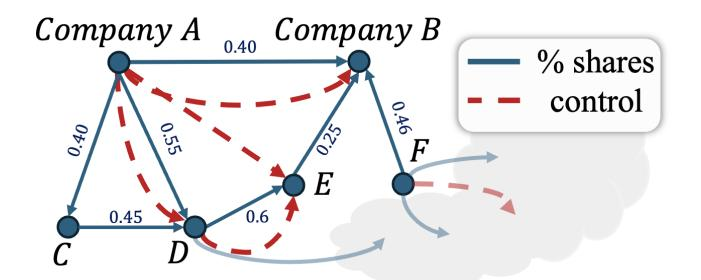
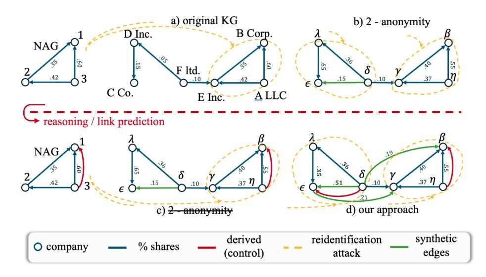
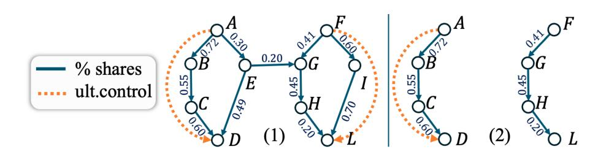
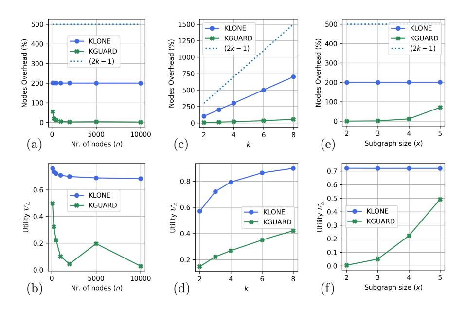
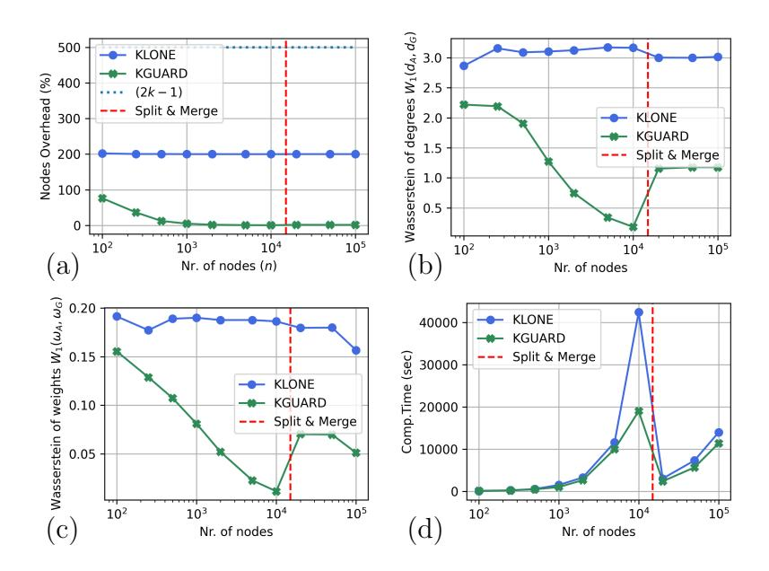

# Privacy-Preserving Synthetically Augmented Knowledge Graphs with Semantic Utility^∗^

Luigi Bellomarini^1^, Costanza Catalano^1^, Andrea Coletta^1^, Michela Iezzi^1^, Pierangela Samarati^2^

> ^1^ Bank of Italy ^2^ Universit`a degli studi di Milano

### Abstract

Knowledge Graphs (KGs) have recently gained relevant attention in many application domains, from healthcare to biotechnology, from logistics to finance. Financial organisations, central banks, economic research entities, and national supervision authorities apply ontological reasoning on KGs to address crucial business tasks, such as economic policymaking, banking supervision, anti-money laundering, and economic research. Reasoning allows for the generation of derived knowledge capturing complex business semantics and the set up of effective business processes. A major obstacle in KGs sharing is represented by privacy considerations since the identity of the data subjects and their sensitive or company-confidential information may be improperly exposed.

In this paper, we propose a novel framework to enable KGs sharing while ensuring that information that should remain private is not directly released nor indirectly exposed via derived knowledge, while maintaining the embedded knowledge of the KGs to support business downstream tasks. Our approach produces a privacy-preserving synthetic KG as an augmentation of the input one via the introduction of structural anonymisation. We introduce a novel privacy measure for KGs, which considers derived knowledge and a new utility metric that captures the business semantics we want to preserve, and propose two novel anonymization algorithms. Our extensive experimental evaluation, with both synthetic graphs and real-world datasets, confirms the effectiveness of our approach achieving up to a 70% improvement in the privacy of entities compared to existing methods not specifically designed for KGs.

## 1 Introduction

Knowledge Graphs (KG) adopt a graph-based data model to represent knowledge in a variety of application scenarios characterized by a complex interaction of many entities. Currently, KGs are witnessing a growing industrial uptake,

^∗^The views expressed in this paper are those of the authors and do not necessarily reflect those of the Bank of Italy.

**Figure 1:** A portion of a Company Ownership KG. Company A controls Company B.

with adoption in multiple domains, from healthcare to biotechnology, from logistics to finance [[6]](#ref-6), [49]](#ref-49), [43]](#ref-43), [50]](#ref-50), [51]](#ref-51), [10]](#ref-10), which goes hand in hand with more and more stable academic interest [[30]](#ref-30), [19]](#ref-19). As a distinguishing trait of KGs, the so-called ground extensional component, namely, a database that can be seen as a set of nodes and edges along with their attributes, is enriched by an intensional component. It captures the domain of interest through a high-level declarative specification, for example, a logic-based one in Vadalog [[7]](#ref-7), a reason-oriented extension of the Datalog language of databases [[13]](#ref-13). Vadalog models domain knowledge by means of existential rules, whose semantics can be given in an operational way in terms of the well-known chase procedure [[45]](#ref-45): rules are applied to the extensional component, within the so-called reasoning process, until they produce new facts (e.g., new nodes or edges) of the derived extensional component.

In our experience with the Central Bank of Italy, we have studied, engineered, and deployed into production multiple KG-based enterprise applications, where reasoning is used to augment KGs for various purposes such as finding controllers in economic networks [[22]](#ref-22), detecting family links [[1]](#ref-1), studying the determinants of company takeovers [[4]](#ref-4), and many more economic and financial settings [[2]](#ref-2). Similarly, a number of other financial organizations and banks, such as Bloomberg, Capital One, Wells Fargo, and others, have been leveraging KGs for core tasks [[30]](#ref-30).

Sharing Knowledge Graphs. Let us introduce our setting through a simple but relevant example from the Central Bank of Italy. Figure [1](#ref-1) shows a company ownership KG: the vertices represent companies and there is an edge from company A to company B with weight w when A owns a fraction w of the shares of B. The notion of company control denotes that a company can exert decision power on another one. In Vadalog, this can be modeled as follows:

### Example 1.1.

$$
company(x) \rightarrow control(x, x). \tag{1}
$$

control(x, y), own(y, z, w), v = sum(w), v > 0.5 \rightarrow control(x, z). \tag{2}

Every company controls itself (Rule 1). A company x controls y, if it owns more than 50% of y's shares or if it controls a set S of companies that jointly own more than 50% of y's shares (Rule 2). ∎

The Bank of Italy wants to share the whole KG in Figure [1](#ref-1) with untrusted or anyway external financial organizations, along with the new control relationship (red dashed edges). At the same time, it would like to protect the identity of the involved companies [[40]](#ref-40), [47]](#ref-47). More in general, central banks and financial institutions foster collaboration between the financial world and the academic community for institutional, research, and educational purposes, for which data, and hence KG sharing is of the essence. In our example, independently of the identities, the KG would enable external organisations to perform relevant analyses. For example, they could single out the Italian holdings having more than K controlled companies (e.g., company A in Figure [1](#ref-1) for K = 2, see also Example [1.2)](#ref-1-2) and use them to train dedicated machine learning models to study the structure of the market, for instance by understanding whether the company is a family business or an entity managed by a professional investor; if its ultimate proprietor is within the EU area; if it pinpoints a market weakness by being likely subject to a takeover action, and many more, which are anyway beyond our scope.

### Example 1.2.

$$
holding(x) \leftarrow control(x, y), x \neq y, count(y) \geq K. \tag{3}
$$

The extraction of the data needed for these analyses can be easily represented in the form of conjunctive queries. ∎

Still, privacy requirements mandate that the identities of the involved companies or individuals not be disclosed. In fact, this problem is nontrivial and simple deidentification is not a foolproof method, leaving the KG exposed to background knowledge attacks.

The Anonymisation/Re-identification problem. The need for anonymisation approaches to prevent the disclosure of personal or company identities, namely, a re-identification, while upholding the business-relevant characteristics of the KG is central, alongside the need to minimise the dissimilarities between the original and released KGs to not undermine the related data analyses.

A key privacy issue arises when an attacker knows the relationships of a few financial entities and uses such information to identify the entities involved and their relationships. This kind of attack is known in the literature as a subgraph-based attack [[55]](#ref-55), and it is commonly used to study anonymisation/reidentification problems in graphs. The attacker has access to the subgraph induced by a few entities, the Neighborhood Attack Graph (NAG), and uses it to infer the identities of the vertices and their relationships in the graph. For example, in Figure [2](#ref-2) a), the knowledge of the NAG lets the attacker retrieve the identities of the vertices (1, 2, 3), since such subgraph can be uniquely matched with the subgraph induced by the companies (A, B, E), which is the only structure presenting that topology. Once the attacker knows the identities of the vertices, she can discover further properties that were not known beforehand, which we will call sensitive attribute altogether: in the example, besides the node labels, the relationships in which E and F take part are disclosed, specifically, the fact that F holds 10% of E.

To address this challenge, several definitions of privacy have been pursued. While certainly relevant, differential privacy [[32]](#ref-32), [48]](#ref-48), [33]](#ref-33) is not directly applicable, as it exhibits limitations in its use with highly correlated data and can easily lead to a degradation of the utility of the anonymised graph, i.e., how

**Figure 2:** Examples of KG and re-identification using a NAG. Dashed lines represent the isomorphism that can lead (or not) to re-identification. Figure (c) shows how existing work fails to protect the privacy of entities in the presence of newly derived links.

effective the resulting graph is to the use case, due to the added noise [[33]](#ref-33). We will focus on structural anonymisation techniques, which include, for example, k-anonymity [[54]](#ref-54), l-diversity [[42]](#ref-42), and t-closeness [[39]](#ref-39).

The need for novel structural anonymisation techniques. Structural anonymisation consists of generating synthetic graph replicas, which are artificially produced, but resemble the original graph and thus are still functional to perform the analysis tasks [[47]](#ref-47). With reference to the notion of k-anonymity, we have that a graph is k-anonymous when it exhibits at least k "similar" (e.g., isomorphic) structures with respect to the adversary knowledge [[25]](#ref-25), [55]](#ref-55). This guarantees that such structure, and therefore its nodes, cannot be re-identified in the network with a probability higher than 1/k. For example, the graph in Figure [2](#ref-2) b) is 2-anonymous with respect to the NAG: the perturbation of the weights, the anonymization of vertex names, and the addition of the green synthetic edge, make the attacker unable to distinguish between the subgraphs with (anonymised) vertices (δ, λ, ϵ) and (β, γ, η).

While existing structural approaches may be quite effective in graph settings, to the best of our knowledge, they do not consider the presence of derived knowledge, which may be used by an attacker for re-identification, and do not aim at preserving the "business semantics" of the KG, as it is captured by the intensional component. In detail, we identify the following unique requirements for KGs:

R.1 Protect entities from re-identification attacks that exploit reasoning. As shown in Figure [2](#ref-2) c), the addition of the derived red edge through reasoning makes the NAG isomorphic only to the induced subgraph (β, γ, η). Anonymisation should account for derived edges: in Figure [2](#ref-2) d), the synthetic green edge (δ, ϵ) is purposely weighted to create two isomorphic subgraphs.

* R.2 Preserve the knowledge encoded in the KG. Anonymisation should retain as much as possible the knowledge of the KG, in terms of its ability to support downstream tasks such as the answer to specific business questions. For example, with respect to Query [(3)](#ref-3), we see in Figure [2](#ref-2) d) that the anonymised KG still produces the correct answer 'no companies' for K = 2.
* R.3 Ensure diversity for the sensitive attribute. We see in Figure [2](#ref-2) b) that an attacker can infer that vertex 1 has two incoming and zero outgoing relationships, respectively, independently of whether it maps to ϵ or β, as both of them have the same in- and out-degree, thus hampering k-anonimity. More in general, we should ensure the differentiation, namely, the l-diversity [[42]](#ref-42) (or simply "diversity"), of the sensitive attributes of nodes while also preserving R.1 and R.2, a nontrivial challenge in the presence of derived edges. In Figure [2](#ref-2) d), for example, the synthetic green edges (ϵ, γ) and (δ, β) help uphold diversity for both the in- and out- degree.

Contribution. In this paper, we propose a novel structural anonymisation methodology to generate synthetically augmented KGs that fulfil our requirements. The paper offers the following contributions:

* A novel definition of privacy for KGs called (k, x)-isomorphism anonymization to protect from re-identification attacks and ensure diversity (R.1 and R.3). In particular, it guarantees that for each subgraph of x vertices, populated with the edges derived from reasoning, there exist other k −1 structural indistinguishable pairwise-disjoint subgraphs with diverse sensitive attributes.
* A semantic utility metric to maximise the usefuleness of synthetic KGs for specific downstream tasks (R.2). Specifically, we model business tasks as a set of queries and adopt a Jaccard-based similarity index to compare query results.
* Two anonymisation algorithms for KGs, namely KLONE and KGUARD, which adopt (k, x)-isomorphism anonymisation while optimising semantic utility. KLONE, our baseline technique, provides a straightforward methodology that clones and differentiates the graph structures k-times, regardless of the size x of the NAG. KGUARD, a more advanced approach, minimises the number of modifications focusing on each subgraph of size x, which may, however, grow exponentially for dense graphs;
* An extensive experimental evaluation on well-known network models and various real-world datasets, including the knowledge graph of Italian companies [[43]](#ref-43).

Overview. The remainder of the paper is organised as follows. Section [2](#ref-2) introduces the notation and the main background concepts. Section [3](#ref-3) and [4](#ref-4) formalise our problem and introduce the (k, x)-isomorphism anonymisation along with the semantic utility metric. Sections [5](#ref-5) and [6]](#ref-6) present the anonymisation algorithms, while in Section [7](#ref-7) we experimentally evaluate our approaches. In Section [8](#ref-8) and [9]](#ref-9), we respectively present the related work and the conclusion. Some of the proofs are in the on-line Appendix [[5]](#ref-5).

## 2 Background

Let us provide the basic definitions and notation.

Notation and basic graph concepts. We denote by N the set of positive integers and we set [n] := {x∈N : x ≤ n}. Given two sets X and Y we indicate the symmetric difference by X △ Y := (X ∪ Y ) ∖ (X ∩ Y ). We write X^m^ for the Cartesian product X × ⋅ ⋅ ⋅ × X of m copies of X. Given a function f : B → C, the restriction of f to a subset A ⊆ B is denoted by f^∣A^ ; the identity function on a set A is indicated by idA. A (labelled weighted directed) graph is a sextuple G = (V, E, L, ρ, ω, l) where V is the set of vertices, E is the set of edges, L is the set of labels, ρ : E → V × V is the incidence function mapping every edge to an ordered pair of vertices, ω : E → R is an edge weight function and l : V → L is a vertex label function. Notice that selfloops, i.e., edges e such that ρ(e) = (v, v) for some v ∈ V , are allowed, as well as multiple edges between the same pair of vertices. If the incidence function is injective, we say that the graph is simple. The cardinality ∣V ∣ of the vertex set is generally indicated by n. Given v ∈ V , we set E^in G^ (v) := {e ∈ E : ∃u ∈ V s.t. ρ(e) = (u, v)}, E^out G^ (v) := {e ∈ E : ∃u ∈ V s.t. ρ(e) = (v, u)}, N^in G^ (v) := {u ∈ V : ρ(e) = (u, v) for e ∈ E^in G^ (v)}, and N^out G^ (v) := {u ∈ V : ρ(e) = (v, u) for e ∈ E^out G^ (v)}. The in-/out-degree of a vertex v are defined, respectively, as d^in G^ (v) := ∣E^in G^ (v)∣ and d^out G^ (v) := ∣E^out G^ (v)∣. A directed graph is weakly connected if, by replacing all of its directed edges with undirected edges, there exists a path connecting any pair of vertices [[3]](#ref-3). We write V (G), E(G), L(G), ρ^G^ , ω^G^ and l^G^ to denote, respectively, the vertex set, the edge set, the label set, the incidence function, the weight function, and the label function of G. When clear from the context, we may omit the subscript G. A graph H is a subgraph of G, and we write H ⊆ G with a slight abuse of notation, if V (H) ⊆ V , E(H) ⊆ E, L(H) ⊆ L, ρ^H^ (e) = ρ(e) and ω^H^ (e) = ω(e) for all e ∈ E(H), and L^H^ (v) = L(v) for all v ∈ V (H). Given V ′ ⊆ V , the subgraph of G induced by V ′ is given by G[V ′ ] := (V ′ , E′ , L, ρ∣E′ , ω∣E′ ,l∣^V ′^ ), where E ′ = {e ∈ E : ρ(e) ∈ V ′ × V ′ }.

Relational Foundations and Knowledge Graphs. Let C, N, and V be disjoint countably infinite sets of constants, (labelled) nulls and variables, respectively. They are known also as terms. A (relational) schema S is a finite set of predicates with associated arities. An atom is an expression R(v¯), where R ∈ S is of arity n ≥ 0 and ¯v is an n-tuple of terms. A database (instance) D over S associates to each relation symbol in S a relation of the respective arity over the domain of constants and nulls. We denote as dom(D) the set of constants in D. Relation members are called tuples or facts.

Datalog^±^ rules [[9]](#ref-9) are first-order implications ∀x ϕ(x) → ∃z ψ(y, z), where ϕ(x) (the body) and ψ(y, z) (the head) are conjunctions of atoms over S and boldface variables denote vectors of variables, with y ⊆ x. We write these existential rules as ϕ(x) → ∃z ψ(y, z), using commas to denote conjunction of atoms in ϕ(x) and ψ(y, z). We also allow value comparison operators (e.g., >, <, ≥, ≤, =) in the body, which we consider as special atoms with infix notation. The semantics of a set of Datatalog^±^ rules Σ applied to a database D, denoted as Σ(D), can be defined operationally through the chase procedure [[46]](#ref-46). Loosely speaking, the chase iteratively applies the rules to D producing new facts, possibly containing fresh labelled nulls from N, until a fixpoint is reached. This process may lead to an infinite application sequence, which can be controlled by constraining the language syntax or by careful rule design. For our purposes, we assume values for N are generated by aggregation functions of the form ϕ(x), v = aggr(q) → ∃z ψ(y, z, v). Intuitively, aggregations operate as stateful record-level operators that keep an updated version and return the current aggregate at each invocation. In this work, we will adopt the Vadalog [[7]](#ref-7) syntax, a restriction of Datalog^±^ that incorporates all the mentioned features.

Given a graph G, we denote by G^D^ the relational database encoding it. Namely, a vertex v ∈ V is represented by facts Pv(cv, fv) of predicate P^v^ where c^v^ is a constant term of value v and f^v^ is a constant term of value l(v). Also, we map each edge e such that ρ(e) = (u, v) into facts of predicate Pe(cu, cv, fu, fv, fw) where c^u^ and c^v^ are constant terms of P^e^ with values u and v, f^u^ and f^v^ are constant terms of P^e^ with values l(u) and l(v) and f^w^ is a constant term of value ω(e).

We consider a KG as a weighted labelled directed graph G, which can be encoded into a relational database D (ground extensional component), augmented with the result of the application of a set of Vadalog rules Σ (intensional component) on D, producing new edges for G as new facts of D (derived extensional component).

More formally, we model a KG as a pair (G, Σ), where G is a weighted labeled directed graph G = (V, E, L, ρ, ω, l) where ω(e) ∈ [0, 1] for all e ∈ E and Σ is a finite set of Vadalog rules.

The derived extensional component Σ(G) is the graph resulting from the application of the rules of Σ to GD, assuming that the new facts generated in Σ(GD) are mapped into new edges of Σ(G). Formally, Σ(G) = (V, E(Σ(G)), L, ρΣ(G) , ωΣ(G) ,l), where E(Σ(G)) ⊇ E, ρΣ(G) (e) = ρ(e) for all e ∈ E and ωΣ(G) (e) = ω(e) for all e ∈ E. In addition, by defining DG,^Σ^ := E(Σ(G)) ∖ E(G) the set of the new derived edges, we require that (V, DG,^Σ^ , L, ρΣ(G) , ωΣ(G) ,l) is a simple graph, and that ωΣ(G) (e) = 0 for every e∈DG,^Σ^ .

Example 2.1. Figure [1](#ref-1) represents a company KG: the ground extensional component is denoted by the blue edges and nodes, the intensional component are the rules in Example [1.1](#ref-1-1), and the dash red edges are the control relationships of the derived extensional component. The edges (A, D) and (D, E) are added because the blue links between such vertices have weights larger than 0.5. Then the red edge (A, E) is added because A controls D, which owns 0.6 > 0.5 of shares of E, and the red edge (A, B) is added because A controls E and together the blue edges (A, B) and (E, B) have a weight of 0.65 > 0.5. ∎

Notice that since E(Σ(G)) ⊇ E, for every X ⊆ V it holds that Σ(G[X]) ⊆ Σ(G)[X] but they do not necessarily coincide, meaning that some derived edges in Σ(G)[X] may derive from information that it is not fully contained in G[X]. Indeed, in Figure [1](#ref-1), if we consider X = {A, B, E}, then Σ(G[X]) comprises the edges (A, B) and (E, B), while Σ(G)[X] has also the derived edges (A, B) and (A, E); therefore Σ(G[X]) is a proper subgraph of Σ(G)[X].

Queries. We express business tasks on KGs as queries, like the one in Example [3](#ref-3). A conjunctive query (CQ) q(D) over a schema S of a database D is an implication Ans(x) ← ϕ(x,y), where ϕ(x,y) is a conjunction of atoms over S, Ans is an n-ary predicate that does not occur in S, and x and y are vectors of terms. In the presence of Σ, it is evaluated as a set of tuples as follows: q(D) = {t ∈ dom(D) n : Ans(t) ∈ Σ(D)}. Since in our KG context, we consider relational mappings G^D^ of graphs G, by extension we will refer to q(G) = {t ∈ dom(GD) n : Ans(t) ∈ Σ(GD)}. As we shall see, in the anonymisation process it is crucial that the result of queries is altered as little as possible, still providing ground for robust analysis. This will be formalised in our utility notions.

## 3 Problem formalization

In this section, we present our attack model and the privacy requirements. For simplicity but without loss of generality, from now on, we consider KGs with a weakly connected ground extensional component. General cases can be dealt with by applying our method to each weakly connected component of the KG.

### Adversary attack and privacy requirements

We consider the scenario of a subgraph-based knowledge attack: the adversary knows the subgraph induced by a subset of vertices and attempts to re-identify such vertices in the anonymised graph in order to learn more information about them, for example, other relationships they are involved in. They do that by exploiting structural similarities between the known subgraph and the anonymised one, considering both the original edges in the extensional components and those derived from the reasoning process. We formalise the adversary knowledge as follows.

Definition 3.1 (Neighborhood Attack Graph). Given a KG (G, Σ), a Neighborhood Attack Graph (NAG) is the pair (G[X], Σ), where X ⊆ V is such that G[X] is weakly connected.

We shall also refer to the subgraph G[X] as the NAG.

Our goal is preventing an adversary attack from being able to uniquely map the NAG into a KG, as this would lead to the re-identification of the entities within the graph. For classical graphs, this is usually solved by introducing in the graph, for each induced subgraph, k − 1 other isomorphic subgraphs, so that the attacker cannot uniquely identify a NAG. Unfortunately, this is not enough in a KG scenario, since the applications of the rules of Σ may make the replicated subgraphs no longer isomorphic, hence enabling the re-identification of the vertices (R.1), as we have shown in Figure [2](#ref-2)c). In fact, the attacker can enrich the NAG by applying Σ and single out a subgraph, as we formalise in the notion of KG-isomorphism.

Definition 3.2 (KG-isomorphism). Let (G, Σ) be a KG and let X, Y ⊆ V such that X ∩Y = ∅. We say that (G[X], Σ) and (G[Y ], Σ) are isomorphic, denoted by (G[X], Σ) ≅ (G[Y ], Σ), if there exists a bijective function Φ : X → Y , called KG-isomorphism, such that for all u, v ∈ X it holds that

$$
|\{e \in E(G[X]) : \rho(e) = (u, v)\}| = |\{e \in E(G[Y]) : \rho(e) = (\Phi(u), \Phi(v))\}|, \quad (4)
$$

$$
|\{e \in D_{G[X],\Sigma} : \rho(e) = (u,v)\}| = |\{e \in D_{G[Y],\Sigma} : \rho(e) = (\Phi(u), \Phi(v))\}|. \tag{5}
$$

In other words, two subgraphs are KG-isomorphic if they share both the topology of the ground and of the derived component. For example, in Figure [2](#ref-2)d), the NAG and the induced subgraphs G[{β, γ, η}] and G[{δ, ϵ, λ}] are all KGisomorphic.

Our setting is even more challenging: even when a NAG is KG-isomorphic to many subgraphs in the released KG, the attacker may still infer information on the number of connections of the involved nodes, i.e., their in- and out-degrees (R.3). For instance, in Figure [2](#ref-2)d), if we had not added the green edges (δ, β) and (ϵ, γ), the attacker would have inferred that entity 1 of the NAG has outdegree equal to 0 and in-degree equal to 2. We define the node properties to be protected as sensitive attributes, as follows.

Definition 3.3 (Sensitive Attributes). Given a KG (G, Σ) and v ∈ V , we define the sensitive attributes of v as the triple:

$$
\xi_G(v) = \{l(v), d_G^{\text{in}}(v), d_G^{\text{out}}(v)\},\tag{6}
$$

made of, respectively, its label, in-degree and out-degree.

Given u, v ∈ V , we write ξ^G^ (u) ≠ ξ^G^ (v) to indicate that l(u) ≠ l(v), d^in G^ (u) ≠ d^in G^ (v) and d^out G^ (u) ≠ d^out G^ (v).

Semantic Utility. To satisfy R.2, we introduce two semantic utility metrics, which quantify the coincidence of the information in the original KG and in the released anonymised one. This is done on a use-case basis, by focusing the metrics on a set of queries.

Definition 3.4 (KG-Utilities). Let (G, Σ) and (A, Σ) be two KGs on the same intensional component Σ and Q = {q1, . . . , q^N^ } be a set of queries. We define the following utility metrics:

$$
\mathcal{U}(G,\Sigma,A,Q) \coloneqq \frac{1}{N} \sum_{q \in Q} \frac{|q(G) \setminus q(A)|}{|q(G)|},\tag{7}
$$

$$
\mathcal{U}_{\Delta}(G, \Sigma, A, Q) \coloneqq \frac{1}{N} \sum_{q \in Q} \frac{|q(G) \Delta q(A)|}{|q(G) \cup q(A)|}, \tag{8}
$$

with the convention that if the denominator of a term is equal to zero, then the whole fraction is set to zero.

Both our metrics take values in [0, 1]. The former (7) will measurs the loss of information in the anonymised graph, the latter (8) will also consider possible incorrect answers. In both cases, 0 is the most desiderable value, where we have no loss of information nor incorrect answers.

## 4 Privacy through (k, x)-Isomorphism

We now introduce our novel structural anonymisation approach for KGs, which we name (k, x)-isomorphism anonymisation. We require each induced subgraph of x vertices to have at least other (k−1) KG-isomorphic subgraphs with different edge weights and sensitive attributes. This guarantees that the NAG matches at least with k different induced subgraphs, each exhibiting different sensitive attributes, thus protecting the KG from de-anonymisation.

More specifically, we want to anonymise the released graph by creating a new KG (A, Σ), such that (1) A is obtained by adding synthetic edges and vertices to G; (2) the vertex labels of A do not coincide with the ones of G, so that the attacker cannot retrieve the real names of the entities; (3) the edge weights of A are different from those of G, so that the attacker cannot infer the real weight of the connections; (4) each induced subgraph of G of size x is KG-isomorphic to other k − 1 induced subgraphs in A, which must be pairwise vertex-disjoint and with different sensitive attributes.

Definition 4.1 ((k,x)-isomorphism anonymisation). Let (G, Σ) be a KG with G = (V, E, L, ρ, ω,l) weakly connected, n = ∣V ∣, and let k, x ∈ N such that x ≤ n and k ≤ ( n x ). Then a (k, x)-isomorphism anonymisation of (G, Σ) is a knowledge graph (A, Σ) with A = (V^A^ , E^A^ , L^A^ , ρ^A^ , ω^A^ ,l^A^ ) such that:

* 1. V ⊆ V^A^ , E ⊆ E^A^ , ∀e ∈ E, ρ^A^ (e) = ρ(e); [augmentation]
* 2. L ∩ L^A^ = ∅; [anonymisation of labels]
* 3. ω^A^ (e) ≠ ω(e) for all e ∈ E; [anonymisation of weights]
* 4. for all X^1^ ⊂ V such that ∣X1∣ = x and G[X1] is weakly connected, there exist X2, X3, . . . , X^k^ ⊆ V^A^ such that:
* (i) X^i^ ∩ X^j^ = ∅ for all i, j ∈ [k], i ≠ j; [vertex-disjointness]
* (ii) (A[X1], Σ) ≅ (A[Xi], Σ) through the isomorphism Φi, for all i ∈ [k] with Φ^1^ = idX^1^ ; [k-anonymity]
* (iii) ξ^A^ (Φi(v)) ≠ ξ^A^ (Φ^j^ (v)) for all v ∈ X1, i, j ∈ [k] with i ≠ j. [kdiversity]

Higher values of k guarantee stronger protection from de-anonymization attacks, as k is related to the number of subgraphs in the KG that are KG-isomorphic to a NAG, thus bringing the probability to re-identify the correct structure down to at most 1/k. The value of x is related to the size of NAGs we want to protect the KG from. At the same time, high values of k and x might substantially increase the computational cost of reaching a (k, x)-isomorphism anonymisation of the KG (see Section [7)](#ref-7)). Therefore, the choice of k and x is to be evaluated case by case, depending on the application and on the desired level of privacy.

The commutative property in reasoning with KGs. It is interesting to observe that, in general, a (k, x)-isomorphism anonymisation does not guarantee the anonymity against every attack with a NAG of size smaller than x. In fact, an edge between two vertices of an induced subgraph may be derived as a consequence of information outside such subgraph. To see this case more clearly, consider Picture (1) in Figure [3](#ref-3), which shows an example of company ownership graph G; the orange edges are derived with the following reasoning rules (ultimate controller : we add a derived edge from x to y if x controls y and x is not controlled by any entity).

### Example 4.1.

$$
control(x, y) \rightarrow controlled(y)
$$

control(x, y), not controlled(x) \rightarrow ultimateC(x, y). (9)

The two subgraphs induced respectively by the vertex sets X = {A, B, C, D, E} and Y = {F, G, H, I, L} are KG-isomorphic. In this scenario, a NAG attack of size x = ∣X∣ = ∣Y ∣ = 5 cannot uniquely re-identify the entities, thanks to the

**Figure 3:** Example of re-identification for NAGs of smaller size for the ultimate controller reasoning rule.

k = 2 isomorphic structures. However, an attack of size 4 = x ′ < x would be effective. Indeed let X′ = {A, B, C, D} ⊂ X and Y ′ = {F, G, H, L} ⊂ Y . Picture (2) in Figure [3](#ref-3) shows the KGs that we obtain through reasoning respectively on G[X′ ] and G[Y ′ ]: these two structures are not KG-isomorphic as only in the first one the reasoning produces a derived edge. Therefore, the attacker could uniquely re-identify the correct structure. However, when for any X ⊂ V (G), it holds that Σ(G)[X] = Σ(G[X]), which we call as a commutative property on the subgraphs of G of the reasoning rules Σ, then a (k, x)-isomorphism anonymisation guarantees anonymity for any x ′ ≤ x.

Proposition 4.1. Let (A, Σ) be a (k, x)-isomorphism anonymisation of a KG (G, Σ) and suppose that Σ(G)[X] = Σ(G[X]) for all X ⊂ V (G). Then (A, Σ) is a (k, x′ )-isomorphism anonymisation of (G, Σ) for any x ′ ≤ x.

Proof. Items (1)–(3) of Def. [4.1](#ref-4-1) are trivially fulfilled for the (k, x′ )-isomorphism anonymisation. Let now consider X′ ⊂ V such that ∣X′ ∣ = x ′ ≤ x and G[X′ ] is weakly connected. Then there must exist X^1^ ⊆ V such that X′ ⊆ X1, ∣X1∣ = x, and G[X1] is weakly connected, since G is weakly connected. By hypothesis there exist X2, X3, . . . , X^k^ ⊆ V^A^ of cardinality x that fulfil item (4). Then Φ2(X′ ), . . . , Φk(X′ ) fulfil item (4) of Definition [4.1](#ref-4-1) for the (k, x′ ) isomorphism anonymisation, since Σ(A[X′ ]) = Σ(A)[X′ ] and Σ(A[Φi(X′ )]) = Σ(A)[Φi(X′ )] for all i ∈ [k].

Note that Proposition [4.1](#ref-4-1) can be violated if G is not weakly connected. In such a case, a (k, x)-isomorphism anonymisation A does not guarantee that a weakly connected component C of size x ′ < x is isomorphic to k −1 other subgraphs, as it is not contained in any weakly connected subgraphs of size x. This problem can be overcome by performing a (k, x′ )-isomorphism anonymisation on every weakly connected component C of G, with x ′ = min{x, ∣C∣}.

Coversely, the hypothesis of the NAG to be weakly connected could be removed. Indeed, suppose to have a (k, x)-isomorphism anonymisation A of G and a NAG of size x not weakly connected. Let C1, . . . , C^m^ be its weakly connected components with ∣C^j^ ∣ = x^j^ for j ∈ [m]: then each C^j^ is a weakly connected NAG with x^j^ < x. By Proposition [4.1](#ref-4-1), A is anonymised for any of such components, hence it is resistant to the original attack. In view of this, a NAG that is not weakly connected can be equivalently seen as a sequence C1, . . . , C^m^ of weakly connected NAGs of smaller size.

### Algorithm 1: Klone

Input: A knowledge graph (G, ^Σ^) with ^G^ ^=^ (V, E, L, ρ, ω, l), ^k^ ^∈^ ^N^, set of queries ^Q^, in-degree distribution pin, out-degree distribution pout, L^A^ set such that ^L^^A^ ^∩^ ^L^ ^=^ ^∅^, weight distribution ^p^ω, ^M^ ^∈^ ^N^. Output: ^A^ (k, x)-isomorphism anonymisation (A, ^Σ^) of (G, ^Σ^) for any ^x^. ^1^ ^G^ ^←^ WeightNoising(G, G, ^Σ^, E, Q, pω,M); ^2^ for ^j^ ^=^ ^1^, . . . , k do ^G^^j^ ^←^ copy of ^G^, ^V^ (G^j^ ) ^←^ {^v^^j^ ^1^ , . . . , v^j^ ^n^}; ^3^ ^A^ ^←^ ^⋃^ k ^j^=^1^ ^G^^j^ ; ^A^ ^←^ ^E^(A),^V^ ^←^ {}; ^4^ add a random edge between G^j^ and Gj+^1^ for ^j^ ^∈^ [^k^ ^−^ ^1^]; ^5^ for ^i^ ^=^ ^1^, . . . , n do ^6^ δ^in^ ^1^ ^←^ ^d^^in^^A^ (v^1^^i^ ); ^δ^^out^ ^1^ ^←^ ^d^^out^^A^ (v^1^^i^ ); ^V^ ^←^ ^V^ ^∪^ {^v^^1^^i^ } ; ^7^ for ^j^ ^=^ ^2^, . . . , k do ^8^ for ^φ^ ^∈^ {in, out} do ^9^ δ^φ^ ^j^ ^←^ ^d^^φ^ A (v^j^^i^ ); ^10^ while ^∃^^δ^ ^∈^ {^δ^^φ^ ^1^ , . . . , δ^φ^ j−1 } s.t. ^δ^^φ^ ^j^ ^=^ ^δ^ do ^11^ δ^φ^ ^j^ ^←^ max{^δ^^φ^ ^j^ ^+^ ^1^, z ^∼^ ^p^φ} ^12^ ^∆^ ^←^ ^δ^^φ^ ^j^ − d^φ^ A (v^j^^i^ ); ^13^ ^C^ ^←^ {^v^ ^∈^ ^V^ (A) ^∶^ ^v^ ^∉^ (N^φ^ A (v^j^^i^ ) ^∪^ ^V^ ^∪^ ^V^ (G^j^ ))}; ^14^ if ∣C∣ ^< ^∆^ then ^15^ ^X^ ^←^ set of ∆ ^−^ ∣C∣ new vertices; ^16^ ^V^ (A) ^←^ ^V^ (A) ^∪^ ^X^; ^C^ ^←^ ^C^ ^∪^ ^X^; ^17^ select ∆ elements {c1, . . . , c∆} from ^C^; ^18^ if ^φ^ ^=^ in then ^E^(A) ^←^ ^⋃^ ∆ t=1 (ct, v^j^^i^ ) ^∪^ ^E^(A); ^19^ if ^φ^ ^=^ out then ^E^(A) ^←^ ^⋃^ ∆ t=1 (v^j^^i^ , ct) ^∪^ ^E^(A); ^20^ ^V^ ^←^ ^V^ ^∪^ {^v^^j^^i^ } ; ^21^ ^S^ ^←^ ^E^(A) ^∖^ ^A^; assign to each ^v^ ^∈^ ^V^ (A) a different label of ^L^A; ^22^ ^A^ ^←^ WeightNoising(A, G, ^Σ^, S, Q, pω,M);

## 5 KLONE

Algorithm [1](#ref-1) introduces KLONE, our first method to obtain a (k, x)-isomorphism anonymisation of a KG. In particular, the anonymised graph A in output is a (k, x)-isomorphism anonymisation of the input KG for every x ∈ [n]; in other words, A is robust to the NAG attack regardless of the NAG size. The anonymised graph is constructed by: (a) noising the edge weights of the original KG while optimizing the utility metric U△; (b) augmenting the KG to guarantee the k isomorphisms per each induced subgraph; (c) adding synthetic edges to reach diversity of in- and out-degrees; (d) anonymising the vertex labels (e) assign the weights to the synthetic edges while again optimizing U△.

More in details, (a) is performed in line 1, where the weights are chosen in way such that the utility U^∆^ is minimized. Ideally, we would like the change of weights to completely preserve the output of the queries on the KG. This is done by the WeightNoising function in Algorithm [2](#ref-2), which randomly samples new weights for M times and chooses the ones that reach the smallest value of U∆. Phase (b) is in lines 2-3. At this point, the graph A is the disjoint union of k copies of G, which guarantees that each induced subgraph is KG-isomorphic to other k − 1 different subgraphs according to Definition [3.2](#ref-3-2). These copies are linked together in line 4 to guarantee that A is weakly connected. Phase (c) is addressed in lines 5–20. The for loop in line 5 iterates on the vertices of a copy of G while the for loop in line 7 iterates on the copies of G, such that v^j^^i^ refers

### Algorithm 2: WeightNoising

Input: ^A^, ^G^ weighted labeled directed graphs, inference rules Σ, ^S^ ^⊆^ ^E^(A), set of queries ^Q^, weight distribution ^p^ω, ^M^ ^∈^ ^N^. Output: A weighted labeled directed graph A. ^1^ for ^i^ ^=^ ^1^, . . . ,M do ^2^ ^A^^i^ ^←^ copy of ^A^; for ^e^ ^∈^ ^S^ do ^ω^A^i^ (e) ^←^ ^z^ ^∼^ ^p^^ω^ ; ^3^ ^u^(i) ^←^ ^U^∆(G, ^Σ^, Ai, Q)

^4^ ^I^ ^←^ argminiu(i); ^A^ ^←^ ^A^^I^ ;

to the i-th vertex in the j-th copy G^j^ of G; the last for loop in line 8 repeats the procedure both for in-degree and out-degree. The goal is to add synthetic edges such that all the copies {v^2^^i^ , . . . , v^k^^i^ } of the vertex v^1^^i^ have different sensitive attributes (Definition [3.3)](#ref-3-3)). To do so, we randomly assign a new in- (out-) degree to each of them with the use of the input degree distributions pin and pout, making sure that this value is bigger than the original one (since we do not want to remove any of the original edges) and that they are all different from one another (lines 9–11). We then select a set of candidate vertices C from (to) which add ∆ new edges to (from) each v^j^^i^ in order to meet the chosen in- (out-) degree. This set C consists of all the vertices of the graph that (i) do not belong to the same copy G^j^ of v^j^^i^ , (ii) for which there is not already an existing edge and (iii) that do not belong to V, i.e., the set of vertices for which we have already added the synthetic edges to meet the chosen in- (out-) degree (line 13). Condition (i) is necessary to not break the KG-isomorphisms between the subgraphs on the different copies of G. If the cardinality of C is less than the required number of edges that have to be added, we augment the graph with the needed number of new vertices (lines 14–16). We then randomly select ∆ vertices from C and add the corresponding edges (lines 17–19). Finally, phase (d) is addressed in line 21, where to each vertex is assigned a new label; in phase (e) we assign a weight to each added synthetic edge (line 22) to optimise the utility U^∆^ again by the use of the function WeightNoising.

Correctness and complexity. KLONE is correct and has polynomial complexity. To argue for these properties, we assume that distributions pin and pout have support in [n]; this is reasonable as n is the largest in-/out-degree that a vertex can have in G.

Lemma 5.1. If the degree distributions pin and pout have support in [n], then the anonymised graph A output of Algorithm [1](#ref-1) is such that kn ≤ ∣V (A)∣ ≤ 2kn+1.

Proof. By line 3 of Algorithm [1](#ref-1) it is clear that ∣V (A)∣ ≥ kn, as every copy G^j^ has cardinality equal to n and no vertex is ever removed by the algorithm. To prove the other inequality, we need to show that the set W = V (A)∖⋃i,j v^j^^i^ , i.e. the set of new vertices that have been added to the graph in each iteration of lines 14-16, has at most kn+1 elements. Let Dout be the maximum out-degree that has been assigned to a vertex v^j^^i^ for i ∈ [n] and j ∈ [k], and similarly Din for the in-degree. The key observation is that ∣W∣ ≤ D = max{Din , Dout }. Indeed by adding D new vertices, each v^j^^i^ could link to (a subset of) these vertices to meet their prescribed in- and out-degrees. It then suffices to prove that D ≤ kn+1. The assigned out-degree of v^j^^i^ depends on its current out-degree d^out A^ (v^j^^i^ ) in the graph A and on the value z drawn from the distribution pout (line 11). The maximum value that z can attain is n by hypothesis. Notice that at each iteration i in line 5 and j in line 7, the only edges that are added to the graph are the ones to/from v^j^^i^ (lines 18-19). In adding them, no multiple edges are allowed, as we are excluding from the set of candidates C of v^j^^i^ its in-/out-neighbours (line 13). This implies that d^out A^ (v^j^^i^ ) can be at most M(i, j) = n+(i−1)k +j −i, since n is the maximum out-degree that v^j^^i^ can have within G^j^ and (i − 1)(k − 1) + j − 1 = (i − 1)k + j − i is the number of vertices not in V (G^j^ ) that the algorithm have already explored in the past iterations (the cardinality of V). Since M(i, j) ≥ n, we have that max{d^out A^ (v^j^^i^ ) + 1, z ∼ pout } ≤ M(i, j) + 1 = n + i(k − 1) + j − k + 1. Notice that M(i, j) is strictly increasing both in i and j, thus reaching the maximum value of kn + 1 for i = n and j = k, corresponding to the vertex v^k^^n^ . Moreover, for fixed i, it assumes all different values as j varies in [k], as required in the while loop in lines 10-11. Therefore we have that Dout ≤ kn + 1. The same reasoning holds for Din , thus we have that kn + 1 ≥ D ≥ ∣W∣.

Proposition 5.1. Algorithm [1](#ref-1) returns a (k, x)-isomorphism anonymisation of the input Knowledge Graph for every x ∈ [n]. Moreover, it runs in O(M k2n^2^) time, under the hypothesis that the computation of the utility metric U^∆^ is O(1) and the distributions pin and pout have support in [n].

Proof. Correctness. We need to show that each item of Definition [4.1](#ref-4-1) is fulfilled by the output A of the algorithm, for every x ∈ [n]. The graph G is copied k times in A (weights included) in line 3 and no vertex or edge is ever deleted by the algorithm, so item (1) of Definition [4.1](#ref-4-1) is fulfilled, as well as item (2) by line 21 and item (3) by line 1. Let G^1^ , . . . , G^k^ be the copies of G with V (G^j^ ) = {v^j^^1^ , . . . , v^j^ ^n^} for j ∈ [k]. Consider the function Φ^j^ : V (G^1^ ) → V (G^j^ ) such that Φ^j^ (v^1^^i^ ) = v^j^^i^ for each i ∈ [n]. Given x ∈ [n] and X^1^ a set of x vertices of G^1^ such that G^1^ [X1] is weakly connected, the function Φj∣X^1^ : X^1^ → Φ^j^ (X1) ⊆ V (G^j^ ) is a KG-isomorphism between (A[X1], Σ) and (A[Φ^j^ (X1)], Σ). Indeed the algorithm does not add edges between vertices of the same copy of G (line 13), so it does not modify the topology of the induced subgraphs, meeting conditions [(4)](#ref-4) and [(5)](#ref-5) of KG-isomorphism. Moreover, by construction X1∩Φ^j^ (X1) = ∅, thus items (4i) and (4ii) are satisfied. We are left with verifying item (4iii). The while loop in lines 10-11 guarantees that, given i ∈ [n], to each vertex in the set {v^1^^i^ , . . . , v^k^^i^ } is associated a different out-degree and a different in-degree. This implies that ξ^A^ (Φ^j^ (v^j^^i^ )) ≠ ξ^A^ (Φ^j^ ′(v^j^ ′^i^ )) for all j ≠ j ′ , thus satisfying item (4iii).

Computational time. The computational time of the function WeightNoising (Algorithm [2)](#ref-2)) is O(M∣S∣), as the weight of each element of S, the edge set in input, is updated M times. Therefore line 1 of Algorithm [1](#ref-1) runs in O(Mn^2^) since ∣E∣ ≤ n^2^ . As for line 22, let V (A) = ⋃^j^ V (G^j^ )∪W; by the proof of Lemma [5.1](#ref-5-1) we have that ∣W∣ ≤ kn+1. We have already observed that Algorithm [1](#ref-1) (lines 13–19) adds edges only between V (G^j^ ) and V (G^j^ ′) with j ≠ j ′ , i.e. between vertices that belong to two different copies of G, and between ⋃^j^ V (G^j^ ) and W. Consequently, in the first case it can add a maximum of (k −1)kn^2^ edges, while in the second case it can add up to 2kn(kn + 1) edges. Therefore we have that ∣S∣ ≤ (k − 1)kn^2^ + 2kn(kn + 1) and so the computational time of the function WeightNoising in line 22 is O(M k^2^n^2^ ). Let's now focus on the remaining parts of the algorithm. Lines 2–4 clearly have a run time of O(kn). We claim that, for fixed i and j, the maximum number of iterations that the while loop in lines 10–11 can do is n + k. Indeed suppose that d^φ A^ (v^j^^i^ ) is equal to some δ^φ j^ ′ for j ′ < j, so that we enter the while loop. Let {δ^φ 1^ , . . . , δ^φ^ j−1 } be the already assigned degrees; we have three cases:

* (i) δ^φ^ ^s^ > n for all s ∈ [j − 1];
* (ii) δ^φ^ ^s^ ≤ n for all s ∈ [j − 1];
* (iii) there exist s, s′ ∈ [j − 1] such that δ^φ^ ^s^ > n and δ^φ s^ ′ ≤ n.

If (i) holds, max{δ^φ j^ + 1, z ∼ pφ} = δ^φ j^ + 1; therefore, since at every iteration δ^φ j^ is increased by 1, in at most j − 2 iterations we exit the while loop. If (ii) holds, the worst case is achieved when z = n in each draw from the distribution p^φ^ and δ^φ^ ^s^ = n for some s ∈ [j−1]. This implies that max{δ^φ j^ +1, z ∼ pφ} = z until δ^φ j^ > n, which is achieved in at most n − 1 iterations. Finally for case (iii), if d^φ A^ (v^j^^i^ ) > n we conclude as in case (i), where the number of iterations is upper-bounded by j − 2. If d^φ A^ (v^j^^i^ ) ≤ n, the worst case is achieved when d^φ A^ (v^j^^i^ ) = 1 = δ^φ 1^ , z = n = δ^φ 2^ in each draw from the distribution p^φ^ and δ^φ^ ^s^ = n + s − 2 for each s = 3, . . . , j − 1. In this case the while loop must do n + j − 3 iterations before exiting, i.e. when δ^φ j^ reaches the value n + j − 3. Since j ≤ k, we conclude that lines 10-11 iterate at most n+k times. Finally, by Lemma [5.1](#ref-5-1) we have that ∣C∣ ≤ 2kn+1 in line 13. By the same Lemma, the total number of vertices added by the algorithm is at most kn + 1 and so the total number of edges added is O(k^2^n^2^ ), which describe the overall computational time of lines 14–19. Therefore the for loop in lines 5–20 runs in O(2nk(n + k + 2kn + 1)) + O(k^2^n^2^) = O(k^2^n^2^). Since line 21 runs in O(kn), the total computational time is O(M k2n^2^).

## 6 KGUARD

Algorithm [3](#ref-3) introduces KGUARD, our second proposed algorithm to obtain a (k, x)-isomorphism anonymisation of a KG. Our aim is to reduce the number of synthetic vertices and edges added by KLONE to reach the (k, x)-isomorphism anonymisation by leveraging the subgraph isomorphisms that already exist in the original KG. The anonymised graph is constructed by: (a) noising the edge weights of the original KG while optimizing the utility metric U△; (b) finding all the induced subgraphs of size x and bucketing them into KG-isomorphic classes; (c) selecting k subgraphs in each bucket to guarantee the k KG-isomorphisms and/or duplicating some of such subgraphs if the bucket has less than k elements; (d) assigning different in- and out-degrees to the vertices mapped into each other by the KG-isomorphisms to reach diversity; (e) adding the synthetic edges to meet the requested in- and out-degrees; (f) anonymising the vertex labels; (g) assigning the weights to the synthetic edges while optimising U△. Items (a), (f) and (g) are the same as in KLONE so we refer the reader to the previous section; they are in KGUARD respectively in line 1, line 31 and line 32. We now provide details of all the other items.

(b) Subgraphs identification and isomorphism bucketing We first find all the weakly connected subgraphs of the KG induced by a set of x vertices (line 2, function ConnectedInducedSubgraphs) [1]](#ref-1) and gather them in H. Then,

^1^We adapt the algorithm by S. Karakashian et al. [[34]](#ref-34) to the case of directed graphs.

### Algorithm 3: KGUARD

Input: A knowledge graph (G, ^Σ^) with ^G^ ^=^ (V, E, L, ρ, ω, l), k, x ^∈^ ^N^, set of queries ^Q^, in-degree distribution pin, out-degree distribution pout, L^A^ set such that ^L^^A^ ^∩^ ^L^ ^=^ ^∅^, weight distribution ^p^ω, ^M^ ^∈^ ^N^. Output: ^A^ (k, x)-isomorphism anonymisation (A, ^Σ^) of (G, ^Σ^). ^1^ ^A^ ^←^ WeightNoising(G, G, ^Σ^, E, Q, pω,M); ^2^ ^H^ ^←^ ConnectedInducedSubgraphs(A, x); ^G^ ^←^ {Σ(H) ∣^H^ ^∈^ H}; ^3^ (B,I) ^←^ IsomorphismBucketing(G); ^V^ ^←^ {}; ^4^ for ^B^ ^∈^ ^B^ do ^5^ choose ^B^^ˆ^ ^⊆^ ^B^ s.t. ^∀^H^1^ ^≠^ ^H^^2^ ^∈^ ^B^ˆ, ^V^ (H1) ^∩^ ^V^ (H2) ^=^ ^∅^; ^6^ while ∣Bˆ^∣^ ^< ^k^ do ^7^ choose ^H^ ^∈^ ^B^ˆ; ^H^′ ^←^ copy of ^H^; ^8^ ^A^ ^←^ ^A^ ^∪^ ^H^′ ; ^B^^ˆ^ ^←^ ^B^ˆ^∪^ ^H^′ ; ^9^ ^B^ ^←^ choose ^k^ elements from ^B^ˆ; ^V^ ^←^ ^⋃^H∈B ^V^ (H) ^∪^ ^V^; ^10^ if ^¬^IsW eaklyConnected(A) then add randomly an edge from ^A^[V] to each other weakly connected component; ^11^ {V1, . . . , Vs} ^←^ IsomorphismPartitioning(V,I) ; ^12^ for ^i^ ^=^ ^1^, . . . , s do ^13^ {^v^^1^^i^ , . . . , v^ni^^i^ } ^←^ vertices of ^V^i; ^14^ for ^φ^ ^∈^ {in, out} do ^15^ {Dφ(^v^^1^^i^ ), . . . , Dφ(^v^^ni^^i^ )}← ChooseDeg(A, φ, pφ, {^v^^1^^i^ , . . . , v^ni^^i^ }) ^16^ for ^φ^ ^∈^ {in, out} do ^17^ for ^v^ ∈V do ^18^ ^∆^ ^←^ ^D^φ(v) ^−^ ^d^^φ^ A (v); ^X^^1^ ^←^ {}; ^X^^2^ ^←^ {}; ^19^ ^C^ ^←^ {^u^ ^∈^ ^V^ (A) ^∶^ ^D^¬φ(u) ^−^ ^d^ ¬φ A (u) ^> ^0^}; ^20^ ^C^ ^←^ ^C^ ^∖^ (⋃B∈^B^ ^⋃^H∈B∶v∈^V^ (H) ^V^ (H) ^∪^ ^N^^φ^ A (v)); ^21^ if ∣C∣ ^< ^∆^ then ^22^ ^m^ ^←^ min{^∆^ ^−^ ∣C∣, ^∣^^V^ (A) ^∖^ V∣}; ^23^ ^X^^1^ ^←^ select ^m^ elements from ^V^ (A) ^∖^ ^V^; ^24^ if ∣C∣ ^+^ ^m^ ^< ^∆^ then ^25^ ^X^^2^ ^←^ set of ∆ ^−^ ∣C∣ ^−^ ^m^ new vertices; ^26^ ^V^ (A) ^←^ ^V^ (A) ^∪^ ^X^2; ^C^ ^←^ ^C^ ^∪^ ^X^2; ^27^ ^C^ ^←^ ^C^ ^∪^ ^X^1; ^28^ select ∆ elements {c1, . . . , c∆} from ^C^; ^29^ if ^φ^ ^=^ in then ^E^(A) ^←^ ^⋃^ ∆ t=1 (ct, v) ^∪^ ^E^(A); ^30^ if ^φ^ ^=^ out then ^E^(A) ^←^ ^⋃^ ∆ t=1 (v, ct) ^∪^ ^E^(A); ^31^ assign to each ^v^ ^∈^ ^V^ (A) a different label of ^L^A; ^32^ ^A^ ^←^ WeightNoising(A, G, ^Σ^, S, Q, pω,M);

for each subgraph H ∈ H, we apply the reasoning rules Σ to obtain their derived extensional component; together, they form the set G (line 2). Then, we group together the subgraphs of G into KG-isomorphic clusters, referred to as buckets: each bucket only contains subgraphs that are KG-isomorphic to each other according to Definition [3.2](#ref-3-2). This happens in line 3, where the function IsomorphismBucketing returns B, the set of buckets, and I the set of KG-isomorphism functions between any pair of KG-isomophic subgraphs found; to do so we use the algorithm in [[15]](#ref-15). The process of isomorphism bucketing is quite straightforward and it is done iteratively on the elements of G. Indeed, let B the set of KG-isomorphic buckets of the first i elements of G and let H^i^+^1^ ∈ G the next considered subgraph. Since the KG-isomorphism induces an equivalence relation, it suffices to check whether H^i^+^1^ is isomorphic to a representative of each equivalence class (bucket): if so, than H^i^+^1^ is added to such bucket, otherwise

Algorithm 4: ChooseDeg

Input: A graph ^A^, ^φ^ ^∈^ {in, out}, degree distribution ^p^, a set of vertices {v^1^ , . . . , vm} ^⊆^ ^V^ (A). Output: A sequence {Dφ(^v^^1^ ), . . . , Dφ(vm)} of all different degrees. ^1^ ^D^φ(^v^^1^ ) ^←^ ^d^^φ^ A (v^1^ ); ^2^ for ^j^ ^=^ ^2^, . . . , m do ^3^ ^D^φ(^v^^j^ ) ^←^ ^d^^φ^ A (v^j^ ); ^4^ while ^∃^^D^ ^∈^ {Dφ(^v^^1^ ), . . . , Dφ(^v^^j−1^ )} s.t. ^D^φ(^v^^j^ ) ^=^ ^D^ do ^5^ ^D^φ(^v^^j^ ) ^←^ max{Dφ(^v^^j^ ) ^+^ ^1^, z ^∼^ ^p^}

a new bucket is created with Hi+^1^ as representative.

(c) k-anonymity From each bucket B ∈ B we want to choose k KG-isomorphic subgraphs with pairwise disjoint set of vertices (lines 4–9). If the bucket B has less than k vertex-disjoint subgraphs, we copy (and add to A) some of them until reaching k vertex-disjoint subgraphs (lines 6–8). After this process, we leave in each bucket only the k chosen subgraphs (line 9): they will be the ones fulfilling item (4) of Definition [4.1](#ref-4-1) of KG-isomorphism. We call V the set of all the vertices appearing in at least a subgraph of a bucket: these are the vertices for which we want to guarantee the diversity of the sensitive attributes ξ. In line 10 we ensure that the new graph A is weakly connected by randomly adding a synthetic edge between the original graph and each other weakly connected component. At the end of this part, each subgraph of the input KG G of cardinality x has other k − 1 subgraphs in A that are KG-isomorphic to it.

(d) Diversity: degree assignment. Lines 11–15 regard the assignment of a new in- and out-degree to the vertices of the KG-isomorphic subgraphs in order to guarantee diversity. To do so we first partition the set V in equivalence classes {V1, . . . , Vs} where u, v ∈ V belong to the same class if and only if there exists a KG-isomorphism Φ ∈ I such that Φ(u) = v. In other words, all the vertices in a class must have different sensitive attributes because they belong to subgraphs that are KG-isomorphic. This is done in line 11 by the function IsomorphismPartitioning. Then lines 12–15 assign a different in- and outdegree to each vertex belonging to the same class, with the use of the function ChooseDeg. This function, described by Algorithm [4](#ref-4), is similar to what done in KLONE: we draw them at random according to the input distributions pin and pout, while making sure that the chosen values are always bigger or equal than the original one and that they are all different between each others.

(e) Diversity: addition of synthetic edges. Lines 16–30 add the necessary synthetic edges to meet the in- and out- degrees assigned in the previous step, thus making A satisfying condition (4iii) of the (k,x)-isomorphism anonymization in Definition [4.1](#ref-4-1). For each v ∈ V we aim at selecting a set C of candidate vertices from (to) which add ∆ new edges to (from) v in order to achieve the chosen in-(out-) degree. Such set C is made of all the vertices u of the graph such that (i) its current out-(in-) degree d^¬φ A^ (u) is less that the assigned one D^¬φ^(u), so that they have 'space' for new synthetic out- (in-)coming edges (line 19, where ¬in = out and ¬out = in), (ii) it does not belong to any of the subgraphs H appearing in the buckets for which v ∈ V (H) (line 20) and (iii) there does not already exist an edge between v and u (line 20). Item (i) is important for not exceeding D^¬φ^(u), while point (ii) is crucial for not 'breaking' the isomorphism between subgraphs since if u, v ∈ V (H), then adding an edge between v and u would modify the topology of H. If the cardinality of C is less than the required number ∆ of edges to be added (line 21), we add to it m = ∆ − ∣C∣ vertices of A that do not belong to V, as for them no prescribed in- /out-degree is required (lines 22-23). If this is not possible because V (A) ∖ V is too small, we create and augment A with new vertices (lines 24–26) to be added to C so that ∣C∣ = ∆. We then randomly select ∆ vertices from C (line 28) and add the corresponding edges from (to) them to (from) v (lines 29-30).

Correctness and complexity. KGUARD is correct and has exponential worst case complexity.

Proposition 6.1. Algorithm [3](#ref-3) returns a (k, x)-isomorphism anonymisation (A, Σ) of the input knowledge graph (G, Σ), for chosen k, x ∈ N with x ≤ n and k ≤ ( n x ).

Proof. (Sketch) We need to show that each item of Definition [4.1](#ref-4-1) is fulfilled by the output A of the algorithm. The first observation is that no vertex or edge is ever deleted, so item (1) is fulfilled. Item (2) is satisfied in line 31 and item (3) by line 1 with the WeightNoising function. Lines 2–9 guarantee that for each induced subgraph of size x there exist in A other k − 1 vertex-disjoint induced subgraphs that are KG-isomorphic to it. Indeed the IsomorphismBucketing function group together all the subgraphs of size x in KG-isomorphic classes. The k subgraphs are then chosen in each class if there are enough, otherwise some subgraphs of the class are copied and added to the graph until there are k of them (lines 6–8). Since the chosen subgraphs are all vertex-disjoint item (4i) is fulfilled. Notice also that no edge is ever added within vertices of the same subgraph (line 20), so the topology of the subgraphs are not modified: hence by construction item (4ii) is met. Finally, the function IsomorphingPartitioning ensures to group together the vertices that need to have different sensitive attributes ξ, as it puts in the same class all the vertices for which there is a KGisomorphism that maps one to another. Subsequently the function ChooseDeg allocate different in- and out- degree to each vertex of a class and lines 16–30 add the needed synthetic edges, thus satisfying item (4iii).

The number of connected subgraphs with x vertices can be exponentially large in x, specifically ( n x ), leading potentially to exponential time and space complexities for the algorithm in the worst case. This issue is further compounded by the isomorphism [[15]](#ref-15), as the problem of determining whether two graphs are isomorphic is still not known to be polynomial or not. Thus, in the general case, the algorithm for graph isomorphism might require exponential time. Nonetheless, it is important to note that anonymization is a one-time process used for data release. In the subsequent experimental section, we empirically evaluate the computational time of KGUARD, showing its applicability in a wide range of scenarios.

## 7 Experiments

In this section we evaluate KLONE and KGUARD for different KGs and reasoning tasks. We also compare our work against existing privacy preserving techniques for structural and neighborhood attacks, stemming from the classical k-anonymity [[54]](#ref-54). To do so, we consider and extend the work of J. Cheng et al. [[14]](#ref-14) that provides anonymisation by forming k pairwise isomorphic subgraphs in the graph (k-isomorphism). The method guarantees that a subgraph-based attack fails, as the adversary finds k indistinguishable subgraphs. However, our experiments confirm that neglecting derived links still leads to privacy issues and leaks of information.

Datasets Our first set of experiments considers two well-known random graph models: the Erd˝os-R´enyi and the Scale-Free network. For the Erd˝os-R´enyi graph, we consider the directed model D(n,M), where n is the number of vertices and M is the number of directed edges that are sampled uniformly at random among the n^2^ possible ones. We set M = nln(n)/2, which corresponds to the threshold for weakly connectivity in the limit n → +∞. [2]](#ref-2) Our algorithms works on weakly connected subgraphs, so if the input graph happens to be not weakly connected, we work on each of its components separately. In this model the in- and out- degree distribution is binomial (Poisson in the limit), thus making vertices with very large out-degree, called hubs, unlikely to appear. For the second model we consider instead a random graph where the out-degree profile of each vertex is randomly sampled from a truncated power-law distribution, i.e., for each vertex v:

$$
\mathbb{P}(d_G^{\text{out}}(v) = d) = \frac{d^{-\alpha}}{\sum_{k=0}^{n-1} k^{-\alpha}} \quad \text{if } 0 \le d < n, = 0 \text{ otherwise.} \tag{10}
$$

where α > 0 is a parameter. Low values of α correspond to a high probability of having nodes with large out-degree, while for high values of α almost almost all the vertices have small out-degree with high probability. A feature of graphs with such power law distributions (particularly when α is small) is the presence of hubs. These networks are called scale free [[26]](#ref-26), [8]](#ref-8) and have been showed to model economics networks [[20]](#ref-20). For both these models, to each edge is assigned a weight in [0, 1] uniformly at random.

Lastly, we consider six different real-world graphs from the literature, namely the Company Ownership graph [[43]](#ref-43), MovieLens small [[24]](#ref-24), Econ-Mahindas [[53]](#ref-53), Infect-Dublin [[53]](#ref-53), Power-1138-Bus [[53]](#ref-53) and Bitcoin Alpha [[38]](#ref-38). The Company Ownership KG focuses on Italian companies and has already been introduced in Section [2](#ref-2) and Figure [1](#ref-1); it plays an extremely important role for central banks and financial authorities to study and guarantee economic stability. The characteristics of the above mentioned graphs, such as the number of vertices and edges, are reported in Table [2](#ref-2).

Reasoning Tasks Differently from existing work, the algorithms KLONE and KGUARD are specifically designed to safeguard sensitive data from attackers who might exploit newly derived edges and embed a known subgraph structure into the KG to de-anonymized it. Consequently, our experiments incorporate three distinct reasoning tasks that generate these new derived edges. We employ

^2^By Theorem 1 and Theorem 4 in [[21]](#ref-21) we obtain the mentioned threshold.

the Vadalog System [[7]](#ref-7), a state-of-art reasoner to perform the logic reasoning tasks over KGs.

For a first batch of experiments we use the inference rule of reachability: a derived edge from vertex u to vertex v is added if there exists a path from u to v whose product of the edges' weight is greater than 0.

### Example 7.1.

$$
own(x, y, w), x \neq y, w > 0 \rightarrow reach(x, y)
$$

$$
reach(x, z), own(z, y, w), x \neq y, z \neq y, w > 0 \rightarrow reach(x, y).
$$
(11)

where own(x, y, w) is an edge from entity x to y of weight w. ∎

For the financial domain, we model the control relationship [[43]](#ref-43) between two companies, already introduced in Example [1.1](#ref-1-1). Finally, in some experiments we also consider the ultimate controller [[44]](#ref-44), introduced in Example [4.1](#ref-4-1).

Where not otherwise stated, we consider the control and ultimate controller for economics networks, namely, the Company Ownership graph and the scale-free networks, and reachability for all the others. In the economics networks the weights are assigned to the edges such that for each v ∈ V , ∑e∈Ein(v) ω(e) ≤ 1, since an in-going edge to v represents the share of v owned by some entity, which cannot be more that 100% in total.

Evaluation Metrics We evaluate our work according to three key aspects of synthetic graph data, namely fidelity, utility, and privacy [[51]](#ref-51). The fidelity measures how much the anonymised graph is statistically close to the original one. We evaluate it in terms of number of vertices added to the original graph and of the Wasserstein-1 distance [[17]](#ref-17) between the original and anonymised graph of the degree and weight distributions. We then evaluate the utility of the anonymised graph with the metrics U and U△ of Definition [3.4](#ref-3-4), measuring the correctness of potential down-stream tasks in the form of reasoning queries (see Section [3)](#ref-3)).For example, in the financial domain, they enable analysis on the number of holdings, payments, or controlled entities. We consider the following two business related queries:

### Example 7.2.

$$
owns(x, y, w), x \neq y, k = sum(1, \langle y \rangle), k \ge 2 \rightarrow 2\text{-}owns(x)
$$

$$
(12)
$$

$$
owns(x, y, w), x \neq y, k = sum(1, \langle y \rangle), w > q, k \ge 2 \rightarrow 2q\text{-}owns(x) \tag{13}
$$

where [(12)](#ref-12) selects all the vertices of the KG with at least 2 out-going edges, and [(13)](#ref-13) selects all the vertices of the KG with at least 2 out-going edges with weight greater than q. We set q = 0 for all the considered networks but the economics networks, for which q = 0.5, as it is the threshold for establishing control. ∎

Finally, we evaluate the improvement in terms of privacy reached by the original graph and with respect to state-of-art approaches. We measure it as the percentage of isomorphic subgraph structures that are not uniquely identifiable (i.e. for which there exist at least k − 1-isomorphic subgraphs with diverse sensitive attributes) and we refer to it as δ − anonymity.

Implementation. We implemented our analyses and algorithms in Python, using NetworkX [[23]](#ref-23). We execute the experiments on a 8 virtual CPU based

on AMD 3rd generation EPYC-7763v with 64gb of RAM. For the weight and degree distributions input of the algorithms we model the edge weights by using a non-parametric KDE [[16]](#ref-16), which we fit on the real graph data. For both the in-/out-degree distributions we consider a negative binomial distribution.

Split & Merge for Very Large Graphs. Although anonymization is a onetime process, large-scale graphs can be computationally expensive for applications requiring rapid and frequent processing. To address this challenge, simple divide-and-conquer heuristics can utilise our algorithms to create an anonymized graph more efficiently. In our experiments, we introduce a divide-and-conquer heuristic called split-and-merge, which uses a modified Kernighan-Lin heuristic [[35]](#ref-35) to partition the original graph into smaller disjoint components. Specifically, the original graph G is recursively split into two balanced and disjoint subgraphs, by minimizing the cut set. The resulting weakly connected components {Gi}^i^∈[m] are then anonymized individually and in parallel (trading compute for speed). The anonymized components are then recombined (merging phase, which adds edges between the components) to produce the final anonymized graph A according to a chosen method. By construction, any induced subgraph Z ⊆ G will either be entirely contained within a component G^i^ or not, depending on whether some edges of Z are part of the cut sets. In the first case (Z ⊆ Gi), the subgraph is guaranteed to have other k − 1 KG-isomorphic subgraphs with different sensitive attributes, since the component G^i^ has been anonymized individually. In the latter scenario (Z ⊆/ Gi), the presence of KGisomorphic subgraphs is not guaranteed. However, if Z is KG-isomorphic to another subgraph Y ⊆ G^j^ , then again it has other k − 1 KG-isomorphic subgraphs with different sensitive attributes by construction. Otherwise, Z must be explicitly anonymized during the merging phase. Our heuristics guarantees the anonymization of these subgraphs by excluding the cut-set edges from A during the merging phase, while adding other synthetic edges. This approach ensures that an attacker cannot re-identify the subgraphs, as the original ones no longer appear. However, it is important to note that this procedure may violate the augmentation requirement stated in item (1) of Definition [4.1](#ref-4-1), making our heuristic useful when augmentation is not a priority. We plan to address this limitation as future work.

### 7.1 Erd˝os-R´enyi and Scale-Free networks

In this section we extensively evaluate our approaches on the Erd˝os-R´enyi and Scale-Free networks models, by varying the number of vertices, edges, and privacy requirements such as the number of isomorphic subgraphs k and the size of considered subgraphs x. Where not otherwise stated, we consider n = 500, k = 3 and x = 4.

Erd˝os-R´enyi In Figure [4](#ref-4) we investigates the fidelity and utility for the Erd˝os-R´enyi graph models. In Figure [(4a)](#ref-4) and [(4b)](#ref-4), we vary the number of vertices n of the input graph, from 100 to 10,000. Figure [(4a)](#ref-4) shows the percentage of vertices added by the algorithm with respect to the original ones (Nodes Overhead): KLONE consistently adds around 200% more vertices, influenced by the privacy requirement k = 3, while KGUARD adds fewer vertices as it exploits the isomorphic subgraphs that are already present in the input graph. The dotted horizontal line represents the theoretical upper bound of (2k − 1)%

**Figure 4:** Erd˝os-R´enyi - anonymisation results, varying the graph size and privacy requirements.

added vertices for KLONE (Lemma [5.1)](#ref-5-1)). The efficiency of KGUARD with respect to KLONE in terms of added structures is reflected in Figure [(4b)](#ref-4), where KGUARD exhibits significantly lower utility loss compared to KLONE. In Figures [(4c)](#ref-4) and [(4d)](#ref-4), we vary the privacy requirement k from 2 to 8. As expected, in Figure [(4c)](#ref-4) KLONE shows a linear increase in additional vertices with respect to k, while KGUARD exhibits only a slight increase due to the need for some new added subgraphs. This trend is also reflected in the utility loss in Figure [(4d)](#ref-4), where KLONE has worse utility compared to KGUARD. Finally, in Figures [(4e)](#ref-4) and [(4f)](#ref-4) we evaluate the anonymisation quality by varying the size x of the subgraphs. The performance of KLONE remains unaffected by x as expected, since the algorithm provides a (k, x)-isomorphism anonymization for any x ∈ [n] (Proposition [5.1)](#ref-5-1)), instead KGUARD overhead increases with the size of subgraphs x. In general, when x is sufficiently large, or if we are uncertain about the attacker knowledge, KLONE might be the better choice. In fact, while KGUARD computational time increases with x, KLONE maintains a consistent cost as a single anonymization A of G is effective for any choice of x.

Scale-free. Figure [5](#ref-5) illustrates the performance of our algorithms on a scalefree network with α = 5 and with varying numbers of vertices up to 100, 000. For networks exceeding 10, 000 vertices (denoted by the vertical red line) we employ and evaluate our split & merge procedure. Figure [(5a)](#ref-5) shows that, as the network size increases, KGUARD introduces very few additional vertices, while KLONE remains consistent with around 200% added vertices. Indeed, as the graph size increases, it is more probable to find within it subgraphs that are already KG-isomorphic, thus reducing the number of vertices that KGUARD needs to add. We also note that the split & merge procedure does not introduce any significant overhead. In Figure [(5b)](#ref-5) and [(5c)](#ref-5) we evaluate the

**Figure 5:** Scale-free - varying the graph size.

| Graph | Algorithm | Utility ↓ | Sym.Utility ↓ | Weights ↓ | Degree ↓ |
|:--------------------------|:----------|:----------|:--------------|:----------|:---------|
| Erdos (n = 10k,M = 50k) | KLONE | 0.000 | 0.683 | 0.007 | 4.631 |
| | KGUARD | 0.000 | 0.028 | 0.009 | 0.663 |
| Erdos (n = 500,M = 5k) | KLONE | 0.000 | 0.667 | 0.423 | 5.314 |
| | KGUARD | 0.000 | 0.154 | 0.418 | 3.354 |
| Powerlaw (n = 500, α = 3) | KLONE | 0.157 | 0.891 | 0.211 | 3.315 |
| | KGUARD | 0.112 | 0.728 | 0.148 | 2.163 |
| Powerlaw (n = 10k, α = 5) | KLONE | 0.118 | 0.970 | 0.186 | 3.165 |
| | KGUARD | 0.155 | 0.662 | 0.011 | 0.182 |

**Table 1:** Erd˝os-R´enyi and Scale-free graphs.

fidelity of degree and weight distributions with respect to the original graph. As the number of vertices increases, KGUARD performs better due to fewer alterations made to the graph, while KLONE shows a higher discrepancy in distributions compared to the original graph, with a stable Wasserstein distance due to the consistent changes it makes to the graph. Interestingly, the split & merge procedure only slightly impacts KGUARD performance: the algorithm focuses on smaller subgraphs of ∼ 1, 000 vertices, which require more redundancy to ensure privacy. This overhead is justified in Figure [(5d)](#ref-5), where the split procedure significantly reduces the computational time.

Finally, in Table [1](#ref-1) we present a detailed evaluation of utility and fidelity for Erd˝os-R´enyi and scale-free networks. The results show that KGUARD generally outperforms KLONE, showing distributions that are closer to the original graph both for weights (Weights ↓), and degrees (Degree ↓), along with better utility metrics. The table also explores a scenario with denser networks for n = 500: the number of edges is tripled for the Erd˝os-R´enyi network, while the parameter α is decreased from 5 to 3 for the scale-free network. Overall, we observe increased computational time due to the presence of higher number of edges, while we have comparable performance in terms of utility and fidelity.

### 7.2 Real-World Graphs

In this section, we investigate the performance of our approaches for anonymizing six real-world graphs from various domains, including energy and economics. Table [2](#ref-2) reports for each graph the number of vertices and edges, along with the anonymization performance for KLONE and KGUARD with k = 3 and x = 4. Specifically, we report the utility metrics, the Nodes overhead (%) previously introduced, and the Wasserstein distances between their degree distributions (Degree ↓) and weight distributions (Weights ↓). In the experiments, both KGUARD and KLONE consistently achieve a perfect utility U, close to 0, indicating that the anonymized graph A has no loss of information compared to graph G in terms of utility queries.

| Dataset | Metric ↓ | KLONE | KGUARD |
|:------------------------------|:----------------------|:--------------|:---------------|
| Company Ownership [43] | utility U | 0.010 | 0.010 |
| ∣V ∣ = 3, 000 ∣E∣ = 3, 900 | utility U△ Weights | 0.791 0.472 | 0.492 0.396 |
| | Degree | 3.728 | 2.324 |
| | Nodes overhead | 200.0 | 34.2 |
| MovieLens small [24] | utility U | 0.000 | 0.000 |
| | utility U△ | 0.912 | 0.176 |
| ∣V ∣ = 2, 100 ∣E∣ = 3, 200 | Weights | 0.415 | 0.210 |
| | Degree | 4.213 | 0.328 |
| | Nodes overhead | 200.2 | 2.0 |
| Econ-Mahindas [53] | utility U | 0.000 | 0.000 |
| | utility U△ | 0.765 | 0.316 |
| ∣V ∣ = 1, 200 ∣E∣ = 3, 300 | Weights | 0.380 | 0.341 |
| | Degree | 4.544 | 2.297 |
| | Nodes overhead | 200.0 | 8.4 |
| Infect-Dublin [53] | utility U | 0.000 | 0.000 |
| | utility U△ | 0.731 | 0.187 |
| ∣V ∣ = 400 ∣E∣ = 2, 800 | Weights | - | - |
| | Degree | 6.509 | 3.829 |
| | Nodes overhead | 201.4 | 0.0 |
| Power-1138-Bus [53] | utility U | 0.000 | 0.000 |
| | utility U△ | 0.875 | 0.280 |
| ∣V ∣ = 1, 100 ∣E∣ = 2, 600 | Weights | 0.200 | 0.156 |
| | Degree | 3.880 | 0.650 |
| | Nodes overhead | 200.1 | 0.3 |
| Bitcoin Alpha [38] | utility U | 0.000 | 0.000 |
| | utility U△ | 0.871 | 0.364 |
| ∣V ∣ = 1, 700 ∣E∣ = 3, 100 | Weights | 0.355 | 0.297 |
| | Degree | 4.117 | 0.874 |
| | Nodes overhead | 200.1 | 6.1 |

**Table 2:** Anonymisation results for real-world graphs.

For the symmetric utility U△, KLONE shows a more significant presence of incorrect answers due to the k copies it makes of the original graph, as clearly reflected in the higher Perc.vertices value. In contrast, KGUARD maintains a relatively low symmetric utility and Perc.vertices close to 100%, meaning that only a few vertex additions are needed to ensure the k isomorphisms.

Utility Example. In the case of the company ownership graph, we could release the anonymized graph A to external analysts, who might use it to solve a downstream task such as "How many Italian companies control at least 2 other companies?". For both algorithms, the analysts would obtain an approximately correct lower bound on the real number (since U is close to 0), meaning that the companies that would have been identified in response to this query in the original graph G are also present in the anonymized graph A. However, to preserve company identities, both approaches have created some redundant structures that might also positively answer this question. The symmetric utility U△ reports the number of additional companies retrieved from this query that exist in A but not in G. We find that 49% and 79% of the companies responding to this query, for KGUARD and KLONE respectively, are actually synthetic copies used to prevent re-identification. In general, our analysis confirms that U△ depends on the number of additional structures created in the anonymized graph A. For KLONE, the additional structures only partially depend on the input graph, and are mainly influenced by the number of anonymization copies k required (as shown also in Figure [4)](#ref-4)). In contrast, KGUARD works specifically on each subgraph, and additional structures are only needed if the original graph contains very unique subgraphs that require duplication. This difference is evident in various real-world graphs: while KLONE maintains a relatively high symmetric utility, KGUARD achieves values as low as 0.176 for the MovieLens graph, where fewer structures are needed and only 2% vertices are added.

### 7.3 State-of-the-Art Comparison

We investigate the privacy of our approaches compared to existing work, specifically the work of J. Cheng et al. [[14]](#ref-14) to which we refer as k-Iso. This method anonymizes graphs by forming k pairwise isomorphic subgraphs, making them indistinguishable to an adversary. However, as we qualitatively showed in Figure [2](#ref-2), neglecting derived links in KGs results in severe privacy issues and information leaks. In Table [3](#ref-3), we quantitatively evaluate the impact of derived edges using a δ-anonymity metric for x=4 and k=3. We recall that such metric measures the percentage of isomorphic subgraph structures that are not uniquely identifiable. The table confirms our theoretical analysis: our approaches anonymise each individual subgraphs, and consistently achieve δ − anonymity = 1.0. Contrarily the state-of-the-art approach k-Iso does not protect the privacy of all entities: in the worst case (Bitcoin-Alpha) only 60% of subgraphs are effectively not uniquely identifiable, leaving 40% of potentially identifiable entities by an attacker. The best case for the state-of-the-art algorithm is the Infect-Dublin network, which is less impacted by privacy leaks from derived edges, due to its simple structure and the absence of edge weights.

| Reasoning | Graph | δ − anonymity ↑ | | | |
|:----------|:---------------------|:----------------|:------|:-------|:---|
| | | K-Iso [14] | KLONE | KGUARD | |
| Reach | PowerLaw-100 | 0.795 | 1.000 | 1.000 | |
| | PowerLaw-500 | 0.873 | 1.000 | 1.000 | |
| | MovieLens small [24] | 0.818 | 1.000 | 1.000 | |
| | Econ-Mahindas [53] | 0.923 | 1.000 | 1.000 | |
| | Infect-Dublin [53] | 1.000 | 1.000 | 1.000 | |
| | Power-1138-Bus [53] | 0.723 | 1.000 | 1.000 | |
| | Bitcoin Alpha [38] | 0.605 | 1.000 | 1.000 | |
| Control | PowerLaw-100 | 0.720 | 1.000 | 1.000 | |
| | PowerLaw-500 | 0.728 | 1.000 | 1.000 | |
| | Company Own [43] | 0.680 | 1.000 | 1.000 | |
| Ultimate | PowerLaw-100 | 0.673 | 1.000 | 1.000 | |
| | PowerLaw-500 | 0.805 | 1.000 | 1.000 | |
| | Company Own [43] | 0.710 | 1.000 | 1.000 | |

**Table 3:** Anonymisation rate of different graph data.

Analytical comparison. In Table [4](#ref-4) we summarize the performance of our anonymisation algorithms on the knowledge graph G against various levels of the attacker's knowledge and we compare it with the existing work. The attacker

| Attack Model | KLONE | KGUARD | Existing work |
|:--------------------------------------|:------|:------------------------|:--------------|
| G^u^ [X] | ✓ | ′ ≤ ✓ [∀x x] | [14, 56]‡ |
| Σ(G^u^ [X]) | ✓ | ′ ≤ ✓ [∀x x] | [14, 56]§ |
| (G^u^ [X], Σ) | ✓ | ′ ≤ ✓ [∀x x] | ✗ |
| Unweighted (G^u^ * [X], Σ ) | ✓ | ′ ≤ ✓ [∀x x] | ✗ |
| G[X] | ✓ | ′ ≤ ✓ [∀x x] | [14, 56]§ |
| Σ(G[X]) | ✓ | ′ ≤ ✓ [∀x x] | ✗ |
| Weighted (G[X], Σ) | ✓ | ′ ≤ † ✓ [∀x x] | ✗ |
| * (G[X], Σ ) | ✓ | ✗ | ✗ |

**Table 4:** Comparison of different attack models and solutions: † If a commutative property holds on Σ and G (Proposition [4.1)](#ref-4-1)), otherwise it holds for [x ′ = x]; ‡ Only k-isomorphism with G undirected graph; § Possibly adaptable to these cases.

can observe a weighted or unweighted induced subgraph, G[X] and G^u^ [X] respectively. Moreover, the attacker can have knowledge also on the derived edges of the graph, namely Σ(G), or on the entire reasoning rules Σ, namely the NAG (G[X], Σ). The last cases refer to the use by the attacker of any other reasoning rules Σ^∗^ useful to perform the attack. The ✓ indicates that we reach a (k, x)-isomorphism anonymization for any size x, which means that any subgraph has at least other k − 1 KG-isomorphic copies, while the specification [∀x ′ ≤ x] indicates that it is reached a (k, x)-isomorphism anonymization for any size x ′ up to a fixed x in input. For KLONE, in Proposition [5.1](#ref-5-1) we proved that it reaches a (k, x)-anonymisation for every x∈[n], thus it is resistant to an attack of type (G[X], Σ) for any X ⊆V (G). Accordingly, it is resistant to attackers with less knowledge, namely Σ(G[X]), G[X] and all the unweighted ones. We are left to prove that it is resistant also to an attack of type (G[X], Σ^∗^ ) with Σ^∗^ any set of reasoning rules. Such rules necessarily depend on the knowledge graph G: since KLONE copies G exactly k times (after the perturbation of the weights), any rule of Σ^∗^ will have the same outputs on each of the copies, so that for any X ⊂ V , (G[X], Σ^∗^ ) is KG-isomorphic to other k − 1 subgraphs in A, namely one in each copy of G. As for KGUARD, Proposition [6.1](#ref-6-1) proved that it always produces a (k, x)- isomorphism anonymisation A for given k, x ∈ N. However, unless Σ has some other properties (see Proposition [4.1)](#ref-4-1)) we cannot guarantee a (k, x′ )-isomorphism anonymisation for any given x ′ < x. Consider now an attack of type Σ(G[X′ ]), where the attacker knows the derived edges of the induced subgraph G[X′ ] but he is not aware of the reasoning rules Σ. If ∣X′ ∣ = x we know that A is resistant to such attack, as the attacker has less knowledge than the NAG attack (G[X′ ], Σ). Suppose now that ∣X′ ∣=x ′ <x. Since G is weakly connected, there exists X such that X′ ⊆ X ⊆ V , ∣X∣ = x and G[X] is weakly connected. Since G[X′ ] ⊆ G[X], it holds that Σ(G[X′ ]) ⊆ Σ(G[X])[X′ ]: if they are equal, then A is resistant to the attack because the (k, x)-isomorphism anonymisation guarantees that Σ(G[X]) has other k −1 KG-isomorphic copies, and so it holds for Σ(G[X])[X′ ] = Σ(G[X′ ]). If Σ(G[X′ ]) ⊂ Σ(G[X])[X′ ], it means that Σ(G[X′ ]) is not a subgraph induced by a set of vertices, so A is resistant again to the attack. Finally, this implies that A is resistant to all the attacks that involve less knowledge than Σ(G[X]), namely G[X] and the unweighted ones (Table [4)](#ref-4)). Diversity is always guaranteed for both our algorithms.

## 8 Related Work

Several definitions of privacy have been proposed over the years, ranging from traditional syntactic privacy definitions [[54]](#ref-54), to more recent semantic privacy definitions like differential privacy [[32]](#ref-32), [48]](#ref-48), [33]](#ref-33), [18]](#ref-18). In the last years, traditional anonymization concepts originally developed for relational databases [[11]](#ref-11), [31]](#ref-31) have been extended to graph data, including models such as t-closeness, kdegree, and k-neighborhood anonymity [[47]](#ref-47), [52]](#ref-52). These approaches fall under the category of structural anonymization, which involves altering the graph structure to preserve privacy. For example, the k-degree anonymity [[36]](#ref-36), [12]](#ref-12) ensures privacy by selectively adding or removing edges in the graph. However, these methods targets specific graph types like directed [[37]](#ref-37), [12]](#ref-12) or weighted graphs [[41]](#ref-41), and when applied to KGs they can expose sensitive data as they neglect the implications of newly derived knowledge (see Figure [2)](#ref-2)). On the other hand, differential privacy faces significant challenges when applied to highly correlated and network data [[33]](#ref-33). Adding noise to nodes or edges often fails to conceal the overall structure and relationships within the data. While excessive noise can severely degrade data utility, making the synthetic KG and query results useless for a specific downstream task. These two limitations make differential privacy not directly suitable for our domain.

Specifically for KGs, only few anonymisation solutions exist [[29]](#ref-29), [28]](#ref-28), [27]](#ref-27), but with specific focus on the privacy of sequential publishing of data and their node attributes. Moreover, as we discussed, a novel challenge in disseminating KG financial data lies in ensuring the privacy of stakeholders while maintaining the utility (i.e. the embedded knowledge) of the graph [[47]](#ref-47).

## 9 Conclusion

We discussed the application of privacy protecting schemes in the realm of Knowledge Graphs, focusing on scenarios where reasoning rules generate new knowledge in the form of derived edges. Our paper shows that existing work neglects such setting and may result in privacy issues. We propose a set of novel privacy requirements for KGs and we introduce two new anonymisation algorithms, KGUARD and KLONE, that generate synthetic variations of the input graphs, protecting sensitive data while preserving the utility of the graph for downstream tasks. Our experimental evaluation demonstrates the effectiveness of the proposed algorithms across well-known network models and real-world datasets. In particular, we show the superior performance of KGUARD in maintaining low utility loss and high fidelity to the original graph structures, making minimal changes to preserve privacy, while KLONE provides a consistent and reliable anonymization regardless of the subgraph size of the attacker knowledge, at the cost of introducing more redundancy. As future work, we envision to better investigate the split & merge procedure to speed-up computation and extend the diversity requirements beyond vertex labels and relationships.

## References

* [1] Paolo Atzeni, Luigi Bellomarini, Michela Iezzi, Emanuel Sallinger, and Adriano Vlad. Weaving enterprise knowledge graphs: The case of company ownership graphs. In EDBT, pages 555–566. OpenProceedings.org, 2020.
* [2] Teodoro Baldazzi, Luigi Bellomarini, and Emanuel Sallinger. Reasoning over financial scenarios with the vadalog system. In EDBT, pages 782–791. OpenProceedings.org, 2023.
* [3] Jrgen Bang-Jensen and Gregory Z. Gutin. Digraphs: Theory, Algorithms and Applications. Springer Publishing Company, Incorporated, 2nd edition, 2008.
* [4] Luigi Bellomarini, Lorenzo Bencivelli, Claudia Biancotti, Livia Blasi, Francesco Paolo Conteduca, Andrea Gentili, Rosario Laurendi, Davide Magnanimi, Michele Savini Zangrandi, Flavia Tonelli, Stefano Ceri, Davide Benedetto, Markus Nissl, and Emanuel Sallinger. Reasoning on company takeovers: From tactic to strategy. Data Knowl. Eng., 141:102073, 2022.
* [5] Luigi Bellomarini, Costanza Catalano, Andrea Coletta, Michela Iezzi, and Pierangela Samarati. Appendix, 2024. [Online; September-2024].
* [6] Luigi Bellomarini, Daniele Fakhoury, Georg Gottlob, and Emanuel Sallinger. Knowledge graphs and enterprise ai: the promise of an enabling technology. In 2019 IEEE 35th international conference on data engineering (ICDE), pages 26–37. IEEE, 2019.
* [7] Luigi Bellomarini, Emanuel Sallinger, and Georg Gottlob. The vadalog system: Datalog-based reasoning for knowledge graphs. Proceedings of the VLDB Endowment, 11(9), 2018.

* [8] B´ela Bollob´as, Christian Borgs, Jennifer Chayes, and Oliver Riordan. Directed scale-free graphs. In Proceedings of the Fourteenth Annual ACM-SIAM Symposium on Discrete Algorithms, SODA '03, page 132–139, USA, 2003. Society for Industrial and Applied Mathematics.
* [9] Andrea Cal`ı, Georg Gottlob, and Thomas Lukasiewicz. A general datalogbased framework for tractable query answering over ontologies. In PODS, 2009.
* [10] Longbing Cao. Ai in finance: challenges, techniques, and opportunities. ACM Computing Surveys (CSUR), 55(3):1–38, 2022.
* [11] Jordi Casas-Roma, Jordi Herrera-Joancomart´ı, and Vicen¸c Torra. A survey of graph-modification techniques for privacy-preserving on networks. Artificial Intelligence Review, 47:341–366, 2017.
* [12] Jordi Casas-Roma, Juli´an Salas, Fragkiskos D Malliaros, and Michalis Vazirgiannis. k-degree anonymity on directed networks. Knowledge and Information Systems, 61:1743–1768, 2019.
* [13] Stefano Ceri, Georg Gottlob, and Letizia Tanca. What you always wanted to know about datalog (and never dared to ask). IEEE Trans. Knowl. Data Eng., 1(1):146–166, 1989.
* [14] James Cheng, Ada Wai-chee Fu, and Jia Liu. K-isomorphism: privacy preserving network publication against structural attacks. In Proceedings of the 2010 ACM SIGMOD International Conference on Management of data, pages 459–470, 2010.
* [15] Luigi Pietro Cordella, Pasquale Foggia, Carlo Sansone, Mario Vento, et al. An improved algorithm for matching large graphs. In 3rd IAPR-TC15 workshop on graph-based representations in pattern recognition, pages 149– 159. Citeseer, 2001.
* [16] Richard A Davis, Keh-Shin Lii, and Dimitris N Politis. Remarks on some nonparametric estimates of a density function. Selected Works of Murray Rosenblatt, pages 95–100, 2011.
* [17] Roland L. Dobrushin. Prescribing a system of random variables by conditional distributions. Theory Prob. Applications, 15:458–486, 1970.
* [18] Cynthia Dwork. Differential privacy. In International colloquium on automata, languages, and programming, pages 1–12. Springer, 2006.
* [19] Lisa Ehrlinger and Wolfram W¨oß. Towards a definition of knowledge graphs. In SEMANTiCS (Posters, Demos, SuCCESS), volume 1695 of CEUR Workshop Proceedings. CEUR-WS.org, 2016.
* [20] Diego Garlaschelli, Stefano Battiston, Maurizio Castri, Vito D.P. Servedio, and Guido Caldarelli. The scale-free topology of market investments. Physica A: Statistical Mechanics and its Applications, 350(2):491–499, 2005.
* [21] Alasdair J. Graham and David A. Pike. A note on thresholds and connectivity in random directed graphs. Atlantic Electronic Journal of Mathematics, 3(1):1–5, 2008.

* [22] Andrea Gulino, Stefano Ceri, Georg Gottlob, Emanuel Sallinger, and Luigi Bellomarini. Distributed company control in company shareholding graphs. In ICDE, pages 2637–2648. IEEE, 2021.
* [23] Aric Hagberg, Pieter J Swart, and Daniel A Schult. Exploring network structure, dynamics, and function using networkx. Technical report, Los Alamos National Laboratory (LANL), Los Alamos, NM (United States), 2008.
* [24] F Maxwell Harper and Joseph A Konstan. The movielens datasets: History and context. Acm transactions on interactive intelligent systems (tiis), 5(4):1–19, 2015.
* [25] Michael Hay, Gerome Miklau, David Jensen, Don Towsley, and Philipp Weis. Resisting structural re-identification in anonymized social networks. Proc. VLDB Endow., 1(1):102–114, aug 2008.
* [26] Cesar Hidalgo and Albert-Laszlo Barabasi. Scale-free networks. Scholarpedia, 2008.
* [27] Anh-Tu Hoang, Barbara Carminati, and Elena Ferrari. Cluster-based anonymization of knowledge graphs. In Applied Cryptography and Network Security: 18th International Conference, ACNS 2020, Rome, Italy, October 19–22, 2020, Proceedings, Part II 18, pages 104–123. Springer, 2020.
* [28] Anh-Tu Hoang, Barbara Carminati, and Elena Ferrari. Privacy-preserving sequential publishing of knowledge graphs. In 2021 IEEE 37th International Conference on Data Engineering (ICDE). IEEE, 2021.
* [29] Anh-Tu Hoang, Barbara Carminati, and Elena Ferrari. Time-aware anonymization of knowledge graphs. ACM Transactions on Privacy and Security, 2023.
* [30] Aidan Hogan, Eva Blomqvist, Michael Cochez, Claudia d'Amato, Gerard De Melo, Claudio Gutierrez, Sabrina Kirrane, Jos´e Emilio Labra Gayo, Roberto Navigli, Sebastian Neumaier, et al. Knowledge graphs. ACM Computing Surveys (Csur), 54(4):1–37, 2021.
* [31] Shouling Ji, Prateek Mittal, and Raheem Beyah. Graph data anonymization, de-anonymization attacks, and de-anonymizability quantification: A survey. IEEE Communications Surveys & Tutorials, 19(2):1305–1326, 2016.
* [32] Xun Jian, Yue Wang, and Lei Chen. Publishing graphs under node differential privacy. IEEE Transactions on Knowledge and Data Engineering, 35(4):4164–4177, 2023.
* [33] Honglu Jiang, Jian Pei, Dongxiao Yu, Jiguo Yu, Bei Gong, and Xiuzhen Cheng. Applications of differential privacy in social network analysis: A survey. IEEE Transactions on Knowledge and Data Engineering, 35(1):108–127, 2021.
* [34] Shant Karakashian, Berthe Y Choueiry, and Stephen G Hartke. An algorithm for generating all connected subgraphs with k vertices of a graph. Lincoln, NE, 10(2505515.2505560), 2013.

* [35] Brian W Kernighan and Shen Lin. An efficient heuristic procedure for partitioning graphs. The Bell system technical journal, 49(2):291–307, 1970.
* [36] Maryam Kiabod, Mohammad Naderi Dehkordi, and Behrang Barekatain. Tsram: A time-saving k-degree anonymization method in social network. Expert Systems with Applications, 125:378–396, 2019.
* [37] Maryam Kiabod, Mohammad Naderi Dehkordi, and Behrang Barekatain. A fast graph modification method for social network anonymization. Expert Systems with Applications, 180:115148, 2021.
* [38] Srijan Kumar, Bryan Hooi, Disha Makhija, Mohit Kumar, Christos Faloutsos, and VS Subrahmanian. Rev2: Fraudulent user prediction in rating platforms. In Proceedings of the Eleventh ACM International Conference on Web Search and Data Mining, pages 333–341. ACM, 2018.
* [39] Ninghui Li, Tiancheng Li, and Suresh Venkatasubramanian. t-closeness: Privacy beyond k-anonymity and l-diversity. In 2007 IEEE 23rd international conference on data engineering, pages 106–115. IEEE, 2006.
* [40] Yang Li, Michael Purcell, Thierry Rakotoarivelo, David Smith, Thilina Ranbaduge, and Kee Siong Ng. Private graph data release: A survey. ACM Computing Surveys, 55(11):1–39, 2023.
* [41] Yidong Li, Hong Shen, Congyan Lang, and Hairong Dong. Practical anonymity models on protecting private weighted graphs. Neurocomputing, 218:359–370, 2016.
* [42] Ashwin Machanavajjhala, Daniel Kifer, Johannes Gehrke, and Muthuramakrishnan Venkitasubramaniam. l-diversity: Privacy beyond kanonymity. ACM Transactions on Knowledge Discovery from Data (TKDD), 1(1):3–es, 2007.
* [43] Davide Magnanimi, Luigi Bellomarini, Stefano Ceri, and Davide Martinenghi. Reactive company control in company knowledge graphs. In 2023 IEEE 39th International Conference on Data Engineering (ICDE), pages 3336–3348. IEEE, 2023.
* [44] Davide Magnanimi and Michela Iezzi. Ownership graphs and reasoning in corporate economics. In EDBT/ICDT Workshops, 2022.
* [45] David Maier, Alberto O. Mendelzon, and Yehoshua Sagiv. Testing implications of data dependencies. ACM TODS, 4(4):455–469, 1979.
* [46] David Maier, Alberto O. Mendelzon, and Yehoshua Sagiv. Testing implications of data dependencies. In ACM Transactions on Database Systems, 1979.
* [47] Abdul Majeed and Sungchang Lee. Anonymization techniques for privacy preserving data publishing: A comprehensive survey. IEEE access, 9:8512– 8545, 2020.
* [48] Tamara T Mueller, Dmitrii Usynin, Johannes C Paetzold, Daniel Rueckert, and Georgios Kaissis. Sok: Differential privacy on graph-structured data. arXiv preprint arXiv:2203.09205, 2022.

* [49] Natalya Fridman Noy, Yuqing Gao, Anshu Jain, Anant Narayanan, Alan Patterson, and Jamie Taylor. Industry-scale knowledge graphs: lessons and challenges. Commun. ACM, 62(8):36–43, 2019.
* [50] Ciyuan Peng, Feng Xia, Mehdi Naseriparsa, and Francesco Osborne. Knowledge graphs: Opportunities and challenges. Artificial Intelligence Review, pages 1–32, 2023.
* [51] Vamsi K Potluru, Daniel Borrajo, Andrea Coletta, Niccol`o Dalmasso, Yousef El-Laham, Elizabeth Fons, Mohsen Ghassemi, Sriram Gopalakrishnan, Vikesh Gosai, Eleonora Kreaˇci´c, et al. Synthetic data applications in finance. arXiv preprint arXiv:2401.00081, 2023.
* [52] Weilong Ren, Kambiz Ghazinour, and Xiang Lian. kt-safety: Graph release via k-anonymity and t-closeness. IEEE Transactions on Knowledge and Data Engineering, 2022.
* [53] Ryan A. Rossi and Nesreen K. Ahmed. The network data repository with interactive graph analytics and visualization. In AAAI, 2015.
* [54] Pierangela Samarati. Protecting respondents identities in microdata release. IEEE transactions on Knowledge and Data Engineering, 13(6):1010– 1027, 2001.
* [55] Bin Zhou and Jian Pei. Preserving privacy in social networks against neighborhood attacks. In 2008 IEEE 24th International Conference on Data Engineering, pages 506–515, 2008.
* [56] Lei Zou, Lei Chen, and M. Tamer Ozsu. k-automorphism: a general frame- ¨ work for privacy preserving network publication. Proc. VLDB Endow., 2(1):946–957, aug 2009.