# A semantics-enabled approach for personalised Data Lake exploration

**Devis Bianchini^1^ · Valeria De Antonellis^1^ · Massimiliano Garda^1^**
Received: 30 December 2022 / Revised: 19 October 2023 / Accepted: 26 October 2023 / Published online: 9 December 2023
© The Author(s) 2023

## Abstract

The increasing availability of Big Data is changing the way data exploration for Business Intelligence is performed, due to the volume, velocity and uncontrolled variety of data on which exploration relies. In particular, data exploration is required in Data Lakes that have been proposed to host heterogeneous data sources, given their flexibility to cope with cumbersome properties of Big Data. However, as data grows, new methods and techniques are required for extracting value and knowledge from data stored within Data Lakes, aggregating data into indicators according to multiple analysis dimensions, to enable a large number of users with different roles and competencies to capitalise on available information. In this paper, we propose PERSEUS (PERSonalised Exploration by User Support), a computer-aided approach for data exploration on top of a Data Lake, structured over three phases: (1) the construction of a semantic metadata catalog on top of the Data Lake, leveraging tools and metrics to ease the annotation of the Data Lake metadata; (2) modelling of indicators and analysis dimensions, guided by an openly available Multi-Dimensional Ontology to enable conformance checking of indicators and let users explore Data Lake contents; (3) enrichment of the definition of indicators with personalisation aspects, based on users' profiles and preferences, to make easier and more usable the exploration of data for a large number of users. Results of an experimental evaluation in the Smart City domain are presented with the aim of demonstrating the feasibility of the approach.

**Keywords** Semantic Data Lake · Personalised data exploration · OLAP · Big Data

Valeria De Antonellis valeria.deantonellis@unibs.it

Massimiliano Garda massimiliano.garda@unibs.it

Valeria De Antonellis and Massimiliano Garda have contributed equally to this work.

B Devis Bianchini devis.bianchini@unibs.it

^1^ Department of Information Engineering, University of Brescia, Via Branze, 38, 25123 Brescia, Italy

### 1 Introduction

Nowadays, the increasing availability of data in worldwide organisations for data-driven applications has paved the way to address business opportunities that would not have been possible to tackle so far. At the same time, new challenges have been raised in data management, since data is collected from many different sources, sensors, devices, IoT systems, Open Data APIs and legacy systems, and is continuously ingested into massive data stores. Collected data is characterised by high volume, velocity and variety (Big Data) and may reflect inner semantic ambiguity. In dynamic and rapidly evolving environments permeated by Big Data, Data Lakes have been proposed as ground-breaking solutions, ensuring a suitable degree of flexibility for managing different types and formats of data sources, since data is loaded "as is" and transformed only when it becomes necessary [[1]](#ref-1).

However, as data grows, new methods and techniques are required for extracting value and knowledge from data stored within Data Lakes, enabling a large number of users with different roles and competencies to capitalise on available information. Such solutions should face the volume of data when looking for relevant information within Data Lakes, the heterogeneity of data due to the presence of multiple structured and unstructured sources (data variety) and the semantic ambiguity of data. The first step to make Data Lakes usable to a large number of users is to build a *metadata catalog*, as a single point of reference to the data within the Data Lake. This catalog can be used to retrieve on-demand the data instances when needed. Nevertheless, the metadata catalog is only part of the solution. On the one hand, the ability to navigate and explore the information extracted from Data Lake sources must be provided to users, taking into account their perspectives and their role in the application domain. As for traditional data warehouses, indicators and their modelling according to different analysis dimensions are widely recognised as powerful tools for meaningful data exploration and may help also non-technical users to take decisions. Specifically, an *indicator* is conceived as a summary measure related to a key issue or phenomenon, derived from a series of observed facts [[2]](#ref-2). Moreover, semantic ambiguity of data can be tackled with semantics-enabled technologies to represent indicators and analysis dimension on heterogeneous sources, building a semantic layer on top of the Data Lake. Indeed, the adoption of semantics-enabled technologies for data exploration on top of Data Lakes is a challenging research to be addressed, since: (a) ontologies and data classification must be (semi-)automatically created/updated and, due to the huge volume of data, it is extremely important the engagement of semantic layer tools to provide (semi-)automatic ontology construction and updating; (b) an openly available representation of the semantic layer is required to consume Data Lake contents from any client tool; (c) support to semantic graph exploration is of paramount importance to make easier the identification of relationships between data.

**Paper contributions.** In this paper, we propose PERSEUS (PERSonalised Exploration by User Support), a computer-aided approach, articulated over three phases, for addressing the aforementioned research challenges. The phases of the PERSEUS approach are conceived to enable personalised exploration of multi-dimensional aggregated data, by means of indicators modelled on top of Data Lake sources, by progressively enriching the organisation of Data Lake content in a (semi-)automatic way through:

* the construction of a semantic metadata catalog on top of the Data Lake, to semantically describe sources metadata; proper tools and metrics have been defined to support the annotation process of the metadata catalog; the Data Lake equipped with the semantic metadata catalog is denoted as *Semantic Data Lake*;

* modelling of indicators and analysis dimensions, based on metadata contained in the catalog, leveraged by users to explore Data Lake contents as aggregated multi-dimensional data; semantic representation of indicators and analysis dimensions is denoted as *Exploration Graph*; semantic modelling is guided by a Multi-Dimensional Ontology, that is openly available and explorable through well-known tools (e.g. Protégé), and can be used to perform automatic conformance checking over the defined Exploration Graph;

* enrichment of the definition of indicators with personalisation aspects, based on users' profiles and preferences, to identify different *Exploration Contexts* within the Exploration Graph, for enabling personalised and interactive exploration of indicators; Exploration Contexts make easier and more usable the exploration of the data in the Data Lake for a large number of users.

This paper extends the research presented in [[3]](#ref-3), where a preliminary overview of the approach has been provided. In particular, with respect to [[3]](#ref-3): (i) the computer-aided procedure for the Semantic Data Lake construction has been formalised, including a proof of concept tool designed for supporting domain experts during the extraction of the semantic metadata catalog; (ii) a query processor to retrieve indicators values from Data Lake sources, leveraging users' profiles and preferences, has been defined and tested. PERSEUS has been validated using data collected in the scope of the Brescia Smart Living project [[4]](#ref-4) (in brief, BSL), whose aim was to provide citizens, energy providers and Public Administration with a tool for collecting, integrating and visualising heterogeneous information available in the context of a Smart City, at different levels of aggregation, for decision making and promoting virtuous behaviour in using private and public resources. Although validated in the context of the BSL project, the PERSEUS approach is not constrained to a specific application domain and aims at constituting a general-purpose methodology for building Exploration Graphs on top of Data Lakes.

The paper is organised as follows. In Sect. [2](#page-2-0) the overview of the PERSEUS approach is provided; the phases that bring to the Exploration Contexts on top of a Semantic Data Lake are presented in Sects. [3](#page-4-0)–[5](#page-11-0). Section [6](#page-13-0) explains how to perform personalised exploration of the Semantic Data Lake through the Exploration Contexts. In Sect. [7](#page-16-0) the architecture and prototype tools are described whereas in Sect. [8](#page-20-0) the experimental evaluation is discussed. Section [9](#page-27-0) discusses the cutting-edge features of PERSEUS with respect to the state of the art. Finally, Sect. [10](#page-30-0) closes the paper with a discussion about future work.

## 2 PERSEUS approach overview

The PERSEUS approach relies on three phases to refine and organise the knowledge extracted from data sources of a Data Lake in a progressive and semi-automatic way, to build Exploration Contexts on top of the Semantic Data Lake. Figure [1](#page-3-0) shows an overview of the PERSEUS approach, along with the involved roles to be supported in each phase. In particular, the roles correspond to three different typologies of users, with skills clearly distinguished from each other: (i) *domain experts*, in charge of performing the lexical enrichment and (semi-)automatic annotation of data sources attributes; (ii) *data analysts*, modelling and designing indicators; (iii) *end-users*, whose profile enables a personalised exploration of indicators. The three phases of the PERSEUS approach are summarised in the following.

**Semantic Data Lake construction.** A Data Lake is defined as a set of data sources. A data source *S^i^*, for *i*= 1 ...*N*, (where *N* is the number of data sources in *DL*), is modelled as a triple -*A^i^*, *DS^i^*,*M^i^*, where: (i) *A^i^* is a set of *attributes*; (ii) *DS^i^* is a collection of *data sets*, representing the content of the data source regardless its nature (i.e. structured, semistructured, unstructured); (iii) *M^i^* is a set of attribute-value pairs containing metadata apt to access the source (e.g. username, password, URL, name and type of the source) and other source-specific metadata (e.g. in the case of a relational database, tables names, relationships between tables). Each data set in *DS^i^* is formalised as follows.

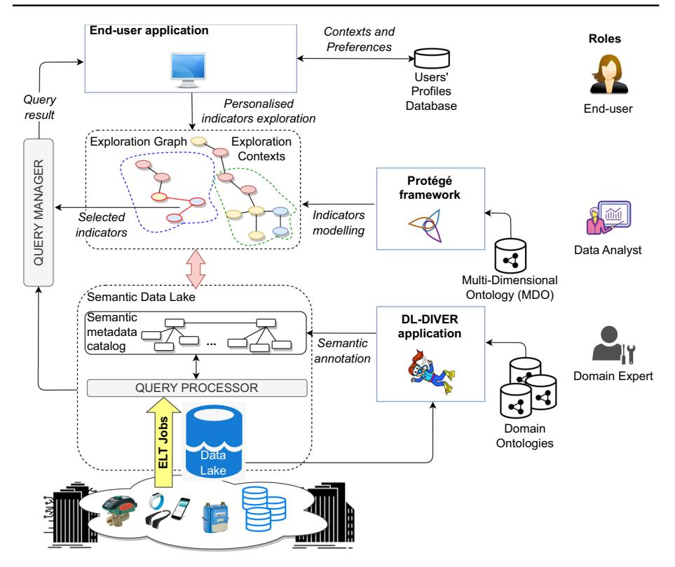
**Figure 1** Overview of the PERSEUS (PERSonalised Exploration by User Support) approach

**Definition 1** (Data set) A data set *ds^j^ ^i^* ∈ *DS^i^*, for *j*= 1 ...*Mj* (where *Mj* is the number of data sets in *DSi*), is defined over a set of attributes *^A^j^ ^i^* ^⊆^ *^A^i^*. For an attribute *ak* ^∈^ *^A^j^ ^i^* in the data set *ds^j^ ^i^*, we use the notation *ds^j^ ^i^* .*ak* or, if not ambiguous, simply *ak*, for *^k^* ^ = ^ ^1^ ... ^|^ *A^j^ ^i^* |. An attribute *ak* ^∈^ *^A^j^ ^i^* can be either: (i) a simple attribute or (ii) an attribute referencing (nesting) another data set in the same data source (denoted with symbol), that is *ak ds^m^ ^i^*, with *ds^m^ ^i^* ^∈^ *DSi*, *^A^m^ ^i^* =*^A^j^ i* .

*Example 1* Figure [2](#page-5-0) illustrates three examples of data sources in the Smart City domain (specifically, about pollution data) and their representation in terms of attributes and data sets. *S*^1^ is a relational database containing two tables, regarding control units and the sensors they host. The content of the tables is modelled with data sets denoted as *ds^k^*^1^ (for *k*= 1 ... 4). *S*2, instead, is a JSON file containing geospatial information of cities. In *S*2, the attribute coords refers to another data set (i.e. *ds*^1^ ^2^.coords *ds*^3^ ^2^ and *ds*^2^ ^2^.coords *ds*^4^ ^2^). *S*^3^ is

^1^ <https://protege.stanford.edu/>.

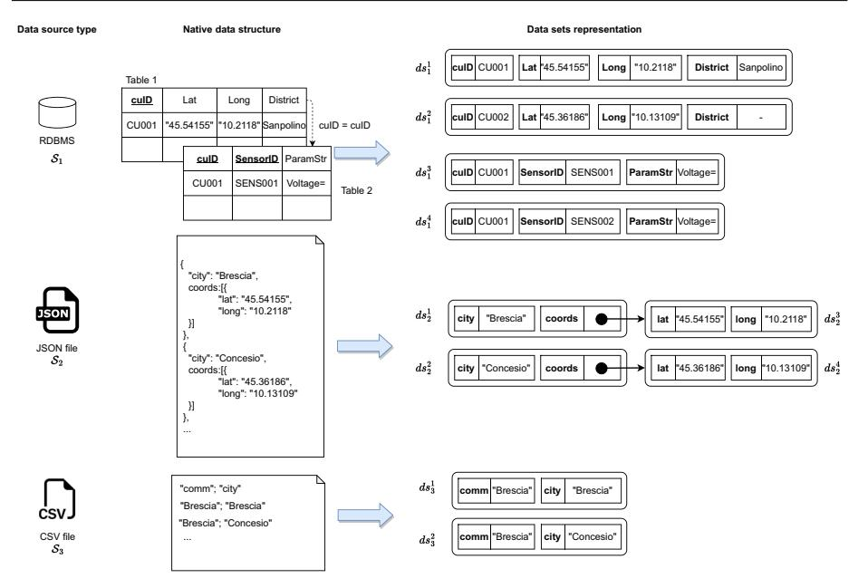
**Figure 2** Data sources and corresponding representation as attributes and data sets (example in the Smart City domain)

a CSV file containing information about cities, grouped into communities (i.e. administrative areas).

### 3.2 Computer-aided semantic metadata catalog creation

In this section, we illustrate the procedure for the creation of the semantic metadata catalog for Data Lake sources by means of a web-based tool (named DL-DIVER), fulfilling basic annotation tasks. The annotation procedure regards only attributes names and not their values, thus reducing the annotation burden. The DL-DIVER tool relies on the following APIs: (i) *lexical enrichment APIs*, providing abbreviations expansion and lexical support; (ii) *semantic annotation APIs*, to semantically annotate data sources attributes with concepts extracted from ready-to-use domain ontologies. APIs usage in the semantic metadata catalog construction is explained in the next paragraphs.

**Lexical enrichment of data source attributes.** The lexical enrichment is performed incrementally by the domain expert, as soon as new data sources have to be managed, through a semantic annotation process. The result of the lexical enrichment process is the association of a label with each attribute *ak*. We refer to this label as *Entity Property.* To perform the lexical enrichment of data source attributes, domain experts are supported by two external linguistic APIs, conceived to complement each other: (i) an Abbreviations API^2^, providing a dictionary of acronyms and their expansion, grouped by domain (e.g. medical, government) and (ii) WordNet^3^, the widely adopted lexical database. The lexical enrichment APIs produce candi-

^2^ <https://www.abbreviations.com/api.php>.

^3^ <https://wordnet.princeton.edu/>.

date Entity Property labels for an attribute *ak*, using its raw name as a searching key. Entity Property assignment is then finalised by the domain expert through the DL-DIVER tool, presented in Sect. [7](#page-16-0). The Entity Property extracted through lexical enrichment is exploited to reduce the gap between the attribute name (that may contain acronyms or abbreviations) and names of concepts used for semantic annotation.

**Semantic annotation of data source attributes.** Each Entity Property undergoes a semantic annotation procedure. Specifically, the DL-DIVER tool, starting from the Entity Property associated with the attribute *ak*, retrieves a suitable concept (that we refer to as *Entity Concept* or in brief *Concept*) describing the meaning of the attribute *ak*. To this aim, a set of domain ontologies stored within an open access repository (LOV - Linked Open Vocabularies [[5]](#ref-5)) is accessed through a proper API, the *LOV Search Term API*, automatically invoked by the DL-DIVER tool to search for semantic concepts whose names match the Entity Property label. The results are ranked according to metrics conceived in the LOV repository, combining different features (e.g. popularity and usage frequency of a concept in the repository). The top-ranked concept is automatically selected as Entity Concept for the annotation. The domain expert may possibly revise the annotation at any time by: (i) defining a new concept by specialising one of the concepts in the search results; (ii) creating the concept from scratch based on his/her domain knowledge.

*Example 2* Figure [3](#page-7-1) reports a data set with related attributes for the data sources *^S^*^2^ and *^S^*^3^ in Example [1](#page-4-2), containing geospatial information of cities and related administrative areas. The labels resulting from the lexical enrichment of the attributes are retrieved from WordNet (e.g. for country attribute) and the Abbreviations API (e.g. lat and long attributes). To find suitable concepts for annotating the attributes of *S*^2^ and *S*3, the LOV Search Term API is invoked using the Entity Properties associated with the attributes as query parameters.

**Semantic metadata catalog population.** For a given data source *S^i^*, the domain expert derives a set of *concepts C^i^*, as described in the previous steps. In this respect, a semantic metadata catalog *DC* is built over the Data Lake *DL*. The semantic metadata catalog is formalised as *DC* = -{*Ci*}, *E R*, where: (i) {*Ci*},*i*= 1 ...*N* is the set of concepts annotating attributes of Data Lake sources *Si*=1...*^N^*; (ii) *E R* is a set of equivalence relationships between pairs of concepts *ca^i^*,*^c^b^j^* with *a*=*b*, either associated with the same data source (*i*=*j*) or different data sources (*i*=*j*). Such relationships can be either suggested relying on the metadata set *M^i^* of the data source (e.g. when the concepts annotate attributes belonging to two tables of a relational database, such as in the example reported in Fig. [2](#page-5-0), where a foreign key relationship has been highlighted with a dashed arrow) or manually defined by the domain expert (e.g. when involved attributes belong to different data sources). Our aim was not directed on devising techniques to automatically retrieve the latter relationships, since it is a consolidated topic already covered by flagship research efforts [[6]](#ref-6).

*Example 3* Resorting to Fig. [3](#page-7-1), dashed lines represent the association between attributes, Entity Properties and related concepts. Two concepts (Latitude and Longitude) have been obtained as a specialisation (through the rdfs:subClassOf semantic relationship) of the ones extracted from LOV domain ontologies. In the figure, black arrows highlight attributes structural hierarchy (e.g. as for the coords attribute which is a complex JSON object of *S*^2^ in Fig. [2](#page-5-0)) whereas blue arrows denote equivalence relationships between concepts.

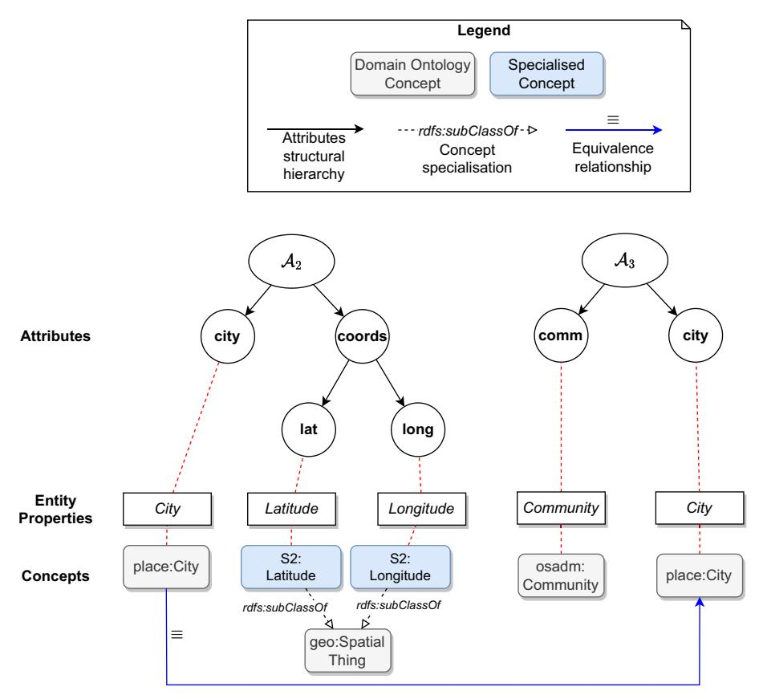
**Figure 3** Sample portion of the semantic metadata catalog for the sources *S*^2^ and *S*^3^

## 4 Definition of indicators over the semantic Data Lake

## 4.1 Multi-Dimensional Ontology

Concepts and relationships in the Semantic Data Lake are used to conceptualise the indicators and the analysis dimensions, which are leveraged to assure the exploration of Data Lake sources content as aggregated multi-dimensional data. Indicators modelling, performed by the data analyst, is properly guided. The *Multi-Dimensional Ontology* (in brief, MDO), whose TBox is reported in Fig. [4](#page-8-0), contains the conceptual elements that must be taken into account to model indicators, designed to aggregate data according to several perspectives and representing the target for exploration, as discussed in the following.

*Indicators concepts* An *indicator* is conceived as a summary measure related to a key issue or phenomenon, derived from a series of observed facts [[2]](#ref-2). In the MDO, indicators can be modelled as *simple* or *composite* (i.e. calculated from other indicators, through takesDataFrom semantic relationship). Indicators may be endowed with a unit of measure (UnitOf-Measure concept) and have a calculation formula (Formula concept). The calculation formula makes explicit how an indicator is calculated. In this respect, the formula is a

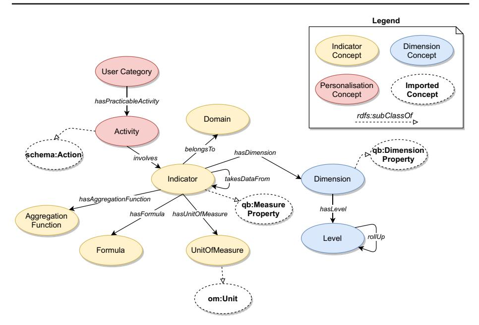
**Figure 4** TBox of the Multi-Dimensional Ontology (in the figure, the semantic areas are highlighted with different colours)

mathematical expression containing constants, algebraic operators and possible references to other indicators. For an indicator, it is also possible to define an aggregation function (AggregationFunction concept), to be applied on indicator values when moving across dimensional levels. Finally, indicators are associated with target domains (e.g. environment, health, energy) through the belongsTo semantic relationship. In the example illustrated in Fig. [5](#page-9-0), the AirPollutionIndicator is described as a sum of other elements (using the hasFormula and hasAggregationFunction relationships), has ppm as unit of measure and is linked with the Environment domain (through the belongsTo relationship). An example of composite indicator is HouseholdCO2, that is a specialisation of CO2Indicator and is computed starting from CO2Heaters indicator.

*Dimensions concepts* Indicators can be segmented over several dimensions (hasDimension relationship), which are organised into levels (Level concept). The rollUp semantic relationship enables a hierarchical organisation of levels, resembling the renowned OLAP *roll-up*/*drill-down* operators. In Fig. [5](#page-9-0), all the indicators concepts are associated with SpatialDimension by means of the hasDimension relationship. Spatial dimensions are articulated over the Apartment, Building, District and City levels, connected each other by rollUp relationship. Additionally, all the indicators are associated with the TimeDimension, articulated over the Year, Quarter, Month and Day levels. For readability purposes, despite all the indicators concepts in the figure have been conceived to be semantically connected to the TimeDimension, only a representative semantic relationship hasDimension has been displayed (on the NOxIndicator).

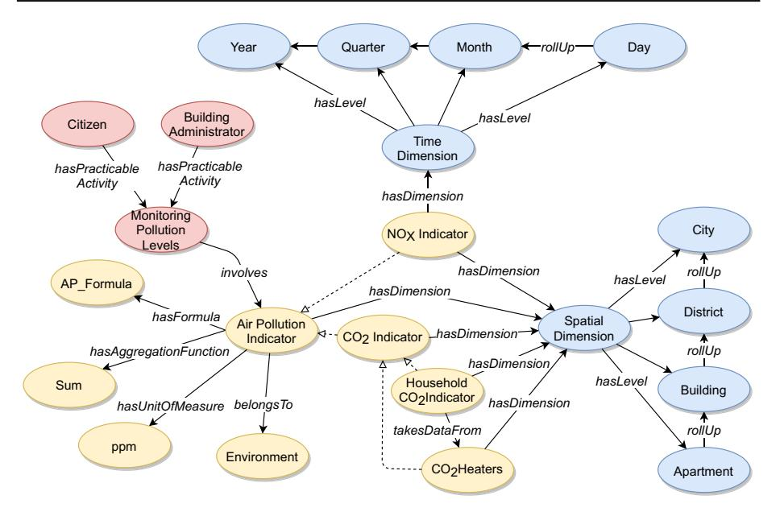
**Figure 5** Example of Exploration Graph for the Smart City domain

*Personalisation concepts* Data exploration can be personalised taking into account user's category (e.g. building manager, citizen in the Smart City domain) and activities, the latter representing the name of the activities for which the end-users must make decisions based on indicators (e.g. building monitoring, check air pollution). Each category is abstracted through the UserCategory concept, whereas each activity is modelled through the Activity concept. Activities involve one or more indicators to be observed (involves relationship) and are associated with users, according to their role (hasPracticableActivity relationship). Personalisation concepts constitute a novel contribution within the MDO with respect to other existing approaches on ontology-based multi-dimensional models [[7]](#ref-7), because they are used to personalise Semantic Data Lake exploration (Sect. [5](#page-11-0)). Moreover, data analyst relies on these concepts to make explicit permissions to the exploration of available indicators for specific categories of users, who perform particular activities. In Fig. [5](#page-9-0), the MonitoringPollutionLevels activity is performed by citizens and building administrators, the latter modelled through Citizen and BuildingAdministrator concepts, respectively.

## 4.2 Exploration graph creation

Data analysts semantically describe indicators through the *specialisation* of MDO concepts and relationships. The resulting semantic representation of indicators, their dimensional characterisation and aggregation formulas constitute the *Exploration Graph*. Figure [5](#page-9-0) reports an example of Exploration Graph, that is compliant with the MDO, in the Smart City domain. Exploration Graph construction follows the steps reported below. The data analyst extends the MDO pivotal concepts and model domain-specific indicators and analysis dimensions with the support of the Protégé tool.

* 1. **Creation of indicator concept.** This operation involves the specialisation of the Indicator concept of the MDO or one of its sub-concepts (that is, formerly created indicators). In this way, the indicators hierarchy is further extended. Using the takes-DataFrom semantic relationship, composite indicators can be defined starting from other fine-grained indicators. For each component indicator, the modelling procedure has to be repeated recursively.
* 2. **Creation of indicator surrounding knowledge.** This includes the creation of a Formula (that, for a composite indicator, contains the expression for calculating it in terms of its component indicators), the UnitOfMeasure and the Aggregation-Function.
* 3. **Link to dimensional hierarchies.** Once an indicator has been modelled, it has to be bound to one or more dimensional hierarchies. The data analyst may reuse previously created hierarchies or define new ones, relying on the pivotal concepts Dimension and Level from the MDO. To guarantee the navigability across dimensional levels, the data analyst is supported in the definition of rollUp relationships between levels belonging to the same Dimension.
* 4. **Definition of personalisation concepts.** The semantic representation of indicators is further enriched by associating them with their target domains (e.g. environment, health) through the belongsTo semantic relationship. Moreover, personalisation concepts taken from the MDO are used to assert that the knowledge of some indicators influences specific activities, performed by users (e.g. citizens, building administrators, environmental engineers). This is achieved by considering UserCategory and Activity from the MDO. In particular, the hasPerformableActivity relationship binds a UserCategory concept (or one of its sub-concepts) to an Activity concept (or one of its sub-concepts). Finally, the involves semantic relationship links an Activity concept to one or more Indicator concepts.
* 5. **Validation of the created indicator.** To assist the data analyst in the modelling task, validation rules have been included in the MDO. Whenever the data analyst adds new indicators (and related ancillary concepts) to the Exploration Graph, he/she may run a reasoner (i.e. a software module linked to the Protégé modelling tool) which verifies whether the novel indicators comply with the validation rules defined in the MDO. This verification process is referred to as *conformance checking*. Such validation rules are employed to impose several constraints: (i) that a valid activity involves at least one indicator; (ii) that a valid dimension hierarchy, being associated with an indicator, must gather at least one dimension level; (iii) that a valid indicator belongs to at least one domain, is explorable according to at least one dimension hierarchy, possibly has a unit of measure and is involved in at least one activity. The interested reader can find the formulation of the validation rules in [[8]](#ref-8).

The idea behind the MDO is to promote a shared, machine interpretable conceptualisation of exploration concepts (i.e. indicators and dimensions) in a specific domain, in order to reuse it for the exploration of Data Lake sources in the same domain. For the Smart City domain described in this paper, MDO concepts and relationships have been used to model indicators starting from their textual description as from the ISO 37120 standard (further details available in [[8]](#ref-8)). Formally, an Exploration Graph *G* is defined as follows.

**Definition 2** (Exploration Graph) The Exploration Graph is a graph-based data structure defined as *G* = -*C*, *R*, where: (i) *C* contains concepts derived from the specialisation of MDO concepts, that is, ^∀^*ci*^∈^*^C^*, *ci ^c^MDO ^j^*, being *^c^MDO ^j^* a pivotal concept of the MDO, and (ii) *R* contains relationships derived from the specialisation of MDO relationships, that is ^∀^*ri*^∈^*^R^*,*ri ^r^MDO ^j^*, being *^r^MDO ^j^* a pivotal semantic relationship of the MDO.

Indicators and dimensions in the Exploration Graph at the finest level of granularity are linked (or, equivalently, mapped) by the data analyst to the concepts of the semantic metadata catalog, to set up indicators exploration upon Data Lake sources.

## 5 Personalised exploration contexts

Once the Exploration Graph has been created, the Data Lake contents can be explored by relying on three elements: (i) *Multi-Dimensional Descriptors*, apt to model multi-dimensional basic elements on which exploration is performed; (ii) *Exploration Context*, apt to identify the portion of the Exploration Graph containing indicators compliant with user's operating situation; (iii) *contextual preferences*, to provide a ranking of indicators within the exploration context, thus suggesting to the user the most promising indicators to start the exploration from. These elements are detailed in the following.

### 5.1 Multi-dimensional descriptors

The most intuitive exploration strategy on *G* is an interactive exploration, moving across nodes leveraging their interlinking relationships. However, this exploration strategy may be unpractical as the number of nodes in the Exploration Graph grows. To tackle this issue, we present here a strategy grounded on the assumption that users inherently explore data according to a multi-dimensional organisation. For instance, an environmental engineer may be interested in inspecting the daily concentration of a pollutant in a specific district of the Smart City. In this respect "day" and "district" become the two exploration dimensions. Thus, for concisely expressing the binding of an indicator to its associated dimensions, we formalise the notion of *Multi-Dimensional Descriptor* (MDD), defined over the Exploration Graph *G*.

**Definition 3** (Multi-Dimensional Descriptor) A Multi-Dimensional Descriptor, defined over the Exploration Graph *G*, is denoted as τ*^i^*=*indi*, *Li*, where: (i) *indi* represents an indicator concept from *G* and (ii) *Li* is a vector of dimensional level concepts. Specifically, given *Di* as the set of dimensions associated with *indi*, *Li* is represented as *Li* = (*l*1*i* ,*l*2*^i^* ,...,*l n ^i^*),*l j i*∈*Le*v*els*(*dim ^j^ ^i^*),*dim ^j^ ^i^* ^∈^*Di*.*Le*v*els*(*dim ^j^ ^i^*) denotes the set of dimensional levels associated with dimension *dim ^j^ ^i^* ∈*Di*, comprising the special level denoting the coarsest aggregation (*ALL*). We denote with *T* the overall set of MDDs that can be automatically extracted from the Exploration Graph *G*. For an indicator *indi*∈*G*, the maximum number of possible MDDs is equal to *n ^j^*=^1^ ^|^ *Le*v*els*(*dim ^j^ ^i^*)|.

*Example 4* According to Fig. [5](#page-9-0), a sample MDD is ^τ^^1^ = -CO2Indicator, (City, Year), where τ1.*ind*^1^ = CO2Indicator and τ1.*L*^1^ = (City, Year). In *L*1, City is a dimension level belonging to SpatialDimension, whereas Year belongs to Temporal Dimension. This MDD expresses the fact that the *C O*^2^ indicator is explorable according to the city level as spatial dimension and to the year level as temporal dimension, thus reducing the number of exploration possibilities. The maximum number of possible MDDs involving CO2Indicator, obtained combining the levels of the two dimensions, is equal to 25 (= 5 · 5), including for each dimension also the special level *ALL*.

Personalised data exploration of MDDs is modelled through a set of users' profiles *p*(*u*) for each *u*∈*U*, where *U* is the set of users. The profile *p*(*u*) is composed of *hard constraints* and *soft constraints*. The former are exploited at query evaluation time and are aimed at restricting data access (for instance, a building administrator is allowed to inspect MDDs for the administered buildings only). Soft constraints are modelled by means of *preferences*, organised according to *exploration contexts*, gathering information that characterise the situation under which the user explores MDDs, influenced by both his/her roles and goals. In the following, we provide the formal definition of exploration context.

**Definition 4** (Exploration Context) An Exploration Context *ctx^i^* of a user *^u^* ^∈^*^U^* is a triple *cat^i^*,*a^i^* ,*C P^i^* where: (i) *cat^i^* represents the category of the user *^u^* ^∈^*^U^*, (ii) *^a^i^* is an activity performed by the user in the context and (iii) *C P^i^* denotes the set of preferences valid for the context (thus referred to as *contextual preferences*). A user *u*∈*U* may act in different contexts. The set of contexts associated with a user *u*∈*U* is denoted as *CT ^u^*.

The Exploration Context *ctx^i^* ^∈^*CT ^u^* is used to delimit a portion of the Exploration Graph *^G^* that is explorable by the user *^u^* ^∈^*^U^*, denoted as *^G^i^*. Available contexts are derived from *^G^* considering all the distinct pairs *cat^i^* ^−^*^a^i^* from UserCategory and Activity sub-concepts. At exploration time, a context *ctx^i^* can be bound to one or more users' profiles. Indeed, users can manage their profile by selecting/changing the context of interest, choosing it from the ones compliant with their role(s). The formal definition of contextual preferences is addressed in the following.

## 5.3 Contextual preferences

The portion of the Exploration Graph delimited by an exploration context may contain a high number of indicators. This usually happens when a user performs a generic activity (such as "pollution monitoring"). To cope with this issue, *contextual preferences* help suggesting the user the indicators which best fit his/her demand. Contextual preferences in *C P^i^* can be either: (a) *short-term preferences*, expressed by the user at exploration time, representing imminent exploration needs; (b) *long-term preferences*, stored in user's profile, which are assumed to be static or change slowly over time. Contextual preferences are formally expressed on the set *T* of MDDs as follows.

**Definition 5** (Contextual preference) A contextual preference **P** is a couple (<**P**, ~=**P**) where <**P**⊆ *T*×*T* is a binary relation expressing a *strict partial order* over the set of MDDs *T* and ~=**P**⊆ *T*×*T* is a binary relation for expressing *equivalence*. Given two MDDs τ^1^ and τ2, the semantics of τ^1^ <**^P^** τ^2^ is that MDD τ^2^ is preferred to τ1, whereas the semantics of τ1~=**P**τ^2^ is that no preference is expressed between τ^1^ and τ2.

Contextual preferences are expressed through constructors, that rely on indicators, indicators hierarchies, dimensions and domains. Hereafter, the four main constructors of the PERSEUS approach are explained:

* IND(*i*) constructor denotes that ^τ^^2^ is preferred to ^τ^^1^ (τ^1^ <IND(*i*) ^τ^2) if^4^ the distance of indicator *ind*2, contained in τ2, from indicator *i* is less than the distance between *ind*1,

^4^ Abbreviation for "if and only if".

contained in τ1, and *i*. This constructor relies on the distance function *distI*(*ih*,*ik*), computing the distance between concepts *ih* and *ik* within the indicators hierarchy as the number of rdfs:subClassOf relationships in the path between *ih* and *ik* .

* LEV(*dim*,*l*) constructor denotes that τ^2^ is preferred to τ^1^ (τ^1^ <LEV(*dim*,*l*) τ2) iff the distance from *l* of level *l*2∈*Le*v*els*(*dim*), contained in τ2, is less than the distance between *l* and *l*1∈*Le*v*els*(*dim*), contained in τ1. This constructor relies on the distance function *distL* (*li*,*l ^j^*), computing the distance between two levels *li* and *l ^j^* as the length of the path of rollUp relationships between them.
* DEP(*i*) constructor denotes that τ^2^ is preferred over τ^1^ (τ^1^ <DEP(*i*) τ2) iff the formula of indicator *ind*2, contained in τ2, is calculated starting from the indicator *i* (modelled through the takesDataFrom relationship in *G*), while the formula of *ind*1, contained in τ1, does not. This constructor exploits the Boolean function *tdf* (*ia*,*ib*) returning *True* if *ia* takesDataFrom *ib* in *G*, *False* otherwise.
* DOM(*dom*) constructor denotes that τ^2^ is preferred to τ^1^ (τ^1^ <DOM(*dom*) τ2) iff the indicator *ind*2, contained in τ2, belongs to domain *dom*, while *ind*1, contained in τ1, does not. This constructor exploits the Boolean function *domain*(*i*, *dom*) returning *True* if *i* belongsTo *dom* in *G*, *False* otherwise.

The rationale behind these constructors is that the user can express his/her preferences on MDDs by relying on the relationships between MDDs and other concepts within his/her Exploration Contexts. The four constructors can be in turn combined to form more complex preference expressions using two binary composition operators from the literature, namely the *Pareto* composition (⊗), composing two preferences with equal priority, and the *prioritisation*() operator [[9]](#ref-9).

*Example 5* Given two MDDs ^τ^*^a^* = -CO2Indicator, (Apartment) and τ*^b^* = -HouseholdCO2Indicator, (District) and with reference to Fig. [5](#page-9-0), then τ*^b^* <IND(AirPollutionIndicator) τ*^a^* In fact, *distI*(*i*, τ*a*.*inda*) = 1 is less than *distI*(*i*, τ*b*.*indb*) = 2, where *i* = AirPollutionIndicator. Considering the same MDDs: τ*^a^* <LEV(SpatialDimension,City) τ*^b^* since *distL*(City, District) = 1 is less than *distL* (City, Apartment) = 3.

## 6 Personalised Data Lake exploration

In the following, we explain the query model and the procedure to derive a query plan submitted to retrieve indicators values. The query model relies on preferences, engaged as a personalisation technique to make easier and more usable the exploration of data for a large number of users, taking into account the exploration contexts and users' roles in the application domain. The impact of this design choice on the personalised search of indicators has been evaluated and discussed in Sect. [8.5](#page-26-0). For clarity purposes, in the examples we refer to a single MDD τ*^i^*, to issue a query *Q*τ*^i^*. However, the same considerations hold also for more than one MDD involved in the query. In the PERSEUS approach, we focus on the GPSJ (Generalised Projection, Selection and Join) queries answering [[10]](#ref-10), which concerns the most common class of queries used for OLAP-like analysis. A query is modelled as a five-element tuple, formalised as follows.

**Definition 6** (Query) A query over the Semantic Data Lake based on a MDD τ*^i^*, denoted as *Q*τ*^i^*, is defined as *Q*τ*^i^*=*q*^π^ ,γ, *q*^σ^ , *f* , (τ*i*) where: (i) *q*^π^ is a set containing the projection objects of the query (i.e. target indicators and analysis dimensions); (ii) γ is an aggregation function to be applied to the results of the query; (iii) *q*^σ^ is a set containing the selection objects of the query; (iv) *f* is a formula to be applied on the indicator(s) in *q*^π^ ; (v) (τ*i*) is the set of mappings associated with τ*i*, apt to identify the concepts of the semantic metadata catalog.

Supposing that the indicator τ*^i^* .*indi* is a simple indicator (i.e. not derived from the aggregation of other indicators), these assumptions hold for a query *Q*τ*^i^*:

* the set *q*^π^ = {*indi*}∪{*l j*=1,...,|*Li*|*^j^*} contains the indicator concept *indi* of τ*^i^* and the dimensions *l ^j^*∈*Li*; the content of *q*^π^ (limited to the dimensional levels) is referred to as the *group-by* set of *Q*τ*^i^*;
* the aggregation function γ for the indicator *indi* is obtained from the Exploration Graph *G*, that is, *indi* hasAggregationFunction γ ; specifically, this function is the default operation to apply when aggregating *indi* values according to the dimensions in *q*^π^ ;
* the set *q*^σ^ contains filtering predicates for the dimensional levels in the set *q*^π^ ; here, we assume that this set is implicitly populated with *hard constraints* from the profile of the user (Sect. [5.2](#page-12-1)); selection predicates in *q*^σ^ are triplets in the form *l ^j^*, *op*, v*al*, where: (a) *l ^j^* is a dimensional level from *q*^π^ ; (b) *op* is a binary comparison operator (e.g. =, >, <) and (c) v*al* is a value;
* the formula *f* is applied on the indicator *indi* in *q*^π^ ; such formula is contained in the Exploration Graph *G*, that is, *indi* hasFormula *f* in *G*.

In the case τ*^i^* .*indi* is a composite indicator, the formula *f* will express how parts that compose the indicator have to be combined together. Moreover, the set *q*^π^ of *Q*τ*^i^* will contain all the components of *indi*, and the query answering process will leverage the mappings sets defined for each component of *indi*.

*Example 6* Let us consider a MDD τ^1^ and the query *Q*τ^1^, defined as follows:

$$
\tau_1 = \langle \text{CO2} \text{Indicator}, (\text{District}) \rangle
$$

$$
Q_{\tau_1} = \langle \text{CO2} \text{Indicator}, \text{District} \rangle, \text{Sum}, \emptyset, \text{CO2} \text{Indicator}/1000, \Sigma(\tau_1) \rangle
$$

Resorting to the structure of *G* depicted in Fig. [5](#page-9-0), CO2Indicator is a simple indicator (i.e. with no dependencies). The aggregation function γ (Sum) is obtained by navigating the semantic relationship hasAggregationFunction in *G*. Moreover, the indicator formula *f*^1^ is CO2Indicator/1000, to be applied before the aggregation function γ , is contained in *G*. The formula *f*^1^ has been specified by the data analyst when modelling the CO2Indicator.

**Query plan creation.** In the PERSEUS approach, we resort to the methodology proposed in [[11]](#ref-11) to create a query plan aimed at answering queries over heterogeneous data sources. Data sources are explored through the definition of an *execution plan*, composed of *local plans*, issued over single data sources, in turn combined into a *global plan*, joining data retrieved from local plans. The information necessary for the creation of the execution plan is derived from a supporting data structure called *query graph* (example illustrated in Fig. [6](#page-15-0)), whose nodes represent data source attributes and edges indicate relationships between attributes. Regarding edges, they could link together *siblings* attributes (indicated through a "sibling" label on the edge), *nested* attributes (indicated through "nested" label), *foreign keys* (indicated, for conciseness, with the label "fk" on the edge). Noteworthy, the example reported in Fig. [6](#page-15-0)

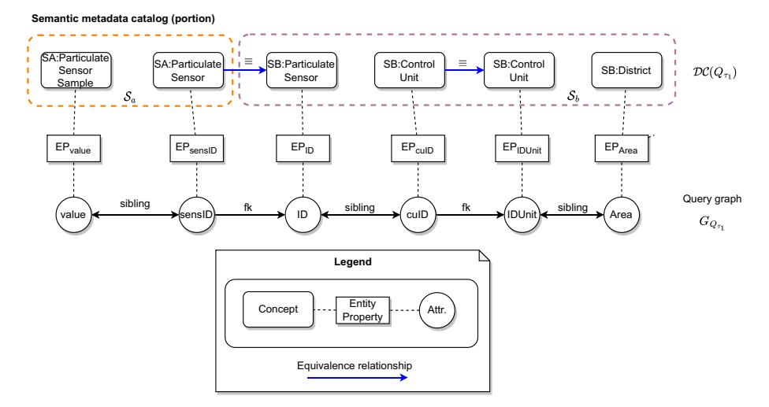
**Figure 6** Representation of the portion *DC*(*Q*τ^1^) obtained considering a query *Q*τ^1^ and related query graph *GQ*^τ^^1^

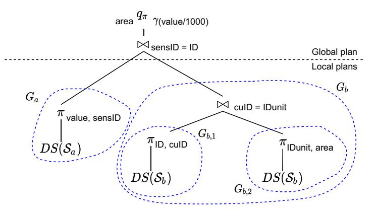
**Figure 7** The tree for the sample query *Q*τ^1^ represented according to the Nested Relational Algebra (NRA) notation. Local plans and global plan are distinguished

showcases only the usage of "sibling" and "fk" edges. The reference approach has been adapted to the Semantic Data Lake model presented in this paper. Specifically, we highlight below the two major differences:

* 1. the query graph creation algorithm receives as input the portion of the semantic metadata catalog (denoted as *DC*(*Q*τ*i*)) required to calculate *indi* according to the dimensions in *Li*;
* 2. edge types in the query graph are assigned as follows: (i) *foreign key* edges are derived from equivalence relationships in *DC*(*Q*τ*i*); (ii) *sibling* edges link attributes belonging to the same data set; (iii) a *nested* edge links an attribute of a data set which is nested inside an attribute of another data set (according to Definition [1](#page-4-3)).

The query graph is partitioned, based on foreign key edges (whose set is denoted as *E f k*), into |*E f k*| + 1 partitions. Each partition corresponds to a local plan, which is translated into a Nested Relational Algebra (NRA) expression (graphically represented as a tree, in Fig. [7](#page-15-1)), containing the operators data source access (*DS*), projection (π), selection (σ), unnest (μ) and join ( ). Then, local plan expressions are combined (through join operators) in order to obtain the global plan expression, that will be translated into an SQL-like statement.

## 7 Architecture and prototype tools

### 7.1 Architecture for semantic Data Lake exploration

Figure [8](#page-16-1) presents the architecture adopted in the PERSEUS approach for Semantic Data Lake exploration. The Data Lake infrastructure relies on the Apache Hadoop File System (HDFS) and it internally adheres to a *zone-based* organisation. Indeed, in the literature, zone-based architectures have proven to be effective for postponing data transformation and elaboration until data consumption is strictly required at the application layer [[12]](#ref-12). In particular, we conceived a Data Lake organised over four zones, encapsulating data management operations, namely: (i) *Raw Zone*, containing the heterogeneous data sources in their original format, where each data source has its own path in HDFS; (ii) *Standardised Zone*, where data is abstracted through data sets, upon which data standardisation operations are applied (e.g. format conversions, conversion between different units of measure, append of technical metadata regarding the type and the length of a file, criteria to identify missing data values and actions to apply); (iii) *Curated Zone*, where data sets required for the calculation of the values of indicators are shaped into a tabular structure; (iv) *Application Zone*, where the tables of the Curated Zone are joined together to produce the aggregated values for indicators to be displayed on the Exploration GUI.

In the following, we illustrate the whole query answering flow, leveraging the numbers in Fig. [8](#page-16-1). After the selection of an MDD τ*^i^* by the user through the Exploration GUI (1),

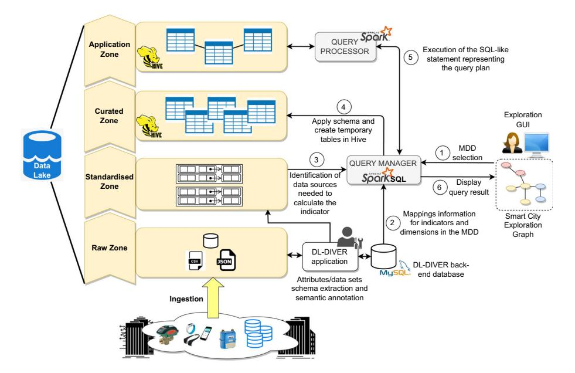
**Figure 8** Functional architecture for Semantic Data Lake exploration in the PERSEUS approach

the QUERY MANAGER module (implemented in Java and relying upon Spark SQL libraries) assembles the respective query *Q*τ*^i^*. To this aim, the mappings from indicators and dimensions in τ*i* towards concepts (attributes) of the semantic metadata catalog are retrieved (2), by inspecting the back-end database of the web-based DL-DIVER tool. The path associated with each involved data source is used by the QUERY MANAGER module to access HDFS (3) and to register a temporary table, corresponding to a Spark SQL DataSet object (4). Each temporary table contains the instances of a data set as formalised in Definition [1](#page-4-3). The schema of a data set is derived from the related metadata contained in the DL-DIVER backend database. The translation into SQL of the query plan associated with *Q*τ*^i^* is submitted to the QUERY PROCESSOR module, which performs projections, selections and joins on data sets, in order to produce as a final output the aggregated values for the indicator *indi* in τ*^i^*, which are stored into Hive (5) in order to enable subsequent exploration by the user (6).

## 7.2 DL-DIVER web-based tool

To assist domain experts in the creation of the Semantic Data Lake, we designed DL-DIVER^5^, a web-based tool independent of any particular application context, implementing the computer-aided steps presented in Sect. [3.2](#page-5-3). The application back-end has been developed using PHP 7.3 and exploits EasyRDF^6^ PHP library for the management of Semantic Web data. Application data is persisted in a MySQL database. In the following, we sketch the lexical enrichment and semantic annotation of data source attributes, performed through the DL-DIVER tool with the support of the lexical enrichment and semantic annotation APIs, respectively.

*Entity Property definition* During the creation of the Semantic Data Lake, through the *Entity Property Definition Page* (Fig. [9](#page-18-0)), the domain expert is supported in the lexical enrichment of each attribute in the underlying data sources. The page proposes search results from both the Abbreviations API and WordNet. As the Abbreviations API is devoted to expanding acronyms only, it is used in synergy with WordNet. In particular, WordNet is leveraged to address synonyms, as it contains the semantic relations between words, and links them into semantic relations including synonyms, hyponyms, and meronyms. Synonyms are grouped into synsets (i.e. groups of terms with the same meaning) with short definitions and usage examples. Regardless of the search strategy, the domain expert selects from the list of labels returned by the lexical enrichment APIs the Entity Property which best fits the description of the attribute, according to his/her domain knowledge. At this point, the search is re-triggered considering as a new searching item the formerly selected Entity Property, thus enabling the domain expert to further refine (if needed) the Entity Property resolution, until the most appropriated label has been found. However, in the case of highly domain-specific attributes, for which the domain expert cannot find the intended expansion either through the Abbreviations API or WordNet, he/she may rely on his/her own expertise and domain knowledge, as the Abbreviations API and WordNet are meant as supporting tools (i.e. DL-DIVER does not force the expert to choose amongst one of the suggested expansions).

^5^ Demonstration video of the tool: <https://tinyurl.com/video-tool-sdl>.

^6^ <https://www.easyrdf.org/>.

| $\leftarrow$ Back | | Logout (User) |
|---|---|---|
| **Attribute: Device** **Entity Property: Device** | | **Assign** |
| Possible results for abbreviation/acronym:Device | | Wordnet's results for the term: Device |
| Word | Category ALL CATEGORIES v | **NOUN** • S: device an instrumentality invented for a particular purpose; "the device is small enough to wear on your wrist"; "a device intended to conserve water" |
| Dynamic Environment For Visualization In Chemical Engineering | **CHEMISTRY** | • S: device something in an artistic work designed to achieve a particular effect |
| | | • S: device gimmick twist any clever maneuver; "he would stoop to any device to win a point"; "it was a great sales gimmick"; "a cheap promotions gimmick for greedy businessmen" |
| | | • S: device any ornamental pattern or design (as in embroidery) |
| | | • S: device an emblematic design (especially in heraldry); "he was recognized by the device on his shield" |
| | | |

**Figure 9** Entity Property Definition Page of DL-DIVER web-based tool

| | | | | & Logout (User) |
|---|---|---|---|---|
| | **Attribute: Value** | Observation **Entity** Property: | **Entity** Concept: | |
| | | Search for Concept in the vocabulary: | | |
| | Search in all vocabularies | | | $\checkmark$ |
| | Observation | | | |
| | | Search | | |
| | | **Results for: Observation** in: All vocabularies | | |
| Concept | | **Belonging vocabulary** | | |
| qb:Observation | | qb - http://purl.org/linked-data/cube#Observation | Select | Specialize |
| oml:Observation | | oml - http://def.seegrid.csiro.au/ontology/om/om-lite#Observation | **Select** | Specialize |
| geosp:Observation | | geosp - http://rdf.geospecies.org/ont/geospecies#Observation | **Select** | Specialize |
| caso:Observation | | caso - http://www.w3id.org/def/caso#Observation | **Select** | Specialize |
| earth:Observation | | earth - http://linked.earth/ontology#Observation | **Select** | Specialize |
| | | | | |

**Figure 10** Entity Concept Definition Page of DL-DIVER web-based tool

### *Concept definition*

After choosing the Entity Property, in the *Entity Concept Definition Page* (Fig. [10](#page-18-1)), the domain expert performs the semantic annotation of the attribute, assigning a proper Concept. To this aim, DL-DIVER invokes the *LOV Search Term API* to retrieve the semantic concepts from the LOV repository^7^ (to date, containing 829 domain ontologies) using the related Entity Property as a searching keyword. The obtained concepts are displayed in a table reporting: (a) the name of the concept, (b) the name of the ontology the concept belongs to and (c) the URI of the concept. The first concept from the list is automatically proposed for annotation.

^7^ <https://lov.linkeddata.es/dataset/lov/>.

| (a) | (b) | (c) | | |
|---|---|---|---|---|
| Alice Smart City Indicators Exploration Engine Logout | Alice Smart City Indicators Exploration Engine Logout | Alice Smart City Indicators Exploration Engine Logout | | |
| Home | Home / Contextual Preferences | Home / Results Visualisation | | |
| Logged in as Citizen. To change role, logout and choose a different role | Current Exploration Context: Citizen (AirPollutionMonitoring) | Current Exploration Context: Citizen (AirPollutionMonitoring) | | |
| Context Selection ? | Preference Summary ? | Available results ? | | |
| Role Citizen Activity AirPollutionMonitoring | List of long-term preferences valid for the context: | Evaluated IND(CO2Indicator) (LEV(SpatialDimension, preference District) DOM(Environment)) expression | | |
| ? Formulate Request for Indicators Desired (No selection) Add domain Desired CO2Indicator Add indicator Desired Add (No Selection) dimension | LEV(SpatialDimension, District) DOM(Environment) Preference Save Changes Creation Wizard | Indicators returned Results: 1-4 CO2Indicator (District, Year) CO2Indicator (District, Quarter) CO2Indicator (District, Month) CO2Indicator (District, Day) More Results 1 2 3 | | |
| Show Contextual Find Indicators Preferences | | Browse selected indicators | | |

**Figure 11** GUI of the tool for personalised indicators exploration: request formulation (**a**), short-term and longterm preferences management (**b**), exploration of search results (**c**)

However, the domain expert may browse the search results and select another concept, create a new concept as a specialisation of the formerly selected one (clicking on the "Specialize" button) or, in the worst case, create a new concept from scratch, relying on his/her domain knowledge. The latter two cases are meant to be fostered when the domain expert is not able to find a suitable concept for the lexically enriched attribute (e.g. due to domain-specific Entity Properties).

## 7.3 Tool for personalised exploration of indicators

A tool implemented as a web application^8^ guides the user through the steps of personalised exploration of indicators, and three representative web pages of the application are illustrated in Fig. [11](#page-19-2) and described in the following. Let us consider Alice, a citizen interested in monitoring air pollution levels in her Smart City to decide whether to practise outdoor activities or not, since pollution influences this kind of activities.

*Exploration context selection* The input of this step is the set of exploration contexts associated with the Alice's profile *p*(*u*). After log in, the selection of the desired activity completes the identification of the exploration context *ctxr*. Figure [11a](#page-19-2) shows the selection of the AirPollutionMonitoring activity by Alice, whose profile is associated with the Citizen role.

*Short-term preferences formulation* This step takes as input the context *ctx^r^* previously selected by Alice. A list of target indicators, analysis dimensions and domains available within *ctx^r^* is proposed to Alice for selection. In particular, indicator concepts are mapped to IND constructors, domain concepts to DOM constructors and dimensional level concepts to LEV constructors for short-term preferences formulation. In Fig. [11a](#page-19-2), when Alice selects the CO2Indicator, the corresponding preference constructor IND(CO2Indicator) will be automatically included in the request.

### *Short-term and long-term preferences combination* The input of this phase is the context *ctx^r^* and the request from the former step. Short-term preferences in the request are combined with long-term preferences in the

^8^ Demonstration video of the tool: <https://tinyurl.com/pref-app-demo>.

Alice's profile *p*(*u*). In the example, long-term preferences DOM(Environment) and LEV(SpatialDimension, District) are considered, since they are valid for the target context (Fig. [11b](#page-19-2)). Through the tool, Alice can change the list of long-term preferences by removing some of them. Long-term preferences are automatically combined using the Pareto composition operator, since they assume an equal importance for Alice. In turn, longterm preferences are combined with short-term ones from the previous step according to the prioritisation operator, as short-term preferences address an immediate exploration need.

### *Preference evaluation and indicators exploration* This step takes as input the compound preference, obtained combining short-term and longterm preferences as formerly explained, and the portion of *G*, represented as a set of MDDs *^T^* ^r^* ^⊆^*^T^* corresponding to indicators available under the exploration context *ctxr*. The set *^T^* ^r^* is formally defined as {τ*^i^* ^∈^*^T^* ^|^ *^a^r^* involves ^τ^*^i^* .*indi*}, where *^a^r^* is the activity selected by the user in *ctxr*. The compound preference is evaluated by an algorithm that identifies a subset of best (optimal) MDDs, which is defined as the *Best Match Only* result [[13]](#ref-13) (in brief, BMO). The MDDs in the BMO are proposed to Alice, who can select any of them to explore indicators values (Fig. [11c](#page-19-2)). However, Alice may request for additional (sub-optimal) MDDs (e.g. to receive suggestions of other indicators that are compliant with her exploration goals), which are ranked as lower by the evaluation algorithm. For example, MDDs associated with City/Building levels are characterised by an increasing distance from the ones with District level and thus they will earn a lower rank. This is particularly useful in case of few MDDs in the BMO, whereas Alice wants to explore additional results.

### 8 Experimental evaluation

In this section, we describe the experimental validation of the suite of tools and techniques proposed in this paper, using data collected in the scope of the Brescia Smart Living project [[4]](#ref-4). In the Brescia Smart Living project, three different typologies of end-users have been identified as targets for the personalised exploration of indicators: (i) *citizens*, willing to explore aggregated data related to their neighbourhood (for example, average energy consumption, air quality, neighbourhood safety), thus exploring indicators to compare, for instance, air quality and personal energy consumption with their neighbourhood average and, more generally, with other neighbourhoods (this category comprises inhabitants of so-called smart homes, where advanced home automation systems are installed, being capable of remotely monitoring and control electrical loads, water consumption and thermal consumption for individual radiators); (ii) *property managers*, that is administrators of one or more condominiums, who may explore energy consumption (electric and thermal) indicators for their condominiums at both the apartment and building level, comparing them with the district average; (iii) *technical user plant managers*, responsible for heat distribution in condominiums, willing to analyse indicators regarding heat meters at both the condominium and individual user levels.

### 8.1 Experimental setup

*Available data sources* In the Brescia Smart Living project, data has been collected on field by so-called Domain Specific Platforms (DSPs) and conveyed into the Data Lake, in order to be available for further exploration. Each DSP, owned by an energy/service provider participating in the project, exposes data ready to be transferred to the Data Lake through proper transfer jobs triggered either with a *push* mode (i.e. when specific events occur) or with a *pull* mode (i.e. for sampled data, with predetermined frequency), by relying on a message exchange paradigm (MQTT protocol). Data pushed/pulled from DSPs has three main formats: (i) JSON files (for weather forecasts, pollution data, gas consumption data); (ii) CSV files (fiscal measures read from electrical energy smart meters); (iii) SQL-like relational tables (fiscal measures regarding water and district heating). Complying with Definition [1](#page-4-3), each file or table transferred from DSPs to the Data Lake corresponds to a data source, whereas each JSON object, each row in a CSV file, and each record in a table corresponds to a data set.

*Experimental evaluation outline* The experimental evaluation discussed in the following sections have been conducted to test: (i) the capability of the DL-DIVER tool in supporting domain experts for semantic annotation of data source attributes (Sect. [8.2](#page-21-0)); (ii) the average response times of the query answering mechanism (Sect. [8.3](#page-23-0)); (iii) the effectiveness of the preference-based system in reducing the indicators search space (Sect. [8.4](#page-24-0)); (iv) the effectiveness of personalisation in suggesting relevant indicators for exploration (Sect. [8.5](#page-26-0)). Noteworthy, we remark that the proposed PERSEUS approach targets the three typologies of users previously described, having different goals while exploring indicators. The experiments have been performed in a Spark environment configuration, where one master node and three worker nodes have been deployed on Windows PC machines equipped with an Intel Core i5-3210M processor, CPU 2.50 GHz, 4 cores, 8 logical cores, RAM 8GB.

### 8.2 Experiments on semantic metadata catalog construction

To evaluate the capability of DL-DIVER tool in supporting domain experts for semantic annotation of data source attributes, we distinguished the lexical enrichment of attributes and semantic annotation tasks, for performing Entity Property and Entity Concept identification. In particular, three high-level summary statistics have been computed: (a) percentage of searches without results; (b) percentage of searches with results (c) percentage of searches with relevant results. Experiments reported in the following have been conducted on attributes from data sources shown in Table [1](#page-22-0). Moreover, general considerations on the annotation task are reported at the end of this section.

*Lexical enrichment and semantic annotation of attributes*

We conducted tests on specific attributes (abbreviations and attributes with special characters such as delimiters in the name) to derive Entity Properties starting from either simple attributes or compound attributes, the latter composed of several tokens. In particular, 15 different search sessions have been performed, and average results statistics are shown in Table [2](#page-22-1). For both simple and compound attributes, the combination of the two types of searches (i.e. WordNet and Abbreviations API) returned good results over the 50% of searches.

Regarding the semantic annotation of attributes, two kinds of experiments have been performed: (a) Entity Concepts search, starting from attributes with no preliminary lexical enrichment (*plain* search); (b) Entity Concepts search, starting from lexically enriched attributes (*LEA* search). Additionally, those cases in which a *specialisation* of a relevant search result or the creation of a new concept from scratch has been performed by the domain expert have been properly highlighted. Also in this case, 15 different search sessions have been

| Domain Specific Platform (DSP) | Transfer mode from DSP to Data Lake | Examples of trans ferred data | Transfer frequency | Transferred data format | Average records per month | |
|---|---|---|---|---|---|---|
| Weather forecasts PUSH | | Rainfall, Temperature, Snow quantity, Wind direction, Wind speed, Relative humidity | n.a. | JSON | 5k | |
| Fiscal data (electricity, hydro, heat) | PULL | Electricity, Natural gas, District heating, Potable water | Monthly | CSV/SQL | 30k | |
| Pollution data | PULL | CO2, PM2.5, Ozone, CO, Ground temperature, Noise level | Daily | JSON | 500k | |
| Smart gas meters | PULL | Seismic events, Gas valves control events | Monthly | JSON | 30k | |
| Smart plugs | PUSH | Electrical appliance consumption | n.a. | JSON | 20k | |

**Table 1** Summary of available data in the BSL project used for experimental validation of the PERSEUS approach

**Table 2** Average entity property search results statistics

| Search type | % with results SIMPLE | COMP. | % without results SIMPLE | COMP. | % with relevant results SIMPLE | COMP. |
|---|---|---|---|---|---|---|
| Abbreviations API | 85,71% | 100% | 14,29% | 0% | 50% | 55,56% |
| WordNet | 42,86% | 88,89% | 57,14% | 11,11% | 33,33% | 50% |

**Table 3** Average entity concept search results statistics

| Type of search | % of searches with results | % of searches without results | % of searches with relevant results | % of searches requiring spe cialisation of a relevant result | % of searches requiring cre ation of new concept from scratch |
|---|---|---|---|---|---|
| Plain | 11,11% | 88,89% | 33,33% | 5,56% | 96,50% |
| LEA | 98,88% | 1,12% | 86,35% | 25,50% | 1,33% |

performed for the assessment, and summary average percentage statistics in Table [3](#page-22-2) demonstrated that the introduction of Entity Properties improved searches by delivering the 86.35% of the searches containing relevant results. In the 25.50% of LEA searches the domain expert had to specialise a concept (starting from one drawn from the set of relevant ones) to achieve the required annotation, and this percentage grows with respect to the plain search case, according to the fact that there is a broader set of relevant results to start from (i.e. more alternative concepts). On the other hand, only in 1.33% of cases the domain expert decided to create a new concept from scratch in the LEA searches.

*General considerations* Experiments conducted on representative attributes from BSL data sources have been useful to derive two general considerations, which go beyond the application context of this paper. The first consideration regards the lexical enrichment of attributes. In fact, WordNet searches performed over certain simple attributes produce empty results in spite of the abbreviation searches. This is due to the fact that such attributes are more likely to represent abbreviations or acronyms instead of self-explaining words. Hence, the limited number of relevant search results obtained by applying WordNet may be properly increased using the abbreviations dictionary. The second consideration regards the semantic annotation of attributes. In particular, if concepts searches are performed without a lexical enrichment of data sources attributes (i.e. *plain* searches), then percentages close to 100% of empty results are obtained, further stressing the limits in using attributes raw labels as searching keys for semantic concepts in the LOV repository. These (expected) results have a significant impact on the need by domain experts to introduce new concepts from scratch since, in plain search results, experts are not able to find useful concepts to use "as is" for the annotation or, at least, to start from them through specialisation. This also explains why in the LEA type of search the percentage of searches requiring specialisation of a relevant result increases with respect to the plain search.

## 8.3 Experiments on query answering

To enable the exploration of Data Lake sources, we built an Exploration Graph derived from the description of Smart City indicators according to the ISO 37120 standard^9^, denoted as *GISO*. Details on how to derive the semantic representation of indicators starting from their description in natural language have been provided in [[8]](#ref-8). *GISO* contains the semantic description of 223 indicators (amongst them, 100 are composite), including the ones leveraged to test average response times of query answering.

*Query types and metrics* Table [4](#page-24-1) summarises the types of queries issued to the data sources considered for the experimental evaluation of query answering average response times. Each query involves a MDD related either to a *simple* indicator or a *composite* indicator (which may have one or more sub-indicators). The response time for a query *Q ^j^* ^τ^*^i^* is assessed by considering three different contributions: (a) the *analysis time*, required to get the semantic definition of the MDD τ*^i^* from *GISO* and, in the case of a composite indicator, retrieve the sub-indicators associated with τ*^i^* .*indi* by exploiting the semantic relationships in *GISO*; (b) the *relevant data sources identification time*, required to inspect the mappings from concepts in the Exploration Graph to concepts of the semantic metadata catalog and, inherently, to identify the data sources involved in the query process; (c) the *query execution time*, spent by the QUERY MANAGER and QUERY PROCESSOR modules to access data sources and set up the Spark SQL DataSet objects, execute and join partial results of local plans on single data sources and to apply the aggregation/projection functions associated with the indicator in the MDD.

*Considerations on query answering time* Figure [12](#page-24-2) illustrates the query answering time for the considered query types (Table [4](#page-24-1)). In order to perform tests with data having different scales, we considered queries issued over smart gas meters data and pollution data (Table [1](#page-22-0)). The total scale (number of records) of smart

^9^ The TBox of *^G^ISO* Exploration Graph can be found at <https://tinyurl.com/sceg-iso> (a free Web Protégé account is required).

| | Q1 τi | Q2 τi | Q3 τi |
|---|---|---|---|
| Type of indicator τi .indi | Simple | Composite | Composite |
| Di  (Dimensions) | 2 (Time, Space) | 2 (Time, Space) | 2 (Time, Space) |
| Number of sub-indicators | n.a. | 1 | 2÷5 |

**Table 4** Characteristics of the different types of queries considered in experiments on query answering average time

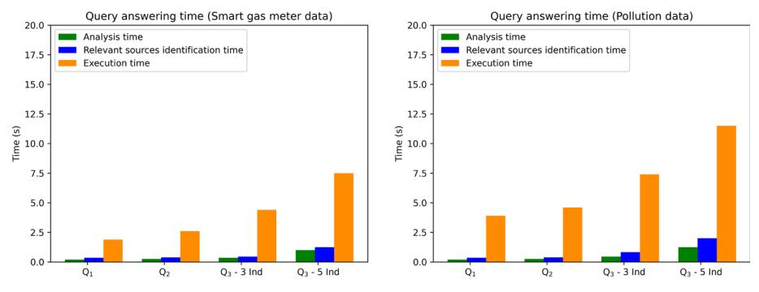
**Figure 12** Query answering average time using data with different scale (smart gas meters and pollution data)

gas meter data sources employed for indicators calculation is ≈ 100*k*, whereas in the case of pollution data is ≈ 1.5*M* (a temporal horizon of three months has been considered for both the types of sources). As expected, the time demanded for query answering increases, apart for the different scale, when considering query types *Q*^2^ ^τ^*^i^* and *^Q^*^3^ τ*i*, in accordance with the fact that the indicator formula becomes more complex due to composite indicators. Regardless of the scale of the involved data sources, the overhead introduced by our model (for querying the Exploration Graph and to identify concepts/relationships from the semantic metadata catalog through mappings) remains approximately the same (it does not depend on the scale of data sources, but on the complexity of the query). Conversely, the execution time increases both as the query complexity increases (e.g. for a composite indicator the computation of sub-indicators values is required) and for an increasing scale (number of records) of data sources. Nevertheless, given the complexity of the task and considering the nature of data exploration, the total answering time is acceptable, also for complex queries.

### 8.4 Experiments on preference-based indicators selection

For preference evaluation experiments, the set of MDDs derived from *GISO* (denoted with MDD*ISO*) has been materialised, and average generation time was 2 seconds. In the experiments, we focused on the evaluation of preference selectivity and preference complexity. Specifically, *preference selectivity* is defined as the ratio between the number of MDDs not worse than others (the BMO result) and the cardinality of the whole set MDD*ISO*. The lower this value, the better the selectivity delivered. Concerning *preference complexity*, the processing time *t* has been calculated to assess the performance of two renowned evaluation algorithms from the literature, BNL (Block-Nested-Loops [[14]](#ref-14)) and SFS (Sort-Filter-Skyline [[15]](#ref-15), which preempts BNL with a sorting step and can handle compound expressions con-

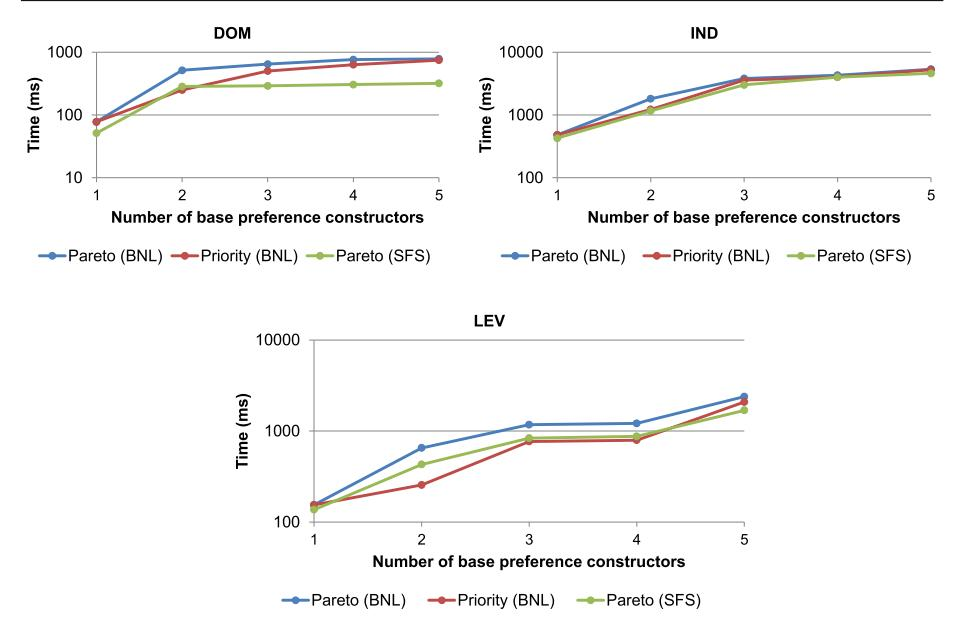
**Figure 13** Average processing times (log scale) for increasing preference complexity

taining Pareto composition only). Complexity takes into account the time required to process the queries, in turn depending on the number of MDDs to be accessed to find the BMO.

*Preference selectivity* The workload for selectivity tests consisted of a set of 50 preference expressions prepared using different combinations and numbers of base constructors (from 1 to 5). Specifically, we focused on the three representative constructors DOM, IND and LEV, involved in the request issued by the user, combined using both Pareto and prioritisation composition operators. Expressions only containing DOM constructors led to an average selectivity of 41%, expressions only containing LEV constructors to 29.2%, whereas in the case of expressions containing both DOM and LEV constructors the average selectivity was 8%. Noteworthy, the average selectivity of expressions only containing IND constructors reaches 1.3%, since the size of the BMO is very restricted, thus leading to a high selectivity (the constructor focuses on a specific indicator). The low selectivity of DOM and LEV is explained by the fact that in the Exploration Graph *GISO* each domain gathers several indicators and that dimensional hierarchies may be shared by multiple indicators.

*Preference complexity* For each constructor, an expression has been built by including the same constructor from one to five times, composed through Pareto and prioritisation composition operators, respectively (Fig. [13](#page-25-0)). In the worst case, the time complexity of the BNL algorithm is *O*(*n*^2^), being *n* = |MDD*ISO*|. From the tests, the maximum evaluation time was ≈ 4568 ms in a Pareto composition involving five IND constructors. Overall, execution time with prioritisation tends to be lower than Pareto composition, due to the fact that the cardinality of the BMO set is necessarily smaller. IND processing times are the highest among the three considered constructors, as they include the time required to inspect and navigate the indicators hierarchy in *GISO*. Regardless of the type of constructor, applying the pre-sorting of MDDs in *GISO* (i.e. when using SFS algorithm) ensures a reduction in evaluation time for Pareto composition (blue vs green lines in the charts of Fig. [13](#page-25-0)). The time required to sort the MDDs in *GISO* was on average ≈ 8 ms.

### 8.5 Experiments on personalisation effectiveness

In the former section, we assessed the selectivity of preferences in reducing the indicators search space. Conversely, in this section, we aim at demonstrating, being inspired by the experimentation proposed in [[16]](#ref-16), the benefits (effectiveness) of personalisation in suggesting *relevant* indicators (MDDs) to the user. Thus, we used the two metrics of Top-*n* precision and Top-*n* recall for assessing personalisation effectiveness. Top-*n* precision and Top-*n* recall metrics have been chosen as they are the most widely used metrics for the evaluation of retrieval systems (in the PERSEUS approach, the system we implemented, based on profiles and contextual preferences, to retrieve indicators from an Exploration Graph). Top-*n* precision metric is obtained by considering the number of relevant MDDs retrieved within the top *n* results divided by *n*, whereas the Top-*n* recall metric is calculated dividing the number of relevant MDDs among the top *n* retrieved by the total number of relevant MDDs. In this landscape, the effectiveness of a personalised search for indicators depends on users' profiles and, more specifically, on the preferences contained within. In this respect, two types of profiles have been considered for the experimentation, differing in the number of preferences: (i) *p*1, containing only a single preference and (ii) *p*2, a richer profile containing three preferences. In particular, for experimentation purposes, we considered a personalised search scenario allowing a maximum number of three preferences to search for indicators belonging to the Environment domain (DOM), available at District spatial granularity (LEV) and with preference for indicators like AirPollutionIndicator (IND). We considered as equally relevant (i.e. compliant with the personalised search scenario) all the MDDs for the Environment domain, having a spatial dimension level with a maximum distance of 2 from District in the levels hierarchy (i.e. District, City, Building, Apartment) and with indicators having a maximum distance of 2 from AirPollutionIndicator in the indicators hierarchy (with reference to the semantics of preference constructs from Sect. [5.3](#page-12-2)). Results for different values of Top-*n* MDDs, considering the range [10, 100], are reported in Fig. [14](#page-26-1). For *p*^1^ only the DOM constructor has been considered, while for *p*^2^ all the three aforementioned constructs have been taken into account.

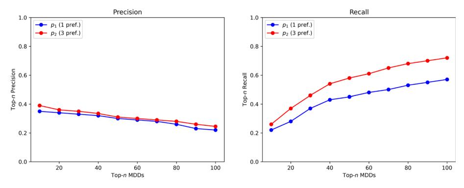
**Figure 14** Top-*n* precision and recall for different types of profiles for assessing personalisation effectiveness

*Considerations on personalisation effectiveness*

In Fig. [14](#page-26-1), the Top-*n* recall increases as long as the value of *n* increases and, for the same value of *n*, the profile with more preferences achieves a higher recall. Thus, a richer profile (i.e. including more personalisation elements) delivers a higher selectivity of MDDs (as demonstrated in Sect. [8.4](#page-24-0)) and at the same time enables a more effective retrieval of relevant indicators (higher Top-*n* recall). The choice of assessing Top-*n* precision and recall in the range [10, 100] was taken considering the total number of indicators present in *GISO* and the personalised search scenario previously described. As a side note, we remark that, regardless of the number of retrieved indicators, the tool for the exploration of personalised search results allows for pagination, in order to ease the browsing of indicators (Fig. [11c](#page-19-2)).

## 9 Related work

In this section, we surveyed the recent literature at the basis of the formalisation of the three layers of the PERSEUS approach. Due to the fact that PERSEUS aims at proposing a combined engineering of different techniques for addressing Data Lake exploration, in the following sections we will focus on the requirements of each layer separately, discussing pros and cons with respect to our proposal.

### 9.1 Semantic Data Lake models

In the latest years, Semantic Data Lake research has been focused on the formalisation of models for supporting knowledge extraction from Data Lakes, modelled as sets of data sources. One of the first attempts was the KAYAK framework [[17]](#ref-17), where a Data Lake is modelled as a collection of datasets, each one enriched with proper metadata to enable the construction of primitives and pipelines of primitives, mainly focused on data preparation. Semantics only rely on metadata, while neither semantic annotation based on ontologies nor lexical enrichment are performed. The Constance system [[18]](#ref-18) aims at discovering, extracting, and summarising the structural metadata from the data sources, performing semantic annotation, to avoid ambiguities. Nevertheless, semantic annotation procedure is described only at a high abstraction level. Authors in [[19]](#ref-19) model data sources in a Data Lake according to attributes and entities, the latter meant for grouping similar attributes and used as a starting point for easing querying data sources. The work presented in [[20]](#ref-20) models each data source in the Data Lake as a network-based structure, and data sources attributes are semantically annotated using DBpedia to build thematic views on the Data Lake sources. The work in [[21]](#ref-21) attempts to derive a semantic abstraction for data sources (called Semantic Model), using a prototypical tool, to meaningfully describe the contents of Data Lake sources. Authors in [[22]](#ref-22) propose a novel standardisation framework that offers a metadata semantic enrichment mechanism that enables fast storing and efficient retrieval from a Data Lake, by providing a so-called *blueprint* for each data source added to the Data Lake, capturing metadata associated with data sources. The approach in [[23]](#ref-23) builds supporting data structures, called *canonical graphs*, to explore Data Lakes, proposing a novel keyword search strategy. Canonical graphs are exploited at query time to integrate information residing in different data sources. In [[24]](#ref-24), a platform for environmental data named Environmental Cloud for the Benefit of Agriculture (in brief, CEBA) uses a data catalog to make the data visible and accessible, allowing users to explore and understand Data Lake content through metadata.

*Novel contributions* In the PERSEUS approach, we propose the definition and the population of a semantic metadata catalog, to provide a meaningful representation of data sources. Indeed, even though fully automated approaches have been widely adopted in the literature [[25]](#ref-25) in several domains, annotations based on automatic algorithms are not suitable to capture latent semantics, that is still a challenge and requires human input (e.g. for the semantic characterisation of transformation operations for data sources attributes). With respect to [[20]](#ref-20), in PERSEUS the preliminary lexical enrichment of data source attributes is based on both a lexical database and an abbreviation dictionary, thus reducing the terminological distance from data source attributes names (often expressed through abbreviations or acronyms) and the names of concepts used for annotation. Then, semantic annotation through domain ontologies ensures a formal representation of the meaning associated with data source attributes. Instead of relying on BabelNet as done in [[20]](#ref-20), [[21]](#ref-21), which is more suitable for Natural Language Processing applications and, generally, for multilingual word-sense disambiguation, we resort to a set of publicly available domain ontologies as suggested by [[19]](#ref-19), but introducing lexical enrichment of attributes before annotation. Regarding the support offered to domain experts throughout the annotation process, the work in [[22]](#ref-22) does not provide any tool and the focus of the approach is not on creating a semantic metadata catalog for data sources attributes, but on collecting general-purpose metadata to support the treatment and management of multiple data sources, belonging to different types. Similarly, the approaches in [[23]](#ref-23), [[24]](#ref-24) neither envisage tools to support domain experts, nor delve into details concerning a semantic support for data sources attributes annotation.

### 9.2 Ontology-based conceptual models for indicators design

Ontologies have been already adopted for the design of indicators, due to their shared and machine-understandable conceptualisation. The work presented in [[7]](#ref-7) proposes an ontology for representing indicators, developing a data explorer aimed at supporting users in the extraction of indicators values from a shared repository. Authors in [[26]](#ref-26) propose an ontology for modelling Key Performance Indicators (KPIs), considering a meta-model for tracking the evolution of the monitored system. Similarly, the work of [[27]](#ref-27) strives to conceptualise a meta-model for Process Performance Indicators (PPIs), aimed at evaluating process performance and supporting process analysts in the definition and instrumentation of PPIs. In [[28]](#ref-28) an ontology-driven approach is proposed to model KPIs, emphasising the importance of correlation between indicators values, to infer new knowledge. Similarly, in [[29]](#ref-29) an ontology is considered to enhance the semantics of sensors network data, considering the introduction of personalisation concepts to drive the exploration of indicators. Authors in [[30]](#ref-30) propose a Quality Control Framework ontology for modelling KPIs according to different maintenance scenarios (such as inspection, investigation and forecast). In [[31]](#ref-31), the Zero Defect Manufacturing (ZDM) ontology is devised to deliver higher quality and manufacturing sustainability. It provides basic conceptualisation for modelling indicators related to manufacturing systems. An Energy Flexibility Ontology (EFOnt) is proposed in [[32]](#ref-32), retaining semantic concepts and relationships for building energy flexibility applications, conceived to support energy flexibility analytics for buildings. EFOnt contains several classes to model performance goals, to pursue building energy flexibility (e.g. demand-related, energy-related, economy-related, and emission-related goals, which are of interest to different stakeholders).

*Novel contributions* With respect to the previous approaches [[26]](#ref-26)–[[28]](#ref-28), [[30]](#ref-30), [[31]](#ref-31), that are mainly focused on modelling domain-specific indicators as first citizens within the ontology, we define a Multi-Dimensional Ontology (MDO) containing baseline concepts and relationships for modelling indicators and analysis dimensions, but additionally introducing personalisation aspects with respect to [[7]](#ref-7), [[29]](#ref-29), [[31]](#ref-31), [[32]](#ref-32). Indeed, in [[32]](#ref-32) exploration goals are modelled, but the ontology lacks of thorough personalisation concepts matching goals to users' categories. Likewise, the ZDM ontology [[31]](#ref-31) does not contain fully fledged personalisation concepts, but only so-called *strategies*, conceived as objectives to achieve, somehow resembling our exploration goals (activities). Instead, in our MDO, an indicator is suitable for one or more users' categories and influences activities performed by users, representing users' goals while exploring data. These personalisation aspects are used to tailor contents within the Exploration Contexts, built on top of a semantically enriched Data Lake.

## 9.3 Preference-based recommender systems for data exploration

In the literature, binary preferences have been studied in recommender systems under a twofold perspective: *quantitative* [[33]](#ref-33)–[[35]](#ref-35), relying upon a scoring function to determine a total order of results; *qualitative* [[13]](#ref-13), [[36]](#ref-36), [[37]](#ref-37), using binary relations to express a (strict) partial order of results. In the scope of this paper, we focused on qualitative preferences, yielding a higher expressiveness with respect to quantitative ones. In [[13]](#ref-13) a preferencebased framework is implemented in a Data Warehouse, where preferences are formulated over aggregation levels of facts. In [[33]](#ref-33), preferences are formalised as constraints on semantic resources, mixing both quantitative and qualitative aspects, whereas [[36]](#ref-36) devises an extension of SPARQL query language for expressing preferences on semantic data. Beyond the qualitative and quantitative aspects, *contextual preferences* have been studied, to take into account different situations users are involved in. More recently, context-aware personalisation has been further unravelled in [[38]](#ref-38), where the propagation of preferences across exploration contexts has been investigated. The work in [[35]](#ref-35) is a quantitative approach which tackles the problem of Table Union Search (TUS) in the presence of preferences, used for table unionability, as a way to reduce the search space and focus on rows and columns that are important for the follow-up operations. Authors in [[37]](#ref-37) propose a framework implementing a technique that translates SPARQL qualitative preference queries directly into queries that can be evaluated by a relational database management system. Instead, the approach in [[34]](#ref-34) implements sorting methods to dynamically query and visualise the relatively more important transportation stations within the users' visible range. Therein, a quantitative-based preference approach is used to obtain an ordered objects set, containing the most interesting transportation stations.

*Novel contributions* In PERSEUS, we support context-aware personalised exploration of indicators, based on *users' profiles*, composed of *preferences* and *exploration contexts*. Exploration contexts gather information characterising the situations under which the user explores indicators, influenced by both his/her roles and goals. With respect to the aforementioned preferencebased frameworks for handling multi-dimensional data [[13]](#ref-13), [[33]](#ref-33), [[36]](#ref-36), PERSEUS fosters preferences to rank indicators based on their semantic definition and not on their actual values. In fact, preferences allow to identify in advance indicators of interest for the user, and only at a later time indicators values are inspected, thus saving cost and resources required to query Data Lake sources. The approach in [[34]](#ref-34) employs preferences for data exploration, despite users' profiles are not exploited to harness exploration contexts for the different categories of users. Instead, other approaches, even though mentioning the usage of preference-based systems, disregard user-related exploration issues [[35]](#ref-35), [[37]](#ref-37) and do not focus on multi-dimensional data exploration. Binary preferences are used in PERSEUS as they pose as intuitive constructs, which are directly specified by users at exploration time. More advanced approaches from Decision Support literature (such as Multi-Criteria Decision Making ones like Analytic Hierarchy Process [[39]](#ref-39)) are less suitable due to their complex and articulated mathematical formulation, as opposed to the ease of use for users pursued in our proposal.

## 10 Concluding remarks and future work

In this paper, we proposed PERSEUS (PERSonalised Exploration by User Support), a computer-aided approach for enabling data exploration on top of a Data Lake, structured on three phases: (i) the construction of a semantic metadata catalog on top of the Data Lake, leveraging tools and metrics to make easier the annotation of the Data Lake metadata; (ii) modelling of indicators and analysis dimensions, guided by a Multi-Dimensional Ontology openly available to enable conformance checking of indicators and let users explore Data Lake contents; (iii) enrichment of the definition of indicators with personalisation aspects, based on users' profiles and preferences, to make easier and more usable the exploration of data for a large number of users.

**Future research directions.** The PERSEUS approach presented in this paper paves the way to further investigation, regarding each phase of the approach. Concerning Semantic Data Lake construction, we will improve the DL-DIVER tool, delivering more interactivity in the procedure devoted to the management of the semantic layer, introducing a quality metric to give feedback to domain experts. Regarding indicators modelling, we plan to further improve the support for data analysts in the definition of mappings, fostering proper metrics to assess the strength of a mapping (e.g. resorting to the calculation of its aggregation power [[40]](#ref-40)). For what concerns preference-based indicators exploration, we will enhance the preference model by considering the propagation of preferences across exploration contexts, as proposed by [[38]](#ref-38), thus establishing how preferences holding in a more generic exploration context are propagated to a more specific context. Lastly, we remark that the research efforts presented in this paper fuelled other research streams. Recently, in [[41]](#ref-41), we proposed a methodological approach to design web applications on top of a Data Lake infrastructure which leverages the Data Lake model presented in this paper. Similarly, the PERSEUS approach will be also adapted in the context of MICS (Made in Italy Circular and Sustainable) Extended Partnership.

**Acknowledgements** This study was carried out within the Brescia Smart Living project (Project ID D84G14000240008 - Italian Ministry of University and Research) and within MICS (Made in Italy - Circular and Sustainable) Extended Partnership and received funding from Next-GenerationEU (Italian PNRR - M4 C2, Invest 1.3 - D.D. 1551.11-10-2022, PE00000004).

**Author contributions** DB: conceptualization, methodology, writing reviewing and editing, funding acquisition; VA: conceptualization, methodology, writing reviewing and editing, supervision, resources; MG: software, validation, investigation, data curation, writing original draft preparation, visualization.

**Funding** Open access funding provided by Universitá degli Studi di Brescia within the CRUI-CARE Agreement.

## Declarations

**Conflict of interest** The authors declare no conflict of interests.

**Open Access** This article is licensed under a Creative Commons Attribution 4.0 International License, which permits use, sharing, adaptation, distribution and reproduction in any medium or format, as long as you give appropriate credit to the original author(s) and the source, provide a link to the Creative Commons licence, and indicate if changes were made. The images or other third party material in this article are included in the article's Creative Commons licence, unless indicated otherwise in a credit line to the material. If material is not included in the article's Creative Commons licence and your intended use is not permitted by statutory regulation or exceeds the permitted use, you will need to obtain permission directly from the copyright holder. To view a copy of this licence, visit [http://creativecommons.org/licenses/by/4.0/](http://creativecommons.org/licenses/by/4.0/).

## References

* 1. Nargesian F, Zhu E, Miller RJ, Pu KQ, Arocena PC (2019) Data Lake Management: challenges and opportunities. Proc VLDB Endow 12(12):1986–1989
* 2. European Commission. Statistical Office of the European Union.: Towards a Harmonised Methodology for Statistical indicators.Part 1, Indicator Typologies and Terminologies: 2014 Edition (2014). [https://data.europa.eu/doi/10.2785/56118](https://data.europa.eu/doi/10.2785/56118)
* 3. Bagozi A, Bianchini D, De Antonellis V, Garda M, Melchiori M (2019) personalised exploration graphs on semantic Data Lakes. In: Proceedings of 27th international conference on cooperative information systems (CoopIS 2019), pp 22–39
* 4. Bianchini D, De Antonellis V, Melchiori M, Bellagente P, Rinaldi S (2017) Data management challenges for smart living. In: Proceedings of Cloud Infrastructures, Services, and IoT Systems for Smart Cities (IISSC 2017), pp 131–137
* 5. Vandenbussche P-Y, Atemezing GA, Poveda-Villalón M, Vatant B (2017) Linked open vocabularies (LOV): a gateway to reusable semantic vocabularies on the Web. Semantic Web 8(3):437–452
* 6. Rahm E, Bernstein PA (2001) A survey of approaches to automatic schema matching. VLDB J 10(4):334– 350
* 7. Diamantini C, Potena D, Storti E, Zhang H (2014) An ontology-based data exploration tool for key performance indicators. In: Proceedings of OTM confederated international conferences "on the move to meaningful internet systems", pp 727–744
* 8. Garda M (2021) A semantics-enabled approach for personalised Data Lake exploration. Ph.D. thesis, University of Brescia - Italy
* 9. Kießling W (2002) Foundations of preferences in database systems. In: Proceedings of the 28th international conference on very large databases (VLDB 2002), pp 311–322
* 10. Gupta A, Harinarayan V, Quass D (1995) Aggregate-query processing in data warehousing environments. In: Proceedings of the 21th international conference on very large databases (VLDB 1995), pp 358–369
* 11. Hamadou HB, Gallinucci E, Golfarelli M (2019) Answering GPSJ queries in a polystore: a dataspacebased approach. In: Proceedings of the international conference on conceptual modeling (ER 2019), pp 189–203
* 12. Giebler C et al (2020) A zone reference model for enterprise-grade data lake management. In: 2020 IEEE 24th international enterprise distributed object computing Conference (EDOC 2020), Eindhoven, The Netherlands, pp 57–66
* 13. Golfarelli M, Rizzi S, Biondi P (2010) myOLAP: an approach to express and evaluate OLAP preferences. IEEE Trans Knowl Data Eng 23(7):1050–1064
* 14. Borzsony S, Kossmann D, Stocker K (2001) The skyline operator. In: Proceedings 17th international conference on data engineering (ICDE 2001), pp 421–430
* 15. Chomicki J, Godfrey P, Gryz J, Liang D (2005) Skyline with presorting: theory and optimizations. In: Proceedings of the international conference on intelligent information processing and web mining, pp 595–604
* 16. Nasraoui O, Zhuhadar L (2010) Improving recall and precision of a personalized semantic search engine for e-learning. In: 2010 Fourth international conference on digital society (ICDS 2010), pp 216–221
* 17. Maccioni A, Torlone R (2018) KAYAK: a framework for just-in-time data preparation in a Data Lake. In: Proceedings of 30th international conference on advanced information systems engineering (CAISE 2018), pp 474–489
* 18. Hai R, Geisler S, Quix C (2016) Constance: an intelligent Data Lake System. In: Proceedings of the international conference on management of data (SIGMOD/PODS 2016), pp 2097–2100
* 19. MamiMN, Graux D, Scerri S, Jabeen H, Auer S, Lehmann J (2019) Squerall: virtual ontology-based access to heterogeneous and large data sources. In: Proceedings of 18th international semantic web conference (ISWC 2019), pp 229–245
* 20. Diamantini C, Lo Giudice P, Potena D, Storti E, Ursino D (2021) An approach to extracting topic-guided views from the sources of a Data Lake. Inf Syst Front 23:243–262
* 21. Pomp A, Paulus A, Kirmse A, Kraus V, Meisen T (2018) Applying semantics to reduce the time to analytics within complex heterogeneous infrastructures. Technologies 6(3):86
* 22. Pingos M, Andreou AS (2022) A data lake metadata enrichment mechanism via semantic blueprints. In: ENASE, pp 186–196
* 23. Yuan Q, Yuan Y, Wen Z, Wang H, Chen C, Wang G (2022) Exploring heterogeneous data lake based on unified canonical graphs. In: Proceedings of the 45th international ACM SIGIR conference on research and development in information retrieval, pp 1834–1838
* 24. Sarramia D, Claude A, Ogereau F, Mezhoud J, Mailhot G (2022) Ceba: a data lake for data sharing and environmental monitoring. Sensors 22(7):2733
* 25. Li J, Li Y, Wang X, Tan W-C (2020) Deep or simple models for semantic tagging? It depends on your data. Proc VLDB Endow 13(12):2549–2562
* 26. Kritikos K, Plexousakis D, Woitch R (2017) A flexible semantic kpi measurement system. In: Proceedings of the international conference on cloud computing and services science, pp 237–261
* 27. del-Río-Ortega A, Resinas M, Cabanillas C, Ruiz-Cortés A (2013) On the definition and design-time analysis of process performance indicators. Inf Syst 38(4):470–490
* 28. del Mar Roldán-García M, García-Nieto J, Maté A, Trujillo J, Aldana-Montes JF (2019) Ontology-driven approach for KPI meta-modelling, selection and reasoning. Int J Inf Manag 58:102018
* 29. Kuster C, Hippolyte J-L, Rezgui Y (2020) The UDSA ontology: an ontology to support real time urban sustainability assessment. Adv Eng Softw 140:102731
* 30. Matos J, Fernandes S, Tran MQ, Nguyen QT, Baron E, Dang SN (2023) Developing a comprehensive quality control framework for roadway bridge management: a case study approach using key performance indicators. Appl Sci 13(13):7985
* 31. Psarommatis F, Fraile F, Ameri F (2023) Zero defect manufacturing ontology: a preliminary version based on standardized terms. Comput Ind 145:103832
* 32. Li H, Hong T (2022) A semantic ontology for representing and quantifying energy flexibility of buildings. Adv Appl Energy 8:100113
* 33. Polo L, Mínguez I, Berrueta D, Ruiz C, Gómez JM (2014) User preferences in the web of data. Semantic Web 5(1):67–75
* 34. Cai Z, Liu F, Qi Q, Su X, Guo L, Ding Z (2023) Skyline-based sorting approach for rail transit stations visualization. ISPRS Int J Geo Inf 12(3):110
* 35. Mirzaei H, Rafiei D (2023) Table union search with preferences. In: Joint workshops at 49th international conference on very large data bases (VLDBW'23) - TaDA'23: tabular data analysis workshop, pp 1–5
* 36. Troumpoukis A, Konstantopoulos S, Charalambidis A (2017) An extension of SPARQL for expressing qualitative preferences. In: Proceedings of the international semantic web conference (ISWC 2017), pp 711–727
* 37. Goncalves M, Chaves-Fraga D, Corcho O (2022) Handling qualitative preferences in sparql over virtual ontology-based data access. Semantic Web 13(4):659–682
* 38. Ciaccia P, Martinenghi D, Torlone R (2020) Foundations of context-aware preference propagation. J ACM (JACM) 67(1):1–43
* 39. Vaidya OS, Kumar S (2006) Analytic hierarchy process: an overview of applications. Eur J Oper Res 169(1):1–29
* 40. Nebot V, Llavori RB (2014) Towards analytical MD stars from linked data. In: Proceedings of the international conference on knowledge discovery and information retrieval (KDIR 2014), pp 117–125
* 41. Bianchini D, Garda M (2023) A methodological approach for data-intensive web application design on top of data lakes. In: 24th international conference on web information systems engineering (WISE 2023), Melbourne, Australia. in Press

**Devis Bianchini** received his Ph.D. in Information Engineering in 2006 from the University of Brescia, where he is currently Full Professor in Computer Science Engineering and head of the Databases, Information Systems and Web research group in the Department of Information Engineering. His research interests include ontology-based resource discovery, service-oriented architectures, Big Data management and Web Information Systems design. He is chair of the Big&Open Data Laboratory at the University of Brescia. He is author of papers published in international journals and conference proceedings and he is referee for international journals. He coordinated national and regional research projects in the fields of Smart Cities and Industry 4.0.

**Valeria De Antonellis** is Emeritus Professor of Computer Science Engineering in the Department of Information Engineering at University of Brescia. Her research interests include advanced databases and web information systems conceptual modelling and design, conceptual schema matching and semantic integration, web resources semantic search and ranking. She participated in many European projects, among which INTEROP, RECITE II - DEAFIN, RENOIR, S-Cube, F3 and ITHACA. She authored numerous scientific publications, including articles, book chapters and books, she is member of the Steering Committee of the ER International Conference on Conceptual Modelling.

**Massimiliano Garda** achieved his Ph.D. in Information Engineering in 2017 at the University of Brescia, with a thesis concerning the design of data exploration techniques on top of (semantic) Data Lakes. Currently, he is a research fellow and a member of the Databases, Information Systems and Web research group in the Department of Information Engineering. Currently, he is investigating the use of Semantic Web methods and technologies for (Big) Data Exploration in several fields, including Smart Cities and Industry 4.0.