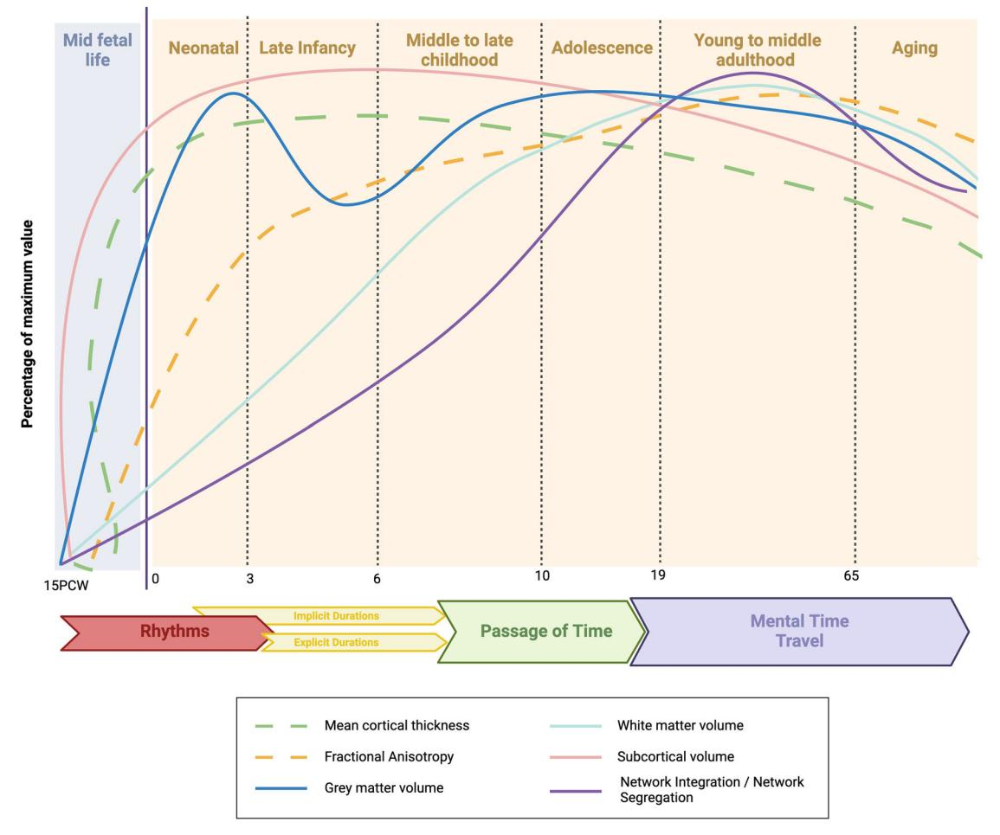

# Towards a neurodevelopmental cognitive perspective of temporal processing

Giulia Buzi [1], Francis Eustache [1], Sylvie Droit-Volet2 , Pierre Desaunay1,3 & Thomas Hinault [1]

The ability to organize and memorize the unfolding of events over time is a fundamental feature of cognition, which develops concurrently with the maturation of the brain. Nonetheless, how temporal processing evolves across the lifetime as well as the links with the underlying neural substrates remains unclear. Here, we intend to retrace the main developmental stages of brain structure, function, and cognition linked to the emergence of timing abilities. This neurodevelopmental perspective aims to untangle the puzzling trajectory of temporal processing aspects across the lifetime, paving the way to novel neuropsychological assessments and cognitive rehabilitation strategies.

The ability to keep track of events unfolding over time is a fundamental and instinctive feature of humans and animals' perception and cognition, essential for adaptation to complex and challenging environments [[1]](#ref-1). Indeed, predicting the events to come, interacting with others, crossing the road, remembering a planned appointment, or catching the train on time are all activity of everyday life supported by temporal processing, without which, autonomous behaviors would not be possible. Temporal processing encloses a wide range of timescales (i.e., from milliseconds to decades), across multiple sensory modalities. Nevertheless, the temporal experience could be considered as formed from four main dimensions: temporal order and simultaneity, the processing of durations, the feeling of the passage of time and mental time travel [[2]](#ref-2). These dimensions are usually investigated in laboratory using various temporal tasks and questionnaires (detailed in Box [[1]](#ref-box-1)). They call on partially shared brain underpinnings and have close links with most cognitive processes [[3]](#ref-3), [[4]](#ref-4). Nevertheless, the debate upon which neural mechanisms underlies the processing of time is still open (Box [[2]](#ref-box-2)).

Evidence agrees that temporal sensitivity [[5]](#ref-5)–[[7]](#ref-7) and semantic temporal concepts develop until adulthood [[8]](#ref-8), [[9]](#ref-9) and then become more variable and less precise with advancing age [[10]](#ref-10). Yet, there is no consensus about which biological and psychological processes evolve and support this development. While some data suggest changes of the speed of the internal clock [[11]](#ref-11)–[[14]](#ref-14), others show that the evolution of timing abilities, duration processing in particular, would be supported by the development of working memory [[15]](#ref-15)–[[19]](#ref-19), executive functioning [[20]](#ref-20)–[[23]](#ref-23) and attention [[24]](#ref-24)–[[26]](#ref-26). However, the involvement of cognitive processes depends on the temporal tasks used and whether they are more or less cognitively demanding [[27]](#ref-27), [[28]](#ref-28). In addition, although several compelling works reviewing evidence of temporal abilities in new-borns [[29]](#ref-29), infants [[30]](#ref-30), children [[6]](#ref-6), [[7]](#ref-7), [[9]](#ref-9), [[31]](#ref-31), and older adults [[10]](#ref-10), [[32]](#ref-32), [[33]](#ref-33) exist, a unified trajectory addressing the development of the underpinnings of the ability to perceive and organize the time from the intra-uterine life to older age is lacking.

The present neurodevelopmental perspective claims that our ability to perceive and prospectively process durations and time passing emerge thanks to the interaction between various endogenous (e.g., brain maturation) and exogenous factors that we are exposed to, depending on the different stages of life. According to this perspective, the temporal processing, among other factors [[7]](#ref-7) , evolves and refines itself step by step at each life stage, as a function of the gradual shaping of the structural and functional architecture of the brain (Fig. [[1]](#ref-fig-1)). This approach could help to specify the maturation of the regions associated to temporal processing (Box [[2]](#ref-box-2)) throughout lifetime while highlighting its evolutionary contribution. What is more, retracing the stages of a physiological course of timing abilities will add important bricks in the building of a neurodevelopmental model of human time processing, which will be proposed in the end part of the review (Fig. [[2]](#ref-fig-2)).

Far to conduct an exhaustive review of the entire cerebral and cognitive development, we will provide an overview of the emergence of the ability to perceive and process time, in parallel to the development of the brain structural and functional milestones considered to support prospective judgments in explicit temporal processing tasks. Furthermore, we will also focus on the rise of the cognitive functions most related to these temporal skills. For each life stage, we will highlight the adaptive advantages provided by the temporal dimension which unfolds. Lastly, we will show that deviations from the healthy neurodevelopmental trajectory could result in an impaired ability to keep trace of time (Boxes [[3]](#ref-box-3) and [[4]](#ref-box-4)).

## The intrauterine life (15 Post Conceptional Weeks (PCW) – 0 years old)

Starting from the second trimester, the formation of neural tube (neurulation) as well as the generation of neurons (neurogenesis) are for the most part completed. Since the 15th Post Conceptional Week (PCW), the brain

1 Inserm, U1077, EPHE, UNICAEN, Normandie Université, PSL Université Paris, CHU de Caen, GIP Cyceron, Neuropsychologie et Imagerie de la Mémoire Humaine (NIMH), Caen, France. ^2^ Université Clermont Auvergne, LAPSCO, CNRS, UMR 6024, Clermont-Ferrand, France. ^3^ Service de Psychiatrie de l'enfant et de l'adolescent, CHU de Caen, Caen, France. e-mail: thomas.hinault@inserm.fr

## Box 1 | Different measures for different temporal aspects

A wide array of tasks and questionnaires assessing different aspects of the subjective experience of time passing have been accumulated over the last 50 years. Overall, it could be measured in laboratory settings through retrospective (in which the participant is unaware that a temporal estimation must be made) or prospective paradigms (in which the participant knows that a temporal estimation is required [[299]](#ref-299), [[300]](#ref-300)). These two types of paradigms are respectively implemented in implicit (in which a temporal estimation is made, but the participant does not track the time unintentionally) or explicit timing tasks (in which the participant is consciously involved in the temporal estimation) [[28]](#ref-28). However, a precise taxonomy of these paradigms is lacking. We will provide here some examples of the most used ones (for an extensive review, see) [[301]](#ref-301).

Order and simultaneity could be assessed through (A) Sensorimotor Synchronization Tasks (SMS) to measure the coordination of physical actions in time with a rhythmic sequence [[272]](#ref-272) in which participants are asked to tap in synchrony with an external rhythm (i.e., an isochronous metronome) or with an internal periodic rhythm marking the beat of a specific sequence [[302]](#ref-302) and/or by (B) Simultaneity Judgment Tasks, through the Stimulus Onset Asynchrony (SOA) at which two consecutive stimuli are subjectively perceived as simultaneous [[303]](#ref-303).

Durations Processing concerns the production, reproduction, and comparison of intervals between two stimuli or of the duration of a stimulus on the range of hundreds of milliseconds to several tens of seconds - also known as Interval Timing [[304]](#ref-304), [[305]](#ref-305). Few studies have examined duration judgment over several minutes.

Temporal production tasks consist in marking the beginning and the end of a specific interval and temporal reproduction tasks in pushing a button for the duration judged to correspond to the target interval [[306]](#ref-306). The tasks based on comparison judgments are for example: temporal generalization and temporal bisection. In temporal generalization tasks, participants are required to establish whether the probe stimuli are equal or not to a standard reference that was initially presented; Temporal bisection tasks ([[307]](#ref-307), [[308]](#ref-308)) involve the training to recognize a short and a long duration standard interval. Then, participants are asked to judge if the probe duration is more like the short or the long standard duration.

The Passage of Time Judgments (POTJ) [[309]](#ref-309) are based on the subjective feeling of the speed of time passing, and spans on short (present POTJ) and longer timescales (from minutes and hours to days and months; retrospective POTJ). An overview of the felt passage of time could be obtained by Visual Analog Scales (VAS) and questionnaires (i.e., Metacognitive Questionnaire on Time (MQT) by Lamotte and colleagues, 2014.

Mental Time Travel is the ability to mentally reexperience past events (episodic autobiographical memory) and to imagine the future ones (episodic future thinking) of the order of weeks, months, and years [[184]](#ref-184) and it is often assessed by autobiographical interviews (i.e., Autobiographical Recollection Test [[310]](#ref-310)).

## Box 2 | Neural Bases of temporal processing: a ground of debate

The processing of temporal information in the brain elicits a core of regions which vary according to the task paradigm, the duration intervals, and the sensory modality [[311]](#ref-311).

Overall, fMRI studies probing the perception of rhythms found activity in the supplementary (SMA) and pre-supplementary motor area (pre-SMA), cerebellum [[312]](#ref-312), [[313]](#ref-313) and basal ganglia, bilaterally [[314]](#ref-314). Also, the processing of both short (<500 ms) and longer durations (>1500 ms), has been, in addition, associated to the activity in the insula, the precentral and cingulate gyri and superior temporal gyrus [[315]](#ref-315)–[[318]](#ref-318). The inferior frontal gyrus (IFG) [[144]](#ref-144) and the dorso-lateral prefrontal cortex [[319]](#ref-319), [[320]](#ref-320) were also seen to be active during short duration tasks. Conversely, the passage of time and the mental time travel, are observed to be linked to the activity higher-order parietal medial temporal cortices [[321]](#ref-321), [[322]](#ref-322), the hippocampal formation and the amygdala [[323]](#ref-323).

Although neuroimaging evidence provide crucial insights on cerebral activations patterns associated to temporal processing, the neural timekeeping mechanisms remain mostly unknown. After the very first information processing models based on pace-maker accumulators of pulses in the brain (namely, Scalar Expectancy Theory [[11]](#ref-11), [[12]](#ref-12)), connectionist models based on multiple oscillators processing several durations from a structure starts to assume its human-specific configuration, with the ganglio-thalamic formation connecting the telencephalic proliferative zone to the major thalamic regions [[34]](#ref-34)–[[36]](#ref-36). The formation of the thalamus-based relay of information from the 24th PCW has a pivotal role in the setting up of cortical networks, as it allows to sensory inputs to reach the developing cortex [[37]](#ref-37), laying the groundwork for the formation of sensorimotor, visual, and auditory circuits. Since the womb life, fetuses are exposed to several internal biological rhythms, originated by the mother's cardio-vascular system, breathing, walking, but also some stimuli of the external environment as sounds or the mother's voice.

few seconds to several minutes [[324]](#ref-324), [[325]](#ref-325) started to be conceived [[326]](#ref-326). Altogether, this evidence led to the conception of the Striatal Beat Frequency Model [[167]](#ref-167) where the striatal spiny neurons would serve as a coincidence detector of the phase synchronization of the cortical oscillatory neurons which are triggered by a dopaminergic discharge from the substantia nigra, at the onset of a temporal stimulus to be estimated [[166]](#ref-166). Other intrinsic and distributed models instead, claim that time, being an intrinsic property of neural networks, would be encoded by the instantaneous changing of its state, resulting in real-time trajectories of the networks embodying durations (namely, State Dependent Networks [[327]](#ref-327), [[328]](#ref-328)).

Nevertheless, none of the above-mentioned models could explain the processing of durations longer than a few minutes (but see ref. [[329]](#ref-329) for a tentative to extend to minute range the internal clock model) making a unified model of several aspects of temporal processing still hard to imagine. Furthermore, these models lack a neurodevelopmental perspective, leaving modeling of temporal perception incomplete, mostly focused on brain functioning in healthy young individuals rather than conceiving a neuroanatomic circuitry that develops as brain mechanisms development progresses too.

The setting up of the cortico-striatal pathways at this stage, as a result of the increased fractional anisotropy (FA) of the basal ganglia [[38]](#ref-38), [[39]](#ref-39), would set the ground for the emergence of an elementary form of sensorimotor synchronization. Near term fetuses indeed are able to perceive rhythmic sequences like maternal rhythmic movements, walking, rocking, or breathing and to coordinate with them accordingly. Evidence from studies using Heart Rate (HR) demonstrated that fetuses changed their own HR depending on the mother's rhythmical movements [[40]](#ref-40), and differentiated their breathing pace in response to rhythmical rocking or sinusoidal oscillations [[29]](#ref-29). Also, fetuses react to auditory stimuli, such as variation in music and speech, with a prevalence of

Figure 1 | Lifetime lines. Life-span trajectories of structural and functional development of the human brain paralleling the emergence of each of the four aspects of temporal processing. Created with Biorender.com.

Created with Biorender.com. Brain templates have been reconstructed with Brainstorm software by Tadel et al. (2011) [[294]](#ref-294) leveraging on Li et al. (2015) [[295]](#ref-295); Shi et al. (2011) [[296]](#ref-296); Fonov et al. (2009 [[297]](#ref-297)); Dong et al. (2020) [[298]](#ref-298).

## Box 3 | Deviations from the neurotypical development

The evidence that temporal processing is an emerging function of the brain, is reflected by the presence of abnormal temporal performances in neurodevelopmental disorders. Among the different neurodevelopmental conditions, we can present as examples the autism spectrum disorder (ASD), dyslexia, and the Attention Deficit/Hyperactivity Disorder (ADHD).

Interestingly, the first hallmarks of the ASD, are represented by avoiding eye contact, a lack of joint attention and shared gaze with others [[330]](#ref-330), with an absence of facial expressions between 3 and 9 months [[331]](#ref-331). Among others, an interrupted flow of the dyadic interaction with the caregiver [[332]](#ref-332) has been associated with deficits in order and rhythmicity processing [[333]](#ref-333) which could involve the lack of synchronization between brain regions in processing multisensory stimuli [[334]](#ref-334), [[335]](#ref-335). In this framework, the difficulty in temporally coordinating their own actions and intentions with the other, could affect their feeling of interrelatedness later in adult life, making ASD a proper social timing deficit [[336]](#ref-336), [[337]](#ref-337). Distortions in duration processing have also been observed in high functioning ASD children which showed a shift toward more long responses to a temporal bisection task and gradual less precision in estimating durations longer than 5s [[338]](#ref-338)–[[340]](#ref-340) implicating working memory and attention deficits (for a review [[341]](#ref-341)). Nevertheless, children with ASD reached similar performances to a temporal bisection task with a similar duration range compared to typically developing children when controlling for intelligence scores [[342]](#ref-342).

Also, the impaired Theory Of Mind (ToM) and language skills likely explaining the lack of temporal knowledge [[343]](#ref-343) could partly determine the deficits of mental time travel (MTT [[344]](#ref-344)).

Time processing disruptions have also demonstrated to be the earliest and specific signs of ADHD [[345]](#ref-345), [[346]](#ref-346), which occurs later in infancy. Children with ADHD indeed show overall higher thresholds in duration discrimination tasks on seconds to milliseconds range and tend to overestimate durations [[347]](#ref-347) also resulting in less accuracy and more variability in temporal production and reproduction [[348]](#ref-348). Functional neuroimaging studies reported deactivations in most regions of the frontostriato-cerebellar and frontal-parietal networks supporting timing functions, therefore explaining alterations of temporal performances. What is more, ADHD treatments based on Methylphenidate - a dopamine agonist and psychostimulant - resulted to mitigate timing dysfunctions [[349]](#ref-349).

Abnormal temporal estimations have also been reported in dyslexia: children with specific troubles in reading and learning indeed demonstrated to segregate spatiotemporal perceptual units of information at a slower rate than the control group [[350]](#ref-350), likely due to an inefficient phaselocking at one or more temporal rates in processing speech stream [[351]](#ref-351), (but see ref. [[352]](#ref-352) for a review). Nevertheless, a greater variability of performances in children with dyslexia could even be observed both in explicit and implicit temporal bisection task with non-speech stimuli [[353]](#ref-353).

## Box 4 | Deviations from healthy aging

Neuropathological aging is marked by degeneration processes of the large-scale brain networks and the underlying structure affecting cognition, behavior, and motion. Among these symptoms, alterations of the subjective experience of time have been observed in several neurodegenerative syndromes (for a review [[354]](#ref-354), [[355]](#ref-355)).

Although no difference has been reported on implicit duration processing between patients at the prodromal stage of Alzheimer's Disease (Mild Cognitive Impairment) and healthy older adults [[356]](#ref-356), several disruptions have been reported in the ability to mentally travel in the past and in the future, with less vividness of details reported [[357]](#ref-357). The MTT impairments toward past events could reflect the initial episodic memory degeneration of the middle temporal lobe, hippocampi, and entorhinal cortices. As the neurodegenerative process unfolds, extending to parietal and then prefrontal areas, deficits in - mostly explicit - duration processing tasks became more evident, as they demonstrate higher error rates and less accuracy [[358]](#ref-358). Increased variability in temporal bisection tasks (i.e., milliseconds) [[359]](#ref-359) and decreased precision in duration estimation [[360]](#ref-360), [[361]](#ref-361), temporal production tasks spanning from seconds to few minutes [[362]](#ref-362) have also extensively been observed in AD patients [[363]](#ref-363).

Patients affected by Frontotemporal Dementia (FTD), and its behavioral variant (bvFTD), may show impairments in both self-paced than externally paced tapping [[364]](#ref-364), under-productions and overestimations of duration intervals [[365]](#ref-365). In semantic dementia (SD), the progressive deficit affecting primarily comprehension of words and then the related semantic processing [[366]](#ref-366) disruptions of the ability to imagine future events, have been frequently reported, albeit they show a relative preservation of recent memories [[357]](#ref-357). The loss of words serving as temporal connectors characterizing these patients, would have broken the links connecting temporal events.

More findings come from Parkinson's Disease (PD), as its principal neuropathological hallmark affects the nigrostriatal and meso-cortical dopaminergic pathways, notably deemed to be involved in rhythm [[367]](#ref-367) and interval timing [[349]](#ref-349). PD patients indeed struggle to processing beat based rhythms [[368]](#ref-368) and a lower temporal sensitivity and temporal under estimations [[369]](#ref-369) for long temporal intervals (1–5 s) [[370]](#ref-370), in explicit temporal tasks [[371]](#ref-371), [[372]](#ref-372).

Since clear clinical hallmarks of alterations of timing abilities are far to be established, due to differences in task design, paradigms implemented and inter-individual variability, a deeper understanding of neural mechanisms underlying temporal dysfunctions in neurodegenerative disease is necessary to help clinicians to make early diagnosis and develop new treatments, therefore ameliorating the quality of life of patients.

left temporal activation [[41]](#ref-41). Studies have shown that fetuses preferentially react to the sound of mother's heartbeat [[42]](#ref-42) and voice [[43]](#ref-43), [[44]](#ref-44). Therefore, fetuses are already able to memorize and recognize the temporal harmonic structure of the prosody of the mother's speech [[45]](#ref-45).

Fetuses also produce rhythmic activities (kicking, sucking). Although they are fairly stereotyped and inflexible, some changes in rhythm production in response to the exogenous factors during fetal life have been noted by studies on finger sucking, which are observable by the 15th PCW and rhythmic mouth movements, from the 20th PCW [[29]](#ref-29). The ability to adapt their own rhythm to an external one is crucial for the newborn to comprehend the temporal organization of interpersonal interactions, setting the stage for speech and communication [[46]](#ref-46), [[47]](#ref-47). Furthermore, biobehavioral synchrony plays a crucial role in mother-infant attachments, providing a constant safety link, and contributing to the development of the sense of self and relatedness [[48]](#ref-48). The prenatal temporal competencies are therefore orchestrated by spatiotemporal synchronization, and appear in the abilities of fetuses to perceive, predict, and adjust behavior to external rhythmic structures.

## Infancy (0-3 years old) – kindergarten years

The exponential formation of new synapses occurring at birth is followed by an extended period of synaptic pruning [[49]](#ref-49). The myelination in the basal ganglia (caudate, putamen, globus pallidus) is paralleled with a rapid gray matter thickening [[50]](#ref-50), [[51]](#ref-51) in primary sensory and motor cortices. On the other hand, the proliferation and widespread migration of the new, mostly inhibitory, interneurons, to the cingulate cortex and superior frontal gyrus (SFG) are responsible of the gray matter growth in frontal areas [[52]](#ref-52) occurring at around two years old [[53]](#ref-53). Resting state functional connectivity studies showed that the primary sensorimotor and auditory networks are already formed at the time of birth [[54]](#ref-54), [[55]](#ref-55). Conversely, the connectivity of the visual network steeply increases during the next three months while frontoparietal attentional (FPN) and default mode network (DMN) regions mature later [[56]](#ref-56).

Neurophysiological footprints of speech perception are detectable as early as the 4th day of life, as shown by a greater activity of left auditory association cortices to dichotically presented syllables [[57]](#ref-57), [[58]](#ref-58). This increased left-ward activation has been demonstrated to be responsible of fast rhythms processing [[59]](#ref-59), characterizing the phonemic rate of the speech [[60]](#ref-60)–[[62]](#ref-62). Duration processing abilities have also been observed in the first months of life. As early as 4 months old, Provasi and colleagues (2011) [[63]](#ref-63) observed that babies exhibited an adult-like psychophysical response to an adapted temporal bisection task, during which they were trained to look to the left after the long standard (1500 ms) and to right after the short standard duration (500 ms). The proportion of long responses, measured as the duration of the gaze, increased with the target duration, already demonstrating a relative sensitivity to time.

Successful duration discrimination to an auditory oddball-timing of milliseconds to seconds range intervals that differed by 1:2 ratio between the inter-stimulus interval standard (1500 ms) and the deviant stimuli (i.e., 370, 500, 750, 1000 ms) was observed in six months old babies [[64]](#ref-64). Precision in interval discrimination to milliseconds to seconds range has also been demonstrated to increase from six to ten months, as shown by the larger amplitude of the Mismatch Negativity (MMN) and the increased ratio between the standard and the deviant interval [[65]](#ref-65). Also, precursors of the P1–N1–P2–N2 complex sensitive to differences in tone durations have been observed in the left temporal and the premotor cortices in six to eight months old infants [[66]](#ref-66).

Later, cortical thickness increases rapidly in superior temporal gyrus, parietal, and pre-motor cortices, and in the insula [[67]](#ref-67). This cortical expansion, the refinement of primary sensory networks, together with the increased FA of commissural fibers could set the stage for temporal production, temporal comparison, and temporal discrimination abilities on short duration range (i.e., up to two seconds) across multiple perceptual modalities [[68]](#ref-68), [[69]](#ref-69).

The intrinsic connectivity reported by fMRI studies between regions of the dorsal attention, the salience, executive control network, in nine to twelve months old babies [[70]](#ref-70), likely supports the development of cognitive abilities such as attention [[71]](#ref-71) and visual-spatial skills [[72]](#ref-72). This may explain the higher sensitivity to duration in the auditive modality than in the visual modality [[19]](#ref-19), [[73]](#ref-73), [[74]](#ref-74).

For methodological reasons there are few studies on children aged between one and three years old concerning both the perception and production of duration and rhythm. The most basic motor actions following a rhythmical pattern such as pace tapping, stepping, and dancing are also followed by more complex activities like singing or playing music. As it will be mentioned in the following section, there is still an improvement of these abilities between three and six years based on the development of motor skills and motor inhibition. The ability to detect temporal regularities of prosodic cues help to grasp acoustic statistical dependencies between words [[75]](#ref-75), [[76]](#ref-76) fundamental for language acquisition [[77]](#ref-77).

### Late Infancy (3–6 years old) – Pre-school years

During early childhood, the myelination of the cortico-cortical association tracts is coupled with cortical thickness decreases within medial and polar occipital regions, and to a greater extent in prefrontal and parietal cortex [[78]](#ref-78). In parallel, VBM studies conducted in toddlers showed gray matter volume increases of some prefrontal and cerebellar regions, which decreases consistently in volume thereafter [[79]](#ref-79), [[80]](#ref-80). From a functional perspective, hubs of the DMN are already present but in an immature form [[81]](#ref-81), failing to synchronize into a coherent network [[82]](#ref-82). Yet, a significant coupling of dorsal mediofrontal cortex and posterior regions was observed as early as age four at rest [[83]](#ref-83). Also, throughout early childhood, the bilateral precentral gyrus is pivotal for functional network development, showing the major nodal efficiency increase in the development of structural networks [[84]](#ref-84). The increasing network organization emerging by this stage, could explain the differences in temporal perception between sensory modalities. The learning of new durations at this stage is better in motor learning (imitation, motor synchronization) than in perceptual learning conditions [[85]](#ref-85)–[[87]](#ref-87). The three-year-old can remember a specific duration associated with an action six months after it was learned [[87]](#ref-87), and already have a good knowledge of the duration of familiar activities [[88]](#ref-88). This leads authors to state that at this age time is still linked to the experience ("experienced time" [[85]](#ref-85)) and to the events ("event time" [[9]](#ref-9)), and not yet an abstract concept enabling them to voluntarily focus their attention on the time flow. This could also result in an improvement of time estimations from three years of age onward, especially in the temporal generalization tasks that require a comparison between a current duration and a standard duration stored in memory [[6]](#ref-6), [[89]](#ref-89)–[[91]](#ref-91) (Box [[1]](#ref-box-1)).

A primary configuration of the core hubs of the DMN, notably medial prefrontal and medial temporal cortices [[92]](#ref-92)–[[95]](#ref-95), together with the lengthening of coherence in an anterior-posterior gradient between four and six years, could support the improvement of interval timing of five [[89]](#ref-89) up to eight seconds [[90]](#ref-90) observed from three to five years old. On the other hand, the incomplete maturation of parietal association cortices and the still-to-be defined boundaries between resting state and task-positive networks, result in limited working memory and attentional abilities, likely linked to the more variable temporal estimates compared to late childhood [[7]](#ref-7), [[18]](#ref-18), [[27]](#ref-27), [[96]](#ref-96), [[97]](#ref-97). This would account for their more variable, fuzzier internal representation of time in memory [[90]](#ref-90), [[98]](#ref-98), [[99]](#ref-99), and their greater time distortion in dual-task and attention distraction paradigms [[25]](#ref-25), [[100]](#ref-100).

During infancy, children are fascinated by the world around them, starting to integrate different aspects of the reality [[101]](#ref-101). However, the crossmodal comparison of speed and time is still difficult to afford. The passage of time feeling thus remains extremely context-dependent, with, for example, the feeling that time passes faster with the increase in the feeling of happiness or when the durations lengthen [[102]](#ref-102) and with more events meaning more time elapsed [[103]](#ref-103). Indeed, Stojić et al., (2023) [[104]](#ref-104) observed that pre-kindergarteners retrospectively judged one minute of an eventful video lasting longer than an uneventful one of the same length. What is more, when asked to place the silhouettes of three human shapes along a horizontal timeline, three-year-old infants placed the larger silhouettes in the future, while the smaller figures were placed long ago in the past [[105]](#ref-105), reflecting a magnitude effect [[106]](#ref-106), [[107]](#ref-107).

Language development, notably since entering kindergarten, also helps establishing connections between objects and events [[108]](#ref-108), allowing children aged five years old to be able to locate events in the past or in the future [[9]](#ref-9), [[109]](#ref-109). Furthermore, the acquisition of duration words in the development, make four years old children able to comprehend a difference in magnitude between seconds, minutes, hours, weeks, months, and years, even without any knowledge about the precise duration corresponding to these words [[110]](#ref-110). Learning of duration words allowing to denote different moments of the day indeed would make children at this stage already able to understand and to actively be part of their daily routine.

The development of the ability to infer other people's internal states (Theory of Mind [[111]](#ref-111)–[[113]](#ref-113)) would enable four years old toddlers to better embody other's time observed in various situations, thus improving their temporal sensitivity in social contexts [[114]](#ref-114), but also to interact and cooperate with others. From an embodied cognition perspective [[115]](#ref-115), [[116]](#ref-116), the subjective experience of time is grounded to our own mental, emotional, and motor states [[117]](#ref-117)–[[119]](#ref-119). As an example, from the age of three, children show distortions of time when an angry face is presented [[120]](#ref-120)–[[122]](#ref-122).

Furthermore, the specialization of the motor pathways, led children to further improve their motor rhythm (e.g., dance, walk and run smoothly). Despite the varying results across studies, the overall of results is that the spontaneous motor tempo is faster (at about 300–400 ms) [[123]](#ref-123) and especially more variable at this age [[124]](#ref-124), [[125]](#ref-125). Also, the ability to synchronize movements to external rhythms (e.g., group dance, singing [[126]](#ref-126), [[127]](#ref-127)) is reflected by a better control in slowing down their pace and a greater tapping regularity from eight years old [[86]](#ref-86). The perception of rhythms and short intervals is fundamental for children at this stage for the beginning of sport activities, as they involve waiting, movements coordination and manipulating moving objects. (e.g., football, baseball, or tennis). Furthermore, time discrimination and number processing is proved to underpin advanced numerical and temporal concepts, as well as aspects of higher order cognition [[128]](#ref-128).

### Middle and Late Childhood (6–10 years old) – school years

From a morphological point of view, cortical gray matter volume increase until ten years old, and it is then followed by a linear cortical thinning increasing with age, primarily in parieto-temporal areas [[129]](#ref-129) likely reflecting the synaptic pruning [[130]](#ref-130). At the same time, frontal gray matter was observed to grow with increasing age [[131]](#ref-131). These changes are mirrored at a microstructural level, both by global and regional white matter volume expansion [[132]](#ref-132), [[133]](#ref-133), and increased myelination rate. This augmented speed in axonal conductivity supports an improved information transmission between structurally connected and jointly activated regions, resulting in an enhanced communication between functional networks [[71]](#ref-71), [[134]](#ref-134). At a functional level, EEG studies in healthy five to eight years old children showed that RSNs, such as the DMN, dorso-attentional, cingulo-opercular, ventral and FPN are well formed, but still show an indistinct pattern of activity compared to adolescents [[135]](#ref-135). In late childhood (that is, from six years old to the onset of puberty), the network topology of the brain is reshaped to be more efficient and stronger, with an increase in both local and global efficiency with a specific decrease of connections between adjacent regions (segregation [[136]](#ref-136)). Indeed, although still not completely efficient, there is an improved working memory [[137]](#ref-137), executive control of attention [[138]](#ref-138)–[[140]](#ref-140) and processing speed [[141]](#ref-141).

The increasing myelination of frontal areas and the white matter volume increase in left precentral gyrus and in left insular cortex [[142]](#ref-142) seen around the age of ten [[143]](#ref-143) and the increasing activation with age of the frontostriatal and fronto-parietal areas could be pivotal for the improvement of interval timing at this stage [[144]](#ref-144), as a sharp enhanced precision in temporal generalization was reported in eight years old compared to three- and five-years old children [[90]](#ref-90). Improved duration processing abilities were associated to an increased capacity of storage of a reference duration and the comparisons with the probe stimuli [[18]](#ref-18), [[21]](#ref-21), [[27]](#ref-27), [[97]](#ref-97). Moreover, a better duration processing was associated to increased capacities to direct attention to temporal information and to maintain it throughout the entire duration [[145]](#ref-145). The development of these cognitive capacities allows children to better detect the precise start and end of the duration, to better follow and retain the time flow in working memory and to better update it [[25]](#ref-25), [[100]](#ref-100), [[146]](#ref-146). All this, results in better time encoding with less noisy memory representation of time [[98]](#ref-98). Enhanced inhibitory abilities with development also results in lower impulsivity and fewer tendency to press too early in temporal reproduction task and to endure the temporal wait [[147]](#ref-147). Despite a clear improvement compared to toddlers, it is only by nine years of age that children achieve adult-like performances in supra-second duration estimations [[148]](#ref-148). Although time sensitivity is close to the adults' one [[18]](#ref-18) at 8 to 10 years old with short (<1 s) and longer intervals (>8 s), for example, does not mean that there is no improvement from this stage onward. Also, some age differences are still observable between 8-years old children and adults in bisection tasks when a smaller ratio (5:6) is used between two anchor durations (<1 s and >3 s) [[97]](#ref-97), with a higher variability of performances in time discrimination [[6]](#ref-6). This lower sensitivity has been related to lower selective attentional capacities, or slower processing speed rather than decisional processes, with age being the best predictor of variance of the Weber Ratio in short than long anchor durations. Differences are still evident in temporal generalization paradigms involving short-term memory as suggested by the flattening of the generalization gradient in younger children after the introduction of a retention delay (500 ms, 5 s, 10 s), which was not observed in their adult counterpart [[149]](#ref-149).

These dynamic maturational changes on the structural and functional substrates of temporal processing, concurrently with the wide variety of stimuli and instructions with which the child benefit from during the first school's years, would boost the development of fluid cognitive skills and expand the vocabulary [[150]](#ref-150), [[151]](#ref-151). Around nine years old indeed, the acquisition of the concept of time allows the child to think about it in several contexts [[152]](#ref-152) and to begin to appropriately use the spatial metaphors of time [[9]](#ref-9), [[153]](#ref-153), [[154]](#ref-154) (e.g., to say that the shorter the duration, the faster time passes [[102]](#ref-102)). One can also use time counting strategies to ensure its accurate measurement [[155]](#ref-155) or being to reason about the complex relationship between time, space, and speed [[156]](#ref-156).

In addition, the higher precision in timing abilities reached at this stage is not only crucial for mastering many gross and fine motor skills, but also for estimating the time elapsed since the last event, and the time ahead until the next event. The development of a temporal organization of the events is pivotal to establish connections between past, present and future, therefore structuring our temporal reasoning and logic links, for instance, the concept that physical causes precede effects [[8]](#ref-8). Moreover, the acquisition of calendar's landmarks, which requires a good representation of the sequence of months over the whole year and a constant update in memory [[157]](#ref-157) contribute to orientate in time and to project themselves into the future, therefore helping the construction of a coherent narration of the self [[158]](#ref-158).

### Adolescence (10–19 years old) – high school - college

Adolescent's brain structure shows higher white matter and lower gray matter volume in the frontal and parietal cortices compared to younger children (i.e., nine years old) [[159]](#ref-159). In prefrontal and parietal cortices, gray matter volume peaks around at age 12 [[160]](#ref-160) whereas the one of the temporal lobes continue to expand until 17 years old [[161]](#ref-161). Of note, a steep acceleration in gray matter loss and a considerable white matter increase have been observed in the dorsal prefrontal and orbitofrontal cortex, back over to the posterior parietal regions [[162]](#ref-162). In parallel, the increase of myelination [[163]](#ref-163) is considered to support the improvement of speed of processing documented throughout adolescence [[164]](#ref-164).

At a functional level, the systems projecting from basal ganglia show increased participation of the striatum and precuneus [[165]](#ref-165). Notably, the dorsal striatum, as a part of the thalamo-cortico-striatal circuit deemed to be central in timing [[166]](#ref-166), [[167]](#ref-167) (Box [[3]](#ref-box-3)) reaches its mature functional connectivity [[168]](#ref-168), starting to establish long-range connections between pre-frontal and the posterior cingulate gyrus, which continue to develop during adulthood [[169]](#ref-169), [[170]](#ref-170). In addition, increasing segregation between control networks, such as the CON, FPN and DMN, has been observed to increase in early adolescence (i.e., 13 years old [[171]](#ref-171)–[[173]](#ref-173)). The strengthening of communications between basal ganglia and prefrontal cortices may contribute to the improvement of working memory, response inhibition and attentional set shifting [[174]](#ref-174), [[175]](#ref-175), therefore improving cognitive control processes [[176]](#ref-176). Although many of the executive control networks are still in place, the very limited number of studies linking interval timing and brain functional connectivity in adolescence does not allow us to discern which of the executive control processes would benefit the most to temporal precision.

These maturational changes in gray matter within the frontal, parietal [[177]](#ref-177), and striatal [[159]](#ref-159) cortex could support a refinement of the ability to discriminate intervals ranging from 400 to 1100 ms and reproduce durations lasting from two [[178]](#ref-178) to eight seconds [[5]](#ref-5). Indeed, progressive age-related increases in activation in left dorsolateral/inferior prefrontal cortex, and in right hemispheric striato-thalamic and superior parietal regions during the duration discrimination of 500-to-300 ms of difference from a 1000 ms reference interval was observed from 8- to 14-years old children [[179]](#ref-179). Also, by using a temporal bisection task, Li and colleagues (2021) [[180]](#ref-180) distinguished two developmental stages (7–11 and 12–17 years old), suggesting a steady improvement in time sensitivity from the childhood.

However, there is a gap in studies on time perception between nine years and adolescence, probably because duration discrimination abilities at that stage are already close to those of adults [[148]](#ref-148), although differences remain in certain difficult temporal tasks such as the complex kinetic time judgment tasks, fundamental for motor imagery ability [[181]](#ref-181).

Findings of passage of time in adolescent are scarce too [[31]](#ref-31), [[182]](#ref-182), and further longitudinal studies are needed to outline a neurodevelopmental trajectory of this temporal aspect. Awareness of time and its passage, awareness of being subject to time distortions, self-construction, and uncertainty about the future [[183]](#ref-183) should also impact time judgments and the imagination of future scenarios (i.e., mental time travel [[184]](#ref-184)–[[186]](#ref-186)). Indeed, the imbalance between the development of limbic structures involved in reward and the still immature prefrontal cortical top-down control system [[187]](#ref-187) would lead adolescents to assume more risky behaviors [[188]](#ref-188), therefore underestimating future consequences. On the other hand, the maturation of long-range connections between posterior and anterior parts of the DMN [[176]](#ref-176), [[189]](#ref-189) supports, among other functions [[190]](#ref-190) the ability of "mind-wandering" [[191]](#ref-191), [[192]](#ref-192). The ability to decouple from the present, allows to mentally travel in time, which involves the integration of multiple timescales [[193]](#ref-193). Hence, the mental time travel could be pivotal in this period for the exploration of several identities in order to develop a coherent sense of self.

The adolescence could be considered as a sensitive period during which endogenous (i.e., the brain development) and exogenous factors interact dynamically. Indeed, alcohol and drugs abuse, the exposure to negative life experiences, substance abuse and/or low parental education, increase the vulnerability from adolescents aged 11 to 16 years old onward, to unfold neuropsychiatric conditions, like mood [[194]](#ref-194), [[195]](#ref-195), personality and/or psychotic disorders [[143]](#ref-143), [[196]](#ref-196) which are known to alter the subjective experience of time (for a review [[2]](#ref-2)).

### Adulthood (19–60 years old)

The maturation during adult age is characterized by a significant acceleration of frontal and striatal gray matter loss [[188]](#ref-188), [[197]](#ref-197)–[[199]](#ref-199). The caudate and putamen reach 90% of their development after 25 years of age [[200]](#ref-200). The pallidum and the cerebellum instead show an inverted U-shape, starting their gray matter volume shrinking after 25 years old [[201]](#ref-201). On the contrary, myelination of most prefrontal-striatal pathways [[202]](#ref-202), [[203]](#ref-203), notably cortico-spinal tracts, continue later throughout adulthood (i.e., 28 years old) [[204]](#ref-204). Although less markedly, the myelination of thalamus nuclei, caudate and putamen, has been ascertained to increase between 18 and 41 years old [[205]](#ref-205), and to remain stable until sixty years old [[206]](#ref-206).

From a functional standpoint, task positive (comprising dorsolateral prefrontal, precentral, and inferior parietal cortices) and task negative networks (whose hubs lie in posterior cingulate cortex, lateral parietal areas, parts of the medial frontal gyrus and the ventral anterior cingulate cortex [[207]](#ref-207)) become more and more defined by their specific roles, showing the strongest anti-correlations between the right anterior insula, bilateral infero-parietal lobule and the CON at rest [[176]](#ref-176). The increasing anti-correlation between these regions into adulthood, could be an important hallmark of mature executive functions [[208]](#ref-208), linked to sustained attention, working memory and inhibitory capacities [[209]](#ref-209). The gradual development of task-specific frontostriatal and fronto-parietal networks in the transition from adolescence to young-adulthood was identified as a proper hallmark of brain maturation [[210]](#ref-210)–[[212]](#ref-212).

Therefore, the enhanced performance to duration tasks both with subsecond [[98]](#ref-98), [[213]](#ref-213)–[[215]](#ref-215) and supra-second standard intervals [[26]](#ref-26), [[73]](#ref-73), [[216]](#ref-216) observed between eight/nine-years-old children and adults might be associated with the improved connectivity between inferior fronto-striatal-parietal pathways [[180]](#ref-180). Also, the strengthening of the links between right Fronto-Insular Cortex and other hubs of the salience, and executive control network, could be pivotal for integrating information of internal timing signals and external temporal cues, improving timing performances.

Furthermore, improved processing speed, a larger working memory storage and enhanced decision-making abilities in adulthood [[217]](#ref-217) have also been associated with better performances across temporal production, reproduction, and bisection tasks [[27]](#ref-27), [[218]](#ref-218). In temporal generalization task, the asymmetric gradient observed in adults compared to the symmetric gradient observed in children (and also in rats [[98]](#ref-98), [[215]](#ref-215)) has been attributed to changes in decision rules linked to an increase in subjects' confidence in the precision of their temporal estimation and time knowledge [[99]](#ref-99), [[219]](#ref-219). Moreover, the temporal precision for processing short durations, together with a well-structured temporal cognition organizing days, weeks and months reached during adulthood, make time management optimal at this stage of life.

Further longitudinal studies on every aspect of temporal processing from late childhood throughout adulthood remain necessary to outline the characteristics of knowledge about time and metacognition of time, and their impact at different levels of temporal information processing (e.g., attention, memory, decision [[114]](#ref-114), [[219]](#ref-219)), and the interweaving with several timescales (i.e., minutes and days).

### Towards aging (>60 years old)

After the fifth decade of life, the earliest macrostructural changes consist in gray matter atrophy of prefrontal [[220]](#ref-220) superior frontal and insular cortices [[221]](#ref-221)–[[224]](#ref-224). Although non-linearly, gray matter volume changes also occur in subcortical structures, such as hippocampus [[225]](#ref-225) cerebellum [[226]](#ref-226) and striatum [[227]](#ref-227). On the other hand, white matter total volume declines steadily after 60 years old [[228]](#ref-228) and alterations of white matter microstructure follow a posterior to anterior gradient in tracts traversing motor and sensory cortices [[229]](#ref-229) mirroring the rate of demyelination [[230]](#ref-230), [[231]](#ref-231). This has been associated with the slow-down of processing speed of information usually observed in healthy aging [[232]](#ref-232), [[233]](#ref-233). The degradation of structural pathways is deemed to involve a reorganization of the functional connectivity [[234]](#ref-234), [[235]](#ref-235), which becomes more random and less complex [[236]](#ref-236). Indeed, brain networks in aging shows more functional integration and less segregation [[237]](#ref-237), notably between FPN and DMN, leading to less efficiency [[238]](#ref-238). Altogether, these structural and functional changes occurring in healthy aging [[239]](#ref-239), [[240]](#ref-240), notably affecting the fronto-striatal pathways [[241]](#ref-241), [[242]](#ref-242), lead to the impairment of executive control functions [[243]](#ref-243), although differently across individuals [[244]](#ref-244), [[245]](#ref-245).

The observed decrease in functional connectivity between the right fronto-insular cortex and control executive network [[246]](#ref-246) could impact the efficient duration processing on the range of few milliseconds. Increased variability in temporal estimations has indeed been observed in production and reproduction of intervals ranging from 450 to 1750 ms [[15]](#ref-15) and from 480 to 1920 ms [[247]](#ref-247), as well as in bisection tasks [[248]](#ref-248), [[249]](#ref-249), highlighting an even stronger modality effect compared to younger adults [[250]](#ref-250). The disruption of the prefrontal-striatal pathways [[251]](#ref-251) could explain a reduced precision in reproduction of rhythmic sequences of 2 to 3 s interval range [[252]](#ref-252) therefore impacting the sense of nowness [[253]](#ref-253), [[254]](#ref-254), defined as "the amount of temporal stimulation that could be perceived at a time" [[255]](#ref-255). Moreover, underestimations in aging have also been observed while producing and reproducing longer intervals, ranging from 4 to 14 s and up to 38 s in presence of working memory deficits, slowdown of processing speed [[256]](#ref-256)–[[260]](#ref-260) and attentional capacities decreases [[248]](#ref-248), [[249]](#ref-249), [[261]](#ref-261). Furthermore, the error rate of the older adult's performance increased at the increasing of the complexity of the task [[262]](#ref-262).

On the other hand, changes in episodic memory and future thinking in aging [[263]](#ref-263) could impair the ability to mentally explore other temporal dimensions, and the vividness of the mental time travel reports [[264]](#ref-264), [[265]](#ref-265). In addition, a reduced subjective feeling of temporal distance both for weeks and months has been reported with increasing age [[266]](#ref-266). Although the study of the developmental trajectory of temporal perspectives goes beyond the scopes of this review, subjective temporal distance could be affected by the perceived shortening of their future time perspective [[267]](#ref-267), bearing in mind the idea that time would pass faster now than before the last 5-10 years, or as we get older [[31]](#ref-31), [[182]](#ref-182), [[268]](#ref-268). This finding could be in line with the underestimation of an event duration by representing a smaller time window related to an event duration of several seconds to minutes range in a horizontal timeline [[269]](#ref-269).

## Box 5 | Outstanding question

* 1. Which aspects of time processing are innate, and which are acquired?
* 2. Which are the neural correlates of temporal processing?
* 3. What is or is not supported by cognitive functions in temporal judgments?
* 4. Which is the cognitive model that better explain the processing of time?

Altogether, these changes could reflect the hippocampal volume shrinkage [[270]](#ref-270), and disconnections between posterior cingulate and prefrontal cortices [[271]](#ref-271).

In contrast, sensorimotor synchronization abilities, which are considered to rely on primary sensory and motor cortices, supplementary motor area, anterior cerebellum, and basal ganglia, are generally spared with advancing age [[124]](#ref-124), [[272]](#ref-272)–[[274]](#ref-274). A slower spontaneous motor tempo is nevertheless found in older compared to young adults [[275]](#ref-275). Temporal order judgments were demonstrated to change in aging in both visual [[276]](#ref-276) and auditory [[277]](#ref-277) modalities, this latter being more evident in centenarians [[278]](#ref-278).

The contrasted findings reported by the few studies conducted on the passage of time [[31]](#ref-31), [[279]](#ref-279) make reconstructing a neurodevelopmental framework of this aspect quite challenging. Further longitudinal neuroimaging studies on timing abilities, involving more complex temporal judgments, with changing contexts, are needed to explain how the neural mechanisms supporting several aspects of temporal processing evolve with advancing age. Although in a heterogeneous manner, internal and external factors (e.g., factors contributing to cognitive reserve, social stress, social isolation, cognitive load) could contribute to the different trajectories of age-related neurophysiological changes in temporal perception and cognition. This interplay could explain the larger variability observed in duration processing compared to adults. Distortions of temporal skills could impact on older individuals' ability to respect a scheduled appointment or treatments, by forgetting to take the medications at a planned hour. Timing difficulties could not only affect the quality of life of seniors, but also, for example, the ability to manage weekly appointments or to cross the street, thus restricting their autonomy in the daily life. In addition, aging at work, the feeling of not being able to manage one's own time, for example, can increase stress, which in turn, impact judgments of time [[280]](#ref-280). Numerous studies have also shown the role of emotions and their regulation on time judgments [[281]](#ref-281). Conversely, having a whole and rich collection of personal memories forming our own autobiographical memory, help to maintain a stable self-identity, avoiding disorientation in aging. Deficits of time processing performances in aging might also serve as behavioral marker for pre-clinical stages of dementia [[282]](#ref-282) (Box [[4]](#ref-box-4)).

### Concluding remarks

Throughout the lifespan, we face the constant challenge of providing adapted behaviors in complex and changing environments. Such adaptation requires temporally specific representations and actions across time scales and temporal judgments [[1]](#ref-1). This ability is constrained by neurobiological maturation and evolution, in response to specific environmental challenges. Here, we reviewed the milestones of the maturation of neural and cognitive underpinnings of time processing form gestational period to senescence in the attempt to conceive a neurodevelopmental model of the emergence of each aspect of time processing (order and rhythmicity, duration processing, passage of time and mental time travel; for a review see ref. [[2]](#ref-2)). The efficient integration of these aspects in every day's life supports a wide array of survival functions, such as motor control [[282]](#ref-282), action coordination [[283]](#ref-283) and language [[284]](#ref-284), [[285]](#ref-285). An integer sense of time support consciousness' mechanisms [[286]](#ref-286), fundamental for one's own grounding in the moment [[282]](#ref-282) as well as for temporal anticipation of future events [[285]](#ref-285), [[287]](#ref-287).

Current models of time perception, being based on central or distributed timing mechanisms, only took in account timing mechanisms underlying the processing of short durations (from milliseconds to few minutes) in healthy young subjects (Box [[2]](#ref-box-2)), ignoring their developmental trajectory. We encourage future investigations to specify how the current models can account for data acquired across age groups. Here we propose an additive maturational model (Fig. [[2]](#ref-fig-2)), based on functional specialization, that could be named RDPM as Rhythm (Simultaneity and Temporal Order) – Durations - Passage Of Time - Mental time travel. That is, these four temporal aspects would emerge following this order. The emergence of each aspect will add to the previous one, enriching temporal cognition, due to the interaction between "internal factors" (i.e., structural and functional specialization of targeted brain areas, neurotransmission and neuroendocrine regulation) in the attempt to cope with the environmental challenges, namely "external factors". According to this framework, the first subcortical structures to set up, such as basal ganglia, cerebellum and primary sensory cortex promote the development of rhythmicity already before birth, in the attempt to synchronize with mother's movements to establish a sort of interaction (R). Then, newborns and infants began to handle short durations (D) by the mean of myelination increase and cortical volume growth of frontal areas. Nevertheless, it is only from middle to late childhood that the processing of longer durations became akin to the adult one, thanks to the maturation and specialization of higher-order cortices and the myelination of frontal-striatal pathway promoting top-down attention regulation and working memory. Growing up, the feeling of the passage of time (P) appears and refines itself concurrently with the development of parietal and inferior and medial temporal cortices, by the need to integrate speed, space and duration. At last, Mental time travel (M) ability would only appear thanks to the refinement of prefrontal cortices and the flourishing of connections between temporal and pre-frontal lobes in adolescence, to support abstract reasoning since adolescence. The neuroanatomy of a temporal circuitry would set up progressively, involving at first only subcortical areas, to then extend itself to higher-order cortices (Fig. [[2]](#ref-fig-2)).

Overall, the evolution of temporal abilities throughout lifespan seem to follow the "last in, first out" hypothesis, according to which the most recent brain areas to be developed are the first to be affected in aging [[287]](#ref-287), [[288]](#ref-288). Therefore, the most primitive and the first timing capacities to be developed such as rhythmic processing [[289]](#ref-289)–[[291]](#ref-291) are the ones that last longer, while the most sophisticated and the last to appear mental time travel is the first to change in aging.

Nevertheless, further longitudinal neuroimaging studies are needed to elucidate the neurodevelopment of the passage of time judgments and their relationships to duration judgments throughout the life span to reconstruct a complete neurodevelopmental progression of the temporal processing (Box 5). Specifying a healthy trajectory of the development of brain and cognitive substrates supporting timing abilities, could expand our understanding of neural mechanisms and cognitive models of temporal processing, shedding light on the intricate debate among distributed and centralized models (Box [[2]](#ref-box-2)).

To conclude this lifespan approach could clarify the evolution of temporal mechanisms underlying the Rhythm (Simultaneity and Temporal Order) (R), Durations processing (D), Passage of Time (P) and Mental time travel (M). Also, this perspective would foster future longitudinal works to assess the neural bases and cognitive functions linked to each of these temporal aspects. Furthermore, we encourage to consider alterations of temporal cognition and its interweaving with neuropsychiatric conditions which may unfold throughout the life-course in clinical settings [[292]](#ref-292), [[293]](#ref-293). In this way, it would be possible to promote the design and the clinical use of cognitive batteries assessing temporal performances across temporal mechanisms. Evaluating temporal perception and cognition could therefore be useful for the detection of neuropsychiatric disorders of the development and neurodegenerative disorders early in the latest stages of life, improving the development of new treatments and disease management (Box [[3]](#ref-box-3)).

### References

* 1. Curran, W., Benton, C. P., Harris, J. M., Hibbard, P. B. & Beattie, L. Adapting to time: duration channels do not mediate human time perception. *J. Vis. Exp.* **16**, 4 (2016).
* 2. Hinault, T. et al. Time processing in neurological and psychiatric conditions. *Neuroscience and Biobehavioral Reviews* **154** <https://doi.org/10.1016/j.neubiorev.2023.105430> (2023). An exhaustive review providing a taxonomy of the main temporal aspects and summarizing the impairments in the in neurological and psychiatric disorders, highlighting the role of time distortions in the clinical assessment.
* 3. Matthews, W. J. & Meck, W. H. Temporal cognition: connecting subjective time to perception, attention, and memory. *Psychol. Bull.* **142**, 865–907 (2016).
* 4. Block, R. A. & Gruber, R. P. Time perception, attention, and memory: a selective review. *Acta Psychol. (Amst.)* **149**, 129–133 (2014).
* 5. Siu, N. Y. F., Lam, H. H. Y., Le, J. J. Y. & Przepiorka, A. M. Time perception and time perspective differences between adolescents and adults. *Acta Psychol. (Amst.)* **151**, 222–229 (2014).
* 6. Droit-Volet, S. Time perception in children: a neurodevelopmental approach. *Neuropsychologia* **51**, 220–234 (2013).
* 7. Droit-Volet, S. Development of time. *Curr. Opin. Behav. Sci.* **8**, 102–109 (2016). Complete review of the development of timing abilities in children explaining that the age-related improvement of temporal processing could be supported both by the maturation of cognitive functions and the less noisy internal clock system.
* 8. Zhang, M. & Hudson, J. A. The development of temporal concepts: Linguistic factors and cognitive processes. *Frontiers in Psychology* **9** [https://doi.org/10.3389/fpsyg.2018.02451](https://doi.org/10.3389/fpsyg.2018.02451) (2018). Interesting and updated review investigating the role of linguistic and cognitive factors in the emergence of temporal concepts in children.
* 9. McCormack, T. & Hoerl, C. The development of temporal concepts: learning to locate events in time. *Timing Time Percept.* **5**, 297–327 (2017). Review proposing a developmental model of the acquisition of temporal localization suggesting a shift from being able to represent events (up to three years old) to being capable to represent points in time (after five years old).
* 10. Turgeon, M., Lustig, C. & Meck, W. H. Cognitive aging and time perception: roles of Bayesian optimization and degeneracy. *Front. Aging Neurosci.* **8**, 102 (2016). Exhaustive review outlining the fundamental psychological and neurobiological processes linked to temporal distortion in aging from a Bayesian innovative perspective.
* 11. Gibbon, J., Church, R. M. & Meck, W. M. Scalar timing in memory. *Ann. N. Y. Acad. Sci.* **423**, 52–77 (1984).
* 12. Treisman, M. Temporal discrimination and the indifference interval. Implications for a model of the 'internal clock'. *Psycholol. Monogr.* **77**, 1–31 (1963).
* 13. Church, R. M., Broadbent, H. A. & Gibbon, J. Biological and psychological description of an internal clock. in *Learning and memory: The behavioral and biological substrates.* 105–128 (Lawrence Erlbaum Associates, Inc, Hillsdale, NJ, US, 1992).
* 14. Block, R. A., Zakay, D. & Hancock, P. A. Human aging and duration judgments: a meta-analytic review. *Psychol. Aging* **13**, [https://doi.org/10.1037//0882-7974.13.4.584](https://doi.org/10.1037//0882-7974.13.4.584) (1998).
* 15. Mioni, G., Capizzi, M. & Stablum, F. Age-related changes in time production and reproduction tasks: involvement of attention and working memory processes. *Aging Neuropsychol. Cogn.* **27**, 412–429 (2020).
* 16. Radua, J., Pozo, N. O., del, Gómez, J., Guillen-Grima, F. & Ortuño, F. Meta-analysis of functional neuroimaging studies indicates that an increase of cognitive difficulty during executive tasks engages brain regions associated with time perception. *Neuropsychologia* **58**, 14–22 (2014).
* 17. Polti, I., Martin, B. & Van Wassenhove, V. The effect of attention and working memory on the estimation of elapsed time. *Sci. Rep.* **8**, <https://doi.org/10.1038/s41598-018-25119-y> (2018).
* 18. Zélanti, P. S. & Droit-Volet, S. Cognitive abilities explaining age-related changes in time perception of short and long durations. *J. Exp. Child Psychol.* **109**, 143–157 (2011).
* 19. Zélanti, P. S. & Droit-Volet, S. Auditory and visual differences in time perception? An investigation from a developmental perspective with neuropsychological tests. *J. Exp. Child Psychol.* **112**, 296–311 (2012).
* 20. Mioni, G., Grondin, S., McLennan, S. N. & Stablum, F. The role of time-monitoring behaviour in time-based prospective memory performance in younger and older adults. *Memory* **28**, 34–48 (2020).
* 21. Droit-Volet, S. & Zélanti, P. S. Development of time sensitivity and information processing speed. *PLoS One* **8**, [https://doi.org/10.1371/journal.pone.0071424](https://doi.org/10.1371/journal.pone.0071424) (2013).
* 22. Baudouin, A., Isingrini, M. & Vanneste, S. Executive functioning and processing speed in age-related differences in time estimation: a comparison of young, old, and very old adults. *Aging Neuropsychol. Cogn.* **26**, 264–281 (2019). This original paper found that age-related executive functioning decline explained a worse performance to temporal reproduction tasks, while processing speed was the best mediator of temporal production performances.
* 23. Baudouin, A., Clarys, D., Vanneste, S. & Isingrini, M. Executive functioning and processing speed in age-related differences in memory: Contribution of a coding task. *Brain Cogn.* **71**, 240–245 (2009).
* 24. Hallez, Q., Monier, F. & Droit-Volet, S. Simultaneous time processing in children and adults: When attention predicts temporal interference effects. *J. Exp. Child Psychol.* **210**, [https://doi.org/10.1016/j.jecp.2021.105209](https://doi.org/10.1016/j.jecp.2021.105209) (2021).
* 25. Hallez, Q. & Droit-Volet, S. High levels of time contraction in young children in dual tasks are related to their limited attention capacities. *J. Exp. Child Psychol.* **161**, 148–160 (2017).
* 26. Hallez, Q. & Droit-Volet, S. Timing in a dual-task in children and adults: when the interference effect is higher with concurrent nontemporal than temporal information. *J. Cogn. Psychol.* **31**, 34–48 (2019).
* 27. Droit-Volet, S., Wearden, J. H. & Zélanti, P. S. Cognitive abilities required in time judgment depending on the temporal tasks used: a comparison of children and adults. *Q. J. Exp. Psychol.* **68**, 2216–2242 (2015).
* 28. Droit-Volet, S. & Coull, J. T. Distinct developmental trajectories for explicit and implicit timing. *J. Exp. Child Psychol.* **150**, 141–154 (2016).
* 29. Provasi, J., Anderson, D. I. & Barbu-Roth, M. Rhythm perception, production, and synchronization during the perinatal period. *Front. Psychol.* **5**, <https://doi.org/10.3389/fpsyg.2014.01048> (2014). Thorough review of the perception and production of rhythms of fetuses and infants across multiple sensory modalities questioning on the role of the sensorimotor synchronization in communication and interpersonal interactions.
* 30. de Hevia, M. D., Lee, Y.-N. & Streri, A. The temporal dimensions in the first year of life. *Timing Time Percept.* **5**, 280–296 (2017).
* 31. Friedman, W. J. & Janssen, S. M. Aging and the speed of time. *Acta Psychol.* **134**, 130–141 (2010).
* 32. Xu, R. & Church, R. M. Age-related changes in human and nonhuman timing. *Timing Time Percept.* **5**, 261–279 (2017).
* 33. Wearden, J. H., 'The wrong tree: time perception and time experience in the elderly'. in J. Duncan, L. Phillips, and P. McLeod (eds), *Measuring the Mind: Speed, control, and age* (Oxford, 2005; online edn, Oxford Academic, 22 Mar. 2012), [https://doi.org/10.1093/acprof:oso/9780198566427.003.0006](https://doi.org/10.1093/acprof:oso/9780198566427.003.0006).
* 34. Vasung, L. et al. Exploring early human brain development with structural and physiological neuroimaging. *NeuroImage* **187**, 226–254 (2019). A complete and up to date review of the biological, structural and functional milestones of brain development from the first gestational weeks to 24 months, considering advantages and constraints of multiple imaging modalities.
* 35. Letinić, K., Zoncu, R. & Rakic, P. Origin of GABAergic neurons in the human neocortex. *Nature* **417**, 645–649 (2002).
* 36. Valverde, F. Chapter 1 Neuronal changes during development and evolution (an overview). in *Progress in Brain Research* **136**, 3–10 (Elsevier, 2002).
* 37. Keunen, K., Counsell, S. J. & Benders, M. J. N. L. The emergence of functional architecture during early brain development. *Neuroimage* **160**, 2–14 (2017). Exhaustive review of the brain functional milestones from the embryonic period through early infancy in the attempt to retrace the first steps of the early network formation.
* 38. Vukšić, M., Radoš, M. & Kostović, I. Structural Basis of Developmental Plasticity in the Corticostriatal System. *Coll. Antropol.* **32**, <https://doi.org/10.1007/bf00999489> (2008).
* 39. Letinić, K. & Kostović I. Transient neuronal population of the internal capsule in the developing human cerebrum. *Neuroreport* **7**, (1996).
* 40. Lecanuet, J.-P. & Jacquet, A.-Y. Fetal responsiveness to maternal passive swinging in low heart rate variability state: Effects of stimulation direction and duration. *Dev. Psychobiol.* **40**, 57–67 (2002).
* 41. Jardri, R. et al. Fetal cortical activation to sound at 33 weeks of gestation: a functional MRI study. *Neuroimage* **42**, 10–18 (2008).
* 42. Porcaro, C. et al. Fetal auditory responses to external sounds and mother's heart beat: Detection improved by Independent Component Analysis. *Brain Res.* **1101**, 51–58 (2006).
* 43. Voegtline, K. M., Costigan, K. A., Pater, H. A. & DiPietro, J. A. Near-term fetal response to maternal spoken voice. *Infant Behav. Dev.* **36**, 526–533 (2013).
* 44. DeCasper, A. J. & Spence, M. J. Prenatal maternal speech influences newborns' perception of speech sounds. *Infant Behav. Dev.* **9**, 133–150 (1986).
* 45. Kisilevsky, B. S. et al. Fetal sensitivity to properties of maternal speech and language. *Infant Behav. Dev.* **32**, 59–71 (2009).
* 46. Bullowa, M. *Before speech: The beginning of interpersonal communication* (Cambridge University Press, 1979).
* 47. Partanen, E., Kujala, T., Tervaniemi, M. & Huotilainen, M. Prenatal music exposure induces long-term neural effects. *PLoS One* **8**, <https://doi.org/10.1371/journal.pone.0078946> (2013).
* 48. Scalabrini, A., Mucci, C. & Northoff, G. The Nested Hierarchy of Self and Its Trauma: In Search for a Synchronic Dynamic and Topographical Re-Organization. [https://doi.org/10.3389/fnhum.2022.980353](https://doi.org/10.3389/fnhum.2022.980353) (2022).
* 49. Petanjek, Z. et al. Extraordinary neoteny of synaptic spines in the human prefrontal cortex. *Proc. Natl. Acad. Sci. USA* **108**, 13281–13286 (2011).
* 50. Natu, V. S. et al. Apparent thinning of human visual cortex during childhood is associated with myelination. *Proc. Natl. Acad. Sci. USA* **116**, 20750–20759 (2019).
* 51. Jernigan, T. L., Baaré, W. F. C., Stiles, J. & Madsen, K. S. Chapter 5 Postnatal brain development: Structural imaging of dynamic neurodevelopmental processes. in *Progress in Brain Research* (eds. Braddick, O., Atkinson, J. & Innocenti, G. M.) **189**, 77–92 (Elsevier, 2011). Review of structural, imaging studies of the maturational changes in children and adolescents, while considering the contributing role of the interactions between endogenous and exogeneous factors.
* 52. Paredes, M. F. et al. Extensive migration of young neurons into the infant human frontal lobe. *Science* **354**, aaf7073 (2016).
* 53. Ouyang, M., Dubois, J., Yu, Q., Mukherjee, P. & Huang, H. Delineation of early brain development from fetuses to infants with diffusion MRI and beyond. *Neuroimage* **185**, 836–850 (2019).
* 54. Fransson, P., Åden, U., Blennow, M. & Lagercrantz, H. The functional architecture of the infant brain as revealed by resting-state fMRI. *Cereb. Cortex* **21**, 145–154 (2011).
* 55. Gao, W. et al. Evidence on the emergence of the brain's default network from 2-week-old to 2-year-old healthy pediatric subjects. *Proc. Natl. Acad. Sci. USA* **106**, 6790–6795 (2009).
* 56. Cao, M., Huang, H. & He, Y. Developmental connectomics from infancy through early childhood. *Trends Neurosci.* **40**, 494–506 (2017).
* 57. Tanaka, K. et al. Neurophysiological evaluation of right-ear advantage during dichotic listening. *Front. Psychol.* **12**, 696263 (2021).
* 58. Schmitz, J. et al. Hemispheric asymmetries in cortical gray matter microstructure identified by neurite orientation dispersion and density imaging. *Neuroimage* **189**, 667–675 (2019).
* 59. Pflug, A., Gompf, F., Muthuraman, M., Groppa, S., & Kell, C. A.. Differential contributions of the two human cerebral hemispheres to action timing. *eLife* **8**, e48404 (2019).
* 60. Bisiacchi, P. & Cainelli, E. Structural and functional brain asymmetries in the early phases of life: a scoping review. *Brain Struct. Funct.* **227**, 479–496 (2022).
* 61. Giraud, A. L. et al. Endogenous cortical rhythms determine cerebral specialization for speech perception and production. *Neuron* **56**, 1127–1134 (2007).
* 62. Poeppel, D. The analysis of speech in different temporal integration windows: cerebral lateralization as 'asymmetric sampling in time'. *Speech Commun.* **41**, 245–255 (2003).
* 63. Provasi, J., Rattat, A. C. & Droit-Volet, S. Temporal bisection in 4 month-old infants. *J. Exp. Psychol. Anim. Behav. Process.* **37**, 108–113 (2011).
* 64. Brannon, E. M., Suanda, S. & Libertus, K. Temporal discrimination increases in precision over development and parallels the development of numerosity discrimination. *Dev. Sci.* **10**, 770–777 (2007).
* 65. Brannon, E. M., Libertus, M. E., Meck, W. H. & Woldorff, M. G. Electrophysiological measures of time processing in infant and adult brains: Weber's Law Holds. *J. Cogn. Neurosci.* **20**, 193–203 (2008).
* 66. Polver, S., Háden, G. P., Bulf, H., Winkler, I. & Tóth, B. Early maturation of sound duration processing in the infant's brain. *Sci. Rep.* **13**, <https://doi.org/10.1038/s41598-023-36794-x> (2023).
* 67. Alcauter, S. et al. Development of thalamocortical connectivity during infancy and its cognitive correlations. *J. Neurosci.* **34**, 9067–9075 (2014). Longitudinal fMRI study revealing that connections between the thalamus and sensorimotor and salience networks were already in place at birth, whereas the thalamus– medial visual and thalamus– default mode network pathways were only observed at 1 year of age, expanding the knowledge of thalamocortical circuitry in the first two years of life.
* 68. Coull, J. T. & Droit-Volet, S. Explicit understanding of duration develops implicitly through action. *Trends Cogn. Sci.* **22**, 923–937 (2018).
* 69. De Hevia, M. D., Izard, V., Coubart, A., Spelke, E. S. & Streri, A. Representations of space, time, and number in neonates. *Proc. Natl. Acad. Sci. USA* **111**, 4809–4813 (2014).
* 70. Gao, W. et al. The Synchronization within and Interaction between the Default and Dorsal Attention Networks in Early Infancy. *Cereb. Cortex* **23**, 594–603 (2013).
* 71. Bruchhage, M. M. K., Ngo, G. C., Schneider, N., D'Sa, V. & Deoni, S. C. L. Functional connectivity correlates of infant and early childhood cognitive development. *Brain Struct. Funct.* **225**, 669–6681 (2020).
* 72. Klingberg, T., Forssberg, H. & Westerberg, H. Increased brain activity in frontal and parietal cortex underlies the development of visuospatial working memory capacity during childhood. *J. Cogn. Neurosci.* **14**, 1–10 (2002). fMRI study showing that the age-related activity increase of the frontal and parietal areas was linked to the augmented visuo-spatial working memory capacity.
* 73. Droit-Volet, S. & Hallez, Q. Differences in modal distortion in time perception due to working memory capacity: a response with a developmental study in children and adults. *Psychol. Res.* **83**, 1496–1505 (2019).
* 74. Droit-Volet, S., Meck, W. H. & Penney, T. B. Sensory modality and time perception in children and adults. *Behav. Process.* **74**, 244–250 (2007).
* 75. Goswami, U. Speech rhythm and language acquisition: an amplitude modulation phase hierarchy perspective. *Ann. N. Y. Acad. Sci.* **1453**, 67–78 (2019).
* 76. Mattys, S. L., Jusczyk, P. W., Luce, P. A. & Morgan, J. L. Phonotactic and prosodic effects on word segmentation in infants. *Cogn. Psychol.* **38**, 465–494 (1999).
* 77. Martinez-Alvarez, A., Gervain, J., Koulaguina, E., Pons, F. & de Diego-Balaguer, R. Prosodic cues enhance infants' sensitivity to nonadjacent regularities. *Sci. Adv.* **9**, [https://doi.org/10.1126/sciadv.ade4083](https://doi.org/10.1126/sciadv.ade4083) (2023).
* 78. Brown, T. T. & Jernigan, T. L. Brain development during the preschool years. *Neuropsychol. Rev.* **22**, 313–333 (2012).
* 79. Haynes, L. et al. Grey and white matter volumes in early childhood: A comparison of voxel-based morphometry pipelines. *Dev. Cogn. Neurosci.* **46**, 100875 (2020).
* 80. D'Mello, A. M., Crocetti, D., Mostofsky, S. H. & Stoodley, C. J. Cerebellar gray matter and lobular volumes correlate with core autism symptoms. *Neuroimage Clin.* **7**, 631–639 (2015).
* 81. Fransson, P. et al. Resting-state networks in the infant brain. *Proc. Natl. Acad. Sci. USA* **104**, 15531–15536 (2007).
* 82. Grayson, D. S. & Fair, D. A. Development of large-scale functional networks from birth to adulthood: a guide to the neuroimaging literature. *Neuroimage* **160**, 15–31 (2017).
* 83. Gabard-Durnam, L. J. et al. The development of human amygdala functional connectivity at rest from 4 to 23 years: a cross-sectional study. *NeuroImage* **95**, 193–207 (2014).
* 84. Jiang, W. et al. Mapping the evolution of regional brain network efficiency and its association with cognitive abilities during the first twenty-eight months of life. *Dev. Cogn. Neurosci.* **63**, [https://doi.org/10.1016/j.dcn.2023.101284](https://doi.org/10.1016/j.dcn.2023.101284) (2023).
* 85. Droit-Volet, S. Time estimation in young children: an initial force rule governing time production. *J. Exp. Child Psychol.* **68**, 236–249 (1998).
* 86. Monier, F. & Droit-Volet, S. Development of sensorimotor synchronization abilities: motor and cognitive components. *Child Neuropsychol.* **25**, 1043–1062 (2019).
* 87. Rattat, A. C. & Droit-Volet, S. The transfer of a learned duration of an action in young children: a facilitation effect of the variety of actions? *Enfance* **54**, 141–153 (2002).
* 88. Friedman, W. J. Children's representations of the pattern of daily activities. *Child Dev.* **61**, 1399–1412 (1990).
* 89. Droit-Volet, S. & Rattat, A.-C. Are time and action dissociated in young children's time estimation. *Cogn. Dev.* **14**, 573–595 (1999).
* 90. Droit-Volet, S., Clément, A. & Wearden, J. Temporal generalization in 3- to 8-year-old children. *J. Exp. Child Psychol.* **80**, 271–288 (2001).
* 91. Droit-Volet, S. Children and time. *Psychologist* **25**, 586–589, [https://www.bps.org.uk/psychologist/children-and-time](https://www.bps.org.uk/psychologist/children-and-time) (2012).
* 92. Shulman, G. L. et al. Common blood flow changes across visual tasks: II. Decreases in cerebral cortex. *J. Cogn. Neurosci.* **9**, 648–663 (1997).
* 93. Gusnard, D. A., Akbudak, E., Shulman, G. L. & Raichle, M. E. Medial prefrontal cortex and self-referential mental activity: Relation to a default mode of brain function. *Proc. Natl. Acad. Sci. USA* **98**, 4259–4264 (2001).
* 94. Raichle, M. E. et al. A default mode of brain function. *Proc. Natl. Acad. Sci. USA* **98**, 676–682 (2001).
* 95. Andrews-Hanna, J. R., Reidler, J. S., Huang, C. & Buckner, R. L. Evidence for the default network's role in spontaneous cognition. *J. Neurophysiol.* **104**, 322–335 (2010).
* 96. Droit-Volet, S. Emotion and magnitude perception: number and length bisection. *Front. Neurorobotics* **7**, 24 (2013).
* 97. Droit-Volet, S. & Zélanti, P. Development of time sensitivity: duration ratios in time bisection. *Q. J. Exp. Psychol.* **66**, 671–686 (2013).
* 98. Droit-Volet, S. & Wearden, J. H. Temporal bisection in children. *J. Exp. Child Psychol.* **80**, 142–159 (2001).
* 99. Droit-Volet, S. Scalar timing in temporal generalization in children with short and long stimulus durations. *Q. J. Exp. Psychol. A Hum. Exp. Psychol.* **55**, 1193–1209 (2002).
* 100. Gautier, T. & Droit-Volet, S. Attention and time estimation in 5- and 8 year-old children: a dual-task procedure. *Behav. Process.* **58**, 57–66 (2002).
* 101. Matsuda, F. Development of concepts of interrelationships among duration, distance, and speed. *Int. J. Behav. Dev.* **25**, 466–480 (2001).
* 102. Martinelli, N. N. & Droit-Volet, S. Development and relationship between the judgment of the speed of passage of time and the judgment of duration in children. *Front. Psychol.* **14**, [https://doi.org/10.3389/fpsyg.2023.1160047](https://doi.org/10.3389/fpsyg.2023.1160047) (2023). Experimental study detecting two developmental trajectories for the passage of time judgements and interval timing, discussed in the terms of temporal judgment's awareness.
* 103. Levin, I. & Gilat, I. A developmental analysis of early time concepts: the equivalence and additivity of the effect of interfering cues on duration comparisons of young children. *Child Dev.* **54**, 78–83 (1983).
* 104. Stojić, S., Topić, V. & Nadasdy, Z. Children and adults rely on different heuristics for estimation of durations. *Sci. Rep.* **13**, [https://doi.org/10.1038/s41598-023-27419-4](https://doi.org/10.1038/s41598-023-27419-4) (2023).
* 105. Busby Grant, J. & Suddendorf, T. Preschoolers begin to differentiate the times of events from throughout the lifespan. *Eur. J. Dev. Psychol.* **6**, 746–762 (2009).
* 106. Bueti, D. & Walsh, V. The parietal cortex and the representation of time, space, number and other magnitudes. *Philos. Trans. R. Soc. B Biol. Sci.* **364**, 1831–1840 (2009).
* 107. Walsh, V. A theory of magnitude: common cortical metrics of time, space and quantity. *Trends Cogn. Sci.* **7**, 483–488 (2003). Perspective article proposing for the first time a common magnitude system in the brain, located in the inferior parietal cortex, by reviewing neuropsychological and imaging evidence.
* 108. Conway, C. M. & Christiansen, M. H. Sequential learning in nonhuman primates. *Trends Cogn. Sci.* **5**, 539–546 (2001).
* 109. Hudson, J. A. & Mayhew, E. M. Y. Children's temporal judgments for autobiographical past and future events. *Cogn. Dev.* **26**, 331–342 (2011).
* 110. Tillman, K. A. & Barner, D. Learning the language of time: children's acquisition of duration words. *Cogn. Psychol.* **78**, 57–77 (2015). Experimental paper identifying a delay between the acquisition of duration words and their meaning, which emerges at around 7 years old and it may rely on formal instructions.
* 111. Baron-Cohen, S. The evolution of a theory of mind. in *The descent of mind: Psychological perspectives on hominid evolution.* 261–277 (Oxford University Press, 1999).
* 112. Frith, C. D. & Frith, U. Interacting minds-a biological basis. *Science (1979)* **286**, 1692–1695 (1999).
* 113. Carlson, S. M., Koenig, M. A. & Harms, M. B. Theory of mind. *WIREs Cogn. Sci.* **4**, 391–402 (2013).
* 114. Hallez, Q. & Droit-Volet, S. Young children embody the time of others in their time judgments: The role of the theory of mind. *Infant Child Dev.* **27**, <https://doi.org/10.1002/icd.2101> (2018).
* 115. Winkielman, P., Niedenthal, P., Wielgosz, J., Eelen, J. & Kavanagh, L. C. Embodiment of cognition and emotion. in *APA handbook of personality and social psychology, Volume 1: Attitudes and social cognition.* 151–175 (American Psychological Association, 2015).
* 116. Barsalou, L. W. Grounded cognition: past, present, and future. *Top. Cogn. Sci.* **2**, 716–724 (2010).
* 117. Droit-Volet, S., Ramos, D., Bueno, J. L. O. & Bigand, E. Music, emotion, and time perception: The influence of subjective emotional valence and arousal? *Front. Psychol.* **4**, [https://doi.org/10.3389/fpsyg.2013.00417](https://doi.org/10.3389/fpsyg.2013.00417) (2013).
* 118. Droit-Volet, S., Monceau, S., Dambrun, M. & Martinelli, N. Embodied time and the out-of-body experience of the self. *PeerJ* **2020**, [https://doi.org/10.7717/peerj.8565](https://doi.org/10.7717/peerj.8565) (2020).
* 119. Droit-Volet, S. & Meck, W. H. How emotions colour our perception of time. *Trends Cogn. Sci.* **11**, 504–513 (2007).
* 120. Qu, F., Shi, X., Zhang, A. & Gu, C. Development of young children's time perception: effect of age and emotional localization. *Front. Psychol.* **12**, <https://doi.org/10.3389/fpsyg.2021.688165> (2021).
* 121. Gil, S., Niedenthal, P. M. & Droit-Volet, S. Anger and time perception in children. *Emotion* **7**, 219–225 (2007).
* 122. Effron, D. A., Niedenthal, P. M., Gil, S. & Droit-Volet, S. Embodied temporal perception of emotion. *Emotion* **6**, 1–9 (2006).
* 123. Hammerschmidt, D., Frieler, K. & Wöllner, C. Spontaneous motor tempo: investigating psychological, chronobiological, and demographic factors in a large-scale online tapping experiment. *Front. Psychol.* **12**, <https://doi.org/10.3389/fpsyg.2021.677201> (2021).
* 124. McAuley, J. D., Jones, M. R., Holub, S., Johnston, H. M. & Miller, N. S. The time of our lives: life span development of timing and event tracking. *J. Exp. Psychol. Gen.* **135**, 348–367 (2006).
* 125. Provasi, J. & Bobin-Bègue, A. Spontaneous motor tempo and rhythmical synchronisation in 2-1/2 and 4-year-old children. *Int. J. Behav. Dev.* **27**, 220–231 (2003).
* 126. Drake, C., Jones, M. R. & Baruch, C. The development of rhythmic attending in auditory sequences: attunement, referent period, focal attending. *Cognition* **77**, 251–288 (2000).
* 127. Yu, L., Todoriki, K. & Myowa, M. From spontaneous rhythmic engagement to joint drumming: a gradual development of flexible coordination at approximately 24 months of age. *Front. Psychol.* **13**, <https://doi.org/10.3389/fpsyg.2022.907834> (2022).
* 128. Allman, M. J., Pelphrey, K. A. & Meck, W. H. Developmental neuroscience of time and number: implications for autism and other neurodevelopmental disabilities. *Front. Integr. Neurosci.* **6**, 7 (2012).
* 129. Moura, L. M. et al. Coordinated brain development: exploring the synchrony between changes in grey and white matter during childhood maturation. *Brain Imaging Behav.* **11**, 808–817 (2017).
* 130. Tau, G. Z. & Peterson, B. S. Normal development of brain circuits. *Neuropsychopharmacol. Off. Publ. Am. Coll. Neuropsychopharmacol.* **35**, 147–168 (2010).
* 131. Wilke, M., Krägeloh-Mann, I. & Holland, S. K. Global and local development of gray and white matter volume in normal children and adolescents. *Exp. Brain Res.* **178**, 296–307 (2007).
* 132. Ball, W. S. et al. Total and regional brain volumes in a population-based normative sample from 4 to 18 years: the NIH MRI study of normal brain development. *Cereb. Cortex* **22**, 1–12 (2012).
* 133. Taki, Y. et al. Linear and curvilinear correlations of brain white matter volume, fractional anisotropy, and mean diffusivity with age using voxel-based and region-of-interest analyses in 246 healthy children. *Hum. Brain Mapp.* **34**, 1842–1856 (2013).
* 134. Baum, G. L. et al. Modular segregation of structural brain networks supports the development of executive function in youth. *Curr. Opin. Biol.* **27**, 1561–1572.e8 (2017).
* 135. Tooley, U. A. et al. The age of reason: functional brain network development during childhood. *J. Neurosci.* **42**, 8237–8251 (2022).
* 136. Huang, H. et al. Development of human brain structural networks through infancy and childhood. *Cereb. Cortex* **25**, 1389–1404 (2015).
* 137. Ullman, H., Almeida, R. & Klingberg, T. Structural maturation and brain activity predict future working memory capacity during childhood development. *J. Neurosci.* **34**, 1592–1598 (2014).
* 138. Davidson, M. C., Amso, D., Anderson, L. C. & Diamond, A. Development of cognitive control and executive functions from 4 to 13 years: evidence from manipulations of memory, inhibition, and task switching. *Neuropsychologia* **44**, 2037–2078 (2006).
* 139. Fiske, A. & Holmboe, K. Neural substrates of early executive function development. *Dev. Rev.* **52**, 42–62 (2019).
* 140. Anderson, P. J. & Reidy, N. Assessing executive function in preschoolers. *Neuropsychol. Rev.* **22**, 345–360 (2012).
* 141. Leonard, C. M. et al. Brain anatomy, processing speed, and reading in school-age children. *Dev. Neuropsychol.* **36**, 828–846 (2011).
* 142. Wu, M. et al. Development of superficial white matter and its structural interplay with cortical gray matter in children and adolescents. *Hum. Brain Mapp.* **35**, 2806–2816 (2014).
* 143. Giedd, J. N. et al. Brain development during childhood and adolescence: a longitudinal MRI study. *Nat. Neurosci.* **2**, 861–863 (1999).
* 144. Livesey, A. C., Wall, M. B. & Smith, A. T. Time perception: manipulation of task difficulty dissociates clock functions from other cognitive demands. *Neuropsychologia* **45**, 321–331 (2007).
* 145. Nobre, K. & Coull, J. T. *Attention and Time* (Oxford University Press, 2010).
* 146. Gautier, T. & Droit-Volet, S. Attentional distraction and time perception in children. *Int. J. Psychol.* **37**, 27–34 (2002).
* 147. Droit-Volet, S. Stop using time reproduction tasks in a comparative perspective without further analyses of the role of the motor response: the example of children. *Eur. J. Cogn. Psychol.* **22**, 130–148 (2010).
* 148. Hallez, Q. & Droit-Volet, S. Identification of an age maturity in time discrimination abilities. *Timing Time Percept.* **9**, 67–87 (2021). Experimental paper identifying an age at which children showed adult-like sensitivity for short (i.e., six years old) and long durations (eight years old) to a temporal bisection task.
* 149. Droit-Volet, S., Wearden, J. & Delgado-Yonger, M. Short-term memory for time in children and adults: a behavioral study and a model. *J. Exp. Child Psychol.* **97**, 246–264 (2007).
* 150. Nagy, Z., Westerberg, H. & Klingberg, T. Maturation of white matter is associated with the development of cognitive functions during childhood. *J. Cogn. Neurosci.* **16**, 1227–1233 (2004).
* 151. Casey, B. J., Giedd, J. N. & Thomas, K. M. Structural and functional brain development and its relation to cognitive development. *Biol. Psychol.* **54** [www.elsevier.com/locate/biopsycho](http://www.elsevier.com/locate/biopsycho) (2000). Central review linking structural and functional brain maturation to cognitive development throughout the first decade of life.
* 152. Pouthas, V., Droit, S., Jacquet, A.-Y. & Wearden, J. H. Temporal differentiation of response duration in children of different ages: developmental changes in relations between verbal and nonverbal behavior. *J. Exp. Anal. Behav.* **53**, 21–31 (1990).
* 153. McCormack, T. & Hoerl, C. Temporal decentering and the development of temporal concepts. *Lang. Learn* **58**, 89–113 (2008).
* 154. Stiites, L. J. & Özçaliskan, S. Developmental changes in children's comprehension and explanation of spatial metaphors for time. *J. Child Lang.* **40**, 1123–1137 (2013).
* 155. Wilkening, F., Levin, I. & Druyan, S. Children's counting strategies for time quantification and integration. *Dev. Psychol.* **23**, 823–831 (1987).
* 156. Piaget, J. Le développement de la notion de temps chez l'enfant. *Revue de Métaphysique et de Morale* **53**, (1948).
* 157. Valax, M. F., Tremblay, E. & Sarocchi, F. What month is it? The process of temporal orientation on a unit of the year scale. *Acta Psychol.* **94**, 309–317 (1996).
* 158. Habermas, T. & Silveira, Cde The development of global coherence in life narratives across adolescence: temporal, causal, and thematic aspects. *Dev. Psychol.* **44**, 707–721 (2008).
* 159. Sowell, E. R., Thompson, P. M., Holmes, C. J., Jernigan, T. L. & Toga, A. W. In vivo evidence for post-adolescent brain maturation in frontal and striatal regions. *Nat. Neurosci.* **2**, 859–861 (1999).
* 160. Crone, E. A. & Richard Ridderinkhof, K. The developing brain: from theory to neuroimaging and back. *Dev. Cogn. Neurosci.* **1**, 101–109 (2011).
* 161. Blakemore, S. J. Imaging brain development: the adolescent brain. *NeuroImage* **61**, 397–406 (2012). Review of neurodevelopmental MRI and fMRI studies conducted in adolescents over the precedent 15 years, with a particular focus on the network of regions deemed to be active during mentalizing.
* 162. Sowell, E. R., Thompson, P. M., Tessner, K. D. & Toga, A. W. Mapping continued brain growth and gray matter density reduction in dorsal frontal cortex: Inverse relationships during postadolescent brain maturation. *J. Neurosci. Off. J. Soc. Neurosci.* **21**, 8819–8829 (2001).
* 163. Geeraert, B. L., Lebel, R. M. & Lebel, C. A multiparametric analysis of white matter maturation during late childhood and adolescence. *Hum. Brain Mapp.* **40**, 4345–4356 (2019).
* 164. Turken, U. et al. Cognitive processing speed and the structure of white matter pathways: convergent evidence from normal variation and lesion studies. *Neuroimage* **42**, 1032–1044 (2008).
* 165. Solé-Padullés, C. et al. Intrinsic connectivity networks from childhood to late adolescence: effects of age and sex. *Dev. Cogn. Neurosci.* **17**, 35–44 (2016).
* 166. Buhusi, C. V. & Meck, W. H. What makes us tick? Functional and neural mechanisms of interval timing. *Nat. Rev. Neurosci.* **6**, 755–765 (2005). Review of the functional and neural mechanisms of interval timing and first conceptualization of a coincidence detection model for timekeeping based on the activation of a thalamo-cortico-striata circuit.
* 167. Matell, M. S. & Meck, W. H. Cortico-striatal circuits and interval timing: coincidence detection of oscillatory processes. *Brain Res. Cogn. Brain Res.* **21**, 139–170 (2004).
* 168. Peters, S. & Crone, E. A. Increased striatal activity in adolescence benefits learning. *Nat. Commun.* **8**, 1983 (2017).
* 169. Porter, J. N. et al. Age-related changes in the intrinsic functional connectivity of the human ventral vs. dorsal striatum from childhood to middle age. *Dev. Cogn. Neurosci.* **11**, 83–95 (2015).
* 170. Choi, E. J., Vandewouw, M. M., de Villa, K., Inoue, T. & Taylor, M. J. The development of functional connectivity within the dorsal striatum from early childhood to adulthood. *Dev. Cogn. Neurosci.* **61**, <https://doi.org/10.1016/j.dcn.2023.101258> (2023). Large sample study tracking the development of the dorsal-striatal networks from 3 to 42 years old, highlighting a slow and extended maturation towards adulthood.
* 171. Sanders, A. F. P. et al. Age-related differences in resting-state functional connectivity from childhood to adolescence. *Cereb. Cortex* **33**, 6928–6942 (2023).
* 172. Marek, S., Hwang, K., Foran, W., Hallquist, M. N. & Luna, B. The contribution of network organization and integration to the development of cognitive control. *PLoS Biol.* **13**, e1002328 (2016).
* 173. Menon, V. Developmental pathways to functional brain networks: emerging principles. *Trends Cogn. Sci.* **17**, 627–640 (2013).
* 174. Crone, E. A. & Steinbeis, N. Neural perspectives on cognitive control development during childhood and adolescence. *Trends Cogn. Sci.* **21**, 205–215 (2017).
* 175. Barber, A. D., Caffo, B. S., Pekar, J. J. & Mostofsky, S. H. Developmental changes in within- and between-network connectivity between late childhood and adulthood. *Neuropsychologia* **51**, 156–167 (2013).
* 176. Chen, M. et al. Default mode network scaffolds immature frontoparietal network in cognitive development. *Cereb. Cortex* **33**, 5251–5263 (2023).
* 177. Sowell, E. R. et al. Mapping cortical change across the human life span. *Nat. Neurosci.* **6**, 309–315 (2003).
* 178. Szelag, E., Kowalska, J., Rymarczyk, K. & Pöppel, E. Duration processing in children as determined by time reproduction: implications for a few seconds temporal window. *Acta Psychol.* **110**, 1–19 (2002).
* 179. Smith, A. B. et al. Functional development of fronto-striato-parietal networks associated with time perception. *Front. Hum. Neurosci.* **5**, 136 (2011).
* 180. Li, Y., Gu, J., Zhao, K. & Fu, X. Developmental trajectory of time perception from childhood to adolescence. *Curr. Psychol.* **42**, 24112–24122 (2023). One of the few studies investigating the development of interval timing perception in children and adolescents (7-17 years old), reporting an improvement in time sensitivity with age but no differences in the bisection point, therefore dissociating the maturation of temporal indices.
* 181. Spruijt, S., van der Kamp, J. & Steenbergen, B. Current insights in the development of children's motor imagery ability. *Front. Psychol.* **6**, 787 (2015).
* 182. Wittmann, M. & Lehnhoff, S. Age effects in perception of time. *Psychol. Rep.* **97**, 921–935 (2005).
* 183. McKay et al. J. Adolescents consider the future differently depending on the domain in question: results of an exploratory study in the United Kingdom. *Personal. Individ. Diff.* **104**, 448–452 (2017).
* 184. Schacter, D. L., Benoit, R. G. & Szpunar, K. K. Episodic future thinking: mechanisms and functions. *Curr. Opin. Behav. Sci.* **17**, 41–50 (2017).
* 185. Murphy, L. & Dockray, S. The consideration of future consequences and health behaviour: a meta-analysis. *Health Psychol. Rev.* **12**, 357–381 (2018).
* 186. Liao, H.-W., Hommelhoff, S., & Carstensen, L. L. Time perception from seconds to lifetimes: How perceived time affects adult development. In A. K. Thomas & A. Gutchess (Eds.). *The Cambridge handbook of cognitive aging: A life course perspective* (pp. 254–272) (Cambridge University Press, 2020).
* 187. Casey, B. J., Tottenham, N., Liston, C., Durston, S. & Durston, S. Imaging the developing brain: what have we learned about cognitive development? *Trends Cogn. Sci.* **9**, 104–110 (2005).
* 188. Rosenbaum, G. M., Venkatraman, V., Steinberg, L. & Chein, J. M. Do adolescents always take more risks than adults? A within-subjects developmental study of context effects on decision making and processing. *PLoS One* **16**, e0255102 (2021).
* 189. Uddin, L. Q., Supekar, K. S., Ryali, S. & Menon, V. Dynamic reconfiguration of structural and functional connectivity across core neurocognitive brain networks with development. *J. Neurosci.* **31**, 18578–18589 (2011).
* 190. Mancuso, L. et al. Tasks activating the default mode network map multiple functional systems. *Brain Struct. Funct.* **227**, 1711–1734 (2022).
* 191. Fox, K. C., Spreng, R. N., Ellamil, M., Andrews-Hanna, J. R. & Christoff, K. The wandering brain: meta-analysis of functional neuroimaging studies of mind-wandering and related spontaneous thought processes. *NeuroImage* **111**, 611–621 (2015).
* 192. Murray, S., Krasich, K., Schooler, J. W. & Seli, P. What's in a task? Complications in the study of the task-unrelated-thought variety of mind wandering. *Perspect. Psychol. Sci.* **15**, 572–588 (2020).
* 193. D'Argembeau, A. Zooming in and out on one's life: autobiographical representations at multiple time scales. *J. Cogn. Neurosci.* **32**, 2037–2055 (2020).
* 194. Blakemore, S.-J. & Mills, K. L. Is adolescence a sensitive period for sociocultural processing? *Annu. Rev. Psychol.* **65**, 187–207 (2014).
* 195. Paus, T., Keshavan, M. & Giedd, J. N. Why do many psychiatric disorders emerge during adolescence? *Nat. Rev. Neurosci.* **9**, 947–957 (2008).
* 196. Gomes, F. V., Rincón-Cortés, M. & Grace, A. A. Adolescence as a period of vulnerability and intervention in schizophrenia: Insights from the MAM model. *Neurosci. Biobehav. Rev.* **70**, 260–270 (2016).
* 197. Gogtay, N. et al. Dynamic mapping of human cortical development during childhood through early adulthood. *Proc. Natl. Acad. Sci. USA* **101**, 8174–8179 (2004).
* 198. Giorgio, A. et al. Age-related changes in grey and white matter structure throughout adulthood. *Neuroimage* **51**, 943–951 (2010).
* 199. Lebel, C., Walker, L., Leemans, A., Phillips, L. & Beaulieu, C. Microstructural maturation of the human brain from childhood to adulthood. *Neuroimage* **40**, 1044–1055 (2008).
* 200. Wierenga, L. et al. Typical development of basal ganglia, hippocampus, amygdala and cerebellum from age 7 to 24. *Neuroimage* **96**, 67–72 (2014).
* 201. Barnea-Goraly, N. et al. White matter development during childhood and adolescence: a cross-sectional diffusion tensor imaging study. *Cereb. Cortex* **15**, 1848–1854 (2005).
* 202. Buyanova, I. S. & Arsalidou, M. Cerebral white matter myelination and relations to age, gender, and cognition: a selective review. *Front. Hum. Neurosci.* **15**, Article 662031 (2021).
* 203. Asato, M. R., Terwilliger, R., Woo, J. & Luna, B. White matter development in adolescence: a DTI study. *Cereb. Cortex* **20**, 2122–2131 (2010).
* 204. Lebel, C., Treit, S. & Beaulieu, C. A review of diffusion MRI of typical white matter development from early childhood to young adulthood. *NMR Biomed.* **32**, e3778 (2019).
* 205. Callaghan, M. F. et al. Widespread age-related differences in the human brain microstructure revealed by quantitative magnetic resonance imaging. *Neurobiol. Aging* **35**, 1862–1872 (2014).
* 206. Fox, M. D. et al. The human brain is intrinsically organized into dynamic, anticorrelated functional networks. *Proc. Natl. Acad. Sci. USA* **102**, 9673–9678 (2005).
* 207. Luna, B. Developmental changes in cognitive control through adolescence. *Adv. Child Dev. Behav.* **37**, 233–278 (2009).
* 208. Luna, B., Padmanabhan, A. & O'Hearn, K. What has fMRI told us about the development of cognitive control through adolescence. *Brain Cogn.* **72**, 101–113 (2010).
* 209. Monk, C. S. et al. Adolescent immaturity in attention-related brain engagement to emotional facial expressions. *Neuroimage* **20**, 420–428 (2003).
* 210. Marsh, R. et al. A developmental fMRI study of self-regulatory control. *Hum. Brain Mapp.* **27**, 848–863 (2006).
* 211. Rubia, K. et al. Progressive increase of frontostriatal brain activation from childhood to adulthood during event-related tasks of cognitive control. *Hum. Brain Mapp.* **27**, 973–993 (2006).
* 212. Rubia, K. Functional brain imaging across development. *Eur. Child Adolesc. Psychiatry* **22**, 719–731 (2013).
* 213. Droit-Volet, S. & Izaute, M. The effect of feedback on timing in children and adults: the temporal generalization task. *Q. J. Exp. Psychol. A* **58**, 507–520 (2005).
* 214. McCormack, T., Brown, G. D., Maylor, E. A., Darby, R. J. & Green, D. Developmental changes in time estimation: comparing childhood and old age. *Dev. Psychol.* **35**, 1143–1155 (1999).
* 215. De Lurdes Delgado, M. & Droit-Volet, S. Testing the representation of time in reference memory in the bisection and the generalization task: The utility of a developmental approach. *Q. J. Exp. Psychol.* **60**, 820–836 (2007).
* 216. Nettelbeck, T. & Burns, N. R. Processing speed, working memory and reasoning ability from childhood to old age. *Personal. Individ. Diff.* **48**, 379–384 (2010).
* 217. Brown, S. W., Collier, S. A. & Night, J. C. Timing and executive resources: dual-task interference patterns between temporal production and shifting, updating, and inhibition tasks. *J. Exp. Psychol. Hum. Percept. Perform.* **39**, 947–963 (2013).
* 218. Lamotte, M., Izaute, M. & Droit-Volet, S. Awareness of time distortions and its relation with time judgment: a metacognitive approach. *Conscious Cogn.* **21**, 835–842 (2012).
* 219. McCormack, T., Frosch, C., Patrick, F. & Lagnado, D. Temporal and statistical information in causal structure learning. *J. Exp. Psychol. Learn. Mem. Cogn.* **41**, 395 (2015).
* 220. Salat, D. H. et al. Thinning of the cerebral cortex in aging. *Cereb. Cortex* **14**, 721–730 (2004).
* 221. Neufeld, N., Parker, A. F., Kwan, H., Mazerolle, E. L. & Gawryluk, J. R. Longitudinal changes in grey matter and cognitive performance over four years of healthy aging. *Neuroimage Rep.* **2**, [https://doi.org/10.1016/j.ynirp.2022.100140](https://doi.org/10.1016/j.ynirp.2022.100140) (2022).
* 222. Manard, M., Bahri, M. A., Salmon, E. & Collette, F. Relationship between grey matter integrity and executive abilities in aging. *Brain Res.* **1642**, 562–580 (2016).
* 223. Raz, N., Ghisletta, P., Rodrigue, K. M., Kennedy, K. M. & Lindenberger, U. Trajectories of brain aging in middle-aged and older adults: regional and individual differences. *Neuroimage* **51**, 501–511 (2010).
* 224. McGinnis, S. M., Brickhouse, M., Pascual, B. & Dickerson, B. C. Age-related changes in the thickness of cortical zones in humans. *Brain Topogr.* **24**, 279–291 (2011).
* 225. Smith, E. T. et al. Longitudinal changes in gray matter correspond to changes in cognition across the lifespan: implications for theories of cognition. *Neurobiol. Aging* **129**, 1–14 (2023).
* 226. Kennedy K. M. & Raz N. Normal aging of the brain. In: Toga A. W. (Eds) *Brain mapping* (Academic Press, 2015) [https://doi.org/10.1016/B978-0-12-397025-1.00068-3](https://doi.org/10.1016/B978-0-12-397025-1.00068-3).
* 227. Raz, N. et al. Differential aging of the human striatum: longitudinal evidence. *Am. J. Neuroradiol.* **24**, 1849 [http://www.ncbi.nlm.nih.gov/pmc/articles/pmc7976312/](http://www.ncbi.nlm.nih.gov/pmc/articles/pmc7976312/) (2003).
* 228. Westlye, L. T. et al. Life-span changes of the human brain white matter: diffusion tensor imaging (DTI) and volumetry. *Cereb. Cortex* **20**, 2055–2068 (2010).
* 229. Davis, S. W. et al. Assessing the effects of age on long white matter tracts using diffusion tensor tractography. *Neuroimage* **46**, 530–541 (2009).
* 230. Sexton, C. E. et al. Accelerated changes in white matter microstructure during aging: a longitudinal diffusion tensor imaging study. *J. Neurosci.* **34**, 15425–15436 (2014).
* 231. Grydeland, H. et al. Waves of maturation and senescence in microstructural MRI markers of human cortical myelination over the lifespan. *Cereb. Cortex* **29**, 1369–1381 (2019).
* 232. Schiavone, F., Charlton, R. A., Barrick, T. R., Morris, R. G. & Markus, H. S. Imaging age-related cognitive decline: a comparison of diffusion tensor and magnetization transfer MRI. *J. Magn. Reson. Imaging. Off. J. Int. Soc. Magn. Reson. Med.* **29**, 23–30 (2009).
* 233. Salthouse, T. A. Aging and measures of processing speed. *Biol. Psychol.* **54**, 35–54 (2000).
* 234. Suárez, L. E., Markello, R. D., Betzel, R. F. & Misic, B. Linking structure and function in macroscale brain networks. *Trends Cogn. Sci.* **24**, 302–315 (2020).
* 235. Courtney, S. M. & Hinault, T. When the time is right: temporal dynamics of brain activity in healthy aging and dementia. *Prog. Neurobiol.* **203**, 102076 (2021).
* 236. Cieri, F., Zhuang, X., Caldwell, J. Z. K. & Cordes, D. Brain entropy during aging through a free energy principle approach. *Front. Hum. Neurosci.* **15**, [https://psycnet.apa.org/doi/10.3389/fnhum.2021.64751](https://psycnet.apa.org/doi/10.3389/fnhum.2021.64751) (2021).
* 237. Damoiseaux, J. S. Effects of aging on functional and structural brain connectivity. *Neuroimage* **160**, 32–40 (2017). Fundamental review about the structural and functional directed connectivity changes, emphasizing the evolution of the intrinsic organization of the networks in aging.
* 238. Deery, H. A., Di Paolo, R., Moran, C., Egan, G. F. & Jamadar, S. D. The older adult brain is less modular, more integrated, and less efficient at rest: A systematic review of large-scale resting-state functional brain networks in aging. *Psychophysiology* **60**, e14159 (2023).
* 239. Schulz, M. et al. Association of age and structural brain changes with functional connectivity and executive function in a middle-aged to older population-based cohort. *Front. Aging Neurosci.* **14**, 782738 (2022).
* 240. Coelho, A. et al. Reorganization of brain structural networks in aging: a longitudinal study. *J. Neurosci. Res.* **99**, 1354–1376 (2021).
* 241. Webb, C. E., Hoagey, D. A., Rodrigue, K. M. & Kennedy, K. M. Frontostriatal white matter connectivity: age differences and associations with cognition and BOLD modulation. *Neurobiol. Aging* **94**, 154–163 (2020). Interesting study on a large sample, linking the age effects of functional and structural cortico-striatal connectivity to executive functions, demonstrating a degradation across the life-span.
* 242. Fjell, A. M., Sneve, M. H., Grydeland, H., Storsve, A. B. & Walhovd, K. B. The disconnected brain and executive function decline in aging. *Cereb. Cortex* **27**, 2303–2317 (2017).
* 243. Zhao, J. et al. Age-related decreases in interhemispheric resting-state functional connectivity and their relationship with executive function. *Front. Aging Neurosci.* **12**, 20 (2020).
* 244. Stern, Y., Barnes, C. A., Grady, C., Jones, R. N. & Raz, N. Brain reserve, cognitive reserve, compensation, and maintenance: operationalization, validity, and mechanisms of cognitive resilience. *Neurobiol. Aging* **83**, 124–129 (2019).
* 245. Cabeza, R. et al. Maintenance, reserve and compensation: the cognitive neuroscience of healthy ageing. *Nat. Rev. Neurosci.* **19**, 701–710 (2018).
* 246. He, X. et al. Age-related decrease in functional connectivity of the right fronto-insular cortex with the central executive and default-mode networks in adults from young to middle age. *Neurosci. Lett.* **544**, 74–79 (2013).
* 247. Capizzi, M., Visalli, A., Faralli, A. & Mioni, G. Explicit and implicit timing in older adults: dissociable associations with age and cognitive decline. *PLoS One* **17**, e0264999 (2022).
* 248. Lamotte, M. & Droit-Volet, S. Aging and time perception for short and long durations: a question of attention? *Timing Time Percept.* **5**, 149–167 (2017).
* 249. Pouthas, V. & Perbal, S. Time perception depends on accurate clock mechanisms as well as unimpaired attention and memory processes. *Acta Neurobiol. Exp.* **64**, 367–385 (2004).
* 250. Lustig, C. & Meck, W. H. Modality differences in timing and temporal memory throughout the lifespan. *Brain Cogn.* **77**, 298–303 (2011).
* 251. Klostermann, E. C., Braskie, M. N., Landau, S. M., O'Neil, J. P. & Jagust, W. J. Dopamine and frontostriatal networks in cognitive aging. *Neurobiol. Aging* **33**, 623.e15–623.e24 (2012).
* 252. Gallego Hiroyasu, E. M. & Yotsumoto, Y. Disentangling the effects of modality, interval length and task difficulty on the accuracy and precision of older adults in a rhythmic reproduction task. *PLoS One* **16**, (2021).
* 253. Pöppel, E. A hierarchical model of temporal perception. *Trends Cogn. Sci.* **1**, 56–61 (1997).
* 254. Pöppel, E. Lost in time: a historical frame, elementary processing units and the 3-second window. *Acta Neurobiol. Exp.* **64**, 295–301 (2004).
* 255. Fraisse, P. *The psychology of time* (Harper & Row, 1963).
* 256. Baudouin, A., Vanneste, S., Pouthas, V. & Isingrini, M. Age-related changes in duration reproduction: involvement of working memory processes. *Brain Cogn.* **62**, 17–23 (2006).
* 257. Lustig, C., Matell, M. S. & Meck, W. H. Not 'just' a coincidence: frontal-striatal interactions in working memory and interval timing. *Memory* **13**, 441–448 (2005).
* 258. Perbal, S., Droit-Volet, S., Isingrini, M. & Pouthas, V. Relationships between age-related changes in time estimation and age-related changes in processing speed, attention, and memory. *Aging Neuropsychol. Cogn.* **9**, 201–216 (2002).
* 259. Mioni, G., Cardullo, S., Ciavarelli, A. & Stablum, F. Age-related changes in time discrimination: the involvement of inhibition, working memory and speed of processing. *Curr. Psychol.* **40**, 2462–2471 (2021).
* 260. Baudouin, A., Isingrini, M. & Vanneste, S. Executive functioning and processing speed in age-related differences in time estimation: a comparison of young, old, and very old adults. *Neuropsychol. Dev. Cogn.* **26**, 264–281 (2019).
* 261. Lustig, C. & Meck, W. H. Paying attention to time as one gets older. *Psychol. Sci.* **12**, 478–484 (2001).
* 262. Vanneste, S. & Pouthas, V. Timing in aging: the role of attention. *Exp. Aging Res.* **25**, 49–67 (1999).
* 263. Schacter, D. L., Devitt, A. L. & Addis, D. R. Episodic future thinking and cognitive aging. in *Oxford Research Encyclopedia of Psychology* <https://doi.org/10.1093/acrefore/9780190236557.013.380> (2018).
* 264. Anelli, F., Ciaramelli, E., Arzy, S. & Frassinetti, F. Age-related effects on future mental time travel. *Neural Plasticity*, **2016**, 1867270 (2016).
* 265. Viard, A. et al. Mental time travel into the past and the future in healthy aged adults: an fMRI study. *Brain Cogn.* **75**, 1–9 (2011).
* 266. Buzi, G., Eustache, F., D'Argembeau, A. & Hinault, T. The role of depressive symptoms in the interplay between aging and temporal processing. *Sci. Rep.* **13**, 1867270 (2023).
* 267. Lang, F. R. & Carstensen, L. L. Time counts: future time perspective, goals, and social relationships. *Psychol. Aging* **17**, 125–139 (2002).
* 268. Janet, P. Une illusion d'optique interne. *Revue Philosophique de la France et de l'Étranger T3*, 497–502 (1877).
* 269. Yu, J., Cheng, H. & Peng, P. Using a pictorial timeline to assess age-related changes in time estimation of daily events. *Acta Psychol.* **164**, 19–26, [https://psycnet.apa.org/doi/10.1016/j.actpsy.2015.12.003](https://psycnet.apa.org/doi/10.1016/j.actpsy.2015.12.003) (2016).
* 270. Fjell, A. M. & Walhovd, K. B. Structural Brain Changes in Aging: Courses, Causes and Cognitive Consequences. [https://doi.org/10.1515/revneuro.2010.21.3.187](https://doi.org/10.1515/revneuro.2010.21.3.187) (2010).
* 271. Vidal-Piñeiro, D. et al. Decreased Default Mode Network connectivity correlates with age-associated structural and cognitive changes. *Front. Aging Neurosci.* **6**, [https://doi.org/10.3389/fnagi.2014.00256](https://doi.org/10.3389/fnagi.2014.00256) (2014).
* 272. von Schnehen, A., Hobeika, L., Huvent-Grelle, D. & Samson, S. Sensorimotor synchronization in healthy aging and neurocognitive disorders. *Front. Psychol.* **13**, 838511 (2022).
* 273. Turgeon, M. & Wing, A. M. Late onset of age-related difference in unpaced tapping with no age-related difference in phase-shift error detection and correction. *Psychol. Aging* **27**, 1152–1163 (2012).
* 274. Vanneste, S., Pouthas, V. & Wearden, J. H. Temporal control of rhythmic performance: a comparison between young and old adults. *Exp. Aging Res.* **27**, 83–102 (2001).
* 275. Baudouin, A., Vanneste, S. & Isingrini, M. Age-related cognitive slowing: the role of spontaneous tempo and processing speed. *Exp. Aging Res.* **30**, 225–239, [https://psycnet.apa.org/doi/10.1080/03610730490447831](https://psycnet.apa.org/doi/10.1080/03610730490447831) (2004).
* 276. Busey, T., Craig, J., Clark, C. & Humes, L. Age-related changes in visual temporal order judgment performance: relation to sensory and cognitive capacities. *Vis. Res.* **50**, 1628–1640 (2010).
* 277. Szymaszek, A., Szelag, E. & Sliwowska, M. Auditory perception of temporal order in humans: the effect of age, gender, listener practice and stimulus presentation mode. *Neurosci. Lett.* **403**, 190–194 (2006).
* 278. Kolodziejczyk, I. & Szelag, E. Auditory perception of temporal order in centenarians in comparison with young and elderly subjects. *Acta Neurobiol. Exp. (Wars.)* **68**, 373–381 (2008).
* 279. Droit-Volet, S. Time does not fly but slow down in old age. *Time Soc.* **28**, 60–82 (2019).
* 280. van Hedger, K., Necka, E. A., Barakzai, A. K. & Norman, G. J. The influence of social stress on time perception and psychophysiological reactivity. *Psychophysiology* **54**, 706–712 (2017).
* 281. Gable, P. A., Wilhelm, A. L. & Poole, B. D. How does emotion influence time perception? A review of evidence linking emotional motivation and time processing. *Front. Psychol.* **13**, 848154 (2022).
* 282. De Kock, R., Zhou, W., Datta, P., Mychal Joiner, W. & Wiener, M. The role of consciously timed movements in shaping and improving auditory timing. *Proc. R. Soc. B Biol. Sci.* **290**, 20222060 (2023).
* 283. Pecenka, N. & Keller, P. E. The role of temporal prediction abilities in interpersonal sensorimotor synchronization. *Exp. Brain Res.* **211**, 505–515 (2011).
* 284. Kujala, T., Partanen, E., Virtala, P. & Winkler, I. Prerequisites of language acquisition in the newborn brain. *Trends Neurosci.* **46**, 726–737 (2023).
* 285. Gervain, J., Macagno, F., Cogoi, S., Peña, M. & Mehler, J. The neonate brain detects speech structure. *Proc. Natl. Acad. Sci. USA* **105**, 14222–14227 (2008).
* 286. Maaß, S. C., Riemer, M., Wolbers, T. & van Rijn, H. Timing deficiencies in amnestic mild cognitive impairment: disentangling clock and memory processes. *Behav. Brain Res.* **373**, 112110 (2019).
* 287. Droit-Volet, S. & Dambrun, M. Awareness of the passage of time and self-consciousness: what do meditators report? *Psych. J.* **8**, 51–65 (2019).
* 288. Wittmann, M. Moments in time. *Front. Integr. Neurosci.* **5**, 66 (2011).
* 289. Wiener, M. & Kanai, R. Frequency tuning for temporal perception and prediction. *Curr. Opin. Behav. Sci.* **8**, 1–6 (2016).
* 290. Manning, F. C., Harris, J. & Schutz, M. Temporal prediction abilities are mediated by motor effector and rhythmic expertise. *Exp. Brain Res.* **235**, 861–871 (2017).
* 291. Salet, J. M., Kruijne, W., van Rijn, H., Los, S. A. & Meeter, M. FMTP: a unifying computational framework of temporal preparation across time scales. *Psychol. Rev.* **129**, 911–948 (2022).
* 292. Gunning-Dixon, F. M. & Raz, N. Neuroanatomical correlates of selected executive functions in middle-aged and older adults: a prospective MRI study. *Neuropsychologia* **41**, 1929–1941 (2003).
* 293. Douaud, G. et al. A common brain network links development, aging, and vulnerability to disease. *Proc. Natl. Acad. Sci. USA* **111**, 17648–17653 (2014).
* 294. Tadel, F., Baillet, S., Mosher, J. C., Pantazis, D., Leahy, R. M. Brainstorm: a user-friendly application for MEG/EEG analysis computational intelligence and neuroscience, 2011, ID 879716 (2011).
* 295. Li, Z. et al. A statistical skull geometry model for children 0-3 years old. *PLoS One* **10**, e0127322 (2015).
* 296. Shi, F. et al. Infant brain atlases from neonates to 1- and 2-year-olds. *PLoS One* **6**, e18746 (2011).
* 297. Fonov, V. S., Evans, A. C., McKinstry, R. C., Almli, C. R. & Collins, D. L. Unbiased nonlinear average age-appropriate brain templates from birth to adulthood. *NeuroImage* **47**, Supplement 1, July 2009, Page S102 Organization for Human Brain Mapping 2009 Annual Meeting,
* 298. Dong, H. M. et al. Age- and enthinity-specific brain templates and growth charts for children and adolescents at school age. [https://doi.org/10.11922/sciencedb.00362](https://doi.org/10.11922/sciencedb.00362) (2020).
* 299. Block, R. A. Prospective and retrospective duration judgments: a meta-analytic review. *Psychonomic Bull. Rev.* **4**, [https://doi.org/10.3758/bf03209393](https://doi.org/10.3758/bf03209393) (1997).
* 300. Block, R. A., Grondin, S., & Zakay, D. "Prospective and retrospective timing processes: theories, methods, and findings". In *Timing and Time Perception: Procedures, Measures, and Applications*. Leiden, The Netherlands: Brill. [https://doi.org/10.1163/9789004280205_003](https://doi.org/10.1163/9789004280205_003) (2018).
* 301. van Wassenhove, V., Herbst, S. K. & Kononowicz, T. W. Timing the brain to time the mind: critical contributions of time-resolved neuroimaging for temporal cognition. In: Supek, S., Aine, C. (eds) *Magnetoencephalography* (Springer, 2019). [https://doi.org/10.1007/978-3-030-00087-5_67](https://doi.org/10.1007/978-3-030-00087-5_67). Exhaustive book chapter explicating the latest and most important contributions of the neuroimaging in temporal cognition both for implicit than explicit timing.
* 302. Repp, B. H. & Su, Y. H. Sensorimotor synchronization: a review of recent research (2006-2012). *Psychonomic Bull. Rev.* **20**, 403–452 (2013).
* 303. Coull, J. T. & Giersch, A. The distinction between temporal order and duration processing, and implications for schizophrenia. *Nat. Rev. Psychol.* **1**, 257–271 (2022).
* 304. Grondin, S. Timing and time perception: a review of recent behavioral and neuroscience findings and theoretical directions. *Atten. Percept. Psychophys.* **72**, 561–582 (2010).
* 305. Block, R. A. & Zakay, D. Prospective and retrospective duration judgments: a meta-analytic review. *Psychonomic Bull. Rev.* **4**, 184–197 (1997).
* 306. Grondin, S. Timing and time perception: a review of recent behavioral and neuroscience findings and theoretical directions. *Atten. Percept. Psychophys.* **72**, 561–582 (2010). Extensive review summarizing the tasks and paradigms frequently used in laboratory to assess interval timing from a behavioral and a neuroscientific approach, with a reflection on the existence of an internal clock.
* 307. Allan, L. G. & Gibbon, J. Human bisection at the geometric mean. *Learn. Motiv.* **22**, 39–58 (1991).
* 308. Wearden, J. H. Human performance on an analogue of an interval bisection task. *Q. J. Exp. Psychol. B: Comp. Physiol. Psychol.* **43B**, 59–81 (1991).
* 309. Wearden, J. H. Passage of time judgements. *Conscious. Cogn. Int. J.* **38**, 165–171 (2015).
* 310. Berntsen, D., Hoyle, R. H. & Rubin, D. C. The autobiographical recollection test (ART): a measure of individual differences in autobiographical memory. *J. Appl. Res. Mem. Cogn.* **8**, 305–318 (2019).
* 311. Merchant, H., Zarco, W., Bartolo, R. & Prado, L. The context of temporal processing is represented in the multidimensional relationships between timing tasks. *PLoS One* **3**, e3169 (2008).
* 312. Chen, J. L., Penhune, V. B. & Zatorre, R. J. Listening to musical rhythms recruits motor regions of the brain. *Cereb. Cortex* **18**, 2844–2854 (2008).
* 313. Bengtsson, S. L. et al. Listening to rhythms activates motor and premotor cortices. *Cortex* **45**, 62–71 (2009).
* 314. Grahn, J. A. The role of the basal ganglia in beat perception: neuroimaging and neuropsychological investigations. *Ann. N. Y. Acad. Sci.* **1169**, 35–45 (2009).
* 315. Naghibi, N. et al. Embodying time in the brain: a multi-dimensional neuroimaging meta-analysis of 95 duration processing studies. *Neuropsychol. Rev.* <https://doi.org/10.1007/s11065-023-09588-1> (2023). Coordinate Based Meta-analysis of 95 studies disentangling activity patterns associated to duration processing, outlining the consistency of the pre-SMA and bilateral insula across several dimensions and different temporal features therefore supposing that the processing of short durations would be rooted in our interoceptive experience.
* 316. Teghil, A. et al. Neural substrates of internally-based and externally-cued timing: an activation likelihood estimation (ALE) meta-analysis of fMRI studies. *Neurosci. Biobehav. Rev.* **96**, 197–209 (2019).
* 317. Nani, A. et al. The neural correlates of time: a meta-analysis of neuroimaging studies. *J. Cogn. Neurosci.* **31**, 1796–1826 (2019).
* 318. Wiener, M., Turkeltaub, P. & Coslett, H. B. The image of time: a voxelwise meta-analysis. *Neuroimage* **49**, 1728–1740 (2010).
* 319. Morillon, B., Kell, C. A. & Giraud, A.-L. Three stages and four neural systems in time estimation. *J. Neurosci.* **29**, 14803–14811 (2009).
* 320. Shih, L. Y. L., Kuo, W.-J., Yeh, T.-C., Tzeng, O. J. L. & Hsieh, J.-C. Common neural mechanisms for explicit timing in the sub-second range. *Neuroreport* **20**, 897–901 (2009).
* 321. Okuda, J. et al. Thinking of the future and past: the roles of the frontal pole and the medial temporal lobes. *Neuroimage* **19**, 1369–1380 (2003).
* 322. Szpunar, K. K., Watson, J. M. & McDermott, K. B. Neural substrates of envisioning the future. *Proc. Natl. Acad. Sci. USA* **104**, 642–647 (2007).
* 323. Yang, C. & Naya, Y. Hippocampal cells integrate past memory and present perception for the future. *PLoS Biol.* **18**, e3000876 (2020).
* 324. Miall, C. The storage of time intervals using oscillating neurons. *Neural Comput.* **1**, 359–371 (1989).
* 325. Church, R. M. & Broadbent, H. A. A connectionist model of timing. in *Neural network models of conditioning and action.* 225–240 (Lawrence Erlbaum Associates, Inc, 1991).
* 326. Wearden, J. H. & Doherty, M. F. Exploring and developing a connectionist model of animal timing: Peak procedure and fixed-interval simulations. *J. Exp. Psychol. Anim. Behav. Process.* **21**, 99–115 (1995).
* 327. Buonomano, D. V. & Maass, W. State-dependent computations: spatiotemporal processing in cortical networks. *Nat. Rev. Neurosci.* **10**, 113–125 (2009).
* 328. Karmarkar, U. R. & Buonomano, D. V. Timing in the absence of clocks: encoding time in neural network states. *Neuron* **53**, 427–438 (2007).
* 329. Droit-Volet, S., Monceau, S., Berthon, M., Trahanias, P. & Maniadakis, M. The explicit judgment of long durations of several minutes in everyday life: Conscious retrospective memory judgment and the role of affects? *PLoS One* **13**, e0195397 (2018).
* 330. American Psychiatric Association, D. & Association, A. P. *Diagnostic and Statistical Manual of Mental Disorders: DSM-5.* **5** (American Psychiatric Association Washington, 2013). ISBN 978-0-89042-554-1.
* 331. Lavelli, M. & Fogel, A. Developmental changes in mother-infant face-to-face communication: birth to 3 months. *Dev. Psychol.* **38**, 288–305 (2002).
* 332. Trevarthen, C. & Daniel, S. Disorganized rhythm and synchrony: early signs of autism and Rett syndrome. *Brain Dev.* **27**, S25–S34 (2005).
* 333. Falter, C. M., Elliott, M. A. & Bailey, A. J. Enhanced visual temporal resolution in autism spectrum disorders. *PLoS One* **7**, e32774 (2012).
* 334. Foss-Feig, J. H. et al. An extended multisensory temporal binding window in autism spectrum disorders. *Exp. Brain Res.* **203**, 381–389 (2010).
* 335. Brock, J. O. N., Brown, C. C., Boucher, J. & Rippon, G. The temporal binding deficit hypothesis of autism. *Dev. Psychopathol.* **14**, 209–224 (2002).
* 336. Wimpory, D. A social timing model of autism, informed by typical development. in *Time Distortions in Mind* 57–92 (BRILL, 2015).
* 337. Vatakis, A., Balcı, F., Di Luca, M., & Correa, Á. (Eds.). *Timing and Time Perception: Procedures, Measures, & Applications*. Leiden, The Netherlands: Brill. <https://doi.org/10.1163/9789004280205> (10 Apr. 2018). Exhaustive and fundamental book covering the most used methods, analysis, and applications for the study of circadian cycle, synchrony rhythms, explicit and implicit timing and methods for clinical and developmental research.
* 338. Allman, M. J., DeLeon, I. G. & Wearden, J. H. Psychophysical assessment of timing in individuals with autism. *Am. J. Intellect. Dev. Disabilit.* **116**, 165–178 (2011).
* 339. Szelag, E., Kowalska, J., Galkowski, T. & Pöppel, E. Temporal processing deficits in high-functioning children with autism. *Br. J. Psychol.* **95**, 269–282 (2004).
* 340. Xuan, B., Li, S., Li, P. & Yang, L. Time perception of individuals with subthreshold autistic traits: the regulation of interpersonal information associations. *BMC Psychiatry* **22**, 362 (2022).
* 341. Casassus, M., Poliakoff, E., Gowen, E., Poole, D. & Jones, L. A. Time perception and autistic spectrum condition: a systematic review. *Autism Res.* **12**, 1440–1462 (2019).
* 342. Gil, S., Chambres, P., Hyvert, C., Fanget, M. & Droit-Volet, S. Children with autism spectrum disorders have "the working raw material" for time perception. *PLoS One* **7**, e49116 (2012).
* 343. Poole, D., Gowen, E., Poliakoff, E. & Jones, L. A. 'No idea of time': parents report differences in autistic children's behaviour relating to time in a mixed-methods study. *Autism* **25**, 1797–1808 (2021).
* 344. Ye, J. Y. et al. Mental time travel for self and others in individuals with a high level of schizotypy. *PsyCh. J.* **12**, 524–534 (2023).
* 345. Weissenberger, S. et al. Time perception is a focal symptom of attention-deficit/hyperactivity disorder in adults. *Med. Sci. Monit. Int. Med. J. Exp. Clin. Res.* **27**, e933766 (2021).
* 346. Barkley, R. A., Koplowitz, S., Anderson, T. & McMurray, M. B. Sense of time in children with ADHD: effects of duration, distraction, and stimulant medication. *J. Int. Neuropsychol. Soc. JINS* **3**, 359–369 (1997).
* 347. Zheng, Q., Wang, X., Chiu, K. Y. & Shum, K. K. M. Time perception deficits in children and adolescents with ADHD: a meta-analysis. *J. Atten. Disord.* **26**, 267–281 (2022).
* 348. Allman, M. J. & Meck, W. H. Pathophysiological distortions in time perception and timed performance. *Brain J. Neurol.* **1353**, 656–677 (2012).
* 349. Noreika, V., Falter, C. M. & Rubia, K. Timing deficits in attention-deficit/hyperactivity disorder (ADHD): Evidence from neurocognitive and neuroimaging studies. *Neuropsychologia* **51**, 235–266 (2013).
* 350. Laasonen, M., Service, E. & Virsu, V. J. Temporal order and processing acuity of visual, auditory, and tactile perception in developmentally dyslexic young adults. *Cogn. Affect Behav. Neurosci.* **1**, 394–410 (2001).
* 351. Goswami, U. A temporal sampling framework for developmental dyslexia. *Trends Cogn. Sci.* **15**, 3–10 (2011). Compelling opinion article providing a conceptual framework according to which dyslexia would be caused by deficits in the neural oscillations supporting the temporal sampling of the speech.
* 352. Protopapas, A. From temporal processing to developmental language disorders: mind the gap. *Philos. Trans. R. Soc. Lond. B Biol. Sci.* **369**, 20130090 (2014).
* 353. Casini, L., Pech-Georgel, C. & Ziegler, J. C. It's about time: revisiting temporal processing deficits in dyslexia. *Dev. Sci.* **21**. [https://doi.org/10.1111/desc.12530](https://doi.org/10.1111/desc.12530) (2018).
* 354. Liu, L., Bulley, A. & Irish, M. Subjective time in dementia: a critical review. *Brain Sci.* **11**, 1502 (2021).
* 355. Mioni, G., Román-Caballero, R., Clerici, J. & Capizzi, M. Prospective and retrospective timing in mild cognitive impairment and Alzheimer's disease patients: a systematic review and meta-analysis. *Behav. Brain Res.* **410**, 113354 (2021).
* 356. Mioni, G., Meligrana, L., Perini, F., Marcon, M. & Stablum, F. Lack of temporal impairment in patients with mild cognitive impairment. *Front. Integr. Neurosci.* **13**, 42 (2019).
* 357. Coelho, S. et al. Mental time travel in mild cognitive impairment. *J. Clin. Exp. Neuropsychol.* **41**, 845–855 (2019).
* 358. Caselli, L., Iaboli, L. & Nichelli, P. Time estimation in mild Alzheimer's disease patients. *Behav. Brain Funct.* **5**, 32 (2009).
* 359. Nichelli, P., Venneri, A., Molinari, M., Tavani, F. & Grafman, J. Precision and accuracy of subjective time estimation in different memory disorders. *Cogn. Brain Res.* **1**, 87–93 (1993).
* 360. Papagno, C., Allegra, A. & Cardaci, M. Time estimation in Alzheimer's disease and the role of the central executive. *Brain Cogn.* **54**, 18–23 (2004).
* 361. El Haj, M., Moroni, C., Samson, S., Fasotti, L. & Allain, P. Prospective and retrospective time perception are related to mental time travel: evidence from Alzheimer's disease. *Brain Cogn.* **83**, 45–51 (2013).
* 362. Wiener, M. & Coslett, H. B. Disruption of temporal processing in a subject with probable frontotemporal dementia. *Neuropsychologia* **46**, 1927–1939 (2008).
* 363. El Haj, M. & Kapogiannis, D. Time distortions in Alzheimer's disease: a systematic review and theoretical integration. *NPJ Aging Mech. Dis.* **2**, 16016 (2016).
* 364. Henley, S. M. et al. Degradation of cognitive timing mechanisms in behavioural variant frontotemporal dementia. *Neuropsychologia* **65**, 88–101 (2014).
* 365. Hodges, J. R. & Patterson, K. Semantic dementia: a unique clinicopathological syndrome. *Lancet Neurol.* **6**, 1004–1014 (2007).
* 366. Viard, A. et al. Episodic future thinking in semantic dementia: a cognitive and fMRI study. *PLoS One* **9**, e111046 (2014).
* 367. Jones, C. R. G. & Jahanshahi, M. Motor and perceptual timing in Parkinson's disease. *Neurobiol. Interval Timing* 265–290 [https://doi.org/10.1007/978-1-4939-1782-2_14](https://doi.org/10.1007/978-1-4939-1782-2_14) (2014).
* 368. Grahn, J. A. & Brett, M. Impairment of beat-based rhythm discrimination in Parkinson's disease. *Cortex* **45**, 54–61 (2009).
* 369. Mioni, G. et al. Effects of emotional facial expression on time perception in patients with Parkinson's disease. *J. Int. Neuropsychol. Soc.* **22**, 890–899 (2016).
* 370. Smith, J. G., Harper, D. N., Gittings, D. & Abernethy, D. The effect of Parkinson's disease on time estimation as a function of stimulus duration range and modality. *Brain Cogn.* **64**, 130–143 (2007).
* 371. Mioni, G. et al. Dissociating explicit and implicit timing in Parkinson's disease patients: Evidence from bisection and foreperiod tasks. *Front. Hum. Neurosci.* **12**, <https://doi.org/10.3389/fnhum.2018.00017> (2018).
* 372. Lamotte, M., Chakroun, N., Droit-Volet, S. & Izaute, M. Metacognitive questionnaire on time: feeling of the passage of time. <https://doi.org/10.1163/22134468-00002031> (2014).

## Author contributions

G.B. conducted the literature search and wrote the paper; F.E. and P.D. helped the reflection and reviewed the manuscript; S.D. wrote and reviewed the paper, contributed to the research; T.H. designed and supervised the work, helped write the paper and reviewed the manuscript.

## Competing interests

The authors declare no competing interests.

## Additional information

Supplementary information The online version contains supplementary material available at <https://doi.org/10.1038/s42003-024-06641-4>.

Correspondence and requests for materials should be addressed to Thomas Hinault.

Peer review information Communications Biology thanks Marie de Montalembert and the other, anonymous, reviewer(s) for their contribution to the peer review of this work. Primary Handling Editor: Benjamin Bessieres. A peer review file is available.

Publisher's note Springer Nature remains neutral with regard to jurisdictional claims in published maps and institutional affiliations.

Open Access This article is licensed under a Creative Commons Attribution-NonCommercial-NoDerivatives 4.0 International License, which permits any non-commercial use, sharing, distribution and reproduction in any medium or format, as long as you give appropriate credit to the original author(s) and the source, provide a link to the Creative Commons licence, and indicate if you modified the licensed material. You do not have permission under this licence to share adapted material derived from this article or parts of it. The images or other third party material in this article are included in the article's Creative Commons licence, unless indicated otherwise in a credit line to the material. If material is not included in the article's Creative Commons licence and your intended use is not permitted by statutory regulation or exceeds the permitted use, you will need to obtain permission directly from the copyright holder. To view a copy of this licence, visit [http://creativecommons.org/licenses/by-nc-nd/4.0/](http://creativecommons.org/licenses/by-nc-nd/4.0/).