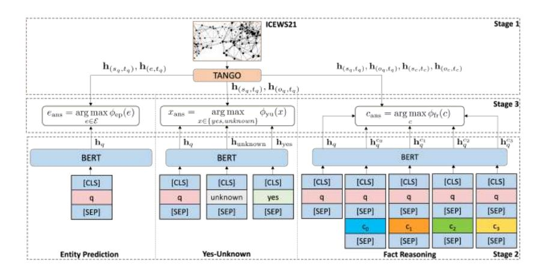
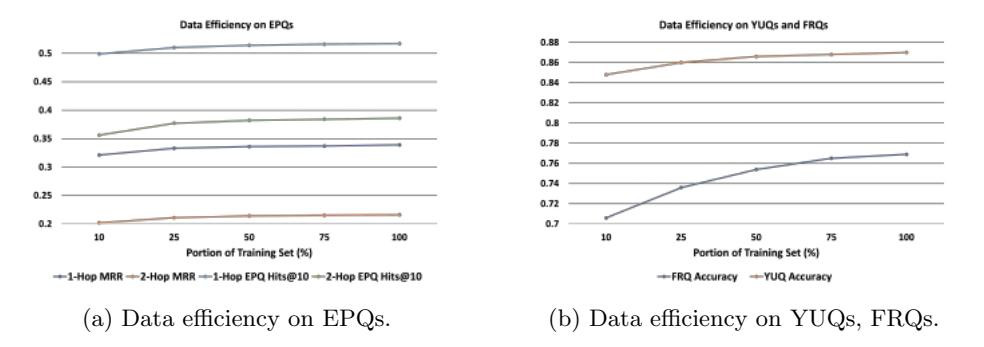
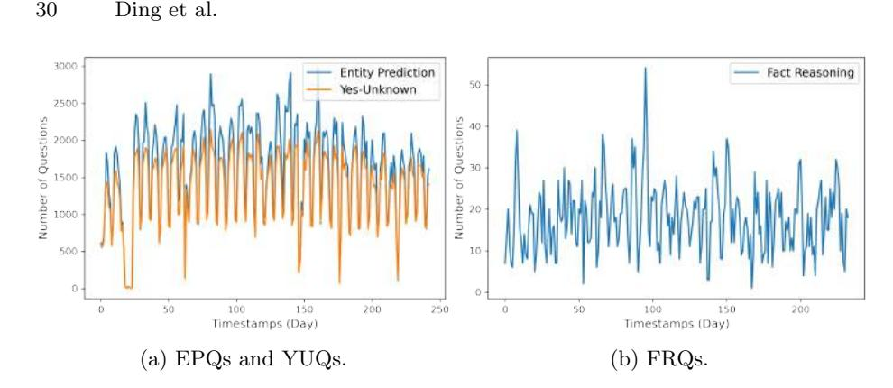

# ForecastTKGQuestions: A Benchmark for Temporal Question Answering and Forecasting over Temporal Knowledge Graphs

Zifeng Ding ^⋆^ ^1^ , ^2^ , Zongyue Li ^⋆^ ^1^ , ^3^ , Ruoxia Qi ^⋆^ ^1^ , Jingpei Wu ^1^ , Bailan He ^1^ , ^2^ , Yunpu Ma ^1^ , ^2^ , Zhao Meng ^4^ , Shuo Chen ^1^ , ^2^ , Ruotong Liao ^1^ , ^3^ , Zhen Han( ) ^1^ , and Volker Tresp( ) ^1^

^1^ LMU Munich, Geschwister-Scholl-Platz 1, 80539 Munich, Germany ^2^ Siemens AG, Otto-Hahn-Ring 6, 81739 Munich, Germany

^3^ Munich Center for Machine Learning (MCML), Munich, Germany

^4^ ETH Z¨urich, R¨amistrasse 101, 8092 Z¨urich, Switzerland {zifeng.ding, ruoxia.qi, bailan.he, shuo.chen }@campus.lmu.de, {zongyue.li, jingpei.wu }@outlook.com, cognitive.yunpu@gmail.com, zhmeng@ethz.ch, liao@dbs.ifi.lmu.de, hanzhen02111@hotmail.com, Volker.Tresp@lmu.de

Abstract. Question answering over temporal knowledge graphs (TKGQA) has recently found increasing interest. Previous related work aims to develop QA systems that answer temporal questions based on the facts from a fixed time period, where a temporal knowledge graph (TKG) spanning this period can be fully used for answer inference. In realworld scenarios, however, it is also common that given the knowledge until now, we wish the TKGQA systems to answer the questions asking about the future. As humans constantly seek plans for the future, building forecasting TKGQA systems is important. In this paper, we propose a novel task: forecasting TKGQA, and propose a coupled largescale TKGQA benchmark dataset, i.e., ForecastTKGQuestions. It includes three types of forecasting questions, i.e., entity prediction, yesunknown, and fact reasoning questions. For every forecasting question, a timestamp is annotated and QA models can only have access to the TKG information before it for answer inference. We find that previous TKGQA methods perform poorly on forecasting questions, and they are unable to answer yes-unknown and fact reasoning questions. To this end, we propose ForecastTKGQA, a TKGQA model that employs a TKG forecasting module for future inference. Experimental results show that ForecastTKGQA performs well in answering forecasting questions.

## 1 Introduction

Knowledge graphs (KGs) model factual information by representing every fact with a triplet, i.e., (s, r, o), where s , o , r, are the subject entity, the object entity, and the relation between s and o, respectively. To adapt to the ever-evolving

^⋆^ Equal contribution.

knowledge, temporal knowledge graphs (TKGs) are introduced, where they additionally specify the time validity of every fact with a time constraint t (t is a timestamp), and represent each fact with a quadruple (s, r, o, t). Recently, TKG reasoning has drawn great attention. While a lot of methods focus on temporal knowledge graph completion (TKGC) where they predict missing facts at the observed timestamps, various recent methods pay more attention to forecasting the facts at unobserved future timestamps in TKGs.

Knowledge graph question answering (KGQA) is a task aiming to answer the natural language questions using a KG as the knowledge base (KB). KGQA requires QA models to extract answers from KGs, rather than retrieving or summarizing answers from the given text contexts. [[24]](#ref-24) first introduces question answering over temporal knowledge graphs (TKGQA). It proposes a nonforecasting TKGQA dataset CronQuestions that takes a TKG as its underlying KB. Temporal reasoning techniques are required to answer these questions. Though [[24]](#ref-24) manages to combine TKG reasoning with KGQA, it has limitations. Previous KGQA datasets, including CronQuestions, do not include yes-no and multiple-choice questions, while these two question types have been extensively studied in reading comprehension QA, e.g., [[14]](#ref-14). Besides, the questions in CronQuestions are in a non-forecasting style, where all of them are based on the TKG facts that happen in a fixed time period, and an extensive TKG that is fully observable in this period can be used to infer the answers, making the answer inference less challenging. For example, the TKG facts from 2003, including (Stephen Robert Jordan, member of sports team, Manchester City, 2003 ), are all observable to answer the question Which team was Stephen Robert Jordan part of in 2003?. CronQuestions manages to bridge the gap between TKGC and KGQA, however, no previous work manages to combine TKG forecasting with KGQA, where only past TKG information can be used for answer inference.

In this work, we propose a novel task: forecasting question answering over temporal knowledge graphs (forecasting TKGQA), together with a coupled largescale dataset, i.e., ForecastTKGQuestions. We generate forecasting questions based on the Integrated Crisis Early Warning System (ICEWS) dataverse [[3]](#ref-3), and label every question with a timestamp. To answer a forecasting question, QA models can only access the TKG information prior to the question timestamp. The contribution of our work is three-folded: (1) We propose forecasting TKGQA, a novel task aiming to test the forecasting ability of TKGQA models. To the best of our knowledge, this is the first work binding TKG forecasting with temporal KGQA; (2) We propose a large-scale benchmark TKGQA dataset: ForecastTKGQuestions. It contains three types of questions, i.e., entity prediction questions (EPQs), yes-unknown questions (YUQs), and fact reasoning questions (FRQs), where the last two types of questions have never been considered in previous KGQA datasets[[5]](#ref-5) ; (3) We propose ForecastTKGQA, a model aiming to solve forecasting TKGQA. It employs a TKG forecasting module and a pre-trained language model (LM) for answer inference. Experimental results show that it achieves great performance on forecasting questions.

^5^ YUQs are based on yes-no questions and FRQs are multiple-choice questions.

## 2 Preliminaries and Related Work

TKG Reasoning Let E, R and T denote a finite set of entities, relations, and timestamps, respectively. A TKG G is defined as a finite set of TKG facts represented by quadruples, i.e., G = {(s, r, o, t)|s, o ∈ E, r ∈ R, t ∈ T }. We define the TKG forecasting task (also known as TKG extrapolation) as follows. Assume we have a query (sq, rq, ?, tq) (or (?, rq, oq, tq)) derived from a target quadruple (sq, rq, oq, tq), and we denote all the ground-truth quadruples as F. TKG forecasting aims to predict the missing entity in the query, given the observed past TKG facts O = {(s^i^ , r^i^ , o^i^ , ti) ∈ F|t^i^ < tq}. Such temporal restriction is not imposed in TKG completion (TKGC, also known as TKG interpolation), where the observed TKG facts from any timestamp, including t^q^ and the timestamps after tq, can be used for prediction. In recent years, there have been extensive works done for both TKGC [[17]](#ref-17), [[16]](#ref-16), [[7]](#ref-7) and TKG forecasting [[15]](#ref-15), [[10]](#ref-10), [[34]](#ref-34), [[9]](#ref-9), [[19]](#ref-19). We give a more detailed discussion about the forecasting methods. RE-NET [[15]](#ref-15) employs an autoregressive architecture and models fact occurrence as a probability distribution conditioned on the temporal sequences of past related TKG information. TANGO [[10]](#ref-10) employs neural ordinary differential equations to model temporal dependencies among graph information of different timestamps. CyGNet [[34]](#ref-34) uses the copy-generation mechanism to extract hints from historical facts for forecasting. xERTE [[9]](#ref-9) constructs a historical fact-based subgraph and selects prediction answers from it. TLogic [[19]](#ref-19) is the first rule-based TKG forecasting method that learns temporal logical rules in TKGs and achieves superior results.

Question Answering over KGs Several datasets have been proposed for QA over non-temporal KGs, such as SimpleQuestions [[2]](#ref-2), WebQuestionsSP [[32]](#ref-32), ComplexWebQuestions [[27]](#ref-27), MetaQA [[33]](#ref-33), TempQuestions [[12]](#ref-12), and TimeQuestions [[13]](#ref-13). Among these datasets, only TempQuestions and TimeQuestions involve temporal questions that require temporal reasoning for answer inference, however, their associated KGs are non-temporal. CronQuestions [[24]](#ref-24) contains questions based on a time-evolving TKG, i.e., Wikidata [[30]](#ref-30). It is proposed for non-forecasting TKGQA. Two types of questions, i.e., entity prediction and time prediction questions, are included. To answer CronQuestions, Saxena et al. propose CronKGQA that uses TKGC methods, along with pre-trained LMs, which shows great effectiveness. A line of methods has been proposed on top of CronKGQA (TempoQR [[20]](#ref-20), TSQA [[26]](#ref-26), SubGTR [[5]](#ref-5)), where they better distinguish question time scopes and reason over subgraphs. CronQuestions is proposed based on the idea of TKGC, and it does not support TKG forecasting and contains no forecasting question. One recent work, i.e., ForecastQA [[14]](#ref-14), proposes a QA dataset fully consisting of forecasting questions. However, ForecastQA is not related to KGQA. In ForecastQA, answers to its questions are inferred from text contexts, while KGQA/TKGQA requires models to find the answers from the coupled KGs/TKGs without providing any additional text contexts. As a result, the methods designed for ForecastQA have no ability to address TKGQA. To this end, we propose ForecastTKGQuestions, **Table 1:** (a) KGQA dataset comparison. Statistics are taken from [[24]](#ref-24) and [[13]](#ref-13). T% denotes the portion of temporal questions. (b) ForecastTKGQuestions statistics: number of questions of different types.

| (a) | | | (b) | | | | | |
|:---------------------|:---|:---|:-----|:----------------------------|:----------------------------------------------|:----------------------|:----|:----|
| Datasets | | | | TKG Forecast T% # Questions | | Train Valid Test | | |
| MetaQA | ✗ | ✗ | 0% | 400k | 1-Hop Entity Prediction 211,564 36,172 33,447 | | | |
| TempQuestions | ✗ | ✗ | 100% | 1271 | 2-Hop Entity Prediction 85,088 12,266 10,765 | | | |
| TimeQuestions | ✗ | ✗ | 100% | 16k | Yes-Unknown | 251,537 42,884 39,695 | | |
| CronQuestions | ✓ | ✗ | 100% | 410k | Fact Reasoning | 3,164 | 514 | 517 |
| ForecastTKGQuestions | ✓ | ✓ | 100% | 727k | Total | 551,353 91,836 84,424 | | |

aiming to bridge the gap between TKG forecasting and KGQA. We compare ForecastTKGQuestions with recent KGQA datasets in Table [[1a]](#ref-table-1a).

Task Formulation: Forecasting TKGQA Forecasting TKGQA aims to test the forecasting ability of TKGQA models. It requires QA models to predict future facts based on the past TKG information. We formulate it as follows. Given a TKG G and a natural language question q generated based on a TKG fact whose valid timestamp is tq, forecasting TKGQA aims to predict the answer to q. We label every question q with tq, and constrain QA models to only use the TKG facts {(s^i^ , r^i^ , o^i^ , ti)|t^i^ < tq} before t^q^ for answer inference. We propose three types of forecasting TKGQA questions, i.e., EPQs, YUQs, and FRQs. The answer to a EPQ is an entity e ∈ E. The answer to a YUQ is either yes or unknown. We formulate FRQs as multiple choices and thus the answer to an FRQ corresponds to a choice c. As a novel task, forecasting TKGQA requires models to have the ability of both natural language understanding (NLU) and future forecasting. Compared with it, the traditional TKG forecasting task does not require NLU and non-forecasting TKGQA does not consider future forecasting. Thus, previous methods for TKG forecasting^6^ , e.g., RE-Net [[15]](#ref-15), and non-forecasting TKGQA, e.g., TempoQR [[20]](#ref-20), are not suitable for solving forecasting TKGQA.

## 3 ForecastTKGQuestions

### 3.1 Temporal Knowledge Base

A subset from ICEWS [[3]](#ref-3) is taken as the associated temporal KB for our proposed dataset. We construct a TKG ICEWS21 based on the events taken from the official website of the ICEWS weekly event data^7^ [[3]](#ref-3). ICEWS contains sociopolitical events in english. We take the events from Jan. 1, 2021, to Aug. 31,

^6^ Relation set is provided in TKG forecasting and these methods explicitly learn relation representations. However, TKG relations are not annotated in forecasting TKGQA questions. Only question texts are provided and these methods have no way to process. Therefore, we do not consider them in experiments on our new task.

^7^ https://dataverse.harvard.edu/dataverse/icews

**Table 2:** ICEWS21 TKG statistics. Ntrain, Nvalid, Ntest denote the number of TKG facts in Gtrain, Gvalid, Gtest, respectively. |E|, |R|, |T | denote ICEWS21's number of entities, relations, timestamps, respectively.

| Dataset | Ntrain | Nvalid | Ntest | |E| |R| |T |
|:--------|:-------|:-------|:------|:--|:--|:--|
| ICEWS21 | 252,434 | 43,033 | 39,836 | 20,575 | 253 | 243 |

2021, and extract TKG facts in the following way. For every ICEWS event, we generate a TKG fact (s, r, o, t). We take the content of Event Date as the timestamp t of the TKG fact. We take the contents of Source Name and Target Name as the subject entity s and the object entity o of the TKG fact, respectively. We take the content of Event Text as the relation type r of the fact. We present the dataset statistics of ICEWS21 in Table [[2]](#ref-table-2). We split ICEWS21 into three parts Gtrain = {(s, r, o, t) ∈ G|t ∈ [t0, t1) }, Gvalid = {(s, r, o, t) ∈ G|t ∈ [t1, t2) }, Gtest = {(s, r, o, t) ∈ G|t ∈ [t2, t3] }, where t0, t1, t2, t^3^ correspond to 2021- 01-01, 2021-07-01, 2021-08-01 and 2021-08-31, respectively. We generate training/validation/test questions based on Gtrain/Gvalid/Gtest. We ensure that there exists no temporal overlap between every two of them, i.e., Gtrain ∩ Gvalid = ∅, Gtrain ∩ Gtest = ∅ and Gvalid ∩ Gtest = ∅. In this way, we prevent QA models from observing any information from the evaluation sets during training.

### 3.2 Question Categorization and Generation

We generate natural language questions based on the TKG facts in ICEWS21 and propose our QA dataset ForecastTKGQuestions. Every relation type in ICEWS21 is coupled with a CAMEO code (specified in the CAMEO Code column of the ICEWS weekly event data). In the official CAMEO codebook (can be found in ICEWS database), each CAMEO code is explained with examples and detailed descriptions. We use the official CAMEO codebook provided in the ICEWS dataverse for aiding the generation of natural language relation templates. We create relation templates for 250 out of 253 relation types for question generation^8^ . For example, we create a relation template engage in material cooperation with for the relation type engage in material cooperation, not specified below. Questions in ForecastTKGQuestions are categorized into three categories, i.e., EPQs (including 1-hop and 2 hop EPQs), YUQs, and FRQs. We summarize the numbers of different types of questions in Table [[1b]](#ref-table-1b). We use the relation templates to create natural language question templates for all types of questions (examples in Table [[3]](#ref-table-3)) which are used for question generation. All question templates are presented in our supplementary source code and explained in Appendix C.2. Same as previous KGQA datasets, e.g., CronQuestions, entity linking is considered as a separate problem and is not covered in our work. We assume complete entity and timestamp linking, and annotate the entities and timestamps in our questions. This applies to all three types of questions in our dataset. Distribution of question timestamps is specified in Appendix C.5.

^8^ The rest three relation types are not ideal for question generation (Appendix C.1).

**Table 3:** Example question templates of all types. s^q^ and o^q^ are the annotated question entities. t^q^ is the annotated question timestamp. For FRQ, {sc}, {oc}, {tc} are annotated choice entities and timestamp. We only write one choice in FRQ template for brevity. Better understand with details in Section [[3.2]](#ref-section-3.2).

| Question Type | Example Template |
|:--------------|:--------------------------------------------------------------------------------|
| 1-Hop EPQ | Who will {sq} engage in material cooperation with on {tq}? |
| 2-Hop EPQ | Who will threaten a country, while {sq} criticizes or denounces this country on {tq}? |
| YUQ | Will {sq} make a pessimistic comment about {oq} on {tq}? |
| FRQ | Why will {sq} appeal to {oq} to meet or negociate on {tq}? A: {sc} threaten {oc} on {tc}; B: |

Entity Prediction Questions We generate two groups of EPQs, i.e., 1-hop and 2-hop EPQs. Each 1-hop EPQ is generated from a single TKG fact, e.g., the natural language question Who will Sudan host on 2021-08-01? is based on (Sudan, host, Ramtane Lamamra, 2021-08-01 ). The underlined parts in the question denote the annotated entities and timestamps for KGQA. We consider all the facts concerning the 250 selected relations and transform them into 1-hop EPQs. Each 2-hop EPQ is generated from two associated TKG facts in ICEWS21 where they contain common entities. An example is presented in Table [[4]](#ref-table-4). The answer to a 2-hop EPQ (Israel) corresponds to a 2-hop neighbor of its annotated entity (Iran) at the question timestamp (2021-08-02 ). We generate 2-hop questions by utilizing AnyBURL [[21]](#ref-21), a rule-based KG reasoning model. We first split ICEWS21 into snapshots, where each snapshot Gt^i^ = {(s, r, o, t) ∈ G|t = ti} contains all the TKG facts happening at the same timestamp. Then we train AnyBURL on each snapshot for rule extraction. We collect the 2-hop rules with a confidence higher than 0.5 returned by AnyBURL, and manually check if two associated TKG facts in each rule potentially have a logical causation or can be used to interpret positive/negative entity relationships. After excluding the rules not meeting this requirement, we create question templates based on the remaining ones. We search for the groundings in ICEWS21 at every timestamp, where each grounding corresponds to a 2-hop EPQ. See our source code for the complete list of extracted 2-hop rules and see Appendix C.3 for more EPQ generation details.

Yes-Unknown Questions Based on the idea of triple classification in KG reasoning^9^ , we introduce yes-no questions into KGQA. We then turn yes-no questions into yes-unknown questions because according to the Open World Assumption (OWA), the facts not observed in a given TKG are not necessarily wrong [[8]](#ref-8). We generalize triple classification to quadruple classification^10^, and then translate TKG facts into natural language questions. We take answering YUQs as solving quadruple classification. For every TKG fact concerning the

^9^ For a KG fact (s, r, o), triple classification aims to predict whether this fact is valid or not.

^10^ Quadruple classification has never been studied in previous work. We define it as predicting whether a TKG fact (s, r, o, t) is valid or unknown, under OWA.

**Table 4:** 2-hop EPQ example. To avoid overlong text, we use symbols to represent relations and timestamps in TKG facts and 2-hop rules. r^1^ =accuse; r^2^ =engage in diplomatic cooperation; t^1^ =2021-08-02. m, n are two entities that are 2-hop neighbors of each other at t1. X is their common 1-hop neighbor at t1. The extracted rule describes the negative relationship between Iran and Israel.

| Associated TKG Facts 2-Hop Rule | | Generated 2-Hop Question | Answer |
|:----------------------------------------------|:-----------|:-----------------------------------------------------------------|:-------|
| (United States, r1, Iran, t1) | (X, r1, m) | Who will a country engage in diplomatic cooperation with, Israel | |
| (United States, r2, Israel, t1) => (X, r2, n) | | while this country accuses Iran on 2021-08-02? | |

selected 250 relations, we generate either a true or an unknown question based on it. For example, for the fact (Sudan, host, Ramtane Lamamra, 2021-08-01 ), a true question is generated as Will Sudan host Ramtane Lamamra on 2021-08-01? and we label yes as its answer. An unknown question is generated by randomly perturbing one entity or the relation type in this fact, e.g., Will Germany host Ramtane Lamamra on 2021-08-01?, and we label unknown as its answer. We ensure that the perturbed fact does not exist in the original TKG. We use 25% of total facts in ICEWS21 to generate true questions and the rest are used to generate unknown questions.

Fact Reasoning Questions The motivation for proposing FRQs is to study the difference between humans and machines in finding the supporting evidence for reasoning. We formulate FRQs in the form of multiple choices. Each question is coupled with four choices. Given a TKG fact from an FRQ, we ask the QA models to choose which fact in the choices is the most contributive to (the most relevant cause of) the fact mentioned in the question. We provide several examples in Fig. [[1]](#ref-fig-1). We generate FRQs as follows. We first train a TKG forecasting model xERTE [[9]](#ref-9) on ICEWS21. Note that to predict a query (s, r, ?, t), xERTE samples its related prior TKG facts and assigns contribution scores to them. It provides explainability by assigning higher scores to the more related prior facts. We perform TKG forecasting and collect the queries where the ground-truth missing entities are ranked as top 1 by xERTE. For each collected query, we find its corresponding TKG fact and pick out four related prior facts found by xERTE. We take the prior facts with the highest, the lowest, and median contribution scores as Answer, Negative, and Median, respectively. Inspired by InferWiki [[4]](#ref-4), we include a Hard Negative fact with the second highest contribution score, making it non-trivial for QA models to make the right decision. We generate each FRQ by turning the corresponding facts into a question and four choices (using templates), and manage to use xERTE to generate a large number of questions. However, since the answers to these questions are solely determined by xERTE, there exist numerous erroneous examples. For example, the Hard Negative of lots of them are more suitable than their Answer to be the answers. We ask five graduate students (major in computer science) to manually check all these questions and annotate them as reasonable or unreasonable according to their own knowledge or through search engines. If the majority annotate a question

as unreasonable, we filter it out. See Appendix C.4 for more details of FRQ generation and annotation, including the annotation instruction and interface.

| **Reasoning Types** | **Question Example** | **Example Explanation** |
|:------------------------------------------------------------------------------------------------------------------------------------------------------------------------------------------------------------------------------------------------------------------------------------------------------|:--------------------------------------------------------------------------------------------------------------------------------------------------------------------------------------------------------------------------------------------------------------------------------------------------------------------------------------------------------------------------------------------------------------------------------|:------------------------------------------------------------------------------------------------------------------------------------------------------------------------------------------------------|
| **Causal Relation (91%)** | Which of the following statements contributes most to the fact that Pedro | Pedro Sanchez wished to |
| The answer directly causes the | Sanchez signed a formal agreement with Joseph Robinette Biden on 2021-08-23? | cooperate with Joseph |
| question fact or the answer clearly | A. Pedro Sanchez expressed the intent to cooperate with Joseph Robinette Biden on 2021-08-22. | Robinette Biden on 2021- |
| shows the relationship between | B. Pedro Sanchez engaged in diplomatic cooperation with Government (Spain) on 2021-08-22. | 08-22. This directly causes |
| entities that leads to the question | C. Government (Spain) made a statement to Cuba on 2021-07-27. | that they signed an |
| fact. | D: United States praised or endorsed Sayyid Ali al-Husayni al-Sistani on 2021-07-24. | agreement on the next day. |
| **Identity Understanding (46%)** | Which of the following statements contributes most to the fact that Turkey hosted | Ursula von der Leven was |
| An entity's identity is vital for | Ursula von der Leyen on 2021-04-08? | the president of European |
| reasoning. E.g., without knowing Sauli | A. Turkey signed a formal agreement with Government (Libya) on 2021-04-07. | Commission. Recep Tayyip |
| Niinistö is the president of Finland, | B. Wang Yi negotiated with Foreign Affairs (Malaysia) on 2021-04-02. | Erdoğan was the president |
| the choices containing him might be | C. Ursula von der Leyen expressed the intent to meet or negotiate with Recep Tayyip Erdoğan | of Turkey. After knowing |
| neglected, causing mistakes in | on 2021-03-30. | the identities, it is obvious |
| reasoning the facts regarding Finland. | D. Foreign Affairs (Turkey) praised or endorsed European Union on 2021-03-26. | that C is better than D. |
| Time Sensitivity (19%) Time difference between a choice and the question fact plays an important role. When more than one choice seem reasonable, the choices that are temporally far from the question fact (or much farther than other choices) are more probable to be wrong. | Which of the following statements contributes most to the fact that Xie Zhenhua negotiated with John Kerry on 2021-08-31? A. Xie Zhenhua expressed the intent to meet or negotiate with John Kerry on 2021-04-14. B. Xie Zhenhua expressed the intent to meet or negotiate with John Kerry on 2021-08-30. C. Xie Zhenhua negotiated with John Kerry on 2021-04-15. D. China accused United States on 2021-04-09. | Without paying attention to the timestamps of facts, A. B. C all seem reasonable to lead to the question fact. However, after considering time information, B should be the answer. |

**Figure 1:** Required reasoning types and proportions (%) in sampled FRQs, as well as FRQ examples. We sample 100 FRQs in each train/valid/test set. For choices, green for Answer, blue for Hard Negative, orange for Median and yellow for Negative. Multiple reasoning skills are required to answer each question, so the total proportion sum is not 100%.

To better study the reasoning skills required to answer FRQs, we randomly sample 300 FRQs and manually annotate them with reasoning types. The required reasoning skills and their proportions are shown in Fig. [[1]](#ref-fig-1).

## 4 ForecastTKGQA

ForecastTKGQA employs a TKG forecasting model TANGO [[10]](#ref-10) and a pretrained LM BERT [[6]](#ref-6) for solving forecasting questions. We illustrate its model structure in Fig. [[2]](#ref-fig-2) with three stages. In Stage 1, a TKG forecasting model TANGO [[10]](#ref-10) is used to generate the time-aware representation for each entity at each timestamp. In Stage 2, a pre-trained LM (e.g., BERT) is used to encode questions (and choices) into question (choice) representations. Finally, in Stage 3, answers are predicted according to the scores computed using the representations from Stage 1 and 2.

**Figure 2:** Model structure of ForecastTKGQA.

### 4.1 TKG Forecasting Model

We train TANGO on ICEWS21 with the TKG forecasting task. We use ComplEx [[29]](#ref-29) as its scoring function. We learn the entity and relation representations in the complex space C^d^ , where d is the dimension of complex vectors. The training set corresponds to all the TKG facts in Gtrain, and we evaluate the trained model on Gvalid and Gtest. After training, we perform a one time inference on

Gvalid and Gtest. Following the default setting of TANGO, to compute entity and relation representations at every timestamp t, we recurrently input all the TKG facts from t − 4 to t − 1, i.e., snapshots from Gt−^4^ to Gt−1, into TANGO and take the output representations. Note that it infers representations based on the prior facts, thus not violating our forecasting setting. We compute the entity and relation representations at every timestamp in ICEWS21 and keep them for aiding the QA systems in Stage 1 (Fig. [[2]](#ref-fig-2)). See Appendix B.1 for more details of TANGO training and inference. To leverage the complex representations computed by TANGO with ComplEx, we map the output of BERT to C^d^ . For each natural language input, we take the output representation of the [CLS] token computed by BERT and project it to a 2d real space to form a 2d real valued vector. We take the first and second half of it as the real and imaginary part of a d-dimensional complex vector, respectively. All the representations output by BERT have already been mapped to C^d^ without further notice.

### 4.2 QA Model

Entity Prediction For every EPQ q, we compute an entity score for every entity e ∈ E. The entity with the highest score is predicted as the answer eans. To compute the score for e, we first input q into BERT and map its output to C^d^ to get the question representation hq. Inspired by ComplEx, we then define e's entity score as

$$
\phi_{ep}(e) = \text{Re}\left( \langle \mathbf{h}'_{(s_q, t_q)}, \mathbf{h}_q, \bar{\mathbf{h}}'_{(e, t_q)} \rangle \right). \tag{1}
$$

h ′ (sq,tq) = fep h(sq,tq) , h ′ (e,tq) = fep h(e,tq) , where fep denotes a neural network aligning TKG representations to EPQs. h(sq,tq) and h(e,tq) denote the TANGO representations of the annotated entity s^q^ and the entity e at the question timestamp tq, respectively. Re means taking the real part of a complex vector and h¯′ (e,tq) means the complex conjugate of h ′ (e,tq) .

Yes-Unknown Judgment For a YUQ, we compute a score for each candidate answer x ∈ {yes, unknown}. We first encode each x into a d-dimensional complex representation h^x^ with BERT. Inspired by TComplEx [[17]](#ref-17), we then compute scores as

$$
\phi_{\text{yu}}(x) = \text{Re}\left( < \mathbf{h}'_{(s_q, t_q)}, \mathbf{h}_q, \bar{\mathbf{h}}'_{(o_q, t_q)}, \mathbf{h}_x \right). \tag{2}
$$

h ′ (sq,tq) = fyu h(sq,tq) ,h ′ (oq,tq) = fyu h(oq,tq) , where fyu denotes a neural network aligning TKG representations to YUQs. h(sq,tq) and h(oq,tq) denote the TANGO representations of the annotated subject entity s^q^ and object entity o^q^ at tq, respectively. h^q^ is the BERT encoded question representation. We take the candidate answer with the higher score as the predicted answer xans.

Fact Reasoning We compute a choice score for every choice c in an FRQ by using the following scoring function:

$$
\phi_{\rm fr}(c) = \text{Re}\left( < \mathbf{h}'_{(s_c, t_c)}, \mathbf{h}_q^c, \bar{\mathbf{h}}'_{(o_c, t_c)}, \mathbf{h}_q' > \right),\tag{3}
$$

h^c^q is the output of BERT mapped to C^d^ given the concatenation of q and c. h ′ (sc,tc) = ffr h(sc,tc) and h ′ (oc,tc) = ffr h(oc,tc) . ffr is a projection network and h(sc,tc) , h(oc,tc) denote the TANGO representations of the entities annotated in c. h ′^q^ = f ffr h(sq,tq) ∥h^c^^q^∥ffr h(oq,tq) , where f serves as a projection and ∥ denotes concatenation. h(sq,tq) and h(oq,tq) denote the TANGO representations of the entities annotated in the question q. We take the choice with the highest choice score as our predicted answer cans. We give a more detailed description of Equation [[1]](#ref-eq-1), [[2]](#ref-eq-2) and [[3]](#ref-eq-3) in Appendix A.

Parameter Learning We use cross-entropy loss to train ForecastTKGQA on each type of questions separately. The loss functions of EPQs, FRQs and YUQs are given by Lep = − P^q^∈Qep log P ϕep(eans) ^e^∈E ϕep(e) , Lfr = − P^q^∈Qfr log P ϕfr(cans) ^c^ ϕfr(c) and Lyu = − P^q^∈Qyu log P ϕyu(xans) ^x^∈{yes,unknown} ϕyu(x) , respectively. Qep/Qyu/Qfr denotes all EPQs/YUQs/FRQs and eans/xans/cans is the answer to question q.

## 5 Experiments

We answer several research questions (RQs) with experiments^11^ . RQ1 (Section [[5.2]](#ref-section-5.2), [[5.4]](#ref-section-5.4)): Can a TKG forecasting model better support forecasting TKGQA than a TKGC model? RQ2 (Section [[5.2]](#ref-section-5.2), [[5.4]](#ref-section-5.4)): Does ForecastTKGQA perform well in forecasting TKGQA? RQ3 (Section [[5.3]](#ref-section-5.3), [[5.5]](#ref-section-5.5)): Are the questions in our dataset answerable? RQ4 (Section [[5.7]](#ref-section-5.7)): Is the proposed dataset efficient? RQ5 (Section [[5.6]](#ref-section-5.6)): What are the challenges of forecasting TKGQA?

^11^ Implementation details and further analysis of ForecastTKGQA in Appendix B.3 and G.

### 5.1 Experimental Setting

Evaluation Metrics We use mean reciprocal rank (MRR) and Hits@k as the evaluation metrics of the EPQs. For each EPQ, we compute the rank of the ground-truth answer entity among all the TKG entities. Test MRR is then computed as ^1^ |Qep test| P q∈Qep test 1 rank^q^ , where Q ep test denotes all EPQs in the test set and rank^q^ is the rank of the ground-truth answer entity of question q. Hits@k is the proportion of the answered questions where the ground-truth answer entity is ranked as top k. For YUQs and FRQs, we employ accuracy for evaluation. Accuracy is the proportion of the correctly answered questions out of all questions.

Baseline Methods We consider two pre-trained LMs, BERT [[6]](#ref-6) and RoBERTa [[18]](#ref-18) as baselines. For EPQs and YUQs, we add a prediction head on top of the question representations computed by LMs, and use softmax function to compute answer probabilities. For every FRQ, we input into each LM the concatenation of the question with each choice, and follow the same prediction structure. Besides, we derive two model variants for each LM by introducing TKG representations. We train TComplEx on ICEWS21. For every EPQ and YUQ, we concatenate the question representation with the TComplEx representations of the entities and timestamps annotated in the question, and then perform prediction with a prediction head and softmax. For FRQs, we further include TComplEx representations into choices in the same way. We call this type of variant BERT int and RoBERTa int since TComplEx is a TKGC (TKG interpolation) method. Similarly, we also introduce TANGO representations into LMs and derive BERT ext and RoBERTa ext, where TANGO serves as a TKG extrapolation backend. Detailed model derivations are presented in Appendix B.2. We also consider one KGQA method EmbedKGQA [[25]](#ref-25), and two TKGQA methods, i.e., CronKGQA [[24]](#ref-24) and TempoQR [[20]](#ref-20) as baselines. We run EmbedKGQA on top of the KG representations trained with ComplEx on ICEWS21, and run TKGQA baselines on top of the TKG representations trained with TComplEx.

### 5.2 Main Results

We report the experimental results in Table [[5]](#ref-table-5). In Table [[5a]](#ref-table-5a), we show that our entity prediction model outperforms all baseline methods. We observe that EmbedKGQA achieves a better performance than BERT and RoBERTa, showing that employing KG representations helps TKGQA. Besides, LM variants outperform their original LMs, indicating that TKG representations help LMs perform better in TKGQA. Further, BERT ext shows stronger performance than BERT int (this also applies to RoBERTa int and RoBERTa ext), which proves that TKG forecasting models provide greater help than TKGC models in forecasting TKGQA. CronKGQA and TempoQR employ TComplEx representations as supporting information and perform poorly, implying that employing TKG representations provided by TKGC methods may include noisy information in forecasting TKGQA. ForecastTKGQA injects TANGO representations

**Table 5:** Experimental results over ForecastTKGQuestions. The best results are marked in bold.

(a) EPQs. Overall results in Appendix D. (b) YUQs and FRQs.

| | MRR | Hits@1 | Hits@10 | | | Accuracy |
|:--------------------------------------------------|:----|:-------|:-----------------------------------------------------------|:---------------------------------------|:--|:---------------------------|
| Model | | | 1-Hop 2-Hop 1-Hop 2-Hop 1-Hop 2-Hop | Model | | YUQ FRQ |
| RoBERTa BERT | | | 0.166 0.149 0.104 0.085 0.288 0.268 0.279 0.182 0.192 0.106 0.451 0.342 | RoBERTa BERT | | 0.721 0.645 0.813 0.634 |
| EmbedKGQA | | | 0.317 0.185 0.228 0.112 0.489 0.333 | RoBERTa int | | 0.768 0.693 |
| RoBERTa int BERT int | | | 0.283 0.157 0.190 0.094 0.467 0.290 0.314 0.183 0.223 0.107 0.490 0.344 | BERT int | | 0.829 0.682 |
| CronKGQA TempoQR | | | 0.131 0.090 0.081 0.042 0.231 0.187 0.145 0.107 0.094 0.061 0.243 0.199 | RoBERTa ext BERT ext | | 0.798 0.707 0.837 0.746 |
| RoBERTa ext BERT ext | | | 0.306 0.180 0.216 0.108 0.497 0.323 0.331 0.208 0.239 0.128 0.508 0.369 | ForecastTKGQA Human Performance (a) | - | 0.870 0.769 0.936 |
| ForecastTKGQA **0.339** **0.216** **0.248** **0.129** **0.517** **0.386** | | | | Human Performance (b) | - | **0.954** |

into a scoring module, showing its great effectiveness on EPQs. For YUQs and FRQs, ForecastTKGQA also achieves the best performance. Table [[5b]](#ref-table-5b) shows that it is helpful to include TKG representations for answering YUQs and FRQs and our scoring functions are effective.

### 5.3 Human vs. Machine on FRQs

To study the difference between humans and models in fact reasoning, we further benchmark human performance on FRQs with a survey (See Appendix E for details). We ask five graduate students to answer 100 questions randomly sampled from the test set. We consider two settings: (a) Humans answer FRQs with their own knowledge and inference ability. Search engines are not allowed; (b) Humans can turn to search engines and use the web information published before the question timestamp for aiding QA. Table [[5]](#ref-table-5) shows that humans achieve much stronger performance than all QA models (even in setting (a)). This calls for a great effort to build better fact reasoning TKGQA models.

### 5.4 Performance over FRQs with Different Reasoning Types

Considering the reasoning types listed in Fig. [[1]](#ref-fig-1), we compare RoBERTa int with ForecastTKGQA on the 100 sampled test questions that are annotated with reasoning types, to justify performance gain brought by TKG forecasting model on FRQs. Experimental results in Table [[6]](#ref-table-6) imply that employing TKG forecasting model helps QA models better deal with any reasoning type on FRQs. We use two cases in Fig. [[3]](#ref-fig-3) to provide insights of performance gain.

Case 1. Two reasoning skills, i.e., Causal Relation and Time Sensitivity (shown in Fig. [[1]](#ref-fig-1)), are required to correctly answer the question in Case 1. Without considering the timestamps of choices, A, B, C all seem at least somehow reasonable.

**Table 6:** Performance comparison across FRQs with different reasoning types.

| | Accuracy | | | | |
|:--------------|:---------|:--------------------------------------------------------|:------|:-|:-|
| Model | | Causal Relation Identity Understanding Time Sensitivity | | | |
| RoBERTa int | 0.670 | 0.529 | 0.444 | | |
| ForecastTKGQA | **0.787** | **0.735** | **0.611** | | |

| (a) Case 1. | | (b) Case 2. | | |
|:------------|:--|:------------|:--|:--|

**Figure 3:** Case Studies on FRQs. We mark green for Answer, blue for Hard Negative, orange for Median and yellow for Negative.

However, after considering choice timestamps, B should be the most contributive reason for the question fact. First, the timestamp of B (2021-08-30 ) is much closer to the question timestamp (2021-08-31 ). Moreover, the fact in choice B directly causes the question fact. RoBERTa int manages to capture the causation, but fail to correctly deal with time sensitivity, while ForecastTKGQA achieves better reasoning on both reasoning types.

Case 2. Two reasoning skills, i.e., Causal Relation and Identity Understanding (shown in Fig. [[1]](#ref-fig-1)), are required to correctly answer the question in Case 2. Head of Government (Somalia) and Somalia are two different entities in TKG, however, both entities are about Somalia. By understanding this, we are able to choose the correct answer. ForecastTKGQA manages to understand the identity of Head of Government (Somalia), match it with Somalia and find the cause of the question fact. RoBERTa int makes a mistake because as a model equipped with TComplEx, it has no well-trained timestamp representations of the question and choice timestamps, which would introduce noise in decision making.

### 5.5 Answerability of ForecastTKGQuestions

To validate the answerability of the questions in ForecastTKGQuestions. We train TComplEx and TANGO over the whole ICEWS21, i.e., Gtrain∪Gvalid∪Gtest, and use them to support QA. Note that this violates the forecasting setting of forecasting TKGQA, and thus we call the TKG models trained in this way as cheating TComplEx (CTComplEx) and cheating TANGO (CTANGO). Answering EPQs with cheating TKG models is same as non-forecasting TKGQA. We couple TempoQR with CTComplEx and see a huge performance increase (Table [[7a]](#ref-table-7a)). Besides, inspired by [[11]](#ref-11), we develop a new TKGQA model Multi-Hop

**Table 7:** Answerability study. Models with α means using CTComplEx and β means using CTANGO. ↑ denotes relative improvement (%) from the results in Table [[5]](#ref-table-5). Acc means Accuracy.

| (a) EPQs. |
|:----------|
| |

### (b) YUQs and FRQs.

| | MRR | | | | Hits@10 | | | | | YUQ | | FRQ | |
|:---------|:------|:--|:------|:--|:--------|:--|:------------------------------------------------|:--|:--|:------|:--|:----------------------|:--|
| Model | 1-Hop | ↑ | 2-Hop | ↑ | 1-Hop | ↑ | 2-Hop | ↑ | Model | Acc | ↑ | Acc | ↑ |
| TempoQRα | | | | | | | 0.713 391.7 0.233 117.8 0.883 263.4 0.419 110.6 | | BERT intα | | | 0.855 19.6 0.816 14.4 | |
| MHSα | **0.868** | - | **0.647** | - | **0.992** | - | **0.904** | - | BERT extβ | | | 0.873 4.3 0.836 12.1 | |
| MHSβ | 0.771 | - | 0.556 | - | 0.961 | - | 0.828 | - | ForecastTKGQAβ **0.925** 6.3 **0.821** 6.8 | | | | |

Scorer^12^ (MHS) for EPQs. Starting from the annotated entity s^q^ of an EPQ, MHS updates the scores of outer entities for n-hops (n = 2 in our experiments) until all sq's n-hop neighbors on the snapshot Gt^q^ are visited. Initially, MHS assigns a score of 1 to s^q^ and 0 to any other unvisited entity. For each unvisited entity e, it then computes e's score as: ϕep(e) = ^1^ |Ne(tq)| P (e ′ ,r)∈Ne(tq) (γ · ϕep(e ′ ) + ψ(e ′ , r, e, tq)), where Ne(tq) = {(e ′ , r)|(e ′ , r, e, tq) ∈ Gt^q^ } is e's 1-hop neighborhood on Gt^q^ and γ is a discount factor. We couple MHS with CT-ComplEx and CTANGO, and define ψ(e ′ , r, e, tq) separately. For MHS + CT-ComplEx, ψ(e ′ , r, e, tq) = f2(f1(h^e^ ′∥hr∥he∥ht^q^ ∥hq)). f^1^ and f^2^ are two neural networks. he, h^e^ ′ , hr, ht^q^ are the CTComplEx representations of entities e, e ′ , relation r and timestamp tq, respectively. For MHS + CTANGO, we take the idea of ForecastTKGQA: ψ(e ′ , r, e, tq) = Re < h(^e^ ′ ,tq) , hr, h¯ (e,tq) , h^q^ > . h(e,tq) , h(^e^ ′ ,tq) , h^r^ are the CTANGO representations of entities e, e ′ at tq, and relation r, respectively. h^q^ is BERT encoded question representation. We find that MHS achieves superior performance (even on 2-hop EPQs). This is because MHS not only uses cheating TKG models, but also considers ground-truth multi-hop structural information of TKGs at t^q^ (which is unavailable in the forecasting setting). For YUQs and FRQs, Table [[7b]](#ref-table-7b) shows that cheating TKG models help improve performance, especially on FRQs. These results imply that given the ground-truth TKG information at question timestamps, our forecasting TKGQA questions are answerable.

### 5.6 Challenges of Forecasting TKGQA over ForecastTKGQuestions

From the experiments discussed in Section [[5.3]](#ref-section-5.3) and [[5.5]](#ref-section-5.5), we summarize the challenges of forecasting TKGQA: (1) Inferring the ground-truth TKG information G^t^^q^ at the question timestamp t^q^ accurately; (2) Effectively performing multihop reasoning for forecasting TKGQA; (3) Developing TKGQA models for better fact reasoning. In Section [[5.5]](#ref-section-5.5), we have trained cheating TKG models and used them to support QA. We show in Table [[7]](#ref-table-7) that QA models substantially improve

^12^ See Appendix F for detailed model explanation and model structure illustration.

their performance on forecasting TKGQA with cheating TKG models. This implies that accurately inferring the ground-truth TKG information at t^q^ is crucial in our task and how to optimally achieve it remains a challenge. We also observe that MHS with cheating TKG models achieves much better results on EPQs (especially on 2-hop). MHS utilizes multi-hop information of the ground-truth TKG at t^q^ (G^t^^q^ ) for better QA. In forecasting TKGQA, by only knowing the TKG facts before t^q^ and not observing G^t^^q^ , it is impossible for MHS to directly utilize the ground-truth multi-hop information at tq. This implies that how to effectively infer and exploit multi-hop information for QA in the forecasting scenario remains a challenge. Moreover, as discussed in Section [[5.3]](#ref-section-5.3), current TKGQA models still trail humans with great margin on FRQs. It is challenging to design novel forecasting TKGQA models for better fact reasoning.

### 5.7 Study of Data Efficiency

We want to know how the models will be affected with less/more training data. For each type of questions, we modify the size of its training set. We train ForecastTKGQA on the modified training sets and evaluate our model on the original test sets. We randomly sample 10%, 25%, 50%, and 75% of the training examples to form new training sets. Fig. [[4]](#ref-fig-4) shows that for every type of question, the performance of ForecastTKGQA steadily improves as the size of the training sets increase. This proves that our proposed dataset is efficient and useful for training forecasting TKGQA models.

**Figure 4:** Data efficiency analysis.

## 6 Justification of Task Validity from Two Perpectives

(1) Perspective from Underlying TKG. We take a commonly used temporal KB, i.e., ICEWS, as the KB for constructing underlying TKG ICEWS21. ICEWS-based TKGs contain socio-political facts. It is meaningful to perform

forecasting over them because this can help to improve early warning in critical socio-political situations around the globe. [[28]](#ref-28) has shown with case studies that ICEWS-based TKG datasets have underlying cause-and-effect temporal patterns and TKG forecasting models are built to capture them. This indicates that performing TKG forecasting over ICEWS-based TKGs are also valid. And therefore, developing forecasting TKGQA on top of ICEWS21 is meaningful and valid. (2) Perspective from the Motivation of Proposing Different Types of Questions. The motivation of proposing EPQs is to introduce TKG link forecasting (future link prediction) into KGQA, while proposing YUQs is to introduce quadruple classification (stemming from triple classification) and yesno type questions. We view quadruple classification in the forecasting scenario as deciding if the unseen TKG facts are valid based on previous known TKG facts. To answer EPQs and YUQs, models can be considered as understanding natural language questions first and then perform TKG reasoning tasks. Since TKG reasoning tasks are considered solvable and widely studied in the TKG community, our task over EPQs and YUQs is valid. We propose FRQs aiming to study the difference between humans and machines in fact reasoning. We have summarized the reasoning skills that are required to answer every FRQ in Fig. [[1]](#ref-fig-1), which also implies the potential direction for QA models to achieve improvement in fact reasoning in the future. We have shown in Section [[5.3]](#ref-section-5.3) that our proposed FRQs are answerable to humans, which directly indicates the validity of our FRQs. Thus, answering FRQs in forecasting TKGQA is also valid and meaningful.

## 7 Conclusion

In this work, we propose a novel task: forecasting TKGQA. To the best of our knowledge, it is the first work combining TKG forecasting with KGQA. We propose a coupled benchmark dataset ForecastTKGQuestions that contains various types of questions including EPQs, YUQs and FRQs. To solve forecasting TKGQA, we propose ForecastTKGQA, a QA model that leverages a TKG forecasting model with a pre-trained LM. Though experimental results show that our model achieves great performance, there still exists a large room for improvement compared with humans. We hope our work can benefit future research and draw attention to studying the forecasting power of TKGQA methods.

Acknowledgement. This work has been supported by the German Federal Ministry for Economic Affairs and Climate Action (BMWK) as part of the project CoyPu under grant number 01MK21007K.

Supplemental Material Statement: Source code and data are uploaded here^13^ . Appendices are published in the arXiv version^14^. We have referred to the corresponding parts in the main body. Please check accordingly.

^13^ https://github.com/ZifengDing/ForecastTKGQA

^14^ https://arxiv.org/abs/2208.06501

## References

* [[1]](#ref-1) Balazevic, I., Allen, C., Hospedales, T.M.: Tucker: Tensor factorization for knowledge graph completion. In: Inui, K., Jiang, J., Ng, V., Wan, X. (eds.) Proceedings of the 2019 Conference on Empirical Methods in Natural Language Processing and the 9th International Joint Conference on Natural Language Processing, EMNLP-IJCNLP 2019, Hong Kong, China, November 3-7, 2019. pp. 5184–5193. Association for Computational Linguistics (2019). https://doi.org/10.18653/v1/D19-1522, https://doi.org/10.18653/v1/D19-1522
* [[2]](#ref-2) Bordes, A., Usunier, N., Chopra, S., Weston, J.: Largescale simple question answering with memory networks (2015). https://doi.org/10.48550/ARXIV.1506.02075, https://arxiv.org/abs/1506.02075
* [[3]](#ref-3) Boschee, E., Lautenschlager, J., O'Brien, S., Shellman, S., Starz, J., Ward, M.: ICEWS Coded Event Data (2015). https://doi.org/10.7910/DVN/28075, https://doi.org/10.7910/DVN/28075
* [[4]](#ref-4) Cao, Y., Ji, X., Lv, X., Li, J., Wen, Y., Zhang, H.: Are missing links predictable? an inferential benchmark for knowledge graph completion. In: Zong, C., Xia, F., Li, W., Navigli, R. (eds.) Proceedings of the 59th Annual Meeting of the Association for Computational Linguistics and the 11th International Joint Conference on Natural Language Processing, ACL/IJCNLP 2021, (Volume 1: Long Papers), Virtual Event, August 1-6, 2021. pp. 6855–6865. Association for Computational Linguistics (2021). https://doi.org/10.18653/v1/2021.acl-long.534, https://doi.org/10.18653/v1/2021.acl-long.534
* [[5]](#ref-5) Chen, Z., Zhao, X., Liao, J., Li, X., Kanoulas, E.: Temporal knowledge graph question answering via subgraph reasoning. Knowl. Based Syst. 251, 109134 (2022). https://doi.org/10.1016/j.knosys.2022.109134, https://doi.org/10.1016/j.knosys.2022.109134
* [[6]](#ref-6) Devlin, J., Chang, M., Lee, K., Toutanova, K.: BERT: pre-training of deep bidirectional transformers for language understanding. In: Burstein, J., Doran, C., Solorio, T. (eds.) Proceedings of the 2019 Conference of the North American Chapter of the Association for Computational Linguistics: Human Language Technologies, NAACL-HLT 2019, Minneapolis, MN, USA, June 2-7, 2019, Volume 1 (Long and Short Papers). pp. 4171–4186. Association for Computational Linguistics (2019). https://doi.org/10.18653/v1/n19-1423, https://doi.org/10.18653/v1/n19-1423
* [[7]](#ref-7) Ding, Z., Ma, Y., He, B., Han, Z., Tresp, V.: A simple but powerful graph encoder for temporal knowledge graph completion. In: NeurIPS 2022 Temporal Graph Learning Workshop (2022), https://openreview.net/forum?id=DYG8RbgAIo
* [[8]](#ref-8) Gal´arraga, L.A., Teflioudi, C., Hose, K., Suchanek, F.M.: AMIE: association rule mining under incomplete evidence in ontological knowledge bases. In: Schwabe, D., Almeida, V.A.F., Glaser, H., Baeza-Yates, R., Moon, S.B. (eds.) 22nd International World Wide Web Conference, WWW '13, Rio de Janeiro, Brazil, May 13-17, 2013. pp. 413–422. International World Wide Web Conferences Steering Committee / ACM (2013). https://doi.org/10.1145/2488388.2488425, https://doi.org/10.1145/2488388.2488425
* [[9]](#ref-9) Han, Z., Chen, P., Ma, Y., Tresp, V.: Explainable subgraph reasoning for forecasting on temporal knowledge graphs. In: 9th International Conference on Learning Representations, ICLR 2021, Virtual Event, Austria, May 3-7, 2021. OpenReview.net (2021), https://openreview.net/forum?id=pGIHq1m7PU
* [[10]](#ref-10) Han, Z., Ding, Z., Ma, Y., Gu, Y., Tresp, V.: Learning neural ordinary equations for forecasting future links on temporal knowledge graphs. In: Moens, M., Huang, X.,

Specia, L., Yih, S.W. (eds.) Proceedings of the 2021 Conference on Empirical Methods in Natural Language Processing, EMNLP 2021, Virtual Event / Punta Cana, Dominican Republic, 7-11 November, 2021. pp. 8352–8364. Association for Computational Linguistics (2021). https://doi.org/10.18653/v1/2021.emnlp-main.658, https://doi.org/10.18653/v1/2021.emnlp-main.658

* [[11]](#ref-11) Ji, H., Ke, P., Huang, S., Wei, F., Zhu, X., Huang, M.: Language generation with multi-hop reasoning on commonsense knowledge graph. In: Webber, B., Cohn, T., He, Y., Liu, Y. (eds.) Proceedings of the 2020 Conference on Empirical Methods in Natural Language Processing, EMNLP 2020, Online, November 16-20, 2020. pp. 725–736. Association for Computational Linguistics (2020). https://doi.org/10.18653/v1/2020.emnlp-main.54, https://doi.org/10.18653/v1/2020.emnlp-main.54
* [[12]](#ref-12) Jia, Z., Abujabal, A., Roy, R.S., Str¨otgen, J., Weikum, G.: Tempquestions: A benchmark for temporal question answering. In: Champin, P., Gandon, F., Lalmas, M., Ipeirotis, P.G. (eds.) Companion of the The Web Conference 2018 on The Web Conference 2018, WWW 2018, Lyon , France, April 23-27, 2018. pp. 1057–1062. ACM (2018). https://doi.org/10.1145/3184558.3191536, https://doi.org/10.1145/3184558.3191536
* [[13]](#ref-13) Jia, Z., Pramanik, S., Roy, R.S., Weikum, G.: Complex temporal question answering on knowledge graphs. In: Demartini, G., Zuccon, G., Culpepper, J.S., Huang, Z., Tong, H. (eds.) CIKM '21: The 30th ACM International Conference on Information and Knowledge Management, Virtual Event, Queensland, Australia, November 1 - 5, 2021. pp. 792–802. ACM (2021). https://doi.org/10.1145/3459637.3482416, https://doi.org/10.1145/3459637.3482416
* [[14]](#ref-14) Jin, W., Khanna, R., Kim, S., Lee, D., Morstatter, F., Galstyan, A., Ren, X.: Forecastqa: A question answering challenge for event forecasting with temporal text data. In: Zong, C., Xia, F., Li, W., Navigli, R. (eds.) Proceedings of the 59th Annual Meeting of the Association for Computational Linguistics and the 11th International Joint Conference on Natural Language Processing, ACL/IJCNLP 2021, (Volume 1: Long Papers), Virtual Event, August 1-6, 2021. pp. 4636–4650. Association for Computational Linguistics (2021). https://doi.org/10.18653/v1/2021.acl-long.357, https://doi.org/10.18653/v1/2021.acl-long.357
* [[15]](#ref-15) Jin, W., Qu, M., Jin, X., Ren, X.: Recurrent event network: Autoregressive structure inferenceover temporal knowledge graphs. In: Webber, B., Cohn, T., He, Y., Liu, Y. (eds.) Proceedings of the 2020 Conference on Empirical Methods in Natural Language Processing, EMNLP 2020, Online, November 16-20, 2020. pp. 6669–6683. Association for Computational Linguistics (2020). https://doi.org/10.18653/v1/2020.emnlp-main.541, https://doi.org/10.18653/v1/2020.emnlp-main.541
* [[16]](#ref-16) Jung, J., Jung, J., Kang, U.: Learning to walk across time for interpretable temporal knowledge graph completion. In: Zhu, F., Ooi, B.C., Miao, C. (eds.) KDD '21: The 27th ACM SIGKDD Conference on Knowledge Discovery and Data Mining, Virtual Event, Singapore, August 14-18, 2021. pp. 786–795. ACM (2021). https://doi.org/10.1145/3447548.3467292, https://doi.org/10.1145/3447548.3467292
* [[17]](#ref-17) Lacroix, T., Obozinski, G., Usunier, N.: Tensor decompositions for temporal knowledge base completion. In: 8th International Conference on Learning Representations, ICLR 2020, Addis Ababa, Ethiopia, April 26-30, 2020. OpenReview.net (2020), https://openreview.net/forum?id=rke2P1BFwS

* [[18]](#ref-18) Liu, Y., Ott, M., Goyal, N., Du, J., Joshi, M., Chen, D., Levy, O., Lewis, M., Zettlemoyer, L., Stoyanov, V.: Roberta: A robustly optimized bert pretraining approach (2019). https://doi.org/10.48550/ARXIV.1907.11692, https://arxiv.org/abs/1907.11692
* [[19]](#ref-19) Liu, Y., Ma, Y., Hildebrandt, M., Joblin, M., Tresp, V.: Tlogic: Temporal logical rules for explainable link forecasting on temporal knowledge graphs. In: Thirty-Sixth AAAI Conference on Artificial Intelligence, AAAI 2022, Thirty-Fourth Conference on Innovative Applications of Artificial Intelligence, IAAI 2022, The Twelveth Symposium on Educational Advances in Artificial Intelligence, EAAI 2022 Virtual Event, February 22 - March 1, 2022. pp. 4120–4127. AAAI Press (2022), https://ojs.aaai.org/index.php/AAAI/article/view/20330
* [[20]](#ref-20) Mavromatis, C., Subramanyam, P.L., Ioannidis, V.N., Adeshina, A., Howard, P.R., Grinberg, T., Hakim, N., Karypis, G.: Tempoqr: Temporal question reasoning over knowledge graphs. In: Thirty-Sixth AAAI Conference on Artificial Intelligence, AAAI 2022, Thirty-Fourth Conference on Innovative Applications of Artificial Intelligence, IAAI 2022, The Twelveth Symposium on Educational Advances in Artificial Intelligence, EAAI 2022 Virtual Event, February 22 - March 1, 2022. pp. 5825–5833. AAAI Press (2022), https://ojs.aaai.org/index.php/AAAI/article/view/20526
* [[21]](#ref-21) Meilicke, C., Chekol, M.W., Fink, M., Stuckenschmidt, H.: Reinforced anytime bottom up rule learning for knowledge graph completion (2020). https://doi.org/10.48550/ARXIV.2004.04412, https://arxiv.org/abs/2004.04412
* [[22]](#ref-22) Paszke, A., Gross, S., Massa, F., Lerer, A., Bradbury, J., Chanan, G., Killeen, T., Lin, Z., Gimelshein, N., Antiga, L., Desmaison, A., K¨opf, A., Yang, E.Z., DeVito, Z., Raison, M., Tejani, A., Chilamkurthy, S., Steiner, B., Fang, L., Bai, J., Chintala, S.: Pytorch: An imperative style, high-performance deep learning library. In: Wallach, H.M., Larochelle, H., Beygelzimer, A., d'Alch´e-Buc, F., Fox, E.B., Garnett, R. (eds.) Advances in Neural Information Processing Systems 32: Annual Conference on Neural Information Processing Systems 2019, NeurIPS 2019, December 8-14, 2019, Vancouver, BC, Canada. pp. 8024–8035 (2019), https://proceedings.neurips.cc/paper/2019/hash/bdbca288fee7f92f2bfa9f7012727740-Abstract.html
* [[23]](#ref-23) Sanh, V., Debut, L., Chaumond, J., Wolf, T.: Distilbert, a distilled version of BERT: smaller, faster, cheaper and lighter. CoRR abs/1910.01108 (2019), http://arxiv.org/abs/1910.01108
* [[24]](#ref-24) Saxena, A., Chakrabarti, S., Talukdar, P.T.: Question answering over temporal knowledge graphs. In: Zong, C., Xia, F., Li, W., Navigli, R. (eds.) Proceedings of the 59th Annual Meeting of the Association for Computational Linguistics and the 11th International Joint Conference on Natural Language Processing, ACL/IJCNLP 2021, (Volume 1: Long Papers), Virtual Event, August 1-6, 2021. pp. 6663–6676. Association for Computational Linguistics (2021). https://doi.org/10.18653/v1/2021.acl-long.520, https://doi.org/10.18653/v1/2021.acl-long.520
* [[25]](#ref-25) Saxena, A., Tripathi, A., Talukdar, P.: Improving multi-hop question answering over knowledge graphs using knowledge base embeddings. In: Proceedings of the 58th Annual Meeting of the Association for Computational Linguistics. pp. 4498–4507. Association for Computational Linguistics, Online (Jul 2020). https://doi.org/10.18653/v1/2020.acl-main.412, https://aclanthology.org/2020.acl-main.412
* [[26]](#ref-26) Shang, C., Wang, G., Qi, P., Huang, J.: Improving time sensitivity for question answering over temporal knowledge graphs. In: Muresan, S., Nakov, P., Villavi-

cencio, A. (eds.) Proceedings of the 60th Annual Meeting of the Association for Computational Linguistics (Volume 1: Long Papers), ACL 2022, Dublin, Ireland, May 22-27, 2022. pp. 8017–8026. Association for Computational Linguistics (2022), https://aclanthology.org/2022.acl-long.552

* [[27]](#ref-27) Talmor, A., Berant, J.: The web as a knowledge-base for answering complex questions. In: Walker, M.A., Ji, H., Stent, A. (eds.) Proceedings of the 2018 Conference of the North American Chapter of the Association for Computational Linguistics: Human Language Technologies, NAACL-HLT 2018, New Orleans, Louisiana, USA, June 1-6, 2018, Volume 1 (Long Papers). pp. 641–651. Association for Computational Linguistics (2018). https://doi.org/10.18653/v1/n18-1059, https://doi.org/10.18653/v1/n18-1059
* [[28]](#ref-28) Trivedi, R., Dai, H., Wang, Y., Song, L.: Know-evolve: Deep temporal reasoning for dynamic knowledge graphs. In: Precup, D., Teh, Y.W. (eds.) Proceedings of the 34th International Conference on Machine Learning, ICML 2017, Sydney, NSW, Australia, 6-11 August 2017. Proceedings of Machine Learning Research, vol. 70, pp. 3462–3471. PMLR (2017), http://proceedings.mlr.press/v70/trivedi17a.html
* [[29]](#ref-29) Trouillon, T., Welbl, J., Riedel, S., Gaussier, E., Bouchard, G.: Complex embed- ´ dings for simple link prediction. In: Balcan, M., Weinberger, K.Q. (eds.) Proceedings of the 33nd International Conference on Machine Learning, ICML 2016, New York City, NY, USA, June 19-24, 2016. JMLR Workshop and Conference Proceedings, vol. 48, pp. 2071–2080. JMLR.org (2016), http://proceedings.mlr.press/v48/trouillon16.html
* [[30]](#ref-30) Vrandecic, D., Kr¨otzsch, M.: Wikidata: a free collaborative knowledgebase. Commun. ACM 57(10), 78–85 (2014). https://doi.org/10.1145/2629489, https://doi.org/10.1145/2629489
* [[31]](#ref-31) Wolf, T., Debut, L., Sanh, V., Chaumond, J., Delangue, C., Moi, A., Cistac, P., Rault, T., Louf, R., Funtowicz, M., Brew, J.: Huggingface's transformers: State-ofthe-art natural language processing. CoRR abs/1910.03771 (2019), http://arxiv.org/abs/1910.03771
* [[32]](#ref-32) Yih, W., Chang, M., He, X., Gao, J.: Semantic parsing via staged query graph generation: Question answering with knowledge base. In: Proceedings of the 53rd Annual Meeting of the Association for Computational Linguistics and the 7th International Joint Conference on Natural Language Processing of the Asian Federation of Natural Language Processing, ACL 2015, July 26-31, 2015, Beijing, China, Volume 1: Long Papers. pp. 1321–1331. The Association for Computer Linguistics (2015). https://doi.org/10.3115/v1/p15-1128, https://doi.org/10.3115/v1/p15-1128
* [[33]](#ref-33) Zhang, Y., Dai, H., Kozareva, Z., Smola, A.J., Song, L.: Variational reasoning for question answering with knowledge graph. In: McIlraith, S.A., Weinberger, K.Q. (eds.) Proceedings of the Thirty-Second AAAI Conference on Artificial Intelligence, (AAAI-18), the 30th innovative Applications of Artificial Intelligence (IAAI-18), and the 8th AAAI Symposium on Educational Advances in Artificial Intelligence (EAAI-18), New Orleans, Louisiana, USA, February 2-7, 2018. pp. 6069–6076. AAAI Press (2018), https://www.aaai.org/ocs/index.php/AAAI/AAAI18/paper/view/16983
* [[34]](#ref-34) Zhu, C., Chen, M., Fan, C., Cheng, G., Zhang, Y.: Learning from history: Modeling temporal knowledge graphs with sequential copy-generation networks. In: Thirty-Fifth AAAI Conference on Artificial Intelligence, AAAI 2021, Thirty-Third Conference on Innovative Applications of Artificial Intelligence, IAAI 2021, The Eleventh Symposium on Educational Advances in Artificial Intelligence, EAAI

2021, Virtual Event, February 2-9, 2021. pp. 4732–4740. AAAI Press (2021), https://ojs.aaai.org/index.php/AAAI/article/view/16604

## A Scoring Function Details

## A.1 Entity Prediction

The detailed definition of the EPQs' scoring function is defined as

ϕep(e) = Re < h ′ (sq,tq) , hq, h¯′ (e,tq) > = Re X^d^ k=1 h ′ (sq,tq)(k) · ^h^q(k) · ^h^¯′ (e,tq)(k) ! =< Re h ′ (sq,tq) , Re (hq), Re h ′ (e,tq) > + < Re h ′ (sq,tq) ,Im (hq),Im h ′ (e,tq) > + < Im h ′ (sq,tq) , Re (hq),Im h ′ (e,tq) > − < Im h ′ (sq,tq) ,Im (hq), Re h ′ (e,tq) > . (4)

Re and Im denote taking the real part and the imaginary part of the complex vector, respectively. h ′ (sq,tq) , hq, h ′ (e,tq) ^∈^ ^C^^d^ . h ′ (sq,tq) (k) denotes the kth element of it (same for h^q^ and h ′ (e,tq) ). < v1, v2, v^3^ >= P^d^ ^k^=1 v1(k)·v2(k)·v3(k) denotes the dot product of three d-dimensional complex vectors v1, v2, v^3^ ∈ C^d^ .

### A.2 Yes-Unknown

The detailed definition of the YUQs' scoring function is defined as

$$
\phi_{yu}(x) = \text{Re} \left( \langle \mathbf{h}'_{(s_q, t_q)}, \mathbf{h}_q, \bar{\mathbf{h}}'_{(o_q, t_q)}, \mathbf{h}_x \rangle \right) \n= \text{Re} \left( \sum_{k=1}^d \mathbf{h}'_{(s_q, t_q)}(k) \cdot \mathbf{h}_q(k) \cdot \bar{\mathbf{h}}'_{(o_q, t_q)}(k) \cdot \mathbf{h}_x(k) \right) \n= \langle \text{ Re } (\mathbf{h}'_{(s_q, t_q)}) , \text{Re } (\mathbf{h}_q) , \text{Re } (\mathbf{h}'_{(o_q, t_q)}) , \text{Re } (\mathbf{h}_x) > \n+ \langle \text{ Re } (\mathbf{h}'_{(s_q, t_q)}) , \text{Im } (\mathbf{h}_q) , \text{Im } (\mathbf{h}'_{(o_q, t_q)}) , \text{Re } (\mathbf{h}_x) > \n+ \langle \text{Im } (\mathbf{h}'_{(s_q, t_q)}) , \text{Re } (\mathbf{h}_q) , \text{Im } (\mathbf{h}'_{(o_q, t_q)}) , \text{Re } (\mathbf{h}_x) > \n+ \langle \text{Re } (\mathbf{h}'_{(s_q, t_q)}) , \text{Re } (\mathbf{h}_q) , \text{Im } (\mathbf{h}'_{(o_q, t_q)}) , \text{Im } (\mathbf{h}_x) > \n- \langle \text{Im } (\mathbf{h}'_{(s_q, t_q)}) , \text{Im } (\mathbf{h}_q) , \text{Re } (\mathbf{h}'_{(o_q, t_q)}) , \text{Re } (\mathbf{h}_x) > \n- \langle \text{Im } (\mathbf{h}'_{(s_q, t_q)}) , \text{Re } (\mathbf{h}_q) , \text{Re } (\mathbf{h}'_{(o_q, t_q)}) , \text{Im } (\mathbf{h}_x) > \n- \langle \text{Im } (\mathbf{h}'_{(s_q, t_q)}) , \text{Im } (\mathbf{h}_q) , \text{Im } (\mathbf{h}'_{(o_q, t_q)}) , \text{Im } (\mathbf{h}_x) > \n- \langle \text{Re} (\mathbf{h}'_{(s_q, t_q)}) , \text{Im } (\mathbf{h}_q) , \text{Re } (\mathbf{h}'_{(o_q, t_q)}) , \text{Im } (\mathbf{h}_x) > \n-
$$

### A.3 Fact Reasoning

The detailed definition of FRQs' scoring function is defined as

$$
\phi_{\text{fr}}(c) = \text{Re} \left( \langle \mathbf{h}'_{(s_c, t_c)}, \mathbf{h}'_q, \bar{\mathbf{h}}'_{(o_c, t_c)}, \mathbf{h}'_q \rangle \right) \n= \text{Re} \left( \sum_{k=1}^d \mathbf{h}'_{(s_c, t_c)}(k) \cdot \mathbf{h}^c_q(k) \cdot \bar{\mathbf{h}}'_{(o_c, t_c)}(k) \cdot \mathbf{h}'_q(k) \right) \n= \langle \text{ Re } (\mathbf{h}'_{(s_c, t_c)}) , \text{Re } (\mathbf{h}^c_q) , \text{Re } (\mathbf{h}'_{(o_c, t_c)}) , \text{Re } (\mathbf{h}'_q(k)) > \n+ \langle \text{ Re } (\mathbf{h}'_{(s_c, t_c)}) , \text{Im } (\mathbf{h}^c_q) , \text{Im } (\mathbf{h}'_{(o_c, t_c)}) , \text{Re } (\mathbf{h}'_q(k)) > \n+ \langle \text{Im } (\mathbf{h}'_{(s_c, t_c)}) , \text{Re } (\mathbf{h}^c_q) , \text{Im } (\mathbf{h}'_{(o_c, t_c)}) , \text{Re } (\mathbf{h}'_q(k)) > \n+ \langle \text{Re } (\mathbf{h}'_{(s_c, t_c)}) , \text{Re } (\mathbf{h}^c_q) , \text{Im } (\mathbf{h}'_{(o_c, t_c)}) , \text{Im } (\mathbf{h}'_q(k)) > \n- \langle \text{Im } (\mathbf{h}'_{(s_c, t_c)}) , \text{Im } (\mathbf{h}^c_q) , \text{Re } (\mathbf{h}'_{(o_c, t_c)}) , \text{Re } (\mathbf{h}'_q(k)) > \n- \langle \text{Im } (\mathbf{h}'_{(s_c, t_c)}) , \text{Re } (\mathbf{h}^c_q) , \text{Re } (\mathbf{h}'_{(o_c, t_c)}) , \text{Im } (\mathbf{h}'_q(k)) > \n- \langle \text{Im } (\mathbf{h}'_{(s_c, t_c)}) , \text{Im } (\mathbf{h}^c_q) , \text{Im } (\mathbf{h}'_{(o_c, t_c)}) , \text{Im } (\mathbf{h}'_q(k)) > \n- \langle \text{Re } (\mathbf{h}'_{(s_c, t_c)}) , \text{Im } (\mathbf{h}^c_q) ,
$$

## B Implementation Details

We implement all the experiments with PyTorch [[22]](#ref-22) on an NVIDIA A40 with 48GB memory and a 2.6GHZ AMD EPYC 7513 32-Core Processor.

## B.1 TKG Forecasting

We train TANGO and TComplEx to perform TKG forecasting on ICEWS21. We implement TANGO with the official implementation^15^. We switch its scoring function to ComplEx and perform a grid search for the embedding size (the dimension d of the entity and relation representations). We keep the rest hyperparameters as TANGO's default setting of the ICEWS05-15 dataset. We train TComplEx with the official implementation^16^. We perform a grid search for the embedding size and keep the other hyperparameters as their default values. Table [[8]](#ref-table-8) provides the searching spaces of the grid searches for both methods. For each method, we run TKG forecasting experiments with different embedding sizes and choose the setting that leads to the best validation MRR as the best hyperparameter setting. We further run TANGO + TuckER with the best hyperparameters searched with TANGO + ComplEx for studying the effectiveness of different KG representations.

^15^ https://github.com/TemporalKGTeam/TANGO

^16^ https://github.com/facebookresearch/tkbc

**Table 8:** Embedding size search space of TANGO and TComplEx. The embedding sizes leading to the best validation results are marked as bold. Note that the numbers represent the dimensions of complex space. Dimensions of real valued vectors are doubled, e.g., a complex vector with embedding size 100 will be transformed into a real valued vector with embedding size 200. The embedding size search spaces are taken from the default search space stated in the original papers of TANGO and TComplEx.

| | Emebdding Size Search Space | |
|:---------|:----------------------------|:--|
| TANGO | {50, 100, 150} | |
| TComplEx | {100, 136, 174} | |

Besides, we train ComplEx on ICEWS21 for TKG forecasting. We use the implementation provided in the repository of TComplEx. Since ComplEx is not designed for processing temporal information, we transform every quadruple (s, r, o, t) into a corresponding triplet (s, r, o). We do not remove the repeated triplet. For example, if (s, r, o, t1) and (s, r, o, t2) both exist in the training set of ICEWS21, we train ComplEx with two identical triplets (s, r, o). This preserves the inductive bias brought by the temporal knowledge base. To achieve a fairer comparison between ComplEx and TComplEx, we set the embedding size of ComplEx to 100 (same as the embedding size of TComplEx).

We report in Table [[9]](#ref-table-9) the validation results of the trained TKG models of all three KG reasoning methods on ICEWS21. We observe that TComplEx underperforms ComplEx in TKG forecasting. We attribute this to the excessive noise introduced by TComplEx's representations of unseen timestamps. Note that TComplEx is a TKG completion method. The validation timestamps are unseen during training, thus causing TComplEx to leverage the untrained timestamp representations during evaluation. ComplEx does not consider temporal information, which enables it to avoid the negative influence of the timestamps unseen in the training set. TANGO is designed for TKG forecasting. It outperforms the other methods greatly. Although TANGO + TuckER performs better than TANGO + ComplEx on ICEWS21, we choose the latter one for forecasting TKGQA since it aligns to our QA scoring function better (see Appendix [[G]](#ref-appendix-g) for detailed discussion).

**Table 9:** Validation results of KG reasoning models for TKG forecasting on ICEWS21.

| Metrics | | | | MRR Hits@1 Hits@3 Hits@10 |
|:----------------------|:------|:------|:------|:--------------------------|
| ComplEx | 0.278 | 0.188 | 0.312 | 0.456 |
| TComplEx | 0.250 | 0.164 | 0.279 | 0.420 |
| TANGO + TuckER | 0.402 | 0.327 | 0.431 | 0.546 |
| TANGO + ComplEx **0.389** | | **0.324** | **0.411** | **0.515** |

### B.2 Baseline Details

We use the library HuggingFace's Transformers [[31]](#ref-31) to implement the pre-trained LMs, i.e., BERT and RoBERTa. Following CronKGQA and TempoQR, we choose DistilBERT [[23]](#ref-23) as the BERT model used throughout our work to save computational budget. For every natural language input, e.g., a natural language question, we take the output representation of the [CLS] token computed by an LM as its LM encoded representation.

Pre-trained LM baselines for TKGQA We provide detailed information of our pre-trained LM baselines. For EPQs, BERT and RoBERTa compute the scores of all entities with a prediction head f lm ep : R^2d^ → R^|E|^ as

$$
\Phi_{\rm ep} = f_{\rm ep}^{\rm lm} \left( \mathbf{h}_q \right). \tag{7}
$$

Φep is a |E|-dimensional real valued vector where each element corresponds to the score of an entity. h^q^ is the question representation output by BERT or RoBERTa with a projection to a 2d real space. Note that in ForecastTKGQA, we further map the 2d real valued vector to a d-dimensional complex vector. This step does not exist when we implement pre-trained LM baselines without including any TKG representation. We choose the entity with the highest score as the predicted answer. BERT int and RoBERTa int compute the score of each entity e with a prediction head f lm int ep : R^8d^ → R^1^ as

$$
\phi_{ep}(e) = f_{ep}^{\text{lm.int}}\left(\mathbf{h}_s \|\mathbf{h}_q\|\mathbf{h}_e\|\mathbf{h}_{t_q}\right),\tag{8}
$$

where hs, ht^q^ , and h^o^ denote the TComplEx representations of the question's subject entity, the question's timestamp, and the entity e, respectively. Similarly, BERT ext and RoBERTa ext compute the score of each entity e with a prediction head f lm ext ep : R^6d^ → R^1^ as

$$
\phi_{ep}(e) = f_{ep}^{\text{lm.ext}}(\mathbf{h}_{(s_q, t_q)} || \mathbf{h}_q || \mathbf{h}_{(e, t_q)}),
$$
(9)

where h(sq,tq) and h(e,tq) denote the TANGO representations of the question's subject entity and the entity e, respectively. Since TANGO and TComplEx representations are complex vectors in C^d^ , we expand them into 2d real valued vectors, where the first half of every real valued vector is the real part of the original vector and the second half is the imaginary part. This applies to all the TKG representations used in pre-trained LM baselines for answering all three types of questions.

For yes-unknown questions, BERT and RoBERTa compute the scores of yes and unknown with a prediction head f lm yu : R^2d^ → R^2^ as

$$
\Phi_{\text{yu}} = f_{\text{yu}}^{\text{lm}}(\mathbf{h}_q). \tag{10}
$$

Φyu is a 2-dimensional real valued vector where each element corresponds to the score of either yes or unknown. BERT int and RoBERTa int compute the score of each x ∈ {yes, unknown} with a prediction head f lm int yn : R^8d^ → R^1^ as

$$
\phi_{\text{yu}}(x) = f_{\text{yn}}^{\text{lm.int}}\left(\mathbf{h}_{s_q} \|\mathbf{h}_q\|\mathbf{h}_{o_q} \|\mathbf{h}_{t_q}\right). \tag{11}
$$

And BERT ext and RoBERTa ext compute the score of each x ∈ {yes, unknown} with a prediction head f lm ext yu : R^6d^ → R^1^ as

$$
\phi_{\text{yu}}(x) = f_{\text{yu}}^{\text{lm.ext}}\left(\mathbf{h}_{(s_q, t_q)} \|\mathbf{h}_q\|\mathbf{h}_{(o_q, t_q)}\right). \tag{12}
$$

We choose the one (either yes or unknown) with the higher score as the predicted answer.

For every fact reasoning question, BERT and RoBERTa compute the score of the choice c as

$$
\phi_{\rm fr}(c) = f_{\rm fr}^{\rm lm}(\mathbf{h}_q^c). \tag{13}
$$

h^c^q is the output of a pre-trained LM when the concatenation of the question q and the choice c is given as the input. f lm fr : ^R^^2d^ → R^1^ is a layer of neural network for score computation. BERT int and RoBERTa int compute the score of the choice c as

$$
\phi_{\rm fr}(c) = f_{\rm fr}^{\rm lm\_int} \left( \mathbf{h}_q^{\rm lm\_int} \|\mathbf{h}_c^{\rm lm\_int} \right). \tag{14}
$$

h lm int ^q^ = hs^q^ ∥h^c^^q^∥ho^q^ ∥ht^q^ , where hs^q^ , ho^q^ and ht^q^ denote the TComplEx representations of the question's subject entity, object entity and timestamp, respectively. h lm int ^c^ = hs^c^ ∥h^c^^q^∥ho^c^ ∥ht^c^ , where hs^c^ , ho^c^ and ht^c^ denote the TComplEx representations of the choice's subject entity, object entity and timestamp, respectively. f lm int fr : ^R^^16d^ → R^1^ is a layer of neural network for score computation. Similarly, BERT ext and RoBERTa ext compute the score of the choice c as

$$
\phi_{\rm fr}(c) = f_{\rm fr}^{\rm lm. ext}(\mathbf{h}_q^{\rm lm. ext} || \mathbf{h}_c^{\rm lm. ext}). \tag{15}
$$

h lm ext ^q^ = h(sq,tq)∥h^c^^q^∥h(oq,tq) , where h(sq,tq) and h(oq,tq) denote the time-aware TANGO representations of the question's subject entity and object entity, respectively. h lm ext ^c^ = h(sc,tc)∥h^c^^q^∥h(oc,tc) , where h(sc,tc) and h(oc,tc) denote the time-aware TANGO representations of the choice's subject entity and object entity, respectively. f lm ext fr : ^R^^12d^ → R^1^ is a layer of neural network for score computation.

KGQA & TKGQA Baselines For EmbedKGQA, we use the trained ComplEx representations as its supporting KG information. For CronKGQA and TempoQR, we use the trained TComplEx representations as their supporting TKG information. We use the EmbedKGQA and CronKGQA implementation provided in the repository of CronKGQA^17^. We use the official implementation of TempoQR^18^. Since we annotate the timestamps for every entity prediction question in ForecastTKGQuestions, we do not implement soft/hard supervision proposed in TempoQR. We skip the soft/hard supervision and keep everything else as same as the original implementation. We implement all the KGQA baselines with their default hyperparameter settings.

^17^ https://github.com/apoorvumang/CronKGQA

^18^ https://github.com/cmavro/TempoQR

| Hyperparameter | Search Space |
|:---------------|:-------------------------------------|
| TKG Model | {TuckER, ComplEx} |
| | Language Model {DistilBERT, RoBERTa} |
| Dropout | {0.2, 0.3, 0.5} |
| Batch Size | {32, 64, 128, 256, 512} |

**Table 10:** ForecastTKGQA hyperparameter searching strategy.

**Table 11:** Best hyperparameter setting.

| Question Type | Entity Prediction | Yes-Unknown | Fact Reasoning |
|:--------------|:------------------|:------------|:---------------|
| Hyperparameter | | | |
| TKG Model | ComplEx | ComplEx | ComplEx |
| Language Model | DistilBERT | DistilBERT | DistilBERT |
| Dropout | 0.3 | 0.3 | 0.3 |
| Batch Size | 512 | 256 | 256 |

**Table 12:** Experimental results of EPQs on the validation set. Evaluation metrics are MRR and Hits@1/10.

| | | MRR | | | Hits@1 | | | Hits@10 | |
|:--------------|:------|:----|:------------|:------|:-------|:------------|:------------------------------------------------------------|:--------|:------------|
| Model | | | | | | | Overall 1-Hop 2-Hop Overall 1-Hop 2-Hop Overall 1-Hop 2-Hop | | |
| ForecastTKGQA | **0.297** | | **0.342** **0.192** | **0.206** | | **0.247** **0.111** | **0.475** | | **0.526** **0.353** |

### B.3 ForecastTKGQA

We search hyperparameters of ForecastTKGQA following Table [[10]](#ref-table-10). For every type of question, we do 60 trials, and let our model run for 50 epochs. We select the trial leading to the best performance on the validation set and take this hyperparameter setting as our best configuration. We train our model five times with different random seeds and report averaged results. The best hyperparameters concerning all three types of questions are shown in Table [[11]](#ref-table-11). We also report the model performance on the validation sets in Table [[12]](#ref-table-12) and Table [[14]](#ref-table-14). We further report the standard deviation of the results on the test sets in Table [[13]](#ref-table-13) and Table [[15]](#ref-table-15). The GPU memory usage is reported in Table [[16]](#ref-table-16). The training time and test time of our model are presented in Table [[17]](#ref-table-17) and Table [[18]](#ref-table-18). The number of parameters of our model is presented in Table [[19]](#ref-table-19).

| | MRR | Hits@1 | Hits@10 |
|:------|:-----------------------------------------------------------------------------|:-------|:--------|
| Model | Overall 1-Hop 2-Hop Overall 1-Hop 2-Hop Overall 1-Hop 2-Hop | | |
| | ForecastTKGQA 0.0004 0.0004 0.0009 0.0006 0.0007 0.0007 0.0008 0.0008 0.0018 | | |

**Table 13:** Standard deviation of the results of EPQs on the test set.

**Table 14:** Experimental results of YUQs and FRQs on the validation sets. The evaluation metric is accuracy.

| | Accuracy | | | |
|:--------------|:---------|:---------------------------|:--|:--|
| Question Type | | Yes-Unknown Fact Reasoning | | |
| ForecastTKGQA | **0.873** | **0.758** | | |

**Table 15:** Standard deviation of the results of YUQs and FRQs on the test set.

| | Accuracy | | | |
|:--------------|:---------|:---------------------------|:--|:--|
| Question Type | | Yes-Unknown Fact Reasoning | | |
| ForecastTKGQA | 0.0013 | 0.0052 | | |

**Table 16:** GPU memory usage.

| Question Type | Entity Prediction | Yes-Unknown | Fact Reasoning |
|:--------------|:------------------|:------------|:---------------|
| Model | GPU Memory | GPU Memory | GPU Memory |
| ForecastTKGQA | 45,239MB | 12,241MB | 22,719MB |

**Table 17:** Training time (second) of ForecastTKGQA on all types of questions.

| Question Type | Entity Prediction | Yes-Unknown | Fact Reasoning |
|:--------------|:------------------|:------------|:---------------|
| Model | | | |
| ForecastTKGQA | 63,840 | 3,700 | 5000 |

**Table 18:** Test time (second) of ForecastTKGQA on all types of questions.

| Question Type | Entity Prediction | Yes-Unknown | Fact Reasoning |
|:--------------|:------------------|:------------|:---------------|
| Model | | | |
| ForecastTKGQA | 48 | 33 | 3 |

**Table 19:** Number of parameters of ForecastTKGQA on all types of questions.

| Question Type | Entity Prediction | Yes-Unknown | Fact Reasoning |
|:--------------|:------------------|:------------|:---------------|
| Model | | | |
| ForecastTKGQA | 234,600 | 234,600 | 354,800 |

## C ForecastTKGQuestions Details

## C.1 Natural Language Relation Template

After we get ICEWS21, we get a TKG with 253 relation types. We create natural language relation templates for 250 out of 253 relation types for question generation. The rest three relation types in ICEWS21 are not taken into consideration because either the verb is not suited for a question in the future tense (Attempt to assassinate) or there is no clear description for the subject-object-relationship of the relation type in [[3]](#ref-3) (Demobilize armed forces and Demonstrate military or police power ). We use the generated relation templates for question generation of all three types of questions. For fact reasoning questions, we also use these relation templates to generate natural language choices.

## C.2 Natural Language Question Template

All question templates are presented in Question Generation/template icews.xlsx which is attached with the submission in Easychair. 2-hop EPQs and their templates are generated with Question Generation/generate qa anyburl.py.

## C.3 2-Hop EPQ Generation Details

We generate 2-hop questions by utilizing AnyBURL [[21]](#ref-21), a rule-based KG reasoning model. We first split ICEWS21 into TKG snapshots, where each snapshot Gt^i^ = {(s, r, o, t) ∈ G|t = ti} contains all the TKG facts happening at the same timestamp. We treat every TKG snapshot as a non-temporal KG and train an AnyBURL model with the KG completion task on each TKG snapshot for rule extraction (KG completion aims to predict the missing entity from every query (s, r, ?)). Since AnyBURL is a KG reasoning method that cannot process temporal information, we transform every quadruple (s, r, o, t) into a corresponding triplet (s, r, o). For each TKG snapshot, we keep the 2-hop rules with a confidence higher than 0.5 extracted by AnyBURL, and manually check if two associated TKG facts in each rule potentially have a logical causation or can be used to interpret positive/negative entity relationships. After this process, we take the remaining 2-hop rules as the drafts for generating 2 hop EPQ templates. The complete list of extracted 2-hop rules is presented in Question Generation/anyburl ICEWS.txt. 2-hop EPQs and their templates are generated with Question Generation/generate qa anyburl.py, given the extracted rules.

### C.4 FRQ Generation Details

We train xERTE [[9]](#ref-9) on ICEWS21 for TKG forecasting, and pick out all the link prediction queries (s, r, ?, t) whose ground-truth missing entities are ranked by xERTE as top 1. We collect the TKG facts corresponding to these queries for question generation. The intuition of this step is that we assume that the better xERTE performs on a link prediction query, the more reasonable the returned prior facts are for explainability. Ranking the ground-truth missing entities as top 1 indicates that xERTE performs very well on these link prediction queries. We wish to use xERTE to generate reasonable fact reasoning questions, therefore, we want it to find reasonable supporting evidence of the TKG facts by returning relevant prior facts. For each collected top 1 fact, we take the prior facts with the highest contribution score, the lowest contribution score, the median contribution score, and the second highest contribution score as the facts for generating the choices Answer, Negative, Median and Hard Negative, respectively. In this way, we can generate a large number of question candidates by fitting the corresponding facts into question templates.

After we collect all the question candidates, we have 78,606 questions. We find that there exist a large number of question candidates whose question and Answer share the same s, r, o. For example, the TKG fact of a question candidate is (Sudan, host, Ramtane Lamamra, 2021-08-01 ), and the TKG fact of its Answer is (Sudan, host, Ramtane Lamamra, 2021-07-29 ). We filter out all the question candidates with this pattern since we think that they are not satisfying our motivation for proposing fact reasoning questions. We wish to generate the questions that require fact reasoning, rather than finding the repeated facts happening at different timestamps. A good example of the questions we want to generate is as follows. For the question whose associated fact is (Envoy (United States), visit, China, 2021-08-31 ), the associated fact of its Answer is (Envoy (United States), express the intent to meet or negotiate, China, 2021-08-30 ). From human knowledge, Answer's fact serves as a highly possible reason for the fact in the question, and it is also diverse from the question fact. To this end, we have 50,379 question candidates left.

We then ask five graduate students (major in computer science) to further annotate the remaining question candidates by deciding whether each of them is reasonable or not. Students are allowed to use their own knowledge and search engines to help annotation. If the students think that a question's Answer is not the most contributive to the question, they are asked to annotate this question as unreasonable, otherwise, they are asked to annotate it as reasonable. For every question candidate, if it is annotated as unreasonable by three students, we filter it out. As a result, we have 4,195 questions left. We use Fleiss' kappa to measure inter-annotator agreement. Fleiss' kappa is 0.63 in our annotation process. The estimated annotation time for each student is 320 hours. The annotation instruction and interface are presented in Figure [[9]](#ref-fig-9) and [[10]](#ref-fig-10), respectively.

**Figure 5:** Question distribution of different types of questions along the time axis.

### C.5 Question Time Distribution

We provide the distribution of the questions along the time axis of our dataset in Figure [[5a]](#ref-fig-5a) and Figure [[5b]](#ref-fig-5b). We plot the number of questions at every timestamp for all three types of questions. The numbers on the horizontal axis denote how many days away from 2021-01-01.

## D Full Experimental Results on EPQs

We present Table [[20]](#ref-table-20) as the supplement of the main results regarding EPQs in the main paper. We present the aggregated overall performance of MRR and Hits@k.

| | | MRR | | | Hits@1 | | | Hits@10 | |
|:-----------------------------------------------|:---------------------------------|:----|:---------------------------------------------------------|:---------------------------------|:-------|:---------------------------------------------------|:------------------------------------------------------------|:--------|:---------------------------------------------------------|
| Model | | | | | | | Overall 1-Hop 2-Hop Overall 1-Hop 2-Hop Overall 1-Hop 2-Hop | | |
| RoBERTa BERT | 0.161 0.253 | | 0.166 0.149 0.279 0.182 | 0.098 0.168 | | 0.104 0.085 0.192 0.106 | 0.282 0.421 | | 0.288 0.268 0.451 0.342 |
| EmbedKGQA | 0.278 | | 0.317 0.185 | 0.194 | | 0.228 0.112 | 0.443 | | 0.489 0.333 |
| RoBERTa int BERT int CronKGQA TempoQR | 0.246 0.275 0.119 0.134 | | 0.283 0.157 0.314 0.183 0.131 0.090 0.145 0.107 | 0.162 0.189 0.069 0.085 | 0.081 | 0.190 0.094 0.223 0.107 0.042 0.094 0.061 | 0.415 0.447 0.218 0.230 | | 0.467 0.290 0.490 0.344 0.231 0.187 0.243 0.199 |
| RoBERTa ext BERT ext | 0.269 0.295 | | 0.306 0.180 0.331 0.208 | 0.184 0.206 | | 0.216 0.108 0.239 0.128 | 0.433 0.467 | 0.497 | 0.323 0.508 0.369 |
| ForecastTKGQA | **0.303** | | **0.339** **0.216** **0.213** **0.248** **0.129** **0.478** **0.517** **0.386** | | | | | | |

**Table 20:** Complete experimental results of EPQs. The best results are marked in bold.

## E Human Benchmark Details

We ask five graduate students (major in computer science, not participating in annotation during FRQ generation) to answer 100 questions randomly sampled from the test set of FRQs. We consider two settings: (a) Humans answer FRQs with their own knowledge and inference ability. Search engines are not allowed; (b) Humans can turn to search engines and use the web information published before the question timestamp for aiding QA. We create a survey that contains the selected 100 questions. Figure [[7a]](#ref-fig-7a) and [[7b]](#ref-fig-7b) show the instruction of survey and the interface of answering. We first ask the students to do the survey in setting (a), and then ask them to do it once again in setting (b). The ground-truth answers to survey questions are not shown to students throughout the whole process. Also, students have no idea which question they answer incorrectly. Thus, they cannot use this information to exclude wrong choices when they do the survey for the second time. From Table 5 of the main paper, we observe that with search engines, humans can better answer FRQs, although humans can already reach 0.936 accuracy without any additional information source.

Example to explain accuracy improvement from setting (a) to (b). We present an example explaining the human performance improvement from setting (a) to (b). Figure [[6]](#ref-fig-6) shows a question in the generated survey for human benchmark. In setting (a), 3 of 5 students make a mistake by choosing A. After being allowed to use search engines in setting (b), they all choose the correct choice B. This is because in setting (a), most students have no idea that Alberto Fern´andez is the president of Argentina. But after using search engines, they know the identity of Alberto Fern´andez and manage to achieve correct reasoning.

| | Which of the following statements contributes most to the fact that Agustin Rossi |
|:---------------|:----------------------------------------------------------------------------------------|
| | had a consolation or a meeting with Alberto Fernández on 2021-08-01? |
| | A. Alberto Fernández expressed the intent to meet or negotiate with Peru on 2021-07-26. |
| | B. Agustín Rossi visited Argentina on 2021-07-31. |
| | C. Agustín Rossi had a consolation or a meeting with Brazil on 2021-01-30. |
| | **D.** United Kingdom engaged in diplomatic cooperation with European Union |
| on 2021-06-10. | |
| | |

**Figure 6:** Example question in the human benchmark survey.

## F Details of Multi-Hop Scorer

We develop a QA model, i.e., Multi-Hop Scorer (MHS), for non-forecasting TKGQA (the TKGQA task proposed in [[24]](#ref-24)). We use it to prove that given the

| (a) Survey insturction. |
|:------------------------|
| |
| |
| |
| |
| |
| |
| |

(b) Survey interface.

**Figure 7:** Human benchmark survey instruction and interface.

ground-truth TKG information at the question timestamp t^q^ (same setting as non-forecasting TKGQA), the EPQs in ForecastTKGQuestions are answerable. Considering the non-forecasting setting, we equip MHS with two cheating TKG models (CTComplEx and CTANGO) and also design MHS by considering the multi-hop graphical structure of the snapshot G^t^^q^ = {(s, r, o, t) ∈ G|t = tq}. We illustrate MHS's model structure with an example in Fig. [[8]](#ref-fig-8). Starting from the annotated subject entity s^q^ of an EPQ, MHS updates the scores of outer entities for n-hops (n = 2 in our experiments) until all sq's n-hop neighbors on the snapshot G^t^^q^ are visited. Initially, MHS assigns a score of 1 to s^q^ and 0 to any other unvisited entity. For each unvisited entity e, it then computes e's score as:

$$
\bar{\phi}_{ep}(e) = \sum_{(e',r)\in\mathcal{N}_e(t_q)} (\gamma \cdot \phi_{ep}(e') + \psi(e',r,e,t_q)),
$$

$$
\phi_{ep}(e) = \frac{1}{|\mathcal{N}_e(t_q)|} \bar{\phi}_{ep}(e),
$$
(16)

where Ne(tq) = {(e ′ , r)|(e ′ , r, e, tq) ∈ Gt^q^ } is e's 1-hop neighborhood on the snapshot Gt^q^ and γ is a discount factor. We couple MHS with CTComplEx and CTANGO, and define ψ(e ′ , r, e, tq) separately. For MHS + CTComplEx, we define

$$
\psi(e',r,e,t_q) = f_2(f_1(\mathbf{h}_{e'}||\mathbf{h}_r||\mathbf{h}_{e}||\mathbf{h}_{t_q}||\mathbf{h}_q)).
$$
(17)

f^1^ : R^10d^ → R^2d^ , f^2^ : R^2d^ → R^1^ are two neural networks. he, h^e^ ′ , hr, ht^q^ are the CTComplEx representations of entities e, e ′ , relation r and timestamp tq, respectively. For MHS + CTANGO, we take the idea of ForecastTKGQA and define

$$
\psi(e', r, e, t_q) = \text{Re}\left( \langle \mathbf{h}_{(e', t_q)}, \mathbf{h}_r, \bar{\mathbf{h}}_{(e, t_q)}, \mathbf{h}_q \rangle \right). \tag{18}
$$

h(e,tq) , h(^e^ ′ ,tq) are the CTANGO entity representations of e, e ′ at tq, respectively. h^r^ is the CTANGO relation representation of r. h^q^ is BERT encoded question representation.

## G Further Analysis on ForecastTKGQA

Ablation on KG Representations We conduct an ablation study by comparing the performance of ForecastTKGQA coupled with different KG (TKG) representations. We first train ComplEx on ICEWS21 and provide our model with its representations. We observe in Table [[21]](#ref-table-21) that TANGO representations are more effective than static KG representations in our proposed model. Besides, we switch TANGO's scoring function to TuckER [[1]](#ref-1) when we train TANGO on ICEWS21. Table [[21]](#ref-table-21) shows that TANGO + ComplEx aligns better to our QA module.

![Assume we have a question: Who will Sudan host on 2021-08-01? The annotated subject entity s^q^ is Sudan and the annotated timestamp t^q^ is 2021- 08-01. We first pick the snapshot Gt^q^ and find sq's n-hop (n = 2 in our case) neighbors on Gt^q^ . Starting from sq, MHS updates the scores of outer entities for 2-hops until all sq's 2-hop neighbors on Gt^q^ ({Ramtane Lamamra (e1), Sameh Shoukry, Samantha Power, Alfredo Rangel, Irakli Ghudushauri-Shiolashvili (e2), Ahmadu Umaru Fintiri (e3), Other Authorities/Officials (Algeria), Foreign Affairs (Albania), Foreign Affairs (Cyprus) } in our example) are visited. Initially, MHS assigns a score of 1 to s^q^ and 0 to any other unvisited entity. To be specific, MHS first propagates scores to sq's 1-hop neighbors on Gt^q^ , e.g., e1. Then through the visited 1-hop neighbors, MHS propagates scores to sq's 2-hop neighbors. Score computation for e1, e2, e^3^ is presented in this figure. r −1 ^2^ denotes the inverse relation of r^2^ that points from s^q^ to e1. We transform r^2^ to r −1 ^2^ because we define the 1-hop neighbor of an entity with its incoming edges (following TANGO [[10]](#ref-10)). Scores are computed by considering the graphical structure of Gt^q^ . After the score propagation process, the entity with the highest score is taken as the predicted answer eans.](_page_33_Figure_1.jpeg)
**Figure 8:** Assume we have a question: Who will Sudan host on 2021-08-01? The annotated subject entity s^q^ is Sudan and the annotated timestamp t^q^ is 2021- 08-01. We first pick the snapshot Gt^q^ and find sq's n-hop (n = 2 in our case) neighbors on Gt^q^ . Starting from sq, MHS updates the scores of outer entities for 2-hops until all sq's 2-hop neighbors on Gt^q^ ({Ramtane Lamamra (e1), Sameh Shoukry, Samantha Power, Alfredo Rangel, Irakli Ghudushauri-Shiolashvili (e2), Ahmadu Umaru Fintiri (e3), Other Authorities/Officials (Algeria), Foreign Affairs (Albania), Foreign Affairs (Cyprus) } in our example) are visited. Initially, MHS assigns a score of 1 to s^q^ and 0 to any other unvisited entity. To be specific, MHS first propagates scores to sq's 1-hop neighbors on Gt^q^ , e.g., e1. Then through the visited 1-hop neighbors, MHS propagates scores to sq's 2-hop neighbors. Score computation for e1, e2, e^3^ is presented in this figure. r −1 ^2^ denotes the inverse relation of r^2^ that points from s^q^ to e1. We transform r^2^ to r −1 ^2^ because we define the 1-hop neighbor of an entity with its incoming edges (following TANGO [[10]](#ref-10)). Scores are computed by considering the graphical structure of Gt^q^ . After the score propagation process, the entity with the highest score is taken as the predicted answer eans.

**Table 21:** Comparison of different KG representations. w. means with. EPQ, YUQ, FRQ represent entity prediction, yes-unknown and fact reasoning questions, respectively.

| Question Type | EPQ | | | | | | | | | YUQ | FRQ |
|:---------------------------------------------------------------------------------------|:----|:--|:--|:------------------------------------------------------------|:--|:--|:--------|:--|:--|:------|:------------------|
| | MRR | | | Hits@1 | | | Hits@10 | | | | Accuracy Accuracy |
| Model | | | | Overall 1-Hop 2-Hop Overall 1-Hop 2-Hop Overall 1-Hop 2-Hop | | | | | | | |
| ForecastTKGQA w. ComplEx | | | | 0.296 0.338 0.196 0.207 0.245 0.114 0.470 0.516 0.358 | | | | | | 0.863 | 0.752 |
| ForecastTKGQA w. TANGO + TuckER | | | | 0.298 0.335 0.211 0.210 0.245 0.125 0.474 0.511 0.385 | | | | | | 0.867 | 0.757 |
| ForecastTKGQA w. TANGO + ComplEx **0.303** **0.339** **0.216** **0.213** **0.248** **0.129** **0.478** **0.517** **0.386** | | | | | | | | | | **0.870** | **0.769** |

### **Annotation Instruction**

You will be given a number of machine-generated multiple-choice questions. Each of them is coupled with four choices. You will also be given the answer labeled by machines. For every question, your task is to distinguish whether the machine labeled answer is correct (i.e., reasonable) or incorrect (i.e., unreasonable). If the machine labels correctly, please annotate the corresponding question as "reasonable", otherwise, please annotate the question as "unreasonable".

Each question is centered around a political fact (i.e., **centered fact**). **Each choice denotes a different fact that happens before the centered fact**. The answer to each question should be the choice that serves as the **most relevant evidence (cause) of the centered fact among all choices.**

### **Note:**

(1) Pay attention to the time information specified in the facts.

(2) If none of four choices potentially leads to the centered fact, please annotate the corresponding question as unreasonable. (3) If more than one choices seem relevant and you cannot decide which choice is the best, please also annotate as unreasonable. (4) Feel free to use search engines, e.g., Google, to support your annotation process.

Here are two examples explaining which kind of questions should be annotated as "reasonable" and which should be annotated as "unreasonable".

Example 1:

Which of the following statements contributes most to the fact that Pedro Sanchez signed a formal agreement with Joseph Robinette Biden on 2021-08-23?

A. Pedro Sanchez expressed the intent to cooperate with Joseph Robinette Biden on 2021-08-22.

B. Pedro Sanchez engaged in diplomatic cooperation with Government (Spain) on 2021-08-22.

C. Government (Spain) made a statement to Cuba on 2021-07-27.

D. United States praised or endorsed Sayyid Ali al-Husayni al-Sistani on 2021-07-24.

Machine labeled A as the answer to this question. From human perspective, A is the strong cause of the centered fact and B, C, D are not relevant compared with A. Therefore, this question should be annotated as "reasonable".

Example 2:

Which of the following statements contributes most to the fact that Emmanuel Macron negotiated with Kamala Harris on 2021-02-18.? A. Emmanuel Macron had a consolation or a meeting with Saad Hariri on 2021-02-14.

B. Emmanuel Macron negotiated with Saad Hariri on 2021-02-12.

C. Military (France) attacked France using aerial weapons on 2021-01-08.

D. Vladimir Putin made a statement to Iran on 2021-02-09.

Machine labeled A as the answer to this question. In fact, from human perspective, all four choices cannot serve as an obviously relevant cause of the centered fact. Therefore, this question should be annotated as "unreasonable".

### **How to annotate?**

You will be given an excel form containing questions and choices. The question is in Column B (Machine-Generated Question), and the machine-labeled answer is in Column C (Machine-Labeled Answer). Column D, E, F contain other choices generated by machines. Each row in the excel form corresponds to one multiple-choice question. If you think the question is "reasonable" please write 1 in Column G (Annotation Result) in the corresponding row, otherwise, please write 0. For example, if you think the question in row 1337 is unreasonable, please write 0 at G1337 of the excel form.

### **Why annotate?**

The annotation process of the machine-generated questions will help to generate a dataset that tests machines' ability of fact reasoning and forecasting in the context of temporal knowledge question answering (TKGQA). This annotation process also aims to promote high quality dataset generation. Further, more humans will be asked to answer the sampled questions in the generated dataset for studying the difference between humans and machines in fact reasoning.

**Figure 9:** Human annotation instruction for fact reasoning questions.

**Figure 10:** Human annotation interface for fact reasoning questions.