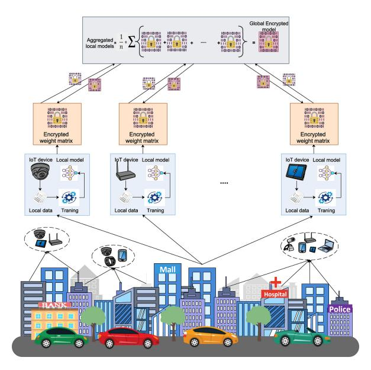
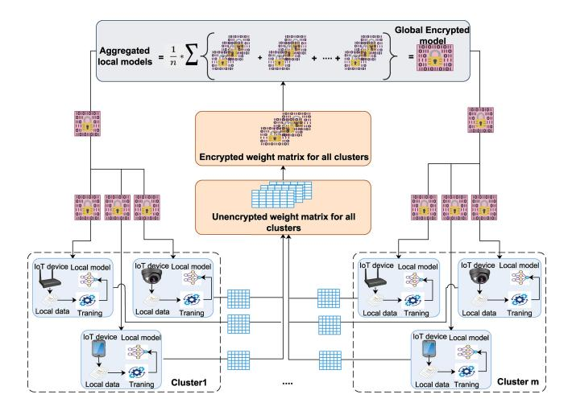
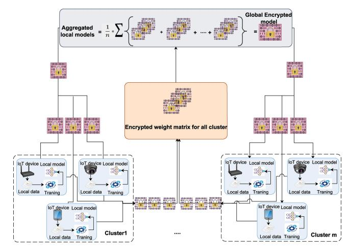
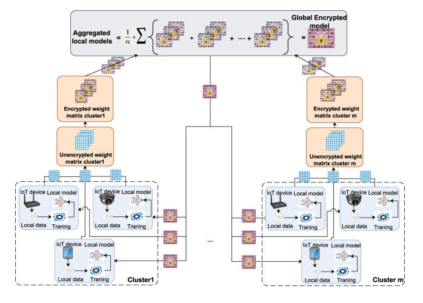
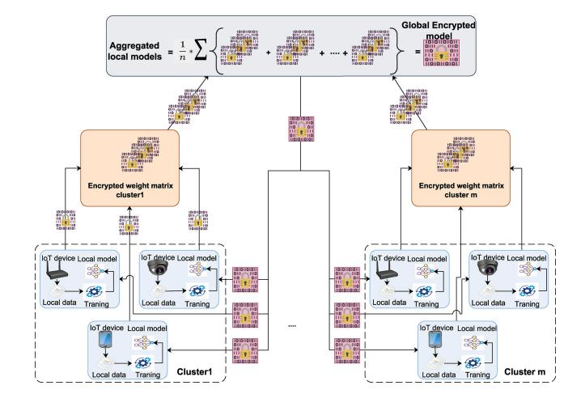
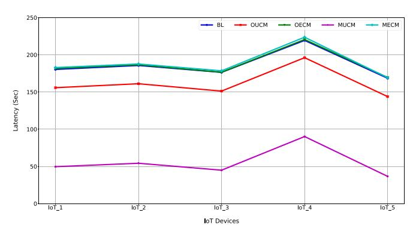
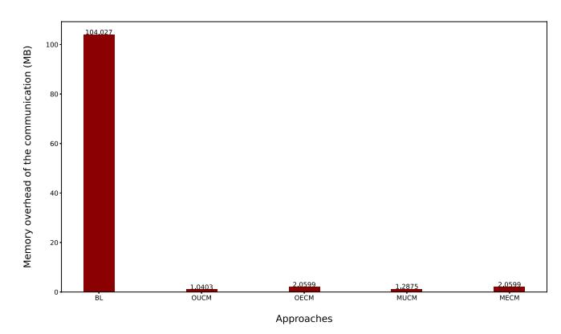
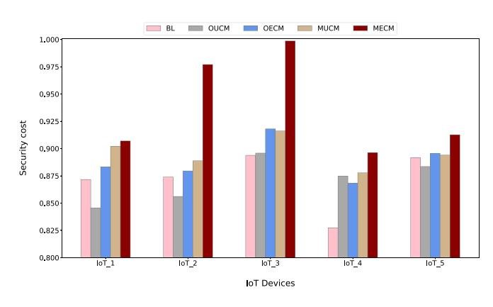

# Secure Federated Learning With Fully Homomorphic Encryption for IoT Communications

Neveen Mohammad Hijazi, Moayad Aloqaily, *Senior Member, IEEE*, Mohsen Guizani, *Fellow, IEEE*, Bassem Ouni, *Senior Member, IEEE*, and Fakhri Karray

**Abstract:** —The emergence of the Internet of Things (IoT) has revolutionized people's daily lives, providing superior quality services in cognitive cities, healthcare, and smart buildings. However, smart buildings use heterogeneous networks. The massive number of interconnected IoT devices increases the possibility of IoT attacks, emphasizing the necessity of secure and privacy-preserving solutions. Federated learning (FL) has recently emerged as a promising machine learning (ML) paradigm for IoT networks to address these concerns. In FL, multiple devices collaborate to learn a global model without sharing their raw data. However, FL still faces privacy and security concerns due to the transmission of sensitive data (i.e., model parameters) over insecure communication channels. These concerns can be addressed using fully homomorphic encryption (FHE), a powerful cryptographic technique that enables computations on encrypted data without requiring them to be decrypted first. In this study, we propose a secure FL approach in IoT-enabled smart cities that combines FHE and FL to provide secure data and maintain privacy in distributed environments. We present four different FL-based FHE approaches in which data are encrypted and transmitted over a secure medium. The proposed approaches achieved high accuracy, recall, precision, and F-scores, in addition to providing strong privacy and security safeguards. Furthermore, the proposed approaches effectively reduced communication overhead and latency compared to the baseline approach. These approaches yielded improvements ranging from 80.15% to 89.98% in minimizing communication overhead. Additionally, one of the approaches achieved a remarkable latency reduction of 70.38%. The implementation of these security models is nontrivial, and the code is publicly available at https://github.com/Artifitialleap-MBZUAI/Secure-Federated-Learning-with-Fully-Homomorphic-Encryption-for-IoT-Communications.

**Index Terms:** —Cognitive cities, federated learning (FL), homomorphic encryption (HE), Internet of Things (IoT), security.

Manuscript received 11 May 2023; revised 5 July 2023; accepted 20 July 2023. Date of publication 4 August 2023; date of current version 24 January 2024. This work was supported by the Technology Innovation Institute (TII), Abu Dhabi, UAE, through the CyberAI Project under Grant TII/DSRC/2022/3036.
*(Corresponding author: Moayad Aloqaily.)*

Neveen Mohammad Hijazi, Moayad Aloqaily, and Mohsen Guizani are with the Machine learning Department, Mohamed Bin Zayed University of Artificial Intelligence, Abu Dhabi, UAE (e-mail: neveen.hijazi@mbzuai.ac.ae; moayad.aloqaily@mbzuai.ac.ae; mohsen.guizani@mbzuai.ac.ae).

Bassem Ouni is with Technology Innovation Institute, Abu Dhabi, UAE (e-mail: bassem.ouni@tii.ae).

Fakhri Karray is with the Mohamed Bin Zayed University of Artificial Intelligence, Abu Dhabi, UAE, and also with the University of Waterloo, Waterloo, ON N2L 3G1, Canada (e-mail: fakhri.karray@mbzuai.ac.ae).

Digital Object Identifier 10.1109/JIOT.2023.3302065

## I. INTRODUCTION

**T**HE Internet of Things (IoT) is a rapidly growing field that is revolutionizing how people interact with technology. The IoT is a network of interconnected devices, sensors, and other objects that are embedded with software and sensors that enable them to communicate and exchange data with each other and with other systems over the Internet. This technology could revolutionize various industries and applications, ranging from healthcare and transportation to agriculture and manufacturing [[1]](#ref-1).

One of the most promising areas for the IoT is in the development of smart cities. Smart cities are urban areas that leverage IoT technologies to improve the quality of life of their citizens by optimizing city services and infrastructure. By integrating IoT devices and systems into city infrastructure, smart cities can improve traffic flow, reduce energy consumption, enhance public safety, and provide a connected and efficient urban environment [[2]](#ref-2).

Despite its potential, the IoT presents significant challenges, particularly concerning privacy and security. The proliferation of IoT devices generates large volumes of sensitive data, making these devices vulnerable to cyberattacks and privacy breaches. For instance, smart cities gather data from various sources, including traffic sensors, surveillance cameras, weather sensors, and public transportation systems [[3]](#ref-3). Similarly, IoT devices such as smart home devices, and industrial sensors generate vast amounts of data. The interconnected network of devices, sensors, and data in smart cities exacerbates security risks, magnifying their potential impact. Therefore, it is essential to address these issues effectively to maximize the potential of IoT and smart cities [[4]](#ref-4).

FL is a decentralized ML technique introduced by Google in 2017 [[5]](#ref-5). It enables multiple participants to collectively train a shared model without sending their data to a central server. Instead, in FL, the data remain distributed and securely stored on each participant's device. FL has emerged as a promising solution to address the privacy and security challenges in smart cities associated with the proliferation of IoT devices and applications. By distributing the training process across multiple devices, FL eliminates the need to transfer sensitive data to a central server, thus reducing the risk of data breaches [[6]](#ref-6).

In the FL framework, each user trains the model using their own data and then transmits the updated model to a central server. The server aggregates the model updates from all

2327-4662 c 2023 IEEE. Personal use is permitted, but republication/redistribution requires IEEE permission. See https://www.ieee.org/publications/rights/index.html for more information.

users and computes an updated version of the model. Next, the server returns the resulting updated model to each user. This iterative process continues until the model converges [[1]](#ref-1), [[6]](#ref-6). FL has been applied in various domains, including image classification [[7]](#ref-7) and healthcare [[8]](#ref-8). Its potential is particularly evident in IoT systems, in which data are generated by numerous heterogeneous devices and privacy is a significant concern [[6]](#ref-6). In addition to its privacy protection benefits, the FL approach offers advantages over the centralized approach in terms of overhead. First, it reduces the amount of data that needs to be transferred over the network, which can be created a significant bottleneck in large-scale ML applications [[9]](#ref-9). In addition, it reduces the communication overhead between nodes by allowing model parameters to be sent instead of the original training data. Finally, it effectively utilizes the computing resources of each node to disperse the computing and storage overhead. These advantages enable sensitive data from IoT applications to be shared securely [[10]](#ref-10).

Despite its potential benefits, FL also presents several challenges in IoT and smart city settings. These include the heterogeneity of devices, communication limitations, and the necessity for resilient and secure model aggregation mechanisms [[11]](#ref-11). Moreover, despite its ability to preserve privacy, FL remains vulnerable to various attacks that could compromise its security and effectiveness. Addressing these challenges and mitigating these risks are critical to fully realizing the potential of FL in IoT and smart city applications [[10]](#ref-10). The literature proposes multiple solutions to address the privacy concerns of FL, such as differential privacy [[12]](#ref-12), homomorphic encryption (HE) [[13]](#ref-13), and secure multiparty computation. These solutions aim to enhance the privacy and security of FL by incorporating techniques like noise injection, encryption, and secure computation, thereby safeguarding sensitive data during the model training process [[14]](#ref-14).

HE is a cryptographic technique that allows computations to be performed on encrypted data without decrypting them. This technique has several types, including partially homomorphic encryption (PHE), somewhat homomorphic encryption (SHE), and fully homomorphic encryption (FHE), with varying levels of computational capabilities. PHE allows only one type of operation (either addition or multiplication) to be performed on encrypted data, and the operation can be applied an unlimited number of times [[15]](#ref-15). SHE permits addition and multiplication operations to be executed on encrypted data, but there is a limitation on the number of times these operations can be performed. Meanwhile, FHE enables an unrestricted number of addition and multiplication operations to be carried out on encrypted data without any limitations. HE is a powerful tool for data security in various domains, including cloud computing, data sharing, and ML [[16]](#ref-16).

As mentioned earlier, FHE is a cryptographic technique that allows computations to be performed on encrypted data without decrypting them. It was first introduced by Rivest et al. in 1978 [[17]](#ref-17), but practical implementations were not made available until several decades later. The first actual FHE scheme was proposed by Gentry in 2009 [[18]](#ref-18). FHE enables secure data processing while maintaining data privacy, making it a crucial technology for various applications, such as cloud computing, data sharing, and ML. Unlike traditional encryption methods that allow only limited operations on encrypted data, FHE enables unlimited computations on ciphertexts, making it a powerful tool for achieving secure and private data processing [[19]](#ref-19). Therefore, FHE is a promising solution for secure data sharing in IoT and smart city applications.

Interest in using FHE for ML applications has increased in recent years. The combination of FHE and FL could enable secure and privacy-preserving distributed learning on sensitive data. It allows multiple parties to collaborate in training a model while keeping their data encrypted, thus ensuring privacy and security [[20]](#ref-20), [[21]](#ref-21). However, integrating FHE and FL is complex and requires the exploration and development of advanced cryptographic techniques and ML techniques [[22]](#ref-22). Despite existing challenges, the potential benefits of FHE and FL for secure and privacy-preserving ML make them a promising area of research with significant implications for the future of data-driven technologies.

This article describes the design of an efficient and secure approach by utilizing FL and FHE to address the privacy and security issues associated with IoT-enabled smart cities. The main contributions of this work are summarized as follows.

* 1) This study presents a new efficient and secure approach for addressing privacy and security issues in IoT-enabled smart cities by utilizing FL with FHE.
* 2) This work describes the design of a flexible approach that is adaptable to different IoT environments, resulting in four distinct scenarios that can be selected based on each use case's specific security and privacy needs.
* 3) Four scenarios are evaluated for security and efficiency using a benchmark IoT data set. The results demonstrate the effectiveness of the scenarios in IoT environments.
* 4) This article concludes with a discussion and analysis of a case study.

The remainder of this article is organized as follows. Section [II](#ref-II) presents a review of related works. The methodology and proposed approach, consisting of four different scenarios, are described in detail in Section [III](#ref-III). In Section [IV](#ref-IV), we present the experimental results conducted to evaluate the security and efficiency of the proposed scenarios in IoT environments using a benchmark IoT data set. Furthermore, we discuss a case study in Section [V](#ref-V) to demonstrate the practical applicability of the proposed approach. Finally, we conclude our work and suggest future research directions in Section [VI](#ref-VI).

## <a id="ref-II"></a>II. RELATED WORK

FL and FHE are two techniques that can help improve the privacy and security of ML. In this section, we overview various approaches that have been proposed for using FL and FHE. McMahan et al. [[5]](#ref-5) proposed a communication-efficient learning technique for deep networks from decentralized data, which uses a form of FL called federated averaging (FedAvg). The authors also provided empirical results showing the effectiveness of their approach on real-world data sets. In another study, Rey et al. [[23]](#ref-23) suggested a privacy-preserving framework for detecting IoT malware. It utilizes FL to train and evaluate supervised and unsupervised models while avoiding sharing sensitive data. This framework is intended to be implemented in network nodes that provide access to IoT devices on various networks like WiFi, 5G, or B5G. This will help offload the computation from IoT devices.

Numerous research studies have been published on FHE. For example, Gentry [[18]](#ref-18) introduced the first FHE scheme in his Ph.D. thesis, which Brakerski et al. later improved [[24]](#ref-24) to enable computation without bootstrapping. The proposed scheme is based on the learning with errors assumption and uses a novel approach called "modulus switching" to mitigate the noise accumulation problem inherent in FHE schemes. This scheme offers a promising alternative to bootstrappingbased FHE schemes and can be used in secure computation applications. Meanwhile, Cheon et al. [[25]](#ref-25) proposed a method for constructing an HE scheme that enables approximate arithmetic operations on encrypted messages. The method includes a rescaling procedure that truncates ciphertext into a smaller modulus, resulting in the rounding of plaintext and the addition of noise to the plaintext for security purposes. In addition, the proposed batching technique preserves the precision of plaintext after encoding. Unlike previous methods, the proposed method requires a ciphertext modulus of a linearly growing size and does not result in a significant precision loss during evaluation.

FL and HE are two promising techniques allowing privacypreserving ML on decentralized and sensitive data. Recently, significant interest has been given to integrating these two techniques to enable privacy-preserving ML on sensitive and decentralized data. One of the earliest works on the integration of FL and HE was proposed by Fang and Qian [[26]](#ref-26). This article proposed a multiparty privacy-preserving ML framework, called Paillier federated multilayer perceptron (PFMLP), which utilizes HE and FL to enable multiple users to perform ML without compromising their private data. The algorithm can train common models even when data is isolated, thereby providing an effective privacy data protection solution. PFMLP algorithm experiments demonstrate that a model trained by PFMLP is comparable to a model trained using all data on a single machine. In the process, all parties transmit the gradient data, and homomorphic operations are employed on the central computing server to fuse the gradients and update the learning model.

In another study [[27]](#ref-27), Zhang et al. proposed a weighted average algorithm determined by data quality to replace the common weight assessment method based on the amount of data. They also proposed a novel masking scheme based on HE and secure multiparty computation for FL. The proposed scheme aimed to achieve privacy-preserving FL in IoT-based healthcare applications with reduced computational overhead and increased security. Wang et al. [[28]](#ref-28) introduced a privacy-preserving FL scheme called blockchainbased privacy-preserving federated learning (BPFL) which is based on blockchain technology. The scheme uses Multi-Krum and HE to enable model aggregation and filtering at the ciphertext level, ensuring the privacy of local models while providing verifiability. A reputation-based incentive mechanism was also developed to encourage participation and honesty among users of the Internet of Vehicles. Security analysis and performance

evaluations show that the proposed scheme meets security requirements and improves the performance of the FL model.

There is a substantial amount of ongoing research in this field, and new techniques and methods are being proposed regularly. Our approach differs from previous work in the following ways. First, we use a clustering method to distribute the user into clusters to reduce the amount of communication between users and the server. Thus, each user does not need to send their individual encrypted weights to the server; instead, weights are aggregated at the cluster level and then sent to the server. Second, we employ four scenarios and conduct extensive empirical evaluations that demonstrate the effectiveness of our approach in preserving privacy while achieving high accuracy on real-world data sets. Overall, our approach represents a significant advancement in privacy-preserving FL, with potential applications in fields such as IoT-enabled smart cities.

The proposed research aims to combine the strengths of FL and FHE to enhance communication efficiency and privacy preservation for distributed ML. The proposed method uses FHE to encrypt the model updates before sending them to the central server to reduce the number of communication rounds required for the FL process. This approach is expected to significantly reduce the communication overhead while maintaining the privacy and security of the model updates.

## <a id="ref-III"></a>III. METHODOLOGY

This research aims to present a secure approach by utilizing FL and FHE to address privacy and security issues in IoTenabled smart cities. The proposed approach consists of five main phases. First, users are randomly distributed into clusters to reduce the communication overhead between the users and the server. Second, each user conducts a local model training process using their local data. The third phase involves encrypting the weights of the local model using a public key cryptography scheme to maintain the privacy of users' data and model parameters (encryption takes place locally on the user's side). In the fourth phase, the server aggregates the encrypted model weights using FedAvg to compute the updated global model parameters, which are then returned to the users. Finally, the users decrypt the global model parameters and update their local model parameters accordingly for the next iteration.

The proposed approach leverages the security of public key cryptography and the encrypted model weight aggregation to maintain the privacy and security of the users' data and model parameters. The general approach is illustrated in Fig. [1](#ref-Fig1). The general approach serves as the baseline methodology. In this scenario, each user initiates the training process by utilizing their respective local data sets and training their local models. These model weights are subsequently encrypted to ensure privacy and security. Users then transmit their encrypted weight updates directly to a centralized server. Upon receiving the encrypted weight updates from the users, the centralized server performs an aggregation process to combine and consolidate these updates.


<!-- Image Description: This diagram illustrates a federated learning system for IoT devices. Multiple IoT devices (e.g., cameras, routers) locally train models on their data, producing encrypted weight matrices. These encrypted matrices are aggregated using a formula (shown) to create a global encrypted model, preserving data privacy. The illustration shows the process within a city setting, with devices located in various locations like malls, hospitals, and banks. -->

Figure 1. Overview of the general approach.

The server utilizes the FedAvg algorithm, which computes the average of the received weights, to update the global model parameters. The updated global model parameters are then transmitted back to the users. Upon receiving the updated global model parameters, users decrypt the weights to restore their original values. These decrypted weights are then used to update the parameters of their local models for the subsequent iteration of the training process. This ensures that each user's local model aligns with the most recent global model representation.

This scenario is implemented and evaluated using four different approaches. First, we present a comprehensive overview of the four approaches to highlight their differences. Then, we thoroughly analyze and discuss each approach, focusing on privacy and security issues in IoT-enabled smart cities. In the first approach, each user trains their local model using their own data. After that, users transfer weight updates to the global matrix. The users then apply encryption to the entire matrix before transmitting it to the server. At the server, the server aggregates the encrypted weights and computes the federated average to update the global model. Then, the server returns the updated global model to all users. Upon receiving the updated global model, the users decrypt the updated weights and incorporate them into their respective local models for the next iteration.

In the second approach, each user trains their local data and encrypts their model's weights. Subsequently, the users transmit the encrypted model weights to the global matrix. The server receives the encrypted global matrix, aggregates it, calculates the federated average, and updates the global model. Afterward, all users receive the disseminated updated global model. Upon receiving the updated global model, the users decrypt it and incorporate the decrypted weights into their respective local models, effectively aligning them with the global model.

In the third approach, we initially group the users into clusters. Every user in each cluster sends weight updates to

TABLE I NOTATIONS AND DESCRIPTIONS

| Notation | Descriptions |
|-------------|--------------------------------------------|
| Ν | Number of users |
| K | Number of clusters |
| D | Dataset, $D = \{D_1, D_2, ..., D_N\}$ |
| U | Set of users, $U = \{U_1, U_2, ..., U_N\}$ |
| C | Set of clusters, $C = \{C_1, C_2, ..., C_K\}$ |
| T | Number of iteration |
| р | Number of users in each cluster, $p = N/K$ |
| GM | Global model |
| LМ | Local model |
| $\theta(0)$ | Random initial values of model parameters |
| GCM | Global cluster matrix |
| $Fed\_Avg$ | Federated average |
| Enc FHE | FHE encryption function |
| Dec FHE | FHE decryption function |
| $Enc\_GCM$ | Encrypted global cluster matrix |
| Dec~GM | Decrypted global model parameters |

the corresponding cluster matrix without applying encryption. The cluster matrices are encrypted before being sent to the server. Then, the server aggregates the weight updates from the cluster matrices and computes the federated average to modify the global model. Subsequently, the users receive the distributed updated global model from the server and update their local models accordingly.

In the last approach, the users are initially clustered into groups. Each user then trains on their local data, encrypts their updated weights, and transmits them to the cluster matrix to which they belong. After this, all cluster matrices are encrypted and sent to the server for aggregation, computing the federated average, and updating the global model. The server subsequently returns the updated global model to all users. Finally, each user decrypts the updated weights and adjusts its local model accordingly.

## *A. Proposed Approaches*
This section outlines the four approaches, each of which involves five main stages: 1) definitions and initialization; 2) local training; 3) encryption; 4) global aggregation; and 5) local update. While the definitions and initialization and local update stages are consistent across all four approaches, there are differences in the local training, encryption, and global aggregation stages. Table [I](#ref-Table1) summarizes the notation and a description of how it is used in the four proposed approaches. The four approaches are described in detail in the following paragraphs.

1)*First Approach:*
The one unencrypted cluster matrix (OUCM) approach starts with definitions and the initialization phase, where *U* is a set of users, and *C* is a set of clusters. Each user *Ui* has its own data set of size *Di*, which is not shared with other users, where *Di*∩*Dj* = φ, ∀*i*=*j*, where *i*, *j*∈*N*. The global model parameters *GM*\_θ (0) are randomly initialized, the users are randomly distributed into clusters using a function *f*, and each cluster contains *p* users.
*f*(*U*,*K*) = {*C*1,*C*2,...,*CK*}, *Ci* = {*U*1, *U*2,..., *Up*}. In the local training phase, each user uses the current global model parameters *GM*\_θ (0) as the starting point to train their current local model *LM*\_θ*i*(*t*) on *Di* using


<!-- Image Description: This flowchart illustrates a federated learning system with encrypted model aggregation. Multiple IoT devices in clusters train local models on their data. These local models' encrypted weight matrices are aggregated into a global encrypted model. This encrypted model is then decrypted to produce an unencrypted global weight matrix, which is used to update the local models. The equation (1/n)Σ shows the averaging of local models. The diagram's purpose is to visually depict the secure aggregation process in the context of the paper. -->

Figure 2. Overview of the OUCM approach.

a convolutional neural network (CNN) algorithm. The updated local model parameters *LM*\_θ*i*(*t*+ 1) are then computed as:
**LM:** \_θ*i*(*t*+1) = *LM*\_θ*i*(*t*+1)−*LM*\_θ*i*(*t*), and the local model update is sent to the global cluster matrix *GCM*, where *GCM*=*LM*\_θ*i*(*t*+ 1), for*i* = 1, 2,...,*N*. The entire matrix *GCM* is then encrypted using the FHE algorithm to obtain the encrypted weight update *Enc*\_*GCM* as follows:
**Enc:** \_*GCM*=*Enc*\_*FHE*(*GCM*). In the global aggregation phase, the server aggregates and computes the FedAvg for *Enc*\_*GCM* and updates the global model parameters *GM*\_θ (*t*+ 1) as follows:
**GM:** \_θ (*t*+1) = (1/*N*) -*Enc*\_*GCM*, which are returned to all users. Once the users receive the updated global model parameters *GM*\_θ (*t*+1), they decrypt the updated weights and update their local model for the next iteration as: *LM*\_θ*i*(*t*+ 1) =*Dec*\_*FHE*(*GM*\_θ (*t*+ 1)). This approach is demonstrated in Fig. [2](#ref-Fig2).

2)*Second Approach:*
The process of the one encrypted cluster matrix (OECM) approach is similar to that of the OUCM approach but contains a slight difference. After the definitions and initialization phase are applied, each user trains its local data and updates the local model parameters as in the first approach. Then, each user encrypts their local model using the FHE algorithm to obtain the encrypted weight update and send it to the global cluster matrix *GCM* as follows:

$$
Enc\_LM_{\theta_i}(t+1) = Enc\_FHE(\Delta LM_{\theta_i}(t+1))
$$

$$
GCM = Enc\_LM_{\theta_i}(t+1).
$$

The encrypted global matrix *GCM* is sent to the server for aggregation, and the FedAvg is calculated to update the global model parameters *GM*\_θ (*t*+ 1), which are then returned to all users as follows:

$$
GM_{-}\theta(t+1) = (1/N)\sum GCM.
$$

After receiving the updated global model parameters *GM*\_θ (*t*+ 1), the user decrypts them and utilizes the updated weights to update its local model for the


<!-- Image Description: The image is a system diagram illustrating a federated learning framework for IoT devices. It shows multiple clusters of IoT devices (e.g., smartphone, camera, router) each training local encrypted models. These encrypted local models are aggregated using the formula `1/m Σ`, where 'm' is the number of clusters, to create a global encrypted model. The diagram uses icons representing encrypted data and models, showcasing the secure nature of the proposed system. The encrypted weight matrix is a central element, highlighting the aggregation process for privacy-preserving model training. -->

Figure 3. Overview of the OECM approach.


<!-- Image Description: The image is a flowchart depicting a federated learning system with encrypted model aggregation. Multiple IoT device clusters (e.g., cluster 1, m) train local models on their data. These local models' encrypted weight matrices are aggregated using a formula (1/n * Σ), resulting in a global encrypted model. The process involves encrypting and decrypting weight matrices within each cluster before final aggregation. The diagram illustrates the workflow and data flow of this secure federated learning approach. -->

Figure 4. Overview of the MUCM approach.

subsequent iteration, as in the first approach. This approach is shown in Fig. [3](#ref-Fig3).

3)*Third Approach:*
The many unencrypted cluster matrices (MUCMs) approach follows the definitions and initialization phase and builds upon the local training and model update steps of the previous approaches. Then, the users transmit their updated local model weights (without encryption) to the relevant cluster matrices *CMr* as:

$$
CM_r = \Delta LM_{-}\theta_i(t+1), r = 1, 2, ..., K.
$$

The cluster matrices *CMr* are first encrypted using the FHE algorithm before being sent to the server, thus updating the encrypted weight *Enc*\_*CMr*=*Enc*\_*FHE*(*CMr*), *r* = 1, 2,...,*K*. These encrypted cluster matrices *Enc*\_*CMr* are then sent to the server, which aggregates and computes the FedAvg of the encrypted weights from all clusters. The server updates the global model parameters *GM* as follows:
**GM:** \_θ (*t* + 1) = (1/*N*) -*Enc*\_*CMr*, which are returned to all users. Finally, after receiving the updated global model parameters from the server, each user decrypts the weights and updates their local model accordingly,


<!-- Image Description: The image is a flowchart illustrating a federated learning system with encrypted model aggregation. Multiple IoT devices in clusters (1 and m) train local models on their data. Encrypted weight matrices from each cluster are aggregated using a formula (1/l * Σ), resulting in a global encrypted model. The diagram visually represents the process of secure distributed model training, highlighting data and model encryption at each stage. -->

Figure 5. Overview of the MECM approach.

as in the previous approaches. This approach is depicted in Fig. [4](#ref-Fig4).

4) *Fourth Approach:*
The many encrypted cluster matrices (MECMs) approach follows a process similar to the third approach, with a slight difference. The definitions and initialization phase are the same as the previous approaches. After the users train their local models and update the weights, they encrypt the updated weights using the FHE algorithm to obtain the encrypted weight, they send it to the cluster matrix to which the user belongs, *CMr*:

**CMr:** =*Enc*\_*FHE*(*LM*\_θ*i*(*t* + 1)),*r* = 1, 2,...,*K*.

The cluster matrices *CMr* are then sent to the server for aggregation and the computation of the FedAvg to update the global model parameters, which are then returned to all users. Once the users receive the updated weights from the server, they decrypt the weights and update their local models for the next iteration following the same process as in the aforementioned approaches. This approach is illustrated in Fig. [5](#ref-Fig5).

One of the main advantages of FHE is that it allows computations to be performed on encrypted data without the need for decryption, thus ensuring the privacy of the data. In the context of FL, this means that the server can perform FedAvg on encrypted data, which reduces the amount of communication needed between the server and the users and maintains the privacy of the data. The decryption process is performed on the user side, allowing the local data to be trained on the updated global model parameters while preserving the data's privacy.

Overall, each approach has tradeoffs and is better suited than the other approaches for specific scenarios depending on the privacy, security, and computational constraints. The most appropriate approach depends on the application requirements and data characteristics. Furthermore, research on FL is ongoing, and new methods and techniques are continually being developed to improve performance and privacy preservation. The pseudocode of the proposed approaches is given in Algorithms [1](#ref-Alg1)–[4](#ref-Alg4). The code is available in the GitHub [[29]](#ref-29).

## <a id="ref-Alg1"></a>Algorithm 1 OUCM

* 1:**Input**: *D*=*x*1, *x*2, ..., *xn*, *y*,*U*=*U*1, *U*2,..., *UN*,
-*C*=*C*1,*C*2, ..., *CK*,*T*.
* 2: **Output**: Secure approach by utilizing FL with FHE.
* 3: Split *D* into (*Dtrain*) and (*Dtest*)
* 4: **for**z from 1 to T**do**
* 5: Distribute the users into clusters:
-*Ci*=*Ui*, *Ui*+1, ..., *Ui*+*p*−1
* 6: ^∀^*Ui*trains*Dtraini*on*LM*\_θ*i*(*t*)
* 7: *LM*\_θ*i*(*t*+ 1) =*LM*\_θ*i*(*t*+ 1) −*LM*\_θ*i*(*t*)
* 8: ∀*Ui*send*LM*\_θ*i*(*t*+ 1) to*GCM*:
-*GCM* = {*LM*\_θ*i*(*t*+ 1)}
* 9:*Enc*\_*GCM*=*Enc*\_*FHE*(*GCM*)
* 10: Send *Enc*\_*GCM*⇒*server*
* 11: At server:*GM*=*Fed*\_*Avg*(*Enc*\_*GCM*)
* 12: Send *GM*⇒*Ui*
* 13: ∀*Ui*: *Dec*\_*GM*=*Dec*\_*FHE*(*GM*) *LMi*=*Dec*\_*GM*
* 14:**end for**

## Algorithm 2 OECM

* 1:**Input**: *D*=*x*1, *x*2, ..., *xn*, *y*,*U*=*U*1, *U*2,..., *UN*,
-*C*=*C*1,*C*2, ..., *CK*,*T*
* 2:**Output**: Secure approach by utilizing FL with FHE
* 3: Split *D* into (*Dtrain*) and (*Dtest*)
* 4: **for**z from 1 to T**do**
* 5: Distribute the users into clusters:
-*Ci*=*Ui*, *Ui*+1, ..., *Ui*+*p*−1
* 6: ^∀^*Ui*trains*Dtraini*on*LM*\_θ*i*(*t*)
* 7: *LM*\_θ*i*(*t*+ 1) =*LM*\_θ*i*(*t*+ 1) −*LM*\_θ*i*(*t*)
* 8: *Enc*\_*LM*\_θ*i*(*t*+ 1) =*Enc*\_*FHE*(*LM*\_θ*i*(*t*+ 1))
* 9:*GCM*=*Enc*\_*LM*\_θ*i*(*t*+ 1)
* 10: Send*GCM*⇒*server*
* 11: At server:*GM*=*Fed*\_*Avg*(*GCM*)
* 12: Send *GM*⇒*Ui*
* 13: ∀*Ui*: *Dec*\_*GM*=*Dec*\_*FHE*(*GM*) *LMi*=*Dec*\_*GM*
* 14:**end for**

## Algorithm 3 MUCM

* 1:**Input**: *D*=*x*1, *x*2, ..., *xn*, *y*,*U*=*U*1, *U*2,..., *UN*,

-*C*=*C*1,*C*2, ..., *CK*,*T*
* 2:**Output**: Secure approach by utilizing FL with FHE
* 3: Split *D* into (*Dtrain*) and (*Dtest*)
* 4: **for**z from 1 to T**do**
* 5: Distribute the users into clusters:
-*Ci*=*Ui*, *Ui*+1, ..., *Ui*+*p*−1
* 6: ^∀^*Ui*trains*Dtraini*on*LM*\_θ*i*(*t*)
* 7: *LM*\_θ*i*(*t*+ 1) =*LM*\_θ*i*(*t*+ 1) −*LM*\_θ*i*(*t*)
* 8: ∀*Ui*sends*LM*\_θ*i*(*t*+ 1) to*CMi*:
-*CMi* = {*LM*\_θ*i*(*t*+ 1)}
* 9:*Enc*\_*CMi*=*Enc*\_*FHE*(*CMi*)
* 10: Send *Enc*\_*CMi*⇒*server*
* 11: At server:*GM*=*Fed*\_*Avg*(*Enc*\_*CMi*)
* 12: Send *GM*⇒*Ui*
* 13: ∀*Ui*: *Dec*\_*GM*=*Dec*\_*FHE*(*GM*)

```text
LMi = Dec_GM
```

* 14: **end for**

## *B. Evaluation and Assessment*
Various measures—including accuracy, recall, precision, F-score, loss function, communication overhead, latency, and security cost—are utilized to assess the performance of each approach. The accuracy, recall, precision, and F-score measures are determined using the confusion matrix.

A loss function is used to evaluate the performance of ML models and optimize them during training. The lower the loss function value, the better the model's predictions. The CrossEntropyLoss function is commonly used for classification problems and measures the difference between predicted probabilities and actual labels. We used the CrossEntropyLoss HIJAZI et al.: SECURE FEDERATED LEARNING WITH FULLY HOMOMORPHIC ENCRYPTION 4295

**Algorithm 4** MECM

| 1: Input: D =<br><br>, U =<br><br>,<br>x1, x2, , xn, y<br>U1, U2,, UN |
|-----------------------------------------------------------------------|
| C =<br>C1, C2, , CK<br><br>, T |
| 2: Output: Secure approach by utilizing FL with FHE |
| 3: Split D into (Dtrain) and (Dtest) |
| 4: for z from 1 to T do |
| 5:<br>Distribute the users into clusters: |
| Ci =<br>Ui, Ui+1, , Ui+p−1<br> |
| 6:<br>∀Ui trains Dtraini<br>on LM_θi(t) |
| 7:<br>LM_θi(t + 1) = LM_θi(t + 1) − LM_θi(t) |
| 8:<br>Enc_LM_θi(t + 1) = Enc_FHE(LM_θi(t + 1)) |
| 9:<br>Send Enc_LM_θi(t + 1) to the CMK: |
| 10:<br>CMK = {Enc_LM_θi(t + 1)} |
| 11:<br>Send CMK ⇒ server |
| 12:<br>At server: GM = Fed_Avg(CMK) |
| 13:<br>Send GM ⇒ Ui |
| 14:<br>∀Ui: Dec_GM = Dec_FHE(GM) |
| LMi = Dec_GM |
| |

15:**end for**

function from the torch package to measure the loss

TABLE II DESCRIPTION OF INSTANCES IN N-BAIOT DATA SET BY IOT DEVICE

| Device type | No.of benign | No.of Bashlite | | No.of Attacks | Attacks + benign |
|------------------------|--------------|----------------|-----------|---------------|------------------|
| I~o~T1 | 175,240 | 312,723 | 610,714 | 923.437 | 1,098,677 |
| IoT 2 | 88.648 | 633.050 | 652.100 | 1.285.150 | 1,373,798 |
| I~o~T3 | 13,113 | 310.630 | 512.133 | 822.763 | 835,876 |
| I~o~T 4 | 226,781 | 1.258.797 | 1.893.455 | 3.152.252 | 3.379.033 |
| IoT 5 | 52.150 | 323.072 | $\Omega$ | 323.072 | 375.222 |
| Total | 555,932 | 2,838,272 | 3,668,402 | 6,506,674 | 7,062,606 |

False Negatives (ζ*FN*) cost $100 million. We utilize these cost values in our sample data set to calculate the security cost, as shown in the following formula:

*Security*\_*cost*

$$
= \frac{\text{TP}_{\zeta\text{TP}}Act_P + \text{TN}_{\zeta\text{TN}}Act_N}{\text{TP}_{\zeta\text{TP}}Act_P + \text{FN}_{\zeta\text{FN}}Act_P + \text{FP}_{\zeta\text{FP}}Act_N + \text{TN}_{\zeta\text{TN}}Act_N}
$$
(2)

The communication overhead metric is important for assesswhere Act*P* and Act*N*are the actual positive and actual

ing the amount of data that needs to be transmitted during the FL process. Minimizing the communication overhead is crucial for improving the efficiency of the FL process. We adhere to a procedure similar to that described in [[30]](#ref-30) and [[31]](#ref-31), in line with our methodology. This metric is calculated based on several factors, including the size of the weights (in bytes) of the encrypted local model SELM and global model SEGM, the number of users participating in the FL process*N*, the number of clusters used in the FL process *K*, and the total number of training iterations *T*, as shown in

function from the torch package to measure the loss

$$
comm\_overhead = [(SELM *K) + (SEGM* N)] * T.
$$
(1)

Latency is the time it takes for data to travel from the source (e.g., a sensor or device) to the destination (e.g., a cloud or server) and back. In other words, it is the time between the moment data are generated by a device and the moment they are processed, including encryption and decryption. Reducing the latency in IoT applications often involves optimizing the network infrastructure and communication protocols, as well as using edge computing and distributed processing. FL can also reduce latency by performing ML tasks on distributed devices. Latency is a crucial factor in many real-time and mission-critical applications. Therefore, reducing latency is essential for ensuring the reliability, responsiveness, and efficiency of these systems.

We compute the security cost following a similar process to that outlined in [[32]](#ref-32) in addition to a slight modification that we made to the equation, which is that we took into account the ground truth. Based on the Capital One data breach [[33]](#ref-33), misclassifying an attack can lead to a cost or loss of 100 million dollars. In contrast, correctly detecting an attack and taking the necessary countermeasures is estimated to cost 2 million dollars per attack. The false classification of benign samples was discouraged by assuming a high cost of 10 million dollar for misclassifying them. Meanwhile, correctly classifying benign samples costs 1 million dollars to maintain the system. The cost associated with the model outcomes are as follows: True Negatives (ζTN) cost $1 million, True Positives (ζTP) cost $2 million, False Positives (ζFP) cost $10 million, and negative (e.g., ground truth) in the confusion matrix. The formula presented in (2) allows us to calculate the secu-

rity cost of each classification outcome by multiplying the TPs, TNs, FPs, and FNs with the actual positives or actual negatives. This cost-based approach enables us to evaluate the performance of a classification model beyond accuracy, considering the specific costs associated with each type of classification outcome. When misclassifying an attack is much costlier than correctly identifying it, accuracy alone may not be a suitable evaluation metric. By computing the total cost based on specific cost values assigned to each classification outcome, we can evaluate the overall performance of a classification model in a more nuanced and context-specific way. This can help make informed decisions about deploying a model in a real-world setting, where misclassification errors can have significant consequences.

## <a id="ref-IV"></a>IV. EXPERIMENTS AND RESULTS

This section presents the results of the experiments performed on the N-BaIoT data set to evaluate the effectiveness of the proposed approaches. The N-BaIoT data set [[34]](#ref-34) is a benchmark data set obtained from the University of California at Irvine ML repository [[35]](#ref-35). It represents a real IoT network comprising various IoT devices. For convenience, we assigned symbols to these devices: the baby monitor is represented by IoT\_1, doorbells by IoT\_2, the thermostat by IoT\_3, security cameras by IoT\_4, and webcam by IoT\_5. Furthermore, we conducted a case study to analyze and compare the performances of the four proposed approaches and determine the most effective one. A detailed description of the data sets used in the experiments is provided in Table [II](#ref-Table2).

## *A. Experiments*
The evaluations and experiments were carried out under consistent settings to ensure fair comparisons. A computer with 2 x AMD EPYC 7742 CPUs (128 cores in total with 256 threads) and 256-GB RAM was used for the experiments. The Anaconda Python framework version 3.9.12 was employed

TABLE III BASELINE PERFORMANCE RESULTS

| Devices | Accuracy | Recall | Precision | F1 score | Loss | Latency (Sec) |
|------------------------|----------|--------|-----------|----------|-------|---------------|
| I~o~T1 | 0.998 | 0.998 | 1.000 | 0.999 | 0.009 | 180.398 |
| I~o~T2 | 0.997 | 0.997 | 1.000 | 0.998 | 0.011 | 185.703 |
| IoT~3~ | 0.998 | 0.998 | 1.000 | 0.999 | 0.008 | 176.426 |
| I~o~T 4 | 0.996 | 0.996 | 1.000 | 0.998 | 0.027 | 219.404 |
| I~o~T5 | 0.998 | 0.998 | 1.000 | 0.999 | 0.010 | 168.522 |


<!-- Image Description: The image displays a line graph comparing latency (in seconds) across five IoT devices (IoT_1 to IoT_5) for five different cloud computing models: BL, OUC, OECM, MUCM, and MECM. Each line represents a model, showing its latency performance across the different IoT devices. The graph's purpose is to illustrate and compare the latency characteristics of the various cloud models within the context of IoT device deployment. -->

Figure 6. Average latency of IoT devices.

to implement all approaches. The reliability of the results was ensured by repeating each experiment 30 independent times and reporting the average results. Furthermore, the experiments were performed with a fixed number of epochs of 30, a learning rate of 0.01, a momentum of 0.9, 100 users, and five clusters.

We evaluated the effectiveness of the four proposed approaches by measuring various performance metrics. For comparison, we also evaluated a baseline approach in which all the users sent their data to a centralized server. The experimental results show that the proposed approaches demonstrate a notable reduction in communication overhead, enhancing the privacy and security of the training process. Moreover, these improvements are achieved while maintaining similar levels of accuracy compared to the baseline approach.

1)*Baseline Approach:*
In this scenario, the users directly send their own encrypted weight updates to a centralized server. The server then aggregates the updated weights from the users to update the global model parameters, which are returned to the users in order to update their local models accordingly. Table [III](#ref-Table3) shows the performance results of this approach. The table reports the accuracy, recall, precision, F1-score, loss, and latency (in seconds) for five IoT devices. The results show that the accuracy ranges from 0.996% to 0.998%, which indicates that the baseline approach performs well in terms of accuracy. All devices achieved high recall and precision, resulting in high F1-scores. Additionally, the loss values for all devices remain consistently low, indicating that the model is effectively optimized across the participating devices. Figs. [6](#ref-Fig6) and [7](#ref-Fig7) present the latency and communication overhead, respectively. The communication overhead is relatively high, requiring a total of 104 MB of data to be transmitted between the server and users. Furthermore, the latency ranges from


<!-- Image Description: The bar chart displays memory overhead (MB) for five communication approaches: BL, OUCM, OECM, MUCM, and MECM. BL shows significantly higher overhead (104.027 MB) than the others, which have overheads under 3 MB. The chart likely compares communication efficiency among different methods within the paper. -->

Figure 7. Average overhead of IoT devices.

TABLE IV OUCM PERFORMANCE RESULTS

| Devices | Accuracy | Recall | Precision | F1 score | Loss | Latency(Sec) |
|-----------------------|----------|--------|-----------|----------|-------|--------------|
| I~o~T1 | 0.840 | 1.000 | 0.840 | 0.912 | 0.693 | 155.852 |
| IoT~2~ | 0.936 | 1.000 | 0.936 | 0.967 | 0.692 | 161.156 |
| I~o~T3 | 0.985 | 1.000 | 0.985 | 0.992 | 0.693 | 151.261 |
| IoT~4~ | 0.933 | 1.000 | 0.933 | 0.965 | 0.693 | 196.186 |
| IoT 5 | 0.860 | 1.000 | 0.860 | 0.924 | 0.693 | 143.873 |

168 to 220 s per epoch, which is quite high and could impact the real-time performance of the system.

* 2)*OUCM Approach:*
Table [IV](#ref-Table4) shows the performance results of the OUCM approach, in which users are first clustered into groups. After updating their weights, each user transmits them to the global cluster matrix without encryption. The global cluster matrix is encrypted before being sent to the server for aggregation. The obtained results indicate a lower accuracy than the baseline approach, ranging from 0.840% to 0.985% across different IoT devices, with an average of 0.911%. The recall was consistently high at 1.000% across all devices, indicating that the approach correctly identified all true positives. The precision was also generally high. The F1-score, which is a weighted average of precision and recall, ranged from 0.912% to 0.992%, with an average of 0.949%. These results suggest that the OUCM approach can accurately detect anomalies in IoT devices. Figs. [6](#ref-Fig6) and [7](#ref-Fig7) illustrate the latency and communication overhead. However, the OUCM approach exhibits a considerably lower accuracy compared to the baseline approach. Nonetheless, the OUCM approach significantly reduced the communication overhead, as only 1.04 MB of data was transmitted between the server and the users. Furthermore, the OUCM approach shows a lower latency than the baseline approach, with a range of 144–197 s per epoch. Overall, the OUCM approach demonstrates promising potential in mitigating communication overhead and latency and detecting anomalies in IoT devices. However, further enhancements are required to improve the accuracy of this approach.
* 3)*OECM Approach:*
In the second approach, users are grouped into clusters, and their weights are encrypted

TABLE V OECM PERFORMANCE RESULTS

TABLE VI MUCM PERFORMANCE RESULTS

| Devices | Accuracv | Recall | Precision | F1 score | Loss | Latency (Sec) | Devices | Accuracy | Recall | Precision | F1~score~ | Loss | Latency(Sec) |
|------------|----------|--------|-----------|----------|-------|---------------|------------------|----------|--------|-----------|-------------|-------|--------------|
| IoT~-1~ | 0.997 | 0.997 | 1.000 | 0.998 | 0.028 | 181.592 | IoT | 0.997 | 0.997 | .000 | 0.998 | 0.013 | 49.646 |
| IoT~2~ | 0.997 | 0.997 | 1.000 | 0.998 | 0.011 | 186.546 | IoT~2~ | 0.997 | 0.997 | .000 | 0.998 | 0.025 | 54.258 |
| IoT~3~ | 0.998 | 0.998 | .000 | 0.999 | 0.008 | 176.571 | IoT~3~ | 0.998 | 0.998 | .000 | 0.999 | 0.008 | 44.932 |
| IoT~4~ | 0.997 | 0.997 | 1.000 | 0.998 | 0.011 | 220.580 | IoT~4~ | 0.997 | 0.997 | .000 | 0.998 | 0.011 | 90.173 |
| IoT~5~ | 0.998 | 0.998 | .000 | 0.999 | 0.010 | 169.553 | IoT 5 | 0.998 | 0.998 | l.000 | 0.999 | 0.011 | 36.644 |

before being sent to the global matrix. This encrypted global matrix is then sent to the server for aggregation and updating, and the updated global model parameters are returned to the users.

The results of this approach are presented in Table [V](#ref-Table5), which shows high accuracy levels ranging from 0.997% to 0.998%, with an average of 0.997%. The precision and recall measures also indicate excellent performance for all devices. The F1-score is also high, ranging from 0.998% to 0.999%, with an average of 0.998%. The communication overhead in the OECM approach is higher than in the OUCM approach due to the initial clustering of users and sending of encrypted weights to the global cluster matrix before aggregation. A total of 2.06 MB of data is sent between the server and users. However, the OECM approach has a higher latency, ranging from 170 to 221 s per epoch, which is higher than the latency of the OUCM approach. Figs. [6](#ref-Fig6) and [7](#ref-Fig7) provide visual representations of the latency and the communication overhead. Compared to the previously discussed approaches, the OECM approach achieves the highest accuracy levels and excellent precision and recall measures, indicating its superior performance in terms of model training and inference. However, the relatively high latency may limit the applicability of this approach in time-sensitive applications.

4)*MUCM Approach:*
In this approach, users are grouped into clusters, and each user sends their unencrypted weight updates only to their corresponding cluster matrix. The cluster matrices are encrypted before being sent to the server for aggregation and the updating of the global model parameters. After updating the global model parameters, the server returns the encrypted global model parameters to the users.

The performance results of the MUCM approach, as shown in Table [VI](#ref-Table6), indicate high accuracy, ranging from 0.997% to 0.998%, with an average of 0.998%. The approach also demonstrates high precision, recall, and F1-score. Compared to the previous approaches, the proposed approach shows significant improvements in reducing communication overhead and latency. The total communication overhead is 1.2875 MB, which is lower than in the OECM approach. The latency ranges from 37 to 91 s per epoch, which is lower than the OUCM and the OECM approaches. Visual representations of the latency and the communication overhead are shown in Figs. [6](#ref-Fig6) and [7](#ref-Fig7). Overall, the MUCM approach shows promising results in terms of accuracy, F1-score, precision, and recall, while

TABLE VII MECM PERFORMANCE RESULTS

| Devices | Accuracy | Recall | Precision | F1_score | Loss | Latency(Sec) |
|-----------------------|----------|--------|-----------|----------|-------|--------------|
| I~o~T1 | 0.998 | 0.998 | 1.000 | 0.999 | 0.008 | 182.911 |
| IoT~2~ | 0.997 | 0.998 | 1.000 | 0.999 | 0.011 | 187.720 |
| IoT~3~ | 0.998 | 0.998 | 1.000 | 0.999 | 0.019 | 178.524 |
| IoT 4 | 0.995 | 0.995 | 1.000 | 0.997 | 0.015 | 223.719 |
| IoT 5 | 0.998 | 0.998 | 1.000 | 0.999 | 0.010 | 169.296 |


<!-- Image Description: This bar chart compares security costs (y-axis) across five IoT devices (x-axis) using five different security mechanisms: BL, OUCM, OECM, MUCM, and MECM. Each bar represents the security cost for a specific mechanism on a given IoT device. The chart illustrates the varying security costs associated with different mechanisms and their performance across different IoT devices. The purpose is to demonstrate the relative cost-effectiveness of the various security methods. -->

Figure 8. Security cost.

significantly reducing the communication overhead and improving the latency compared to the previous approaches.

5)*MECM Approach:*
The fourth approach involves clustering users into groups, followed by the encryption of their updated weights before being sent to the corresponding cluster matrix. All cluster matrices are then sent to the server for aggregation and updating of the global model parameters, which are subsequently returned to the users to update their local models. Table [VII](#ref-Table7) presents the performance results of the MECM approach. The obtained results reveal high accuracy, with values ranging from 0.995% to 0.998%, with an average accuracy of 0.997%. The F1-score, precision, and recall are also high. Visual representations of the latency and communication overhead are presented in Figs. [6](#ref-Fig6) and [7](#ref-Fig7), respectively. However, the communication overhead and latency in this approach are higher than in the MUCM approach. Specifically, the total communication overhead is 2.06, and the latency ranges from approximately 170 to 224 s per epoch. Although the MECM approach shows similar accuracy values as the OECM approach, the former has a higher communication overhead and latency. Meanwhile, compared to the MUCM approach, the MECM approach shows slightly lower accuracy values but higher communication overhead and latency.

TABLE VIII COMPARISON BETWEEN PROPOSED APPROACH AND PREVIOUS WORKS

| Approach | Accuracy | Recall | Precision | F1-score | FL | Encryption<br>technique |
|-----------------|----------|--------|----------------|----------|-----|-------------------------|
| **Baseline** | 0.997 | 0.997 | 1.000 | 0.998 | Yes | Yes |
| **OUCM** | 0.911 | 1.000 | 0.911 | 0.952 | Yes | Yes |
| OECM | 0.998 | 0.998 | 1.000 | 0.999 | Yes | Yes |
| **MUCM** | 0.997 | 0.997 | 1.000 | 0.999 | Yes | Yes |
| **MECM** | 0.997 | 0.997 | 1.000 | 0.998 | Yes | Yes |
| [[36]](#ref-36) | 0.760 | 0.834 | 0.834 | 0.789 | No | No |
| [[38]](#ref-38) | 1.000 | 0.999 | 0.999 | 0.999 | Yes | N~0~ |
| [[37]](#ref-37) RNN | 0.644 | | $\blacksquare$ | | No | N~0~ |
| [[37]](#ref-37) LSTM | 0.683 | | ۰ | | No | No |
| [[39]](#ref-39) MEDNN | 0.904 | | | | Yes | N~0~ |
| [[39]](#ref-39) FCNN | 0.904 | - | $\blacksquare$ | | Yes | No |
| [[40]](#ref-40) | 0.751 | 0.751 | 0.751 | | Yes | No |

Overall, the proposed approaches have demonstrated high accuracy, precision, recall, and F1-score in detecting anomalies in IoT-enabled smart cities while also providing better privacy and security protection. The results indicate that these approaches can effectively maintain data privacy and security while also achieving high performance in detecting anomalies. Additionally, compared to the baseline approach, the proposed approaches exhibit significant improvements in communication overhead and latency. Therefore, the proposed approaches offer a practical solution to the challenges associated with securing data in IoT-enabled smart cities.

Fig. [8](#ref-Fig8) shows the security scores of five different IoT devices evaluated using the four approaches and a baseline approach. The security score measures the approach's effectiveness in addressing security concerns related to IoT devices. The results indicate that all four approaches outperform the baseline approach in terms of security score for most IoT devices. The MECM approach consistently outperforms the three other evaluated approaches in terms of security score across all IoT devices, suggesting that this approach is a dependable and effective method for enhancing the security of IoT devices. While the OUCM, OECM, and MUCM approaches also demonstrated good security scores for specific IoT devices, the MECM approach outperformed them. The baseline approach exhibited lower security scores than the other approaches for all IoT devices, indicating its limited reliability for securing IoT devices.

Of note, the security score should not be the sole determining factor when selecting an approach to secure IoT devices. Other factors, such as communication overhead and latency, should also be considered. Therefore, a comprehensive evaluation of different approaches based on multiple criteria is essential to determine the most suitable approach for a specific use case. Overall, the results show that the four proposed approaches effectively address security concerns in IoT devices and outperform the baseline approach.

## *B. Comparison Between the Proposed Approach and the Literature*
This section compares the proposed approaches (OUCM, OECM, MUCM, and MECM) with previous work in the literature in terms of accuracy, recall, precision, and F1-score. Table [VIII](#ref-Table8) shows that the proposed approaches outperform most previous methods in terms of all four considered measures. Specifically, OECM, MUCM, and MECM achieved high accuracy, recall, precision, and F1-score (all above 0.997%), while OUCM achieved an accuracy of 0.911%.

Additionally, all the proposed approaches utilize FL and encryption techniques, which can enhance the privacy and security of an IoT system. Meanwhile, some previous works do not use these techniques [[36]](#ref-36) and [[37]](#ref-37) achieve lower performance scores, especially in terms of accuracy and F1-score. The technique in [[38]](#ref-38) achieved high accuracy, recall, precision, and F1-score. However, they do not use encryption techniques, which may compromise the privacy and security of the data. Overall, the proposed approaches (OUCM, OECM, MUCM, and MECM) perform well in IoT-based systems, with MECM being the best performing approach. Additionally, FL and encryption techniques can further enhance performance, while ensuring the privacy and security of the data. Therefore, these approaches offer practical solutions for addressing security concerns in IoT-based systems.

## <a id="ref-V"></a>V. CASE STUDY

This case study aims to assess the effectiveness of four scenarios of the proposed approach in detecting general intrusions and injection attacks within the context of the Internet of Medical Things. The study uses various metrics, which were mentioned earlier (e.g., in the evaluation and assessment section), to measure the performance of the approach.

We conducted this study using the WUSTL-EHMS-2020 data set^1^ [[41]](#ref-41), which was obtained from a real-time enhanced healthcare monitoring system (EHMS) test environment. This data set consists of 44 features, including 35 network flow metrics and eight biometric features of patients. The combinations of these two types of data makes this data set unique. The data set was collected at the University of New South Wales and includes man-in-the-middle attacks—specifically, spoofing and data injection attacks. Spoofing attacks involve an attacker eavesdropping on the communication between the gateway and the server, leading to a breach of patient data confidentiality, while data injection attacks involve an attacker altering packets in real time, compromising the data's integrity. The total numbers of benign and attack samples were 14 272 and 2046, respectively, [[41]](#ref-41) and [[42]](#ref-42).

The ground truths represent the correct classification of each sample. ML algorithms can generate either a binary classification output or a probability score indicating the likelihood of a sample being an attack or not. To assess the performance of the proposed approach, we map these probabilities to a class by setting a predetermined threshold. Then, during the prediction process, we compare the algorithm's output to the ground truths to determine whether the sample was classified correctly. In some cases, assigning different costs to different probabilities is necessary. In such instances, the security cost

^1^https://www.cse.wustl.edu/~jain/ehms/index.html

TABLE IX STATISTICS OF WUSTL-EHMS-2020 DATA SET

| | **Baseline** | **OUCM** | **OECM** | **MUCM** | **MECM** |
|------------------------------------|-----------------|-------------|-------------|------------------------------------------|-------------|
| TP | 352 | 359 | 361 | !!!!!!!!!!!!!!!!!!!!!!!!!!!!!!!!!!!!!!!! | 370 |
| **TN** | 3772 | 3780 | 3778 | 3786 | 3787 |
| FP | 36 | 31 | 32 | 25 | 22 |
| **FN** | 31 | 21 | 20 | 14 | 12 |
| Accuracy | 0.984 | 0.988 | 0.988 | 0.991 | 0.992 |
| F1-score | 0.913 | 0.932 | 0.933 | 0.949 | 0.956 |
| Attack error rate (FNR) | 0.081 | 0.055 | 0.052 | 0.037 | 0.031 |
| Benign error rate (FPR) | 0.009 | 0.008 | 0.008 | 0.007 | 0.006 |
| Security cost (general intrusions) | 0.851 | 0.881 | 0.881 | 0.908 | 0.919 |
| Security cost (injection attacks) | 0.493 | 0.535 | 0.529 | 0.591 | 0.622 |

metric can be extended by considering the probability of each sample belonging to a particular outcome. For instance, if a sample has a prediction of 40% attack and 60% benign with the ground truth benign, then the sample's outcome probabilities would be TN = 0.6, FP = 0.4, FN = 0, and TP = 0. These probabilities would then be multiplied by outcome weights to calculate the sample's cost, considering the actual positive and negative values in CM.

The performance of the four approaches in detecting the general intrusion was evaluated using the same metrics and assumptions, while different assumptions were considered when evaluating injection attack detection. Consider a healthcare system that uses sensors to connect remote patients to clinics and transmits a patient's vital measurements, such as heart rate, over the network. This system enables doctors to monitor patients and recommend necessary treatments. However, these systems are vulnerable to injection attacks that can alter patients' biometrics and put them at risk. FNs, which arise when the ML algorithm fails to detect such an attack, and FNs, which occur when the ML algorithm declares an attack when one does not exist, can have serious consequences. While TNs and TPs may not be significant in terms of their potential impact, the cost associated with these outcomes can vary greatly. Consequently, the security cost weights were adjusted, with a higher cost assigned to FPs and FNs than to TNs and TPs. For example, if FPs and FNs are valued at $100 million, while TPs and TNs are valued at $1 million, the security cost weights can then be calculated based on these values.

The results in Table [IX](#ref-Table9) show how well the proposed approaches detected general intrusions and injection attacks on the WUSTL-EHMS-2020 data set. The results show that all approaches performed well in terms of accuracy and F1-score, with MECM achieving the highest scores for both metrics. FNR and FPR were also relatively low for all systems, indicating a good detection performance for both intrusion and benign traffic. Similarly, the MECM achieved the lowest security cost for both general intrusions and injection attacks, indicating that it is the most cost-effective system in terms of security. Overall, the results suggest that the MECM is the best performing system among the five evaluated systems for the WUSTL-EHMS-2020 data set in terms of accuracy, F1-score, attack error rate, benign error rate, and security cost.

## <a id="ref-VI"></a>VI. CONCLUSION AND FUTURE WORKS

In this article, we introduced four novel approaches, namely—OUCM, OECM, MUCM, and MECM—for implementing federated learning (FL) using FHE. FHE offers the ability to perform secure computations on encrypted data without requiring decryption, thus presenting a promising solution for preserving data privacy in distributed learning scenarios. We evaluated the effectiveness of these approaches by considering various factors, such as security cost, communication overhead, and latency. Then, we compared the outcomes of the proposed approaches to those of a baseline approach. The experimental results demonstrate that the four proposed approaches exhibited significant advancements. Specifically, we observed remarkable reductions in communication overhead of 89.98%, 80.15%, 87.71%, and 80.15% for the four approaches, compared to the baseline. These reductions highlight the efficiency of the proposed methods. Importantly, throughout our experimentation, we ensured that the key ML performance measures, including—accuracy, recall, precision, and F-score—remained uncompromised. Future work will optimize the proposed approaches by reducing communication overhead related to encryption and decryption. Additionally, the exploration of other privacy-preserving techniques, such as secure multiparty computation and differential privacy, in FL scenarios is planned. Furthermore, the proposed approaches will be evaluated using larger and more diverse data sets to ascertain their scalability and effectiveness in real-world applications.

## REFERENCES

* <a id="ref-1"></a>[[1]](#ref-1) M. Chahoud, S. Otoum, and A. Mourad, "On the feasibility of federated learning towards on-demand client deployment at the edge," *Inf. Process. Manag.*, vol. 60, no. 1, 2023, Art. no. 103150.
* <a id="ref-2"></a>[[2]](#ref-2) J. Gubbi, R. Buyya, S. Marusic, and M. Palaniswami, "Internet of things (IoT): A vision, architectural elements, and future directions," *Future Gener. Comput. Syst.*, vol. 29, pp. 1645–1660, Sep. 2013.
* <a id="ref-3"></a>[[3]](#ref-3) B. K. Mohanta, D. Jena, U. Satapathy, and S. Patnaik, "Survey on IoT security: Challenges and solution using machine learning, artificial intelligence and blockchain technology," *Internet Things*, vol. 11, Sep. 2020, Art. no. 100227.
* <a id="ref-4"></a>[[4]](#ref-4) N. Hijazi, M. Aloqaily, B. Ouni, F. Karray, and M. Debbah, "Harris hawks feature selection in distributed machine learning for secure IoT environments," 2023, *arXiv:2302.12205*.
* <a id="ref-5"></a>[[5]](#ref-5) B. McMahan, E. Moore, D. Ramage, S. Hampson, and B. A. Y. Arcas, "Communication-efficient learning of deep networks from decentralized data," in *Proc. Artif. Intell. Statist.*, 2017, pp. 1273–1282.
* <a id="ref-6"></a>[[6]](#ref-6) B. Ghimire and D. B. Rawat, "Recent advances on federated learning for cybersecurity and cybersecurity for federated learning for Internet of Things," *IEEE Internet Things J.*, vol. 9, no. 11, pp. 8229–8249, Jun. 2022.
* <a id="ref-7"></a>[[7]](#ref-7) D. Połap and M. Wo´zniak, "Meta-heuristic as manager in federated learning approaches for image processing purposes," *Appl. Soft Comput.*, vol. 113, Dec. 2021, Art. no. 107872.
* <a id="ref-8"></a>[[8]](#ref-8) S. Singh, S. Rathore, O. Alfarraj, A. Tolba, and B. Yoon, "A framework for privacy-preservation of IoT healthcare data using federated learning and blockchain technology," *Future Gener. Comput. Syst.*, vol. 129, pp. 380–388, Apr. 2022.
* <a id="ref-9"></a>[[9]](#ref-9) A. K. Abasi, M. Aloqaily, and M. Guizani, "Grey wolf optimizer for reducing communication cost of federated learning," in *Proc. IEEE Global Commun. Conf.*, 2022, pp. 1049–1154.
* <a id="ref-10"></a>[[10]](#ref-10) J. Chen, J. Xue, Y. Wang, L. Huang, T. Baker, and Z. Zhou, "Privacy-preserving and traceable federated learning for data sharing in industrial IoT applications," *Expert Syst. Appl.*, vol. 213, Mar. 2023, Art. no. 119036.

* <a id="ref-11"></a>[[11]](#ref-11) H. Chen, S. Huang, D. Zhang, M. Xiao, M. Skoglund, and H. V. Poor, "Federated learning over wireless IoT networks with optimized communication and resources," *IEEE Internet Things J.*, vol. 9, no. 17, pp. 16592–16605, Sep. 2022.
* <a id="ref-12"></a>[[12]](#ref-12) X. Wu, Y. Zhang, M. Shi, P. Li, R. Li, and N. N. Xiong, "An adaptive federated learning scheme with differential privacy preserving," *Future Gener. Comput. Syst.*, vol. 127, pp. 362–372, Feb. 2022.
* <a id="ref-13"></a>[[13]](#ref-13) D. C. Nguyen, M. Ding, P. N. Pathirana, A. Seneviratne, J. Li, and H. V. Poor, "Federated learning for Internet of Things: A comprehensive survey," *IEEE Commun. Surveys Tuts.*, vol. 23, no. 3, pp. 1622–1658, 3rd Quart., 2021.
* <a id="ref-14"></a>[[14]](#ref-14) W. Wei, L. Liu, J. Zhou, K.-H. Chow, and Y. Wu, "Securing distributed SGD against gradient leakage threats," *IEEE Trans. Parallel Distrib. Syst.*, vol. 34, no. 7, pp. 2040–2054, Jul. 2023.
* <a id="ref-15"></a>[[15]](#ref-15) S. Banabilah, M. Aloqaily, E. Alsayed, N. Malik, and Y. Jararweh, "Federated learning review: Fundamentals, enabling technologies, and future applications," *Inf. Process. Manage.*, vol. 59, no. 6, 2022, Art. no. 103061.
* <a id="ref-16"></a>[[16]](#ref-16) A. Acar, H. Aksu, A. S. Uluagac, and M. Conti, "A survey on homomorphic encryption schemes: Theory and implementation," *ACM Comput. Surveys*, vol. 51, no. 4, pp. 1–35, 2018.
* <a id="ref-17"></a>[[17]](#ref-17) R. L. Rivest, L. Adleman, and M. L. Dertouzos, "On data banks and privacy homomorphisms," *Found. Secure Comput.*, vol. 4, no. 11, pp. 169–180, 1978.
* <a id="ref-18"></a>[[18]](#ref-18) C. Gentry, *A Fully Homomorphic Encryption Scheme*. Stanford, CA, USA: Stanford Univ., 2009.
* <a id="ref-19"></a>[[19]](#ref-19) H. Huang, Y. Wang, L. Wang, H. Ge, and Q. Gu, "Secure word-level sorting based on fully homomorphic encryption," *J. Inf. Secur. Appl.*, vol. 71, Dec. 2022, Art. no. 103372.
* <a id="ref-20"></a>[[20]](#ref-20) V. Balasubramanian, M. Aloqaily, and M. Reisslein, "Fed-TSN: Joint failure probability-based federated learning for fault-tolerant timesensitive networks," *IEEE Trans. Netw. Service Manag.*, vol. 20, no. 2, pp. 1470–1486, Jun. 2023.
* <a id="ref-21"></a>[[21]](#ref-21) S. Meftah, B. H. M. Tan, K. M. M. Aung, L. Yuxiao, L. Jie, and B. Veeravalli, "Towards high performance homomorphic encryption for inference tasks on CPU: An MPI approach," *Future Gener. Comput. Syst.*, vol. 134, pp. 13–21, Sep. 2022.
* <a id="ref-22"></a>[[22]](#ref-22) F. Wibawa, F. O. Catak, M. Kuzlu, S. Sarp, and U. Cali, "Homomorphic encryption and federated learning based privacy-preserving CNN training: COVID-19 detection use-case," in *Proc. Eur. Interdiscipl. Cybersecur. Conf.*, 2022, pp. 85–90.
* <a id="ref-23"></a>[[23]](#ref-23) V. Rey, P. M. S. Sánchez, A. H. Celdrán, and G. Bovet, "Federated learning for malware detection in IoT devices," *Comput. Netw.*, vol. 204, Feb. 2022, Art. no. 108693.
* <a id="ref-24"></a>[[24]](#ref-24) Z. Brakerski, C. Gentry, and V. Vaikuntanathan, "(Leveled) fully homomorphic encryption without bootstrapping," *ACM Trans. Comput. Theory*, vol. 6, no. 3, pp. 1–36, 2014.
* <a id="ref-25"></a>[[25]](#ref-25) J. H. Cheon, A. Kim, M. Kim, and Y. Song, "Homomorphic encryption for arithmetic of approximate numbers," in *Proc. Adv. Cryptol.–ASIACRYPT 23rd Int. Conf. Theory Appl. Cryptol. Inf. Secur.*, Hong Kong, China, 2017, pp. 409–437.
* <a id="ref-26"></a>[[26]](#ref-26) H. Fang and Q. Qian, "Privacy preserving machine learning with homomorphic encryption and federated learning," *Future Internet*, vol. 13, no. 4, p. 94, 2021.
* <a id="ref-27"></a>[[27]](#ref-27) L. Zhang, J. Xu, P. Vijayakumar, P. K. Sharma, and U. Ghosh, "Homomorphic encryption-based privacy-preserving federated learning in iot-enabled healthcare system," *IEEE Trans. Netw. Sci. Eng.*, early access, Jun. 30, 2022, doi: [10.1109/TNSE.2022.3185327](http://dx.doi.org/10.1109/TNSE.2022.3185327).
* <a id="ref-28"></a>[[28]](#ref-28) N. Wang et al., "A blockchain based privacy-preserving federated learning scheme for Internet of Vehicles," *Digit. Commun. Netw.*, vol. 9, May 2022.
* <a id="ref-29"></a>[[29]](#ref-29) N. M. Hijazi, M. Aloqaily, M. Guizani, B. Ouni, and F. Karray. "Secure federated learning with fully homomorphic encryption for IoT communications." Accessed: Aug. 20, 2023. [Online]. Available: https://github.com/Artifitialleap-MBZUAI/Secure-Federated-Learningwith-Fully-Homomorphic-Encryption-for-IoT-Communications
* <a id="ref-30"></a>[[30]](#ref-30) A. A. Al-Saedi, V. Boeva, and E. Casalicchio, "Reducing communication overhead of federated learning through clustering analysis," in *Proc. IEEE Symp. Comput. Commun. (ISCC)*, 2021, pp. 1–7.
* <a id="ref-31"></a>[[31]](#ref-31) J. Xu, B. S. Glicksberg, C. Su, P. Walker, J. Bian, and F. Wang, "Federated learning for healthcare informatics," *J. Healthcare Inform. Res.*, vol. 5, pp. 1–19, Mar. 2021.

* <a id="ref-32"></a>[[32]](#ref-32) T. Salman, A. Ghubaish, D. Unal, and R. Jain, "Safety score as an evaluation metric for machine learning models of security applications," *IEEE Netw. Lett.*, vol. 2, no. 4, pp. 207–211, Dec. 2020.
* <a id="ref-33"></a>[[33]](#ref-33) C. One. "Information on the capital one cyber incident." Accessed: Feb. 20, 2023. [Online]. Available: https://www.capitalone.com/digital/ facts2019/
* <a id="ref-34"></a>[[34]](#ref-34) Y. Meidan et al., "N-baiot—Network-based detection of IoT botnet attacks using deep autoencoders," *IEEE Pervasive Comput.*, vol. 17, no. 3, pp. 12–22, Jul.-Sep. 2018.
* <a id="ref-35"></a>[[35]](#ref-35) A. Asuncion and D. Newman. "UCI machine learning repository." 2007. [Online]. Available: https://archive.ics.uci.edu/ml/contact.html
* <a id="ref-36"></a>[[36]](#ref-36) S. Khan and A. B. Mailewa, "Discover botnets in IoT sensor networks: A lightweight deep learning framework with hybrid selforganizing maps," *Microprocess. Microsyst.*, vol. 97, Mar. 2023, Art. no. 104753.
* <a id="ref-37"></a>[[37]](#ref-37) J. Kim, H. Won, M. Shim, S. Hong, and E. Choi, "Feature analysis of IoT botnet attacks based on RNN and LSTM," *Int. J. Eng. Trends Technol.*, vol. 68, no. 4, pp. 43–47, 2020.
* <a id="ref-38"></a>[[38]](#ref-38) S. I. Popoola, R. Ande, B. Adebisi, G. Gui, M. Hammoudeh, and O. Jogunola, "Federated deep learning for zero-day botnet attack detection in IoT-edge devices," *IEEE Internet Things J.*, vol. 9, no. 5, pp. 3930–3944, Mar. 2022.
* <a id="ref-39"></a>[[39]](#ref-39) I. Zakariyya, H. Kalutarage, and M. O. Al-Kadri, "Memory efficient federated deep learning for intrusion detection in IoT networks," in *Proc. CEUR Workshop*, 2021, pp. 85–99.
* <a id="ref-40"></a>[[40]](#ref-40) B. G. Teshome, "Federated learning based detection of ransomware," M.S. thesis, School Comput. Inf. Syst., Grand Valley State Univ., Allendale, MI, USA, 2023.
* <a id="ref-41"></a>[[41]](#ref-41) A. A. Hady, A. Ghubaish, T. Salman, D. Unal, and R. Jain, "Intrusion detection system for healthcare systems using medical and network data: A comparison study," *IEEE Access*, vol. 8, pp. 106576–106584, 2020.
* <a id="ref-42"></a>[[42]](#ref-42) "WUSTL EHMS 2020 dataset for Internet of Medical Things (IoMT)." Accessed: Feb. 20, 2023. [Online]. Available: https://www.cse.wustl.edu/~jain/ehms/index.html

**Neveen Mohammad Hijazi** received the Ph.D. degree in computer science from the University of Jordan, Amman, Jordan, in 2021.

She currently works as a Postdoctoral Fellow with the Mohamed Bin Zayed University of Artificial Intelligence, Abu Dhabi, UAE.
**Moayad Aloqaily** (Senior Member, IEEE) received the Ph.D. degree in computer engineering from the University of Ottawa, Ottawa, ON, Canada, in 2016.

He is currently with the Machine Learning Department, Mohamed Bin Zayed University of Artificial Intelligence, Abu Dhabi, UAE.
**Mohsen Guizani** (Fellow, IEEE) received the Ph.D. degree from Syracuse University, Syracuse, NY, USA.

He is currently a Professor of Machine Learning with the Mohamed Bin Zayed University of Artificial Intelligence, Abu Dhabi, UAE.
**Bassem Ouni** (Senior Member, IEEE) received the Ph.D. degree in computer science from the University of Nice-Sophia Antipolis, Nice, France, in July 2013.

He is currently a Lead Researcher with Technology Innovation Institute, Abu Dhabi, UAE.
**Fakhri Karray** received the Ph.D. degree from the University of Illinois at Urbana–Champaign, Champaign, IL, USA.

He is a Professor of Machine Learning with the Mohamed Bin Zayed University of Artificial Intelligence, Abu Dhabi, UAE.

## TL;DR
Research on secure federated learning with fully homomorphic encryption for iot communications providing insights for knowledge graph development and data integration.

## Key Insights
Contributes to the broader understanding of knowledge graph technologies and data management practices relevant to PKG system development.

## Metadata Summary
### Research Context
- **Research Question**: How can federated learning (FL) and fully homomorphic encryption (FHE) be combined to provide secure and privacy-preserving solutions for IoT communications in smart cities?
- **Methodology**: Proposed four FL-based FHE approaches (OUCM, OECM, MUCM, MECM) and evaluated them using a benchmark IoT dataset (N-BaIoT) and a case study on the WUSTL-EHMS-2020 dataset. Performance metrics included accuracy, recall, precision, F-score, loss function, communication overhead, latency, and security cost.
- **Key Findings**: The proposed approaches significantly reduced communication overhead (80.15% to 89.98% improvement) and latency (up to 70.38% reduction for one approach) compared to the baseline, while maintaining high accuracy, recall, precision, and F-scores. MECM consistently showed the best security scores.

### Analysis
- **Limitations**: The paper mentions that future work will focus on optimizing the proposed approaches by reducing communication overhead related to encryption and decryption, implying that current encryption/decryption processes might still be computationally intensive or contribute significantly to overhead.
- **Future Work**: Optimize proposed approaches by reducing communication overhead related to encryption and decryption. Explore other privacy-preserving techniques (secure multiparty computation, differential privacy) in FL scenarios. Evaluate proposed approaches using larger and more diverse datasets to ascertain scalability and effectiveness in real-world applications.