# A Study on Temporal Knowledge Graph Enrichment

Yu Liu Master of Engineering

*A thesis submitted for the degree of Doctor of Philosophy at The University of Queensland in 2021* Information Technology and Electrical Engineering

## Abstract

Recently, large-scale knowledge graphs (KGs) have become a key asset for search, analytics, recommendations and data integration. Large-scale KGs provide millions of facts about the real world. Each fact is composed as (*subject*, *relation*, *object*), e.g., the triplet ("Cristiano Ronaldo", *playFor*, "Real Madrid"). However, these facts are blind to the temporal dimension. Actually, knowledge in practice is time-variant and many relations are only valid for a certain period of time. This phenomenon highlights the importance of building temporal knowledge graphs. In particular, knowledge in temporal KG is represented as (*subject*, *relation*, *object*, *valid time*), e.g., ("Cristiano Ronaldo", *playFor*, "Real Madrid", "[2009, 2018]". However, research on temporal KG is very current and there are still many problems needed to be addressed. One obvious problem is that the size of temporal KG is still very small. For example, only 6.6% of the facts are time aware in one of the largest knowledge graphs, YAGO3. In addition, 71% of people have no known place of birth, and 75% have no known nationality in Freebase. Furthermore, over 87.7% of the facts are uncovered in Japanese DBpedia compared with English DBpedia. Therefore, in this thesis, we study how to enlarge and enrich temporal knowledge graphs from three aspects, namely, temporal KG enrichment. In particular, we study the enrichment problem from the following aspects: (1) volume, (2) completeness, and (3) coverage.

Our first solution is temporal knowledge harvesting which extracts temporal knowledge from free text directly. However, text corpus is noisy, and extracting structured temporal facts with high accuracy and coverage is very challenging. Inspired by pattern-based systems, we propose a temporal knowledge harvesting framework. In particular, we propose various techniques to extract temporal patterns, including corpus annotation, pattern generation, scoring and clustering. These techniques can reduce ambiguity in the text corpus and can improve both the accuracy and coverage of the extracted patterns. Second, we leverage the extracted patterns to harvest temporal knowledge. To improve the accuracy, we propose a parse-tree based method. And to increase the coverage, we consider the relationships between tree components, including part of speech (POS), clause types, constituency and dependency. Experiments on real-world datasets verify the effectiveness of our proposed framework.

Our second solution is temporal knowledge graph completion. Temporal KG completion is the task of inferring unobserved edges between entity pairs. Generally, temporal KG completion relies on the temporal KG embeddings technique, which learns the low-dimensional representations of all KG components. As research on temporal KG embedding is very current, we study both the embedding and the completion problems. In particular, we observe that contexts are extremely useful for learning the representations of entities and for inferring the unknown time intervals. As a result, we propose a context-aware embedding model for KG embeddings and a context-based temporal inference model for KG completion. In our embedding model, we not only capture factual plausibility as traditional methods did, but also propose a new measure on contexts, named temporal consistency. It measures how well the target entity interacts with its surrounding contexts on the temporal dimension. Our completion model is based on the embedding model, and further captures the interactions on the entity dimension. Extensive experiments verify the effectiveness of our models.

Our third solution is temporal knowledge graph alignment which aims to discover the *SameAs* edges across two temporal KGs. Not like previous attribute-based alignment models, we further divide attribute facts into character facts, digit facts and time facts. In particular, we observe that the context information is extremely useful for the identification of same entities. Therefore, we propose an alignment model on leveraging temporal contexts to represent entities. However, contexts of the same object can be very different. For example, the value of *career* predicate changed from "football player" to "coach" for the football player "Zidane". This is because entities are evolving over time and thus the predicate values can be different. In our framework, we propose an alignment module that simulates the entity evolving process. Specifically, this module captures the interactions between contexts and aggregates context information to represent the entity. Lastly, we found that not all contexts are relevant, e.g., *height* v.s. *career*. Actually, only the relevant contexts are useful for capturing the evolving. Therefore, we propose a clustering approach for grouping relevant contexts together. Our experimental results validate the superiority of our proposed alignment model.

## Declaration by author

This thesis is composed of my original work, and contains no material previously published or written by another person except where due reference has been made in the text. I have clearly stated the contribution by others to jointly-authored works that I have included in my thesis.

I have clearly stated the contribution of others to my thesis as a whole, including statistical assistance, survey design, data analysis, significant technical procedures, professional editorial advice, financial support and any other original research work used or reported in my thesis. The content of my thesis is the result of work I have carried out since the commencement of my higher degree by research candidature and does not include a substantial part of work that has been submitted to qualify for the award of any other degree or diploma in any university or other tertiary institution. I have clearly stated which parts of my thesis, if any, have been submitted to qualify for another award.

I acknowledge that an electronic copy of my thesis must be lodged with the University Library and, subject to the policy and procedures of The University of Queensland, the thesis be made available for research and study in accordance with the Copyright Act 1968 unless a period of embargo has been approved by the Dean of the Graduate School.

I acknowledge that copyright of all material contained in my thesis resides with the copyright holder(s) of that material. Where appropriate I have obtained copyright permission from the copyright holder to reproduce material in this thesis and have sought permission from co-authors for any jointly authored works included in the thesis.

## Publications included in this thesis

- 1. [[1]](#ref-1) Yu Liu, Wen Hua, and Xiaofang Zhou, [Extracting Temporal Patterns From Large-Scale Text Corpus](https://link.springer.com/chapter/10.1007/978-3-030-12079-5_2), *Australasian Database Conference*(ADC), 17-30, 2019
- 2. [[2]](#ref-2) Yu Liu, Wen Hua, Kexuan Xin and Xiaofang Zhou, [Context-Aware Temporal Knowledge Graph Embedding](https://link.springer.com/chapter/10.1007/978-3-030-34223-4_37), *Web Information Systems Engineering*(WISE), 583-598, 2019
- 3. [[3]](#ref-3) Yu Liu, Wen Hua, and Xiaofang Zhou, [Temporal Knowledge Extraction From Large-Scale Text Corpus](https://link.springer.com/article/10.1007/s11280-020-00836-5), *World Wide Web Journal*, 2020
- 4. Yu Liu, Wen Hua, Jianfeng Qu, Kexuan Xin and Xiaofang Zhou. Temporal Knowledge Completion with Context-Aware Embeddings, *World Wide Web Journal*, 2021.

## Submitted manuscripts included in this thesis

1. Yu Liu, Wen Hua, Kexuan Xin and Xiaofang Zhou, Temporal Knowledge Graph Alignment with Entity Evolving, Expected to submit to the Conference on Special Interest Group on Information Retrieval (SIGIR), 2021.

## Other publications during candidature

- 1. [[4]](#ref-4) Kexuan Xin, Wen Hua, Yu Liu, and Xiaofang Zhou, [Entity Disambiguation Based on Parse Tree Neighbours on Graph Attention Network](https://doi.org/10.1007/978-3-030-34223-4_33), *Web Information Systems Engineering*, (WISE), 523-537, 2019
- 2. [[5]](#ref-5) Kexuan Xin, Wen Hua, Yu Liu, and Xiaofang Zhou, [LoG: A Locally-Global Model for Entity Disambiguation](https://link.springer.com/article/10.1007/s11280-020-00845-4), *World Wide Web Journal*, 2020

## Contributions by others to the thesis

In all of the presented research in this thesis, Dr. Wen Hua, as my principal advisor, and Prof. Xiaofang Zhou, as my associate advisors, have provided technical guidance for formulating the problems, refining ideas as well as reviewing and polishing the presentation.

## Statement of parts of the thesis submitted to qualify for the award of another degree

No works submitted towards another degree have been included in this thesis

## Research involving human or animal subjects

No animal or human subjects were involved in this research

## Acknowledgments

I wish to express my sincere appreciation to those who have contributed to this thesis and have generously supported me during my PhD years. Without all the support from them, I couldn't have gone this far in my PhD journey.

Dr. Wen Hua, the best mentor, always guides me in depth with passion and patience. I learned and I'm still learning from her what research is, how to overcome challenges and frequently ask why we did that. I have struggled when models didn't work, when no idea and solutions came up, and when I messed up everything. Fortunately, she with her special way relieves me, helps and supports me. Especially thanks her for working with me to discussion ideas, design experiments, and modify papers.

I am deeply grateful to Prof. Xiaofang Zhou for his generous support, wise questions and charming personality. Prof. Zhou generously offered me the great opportunity to study in UQ DKE in a friendly and relaxed environment. Meetings and discussions with him always gave me a much deeper understanding of the key questions. Most importantly, his charming personality enlightened me. He is a real role model in life, guiding me about how to talk and how to behave.

Recalling these years of study in the Data Science group at UQ, it is very lucky that I have had such a long time with those lovely people. Specifically, I also want to thank all my colleagues and friends, Pingfu Chao, Wei Mao, Dan He, Hua Shi, Boyu Ruan, Fengmei Jin, Ruiyuan Zhang, Runhui Wang, Kexuan Xin, Tianyu Zhu, Jianfeng Qu, Xuanyi Zhang, Bing Liu, Mengxuan Zhang and Shuyi Wang, with whom I have shared countless memorable and emotional moments. Their presence in my life has made my PhD study colorful and enjoyable.

Last but not least, my deepest gratitude goes to my parents and my girl friend, Shaofang. Although my parents have no idea what I am doing and what the purpose of this acknowledgement is, they have always trusted, supported and protected me throughout my lifetime. I wish they always stay healthy and I am super happy to see they will move out the crowded city and enjoy their gardening life soon. Shaofang has always supported me without a complaint during the four years of overseas leave. It is tough when you are alone, dealing with everything on the other continent. What you said has deeply encouraged me, and what you left unspoken still supports me, warming my heart.

## Financial support

This research was supported by a CSC-UQ Scholarship.

## Keywords

knowledge graph, temporal knowledge graph, data management, deep learning

## Australian and New Zealand Standard Research Classifications (ANZSRC)

ANZSRC code: 080107, Natural Language Processing, 70% ANZSRC code: 080604, Database Management, 30%

## Fields of Research (FoR) Classification

FoR code: 0801, Artificial Intelligence and Image Processing, 70% FoR code: 0806, Information Systems, 30%

## Contents

| | Abstract | | | ii |
|---|----------|-------------------|--------------------------------------------------------------|------|
| | Contents | | | ix |
| | | List of Figures | | xii |
| | | List of Tables | | xiii |
| 1 | | Introduction | | 1 |
| | 1.1 | Background | | 1 |
| | 1.2 | | Problem Statement | 2 |
| | | 1.2.1 | Preliminary | 3 |
| | | 1.2.2 | Temporal Knowledge Harvesting . | 4 |
| | | 1.2.3 | Temporal Knowledge Graph Completion . | 5 |
| | | 1.2.4 | Temporal Knowledge Graph Alignment | 6 |
| | 1.3 | | Main Contributions | 7 |
| | | 1.3.1 | Temporal Knowledge Harvesting Algorithms | 7 |
| | | 1.3.2 | Temporal Knowledge Graph Embedding and Completion Algorithms | 8 |
| | | 1.3.3 | Temporal Knowledge Graph Alignment Algorithms . | 8 |
| | 1.4 | | Thesis Organisation | 9 |
| 2 | | Literature Review | | 11 |
| | 2.1 | | Temporal Knowledge Harvesting and Related Techniques . | 11 |
| | | 2.1.1 | Systems for Temporal Knowledge Harvesting | 12 |
| | | 2.1.2 | Techniques in Entity Identification and Disambiguation . | 14 |
| | | 2.1.3 | Approaches in Relation Extraction | 16 |
| | 2.2 | | Temporal KG Completion and Related Techniques . | 20 |
| | | 2.2.1 | Traditional KG Embedding and Completion | 21 |
| | | 2.2.2 | Temporal KG Embedding . | 23 |
| | 2.3 | | Temporal KG Alignment and Related Techniques | 24 |
| | | 2.3.1 | Structure-Based Approaches for KG Alignment | 26 |
| | | 2.3.2 | Attribute-Based Approaches for KG Alignment | 27 |
| | | | | |

| 3 | | Temporal Knowledge Harvesting 31 | | | |
|---|--------------------|-------------------------------------|-------------------------------------------------------|----------|--|
| | 3.1 | Introduction | | 31 | |
| | 3.2 | | Temporal Pattern Extraction | 33 | |
| | | 3.2.1 | Temporal Pattern Generation | 35 | |
| | | 3.2.2 | Temporal Pattern Scoring . | 37 | |
| | 3.3 | | Temporal Instance Extraction . | 40 | |
| | | 3.3.1 | Candidate Sentence Retrieval . | 40 | |
| | | 3.3.2 | Instance Extraction | 41 | |
| | 3.4 | | Experiments . | 43 | |
| | | 3.4.1 | Experimental Settings . | 43 | |
| | | 3.4.2 | Accuracy of Temporal Patterns . | 44 | |
| | | 3.4.3 | Accuracy of Temporal Instances | 46 | |
| | | 3.4.4 | Case Study | 48 | |
| | | | | | |
| 4 | | | Temporal Knowledge Graph Completion | 53 | |
| | 4.1 | Introduction | | 53 | |
| | 4.2 | | Problem Definition | 56 | |
| | 4.3 | | Methodology | 57 | |
| | | 4.3.1 | Model Overview | 57 | |
| | | 4.3.2 | Characterizing of the Context Interactions | 58 | |
| | | 4.3.3 | Characterizing of the Factual Plausibility | 62 | |
| | | 4.3.4 | Objective Function and Training Process . | 62 | |
| | 4.4 | | Experiments . | 63 | |
| | | 4.4.1 | Experimental Setting | 63 | |
| | | 4.4.2 | Results of Entity Predictions and Relation Prediction | 65 | |
| | | 4.4.3 | Effectiveness of Context Selection | 66 | |
| | | 4.4.4 | Results of Time Predictions . | 67 | |
| 5 | | | Temporal Knowledge Graph Alignment | 73 | |
| | 5.1 | Introduction | | 73 | |
| | 5.2 | Problem Definition | | | |
| | 5.3 Methodology | | | 75 76 | |
| | | 5.3.1 | Framework | 76 | |
| | | 5.3.2 | Predicate Clustering . | 78 | |
| | | 5.3.3 | Time Facts Encoder with Time Graphs . | 80 | |
| | 5.4 | | Experiments . | 83 | |
| | | 5.4.1 | Experimental Setting | 83 | |
| | | 5.4.2 | Main Results | 85 | |
| | | 5.4.3 | Ablation Study | 87 | |

| | CONTENTS | |
|---|-----------------------------------|----|
| 6 | Conclusion | 91 |
| | 6.1 Directions for Future Work | 92 |
| | Bibliography | 95 |

## List of Figures

| 1.1 | An example of temporal knowledge graph, in which each vertex is a real-world entity, | |
|-----|-------------------------------------------------------------------------------------------|----|
| | each edge is a relation, and each edge label is a valid time span. . | 3 |
| 2.1 | An example of bootstrapping relation extraction systems. | 17 |
| 2.2 | A general framework for embedding-based KG alignment. | 25 |
| 3.1 | An overview of the framework for temporal pattern extraction. | 34 |
| 3.2 | Parse tree of sentence "Pitt met Friends actress Jennifer Aniston in 1998 and married her | |
| | in a private wedding ceremony in Malibu on July 29, 2000". | 36 |
| 3.3 | Pattern accuracy of different seed popularities. . | 46 |
| 3.4 | Pattern accuracy of different seed set sizes. . | 46 |
| 4.1 | An example of temporal interactions for the predicting of fact ("Cristiano Ronaldo", | |
| | playfor, "Real Madrid", "[2004, 2012]"). . | 54 |
| 4.2 | An overview of our proposed temporal-aware KGE model. | 57 |
| 4.3 | The architecture for learning the representation of contextual interactions. | 61 |
| 5.1 | An example of temporal KG alignment. | 75 |
| 5.2 | An overview of our framework for temporal KG alignment. . | 77 |
| 5.3 | An illustration of clustering. | 78 |
| 5.4 | An illustration of our proposed module for capturing entity evolving over time. | 81 |

## List of Tables

| 2.1 | An overview of context-independent features for entity ranking. | 15 |
|-----|-----------------------------------------------------------------------------------------------------|----|
| 2.2 | An overview of entity linking systems using neural networks. . | 16 |
| 2.3 | An overview of KG embedding models listed chronologically. | 22 |
| 2.4 | An overview of temporal KG embedding approaches listed chronologically. | 24 |
| 2.5 | An overview of structure-based KG alignment. | 27 |
| 2.6 | An overview of attribute-based KG alignment. . | 28 |
| 3.1 | Different cases and examples of temporal distances between two time expressions. | 39 |
| 3.2 | Pattern accuracy of different relations. | 45 |
| 3.3 | Instance accuracy of different relations. | 47 |
| 3.4 | Manual check of temporal instances. | 48 |
| 3.5 | Case study of temporal patterns and instances. . | 49 |
| 4.1 | Details of the two datasets. | 64 |
| 4.2 | Entity prediction results of effectiveness experiments on two datasets. ^†^ denotes the results | |
| | are directly taken from [[6]](#ref-6). | 65 |
| 4.3 | Context statistics of the two datasets. . | 66 |
| 4.4 | Entity prediction results of effectiveness of context selection on two datasets. | 66 |
| 4.5 | Entity prediction results on different context size. | 67 |
| 4.6 | Time Interval prediction results on two datasets. | 68 |
| 4.7 | Interval prediction results on different context size. | 68 |
| 4.8 | Interval prediction results on different context selection method. | 68 |
| 4.9 | Start/end time prediction results on two datasets. . | 69 |
| 5.1 | Details of the used datasets. . | 83 |
| 5.2 | ^*^ A summary of baseline models . . | 84 |
| 5.3 | Temporal KG alignment results on DBP datasets on hard setting. | 86 |
| 5.4 | Temporal KG alignment results on DWY datasets on regular setting †. | 87 |
| 5.5 | Temporal KG alignment results that only use time facts^*^ from DBP datasets on hard setting. | 87 |
| 5.6 | Cluster study on DBP datasets on hard setting. . | 87 |
| 5.7 | Time fact encoder study on DBP datasets on hard setting. | 88 |

## Chapter 1

## Introduction

In this chapter, we give a brief introduction of the research in this thesis, including the background, the problem statement, our contributions, and organisation of the thesis.

## 1.1 Background

Enhancing machines with comprehensive knowledge is a long-standing goal of AI and computer science [[7]](#ref-7). Recently, with the technological advancements in Information Extraction (IE), large scale knowledge graph (KGs) have been automatically constructed from web contents and text sources, and have become a key asset for search, analytics, recommendations and data integration [[8]](#ref-8). Knowledge, provided by KGs, is unambiguous and machine understandable in a structured format on real-world entities and relations. This machine knowledge can be harnessed to semantically interpret textual phrases in news, social media and web tables, and thus contributes to question answering, natural language processing and data analytics [[9]](#ref-9). In particular, knowledge (also known as fact) in KGs is composed as (*subject*, *relation*, *object*), e.g., the triplet ("Cristiano Ronaldo", *playFor*, "Real Madrid").

However, current state-of-the-art knowledge graphs are mostly blind to the temporal dimension. Actually, knowledge, in practice is time variant, and many relations are only valid for a certain period of time. This phenomenon highlights the importance of building temporal knowledge graphs. A Temporal KG not only provides unambiguous triplets that describe real-world knowledge, but also provides support with a valid time period that shows when these triples hold true. In particular, knowledge in temporal KG is represented as (*subject*, *relation*, *object*, *valid time*). For example, as Figure [[1.1]](#ref-fig-1.1) shows, the temporal fact ("Cristiano Ronaldo", *playFor*, "Real Madrid", "[2009, 2018]") indicates the triplet holds true only over the temporal period of 2009 to 2018. Obviously, besides the traditional applications, temporal KG also supports more advanced techniques in many applications, e.g., temporal queries, spatial-temporal recommendations, and time-aware entity resolution. For example, with the help of temporal KG, we can search the content easily, e.g., "the teammates who played for Madrid during 2005 to 2010", "politicians who are also scientists, born after the year 1950". In addition, we can enhance the recommendation using temporal KGs, e.g., the recommendation of "the best steak

over ten years". Furthermore, temporal KGs is a cornerstone used for the time-aware entity resolution, e.g., identifying the professor who was a lecture, or linking the coach who was a football player after years of his retirement.

However, despite its usefulness, research on temporal KG is very current and there are still many existing problems. One obvious problem is that the sizes of current temporal KGs are still small, which dramatically limits their effectiveness and benefits to the downstream applications. First, the number of facts in temporal KG is extremely small compared with existing KGs. For example, only 6.6%[[1]](#ref-1) of the facts are time-aware in the one of the largest knowledge graphs in the world, YAGO3. In addition, the 2016-04 released of the English DBpedia contains 27 billion RDF triples[[2]](#ref-2) , but only 10.7% of the facts contain at least one time expression (e.g., years, dates)[[3]](#ref-3) . In addition, there is a huge amount of missing values in both temporal KGs and KGs. For example, in Freebase, 71% of people have no known place of birth, and 75% have no known nationality [[10]](#ref-10). Furthermore, the completeness for less common relations in temporal KGs can be even lower. Lastly, the coverage of temporal KGs and KGs are still limited. For example, there are only 77[[4]](#ref-4) relations in YAGO3, which is extremely small compared with the number of relations in real-world. Besides, over 87.7%[[5]](#ref-5) of the facts were uncovered in Japanese DBpedia compared with English DBpedia. Therefore, in this thesis we study the problem of how to enlarge and enrich temporal knowledge graphs, namely, temporal KG enrichment. In particular, we study the enrichment problem from the following aspects: (1) the volume, (2) the completeness, and (3) the coverage.

In particular, we propose three solutions for temporal KG enrichment in this thesis. Specially, we study the problem of temporal knowledge harvesting, which is to directly extract temporal knowledge from free text corpus without using any existing KGs. Secondly, we study the temporal knowledge graph completion task, which infers unobserved entities, edges, and values from the observed facts of one temporal KG. Lastly, we study the problem of temporal KG alignment, which focuses on discover the *SameAs* edges. So the input of temporal KG completion and alignment is temporal KG(s). In short, though they have various input, all of the three techniques aim to enrich the temporal knowledge graph.

## 1.2 Problem Statement

The main focus of this thesis is to study the enrichment of the temporal knowledge graph from the corresponding aspects, namely, temporal knowledge harvesting, temporal KG completion and

^4^https://www.mpi-inf.mpg.de/departments/databases-and-information-systems/research/yago-naga/yago/statistics

^1^According to the YAGO statistics page, there are 60,856,310 facts in total, but only 4,033,647 facts are meta-facts with temporal scopes. Even considering the Date Facts, there are only 6,015,043 facts, which is less than 10%.

^2^https://wiki.dbpedia.org/dbpedia-version-2016-04

^3^We download the English DBpedia and use data types and regular expressions to identify time expressions.

^5^We simply count the number of facts in Japanese/English of DBpedia-2016 and assume all Japanese facts are covered in English.

Figure 1.1: An example of temporal knowledge graph, in which each vertex is a real-world entity, each edge is a relation, and each edge label is a valid time span.

alignment. Since all those techniques aim on temporal KG, we first introduce the basic concepts used in a temporal knowledge graph, and then give a brief introduction of each task.

### 1.2.1 Preliminary

Definition 1. *(Entity) An entity e is an object that exists in the real world, such as "Barack Obama", "Apple Inc.", "New York City", etc. Sometimes, an entity can be associated with a specific entity type, e.g., PERSON, COMPANY, LOCATION, etc.* Definition 2. *(Relation) A relation (also known as predicate) r describes a relationship between two entities, e.g., spouseOf, playFor. We only consider the binary relation as its prevalence in the real world.* Definition 3. *(Valid Time) A valid time t* = [*t^s^* ,*t^e^*] *describes the valid period of given triplet, where t^s^ is the beginning time and t^e^ is the end time. We use NOW as a placeholder if the SPO triple still holds true at the moment. For example, the valid time of ("Cristiano Ronaldo", playFor, "Real Madrid") is "[2009, 2018]", and the valid time of ("Barack Obama", spouseOf,"Michelle Obama") is "[1992, NOW]".* Definition 4. *(Temporal Fact) A temporal fact (for short fact, and also known as instance) f* = (*s*,*r*,*o*,*t*) *is a 4-tuple describing the relationship between real-world entities, where s is the subject, r is the relation, o is the object and t is the valid time. For example, ("Cristiano Ronaldo", playFor, "Real Madrid", "[2009, 2018]") and ("Barack Obama", spouseOf, "Michelle Obama", "[1992,* *NOW]") are temporal facts. We define that the subject must be an entity, and the object can be either an entity or literal values by considering there are digits and strings in the real world scenario. If the object is an entity, we call it a relation fact, while, if the object is literal, we regard it as a literal fact, (also known as attribute fact). For example, ("Yao Ming", height, 2.29m, "[–, NOW]") is an attribute of "Yao Ming". We use the placeholder*inf*at the ending time if the fact is always holding true since it happened, e.g., ("Steve Jobs", founded, "Apple Inc.", "[1976,* inf*]"). For flexibility, we allow that the valid time is unknown.* Definition 5. *(Temporal Knowledge Graph) A temporal knowledge graph (also known as temporal knowledge base) is a directed graph G* = (*E*,*R*,*L*,*T*,*D*)*, comprising with the entity set E, relation set R, literal set L, time set T and the observed dataset D. Accordingly, we have a set of observed relation facts D^r^*⊆*E* ×*R*×*E* ×*T* ×*T, and attribute facts D^r^*⊆*E* ×*R*×*L*×*T* ×*T, respectively. In order to cooperate with current (static) KGs, we allow that the valid time spans of relational facts D^r^ and attribute facts D^r^ are missing (unknown).* The detailed definitions of the temporal KG enrichment techniques will be introduced in respective chapters. Here, we briefly show the ideas of them to help better distinguish those research problems. In terms of temporal knowledge harvesting, the objective of a harvesting algorithm is to extract temporal instances from free text corpus. The input for harvesting is a set of fact seeds and the text corpus, while the output is a set of new temporal facts. On the contrary, temporal KG completion aims to infer the missing parts of a temporal KG, e.g., the entity nodes, relations, and time values. In addition, temporal KG alignment aims to merge two temporal KGs together by the discovery of *SameAs* edges. So the input of temporal KG completion and alignment is temporal KG(s). In short, though they have various input, all of the three techniques aim to enrich the temporal knowledge graph.

### 1.2.2 Temporal Knowledge Harvesting

Temporal knowledge harvesting is the task of extracting structured facts from free text corpus. As a temporal KG is essentially a set of temporal facts, extracting new facts can obviously enrich temporal KG. However, currently, most temporal knowledge is extracted from structured or semi-structured data, e.g., the Wikipedia Infobox, categories and tables, which greatly limits the coverage of discovered instances and the applicability to widely available free texts.

Although extracting temporal knowledge from free text has been studied recently, including PRAVDA [[11]](#ref-11) and CoTS [[12]](#ref-12), it is still limited to specific domains and cannot be applied to large-scale KBs. PRAVDA [[11]](#ref-11) uses textual patterns to represent the generated candidate facts and then labels candidate facts through a graph-based label propagation algorithm. However, the textual patterns utilized in PRAVDA are too specific and thus limits the coverage of extracted instance. Besides, these patterns are derived directly from raw text. However, natural languages are intrinsically ambiguous which limits the accuracy and coverage of patterns extracted from raw text. CoTS [[12]](#ref-12) proposes a macro-reading fashion as a change detection in a time series of facts. CoTS infers the valid temporal intervals under the weak supervision by aggregating the counting evidences. However, the macroreading proposed in CoTS cannot provide specific timestamps, as it does not go into document content.

Inspired by pattern-based information extraction systems, we resort to temporal patterns to extract time-aware knowledge from free text. For example, if we know the phrase "get married" strongly implies the beginning of a marriage, then we can apply the temporal pattern (*PERSON*, *PERSON*, *get married*, *TIME*) on the text corpus to extract the start date of all possible facts of the relation *SpouseOf*. However, it is extremely laborious and time-consuming to manually construct temporal patterns, even for a single relation. Hence, in this work, we first focus on designing automatic methods for extracting temporal patterns, in particular, indicating phrases (e.g., "get married") and their temporal status (e.g., *START* and *END*), from large-scale text corpus. Then we study how to leverage the proposed patterns to locate and extract temporal instances. However, it is still challenging to extract instances from sentences with a high accuracy and coverage. In particular, we found entities are often unidentified or mis-identified, which causes the drop of performances. Therefore, we study the problem of entity disambiguation, which is to identify entity surfaces from text and link them with unambiguous uniform resource identifiers (URIs). Moreover, we found even the instance candidates that are located by our proposed patterns may not always correctly represent the target relations, or they are irrelevant to the identified time expression. This is because natural language or sentences are intrinsically ambiguous and there are various ways to express semantics. To this end, we study how to improve the accuracy of extracted temporal instances. Lastly, the coverage is also influenced by the nature of language ambiguities. Therefore, we also study how to keep a high coverage of temporal knowledge harvesting.

### 1.2.3 Temporal Knowledge Graph Completion

Incompleteness is a general problem in temporal KGs [[13]](#ref-13), [[14]](#ref-14), which greatly limits their effectiveness and benefits for the downstream applications. For example, over 50% of people have no known residence in YAGO, and only 0.2% of people have a known gender in DBpedia, and only 3% of people have explicitly listed their father in Wikidata [[15]](#ref-15). However, as entities in the real world are co-related in some extent^6^, we can still infer unobserved facts from the observed ones. For example, the major of London city must be the citizen of Britain. In addition, if a person has graduated from the university that is located in her birthplace, she is likely to still work in the same city. So according to the observed facts, new knowledge can be inferred. Knowledge graph completion (KGC) has been proposed for such inference. Generally, KGC derives new facts using the technique of knowledge graph embedding (KGE). KGE [[16]](#ref-16) maps all the components of a KG (i.e., entities and relations) into low-dimension vector spaces. The embeddings of entities and relations will be used in link predictions to derive new facts.

As the KGC task, temporal KG completion also relies on the representations of temporal KG components, i.e., entities, relations and times. Though there are a few existing works on temporal KG

^6^For example, there is an Six degrees of separation, which says that any two people can be reached with maximum 6 hops.

embedding and completion, most of them still follow previous static KGE approaches, i.e., focus on the target fact itself, while paying less attention on the temporal information and ignoring the interactions between the target fact and its related contexts. As temporal KGE is very current, only very few works incorporate temporal information in knowledge graph embedding, including TAE [[17]](#ref-17), TA-TransE [[18]](#ref-18), and HyTE [[6]](#ref-6). TAE [[17]](#ref-17) and TA-TransE [[18]](#ref-18) capture the interactions between relations and times, i.e., modeling the changes of relations over time. For example, relations happen in temporal orders. A person may have the timeline: *bornIn*→*gradudateFrom* →*worksAt*. TAE [[17]](#ref-17) applies this idea on a TransE [[19]](#ref-19) model by incorporating temporal order constraints via the Integer Linear Program. TA-TransE [[18]](#ref-18) regards an timestamp as a sequence of digits, i.e., from 0 to 9, then uses LSTMs to encode the relation vectors and the time digits together to obtain the time-aware relations. Lastly, HyTE [[6]](#ref-6) uses a project operation to map entities and relations into time-specific hyperplanes and then models the factual plausibility, as TransE [[19]](#ref-19) did. Generally speaking, current temporal KGC models transfer the temporal facts into triplets (head entity, relation, tail entity), and then use traditional KGE models (e.g., TransE) to measure the factual plausibility and to get the inference results.

However, temporal information is a key asset for temporal KG embedding and completion. We observe there are multiple types of interactions on the temporal dimension, e.g., orders, distances and overlaps. Therefore, we study the problem of how to capture those temporal interactions in order to learn more representative embeddings. Moreover, current temporal KGC models ignore the importance of surrounding contexts. In particular, we observe that contexts are extremely useful for learning the representations of entities and for inferring the unknown time intervals. We found the context interactions happen on temporal dimension and on entity dimension. Hence, we study how to capture the context interactions on each dimension and how to combine them together. At last, current KG completion models mainly focus on entity predictions and ignore the task of time interval prediction. However, time intervals are very important for temporal KG and for many downstream applications. So. in our work, we also focus on the task of time interval prediction.

### 1.2.4 Temporal Knowledge Graph Alignment

Temporal KG alignment involves discovering the *SameAs* edges across two temporal KGs. Nodes connected by *SameAs* edges are pairs of entities that refer to the same objects in the real world but are located in two KGs, e.g., the entity pair *Mount Everest* in DBpedia and *Q513* in Wikidata. With the discovery of *SameAs* edges, entities from other KGs are aligned and previous uncovered facts are merged into the existing KG. Therefore, temporal KG alignment can further improve the coverage of KGs.

Related work on temporal KG alignment is very limited. Most existing works mainly focus on the leverage of structure and attribute information for KG alignment. GCN-align [[20]](#ref-20) is a representative structure-based alignment model. GCN-align encodes KG structure by using two-layer-stacked graph convolution networks (GCNs) to learn the entity embeddings for KG alignment. However, the GCNalign model ignores the relation information and cannot deal with the heterogeneous structure problem. Therefore, recently, RDGCN [[21]](#ref-21), a structure-based model, incorporates relation information with a dual relation graph to learn more representative embeddings. Combined with a graph attention mechanism, RDGCN iteratively captures the interactions between the entity graph and the relation graph to model the complex relationships in KG. Besides the structure information, attribute-based KG alignment models, e.g., Multi-KE [[22]](#ref-22) and AttrGNN [[23]](#ref-23), additionally utilize attribute information to learn the entity embeddings, including the entity names, digits, characters and textual descriptions. Multi-KE [[22]](#ref-22) explores the combination of multiple views, including entity names, relations and attributes, to enhance the alignment. AttrGNN [[23]](#ref-23) proposes another effective approach to leverage the attribute facts. In particular, AttrGNN splits a KG into multiple subgraphs and uses graph neural networks to encode each type of information. The type-specific subgraph allows message passing from entities to their neighbors and thus improves the performance by achieving a local consensus.

However, none of above models considers the temporal information for temporal KG alignment. As mentioned, temporal information is extremely useful since it provides various kinds of interactions, which can be used for representation and inference. Therefore, we study how to leverage temporal information for alignment. In addition, we observe that contexts are very useful for identifying entities. We have the heuristic that, if two entities have similar contexts, they are likely to be equivalent in the real world. Therefore we propose to capture the context interactions of entities for KG alignment. However, contexts sometimes can be very different because of the heterogeneous issue. For example, the value of *career* predicate changed from "football player" to "coach" for the football player "Zidane". This is because entities are evolving over time and the predicate values can be very different. Therefore, in this work, we address the problem of context difference and try to capture the characters of entity evolving. Lastly, we observe that not all contexts are relevant, e.g., *height* v.s. *career*. Actually, only the relevant contexts are useful for capturing the evolving. Therefore, we propose a clustering approach for grouping relevant contexts together. Our experimental results validate the superiority of our proposed alignment model.

## 1.3 Main Contributions

The main contributions included in our thesis consist of three main aspects: (1) the temporal knowledge extraction from text corpus, (2) the facts inference from one existing temporal KG (3) the entity alignment from multiple temporal KGs.

### 1.3.1 Temporal Knowledge Harvesting Algorithms

As mentioned in Section 1.2.1, in our thesis, we introduce our algorithms to harvest temporal knowledge from free text corpus. In particular, we propose a knowledge extraction framework which contains three modules, namely, (1) entity disambiguation module, (2) temporal pattern extraction module, and (3) temporal instance extraction module. Our entity disambiguation module is a key component for knowledge harvesting, as currently, most entity disambiguation methods on work on a single

sentence, which limits the accuracy and coverage. Our entity disambiguation module works across sentences, and with the help of co-reference annotation tools, we can obtain more linked entities and get high-quality annotated corpus. In the temporal pattern extraction module, we propose various techniques to extract high-quality temporal patterns, including time expression identification, pattern generation, scoring and clustering. These techniques can reduce ambiguity in the text corpus and improve both the accuracy and coverage of the extracted patterns. In the temporal instance extraction module, we propose a parse-tree based method to improve the accuracy by checking the closeness of verb phrases and entities. In addition, to increase the coverage of instances, we consider the relationships between tree components, including part of speech (POS), clause types, constituency and dependency. Compared with the state-of-the-art temporal knowledge frameworks, experiments on real-world datasets verify the effectiveness of our proposed framework.

### 1.3.2 Temporal Knowledge Graph Embedding and Completion Algorithms

According to Section 1.2.2 in our thesis, we present our algorithms for temporal KGC via KG embeddings to infer more unobserved facts. In this work we propose a context-aware model to capture context interactions. In particular, we focus on the context interactions from two aspects, namely, temporal consistency and contextual consistency. Temporal consistency measures how well the target fact interacts with its surrounding contexts in the temporal dimension. Contextual consistency regards facts as a whole integrity and captures the semantic interactions between multiple contexts. Integrating with factual plausibility, our model learns more representative embeddings of temporal KGs and thus can further improve the coverage of temporal KGs. However, we observe that not all information is useful and some can be misleading. Therefore, we propose a context selection method to select the most useful contexts for the prediction. Lastly, we focus on the task of time interval prediction and propose a graph model to fully aggregate the context semantic information. Extensive experiments verify the effectiveness of our models compared with the state-of-the-art approaches on temporal KG embedding and completion.

### 1.3.3 Temporal Knowledge Graph Alignment Algorithms

As mentioned in Section 1.2.3, we propose a temporal KG alignment framework for the enrichment. Our framework focuses on the leverage of time information for temporal KG alignment. In particular, we further divide attribute facts into character facts, digit facts and time facts according to their types, and propose a time fact encoder to learn the entity representations by capturing the entity evolving. We simulate the entity evolving process using a sequence of time graphs, and aggregate the time contexts to learn the entity embeddings by an entity graph. In addition, we observe that not all contexts are relevant and only the relevant contexts are useful for the time graphs. So we propose a cluster approach on contexts. Our clustering approach not only considers the co-occurrence of entity pairs, but also incorporates the template influence and the semantics of predicates. Our experimental results validate

the superiority of our proposed alignment model over existing attribute-based and structure-based temporal alignment models.

## 1.4 Thesis Organisation

The rest of this thesis is organised as follows. In Chapter [[2]](#ref-ch2), we review the literature related to our topics. Chapter [[3]](#ref-ch3) introduces our study on knowledge harvesting algorithms. Likewise, the temporal KG completion and alignment are presented in Chapter [[4]](#ref-ch4) and Chapter [[5]](#ref-ch5), respectively. Finally, we conclude the thesis and discuss future works in Chapter [[6]](#ref-ch6).

## Chapter 2

## Literature Review

In this chapter, we will review the related literature regarding the following topics: temporal knowledge harvesting, temporal KG completion and alignment. A short summary is listed, as follows:

- Temporal Knowledge Harvesting: We classify temporal knowledge extracting systems into two categories: coupling systems and extracting systems, according to their inputs. In addition, information extraction and relation extraction are two close works for knowledge harvesting. So we present a simple review on the closest work on them, including open information extraction, pattern-based extraction and neural-network based extraction. Lastly, since entity disambiguation is an underlying technique deciding the accuracy and coverage of knowledge harvesting, we also review the related works.
- Temporal KG Completion: As temporal KG completion is very current, we first review the popular KG completion models and then presents the related work of temporal KG completion. According to the score function, we classify them into transition-based models, semantic-based models and neural-network-based models.
- Temporal KG Alignment: To our best knowledge, there is no work that aims on temporal KG alignment. The closest works are the attribute-based KG alignment, which leverages the attribute information to align entities, e.g., the birth date and the birth place. Therefore, in this section, we mainly review the current KG alignment approaches. According to their input, we classify them into structure-based approaches and attribute-based approaches.

## 2.1 Temporal Knowledge Harvesting and Related Techniques

Collecting high-quality temporal instances from web resources is called temporal knowledge harvesting. Generally, temporal knowledge is represented in the form of (*subject*, *relation*, *object*, *valid time*) 4-tuples. Subjects are the canonicalized entities (i.e., entities that have only one possible representation in KGs). Relations (also known as predicates) are generally pre-defined classes. Objects are either entities or literals, such as dates or numbers. And valid times are the periods during which facts hold

true. Therefore, temporal knowledge harvesting not only aims to extract time-scoped facts, but also involves entity disambiguation and relation extraction.

Therefore, in this section, we will review the related work on (1) temporal knowledge harvesting as well as two closely related techniques, namely, (2) entity disambiguation and (3) relation extraction, in the Subsection [[2.1.1]](#ref-2.1.1), Subsection [[2.1.2]](#ref-2.1.2) and Subsection [[2.1.3]](#ref-2.1.3), respectively.

### 2.1.1 Systems for Temporal Knowledge Harvesting

Research on temporal knowledge harvesting is very current. To our best knowledge, only a few previous work [[11]](#ref-11), [[12]](#ref-12), [[24]](#ref-24)–[[28]](#ref-28) has addressed the problem of extracting temporal knowledge. We classify them into two categories: coupling systems and extracting systems.

### Coupling Systems for Temporal Knowledge Harvesting

Coupling systems [[12]](#ref-12), [[26]](#ref-26), [[29]](#ref-29) aim at detecting valid time scopes for existing relations. The input of coupling systems are the text corpus and the target relation instances, and coupling systems output the valid timestamps for each instances.

CoTS [[12]](#ref-12) proposes a macro-reading method for temporal information coupling by simply counting the facts in documents over time under an interference framework. CoTS leverages weak supervision to train a local classifier for each relation. However, CoTS is limited in extracting specific temporal values without stepping into document content. As the output of CoTS is a trend of time serious for a relation instance, we cannot use this kind of approach to gather the precise valid time scopes for existing relations.

MS MLI [[26]](#ref-26) and RPI-BLENDER [[29]](#ref-29), [[30]](#ref-30) both joined in the task of Temporal Slot Filling (TSF) at TAC KBP 2013, achieved the top and second score among five teams [[31]](#ref-31) and tried to extract valid time for given relations by aggregating timestamps.

- MS MLI [[26]](#ref-26) consists of two key components. The first component is a boosted decision tree classifier which is able to extract highly ranked/relevant sentences, which indicate that the two given entities are in the targeted relationship. This model is trained on n-grams features of indicative sentences that match manually selected pattens, and is able to clean up the noise introduced by DS before the actual temporal classification step, which is crucial for the success of the TSF task [[31]](#ref-31). The next component takes as input the top-*k* sentences generated in the previous step and extracts temporal labels for the input relation.
- RPI-BLENDER [[30]](#ref-30) has a framework similar to MS MLI for coupling time scopes, except for the noise removal step. RPI-BLENDER uses an ensemble of classifiers, combining flat features (surface text, dependency paths) with tree kernels.

Coupling systems are unable to discover new relation instances and cannot generate relation instances from scratch, which is not suitable for the task of time-aware knowledge graph construction, as there is no input relation instances. Besides, both the accuracy and efficiency of coupling systems

are relatively low, because they mainly process relation instances one-by-one by retrieving relevant sentences from the text corpus and adopting a sentence-level analysis, which ignores the utility of Web's redundancy and the correlations between relations.

### Extracting Systems for Temporal Knowledge Harvesting

Extracting systems [[11]](#ref-11), [[24]](#ref-24), [[25]](#ref-25), [[28]](#ref-28) try to harvest temporal knowledge from scratch, and they discover relations and their valid time from text corpus simultaneously.

Both T-YAGO [[24]](#ref-24) and YAGO2 [[28]](#ref-28) leverage regular expressions to extract temporal information from Wikipedia's Infoboxes, categories and lists, which limits its coverage and applicability to widely available free text. Based on Wikipedia templates, which are used for millions of entities, T-YAGO extracts facts with time points and time lines. These facts are used as backbones for the temporal ontology YAGO2. They also mentioned that extracting from natural language texts is a difficult task.

Kuzey et al. [[25]](#ref-25) introduce a complete information extraction framework that harvests temporal facts and events from semi-structured data, including Wikipedia Infoboxes, categories, lists, and article titles. They also proposed a set of quaternary patterns for temporal fact extraction and rank patterns by statistical measures. These patterns are word sequences (e.g., "hpoliticiani was inaugurated as hpolitical officei on hdatei ") and are extracted from free text by a set of seeds via the bootstrapping approach. Each seed fact for a target relation is in the form of h*Entity*1*, Entity*2*, BeginTime, EndTime*i. Sentences that contain all elements (i.e., *Entity*1*, Entity*2*, BeginTime, EndTime*) are gathered from Wikipedia articles of *Entity*1*, Entity*2, and are generalized by replacing entities as the ontology *type* and time expressions as *date*. Frequency-based support is used to rank patterns, and the ones above a certain threshold are used for instance extraction. Once having the quaternary patterns, string matching is leveraged on the full text of Wikipedia articles to extract new instances.

PRAVDA [[11]](#ref-11) uses textual patterns to represent the generated candidate facts and construct a weighted pattern-candidate graph. PRAVDA then labels each candidate fact through a graph-based label propagation algorithm. The idea of label propagation is to propagate the label of vertices (e.g., the possible relations in PRAVDA) to near vertices via weighted edges. In the processing, vertices that have high weighted edges are more likely to have the same labels, because weights are calculated as vertex similarity. In particular, PRAVDA uses several heuristics to calculate the similarity between each vertex, e..g, patten frequency, Jaccard similarity. By optimizing a carefully designed loss function with constraints, PRAVDA is able to yield the correct relation for candidate facts. PRAVDA is the most related system to our task; however, PRAVDA still has some drawbacks. First, PRAVDA uses n-graph patterns for generating candidates, which is too specific for extracting instance for some relations and thus limits the overage of extracted instances. Second, PRAVDA is able to detect only explicit temporal expressions, which great limits the coverage of new instances. Third, PRAVDA operates on the sentence level to derive textual patterns which limits the accuracy and coverage of patterns, because the natural languages are intrinsically ambiguous.

### 2.1.2 Techniques in Entity Identification and Disambiguation

The entity identification and disambiguation system works at the first level of temporal knowledge harvesting. In other words, we are interested in collecting all individual entities, e.g., persons, locations and products, and organizing them into semantic types, such as scientists, politicians, football players, cities, music and movies. More specifically, entity identification systems identify entity mentions from text, and entity disambiguation systems map the mentions to corresponding entities (in the URIs form) in existing KGs, such as Wikipedia, DBpedia and WordNet. For example, the entity identification system identifies the mention "Michael Jordan" from the text "Michael Jordan is an American scientist, Professor at the University of California, Berkeley", and the entity disambiguation system maps the mention to the named entity the Berkeley Professor *Michael I. Jordan* according to the contexts and generated candidates.

### Entity identification

Entity identification, also regarded as candidate entity generation, involves identifying all the entity mentions from the given text and generating all possible entity candidates for each entity mention. For example, entity identification systems will generate a set of candidate entities for the textual mention "Michael", including "Michael Jordan", "Michael Jackson" and "Michael Griffin", according to the built name dictionary. State-of-the-art entity identification systems build the name dictionary by leveraging the combinations of different features, such as Wikipedia entity pages, redirection pages, disambiguation pages and anchor phrases in Wikipedia articles. In addition, surface form expansion and search engines have been utilized as well by some systems. Generally, a name dictionary contains a vast amount of information about various names of entities, such as name variations, abbreviations, confusable names, spelling variations and nicknames. Based on the name dictionary, a similarity measures between surface strings and entities are defined and used. The simplest approach is the exact matching between a surface string and a key value of the record in the dictionary. In addition, partial matching [[32]](#ref-32)–[[34]](#ref-34), such as the Dice coefficient, and edit distanced-based measures, such as Jaro-Winkler distances [[35]](#ref-35), are popular for generating a candidate entity set for a textual mention.

### Entity Disambiguation

Entity disambiguation generally is a ranking system that ranks each candidate entity (generated from an identification system) according to the plausibility score. The entity with highest rank will be regarded as the disambiguated one for the textual mention. We can broadly divide entity ranking methods into two categories: (1) unsupervised methods and (2) supervised methods. Unsupervised entity linking systems [[36]](#ref-36)–[[38]](#ref-38) leverage a vector space model (VSM) to capture the similarity between entity mentions and the candidate entities, and thus have the advantages of avoiding manually labelled data. However, the performance of unsupervised systems (around 75 percent accuracy) is often lower than the mainstream supervised systems (around 90 percent accuracy). Thus, we review the supervised ranking methods used for ranking candidate entities in detail. Traditional supervised methods use an annotated data set to train a statistical model on various features. These features could be divided into context-independent features and context-dependent features.

- Context-independent features just rely on the surface form (mentions) and the knowledge about the candidate entity, while context-dependent features are based on the surrounding textual context of mentions and the linked documents. Table [[2.1]](#ref-tab-2.1) summarises the popular contextindependent features for entity ranking. These context-independent features are useful for entity linking systems.

| Features | 2Description |
|---------------------|---------------------------------------------------------------------|
| Entity/mention name | the surface string of the named entity/mention. |
| Entity/mention type | the type of the named entity/mention. |
| Entity popularity | the prior probability of the appearance of a candidate entity given |
| | the entity mention. |

Table 2.1: An overview of context-independent features for entity ranking.

- Content-dependent features could provide more information about the document, the topic and the correlations of the entities; therefore, these features are useful for improving the accuracy of entity linking systems. The most straightforward content-dependent feature is the surrounding textual context of the entity mentions and the entity candidates. Various models have been used for calculating the similarity between the mention context and the documents associated with candidate entity, such as *bag of words* [[39]](#ref-39), [[40]](#ref-40), *language model* [[41]](#ref-41) and *concept vector* [[42]](#ref-42), [[43]](#ref-43). Another important feature is topical coherence. In practice, entities in a document are largely coherent to one or few related topics; therefore, many state-of-the-art systems [[39]](#ref-39)[[44]](#ref-44)–[[46]](#ref-46) exploit the approaches of collectively entity linking. To measure the coherence of mapping entities, several measurements on the link structure of Wikipedia have been proposed [[39]](#ref-39), [[40]](#ref-40), [[47]](#ref-47).

Different supervised systems regard the entity linking task as different problems. A natural and simple way is to regard the candidate entity ranking task as a binary classification problem in which the system [[48]](#ref-48), [[49]](#ref-49) forms a mention-candidate entity pair and outputs the positive/negative label for each pair. However, this will return more than one positive candidate entity for the same entity mention, which requires other techniques to find the most proper one. Instead of considering all candidate entities independently as a binary classification problem, most entity linking systems follow the learning to ranking framework and take the correlations between entities into consideration. As the problem becomes ranking all the candidate entity sets for the given mention, the correct entity has the highest score out of the other entities in the candidate set. These kinds of systems [[40]](#ref-40), [[49]](#ref-49)–[[51]](#ref-51) often use an SVM framework to train a ranking model. The correct entity will have a score higher than any other entities with a margin. A graph model can also be leveraged for entity linking, as it captures the interdependency between entities (instead of pairwise dependency). Systems [[46]](#ref-46), [[52]](#ref-52), [[53]](#ref-53) model both

| System | Architecture | Vector representation | Attention |
|----------------|---------------------|-----------------------|-----------|
| He [[54]](#ref-54) | neural networks | one-hot vector | no |
| Sun [[55]](#ref-55) | CNNs | word2vec | no |
| Francis [[56]](#ref-56) | CNNs | word2vec | no |
| Zwicklbauer | feature engineering | word2vec | no |
| [[57]](#ref-57) | | | |
| Fang [[58]](#ref-58) | feature engineering | entity embedding^*^ | no |
| Lample [[59]](#ref-59) | LSTM-CRF | none | yes |
| Globerson [[60]](#ref-60) | feature engineering | none | yes |
| Phan [[61]](#ref-61) | LSTMs | entity embedding^*^ | yes |
| Ganea [[62]](#ref-62) | neural networks | entity embedding^*^ | yes |

Table 2.2: An overview of entity linking systems using neural networks.

^*^ entity embedding encodes the information of context, words and entities.

the entity popularity, textual context similarity, entity coherences and other features in the weighted graph by representing each entity mention and candidate entity as a node.

Recently, to avoid hand-engineered features, neural networks and vector representation techniques have been used in many entity linking systems [[54]](#ref-54)–[[62]](#ref-62). Table [[2.2]](#ref-tab-2.2) summarises the current entity linking systems that use neural networks, vector representation techniques or attention mechanisms. As these systems are testing on different datasets under various settings, we skip reporting the accuracy of these systems. But generally speaking, deep neural networks have been used in many entity linking systems and have achieved good performance comparing with traditional feature engineering systems. For example, the input vector of the neural networks encodes the entity relatedness by considering the information of context, words and the connection between entities. As the target entity is not related to all other entities in a document, the attention mechanism is used for capturing the long dependency between entities and is able to assign different weights for different entities according to the context.

### 2.1.3 Approaches in Relation Extraction

The task of relation extraction (RE) is an important step for (temporal) knowledge harvesting, which is also called information extraction (IE). Relation extraction typically follows entity linking and aims to gather the relations between entity pairs. For example, from the sentence *Pitt met Friends actress Jennifer Aniston in 1998 and married her in a private wedding ceremony in Malibu on July 29, 2000.*, relation extraction systems will extract the relation *hasSpouseOf* for the entity pair ("Brad Pitt", "Jennifer Aniston") and output the RDF triple (*Brad Pitt, hasSpouseOf, Jennifer Aniston*). Culotta et al. [[63]](#ref-63) define relation extraction as "the task of discovering semantic connections between entities". Nowadays, there are a lot of systems extracting relations from texts, and there are different methods for dealing with this task. Based on the paradigms, we divided relation extraction systems into two categories: (1) pattern-based systems, and (2) neural-networks-based systems.

### Pattern-Based Approach for Relation Extraction

Pattern-based information extraction has been extensively studied since the 1990s [[64]](#ref-64) and dominates commercial industry, mainly because patterns are interpretable for humans and it is easy to cope with errors [[65]](#ref-65). The most famous hand-crafted patterns for relation extraction is the Hearst pattern [[66]](#ref-66), which aims to identify and extract the *isA* relation for constructing an ontology. For example, noun phrases will be extracted by matching the syntactic pattern *"NP such as* {*NP, NP, ..*}*"*. Here, NP is the POS tag for noun phrases. As discussed by Weikum [[67]](#ref-67), manually constructed patterns (e.g., Hearst pattern) yield relatively high precision, but typically suffer from low recall due to the sparseness of the exact patterns. Besides, it is difficult to manually construct expressive and accurate patterns for arbitrary target relations (e.g., *marriedTo* or *hasAdvisor*). By leveraging the duality of facts and

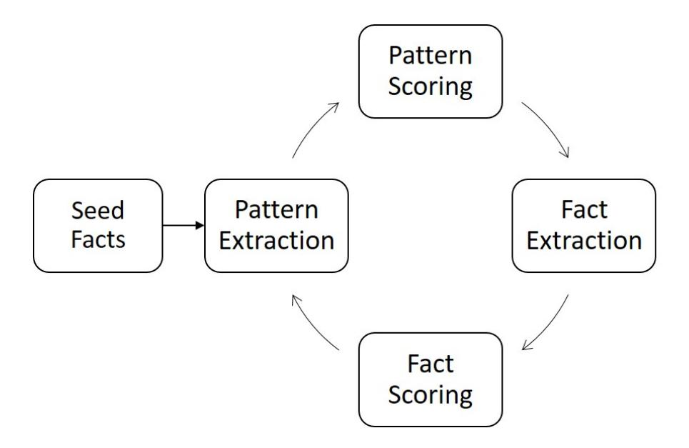
Figure 2.1: An example of bootstrapping relation extraction systems.

patterns, we can automatically extract facts by a set of good patterns, and we can automatically generate textual patterns and distill the best ones when we know enough facts for a relations. Many systems have been build on this heuristic, such as Snowball [[68]](#ref-68), KnowItAll [[69]](#ref-69), Text2Onto [[70]](#ref-70). These systems starts from a small set of seed facts for the target relations, then automatically generate textual or linguistic patterns from the underlying corpus as the indicators of facts, and finally use these patterns to identify new fact candidates as further hypotheses to populate the relations in the knowledge graph [[67]](#ref-67), as Figure [[2.1]](#ref-fig-2.1) shows. Because of the snowball effect, errors will accumulate in each iteration. Therefore, many statistical assessments are used for quantifying the strength of extracted patterns and the confidence of extracted facts to prune noisy.

As there is no labelling data available and we cannot access the ground truth during the processing, how to design good scoring functions for patterns and instances becomes a key issue. The quality of the pattern is often regarded as a score of the ability to extract more positive entities and less negative entities, while instances are measured by their confidence, e.g., whether the extracted instance is positive. Several heuristics have been proposed and been used in many systems [[11]](#ref-11), [[69]](#ref-69), [[71]](#ref-71), [[71]](#ref-71)–[[75]](#ref-75). We divide these measures into two categories: (1) frequency-based measures and (2) feature-based measures.

- Frequency-based measures mainly rely on some statistic information or some probabilistic model [[11]](#ref-11). The most common frequency-based measure is support, which counts how many times the instance (or patterns) appears. If the support is larger than a threshold, the instance will be regarded as positive. In addition, there are some popular probabilistic models used for measuring the confidence of instances, such as the noisy-or model [[76]](#ref-76), PMI model [[69]](#ref-69), [[71]](#ref-71), [[73]](#ref-73)–[[75]](#ref-75), URNS model [[77]](#ref-77), [[78]](#ref-78), and random walk model [[79]](#ref-79).
- Feature-based measures [[79]](#ref-79) not only leverage instance (and/or patterns) frequency information; they also combines with various features such as source credibility [[76]](#ref-76), instance position [[76]](#ref-76), edit distance [[72]](#ref-72), contextual word distribution [[71]](#ref-71), and general domain (and domain-specific) n-grams distribution [[72]](#ref-72). Constraints such as mutual exclusion [[79]](#ref-79), [[80]](#ref-80), type checking [[80]](#ref-80) and taxonomic constraints [[81]](#ref-81) are also used as well.

However, previous methods are mainly focused on "isA" relation extraction [[69]](#ref-69), [[72]](#ref-72), [[73]](#ref-73), [[76]](#ref-76)–[[78]](#ref-78), [[82]](#ref-82), [[83]](#ref-83), which could not be directly applied for scoring temporal instances and temporal patterns. The evaluation of temporal instances and the corresponding patterns can be challenging because of the sparsity of temporal instances and the more severe semantic drift problem. Temporal knowledge is sparser than traditional RDF triples. Even in the Web, this sparsity trends to holds true. The problem of semantic drift becomes more severe due to the higher dimensions of instances, i.e., greater possibility that an instance drifts to an unrelated relation. Early-stage systems, such as DIPRE [[84]](#ref-84), Snowball [[85]](#ref-85) and KnowItAll [[69]](#ref-69), leverage heuristic rules to extract only certain predefined information, and, meanwhile, suffer from low precision and coverage. Recently, large-scale pattern-based information extraction systems, e.g., Probase [[76]](#ref-76), have been built. Probase extracts millions of *isA* instance pairs using Hearst patterns under a probabilistic framework, which captures the inconsistent, ambiguous and uncertain information of relation pairs. Instead of discovering additional syntactic patterns for obtaining new knowledge, Probase proposes an iterative learning algorithm to extract *isA* pairs from Web text and a taxonomy construction algorithm to connect these pairs into a hierarchical structure. During the extraction, each relation pair is associated with two novel probability assessments (e.g., plausibility and typicality). In each iteration, only the trustful relation pairs will be extracted and put into the instance pool. This procedure provides evidences for understanding the ambiguous relation pairs.

### Neural Networks Based Approach for Relation Extraction

Purely unsupervised information extraction systems work as Open IE systems. They extract strings of words between entities in large amounts of text, and simplify these word strings into clusters to produce relation-specific strings [[78]](#ref-78). In this section, we focus on a discussion of supervised relation extraction, especially the distant supervision and deep learning methods. In the supervised domain, the relation extraction task refers to the classification of a given entity pair to a set of known relations.

Distant supervision, proposed by Mintz et al. [[86]](#ref-86), leverages an existing knowledge graph to gathering a large set of training sentences for target relations instead of directly using manually labeled data. Distant supervision is based on the assumption that, if a sentence contains two entities and those two entities participate in a known instances of one relation in a KB, the sentence is likely to express that relation in some way. Based on this assumption, distant supervision systems are able to use much larger amounts of data: more text, more relations, and more instances to train the neural models. For example, Mintz et al. [[86]](#ref-86) leverage Freebase as the semantic knowledge graph and gather 1.2 million Wikipedia articles and 1.8 million instances of 102 relations connecting 940,000 entities. Compared with the largest available labeled corpus for relation extraction, which contains only 17,000 relation instances as training data, distant supervision can automatically generate a large amount of training data. Mintz et al. [[86]](#ref-86) propose a logistic regression classifier, which leverages very large numbers of (potentially noisy) lexical and syntactic features. Experiments show that the distant supervision systems are able to extract high-precision patterns for a reasonably large number of relations.

However, the assumption of distant supervision is not always true. For example, a sentence that contains *"Barack Obama"* and *"United States"* may express the relations *"BornIn"*, `'EmployedBy"* or other unknown relations. Therefore, many works focus on this issue by modeling the problem as a multi-instance learning (MIL) problem, and achieve good performance. Multiple-instance learning (MIL) is a kind of supervised learning. Instead of receiving a set of instances which are individually labeled, the learner receives a set of labeled bags, each containing many instances. For relation extraction, every entity pair defines a bag and the bag consists of all the sentences that contain the mention of the entity pair. Instead of giving a relation class label to every sentence, a label is instead given to each bag of the relation entity [[87]](#ref-87). Riedel et al. [[88]](#ref-88) propose the *expressed-at-least-once* assumption, which says, *"if two entities participate in a relation, at least one sentence that mentions these two entities might express that relation."*. Riedel et al. use a factor graph to explicitly model the decision of whether two entities are related, and the decision of whether this relation is mentioned in a given sentence. More importantly, they [[88]](#ref-88) propose the most popular dataset used in recently works for relation extraction. This dataset was constructed by aligning Freebase relations with the New York Times corpus (NYT). Entity mentions were recognized and replaced by their types using Stanford named entity recognizer. There are 53 possible relation classes in this dataset, including a special relation NA, which indicates there is no relation between the entity pair. The training data contains 522,611 sentences, 281,270 entity pairs and 18,252 relational facts. The testing set contains 172,448 sentences, 96,678 entity pairs and 1,950 relational facts [[87]](#ref-87). Surdeanu et al. [[89]](#ref-89) further regard relation extraction as a multi-instance multi-label (MIML) learning problem and assume that each bag and each mention can have multiple labels. Surdeanu et al. use a graphical model and latent variables to jointly model entity pairs and their possible labels. Recently, not only the knowledge graphs, but various resources such as heuristic patterns, dictionaries and domain knowledge have been combined to train state-of-the-art models in many frameworks [[90]](#ref-90), [[91]](#ref-91). As these heterogeneous resources often conflict with each other, various techniques have been proposed, such as statistical inference [[91]](#ref-91), embedding representations [[90]](#ref-90), [[92]](#ref-92), data fusion [[93]](#ref-93) and truth discovery [[94]](#ref-94), [[95]](#ref-95).

The deep-learning-based approach automatically learns features instead of them being hand-crafted. Therefore, this kind of systems is able to solve the problems of error propagation and accumulation from pre-existing NLP tools. This is because deep-learning-based model can automatically generate features, and thus to relieve the errors accumulated from previous hand-crafted features. Generally speaking, deep-learning-based frameworks can divided into two categories: (1) recurrent/recursive neural networks (RNNs) and (2) convolutional neural networks (CNNs). In the architectures, RNNs are sequential and CNNs are hierarchical. In particular, RNNs form a directed graph using the given sequence. This sequence allows models explicitly capture the dynamic temporal behavior. In addition, controlled gates and gated memory are used, e.g., in Long short-term memories (LSTM) [[96]](#ref-96) and in gated recurrent units (GRUs) [[97]](#ref-97). Because the RNN captures the changing of the input sequence, RNNs can directly represent some linguistic structures, i.e., word sequences and constituent/dependency trees [[98]](#ref-98). Socher et al. [[99]](#ref-99) first used RNNs for relation extraction. This system learns compositional vector representations for phrases and sentences of arbitrary syntactic type and length. This system is able to assign a vector and a matrix to every node in a parse tree. Recently, Xu et al. [[100]](#ref-100), [[101]](#ref-101) showed that the shortest dependency paths between relation arguments are useful in RNNs and LSTM models for relation extraction. However, the performance using long shortterm memory (LSTM)-based RNNs [[101]](#ref-101) is worse than the one only using CNNs [[102]](#ref-102). Although research on tree-based dependency LSTMs [[103]](#ref-103) is still popular, several works [[102]](#ref-102), [[104]](#ref-104), [[105]](#ref-105) indicate CNN-based relation extraction outperforms RNN-based approaches. This is because the flexible convolutional structure in CNNs can capture more important information (e.g., semantic features). Therefore, in the following, we mainly discuss the CNN-based relation extraction approach. CNNs are hierarchical architectures. CNNs perform a discrete convolution on an input matrix with a set of different filters. More details about current relation extraction systems can be found from the survey [[87]](#ref-87).

## 2.2 Temporal KG Completion and Related Techniques

Knowledge graph completion (KGC) aims to derive new facts from observed ones using the technique of knowledge graph embedding (KGE). KGE maps all the components of a KG (i.e., entities and relations) into low-dimension vector spaces [[16]](#ref-16). The embeddings of entities and relations will be used in link predictions to derive new facts. Generally, traditional KGE models learn a score function on the target fact itself which measure the plausibility of a fact, e.g., TransE [[19]](#ref-19), DistMult [[106]](#ref-106), and HolE [[107]](#ref-107). Besides, additional information, e.g., paths, patterns and texts, can be incorporated [[108]](#ref-108)–[[110]](#ref-110) to further improve the embedding performance. As temporal KGE is very current, we first introduce the related work for traditional (static) KG embedding first, then introduce the work for temporal KGE.

### 2.2.1 Traditional KG Embedding and Completion

KG completion directly leverages the KG embedding models to predict the plausibility of an unobserved fact. If the fact holds true in real world, then the plausibility score of this fact is high. Therefore, the plausibility function of KG embedding models largely determinate the performance of KG completion. Traditional KGE aims to learn the low-dimensional representations of all the components of a KG, so as to simplify the manipulation while preserving the inherent structure of the KG [[16]](#ref-16). According to the score function used in KG embedding model, we classify them into three categories, (1) transition-based models, (2) semantic-based models, and (3) deep learning based models. We list them as Table [[2.3]](#ref-tab-2.3) shows. We will elaborate them in details in each subsection.

Besides, various model aim on directly inference and reasoning missing facts without explicitly using the embeddings, including DacKGR [[111]](#ref-111), KEnS [[112]](#ref-112). DacKGR [[111]](#ref-111) works on sparse graph that does not contain enough reasoning paths, which makes reasoning process difficult. DacKGR proposes a reinforcement learning framework and dynamically makes completion actions (true, false, or stay). KEnS [[112]](#ref-112) aims on multilingual knowledge graph embeddings and completion. Since each KG has its own strengths and limitations on data quality and coverage, which leads the challenges of the transfer of knowledge, KEnS propose a framework that maintain the consistency of described facts and transferred knowledge via an alignment model.

### Transition-based KG Embedding Models

Transition-based models interpret the underlying relationship of a fact as a transition from head entity (subject) ) to tail entity (object) via their connected relation in the continues vector space. TransE [[19]](#ref-19), a representative and effective model, is the simplest transition-based model. TransE learns a distancebased score function *s*(*h*,*r*,*t*) = −||*h* +*r* −*t*||~l1~/~l2~ that calculates the *l*^1^ or *l*^2^ distance of the transition, where *h*,*r*,*t*∈ R^d^ is the embeddings of *h*, *r* and *t*, respectively. In order words, TransE requires the fact representations has the property as *h* −*r*=*t*. With the score function, TransE is able to calculate the fact's plausibility and thus predict new links for KG completion. However, as the symmetry of TransE's score function, TransE is only able to model the *one-to-one* relations and fails to model *many-to-one*, *one-to-many*, *many-to-many* relations. To address this issue, many relevant works have been proposed, e.g., TransH [[114]](#ref-114), TransR [[115]](#ref-115). Both TransH and TransR follow transition idea that uses various relation-specific vectors and hyperplanes to handle previous issues, respectively. In particular, TransH uses the score function *s*(*h*,*r*,*t*) = −||(*h*−*w*^T^~r~ *hwr*) + *r* − (*w*^T^~r~ *twr*)||~l2~^2^ , where *w*^r^∈ R^d^ is a relationspecific vector. TransR uses a similar method that *s*(*h*,*r*,*t*) = −||*M*^r^ *h* +*r* −*M*^r^ *t*||~l2~^2^ where *M*^r^∈ R^k*×*d^ is a relation-specific matrix. Though these methods can deal with the mapping problem, but they introduce more relation-specific parameters, which leads overfitting problems. Later, SimplE [[119]](#ref-119), a model that allows entity (and relation) have two embeddings, one for head entity and another for tail entity when using according to their positions in the triples. SimplE is a version of enhancement of Canonical Polyadic (CP) (a tensor factorization approach) which the two embeddings of each entity to be learned dependently. Recently, RotatE [[120]](#ref-120), a transitional model defined on complex field,

| Model | category | Summary |
|----------------|-----------------|-------------------------------------------------------------------------------------|
| TransE [[19]](#ref-19) | transition | head vector plus relation vector equals to tail vector; |
| | | h +r ≈ t |
| NTN [[113]](#ref-113) | neural networks | learn representations with fully connected layer |
| DistMult [[106]](#ref-106) | semantic | instead using transition-distance, DistMult uses a simi |
| | | T larity function; h diag(r)t |
| TransH [[114]](#ref-114) | transition | head (and tail) vector maps to a relation-specific hyper |
| | | T T plane; (h −w r hwr) +r ≈ (w twr) r |
| ER-MLP [[10]](#ref-10) | neural networks | a simple version of NTN with less parameters; s = |
| | | T w tanh(M1h + M2r + M3t, where Mi is the first layer |
| | | parameters and w is the second layer parameter. |
| TransR [[115]](#ref-115) | transition | (and tail) vector maps to a relation-specific matrix; |
| | | Mrh +r ≈ Mr t |
| HolE [[107]](#ref-107) | semantic | Unlike DistMult, HolE use vectors to represent relations; |
| | |  s(h,r,t) = r (h ?t) where ? is the circular operation. |
| ComplEx [[116]](#ref-116) | semantic | expand embedding from real field to complex field; s = |
| | | TW t¯), where Re(·) Re(h e¯ is the complex conjugate and |
| | | is the function that takes real subspace. |
| ConvE [[117]](#ref-117) | neural networks | one of the first and most popular nonlinear models for |
| | | KG embeddings [[118]](#ref-118). The main character of ConvE |
| | | is that it reshapes entity and relation vectors into 2-D |
| | | shape. |
| SimplE [[119]](#ref-119) | transition | Both entity and relation are decomposed into two vectors |
| | | considering their positions in triples; |
| RotatE [[120]](#ref-120) | transition | expand into complex field and use rotation operations; |
| | | ◦ ≈ h r t |
| TuckER [[121]](#ref-121) | semantic | uses Tucker decomposition to represent the semantic |
| | | of a triple; W ×1 h ×2 wr ×3 t where ×i is the tensor |
| | | product along the ith mode |

Table 2.3: An overview of KG embedding models listed chronologically.

is proposed to learn more representative embeddings. RotatE captures the patterns of knowledge graph connectivity according to the observed knowledge facts, including symmetric (e.g., marriage) , antisymmetric (e.g., filiation), inversion (e.g., hypernym and hyponym) and composition (e.g., my mother's husband is my father), which further enhance the representativeness of KG embeddings. Their motivation is from Euler's identity *e^i*^θ^ = cos(θ) + *i*sin(θ), which indicates that a unitary complex number can be regarded as a rotation in the complex plane. RotatE regards each relation are a rotation from the source entity to the target entity, *i.e.*, *s*(*h*,*r*,*t*) = −||*h*◦*r* −*t*||~l1~ , where ◦ is the Hadmard product. Besides,

### Semantic-based KG Embedding Models

Besides measuring fact's plausibility on the transition distance, many other works measure the plausibility on semantic, *i.e.*, matching latent semantics of entities and relations embodied in their vector space representations [[16]](#ref-16), including, DistMult [[106]](#ref-106), HolE [[107]](#ref-107), ComplEx [[116]](#ref-116). These semantic-based models directly learns representation of the triples instead of using transition-like function, and often use product-based functions over embeddings to calculate the plausibility score. DistMult [[106]](#ref-106) is

an early semantic-based model, which defines a similarity function for a triple as *s*=*h*^T^ *diag*(*r*)*t*. However, as DistMult does not distinguish between head and tail entities, it can only model symmetric relations. HolE [[107]](#ref-107) has more expressive power and with the efficiency and simplicity of DistMult. Instead using a relation matrix like DistMult, HolE still uses vectors to represent both entities and relations. In particular, HolE uses the circular operation to score a fact, *i.e.*, *s*(*h*,*r*,*t*) = *r* | (*h* ?*t*) where ? is the circular operation. As circular operation is not commutative, HolE is able to model asymmetric relations. ComplEx [[116]](#ref-116) extends embeddings into complex field so as to better model asymmetric relations, *i.e.*, *h*, *r* and *t* are complex-valued embeddings. In particular, ComplEx has the score function *s*=*Re*(*h*^T^*W* *t*¯), where *e*¯ is the complex conjugate and *Re*(·) is the function that takes real subspace. With the mapping into complex field and less parameters comparing with many neural-network based approaches, ComplEx can learns more expressive KG embeddings. Recently, more powerful semantic-based KG embedding models are proposed using various techniques. TuckER [[121]](#ref-121) proposes a straightforward but powerful linear model based on Tucker decomposition. In particular, the score function used in TuckER is *W*×^1^*h*×^2^*w*^r^*×^3^*t* where ×^*i^* is the tensor product along the *i*th mode, which persevere the simplicity of model (few parameters) and the full expressive ability.

### Deep Learning based KG Embedding Models

Deep learning approaches generally use a neural network that learns how the head, relation, and tail embeddings interact with each other. NTN [[10]](#ref-10) is an deep-learning-based embedding model in the early stage. NTN not only learns the embeddings of entities and relations, also uses multilayer perceptrons (MLPs) to obtain the fact plausibility score. In particular, NTN uses the score function *s*=*r*^T^ *tanh*(*hM*^1^*r* *t*+*M*^2^*rh*,*M*^3^*r* *t*+*br*) where *M*^i*^r^ and *b*^r^ are relation specific parameters. However, though NTN has very strong expressive ability, it requires too much parameters per relation, and is not sufficiently simple and efficient to handle large-scale KGs. ER-MLP [[10]](#ref-10) is a simpler approach following NTN where each relation (as well as entity) is associated with a single vector. ER-MLP leverage two layer perceptrons to encode the given triple for all relations. In particular, the score function is *s*=*w*^T^ *tanh*(*M*1*h*+*M*2*r*+*M*3*t*, where *M*^i^ is the first layer parameters and *w* is the second layer parameter. ConvE [[117]](#ref-117) is one of the first and most popular nonlinear models for KG embeddings [[118]](#ref-118). In particular, ConvE [[117]](#ref-117) first maps *h* and *r* into 2-D shape, then leverage a convolutional layer and fully connected layer to obtain the hidden vector. At last, the hidden vector will multiple with the tail entity *t*. Formally, the score function used in ConvE is *s*=*f*(*vec*(*f*([¯*h*;*r*¯]) ∗*w*))*W* )*t*, where *f*(·) is non-linear function, e.g., ReLU. ¯*h* and *r*¯ are the 2-D shape representations, *w* is the kernel in convolutional layer and *W* is the parameter of fully connected layer. With convolution operation, ConvE requires less parameters comparing with pure-MLP based models.

### 2.2.2 Temporal KG Embedding

As temporal KGE is very current, only very few works incorporate temporal information in knowledge graph embedding [[6]](#ref-6), [[17]](#ref-17), [[18]](#ref-18), [[122]](#ref-122)–[[124]](#ref-124). Based on how they incorporate the time information, we divide them into three categories, namely, temporal entity approaches, temporal relation approaches, and unified approaches. We summarize them as Table [[2.4]](#ref-tab-2.4) shows.

| Model | Time | Summary |
|--------------|---------------|-------------------------------------------------------------------------------------------------|
| ET [[123]](#ref-123) | entity | consider all previous events |
| TAE [[17]](#ref-17) | relation | define a temporal scoring function which incorporates order constrains; |
| | | g(r1,r2) =  r1T −r2 l1,l2 |
| Know | entity | entity at current time stamp is learned from the state of previous time |
| Evolve [[122]](#ref-122) | | stamp. |
| REM [[124]](#ref-124) | relation | study various methods to combine relation embeddings and time embed |
| | | dings by the operators, including concatenate, add, and multiply. |
| HyTE [[6]](#ref-6) | entity and re | propose a projection method that maps entities and relations into time |
| | lation | specific hyperplanes. |
| TA | relation | leverage neural networks to encode temporal embeddings into relation |
| TransE [[18]](#ref-18) | | embeddings. rt = LSTM([r; v1;, vm]) where v1,, vm are m charac |
| | | ters in the temporal value. |

Table 2.4: An overview of temporal KG embedding approaches listed chronologically.

First, ET [[123]](#ref-123) and Know-Evolve [[122]](#ref-122) incorporate timestamps into entities (i.e., head entity and tail entity) of a triplet and model the involvements of entities over time either using time-specific matrix [[123]](#ref-123) or using neural networks [[122]](#ref-122). Besides, TAE [[17]](#ref-17), REM [[124]](#ref-124), TA-TransE [[18]](#ref-18) shift to capture the interactions between relations and times, i.e., modeling the changes of relations over time. For example, relations are happened in temporal orders. A person may follow the timeline: "bornIn" → "gradudateFrom" →"worksAt". [[17]](#ref-17) follows this idea and incorporates temporal orders via Integer Linear Program on a TransE model. Some work [[18]](#ref-18), [[124]](#ref-124) study various strategies to directly combine relation embedding and the time embedding together, such as concatenate, sum or dot product operations. However, as the experiments of [[124]](#ref-124) shows, the performance on such simple strategies are not so good. [[18]](#ref-18) regards timestamps as a sequence of digits, *i.e.*, from 0 to 9, then uses LSTMs to encode the relation vectors and the time digits. At last, timestamps can be incorporated in both entities and relations. For example, HyTE [[6]](#ref-6) use project operation to map entities and relations into time-specific hyperplanes and then models the factual plausibility as TransE. Generally, these methods transfer the time-aware facts into triplets (head entity, relation, tail entity), then use traditional KGE methods to measure the factual plausibility. As a result, these methods fails to capture more contextual interactions, e.g., the temporal consistency between facts and contexts, and the factual consistency between contexts. Though all previous work target on temporal knowledge graph embeddings, only HyTE [[6]](#ref-6) has reported the results of time predictions. In our thesis, we also address these tasks.

## 2.3 Temporal KG Alignment and Related Techniques

KG alignment (also known as entity alignment) seeks to find entities in different knowledge graphs that refer to the same real-world object [[125]](#ref-125). It is similarly for temporal KG alignment which locates entities in temporal KGs using observed temporal facts. In practice, KGs and temporal KGs are constructed from different sources, with different schema and using various languages, which leads the heterogeneous issues. However, there are actually plenty of entities across two temporal KGs refer to the same real-world entity, e.g., *Mount Everest* in DBpedia and *Q*513 in Wikidata. Therefore, with the identification of SameAs links, KG and temporal KG alignment are useful for mitigating heterogeneous structures and improving the completeness. To our best knowledge, there is no existing work on temporal KG alignment. Therefore, in this section we will review the work on traditional KG alignment. In our view, the main methodology of KG alignment and temporal alignment are similar, i.e., they both learn the embeddings of KG components and incorporates with structure information, attribute information, etc. The only difference is that temporal KG alignment uses temporal KGs to seek entity pairs and captures the entity temporal involvements. Currently, most KG alignment approaches are embedding-based model, as embedding techniques allow the entity representations perseveres the semantic relatedness and the geometrical structures. In embedding-based alignment model, if two entities have similar vector representations, they will be aligned, i.e., regarded as the same object in the real world. Therefore, the key problem of KG alignment is to design an embedding approach that perseveres the shared characteristics, while filters the permutations and noisy information.

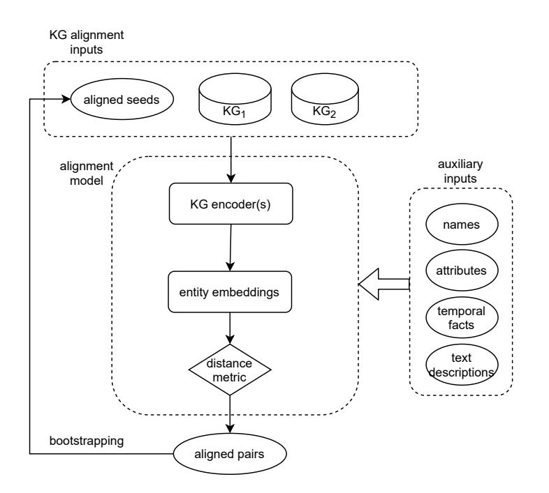
Figure 2.2: A general framework for embedding-based KG alignment.

Generally, KG alignment models take two KGs (i.e., the observed facts), and a set of pre-defined seeds are inputs as figure [[2.2]](#ref-fig-2.2) shows. These seeds are cross kg entity pairs, collecting from other sources, e.g., hyperlinks, SameAs labels, etc, or from manually labellings. Then alignment models learn the entity representations according to the observed facts. At last, two entities will be aligned if they have similar representations under a distance (or similarity) metric, e.g., cosine similarity, euclidean distance, etc. Besides, the alignment framework can take auxiliary information as inputs, including the entity name, entity attributes, temporal facts and text descriptions of the entity. Besides, the supervised approaches that use the pre-aligned seeds, some approaches [[126]](#ref-126), [[127]](#ref-127) follow the bootstrapping framework, in which new aligned entity pairs with high confidence will be put into

the seed set in each iteration. In the early stage of KG alignment models [[128]](#ref-128)–[[130]](#ref-130), the entity representations of two KGs are learned separately via an embedding model, e.g., TransE, then an alignment function is learned using the embeddings and the entity pair seeds. The alignment function can be either a linear function [[128]](#ref-128), a transfer matrix [[130]](#ref-130) or a function combined with attribute embeddings [[129]](#ref-129). However, as the embeddings of KGs are learned independently, which fails to capture the connectivity across KGs, the performance are not so promising. Therefore, current KG alignment models [[131]](#ref-131), [[132]](#ref-132) mainly learn a unified representations of two KGs, i.e., both the source KG and the target KG are mapped into a same low-dimension vector space. These models force the aligned seeds holding very similar embeddings, thus the candidate entity pairs can have similar representations according to the alignment model. According to inputs of KG alignment models, i.e., whether they leverage the attribute information, we categories the related works on KG alignment into structure-based approaches and attribute-based approaches. We introduce them in the following Subsection [[2.3.1]](#ref-2.3.1) and Subsection [[2.3.2]](#ref-2.3.2), respectively.

### 2.3.1 Structure-Based Approaches for KG Alignment

Structure-based KG alignment mainly leverage the connectivity of KG(s) to learn the entity embeddings. Structure-based KG alignment follows the assumption that if two entities have similar neighbors, they are likely to refer the same object. This assumption holds true in most cases since currently most public knowledge graphs are constructed from Wikipedia and thus these KGs have similar neighbors. Generally, the KG structure is represented by relational facts, i.e., regarding entities as vertexes and the relations are edges. Therefore, the main focus of structure-based approaches is to study the learn neighbor information. Naturally, graph neural networks (GNNs) are used in many approaches and still work are baseline methods. GNNs capture the dependence of graphs via message passing between the nodes of graphs. For example, one of the most common GNNs is the vanilla graph convolution networks (GCNs), which simply aggregates all 1-hop neighbors and use the normalized representation as entity node embeddings. So as to the early work in KG alignment. GCN-align [[20]](#ref-20) is a famous structural alignment model, which encodes each KG via a two-layer-stacked GCNs. Besides, GCN-align proposed a weighted connectivity matrix which incorporates the functionality of relations. However, there are still some drawbacks in the vanilla model. For example, the naive GCN model ignores the relation information, and cannot deal with the heterogeneous structure problem, etc.

Currently, there are many advance GNN based models to solve the mentioned drawbacks, including HGCN [[133]](#ref-133), RDGCN [[21]](#ref-21), AliNet [[134]](#ref-134), NMN [[135]](#ref-135). HGCN [[133]](#ref-133) has the observation that entity representations and relation representations can promote each other. Therefore, HGCN built a joint framework to learn entity and relation representations in an iterative way. In particular, HGCN first uses GCNs with highway network gates to obtain entities embeddings of two KGs. Then based on the entity representation, it approximates the relation embeddings by taking the average of head entities and tail entities. So this model instead of learning a separated relation vector space, it represents the relations by entities, which provides a more compact representations of entities and thus is able

| System | Main Target | Method |
|----------------|----------------------------|--------------------------------------------|
| GCN-align [[20]](#ref-20) | structural information | Stacked GCNs with weighted adjacent ma |
| | | trix |
| HGCN [[133]](#ref-133) | relational message passing | represent relation embeddings by entities |
| RDGCN [[21]](#ref-21) | relation interactions | build a relation-centered graph |
| AliNet [[134]](#ref-134) | heterogeneous structure | incorporate multi-hop neighbors with atten |
| | | tion and gating mechanism |
| NMN [[135]](#ref-135) | heterogeneous structure | neighbors sampling and neighbors matching |
| | | strategy |
| DGMC [[136]](#ref-136) | many-to-one matching prob | iterative consensus passing |
| | lem | |

Table 2.5: An overview of structure-based KG alignment.

to improve the alignment performance. RDGCN [[21]](#ref-21) incorporates relation information with a dual relation graph. In particular, RDGCN not only use the traditional entity-centered graph to capture the structural information. They constructed a dual relation graph whose vertexes denote the relations. Utilizing a graph attention mechanism, RDGCN encourages the interactions between entity graph and relation graph to capture complex relationships. Besides, RDGCN leverage highway gates to allow an easy message passing and thus further integrate neighboring structural information. As KGs have non-isomorphic neighborhood structures, AliNet proposes expand the neighbor scopes and aggregation multi-hop neighbors. AliNet employs an attention mechanism to highlight useful distant neighbors and reduce noise ones. Besides, to aggregate the neighbors on different hops, AliNet [[134]](#ref-134) uses a gating mechanism to control the update and forgetting. NMN [[135]](#ref-135) also aims to the structural heterogeneity challenge. Instead of requiring all neighbor matching, NMN allows neighborhood difference and only requires a few important neighbor are matching. In particular, NMN propose a neighbor sampling strategy to locate discriminative neighbor for matching, then it leverages an cross-graph attention mechanism to locate matched neighbors from pairwise enumerated candidates. Besides, a recent work (DGMC) [[136]](#ref-136) propose an iterative way to solve the many-to-one matching problem, call local matching consensus. Their idea is interesting, GCNs are not only able to pass embedding information, but also pass the matching information. With many iteration of matching information passing, entity neighbors can finial archive the local matching consensus, and thus improve the alignment performance. A short summary of structure-based alignment is listed in Table [[2.5]](#ref-tab-2.5).

### 2.3.2 Attribute-Based Approaches for KG Alignment

Attribute-based (also known as multi-view based) KG alignment not only uses the relational facts, but also leverage other information to learn the entity embeddings, including the entity names, attributes and textual descriptions. Though this kind of approaches leverage other information except attributes, we still call them attribute-base approaches for simplicity.

For example, Multi-KE [[22]](#ref-22) explores the combination based on the views of entity names, relations and attributes to enhance the alignment between two KGs. Multi-KE also designed several combination strategies, including weighted view Averaging and shared space learning. In particular, Multi-KE

| Main Target | Method |
|------------------------------------|-------------------------------------------|
| explore name and attribute | embedding a KG from multi-views |
| information | |
| jointly capture values and | GRU-based characteristics encoder |
| value types | |
| many-to-one problem | collective align entities |
| explore attributes in sub | multiple channels and BERT-based |
| graphs | value embeddings |
| leverage entity textual de | a classifier with BERT-based fine tune |
| scriptions | module |
| | |

Table 2.6: An overview of attribute-based KG alignment.

combine auto-encoder and word2vec to pre-train the embeddings of attribute values, then stacked CNNs are used for extracting the features of attributes. Finally, entities are represented as transE, i.e., *s*(*h*,*a*, *v*) = −||*h* −*CNNs*(*a*; *v*)||~2~, where (*h*,*a*, *v*) is an attribute fact composed of (head entity, attribute predicate, attribute value). However, this model ignores the interactions between attributes. Recently, COTSAE [[137]](#ref-137) a recent work aims on training attribute types and values cooperatively. Besides, CEA [[138]](#ref-138) also string similarity of entity name to align entities. CEA observe that there are many-to-one mappings in the entity set (i.e., many source entity link to the same target entity). To this end, CEA model also proposes a collective method to globally locate the matched pairs. AttrGNN [[23]](#ref-23) proposes an effective approach to leverage the attributes facts. In particular, AttrGNN splits a KG into subgraphs and uses a GCN-like encoder to model various types of information, including names, digits, string literals. AttrGNN also uses BERT model for obtaining the attribute value embeddings. Besides, some models including AttrGNN [[23]](#ref-23) and BERT-INT [[139]](#ref-139) leverage BERT to encode literal values and text descriptions. BERT-INT [[139]](#ref-139) verify the effectiveness of only using entity textual description for KG alignment.

The following publications have been incorporated as Chapter [[3]](#ref-ch3).

1. [[1]](#ref-1) Yu Liu, Wen Hua, and Xiaofang Zhou, [Extracting Temporal Patterns From Large-Scale Text Corpus](https://link.springer.com/chapter/10.1007/978-3-030-12079-5_2), *Australasian Database Conference*(ADC), 17-30, 2019

| Contributor | Statement of contribution | % |
|---------------|---------------------------|-----|
| Yu Liu | algorithm design | 60 |
| | experiment design | 50 |
| | experiment implementation | 100 |
| | paper writing | 60 |
| | idea discussion | 60 |
| Wen Hua | algorithm design | 40 |
| | experiment design | 50 |
| | paper writing | 40 |
| | proof-reading | 50 |
| | idea discussion | 30 |
| Xiaofang Zhou | proof-reading | 50 |
| | idea discussion | 10 |

2. [[3]](#ref-3) Yu Liu, Wen Hua, and Xiaofang Zhou, [Temporal Knowledge Extraction From Large-Scale Text Corpus](https://link.springer.com/article/10.1007/s11280-020-00836-5), *World Wide Web Journal*, 2020

| Statement of contribution | % |
|---------------------------|-----|
| algorithm design | 80 |
| experiment design | 70 |
| experiment implementation | 100 |
| paper writing | 60 |
| idea discussion | 60 |
| algorithm design | 20 |
| experiment design | 30 |
| paper writing | 40 |
| proof-reading | 50 |
| idea discussion | 30 |
| proof-reading | 50 |
| idea discussion | 10 |
| | |

## Chapter 3

## Temporal Knowledge Harvesting

## 3.1 Introduction

Recently, large-scale knowledge graphs (KGs) have been constructed and have applied in many algorithms, applications and tools, such as entity linking [[140]](#ref-140), [[161]](#ref-161), relation extraction [[141]](#ref-141), [[162]](#ref-162), question answering [[142]](#ref-142), [[164]](#ref-164) and other advanced tasks [[143]](#ref-143)–[[145]](#ref-145). Large-scale KGs, such as DBpedia [[146]](#ref-146), NELL [[147]](#ref-147), Probase [[76]](#ref-76) and YAGO [[148]](#ref-148), contain millions of entities and relational facts. However, most of them regard relational facts as time-invariant and ignore the corresponding valid time period. Actually, many relations in the real world are changing and involving over time, i.e., they are only valid for a certain temporal period. For example, the relation instance ("Brad Pitt", *SpouseOf*, "Angelina Jolie") is valid only over the temporal period of 2014 to 2019 (according to Wikipedia pages). Obviously, this additional temporal dimension is particularly important and beneficial in many application scenarios [[149]](#ref-149) including QA systems, text summarisation and timeline generation. For example, with the help of time-aware knowledge, current QA systems can easily answer the following queries, "who was the president of the USA during World War II?" [[150]](#ref-150) and "Which teams did Neymar play for before joining PSG?" [[151]](#ref-151). Temporal KGs are necessary for answering such temporal queries.

Research on complementing KGs with a temporal dimension is very current. To the best of our knowledge, only DBpedia [[146]](#ref-146), WikiData [[152]](#ref-152) and YAGO [[28]](#ref-28), three recently constructed large KGs, contain timestamped facts. DBpedia and YAGO use regular expressions on semi-structured data (e.g., Wikipedia Infobox, Categories) to extract temporal facts, which limits their coverage and applicability to widely available free texts [[12]](#ref-12). WikiData (migrated from Freebase) is a collaborative KB constructed mainly by its community, which also leads to limited coverage of temporal facts. Although extracting temporal knowledge from free text has been studied, including T-YAGO [[24]](#ref-24), PRAVDA [[11]](#ref-11), CoTS [[12]](#ref-12), TIE [[153]](#ref-153), it is still limited to specific domains and cannot be applied to large-scale KGs.

Inspired by the pattern-based approach for constructing large-scale generalised KGs [[76]](#ref-76), we resort to temporal patterns for temporal knowledge extraction. For example, if we know the phrase "be

married" strongly implies the beginning of a marriage relation, then we can apply the temporal pattern (*PERSON*, *PERSON*, "be married", *TIME*) on the sentence "Pitt and Jolie were married on August 23, 2014, in a private ceremony in Chateau Miraval, France" to extract the start date "August 23, ^ 2014" and the entity pair "Brad Pitt" and "Angelina Jolie" of the marriage relationship. However, it is extremely laborious and time-consuming to manually construct temporal patterns even for a single relation, and it is also non-trivial to extract temporal facts from free texts using these patterns. Hence, in this work, we focus on two tasks: (1) designing automatic methods for extracting temporal patterns and (2) leveraging the identified temporal patterns to extract temporal instances from large-scale text corpus. In particular, we regard temporal patterns as indicating phrases (e.g., "be married") and their temporal status (e.g., *START* and *END*), and we define temporal instances as entity pairs coupled with the time dimension.

We use an example to illustrate how our framework works intuitively. Given a seed set of relational facts between entities, e.g., ("Brad Pitt", *SpouseOf*, "Angelina Jolie") along with their valid time, (e.g., "[2014,2016]"), our pattern extraction algorithm searches in the text corpus for sentences that contain both entities and time expressions (e.g., "Pitt has been married to actress Angelina Jolie since 2014", "In September 2016, Jolie filed for divorce from Pitt", etc.) and then extracts and aggregates temporal patterns (e.g., ("be married", *START*), ("file for divorce", *END*), etc.) from these sentences. After obtaining the temporal patterns for this relation (e.g., *SpouseOf*), our instance extraction algorithm retrieves all candidate sentences that match at least one of these patterns (e.g., "Cruise was married to actress Mimi Rogers on May 9, 1987", "In February 2001, Cruise filed for divorce from Kidman while she was unknowingly pregnant.", etc.). For each candidate sentence, the algorithm identifies the most related entity pair, e.g., ("Tom Cruise", *SpouseOf*, "Mimi Rogers", *START*), ("Tom Cruise", *SpouseOf*, "Nicole Kidman", *END*), etc. and the time expression (e.g., 1987-May-09, 2001-Feb, etc.) according to their relatedness to the matched temporal pattern. For brevity, in the following, we omit the relation between entity pairs whenever the content is clear.

Although the idea sounds simple, challenges still abound. First, the text corpus is noisy and informal, which greatly limits the number of sentences that can be retrieved for both pattern extraction and instance extraction. Second, different phrases can indicate the existence of a relation to a different extent. It is non-trivial to select indicating phrases and determine their indicating ability from the retrieved sentences. For example, as Figure [[3.2]](#ref-fig-3.2) shows, a candidate sentence may contain multiple verb phrases (e.g., "meet" and "marry"), entities and time expressions. Although it is obvious to humans that "marry" is a much stronger indicator of the beginning of a marriage relation than "meet", the pattern extraction algorithm should be able to automatically distinguish the indicating strength of each phrase. It is essential to properly estimate the relatedness of entity pairs and time expression to the target relation. Finally, given the set of identified temporal patterns, how to apply them for temporal instance extraction is also a challenge. The natural language text is intrinsically ambiguous and hence not all candidate sentences are talking about the target relation. To address these issues, our major contributions in this work can be summarised as follows:

- We demonstrate the importance of temporal knowledge harvesting, and propose a novel frame-

work for automatic temporal pattern extraction from a text corpus.

- We introduce various techniques, including corpus annotation, pattern generation, scoring and clustering, to reduce ambiguity in the text corpus and improve both the accuracy and coverage of the extracted patterns.
- We introduce a parse-tree-based method for temporal instance extraction using the obtained temporal patterns, which identifies the entity pair and time expression most related to the target relation.
- We conduct experiments on real-world datasets, and the experimental results verify the effectiveness of our proposed framework.

## 3.2 Temporal Pattern Extraction

In this section, we introduce our proposed framework for temporal pattern extraction. In particular, we will describe in detail how we address the challenges discussed in Section [[3.1]](#ref-3.1).

Definition 6 (Temporal Fact). *A temporal fact, denoted as* (*s*,*r*,*o*,*t*)*, indicates the existence of a relation r between entities s and o during the time period t* = [*t^s^* ,*t^e^*]*.* In practice, relations can be categorised into non-temporal relations (e.g., "City*LocatedIn*Country"), durative relations (e.g., "Person*SpouseOf*Person") and momentary relations (e.g., "Person*DiedIn* Location"). In this work, we do not distinguish durative relations and momentary relations as long as they can be coupled with at least one timestamp (*t^s^*=*t^e^* for momentary relations). For example, the temporal fact ("Brad Pitt",*SpouseOf*, "Angelina Jolie", "[2014,2019]") means there is a marriage relation between the entities "Brad Pitt" and "Angelina Jolie", and it starts in 2014 and terminates in 2019. Similarly, the temporal fact ("David Vanole", *DiedIn*, "Salt Lake City", "[2007,2007]") indicates this death happened in the year 2007. We mainly focus on predefined temporal knowledge extraction in this work. In other words, like the other existing works such as T-YAGO [[24]](#ref-24), PRAVDA [[11]](#ref-11), and CoTS [[12]](#ref-12), we assume that all the temporal relations are given in advance, as determining whether a relation is temporal or non-temporal is out of the scope of this work. In practice, the set of predefined temporal relations can be provided by domain experts or obtained from existing knowledge graphs such as the Wikipedia Infobox.

Definition 7 (Temporal Pattern). *We define the temporal pattern p as a phrase that can, to some extent, imply the commencement or termination of a relation r. Specifically, p consists of two parts: an indicating phrase v (e.g., verb phrase) and its temporal status sta* ∈{*START,END*}*, i.e., p* = (*v*,*sta*)*. For example, given the relation SpouseOf, its temporal pattern could be ("get married", START), ("get divorced", END), and ("hold a wedding", START), etc. Obviously, different phrases can indicate the temporal status of relation r to a different extent. Therefore, we use w*(*p*) *to represent the indicating strength of pattern p.* Definition 8 (Temporal Pattern Extraction).*Given a text corpus*D*and a seed set of temporal facts* {(*s*,*r*,*o*,[*t^s^* ,*t^e^*])}*, we aim to extract a collection of weighted temporal patterns, i.e.,*{<*p*,*w*(*p*) >} *that can indicate the relation r.*

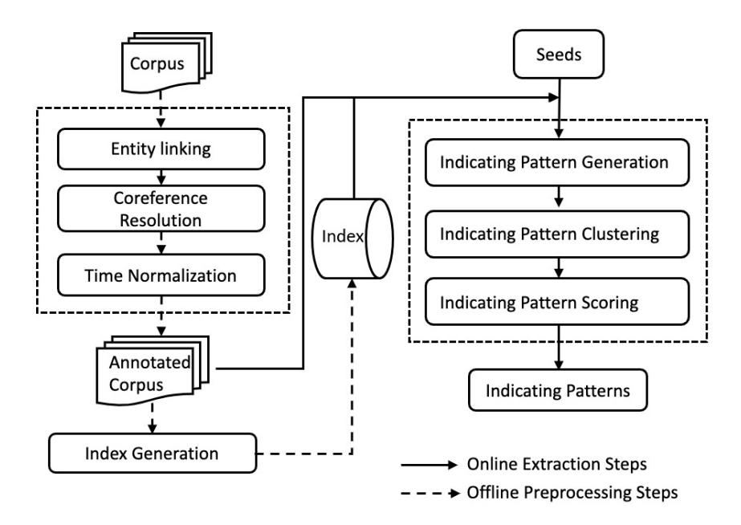
Figure 3.1: An overview of the framework for temporal pattern extraction.

From Figure [[3.1]](#ref-fig-3.1), we can see that our proposed framework for temporal pattern extraction consists of two parts: an offline corpus preprocessing module and an online pattern extraction module. Offline preprocessing is important for improving the accuracy and efficiency for both temporal pattern extraction and instance extraction. On one hand, the text corpus is noisy and informal, which limits the number of relevant sentences when extracting patterns. For example, consider the sentence "In 2000, he married actress Jennifer Aniston." Without properly handling abbreviations and pronouns, the number of retrieved sentences will dramatically decrease when we use the input seeds to search for related sentences. Moreover, ambiguous entities and implicit time expressions are quite popular in free texts, which need to be identified and normalised. To this end, we annotate the text corpus using three NLP tools, namely, entity linking (TAGME [[44]](#ref-44)), co-reference resolution (Stanford Neural Co-reference [[154]](#ref-154)) and time expression normalisation (HeidelTime [[155]](#ref-155)). Consider the previous sentence. Through annotation tools, we can identify that "he" refers to "Brad Pitt", and can recognise the entity "Jennifer Aniston" and time expression "2000". On the other hand, the text corpus is large, which prohibits traversing the entire corpus for each seed when locating relevant sentences. Therefore, we construct an inverted-list-like index for speeding up the sentence retrieval and online pattern extraction. The keys of this index are entities and times, and the values are the set of sentence positions. By constructing this index, we can directly use seeds to locate relevant sentences. We also leverage this index for instance extraction. During the online stage, we handle input seeds one-by-one to generate temporal patterns (Section [[3.2.1]](#ref-3.2.1)). Since different patterns have different indicating ability

(e.g., "meet" vs "married with"), we propose various weighting strategies to estimate the indicating strength of each pattern (Sections [[3.2.2]](#ref-3.2.2)). As patterns could be semantically related, we also aggregate patterns among all the input seeds (Sections [[3.2.2]](#ref-3.2.2)). Algorithm [[1]](#ref-alg-1) illustrates some major techniques of online pattern extraction proposed in this paper.

Algorithm 1 Online Temporal Pattern Extraction.

Input: a seed set S = {(*s*,*r*,*o*,[*t^s^* ,*t^e^*])}, an annotated text corpus D, and an inverted index *Ie*,*^t^* Output: weighted temporal patterns P*^r^* for relation *r* 1: P*r*=/0 2: for *seed* = (*s*,*r*,*o*,[*t^s^* ,*t^e^*]) ∈ S do 3: H = RetrieveRelevantSentences(*s*,*o*,[*t^s^* ,*t^e^*], D, *Ie*,*t*) 4: for *h* ∈ H do 5: V = ExtractVerbPhrases(*h*) 6: T = ExtractTimeExpressions(*h*) 7: *tree* = ExtractParseTree(*h*) 8: for *v*∈ V do 9:*t^v^* = FindRelatedTimeExpression(*v*,T,*tree*) 10: if (|*t^v^* −*t^s^* | < |*t^v^* −*t^e^*| then 11: *p* = (*v*,*START*) 12: else 13: *p* = (*v*,*END*) 14: end if 15: *w*(*p*) = ScorePattern(*p*,*h*,*seed*) 16: P*^r^* = P*^r^* ∪ {h*p*,*w*(*p*)i} 17: end for 18: end for 19: end for 20: AggregatePatternScore(P*r*) 21: {P*c*} = ClusterPattern(P*r*) 22: for P*^c^* ∈ {P*c*} do 23: AdjustPatternScore(P*c*) 24: end for 25: return {P*r*}

### 3.2.1 Temporal Pattern Generation

Recall that temporal patterns are phrases that can imply not only the existence of a relation between the subject entity *s* and object entity *o*, but also its temporal status, i.e., commencement or termination. For example, "fall in love with" and "hold a wedding" can, to some extent, imply the beginning of a marriage relation *SpouseOf(PERSON,PERSON)*. In general, temporal patterns can be any types of phrases, e.g., noun phrases and verb phrases, as long as these phrases indicate the temporal relations. In this work, we only consider all verb phrases as candidates. In particular, we consider an annotated sentence *h* as relevant to a seed (*s*,*r*,*o*,[*t^s^* ,*t^e^*]) if and only if sentence *h* satisfies the following conditions:

- *h* contains both subject *s* and object *o*;
- *h* contains at least one time expression *t*, which is temporally close to either *t^s^* or *t^e^*.

As illustrated in Algorithm [[1]](#ref-alg-1), given a set of seed facts, we locate all relevant sentences for each seed. For example, given a seed ("Brad Pitt", "Jennifer Aniston", "[2000, 2005]"), we can obtain such a relevant sentence as "Pitt met Friends actress Jennifer Aniston in 1998 and married her in a private wedding ceremony in Malibu on July 29, 2000" from the text corpus. Then for each relevant sentence *h*, we extract all verb phrases V = {*v*} and time expressions T = {*t*} to generate temporal patterns. In particular, we extract verb phrases based on the definition of verb phrase in Open IE systems [[156]](#ref-156). Time expressions are extracted similarly based on the definition of time expression in the Timex3 annotation of TimeML [[155]](#ref-155). The next step is to determine the temporal status, i.e., *sta* ∈{*START*,*END*}, for each phrase *v* by its "relevant" time expression *t^v^*. That is, a phrase is highly possible to indicate the commencement (resp. termination) of a relation if its time expression is close to the start date *t^s^* (resp. end date *t^e^*) of the input seed (lines 9-13 in Algorithm [[1]](#ref-alg-1)). However, it is non-trivial to locate the relevant time expression *t^v^* for a verb phrase *v*, especially when multiple verb phrases and time expressions are extracted from a sentence *h*, namely |V| > 1 and |T| > 1. Humans can correctly identify the relatedness between phrases and time expressions in a sentence since they understand the syntactic structure when reading that sentence. Therefore, in this work, we resort to parse tree to locate relevant time expressions for each verb phrase. Figure [[3.2]](#ref-fig-3.2) illustrates a parse tree. In the parse tree, leaf nodes are tokens in the sentence, and internal nodes are their labels, i.e.,

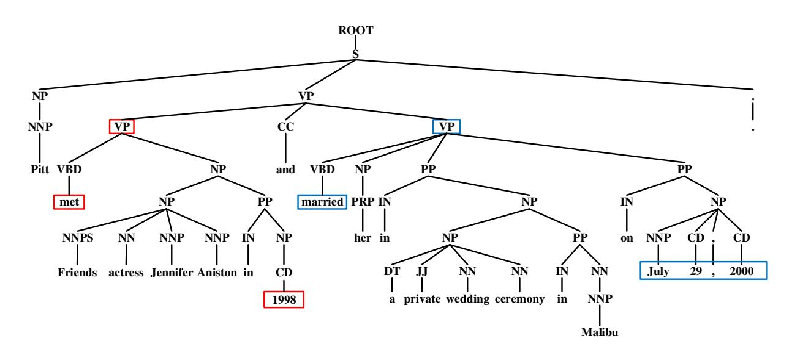
Figure 3.2: Parse tree of sentence "Pitt met Friends actress Jennifer Aniston in 1998 and married her in a private wedding ceremony in Malibu on July 29, 2000".

part-of-speech tags. Intuitively, a verb phrase is more related to a time expression if the verb phrase is closer to the time expression on the parse tree. Formally, for a pair of verb phrase and time expression observed in sentence *h*, i.e., (*v*,*t*) ∈ *h*, we define its parse-tree-based distance as follows:

$$
l_{v,t} = LCA(v,t) \tag{3.1}
$$

$$
dist(v,t) = min(|Path(v, l_{v,t})|, |Path(|t, l_{v,t}|)
$$
(3.2)

where *l*~v,t~ is the lowest common ancestor (LCA) for *t* and *v* in the parse tree of *h*, (the LCA of *t* and *v* in *h* is the shared ancestor of *t* and *v* that is located farthest from the root), *Path*(*u*,*u*0 ) is the shortest path from *u* to *u*0 , and *dist*(*v*,*t*) is the verb-time distance in the sentence *h*. For example, in Figure [[3.2]](#ref-fig-3.2), *dist*("marry", "1998") = 3 while *dist*("marry", "July 29, 2000") = 2. We can select the most related verb-time pairs (which have the minimum distance) for each time expression according to its tree-based distance. Similarly, for temporal instance extraction (Section [[3.3]](#ref-3.3)), we can calculate the distance *dist*(*v*, *e*) between a verb phrase *v* and an entity *e* (can be either subject or object.) in sentence *h*, as follows:

$$
dist(v, e) = min(|Path(v, l_{v,e})|, |Path(|e, l_{v,e}|)
$$
(3.3)

where *l*~v,t~ is the lowest common ancestor (LCA) for entity *e* and verb *v* on the parse tree of a sentence *h*.

### 3.2.2 Temporal Pattern Scoring

In this part, we will introduce our strategies for temporal pattern scoring. Obviously, different temporal patterns have different indicating abilities. From the above example (Figure [[3.2]](#ref-fig-3.2)), we obtained two candidate patterns. As humans, we know that ("marry", *START*) has a much stronger indication than ("meet", *START*) for the beginning of relation *SpouseOf*. However, it is non-trivial for machines to automatically estimate the indicating strength of patterns. More importantly, not all extracted temporal patterns are guaranteed to be correct since the underlying corpus is intrinsically informal and noisy. This means we have to select the useful patterns to further extract more temporal instances. Naturally, we use top-*k* patterns for temporal knowledge harvesting as long as these patterns can be scored and ranked effectively. In particular, we regard a pattern *p* = (*v*,*sta*) as indicative of relation *r* if and only if

- for a seed (*s*,*r*,*o*,[*t^s^* ,*t^e^*]) and a relevant sentence *h* that generates *p*, 1) *v* is close to either *s* or *o* in *h*; 2) *v* is close to its related time expression *t^v^* in the parse tree of *h*; 3) *t^v^* is temporally close to either *t^s^* or *t^e^*;
- *p* can be extracted from many sentences relevant to the seed (*s*,*r*,*o*,[*t^s^* ,*t^e^*]);
- *p* can be generated by many seed facts of relation *r*.

In-Sentence Scoring. The first heuristic rule captures the in-sentence level features. Formally, given a seed fact (*s*,*r*,*o*,[*t^s^* ,*t^e^*]) and a pattern *p* that is extracted from a relevant sentence *h*, the weight of *p* in *h* in sentence level, denoted as *w*(*p*), can be calculated as follows:

$$
w(p) = \alpha \cdot w_s(v, s, o) + \beta \cdot w_s(v, t_v) + \gamma \cdot w_s(t_v, t_s, t_e)
$$
(3.4)

In Equation [[3.4]](#eq-3.4), *w*(*v*,*s*,*o*), *w*(*v*,*t^v^*), and *w*(*t^v^*,*t^s^* ,*t^e^*) captures the position of *v* in *h*, the correlation between *v* and *t^v^*, and the temporal closeness between *t^v^* and [*t^s^* ,*t^e^*], respectively. α, β, and γ are three parameters that reflect the relative importance of these features in the scoring function such that α +β +γ = 1. The first weighting function *ws*(*v*,*s*,*o*) captures the token distance between *v* and interested entities *s* or *o*, which can to some extent reflect their relatedness. *w*(*v*,*t^v^*) examines the correlation between phrase *v* and the selected time expression *t^v^* for indicating pattern scoring. Our idea is that, if *v* is closer to *t^v^* in the dependency parse tree of sentence *h*, they are regarded as more strongly correlated and thus *v* is more indicative. The last function *ws*(*t^v^*,*t^s^* ,*t^e^*), measures whether a phrase *v* can indicate the temporal status of *R*. We believe that if the relevant time expression *t^v^* of phrase *v* is temporally close to the *START* date *t^s^* (resp. *END* date *t^e^*) of relation *R*'s seed, then *v* is talking about an event that can imply the commencement (resp. termination) of *R*. In this work, *w*(*v*,*s*,*o*) is calculated according to the token-based distance, *w*(*v*,*t^v^*) refers to our proposed tree-based distance and *w*(*t^v^*,*t^s^* ,*t^e^*) is the temporal distance between two time expressions, as explained below.

In practice, calculating temporal distance |*t*^1^ −*t*^2^| is not a easy task. Given an informal and noisy text corpus, a time expression is usually represented as either a specific date (e.g. "2006-01-01", we consider a day as the finest granularity in this work) or a temporal range (e.g. "2006") which, however, cannot be compared directly. Table ?? summaries all possible combinations of two time expressions *t*^1^ and *t*^2^, where star and horizontal line represent a date and a temporal range respectively. Note that the last case where two time expressions have a partial overlapping does not occur due to temporal normalisation in the text corpus. To address this issue, we normalise both *t*^1^ and *t*^2^, and propose a unified method to calculate |*t*^1^ −*t*^2^|. In particular, each time expression *t* is transformed into a temporal range [*t*.*min*,*t*.*max*] such that *t*.*min*(resp.*t*.*max*) is the minimum (resp. maximum) possible date of *t*. *t*.*min*=*t*.*max* if *t* is originally represented as a date. For instance, "May 2006" will be normalised as ["2006-05-01","2006-05-31"]. Then we calculate |*t*^1^ −*t*^2^| using the following equation.

$$
|t_1 - t_2| = \begin{cases} 0, (t_1.min - t_2.min) \cdot (t_1.max - t_2.max) \le 0 \\ \frac{|t_1.min - t_2.min| + |t_1.max - t_2.max|}{2}, otherwise \end{cases}
$$
(3.5)

In Equation [[3.5]](#eq-3.5), (*t*1.*min* −*t*2.*min*)·(*t*1.*max* −*t*2.*max*) ≤ 0 reflects that one time expression is fully contained in another, and their temporal distance is regarded as 0 in this work. Table ?? shows some examples of temporal distances |*t*^1^ −*t*^2^|.

In particular, measuring temporal distance |*t*^1^ −*t*^2^| is not straightforward since *t*^1^ and *t*^2^ can be a specific date (e.g., "2006-01-0") or a temporal range (e.g., "2006") which, however, cannot be compared directly. We summarise all possible combinations of two time expressions *t*^1^ and *t*^2^ in Table [[3.1]](#ref-tab-3.1). The star and horizontal bar represent a date and a temporal range respectively. The last case where *t*^1^ and *t*^2^ have a partial overlapping does not occur due to time expression normalisation in the text corpus. Based on this summarisation, we propose a unified method to calculate |*t*^1^ −*t*^2^|. In particular, we transform a time expression *t* into its temporal range denoted as [*t*.*min*,*t*.*max*] such that *t*.*min*(resp.*t*.*max*) is the minimum (resp. maximum) possible date of *t* (*t*.*min*=*t*.*max* if *t* is the date-type time expression). For example, "May 2006" will be normalised as ["2006-05-01", "2006-05-31"]. After both time expressions are transformed into their temporal range, we calculate |*t*^1^ −*t*^2^| as follows:

$$
|t_1 - t_2| = \begin{cases} 0, (t_1.min - t_2.min) \cdot (t_1.max - t_2.max) \le 0 \\ \frac{|t_1.min - t_2.min| + |t_1.max - t_2.max|}{2}, otherwise \end{cases}
$$
(3.6)

In Equation [[3.6]](#eq-3.6), (*t*1.*min* −*t*2.*min*)·(*t*1.*max* −*t*2.*max*) ≤ 0 reflects that one time expression is fully contained in another, and their temporal distance is regarded as 0 in this work. Table [[3.1]](#ref-tab-3.1) shows some examples of temporal distances |*t*^1^ −*t*^2^|.

| Case | | Example | Distance (days) |
|------|--|-------------------------------|-----------------|
| | | "2006-03-01" vs. "2006-03-16" | 15 |
| | | "March 2006" vs. "2006-05-31" | 75 |
| | | "2006" vs. "2006-03-01" | 0 |
| | | "March 2006" vs. "May 2006" | 60 |
| | | "2006" vs. "March 2006" | 0 |
| | | - | - |

Table 3.1: Different cases and examples of temporal distances between two time expressions.

Cross-Sentence Scoring. After pattern generation and scoring on sentence level for each input seed, we obtain a collection of weighted temporal patterns. We observe that a pattern with the same verb phrase can be extracted from many relevant sentences and many seeds (i.e., heuristic 2-3). In other words, a pattern should be more indicative if it can be extracted many times. Hence, we aggregate all temporal patterns according to their verb phrases. In particular, we use a TF-like method to aggregate pattern weights among all sentences and seeds. Besides, we also use an IDF-like method to eliminate common phrases (e.g., "start to"). Finally, we normalize the scores among all the patterns. We also notice that temporal patterns can be highly correlated in semantics. For example, the following two patterns ("get married", *START*) and ("hold a wedding", *START*) are semantically related. This suggests they are able to reciprocally promote each other whenever any of them is identified as highly indicative of a relation *SpouseOf*. Therefore, we propose a clustering method to adjust temporal pattern scores accordingly based on their semantics. In particular, we adopt word embedding techniques (Word2vec [[157]](#ref-157)) to represent each verb phrase and apply an existing density-based clustering method (DBSCAN [[158]](#ref-158)) to group semantically related patterns. We use the following distance function to cluster temporal patterns:

$$
dist(p, p') = 1 - cosine(vec(p), vec(p')) \qquad (3.7)
$$

Here, *vec*(*p*) is the vector representation of *p* obtained via word embedding on *p*'s verb. We propose a weighted-voting method to adjust pattern scores for each cluster. Consider a cluster P*c*. We denote *p*^* as the highest ranked pattern (i.e., has the highest score) in P*c*, i.e., *p*^* = argmax~pi~∈P*^c^* *w*(*pi*). We adjust the score of other patterns *p* ∈ P*^c^* by considering two factors: 1) whether *p* is originally indicative and 2) whether *p*^* can semantically support *p*. The first factor can be regarded as a self-vote mechanism, and the second one is a context-vote factor. Equation [[3.8]](#eq-3.8) shows our voting strategies:

$$
w(p) = w(p) + \delta \cdot \sin(p, p^*) \cdot (w(p^*) - w(p)) \tag{3.8}
$$

where δ is an empirical decay factor (we set it as 0.8) to avoid negative effects, and *sim*(*p*, *p*^* ) is the semantic similarity between patterns *p* and *p*^* . We can see that the larger the similarity, the more support *p* can achieve from *p*^* .

## 3.3 Temporal Instance Extraction

In this section, we will introduce our method for temporal instance extraction from free texts based on the identified temporal patterns.

Definition 9 (Temporal Instance Extraction).*Given a text corpus*D*and a set of temporal patterns* P*^r^* for relation r, we aim to extract a collection of temporal facts, i.e.,* {(*s*,*r*,*o*,[*t^s^* ,*t^e^*])}*.* It is worth noting that our temporal patterns are associated with indicating the status *START* and *END*, and hence, we extract the start time and end time of temporal facts independently, i.e., (*s*,*r*,*o*,*ts*) and (*s*,*r*,*o*,*te*). It is not hard to merge them into complete temporal facts.

Algorithm [[2]](#ref-alg-2) illustrates our proposed method for temporal instance extraction. In particular, given a set of temporal patterns P*^r^* for relation *r*, we first retrieve all relevant sentences H from the annotated text corpus D (line 1 in Algorithm [[2]](#ref-alg-2)). Then for each sentence *h*∈ H, we analyse its parse tree *tree* to find the most relevant entity pairs (*s*,*o*) and time expression *t* (line 5-8 in Algorithm [[2]](#ref-alg-2)). In the following, we introduce our algorithms for candidate sentence retrieval (Section [[3.3.1]](#ref-3.3.1)) and instance extraction (Section [[3.3.2]](#ref-3.3.2)) in detail.

Algorithm 2 Temporal Instance Extraction. Input: a temporal pattern set P*^r^* = {*p*} for relation *r* on status *sta*, an annotated text corpus D Output: an instance set {(*s*,*o*,*t*)} 1: H = RetrieveCandidateSentences(P*^r^*,D) 2: for *h*∈ H do 3:*p* = matchLongestPattern(*h*,P*r*) 4: E = ExtractEntities(*h*) 5: T =ExtractTimeExpressions(*h*) 6: *tree* = ExtractParseTree(*h*) 7: (*s*,*o*) =ExtractMostRelevantPair(*p*,E,*tree*) 8: *t* = ExtractMostRelevantTime(*p*,T,*tree*) 9: end for 10: return {(*s*,*o*,*t*)}

### 3.3.1 Candidate Sentence Retrieval

Given temporal patterns P*^r^* for relation *r*(*Type*1,*Type*2) (e.g., (Person,*SpouseOf*, Person), etc.), we collect all candidate sentences H from the text corpus D. In particular, we first use each single pattern to retrieve matched sentences and then eliminate duplicate sentences, denoted as H*^r^* = H1∪H^2^ ···∪H*^k^* where H*^i^* = {*h*}. Each sentence *h* = (*S*,*O*,*T*,*V*) satisfies the following conditions:

- *S* = {*s*|*type*(*s*) = *Type*1}, *S*6= /0
- *O* = {*o*|*type*(*o*) = *Type*2}, *O*6= /0
- *T* = {*t*}, *T*6= /0
- sentence *h* matches pattern *p* ∈ P*^r^*. In other words, ∃*v*∈*V*s.t.*v*=*p*.*v* The first three conditions require that a candidate sentence contains essential components for a temporal fact, i.e., there exist at least one entity that matches the required type constraints and at least one time expression in the candidate sentence. Such sentences can be retrieved efficiently with our inverted index which is constructed offline. The last condition requires that at least one of the verb phrases in the candidate sentence can match the verb phrase of the temporal pattern. Here, we simply adopt the string-matching algorithm in order to guarantee the knowledge coverage. In practice, temporal patterns contain entity types, such as *"Person", "SoccerClub", "Date"*, and verb phrases in candidate sentences are in various morphology. Hence, we transfer the candidate sentences into their canonical form by replacing entities and time expressions with their types and using verbs' lemma instead of their original forms. In particular, we leverage existing entity linking tools to map textual mentions to disambiguated entities with an existing KG. Then it is straightforward to obtain the entity types by visiting the mapped entries. Furthermore, when a sentence matches more than one pattern, we use the longest cover strategy to filter out redundant ones, since we believe that a more specific pattern contains more information and hence could lead to a more accurate temporal fact. In the next step, we propose several tree-based features to extract high-quality temporal instances from these candidate sentences.

### 3.3.2 Instance Extraction

In this part, we introduce our proposed methods for temporal instance harvesting. It is a non-trivial task because of the difficulty in balancing accuracy and coverage. It is easy to achieve a high accuracy by using exact matching on each sentence with a very complex pattern, but obviously this will dramatically decrease the coverage. On the other hand, we could achieve a good coverage of temporal knowledge by enumerating all possible entity-time pairs, while the accuracy will be extremely low.

In this work, we propose a double-check strategy for harvesting temporal instances and aim to achieve a good balance between accuracy and coverage. Like the previous pattern extraction, we still resort to parse trees to extract temporal instances. Consider a candidate sentence *h* = (*S*,*O*,*T*,*V*) matching the pattern *p* = (*v*,*sta*); we use forward check to collect relevant entity pair (*s*,*o*) and time expression *t*. Since temporal patterns contain the indicating phrases and the temporal status, we first locate the verb phrase *v*∈*V* in sentence *s* such that *v*=*p*.*v*. We then select the most relevant entities *s*, *o* and the time expression *t* from *S*, *O* and *T*, respectively, based on their tree-based distances to the verb phrase *v*=*p*.*v*, as follows:

$$
s = \underset{e \in S}{\arg\min} dist(v, e) \tag{3.9}
$$

$$
o = \underset{e \in O}{\arg \min} dist_s(v, e) \tag{3.10}
$$

$$
t = \underset{t' \in T}{\arg\min} dist_s(v, t') \tag{3.11}
$$

where *dist*(*v*,∗) is our proposed tree-based distance (Eq. [[3.2]](#eq-3.2) and Eq. [[3.3]](#eq-3.3)) which is also used in pattern extraction for locating relevant time-verb pairs. In practice, entities and time expressions can cross over multiple nodes on the parse tree, and hence we flatten the parse tree by mapping those nodes to their lowest common ancestor (LCA). In this way, we extract the instance (*s*,*o*,*t*) indicating the temporal status *sta* of relation *r*. We obtain the valid temporal interval for each entity pair by aggregating instances on both the *START* and *END* status.

Furthermore, we observe that when a sentence contains multiple verb phrases, the extracted entity pair and time expression might not relate to the target relation. In other words, the instance extracted from a single forward check is not always correct. Without loss of generality, consider a sentence containing two verb phrases, *v* and *v*^0^. The selected entity pair (*s*,*o*) and time expression *t* might not be the most relevant to the target relation, because the forward-check method simply selects *s*, *o* and *t* according to their tree-based distances to *v* (Eq. [[3.9]](#eq-3.9), Eq. [[3.10]](#eq-3.10), and Eq. [[3.11]](#eq-3.11)) and thus overlooks their relatedness to *v*^0^. In other words, *dist*(*v*,*s*) > *dists*(*v*^0^,*s*), *dist*(*v*,*o*) > *dists*(*v*^0^,*o*), or *dist*(*v*,*t*) > *dists*(*v*^0^,*t*). To address this problem, we propose a back check strategy to make sure that the entity pair (*s*,*o*) and time expression *t* are indeed the most relevant ones to the target relation and hence improve the accuracy. In particular, we search for the most relevant verb(s) to entity *s*, *o* and time expression *t* according to the following equations:

$$
\hat{v}_s = \underset{v' \in V}{\arg\min} \, dist_s(v', s) \tag{3.12}
$$

$$
\hat{v}_o = \underset{v' \in V}{\arg\min} dist_s(v', o) \tag{3.13}
$$

$$
\hat{v}_t = \underset{v' \in V}{\arg\min} \, dist_s(v', t) \tag{3.14}
$$

where *dists*(*v*,∗) is the tree-based distance (Eq. [[3.2]](#eq-3.2) and Eq. [[3.3]](#eq-3.3)). Then we check whether *v*=*v*^s^, *v*=*v*^o^ and *v*=*v*^t^. Temporal instances that violate these constraints will be ignored in this work.

We also notice that sentences often have clauses, e.g., independent and dependent clauses, when they contain multiple verb phrases. This means a sentence component, such as an entity or a time expression, can be located in different components. For example, consider the sentence in Figure [[3.2]](#ref-fig-3.2) which contains an independent clause followed by a coordinating conjunction "and". In this example, the time expression "1998" is associated with the verb "meet", while "July 29, 2000" relates to the verb "marry", which highlights the importance of considering syntactic dependency. Besides, the ellipsis of the subject "Brad Pitt" in the clause also illustrates the importance of sentence completion. This observation motivates us to understand the relationships between sentence components. To this end, we still resort to the dependency parse tree which represents the grammatical structure of the sentence and defines the relationships between words. In particular, we construct a set of node extension rules by analysing the edge label between two words on the dependency parse tree. These node extension rules capture the dependency between nodes on the tree (i.e., words of the sentence) and relax the calculation of tree-based distances such that closely related words are regarded as being in the same level. For example, consider the sentence "In 2002 Barcelona let Rivaldo join Milan". As *dist*("let", "Barcelona")> *dist*("join", "Barcelona"), instance ("Rivaldo", "Barcelona", "2002")

will be discarded according to the back-check strategy. However, since the verbs "let" and "join" are closely connected in the syntax, we allow "let" and "join" to be in the same level, i.e., *dist*("let", "Barcelona")= *dist*("join", "Barcelona"), by applying the relaxation rules. In this way, we can improve the coverage of the extracted temporal knowledge and meanwhile, maintain a good accuracy.

## 3.4 Experiments

In this work, we conduct extensive experiments on real-world datasets from two aspects, i.e., temporal pattern extraction and temporal instance extraction, to evaluate the performance of our framework. In the following, we will introduce our experimental settings (Section [[3.4.1]](#ref-3.4.1)) and then present our experimental results for temporal patterns (Section [[3.4.2]](#ref-3.4.2)) and temporal instances (Section [[3.4.3]](#ref-3.4.3)), followed by a detailed case study (Section [[3.4.4]](#ref-3.4.4)).

### 3.4.1 Experimental Settings

Datasets and Baseline. In general, our system can work on any type of text corpus, such as web pages, new articles, tweets and Wikipedia, etc, written in English. In this paper, we use the publicly available PRAVDA dataset^1^ [[11]](#ref-11), [[159]](#ref-159) to evaluate our proposed system by comparing it with the state-of-the-art baseline (PRAVDA system).The PRAVDA dataset consists of two types of text in two different domains. Specifically, the PRAVDA dataset contains 23,000 Wikipedia articles and 110,000 news articles about soccer players, as well as 88,000 news articles about celebrities mentioned in the "Forbes 100 list" and their Wikipedia articles. We also evaluate our proposed algorithms for pattern extraction and instance extraction on another dataset, wiki-people, which contains 90,766 Wikipedia articles about people randomly sampled from the Wikipedia English dump 2017. To our best knowledge, PRAVDA is the only system that aims to extract temporal instances from free text. In Section [[3.4.3]](#ref-3.4.3), we compare our algorithms for temporal instance extraction with the PRAVDA system. Evaluation metrics. In this work, we propose a pattern-based system to extract temporal instances from free text. Hence, we first measure the quality of temporal patterns (Section [[3.4.2]](#ref-3.4.2)) and then evaluate the quality of instances (Section [[3.4.3]](#ref-3.4.3)). As there is no public gold standard we can directly use to evaluate the quality of temporal patterns, we manually construct a high-quality pattern library for evaluation and comparison. In particular, we follow PRAVDA system [[11]](#ref-11), [[159]](#ref-159) and use four relations (i.e., *SpouseOf*, *PlayForClub*, *BornIn*, *DiedIn*) for temporal knowledge harvesting. We randomly sample 20 seed facts for each relation from Wikipedia's Infobox. We run our pattern extraction algorithms on all seeds for all these four of relations and invite five annotators with different backgrounds to label the quality of the extracted patterns (from 1 to 5). The final label is the average of all the votes. In this way, we obtain a ground-truth pattern library P^*^. We then evaluate the extracted patterns under different settings using a widely-adopted ranking criterion *nDCG* at the top-k patterns,

^1^We clean the whole dataset since only the raw data is available. For Wikipedia articles, we remove all Infobox, links and lists, and only keep plain texts. For news articles, we apply keyword-based and rule-based methods to filter out noisy sentences such as URLs, emails, etc.

namely,*nDCG^k^*:

$$
DCG_k = rel_1 + \sum_{i=2}^{k} \frac{rel_i}{log_2(i+1)}
$$
(3.15)

$$
IDCG_k = \sum_{i=1}^{k} \frac{Max_{rel}}{log_2(i+1)}
$$
(3.16)

$$
nDCG_k = \frac{DCG_k}{IDCG_k} \tag{3.17}
$$

In the above equations, *rel*^i^ represents the usefulness (the gain) of the *i*-th extracted patterns ranked by their scores *w*(*p*) in descending order.

For each relation, we use top-*k START* and *END* pattens to extract temporal instances on both PRAVDA and wiki-people datasets. We evaluate the accuracy of extracted instances via two ways, i.e., automatically comparing with Wikipedia's Infobox and manually checking the validity of each sampled instance. In order to automatically evaluate the accuracy of extracted temporal knowledge, we construct the ground truth G for each relation and for both the *START* and *END* status. In particular, we use regular expressions on Wikipedia's Infobox to extract the relational instances, as well as the coupled time expression(s). We extracted 729,744 and 126,255 temporal instances for the *"PlayForClub"* and *"SpouseOf"* relations, respectively. We use Wikidata [[152]](#ref-152) to evaluate the temporal instances for the *"BornIn"* and *"DiedIn"* relations. We evaluate our approach and compare with the PRAVDA system in terms of the conditional accuracy *Acc*^* of the extracted temporal facts (Equation [[3.18]](#eq-3.18)), as our work mainly focuses on the extraction of temporal facts.

$$
Acc^* = \frac{|\{(s, o, t) \in \mathbb{G}\}|}{|\{(s, o) \in \mathbb{G}_b\}|}
$$
(3.18)

where G*^b^* is the ground truth for binary (static) instances. Furthermore, we also manually evaluate the wrong instances in order to have a better understanding of the accuracy of the extracted temporal instances.

### 3.4.2 Accuracy of Temporal Patterns

The influence of relation types. In this part, we evaluate the accuracy of our algorithms for different relation types. We run our pattern extraction algorithm using all 20 seeds for each relation and evaluate the *nDCG^k^* scores for the *START* and *END* patterns using P^*^ and report the results on Table [[3.2]](#ref-tab-3.2). Overall, it is worth noting that *nDCG^k^* decreases gradually when *k* increases. This means most of the correct patterns are ranked relatively high (e.g., in top-1, top-3 or top-5) which to some extent verifies the effectiveness of our proposed methods for pattern generation and scoring. As Table [[3.2]](#ref-tab-3.2) shows, the *START* patterns are generally better than the *END* patterns, which we believe is natural because people tend to talk more about the beginning rather than the termination of a relation in online articles. For example, people prefer to say "Trump won the selection" instead of "Barack's term ended". In addition, we notice that the "PlayFor"*END* patterns have relatively low nDGC scores. This is because 1) sentences of"PlayFor" relation are more complex and ambiguous, which leads to the drop of nDCG

scores; 2) the number of relevant sentences are relatively small compared with other relations; 3). there are large number of false positive relevant sentences for extracting temporal patterns. For the remaining part, we only report the average accuracy of temporal patterns among all the relations and status (*START* and *END*).

| Relation | nDCG1 | nDCG3 | nDCG5 | nDCG10 |
|------------------|-------|-------|-------|--------|
| SpouseOf - begin | 1.00 | 1.00 | 1.00 | 0.91 |
| SpouseOf - end | 1.00 | 1.00 | 1.00 | 0.76 |
| PlayFor - begin | 1.00 | 1.00 | 0.82 | 0.88 |
| PlayFor - end | 0.60 | 0.54 | 0.50 | 0.48 |
| BornIn - time | 1.00 | 1.00 | 1.00 | 0.95 |
| DiedIn - time | 1.00 | 0.76 | 0.83 | 0.83 |

Table 3.2: Pattern accuracy of different relations.

The influence of seed popularity. In this part, we evaluate the influence of seed quality, which is very important for temporal pattern extraction. Obviously, a high-quality seed can help to generate promising patterns, while a low-quality seed will harm the pattern accuracy. This means we should select a set of high-quality seeds for pattern extraction. However, it is not easy to measure the "quality" of seeds until we actually apply them. In our work, we estimate seed quality by its popularity in the text corpus. In particular, for a seed (*s*,*r*,*o*,[*t^s^* ,*t^e^*]), we count the number of sentences containing both subject entity *s* and object entity *o* and regard the counting as the seed popularity. We run our pattern extraction algorithms using each single seed, and report the average pattern accuracy in Figure [[3.4.2]](#ref-fig-3.4.2) to evaluate the influence of seed popularity. The x-axis denotes seed popularity, which is divided into four intervals: [0-10], [11-50], [51-500], and [500+], and the y-axis is the *nDCG^k^* value. From Figure [[3.4.2]](#ref-fig-3.4.2) we can observe an overall improvement of accuracy when seed popularity increases. This trend verifies that popular seeds can lead to higher quality temporal patterns than unpopular ones. In practice, we can naturally select popular entities as the input seeds.

The influence of seed set size. Intuitively, the accuracy of extracted patterns increases when more seeds are applied for pattern extraction. We verify this observation quantitatively in this part by evaluating the accuracy of various seed sizes. In particular, we enumerate all possible combinations of various seeds (i.e., from 20^1^ to 20^20^ combinations) for each relation and then calculate the average *nDCG^k^* after applying each seed set for pattern extraction. The average *nDCG^k^* on all the relations is reported in Figure [[3.4.2]](#ref-fig-3.4.2). We can see from Figure [[3.4.2]](#ref-fig-3.4.2) that pattern accuracy improves when the seed size increases. However, even when using a small set of seeds (e.g., 10 seeds), our system is still able to extract high-quality patterns as well. It is worth noting that not all seeds are in high-quality since all 20 seeds for each relation were randomly sampled. Therefore, it is not necessary to manually select popular seeds for pattern extraction. Even randomly sampled seeds can achieve satisfactory temporal patterns as long as enough seeds are provided.

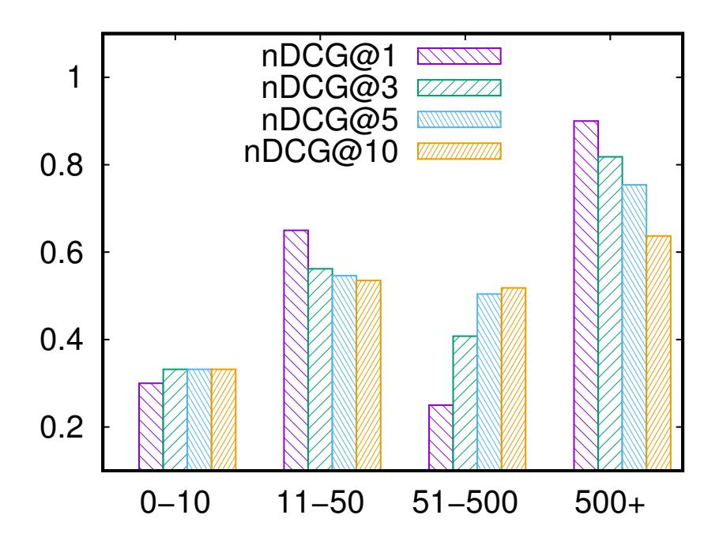
Figure 3.3: Pattern accuracy of different seed popularities.

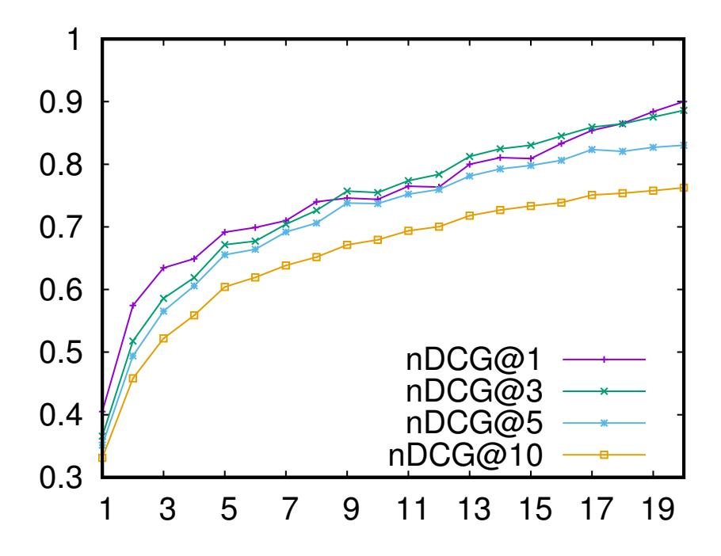
Figure 3.4: Pattern accuracy of different seed set sizes.

### 3.4.3 Accuracy of Temporal Instances

Automatic evaluation. We extract temporal instances based on a set of top-*k* temporal patterns for each relation on two datasets, i.e., the PRAVDA dataset and wiki-people dataset. We report the accuracy and number of instances respectively in Table [[3.3]](#ref-tab-3.3). Overall, our model is quite effective, achieving a high accuracy (>0.7) and a good coverage of the knowledge on both datasets. In particular, we can observe a slight drop in accuracy for all relations on both datasets when the number of used patterns increases, but also a dramatic increase on the number of extracted instances (e.g., top-1 v.s.

top-3 patterns). On one hand, it indirectly verifies the effectiveness of our pattern extraction algorithm since high-quality patterns are ranked higher than low-quality patterns. On the other hand, it illustrates the capability of our proposed methods for achieving a good balance between accuracy and coverage. Comparing our model with the baseline method (PRAVDA System [[11]](#ref-11)), our model (e.g., using top-5 patterns) has a much higher accuracy on all relations (and on both the *START* and *END* status). In terms of coverage, our model is able to extract many more instances on the *SpouseOf* relation and *DiedIn* relation (i.e., three times and two times more than the baseline, respectively), while fewer instances on the *PlayForClub* relation. It is worth noting that our method only uses a few patterns compared to PRAVDA. We also notice that some patterns do not yield any instances, since they are either over-specific or covered by other patterns. Hence, we believe that the number of extracted instances will definitely increase when more patterns are utilised. Comparing the results obtained on the PRAVDA dataset and wiki-people dataset, we further observe that the number of instances extracted from wiki-people is much larger than that of the the PRAVDA dataset for almost all the relations, with a slight degradation of accuracy (except for the *DiedIn* relation). Although the size of the PRAVDA dataset is larger than wiki-people, the news articles included in the PRAVDA dataset are more noisy, containing lots of abbreviations and grammar mistakes, leading to worse performance in the upstream NLP tools, such as parsing and entity linking, which in turn reduces the knowledge coverage on this dataset. Overall, our model achieves satisfactory performance given such noisy free texts, thanks to the robust algorithm design and the offline preprocessing.

| PRAVDA Dataset | | | | | |
|---------------------|-----------|----------------|----------------|----------------|-----------------|
| Relation | PRAVDA^*^ | top-1 patterns | top-3 patterns | top-5 patterns | top-10 patterns |
| SpouseOf-begin | 0.78/59 | 0.95/39 | 0.84/164 | 0.84/164 | 0.84/169 |
| SpouseOf-end | 0.71/9 | 0.85/11 | 0.84/21 | 0.84/21 | 0.64/35 |
| PlayFor-begin | 0.80/1497 | 0.85/199 | 0.85/670 | 0.82/713 | 0.82/713 |
| PlayFor-end | 0.71/167 | 0.81/18 | 0.81/18 | 0.76/88 | 0.65/106 |
| BornIn-time | 0.82/2846 | 0.96/2875 | 0.96/2875 | 0.96/2875 | 0.96/2875 |
| DiedIn-time | 0.88/57 | 0.83/87 | 0.88/113 | 0.88/113 | 0.87/126 |
| Wiki-People Dataset | | | | | |
| Relation | PRAVDA | top-1 patterns | top-3 patterns | top-5 patterns | top-10 patterns |
| SpouseOf-begin | - | 0.84/284 | 0.84/284 | 0.84/284 | 0.84/284 |
| SpouseOf-end | - | 0.69/9 | 0.69/9 | 0.73/13 | 0.73/13 |
| PlayFor-begin | - | 0.86/918 | 0.85/1019 | 0.85/1019 | 0.84/1245 |
| PlayFor-end | - | 0.71/32 | 0.71/32 | 0.72/42 | 0.73/50 |
| BornIn-time | - | 0.93/5108 | 0.93/5108 | 0.93/5108 | 0.85/5132 |
| DiedIn-time | - | 0.95/943 | 0.95/952 | 0.95/952 | 0.95/964 |

Table 3.3: Instance accuracy of different relations.

^*^ The results are reported in the format of accuracy/number of instances.

^*^ For a fair comparison, PRAVDA results are copied from the original paper [[11]](#ref-11).

Manual check. In this part, we manually evaluate the wrong instances in order to have a better understanding of the extracted instances. We observe that a large number of extracted temporal facts are actually false negatives due to the limited coverage of Wikipedia's Infobox or the conflict with ground truth G, as Table [[3.4]](#ref-tab-3.4) shows. In short, we omit *r* as we use relation-specific patterns to extract

instances. In particular, an instance (*s*,*o*,*t*) is regarded as uncovered if (*s*,*o*) 6∈ G*^b^* while *r*(*s*,*o*) actually exists based on manual check. Similarly, (*s*,*o*,*t*) is regarded as a conflict if (*s*,*o*,*t*) 6∈ G while (*s*,*o*,*t*) holds true according to the sentence. Hence, we randomly sample 20 instances {(*s*,*o*,*t*)} with the entity pair (*s*,*o*) 6∈ G*b*, and 20 instances such that (*s*,*o*,*t*) 6∈ G for each relation on both statuses, respectively, and manually check the correctness of each instance according to the original sentences. As Table [[3.4]](#ref-tab-3.4) shows, some entity pairs are not contained in G*^b^* (from 0.1 to 0.45), meaning that the number of actual correct instances can further increase. This illustrates that our approach is actually able to achieve a much better coverage. There are two main reasons that cause the ground truth limitation: (1) Infobox does not contain the entity pair (*s*,*o*) and (2) entities in Infobox have different names, so they cannot be matched and are regarded as uncovered. It is also worthy to notice that there is a large number of instances conflicting with G (from 0.25 to 0.75), which means the actual *Acc*^* should increase dramatically. There are three reasons causing such conflict: (1) Wikipedia's Infobox is not always correct, especially for some unpopular entities, (2) the source of extracted instances can be a rumour, and (3) the description ways are different. For example, an Infobox record says a football player joined a soccer club at the 2005-2006 season, while actually, the original sentence describes that he joined the club at the end of 2004. Overall, this manual check verifies that our proposed framework is quite promising in achieving much better accuracy and coverage in practice.

| Relation | Uncovered | Conflict |
|----------------|-----------|----------|
| SpouseOf-begin | 0.3 | 0.4 |
| SpouseOf-end | 0.15 | 0.75 |
| PlayFor-begin | 0.45 | 0.3 |
| PlayFor-end | 0.1 | 0.25 |
| BornIn-time | 0.4 | 0.25 |
| DiedIn-time | 0.1 | 0.15 |

Table 3.4: Manual check of temporal instances.

### 3.4.4 Case Study

In this part, we present highly representative temporal patterns and report the extracted instances and related sentences in order to provide a more intuitive view of the performance of our proposed framework. For each relation, we report 2 patterns and 2 instances as demonstrated in Table [[3.4.4]](#ref-tab-3.4.4). We can see that some patterns, such as "marry", "divorce" and "join" are very straightforward for a relation, while others, e.g., "tie the knot for" and "be shoot", are not easily constructed or enumerated by human experts. Fortunately, our framework can capture both patterns by automatically analysing a large scale of underlying text corpus. Moreover, we can see that there are sometimes multiple candidate entities and time expressions in a sentence on a target relation (e.g., the second sentence for *SpouseOf-begin* relation). Nevertheless, our proposed algorithm for instance extraction is still able to distinguish these candidates and locate the most relevant (or correct) instances from such a sentence, which guarantees the high accuracy and high coverage of our model. Last but not least, our instance extraction algorithm is quite robust to different sentence structures such as sub-clauses or parenthetical

(e.g., the second sentence for *BornIn* relation), but also sensitive to key phrases (e.g., "sign from" in the second sentence for *PlayFor-end*).

| Relation | Patterns^*^ | Instances | | |
|----------------------------|-----------------------------------------|----------------------------------------------------------------------------------------------------|--|--|
| | marry | (Martin Scorsese, Helen S. Morris, 1999) | | |
| SpouseOf-begin | tie the knot for | (Andre Agassi, Steffi Graf, 2001) | | |
| Sentences | | | | |
| | | Martin Scorsese has been married to Helen Schermerhorn Morris since 1999. | | |
| | | Andre Agassi/Steffi Graf Two of the most famous players in tennis history got together in 1999 | | |
| and tied the knot in 2001. | | | | |
| Relation | Patterns | Instances | | |
| | divorce in | (Hugo Chavez, Marisabel R. de Ch ´ avez, 2004) ´ | | |
| SpouseOf-end | split from | (Paul McCartney, Heather Mills, 2006) | | |
| Sentences | | | | |
| | | His second wife was journalist Marisabel Rodr´ıguez de Chavez, with whom Hugo Ch ´ avez ´ | | |
| | separated in 2002 and divorced in 2004. | | | |
| | | The most recent case was that of Paul McCartney and Heather Mills, who split in 2006 after four | | |
| years of marriage. | | | | |
| Relation | Patterns | Instances | | |
| | join | (Emil Larsen, Odense Boldklub, 2012) | | |
| PlayFor-start | sign | (Bobby Reid, Plymouth Argyle F.C., 2014) | | |
| Sentences | | | | |
| | | On 9 July 2012, Emil Larsen joined Odense Boldklub on a four-year contract. | | |
| | | Bobby Reid (footballer, born 1993) signed a one-month loan deal with Plymouth Argyle in | | |
| September 2014. | | | | |
| Relation | Patterns | Instances | | |
| | leave | (Max Harrop, Ashton United F.C., 2015) | | |
| PlayFor-end | sign from | (Mark Connolly, Wolverhampton W., 2009) | | |
| Sentences | | | | |
| | | In August, 2015, Max Harrop left Ashton United for Ramsbottom United, joining his older | | |
| brother Kyle Harrop. | | | | |
| | | Mark Connolly was signed from Wolverhampton Wanderers by Bolton Wanderers on the transfer | | |
| | | dealine in 2009-10 in English football after the clubs agreed a £1,000,000 fee. | | |
| Relation | Patterns | Instances | | |
| | be bear in | (Billy Eckstine, Pittsburgh, 1914) | | |
| BornIn-time | | | | |

be bear on

Table 3.5: Case study of temporal patterns and instances.

(Hans Pirkner, Wien, 1946)

| Relation | Patterns^*^ | Instances | | | | | | |
|--------------------------------------------------------------------------------------------------|-----------------------|---------------------------------------------------------------------------------------------|--|--|--|--|--|--|
| Sentences | | | | | | | | |
| Born in Pittsburgh on July 8, 1914, William Clarence Eckstine was the youngest of three children | | | | | | | | |
| of William and Charlotte Eckstine. | | | | | | | | |
| Hans Pirkner (born 25 March 1946 in Wien) is a former Austrian football forward. | | | | | | | | |
| Relation | Patterns Instances | | | | | | | |
| DiedIn-time | die in | (David Vanole, Salt Lake City, 2007) | | | | | | |
| | be shoot | (Gianni Versace,Miami, 1997) | | | | | | |
| Sentences | | | | | | | | |
| David Vanole, who lived in New York City, died on January 15 2007 in Salt Lake City during a | | | | | | | | |
| family skiing vacation. | | | | | | | | |
| | | Allegra was only 11 when her uncle, Gianni Versace, was shot dead on the steps of his Miami | | | | | | |
| Beach home in 1997. | | | | | | | | |

Table 3.5 –*Continued from previous page*

^*^Verb phrases are transformed into their lemma forms and pattern weights are omitted.

### 4. EXPERIMENTS 51

The following publications have been incorporated as Chapter [[4]](#ref-ch4).

1. [[2]](#ref-2) Yu Liu, Wen Hua, Kexuan Xin and Xiaofang Zhou, [Context-Aware Temporal Knowledge Graph Embedding](https://link.springer.com/chapter/10.1007/978-3-030-34223-4_37), *Web Information Systems Engineering*(WISE), 583-598, 2019

| Contributor | Statement of contribution | | | |
|---------------|---------------------------|-----|--|--|
| Yu Liu | algorithm design | | | |
| | experiment design | 50 | | |
| | experiment implementation | 100 | | |
| | paper writing | 70 | | |
| | idea discussion | 50 | | |
| Wen Hua | algorithm design | 20 | | |
| | experiment design | 40 | | |
| | paper writing | 30 | | |
| | proof-reading | 50 | | |
| | idea discussion | 20 | | |
| Kexuan Xin | experiment design | 10 | | |
| | proof-reading | 20 | | |
| | idea discussion | 20 | | |
| Xiaofang Zhou | proof-reading | 30 | | |
| | idea discussion | 10 | | |

2. Yu Liu, Wen Hua, Jianfeng Qu, Kexuan Xin and Xiaofang Zhou. Temporal Knowledge Completion with Context-Aware Embeddings, *World Wide Web Journal*, 2021.

| Contributor | Statement of contribution | | | |
|---------------|---------------------------|----------|--|--|
| Yu Liu | algorithm design | 70 | | |
| | experiment design | 50 | | |
| | experiment implementation | 100 | | |
| | paper writing | 70 | | |
| | idea discussion | 50 | | |
| Wen Hua | algorithm design | 30 | | |
| | experiment design | 30 | | |
| | paper writing | 30 | | |
| | idea discussion | 20 | | |
| Jianfeng Qu | experiment design | 20 | | |
| | proof-reading | 50 | | |
| | idea discussion | 20 | | |
| Kexuan Xin | proof-reading | | | |
| | idea discussion | 20 10 | | |
| Xiaofang Zhou | proof-reading | 30 | | |

## Chapter 4

## Temporal Knowledge Graph Completion

## 4.1 Introduction

Recently, knowledge graphs (KGs) have been studied in many fields and are used in many algorithms, tools and applications in the real world, e.g., entity linking [[160]](#ref-160), [[161]](#ref-161), relation extraction [[141]](#ref-141), [[162]](#ref-162) and question answering [[163]](#ref-163), [[164]](#ref-164). However, in the real world, knowledge graphs are far from complete [[13]](#ref-13), [[14]](#ref-14), which greatly limits their effectiveness and benefits for the downstream applications. Thus to this end, knowledge graph completion (KGC) has been proposed. KGC aims to derive new facts from observed ones using the technique of knowledge graph embedding (KGE). KGE [[16]](#ref-16) maps all the components of a KG (i.e., entities and relations) into low-dimension vector spaces. The embeddings of entities and relations will be used in link predictions to derive new facts. Generally, traditional KGE models learn a score function on the target fact itself, which measures the plausibility of a fact, e.g., TransE [[19]](#ref-19), DistMult [[106]](#ref-106), and HolE [[107]](#ref-107). Furthermore, additional information, e.g., paths, patterns and texts, can be incorporated [[108]](#ref-108)–[[110]](#ref-110) to further improve the embedding performance.

However, as the real world is continuously changing, not all previous facts stored in KGs are still valid currently. Actually, many relations are changing and evolving over time, i.e., they are only valid for a certain time period. For example, the fact ("Brad Pitt", *SpouseOf*, "Angelina Jolie") holds true only over the temporal interval "[2014, 2019]".^1^ This highlights the significance of constructing temporal-aware knowledge graphs (temporal KGs) [[1]](#ref-1), [[11]](#ref-11), [[28]](#ref-28) and the corresponding techniques for KG embeddings since most existing KGE methods only work well on static KGs and cannot be directly applied on temporal KGs. However, to our best knowledge, only a few researches on temporal KGE [[2]](#ref-2), [[6]](#ref-6), [[17]](#ref-17), [[18]](#ref-18), [[122]](#ref-122)–[[124]](#ref-124) have attempted to address this issue. Moreover, most of these methods still follow previous static KGE approaches by simply designing a new factual-plausibility score function on entities and relations, i.e., how well the entities and relation are composed together. For example, the timestamps of facts can be directly projected into the entities and/or relations [[6]](#ref-6), [[18]](#ref-18), [[124]](#ref-124) or incorporated into entities via neural networks [[18]](#ref-18), [[122]](#ref-122), [[123]](#ref-123). As a result, these methods pay less

^1^According to the Brad Pitt Wikipedia page.

attention on the temporal information. In this paper, instead of focusing on the target fact itself, we start from a new direction, on modeling the contextual interactions of the target fact with its related contexts. In particular, we regard the contexts of a target fact as all the facts that share a certain component (i.e., subject or object) with the target fact.

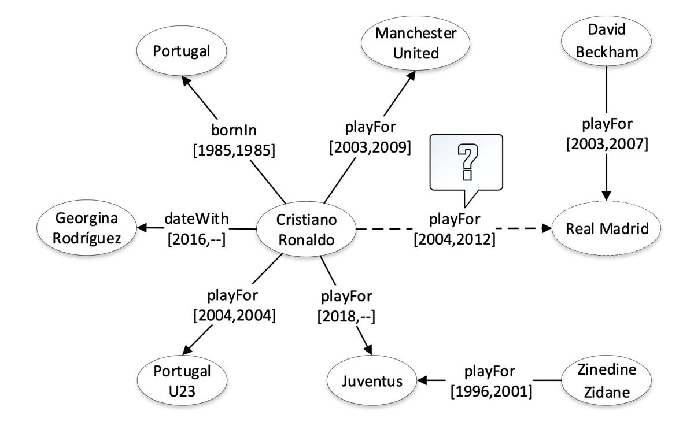
Figure 4.1: An example of temporal interactions for the predicting of fact ("Cristiano Ronaldo", *playfor*, "Real Madrid", "[2004, 2012]").

In this paper, we propose a temporal KGE model that measures two aspects: the fact itself and the interactions between its contexts. Our main idea is simple and can be summarised as follows: a fact is valid if (1) it is composed of a plausible subject, relation and object and (2) the fact is consistent with its surrounding contexts, temporally and semantically. In particular, the first aspect is on the target fact itself and is captured by the measure of *factual plausibility* as traditional KGE methods. The second aspect captures the interactions between the target fact and its related contexts on two novel measures, namely, *temporal consistency* and *contextual consistency*. We use an example to show how context interactions work. Figure [[4.1]](#ref-fig-4.1) is a small fragment of a temporal knowledge graph. We can see that there are five facts describing "Cristiano Ronaldo" and they are regarded as the *contexts* for "Cristiano Ronaldo". Assume that we are predicting whether the candidate fact ("Cristiano Ronaldo",*playfor*, "Real Madrid", "[2004,2012]") holds or not. If we only use the fact itself, i.e., by *factual plausibility*, the result will be "True" in a large probability. However, when we consider the context information of "Ronaldo", the result becomes "False" since there is a large overlapping on the temporal intervals^2^. As human beings, we can easily find this clue and make that conclusion, but directly

^2^ If we assume a soccer player can only play for one association football club at a certain time, we can make that claim by checking the candidate fact ("Cristiano Ronaldo", *playfor*,"Real Madrid", "[2004,2012]") with its one context ("Cristiano Ronaldo", *playfor*,"Manchester United", "[2003,2009]").

applying such a strategy on machines is still challenging. Recall that the first step taken by humans is to select the contexts that are useful to make the conclusion, since not all contexts are useful for the prediction and some can even be misleading. For example, the fact on "dateWith" is useless for determining the correctness of ("Cristiano Ronaldo", *playfor*,"Real Madrid", "[2004,2012]") and the fact "playFor Portugal U23" can even be misleading for machines. This implies the non-trivialness of selecting useful contexts for the target fact. Besides, there are many kinds of temporal relationships and interactions, e.g., temporal orders, intersections and distances. For example, the temporal interval of the *bornIn* relation is always prior to any intervals of the *playfor* relation. Facts of the *playfor* relation have overlapping or different temporal distances with each other. These variants bring challenges to effectively modeling temporal interactions and measuring the temporal consistency. At last, context interaction of a target fact is not always involved one-by-one. In other words, context interactions can be regarded as a whole group to provide semantics about the target fact. Clues and evidences exist in contexts, and they work together for the correctness prediction with the target fact. Based on the previous example, by analyzing the contexts of "Cristiano Ronaldo", a clue that a football play cannot play for two clubs at the same time is found. This highlights the importance of modeling contexts together and capturing the complex interactions on multiple contexts.

To address the previous issues, we propose (1) a context selection method, (2) temporal consistency, a measure on temporal interactions, and (3) contextual consistency, a measure on complex interactions of multiple contexts. In particular, we introduce a relation-entity-aware mechanism to determine the usefulness of each context for the prediction of a target fact. In addition, we use convolution neural networks (CNNs) to extract high-level features of temporal interactions, based on which, a fully connected layer (FCs) is adopted to learn the temporal consistency score. Lastly, we construct a spare graph that contains all of the information about the fact and contexts; then, we use convolution neural networks (GCNs) [[165]](#ref-165) to capture complex contextual interactions. Currently, existing temporal KGE models only focus on the fact itself, i.e., *factual plausibility*, and ignore the context interactions, i.e., *temporal consistency* and *contextual consistency*. Incorporating with context interactions, our model can learn more representative embeddings for knowledge graph completion.

Our main contributions in this work can be summarised as follows:

- We propose a context-aware KGE model which explicitly measures two aspects of context interactions, namely *temporal consistency* and *contextual consistency*. Integrating with *factual plausibility*, our model learns more representative embeddings of temporal KGs.
- We design a context selection strategy that considers the usefulness of a context from two perspectives, i.e., relations and entities.
- We conduct extensive experiments on real-world datasets, and the experimental results verify the superiority of our proposals over existing state-of-the-art methods on both entity predictions and time predictions.

The remainder of this paper is organised as follows: We formally introduce the problem definition of the problem in Section [[4.2]](#ref-4.2), and our solutions are described in details in Section [[4.3]](#ref-4.3). Lastly, we report the experimental results in Section [[4.4]](#ref-4.4).

## 4.2 Problem Definition

In this paper, we consider the task for learning the representations of a temporal knowledge graph via enforcing the consistency between contexts and valid temporal intervals. In the following, boldface upper-case and lower-case letters indicate matrices and vectors, respectively.

Let *E*, *R* and *T* denote an entity set, a relation set and a timestamp set, respectively. Our framework for temporal knowledge graph embedding can be defined as follows:

Definition 10 (Temporal Knowledge Graph).*A temporal KG is defined as a directed graph G* = (*E*,*R*,*T*) *where (1) E is the set of entities (nodes); (2) R is the set of relations (edges); and (3) T is the set of valid temporal interval (labels).* Definition 11 (Fact).*A fact is defined as the 4-tuples f* = (*s*,*r*,*o*,*t*) *where s*,*o*∈*E are the subject and object, respectively. r*∈*R is a relation between the subject s and object o, and valid time t* = [*t^s^* ,*t^e^*] ⊆ *T*×*T is the temporal interval when* (*s*,*r*,*o*) *holds in the real world. Facts observed in the KG are stored as a collection D*^+^* = {(*s*,*r*,*o*,*t*)}*.*

**Example:** Fact ("Cristiano Ronaldo", *playfor*, "Manchester United", "[2003, 2009]") tells the truth, that Ronaldo played for Manchester from 2003 to 2009.

Definition 12 (Contexts). *The contexts of a target entity e are defined as an aggregate set of facts C^e^*= {*f*1,··· , *fn*} *such that each fact f^i^ contains e.*

**Example:** (1) Fact ("Cristiano Ronaldo", *playfor*"Real Madrid", "[2009, 2018]") is a context instance for the entity "Cristiano Ronaldo"; (2) Fact ("Wayne Rooney",*playfor*"Manchester United", "[2004, 2017]") is a context for the entity "Manchester United".

Definition 13 (Temporal Knowledge Graph Embedding).*Temporal KGE is the task to learn the representations of a temporal Knowledge Graph G. In other words, the temporal KGE task aims to embed the entity set E, relation set R and time set T into a low-dimensional continuous vector space, say*R*^d^*.* To evaluate the KGE performance, link prediction [[19]](#ref-19) is widely used. Link prediction aims to predict the missing part of a given incomplete fact. Traditionally, the link prediction task for KGE consists of three subtasks: head prediction, tail prediction and relation prediction. However, for temporal KG, the link prediction has a new task: time prediction as the valid time interval could be unobserved or erroneous. In particular, we replace an observed fact *f* = (*s*,*r*,*o*,*t*) as (?,*r*,*o*,*t*), (*s*, ?,*o*,*t*), (*s*,*r*, ?,*t*) and (*s*,*r*,*o*, ?) for the task of head prediction, relation prediction, tail prediction and time prediction, respectively. Here, ? refers to the missing part. Since the missing part of the valid time

interval *t* = [*t^s^* ,*t^e^*] could be the start time, end time or both, the time prediction contains three sub-tasks, namely, start prediction, end prediction and interval prediction, i.e., (*s*,*r*,*o*,[*t^s^* , ?]), (*s*,*r*,*o*,[?,*t^e^*]), and (*s*,*r*,*o*,[?, ?]).

## 4.3 Methodology

In this section, we will introduce our proposed context-aware model for temporal KGE. In the following, we will present (1) an overview of our model, (2) the characterizing of the context interactions for temporal consistency and contextual consistency, (3) the characterizing of the factual plausibility and (4) the objective function and the training process.

### 4.3.1 Model Overview

Different from existing temporal-KGE models, which only focus on the plausibility of a fact, we explore more on context interactions temporally and semantically, i.e., temporal consistency and contextual consistency. Our intuition can be summarised as follows: a fact is valid if (1) the fact is composed of a plausible subject, relation and object; (2) the valid interval of the target fact is temporally consistent with its contexts; (3) the fact is semantically consistent with multiple contexts as a group.

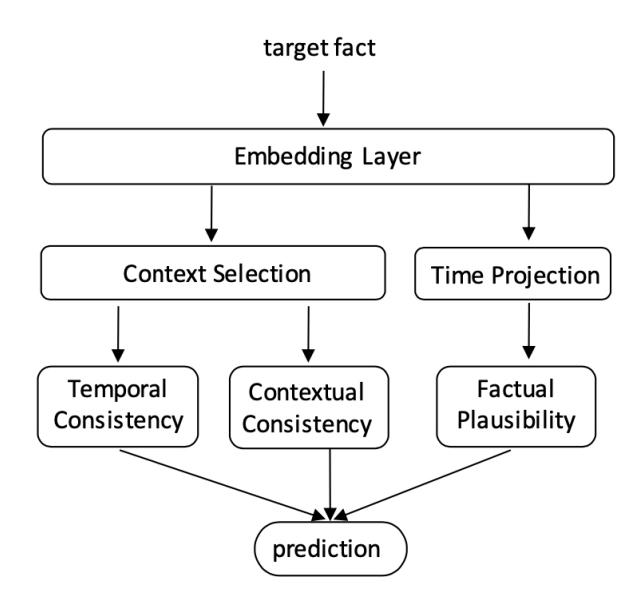
Figure 4.2: An overview of our proposed temporal-aware KGE model.

Our framework for temporal KG embeddings is shown as Figure [[4.2]](#ref-fig-4.2). We can see that there are six modules, i.e., one embedding layer, two for the factual plausibility and three for the context interactions. Given a fact candidate *f* = (*s*,*r*,*o*,[*t^s^* ,*t^e^*]), our framework predicts whether it holds true. In particular, for fact *f*, we obtain its subject entity embedding *s*∈ R^d^, object entity embedding *o*∈ R^d^, relation embedding *r*∈ R^d^ and time embeddings *t^s^*∈ R^d^ and *t^e^*∈ R^d^ through the embedding layer. As introduced in Section [[4.1]](#ref-4.1), not all contexts are useful, and some are misleading for modeling

the temporal interactions; thus, we propose a fact-aware context selection mechanism. This context selection module calculates the usefulness of each context fact and ranks them accordingly. The top-*k* contexts will be used for calculating temporal consistency and contextual consistency. In our work, a two-layer architecture is used to capture the temporal interactions between the selected contexts and the input fact for calculating the temporal consistency. In order to capture the complex interactions between multiple contexts and the target fact, we use stacked graph convolution networks (GCNs) [[165]](#ref-165) to capture their interactions for calculating the contextual consistency. On the other hand, we follow previous works and calculate the factual plausibility. However, as the input fact has not only the factual components (i.e., entities and relations), but also has timestamps, we have to handle the temporal information carefully. Since a fact is only valid during the given temporal period, we encode the time embeddings into the relation embedding using projection operations to derive a time-aware factual representation. After that, we can calculate the factual plausibility as TransE [[19]](#ref-19). Finally, we use both the factual plausibility and the temporal consistency to predict the correctness of the input fact. Because of the incorporation with context information, we believe our model is able to learn more representative embeddings.

### 4.3.2 Characterizing of the Context Interactions

A major novelty of our work is explicitly characterizing the context interactions, i.e., the temporal consistency and the contextual consistency. In this part, we first study how to select useful contexts of a target fact; then, we study how to use the selected contexts to model the temporal interactions and calculate the temporal consistency, and lastly, we elaborate upon the module for calculating contextual consistency.

### Context Selection

Obviously, not all of an entity's information is related to the target fact, and some can be noisy and misleading. Therefore, we first propose a module that measures the context usefulness for the target fact. Heuristically, contexts on different relations have different influences for a certain fact. For example, consider the target fact ("Cristiano Ronaldo",*playfor*, "Manchester United", "[2003,2009]"). Contexts about "Cristiano" in the soccer field are more useful than the information about his personal life, such as facts on *spouseOf* or *hasChildren*. Besides, information about "Manchester United", such as facts on *locationOf*, *hasCapacity*, and *foundedOf* are noisy for the target fact. Based on this observation, we calculate the relation-usefulness via deep convolution neural networks (CNNs). In particular, given a fact *f* = (*s*,*r*,*o*,[*t^s^* ,*t^e^*]) and all contexts *C^e^* = {*c*1,..., *cn*} for a core entity *e* (*e* can be either subject or object), we calculate the relation-usefulness *u*^(*r*)*~i~* of each context *c^i^*∈*C^e^* as follows:

$$
\boldsymbol{u}_i^{(r)} = CNNs(\boldsymbol{r} \oplus \boldsymbol{r}_i) \tag{4.1}
$$

$$
u_i^{(r)} = \sigma(\boldsymbol{W}_r \boldsymbol{u}_i^{(r)} + b_r)
$$
(4.2)

where CNNs(·) is a two-depth convolution network with max-pooling layers, and *r* and *r*^i^ are the relation embedding of *r* and *r*^i^ (in fact *f* and context *ci*), respectively. *W*^r^ is the weight matrix, and *b*^r^ is the bias in the fully connected layer (FCs). ⊕ is the concatenation operation and σ(·) is the activation function. In this paper, without specific mention, all activation functions are TanH. Here, *e* can be either the subject or object entity. We calculate the relation usefulness of each context in *C^h^* and *Ct*.

We also observe that useful contexts are able to distinguish similar entities. For example, the contexts of "Cristiano Ronaldo" are more useful if these contexts are able to distinguish "Ronaldo" from some other football players, e.g., "Lionel Messi" and "Zinedine Zidane". Based on this observation, we propose another entity-usefulness function via a similar structure. Since entity embeddings essentially represent semantics, we regard the similar entities of a target entity as its nearest neighbours in the vector space. In particular, for a target entity *e*, we obtain its similar entities by searching the top-*w*^3^ nearest neighbours {*nj*}~w~*j*=1 via calculating the *l*^1^ distance. After that, we use a similar CNNs and FCs architecture to calculate the entity usefulness. Formally, given a target fact *f* = (*s*,*r*,*o*,[*t^s^* ,*t^e^*]), contexts *C^e^* = {*ci*}~n~*i*=1 of entity *e* and the top-*w* nearest neighbours {*nj*}~w~*j*=1 of *e*, we calculate the entity-usefulness *u*^(*e*)*~i~* of each context *c^i^*∈*Ce*, as follows:

$$
\boldsymbol{u}_{i,j}^{(e)} = CNNs((\boldsymbol{e} - \boldsymbol{n}_j) \oplus \boldsymbol{h}_i \oplus \boldsymbol{t}_i)
$$
(4.3)

$$
u_{i,j}^{(e)} = \sigma(\boldsymbol{W}_e \boldsymbol{u}_{i,j}^{(e)} + b_e)
$$
(4.4)

$$
u_i^{(e)} = \frac{1}{w} \sum_{j=1}^{w} u_{i,j}^{(e)}
$$
(4.5)

where *e* is the entity embedding of the core entity *e*, and *n*^j^∈ R^d^ is the entity embedding of the *j*th nearest neighbour. *W*^e^ is the weight matrix and *b*^e^ is the bias. ⊕ is the concatenation operation and σ(·) is the TanH activation function. In order to find the discerning contexts, we concatenate the difference (*e* −*n*^j^*) with context entities *h*^i^ and *t*^i^ as the input vector for CNNs. Based on relation-usefulness *u*^(*r*)*~i~* and entity-usefulness *u*^(*e*)*~i~*, we obtain the usefulness score *u*^i^ of each contexts *c^i^*∈*C^e^* as follows:

$$
u_i = u_i^{(r)} + u_i^{(e)}
$$
(4.6)

Finally, according to Eq. [[4.6]](#eq-4.6), we can obtain the top-*k* context facts *C*~^s~* and *C*~^o~* from *C^s^* and *Co*, respectively.

### Temporal Consistency

After obtaining the top-*k* useful subject contexts *C*~^s~* and object contexts *C*~^o~*, we now model the temporal interactions and calculate temporal consistency. As mentioned in Section [[4.1]](#ref-4.1), there are various kinds of temporal interactions, such as temporal orders, temporal distances and temporal intersections. For

^3^ in experiments we set *w*= 10.

example, the fact ("Cristiano",*playfor*, "Manchester", "[2003, 2009]"), temporally contains a context fact (he played for Portugal U23 in 2004), and has some temporal distance to the context fact (he has played for Juventus since 2018), and must have happened after his birth date. Considering some relational facts do not have the end time (e.g. they are still holding true at current time), we manually add a padding label "[holding]" into the time label set *T*. Obviously, these interactions are in various categorises and in different relations with numerous values. But, heuristically, these interactions should be temporally compatible with each other if the target fact (and the contexts) is true. Based on this observation, we first model the temporal interactions as hidden features, then use these hidden vectors to calculate the temporal consistency, which indicates how the fact and contexts are compatible with each other. As we are modeling the hidden temporal interactions, we only consider the valid temporal intervals as the input. In particular, given target fact *f* = (*s*,*r*,*o*,[*t^s^* ,*t^e^*]) and a context *c^i^*∈*C*~, we concatenate all of the time information together as the input for temporal consistency as follows:

$$
\mathbf{s}_i^{(t)} = (\mathbf{t}_s \oplus \mathbf{t}_e \oplus \mathbf{t}_{i,s} \oplus \mathbf{t}_{i,e})
$$
(4.7)

where ⊕ is the concatenate operation, *t*^(*i*),*^s^*∈ R^d^, and *t*^(*i*),*^e^*∈ R^d^ is the time embedding vector of the start time *t*^(*i*),*^s^* and end time *t*^(*i*),*^e^*, respectively. After that, we extract high-level hidden features *d*^(*t*)^ using convolution neural networks (CNNs), and then we use a fully connected layer (FCs) to obtain the temporal consistency score *s*^(*t*)^ according to these high-level features. This architecture can be summarized as follows:

$$
\boldsymbol{d}_i^{(t)} = CNNs(\boldsymbol{s}_i^{(t)})
$$
(4.8)

$$
s_i^{(t)} = \sigma(\boldsymbol{W}_t \boldsymbol{d}_i^{(t)} + b_t)
$$
(4.9)

where CNNs is a two-depth convolution layer with max-pooling, and *W*^t^ and *b*^t^ are the weight matrix and bias, respectively. Since each fact reflects the temporal consistency independently, we apply Eq. [[4.9]](#eq-4.9) separately on all contexts of *C*~^s~* and *C*~^o~* and obtain {*s*^(*t*)*~i,h~*}~k~*i*=1 and {*s*^(*t*)*~i,t~*}~k~*i*=1 , respectively. We select the most representative temporal interaction via max function, as follow:

$$
s_e^{(t)} = \max(\{s_{i,e}^{(t)}\}_{i=1}^k)
$$
(4.10)

Here, we use max operation because a false fact can have some compatible contexts occasionally, (i.e., has some low scores), but cannot be consistent with all of them at the same time (i.e., also has some large scores). Therefore, using the above Eq. [[4.10]](#eq-4.10), we obtain the temporal consistency scores *s*^(*t*)*~s~* and *s*^(*t*)*^o^* for the selected subject contexts *C*~^s~* and object contexts *C*~^o~*, respectively. In order to predict the correctness of the target fact, we average them as the temporal consistency score *s*^t^, as follows:

$$
s_t = \frac{1}{2} (s_s^{(t)} + s_o^{(t)})
$$
(4.11)

### Contextual Consistency

In this part, we introduce how to use the selected contexts, i.e., *C*~^s~* and *C*~^o~*, to calculate the contextual consistency *s*^c^ for improving temporal KG embeddings. Contextual consistency is a state in which head contexts and tail contexts occur together without conflicts regarding the target fact, which requires capturing the context interactions as a whole group instead of modeling them one by one. As human beings, in order to detect conflicts between the target fact and its contexts, we have to first read all of them and know their semantics. Then, according to the observations, we summarise all the contexts and extracted useful clues for making the prediction. In our work, we also follow the previous steps, namely, (1) encoding facts and (2) summarizing and extracting clues as Fig. [[4.3]](#ref-fig-4.3) shows.

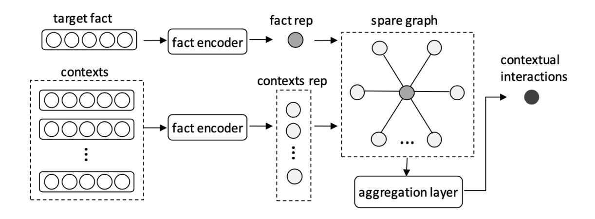
Figure 4.3: The architecture for learning the representation of contextual interactions.

In particular, given a target fact *f* = (*s*,*r*,*o*,[*t^s^* ,*t^e^*]) and the selected contexts *C*~ = {*c*1,..., *ck*}, we use a fact encoder to learn the fact representation *d*^(*c*)*~f~* and context presentations {*d*^(*c*)*~i~*}~k~*i*=1 , as follows:

$$
d^{(c)} = W_1^{(c)} f + b_c \tag{4.12}
$$

where *d*^(*c*)^∈ R^d^ is the learned representation of a fact, *f* = (*s*⊕*r* ⊕*o*⊕*s*⊕*e*) ∈ R^5*d^ is the embeddings of a fact, and *W*^(*c*)^ and *b*^c^ are the weight matrix and bias, respectively. Instead of processing elements of a fact, the module can learn the semantics of a single fact, which will be used for contextual consistency. In order to capture complex interactions of multiple contexts, we construct an undirected spare graph *G* whose fact representation and context representations are nodes, and only the fact node connects to the context nodes. We also add a self-loop for each node to retain the self-information. In other words, spare graph *G*^s^* = (*V*^s^* ,*Es*) where *V*^s^* = {*d*^(*c*)*~f~* ,*d*^(*c*)^1 ,...,*d*^(*c*)*~k~*}, *edge*(*f*, *ci*) = 1 and *edge*(*c^i^*,*c^j^*) = 0 (*i*, *j*≤*k*,*i*6=*j*). By doing this, we can avoid model overfitting and also keep the interactions between the target fact and its contexts. In order to capture the contextual interactions, we use a two layer stacked graph convolution networks (GCNs) [[165]](#ref-165) as the aggregation layer. By the stacked GCNs, information flows from one node to other nodes, which faithfully simulates the complex interactions between multiple contexts. Formally, given the fact representation *d*^(*c*)*~f~* and contexts representations {*d*^(*c*)*~i~*}~k~*i*=1 , the contextual interactions *p*^(*c*)^ is learned via the aggregation layer, as follows:

$$
\boldsymbol{P}^{(c)} = A \boldsymbol{\sigma} (A \boldsymbol{X}^{(c)} \boldsymbol{W}_2^{(c)}) \boldsymbol{W}_3^{(c)}
$$
(4.13)

$$
\boldsymbol{p}^{(c)} = \max(\boldsymbol{P}^{(c)})
$$
(4.14)

where *p*^(*c*)^∈ R^d^ is the learned representation of contextual interactions, *P*^(*c*)^ = {*p*^(*c*)*~i~*}~k+1~*i*=1 is the output of the stacked GCN layers and σ(·) is the TanH activation function. *X*^(*c*)^ is the sequence of all nodes of *G*, starting from the fact node *d*^(*c*)*~f~* to the context node *d*^(*c*)*~k~*.*W*^(*c*)^2 and *W*^(*c*)^3 are the weight matrices of the stacked GCNs. *A* is a learn-able adjacent weight initialized by the adjacent matrix of *G*^s^. We use *max*(·) to select the representative features of contextual interactions. Lastly, we use two stacked fully connected layers (FCs) to calculate the contextual consistency *sc*. In particular, given the representation of contextual interactions *p*^(*c*)*^s^* and *p*^(*c*)*^o^* (for subject contexts and object contexts, respectively), we calculate the contextual consistency *sc*, as follows:

$$
s_c = \boldsymbol{W}_5^{(c)} \boldsymbol{\sigma} (\boldsymbol{W}_4^{(c)} (\boldsymbol{p}_s^{(c)} \oplus \boldsymbol{p}_o^{(c)}))
$$
(4.15)

where *s*^c^ is the score of contextual consistency, ⊕ is the concatenation operation, σ(·) is the TanH activation and *W*^(*c*)*~i~* is the weight matrix.

### 4.3.3 Characterizing of the Factual Plausibility

### Time Projection

Before calculating factual plausibility as traditional KGE methods, we need to deal with temporal information well. Since in temporal KG facts are only valid during the given period, we believe the temporal constraint modifies only on relations. Thus, we use projection operations on *t^s^* and *t^e^* with *r*, and obtain the time-aware relation embedding *r*^t^∈ R^d^, as follows:

$$
\mathbf{r}_t = \mathbf{r} - (\mathbf{t}_s^\top \cdot \mathbf{r}) \cdot \mathbf{t}_e \tag{4.16}
$$

where · is the element-wise dot product and *r*∈ R^d^,*t^s^*∈ R^d^, and *t*^t^∈ R^d^ are the embedding of *r*, *t^s^*,*t^e^*, respectively.

### Factual Plausibility

Following with one of the most popular KGE models, transE [[19]](#ref-19), we define the time-aware score function *s*^f^*=*s*(*s*,*r*^t^* ,*o*) as:

$$
s_f = \gamma - ||\mathbf{s} + \mathbf{r}_t - \mathbf{o}||_{l_1}
$$
(4.17)

where *s*^f^ is the factual plausibility, γ > 0 is a hyper-parameter, *s*,*r*^t^* ,*o*,∈ R^d^, respectively, and *l*^1^ is the *l*^1^ norm.

### 4.3.4 Objective Function and Training Process

Given a target fact (*s*,*r*,*o*,*t*) with its label (true or false), our model predicts whether this fact holds true using the following function:

$$
\hat{y} = f(x) = \mathbf{W}_o(s_t \oplus s_c \oplus s_f) \tag{4.18}
$$

where *x* is the input fact, i.e., the target fact, *W*^o^ is the weight matrix, and *s*^f^*,*s*^t^* and *s*^c^* are the factual plausibility score, temporal consistency score and contextual consistency score, respectively. As the task is a binary classification problem, we use the binary cross entropy as our the objective function, and the loss can be calculated as follows:

$$
L = -\sum_{x \in D^{+} \cup D^{-}} y \log(\hat{y}) - (1 - y) \log(1 - \hat{y})
$$
(4.19)

where *D*^+^* is the positive dataset directly obtained from the training dataset, and *D*^-^* is the negative dataset, which is sampled as [[6]](#ref-6). In our work, the adopted negative sampling method is based on the specific prediction tasks. In particular, for the entity prediction task, we corrupt the subject and object of positive facts in the dataset *D*^+^*, and for the relation prediction task, we replace the positive relation by randomly select one relation from *R*. These two methods are similar to the time agnostic negative sampling(TANS) [[6]](#ref-6). We also adopt two negative sampling methods for the two different time prediction tasks. For the time point prediction, we still use *D*^+^* which is the original training dataset and when training the model, we replace the time expression (either *t^s^* or *t^e^*) by randomly sampling another time expression from *T*. However, when conducting time interval prediction, we follow previous method, time dependent negative sampling (TDNS) [[6]](#ref-6), which first expands the positive dataset and then corrupts the time expression.

## 4.4 Experiments

In this section, we evaluate our proposed model for temporal knowledge graph embedding. In particular, our experiments are intended to demonstrate that (1) our proposed contexts selection method is useful for the temporal KGE task; (2) our proposed temporal consistency works well for temporal KGE; (3) our proposed contextual compatibility can further improve time prediction tasks. We conducted our experiments on real-world datasets and compared them with state-of-the-art methods. In the following, we will first introduce all the experimental settings, and then we will present our experimental results on traditional KGE tasks, i.e., entity predictions and relation prediction. Meanwhile, we will illustrate the effectiveness of our proposed context selection method for KGE tasks, comparing them with various naive methods. Lastly, we will show the results of the time predictions, which are new link prediction tasks of temporal KGs.

### 4.4.1 Experimental Setting

Datasets. We use YAGO11k and Wikidata12k, two real-world datasets, as previous work [[6]](#ref-6). YAGO11k and Wikidata12k are sampled from YAGO3 [[166]](#ref-166) and Wikidata [[124]](#ref-124), respectively. Both datasets only contain temporal-aware facts, i.e., the facts that coupled with their valid temporal interval. The statistics information of these two datasets is shown in Table [[4.1]](#ref-tab-4.1).

Link Prediction. In order to evaluate KG embeddings, we adopt widely used link prediction tasks [[19]](#ref-19), which contains the head prediction, relation prediction and tail prediction, three sub-tasks. Since

| Dataset | #Entity | #Relation | Train/Valid/Test |
|-------------|---------|-----------|------------------|
| YAGO11k | 10,623 | 10 | 16.4k/2k/2k |
| Wikidata12k | 12,554 | 24 | 32.5k/4/4k |

Table 4.1: Details of the two datasets.

sometimes there is more than one ground truth, which leads the false negative problem, we follow previous work [[6]](#ref-6), [[19]](#ref-19) apply the filtered with a triple dict *D*^t^* = {(*s*,*r*,*o*)|(*s*,*r*,*o*,∗) ∈ *Dtrain*}. For a prediction task, we rank all candidates^4^ of fact *f* = (*s*,*r*,*o*,*t*), *f*∈*Dtest* in descending order according to their scores (by the score function Eq. [[4.18]](#eq-4.18)). We record the rank position of the true fact and use it to evaluate our model.

Evaluation metrics. We evaluate our model on two metrics, i.e., Hit@10 and Mean Rank (MR), for entity predictions and time predictions. For the relation prediction, we evaluate on Hit@1, since the number of relations is small. Hit@10 (or Hit@1) measures the proportion of the test items (e.g., entities, relations, and times) ranked in the top 10 (or top 1) of the ranking list, while MR is the average ranks of the test items. Higher Hit@10 and/or lower MR means better performance of the KG embeddings.

Hyperparameters and implantations. We select the hyperparameters of our model via the grid search on validation datasets. The hyperparameters are listed as follows: the embedding dimension *d* in {64, 128}, the learning rate *lr* in {0.1, 0.01, 0.001, 0.0001}, the context window size *k* in {2, 4, 8, 16} and the size *w* for the top-*w* nearest neighbours in {3, 5, 10} and γ in the score function in {1, 5, 10}. The finally adopt settings for the YAGO dataset are: {*d*= 128,*lr* = 0.001 ,*k*= 8,*w* = 10, γ = 1}, and for the Wikipedia dataset are {*d*= 128,*lr* = 0.0001 ,*k*= 16,*w*= 10, γ = 1}. In this work, we adopt the same structure for all three CNN modules. In particular, the CNN module contains 2 identical layers and each layer is composed of a 1D-convolution layer and a max-pooling layer. We also adopt the batch norm layer for the stable performance. We set batch size *b*= 512 and use Adam [[167]](#ref-167) as the optimizer, *l*^1^ norm in the score function. We use uniform xavier [[168]](#ref-168) to initialize the embedding layer and adopt negative sampling strategy to train our model as [[19]](#ref-19).

Baselines. As research on temporal KGE is very current, we not only compare with state-of-the-art temporal KGE models, but also with traditional KGE models. In particular, we compared with six baseline models, including TransE [[19]](#ref-19), HolE [[107]](#ref-107), ComplEx [[116]](#ref-116), pRotatE [[120]](#ref-120), *t*-TransE [[169]](#ref-169) and HyTE [[6]](#ref-6). The first four models are popular and representative (static) traditional KGE models, while the last two (*t*-TransE, HyTE) are designed for temporal knowledge graph embeddings. Specifically, TransE [[19]](#ref-19) learns a distance-based score function *s*(*s*,*r*,*o*) = ||*s* +*r* −*o*||~l1~/~l2~ that calculates the distance of the transition. HolE [[107]](#ref-107) uses the circular operation to score a fact, *i.e.*, *s*(*s*,*r*,*o*) = *r* | (*s* ?*o*) where ? is the circular operation. As circular operation is not commutative, HolE is able to model asymmetric relations. ComplEx [[116]](#ref-116) and pRotatE [[120]](#ref-120) extends embeddings into complex field so as to better model asymmetric relations, *i.e.*, *s*, *r* and *o* are complex-valued embeddings. *t*-TransE [[169]](#ref-169) incorporates temporal orders via Integer Linear Program on a TransE model. HyTE [[6]](#ref-6) uses project

^4^Candidates are the facts by replacing the task item with all possible items. For example, for subject entity prediction, candidates of (*s*,*r*,*o*,*t*) are {(*e*,*r*,*t*,*t*)} where *e*∈ E

operation to map entities and relations into time-specific hyperplanes and then models the factual plausibility as TransE. Currently, RotatE and HyTE are the state-of-the-art models and achieved the best performance for (static) KGE and temporal KGE, respectively.

### 4.4.2 Results of Entity Predictions and Relation Prediction

In this part, we show the effectiveness of our proposed temporal consistency for KG embeddings by comparing it with six baseline methods. In particular, we conducted experiments on both the YAGO11k and Wikidata12K datasets for head prediction, relation prediction and tail prediction tasks. As Table [[4.2]](#ref-tab-4.2) shows, our model is consistently better than all baseline methods on two datasets for entity prediction tasks. Our model gains large improvement on both the Mean Rank metric and Hit@10 metric compared with the state-of-the-art temporal KGE model (HyTE). For example, our model has the improvement from 16.0% to 26.9% on YAGO dataset, and got the improvement from 25.0% to 50.1% on Wikipedia dataset, respectively, using hit@1 metric. In addition, we observe that temporal-aware KGE models generally outperform the traditional (static) KGE models (on Mean Rank). This validates our claim that temporal information is useful for embeddings and can lead to better KEC performances. We also notice there are some traditional models (e.g., CompleEx, RotatE) that have much higher Hit@10 scores than HyTE. This is because CompleEx and RotatE are embedded in the complex field; thus, they have a richer representative ability than the models that are embedded in the real field. Though our model is still embedded in the real field, it still outperforms CompleEx and RotatE in a large margin. This confirms our claim that the temporal interactions are helpful for KG embeddings and shows the effectiveness of temporal consistency. As the number of relations (10 for YAGO and 24 for Wikidata, respectively) is small, we evaluate the relation prediction task on Hit@1 and Mean Rank metrics. Our model achieves a large gain on both datasets compared with traditional KGE models, and is very competitive compared with the HyTE model. Though our model mainly focuses on temporal interactions which rarely involves with relations, these strong competitive results verify that the time projection for factual plausibility still works well.

| Dataset | YAGO11K | | | | Wikidata12K | | | | | | | |
|-----------|-----------|----------------|------|----------------|----------------|-------------|-----------|------|----------------|----------------|------|------|------|
| Metric | Mean Rank | | | Hit@10 (Hit@1) | | Mean Rank | | | Hit@10 (Hit@1) | | | |
| | tail | head | rel | tail | head | rel | tail | head | rel | tail | head | rel |
| TransE† | 504 | 2020 | 1.7 | 4.4 | 1.2 | 1.7 | 520 | 740 | 1.35 | 11.0 | 6.0 | 88.4 |
| HolE† | | 1828 1953 2.57 | | 29.4 | 13.7 | 69.3 | 734 | 808 | 2.23 | 25.0 | 12.3 | 84.0 |
| ComplEx | | 1825 2556 3.59 | | 29.3 | 17.8 | 61.3 | 411 | 409 | 2.24 | 53.8 | 50.3 | 86.7 |
| RotatE | | 1535 2244 4.17 | | 16.8 | 11.9 | 32.9 | | 1283 1264 4.98 | | 42.1 | 39.1 | 52.8 |
| t-TransE† | 292 | 1692 1.66 | | 6.2 | 1.3 | 75.5 | 283 | 413 | 1.97 | 24.5 | 14.5 | 74.2 |
| HyTE† | 107 | 1069 1.23 | | 38.4 | 16.0 | 81.2 | 179 | 237 | 1.13 | 41.6 | 25.0 | 92.6 |
| our model | 90 | 670 | 1.21 | 42.4 | 26.9 | 79.9 | 109 | 193 | 1.29 | 59.4 | 50.1 | 93.1 |

Table 4.2: Entity prediction results of effectiveness experiments on two datasets. † denotes the results are directly taken from [[6]](#ref-6).

### 4.4.3 Effectiveness of Context Selection

In this part, we evaluate the effectiveness of our proposed context selection method for temporal KGE from (1) the abolition study and (2) the influence of context size. In order to have a deeper understanding of the influence of contexts, we collect the statistic information of the two used datasets, by counting the context length. Table [[4.3]](#ref-tab-4.3) displays the related statistics, e.g., the average length of contexts, max length of contexts, and the number of entities that have no context. We can see that the Wikipedia dataset has a richer but more complex context environment than the YAGO dataset (avg=5.17 v.s. avg=3.05). We also notice the number of relations in the Wikipedia dataset is much larger than the number in the YAGO dataset (24 v.s. 10), which also makes the context environment more complex.

Table 4.3: Context statistics of the two datasets.

| Dataset | Avg Length | Max Length | # Empty |
|-------------|------------|------------|---------|
| YAGO11k | 3.05 | 254 | 3812 |
| Wikidata12k | 5.17 | 285 | 155 |

First, we evaluate our proposed context selection method against four variants, i.e., (1) randomly sample contexts, (2) use all contexts, (3) only use the entity-usefulness score function for context selection, (4) only use the relation-usefulness score function for context selection. From Table [[4.4]](#ref-tab-4.4), we can see that all the methods have very comparative results on both datasets, which empirically validates the significance of temporal consistency for temporal KG embeddings. Our proposed method has the best performance on three metrics on the YAGO dataset. Regarding the Wikidata dataset, though our complete model is not consistently better than the relation-aware (or entity-aware) model, it is always better than all previous baseline models (e.g., HyTE) from Table [[4.2]](#ref-tab-4.2). Moreover, we also observe that the models with entity-aware selection method and relation-aware selection method generally have better performance than the random selection method and not the selection model on the YAGO dataset. This further empirically validates our claim that not all contexts are useful, and it also verifies the effectiveness of our proposed relation and entity usefulness function.

| Table 4.4: Entity prediction results of effectiveness of context selection on two datasets. | | | |
|---------------------------------------------------------------------------------------------|--|--|--|
|---------------------------------------------------------------------------------------------|--|--|--|

| Dataset | YAGO11K | | | | | Wikidata12K | | | | | | |
|-----------------|-----------|------|------|----------------|----------------|-------------|------|------|----------------|----------------|------|-----|
| | Mean Rank | | | Hit@10 (Hit@1) | | Mean Rank | | | Hit@10 (Hit@1) | | | |
| Metric | tail | head | rel | tail | head | rel | tail | head | rel | tail | head | rel |
| Random Context | 94 | 693 | 1.22 | | 39.7 25.7 79.3 | | 149 | 183 | 1.07 | | 57.3 50.6 96.2 | |
| All Context | 95 | 701 | 1.21 | | 40.7 25.8 80.5 | | 126 | 143 | 1.10 | | 58.6 51.9 96.7 | |
| Ent-Aware Model | 91 | 696 | 1.21 | | 41.1 25.5 79.6 | | 122 | 134 | 1.13 | | 59.2 50.8 92.8 | |
| Rel-Aware Model | 85 | 673 | 1.22 | | 41.4 26.0 79.0 | | 111 | 203 | 1.34 | | 58.3 49.4 91.3 | |
| Complete Model | 90 | 670 | 1.21 | | 42.4 26.9 79.9 | | 109 | 193 | 1.29 | | 59.4 50.1 93.1 | |

Now we study the influence of context size on two datasets. As Table [[4.5]](#ref-tab-4.5) shows, we can see the context size plays different roles on different datasets. On the YAGO dataset, the variants of

different size have similar performance. This is because the YAGO dataset has a relatively simple context environment (e.g., avg=3.05). When *w*=4 or *w*=8, our model generally has better performance than *w*=2 or *w*=16 on the YAGO dataset. This is consistent with our expectation because, when the context size is too small or too large, the representations of selected contexts are in limited. However, on the Wikipedia dataset, which is in a richer and more complex contexts environment, the results are very different from the YAGO dataset. In particular, when the context size is very small (*w*=2), the performance is very bad, but when the context size is relatively large (e.g., *w*=4), the results are getting better. We can see that, when *w*=8 (and *w*=16) our model achieves great improvements from 13.9% to 55.9% (and to 59.4%) for tail prediction on hit@10 metric. This phenomenon highlights the importance of contexts for temporal consistency and empirically validates a claim that a proper context size is matched with the environment of a dataset.

| Dataset | YAGO11K | | | | Wikidata12K | | | | | | | |
|------------|---------|-----------|------|------|----------------|------|-----------|------|------|----------------|------|------|
| | | Mean Rank | | | Hit@10 (Hit@1) | | Mean Rank | | | Hit@10 (Hit@1) | | |
| Metric | tail | head | rel | tail | head | rel | tail | head | rel | tail | head | rel |
| Context-2 | 92 | 685 | 1.22 | 41.4 | 25.8 | 79.7 | 1283 | 1284 | 9.72 | 11.1 | 9.4 | 46.7 |
| Context-4 | 88 | 674 | 1.21 | 41.5 | 26.6 | 79.9 | 766 | 819 | 3.94 | 13.9 | 12.4 | 69.4 |
| Context-8 | 90 | 670 | 1.21 | 42.4 | 26.0 | 79.9 | 150 | 294 | 1.58 | 55.9 | 47.2 | 91.6 |
| Context-16 | 86 | 677 | 1.21 | 40.6 | 25.8 | 80.3 | 109 | 193 | 1.29 | 59.4 | 50.1 | 93.1 |

Table 4.5: Entity prediction results on different context size.

### 4.4.4 Results of Time Predictions

In this part, we evaluate the effectiveness of our proposed contextual consistency for improving time predictions. In particular, we conducted experiments on two different settings, i.e., (1) interval prediction (2) start/end predictions. We elaborate upon these two settings in the following sections.

Interval Prediction. Given a test fact (*s*,*r*,*o*,[?, ?), the interval prediction task predicts the missing interval [*t^s^* ,*t^e^*]. As this task is challenging, previous work [[6]](#ref-6) relaxed it by (1) all timestamps are evenly distributed into spans^5^. (2) Instead of predicting the exact valid interval, [[6]](#ref-6) is to predict one valid time. For example, for a given test fact (*s*,*r*,*o*,[2004,2009]), the time expressions 2004 and 2009 are transferred into the label *span1* and label *span2*. Any predictions *t*^∈ [2004,2009] will be regarded as correct, and the lowest ranking will be recorded as the final result for the temporal interval prediction. Obviously, this protocol limits a lot, e.g., it cannot predict the exact start time or end time. However, as HyTE, the state-of-the-art temporal KGE framework, using this evaluation method, we first report the results of interval prediction for pair comparison, and then we introduce the new time prediction tasks, i.e., start/end prediction.

As Table [[4.6]](#ref-tab-4.6) shows, our proposed models are consistently better than the baseline methods on the mean rank span metric (MR-span). We also conducted experiments on the year level (e.g., MR-year)

^5^According to [[6]](#ref-6), there are as 61 and 78 different spans for YAGO and Wikidata dataset, respectively.

| Dataset | YAGO11K | | Wikidata12K | | | |
|-------------------|---------|---------|-------------|---------|--|--|
| Metric | MR-span | MR-year | MR-span | MR-year | | |
| HyTE-TANS | 14.0 | – | 29.3 | – | | |
| HyTE-TDNS | 9.88 | – | 17.6 | – | | |
| Only sf and st | 15.87 | 32.22 | 10.08 | 12.94 | | |
| Complete model | 6.92 | 13.98 | 8.68 | 11.26 | | |

Table 4.6: Time Interval prediction results on two datasets.

^*^ our complete model is based on the scores of factual plausibility *s*^f^*, temporal consistency *s*^t^* and contextual compatibility *sc*.

because, in practice, a specific year is more meaningful than a class of label, though previous work [[6]](#ref-6) only evaluated on a span level. We can see that our complete model which combines factual plausibility, temporal consistency and contextual consistency (i.e., *s*^f^*,*s*^t^* and *sc*) achieves the best results on both two datasets on the MR-span and MR-year metrics. For example, our complete model effectively lowers the mean rank from 17.6 to 8.68 on the Wikidata dataset on the MR-span metric. Moreover, to further evaluate the effectiveness of contextual consistency, i.e., *sc*, we conducted experiments on the model that only uses factual plausibility and temporal consistency (i.e., *s*^f^* and *st*).

Table 4.7: Interval prediction results on different context size.

| Dataset | YAGO11K | | Wikidata12K | | | |
|------------|---------|--------------------|-------------|---------|--|--|
| Metric | MR-span | MR-year MR-span | | MR-year | | |
| Context-2 | 8.61 | 17.04 | 12.95 | 14.78 | | |
| Context-4 | 9.70 | 19.21 | 13.97 | 17.02 | | |
| Context-8 | 6.92 | 13.98 | 10.76 | 13.43 | | |
| Context-16 | 7.95 | 17.93 | 8.68 | 11.26 | | |

| Dataset | YAGO11K | | | Wikidata12K | | |
|----------------------|---------|---------|---------|-------------|--|--|
| Metric | MR-span | MR-year | MR-span | MR-year | | |
| Random Contexts | 12.13 | 26.45 | 10.20 | 12.61 | | |
| All Contexts | 11.31 | 22.06 | 9.65 | 12.90 | | |
| Entity Aware Model | 8.02 | 15.16 | 9.20 | 11.81 | | |
| Relation Aware Model | 7.62 | 15.19 | 9.69 | 11.78 | | |
| Complete Model | 6.92 | 13.98 | 8.68 | 11.26 | | |

Table 4.8: Interval prediction results on different context selection method.

We can see that the abolition models have different performances on two datasets compared with baseline methods. This is because the temporal consistency *s*^t^* only leverages the temporal information of contexts, and, thus, cannot deal well with multiple contexts that are correlated, which occurs frequently in the YAGO dataset. However, by incorporating with contextual consistency *sc*, our complete model dramatically improves the results on the YAGO dataset, which highlights the effectiveness of our proposed contextual consistency. As our model is based on the context selection mechanism, we also conducted experiences on different context size and on different select methods. We report the corresponding results in Table [[4.7]](#ref-tab-4.7) and Table [[4.8]](#ref-tab-4.8), respectively. From Table [[4.7]](#ref-tab-4.7), we can

see that the context size plays an important role for interval prediction, e.g., from 13.97 to 8.68 on the MR-span on the Wikidata dataset, and models with large context size (context-8 and context-16) are better than the ones with small context size (context-2 and context-4). This is because our prediction model is based on the interactions of multiple correlated contexts. If the context size is too small, the interactions are rare; thus, the performance drops. Moreover, no matter what the size is, our model is consistently better than the baseline methods, which also verifies the effectiveness of incorporating contexts information (e.g., the temporal interactions and semantic interactions). Table [[4.8]](#ref-tab-4.8) shows the results of our model on different context selection methods. We can see that our complete model, which selects the useful contexts by considering both entity usefulness and relation usefulness, achieves the best performance on both two datasets. The performances of random-contexts model and all-context model are not so well compared with the models that uses one usefulness score (i.e., entity-aware model and relation-aware model). More importantly, our context selection method achieves a large gain (from 12.13 to 6.92) on the YAGO dataset ,which has more complex contexts interactions. This also highlights the significance of capturing the interactions on multiple contexts.

Table 4.9: Start/end time prediction results on two datasets.

| Dataset | | YAGO11K | Wikidata12K | | |
|-------------------|------------|-------------|-------------|-----------|--|
| Metric^*^ | MR-span | MR-year | MR-span | MR-year | |
| HyTE-TDNS | 18.07/6.63 | 33.60/14.32 | 5.97/3.68 | 9.44/7.47 | |
| Only sf and st | 10.87/2.22 | 17.43/5.28 | 3.04/2.14 | 8.21/6.62 | |
| Complete model | 6.43/1.86 | 12.56/4.39 | 2.91/2.11 | 6.44/4.84 | |

^*^ In the form of start prediction/end prediction on mean rank metrics.

Start/End Prediction. We also conducted experiments on a new protocol, namely, the start/end prediction, which aims to inference the start/end time of a fact. For example, given a test fact (*s*,*r*,*o*,[?,*t^e^*]) for start time prediction, we calculate the scores of all candidates and ranking them in decreasing order, and only the true start time *t^s^* will be regarded as correct. We also test our model on span level in order to gain more insights. For a fair comparison, we implement HyTE-TDNS [[6]](#ref-6) by ourselves ^6^ and evaluate it on start/end time prediction tasks. From Table [[4.9]](#ref-tab-4.9), we can see that our complete model achieves the best performances on both two datasets compared with the baseline model. Moreover, on the YAGO dataset, it has large improvements compared with the model without the score of contextual consistency, i.e., *sc*. For example, with *sc*, our model lowers the mean rank span on start prediction from 10.87 to 6.43. This verifies the effectiveness of our proposed contextual consistency for modeling the complex interactions on multiple contexts. For the Wikidata dataset, the improvements of contextual consistency are small. This is because the Wikidata dataset is relatively simple. We also observe that the result of the end prediction is generally better than the start prediction. This is because (1) generally the inference of the end time is easier. For example, the end time of a couple who are still married, is undetermined (i.e., "####"), which is easier to infer. (2) the search

^6^We implemented HyTE-TDNS by projecting time embeddings on head embeddings, relation embeddings and tail embeddings, respectively.

space of the end time is generally smaller than the search space of the start time, as facts in both datasets are talking about the events in the past 100 years. For example, the start time of a marriage can vary from the couple's 20s to the end time of the marriage; however, the end time can only vary from the start time to the current time (i.e., year 2020). We omitted the results of different context size and of different select methods, since they have similar a trend as Table [[4.7]](#ref-tab-4.7) and Table [[4.8]](#ref-tab-4.8).

### 4. EXPERIMENTS 71

The following manuscript has been incorporated as Chapter [[5]](#ref-ch5).

1. Yu Liu, Wen Hua, Kexuan Xin and Xiaofang Zhou, Temporal Knowledge Graph Alignment with Entity Evolving, Expected to submit to the Conference on Special Interest Group on Information Retrieval (SIGIR), 2021.

| Contributor | Statement of contribution | % |
|---------------|---------------------------|-----|
| Yu Liu | algorithm design | |
| | experiment design | 50 |
| | experiment implementation | 100 |
| | paper writing | 70 |
| | idea discussion | 60 |
| Wen Hua | algorithm design | 20 |
| | experiment design | 40 |
| | paper writing | 30 |
| | proof-reading | 50 |
| | idea discussion | 20 |
| Kexuan Xin | experiment design | 10 |
| | proof-reading | 10 |
| | idea discussion | 10 |
| Xiaofang Zhou | proof-reading | 40 |
| | idea discussion | 10 |

## Chapter 5

## Temporal Knowledge Graph Alignment

## 5.1 Introduction

Recently, the large scale knowledge graph (KG) has become a key asset in many domains, including search, recommendation, natural language processing and QA (question and answering) [[8]](#ref-8). However, KGs are still limited in their coverage, which greatly limits their benefits and effectiveness to downstream applications. For example, there are only 77^1^ relations in YAGO3, which is extremely small compared with the number of relations the real world. Besides, over 87.7%^2^ facts are uncovered in Japanese DBpedia compared with English DBpedia. To this end, KG alignment, a new technique, has been proposed to solve this problem by unifying multiple KGs together. As KGs are often constructed from various sources on different times, multiple KGs can provides complementary information to each other and thus to improve the coverage of KGs. Generally, the number of entities in KGs is dramatically larger than the number of relations (millions v.s. hundreds). So KG alignment is also known as entity alignment and thus the main work for KG alignment is to identify the entities that refer to the same object in the real world. For example, the entities *Mount Everest* in DBpedia and *Q513* in Wikidata both refer to the highest mount [[125]](#ref-125).

Currently, temporal KGs [[1]](#ref-1), [[28]](#ref-28), [[30]](#ref-30) are proposed to enable (static) KGs with the time dimension. Knowledge in temporal KG is represented as 4-tuples, e.g., ("Cristiano Ronaldo",*playFor*, "Real Madrid", "[2009, 2018]") which indicates the triplet holds true only over the temporal period of 2009 to 2018. Obviously, besides the traditional applications, temporal KGs also support more advanced techniques in many fields, e.g., temporal queries, time-aware entity resolution and spatial-temporal recommendations. For example, with the help of temporal KG, we can search the content easily, e.g., "the teammates who played for Madrid during 2005 to 2010", "politicians who are also scientists, born after the year 1950". Besides, we can enhance the recommendation using temporal KGs, e.g., the recommendation of "the best steak over ten years". At last, temporal KG is a cornerstone for the time-aware entity resolution, e.g., identifying the professor who was a lecture, or linking the coach who

^1^https://www.mpi-inf.mpg.de/departments/databases-and-information-systems/research/yago-naga/yago/statistics

^2^We simply count the number of facts in Japanese/English of DBpedia-2016 and assume all Japanese facts are covered in English.

### 2. PROBLEM DEFINITION 75

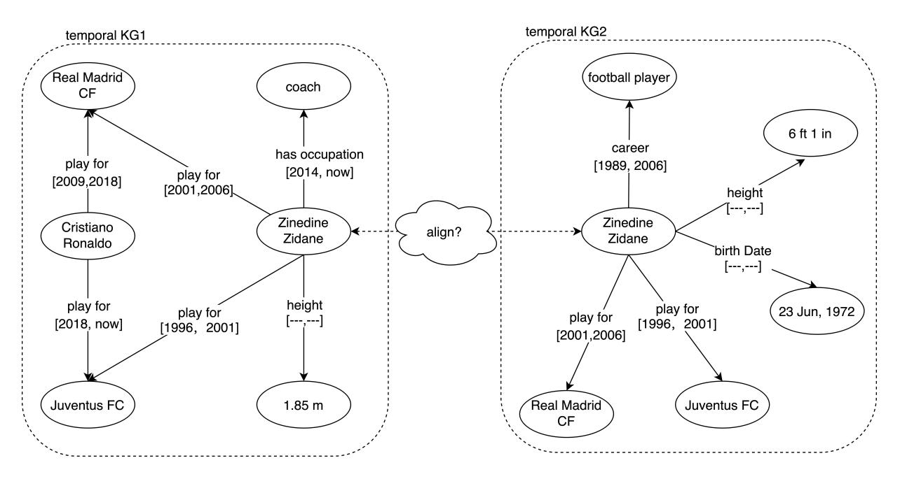
Figure 5.1: An example of temporal KG alignment.

was a football player after years of his retirement. However, despite their usefulness, current temporal KGs are still limited in their coverage, which dramatically limits their effectiveness and benefits to downstream applications. For example, only 6.6% ^3^ of facts are time-aware in YAGO3, the one of largest knowledge graph in the world. In addition, only 10% of facts contains one time expression in English DBpedia^4^. Therefore, it is essential to study the problem of temporal KG alignment to improve the coverage of temporal KGs.

To our best knowledge, there is no prior work focuses on temporal KG alignment, and the most related works are KG alignment. We divide the works on KG alignment into two categories, according to their focuses, i.e., structure-based alignment and attribute-based alignment. Structurebased alignment models focus on the relation triples and explore on the similarity of KG structures. This kind of approaches is based on the assumption that, if two entities have similar neighbors, they are likely to be equivalent in the real world. As a result, structure-based alignment solves various neighbor-related issues, including neighbor matching [[135]](#ref-135), [[136]](#ref-136), neighbor sampling [[135]](#ref-135) and representations [[20]](#ref-20), [[133]](#ref-133), [[134]](#ref-134), etc. Attribute-based KG alignment starts from another aspect, and represents an entity as a set of its attributes, e.g., birth date, birth place, height, etc. Attribute-based KG alignment has the assumption that, if two entities have many similar attributes, they are likely to the equivalent. As a result, this kind of approaches mainly focuses on how to use all attributes to represent entities. Various encoders have been used for encoding and aggregating attribute information, including CNNs [[22]](#ref-22), GRUs [[137]](#ref-137), GCNs and GATs [[23]](#ref-23). In addition, with the success of pre-trained language models (e.g., BERT), many works [[22]](#ref-22), [[23]](#ref-23), [[139]](#ref-139) leverage pre-trained embedding models to enhance the representation of attribute values. Furthermore, textual description is also used as an entity attribute to represent entities [[139]](#ref-139).

However, none of above works consider the importance of time information in temporal KG, and they cannot be directly applied on temporal KG alignment, in which facts are coupled with valid time spans. For example, without the time information we cannot distinguish "Zindane" with "Ronaldo", because both two entities have played for the same football teams in temporal KG1 as Figure [[5.1]](#ref-fig-5.1) shows. Therefore, in this work, we study the problem of temporal KG alignment by exploiting the temporal information. Not like previous attribute-based frameworks [[22]](#ref-22), [[23]](#ref-23), [[137]](#ref-137), we further divide attribute facts into character facts, digit facts and time facts according to their types. In particular, we observe that the context information is extremely useful for the identification of same entities. Therefore, we propose an alignment model on leveraging temporal contexts to represent entities. However, contexts can be very different because of the heterogeneous issue. For example, as Figure [[5.1]](#ref-fig-5.1) shows, even for the same object "Zindane", entities in different temporal KGs have various contexts. This is because temporal KGs have different schemata, extracting sources/time, coverage, etc. Moreover, we observe that entities are evolving over time, and the predicate values of the aligned entities can be very different. For example, as Figure [[5.1]](#ref-fig-5.1) shows, entity "Zindane" has values "coach" and "football

^3^According to the YAGO statistics page, there are 60,856,310 facts in total, but only 4,033,647 facts are meta-facts with temporal scopes. Even consider the Date Facts, there are only 6,015,043, which is less than 10%.

^4^We download the 2016-04 released English DBpedia, and we use the data types and regular expressions to identify time expressions.

player" for the predicates *has occupation* and *career* in temporal KG1/2, respectively. This is because he becomes a coach after years of his retirement. So in our framework, we propose an alignment module that simulates the entity evolving process. Specifically, this module captures the interactions between contexts, and aggregates context information to represent the entity. Lastly, we found that not all contexts are relevant, e.g., *height* v.s. *career*. Actually, only the relevant contexts are useful for capturing the evolving. Therefore, we propose a clustering approach for grouping relevant contexts together. Our clustering approach not only considers the co-occurrence of entity pairs, but also incorporates the template influence and the semantics of predicates. So it can correctly group relevant contexts and thus effectively enhance the entity representation process. Our major contributions in this work can be summarised as follows:

- We demonstrate the importance of temporal knowledge alignment, and propose a novel model for capturing the entity evolving over time.
- We propose a context clustering algorithm that considers the co-occurrence and semantics.
- We conduct extensive experiments on real-world datasets, and the experimental results verify the effectiveness of our proposed model compared with many state-of-the-art models.

## 5.2 Problem Definition

In this section, we introduce the formal definitions used in our model for temporal KG alignment.

Definition 14. *(Temporal Knowledge Graph) A temporal knowledge graph (also known as temporal knowledge base) is a directed graph G* = (*E*,*R*,*L*,*T*,*D*)*, comprising with the entity set E, predicate set R, literal set (as known as attribute set) L, time set T and the observed dataset D.* Definition 15.*(Fact) A fact is denoted as f* = (*s*, *p*,*o*,*t*) *where subject s*∈*E is an entity, predicate p*∈*R (also known as relation) describes the relationship between s and o, object o*∈*E* ∪*L can be either an entity, characters, digits or a time expression, and t*∈*T is the valid temporal interval. In particular, if o*∈*E, we say f is a relation fact. While if f*∈*L, we say f is an attribute fact (or attribute for simplicity), and we call o value (or predicate value) for distinguishing. Similarly, according to the type of o, we can define character facts, digit facts and time facts. For example, ("Zidane", career, "football player", "[1989,2006]") is a character fact. In order to cooperate with current (static) KG alignment datasets, in which fact is an triplet* (*s*, *p*,*o*)*, we still use triplets to represent facts.* Definition 16.*(Contexts) Contexts, denoted as c*[*e*] = {(*e*, *p*,*o*)} ⊂ *D, is a set of facts such that the subject of each fact is entity e. According to the type of o, we split contexts c*[*e*] *into relation facts cr* [*e*] = {(*e*, *p*, *e*^0^) |*e*^0^ ∈*L*} *and attribute facts ca*[*e*] = {(*e*, *p*, *v*)|*v*∈*L*}*.* Definition 17.*(Temporal Knowledge Graph Alignment) Let G*^1^* *and G*^2^* *denote two temporal KGs where G*^1^* = (*E*1,*R*1,*L*1,*T*1,*D*1) *and G*^2^* = (*E*2,*R*2,*L*2,*T*2,*D*2)*. Given a set of pre-aligned entity pairs S* = {(*e*1, *e*2)|*e*^1^ ∈ *E*1, *e*^2^ ∈ *E*2, *e*^1^ ↔ *e*^2^} *as seeds (where*↔*represents equivalent), the task of temporal KG alignment is to maximize the number of new discovered entities pairs* {(*e*1, *e*2)|*e*^1^ ↔ *e*^2^, *e*^1^ ∈ *E*1, *e*^2^ ∈ *E*2,(*e*1, *e*2) ∈/ *S*}*.* ## 5.3 Methodology

Our work mainly focuses on learning the representations of all entities *E* ∈ R^|*E*1∩*E*2|×*d^ for entity sets *E*^1^ and *E*^2^ from the time facts *D*^t^ for temporal KG alignment. But it also can be easily extended on relation facts *D*^r^, character facts *D*^c^, and digit facts *D*^d^. In the following sections, we will first illustrate the main idea of our framework and then represent the details of our modules.

### 5.3.1 Framework

We believe, two entities are likely equivalent in the real world if they have similar contexts, i.e., *e*^1^ ↔ *e*^2^ if *c*[*e*1] ≈ *c*[*e*2]. Not like previous attribute-based frameworks [[22]](#ref-22)[[23]](#ref-23)[[137]](#ref-137), we further divide all contexts *c*[*e*] into relation facts *c*^r^* [*e*] character facts *cc*[*e*], digit facts *cd*[*e*] and time facts *c*^t^* [*e*] according to the type of predicate values, *c*[*e*] = *c*^r^* [*e*]∪*cc*[*e*]∪*cd*[*e*]∪*c*^t^* [*e*]. Our work is still an attribute-based alignment system which ensembles multiple kinds of information to enhance the performance. In particular, we follow previous work [[23]](#ref-23) and propose a multi-channel based framework which illustrated in Figure [[5.2]](#ref-fig-5.2). Our framework takes five types of information as the input, and we use a type-specific encoder to learn the representations of entities (called views). As previous work, we use a small set of pre-aligned entity seeds to do the graph alignment to obtain the type-specific similarity matrix. Finally, we assemble all similarity matrices together to output the new aligned entity pairs.

In particular, we follow the framework of AttrGNN [[23]](#ref-23) and split each temporal knowledge graph into five subgraphs. Each subgraph contains one kind of information. Formally, given a temporal graph *G* = (*E*,*R*,*L*,*T*,*D*), we have entity name information *name* and the corresponding fact sets *D*^r^,

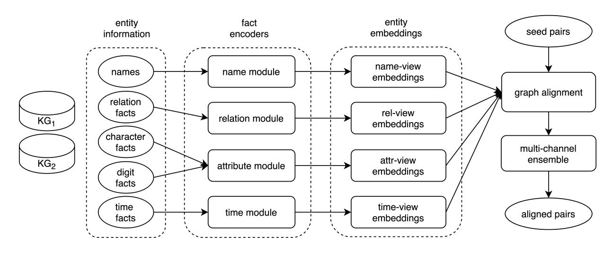
Figure 5.2: An overview of our framework for temporal KG alignment.
**D c:** ,*D d*,*D*^t^* which are splitting from *D* according to the object type. For each type of information, we apply a type-specific encoder to learn the entity representations under the corresponding channel. Formally, consider a type *u* of information *D*^u^*; there is an encoder *E*^u^*=*fu*(*D*^u^*) where *u* ∈ {*n*,*r*, *c*,*d*,*t*}, *E*^u^*∈ R^|*E*|×*d*^ , |*E*| = |*E*^1^ ∪*E*^2^|. Since our work focuses on exploiting the temporal information for temporal KG alignment, so for other types of information, we use the same architecture proposed by AttrGNN [[23]](#ref-23), i.e., name channel, relation channel and attribute channel. In particular, we use a mean aggregator [[170]](#ref-170) and stacked graph attention networks (GATs) [[171]](#ref-171) to gather neighbor information and to generate entity embeddings, respectively. We will elaborate upon the details of our proposed the time encoder in the following section [[5.3.3]](#ref-5.3.3).

When obtaining the entity representations *E*^u^* under view *u*, we use the given seed pairs *S* and the structure graph G*^r^* to do the graph alignment, where *S* = {(*e*1, *e*2)|*e*^1^ ∈ *E*1, *e*^2^ ∈ *E*2}. G*^r^* = (V*^r^* ,E*r*) is an undirected graph that constructed from all relation facts *D*^r^* , and composed of the vertex set V*^r^*=*E*1∪*E*^2^ and the edge set E*^r^*. Edge (*eu*, *ev*) exists in E*^r^* if there exists at least one fact(*eu*,∗, *ev*) ∈ *D*^r^* (∗ means any relation in *R*.). G*^r^* enable messages passing from neighbors for updating the entity representations as previous structure-based works [[20]](#ref-20), [[23]](#ref-23), [[133]](#ref-133), [[134]](#ref-134). Using G*^r^* and entity embeddings *E*^u^*, we can obtain the similarity matrix *M*^(*u*)^ as follows:

$$
\boldsymbol{E}_{o}^{u} = GCNs(\boldsymbol{E}_{u}; \mathbb{G}_{r})
$$
(5.1)

$$
M^{(u)} = cosine(\boldsymbol{E}_o^u)
$$
(5.2)

where *u* is a specific type, e.g., name, relation facts, etc. *GCNs*(·) is a stacked graph convolution networks (GCNs) taking *E*^u^* and G*^r^* as input, *E*^u*^o^* ∈ R^|*E*|×*d*^ is the output of GCN layers. In particular, *GCNs*(·) is stacked by 2 identical convolutional layers, and each layer has the same hidden dimension, i.e., *d*. *M*^(*u*)^∈ R^|*E*1|×|*E*2|^ is the similarity matrix of channel *u* calculated using cosine similarity. In particular, the value of *M*^(*u*)^ at the *i*th row *j*th column is calculate as *mi*,*^j^*=*cosine*(*e*^i^*,*e*^j^*) where *e*^i^*∈*E*^1^ and *e*^j^*∈*E*2. Finally, we assemble all similarity matrices using *avg*() operation or by learning the weights of each similarity matrix by an SVM classifier as [[23]](#ref-23) did.

### 5.3.2 Predicate Clustering

In this section, we will introduce our proposed clustering approach, which is essential for improving the performance of our time fact encoder, since only relevant contexts are useful for capturing the entity evolving.

Obviously, not all of contexts are relevant. For example, the contexts with predicate *height* and *career* are not relevant. So we need to group contexts according to their predicate relevance. We observe that the correlated predicates are more likely to describe the same aspect of an entity. For example, predicates *latitude* and *longitude* are relevant because they are widely used together to describe a place in geography [[172]](#ref-172), and the predicates *debut*, *activateYears*, *playfor* all describe the career of a football player. In order to capture different aspects of the entity, we first cluster all contexts into various correlated groups according to their predicates; then, for each cluster we learn to capture the evolving contexts over time. We can follow previous work [[138]](#ref-138) and use the string similarity to calculate any pair of predicates to do the clustering. However, string similarity cannot fully capture the semantic information, e.g, "Obama" v.s. "Barack Hussein Obama", *termStart* v.s. *termEnd*. Recent work [[22]](#ref-22), [[173]](#ref-173) propose using neural networks, e.g., CNNs and LSTMs, to obtain the representation of each predicate. However, none of them considers the cluster relationship between predicates. In other words, predicates in a cluster are closely related but do not necessarily refer to the same relation in the real world. Our cluster approach can be regarded as soft predicate alignment and thus greatly improve the tolerance to the heterogeneous issue. Moreover, as each cluster becomes a closely relevant group, each cluster provides more consistent semantics for capturing context evolving over time than using all contexts directly. Now we introduce our clustering approach. Given a predicate set *P* = {*p*1,..., *pn*},

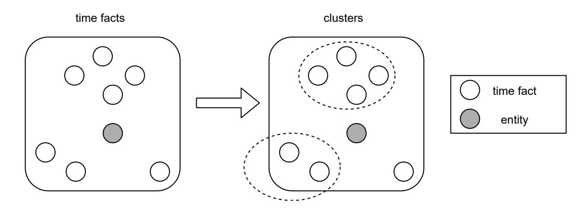
Figure 5.3: An illustration of clustering.

we will obtain a cluster set C = {*C*1,...,*Cm*}, where *m* is the number of clusters, and *C^i^* is a cluster of correlated predicates. Heuristically, we believe predicates *p*^a^* and *p*^b^* are correlated if they frequently appear together. Thus, we calculate the correlation score *sa*,*^b^* as follows:

$$
s_{a,b} = \frac{count(p_a, p_b)}{min(count(p_a), count(p_b))}
$$
(5.3)

where *count*(·) counts the frequency of predicate · appearing in the observed triples *D*. We use the *min*(·) function to do the normalization. We set a minimum frequency threshold δ*^f^* to filter noisy predicates (in experiments we set δ*^f^* = 10 for a relative high recall). Generally this score works well; however, we still observe that it fails for some predicate pairs. For example, the pair (*birthDate*,*termStart*) has a very high correlation score, but they are not highly related in semantics. We discover the above case has a parent-child relationship on types, i.e., any politicians must be a person, which leads the overlapping issue. To address this issue, we propose a method to estimate the level of predicates, i.e., parent-level and child-level. Heuristically, for a type of entity, its parent-level predicates tend to appear on every entity belonging to that type, but a child-level predicate only appears in a small proportion. For example, predicate *birthDate* appears in all *person* entities, but the predicates *playfor*, *debut* only appear in a small proportion of *person* entities, e.g., *soccer players*. To capture this idea, we use two parameters δ^0^ and δ^1^ to indicate the level of predicates, as follows:

$$
l_a = level(a) = \begin{cases} 0 & prop_a > \delta_0 \\ 1 & prop_a < \delta_1 \\ unknown & otherwise \end{cases}
$$
(5.4)

And we calculate the proportion of predicate *p*^a^* as follows:
*prop*^a^*=*count*(*pa*) *count*(*parent type*(*pa*)) (5.5)

where *parent type*(·) finds the parent of the corresponding entity type of *p*^a^* according to the hierarchical type schema Γ, as follows:

$$
parent\_type(p_a) = parent(type(E[p_a]), \Gamma)
$$
(5.6)

where *E*[*pa*] = {*e*|(*e*, *pa*,∗) ∈ *D*} is the corresponding entity set for a predicate *pa*, and *type*(·) is a type function that returns the shared types of *E*[*p*]. However, in practice, there are no pre-defined hierarchical type schema for us to directly use, and it is not easy to obtain the type function *type*(·). So, in our framework, we propose an estimation method to calculate the predicate level score as follows:

$$
prop_a \approx \frac{count(p_a)}{max(count(p_a), count(p_a^*))}
$$
(5.7)

$$
p_a^*= \arg\max_{p \in P} count(p, p_a)
$$
(5.8)

Finally, we use the estimate level score to filter predicate pairs, as shown below:

$$
\hat{s}_{a,b} = \begin{cases}\ns_{a,b} & l_a = l_b \\
s_{a,b} & \text{unknown} \in \{l_a, l_b\} \\
0 & \text{otherwise}\n\end{cases}
$$
(5.9)

We obtain the feature representation of predicate *p*^a^* as the vector *v*^a^* = [*sa*^1^ ,...,*sa*,*a*,...,*sa*,*n*] where we set *sa*,*^a^*= 1. Besides the co-occurrence features, we also observe that semantics play an important role in predicate clustering. In particular, we obtain the embedding *u* of a predicate *p* via the BERT language model [[174]](#ref-174), where *u*∈ R^d1^ (*d*^1^ is set to 768 in BERT). Finally, we obtain the representation of *p* as follows:

$$
\boldsymbol{p} = [\boldsymbol{v}; \boldsymbol{u}] \tag{5.10}
$$

Then we calculate the cosine similarity between any two predicate pairs using their embeddings (i.e., eq. [[5.10]](#eq-5.10)). Lastly, we apply an existing density-based clustering method, e.g., (DBSCAN [[158]](#ref-158)) to obtain the clusters C = {*C*1,...,*Ck*}, where *k* is the number of possible clusters, and *C^i^* = {*pc^i^*} is a set of closely related predicates. The distance function used in DBSCAN is listed as below:

$$
dist(p_i, p_j) = 1 - cosine(\boldsymbol{p_i}, \boldsymbol{p_j})
$$
(5.11)

Therefore, for a set of time contexts *c*^t^* [*e*] = {(*e*, *p^i^*,*vi*)}~n~*i*=1 of an entity *e*, according to the predicate clusters C = {*C*1,...,*Ck*}, we can obtain the clustered contexts *C*^t^* [*e*] = {*C*1[*e*],...,*C^k^* [*e*]} where *Cj* [*e*] = {(*e*, *p^j^*,*v^j^*)|*p^i^*∈*Cj*}.

### 5.3.3 Time Facts Encoder with Time Graphs

Recall that we have the assumption that if two entities have the same/similar contexts, they are likely to be equivalent in the real world. However, we observe that entities are evolving over time, and old predicate values will transit to new values. For example, the value of *career* predicate will transit from "lecture" to "professor" for a teacher who got promotion, and the *occupation* of a football player can be also changed to "coach" after years of his retirement. So in our module, we aims on capturing the value transitions by simulating the entity evolving process. Instead of charactering each individual context, we propose a set view of modeling contexts since we believe an entity is more likely to be represented by a group of contexts, rather than an individual one, i.e.,*e* ≈ {(*e*, *p^i^*,*vi*)} and *e* 6≈ (*e*, *p^i^*,*vi*). In addition, contexts in a cluster tend to describe the same aspect of entity and these contexts naturally have temporal orders, e.g., *debut*, *playfor*, *activeYears* and *retire*, which is useful for modeling entity evolving paths.

We observe time contexts in a cluster have interactions on temporal dimension, i.e., contexts that happened early will influence other contexts that happened later. For example, the time fact of *debut* will provide information about other time facts, including *playFor*, *activateYears*, etc. In other words, time facts {(*e*, *p^j^*,*v^j^*)} are closely dependent on previous time facts {(*e*, *p^i^*,*vi*)}, where *v^i^*<*v^j^* and *pi*,*p^j^* in the same cluster. As events happen sequentially, we believe the time interactions are also following temporal orders, i.e., (*e*, *p^i^*,*vi*) → (*e*, *p^j^*,*v^j^*) but (*e*, *p^i^*,*vi*) 6→ (*e*, *p^j^*,*v^j^*), where → denotes the influence direction and *v^i^*<*v^j^* (*v^i^* and *v^j^* in time contexts are "date" type values). Moreover, the influences are not equal, especially for those that have a large gap. For example, we may infer the transfer time and the transferred club of a soccer player from his existing records, but it becomes much harder to infer the transfer information of 10 years later. This highlights the context influence will decrease when distance increase. So, we propose a window-aware influence passing mechanism, which is based on the current existing message passing framework, e.g., graph convolution network,

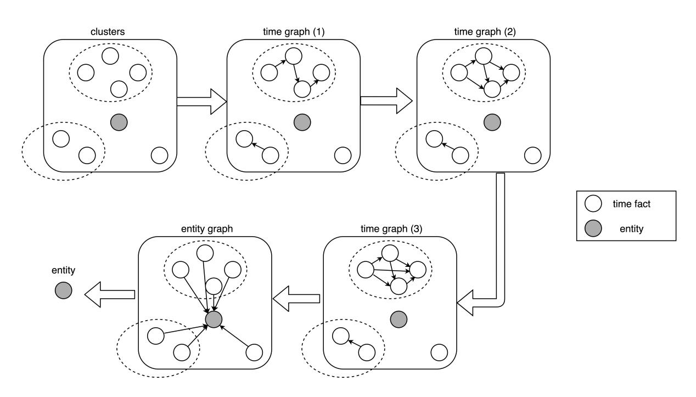
Figure 5.4: An illustration of our proposed module for capturing entity evolving over time.

as Figure [[5.4]](#ref-fig-5.4) shows. In particular, we generate two kinds of interaction graphs based on the time facts, i.e., time graphs G*^t^* and an entity graph G*e*. Time graph G*^t^* captures the interactions between contexts by allowing message passing, and the entity graph G*^e^* aggregates the context information and represents the entity.

In order to capture the value transition and simulate the evolving path of each aspect, we refine the time graph *G*^a^* to a set of window-aware time graphs, i.e., (G^(*1*)*t*,G^(*2*)*t* ,..., G^(*w*)*t*) where *w* is the maximum window size. Formally, given entity *e*, a set of time contexts *c*^t^* [*e*] = {(*e*, *p^i^*,*vi*)}~n~*i*=1 and the clustering information C = {*C*1,...,*Ck*}, we construct the time graph G^(*m*)*^t^* with window *m* as follows:

$$
\mathbb{G}_t^{(m)} = (\mathbb{V}_t, \mathbb{E}_t^{(m)}) \tag{5.12}
$$

where V*^t^* = {*e*,v1,..., vn} is the node set. *e* is the entity node, and v^i^ is the context node which represents time context (*e*, *p^i^*,*vi*). Edge (v^i^ ,vj) ∈ E^(*i*)*t* exists if node v^i^ = (*e*, *p^i^*,*vi*) and v^j^ = (*e*, *p^j^*,*v^j^*) satisfy the following conditions:

- time value *v^i^*≤*v^j^* , i.e., fact (*e*, *p^i^*,*vi*) happened before fact (*e*, *p^j^*,*v^j^*).
- predicates *p^i^*,*p^j^* belong to the same cluster.
- *hi*,*^j^*≤*m*, i.e., hops from (*e*, *p^i^*,*vi*) to (*e*, *p^j^*,*v^j^*) is less than or equal to the window size. We calculate the hops after sorting each cluster according the timestamps.

For example, the time graph(1) in Figure [[5.4]](#ref-fig-5.4) is a directed graph with window *w*= 1 which only has 1-hop neighbors. The set of time graphs (G^(*1*)*t*,G^(*2*)*t* ,..., G^(*w*)*t*) allows message passing from one context node to its neighbor nodes under the control of windows (1,...,*w*). Since each graph is directed, the message passing procedure naturally transfers the historical information from one node to

its neighbors. Therefore, the time graphs can gradually integrate the contexts together for representing the core entity. In addition, with the control of windows (1,...,*w*), time graph becomes more dense gradually, which can be regarded as the involvement of entities (from less contexts to more contexts). Therefore, we can use the constructed time graphs to learn the representations of each contexts and capture their interactions. In particular, we use the adjacent matrices (*A*^(*1*)^,...,*A*^(*w*)^) to learn the nodes representations. There are various graph neural networks, e.g., Graph Neural Networks (GNNs), e.g., Convolutional Graph Neural Networks (GCNs) [[165]](#ref-165) and Graph Attention Networks (GATs) [[