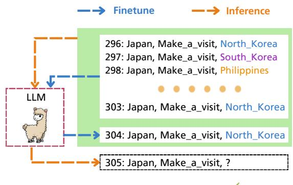
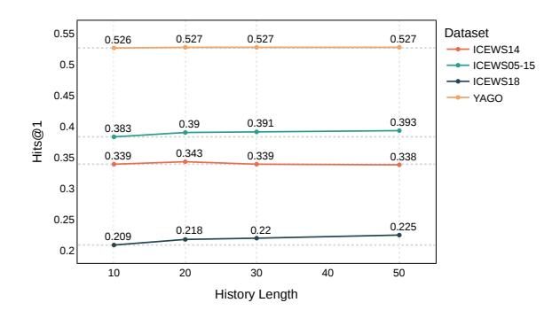

# Chain of History: Learning and Forecasting with LLMs for Temporal Knowledge Graph Completion

Ruilin Luo^1^* , Tianle Gu^1^* , Haoling Li^1^* , Junzhe Li^2^ , Zicheng Lin^1^ , Jiayi Li^3^ , Yujiu Yang^1^†

^1^Tsinghua Shenzhen International Graduate School, Tsinghua University ^2^School of Computer Science, Peking University ^3^Baidu Inc.

{lrl23,gtl23,li-hl23}@mails.tsinghua.edu.cn

## Abstract

Temporal Knowledge Graph Completion (TKGC) is a complex task involving the prediction of missing event links at future timestamps by leveraging established temporal structural knowledge. This paper aims to provide a comprehensive perspective on harnessing the advantages of Large Language Models (LLMs) for reasoning in temporal knowledge graphs, presenting an easily transferable pipeline. In terms of graph modality, we underscore the LLMs' prowess in discerning the structural information of pivotal nodes within the historical chain. As for the generation mode of the LLMs utilized for inference, we conduct an exhaustive exploration into the variances induced by a range of inherent factors in LLMs, with particular attention to the challenges in comprehending reverse logic. We adopt a parameter-efficient fine-tuning strategy to harmonize the LLMs with the task requirements, facilitating the learning of the key knowledge highlighted earlier. Comprehensive experiments are undertaken on several widely recognized datasets, revealing that our framework exceeds or parallels existing methods across numerous popular metrics. Additionally, we execute a substantial range of ablation experiments and draw comparisons with several advanced commercial LLMs, to investigate the crucial factors influencing LLMs' performance in structured temporal knowledge inference tasks.

## 1 Introduction

Knowledge Graphs (KGs), defined as meticulously structured repositories of deterministic knowledge, have been utilized across a wide range of domains such as recommender systems [[Qin et al., 2024]](#ref-Qin_et_al._2024), question-answering [[Liu et al., 2023b]](#ref-Liu_et_al._2023b), and more recently, in the emerging field of Retrieval-augmented Generation (RAG) [[Sun et al., 2023]](#ref-Sun_et_al._2023); [[Feng et al., 2023]](#ref-Feng_et_al._2023). In recent years, the concept of

The missing entity is **North_Korea.**

**Figure 1:** LLM undergoes fine-tuning on known data and subsequently utilizes the chain of known factual information to generate the next event.

Temporal Knowledge Graphs (TKGs) has gained increased attention due to their ability to provide more accurate information. [[Leblay and Chekol, 2018]](#ref-Leblay_and_Chekol_2018); [[Han et al., 2021a]](#ref-Han_et_al._2021a); [[Li et al., 2022]](#ref-Li_et_al._2022); [[Lee et al., 2023a]](#ref-Lee_et_al._2023a). A Temporal Knowledge Graph (TKG) stores numerous facts in the form of quadruples (e^h^, r, e^t^ , t^T^ ), denoting that e^h^ has a directional edge r into e^t^ at timestamp t^T^ . Given a series of observed facts denoted as F = {(s, p, o, ts)|s, o ∈ S, p ∈ P, t^s^ < T}, TKGC under extrapolative setting requires the capability to predict links to future timestamps, i.e., quadruples containing t^s^ ≥ T. This extrapolative setting has attracted more research than the interpolation setting, which primarily focuses on events in observed timestamps [[Zhu et al., 2021]](#ref-Zhu_et_al._2021); [[Sun et al., 2021]](#ref-Sun_et_al._2021).

Previous research has approached the TKGC task from various angles. Some models, integrating Graph Neural Networks (GNNs) with gated mechanisms, focus on the evolution of embeddings over time [[Chung et al., 2014]](#ref-Chung_et_al._2014); [[Li et al., 2021a]](#ref-Li_et_al._2021a), [[2022]](#ref-Li_et_al._2022); [[Zhang et al., 2023]](#ref-Zhang_et_al._2023). Rule learning aims to provide ample prior knowledge [[Liu et al., 2022]](#ref-Liu_et_al._2022), while reinforcement learning models [[Sun et al., 2021]](#ref-Sun_et_al._2021) propose time-shaped rewards to guide the learning process. Despite these efforts, these methods

^∗^ Equal contribution. † Corresponding author: yang.yujiu@sz.tsinghua.edu.cn.

often fall short in utilizing the rich text information and underperform when the links are sparse. Recently, with the demonstrated capabilities of LLMs in various fields, some attempts have been made to explore the utilization of LLMs for TKGC tasks. [[Lee et al., 2023a]](#ref-Lee_et_al._2023a) explores the potential of in-context learning (ICL) capabilities of LLMs to perform on the TKGC task. GenTKG [[Liao et al., 2023]](#ref-Liao_et_al._2023) leverages the partial idea of tLogic [[Liu et al., 2022]](#ref-Liu_et_al._2022) to provide LLMs with the most temporal logic-relevant inputs to counsel decisions.

In this paper, we seek to thoroughly examine whether LLMs are effective TKG reasoning agents and how to reveal genuinely beneficial factors. On one hand, TKGs are essentially graph structures with textual information, and recent research has demonstrated that LLMs possess certain capabilities in understanding structural information, yielding promising results in tasks such as node classification [[Tang et al., 2023]](#ref-Tang_et_al._2023); [[Qin et al., 2023]](#ref-Qin_et_al._2023); [[Guo et al., 2023a]](#ref-Guo_et_al._2023a); [[Liu et al., 2023a]](#ref-Liu_et_al._2023a). On the other hand, as an inference task, TKGC specifically requires the natural advantage of textual reasoning possessed by LLMs. Considering the aforementioned characteristics, we develop a general and easily transferable framework: 1) For structural awareness of TKGs, in addition to considering the history that directly provides candidate answers, we also incorporate additional neighboring interaction information of entities and relations. 2) Regarding LLM inference within the TKG context, our focus lies in mitigating the reversal curse in structured expression reasoning. 3) We employ the Parameter-Efficient Fine-Tuning (PEFT) technique for fine-tuning LLMs to enhance the model's understanding of historical context and integrate the two aforementioned solutions.

Specifically, as shown in Fig. [[1]](#ref-Figure_1), during the fine-tuning process, we partition the known data into an input section and a supervised labeling segment, guiding LLMs in adapting the mapping relationship between the textual information of the specific TKG and the intricate logic inherent in temporal events. We propose to use local information across multiple single-step graphs for historical data augmentation to explore the ability of LLMs to perceive graph-modality information. In addition, we explore different ways of reverse data incorporation to alleviate the reversal curse [[Lv et al., 2023]](#ref-Lv_et_al._2023) problem in structured knowledge reasoning.

We carry out comprehensive experiments on

widely used TKGC datasets, including the ICEWS [[Li et al., 2021a]](#ref-Li_et_al._2021a) series from news and the commonsense dataset YAGO [[Mahdisoltani et al., 2015]](#ref-Mahdisoltani_et_al._2015). Significantly, we report the Hits@n metric under raw setting and time-aware filtered setting, achieving highly competitive results. We also provide the 8-shot ICL[[1]](#ref-1) performance of several open-source models as a comparative reference. Furthermore, we conduct exhaustive ablation experiments to validate the effectiveness of structure-based historical data augmentation methods and the introduction of reverse logic. Additionally, we investigate the impact of historical chain length, model size, and the performance of LLMs like GPT-4 and GPT-3.5-turbo, with the aim to uncover key factors influencing temporal structural information reasoning using LLMs.

## 2 Related Work

Temporal Knowledge Graph Completion involves two essential reasoning settings: interpolation and extrapolation. Interpolation-based TKG reasoning addresses the challenge of filling in missing links within observed timestamps. TTransE [[Leblay and Chekol, 2018]](#ref-Leblay_and_Chekol_2018) introduces time-based encoding through translation operations. TNTComplEx [[Lacroix et al., 2020]](#ref-Lacroix_et_al._2020) and Tuck-ERTNT [[Shao et al., 2022]](#ref-Shao_et_al._2022) propose complex decomposition and TuckER decomposition of four-order tensors, respectively, to augment model expressiveness under temporal conditions. However, the interpolation setting has limitations, as it cannot infer missing information in future timestamps, thereby restricting its applicability.

Extrapolative reasoning in TKGC, involving the prediction of facts for future timestamps, represents a more challenging yet valuable task. Recent works have concentrated on leveraging multi-relational graph convolutional networks [[Li et al., 2021a]](#ref-Li_et_al._2021a); [[Jin et al., 2020]](#ref-Jin_et_al._2020). xERTE [[Han et al., 2021a]](#ref-Han_et_al._2021a) captures query-related subgraph information through dynamic pruning operations. TANGO [[Han et al., 2021b]](#ref-Han_et_al._2021b) adopts neural ordinary differential equations to model the temporal representation of entities. TITer [[Sun et al., 2021]](#ref-Sun_et_al._2021) stands out as the first model to utilize temporal-path-based reinforcement learning for TKG reasoning. TLogic [[Liu et al., 2022]](#ref-Liu_et_al._2022) enhances interpretability by extracting temporal logic rules through random exploration of time. TiRGN [[Li et al., 2022]](#ref-Li_et_al._2022) and HGLS [[Zhang et al., 2023]](#ref-Zhang_et_al._2023)

^1^ [[Prompts can be found in Appendix A.1 and A.2.]](#ref-A.1)

utilize graph learning methods for comprehensive structural information capture during temporal wandering. [[Lee et al., 2023a]](#ref-Lee_et_al._2023a) first explores the potential of ICL in TKGC. Gen-TKG [[Liao et al., 2023]](#ref-Liao_et_al._2023) provides the most relevant interactions in temporal logic for LLMs to learn and infer.

LLMs-as-Predictors Many recent studies transform graph structure information into sequential representations and utilize LLMs as standalone predictors. Graph4GPT [[Guo et al., 2023b]](#ref-Guo_et_al._2023b) uses InstructGPT-3 [[Ouyang et al., 2022]](#ref-Ouyang_et_al._2022) to conduct an empirical study to assess LLMs' capabilities in graph understanding, and GraphLLM [[Chai et al., 2023]](#ref-Chai_et_al._2023) uses LLaMA2 for the graph reasoning task, but these work ignore LLM's ability to TKGC. Most relevant to our work, [[Lee et al., 2023b]](#ref-Lee_et_al._2023b) uses ICL with LLMs for TKGC, which may not fully exploit the extensive learning capabilities of LLMs.

Parameter-Efficient Fine-tuning Recent studies have introduced several PEFT techniques, including the addition of adapters [[He et al., 2022]](#ref-He_et_al._2022); [[Rebuffi et al., 2017]](#ref-Rebuffi_et_al._2017); [[Houlsby et al., 2019]](#ref-Houlsby_et_al._2019); [[Bapna et al., 2019]](#ref-Bapna_et_al._2019), which entail the insertion of small trainable feed-forward networks between fixed pre-trained models. Additionally, low-rank updates [[Hu et al., 2021]](#ref-Hu_et_al._2021) have been proposed as an alternative, wherein the fine-tuning process leverages low-dimensional representations. Moreover, prompt tuning [[Lester et al., 2021]](#ref-Lester_et_al._2021) and prefix tuning [[Li and Liang, 2021]](#ref-Li_and_Liang_2021) have been developed, which involve augmenting the model's input or activations with learnable parameters.

## 3 Preliminary

Definition 3.1. TKGC A TKG is defined as a sequence G = {G1, · · · , G^t^ , · · · , Gn} comprising static KGs. Here, each static KG denoted as G^t^ contains factual triplets at timestamp t. A single static KG is formulated as {E, R, T }, in which E, R and T = {s^i^ , p^j^ , o^k^ } respectively represent entities, relations and triplets within it. TKGC involves bidirectional prediction of query quadruples, specifically, (s^i^ , p^j^ , ?, ts) and (o^k^ , p^-1^j^ , ?, ts).

Definition 3.2. Fine-tuning Given a pretrained LLM denoted as M with parameters θ, and a dataset comprising n instances {Query^i^ , Response^i^ }, the fine-tune processing

aims to minimize the following loss function:

$$
\boldsymbol{\theta}^{\star} = \arg\min_{\boldsymbol{\theta}'} \sum_{i=0}^{n-1} \mathcal{L} \left( \mathcal{M} \left( \mathcal{Q} | \boldsymbol{\theta}' \right); \mathcal{R} \right) \qquad (1)
$$

where M(|θ ′ ) denotes the output of the fine-tuned LLM M with parameters θ ′ , Q represents Query and R represents response.

## 4 Methodology

### 1 Structure-augmented History Modeling

The LLM's predictions of undiscovered links in the TKG rely on knowledge derived from historical facts. In particular, when dealing with a query quadruple represented as q = (s^i^ , p^j^ , ?, tq) in a forward reasoning mode, we aim to model the historical chain H^q^ associated with this query.

Schema-matching History. The initial set of historical facts we leverage originates from schema-matching records, denoted as H^s^ = {(s^i^ , p^j^ , o, t)|o ∈ E, t < tq}. Specifically, given a query (*Japan, Make_a_visit, ?, 305*), H^s^ = {(*Japan, Make_a_visit, North_Korea, 296*), · · · ,

(*Japan, Make_a_visit, North_Korea, 304*)} encompasses relevant schema-matching facts that align with the subject and predicate of the query q, providing inference basis for LLMs.

Entity-augmented History. Similar to many prior works that leverage structural information from KGs to enhance the reasoning capabilities of LLMs [[Luo et al., 2023]](#ref-Luo_et_al._2023); [[Tian et al., 2023]](#ref-Tian_et_al._2023), we focus on semantically enriching the representation of central entities by utilizing links with neighbors in TKGs. The entity-augmented history H^e^ is defined as {(s^i^ , p, o, t)|(s^i^ , p, o, t) ∈ G^t^ , p ∈ R, o ∈ E, t < tq} formally.

Relation-augmented History. In addition to completing the historical chain based on entity-based neighbor information, we introduce a supplementary strategy based on relations. We believe that it's beneficial for enhancing the model's intrinsic understanding of relation inference [[Xiong et al., 2018]](#ref-Xiong_et_al._2018). Formally, relation-augmented history set H^r^ = {(s, p^j^ , o, t)|(s, p^j^ , o, t) ∈ G^t^ , p, o ∈ E, t < tq}.

When modeling Hq, we adhere to two criteria for selecting data from Hs, He, and Hr. i) We prioritize the ground-truth history directly related to q, which is Hs. If the history length does not meet the specified value, we then sequentially incorporate facts from H^e^ and Hr. ii) Data close to

| Strategy | Prompt |
|---|---|
| Ordinary | 280: [Japan, Make_a_visit, China] |
| | 281: [Japan, Make_a_visit, Vietnam] |
| | · · · |
| | 304: [Japan, Make_a_visit, Kiichi_Miyazawa] |
| | Query: 305: [Japan, Make_a_visit, ] |
| Text-aware | 280: [Japan, reverse Make_a_visit, China] |
| | 281: [Japan, reverse Make_a_visit, Vietnam] |
| | · · · |
| | 304: [Japan, reverse Make_a_visit, Kiichi_Miyazawa] |
| | Query: 305: [Japan, reverse Make_a_visit, ] |
| Position-aware | 280: [China, Make_a_visit, Japan] |
| | 281: [Vietnam, Make_a_visit, Japan] |
| | · · · |
| | 304: [Kiichi_Miyazawa, Make_a_visit, Japan] |
| | Query: 305: [ , Make_a_visit, Japan] |

**Table 1:** Prompts for query (*Japan, Make_a_visit*^-1^ *, ?, 305*).

the current timestamp is introduced with priority. By following these two criteria, we aim to select the most relevant knowledge to inspire forecasting capabilities in LLMs.

### 2 Introduction of Reverse Logic

Similar to reasoning on static KGs, we require the model to also possess the capability of reverse inference on TKG [[Li et al., 2021a]](#ref-Li_et_al._2021a). However, recent research indicates that LLM's reasoning has encountered the issue of reversal curse [[Qi et al., 2023]](#ref-Qi_et_al._2023); [[Berglund et al., 2023]](#ref-Berglund_et_al._2023); [[Lv et al., 2023]](#ref-Lv_et_al._2023). In this problem, models often succeed in correctly deducing questions like '*Who is Tom Cruise's mother?*' but struggle to answer '*Who is the son of Mary Lee Pfeiffer?*'. We believe that this phenomenon also exists in structured knowledge reasoning. We propose using three prompt strategies to incorporate reverse quadruples during the fine-tuning phase to alleviate this issue, and explore the performance patterns in the context of structured knowledge reasoning scenarios.

As demonstrated in Tbl. [[1]](#ref-Table_1), the most ordinary construction is to treat the structure of backward inferences as forward inferences. The text-aware prompt leverages *reverse* to indicate reverse reasoning, and the position-aware prompt follows the order of backward inference, providing different head entities in the historical records.

### 3 Instruction-tuning in TKGC

Instruction-tuning [[Wei et al., 2021]](#ref-Wei_et_al._2021) achieves remarkable zero-shot generalization results by training LLMs on different tasks with instructions. While prior work has demonstrated the effectiveness of fine-tuning LLMs via full-parameter updates, this approach presents considerable challenges at large scale. Hence, we apply the Low-

Rank Adaptation (LoRA) [[Hu et al., 2021]](#ref-Hu_et_al._2021) method due to its effectiveness for Llama-style models. This method, founded on the plugin encapsulation strategy of PEFT, furnishes us with lightweight task-specific plugins.

The LLM M generates a sequence of tokens R^ = {r^1^, r^2^, ...r^n^}, where response R we need must be extracted and consists of a set of consecutive tokens. Similarly to most fine-tuning LLMs process using LoRA, the parameter update for a pre-trained weight matrix W^0^ ∈ R^d×k^ is specified by product of two low-rank matrices W^A^ and W^B^:

$$
\delta W = W_A W_B \tag{2}
$$

where W^A^ ∈ R^d×r^ and W^B^ ∈ R^r×k^ are matrices of trainable parameters and rank r ≪ min(d, k). Therefore, the forward pass for h = W0x is altered as :

$$
h = W_0 x + \delta W_x = W_0 x + W_A W_B x \quad (3)
$$

We employ cross-entropy loss which constrains the similarity between estimated and ground-truth tokens, to fine-tune LLMs by LoRA, which can be presented as

$$
\mathcal{L} = CE(\hat{\mathcal{R}}, \tilde{R})\tag{4}
$$

where R^ is the temporal knowledge graph completion predicted by LLM M and R~ is the given label.

### 4 Predict with LLMs

The instructions constructed are fed into the trained LLMs for prediction. The response is obtained by beam search, which is a decoding strategy that maintains k beams of possible generated responses at each time step t. The generation of response is updated as follows: for each generated response, the k tokens with the highest probabilities are selected based on Eq. [[5]](#ref-5). This results in k × k new response candidates. The next k beams of response are obtained by selecting the top k responses with the highest probabilities from the generated response candidates. The highest probability is determined by the product of probabilities of |R|^ tokens that constitute the response, where |R|^ represents the length of the current response.

$$
r_t = argmax_r P(r|r_{1:t-1}) \tag{5}
$$

In this context, the single step setting is employed, wherein for each test query in the test

dataset, the model can access the ground truth from past timestamps. Consequently, after the prediction for this step is completed, the ground truth from the current timestamp is added to the history of the next timestamp before its execution.

## 5 Experiments

### 1 Datasets

In our experimental setup, we utilize the ICEWS14 dataset [[García-Durán et al., 2018]](#ref-García-Durán_et_al._2018), ICEWS18 dataset [[Li et al., 2021a]](#ref-Li_et_al._2021a), ICEWS05-15 dataset [[Li et al., 2021b]](#ref-Li_et_al._2021b), and YAGO dataset [[Mahdisoltani et al., 2015]](#ref-Mahdisoltani_et_al._2015) as benchmarks for evaluation. The specific statistics are listed in Tbl. [[2]](#ref-Table_2). We employ partition criteria widely accepted in prior studies [[Han et al., 2021a]](#ref-Han_et_al._2021a) and establish instruction-tuning data on the validation set. Specifically, for the ordered timestamp set T = {t^1^train, t^2^train, · · · , t^n^train, t^1^val, · · · , t^m^val}, comprising training and validation sets, when gathering historical data for timestamp t^i^val, we observe only facts within the range t < t^i^val. In the context of testing under a single-step setup [[Trivedi et al., 2017]](#ref-Trivedi_et_al._2017), for a query at timestamp tq, we construct a ground-truth chain of history based on facts preceding timestamp tq, serving as the input to the model.

| Datasets | Entity | Relation | Train | Valid | Test | Interval |
|---|---|---|---|---|---|---|
| ICEWS14 | 6869 | 230 | 74845 | 8514 | 7371 | 1 day |
| ICEWS05-15 | 10094 | 251 | 368868 | 46302 | 46159 | 1 day |
| ICEWS18 | 23033 | 256 | 373018 | 45995 | 49545 | 1 day |
| YAGO | 10623 | 10 | 161540 | 19523 | 20026 | 1 year |

**Table 2:** Statistics of leveraged datasets.

### 2 Baseline Models

The models selected for comparative analysis primarily fall into two categories: embedding-based methods and LLM-based approaches. Within the realm of embedding-based methods, we present the performance evaluations of RE-NET [[Jin et al., 2020]](#ref-Jin_et_al._2020), RE-GCN [[Li et al., 2021a]](#ref-Li_et_al._2021a), TiRGN [[Li et al., 2022]](#ref-Li_et_al._2022), xERTE [[Han et al., 2021a]](#ref-Han_et_al._2021a), TANGO [[Han et al., 2021b]](#ref-Han_et_al._2021b), Timetraveler [[Sun et al., 2021]](#ref-Sun_et_al._2021). As for GNN-based methodologies, we choose TiRGN [[Li et al., 2022]](#ref-Li_et_al._2022) and HGLS [[Zhang et al., 2023]](#ref-Zhang_et_al._2023) for comparison. Regarding LLM-based approaches, we test GenTKG [[Liao et al., 2023]](#ref-Liao_et_al._2023) and align with our model settings, we focus on the effects of 8-shot in-context learning for Llama-2-7b [[Touvron et al., 2023]](#ref-Touvron_et_al._2023), Vicuna-7b [[Vicuna, 2023]](#ref-Vicuna_2023), and GPT-NeoX-20B [[Black et al., 2022]](#ref-Black_et_al._2022). In

addition to these, we also include the rule-based method TLogic [[Liu et al., 2022]](#ref-Liu_et_al._2022) in our comparison.

### 3 Evaluation Protocol

We acknowledge that, at the metric level, notable distinctions exist between LLM-based methods and embedding-based approaches. The latter proves advantageous as it can furnish a precise ranking of all entities in the graph for a query presented in the form of (s, q, ?), facilitating the calculation of metrics like Mean Reciprocal Rank [[Chao et al., 2021]](#ref-Chao_et_al._2021); [[Yu et al., 2022]](#ref-Yu_et_al._2022). However, for LLM-based methods, we can only furnish the ranking of a predetermined number of candidates, relying on the probabilities of output paths from the open-source model [[Lee et al., 2023a]](#ref-Lee_et_al._2023a). This is in contrast to obtaining the ranking of all entities in the graph. This constraint stems from the inability to compel the model to remember all entities directly, and it introduces impractical search costs. Consequently, we choose to report relatively accurate Hits@1, Hits@3, and Hits@10 [[Sun et al., 2019]](#ref-Sun_et_al._2019). Furthermore, we align with the perspective outlined in [[Ding et al., 2021]](#ref-Ding_et_al._2021); [[Jain et al., 2020]](#ref-Jain_et_al._2020) that directly excluding all other valid candidates to a specific query in a filtering setting is not entirely reasonable. Additionally, given that the proprietary LLMs we employ for comparison lack the opportunities to output ranking lists, we report raw metrics without loss of generality.^2^

### 4 Main Results

As shown in Tbl. [[3]](#ref-Table_3), Llama-2-7b-CoH and Vicuna-7b-CoH achieves results that surpass or are comparable to the state-of-the-art across multiple metrics under raw setting. Significantly, on the ICEWS05- 15 and YAGO datasets, Vicuna-7b-CoH shows an improvement of 3.3% and 1.9% in the Hits@1 metric compared to the current best models. We observe that on the YAGO dataset, the 8-shot ICL performance of GPT-NeoX-20B, Llama-2-7b, and vicuna-7b is not significantly worse than Llama-2-7b-CoH. However, there is a noticeable gap on the ICEWS14 series datasets, even falling behind embedding-based models. We also report the metrics under the time-aware filtered setting in Tbl. [[4]](#ref-Table_4), where Llama-2-7b-CoH outperforms the previous best-performing TiRGN model by 4.1 percentage points in the Hits@1 on YAGO and also exhibits a substantial advantage on ICEWS05-15

^2^ [[Supplementary details are in Appendix A.3.]](#ref-A.3)

| Datasets | | YAGO | | | ICEWS14 | | | ICEWS05-15 | | ICEWS18 | | |
|---|---|---|---|---|---|---|---|---|---|---|---|---|
| Model | Hits@1 | Hits@3 | Hits@10 Hits@1 | | Hits@3 | Hits@10 Hits@1 | | Hits@3 | Hits@10 Hits@1 | | Hits@3 | Hits@10 |
| RE-NET [[Jin et al., 2020]](#ref-Jin_et_al._2020) | 0.404 | 0.530 | 0.629 | 0.293 | 0.431 | 0.575 | 0.334 | 0.478 | 0.611 | 0.192 | 0.323 | 0.483 |
| RE-GCN [[Li et al., 2021a]](#ref-Li_et_al._2021a) | 0.499 | 0.663 | 0.779 | 0.297 | 0.441 | 0.586 | 0.336 | 0.487 | 0.658 | 0.193 | 0.331 | 0.494 |
| xERTE [[Han et al., 2021a]](#ref-Han_et_al._2021a) | 0.506 | 0.719 | 0.828 | 0.312 | 0.453 | 0.570 | 0.347 | 0.497 | 0.633 | 0.206 | 0.330 | 0.458 |
| TANGO† [[Han et al., 2021b]](#ref-Han_et_al._2021b) | 0.409 | 0.554 | 0.637 | 0.151 | 0.272 | 0.431 | 0.311 | 0.476 | 0.622 | 0.178 | 0.314 | 0.460 |
| Timetraveler [[Sun et al., 2021]](#ref-Sun_et_al._2021) | 0.494 | 0.675 | 0.790 | 0.313 | 0.451 | 0.571 | 0.341 | 0.494 | 0.667 | 0.210 | 0.325 | 0.437 |
| TLogic [[Han et al., 2021b]](#ref-Han_et_al._2021b) | 0.454 | 0.703 | 0.782 | 0.322 | 0.470 | 0.603 | 0.345 | 0.525 | 0.673 | 0.205 | 0.339 | 0.484 |
| TiRGN [[Li et al., 2022]](#ref-Li_et_al._2022) | 0.509 | 0.710 | 0.864 | 0.313 | 0.468 | 0.612 | 0.358 | 0.535 | 0.690 | 0.202 | 0.350 | 0.514 |
| HGLS [[Zhang et al., 2023]](#ref-Zhang_et_al._2023) | 0.508 | 0.721 | 0.866 | 0.349 | 0.480 | 0.688 | 0.351 | 0.521 | 0.673 | 0.192 | 0.323 | 0.494 |
| GenTKG [[Liao et al., 2023]](#ref-Liao_et_al._2023) | 0.520 | 0.731 | 0.870 | 0.349 | 0.473 | 0.619 | 0.360 | 0.525 | 0.687 | 0.215 | 0.366 | 0.496 |
| GPT-NeoX-20B-ICL [[Black et al., 2022]](#ref-Black_et_al._2022) | 0.520 | 0.722 | 0.870 | 0.295 | 0.406 | 0.475 | 0.348 | 0.497 | 0.586 | 0.177 | 0.290 | 0.385 |
| Llama-2-7b-ICL [[Touvron et al., 2023]](#ref-Touvron_et_al._2023) | 0.517 | 0.725 | 0.868 | 0.275 | 0.391 | 0.453 | 0.353 | 0.490 | 0.563 | 0.177 | 0.295 | 0.364 |
| Vicuna-7b-ICL [[Vicuna, 2023]](#ref-Vicuna_2023) | 0.514 | 0.714 | 0.868 | 0.270 | 0.386 | 0.453 | 0.347 | 0.483 | 0.563 | 0.172 | 0.288 | 0.364 |
| Llama-2-7b-CoH | 0.527 | 0.747 | 0.874 | 0.338 | 0.462 | 0.587 | 0.370 | 0.531 | 0.699 | 0.219 | 0.361 | 0.520 |
| Vicuna-7b-CoH | 0.530 | 0.754 | 0.859 | 0.315 | 0.445 | 0.648 | 0.372 | 0.531 | 0.701 | 0.206 | 0.344 | 0.531 |

**Table 3:** Temporal forecasting with raw metrics Hits@1, Hits@3 and Hits@10. The best results are highlighted in bold and the second-rank results are underlined. The results of the model with † are derived from [[Han et al., 2021b]](#ref-Han_et_al._2021b), while other models have been reproduced by us.

| Datasets | | YAGO | | | ICEWS14 | | | ICEWS05-15 | | ICEWS18 | | |
|---|---|---|---|---|---|---|---|---|---|---|---|---|
| Model | Hits@1 | Hits@3 | Hits@10 Hits@1 | | Hits@3 | Hits@10 Hits@1 | | Hits@3 | Hits@10 Hits@1 | | Hits@3 | Hits@10 |
| RE-NET† [[Jin et al., 2020]](#ref-Jin_et_al._2020) | 0.586 | 0.715 | 0.868 | 0.301 | 0.440 | 0.582 | 0.336 | 0.488 | 0.627 | 0.197 | 0.326 | 0.485 |
| RE-GCN† [[Li et al., 2021a]](#ref-Li_et_al._2021a) | 0.788 | 0.843 | 0.886 | 0.313 | 0.470 | 0.613 | 0.366 | 0.527 | 0.671 | 0.215 | 0.354 | 0.515 |
| xERTE† [[Han et al., 2021a]](#ref-Han_et_al._2021a) | 0.801 | 0.880 | 0.898 | 0.327 | 0.457 | 0.573 | 0.378 | 0.523 | 0.639 | 0.210 | 0.335 | 0.465 |
| TANGO‡ [[Han et al., 2021b]](#ref-Han_et_al._2021b) | 0.590 | 0.646 | 0.677 | 0.272 | 0.408 | 0.550 | 0.344 | 0.499 | 0.640 | 0.191 | 0.318 | 0.462 |
| Timetraveler† [[Sun et al., 2021]](#ref-Sun_et_al._2021) | 0.801 | 0.900 | 0.903 | 0.327 | 0.465 | 0.584 | 0.383 | 0.527 | 0.649 | 0.221 | 0.335 | 0.448 |
| TLogic‡ [[Han et al., 2021b]](#ref-Han_et_al._2021b) | 0.740 | 0.789 | 0.791 | 0.336 | 0.483 | 0.612 | 0.362 | 0.531 | 0.674 | 0.205 | 0.340 | 0.485 |
| TiRGN [[Li et al., 2022]](#ref-Li_et_al._2022) | 0.839 | 0.907 | 0.923 | 0.328 | 0.481 | 0.622 | 0.379 | 0.544 | 0.698 | 0.220 | 0.366 | 0.522 |
| HGLS [[Zhang et al., 2023]](#ref-Zhang_et_al._2023) | 0.827 | 0.911 | 0.926 | 0.368 | 0.490 | 0.691 | 0.360 | 0.525 | 0.678 | 0.200 | 0.316 | 0.494 |
| GenTKG [[Liao et al., 2023]](#ref-Liao_et_al._2023) | 0.813 | 0.901 | 0.922 | 0.365 | 0.488 | 0.633 | 0.378 | 0.541 | 0.692 | 0.220 | 0.370 | 0.497 |
| GPT-NeoX-20B-ICL [[Black et al., 2022]](#ref-Black_et_al._2022) | 0.792 | 0.890 | 0.909 | 0.295 | 0.406 | 0.475 | 0.367 | 0.503 | 0.587 | 0.192 | 0.300 | 0.389 |
| Llama-2-7b-ICL [[Touvron et al., 2023]](#ref-Touvron_et_al._2023) | 0.767 | 0.852 | 0.868 | 0.286 | 0.397 | 0.453 | 0.353 | 0.490 | 0.563 | 0.177 | 0.294 | 0.364 |
| Vicuna-7b-ICL [[Vicuna, 2023]](#ref-Vicuna_2023) | 0.747 | 0.840 | 0.868 | 0.281 | 0.391 | 0.453 | 0.347 | 0.483 | 0.563 | 0.172 | 0.288 | 0.364 |
| Llama-2-7b-CoH | 0.880 | 0.929 | 0.931 | 0.349 | 0.470 | 0.591 | 0.386 | 0.541 | 0.699 | 0.223 | 0.363 | 0.522 |
| Vicuna-7b-CoH | 0.851 | 0.903 | 0.918 | 0.328 | 0.457 | 0.656 | 0.392 | 0.546 | 0.707 | 0.209 | 0.347 | 0.536 |

**Table 4:** Temporal forecasting with time-aware filtered metrics Hits@1, Hits@3 and Hits@10. The best results are highlighted in bold and the second-rank results are underlined. The results of the model with † are derived from [[Li et al., 2022]](#ref-Li_et_al._2022), and results with ‡ are taken from [[Lee et al., 2023a]](#ref-Lee_et_al._2023a).

and ICEWS18. The relative performance of the model remains generally consistent under both settings.

## 6 Analysis

### 1 Effective Stucture-based Augmentation

To assess the efficacy of the structure-augmented history modeling strategy, we conduct comprehensive ablation experiments on all used datasets, employing Hits@1 as the evaluation criterion. For comparison, we exclude entity-augmented and relation-augmented histories during both the fine-tuning and inference phases, relying solely on schema-matching history for predictive determination. The results of the ablation studies are depicted in Tbl. [[5]](#ref-Table_5), enabling a clear analysis that structure-augmented history is beneficial for both forward and backward inference.

Illustrating with a practical case, when reasoning about the quadruple (*Economist (United Kingdom), Criticize or denounce, ?, 6960*), due to schema-matching history capturing only a historical fact (*Economist (United Kingdom), Criticize or denounce, Silvio Berlusconi, 120*), this leads to an incorrect inference of *Afghanistan*. However, the entity-augmented history contains multiple instances of *Economist (United Kingdom)* linked through the *Make statement* relation to *United Kingdom*. This similar behavior guides the model to output the correct answer *United Kingdom*. Thus, supplementation enhances to some extent the expression of structured information related to the central node, thereby aiding LLM in making more accurate predictions beyond simply relying on the ground truth history.

## 2 Effect of Introducing Reverse Logic

We conduct a comprehensive ablation experiment for the introduction of reverse quadruples in the fine-tuning phase. Considering the difficulty of ICEWS18 dataset, we set the length of the history chain to 30, and we set this value to 10 on the other datasets. We use the ordinary prompt as a comparison to verify the effect of the reverse data introduc-

| Datasets | ICEWS14 | | | ICEWS05-15 | | | | ICEWS18 | | YAGO | | |
|---|---|---|---|---|---|---|---|---|---|---|---|---|
| | Forward | Backward | Overall | Forward | Backward | Overall | Forward | Backward | Overall | Forward | Backward | Overall |
| Llama-2-7b-CoH w/o aug | 0.353 | 0.297 | 0.325 | 0.400 | 0.357 | 0.379 | 0.226 | 0.196 | 0.211 | 0.555 | 0.491 | 0.523 |
| Llama-2-7b-CoH | 0.370 | 0.308 | 0.339 | 0.408 | 0.359 | 0.383 | 0.236 | 0.204 | 0.220 | 0.560 | 0.491 | 0.526 |
| ∆ | 4.8% | 3.7% | 4.3% | 2.0% | 0.6% | 1.1% | 4.4% | 4.1% | 4.3% | 0.9% | 0.0% | 0.6% |

**Table 5:** Ablations on the structure-based history augmentation. We also report Hits@1 metric. The strategy has achieved comprehensive improvement in bi-directional forecasting.

| Datasets | ICEWS14 | | | ICEWS05-15 | | | | ICEWS18 | | YAGO | | |
|---|---|---|---|---|---|---|---|---|---|---|---|---|
| | Forward | Backward | Overall | Forward | Backward | Overall | Forward | Backward | Overall | Forward | Backward | Overall |
| Llama-2-7b-CoH w/o rq | 0.367 | 0.298 | 0.333 | 0.396 | 0.343 | 0.369 | 0.238 | 0.188 | 0.213 | 0.560 | 0.489 | 0.524 |
| Llama-2-7b-CoH | 0.370 | 0.308 | 0.339 | 0.408 | 0.359 | 0.383 | 0.236 | 0.204 | 0.220 | 0.560 | 0.491 | 0.526 |
| ∆ | 0.8% | 3.4% | 1.8% | 3.0% | 4.7% | 3.8% | 0.8% | 8.5% | 3.3% | 0.0% | 0.4% | 0.4% |

**Table 6:** Ablations on the incorporation of reciprocal quadruples when fine-tuning. We report Hits@1 on four datasets. Rising and falling trends are indicated by green and red respectively. In order to more clearly observe differences, we use historical chain with a length of 30 on the ICEWS18 dataset, while for other datasets, this value is set to 10.

| Strategy | YAGO | ICEWS14 | ICEWS05-15 | ICEWS18 |
|---|---|---|---|---|
| Ordinary | 0.526 | 0.339 | 0.383 | 0.209 |
| Text-aware | 0.525 | 0.333 | 0.382 | 0.214 |
| Position-aware | 0.525 | 0.330 | 0.381 | 0.213 |

**Table 7:** Overall Hits@1 metrics for three utilized prompt strategies under the raw setting.

tion. The results are demonstrated in Tbl. [[6]](#ref-Table_6), where Llama-2-7b-CoH (w/o rq) indicates that no reverse quadruples are added during the fine-tuning phase. We can see that all the results show an upward trend except for a slight dip in the forward inference on the ICEWS18 dataset. Therefore, we can argue that the inclusion of reverse logic in the fine-tuning stage is not only beneficial to alleviate the curse of reversal in structured knowledge reasoning, but also largely harmless to forward reasoning.

We still give a comparison of three proposed prompt styles in Tbl. [[7]](#ref-Table_7). We observe that ordinary and text-aware strategies always lead to better results, so we believe that consistency in preserving the inflectional position of different structured quadruples during fine-tuning is more critical.

## 3 Exploration on History Length

The length of the historical chain L significantly influences prediction outcomes, reflecting the amount of information provided to the LLMs. We conduct experiments with varying history lengths (L = 10, 20, 30, 50), while maintaining other settings constant. We choose the *ordinary prompt* for incorporating reverse quadruples and harness entity-augmented and relation-augmented quadruples to enrich historical facts.

As illustrated in Fig. [[2]](#ref-Figure_2), except the ICEWS14 dataset, on other datasets, the Hits@1 metric ex-

**Figure 2:** The evolution pattern of the Hits@1 metric across four utilized datasets concerning the history length L.

| Model | YAGO | ICEWS14 | ICEWS05-15 | ICEWS18 |
|---|---|---|---|---|
| Llama-2-7b-CoH | 0.527 | 0.343 | 0.390 | 0.218 |
| Llama-2-13b-CoH | 0.526 | 0.343 | 0.392 | 0.210 |
| Vicuna-33b | 0.530 | 0.338 | 0.390 | 0.216 |

**Table 8:** Overall Hits@1 metrics on different model sizes.

hibits an upward trend followed by stabilization as L increases. We calculate the average length of schema-matching history for each query in the test sets of four datasets. For the ICEWS14 dataset, this value is 30.05, significantly lower than the other datasets. On the ICEWS05-15 dataset, this value is 56.95. Consequently, an excessively long required history length may negatively impact the reasoning of LLM due to interference from numerous historical quadruples used for padding. However, even with a smaller input cost (i.e., smaller L) on the ICEWS14 dataset, significant effectiveness is already achievable.

| Datasets | | ICEWS14 | | | ICEWS05-15 | | | ICEWS18 | | | YAGO | |
|---|---|---|---|---|---|---|---|---|---|---|---|---|
| | Forward | Backward | Overall | Forward | Backward | Overall | Forward | Backward | Overall | Forward | Backward | Overall |
| GPT-3.5-turbo | 0.260 | 0.158 | 0.209 | 0.157 | 0.177 | 0.167 | 0.079 | 0.070 | 0.075 | 0.496 | 0.441 | 0.481 |
| GPT-4 [[OpenAI, 2023]](#ref-OpenAI_2023) | 0.298 | 0.233 | 0.266 | 0.293 | 0.260 | 0.277 | 0.096 | 0.092 | 0.094 | 0.510 | 0.484 | 0.497 |
| Qwen-72B-Chat [[Bai et al., 2023]](#ref-Bai_et_al._2023) | 0.279 | 0.216 | 0.248 | 0.357 | 0.343 | 0.350 | 0.159 | 0.148 | 0.154 | 0.499 | 0.463 | 0.481 |

**Table 9:** The performance of some powerful commercial models on 1000 randomly selected test samples in each dataset.

### 4 How Model Size Affects Results

In this section, we explore how model size of LLMs affects performance in TKGC. We choose Llama-2-13b and Vicuna-33b as comparison and consider leveraging total history length with L = 20, and both add inverse quadruples and structure-based augmentation data for fine-tuning. The results, as shown in Tbl. [[8]](#ref-Table_8), depict that these three sizes models achieve very similar results in Hits@1. Unusually, Hits@1 on ICEWS18 dataset decreases by 3.7% and 0.9% compared to Llama-2-7b-CoH. We point out that increasing the size of the model is a relatively inefficient approach in the context of temporal logical reasoning. Larger models do not necessarily result in a better understanding of interactive information along the temporal chain. This leads us to explore data-centric approaches and improvements in the inherent reasoning limitations of LLMs, such as catastrophic forgetting and the curse of reversibility.

### 5 Performance of Commercial LLMs

In this section, we test the effectiveness of three powerful commercial LLMs on the TKGC task, aiming to explore the performance differences after multi-task instruction fine-tuning and Reinforcement Learning from Human Feedback (RLHF). We provide the same 8-shot ICL prompt samples for each of the three models on different datasets, as detailed in the appendix. For the test data, we randomly select 1000 queries for both directions on each dataset. Since these models do not provide output probabilities, we only present the most accurate exact match metric, equivalent to the Hits@1 metric under the raw setting. After confirming that there are no fine-tuning on TKGC task and related datasets in the available technical reports [[OpenAI, 2023]](#ref-OpenAI_2023); [[Bai et al., 2023]](#ref-Bai_et_al._2023), we consider this comparison to be relatively fair.

The evaluation results are shown in Tbl. [[9]](#ref-Table_9). Firstly, we can observe that Qwen-72B-Chat is able to achieve performance comparable to or surpass GPT-4. In contrast, the performance of GPT-3.5 turbo is not satisfactory. We are currently observing

that the few-shot capabilities of Qwen-72B-Chat on the MMLU evaluation set are approaching those of GPT-4 and surpassing the performance of GPT-3.5 turbo. This eliminates a significant bias in terms of language tendency. On the other hand, we demonstrate that chat models, carefully fine-tuned and applying RLHF, exhibit superior performance in TKGC tasks. However, when we compare the results of Tbl. [[9]](#ref-Table_9) and Tbl. [[3]](#ref-Table_3), we can observe that the 8-shot ICL capability of commercial LLMs is still significantly lower on the ICEWS series dataset compared to the capabilities of Llama-2-7b-CoH, while the difference is not substantial on the YAGO. This is because YAGO is a dataset biased towards common knowledge, and therefore, commercial LLMs may already be familiar with a considerable number of rules. However, the reasoning in the ICEWS series news dataset emphasizes the interaction and evolutionary information of nodes in the graph rather than relying on textual features. This results in commercial LLMs underperforming in ICL, as they struggle to effectively capture the evolutionary patterns along historical chains and utilize augmented structure-based knowledge.

## 7 Conclusion

In this study, we conceptualize Temporal Knowledge Graph Completion (TKGC) as a dual-process of fine-tuning and generative procedures of LLMs along the historical chain. Our comprehensive exploration extends to the perceptual capabilities of LLMs to interpret graph modality and structured knowledge. To augment the understanding of central nodes by LLMs, we devise a series of structure-based enhanced quadruples, premised on entity nodes and relations. Furthermore, we address the reversal curse in LLMs by introducing reverse logic data. Our approach surpasses or equals the performance of existing models. We also offer in-depth analysis of the factors influencing the model's inference capabilities, highlighting the contributions of the proposed fine-tuning pipeline. Our findings still indicate that models tend to fit better with extended historical data. However, the model's size is a less

significant factor, and the subpar performance of commercial LLMs suggests that RLHF in broad domains may not necessarily enhance inference tasks. We posit that our discoveries will stimulate the reciprocal advancement of LLMs and TKGC.

## References

- Jinze Bai, Shuai Bai, Yunfei Chu, Zeyu Cui, Kai Dang, Xiaodong Deng, Yang Fan, Wenbin Ge, Yu Han, Fei Huang, Binyuan Hui, Luo Ji, Mei Li, Junyang Lin, Runji Lin, Dayiheng Liu, Gao Liu, Chengqiang Lu, Keming Lu, Jianxin Ma, Rui Men, Xingzhang Ren, Xuancheng Ren, Chuanqi Tan, Sinan Tan, Jianhong Tu, Peng Wang, Shijie Wang, Wei Wang, Shengguang Wu, Benfeng Xu, Jin Xu, An Yang, Hao Yang, Jian Yang, Shusheng Yang, Yang Yao, Bowen Yu, Hongyi Yuan, Zheng Yuan, Jianwei Zhang, Xingxuan Zhang, Yichang Zhang, Zhenru Zhang, Chang Zhou, Jingren Zhou, Xiaohuan Zhou, and Tianhang Zhu. 2023. [[Qwen technical report.]](https://doi.org/10.48550/ARXIV.2309.16609)*CoRR*, abs/2309.16609.
- Ankur Bapna, Naveen Arivazhagan, and Orhan Firat. 2019. [[Simple, scalable adaptation for neural machine translation.]](http://arxiv.org/abs/1909.08478)
- Lukas Berglund, Meg Tong, Max Kaufmann, Mikita Balesni, Asa Cooper Stickland, Tomasz Korbak, and Owain Evans. 2023. [[The reversal curse: Llms trained on "a is b" fail to learn "b is a".]](https://doi.org/10.48550/ARXIV.2309.12288) *CoRR*, abs/2309.12288.
- Sid Black, Stella Biderman, Eric Hallahan, Quentin Anthony, Leo Gao, Laurence Golding, Horace He, Connor Leahy, Kyle McDonell, Jason Phang, Michael Pieler, USVSN Sai Prashanth, Shivanshu Purohit, Laria Reynolds, Jonathan Tow, Ben Wang, and Samuel Weinbach. 2022. [[Gpt-neox-20b: An open-source autoregressive language model.]](https://doi.org/10.48550/ARXIV.2204.06745) *CoRR*, abs/2204.06745.
- Ziwei Chai, Tianjie Zhang, Liang Wu, Kaiqiao Han, Xiaohai Hu, Xuanwen Huang, and Yang Yang. 2023. [[Graphllm: Boosting graph reasoning ability of large language model.]](http://arxiv.org/abs/2310.05845)
- Linlin Chao, Jianshan He, Taifeng Wang, and Wei Chu. 2021. Pairre: Knowledge graph embeddings via paired relation vectors. In *ACL/IJCNLP(1)*, pages 4360–4369.
- Junyoung Chung, Çaglar Gülçehre, KyungHyun Cho, and Yoshua Bengio. 2014. [[Empirical evaluation of gated recurrent neural networks on sequence modeling.]](http://arxiv.org/abs/1412.3555) *CoRR*, abs/1412.3555.
- Zifeng Ding, Zhen Han, Yunpu Ma, and Volker Tresp. 2021. [[Temporal knowledge graph forecasting with neural ODE.]](http://arxiv.org/abs/2101.05151) *CoRR*, abs/2101.05151.
- Chao Feng, Xinyu Zhang, and Zichu Fei. 2023. [[Knowledge solver: Teaching llms to search for domain knowledge from knowledge graphs.]](https://doi.org/10.48550/ARXIV.2309.03118) *CoRR*, abs/2309.03118.

- Alberto García-Durán, Sebastijan Dumancic, and Mathias Niepert. 2018. [[Learning sequence encoders for temporal knowledge graph completion.]](https://aclanthology.org/D18-1516/) In *Proceedings of the 2018 Conference on Empirical Methods in Natural Language Processing, Brussels, Belgium, October 31 - November 4, 2018*, pages 4816–4821. Association for Computational Linguistics.
- Jiayan Guo, Lun Du, and Hengyu Liu. 2023a. [[Gpt4graph: Can large language models understand graph structured data ? an empirical evaluation and benchmarking.]](https://doi.org/10.48550/ARXIV.2305.15066) *CoRR*, abs/2305.15066.
- Jiayan Guo, Lun Du, Hengyu Liu, Mengyu Zhou, Xinyi He, and Shi Han. 2023b. [[Gpt4graph: Can large language models understand graph structured data ? an empirical evaluation and benchmarking.]](http://arxiv.org/abs/2305.15066)
- Zhen Han, Peng Chen, Yunpu Ma, and Volker Tresp. 2021a. [[Explainable subgraph reasoning for forecasting on temporal knowledge graphs.]](https://openreview.net/forum?id=pGIHq1m7PU) In *9th International Conference on Learning Representations, ICLR 2021, Virtual Event, Austria, May 3-7, 2021*. OpenReview.net.
- Zhen Han, Zifeng Ding, Yunpu Ma, Yujia Gu, and Volker Tresp. 2021b. [[Learning neural ordinary equations for forecasting future links on temporal knowledge graphs.]](https://doi.org/10.18653/V1/2021.EMNLP-MAIN.658) In *Proceedings of the 2021 Conference on Empirical Methods in Natural Language Processing, EMNLP 2021, Virtual Event / Punta Cana, Dominican Republic, 7-11 November, 2021*, pages 8352– 8364. Association for Computational Linguistics.
- Junxian He, Chunting Zhou, Xuezhe Ma, Taylor Berg-Kirkpatrick, and Graham Neubig. 2022. [[Towards a unified view of parameter-efficient transfer learning.]](http://arxiv.org/abs/2110.04366)
- Neil Houlsby, Andrei Giurgiu, Stanislaw Jastrzebski, Bruna Morrone, Quentin de Laroussilhe, Andrea Gesmundo, Mona Attariyan, and Sylvain Gelly. 2019. [[Parameter-efficient transfer learning for nlp.]](http://arxiv.org/abs/1902.00751)
- Edward J. Hu, Yelong Shen, Phillip Wallis, Zeyuan Allen-Zhu, Yuanzhi Li, Shean Wang, Lu Wang, and Weizhu Chen. 2021. [[Lora: Low-rank adaptation of large language models.]](http://arxiv.org/abs/2106.09685)
- Prachi Jain, Sushant Rathi, Mausam, and Soumen Chakrabarti. 2020. [[Temporal knowledge base completion: New algorithms and evaluation protocols.]](https://doi.org/10.18653/V1/2020.EMNLP-MAIN.305) In *Proceedings of the 2020 Conference on Empirical Methods in Natural Language Processing, EMNLP 2020, Online, November 16-20, 2020*, pages 3733– 3747. Association for Computational Linguistics.
- Woojeong Jin, Meng Qu, Xisen Jin, and Xiang Ren. 2020. [[Recurrent event network: Autoregressive structure inferenceover temporal knowledge graphs.]](https://doi.org/10.18653/V1/2020.EMNLP-MAIN.541) In *Proceedings of the 2020 Conference on Empirical Methods in Natural Language Processing, EMNLP 2020, Online, November 16-20, 2020*, pages 6669– 6683. Association for Computational Linguistics.

- Timothée Lacroix, Guillaume Obozinski, and Nicolas Usunier. 2020. [[Tensor decompositions for temporal knowledge base completion.]](https://openreview.net/forum?id=rke2P1BFwS) In *8th International Conference on Learning Representations, ICLR 2020, Addis Ababa, Ethiopia, April 26-30, 2020*. OpenReview.net.
- Julien Leblay and Melisachew Wudage Chekol. 2018. Deriving validity time in knowledge graph. In *Companion Proceedings of the The Web Conference 2018*, pages 1771–1776.
- Dong-Ho Lee, Kian Ahrabian, Woojeong Jin, Fred Morstatter, and Jay Pujara. 2023a. [[Temporal knowledge graph forecasting without knowledge using in-context learning.]](https://aclanthology.org/2023.emnlp-main.36) In *Proceedings of the 2023 Conference on Empirical Methods in Natural Language Processing, EMNLP 2023, Singapore, December 6-10, 2023*, pages 544–557. Association for Computational Linguistics.
- Dong-Ho Lee, Kian Ahrabian, Woojeong Jin, Fred Morstatter, and Jay Pujara. 2023b. Temporal knowledge graph forecasting without knowledge using incontext learning. *arXiv preprint arXiv:2305.10613*.
- Brian Lester, Rami Al-Rfou, and Noah Constant. 2021. [[The power of scale for parameter-efficient prompt tuning.]](http://arxiv.org/abs/2104.08691)
- Xiang Lisa Li and Percy Liang. 2021. [[Prefix-tuning: Optimizing continuous prompts for generation.]](https://doi.org/10.18653/v1/2021.acl-long.353) In *Proceedings of the 59th Annual Meeting of the Association for Computational Linguistics and the 11th International Joint Conference on Natural Language Processing (Volume 1: Long Papers)*, pages 4582– 4597, Online. Association for Computational Linguistics.
- Yujia Li, Shiliang Sun, and Jing Zhao. 2022. [[Tirgn: Time-guided recurrent graph network with local global historical patterns for temporal knowledge graph reasoning.]](https://doi.org/10.24963/IJCAI.2022/299) In *Proceedings of the Thirty-First International Joint Conference on Artificial Intelligence, IJCAI 2022, Vienna, Austria, 23-29 July 2022*, pages 2152–2158. ijcai.org.
- Zixuan Li, Xiaolong Jin, Wei Li, Saiping Guan, Jiafeng Guo, Huawei Shen, Yuanzhuo Wang, and Xueqi Cheng. 2021a. [[Temporal knowledge graph reasoning based on evolutional representation learning.]](https://doi.org/10.1145/3404835.3462963) In *SIGIR '21: The 44th International ACM SIGIR Conference on Research and Development in Information Retrieval, Virtual Event, Canada, July 11-15, 2021*, pages 408–417. ACM.
- Zixuan Li, Xiaolong Jin, Wei Li, Saiping Guan, Jiafeng Guo, Huawei Shen, Yuanzhuo Wang, and Xueqi Cheng. 2021b. [[Temporal knowledge graph reasoning based on evolutional representation learning.]](https://doi.org/10.1145/3404835.3462963) In *SIGIR '21: The 44th International ACM SIGIR Conference on Research and Development in Information Retrieval, Virtual Event, Canada, July 11-15, 2021*, pages 408–417. ACM.

- Ruotong Liao, Xu Jia, Yunpu Ma, and Volker Tresp. 2023. [[Gentkg: Generative forecasting on temporal knowledge graph.]](https://doi.org/10.48550/ARXIV.2310.07793) *CoRR*, abs/2310.07793.
- Hao Liu, Jiarui Feng, Lecheng Kong, Ningyue Liang, Dacheng Tao, Yixin Chen, and Muhan Zhang. 2023a. [[One for all: Towards training one graph model for all classification tasks.]](https://doi.org/10.48550/ARXIV.2310.00149) *CoRR*, abs/2310.00149.
- Pei Liu, Bing Qian, Qi Sun, and Longgang Zhao. 2023b. [[Prompt-wnqa: A prompt-based complex question answering for wireless network over knowledge graph.]](https://doi.org/10.1016/J.COMNET.2023.110014) *Comput. Networks*, 236:110014.
- Yushan Liu, Yunpu Ma, Marcel Hildebrandt, Mitchell Joblin, and Volker Tresp. 2022. [[Tlogic: Temporal logical rules for explainable link forecasting on temporal knowledge graphs.]](https://doi.org/10.1609/AAAI.V36I4.20330) In *Thirty-Sixth AAAI Conference on Artificial Intelligence, AAAI 2022, Thirty-Fourth Conference on Innovative Applications of Artificial Intelligence, IAAI 2022, The Twelveth Symposium on Educational Advances in Artificial Intelligence, EAAI 2022 Virtual Event, February 22 - March 1, 2022*, pages 4120–4127. AAAI Press.
- Linhao Luo, Yuan-Fang Li, Gholamreza Haffari, and Shirui Pan. 2023. [[Reasoning on graphs: Faithful and interpretable large language model reasoning.]](https://doi.org/10.48550/ARXIV.2310.01061) *CoRR*, abs/2310.01061.
- Ang Lv, Kaiyi Zhang, Shufang Xie, Quan Tu, Yuhan Chen, Ji-Rong Wen, and Rui Yan. 2023. [[Are we falling in a middle-intelligence trap? an analysis and mitigation of the reversal curse.]](https://doi.org/10.48550/ARXIV.2311.07468) *CoRR*, abs/2311.07468.
- Farzaneh Mahdisoltani, Joanna Biega, and Fabian M. Suchanek. 2015. [[YAGO3: A knowledge base from multilingual wikipedias.]](http://cidrdb.org/cidr2015/Papers/CIDR15_Paper1.pdf) In *Seventh Biennial Conference on Innovative Data Systems Research, CIDR 2015, Asilomar, CA, USA, January 4-7, 2015, Online Proceedings*. www.cidrdb.org.
- OpenAI. 2023. [[GPT-4 technical report.]](https://doi.org/10.48550/ARXIV.2303.08774) *CoRR*, abs/2303.08774.
- Long Ouyang, Jeff Wu, Xu Jiang, Diogo Almeida, Carroll L. Wainwright, Pamela Mishkin, Chong Zhang, Sandhini Agarwal, Katarina Slama, Alex Ray, John Schulman, Jacob Hilton, Fraser Kelton, Luke Miller, Maddie Simens, Amanda Askell, Peter Welinder, Paul Christiano, Jan Leike, and Ryan Lowe. 2022. [[Training language models to follow instructions with human feedback.]](http://arxiv.org/abs/2203.02155)
- Chengwen Qi, Bowen Li, Binyuan Hui, Bailin Wang, Jinyang Li, Jinwang Wu, and Yuanjun Laili. 2023. [[An investigation of llms' inefficacy in understanding converse relations.]](https://aclanthology.org/2023.emnlp-main.429) In *Proceedings of the 2023 Conference on Empirical Methods in Natural Language Processing, EMNLP 2023, Singapore, December 6-10, 2023*, pages 6932–6953. Association for Computational Linguistics.

- Yijian Qin, Xin Wang, Ziwei Zhang, and Wenwu Zhu. 2023. [[Disentangled representation learning with large language models for text-attributed graphs.]](https://doi.org/10.48550/ARXIV.2310.18152) *CoRR*, abs/2310.18152.
- Yingrong Qin, Chen Gao, Shuangqing Wei, Yue Wang, Depeng Jin, Jian Yuan, Lin Zhang, Dong Li, Jianye Hao, and Yong Li. 2024. [[Learning from hierarchical structure of knowledge graph for recommendation.]](https://doi.org/10.1145/3595632) *ACM Trans. Inf. Syst.*, 42(1):18:1–18:24.
- Sylvestre-Alvise Rebuffi, Hakan Bilen, and Andrea Vedaldi. 2017. [[Learning multiple visual domains with residual adapters.]](http://arxiv.org/abs/1705.08045)
- Pengpeng Shao, Dawei Zhang, Guohua Yang, Jianhua Tao, Feihu Che, and Tong Liu. 2022. [[Tucker decomposition-based temporal knowledge graph completion.]](https://doi.org/10.1016/J.KNOSYS.2021.107841) *Knowl. Based Syst.*, 238:107841.
- Haohai Sun, Jialun Zhong, Yunpu Ma, Zhen Han, and Kun He. 2021. [[Timetraveler: Reinforcement learning for temporal knowledge graph forecasting.]](https://doi.org/10.18653/V1/2021.EMNLP-MAIN.655) In *Proceedings of the 2021 Conference on Empirical Methods in Natural Language Processing, EMNLP 2021, Virtual Event / Punta Cana, Dominican Republic, 7- 11 November, 2021*, pages 8306–8319. Association for Computational Linguistics.
- Jiashuo Sun, Chengjin Xu, Lumingyuan Tang, Saizhuo Wang, Chen Lin, Yeyun Gong, Heung-Yeung Shum, and Jian Guo. 2023. [[Think-on-graph: Deep and responsible reasoning of large language model with knowledge graph.]](https://doi.org/10.48550/ARXIV.2307.07697) *CoRR*, abs/2307.07697.
- Zhiqing Sun, Zhi-Hong Deng, Jian-Yun Nie, and Jian Tang. 2019. Rotate: Knowledge graph embedding by relational rotation in complex space. In *ICLR*.
- Jiabin Tang, Yuhao Yang, Wei Wei, Lei Shi, Lixin Su, Suqi Cheng, Dawei Yin, and Chao Huang. 2023. [[Graphgpt: Graph instruction tuning for large language models.]](https://doi.org/10.48550/ARXIV.2310.13023) *CoRR*, abs/2310.13023.
- Yijun Tian, Huan Song, Zichen Wang, Haozhu Wang, Ziqing Hu, Fang Wang, Nitesh V. Chawla, and Panpan Xu. 2023. [[Graph neural prompting with large language models.]](https://doi.org/10.48550/ARXIV.2309.15427) *CoRR*, abs/2309.15427.
- Hugo Touvron, Thibaut Lavril, Gautier Izacard, Xavier Martinet, Marie-Anne Lachaux, Timothée Lacroix, Baptiste Rozière, Naman Goyal, Eric Hambro, Faisal Azhar, Aurélien Rodriguez, Armand Joulin, Edouard Grave, and Guillaume Lample. 2023. [[Llama: Open and efficient foundation language models.]](https://doi.org/10.48550/ARXIV.2302.13971) *CoRR*, abs/2302.13971.
- Rakshit Trivedi, Hanjun Dai, Yichen Wang, and Le Song. 2017. [[Know-evolve: Deep temporal reasoning for dynamic knowledge graphs.]](http://proceedings.mlr.press/v70/trivedi17a.html) In *Proceedings of the 34th International Conference on Machine Learning, ICML 2017, Sydney, NSW, Australia, 6-11 August 2017*, volume 70 of *Proceedings of Machine Learning Research*, pages 3462–3471. PMLR.

- Vicuna. 2023. Vicuna: An open-source chatbot impressing gpt-4 with 90%*chatgpt quality. [https://vicuna.lmsys.org/](https://vicuna.lmsys.org/).
- Jason Wei, Maarten Bosma, Vincent Y Zhao, Kelvin Guu, Adams Wei Yu, Brian Lester, Nan Du, Andrew M Dai, and Quoc V Le. 2021. Finetuned language models are zero-shot learners.*arXiv preprint arXiv:2109.01652*.
- Wenhan Xiong, Mo Yu, Shiyu Chang, Xiaoxiao Guo, and William Yang Wang. 2018. [[One-shot relational learning for knowledge graphs.]](https://doi.org/10.18653/V1/D18-1223) In *Proceedings of the 2018 Conference on Empirical Methods in Natural Language Processing, Brussels, Belgium, October 31 - November 4, 2018*, pages 1980–1990. Association for Computational Linguistics.
- Long Yu, Zhicong Luo, Huanyong Liu, Deng Lin, Hongzhu Li, and Yafeng Deng. 2022. Triplere: Knowledge graph embeddings via tripled relation vectors. *CoRR*, abs/2209.08271.
- Mengqi Zhang, Yuwei Xia, Qiang Liu, Shu Wu, and Liang Wang. 2023. Learning long-and short-term representations for temporal knowledge graph reasoning. In *Proceedings of the ACM Web Conference 2023*, pages 2412–2422.
- Cunchao Zhu, Muhao Chen, Changjun Fan, Guangquan Cheng, and Yan Zhang. 2021. [[Learning from history: Modeling temporal knowledge graphs with sequential copy-generation networks.]](https://doi.org/10.1609/AAAI.V35I5.16604) In *Thirty-Fifth AAAI Conference on Artificial Intelligence, AAAI 2021, Thirty-Third Conference on Innovative Applications of Artificial Intelligence, IAAI 2021, The Eleventh Symposium on Educational Advances in Artificial Intelligence, EAAI 2021, Virtual Event, February 2-9, 2021*, pages 4732–4740. AAAI Press.

## A Appendix

## A.1 Instruction Used by CoH

In this section, we provide a comprehensive design for the prompt, including versions that utilize only entity text (Tbl. [[10]](#ref-Table_10)) and versions identified by number id (Tbl. [[11]](#ref-Table_11)).

## A.2 Prompt for 8-shot ICL

We design different prompts on different datasets to test the ability of different models to perform ICL on the TKGC task. We show the prompt template on the ICEWS18 dataset as a concrete example, as shown in the Tbl. [[12]](#ref-Table_12).

## A.3 Supplementary Details

In this section, we describe the supplementary settings of our experiments. The open-source models mainly used are *llama-2-7b*, *llama-2-13b*, *vicuna-7b-v1.5*, and *vicuna-33b-v1.3*. The key search parameters during fine-tuning and inference are shown in the Tbl. [[13]](#ref-Table_13). Our main experiments in Tbl. [[3]](#ref-Table_3) and Tbl. [[4]](#ref-Table_4) run on 4*NVIDIA GeForce RTX 4090, and studies of *vicuna-33b-v1.3* run on 4*NVIDIA A100-SXM-80G.

| Section | Prompt |
|---|---|
| Instruction | Given contexts consisting of multiple quadruplets in the form of {time}: [{subject}, {relation}, {object}], please predict the missing entity in the query quadruplet {time}: [{subject}, {relation}, ] in the end. |
| Input | 295: [[Victor_Ponta, Make_statement, Romania] |
| | 296: [Victor_Ponta, Make_statement, North_Atlantic_Treaty_Organization] |
| | 296: [Victor_Ponta, Make_statement, Romania] |
| | 300: [Victor_Ponta, Make_statement, Viorel_Hrebenciuc] |
| | 301: [Victor_Ponta, Make_statement, Romania] |
| | 302: [Victor_Ponta, Make_statement, Romania] |
| | 303: [Victor_Ponta, Make_statement, National_Liberal_Party_(Romania)] |
| | 303: [Victor_Ponta, Make_statement, Romania] |
| | 304: [Victor_Ponta, Make_statement, Romania] |
| | 307: [Victor_Ponta, Make_statement, Representatives_(Romania)] |
| | Query: |
| | 308: [Victor_Ponta, Make_statement, ] |
| Output | The missing entity of query quadruplet is Romania. |

**Table 10:** Prompt design using text only.

| Section | Prompt |
|---|---|
| Instruction | Given contexts consisting of multiple quadruplets in the form of {time}: [{subject}, {relation}, {label}.{object}], please predict the missing entity in the query quadruplet {time}: [{subject}, {relation}, ] in the end. |
| Input | 295: [[Victor_Ponta, Make_statement, 0.Romania] |
| | 296: [Victor_Ponta, Make_statement, 1.North_Atlantic_Treaty_Organization] |
| | 296: [Victor_Ponta, Make_statement, 0.Romania] |
| | 300: [Victor_Ponta, Make_statement, 2.Viorel_Hrebenciuc] |
| | 301: [Victor_Ponta, Make_statement, 0.Romania] |
| | 302: [Victor_Ponta, Make_statement, 0.Romania] |
| | 303: [Victor_Ponta, Make_statement, 3.National_Liberal_Party_(Romania)] |
| | 303: [Victor_Ponta, Make_statement, 0.Romania] |
| | 304: [Victor_Ponta, Make_statement, 0.Romania] |
| | 307: [Victor_Ponta, Make_statement, 4.Representatives_(Romania)] |
| | Query: |
| | 308: [Victor_Ponta, Make_statement, ] |
| Output | The missing entity of query quadruplet is 0.Romania. |

**Table 11:** Prompt design using text and id.

### 8-shot Prompt

You must be able to correctly predict the next {object} from a given text consisting of multiple quadruplets in the form of "{time}:[{subject}, {relation}, {object}]" and the query in the form of "{time}:[{subject}, {relation}," in the end.

Example 1: 3864: [Police (Malaysia), Confiscate property, Malaysia] 4272: [Police (Malaysia), Confiscate property, Malaysia] 4944: [Police (Malaysia), Confiscate property, Malaysia] 5952: [Police (Malaysia), Confiscate property, Malaysia] 6072: [Police (Malaysia), Confiscate property, Malaysia] 6192: [Police (Malaysia), Confiscate property, Indonesia] 6288: [Police (Malaysia), Confiscate property, Citizen (Malaysia)] 6336: [Police (Malaysia), Confiscate property, Citizen (Malaysia)]

Example 2: 6408: [Police (India), Accuse, Criminal (India)] 6408: [Police (India), Accuse, Student (India)] 6408: [Police (India), Accuse, Citizen (India)] 6432: [Police (India), Accuse, Criminal (India)] 6456: [Police (India), Accuse, Inspector General (India)] 6456: [Police (India), Accuse, Citizen (India)] 6456: [Police (India), Accuse, Children (India)] 6456: [Police (India), Accuse, Women (India)]

Example 3: 6120: [China, Reject, India] 6336: [China, Reject, United States] 6384: [China, Reject, United States] 6432: [China, Reject, Naval (United States)] 6432: [China, Reject, Donald Trump] 6432: [China, Reject, United States] 6456: [China, Reject, Donald Trump] 6456: [China, Reject, United States]

Example 4: 6408: [Shinzo Abe, Consult, North Korea] 6408: [Shinzo Abe, Consult, Head of Government (South Korea)] 6432: [Shinzo Abe, Consult, Kim Jong-Un] 6432: [Shinzo Abe, Consult, Moon Jae-in] 6432: [Shinzo Abe, Consult, Hassan Rouhani] 6432: [Shinzo Abe, Consult, Donald Trump] 6432: [Shinzo Abe, Consult, UN General Assembly] 6456: [Shinzo Abe, Consult, Donald Trump]

Example 5: 5568: [Joao Lourenco, Make a visit, Germany] 5592: [Joao Lourenco, Make a visit, Germany] 5616: [Joao Lourenco, Make a visit, Germany] 5736: [Joao Lourenco, Make a visit, Angola] 5976: [Joao Lourenco, Make a visit, China] 6408: [Joao Lourenco, Make a visit, United States] 6720: [Joao Lourenco, Make a visit, China] 6768: [Joao Lourenco, Make a visit, China]

Example 6: 5208: [Saudi Arabia, Demand, Foreign Affairs (Canada)] 5256: [Saudi Arabia, Demand, Student (Saudi Arabia)] 5256: [Saudi Arabia, Demand, Canada] 5304: [Saudi Arabia, Demand, Student (Saudi Arabia)] 5760: [Saudi Arabia, Demand, Sudan] 6288: [Saudi Arabia, Demand, Citizen (Saudi Arabia)] 6792: [Saudi Arabia, Demand, Jamal Khashoggi] 6816: [Saudi Arabia, Demand, Jamal Khashoggi]

Example 7: 4248: [Wei Fenghe, Express intent to cooperate, James Mattis] 6552: [Wei Fenghe, Consult, Department of Defense] 6552: [Wei Fenghe, Halt negotiations, James Mattis] 6960: [Wei Fenghe, Consult, James Mattis] 6960: [Wei Fenghe, Meet at a 'third' location, James Mattis] 6960: [Wei Fenghe, Make a visit, ASEAN Defense Ministers] 6960: [Wei Fenghe, Engage in negotiation, James Mattis] 6960: [Wei Fenghe, Halt negotiations, James Mattis]

Example 8: 6936: [Police (India), Arrest, detain, or charge with legal action, Student (India)] 6960: [Police (India), Arrest, detain, or charge with legal action, Men (India)] 6960: [Police (India), Arrest, detain, or charge with legal action, Criminal (India)] 6960: [Police (India), Arrest, detain, or charge with legal action, Children (India)] 6960: [Police (India), Arrest, detain, or charge with legal action, Citizen (India)] 6960: [Police (India), Arrest, detain, or charge with legal action, Student (India)] 6960: [Police (India), Arrest, detain, or charge with legal action, Parkash Singh Badal] 6960: [Police (India), Arrest, detain, or charge with legal action, Women (India)]

**Table 12:** 8-shot ICL prompt design on ICEWS18.

| Parameter | Candidates |
|---|---|
| batch_size | 4, 8 |
| lora_rank | 8, 32 |
| lora_dropout | 0.1 |
| lora_target_modules | {q_proj,k_proj,v_proj,o_proj}, {q_proj, k_proj} |
| lora_alpha | 16 |
| truncation_length | 3000 |
| L | 10, 20, 30, 40, 50 |
| single_step_inference_candidate | 10 |

**Table 13:** Parameter search space.

## TL;DR
Research on chain of history: learning and forecasting with LLMs for temporal knowledge graph completion providing insights for knowledge graph development and data integration.

## Key Insights
Provides approaches for temporal data modeling and time-based analysis in knowledge systems, contributing to temporal-first architecture design patterns for PKG implementations.

## Metadata Summary
### Research Context
- **Research Question**: This paper seeks to thoroughly examine whether LLMs are effective TKG reasoning agents and how to reveal genuinely beneficial factors for Temporal Knowledge Graph Completion (TKGC).
- **Methodology**: The authors propose a general and easily transferable framework that incorporates structural awareness of TKGs (neighboring interaction information of entities and relations), mitigates the reversal curse in structured expression reasoning, and employs Parameter-Efficient Fine-Tuning (PEFT) using LoRA to enhance the LLM's understanding of historical context. They conduct comprehensive experiments on ICEWS and YAGO datasets, including ablation studies and comparisons with commercial LLMs.
- **Key Findings**: The proposed framework (Llama-2-7b-CoH and Vicuna-7b-CoH) achieves competitive results, often surpassing or paralleling existing methods. Structure-augmented history modeling is beneficial for both forward and backward inference. The inclusion of reverse logic in fine-tuning helps alleviate the reversal curse and is largely harmless to forward reasoning. Consistency in preserving inflectional positions in prompts is critical. Historical chain length influences prediction outcomes, with an upward trend followed by stabilization. Increasing model size does not necessarily lead to better performance in temporal logical reasoning, suggesting data-centric approaches are more efficient. Commercial LLMs, despite multi-task instruction fine-tuning and RLHF, underperform on news-based datasets (ICEWS series) compared to the proposed model, indicating their struggle with graph interaction and evolutionary information.

### Analysis
- **Limitations**: The paper notes that LLM-based methods can only furnish the ranking of a predetermined number of candidates due to impractical search costs for all entities. The performance of commercial LLMs is evaluated with 8-shot ICL, which might not fully capture their potential with more extensive fine-tuning on TKGC tasks.
- **Future Work**: The authors suggest that their discoveries will stimulate reciprocal advancement of LLMs and TKGC, implying further research into data-centric approaches and improvements in inherent reasoning limitations of LLMs (e.g., catastrophic forgetting and reversal curse) for temporal knowledge graph tasks.