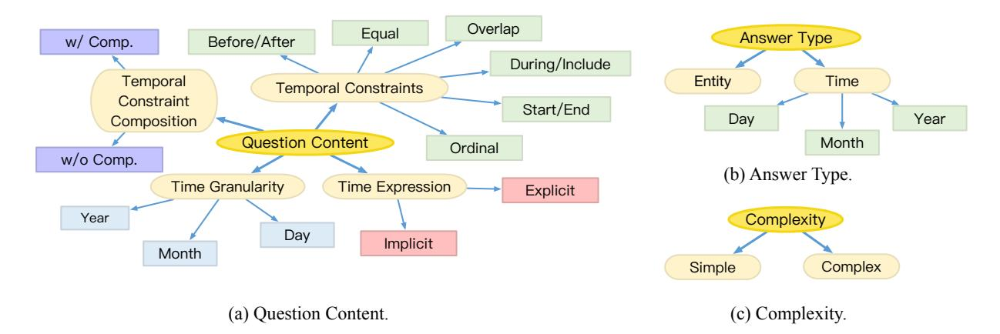

# Temporal Knowledge Graph Question Answering: A Survey

Miao Su, Zixuan Li, Zhuo Chen, Long Bai, Xiaolong Jin^**^, Jiafeng Guo^**^

CAS Key Laboratory of Network Data Science and Technology, Institute of Computing Technology, Chinese Academy of Sciences

Correspondence: [sumiao22z@ict.ac.cn](mailto:email@domain)

## Abstract

Knowledge Base Question Answering (KBQA) has been a long-standing field to answer questions based on knowledge bases. Recently, the evolving dynamics of knowledge have attracted a growing interest in Temporal Knowledge Graph Question Answering (TKGQA), an emerging task to answer temporal questions. However, this field grapples with ambiguities in defining temporal questions and lacks a systematic categorization of existing methods for TKGQA. In response, this paper provides a thorough survey from two perspectives: the taxonomy of temporal questions and the methodological categorization for TKGQA. Specifically, we first establish a detailed taxonomy of temporal questions engaged in prior studies. Subsequently, we provide a comprehensive review of TKGQA techniques of two categories: semantic parsing-based and TKG embedding-based. Building on this review, the paper outlines potential research directions aimed at advancing the field of TKGQA. This work aims to serve as a comprehensive reference for TKGQA and to stimulate further research.

## 1 Introduction

Knowledge Base Question Answering (KBQA) aims to answer natural language questions based on existing Knowledge Bases (KBs) [[1]](#ref-1). It has garnered significant attention from academia and industry due to its crucial role in various intelligent applications across multiple fields [[2]](#ref-2). A crucial subtask within KBQA is Temporal Knowledge Graph Question Answering (TKGQA), which specifically addresses temporal questions using Temporal Knowledge Graphs (TKGs) [[3]](#ref-3). Tem-

poral questions include temporal constraints or require timestamped answers, reflecting the dynamic and evolving nature of real-world events. The answer can vary significantly with different time constraints. For example, the answer to "Who won the UFC's strawweight championship in 2022?" is "Carla Esparza", while the answer to "Who won the UFC's strawweight championship in 2024?" is "Weili Zhang". Existing KBQA methods, even for complex questions, struggle with temporal questions [[4]](#ref-4); [[5]](#ref-5); [[6]](#ref-6); [[7]](#ref-7); [[8]](#ref-8).

Despite growing interest in TKGQA [[9]](#ref-9); [[10]](#ref-10); [[11]](#ref-11); [[12]](#ref-12); [[13]](#ref-13), the field still grapples with several challenges: (1) Ambiguities in the classification of temporal questions. As illustrated in Table [[1]](#ref-14), existing methods vary in their understanding of temporal questions, often concentrating on specific types of questions. Currently, there remains an absence of a comprehensive review encompassing all existing temporal questions. (2) Lack of systematic categorization of existing methods. Existing surveys primarily focus on static factual questions and their related KBQA methods [[14]](#ref-14); [[15]](#ref-15); [[16]](#ref-16); [[17]](#ref-17). Considering TKGQA's special handling of timing, it is crucial to conduct an exhaustive review of TKGQA methods.

To address the above challenges, this paper provides a thorough survey from two perspectives: the taxonomy of temporal questions and the methods categorization for TKGQA. Specifically, we first establish a unified taxonomy that encompasses existing temporal question types and definitions, providing a standardized reference that could be widely adopted. Subsequently, we systematically categorize existing methods into semantic parsing-based and TKG embedding-based. Within each category, we highlight how they uniquely address

^**^ Corresponding authors.

^0^This work has been submitted to the IEEE for possible publication. Copyright may be transferred without notice, after which this version may no longer be accessible.

| Dataset | KG/TKG | Representation Form | Question Types |
|:------------------|:-----------|:-------------------------------|:---------------------------------------------------------------------------------|
| Temp Questions | Freebase | CVT | Explicit Implicit Ordinal Temp.Answer |
| Time Questions | Wikidata | triples n-array tuple (n>3) | Explicit Implicit Ordinal Temp.Answer |
| Crom Questions | Wikidata | quintuple | SimpleTime SimpleEntity Before/After First/Last TimeJoin |
| MultiTQ | ICEWS05-15 | quadruple | Equal Before/After First/Last Equal Multi Before Last After First |

**Table 1:** TKGQA datasets, as well as their background temporal knowledge graphs, the representation form of temporal fact therein, and question types.

the temporal questions. We identify the temporal question types that each method can solve and summarize them in a table to analyze the focus of existing methods and the question types that lack attention. Building on this review, we further analyzed the future research directions. To the best of our knowledge, this is the first comprehensive survey on the TKGQA task. This work aims to stimulate further research and foster innovation in the field by serving as a comprehensive reference for TKGQA.

The rest of this paper is organized as follows. In [[18]](#ref-18), we define in detail the relevant concepts of TKGQA and this task itself. In [[19]](#ref-19), we classify temporal questions across all datasets based on question content ([[20]](#ref-20)), answer type([[21]](#ref-21)), and complexity ([[22]](#ref-22)). In [[23]](#ref-23), we introduce the two categories to TKGQA methods; in [[24]](#ref-24), we detail semantic parsing-based methods, while in [[25]](#ref-25), we elaborate on TKG embedding-based methods; in [[26]](#ref-26), we align each method with the specific types of questions it is designed to solve, providing a detailed table for summary. In [[27]](#ref-27), we explore new frontiers, summarize their challenges, and highlight opportunities for further research. We conclude this survey in [[28]](#ref-28). Additionally, in Appendix [[29]](#ref-29), we provide a detailed description of the existing TKGQA datasets ([[30]](#ref-30)), including the knowledge graphs behind them; introduce the evaluation metrics ([[31]](#ref-31)) for the TKGQA tasks, and provide a leaderboard

to illustrate the latest research progress ([[32]](#ref-32)).

## 2 Preliminary

Temporal Knowledge Graph. A TKG usually is denoted as G = (E, R, T , F), where E, R, T , and F represent the entities, relations, timestamps, and facts respectively [[33]](#ref-33). A temporal fact f ∈ F comprises one or more entities, relations, and associated timestamps. It can be represented in various forms, including Compound Value Types (CVTs), triples, n-array tuples, quintuples, and quadruples.

Temporal Question. A temporal question contains at least one temporal constraint or requires timestamps as its answer [[34]](#ref-34). A temporal constraint involves a combination of a temporal expression and a temporal word, setting a condition about a specific time point or interval that the answer must meet (e.g., "in 1996"). Temporal expressions refer to time points or intervals with varying levels of granularity in natural language (e.g., "May 11th, 2024") [[35]](#ref-35); [[36]](#ref-36). Temporal words indicate the temporal relationships between temporal expressions and act as trigger words that impose constraints on the answers (e.g., "in", "after", or "during").

Temporal Knowledge Graph Question Answering. Given the temporal knowledge graph G and a temporal question q in natural language, the TKGQA task aims to answer the q using either a set of entities {e|e ∈ E} or timestamps {τ |τ ∈ T } from G.

## 3 Taxonomy of Temporal Questions

We categorize the questions based on three aspects as illustrated in Figure [[1]](#ref-37): 1) Question Content: We use several time-related dimensions in question content to categorize the questions, as these dimensions naturally differentiate how questions are answered. 2) Answer Type: We classify the questions based on the answer types; unlike KBQA questions with a single answer type (i.e., entity), temporal questions encompass various types of answers. 3) Complexity: Similar to KBQA, we categorize the questions by their complexity [[38]](#ref-38); [[39]](#ref-39).

### 3.1 Question Content

Temporal Granularity. Questions can be categorized by the temporal granularity of their temporal

**Figure 1:** Taxonomy of temporal questions from three aspects, including (a) Question Content; (b) Answer Type and (c) Complexity.

expressions, with "year" being the most common, followed by "day" and "month".

Temporal Expression. Questions can be classified as explicit or implicit based on the nature of their temporal expressions. All time points can be normalized to a standard format, such as 2024-08- 09. Explicit temporal expression can be normalized without additional context (e.g., "September 2023" as 2023-09). Implicit temporal expression, such as an event name or phrase with a temporal scope (e.g., "2024 Paris Olympics"), requires contextual information to be normalized into a specific interval [[34]](#ref-34).

Temporal Constraints. The types of temporal constraints mirror those of temporal relations between temporal expressions. We simplify Allen's internal algebra for temporal reasoning [[40]](#ref-40) into six types of relations: *Before/After*, *Equal*, *Overlap*, *During/Include*, *Start/End*, *Ordinal*. Their formalizations are as follows:

- [beginans, endans]: This represents the time interval or specific time point where the answer is located.
- [begincons, endcons]: This denotes the range of the temporal constraint. When begincons = endcons, it signifies a specific point in time.

A summary of the meanings of these temporal constraint types is provided in Table [[2]](#ref-41).

The *Ordinal* type requires facts to be arranged in chronological order.

Temporal Constraints Composition. Temporal constraints composition occurs when multiple temporal constraints are in one question. For instance,

| Constraint Type | Formalization |
|:----------------|:----------------------------------------------------------------|
| Before | endans ≤ begincons |
| After | beginans ≥ endcons |
| Equal | beginans = begincons, endans = endcons |
| Overlap | beginans ≤ endcons ≤ endans or beginans ≤ begincons ≤ endans |
| During | begincons ≤ beginans ≤ endans ≤ endcons |
| Include | beginans ≤ begincons ≤ endcons ≤ endans |
| End | begincons ≤ beginans ≤ endcons = endans |
| Start | benginans = begincons ≤ endans ≤ endcons |

**Table 2:** Formalization of constraint types.

"Who was the first to request a meeting with Togo in 2005?" combines an *Equal* type constraint "in 2005" with an *Ordinal* type constraint "first". The answer must satisfy both. This combination represents a more complex and challenging type of question.

### 3.2 Answer type

Temporal questions can require answers that are either collections of entities or collections of timestamps, with the granularity of the timestamps varying based on the specific question. The type of answer is guided by the question word—such as "who" for entity and "what year" for timestamp.

## 3.3 Complexity

KBQA works define complex questions as those requiring retrieval of answers from more than one fact [[38]](#ref-38); [[42]](#ref-42). Inspired by these works, we also categorize temporal questions based on complexity. Specifically, we classify temporal questions into simple and complex categories.

Simple questions. Simple questions rely on a single fact for resolution. For instance, "What currency was used in Germany in 2012?" requires retrieving only one fact <Germany, currency, Euro, 2012>.

Complex questions. Complex questions require the integration of multiple facts. For example, the question "Who was the US President before Obama?" first establishes the time constraint "before 2009" based on the fact <Obama, President of, USA, 2009, 2017>. The system then identifies the individual who served immediately prior, confirmed by the fact <George W. Bush, President of, USA, 2001, 2009>, thus identifying George W. Bush. This multi-step reasoning process illustrates the complexity of such questions.

## 4 Two Categories of TKGQA Methods

Since TKGQA is a crucial subtask within KBQA, many TKGQA methods have been developed to enrich and improve upon KBQA approaches. KBQA methods are categorized into Semantic Parsing-based (SP-based) and Information Retrieval-based (IR-based) methods by existing surveys [[14]](#ref-14); [[15]](#ref-15), [[43]](#ref-43). Building on this categorization, we classify TKGQA methods into Semantic Parsing-based (SP-based) and TKG Embedding-based (TKGE-based) methods. Slightly different from IR-based methods in KBQA, TKGE-based methods view TKGQA as a TKG completion task [[44]](#ref-44); [[45]](#ref-45); [[46]](#ref-46) and do not always retrieve a question subgraph as in IR-based methods. The following sections delve into the details of these two categorizations of TKGQA methods.

## 4.1 Semantic Parsing-based Methods

As illustrated in Figure [[2]](#ref-47), SP-based methods usually have four steps: question understanding, logical parsing, TKG grounding, and query execution. The question understanding module converts unstructured text into encoded questions, facilitating downstream parsing. Next, the logical parsing module transforms the encoded question into uninstantiated logical forms, which are then grounded with the TKG elements through TKG grounding to get executable queries. Finally, the executable queries are processed and executed against the TKG to obtain the final answers during the query execution phase.

**Figure 2:** Overall procedure of SP-based methods.

### 1.1 Question Understanding

The question understanding module analyzes the input question to generate an encoded representation. This module is sometimes simplified to tag or extract logical candidates like temporal words, entities, and timestamps. Abstract Meaning Representation (AMR) [[48]](#ref-48) is one of the most widely used representations for KBQA questions, SYGMA [[49]](#ref-49) uses AMR to capture temporal words as part of the *:time* relation and handling implicit temporal constraints. [[50]](#ref-50) and [[51]](#ref-51) also employ AMR to identify question constituents. SF-TQA [[52]](#ref-52) fine-tunes BERT [[53]](#ref-53) to annotate elements determined by TimeML [[35]](#ref-35) relations. With its impressive performance on text generation and induction, Large Language Model (LLM) have been applied to generate a simplified version of logical forms directly [[9]](#ref-9) and induce step-wise abstract methodological guidance to the present question [[54]](#ref-54).

### 1.2 Logical Parsing

Logical parsing transforms the encoded question into an uninstantiated logical form. TEQUILA uses the existing KBQA engines AQQU [[7]](#ref-7) and QUINT [[8]](#ref-8) to answer the sub-questions; these engines primarily rely on predefined rules or templates to parse questions and derive logical forms [[14]](#ref-14). Early TKGQA approaches also employed rule-based translation, further incorporating timerelated rules. SYGMA introduces KB-agnostic rules into λ-expressions [[55]](#ref-55) to match temporal constraints indicated by the *:time* relation in AMR. Built on SYGMA, [[50]](#ref-50) decompose the λ-expression into main-λ and aux-λ, with the former containing the primary event questioned and the latter containing the temporal constraint.

Additionally, many methods design specialized logical forms to represent temporal information [[51]](#ref-51). [[52]](#ref-52) introduce the Semantic Framework of Temporal Constraints (SF-TCons), which captures temporal constraints and their interpretation structures. Six interpretation structures (IS) are summarized based on the intrinsic connection between events and their connectors. For example, the IS-1 Comparison structure 'COMPARE〈 INCLUDES, time("direct"), "1960" 〉' in Figure [[3]](#ref-56) interprets that the "direct" event's time should be "INCLUDES" by "1960". After linking, it can be transformed into the query graph under it. Prog-TQA expands temporal operators based on Knowledge-oriented Programming Language (KoPL) [[57]](#ref-57), which enables a more concise implementation of temporal logical queries compared to KBQA logical forms such as SPARQL [[58]](#ref-58). ARI defines specialized actions for precise information retrieval, such as "get-Between(entities,Time1,Time2)", which identifies entities/events that occurred between two specific times. An action sequence generated by LLM can be viewed as a logical form here. reasoning based on rules in Table [[2]](#ref-41). AE-TQ con- Alfred_Hitchcock Psycho (ANS)

### 1.3 TKG Grounding

TKG grounding grounds the elements in the unbound logical form with the entities, relations, and timestamps in the TKG. A series of methods are employed in this module, including rule-based approaches [[49]](#ref-49), BERT representation similarity [[59]](#ref-59), fuzzy matching algorithms [[9]](#ref-9), and an off-the-shelf Named Entity Linking (NEL) model [[54]](#ref-54).

### 1.4 Query Execution

The query execution module runs the grounded logical form against the TKG to retrieve the final answers. Some methods conduct temporal reasoning during this module. TEQUILA casts sub-questions answers' time range into intervals and conducts

**Figure 3:** Semantic framework of temporal constraints.

ducts temporal reasoning using semantic information structures (SISs). One that contains the temporal information computes a temporal constraint, which is then used to filter the candidate answers retrieved by another SIS. ARI performs knowledgebased interaction for multi-step inference [[60]](#ref-60). The LLM generates and executes actions on the TKG iteratively until the final state provides the answer. Other methods try to enhance model robustness by generating multiple queries: SF-TQA generates multiple candidate queries and scores the pairs of input questions and serialized queries with BERT. Prog-TQA identifies potential errors in KoPL programs and generates corrected versions. Correct programs are collected and used to fine-tune the LLM for self-improvement [[61]](#ref-61) iteratively.

To mitigate the TKG's incompleteness, [[50]](#ref-50) propose a targeted temporal fact extraction technique. Where they use a reading comprehension question answering (RCQA) style model to obtain missing facts and complete the query.

## 4.2 TKG Embedding-based Methods

As illustrated in Figure [[4]](#ref-62), TKGE-based methods typically involve three steps: TKG embedding, question embedding, and answer ranking. In these methods, questions and candidate answers (i.e., entities and timestamps) are converted into embeddings through the question embedding and TKG embedding modules, respectively. The question embedding is then projected into Qent and Qtime for ranking entities and timestamps during the answer ranking process.

**Figure 4:** Overall procedure of TKGE-based methods.

### 2.1 TKG Embedding

The TKG Embedding module generates embeddings of TKG elements. The entity and timestamp embeddings are filtered and augmented to create a pool of candidate answers. EXAQT [[63]](#ref-63) follows a line of KBQA research [[64]](#ref-64); [[65]](#ref-65), employ-

ing relational graph convolutional networks (R-GCNs) to update and derive the candidates' embeddings. The entity embeddings are initialised with Wikipedia2Vec [[66]](#ref-66) and argumented with timestamp encodings [[67]](#ref-67), time-aware entity embeddings, temporal signals [[68]](#ref-68), temporal question categories [[4]](#ref-4) and attention over temporal relations.

CRONKGQA [[69]](#ref-69) initially encodes all elements of the TKG using the TComplEx model [[70]](#ref-70), a tensor factorization model designed for temporal knowledge graph completion [[44]](#ref-44), capturing complex patterns and temporal dependencies within multirelational data. TSQA [[71]](#ref-71) highlight that TComplEx ignores the temporal order between quadruples; they incorporate temporal order loss during the training of TComplEx, inspired by position embeddings in transformers [[72]](#ref-72).

To reduce the search space, EXAQT generates compact question subgraphs using Group Steiner Trees (GSTs) [[73]](#ref-73). SubGTR [[74]](#ref-74) crops question subgraphs using temporal constraints.

To address the inconsistency between a question's granularity and the TKG's temporal granularity, MultiQA [[75]](#ref-75) employs multigranularity temporal aggregation. It splices days within each month or year interval, adds position vectors, and then fuses the information using the transformer.

### 2.2 Question Embedding

The question embedding module embeds the temporal question, analyzing its semantics and incorporating time-relevant information. EXAQT embeds the question words with Wikipedia2Vec [[66]](#ref-66)

[[76]](#ref-76) and encodes it with LSTM [[77]](#ref-77). It then concatenates it with temporal category and temporal signal word encodings and updates using R-GCN. [[69]](#ref-69) encodes the question with BERT. TempoQR [[78]](#ref-78) further leverages TKG embeddings to ground questions with their specific entities and respective time scopes. It replaces the BERT token embeddings of entities and timestamps with their pre-trained TKG embeddings and adds time position to the entity tokens. TSIQA [[79]](#ref-79) derives the time position of entities based on the assumption that entities with co-sharing relations correspond to related timestamps.

Many methods use GNN to further integrate the graphical structure into question embedding; the value of an edge in the graph is the concatenation of relation and timestamp, i.e., r||t, which is specific to TKGQA tasks. TwiRGCN [[80]](#ref-80) computes question-dependent edge weights to modulate R-GCN messages, enhancing messages through relevant edges and diminishing those from irrelevant ones. LGQA [[81]](#ref-81) fuses global (i.e., sentence-level semantic) and local (i.e., entity-level graphical) information with transformers. GenTKGQA [[10]](#ref-10) retrieves a question-relevant subgraph through LLM's extraction ability [[82]](#ref-82) and uses a pre-trained T-GNN layer [[83]](#ref-83) to embed elements in the subgraph into "virtual knowledge indicators" to represent question. M3TQA [[84]](#ref-84) designs a multi-stage aggregation module, enabling asynchronous alignment and fusion of bidirectional heterogeneous information from the PLMs [[53]](#ref-53); [[85]](#ref-85) and GNNs.

To emphasize the importance of different knowledge for the question, JMFRN [[12]](#ref-12) aggregates entity and timestamp information of retrieved facts using time-aware and entity-aware attention [[72]](#ref-72). TMA [[86]](#ref-86) selects facts with similar semantics for three kinds of token-level attention. A gating mechanism integrates these representations to enhance the question embedding.

To enhance the model's sensitivity to temporal words, TSQA and TSIQA alter temporal words (e.g., replacing "before" with "after") to construct contrastive questions and apply both order loss and answer loss for contrastive learning.

Various approaches extract implicit temporal fea-

| Category | Question Content | | | | | | | Answer Type | | | | Complexity | | | | | | | |
|:-----------------------------------|:-----------------|:--------------------|:----|:---------|:-------------------|:--------|:-------------|:------------|:-----------------------|:---------------|:----------|:-----------|:---------------------------------------|:-------|:---|:-----|:----|:-------|:--------|
| | | Time Granularity | | | Time Expression | | | | Temporal Constraint | | | | Temporal Constraints Composition | Entity | | Time | | Simple | Complex |
| Method | Year | Month | Day | Explicit | Implicit | Overlap | Before/After | Ordinal | Equal | During/Include | Start/End | w/ Comp. | w/o Comp. | | Year | Month | Day | | |
| Semantic Parsing-based | | | | | | | | | | | | | | | | | | | |
| TEQUILA (Jia et al., 2018b) | ◦ | ◦ | ◦ | ◦ | ◦ | ◦ | ◦ | ◦ | ◦ | ◦ | ◦ | | ◦ | ◦ | ◦ | ◦ | ◦ | ◦ | ◦ |
| SYGMA (Neelam et al., 2021) | ◦ | ◦ | ◦ | ◦ | ◦ | • | • | ◦ | ◦ | • | ◦ | | ◦ | ◦ | ◦ | ◦ | ◦ | ◦ | ◦ |
| AE-TQ (Long et al., 2022) | ◦ | | | ◦ | ◦ | • | • | • | ◦ | ◦ | ◦ | | ◦ | ◦ | ◦ | | | ◦ | • |
| SF-TQA (Ding et al., 2023) | ◦ | ◦ | ◦ | • | • | • | • | • | • | • | ◦ | ◦ | ◦ | ◦ | ◦ | ◦ | ◦ | ◦ | • |
| ARI (Chen et al., 2023a) | ◦ | ◦ | ◦ | ◦ | ◦ | ◦ | ◦ | ◦ | ◦ | • | ◦ | ◦ | ◦ | | ◦ | ◦ | ◦ | ◦ | • |
| Best of Both (Kannen et al., 2023) | ◦ | ◦ | ◦ | ◦ | • | ◦ | ◦ | ◦ | ◦ | ◦ | ◦ | | ◦ | ◦ | ◦ | ◦ | ◦ | ◦ | ◦ |
| Prog-TQA (Chen et al., 2024) | • | • | • | ◦ | ◦ | • | • | • | • | • | • | ◦ | ◦ | ◦ | • | • | • | ◦ | • |
| | | | | | | | | | TKG Embedding-based | | | | | | | | | | |
| CronKGQA (Saxena et al., 2021) | ◦ | | | ◦ | ◦ | ◦ | ◦ | ◦ | ◦ | ◦ | ◦ | | ◦ | ◦ | ◦ | | | • | ◦ |
| EXAQT (Jia et al., 2021) | ◦ | | | • | ◦ | ◦ | ◦ | ◦ | ◦ | ◦ | ◦ | | ◦ | ◦ | • | | | ◦ | ◦ |
| TempoQR (Mavromatis et al., 2021) | ◦ | | | ◦ | ◦ | • | • | • | ◦ | • | ◦ | | ◦ | ◦ | ◦ | | | ◦ | ◦ |
| TSQA (Shang et al., 2022b) | ◦ | | | ◦ | ◦ | ◦ | • | • | • | • | ◦ | | ◦ | ◦ | ◦ | | | ◦ | • |
| CTRN (Jiao et al., 2023) | ◦ | | | ◦ | ◦ | • | • | • | ◦ | • | ◦ | | ◦ | ◦ | ◦ | | | ◦ | • |
| SubGTR (Chen et al., 2022) | ◦ | | | ◦ | • | • | • | • | ◦ | • | ◦ | | ◦ | ◦ | ◦ | | | ◦ | • |
| TwiRGCN (Sharma et al., 2022) | ◦ | | | ◦ | • | ◦ | ◦ | • | ◦ | ◦ | ◦ | | ◦ | ◦ | ◦ | | | ◦ | ◦ |
| TSIQA (Xiao et al., 2022) | ◦ | | | ◦ | ◦ | ◦ | • | • | • | • | ◦ | | ◦ | ◦ | ◦ | | | ◦ | • |
| TMA (Liu et al., 2023a) | ◦ | | | ◦ | ◦ | • | • | • | ◦ | • | ◦ | | ◦ | ◦ | ◦ | | | ◦ | ◦ |
| MultiQA (Chen et al., 2023b) | • | • | • | ◦ | ◦ | ◦ | ◦ | ◦ | ◦ | ◦ | ◦ | | ◦ | ◦ | • | • | • | ◦ | ◦ |
| LGQA (Liu et al., 2023b) | ◦ | ◦ | ◦ | ◦ | ◦ | ◦ | • | ◦ | ◦ | • | ◦ | | ◦ | ◦ | ◦ | ◦ | ◦ | ◦ | • |
| JMFRN (Huang et al., 2024) | ◦ | | | ◦ | • | ◦ | ◦ | • | ◦ | ◦ | ◦ | | ◦ | ◦ | ◦ | | | ◦ | • |
| SERQA (Du et al., 2024) | ◦ | ◦ | ◦ | ◦ | ◦ | ◦ | • | • | ◦ | ◦ | ◦ | | ◦ | ◦ | ◦ | ◦ | ◦ | ◦ | • |
| QC-MHM (Xue et al., 2024) | ◦ | | | • | • | • | • | • | ◦ | ◦ | ◦ | | ◦ | ◦ | • | | | ◦ | ◦ |
| GenTKGQA (Gao et al., 2024) | ◦ | | | ◦ | ◦ | • | • | • | ◦ | ◦ | ◦ | | ◦ | ◦ | • | | | • | • |
| M3TQA (Zha et al., 2024) | ◦ | ◦ | ◦ | • | • | ◦ | ◦ | ◦ | ◦ | ◦ | ◦ | ◦ | ◦ | ◦ | • | • | • | ◦ | • |

**Table 3:** Question category coverage comparison across TKGQA methods. The ◦ indicates that this method can solve the corresponding question category. The • indicates that this method focuses on or specializes in solving this question category.

tures from questions: CTRN [[87]](#ref-87) uses multi-head self-attention, GCN [[88]](#ref-88), and CNN [[89]](#ref-89) to capture these features and fuse them with augmented BERT representations, while SERQA [[11]](#ref-11) integrates temporal constraint features computed from syntactic information in constituent and dependency trees [[90]](#ref-90); [[91]](#ref-91); [[92]](#ref-92); [[93]](#ref-93) combined with Masked Self-Attention (MSA).

To enhance the interpretability of reasoning on implicit temporal questions, SubGTR designs an implicit expression parsing module to rewrite their temporal constraints explicitly.

### 2.3 Answer Ranking

The answer ranking module ranks candidate answers based on the question and candidate answer embeddings. TKG models employ various techniques: leveraging TComplEx scoring functions [[69]](#ref-69); [[78]](#ref-78), applying temporal activation functions to satisfy time constraints [[74]](#ref-74), introducing gating mechanisms [[80]](#ref-80) or type discrimination losses [[12]](#ref-12) to distinguish among answer types, and fine-tuning a LLM to list the most relevant answers [[94]](#ref-94).

## 4.3 Question Category Coverage Comparison Across TKGQA Methods

Building on the question taxonomy and methodologies overview, we match each type of temporal question with the appropriate method designed to address it effectively, providing a detailed table as Table [[3]](#ref-95). We can see from the table that finer-grained granularities have been brought into focus over time. *Implicit* questions received more attention than *explicit*; *before/after* and *ordinal* questions received the most attention, followed by *during/include* and *overlap*; *start/end* and *equal* questions gain less attention because fewer datasets present them as separate categories. More methods focused on solving more *complex* questions; however, there was a lack of attention to the most complex type of *temporal constraint compositions*.

## 5 Future Directions

This section will discuss emerging frontiers for TKGQA, aiming to stimulate further research in this field.

### 1 Introduce More Question Types

While existing datasets already cover some of the temporal questions, there are still more questions to be explored in the real world. 1) More combination of existing question types: "Who was the first person to win a medal during the 2024 Olympic Games?" 2) More time granularity: Some questions demand more fine-grained granularities, such as "When was the Long March 1 launched?" 3) Questions must consider the posed time: "Where are the seneca indians now?" [[63]](#ref-63); [[96]](#ref-96) 3) Predicting the future questions: "Will the Palestinian-Israeli conflict end next year?" [[97]](#ref-97); [[98]](#ref-98) 4) Common sense temporal questions: "How often are the Olympics held?"

## 2 Enhance Model Robustness

Most existing TKGQA datasets provide entity and temporal annotations [[69]](#ref-69); [[63]](#ref-63); [[99]](#ref-99), greatly reducing the task's difficulty. Results on unlabeled datasets rely on the effects of NEL or temporal annotators [[75]](#ref-75), corrupting the model's robustness. Robust models should be able to perform well on datasets with no additional annotations and be able to generalize to unseen entities and relationships [[74]](#ref-74). In addition, most existing datasets rely on template generation and lack diversity; there are very few event types, and they are still single-domain. These can be improved in future work.

## 3 Multi-modal TKGQA

Current TKGQA systems mainly handle plain text input. However, we experience the world with multiple modalities (e.g., language and image). Therefore, building a multi-modal TKGQA system that can handle multiple modalities is an important direction to investigate [[100]](#ref-100). A nontrivial challenge is how to effectively make a multimodal feature alignment and complementary to understand the temporal part better.

## 4 LLM for TKGQA

Recently, Large Language Models (LLMs) have gained significant attention for their remarkable performance across a wide range of Natural Language Processing (NLP) tasks [[101]](#ref-101); [[102]](#ref-102); [[103]](#ref-103). Existing research has also explored applying LLMs in KBQA scenarios, employing both few-shot and zero-shot learning paradigms [[104]](#ref-104); [[105]](#ref-105); [[106]](#ref-106); [[107]](#ref-107); [[108]](#ref-108).

However, several critical challenges remain to be addressed in LLM for TKGQA. We summarize the main challenges as follows: LLMs currently have significant shortcomings in understanding temporal expressions [[109]](#ref-109), crucial for TKGQA. LLMs also perform poorly in symbolic temporal reasoning, especially in multi-step tasks [[109]](#ref-109); [[110]](#ref-110); [[111]](#ref-111). Enhancing these capabilities for complex temporal questions is essential; approaches like temporal span extraction pre-training, supervised fine-tuning, and time-sensitive reinforcement learning may help [[110]](#ref-110).

Several emerging opportunities could further enhance the capabilities of LLMs in TKGQA systems:

- Multi-Agent Collaboration Interactive Reasoning for TKGQA. Recent LLM works have shifted the focus from traditional NLP tasks to exploring language agents in simulation environments that mimic real-world scenarios [[112]](#ref-112). [[113]](#ref-113) investigates interactive reasoning and collective intelligence in autonomously solving complex problems. This may be further explored for temporal reasoning in temporal questions.
- Diverse Data Generation. Numerous studies have demonstrated the effectiveness of large models in data generation [[114]](#ref-114), which can be used to enhance the diversity of the TKGQA dataset.
- Supplementing Knowledge. The language model itself can serve as a TKG as demonstrated by [[115]](#ref-115). Additionally, LLMs possess temporal commonsense [[109]](#ref-109), which is often absent in traditional temporal knowledge graphs. This temporal knowledge can complement existing TKGs for TKGQA.

## 6 Conclusion

In this paper, we provided an in-depth analysis of the emerging field of TKGQA with a new taxonomy of temporal questions and a systematic categorization of existing methods. We demonstrated the focus and neglect of existing methods for temporal questions, indicating future research directions. We have discussed some new trends in this research field, hoping to attract more breakthroughs in future research.

## Limitations

This study offers a comprehensive review of the TKGQA task. However, our primary focus is on temporal question answering specifically based on temporal knowledge graphs, and we do not delve into other temporal question answering tasks based on texts or heterogeneous sources. Furthermore, the descriptions within this survey are deliberately brief to ensure a broad coverage of the topic while adhering to page constraints. Rather than presenting the works in an unstructured sequence, we organize them into meaningful, structured groups. We aim for this work to serve as an index, guiding readers to more detailed information in the referenced works.

## References

- Abdalghani Abujabal, Mohamed Yahya, Mirek Riedewald, and Gerhard Weikum. 2017. Automated template generation for question answering over knowledge graphs. In *Proceedings of the 26th international conference on world wide web*, pages 1191–1200.
- James F. Allen. 1983. [Maintaining knowledge about](https://doi.org/10.1145/182.358434) [temporal intervals.](https://doi.org/10.1145/182.358434) *Communications of the ACM*, 26(11):832–843.
- Jinheon Baek, Alham Fikri Aji, and Amir Saffari. 2023. [Knowledge-Augmented Language Model Prompting](https://doi.org/10.48550/arXiv.2306.04136) [for Zero-Shot Knowledge Graph Question Answer](https://doi.org/10.48550/arXiv.2306.04136)[ing.](https://doi.org/10.48550/arXiv.2306.04136) *Preprint*, arxiv:2306.04136.
- Hannah Bast and Elmar Haussmann. 2015. More accurate question answering on freebase. In *Proceedings of the 24th ACM international on conference on information and knowledge management*, pages 1431–1440.
- Kurt Bollacker, Colin Evans, Praveen Paritosh, Tim Sturge, and Jamie Taylor. 2008. [Freebase: A col](https://doi.org/10.1145/1376616.1376746)[laboratively created graph database for structuring](https://doi.org/10.1145/1376616.1376746) [human knowledge.](https://doi.org/10.1145/1376616.1376746) In *Proceedings of the 2008 ACM SIGMOD International Conference on Management of Data*, SIGMOD '08, pages 1247–1250, New York, NY, USA. Association for Computing Machinery.
- Borui Cai, Yong Xiang, Longxiang Gao, He Zhang, Yunfeng Li, and Jianxin Li. 2023. [Temporal Knowl](https://doi.org/10.24963/ijcai.2023/734)[edge Graph Completion: A Survey.](https://doi.org/10.24963/ijcai.2023/734) In *Proceedings of the Thirty-Second International Joint Conference on Artificial Intelligence*, pages 6545–6553.
- Li Cai, Xin Mao, Yuhao Zhou, Zhaoguang Long, Changxu Wu, and Man Lan. 2024. [A Survey on](https://doi.org/10.48550/arXiv.2403.04782) [Temporal Knowledge Graph: Representation Learn](https://doi.org/10.48550/arXiv.2403.04782)[ing and Applications.](https://doi.org/10.48550/arXiv.2403.04782) *Preprint*, arxiv:2403.04782.
- Qingqing Cai and Alexander Yates. 2013. Large-scale Semantic Parsing via Schema Matching and Lexicon

Extension. In *Proceedings of the 51st Annual Meeting of the Association for Computational Linguistics (Volume 1: Long Papers)*, pages 423–433, Sofia, Bulgaria. Association for Computational Linguistics.

- Shulin Cao, Jiaxin Shi, Liangming Pan, Lunyiu Nie, Yutong Xiang, Lei Hou, Juanzi Li, Bin He, and Hanwang Zhang. 2022. [KQA Pro: A Dataset with Ex](https://doi.org/10.48550/arXiv.2007.03875)[plicit Compositional Programs for Complex Ques](https://doi.org/10.48550/arXiv.2007.03875)[tion Answering over Knowledge Base.](https://doi.org/10.48550/arXiv.2007.03875) *Preprint*, arxiv:2007.03875.
- Nilesh Chakraborty, Denis Lukovnikov, Gaurav Maheshwari, Priyansh Trivedi, Jens Lehmann, and Asja Fischer. 2021. [Introduction to neural network](https://doi.org/10.1002/widm.1389)[based question answering over knowledge graphs.](https://doi.org/10.1002/widm.1389) *WIREs Data Mining and Knowledge Discovery*, 11(3):e1389.
- Angel X Chang and Christopher D Manning. SUTIME: A Library for Recognizing and Normalizing Time Expressions.
- Zhuo Chen, Zhao Zhang, Zixuan Li, Fei Wang, Yutao Zeng, Xiaolong Jin, and Yongjun Xu. 2024. Self-Improvement Programming for Temporal Knowledge Graph Question Answering.
- Ziyang Chen, Dongfang Li, Xiang Zhao, Baotian Hu, and Min Zhang. 2023a. [Temporal Knowledge Ques](https://arxiv.org/abs/2311.09149)[tion Answering via Abstract Reasoning Induction.](https://arxiv.org/abs/2311.09149) *Preprint*, arxiv:2311.09149.
- Ziyang Chen, Jinzhi Liao, and Xiang Zhao. 2023b. Multi-granularity Temporal Question Answering over Knowledge Graphs. In *Proceedings of the 61st Annual Meeting of the Association for Computational Linguistics (Volume 1: Long Papers)*, pages 11378– 11392, Toronto, Canada. Association for Computational Linguistics.
- Ziyang Chen, Xiang Zhao, Jinzhi Liao, Xinyi Li, and Evangelos Kanoulas. 2022. [Temporal knowledge](https://doi.org/10.1016/j.knosys.2022.109134) [graph question answering via subgraph reasoning.](https://doi.org/10.1016/j.knosys.2022.109134) *Knowledge-Based Systems*, 251:109134.
- Zheng Chu, Jingchang Chen, Qianglong Chen, Weijiang Yu, Haotian Wang, Ming Liu, and Bing Qin. 2023. [TimeBench: A Comprehensive Evaluation of Tempo](https://arxiv.org/abs/2311.17667)[ral Reasoning Abilities in Large Language Models.](https://arxiv.org/abs/2311.17667) *Preprint*, arxiv:2311.17667.
- John Chung, Ece Kamar, and Saleema Amershi. 2023. [Increasing Diversity While Maintaining Accuracy:](https://doi.org/10.18653/v1/2023.acl-long.34) [Text Data Generation with Large Language Models](https://doi.org/10.18653/v1/2023.acl-long.34) [and Human Interventions.](https://doi.org/10.18653/v1/2023.acl-long.34) In *Proceedings of the 61st Annual Meeting of the Association for Computational Linguistics (Volume 1: Long Papers)*, pages 575– 593, Toronto, Canada. Association for Computational Linguistics.
- Jacob Devlin, Ming-Wei Chang, Kenton Lee, and Kristina Toutanova. 2019. [BERT: Pre-training of](https://doi.org/10.48550/arXiv.1810.04805) [Deep Bidirectional Transformers for Language Un](https://doi.org/10.48550/arXiv.1810.04805)[derstanding.](https://doi.org/10.48550/arXiv.1810.04805) *Preprint*, arxiv:1810.04805.

- Bhuwan Dhingra, Jeremy R. Cole, Julian Martin Eisenschlos, Daniel Gillick, Jacob Eisenstein, and William W. Cohen. 2022. [Time-Aware Language](https://doi.org/10.1162/tacl_a_00459) [Models as Temporal Knowledge Bases.](https://doi.org/10.1162/tacl_a_00459) *Transactions of the Association for Computational Linguistics*, 10:257–273.
- Wentao Ding, Hao Chen, Huayu Li, and Yuzhong Qu. 2023. [Semantic Framework based Query Generation](https://doi.org/10.48550/arXiv.2210.04490) [for Temporal Question Answering over Knowledge](https://doi.org/10.48550/arXiv.2210.04490) [Graphs.](https://doi.org/10.48550/arXiv.2210.04490) *Preprint*, arxiv:2210.04490.
- Zifeng Ding, Zongyue Li, Ruoxia Qi, Jingpei Wu, Bailan He, Yunpu Ma, Zhao Meng, Shuo Chen, Ruotong Liao, Zhen Han, and Volker Tresp. 2022a. [ForecastTKGQuestions: A Benchmark for Temporal](https://doi.org/10.48550/arXiv.2208.06501) [Question Answering and Forecasting over Temporal](https://doi.org/10.48550/arXiv.2208.06501) [Knowledge Graphs.](https://doi.org/10.48550/arXiv.2208.06501) *Preprint*, arxiv:2208.06501.
- Zifeng Ding, Ruoxia Qi, Zongyue Li, Bailan He, Jingpei Wu, Yunpu Ma, Zhao Meng, Zhen Han, and Volker Tresp. 2022b. *[Forecasting Question Answering over](https://doi.org/10.48550/arXiv.2208.06501) [Temporal Knowledge Graphs](https://doi.org/10.48550/arXiv.2208.06501)*.
- Li Dong, Furu Wei, Ming Zhou, and Ke Xu. 2015. Question answering over freebase with multi-column convolutional neural networks. In *Proceedings of the 53rd Annual Meeting of the Association for Computational Linguistics and the 7th International Joint Conference on Natural Language Processing (Volume 1: Long Papers)*, pages 260–269.
- Chenyang Du, Xiaoge Li, and Zhongyang Li. 2024. [Semantic-enhanced reasoning question answering](https://doi.org/10.1007/s10844-024-00840-5) [over temporal knowledge graphs.](https://doi.org/10.1007/s10844-024-00840-5) *Journal of Intelligent Information Systems*.
- Mohnish Dubey, Debayan Banerjee, Abdelrahman Abdelkawi, and Jens Lehmann. 2019. [LC-QuAD 2.0:](https://doi.org/10.1007/978-3-030-30796-7_5) [A Large Dataset for Complex Question Answering](https://doi.org/10.1007/978-3-030-30796-7_5) [over Wikidata and DBpedia.](https://doi.org/10.1007/978-3-030-30796-7_5) In *The Semantic Web – ISWC 2019*, pages 69–78, Cham. Springer International Publishing.
- Bin Fu, Yunqi Qiu, Chengguang Tang, Yang Li, Haiyang Yu, and Jian Sun. 2020. [A Survey](https://doi.org/10.48550/arXiv.2007.13069) [on Complex Question Answering over Knowledge](https://doi.org/10.48550/arXiv.2007.13069) [Base: Recent Advances and Challenges.](https://doi.org/10.48550/arXiv.2007.13069) *Preprint*, arxiv:2007.13069.
- Yifu Gao, Linbo Qiao, Zhigang Kan, Zhihua Wen, Yongquan He, and Dongsheng Li. 2024. [Two-stage](https://doi.org/10.48550/arXiv.2402.16568) [Generative Question Answering on Temporal Knowl](https://doi.org/10.48550/arXiv.2402.16568)[edge Graph Using Large Language Models.](https://doi.org/10.48550/arXiv.2402.16568) *Preprint*, arxiv:2402.16568.
- Alberto García-Durán, Sebastijan Dumanciˇ c, and Math- ´ ias Niepert. 2018. [Learning Sequence Encoders for](https://doi.org/10.18653/v1/D18-1516) [Temporal Knowledge Graph Completion.](https://doi.org/10.18653/v1/D18-1516) In *Proceedings of the 2018 Conference on Empirical Methods in Natural Language Processing*, pages 4816– 4821, Brussels, Belgium. Association for Computational Linguistics.
- Yu Gu, Vardaan Pahuja, Gong Cheng, and Yu Su. 2022. [Knowledge Base Question Answering: A Semantic](https://doi.org/10.48550/arXiv.2209.04994) [Parsing Perspective.](https://doi.org/10.48550/arXiv.2209.04994) *Preprint*, arxiv:2209.04994.

- Yu Gu and Yu Su. 2022. [ArcaneQA: Dynamic Pro](https://doi.org/10.48550/arXiv.2204.08109)[gram Induction and Contextualized Encoding for](https://doi.org/10.48550/arXiv.2204.08109) [Knowledge Base Question Answering.](https://doi.org/10.48550/arXiv.2204.08109) *Preprint*, arxiv:2204.08109.
- Zhen Han, Peng Chen, Yunpu Ma, and Volker Tresp. 2021. EXPLAINABLE SUBGRAPH REASONING FOR FORE- CASTING ON TEMPORAL KNOWL-EDGE GRAPHS.
- Sepp Hochreiter and Jürgen Schmidhuber. 1997. [Long Short-Term Memory.](https://doi.org/10.1162/neco.1997.9.8.1735) *Neural Computation*, 9(8):1735–1780.
- Sen Hu, Lei Zou, and Xinbo Zhang. 2018. [A State](https://doi.org/10.18653/v1/D18-1234)[transition Framework to Answer Complex Questions](https://doi.org/10.18653/v1/D18-1234) [over Knowledge Base.](https://doi.org/10.18653/v1/D18-1234) *Preprint*, arxiv:1804.06804.
- Jiaxin Huang, Shixiang Shane Gu, Le Hou, Yuexin Wu, Xuezhi Wang, Hongkun Yu, and Jiawei Han. 2022. [Large Language Models Can Self-Improve.](https://doi.org/10.48550/arXiv.2210.11610) *Preprint*, arxiv:2210.11610.
- Rikui Huang, Wei Wei, Xiaoye Qu, Wenfeng Xie, Xianling Mao, and Dangyang Chen. 2024. [Joint](https://doi.org/10.48550/arXiv.2401.02212) [Multi-Facts Reasoning Network For Complex Tem](https://doi.org/10.48550/arXiv.2401.02212)[poral Question Answering Over Knowledge Graph.](https://doi.org/10.48550/arXiv.2401.02212) *Preprint*, arxiv:2401.02212.
- Ruihong Huang. 2018. [Domain-Sensitive Temporal](https://doi.org/10.1162/COLI_r_00319) [Tagging By Jannik Strötgen, Michael Gertz.](https://doi.org/10.1162/COLI_r_00319) *Computational Linguistics*, 44(2):375–377.
- Zhen Jia, Abdalghani Abujabal, Rishiraj Saha Roy, Jannik Strötgen, and Gerhard Weikum. 2018a. [Tem](https://doi.org/10.1145/3184558.3191536)[pQuestions: A Benchmark for Temporal Question](https://doi.org/10.1145/3184558.3191536) [Answering.](https://doi.org/10.1145/3184558.3191536) In *Companion Proceedings of the The Web Conference 2018*, WWW '18, pages 1057–1062, Republic and Canton of Geneva, CHE. International World Wide Web Conferences Steering Committee.
- Zhen Jia, Abdalghani Abujabal, Rishiraj Saha Roy, Jannik Strötgen, and Gerhard Weikum. 2018b. [TEQUILA: Temporal Question Answering over](https://doi.org/10.1145/3269206.3269247) [Knowledge Bases.](https://doi.org/10.1145/3269206.3269247) In *Proceedings of the 27th ACM International Conference on Information and Knowledge Management*, pages 1807–1810, Torino Italy. ACM.
- Zhen Jia, Soumajit Pramanik, Rishiraj Saha Roy, and Gerhard Weikum. 2021. [Complex Temporal Ques](https://doi.org/10.1145/3459637.3482416)[tion Answering on Knowledge Graphs.](https://doi.org/10.1145/3459637.3482416) In *Proceedings of the 30th ACM International Conference on Information & Knowledge Management*, pages 792– 802.
- Jinhao Jiang, Kun Zhou, Zican Dong, Keming Ye, Wayne Xin Zhao, and Ji-Rong Wen. 2023. [Struct-](https://doi.org/10.48550/arXiv.2305.09645)[GPT: A General Framework for Large Language](https://doi.org/10.48550/arXiv.2305.09645) [Model to Reason over Structured Data.](https://doi.org/10.48550/arXiv.2305.09645) *Preprint*, arxiv:2305.09645.

- Songlin Jiao, Zhenfang Zhu, Wenqing Wu, Zicheng Zuo, Jiangtao Qi, Wenling Wang, Guangyuan Zhang, and Peiyu Liu. 2023. [An improving reasoning net](https://doi.org/10.1007/s10489-022-03913-6)[work for complex question answering over temporal](https://doi.org/10.1007/s10489-022-03913-6) [knowledge graphs.](https://doi.org/10.1007/s10489-022-03913-6) *Applied Intelligence*, 53(7):8195– 8208.
- Woojeong Jin, Rahul Khanna, Suji Kim, Dong-Ho Lee, Fred Morstatter, Aram Galstyan, and Xiang Ren. 2021. [ForecastQA: A Question Answering Chal](https://arxiv.org/abs/2005.00792)[lenge for Event Forecasting with Temporal Text Data.](https://arxiv.org/abs/2005.00792) *Preprint*, arxiv:2005.00792.
- Nithish Kannen, Udit Sharma, Sumit Neelam, Dinesh Khandelwal, Shajith Ikbal, Hima Karanam, and L. Venkata Subramaniam. 2023. Best of Both Worlds: Towards Improving Temporal Knowledge Base Question Answering via Targeted Fact Extraction. In *The 2023 Conference on Empirical Methods in Natural Language Processing*.
- Pavan Kapanipathi, Ibrahim Abdelaziz, Srinivas Ravishankar, Salim Roukos, Alexander Gray, Ramon Astudillo, Maria Chang, Cristina Cornelio, Saswati Dana, Achille Fokoue, Dinesh Garg, and et al. Gliozzo. 2020. Leveraging Abstract Meaning Representation for Knowledge Base Question Answering. https://arxiv.org/abs/2012.01707v2.
- Timothée Lacroix, Guillaume Obozinski, and Nicolas Usunier. 2020. [Tensor Decompositions for](https://doi.org/10.48550/arXiv.2004.04926) [temporal knowledge base completion.](https://doi.org/10.48550/arXiv.2004.04926) *Preprint*, arxiv:2004.04926.
- Yunshi Lan, Gaole He, Jinhao Jiang, Jing Jiang, Wayne Xin Zhao, and Ji-Rong Wen. 2021. [A Sur](https://doi.org/10.48550/arXiv.2105.11644)[vey on Complex Knowledge Base Question Answer](https://doi.org/10.48550/arXiv.2105.11644)[ing: Methods, Challenges and Solutions.](https://doi.org/10.48550/arXiv.2105.11644) *Preprint*, arxiv:2105.11644.
- Yunshi Lan, Gaole He, Jinhao Jiang, Jing Jiang, Wayne Xin Zhao, and Ji-Rong Wen. 2022. [Complex](https://doi.org/10.48550/arXiv.2108.06688) [Knowledge Base Question Answering: A Survey.](https://doi.org/10.48550/arXiv.2108.06688) *Preprint*, arxiv:2108.06688. Comment: 20 pages, 4 tables, 7 figures. arXiv admin note: text overlap with arXiv:2105.11644.
- Julien Leblay and Melisachew Wudage Chekol. 2018a. [Deriving validity time in knowledge graph.](https://doi.org/10.1145/3184558.3191639) In *Companion Proceedings of the The Web Conference 2018*, WWW '18, page 1771–1776, Republic and Canton of Geneva, CHE. International World Wide Web Conferences Steering Committee.
- Julien Leblay and Melisachew Wudage Chekol. 2018b. [Deriving Validity Time in Knowledge Graph.](https://doi.org/10.1145/3184558.3191639) In *Companion Proceedings of the The Web Conference 2018*, WWW '18, pages 1771–1776, Republic and Canton of Geneva, CHE. International World Wide Web Conferences Steering Committee.
- Rong-Hua Li, Lu Qin, Jeffrey Xu Yu, and Rui Mao. 2016. [Efficient and Progressive Group Steiner Tree](https://doi.org/10.1145/2882903.2915217) [Search.](https://doi.org/10.1145/2882903.2915217) In *Proceedings of the 2016 International Conference on Management of Data*, SIGMOD '16, pages 91–106, New York, NY, USA. Association for Computing Machinery.

- Tianle Li, Xueguang Ma, Alex Zhuang, Yu Gu, Yu Su, and Wenhu Chen. 2023a. [Few-shot In-context](https://doi.org/10.48550/arXiv.2305.01750) [Learning for Knowledge Base Question Answering.](https://doi.org/10.48550/arXiv.2305.01750) *Preprint*, arxiv:2305.01750.
- Xingxuan Li, Liying Cheng, Qingyu Tan, Hwee Tou Ng, Shafiq Joty, and Lidong Bing. 2023b. [Unlock](https://doi.org/10.48550/arXiv.2305.15014)[ing Temporal Question Answering for Large Lan](https://doi.org/10.48550/arXiv.2305.15014)[guage Models Using Code Execution.](https://doi.org/10.48550/arXiv.2305.15014) *Preprint*, arxiv:2305.15014.
- Shuo Liang, Wei Wei, Xian-Ling Mao, Fei Wang, and Zhiyong He. 2022. [BiSyn-GAT+: Bi-Syntax Aware](https://doi.org/10.18653/v1/2022.findings-acl.144) [Graph Attention Network for Aspect-based Senti](https://doi.org/10.18653/v1/2022.findings-acl.144)[ment Analysis.](https://doi.org/10.18653/v1/2022.findings-acl.144) In *Findings of the Association for Computational Linguistics: ACL 2022*, pages 1835– 1848, Dublin, Ireland. Association for Computational Linguistics.
- Adam Liška, Tomáš Kociský, Elena Gribovskaya, Tay- ˇ fun Terzi, Eren Sezener, Devang Agrawal, Cyprien de Masson d'Autume, Tim Scholtes, Manzil Zaheer, Susannah Young, Ellen Gilsenan-McMahon, Sophia Austin, Phil Blunsom, and Angeliki Lazaridou. 2022. [StreamingQA: A Benchmark for Adaptation to New](https://doi.org/10.48550/arXiv.2205.11388) [Knowledge over Time in Question Answering Mod](https://doi.org/10.48550/arXiv.2205.11388)[els.](https://doi.org/10.48550/arXiv.2205.11388) *Preprint*, arxiv:2205.11388.
- Yinhan Liu, Myle Ott, Naman Goyal, Jingfei Du, Mandar Joshi, Danqi Chen, Omer Levy, Mike Lewis, Luke Zettlemoyer, and Veselin Stoyanov. 2019. [RoBERTa: A Robustly Optimized BERT Pretrain](https://doi.org/10.48550/arXiv.1907.11692)[ing Approach.](https://doi.org/10.48550/arXiv.1907.11692) *Preprint*, arxiv:1907.11692.
- Yonghao Liu, Di Liang, Fang Fang, Sirui Wang, Wei Wu, and Rui Jiang. 2023a. [Time-Aware Multiway](https://doi.org/10.1109/ICASSP49357.2023.10095395) [Adaptive Fusion Network for Temporal Knowledge](https://doi.org/10.1109/ICASSP49357.2023.10095395) [Graph Question Answering.](https://doi.org/10.1109/ICASSP49357.2023.10095395) In *ICASSP 2023 - 2023 IEEE International Conference on Acoustics, Speech and Signal Processing (ICASSP)*, pages 1–5.
- Yonghao Liu, Di Liang, Mengyu Li, Fausto Giunchiglia, Ximing Li, Sirui Wang, Wei Wu, Lan Huang, Xiaoyue Feng, and Renchu Guan. 2023b. [Local and](https://doi.org/10.24963/ijcai.2023/571) [Global: Temporal Question Answering via Informa](https://doi.org/10.24963/ijcai.2023/571)[tion Fusion.](https://doi.org/10.24963/ijcai.2023/571) In *Proceedings of the Thirty-Second International Joint Conference on Artificial Intelligence*, pages 5141–5149, Macau, SAR China. International Joint Conferences on Artificial Intelligence Organization.
- Shaonan Long, Jinzhi Liao, Shiyu Yang, Xiang Zhao, and Xuemin Lin. 2022. [Complex Question Answer](https://doi.org/10.1007/978-3-031-20891-1_6)[ing Over Temporal Knowledge Graphs.](https://doi.org/10.1007/978-3-031-20891-1_6) In *Web Information Systems Engineering – WISE 2022*, pages 65–80, Cham. Springer International Publishing.
- Kangqi Luo, Fengli Lin, Xusheng Luo, and Kenny Zhu. 2018. [Knowledge Base Question Answering via En](https://doi.org/10.18653/v1/D18-1242)[coding of Complex Query Graphs.](https://doi.org/10.18653/v1/D18-1242) In *Proceedings of the 2018 Conference on Empirical Methods in Natural Language Processing*, pages 2185–2194, Brussels, Belgium. Association for Computational Linguistics.

- Costas Mavromatis, Prasanna Lakkur Subramanyam, Vassilis N. Ioannidis, Soji Adeshina, Phillip R. Howard, Tetiana Grinberg, Nagib Hakim, and George Karypis. 2021. [TempoQR: Temporal Question](https://doi.org/10.48550/arXiv.2112.05785) [Reasoning over Knowledge Graphs.](https://doi.org/10.48550/arXiv.2112.05785) *Preprint*, arxiv:2112.05785.
- Sumit Neelam, Udit Sharma, Hima Karanam, Shajith Ikbal, Pavan Kapanipathi, Ibrahim Abdelaziz, Nandana Mihindukulasooriya, Young-Suk Lee, Santosh Srivastava, Cezar Pendus, Saswati Dana, Dinesh Garg, Achille Fokoue, G. P. Shrivatsa Bhargav, Dinesh Khandelwal, Srinivas Ravishankar, Sairam Gurajada, Maria Chang, Rosario Uceda-Sosa, Salim Roukos, Alexander Gray, Guilherme Lima, Ryan Riegel, Francois Luus, and L. Venkata Subramaniam. 2022. [A](https://doi.org/10.48550/arXiv.2201.05793) [Benchmark for Generalizable and Interpretable Tem](https://doi.org/10.48550/arXiv.2201.05793)[poral Question Answering over Knowledge Bases.](https://doi.org/10.48550/arXiv.2201.05793) *Preprint*, arxiv:2201.05793.
- Sumit Neelam, Udit Sharma, Hima Karanam, Shajith Ikbal, Pavan Kapanipathi, Ibrahim Abdelaziz, Nandana Mihindukulasooriya, Young-Suk Lee, Santosh Srivastava, Cezar Pendus, Saswati Dana, Dinesh Garg, Achille Fokoue, G. P. Shrivatsa Bhargav, Dinesh Khandelwal, Srinivas Ravishankar, Sairam Gurajada, Maria Chang, Rosario Uceda-Sosa, Salim Roukos, Alexander Gray, Guilherme LimaRyan Riegel, Francois Luus, and L. Venkata Subramaniam. 2021. [SYGMA: System for Generalizable Modular Ques](https://doi.org/10.48550/arXiv.2109.13430)[tion Answering OverKnowledge Bases.](https://doi.org/10.48550/arXiv.2109.13430) *Preprint*, arxiv:2109.13430.
- Zhijie Nie, Richong Zhang, Zhongyuan Wang, and Xudong Liu. 2024. [Code-Style In-Context Learning](https://doi.org/10.48550/arXiv.2309.04695) [for Knowledge-Based Question Answering.](https://doi.org/10.48550/arXiv.2309.04695) *Preprint*, arxiv:2309.04695.
- OpenAI. 2024. [GPT-4 Technical Report.](https://doi.org/10.48550/arXiv.2303.08774) *Preprint*, arxiv:2303.08774.
- Axel Polleres. [SPARQL.](https://doi.org/10.1007/978-1-4614-6170-8_124) In Reda Alhajj and Jon Rokne, editors, *Encyclopedia of Social Network Analysis and Mining*, pages 1960–1966. Springer.
- Marco Pota, Massimo Esposito, Giuseppe De Pietro, and Hamido Fujita. 2020. [Best Practices of Convolu](https://doi.org/10.3390/app10144710)[tional Neural Networks for Question Classification.](https://doi.org/10.3390/app10144710) *Applied Sciences*, 10(14):4710.
- Soumajit Pramanik, Jesujoba Alabi, Rishiraj Saha Roy, and Gerhard Weikum. 2021. Uniqorn: unified question answering over rdf knowledge graphs and natural language text. *arXiv preprint arXiv:2108.08614*.
- James Pustejovsky, Jose Castano, Robert Ingria, Roser Sauri, Robert Gaizauskas, Andrea Setzer, Graham Katz, and Dragomir Radev. TimeML: Robust Specification of Event and Temporal Expressions in Text.
- Chen Qian, Zihao Xie, Yifei Wang, Wei Liu, Yufan Dang, Zhuoyun Du, Weize Chen, Cheng Yang, Zhiyuan Liu, and Maosong Sun. 2024. [Scaling Large-](https://doi.org/10.48550/arXiv.2406.07155)[Language-Model-based Multi-Agent Collaboration.](https://doi.org/10.48550/arXiv.2406.07155) *Preprint*, arxiv:2406.07155.

- Lianhui Qin, Aditya Gupta, Shyam Upadhyay, Luheng He, Yejin Choi, and Manaal Faruqui. 2021. [TIME-](https://doi.org/10.48550/arXiv.2106.04571)[DIAL: Temporal Commonsense Reasoning in Dialog.](https://doi.org/10.48550/arXiv.2106.04571) *Preprint*, arxiv:2106.04571.
- Apoorv Saxena, Soumen Chakrabarti, and Partha Talukdar. 2021. [Question Answering Over Temporal](https://arxiv.org/abs/2106.01515) [Knowledge Graphs.](https://arxiv.org/abs/2106.01515) *Preprint*, arxiv:2106.01515.
- A. Setzer. 2001a. Temporal information in newswire articles : An annotation scheme and corpus study.
- A. Setzer. 2001b. Temporal information in newswire articles : An annotation scheme and corpus study.
- Chao Shang, Guangtao Wang, Peng Qi, and Jing Huang. 2022a. [Improving Time Sensitivity for Question An](https://doi.org/10.48550/arXiv.2203.00255)[swering over Temporal Knowledge Graphs.](https://doi.org/10.48550/arXiv.2203.00255) *Preprint*, arxiv:2203.00255.
- Chao Shang, Guangtao Wang, Peng Qi, and Jing Huang. 2022b. [Improving Time Sensitivity for Question An](https://doi.org/10.48550/arXiv.2203.00255)[swering over Temporal Knowledge Graphs.](https://doi.org/10.48550/arXiv.2203.00255) *Preprint*, arxiv:2203.00255.
- Aditya Sharma, Apoorv Saxena, Chitrank Gupta, Seyed Mehran Kazemi, Partha Talukdar, and Soumen Chakrabarti. 2022. [TwiRGCN: Temporally](https://arxiv.org/abs/2210.06281) [Weighted Graph Convolution for Question Answer](https://arxiv.org/abs/2210.06281)[ing over Temporal Knowledge Graphs.](https://arxiv.org/abs/2210.06281) *Preprint*, arxiv:2210.06281.
- Jannik Strötgen and Michael Gertz. 2010. HeidelTime: High Quality Rule-Based Extraction and Normalization of Temporal Expressions. In *Proceedings of the 5th International Workshop on Semantic Evaluation*, pages 321–324, Uppsala, Sweden. Association for Computational Linguistics.
- Haitian Sun, Tania Bedrax-Weiss, and William W Cohen. 2019. Pullnet: Open domain question answering with iterative retrieval on knowledge bases and text. *arXiv preprint arXiv:1904.09537*.
- Haitian Sun, Bhuwan Dhingra, Manzil Zaheer, Kathryn Mazaitis, Ruslan Salakhutdinov, and William Cohen. 2018a. [Open Domain Question Answering Using](https://doi.org/10.18653/v1/D18-1455) [Early Fusion of Knowledge Bases and Text.](https://doi.org/10.18653/v1/D18-1455) In *Proceedings of the 2018 Conference on Empirical Methods in Natural Language Processing*, pages 4231– 4242, Brussels, Belgium. Association for Computational Linguistics.
- Haitian Sun, Bhuwan Dhingra, Manzil Zaheer, Kathryn Mazaitis, Ruslan Salakhutdinov, and William Cohen. 2018b. [Open Domain Question Answering Using](https://doi.org/10.18653/v1/D18-1455) [Early Fusion of Knowledge Bases and Text.](https://doi.org/10.18653/v1/D18-1455) In *Proceedings of the 2018 Conference on Empirical Methods in Natural Language Processing*, pages 4231– 4242, Brussels, Belgium. Association for Computational Linguistics.
- Jiashuo Sun, Chengjin Xu, Lumingyuan Tang, Saizhuo Wang, Chen Lin, Yeyun Gong, Lionel M. Ni, Heung-Yeung Shum, and Jian Guo. 2024. [Think-on-](https://doi.org/10.48550/arXiv.2307.07697)[Graph: Deep and Responsible Reasoning of Large](https://doi.org/10.48550/arXiv.2307.07697)

[Language Model on Knowledge Graph.](https://doi.org/10.48550/arXiv.2307.07697) *Preprint*, arxiv:2307.07697.

- Kailai Sun, Zuchao Li, and Hai Zhao. 2022. [Reorder](https://doi.org/10.18653/v1/2022.emnlp-main.723) [and then Parse, Fast and Accurate Discontinuous](https://doi.org/10.18653/v1/2022.emnlp-main.723) [Constituency Parsing.](https://doi.org/10.18653/v1/2022.emnlp-main.723) In *Proceedings of the 2022 Conference on Empirical Methods in Natural Language Processing*, pages 10575–10588, Abu Dhabi, United Arab Emirates. Association for Computational Linguistics.
- Weiwei Sun, Lingyong Yan, Xinyu Ma, Shuaiqiang Wang, Pengjie Ren, Zhumin Chen, Dawei Yin, and Zhaochun Ren. 2023. [Is ChatGPT Good at Search?](https://doi.org/10.48550/arXiv.2304.09542) [Investigating Large Language Models as Re-Ranking](https://doi.org/10.48550/arXiv.2304.09542) [Agents.](https://doi.org/10.48550/arXiv.2304.09542) *Preprint*, arxiv:2304.09542.
- Qingyu Tan, Hwee Tou Ng, and Lidong Bing. 2023. [Towards Benchmarking and Improving the Temporal](https://doi.org/10.48550/arXiv.2306.08952) [Reasoning Capability of Large Language Models.](https://doi.org/10.48550/arXiv.2306.08952) *Preprint*, arxiv:2306.08952.
- Gemini Team and Googlba. 2024. [Gemini: A Family](https://doi.org/10.48550/arXiv.2312.11805) [of Highly Capable Multimodal Models.](https://doi.org/10.48550/arXiv.2312.11805) *Preprint*, arxiv:2312.11805.
- Hugo Touvron, Louis Martin, and Kevin Stone. Llama 2: Open Foundation and Fine-Tuned Chat Models.
- Ashish Vaswani, Noam Shazeer, Niki Parmar, Jakob Uszkoreit, Llion Jones, Aidan N. Gomez, Lukasz Kaiser, and Illia Polosukhin. 2023. [Attention Is All](https://doi.org/10.48550/arXiv.1706.03762) [You Need.](https://doi.org/10.48550/arXiv.1706.03762) *Preprint*, arxiv:1706.03762.
- Petar Velickovi ˇ c, Guillem Cucurull, Arantxa Casanova, ´ Adriana Romero, Pietro Liò, and Yoshua Bengio. 2018. [Graph Attention Networks.](https://doi.org/10.48550/arXiv.1710.10903) *Preprint*, arxiv:1710.10903.
- Denny Vrandeciˇ c and Markus Krötzsch. 2014. ´ [Wiki](https://doi.org/10.1145/2629489)[data: A free collaborative knowledgebase.](https://doi.org/10.1145/2629489) *Communications of the ACM*, 57(10):78–85.
- Jiajun Wang, Xiaoge Li, and Xiaochun An. 2023. [Mod](https://doi.org/10.1007/s40747-022-00940-1)[eling multiple latent information graph structures](https://doi.org/10.1007/s40747-022-00940-1) [via graph convolutional network for aspect-based](https://doi.org/10.1007/s40747-022-00940-1) [sentiment analysis.](https://doi.org/10.1007/s40747-022-00940-1) *Complex & Intelligent Systems*, 9(4):4003–4014.
- Yao Xiao, Guangyou Zhou, and Jin Liu. 2022. [Mod](https://doi.org/10.1007/978-3-031-17120-8_33)[eling Temporal-Sensitive Information for Complex](https://doi.org/10.1007/978-3-031-17120-8_33) [Question Answering over Knowledge Graphs.](https://doi.org/10.1007/978-3-031-17120-8_33) In *Natural Language Processing and Chinese Computing*, pages 418–430, Cham. Springer International Publishing.
- Chao Xue, Di Liang, Pengfei Wang, and Jing Zhang. 2024. [Question Calibration and Multi-Hop Mod](https://doi.org/10.48550/arXiv.2402.13188)[eling for Temporal Question Answering.](https://doi.org/10.48550/arXiv.2402.13188) *Preprint*, arxiv:2402.13188.
- Ikuya Yamada, Akari Asai, Jin Sakuma, Hiroyuki Shindo, Hideaki Takeda, Yoshiyasu Takefuji, and Yuji Matsumoto. 2020. [Wikipedia2Vec: An Efficient](https://doi.org/10.48550/arXiv.1812.06280) [Toolkit for Learning and Visualizing the Embeddings](https://doi.org/10.48550/arXiv.1812.06280) [of Words and Entities from Wikipedia.](https://doi.org/10.48550/arXiv.1812.06280) *Preprint*, arxiv:1812.06280.

- Michihiro Yasunaga, Hongyu Ren, Antoine Bosselut, Percy Liang, and Jure Leskovec. 2022. [QA-](https://doi.org/10.48550/arXiv.2104.06378)[GNN: Reasoning with Language Models and Knowl](https://doi.org/10.48550/arXiv.2104.06378)[edge Graphs for Question Answering.](https://doi.org/10.48550/arXiv.2104.06378) *Preprint*, arxiv:2104.06378.
- Hongbin Ye, Ningyu Zhang, Hui Chen, and Huajun Chen. 2023. [Generative Knowledge Graph Construc](https://arxiv.org/abs/2210.12714)[tion: A Review.](https://arxiv.org/abs/2210.12714) *Preprint*, arxiv:2210.12714.
- Wen-tau Yih, Ming-Wei Chang, Xiaodong He, and Jianfeng Gao. 2015. [Semantic Parsing via Staged Query](https://doi.org/10.3115/v1/P15-1128) [Graph Generation: Question Answering with Knowl](https://doi.org/10.3115/v1/P15-1128)[edge Base.](https://doi.org/10.3115/v1/P15-1128) In *Proceedings of the 53rd Annual Meeting of the Association for Computational Linguistics and the 7th International Joint Conference on Natural Language Processing (Volume 1: Long Papers)*, pages 1321–1331, Beijing, China. Association for Computational Linguistics.
- Zhou Yu, Xuecheng Ouyang, Zhenwei Shao, Meng Wang, and Jun Yu. 2023. [Prophet: Prompting](https://doi.org/10.48550/arXiv.2303.01903) [Large Language Models with Complementary An](https://doi.org/10.48550/arXiv.2303.01903)[swer Heuristics for Knowledge-based Visual Ques](https://doi.org/10.48550/arXiv.2303.01903)[tion Answering.](https://doi.org/10.48550/arXiv.2303.01903) *Preprint*, arxiv:2303.01903.
- Zhiyuan Zha, Pengnian Qi, Xigang Bao, Mengyuan Tian, and Biao Qin. 2024. [M3TQA: Multi-View,](https://doi.org/10.1109/ICASSP48485.2024.10448071) [Multi-Hop and Multi-Stage Reasoning for Temporal](https://doi.org/10.1109/ICASSP48485.2024.10448071) [Question Answering.](https://doi.org/10.1109/ICASSP48485.2024.10448071) In *ICASSP 2024 - 2024 IEEE International Conference on Acoustics, Speech and Signal Processing (ICASSP)*, pages 10086–10090.
- Xuchao Zhang, Wei Cheng, Bo Zong, Yuncong Chen, Jianwu Xu, Ding Li, and Haifeng Chen. 2020a. [Tem](https://doi.org/10.1145/3336191.3371847)[poral Context-Aware Representation Learning for](https://doi.org/10.1145/3336191.3371847) [Question Routing.](https://doi.org/10.1145/3336191.3371847) In *Proceedings of the 13th International Conference on Web Search and Data Mining*, WSDM '20, pages 753–761, New York, NY, USA. Association for Computing Machinery.
- Yikai Zhang, Siyu Yuan, Caiyu Hu, Kyle Richardson, Yanghua Xiao, and Jiangjie Chen. 2024. [TimeArena: Shaping Efficient Multitasking Lan](https://arxiv.org/abs/2402.05733)[guage Agents in a Time-Aware Simulation.](https://arxiv.org/abs/2402.05733) *Preprint*, arxiv:2402.05733.
- Yu Zhang, Houquan Zhou, and Zhenghua Li. 2020b. [Fast and Accurate Neural CRF Constituency Parsing.](https://doi.org/10.24963/ijcai.2020/560) In *Proceedings of the Twenty-Ninth International Joint Conference on Artificial Intelligence*, pages 4046–4053.
- Hao Zhou, Tom Young, Minlie Huang, Haizhou Zhao, Jingfang Xu, and Xiaoyan Zhu. 2018. [Common](https://doi.org/10.24963/ijcai.2018/643)[sense Knowledge Aware Conversation Generation](https://doi.org/10.24963/ijcai.2018/643) [with Graph Attention.](https://doi.org/10.24963/ijcai.2018/643) In *Proceedings of the Twenty-Seventh International Joint Conference on Artificial Intelligence*, pages 4623–4629, Stockholm, Sweden. International Joint Conferences on Artificial Intelligence Organization.

## A Appendix

## A.1 Datasets

This section introduces the datasets, including their background TKG, size, etc. We provide a question category coverage comparison across TKGQA datasets in Table. [[4]](#ref-122).

TempQuestions [[34]](#ref-34) is a benchmark dataset derived from Freebase [[116]](#ref-116), where temporal knowledge is stored using compound value types (CVTs). Examples of these CVTs include footballPlayer.team.joinedOnDate,

footballPlayer.team.leftOnDate,

marriage.date, amusement_parks.ride.opened ,amusement_parks.ride.closed. It includes 1,271 questions with temporal signals, question types, and data sources for testing and evaluation.

TempQA-WD [[49]](#ref-49) is an adaptation of TempQuestions for Wikidata [[121]](#ref-121), fulfilling the need identified by [[49]](#ref-49) for a multi-KG-based dataset to evaluate their model. The dataset comprises:

- 839 questions with corresponding Wikidata SPARQL queries, answers, and categories, along with TempQuestions' information.
- 175 questions with AMR, lambda expressions, entities, relations, and KB-specific lambda expressions, in addition to the above information.

TimeQuestions [[63]](#ref-63) is based on Wikidata, it includes temporal facts of triples, such as <Malia Obama, date of birth, 04-07-1998> or maintain more temporal knowledge with qualifiers like <Barack Obama, position held, President of the US; start date, 20-01-2009; end date, 20-01-2017>. [[63]](#ref-63) searched through eight KG-QA datasets for time-related questions and mapped them to Wikidata. Questions in each benchmark are tagged for temporal expressions using SU-Time [[117]](#ref-117) and HeidelTime [[120]](#ref-120), and for signal words using a dictionary compiled by [[119]](#ref-119) and manually tagged with its temporal question category. In total, the TimeQuestions comprises 16,859 questions.

CronQuestions [[74]](#ref-74) utilizes a subset of Wikidata that includes facts annotated with temporal information [[70]](#ref-70), such as <Barack Obama, held position, President of USA, 2008, 2016>. Entities extracted from Wikidata with both "start time" and "end time" annotations are transformed into event format (e.g., <WWII, significant event, occurred, 1939, 1945>). The dataset comprises a Temporal KG with 125k entities and 328k facts (including 5k event facts), and 410k natural language questions requiring temporal reasoning.

Complex-CronQuestions [[74]](#ref-74) observe that existing benchmarks contain many pseudo-temporal questions. For instance, for the question *"What's the first award Carlo Taverna got?"* there is only one fact related to *Carlo Taverna* in the TKG, which makes the temporal word "first" meaningless as a constraint. They remove all simple and pseudo-temporal questions and filter out questions with less than 5 relevant facts in CronQuestions.

MultiTQ [[75]](#ref-75) is a dataset derived from ICEWS05-15 [[118]](#ref-118), where all facts are standardized as quadruple (s, r, o, t). ICEWS05-15 is notable for its rich semantic information, with a higher average number of relation types per entity than other TKGs. The MultiTQ dataset features several advantages, including its large scale, ample relations, and multiple temporal granularity. ICEWS provides time information at a day granularity, while the authors generate higher granularities, such as year and month, for the questions. MultiTQ contains 500,000 questions, making it a significant resource for temporal question-answering research.

## A.2 Evaluation Metrics

Hits@k: This is the most used metric of the TKGQA task. TKGQA method use Hits@1 (accuracy), Hits@3, Hits@5, Hits@10 for evaluation. This metric is set to one if a correct answer appears in the first k positions and zero otherwise.

Precision, Recall and F1 score: This metric is widely used for KBQA task. Precision indicates the ratio of the correct predictions over all the predicted answers. Recall is the ratio of the correct predictions over all the ground truth. F1 score computes the average of precision and recall.

| Category | | | Temp Questions | TempQA WD | Time Questions | Cron Questions | Complex CronQuestions | MultiQA |
|:-----------------|:--------------------------|:----------------|:------------------|:-------------|:------------------|:------------------|:-------------------------|:--------|
| | | Year | ✓ | ✓ | ✓ | ✓ | ✓ | ✓ |
| | Time Granularity | Month | ✓ | ✓ | | | | ✓ |
| | | Day | ✓ | ✓ | ✓ | | | ✓ |
| Question Content | Time | Explicit | ✓ | ✓ | ✓ | ✓ | ✓ | ✓ |
| | Expression | Implicit | ✓ | ✓ | ✓ | ✓ | ✓ | ✓ |
| | | Overlap | ✓ | ✓ | ✓ | ✓ | ✓ | ✓ |
| | Temporal Constraint | Equal | ✓ | ✓ | ✓ | ✓ | ✓ | ✓ |
| | | Start/End | ✓ | ✓ | ✓ | ✓ | ✓ | |
| | | During/Include | ✓ | ✓ | ✓ | ✓ | ✓ | ✓ |
| | | Before/After | ✓ | ✓ | ✓ | ✓ | ✓ | ✓ |
| | | Ordinal | ✓ | ✓ | ✓ | ✓ | ✓ | ✓ |
| | Temporal | w/ Composition | | | | | | ✓ |
| | Constraint Composition | w/o Composition | ✓ | ✓ | ✓ | ✓ | ✓ | ✓ |
| | Entity | | ✓ | ✓ | ✓ | ✓ | ✓ | ✓ |
| | | Year | ✓ | ✓ | | ✓ | ✓ | ✓ |
| Answer Type | Time | Month | ✓ | ✓ | | | | ✓ |
| | | Day | ✓ | ✓ | ✓ | | | ✓ |
| | Simple | | ✓ | ✓ | ✓ | ✓ | | ✓ |
| Complexity | Complex | | ✓ | ✓ | ✓ | ✓ | ✓ | ✓ |

**Table 4:** Question category coverage comparison across TKGQA datasets

| | SP-based | | | | | | | | | |
|:---------------------------------------------------------------------------------------------------------|:---------------------------------------------------------|:-----------------------------------------------------------------------------------|:----------------------------------------------------------|:-----------------------------------------------------------------------------|:---|:---|:---|:---|:---|:---|
| Datasets | | Top-1 | Top-2 | | | | | | | |
| Metrics | Hits@1 | F1 | Hits@1 | F1 | | | | | | |
| Tempquestions (Jia et al., 2018a) TempQA-WD (Neelam et al., 2021) TimeQuestions (Jia et al., 2021) | 41.2 (Ding et al., 2023) - 56.5 (Jia et al., 2021) | 41.1 (Ding et al., 2023) 41.6 (Kannen et al., 2023) 52.7 (Ding et al., 2023) | 36.2 (Jia et al., 2018b) - 53.9 (Ding et al., 2023) | 37.5 (Jia et al., 2018b) 32.0 (Neelam et al., 2021) 49.9 (Kannen et al., 2023) | | | | | | |
| CronQuestions (Saxena et al., 2021) Complex-CronQuestions (Chen et al., 2022) | 93.7 (Chen et al., 2024) - | 97.3 (Chen et al., 2024) - | 70.0 (Chen et al., 2023a) - | - - | | | | | | |
| MultiTQ (Chen et al., 2023b) | 79.7 (Chen et al., 2024) | 91.0 (Chen et al., 2024) | 38.0 (Chen et al., 2023a) | - | | | | | | |

(a) Leaderboard for TKGQA datasets (SP-based).

| Datasets | TKGE-based | | | | | | | | |
|:---------------------------------------------------------------------------------------------------------|:----------------------------------------------------|:-----------------------------------------------------|:----------------------------------------------------------|:-------------------------------------------------------------|:---|:---|:---|:---|:---|
| | Top-1 | | Top-2 | | | | | | |
| Metrics | Hits@1 | Hits@10 | Hits@1 | Hits@10 | | | | | |
| Tempquestions (Jia et al., 2018a) TempQA-WD (Neelam et al., 2021) TimeQuestions (Jia et al., 2021) | - - 62.8 (Huang et al., 2024) | - - - | - - 60.5 (Sharma et al., 2022) | - - - | | | | | |
| CronQuestions (Saxena et al., 2021) Complex-CronQuestions (Chen et al., 2022) | 97.8 (Gao et al., 2024) 92.0 (Chen et al., 2022) | 99.3 (Chen et al., 2022) 98.6 (Chen et al., 2022) | 97.1 (Xue et al., 2024) 79.2 (Mavromatis et al., 2021) | 99.2 (Xue et al., 2024; ?) 95.9 (Mavromatis et al., 2021) | | | | | |
| MultiTQ (Chen et al., 2023b) | 29.3 (Chen et al., 2023b) | 63.5 (Chen et al., 2023b) | - | - | | | | | |

(b) Leaderboard for TKGQA datasets (TKGE-based).

**Table 5:** Leaderboard for TKGQA datasets.

P@1: Precision at the top rank is one if the highest ranked answer is correct and zero otherwise.

MRR: This is the reciprocal of the first rank where we have a correct answer. If the correct answer is not featured in the ranked list, MRR is zero.

Average number of reasoning steps: ARI uses this metric to measure the reasoning steps for each question. The average number of reasoning steps across all tested questions represents this metric.

## A.3 Leaderboard

Table [[5]](#ref-123) presents a leaderboard featuring the top-2 TKGQA models across all mentioned datasets. For semantic parsing-based methods, the widely used metrics are Hits@1 and F1. For TKG embeddingbased methods, the commonly used metrics are Hits@1 and Hits@10.

Based on Table [[5]](#ref-123), we have following observations: (1) Both SP-based and TKGE-based methods are developed to address the TKGQA task, with no clear indication of superiority. According to the Hits@1 result, TKGE-based methods perform better on CronQuestions and TimeQuestions, while SP-based methods excel on MultiTQ. (2) SP-based methods cover more benchmarks than TKGE-based methods. This may be attributed to the flexibility and expressiveness of the logical form, which allows SP-based methods to address a wider range of question types.

## TL;DR
A systematic survey exploring methodological approaches and taxonomies in Temporal Knowledge Graph Question Answering

## Key Insights
Ambiguities in temporal question definition need resolution; Systematic categorization of TKGQA methods reveals semantic parsing vs embedding approaches; Temporal dynamics crucial for evolving knowledge bases

## Metadata Summary
### Research Context
- **Research Question**: Understanding and systematically categorizing approaches to answering temporal questions in knowledge graphs
- **Methodology**: Established taxonomy of temporal questions; Comprehensive review of TKGQA techniques; Two primary method categories: semantic parsing-based and TKG embedding-based
- **Key Findings**: Identified ambiguities in defining temporal questions; Lack of systematic categorization in existing TKGQA methods

### Analysis
- **Limitations**: Not explicitly stated in available metadata
- **Future Work**: Outlined potential research directions to advance TKGQA field