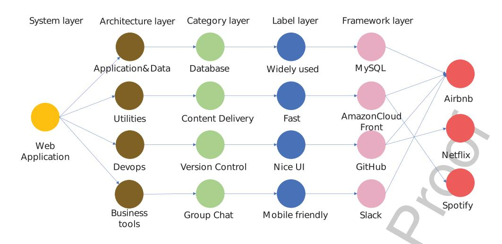
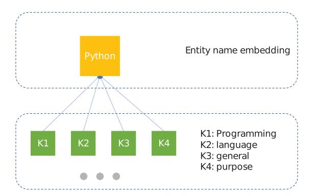
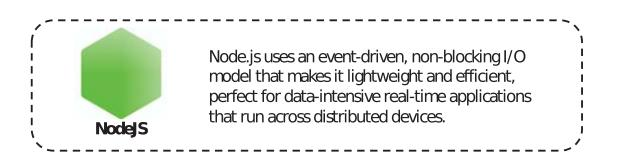

# AI-CTO: Knowledge graph for automated and dependable software stack solution

- Xiaoyun Xua, Jingzheng Wua*,*b*,*^∗^, Mutian Yanga*,*^c^ , Tianyue Luoa*,*^c^ , Qianru Mengd, Weiheng Lia
- and Yanjun Wua*,*^b^

- ^a^ *Institute of Software, Chinese Academy of Sciences, China*- ^b^*State Key Laboratory of Computer Science, Institute of Software, Chinese Academy of Sciences, China*- ^c^*Beijing ZhongKeWeiLan Technology Co., Ltd, China*- ^d^*Beijing Baidu, Inc, China*

**Abstract**. As the scale of software systems continues expanding, software architecture is receiving more and more attention as the blueprint for the complex software system. An outstanding architecture requires a lot of professional experience and expertise. In current practice, architects try to find solutions manually, which is time-consuming and error-prone because of the knowledge barrier between newcomers and experienced architects. The problem can be solved by easing the process of apply experience from prominent architects. To this end, this paper proposes a novel graph-embedding-based method, AI-CTO, to automatically suggest software stack solutions according to the knowledge and experience of prominent architects. Firstly, AI-CTO converts existing industry experience to knowledge, i.e., knowledge graph. Secondly, the knowledge graph is embedded in a low-dimensional vector space. Then, the entity vectors are used to predict valuable software stack solutions by an SVM model. We evaluate AI-CTO with two case studies and compare its solutions with the software stacks of large companies. The experiment results show that AI-CTO can find effective and correct stack solutions and it outperforms other baseline methods.

Keywords: Knowledge graph, graph embedding, software architecture

## 1. Introduction

As the scale of software systems continues expand- ing, software architecture is receiving more and more attention as the blueprint for the complex soft- ware system. Software architecture establishes the link between requirements and implementation [[1]](#ref-1) and allows designers to infer the ability to meet requirements at the design phase. This field has been developing for more than 30 years and plays an important and ubiquitous role in contemporary indus- trial practice [[2]](#ref-2). The quality of the system depends heavily on its design, i.e. architecture. According to a research report from the National Institute of Standards and Technology (NIST), more than 70% of errors found in software testing are caused by requirement acquisition or architecture design [[3]](#ref-3). The longer the errors exist in the system, the harder it will be to find them, and the higher the cost of solv- ing them. In summary, a good architecture makes the software system more robust and reliable.

Software architecture can be divided into two lev- els: architecture and design, but it is difficult to clearly distinguish the boundary of them [[4]](#ref-4). There- fore, in this paper, the "architecture" is considered to be elements of architectural styles. For exam- ple, there are two basic elements of client-server architectural style, the "client" and "server". Com- mon architectural styles include pipes and filters, data abstraction and object-oriented organisation, event-based implicit invocation, abstract data types

^∗^Corresponding author. Jingzheng Wu, E-mail: [jingzheng08@iscas.ac.cn](mailto:jingzheng08@iscas.ac.cn).

or objects, layered system, business cycle, client- server model, etc [[5]](#ref-5). The "design" is considered to be the process of choosing a development software for each element of architectural styles. For exam- ple, MySQL is software for the database element of an architectural style. However, due to the complex relationship between architectural style and software performance, it is difficult for architects to choose an appropriate style and design each component manu- ally.

Motived by the above problem and challenge, this paper proposes a novel method, AI-CTO, to suggest software stack solutions. AI-CTO consists of three stages: Establishment of software knowledge graph; Embedding of the knowledge graph; Deriving of soft- ware stack solutions. The basic idea is extracting knowledge from a well-designed software graph to facilitate architecture tasks. As the relations among software entities can be reasonably represented by the knowledge graph, we firstly build the five-layer soft- ware graph: (1)Software system layer; (2) Software stack layer; (3) Software category layer; (4) Software label layer; (5) Software framework layer. These lay- ers represent the different type of entities in the graph, such as software and requirement labels. In addition, the company entities are not in these layers, because they are not elements of software stacks.

For automated analysis of the architectural prob- lem, we intend to embed the entities in the software graph into a low-dimensional vector space. However, most of the previous researches about graph embed- ding just learned from structural triples [[6]](#ref-6)–[[8]](#ref-8), while there is rich semantic information that reflects fea- tures of the software, such as descriptions and names. Therefore, we propose a novel embedding method to combine the two kinds of information in the graph, i.e., structure information and description informa- tion. Our method takes the results of node2vec [[8]](#ref-8) as structure information and the embedding of software description text as description information.

To derive the software stack solutions accord- ing to the requirements of architects, we propose a requirement-based-walk method to select a set of stack solutions, which satisfy the requirements. These preliminary stack solutions are further filtered by a Support Vector Machine (SVM) model. The feature vector of each stack is calculated by the embedding results. The SVM model is trained by the stack solu- tions of large companies.

According to the above ideas, we build the proto- type of AI-CTO. The software graph contains 11876 entities and 43269 relations, including 3175 software entities and 350 company entities. We set four base- lines on two experiments to evaluate the correctness and usage of AI-CTO. For the correctness exper- iment, the results of AI-CTO are verified by real software stacks. For the usage experiment, this exper- iment counts the companies using the same stacks as AI-CTO results. The results show that AI-CTO out- performs other baselines and can suggest satisfactory software stacks.

In summary, we make the following contributions in this paper:

- We introduce the concept of knowledge graph to formally represent software entities and requirements of architects, which converts development experience to knowledge and narrows the knowledge barrier between new- comers and experienced architects.
- We implement the prototype of AI-CTO to extract effective software stack solutions from the software knowledge graph. The method makes full use of both the semantic information of software descriptions and graph structure information. The software stack solutions are further filtered by an SVM model.
- We present an extensive evaluation of AI-CTO. The experiment results show that AI-CTO out- performs other baseline methods.

The rest of this paper is organised as follows. In Section 2, we discuss the background information needed to have a primary impression of the technolo- gies used in our method. Section 3 details the software stack solution method. The method is analysed and evaluated in Section 4. Section 5 reports factors that may affect experiment results. Section 6 discusses the related work of our work. Finally, we summary this paper in Section 7.

### 2. Background

This section discusses motivation, formalisation of the problem in the selection space and notions about knowledge graph.

### *2.1. Motivation*

There is a phenomenon of inadequate utilisation of existing knowledge and experience. Newcomers pos- sess limited knowledge and experience [[9]](#ref-9), [[10]](#ref-10). It is difficult for them to choose an appropriate style and design each component manually. In fact, according to the experience of our industrial partners, devel- ops tend to choose the technologies they are familiar with, which makes it harder for them to learn from experienced architects.

In addition, the knowledge and experience of archi- tects are full of entities and relations, such as software, companies and dependencies among them, which is very similar to the concept of the knowledge graph. To facilitate the analysis in form of vectors, the graph is embedded into a continuous low-dimensional vector space.

The embedding process takes account of two kinds of features. The graph structure features reflect the space characteristic while the description features reflect the semantic information. Therefore, an SVM model is used to find the boundary of that.

### *2.2. Problem definition*

This problem can be explain by defining a selection space. Let *a* be a vector having elements *a*i in an architectural style, and *a*i corresponds to the design selections. The architectural vector *a* has *n* dimension. Let *d* be a Boolean vector having elements *d*j as each design selection, i.e., *a*i = {*d*}. The design vector *d* has *m* dimension. A design element *d*j can be defined as either *d*j = 0 (do not choose it), or *d*j = 1 (choose it):

$$
|\Omega_{selection}| = \prod_{i=1}^{n} \{0, 1\}^{m_i} \tag{1}
$$

The task for architects is choosing an option from the selection space. For example, the architecture of a simple web application usually consists of web server, client and database, i.e., the *a* has three elements. According to a technology stack website^1^, the number of common development tools for web server, client and database are 25, 40 and 58, i.e., *m*^1^ = 25, *m*^2^ = 40, *m*^3^ = 58. There is a total selec- tion space of *m*^1^ ∗ *m*^2^ ∗ *m*^3^(58000) options to select among, which is a large number for human develop- ers. As the full-stack tools, such as NodeJS, are not included in the example, the upper-bound of selection space is much higher in real-world situations.

## *2.3. Knowledge graph in software engineering*

The knowledge graph efficiently stores objective knowledge in form of triples. Each triple contains two entities and the relation between them. For example, triple (*h, r, t*) contains a head node *h*, a relation *r* and a tail node *t*. This kind of knowledge representation can preferably reflect the relation information between entities and it is useful for various domains [[11]](#ref-11). With the advancement of knowledge graph technologies in recent years, some changes have taken place in this field. One of them is that more and more researches have shifted from a general-purpose knowledge graph (GKG) to domain-specific knowledge graph (DKG). GKG is built with general objective knowledge and on a large scale, such as Google's Knowledge Graph [[12]](#ref-12), NELL [[13]](#ref-13) and WikiData [[14]](#ref-14). As one of the most important features of GKG is the large scale, automatic Information Acquisition technolo- gies become a widely research topic [[15]](#ref-15)–[[17]](#ref-17).

DKG refers to knowledge graphs that are focused on a specific field, such as software engineering. Soft- ware knowledge graph contains not only software but also related entities such as developers, logs and documentation. For example, IntelliDE [[18]](#ref-18) imple- ment the function of software text semantic search based on a software knowledge graph, which con- sists of information from source code files, version control systems, mailing lists, issue tracking systems, Microsoft Office and PDF documents, HTML-format tutorials, API documentation, user forum posts, blogs and online social question-answering pairs.

The software knowledge graph can be used to solve different issues in software engineering, such as design and analysis of functional requirements [[19]](#ref-19), maintenance and testing of software [[20]](#ref-20) and documentation for coding support [[21]](#ref-21).

## 3. Proposed approach

Figure 2 demonstrates the overview architecture of the proposed approach, which contains three main stages.

The preprocessing stage converts raw data to the knowledge graph. The graph construction process extracts entities and relations from raw data to build a structured software knowledge graph. The raw data comes from online sources and consists of software tools, companies, software labels, etc, which is mas- sive and disordered. Therefore, the data needs to be cleaned in the data storage process. In addition, the output of the graph construction process is stored into the graph database in this process.

In the embedding stage, the software knowledge graph is projected into a continuous low-dimensional

^1^<https://stackshare.io/stacks>

Figure 1. The layout example of the software knowledge graph.

Figure 2. The overview architecture of Our method: (1) The preprocessing stage consists of two processes, graph construction, and data storage; (2) The Embedding stage consists of two processes, structural based embedding, and description encoder; (3) The stacking stage consists of two processes, requirement based walk, and result filtering.

vector space. There are two kinds of information that can be used to realise the embedding, graph structure information and auxiliary information of entities. The structure based embedding process projects entities into vector space based on graph structure informa- tion. The description encoder process encodes the description of entities to vectors with the same dimen- sion based on auxiliary information. The two kinds of the vector are combined to represent the entity in the software knowledge graph.

The stacking stage constructs software stack solu- tions. The requirement based walk process walks in the graph to select a primary stack according to user requirements. The result filtering process improves the primary stack according to entity vectors.

### *3.1. Preprocessing*
#### *3.1.1. Graph construction*
One of our central hypotheses is that the technol- ogy stacks used by famous companies are efficient and adaptable. Therefore, we crawl technology stack data as elementary knowledge from stackshare^2^. The problem is that the raw data consists of many pieces of separate data. The software knowledge graph of this paper extracts structured software knowledge from raw data according to the following rules: (1) A node in the graph represents a software knowledge entity; (2) A directed edge represents a relation; (3) Each software entity corresponds to a unique identifies.

Although the graph data is generated by the rela- tion between entities, it still needs a cleverly designed structure to be represented. The extracted entities and relations are constructed into five layers, as shown in Figure 1. Each layer is created for a kind of entities. In particular, the label layer reflects the requirements of users, so a stack walks through the label can be thought as that the stack satisfy the requirement.

The software system layer contains the target sys- tem or application which we want to build stack for, such as a Web application. Following paragraphs describe the structure and features of the rest of the layers.

The software stack layer consists of four entities, "Application&Data", "Utility", "Devops" and "Busi- ness tools". The four architecture items are used to organise a large number of software categories.

The software category layer consists of various cat- egories of basic software items, such as databases, cloud hosting and full-stack frameworks. The soft- ware stack is built according to different categories in this layer. For example, a Web application basi- cally contains front-end framework, Web server and database. The stack for a Web application chooses one element from each of these three categories.

The software label layer consists of the func- tion and performance labels, which are used to reflect the characteristic of elementary software items. Those labels are used to represent the require- ments of users. For example, developers tend to use high-performance tools, such as NodeJS. The "high- performance" is a performance label of NodeJS, and it represents the requirement of developers on perfor- mance. As the category layer and software framework layer is connected with the label layer, it is able to select a software that satisfies the multiple require- ments by walking in the graph.

The software framework layer consists of elemen- tary software items, such as NodeJS, JavaScript and Python. In particular, software items used by famous companies connect to the corresponding company entities. This makes the stack used by famous com- panies different from others in embedded data so that our method can learn the technology features of famous companies.

## *3.1.2. Data storage*
The output data of the graph construction process is imported into the graph database for succeeding tasks. According to features of the graph, we first build entities in the graph database and then associate them with relations. However, there are too many query operations with this method and it is ineffi- cient. We optimised the operation of importing. When building entities, a part of the entities that have known relations are directly constructed into triples, thus reducing the query operations when building rela- tions later. In addition, the software label data from stackshare is submitted by tool users, i.e. it is crowd- sourcing data. Not all labels in the data are valid, some of them are lack of support by developers. The top 60% of the labels are reserved.

### *3.2. Embedding*

The basic idea of our method is analysing software in a continuous low-dimensional space instead of doing that with the symbolic representation of triples. As shown in Equation 2, we proposed a new embedding method by combining two methods to embed entities into the vector space, i.e. structure based embedding (*E*s) and description encoder (*E*d). The two methods simultaneously project entities into the same vector space, i.e., the dimensions of output are the same.

$$
E = E_s + E_d \tag{2}
$$

### *3.2.1. Structure based embedding*

Due to the classical triple structure, the knowledge graph can efficiently provide graph structure informa- tion. According to the Skip-gram model [[22]](#ref-22), words with similar meanings tend to appear in a similar context. Similarly, an embedding vector of a node is decided by its neighbourhoods. The embedding normally consists of two steps, graph information sampling and vector learning. The first step samples the adjacent nodes by a biased random walk algo- rithm. The second step learns the feature vectors of nodes by the Skip-gram model. This process is imple- mented based on node2vec [[8]](#ref-8). The biased random walk is to select representative nodes according to different search strategies, such as the breadth-first search (BFS) and the depth-first search (DFS). BFS focuses on neighbouring nodes and characterises a relatively local network representation. DFS reflects the homogeneity between nodes at a higher level. BFS can explore the structural properties of the graph, while DFS can explore the similarity in content (sim- ilarity between connected nodes). Nodes with similar structures do not have to be connected, and may even be far apart.

The problem is that node2vec does not distinguish the categories of different nodes in the graph, we avoid this problem by embedding the "category" in the vector space as well.

### *3.2.2. Description encoder*

For each software entity, there is a short description that reflects the features and functions of the entity. For example, Figure 4 is the description of NodeJS. The description encoder is built based on the hypoth- esis that the keywords in the description are able to summarise the main features of an entity. The embed-

Figure 3. The keywords of a short description for an entity. The different distance between keywords and entity name will result in different weights for each keywords.

Figure 4. The description of NodeJs.

ding of each keyword is calculated by word2vec [[22]](#ref-22) model, which is trained on Wikipedia and all of the software descriptions. However, the keywords in a description should not be treated equally. Some key- words, such as the category of the entity, preferably represents the meaning of a description. For example, in the description of "Python is a general-purpose pro- gramming language created by Guido Van Rossum.", the word "programming" is more important than "purpose". Figure 3 shows the relation between the entity and the keywords. The keywords are ranked by distances.

> To capture this feature, we take the embedding of entity name as an anchor point. The words closer to entity name have more weight. The description embedding of a entity is calculated by following equations:

$$
d_i = \prod_j^n \sqrt{(p_j - q_j)^2}
$$
(3)

$$
w_i = f_g(d_i) \tag{4}
$$

$$
E_d = \sum_{i=1}^{k} e_i* w_i \tag{5}
$$

where *d*i is the euclidean distance between the entity and the *i*th keyword. *f*g is a function for calculating

weights. *e*i is the embedding of the *i*th keyword. *E*d is the description embedding of the entity, i.e., the vectors of top k keywords are sum up to be the vector of the entity.

Inspired by the work of [[23]](#ref-23), this paper calculates the weights of keywords by Gauss Function, i.e., the weights increase with the decreasing distances between keywords and entity. As shown in Figure 5, the results of Gauss Function are smooth and the range can be adjusted by the three parameters. Equation 6 shows the definition of Gauss Function, where *a, b* and *c* denote some real constants and decide the range of the weight. The *x* is the distance between a keyword and an entity, *f* (*x*) is the weight of the keyword corresponding to the entity. In this paper, the *a* value is always set to 1, so that the weight is ranged from 0 to 1. There is a maximum value when |*x*−*b*| = 0. The *b* value is always set to 0 so that the distance equals 0 when the maximum weight is obtained (distance is positive). The *c* value is the standard deviation and controls the "width" of the function. It is adjusted according to the maximum of distances for each entity.

$$
f(x) = ae^{-\frac{(x-b)^2}{2c^2}}
$$
(6)

### *3.3. Stacking*

### *3.3.1. Requirement based walk*

The requirement based walk is proposed to find out which category of software is needed by the architec- ture. The basic idea is that popular categories are what develops need. For example, the "Web Servers" cat- egory is used by 3442 companies in our data and the "Graphic Design" category is used by 31 companies. Therefore, the "Web Servers" is considered as a cat- egory in the stack, while the "Graphic Design" may not.

Another key is to reflect the requirements of devel- opers. As mentioned in section Graph Construction, there is a software label layer in the knowledge graph, which consists of the function and performance labels. In this paper, those labels are considered as software requirements. However, there are too many labels in the graph, i.e. 7800 labels. It is meaningless to integrate all of the labels in the method. We set a threshold to filter out unimportant labels according to their weights. The weight of a label is calculated according to the number of people who agree it on the stackshare website. Software tools that satisfy the labels are selected to be the preliminary software stack. However, the number of tools in the prelimi- nary data is too large, which will be further filtered by a result filtering process. It is not better to directly select popular software or combination of popular software, but popular is just an important factor. It is also necessary to consider the relationship between software and company, software and software. The knowledge graph is to better reflect this relevance.

### *3.3.2. Result filtering*
The results of requirement based walk process is selected by requirement labels, but it can be further filtered according to relevance among software, com- panies, labels etc. According to the idea of embedding method, the vectors of popular software and less used software will be located in different areas in the vec- tor space. In addition, the software in a stack used by companies will be further closer. Therefore, con- sidering the small amount of data and improving generalisation performance, we implement an SVM classifier to find the boundary between good stacks and useless stacks. SVM does not need to rely on the whole data, it is important to find the support vector.

> The classifier finds a hyperplane *W* that separates two kinds of "points" with maximum margin. In this paper, the "points" are software stacks, which are classified valuable stack and worthless stacks. However, a software stack consists of multiple entities, each entity is represented as a vector. We simply use the average vector of all the entities in the stack to train the SVM classifier. The loss function is:

$$
L_i = \sum_{i \neq y_i} max(0, s_i - s_{y_i} + \triangle)
$$
(7)

Table 1 The statistics of the software knowledge graph

| System | Stack | Category | Label | Framework | Company |
|--------|-------|----------|-------|-----------|---------|
| 1 | 4 | 546 | 7800 | 3175 | 350 |
| | | | | | |

$$
s_i = Wx_i \tag{8}
$$

The *s*i is the score of corresponding sample *x*i. The *W* is a weight matrix which represent the hyperplane.

### 4. Evaluation

The AI-CTO method is evaluated with real data from a famous technology exchange community^3^ to answer the following research questions (RQs):

## RQ 1: Does AI-CTO find effective results?

**RQ 2: Does AI-CTO solutions use by enough real users?**

RQ 1 and RQ 2 examine the effectiveness of AI- CTO.

## *4.1. Dataset*

We evaluate our method on real-world data from stackshare. Stackshare provides data about how famous companies build a software system. For example, there are 35 tools used by Facebook. Table 2 lists 10 of them. The problem is that the items in the data are discrete. Therefore, the data is converted to a software knowledge graph, which contains 11876 entities and 43269 relations. In particular, the statis- tics of the knowledge graph are listed in Table 1, and each item corresponds to the five layers of the graph.

A graph database is used to facilitate the query and storage in this experiment. The top five databases of DB-Engines Ranking^4^ are Neo4j, Microsoft Azure Cosmos DB, ArangoDB, OrientDB and Virtuoso. Considering the storage model, query language and other factors, Neo4j is chosen as a data storage tool in our method. Neo4j natively supports the Property Graph Model and has full ACID (Atomicity, Consis- tency, Isolation and Durability) properties.

### *4.2. Baseline methods*

To have an intuitive analysis of embedding results, Principal component analysis (PCA) algorithm is used to project vectors to 2-D, so that the embedding

^3^<https://stackshare.io/stacks>

^4^<https://db-engines.com/en/ranking/graph+dbms>

| Software tool | Category | | |
|---------------|-------------------------|--|--|
| PHP | Languages | | |
| React | Javascript UI Libraries | | |
| GraphQL | Query Languages | | |
| Memcached | Databases | | |
| Cassandra | Databases | | |
| Flux | Javascript UI Librarie | | |
| Tornado | Frameworks (Full Stack) | | |
| HHVM | Virtual Machine | | |
| Relay | Javascript UI Libraries | | |
| Yoga | Javascript UI Libraries | | |

Table 2 Technology Stack of Facebook

Figure 6. The embedding results of "python" and related nodes, which are projected to 2d by PCA algorithm. The pink start is the "python" node.

can be visualised. Figure 6 is the 2-D projections of 128- D embeddings of the "python" and related nodes. The pink start is the "python" node. PCA was invented by Karl Pearson [[24]](#ref-24) in 1901, which is used to analyse the problem about how to retain more information while reducing the dimension of data. The method is mainly used to decompose the covariance matrix to obtain the principal components (i.e., eigenvectors) of the data and their weights (i.e., eigenvalue). The largest eigenvalue means that the largest variance is in the direction of corresponding eigenvector.

The baselines are implemented to compare with AI-CTO from two points of view. One is the feature used in AI-CTO, i.e., the graph structure feature and the description feature. Another is the method used to form a stack. It is clear from Figure 6 that nodes with high correlation will be closer to each other. There- fore, the basic idea for baselines to form a stack is calculating the distance between software in a stack.

Figure 7. Baseline One: the node2vec results and distance calculation.

Figure 8. Baseline Two: the word2vec results and distance calculation.

### *4.2.1. Baseline one*

The baseline one extracts graph structure informa- tion to represent nodes in the software knowledge graph. The basic idea of this model is that the closer the two nodes are, the more relevant they are. Rele- vant nodes are considered as good combination for software development.

The baseline one model takes embedding results of node2vec as representations of nodes in the graph. The requirement based walk process selects all pos- sible software stacks from the graph to give a preliminary software stack. However, there are too many groups in the preliminary data. The model cal- culates the Euclidean distances between node vectors to filter irrelevant results out. Figure 7 illustrates the architecture of baseline one model.

### *4.2.2. Baseline two*

The baseline two extracts semantic information to represent nodes in the software knowledge graph. The training data consists of Wikipedia texts and descrip- tion texts from stackshare. The basic idea of this model is as same as that in baseline one model, but the representations of nodes are different. This model also takes Euclidean distance as a metric to filter irrel- evant results out. Figure 8 illustrates the architecture of the baseline two model.

### *4.2.3. Baseline three*

The baseline three combines both graph structure information and semantic information to represent nodes. In other words, the baseline three model is the combination of baseline one and baseline two. This model also uses the same method to filter irrelevant results out. Figure 9 illustrates the architecture of the baseline three model.

Figure 9. Baseline Three: the graph structure + description text results and distance calculation.

### *4.2.4. Our method*
Our method combines both graph structure infor- mation and semantic information to represent nodes, which is the same as that in baseline three. However, while baseline three just takes Euclidean distance as a metric to filter irrelevant results out, our method implements an SVM model to predict whether a soft- ware stack is valuable or not.

**Training:** The SVM model is trained by positive and negative samples. The positive samples consist of software stack data of 350 famous companies, each stack of a company is a piece of a positive sample. The negative samples are generated with two predefined rules:

- Single software. As a stack is a set of software, single software will not be a positive sample.
- Stacks with unpopular software. Normally, the developer tends to use popular software. There- fore, stacks with unpopular software are thought as negative samples.

In addition, software in a stack is represented as vec- tors, so the stack is represented as the average of the sum of all software vectors.

### *4.3. The categories used in this experiment*
To build a software stack, it is important to select appropriate categories. This problem solved by AI- CTO in two aspects. One is the number of companies using the category, which reflects the practicality. Another is the labels related to the category, which reflects the ability to meet user demand. Table 3 shows the categories used in the evaluation of AI-CTO. As the number of labels are too large, the table only records the most weighted label. In fact, the label is for software in the category, the heavier weights mean the more users paying attention to this label, i.e., user demand.

### *4.4. Evaluation with correctness*

**Motivation:** To answer RQ1 (Does AI-CTO find effective results?), the AI-CTO is evaluated with real- world data from stackshare. The AI-CTO is built by both graph structure and description text fea- tures and predict valuable software tool with an SVM model. This is different from the baseline one and two. In addition, baseline three also integrate graph structure and description text features, but it derives valuable software tool by calculating the Euclidean distance. In this experiment, we would like to inves- tigate whether AI-CTO can outperform the baseline methods.

**Metric:** We would like to perform the popular met- ric, Hits@, in our experiment. For example, Hits@10 is the proportion of correct stack solutions ranked in the top 10.

**Results:** We test the correctness experiment on three baseline methods and AI-CTO. As the mod- els obtain a great deal of ranking results from the selection space, we choose 20, 50, 100 as metrics to evaluate the methods. According to the results reported in Table 4, AI-CTO perform better than all baseline methods in Hits@20, Hits@50 and Hits@100. Figure 10 shows the results of different number of "category". The node2vec performs bet- ter than word2vec, because the graph structure can better reflect the distance feature compared with the text feature. However, the description text features are still helpful to distinguish the software entities.

| Table 3 | |
|--------------------------------------------------|--|
| The categories used in the evaluation for AI-CTO | |

| Category | Company num | Label | Label Weight |
|---------------------------|-------------|---------------------------------|--------------|
| Languages | 981 | Can be used on frontend/backend | 1600 |
| Databases | 501 | Document-oriented storage | 789 |
| Javascript UI Libraries | 355 | Cross-browser | 1300 |
| Javascript MVC Frameworks | 203 | Quick to develop | 883 |
| In-Memory Databases | 222 | Performance | 843 |
| Frameworks (Full Stack) | 479 | Npm | 1300 |
| Web Servers | 312 | High-performance http server | 1400 |
| Microframeworks (Backend) | 106 | Simple | 322 |
| General Analytics | 254 | Free | 1500 |

Table 4 The results of evaluation with correctness. 8 categories used

| Metric | Hits@20 | Hits@50 | Hits@100 |
|-------------------|---------|---------|----------|
| node2vec | 0.85 | 0.8 | 0.64 |
| word2vec | 0.0 | 0.0 | 0.07 |
| node2vec+word2vec | 0.55 | 0.38 | 0.44 |
| AI-CTO | 0.95 | 0.84 | 0.75 |

Figure 10. The hits results of different number of "category" in the stack.

Table 5 The results of evaluation with number of users. 8 categories used

| Metric | top(20) | top(50) | top(100) |
|-------------------|---------|---------|----------|
| node2vec | 45 | 92 | 137 |
| word2vec | 0 | 0 | 7 |
| node2vec+word2vec | 11 | 22 | 51 |
| AI-CTO | 49 | 94 | 157 |

### *4.5. Evaluation with number of Users*

**Motivation:** This experiment is performed to answer RQ2 (Are the AI-CTO solutions used by real users?). We would like to investigate whether the solutions of AI-CTO are used by companies.

**Metric:** We would like to perform the number of users in this experiment. The top(x) means the num- ber of companies who use the top x stacks.

**Results:** According to the results reported in Table 5, AI-CTO perform better than all baseline methods in top20, top50 and top100. The solutions derived by AI-CTO are used by real users.

### 5. Threats to validity

There are defects of AI-CTO, this section discusses the threats to validity and why AI-CTO is still effec- tive.

### *5.1. Treats to software categories*

The software stack is built based on the software categories required by developers. For example, a website application may need three kinds of tool, front-end framework, web server and databases. The stacking process selects three tools for the three kinds of tool respectively. Therefore, an important task is determining which categories are needed. Based on the hypothesis that the more companies using this category, the more important it is. AI-CTO choose a category depending on the number of compa- nies using it. Thus, the performance of our method depends on the quality of the technology stack data. In the future, we will try to analyse the characteristics of the software category itself, and then compare it with the results of AI-CTO.

### *5.2. Treats to dataset*

As the dataset used in this paper is invariant, the performance of AI-CTO may be affected when new data is generated. However, companies do not adjust their technology stacks frequently. As the idea of AI-CTO is learning from the experience, the "old" data is sufficient to verify the feasibility of AI-CTO. In addition, it is hard to test the integrality of data from stackshare, and it is unable to check whether the technology stack of a company is complete on stackshare.

## *5.3. Treats to software knowledge graph and embedding*

Usually, a knowledge graph consists of various entities and relations, i.e., the classification of rela- tions can be different. The different relation can represent more information in a graph. The software knowledge graph in this paper contains only one kind of directed relation with weights. However, the rela- tions in this graph do not include any attributes. As a node is represented by its neighbourhoods, single type of relations is capable to depict the information in the embedding process.

## 6. Related work

### *6.1. Software architecture*
Software architecture is the blueprint of a system. The architecture reflects the constrained relationships among software components, and those constraints most often come from the system requirements [[25]](#ref-25). The modelling of software architecture greatly affects the development performance of practitioners [[26]](#ref-26). The research about software architecture gains great attention since the nineties to deal with increasingly software design complexity [[27]](#ref-27), [[28]](#ref-28). To formalise the architectural process, Architecture Description Language (ADL) is used to specify the software architectures precisely, such as Unified Modelling Language (UML) [[29]](#ref-29), [[30]](#ref-30), SystemC [[31]](#ref-31) and Acme^5^ [[32]](#ref-32). However, there is not a final conclusion about what extent developers utilise software architecture technologies in software design [[27]](#ref-27). In most cases, developers just find a design solution of the software system, but the reason of the solution reflects quality issues for the system [[27]](#ref-27), [[33]](#ref-33).

In addition, it is difficult to clearly distinguish the boundary of architecture layer and design layer [[4]](#ref-4). In this paper, the "architecture" is considered to be an element of architectural styles. The "design" is considered to be the process of choosing a develop- ment tool for each element of architectural styles. The AI-CTO convert the development experience of famous companies to knowledge, i.e., the software knowledge graph. Based on the knowledge, develop- ers choose development tools for each element in the architectural style, which is the software stack solu- tion. It is worth mentioning that the solution derives from the knowledge is interpretable.

### *6.2. Graph embedding*

Graphs exist widely in the real world [[34]](#ref-34), such as social media network, citation graph of research arti- cles, protein molecular structure graph, etc. These graphs contain valuable information that deserves to be analysed. Therefore, this field has received much attention in recent years. A significant num- ber of researches about graph analytics are proposed, such as personalised recommender system [[35]](#ref-35), entity/node classification [[36]](#ref-36), relation prediction [[37]](#ref-37), entity/node clustering [[38]](#ref-38), etc.

Early technologies are built based on the symbolic representation of graphs, i.e. triples. However, due to the complex structure of graphs, these technolo- gies are computationally inefficient when dealing with large-scale graph [[39]](#ref-39). To solve the problem, graph embedding has been presented for embedding entities and relations between them into a contin- uous low-dimensional vector space [[40]](#ref-40). In fact, graph embedding overlaps in graph analytics [[41]](#ref-41) and representation learning [[42]](#ref-42). The purpose of graph analytics is to extract valuable information from graph data. Representation learning transforms raw data into a form that can be effectively developed by machine learning technologies. A common idea is extracting normalised data from graphs by graph analytics and applying representation learning to the normalised data. For example, DeepWalk [[43]](#ref-43) gen- erates sequence data (paths in the graph) which is similar to text by limited random walk from input graph and then uses the node id as a "word" to learn the node vector with Skip-gram model. On the basis of DeepWalk, node2vec [[8]](#ref-8) defines a bias random walk and still uses Skip-gram to train. The walk mode can be changed by adjusting the bias weights, thus retaining different graph structure information, such as walk modes of BFS and DFS.

There are also graph embedding technologies using predefined graph structure as features. The embedding work in TransE [[6]](#ref-6) is done by adjust- ing the relation in a triple. For example, a triple (*h, r, t*) holds means *Vectorh*+*Vectorr*≈*Vectort*. This provides insights into how to build the energy function, i.e. ||*h*+*r*−*t*||*l*1. Obviously, transE works ineffectively on one-to-many and many-to-one rela- tion problems. TransH [[44]](#ref-44) embeds h and t to a vector space while embedding *r* to a hyper- plane, i.e. (*h*→*h* ), (*t*→*t* ). The triple (*h, r, t*) holds means *Vectorh*+*Vectorr*≈*Vectort*. More- over, TransR [[45]](#ref-45), TranSparse [[46]](#ref-46), TransAt [[47]](#ref-47), Adversarial Graph Embeddings [[48]](#ref-48), DELN [[49]](#ref-49), JANE [[50]](#ref-50), MTNE [[51]](#ref-51), etc also presented efficient methods to solve problems in this field.

### *6.3. Auxiliary information*

The input data of graph embedding is diverse, such as the whole graph, nodes, and edges. There can be certain auxiliary information for nodes and edges, such as text descriptions, attributes, labels, and etc, which can be used to enhance the performance of graph embedding. The challenge is how to incorpo- rate the auxiliary information in graph embedding

^5^<http://www.cs.cmu.edu/~acme/>

model and how to combine it with graph structure information.

Xie et al. [[39]](#ref-39) propose two encoder, i.e. continuous bag-of-words and deep convolutional neural models, to transform semantics of entity description into vectors. They then define an energy function, i.e. *E*=*E*S+*E*D, to combine description-based representation and structure-based representation. *E*S is the energy function of TransE to represent the structure information. *E*D is the energy function of description-based representation and defined as: *E*D=*E*DD+*E*DS+*E*SD, where *E*DD = ||*Vectorhd*+*r*−*Vectortd*||. *Vectorhd* is the description-based representation of head node in the triple. *E*DS and *E*SD are analogous to that.

Wang and Li [[52]](#ref-52) use rich context information in an external text corpus to assist in representation learning of the knowledge graph. Similar to distance supervision, they first annotate the entity back to the text corpus to obtain a co-occurrence network con- sisted of entity words and other important words. The network can be regarded as the link between the knowledge graph and the text information. The context of entities and relations is defined based on the network and integrated into the knowledge graph. Finally, the representation of entities and relations is learned by a translation model. Other auxiliary infor- mation is also used to improve the performance of graph embedding, such as relation [[53]](#ref-53), attribute [[54]](#ref-54), etc.

### 7. Conclusion and future work

This paper proposes AI-CTO, a novel method to automatically suggest software stack solutions. The basic idea of AI-CTO is converting the development experience of famous companies to knowledge, i.e., software knowledge graph. The software stack solu- tions are derived from the knowledge. To reach this end, we embed the software knowledge graph to a low-dimensional vector space. In addition, we com- bine embedding of software descriptions to make the graph embedding more precisely. The evalua- tion of AI-CTO consists of two research question to analyse its effectiveness. The results show that AI-CTO can suggest effective solutions and outper- form other baselines. We will explore the following research directions in future: (1) It is possible to include more features for software, such as the code features of open-source software. (2) The descrip- tion encoder only considers software descriptions and name for embedding, while there are various infor- mation, which is possible to be utilised in future. (3) There are no attributes for relations in the software knowledge graph. It is able to include more informa- tion for relations between entities in future.

### Acknowledgment

This work is supported by National Key R&D Program of China (No. 2018YFB0803600) and National Natural Science Foundation of China (No. 61772507).

**References**

- [[1]](#page-x-y) D. Garlan, Software architecture: a roadmap. In *Proceedings of the Conference on the Future of Software Engineering*, pages 91–101. Citeseer, (2000).
- [[2]](#page-x-y) R. Capilla, A. Jansen, A. Tang, P. Avgeriou and M. Ali Babar, 10 years of software architecture knowledge manage- ment: Practice and future, *Journal of Systems and Software* **116**(2016), 191–205.
- [[3]](#page-x-y) G. Tassey, The economic impacts of inadequate infrastruc- ture for software testing, *National Institute of Standards and Technology, RTI Project* **7007**(011) (2002), 429–489.
- [[4]](#page-x-y) M. Shaw, D. Garlan, et al., Software architecture, volume 101. prentice Hall Englewood Cliffs, (1996).
- [[5]](#page-x-y) D. Garlan and M. Shaw, An introduction to software archi- tecture. In *Advances in software engineering and knowledge engineering*, pages 1–39. World Scientific, (1993).
- [[6]](#page-x-y) A. Bordes, N. Usunier, A. Garcia-Duran, J. Weston and O. Yakhnenko, Translating embeddings for modeling multi-relational data, In *Advances in neural information processing systems*(2013), pages 2787–2795.
- [[7]](#page-x-y) D.Q. Nguyen, K. Sirts, L. Qu and M. Johnson, Stranse: a novel embedding model of entities and relationships in knowledge bases, *arXiv preprint arXiv:1606.08140*, (2016).
- [[8]](#page-x-y) A. Grover and J. Leskovec, node2vec: Scalable feature learning for networks. In *Proceedings of the 22nd ACM SIGKDD international conference on Knowledge discovery and data mining*, pages 855–864. ACM, (2016).
- [[9]](#page-x-y) L. Ponzanelli, G. Bavota, M. Di Penta, R. Oliveto and M. Lanza, Mining stackoverflow to turn the ide into a self- confident programming prompter. In *Proceedings of the 11th Working Conference on Mining Software Repositories, MSR*(2014), pages 102–111, New York, NY, USA, 2014. ACM.
- [[10]](#page-x-y) L. Ponzanelli, S. Scalabrino, G. Bavota, A. Mocci, R. Oliveto, M. Di Penta and M. Lanza, Supporting soft- ware developers with a holistic recommender system. In *2017 IEEE/ACM 39th International Conference on Soft- ware Engineering (ICSE)*, pages 94–105. *IEEE*, (2017).
- [[11]](#page-x-y) X. Zhao, Z. Xing, M.A. Kabir, N. Sawada, J. Li and S.-W. Lin, Hdskg: Harvesting domain specific knowledge graph from content of webpages. In *2017 IEEE 24th International Conference on Software Analysis, Evolution and Reengi- neering (SANER)*, pages 56–67. *IEEE*, (2017).
- [[12]](#page-x-y) A. Singhal, Introducing the knowledge graph: things, not strings. [https://googleblog.blogspot.com/2012/05/introducing-knowledge-graph-things-not.html](https://googleblog.blogspot.com/2012/05/introducing-knowledge-graph-things-not.html), May 16, (2012). Accessed: August 4, 2019.
- [[13]](#page-x-y) A. Carlson, J. Betteridge, B. Kisiel, B. Settles, E.R. Hruschka and T.M. Mitchell, Toward an architecture for never-ending language learning, In *Twenty-Fourth AAAI Conference on Artificial Intelligence*, (2010).
- [[14]](#page-x-y) D. Vrandeciˇ c and M. Kr ´ otzsch, Wikidata: A free collab- ¨ orative knowledge base, *Communications of the ACM* **57** (2014), 78–85.
- [[15]](#page-x-y) F. Wu and D.S. Weld, Open information extraction using wikipedia. In *Proceedings of the 48th annual meeting of the association for computational linguistics*, pages 118–127. Association for Computational Linguistics, (2010).
- [[16]](#page-x-y) M. Schmitz, R. Bart, S. Soderland, O. Etzioni, et al., Open language learning for information extraction, In *Proceed- ings of the 2012 Joint Conference on Empirical Methods in Natural Language Processing and Computational Nat- ural Language Learning*, pages 523–534. Association for Computational Linguistics, (2012).
- [[17]](#page-x-y) A. Fader, S. Soderland and O. Etzioni, Identifying rela- tions for open information extraction, In *Proceedings of the conference on empirical methods in natural language pro- cessing*, pages 1535–1545. Association for Computational Linguistics, (2011).
- [[18]](#page-x-y) Z.-Q. Lin, B. Xie, Y.-Z. Zou, J.-F. Zhao, X.-D. Li, J. Wei, H.- L. Sun and G. Yin, Intelligent development environment and software knowledge graph, *Journal of Computer Science and Technology* **32**(2) (2017), 242–249.
- [[19]](#page-x-y) H.S. Delugach, Specifying multiple-viewed software requirements with conceptual graphs, *Journal of Systems and Software* **19**(3) (1992), 207–224.
- [[20]](#page-x-y) H.-J. Happel and S. Seedorf, Applications of ontologies in software engineering. In *Proc. of Workshop on Sematic Web Enabled Software Engineering"(SWESE) on the ISWC*, pages 5–9. Citeseer, (2006).
- [[21]](#page-x-y) R. Padhye, D. Mukherjee and V.S. Sinha, Api as a social glue. In *Companion Proceedings of the 36th International Conference on Software Engineering*, pages 516–519. *ACM*, (2014).
- [[22]](#page-x-y) T. Mikolov, K. Chen, G. Corrado and J. Dean, Efficient estimation of word representations in vector space, *arXiv preprint arXiv:1301.3781*, (2013).
- [[23]](#page-x-y) Q. Zhong, H. Li, J. Li, G. Xie, J. Tang, L. Zhou and Y. Pan, A gauss function based approach for unbalanced ontology matching. In *Proceedings of the 2009 ACM SIGMOD Inter- national Conference on Management of Data, SIGMOD* '*09*, pages 669–680, New York, NY, USA, (2009). ACM.
- [[24]](#page-x-y) K. Pearson, Liii. on lines and planes of closest fit to systems of points in space, *The London, Edinburgh, and Dublin Philosophical Magazine and Journal of Science* **2**(11) (1901), 559–572.
- [[25]](#page-x-y) D.E. Perry and A.L. Wolf, Foundations for the study of soft- ware architecture, *SIGSOFT Softw Eng Notes* **17**(4) (1992), 40–52.
- [[26]](#page-x-y) M. Ozkaya and F. Erata, Understanding practitioners' challenges on software modeling: A survey, *Journal of Com- puter Languages* **58**(2020), 100963.
- [[27]](#page-x-y) M. Ozkaya, What is software architecture to practitioners: A survey, In *International Conference on Model-driven Engi- neering & Software Development*, (2017).
- [[28]](#page-x-y) M. Ozkaya and F. Erata, A survey on the practical use of uml for different software architecture viewpoints, *Information and Software Technology* **121**(2020),106275.
- [[29]](#page-x-y) G. Booch, The unified modeling language user guide, *Pear- son Education India*(2005).
- [[30]](#page-x-y) M. Ozkaya, Are the uml modelling tools powerful enough for practitioners? a literature review, *IET Software* **13**(16) (2019), 338–354.
- [[31]](#page-x-y) D.C. Black, J. Donovan, B. Bunton and A. Keist, System C: From the ground up, volume **71**. *Springer Science & Business Media*, (2009).
- [[32]](#page-x-y) D. Garlan, R. Monroe and D. Wile, Acme: An architec- ture description interchange language. In *Proceedings of the 1997 Conference of the Centre for Advanced Studies on Collaborative Research, CASCON '97*, pages 7–. IBM Press, (1997).
- [[33]](#page-x-y) H. van Vliet and A. Tang, Decision making in software architecture, *Journal of Systems and Software* **117**(2016), 638–644.
- [[34]](#page-x-y) H. Cai, V.W. Zheng and K.C.-C. Chang, A comprehen- sive survey of graph embedding: Problems, techniques, and applications, *IEEE Transactions on Knowledge and Data Engineering* **30**(9) (2018), 1616–1637.
- [[35]](#page-x-y) H. Wang, M. Zhao, X. Xie, W. Li and M. Guo, Knowledge graph convolutional networks for recommender systems, In *The World Wide Web Conference*, pages 3307–3313. ACM, (2019).
- [[36]](#page-x-y) X. Wang, P. Cui, J. Wang, J. Pei, W. Zhu and S. Yang, Community preserving network embedding, In *Thirty-First AAAI Conference on Artificial Intelligence*, (2017).
- [[37]](#page-x-y) X. Wei, L. Xu, B. Cao and P.S. Yu, Cross view link predic- tion by learning noise-resilient representation consensus, In *Proceedings of the 26th International Conference on World Wide Web*, pages 1611–1619. *International World Wide Web Conferences Steering Committee*, (2017).
- [[38]](#page-x-y) F. Nie, W. Zhu and X. Li, Unsupervised large graph embedding, In *Thirty-first AAAI conference on artificial intelligence*, (2017).
- [[39]](#page-x-y) R. Xie, Z. Liu, J. Jia, H. Luan and M. Sun, Representa- tion learning of knowledge graphs with entity descriptions, In *Thirtieth AAAI Conference on Artificial Intelligence*, (2016).
- [[40]](#page-x-y) X. Dong, E. Gabrilovich, G. Heitz, W. Horn, N. Lao, K. Mur- phy, T. Strohmann, S. Sun and W. Zhang, Knowledge vault: A web-scale approach to probabilistic knowledge fusion, In *Proceedings of the 20th ACM SIGKDD international con- ference on Knowledge discovery and data mining*, pages 601–610. ACM, (2014).
- [[41]](#page-x-y) N. Satish, N. Sundaram, M.M.A. Patwary, J. Seo, J. Park, M.A. Hassaan, S. Sengupta, Z. Yin and P. Dubey, Navigating the maze of graph analytics frameworks using massive graph datasets, In *Proceedings of the 2014 ACM SIGMOD interna- tional conference on Management of data*, pages 979–990. ACM, (2014).
- [[42]](#page-x-y) Y. Bengio, A. Courville and P. Vincent, Representation learning: A review and new perspectives, *IEEE transactions on pattern analysis and machine intelligence*, **35**(8) (2013), 1798–1828.
- [[43]](#page-x-y) B. Perozzi, R. Al-Rfou and S. Skiena, Deepwalk: Online learning of social representations. In *Proceedings of the 20th ACM SIGKDD international conference on Knowl- edge discovery and data mining*, pages 701–710. ACM, (2014).
- [[44]](#page-x-y) Z. Wang, J. Zhang, J. Feng and Z. Chen, Knowledge graph embedding by translating on hyperplanes, In *Twenty-Eighth AAAI conference on artificial intelligence*, (2014).
- [[45]](#page-x-y) Y. Lin, Z. Liu, M. Sun, Y. Liu and X. Zhu, Learning entity and relation embeddings for knowledge graph completion,
[[45]](#page-x-y) In *Twenty-ninth AAAI conference on artificial intelligence*, (2015).
- [[46]](#page-x-y) G. Ji, K. Liu, S. He and J. Zhao, Knowledge graph comple- tion with adaptive sparse transfer matrix, In *Thirtieth AAAI Conference on Artificial Intelligence*, (2016).
- [[47]](#page-x-y) W. Qian, C. Fu, Y. Zhu, D. Cai and X. He, Translat- ing embeddings for knowledge graph completion with relation attention mechanism, In *Proceedings of the Twenty Seventh International Joint Conference on Artifi- cial Intelligence, IJCAI-18*, pages 4286–4292. *International Joint Conferences on Artificial Intelligence Organization*, **7**(2018).
- [[48]](#page-x-y) M. Khajehnejad, A.A. Rezaei, M. Babaei, J. Hoffmann, M. Jalili and A. Weller, Adversarial graph embeddings for fair influence maximization over social networks. In *Christian Bessiere, editor, Proceedings of the Twenty-Ninth Interna- tional Joint Conference on Artificial Intelligence, IJCAI-20*, pages 4306–4312. *International Joint Conferences on Arti- ficial Intelligence Organization*, **7** (2020). Special track on AI for Comp Sust and Human well-being.
- [[49]](#page-x-y) H. Yang, L. Chen, M. Lei, L. Niu, C. Zhou and P. Zhang, Discrete embedding for latent networks, In *Christian Bessiere, editor, Proceedings of the Twenty-Ninth Interna- tional Joint Conference on Artificial Intelligence, IJCAI-20*, pages 1223–1229. *International Joint Conferences on Arti- ficial Intelligence Organization*, **7**(2020). Main track.
- [[50]](#page-x-y) L. Yang, Y. Wang, J. Gu, C. Wang, X. Cao and Y. Guo, Jane: Jointly adversarial network embedding. In *Christian Bessiere, editor, Proceedings of the Twenty-Ninth Interna- tional Joint Conference on Artificial Intelligence, IJCAI-20*, pages 1381–1387. *International Joint Conferences on Arti- ficial Intelligence Organization*, **7**(2020). Main track.
- [[51]](#page-x-y) H. Huang, Z. Fang, X. Wang, Y. Miao and H. Jin, Motif-preserving temporal network embedding. In Chris- tian Bessiere, editor, *Proceedings of the Twenty-Ninth International Joint Conference on Artificial Intelligence, IJCAI-20*, pages 1237–1243. *International Joint Confer- ences on Artificial Intelligence Organization*, **7**(2020). Main track.
- [[52]](#page-x-y) Z. Wang and J. Li, Text-enhanced representation learning for knowledge graph. In *Proceedings of the Twenty-Fifth International Joint Conference on Artificial Intelligence, IJCAI'16*, pages 1293–1299. AAAI Press, (2016).
- [[53]](#page-x-y) B.D. Trisedya, G. Weikum, J. Qi and R. Zhang, Neural relation extraction for knowledge base enrichment, In *Pro- ceedings of the 57th Annual Meeting of the Association for Computational Linguistics*, pages 229–240, Florence, Italy, July (2019). *Association for Computational Linguistics*.
- [[54]](#page-x-y) B.D. Trisedya, J. Qi and R. Zhang, Entity alignment between knowledge graphs using attribute embeddings, In *Proceed- ings of the AAAI Conference on Artificial Intelligence*, volume **33**, pages 297–304. (2019).

## TL;DR
Research on ai-cto: knowledge graph for automated and dependable software stack solution providing insights for knowledge graph development and data integration.

## Key Insights
Contributes to the broader understanding of knowledge graph technologies and data management practices relevant to PKG system development.

## Metadata Summary
### Research Context
- **Research Question**: Does AI-CTO find effective results? Are the AI-CTO solutions used by real users?
- **Methodology**: Graph-embedding-based method (AI-CTO) to suggest software stack solutions. Involves knowledge graph establishment, embedding (combining structural and description information), and SVM-based prediction. Evaluated with two case studies and comparison to large company software stacks.
- **Key Findings**: AI-CTO can find effective and correct stack solutions, outperforming baseline methods in correctness (Hits@20, Hits@50, Hits@100) and user adoption (top(20), top(50), top(100)).

### Analysis
- **Limitations**: Performance depends on the quality of technology stack data; dataset is invariant and may be affected by new data; software knowledge graph currently only contains one type of directed relation with weights and no attributes for relations.
- **Future Work**: Include more features for software (e.g., code features of open-source software); utilize various information beyond software descriptions and names for embedding; include more information/attributes for relations between entities in the software knowledge graph; analyze characteristics of software categories themselves.