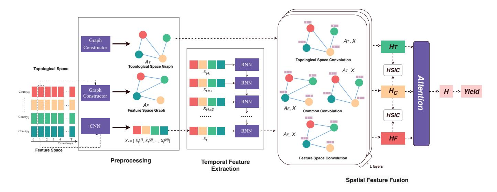
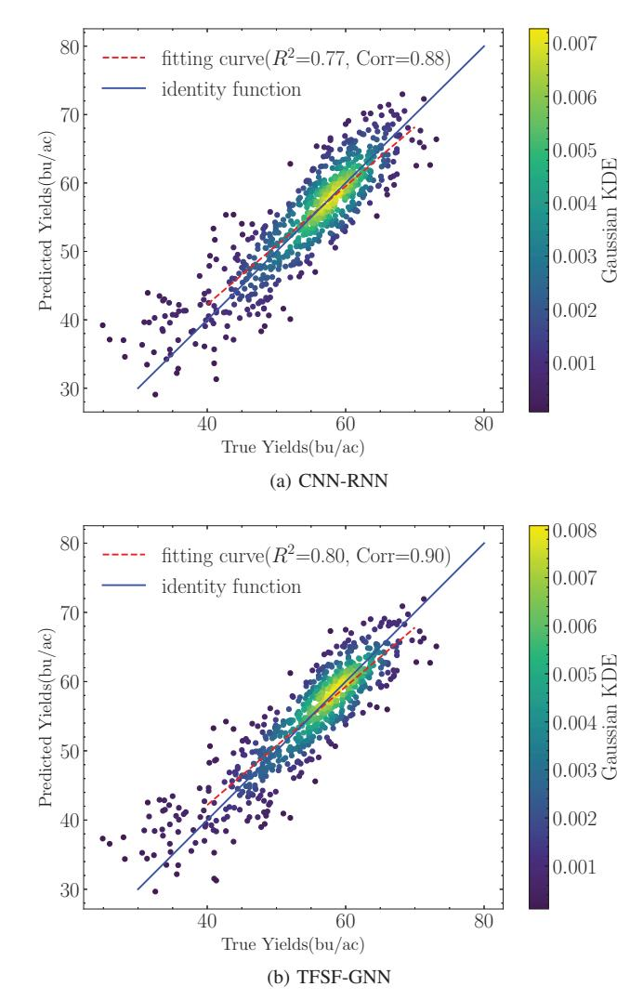

# TFSF: Topological and Feature Space Fusion with Spatio-Temporal Modeling for Crop Yield Prediction

Shifeng Xu *School of Software Technology Zhejiang University* Hangzhou, China shiF@zju.edu.cn

Yijing Zhou *Dept. of Privacy Computing Tongdun Technology* Hangzhou, China kexuedaishu@gmail.com

Cuiting Huang *Dept. of Privacy Computing Tongdun Technology* Shanghai, China cuiting.huang@tongdun.net

Xiaoyang Yu *Dept. of Privacy Computing Tongdun Technology* Hangzhou, China xiaoyang.yu@tongdun.net

Chao Wu\* *School of Public Affairs Zhejiang University* Hangzhou, China chao.wu@zju.edu.cn

**Abstract:** The interactions between climate change and geographic conditions have imposed great challenges to agriculture researchers on crop yield predictions. Traditional machine learning algorithms like Lasso and Gradient Boosting Machine often fall short in terms of accuracy. Deep learning has emerged as a promising approach in agriculture modeling: many studies have used convolutional(CNN) and recurrent neural networks(RNN) to effectively capture the nonlinear relationship between yield and various factors such as climate, soil and management. However, these approaches often neglect the spatial relations among different prediction units. In this paper, we introduce Graph Neural Networks(GNNs) to incorporate spatial knowledge in crop yield forecasting. Additionally, a Topology-Feature Space Fusion Graph Neural Network(TFSF-GNN) is proposed to address the limitations of topological graphs based on geographical distance which include only the static spatial information. The network is designed to compute the similarity of meteorological and environmental characteristics in different regions and generates graph structures of the feature space. Multiple graph convolutional networks are then used to extract information from the topological space, feature space, and common space. Extensive experiments on the benchmark dataset demonstrate that our proposed approach outperforms existing network structures on county-level yield prediction tasks.

## TL;DR
Graph neural network approach for agricultural prediction using spatial-temporal data

## Key Insights
TFSF-GNN incorporates spatial knowledge through feature space similarity rather than just geographical distance for improved crop yield predictions

**Index Terms:** Crop yield prediction, GNN, multi-channel graph convolution, spatio-temporal modeling

## I. INTRODUCTION

Crop yield prediction is an important topic in agriculture, but it remains challenging due to the dependency on complex interactions of various factors such as weather, land surface conditions and soil quality. Many studies have leveraged traditional machine learning techniques such as regression models and decision tree based methods for crop yield prediction [[7]](#ref-7), but these methods have limitations in simulating complex

\*Corresponding author.

relations among factors. In contrast, deep learning models are capable of extracting multi-scale and multi-level features and transfomring them into high-level representations, thus various deep learning models have been developed for crop yield prediction. [[17]](#ref-17) tried to build CNN-based estimation models to effectively capture relevant features from remote sensing images and achieve efficient yield predictions. [[10]](#ref-10) further utilized the spacial, temporal and spectral dimensions of remote sensing data with a 3D-CNN model for soybean yield estimation, highlighting the potential of incorporating spatial-temporal features.

CNN is indeed an efficient feature extractor but can hardly handle complex temporal dependencies. Therefore, [[3]](#ref-3) took advantages of phenology information in time series, meteorological data, and remote sensing data to estimate countylevel corn production and found that LSTM models can extract the implicit relationships contained in the sequence data, and provide accurate and robust predictions even under extreme weather conditions. [[4]](#ref-4) presented a CNN-RNN framework that combines CNN and RNN structures based on environmental and management practices data. Concretely, CNN layers were first used to handle both linear and nonlinear effects of climate and soil data and extracts underlying feature embeddings, which were then fed into RNN layers to capture time dependencies. However, this approach only considers local climate factors and fails to include the geographical effects of neighboring areas.

Both CNN and RNN based models take prediction units as independent and identically distributed (I.I.D.) samples but the potential correlations between units are ignored. In reality, it is commonly observed that the meteorological and soil conditions across the continental domain tend to exhibit a spatially homogeneous transition. Consequently, if a county experiences a favorable environment for crop growth and attains a higher yield, neighboring counties likely have similar trends. Studies in [[17]](#ref-17) show that using the same model for yield prediction across regions results in spatially clustered errors, with neighboring counties having similar errors which increase with distance, exhibiting a certain degree of spatial transition.

The graph neural network [[13]](#ref-13) is proposed to cope with graph-structured data and have shown its superior performance on spatio-temporal data modeling. Thus, we introduce a graph neural network to incorporate spatial information and propose a spatial-temporal yield prediction model based on a RNN-GNN architecture. In our approach, each prediction unit is treated as a node within the graph structure. The temporal information obtained from each unit, which has been extracted through a RNN model, is then fed into a graph neural network for prediction. The GNN model helps aggregate node features through graph convolution, thereby enhancing the accuracy of the prediction.

A straightforward way to construct the graph structure is based on geographical distance between nodes [[1]](#ref-1). The underlying assumption is that adjacent nodes are likely to have similar soil and climate conditions. In reality, regions that are close in distance may still show differences in terms of climate and other environmental factors due to the variability of topography in space [[11]](#ref-11). Additionally, regions that are far apart can show similarities, which cannot be captured by graph structures based on physical distance. In order to compensate for the shortcomings of the graph in the topological space, we construct a graph adjacency matrix in the feature space based on the similarity of temporal features of prediction units and adopt the multi-channel graph convolution from AM-GCN [[16]](#ref-16) to fuse information from both spaces for predictions.

The rest of the paper is organized as follows. In Section II we explain the proposed framework in detail. Extensive experiments based on public datasets will be revealed in Section III. We will make conclusions and discuss future work in Section IV.

## II. PROPOSED METHOD

Problem Formulation: Suppose there are N counties, where data of crop growth are collected annually. **x**^t^ = {**x**1,t, **x**2,t, ··· , **x**N,t} ∈ R^N^×^M^ represents the collected data at time t, and M indicates the dimension of features. We expect to utilize county's previous feature {**x**c,t, **x**c,t-^1^, ··· , **x**c,t-Δt} and yield data {**y**c,t-^1^, **y**c,t-^2^, ··· , **y**c,t-Δt} to make future predictions, where c, t represent county and year respectively.

The outline of the whole network structure is shown in Figure 1. It mainly consists of three parts: preprocessing, temporal feature extraction and multi-channel graph connvolution in graph learning.

## *A. Preprocessing*

In our study, there are three types of features: climate, soil quality and management data. Namely, **x**c,t = (**x**cli c,t, **x**^s^ ^c^, **x**^m^ ^c^ ). Notice the data exhibits heterogeneous properties, where climate data for a given year is typically represented as a temporal sequence, while soil information for that year is comparatively static in nature.

The first step is to extract embeddings of **x**c,t for each year. An encoder can be designed in multiple different ways. The abstract representation can be defined in the following equations:

$$
\begin{aligned}
\mathbf{h}_{c,t}^{cli} &= f_{cli}(\mathbf{x}_{c,t}^{cli}) \\
\mathbf{h}_c^s &= f_s(\mathbf{x}_c^s) \\
\mathbf{h}_{c,t} &= (\mathbf{h}_{c,t}^{cli}, \mathbf{h}_c^s, \mathbf{x}_c^m),
\end{aligned} \tag{1}
$$

where fcli is an extractor for climate time series and the potential candidates could be a sequence model like RNN, which is good at handling sequential data. f^s^ is utilized to aggregate soil information across different depth. Following the framework and configurations proposed in [[4]](#ref-4), we use multiple CNN layers to extract hc, t ^c^li and h^s^ ^c^ from xc,t in each year and get feature embeddings hc,t.

## *B. Temporal feature extraction*

The feature embeddings hc,t from the previous step are then fed into a sequence model. Recurrent neural networks are well known as powerful tools in modeling the trend and variations of temporal features. GRU and LSTM are two common candidates and we choose GRU to capture changes varying over time. More concretely, to make predictions for a given year, several prior years' feature data is passed through the above feature extractor to obtain embeddings, which are then fed into the GRU in sequence to yield a new embedding zc,t representing temporal information for the t-th year. The embedding should accumulate correlated information from previous years.

In addition to feature data, historical yields can also be fed into the GRU. Previous studies have used the mean yield values of all regions as input to capture yield trend information, but this can obscure variations in different regions due to differences in planting techniques and environments. To address this issue, we employ local yield information for each region as input to the GRU:

$$
\mathbf{z}_{c,t} = GRU\left(\left\{\mathbf{h}_{c,t-\Delta t}, \mathbf{y}_{c,t-\Delta t}\right\}, \ldots, \left\{\mathbf{h}_{c,t}, \mathbf{y}_{c,t}\right\}\right). \tag{2}
$$

By combining the trend information **z**c,t with hc,t+1 obtained from the feature extraction layer, we expect a more accurate prediction for the yield in t + 1 year.

## *C. Multi-channel Graph Convolution*

To make up for the unilateral correlations among nodes in topological space, we construct two graphs to connect nodes both in topological space and feature space. These two graphs can interweave with each other, thereby improving the predictive capability of the model.

In our example, the topological graph is based on the adjacency relationship among US counties, as provided by the

Figure 1. TFSF: A topological and feature space fusion with spatio-temporal modeling. Preprocessing: Obtain a feature embedding by CNN. Temporal feature extraction: Extract trend and variations of historical knowledge over prior years. Spatial feature fusion: A fusion of both topological and feature graphs with a AM-GCN architecture.

US Census Bureau. The element of adjacency matrix A^T^ is defined as follows:

$$
A_{T,uv} := \begin{cases} 1, & \text{if } u \text{ and } v \text{ are adjacent} \\ 0, & \text{otherwise} \end{cases}
$$
(3)

As for the underlying structure of counties in feature space, we construct a feature graph by the k nearest neighbors (kNN). To be specific, we first calculate the climate similarity of different regions. Common similarity metrics include Euclidean distance, cosine distance and Dynamic Time Warping (DTW) [[12]](#ref-12). After experimental evaluation, we use Euclidean distance as stated below:

$$
d_{u,v,t} = \sqrt{\left[\sum_{j=1}^{4} ||\mathbf{x}_{v,t,j} - \mathbf{x}_{u,t,j}||^2\right]},
$$
(4)

where dv,u,t represents the overall Standardized Euclidean distance between regions u and v in year t in terms of four climate variables (precipitation, solar radiation, maximum temperature and minimum temperature); **x**v,t,j represents the time series of the jth climate variable of region v in year t. Then we build connections for each two among the top k nearest neighbors for each county and then obtain the adjacency matrix **A**^F^ .

Given the adjacency matrices {**A**^T^ , **A**^F^ } and node temporal information **Zt**, multi-channel convolutions are performed following the architecture in AM-GCN [[16]](#ref-16). The graph convolution modules are comprised of two parts: two individual convolution modules for each type of graph, and two common convolution modules with shared parameters for both graphs. The output of the l-th layer **H**^l^ can be expressed as:

$$
\mathbf{H}^{l} = ReLU(GConv(\mathbf{A}, \mathbf{H}^{l-1})),
$$
(5)

where Gconv denotes graph convolution computation (e.g. GCN [[5]](#ref-5), GAT [[15]](#ref-15), GraphSAGE [[2]](#ref-2), etc.). Subsequently, the two specific convolution modules allow **Z^t^** to propagate over both topology graph and feature graph to learn two specific embeddings **H**^T^ and **H**^F^ respectively. The common convolution modules extract the common information **H**^C^ , which is shared by the two spaces.

Finally, an attention layer is added to learn adaptive importance weights. The final output graph embedding, which can be utilized to predict crop yield, is calculated as the weighted sum of the outputs of topology, feature and common convolution layers based on attention mechanism, as demonstrated by the following equation:

$$
\mathbf{H} = \alpha_T \cdot \mathbf{H}_T + \alpha_C \cdot \mathbf{H}_C + \alpha_F \cdot \mathbf{H}_F.
$$
(6)
III. EXPERIMENTS

## *A. Data preparation*

Our proposed TFSF-GNN is evaluated on the USA soybean yield dataset [[4]](#ref-4), which mainly consists of three categories of features: climate, soil and management. Specifically, six weather features are drawn from [[14]](#ref-14): precipitation, solar radiation, snow water equivalent, maximum temperature, minimum temperature and vapor pressure. These features are available at a 1 km^2^ grid for each day.

The soil data can be acquired from [[9]](#ref-9) and it has 11 variables measured at 6 different depths (0-5cm, 5-15cm,15- 30cm,30-60cm,60-100cm,100-200cm) with a 250 square meter resolution. These features include bulk density, electrical conductivity, PH and soil composition.

The management data includes the weekly cumulative percentage of planted fields within each state, starting from April of each year. The yield performance and management data were acquired from National Agricultural Statistics Service of the United States [[8]](#ref-8).

The yield performance dataset contains the soybean production between 1980 and 2017, across 1,115 counties for soybean within 13 states of the Corn Belt: Indiana, Illinois, Iowa, Minnesota, Missouri, Nebraska, Kansas, North Dakota, South Dakota, Ohio, Kentucky, Michigan, and Wisconsin, which are the main regions for soybean planting in the United States.

## *B. Model Configurations*

To evaluate our model, both traditional machine learning models(ridge regression, lasso, decision tree, etc.) and deep learning models are implemented for comparison. For the traditional machine learning models, we use standard implementations in scikit-learn. Other deep learning based methods are implemented with Pytorch.

The CNN structure is similar to the one in [[4]](#ref-4), containing multiple 1D convolutions, ReLUs, and average pooling layers sequentially. It is used to extract low-level feature representation from weekly weather data and depth-wise soil data in CNN-RNN and RNN-GNN models. Each year's data is processed with CNNs and then flattened into a one-dimensional vector, followed by GRU layers for growth-trend extraction over the past several years. The GRU layer has 64 hidden units and a sequence length of four, meaning it uses past four years' data to make yield predictions. For the RNN-GNN models, neural networks of GCN, GraphSAGE, GAT are constructed based on PyTorch Geometric library. A two-layer structure are set for all the GNN models.

All deep learning models are trained using an Adam optimizer with a weight decay of 1e-5 if needed. The learning rate is selected between 1e-5 and 1e-3, and the mini-batch size is set to 32. Models were trained for 100 to 200 epochs until the validation loss stops decreasing within several epochs. We choose the epoch and hyperparameter settings that produce the lowest RMSE on the validation set (the year before the test year).

Moreover, for hardware configurations, all the experiments are implemented on a 64-bit Intel(R) Xeon(R) Silver 4110 CPU 2.10GHz with 14GB of RAM and NVIDIA GeForce RTX 2080 Ti GPU under CUDA version 11.3.

## *C. Experimental Results*

The whole soybean dataset spans from year 1980 to 2017 and is split into three parts: the training set from 1980 to 2013, the validation set in 2014, and the test set from 2015 to 2017. The results of the experiments on the dataset are shown below.

Table I illustrates the crop yield prediction performance of the different methods in terms of four metrics, namely Mean Absolute Error(MAE), Mean Absolute Percentage Error(MAPE) and Root Mean Square Error (RMSE) metrics. The evaluation results demonstrate that the proposed TFSF-GNN leads to improved performance compared to traditional statistical models and other deep learning models.

Looking further into the table, among all the baseline methods, deep learning based methods show their superiority to capture complex dependencies between multi-dimensional features and crop yields compared to statistical methods (Ridge, DT and RF). Specifically, the traditional crop yield prediction models treat features and yield in different years as I.I.D. data, while the truth is that both environmental variables and agricultural production have a tendency to change over time. The CNN-RNN model was leveraged to process climatic time series and capture the inherent temporal relationships among consecutive years and achieves better performance.

However, these models fail to consider the non-linear spatial dependencies that are very helpful for crop yield prediction. The combination of RNN and GNN can encode spatial correlations in the final prediction process, but these methods build the graph topology based only on the distance in geographical space, as in [[6]](#ref-6) where county adjacency was used in GNN. Meanwhile, neighboring counties in the topological space might differs in the climate feature space which contains various crucial factors affecting yield. The proposed method TFSF-GNN utilizes both the toplogical space graph and the feature space graph to further convey messages in feature space and ultimately gets more accurate predictions.

Figure 2 presents line charts and heat scatter plots of the soybean yield predictions obtained by the deep learning based methods versus the ground-truth yields in 2015 and 2016. The figure indicates that the TFSF-GNN model outperforms the CNN-RNN model: a narrower spread among the scatter plots with higher R^2^ values and higher correlations.

Under some circumstances, it is critical to have a yield estimation when a type of crop is first introduced to a new region. So we expect the agricultural model to have the ability to generalize to unknown regions given the climate, soil and management data. To examine the generalization ability, we evaluate the performance of models under the following inductive learning setting: a subset of locations are excluded as test nodes according to the ratio γ, which represents the ratio between the number of testing nodes and training nodes. Then we use the remaining locations as training nodes and train the model using a sub-graph containing only training nodes. Finally we evaluate the effect of training on the entire graph. We choose the ratio to be 0.1 to 0.5 with step 0.1. Table II shows the test results of inductive learning. As the number of visible nodes decreases during the training stage, the overall prediction error shows an upward trend, especially for CNN-RNN model, which lacks the ability to capture spatial information. TFSF-GNN outperforms the other models with the smallest increase in error, demonstrating a stronger ability to capture complex spatial relationships.

## *D. Ablation Study*

To validate the effectiveness of the multi-space convolution module in the yield prediction model, we compare TFSF with its three variants on the soybean yield dataset. The variants include:

- TFSF-T: RNN-GNN model with only topology space graph.
- TFSF-F: RNN-GNN model with only feature space graph.
- TFSF-TF: RNN-GNN model with both feature space graph and topology space graph, but without common convolution layer.

| Method | 2015 | | | 2016 | | | 2017 | | |
|---|---|---|---|---|---|---|---|---|---|
| | MAE | MAPE | RMSE | MAE | MAPE | RMSE | MAE | MAPE | RMSE |
| Statistic Models | | | | | | | | | |
| Ridge | 4.800 | 0.0904 | 6.258 | 6.623 | 0.1325 | 7.644 | 12.73 | 0.1954 | 13.049 |
| Decision Tree | 5.950 | 0.1147 | 7.575 | 5.071 | 0.0964 | 6.507 | 6.242 | 0.1112 | 7.996 |
| Random Forest | 5.653 | 0.1151 | 6.757 | 4.414 | 0.0833 | 5.569 | 5.747 | 0.1022 | 7.214 |
| SVR | 5.097 | 0.1039 | 6.220 | 3.623 | 0.0674 | 4.668 | 5.037 | 0.0919 | 6.217 |
| Deep Learning Models | | | | | | | | | |
| FNN | 4.583 | 0.0883 | 5.084 | 4.359 | 0.0750 | 5.345 | 6.57 | 0.132 | 7.627 |
| CNN | 3.809 | 0.0811 | 4.997 | 3.346 | 0.0606 | 4.277 | 4.88 | 0.0931 | 5.898 |
| CNN-RNN | 3.574 | 0.0735 | 4.516 | 2.904 | 0.0553 | 3.652 | 3.892 | 0.0757 | 4.726 |
| RNN-GCN | 3.169 | 0.0666 | 4.177 | 2.794 | 0.0521 | 3.556 | 3.707 | 0.0727 | 4.650 |
| RNN-SAGE | 3.119 | 0.0646 | 4.074 | 2.883 | 0.0504 | 3.673 | 3.558 | 0.0689 | 4.389 |
| RNN-GAT | 3.184 | 0.0661 | 4.134 | 2.912 | 0.0533 | 3.702 | 3.621 | 0.0705 | 4.432 |
| The Proposed Model | | | | | | | | | |
| TFSF-GNN | 2.971 | 0.0619 | 3.924 | 2.556 | 0.0467 | 3.243 | 3.469 | 0.06789 | 4.299 |

TABLE I 2015-2017 SOYBEAN RESULTS

Figure 2. Predicted vs. ground truth yields

TABLE II INDUCTIVE LEARNING - PERFORMANCE MEASURED WITH RMSE

| γ (Testing Nodes / Training Nodes) | | | | | | | |
|---|---|---|---|---|---|---|---|
| 0.1 | 0.2 | 0.3 | 0.4 | 0.5 | | | |
| 4.1045 | 6.5471 | 8.0003 | 7.4141 | 7.7239 | | | |
| 3.5111 | 4.2573 | 4.3982 | 4.9638 | 4.7708 | | | |
| 3.7058 | 4.5321 | 5.0402 | 5.0313 | 5.6997 | | | |
| 3.2049 | 3.7481 | 3.8827 | 4.7738 | 4.6211 | | | |

TABLE III ABLATION EXPERIMENT RESULTS)

| Model | | TFSF-T | TFSF-F | TFSF-TF | TFSF |
|---|---|---|---|---|---|
| Year | Metric | | | | |
| 2015 | MAE | 3.119 | 3.070 | 3.067 | 2.971 |
| | MAPE | 6.464 | 6.499 | 6.434 | 6.192 |
| | RMSE | 4.074 | 4.066 | 4.034 | 3.924 |
| 2016 | MAE | 2.883 | 3.337 | 2.761 | 2.556 |
| | MAPE | 5.043 | 6.088 | 5.017 | 4.672 |
| | RMSE | 3.673 | 4.125 | 3.512 | 3.243 |
| 2017 | MAE | 3.558 | 3.593 | 3.356 | 3.192 |
| | MAPE | 6.893 | 6.993 | 6.449 | 6.184 |
| | RMSE | 4.389 | 4.491 | 4.213 | 3.936 |
| Mean | MAE | 3.187 | 3.333 | 3.061 | 2.906 |
| | MAPE | 6.132 | 6.527 | 5.967 | 5.682 |
| | RMSE | 4.045 | 4.227 | 3.920 | 3.701 |

Table III illustrates the experimental results. The overall performence of TFSF is better than its variants, indicating the efficacy of the multi-space convolution module. In-depth analysis of the results yields the following conclusions. Firstly, the prediction error of TFSF-F is lower than that of CNN-RNN, demonstrating the significance of feture representation within the feature space. Secondly, though TFSF-F gives inferior predictions compared with TFSF-T, utilizing information from both topology and feature spaces in TFSF-TF leads to a better performance, implying that the feature space can complement the topological space by providing additional beneficial information. Thirdly, TFSF with the common convolution layer further reduces prediction error compared to TFSF-TF, vertifying the effectiveness of the common convolution layer and its similarity constraint method [[16]](#ref-16).

## IV. CONCLUSION

We introduced the TFSF-GNN model to extract correlation information of yield and its influencing factors simultaneously in both the temporal and spatial dimensions. TFSF-GNN uses multiple graph convolutional network structures with an attention mechanism to adaptively learn the most correlated information from the topology and region features and effectively fuse them for yield prediction. The model demonstrates higher prediction accuracy and better generalization performance compared with the benchmark models on real-world soybean yield datasets.

In future work, we will mainly focus on two improvements. On the one hand, the feature graph is static within the current work but this could be relaxed and made dynamic. In other words, the feature space will change in a dynamic way during the training stage. This will make the structure learn the adaptive relations among nodes in feature space. On the other hand, we will consider a scenario where data among different areas cannot be easily accessed or collected in plaintext by a central node, which means data must be kept private and isolated. This coincides with federated learning, where a trusted server is provided to aggregate the locally trained models for global model updating. We will aim to make our model structure applicable in a federated way so that the model training can be realized without disclosing private data.

## ACKNOWLEDGMENT

This work was supported by the National Key Research and Development Project of China (2021ZD0110400), National Natural Science Foundation of China (U19B2042), Program of Zhejiiang Province Science and Technology (2022C01044), The University Synergy Innovation Program of Anhui Province (GXXT-2021-004), Academy Of Social Governance Zhejiang University, Fundamental Research Funds for the Central Universities (226-2022-00064).

## REFERENCES

- [1] J. Fan, J. Bai, Z. Li, A. Ortiz-Bobea, and C. P. Gomes. A gnn-rnn approach for harnessing geospatial and temporal information: application to crop yield prediction. In *Proceedings of the AAAI Conference on Artificial Intelligence*, volume 36, pages 11873–11881, 2022.
- [2] W. Hamilton, Z. Ying, and J. Leskovec. Inductive representation learning on large graphs. *Advances in neural information processing systems*, 30, 2017.
- [3] H. Jiang, H. Hu, R. Zhong, J. Xu, J. Xu, J. Huang, S. Wang, Y. Ying, and T. Lin. A deep learning approach to conflating heterogeneous geospatial data for corn yield estimation: A case study of the us corn belt at the county level. *Global change biology*, 26(3):1754–1766, 2020.
- [4] S. Khaki, L. Wang, and S. V. Archontoulis. A cnn-rnn framework for crop yield prediction. *Frontiers in Plant Science*, 10:1750, 2020.
- [5] T. N. Kipf and M. Welling. Semi-supervised classification with graph convolutional networks. *arXiv preprint arXiv:1609.02907*, 2016.
- [6] C. Meng, S. Rambhatla, and Y. Liu. Cross-node federated graph neural network for spatio-temporal data modeling. In *Proceedings of the 27th ACM SIGKDD Conference on Knowledge Discovery & Data Mining*, pages 1202–1211, 2021.
- [7] S. Mishra, D. Mishra, and G. H. Santra. Applications of machine learning techniques in agricultural crop production: a review paper. *Indian J. Sci. Technol*, 9(38):1–14, 2016.
- [8] National Bureau of Statistics. National agricultural statistics service. https://www.nass.usda.gov/, 2019.
- [9] Natural Resources Conservation Service. The gridded soil survey geographic (gssurgo) database for southwest united states: United states department of agriculture. http://datagateway.nrcs.usda.gov/., 2019.
- [10] P. Nevavuori, N. Narra, and T. Lipping. Crop yield prediction with deep convolutional neural networks. *Computers and electronics in agriculture*, 163:104859, 2019.
- [11] E. Park, W. Brorsen, and A. Harri. Spatially smoothed crop yield density estimation: Physical distance vs climate similarity. 2017.
- [12] A. P. Ruiz, M. Flynn, J. Large, M. Middlehurst, and A. Bagnall. The great multivariate time series classification bake off: a review and experimental evaluation of recent algorithmic advances. *Data Mining and Knowledge Discovery*, 35(2):401–449, 2021.
- [13] F. Scarselli, M. Gori, A. C. Tsoi, M. Hagenbuchner, and G. Monfardini. The graph neural network model. *IEEE transactions on neural networks*, 20(1):61–80, 2008.
- [14] M. Thornton, R. Shrestha, Y. Wei, P. Thornton, S. Kao, and B. Wilson. Daymet: daily surface weather data on a 1-km grid for north america, version 4. ornl daac, oak ridge, tennessee, usa, 1840.
- [15] P. Velickovic, G. Cucurull, A. Casanova, A. Romero, P. Lio, and Y. Bengio. Graph attention networks. *stat*, 1050:20, 2017.
- [16] X. Wang, M. Zhu, D. Bo, P. Cui, C. Shi, and J. Pei. Am-gcn: Adaptive multi-channel graph convolutional networks. In *Proceedings of the 26th ACM SIGKDD International conference on knowledge discovery & data mining*, pages 1243–1253, 2020.
- [17] J. You, X. Li, M. Low, D. Lobell, and S. Ermon. Deep gaussian process for crop yield prediction based on remote sensing data. In *Thirty-First AAAI conference on artificial intelligence*, 2017.

## Metadata Summary
### Research Context
- **Research Question**: How can spatial relationships and advanced machine learning techniques improve crop yield prediction?
- **Methodology**: Developed TFSF-GNN using feature space similarity graphs, multiple graph convolutional networks, spatio-temporal modeling for county-level predictions
- **Key Findings**: Outperformed existing network structures on county-level yield prediction tasks by capturing complex climate-geography interactions
- **Primary Outcomes**:

### Analysis
- **Limitations**: Agricultural domain specific, limited transferability to personal knowledge systems
- **Research Gaps**:
- **Future Work**: Consider spatial-temporal modeling patterns for personal activity tracking in HDM systems
- **Conclusion**: Demonstrates spatial-temporal modeling techniques but limited applicability to HDM personal data contexts

### Implementation Notes
Agent Epsilon: Agricultural focus limits relevance - spatial-temporal techniques might inspire HDM location modeling