Contents lists available at [ScienceDirect](http://www.sciencedirect.com/science/journal/03064573)

Information Processing and Management

journal homepage: [www.elsevier.com/locate/infoproman](https://www.elsevier.com/locate/infoproman)

# Multimodal joint learning for personal knowledge base construction from Twitter-based lifelogs

Yen An-Z^a^ , Huang Hen-Hsen^b,c,⁎^ , Chen Hsin-Hsi^a,c,⁎^

^a^ *Department of Computer Science and Information Engineering, National Taiwan University, Taipei, Taiwan*
^b^*Department of Computer Science, National Chengchi University, Taipei, Taiwan*
^c^*MOST Joint Research Center for AI Technology and All Vista Healthcare, Taiwan*

## ARTICLE INFO
*Keywords:*Lifelogging Life event extraction Personal knowledge base construction Social media

### ABSTRACT

People are used to log their life on social media platforms. In this paper, we aim to extract life events by leveraging both visual and textual information shared on Twitter and construct personal knowledge bases of individuals. The issues to be tackled include (1) not all text descriptions are related to life events, (2) life events in a text description can be expressed explicitly or implicitly, (3) the predicates in the implicit life events are often absent, and (4) the mapping from natural language predicates to knowledge base relations may be ambiguous. A multimodal joint learning approach trained on both text and images from social media posts shared on Twitter is proposed to detect life events in tweets and extract event components including subjects, predicates, objects, and time expressions. Finally, the extracted information is transformed to knowledge base facts. The evaluation is performed on a collection of lifelogs from 18 Twitter users. Experimental results show our proposed system is effective in life event extraction, and the constructed personal knowledge bases are expected to be useful to memory recall applications.

### 1. Introduction

Lifelogging, which records personal daily life via wearable devices and social media platforms such as Twitter, Facebook, and Instagram, becomes very popular nowadays. The wearable devices provide locations or biometrics information of human, and images capturing daily events [[Dang-Nguyen et al., 2018]](#ref-Dang-Nguyen2018); [[Gurrin, Joho, Hopfgartner, Zhou & Albatal, 2016]](#ref-Gurrin2016)). Compared with wearable sensors and wearable camera, social media platforms provide large scale text-based lifelogs and images.

The personal big data includes the place where an individual visited in daily life, who was at a party s/he attended, and when s/he got the job promotion. We define these experiences as personal life events. Because people often forget something over time, information recall support for people at the right time and at the right place is emerging. Constructing personal knowledge base for individuals is important for the application of memory recall and living assistance. In this paper, we address the issue of extracting personal life events from text and image posted on Twitter.

It is very challenging to collect personal lifelog data due to the societal acceptance, privacy issue, and the data ownership issue [[Gurrin, Smeaton & Doherty, 2014]](#ref-Gurrin2014)). The amount of existing lifelog datasets are small and only consist of short-term daily events of lifeloggers. For example, NTCIR12-Lifelog task [[Gurrin et al., 2016]](#ref-Gurrin2016) collects one month of data from three lifeloggers, and ImageCLEF 2018 LifeLog dataset [[Dang-Nguyen et al., 2018]](#ref-Dang-Nguyen2018) consists of 90 days of data from two lifeloggers. Comparing with these two personal

⁎ Corresponding authors.
*E-mail addresses:*[azyen@nlg.csie.ntu.edu.tw](mailto:azyen@nlg.csie.ntu.edu.tw) (A.-Z. Yen), [hhhuang@nccu.edu.tw](mailto:hhhuang@nccu.edu.tw) (H.-H. Huang), [hhchen@ntu.edu.tw](mailto:hhchen@ntu.edu.tw) (H.-H. Chen).

<https://doi.org/10.1016/j.ipm.2019.102148>

Received 6 April 2019; Received in revised form 21 August 2019; Accepted 16 October 2019 Available online 12 November 2019 0306-4573/ © 2019 Elsevier Ltd. All rights reserved.

lifelog datasets, we follow the policy^1^ of Twitter to collect 18 users who set their tweets as public and posted tweets ranged from 2009 to 2017. In other words, we collect a long period of lifelogs of individuals that can reveal personal daily life information. Besides, the life events in our dataset are more diverse.

Life event extraction from social media data provides important information for individuals. For example, in the tweet (T1), there is a life event of the user who reads the book entitled "Miracles of the Namiya General Store" and enjoys it. The enriched repository personal information is useful for memory recall and supports living assistance.

(T1) 東野圭吾的《解憂雜貨店》真好看 (Higashino Keigo's "Miracles of the Namiya General Store" is really nice.)

Several researches have been done for life event detection from social media ([Choudhury & Alani, 2015]](#ref-Choudhury2015); [Dickinson et al., 2016]](#ref-Dickinson2016); [Li & Cardie, 2014]](#ref-Li2014); [Li, Ritter, Cardie & Hovy, 2014]](#ref-Li2014a); [Sanagavarapu, Vempala & Blanco, 2017]](#ref-Sanagavarapu2017)). However, most of them focus on the detection of major life events which seldom occur in our daily life, such as marriage, job promotions, exam, and graduation. General life events such as dining, visiting a local place, and having a talk with friends, which frequently happen and consist of important information for recall and retrieval, remain to be dealt with. Our previous work ([Yen, Huang & Chen, 2018]](#ref-Yen2018)) focuses on detecting general life events from text-based lifelogs, which keep important information for recall and retrieval. These previous approaches which detect life events on social media posts only focus on textual data without considering the visual information from images. In addition, they only aim to classify life events and do not construct the personal knowledge base for supporting memory recall of individuals.

This work presents a comprehensive investigation on the topic of life event extraction on lifelogs that leverage both images and texts. Tweets, the short messages published and shared on the social media platform Twitter, are adopted as the source of lifelogs. We propose a system to detect whether a life event exists in a tweet, and extract the possible life events from text-based data in the quadruple form (subject, predicate, object, time). We further transform natural language (NL) predicates into knowledge base (KB) relations such as Perception, Motion, and Presence.

The key challenge in life event extraction from social media data is that the user-generated text is often brief and informal-written. Life events may not be explicitly expressed, the explicit life event contains the exact information about "Who did What to Whom Where When and How". Thus words related to subject, predicate, object, and time in a tweet can be directly extracted to compose a quadruple describing the life event. On the other hand, there is no clear expression in an implicit life event, so that it is more challenging to identify the components in the quadruple.

Tweet (T2) contains two explicit life events, which can be represented in the quadruples (I, went to, KFC, noon) and (I, ate, hamburger, noon). The NL predicates "went to" and "ate" can be further transformed to the KB relations Self_motion and Ingestion, respectively, consulting the predicates defined in Chinese FrameNet ([Yang, Huang, Yen & Chen, 2018]](#ref-Yang2018)). Finally, the facts Self_motion (I, KFC, noon) and Ingestion(I, hamburger, noon) will be stored in a personal knowledge base for subsequent applications.

(T2) I went to KFC, and ate a hamburger for lunch.

(T3) iPhone X!

Tweet (T3) is an instance of implicit life event, in which no explicit predicate is mentioned. The subject is the author, the object is iPhone X, and the time is the timestamp of the tweet. However, the predicates can be "bought" or "released", which are the potential actions to the cell phone. In other words, this short description may present either the user bought a new cell phone or the iPhone X was just released. The former denotes a life event of the user, while the latter does not.

On the other hand, the accompanying image posted on the social media platform provides additional information for detecting personal life events. [Hunt, Lin and Atkin (2014)]](#ref-Hunt2014) investigate the photo-messaging behavior of college students. The results show that the photo-messaging activity in social network is related to personal relationship. [Villi (2015)]](#ref-Villi2015) mentions that users sending the photos intend to show their actions and experiences in their location through digital devices. [Oeldorf-Hirsch and Sundar (2016)]](#ref-Oeldorf-Hirsch2016) investigate the motivation of people sharing photos on social media sites. Factor analysis shows that the behavior of sharing photo online is driven by the satisfaction, such as seeking and demonstrating experiences.  **Figure 1.**An Example of social media post. shows a tweet composed of text and an image. According to the definitions of explicit and implicit life events ([Yen et al., 2018]](#ref-Yen2018)), this example is an instance of the implicit life event that expresses the situation in which the user receives the soap and cookies from the weddings. In such a case, no explicit action is mentioned. The image in this tweet provides a complementary information about the thing compared with the wedding soap, so that it potentially expresses the KB relation of the life event is "Getting" according to the definition on Chinese FrameNet.

In our system, the life event extraction is performed in two stages. Given a tweet, the first stage detects the implicit and the explicit life events and suggests the predicate of each life event. We formulate the related subtasks in the first stage in a novel neural network and train the subtasks in a fashion of multimodal joint learning that leverages both images and texts. The second stage extracts the subject, object, and time expression from text-based data for each predicate and generates the results in life event quadruples. The semantic role of each element participating in a life event is further labeled with a semantic parser based on Chinese FrameNet. Finally, the outcomes of our system are ready to insert into a personal knowledge base.

^1^ <https://help.twitter.com/en/rules-and-policies>

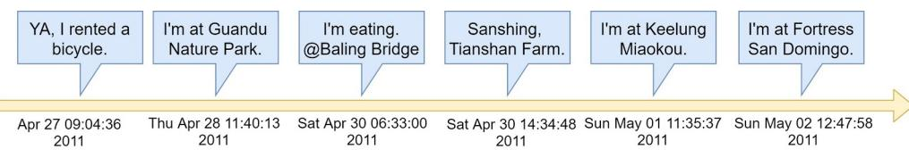
**Figure 2.**A fragment timeline of lifelogs.

and world knowledge.  **Figure 3.**A snippet of personal and world knowledge graph. shows the timeline of a user who rented a bicycle and rode a bicycle from Guandu to Fortress San Domingo.

The user might query "Where did I eat before riding a bicycle to Tianshan Farm?" or "Where did I leave for the Keelung Miaokou?". Directly retrieving the tweet may not provide the correct answer to this kind of questions. Moreover, the user might also query personal life event with world knowledge.  **Figure 3.**A snippet of personal and world knowledge graph. shows a snippet of knowledge graph connecting personal knowledge base and world knowledge base. For example, "Which monument in Tamsui have I visited?" or "Which monument I visited before was established in 1646?" To answer these questions requires more than one knowledge graph triple and world knowledge. This example supports the construction of personal knowledge base is necessary for memory recall.

The contributions of this paper are fourfold. (1) This work introduces a new task that addresses lifelog mining on the real world social media data. (2) We propose a comprehensive system for the extraction. Related subtasks in the extraction workflow are formulated and modeled with a multimodal joint learning approach. Experimental results show promising performances are achieved in all the subtasks. (3) We demonstrate how to construct a personal knowledge base for general life events, providing complementary information for recall and retrieval. (4) We release the lifelog dataset in our website.^2^

The rest of this paper is organized as follows. In [Section 2](#section-2), we survey the related work about lifelogging and event extraction. [Section 3](#section-3) introduces the lifelog corpus used in experiments. The construction and the statistics of the corpus are described. [Section 4](#section-4) presents our system for life event extraction and personal knowledge base construction. Experimental results are shown and discussed in [Section 5](#section-5). Detailed analysis of experimental results is discussed in [Section 6](#section-6). Finally, [Section 7](#section-7) concludes the remarks.

## 2. Related work

Most of the previous work on life event extraction focuses on either image-based lifelogs from wearable cameras or text-based lifelogs on the social media platforms. In recent years, the visual lifelogs, captured through the devices such as Sensecam [[Hodges et al., 2006]](#ref-Hodges2006) and Narrative [[Kallstrom, 2013]](#ref-Kallstrom2013)), have been investigated in a variety of applications including aiding human memory recall [[Harrell, 2010]](#ref-Harrell2010); [Hodges et al., 2006]](#ref-Hodges2006); [Woodberry et al., 2015]](#ref-Woodberry2015)), healthcare [[Kerr et al., 2013]](#ref-Kerr2013); [Mohan, Lee, Jaichandar & Calderon, 2012]](#ref-Mohan2012); [O'Loughlin et al., 2013]](#ref-OLoughlin2013)), diet monitoring [[Maekawa et al., 2013]](#ref-Maekawa2013); [Nohara, Kotsuka, Hashimoto & Horiuchi, 2010]](#ref-Nohara2010)), informing one's lifestyle change, and self-reflection [[Fleck et al., 2009]](#ref-Fleck2009); [Harper et al., 2008]](#ref-Harper2008)).

[Gurrin et al. (2016)]](#ref-Gurrin2016) release personal lifelog data of three lifeloggers for the NTCIR12-Lifelog task which are logged by wearable camera for a period of about one month. They employed this test collection to search and retrieve personal specific moment from lifelogs, and to explore knowledge mining and gain insights into the lifelogger's daily life activities. The ImageCLEF 2018 LifeLog dataset ([Dang-Nguyen et al., 2018]](#ref-Dang-Nguyen2018)) consists of 90 days of data, including images, semantic content from mobile devices, heart rate, calorie burn, and steps, from two lifeloggers. The dataset was employed in NTCIR-13 for summarizing certain life events for a lifelogger, and retrieving a number of specific moments in a lifelog, such as the moments of shopping in a wine store.

^2^ <http://nlg.csie.ntu.edu.tw/nlpresource/LifelogDataset>

This paper focuses on the extraction of life events from social media. Social media platforms like Facebook and Twitter provide the service for people to log their life events. Previous work has addressed the public event extraction from text-based data shared on social media platforms, including the extraction of disaster outbreak [[Li & Cardie, 2013]](#ref-Li2013); [Sakaki, Okazaki & Matsuo, 2010]](#ref-Sakaki2010)), elections ([Soler, Cuartero & Roblizo, 2012]](#ref-Soler2012)), news events [[Jackoway, Samet, & Sankaranarayanan, 2011]](#ref-Jackoway2011)), and music events ([Liu, Troncy & Huet, 2011]](#ref-Liu2011)).

The detection of personal life events has also been explored. Previous work focuses on the detection of major life events, which seldom occur in daily life such as marriage and graduation. [Li et al. (2014)]](#ref-Li2014a) collect the tweets replied with congratulations or condolences speech acts, including the phrases "Congratulations", "Congrats", "Sorry to hear that", and "Awesome", and propose a pipeline system to identify the major life events. [Li and Cardie (2014)]](#ref-Li2014) propose a Dirichlet Process model to extract life events and generate timeline for individuals based on tweets. Most events extracted by their model are also major life events like job promotions, graduation, and having a new job.

[Choudhury and Alani (2015)]](#ref-Choudhury2015) classify 11 major life events, including marriage, job promotions, passing an exam, and so on. They train a classifier by using activity and attention features (e.g., the number of replies and retweets). [Dickinson et al. (2016)]](#ref-Dickinson2016) transform the representation of tweets as syntactic and semantic graphs and identify the life event such as getting married, having a child, death of a parent, starting school, and falling in love. [Sanagavarapu et al. (2017)]](#ref-Sanagavarapu2017) aim to predict whether some people participate in an event and identify when an event happens by training a Support Vector Machine with RBF kernel. In our previous work ([Yen et al., 2018]](#ref-Yen2018)), we propose a multitask LSTM model to identify general personal events from Twitter which frequently happen in daily life, and further classify them into two types according to their explicitness. Comparing with our previous work, this work not only utilizes text-based data, but also considers image information to detect personal life events. In addition, we further extract life events from text-based data to form timestamped subject-relation-object facts for constructing a personal knowledge base.

Event detection is a challenging task in information extraction. [Nguyen and Grishman (2015)]](#ref-Nguyen2015) utilize convolutional neural networks (CNNs) and the BIO tagging scheme to label entity type of each token in the sentence for event detection. [Chen, Xu, Liu, Zeng and Zhao (2015)]](#ref-Chen2015) present a pipelined framework with dynamic multi-pooling convolutional neural networks to extract event mentions, triggers, and arguments. [Nguyen, Cho and Grishman (2016)]](#ref-Nguyen2016) propose a joint framework with bidirectional recurrent neural networks (RNNs) to jointly label event triggers and argument roles.

In contrast to the previous works, which deal with public event or major life event detection from either textual or visual data. We propose a system that detects and extracts general life events from tweets composed of text and the accompanying images, and

| Table 1 |
|---|
| The statistics of the number of tweets posted by each user. |

| | 2009 | 2010 | 2011 | 2012 | 2013 | 2014 | 2015 | 2016 | 2017 | ALL |
|---|---|---|---|---|---|---|---|---|---|---|
| user 1 | 0 | 355 | 796 | 1036 | 271 | 51 | 117 | 134 | 39 | 2799 |
| user 2 | 1 | 1 | 0 | 0 | 1 | 262 | 962 | 816 | 458 | 2501 |
| user 3 | 0 | 246 | 454 | 1050 | 406 | 118 | 93 | 60 | 47 | 2474 |
| user 4 | 586 | 744 | 449 | 157 | 55 | 42 | 12 | 27 | 108 | 2180 |
| user 5 | 185 | 720 | 226 | 180 | 162 | 131 | 124 | 168 | 140 | 2036 |
| user 6 | 0 | 7 | 8 | 9 | 61 | 59 | 220 | 689 | 902 | 1955 |
| user 7 | 2 | 0 | 8 | 341 | 128 | 230 | 828 | 270 | 0 | 1807 |
| user 8 | 23 | 1127 | 24 | 29 | 96 | 169 | 65 | 25 | 0 | 1558 |
| user 9 | 22 | 34 | 611 | 429 | 231 | 109 | 71 | 25 | 19 | 1551 |
| user 10 | 238 | 163 | 150 | 141 | 134 | 161 | 46 | 55 | 109 | 1197 |
| user 11 | 106 | 197 | 201 | 206 | 92 | 71 | 36 | 40 | 7 | 956 |
| user 12 | 0 | 32 | 65 | 56 | 63 | 25 | 40 | 450 | 224 | 955 |
| user 13 | 4 | 7 | 314 | 217 | 66 | 66 | 75 | 110 | 22 | 881 |
| user 14 | 242 | 290 | 56 | 117 | 44 | 28 | 20 | 51 | 21 | 869 |
| user 15 | 273 | 266 | 45 | 27 | 7 | 0 | 1 | 3 | 2 | 624 |
| user 16 | 0 | 76 | 211 | 10 | 6 | 18 | 19 | 26 | 11 | 377 |
| user 17 | 2 | 15 | 179 | 53 | 34 | 13 | 3 | 27 | 1 | 327 |
| user 18 | 0 | 155 | 42 | 17 | 4 | 5 | 5 | 35 | 34 | 297 |

further construct personal knowledge base for individuals. Multimodal learning is aimed at learning features from multiple modalities that have been utilized in a wide range of applications. [Dantone, Sullivan and Tesic (2010)]](#ref-Dantone2010) propose a multimedia event detection task that detects events by using the audio and/or video streams. [Moon, Neves and Carvalho (2018)]](#ref-Moon2018) build a model leveraging both visual and textual contexts to disambiguate entities in social media posts. The personal knowledge base can be merged with a large scale structured KBs such as Freebase [[Bollacker, Evans, Paritosh, Sturge & Taylor, 2008]](#ref-Bollacker2008)) and DBpedia ([Auer et al., 2007]](#ref-Auer2007)), so that the personal life events are connecting with world knowledge. The memory recall service can be implemented on the basis of personal and world knowledge, and the QA systems over knowledge base [[Chen, Chang, Chen, Nayak & Ku, 2019]](#ref-Chen2019); [Hu, Zou & Zhang, 2018]](#ref-Hu2018); [Yao & Van, 2014]](#ref-Yao2014)).

A relation in KB may be expressed by different predicates in NL statements. An NL predicate may be mapped to different KB relations. [Lin, Huang and Chen (2018)]](#ref-Lin2018) address the vocabulary gap between NL and KB and propose a word embedding approach to deal with the gap. Because different users have different ways of expressing life events, we take users' metadata into consideration for predicting KB relations.

### 3. Lifelog corpus construction

To the best of our knowledge, no public lifelog corpus is available for general life event extraction. In this paper, we collect 25,344 Chinese tweets from 18 users who posted tweets ranged from 2009 to 2017. [Table 1](#table-1) shows the statistics of the number of tweets posted by each user.

We employ 7 annotators to label life events. For training and testing our two-stage system, three levels of annotations have been done. The annotator is asked to annotate the life event based on the FrameNet ontology. For each tweet, an annotator labels the following information. (1) Whether the Twitter user describes one or more personal life events in this tweet. If yes, the annotator further gives the tweet a label *with-life-event*. Otherwise, the annotator gives the tweet a label *without-life-event*. (2) For the tweet with life event(s), the annotator specifies the subject, predicate, object, and time of each life event. The explicitness of the life event (i.e., explicit or implicit) is also labeled. Here subject, predicate, and object describe the Twitter user did what to whom, and time indicates when the life event happened. In this lifelog corpus, most of the subjects are the Twitter users, and most of times are the timestamps of the tweets. Because the predicate is absent in an implicit life event, the annotator writes a possible predicate related to the life event, e.g., the predicate is "eat" when the tweet expresses what food the user ate. (3) The annotators consult Chinese FrameNet [[Yang et al., 2018]](#ref-Yang2018)) and select a suitable frame name for each predicate and label semantic roles following the definition of Chinese FrameNet. For instance, the predicates "download", "get", and "receive" suggest the KB relation "Getting".

As a result, the numbers of the tweets with and without life events are 16,429 and 8915, respectively. The number of explicit and implicit life events labeled by annotators are 12,061 and 3461, respectively. There are 1130 images in our dataset, where 626 images are irrelevant to life events, 504 images are relevant to life events, and 354 out of 504 images are relevant to the implicit life events.

### *A.-Z. Yen, et al. Information Processing and Management 57 (2020) 102148*
#### Table 2

Examples of the two types of tweets.

| Tweet | Containing Life Event | Life Event Quadruples (Subject, Predicate, Object, Time) | Explicitness |
|---|---|---|---|
| 好天氣 (The weather is good.) 出去看一頁台北 (Go out to watch Yi Ye Taipei.) | without-life-event with-life-event | X (使用者[User], 出去[go out], X, timestamp) (使用者[User], 看[watch], 一頁台北[Yi Ye Taipei], timestamp) | X Explicit Explicit |
| 米, 貢丸湯, 午餐 (Rice, meat ball soup, lunch.) | with-life-event | (使用者[User], 吃[eat], 米[rice], timestamp) (使用者[User], 吃[eat], 貢丸湯[meat ball soup], timestamp) (使用者[User], 吃[eat], 午餐[lunch], timestamp) | Implicit Implicit |
| 新店瓦城用餐中 (Eating in Xindian Wa Cheng.) | with-life-event | (使用者[User], 在[at], 新店瓦城[Xindian Wa Cheng], timestamp) (使用者[User], 用餐[eat], X, timestamp) | Implicit Implicit Explicit |

To examine the annotation quality, 100 reference tweets are selected and carefully annotated by a supervisor annotator, and these tweets are included in all annotators' batches. Thus, the same 100 reference tweets are labeled by all annotators. We measure the average agreement over all annotators by using the Cohen's kappa and F-score. The average agreements of the types of tweets, subjects, predicates, objects, times, KB relations, and semantic roles are shown in [Table 3](#table-3). Because the predicates of implicit life events written by annotators may be quite different, we only measure the agreement of predicates in explicit life events.

The agreement on the type of tweets is substantial, and all the average agreements on the other components measured in F-scores are higher than 0.7. The agreements on the components of implicit life event are lower than explicit life event because of different interpretations from annotators.

Finally, 137 unique frame names are selected and regarded as KB relations. [Table 4](#table-4) shows the top 10 frequent KB relations and their related predicates. We observe that users usually log their life events about what they saw, what they heard, and where they were. Especially, Twitter users often use the symbol "@" to denote the meaning of "at". Note that some NL predicates are associated with more than one KB relation. For example, the predicate "下" with the meanings of "bid" or "download" in informal writing can be mapped to two KB relations "Commerce_buy" and "Getting".

Furthermore, we investigate the lifestyle between different users. 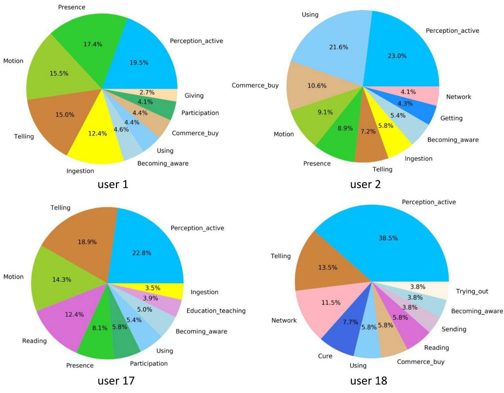 **Figure 4.**Top 15 frequent life events of four users who frequently or rarely posted tweets. shows top 10 frequent life events of four different users. User 1 and user 2 are the top two users who frequently posted tweets. User 17 and user 18 are the two users who posted the fewest number of tweets. We find that the frequent life events among the four users are similar no matter whether the users frequently or rarely record their lifelogs on Twitter. The most frequent life events recorded are "Perception_active". "Motion", "Presence", "Using" and "Telling".

### 4. Methodology

In this paper, we aim to extract life events from tweets and represent them in the format of frame semantics and transform NL into knowledge base facts. A number of tasks have to be done to achieve our goal.

| Components | | Metric | Value |
|---|---|---|---|
| Type of tweets | | Cohen's kappa | 0.6341 |
| KB relations | Average | F-score | 0.7174 |
| | Explicit | F-score | 0.7382 |
| | Implicit | F-score | 0.6517 |
| Subjects | Average | F-score | 0.8424 |
| | Explicit | F-score | 0.8594 |
| | Implicit | F-score | 0.7908 |
| Predicates | Explicit | F-score | 0.7485 |
| Objects | Average | F-score | 0.7029 |
| | Explicit | F-score | 0.7175 |
| | Implicit | F-score | 0.5542 |
| Times | Average | F-score | 0.7809 |
| | Explicit | F-score | 0.794 |
| | Implicit | F-score | 0.7042 |
| Role of subjects | Average | F-score | 0.8424 |
| | Explicit | F-score | 0.8594 |
| | Implicit | F-score | 0.7208 |
| Role of objects | Average | F-score | 0.7043 |
| | Explicit | F-score | 0.7232 |
| | Implicit | F-score | 0.5167 |
| Role of times | Average | F-score | 0.7507 |
| | Explicit | F-score | 0.7667 |
| | Implicit | F-score | 0.6542 |

## Table 3

| | | | Most frequent KB relations and their related predicates. |
|---|---|---|---|

| KB relations | Related Predicates | Frequency |
|---|---|---|
| Perception_active | 看 (see),聽 (listen) | 1991 |
| Presence | 在 (in), @ (at) | 1373 |
| Using | 用 (use), 整 (use), 拿 (take) | 1263 |
| Motion | 到 (go to), 去 (go to), 回(back) | 1027 |
| Ingestion | 吃 (eat), 喝(drink), 咬(bite) | 779 |
| Telling | 說 (tell), 講(tell), 告訴(tell) | 686 |
| Sending | 貼 (post),傳 (send), 寄 (send) | 482 |
| Commerce_buy | 買 (buy), 下 (bid), 訂購 (order) | 478 |
| Creat_representation | 拍照 (take photo) | 367 |
| Getting | 下(download), 收到(receive) | 316 |

### *4.1. System overview*
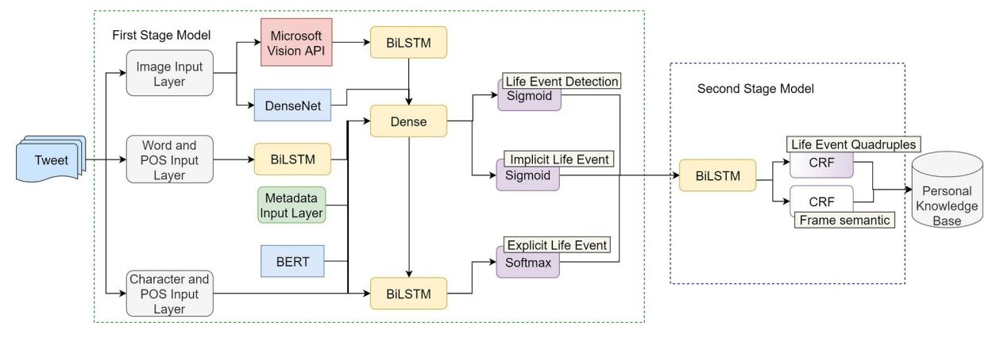 **Figure 5.**Overview of our personal knowledge base construction system. shows an overview of our system. Overall, the workflow is divided into two stages. The first stage includes three subtasks. The first subtask is aimed at deciding if the tweet contains life events. For the tweet with life event(s), the second subtask recognizes all the predicates that trigger explicit life events, and the third subtask recognizes the implicit life events and predicts a suitable predicate for every implicit life event. The outcomes of the first stage are *n*+*m* predicates, indicating *n* explicit and *m* implicit life events, respectively. We propose a joint learning approach to these three tasks since they are highly related. The following three subtasks are trained simultaneously, and parts of their layers are shared for achieving better generalization.

- 1 Life event detection: this subtask identifies whether the tweet contains a life event. The tweets without any life event will be filtered out. This subtask is regarded as a problem of binary classification. Given a tweet *X*, our goal is to construct a model to predict if *X* contains a life event, formulated as argmax (*P*(*y*|*X*)) *y*∈{yes, no}. The sigmoid layer computes the probabilities of the categories *yes* and *no*.
- 2 Explicit life event recognition: this subtask extracts all the predicates that trigger explicit life events. Every predicate is further mapped to a KB relation. We formulate this subtask is a problem of sequence labeling with the BIO scheme. For each word in the tweet, the model will label it with one of the three labels: *Begin, Inside*, and *Outside*. The *Begin* label denotes the first word of a predicate, and the following *Inside* labels denote the rest of the words of the predicate. A word is labeled as *Outside* if it is not a part of any predicates. We use *X* = {*x*1,…, *x*n} to represent an input tweet where *x*i is the input vector of the *i*th word. *Y* = {*y*1,…, *y*n} represents a sequence of labels for *X*. We use softmax to predict a probability distribution over 137 KB relations. Our model is trained by maximizing conditional probability argmax (*p*(*Y*|*X*)) *Y*∈δ(*X*) over all possible label sequences *Y* given *X*, where δ(*X*) is a set of KB

relations with BIO scheme, e.g., B-Motion and I-Motion.

3 Implicit life event recognition: this subtask identifies all implicit life events in the tweet and finds a KB relation for each implicit life event. This subtask is regarded as a problem of multi-label classification. The sigmoid layer predicts the probability of each class that is independent of the other classes. Formally, the predicted class labels are represented as a vector *y*∈{0, 1}^|C|+1^, where *C* is a set of all possible KB relations. The *i*th KB relation is associated with the instance if *y*i= 1 (1 ≤*i* ≤ |*C*|). More than one *y*i= 1 (1 ≤*i* ≤ |*C*|) means more than one KB relation is assigned to the tweet. *y*|c|+1= 1 denotes the tweet does not contain any implicit life events. We plan to find a *y*^ which has the largest probability, i.e., argmax (*p*(*Y*|*X*)) *Y*∈{0, 1}^|C|+1^.

In the second stage, the system extracts subject, object, and time in tweet for each predicate. The implicit life event recognition model predicts what implicit predicate a tweet contains, while the implicit life event might contain more than one life event quadruple. Taking the third tweet in [Table 2](#table-2) as an example, the tweet contains three life event quadruples related to implicit Ingestion predicate according to different objects. The system parses a tweet to obtain the semantic roles in the frame semantics, which can be mapped to subject, object, and time. The mapping rules are formulated based on training data. One predicate can have more than one object by frame semantic parsing, so that frame semantic parsing provides better coverage in knowledge base construction. The second stage results (*n*+*m*) × *j* quadruples, where *j* is the number of objects extracted by the system. The two subtasks in the second stage are described as follows.

1 Life event quadruple generation: this subtask identifies the subject, object, and time expression for each predicate, representing a life event in the tweet. Obviously, this is a problem of sequence labeling. We input a tweet *X* with life event whose predicates and the corresponding KB relations have been predicted in the first stage. Given each predicate and KB relation in a tweet, our model predicts the spans of subject, object, and the time expression as argmax (*p*(*Y*|*X*, *p*, *r*)), where *X* is an input tweet, *p* denotes the

predicate, *r* denotes the KB relation, *Y* denotes a sequence of labels for *X*, and ɛ contains seven labels based on the BIO scheme. That is, B-Subject, I-Subject, B-Object, I-Object, B-Time, I-Time, and Outside.

2 Frame semantic parsing: this subtask fulfills semantic roles according to the definition of Chinese FrameNet. This is another problem of sequence labeling. Given the frame, the model will label the spans of frame elements. Each frame contains different frame elements. For instance, the frame elements in Presence are entity, location, time, and so on. Specifically, we construct a model to predict the spans of frame elements given the input KB relation as argmax (*p*(*Y*|*X*, *r*)) *Y*∈µ, where *X* is an input tweet, *r* denotes
the KB relation, *Y* denotes a sequence of labels for *X*, and *μ* is a set of frame elements of a given frame.

As a result, the system generates life event quadruples and transforms them to the facts for storing in the personal knowledge base

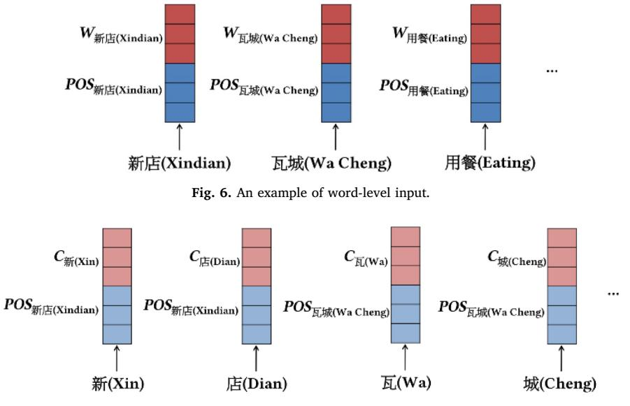
**Figure 7.**An example of character-level input.

for the Twitter user. In the architecture of our joint learning approach, the input layer and the sentence representation are shared among subtasks, and each subtask has a private task-specific output network for its goal.

### *4.2. Feature representations*
The input of our model is either in the word level or in the character level. Each word in the input sentence is represented as a *d* dimensional vector with word embeddings, and all the words are concatenated as a *d*×*l* matrix, where *l* denotes the sentence length.

Besides the embedding of the word or the character, we further enrich the input features with linguistic information such as partof-speech (POS) tags. POS tagging is performed on the tweet with the Stanford POS tagger ([Manning et al., 2014]](#ref-Manning2014)), and the one-hot representation of each POS tag is concatenated with the embedding(s) of the corresponding word or the corresponding characters. [Figure 6 and Figure 7](#figure-7) show the examples of an input represented in the word level and the character level, respectively.

We also consider the metadata of the tweet as features. For capturing a user's habits, such as what days the user is used to riding a bicycle and what time the user goes to school, we input user account to indicate who posts the tweet and the timestamp to indicate when the tweet is posted. We transfer the user account and the timestamp of each tweet to one-hot representation and concatenate them with the output layer of bidirectional LSTM.

Furthermore, we explore one of the latest pre-trained sentence representation, Bidirectional Encoder Representations from Transformers (BERT) [[Devlin, Chang, Lee & Toutanova, 2018]](#ref-Devlin2018)), in this work. The final hidden state output from the BERT is suggested to be taken as pre-training features for improving various NLP tasks. We fine-tune BERT during the training of our model for life event detection model. As a result, each tweet is encoded as a 768-dimensional vector.

We extract visual features by Dense Convolutional Network (DenseNet) proposed by [Huang, Liu, Van Der Maaten and Weinberger (2017)]](#ref-Huang2017)). We send each image to DenseNet, and then extract the features from the output of a 7 × 7 global average pooling layer for encoding what objects are shown in an image. The image features provide the cues for recognizing life event. In addition, we also input image caption generated by Microsoft Vision API^3^ into our model as features. We use a bidirectional LSTM to represent the input sequences of image captions. Its output is fed to a fully connected layer, and then concatenated with visual features.

### *4.3. Bidirectional lstm network*
LSTM [[Graves & Schmidhuber, 2005]](#ref-Graves2005)) is a kind of recurrent neural network (RNN) that is usually applied on sequential data. LSTM calculates the network unit activations from *t*= 1 to *T*, and maps the input sequence *x* = (*x*1,…, *xT*) to an output sequence *y* = (*y*1,…, *yT*). The bidirectional LSTM (Graves et al., 2013) computes a representation *h*t of the left context of the sentence at every character. Different from LSTM, bidirectional LSTM can also generate a representation of the right context *h*t by the forward and the backward LSTM layers. The benefit of the bidirectional LSTM is the additional information from the reversed sequence for a given time step to do sequence labeling task [[Dyer, Ballesteros, Ling, Matthews & Smith, 2015]](#ref-Dyer2015); [Huang, Xu & Yu, 2015]](#ref-Huang2015)). Moreover, bidirectional LSTM is effective in a variety of researches on multitask learning such as sequence prediction ([Alonso & Plank, 2016]](#ref-Alonso2016)), named entity recognition ([Plank, 2016]](#ref-Plank2016)) and dependency parsing [[Kiperwasser & Goldberg, 2016]](#ref-Kiperwasser2016)).

^3^ <https://azure.microsoft.com/zh-tw/services/cognitive-services/computer-vision/>

In the architecture of our model, the bidirectional LSTM layer is set as a 600-dimensional hidden state, and a dropout layer is added with dropout rate of 0.2. Finally, the activation functions hyperbolic tangent (tanh) is connected to the output layer.

## *4.4. Conditional random field*
A condition random field ([Lafferty, McCallum & Pereira, 2001]](#ref-Lafferty2001)) focuses on sequence labeling in which the states of neighboring tags are taken into account instead of modeling tagging decisions at each time step.

Let *X* = *x*1, *x*2, …, *x*n be a sequence of words and *Y* = *y*1, *y*2, …, *y*n be the corresponding sequence of labels. The conditional probability of a linear chain CRF is defined as follows:

$$
P_{\lambda}(Y|X) = \frac{1}{z_{\lambda(x)}} exp\left(\sum_{t=1}^{n} \sum_{k} \lambda_k f_k(y_{t-1}, y_t, X, t)\right)
$$

where *zλ*(*x*) is the per-input normalization, *λ* = {*λ*1, *λ*2, …, *λ*k} trainable parameters associated with feature functions *f* = {*f*1, *f*2, …, *f*k}, and *t* denotes time step. The most probable label sequence for an input *X* is got by computing:

$$
\hat{y} = \arg\max_{y} P_{\lambda}(y|X)
$$

The decoding process can be efficiently computed by using the Viterbi algorithm.

## *4.5. Bidirectional lstm-crf network*
Our final sequence labeling model combines the bidirectional LSTM (BiLSTM) and the CRF models. The BiLSTM-CRF network can derive past and future features from inputs efficiently from BiLSTM layer and CRF layer predict an optimal sequence of labels by using features extracted from BiLSTM layer.

For a sequence of predictions *y*, [Lample, Ballesteros, Subramanian, Kawakami and Dyer (2016)]](#ref-Lample2016) define the score as follows:

$$
s(X, y) = \sum_{i=0}^{n-1} A_{y_i, y_{i+1}} + \sum_{i=1}^{n} P_{i, y_i}
$$

where *P* is the matrix of scores output by the bidirectional LSTM network, *Pi, j* corresponds to the score of the *j*th tag of the *i*th word in a sentence. *A* is a transition score matrix where *Ai, j* denotes the transition score of tag *i* to tag *j*. Then, we can use the Viterbi algorithm to compute *Ai, j* and predict optimal sequence of labels.

### *4.6. Two-Stage system*
In this section, we describe the two stages shown in [Fig. 5](#figure-5). 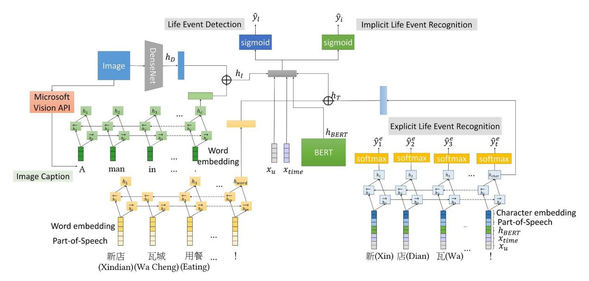 **Figure 8.**The neural network architecture in the first stage. shows the neural network architecture in the first stage in detail. We first use two embedding layers to get the vector representations of each word and character, respectively. The output at the last hidden state *h*word represents the whole word-based sequence and *h*char represents the whole character-based sequence. We then

concatenate *h*word and *h*char by two fully connected layers shown as follows.

$$
h_T = (W_{word}h_{word} + b_{word}) \oplus (W_{char}h_{char} + b_{char})
$$

For the features from images, *h*c is the last hidden state of image caption and *h*D is the global average pooling layer of DenseNet. We concatenate *h*c and *h*D by two fully connected layers as follows.
*h*I = (*W*c*h*c + *b*c) ⊕ (*W*D*h*D + *b*D)

We use a sigmoid layer defined below to predict the probability distribution over two classes for the subtask of life event detection, where *h*BERT is the final hidden state output from the BERT, and *X*u and *X*time are the one-hot vectors of user account and timestamp, respectively.

$$
\hat{y}_l = sigmoid(W_l(h_T \oplus h_l \oplus h_{BERT} \oplus X_u \oplus X_{time}) + b_l)
$$

For the subtask of implicit life event recognition, the sigmoid layer is used.
*y*^i^ = sigmoid(*W*i(*h*T ⊕ *h*I ⊕ *h*BERT ⊕ *X*u ⊕ *X*time) + *b*i)

The output layer of the subtask of explicit life event recognition is the softmax function. As shown in following equation, *x*t^char^ is a vector for character *x*t, and *x*t^pos^ is a one-hot vector denoting the part-of-speech tag of the word containing character *x*t

$$
\hat{y}_t^e = \text{softmax}(W_e(x_t^{char} \oplus x_t^{pos} \oplus h_{BERT} \oplus X_u \oplus X_{time}) + b_e)
$$

There are two subtasks, i.e., life event quadruple generation and frame semantic parsing, in the second stage shown in [Figure 5](#figure-5). 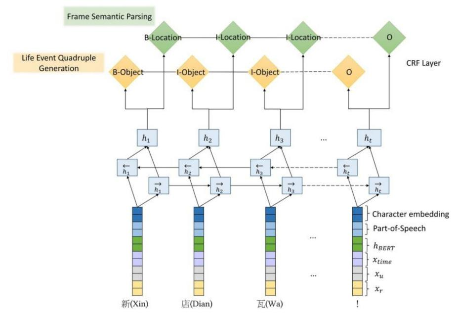 **Figure 9.**The neural network architecture in the second stage. shows the neural network architecture in the second stage in detail. Both tasks are regarded as sequence labeling problem. We combine the BiLSTM model and the CRF model together. The input vector x^t^ of BiLSTM-CRF model is the concatenation of the character vector *x*t^char^, *x*t^pos^, *h*BERT, *X*u, *X*time, and one-hot vector *X*r for KB relation which is predicted in the first stage. Then, we use the tag sequence *y*^s^ with maximum score *s* as prediction result, where *Y* represents all possible tag sequences of components in life event quadruple generation or all possible frame elements in frame semantic parsing.

$$
x_t = x_t^{char} \oplus x_t^{pos} \oplus h_{BERT} \oplus X_u \oplus X_{time} \oplus X_r
$$

$$
\hat{y}^s = \arg \max_{\tilde{y} \in Y} s(x, \tilde{y})
$$

## *4.7. Multitask learning*
Multitask learning (MTL) ([Caruana, 1993]](#ref-Caruana1993)) has been shown to be effective in learning better representations in various NLP tasks [[Liang & Shu, 2017]](#ref-Liang2017); [Søgaard & Goldberg, 2016]](#ref-Sogaard2016)). The basic idea of MTL is that training the model for multiple related tasks simultaneously enables the model to learn a more generalized representation and reduces the issue of overfitting.

Given the 3 related tasks in first stage and the 2 related tasks in second stage, we define φ and *τ* as cost functions, respectively. We use cross entropy, which is often used as a loss function for classification problem, as the cost function of the first stage model in our system. For the sequence labeling tasks in the second stage model, we exploit the negative log likelihood objective as cost function, which is a common objective function for training conditional random fields. The global cost function is the weighted sum of the cost of each task:

$$
\varphi = w_L \times \left( -\sum_{i}^{n} w_{no} \times y_{i,no} \times \log(\hat{y}_{i,no}) + w_{yes} \times y_{i,yes} \times \log(\hat{y}_{i,yes}) \right)
$$

+
$$
w_E \times \left( -\sum_{j}^{t} \sum_{f=1}^{F} y_{j,f} \times \log(\hat{y}_{j,f}) \right)
$$

+
$$
w_I \times \left( -\sum_{i}^{n} \sum_{f=1}^{F} y_{i,f} \times \log(\hat{y}_{i,f}) \right)
$$

$$
\tau = w_Q \times (-\log(\bar{y}_Q|X))) + w_s \times (-\log(\bar{y}_S|X)))
$$

where *w*L, *w*E, *w*I, *w*Q, and *w*s denote the weights for type of event identification, explicit life event extraction, implicit life event recognition, life event quadruple generation, and frame semantic parsing, respectively. *w*yes and *w*no are the weight of the classes with and without life event, respectively. After tuning the weights by validation data, we set *w*L, *w*E, *w*I to 0.4, 0.3, and 0.3, respectively, and *w*Q and *w*s to 0.6 and 0.4, respectively. *w*yes and *w*no are set to 0.6 and 0.4, respectively. The number of KB relations, *F*, in our dataset is 137. In the cost function, φ, *y*i and *y*j denote the annotated labels of each subtask in the first stage. *y*^ denotes the prediction probabilities of our model on each subtask. *t* is the time of a predicted explicit life event *y*^j,f^, *n* is the number of instances. In the cost function, *τ*, *y*¯ denotes a label sequence of life event quadruple generation and frame semantic parsing, and *X* is an input sequence.

## 5. Experiments

We first evaluate the performance of the two stages individually. The results of the first stage are shown in [Sections 5.1](#section-5-1), [5.2](#section-5-2), [5.3](#section-5-3) and [5.4](#section-5-4). The result of the second stage is shown in [Sections 5.5](#section-5-5). In [Section 5.6](#section-5-6), the end-to-end performance of our system is evaluated.

For each user, we sort their tweets by timestamps and use the first two-thirds of tweets for training and the rest of one-third for testing. The tweets in the last one-third of training set are further held out as validation data. As a result, the sizes of the training data, validation data, and test data are 11,260, 5631, and 8453 tweets, respectively. In the test set, there are 5478 tweets without life event and 2975 tweets with at least one life event. In the experiments, F-score is the main metric for performance evaluation.

## *5.1. Life event detection*
In this section, we evaluate the performances of the models for three subtasks in the first stage, i.e., life event detection, explicit life event recognition, and implicit life event recognition. We compare our joint learning approach under different settings with the baseline models that are individually trained for the three subtasks. The unimodal model is trained on text-based data only, and the multimodal modal is trained on both image and text-based data. We exclude the unimodal models trained on image-based data because only 1130 tweets contain images. We also compare our joint learning approach with two additional baseline models. We build each document embedding by summing up word vectors by equal weight as feature, and classify tweets by logistic regression and support vector machine with RBF kernel.

[Table 5](#table-5) reports the results of life event detection with Accuracy (A), Precision (P), Recall (R), and F-score (F1), respectively. The first four rows show the performances of the baseline models, and the following rows show the performances of our joint learning models. The best performance is in bold. In the subtask of life event detection, the best setting is Unimodal-MTL-BiLSTM, which

| Table 5 | | |
|---|---|---|
| Performance of life event detection. | | |

| Models | A | F1 | P | R |
|---|---|---|---|
| Majority | 64.81% | N/A | N/A | N/A |
| Logistic regression | 76.93% | 64.71% | 73.64% | 57.71% |
| SVM (RBF) | 77.79% | 65.62% | 75.84% | 57.82% |
| Unimodal-LSTM | 94.55% | 92.10% | 93.92% | 90.35% |
| Unimodal-BiLSTM | 94.56% | 92.12% | 93.98% | 90.32% |
| Multimodal-LSTM | 94.37% | 91.87% | 93.43% | 90.35% |
| Multimodal-BiLSTM | 94.76% | 92.47% | 93.57% | 91.39% |
| Unimodal-MTL-LSTM | 94.96% | 92.94% | 91.64% | 94.29% |
| Unimodal-MTL-BiLSTM | 95.63% | 93.91% | 92.25% | 95.63% |
| Multimodal-MTL-LSTM | 94.16% | 91.88% | 89.95% | 93.88% |
| Multimodal-MTL-BiLSTM | 94.53% | 92.34% | 91.10% | 93.61% |

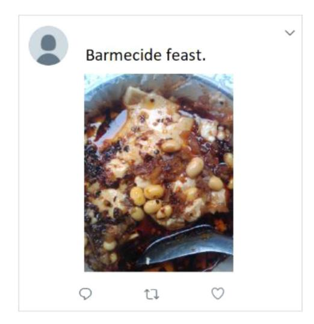
**Figure 10.**An Example of social media post without any life event.

achieves an F-score of 93.91% and significantly outperforms all the baseline models with *p* < 0.001 using the McNemar's test. The Unimodal-MTL-BiLSTM model is better than Multimodal-MTL-BiLSTM model in this subtask because image caption may

introduce noisy that influences the performance of life event detection.  **Figure 10.**An Example of social media post without any life event. is an example of a tweet without any life event.

It shows that the user wants to eat Tofu. That is only a thinking rather than a life event of the user. However, the Multimodal-MTL-BiLSTM model predicted it as an implicit Ingestion event. The possible reason is that the generated image caption, "a plate of food with a fork", may be related to a life event about eating food. That results in wrong prediction.

## *5.2. Explicit life event recognition*
In our lifelog corpus, there are 137 types of KB relations to represent personal life events. One challenge of explicit life event recognition is the ambiguity of the mapping between the textual predicates and the KB relations.

[Table 6](#table-6) shows the number of predicates that have the ambiguous problem. There are 302 predicates mapped to more than one KB relation. Especially, the predicates "開" and "打" express a variety of meanings, i.e., up to 17 KB relations. For instance, the predicate "開" can be mapped to Board_vehicle, Using, and Change_operational_state. The predicate "打" can be mapped to Board_vehicle, Contacting, and Hit_target.

We present the average performances of explicit life event recognition in [Table 7](#table-7). The evaluation criterion is that predicate and its corresponding KB relation must be matched to the annotation. The test data is the tweets with life events. In other words, we do not consider error propagation [[Finkel, Manning & Ng, 2006]](#ref-Finkel2006)) from life event detection in this section. The pipelined system evaluation is presented in [Section 5.6](#section-5-6).

The results show that most joint learning models are superior to the baseline models. The Multimodal-MTL-BiLSTM model achieves an F-score of 44.9%, significantly outperforming all the baseline models with *p*<0.001 using the McNemar's test. Note that F-scores are averaged over each tweet, so ^+^ *PR P R* ^2^ .

## *5.3. Implicit life event recognition*
We report the average performances of implicit life event recognition in [Table 8](#table-8). Similarly, only the tweets with life events are used as test data in this section.

In this task, the best model is Multimodal-MTL-BiLSTM, which achieves an F-score of 80.48% and significantly outperforms all the baseline models and the other settings with *p*< 0.001 using the McNemar's test. It represents that joint learning is capable of leveraging useful information by training with multimodal features and multiple related tasks simultaneously, and results in improvements of all the tasks.  **Figure 11.** An Example of implicit life event recognized correctly by using both text and image features. shows an example of implicit life event recognized correctly by using both text and image features. It illustrates that the user was cooking corns. However, the Unimodal-MTL-BiLSTM model (the text-only model) recognizes it as

| Table 6 Number of predicates mapping to one or more than one KB relation. | | |
|---|---|---|
| | Number of predicate | |
| Only mapped to one KB relation Mapped to more than one KB relation | 1723 302 | |

Performance of explicit life event recognition.

| Models | F1 | P | R |
|---|---|---|---|
| Majority | 15.67% | 15.67% | 15.67% |
| CRF | 17.05% | 17.41% | 17.06% |
| Unimodal-LSTM | 30.61% | 34.43% | 29.83% |
| Unimodal-BiLSTM | 34.74% | 38.02% | 34.68% |
| Multimodal-LSTM | 33.46% | 38.54% | 32.01% |
| Multimodal-BiLSTM | 35.45% | 40.19% | 34.35% |
| Unimodal-MTL-LSTM | 33.93% | 38.88% | 32.60% |
| Unimodal-MTL-BiLSTM | 37.42% | 41.57% | 36.53% |
| Multimodal-MTL-LSTM | 43.69% | 47.04% | 44.00% |
| Multimodal-MTL-BiLSTM | 44.90% | 47.26% | 46.28% |

## Table 8

Performance of implicit life event recognition.

| Models | F1 | P | R |
|---|---|---|---|
| Majority | 61.58% | 61.58% | 61.58% |
| Logistic regression | 63.43% | 63.58% | 63.58% |
| SVM (RBF) | 63.12% | 62.47% | 64.73% |
| Unimodal-LSTM | 68.09% | 68.03% | 69.22% |
| Unimodal-BiLSTM | 69.66% | 69.27% | 71.66% |
| Multimodal-LSTM | 70.87% | 69.69% | 73.69% |
| Multimodal-BiLSTM | 71.69% | 71.50% | 72.39% |
| Unimodal-MTL-LSTM | 71.86% | 71.68% | 73.23% |
| Unimodal-MTL-BiLSTM | 73.25% | 73.48% | 74.10% |
| Multimodal-MTL-LSTM | 78.88% | 78.42% | 80.62% |
| Multimodal-MTL-BiLSTM | 80.48% | 79.02% | 84.27% |

**Figure 11.** An Example of implicit life event recognized correctly by using both text and image features.

"Ingestion" rather than "Cooking_creation".

As mentioned in [Section 1](#section-1), implicit life event recognition is a challenge task because implicit life events are mostly expressed in informal and incomplete short messages. However, the performances of implicit life event recognition seem to be better than those of explicit event recognition by comparing [Table 7](#table-7) with [Table 8](#table-8). The reason is that the distribution of implicit life event is highly sparse. We will discuss the distribution of explicit and implicit life events in detail in [Section 6.4](#section-6-4). The F-score would be 61.58% for a classifier that always predicts a tweet as that only explicit life event. Besides, the top three frequent implicit life events, i.e., Perception_active, Using, and Presence, occupy 59% of all implicit life events.

### *5.4. Life event quadruples generation*

With the outcomes of the first stage, this section presents our joint learning model on extracting factual life event quadruples from tweets for personal knowledge base construction. [Table 9](#table-9) shows the performances of life event quadruples generation given the tweets with life events.

The best model MTL-BiLSTM-CRF achieves an overall F-score of 58.06% when we verify the factual quadruples with annotated ground-truth, where the subject, the object and the time must be exactly matched the ground-truth. The joint learning approach

| | All | | | Explicit life event quadruples | | | Implicit life event quadruples | | | |
|---|---|---|---|---|---|---|---|---|---|---|
| Models | Overall (F1) | Subject (F1) | Object (F1) | Time (F1) | Subject (F1) | Object (F1) | Time (F1) | Subject (F1) | Object (F1) | Time (F1) |
|---|---|---|---|---|---|---|---|---|---|---|
| CRF | 23.09% | 46.20% | 24.57% | 16.05% | 22.40% | 27.26% | 20.85% | 60.11% | 38.99% | 9.70% |
| LSTM | 38.97% | 55.25% | 40.43% | 19.65% | 45.79% | 38.28% | 20.74% | 79.15% | 46.61% | 14.23% |
| LSTM-CRF | 43.90% | 57.72% | 42.47% | 37.64% | 52.36% | 40.97% | 38.92% | 71.79% | 46.80% | 27.74% |
| BiLSTM | 40.12% | 53.12% | 39.44% | 33.53% | 39.87% | 35.93% | 35.67% | 84.07% | 49.46% | 18.67% |
| BiLSTM-CRF | 54.68% | 71.53% | 55.95% | 29.42% | 64.42% | 54.97% | 31.38% | 88.71% | 58.78% | 13.98% |
| MTL-LSTM | 39.57% | 51.41% | 41.65% | 31.61% | 45.59% | 41.53% | 23.59% | 66.11% | 41.97% | 23.84% |
| MTL-LSTM-CRF | 55.79% | 66.38% | 55.39% | 43.85% | 58.72% | 53.99% | 45.69% | 86.81% | 59.43% | 31.77% |
| MTL-BiLSTM | 45.71% | 60.92% | 45.54% | 36.13% | 50.58% | 43.83% | 37.87% | 85.37% | 50.45% | 25.36% |
| MTL-BiLSTM-CRF | 58.06% | 72.92% | 58.50% | 40.81% | 65.63% | 57.14% | 43.38% | 90.57% | 62.37% | 21.06% |
| | | | | | | | | | | |

improves overall performances and the CRF layer is effective in sequence labeling. In the generation of implicit life event quadruples, the performances on subject is higher than those on the others because the subjects are often the Twitter users themselves in implicit life events.

## *5.5. Frame semantic parsing*
In this subtask, we perform the frame semantic parsing on both explicit life event and implicit life event recognized in the first stage. In this section, we report the average performances on semantic role labeling in [Table 10](#table-10). The best model is MTL-BiLSTM-CRF, which achieves an F-score of 41.60% significantly outperforming all the baseline models with *p* < 0.001 using the McNemar's test. Without the CRF layer as output layer, the performances of all models degrade. Moreover, we find that the joint learning approach helps improve the performances of both life event quadruples generation and frame semantic parsing subtasks.

## *5.6. Evaluation of the pipelined system*

Finally, we evaluate the end-to-end performance of our system in the pipelined workflow. That is, the implicit/explicit life events identified in the first stage are sent to the second stage to generate the KB facts.

In some cases, the word spans extracted by our models may not exactly match the ones labeled by annotators. For example, the word 看 (see), which is extracted by our model, is equivalent to the word 看到 (see) annotated by human annotators. [Table 11](#table-11) shows an example of such a case. Actually, 深圳灣公園 (Shenzhen Bay Park), which is extracted by our model, is even more informative than the word 公園 (park) annotated by human annotators. Therefore, we report an alternative F-score that regards the prediction is correct if the head word is matched with the ground-truth.

[Table 12](#table-12) shows the performances of the pipelined system measured in F-scores. We input the outcomes of the first stage into the MTL-BiLSTM-CRF model, which achieves the highest overall F-score in the second stage. The baseline model is the single task learning model. As shown in [Table 12](#table-12), the problem of the error propagation of the baseline model is more serious than that of the joint learning model. The best model MTL-BiLSTM-CRF achieves an F-score of 16.18%.

Moreover, we find that the features of the generated image caption and DenseNet are effective on the subtasks of explicit and implicit life event recognition. Taking the tweet shown in [Figure 1](#figure-1) as an example, the generated image caption is "a cake made to look like a face". While there are some errors in the caption, the model might know that the food exists in the image. In addition, with the textual and visual features, the Multimodal-MTL-BiLSTM model predicts the KB relation of life event in this tweet is "Getting" instead of "Ingestion". Comparatively, the prediction of the Unimodal-MTL-BiLSTM model trained with only text feature is no personal life event for this case.

In conclusion, the experimental results show that the joint learning model is better than single task learning model on all subtasks.

| Table 10 |
|---|
| Performance of frame semantic parsing. |

| Models | All F1 | P | R | Explicit F1 | Implicit F1 |
|---|---|---|---|---|---|
| CRF | 7.66% | 11.51% | 6.06% | 6.83% | 8.82% |
| LSTM | 9.07% | 12.98% | 7.78% | 8.07% | 12.11% |
| LSTM-CRF | 11.71% | 17.65% | 9.40% | 10.26% | 16.12% |
| BiLSTM | 31.68% | 38.10% | 30.50% | 33.80% | 25.24% |
| BiLSTM-CRF | 35.16% | 44.66% | 31.61% | 37.45% | 28.20% |
| MTL-LSTM | 13.05% | 17.24% | 11.69% | 11.96% | 16.38% |
| MTL-LSTM-CRF | 22.01% | 28.74% | 19.36% | 20.62% | 26.24% |
| MTL-BiLSTM | 31.18% | 33.95% | 32.68% | 32.78% | 26.33% |
| MTL-BiLSTM-CRF | 41.60% | 53.07% | 37.03% | 44.55% | 32.64% |

| Table 11 |
|---|
| An example of the object predicted by our model different from the answer labeled by annotator. |

| Tweet | 在深圳灣公園裡看看書. (I read the book in the Shenzhen Bay Park.) |
|---|---|
| Our Model | 深圳灣公園 (Shenzhen Bay Park) |
| Annotator | 公園 (Park) |

For the life event detection in the first stage, the joint learning model trained on text-based data only is better than that trained on multimodal features. However, the multimodal features improve the performance of explicit and implicit life event recognition. Comparing the performances of the Unimodal-MTL-BiLSTM model and the Multimodal-MTL-BiLSTM model, the multimodal model is worse than the unimodal model in the subtask of life event detection, which means detecting whether a life event exists in a tweet is mainly based on textual information. The reason may be that we are used to describing life events in words. However, the multimodal model is better than the unimodal model in the subtasks of both explicit and implicit life event recognition. That is, the image is often related to the action in life event, especially the potential action in an implicit life event.

The performances of explicit life event recognition seem to be worse than those of implicit life event recognition. The major reason is that the distribution of implicit life event is highly sparse. Besides, the mapping between the textual predicates and the KB relations is ambiguous in explicit life event recognition.

In the second stage, the joint learning approach improves the performances of both life event quadruples and frame semantic parsing subtasks, and the CRF layer is effective in sequence labeling.

## 6. Discussions

[Section 6.1](#section-6-1) analyzes the performances of the pipeline system on different users. [Section 6.2](#section-6-2) analyzes the performances of the model with different feature sets (i.e., metadata and BERT). [Section 6.3](#section-6-3) analyzes the performances on the character level and on the word level features. [Section 6.4](#section-6-4) and [Section 6.5](#section-6-5) analyze the user behavior of lifelogging with the results extracted by our system, showing potential directions of the text-based lifelog mining.

## *6.1. Performances of different users*

In this section, we analyze the influence of the number of tweets of different users on the system. [Table 13](#table-13) shows the performances of our pipeline system on 18 users. We list the number of tweets posted by each user. We conduct experiments by using the first twothirds of tweets sorted by timestamps for training and the rest of one-third for testing. We find that the performance of the users who posted the largest number of tweets and the users who posted the fewest number of tweets are similar in the first stage. The training size of tweets affects the performances in the second stage. Although the amount of training data of the most frequent user (user 1) is 9 times more than the least frequent user (user 18), the results are similar in each subtask. It represents that our proposed system achieves comparable results on extracting life events from a user who is almost a cold start.

## *6.2. Performances of features*

In this section, we show the performances of our model with or without metadata and BERT. [Table 14](#table-14) shows the performances of the best models of each task. We find that the features of metadata and BERT are effective, especially BERT. The metadata is effective for implicit life event recognition.

Besides, we also investigate the influence of image captions and features extracted by DenseNet. [Table 15](#table-15) shows the performances of our multimodal joint learning model with or without the features from DenseNet and image caption. The features of the generated image caption and DenseNet are effective for explicit and implicit life event recognition, especially image caption.

## *6.3. Comparing performances on character level or word level features*

In this paper, we report the performance of concatenating the character level and the word level as input. [Table 16](#table-16) shows the performances on the character level and on the word level individually in the task of life event detection. The performance of the LSTM with the word level features as input is better than that with the character level features because the word level features contain more semantic information. However, the word level features have the problem of Chinese word segmentation error due to the informal writing in tweets. Therefore, the input with both level features improves the performance.

## *6.4. Explicit and implicit life event analysis*

We list the top 20 frequent explicit life events in 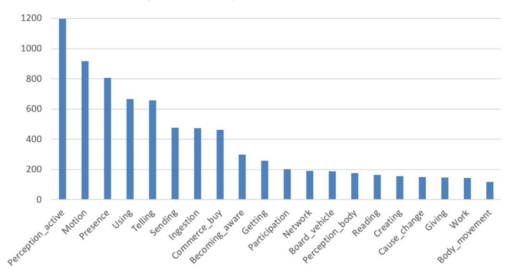 **Fig. 12.** Top 20 frequent explicit life events. and the top 20 frequent implicit life events in 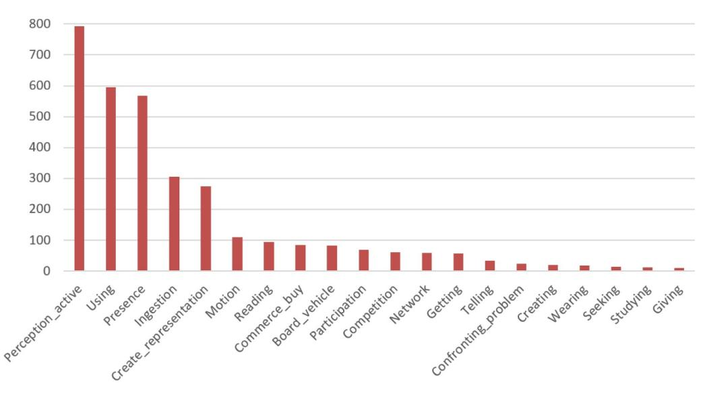 **Figure 13.**Top 20 frequent implicit life events..

Comparing the frequencies between the explicit and the implicit life events, users often express what they see and where they are explicitly and implicitly. However, users usually express the life events about where they go explicitly. In addition, when users want to express what they are doing by using something, they tend to give comments on the thing they are using. In contrast, users might query what they used instead of giving comments.

| | Life Event quadruples qeneration Frame semantic parsing | 10.29% 11.71% 17.81% 18.22% | 11.22% 18.21% | 12.58% 19.97% | 15.37% 27.58% | 15.74% 28.44% | 15.50% 28.28% | 16.18% 30.70% |
|---|---|---|---|---|---|---|---|---|
| | Time extraction | 28.17% 28.44% | 28.28% | 29.77% | 34.31% | 35.00% | 33.81% | 36.48% |
| | extraction Object | 17.46% 18.88% | 18.17% | 18.87% | 20.22% | 21.57% | 20.55% | 22.45% |
| | Second stage extraction Subject | 56.15% 59.74% | 59.40% | 59.40% | 61.03% | 61.43% | 62.11% | 62.41% |
| | Implicit life event recognition | 64.50% 66.38% | 68.09% | 69.10% | 70.29% | 71.75% | 77.00% | 78.58% |
| | Explicit life event recognition | 22.21% 22.40% | 26.86% | 27.40% | 32.87% | 36.19% | 37.74% | 39.39% |
| | First stage Life event detection | 92.10% 92.12% | 91.87% | 92.47% | 92.94% | 93.91% | 91.88% | 92.34% |
| | Second stage model | BiLSTM-CRF | | | MTL-BiLSTM | CRF | | |
| Performances of the pipelined system. | First stage models | Unimodal-BiLSTM Unimodal-LSTM | Multimodal-LSTM | Multimodal-BiLSTM | Unimodal-MTL-LSTM | Unimodal-MTL BiLSTM | Multimodal-MTL LSTM | Multimodal-MTL BiLSTM |

Performances of the pipelined system on different users.

| User | Number of tweets | First stage Life Event Detection | Explicit Life Event Recognition | Implicit Life Event Recognition | Second stage Frame Semantic Parsing | Life Event Quadruples Generation |
|---|---|---|---|---|---|---|
| 1 | 2799 | 94.34% | 41.77% | 75.52% | 32.02% | 17.84% |
| 2 | 2501 | 93.89% | 38.18% | 75.56% | 30.89% | 16.62% |
| 3 | 2474 | 91.57% | 39.60% | 80.96% | 33.92% | 21.02% |
| 4 | 2180 | 97.35% | 48.60% | 78.21% | 30.30% | 18.21% |
| 5 | 2036 | 91.85% | 36.26% | 85.68% | 34.08% | 19.90% |
| 6 | 1955 | 93.48% | 32.99% | 83.33% | 33.21% | 19.82% |
| 7 | 1807 | 96.36% | 64.02% | 95.39% | 35.33% | 21.31% |
| 8 | 1558 | 89.60% | 36.38% | 81.55% | 36.36% | 19.19% |
| 9 | 1551 | 94.79% | 40.89% | 72.59% | 30.26% | 19.32% |
| 10 | 1197 | 84.95% | 44.87% | 77.96% | 32.30% | 18.81% |
| 11 | 956 | 92.50% | 39.00% | 79.15% | 30.26% | 17.11% |
| 12 | 955 | 88.46% | 29.34% | 74.71% | 31.37% | 17.13% |
| 13 | 881 | 91.03% | 44.10% | 88.46% | 32.62% | 17.08% |
| 14 | 869 | 93.88% | 52.61% | 65.09% | 30.70% | 16.54% |
| 15 | 624 | 93.48% | 47.16% | 86.81% | 30.30% | 15.71% |
| 16 | 377 | 90.32% | 27.01% | 80.70% | 28.27% | 11.52% |
| 17 | 327 | 97.30% | 36.05% | 72.22% | 29.96% | 13.81% |
| 18 | 297 | 94.74% | 38.71% | 83.33% | 27.12% | 12.67% |

## Table 14

Performances of the models with different features on each subtask.

| Subtask | Models | Features | F1 |
|---|---|---|---|
| Life event detection | Unimodal-MTL-BiLSTM | all | 93.91% |
| | | w/o metadata | 91.97% |
| | | w/o BERT | 78.53% |
| Explicit life event recognition | Multimodal-MTL-BiLSTM | all | 44.90% |
| | | w/o metadata | 36.98% |
| | | w/o BERT | 33.10% |
| Implicit life event Recognition | Multimodal-MTL-BiLSTM | all | 80.48% |
| | | w/o metadata | 64.77% |
| | | w/o BERT | 73.22% |
| Frame semantic parsing | MTL-BiLSTM-CRF | all | 58.06% |
| | | w/o metadata | 48.92% |
| | | w/o BERT | 42.97% |
| Life event quadruples generation | MTL-BiLSTM-CRF | all | 41.60% |
| | | w/o metadata | 30.38% |
| | | w/o BERT | 27.71% |

## Table 15

Performances of the Multimodal-MTL-BiLSTM model with different features on each subtask.

| Subtask | Features | F1 |
|---|---|---|
| Life event detection | all | 92.34% |
| | w/o caption | 93.23% |
| | w/o DenseNet | 91.48% |
| Explicit life event recognition | all | 44.90% |
| | w/o caption | 42.22% |
| | w/o DenseNet | 43.54% |
| Implicit life event recognition | all | 80.48% |
| | w/o caption | 71.75% |
| | w/o DenseNet | 75.42% |

## *6.5. Relation between personal life event and time*
In this section, we investigate the relation between life events and event time. We show the frequencies of eight important life events, including Presence, Motion, Ingestion, Commerce_buy, Participation, Broad_vehicle, Work, and Network, of the 18 users at the time intervals of daily and hourly.

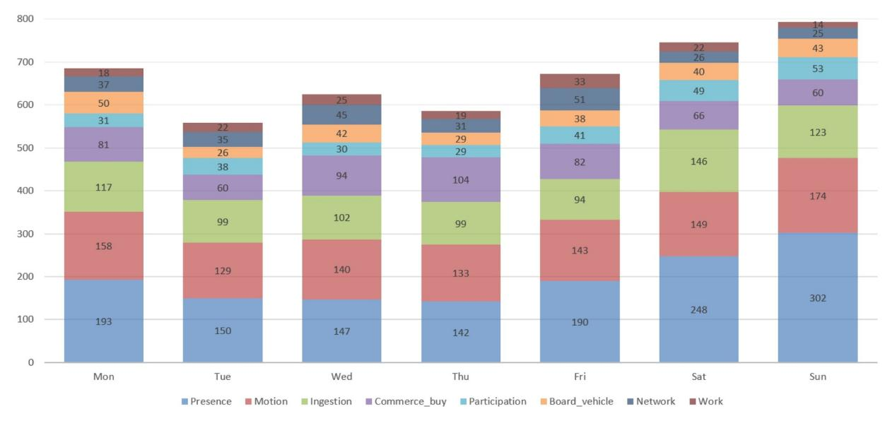
**Figure 14.**The frequency of life events on each day. shows the frequencies of the life events on each day. The bar denotes frequency. The life events of Presence, Participation, and Ingestion happen on holiday more frequently, while the frequencies of Work and Network on Sunday are less than those on the

| Performance of concatenating character level or word level in life event detection. |
|---|
|---|

| Models | | A | F1 | P | R |
|---|---|---|---|---|---|
| LSTM | Both | 94.55% | 92.10% | 93.92% | 90.35% |
| | Word level | 89.84% | 84.97% | 88.61% | 81.61% |
| | Char level | 82.14% | 77.14% | 70.17% | 85.65% |

<https://help.twitter.com/en/rules-and-policies>

<http://nlg.csie.ntu.edu.tw/nlpresource/LifelogDataset>

<https://azure.microsoft.com/zh-tw/services/cognitive-services/computer-vision/>

other days. This result reflects that people often do not work on Sunday and they might tend to go out with friends and go to restaurant rather than to surf on internet at home.

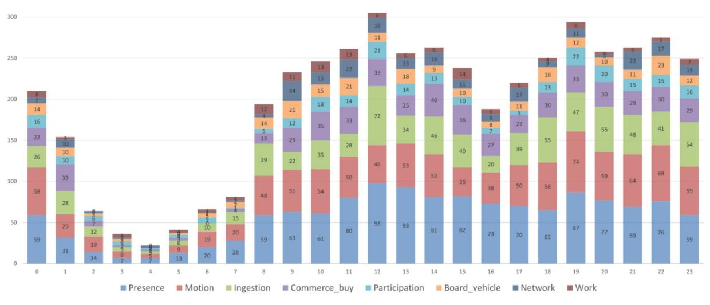
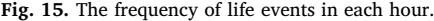 shows the frequencies of life events in each hour. We observe that the life event Ingestion frequently happens at the 12 o'clock and the period of 18 o'clock to 23 o'clock. It might represent the time of lunch, dinner and midnight snack. Besides, people like to mention their work in the morning.

Furthermore, 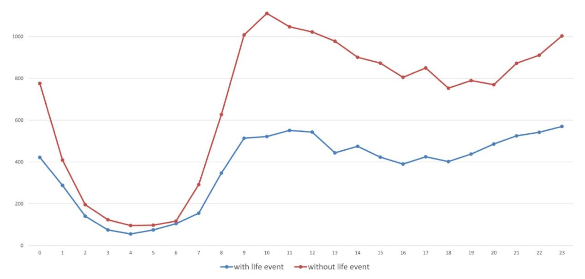 **Figure 16.**The number of tweets posted in each hour. shows the number of tweets posted in each hour. In this figure, the blue line and the red line denote the

frequency of the tweet with and without life event, respectively. We note that users use Twitter actively from 10 o'clock to 13 o'clock, and from 22 o'clock to 24 o'clock, while people seldom post a tweet during the period between 1 o'clock and 6 o'clock.

### 7. Conclusions

Lifelogging attracts much attention in recent years. Different from previous work, this paper addresses the topic of personal life event extraction from social media posts that are composed of text and the accompanying image. We propose a complete system that identifies life events, extracts event components, and generates KB facts. Both implicit and explicit life events are considered. We represent the extracted life events in the form of the quadruple (subject, predicate, object, time), which is compatible with most modern knowledge bases.

Joint learning models are proposed in our two-stage system. To predict the potential action in an implicit life event, we investigate the influence of different input features. The results show that a combination of features of BERT and user metadata improves the performance, especially metadata. We investigate the performances of our multimodal model with or without DenseNet and image caption. Experimental results show that a combination of features from DenseNet and image caption improves the performance. Besides, combining word level and character level features helps learn better representation on informal text and achieves a better performance on life event detection.

We not only evaluate our model for each subtask individually, but also conduct an end-to-end experiment in the pipelined workflow. The KB constructed by our system can be applied to a variety of applications such as memory recall and living assistance. The future work is to investigate question answering system over personal knowledge base and world knowledge base.

## Acknowledgments

This research was partially supported by Ministry of Science and Technology, Taiwan, under grants MOST-106-2923-E-002-012- MY3, MOST-107-2634-F-002-011-, MOST-108-2634-F-002-008-, MOST-108-2218-E-009-051-, and by Academia Sinica, Taiwan, under grant AS-TP-107-M05.

### References

- [Alonso, H. M., & Plank, B. (2016). When is multitask learning effective? semantic sequence prediction under varying data conditions.](http://refhub.elsevier.com/S0306-4573(19)30340-1/sbref0001)*Proceedings of the 15th Conference of the European Chapter of the Association for Computational Linguistics*(pp. 44–53). .
- [Auer, S., Bizer, C., Kobilarov, G., Lehmann, J., Cyganiak, R., & Ives, Z. (2007). Dbpedia: A nucleus for a web of open data.](http://refhub.elsevier.com/S0306-4573(19)30340-1/sbref0002)*Proceedings of the 6th International the Semantic Web and 2nd Asian Conference on Asian Semantic Web Conference*(pp. 722–735). .
- [Bollacker, K., Evans, C., Paritosh, P., Sturge, T., & Taylor, J. (2008). Freebase: A collaboratively created graph database for structuring human knowledge.](http://refhub.elsevier.com/S0306-4573(19)30340-1/sbref0003)*Proceedings of the 2008 ACM SIGMOD International Conference on Management of Data*(pp. 1247–1250). .
- [Caruana, R. (1993). Multitask learning: A knowledge based source of inductive bias.](http://refhub.elsevier.com/S0306-4573(19)30340-1/sbref0004)*Proceedings of the Tenth International Conference on Machine Learning*.
- [Chen, Y., Xu, L., Liu, K., Zeng, D., & Zhao, J. (2015). Event extraction via dynamic multi-pooling convolutional neural networks.](http://refhub.elsevier.com/S0306-4573(19)30340-1/sbref0005) *Proceedings of the 53rd Annual Meeting of the Association for Computational Linguistics and the 7th International Joint Conference on Natural Language Processing*(pp. 167–176). .
- [Chen, Z. Y., Chang, C. H., Chen, Y. P., Nayak, J., & Ku, L. W. (2019). UHop: An unrestricted-hop relation extraction framework for knowledge-based question](http://refhub.elsevier.com/S0306-4573(19)30340-1/sbref0006) answering.*Proceedings of 2019 Annual Conference of the North American Chapter of the Association for Computational Linguistics (NAACL 2019)*.
- [Choudhury, S., & Alani, H. (2015). Detecting presence of personal events in twitter streams.](http://refhub.elsevier.com/S0306-4573(19)30340-1/sbref0007) *Proceedings of the International Conference on Social Informatics*(pp. 157–[166](http://refhub.elsevier.com/S0306-4573(19)30340-1/sbref0007)). .
- Dang-Nguyen, D. T., Piras, L., Riegler, M., Zhou, L., Lux, M., & Gurrin, C. (2018). Overview of imagecleflifelog 2018: Daily living understanding and lifelog moment retrieval.*CLEF 2018 Working Notes. CEUR Workshop Proceedings*CEURWS.org[http://ceur-ws.org](https://www.ceur-ws.org).
- [Dantone, M., Sullivan, K., & Tesic, J. (2010). Multimedia event detection (MED) evaluation task.](http://refhub.elsevier.com/S0306-4573(19)30340-1/sbref0009) *TRECVID*.
- Devlin, J., Chang, M.W., .Lee, K., & Toutanova, K. (2018). Bert: Pre-training of deep bidirectional transformers for language understanding. arXiv:[1810.04805](http://arxiv.org/abs/arXiv:1810.04805).
- [Dickinson, T., Fernandez, M., Thomas, L. A., Mulholland, P., Briggs, P., & Alani, H. (2016). Identifying important life events from twitter using semantic and syntactic](http://refhub.elsevier.com/S0306-4573(19)30340-1/sbref0010) patterns. *Proceedings of the 15th International Conference WWW*(pp. 143–150). .
- [Dyer, C., Ballesteros, M., Ling, W., Matthews, A., & Smith, N. A. (2015). Transition-based dependency parsing with stack long short-term memory.](http://refhub.elsevier.com/S0306-4573(19)30340-1/sbref0011)*Acl*(pp. 334–343). .
- [Finkel, J. R., Manning, C. D., & Ng, A. Y. (2006). Solving the problem of cascading errors: Approximate bayesian inference for linguistic annotation pipelines.](http://refhub.elsevier.com/S0306-4573(19)30340-1/sbref0012)*Proceedings of the 2006 Conference on Empirical Methods in Natural Language Processing (EMNLP '06)*(pp. 618–626). .
- [Fleck, R., & Fitzpatrick, G. (2009). Teachers' and tutors' social reflection around sensecam images.](http://refhub.elsevier.com/S0306-4573(19)30340-1/sbref0013)*International Journal of Human-Computer Studies, 67*(12), 1024–1036.
- [Graves, A., & Schmidhuber, J. (2005). Framewise phoneme classification with bidirectional lstm and other neural network architectures.](http://refhub.elsevier.com/S0306-4573(19)30340-1/sbref0014) *Neural Networks, 18*(5–6), [602–610](http://refhub.elsevier.com/S0306-4573(19)30340-1/sbref0014).
- [Gurrin, C., Joho, H., Hopfgartner, F., Zhou, L., & Albatal, R. (2016). Overview of ntcir lifelog task.](http://refhub.elsevier.com/S0306-4573(19)30340-1/sbref0015) *Proceedings of the 11th NTCIR Conference on Evaluation of Information Access Technologies, NTCIR-12*. National Center of Sciences.
- [Gurrin, C., Smeaton, A. F., & Doherty, A. R. (2014). Lifelogging: Personal big data.](http://refhub.elsevier.com/S0306-4573(19)30340-1/sbref0016) *Foundations and Trends*® *in information retrieval, 8*(1), 1–125.
- [Harper, R., Randall, D., Smyth, N., Evans, C., Heledd, L., & Moore, R. (2008). The past is a different place: They do things differently there.](http://refhub.elsevier.com/S0306-4573(19)30340-1/sbref0017) *Proceedings of the 7th ACM conference on Designing interactive systems*(pp. 271–280). .
- [Harrell, E. (2010). Remains of the day: Can a new device help amnesia patients outsource memory?](http://refhub.elsevier.com/S0306-4573(19)30340-1/sbref0018)*Time Magazine, 176*(15), 46–51.
- [Hodges, S., Williams, L., Berry, E., Izadi, S., Srinivasan, J., Butler, A., et al. (2006). SenseCam: A retrospective memory aid.](http://refhub.elsevier.com/S0306-4573(19)30340-1/sbref0019) *Proceedings of International Conference on Ubiquitous Computing*(pp. 177–193). .
- [Hu, S., Zou, L., & Zhang, X. (2018). A state-transition framework to answer complex questions over knowledge base.](http://refhub.elsevier.com/S0306-4573(19)30340-1/sbref0020)*Proceedings of the 2018 Conference on Empirical Methods in Natural Language Processing*(pp. 2098–2108). .
- [Huang, G., Liu, Z., Van Der Maaten, L., & Weinberger, K. Q. (2017). Densely connected convolutional networks.](http://refhub.elsevier.com/S0306-4573(19)30340-1/sbref0021)*Proceedings of the IEEE conference on computer vision and pattern recognition*(pp. 4700–4708). .
- Huang, Z., Xu, W., & Yu, K. (2015). Bidirectional lstm-crf models for sequence tagging. CoRR, abs/1508.01991.
- [Hunt, D. S., Lin, C. A., & Atkin, D. J. (2014). Communicating social relationships via the use of photo-messaging.](http://refhub.elsevier.com/S0306-4573(19)30340-1/sbref0022)*Journal of Broadcasting & Electronic Media, 58*(2), [234–252](http://refhub.elsevier.com/S0306-4573(19)30340-1/sbref0022).
- [Jackoway, A., Samet, H., & Sankaranarayanan, J. (2011). Identification of live news events using twitter.](http://refhub.elsevier.com/S0306-4573(19)30340-1/sbref0023) *Proceedings of the 3rd ACM SIGSPATIAL International Workshop on Location-Based Social Networks*(pp. 25–32). ACM.
- [Jang, H., Oh, Y., Jin, S., Jung, H., Kong, H., Lee, D., et al. (2017, August). KBQA: Constructing structured query graph from keyword query for semantic search.](http://refhub.elsevier.com/S0306-4573(19)30340-1/sbref0024)*Proceedings of the International Conference on Electronic Commerce*(pp. 8). ACM.
- Kallstrom, M. (2013). Lifelogging camera: The narrative clip. Retrieved from [http://getnarrative.com/](http://getnarrative.com/).
- [Kerr, J., Marshall, S. J., Godbole, S., Chen, J., Legge, A., & Doherty, A. R. (2013). Using the sensecam to improve classifications of sedentary behaviour in free-living](http://refhub.elsevier.com/S0306-4573(19)30340-1/sbref0025) settings.*American journal of preventive medicine, 44*(3), 290–296.
- Lafferty, J., McCallum, A., & Pereira, F.C. (.2001). Conditional random fields: Probabilistic models for segmenting and labeling sequence data.
- [Kiperwasser, E., & Goldberg, Y. (2016). Simple and accurate dependency parsing using bidirectional lstm feature representations.](http://refhub.elsevier.com/S0306-4573(19)30340-1/sbref0026) *TACL, 4*.
- [Lample, G., Ballesteros, M., Subramanian, S., Kawakami, K., & Dyer, C. (2016). Neural architectures for named entity recognition.](http://refhub.elsevier.com/S0306-4573(19)30340-1/sbref0027) *Proceedings of NAACL-HLT*(pp. 260–[270](http://refhub.elsevier.com/S0306-4573(19)30340-1/sbref0027)). .
- Li, J., & Cardie, C. (2013). Early stage influenza detection from twitter, arXiv preprint [arXiv:1309.7340](http://arxiv.org/abs/arXiv:1309.7340).
- Li, J., & Cardie, C. (2014). Timeline generation: Tracking individuals on twitter.*Proceedings of the 23rd international conference on World wide web*(pp. 643–652). . [https://doi.org/10.1145/2566486.2567969](https://doi.org/10.1145/2566486.2567969).
- [Li, J., Ritter, A., Cardie, C., & Hovy, E. (2014). Major life event extraction from twitter based on congratulations/condolences speech acts.](http://refhub.elsevier.com/S0306-4573(19)30340-1/sbref0029)*Proceedings of the 2014 Conference on Empirical Methods in Natural Language Processing*(pp. 1997–2007). .
- Liang, D., & Shu, Y. (2017). Deep automated multi-task learning.*Proceedings of the The 8th International Joint Conference on Natural Language Processing*(pp. 55–60). .
- [Lin, C. H., Huang, H. H., & Chen, H. H. (2018). Learning to map natural language statements into knowledge base representations for knowledge base construction.](http://refhub.elsevier.com/S0306-4573(19)30340-1/sbref0031)*Proceedings of the 11th International Conference on Language Resources and Evaluation (LREC 2018)*.
- [Liu, X., Troncy, R., & Huet, B. (2011). Using social media to identify events.](http://refhub.elsevier.com/S0306-4573(19)30340-1/sbref0032) *Proceedings of the 3rd ACM SIGMM international workshop on Social media*(pp. 3–8). .
- [Luo, K., Lin, F., Luo, X., & Zhu, K. (2018). Knowledge base question answering via encoding of complex query graphs.](http://refhub.elsevier.com/S0306-4573(19)30340-1/sbref0033)*Proceedings of the 2018 Conference on Empirical Methods in Natural Language Processing*(pp. 2185–2194). .
- [Maekawa, T. (2013). A sensor device for automatic food lifelogging that is embedded in home ceiling light: A preliminary investigation.](http://refhub.elsevier.com/S0306-4573(19)30340-1/sbref0034)*Proceedings of the 7th International Conference on Pervasive Computing Technologies for Healthcare*(pp. 405–407). .
- [Manning, C., Surdeanu, M., Bauer, J., Finkel, J., Bethard, S., & McClosky, D. (2014). The stanford corenlp natural language processing toolkit.](http://refhub.elsevier.com/S0306-4573(19)30340-1/sbref0035)*Proceedings of 52nd annual meeting of the association for computational linguistics: System demonstrations*(pp. 55–60). .
- [Mohan, E. R., Lee, H., Jaichandar, K. S., & Calderon, C. (2012). LifeVision: Integrating heart rate sensing in lifelogging camera for accurate risk diagnosis for the](http://refhub.elsevier.com/S0306-4573(19)30340-1/sbref0036) elderly.*Proceedings of the 6th International Conference on Rehabilitation Engineering & Assistive Technology*(pp. 35). .
- [Moon, S., Neves, L., & Carvalho, V. (2018). Zeroshot multimodal named entity disambiguation for noisy social media posts.](http://refhub.elsevier.com/S0306-4573(19)30340-1/sbref0037)*Proceedings of the 56th Annual Meeting of the Association for Computational Linguistics*(pp. 2000–2008). .
- [Nguyen, T. H., Cho, K., & Grishman, R. (2016). Joint event extraction via recurrent neural networks.](http://refhub.elsevier.com/S0306-4573(19)30340-1/sbref0038)*Proceedings of the 2016 Conference of the North American Chapter of the Association for Computational Linguistics: Human Language Technologies*(pp. 300–309). .
- [Nguyen, T. H., & Grishman, R. (2015). Event detection and domain adaptation with convolutional neural networks.](http://refhub.elsevier.com/S0306-4573(19)30340-1/sbref0039)*Proceedings of the 53rd Annual Meeting of the Association for Computational Linguistics and the 7th International Joint Conference on Natural Language Processing*(pp. 365–371). .
- [Nohara, M., Kotsuka, N., Hashimoto, M., & Horiuchi, H. (2010). A study on food-log application to a medical-care consult via telecommunications.](http://refhub.elsevier.com/S0306-4573(19)30340-1/sbref0040)*Proceedings of the 16th International Conference on Virtual Systems and Multimedia*(pp. 88–91). .
- [Oeldorf-Hirsch, A., & Sundar, S. S. (2016). Social and technological motivations for online photo sharing.](http://refhub.elsevier.com/S0306-4573(19)30340-1/sbref0041)*Journal of Broadcasting & Electronic Media, 60*(4), 624–642.
- [O'Loughlin, G., Cullen, S. J., McGoldrick, A., O'Connor, S., Blain, R., O'Malley, S., et al. (2013). Using a wearable camera to increase the accuracy of dietary analysis.](http://refhub.elsevier.com/S0306-4573(19)30340-1/sbref0042) *American journal of preventive medicine, 44*(3), 290–296.
- [Plank, B. (2016). Keystroke dynamics as signal for shallow syntactic parsing.](http://refhub.elsevier.com/S0306-4573(19)30340-1/sbref0043) *Coling*(pp. 609–619). .
- [Sakaki, T., Okazaki, M., & Matsuo, Y. (2010). Earthquake shakes twitter users: Real-time event detection by social sensors.](http://refhub.elsevier.com/S0306-4573(19)30340-1/sbref0044)*Proceedings of the 19th international conference on World wide web*(pp. 851–860). .
- [Sanagavarapu, K. C., Vempala, A., & Blanco, E. (2017). Determining whether and when people participate in the events they tweet about.](http://refhub.elsevier.com/S0306-4573(19)30340-1/sbref0045)*Proceedings of the 55th Annual Meeting of the Association for Computational Linguistics*(pp. 641–646). .
- [Søgaard, A., & Goldberg, Y. (2016). Deep multi-task learning with low level tasks supervised at lower layers.](http://refhub.elsevier.com/S0306-4573(19)30340-1/sbref0046)*Proceedings of the 54th Annual Meeting of the Association for Computational Linguistics*(pp. 231–235). .
- [Soler, J. M., Cuartero, F., & Roblizo, M. (2012). Twitter as a tool for predicting elections results.](http://refhub.elsevier.com/S0306-4573(19)30340-1/sbref0047)*Proceedings of the International Conference on Advances in Social Networks Analysis and Mining*(pp. 1194–1200). .
- [Villi, M. (2015). "Hey, I'm here right now": Camera phone photographs and mediated presence.](http://refhub.elsevier.com/S0306-4573(19)30340-1/sbref0048)*Photographies, 8*(1), 3–22.
- [Woodberry, E., Browne, G., Hodges, S., Watson, P., Kapur, N., & Woodberry, K. (2015). The use of a wearable camera improves autobiographical memory in patients with alzheimer's disease.](http://refhub.elsevier.com/S0306-4573(19)30340-1/sbref0049) *Journal of Memory, 23*, 340–349.
- [Yang, T. H., Huang, H. H., Yen, A. Z., & Chen, H. H. (2018). Transfer of frames from english framenet to construct chinese framenet: A bilingual corpus-based approach.](http://refhub.elsevier.com/S0306-4573(19)30340-1/sbref0050) *Proceedings of the 11th International Conference on Language Resources and Evaluation (LREC 2018)*.
- [Yao, X., & Van Durme, B. (2014). Information extraction over structured data: Question answering with freebase.](http://refhub.elsevier.com/S0306-4573(19)30340-1/sbref0051) *Proceedings of the 52nd Annual Meeting of the Association for Computational Linguistics*(pp. 956–966). .
- [Yen, A. Z., Huang, H. H., & Chen, H. H. (2018). Detecting personal life events from twitter by multi-task lstm.](http://refhub.elsevier.com/S0306-4573(19)30340-1/sbref0052)*Proceedings of the Web Conference*.