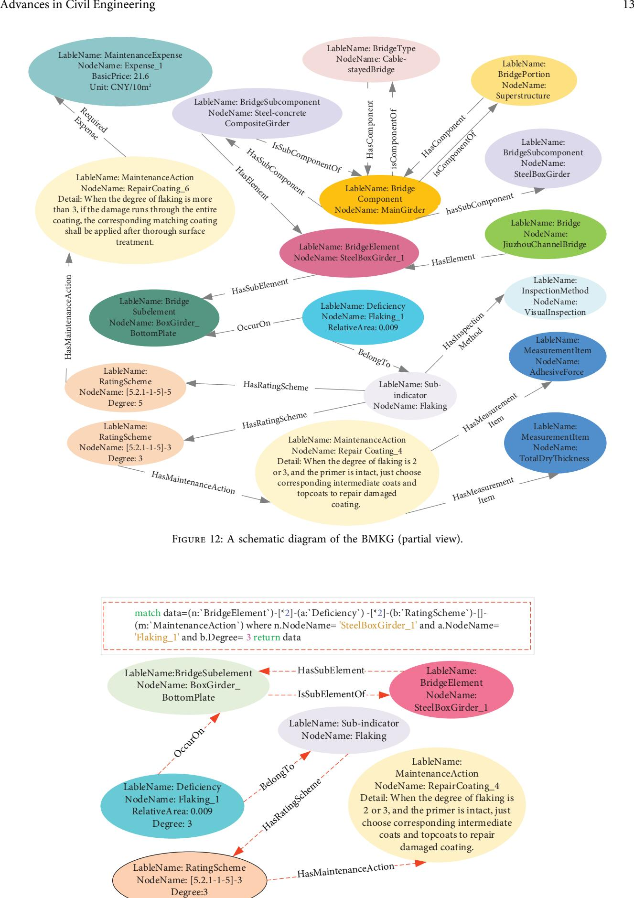

# Research Article: Building a Knowledge Base of Bridge Maintenance Using Knowledge Graph

**Yang Zhang^1^, Jia Li^[u](https://orcid.org/0009-0003-5497-9533)^^1^, and Kepeng Ho^[u](https://orcid.org/0009-0004-2418-4681)^^2^**

*1 School of Highway, Chang'an University, Xi'an 710064, China*
*2 Henan Provincial Communications Planning and Design Institute Co., Ltd., Zhengzhou 450000, China*

Correspondence should be addressed to Yang Zhang; [zhangyangjob@chd.edu.cn](mailto:zhangyangjob@chd.edu.cn)

Received 16 November 2022; Revised 23 March 2023; Accepted 29 March 2023; Published 12 April 2023

Academic Editor: Yu-Cheng Lin

Copyright © 2023 Yang Zhang et al. This is an open access article distributed under the [Creative Commons Attribution License](https://creativecommons.org/licenses/by/4.0/), which permits unrestricted use, distribution, and reproduction in any medium, provided the original work is properly cited.

To effectively manage the heterogeneous and discrete knowledge of the bridge maintenance domain, this study adopts knowledge graph technology to build a knowledge base of bridge maintenance, called the bridge maintenance knowledge graph (BMKG). The BMKG uses an ontology as the knowledge organization and representation framework and a graph database as the knowledge storage tool. To facilitate the construction of the BMKG, a hybrid method combining a top-down approach and a bottom-up approach is proposed. Firstly, a bridge maintenance domain ontology (BMDO) is coded with Protegé and represented in Web Ontology Language. Secondly, rule reasoning and ontology reasoning are implemented on the BMDO in Protegé in order to automatically complete missing relations or attribute values. Thirdly, ontology reasoning is adopted to perform consistency check on the BMDO. Lastly, the BMDO model is stored in the Neo4j graph database through data format conversion, thus completing the construction of the BMKG. The BMKG is applied in a typical scenario of bridge maintenance to demonstrate its application value. Results show that the proposed hybrid method can create a knowledge graph that can realize the transformation from discrete data into interconnected knowledge. Knowledge graph offers a novel idea to create a knowledge base in the bridge maintenance domain.

## 1. Introduction

Accessing holistic knowledge is essential for bridge engineers to make a comprehensive maintenance decision [[1]](#ref-1). However, the form of bridge maintenance knowledge is various, such as books, standards, manuals, and guides. The knowledge about bridge maintenance has the following characteristics: multisource, wide range, complex relation, fragmented distribution, unstructured representation, and decentralized storage. To assist engineers in making a comprehensive decision through integrating various bridge maintenance knowledge, many bridge management systems [[2–5]](#ref-2) have been developed in different countries or regions. A relational database (RDB) is often used to store bridge maintenance knowledge in these systems [[6]](#ref-6). For example, the National Bridge Inventory database, a database of more than 600 thousand bridges on public highways in America, contains design information, the operational conditions, and the structural condition of the different bridge components [[7]](#ref-7). Caprani and Maria [[8]](#ref-8) created a global long-span bridge database of 751 long-span bridges. Pan et al. [[9]](#ref-9) constructed a database to store the knowledge relevant to management and maintenance of railway bridges. These systems or knowledge bases are developed independently and deployed separately. As a result, a heterogeneous semantics problem exists among these knowledge bases due to the design differences of RDB [[10]](#ref-10), which can cause bridge maintenance knowledge to be hard to share and reuse. It is difficult for bridge engineers to integrate the scattered knowledge required to make bridge maintenance decisions in the absence of effective tools. Therefore, it is necessary to adopt an effective tool to manage the heterogeneous and discrete knowledge of bridge maintenance domain.

In recent years, knowledge graph (KG) has become to be one of the most efficient and effective knowledge integration methods [[11]](#ref-11). In the construction domain, KG is considered to be the most advanced knowledge management technology nowadays [[12]](#ref-12). KGs can essentially be termed as ontological semantic networks based on graphics [[13]](#ref-13), and its edges and paths can capture complex relations between the entities of a domain [[14]](#ref-14). Therefore, KG has the potential to represent the intricate knowledge of bridge maintenance. KG is comprised of a schema layer and a data layer [[12]](#ref-12). The schema layer mainly consists of concepts and conceptual relationships, which are built through ontologies. The ontology is generally regarded as the conceptualization of terms and their relationships of a domain and contains concepts, instances, relations, etc [[15]](#ref-15). The data layer primarily refers to interconnected entities that are instances of the concepts defined in the schema layer [[16]](#ref-16). At present, related researches are focus on KG and ontology, respectively.

Researches on KG in the construction domain have already been carried out. Wang et al. [[17]](#ref-17) constructed a building fire KG to achieve the intelligent review of fire drawings. Rasmussen et al. [[18]](#ref-18) adopted a construction project KGs to manage interrelated information. Fang et al. [[19]](#ref-19) applied KG to identifying hazards on construction sites. However, due to the complexity of KG, there are only a few research results relevant to KG in the bridge engineering domain [[10]](#ref-10). For example, Ma et al. [[20]](#ref-20) thought of KG as a future vision for a standardized database of fatigue cracks on steel box girders. Yang et al. [[10]](#ref-10) viewed KG as the core of the intelligent bridge management and maintenance framework based on big data knowledge engineering. Tiwary et al. [[21]](#ref-21) proposed a KG framework for monitoring and analysis of bridges. Luo et al. [[22]](#ref-22) constructed a Chinese bridge inspection knowledge graph. The construction method they proposed is directly related to bridge component, which are specific entities of the KG they constructed. Thus, this construction method does not have generality. In summary, in bridge engineering, research on KG is still in the initial stage, where KG is only regard as a vision or a part of a framework and the construction method of KG is inadequate.

Actually, more research is devoted to the application of ontology in many aspects of the bridge engineering at present. Hui et al. [[23]](#ref-23) built a steel bridge ontology model that was applied to the bridge construction stage to evaluate the multiattribute information in the factory manufacturing of bridge precast components. Ren et al. [[1]](#ref-1) developed a bridge maintenance ontology (BrMontology), which covers bridge structure, bridge damages and their causes, solutions, big events. In the BrMontology, a bridge is only roughly decomposed into bridge elements, and the classification of bridge damages is also overbroad. Liu and El-Gohary [[24]](#ref-24) proposed a bridge ontology (BridgeOnto) based on bridge maintenance manuals in American. The BridgeOnto involves bridge elements, bridge deficiencies, deficiency causes, and maintenance actions. In the BridgeOnto, the types of bridge elements and bridge deficiencies are meticulously divided. Regarding bridge health monitoring (BHM) in the maintenance stage, Li et al. [[25]](#ref-25) designed a bridge structure health monitoring ontology to integrate heterogeneous sensor data for BHM systems. The finegrained ontology model contains bridge structures, sensors, and sensory data. Yang et al. [[26]](#ref-26) established a structure ontology model of a continuous rigid frame bridge, and associated the structure ontology with a bridge inspection ontology and a bridge health monitoring ontology, thus achieving integrative management of inspection data and monitoring data. In the bridge rehabilitation stage, Wu et al. [[27]](#ref-27) developed a concrete bridge rehabilitation project management ontology, which covers rehabilitation tasks and constraints. However, these ontologies are mostly specific to a particular stage of bridge maintenance or limited to a particular bridge. And they do not cover maintenance expenses (a critical factor in bridge maintenance decisionmaking) and quality inspection and evaluation for maintenance engineering. Consequently, these existing ontologies are insufficient to support the construction of a complete KG for bridge maintenance.

This study aims to build a knowledge base of bridge maintenance using knowledge graph, called the bridge maintenance knowledge graph (BMKG), to manage the heterogeneous and discrete knowledge of bridge maintenance domain. To achieve the purpose, a hybrid method combining a top-down approach and a bottom-up approach is proposed. Rule reasoning and ontology reasoning are introduced into the hybrid method to accelerate the construction of the BMKG. The BMKG adopts an ontology as the knowledge organization and representation framework and a graph database as the knowledge storage method. A bridge maintenance domain ontology (BMDO) is developed to support the construction of the BMKG, as well as knowledge sharing and reuse. The Neo4j graph database is adopted as a storage tool of the BMKG. Nodes and edges of the Neo4j can be used to connect scattered knowledge of bridge maintenance to a knowledge network.

The remaining contents of the paper are organized as follows. Related concepts and method of knowledge graph construction are introduced in Section 2. Section [3](#ref-section-3) details processes of establishing the BMKG are presented. Section [4](#ref-section-4) illustrates an application case of the BMKG. Differences between the Neo4j graph database and an RDB in the construction of a knowledge base are discussed in Section [5](#ref-section-5). Finally, the conclusions are drawn in Section [6](#ref-section-6).

## 2. Knowledge Graph Construction: Related Concepts and Method

### 2.1. Related Concepts

The term "ontology" finds its roots in philosophy and refers to the essence of existence, reality, becoming, and the fundamental classifications of being and their interconnections. In this study, ontology is the conceptualization of the terminology and relationships within a given domain [[15]](#ref-15). It is commonly used as a knowledge representation method [[28]](#ref-28). The BMDO is a bridge maintenance domain ontology, which is used to represent information relevant to bridge maintenance.

A KG primarily depicts the relationships among realworld entities, arranged in a graph structure [[29]](#ref-29). Depending on the area covered, KGs can be classified into two categories: domain KGs (e.g., geoscience knowledge graph [[30]](#ref-30) and the BMKG in this study) and general KGs (e.g., Freebase [[31]](#ref-31)). Domain KGs contain domain-specific data with different attributes and data patterns. In contrast, general KGs emphasize the breadth of knowledge, covering multiple domains, and integrating more entities. However, their knowledge is not as exhaustive and precise as that of domain KGs.

There are similar components between an ontology model and a KG. Figure 1 presents the relationship between an ontology model and a KG. And their corresponding relationships are listed in Table [1](#ref-table-1).

Although an ontology model and a KG have similar components and even can be converted to one another, there are still differences between them. First, ontology is concerned primarily with the definition of concepts and relations of a domain, rather than the creation of many instances. On the contrary, KG is more focused on creating many instances [[32]](#ref-32). Second, ontologies are usually stored in OWL (i.e., Web ontology language) files [[33]](#ref-33), which is difficult to support efficient data access [[34]](#ref-34). For a KG, a graph database is often adopted to storage knowledge. For the file-based storage, the efficiency of data access is lower [[34]](#ref-34). Consequently, an ontology model is not widely used in the industry. For the graph database-based storage, the efficiency of data access is higher. And a graph database can efficiently support software development (e.g., the BMKG can be integrated into a bridge management system). As a result, a graph database gets more recognition in the industry [[35]](#ref-35).

A graph database is a database designed to store and query data represented in the form of a graph. It uses nodes and edges, instead of tables (common components of a relational database) to represent data. A graph database can be regard as a data storage tool of a KG. For example, the Neo4j graph database is a data storage tool of the BMKG in this study. We can regard a knowledge base which uses a graph database to store knowledge as a KG.

A knowledge base is a dataset with formal semantics that contains diverse types of knowledge such as rules, axioms, definitions, and statements [[36]](#ref-36). Figure [2](#ref-figure-2) shows the relationship between a knowledge base, a KG, and the BMKG. The kinds of knowledge bases are varied. A KG does not usually contain rules and is only one kind of knowledge base. There are many KGs in various fields, such as TCM (i.e., traditional Chinese medicine) knowledge graph [[37]](#ref-37) and geographic KG [[38]](#ref-38). The BMKG focuses on bridge maintenance domain and is one of KGs.

### 2.2. Construction Method

There are usually two approaches to building KGs: bottom-up and top-down [[30]](#ref-30). The bottom-up approach starts with the construction of a data layer and subsequent definition of a schema layer, and its reverse process is the top-down approach [[30]](#ref-30). The former is suitable for building a general knowledge graph, and the latter is extensively used in the construction of domain knowledge graphs [[39]](#ref-39). A hybrid approach that combines the two is adopted to construct the BMKG in this study. In

**Figure 1:** The relationship between an ontology model and a KG.

this method, at first, the bridge maintenance domain ontology (BMDO) is created as the schema layer of the BMKG. And then specific instances are extracted. As knowledge extraction progresses, the BMDO may be updated when there are challenges in accurately expressing these instances using its current concepts. A suggested workflow of the hybrid approach is illustrated in Figure [3](#ref-figure-3). The proposed hybrid method is entirely unrelated to specific concepts and entities of the BMKG. Hence, the proposed method has better generality than the existing construction method [[22]](#ref-22) of KGs in bridge domain.

The definition of a schema layer (steps 1 to 6) draws on the method for ontology construction, and the detailed implementation process is out of scope and can be found in an existing research work [[34]](#ref-34). After the definition, the process of data gathering and knowledge acquisition can take place under the guidance of classes, datatype properties, and object properties. Since bridge maintenance activities are usually performed based on relevant standards, the data sources of the BMKG mainly contain various forms of standards, guides, and manuals. Knowledge acquisition is the process of extracting entities, attributes, and relations. This process can be implemented by automatic [[40]](#ref-40) or manual extraction methods. This study, as a preliminary exploration, will adopt the manual extraction method to acquire the domain knowledge of bridge maintenance. In the next step, ontology modeling is to formalize domain knowledge with the OWL language. After that, rule reasoning and ontology reasoning are introduced for knowledge graph completion, and consistency check is required for ensuring the quality of an ontology model. In the final step (step 14), the OWL ontology file will be converted and stored in the Neo4j, thereby completing the construction of the BMKG. bridge maintenance domain, and technical terms relevant to properties

### 3. Establishment of the BMKG

### 3.1. Design of the BMDO

The BMDO includes a bridge structure ontology, a bridge defect ontology, and a bridge maintenance ontology. Each ontology model generally consists of five components: class, instance, relation, axiom, and function [[15]](#ref-15). The BMDO can also be defined as a five tuple:

$$
BMDO = \langle C, I, R, F, A \rangle, \tag{1}
$$

where BMDO refers to the bridge maintenance domain ontology. *C* denotes concepts (also called classes) in the

| | Components of an ontology model | Components of a KG |
|---|---|---|
| | Class | Entity type (also called label) |
| | Instance | Entity | Node |
| | Properties of an instance | Properties of an entity |
| Relation | Relations between a concept and an instance | Relations | Edge |
| | Relations among instances | Relations |
| — | — | Properties of a relation |
| | Axiom | — |
| | Function | — |

**Table 1:** Corresponding relationships between an ontology model and a KG.

"—" denotes that an ontology model or a KG does not include a corresponding component.

![The image is a nested-circle diagram illustrating the relationship between three knowledge graph (KG) concepts. The largest circle represents the general "Knowledge base," encompassing a smaller light-blue circle labeled "KG." Within that is a smaller pale-green circle labeled "BMKG," indicating that BMKG is a subset of KG, which is itself a subset of a broader knowledge base. The diagram visually depicts the hierarchical inclusion of these knowledge graph types within the paper's proposed framework.](_page_3_Figure_5.jpeg)

**Figure 2:** The relationship between a knowledge base, a KG, and the BMKG.

**Figure 3:** A workflow for building the BMKG.

bridge maintenance (e.g., bridge, defect, and maintenance action) can usually be abstracted to the concepts. *I* represents instances (also called individuals), which are specific objects of concepts. For example, Jiuzhou Channel Bridge (a bridge of Hong Kong-Zhuhai-Macao Bridge) is an instance of the "Bridge" concept. *R* stands for relations, including the relationship between concepts and instances, the relationship among instances, and properties of instances. For example, "has individual" is a relation linking the "Bridge" concept to the "Jiuzhou Channel Bridge" individual. When OWL ontology is used to formalize knowledge, a relationship among instances and a property of instances are also called object property and datatype property, respectively. *F* denotes functions, which are special relations. Rules can often be used to define custom functions. *A* represents axioms (including constraints on various relations), which are used to describe accepted theoretical knowledge of the bridge maintenance domain. For example, the "Jiuzhou Channel Bridge" individual can have the "length" datatype property, whose value must be numerical.

We followed construction steps of a schema layer to define the classes, datatype properties, and object properties of the BMDO and manually extracted instances of the BMDO from Chinese standards related to bridge maintenance. The detailed design of the BMDO can be described as follows.

### 3.1.1. Bridge Structure Ontology

Bridge structure is divided into five levels: bridge, evaluation unit, bridge portion, bridge component, and bridge element [[41]](#ref-41). These terms were modeled as concepts of the bridge structure ontology. Different from existing ontology models [[25, 26]](#ref-25), in the bridge structure ontology, specific portions, and components were modeled as corresponding instances in order to integrate the domain knowledge relevant to these instances. For example, the weights of portions and components [[41]](#ref-41) can be modeled into the bridge structure ontology in the form of datatype property. Moreover, other instances related to these instances can also be linked, thus forming a broader knowledge network. Additionally, to enhance the refinement of bridge maintenance strategies, "BridgeSubcomponent" and "BridgeSubelement" were added to the existing five levels of the bridge structure ontology. At the same time, considering the demand for bridge asset management, "AncillaryFacility" was added to the bridge structure ontology as an instance of the "BridgePortion" concept.

The bridge structure ontology is shown in Figure [4](#ref-figure-4). The "BridgePortion" concept includes four instances: "Superstructure," "Substructure," "BridgeDeckSystem," and "AncillaryFacility." The "AncillaryFacility" instance consists of the "MaintenanceAccess," "Damper," and other components [[42]](#ref-42). The "MainGirder" component was further subdivided into different subcomponents based on the material types, such as "PrestressedConcreteGirder," "SteelconcreteCompositeGirder," and "SteelBoxGirder." If the volume of an element is large, the element will be categorized into several subelements to describe the location of defects more accurately. For example, in Figure [4](#ref-figure-4), the "BoxGirder_BottomPlate" can be regard as a subelement of the "SteelBoxGirder_1" element. Figure [4](#ref-figure-4) also illustrates the axiomatic constraints of the ontology model. For example, the value of the "Sidewalk" component's weight must be xsd: float, such as 0.10.

### 3.1.2. Bridge Defect Ontology

During bridge maintenance, bridge engineers need to adopt inspection methods to find out defects on bridge elements, identify the causes and hazards of the defects, and then determine evaluating degree of the defects according to the rating scheme for designating the degree of bridge defects [[41]](#ref-41). The relevant knowledge was modeled in the bridge defect ontology, as shown in Figure [5](#ref-figure-5). Bridge defects are regarded as performance measures for assessing bridge condition in China, and each defect has its own rating scheme. In the ontology, the "EvaluationIndicator" concept is proposed to represent these defects, and the "Deficiency" concept represents defects that actually occur on bridge elements. However, we found that the existing classification of defects is relatively broad in the process of knowledge acquisition. For the same type of bridge defect, its inspection methods, causes, hazards, and repair methods could potentially be different [[43]](#ref-43). For example, chalking and flaking are two forms of coating deterioration, and their inspection methods are different [[36]](#ref-36). Considering this situation, we introduced the "subindicator" concept into this ontology. In addition, the existing rating scheme only consists of qualitative descriptions and quantitative descriptions, which is not intuitive [[43]](#ref-43). To address the problem, photographs associated with various degrees of bridge defects or subdefects are modeled as legends in this ontology.

### 3.1.3. Bridge Maintenance Ontology

Determining maintenance actions is one of the core tasks of bridge maintenance. The results of bridge inspection and assessment should directly serve the decision-making process. However, the current standard [[38]](#ref-38) only provides broad maintenance actions on bridges in different condition ratings, which causes a disconnection between the evaluating degree of bridge defects and maintenance actions. To solve this problem, in the bridge maintenance ontology (as shown in Figure [6](#ref-figure-6)), a semantic relationship "HasMaintenanceAction" between evaluating degrees and maintenance actions was established. Additionally, in order to support the optimal allocation of bridge maintenance funds, maintenance expenses [[44]](#ref-44) were incorporated into the bridge maintenance ontology. The ontology also has covered the last stage of a bridge maintenance project (i.e., quality inspection and evaluation for maintenance engineering), including the "BasicRequirement," "AppearanceQuality," and "MeasurementItem" concepts, which are derived from a current relevant standard [[45]](#ref-45).

### 3.2. Knowledge Modeling

### 3.2.1. Ontology Modeling

Knowledge modeling of the BMKG refers to adopting the OWL language to formalize domain knowledge of bridge maintenance using Protegé 5.2.0 Ontology Editor. Figure [7](#ref-figure-7) presents partial content of the BMDO model coded in OWL format. The OWL vocabularies (i.e., elements prefixed with "owl:" in Figure [7](#ref-figure-7)) are used to express the ontology model. For example, the element prefixed with "owl:ObjectProperty" can define the "HasSubcomponent" relation. And an additional "owl: inverseOf" constraint is imposed on this relation, which means that the "HasSubcomponent" relation is the inverse property of the "IsSubcomponentOf" relation. The constraint can provide a foundation for relation completion based on ontology reasoning. Figure [8]](#ref-figure-8) shows a visual representation of the developed BMDO model in the Protegé platform.

### 3.2.2. Knowledge Graph Completion

Although the BMDO has been manually developed, some potential knowledge needs to be excavated, such as the degree of the "Flaking_1" in the bridge defect ontology. Ontology reasoning and rule reasoning can be applied to mining hidden knowledge to automatically complete the missing relations or attribute values. Two following cases were used to show the process of knowledge graph completion.

To complete the missing relations, the Pellet 2.2.0 (a reasoning engine) was used to implement intelligent reasoning on the BMDO in Protegé, and the inference process is shown in Figure [9](#ref-figure-9). In the BMDO, subcomponents of bridge

![This image is a UML class diagram depicting a hierarchical model of a cable-stayed bridge (Jiuzhou Channel Bridge). It illustrates the bridge's composition, from the top-level BridgeType down to individual sub-elements like `SteelBoxGirder_1`. Relationships such as `HasComponent`, `HasSubcomponent`, and `HasElement` show the structural breakdown. Data types (e.g., `xsd:float` for weight) and properties are also specified. The diagram aims to represent the bridge's ontology for data modeling or analysis within the paper.](_page_5_Figure_1.jpeg)

**Figure 4:** A schematic of the bridge structure ontology (partial view). HZMB denotes the Hong Kong-Zhuhai-Macao bridge.

railing are unknown before the reasoning (see Figure [9(a)](#ref-figure-9)). After the reasoning (see Figure [9(b)](#ref-figure-9)), the "Railing" instance has the "HasSubComponent" semantic relationship with the "SteelRailing" and "ConcreteBarrier" instances, and the corresponding explanation related to the inference also is provided in Protegé. This indicates that ontology reasoning can automatically expose hidden relationships between instances, and reasoning results are interpretable. After executing the ontology reasoning, the BMDO model containing the inference results can be exported to a new ontology file, thereby increasing the efficiency of ontology construction.

To calculate the degree of the "Flaking_1," a rule reasoning will be implemented. Since the OWL language does not support writing custom rules, we adopted the Semantic Web Rule Language (SWRL) to define the rating scheme. Table [1](#ref-table-1) gives the rating scheme for designating the degree of flaking and corresponding SWRL rules. According to these rules, the rule reasoning was also automatically executed on the Pellet Reasoner in Protegé. The inference is shown in Figure [10](#ref-figure-10). After the rule reasoning, the degree of the "faking_1" deficiency in the BMDO is 3, and the Protegé platform also provides an explanation for this inference. This inference is correct according to the rating scheme in Table [2](#ref-table-2), which verifies the effectiveness of the rule reasoning.

### 3.2.3. Consistency Check

For checking the quality of the BMDO model, a consistency check at the syntactic and semantic level is required. The consistency check can be automatically verified by using the Pellet Reasoner in the Protegé environment, and the corresponding results are depicted in Figure [11](#ref-figure-11). From Figures [11(a)](#ref-figure-11) and [11(b)](#ref-figure-11), it can be found that the conceptual hierarchy of the BMDO is unchanged before and after the ontology reasoning. This result indicates that the BMDO satisfies the requirements of logical axioms at the semantic level. In Figure [11(c)](#ref-figure-11), the inference log does not display grammatical errors, which confirms that the BMDO model conforms to the OWL syntax rules at the syntactic level. These results confirm that the BMDO passes the consistency check.

### 3.3. Knowledge Storage

To improve the efficiency of knowledge access, the OWL ontology files will be converted and stored in a graph database. In this paper, Neo4j, a popular graph database management system [[47]](#ref-47), is chosen as a knowledge storage tool. Instances and their datatype properties, and object properties among instances in an OWL ontology model can be represented by nodes, node properties, and relationships in Neo4j, respectively.

![This image depicts a hierarchical ontology model for bridge defect assessment. It uses a flowchart-like structure showing relationships between concepts (e.g., hazard, material, inspection method) and their properties. Specific examples include "coating deterioration" leading to "discoloration," and flaking assessment using visual inspection and a quantitative description based on relative area. The model also integrates a rating scheme and legend, illustrated with a sample image, linking visual observations to quantitative measures. The ontology connects to a bridge structure ontology, showing how the model integrates within a larger system.](_page_6_Figure_1.jpeg)

**Figure 5:** A schematic of the bridge defect ontology (partial view).

The OWL ontology files can be automatically converted and stored into Neo4j using neosemantics plugin. The bridge maintenance knowledge can be visualized in the form of relational graphs in Neo4j. Figure [12](#ref-figure-12) presents a schematic diagram of the BMKG.

### 4. Application Case

The BMKG integrates the discrete knowledge of bridge maintenance, such as bridge inspection, bridge evaluation, maintenance decision-making, quality inspection, and evaluation for maintenance engineering. A typical application case is adopted to demonstrate the application value of knowledge graph.

During bridge inspection, a bridge inspector may be required to give suggestions on repairing defects. The maintenance actions can be recommended through running Cypher query statements in the Neo4j database. Figure [13]](#ref-figure-13) shows the query result of the maintenance actions on the "SteelBoxGirder1" element. From the figure, it can be seen that a "Flaking_1" defect with a degree of "3" occurs on the "BoxGirder_BottomPlate" subelement of the "Steel-BoxGirder_1" element. When the evaluating degree of a flaking is 3, the corresponding maintenance action is "RepairCoating_4." Therefore, according to these logical chains, the maintenance action on the "SteelBoxGirder1" is "RepairCoating_4.". This result shows that the proposed BMKG can recommend feasible actions and provide a visual interpretation path.

### 5. Discussion

In existing practical applications, the bridge maintenance knowledge is represented and stored using an RDB, and related business logics are written in program codes. Figure [14](#ref-figure-14) presents a partial structure of the domain knowledge. The original knowledge structure is represented by the solid black lines. Two new concepts (i.e., bridge subcomponent and subindicator) and relationships represented by the dashed red lines are added to the original structure, thus

### 8 Advances in Civil Engineering

![The image presents a UML diagram detailing a bridge maintenance ontology. It depicts relationships between design requirements, quality inspection methods, repair actions (coatings), and defect ontology (flaking). Boxes represent concepts and actions, arrows show relationships, and a numerical rating scheme is included to assess the degree of flaking. The ontology specifies inspection frequencies, adhesive forces, and cost data (21.6 CNY/10m²) for different repair scenarios. The diagram aims to formalize bridge maintenance procedures and quality standards.](_page_7_Figure_1.jpeg)

**Figure 6:** A schematic of the bridge maintenance ontology (partial view).

forming a new knowledge structure. The contrast between representation results based on the Neo4j graph database and a RDB is demonstrated in Table [3](#ref-table-3).

As can be seen from Table [3](#ref-table-3) and Figure [14](#ref-figure-14), when the Neo4j graph database is adopted to represent the knowledge structure, the number of required nodes or relationships is same as that in the knowledge structure. It is easy to design a knowledge graph according to a knowledge structure. When a RDB is applied to representing the same knowledge structure, relationship types between entities should be taken into careful consideration to design tables and foreign keys of a RDB. For example, an extra foreign key or an association table needs to be created to represent a one-to-many relationship (one-direction arrows in Figure [14](#ref-figure-14)) or a manyto-many relationship (two-direction arrows in Figure [14](#ref-figure-14)), respectively. This indicates that it is easier to use a graph database to represent the bridge maintenance knowledge with complex relationships, compared with a RDB.

Furthermore, each node of the Neo4j graph database represents a specific entity, and each entity can have its own properties. A table of a RDB stores multiple entities of the same type, and the fields of the table are constant. In other words, different entities in the same table share the same properties, which can lead to the emergence of data sparsity. As shown in Figure [15](#ref-figure-15), for the "InternalDampness_1" deficiency (a deficiency that occurs in an anchorage of a cablestayed bridge), most of the fields in the "Deficiency" table of a RDB do not have any value.

In terms of knowledge updating, when two new entities are added (as shown in Figure [14](#ref-figure-14)), two new nodes and eight new relationships need to be appended to the KG. For the same purpose, the foreign keys of three existing tables (i.e., "Deficiency" table, "RatingScheme" table, and "Hazard" table) have to be modified, and five new tables require to be appended the RDB. Among these new tables, two foreign keys must also be added to the "BridgeSubcomponent" table

| Advances in Civil Engineering | 9 |
|---|---|
| | |
| | |
| | |
| | |
| | |
| | |
| | |
| | |
| | |
| | |
| | |
| | |
| | |
| | |
| | |
| | |
| | |
| | |
| | |
| | |
| | |
| | |
| | |
| | |
| | |
| | |
| | |
| | |
| | |
| | |
| | |
| | |
| | |
| | |
| | |
| **Figure 7:** Fragment of the BMDO model coded in OWL format. | |
| | |
| and the "Subindicator" table, respectively. In software de | |
| In terms of overall development cost, the overall | |
| development, adding new nodes and relationships in the Neo4j | |
| development cost of a KG is less compared with an RDB | |
| graph database has nearly no influence on the existing | |
| based knowledge base. First, for development time of | |
| program codes. However, the corresponding codes need to | |
| a knowledge base, rule reasoning and ontology reasoning | |
| be modified when existing tables of an RDB are modified. | |
| can autocomplete the missing relations or attribute | |
| Therefore, for bridge maintenance knowledge which needs | |
| values during KG construction. Therefore, compared | |

and the "Subindicator" table, respectively. In software development, adding new nodes and relationships in the Neo4j graph database has nearly no influence on the existing program codes. However, the corresponding codes need to be modified when existing tables of an RDB are modified. Therefore, for bridge maintenance knowledge which needs to be updated frequently, the knowledge representation and storage method based on knowledge graphs can be a more

suitable method. In terms of knowledge query, bridge experts can retrieve data from an RDB through a joined query only if they know the whole database schema. For example, to gain the query result in Figure [13](#ref-figure-13), a joined query over at least five tables is necessary to get feasible actions on a bridge element. However, bridge experts do not have to master the design schema of a KG completely, and they can use a path query without partial middle nodes and relations to retrieve data from a graph database. The query results can be presented in a graphical format in Neo4j. The Neo4j graph database reduces the difficulty of knowledge acquisition and enables bridge experts to freely explore and analyze data in the BMKG without excessive dependence on database engineers.

In terms of overall development cost, the overall development cost of a KG is less compared with an RDBbased knowledge base. First, for development time of a knowledge base, rule reasoning and ontology reasoning can autocomplete the missing relations or attribute values during KG construction. Therefore, compared with a traditional RDB-based knowledge base, we may spend less time on developing a KG at least in theory. Second, besides the development time of a knowledge base, it should be pay attention to the development time of a software because a knowledge base is often integrated into a software system (e.g., a bridge management system) to maximize its value. As updating a KG has a lower impact on existing program codes compared with updating an RDB-based knowledge base, we will also spend less time on developing a KG-based software system. Third, for manpower cost, compared with traditional relational databases, a graph database reduces the difficulty of designing and using a database, which will allow a bridge engineer to participate deeply in the construction of the BMKG. The dependency on database engineers will be lowered accordingly.

![This image is an ontology diagram depicting relationships between various bridge components, evaluation methods, maintenance actions, and costs. Rectangles represent classes (e.g., BridgeComponent, MaintenanceAction), diamonds represent data properties (e.g., RepairCoating_6), and circles represent individuals. Lines show relationships like "has subclass" or "has element". The ontology aims to structure bridge management data, enabling efficient querying and analysis of bridge conditions and maintenance needs.](_page_9_Figure_1.jpeg)

**Figure 8:** The BMDO visualization in the Protegé (partial view).

(a) **Figure 9:** Continued.

![The image shows a screenshot of a software interface, likely for ontology modeling or knowledge representation. It displays a hierarchical structure of bridge components, with "Railing" as a parent component having "SteelRailing" and "ConcreteBarrier" as subcomponents. A pop-up window details the justification for "SteelRailing" being a subcomponent of "Railing," demonstrating a relationship using "IsSubComponentOf" and its inverse. The purpose is to illustrate the software's capability to represent and reason about component relationships within a complex system.](_page_10_Figure_1.jpeg)

**Figure 9:** Protegé screenshot of the inference process of ontology reasoning: (a) before the reasoning and (b) after the reasoning.

![This image shows a software interface displaying a knowledge representation of bridge defects. A hierarchical list shows various bridge components and defects, including "Flaking." A highlighted section details "Flaking_1," specifying its type ("Deficiency"), location ("BoxGirder_BottomPlate"), relative area (0.009f), and degree (3). An explanation panel provides logical rules (SWRL) defining these attributes, demonstrating the system's reasoning process for classifying this specific bridge defect.](_page_10_Figure_3.jpeg)

**Figure 10:** The result of rule reasoning.

| Table | | | | | | |
|---|---|---|---|---|---|---|
| | | | **2:** Rating scheme for designating the degree of flaking [46]. | | | |

| Degree | Quantitative description | SWRL rule |
|---|---|---|
| 0 | Relative area ≤ 0 | Deficiency(?defect)^BelongTo(?defect, Flaking)^RelativeArea(?defect,?area)^swrlb:equal(?area,0)- > Deficiency(?defect)^Degree(?defect,0) |
| 1 | 0 < relative area ≤0.001 | Deficiency(?defect)^BelongTo(?defect, Flaking)^RelativeArea(?defect,?area)^swrlb:greaterThan(?area,0)^swrlb:lessThanOrEqual(?area,0.001)- > Deficiency(?defect)^Degree(?defect,1) |
| 2 | 0.001 < relative area ≤0.003 | Deficiency(?defect)^BelongTo(?defect, Flaking)^RelativeArea(?defect,?area)^swrlb:greaterThan(?area,0.001)^swrlb:lessThanOrEqual(?area,0.003)- > Deficiency(?defect)^Degree(?defect,2) |
| 3 | 0.003 < relative area ≤0.01 | Deficiency(?defect)^BelongTo(?defect, Flaking)^RelativeArea(?defect,?area)^swrlb:greaterThan(?area,0.003)^swrlb:lessThanOrEqual(?area,0.01)- > Deficiency(?defect)^Degree(?defect,3) |
| 4 | 0.01 < relative area ≤0.03 | Deficiency(?defect)^BelongTo(?defect, Flaking)^RelativeArea(?defect,?area)^swrlb:greaterThan(?area,0.01)^swrlb:lessThanOrEqual(?area,0.03)- > Deficiency(?defect)^Degree(?defect,4) |
| 5 | Relative area >0.15 | Deficiency(?defect)^BelongTo(?defect, Flaking)^RelativeArea(?defect,?area)^swrlb:greaterThan(?area,0.15)- > Deficiency(?defect)^Degree(?defect,5) |

![The image displays a technical comparison of asserted and inferred class hierarchies (a, b) within an ontology. Both (a) and (b) show hierarchical tree structures representing bridge-related concepts. (a) shows the asserted hierarchy, while (b) presents the inferred hierarchy expanded by a reasoner. (c) shows a log detailing the inference process, reporting successful computation of class, object, and data property hierarchies and assertions, completing in 2 milliseconds using the Pellet reasoner.](_page_11_Figure_1.jpeg)

**Figure 11:** The results of consistency check: (a) before the reasoning, (b) after the reasoning, and (c) the reasoning log.

**Figure 12:** A schematic diagram of the BMKG.

**Figure 13:** The query result of the maintenance actions.

**Figure 14:** A partial structure of domain knowledge of bridge maintenance.

| Table | | | | | | | **3:** Comparison of results based on different knowledge representation methods. | |
|---|---|---|---|---|---|---|---|---|
| | | | | | | | | |

| | | Neo4j graph database | Relational database | |
|---|---|---|---|---|
| Knowledge structure | Number of nodes | Number of relationships | Number of tables | Number of foreign keys |
| (1) Original structure | 7 | 6 | 10 | 3 |
| (2) New structure | 9 | 14 | 15 | 8 |
| (3) Difference | 2 | 8 | 5 | 5 |

Difference denotes the result of subtracting a corresponding value of the "original structure" row from a corresponding value of the "new structure" row.

![The image displays a knowledge graph representation of material deficiencies, shown as nodes with attributes like length, width, depth, relative area, corrosion potential, resistivity, and humidity. A relational database table summarizes these attributes for each deficiency type (cracking, flaking, blowhole, steel corrosion, and internal dampness). Each node in the graph is assigned a 'degree', likely representing the severity or importance of the deficiency. The purpose is to illustrate the structured representation of material defect data for use in a knowledge-based system or database.](_page_13_Figure_6.jpeg)

**Figure 15:** Data sparsity in a relational database.

## 6. Conclusions

Knowledge graph is an advanced knowledge management technology. In this study, a hybrid method for building knowledge graph is proposed to build a knowledge base for bridge maintenance, called the BMKG. The main conclusions can be summarized as follows:

* (1) A knowledge graph, which adopts an ontology as the knowledge organization and representation framework and a graph database as the knowledge storage method, can be used to effectively manage the heterogeneous and discrete knowledge of the bridge maintenance domain. Knowledge graph offers a novel idea for building a knowledge base for bridge maintenance.
* (2) Compared with the existing construction method of knowledge graphs in bridge domain, the proposed hybrid method has better generality. Within the method, the rule reasoning and ontology reasoning can be employed for knowledge graph completion and can improve the construction efficiency of knowledge graphs, and the consistency check contributes to ensuring quality of knowledge graphs.
* (3) In the BMKG, the developed BMDO covers comprehensive knowledge of the bridge maintenance domain, and enriches and deepens the concept system of existing ontologies in the bridge domain. Compared with a relational database, the graph database, the BMKG adopted is more suitable to store domain knowledge of bridge maintenance since it can be easy to design and reduce the emergence of data sparsity.
* (4) During the construction of the BMKG, it is time-consuming to manually extract bridge maintenance knowledge. Automatic knowledge extraction methods will be taken into consideration in the future to accelerate the construction further.

## Data Availability

All data generated or analyzed during this study are included in this published article.

## Conflicts of Interest

The authors declare that they have no conflicts of interest.

### Acknowledgments

This work was funded by the National Natural Science Foundation of China (Grant number: 51878059).

### References

* [1] G. Q. Ren, R. Ding, and H. J. Li, "Building an ontological knowledgebase for bridge maintenance," *Advances in Engineering Software*, vol. 130, pp. 24–40, 2019.
* [2] A. P. Chassiakos, P. Vagiotas, and D. D. Teodorakopoulos, "A knowledge-based system for maintenance planning of highway concrete bridges," *Advances in Engineering Software*, vol. 36, no. 11-12, pp. 740–749, 2005.
* [3] F. Akgul, "Bridge management in Turkey: a BMS design with customised functionalities," *Structure and Infrastructure Engineering*, vol. 12, no. 5, pp. 647–666, 2016.
* [4] C. S. Shim, N. S. Dang, S. Lon, and C. H. Jeon, "Development of a bridge maintenance system for prestressed concrete bridges using 3D digital twin model," *Structure and Infrastructure Engineering*, vol. 15, no. 10, pp. 1319–1332, 2019.
* [5] P. D. Tompson, E. P. Small, M. Johnson, and A. R. Marshall, "The Pontis bridge management system," *Structural Engineering International*, vol. 8, no. 4, pp. 303–308, 1998.
* [6] S. Jeong, R. Hou, J. P. Lynch, H. Sohn, and K. H. Law, "An information modeling framework for bridge monitoring," *Advances in Engineering Software*, vol. 114, pp. 11–31, 2017.
* [7] Z. Li and R. Burgueño, "Structural information integration for predicting damages in bridges," *Journal of Industrial Information Integration*, vol. 15, pp. 174–182, 2019.
* [8] C. C. Caprani and J. De Maria, "Long-span bridges: analysis of trends using a global database," *Structure and Infrastructure Engineering*, vol. 16, no. 1, pp. 219–231, 2020.
* [9] Y. J. Pan, K. Wei, and X. Zhao, "Research on establishment and application of knowledge bases about railway bridge defects and management-maintenance," *Railway Engineering*, vol. 59, no. 1, pp. 23–27, 2019.
* [10] J. X. Yang, F. Y. Xiang, R. Li et al., "Intelligent bridge management via big data knowledge engineering," *Automation in Construction*, vol. 135, Article ID 104118, 2022.
* [11] J. Yan, C. Wang, W. Cheng, M. Gao, and A. Zhou, "A retrospective of knowledge graphs," *Frontiers of Computer Science*, vol. 12, no. 1, pp. 55–74, 2018.
* [12] H. Deng, Y. Xu, Y. Deng, and J. Lin, "Transforming knowledge management in the construction industry through information and communications technology: a 15-year review," *Automation in Construction*, vol. 142, Article ID 104530, 2022.
* [13] Z. Xu, J. Wang, and H. Zhu, "A semantic-based methodology to deliver model views of forward design for prefabricated buildings," *Buildings*, vol. 12, no. 8, p. 1158, 2022.
* [14] R. Angles and C. Gutierrez, "Survey of graph database models," *ACM Computing Surveys*, vol. 40, no. 1, pp. 1–39, 2008.
* [15] T. R. Gruber, "A translation approach to portable ontology specifications," *Knowledge Acquisition*, vol. 5, no. 2, pp. 199–220, 1993.
* [16] Z. Pan, C. Su, Y. Deng, and J. Cheng, "Video2Entities: a computer vision-based entity extraction framework for updating the architecture, engineering and construction industry knowledge graphs," *Automation in Construction*, vol. 125, Article ID 103617, 2021.
* [17] J. Wang, L. Mu, J. Zhang, X. Zhou, and J. Li, "On intelligent fire drawings review based on building information modeling and knowledge graph," *Construction Research Congress*, pp. 812–820, 2020.
* [18] M. H. Rasmussen, M. Lefrançois, P. Pauwels, C. A. Hviid, and J. Karlshøj, "Managing interrelated project information in AEC Knowledge Graphs," *Automation in Construction*, vol. 108, Article ID 102956, 2019.
* [19] W. L. Fang, L. Ma, P. E. D. Love, H. Luo, L. Ding, and A. Zhou, "Knowledge graph for identifying hazards on construction sites: integrating computer vision with ontology," *Automation in Construction*, vol. 119, Article ID 103310, 2020.
* [20] Y. Ma, A. Chen, and B. Wang, "Establishment and application of a fatigue crack database for steel box girders," *Structure and Infrastructure Engineering*, pp. 1–16, 2022.
* [21] K. Tiwary, S. K. Patro, and B. Sahoo, "Bridgebase: a knowledge graph framework for monitoring and analysis of bridges," in *Proceedings of the Proceedings of the Canadian Society of Civil Engineering Annual Conference 2021*, pp. 409–420, Singapore, April 2022.
* [22] M. Luo, X. Yang, H. Zhang, Z. Yue, J. Lin, and L. Ren, "Construction and application of knowledge graph for bridge inspection," in *Proceedings of the 2022 IEEE 10th Joint International Information Technology and Artificial Intelligence Conference (ITAIC)*, pp. 2565–2569, Chongqing, China, June 2022.
* [23] R. Costa, C. Lima, J. Sarraipa, and R. Jardim-Gonçalves, "Facilitating knowledge sharing and reuse in building and construction domain: an ontology-based approach," *Journal of Intelligent Manufacturing*, vol. 27, no. 1, pp. 263–282, 2016.
* [24] K. J. Liu and N. El-Gohary, "Bridge deterioration knowledge ontology for supporting bridge document analytics," *Journal of Construction Engineering and Management*, vol. 148, no. 6, 2022.
* [25] R. Li, T. J. Mo, J. X. Yang, S. Jiang, T. Li, and Y. Liu, "Ontologies-based domain knowledge modeling and heterogeneous sensor data integration for bridge health monitoring systems," *IEEE Transactions on Industrial Informatics*, vol. 17, no. 1, pp. 321–332, 2021.
* [26] J. X. Yang, Y. X. Zhou, and S. H. Dai, "Intelligent ontology model of bridge structure based on semantic ontology," *Journal of Civil Engineering and Management*, vol. 37, no. 3, pp. 26–33, 2020.
* [27] C. K. Wu, P. Wu, J. Wang, R. Jiang, M. C. Chen, and X. Y. Wang, "Ontological knowledge base for concrete bridge rehabilitation project management," *Automation in Construction*, vol. 121, Article ID 103428, 2021.
* [28] N. M. El-Gohary and T. E. El-Diraby, "Domain ontology for processes in infrastructure and construction," *Journal of Construction Engineering and Management*, vol. 136, no. 7, pp. 730–744, 2010.
* [29] H. Paulheim, "Knowledge graph refinement: a survey of approaches and evaluation methods," *Semantic Web*, vol. 8, no. 3, pp. 489–508, 2016.
* [30] X. Ma, "Knowledge graph construction and application in geosciences: a review," *Computers & Geosciences*, vol. 161, Article ID 105082, 2022.
* [31] K. Bollacker and R. Cook, "Freebase A shared database of structured general human knowledge," in *Proceedings of the 22nd AAAI Conference on Artificial Intelligence*, pp. 1962-1963, Columbia, Canada, July 2007.
* [32] S. P. Guan, X. L. Jin, Y. T. Jia, Y. Z. Wang, and X. Q. Cheng, "Knowledge reasoning over knowledge graph: a survey," *Journal of Software*, vol. 29, no. 10, pp. 2966–2994, 2019.
* [33] H. Q. Huang, J. Yu, X. Liao, and Y. J. Xi, "Review on knowledge graphs," *Computer Systems & Applications*, vol. 28, no. 6, pp. 1–12, 2019.
* [34] Y. Zhang, Y. Liu, G. Lei, S. Liu, and P. Liang, "An enhanced information retrieval method based on ontology for bridge inspection," *Applied Sciences*, vol. 12, no. 20, p. 10599, 2022.
* [35] X. Wang, L. Zou, C. K. Wang, P. Peng, and Z. Y. Feng, "Research on knowledge graph data management: a survey," *Journal of Software*, vol. 30, no. 7, pp. 2139–2174, 2019.
* [36] J. Davies, R. Studer, and P. Warren, *Semantic Web Technologies: Trends and Research in Ontology-Based Systems*, John Wiley & Sons, Ltd, Hoboken, NJ, USA, 2006.
* [37] T. Yu, J. Li, Q. Yu et al., "Knowledge graph for TCM health preservation: design, construction, and applications," *Artificial Intelligence in Medicine*, vol. 77, pp. 48–52, 2017.
* [38] S. Wang, X. Zhang, P. Ye, M. Du, Y. Lu, and H. Xue, "Geographic knowledge graph (GeoKG): a formalized geographic knowledge representation," *ISPRS International Journal of Geo-Information*, vol. 8, no. 4, p. 184, 2019.
* [39] X. Hao, Z. Ji, X. Li et al., "Construction and application of a knowledge graph," *Remote Sensing*, vol. 13, no. 13, p. 2511, 2021.
* [40] Y. Ding, J. Ma, and X. Luo, "Applications of natural language processing in construction," *Automation in Construction*, vol. 136, Article ID 104169, 2022.
* [41] Research Institute of Highway Ministry of Transport, *JTG/T H21—2011 Standards for Technical Condition Evaluation of Highway Bridges*, China Communications Press, Beijing, China, 2011.
* [42] CCCC Infrastructure Maintenance Group Co Ltd, *JTG/T 5124—2022 Technical Specifications for Maintenance of Seacrossing Highway Bridge*, China Communications Press, Beijing, China, 2022.
* [43] Y. Zhang, J. Liu, P. Liang, Z. Xia, and P. Liang, "Comprehensive evaluation of bridge inspection indexes based on entropy weight extension matter-element model," *Journal of Chang'an University (Natural Science Edition): Natural Science Edition*, vol. 42, no. 6, pp. 42–52, 2022.
* [44] China Petroleum and Chemical Industry Federation, *GB/T 1766—2008 Paints and Varnishes—Rating Schemes of Degradation of coats*, Standards Press of China, Beijing, China, 2008.
* [45] Cccc First Highway Consultants Co Ltd, *JTG 5120—2021 Specifications for Maintenance of Highway Bridges and Culverts*, China Communications Press, Beijing, China, 2021.
* [46] Cccc First Highway Consultants Co Ltd, *JTG/T 5612—2020 Budget Quota for Highway Bridge Maintenance Engineering*, China Communications Press, Beijing, China, 2020.
* [47] Research Institute of Highway Ministry of Transport, *JTG 5220—2020 Inspection and Evaluation Quality Standards for Highway Maintenance Engineering Section 1 Civil Engineering*, China Communications Press, Beijing, China, 2020.
* [48] Iso 4628-5:2016, *Paints and Varnishes Evaluation of Degradation of Coatings — Designation of Quantity and Size of Defects, and of Intensity of Uniform Changes in Appearance — Part 5: Assessment of Degree of Flaking*, International Organization for Standardization, Geneva, Switzerland, 2016.
* [49] S. Z. R. Rizvi and P. W. L. Fong, "Efficient authorization of graph-database queries in an attribute-supporting ReBAC model," *ACM Transactions on Privacy and Security*, vol. 23, no. 4, pp. 1–33, 2020.

## TL;DR
Research on research article: building a knowledge base of bridge maintenance using knowledge graph providing insights for knowledge graph development and data integration.

## Key Insights
Contributes to the broader understanding of knowledge graph technologies and data management practices relevant to PKG system development.

## Metadata Summary
### Research Context
- **Research Question**: How to effectively manage heterogeneous and discrete knowledge in bridge maintenance using knowledge graph technology?
- **Methodology**: A hybrid method combining top-down and bottom-up approaches for building a Bridge Maintenance Knowledge Graph (BMKG). This involves developing a Bridge Maintenance Domain Ontology (BMDO) using Protegé and OWL, implementing rule and ontology reasoning for knowledge graph completion and consistency checks, and storing the BMKG in a Neo4j graph database.
- **Key Findings**: The proposed hybrid method effectively creates a knowledge graph that transforms discrete data into interconnected knowledge. The BMKG, using an ontology and graph database, is suitable for managing heterogeneous and discrete bridge maintenance knowledge. It offers better generality than existing methods, improves construction efficiency through reasoning, and provides a comprehensive concept system. Graph databases are more suitable than relational databases for storing complex bridge maintenance domain knowledge due to ease of design, reduced data sparsity, and better adaptability to frequent updates and complex queries.

### Analysis
- **Limitations**: The current study relies on manual knowledge extraction, which is time-consuming.
- **Future Work**: Future work will consider automatic knowledge extraction methods to accelerate the construction of the BMKG.